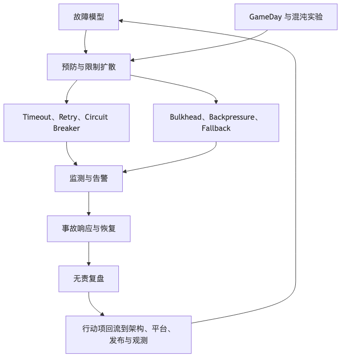

# 第 23 章：韧性工程、混沌工程与事故管理

## 本章的问题链

先看原始问题：复杂系统不可能永远不失败。真正要设计的不是“没有事故”，而是当依赖超时、区域故障、流量突增、配置错误或人员误操作发生时，失败会不会扩散，团队能不能恢复，组织会不会从事故中学习。

为了解决这个问题，本章把超时、重试、熔断、降级、隔离、背压、GameDay、Runbook、事故响应和 postmortem 放在同一个韧性循环里，说明系统如何在失败中保持核心价值。

但这不是终点：韧性工程不会因为本专栏到最后一章就结束。新的问题是：每次事故行动项都应该回流到需求、架构、平台、观测和发布系统里，推动下一轮系统设计演进。

所以本章会按“问题 -> 机制 -> 新问题”的顺序展开：先把眼前的工程压力说清楚，再看对应机制解决了什么，最后讨论它留下的边界和下一步。



## 1. 本章解决什么问题

可靠系统不是不会失败的系统，而是失败时能隔离、降级、恢复、学习的系统。

传统高可用思维容易把问题简化为“多买机器”“做主备”“上多活”。但真实故障往往来自更复杂的链路：

* 下游依赖变慢。
* 消息队列积压。
* 配置误发布。
* 数据库连接池耗尽。
* CDN 回源异常。
* DNS 解析错误。
* 证书过期。
* 第三方 API 限流。
* 客户端重试风暴。
* 某个新版本引发局部错误。
* 值班流程混乱，恢复时间被人为拉长。

混沌工程的官方原则将其描述为通过实验建立对系统抵御生产环境不稳定条件能力的信心；Netflix Chaos Monkey 的经典做法是随机终止生产实例，促使团队构建能承受实例丢失的服务。重点不是“破坏系统”，而是验证可靠性假设。([principlesofchaos.org][18])

---

## 2. 从小系统到大系统：为什么故障会被放大

小系统故障通常是局部的。大系统故障会通过依赖、重试、队列、缓存和人工流程被放大。

### 2.1 重试放大

```text
下游变慢
  |
上游超时
  |
客户端重试
  |
网关重试
  |
服务间重试
  |
下游收到更多请求
  |
更慢
```

没有退避、jitter、deadline 和幂等设计的重试，是事故放大器。

### 2.2 队列放大

```text
消费者失败
  |
消息积压
  |
延迟升高
  |
业务状态过期
  |
消费者恢复后集中处理
  |
下游数据库被打满
```

队列把同步失败变成异步积压，但不自动消灭压力。

### 2.3 人工流程放大

```text
告警触发
  |
没人知道 owner
  |
多人同时操作
  |
没有 Incident Commander
  |
沟通混乱
  |
错误回滚
  |
恢复时间拉长
```

事故管理流程也是系统可靠性的一部分。Google SRE 的事故管理资料强调，应有清晰流程、可行动的告警和面向症状的告警；postmortem 文化则强调事实、多个视角和避免归咎个人。([Google SRE][19])

---

## 3. 核心概念

### 3.1 故障模型

设计韧性前，先定义故障模型：

| 故障类型 | 示例                  |
| ---- | ------------------- |
| 实例故障 | Pod 崩溃、节点宕机         |
| 依赖故障 | 数据库慢、第三方 API 超时     |
| 网络故障 | 分区、丢包、DNS 异常        |
| 数据故障 | 脏数据、重复消息、Schema 不兼容 |
| 配置故障 | 错误开关、错误路由、错误限流      |
| 容量故障 | 突发流量、队列积压、连接池耗尽     |
| 人为故障 | 误操作、错误发布            |
| 区域故障 | AZ、Region、云服务异常     |
| 安全故障 | 凭证泄露、滥用、攻击流量        |

没有故障模型，所谓高可用只是口号。

### 3.2 降级、限流、熔断、隔离

| 策略       | 解决的问题         | 代价         |
| -------- | ------------- | ---------- |
| 降级       | 保核心功能，牺牲非核心体验 | 用户体验变差     |
| 限流       | 防止系统被打爆       | 拒绝部分请求     |
| 熔断       | 避免持续调用坏依赖     | 可能误伤恢复中的依赖 |
| 隔离       | 防止故障跨租户/服务扩散  | 资源利用率下降    |
| Bulkhead | 船舱式隔离资源池      | 容量规划复杂     |
| 排队       | 平滑峰值          | 增加延迟       |
| 丢弃       | 快速保护系统        | 业务损失       |
| 背压       | 让上游感知下游压力     | 调用方需配合     |
| 超时       | 避免无限等待        | 过短会误杀慢请求   |
| 重试       | 缓解短暂失败        | 可能放大故障     |

### 3.3 事故管理

事故管理不是事故后写报告，而是事故中组织人和信息的方式。基本角色包括：

| 角色                    | 责任        |
| --------------------- | --------- |
| Incident Commander    | 统一指挥，控制节奏 |
| Operations Lead       | 执行技术缓解    |
| Communications Lead   | 对内对外沟通    |
| Scribe                | 记录时间线和决策  |
| Subject Matter Expert | 提供领域判断    |

Google SRE 关于 on-call 的资料也强调，值班不只是响应告警，还应有时间完成后续工作，例如复盘和修复行动项。([Google SRE][20])

---

## 4. 韧性工程控制循环

```text
          +----------------------+
          |  设计故障模型        |
          +----------+-----------+
                     |
                     v
          +----------------------+
          |  定义降级与隔离策略  |
          +----------+-----------+
                     |
                     v
          +----------------------+
          |  建立可观测性和告警  |
          +----------+-----------+
                     |
                     v
          +----------------------+
          |  GameDay / 混沌实验  |
          +----------+-----------+
                     |
                     v
          +----------------------+
          |  事故响应与恢复      |
          +----------+-----------+
                     |
                     v
          +----------------------+
          |  Blameless Postmortem|
          +----------+-----------+
                     |
                     v
          +----------------------+
          |  行动项进入架构演进  |
          +----------------------+
```

这个循环的关键是：可靠性不是靠一次项目完成，而是在设计、测试、演练、事故、复盘之间持续改进。

---

## 5. 案例一：大促期间推荐服务故障的降级

### 5.1 背景

电商首页依赖推荐服务生成个性化商品列表。大促期间，推荐特征服务延迟升高，首页 p99 从 1.2 秒升到 8 秒，用户打开首页变慢，转化率下降。

原链路：

```text
用户打开首页
  |
  v
BFF
  |
  +--> 用户画像服务
  +--> 推荐服务
          |
          +--> 特征服务
          +--> 模型服务
          +--> 商品服务
  |
  v
返回首页
```

问题是：推荐链路被放在首页强依赖路径上。推荐慢，首页就慢。

### 5.2 降级设计

改进后的链路：

```text
用户打开首页
  |
  v
BFF
  |
  +--> 推荐服务，timeout 300ms
  |       |
  |       +-- 成功：个性化推荐
  |       |
  |       +-- 超时/熔断：
  |              读取缓存推荐
  |              或品类热榜
  |              或运营兜底位
  |
  v
返回首页
```

降级策略：

| 状态     | 返回内容             |
| ------ | ---------------- |
| 推荐正常   | 个性化推荐            |
| 推荐慢    | 缓存的上一次推荐         |
| 缓存缺失   | 品类热榜             |
| 热榜失败   | 运营配置兜底商品         |
| 商品服务异常 | 首页保留核心入口，不展示推荐模块 |

### 5.3 观测指标

* 首页 LCP / TTFB。
* 推荐服务 p95/p99。
* 推荐超时率。
* 降级命中率。
* 缓存兜底命中率。
* 首页点击率和转化率。
* 推荐依赖错误率。

### 5.4 复盘行动项

* 推荐从强依赖改为可降级依赖。
* 首页 BFF 增加 per-dependency timeout。
* 推荐结果异步预计算。
* 热榜缓存提前预热。
* 大促前 GameDay 演练推荐服务不可用。
* Feature Flag 支持一键关闭个性化推荐。

这个案例说明：降级不是事故中临时写 if else，而是产品、后端、前端、运营一起提前定义“坏了时用户看到什么”。

---

## 6. 案例二：消息队列积压事故处理

### 6.1 背景

订单创建后会发送 `order_created` 事件，多个消费者订阅：

```text
order-api
  |
  v
message queue: order_created
  |
  +--> inventory-consumer
  +--> coupon-consumer
  +--> notification-consumer
  +--> data-warehouse-consumer
```

一次发布后，`notification-consumer` 因为消息字段解析错误不断失败，消息进入重试队列。重试速度过快，队列积压持续上升，消息系统负载升高，影响其他消费者。

### 6.2 错误处理

错误做法：

* 盲目扩容所有消费者。
* 继续让 poison message 重试。
* 没有暂停非核心消费者。
* 没有识别是哪一类消息失败。
* 数据团队和业务团队同时操作队列。

结果：积压更大，下游通知服务被打满，数据库连接池耗尽。

### 6.3 改进处理流程

```text
发现积压
  |
  v
确认影响范围：哪个 topic、partition、consumer group
  |
  v
识别失败类型：poison message / 下游慢 / 消费者容量不足
  |
  +--> poison message:
  |       暂停重试 -> 转 DLQ -> 修复代码 -> 人工审计 -> 回放
  |
  +--> 下游慢:
  |       限速消费 -> 保护下游 -> 降级非核心消息
  |
  +--> 容量不足:
          扩容消费者 -> 检查分区数 -> 检查下游容量
```

### 6.4 恢复原则

* 先止血，再追根因。
* 不要让坏消息无限重试。
* 非核心消费者可以暂停。
* 消费速率不能超过下游承载能力。
* 回放前要验证幂等。
* DLQ 必须有人工修复流程。
* 事故时间线必须记录每次操作。

---

## 7. 事故响应流程模板

```text
1. Detect
   - 告警触发或用户反馈
   - 判断是否真实用户影响

2. Declare
   - 宣告事故
   - 定级
   - 创建事故频道
   - 指定 Incident Commander

3. Stabilize
   - 停止高风险发布
   - 冻结相关变更
   - 启用降级、熔断、限流

4. Investigate
   - 建立时间线
   - 查看最近变更
   - 分析指标、日志、Trace
   - 确认影响范围

5. Mitigate
   - 回滚、前滚、切流、降级
   - 隔离坏依赖
   - 扩容或限流

6. Communicate
   - 对内同步状态
   - 对外更新用户影响
   - 客服和业务团队同步口径

7. Recover
   - 验证核心 SLI 恢复
   - 关闭临时策略
   - 观察一段时间

8. Close
   - 宣布事故结束
   - 进入 postmortem

9. Learn
   - 整理根因和贡献因素
   - 生成行动项
   - 跟踪完成
```

事故中最忌讳的是多人同时操作而没有统一指挥。Incident Commander 不一定是最懂技术的人，但必须负责节奏、决策和沟通。

---

## 8. Runbook 模板

```text
# 服务名称

## 1. 服务简介
- 功能：
- Owner：
- On-call：
- 依赖：

## 2. 关键指标
- SLO：
- Dashboard：
- Alert：

## 3. 常见症状
- 错误率升高：
- 延迟升高：
- 队列积压：
- 依赖超时：

## 4. 第一轮检查
- 最近发布：
- 配置变更：
- 下游状态：
- 区域影响：
- 特定租户影响：

## 5. 缓解手段
- 关闭 Feature Flag：
- 启用降级：
- 切换依赖：
- 限流：
- 扩容：
- 回滚：
- 前滚：

## 6. 安全边界
- 哪些操作可以直接执行：
- 哪些操作需要审批：
- 哪些操作不可逆：

## 7. 验证恢复
- 技术指标：
- 业务指标：
- 用户影响：

## 8. 升级路径
- 一线：
- 服务 owner：
- 数据库：
- 平台：
- 安全：
- 业务负责人：

## 9. 已知陷阱
- 不要重复执行的操作：
- 可能造成数据损坏的操作：
- 历史事故链接：
```

Runbook 的价值在于事故中降低认知负担，而不是写给审计看的文档。

---

## 9. 混沌工程和 GameDay 如何落地

混沌工程不是随机在线上搞破坏。一次合格实验至少要定义：

| 项目   | 内容                     |
| ---- | ---------------------- |
| 假设   | 如果推荐服务不可用，首页仍能 1 秒内返回  |
| 范围   | 仅影响预发或生产 1% 流量         |
| 时间   | 非大促、非发布窗口              |
| 观测   | 首页延迟、错误率、降级命中率         |
| 停止条件 | 错误率超过阈值立即终止            |
| 回滚   | 恢复依赖、关闭故障注入            |
| 负责人  | 实验 owner、平台值班、业务 owner |
| 记录   | 实验结果和行动项               |

GameDay 更偏组织演练：让开发、SRE、平台、客服、产品一起模拟事故，验证告警、Runbook、沟通和决策链路。

适合演练的场景：

* 单实例崩溃。
* 一个可用区不可用。
* 下游 API 延迟增加。
* 消息队列积压。
* 缓存不可用。
* 数据库读副本延迟。
* DNS 配置错误。
* 证书即将过期。
* Feature Flag 误开启。
* 第三方支付失败。

不适合一开始就演练的场景：

* 可能造成数据损坏。
* 没有监控。
* 没有停止条件。
* 没有 owner。
* 影响全量用户。
* 团队第一次做混沌实验就直接上生产大范围故障。

---

## 10. 韧性设计 Checklist

* 是否定义核心链路和非核心链路？
* 每个下游依赖是否有 timeout？
* timeout 是否小于上游 deadline？
* 重试是否有退避、jitter 和最大次数？
* 写请求是否幂等？
* 是否有熔断和降级策略？
* 降级内容是否由产品和运营确认？
* 是否区分 fail-open 和 fail-closed？
* 是否有 Bulkhead 隔离资源池？
* 队列是否有积压告警、DLQ 和回放流程？
* 是否能按租户、区域、功能隔离故障？
* 是否有事故分级和响应流程？
* 是否有 Runbook？
* 是否定期 GameDay？
* 是否把 postmortem 行动项进入排期？
* 是否使用错误预算约束发布节奏？
* 是否避免把所有降级逻辑放在事故中人工判断？

---

## 11. 常见误区

**误区一：高可用就是多部署几台机器。**
多实例只能解决部分实例故障，不能解决坏配置、坏数据、坏依赖和重试风暴。

**误区二：混沌工程就是破坏生产。**
混沌实验是验证假设，必须有范围、监控、停止条件和恢复方案。

**误区三：降级可以事故中再想。**
事故中临时想出来的降级通常没有产品语义，也没有验证。

**误区四：postmortem 是追责会议。**
复盘要关注系统和流程如何允许事故发生，而不是找一个人背锅。

**误区五：On-call 只是接电话。**
值班连接了系统设计、告警质量、Runbook、恢复能力和团队健康。

---

## 12. 本章小结

韧性工程关注的是系统面对失败时的行为。限流、熔断、降级、隔离、背压、超时、重试只是手段；真正重要的是提前定义故障模型、设计可降级链路、建立可观测性、演练假设、规范事故响应，并通过无责复盘持续改进。可靠系统不是不会失败，而是失败时不会无限扩散，能够被发现、被隔离、被恢复、被学习。

---

## 13. 本章最重要的 5 个判断

1. **高可用不是买更多机器，而是控制故障传播。**
2. **降级策略必须提前设计，并且要有产品语义。**
3. **重试、队列和缓存既能提升韧性，也能放大事故。**
4. **混沌工程的目标是验证假设，不是制造混乱。**
5. **事故复盘的最终产物不是报告，而是可追踪的架构改进。**

---

# 第五篇总结：云原生与平台工程的共同主线

这一篇的五章看起来覆盖不同主题：容器、Kubernetes、发布、平台、可观测性、韧性。但它们其实在回答同一个问题：

**现代工程组织如何让变化安全进入生产，让故障快速被发现和恢复，让复杂系统在长期演进中仍然可控？**

可以把本篇压缩成五个核心判断：

1. **运行时平台解决“系统如何被一致地运行”，但不替代应用可靠性设计。**
2. **发布系统解决“变化如何安全进入生产”，比部署工具本身更重要。**
3. **内部开发者平台解决“组织如何规模化交付”，核心是 Golden Path 和自服务治理。**
4. **可观测性解决“未知故障如何被解释”，不是日志指标 Trace 的工具堆叠。**
5. **韧性工程解决“失败如何被隔离、恢复和学习”，可靠性是一套持续循环。**

[1]: https://kubernetes.io/ "Kubernetes"
[2]: https://kubernetes.io/docs/concepts/configuration/manage-resources-containers/ "Resource Management for Pods and Containers | Kubernetes"
[3]: https://kubernetes.io/docs/concepts/workloads/controllers/deployment/ "Deployments | Kubernetes"
[4]: https://kubernetes.io/docs/concepts/workloads/pods/pod-lifecycle/ "Pod Lifecycle | Kubernetes"
[5]: https://openfeature.dev/docs/reference/intro/ "Introduction | OpenFeature"
[6]: https://flagger.app/ "Flagger"
[7]: https://tag-app-delivery.cncf.io/whitepapers/platforms/ "CNCF Platforms White Paper | CNCF TAG App Delivery"
[8]: https://backstage.io/docs/overview/what-is-backstage/ "What is Backstage? | Backstage Software Catalog and Developer Platform"
[9]: https://developer.hashicorp.com/terraform/intro "What is Terraform | Terraform | HashiCorp Developer"
[10]: https://opengitops.dev/ "Home | OpenGitOps"
[11]: https://opentelemetry.io/docs/what-is-opentelemetry/ "What is OpenTelemetry? | OpenTelemetry"
[12]: https://prometheus.io/docs/concepts/data_model/ "Data model | Prometheus"
[13]: https://www.w3.org/TR/baggage/ "Propagation format for distributed context: Baggage"
[14]: https://sre.google/sre-book/monitoring-distributed-systems/ "Google SRE monitoring ditributed system - sre golden signals"
[15]: https://sre.google/workbook/alerting-on-slos/ "Google SRE - Prometheus Alerting: Turn SLOs into Alerts"
[16]: https://opentelemetry.io/docs/concepts/signals/profiles/ "Profiles"
[17]: https://ebpf.io/ "eBPF - Introduction, Tutorials & Community Resources"
[18]: https://principlesofchaos.org/ "Principles of chaos engineering"
[19]: https://sre.google/resources/practices-and-processes/incident-management-guide/ "Learn sre incident management and response"
[20]: https://sre.google/sre-book/being-on-call/ "On Call Engineer Best Practices for IT Services"
