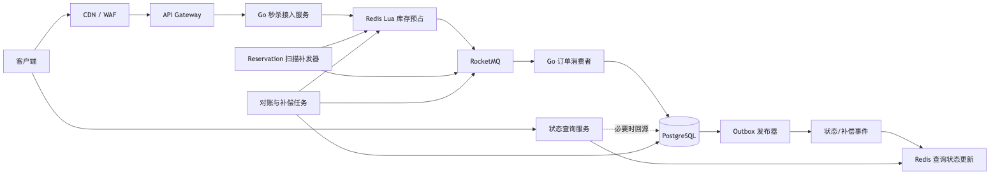
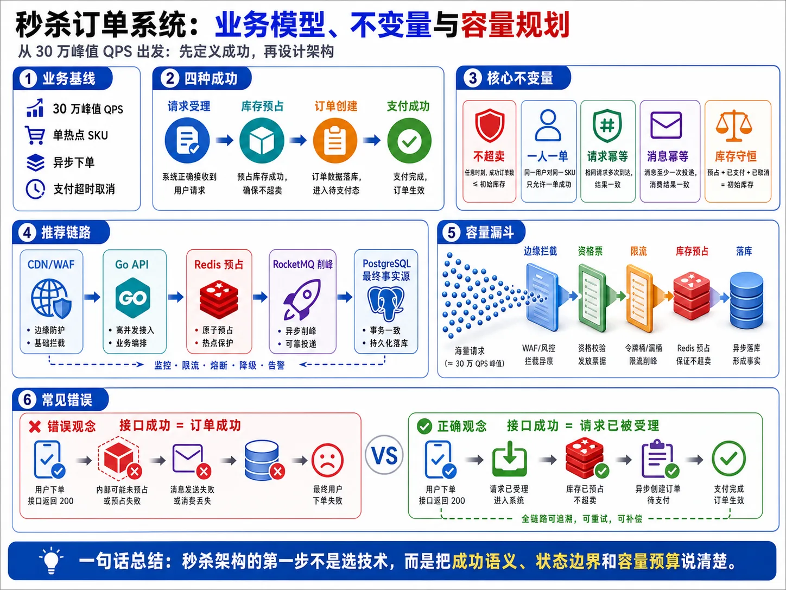
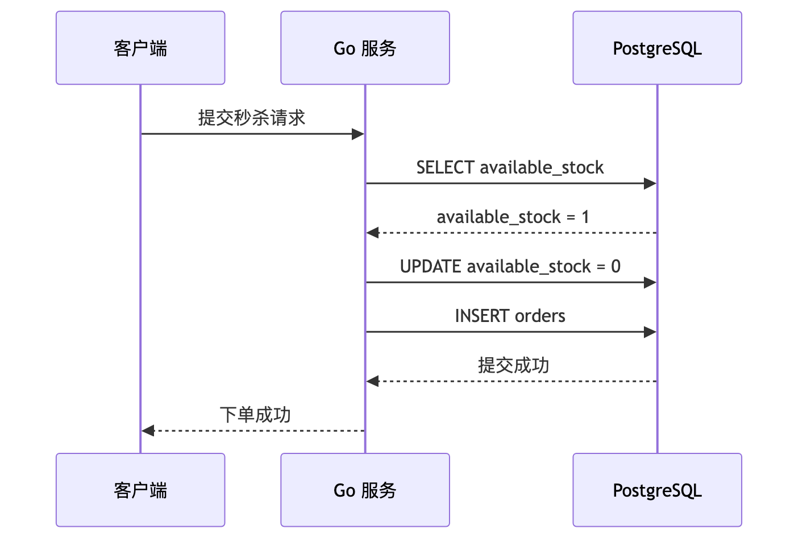
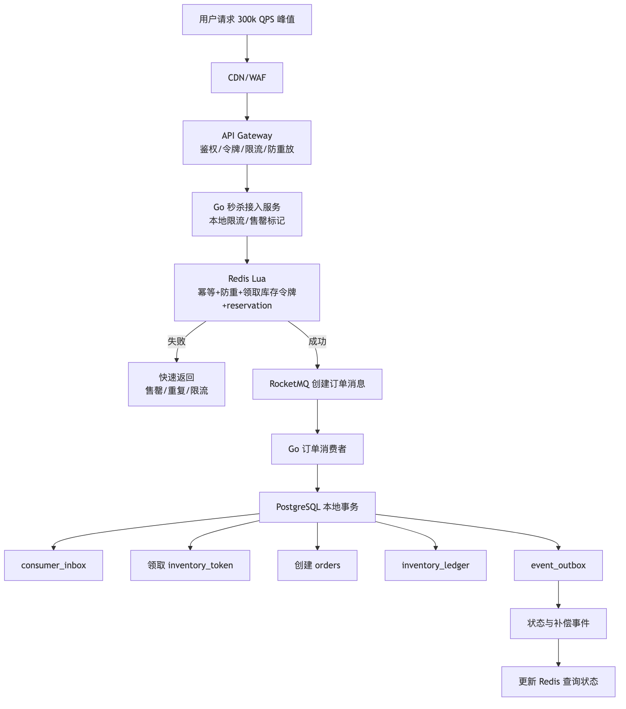
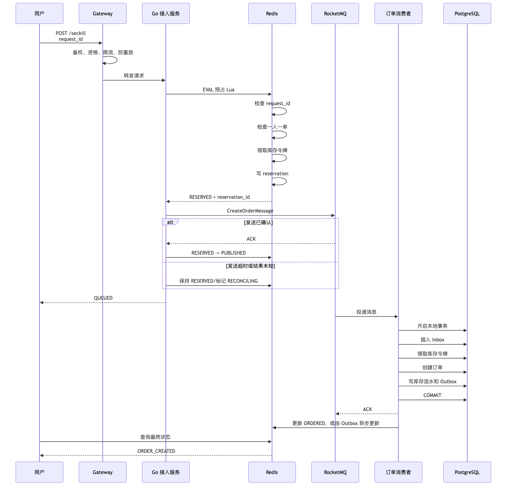
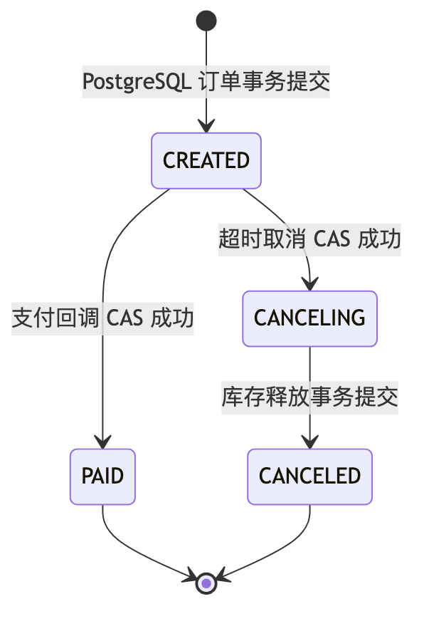
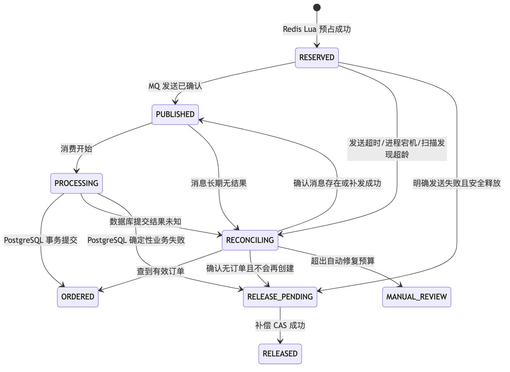
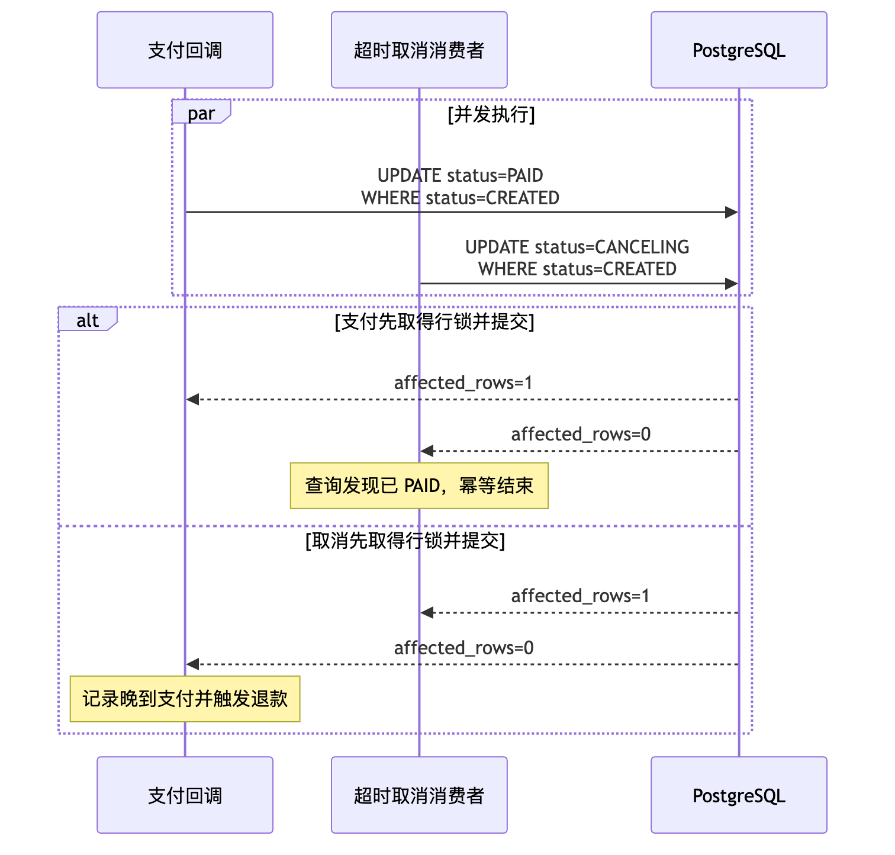

# 《高并发秒杀订单系统架构设计与实战》

## 全书统一架构约定

本书统一采用以下主链路：



统一约定如下：

| 项目                 | 约定                                                      |
| ------------------ | ------------------------------------------------------- |
| 请求热路径              | 网关治理 → Go 接入服务 → Redis Lua 预占 → RocketMQ 发送尝试 → 返回“排队中” |
| 订单创建               | RocketMQ 消费者异步创建 PostgreSQL 订单                          |
| Redis 定位           | 高性能过滤、预占、短期状态存储，不是订单最终事实来源                              |
| PostgreSQL 定位      | 订单、支付、库存令牌、流水、Inbox、Outbox 的最终事实来源                      |
| MQ 语义              | At-Least-Once，允许重复投递，消费者必须幂等                            |
| 最终库存防线             | PostgreSQL 库存令牌或等价的条件更新                                 |
| 一人一单防线             | Redis 前置防重，PostgreSQL 唯一约束最终兜底                          |
| Redis 到 MQ 缺口      | reservation 状态、稳定业务消息 ID、发送重试、扫描补发、对账                   |
| MQ 到 PostgreSQL    | Inbox、唯一约束、本地事务、提交成功后 ACK                               |
| PostgreSQL 到 Redis | Outbox 事件、重复投递、Redis 条件状态迁移                             |
| 故障策略               | 正确性优先，库存链路默认 Fail Closed                                |
| 部署模型               | 至少三个可用区，无状态 Go 服务跨可用区部署                                 |

Redis Lua 可以保证**脚本在单个 Redis 执行上下文内原子执行**，但它不能覆盖 Redis、RocketMQ 和 PostgreSQL 之间的事务；长脚本还会阻塞其他 Redis 活动，因此脚本必须保持固定复杂度。([Redis][1])

RocketMQ 的可靠投递应按 At-Least-Once 理解。官方文档明确要求业务消费逻辑幂等，并指出消息重复无法由 RocketMQ 完全避免。([RocketMQ][2])

---

## 全书目录

1. 业务模型、系统不变量与容量规划
2. 秒杀订单整体架构设计与技术选型
3. 接入层流量治理与系统保护
4. Redis 库存预占、高并发优化与高可用
5. RocketMQ 削峰、可靠消息与积压治理
6. PostgreSQL 数据模型、事务、性能优化与高可用
7. Go 高并发服务工程实践
8. 分布式一致性、幂等、补偿与对账
9. 系统高可用、容灾、降级与可观测性
10. 压测、混沌工程、容量验证与面试表达
11. 秒杀订单系统面试高频问题与参考答案

---

# 第 1 章：业务模型、系统不变量与容量规划



> 图注：本章全文重点总结图，按业务基线、四种成功、核心不变量、推荐链路、容量漏斗和常见错误串联秒杀系统的第一层设计框架。

## 1. 本章目标

本章解决四类基础问题：

1. **定义业务语义**：秒杀请求受理、Redis 库存预占、订单创建、支付成功分别意味着什么。
2. **建立系统不变量**：不超卖、一人一单、请求幂等、消息幂等、补偿幂等如何形式化。
3. **建立统一状态机**：订单和 reservation 可以怎样迁移，哪些迁移绝对禁止。
4. **建立容量基线**：30 万峰值 QPS 下，Go、Redis、RocketMQ、PostgreSQL 分别承担什么量级的压力。

本章最重要的结论是：

> **秒杀系统首先是一个正确性系统，其次才是一个高性能系统。入口 QPS 可以被限流和拒绝，但库存、订单和支付状态不能通过概率正确。**

---

## 2. 业务背景

### 2.1 统一业务基线

本书使用以下场景：

* 100 万用户在 10 秒内发起秒杀请求。
* 平均入口流量为 10 万 QPS。
* 瞬时峰值约为 30 万 QPS。
* 一个活动包含多个 SKU。
* 单个热点 SKU 库存为 10,000 件。
* 同一用户针对同一个活动 SKU 最多购买一次。
* 秒杀请求接口 P99 小于 100ms。
* 订单异步创建。
* 99.9% 的有效订单在 3 秒内完成创建。
* 系统部署在至少三个可用区。
* 单个服务实例或单个可用区故障不能破坏系统正确性。

### 2.2 四种“成功”必须严格区分

| 阶段     | 准确定义                          | 可以对用户表达什么  | 不能表达什么      |
| ------ | ----------------------------- | ---------- | ----------- |
| 请求受理成功 | 网关和 Go 服务接受了请求                | 请求已受理或正在处理 | 不能表示已获得库存   |
| 库存预占成功 | Redis 原子扣减可售库存并创建 reservation | 已进入排队流程    | 不能表示订单已创建   |
| 订单创建成功 | PostgreSQL 本地事务已提交订单、库存令牌和流水  | 下单成功，待支付   | 不能表示支付成功    |
| 支付成功   | 支付结果已可靠落库，订单状态已迁移为 `PAID`     | 交易支付完成     | 不能直接等同于履约完成 |

因此，Redis Lua 返回成功后，接入服务的推荐响应是：

```json
{
  "code": "QUEUED",
  "request_id": "req_01...",
  "reservation_id": "rsv_01...",
  "message": "请求已进入排队处理"
}
```

而不是：

```json
{
  "code": "SUCCESS",
  "message": "下单成功"
}
```

### 2.3 本书对“秒杀成功”的定义

“秒杀成功”容易产生歧义，本书不在内部状态中使用这个模糊词，而使用以下精确表述：

* **预占成功**：`reservation.status = RESERVED` 或后续非终态。
* **下单成功**：`order.status = CREATED`。
* **支付成功**：`order.status = PAID`。
* **交易完成**：支付、履约等后续业务完成，本书不展开履约系统。

---

## 3. 统一术语与标识定义

### 3.1 业务标识

| 标识                    | 含义                   | 生成方       | 幂等或唯一性要求                   |
| --------------------- | -------------------- | --------- | -------------------------- |
| `activity_id`         | 秒杀活动 ID              | 活动系统      | 全局唯一                       |
| `sku_id`              | 商品 SKU ID            | 商品系统      | 全局唯一                       |
| `user_id`             | 用户 ID                | 用户系统      | 全局唯一                       |
| `request_id`          | 一次购买意图的客户端幂等 ID      | 客户端或网关    | 同一重试必须复用                   |
| `reservation_id`      | 一次 Redis 库存预占 ID     | Go 接入服务   | 全局唯一                       |
| `message_id`          | 业务消息唯一 ID            | 生产者       | 同一次业务发送重试保持不变              |
| `order_id`            | 订单 ID                | 订单服务      | 全局唯一                       |
| `payment_id`          | 支付记录 ID              | 支付系统或订单系统 | 全局唯一                       |
| `inventory_token_id`  | PostgreSQL 最终库存令牌 ID | 库存初始化任务   | 一个令牌最多绑定一个有效订单             |
| `compensation_id`     | 补偿操作幂等 ID            | 补偿发起方     | 建议由 reservation 和动作类型确定性生成 |
| `request_fingerprint` | 请求业务参数摘要             | Go 接入服务   | 防止同一 request_id 被用于不同请求    |
| `trace_id`            | 分布式链路追踪 ID           | 网关        | 贯穿全链路                      |

`message_id` 是本系统生成的**业务消息 ID**，不能仅依赖 Broker 返回的内部消息 ID。应用主动重发时，Broker 层消息 ID 可能变化，而 `reservation_id` 和业务 `message_id` 必须保持稳定。

### 3.2 核心术语

| 术语          | 定义                                         |
| ----------- | ------------------------------------------ |
| 有效订单        | 尚占用库存的订单，本书包括 `CREATED`、`PAID`、`CANCELING` |
| 终态          | 不允许再向其他业务状态迁移的状态                           |
| 幂等          | 同一业务操作执行一次或多次，最终业务效果相同                     |
| CAS         | Compare-And-Set，通过条件更新保证状态仅从预期旧值迁移         |
| Inbox       | 消费者在本地数据库记录已处理消息，防止重复产生业务效果                |
| Outbox      | 业务事务内写入待发布事件，由独立发布器可靠发送                    |
| 补偿          | 对跨系统部分成功状态执行反向或修正操作                        |
| 对账          | 比较不同事实表、流水和缓存状态，发现并修复不一致                   |
| 收敛          | 暂时不一致的数据最终进入确定的成功、失败或人工处理状态                |
| Fail Closed | 依赖故障时拒绝新请求，避免绕过正确性控制                       |
| Fail Open   | 依赖故障时仍放行请求，通常提高可用性但可能牺牲控制能力                |
| SLI         | 实际测量的服务质量指标                                |
| SLO         | 对 SLI 设置的目标                                |
| RTO         | 故障发生后允许的最大恢复时间                             |
| RPO         | 故障发生时允许丢失的数据时间窗口                           |

---

## 4. 核心问题

本章必须回答以下问题：

1. 30 万 QPS 是否都应该进入 PostgreSQL？
2. Redis 扣减成功后，为什么还可能下单失败？
3. 一人一单应由 Redis 还是 PostgreSQL 保证？
4. 相同请求超时重试时，如何避免重复扣减？
5. MQ 消息重复后，如何避免重复创建订单？
6. 支付回调和超时取消并发时，谁应该获胜？
7. Redis 预占后进程宕机，reservation 如何恢复？
8. 最大 MQ 积压量如何计算？
9. 单个可用区故障后，还剩多少处理能力？
10. 哪些目标属于可用性 SLO，哪些属于不可妥协的安全不变量？

---

## 5. 未优化的基线方案

最简单的实现通常是同步访问 PostgreSQL：



典型伪代码如下：

```go
// 错误示例：仅用于说明未优化基线。
stock, err := repo.QueryStock(ctx, activityID, skuID)
if err != nil {
    return err
}

if stock <= 0 {
    return ErrSoldOut
}

if err := repo.DecreaseStock(ctx, activityID, skuID); err != nil {
    return err
}

return repo.CreateOrder(ctx, activityID, skuID, userID)
```

---

## 6. 基线方案的问题

| 维度   | 问题                                             |
| ---- | ---------------------------------------------- |
| 正确性  | 两个事务可能同时读取到库存大于 0，随后分别扣减，造成超卖                  |
| 幂等   | 客户端超时后重试会再次执行扣库存和创建订单                          |
| 性能   | 30 万 QPS 直接打到 PostgreSQL，连接池、CPU、锁、WAL 和磁盘都会过载 |
| 并发   | 单个 SKU 库存行成为极端热点，事务大量等待同一行锁                    |
| 可用性  | PostgreSQL 短暂抖动会直接转化为入口请求失败                    |
| 扩展性  | 增加 Go 实例只会进一步放大对数据库的并发压力                       |
| 可运维性 | 没有排队状态、消息积压、reservation 或补偿状态，故障难以解释和恢复        |

即使把代码改成条件更新：

```sql
UPDATE sku_inventory
SET available_stock = available_stock - 1
WHERE activity_id = $1
  AND sku_id = $2
  AND available_stock > 0;
```

它可以解决负库存问题，但依然无法让一个热点库存行承受 30 万 QPS，也无法解决请求重试、异步削峰、跨组件恢复等问题。

---

## 7. 推荐架构

### 7.1 推荐方案

本书采用：

> **多级入口治理 + Redis 原子预占 + RocketMQ 异步削峰 + PostgreSQL 库存令牌最终防线 + Inbox/Outbox + 补偿与对账。**



### 7.2 为什么使用 PostgreSQL 库存令牌

单热点 SKU 的一条库存记录会形成数据库行锁热点。本书默认将 10,000 件库存预生成成 10,000 个有限库存令牌：

```text
inventory_token_id = token_000001 ... token_010000
```

每个成功订单必须在 PostgreSQL 中成功领取一个未使用令牌。由于令牌总数有限，且每个令牌只能被一个 reservation 使用，因此：

```text
有效订单数 ≤ 成功消费的库存令牌数 ≤ 初始库存数
```

`sku_inventory` 仍保存总量、聚合可用量等数据，但最终防超卖证明来自：

* 有限令牌集合；
* `inventory_token_id` 唯一约束；
* `reservation_id` 唯一约束；
* 订单创建和令牌领取处于同一 PostgreSQL 事务。

后续章节将比较单行条件更新、库存分桶和库存令牌三种方案。

### 7.3 组件职责

| 组件          | 核心职责                           | 不负责什么               |
| ----------- | ------------------------------ | ------------------- |
| API Gateway | 鉴权、资格令牌、多维限流、防重放、系统保护          | 不判断最终库存             |
| Go 接入服务     | 参数校验、request_id 校验、调用 Lua、发送消息 | 不创建最终订单             |
| Redis       | 热数据、幂等映射、用户防重、库存预占、短期查询状态      | 不是订单最终事实来源          |
| RocketMQ    | 削峰、异步处理、重试、延迟事件、回放             | 不提供端到端 Exactly Once |
| PostgreSQL  | 库存令牌、订单、支付、Inbox、Outbox、流水     | 不承担 30 万 QPS 的入口过滤  |
| 扫描补发器       | 修复 Redis 预占后未确认发布的 reservation | 不直接绕过幂等创建订单         |
| 对账任务        | 发现长期不一致并执行自动或人工修复              | 不替代在线正确性约束          |

### 7.4 事务边界与故障边界

| 边界                    | 保证                                          |
| --------------------- | ------------------------------------------- |
| Redis Lua 内部          | request_id 检查、用户防重、领取令牌、创建 reservation 原子完成 |
| Redis → RocketMQ      | 不具备原子事务，需要扫描补发和幂等发送                         |
| RocketMQ → PostgreSQL | At-Least-Once，通过 Inbox 和业务唯一键去重             |
| PostgreSQL 本地事务       | 领取令牌、创建订单、库存流水、Inbox、Outbox 同时提交或回滚         |
| PostgreSQL → Redis    | 最终一致，通过 Outbox 重试更新                         |
| 支付系统 → PostgreSQL     | 回调可重复，通过 payment_id 和订单状态 CAS 幂等处理          |

PostgreSQL 的多列唯一约束可以直接保证列组合在表内唯一，并由唯一索引执行约束，因此数据库唯一约束应当作为一人一单和业务幂等的最终防线。([PostgreSQL][3])

---

## 8. 核心流程

### 8.1 正常流程



### 8.2 重复请求流程

相同 `request_id` 重复提交时：

1. Redis Lua 读取已有 request 映射。
2. 校验本次请求的 `request_fingerprint`。
3. fingerprint 相同，返回第一次调用对应的 reservation 和结果。
4. fingerprint 不同，返回 `IDEMPOTENCY_CONFLICT`。
5. 不再领取库存令牌，不再创建新 reservation。

```text
request_id 相同 + 参数相同 = 幂等重放
request_id 相同 + 参数不同 = 调用方错误或攻击
```

此外，用户即使换了新的 `request_id`，Redis 用户标记和 PostgreSQL 唯一约束仍会阻止重复购买。

### 8.3 客户端超时流程

客户端在收到响应前超时，不代表服务端操作失败。

正确处理方式：

* 客户端必须使用相同 `request_id` 重试。
* 服务端返回原 reservation 状态。
* 客户端不能因为超时而生成新的 request_id。
* 服务端不能因为 HTTP 连接断开就盲目补回库存。

HTTP 超时只表示调用方不知道结果，不表示业务事务已经回滚。

### 8.4 MQ 发送超时与重试

发送超时存在三种可能：

1. Broker 未收到消息。
2. Broker 已收到但 ACK 丢失。
3. Broker 已持久化，生产者连接在收到结果前中断。

因此不能在发送超时后立即补偿 Redis 库存。推荐处理是：

* 继续保持 reservation 为 `RESERVED` 或迁移为 `RECONCILING`。
* 使用同一个 `message_id` 和 `reservation_id`重发。
* 即使出现重复消息，消费者 Inbox 也只能产生一次业务效果。
* 扫描器根据 reservation 年龄和状态持续补发。

### 8.5 进程宕机恢复流程

若 Go 服务在 Redis 预占后、发送 MQ 前宕机：

1. reservation 保留在 Redis。
2. 扫描器查找长时间处于 `RESERVED` 的记录。
3. 扫描器取得短租约，避免多个实例同时补发。
4. 使用 reservation 中保存的业务参数重建消息。
5. 使用原 `message_id` 发送。
6. 发送确认后条件更新为 `PUBLISHED`。
7. 如果发送结果未知，继续由幂等机制处理。

不能使用“超过 5 秒就直接补库存”的简单策略，因为原消息可能已经成功发送，只是状态更新失败。

### 8.6 降级流程

| 故障               | 默认行为                                         |
| ---------------- | -------------------------------------------- |
| Redis 不可用        | Fail Closed，拒绝新的秒杀预占                         |
| RocketMQ 短暂异常    | 有界发送重试；reservation 留待扫描补发                    |
| RocketMQ 长时间异常   | 停止新的库存预占，避免大量库存长期悬挂                          |
| PostgreSQL 短暂异常  | 消费失败并由 MQ 重试，允许有限积压                          |
| PostgreSQL 长时间异常 | 根据最老消息年龄和积压量逐级限流，最终停止新预占                     |
| 查询 Redis 异常      | 已知 order_id 可回源 PostgreSQL；不得将“查不到”解释为可以重新下单 |
| 单个 Go 实例故障       | 网关摘除，其他实例继续工作                                |
| 单可用区故障           | 流量切到剩余两个可用区，仍须保留目标峰值处理能力                     |

---

## 9. 数据结构与状态机

### 9.1 订单状态定义

本书采用尽量简洁的订单状态：

| 状态          | 含义            | 是否占用 PostgreSQL 库存 |
| ----------- | ------------- | -----------------: |
| `CREATED`   | 订单已创建，等待支付    |                  是 |
| `PAID`      | 支付成功          |                  是 |
| `CANCELING` | 已取得取消权，正在释放库存 |                  是 |
| `CANCELED`  | 取消完成，数据库库存已释放 |                  否 |

支付尝试过程由 `payment_record.status` 表示，避免在订单状态中引入容易回退的 `PAYING → CREATED`。

### 9.2 订单状态机



禁止迁移：

```text
PAID -> CANCELING
PAID -> CANCELED
CANCELED -> CREATED
CANCELED -> PAID
```

如果订单取消后收到支付渠道的成功通知：

* 订单保持 `CANCELED`。
* 支付记录标记为“取消后支付成功”。
* 写入退款 Outbox。
* 进入退款流程。
* 绝不能把订单从 `CANCELED` 改回 `PAID`。

### 9.3 Reservation 状态定义

| 状态                | 含义                  | 是否终态 |
| ----------------- | ------------------- | ---: |
| `RESERVED`        | Redis 已预占，MQ 发送尚未确认 |    否 |
| `PUBLISHED`       | 生产者已收到 MQ 发送成功结果    |    否 |
| `PROCESSING`      | 消费者正在处理，仅作为可观测状态    |    否 |
| `RECONCILING`     | 发送或提交结果不确定，等待核对     |    否 |
| `ORDERED`         | PostgreSQL 订单已创建    |    是 |
| `RELEASE_PENDING` | 已确认不能创建订单，等待补偿      |    否 |
| `RELEASED`        | 补偿完成，库存已释放          |    是 |
| `MANUAL_REVIEW`   | 自动修复超过预算，需要人工处置     |    否 |

`expires_at` 是 reservation 的时间属性，不是可以直接释放库存的充分条件。

### 9.4 Reservation 状态机



### 9.5 支付与超时取消竞态

支付回调和超时取消必须竞争同一个 PostgreSQL 订单行。



核心不是“先查询当前状态”，而是让两个动作都使用带旧状态条件的 UPDATE：

```sql
-- 支付获得状态迁移权
UPDATE orders
SET status = 'PAID',
    paid_at = now(),
    updated_at = now(),
    version = version + 1
WHERE order_id = $1
  AND status = 'CREATED';

-- 超时取消获得状态迁移权
UPDATE orders
SET status = 'CANCELING',
    updated_at = now(),
    version = version + 1
WHERE order_id = $1
  AND status = 'CREATED';
```

两条语句并发时，最多一条返回 `affected_rows = 1`。

---

## 10. 核心业务不变量

### 10.1 一人一单

本书采用比“最多一个有效订单”更严格的策略：

> 同一 `activity_id + sku_id + user_id` 在整个活动周期内最多存在一条订单记录，取消后默认不能重新抢购。

数据库约束：

```sql
ALTER TABLE orders
ADD CONSTRAINT uq_orders_activity_sku_user
UNIQUE (activity_id, sku_id, user_id);
```

Redis 用户标记只是前置过滤，不能替代此约束。

### 10.2 不超卖

对于库存为 10,000 的热点 SKU：

```text
有效订单数量 ≤ 已消费库存令牌数量 ≤ 10,000
```

每个订单创建事务必须满足：

1. `inventory_token_id` 存在。
2. 令牌状态为 `AVAILABLE` 或已经绑定当前 reservation。
3. 令牌只能绑定一个 `reservation_id`。
4. 令牌领取和订单创建处于同一个事务。
5. 订单取消后，令牌通过条件迁移释放。

### 10.3 请求幂等

相同 `request_id`：

* 不重复领取 Redis 库存令牌。
* 不创建新的 reservation。
* 不生成新的业务操作。
* 返回第一次请求关联的状态。

必要约束：

```text
request_id -> 唯一 reservation_id
request_id -> 固定 request_fingerprint
```

### 10.4 消息幂等

消费者需要同时防御：

* 同一个 `message_id` 重复投递；
* 同一个 reservation 因业务补发而出现不同 Broker 消息记录；
* 数据库提交后 ACK 前宕机造成的再次投递。

因此至少需要：

```text
UNIQUE (consumer_group, message_id)
UNIQUE (reservation_id)
UNIQUE (inventory_token_id)
```

Inbox 插入与业务处理必须处于同一事务。

### 10.5 补偿幂等

每种补偿动作生成确定性 ID：

```text
compensation_id =
    hash(reservation_id + compensation_type + schema_version)
```

库存补偿必须满足：

```text
RELEASE_PENDING -> RELEASED
```

而不能执行：

```text
任意状态 -> INCR Redis 库存
```

重复补偿消息只能得到：

* 第一次：状态迁移成功并补回库存；
* 后续重复：发现已 `RELEASED`，直接幂等成功。

### 10.6 状态单向迁移

所有状态变化必须使用：

* 条件 UPDATE；
* 版本号；
* 唯一约束；
* Redis Lua 中的旧状态判断；
* 或等价 CAS。

禁止：

```text
SELECT status
应用层判断
UPDATE status = 新状态，不检查旧状态
```

### 10.7 库存守恒

逻辑库存分区定义为：

```text
S0 = A + R + O + C + E
```

其中：

* `S0`：初始库存令牌数。
* `A`：Redis 中仍可售的令牌数。
* `R`：已 reservation、尚未形成订单的令牌数。
* `O`：由有效订单占用的令牌数。
* `C`：订单已取消但释放流程尚未完成的令牌数。
* `E`：异常待处理令牌数。

正常稳定状态应满足：

```text
E = 0
S0 = A + R + O + C
```

活动结束且所有流程收敛后：

```text
R = 0
C = 0
E = 0
S0 = A + O
```

### 10.8 业务效果仅发生一次

系统不宣称端到端 Exactly Once，而是组合使用：

* At-Least-Once 消息；
* request_id；
* message_id；
* reservation_id；
* 数据库唯一约束；
* Inbox；
* Outbox；
* 条件状态迁移；
* 补偿和对账；

最终实现：

> **消息可能执行多次，但扣减库存、创建订单、记录支付、补偿库存等业务效果最多发生一次。**

---

## 11. 核心代码骨架

### 11.1 Go 领域对象

```go
package domain

import "time"

type ReservationStatus string

const (
	ReservationReserved       ReservationStatus = "RESERVED"
	ReservationPublished      ReservationStatus = "PUBLISHED"
	ReservationProcessing     ReservationStatus = "PROCESSING"
	ReservationReconciling    ReservationStatus = "RECONCILING"
	ReservationOrdered        ReservationStatus = "ORDERED"
	ReservationReleasePending ReservationStatus = "RELEASE_PENDING"
	ReservationReleased       ReservationStatus = "RELEASED"
	ReservationManualReview   ReservationStatus = "MANUAL_REVIEW"
)

type OrderStatus string

const (
	OrderCreated   OrderStatus = "CREATED"
	OrderPaid      OrderStatus = "PAID"
	OrderCanceling OrderStatus = "CANCELING"
	OrderCanceled  OrderStatus = "CANCELED"
)

type SeckillRequest struct {
	ActivityID string `json:"activity_id"`
	SKUID      string `json:"sku_id"`
	UserID     string `json:"user_id"`
	RequestID  string `json:"request_id"`
}

type Reservation struct {
	ReservationID   string
	RequestID       string
	RequestFingerprint string
	ActivityID      string
	SKUID           string
	UserID          string
	InventoryTokenID string
	MessageID       string
	Status          ReservationStatus
	CreatedAt       time.Time
	ExpiresAt       time.Time
}

type CreateOrderMessage struct {
	SchemaVersion    int       `json:"schema_version"`
	MessageID        string    `json:"message_id"`
	RequestID        string    `json:"request_id"`
	ReservationID    string    `json:"reservation_id"`
	ActivityID       string    `json:"activity_id"`
	SKUID            string    `json:"sku_id"`
	UserID           string    `json:"user_id"`
	InventoryTokenID string    `json:"inventory_token_id"`
	CreatedAt        time.Time `json:"created_at"`
	TraceID          string    `json:"trace_id"`
}
```

### 11.2 PostgreSQL 最终库存领取

```sql
UPDATE inventory_token
SET status = 'CONSUMED',
    reservation_id = $2,
    consumed_at = now(),
    updated_at = now(),
    version = version + 1
WHERE inventory_token_id = $1
  AND (
      status = 'AVAILABLE'
      OR (
          status = 'CONSUMED'
          AND reservation_id = $2
      )
  )
RETURNING inventory_token_id, status, reservation_id;
```

返回值解释：

* 返回一行且绑定当前 reservation：首次成功或幂等成功。
* 返回零行：令牌不存在、已被其他 reservation 使用，或状态非法。
* 不能在返回零行时继续创建订单。

### 11.3 Inbox 幂等入口

```sql
INSERT INTO consumer_inbox (
    consumer_group,
    message_id,
    reservation_id,
    received_at
)
VALUES ($1, $2, $3, now())
ON CONFLICT DO NOTHING;
```

必须检查受影响行数：

* `affected_rows = 1`：当前事务首次处理。
* `affected_rows = 0`：可能是重复消息，需要查询现有处理结果后幂等返回。
* Inbox 插入、库存令牌领取、订单创建必须在同一事务中。

### 11.4 一人一单订单插入

```sql
INSERT INTO orders (
    order_id,
    request_id,
    reservation_id,
    activity_id,
    sku_id,
    user_id,
    inventory_token_id,
    status,
    created_at,
    updated_at,
    version
)
VALUES (
    $1, $2, $3, $4, $5, $6, $7,
    'CREATED', now(), now(), 0
)
ON CONFLICT DO NOTHING;
```

发生冲突后不能笼统地认为成功，应区分：

* `reservation_id` 已存在：幂等成功。
* `request_id` 已存在：请求幂等重放。
* `activity_id + sku_id + user_id` 已存在：用户重复购买。
* `inventory_token_id` 已存在：库存令牌冲突，需要告警并进入补偿。

---

## 12. 容量规划

### 12.1 请求吞吐

基础计算：

```text
平均 QPS = 1,000,000 / 10 = 100,000 QPS
峰值 QPS = 300,000 QPS
峰均比 = 300,000 / 100,000 = 3
```

按 30% 容量余量规划：

```text
入口设计容量 = 300,000 × 1.3
             = 390,000 QPS
```

这里的 390,000 QPS 是**容量验证目标**，不是允许所有请求都进入 Redis 或 PostgreSQL 的承诺。

### 12.2 多级流量漏斗

参考容量模型：

| 层级          |                       峰值输入 | 主要处理             |
| ----------- | -------------------------: | ---------------- |
| CDN/WAF     |           390,000 QPS 设计容量 | 静态资源、明显机器人、恶意请求  |
| API Gateway |           300,000 QPS 业务峰值 | 鉴权、令牌、防重放、多维限流   |
| Go 接入服务     |           300,000 QPS 最坏情况 | 参数、本地限流、本地售罄     |
| Redis Lua   |            300,000 次/秒最坏情况 | 幂等、防重、库存预占       |
| RocketMQ    | 单热点 SKU 最多约 10,000 条有效创建消息 | 只承接预占成功请求        |
| PostgreSQL  |           目标 5,000 笔订单事务/秒 | 创建有效订单，不处理所有失败请求 |

关键区别：

```text
入口压力由参与用户数决定。
MQ 和 PostgreSQL 的正常业务压力主要由可售库存量决定。
```

30 万 QPS 不应等价为 30 万订单事务每秒。

### 12.3 并发请求数估算

使用 Little’s Law 的工程近似：

```text
并发请求数 ≈ 吞吐量 × 平均停留时间
```

假设平均接口响应时间为 40ms：

```text
平均在途请求 ≈ 300,000 × 0.040
             = 12,000
```

按 P99 100ms 计算最坏在途量：

```text
P99 在途请求 ≈ 300,000 × 0.100
             = 30,000
```

增加 30% 余量：

```text
在途请求设计值 ≈ 39,000
```

Little’s Law 适用于相对稳定的观测窗口。秒杀流量高度突发，因此必须同时通过突发压测验证，不能只依赖平均值。

### 12.4 边缘连接数估算

假设客户端连接在边缘层平均存活 1.5 秒：

```text
边缘并发连接 ≈ 300,000 × 1.5
             = 450,000
```

加 30% 余量：

```text
边缘连接设计值 ≈ 585,000
```

可按约 60 万并发连接进行网关和负载均衡容量验证。

Go 服务通常接收来自网关连接池的连接，而不是直接承载 100 万客户端长连接，因此应分别测量：

* 边缘客户端连接；
* 网关到 Go 的连接；
* Go 服务在途请求；
* Go 到 Redis、MQ 的连接池等待。

### 12.5 Go 服务实例数

假设压测得到：

```text
单个 8 vCPU Go 实例稳定能力 = 15,000 QPS
```

该“稳定能力”必须同时满足：

* CPU 不超过预设阈值；
* P99 不超过阈值；
* 无持续 goroutine 增长；
* Redis/MQ 连接池无长期排队；
* GC 暂停可控。

要求单可用区故障后，剩余两个可用区仍可承担峰值并保留 20% 余量：

```text
实例数 N × 2/3 × 15,000 ≥ 300,000 × 1.2

N ≥ 36
```

建议初始部署：

```text
总实例数：36
每可用区：12
```

负载情况：

| 场景        | 活跃实例 |        单实例流量 |
| --------- | ---: | -----------: |
| 三个可用区健康   |   36 |  约 8,333 QPS |
| 一个可用区故障   |   24 | 约 12,500 QPS |
| 单实例压测稳定上限 |    — |   15,000 QPS |

该结果完全依赖单实例压测数据。若实际稳定能力只有 10,000 QPS，则实例数应调整为：

```text
300,000 × 1.2 / (10,000 × 2/3) = 54
```

### 12.6 Redis 吞吐预算

每个有效入口请求最多执行一次库存预占 Lua：

```text
Lua 峰值调用 = 300,000 次/秒
容量目标 = 300,000 × 1.3
         = 390,000 次/秒
```

本书默认将热点 SKU 库存划分为 16 个逻辑桶，并分散到多个 Redis 主分片。若由 8 个主分片承担：

```text
单主分片目标 ≈ 390,000 / 8
             ≈ 48,750 次 Lua/秒
```

这只是压测目标。实际能力取决于：

* Lua 指令数量；
* 每次访问的 Key 数；
* Key 是否在同一个 Hash Slot；
* 网络包大小；
* 主从复制；
* AOF 策略；
* CPU 主频；
* 慢查询和其他共用流量。

如果不进行热点拆分，不能简单认为增加 Redis Cluster 节点就会自动拆分一个热点 Key。

### 12.7 Redis 内存预算

一次活动可能产生：

* 100 万个 request_id 结果；
* 100 万个用户防重检查记录或部分用户记录；
* 10,000 个成功 reservation；
* 10,000 个库存令牌映射；
* 查询状态和扫描索引。

假设每次请求相关数据连同 Key、Value 和对象开销平均占 0.5～1KB：

```text
100 万请求逻辑内存 ≈ 0.5～1GB
```

再考虑：

* 内存碎片；
* 主从副本；
* 活动并行；
* TTL 重叠；
* 连接缓冲；
* AOF 重写峰值；

物理内存预算通常应为逻辑数据量的数倍。最终数字必须用真实 Key Schema 和 `MEMORY USAGE` 压测校准。

### 12.8 RocketMQ 吞吐与最大积压

单热点 SKU 最多只有 10,000 个有效库存令牌，因此正常情况下创建订单消息上限约为：

```text
有效业务消息 ≤ 10,000
```

考虑 5% 的重复发送和恢复消息：

```text
消息容量预算 ≈ 10,000 × 1.05
             = 10,500
```

假设 10,000 次预占集中在 0.8 秒内完成：

```text
生产速度 λ = 10,000 / 0.8
           = 12,500 条/秒
```

PostgreSQL 和消费者稳定处理能力设为：

```text
消费速度 μ = 5,000 条/秒
```

0.8 秒内新增积压：

```text
B = (λ - μ) × t
  = (12,500 - 5,000) × 0.8
  = 6,000 条
```

活动售罄后，假设仍有 100 条/秒的重试或其他消息：

```text
积压清空时间
= 当前积压 /（消费速度 - 新增生产速度）
= 6,000 /（5,000 - 100）
≈ 1.22 秒
```

最晚一批消息大致在：

```text
0.8 秒生产阶段
+ 1.22 秒清空阶段
+ 数据库事务及状态传播
≈ 2.1～2.4 秒
```

完成订单创建，能够支持 P99.9 小于 3 秒的目标。

若：

```text
消费速度 ≤ 新增生产速度
```

则：

```text
消费速度 - 新增生产速度 ≤ 0
```

积压永远无法清空。此时继续增加生产流量只会扩大故障，必须限流、扩容有效消费者或提高数据库处理能力。

### 12.9 多 SKU 积压模型

对多个 SKU：

```text
最大有效消息量 ≈ Σ 各 SKU 成功 reservation 数量
```

例如 20 个 SKU，总库存 200,000：

```text
最大有效订单消息 ≈ 200,000
```

如果数据库只能处理 5,000 笔/秒，则理论最短处理时间为：

```text
200,000 / 5,000 = 40 秒
```

这显然无法满足 3 秒目标。

因此，多 SKU 活动必须至少采取一种策略：

* 分活动或 SKU 路由到多个订单分区；
* 增加 PostgreSQL 写分片；
* 控制同时释放的库存总量；
* 将不同 SKU 的订单落到不同热点分区；
* 降低“所有 SKU 均在 3 秒内完成”的业务目标。

MQ 只能缓冲 200,000 条消息，不能把 5,000 TPS 的数据库变成 50,000 TPS。

### 12.10 PostgreSQL 吞吐预算

单热点 SKU 10,000 个订单要在 3 秒内完成：

```text
最低平均吞吐 = 10,000 / 3
             ≈ 3,334 TPS
```

按约 50% 余量规划：

```text
数据库目标吞吐 ≈ 5,000 个订单事务/秒
```

假设一个订单事务平均占用数据库连接 8ms：

```text
平均活跃连接 ≈ 5,000 × 0.008
             = 40
```

考虑 P95 事务时间、锁等待、WAL 抖动和故障余量，可将订单写连接总上限初步设为 80～96。

这不意味着应随意增加到数百或数千连接。连接数超过数据库 CPU、锁管理和存储能力后，会因上下文切换、缓存竞争和排队而降低吞吐。

### 12.11 状态查询容量

只有 Redis 预占成功的用户需要持续查询。对单热点 SKU，数量最多约为 10,000，而不是全部 100 万用户。

建议客户端查询节奏：

```text
首次查询：500ms 后
第二次：1s 后
第三次：2s 后
以后：指数退避并加入随机抖动
```

如果 10,000 个用户在 500ms 附近查询一次：

```text
瞬时查询量约为 20,000 QPS
```

可按 30,000～50,000 QPS 进行查询服务容量规划。禁止客户端固定每 100ms 轮询，否则 10,000 个用户就会产生 100,000 QPS。

### 12.12 容量预算汇总

| 资源              |              设计目标 | 关键假设                  |
| --------------- | ----------------: | --------------------- |
| 边缘入口            |       390,000 QPS | 30 万峰值加 30% 余量        |
| 边缘连接            |         约 600,000 | 平均连接停留 1.5 秒          |
| Go 接入实例         |              36 个 | 单实例稳定 15,000 QPS，三 AZ |
| Go 在途请求         |          约 39,000 | P99 100ms 加余量         |
| Redis Lua       |       390,000 次/秒 | 16 库存桶、多个主分片          |
| Redis 单主分片      |      约 49,000 次/秒 | 假设 8 个主分片均衡           |
| MQ 单热点有效消息      |          10,000 条 | 库存令牌总数                |
| MQ 单热点预算        |          10,500 条 | 额外 5% 重复或补发           |
| PostgreSQL 订单吞吐 |         5,000 TPS | 10,000 订单三秒内完成        |
| PostgreSQL 写连接  |             80～96 | 平均事务 8ms，含余量          |
| 查询服务            | 30,000～50,000 QPS | 仅预占成功用户查询             |

---

## 13. 延迟预算

### 13.1 秒杀请求接口

目标：

```text
P99 < 100ms
```

建议预算：

| 阶段                  |  P50 |  P95 | P99 预算 |
| ------------------- | ---: | ---: | -----: |
| CDN/WAF/API Gateway |  4ms |  9ms |   15ms |
| 网关到 Go 服务           |  1ms |  3ms |    5ms |
| 参数、签名和本地校验          |  1ms |  2ms |    4ms |
| Redis 连接等待、网络和 Lua  |  3ms |  8ms |   18ms |
| RocketMQ 有界发送尝试     |  5ms | 15ms |   28ms |
| 序列化和响应返回            |  2ms |  5ms |   10ms |
| 合计参考值               | 16ms | 42ms |   80ms |
| 故障及调度余量             |    — |    — |   20ms |

百分位不能在严格数学意义上直接相加，该表用于分配工程预算。任何单项长期占满预算，都应触发容量或依赖治理。

### 13.2 异步订单创建

| 阶段                |  P50 目标 |  P95 目标 |  P99 目标 |
| ----------------- | ------: | ------: | ------: |
| MQ 排队等待           |   100ms |   900ms | 1,900ms |
| 消费拉取和调度           |    10ms |    40ms |   100ms |
| PostgreSQL 本地事务   |     8ms |    20ms |    50ms |
| Outbox/Redis 状态传播 |    10ms |    60ms |   200ms |
| 端到端               | 约 128ms | 约 1.02s | 约 2.25s |

业务目标：

```text
P99   ≤ 2.5s
P99.9 ≤ 3.0s
```

订单创建完成以 PostgreSQL 事务提交为准。Redis 查询状态传播可以略晚，但查询服务必须能在必要时回源最终事实。

---

## 14. 优化设计与原理

### 14.1 优化点：入口流量与订单流量分离

**要解决的问题**

避免把 30 万入口 QPS 等同于 30 万数据库事务。

**未经优化时会发生什么**

所有失败请求、重复请求、无库存请求都会占用数据库连接、锁和 WAL。

**实现方式**

在网关和 Redis 过滤绝大部分请求，仅让成功 reservation 进入 MQ。

**底层原理**

热点库存数量是有限的。入口请求数量可以很大，但真正能够创建的订单数量由库存上限约束。

**预计收益**

单热点 SKU 的 PostgreSQL 压力从峰值 30 万次请求/秒下降为总计约 10,000 笔订单事务。

**代价和副作用**

系统引入 Redis、MQ、状态查询、补偿和对账，复杂度上升。

**适用边界**

适用于请求量远大于库存量、允许异步返回结果的业务。

**不适用场景**

库存充足、低并发、必须同步拿到订单号的普通交易。

**监控指标**

入口 QPS、Redis 预占成功率、MQ 生产速率、订单事务 TPS。

**验证方法**

对比入口 30 万 QPS 时 PostgreSQL 实际事务数是否被库存量有效约束。

### 14.2 优化点：Redis 预占与 PostgreSQL 最终防线

**要解决的问题**

同时获得高吞吐过滤能力和最终库存正确性。

**未经优化时会发生什么**

只用 PostgreSQL会形成热点；只用 Redis 又会受到主从切换、数据丢失和跨系统状态不一致影响。

**实现方式**

Redis 负责快速领取预热的库存令牌；PostgreSQL 再次验证并消费同一个有限令牌。

**底层原理**

Redis 降低进入数据库的请求量，PostgreSQL 唯一约束和事务提供最终事实约束。

**预计收益**

高峰入口快速失败，同时数据库仍能证明有效订单数不超过令牌总数。

**代价和副作用**

需要处理 Redis 与 PostgreSQL 的令牌状态差异。

**适用边界**

适用于库存极少、请求极多且正确性要求高的场景。

**不适用场景**

可以接受概率超卖或人工兜底的非关键营销场景，可能不需要双层防线。

**监控指标**

Redis 可售令牌、未决 reservation、PostgreSQL 已消费令牌、库存守恒偏差。

**验证方法**

注入 Redis Failover、消息重复和消费者宕机，验证 PostgreSQL 有效订单始终不超过初始令牌数。

### 14.3 优化点：异步订单创建

**要解决的问题**

避免数据库写入延迟进入秒杀请求的 P99。

**未经优化时会发生什么**

数据库锁等待或短暂故障直接导致入口请求超时，客户端重试进一步放大压力。

**实现方式**

Redis 预占后发送 RocketMQ 消息，接口先返回 `QUEUED`，订单消费者按数据库能力处理。

**底层原理**

队列把生产速度和消费速度解耦，并允许短期积压。

**预计收益**

入口接口主要依赖 Redis 和 MQ 发送延迟，数据库抖动不会立即传播为全部请求失败。

**代价和副作用**

用户需要查询结果；系统必须管理积压、消息重复、延迟和补偿。

**适用边界**

允许异步下单并能接受短时间排队。

**不适用场景**

必须在一次同步事务内返回最终订单结果的业务。

**监控指标**

Consumer Lag、最老消息年龄、订单创建 P99.9、积压恢复时间。

**验证方法**

限制 PostgreSQL TPS，验证入口延迟保持稳定且积压能够在目标时间内清空。

### 14.4 优化点：按可用区故障预留容量

**要解决的问题**

单可用区故障时避免剩余实例过载。

**未经优化时会发生什么**

平时 CPU 利用率看似合理，但失去三分之一容量后，剩余实例被瞬时压垮。

**实现方式**

实例数按“剩余两个可用区仍能处理峰值加余量”计算。

**底层原理**

高可用容量必须按故障后的剩余资源计算，而不是按健康状态的总资源计算。

**预计收益**

单可用区故障不需要牺牲库存正确性或大面积超时。

**代价和副作用**

平时资源利用率较低，成本上升。

**适用边界**

明确要求跨可用区容灾的核心交易系统。

**不适用场景**

内部低优先级系统可以选择较低冗余。

**监控指标**

按可用区实例数、单实例 QPS、CPU、在途请求、流量倾斜率。

**验证方法**

压测期间下线一个可用区，验证剩余实例的 P99 和错误率。

---

## 15. 故障分析

| 故障点                 | 可能后果                | 检测方式               | 自动恢复            | 人工处理      |
| ------------------- | ------------------- | ------------------ | --------------- | --------- |
| 相同 request_id 重试    | 重复预占                | request 映射命中率      | 返回原结果           | 检查异常客户端   |
| request_id 被用于不同参数  | 错误复用或攻击             | fingerprint 冲突     | 返回冲突错误          | 审计来源      |
| Redis 成功后进程宕机       | 未发送消息               | 超龄 RESERVED        | 扫描补发            | 长期失败转人工   |
| MQ 发送超时             | 消息存在性未知             | 发送超时指标             | 原 message_id 重发 | 查询消息轨迹    |
| MQ 重复投递             | 重复创建订单风险            | Inbox 冲突计数         | 幂等返回成功          | 分析重复率异常   |
| DB 提交后 ACK 前宕机      | 消息再次投递              | 已有 Inbox/订单        | 幂等确认            | 无需改数据     |
| PG 令牌已被占用           | Redis 与 PG 漂移       | 令牌 CAS 失败          | reservation 补偿  | 对账令牌来源    |
| 订单提交后 Redis 更新失败    | 查询仍显示排队             | Outbox Lag         | 重试更新状态          | 可回源 PG    |
| reservation 超时但消息晚到 | 错误补偿或重复订单           | 消息年龄、状态冲突          | 进入 RECONCILING  | 核对 MQ/PG  |
| 支付与取消并发             | 已支付订单被取消            | 状态 CAS 失败计数        | 一个动作获胜          | 晚到支付退款    |
| 补偿消息重复              | 库存被重复增加             | compensation_id 冲突 | 条件补偿            | 检查异常发布方   |
| Redis Failover 丢失状态 | reservation 或防重记录缺失 | 对账偏差               | 从 PG/MQ 修复可恢复部分 | 处理无法自动确认项 |
| PostgreSQL 长时间故障    | MQ 大量积压             | 最老消息年龄             | 限流并等待恢复         | 扩容或灾备切换   |
| 单可用区故障              | 容量骤降                | AZ 健康检查            | 自动切流            | 检查负载倾斜    |

---

## 16. 可观测性、SLI 与 SLO

### 16.1 日志字段

所有核心日志至少携带：

```text
trace_id
activity_id
sku_id
user_id
request_id
reservation_id
message_id
order_id
payment_id
inventory_token_id
compensation_id
old_status
new_status
error_class
retry_count
consumer_group
broker_queue
```

禁止只输出：

```text
create order failed
```

应输出结构化上下文：

```json
{
  "level": "error",
  "event": "order_create_failed",
  "error_class": "inventory_token_conflict",
  "request_id": "req_...",
  "reservation_id": "rsv_...",
  "message_id": "msg_...",
  "inventory_token_id": "token_...",
  "retryable": false
}
```

### 16.2 核心 SLI

Google SRE 将 SLI 视为实际测量值，将 SLO 视为目标值；以成功事件比例定义时，错误预算通常为 `100% - SLO`。([Google SRE][4])

| 类别             | SLI 定义                                    |
| -------------- | ----------------------------------------- |
| 接口可用性          | 非平台错误响应数 / 有效请求总数                         |
| 接口延迟           | 在 100ms 内返回的有效请求比例                        |
| 订单及时性          | 3 秒内创建的订单数 / 最终创建成功订单数                    |
| reservation 收敛 | 在规定时间进入终态的 reservation 数 / reservation 总数 |
| 查询新鲜度          | 查询返回状态与最终事实一致的请求比例                        |
| 消息完整性          | 最终进入订单或确定性失败状态的消息比例                       |
| 库存正确性          | 未违反库存守恒的检查次数 / 总检查次数                      |

确定性的业务失败，例如 `SOLD_OUT`、`ALREADY_PURCHASED`，应视为接口成功响应，而不是平台可用性错误。

### 16.3 建议 SLO

| 目标               |                 建议值 |
| ---------------- | ------------------: |
| 秒杀接口平台成功率        |             ≥99.95% |
| 秒杀接口延迟           |      99% 请求小于 100ms |
| 有效订单创建及时性        |      99.9% 在 3 秒内完成 |
| reservation 自动收敛 |  99.99% 在 60 秒内进入终态 |
| 查询状态新鲜度          | 99.9% 在订单提交后 1 秒内可见 |
| 单实例故障用户可感知错误     |                接近 0 |
| 单可用区故障恢复         |         60 秒内恢复稳定容量 |

以下项目不是可以消耗错误预算的普通 SLO，而是安全不变量：

```text
超卖数量必须为 0
重复有效订单必须为 0
已支付订单被超时取消数量必须为 0
重复补偿导致库存增加两次必须为 0
```

### 16.4 RTO 与 RPO

RTO 表示中断后允许的最大恢复时间，RPO 表示允许丢失的数据恢复点窗口。二者应由业务目标定义，并通过实际恢复演练验证。([AWS文档][5])

| 故障范围            |     RTO 目标 |             RPO 目标 | 说明         |
| --------------- | ---------: | -----------------: | ---------- |
| 单个 Go 实例        |   10 秒以内摘除 |                不适用 | 无状态        |
| 单个可用区           | 60 秒以内稳定切流 | PostgreSQL 最终事实为 0 | 依赖同步高可用配置  |
| Redis 主节点       |     60 秒以内 |       预占状态目标小于 1 秒 | 不能宣称绝对零丢失  |
| RocketMQ Broker |     60 秒以内 |       已确认业务消息目标为 0 | 取决于复制与刷盘配置 |
| PostgreSQL 主节点  |     60 秒以内 |        同步故障域内目标为 0 | 必须验证故障转移配置 |
| 整个区域灾难          |    30 分钟以内 |       最终事实不超过 5 分钟 | 依赖跨区域复制和备份 |

Redis reservation 的组件 RPO 不一定为零。即使 PostgreSQL 最终库存仍然正确，也可能出现排队请求丢失或需要人工确认。因此必须把“业务正确性没有破坏”和“用户请求没有丢失”作为两个不同目标。

---

## 17. 测试方法与正确性验收标准

### 17.1 单元测试

应覆盖：

* request fingerprint 计算稳定性；
* 所有状态机合法和非法迁移；
* MQ 消息序列化兼容性；
* 重试错误分类；
* compensation_id 确定性生成；
* affected rows 到业务结果的映射。

### 17.2 并发测试

至少执行：

* 10,000 个 goroutine 并发提交同一 user_id。
* 10,000 个 goroutine 使用同一 request_id。
* 支付和取消同时更新同一订单。
* 100 个消费者同时处理同一 message_id。
* 100 个补偿消费者同时处理同一 reservation_id。

### 17.3 集成测试

真实启动 Redis、RocketMQ 和 PostgreSQL，验证：

* Redis 预占成功后消息能够创建订单。
* 消息重复投递只创建一个订单。
* PostgreSQL 提交后消费者宕机，重投后幂等成功。
* Outbox 重复发送不会使 Redis 状态倒退。
* Redis 状态丢失后可以从 PostgreSQL 查到最终订单。

### 17.4 压力测试

流量模型必须同时包含：

* 10 万 QPS 稳态。
* 30 万 QPS 瞬时峰值。
* 单热点 SKU。
* 多 SKU 倾斜。
* 20% 重试请求。
* 1% MQ 重复消息。
* 状态查询流量。
* 售罄后的持续请求。

### 17.5 故障注入

必须注入：

* Redis 主从切换；
* MQ Broker 重启；
* PostgreSQL 主库切换；
* Go 服务在 Redis 成功后立即退出；
* 消费者在数据库提交后立即退出；
* Redis 状态更新失败；
* MQ 积压超过 reservation 常规有效期；
* 网络延迟、丢包和连接重置。

### 17.6 正确性验收标准

| 编号   | 验收条件                                                                  |
| ---- | --------------------------------------------------------------------- |
| C-01 | 库存为 10,000 时，有效订单数量始终不超过 10,000                                       |
| C-02 | 同一 `activity_id + sku_id + user_id` 不存在两条订单                           |
| C-03 | 同一 request_id 重试 100 次，只产生一个 reservation                              |
| C-04 | 同一 message_id 投递 100 次，只创建一个订单                                        |
| C-05 | 同一 reservation 使用不同 Broker 消息记录重投，仍只创建一个订单                            |
| C-06 | 一个 inventory_token_id 最多绑定一个 reservation                              |
| C-07 | 一个 reservation 最多对应一个 order_id                                        |
| C-08 | 重复补偿 100 次，Redis 库存只增加一次                                              |
| C-09 | `PAID` 订单永远不能迁移到 `CANCELING` 或 `CANCELED`                             |
| C-10 | 取消先于支付完成时，晚到支付必须进入退款处理                                                |
| C-11 | 数据库提交后 ACK 失败不会重复扣减库存                                                 |
| C-12 | Redis 预占后进程宕机，reservation 最终进入 `ORDERED`、`RELEASED` 或 `MANUAL_REVIEW` |
| C-13 | 活动结束并收敛后，库存守恒偏差为 0                                                    |
| C-14 | 单个 Go 实例宕机不破坏请求幂等和库存正确性                                               |
| C-15 | 单可用区故障后，剩余服务可承载 30 万 QPS 目标峰值                                         |
| C-16 | MQ 积压能够按预算在规定时间内清空                                                    |
| C-17 | 所有无限重试、无限 goroutine 和无限 Channel 均被测试阻止                                |

### 17.7 数据库验收查询示例

检查一人一单：

```sql
SELECT activity_id, sku_id, user_id, COUNT(*)
FROM orders
GROUP BY activity_id, sku_id, user_id
HAVING COUNT(*) > 1;
```

期望返回零行。

检查令牌重复绑定：

```sql
SELECT inventory_token_id, COUNT(DISTINCT reservation_id)
FROM orders
GROUP BY inventory_token_id
HAVING COUNT(DISTINCT reservation_id) > 1;
```

期望返回零行。

检查 reservation 重复订单：

```sql
SELECT reservation_id, COUNT(*)
FROM orders
GROUP BY reservation_id
HAVING COUNT(*) > 1;
```

期望返回零行。

检查已支付订单被取消：

```sql
SELECT order_id
FROM orders
WHERE paid_at IS NOT NULL
  AND status IN ('CANCELING', 'CANCELED');
```

期望返回零行。若业务存在“取消后晚到支付”，需要结合支付时间线和退款记录进行更精确判断。

---

## 18. 方案边界

本章方案适用于：

* 请求量远大于库存量；
* 峰值达到数万至数十万 QPS；
* 允许先返回排队状态；
* 强调不超卖和一人一单；
* 需要应对组件短暂故障；
* 可以承担 Redis、MQ、补偿和对账的工程复杂度。

以下情况可以使用更简单的方案：

| 场景              | 建议方案                     |
| --------------- | ------------------------ |
| 峰值低于数百 QPS      | PostgreSQL 条件更新和唯一约束     |
| 库存充足且不存在热点      | 同步创建订单                   |
| 允许少量超卖后人工兜底     | 可以降低最终库存防线复杂度，但必须明确风险    |
| 订单必须同步返回        | PostgreSQL 同步事务，同时接受更低吞吐 |
| 活动总库存远超单库三秒处理能力 | 数据库分片、分区路由或调整业务 SLO      |

当多 SKU 总库存需要在三秒内形成数十万订单时，单 PostgreSQL 主库通常不应被作为未验证的默认方案。必须通过真实事务压测决定是否分片。

---

## 19. 常见错误设计

### 19.1 Redis 扣减成功就返回下单成功

错误原因：Redis 预占后仍可能发生 MQ 发送失败、数据库库存令牌冲突、消费者异常或数据库故障。

正确响应是 `QUEUED`，最终下单成功以 PostgreSQL 订单提交为准。

### 19.2 只使用 Redis 用户防重

错误原因：Redis 可能过期、被淘汰、故障切换或被错误删除。

PostgreSQL 必须存在：

```sql
UNIQUE (activity_id, sku_id, user_id)
```

### 19.3 相同消息只按 Broker msgId 去重

错误原因：业务重发可能产生不同的 Broker 消息记录。

应同时使用稳定的业务 `message_id` 和 `reservation_id`。

### 19.4 发送 MQ 超时后立即补库存

错误原因：消息可能已经发送成功。立即补库存后，原消息仍可能创建订单，从而导致库存被重复出售。

应先进入 `RECONCILING` 并进行幂等补发或核对。

### 19.5 reservation 过期就直接释放

错误原因：过期消息可能仍在 MQ 中，消费者也可能已经提交数据库但 Redis 状态尚未更新。

过期只能触发对账，不能作为安全释放的唯一证据。

### 19.6 延迟取消消息到达后直接取消

错误原因：订单可能已经支付。

必须执行：

```sql
UPDATE orders
SET status = 'CANCELING'
WHERE order_id = $1
  AND status = 'CREATED';
```

并根据受影响行数处理。

### 19.7 消费者越多，积压清理越快

错误原因：最终吞吐受 PostgreSQL TPS、连接池、锁和 WAL 限制。消费者过多会压垮数据库。

### 19.8 把正确性放入普通错误预算

错误原因：99.99% 不超卖意味着仍允许超卖，不符合本系统目标。

超卖、一人多单、重复补偿属于零容忍安全断言。

### 19.9 使用无限重试提高可靠性

错误原因：下游故障时，无限重试会制造重试风暴并阻止系统恢复。

必须设置最大次数、最大总时长、指数退避、随机抖动和 DLQ/人工流程。

### 19.10 只验证 QPS 和 P99

错误原因：系统可能在性能指标很好看的同时发生超卖、重复订单或库存漂移。

压测必须同时运行库存守恒和唯一性断言。

---

## 20. 面试追问

### 问题 1：Redis Lua 已经原子扣库存，为什么 PostgreSQL 还需要库存防线？

**回答：**

Lua 只能保证 Redis 内部多个 Key 操作的原子性，不能覆盖 Redis 到 MQ、MQ 到 PostgreSQL 的链路。Redis 还存在故障切换、持久化窗口、误删除和状态漂移。Redis 适合做高性能预占，PostgreSQL 的有限库存令牌或条件更新负责最终证明不超卖。

### 问题 2：为什么不能直接说系统实现了 Exactly Once？

**回答：**

生产者发送超时后无法判断消息是否已进入 Broker；消费者可能在数据库提交后、ACK 前宕机；RocketMQ 也可能重复投递。因此传输层通常是 At-Least-Once。系统通过业务 ID、Inbox、唯一约束和条件更新实现业务效果只发生一次，而不是依赖消息只投递一次。

### 问题 3：request_id 和一人一单有什么区别？

**回答：**

`request_id` 约束的是同一次调用意图。用户换一个 request_id 后，请求幂等无法阻止再次购买。一人一单约束的是 `activity_id + sku_id + user_id`，必须独立存在。两者解决的问题不同，不能互相替代。

### 问题 4：为什么 request_id 还要保存 request_fingerprint？

**回答：**

调用方可能错误地复用 request_id，或者攻击者使用同一 request_id 提交不同 SKU。若只按 request_id 返回旧结果，会产生难以解释的数据。保存参数摘要后，相同 ID、不同参数可以明确返回幂等冲突。

### 问题 5：MQ 怎样削峰？它能提高数据库吞吐吗？

**回答：**

MQ 将瞬时生产流量转换成可排队的消息，使数据库按稳定速度处理。它可以保护数据库免受瞬时洪峰，但不能提高数据库本身的 TPS。若消费能力长期小于生产能力，积压只会不断增长。

### 问题 6：MQ 积压清空时间怎样计算？

**回答：**

当消费速度大于新增生产速度时：

```text
清空时间 = 当前积压量 /（消费速度 - 新增生产速度）
```

如果消费速度小于或等于生产速度，积压无法清空。扩容消费者前还要确认数据库是否具备对应吞吐能力。

### 问题 7：支付成功和超时取消同时发生怎么办？

**回答：**

支付和取消都对同一订单执行带旧状态条件的 CAS 更新。只有一个事务能将 `CREATED` 改为自己的目标状态。支付先成功，取消受影响行数为零；取消先成功，晚到支付不能把订单改回 PAID，而应触发退款。

### 问题 8：发送 MQ 超时后，为什么不能立即生成一个新的 message_id？

**回答：**

旧消息可能已经进入 Broker。新 message_id 会绕过按 message_id 的 Inbox 去重。发送重试应复用原业务 message_id，同时使用 reservation_id 作为更稳定的业务幂等键。

### 问题 9：为什么单热点 SKU 要使用库存令牌？

**回答：**

单行条件更新虽然正确，但所有订单事务会竞争同一行。库存令牌把 10,000 件库存分散为 10,000 个有限资源行，降低单行锁竞争；令牌唯一约束仍能证明有效订单不会超过库存总数。代价是令牌预生成、回收和对账更复杂。

### 问题 10：如何估算 Go 实例数量？

**回答：**

先通过压测得到单实例在目标 CPU 和 P99 下的稳定 QPS，再按峰值、余量和故障域计算。三个可用区场景要保证失去一个可用区后，剩余三分之二实例仍能承担峰值，而不是只按健康状态计算。

### 问题 11：P99 小于 100ms，是否表示并发数就是 QPS 乘以 100ms？

**回答：**

这是一个保守的在途请求估算。更精确的平均并发应使用平均响应时间；P99 可用于估算尾延迟场景下的资源预算。秒杀流量不稳定，还必须通过开环突发压测验证。

### 问题 12：Redis 不可用时为什么通常 Fail Closed？

**回答：**

Redis 承担库存预占和前置防重。如果绕过 Redis 继续接单，会把 30 万 QPS 直接推向数据库，并绕过统一库存控制。正确性优先的秒杀链路应拒绝新预占，待 Redis 恢复后再开放。

### 问题 13：数据库已经有唯一索引，为什么还要 Inbox？

**回答：**

订单唯一索引只能防止某类重复订单，不能统一记录消息是否处理过，也不能保护库存流水、Outbox 和其他副作用。Inbox 与业务操作处于同一事务，可以把“消息处理权”和全部业务效果绑定起来。

### 问题 14：库存守恒发现偏差后，能否直接把 Redis 库存改成 PostgreSQL 数量？

**回答：**

不能。偏差可能来自在途 reservation、已发送但未消费消息、取消待释放或提交结果未知。直接覆盖可能重新出售仍被占用的库存。必须按 reservation、订单、库存令牌和流水逐项归因。

### 问题 15：为什么正确性目标不能简单写成 99.999%？

**回答：**

可用性和延迟可以使用比例 SLO，但不超卖属于安全不变量。即使百万次操作只错一次，也可能造成真实资损和审计问题。它应由约束、状态机和持续断言保证，而不是作为普通错误预算消费。

---

## 21. 本章总结

本章建立了全书后续设计的基础：

1. **Redis 预占成功不等于订单创建成功，订单创建成功也不等于支付成功。**
2. **入口流量按 30 万 QPS 建设，订单链路按成功库存量建设。**
3. **Redis 负责快速过滤，PostgreSQL 库存令牌和唯一约束负责最终正确性。**
4. **RocketMQ 采用 At-Least-Once，系统依靠业务幂等实现效果仅发生一次。**
5. **订单和 reservation 必须通过单向状态机和条件更新迁移。**
6. **支付与取消竞争同一订单状态，已支付订单不能被超时取消。**
7. **Redis 到 MQ 的可靠性缺口通过 reservation、稳定消息 ID、扫描补发和对账恢复。**
8. **单热点 SKU 的数据库目标约为 5,000 个订单事务/秒，而不是 30 万 TPS。**
9. **容量必须按失去一个可用区后的剩余资源计算。**
10. **超卖、重复有效订单和重复补偿是零容忍正确性断言，不是普通可用性 SLO。**

## 下一章：第 2 章——秒杀订单整体架构设计与技术选型

[1]: https://redis.io/docs/latest/develop/programmability/eval-intro/ "Scripting with Lua | Docs"
[2]: https://rocketmq.apache.org/docs/faq/ "FAQs - Apache RocketMQ"
[3]: https://www.postgresql.org/docs/current/ddl-constraints.html "Documentation: 18: 5.5. Constraints"
[4]: https://sre.google/workbook/implementing-slos/ "Chapter 2 - Implementing SLOs"
[5]: https://docs.aws.amazon.com/wellarchitected/latest/reliability-pillar/plan-for-disaster-recovery-dr.html "Plan for Disaster Recovery (DR) - Reliability Pillar"
