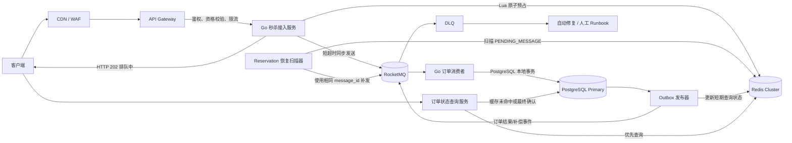
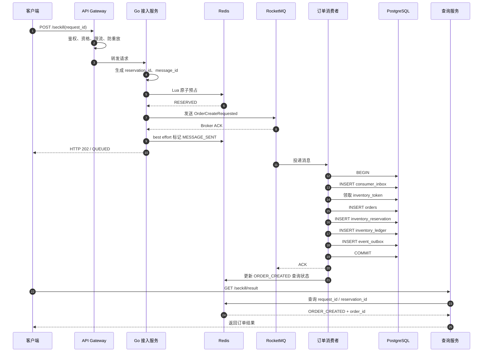
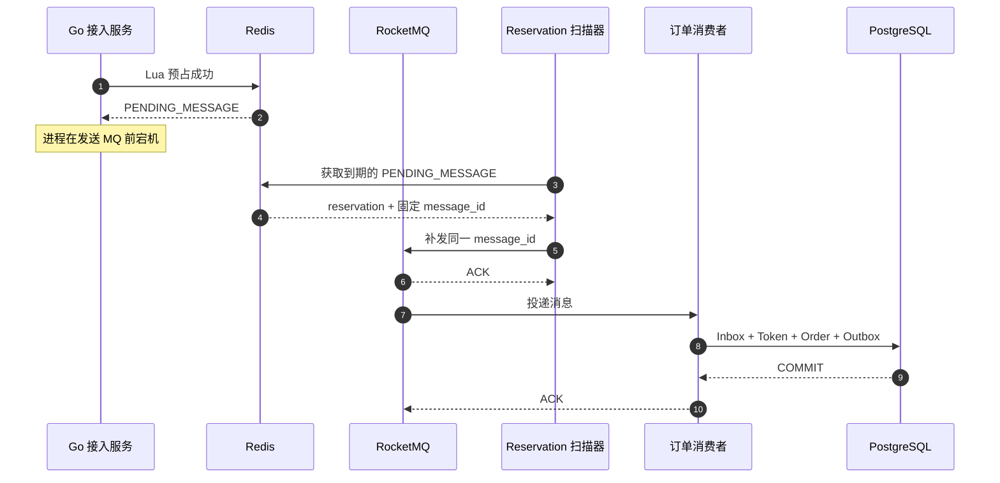
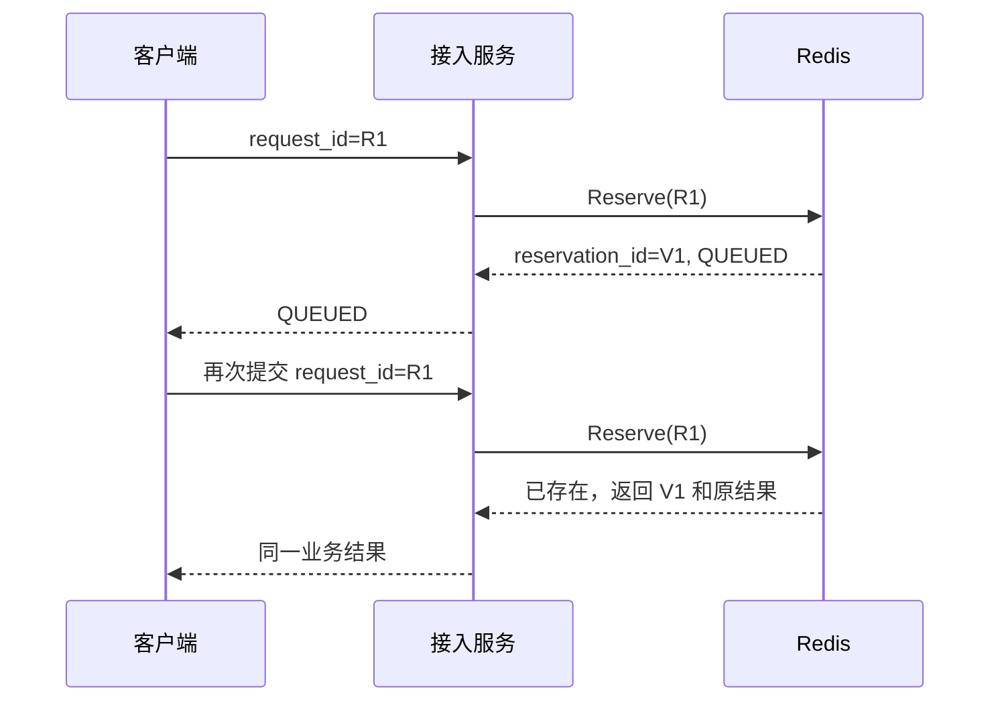
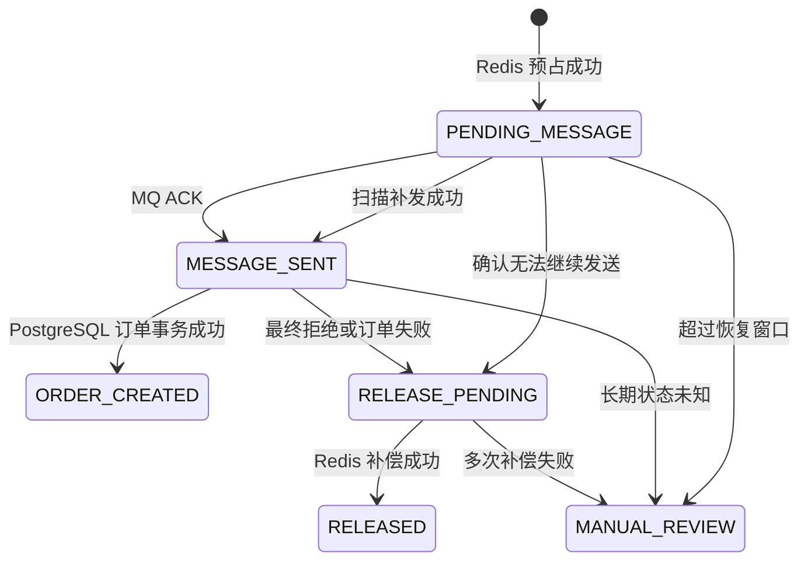
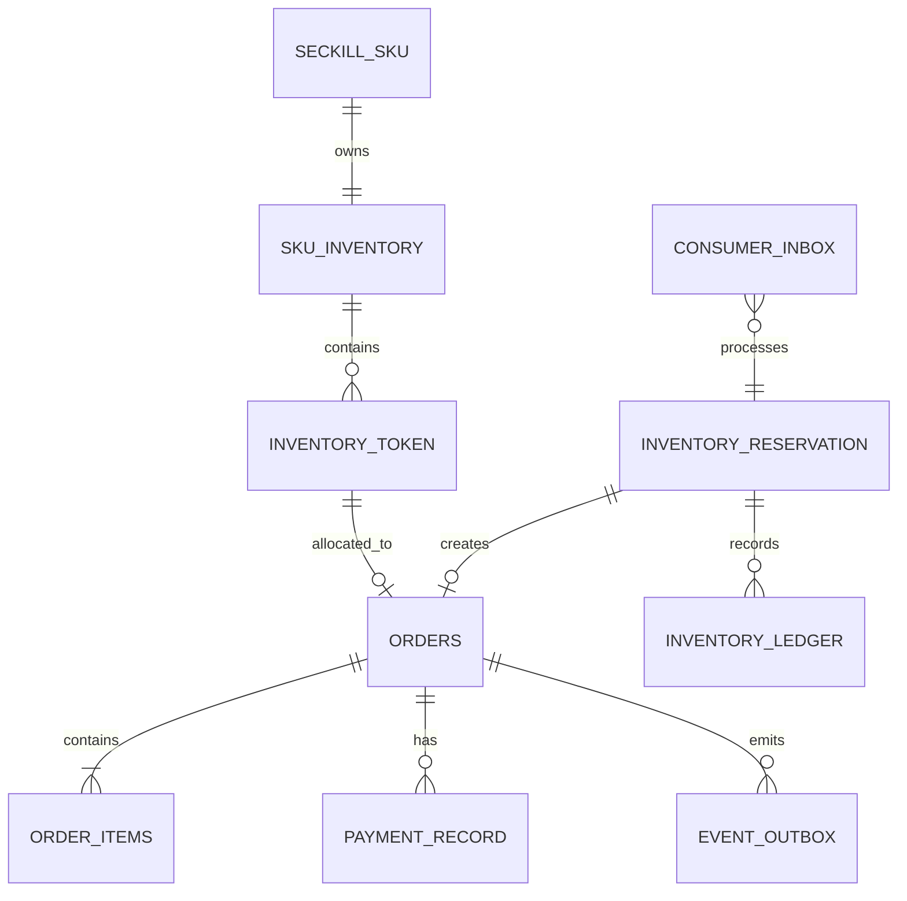

# 第 2 章：秒杀订单整体架构设计与技术选型

## 1. 本章目标

本章解决三个核心决策：

1. **秒杀请求应当在哪一层完成快速裁决。**
2. **库存正确性最终由谁保证。**
3. **Redis、RocketMQ、PostgreSQL 之间如何划分职责和故障边界。**

针对本书统一业务场景：

* 入口峰值约 30 万 QPS；
* 单热点 SKU 库存 10,000 件；
* 接口 P99 小于 100ms；
* 订单异步创建；
* 99.9% 有效订单在 3 秒内创建；
* 不允许超卖和重复有效订单；

本章的结论是：

> **采用“Redis 原子预占 + RocketMQ 异步下单 + PostgreSQL 库存令牌最终兜底”的主架构。**

其中：

* Redis 负责快速拒绝绝大多数失败请求；
* RocketMQ 负责把突发流量转换为可控消费速率；
* PostgreSQL 通过库存令牌、唯一约束、Inbox 和本地事务保证最终正确性；
* Redis 到 RocketMQ 之间采用 reservation 扫描补发；
* MQ 到 PostgreSQL 之间采用 At-Least-Once 投递和消费幂等；
* Redis 中的“预占成功”只表示获得异步下单资格，不表示订单已经创建；
* PostgreSQL 中订单创建成功也不表示支付成功。

对于低流量、低热点业务，没有必要直接使用完整方案。简单的 PostgreSQL 条件更新通常更合适。本章后续将明确不同方案的适用边界。

---

## 2. 业务背景

秒杀系统的主要矛盾不是“所有请求都需要更快地创建订单”，而是：

> **必须用最低成本识别少量可能成功的请求，并阻止大量必然失败的请求进入昂贵的下游链路。**

单个热点 SKU 只有 10,000 件库存，即使入口在 10 秒内收到 100 万次请求，最终也只有不超过 10,000 个请求需要进入订单创建阶段。

理想流量漏斗应当是：

```text
100 万次客户端请求
        ↓
网关校验、限流、资格过滤
        ↓
Redis 原子预占
        ↓
最多约 10,000 个有效 reservation
        ↓
RocketMQ 削峰
        ↓
PostgreSQL 创建不超过 10,000 个有效订单
```

数据库处理能力不应按照 100 万次请求设计，而应尽量按照以下规模设计：

```text
有效 reservation 数
+ 消息重复投递数
+ 必要的补偿和对账任务数
```

这一原则称为：

> **让昂贵资源只处理可能产生业务价值的请求。**

---

## 3. 核心问题

本章必须回答以下问题：

1. PostgreSQL 能否直接承担秒杀扣库存？
2. 悲观锁和乐观锁分别适合什么场景？
3. 条件 `UPDATE` 能否保证不超卖？
4. Redis 预扣库存为什么仍然可能产生超卖风险？
5. 为什么必须保留 PostgreSQL 最终库存防线？
6. RocketMQ 能否解决 Redis 与 PostgreSQL 之间的分布式事务？
7. 为什么推荐异步创建订单？
8. Redis 预占成功但消息未发送时如何恢复？
9. MQ 重复投递时为什么不会重复创建订单？
10. 单个 PostgreSQL 库存行是否会成为热点？
11. 库存令牌和单行条件更新应如何选择？
12. 何时不应该采用 Redis 和 MQ？

---

## 4. 未优化的基线方案

最直接的实现是所有请求同步访问 PostgreSQL。

```sql
BEGIN;

UPDATE sku_inventory
SET available_stock = available_stock - 1,
    updated_at = now()
WHERE activity_id = $1
  AND sku_id = $2
  AND available_stock > 0
RETURNING available_stock;

INSERT INTO orders (
    order_id,
    activity_id,
    sku_id,
    user_id,
    request_id,
    status,
    created_at,
    updated_at
)
VALUES (
    $3, $1, $2, $4, $5,
    'CREATED',
    now(), now()
);

COMMIT;
```

同时建立一人一单唯一约束：

```sql
ALTER TABLE orders
ADD CONSTRAINT uq_orders_activity_sku_user
UNIQUE (activity_id, sku_id, user_id);
```

PostgreSQL 的唯一约束由唯一索引执行，可以强制一组字段在表中保持唯一，因此它适合作为“一人一单”的最终防线。([PostgreSQL][1])

### 4.1 该方案能否保证不超卖

如果库存扣减使用：

```sql
UPDATE sku_inventory
SET available_stock = available_stock - 1
WHERE activity_id = $1
  AND sku_id = $2
  AND available_stock > 0;
```

并且根据 `affected rows` 判断结果，那么该语句在数据库事务层面可以防止库存变成负数。

在 PostgreSQL 默认的 Read Committed 隔离级别下，当并发事务更新同一行时，后续更新者会等待前一个更新完成，并在获得最新行版本后重新判断 `WHERE` 条件。([PostgreSQL][2])

因此：

* `affected rows = 1`：本次成功占用一个数据库库存；
* `affected rows = 0`：库存不足、SKU 不存在或活动条件不满足；
* 不能先 `SELECT available_stock`，再由应用判断并执行无条件 `UPDATE`。

### 4.2 基线方案的优点

* 事务边界简单；
* 数据库是唯一事实来源；
* 故障恢复容易理解；
* 不需要 Redis、MQ 和补偿系统；
* 适合低并发场景；
* 业务结果可以同步返回。

### 4.3 基线方案的关键限制

该方案的正确性没有根本问题，主要问题是容量和尾延迟：

1. 100 万次请求都可能建立数据库访问；
2. 失败请求也会消耗连接、CPU、锁和索引资源；
3. 单个热点 SKU 会竞争同一库存行；
4. 库存行锁通常要持有到事务提交；
5. 订单表唯一索引也会承担大量冲突检查；
6. 数据库连接池耗尽后，请求会在应用层排队；
7. P99 延迟会随着锁等待和连接等待快速上升；
8. 数据库异常会直接扩散到全部入口请求。

---

## 5. 基线方案的问题

| 维度   | 问题                  | 典型后果            |
| ---- | ------------------- | --------------- |
| 正确性  | 如果使用先查后改、无条件扣减，存在竞态 | 超卖              |
| 性能   | 所有成功和失败请求都访问数据库     | CPU、WAL、索引和连接浪费 |
| 并发   | 单个库存行形成写热点          | 行锁排队，吞吐趋于串行     |
| 可用性  | 接口同步依赖 PostgreSQL   | 数据库故障直接导致接口不可用  |
| 可扩展性 | 增加应用实例无法消除数据库热点     | 应用扩容后反而增加数据库压力  |
| 可运维性 | 流量峰值直接作用于数据库        | 容量评估和故障隔离困难     |

### 5.1 热点库存行为什么难以扩展

假设消费者需要在 3 秒内创建 10,000 个订单：

```text
平均订单创建吞吐 ≈ 10,000 / 3
                  ≈ 3,334 个订单/秒
```

如果每个事务都更新同一个库存行，该行上的锁会串行化关键路径。

即使数据库整体可以处理数万 TPS，也不代表同一个数据行可以完成相同数量的并发事务。因为一个事务获得该行写锁后，其他事务必须等待它提交或回滚。

因此需要区分：

* **数据库整体吞吐能力；**
* **单个热点行的串行服务能力。**

---

## 6. 推荐架构与技术选型

### 6.1 各方案不是完全互斥关系

“PostgreSQL 直接扣库存”“条件更新”“异步下单”“库存令牌”并不是同一维度的互斥方案。

它们分别回答不同问题：

| 维度      | 选项                      |
| ------- | ----------------------- |
| 请求处理方式  | 同步、异步                   |
| 前置过滤方式  | 无缓存、Redis 预占            |
| 数据库并发控制 | 悲观锁、版本号、条件更新、库存令牌       |
| 消息可靠性   | 普通消息重试、事务消息、扫描补发、Outbox |
| 最终防重方式  | 唯一约束、Inbox、条件状态迁移       |

推荐方案实际上是这些能力的组合。

---

### 6.2 方案一：PostgreSQL 直接扣库存

#### 实现方式

请求在同步事务中完成：

1. 条件扣减库存；
2. 创建订单；
3. 提交事务；
4. 返回下单结果。

#### 优点

* 事务边界最清晰；
* PostgreSQL 是唯一事实来源；
* 无跨组件一致性问题；
* 运维复杂度最低。

#### 缺点

* 所有请求直接冲击数据库；
* 同步延迟包含连接等待、锁等待和提交耗时；
* 单热点库存行难以扩展；
* 数据库抖动会直接影响入口。

#### 适用场景

* 峰值低于数据库实测安全容量；
* SKU 热点不明显；
* 请求量与库存量接近；
* 业务必须同步返回确定订单结果；
* 团队不具备维护异步一致性链路的能力。

---

### 6.3 方案二：PostgreSQL 悲观锁

典型实现：

```sql
BEGIN;

SELECT available_stock
FROM sku_inventory
WHERE activity_id = $1
  AND sku_id = $2
FOR UPDATE;

-- 应用判断库存后更新

UPDATE sku_inventory
SET available_stock = available_stock - 1
WHERE activity_id = $1
  AND sku_id = $2;

COMMIT;
```

PostgreSQL 提供显式行锁，用于需要应用控制并发访问的场景。([PostgreSQL][3])

#### 优点

* 逻辑直观；
* 获取锁后可以执行复杂判断；
* 适合低冲突、短事务。

#### 缺点

* 热点 SKU 上所有请求排队；
* 持锁期间应用逻辑越长，吞吐越低；
* 多行加锁顺序不一致可能导致死锁；
* 连接在等待行锁时仍占用数据库资源；
* 不适合 30 万 QPS 的入口流量。

#### 结论

> **秒杀热点库存不应默认使用“先 `SELECT FOR UPDATE`，再更新”的两阶段写法。**

只有在业务判断无法由单条条件更新表达，并且并发规模受控时，才考虑悲观锁。

---

### 6.4 方案三：乐观锁或条件更新

#### 版本号乐观锁

```sql
UPDATE sku_inventory
SET available_stock = available_stock - 1,
    version = version + 1
WHERE activity_id = $1
  AND sku_id = $2
  AND version = $3
  AND available_stock > 0;
```

#### 库存条件更新

```sql
UPDATE sku_inventory
SET available_stock = available_stock - 1
WHERE activity_id = $1
  AND sku_id = $2
  AND available_stock > 0;
```

#### 二者区别

版本号方案用于发现“自读取后数据是否变化”；库存条件更新则直接表达业务不变量：

```text
只有 available_stock > 0 时才允许扣减
```

对于简单库存扣减，条件更新通常比：

```text
SELECT version
→ UPDATE WHERE version = old_version
→ 冲突后重新查询并重试
```

更直接。

#### 优点

* 不需要应用先获取锁；
* 单条语句完成判断和更新；
* 可以根据受影响行数判断结果；
* 正确性清晰。

#### 缺点

* 更新同一行仍然需要行级写锁；
* 高冲突下版本号重试可能形成重试风暴；
* 解决了超卖，但没有解决热点行吞吐；
* 所有失败请求直接访问数据库时，数据库仍会过载。

#### 结论

> **条件更新解决的是并发正确性，不自动解决容量问题。**

---

### 6.5 方案四：Redis 预扣库存

请求先在 Redis 中执行：

```text
检查 request_id
→ 检查用户是否抢购过
→ 检查活动状态
→ 检查库存
→ 扣减 Redis 库存
→ 写入用户标记
→ 创建 reservation
```

这些操作必须放入同一个 Lua 脚本中。

Redis 官方文档明确说明 Lua 脚本按原子方式执行；脚本运行期间会阻塞同一 Redis 服务上的其他活动，因此脚本必须保持短小、固定复杂度，不能在脚本中扫描大集合或执行长循环。([Redis][4])

#### 优点

* 绝大多数失败请求不会进入数据库；
* 单次脚本即可完成多项校验和写入；
* 用户请求可以快速获得排队结果；
* 数据库负载由入口请求量转为有效 reservation 数。

#### Redis 预扣为什么不等于订单成功

以下情况都可能导致 Redis 预占成功但订单未创建：

1. Redis 预占后进程宕机，消息尚未发送；
2. RocketMQ 暂时不可用；
3. 消息长时间积压；
4. PostgreSQL 不可用；
5. PostgreSQL 最终库存令牌已耗尽；
6. 数据库发现同一用户已有有效订单；
7. reservation 已过期；
8. 消费者事务失败；
9. Redis 主从切换产生状态丢失或回退；
10. 活动被运营侧紧急终止。

因此客户端只能得到：

```text
QUEUED / 排队中
```

不能得到：

```text
ORDER_CREATED / 下单成功
```

#### Redis 单独扣库存的根本问题

Redis 不能单独作为最终订单库存事实来源，因为：

* Redis 与 PostgreSQL 之间不存在同一个本地事务；
* Redis 故障转移可能存在数据丢失窗口；
* Redis Key 可能因错误 TTL 或淘汰策略消失；
* 应用可能在 Redis 成功后、数据库写入前宕机；
* Redis 数据无法替代订单、库存流水和支付审计数据。

---

### 6.6 方案五：Redis + RocketMQ 异步下单

流程如下：

```text
请求
→ Redis 原子预占
→ 发送 RocketMQ 消息
→ 返回排队中
→ 消费者异步创建订单
```

#### RocketMQ 的正确职责

RocketMQ 负责：

* 削峰填谷；
* 解耦接入服务和订单服务；
* 消费失败重试；
* 消息积压；
* 延迟取消；
* 死信隔离；
* 消息回放。

但 RocketMQ 不负责：

* 一人一单；
* PostgreSQL 库存不超卖；
* 消费者业务幂等；
* Redis 和 PostgreSQL 的原子提交；
* 支付和取消状态竞态；
* 端到端 Exactly Once。

RocketMQ 消费失败会触发重新投递，超过配置的最大重试次数后进入死信队列。因此消费者必须假设同一业务消息可能被处理多次。([RocketMQ][5])

#### 队列为什么只能转移压力

假设：

```text
生产速度 = 10,000 条/秒
消费速度 = 3,000 条/秒
```

则：

```text
新增积压速度 = 10,000 - 3,000
              = 7,000 条/秒
```

MQ 没有消除压力，只是暂时保存尚未处理的工作。

只有满足：

```text
稳定消费速度 > 峰值结束后的持续生产速度
```

积压才可能被清空。

---

### 6.7 方案六：预生成 PostgreSQL 库存令牌

为每一件可售库存预生成一个数据库令牌：

```text
SKU 库存 10,000 件
→ PostgreSQL 中生成 10,000 条 inventory_token
```

示例状态：

```text
AVAILABLE → CLAIMED → SOLD
              ↓
           RELEASED
```

消费者创建订单时，不更新同一个库存计数行，而是领取一个尚未使用的令牌。

#### 为什么库存令牌能够避免热点行

单行库存模型：

```text
所有事务更新同一行
```

库存令牌模型：

```text
不同事务更新不同令牌行
```

最终不超卖不变量变为：

```text
成功创建的订单数
≤ 成功领取的令牌数
≤ 初始令牌总数
```

#### 优点

* 消除单个库存计数行的串行瓶颈；
* 每个令牌最多被领取一次；
* 便于审计具体库存分配；
* 适合库存数量有限、热点极强的秒杀；
* PostgreSQL 仍然保留最终库存控制权。

#### 缺点

* 增加 `inventory_token` 表；
* 活动开始前需要生成和校验令牌；
* 令牌领取、释放、过期需要状态机；
* 大库存会产生大量记录；
* 取消后是否复售需要明确规则；
* 索引和表膨胀需要治理。

#### 本书的选择

对于本书的单 SKU 10,000 件库存，令牌表只有 10,000 行，存储成本可控。

而 3 秒内创建接近 10,000 个订单，对单库存行的锁持有时间要求非常苛刻。因此本书选择：

> **PostgreSQL 库存令牌作为默认最终库存分配机制。**

`sku_inventory` 仍保留：

* `total_stock`；
* 活动配置；
* 汇总库存；
* 对账结果；

但高并发订单事务不再集中更新同一个 `available_stock` 热点行。

对于低流量活动，可以将库存分配器替换为单行条件更新，无需修改上层接入和消息架构。

---

### 6.8 同步下单与异步下单对比

| 对比项     | 完全同步下单    | 异步下单                 |
| ------- | --------- | -------------------- |
| 接口响应    | 返回明确成功或失败 | 返回排队中，随后查询           |
| 接口延迟    | 包含数据库事务耗时 | 主要包含 Redis 和 MQ 发送耗时 |
| 数据库故障影响 | 直接影响入口    | 消息可积压，短时隔离           |
| 削峰能力    | 弱         | 强                    |
| 实现复杂度   | 低         | 高                    |
| 幂等要求    | 请求幂等      | 请求、生产、消费、补偿均需幂等      |
| 一致性模式   | 本地事务为主    | 最终一致性                |
| 用户体验    | 结果即时      | 存在短暂排队状态             |
| 故障恢复    | 相对简单      | 需要补发、重试、对账           |
| 适用流量    | 低至中等      | 高并发突发流量              |
| 适合本书场景  | 否         | 是                    |

---

### 6.9 不同流量规模的推荐方案

下表中的阈值仅用于架构决策示例，必须由实际压测校准。

| 流量与业务特征             | 推荐方案                               |
| ------------------- | ---------------------------------- |
| 峰值数百 QPS，SKU 不热     | PostgreSQL 同步条件更新                  |
| 数千 QPS，热点有限         | 网关限流 + PostgreSQL 条件更新             |
| 数万 QPS，失败请求占比高      | Redis 前置过滤 + PostgreSQL            |
| 高突发且允许排队            | Redis + RocketMQ + PostgreSQL      |
| 单 SKU 极热、数据库单行锁成为瓶颈 | Redis + RocketMQ + PostgreSQL 库存令牌 |
| 大库存、令牌行数量不可接受       | 库存分桶或分片条件更新                        |
| 必须同步返回订单结果          | 限制入口容量，使用数据库同步事务                   |
| 无法建设补偿和对账能力         | 不应采用复杂异步方案                         |

---

### 6.10 技术选型决策矩阵

评分范围为 1～5，5 表示更优。

权重：

* 正确性：30%
* 峰值吞吐：20%
* 接口延迟：15%
* 故障恢复：15%
* 实现简单度：10%
* 资源成本：10%

| 方案                           | 正确性 | 吞吐 | 延迟 | 恢复 | 简单度 | 成本 |   加权结果 |
| ---------------------------- | --: | -: | -: | -: | --: | -: | -----: |
| PostgreSQL 同步条件更新            |   5 |  2 |  2 |  4 |   5 |  4 |     74 |
| PostgreSQL 悲观锁               |   5 |  1 |  1 |  3 |   4 |  3 |     60 |
| PostgreSQL 版本号乐观锁            |   5 |  2 |  2 |  4 |   4 |  4 |     74 |
| 仅 Redis 预扣                   |   2 |  5 |  5 |  1 |   3 |  3 |     62 |
| Redis + MQ + PostgreSQL 单库存行 |   5 |  3 |  5 |  5 |   2 |  3 |     82 |
| Redis + MQ + PostgreSQL 库存令牌 |   5 |  5 |  5 |  5 |   1 |  2 | **86** |

该评分只适用于本书设定的强热点秒杀场景。

若峰值只有数百 QPS，实现简单度的权重通常应提高，此时 PostgreSQL 同步条件更新反而是更合理的方案。

---

## 7. 推荐总体架构与核心流程

### 7.1 总体架构图



### 7.2 同步热路径

同步路径只包含：

```text
网关校验
→ Go 参数与幂等校验
→ Redis Lua 原子预占
→ RocketMQ 短超时发送
→ 返回排队中
```

同步路径不执行：

* PostgreSQL 订单事务；
* 支付调用；
* 库存流水写入；
* 长时间外部 RPC；
* 无限重试；
* 对账或补偿。

### 7.3 异步落库路径

异步路径负责：

```text
消费消息
→ Inbox 去重
→ 领取 PostgreSQL 库存令牌
→ 创建订单
→ 写 inventory_reservation
→ 写 inventory_ledger
→ 写 event_outbox
→ 提交事务
→ ACK 消息
```

### 7.4 组件职责表

| 组件              | 主要职责                       | 是否最终事实来源 | 失败后的默认策略    |
| --------------- | -------------------------- | -------: | ----------- |
| CDN/WAF         | 静态资源、机器人和攻击过滤              |        否 | 快速拒绝        |
| API Gateway     | 鉴权、资格令牌、多维限流               |        否 | Fail Closed |
| Go 接入服务         | 参数校验、调用 Lua、发送消息           |        否 | 无状态实例切换     |
| Redis           | 前置库存、请求幂等、reservation、短期结果 |        否 | Fail Closed |
| Reservation 扫描器 | 补发未确认发送的 reservation       |        否 | 多实例、租约抢占    |
| RocketMQ        | 削峰、重试、积压、延迟事件              |        否 | 重试和积压       |
| 订单消费者           | 幂等创建订单                     |        否 | 有界重试        |
| PostgreSQL      | 订单、令牌、Inbox、Outbox、流水      |    **是** | 事务回滚、故障转移   |
| Outbox 发布器      | 发布数据库事务产生的事件               |        否 | 重复发送但保持幂等   |
| 查询服务            | 聚合 Redis 和 PostgreSQL 结果   |        否 | 限流后数据库回源    |
| DLQ 处理器         | 隔离长期失败消息                   |        否 | 自动分类、人工处理   |

---

### 7.5 事务与故障边界

系统中存在三个主要原子边界：

#### Redis 原子边界

```text
request_id 校验
+ 用户防重
+ 库存扣减
+ reservation 创建
```

这些操作通过一个 Lua 脚本完成。

Redis 原子性不扩展到 RocketMQ。

#### RocketMQ 存储边界

Broker 返回发送成功，表示消息发送过程达到配置的成功条件，但不代表：

* PostgreSQL 已经创建订单；
* 消费者只会收到一次；
* Redis 与消息已经形成同一个事务。

#### PostgreSQL 本地事务边界

以下操作在同一个数据库事务中完成：

```text
Inbox
+ 库存令牌领取
+ 订单创建
+ reservation 落库
+ 库存流水
+ Outbox
```

该事务提交成功后，业务事实才成为最终事实。

---

### 7.6 正常请求时序图



#### 可以重试的步骤

* 客户端使用同一个 `request_id` 重试；
* MQ 使用同一个 `message_id` 补发；
* 消费者因临时数据库错误重试；
* Outbox 重复发布；
* Redis 结果更新重试。

#### 必须幂等的步骤

* Redis 预占；
* 消息发送；
* 消息消费；
* 订单创建；
* 库存令牌领取；
* 库存补偿；
* Outbox 发布；
* 查询结果回写。

---

### 7.7 Redis 预占后进程宕机



关键设计：

1. `reservation_id` 和 `message_id` 在调用 Lua 前生成；
2. Lua 将二者持久化到 reservation；
3. 扫描器不能生成新的业务消息 ID；
4. 补发时使用原来的 `message_id`；
5. 即使原消息实际已经发送，消费者也会通过 Inbox 去重。

---

### 7.8 消息发送超时

发送超时有三种可能：

```text
A. 消息未到达 Broker
B. Broker 已收到，但 ACK 未到达生产者
C. ACK 到达前客户端连接中断
```

生产者无法仅凭超时判断消息是否已经发送。

因此不能：

```text
超时 → 立即释放 Redis 库存
```

否则可能出现：

```text
消息实际已进入 MQ
→ Redis 库存被释放
→ 原消息后来创建订单
→ 释放后的库存又被其他用户预占
```

正确行为是：

1. reservation 保持 `PENDING_MESSAGE`；
2. 返回客户端 `QUEUED_PENDING`；
3. 扫描器使用相同 `message_id` 补发；
4. 消费者通过 Inbox 保证重复消息不重复生效；
5. 超过恢复时间仍无法确认时进入人工或对账流程。

---

### 7.9 重复请求流程

相同 `request_id` 再次提交时，Lua 直接返回第一次处理结果。



还必须保存请求参数摘要：

```text
payload_hash = hash(activity_id, sku_id, user_id, quantity)
```

如果相同 `request_id` 携带不同业务参数，应返回：

```text
IDEMPOTENCY_CONFLICT
```

而不是把第二次请求错误映射到第一次请求。

---

### 7.10 宕机恢复流程

| 宕机位置                   | 恢复机制                 |
| ---------------------- | -------------------- |
| Redis 前宕机              | 客户端用相同 request_id 重试 |
| Redis 成功、MQ 前宕机        | reservation 扫描补发     |
| MQ 成功、Redis 状态更新前宕机    | 扫描器可能补发，Inbox 去重     |
| 消费者事务前宕机               | MQ 重新投递              |
| PostgreSQL 提交前宕机       | 事务回滚，MQ 重新投递         |
| PostgreSQL 提交后、ACK 前宕机 | MQ 重投，Inbox 识别已处理    |
| Outbox 发布前宕机           | Outbox 记录仍在，发布器继续处理  |
| Redis 查询结果更新前宕机        | 查询回源 PostgreSQL并重建缓存 |

---

### 7.11 降级流程

| 故障                | 是否继续接受新秒杀 | 策略                   |
| ----------------- | --------: | -------------------- |
| Redis 不可用         |         否 | Fail Closed，防止绕过库存控制 |
| RocketMQ 短暂抖动     |       有条件 | 已预占请求保持 pending，短时补发 |
| RocketMQ 持续不可用    |         否 | 熔断新预占，防止大量库存被悬挂      |
| PostgreSQL 短暂不可用  |       有条件 | MQ 积压，消费者退避          |
| PostgreSQL 长期不可用  |         否 | Lag 超阈值后停止新活动请求      |
| 查询 Redis 不可用      |       有条件 | 限流回源 PostgreSQL      |
| 查询 PostgreSQL 不可用 |         是 | 返回排队中，不允许据此重新抢购      |
| 单个消费者实例宕机         |         是 | Consumer Group 重新分配  |
| 单个可用区故障           |         是 | 网关切流至其他可用区           |

RocketMQ 的 Consumer Group 用于将同一消费行为的消费者组织为负载均衡组。([RocketMQ][6])

---

## 8. 数据结构

### 8.1 Redis Key 设计

所有同一 SKU 的 Lua Key 使用相同 Hash Tag：

```text
{activity_id:sku_id}
```

| Key                                   | 类型     | 作用                       |
| ------------------------------------- | ------ | ------------------------ |
| `seckill:{a:s}:meta`                  | HASH   | 活动状态、开始结束时间、版本           |
| `seckill:{a:s}:stock`                 | STRING | Redis 可预占库存              |
| `seckill:{a:s}:user:{user_id}`        | STRING | 用户前置防重，值为 reservation_id |
| `seckill:{a:s}:req:{request_id}`      | HASH   | 请求幂等结果和 payload_hash     |
| `seckill:{a:s}:resv:{reservation_id}` | HASH   | reservation 状态           |
| `seckill:{a:s}:resv:pending`          | ZSET   | 待补发 reservation 索引       |
| `seckill:{a:s}:soldout`               | STRING | 活动或 SKU 售罄标记             |

reservation 核心字段：

```text
reservation_id
message_id
request_id
activity_id
sku_id
user_id
status
payload_hash
reserved_at
expires_at
send_attempts
next_retry_at
last_error_code
```

---

### 8.2 reservation 状态



`MESSAGE_SENT` 只是观测状态，不是消费正确性的前提。

即使该状态更新失败，只要消息已经到达 MQ，消费者仍然可以创建订单。

---

### 8.3 RocketMQ 消息结构

```json
{
  "schema_version": 1,
  "event_type": "SECKILL_ORDER_CREATE_REQUESTED",
  "message_id": "msg_01J...",
  "message_key": "resv_01J...",
  "request_id": "req_01J...",
  "reservation_id": "resv_01J...",
  "activity_id": 10001,
  "sku_id": 20001,
  "user_id": 30001,
  "order_id": "",
  "reserved_at": "2026-06-25T19:00:00.123Z",
  "reservation_expires_at": "2026-06-25T19:05:00Z",
  "retry_count": 0,
  "payload_hash": "sha256:...",
  "traceparent": "00-...",
  "created_at": "2026-06-25T19:00:00.125Z"
}
```

设计要求：

* `message_id` 是业务消息唯一 ID，不依赖 Broker 内部 ID；
* `message_key` 使用 `reservation_id`，便于检索；
* 创建订单消息不要求全局顺序；
* 同一消息允许重复投递；
* 消费幂等键为 `message_id`；
* 消息分区可按 `reservation_id` 哈希，避免单个 SKU 全部进入一个队列；
* 消息结构必须支持版本演进。

---

### 8.4 PostgreSQL 核心数据关系



本章新增并固定使用：

```text
inventory_token
```

该表将在第 6 章给出完整 DDL。

---

### 8.5 Go 核心结构体

```go
type SubmitSeckillCommand struct {
	ActivityID int64
	SKUID      int64
	UserID     int64
	RequestID  string
	PayloadHash string
}

type ReservationResult struct {
	Code          ReservationCode
	RequestID     string
	ReservationID string
	MessageID     string
	OrderID       string
	Status        string
}

type OrderCreateMessage struct {
	SchemaVersion        int       `json:"schema_version"`
	EventType            string    `json:"event_type"`
	MessageID            string    `json:"message_id"`
	MessageKey           string    `json:"message_key"`
	RequestID            string    `json:"request_id"`
	ReservationID        string    `json:"reservation_id"`
	ActivityID           int64     `json:"activity_id"`
	SKUID                 int64     `json:"sku_id"`
	UserID                int64     `json:"user_id"`
	ReservedAt            time.Time `json:"reserved_at"`
	ReservationExpiresAt time.Time `json:"reservation_expires_at"`
	RetryCount            int       `json:"retry_count"`
	PayloadHash           string    `json:"payload_hash"`
	Traceparent           string    `json:"traceparent"`
	CreatedAt             time.Time `json:"created_at"`
}
```

---

## 9. 核心代码

### 9.1 接入服务骨架

下面使用抽象接口，避免伪造特定 RocketMQ Go SDK 的版本相关 API。

```go
package seckill

import (
	"context"
	"errors"
	"fmt"
	"time"
)

var (
	ErrRedisUnavailable = errors.New("redis unavailable")
	ErrMQUnavailable    = errors.New("message queue unavailable")
)

type ReservationStore interface {
	Reserve(
		ctx context.Context,
		cmd SubmitSeckillCommand,
		reservationID string,
		messageID string,
	) (ReservationResult, error)

	MarkMessageSent(
		ctx context.Context,
		activityID int64,
		skuID int64,
		reservationID string,
	) error
}

type MessageProducer interface {
	SendOrderCreate(
		ctx context.Context,
		msg OrderCreateMessage,
	) error
}

type IDGenerator interface {
	NewReservationID() string
	NewMessageID(reservationID string) string
}

type Service struct {
	reservations ReservationStore
	producer     MessageProducer
	ids          IDGenerator

	reserveTimeout time.Duration
	sendTimeout    time.Duration
}

func (s *Service) Submit(
	ctx context.Context,
	cmd SubmitSeckillCommand,
) (ReservationResult, error) {
	if err := validateCommand(cmd); err != nil {
		return ReservationResult{}, err
	}

	reservationID := s.ids.NewReservationID()
	messageID := s.ids.NewMessageID(reservationID)

	reserveCtx, cancelReserve := context.WithTimeout(ctx, s.reserveTimeout)
	defer cancelReserve()

	result, err := s.reservations.Reserve(
		reserveCtx,
		cmd,
		reservationID,
		messageID,
	)
	if err != nil {
		return ReservationResult{}, fmt.Errorf(
			"reserve inventory: %w",
			err,
		)
	}

	switch result.Code {
	case ReservationIdempotent:
		// 返回第一次请求对应的 reservation 和结果。
		return result, nil

	case ReservationSoldOut,
		ReservationDuplicateUser,
		ReservationActivityInvalid,
		ReservationIdempotencyConflict:
		return result, nil

	case ReservationCreated:
		// 继续发送消息。

	default:
		return ReservationResult{}, fmt.Errorf(
			"unknown reservation code: %s",
			result.Code,
		)
	}

	msg := OrderCreateMessage{
		SchemaVersion:        1,
		EventType:            "SECKILL_ORDER_CREATE_REQUESTED",
		MessageID:            result.MessageID,
		MessageKey:           result.ReservationID,
		RequestID:            result.RequestID,
		ReservationID:        result.ReservationID,
		ActivityID:           cmd.ActivityID,
		SKUID:                 cmd.SKUID,
		UserID:                cmd.UserID,
		ReservedAt:            time.Now().UTC(),
		ReservationExpiresAt: time.Now().UTC().Add(5 * time.Minute),
		RetryCount:            0,
		PayloadHash:           cmd.PayloadHash,
		CreatedAt:             time.Now().UTC(),
	}

	sendCtx, cancelSend := context.WithTimeout(ctx, s.sendTimeout)
	defer cancelSend()

	if err := s.producer.SendOrderCreate(sendCtx, msg); err != nil {
		/*
			发送结果可能未知。

			不能释放库存，也不能生成新的 message_id。
			reservation 扫描器稍后会使用原 message_id 补发。
		*/
		result.Status = "QUEUED_PENDING_MESSAGE"
		return result, nil
	}

	/*
		该状态更新是 best effort。
		失败时扫描器可能重复发送消息，但消费者 Inbox 会去重。
	*/
	markCtx, cancelMark := context.WithTimeout(
		context.WithoutCancel(ctx),
		20*time.Millisecond,
	)
	defer cancelMark()

	_ = s.reservations.MarkMessageSent(
		markCtx,
		cmd.ActivityID,
		cmd.SKUID,
		result.ReservationID,
	)

	result.Status = "QUEUED"
	return result, nil
}
```

注意：

* 客户端取消不能无限传播到必要的状态收尾操作；
* `context.WithoutCancel` 只能用于很短的 best-effort 操作；
* 不能在请求结束后启动无界 goroutine；
* 真正可靠的补发由独立扫描器完成，而不是请求进程中的后台 goroutine。

---

### 9.2 Inbox 幂等 SQL

```sql
INSERT INTO consumer_inbox (
    consumer_group,
    message_id,
    topic,
    reservation_id,
    received_at,
    created_at
)
VALUES (
    $1, $2, $3, $4,
    now(), now()
)
ON CONFLICT (consumer_group, message_id)
DO NOTHING
RETURNING message_id;
```

业务含义：

* 返回一行：第一次处理；
* 返回零行：该 Consumer Group 已经处理过相同消息；
* 对重复消息可以直接 ACK；
* 不能仅依赖进程内缓存去重。

---

### 9.3 库存令牌领取 SQL

```sql
WITH candidate AS (
    SELECT token_id
    FROM inventory_token
    WHERE activity_id = $1
      AND sku_id = $2
      AND status = 'AVAILABLE'
    ORDER BY token_id
    FOR UPDATE SKIP LOCKED
    LIMIT 1
)
UPDATE inventory_token AS t
SET status = 'CLAIMED',
    reservation_id = $3,
    claimed_at = now(),
    updated_at = now()
FROM candidate AS c
WHERE t.token_id = c.token_id
RETURNING
    t.token_id,
    t.activity_id,
    t.sku_id;
```

关键点：

* `SKIP LOCKED` 用于领取类似队列任务或库存令牌；
* 它不应用于普通一致性查询；
* 返回零行可能表示令牌确实耗尽，也可能表示尾部令牌暂时全部被其他事务锁定；
* 消费者应设置有限次、短间隔重试，而不是立即无限重试；
* 令牌领取和订单创建必须在同一个数据库事务中完成。

---

### 9.4 创建订单 SQL

```sql
INSERT INTO orders (
    order_id,
    activity_id,
    sku_id,
    user_id,
    request_id,
    reservation_id,
    inventory_token_id,
    status,
    created_at,
    updated_at
)
VALUES (
    $1, $2, $3, $4, $5,
    $6, $7,
    'CREATED',
    now(), now()
)
ON CONFLICT (activity_id, sku_id, user_id)
DO NOTHING
RETURNING order_id;
```

返回零行表示可能已经存在同一用户的有效订单。

此时消费者需要：

1. 查询现有订单；
2. 判断是否属于相同 reservation；
3. 将刚领取的令牌恢复为 `AVAILABLE`；
4. 写入 reservation 处理结果；
5. 产生 Redis 补偿 Outbox；
6. 提交事务。

不能把该情况简单当作数据库异常重试，否则会持续重复消费。

---

### 9.5 订单消费者事务伪代码

```text
BEGIN

1. INSERT consumer_inbox
   如果冲突：
       COMMIT
       ACK
       RETURN

2. UPSERT inventory_reservation = PROCESSING

3. 领取 inventory_token
   如果暂时锁冲突：
       ROLLBACK
       返回可重试错误

   如果确认令牌耗尽：
       更新 reservation = REJECTED_NO_FINAL_STOCK
       写入 compensation Outbox
       COMMIT
       ACK
       RETURN

4. INSERT orders ON CONFLICT DO NOTHING

5. 如果订单插入冲突：
       释放本事务刚领取的 token
       查询已有订单
       更新 reservation = REJECTED_DUPLICATE_USER
       写入 compensation Outbox
       COMMIT
       ACK
       RETURN

6. INSERT order_items
7. INSERT inventory_ledger
8. 更新 inventory_reservation = ORDER_CREATED
9. INSERT event_outbox

COMMIT
ACK
```

---

## 10. 优化设计与原理

### 10.1 优化点：多级流量漏斗

**要解决的问题：**

30 万 QPS 不能全部进入 Redis、MQ 或 PostgreSQL。

**未经优化时会发生什么：**

* 数据库连接池耗尽；
* Redis 热 Key 达到单节点上限；
* MQ 短时间写入量失控；
* 失败请求挤压成功请求；
* 系统发生级联超时。

**实现方式：**

```text
CDN/WAF
→ API Gateway 资格校验
→ 用户/IP/设备限流
→ Go 本地限流
→ 本地售罄标记
→ Redis 全局库存裁决
```

**底层原理：**

越靠近入口拒绝请求，每次拒绝消耗的系统资源越少。

**为什么能够提高性能或可靠性：**

将下游处理规模从入口请求量收敛到：

```text
有效资格请求数
→ 可成功预占库存数
```

**预计收益：**

PostgreSQL 订单写入量从最多 100 万次尝试，下降到约 10,000 个有效 reservation 加少量重试。

**代价和副作用：**

* 多级限流可能产生误拒绝；
* 本地限流和全局限流存在精度差异；
* 本地售罄标记可能短暂不一致。

**适用边界：**

高失败率、高突发流量场景。

**不适用场景：**

流量很低且所有请求都应精确进入数据库判断的业务。

**监控指标：**

* 各层通过率；
* 各层拒绝率；
* Redis 到达 QPS；
* 有效 reservation 数；
* 误拒绝申诉数。

**验证方法：**

压测时逐层关闭限流，观察 Redis、MQ 和 PostgreSQL 的负载变化。

---

### 10.2 优化点：Redis Lua 原子预占

**要解决的问题：**

避免以下竞态：

```text
GET stock
→ 判断 stock > 0
→ DECR stock
```

**未经优化时会发生什么：**

多个请求可能同时读到库存大于零，再分别扣减，导致库存出现负值或重复 reservation。

**实现方式：**

使用 Lua 一次性完成：

1. request_id 幂等检查；
2. 用户防重；
3. 活动校验；
4. 库存检查；
5. 扣减；
6. reservation 写入；
7. pending 索引写入；
8. 幂等结果保存。

**底层原理：**

Lua 在 Redis 内部原子执行，脚本执行过程中其他命令不会穿插修改相关状态。([Redis][4])

**为什么能够提高性能或可靠性：**

* 消除多次网络往返；
* 消除 GET 与 DECR 之间的竞态；
* 让幂等记录和库存扣减同时生效。

**预计收益：**

多条 Redis 命令和应用侧判断收敛为一次脚本调用。

**代价和副作用：**

* Lua 执行期间会阻塞 Redis；
* 多 Key 必须位于同一 Cluster Hash Slot；
* 脚本升级需要版本治理；
* 大脚本难以调试。

**适用边界：**

固定复杂度、执行时间短的原子业务逻辑。

**不适用场景：**

* 扫描大集合；
* 执行不确定长度循环；
* 调用外部服务；
* 跨 Redis 与数据库事务。

**监控指标：**

* Lua P50/P95/P99；
* Redis 单线程 CPU；
* Slowlog；
* 脚本错误率；
* 单个 Hash Slot QPS。

**验证方法：**

对同一 SKU 并发提交远高于库存量的请求，断言 Redis 库存不为负且 reservation 数不超过初始库存。

---

### 10.3 优化点：RocketMQ 异步削峰

**要解决的问题：**

PostgreSQL 无法直接承受入口瞬时并发。

**未经优化时会发生什么：**

请求线程同步等待数据库：

* 连接池排队；
* 锁等待；
* 请求超时；
* 重试风暴；
* P99 快速上升。

**实现方式：**

Redis 预占后发送订单创建消息，接口返回 HTTP 202。

**底层原理：**

将请求速率与数据库处理速率解耦：

```text
入口负责接收和过滤
消费者按照 PostgreSQL 安全容量处理
```

**为什么能够提高性能或可靠性：**

突发工作暂存在消息系统中，消费者并发受到 Worker Pool 和数据库连接池约束。

**预计收益：**

接口延迟不再直接包含 PostgreSQL 事务和行锁等待。

**代价和副作用：**

* 用户需要查询最终结果；
* 需要消息幂等；
* 需要积压治理；
* 需要补偿、对账和 DLQ；
* 系统只能提供最终一致性。

**适用边界：**

允许“排队中”状态，且业务能接受秒级最终结果。

**不适用场景：**

用户必须在当前请求中拿到最终订单 ID，且不允许异步确认。

**监控指标：**

* 生产 TPS；
* 消费 TPS；
* Consumer Lag；
* 最老消息年龄；
* 订单创建 P99；
* 3 秒内完成比例。

**验证方法：**

以开环模型注入突发流量，确认入口 P99 稳定，并计算积压恢复时间。

---

### 10.4 优化点：PostgreSQL 库存令牌

**要解决的问题：**

避免所有订单事务更新同一个库存行。

**未经优化时会发生什么：**

* 热点行锁排队；
* 单行吞吐受事务提交延迟限制；
* 增加消费者数量无法提升吞吐；
* 消费者越多，锁等待越严重。

**实现方式：**

为 10,000 件库存生成 10,000 个可领取令牌，每个成功订单占用一个令牌。

**底层原理：**

把单行串行竞争转化为多行并行竞争。

**为什么能够提高性能或可靠性：**

多个事务可以锁定和修改不同令牌行，同时令牌总量天然限制成功订单数量。

**预计收益：**

吞吐不再受单个库存计数行的事务持锁时间直接限制。

**代价和副作用：**

* 增加记录数和索引；
* 需要令牌状态机；
* 活动发布前需要预生成；
* 取消复售需要严格控制；
* 需要对账令牌、订单和流水。

**适用边界：**

库存数量有限、热点极高、单行锁已经被压测证明是瓶颈的活动。

**不适用场景：**

* 库存数量达到数亿且无法接受令牌行；
* 普通商品低并发扣库存；
* 团队无法运维令牌生命周期。

**监控指标：**

* AVAILABLE/CLAIMED/SOLD/RELEASED 数量；
* 令牌领取耗时；
* `SKIP LOCKED` 空返回比例；
* 事务回滚率；
* 令牌与订单对账偏差。

**验证方法：**

分别压测单行条件更新和令牌领取，比较：

* 锁等待；
* TPS；
* P99；
* 事务冲突率；
* WAL 生成量。

---

## 11. 故障分析

| 故障点             | 直接后果             | 检测方式                   | 自动恢复            | 人工处理            |
| --------------- | ---------------- | ---------------------- | --------------- | --------------- |
| 网关过载            | 请求排队或超时          | 网关并发、P99               | 限流、快速失败         | 调整规则和容量         |
| Redis 超时        | 无法判断是否预占         | Lua 超时率                | Fail Closed     | 检查热 Key、主从状态    |
| Redis 成功后进程宕机   | 消息未立即发送          | pending reservation 年龄 | 扫描补发            | 检查长期 pending    |
| MQ 发送超时         | 发送结果未知           | 发送超时指标                 | 同 message_id 补发 | 查询 Broker 和业务状态 |
| MQ 持续不可用        | pending 数增长      | Broker 可用性             | 熔断新预占           | 恢复集群、分批补发       |
| 消息重复投递          | 消费者重复执行          | Inbox 冲突数              | Inbox 去重        | 分析重复比例          |
| PostgreSQL 不可用  | 订单无法创建           | 连接、错误率                 | MQ 积压、退避        | 主库切换            |
| 数据库提交后 ACK 失败   | 消息重新投递           | Inbox 冲突               | 幂等 ACK          | 无需数据修复          |
| PostgreSQL 令牌耗尽 | Redis 预占与最终库存不一致 | token 空返回              | reservation 补偿  | 库存对账            |
| 订单唯一约束冲突        | 同用户存在其他订单        | 冲突指标                   | 释放令牌、补偿 Redis   | 检查 Redis 防重丢失   |
| Redis 结果回写失败    | 查询持续显示排队中        | 状态延迟                   | 查询回源并重建缓存       | 修复缓存任务          |
| 扫描器停止           | pending 长期不发送    | 最老 pending 年龄          | 多实例接管           | 手工触发扫描          |
| DLQ 累积          | 部分订单长期未处理        | DLQ 数量和年龄              | 自动分类重放          | Runbook 修复      |
| Outbox 发布失败     | 结果或补偿事件延迟        | unpublished 数量         | 重复发布            | 手工重放            |
| Redis 主从切换丢状态   | 可能重复预占           | 主从切换、对账偏差              | PostgreSQL 最终拒绝 | 对账与补偿           |

---

## 12. 可观测性

### 12.1 接入指标

```text
seckill_requests_total
seckill_requests_accepted_total
seckill_requests_rejected_total
seckill_rate_limited_total
seckill_sold_out_total
seckill_duplicate_request_total
seckill_duplicate_user_total
seckill_request_duration_seconds
```

必须按以下维度谨慎聚合：

* activity_id；
* sku_id；
* result_code；
* availability_zone。

不能直接把 `user_id`、`request_id` 放入指标标签，否则会造成高基数。

---

### 12.2 Redis 指标

```text
reservation_lua_duration
reservation_lua_errors
redis_stock_value
reservation_pending_count
reservation_oldest_pending_age
reservation_retry_count
redis_failover_total
redis_replication_lag
```

关键告警：

```text
oldest_pending_age > 5 秒
pending_count 持续增长
Lua P99 > 同步路径预算
Redis stock < 0
```

---

### 12.3 RocketMQ 指标

```text
message_send_success_rate
message_send_unknown_total
message_send_duration
consumer_tps
consumer_lag
oldest_message_age
retry_message_total
dlq_message_total
```

必须同时观察：

* 积压条数；
* 最老消息年龄。

仅观察积压条数可能误判：1 万条消息在高吞吐消费者下可能很快清空，但少量消息如果已经滞留数分钟，可能意味着毒消息或分区问题。

---

### 12.4 PostgreSQL 指标

```text
order_create_tps
order_create_duration
inventory_token_claim_duration
inventory_token_empty_total
inbox_conflict_total
order_unique_conflict_total
database_pool_acquired
database_pool_waiting
lock_wait_duration
transaction_rollback_total
wal_bytes
replication_lag
```

---

### 12.5 业务一致性指标

```text
redis_reserved_count
postgres_order_created_count
postgres_token_claimed_count
postgres_token_sold_count
reservation_released_count
compensation_pending_count
inventory_conservation_delta
```

示例守恒检查：

```text
初始令牌数
= AVAILABLE
+ CLAIMED
+ SOLD
+ RELEASE_PENDING
+ 异常待处理令牌
```

以及：

```text
Redis 预占数
≈ PostgreSQL 成功订单数
+ 已补偿数
+ 处理中 reservation 数
+ 异常待处理数
```

---

### 12.6 日志与 Trace 字段

每条关键日志至少携带：

```text
trace_id
span_id
request_id
reservation_id
message_id
activity_id
sku_id
user_id_hash
order_id
inventory_token_id
consumer_group
retry_count
result_code
error_class
availability_zone
```

日志中不应直接记录完整敏感用户数据。

---

## 13. 测试方法

### 13.1 单元测试

重点覆盖：

* request_id 重复；
* request_id 参数冲突；
* 用户重复抢购；
* 库存为零；
* 活动未开始或已结束；
* MQ 超时；
* Lua 返回未知业务码；
* 订单唯一约束冲突；
* 令牌领取为空；
* Inbox 重复。

---

### 13.2 并发测试

对库存 100 的 SKU 并发提交 10,000 个不同用户请求，断言：

```text
Redis 成功 reservation 数 <= 100
Redis 库存 >= 0
同一用户最多一个 reservation
同一 request_id 只有一个 reservation_id
```

---

### 13.3 集成测试

完整启动：

* Redis；
* RocketMQ；
* PostgreSQL；
* 接入服务；
* 扫描器；
* 消费者；
* 查询服务。

验证：

1. Redis 预占；
2. 消息发送；
3. 订单创建；
4. 查询结果；
5. 重复请求；
6. 重复消息；
7. 补偿流程。

---

### 13.4 故障注入

| 注入点                 | 正确性断言                 |
| ------------------- | --------------------- |
| Redis 成功后杀死接入进程     | 扫描器最终补发               |
| Broker ACK 前断网      | 同 message_id 重试，无重复订单 |
| 数据库事务中杀死消费者         | 事务回滚，消息重投             |
| COMMIT 后 ACK 前杀死消费者 | Inbox 去重              |
| 停止 PostgreSQL 30 秒  | MQ 积压，恢复后收敛           |
| 停止扫描器               | pending 告警触发，恢复后补发    |
| 重复发送补偿消息            | Redis 库存只增加一次         |
| Redis 主从切换          | PostgreSQL 订单数不超过令牌数  |

---

### 13.5 压力测试

必须使用开环模型验证入口能力，避免客户端因服务变慢而自动降低发送速率。

至少验证：

```text
30 万 QPS 瞬时入口
单热点 SKU
库存 10,000
重复 request_id 比例 10%
MQ 发送超时比例注入
数据库短时不可用
```

主要验收指标：

* 接口 P99；
* Redis Lua P99；
* 预占成功数；
* 3 秒订单创建比例；
* MQ 最老消息年龄；
* PostgreSQL 锁等待；
* 最终订单数；
* 最终库存守恒偏差。

---

## 14. 方案边界

### 14.1 适用范围

本方案适合：

* 流量高度突发；
* 失败请求远多于成功请求；
* 可以返回“排队中”；
* 订单允许秒级创建；
* 有明确活动库存；
* 需要强制一人一单；
* 团队具备消息、补偿、对账和故障演练能力。

### 14.2 不适用范围

以下情况不应直接采用完整方案：

1. 峰值只有数百 QPS；
2. 所有请求必须同步返回最终订单；
3. 业务不能接受任何中间状态；
4. 团队没有维护 Redis、MQ 和 PostgreSQL 高可用集群的能力；
5. 没有建设幂等、补偿和对账机制；
6. 库存不是离散、可提前确定的资源；
7. 使用令牌表会产生不可接受的数据规模。

### 14.3 何时使用单行条件更新

满足以下条件时优先使用单行条件更新：

* 压测证明锁等待可接受；
* 单 SKU 成功订单吞吐不高；
* 事务极短；
* 活动库存较小但完成时限宽松；
* 简化架构比极致吞吐更重要。

### 14.4 何时升级为库存令牌

出现以下信号时应升级：

```text
sku_inventory 行锁等待成为主要延迟
增加消费者后 TPS 不再提高
数据库 CPU 不高但事务大量等待锁
订单创建 P99 受单行锁支配
3 秒订单创建 SLO 无法达到
```

---

## 15. 常见错误设计

### 15.1 Redis 扣减成功就返回下单成功

错误。

Redis 只完成前置预占，数据库订单可能尚未创建。

正确返回：

```text
QUEUED
```

而不是：

```text
ORDER_CREATED
```

---

### 15.2 MQ 发送超时就释放 Redis 库存

错误。

发送超时可能只是 ACK 丢失，消息实际已经进入 Broker。

正确方式是保持 reservation，并使用相同 `message_id` 补发。

---

### 15.3 每次补发都生成新的 message_id

错误。

这会使 Inbox 无法识别同一业务消息，可能导致重复业务操作。

---

### 15.4 只依赖 Redis 实现一人一单

错误。

Redis 故障、过期、误删或数据回退后，用户可能再次通过前置检查。

PostgreSQL 必须保留：

```sql
UNIQUE (activity_id, sku_id, user_id)
```

---

### 15.5 使用 MQ 就不需要数据库限流

错误。

消费者可以通过无限扩容把积压压力瞬间转移到 PostgreSQL。

消费并发必须受以下约束：

```text
数据库连接池
+ 锁等待
+ WAL 能力
+ 磁盘提交能力
```

---

### 15.6 消费者收到重复消息说明 MQ 出错

错误。

数据库提交成功但 ACK 前宕机，本身就会产生合理的重新投递。

业务必须按重复投递设计。

---

### 15.7 事务消息可以解决整个链路 Exactly Once

错误。

RocketMQ 事务消息适合协调消息发送与生产者本地事务。官方文档同时明确指出，事务消息不保证消息消费结果与上游执行结果的一致性，下游仍需正确处理消费和重试。([RocketMQ][7])

在本架构中，生产者本地状态首先写入 Redis，而不是一个可由事务检查器稳定查询的 PostgreSQL 本地事务。因此事务消息不是默认主方案。

---

### 15.8 订单消费者越多越好

错误。

消费者数量超过 PostgreSQL 安全并发后，会增加：

* 连接等待；
* 锁等待；
* 上下文切换；
* 事务冲突；
* 超时和重试。

---

### 15.9 对所有订单创建消息强制全局顺序

错误。

订单创建之间没有全局先后依赖。

强制全局顺序会将系统退化为单队列串行消费。

---

### 15.10 用客户端重试代替服务端补发

错误。

客户端可能关闭页面、断网或停止重试。

Redis 预占成功后的恢复责任必须由服务端承担。

---

### 15.11 Redis 或查询服务找不到结果就允许用户重新抢购

错误。

缓存未命中不代表第一次请求不存在。

应先按 `request_id`、`reservation_id` 回源 PostgreSQL，仍不确定时返回“处理中”，不能创建新的业务请求。

---

### 15.12 为了吞吐关闭 PostgreSQL 最终库存检查

错误。

Redis 的高性能不能替代数据库最终正确性。

任何为了性能取消最终库存防线的设计，都会把 Redis 故障或数据回退直接转化为超卖。

---

## 16. 面试追问

### 问题 1：为什么不直接让 PostgreSQL 扣库存？

**回答：**

PostgreSQL 条件更新可以正确防止库存变成负数，问题不是正确性，而是容量。

在本场景中，30 万 QPS 的入口绝大多数必然失败。如果全部进入数据库，会浪费连接、锁、CPU、WAL 和索引资源。单热点 SKU 还会竞争同一个库存行。

因此使用 Redis 把数据库负载从“请求量”收敛为“有效 reservation 数”。

低流量场景仍然应优先使用 PostgreSQL，避免过度设计。

---

### 问题 2：Redis Lua 已经原子扣库存，为什么 PostgreSQL 还要检查？

**回答：**

Lua 的原子性只存在于一次 Redis 脚本执行内部，不能跨越 RocketMQ 和 PostgreSQL。

此外还存在：

* Redis 主从切换数据丢失；
* Key 误过期或误淘汰；
* 重复消息；
* Redis 数据恢复到旧版本；
* 多活动版本错配。

因此 Redis 是高性能过滤层，PostgreSQL 才是最终事实层。

---

### 问题 3：为什么不在 Redis 预占成功后立即返回订单成功？

**回答：**

此时只完成了库存资格预占，还没有：

* 消费 MQ；
* 领取数据库库存令牌；
* 写订单；
* 写库存流水；
* 提交 PostgreSQL 事务。

因此只能返回排队中。

---

### 问题 4：MQ 能否保证消息只消费一次？

**回答：**

不能把业务设计建立在只消费一次的假设上。

例如：

```text
消费者提交 PostgreSQL 成功
→ ACK 前宕机
→ Broker 重新投递
```

这是合理的 At-Least-Once 行为。

消费者必须用 `consumer_group + message_id` 的唯一约束完成 Inbox 去重。

---

### 问题 5：Redis 成功后、MQ 发送前进程宕机怎么办？

**回答：**

Redis Lua 创建 reservation 时，同时写入：

* `reservation_id`；
* 固定 `message_id`；
* `PENDING_MESSAGE` 状态；
* `next_retry_at`；
* pending ZSET 索引。

独立扫描器读取超时 reservation，并使用相同 `message_id` 补发。

不能依赖请求进程中的临时内存任务。

---

### 问题 6：为什么主方案不使用 RocketMQ 事务消息？

**回答：**

事务消息最适合协调消息发送与一个可查询的生产者本地事务。

本系统的前置预占发生在 Redis。即使事务检查器读取 Redis，仍然面临：

* Redis 状态过期；
* 主从切换丢失；
* 活动版本变化；
* 无法与 PostgreSQL 最终订单事务形成原子关系。

因此事务消息可以减少某些发送不确定性，但不能替代：

* reservation 扫描；
* 消费者 Inbox；
* PostgreSQL 最终库存；
* 补偿和对账。

本书选择普通消息、固定业务消息 ID和 reservation 扫描补发，行为更容易观测和恢复。

---

### 问题 7：为什么 PostgreSQL 使用库存令牌，而不是一个库存计数行？

**回答：**

一个库存计数行会导致所有订单事务竞争同一行锁。

库存令牌把：

```text
一个热点行
```

拆成：

```text
10,000 个可独立领取的令牌行
```

每个有效订单必须领取一个令牌，因此订单数不可能超过令牌总数。

代价是增加表记录、索引和令牌生命周期管理。

---

### 问题 8：库存令牌领取后，订单唯一约束冲突怎么办？

**回答：**

令牌领取和订单插入必须在同一个事务中。

订单使用：

```sql
ON CONFLICT (activity_id, sku_id, user_id) DO NOTHING
```

如果未插入订单：

1. 在同一事务中释放刚领取的令牌；
2. 记录 reservation 被一人一单约束拒绝；
3. 写出 Redis 补偿 Outbox；
4. 提交事务。

不能让令牌泄漏，也不能无限重试唯一冲突。

---

### 问题 9：为什么消息创建订单不要求按 SKU 顺序？

**回答：**

不同用户的订单之间没有状态依赖。

库存正确性由令牌和数据库约束保证，不依赖消息顺序。

如果所有同一 SKU 消息进入一个顺序队列，会制造单队列热点。订单创建消息可以按 `reservation_id` 哈希到多个队列并行消费。

---

### 问题 10：MQ 积压超过 reservation 有效期怎么办？

**回答：**

消费者不能看到消息就无条件创建订单。

需要检查：

* 活动版本；
* reservation 截止时间；
* 活动是否被终止；
* 是否存在最终库存；
* 用户是否已有订单。

如果过期策略规定不再创建，则记录确定性失败，并通过 Outbox 发出幂等补偿事件。

不能直接返回消费失败无限重试，因为业务条件已经不会恢复。

---

### 问题 11：为什么 Redis 或 MQ 故障时通常要 Fail Closed？

**回答：**

继续接收请求可能绕过库存控制或制造无法恢复的 reservation。

秒杀业务通常允许短暂拒绝请求，但不允许：

* 超卖；
* 重复有效订单；
* 无法确认的库存扣减无限增长。

因此正确性优先于瞬时可用性。

---

### 问题 12：异步方案最大的成本是什么？

**回答：**

不是部署一个 MQ，而是建立完整的最终一致性能力：

* 请求幂等；
* 消息幂等；
* reservation 状态机；
* 扫描补发；
* Inbox；
* Outbox；
* 补偿；
* 对账；
* DLQ；
* 可观测性；
* 人工 Runbook。

如果团队不能维护这些能力，异步方案可能比数据库同步方案更危险。

---

## 17. 本章总结

本章的关键结论如下：

1. **PostgreSQL 条件更新可以保证库存不为负，但不能自动解决高并发热点问题。**
2. **悲观锁适合低冲突、短事务，不适合作为热点秒杀库存的默认方案。**
3. **Redis 负责高性能预占和前置防重，不是订单最终事实来源。**
4. **Redis 预占成功只能返回排队中，不能返回订单创建成功。**
5. **RocketMQ 负责削峰和重试，但不提供端到端 Exactly Once。**
6. **Redis 到 MQ 的可靠性缺口由固定 message_id、reservation 状态和扫描补发恢复。**
7. **MQ 到 PostgreSQL 使用 At-Least-Once 投递，并通过 Inbox 保证消费幂等。**
8. **PostgreSQL 唯一约束是一人一单的最终防线。**
9. **本书采用库存令牌避免单个 PostgreSQL 库存行成为串行瓶颈。**
10. **数据库事务内必须同时完成 Inbox、令牌领取、订单、库存流水和 Outbox。**
11. **任何不确定状态都不能通过盲目释放库存或生成新业务 ID解决。**
12. **低流量场景应优先使用简单的 PostgreSQL 同步条件更新，避免过度架构。**

## 下一章：第 3 章——接入层流量治理与系统保护

[1]: https://www.postgresql.org/docs/current/ddl-constraints.html "Documentation: 18: 5.5. Constraints"
[2]: https://www.postgresql.org/docs/current/transaction-iso.html "Documentation: 18: 13.2. Transaction Isolation"
[3]: https://www.postgresql.org/docs/current/explicit-locking.html "Documentation: 18: 13.3. Explicit Locking"
[4]: https://redis.io/docs/latest/develop/programmability/eval-intro/ "Scripting with Lua | Docs"
[5]: https://rocketmq.apache.org/docs/featureBehavior/10consumerretrypolicy/ "Consumption Retry - Apache RocketMQ"
[6]: https://rocketmq.apache.org/docs/introduction/02concepts/ "Concepts - Apache RocketMQ"
[7]: https://rocketmq.apache.org/docs/featureBehavior/04transactionmessage/ "Transaction Message - Apache RocketMQ"
