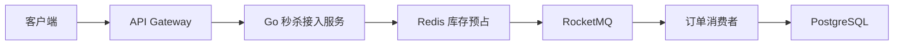
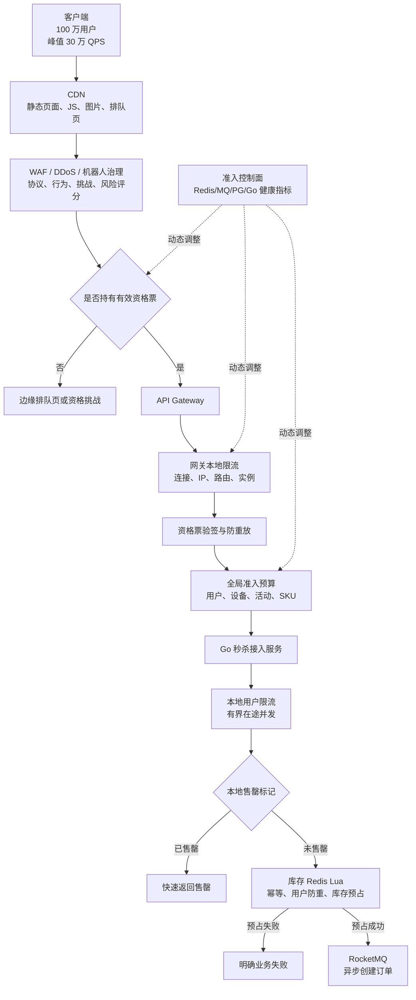
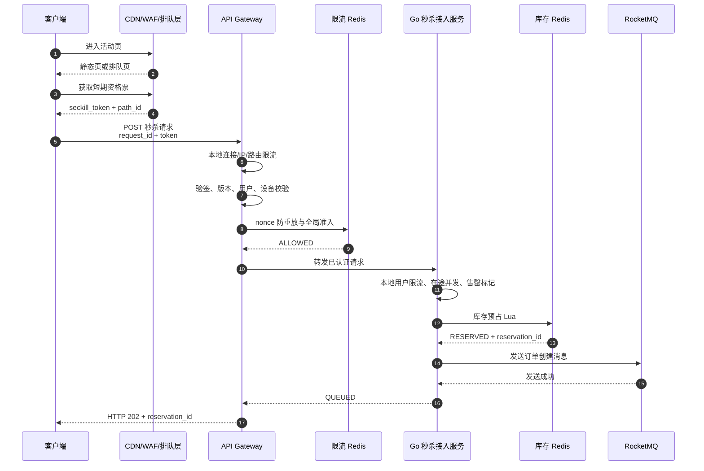
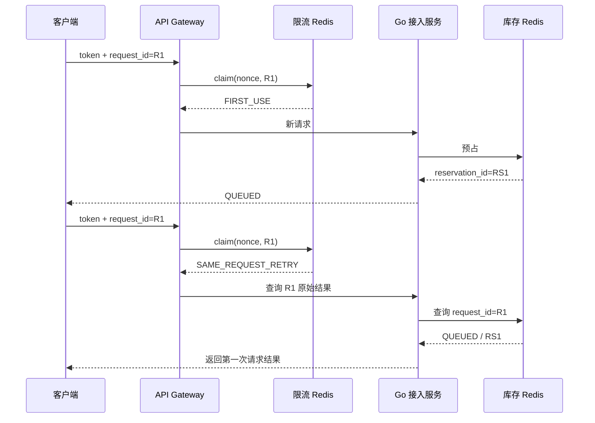
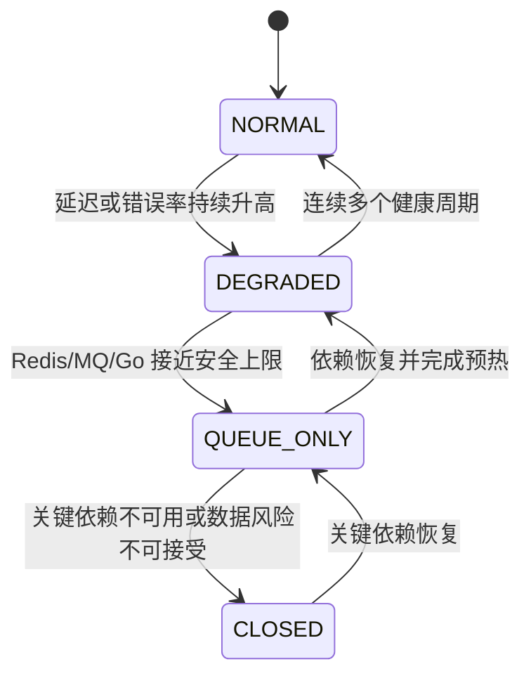

# 第 3 章：接入层流量治理与系统保护

> **核心结论：秒杀接入层的目标不是把 30 万 QPS 全部传入业务系统，而是把绝大多数请求在成本最低的位置转化为静态响应、排队、限流、售罄或明确拒绝。**
>
> 推荐链路为：
>
> **CDN 静态化 → WAF/机器人治理 → 排队与资格票 → 网关本地限流 → 全局准入预算 → Go 本地限流与有界并发 → 本地售罄标记 → Redis 库存预占 → RocketMQ**
>
> 接入层只能决定“请求是否被允许进入秒杀链路”，不能决定“用户是否最终下单成功”。订单成功仍以 PostgreSQL 中的最终订单状态为准。

---

## 1. 本章目标

本章解决以下问题：

1. 如何在 100 万用户、峰值 30 万 QPS 的情况下保护源站。
2. 如何把恶意流量、无资格流量、重复流量和超出系统容量的流量逐层过滤。
3. 如何组合 CDN、WAF、排队页、动态资格票、网关限流、Go 本地限流和 Redis 全局限流。
4. 如何在保护系统的同时兼顾用户公平性。
5. 如何避免限流系统、售罄广播和排队系统自身成为新的单点或热点。
6. 如何设计超时、重试、快速失败、熔断、过载保护和降级状态。
7. 如何定义稳定、可观测、客户端能够正确处理的接口返回语义。

---

## 2. 业务背景

统一业务场景中：

* 100 万用户在 10 秒内发起秒杀请求。
* 峰值入口流量约为 30 万 QPS。
* 单个热点 SKU 只有 10,000 件库存。
* 秒杀提交接口 P99 延迟目标小于 100ms。
* 订单异步创建。
* 同一用户针对同一活动 SKU 最多成功购买一次。

从供需比例看，至少有 99% 的参与用户最终无法购买成功。即使所有请求都是合法用户请求，也没有必要让全部请求依次访问：

* Go 服务；
* Redis 库存 Key；
* RocketMQ；
* PostgreSQL。

假设把 30 万 QPS 全部送入业务服务，而业务响应时间为 100ms，则请求链路中约有：

\[
并发请求数 \approx 300000 \times 0.1 = 30000
\]

这还没有包括客户端重试、长连接、TLS、日志、监控和下游超时产生的额外资源占用。

**越靠近入口拒绝请求，消耗的 CPU、连接、内存、网络带宽和下游资源越少。**Google SRE 对过载治理的建议也是在系统过载时尽早、低成本地拒绝请求，并在更高层的系统中完成流量丢弃，而不是让后端服务先进入雪崩状态。([Google SRE][1])

---

## 3. 核心问题

本章必须回答九个关键问题：

| 问题                          | 本章结论                              |
| --------------------------- | --------------------------------- |
| 是否应该让所有用户直接访问秒杀接口           | 不应该，极端稀缺场景应通过排队或资格票控制进入源站的用户数量    |
| 动态秒杀路径能否防止攻击                | 不能，只能降低低成本扫描流量，不能替代身份、签名、限流和防重放   |
| 限流是否只按 IP 即可                | 不可以，必须组合用户、设备、IP、活动、SKU 和接口维度     |
| 本地限流能否代替全局限流                | 不能，本地限流高性能但只能提供实例级近似控制            |
| 全局限流是否必须每个请求访问同一个 Redis Key | 不应如此，应通过本地预算、分片或令牌租约避免单 Key 热点    |
| 是否应该让被限流请求在 Go 中等待          | 不应该，秒杀热路径应立即拒绝或进入边缘排队页            |
| Redis 不可用时是否应绕过限流           | 新抢购请求默认 Fail Closed；状态查询可根据风险单独降级 |
| 本地售罄标记是否可以永久缓存              | 不可以，必须有版本、短 TTL 和重新开放机制           |
| 静态限流能否解决过载                  | 不能，还需要根据实时健康状态执行负载丢弃和有界并发         |

---

## 4. 未优化的基线方案

最简单但不可用于生产的方案如下：



实现特点：

1. 秒杀接口使用固定 URL。
2. 网关只做身份认证。
3. 所有请求都到达 Go 服务。
4. Go 服务直接调用 Redis Lua 扣减库存。
5. Redis 返回失败后再告诉用户售罄。
6. 客户端发生超时时立即重新请求。
7. 网关只按 IP 做固定窗口限流。
8. 服务没有本地并发上限和过载模式。
9. 每次请求都同步记录完整访问日志。

这种方案在低并发业务中可能能够运行，但在 30 万 QPS 峰值下会迅速暴露结构性问题。

---

## 5. 基线方案的问题

| 维度   | 问题                                           |
| ---- | -------------------------------------------- |
| 正确性  | 动态路径缺失、防重放缺失；客户端超时后更换 `request_id` 会产生新的业务操作 |
| 性能   | 所有流量都经过 TLS、网关、Go、Redis；大量必败请求消耗完整链路成本       |
| 并发   | 瞬时连接、goroutine、Redis连接池和下游等待数量迅速增长           |
| 可用性  | Redis 或 MQ 变慢后，客户端重试进一步放大流量，形成级联故障           |
| 可扩展性 | 单个全局限流 Key、单个热点库存 Key、同步日志都可能成为瓶颈            |
| 公平性  | 纯先到先得奖励低网络延迟、自动化脚本和多设备用户                     |
| 可运维性 | 没有分阶段拒绝原因，无法判断流量在哪一级被拦截                      |
| 安全性  | 只按 IP 限流会误伤 NAT 用户，同时无法阻止代理池和 IPv6 地址轮换      |
| 用户体验 | 用户不知道应该重试、查询、等待还是停止，容易形成无效轮询                 |

---

## 6. 推荐架构

## 6.1 设计原则

接入层采用六项原则：

1. **静态请求与动态提交彻底分离。**
2. **本地限流在前，全局限流在后。**
3. **请求速率限制与在途并发限制同时存在。**
4. **全局限流 Redis 与库存 Redis 最好进行资源隔离。**
5. **排队发生在边缘层，不在 Go 进程内排队。**
6. **限流只是系统保护措施，库存和订单正确性仍由后续链路保证。**

OWASP 将缺少资源限制和速率限制视为 API 安全风险，因为请求会竞争网络、CPU、内存和存储等有限资源。([OWASP][2])

---

## 6.2 多级流量漏斗



### 事务与故障边界

* CDN、WAF、排队、网关限流不参与库存事务。
* 全局限流成功不代表库存预占成功。
* Redis 库存 Lua 只保证 Redis 内部原子性。
* Redis 预占与 RocketMQ 发送之间仍存在可靠性缺口。
* 所有能够重试的提交必须复用同一个 `request_id`。
* 客户端收到“排队中”只能表示请求已被接收，不能表示订单已经创建。

---

## 6.3 准入速率计算

接入层最终允许进入库存链路的速率应取所有关键组件安全预算的最小值：

\[
R_{admit} =
\min(
R_{ticket},
R_{gateway},
R_{redis-safe},
R_{mq-safe},
R_{overload},
R_{fairness-wave}
)
\]

以下是**示例预算，不是通用生产参数**：

| 项目            |    压测或配置结果 | 安全系数 |       可用预算 |
| ------------- | ---------: | ---: | ---------: |
| 排队层释放上限       | 50,000 QPS |    — | 50,000 QPS |
| 网关稳定处理能力      | 60,000 QPS |  75% | 45,000 QPS |
| 库存 Redis 稳定能力 | 60,000 QPS |  70% | 42,000 QPS |
| MQ 生产端稳定能力    | 50,000 QPS |  80% | 40,000 QPS |
| 当前过载控制预算      | 45,000 QPS |    — | 45,000 QPS |

因此：

\[
R_{admit} = 40000\ QPS
\]

这不表示必须持续向 Redis 发送 40,000 QPS。库存售罄后，本地售罄标记应迅速把实际 Redis 请求量降下来。

对于只有 10,000 件库存的 SKU，更推荐按波次释放资格票。例如：

1. 首波释放 12,000 个资格票。
2. 根据预占成功率、无效用户比例和剩余库存，每 200～500ms 增量释放。
3. 库存接近售罄时减小波次。
4. 库存为零后停止发票并广播售罄。

首波倍率必须根据历史到达率和资格转化率校准，不能固定照搬。

---

## 6.4 组件职责

| 组件          | 主要职责                           | 不应承担的职责             |
| ----------- | ------------------------------ | ------------------- |
| CDN         | 静态资源、公共活动信息、排队页、售罄静态页          | 不缓存个性化资格票、订单状态和支付结果 |
| WAF         | 协议校验、请求大小、已知攻击、机器人风险、挑战        | 不作为一人一单最终防线         |
| 排队层         | 把百万用户转换为受控资格票和释放波次             | 不直接修改库存             |
| API Gateway | 身份、路径、资格票、粗粒度限流、防重放            | 不执行订单数据库事务          |
| Go 接入服务     | 参数检查、本地限流、售罄标记、调用库存 Redis、发送消息 | 不在内存中无限排队           |
| 限流 Redis    | 全局准入预算、资格票重放状态、短周期额度           | 不保存最终库存和订单事实        |
| 库存 Redis    | 请求幂等、用户防重、库存预占、reservation     | 不承担所有边缘攻击流量         |
| 控制面         | 汇总健康指标、动态调节速率、切换降级模式           | 不处于单个请求的同步关键路径      |

**限流 Redis 与库存 Redis 建议至少使用不同连接池、不同资源配额，极端流量场景下使用独立集群。**否则限流 Key 的热点和高基数 Key 会影响库存 Lua 的延迟，最终让“保护组件”反过来拖垮正确性关键路径。

---

## 6.5 CDN 与 WAF

### CDN 缓存内容

可以缓存：

* HTML、CSS、JavaScript、图片和视频。
* 活动规则。
* 非个性化 SKU 展示信息。
* 排队页。
* 明确售罄后的短期静态页面。

禁止缓存：

* 短期资格票。
* 用户身份信息。
* `request_id` 查询结果。
* `reservation_id` 状态。
* 订单和支付结果。

### WAF 治理内容

WAF 或边缘层至少应处理：

* HTTP 方法白名单。
* Content-Type 校验。
* 请求体大小限制。
* 异常 Header。
* 扫描器和已知攻击模式。
* 高频连接和异常访问行为。
* 机器人挑战。
* 风险 ASN、代理网络和设备异常。

机器人挑战应尽量在开抢前完成。把复杂 CAPTCHA 放在 100ms 热路径中，会增加延迟、误伤率和系统依赖。

---

## 6.6 动态路径与短期资格票

### 动态路径的真实作用

动态路径可以降低以下流量：

* 未获取活动页面的通用扫描器。
* 直接枚举固定接口的低成本脚本。
* 旧活动路径的重放。
* 错误版本客户端。

但动态路径不能阻止：

* 合法用户分享路径。
* 浏览器自动化。
* 已获取资格票的恶意账号。
* 内部日志或前端监控泄漏路径。
* 代理池和账号农场。

因此，**动态路径只是流量过滤手段，不是安全边界。**

### 资格票结构

建议使用短期签名票，而不是只依赖 URL：

```json
{
  "version": 1,
  "key_id": "ticket-key-202606",
  "activity_id": 10001,
  "sku_id": 90001,
  "user_id": 70000001,
  "device_hash": "sha256:...",
  "activity_version": 8,
  "path_id": "p_7vKh2P",
  "nonce": "n_01J...",
  "not_before_ms": 1782388800000,
  "expires_at_ms": 1782388830000
}
```

签名票应绑定：

* `activity_id`
* `sku_id`
* `user_id`
* `device_hash`
* `activity_version`
* `path_id`
* `not_before`
* `expires_at`
* 一次性 `nonce`

票据格式可以采用 JWS，也可以采用经过严格评审的紧凑 HMAC 格式。不得把签名密钥放在客户端。

### 防重放

推荐过程：

1. 客户端携带资格票和 `request_id` 提交。

2. 服务验证签名、有效时间、活动版本、用户和设备绑定。

3. 第一次使用 `nonce` 时，记录：

   ```text
   nonce → request_id
   ```

4. 相同 `nonce` 与相同 `request_id` 再次提交，视为幂等重试。

5. 相同 `nonce` 与不同 `request_id` 提交，视为重放攻击。

6. nonce 状态 TTL 至少覆盖票据有效期。

Nonce 的基本目的就是使服务端能够识别同一凭据或请求是否已被使用；类似机制在标准协议中也被用于降低重放风险。([RFC 编辑器][3])

还必须遵守以下原则：

* 全程使用 TLS。
* 不在 URL 中携带身份凭据。
* 不记录完整资格票。
* 验签前限制最大票据长度。
* 允许少量时钟偏差，但不能无限放宽。
* 密钥通过 `key_id` 轮换。
* 旧活动版本的票据必须失效。

---

## 6.7 多维限流

### 推荐维度

| 维度      | 示例 Key                           | 主要目的            | 建议性质  |
| ------- | -------------------------------- | --------------- | ----- |
| 单实例     | `instance:submit`                | 防止某个 Go 或网关实例过载 | 硬限制   |
| 接口      | `route:seckill-submit`           | 隔离提交、查询和资格接口    | 硬限制   |
| 用户      | `activity_id+sku_id+user_id`     | 防止单账号高频请求       | 较严格   |
| 设备      | `activity_id+sku_id+device_hash` | 识别多账号共用设备       | 风险信号  |
| IP/网络前缀 | `route+ip_prefix_hash`           | 防止单来源洪泛         | 软限制   |
| 活动      | `activity_id`                    | 控制整体活动流量        | 全局限制  |
| SKU     | `activity_id+sku_id`             | 保护热点库存 Key      | 全局限制  |
| 资格票     | `nonce`                          | 防止票据复用          | 一次性约束 |
| 状态查询    | `user_id+request_id`             | 防止轮询风暴          | 独立限制  |

### 为什么不能只按 IP

只按 IP 会同时产生误伤和漏放：

* 企业、学校、移动网络和家庭 NAT 下，多个合法用户可能共享公网 IP。
* 攻击者可以使用代理池。
* IPv6 环境下，攻击者可能轮换地址。
* CDN 后如果错误信任任意 `X-Forwarded-For`，客户端可以直接伪造来源 IP。
* 用户切换移动网络后 IP 会改变。

因此：

1. 只信任来自已配置反向代理的真实 IP Header。
2. IP 适合作为风险信号和软限制。
3. 用户身份和资格票应作为主要限流维度。
4. 设备指纹同样不能作为绝对身份，只能作为风险信号。

---

## 6.8 限流算法原理对比

| 算法     | 原理             | 优点            | 缺点               | 推荐场景        |
| ------ | -------------- | ------------- | ---------------- | ----------- |
| 固定窗口   | 每个固定时间窗口累计请求数  | 实现简单、O(1)、成本低 | 窗口边界可能瞬间通过接近两倍额度 | 粗粒度边缘限流     |
| 滑动窗口日志 | 保存窗口内每次请求时间    | 精确            | 内存和操作量随请求数增长     | 低 QPS 高价值接口 |
| 滑动窗口计数 | 对当前与上一窗口加权     | O(1)，比固定窗口平滑  | 存在近似误差           | 用户和设备限流     |
| 令牌桶    | 按速率补充令牌，请求消耗令牌 | 支持平均速率和合理突发   | 允许配置范围内的突发       | Go 本地与全局准入  |
| 漏桶     | 请求以固定速率流出      | 下游流量平滑        | 若采用等待会增加延迟和在途请求  | 异步任务、网关平滑   |

### 固定窗口边界问题

假设限制为每秒 100 次：

* 第 1 秒最后 10ms 进入 100 次。
* 第 2 秒最初 10ms 又进入 100 次。

在 20ms 内实际通过了 200 次。

### 令牌桶公式

设：

* 令牌补充速率为 (r)；
* 桶容量为 (B)；
* 当前令牌数为 (T)；
* 距离上次更新为 (\Delta t)。

则：

\[
T' = \min(B, T + r \times \Delta t)
\]

当：

\[
T' \ge cost
\]

请求允许通过，并扣除 `cost`。

Go 的 `golang.org/x/time/rate` 实现了令牌桶，并允许配置补充速率和最大突发量。其 `Limiter` 支持并发调用；`Allow` 立即返回，而 `Wait` 会等待令牌或直到上下文取消。秒杀同步请求路径应优先使用 `Allow`，不应在服务内等待。([Go Packages][4])

### 漏桶的适用边界

漏桶适合把突发工作平滑为固定输出速率。NGINX 官方的 `limit_req` 模块即以漏桶方式限制请求处理速率。([Nginx][5])

但秒杀提交接口的目标是：

* 立即接受；
* 立即拒绝；
* 或进入边缘排队。

不应让大量请求在 Go 内部漏桶队列中等待，否则会增加连接数、goroutine 数和 P99。

---

## 6.9 本地限流与全局限流

| 特性   | 本地限流         | 全局限流          |
| ---- | ------------ | ------------- |
| 决策位置 | 每个网关或 Go 实例  | 共享限流服务或 Redis |
| 网络调用 | 无            | 有             |
| 延迟   | 极低           | 较高            |
| 故障依赖 | 只依赖本进程       | 依赖网络和共享存储     |
| 精度   | 实例级近似        | 集群级更准确        |
| 扩容影响 | 实例增加时总额度可能增加 | 额度与实例数解耦      |
| 适用   | 突发保护、实例保护    | 活动、SKU、用户全局配额 |

例如，三个网关实例各自允许 10,000 QPS，则理论上可能总共通过 30,000 QPS。官方 Envoy Gateway 文档同样区分了本地实例级额度与跨实例共享的全局额度，并推荐本地限流先执行以减少全局限流服务压力。([Envoy Gateway][6])

推荐组合：

1. 本地总入口限制。
2. 本地 IP 和连接限制。
3. 本地用户短突发限制。
4. 全局活动和 SKU 预算。
5. 高风险用户和设备的全局额度。
6. Go 服务的在途请求信号量。

---

## 6.10 如何避免限流组件成为热点

### 不推荐方案

每个请求都访问：

```text
rl:activity:10001:sku:90001
```

这会把所有请求集中到一个 Redis Key。Redis Cluster 中单个 Key 仍然只属于一个 Hash Slot，集群不会自动把一个热点 Key 拆分到多个节点。([Redis][7])

### 推荐方案一：本地预算

控制面根据实例权重分配本地速率：

\[
r_i =
R_{global}
\times
\frac{w_i}{\sum w}
\]

每个实例使用本地令牌桶消费额度。

缺点是：

* 实例变化和负载不均可能产生误差。
* 配置下发有延迟。
* 每个实例的 burst 会叠加。

### 推荐方案二：令牌租约

全局 Redis 不处理每个业务请求，而是周期性向实例分配一批准入令牌：

```text
实例 A 申请 500 个令牌
实例 B 申请 500 个令牌
实例 C 申请 500 个令牌
```

Redis 在分配时先原子扣减全局可分配预算，实例再在本地消费。

优点：

* Redis 请求量由“每个业务请求一次”降低为“每批令牌一次”。
* 全局预算仍由中心统一扣减。
* 实例崩溃不会导致额度超发。

副作用：

* 实例崩溃会使尚未使用的令牌暂时浪费。
* 租约过大时公平性下降。
* 租约过小时 Redis 压力重新上升。

### 推荐方案三：按用户或网络维度自然分片

用户、设备和 IP Key 自然分布到多个 Slot。热点活动总额度通过本地预算或租约实现，而不是依赖单个每请求更新的全局 Key。

### 推荐方案四：限流与库存 Redis 隔离

即使限流 Redis 发生热点或高基数 Key 问题，也不应影响库存预占脚本。

---

## 6.11 排队页与公平性

纯“先到先得”会奖励：

* 网络延迟最低的用户；
* 更接近机房的用户；
* 多设备并发用户；
* 自动化脚本；
* 更精确校时的客户端。

对于 100 万用户争抢 10,000 件库存，推荐采用：

1. 开抢前进入预排队。
2. 每个已认证用户只持有一个排队凭证。
3. 开抢时在预排队集合中进行随机化。
4. 按波次向源站释放资格票。
5. 后续波次根据剩余库存和系统健康状态动态调整。

排队系统常见的 FIFO 与随机释放会产生不同公平性：FIFO 奖励更早进入者，随机释放更倾向于机会均衡。([Cloudflare Docs][8])

### 公平性不是单一技术指标

需要提前确定产品规则：

| 模式      | 优点        | 缺点         |
| ------- | --------- | ---------- |
| 严格 FIFO | 规则容易解释    | 奖励网络和自动化优势 |
| 预排队随机   | 降低毫秒级网络差异 | 用户无法准确预测顺序 |
| 分批抽签    | 公平性较高     | 用户获得结果较慢   |
| 会员加权    | 满足业务优先级   | 需要明确披露规则   |
| 地区配额    | 减少地域网络差异  | 配额设计复杂     |

推荐至少监控：

* 不同网络延迟分位用户的准入率。
* 不同 ASN、地区、设备类型的准入率。
* 单用户资格票数量。
* 单设备关联账号数量。
* 成功用户集中度和 Gini 系数。
* 机器人挑战通过后的异常高频比例。

---

## 7. 核心流程

## 7.1 正常请求流程



### 可重试边界

* 获取资格票失败：根据明确返回码重试。
* 限流 Redis 超时：新请求默认不重试，快速失败。
* 库存 Lua 超时：调用结果不确定，不能更换 `request_id` 重试。
* MQ 发送超时：可能已经发送，必须依靠 `message_id` 和 reservation 扫描恢复。
* 客户端超时：使用相同 `request_id` 查询或有限重试。

---

## 7.2 重复请求与重放流程

### 相同票据、相同 `request_id`



### 相同票据、不同 `request_id`

返回：

```text
REPLAY_REJECTED
```

不得创建新的库存预占。

### 相同 `request_id`、请求体不同

应保存请求关键字段摘要，例如：

```text
body_hash = SHA256(activity_id || sku_id || user_id || quantity)
```

重复请求时若 `body_hash` 不同，返回：

```text
REQUEST_ID_CONFLICT
```

这能够防止客户端错误地复用 `request_id` 表示两个不同业务意图。

---

## 7.3 超时预算

首先必须明确 SLO 边界。本章假设：

> **100ms 指请求进入边缘网关后，到服务返回响应的内部延迟，不包含不可控的用户公网往返时间。**

示例预算如下：

| 阶段           |    P99 预算 |
| ------------ | --------: |
| WAF 与网关转发    |       8ms |
| 身份、资格票和本地限流  |       5ms |
| 全局限流 Redis   |       8ms |
| Go 排队与本地准入   |       4ms |
| 库存 Redis Lua |      15ms |
| RocketMQ 发送  |      25ms |
| 内部网络与序列化     |      10ms |
| 故障与抖动预留      |      25ms |
| **总计**       | **100ms** |

设计要求：

1. 每个下游超时必须小于剩余请求预算。
2. 不得把 100ms 全部交给单个 Redis 或 MQ 调用。
3. 不得在请求路径使用无期限 `Wait`。
4. 在途请求必须有上限。
5. 请求 Context 取消必须传播到 Redis 和 MQ 客户端。
6. 超时后不能自动执行无界重试。

---

## 7.4 客户端重试策略

客户端必须按服务端返回状态执行动作：

| 状态                  | 客户端动作                                |
| ------------------- | ------------------------------------ |
| `QUEUED`            | 不重新提交，按 `next_poll_after_ms` 查询      |
| `SOLD_OUT`          | 停止重试                                 |
| `ALREADY_PURCHASED` | 查询已有订单                               |
| `TOKEN_EXPIRED`     | 停止提交，根据活动规则重新排队                      |
| `REPLAY_REJECTED`   | 停止提交                                 |
| `RATE_LIMITED`      | 遵守 `Retry-After`，且只能复用原 `request_id` |
| `OVERLOADED`        | 不立即重试；仅在返回 `retryable=true` 时有限重试    |
| 网络超时                | 同一 `request_id` 最多有限重试一次，随后改为查询      |

指数退避采用 Full Jitter：

\[
sleep =
Uniform
\left(
0,
\min(cap,\ base \times 2^{attempt})
\right)
\]

固定间隔重试会让大量客户端在相同时间再次访问；退避与随机抖动可以降低请求同步和拥塞。重试本身也可能放大已过载依赖的负载，因此必须设置重试预算。([Amazon Web Services, Inc.][9])

HTTP `429 Too Many Requests` 表示调用方在一定时间内发送了过多请求，并可通过 `Retry-After` 告知等待时间。([RFC 编辑器][10])

---

## 7.5 Go 实例宕机恢复

Go 接入服务应保持无状态。

实例重启后：

* 本地令牌桶状态丢失。
* 本地售罄状态丢失。
* 本地资格票缓存丢失。
* 正在处理的请求可能中断。

恢复机制：

1. 全局限流仍然限制集群总量。
2. 新实例从控制面加载当前活动配置。
3. 新实例获取当前售罄版本和 `stock_epoch`。
4. 未完成的 Redis reservation 由后续补发和对账机制处理。
5. 客户端使用原 `request_id` 查询结果。
6. 新实例逐步获得准入预算，避免启动瞬间抢占大量流量。

本地状态重置可能带来额外 burst，因此本地限制不能是唯一防线。

---

## 7.6 过载保护状态机



### 状态定义

| 状态           | 新抢购    | 状态查询  | 资格票     | 说明        |
| ------------ | ------ | ----- | ------- | --------- |
| `NORMAL`     | 正常开放   | 正常    | 正常发放    | 完整能力      |
| `DEGRADED`   | 降低准入速率 | 正常    | 减少波次    | 丢弃低优先级工作  |
| `QUEUE_ONLY` | 不进入源站  | 保留    | 暂停或少量发放 | 用户停留在边缘排队 |
| `CLOSED`     | 拒绝     | 尽可能保留 | 停止      | 保护正确性     |

静态限流只表达“配置允许多少请求”，并不知道系统是否已经异常。过载保护必须根据 CPU、延迟、队列长度、Redis 错误率、MQ 发送延迟和积压等实时信号触发。Google SRE 明确区分了固定限流和基于健康状态的负载丢弃。([Google SRE][1])

### 避免控制振荡

不得在单个指标越过阈值时立即反复切换状态。推荐：

* 使用 EWMA 平滑。
* 连续三个周期异常才升级。
* 严重故障允许立即升级。
* 恢复需要更多连续健康周期。
* 降低速率可以快速，增加速率必须缓慢。
* 状态切换设置最短保持时间。

---

## 7.7 本地售罄标记和售罄广播

### 本地标记

当库存 Redis 返回 `SOLD_OUT` 时，当前 Go 实例设置：

```text
(activity_id, sku_id, activity_version)
    → LIKELY_SOLD_OUT
```

后续请求可直接失败，不再访问 Redis。

### 一致性风险

#### 假阴性

本地没有售罄标记，但 Redis 已售罄。

后果：

* 增加 Redis 请求。
* 不会超卖，因为 Redis 仍是权威判断。

#### 假阳性

本地认为售罄，但补偿后 Redis 又有可售库存。

后果：

* 合法用户被错误拒绝。
* 产生少卖和公平性问题。

因此本地标记必须：

1. 带 `activity_version`。
2. 带单调递增的 `stock_epoch`。
3. 使用短 TTL。
4. 支持 `STOCK_REOPENED` 事件。
5. 定期重新拉取权威状态。
6. 只作为性能优化，不作为最终库存事实。

### 广播策略

推荐组合：

* Redis 返回售罄时立即设置当前实例本地标记。
* 使用快速 Pub/Sub 或控制流广播。
* 定期加载版本化快照进行收敛。
* 本地标记短 TTL 自动过期。

Redis Pub/Sub 是 at-most-once 语义，订阅方断开期间的消息会丢失，因此不能把 Pub/Sub 作为唯一收敛机制。([Redis][11])

---

## 8. 数据结构

## 8.1 Go 资格票结构

```go
type SeckillTicketClaims struct {
	Version         int    `json:"version"`
	KeyID           string `json:"key_id"`
	ActivityID      int64  `json:"activity_id"`
	SKUID            int64  `json:"sku_id"`
	UserID           int64  `json:"user_id"`
	DeviceHash       string `json:"device_hash"`
	ActivityVersion int64  `json:"activity_version"`
	PathID           string `json:"path_id"`
	Nonce            string `json:"nonce"`
	NotBeforeMS      int64  `json:"not_before_ms"`
	ExpiresAtMS      int64  `json:"expires_at_ms"`
}
```

验证顺序：

1. 检查原始票据长度。
2. 解析 `key_id`。
3. 获取对应验签密钥。
4. 使用常量时间比较验证签名。
5. 解析 Payload。
6. 检查 `not_before` 和 `expires_at`。
7. 检查 `activity_id`、`sku_id`、`user_id`。
8. 检查 `activity_version` 和 `path_id`。
9. 检查设备绑定。
10. 执行 nonce 防重放。

不要在验签前信任 Payload 中的任何字段。

---

## 8.2 准入策略结构

```go
type ActivityAdmissionPolicy struct {
	ActivityID int64
	SKUID      int64
	Version    int64

	Mode string // NORMAL, DEGRADED, QUEUE_ONLY, CLOSED

	MaxOriginQPS int
	MaxInFlight  int

	TicketTTL       time.Duration
	WaveSize        int
	WaveInterval    time.Duration
	LocalSoldOutTTL time.Duration

	UserRatePerSecond   float64
	UserBurst           int
	DeviceRatePerSecond float64
	DeviceBurst         int
}
```

策略必须版本化。服务拒绝比本地版本更旧的更新，防止乱序配置覆盖新配置。

---

## 8.3 Redis Key

以下 Key 属于接入与限流域，不代表库存域的完整 Key 设计。

| Key                                                      | Value                       |      TTL | 用途        |
| -------------------------------------------------------- | --------------------------- | -------: | --------- |
| `rl:replay:{n:<nonce>}`                                  | `request_id`                | 资格票剩余有效期 | 防重放       |
| `rl:user:{u:<user_id>}:a:<activity_id>:s:<sku_id>`       | 令牌桶状态                       | 至少两倍填满周期 | 用户限流      |
| `rl:device:{d:<device_hash>}:a:<activity_id>:s:<sku_id>` | 令牌桶状态                       |       短期 | 设备限流      |
| `rl:ip:{p:<prefix_hash>}:route:submit`                   | 令牌桶状态                       |       短期 | IP/网络前缀限制 |
| `rl:lease:{a:<activity_id>:s:<sku_id>}:<window>`         | 剩余全局令牌                      |     当前窗口 | 实例令牌租约    |
| `sec:soldout:{activity_id:sku_id}`                       | `state/version/stock_epoch` |   活动期加缓冲 | 权威售罄信号    |
| `sec:admission:{activity_id:sku_id}`                     | 版本化准入策略                     |   活动期加缓冲 | 控制面配置     |

Redis Cluster 中脚本访问的所有 Key 必须通过 `KEYS` 显式传入；需要原子访问多个 Key 时，这些 Key 还必须落在同一个 Hash Slot。Redis 官方文档明确要求脚本不要在运行时自行生成未声明的 Key。([Redis][12])

多维限流通常不要求跨所有维度原子提交。用户桶已经消费、随后 SKU 桶拒绝，只会造成少量额度浪费，不会破坏库存正确性。为了强行实现原子限流而把所有维度放入同一热点 Slot，通常得不偿失。

---

## 8.4 售罄控制事件

```json
{
  "schema_version": 1,
  "message_id": "msg_01J...",
  "event_type": "SOLD_OUT",
  "activity_id": 10001,
  "sku_id": 90001,
  "activity_version": 8,
  "stock_epoch": 31,
  "emitted_at": "2026-06-25T12:00:00.123Z"
}
```

重新开放时：

```json
{
  "schema_version": 1,
  "message_id": "msg_01J...",
  "event_type": "STOCK_REOPENED",
  "activity_id": 10001,
  "sku_id": 90001,
  "activity_version": 8,
  "stock_epoch": 32,
  "emitted_at": "2026-06-25T12:00:02.000Z"
}
```

接收方只应用：

```text
incoming.stock_epoch > local.stock_epoch
```

的事件。

---

## 8.5 接口返回结构

```json
{
  "request_id": "req_01J...",
  "reservation_id": "rsv_01J...",
  "status": "QUEUED",
  "code": "SECKILL_QUEUED",
  "message": "请求已进入异步处理",
  "retryable": false,
  "next_action": "POLL",
  "next_poll_after_ms": 500,
  "server_time": "2026-06-25T12:00:00.123Z"
}
```

### 返回码设计

| HTTP | 业务码                      | 含义               | 客户端动作             |
| ---: | ------------------------ | ---------------- | ----------------- |
|  202 | `SECKILL_QUEUED`         | 已接收，订单尚未创建       | 查询状态              |
|  200 | `SECKILL_SOLD_OUT`       | 库存已售罄            | 停止提交              |
|  200 | `REQUEST_REPLAYED`       | 相同请求，返回原结果       | 按原结果处理            |
|  400 | `INVALID_ARGUMENT`       | 参数不合法            | 修正请求              |
|  400 | `REQUEST_ID_CONFLICT`    | 同一请求 ID 对应不同业务内容 | 停止并告警             |
|  401 | `UNAUTHENTICATED`        | 用户未认证            | 重新认证              |
|  403 | `TOKEN_INVALID`          | 资格票签名或绑定错误       | 停止                |
|  403 | `TOKEN_EXPIRED`          | 资格票过期            | 重新排队或停止           |
|  403 | `REPLAY_REJECTED`        | 票据被不同请求复用        | 停止                |
|  409 | `ALREADY_PURCHASED`      | 用户已有有效订单或预占      | 查询已有结果            |
|  429 | `RATE_LIMITED`           | 当前用户或来源超过额度      | 遵守 `Retry-After`  |
|  503 | `SYSTEM_OVERLOADED`      | 系统整体过载           | 不立即重试             |
|  503 | `DEPENDENCY_UNAVAILABLE` | 关键依赖不可用          | 使用同一请求 ID 有限重试或查询 |

不要把 `429` 和 `503` 混用：

* `429` 表示当前调用方发送过快。
* `503` 表示服务整体暂时无法承担请求。

---

## 9. 核心代码

## 9.1 Go 本地令牌桶

下面实现具有：

* 分片 Map。
* 有界 Key 数量。
* 空闲 Key 清理。
* 单独的溢出限流桶。
* Context 控制的清理协程。
* 无请求级 goroutine。

```go
package admission

import (
	"context"
	"errors"
	"hash/maphash"
	"sync"
	"sync/atomic"
	"time"

	"golang.org/x/time/rate"
)

type KeyedLimiterConfig struct {
	Limit rate.Limit
	Burst int

	Shards     int
	MaxEntries int64
	IdleTTL    time.Duration

	CleanupInterval time.Duration
	CleanupBatch    int

	// 达到最大 Key 数量后，未知 Key 共用该限制器，
	// 避免攻击者通过持续制造新 Key 耗尽内存。
	OverflowLimit rate.Limit
	OverflowBurst int
}

func (c KeyedLimiterConfig) Validate() error {
	switch {
	case c.Limit <= 0:
		return errors.New("limit must be positive")
	case c.Burst <= 0:
		return errors.New("burst must be positive")
	case c.Shards <= 0:
		return errors.New("shards must be positive")
	case c.MaxEntries <= 0:
		return errors.New("max entries must be positive")
	case c.IdleTTL <= 0:
		return errors.New("idle TTL must be positive")
	case c.CleanupInterval <= 0:
		return errors.New("cleanup interval must be positive")
	case c.CleanupBatch <= 0:
		return errors.New("cleanup batch must be positive")
	case c.OverflowLimit <= 0:
		return errors.New("overflow limit must be positive")
	case c.OverflowBurst <= 0:
		return errors.New("overflow burst must be positive")
	default:
		return nil
	}
}

type limiterEntry struct {
	limiter  *rate.Limiter
	lastSeen atomic.Int64
}

type limiterShard struct {
	mu      sync.RWMutex
	entries map[string]*limiterEntry
}

type KeyedLimiter struct {
	cfg KeyedLimiterConfig

	seed   maphash.Seed
	shards []limiterShard

	size     atomic.Int64
	overflow *rate.Limiter
}

func NewKeyedLimiter(cfg KeyedLimiterConfig) (*KeyedLimiter, error) {
	if err := cfg.Validate(); err != nil {
		return nil, err
	}

	shards := make([]limiterShard, cfg.Shards)
	for i := range shards {
		shards[i].entries = make(map[string]*limiterEntry)
	}

	return &KeyedLimiter{
		cfg:      cfg,
		seed:     maphash.MakeSeed(),
		shards:   shards,
		overflow: rate.NewLimiter(cfg.OverflowLimit, cfg.OverflowBurst),
	}, nil
}

func (l *KeyedLimiter) shardFor(key string) *limiterShard {
	hash := maphash.String(l.seed, key)
	index := int(hash % uint64(len(l.shards)))
	return &l.shards[index]
}

// AllowN 立即返回，不在请求路径等待令牌。
func (l *KeyedLimiter) AllowN(
	key string,
	n int,
	now time.Time,
) bool {
	if key == "" || n <= 0 {
		return false
	}

	shard := l.shardFor(key)

	shard.mu.RLock()
	entry := shard.entries[key]
	shard.mu.RUnlock()

	if entry != nil {
		entry.lastSeen.Store(now.UnixNano())
		return entry.limiter.AllowN(now, n)
	}

	shard.mu.Lock()

	// 双重检查，避免并发创建相同 Key。
	entry = shard.entries[key]
	if entry == nil {
		// 全局数量使用原子计数。达到上限后不再创建新 Key。
		if l.size.Add(1) > l.cfg.MaxEntries {
			l.size.Add(-1)
			shard.mu.Unlock()

			// 新的未知 Key 共享较严格的溢出桶。
			return l.overflow.AllowN(now, n)
		}

		entry = &limiterEntry{
			limiter: rate.NewLimiter(l.cfg.Limit, l.cfg.Burst),
		}
		entry.lastSeen.Store(now.UnixNano())
		shard.entries[key] = entry
	}

	shard.mu.Unlock()

	entry.lastSeen.Store(now.UnixNano())
	return entry.limiter.AllowN(now, n)
}

func (l *KeyedLimiter) Size() int64 {
	return l.size.Load()
}

// RunJanitor 应从应用生命周期启动一次，
// 在 ctx 取消后退出。
func (l *KeyedLimiter) RunJanitor(ctx context.Context) {
	ticker := time.NewTicker(l.cfg.CleanupInterval)
	defer ticker.Stop()

	nextShard := 0

	for {
		select {
		case <-ctx.Done():
			return

		case now := <-ticker.C:
			cutoff := now.Add(-l.cfg.IdleTTL).UnixNano()

			for i := 0; i < l.cfg.CleanupBatch; i++ {
				l.cleanupShard(nextShard, cutoff)
				nextShard = (nextShard + 1) % len(l.shards)
			}
		}
	}
}

func (l *KeyedLimiter) cleanupShard(index int, cutoff int64) {
	shard := &l.shards[index]

	shard.mu.Lock()
	defer shard.mu.Unlock()

	for key, entry := range shard.entries {
		if entry.lastSeen.Load() >= cutoff {
			continue
		}

		delete(shard.entries, key)
		l.size.Add(-1)
	}
}
```

示例配置：

```go
userLimiter, err := NewKeyedLimiter(KeyedLimiterConfig{
	Limit:  rate.Limit(0.5), // 示例：平均每 2 秒 1 次
	Burst:  3,               // 容忍网络重试突发
	Shards: 256,

	MaxEntries: 500_000,
	IdleTTL:    2 * time.Minute,

	CleanupInterval: 250 * time.Millisecond,
	CleanupBatch:    8,

	OverflowLimit: rate.Limit(100),
	OverflowBurst: 200,
})
if err != nil {
	return err
}

go userLimiter.RunJanitor(appCtx)
```

### 代码边界

* 新 Key 的令牌桶初始是满的，因此攻击者轮换 Key 可能绕过单 Key 限制。
* 必须组合身份、设备、IP 和 Key 总数上限。
* 清理后重新创建 Key 会恢复 burst，因此 `IdleTTL` 不能太短。
* 本地状态不是全局额度。
* `overflow` 被触发必须告警，这通常意味着异常基数或内存预算不足。

---

## 9.2 Redis Lua 全局令牌桶

脚本使用整数毫令牌，避免浮点累计误差。

### KEYS

```text
KEYS[1]：令牌桶 Key
```

### ARGV

```text
ARGV[1]：rate_per_sec，每秒补充的完整令牌数
ARGV[2]：capacity，桶容量
ARGV[3]：cost，本次请求消耗令牌数
ARGV[4]：ttl_ms，Key TTL
```

### 返回值

```text
[code, remaining_milli_tokens, retry_after_ms, redis_now_ms]

code = 1   允许
code = 0   限流
code = -1  参数错误
code = -2  cost 大于 capacity
```

```lua
-- token_bucket.lua
--
-- KEYS[1] bucket key
--
-- ARGV[1] rate_per_sec
-- ARGV[2] capacity
-- ARGV[3] cost
-- ARGV[4] ttl_ms

if #KEYS ~= 1 then
    return {-1, 0, 0, 0}
end

local rate_per_sec = tonumber(ARGV[1])
local capacity = tonumber(ARGV[2])
local cost = tonumber(ARGV[3])
local ttl_ms = tonumber(ARGV[4])

if not rate_per_sec
    or not capacity
    or not cost
    or not ttl_ms
    or rate_per_sec <= 0
    or capacity <= 0
    or cost <= 0
    or ttl_ms <= 0 then
    return {-1, 0, 0, 0}
end

if cost > capacity then
    return {-2, 0, 0, 0}
end

-- 每个完整令牌使用 1000 个整数单位。
local scale = 1000
local capacity_milli = capacity * scale
local cost_milli = cost * scale

-- 使用 Redis 服务器时间，避免不同 Go 实例时钟偏差。
local now = redis.call("TIME")
local now_ms = now[1] * 1000 + math.floor(now[2] / 1000)

local state = redis.call(
    "HMGET",
    KEYS[1],
    "tokens_milli",
    "ts_ms"
)

local tokens_milli = tonumber(state[1])
local last_ms = tonumber(state[2])

if not tokens_milli then
    tokens_milli = capacity_milli
end

if not last_ms then
    last_ms = now_ms
end

-- Redis 时间理论上不会倒退；仍做防御性处理。
local elapsed_ms = now_ms - last_ms
if elapsed_ms < 0 then
    elapsed_ms = 0
end

-- rate_per_sec 个毫令牌每毫秒，
-- 等价于 rate_per_sec 个完整令牌每秒。
local refill_milli = elapsed_ms * rate_per_sec
tokens_milli = math.min(
    capacity_milli,
    tokens_milli + refill_milli
)

local allowed = 0
local retry_after_ms = 0

if tokens_milli >= cost_milli then
    allowed = 1
    tokens_milli = tokens_milli - cost_milli
else
    local deficit_milli = cost_milli - tokens_milli

    -- 向上取整。
    retry_after_ms = math.floor(
        (deficit_milli + rate_per_sec - 1)
        / rate_per_sec
    )
end

-- TTL 至少覆盖两次从空桶填满的时间。
local min_ttl_ms = math.ceil(
    capacity_milli / rate_per_sec
) * 2

if ttl_ms < min_ttl_ms then
    ttl_ms = min_ttl_ms
end

redis.call(
    "HSET",
    KEYS[1],
    "tokens_milli",
    tostring(tokens_milli),
    "ts_ms",
    tostring(now_ms)
)

redis.call("PEXPIRE", KEYS[1], ttl_ms)

return {
    allowed,
    tokens_milli,
    retry_after_ms,
    now_ms
}
```

Redis 保证单个脚本在 Redis 内原子执行，但脚本执行期间会阻塞该 Redis 实例上的其他活动。因此脚本必须保持固定复杂度，不得扫描大集合或执行长循环。([Redis][12])

脚本的原子性不覆盖：

* 网关和 Redis 之间的网络。
* 限流 Redis与库存 Redis。
* Redis 与 RocketMQ。
* Redis 与 PostgreSQL。

---

## 9.3 Go 调用 Redis Lua

以下示例使用 `github.com/redis/go-redis/v9` 的脚本接口。项目应固定具体依赖版本并通过集成测试验证。

```go
package admission

import (
	"context"
	"fmt"
	"strconv"
	"time"

	"github.com/redis/go-redis/v9"
)

type DistributedLimitResult struct {
	Allowed              bool
	RemainingMilliTokens int64
	RetryAfter           time.Duration
	RedisNowMS           int64
}

type RedisTokenBucket struct {
	client  redis.Scripter
	script  *redis.Script
	timeout time.Duration
}

func NewRedisTokenBucket(
	client redis.Scripter,
	scriptSource string,
	timeout time.Duration,
) *RedisTokenBucket {
	return &RedisTokenBucket{
		client:  client,
		script:  redis.NewScript(scriptSource),
		timeout: timeout,
	}
}

func (l *RedisTokenBucket) Allow(
	parent context.Context,
	key string,
	ratePerSecond int64,
	capacity int64,
	cost int64,
	ttl time.Duration,
) (DistributedLimitResult, error) {
	if key == "" {
		return DistributedLimitResult{},
			fmt.Errorf("rate limit key is empty")
	}

	if ratePerSecond <= 0 ||
		capacity <= 0 ||
		cost <= 0 ||
		ttl <= 0 {
		return DistributedLimitResult{},
			fmt.Errorf("invalid rate limit arguments")
	}

	ctx, cancel := context.WithTimeout(parent, l.timeout)
	defer cancel()

	values, err := l.script.Run(
		ctx,
		l.client,
		[]string{key},
		ratePerSecond,
		capacity,
		cost,
		ttl.Milliseconds(),
	).Slice()
	if err != nil {
		return DistributedLimitResult{},
			fmt.Errorf("run token bucket script: %w", err)
	}

	if len(values) != 4 {
		return DistributedLimitResult{},
			fmt.Errorf(
				"unexpected token bucket response length: %d",
				len(values),
			)
	}

	code, err := redisInt64(values[0])
	if err != nil {
		return DistributedLimitResult{}, err
	}

	remaining, err := redisInt64(values[1])
	if err != nil {
		return DistributedLimitResult{}, err
	}

	retryAfterMS, err := redisInt64(values[2])
	if err != nil {
		return DistributedLimitResult{}, err
	}

	redisNowMS, err := redisInt64(values[3])
	if err != nil {
		return DistributedLimitResult{}, err
	}

	switch code {
	case 1:
		return DistributedLimitResult{
			Allowed:              true,
			RemainingMilliTokens: remaining,
			RedisNowMS:           redisNowMS,
		}, nil

	case 0:
		return DistributedLimitResult{
			Allowed:              false,
			RemainingMilliTokens: remaining,
			RetryAfter: time.Duration(retryAfterMS) *
				time.Millisecond,
			RedisNowMS: redisNowMS,
		}, nil

	case -1:
		return DistributedLimitResult{},
			fmt.Errorf("token bucket script rejected arguments")

	case -2:
		return DistributedLimitResult{},
			fmt.Errorf("token bucket cost exceeds capacity")

	default:
		return DistributedLimitResult{},
			fmt.Errorf("unknown token bucket code: %d", code)
	}
}

func redisInt64(value any) (int64, error) {
	switch v := value.(type) {
	case int64:
		return v, nil

	case string:
		n, err := strconv.ParseInt(v, 10, 64)
		if err != nil {
			return 0, fmt.Errorf(
				"parse Redis integer %q: %w",
				v,
				err,
			)
		}
		return n, nil

	case []byte:
		n, err := strconv.ParseInt(string(v), 10, 64)
		if err != nil {
			return 0, fmt.Errorf(
				"parse Redis integer %q: %w",
				string(v),
				err,
			)
		}
		return n, nil

	default:
		return 0, fmt.Errorf(
			"unexpected Redis integer type %T",
			value,
		)
	}
}
```

### 超时处理

限流脚本超时后，服务无法确定脚本是否已经消耗令牌。

推荐策略：

* 不在同步路径盲目重试。
* 新抢购请求 Fail Closed。
* 记录 `LIMITER_RESULT_UNKNOWN`。
* 对系统正确性而言，多消耗一次限流令牌只会造成少放，不会超卖。
* 查询接口可以使用独立的本地限流降级。

---

## 9.4 接入处理伪代码

```go
// 伪代码：具体 Redis 预占逻辑在第 4 章展开。
func SubmitSeckill(
	ctx context.Context,
	req SubmitRequest,
) SubmitResult {
	// 1. 最便宜的实例级过载保护。
	if !instanceLimiter.Allow() {
		return SystemOverloaded()
	}

	// 2. 粗粒度来源限制。
	if !ipLimiter.Allow(req.TrustedIPKey) {
		return RateLimited("ip")
	}

	// 3. 验证身份、资格票和活动版本。
	claims, err := ticketVerifier.Verify(ctx, req.Token)
	if err != nil {
		return TokenRejected(err)
	}

	if claims.UserID != req.UserID ||
		claims.ActivityID != req.ActivityID ||
		claims.SKUID != req.SKUID {
		return TokenInvalid()
	}

	// 4. 防重放。相同 nonce + request_id 可视为重试。
	replayResult, err := replayGuard.Claim(
		ctx,
		claims.Nonce,
		req.RequestID,
		claims.ExpiresAtMS,
	)
	if err != nil {
		// 新抢购默认 Fail Closed。
		return DependencyUnavailable("replay_guard")
	}

	if replayResult == ReplayDifferentRequest {
		return ReplayRejected()
	}

	if replayResult == ReplaySameRequest {
		// 返回第一次请求结果；如果仍未知，提示客户端查询。
		return requestResultStore.GetOrPending(
			ctx,
			req.RequestID,
		)
	}

	// 5. 本地售罄属于性能捷径。
	if soldOutCache.IsSoldOut(
		req.ActivityID,
		req.SKUID,
		claims.ActivityVersion,
	) {
		return SoldOut()
	}

	// 6. 本地用户和设备限制。
	if !userLimiter.Allow(req.UserID) {
		return RateLimited("user")
	}
	if !deviceLimiter.Allow(claims.DeviceHash) {
		return RateLimited("device")
	}

	// 7. 全局活动/SKU 准入。
	globalDecision, err := globalLimiter.Allow(
		ctx,
		req.ActivityID,
		req.SKUID,
	)
	if err != nil {
		return DependencyUnavailable("global_limiter")
	}
	if !globalDecision.Allowed {
		return RateLimitedWithRetryAfter(
			globalDecision.RetryAfter,
		)
	}

	// 8. 限制当前实例访问下游的在途请求。
	if !downstreamSemaphore.TryAcquire(1) {
		return SystemOverloaded()
	}
	defer downstreamSemaphore.Release(1)

	// 9. Redis Lua：request_id 幂等、用户防重、库存预占。
	reservation, err := inventoryRedis.Reserve(ctx, req)
	if err != nil {
		return ClassifyReservationError(err)
	}

	// 10. 发送 MQ。发送未知结果由 reservation 补发机制恢复。
	return sendOrderMessage(ctx, reservation)
}
```

---

## 10. 优化设计与原理

## 10.1 CDN 静态化与源站隔离

**优化点：** 静态资源和排队页在 CDN 或边缘层响应。
**要解决的问题：** 大量用户反复刷新活动页造成源站 QPS、带宽和连接浪费。
**未经优化时会发生什么：** Go 服务处理与秒杀提交无关的 HTML、图片和规则请求。
**实现方式：** 静态资源长缓存；公共活动信息短缓存；个性化接口 `no-store`。
**底层原理：** 内容在更靠近用户的位置命中，不进入源站网络和应用链路。
**为什么有效：** 静态响应不占用 Go、Redis、MQ 和数据库资源。
**预计收益：** 静态资源源站 QPS 接近零，具体数值由 CDN 命中率决定。
**代价和副作用：** 缓存失效、版本发布和错误缓存风险。
**适用边界：** 只适合非个性化、可缓存数据。
**不适用场景：** 订单状态、资格票、支付结果。
**监控指标：** CDN 命中率、回源 QPS、缓存版本、错误响应率。
**验证方法：** 模拟百万用户刷新，确认静态请求不会进入源站。

---

## 10.2 资格票在热路径之前发放

**优化点：** 开抢前完成认证、机器人挑战和资格票发放。
**要解决的问题：** 热路径同时承担认证、挑战和库存抢占。
**未经优化时会发生什么：** 开抢瞬间 CPU 密集型验签或挑战依赖成为瓶颈。
**实现方式：** 用户先进入预排队，获得短期、用户绑定的签名票。
**底层原理：** 把可提前完成的工作从峰值时间窗口移出。
**为什么有效：** 热路径只做快速验签和绑定校验。
**预计收益：** 降低热路径 CPU 和外部身份服务调用量。
**代价和副作用：** 需要票据轮换、防重放和吊销机制。
**适用边界：** 活动时间和参与人群相对明确的秒杀。
**不适用场景：** 完全随机、长期开放且无明显峰值的普通购买。
**监控指标：** 发票成功率、验签耗时、过期票比例、重放拒绝量。
**验证方法：** 批量窃取或重复使用票据，确认不能产生新业务操作。

---

## 10.3 本地限流加全局限流

**优化点：** 本地令牌桶先过滤，全局限流控制整体预算。
**要解决的问题：** 仅全局限流导致每个请求都访问共享服务；仅本地限流无法控制总量。
**未经优化时会发生什么：** 全局限流 Redis 成为热点，或扩容后整体流量失控。
**实现方式：** 本地实例、IP 和短突发限制在前；活动和 SKU 全局限制在后。
**底层原理：** 高频廉价判断本地化，必须共享的预算才进入分布式系统。
**为什么有效：** 减少全局限流调用，同时保持集群总预算。
**预计收益：** 全局限流调用量与无效流量比例成反比下降。
**代价和副作用：** 本地额度存在近似误差。
**适用边界：** 多实例、流量分布基本可控的服务。
**不适用场景：** 需要法律或计费意义上绝对精确额度的接口。
**监控指标：** 本地拒绝率、全局调用率、实例间通过率偏差。
**验证方法：** 扩容、缩容和负载不均时验证总通过量边界。

---

## 10.4 令牌租约代替每请求全局计数

**优化点：** 实例批量租用全局令牌。
**要解决的问题：** 热点 SKU 的全局限流 Key 成为单 Slot 热点。
**未经优化时会发生什么：** 每个请求都执行 Redis Lua，限流 Redis 先于库存 Redis 饱和。
**实现方式：** Redis 原子分配批量令牌，实例本地消费。
**底层原理：** 将共享协调频率从业务请求频率降低到租约更新频率。
**为什么有效：** 单次 Redis 操作支持多个后续本地请求。
**预计收益：** 批量为 500 时，理论协调调用量可降低约 500 倍。
**代价和副作用：** 节点崩溃造成未使用令牌暂时浪费。
**适用边界：** 系统保护型额度，允许少量少放。
**不适用场景：** 必须实时回收每一个未使用额度的计费场景。
**监控指标：** 租约申请率、未用令牌量、实例预算耗尽率。
**验证方法：** 实例持有租约后立即宕机，确认不会超发，只会少放。

---

## 10.5 本地售罄标记

**优化点：** 库存售罄后在进程内快速拒绝。
**要解决的问题：** 库存归零后仍有大量请求访问同一 Redis Key。
**未经优化时会发生什么：** Redis 持续处理注定失败的库存请求。
**实现方式：** 本地标记、短 TTL、`stock_epoch`、售罄与重新开放事件。
**底层原理：** 把稳定的短期失败结果缓存到调用方。
**为什么有效：** 本地内存读取远低于跨网络 Redis 调用成本。
**预计收益：** 售罄后的 Redis QPS可快速下降一个或多个数量级。
**代价和副作用：** 可能产生短时间假阳性。
**适用边界：** 售罄后短时间内大概率不会恢复的活动。
**不适用场景：** 库存持续高频补充并立即重新出售的业务。
**监控指标：** 本地售罄命中率、版本差异、重新开放延迟。
**验证方法：** 丢弃、乱序发送售罄事件，验证最终收敛和 TTL 边界。

---

## 10.6 边缘排队与波次释放

**优化点：** 百万用户先进入边缘排队，再按波次获得提交资格。
**要解决的问题：** 合法用户本身已经超过源站容量。
**未经优化时会发生什么：** 即使没有机器人，源站仍会被真实用户打满。
**实现方式：** 预排队、随机化、资格票、动态波次。
**底层原理：** 将到达流量整形成受控输出速率。
**为什么有效：** 源站只处理获得资格的用户。
**预计收益：** 源站入口可以被硬限制在安全预算内。
**代价和副作用：** 排队系统复杂，用户需要等待。
**适用边界：** 库存极少、用户量极大、活动开始时间明确。
**不适用场景：** 库存充足或流量平稳的日常购买。
**监控指标：** 排队人数、等待时间、票据释放率、放弃率、公平性指标。
**验证方法：** 预排队百万用户，确认源站 QPS 不超过配置预算。

---

## 10.7 自适应负载丢弃

**优化点：** 根据实际健康状态动态降低准入率。
**要解决的问题：** 静态额度在依赖降级时仍可能过高。
**未经优化时会发生什么：** Redis、MQ 或 Go 性能下降后，固定流量继续进入并触发雪崩。
**实现方式：** 根据 P99、错误率、CPU、在途量、MQ 延迟和积压调节预算。
**底层原理：** 通过负反馈把工作量维持在系统稳定区间。
**为什么有效：** 避免资源耗尽后所有请求一起失败。
**预计收益：** 过载时牺牲部分请求，保持核心请求可用。
**代价和副作用：** 控制参数不当可能振荡或少用容量。
**适用边界：** 有明确健康指标和容量基线的服务。
**不适用场景：** 指标本身严重延迟或不可信的系统。
**监控指标：** 准入率、状态切换、资源利用率、误触发次数。
**验证方法：** 注入 Redis 延迟和 MQ 错误，确认准入率自动下降。

---

## 10.8 重试预算与随机抖动

**优化点：** 限制重试次数并引入退避和随机抖动。
**要解决的问题：** 客户端和服务端重试放大故障流量。
**未经优化时会发生什么：** 依赖越慢，重试越多，系统越难恢复。
**实现方式：** 同一 `request_id`、最大尝试数、指数退避、Full Jitter。
**底层原理：** 降低重试频率并打散重试时间。
**为什么有效：** 避免大量客户端在同一时间重新请求。
**预计收益：** 故障恢复期的峰值重试流量显著下降。
**代价和副作用：** 单个用户可能更晚获得结果。
**适用边界：** 只适合可安全重试或具备幂等键的操作。
**不适用场景：** 无幂等保护的扣款和库存操作。
**监控指标：** 重试次数、重试成功率、重试放大量。
**验证方法：** 让 10% 请求超时，比较固定重试与 Full Jitter 的峰值流量。

---

## 11. 故障分析

| 故障点         | 后果                 | 检测方式                | 自动恢复                   | 人工处理             |
| ----------- | ------------------ | ------------------- | ---------------------- | ---------------- |
| CDN 回源异常    | 静态请求进入源站或页面不可用     | 命中率、回源错误率           | 第二 CDN、静态降级页           | 检查缓存规则和域名路由      |
| WAF 规则误伤    | 合法用户无法获取资格         | 拦截率、申诉、分群异常         | 回滚规则、灰度关闭              | 分析规则命中样本         |
| 资格票密钥不一致    | 大量票据验签失败           | 按 `key_id` 的失败率     | 双密钥轮换窗口                | 回滚密钥配置           |
| 时钟偏差        | 票据提前失效或尚未生效        | 时钟监控、错误码分布          | NTP 校正、小幅容错            | 检查节点时间源          |
| 限流 Redis 超时 | 无法判断全局额度           | 超时率、P99             | 使用未过期租约；耗尽后关闭新提交       | 检查热点 Key、网络和节点负载 |
| 本地限流 Key 爆炸 | Go 内存增长            | Entry 数、overflow 计数 | 达到上限后走共享溢出桶            | 排查攻击来源和 Key 设计   |
| 全局热点 Key    | Redis CPU、延迟升高     | Hot Key、命令延迟        | 切换租约或分片预算              | 调整准入架构           |
| Go 在途请求耗尽   | 新请求延迟和超时           | semaphore 使用率       | 立即拒绝新请求                | 分析慢依赖            |
| 售罄广播丢失      | 部分实例继续访问 Redis     | 本地版本差异              | TTL 和定期快照收敛            | 检查广播链路           |
| 售罄事件乱序      | 已重新开放的 SKU 被再次标记售罄 | `stock_epoch` 回退计数  | 忽略旧版本                  | 检查事件生产顺序         |
| 排队系统不可用     | 无法平滑放量             | 边缘错误率               | 默认 Queue Only 或 Reject | 切换备用排队入口         |
| 客户端无视 429   | 重试风暴               | 同一身份持续重试            | 更严格限流、临时封禁             | SDK 修复和规则治理      |
| 控制面失联       | 无法更新准入预算           | 配置年龄                | 使用最后正确配置和未过期租约         | 恢复控制面            |
| 配置错误把额度设得过大 | 源站瞬间过载             | 实际 QPS 超预算          | 服务端硬上限兜底               | 回滚配置并审计          |

### 限流 Redis 故障策略

对于新抢购请求：

1. 有未过期本地租约：在租约额度内继续。
2. 租约耗尽：Fail Closed。
3. 不允许无上限退化为纯本地放行。
4. 状态查询使用独立限制，可在风险允许时继续服务。

### 排队系统故障策略

排队系统失效时不应自动切换成“全部放行”。推荐优先级：

```text
备用排队系统
→ 静态排队页
→ 拒绝新提交
```

---

## 12. 可观测性

## 12.1 指标

### 流量漏斗指标

```text
seckill_ingress_requests_total{stage, decision, reason}
seckill_admitted_requests_total{activity_id, sku_id}
seckill_rejected_requests_total{stage, reason}
seckill_queue_users
seckill_ticket_issued_total
seckill_ticket_verify_total{result}
seckill_replay_claim_total{result}
```

### 限流指标

```text
seckill_local_limiter_reject_total{dimension}
seckill_local_limiter_entries{dimension}
seckill_local_limiter_overflow_total{dimension}
seckill_global_limiter_latency_seconds
seckill_global_limiter_errors_total
seckill_global_lease_remaining{instance}
seckill_global_lease_wasted_total
```

### 过载指标

```text
seckill_admission_mode
seckill_admission_rate_limit
seckill_inflight_requests
seckill_inflight_limit
seckill_load_shed_total{reason}
seckill_dependency_breaker_state{dependency}
```

### 售罄指标

```text
seckill_local_soldout_hits_total
seckill_soldout_version
seckill_stock_epoch
seckill_soldout_state_divergence_seconds
seckill_stock_reopened_total
```

### 公平性指标

```text
seckill_admission_rate_by_network_class
seckill_admission_rate_by_device_class
seckill_ticket_per_user_distribution
seckill_success_concentration
seckill_queue_wait_seconds
```

不得把以下字段作为 Prometheus Label：

* `request_id`
* `reservation_id`
* `user_id`
* 完整 IP
* 完整 device ID
* 完整 token

这些字段会制造高基数。

---

## 12.2 结构化日志

每个请求至少记录：

```json
{
  "event": "seckill_admission",
  "request_id": "req_01J...",
  "activity_id": 10001,
  "sku_id": 90001,
  "user_id_hash": "sha256:...",
  "ticket_key_id": "ticket-key-202606",
  "activity_version": 8,
  "admission_stage": "global_limiter",
  "decision": "REJECT",
  "reason": "RATE_LIMITED",
  "retry_after_ms": 250,
  "latency_ms": 4.2,
  "trace_id": "..."
}
```

禁止记录：

* 完整资格票。
* 签名。
* 原始设备指纹。
* 未脱敏身份信息。
* 支付凭据。

成功请求可采样，错误和状态切换日志应提高采样率。

---

## 12.3 Trace 字段

建议保留：

* `request_id`
* `activity_id`
* `sku_id`
* `reservation_id`
* `admission_mode`
* `ticket_version`
* `activity_version`
* `local_limit_decision`
* `global_limit_decision`
* `soldout_cache_hit`
* `redis_script_code`
* `mq_send_result`

30 万 QPS 下不能全量采集完整 Trace。推荐：

* 错误请求高比例采集。
* 状态切换期间提高采样率。
* 成功请求低比例采样。
* 通过 Tail Sampling 保留高延迟链路。

---

## 12.4 告警阈值示例

以下阈值必须经压测校准：

| 告警        | 示例条件                           |
| --------- | ------------------------------ |
| 源站超预算     | 实际提交 QPS 超过准入上限 5%，持续 30 秒     |
| 全局限流异常    | 错误率超过 0.5%，持续 1 分钟             |
| 本地 Key 爆炸 | overflow 计数大于 0                |
| 票据大面积失败   | 某 `key_id` 验签失败率超过 1%          |
| 重放异常      | `REPLAY_REJECTED` 同比显著上升       |
| 售罄状态不一致   | 实例间 `stock_epoch` 差异持续超过 1 秒   |
| 过载        | 在途请求使用率超过 85% 且 P99 持续上升       |
| 重试风暴      | 入口 QPS 与唯一 `request_id` 比值异常升高 |

---

## 13. 测试方法

## 13.1 单元测试

需要覆盖：

* 固定窗口边界。
* 令牌桶补充和 burst。
* 空桶后的 `Retry-After`。
* 本地 Key 清理。
* 达到 `MaxEntries` 后触发 overflow。
* 资格票签名正确和错误。
* `not_before`、`expires_at` 和时钟偏差。
* nonce 第一次使用。
* 相同 nonce + 相同 `request_id`。
* 相同 nonce + 不同 `request_id`。
* 售罄事件乱序。
* `stock_epoch` 比较。

本地限流器应使用可注入时钟，避免依赖真实 `Sleep`。

---

## 13.2 并发测试

使用大量 goroutine 对同一个 Key 调用 `AllowN`，验证：

* 通过数量不超过 burst 和速率允许范围。
* 不发生数据竞争。
* 不发生 Map 并发写。
* 清理与请求并发时不 Panic。
* `go test -race` 通过。
* 内存不会随测试时间无限增长。

---

## 13.3 Redis 集成测试

验证：

1. 空 Key 首次请求获得完整 burst。
2. 并发执行脚本不超出令牌额度。
3. Key TTL 正确设置。
4. Redis Cluster 中 Key 能正确路由。
5. Script cache 丢失后客户端能重新加载。
6. Redis 超时后调用方 Fail Closed。
7. 脚本返回未知结果时不会无界重试。
8. 高基数 Key 不影响库存 Redis。

---

## 13.4 压力测试

采用开环压测生成：

* 30 万 QPS 突发。
* 100 万请求在 10 秒到达。
* 单热点 SKU。
* 多 SKU 倾斜流量。
* 50% 重复请求。
* 10% 网络超时客户端。
* 客户端固定 100ms 重试。
* 客户端指数退避重试。
* 大规模无效资格票。
* 大规模代理 IP。
* 同一用户高频请求。

必须验证：

* 源站 QPS 不超过准入预算。
* Go 在途请求不超过硬上限。
* 限流 Redis 没有单 Key 饱和。
* 库存 Redis 不受无效资格流量影响。
* P99 在负载丢弃后能够恢复。
* 客户端重试不会形成二次峰值。
* 售罄后 Redis QPS 快速下降。

---

## 13.5 故障注入

| 故障                                 | 正确行为                 |
| ---------------------------------- | -------------------- |
| 限流 Redis 延迟 50ms                   | 降低准入，最终关闭新抢购         |
| 限流 Redis 完全不可用                     | 未过期租约用完后 Fail Closed |
| 一个 Go 实例重启                         | 其他实例继续；全局额度不失控       |
| WAF 配置错误                           | 灰度发现并自动回滚            |
| 售罄广播全部丢失                           | 本地 TTL 和快照最终收敛       |
| `STOCK_REOPENED` 先于旧 `SOLD_OUT` 到达 | 旧事件因 epoch 较小被忽略     |
| MQ 发送延迟升高                          | 控制面降低资格票释放率          |
| 客户端不遵守 Retry-After                 | 更严格的用户/设备限制          |
| 控制面更新中断                            | 使用最后正确配置，超过最大陈旧时间后关闭 |

---

## 13.6 正确性断言

1. 动态路径泄漏后，没有有效资格票仍不能提交。
2. 相同 nonce 不得对应两个不同 `request_id`。
3. 相同 `request_id` 重试不得创建新的库存操作。
4. 限流失败不能绕过库存控制。
5. 本地售罄标记不参与最终库存判断。
6. 售罄事件乱序不会覆盖更新的状态。
7. 关键限流组件不可用时，不会无限放行。
8. 排队系统故障时，不会自动把所有用户放入源站。
9. 任何内部队列都有明确上限。
10. 失败恢复后流量采用渐进式放开，不产生恢复洪峰。

---

## 14. 方案边界

本章方案适用于：

* 峰值数十万 QPS。
* 活动开始时间明确。
* 库存远小于参与人数。
* 能够接受“先排队、后查询结果”的交互。
* 允许使用边缘排队和短期资格票。
* 正确性优先于所有请求都获得服务。

以下场景需要调整：

### 库存充足、竞争较低

可以取消复杂排队，只保留：

* 网关限流。
* Go 本地限流。
* 有界并发。
* Redis 幂等与库存预占。

### 多地域主动写入

需要额外解决：

* 跨地域全局准入预算。
* 地域配额。
* 用户重复进入多个地域。
* 资格票地域绑定。
* 配额回收和跨地域故障切换。

通常应先给每个地域分配独立额度，而不是让每个请求访问跨地域中心限流器。

### 强监管抽签场景

需要：

* 可审计的随机算法。
* 不可篡改的参与记录。
* 抽签结果留痕。
* 独立审计。
* 规则公开。

普通随机排队不能自动满足监管要求。

### 超大规模 DDoS

应用层 WAF 和 Go 限流不能替代网络层 DDoS 清洗。网络已经被打满后，应用代码没有机会执行限流。

---

## 15. 常见错误设计

## 15.1 把动态路径当成唯一安全机制

路径可以被分享、抓包和记录。必须使用身份绑定、短期签名、nonce 和限流。

## 15.2 只按 IP 限流

会误伤 NAT 用户，也挡不住代理池。IP 只能作为多维信号之一。

## 15.3 所有限流都访问一个 Redis Key

单个 Key 不会因为使用 Redis Cluster 而自动分散，应使用本地预算或令牌租约。

## 15.4 把百万请求放入 Go Channel 排队

无界 Channel 最终耗尽内存；有界 Channel 也会增加请求延迟和连接占用。排队应尽量放在边缘层。

## 15.5 在 HTTP Handler 中调用 `Limiter.Wait`

这会占用连接和 goroutine，导致 P99 上升。热路径应使用立即返回的 `Allow`。

## 15.6 限流 Redis 故障后 Fail Open

在 30 万 QPS 峰值下，绕过全局限流可能直接压垮库存 Redis 和 MQ。新抢购默认应关闭。

## 15.7 永久缓存本地售罄

库存补偿后可能重新可售。必须使用版本、epoch、TTL 和重新开放事件。

## 15.8 限流 Key 不设置 TTL

用户、设备和 IP Key 会持续累积，最终形成内存泄漏。

## 15.9 把 `user_id` 放入监控 Label

会制造高基数时间序列，拖垮监控系统。

## 15.10 客户端重试时生成新的 `request_id`

服务会把重试识别为新的业务意图，可能重复预占。重试必须复用原 ID。

## 15.11 所有错误都返回 429

系统整体过载应返回 503；用户自身超过额度才使用 429。

## 15.12 查询接口与提交接口使用相同额度

提交接口需要严格限制，查询接口是超时后的收敛路径。两者应隔离额度和资源池。

## 15.13 在日志中记录完整资格票

资格票可能包含可重放凭据和用户绑定信息。只记录 `key_id`、版本和失败原因。

## 15.14 认为限流通过等于秒杀成功

限流通过只代表请求获得了继续执行的资格。后续仍可能：

* 用户重复购买；
* 库存不足；
* Redis 预占失败；
* MQ 发送失败；
* PostgreSQL 最终库存不足；
* 订单创建失败。

## 15.15 过载恢复后立即全量放开

依赖刚恢复时缓存、连接池和副本可能尚未预热。应缓慢增加准入速率。

---

## 16. 面试追问

## 16.1 为什么越靠近入口拒绝请求成本越低？

因为不同层级的单次请求成本不同。

在 CDN 或 WAF 拒绝时，通常只消耗边缘网络和简单规则判断。进入 Go 后会消耗连接、TLS、反序列化、鉴权、日志和 goroutine。继续访问 Redis、MQ 和 PostgreSQL 后，成本进一步增加。

因此应让低成本层承担粗粒度过滤，让昂贵层只处理经过筛选的流量。

---

## 16.2 本地限流和全局限流应该如何组合？

本地限流负责：

* 单实例保护；
* 瞬时 burst；
* IP 和连接粗过滤；
* 降低全局限流服务 QPS。

全局限流负责：

* 活动整体预算；
* 热点 SKU 预算；
* 用户跨实例额度；
* 多实例统一准入。

本地限流在前，全局限流在后。仅使用本地限流时，总额度会受到实例数量和负载分布影响。

---

## 16.3 为什么不能只按 IP 限流？

因为 IP 既不稳定，也不等于用户：

* 多个合法用户可能共享一个 NAT IP。
* 攻击者可以使用代理池。
* 移动网络会切换 IP。
* IPv6 地址可以变化。
* 错误信任来源 Header 会被伪造。

因此应组合用户身份、资格票、设备风险、IP、活动和 SKU。

---

## 16.4 动态秒杀路径有价值吗？

有价值，但价值有限。

它可以过滤不知道当前路径的低成本脚本和旧客户端，降低通用扫描流量。但任何合法用户都可能看到并分享路径，所以动态路径不能替代认证、签名、防重放和限流。

正确表达是：

> 动态路径是一层低成本流量过滤，不是安全边界。

---

## 16.5 令牌桶和漏桶有什么区别？

令牌桶限制长期平均速率，但允许不超过桶容量的突发，适合用户重试和入口流量。

漏桶以更稳定的速率输出，更适合保护需要平滑负载的下游。如果漏桶通过排队实现，可能增加同步请求延迟。因此秒杀提交更适合“令牌桶立即拒绝”，而不是“漏桶长时间等待”。

---

## 16.6 热点 SKU 的全局限流 Key 本身成为热点怎么办？

不能简单认为换成 Redis Cluster 就会解决，因为单个 Key 仍位于一个 Slot。

解决顺序：

1. 本地限流过滤。
2. 控制面按实例分配预算。
3. 使用批量令牌租约。
4. 按地域或波次分配额度。
5. 限流 Redis 与库存 Redis 隔离。

只有确实需要每请求强全局判断时，才让每个请求访问共享 Key。

---

## 16.7 限流 Redis 不可用时应该 Fail Open 还是 Fail Closed？

对于新抢购请求，默认 Fail Closed。

原因是入口存在 30 万 QPS 峰值，如果绕过限流，可能立即压垮库存 Redis、MQ 和订单消费者。

更精细的策略是：

* 有未过期令牌租约时继续有限放行。
* 租约用完后关闭。
* 状态查询接口可使用本地额度降级。
* 不允许无界回退。

---

## 16.8 本地售罄标记是否影响正确性？

不应影响库存正确性。

本地标记只用于快速拒绝：

* 假阴性会增加 Redis 请求，但 Redis 仍会拒绝。
* 假阳性会少卖，但不会超卖。

为了减少少卖，应使用短 TTL、版本、`stock_epoch` 和重新开放事件。最终库存必须以 Redis 预占和 PostgreSQL 订单为准。

---

## 16.9 限流、熔断和负载丢弃有什么区别？

**限流**控制请求速率，例如每秒允许 10,000 次。

**熔断**根据某个依赖的错误率或延迟，暂时停止调用该依赖。

**负载丢弃**根据服务整体健康状态主动拒绝一部分工作，以避免资源耗尽。

三者互补：

* 限流负责常态预算。
* 熔断隔离异常依赖。
* 负载丢弃处理动态过载。

---

## 16.10 如何避免客户端重试风暴？

必须同时在客户端和服务端治理：

* 相同请求复用 `request_id`。
* 最大重试次数。
* 指数退避。
* Full Jitter。
* 返回 `Retry-After`。
* `QUEUED` 后只查询，不重新提交。
* 查询间隔由服务端下发并加入随机抖动。
* 统计入口请求数与唯一 `request_id` 的比值。

---

## 16.11 排队页一定公平吗？

不一定。

FIFO 奖励先进入者，仍会受到网络、脚本和时钟同步影响。随机排队降低毫秒级网络差异，但用户等待顺序不确定。

公平性是产品规则和技术实现的组合，必须明确：

* 谁能进入队列；
* 每个用户有几个票；
* 如何随机；
* 是否有会员或地区权重；
* 如何审计结果。

---

## 16.12 为什么不能在 Go 服务中放一个大队列？

同步 HTTP 请求进入大队列后仍占用：

* 客户端连接；
* 网关连接；
* goroutine；
  -内存；
* 超时计时器；
* Trace 和日志上下文。

队列越长，超时越多，超时后客户端又会重试。秒杀用户排队应在边缘层完成，Go 内部只允许非常短、有界的工作队列。

---

## 16.13 为什么系统同时需要 QPS 限制和并发限制？

QPS 控制进入速率，但无法完全反映请求耗时。

例如：

* 正常情况下 10,000 QPS、10ms 延迟，只需约 100 个并发。
* 下游变慢到 500ms 后，同样的 10,000 QPS 会形成约 5,000 个并发。

因此还需要在途请求信号量，防止慢依赖使并发不断累积。

---

## 16.14 429 和 503 应该如何区分？

* 用户、IP、设备或账号自己的额度超限：`429`。
* 系统整体或关键依赖过载：`503`。
* 业务售罄：业务失败状态，不应伪装成系统异常。
* 资格票错误：`403`。
* 参数错误：`400`。

正确的状态语义有助于客户端采取不同重试策略。

---

## 16.15 库存只有 10,000，为什么还可能允许 40,000 QPS 进入？

40,000 QPS 是组件安全上限，不代表应该持续按该速率放量。

实际应通过资格票波次控制：

1. 首波只释放略高于库存量的用户。
2. 根据无效请求和到达率增量补发。
3. Redis 售罄后立即停止发票。
4. 本地售罄标记快速截断后续请求。

允许适度超额候选是为了避免票据未使用、网络失败等导致库存未售完，但超额倍率必须动态校准。

---

## 17. 本章总结

本章核心结论如下：

1. **秒杀接入层的第一职责是保护系统，而不是尽量接收所有请求。**
2. 静态资源、排队页和机器人挑战应尽可能留在 CDN 和边缘层。
3. 动态路径不能作为安全边界，必须配合短期签名票、用户绑定、nonce 和防重放。
4. 限流必须采用用户、设备、IP、活动、SKU 和接口等多个维度。
5. 本地限流提供低延迟实例保护，全局限流提供集群统一预算。
6. 热点 SKU 不应让每个请求访问同一个全局限流 Key，应优先使用本地预算和令牌租约。
7. 秒杀同步请求应立即接受或拒绝，不应在 Go 服务中长时间等待。
8. 本地售罄标记只能作为性能优化，必须使用版本、epoch、TTL 和重新开放机制。
9. 静态限流不能处理依赖退化，还必须根据健康指标进行自适应负载丢弃。
10. 客户端重试必须复用同一 `request_id`，采用有界重试、指数退避和随机抖动。
11. 新抢购在关键准入组件不可用时默认 Fail Closed。
12. 所有准入决策都不能替代 Redis 和 PostgreSQL 对库存与一人一单的最终校验。

## 下一章：第 4 章——Redis 库存预占、高并发优化与高可用

[1]: https://sre.google/sre-book/addressing-cascading-failures/ "https://sre.google/sre-book/addressing-cascading-failures/"
[2]: https://owasp.org/API-Security/editions/2019/en/0xa4-lack-of-resources-and-rate-limiting/ "API4:2019 Lack of Resources & Rate Limiting"
[3]: https://www.rfc-editor.org/info/rfc5849/ "RFC 5849: The OAuth 1.0 Protocol"
[4]: https://pkg.go.dev/golang.org/x/time/rate "https://pkg.go.dev/golang.org/x/time/rate"
[5]: https://nginx.org/en/docs/http/ngx_http_limit_req_module.html "Module ngx_http_limit_req_module"
[6]: https://gateway.envoyproxy.io/latest/concepts/rate-limiting/ "https://gateway.envoyproxy.io/latest/concepts/rate-limiting/"
[7]: https://redis.io/docs/latest/operate/oss_and_stack/management/scaling/ "Scale with Redis Cluster | Docs"
[8]: https://developers.cloudflare.com/waiting-room/reference/queueing-methods/ "https://developers.cloudflare.com/waiting-room/reference/queueing-methods/"
[9]: https://aws.amazon.com/builders-library/timeouts-retries-and-backoff-with-jitter/ "https://aws.amazon.com/builders-library/timeouts-retries-and-backoff-with-jitter/"
[10]: https://www.rfc-editor.org/rfc/rfc6585 "RFC 6585: Additional HTTP Status Codes"
[11]: https://redis.io/docs/latest/develop/pubsub/ "https://redis.io/docs/latest/develop/pubsub/"
[12]: https://redis.io/docs/latest/develop/programmability/eval-intro/ "https://redis.io/docs/latest/develop/programmability/eval-intro/"
