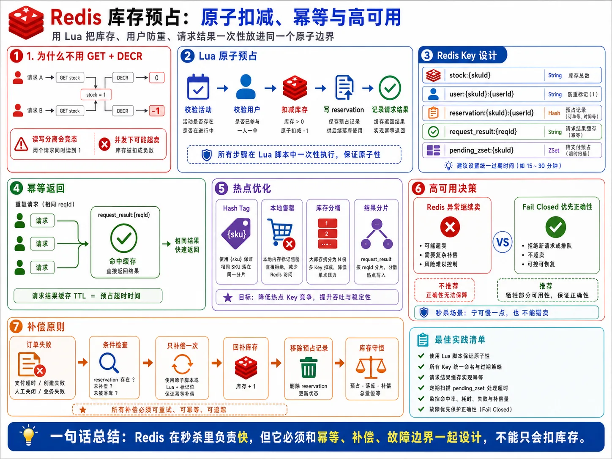
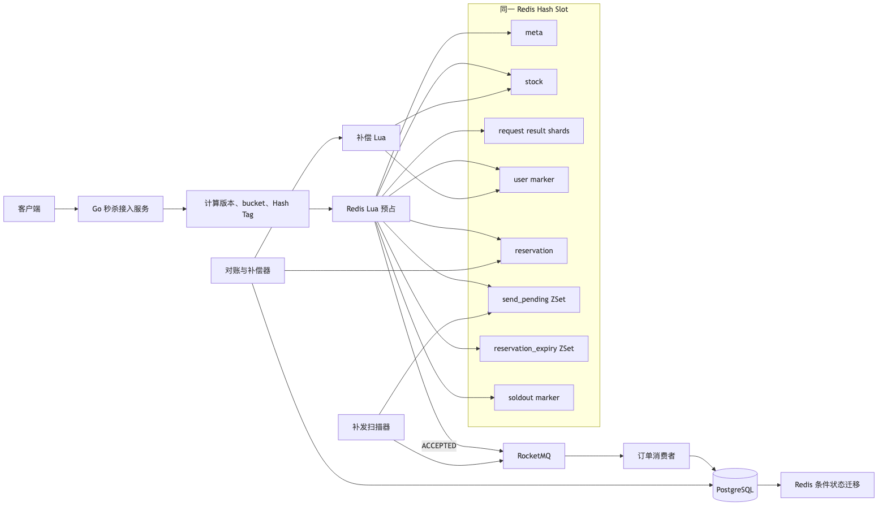
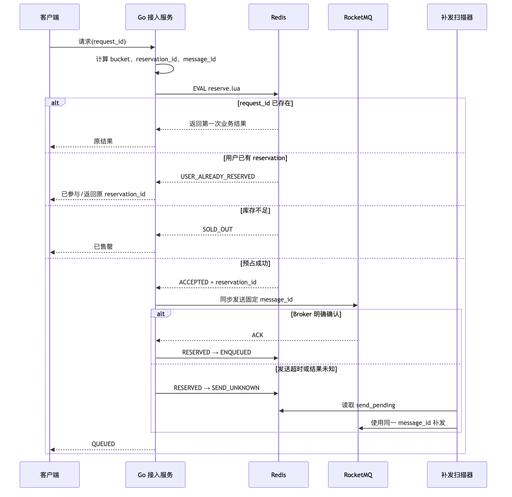
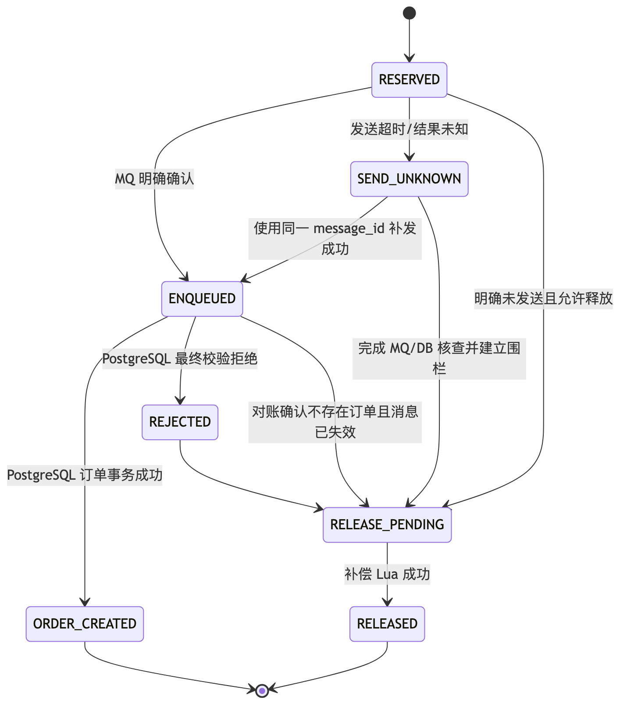
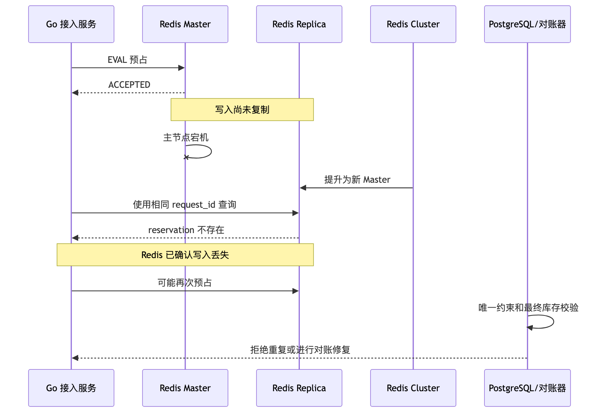

# 第 4 章：Redis 库存预占、高并发优化与高可用



> 图注：本章全文重点总结图，围绕 Lua 原子预占、Redis Key 设计、请求幂等、库存补偿、热点优化和 Fail Closed 决策展开。

> **版本假设：**本章以 Redis Open Source 8.8、Go 与 `github.com/redis/go-redis/v9` 为示例基线。Redis 8.8 是截至 2026 年 6 月的稳定版本，`go-redis/v9` 是官方 Go 客户端；核心脚本只依赖长期稳定的 Hash、String、ZSet、TTL 和 Lua 能力。([Redis][1])

**本章核心结论：**

1. **Redis 是高性能库存闸门和临时协调层，不是订单与库存的最终事实来源。**
2. **预占脚本必须在一个 Redis Hash Slot 内原子完成请求幂等、用户防重、活动校验、库存扣减和 reservation 创建。**
3. **Lua 的原子性只覆盖一次 Redis 脚本执行，不覆盖 RocketMQ、PostgreSQL，也不能消除主从切换的数据丢失窗口。**
4. **单热点 SKU 默认先采用单槽方案；确认单节点无法承载后，再升级为确定性库存分桶。**
5. **秒杀提交链路在 Redis 不可用、状态未知或复制不健康时应当 Fail Closed。**

Redis 保证脚本原子执行，但脚本执行期间会阻塞服务器处理其他活动，因此脚本必须保持固定复杂度、短路径、无扫描、无长循环。脚本访问的所有 Key 也必须通过 `KEYS` 显式传入。([Redis][2])

---

## 1. 本章目标

本章需要解决以下问题：

* 如何在 Redis 内原子完成库存预占。
* 如何保证相同 `request_id` 不重复扣库存。
* 如何阻止同一用户重复预占同一活动 SKU。
* 如何记录可恢复的 `reservation`。
* 如何安全、幂等地补偿库存。
* 如何在 Redis Cluster 中组织多 Key Lua。
* 如何识别并治理 Hot Key、Big Key。
* 单库存 Key 达到瓶颈后如何分桶。
* Redis 主从切换、脑裂、AOF/RDB 对预占结果有什么影响。
* Redis 不可用、超时或返回结果未知时，接入服务应该如何处理。

本章不解决 PostgreSQL 最终库存扣减和 MQ 消费事务，它们分别在后续章节展开；但本章会明确给出 Redis 层与这些组件之间的故障边界。

---

## 2. 业务背景

统一业务场景中：

* 100 万用户在 10 秒内发起请求。
* 峰值入口流量约 30 万 QPS。
* 热点 SKU 总库存为 10,000。
* 同一用户针对同一 `activity_id + sku_id` 最多产生一个有效订单。
* 接口允许先返回“排队中”。
* Redis 预占成功不代表订单创建成功。
* Redis 预占后可能发生进程宕机、MQ 发送超时、Redis Failover、消息积压等问题。

Redis 位于同步热路径：

```text
Go 秒杀接入服务
    → Redis Lua 原子预占
    → RocketMQ 异步订单消息
    → PostgreSQL 最终库存校验和订单创建
```

它的职责是：

* 把绝大多数无库存、重复用户、重复请求拦截在数据库之前。
* 以极低网络往返次数完成多项条件判断。
* 为异步恢复保留 `reservation_id` 和消息补发索引。
* 向用户提供短期查询状态。

Redis **不能单独承担**：

* 跨 Redis、RocketMQ、PostgreSQL 的事务。
* 最终不超卖保证。
* 永久订单事实存储。
* 天然 Exactly Once。
* 主从切换期间零数据丢失。

---

## 3. 核心问题

本章必须回答八个关键问题：

1. 两个请求同时看到库存为 1 时，怎样保证只有一个成功？
2. 同一 `request_id` 因客户端重试被调用多次时，怎样返回第一次结果？
3. 同一用户使用不同 `request_id` 并发请求时，怎样阻止多次预占？
4. Redis 预占成功、Go 进程在发送 MQ 前宕机时，怎样找到并补发？
5. MQ 发送结果未知时，为什么不能立即补偿库存？
6. Redis Cluster 中多个 Key 为什么必须使用同一个 Hash Tag？
7. 单库存 Key 成为热点后，如何扩展吞吐而不破坏一人一单？
8. Redis 已确认的写入为什么仍可能在 Failover 后消失？

---

## 4. 未优化的基线方案

最简单的实现通常类似：

```go
stock, err := rdb.Get(ctx, stockKey).Int64()
if err != nil {
	return err
}

if stock <= 0 {
	return ErrSoldOut
}

if err := rdb.Decr(ctx, stockKey).Err(); err != nil {
	return err
}

created, err := rdb.SetNX(ctx, userKey, requestID, time.Hour).Result()
if err != nil {
	return err
}
if !created {
	_ = rdb.Incr(ctx, stockKey).Err()
	return ErrDuplicateUser
}
```

### 4.1 `GET` 后再 `DECR` 的竞态

假设库存为 1：

```text
请求 A：GET stock → 1
请求 B：GET stock → 1
请求 A：DECR stock → 0
请求 B：DECR stock → -1
```

即使改成：

```text
DECR stock
如果结果 < 0，再 INCR 补回
```

也只原子处理了库存计数，没有同时处理：

* `request_id` 幂等结果。
* 用户购买标记。
* reservation 创建。
* 消息待发送索引。
* 补偿所需状态。

任何一步失败，都可能形成“库存已扣但 reservation 未创建”或“用户标记已写但库存未扣”等不一致状态。

### 4.2 `WATCH/MULTI/EXEC` 的局限

Redis 事务可以顺序执行一组命令；`WATCH` 提供乐观 CAS，如果被监视的 Key 在 `EXEC` 前发生变化，整个事务会被取消。它适合冲突概率较低、应用确实需要先读取再决定写入的场景。热点库存 Key 在秒杀期间会被高频修改，`WATCH` 冲突重试会非常频繁。Redis 官方文档也指出，脚本通常比同类事务写法更简单、更快。([Redis][3])

秒杀库存更适合：

```text
一次 Lua
= 读取条件
+ 分支判断
+ 多 Key 写入
+ 返回业务码
```

### 4.3 为什么不能给每个请求加分布式锁

为每次抢购创建分布式锁会引入：

* 加锁与解锁的额外网络往返。
* 锁 Key 本身成为热点。
* 锁超时、续租、所有权校验。
* 进程暂停后锁过期的并发进入问题。
* 解锁失败后的残留问题。
* 更高的尾延迟。

更重要的是，锁只提供互斥，不会自动提供：

* 请求幂等。
* 用户防重。
* reservation 状态机。
* 补偿幂等。
* 跨 MQ、数据库的一致性。

库存条件扣减本质上是一个非常短的原子状态转换，直接使用 Lua 比“先拿锁，再执行多条命令”更合适。

---

## 5. 基线方案的问题

| 维度   | 基线问题                    | 直接后果             |
| ---- | ----------------------- | ---------------- |
| 正确性  | 库存、用户标记、request 结果分步写入  | 超卖、重复预占、状态残缺     |
| 性能   | 多次 Redis RTT            | P99 增大，连接池压力上升   |
| 并发   | 热点 Key 上存在读改写竞态         | 库存负数或补偿震荡        |
| 可用性  | 任一步超时后调用方不知道是否成功        | 盲目重试或错误补偿        |
| 可扩展性 | 单库存 Key 固定落在一个 Redis 节点 | Cluster 无法自动拆分热点 |
| 可运维性 | 没有 reservation 和待补发索引   | 进程宕机后无法自动恢复      |

---

## 6. 推荐架构

### 6.1 推荐方案

默认采用：

```text
单 SKU 单 Hash Slot
+ Lua 原子预占
+ request 结果分片 Hash
+ reservation 独立 Hash
+ 待发送 ZSet
+ 到期检查 ZSet
+ 确定性 message_id
+ 扫描补发
+ PostgreSQL 最终库存防线
```

只有在压测确认单热点 Slot 无法满足吞吐时，才启用库存分桶。



### 6.2 事务与故障边界

| 边界              | 能保证什么                 | 不能保证什么            |
| --------------- | --------------------- | ----------------- |
| 一次 Redis Lua    | 同槽 Key 的原子判断和修改       | MQ、PostgreSQL 一致性 |
| Redis 主节点内存     | 当前节点上的即时可见状态          | Failover 后数据一定存在  |
| MQ 发送 ACK       | Broker 接收结果           | 消息只投递一次           |
| PostgreSQL 本地事务 | 库存、订单、Inbox、Outbox 一致 | Redis 状态同步成功      |
| 补偿 Lua          | 同一 reservation 只释放一次  | 延迟消息以后绝不会创建订单     |

### 6.3 关键原则

**原则一：所有业务 Key 必须显式传给 Lua。**

不要在脚本中根据 reservation 内容动态拼装并访问未声明的 Key。Redis 官方要求脚本访问的 Key 由调用方通过 `KEYS` 显式提供。([Redis][2])

**原则二：脚本保持 O(1)。**

禁止在预占脚本中使用：

* `KEYS`。
* `SCAN`。
* 遍历大量集合。
* 按 reservation 数量循环。
* 调用外部服务。
* 复杂 JSON 解析。

**原则三：Redis Key 命名空间由脚本独占。**

通过 ACL 和代码规范禁止业务服务直接修改：

```text
stock
user marker
reservation status
send_pending
```

避免 Key 类型被错误代码改变，导致 Lua 中途出现运行期错误。

**原则四：补偿只能由明确状态触发。**

MQ 发送超时属于“结果未知”，不能直接释放库存。否则消息实际已进入 MQ、稍后又创建订单时，就会造成同一库存被再次出售。

---

## 7. 核心流程

### 7.1 正常预占流程



### 7.2 重复请求流程

相同 `request_id`：

1. Lua 先查询请求结果分片。
2. 如果已经存在，校验记录中的 `user_id`。
3. 相同用户直接返回第一次结果。
4. 不再扣库存。
5. 不再创建 reservation。
6. 不生成新的业务操作。

如果不同用户错误或恶意复用了同一 `request_id`，返回：

```text
REQUEST_ID_CONFLICT
```

且不能向后一个用户泄露原 reservation 信息。

### 7.3 同一用户使用不同 request_id

Lua 查询：

```text
seckill:{tag}:user:<user_id>
```

如果存在：

* 返回 `USER_ALREADY_RESERVED`。
* 返回已有 `reservation_id`，便于客户端查询。
* 将此次新 `request_id` 的结果也缓存为“用户重复”。
* 不扣减库存。

PostgreSQL 后续仍需要唯一约束作为最终防线。

### 7.4 Redis 调用超时

Redis 客户端超时可能有三种实际情况：

1. 命令未到达 Redis。
2. Redis 未执行命令。
3. Redis 已执行并提交结果，但响应未到达客户端。

因此超时不能映射为：

```text
预占失败
```

而应映射为：

```text
结果未知
```

处理方式：

* 保留原 `request_id`。
* 保留确定性 `reservation_id`。
* 使用相同参数重试一次，或者通过请求结果查询接口确认。
* 禁止立即生成新 `request_id`。
* 禁止立即补偿库存。

Lua 的请求幂等可以保证重试不会重复扣减。

### 7.5 Redis 预占后进程宕机

预占脚本同时写入：

```text
reservation
send_pending ZSet
```

即使 Go 进程在发送 MQ 前宕机，扫描器仍可以按照 `next_retry_at` 找到该 reservation，并使用固定 `message_id` 补发。

扫描器只读取到期成员：

```text
ZRANGEBYSCORE send_pending -inf now LIMIT 0 N
```

不能通过全库 `SCAN` 寻找 reservation。

### 7.6 降级流程

| 故障                | 提交接口行为             | 查询接口行为                    |
| ----------------- | ------------------ | ------------------------- |
| Redis 完全不可用       | Fail Closed，返回系统繁忙 | 可回源 PostgreSQL 查询已落库订单    |
| 单个 Slot 不可用       | 仅受影响 SKU 拒绝请求      | 查询已存在订单可回源数据库             |
| Redis 超时          | 返回结果未知或排队中         | 使用 request/reservation 查询 |
| Redis OOM         | 停止新预占并告警           | 已存在数据仍可读取                 |
| 本地售罄标记存在          | 快速返回售罄             | 必要时允许状态查询                 |
| Redis 正在 Failover | 使用相同幂等 ID 做有限重试    | 不创建新的业务请求                 |

**不能在 Redis 故障时绕过 Redis，直接把 30 万 QPS 打到 PostgreSQL。**

---

## 8. 数据结构

## 8.1 Hash Tag 与活动版本

统一 Hash Tag：

```text
{a:<activity_id>:s:<sku_id>:v:<activity_version>:b:<bucket_id>}
```

示例：

```text
{a:10001:s:88001:v:7:b:0}
```

完整 Key：

```text
seckill:{a:10001:s:88001:v:7:b:0}:stock
```

Redis Cluster 将 Key 映射到 16,384 个 Hash Slot；当 Key 包含 `{...}` 时，只对花括号内部内容计算 Slot。Lua 涉及的多个 Key 必须落在同一 Slot。([Redis][4])

### 活动版本的作用

`activity_version` 用于隔离：

* 活动配置重置。
* 库存重新初始化。
* 分桶数量变化。
* 一人一单策略变化。
* 旧客户端令牌。
* 延迟到达的旧请求。

版本升级时：

```text
v:7 → v:8
```

不覆盖旧 Key，而是创建新命名空间。旧版本 `meta.state` 设置为 `CLOSED`，等待 TTL 清理。

**禁止把旧活动库存 Key 直接重置为新库存。**
否则旧请求、旧补偿、旧消息可能修改新活动数据。

---

## 8.2 完整 Redis Key 设计

| Key                                              | 类型     | 主要内容                                              | TTL                  | 说明                 |
| ------------------------------------------------ | ------ | ------------------------------------------------- | -------------------- | ------------------ |
| `seckill:activity:<activity_id>:current_version` | String | 当前活动版本                                            | 活动结束后 30 天           | 控制面使用，不进入预占 Lua    |
| `seckill:{tag}:meta`                             | Hash   | 活动、SKU、bucket、状态、起止时间、版本、保留时间                     | `retention_until_ms` | 每个 bucket 一份只读元数据  |
| `seckill:{tag}:stock`                            | Hash   | `initial`、`available`、`reserved`、`released_total` | 同上                   | Redis 库存计数         |
| `seckill:{tag}:req:<shard>`                      | Hash   | field=`request_id`，value=紧凑结果                     | 同上                   | 请求结果分片，避免百万级单 Hash |
| `seckill:{tag}:user:<user_id>`                   | String | `reservation_id`                                  | 同上                   | 用户前置防重             |
| `seckill:{tag}:resv:<reservation_id>`            | Hash   | reservation 完整状态                                  | 同上                   | 异步恢复核心记录           |
| `seckill:{tag}:send_pending`                     | ZSet   | member=`reservation_id`，score=`next_retry_at_ms`  | 同上                   | MQ 待发送和结果未知补发      |
| `seckill:{tag}:reservation_expiry`               | ZSet   | member=`reservation_id`，score=`expires_at_ms`     | 同上                   | 到期检查，不直接释放库存       |
| `seckill:{tag}:soldout`                          | String | `1` 或售罄 epoch                                     | 活动保留期                | 本地售罄广播依据           |

### `meta` 字段

```text
activity_id
sku_id
bucket_id
version
state
starts_at_ms
ends_at_ms
retention_until_ms
schema_version
```

活动状态：

```text
PREPARED
ACTIVE
PAUSED
CLOSED
```

### `stock` 字段

```text
initial         初始分配给当前 bucket 的库存
available       当前可预占库存
reserved        已预占且未释放数量，包括已创建订单
released_total  累计补偿次数，仅用于审计
```

Redis 内部守恒：

```text
initial = available + reserved
```

每次成功预占：

```text
available -= 1
reserved  += 1
```

每次成功补偿：

```text
available      += 1
reserved       -= 1
released_total += 1
```

### `reservation` 字段

```text
reservation_id
request_id
message_id
activity_id
sku_id
user_id
activity_version
bucket_id
status
reserved_at_ms
expires_at_ms
updated_at_ms
order_id
error_code
release_reason
schema_version
```

### 请求结果编码

为了减少 Hash field value 的开销，使用固定格式：

```text
code|reservation_id|remaining|status|user_id
```

例如：

```text
0|01JZ7V...|9999|QUEUED|900001
```

所有参与编码的 ID 必须限制为：

```text
[A-Za-z0-9_-]
```

并禁止包含分隔符 `|`。

---

## 8.3 TTL 设计

### TTL 原则

1. **使用绝对过期时间 `PEXPIREAT`，避免每次重试延长生命周期。**
2. `request_id` 结果必须覆盖公开承诺的幂等窗口。
3. reservation Key TTL 必须大于：

   * 最大 MQ 故障恢复时间。
   * 最大消息积压时间。
   * 最大对账延迟。
   * 人工修复窗口。
4. reservation 业务到期不等于立即删除 Key。
5. ZSet 到期成员只触发核查，不直接释放库存。
6. 成功订单对应的 Redis 数据也应保留到对账完成。

推荐示例：

| 数据               |          业务有效期 | Redis Key 保留期 |
| ---------------- | -------------: | ------------: |
| 秒杀活动             |           10 秒 |     活动结束后 7 天 |
| 订单创建 reservation |       15 分钟检查点 |     活动结束后 7 天 |
| request 幂等结果     |            7 天 |     活动结束后 7 天 |
| 用户标记             |         活动生命周期 |     活动结束后 7 天 |
| 待补发索引            | 直到 ENQUEUED/终态 |     活动结束后 7 天 |

若要求 `request_id` 永久幂等，不能只依赖 Redis TTL，需将成功请求映射持久化到 PostgreSQL。

Redis 的 `EXPIRE`/`PEXPIREAT` 由 Redis 管理，覆盖 Key 的命令可能清除原 TTL，因此脚本必须在创建或覆盖 Key 时显式设置过期时间。([Redis][5])

---

## 8.4 reservation 状态机



### 状态约束

* `SEND_UNKNOWN` 不能直接释放库存。
* `ENQUEUED` 不能因为超时直接释放。
* `ORDER_CREATED` 不能进入补偿。
* `RELEASED` 再次收到补偿必须返回幂等成功。
* `RELEASE_PENDING → RELEASED` 必须由库存补偿 Lua 完成，不能只修改状态。

---

## 8.5 Go 数据结构

```go
type ReservationStatus string

const (
	StatusReserved       ReservationStatus = "RESERVED"
	StatusSendUnknown    ReservationStatus = "SEND_UNKNOWN"
	StatusEnqueued       ReservationStatus = "ENQUEUED"
	StatusOrderCreated   ReservationStatus = "ORDER_CREATED"
	StatusRejected       ReservationStatus = "REJECTED"
	StatusReleasePending ReservationStatus = "RELEASE_PENDING"
	StatusReleased       ReservationStatus = "RELEASED"
)

type ReserveRequest struct {
	ActivityID     string
	SKUID          string
	UserID         string
	RequestID      string
	ActivityVersion int64
	BucketID       uint32
	ReservationID  string
	MessageID      string
}

type ReserveResult struct {
	Code          ReserveCode
	ReservationID string
	Remaining     int64
	Status        string
	Replay        bool
}
```

---

## 9. 核心代码

## 9.1 Lua 返回码

| 返回码 | 名称                        | 是否业务终态        | 是否可直接重试          |
| --: | ------------------------- | ------------- | ---------------- |
|   0 | `ACCEPTED`                | 否，排队中         | 使用相同 request_id  |
|  10 | `USER_ALREADY_RESERVED`   | 通常是           | 查询已有 reservation |
|  11 | `ACTIVITY_NOT_STARTED`    | 对当前 request 是 | 新操作需新 request_id |
|  12 | `ACTIVITY_ENDED`          | 是             | 否                |
|  13 | `ACTIVITY_NOT_ACTIVE`     | 对当前 request 是 | 否                |
|  14 | `VERSION_MISMATCH`        | 是             | 刷新活动令牌           |
|  15 | `SOLD_OUT`                | 对当前 request 是 | 否                |
|  16 | `REQUEST_ID_CONFLICT`     | 是             | 修复客户端 ID         |
|  17 | `CONFIG_MISSING`          | 否             | 运维处理后同 ID 重试     |
|  18 | `RESERVATION_ID_CONFLICT` | 否             | 严重告警             |
|  19 | `INVARIANT_VIOLATION`     | 否             | 停止该 SKU 预占       |
|  20 | `BAD_ARGUMENT`            | 是             | 修复调用方            |

Redis 网络错误、OOM、`CROSSSLOT`、`NOSCRIPT` 处理失败不应伪装成业务返回码。

---

## 9.2 原子库存预占 Lua

```lua
-- reserve.lua
--
-- KEYS:
-- 1 meta_key
-- 2 stock_key
-- 3 request_result_shard_key
-- 4 user_marker_key
-- 5 reservation_key
-- 6 send_pending_zset_key
-- 7 reservation_expiry_zset_key
-- 8 soldout_key
--
-- ARGV:
-- 1 request_id
-- 2 reservation_id
-- 3 activity_id
-- 4 sku_id
-- 5 user_id
-- 6 activity_version
-- 7 reservation_ttl_ms
-- 8 schema_version
-- 9 bucket_id
-- 10 message_id
-- 11 now_ms_override，0 表示使用 Redis TIME

local RC = {
    ACCEPTED = 0,
    USER_ALREADY_RESERVED = 10,
    ACTIVITY_NOT_STARTED = 11,
    ACTIVITY_ENDED = 12,
    ACTIVITY_NOT_ACTIVE = 13,
    VERSION_MISMATCH = 14,
    SOLD_OUT = 15,
    REQUEST_ID_CONFLICT = 16,
    CONFIG_MISSING = 17,
    RESERVATION_ID_CONFLICT = 18,
    INVARIANT_VIOLATION = 19,
    BAD_ARGUMENT = 20
}

local request_id = ARGV[1]
local reservation_id = ARGV[2]
local activity_id = ARGV[3]
local sku_id = ARGV[4]
local user_id = ARGV[5]
local activity_version = ARGV[6]
local reservation_ttl_ms = tonumber(ARGV[7])
local schema_version = ARGV[8]
local bucket_id = ARGV[9]
local message_id = ARGV[10]
local now_override = tonumber(ARGV[11] or "0")

local function response(code, rid, remaining, status, replay)
    return {
        code,
        rid or "",
        remaining or -1,
        status or "",
        replay or 0
    }
end

local function valid_packed_value(v)
    return v ~= nil
        and v ~= ""
        and string.find(v, "|", 1, true) == nil
end

if not valid_packed_value(request_id)
    or not valid_packed_value(reservation_id)
    or not valid_packed_value(user_id)
    or not valid_packed_value(message_id)
    or reservation_ttl_ms == nil
    or reservation_ttl_ms <= 0 then
    return response(RC.BAD_ARGUMENT, "", -1, "BAD_ARGUMENT", 0)
end

local function current_time_ms()
    if now_override ~= nil and now_override > 0 then
        return now_override
    end

    local now = redis.call("TIME")
    return tonumber(now[1]) * 1000
        + math.floor(tonumber(now[2]) / 1000)
end

local now_ms = current_time_ms()

local function decode_cached(v)
    local code, rid, remaining, status, owner =
        string.match(v, "^([^|]*)|([^|]*)|([^|]*)|([^|]*)|([^|]*)$")

    if code == nil then
        return nil
    end

    return {
        code = tonumber(code),
        reservation_id = rid,
        remaining = tonumber(remaining),
        status = status,
        owner = owner
    }
end

-- request_id 是第一道检查。
local cached = redis.call("HGET", KEYS[3], request_id)
if cached then
    local decoded = decode_cached(cached)
    if decoded == nil then
        return response(
            RC.INVARIANT_VIOLATION,
            "",
            -1,
            "CORRUPTED_REQUEST_RESULT",
            0
        )
    end

    if decoded.owner ~= user_id then
        return response(
            RC.REQUEST_ID_CONFLICT,
            "",
            -1,
            "REQUEST_ID_CONFLICT",
            1
        )
    end

    return response(
        decoded.code,
        decoded.reservation_id,
        decoded.remaining,
        decoded.status,
        1
    )
end

local meta = redis.call(
    "HMGET",
    KEYS[1],
    "activity_id",
    "sku_id",
    "bucket_id",
    "state",
    "version",
    "starts_at_ms",
    "ends_at_ms",
    "retention_until_ms"
)

if not meta[1]
    or not meta[2]
    or not meta[3]
    or not meta[4]
    or not meta[5]
    or not meta[6]
    or not meta[7]
    or not meta[8] then
    return response(RC.CONFIG_MISSING, "", -1, "CONFIG_MISSING", 0)
end

if meta[1] ~= activity_id
    or meta[2] ~= sku_id
    or meta[3] ~= bucket_id then
    return response(
        RC.INVARIANT_VIOLATION,
        "",
        -1,
        "META_SCOPE_MISMATCH",
        0
    )
end

local state = meta[4]
local configured_version = meta[5]
local starts_at_ms = tonumber(meta[6])
local ends_at_ms = tonumber(meta[7])
local retention_until_ms = tonumber(meta[8])

if not starts_at_ms
    or not ends_at_ms
    or not retention_until_ms
    or retention_until_ms <= now_ms then
    return response(
        RC.INVARIANT_VIOLATION,
        "",
        -1,
        "INVALID_META_TIME",
        0
    )
end

local function read_available()
    local v = redis.call("HGET", KEYS[2], "available")
    if not v then
        return -1
    end
    return tonumber(v) or -1
end

local function cache_result(code, rid, remaining, result_status)
    local packed = table.concat({
        tostring(code),
        rid or "",
        tostring(remaining or -1),
        result_status or "",
        user_id
    }, "|")

    redis.call("HSET", KEYS[3], request_id, packed)
    redis.call("PEXPIREAT", KEYS[3], retention_until_ms)
end

-- reservation_id 应由 request_id 确定性派生。
-- 请求结果 Key 因故丢失时，可据此重建幂等结果。
if redis.call("EXISTS", KEYS[5]) == 1 then
    local existing = redis.call(
        "HMGET",
        KEYS[5],
        "request_id",
        "user_id",
        "reservation_id",
        "status"
    )

    if existing[1] == request_id
        and existing[2] == user_id
        and existing[3] == reservation_id then
        local available = read_available()
        cache_result(
            RC.ACCEPTED,
            reservation_id,
            available,
            existing[4] or "QUEUED"
        )

        return response(
            RC.ACCEPTED,
            reservation_id,
            available,
            existing[4] or "QUEUED",
            1
        )
    end

    return response(
        RC.RESERVATION_ID_CONFLICT,
        "",
        -1,
        "RESERVATION_ID_CONFLICT",
        0
    )
end

-- 用户前置防重。
local existing_user_reservation = redis.call("GET", KEYS[4])
if existing_user_reservation then
    local available = read_available()

    cache_result(
        RC.USER_ALREADY_RESERVED,
        existing_user_reservation,
        available,
        "USER_ALREADY_RESERVED"
    )

    return response(
        RC.USER_ALREADY_RESERVED,
        existing_user_reservation,
        available,
        "USER_ALREADY_RESERVED",
        0
    )
end

local available_before_state_check = read_available()

if configured_version ~= activity_version then
    cache_result(
        RC.VERSION_MISMATCH,
        "",
        available_before_state_check,
        "VERSION_MISMATCH"
    )

    return response(
        RC.VERSION_MISMATCH,
        "",
        available_before_state_check,
        "VERSION_MISMATCH",
        0
    )
end

if now_ms < starts_at_ms then
    cache_result(
        RC.ACTIVITY_NOT_STARTED,
        "",
        available_before_state_check,
        "ACTIVITY_NOT_STARTED"
    )

    return response(
        RC.ACTIVITY_NOT_STARTED,
        "",
        available_before_state_check,
        "ACTIVITY_NOT_STARTED",
        0
    )
end

if now_ms > ends_at_ms then
    cache_result(
        RC.ACTIVITY_ENDED,
        "",
        available_before_state_check,
        "ACTIVITY_ENDED"
    )

    return response(
        RC.ACTIVITY_ENDED,
        "",
        available_before_state_check,
        "ACTIVITY_ENDED",
        0
    )
end

if state ~= "ACTIVE" then
    cache_result(
        RC.ACTIVITY_NOT_ACTIVE,
        "",
        available_before_state_check,
        "ACTIVITY_NOT_ACTIVE"
    )

    return response(
        RC.ACTIVITY_NOT_ACTIVE,
        "",
        available_before_state_check,
        "ACTIVITY_NOT_ACTIVE",
        0
    )
end

local stock = redis.call(
    "HMGET",
    KEYS[2],
    "initial",
    "available",
    "reserved"
)

local initial = tonumber(stock[1])
local available = tonumber(stock[2])
local reserved = tonumber(stock[3])

if not initial or not available or not reserved then
    return response(RC.CONFIG_MISSING, "", -1, "STOCK_CONFIG_MISSING", 0)
end

if initial < 0
    or available < 0
    or reserved < 0
    or available + reserved ~= initial then
    return response(
        RC.INVARIANT_VIOLATION,
        "",
        available,
        "STOCK_INVARIANT_VIOLATION",
        0
    )
end

if available <= 0 then
    redis.call("SET", KEYS[8], "1", "PXAT", retention_until_ms)

    cache_result(RC.SOLD_OUT, "", 0, "SOLD_OUT")
    return response(RC.SOLD_OUT, "", 0, "SOLD_OUT", 0)
end

local expires_at_ms = now_ms + reservation_ttl_ms
if expires_at_ms >= retention_until_ms then
    return response(
        RC.BAD_ARGUMENT,
        "",
        available,
        "RESERVATION_TTL_TOO_LONG",
        0
    )
end

local remaining = available - 1

-- 先创建恢复数据，再修改库存计数。
-- 整个脚本执行期间其他客户端不能观察到中间状态。
redis.call(
    "SET",
    KEYS[4],
    reservation_id,
    "PXAT",
    retention_until_ms
)

redis.call(
    "HSET",
    KEYS[5],
    "reservation_id", reservation_id,
    "request_id", request_id,
    "message_id", message_id,
    "activity_id", activity_id,
    "sku_id", sku_id,
    "user_id", user_id,
    "activity_version", activity_version,
    "bucket_id", bucket_id,
    "status", "RESERVED",
    "reserved_at_ms", now_ms,
    "expires_at_ms", expires_at_ms,
    "updated_at_ms", now_ms,
    "schema_version", schema_version
)
redis.call("PEXPIREAT", KEYS[5], retention_until_ms)

redis.call("ZADD", KEYS[6], now_ms, reservation_id)
redis.call("PEXPIREAT", KEYS[6], retention_until_ms)

redis.call("ZADD", KEYS[7], expires_at_ms, reservation_id)
redis.call("PEXPIREAT", KEYS[7], retention_until_ms)

cache_result(
    RC.ACCEPTED,
    reservation_id,
    remaining,
    "QUEUED"
)

redis.call("HINCRBY", KEYS[2], "available", -1)
redis.call("HINCRBY", KEYS[2], "reserved", 1)

if remaining == 0 then
    redis.call("SET", KEYS[8], "1", "PXAT", retention_until_ms)
end

return response(
    RC.ACCEPTED,
    reservation_id,
    remaining,
    "QUEUED",
    0
)
```

### 脚本说明

该脚本一次原子完成：

1. 检查 `request_id`。
2. 验证 request 归属用户。
3. 尝试恢复丢失的 request 映射。
4. 检查用户是否已有 reservation。
5. 检查活动版本、状态和时间。
6. 检查库存守恒。
7. 扣减库存。
8. 写入用户标记。
9. 创建 reservation。
10. 加入 MQ 待发送 ZSet。
11. 加入到期检查 ZSet。
12. 保存 request 首次结果。
13. 设置售罄标记。

Redis 8 使用脚本效果复制，脚本中可以使用 `TIME`；本脚本仍提供时间覆盖参数，便于确定性测试。([Redis][2])

---

## 9.3 原子库存补偿 Lua

```lua
-- compensate.lua
--
-- KEYS:
-- 1 stock_key
-- 2 user_marker_key
-- 3 reservation_key
-- 4 send_pending_zset_key
-- 5 reservation_expiry_zset_key
-- 6 soldout_key
--
-- ARGV:
-- 1 reservation_id
-- 2 release_reason
-- 3 now_ms_override，0 表示使用 Redis TIME

local RC = {
    RELEASED = 0,
    ALREADY_RELEASED = 1,
    RESERVATION_NOT_FOUND = 2,
    NOT_COMPENSATABLE = 3,
    INVARIANT_VIOLATION = 4,
    RESERVATION_ID_CONFLICT = 5
}

local reservation_id = ARGV[1]
local release_reason = ARGV[2]
local now_override = tonumber(ARGV[3] or "0")

local function now_ms()
    if now_override and now_override > 0 then
        return now_override
    end

    local now = redis.call("TIME")
    return tonumber(now[1]) * 1000
        + math.floor(tonumber(now[2]) / 1000)
end

if redis.call("EXISTS", KEYS[3]) == 0 then
    return { RC.RESERVATION_NOT_FOUND, -1, 0, "NOT_FOUND" }
end

local reservation = redis.call(
    "HMGET",
    KEYS[3],
    "reservation_id",
    "status"
)

if reservation[1] ~= reservation_id then
    return {
        RC.RESERVATION_ID_CONFLICT,
        -1,
        0,
        "RESERVATION_ID_CONFLICT"
    }
end

local status = reservation[2]

if status == "RELEASED" then
    local current = tonumber(
        redis.call("HGET", KEYS[1], "available") or "-1"
    )

    return {
        RC.ALREADY_RELEASED,
        current,
        0,
        "RELEASED"
    }
end

-- 只允许已明确拒绝或已经过外部核查的 reservation 释放。
if status ~= "REJECTED" and status ~= "RELEASE_PENDING" then
    local current = tonumber(
        redis.call("HGET", KEYS[1], "available") or "-1"
    )

    return {
        RC.NOT_COMPENSATABLE,
        current,
        0,
        status or ""
    }
end

local stock = redis.call(
    "HMGET",
    KEYS[1],
    "initial",
    "available",
    "reserved"
)

local initial = tonumber(stock[1])
local available = tonumber(stock[2])
local reserved = tonumber(stock[3])

if not initial
    or not available
    or not reserved
    or initial < 0
    or available < 0
    or reserved <= 0
    or available + reserved ~= initial then
    return {
        RC.INVARIANT_VIOLATION,
        available or -1,
        0,
        "STOCK_INVARIANT_VIOLATION"
    }
end

local timestamp = now_ms()

redis.call(
    "HSET",
    KEYS[3],
    "status", "RELEASED",
    "release_reason", release_reason,
    "released_at_ms", timestamp,
    "updated_at_ms", timestamp
)

local new_available =
    redis.call("HINCRBY", KEYS[1], "available", 1)

redis.call("HINCRBY", KEYS[1], "reserved", -1)
redis.call("HINCRBY", KEYS[1], "released_total", 1)

local marker_deleted = 0
local current_marker = redis.call("GET", KEYS[2])

-- 仅删除仍指向当前 reservation 的用户标记。
-- 若业务已允许用户创建了新 reservation，不能误删新标记。
if current_marker == reservation_id then
    marker_deleted = redis.call("DEL", KEYS[2])
end

redis.call("ZREM", KEYS[4], reservation_id)
redis.call("ZREM", KEYS[5], reservation_id)

-- 库存重新可售，本地售罄缓存需要失效。
redis.call("DEL", KEYS[6])

return {
    RC.RELEASED,
    new_available,
    marker_deleted,
    "RELEASED"
}
```

### 补偿安全边界

补偿 Lua 只能保证：

```text
同一个 Redis reservation 不会把库存增加两次
```

它不能单独保证：

```text
某条延迟 MQ 消息以后绝不会创建订单
```

因此，`ENQUEUED` 或 `SEND_UNKNOWN` 必须先经过 PostgreSQL/MQ 核查和状态围栏，转为 `RELEASE_PENDING`，才能执行补偿。

如果 reservation Key 已因错误 TTL 被删除：

* 禁止直接 `INCR stock`。
* 记录异常补偿任务。
* 通过 PostgreSQL 库存流水与订单数据对账。
* 必要时人工修复。

---

## 9.4 条件状态迁移 Lua

```lua
-- transition_reservation.lua
--
-- KEYS:
-- 1 reservation_key
-- 2 send_pending_zset_key
-- 3 reservation_expiry_zset_key
--
-- ARGV:
-- 1 reservation_id
-- 2 target_status
-- 3 now_ms
-- 4 next_retry_at_ms
-- 5 message_id
-- 6 order_id
-- 7 error_code

local RC = {
    UPDATED = 0,
    IDEMPOTENT = 1,
    NOT_FOUND = 2,
    ILLEGAL_TRANSITION = 3,
    ID_CONFLICT = 4
}

local reservation_id = ARGV[1]
local target = ARGV[2]
local now_ms = ARGV[3]
local next_retry_at_ms = ARGV[4]
local message_id = ARGV[5]
local order_id = ARGV[6]
local error_code = ARGV[7]

if redis.call("EXISTS", KEYS[1]) == 0 then
    return { RC.NOT_FOUND, "", target }
end

local current_data = redis.call(
    "HMGET",
    KEYS[1],
    "reservation_id",
    "status",
    "message_id",
    "order_id"
)

if current_data[1] ~= reservation_id then
    return { RC.ID_CONFLICT, current_data[2] or "", target }
end

local current = current_data[2]

if current == target then
    return { RC.IDEMPOTENT, current, target }
end

local transitions = {
    RESERVED = {
        SEND_UNKNOWN = true,
        ENQUEUED = true,
        RELEASE_PENDING = true
    },
    SEND_UNKNOWN = {
        ENQUEUED = true,
        RELEASE_PENDING = true
    },
    ENQUEUED = {
        ORDER_CREATED = true,
        REJECTED = true,
        RELEASE_PENDING = true
    },
    REJECTED = {
        RELEASE_PENDING = true
    }
}

if not transitions[current] or not transitions[current][target] then
    return { RC.ILLEGAL_TRANSITION, current or "", target }
end

if message_id ~= ""
    and current_data[3]
    and current_data[3] ~= ""
    and current_data[3] ~= message_id then
    return { RC.ID_CONFLICT, current, target }
end

if order_id ~= ""
    and current_data[4]
    and current_data[4] ~= ""
    and current_data[4] ~= order_id then
    return { RC.ID_CONFLICT, current, target }
end

local fields = {
    "status", target,
    "updated_at_ms", now_ms
}

if message_id ~= "" then
    table.insert(fields, "message_id")
    table.insert(fields, message_id)
end

if order_id ~= "" then
    table.insert(fields, "order_id")
    table.insert(fields, order_id)
end

if error_code ~= "" then
    table.insert(fields, "error_code")
    table.insert(fields, error_code)
end

redis.call("HSET", KEYS[1], unpack(fields))

if target == "SEND_UNKNOWN" then
    redis.call(
        "ZADD",
        KEYS[2],
        tonumber(next_retry_at_ms),
        reservation_id
    )
elseif target == "ENQUEUED" then
    redis.call("ZREM", KEYS[2], reservation_id)
elseif target == "ORDER_CREATED" then
    redis.call("ZREM", KEYS[2], reservation_id)
    redis.call("ZREM", KEYS[3], reservation_id)
elseif target == "REJECTED"
    or target == "RELEASE_PENDING" then
    redis.call("ZREM", KEYS[2], reservation_id)
end

return { RC.UPDATED, current, target }
```

该脚本只负责状态 CAS，不负责库存补偿。把状态迁移与库存释放分开，可以避免普通状态更新误触发库存增加。

---

## 9.5 Go 调用 Lua 的封装

`go-redis` 支持 `NewClusterClient` 和脚本调用；Redis 脚本缓存会在重启、Failover 或 `SCRIPT FLUSH` 后丢失，因此客户端必须支持 `NOSCRIPT` 后重新执行或加载脚本。([Redis][6])

```go
package seckillredis

import (
	"context"
	"crypto/hmac"
	"crypto/sha256"
	"encoding/base32"
	"errors"
	"fmt"
	"hash/fnv"
	"strconv"
	"strings"
	"time"

	"github.com/redis/go-redis/v9"
)

type ReserveCode int64

const (
	ReserveAccepted            ReserveCode = 0
	ReserveUserAlreadyReserved ReserveCode = 10
	ReserveActivityNotStarted  ReserveCode = 11
	ReserveActivityEnded       ReserveCode = 12
	ReserveActivityNotActive   ReserveCode = 13
	ReserveVersionMismatch     ReserveCode = 14
	ReserveSoldOut             ReserveCode = 15
	ReserveRequestIDConflict   ReserveCode = 16
	ReserveConfigMissing       ReserveCode = 17
	ReserveReservationConflict ReserveCode = 18
	ReserveInvariantViolation  ReserveCode = 19
	ReserveBadArgument         ReserveCode = 20
)

var ErrOutcomeUnknown = errors.New("redis execution outcome is unknown")

type Scope struct {
	ActivityID string
	SKUID      string
	Version    int64
	BucketID   uint32
}

func (s Scope) HashTag() string {
	return fmt.Sprintf(
		"a:%s:s:%s:v:%d:b:%d",
		s.ActivityID,
		s.SKUID,
		s.Version,
		s.BucketID,
	)
}

func scopedKey(scope Scope, suffix string) string {
	return "seckill:{" + scope.HashTag() + "}:" + suffix
}

func requestShard(requestID string, shardCount uint32) uint32 {
	h := fnv.New32a()
	_, _ = h.Write([]byte(requestID))
	return h.Sum32() % shardCount
}

func bucketForUser(
	activityID string,
	skuID string,
	userID string,
	bucketCount uint32,
) uint32 {
	if bucketCount <= 1 {
		return 0
	}

	h := fnv.New64a()
	_, _ = h.Write([]byte(activityID))
	_, _ = h.Write([]byte{0})
	_, _ = h.Write([]byte(skuID))
	_, _ = h.Write([]byte{0})
	_, _ = h.Write([]byte(userID))

	return uint32(h.Sum64() % uint64(bucketCount))
}

// reservationID 必须在同一活动版本的幂等窗口内稳定。
// secretVersion 应固定在活动版本中，不能在活动进行时直接轮换。
func deriveReservationID(
	secret []byte,
	activityID string,
	skuID string,
	userID string,
	requestID string,
) string {
	mac := hmac.New(sha256.New, secret)
	_, _ = mac.Write([]byte(activityID))
	_, _ = mac.Write([]byte{0})
	_, _ = mac.Write([]byte(skuID))
	_, _ = mac.Write([]byte{0})
	_, _ = mac.Write([]byte(userID))
	_, _ = mac.Write([]byte{0})
	_, _ = mac.Write([]byte(requestID))

	encoded := base32.StdEncoding.
		WithPadding(base32.NoPadding).
		EncodeToString(mac.Sum(nil))

	// 26 字符约保留 130 bit，碰撞概率足够低。
	return strings.ToLower(encoded[:26])
}

type ReserveInput struct {
	ActivityID      string
	SKUID           string
	UserID          string
	RequestID       string
	ActivityVersion int64
	BucketCount     uint32
	ReservationTTL time.Duration
	SchemaVersion   string
}

type ReserveResult struct {
	Code          ReserveCode
	ReservationID string
	Remaining     int64
	Status        string
	Replay        bool
}

type Store struct {
	client       redis.Scripter
	reserve      *redis.Script
	idSecret     []byte
	requestShards uint32
	luaTimeout   time.Duration
}

func NewStore(
	client redis.Scripter,
	reserveLua string,
	idSecret []byte,
) *Store {
	return &Store{
		client:        client,
		reserve:       redis.NewScript(reserveLua),
		idSecret:      append([]byte(nil), idSecret...),
		requestShards: 256,
		luaTimeout:    40 * time.Millisecond,
	}
}

func (s *Store) Reserve(
	parent context.Context,
	in ReserveInput,
) (ReserveResult, error) {
	if err := validateInput(in); err != nil {
		return ReserveResult{}, err
	}

	bucketID := bucketForUser(
		in.ActivityID,
		in.SKUID,
		in.UserID,
		in.BucketCount,
	)

	scope := Scope{
		ActivityID: in.ActivityID,
		SKUID:      in.SKUID,
		Version:    in.ActivityVersion,
		BucketID:   bucketID,
	}

	reservationID := deriveReservationID(
		s.idSecret,
		in.ActivityID,
		in.SKUID,
		in.UserID,
		in.RequestID,
	)

	messageID := "reserve-order:" + reservationID + ":v1"

	shard := requestShard(in.RequestID, s.requestShards)

	keys := []string{
		scopedKey(scope, "meta"),
		scopedKey(scope, "stock"),
		scopedKey(scope, fmt.Sprintf("req:%03d", shard)),
		scopedKey(scope, "user:"+in.UserID),
		scopedKey(scope, "resv:"+reservationID),
		scopedKey(scope, "send_pending"),
		scopedKey(scope, "reservation_expiry"),
		scopedKey(scope, "soldout"),
	}

	args := []any{
		in.RequestID,
		reservationID,
		in.ActivityID,
		in.SKUID,
		in.UserID,
		strconv.FormatInt(in.ActivityVersion, 10),
		in.ReservationTTL.Milliseconds(),
		in.SchemaVersion,
		strconv.FormatUint(uint64(bucketID), 10),
		messageID,
		0, // 生产环境使用 Redis TIME。
	}

	ctx, cancel := context.WithTimeout(parent, s.luaTimeout)
	defer cancel()

	raw, err := s.reserve.Run(ctx, s.client, keys, args...).Result()
	if err != nil {
		// 超时、连接中断或 Failover 时，命令可能已经执行。
		// 上层必须使用相同 request_id 重试或查询，不能生成新请求。
		if errors.Is(err, context.DeadlineExceeded) ||
			errors.Is(err, context.Canceled) {
			return ReserveResult{}, fmt.Errorf(
				"%w: %v",
				ErrOutcomeUnknown,
				err,
			)
		}
		return ReserveResult{}, fmt.Errorf("run reserve lua: %w", err)
	}

	values, ok := raw.([]any)
	if !ok || len(values) != 5 {
		return ReserveResult{}, fmt.Errorf(
			"unexpected reserve lua reply: %#v",
			raw,
		)
	}

	code, err := asInt64(values[0])
	if err != nil {
		return ReserveResult{}, fmt.Errorf("decode code: %w", err)
	}

	remaining, err := asInt64(values[2])
	if err != nil {
		return ReserveResult{}, fmt.Errorf("decode remaining: %w", err)
	}

	replay, err := asInt64(values[4])
	if err != nil {
		return ReserveResult{}, fmt.Errorf("decode replay: %w", err)
	}

	return ReserveResult{
		Code:          ReserveCode(code),
		ReservationID: asString(values[1]),
		Remaining:     remaining,
		Status:        asString(values[3]),
		Replay:        replay == 1,
	}, nil
}

func validateInput(in ReserveInput) error {
	values := map[string]string{
		"activity_id": in.ActivityID,
		"sku_id":      in.SKUID,
		"user_id":     in.UserID,
		"request_id":  in.RequestID,
	}

	for name, value := range values {
		if value == "" || len(value) > 128 {
			return fmt.Errorf("%s is empty or too long", name)
		}
		if strings.ContainsAny(value, "{}|") {
			return fmt.Errorf("%s contains reserved character", name)
		}
	}

	if in.ActivityVersion <= 0 {
		return errors.New("activity version must be positive")
	}
	if in.BucketCount == 0 {
		return errors.New("bucket count must be positive")
	}
	if in.ReservationTTL <= 0 {
		return errors.New("reservation TTL must be positive")
	}

	return nil
}

func asString(v any) string {
	switch value := v.(type) {
	case string:
		return value
	case []byte:
		return string(value)
	default:
		return fmt.Sprint(value)
	}
}

func asInt64(v any) (int64, error) {
	switch value := v.(type) {
	case int64:
		return value, nil
	case int:
		return int64(value), nil
	case string:
		return strconv.ParseInt(value, 10, 64)
	case []byte:
		return strconv.ParseInt(string(value), 10, 64)
	default:
		return 0, fmt.Errorf("unsupported integer type %T", v)
	}
}
```

### 客户端使用原则

* 复用 Cluster Client，不为每个请求建立连接。
* 调用超时必须小于接口总超时预算。
* Redis 超时归类为“结果未知”。
* 业务重试必须复用 `request_id`、`reservation_id`、`message_id`。
* 接入流量、补发扫描、后台对账使用独立连接池或隔离舱。
* 连接池大小通过压测确定，不能无限增大。

根据 Little’s Law：

```text
所需并发连接量 ≈ 单实例 Redis QPS × Redis 平均 RTT
```

例如单实例 5,000 QPS、平均 RTT 1ms：

```text
并发占用约为 5
```

实际连接池需要考虑 P99、连接抖动和安全余量，但不是越大越好。

---

## 10. 优化设计与原理

## 10.1 Lua 原子预占

**优化点：**将多次 Redis 操作合并为单次 Lua。

**要解决的问题：**库存、用户防重、request 幂等和 reservation 分步执行产生竞态。

**未经优化时会发生什么：**重复扣库存、库存负数、reservation 缺失、用户标记残留。

**实现方式：**所有相关 Key 同槽，由 Lua 一次判断和修改。

**底层原理：**脚本执行期间 Redis 不处理其他命令，因此外部请求不能插入到脚本中间。([Redis][2])

**为什么提高性能或可靠性：**

* 多次 RTT 降为一次。
* 条件判断与写入不可被其他请求穿插。
* 返回明确业务码。
* 同步创建恢复索引。

**预计收益：**

* 消除 Redis 内部读改写竞态。
* 显著降低网络往返。
* 简化应用层错误分支。

**代价和副作用：**

* 脚本执行期间阻塞所在 Redis 节点。
* 长脚本会抬高所有请求尾延迟。
* Key 必须同槽。
* 调试和发布比普通命令复杂。

**适用边界：**固定数量 Key、固定复杂度、执行时间可控。

**不适用场景：**需要跨 Slot、扫描大量元素或调用外部系统。

**监控指标：**

```text
reserve_lua_duration_seconds
reserve_lua_error_total
reserve_lua_rc_total
redis_server_cpu
```

**验证方法：**库存为 1 时并发 10 万次调用，断言只出现一次 `ACCEPTED`。

---

## 10.2 request 结果分片

**优化点：**把 request 结果拆成 256 个 Hash。

**要解决的问题：**100 万请求全部存入单个 Hash 会形成 Big Key。

**实现方式：**

```text
shard = hash(request_id) % 256
```

Key：

```text
seckill:{tag}:req:000
...
seckill:{tag}:req:255
```

**底层原理：**降低单个 Hash 的 field 数量和单次迁移、删除、检查成本。

**预计规模：**

单 bucket 时：

```text
1,000,000 / 256 ≈ 3,907 field/Hash
```

16 个库存 bucket 且流量均匀时：

```text
1,000,000 / 16 / 256 ≈ 244 field/Hash
```

**代价和副作用：**

* Key 数量增加。
* 仍然处于同一 Hash Slot，不会提升库存写吞吐。
* TTL 只能按整个分片设置。

**适用边界：**字段具有相同生命周期。

**不适用场景：**每条 request 需要完全独立 TTL。

**监控指标：**

```text
HLEN
MEMORY USAGE
单分片最大 field 数
分片倾斜率
```

---

## 10.3 本地售罄标记

**优化点：**Redis 返回库存为 0 后，在 Go 实例中设置本地售罄标记。

**要解决的问题：**库存耗尽后，剩余大量请求继续访问 Redis。

**实现方式：**

```text
Redis SOLD_OUT
    → 发布售罄通知
    → Go 本地原子标记
    → 后续请求入口快速失败
```

本地标记使用短 TTL，例如 200～500ms，并周期性与 Redis 校验。

**底层原理：**售罄后，库存状态在大多数时间内单向稳定，本地缓存可以削减无意义流量。

**预计收益：**

热点 SKU 的 10,000 件售完后，剩余数十万请求通常不再到达 Redis。

**代价和副作用：**

* 库存补偿后，本地标记可能短暂过期。
* Pub/Sub 通知可能丢失。
* 可能产生短时间少卖。

**适用边界：**库存极少、流量极高、允许短暂保守拒绝。

**不适用场景：**库存持续动态补充，且业务要求立即重新开售。

**监控指标：**

```text
local_soldout_reject_total
redis_soldout_total
soldout_false_positive_total
soldout_invalidation_delay
```

---

## 10.4 库存分桶

**优化点：**把一个热点库存计数拆成 B 个独立 bucket。

**要解决的问题：**单个 Redis Slot 已达到 CPU 或延迟上限。

**实现方式：**

```text
bucket_id = hash(activity_id, sku_id, user_id) mod B
```

用户在整个活动版本中固定路由到同一个 bucket。

库存分配：

```text
base = total_stock / B
remainder = total_stock % B

bucket_stock[i] =
    base + 1, i < remainder
    base,     其他 bucket
```

例如：

```text
total_stock = 10,000
B = 32
base = 312
remainder = 16
```

前 16 个 bucket 分配 313 件，后 16 个分配 312 件。

峰值 30 万 QPS 且均匀时：

```text
平均每 bucket QPS ≈ 300,000 / 32
                   ≈ 9,375 QPS
```

实际还应乘流量倾斜系数和容量冗余系数。

**底层原理：**

* 不同 bucket 使用不同 Hash Tag。
* bucket 被分配到多个 Redis Slot。
* 多个主节点可以并行处理库存写入。

**预计收益：**把单热点写压力分散到多个 Slot 和主节点。

**代价和副作用：**

* 某 bucket 可能先售罄，而其他 bucket 仍有库存。
* 不能安全地让用户任意切换 bucket，否则用户防重跨槽。
* 跨 bucket 库存搬迁不能通过单个 Lua 原子完成。
* 对账、监控、配置初始化更复杂。

**适用边界：**

* 用户流量能通过稳定 Hash 均匀分布。
* 业务接受小概率局部少卖。
* 单 Slot 已经成为实测瓶颈。

**不适用场景：**

* 库存很少，例如 10 件却拆 32 桶。
* 流量严重按用户 ID 规则倾斜。
* 要求任何库存都必须立即卖完。
* 尚未证明单槽是瓶颈。

**局部售罄处理：**

推荐顺序：

1. 提高 Hash 均匀性。
2. 减少 bucket 数。
3. 活动开始前重新分配库存。
4. 对剩余库存做受控、幂等的跨桶转移。
5. 不允许用户随意尝试第二 bucket。

跨槽库存转移需要 Saga：

```text
donor bucket 原子扣减并记录 transfer_id
    → receiver bucket 幂等增加
    → 对账器补全未完成 transfer
```

中间失败时库存应暂时不可售，而不是在两个 bucket 同时可售。

**监控指标：**

```text
bucket_available
bucket_qps
bucket_lua_p99
bucket_soldout_time
bucket_remaining_variance
bucket_transfer_pending
```

---

## 11. Redis Cluster、Hot Key 与 Big Key

## 11.1 Redis Cluster 不能自动拆分单个热点 Key

Redis Cluster 按 Key 所在 Hash Slot 分片。一个库存 Key始终只由一个主节点处理；增加 Cluster 节点不会自动把这个 Key 的写请求拆到多个节点。([Redis][4])

Hash Tag 同时带来两个相反效果：

* **收益：**多个 Key 可以进入同一个 Lua。
* **成本：**该 SKU 的全部 Key 集中到同一 Slot。

因此：

```text
request Hash 分片 → 解决 Big Key
库存 bucket 分片 → 解决 Hot Key
```

两者不能混为一谈。

## 11.2 Hot Key 与 Big Key 的区别

| 类型        | 定义              | 主要风险             |
| --------- | --------------- | ---------------- |
| Hot Key   | 访问频率远高于其他 Key   | 单核 CPU、网络、事件循环拥塞 |
| Big Key   | value 很大或集合成员很多 | 删除、迁移、复制、持久化延迟   |
| Hot + Big | 又大又频繁访问         | 最危险，延迟与故障影响叠加    |

本方案避免：

* 单个包含 100 万用户的 Set。
* 单个包含 100 万 request field 的 Hash。
* 单个保存全部 reservation 的大 Hash。
* 在 Lua 中遍历 ZSet 或 Hash。

## 11.3 Hot Key 优化决策表

| 方案                         |   能否提高热点写吞吐 | 正确性风险           | 推荐结论          |
| -------------------------- | ----------: | --------------- | ------------- |
| 增加 Redis Cluster 节点但不改 Key |           否 | 无               | 不能解决单 Key 热点  |
| 读副本分担读                     |    否，库存是写热点 | 读到旧数据           | 不用于库存判断       |
| Go 本地售罄标记                  |       售罄后有效 | 可能短暂少卖          | 推荐            |
| 缓存活动 meta                  |      减少只读请求 | 版本过期            | 推荐，Lua仍需最终校验  |
| request Hash 分片            | 不提高 Slot 吞吐 | 低               | 推荐，解决 Big Key |
| 库存分桶                       |           是 | 局部售罄、复杂度增加      | 压测证明需要后启用     |
| 每请求分布式锁                    |      通常降低吞吐 | 锁故障复杂           | 不推荐           |
| 实时跨桶随机回退                   |          可能 | 重复预占、跨槽不原子      | 默认不采用         |
| 独立热点 Redis 集群              |        隔离资源 | 运维成本            | 大型活动推荐        |
| 活动中实时 Reshard Slot         |         风险高 | `TRYAGAIN`、迁移抖动 | 活动窗口内避免       |

Redis Cluster 在 Slot 迁移过程中，多 Key 操作可能暂时返回重试错误；客户端必须使用相同幂等 ID 做有限重试。([Redis][4])

---

## 12. 持久化、复制与高可用

## 12.1 推荐拓扑

```text
至少 3 个 Redis Cluster 主节点
每个主节点至少 1 个副本
主副本分布在不同可用区
热点 SKU 的主、副本不得位于同一故障域
```

Redis Cluster 可以在部分节点故障时继续工作，但负责同一 Slot 的主节点和副本同时故障时，该 Slot 将不可用。([Redis][7])

## 12.2 AOF 与 RDB

推荐同时启用：

```text
AOF: appendfsync everysec
RDB: 周期性快照
```

AOF `everysec` 在灾难性宕机时仍可能丢失约 1 秒写入；RDB 适合备份和较快重启，但单独使用可能丢失最近数分钟数据。Redis 官方建议在重视数据安全时综合使用两种方式。([Redis][8])

配置示例：

```conf
appendonly yes
appendfsync everysec

# 示例值，需根据数据量和 fork 延迟压测调整
save 300 100000

maxmemory-policy noeviction

min-replicas-to-write 1
min-replicas-max-lag 2
```

### 为什么库存 Redis 使用 `noeviction`

`noeviction` 在达到 `maxmemory` 后拒绝会增加数据的写命令，而不是静默淘汰 Key。对于 request 幂等、用户标记和 reservation，静默淘汰会破坏正确性，因此应使用独立 Redis 集群和 `noeviction`。([Redis][9])

必须预留内存给：

* 复制缓冲区。
* AOF 缓冲区。
* fork Copy-on-Write。
* 内存碎片。
* 客户端输出缓冲区。
* 突发 request 结果。

`maxmemory` 不能直接配置为机器物理内存的 100%。

## 12.3 主从复制的数据丢失窗口

Redis 复制默认是异步的。主节点可以在副本尚未收到某次写入时就向客户端返回成功。如果主节点随即故障，未收到写入的副本被提升，已确认写入就可能消失。([Redis][10])



因此：

* Redis 可能丢失 reservation。
* Redis 可能恢复出更多可售库存。
* PostgreSQL 必须继续做最终条件扣减。
* PostgreSQL 唯一约束必须继续阻止重复有效订单。
* 对账任务必须比较 Redis 与 PostgreSQL。

## 12.4 `WAIT` 和 `WAITAOF`

`WAIT` 可以等待指定数量的副本确认收到此前写入；`WAITAOF` 可以等待本地或副本完成 AOF fsync。但两者都不使 Redis 变成强一致系统，也不能彻底消除 Failover 数据丢失。([Redis][11])

秒杀热路径通常不对每次请求执行 `WAIT`：

* 增加响应延迟。
* 放大副本抖动。
* 阻塞连接。
* 降低热点吞吐。
* 仍然不是严格强一致。

更适合使用：

* `min-replicas-to-write` 限制无健康副本时继续写入。
* PostgreSQL 最终防线。
* Redis reservation 对账。
* 重要控制面操作使用 `WAIT/WAITAOF`。

`min-replicas-to-write` 也只是最佳努力，因为 Redis 仍采用异步复制；它可以限制风险窗口，但不能保证某一次具体写入已被副本持久保存。([Redis][10])

---

## 13. Redis 故障时序与系统行为

## 13.1 故障决策矩阵

| 故障               | 接入服务行为      | 自动恢复               | 禁止行为                |
| ---------------- | ----------- | ------------------ | ------------------- |
| 连接建立失败           | 快速失败        | 短退避后同 ID 重试        | 直接访问 PostgreSQL 扣库存 |
| Lua 超时           | 结果未知        | 查询或同 ID 重试         | 生成新 request_id      |
| `CROSSSLOT`      | 配置错误        | 熔断该 SKU、告警         | 拆成多条普通命令继续          |
| `NOSCRIPT`       | 重新加载或 EVAL  | 客户端自动恢复            | 把它当售罄               |
| OOM/noeviction   | 停止预占        | 扩容或清理过期活动          | 改成随机淘汰              |
| Master Failover  | 有界重试        | 刷新 Slot 路由         | 无限重试                |
| Slot 无副本可服务      | Fail Closed | 集群恢复               | 绕过库存控制              |
| AOF rewrite 延迟尖峰 | 过载保护        | 等待重写完成             | 扩大请求超时掩盖问题          |
| reservation 丢失   | 进入对账        | PostgreSQL/MQ 重建状态 | 盲目加减库存              |
| 本地售罄标记过期         | 保守拒绝一小段时间   | 短 TTL/失效广播         | 把本地标记作为最终事实         |

## 13.2 为什么通常 Fail Closed

Redis 不可用时继续接单会导致：

* 接入服务无法判断剩余库存。
* 多实例本地计数相互独立。
* 同一用户可以打到不同实例。
* PostgreSQL 突然承受入口峰值。
* 订单异步链路失去 reservation。
* 恢复后难以对账。

因此提交接口应返回：

```json
{
  "code": "SYSTEM_BUSY",
  "retryable": true,
  "request_id": "原 request_id"
}
```

重试必须带相同 `request_id`。

查询接口可以根据业务状态回源 PostgreSQL，但查询失败不能诱导客户端重新下单。

---

## 14. 可观测性

## 14.1 Redis 与脚本指标

| 指标                            | 含义                           | 示例告警条件          |
| ----------------------------- | ---------------------------- | --------------- |
| `reserve_lua_p50/p95/p99`     | 预占脚本耗时                       | P99 持续超过 2～5ms  |
| `reserve_lua_rc_total`        | 各业务返回码数量                     | 配置错误或不变量错误 > 0  |
| `redis_timeout_total`         | Redis 超时                     | 1 分钟错误率超过阈值     |
| `redis_outcome_unknown_total` | 结果未知数量                       | 突增              |
| `redis_pool_wait_seconds`     | 连接池等待                        | P99 接近命令超时      |
| `send_pending_count`          | 待发送 reservation              | 持续增长            |
| `send_pending_oldest_age`     | 最老待发送年龄                      | 超过补发 SLO        |
| `reservation_expired_count`   | 到期待核查数量                      | 持续增长            |
| `stock_invariant_deviation`   | `initial-available-reserved` | 非 0 立即告警        |
| `evicted_keys`                | 被淘汰 Key 数                    | 必须为 0           |
| `used_memory/maxmemory`       | 内存水位                         | 超过 70%/80% 分级告警 |
| `master_repl_offset`          | 主复制偏移                        | 与副本偏差异常         |
| `connected_replicas`          | 健康副本数                        | 低于写入要求          |
| `aof_rewrite_in_progress`     | AOF 重写状态                     | 与延迟尖峰关联分析       |
| `latest_fork_usec`            | fork 耗时                      | 超过延迟预算          |
| `cluster_state`               | Cluster 健康                   | 非 `ok`          |

## 14.2 Slowlog 与延迟监控

Redis Slow Log 记录超过阈值的命令执行时间，但不包括客户端网络通信和响应发送时间，因此必须同时记录客户端侧 RTT。([Redis][12])

示例：

```conf
slowlog-log-slower-than 2000
slowlog-max-len 1024
latency-monitor-threshold 5
```

含义：

* Lua 执行超过 2ms 进入 Slowlog。
* Redis 内部延迟事件超过 5ms 被 Latency Monitor 记录。

Latency Monitor 可以记录命令、fork、AOF、过期循环、淘汰循环等延迟事件，默认阈值为 0 时关闭。([Redis][13])

需要检查：

```text
SLOWLOG GET
LATENCY LATEST
LATENCY HISTORY command
LATENCY HISTORY fork
LATENCY DOCTOR
```

## 14.3 Hot Key 探测

至少采用三层探测：

1. **应用侧：**

   * 按 `activity_id + sku_id + bucket_id` 统计 QPS。
   * 记录 Lua P99 和错误码。
2. **Redis 节点侧：**

   * 主节点 CPU 不均衡。
   * ops/sec 不均衡。
   * 网络吞吐不均衡。
3. **Key 侧：**

   * 对候选 Key 使用 `MEMORY USAGE`。
   * 检查 `HLEN`、`ZCARD`。
   * 对 request 分片做最大值和方差统计。

不要在生产峰值期间长时间运行 `MONITOR`。

## 14.4 日志和 Trace 字段

每条关键日志必须包含：

```text
request_id
reservation_id
message_id
activity_id
sku_id
user_id_hash
activity_version
bucket_id
redis_slot
lua_code
reservation_status
redis_node
latency_ms
retry_count
trace_id
```

日志不能记录：

* Redis 密码。
* 完整身份令牌。
* 支付敏感信息。
* 无脱敏的个人信息。

---

## 15. 测试方法

## 15.1 单元与脚本测试

使用真实 Redis 容器执行 Lua，至少覆盖：

* 活动未开始。
* 活动已结束。
* 活动暂停。
* 版本不一致。
* 库存为 0。
* 库存为 1。
* 相同 request 重复。
* 相同用户不同 request。
* request_id 被其他用户复用。
* reservation_id 冲突。
* 重复补偿。
* 非法状态补偿。
* 状态迁移 CAS。
* TTL 和绝对过期时间。
* request 分片路由。
* 多 Key 是否处于同一 Slot。

## 15.2 并发正确性测试

### 场景一：库存为 1

```text
并发请求：100,000
用户数：100,000
期望：
ACCEPTED = 1
SOLD_OUT = 99,999
available = 0
reserved = 1
```

### 场景二：同一 request 重放

```text
并发请求：100,000
request_id：相同
期望：
只创建 1 个 reservation
库存只扣 1
所有返回 reservation_id 相同
```

### 场景三：同一用户多 request

```text
并发请求：10,000
user_id：相同
request_id：不同
期望：
ACCEPTED = 1
其余 USER_ALREADY_RESERVED
```

### 场景四：重复补偿

```text
补偿调用：10,000 次
期望：
available 只增加 1
reserved 只减少 1
released_total 只增加 1
```

## 15.3 压测

需要分别测试：

* 单库存 Slot。
* 16 bucket。
* 32 bucket。
* 只读 request replay。
* 90% 售罄请求。
* 50% 重复请求。
* AOF rewrite 期间。
* Redis 主从 Failover 期间。
* Slot 迁移期间。
* OOM/noeviction。
* 连接池耗尽。
* 慢网络和丢包。

不能只记录平均值，应记录：

```text
吞吐
P50
P95
P99
P99.9
超时率
结果未知率
库存不变量
重复 reservation 数量
连接池等待
节点 CPU
复制延迟
```

## 15.4 故障注入

| 故障          | 注入点           | 正确性断言                   |
| ----------- | ------------- | ----------------------- |
| Lua 返回前断开连接 | Redis 代理      | 同 request 重试不重复扣库存      |
| 预占后杀死 Go 进程 | 接入服务          | 扫描器最终补发                 |
| Redis 主节点宕机 | Redis Cluster | PostgreSQL 最终不超卖        |
| 副本延迟        | 网络层           | `min-replicas` 按预期拒绝或告警 |
| AOF 磁盘变慢    | 存储层           | 延迟告警和过载保护生效             |
| MQ 长时间不可用   | 消息层           | reservation 不被错误释放      |
| 补偿进程宕机      | 补偿服务          | 重启后只补偿一次                |
| 本地售罄通知丢失    | Pub/Sub       | 短 TTL 最终恢复              |

---

## 16. 方案边界

### 默认单槽方案适用条件

* 单热点 SKU 的 Redis 实际到达 QPS 可被一个主节点稳定承载。
* 本地售罄标记能快速截断售罄后流量。
* Lua P99 满足整体接口延迟预算。
* 单 Slot CPU 有足够冗余。
* request 结果总内存可控。

### 需要升级库存分桶的信号

* 热点 Slot CPU 持续接近上限。
* Lua P99 在无慢脚本情况下仍明显抬升。
* 单节点网络或事件循环成为瓶颈。
* 增加服务实例无法提高整体吞吐。
* Cluster 其他节点空闲，而热点 Slot 节点饱和。

### 仍需更高层方案的情况

如果库存分桶后仍不能满足要求，应考虑：

* 资格预分发。
* 用户分片排队。
* 预生成库存令牌。
* 多活动批次。
* 边缘层削峰。
* 预约抽签而非实时先到先得。
* 独立热点 Redis 集群。

不要无条件追求让 30 万 QPS 全部进入 Redis。**最优请求是尽可能早被确定性拒绝、且不消耗核心状态组件资源的请求。**

---

## 17. 常见错误设计

### 错误一：Redis 单线程，所以不会有并发问题

单条命令原子不等于多条命令组合原子。`GET → 判断 → DECR` 中间仍可插入其他客户端命令。

### 错误二：Lua 能解决整个分布式事务

Lua 只覆盖一次 Redis 执行，不能原子提交 RocketMQ 和 PostgreSQL。

### 错误三：Redis Cluster 会自动拆分热点库存 Key

Cluster 按 Key 分片，单 Key 仍由单个主节点处理。

### 错误四：预占成功就向用户返回“下单成功”

预占成功只表示 Redis 接受了异步订单请求，应返回“排队中”。

### 错误五：MQ 发送超时就补偿库存

发送超时可能是消息实际已成功，立即补偿会造成迟到订单与重新售卖库存重叠。

### 错误六：使用 `allkeys-lru` 淘汰 reservation

reservation、用户标记和 request 结果属于正确性状态，不能被缓存策略随机淘汰。

### 错误七：每个用户都可在 bucket 售罄后随机换桶

这会使同一用户的防重标记跨 Slot，无法通过单 Lua 保证。

### 错误八：reservation 到期就自动 `INCR stock`

到期只说明需要核查，不说明 MQ 中没有迟到消息，也不说明 PostgreSQL 没有订单。

### 错误九：主从部署就不会丢已确认写入

Redis 默认异步复制，主节点确认后、复制前故障仍可能丢数据。

### 错误十：不断增加连接池就能提高吞吐

热点最终由 Redis Slot 所在主节点处理；过大的连接池只会增加排队、内存和超时风暴。

---

## 18. 面试追问

### 1. 为什么 `GET stock` 后再 `DECR stock` 会超卖？

因为两条命令之间没有原子边界。多个客户端可以同时读取相同旧值，并都继续扣减。单条 `DECR` 虽然原子，但不能同时完成用户防重、request 幂等和 reservation 创建。

### 2. 为什么不用 `WATCH/MULTI`？

`WATCH` 是乐观并发控制。热点库存持续变化会导致大量事务冲突和客户端重试。Lua 将读取、判断和写入放在服务器端一次执行，网络往返更少，且不需要高冲突重试。

### 3. Lua 的原子性边界是什么？

只覆盖同一次脚本在一个 Redis 执行节点上的操作。它不覆盖 MQ 发送、数据库事务、Redis 副本持久化，也不保证 Failover 后写入仍然存在。

### 4. 为什么 Lua 的所有 Key 必须同一个 Hash Slot？

Redis Cluster 的一个命令或 Lua 脚本只能原子访问由同一节点负责的 Key。Hash Tag 可以强制这些 Key 进入同一 Slot。

### 5. 为什么不能为每个请求加分布式锁？

锁增加网络往返和热点，还引入超时、续租、所有权与解锁问题。库存预占是短小的条件状态转换，直接 Lua 更简单。锁也不解决请求幂等与跨组件一致性。

### 6. request_id 和用户标记有什么区别？

* `request_id` 防止同一次业务操作因重试重复执行。
* 用户标记防止同一用户用不同 `request_id` 重复参与。
* PostgreSQL 唯一约束是最终一人一单防线。

三者解决的是不同层次的问题。

### 7. Redis 超时后为什么不能返回失败？

超时只表示调用方没拿到结果，不能证明 Redis 没执行。正确语义是“结果未知”，应使用相同 `request_id` 查询或重试。

### 8. 为什么 reservation_id 最好由 request_id 确定性派生？

当请求结果映射因故丢失或调用进程重启时，同一请求仍能定位同一个 reservation Key，有利于恢复未知结果，并防止重试生成新 reservation。

### 9. 为什么 `SEND_UNKNOWN` 不能补偿？

MQ 发送可能已经成功，只是 ACK 丢失。补偿后迟到消息仍可能创建订单，造成已经释放的库存再次被占用。

### 10. Redis Cluster 为什么不能解决单热点库存 Key？

Cluster 对不同 Key 分片，不会把同一个 Key 的命令拆分到多个节点。解决单 Key 热点必须修改数据模型，例如库存分桶。

### 11. 库存分桶如何保证同一用户不跨桶重复预占？

使用：

```text
bucket_id = hash(activity_id, sku_id, user_id) mod B
```

同一用户在活动版本内总是路由到同一个 bucket，其用户标记和库存 Key 可以在同一 Slot 中原子处理。

### 12. 库存分桶最大的副作用是什么？

局部售罄。一个 bucket 可能库存为 0，而其他 bucket 仍有剩余。随意跨桶重试会破坏用户防重原子性，因此需要接受少卖、减少 bucket，或使用复杂的幂等库存转移协议。

### 13. Redis AOF everysec 是否能保证零数据丢失？

不能。灾难性宕机仍可能丢失最近约 1 秒写入，主从 Failover 还受异步复制影响。最终正确性必须由 PostgreSQL 约束和对账保证。

### 14. `WAIT` 能否把 Redis 变成强一致数据库？

不能。它只能提高写入已到达副本的概率，Failover 选择、网络分区等情况下仍可能丢失写入。

### 15. 为什么库存 Redis 推荐 `noeviction`？

因为被淘汰的 request 结果、用户标记或 reservation 会破坏幂等和补偿判断。达到内存上限时，明确拒绝新写比静默删除正确性状态更安全。

### 16. Redis 不可用时为什么要 Fail Closed？

绕过 Redis 会失去高并发下的库存、用户和请求原子控制，并可能把入口洪峰直接转移给 PostgreSQL。短暂不可用优先于超卖和重复订单。

### 17. 本地售罄标记会不会不一致？

会。库存补偿后，本地标记可能仍然存在。因此它只能作为保守流量优化，需要短 TTL 和失效广播，不能作为最终库存事实。

### 18. 如何证明补偿不会执行两次？

reservation 状态只允许：

```text
REJECTED/RELEASE_PENDING → RELEASED
```

补偿 Lua 在同一原子操作中检查状态、增加库存并写入 `RELEASED`。第二次执行看到终态，只返回幂等成功，不再增加库存。

---

## 19. 本章总结

本章建立了秒杀系统的 Redis 核心模型：

* 通过 Hash Tag 将单次预占涉及的 Key 放入同一 Slot。
* 通过 Lua 原子完成 request 幂等、用户防重、活动校验、库存扣减和 reservation 创建。
* 通过 `send_pending` 恢复“Redis 成功、MQ 未发送”的故障窗口。
* 通过 reservation 状态机阻止不安全补偿。
* 通过条件补偿 Lua 保证库存只释放一次。
* 通过 request Hash 分片控制 Big Key。
* 通过本地售罄标记削减库存耗尽后的无效流量。
* 只有在单 Slot 实测达到瓶颈时才使用库存分桶。
* 通过 AOF、RDB、主从和 Cluster 提升可恢复性，但不把 Redis 误认为强一致最终存储。
* Redis 故障时提交链路 Fail Closed，最终正确性由 PostgreSQL 条件库存扣减、唯一约束和对账共同保证。

## 下一章：RocketMQ 削峰、可靠消息与积压治理

[1]: https://redis.io/downloads/ "Download Redis now and learn what fast really means"
[2]: https://redis.io/docs/latest/develop/programmability/eval-intro/ "Scripting with Lua | Docs"
[3]: https://redis.io/docs/latest/develop/using-commands/transactions/ "Transactions | Docs"
[4]: https://redis.io/docs/latest/operate/oss_and_stack/reference/cluster-spec/ "Redis cluster specification | Docs"
[5]: https://redis.io/docs/latest/commands/expire/ "EXPIRE | Docs"
[6]: https://redis.io/docs/latest/develop/clients/go/connect/ "Connect to the server | Docs"
[7]: https://redis.io/docs/latest/operate/oss_and_stack/management/scaling/ "Scale with Redis Cluster | Docs"
[8]: https://redis.io/docs/latest/operate/oss_and_stack/management/persistence/ "Redis persistence | Docs"
[9]: https://redis.io/docs/latest/develop/reference/eviction/ "Key eviction | Docs"
[10]: https://redis.io/docs/latest/operate/oss_and_stack/management/replication/ "Redis replication | Docs"
[11]: https://redis.io/docs/latest/commands/wait/ "WAIT | Docs"
[12]: https://redis.io/docs/latest/commands/slowlog-get/ "SLOWLOG GET | Docs"
[13]: https://redis.io/docs/latest/operate/oss_and_stack/management/optimization/latency-monitor/ "Redis latency monitoring | Docs"
