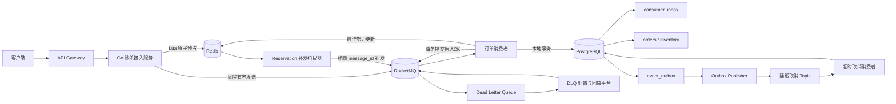
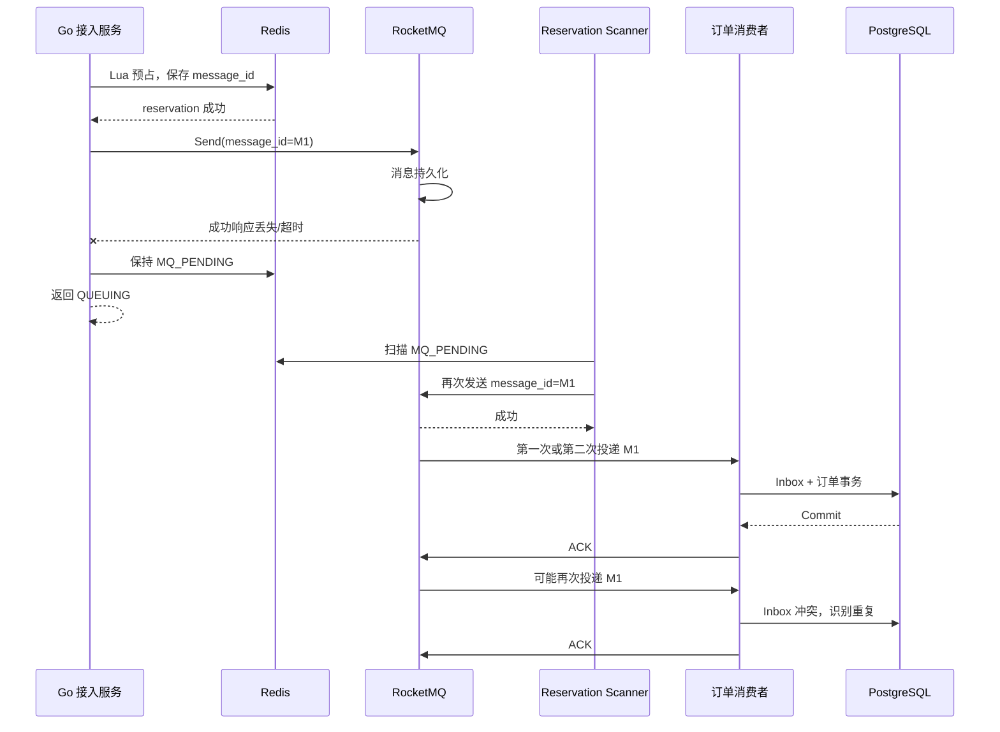
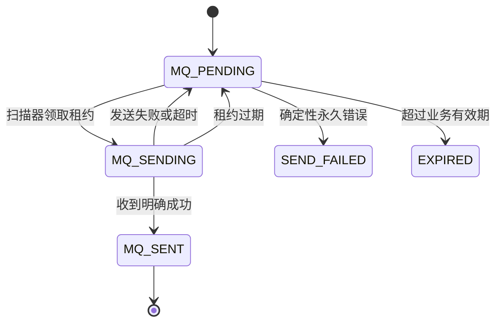
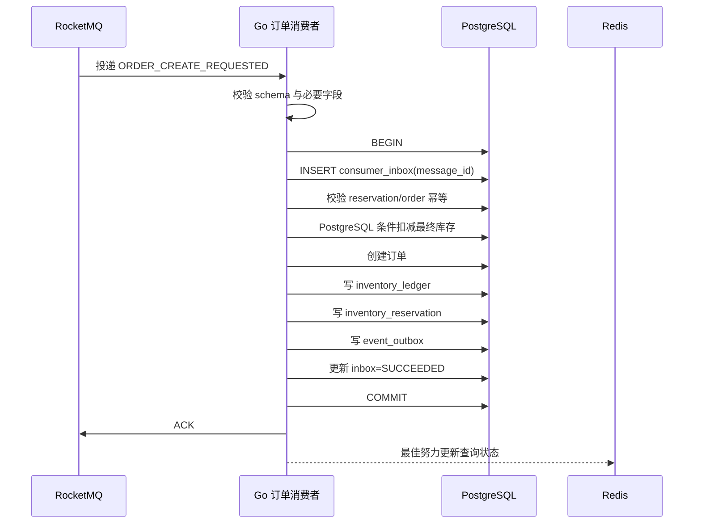
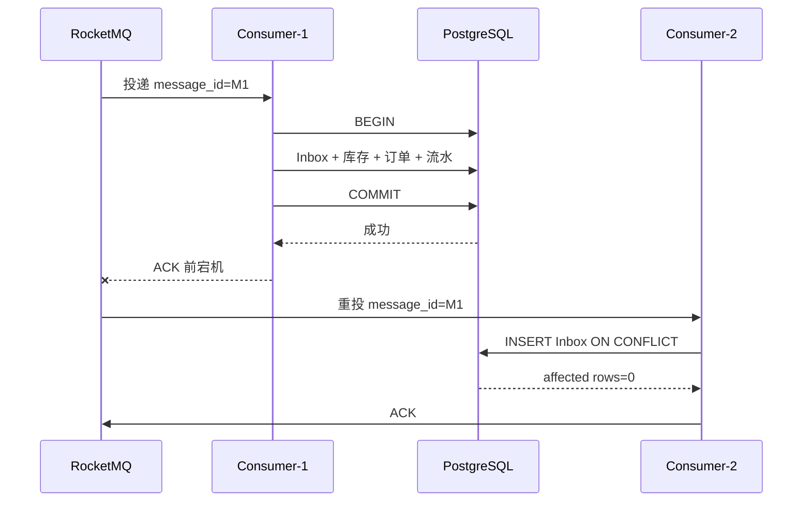
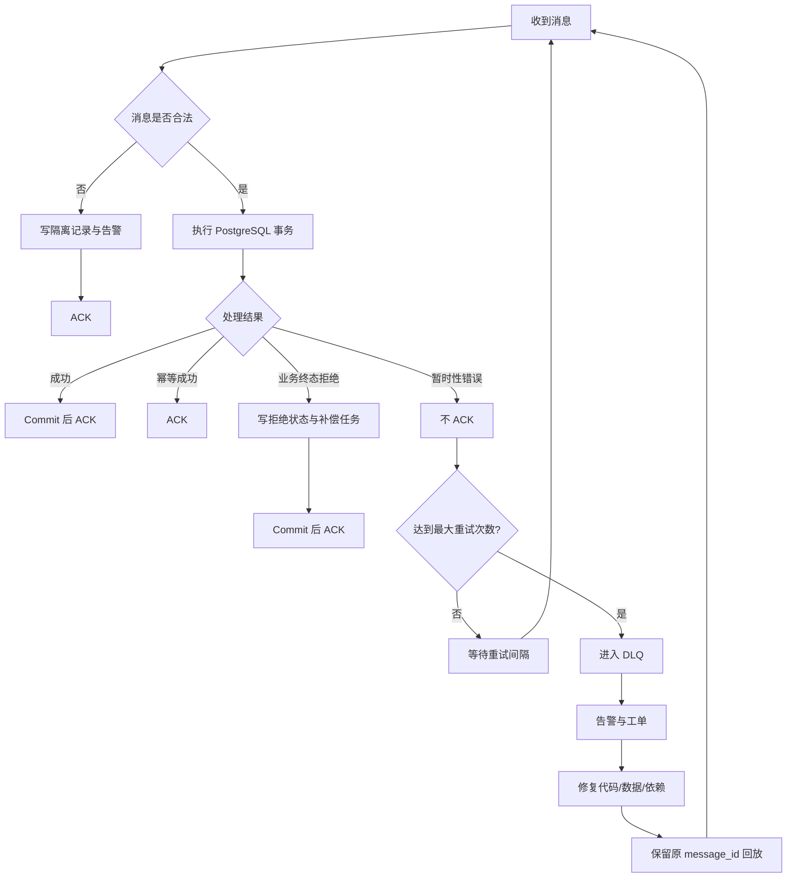
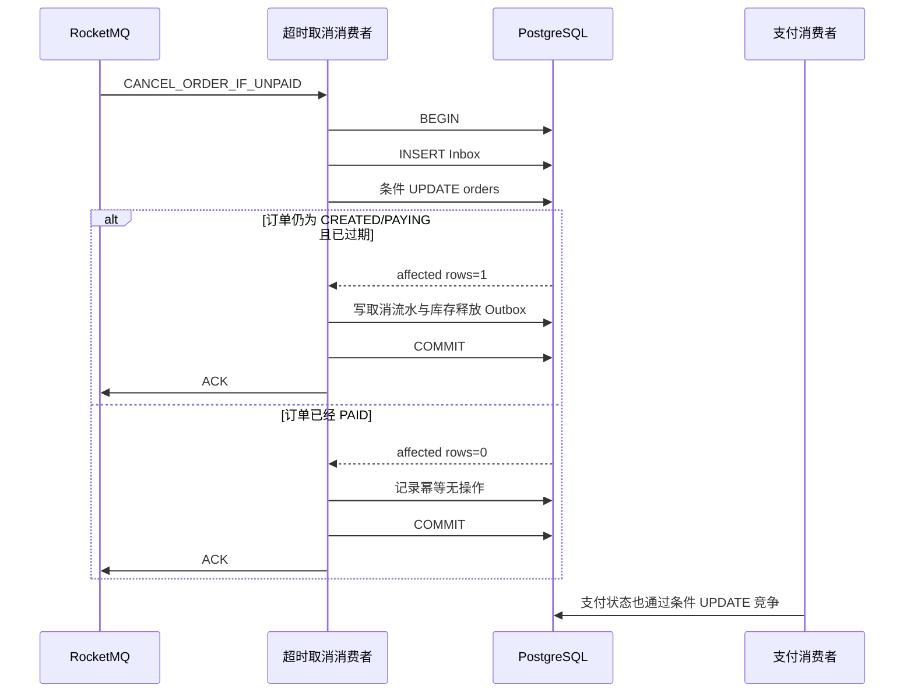

# 第 5 章：RocketMQ 削峰、可靠消息与积压治理

> **版本假设**：本章面向 Apache RocketMQ 5.x，服务端能力以 2026 年 4 月发布的 5.5.0 为参考。Go 示例采用 SDK 适配器接口表达，避免绑定某个可能变化的具体 API；官方 5.x Go SDK 使用 gRPC 协议，服务端需要启用兼容的 Proxy。([RocketMQ][1])

---

## 1. 本章目标

本章解决秒杀系统中从 Redis 库存预占到 PostgreSQL 订单落库之间的异步可靠性问题。

核心结论如下：

1. **RocketMQ 的首要作用是削峰、缓冲和解耦，而不是消除下游压力。**
2. **订单创建消息采用普通消息，不为热点 SKU 强制使用顺序消息。**
3. **生产者采用有界同步发送，发送结果不确定时保留 reservation，通过扫描任务使用相同 `message_id` 补发。**
4. **消费者在 PostgreSQL 本地事务中完成 Inbox 幂等、最终库存扣减、订单创建、库存流水和 Outbox 写入，事务提交后才 ACK。**
5. **系统接受 At-Least-Once 投递，通过业务幂等实现“业务效果仅发生一次”。**
6. **延迟取消消息只是超时检查触发器，不能直接证明订单仍可取消。**
7. **消费者扩容必须受 PostgreSQL 安全写入能力约束，不能只看 MQ 积压量。**
8. **死信队列必须有告警、工单、修复、回放和审计闭环。**

---

## 2. 业务背景

上一章完成了 Redis 原子库存预占。预占成功后，系统已经生成并保存：

* `request_id`
* `reservation_id`
* `message_id`
* `order_id`
* `activity_id`
* `sku_id`
* `user_id`
* reservation 状态
* reservation 业务有效期
* MQ 发送状态

但此时还没有 PostgreSQL 有效订单。

热路径为：

```text
Redis 预占成功
→ 发送 RocketMQ 订单创建消息
→ 返回“排队中”
→ 消费者异步创建 PostgreSQL 订单
```

这里存在两个最重要的不确定窗口：

```text
窗口一：
Redis 预占成功
→ 进程在发送 MQ 前宕机

窗口二：
RocketMQ 已经保存消息
→ 生产者没有收到成功响应
```

窗口一可能造成**库存已预占但永远不创建订单**；窗口二可能造成生产者重试后出现**重复消息**。

消费者侧还有第三个窗口：

```text
PostgreSQL 事务已经提交
→ 消费者在 ACK 前宕机
```

此时 RocketMQ 会再次投递消息，因此消费者必须幂等。

RocketMQ 的 Topic 由多个 MessageQueue 组成，Consumer Group 代表一组具有相同消费逻辑和配置的消费者，消费进度保存在服务端并由 Consumer Group 共享。([RocketMQ][2])

---

## 3. 核心问题

本章必须回答：

* Redis 预占成功后，如何可靠地触发订单创建？
* 发送超时到底算成功还是失败？
* 相同消息重复投递时，怎样避免重复扣库存和重复创建订单？
* 订单创建消息是否需要顺序？
* 事务消息能否解决 Redis、RocketMQ、PostgreSQL 三者的一致性？
* 延迟取消消息到达时订单已经支付怎么办？
* MQ 积压多久会违反“三秒内创建订单”的 SLO？
* 消费者扩容为什么可能压垮 PostgreSQL？
* Broker 故障和消费者重平衡期间会发生什么？
* 死信消息怎样形成可运维的处理闭环？

---

## 4. 未优化的基线方案

最简单的实现如下：

```go
reservation, err := reserveInRedis(ctx, req)
if err != nil {
	return err
}

msg := buildOrderCreateMessage(reservation)

if err := producer.Send(ctx, msg); err != nil {
	// 立即把 Redis 库存加回去
	return err
}

return Queuing
```

消费者：

```go
func Consume(msg Message) error {
	if err := createOrderInPostgreSQL(msg); err != nil {
		return err
	}
	return nil // ACK
}
```

该方案看起来完整，但在生产环境中存在大量正确性漏洞。

---

## 5. 基线方案的问题

| 维度   | 问题                                          |
| ---- | ------------------------------------------- |
| 正确性  | 发送超时后立即补偿 Redis，消息实际上可能已经进入 Broker，之后仍会创建订单 |
| 正确性  | 重复消息会重复扣减 PostgreSQL 库存或重复写库存流水             |
| 正确性  | 消费者数据库提交后、ACK 前宕机会触发重复消费                    |
| 可靠性  | Redis 预占成功、发送消息前进程宕机，reservation 永久悬挂       |
| 性能   | 消费失败后立即高频重试，形成重试风暴                          |
| 性能   | 消费者无限增加并发，耗尽 PostgreSQL 连接池和 WAL 能力         |
| 可用性  | Broker 短暂故障会直接导致秒杀接口失败                      |
| 可扩展性 | 使用全局顺序消息会将整个活动串行化                           |
| 可运维性 | 只监控消息数量，不监控最老消息年龄，无法判断用户等待时间                |
| 可运维性 | 消息进入 DLQ 后没有负责人、工单、修复和回放机制                  |

RocketMQ 生产者在网络异常、请求超时或 Broker 异常时可能发起重试。由于客户端无法确定前一次请求在 Broker 上是否已经成功，重试可能产生重复消息；内置重试也不保证最终一定发送成功，最终失败后仍需业务侧提供冗余机制。([RocketMQ][3])

---

## 6. 推荐架构

### 6.1 总体架构



### 6.2 事务边界与故障边界

| 边界              | 说明                                       |
| --------------- | ---------------------------------------- |
| Redis Lua       | 只保证 Redis 内部多个 Key 的原子预占                 |
| MQ 发送           | 不与 Redis Lua 构成原子事务                      |
| PostgreSQL 消费事务 | Inbox、最终库存、订单、流水、Outbox 在一个本地事务内提交       |
| ACK             | 必须在 PostgreSQL 提交成功后执行                   |
| Redis 状态回写      | 不属于 PostgreSQL 事务，失败后通过 Outbox、查询回源或对账修复 |
| 延迟取消            | 只触发一次状态检查，最终能否取消由 PostgreSQL 条件更新决定      |

### 6.3 推荐主方案

```text
Redis reservation
+ 有界同步发送
+ 固定业务 message_id
+ reservation 扫描补发
+ PostgreSQL consumer_inbox
+ 数据库唯一约束
+ 条件状态更新
+ Outbox
+ DLQ 闭环
+ 定期对账
```

该方案不追求跨 Redis、RocketMQ、PostgreSQL 的强原子事务，而是把所有不确定结果转换为：

* 可重试；
* 可幂等；
* 可补偿；
* 可查询；
* 可对账；
* 可人工接管。

---

## 7. Topic、Queue 与 Consumer Group 设计

RocketMQ 5.x 对普通、FIFO、事务和延迟消息区分消息类型。不同业务类型和不同消息类型应使用独立 Topic，而不是仅通过 Tag 混在同一 Topic。([RocketMQ][4])

### 7.1 Topic 设计

| Topic                                  | 类型             | 主要 Tag                                        | 用途              | 顺序要求       |
| -------------------------------------- | -------------- | --------------------------------------------- | --------------- | ---------- |
| `PROD_SECKILL_ORDER_CREATE_V1`         | NORMAL         | `CREATE_ORDER`                                | Redis 预占后异步创建订单 | 无          |
| `PROD_SECKILL_ORDER_TIMEOUT_V1`        | DELAY          | `CANCEL_IF_UNPAID`                            | 到期检查订单是否需要取消    | 无          |
| `PROD_SECKILL_ORDER_EVENT_V1`          | NORMAL         | `ORDER_CREATED`、`ORDER_PAID`、`ORDER_CANCELED` | 下游领域事件          | 按需         |
| `PROD_SECKILL_INVENTORY_COMPENSATE_V1` | NORMAL         | `RELEASE_RESERVATION`                         | 库存补偿和异常收敛       | 无          |
| `PROD_SECKILL_ORDER_STATE_FIFO_V1`     | FIFO，可选        | `ORDER_STATE_CHANGED`                         | 必须按订单局部有序的状态投影  | `order_id` |
| `PROD_SECKILL_RESERVATION_TX_V1`       | TRANSACTION，可选 | `RESERVATION_CREATED`                         | 改造为本地数据库事务消息时使用 | 无          |

**不建议按活动或 SKU 创建 Topic。**

原因是：

* 活动数量可能非常大，Topic 生命周期难以治理；
* 权限、监控、容量和清理配置会急剧膨胀；
* Topic 应按业务语义和消息类型隔离，而不是按每个业务实例隔离。

### 7.2 Consumer Group 设计

| Consumer Group                         | 订阅 Topic               | 职责                     |
| -------------------------------------- | ---------------------- | ---------------------- |
| `CG_SECKILL_ORDER_CREATE_PG_V1`        | `ORDER_CREATE`         | PostgreSQL 最终库存扣减和订单创建 |
| `CG_SECKILL_ORDER_TIMEOUT_V1`          | `ORDER_TIMEOUT`        | 超时条件取消                 |
| `CG_SECKILL_INVENTORY_COMPENSATE_V1`   | `INVENTORY_COMPENSATE` | Redis 或其他库存补偿          |
| `CG_SECKILL_ORDER_QUERY_PROJECTION_V1` | `ORDER_EVENT`          | 更新 Redis 查询状态          |
| `CG_SECKILL_AUDIT_V1`                  | 相关事件 Topic             | 审计、对账和数据湖同步            |

同一个 Consumer Group 中的消费者必须保持：

* 相同订阅表达式；
* 相同消费语义；
* 相同幂等规则；
* 相同最大重试策略；
* 相同消息版本兼容能力。

### 7.3 Queue 数量

建议初始配置：

```text
ORDER_CREATE：64 个 Queue
ORDER_TIMEOUT：32 个 Queue
INVENTORY_COMPENSATE：32 个 Queue
ORDER_EVENT：64 个 Queue
```

这只是初始假设，最终必须通过压测校准。

Queue 数量主要影响：

* Broker 存储与写入并行度；
* 消费并行度；
* 路由和元数据规模；
* FIFO 消息组的分布；
* 扩容余量。

不要把热点 SKU 固定映射到单个 Queue。订单创建消息彼此独立，按 `sku_id` 强制顺序会把 10,000 个库存请求串行化。

RocketMQ 5.x 的 PushConsumer 和 SimpleConsumer采用消息级负载均衡，可在 Consumer Group 中分配消息；FIFO 消息则必须维持同一消息组的顺序约束。不同客户端模式和旧版客户端的负载均衡边界可能不同，因此 Queue 数量仍需留出扩容余量并通过实际 SDK 验证。([RocketMQ][5])

---

## 8. 消息标识设计

### 8.1 四种不同的“消息标识”

| 标识                | 生成方      | 是否跨重试保持不变 | 用途             |
| ----------------- | -------- | --------: | -------------- |
| `message_id`      | 业务系统     |         是 | 消费 Inbox 幂等键   |
| Broker Message ID | RocketMQ |  不应依赖其稳定性 | Broker 内部定位和排障 |
| Message Key       | 业务系统     |         是 | 按业务 ID 查询消息    |
| `reservation_id`  | 秒杀系统     |         是 | 关联一次库存预占       |

**消费者幂等必须使用业务 `message_id`，不能只依赖 Broker 生成的消息 ID。**

生产者重发相同业务事件时：

```text
message_id       保持不变
reservation_id   保持不变
order_id         保持不变
request_id       保持不变
Broker Message ID 可能变化
```

RocketMQ 官方建议将唯一业务标识设置为 Message Key，以便查询和排查消息。Tag 用于分类和 Broker 侧过滤，Key 用于业务定位。([RocketMQ][6])

### 8.2 推荐映射

```text
message_id   = evt_01J...
message_key  = reservation_id
secondary key = order_id
```

对于支持多个 Key 的 SDK，可同时写入：

```text
reservation_id
order_id
request_id
```

不要把高基数业务标识放入 Tag。Tag 应保持为少量、稳定的业务分类，例如 `CREATE_ORDER`。

---

## 9. 消息结构

### 9.1 JSON 结构

```json
{
  "schema_version": 1,
  "event_type": "ORDER_CREATE_REQUESTED",
  "message_id": "evt_01K0YV6M3RM4DAK1XKED6W9Y2Q",
  "message_key": "rsv_01K0YV6KZ8B8QNY6H5N6BMEPXV",
  "request_id": "req_01K0YV6HGNMTHWMTMH0PV40T58",
  "reservation_id": "rsv_01K0YV6KZ8B8QNY6H5N6BMEPXV",
  "order_id": "ord_01K0YV6MGJXYJ5SKPX0DPSV8G5",
  "activity_id": 10001,
  "sku_id": 20001,
  "user_id": 90000001,
  "quantity": 1,
  "reservation_created_at": "2026-06-25T17:00:00.123Z",
  "reservation_valid_until": "2026-06-25T17:05:00.123Z",
  "created_at": "2026-06-25T17:00:00.130Z",
  "retry_count": 0,
  "replay_count": 0,
  "producer": "seckill-access-service",
  "trace": {
    "trace_id": "4bf92f3577b34da6a3ce929d0e0e4736",
    "span_id": "00f067aa0ba902b7",
    "traceparent": "00-4bf92f3577b34da6a3ce929d0e0e4736-00f067aa0ba902b7-01"
  }
}
```

### 9.2 字段语义

| 字段                        | 语义                         |
| ------------------------- | -------------------------- |
| `schema_version`          | 消息结构版本，不等于业务状态版本           |
| `event_type`              | 事件语义                       |
| `message_id`              | 业务消息唯一 ID，Inbox 唯一键        |
| `message_key`             | RocketMQ 查询索引键             |
| `request_id`              | 客户端请求幂等键                   |
| `reservation_id`          | Redis 库存预占 ID              |
| `order_id`                | 预分配订单 ID                   |
| `reservation_valid_until` | 订单创建允许的最晚业务时间              |
| `created_at`              | 生产者创建事件时间                  |
| `retry_count`             | 应用扫描补发次数，不代表 Broker 消费重试次数 |
| `replay_count`            | 人工或平台回放次数                  |
| `trace`                   | 跨服务链路跟踪上下文                 |

### 9.3 `retry_count` 的边界

消息体中的 `retry_count` 不是 Broker 重试次数的权威来源。

应区分：

```text
send_attempt      生产者或 reservation 扫描补发次数
delivery_attempt  Broker 对消费者的投递次数
replay_count      人工或平台回放次数
```

消费者应优先读取 SDK 提供的投递次数元数据；消息体中的 `retry_count` 只反映生产端应用级补发。

### 9.4 Go 结构体

```go
type OrderCreateRequested struct {
	SchemaVersion int    `json:"schema_version"`
	EventType     string `json:"event_type"`

	MessageID     string `json:"message_id"`
	MessageKey    string `json:"message_key"`
	RequestID     string `json:"request_id"`
	ReservationID string `json:"reservation_id"`
	OrderID       string `json:"order_id"`

	ActivityID int64 `json:"activity_id"`
	SKUID      int64 `json:"sku_id"`
	UserID     int64 `json:"user_id"`
	Quantity   int32 `json:"quantity"`

	ReservationCreatedAt time.Time `json:"reservation_created_at"`
	ReservationValidUntil time.Time `json:"reservation_valid_until"`
	CreatedAt             time.Time `json:"created_at"`

	RetryCount  int32 `json:"retry_count"`
	ReplayCount int32 `json:"replay_count"`
	Producer    string `json:"producer"`

	Trace TraceContext `json:"trace"`
}

type TraceContext struct {
	TraceID     string `json:"trace_id"`
	SpanID      string `json:"span_id"`
	Traceparent string `json:"traceparent"`
}
```

---

## 10. 消息类型选择

### 10.1 普通消息

订单创建使用普通消息。

原因：

* 每个 reservation 可独立处理；
* 不需要活动级或 SKU 级严格顺序；
* PostgreSQL 唯一约束和状态机能够处理重复与乱序；
* 普通消息支持更高并行度。

普通消息适合异步解耦和事件驱动场景，不附带 FIFO、事务或定时语义。([RocketMQ][4])

### 10.2 顺序消息

顺序消息只在业务明确需要以下语义时使用：

```text
同一个 order_id 的状态投影：
CREATED → PAID → FULFILLED
```

推荐顺序键：

```text
message_group = order_id
```

不推荐：

```text
message_group = activity_id  // 整个活动串行
message_group = sku_id       // 热点 SKU 串行
message_group = global       // 全局串行
```

RocketMQ 的顺序保证以 Message Group 为边界，不同 Message Group 之间没有顺序关系。生产端还必须满足同一生产者串行发送，消费端也不能把收到的同组消息再次异步并发处理。([RocketMQ][7])

即使使用 FIFO，消费者仍然需要：

* 幂等；
* 状态版本检查；
* 条件更新；
* 对迟到消息的处理。

顺序消息不能替代业务状态机。

### 10.3 事务消息

RocketMQ 事务消息保证的是：

```text
生产者本地事务
与
消息最终可见性
之间的最终一致性
```

其典型流程是：

1. 发送半消息；
2. 执行生产者本地事务；
3. 提交或回滚半消息；
4. 结果不确定时由 Broker 回查；
5. 生产者根据持久化的本地事务状态回答 Commit、Rollback 或 Unknown。

事务消息并不保证下游消费者处理结果与生产者本地事务天然一致，消费者仍需重试和幂等。([RocketMQ][8])

#### 为什么不作为本书主方案

当前热路径中的“本地事务”是 Redis Lua 预占，而不是 PostgreSQL 本地事务。

事务回查如果只查询 Redis，存在以下问题：

* Redis 不是订单最终事实源；
* Redis 主从切换可能丢失最近写入；
* reservation 可能因 TTL 被删除；
* 回查服务无法用数据库事务提交记录证明预占已经永久成立；
* 它仍不能覆盖消费者端的订单创建事务。

因此：

**事务消息不能天然把 Redis、RocketMQ、PostgreSQL 三者变成一个原子事务。**

事务消息更适合改造后的链路：

```text
PostgreSQL 本地事务写 reservation/outbox
+
RocketMQ 事务消息
```

即便如此，消费者 Inbox 仍不可省略。

### 10.4 延迟消息

订单超时取消使用延迟消息。

消息的投递时间设置为：

```text
deliver_at = orders.expires_at
```

RocketMQ 5.x 延迟消息使用毫秒级时间戳表达计划投递时间。消息在计划时间前不可见，到期后转为可消费状态；Broker 故障或恢复过程可能导致实际投递晚于计划时间。([RocketMQ][9])

延迟消息必须被理解为：

> “现在可以检查订单是否应该取消了。”

而不是：

> “订单现在一定可以取消。”

---

## 11. 同步发送、异步发送与发送结果未知

### 11.1 对比

| 模式      | 优点              | 风险                        | 适用场景            |
| ------- | --------------- | ------------------------- | --------------- |
| 同步发送    | 结果路径清晰，天然形成入口背压 | 增加接口延迟                    | 订单创建等关键消息       |
| 异步发送    | 降低调用线程等待时间      | 回调丢失、进程退出、无界 in-flight 风险 | 非关键事件或已有本地持久化兜底 |
| One-Way | 延迟最低            | 无法确认发送结果                  | 日志、低价值遥测，不适合订单  |
| 事务消息    | 生产者本地事务与消息最终一致  | 实现和运维复杂，仍需消费幂等            | 数据库本地事务驱动事件     |

官方 Go SDK 提供同步和异步发送调用形式，但不同 SDK 版本的构造器、配置和方法签名可能变化。([GitHub][10])

### 11.2 主方案

订单创建消息采用：

```text
同步发送
+ 20～40ms 有界超时
+ SDK 内少量重试
+ reservation 扫描补发
```

具体超时必须根据同可用区网络、Proxy、Broker 和磁盘 P99 压测确定，不能直接照抄固定值。

发送结果分为三类：

| 结果                 | 处理                                    |
| ------------------ | ------------------------------------- |
| `CONFIRMED`        | Broker 明确确认，reservation 标记为 `MQ_SENT` |
| `UNKNOWN`          | 网络超时、连接断开等无法判断结果；保留 `MQ_PENDING`，扫描补发 |
| `DEFINITE_FAILURE` | Topic 不存在、权限错误、消息格式不合法等确定失败；告警并进入补偿流程 |

### 11.3 发送成功但生产者收到超时



**发送超时后不能立即补偿 Redis 库存。**

因为超时只说明生产者没有收到确定结果，不说明 Broker 没有保存消息。RocketMQ 官方也明确指出发送重试可能产生重复消息，业务必须能够处理重复。([RocketMQ][3])

---

## 12. Go Producer 示例

以下代码使用框架无关的 RocketMQ Adapter 接口。具体 SDK 初始化和 Message 属性设置由 Adapter 实现。

```go
package mq

import (
	"context"
	"encoding/json"
	"errors"
	"fmt"
	"time"
)

type Message struct {
	Topic string
	Tag   string
	Key   string
	Body  []byte

	Properties map[string]string
}

type SendReceipt struct {
	BrokerMessageID string
}

type Producer interface {
	Send(ctx context.Context, msg Message) (SendReceipt, error)
}

type SendOutcome string

const (
	SendConfirmed       SendOutcome = "CONFIRMED"
	SendUnknown         SendOutcome = "UNKNOWN"
	SendDefiniteFailure SendOutcome = "DEFINITE_FAILURE"
)

type ErrorClassifier interface {
	IsDefiniteFailure(err error) bool
}

type Publisher struct {
	producer   Producer
	classifier ErrorClassifier
	topic      string
	timeout    time.Duration
}

func NewPublisher(
	producer Producer,
	classifier ErrorClassifier,
	topic string,
	timeout time.Duration,
) (*Publisher, error) {
	if producer == nil {
		return nil, errors.New("producer is nil")
	}
	if classifier == nil {
		return nil, errors.New("error classifier is nil")
	}
	if topic == "" {
		return nil, errors.New("topic is empty")
	}
	if timeout <= 0 {
		return nil, errors.New("invalid send timeout")
	}

	return &Publisher{
		producer:   producer,
		classifier: classifier,
		topic:      topic,
		timeout:    timeout,
	}, nil
}

func (p *Publisher) PublishOrderCreate(
	parent context.Context,
	event OrderCreateRequested,
) (SendOutcome, SendReceipt, error) {
	if err := validateOrderCreateEvent(event); err != nil {
		return SendDefiniteFailure, SendReceipt{}, err
	}

	body, err := json.Marshal(event)
	if err != nil {
		return SendDefiniteFailure, SendReceipt{},
			fmt.Errorf("marshal order event: %w", err)
	}

	ctx, cancel := context.WithTimeout(parent, p.timeout)
	defer cancel()

	receipt, err := p.producer.Send(ctx, Message{
		Topic: p.topic,
		Tag:   "CREATE_ORDER",
		Key:   event.ReservationID,
		Body:  body,
		Properties: map[string]string{
			"message_id":     event.MessageID,
			"request_id":     event.RequestID,
			"reservation_id": event.ReservationID,
			"order_id":       event.OrderID,
			"schema_version": "1",
			"traceparent":    event.Trace.Traceparent,
		},
	})
	if err == nil {
		return SendConfirmed, receipt, nil
	}

	if p.classifier.IsDefiniteFailure(err) {
		return SendDefiniteFailure, SendReceipt{},
			fmt.Errorf("definite mq send failure: %w", err)
	}

	// 超时、连接中断、响应解析失败等通常无法证明 Broker 未收到消息。
	return SendUnknown, SendReceipt{},
		fmt.Errorf("unknown mq send result: %w", err)
}

func validateOrderCreateEvent(event OrderCreateRequested) error {
	switch {
	case event.SchemaVersion != 1:
		return fmt.Errorf("unsupported schema version: %d", event.SchemaVersion)
	case event.MessageID == "":
		return errors.New("message_id is empty")
	case event.RequestID == "":
		return errors.New("request_id is empty")
	case event.ReservationID == "":
		return errors.New("reservation_id is empty")
	case event.OrderID == "":
		return errors.New("order_id is empty")
	case event.ActivityID <= 0:
		return errors.New("invalid activity_id")
	case event.SKUID <= 0:
		return errors.New("invalid sku_id")
	case event.UserID <= 0:
		return errors.New("invalid user_id")
	case event.Quantity != 1:
		return errors.New("quantity must be 1")
	default:
		return nil
	}
}
```

调用方处理：

```go
outcome, receipt, err := publisher.PublishOrderCreate(ctx, event)

switch outcome {
case SendConfirmed:
	// Lua CAS：MQ_PENDING/SENDING -> MQ_SENT
	// 即使这里更新失败，也不能重新生成 message_id。
	_ = reservationRepo.MarkMQSent(
		ctx,
		event.ReservationID,
		event.MessageID,
		receipt.BrokerMessageID,
	)

case SendUnknown:
	// 不补偿库存。
	// 保持或恢复为 MQ_PENDING，由扫描器使用同一 message_id 补发。
	_ = reservationRepo.ScheduleRetry(
		ctx,
		event.ReservationID,
		event.MessageID,
		nextRetryAt(),
		err.Error(),
	)

case SendDefiniteFailure:
	// 配置、权限、Topic 或消息结构错误通常不会自动恢复。
	// 标记终态、告警，并创建幂等补偿任务。
	_ = reservationRepo.MarkSendFailed(
		ctx,
		event.ReservationID,
		event.MessageID,
		err.Error(),
	)
}
```

---

## 13. Reservation 扫描补发

### 13.1 Redis 索引

建议维护：

```text
ZSET seckill:{activity_id}:reservation:mq_pending
score  = next_retry_at 毫秒时间戳
member = reservation_id
```

reservation 中保存：

```text
message_id
request_id
order_id
activity_id
sku_id
user_id
status
mq_status
send_attempt
next_retry_at
lease_owner
lease_until
created_at
valid_until
```

### 13.2 状态机



### 13.3 扫描器原则

* 使用 Lua 原子领取任务和设置租约；
* 每次只领取有界批量；
* 使用固定大小 worker pool；
* 继续使用原 `message_id`；
* 指数退避并加入随机抖动；
* 进程宕机后通过租约超时重新领取；
* 发送成功、更新 Redis 状态前宕机允许产生重复消息；
* 重复由 PostgreSQL Inbox 消除。

### 13.4 补发伪代码

```go
// 伪代码：ClaimDue、RenewLease、Reschedule 应由 Redis Lua 原子实现。
func (s *Scanner) ScanOnce(ctx context.Context) error {
	items, err := s.repo.ClaimDue(
		ctx,
		time.Now(),
		s.batchSize,
		s.instanceID,
		s.leaseDuration,
	)
	if err != nil {
		return fmt.Errorf("claim pending reservations: %w", err)
	}

	sem := make(chan struct{}, s.maxConcurrency)
	errCh := make(chan error, len(items))

	for _, item := range items {
		item := item

		select {
		case sem <- struct{}{}:
		case <-ctx.Done():
			return ctx.Err()
		}

		go func() {
			defer func() { <-sem }()

			outcome, _, sendErr :=
				s.publisher.PublishOrderCreate(ctx, item.Event)

			switch outcome {
			case SendConfirmed:
				errCh <- s.repo.MarkSent(
					ctx,
					item.ReservationID,
					item.MessageID,
					s.instanceID,
				)

			case SendUnknown:
				errCh <- s.repo.Reschedule(
					ctx,
					item.ReservationID,
					item.MessageID,
					s.instanceID,
					backoff(item.SendAttempt),
					sendErr,
				)

			case SendDefiniteFailure:
				errCh <- s.repo.MarkPermanentFailure(
					ctx,
					item.ReservationID,
					item.MessageID,
					s.instanceID,
					sendErr,
				)
			}
		}()
	}

	for range items {
		if err := <-errCh; err != nil {
			// 实际实现应聚合错误并记录结构化日志。
			return err
		}
	}

	return nil
}
```

---

## 14. 消费流程与幂等事务

### 14.1 正常流程



### 14.2 为什么 Inbox 必须和业务写入同事务

错误方案：

```text
先写 Inbox 并提交
→ 再创建订单
```

如果 Inbox 已提交、订单事务失败，重试消息会被误判为已经成功处理。

另一个错误方案：

```text
先创建订单并提交
→ 再写 Inbox
```

如果创建订单后进程宕机，重试时无法通过 Inbox 快速识别重复。

正确方案：

```text
Inbox
+ PostgreSQL 最终库存
+ 订单
+ 库存流水
+ reservation 落库
+ Outbox
```

在同一个 PostgreSQL 本地事务内提交。

### 14.3 Inbox SQL

```sql
INSERT INTO consumer_inbox (
    consumer_group,
    message_id,
    topic,
    reservation_id,
    order_id,
    status,
    delivery_attempt,
    received_at,
    created_at,
    updated_at
)
VALUES (
    $1, $2, $3, $4, $5,
    'PROCESSING',
    $6,
    now(),
    now(),
    now()
)
ON CONFLICT (consumer_group, message_id) DO NOTHING;
```

业务含义：

```text
affected rows = 1：
本 Consumer Group 第一次处理该 message_id。

affected rows = 0：
该 message_id 已经处理或正在由此前事务留下的记录表示。
```

若所有 Inbox 写入和业务写入均处于一个事务中，发生暂时性错误时整个事务回滚，Inbox 记录也不会错误保留。

### 14.4 消费结果分类

| 类型     | 示例                                     | 行为                    |
| ------ | -------------------------------------- | --------------------- |
| 成功     | 订单创建完成                                 | Commit 后 ACK          |
| 幂等成功   | Inbox 已存在、订单已存在                        | ACK                   |
| 业务终态拒绝 | PostgreSQL 库存不足、一人一单冲突、reservation 已过期 | 写终态及补偿任务，Commit 后 ACK |
| 暂时性失败  | PostgreSQL 不可用、连接超时、死锁、可重试序列化冲突        | 回滚，不 ACK，等待重试         |
| 永久格式错误 | schema 不支持、字段缺失                        | 隔离并告警，不反复冲击数据库        |
| 未知错误   | 无法分类                                   | 默认按暂时性失败处理，但必须有限重试    |

RocketMQ 消费失败或处理超时后会按 Consumer Group 的策略重新投递；达到最大次数后进入 DLQ。PushConsumer 和 SimpleConsumer 的重试状态机、间隔控制方式不同。([RocketMQ][11])

---

## 15. Go Consumer 示例

以下示例采用显式 Receive/Ack 模型，便于实现有界并发和数据库背压。

```go
type Delivery struct {
	Topic           string
	MessageID       string
	Body            []byte
	DeliveryAttempt int32
	ReceiptHandle   string
}

type Consumer interface {
	Receive(
		ctx context.Context,
		maxMessages int32,
		invisibleDuration time.Duration,
	) ([]Delivery, error)

	Ack(ctx context.Context, delivery Delivery) error
}

type HandleDecision int

const (
	DecisionAck HandleDecision = iota
	DecisionRetry
)

type OrderHandler struct {
	db            *pgxpool.Pool
	consumerGroup string
}

func (h *OrderHandler) Handle(
	ctx context.Context,
	d Delivery,
) (HandleDecision, error) {
	var event OrderCreateRequested

	if err := json.Unmarshal(d.Body, &event); err != nil {
		// 确定性坏消息不应依赖大量 Broker 重试。
		if qErr := h.persistQuarantine(ctx, d, "INVALID_JSON", err); qErr != nil {
			return DecisionRetry, qErr
		}
		return DecisionAck, nil
	}

	if err := validateOrderCreateEvent(event); err != nil {
		if qErr := h.persistQuarantine(ctx, d, "INVALID_EVENT", err); qErr != nil {
			return DecisionRetry, qErr
		}
		return DecisionAck, nil
	}

	processCtx, cancel := context.WithTimeout(ctx, 2*time.Second)
	defer cancel()

	result, err := h.processTransaction(
		processCtx,
		d,
		event,
	)

	if err == nil {
		return DecisionAck, nil
	}

	switch {
	case errors.Is(err, ErrAlreadyProcessed):
		return DecisionAck, nil

	case errors.Is(err, ErrBusinessRejected):
		// 拒绝结果、补偿任务和 Inbox 已在事务中提交。
		return DecisionAck, nil

	case isTransientDatabaseError(err):
		return DecisionRetry, err

	default:
		// 未知错误采用有限重试，而不是无条件 ACK。
		return DecisionRetry, err
	}
}
```

事务骨架：

```go
func (h *OrderHandler) processTransaction(
	ctx context.Context,
	d Delivery,
	event OrderCreateRequested,
) (ProcessResult, error) {
	tx, err := h.db.BeginTx(ctx, pgx.TxOptions{
		IsoLevel: pgx.ReadCommitted,
	})
	if err != nil {
		return ProcessResult{}, fmt.Errorf("begin tx: %w", err)
	}

	defer func() {
		_ = tx.Rollback(ctx)
	}()

	tag, err := tx.Exec(ctx, `
		INSERT INTO consumer_inbox (
			consumer_group,
			message_id,
			topic,
			reservation_id,
			order_id,
			status,
			delivery_attempt,
			received_at,
			created_at,
			updated_at
		)
		VALUES ($1, $2, $3, $4, $5,
		        'PROCESSING', $6, now(), now(), now())
		ON CONFLICT (consumer_group, message_id)
		DO NOTHING
	`,
		h.consumerGroup,
		event.MessageID,
		d.Topic,
		event.ReservationID,
		event.OrderID,
		d.DeliveryAttempt,
	)
	if err != nil {
		return ProcessResult{}, fmt.Errorf("insert inbox: %w", err)
	}

	if tag.RowsAffected() == 0 {
		return ProcessResult{}, ErrAlreadyProcessed
	}

	// 业务过期必须使用消息中不可变的业务截止时间，
	// 不能仅依赖 Redis Key 是否仍存在。
	if time.Now().After(event.ReservationValidUntil) {
		if err := recordExpiredAndCompensation(
			ctx, tx, event,
		); err != nil {
			return ProcessResult{}, err
		}

		if err := markInboxRejected(
			ctx, tx, event.MessageID, "RESERVATION_EXPIRED",
		); err != nil {
			return ProcessResult{}, err
		}

		if err := tx.Commit(ctx); err != nil {
			return ProcessResult{}, fmt.Errorf("commit expired result: %w", err)
		}

		return ProcessResult{Rejected: true}, ErrBusinessRejected
	}

	/*
		以下步骤须在同一事务中完成：

		1. 检查 reservation_id 是否已落库。
		2. 使用 PostgreSQL 唯一约束防止一人一单。
		3. 条件扣减 PostgreSQL 最终库存。
		4. 创建订单和订单项。
		5. 写库存流水。
		6. 写 reservation 最终状态。
		7. 写 event_outbox。
		8. 更新 consumer_inbox 为 SUCCEEDED。

		具体 DDL、索引和 SQL 在第 6 章展开。
	*/
	if err := createOrderFromReservation(ctx, tx, event); err != nil {
		if errors.Is(err, ErrNoFinalStock) ||
			errors.Is(err, ErrDuplicateValidOrder) {

			if cErr := recordBusinessRejectAndCompensation(
				ctx, tx, event, err,
			); cErr != nil {
				return ProcessResult{}, cErr
			}

			if cErr := tx.Commit(ctx); cErr != nil {
				return ProcessResult{}, fmt.Errorf(
					"commit business rejection: %w", cErr,
				)
			}

			return ProcessResult{Rejected: true}, ErrBusinessRejected
		}

		return ProcessResult{}, err
	}

	if err := markInboxSucceeded(ctx, tx, event.MessageID); err != nil {
		return ProcessResult{}, err
	}

	if err := tx.Commit(ctx); err != nil {
		return ProcessResult{}, fmt.Errorf("commit order transaction: %w", err)
	}

	return ProcessResult{Created: true}, nil
}
```

消费循环：

```go
func (s *ConsumerService) Run(ctx context.Context) error {
	sem := make(chan struct{}, s.maxConcurrency)

	for {
		if err := ctx.Err(); err != nil {
			return err
		}

		deliveries, err := s.consumer.Receive(
			ctx,
			s.batchSize,
			s.invisibleDuration,
		)
		if err != nil {
			if ctx.Err() != nil {
				return ctx.Err()
			}

			s.logger.Error("receive messages failed", "error", err)
			continue
		}

		for _, delivery := range deliveries {
			delivery := delivery

			select {
			case sem <- struct{}{}:
			case <-ctx.Done():
				return ctx.Err()
			}

			s.inflight.Add(1)

			go func() {
				defer func() {
					<-sem
					s.inflight.Done()
				}()

				decision, handleErr :=
					s.handler.Handle(ctx, delivery)

				if decision == DecisionRetry {
					s.logger.Warn(
						"message will be retried",
						"message_id", delivery.MessageID,
						"attempt", delivery.DeliveryAttempt,
						"error", handleErr,
					)
					// 不 ACK，等待 invisible duration 到期后重投。
					return
				}

				ackCtx, cancel :=
					context.WithTimeout(context.WithoutCancel(ctx), 3*time.Second)
				defer cancel()

				if err := s.consumer.Ack(ackCtx, delivery); err != nil {
					// PostgreSQL 已经提交，绝不能回滚业务。
					// 后续重复投递由 Inbox 识别。
					s.logger.Error(
						"ack failed after transaction commit",
						"message_id", delivery.MessageID,
						"error", err,
					)
				}
			}()
		}
	}
}
```

官方 5.x Go SDK 的 SimpleConsumer 示例采用显式 `Receive` 和 `Ack`，并要求配置 invisible duration；实际方法签名应以项目锁定的 SDK 版本为准。([GitHub][12])

---

## 16. 数据库提交成功但 ACK 前宕机



结论：

* 数据库事务已经提交，不能因为 ACK 失败而补偿订单；
* 重复投递是正确行为；
* Inbox 冲突表示业务效果已发生；
* 消费者返回成功并 ACK 即可。

这就是为什么系统采用：

```text
At-Least-Once 投递
+
业务幂等
```

而不是宣称端到端天然 Exactly Once。

---

## 17. 重试与死信队列

### 17.1 重试流程



### 17.2 哪些错误适合重试

适合：

* PostgreSQL 临时不可用；
* 连接超时；
* Broker 到消费者的短暂网络故障；
* 死锁；
* 可重试序列化冲突；
* 临时依赖不可用。

不适合：

* JSON 格式错误；
* 不支持的 `schema_version`；
* 必填字段缺失；
* activity、SKU 或用户标识非法；
* 明确的一人一单冲突；
* PostgreSQL 最终库存不足；
* reservation 已经超过不可恢复的业务截止时间。

RocketMQ 官方明确指出，消费重试用于处理偶发故障，不应被用作业务分流或限速机制。([RocketMQ][13])

### 17.3 为什么不能无限重试

无限重试会导致：

* 毒消息长期占用消费资源；
* 同一消息持续访问 PostgreSQL；
* 后续正常消息受到影响；
* 重试流量超过正常业务流量；
* 故障恢复后出现重试洪峰。

推荐策略：

```text
1～3 次：快速重试，处理瞬时网络抖动
后续重试：指数或阶梯退避
达到上限：进入 DLQ
```

具体次数必须结合业务恢复时间和 RocketMQ Consumer Group 配置确定。

### 17.4 DLQ 不是最终处理方案

DLQ 必须有以下闭环：

| 阶段 | 要求                                             |
| -- | ---------------------------------------------- |
| 发现 | `dlq_messages > 0` 立即告警                        |
| 定位 | 记录 Topic、Group、message_id、错误分类和最后异常            |
| 归属 | 自动创建工单并绑定业务负责人                                 |
| 修复 | 修复代码、数据、权限、Topic 或依赖                           |
| 回放 | 保留原 `message_id`，增加 `replay_id`、`replay_count` |
| 验证 | 校验订单数、库存流水、Inbox 和 reservation                 |
| 关闭 | 记录修复结论和审计信息                                    |

RocketMQ 会在消息耗尽配置的消费重试次数后，将其发送到对应 Consumer Group 的 DLQ；官方也将 DLQ 描述为恢复业务的保护措施，而不是无需处理的垃圾桶。([RocketMQ][11])

### 17.5 回放为什么保留原 `message_id`

回放时保留原 `message_id`：

```json
{
  "message_id": "evt_original",
  "replay_id": "replay_20260625_0001",
  "replay_count": 1
}
```

这样可以覆盖最危险的情况：

```text
原消费实际上已经提交数据库
但 ACK 状态或运维判断不确定
```

若回放使用新的 `message_id`，Inbox 无法识别此前已发生的业务效果，可能重复扣库存。

只有当运维人员明确发起的是一个**新的业务操作**，而不是重放原事件时，才生成新的 `message_id`。

---

## 18. 消息乱序与顺序性边界

### 18.1 为什么订单创建不追求全局顺序

假设按全局顺序消费：

```text
活动 A 的用户 1
活动 B 的用户 2
活动 A 的用户 3
……
```

任何一条消息处理缓慢都会阻塞后续全部消息。

而订单创建的正确性并不依赖请求到达先后：

* Redis 已经决定哪些 reservation 获得预占；
* PostgreSQL 使用条件库存和唯一约束做最终校验；
* 每个 reservation 可独立创建订单。

因此订单创建使用并发普通消息。

### 18.2 局部有序

只有明确依赖顺序的状态投影使用：

```text
message_group = order_id
```

RocketMQ 的 FIFO 只保证同一 Message Group 的局部顺序，不保证不同组之间的全局顺序。([RocketMQ][7])

### 18.3 仍然需要版本号

即使使用顺序消息，也建议事件包含：

```json
{
  "aggregate_id": "ord_...",
  "aggregate_version": 4,
  "event_type": "ORDER_PAID"
}
```

消费者更新投影时：

```sql
UPDATE order_projection
SET status = $1,
    aggregate_version = $2,
    updated_at = now()
WHERE order_id = $3
  AND aggregate_version < $2;
```

原因包括：

* 消息可能重复；
* 回放可能引入旧事件；
* 不同 Topic 之间没有统一顺序；
* 生产者异常并发可能破坏发送顺序；
* 消费者升级期间可能出现处理时间差异。

---

## 19. 延迟取消

### 19.1 可靠地产生延迟消息

订单创建事务中不要直接进行长时间外部 MQ 调用。

推荐：

```text
订单创建事务
→ 写 event_outbox：ORDER_CANCEL_SCHEDULED
→ 提交
→ Outbox Publisher 发送延迟消息
```

延迟消息结构：

```json
{
  "schema_version": 1,
  "event_type": "CANCEL_ORDER_IF_UNPAID",
  "message_id": "evt_cancel_ord_01K0...",
  "message_key": "ord_01K0...",
  "order_id": "ord_01K0...",
  "reservation_id": "rsv_01K0...",
  "activity_id": 10001,
  "sku_id": 20001,
  "user_id": 90000001,
  "deliver_at": "2026-06-25T17:15:00.000Z",
  "created_at": "2026-06-25T17:00:00.500Z",
  "retry_count": 0,
  "replay_count": 0
}
```

### 19.2 延迟消息到达时订单已经支付



条件取消 SQL：

```sql
UPDATE orders
SET status = 'CANCELED',
    canceled_at = now(),
    cancel_reason = 'PAYMENT_TIMEOUT',
    updated_at = now()
WHERE order_id = $1
  AND status IN ('CREATED', 'PAYING')
  AND expires_at <= now()
RETURNING order_id;
```

结果解释：

```text
affected rows = 1：
本事务成功将未支付订单取消，可以生成库存释放事件。

affected rows = 0：
可能已经支付、已经取消、订单不存在或尚未到期。
需要按业务审计要求决定是否再次查询。
```

**不能因为延迟消息到了就直接释放库存。**

只有 PostgreSQL 条件取消成功后，才能在同一事务写入库存释放 Outbox。

### 19.3 支付与取消竞态

支付更新：

```sql
UPDATE orders
SET status = 'PAID',
    paid_at = now(),
    payment_id = $2,
    updated_at = now()
WHERE order_id = $1
  AND status IN ('CREATED', 'PAYING');
```

取消与支付对同一订单行进行条件更新：

* 支付先成功：取消 affected rows = 0；
* 取消先成功：支付 affected rows = 0，支付系统应拒绝或进入退款流程；
* 两者不会同时把订单写成两个最终状态。

---

## 20. MQ 积压治理

### 20.1 队列只能转移压力

假设：

```text
生产速度 λp = 20,000 条/秒
消费速度 λc = 4,000 条/秒
```

新增积压速度：

```text
λbacklog = λp - λc
         = 16,000 条/秒
```

如果高峰持续 0.5 秒：

```text
最大积压 = 16,000 × 0.5
         = 8,000 条
```

高峰结束后生产速度降为 0：

```text
清空时间 = 8,000 / 4,000
         = 2 秒
```

若生产速度持续为 6,000 条/秒：

```text
消费速度 4,000 < 生产速度 6,000
```

则积压每秒继续增加 2,000 条，永远无法清空。

### 20.2 通用公式

```text
新增积压速度
= 生产速度 - 消费速度
```

```text
积压清空时间
= 当前积压量 /（消费速度 - 新增生产速度）
```

使用第二个公式的前提是：

```text
消费速度 > 新增生产速度
```

### 20.3 三秒 SLO 推导

假设：

* 单热点 SKU 库存 10,000；
* Redis 在 0.5 秒内完成全部成功预占；
* 消息生产速度为 20,000 条/秒；
* PostgreSQL 安全消费速度为 4,000 条/秒；
* 最大积压为 8,000；
* 清空时间为 2 秒；
* 单订单事务 P99 为 100ms；
* MQ、网络及调度安全预算为 500ms。

估算：

```text
最后一批订单创建时间
≈ 2s + 0.1s + 0.5s
= 2.6s
```

在假设成立时可以满足：

```text
99.9% 有效订单三秒内完成创建
```

但多 SKU 同时放量时，总成功 reservation 数可能远高于 10,000，因此必须按全活动总库存和流量倾斜重新压测。

### 20.4 不能只监控积压条数

应同时监控：

```text
lag_messages     积压消息数
lag_seconds      最老未消费消息年龄
inflight         正在处理但未 ACK 的消息
ready            尚未投递的消息
process_latency  消费业务处理耗时
```

10,000 条积压可能代表：

* 100,000 QPS 下的 100ms；
* 1,000 QPS 下的 10 秒。

对用户体验而言，**最老消息年龄比单纯的积压数量更重要**。

RocketMQ 服务端使用 Message Offset 和 Consumer Offset 管理消费进度；官方指标也区分 Ready、Inflight、消费处理时间、本地缓存消息和等待时间。([RocketMQ][14])

### 20.5 存储容量案例

假设：

```text
平均消息大小：1.5KB
最大积压：1,000,000 条
```

原始消息体：

```text
1,000,000 × 1.5KB ≈ 1.5GB
```

若三副本：

```text
约 4.5GB
```

还未包含：

* CommitLog 对齐和索引开销；
* ConsumeQueue；
* 消息属性；
* 延迟消息存储；
* 重试消息；
* DLQ；
* Trace 数据；
* 文件水位和扩容安全空间。

容量规划至少按计算值的 2～3 倍预留，并结合消息保留时间和磁盘故障重建时间校准。

---

## 21. 积压超过 reservation 有效时间

### 21.1 物理 TTL 与业务有效期必须分离

```text
Redis Key TTL
≠
reservation 业务有效期
```

推荐在消息中携带不可变字段：

```text
reservation_valid_until
```

消费者判断：

```go
if now.After(event.ReservationValidUntil) {
	// 不再创建订单。
	// 在 PostgreSQL 事务中记录过期结果并创建幂等补偿任务。
}
```

不能仅根据 Redis reservation Key 是否存在判断：

* Key 可能被提前淘汰；
* 主从切换可能造成数据缺失；
* Redis 故障可能导致读取失败；
* 已经进入 MQ 的消息不应因查询缓存丢失而产生不确定行为。

### 21.2 积压接近截止时间时

系统应依次执行：

1. 停止或收紧新的 Redis 预占；
2. 检查 PostgreSQL CPU、WAL、连接池和锁等待；
3. 在数据库仍有余量时扩容消费者；
4. 降低非核心 Consumer Group 的消费并发；
5. 延长仅用于恢复的 Redis 物理 TTL；
6. 对即将过期消息按业务策略快速拒绝并生成补偿；
7. 避免大规模补偿同时冲击 Redis。

### 21.3 不应自动延长业务资格

MQ 积压是系统故障或容量不足，不应无条件把所有用户 reservation 的业务有效期延长。

否则可能出现：

* 活动结束很久后仍创建订单；
* 用户已经放弃或重新参与其他活动；
* 商品价格和活动规则已经变化；
* 超时补偿与订单创建并发。

是否延长有效期应由业务策略明确决定，并记录审计原因。

---

## 22. 消费者扩容与 PostgreSQL 背压

### 22.1 为什么消费者越多不一定越快

订单消费者的稳定吞吐受以下最小值约束：

```text
安全吞吐
= min(
    MQ 拉取与处理能力,
    Go CPU 能力,
    PostgreSQL 连接池能力,
    PostgreSQL WAL 能力,
    磁盘能力,
    热点行锁能力,
    索引写入能力
)
```

假设 PostgreSQL 经过压测只能稳定承受：

```text
订单事务并发数：240
```

保留 30% 给支付、查询、补偿和运维：

```text
订单消费者预算
= 240 × 70%
= 168
```

若部署 12 个消费者实例：

```text
每实例最大并发
= 168 / 12
= 14
```

此时把每实例 worker 从 14 提高到 100，通常只会造成：

* 连接池等待；
* 行锁等待；
* WAL 排队；
* 事务 P99 上升；
* 超时和重试增加；
* 实际吞吐下降。

### 22.2 扩容决策

| MQ 状态                   | PostgreSQL 状态 | 动作                |
| ----------------------- | ------------- | ----------------- |
| lag 高                   | CPU、WAL、连接池健康 | 扩容消费者             |
| lag 高                   | 连接池耗尽         | 不扩容，先降低单实例并发      |
| lag 高                   | WAL 或磁盘饱和     | 限流入口，优化或扩容数据库     |
| lag 低                   | PG 压力高        | 缩容或降低拉取批次         |
| lag 突增                  | Broker 刚恢复    | 缓慢放量，避免恢复洪峰       |
| lag 高且 reservation 临近过期 | PG 无余量        | Fail Closed，停止新预占 |

### 22.3 有界并发

必须限制：

* 单实例 worker 数；
* 单批拉取消息数；
* 本地缓存消息数；
* 数据库连接池大小；
* 单条消息事务超时；
* ACK 超时；
* 优雅停机等待时间。

禁止：

```go
for _, msg := range messages {
	go consume(msg) // 无界 goroutine
}
```

---

## 23. 消费者重平衡

消费者实例增加、减少或故障时，Consumer Group 会重新分配消费工作。

重平衡期间可能出现：

* 短暂停顿；
* 已拉取消息的可见性超时；
* 旧实例尚未 ACK，新实例再次收到消息；
* 本地缓存丢弃；
* FIFO 消息组等待前序消息处理完成。

因此必须：

1. 消费幂等；
2. 设置合理 invisible duration；
3. 收到终止信号后停止拉取新消息；
4. 等待 in-flight 事务完成；
5. 对未完成消息不 ACK，使其稍后重投；
6. 先从服务发现摘除，再关闭进程；
7. 发布期间限制同时重启实例比例。

RocketMQ 的消费进度保存在服务端并属于 Consumer Group，而不是某一消费者实例，因此实例重启后可从 Group 进度继续消费。([RocketMQ][14])

---

## 24. Broker 故障

### 24.1 推荐部署原则

生产环境至少应满足：

* 多 Broker；
* 多副本；
* 跨三个可用区；
* NameServer 或控制组件多节点；
* Topic Queue 分散在多个 Broker；
* 磁盘和网络独立故障域；
* 定期进行 Broker 故障演练。

RocketMQ 5.x 支持 Controller 模式下的主从自动切换，并提供 SyncStateSet、最小同步副本数及多副本确认相关配置。具体参数需要按锁定的 5.x 版本验证。([RocketMQ][15])

### 24.2 可靠性与性能取舍

| 配置倾向  | 收益       | 成本                 |
| ----- | -------- | ------------------ |
| 同步刷盘  | 降低掉电丢失窗口 | 发送延迟和磁盘压力增加        |
| 异步刷盘  | 吞吐和延迟更好  | 极端故障存在未刷盘窗口        |
| 多副本确认 | 更低 RPO   | 网络延迟增加，可用副本不足时拒绝写入 |
| 单副本确认 | 可用性和性能较高 | 主节点永久损坏时风险更高       |

订单创建消息的默认优先级应是：

```text
数据可靠性
>
极限发送吞吐
```

但不能只修改配置而不压测，因为同步刷盘和多副本确认可能显著影响 P99。

### 24.3 Broker 故障时的生产者行为

生产者可能遇到：

* 连接失败；
* 路由不可用；
* 请求超时；
* Broker 返回限流或写入错误；
* 发送成功但响应丢失。

统一处理为：

```text
确定性成功 → MQ_SENT
不确定结果 → MQ_PENDING，补发
确定性永久失败 → 告警和补偿
```

不能因为 Broker 故障绕过 MQ，直接让 30 万 QPS 请求落到 PostgreSQL。

---

## 25. 消息回放

### 25.1 回放方式

| 方式                        | 适用场景     | 风险         |
| ------------------------- | -------- | ---------- |
| 按 `message_id` 或 Key 精确回放 | 少量异常订单   | 最安全        |
| DLQ 消息回放                  | 已修复的消费失败 | 需要保留原业务 ID |
| 按时间窗口回放                   | 大规模代码缺陷  | 影响范围大      |
| 重置 Consumer Offset        | 完整重消费    | 风险最高       |
| 新建 Replay Group           | 审计或离线验证  | 可能重读大量无关消息 |

### 25.2 回放前置检查

* 消息是否仍在保留期内；
* 原 `message_id` 是否存在 Inbox；
* 订单是否已经创建；
* reservation 是否已经补偿；
* 库存流水是否存在；
* 当前消息 schema 是否仍兼容；
* 回放是否会触发下游通知、优惠券或物流；
* 是否需要暂时关闭非幂等下游消费者。

RocketMQ 按 Topic、Queue 和 Offset 定位消息，Consumer Offset 独立管理各 Consumer Group 的消费进度；消息被物理清理后，旧 Offset 无法恢复已删除的数据。([RocketMQ][14])

---

## 26. 关键优化设计与原理

### 26.1 固定业务 `message_id`

**优化点：** 重试和补发始终使用相同业务 `message_id`。

**要解决的问题：** 发送超时、进程宕机和 DLQ 回放可能产生重复消息。

**未经优化时会发生什么：** 每次重发生成新 ID，消费者 Inbox 无法识别同一业务事件。

**实现方式：** 在 Redis 预占前生成 `message_id`，作为 reservation 的不可变字段。

**底层原理：** 将不可靠的消息投递转换为可靠的幂等集合插入。

**预计收益：** 重复投递不会产生重复业务效果。

**代价和副作用：** 必须确保一个 `message_id` 永远只表达一个业务事件。

**适用边界：** 所有需要 At-Least-Once 的业务消息。

**不适用场景：** 运维人员明确发起新的业务操作。

**监控指标：** `consumer_inbox_conflict_total`。

**验证方法：** 同一消息并发投递 100 次，断言只有一个有效订单和一条最终扣减流水。

---

### 26.2 同步有界发送加扫描补发

**优化点：** 热路径同步发送，但不无限等待；发送不确定时由后台扫描补发。

**要解决的问题：** 同步发送影响 P99，异步发送又存在回调丢失和进程宕机窗口。

**未经优化时会发生什么：** 无限重试阻塞请求线程，或一次异步发送失败后 reservation 永久悬挂。

**实现方式：**

```text
短超时同步发送
+ 少量 SDK 重试
+ MQ_PENDING
+ 扫描器补发
```

**底层原理：** 热路径负责快速尝试，恢复路径负责可靠完成。

**预计收益：** 保持接口延迟上界，同时消除发送前宕机窗口。

**代价和副作用：** 允许重复消息，需要 Redis 扫描索引和租约机制。

**适用边界：** Redis reservation 可可靠保存并被扫描。

**不适用场景：** Redis 中的 reservation 无法满足恢复窗口，此时应引入数据库 Outbox。

**监控指标：**

```text
mq_send_unknown_total
reservation_mq_pending
reservation_mq_pending_oldest_age
scanner_send_attempt_total
```

**验证方法：** 在发送前、发送中、发送后更新 Redis 前分别强杀进程。

---

### 26.3 PostgreSQL Inbox

**优化点：** 消费幂等记录和业务效果在一个事务内提交。

**要解决的问题：** 数据库提交后 ACK 前宕机导致重复投递。

**未经优化时会发生什么：** 重复扣库存、重复订单、重复流水。

**实现方式：**

```sql
UNIQUE (consumer_group, message_id)
```

并与订单事务一起提交。

**底层原理：** 利用数据库唯一约束把并发重复处理收敛为一个事务成功。

**预计收益：** 消费业务效果仅发生一次。

**代价和副作用：** Inbox 持续增长，需要分区和归档。

**适用边界：** 消费效果主要位于同一 PostgreSQL 数据库。

**不适用场景：** 消费者同时修改多个无法共同事务提交的系统，此时还需 Saga、Outbox 或补偿。

**监控指标：**

```text
inbox_insert_conflict_total
inbox_transaction_latency
inbox_table_size
```

**验证方法：** Commit 后 ACK 前强杀消费者，再启动新实例重投。

---

### 26.4 有界消费并发

**优化点：** 使用数据库容量预算限制 worker 数。

**要解决的问题：** MQ 积压时盲目扩容压垮 PostgreSQL。

**未经优化时会发生什么：** 连接池耗尽、事务延迟上涨、超时和重试叠加。

**实现方式：**

```text
总消费者并发
<= PostgreSQL 安全事务并发预算
```

**底层原理：** 系统吞吐由最慢资源决定；超过下游服务能力只会增加排队。

**预计收益：** 保持数据库 P99 和稳定吞吐。

**代价和副作用：** 积压清空时间可能变长。

**适用边界：** 下游 PostgreSQL 是主要瓶颈。

**监控指标：**

```text
pg_pool_wait_seconds
pg_active_connections
order_tx_latency
mq_lag_seconds
```

**验证方法：** 逐级增加消费者并发，找到吞吐不再增长、P99 开始恶化的拐点。

---

### 26.5 局部顺序而非全局顺序

**优化点：** 只有确实需要顺序的事件按 `order_id` 分组。

**要解决的问题：** 全局顺序严重限制吞吐。

**未经优化时会发生什么：** 单条慢消息阻塞整个活动。

**实现方式：**

```text
message_group = order_id
```

**底层原理：** 将顺序约束限制在业务聚合根内，不同订单并行处理。

**预计收益：** 保留状态顺序语义，同时维持高并行度。

**代价和副作用：** 同一订单的慢消息仍会阻塞该订单后续消息。

**不适用场景：** 订单创建消息本身无需顺序，应使用普通消息。

**监控指标：**

```text
fifo_group_blocked_total
fifo_oldest_unacked_age
```

**验证方法：** 对同一 `order_id` 并发发送多个版本，对不同 `order_id` 验证并行度。

---

### 26.6 延迟取消条件化

**优化点：** 延迟消息只触发 PostgreSQL 条件状态迁移。

**要解决的问题：** 延迟消息可能重复、迟到，且可能与支付并发。

**未经优化时会发生什么：** 已支付订单被取消，库存被错误释放。

**实现方式：**

```sql
WHERE status IN ('CREATED', 'PAYING')
  AND expires_at <= now()
```

**底层原理：** 由最终事实源在同一行锁和条件更新下决定状态竞争结果。

**预计收益：** 支付和取消竞态可收敛。

**代价和副作用：** affected rows=0 时可能需要额外查询用于审计。

**监控指标：**

```text
cancel_message_total
cancel_transition_success_total
cancel_noop_paid_total
cancel_noop_not_expired_total
```

**验证方法：** 同时提交支付和超时取消请求，随机延迟并重复执行。

---

### 26.7 DLQ 闭环

**优化点：** DLQ 消息自动告警、建单、修复和回放。

**要解决的问题：** 消息耗尽重试后长期无人处理。

**未经优化时会发生什么：** reservation 永久悬挂，库存守恒失衡。

**实现方式：**

```text
DLQ 监控
→ 工单
→ 错误分类
→ 修复
→ 保留 message_id 回放
→ 正确性校验
```

**预计收益：** 异常消息具有明确恢复责任和恢复时间。

**代价和副作用：** 需要运维平台、审计和权限控制。

**监控指标：**

```text
dlq_message_count
dlq_oldest_age_seconds
dlq_replay_success_total
dlq_ticket_open_total
```

**验证方法：** 主动构造毒消息，验证在重试耗尽后能触发完整处置流程。

---

## 27. 故障分析

| 故障点              | 后果                | 检测                       | 自动恢复             | 人工处理             |
| ---------------- | ----------------- | ------------------------ | ---------------- | ---------------- |
| Redis 预占后进程宕机    | 未发送订单消息           | MQ_PENDING 最老年龄          | reservation 扫描补发 | 对账异常 reservation |
| Broker 已收消息但响应超时 | 生产者可能重复发送         | `send_unknown` 指标        | 同 ID 补发，Inbox 去重 | 无需人工，除非长期异常      |
| Topic 或 ACL 配置错误 | 所有发送确定失败          | 发送错误码、成功率归零              | 不应无限重试           | 修复配置并补发          |
| 消费者 DB 提交后宕机     | 消息再次投递            | ACK 失败、重复指标              | Inbox 幂等后 ACK    | 无                |
| PostgreSQL 暂时不可用 | 消息积压、重试           | DB 错误和 lag age           | Broker 重试、故障转移   | 检查数据库容量          |
| 毒消息              | 持续重试              | 同 ID 多次失败                | DLQ 或隔离          | 修复数据或兼容代码        |
| Broker 故障        | 发送和消费抖动           | Broker/Proxy 健康指标        | 路由切换和副本选主        | 检查副本、磁盘和数据       |
| 消费者扩容过度          | PG 连接池耗尽          | pool wait、WAL、P99        | 降低并发、暂停扩容        | 调整容量模型           |
| DLQ 无人处理         | 库存和订单长期不一致        | DLQ age                  | 自动工单             | 修复并回放            |
| 延迟取消迟到           | 订单已支付             | cancel no-op 指标          | 条件更新自动拒绝         | 无                |
| 积压超过有效期          | 大量 reservation 过期 | lag age 与 valid_until 差值 | 终态拒绝和幂等补偿        | 评估是否延长业务资格       |
| 消费者重平衡           | 短暂重复或暂停           | rebalance、inflight       | Inbox、优雅停机       | 检查发布策略           |

---

## 28. 可观测性

### 28.1 日志字段

生产日志：

```text
message_id
reservation_id
request_id
order_id
activity_id
sku_id
user_id
topic
tag
send_attempt
send_outcome
broker_message_id
send_latency_ms
error_class
trace_id
```

消费日志：

```text
message_id
reservation_id
order_id
consumer_group
topic
queue
offset
delivery_attempt
schema_version
decision
inbox_result
order_result
tx_latency_ms
ack_result
trace_id
```

禁止只打印：

```text
send failed
consume failed
```

而不带业务标识和错误分类。

### 28.2 指标

#### Producer

```text
mq_publish_total{topic,outcome}
mq_publish_latency_seconds{topic}
mq_publish_unknown_total{topic}
reservation_mq_pending
reservation_mq_pending_oldest_age_seconds
reservation_resend_total{outcome}
```

#### Consumer

```text
mq_consume_total{topic,result}
mq_consume_process_seconds{topic}
mq_consumer_inflight
mq_consumer_ready
mq_consumer_lag_messages
mq_consumer_lag_seconds
mq_ack_failure_total
mq_duplicate_message_total
mq_business_reject_total{reason}
```

#### DLQ

```text
mq_dlq_messages
mq_dlq_oldest_age_seconds
mq_dlq_replay_total{result}
```

#### PostgreSQL 联动

```text
order_tx_latency_seconds
pg_pool_wait_seconds
pg_pool_acquired
pg_deadlock_total
pg_serialization_retry_total
inventory_condition_update_miss_total
```

RocketMQ 5.x 官方指标包含发送耗时、消费处理耗时、消费者本地缓存消息数和字节数，以及消息等待时间等指标。([RocketMQ][16])

### 28.3 告警建议

以下阈值为初始参考，必须通过压测调整：

| 指标                                  | Warning |  Critical |
| ----------------------------------- | ------: | --------: |
| `reservation_mq_pending_oldest_age` |    > 1s |      > 3s |
| `mq_consumer_lag_seconds`           |    > 1s |    > 2.5s |
| MQ 发送未知率                            |  > 0.1% |      > 1% |
| ACK 失败率                             |  > 0.1% |      > 1% |
| DLQ 消息数                             |     > 0 | 持续 5 分钟未清 |
| PG pool wait P95                    |  > 20ms |   > 100ms |
| 订单事务 P99                            | > 300ms |      > 1s |
| 即将过期未消费 reservation                 |     > 0 |      持续增长 |

---

## 29. 测试方法

### 29.1 单元测试

必须覆盖：

* 消息结构校验；
* 不支持的 schema；
* 错误分类；
* 发送结果 `CONFIRMED/UNKNOWN/DEFINITE_FAILURE`；
* 固定 `message_id`；
* 重试退避；
* 消费结果分类；
* 过期 reservation；
* 支付与取消状态判断。

### 29.2 并发测试

1. 同一 `message_id` 并发消费 100 次；
2. 不同 `message_id`、相同 `reservation_id` 并发消费；
3. 不同消息、相同 `activity_id + sku_id + user_id` 并发消费；
4. 支付和取消各并发 100 次；
5. 补偿事件重复投递；
6. DLQ 回放与正常重投同时发生。

正确性断言：

```text
有效订单数 <= PostgreSQL 初始库存
同一用户有效订单数 <= 1
同一 message_id 业务效果 <= 1
同一 reservation 补偿次数 <= 1
已支付订单取消次数 = 0
```

### 29.3 故障注入

| 注入点                       | 预期结果          |
| ------------------------- | ------------- |
| Redis 成功后、MQ Send 前强杀进程   | scanner 补发    |
| Broker 存储后、响应返回前断网        | 可能重复消息，只有一个订单 |
| PG Commit 后、ACK 前强杀消费者    | 重投后 Inbox 命中  |
| 消费过程中 PostgreSQL Failover | 事务回滚并重试       |
| Broker 主节点故障              | 短暂抖动后恢复       |
| 消费者批量重启                   | 重平衡期间不重复业务效果  |
| MQ 积压超过 reservation 有效期   | 订单不创建，补偿仅执行一次 |
| DLQ 回放两次                  | 业务效果仍仅发生一次    |
| 延迟取消消息提前或迟到               | 条件更新时间保护正确状态  |
| 消费者扩容至 PG 饱和              | 控制器停止继续扩容     |

### 29.4 压测

必须同时测量：

* 生产 QPS；
* MQ Send P50/P95/P99；
* 消费 QPS；
* 最老消息年龄；
* 订单事务 P99；
* PostgreSQL WAL；
* 连接池等待；
* MQ 积压清空时间；
* reservation 到订单创建的端到端延迟；
* 正确性不变量。

只测试“消息是否全部消费完成”是不够的。

---

## 30. 方案边界

当前方案适合：

* Redis 负责热路径预占；
* RocketMQ 负责异步削峰；
* PostgreSQL 是订单和最终库存事实源；
* 单个订单创建可以在一个 PostgreSQL 本地事务内完成；
* 系统接受最终一致性；
* 用户可以先收到“排队中”。

需要升级方案的情况：

| 条件                         | 升级方向                                           |
| -------------------------- | ---------------------------------------------- |
| Redis reservation 恢复窗口不够可靠 | PostgreSQL reservation 表或 Transactional Outbox |
| 单库订单写入达到瓶颈                 | 分区、分片或库存令牌分区                                   |
| 消费事务涉及多个独立数据库              | Saga、分布式工作流、补偿编排                               |
| 超长时间延迟任务                   | 延迟消息加数据库任务表和校验扫描                               |
| 严格跨地域 RPO=0                | 跨地域复制与业务级双写设计                                  |
| 大规模回放成为常态                  | 独立事件存储或事件流平台                                   |
| 每个事件都要求严格顺序                | 重新评估聚合边界和吞吐要求                                  |

---

## 31. 常见错误设计

### 错误一：发送超时就立即加回 Redis 库存

发送超时不等于 Broker 未收到消息，可能造成订单创建与库存补偿同时发生。

### 错误二：每次重试生成新 `message_id`

消费者无法识别相同业务事件。

### 错误三：消费者 ACK 后再提交数据库

ACK 成功、数据库提交失败时，消息不会再投递，订单永久丢失。

### 错误四：数据库提交后 ACK 失败就回滚业务

业务已经提交，无法通过 ACK 失败撤销；应接受重投并依赖 Inbox。

### 错误五：使用 `sku_id` 作为顺序键创建订单

热点 SKU 的所有订单被串行化。

### 错误六：认为事务消息可以替代消费幂等

事务消息只覆盖生产者本地事务与消息可见性，不覆盖下游业务效果。

### 错误七：延迟消息到达后直接取消订单

可能取消已经支付的订单。

### 错误八：消费者越多越快

消费者可能把 PostgreSQL 连接池、WAL 和磁盘压垮。

### 错误九：用消费失败实现限速

失败重试会形成更高的重复流量，应使用主动背压和限流。

### 错误十：DLQ 可以长期不处理

DLQ 中可能包含已预占但未创建订单的关键业务消息。

### 错误十一：只监控积压条数

积压年龄才直接反映用户等待时间和 SLO。

### 错误十二：回放时生成新业务消息 ID

如果原业务已经提交，会绕过 Inbox 并产生重复效果。

---

## 32. 面试追问

### 1. RocketMQ 为什么能削峰？

RocketMQ 把瞬时生产速率与下游稳定消费速率解耦。入口可以先把消息写入 Broker，消费者按 PostgreSQL 能承受的速率处理。

但它只是在时间维度上缓冲压力。若长期生产速度大于消费速度，积压会持续增长，最终耗尽存储或违反业务时效。

---

### 2. 生产者发送超时，消息到底有没有成功？

无法仅通过超时判断。

可能是：

* 请求没有到 Broker；
* Broker 处理失败；
* Broker 已保存，但响应丢失；
* 响应已返回网络，但生产者未及时读取。

因此应把结果标记为 `UNKNOWN`，保留 reservation，并使用相同 `message_id` 补发。消费者必须幂等。

---

### 3. 为什么不在发送超时后立即补偿 Redis？

因为消息可能已经进入 Broker。

如果先补偿 Redis，原消息之后又创建订单，会出现：

```text
Redis 库存已恢复
+
PostgreSQL 订单已创建
```

后续用户可能再次抢到这份库存，造成超卖风险。

---

### 4. RocketMQ 能否保证 Exactly Once？

不能把整个 Redis、RocketMQ、PostgreSQL 业务链路理解为天然 Exactly Once。

常见情况包括：

* 发送重试产生重复消息；
* 数据库提交后 ACK 前宕机产生重复投递；
* DLQ 回放；
* 消费者重平衡；
* 网络结果不确定。

系统使用 At-Least-Once 加 Inbox、唯一约束、条件更新和补偿，实现业务效果仅发生一次。

---

### 5. 数据库提交成功但 ACK 失败怎么办？

不回滚业务，也不补偿订单。

消息稍后会再次投递。消费者通过：

```sql
UNIQUE (consumer_group, message_id)
```

识别已经处理，直接 ACK。

---

### 6. 为什么订单创建不用顺序消息？

每个 reservation 已经由 Redis 决定是否预占成功，彼此独立。

订单创建正确性由：

* PostgreSQL 最终库存条件更新；
* 一人一单唯一约束；
* Inbox；
* reservation 唯一约束；

共同保证，不依赖全局到达顺序。

使用 `sku_id` 顺序键会把热点 SKU 串行化，降低吞吐。

---

### 7. 顺序消息应该按什么键分组？

通常按业务聚合根：

```text
order_id
```

而不是：

```text
activity_id
sku_id
global
```

顺序范围越大，并行度越低，单条慢消息的阻塞范围越大。

---

### 8. RocketMQ 事务消息为什么不能直接解决 Redis 预占到订单创建的一致性？

事务消息解决的是生产者本地事务与消息可见性的最终一致性。

Redis Lua 不是 PostgreSQL 本地事务，且 Redis 不是最终事实源。事务回查查询 Redis 仍面临主从切换、TTL、淘汰和数据丢失窗口。

它也不覆盖消费者创建订单的数据库事务，因此 Inbox 仍不可省略。

---

### 9. 延迟取消消息到达时订单已经支付怎么办？

执行条件更新：

```sql
WHERE status IN ('CREATED', 'PAYING')
  AND expires_at <= now()
```

已支付订单 affected rows=0，消费者将其视为幂等无操作并 ACK。

只有成功从未支付状态迁移到 `CANCELED` 的事务，才能生成库存释放事件。

---

### 10. 怎样计算 MQ 积压清空时间？

```text
清空时间
= 当前积压量 /（消费速度 - 新增生产速度）
```

前提是消费速度大于新增生产速度。

如果消费速度小于生产速度，积压无法清空。

---

### 11. 为什么不能只根据 lag 数量扩容消费者？

因为消费者扩容会增加 PostgreSQL 并发。

如果数据库已经接近 CPU、WAL、磁盘或连接池上限，继续扩容会使事务更慢、超时更多、重试更多，最终吞吐反而下降。

扩容必须同时参考 MQ lag 和数据库剩余容量。

---

### 12. DLQ 消息怎么回放才安全？

保留原业务 `message_id`，增加独立的 `replay_id` 和 `replay_count`。

这样即使原消息实际上已经成功提交，Inbox 仍能阻止重复业务效果。

回放前还应检查订单、reservation、库存流水和消息 schema。

---

### 13. reservation 已过期但消息仍在队列中怎么办？

消费者根据消息中的不可变 `reservation_valid_until` 判断，而不是只查询 Redis Key。

若已过期：

1. 不创建订单；
2. 在 PostgreSQL 事务中记录终态拒绝；
3. 创建幂等补偿任务；
4. Commit 后 ACK。

---

### 14. 为什么坏消息不应该反复重试？

JSON 损坏、schema 不支持等确定性错误不会因等待而自行恢复。

反复重试只会消耗消费者和数据库资源。应写入隔离记录、告警并 ACK，或使用较低的有限重试后进入 DLQ。

---

### 15. 如何保证消息回放不会再次通知用户或发优惠券？

每一个下游 Consumer Group 都必须有自己的 Inbox：

```text
CG_ORDER_CREATE + message_id
CG_COUPON_GRANT + message_id
CG_NOTIFICATION + message_id
```

不能只在订单消费者中幂等，而假设所有下游天然幂等。

---

## 33. 本章总结

本章最重要的工程结论是：

1. **RocketMQ 负责缓冲和异步解耦，不负责消除 PostgreSQL 的容量限制。**
2. **订单创建使用普通消息，不追求热点 SKU 或全局顺序。**
3. **业务 `message_id` 必须在 Redis 预占阶段生成，并在发送重试、扫描补发和消息回放时保持不变。**
4. **发送超时是未知结果，不能立即回滚 Redis 库存。**
5. **Redis reservation 扫描补发解决预占成功但消息未可靠发送的问题。**
6. **消费者在 PostgreSQL 本地事务中完成 Inbox、最终库存、订单、流水和 Outbox。**
7. **数据库提交后才 ACK；ACK 失败由重投和 Inbox 收敛。**
8. **顺序消息只提供 Message Group 范围内的局部顺序，不能替代幂等和状态机。**
9. **事务消息不能天然解决 Redis、MQ、PostgreSQL 的端到端事务。**
10. **延迟取消消息只是触发器，最终状态必须由 PostgreSQL 条件更新决定。**
11. **消费者扩容必须服从 PostgreSQL 安全事务并发预算。**
12. **DLQ 必须形成告警、修复、回放、验证和审计闭环。**

## 下一章：第 6 章——PostgreSQL 数据模型、事务、性能优化与高可用

[1]: https://rocketmq.apache.org/release-notes/2026/04/10/5.5.0/ "Release Notes - Apache RocketMQ - Version 5.5.0"
[2]: https://rocketmq.apache.org/docs/domainModel/01main/ "Domain Model | RocketMQ"
[3]: https://rocketmq.apache.org/docs/featureBehavior/05sendretrypolicy/ "Sending Retry and Throttling Policy - Apache RocketMQ"
[4]: https://rocketmq.apache.org/docs/featureBehavior/01normalmessage/ "Normal Message | RocketMQ"
[5]: https://rocketmq.apache.org/docs/featureBehavior/08consumerloadbalance/ "Consumer Load Balancing - Apache RocketMQ"
[6]: https://rocketmq.apache.org/docs/bestPractice/01bestpractice/ "Basic Best Practices - Apache RocketMQ"
[7]: https://rocketmq.apache.org/docs/featureBehavior/03fifomessage/ "Ordered Message | RocketMQ"
[8]: https://rocketmq.apache.org/docs/featureBehavior/04transactionmessage/ "Transaction Message | RocketMQ"
[9]: https://rocketmq.apache.org/docs/featureBehavior/02delaymessage/ "Delay Message | RocketMQ"
[10]: https://github.com/apache/rocketmq-clients/blob/rocketmq-client-golang-5.0.0/golang/example/producer/normal/main.go "rocketmq-clients/golang/example/producer/normal/main.go at rocketmq-client-golang-5.0.0 · apache/rocketmq-clients · GitHub"
[11]: https://rocketmq.apache.org/docs/featureBehavior/10consumerretrypolicy/ "Consumption Retry | RocketMQ"
[12]: https://github.com/apache/rocketmq-clients/blob/rocketmq-client-golang-5.0.0/golang/example/consumer/simple_consumer/main.go "rocketmq-clients/golang/example/consumer/simple_consumer/main.go at rocketmq-client-golang-5.0.0 · apache/rocketmq-clients · GitHub"
[13]: https://rocketmq.apache.org/docs/featureBehavior/10consumerretrypolicy/ "Consumption Retry - Apache RocketMQ"
[14]: https://rocketmq.apache.org/docs/featureBehavior/09consumerprogress/ "Consumer Progress Management | RocketMQ"
[15]: https://rocketmq.apache.org/docs/deploymentOperations/03autofailover/ "Master-Slave Automatic Failover Mode - Apache RocketMQ"
[16]: https://rocketmq.apache.org/docs/observability/01metrics/ "Metrics | RocketMQ"
