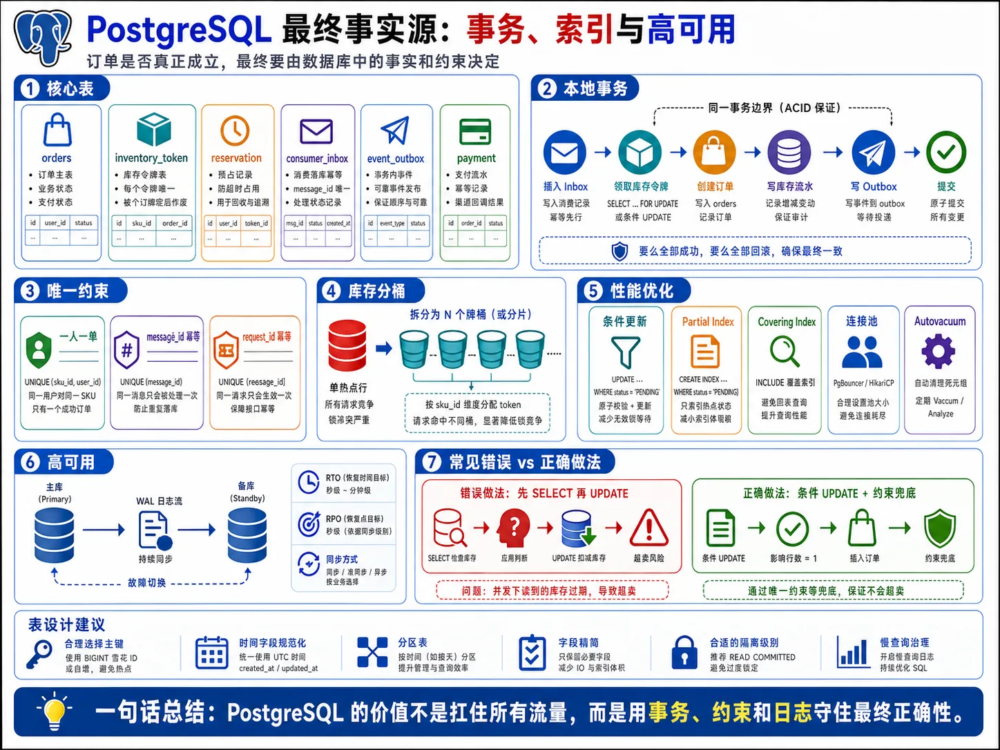
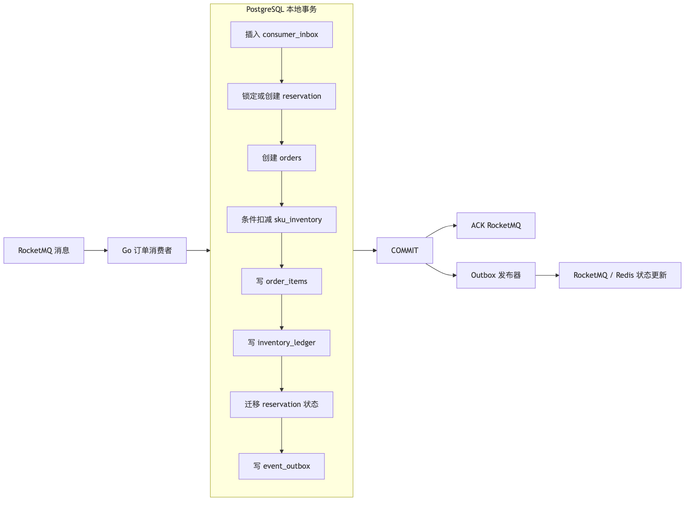
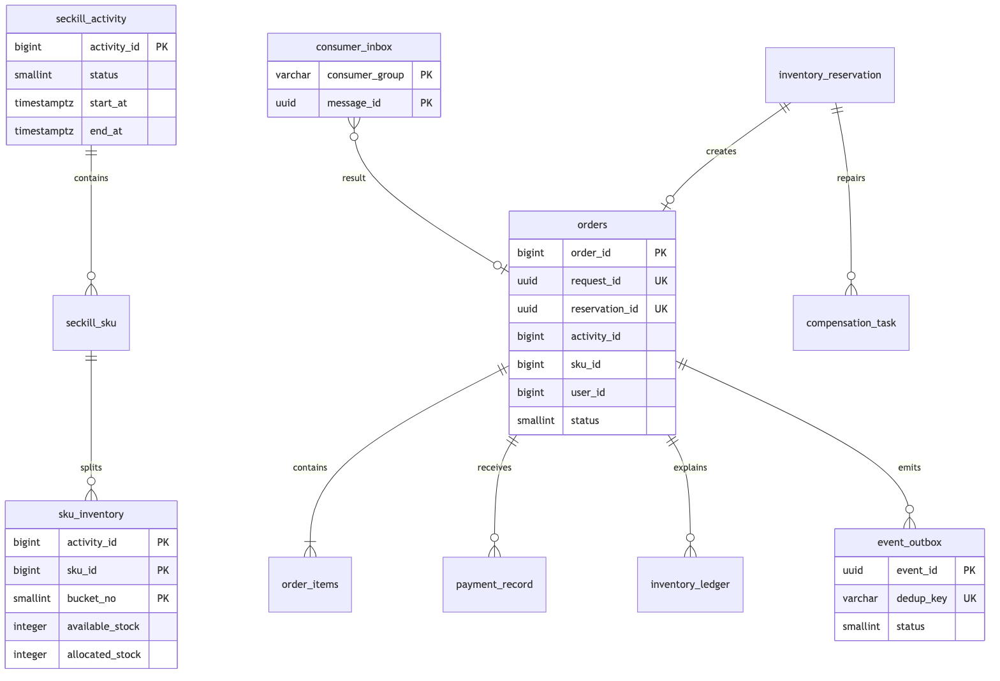
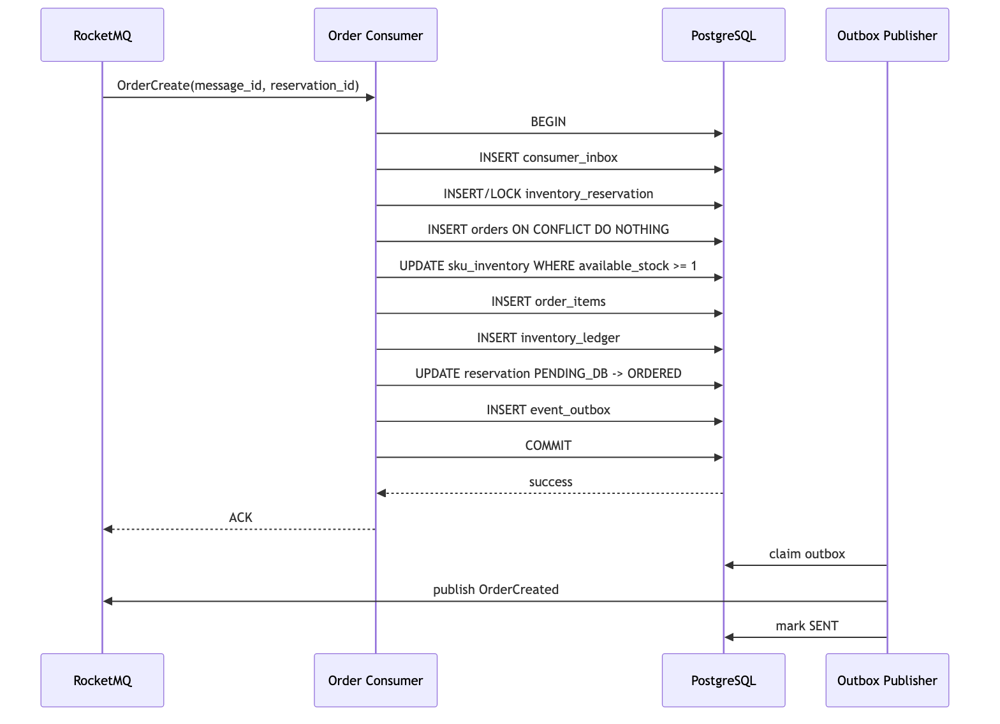
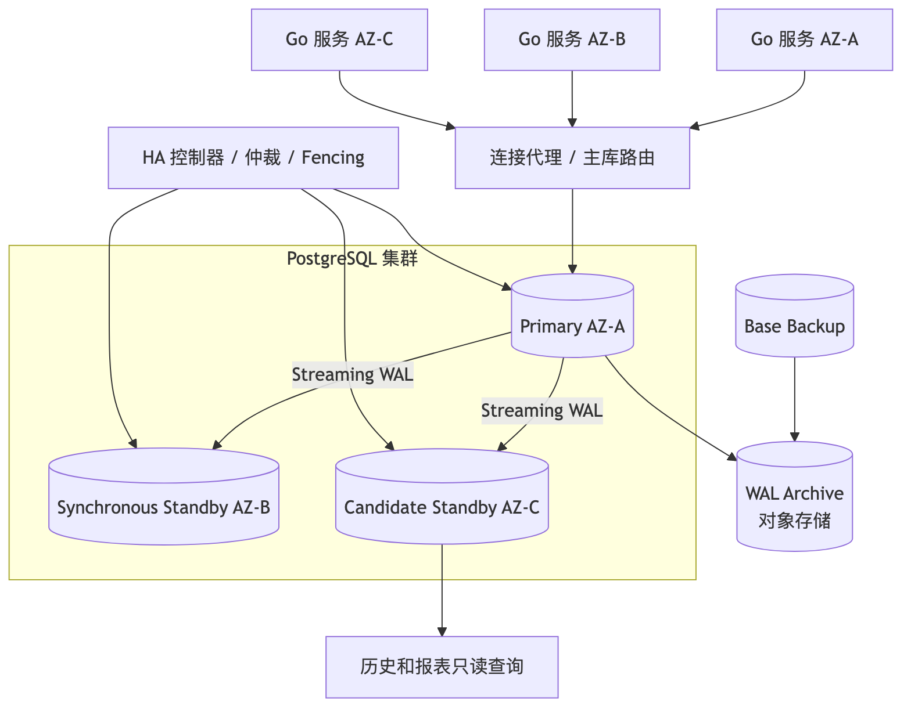

# 第 6 章：PostgreSQL 数据模型、事务、性能优化与高可用



> 图注：本章全文重点总结图，围绕核心表、本地事务、唯一约束、库存分桶、索引优化、连接池和主备高可用说明 PostgreSQL 的最终兜底职责。

> **版本假设：**本章 DDL 以 PostgreSQL 16+ 可兼容能力为基线；截至 2026 年 6 月，官方当前稳定文档对应 PostgreSQL 18。PostgreSQL 18 已内置 `uuidv7()`，但为了兼容 16/17，本章默认由应用生成 UUIDv7，或继续使用业务时间有序 `BIGINT`。([PostgreSQL][1])

---

## 1. 本章目标

本章解决五个核心问题：

1. 用 PostgreSQL 唯一约束、条件更新和本地事务守住“一人一单”和“不超卖”。
2. 设计订单、库存、支付、Inbox、Outbox、补偿任务等生产级数据模型。
3. 解释 MVCC、隔离级别、行锁、死锁、索引、Autovacuum、WAL 和 Checkpoint 的底层影响。
4. 给出使用 `pgx/v5` 实现的订单创建事务和事务重试骨架。
5. 设计跨可用区复制、故障转移、备份和 PITR 方案。

本章的核心结论是：

**Redis 是高性能前置过滤器，PostgreSQL 才是订单和库存的最终事实来源。**

最终正确性依赖：

* `activity_id + sku_id + user_id` 唯一约束。
* `consumer_group + message_id` 唯一约束。
* `request_id`、`reservation_id` 唯一约束。
* PostgreSQL 条件库存扣减。
* 订单、支付、reservation 的条件状态迁移。
* Inbox 和业务写入处于同一个本地事务。
* Outbox 和业务写入处于同一个本地事务。
* 补偿操作拥有独立幂等键。

---

## 2. 业务背景

前一章中，RocketMQ 已经接收订单创建消息。订单消费者现在需要将以下操作组织成一个可靠的 PostgreSQL 本地事务：

```text
消费去重
→ 判断 reservation 是否已处理
→ PostgreSQL 最终库存校验
→ 创建订单
→ 创建订单明细
→ 写库存流水
→ 更新 reservation 状态
→ 写 Outbox 事件
→ 提交事务
→ ACK RocketMQ
```

数据库事务不能包含 Redis、RocketMQ 或支付平台网络调用，否则会导致：

* 事务持续时间不可控。
* 行锁持有时间变长。
* 数据库连接长期占用。
* 外部服务超时引发事务堆积。
* 网络故障放大为数据库故障。

因此，本章坚持以下事务边界：



图中的关键边界是：

* `consumer_inbox`、订单、库存、流水和 `event_outbox` 必须一起提交。
* MQ ACK 在事务提交之后。
* Outbox 发布发生在事务之外。
* Outbox 即使重复发送，消费者也必须依靠 `message_id` 或业务幂等键去重。
* 如果 `COMMIT` 返回网络错误导致结果未知，不能直接认定失败；应等待 MQ 重投后利用 Inbox 和唯一约束确认结果。

---

## 3. 核心问题

本章必须回答以下问题：

| 问题                   | 最终防线                     |
| -------------------- | ------------------------ |
| Redis 已经防重，数据库还要不要防重 | 必须使用唯一约束                 |
| 两个消费者同时处理同一用户怎么办     | 订单唯一约束                   |
| 两个消费者同时扣最后一件库存怎么办    | 条件 `UPDATE` 或库存分桶        |
| MQ 重复投递怎么办           | `consumer_inbox` 主键      |
| 数据库提交后消费者 ACK 前宕机怎么办 | Inbox 返回幂等成功             |
| 支付和超时取消同时发生怎么办       | 订单状态条件更新                 |
| 补偿消息重复怎么办            | reservation 条件迁移与流水幂等键   |
| 单个热点库存行锁竞争怎么办        | PostgreSQL 库存分桶或库存令牌     |
| Outbox 多实例如何并行领取任务   | `FOR UPDATE SKIP LOCKED` |
| 主库故障后是否丢订单           | 同步复制、WAL 与故障转移策略         |
| 刚提交的订单能否去从库查询        | 默认不能，存在复制延迟              |
| 数据库连接是否越多越好          | 不是，连接必须按数据库处理能力设置上限      |

---

## 4. 未优化的基线方案

最直观的实现通常是：

```sql
BEGIN;

SELECT available_stock
FROM sku_inventory
WHERE activity_id = $1
  AND sku_id = $2;

-- 应用层判断 available_stock > 0

UPDATE sku_inventory
SET available_stock = available_stock - 1
WHERE activity_id = $1
  AND sku_id = $2;

INSERT INTO orders (...);

COMMIT;
```

一人一单也可能被写成：

```sql
SELECT order_id
FROM orders
WHERE activity_id = $1
  AND sku_id = $2
  AND user_id = $3;

-- 没查到则 INSERT
```

这种方案的问题不是 SQL 能否执行，而是**检查与修改被拆成了两个并发步骤**。

例如库存只剩 1 件时：

```text
事务 A：SELECT 得到 1
事务 B：SELECT 得到 1
事务 A：UPDATE 为 0，创建订单
事务 B：UPDATE 为 -1，创建订单
```

一人一单同样会发生：

```text
事务 A：没有查到订单
事务 B：没有查到订单
事务 A：插入订单
事务 B：插入订单
```

只要数据库中没有唯一约束和条件更新，应用层检查就不是最终防线。

---

## 5. 基线方案的问题

| 维度   | 问题                                          |
| ---- | ------------------------------------------- |
| 正确性  | `SELECT` 与 `UPDATE/INSERT` 之间存在竞态，可能超卖或重复下单 |
| 性能   | 所有订单更新同一个库存行，形成热点行锁                         |
| 并发   | 无界消费者并发会令锁等待、连接等待和 WAL 压力同时升高               |
| 可用性  | `COMMIT` 结果未知时，应用无法判断是否已经成功                 |
| 可扩展性 | 表结构未考虑归档、索引体积和热点分散                          |
| 可运维性 | 没有 Inbox、Outbox、流水和状态版本，事故后无法解释业务过程         |

另外，以下“修复”仍然不充分：

* 仅增加 Redis 分布式锁：数据库仍没有最终约束。
* 对每个订单执行 `SELECT FOR UPDATE`：可以串行化库存，但热点行吞吐会下降。
* 将事务隔离级别全部提高到 Serializable：仍需处理事务回滚和重试。
* 把数据库连接数提高到数千：可能增加上下文切换、内存占用和锁竞争。
* 依赖 MQ 只投递一次：RocketMQ 重投和 ACK 丢失仍然存在。

---

## 6. 推荐架构

### 6.1 推荐事务模型

默认订单事务采用：

```text
Read Committed
+ 唯一约束
+ 条件 UPDATE
+ 必要位置的 SELECT FOR UPDATE
+ Inbox
+ Outbox
+ 整体事务重试
```

PostgreSQL 的 Read Committed 是默认隔离级别。每条普通查询看到语句开始前已提交的数据；当两个事务更新同一行时，后来的事务会等待前一事务结束，并在最新行版本上重新判断 `WHERE` 条件。因此：

```sql
UPDATE sku_inventory
SET available_stock = available_stock - 1
WHERE ...
  AND available_stock >= 1;
```

可以在并发更新下作为库存最终防线。([PostgreSQL][2])

### 6.2 为什么不用全局 Serializable

Serializable 能提供最强隔离保证，但应用必须完整重试 SQLSTATE `40001` 的事务；它还会引入冲突检测成本。对于本系统，核心不变量都能通过唯一约束、单行条件更新和显式状态机表达，因此默认使用 Read Committed 更直接。复杂的跨多行统计约束才考虑 Serializable。([PostgreSQL][2])

### 6.3 库存分桶

如果一个热点 SKU 的 10,000 件库存需要在 3 秒左右落库，平均需要处理约：

```text
10,000 / 3 ≈ 3,333 个成功订单事务/秒
```

若全部订单更新同一条 `sku_inventory` 记录，行锁会将关键库存步骤串行化。

推荐将库存拆成多个 PostgreSQL 分桶：

```text
(activity_id, sku_id, bucket_no)
```

例如 64 个桶：

```text
平均每桶库存约 10,000 / 64 ≈ 156 件
平均每桶落库速率约 3,333 / 64 ≈ 52 次/秒
```

Redis reservation 中必须记录选中的 `inventory_bucket`。数据库只扣减该桶，不能在订单事务里临时换桶，否则 Redis 与 PostgreSQL 的库存归属无法对账。

`bucket_count=1` 时退化为普通单行库存方案。

### 6.4 逻辑数据关系



图中部分连线表示逻辑关联，不代表全部使用数据库外键。

### 6.5 外键策略

推荐原则：

| 关系                               | 是否使用外键 | 原因                   |
| -------------------------------- | -----: | -------------------- |
| `seckill_sku → seckill_activity` |      是 | 配置数据低频修改             |
| `sku_inventory → seckill_sku`    |      是 | 初始化阶段维护完整性           |
| `order_items → orders`           |      是 | 每个订单是独立父行，不形成热点父记录   |
| `payment_record → orders`        |      是 | 防止孤立支付记录             |
| `orders → seckill_sku`           |      否 | 热路径避免额外配置表检查，并保留订单快照 |
| `inventory_ledger → orders`      |      否 | 流水需要独立归档和修复          |
| `Inbox/Outbox → orders`          |      否 | 避免消息重放、保留周期与订单归档强耦合  |

外键能维护引用完整性，但也会增加检查和对象生命周期耦合。不能无原则地“所有表都加”或“所有表都不加”。PostgreSQL 外键本身用于保证引用行存在。([PostgreSQL][3])

---

## 7. 核心流程

### 7.1 正常创建订单



可重试步骤：

* 整个数据库事务可在死锁或序列化失败后重试。
* MQ 投递可以重复。
* Outbox 发布可以重复。
* Redis 状态更新可以重复。

必须幂等的步骤：

* Inbox 插入。
* 订单插入。
* 库存流水插入。
* Outbox 事件插入。
* reservation 状态迁移。
* Redis 库存补偿。

### 7.2 相同 `message_id` 重复投递

第一次成功事务已经提交：

```sql
INSERT INTO consumer_inbox (...)
VALUES (...)
ON CONFLICT DO NOTHING;
```

受影响行数为 0，说明该消费者组已经成功处理过该消息。消费者读取 Inbox 中保存的结果并直接 ACK。

不能仅在内存中记录已消费消息，因为：

* 实例会重启。
* 消息可能被另一实例处理。
* ACK 可能丢失。
* MQ 可能在数小时后重投。

### 7.3 相同 reservation 使用不同 message_id

扫描补发程序如果错误地生成了新的 `message_id`，Inbox 无法识别为同一消息，但：

* `reservation_id` 唯一约束阻止重复 reservation。
* `request_id` 唯一约束阻止重复请求。
* `(activity_id, sku_id, user_id)` 唯一约束阻止重复订单。

消费者应锁定 `inventory_reservation` 行，发现其已经是 `ORDERED` 后，将新消息记录为已处理并返回原订单。

### 7.4 Redis 有库存但 PostgreSQL 无库存

可能原因：

* Redis 主从切换丢失部分写入。
* Redis 补偿执行错误。
* Redis 库存初始化错误。
* PostgreSQL 已存在人工修复订单。
* Redis 与 PostgreSQL 分桶分配不一致。

处理方式：

1. PostgreSQL 条件扣减返回 0 行。
2. 删除当前事务内尚未提交的临时订单行，或回滚到保存点。
3. 将 reservation 标记为 `REJECTED`。
4. 写入 `event_outbox`，发送 Redis 条件补偿事件。
5. 记录异常指标。
6. 由对账任务检查库存偏差。

**不能为了追求下单成功率绕过 PostgreSQL 最终库存校验。**

### 7.5 数据库提交结果未知

可能时序：

```text
客户端发送 COMMIT
→ PostgreSQL 已提交
→ 网络连接中断
→ pgx 返回网络错误
```

此时不能直接重新扣减库存，也不能宣称事务失败。

推荐处理：

1. 将错误分类为“提交结果未知”。
2. 当前消费返回失败，由 RocketMQ 稍后重投。
3. 重投后先插入 Inbox。
4. 若 Inbox 已存在，返回原结果。
5. 若 Inbox 不存在，再根据 `reservation_id`、`request_id` 和用户唯一键查询。
6. 不进行无界即时重试。

### 7.6 支付与取消竞态

支付事务执行：

```sql
UPDATE orders
SET status = 30,
    paid_at = statement_timestamp(),
    version = version + 1,
    updated_at = statement_timestamp()
WHERE order_id = $1
  AND status IN (10, 20);
```

超时取消执行：

```sql
UPDATE orders
SET status = 40,
    cancelled_at = statement_timestamp(),
    cancel_reason = 'PAY_TIMEOUT',
    version = version + 1,
    updated_at = statement_timestamp()
WHERE order_id = $1
  AND status IN (10, 20)
  AND expire_at <= statement_timestamp();
```

两条语句会竞争同一订单行：

* 支付先成功：取消受影响行数为 0，不释放库存。
* 取消先成功：支付受影响行数为 0，进入退款或人工处理流程。
* 两者不会同时成功。

更新行时 PostgreSQL 会取得行级锁；竞争事务等待后会在最新版本上重新判断 `WHERE`。([PostgreSQL][2])

### 7.7 宕机恢复

| 宕机位置                 | 数据库结果         | 恢复方式                |
| -------------------- | ------------- | ------------------- |
| Inbox 插入前            | 事务未提交         | MQ 重投               |
| 订单插入后、库存更新前          | 事务未提交         | 连接关闭后回滚             |
| 库存更新后、COMMIT 前       | 事务未提交         | 全部回滚                |
| COMMIT 成功、ACK 前      | 已提交           | Inbox 幂等返回          |
| Outbox 领取后、发送前       | 订单已提交         | 租约过期后重新领取           |
| Outbox 发送后、标记 SENT 前 | 订单已提交，消息可能已发送 | 重发，消费者幂等            |
| 取消库存释放事务中宕机          | 未提交或全部提交      | reservation 状态和流水幂等 |

---

## 8. 数据结构

### 8.1 状态编码

不使用 PostgreSQL `ENUM` 作为默认方案，避免频繁增加状态时产生发布和迁移耦合。数据库使用 `SMALLINT + CHECK`，Go 代码使用具名常量。

#### 订单状态

|  值 | 状态             |
| -: | -------------- |
| 10 | CREATED        |
| 20 | PAYING         |
| 30 | PAID           |
| 40 | CANCELLED      |
| 50 | CLOSED         |
| 60 | REFUND_PENDING |

#### Reservation 状态

|  值 | 状态              |
| -: | --------------- |
|  0 | PENDING_DB      |
| 10 | ORDERED         |
| 20 | REJECTED        |
| 30 | RELEASE_PENDING |
| 40 | RELEASED        |
| 50 | EXPIRED         |
| 60 | MANUAL_REQUIRED |

#### Outbox 状态

|  值 | 状态      |
| -: | ------- |
|  0 | PENDING |
| 10 | SENDING |
| 20 | SENT    |
| 30 | RETRY   |
| 40 | DEAD    |

### 8.2 接近完整的 DDL

```sql
CREATE SCHEMA IF NOT EXISTS seckill;

SET search_path = seckill, public;

-- =========================================================
-- 1. 秒杀活动
-- =========================================================

CREATE TABLE seckill_activity (
    activity_id        BIGINT       PRIMARY KEY,
    activity_name      VARCHAR(128) NOT NULL,
    status             SMALLINT     NOT NULL DEFAULT 0,
    start_at           TIMESTAMPTZ  NOT NULL,
    end_at             TIMESTAMPTZ  NOT NULL,
    rules              JSONB        NOT NULL DEFAULT '{}'::jsonb,
    version            BIGINT       NOT NULL DEFAULT 0,
    created_at         TIMESTAMPTZ  NOT NULL DEFAULT statement_timestamp(),
    updated_at         TIMESTAMPTZ  NOT NULL DEFAULT statement_timestamp(),

    CONSTRAINT ck_activity_status
        CHECK (status IN (0, 10, 20, 30, 40)),

    CONSTRAINT ck_activity_time
        CHECK (start_at < end_at),

    CONSTRAINT ck_activity_version
        CHECK (version >= 0)
);

CREATE INDEX idx_activity_status_time
    ON seckill_activity (status, start_at, end_at);


-- =========================================================
-- 2. 活动 SKU
-- =========================================================

CREATE TABLE seckill_sku (
    activity_id            BIGINT       NOT NULL,
    sku_id                 BIGINT       NOT NULL,
    sku_title              VARCHAR(256) NOT NULL,
    status                 SMALLINT     NOT NULL DEFAULT 10,
    unit_price             BIGINT       NOT NULL,
    currency               VARCHAR(3)   NOT NULL DEFAULT 'CNY',
    planned_stock          INTEGER      NOT NULL,
    per_user_limit         SMALLINT     NOT NULL DEFAULT 1,
    inventory_bucket_count SMALLINT     NOT NULL DEFAULT 1,
    version                 BIGINT       NOT NULL DEFAULT 0,
    created_at              TIMESTAMPTZ  NOT NULL DEFAULT statement_timestamp(),
    updated_at              TIMESTAMPTZ  NOT NULL DEFAULT statement_timestamp(),

    CONSTRAINT pk_seckill_sku
        PRIMARY KEY (activity_id, sku_id),

    CONSTRAINT fk_sku_activity
        FOREIGN KEY (activity_id)
        REFERENCES seckill_activity (activity_id)
        ON DELETE RESTRICT,

    CONSTRAINT ck_sku_status
        CHECK (status IN (10, 20, 30, 40)),

    CONSTRAINT ck_sku_price
        CHECK (unit_price >= 0),

    CONSTRAINT ck_sku_stock
        CHECK (planned_stock >= 0),

    CONSTRAINT ck_sku_limit
        CHECK (per_user_limit = 1),

    CONSTRAINT ck_sku_bucket_count
        CHECK (inventory_bucket_count BETWEEN 1 AND 256),

    CONSTRAINT ck_sku_version
        CHECK (version >= 0)
);


-- =========================================================
-- 3. PostgreSQL 最终库存
-- bucket_no = 0 时为不分桶模式
-- =========================================================

CREATE TABLE sku_inventory (
    activity_id       BIGINT      NOT NULL,
    sku_id            BIGINT      NOT NULL,
    bucket_no         SMALLINT    NOT NULL DEFAULT 0,
    total_stock       INTEGER     NOT NULL,
    available_stock   INTEGER     NOT NULL,
    allocated_stock   INTEGER     NOT NULL DEFAULT 0,
    version           BIGINT      NOT NULL DEFAULT 0,
    created_at        TIMESTAMPTZ NOT NULL DEFAULT statement_timestamp(),
    updated_at        TIMESTAMPTZ NOT NULL DEFAULT statement_timestamp(),

    CONSTRAINT pk_sku_inventory
        PRIMARY KEY (activity_id, sku_id, bucket_no),

    CONSTRAINT fk_inventory_sku
        FOREIGN KEY (activity_id, sku_id)
        REFERENCES seckill_sku (activity_id, sku_id)
        ON DELETE RESTRICT,

    CONSTRAINT ck_inventory_bucket
        CHECK (bucket_no >= 0),

    CONSTRAINT ck_inventory_nonnegative
        CHECK (
            total_stock >= 0
            AND available_stock >= 0
            AND allocated_stock >= 0
        ),

    CONSTRAINT ck_inventory_conservation
        CHECK (total_stock = available_stock + allocated_stock),

    CONSTRAINT ck_inventory_version
        CHECK (version >= 0)
)
WITH (fillfactor = 80);


-- =========================================================
-- 4. 库存预占落库记录
-- =========================================================

CREATE TABLE inventory_reservation (
    reservation_id       UUID         PRIMARY KEY,
    request_id           UUID         NOT NULL,
    first_message_id     UUID         NOT NULL,
    activity_id          BIGINT       NOT NULL,
    sku_id               BIGINT       NOT NULL,
    user_id              BIGINT       NOT NULL,
    inventory_bucket     SMALLINT     NOT NULL,
    quantity             SMALLINT     NOT NULL DEFAULT 1,
    order_id             BIGINT,
    status               SMALLINT     NOT NULL DEFAULT 0,
    failure_code         VARCHAR(64),
    redis_reserved_at    TIMESTAMPTZ  NOT NULL,
    expires_at           TIMESTAMPTZ  NOT NULL,
    ordered_at           TIMESTAMPTZ,
    released_at          TIMESTAMPTZ,
    version              BIGINT       NOT NULL DEFAULT 0,
    created_at           TIMESTAMPTZ  NOT NULL DEFAULT statement_timestamp(),
    updated_at           TIMESTAMPTZ  NOT NULL DEFAULT statement_timestamp(),

    CONSTRAINT uq_reservation_request
        UNIQUE (request_id),

    CONSTRAINT uq_reservation_order
        UNIQUE (order_id),

    CONSTRAINT ck_reservation_status
        CHECK (status IN (0, 10, 20, 30, 40, 50, 60)),

    CONSTRAINT ck_reservation_quantity
        CHECK (quantity = 1),

    CONSTRAINT ck_reservation_bucket
        CHECK (inventory_bucket >= 0),

    CONSTRAINT ck_reservation_time
        CHECK (redis_reserved_at < expires_at),

    CONSTRAINT ck_reservation_ordered
        CHECK (status <> 10 OR order_id IS NOT NULL),

    CONSTRAINT ck_reservation_released
        CHECK (status <> 40 OR released_at IS NOT NULL),

    CONSTRAINT ck_reservation_version
        CHECK (version >= 0)
);

CREATE INDEX idx_reservation_user_sku
    ON inventory_reservation (activity_id, sku_id, user_id, created_at DESC);

CREATE INDEX idx_reservation_pending_expire
    ON inventory_reservation (expires_at, reservation_id)
    WHERE status IN (0, 30);


-- =========================================================
-- 5. 订单
-- order_id 由应用生成时间有序 BIGINT
-- order_no 用于对外展示，避免暴露连续主键
-- =========================================================

CREATE TABLE orders (
    order_id             BIGINT       PRIMARY KEY,
    order_no             VARCHAR(40)  NOT NULL,
    request_id           UUID         NOT NULL,
    reservation_id       UUID         NOT NULL,
    source_message_id    UUID         NOT NULL,
    activity_id          BIGINT       NOT NULL,
    sku_id               BIGINT       NOT NULL,
    user_id              BIGINT       NOT NULL,
    inventory_bucket     SMALLINT     NOT NULL,
    quantity             SMALLINT     NOT NULL DEFAULT 1,
    unit_price           BIGINT       NOT NULL,
    total_amount         BIGINT       NOT NULL,
    currency             VARCHAR(3)   NOT NULL DEFAULT 'CNY',
    status               SMALLINT     NOT NULL DEFAULT 10,
    expire_at            TIMESTAMPTZ  NOT NULL,
    paid_at              TIMESTAMPTZ,
    cancelled_at         TIMESTAMPTZ,
    cancel_reason        VARCHAR(64),
    version              BIGINT       NOT NULL DEFAULT 0,
    created_at           TIMESTAMPTZ  NOT NULL DEFAULT statement_timestamp(),
    updated_at           TIMESTAMPTZ  NOT NULL DEFAULT statement_timestamp(),

    CONSTRAINT uq_orders_order_no
        UNIQUE (order_no),

    CONSTRAINT uq_orders_request
        UNIQUE (request_id),

    CONSTRAINT uq_orders_reservation
        UNIQUE (reservation_id),

    CONSTRAINT uq_orders_source_message
        UNIQUE (source_message_id),

    CONSTRAINT uq_orders_user_sku
        UNIQUE (activity_id, sku_id, user_id),

    CONSTRAINT ck_orders_status
        CHECK (status IN (10, 20, 30, 40, 50, 60)),

    CONSTRAINT ck_orders_quantity
        CHECK (quantity = 1),

    CONSTRAINT ck_orders_amount
        CHECK (
            unit_price >= 0
            AND total_amount = unit_price * quantity
        ),

    CONSTRAINT ck_orders_bucket
        CHECK (inventory_bucket >= 0),

    CONSTRAINT ck_orders_paid_at
        CHECK (status <> 30 OR paid_at IS NOT NULL),

    CONSTRAINT ck_orders_cancelled_at
        CHECK (status <> 40 OR cancelled_at IS NOT NULL),

    CONSTRAINT ck_orders_version
        CHECK (version >= 0)
);

CREATE INDEX idx_orders_user_created
    ON orders (user_id, created_at DESC)
    INCLUDE (
        order_id,
        activity_id,
        sku_id,
        status,
        total_amount,
        expire_at
    );

CREATE INDEX idx_orders_activity_status
    ON orders (activity_id, sku_id, status)
    INCLUDE (order_id, user_id, quantity);

CREATE INDEX idx_orders_expirable
    ON orders (expire_at, order_id)
    WHERE status IN (10, 20);


-- =========================================================
-- 6. 订单明细
-- =========================================================

CREATE TABLE order_items (
    order_id          BIGINT       NOT NULL,
    line_no           SMALLINT     NOT NULL,
    activity_id       BIGINT       NOT NULL,
    sku_id            BIGINT       NOT NULL,
    sku_title         VARCHAR(256) NOT NULL,
    quantity          SMALLINT     NOT NULL,
    unit_price        BIGINT       NOT NULL,
    line_amount       BIGINT       NOT NULL,
    created_at        TIMESTAMPTZ  NOT NULL DEFAULT statement_timestamp(),

    CONSTRAINT pk_order_items
        PRIMARY KEY (order_id, line_no),

    CONSTRAINT fk_order_items_order
        FOREIGN KEY (order_id)
        REFERENCES orders (order_id)
        ON DELETE RESTRICT,

    CONSTRAINT ck_order_item_line
        CHECK (line_no > 0),

    CONSTRAINT ck_order_item_quantity
        CHECK (quantity > 0),

    CONSTRAINT ck_order_item_amount
        CHECK (
            unit_price >= 0
            AND line_amount = unit_price * quantity
        )
);


-- =========================================================
-- 7. 支付记录
-- 允许一个订单存在多次支付尝试
-- =========================================================

CREATE TABLE payment_record (
    payment_id          UUID         PRIMARY KEY,
    payment_request_id  UUID         NOT NULL,
    order_id            BIGINT       NOT NULL,
    provider            VARCHAR(32)  NOT NULL,
    provider_trade_no   VARCHAR(128),
    callback_id         VARCHAR(128),
    amount              BIGINT       NOT NULL,
    currency            VARCHAR(3)   NOT NULL DEFAULT 'CNY',
    status              SMALLINT     NOT NULL DEFAULT 0,
    raw_payload         JSONB        NOT NULL DEFAULT '{}'::jsonb,
    paid_at             TIMESTAMPTZ,
    version             BIGINT       NOT NULL DEFAULT 0,
    created_at          TIMESTAMPTZ  NOT NULL DEFAULT statement_timestamp(),
    updated_at          TIMESTAMPTZ  NOT NULL DEFAULT statement_timestamp(),

    CONSTRAINT uq_payment_request
        UNIQUE (payment_request_id),

    CONSTRAINT uq_payment_provider_trade
        UNIQUE (provider, provider_trade_no),

    CONSTRAINT uq_payment_callback
        UNIQUE (provider, callback_id),

    CONSTRAINT fk_payment_order
        FOREIGN KEY (order_id)
        REFERENCES orders (order_id)
        ON DELETE RESTRICT,

    CONSTRAINT ck_payment_status
        CHECK (status IN (0, 10, 20, 30, 40, 50)),

    CONSTRAINT ck_payment_amount
        CHECK (amount >= 0),

    CONSTRAINT ck_payment_paid_at
        CHECK (status <> 20 OR paid_at IS NOT NULL),

    CONSTRAINT ck_payment_version
        CHECK (version >= 0)
);

CREATE INDEX idx_payment_order_created
    ON payment_record (order_id, created_at DESC)
    INCLUDE (payment_id, provider, provider_trade_no, status, amount);


-- =========================================================
-- 8. 库存流水
-- available_delta + allocated_delta 必须为 0
-- =========================================================

CREATE TABLE inventory_ledger (
    ledger_id             BIGINT       PRIMARY KEY,
    idempotency_key       VARCHAR(160) NOT NULL,
    reservation_id        UUID         NOT NULL,
    order_id              BIGINT,
    source_message_id     UUID         NOT NULL,
    activity_id           BIGINT       NOT NULL,
    sku_id                 BIGINT       NOT NULL,
    user_id                BIGINT       NOT NULL,
    inventory_bucket      SMALLINT     NOT NULL,
    ledger_type           SMALLINT     NOT NULL,
    available_delta       INTEGER      NOT NULL,
    allocated_delta       INTEGER      NOT NULL,
    before_available      INTEGER      NOT NULL,
    after_available       INTEGER      NOT NULL,
    before_allocated      INTEGER      NOT NULL,
    after_allocated       INTEGER      NOT NULL,
    reason                 VARCHAR(64)  NOT NULL,
    created_at             TIMESTAMPTZ  NOT NULL DEFAULT statement_timestamp(),

    CONSTRAINT uq_inventory_ledger_idempotency
        UNIQUE (idempotency_key),

    CONSTRAINT ck_ledger_type
        CHECK (ledger_type IN (10, 20, 30, 40)),

    CONSTRAINT ck_ledger_conservation
        CHECK (available_delta + allocated_delta = 0),

    CONSTRAINT ck_ledger_available
        CHECK (after_available = before_available + available_delta),

    CONSTRAINT ck_ledger_allocated
        CHECK (after_allocated = before_allocated + allocated_delta),

    CONSTRAINT ck_ledger_result_nonnegative
        CHECK (after_available >= 0 AND after_allocated >= 0)
);

CREATE INDEX idx_ledger_reservation
    ON inventory_ledger (reservation_id, created_at);

CREATE INDEX idx_ledger_order
    ON inventory_ledger (order_id, created_at)
    WHERE order_id IS NOT NULL;

CREATE INDEX idx_ledger_created_brin
    ON inventory_ledger USING BRIN (created_at);


-- =========================================================
-- 9. 消费 Inbox
-- 只有数据库事务成功提交后，Inbox 行才存在
-- =========================================================

CREATE TABLE consumer_inbox (
    consumer_group    VARCHAR(128) NOT NULL,
    message_id        UUID         NOT NULL,
    topic             VARCHAR(128) NOT NULL,
    tag               VARCHAR(64),
    message_key       VARCHAR(160) NOT NULL,
    reservation_id    UUID         NOT NULL,
    payload_hash      BYTEA,
    status            SMALLINT     NOT NULL DEFAULT 20,
    result_code       VARCHAR(64)  NOT NULL,
    order_id          BIGINT,
    created_at        TIMESTAMPTZ  NOT NULL DEFAULT statement_timestamp(),
    processed_at      TIMESTAMPTZ  NOT NULL DEFAULT statement_timestamp(),

    CONSTRAINT pk_consumer_inbox
        PRIMARY KEY (consumer_group, message_id),

    CONSTRAINT ck_inbox_status
        CHECK (status = 20)
);

CREATE INDEX idx_inbox_reservation
    ON consumer_inbox (reservation_id, processed_at DESC);

CREATE INDEX idx_inbox_processed_brin
    ON consumer_inbox USING BRIN (processed_at);


-- =========================================================
-- 10. 事务 Outbox
-- =========================================================

CREATE TABLE event_outbox (
    event_id           UUID         PRIMARY KEY,
    dedup_key          VARCHAR(160) NOT NULL,
    aggregate_type     VARCHAR(64)  NOT NULL,
    aggregate_id       VARCHAR(128) NOT NULL,
    topic              VARCHAR(128) NOT NULL,
    tag                VARCHAR(64),
    message_key        VARCHAR(160) NOT NULL,
    schema_version     INTEGER      NOT NULL,
    payload            JSONB        NOT NULL,
    headers            JSONB        NOT NULL DEFAULT '{}'::jsonb,
    status             SMALLINT     NOT NULL DEFAULT 0,
    available_at       TIMESTAMPTZ  NOT NULL DEFAULT statement_timestamp(),
    retry_count        INTEGER      NOT NULL DEFAULT 0,
    max_retry          INTEGER      NOT NULL DEFAULT 16,
    locked_by          VARCHAR(128),
    locked_at          TIMESTAMPTZ,
    sent_at            TIMESTAMPTZ,
    last_error         TEXT,
    created_at         TIMESTAMPTZ  NOT NULL DEFAULT statement_timestamp(),
    updated_at         TIMESTAMPTZ  NOT NULL DEFAULT statement_timestamp(),

    CONSTRAINT uq_outbox_dedup
        UNIQUE (dedup_key),

    CONSTRAINT ck_outbox_status
        CHECK (status IN (0, 10, 20, 30, 40)),

    CONSTRAINT ck_outbox_retry
        CHECK (
            retry_count >= 0
            AND max_retry > 0
        ),

    CONSTRAINT ck_outbox_schema
        CHECK (schema_version > 0)
)
WITH (fillfactor = 80);

CREATE INDEX idx_outbox_ready
    ON event_outbox (available_at, created_at, event_id)
    INCLUDE (topic, tag, message_key, aggregate_type, aggregate_id)
    WHERE status IN (0, 30);

CREATE INDEX idx_outbox_stale_sending
    ON event_outbox (locked_at, event_id)
    WHERE status = 10;


-- =========================================================
-- 11. 补偿任务
-- =========================================================

CREATE TABLE compensation_task (
    task_id             UUID         PRIMARY KEY,
    idempotency_key     VARCHAR(160) NOT NULL,
    task_type           SMALLINT     NOT NULL,
    reservation_id      UUID,
    order_id            BIGINT,
    payload             JSONB        NOT NULL,
    status              SMALLINT     NOT NULL DEFAULT 0,
    next_run_at         TIMESTAMPTZ  NOT NULL DEFAULT statement_timestamp(),
    retry_count         INTEGER      NOT NULL DEFAULT 0,
    max_retry           INTEGER      NOT NULL DEFAULT 20,
    locked_by           VARCHAR(128),
    locked_at           TIMESTAMPTZ,
    last_error          TEXT,
    completed_at        TIMESTAMPTZ,
    created_at          TIMESTAMPTZ  NOT NULL DEFAULT statement_timestamp(),
    updated_at          TIMESTAMPTZ  NOT NULL DEFAULT statement_timestamp(),

    CONSTRAINT uq_compensation_idempotency
        UNIQUE (idempotency_key),

    CONSTRAINT ck_compensation_type
        CHECK (task_type IN (10, 20, 30, 40)),

    CONSTRAINT ck_compensation_status
        CHECK (status IN (0, 10, 20, 30, 40, 50)),

    CONSTRAINT ck_compensation_retry
        CHECK (
            retry_count >= 0
            AND max_retry > 0
        )
)
WITH (fillfactor = 80);

CREATE INDEX idx_compensation_ready
    ON compensation_task (next_run_at, created_at, task_id)
    WHERE status IN (0, 30);

CREATE INDEX idx_compensation_stale_running
    ON compensation_task (locked_at, task_id)
    WHERE status = 10;
```

### 8.3 主键策略

推荐：

| 标识               | 类型       | 生成方式         |
| ---------------- | -------- | ------------ |
| `order_id`       | `BIGINT` | 应用层时间有序 ID   |
| `ledger_id`      | `BIGINT` | 应用层时间有序 ID   |
| `request_id`     | `UUID`   | 客户端或接入层生成    |
| `reservation_id` | `UUID`   | 接入层生成        |
| `message_id`     | `UUID`   | 消息生产者生成      |
| `event_id`       | `UUID`   | Outbox 写入时生成 |
| `payment_id`     | `UUID`   | 支付服务生成       |

随机 UUID 作为 B-tree 主键会使插入位置更分散，增大页分裂和缓存压力。时间有序 ID 通常具有更好的局部性。PostgreSQL 18 可直接生成 UUIDv7；在 16/17 上可由 Go 应用生成。([PostgreSQL][4])

`BIGSERIAL` 或 sequence 也可以提供有序值，但 sequence 值不会随事务回滚，因此出现空洞是正常现象，不能将“连续无空洞”作为业务不变量。([PostgreSQL][2])

### 8.4 分区建议

**不要因为表大就立即分区。**

PostgreSQL 分区表的唯一约束必须包含全部分区键，否则无法跨分区保证全局唯一。因此，如果按 `created_at` 对 `orders` 分区，便不能直接在父表上保证：

```text
activity_id + sku_id + user_id
```

全局唯一，除非把 `created_at` 也加入唯一键，但那会破坏一人一单语义。([PostgreSQL][5])

推荐策略：

| 表                  | 初始策略        | 达到大规模后的策略                    |
| ------------------ | ----------- | ---------------------------- |
| `orders`           | 不分区，活动结束后归档 | 按 `activity_id` 路由到独立库或历史表   |
| `order_items`      | 跟随订单归档      | 与订单使用一致分片键                   |
| `inventory_ledger` | 不分区或 BRIN   | 按 reservation hash 分区，或冷数据归档 |
| `consumer_inbox`   | 保留有效去重窗口    | 可按 `message_id` HASH 分区      |
| `event_outbox`     | 保持活跃表很小     | SENT 数据定期迁移至历史表              |
| `payment_record`   | 不分区         | 按业务和监管期限归档                   |

### 8.5 历史归档

推荐保留规则：

* `event_outbox`：SENT 后保留一段审计期，再迁移历史表。
* `consumer_inbox`：保留时间必须长于 MQ 最大回放时间、补偿时间和人工修复时间。
* `inventory_ledger`：长期保留，作为库存审计依据。
* `orders`、`payment_record`：根据财务、监管和售后周期确定。
* 活跃表删除数据时使用小批量删除，不在高峰期一次删除数百万行。
* 对完整历史分区或历史表，可使用 detach、导出、对象存储和离线查询。

---

## 9. 核心代码与 SQL

### 9.1 Inbox 幂等 SQL

```sql
INSERT INTO consumer_inbox (
    consumer_group,
    message_id,
    topic,
    tag,
    message_key,
    reservation_id,
    payload_hash,
    status,
    result_code,
    order_id
)
VALUES (
    $1, $2, $3, $4, $5, $6, $7,
    20,
    'ORDER_CREATED',
    $8
)
ON CONFLICT (consumer_group, message_id)
DO NOTHING;
```

解释：

* `affected rows = 1`：当前事务获得该消息处理权。
* `affected rows = 0`：该消息已经成功处理。
* 如果事务后续回滚，Inbox 插入也回滚，消息可以安全重试。
* 不能先提交 Inbox，再单独创建订单，否则可能出现“消息已处理但订单不存在”。

`ON CONFLICT` 利用唯一约束原子决定插入或冲突行为，高并发下不需要应用层先查询。([PostgreSQL][6])

### 9.2 Reservation 锁定

```sql
INSERT INTO inventory_reservation (
    reservation_id,
    request_id,
    first_message_id,
    activity_id,
    sku_id,
    user_id,
    inventory_bucket,
    quantity,
    status,
    redis_reserved_at,
    expires_at
)
VALUES (
    $1, $2, $3, $4, $5, $6, $7, 1, 0, $8, $9
)
ON CONFLICT DO NOTHING;
```

随后锁定：

```sql
SELECT
    request_id,
    activity_id,
    sku_id,
    user_id,
    inventory_bucket,
    quantity,
    order_id,
    status,
    version
FROM inventory_reservation
WHERE reservation_id = $1
FOR UPDATE;
```

这里使用 `FOR UPDATE` 是合理的，因为锁只落在单个 reservation 上，不是热点全局锁。它用于串行化同一 reservation 的不同消息，而不是代替数据库唯一约束。`FOR UPDATE` 会阻止并发事务修改或删除同一行，直到当前事务结束。([PostgreSQL][7])

### 9.3 创建订单

```sql
INSERT INTO orders (
    order_id,
    order_no,
    request_id,
    reservation_id,
    source_message_id,
    activity_id,
    sku_id,
    user_id,
    inventory_bucket,
    quantity,
    unit_price,
    total_amount,
    currency,
    status,
    expire_at
)
VALUES (
    $1, $2, $3, $4, $5,
    $6, $7, $8, $9,
    1,
    $10, $10,
    $11,
    10,
    $12
)
ON CONFLICT DO NOTHING
RETURNING order_id;
```

没有返回行时，不能一律解释为“用户已经购买”。必须按顺序分类：

1. 查询 `reservation_id` 或 `request_id` 是否已经存在。
2. 查询 `(activity_id, sku_id, user_id)` 是否已有订单。
3. 查询是否出现极低概率的 `order_id` 冲突。
4. 如果都不匹配，则视为模型或数据异常。

冲突后的查询只是为了**解释已经由唯一索引裁决的结果**，不是用查询代替唯一约束。

### 9.4 条件库存扣减

```sql
UPDATE sku_inventory
SET available_stock = available_stock - $4,
    allocated_stock = allocated_stock + $4,
    version = version + 1,
    updated_at = statement_timestamp()
WHERE activity_id = $1
  AND sku_id = $2
  AND bucket_no = $3
  AND available_stock >= $4
RETURNING
    available_stock + $4 AS before_available,
    available_stock      AS after_available,
    allocated_stock - $4 AS before_allocated,
    allocated_stock      AS after_allocated,
    version;
```

业务语义：

| 结果     | 含义                 |
| ------ | ------------------ |
| 返回 1 行 | 成功获得 PostgreSQL 库存 |
| 返回 0 行 | 库存不足、桶不存在或参数错误     |
| 返回多行   | 不可能，主键约束保证单行       |

为什么不会超卖：

假设库存为 1，两个事务同时执行：

1. 事务 A 更新该行并将库存改成 0。
2. 事务 B 等待 A。
3. A 提交。
4. B 在最新行版本上重新判断 `available_stock >= 1`。
5. 条件为假，B 更新 0 行。

这正是 Read Committed 下更新语句的并发规则。([PostgreSQL][2])

### 9.5 写入库存流水

```sql
INSERT INTO inventory_ledger (
    ledger_id,
    idempotency_key,
    reservation_id,
    order_id,
    source_message_id,
    activity_id,
    sku_id,
    user_id,
    inventory_bucket,
    ledger_type,
    available_delta,
    allocated_delta,
    before_available,
    after_available,
    before_allocated,
    after_allocated,
    reason
)
VALUES (
    $1,
    'ALLOCATE:' || $2::text,
    $2,
    $3,
    $4,
    $5,
    $6,
    $7,
    $8,
    10,
    -1,
    1,
    $9,
    $10,
    $11,
    $12,
    'ORDER_CREATED'
)
ON CONFLICT (idempotency_key)
DO NOTHING;
```

正常创建新订单时，受影响行数应为 1。如果是 0，说明相同库存业务动作已经执行过，需要检查当前订单、reservation 和 Inbox 状态，而不是继续执行。

### 9.6 Reservation 状态迁移

```sql
UPDATE inventory_reservation
SET status = 10,
    order_id = $2,
    ordered_at = statement_timestamp(),
    version = version + 1,
    updated_at = statement_timestamp()
WHERE reservation_id = $1
  AND status = 0;
```

结果解释：

* 1 行：当前事务成功完成 `PENDING_DB → ORDERED`。
* 0 行：可能已经是 `ORDERED`，也可能是 `REJECTED/RELEASED`，或者记录不存在。
* 需要按主键再次查询进行分类。
* 不能在 0 行时直接认定幂等成功。

### 9.7 写入 Outbox

```sql
INSERT INTO event_outbox (
    event_id,
    dedup_key,
    aggregate_type,
    aggregate_id,
    topic,
    tag,
    message_key,
    schema_version,
    payload,
    status
)
VALUES (
    $1,
    'ORDER_CREATED:' || $2::text,
    'ORDER',
    $2::text,
    'ORDER_EVENT',
    'ORDER_CREATED',
    $2::text,
    1,
    $3::jsonb,
    0
)
ON CONFLICT (dedup_key)
DO NOTHING;
```

`dedup_key` 保证同一个订单的 `ORDER_CREATED` 事件最多存在一条 Outbox 记录。

但它不能保证 MQ 最终只收到一次，因为可能发生：

```text
Outbox 发布成功
→ 标记 SENT 前宕机
→ 租约过期
→ 再次发布
```

因此 MQ 消费者仍需幂等。

### 9.8 Outbox 领取 SQL

先恢复超时租约：

```sql
UPDATE event_outbox
SET status = 30,
    available_at = statement_timestamp(),
    locked_by = NULL,
    locked_at = NULL,
    last_error = 'SEND_LEASE_EXPIRED',
    updated_at = statement_timestamp()
WHERE status = 10
  AND locked_at < statement_timestamp() - INTERVAL '30 seconds';
```

再批量领取：

```sql
WITH candidates AS (
    SELECT event_id
    FROM event_outbox
    WHERE status IN (0, 30)
      AND available_at <= statement_timestamp()
    ORDER BY available_at, created_at, event_id
    FOR UPDATE SKIP LOCKED
    LIMIT $1
)
UPDATE event_outbox AS o
SET status = 10,
    locked_by = $2,
    locked_at = statement_timestamp(),
    updated_at = statement_timestamp()
FROM candidates AS c
WHERE o.event_id = c.event_id
RETURNING
    o.event_id,
    o.topic,
    o.tag,
    o.message_key,
    o.schema_version,
    o.payload,
    o.headers,
    o.retry_count,
    o.max_retry;
```

`SKIP LOCKED` 会跳过其他发布器已经锁定的行，因此适合多消费者并行领取队列任务。但它提供的是不完整视图，不适合普通一致性查询。([PostgreSQL][8])

MQ 发送必须在领取事务提交后执行，不能持有数据库事务等待网络。

发送成功：

```sql
UPDATE event_outbox
SET status = 20,
    sent_at = statement_timestamp(),
    locked_by = NULL,
    locked_at = NULL,
    last_error = NULL,
    updated_at = statement_timestamp()
WHERE event_id = $1
  AND status = 10
  AND locked_by = $2;
```

发送失败：

```sql
UPDATE event_outbox
SET status = CASE
                 WHEN retry_count + 1 >= max_retry THEN 40
                 ELSE 30
             END,
    retry_count = retry_count + 1,
    available_at = statement_timestamp() + $3::interval,
    locked_by = NULL,
    locked_at = NULL,
    last_error = LEFT($4, 4000),
    updated_at = statement_timestamp()
WHERE event_id = $1
  AND status = 10
  AND locked_by = $2;
```

### 9.9 支付状态更新

支付回调本地事务首先利用支付平台流水号去重：

```sql
INSERT INTO payment_record (
    payment_id,
    payment_request_id,
    order_id,
    provider,
    provider_trade_no,
    callback_id,
    amount,
    currency,
    status,
    raw_payload,
    paid_at
)
VALUES (
    $1, $2, $3, $4, $5, $6,
    $7, $8,
    20,
    $9::jsonb,
    statement_timestamp()
)
ON CONFLICT DO NOTHING
RETURNING payment_id;
```

随后更新订单：

```sql
UPDATE orders
SET status = 30,
    paid_at = statement_timestamp(),
    version = version + 1,
    updated_at = statement_timestamp()
WHERE order_id = $1
  AND status IN (10, 20)
RETURNING order_id, reservation_id, activity_id, sku_id, user_id;
```

受影响行数为 0 时必须查询订单：

* `PAID`：重复回调，幂等成功。
* `CANCELLED`：支付晚于取消，生成退款任务。
* `CLOSED`：按业务规则处理。
* 不存在：异常支付，进入人工核查。

### 9.10 超时取消和库存释放

先抢占订单状态迁移：

```sql
UPDATE orders
SET status = 40,
    cancelled_at = statement_timestamp(),
    cancel_reason = 'PAY_TIMEOUT',
    version = version + 1,
    updated_at = statement_timestamp()
WHERE order_id = $1
  AND status IN (10, 20)
  AND expire_at <= statement_timestamp()
RETURNING
    reservation_id,
    activity_id,
    sku_id,
    user_id,
    inventory_bucket,
    quantity;
```

只有返回 1 行时才能释放库存。

随后迁移 reservation：

```sql
UPDATE inventory_reservation
SET status = 40,
    released_at = statement_timestamp(),
    version = version + 1,
    updated_at = statement_timestamp()
WHERE reservation_id = $1
  AND status IN (10, 30);
```

再释放库存：

```sql
UPDATE sku_inventory
SET available_stock = available_stock + $4,
    allocated_stock = allocated_stock - $4,
    version = version + 1,
    updated_at = statement_timestamp()
WHERE activity_id = $1
  AND sku_id = $2
  AND bucket_no = $3
  AND allocated_stock >= $4
RETURNING
    available_stock - $4 AS before_available,
    available_stock      AS after_available,
    allocated_stock + $4 AS before_allocated,
    allocated_stock      AS after_allocated;
```

最后写入：

```text
idempotency_key = RELEASE:<reservation_id>
```

的库存流水和 Redis 补偿 Outbox。

这些操作必须在同一个本地事务中完成。

### 9.11 pgx 事务骨架

以下代码使用 `pgx/v5`，省略了已经给出的 SQL 常量和部分结果结构。

```go
package orderrepo

import (
	"context"
	"errors"
	"fmt"
	"log/slog"
	"math/rand/v2"
	"time"

	"github.com/jackc/pgx/v5"
	"github.com/jackc/pgx/v5/pgconn"
	"github.com/jackc/pgx/v5/pgxpool"
	"github.com/google/uuid"
)

var (
	ErrDuplicateMessage    = errors.New("duplicate message")
	ErrCommitOutcomeUnknown = errors.New("commit outcome unknown")
	ErrDatabaseSoldOut     = errors.New("postgres inventory sold out")
	ErrIllegalState        = errors.New("illegal state")
)

type OrderCreateMessage struct {
	MessageID       uuid.UUID
	RequestID       uuid.UUID
	ReservationID   uuid.UUID
	OrderID         int64
	OrderNo         string
	ActivityID      int64
	SKUID            int64
	UserID           int64
	InventoryBucket int16
	UnitPrice        int64
	Currency         string
	ReservedAt      time.Time
	ReservationTTL  time.Duration
	OrderExpireAt   time.Time
}

type CreateResult struct {
	OrderID   int64
	ResultCode string
	Duplicate bool
}

type Repository struct {
	pool *pgxpool.Pool
	log  *slog.Logger
}

func (r *Repository) CreateOrderFromMessage(
	ctx context.Context,
	msg OrderCreateMessage,
) (CreateResult, error) {
	ctx, cancel := context.WithTimeout(ctx, 1500*time.Millisecond)
	defer cancel()

	const maxAttempts = 3

	var lastErr error

	for attempt := 1; attempt <= maxAttempts; attempt++ {
		result, err := r.createOrderOnce(ctx, msg)
		if err == nil {
			return result, nil
		}

		lastErr = err

		if errors.Is(err, ErrCommitOutcomeUnknown) {
			// 不在进程内持续重试。由 MQ 稍后重投，通过 Inbox 和唯一约束确认。
			return CreateResult{}, err
		}

		if !isWholeTransactionRetryable(err) || attempt == maxAttempts {
			return CreateResult{}, err
		}

		delay := retryDelay(attempt)
		timer := time.NewTimer(delay)

		select {
		case <-ctx.Done():
			timer.Stop()
			return CreateResult{}, ctx.Err()
		case <-timer.C:
		}
	}

	return CreateResult{}, lastErr
}

func (r *Repository) createOrderOnce(
	ctx context.Context,
	msg OrderCreateMessage,
) (result CreateResult, retErr error) {
	tx, err := r.pool.BeginTx(ctx, pgx.TxOptions{
		IsoLevel: pgx.ReadCommitted,
	})
	if err != nil {
		return CreateResult{}, fmt.Errorf("begin tx: %w", err)
	}

	committed := false

	defer func() {
		if committed {
			return
		}

		// 即使上层 context 已取消，也要给 ROLLBACK 一个受控清理窗口。
		rbCtx, cancel := context.WithTimeout(
			context.WithoutCancel(ctx),
			2*time.Second,
		)
		defer cancel()

		if err := tx.Rollback(rbCtx); err != nil &&
			!errors.Is(err, pgx.ErrTxClosed) {
			r.log.ErrorContext(
				rbCtx,
				"rollback transaction failed",
				"message_id", msg.MessageID,
				"reservation_id", msg.ReservationID,
				"error", err,
			)
		}
	}()

	if _, err := tx.Exec(ctx, `
		SET LOCAL lock_timeout = '150ms';
		SET LOCAL statement_timeout = '1200ms';
	`); err != nil {
		return CreateResult{}, fmt.Errorf("set tx timeout: %w", err)
	}

	// 1. Inbox 抢占消息处理权。
	tag, err := tx.Exec(ctx, insertInboxSQL,
		"order-create-consumer",
		msg.MessageID,
		"SECKILL_ORDER",
		"ORDER_CREATE",
		msg.ReservationID.String(),
		msg.ReservationID,
		nil,
		msg.OrderID,
	)
	if err != nil {
		return CreateResult{}, fmt.Errorf("insert inbox: %w", err)
	}

	if tag.RowsAffected() == 0 {
		existing, err := loadInboxResult(ctx, tx, msg.MessageID)
		if err != nil {
			return CreateResult{}, fmt.Errorf("load inbox result: %w", err)
		}

		if err := tx.Commit(ctx); err != nil {
			return CreateResult{}, classifyCommitError(err)
		}
		committed = true

		existing.Duplicate = true
		return existing, nil
	}

	// 2. 创建 reservation 数据库记录。
	if _, err := tx.Exec(ctx, insertReservationSQL,
		msg.ReservationID,
		msg.RequestID,
		msg.MessageID,
		msg.ActivityID,
		msg.SKUID,
		msg.UserID,
		msg.InventoryBucket,
		msg.ReservedAt,
		msg.ReservedAt.Add(msg.ReservationTTL),
	); err != nil {
		return CreateResult{}, fmt.Errorf("insert reservation: %w", err)
	}

	reservation, err := lockReservation(ctx, tx, msg.ReservationID)
	if err != nil {
		return CreateResult{}, fmt.Errorf("lock reservation: %w", err)
	}

	switch reservation.Status {
	case 10: // ORDERED
		if err := updateInboxResult(
			ctx, tx, msg.MessageID, "ORDER_ALREADY_CREATED", reservation.OrderID,
		); err != nil {
			return CreateResult{}, err
		}

		if err := tx.Commit(ctx); err != nil {
			return CreateResult{}, classifyCommitError(err)
		}
		committed = true

		return CreateResult{
			OrderID:    reservation.OrderID,
			ResultCode: "ORDER_ALREADY_CREATED",
			Duplicate:  true,
		}, nil

	case 20, 40, 50, 60:
		return CreateResult{}, fmt.Errorf(
			"%w: reservation status=%d",
			ErrIllegalState,
			reservation.Status,
		)
	}

	// 3. 先尝试插入订单，利用所有唯一约束裁决幂等和一人一单。
	insertedOrderID, inserted, err := tryInsertOrder(ctx, tx, msg)
	if err != nil {
		return CreateResult{}, fmt.Errorf("insert order: %w", err)
	}

	if !inserted {
		outcome, err := classifyOrderConflict(ctx, tx, msg)
		if err != nil {
			return CreateResult{}, fmt.Errorf("classify order conflict: %w", err)
		}

		if outcome.SameBusinessRequest {
			if err := markReservationOrdered(
				ctx, tx, msg.ReservationID, outcome.OrderID,
			); err != nil {
				return CreateResult{}, err
			}

			if err := updateInboxResult(
				ctx, tx, msg.MessageID, "ORDER_ALREADY_CREATED", outcome.OrderID,
			); err != nil {
				return CreateResult{}, err
			}

			if err := tx.Commit(ctx); err != nil {
				return CreateResult{}, classifyCommitError(err)
			}
			committed = true

			return CreateResult{
				OrderID:    outcome.OrderID,
				ResultCode: "ORDER_ALREADY_CREATED",
				Duplicate:  true,
			}, nil
		}

		// Redis 前置防重失效，但 PostgreSQL 一人一单约束命中。
		if err := rejectReservationAndEnqueueRedisRelease(
			ctx, tx, msg, "USER_ALREADY_ORDERED",
		); err != nil {
			return CreateResult{}, err
		}

		if err := updateInboxResult(
			ctx, tx, msg.MessageID, "USER_ALREADY_ORDERED", outcome.OrderID,
		); err != nil {
			return CreateResult{}, err
		}

		if err := tx.Commit(ctx); err != nil {
			return CreateResult{}, classifyCommitError(err)
		}
		committed = true

		return CreateResult{
			OrderID:    outcome.OrderID,
			ResultCode: "USER_ALREADY_ORDERED",
			Duplicate:  true,
		}, nil
	}

	// 4. PostgreSQL 最终库存防线。
	inv, err := allocateInventory(ctx, tx,
		msg.ActivityID,
		msg.SKUID,
		msg.InventoryBucket,
		1,
	)
	if errors.Is(err, pgx.ErrNoRows) {
		// 订单刚在本事务创建，尚无明细；异常分支可安全删除。
		if _, deleteErr := tx.Exec(
			ctx,
			`DELETE FROM orders WHERE order_id = $1`,
			insertedOrderID,
		); deleteErr != nil {
			return CreateResult{}, fmt.Errorf(
				"delete provisional order: %w",
				deleteErr,
			)
		}

		if err := rejectReservationAndEnqueueRedisRelease(
			ctx, tx, msg, "POSTGRES_SOLD_OUT",
		); err != nil {
			return CreateResult{}, err
		}

		if err := updateInboxResult(
			ctx, tx, msg.MessageID, "POSTGRES_SOLD_OUT", 0,
		); err != nil {
			return CreateResult{}, err
		}

		if err := tx.Commit(ctx); err != nil {
			return CreateResult{}, classifyCommitError(err)
		}
		committed = true

		return CreateResult{
			ResultCode: "POSTGRES_SOLD_OUT",
		}, ErrDatabaseSoldOut
	}
	if err != nil {
		return CreateResult{}, fmt.Errorf("allocate inventory: %w", err)
	}

	// 5. 明细、流水、reservation 状态和 Outbox。
	if err := insertOrderItem(ctx, tx, msg); err != nil {
		return CreateResult{}, fmt.Errorf("insert order item: %w", err)
	}

	if err := insertAllocateLedger(ctx, tx, msg, inv); err != nil {
		return CreateResult{}, fmt.Errorf("insert inventory ledger: %w", err)
	}

	if err := markReservationOrdered(
		ctx, tx, msg.ReservationID, insertedOrderID,
	); err != nil {
		return CreateResult{}, fmt.Errorf("mark reservation ordered: %w", err)
	}

	if err := insertOrderCreatedOutbox(ctx, tx, msg); err != nil {
		return CreateResult{}, fmt.Errorf("insert outbox: %w", err)
	}

	if err := tx.Commit(ctx); err != nil {
		return CreateResult{}, classifyCommitError(err)
	}
	committed = true

	return CreateResult{
		OrderID:    insertedOrderID,
		ResultCode: "ORDER_CREATED",
	}, nil
}

func isWholeTransactionRetryable(err error) bool {
	var pgErr *pgconn.PgError
	if !errors.As(err, &pgErr) {
		return false
	}

	switch pgErr.Code {
	case "40001": // serialization_failure
		return true
	case "40P01": // deadlock_detected
		return true
	default:
		return false
	}
}

func classifyCommitError(err error) error {
	var pgErr *pgconn.PgError
	if errors.As(err, &pgErr) {
		// 明确的事务级失败意味着事务没有成功提交，可以整体重试。
		if pgErr.Code == "40001" || pgErr.Code == "40P01" {
			return err
		}
	}

	// 网络断开、EOF、连接重置等情况下可能无法判断 COMMIT 是否成功。
	return fmt.Errorf("%w: %v", ErrCommitOutcomeUnknown, err)
}

func retryDelay(attempt int) time.Duration {
	base := 15 * time.Millisecond
	maxJitter := 20 * time.Millisecond

	delay := base * time.Duration(1<<(attempt-1))
	jitter := time.Duration(rand.Int64N(int64(maxJitter) + 1))

	return delay + jitter
}
```

`pgxpool` 提供连接上限、最小空闲连接、连接寿命及随机抖动等参数。`MaxConns` 是池大小上限，不应该直接设置为 goroutine 数量。([Go Packages][9])

---

## 10. 优化设计与原理

### 10.1 优化点：条件更新代替先查询后更新

**要解决的问题：**并发库存扣减和状态迁移竞态。

**未经优化时会发生什么：**多个事务可能同时读到同一个旧状态，导致超卖或重复迁移。

**实现方式：**

```sql
UPDATE ...
WHERE available_stock >= $quantity;
```

或：

```sql
UPDATE orders
SET status = 30
WHERE order_id = $1
  AND status IN (10, 20);
```

**底层原理：**更新操作获得目标行锁；等待并发事务完成后，PostgreSQL 在最新版本上重新判断条件。

**为什么能够提高性能或可靠性：**把检查与写入合并成单条原子语句，减少一次往返，也消除检查窗口。

**预计收益：**

* 消除应用层读改写竞态。
* 每次业务决策减少一次 SQL 往返。
* 直接通过 affected rows 获得竞争结果。

**代价和副作用：**受影响行数为 0 时，需要额外查询区分缺失、幂等或非法状态。

**适用边界：**库存、订单状态、支付状态、补偿状态等单行条件迁移。

**不适用场景：**复杂跨多表聚合约束。

**监控指标：**

* 条件更新成功率。
* affected rows = 0 的原因分布。
* 行锁等待时间。
* deadlock 数量。

**验证方法：**库存为 1，启动数千并发事务，断言成功更新数量恒为 1。

---

### 10.2 优化点：库存分桶

**要解决的问题：**单个热点 SKU 的 PostgreSQL 行锁串行化。

**未经优化时会发生什么：**所有事务争用同一库存行，增加锁等待和事务 P99。

**实现方式：**

* 将库存预先拆分为 16、32 或 64 个桶。
* Redis reservation 固化 `inventory_bucket`。
* PostgreSQL 只扣对应桶。
* 所有桶的 `total_stock` 之和等于 SKU 总库存。

**底层原理：**把一把热点行锁拆成多把相互独立的行锁。

**为什么能够提高性能：**互不相关的桶可以并行更新。

**预计收益：**在分布均匀时，64 桶可将单行锁竞争数量级降低约 64 倍。

**代价和副作用：**

* 某些桶先售罄时可能出现局部拒绝。
* Redis 和 PostgreSQL 必须使用同一桶号。
* 对账需要按桶汇总。
* 桶数过多增加记录数量和运维复杂度。

**适用边界：**单 SKU 需要数千次数据库库存写入每秒。

**不适用场景：**低并发普通商品库存，单行条件更新已经满足目标。

**监控指标：**

* 每桶成功率。
* 每桶库存剩余差异。
* 锁等待按 bucket 分布。
* 局部售罄率。

**验证方法：**对比 1、16、32、64 桶下的事务 TPS、锁等待和 P99。

---

### 10.3 优化点：最少必要索引、Partial Index 与 Covering Index

**要解决的问题：**查询全表扫描，同时控制写放大。

**未经优化时会发生什么：**

* Outbox 每次扫描大量 SENT 历史记录。
* 超时取消任务扫描全部订单。
* 用户订单查询回表次数过多。
* 索引过多则每次写入都要维护多个 B-tree。

**实现方式：**

```sql
CREATE INDEX idx_outbox_ready
ON event_outbox (available_at, created_at, event_id)
WHERE status IN (0, 30);
```

```sql
CREATE INDEX idx_orders_expirable
ON orders (expire_at, order_id)
WHERE status IN (10, 20);
```

```sql
CREATE INDEX idx_orders_user_created
ON orders (user_id, created_at DESC)
INCLUDE (order_id, status, total_amount);
```

Partial Index 只索引满足谓词的部分记录；`INCLUDE` 可以把非检索列作为载荷放入索引。PostgreSQL 官方也指出，不合适或过多的索引会降低整体写入性能。([PostgreSQL][10])

**底层原理：**

* Partial Index 缩小索引体积。
* Covering Index 可能允许 Index-Only Scan。
* B-tree 根据前导列和排序顺序定位目标范围。

**为什么能够提高性能：**热任务只访问小范围索引，不必过滤大量历史行。

**预计收益：**Outbox 或取消扫描从与全表规模相关，降为与待处理数据量相关。

**代价和副作用：**

* 状态变化会导致索引项插入或删除。
* `INCLUDE` 太多列会使索引膨胀。
* Index-Only Scan 只有在可见性映射允许时才能避免访问 heap；高频更新表不一定收益明显。([PostgreSQL][11])

**适用边界：**待处理记录只占总数据很小比例的工作队列表。

**不适用场景：**大部分记录都符合谓词，或查询条件高度多样。

**监控指标：**

* `idx_scan`。
* 索引尺寸。
* heap fetch 数量。
* 查询 shared buffers。
* 写入 WAL 增量。

**验证方法：**

```sql
EXPLAIN (ANALYZE, BUFFERS, WAL, SETTINGS)
SELECT event_id
FROM event_outbox
WHERE status IN (0, 30)
  AND available_at <= statement_timestamp()
ORDER BY available_at, created_at, event_id
LIMIT 100
FOR UPDATE SKIP LOCKED;
```

未建立 Partial Index 时，计划通常会出现：

```text
Seq Scan
→ Filter
→ Sort
→ Limit
```

建立索引后，目标计划应接近：

```text
Index Scan using idx_outbox_ready
→ LockRows
→ Limit
```

示例压测中，假设 Outbox 有数百万条历史记录而待发送记录只有数千条，合理的目标是将扫描块数从“与全表规模相关”降到“与本次领取批次和少量索引页相关”。实际收益必须以本机 `BUFFERS`、WAL 和执行时间为准，不能复制其他环境的数字。

---

### 10.4 优化点：利用 HOT Update

**要解决的问题：**高频更新库存行产生大量索引写入和表膨胀。

**未经优化时会发生什么：**每次更新不仅产生新 heap tuple，还可能为所有相关索引增加新索引项。

**实现方式：**

* 不为 `available_stock`、`allocated_stock`、`version` 建立索引。
* `sku_inventory` 仅保留稳定主键索引。
* 设置合理 `fillfactor`，为同页新版本预留空间。

**底层原理：**当被修改列不被任何索引引用，且页面有空间时，PostgreSQL 可以创建 Heap-Only Tuple，避免创建新的索引项。

**为什么能够提高性能：**减少 B-tree 更新、页分裂和 WAL。

**预计收益：**热点库存计数更新的索引写放大明显降低。

**代价和副作用：**

* 更低 `fillfactor` 会增加初始表体积。
* HOT 不是保证，页面空间不足时仍会产生普通更新。
* 订单状态出现在 Partial Index 谓词中，状态更新通常不能成为 HOT Update。

PostgreSQL 文档指出，降低表的 `fillfactor` 可以提高 HOT 更新发生概率，并可通过统计视图观察 HOT 与非 HOT 更新。([PostgreSQL][12])

**适用边界：**少量行被频繁更新、修改列不需要索引。

**不适用场景：**更新的是索引键或 Partial Index 谓词列。

**监控指标：**

```sql
SELECT
    relname,
    n_tup_upd,
    n_tup_hot_upd,
    n_dead_tup
FROM pg_stat_user_tables
WHERE relname IN ('sku_inventory', 'event_outbox', 'orders');
```

**验证方法：**比较不同 `fillfactor` 下 `n_tup_hot_upd / n_tup_upd`、WAL 生成量和更新 TPS。

---

### 10.5 优化点：有界连接池和数据库背压

**要解决的问题：**消费者无限扩容压垮 PostgreSQL。

**未经优化时会发生什么：**

* 连接数激增。
* 活跃事务超过 CPU、存储和锁系统处理能力。
* 平均延迟与 P99 同时恶化。
* 超时后形成重试风暴。

**实现方式：**

* 设置全系统数据库连接预算。
* 按服务和实例分配连接额度。
* MQ 消费并发不得高于数据库许可并发。
* 连接池获取必须有超时。
* 查询服务、订单消费者和 Outbox 使用独立池或独立限额。

假设：

```text
成功订单目标：3,333 TPS
数据库事务平均耗时：8ms
```

按 Little’s Law：

```text
平均活跃事务数 ≈ 3,333 × 0.008 ≈ 27
```

考虑 P99、锁等待和冗余后，总写连接预算可能是 64～100，而不是数千。该数字只是容量估算起点，必须压测校准。

PostgreSQL 会根据 `max_connections` 分配部分资源，官方也建议在连接过多时降低连接上限并使用外部连接池。([PostgreSQL][13])

**底层原理：**连接池是背压阀门，不只是复用 TCP 连接的工具。

**为什么能够提高性能：**限制同时进入数据库的事务数，避免服务时间在过载区间急剧上升。

**预计收益：**降低连接等待、锁等待和尾延迟。

**代价和副作用：**连接池过小会使应用等待连接，需要结合事务耗时调整。

**适用边界：**所有在线数据库访问。

**不适用场景：**无。

**监控指标：**

* Pool acquired、idle、total。
* Pool acquire duration。
* PostgreSQL active、idle in transaction。
* 数据库 CPU、I/O、锁等待。
* MQ consumer lag。

**验证方法：**固定输入速率，分别测试 32、64、96、128 个数据库并发，寻找吞吐不再增长而延迟开始恶化的拐点。

若使用 PgBouncer transaction pooling，需验证客户端 prepared statement 行为。较新的 PgBouncer 可以在 transaction pooling 下跟踪协议级 prepared statement，但其配置和客户端兼容性必须按实际版本验证。([pgbouncer.org][14])

---

### 10.6 优化点：Autovacuum、表膨胀和 Checkpoint 调优

**要解决的问题：**MVCC 旧版本积累、查询统计失真和突发 I/O。

**未经优化时会发生什么：**

* Outbox 状态更新产生大量 dead tuples。
* 热点库存行不断产生历史版本。
* 索引和表体积膨胀。
* 统计信息过旧导致计划错误。
* Checkpoint 过于频繁导致写入尖峰。

PostgreSQL 的 `UPDATE` 和 `DELETE` 不会立即删除旧版本，普通 `VACUUM` 会回收空间供后续复用，但通常不把空间返还给操作系统；`VACUUM FULL` 会重写表并取得强锁，不应作为日常手段。([PostgreSQL][15])

**实现方式：**

* 为高更新表配置更积极的 per-table autovacuum。
* 监控 `n_dead_tup`、最后 vacuum 时间和表尺寸。
* 活动结束后对热点库存表执行受控 `VACUUM (ANALYZE)`。
* 调整 `max_wal_size`、`checkpoint_timeout` 和 `checkpoint_completion_target`，平滑写入。
* 不在秒杀高峰执行 `VACUUM FULL`、`CLUSTER` 或大规模普通索引创建。

示例起点，必须压测：

```sql
ALTER TABLE event_outbox SET (
    autovacuum_vacuum_scale_factor = 0.02,
    autovacuum_vacuum_threshold = 500,
    autovacuum_analyze_scale_factor = 0.05,
    autovacuum_analyze_threshold = 500
);

ALTER TABLE sku_inventory SET (
    autovacuum_vacuum_scale_factor = 0.01,
    autovacuum_vacuum_threshold = 50,
    autovacuum_analyze_scale_factor = 0.02,
    autovacuum_analyze_threshold = 50
);
```

Autovacuum 的触发阈值可以按表覆盖；默认 scale factor 对超大表可能过于宽松。([PostgreSQL][16])

Checkpoint 会由时间或 WAL 规模触发；过于频繁会增加脏页刷盘和 full-page image 压力。([PostgreSQL][17])

**预计收益：**

* 控制表和索引增长。
* 减少计划漂移。
* 平滑磁盘写入。
* 避免高峰后出现长时间 vacuum 债务。

**代价和副作用：**

* Autovacuum 更积极会消耗 I/O 和 CPU。
* `max_wal_size` 过大可能增加崩溃恢复时间。
* 参数需要结合存储能力设置。

**监控指标：**

* `n_dead_tup`。
* `last_autovacuum`、`last_autoanalyze`。
* WAL bytes/s。
* Checkpoint requested/time。
* 后端 fsync 与 I/O 延迟。
* 表和索引增长率。

**验证方法：**持续执行订单与 Outbox 更新负载，观察 1～2 小时后的表尺寸、dead tuple、WAL 和 P99，而不是只测试 30 秒。

---

## 11. 事务隔离、锁与死锁分析

### 11.1 MVCC

PostgreSQL 通过多版本并发控制让查询读取适合自身快照的行版本。写操作创建新版本，旧版本在不再被任何事务需要后由 VACUUM 回收。

MVCC 的收益是：

* 普通读取通常不阻塞写入。
* 写入通常不阻塞普通快照读取。
* 不同事务可以看到不同版本。

它并不意味着“没有锁”：

* 更新同一行仍然需要等待。
* 唯一索引冲突可能阻塞。
* 外键检查可能取得行级锁。
* DDL 会取得表级锁。

### 11.2 隔离级别选择

| 隔离级别             | 本系统建议                          |
| ---------------- | ------------------------------ |
| Read Uncommitted | PostgreSQL 中等价于 Read Committed |
| Read Committed   | 默认订单、支付、取消事务                   |
| Repeatable Read  | 一致性报表或稳定快照读取                   |
| Serializable     | 少量复杂跨行不变量，必须整体重试               |

PostgreSQL 的 Repeatable Read 比标准最低要求更强，但更新冲突仍可能返回序列化错误；Serializable 也要求处理事务重试。([PostgreSQL][2])

### 11.3 乐观锁

适用于低冲突管理操作：

```sql
UPDATE seckill_activity
SET status = $2,
    version = version + 1,
    updated_at = statement_timestamp()
WHERE activity_id = $1
  AND version = $3;
```

受影响行数为 0 表示版本不匹配或记录不存在。

对于秒杀库存，单独使用版本号：

```sql
WHERE version = $old_version
```

在热点并发下会产生大量失败重试，不如：

```sql
WHERE available_stock >= $quantity
```

直接表达业务条件。

### 11.4 悲观锁

`SELECT ... FOR UPDATE` 适用于：

* 锁定同一 reservation 的多个消息。
* 需要读取多个字段后执行复杂状态决策。
* 领取少量任务。

不适合：

* 每个入口请求都加锁。
* 对热点 SKU 的单行库存加长事务锁。
* 用作一人一单最终防线。

### 11.5 表锁

高峰期避免：

* `ALTER TABLE`。
* 普通 `CREATE INDEX`。
* `VACUUM FULL`。
* `CLUSTER`。
* 大规模外键验证。

标准 `CREATE INDEX` 会阻止表写入；`CREATE INDEX CONCURRENTLY` 可以降低对在线写入的阻塞，但执行时间更长，也有额外限制，应在变更流程中验证。([PostgreSQL][10])

### 11.6 死锁

典型死锁：

```text
事务 A：锁定订单 1 → 等待库存桶 2
事务 B：锁定库存桶 2 → 等待订单 1
```

PostgreSQL 会检测死锁并中止其中一个事务。应用必须重试整个事务。避免死锁的首要办法是所有代码按一致顺序取得多个对象的锁。([PostgreSQL][7])

本系统推荐锁顺序：

```text
已有 orders 行
→ inventory_reservation
→ sku_inventory，按 activity_id、sku_id、bucket_no 排序
→ append-only 流水、Inbox、Outbox
```

单商品订单天然只涉及一个库存桶。未来支持多商品订单时，必须先排序后依次更新库存行。

---

## 12. 可观测性

### 12.1 日志字段

每次数据库事务至少记录：

```text
request_id
reservation_id
message_id
order_id
activity_id
sku_id
user_id
inventory_bucket
consumer_group
transaction_attempt
sqlstate
affected_rows
db_duration_ms
pool_acquire_ms
commit_result
```

不得在日志中输出完整支付敏感信息或未经脱敏的消息载荷。

### 12.2 核心指标

| 类别     | 指标                                               |
| ------ | ------------------------------------------------ |
| 连接池    | acquired、idle、total、acquire duration、timeout     |
| 事务     | TPS、commit、rollback、deadlock、serialization retry |
| 库存     | 条件扣减成功率、DB 售罄数、每桶锁等待                             |
| Inbox  | 新消息数、重复消息数                                       |
| Outbox | PENDING、RETRY、DEAD、最老消息年龄                        |
| SQL    | P50/P95/P99、rows、buffers、WAL                     |
| Vacuum | dead tuples、vacuum 延迟、表膨胀                        |
| WAL    | WAL bytes/s、archive failure、checkpoint           |
| 复制     | write/flush/replay lag、同步副本状态                    |
| 业务     | 订单数、支付数、取消数、库存守恒偏差                               |

PostgreSQL 提供 `pg_stat_activity`、`pg_stat_replication`、`pg_stat_wal`、`pg_stat_checkpointer`、`pg_stat_user_tables` 和 `pg_stat_user_indexes` 等统计视图。([PostgreSQL][18])

### 12.3 排查 SQL

#### 活跃事务和等待

```sql
SELECT
    pid,
    application_name,
    state,
    wait_event_type,
    wait_event,
    xact_start,
    query_start,
    LEFT(query, 300) AS query
FROM pg_stat_activity
WHERE datname = current_database()
ORDER BY xact_start NULLS LAST;
```

#### 锁等待

```sql
SELECT
    blocked.pid AS blocked_pid,
    blocker.pid AS blocker_pid,
    blocked.wait_event_type,
    blocked.wait_event,
    LEFT(blocked.query, 200) AS blocked_query,
    LEFT(blocker.query, 200) AS blocker_query
FROM pg_stat_activity AS blocked
JOIN pg_locks AS blocked_lock
  ON blocked.pid = blocked_lock.pid
 AND NOT blocked_lock.granted
JOIN pg_locks AS blocker_lock
  ON blocker_lock.locktype = blocked_lock.locktype
 AND blocker_lock.database IS NOT DISTINCT FROM blocked_lock.database
 AND blocker_lock.relation IS NOT DISTINCT FROM blocked_lock.relation
 AND blocker_lock.page IS NOT DISTINCT FROM blocked_lock.page
 AND blocker_lock.tuple IS NOT DISTINCT FROM blocked_lock.tuple
 AND blocker_lock.transactionid IS NOT DISTINCT FROM blocked_lock.transactionid
 AND blocker_lock.classid IS NOT DISTINCT FROM blocked_lock.classid
 AND blocker_lock.objid IS NOT DISTINCT FROM blocked_lock.objid
 AND blocker_lock.objsubid IS NOT DISTINCT FROM blocked_lock.objsubid
 AND blocker_lock.pid <> blocked_lock.pid
 AND blocker_lock.granted
JOIN pg_stat_activity AS blocker
  ON blocker.pid = blocker_lock.pid;
```

#### 表更新和 HOT 情况

```sql
SELECT
    relname,
    n_live_tup,
    n_dead_tup,
    n_tup_ins,
    n_tup_upd,
    n_tup_hot_upd,
    last_autovacuum,
    last_autoanalyze
FROM pg_stat_user_tables
WHERE schemaname = 'seckill'
ORDER BY n_dead_tup DESC;
```

#### 复制延迟

```sql
SELECT
    application_name,
    client_addr,
    state,
    sync_state,
    write_lag,
    flush_lag,
    replay_lag,
    pg_wal_lsn_diff(sent_lsn, replay_lsn) AS replay_bytes_behind
FROM pg_stat_replication;
```

---

## 13. 测试方法

### 13.1 单元测试

验证：

* 状态常量与数据库 CHECK 一致。
* SQLSTATE 分类正确。
* affected rows = 0 的分类正确。
* 退避有最大次数和随机抖动。
* 提交结果未知不会被错误映射为确定失败。

### 13.2 并发正确性测试

#### 一人一单

同一：

```text
activity_id + sku_id + user_id
```

并发提交 10,000 次，断言：

```sql
SELECT COUNT(*)
FROM orders
WHERE activity_id = $1
  AND sku_id = $2
  AND user_id = $3;
```

结果只能是 0 或 1，活动正常时应为 1。

#### 库存为 1

并发提交不同用户，断言：

```sql
SELECT SUM(allocated_stock)
FROM sku_inventory
WHERE activity_id = $1
  AND sku_id = $2;
```

结果最多为 1。

#### 重复消息

相同 `message_id` 并发投递，断言：

```sql
SELECT COUNT(*)
FROM consumer_inbox
WHERE consumer_group = $1
  AND message_id = $2;
```

结果为 1。

### 13.3 正确性断言 SQL

#### 不存在重复订单

```sql
SELECT
    activity_id,
    sku_id,
    user_id,
    COUNT(*)
FROM orders
GROUP BY activity_id, sku_id, user_id
HAVING COUNT(*) > 1;
```

结果必须为空。

#### 库存行内部守恒

```sql
SELECT *
FROM sku_inventory
WHERE total_stock <> available_stock + allocated_stock
   OR available_stock < 0
   OR allocated_stock < 0;
```

结果必须为空。

#### SKU 总库存守恒

```sql
SELECT
    s.activity_id,
    s.sku_id,
    s.planned_stock,
    SUM(i.total_stock) AS bucket_total
FROM seckill_sku AS s
JOIN sku_inventory AS i
  ON i.activity_id = s.activity_id
 AND i.sku_id = s.sku_id
GROUP BY s.activity_id, s.sku_id, s.planned_stock
HAVING s.planned_stock <> SUM(i.total_stock);
```

结果必须为空。

#### 流水与订单一致

```sql
SELECT o.order_id
FROM orders AS o
LEFT JOIN inventory_ledger AS l
  ON l.order_id = o.order_id
 AND l.idempotency_key = 'ALLOCATE:' || o.reservation_id::text
WHERE o.status IN (10, 20, 30, 60)
  AND l.ledger_id IS NULL;
```

结果必须为空。

#### 已支付订单不能被取消

```sql
SELECT *
FROM orders
WHERE status = 40
  AND paid_at IS NOT NULL;
```

在本章状态模型下结果必须为空；支付后退款应进入独立退款状态，而不是改成 `CANCELLED`。

### 13.4 故障注入

必须注入：

* 库存更新后杀死消费者进程。
* `COMMIT` 发送时断开网络。
* 数据库主库切换。
* Outbox 发送后、标记 SENT 前宕机。
* Autovacuum 延迟。
* 连接池耗尽。
* 行锁长时间持有。
* 人工构造死锁。
* 从库延迟数秒。
* WAL 归档失败。

---

## 14. PostgreSQL 高可用

### 14.1 推荐拓扑



### 14.2 WAL

WAL 的核心规则是：描述数据页修改的日志必须先可靠写入，数据页才可稍后落盘。崩溃后可使用 WAL 重做尚未写入数据文件的变更。([PostgreSQL][19])

订单事务建议：

```text
synchronous_commit = on
```

不要对订单、Inbox、Outbox 和库存流水设置：

```text
synchronous_commit = off
```

`off` 不会令数据库结构损坏，但可能在崩溃时丢失已经向客户端报告成功的最近事务，不符合订单可靠性目标。([PostgreSQL][20])

### 14.3 同步复制

推荐至少：

```text
Primary
+ 跨可用区同步 Standby
+ 另一可用区候选 Standby
```

同步提交为 `on` 时，如果配置了同步副本，提交会等待同步副本把 WAL 刷到持久存储。其代价是增加跨可用区网络往返延迟。([PostgreSQL][20])

可采用类似：

```conf
synchronous_standby_names = 'ANY 1 (pg_az_b, pg_az_c)'
synchronous_commit = on
```

具体策略需要权衡：

* `ANY 1`：任一候选副本确认即可。
* 固定优先级：主同步副本异常后切换候选。
* 同步副本全部不可用时，写入可能等待。
* 本业务可由 RocketMQ 暂存订单消息，因此数据库故障时优先暂停消费，而不是降低订单持久性。

### 14.4 流复制和读副本

流复制默认可异步运行，主库提交与从库可见之间存在延迟。([PostgreSQL][21])

因此：

| 查询          | 路由      |
| ----------- | ------- |
| 用户刚提交后的订单状态 | 主库      |
| 支付前校验订单状态   | 主库      |
| 超时取消状态判断    | 主库      |
| 历史订单列表      | 可使用从库   |
| 运营报表        | 从库或离线数仓 |
| 审计批处理       | 从库或归档库  |

**读写分离不等于所有 SELECT 都去从库。**

若必须从同步副本实现提交后可见，可以研究 `synchronous_commit=remote_apply`，但它会等待副本应用 WAL，提交延迟通常更高。([PostgreSQL][20])

### 14.5 主库故障转移

故障转移必须包含：

1. 确认旧主库不可写。
2. 对旧主库执行 fencing。
3. 推举并提升新主库。
4. 更新写路由。
5. 应用重建连接。
6. 验证同步副本和 WAL 时间线。
7. 将旧主库通过 `pg_rewind` 或新基线重新加入。

PostgreSQL 本身不提供完整的故障检测与集群仲裁系统；官方也强调旧主库恢复后必须防止双主，否则可能导致数据损坏或丢失。([PostgreSQL][22])

### 14.6 备份与 PITR

高可用副本不能替代备份：

* 误删除会复制到从库。
* 错误 DDL 会复制到从库。
* 应用逻辑错误会复制到从库。
* 多节点存储同时损坏仍需备份。

推荐：

```text
周期性 Base Backup
+ 连续 WAL 归档
+ 定期恢复演练
+ PITR
```

连续归档恢复要求保留从基础备份起连续完整的 WAL 序列。`pg_basebackup` 可用于创建恢复和流复制所需的基础备份。([PostgreSQL][23])

备份验收必须证明：

* 能在隔离环境启动恢复库。
* 能恢复到指定时间点。
* 能核对订单和库存守恒。
* 能确认恢复所用时间满足 RTO。
* 能确认允许的数据恢复点满足 RPO。

---

## 15. 方案边界

本章方案适用于：

* 单主写入 PostgreSQL 集群。
* 活动或 SKU 可以映射到明确库存分桶。
* 一个订单只包含一个秒杀 SKU。
* 单个数据库集群经过压测可以承载目标订单落库速率。
* 通过 RocketMQ 对 PostgreSQL 写入进行削峰。
* 允许用户先看到“排队中”。

需要升级架构的信号：

* 单集群持续订单写入已经接近 CPU、WAL 或存储上限。
* 大量活动同时产生热点库存写入。
* 单个集群需要维持数万到数十万订单事务每秒。
* 数据规模导致索引、VACUUM 和备份窗口不可接受。
* 多地域必须同时接受写入。
* 活动间可以天然按 `activity_id` 隔离。

升级方向：

1. 按 `activity_id` 或活动组分库。
2. 使用库存令牌替代聚合库存行。
3. 订单与支付按业务分片。
4. 将历史数据迁移至独立归档库。
5. 将分析查询彻底移出交易主库。
6. 使用全局路由层维护分片位置。

本章不覆盖无冲突多主数据库，也不宣称物理复制能自动解决跨地域并发写冲突。

---

## 16. 常见错误设计

### 错误一：Redis 已经防重，数据库不需要唯一约束

Redis 可能故障转移、丢失写入、被误删或补偿错误。数据库必须使用唯一约束作为最终防线。

### 错误二：先 SELECT 库存，再 UPDATE

检查和更新不是原子操作，存在竞态。应使用条件更新并检查 affected rows。

### 错误三：订单状态先查询再无条件更新

支付和取消可能同时执行。必须把允许的原状态写进 `WHERE`。

### 错误四：索引越多越快

每个索引都会增加 INSERT、UPDATE、DELETE 成本和 WAL。索引应服务于明确查询路径。PostgreSQL 官方也明确指出索引会增加系统开销。([PostgreSQL][24])

### 错误五：把所有订单查询都放到从库

复制存在延迟，用户刚提交的订单可能暂时查询不到，进而触发重复下单。

### 错误六：goroutine 数等于 PostgreSQL 连接数

goroutine 是应用并发单位，连接是昂贵下游资源。大量 goroutine 应通过有界池共享少量连接。

### 错误七：连接越多数据库吞吐越高

超过数据库有效并发后，增加连接通常只会增加等待、内存和上下文切换。

### 错误八：为了提高 TPS 对订单事务关闭同步提交

可能丢失已报告成功的订单，不符合数据可靠性优先级。

### 错误九：在数据库事务里发送 RocketMQ 或调用 Redis

外部网络延迟会延长锁和连接持有时间。应写 Outbox 后提交。

### 错误十：把 `SKIP LOCKED` 用于普通订单查询

它会跳过被锁定记录，只适合工作队列领取，不提供完整一致视图。

### 错误十一：删除 Inbox 越早越好

Inbox 保留时间短于消息回放周期，会令历史消息重新产生业务效果。

### 错误十二：按时间分区后仍认为一人一单唯一约束全局有效

分区表唯一约束必须包含分区键。按时间分区可能破坏跨分区用户唯一性。([PostgreSQL][5])

### 错误十三：发生提交超时后直接重新执行库存扣减

提交结果可能未知。必须通过 Inbox、reservation 和唯一约束确认。

### 错误十四：使用 `VACUUM FULL` 作为日常膨胀治理

它会重写表并取得强锁。日常应依靠合理 Autovacuum、归档和普通 VACUUM。([PostgreSQL][15])

---

## 17. 面试追问

### 1. Redis 已经做了一人一单，为什么 PostgreSQL 还要唯一约束？

Redis 是前置性能层，不是订单最终事实来源。Redis 可能发生主从切换数据丢失、Key 过期、人工误删和补偿错误。数据库唯一约束可以在所有上游保护失效时阻止重复有效订单。

### 2. 为什么唯一约束不能完全替代 Inbox？

订单唯一约束只能保护订单表。消息处理还可能写库存流水、Outbox、reservation 等副作用。Inbox 表达“某消费者组已经成功处理该消息”，并与全部业务写入在同一事务提交。

### 3. 条件库存更新为什么不会超卖？

并发更新同一行时，后到事务等待前一个事务完成，并在最新版本上重新判断 `available_stock >= quantity`。库存不足时更新 0 行。

### 4. 为什么不全部使用 Serializable？

本系统的关键不变量可以由唯一约束和条件更新直接表达。Serializable 会增加冲突检测和事务重试成本，且仍不能免除重试代码。

### 5. `affected rows = 0` 是否表示幂等成功？

不一定。它可能表示：

* 已经执行过。
* 当前状态非法。
* 记录不存在。
* 乐观锁版本不一致。
* 库存不足。
* 还未到过期时间。

必须根据操作语义再次按主键查询分类。

### 6. 支付和取消如何保证已支付订单不被取消？

两者都使用条件更新竞争同一订单行。支付只允许从 `CREATED/PAYING` 进入 `PAID`；取消也只允许从相同状态进入 `CANCELLED`。先成功的一方改变状态，后执行的一方更新 0 行。

### 7. 为什么单个热点库存行会成为瓶颈？

同一行的更新需要串行获得行锁。即使数据库有很多 CPU，单行临界区也不能无限并行。库存分桶通过多行独立锁分散竞争。

### 8. 库存分桶是否可能超卖？

只要每个桶自身使用条件更新，且所有桶初始 `total_stock` 之和等于 SKU 总库存，各桶都不会出现负库存，总分配量也不会超过总库存。问题主要是桶间不均衡导致局部售罄，而不是超卖。

### 9. 为什么 Outbox 使用 `SKIP LOCKED`？

多个发布器需要并行领取不同任务。`SKIP LOCKED` 能跳过已经被其他事务锁定的任务，减少等待。它只适合队列领取，因为结果不是完整一致视图。

### 10. PostgreSQL 提交成功但消费者 ACK 前宕机怎么办？

RocketMQ 会重新投递。重新消费时 Inbox 唯一键冲突，消费者读取原处理结果并 ACK，不会再次扣库存或创建订单。

### 11. `COMMIT` 返回网络错误怎么办？

结果可能未知。不能立即认定失败。应让消息重投，再利用 Inbox、reservation 和订单唯一键确认原事务是否已经提交。

### 12. 为什么读副本不适合刚提交订单的查询？

异步流复制存在 replay lag。主库已经提交时，从库可能尚未应用对应 WAL，用户会错误地看到订单不存在。

### 13. 为什么索引会降低写性能？

每次写入不仅修改 heap，还需要维护所有受影响索引，产生额外 CPU、随机访问、页分裂和 WAL。更新索引列还会阻止 HOT Update。

### 14. Covering Index 一定会变成 Index-Only Scan 吗？

不一定。除了查询列都在索引中，还要求 heap 页面在可见性映射中满足条件。高频更新表的 all-visible 比例可能较低，仍需访问 heap。

### 15. 为什么 goroutine 数量不能等于数据库连接数？

goroutine 可以处理解析、MQ、超时和业务编排，不必一直占有连接。数据库连接应由数据库可承载并发决定。将每个 goroutine 都绑定连接会放大数据库压力。

### 16. 如何降低死锁概率？

统一所有事务的锁顺序，缩短事务时间，不在事务中调用外部服务，避免无意义的显式锁，并对 SQLSTATE `40P01` 重试整个事务。

### 17. 为什么同步副本不能替代备份？

逻辑误操作会同步到副本；副本也可能出现同时损坏。备份和 WAL 归档用于恢复到故障之前的时间点。

### 18. 为什么 PostgreSQL 分区可能破坏一人一单？

分区表上的唯一约束必须包含分区键。若订单按创建时间分区，原来的 `(activity_id, sku_id, user_id)` 无法直接作为跨分区唯一约束。

---

## 18. 本章总结

本章的最终设计可以归纳为：

1. **一人一单由 PostgreSQL 唯一约束最终保证。**
2. **不超卖由分桶库存的条件 `UPDATE` 最终保证。**
3. **消息重复由 `consumer_inbox` 保证业务幂等。**
4. **业务事件通过 `event_outbox` 与订单事务原子落库。**
5. **状态变化全部使用条件更新，affected rows 必须被检查。**
6. **支付与取消通过竞争同一订单状态实现互斥。**
7. **热点库存通过分桶分散行锁，而不是增加数据库连接。**
8. **索引只服务明确查询路径，并控制写放大。**
9. **Autovacuum、WAL、Checkpoint 和连接池是交易性能的一部分。**
10. **订单强一致查询访问主库，读副本承担历史和报表查询。**
11. **跨可用区同步复制提供故障容忍，备份和 PITR 提供灾难恢复。**
12. **端到端不追求天然 Exactly Once，而是通过唯一约束、Inbox、Outbox、状态机和重试实现业务效果只发生一次。**

## 下一章：第 7 章——Go 高并发服务工程实践

[1]: https://www.postgresql.org/docs/current/index.html "PostgreSQL 18.4 Documentation"
[2]: https://www.postgresql.org/docs/current/transaction-iso.html "PostgreSQL: Documentation: 18: 13.2. Transaction Isolation"
[3]: https://www.postgresql.org/docs/current/ddl-constraints.html "Documentation: 18: 5.5. Constraints"
[4]: https://www.postgresql.org/docs/current/functions-uuid.html "Documentation: 18: 9.14. UUID Functions"
[5]: https://www.postgresql.org/docs/current/ddl-partitioning.html "Documentation: 18: 5.12. Table Partitioning"
[6]: https://www.postgresql.org/docs/current/sql-insert.html "PostgreSQL: Documentation: 18: INSERT"
[7]: https://www.postgresql.org/docs/current/explicit-locking.html "PostgreSQL: Documentation: 18: 13.3. Explicit Locking"
[8]: https://www.postgresql.org/docs/current/sql-select.html "PostgreSQL: Documentation: 18: SELECT"
[9]: https://pkg.go.dev/github.com/jackc/pgx/v5/pgxpool "pgxpool package - github.com/jackc/pgx/v5/pgxpool - Go Packages"
[10]: https://www.postgresql.org/docs/current/sql-createindex.html "Documentation: 18: CREATE INDEX"
[11]: https://www.postgresql.org/docs/current/indexes-index-only-scans.html "18: 11.9. Index-Only Scans and Covering Indexes"
[12]: https://www.postgresql.org/docs/current/storage-hot.html "Documentation: 18: 66.7. Heap-Only Tuples (HOT)"
[13]: https://www.postgresql.org/docs/current/runtime-config-connection.html "Documentation: 18: 19.3. Connections and Authentication"
[14]: https://www.pgbouncer.org/faq.html "PgBouncer FAQ"
[15]: https://www.postgresql.org/docs/current/routine-vacuuming.html "https://www.postgresql.org/docs/current/routine-vacuuming.html"
[16]: https://www.postgresql.org/docs/current/runtime-config-vacuum.html "https://www.postgresql.org/docs/current/runtime-config-vacuum.html"
[17]: https://www.postgresql.org/docs/current/wal-configuration.html "https://www.postgresql.org/docs/current/wal-configuration.html"
[18]: https://www.postgresql.org/docs/current/monitoring-stats.html "https://www.postgresql.org/docs/current/monitoring-stats.html"
[19]: https://www.postgresql.org/docs/current/wal-intro.html "Documentation: 18: 28.3. Write-Ahead Logging (WAL)"
[20]: https://www.postgresql.org/docs/current/runtime-config-wal.html "PostgreSQL: Documentation: 18: 19.5. Write Ahead Log"
[21]: https://www.postgresql.org/docs/current/warm-standby.html "Documentation: 18: 26.2. Log-Shipping Standby Servers"
[22]: https://www.postgresql.org/docs/current/warm-standby-failover.html "PostgreSQL: Documentation: 18: 26.3. Failover"
[23]: https://www.postgresql.org/docs/current/continuous-archiving.html "25.3. Continuous Archiving and Point-in-Time Recovery ..."
[24]: https://www.postgresql.org/docs/current/indexes.html "Documentation: 18: Chapter 11. Indexes"
