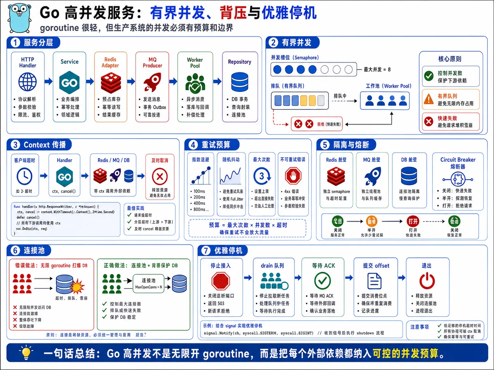
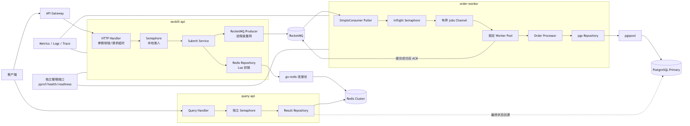
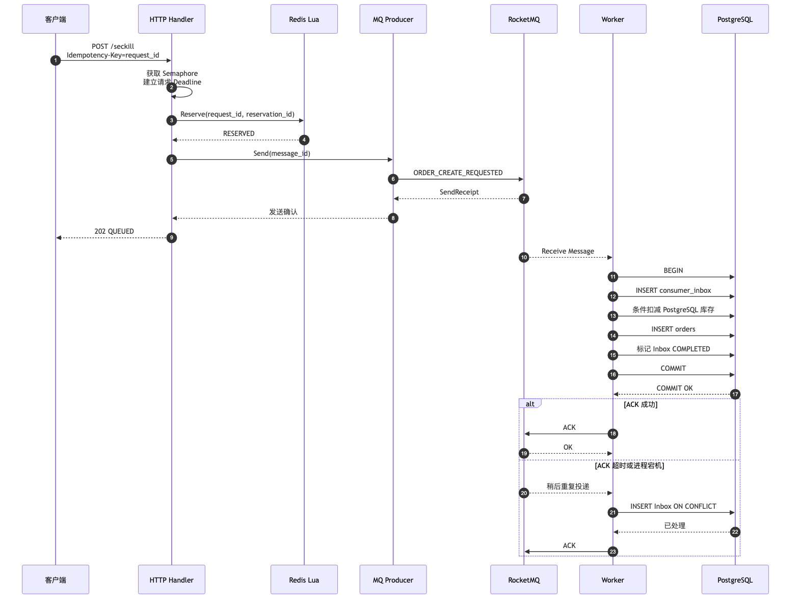
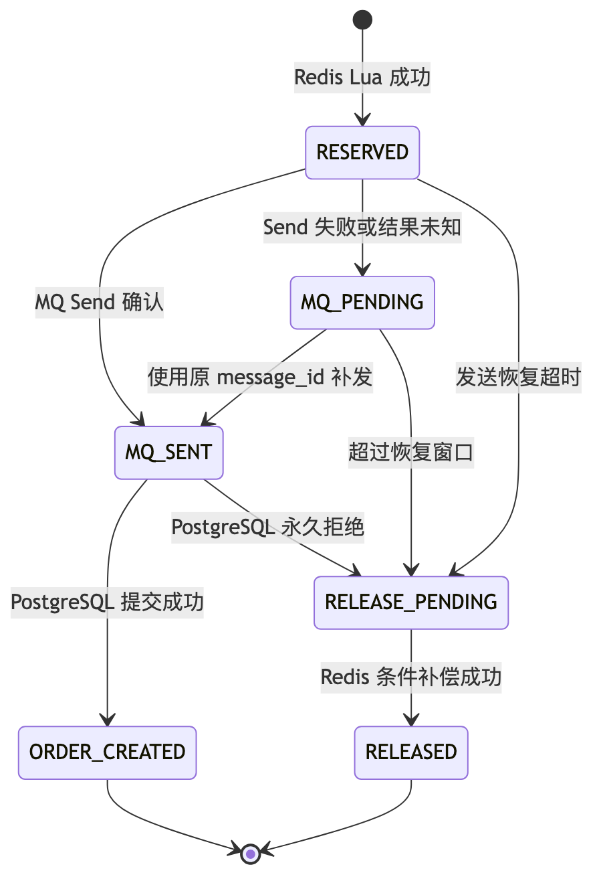

# 第 7 章：Go 高并发服务工程实践



> 图注：本章全文重点总结图，按服务分层、有界并发、Context 传播、重试预算、隔离熔断、连接池背压和优雅停机梳理 Go 工程实践。

> **版本基线**：本章以 Go 1.26.4 为语言基线，示例依赖固定为 pgx v5.10.0、go-redis v9.21.0、RocketMQ Go SDK v5.1.2 和 x/sync v0.21.0。生产环境应固定依赖版本和校验和，补丁升级必须经过回归、压测和故障注入验证。([Go][1])

---

## 1. 本章目标

本章解决的不是“如何启动一个 Go HTTP 服务”，而是以下工程问题：

1. 如何让秒杀接入服务在高并发下保持**有界资源占用**。
2. 如何让客户端取消和超时传播到 Redis、RocketMQ、PostgreSQL。
3. 如何设计有明确生命周期的 goroutine、Worker Pool 和有界 Channel。
4. 如何让 RocketMQ 消费速度服从 PostgreSQL 的实际写入能力。
5. 如何正确复用 Redis、PostgreSQL、RocketMQ 客户端和连接池。
6. 如何实现有界重试、指数退避、随机抖动、熔断和隔离舱。
7. 如何处理 Panic、数据竞争、goroutine 泄漏和 Channel 死锁。
8. 如何通过 pprof、trace、Benchmark、Race Detector 和指标定位瓶颈。
9. 如何在服务停机时停止接流量、停止拉消息、排空任务并释放资源。
10. 如何优化内存分配和 GC，同时避免把 `sync.Pool` 误用为业务缓存。

本章的核心结论是：

> **Go 的并发能力只是工具。高并发系统能否稳定，取决于并发是否有界、资源是否受预算约束，以及故障能否快速向上游形成背压。**

---

## 2. 业务背景

秒杀主链路仍然是：

```text
客户端
→ API Gateway
→ seckill-api
→ Redis Lua 库存预占
→ RocketMQ
→ order-worker
→ PostgreSQL
→ Redis 查询结果
→ query-api
```

本章重点分析三个 Go 服务。

| 服务             | 主要职责                                      | 主要压力                       |
| -------------- | ----------------------------------------- | -------------------------- |
| `seckill-api`  | 参数校验、本地准入、Redis Lua、MQ 发送、返回排队结果          | 30 万 QPS 入口流量、P99 小于 100ms |
| `order-worker` | RocketMQ 拉取、消息校验、Inbox 幂等、创建订单、最终库存扣减、ACK | 写数据库、事务冲突、MQ 积压            |
| `query-api`    | 查询 request、reservation 和订单最终状态            | 轮询流量、热点 Key、刚提交数据的一致性      |

对于单个库存为 10,000 的热点 SKU，如果要求这些有效订单绝大部分在 3 秒内创建，则订单链路至少需要达到：

```text
10,000 / 3 ≈ 3,334 个订单事务/秒
```

这只是平均吞吐量。考虑重试、重复投递、锁等待和单可用区故障，设计容量必须高于该值。

但是，**增加消费者和 goroutine 并不能自动增加 PostgreSQL TPS**。当热点库存行、WAL、磁盘、连接池或锁等待达到瓶颈后，继续提高消费并发只会造成：

* PostgreSQL 连接等待增大；
* 事务锁等待增大；
* 消息不可见时间被队列等待消耗；
* Go 堆内存和 goroutine 数增长；
* 超时、重试和数据库压力互相放大。

因此，Go 工程层必须承担三个重要职责：

1. **限制进入系统的并发量**；
2. **将下游拥塞反馈到上游**；
3. **确保每个并发任务都可取消、可回收、可观测**。

---

## 3. 核心问题

### 3.1 goroutine 很轻量，为什么仍不能无限创建

goroutine 的初始栈较小，但每个 goroutine 仍然需要：

* 栈空间；
* 调度元数据；
* 引用的对象；
* Channel、Timer、Context 等关联资源；
* 可能长期占用的数据库连接、网络连接或锁。

真正危险的不是 goroutine 本身，而是 goroutine 所代表的**未完成工作量**。

例如，数据库只能稳定处理 500 TPS，但消费者不断以 5,000 TPS 创建 goroutine：

```text
每秒新增积压 = 5,000 - 500 = 4,500
```

即使每个 goroutine 只间接占用 10KiB，60 秒后也可能累积约：

```text
4,500 × 60 × 10KiB ≈ 2.57GiB
```

这还没有计算消息体、日志字段、事务对象和网络缓冲区。

### 3.2 背压是什么

**背压是下游处理能力不足时，上游主动减速、拒绝或停止继续拉取任务的机制。**

在本系统中，背压应逐层形成：

```text
PostgreSQL 变慢
→ Worker 处理时间增加
→ Worker Pool 可用槽位减少
→ MQ Puller 减少 Receive 数量或停止拉取
→ 消息留在 RocketMQ
```

对于 HTTP 链路：

```text
Redis/MQ/本实例容量不足
→ 本地 Semaphore 获取失败
→ 快速返回 429 或 503
→ 不把请求放入本地巨大队列
```

### 3.3 为什么客户端超时必须传播

客户端断开连接后，如果服务仍然继续执行 Redis、MQ 或 PostgreSQL 操作，会产生“孤儿工作”：

* 用户已经放弃请求，但服务仍在占用连接；
* 上游重试形成另一条并发请求；
* 原请求和重试请求同时执行；
* 系统在超载时继续处理无效任务。

Go 的入站 HTTP Request Context 会在客户端连接关闭、HTTP/2 请求取消或 Handler 返回时取消，因此下游方法必须继续使用该 Context，而不能随意替换为 `context.Background()`。([Go Packages][2])

### 3.4 为什么消费者并发受数据库约束

RocketMQ 能够快速投递消息，不代表 PostgreSQL 能以同样速度提交订单事务。

消费者的安全并发上限受以下因素共同限制：

```text
安全并发
≈ min(
    数据库可用连接数,
    CPU 可承受并发,
    热点锁可承受并发,
    WAL/磁盘可承受写入,
    MQ 不可见时间约束,
    经过压测验证的稳定值
)
```

### 3.5 重试预算是什么

重试预算至少包含三项：

* 最大尝试次数；
* 最大累计时间；
* 系统允许由重试产生的额外流量比例。

例如：

```text
单次数据库事务最多尝试 3 次
单次处理总预算 800ms
一分钟内重试次数不超过初始请求数的 5%
```

超过预算后，应让错误暴露给上层或依赖 RocketMQ 稍后重新投递，而不是持续本地重试。

### 3.6 隔离舱是什么

隔离舱是为不同流量或任务提供独立资源配额，防止一种流量耗尽全部资源。

本系统至少应隔离：

* 秒杀提交和结果查询；
* 订单创建和库存补偿；
* 在线请求和后台对账；
* 核心业务接口和 pprof 管理接口；
* PostgreSQL 写连接池和查询回源连接池。

---

## 4. 未优化的基线方案

下面是典型但不可上线的实现。

### 4.1 错误的 HTTP Handler

```go
// 反例：不可用于生产环境。
func BadSubmitHandler(w http.ResponseWriter, r *http.Request) {
	go func() {
		ctx := context.Background()

		rdb := redis.NewClient(&redis.Options{
			Addr: "redis:6379",
		})
		defer rdb.Close()

		producer, _ := rmq.NewProducer(
			&rmq.Config{Endpoint: "rocketmq:8081"},
			rmq.WithTopics("seckill-order-events"),
		)
		_ = producer.Start()
		defer producer.GracefulStop()

		_, _ = rdb.Decr(ctx, "stock").Result()

		for {
			_, err := producer.Send(ctx, &rmq.Message{
				Topic: "seckill-order-events",
				Body:  []byte(`{"event":"create_order"}`),
			})
			if err == nil {
				break
			}
			time.Sleep(time.Millisecond)
		}
	}()

	w.WriteHeader(http.StatusAccepted)
}
```

问题包括：

* Handler 直接创建无人管理的 goroutine；
* 请求取消无法传播；
* 每个请求创建 Redis 和 MQ 客户端；
* Redis 扣库存不是完整原子业务操作；
* 未使用 `request_id`；
* MQ 无限重试；
* 忽略启动、发送和关闭错误；
* Handler 在操作结果未知时立即返回；
* 服务停机时无法等待该 goroutine；
* Panic 会终止整个进程。

### 4.2 错误的 MQ 消费者

```go
// 反例：不可用于生产环境。
func BadConsume(consumer rmq.SimpleConsumer, pool *pgxpool.Pool) {
	for {
		messages, _ := consumer.Receive(
			context.Background(),
			128,
			20*time.Second,
		)

		for _, message := range messages {
			go func(m *rmq.MessageView) {
				_, _ = pool.Exec(
					context.Background(),
					`INSERT INTO orders (...) VALUES (...)`,
				)
				_ = consumer.Ack(context.Background(), m)
			}(message)
		}
	}
}
```

主要问题是：

```text
MQ 拉取能力 > PostgreSQL 写入能力
→ 无限创建 goroutine
→ pgxpool.Acquire 大量等待
→ 消息不可见时间耗尽
→ MQ 重复投递
→ goroutine 数继续增长
```

---

## 5. 基线方案的问题

| 维度   | 主要问题                                   |
| ---- | -------------------------------------- |
| 正确性  | 无请求幂等、无消息幂等、忽略事务错误、可能先 ACK 后提交、超时结果不确定 |
| 性能   | 每次请求建立客户端和连接，TLS、认证、路由查询和连接握手被重复执行     |
| 并发   | goroutine 无界，任务队列无界，下游容量无法限制上游         |
| 可用性  | 无限重试形成重试风暴，一个依赖故障可能拖垮整个实例              |
| 可扩展性 | 消费者数量直接增加数据库连接和锁竞争，扩容后反而降低吞吐           |
| 可运维性 | 无结构化日志、无队列深度、无连接池指标、无优雅停机              |
| 内存   | 消息体被大量 goroutine 持有，临时对象增加 GC 压力       |
| 故障恢复 | 进程退出时无法确认哪些任务正在执行，可能丢失内存队列中的任务         |
| 安全性  | pprof 若直接暴露公网，可能泄漏路径、堆对象和运行状态          |

---

## 6. 推荐架构

### 6.1 组件架构



### 6.2 组件职责

#### HTTP Handler

负责：

* 限制请求体大小；
* 参数与 `request_id` 校验；
* 获取用户身份；
* 建立总请求超时；
* 获取本地准入 Semaphore；
* 调用 Service；
* 将领域错误映射为 HTTP 状态码；
* 不直接编写 Redis、MQ、SQL 逻辑。

#### Service

负责：

* 生成一次性的 `reservation_id`、`message_id`、`order_id`；
* 编排 Redis 预占与 MQ 发送；
* 处理重复请求；
* 明确“已排队”“售罄”“重复购买”“发送结果未知”等业务语义。

#### Repository 和 MQ Adapter

负责：

* 隔离具体客户端；
* 建立子超时；
* 错误分类；
* 资源释放；
* 将基础设施错误转换成领域错误；
* 为测试提供可替换接口。

#### MQ Puller

负责：

* 只在本地存在可用处理槽位时拉取消息；
* 批量 `Receive`；
* 将已拉取消息放入有界 Channel；
* 不执行业务事务。

#### Worker Pool

负责：

* 固定数量 Worker；
* 每个 Worker 串行处理自身领取的消息；
* 每条消息设置处理超时；
* 数据库提交成功后 ACK；
* Panic 时不 ACK；
* 停机时排空已经进入本地队列的任务。

### 6.3 事务边界

本架构存在三个不同边界：

1. **Redis Lua 原子边界**

   原子处理库存预占、用户防重、`request_id` 幂等和 reservation 创建。

2. **RocketMQ 发送边界**

   发送成功或失败不能与 Redis Lua 构成同一个本地事务。发送超时还可能意味着结果未知。

3. **PostgreSQL 本地事务边界**

   同一事务内完成：

   ```text
   Inbox 幂等记录
   + PostgreSQL 最终库存条件扣减
   + 订单写入
   + 必要的 Outbox 事件
   + Inbox 完成状态
   ```

MQ ACK 不属于 PostgreSQL 事务。

### 6.4 故障边界

* `seckill-api` 实例崩溃不能影响 Redis、MQ 和其他实例；
* 单个 Worker Panic 不应使消息被错误 ACK；
* PostgreSQL 变慢时，背压应终止于 RocketMQ，而不是扩散为无限 goroutine；
* 查询流量不能耗尽订单创建所需的数据库连接；
* pprof 服务故障不能影响业务端口。

### 6.5 可重试和必须幂等的步骤

| 操作            |       是否可重试 | 必须使用的幂等键                                   |
| ------------- | ----------: | ------------------------------------------ |
| Redis Lua 预占  | 可使用相同参数有界重试 | `request_id`                               |
| RocketMQ Send |  发送结果未知时可补发 | 应用层 `message_id`                           |
| PostgreSQL 事务 | 仅瞬时错误重试整个事务 | `message_id`、`request_id`、`reservation_id` |
| RocketMQ ACK  |       可短暂重试 | Broker Message ID/Receipt Handle           |
| Redis 状态回写    |       可条件重试 | `reservation_id`、状态版本                      |
| 查询            |         可重试 | 无副作用，但仍受超时和流量限制                            |

### 6.6 正常时序与 ACK 不确定



图中的关键点是：

* 返回 `202 QUEUED` 不等于订单已经创建；
* PostgreSQL 提交前不能 ACK；
* PostgreSQL 提交后 ACK 失败不会回滚已提交订单；
* 重复投递由 Inbox、唯一约束和条件更新消化；
* 本系统提供的是 At-Least-Once 投递和业务幂等效果，而不是端到端天然 Exactly Once。RocketMQ SimpleConsumer 支持批量 Receive、消息不可见时间、显式 ACK；未成功 ACK 的消息可能被重新投递，因此消费者必须幂等。([RocketMQ][3])

---

## 7. 核心流程

### 7.1 正常流程

1. Gateway 完成身份、令牌和外层限流。
2. Handler 尝试获取本地 Semaphore。
3. Handler 创建小于 100ms 的总请求预算。
4. Redis Lua 原子执行：

   * 检查 `request_id`；
   * 检查一人一单；
   * 检查库存；
   * 扣减 Redis 可售库存；
   * 写入 reservation。
5. Producer 使用进程级客户端发送订单事件。
6. API 返回 `202 QUEUED`。
7. MQ Puller 只按空闲槽位数量拉取消息。
8. Worker 在 PostgreSQL 本地事务中执行 Inbox、库存和订单操作。
9. 提交成功后 ACK。
10. 用户通过 `query-api` 查询最终状态。

### 7.2 重复请求流程

#### 相同 `request_id`

Redis Lua 返回第一次请求对应的 `reservation_id`。

Service 不生成新的业务效果，而是读取原 reservation：

* 如果已经 `MQ_SENT`，直接返回排队状态；
* 如果为 `MQ_PENDING`，允许恢复任务使用原 `message_id` 补发；
* 如果订单已创建，返回最终订单；
* 如果已释放，返回最终失败原因。

#### 相同用户、不同 `request_id`

Redis 用户防重返回原 `reservation_id`，不再次扣减库存。

即使 Redis 因故障没有拦住，PostgreSQL 的：

```sql
UNIQUE (activity_id, sku_id, user_id)
```

仍是最终防线。

#### 相同 `message_id`

消费者执行：

```sql
INSERT INTO consumer_inbox (...)
VALUES (...)
ON CONFLICT DO NOTHING;
```

`affected rows = 0` 表示该消费者组已经见过该消息，需要查询 Inbox 的终态并按幂等成功处理。

### 7.3 超时流程

#### 客户端先取消

Request Context 被取消：

```text
Handler Context
→ Redis Context
→ MQ Send Context
```

尚未执行的操作应尽快终止。

#### Redis Lua 调用超时

Redis 超时不等于 Lua 一定没有执行。

正确做法是：

* 不立即补偿库存；
* 使用相同 `request_id`、`reservation_id` 重试一次或让客户端重试；
* Lua 若已经执行，会返回原 reservation；
* 若无法确认，客户端使用 `request_id` 查询。

#### MQ Send 超时

MQ Send 超时可能存在两种情况：

1. Broker 没有收到；
2. Broker 已保存消息，但响应丢失。

因此不能生成新的 `message_id` 后无限重发。应将 reservation 标记为发送结果未知或 `MQ_PENDING`，由恢复任务使用原应用层 `message_id` 补发。即使 Broker 最终存在两份消息，消费者 Inbox 也只能产生一次业务效果。

#### PostgreSQL 超时

* 如果事务尚未提交，回滚；
* 如果提交结果未知，不能直接判断失败；
* 使用相同 `message_id` 重新执行整个事务；
* 若前一次已提交，Inbox 会返回幂等成功；
* 若前一次未提交，本次正常执行。

### 7.4 重试流程

本地重试只适用于：

* 临时网络错误；
* PostgreSQL `40001 serialization_failure`；
* PostgreSQL `40P01 deadlock_detected`；
* 短暂连接重置；
* 在总 Deadline 内仍有剩余时间的依赖超时。

PostgreSQL 对序列化失败和死锁的安全处理方式是重试完整事务，而不是只重试失败的最后一条 SQL。([PostgreSQL][4])

不应本地重试：

* 参数非法；
* 消息 Schema 不支持；
* 售罄；
* 一人一单冲突；
* 唯一 ID 与不同业务数据冲突；
* Context 已取消；
* 重试预算已耗尽。

### 7.5 宕机恢复流程

| 宕机位置                 | 恢复方式                          |
| -------------------- | ----------------------------- |
| Redis 成功后、MQ Send 前  | reservation 扫描恢复或补偿           |
| MQ Send 成功、响应前       | 使用原 `message_id` 补发，消费者幂等     |
| 消费者处理前               | 未 ACK，消息重新可见                  |
| PostgreSQL 事务中       | 数据库自动回滚未提交事务                  |
| PostgreSQL 提交后、ACK 前 | 消息重复投递，Inbox 返回幂等成功           |
| ACK 后、Redis 结果更新前    | 根据 PostgreSQL/Outbox 重新投影查询状态 |
| 优雅停机超时               | 未 ACK 消息由 Broker 稍后重投         |

### 7.6 降级流程

#### Redis 故障

`seckill-api` 默认拒绝新秒杀请求：

```http
503 Service Unavailable
```

不能绕过 Redis 直接把 30 万 QPS 写入 PostgreSQL。

#### RocketMQ 故障

两种可选策略：

1. **严格拒绝模式**

   Redis 预占后若无法可靠登记恢复任务，则条件释放 reservation，并返回失败或待确认。

2. **恢复扫描模式**

   reservation 已包含稳定 `message_id` 和 `MQ_PENDING` 状态，由扫描任务补发。

禁止把消息只放入进程内无界 Channel 后向客户端返回成功。

#### PostgreSQL 故障

order-worker：

* 停止或减少 MQ 拉取；
* 已拉消息处理失败后不 ACK；
* 消息保留在 RocketMQ；
* 熔断期间只做低频探测；
* 不持续占满数据库连接建立请求。

#### 查询 Redis 故障

query-api 可以受限回源 PostgreSQL Primary 查询最终订单，但必须：

* 使用独立的小连接池；
* 只查询已经可能完成的请求；
* 限流；
* 不允许查询流量抢占订单创建连接。

---

## 8. 数据结构

### 8.1 PostgreSQL 表

以下为本章代码涉及的最小表结构。

```sql
CREATE TABLE seckill_inventory (
    activity_id BIGINT NOT NULL,
    sku_id      BIGINT NOT NULL,
    total_stock INTEGER NOT NULL,
    sold_stock  INTEGER NOT NULL DEFAULT 0,
    version     BIGINT NOT NULL DEFAULT 0,
    updated_at  TIMESTAMPTZ NOT NULL DEFAULT clock_timestamp(),

    PRIMARY KEY (activity_id, sku_id),

    CONSTRAINT ck_inventory_total_nonnegative
        CHECK (total_stock >= 0),

    CONSTRAINT ck_inventory_sold_range
        CHECK (sold_stock >= 0 AND sold_stock <= total_stock)
);

CREATE TABLE orders (
    order_id       BIGINT PRIMARY KEY,
    request_id     UUID NOT NULL,
    reservation_id UUID NOT NULL,
    activity_id    BIGINT NOT NULL,
    sku_id         BIGINT NOT NULL,
    user_id        BIGINT NOT NULL,
    status         VARCHAR(24) NOT NULL,
    created_at     TIMESTAMPTZ NOT NULL DEFAULT clock_timestamp(),
    updated_at     TIMESTAMPTZ NOT NULL DEFAULT clock_timestamp(),

    CONSTRAINT ck_orders_status
        CHECK (status IN (
            'CREATED',
            'PAYING',
            'PAID',
            'CANCELLED',
            'CLOSED'
        )),

    CONSTRAINT uq_orders_request_id
        UNIQUE (request_id),

    CONSTRAINT uq_orders_reservation_id
        UNIQUE (reservation_id),

    CONSTRAINT uq_orders_activity_sku_user
        UNIQUE (activity_id, sku_id, user_id)
);

CREATE TABLE consumer_inbox (
    consumer_group  VARCHAR(128) NOT NULL,
    message_id      UUID NOT NULL,
    request_id      UUID NOT NULL,
    reservation_id  UUID NOT NULL,
    order_id        BIGINT,
    status          VARCHAR(24) NOT NULL,
    last_error_code VARCHAR(64),
    received_at     TIMESTAMPTZ NOT NULL DEFAULT clock_timestamp(),
    processed_at    TIMESTAMPTZ,

    PRIMARY KEY (consumer_group, message_id),

    CONSTRAINT ck_consumer_inbox_status
        CHECK (status IN ('PROCESSING', 'COMPLETED', 'REJECTED'))
);

CREATE INDEX idx_consumer_inbox_processed_at
    ON consumer_inbox (processed_at)
    WHERE status IN ('COMPLETED', 'REJECTED');
```

推荐订单 ID 在 Redis reservation 创建时一次性生成，并随 MQ 消息传递。它只是预分配 ID，只有 PostgreSQL 订单事务提交后才代表真实订单。

### 8.2 Redis Key

所有参与同一 Lua 的 Key 使用相同 Hash Tag：

```text
{activity_id:sku_id}
```

例如：

| Key                                            | 类型     | 含义                            |
| ---------------------------------------------- | ------ | ----------------------------- |
| `sec:{1001:2001}:stock`                        | String | Redis 可售库存                    |
| `sec:{1001:2001}:buyers`                       | Hash   | `user_id → reservation_id`    |
| `sec:{1001:2001}:request:<request_id>`         | String | `request_id → reservation_id` |
| `sec:{1001:2001}:reservation:<reservation_id>` | Hash   | reservation 详情                |
| `sec:{1001:2001}:result:<request_id>`          | Hash   | 短期查询结果                        |

TTL 必须覆盖：

```text
活动结束时间
+ MQ 最大重试与积压窗口
+ reservation 恢复窗口
+ 对账窗口
```

不能因为短 TTL 导致订单消息仍在积压，而 Redis 的幂等记录已经消失。

### 8.3 RocketMQ 消息

```json
{
  "message_id": "019f2db9-8af0-7a21-88e1-2df337730001",
  "message_key": "1001:2001:019f2db9-8af0-7a21-88e1-2df337730002",
  "request_id": "019f2db9-8af0-7a21-88e1-2df337730003",
  "reservation_id": "019f2db9-8af0-7a21-88e1-2df337730002",
  "activity_id": 1001,
  "sku_id": 2001,
  "user_id": 3001,
  "order_id": 900000000000001,
  "schema_version": 1,
  "created_at": "2026-06-25T12:00:00.123456Z",
  "retry_count": 0,
  "trace": {
    "traceparent": "00-4bf92f3577b34da6a3ce929d0e0e4736-00f067aa0ba902b7-01",
    "tracestate": ""
  }
}
```

消息约定：

| 项目             | 设计                               |
| -------------- | -------------------------------- |
| Topic          | `seckill-order-events`           |
| Tag            | `ORDER_CREATE_REQUESTED`         |
| Consumer Group | `seckill-order-create-v1`        |
| 是否允许重复         | 允许，消费者必须幂等                       |
| 消费幂等键          | `consumer_group + message_id`    |
| 是否要求全局顺序       | 不要求                              |
| 最大消费尝试         | 示例设为 8 次，最终以集群策略为准               |
| DLQ            | 持久化告警、自动分析、人工或受控回放               |
| 回放安全性          | 必须经过 Inbox 和唯一约束                 |
| Schema 兼容      | 新字段向后兼容，破坏性变化升级 `schema_version` |

`retry_count` 表示应用层补发次数。Broker 的投递次数应从 `MessageView.GetDeliveryAttempt()` 单独读取，不能混为一个字段。

### 8.4 Go 结构体

```go
package domain

import "time"

type TraceContext struct {
	Traceparent string `json:"traceparent"`
	Tracestate  string `json:"tracestate"`
}

type OrderCreateEvent struct {
	MessageID     string       `json:"message_id"`
	MessageKey    string       `json:"message_key"`
	RequestID     string       `json:"request_id"`
	ReservationID string       `json:"reservation_id"`
	ActivityID    int64        `json:"activity_id"`
	SKUID         int64        `json:"sku_id"`
	UserID        int64        `json:"user_id"`
	OrderID       int64        `json:"order_id"`
	SchemaVersion int          `json:"schema_version"`
	CreatedAt     time.Time    `json:"created_at"`
	RetryCount    int          `json:"retry_count"`
	Trace         TraceContext `json:"trace"`
}

type SubmitCommand struct {
	RequestID  string
	ActivityID int64
	SKUID      int64
	UserID     int64
}

type SubmitResult struct {
	RequestID     string `json:"request_id"`
	ReservationID string `json:"reservation_id,omitempty"`
	OrderID       int64  `json:"order_id,omitempty"`
	State         string `json:"state"`
}
```

### 8.5 reservation 状态机



`MQ_PENDING` 的语义不是“消息一定没有发送”，而是“生产者无法确认发送结果”。因此后续补发必须复用原应用层 `message_id`。

---

## 9. 核心代码

### 9.1 项目目录结构

```text
seckill/
├── cmd/
│   ├── seckill-api/
│   │   └── main.go
│   ├── order-worker/
│   │   └── main.go
│   └── query-api/
│       └── main.go
├── internal/
│   ├── domain/
│   │   ├── event.go
│   │   ├── order.go
│   │   └── errors.go
│   ├── app/
│   │   ├── submit_service.go
│   │   ├── order_processor.go
│   │   └── query_service.go
│   ├── transport/
│   │   └── httpapi/
│   │       ├── submit_handler.go
│   │       ├── query_handler.go
│   │       ├── middleware.go
│   │       └── response.go
│   ├── repository/
│   │   ├── redisrepo/
│   │   │   ├── reservation.go
│   │   │   └── result.go
│   │   └── pgrepo/
│   │       ├── order.go
│   │       └── inbox.go
│   ├── mq/
│   │   └── rocketmq/
│   │       ├── producer.go
│   │       ├── consumer.go
│   │       └── worker_pool.go
│   ├── resilience/
│   │   ├── retry.go
│   │   ├── breaker.go
│   │   └── bulkhead.go
│   ├── observability/
│   │   ├── metrics.go
│   │   ├── logging.go
│   │   └── tracing.go
│   └── runtime/
│       ├── lifecycle.go
│       └── debug_server.go
├── migrations/
├── configs/
├── go.mod
└── go.sum
```

依赖方向应保持：

```text
Handler
→ Application Service
→ Domain Interface
← Redis/PostgreSQL/RocketMQ Adapter
```

领域层不依赖 Redis、pgx 或 RocketMQ SDK。

示例 `go.mod`：

```go
module example.com/seckill

go 1.26.0

toolchain go1.26.4

require (
	github.com/apache/rocketmq-clients/golang/v5 v5.1.2
	github.com/jackc/pgx/v5 v5.10.0
	github.com/redis/go-redis/v9 v9.21.0
	golang.org/x/sync v0.21.0
)
```

### 9.2 明确的错误分类

```go
package apperr

import (
	"errors"
	"fmt"
)

type Kind uint8

const (
	KindUnknown Kind = iota
	KindInvalid
	KindConflict
	KindSoldOut
	KindOverloaded
	KindTimeout
	KindUnavailable
	KindInternal
)

type Error struct {
	Op       string
	Kind     Kind
	CanRetry bool
	Err      error
}

func (e *Error) Error() string {
	if e.Err == nil {
		return e.Op
	}
	return fmt.Sprintf("%s: %v", e.Op, e.Err)
}

func (e *Error) Unwrap() error {
	return e.Err
}

func Wrap(op string, kind Kind, canRetry bool, err error) error {
	if err == nil {
		return nil
	}
	return &Error{
		Op:       op,
		Kind:     kind,
		CanRetry: canRetry,
		Err:      err,
	}
}

func KindOf(err error) Kind {
	var target *Error
	if errors.As(err, &target) {
		return target.Kind
	}
	return KindUnknown
}

func IsRetryable(err error) bool {
	var target *Error
	return errors.As(err, &target) && target.CanRetry
}
```

错误分类应做到：

* 日志中保留底层错误链；
* HTTP 响应不泄漏数据库和网络细节；
* 重试逻辑根据类型判断，而不是根据错误字符串判断；
* 业务冲突和基础设施故障严格分开。

### 9.3 HTTP Handler 与 Semaphore

```go
package httpapi

import (
	"context"
	"encoding/json"
	"errors"
	"io"
	"log/slog"
	"net/http"
	"time"

	"example.com/seckill/internal/domain"
	"example.com/seckill/internal/apperr"
	"golang.org/x/sync/semaphore"
)

var errRequestBudgetExceeded = errors.New("request budget exceeded")

type SubmitUseCase interface {
	Submit(context.Context, domain.SubmitCommand) (domain.SubmitResult, error)
}

type SubmitHandler struct {
	service   SubmitUseCase
	admission *semaphore.Weighted
	timeout   time.Duration
	logger    *slog.Logger
}

type submitRequest struct {
	ActivityID int64 `json:"activity_id"`
	SKUID      int64 `json:"sku_id"`
}

func NewSubmitHandler(
	service SubmitUseCase,
	maxInflight int64,
	timeout time.Duration,
	logger *slog.Logger,
) *SubmitHandler {
	return &SubmitHandler{
		service:   service,
		admission: semaphore.NewWeighted(maxInflight),
		timeout:   timeout,
		logger:    logger,
	}
}

func (h *SubmitHandler) ServeHTTP(w http.ResponseWriter, r *http.Request) {
	if !h.admission.TryAcquire(1) {
		w.Header().Set("Retry-After", "1")
		writeJSON(w, http.StatusTooManyRequests, map[string]any{
			"code":    "OVERLOADED",
			"message": "service is overloaded",
		})
		return
	}
	defer h.admission.Release(1)

	ctx, cancel := context.WithTimeoutCause(
		r.Context(),
		h.timeout,
		errRequestBudgetExceeded,
	)
	defer cancel()

	r.Body = http.MaxBytesReader(w, r.Body, 4<<10)

	var req submitRequest
	decoder := json.NewDecoder(r.Body)
	decoder.DisallowUnknownFields()

	if err := decoder.Decode(&req); err != nil {
		writeJSON(w, http.StatusBadRequest, map[string]any{
			"code": "INVALID_JSON",
		})
		return
	}

	// 禁止一个请求体中拼接多个 JSON 对象。
	if err := decoder.Decode(&struct{}{}); !errors.Is(err, io.EOF) {
		writeJSON(w, http.StatusBadRequest, map[string]any{
			"code": "INVALID_JSON",
		})
		return
	}

	requestID := r.Header.Get("Idempotency-Key")
	userID, ok := UserIDFromContext(ctx)

	if !ok ||
		!validUUID(requestID) ||
		req.ActivityID <= 0 ||
		req.SKUID <= 0 {

		writeJSON(w, http.StatusBadRequest, map[string]any{
			"code": "INVALID_ARGUMENT",
		})
		return
	}

	result, err := h.service.Submit(ctx, domain.SubmitCommand{
		RequestID:  requestID,
		ActivityID: req.ActivityID,
		SKUID:      req.SKUID,
		UserID:     userID,
	})
	if err != nil {
		h.writeError(ctx, w, requestID, err)
		return
	}

	writeJSON(w, http.StatusAccepted, result)
}

func (h *SubmitHandler) writeError(
	ctx context.Context,
	w http.ResponseWriter,
	requestID string,
	err error,
) {
	status := http.StatusInternalServerError
	code := "INTERNAL_ERROR"

	switch apperr.KindOf(err) {
	case apperr.KindInvalid:
		status, code = http.StatusBadRequest, "INVALID_ARGUMENT"
	case apperr.KindConflict:
		status, code = http.StatusConflict, "DUPLICATE_ORDER"
	case apperr.KindSoldOut:
		status, code = http.StatusConflict, "SOLD_OUT"
	case apperr.KindOverloaded:
		status, code = http.StatusTooManyRequests, "OVERLOADED"
	case apperr.KindTimeout:
		status, code = http.StatusGatewayTimeout, "TIMEOUT"
	case apperr.KindUnavailable:
		status, code = http.StatusServiceUnavailable, "DEPENDENCY_UNAVAILABLE"
	}

	h.logger.ErrorContext(
		ctx,
		"submit seckill failed",
		slog.String("request_id", requestID),
		slog.String("error_kind", code),
		slog.Any("error", err),
	)

	writeJSON(w, status, map[string]any{
		"code":       code,
		"request_id": requestID,
	})
}

func writeJSON(w http.ResponseWriter, status int, value any) {
	w.Header().Set("Content-Type", "application/json")
	w.WriteHeader(status)

	// 响应头已发出，Encode 错误不能再改变状态码；
	// 生产代码应记录该错误和响应字节数。
	_ = json.NewEncoder(w).Encode(value)
}
```

`semaphore.Weighted` 可以提供带权、有界、可取消的并发控制；接入层推荐使用 `TryAcquire` 快速拒绝，而不是让大量 HTTP 请求在本地排队。([Go Packages][5])

#### 推荐的请求预算示例

在接口内部 P99 目标为 100ms 时，可以先采用：

| 阶段            |   预算 |
| ------------- | ---: |
| 参数校验和准入       |  2ms |
| Redis Lua     | 25ms |
| RocketMQ Send | 40ms |
| 编解码和日志        |  8ms |
| 预留余量          | 15ms |
| 合计            | 90ms |

这些数字只是初始值，必须根据同机房网络和压测数据校准。

### 9.4 Redis 客户端与 Lua 封装

#### Redis 客户端初始化

```go
func NewRedisClient(addr, username, password string) *redis.Client {
	return redis.NewClient(&redis.Options{
		Addr:     addr,
		Username: username,
		Password: password,

		// 自定义业务重试，避免 SDK 重试和业务重试叠加。
		MaxRetries: -1,

		PoolSize:       64,
		MinIdleConns:   8,
		MaxIdleConns:   32,
		MaxActiveConns: 64,

		PoolTimeout:  30 * time.Millisecond,
		DialTimeout:  500 * time.Millisecond,
		ReadTimeout:  60 * time.Millisecond,
		WriteTimeout: 60 * time.Millisecond,

		ConnMaxIdleTime:       5 * time.Minute,
		ConnMaxLifetime:       30 * time.Minute,
		ConnMaxLifetimeJitter: 3 * time.Minute,

		ContextTimeoutEnabled: true,
	})
}
```

go-redis v9.21.0 的默认基础 PoolSize 是 `10 × GOMAXPROCS`，在连接不足时还可能创建超出 PoolSize 的连接；若要限制连接总量，需要显式设置 `MaxActiveConns`。它还支持 `PoolTimeout`、连接生命周期抖动和 Context Deadline。([GitHub][6])

#### Lua 脚本

```go
var reserveScript = redis.NewScript(`
-- KEYS[1] stock key
-- KEYS[2] buyers hash
-- KEYS[3] request idempotency key
-- KEYS[4] reservation hash
--
-- ARGV[1] user_id
-- ARGV[2] request_id
-- ARGV[3] reservation_id
-- ARGV[4] now_ms
-- ARGV[5] ttl_ms
-- ARGV[6] message_id
-- ARGV[7] order_id

local old_reservation = redis.call('GET', KEYS[3])
if old_reservation then
    return {1, old_reservation}
end

local user_reservation = redis.call('HGET', KEYS[2], ARGV[1])
if user_reservation then
    return {2, user_reservation}
end

local stock_value = redis.call('GET', KEYS[1])
if not stock_value then
    return {4, ''}
end

local stock = tonumber(stock_value)
if not stock or stock <= 0 then
    return {3, ''}
end

redis.call('DECR', KEYS[1])
redis.call('HSET', KEYS[2], ARGV[1], ARGV[3])
redis.call('PEXPIRE', KEYS[2], ARGV[5])

redis.call('SET', KEYS[3], ARGV[3], 'PX', ARGV[5])

redis.call(
    'HSET',
    KEYS[4],
    'reservation_id', ARGV[3],
    'request_id', ARGV[2],
    'user_id', ARGV[1],
    'message_id', ARGV[6],
    'order_id', ARGV[7],
    'status', 'RESERVED',
    'created_at_ms', ARGV[4]
)
redis.call('PEXPIRE', KEYS[4], ARGV[5])

return {0, ARGV[3]}
`)
```

返回码：

| 返回码 | 含义                              |
| --: | ------------------------------- |
| `0` | 新 reservation 创建成功              |
| `1` | 相同 `request_id`，返回原 reservation |
| `2` | 同一用户已预占                         |
| `3` | Redis 库存不足                      |
| `4` | 活动库存 Key 不存在或不可用                |

#### Go 封装

```go
type ReserveInput struct {
	ActivityID    int64
	SKUID          int64
	UserID         int64
	RequestID      string
	ReservationID  string
	MessageID      string
	OrderID        int64
	Now            time.Time
	TTL            time.Duration
}

type ReserveCode int64

const (
	ReserveCreated ReserveCode = iota
	ReserveDuplicateRequest
	ReserveDuplicateUser
	ReserveSoldOut
	ReserveUnavailable
)

type ReserveResult struct {
	Code          ReserveCode
	ReservationID string
}

type ReservationRepository struct {
	client  redis.UniversalClient
	timeout time.Duration
}

func (r *ReservationRepository) Reserve(
	parent context.Context,
	input ReserveInput,
) (ReserveResult, error) {
	const op = "redis.reserve"

	ctx, cancel := context.WithTimeoutCause(
		parent,
		r.timeout,
		errors.New("redis reserve timeout"),
	)
	defer cancel()

	slot := strconv.FormatInt(input.ActivityID, 10) +
		":" +
		strconv.FormatInt(input.SKUID, 10)

	prefix := "sec:{" + slot + "}"

	keys := []string{
		prefix + ":stock",
		prefix + ":buyers",
		prefix + ":request:" + input.RequestID,
		prefix + ":reservation:" + input.ReservationID,
	}

	reply, err := reserveScript.Run(
		ctx,
		r.client,
		keys,
		strconv.FormatInt(input.UserID, 10),
		input.RequestID,
		input.ReservationID,
		strconv.FormatInt(input.Now.UnixMilli(), 10),
		strconv.FormatInt(input.TTL.Milliseconds(), 10),
		input.MessageID,
		strconv.FormatInt(input.OrderID, 10),
	).Slice()
	if err != nil {
		if errors.Is(err, context.Canceled) {
			return ReserveResult{}, apperr.Wrap(
				op, apperr.KindTimeout, false, err,
			)
		}
		if errors.Is(err, context.DeadlineExceeded) {
			// Lua 可能已经执行，因此只允许使用相同 request_id 重试。
			return ReserveResult{}, apperr.Wrap(
				op, apperr.KindTimeout, true, err,
			)
		}
		return ReserveResult{}, apperr.Wrap(
			op, apperr.KindUnavailable, true, err,
		)
	}

	if len(reply) != 2 {
		return ReserveResult{}, apperr.Wrap(
			op,
			apperr.KindInternal,
			false,
			fmt.Errorf("unexpected lua reply length: %d", len(reply)),
		)
	}

	code, err := toInt64(reply[0])
	if err != nil {
		return ReserveResult{}, apperr.Wrap(
			op, apperr.KindInternal, false, err,
		)
	}

	reservationID, ok := reply[1].(string)
	if !ok {
		return ReserveResult{}, apperr.Wrap(
			op,
			apperr.KindInternal,
			false,
			fmt.Errorf("unexpected reservation id type %T", reply[1]),
		)
	}

	return ReserveResult{
		Code:          ReserveCode(code),
		ReservationID: reservationID,
	}, nil
}

func toInt64(v any) (int64, error) {
	switch value := v.(type) {
	case int64:
		return value, nil
	case string:
		return strconv.ParseInt(value, 10, 64)
	case []byte:
		return strconv.ParseInt(string(value), 10, 64)
	default:
		return 0, fmt.Errorf("cannot convert %T to int64", v)
	}
}
```

Lua 的原子性只覆盖 Redis 内部这些 Key，不能覆盖 RocketMQ 和 PostgreSQL。

### 9.5 RocketMQ Producer 封装

Producer 应在进程启动时创建一次并复用。不能为每个请求或每个 Worker 创建一个 Producer。

```go
package rocketmq

import (
	"context"
	"encoding/json"
	"errors"
	"fmt"
	"time"

	rmq "github.com/apache/rocketmq-clients/golang/v5"
	"github.com/apache/rocketmq-clients/golang/v5/credentials"

	"example.com/seckill/internal/apperr"
	"example.com/seckill/internal/domain"
)

type ProducerConfig struct {
	Endpoint     string
	AccessKey    string
	AccessSecret string
	Topic        string
	SendTimeout  time.Duration
}

func NewProducer(cfg ProducerConfig) (rmq.Producer, error) {
	producer, err := rmq.NewProducer(
		&rmq.Config{
			Endpoint: cfg.Endpoint,
			Credentials: &credentials.SessionCredentials{
				AccessKey:    cfg.AccessKey,
				AccessSecret: cfg.AccessSecret,
			},
		},
		rmq.WithTopics(cfg.Topic),

		// 包含 SDK 内部尝试次数，必须与外层重试预算统一计算。
		rmq.WithMaxAttempts(2),
	)
	if err != nil {
		return nil, fmt.Errorf("create rocketmq producer: %w", err)
	}

	if err := producer.Start(); err != nil {
		_ = producer.GracefulStop()
		return nil, fmt.Errorf("start rocketmq producer: %w", err)
	}

	return producer, nil
}

type ProducerClient interface {
	Send(context.Context, *rmq.Message) ([]*rmq.SendReceipt, error)
	GracefulStop() error
}

type OrderEventPublisher struct {
	producer ProducerClient
	topic    string
	timeout  time.Duration
}

func (p *OrderEventPublisher) Publish(
	parent context.Context,
	event domain.OrderCreateEvent,
) (string, error) {
	const op = "rocketmq.publish_order_event"

	body, err := json.Marshal(event)
	if err != nil {
		return "", apperr.Wrap(
			op, apperr.KindInternal, false, err,
		)
	}

	message := &rmq.Message{
		Topic: p.topic,
		Body:  body,
	}
	message.SetTag("ORDER_CREATE_REQUESTED")
	message.SetKeys(
		event.MessageID,
		event.MessageKey,
		event.RequestID,
		event.ReservationID,
	)

	ctx, cancel := context.WithTimeoutCause(
		parent,
		p.timeout,
		errors.New("rocketmq send timeout"),
	)
	defer cancel()

	receipts, err := p.producer.Send(ctx, message)
	if err != nil {
		if errors.Is(err, context.Canceled) {
			return "", apperr.Wrap(
				op, apperr.KindTimeout, false, err,
			)
		}

		// 发送超时属于结果可能不确定，后续必须复用 event.MessageID。
		return "", apperr.Wrap(
			op, apperr.KindUnavailable, true, err,
		)
	}

	if len(receipts) != 1 || receipts[0] == nil {
		return "", apperr.Wrap(
			op,
			apperr.KindInternal,
			false,
			fmt.Errorf("unexpected send receipt count: %d", len(receipts)),
		)
	}

	return receipts[0].MessageID, nil
}
```

RocketMQ Go SDK 的 Producer 提供 `Start`、`Send` 和 `GracefulStop`；SimpleConsumer 官方示例也明确推荐大多数情况下复用单例消费者，而不是创建大量客户端。([GitHub][7])

### 9.6 RocketMQ SimpleConsumer 初始化

```go
func NewSimpleConsumer(
	cfg ConsumerConfig,
) (rmq.SimpleConsumer, error) {
	consumer, err := rmq.NewSimpleConsumer(
		&rmq.Config{
			Endpoint:      cfg.Endpoint,
			ConsumerGroup: cfg.ConsumerGroup,
			Credentials: &credentials.SessionCredentials{
				AccessKey:    cfg.AccessKey,
				AccessSecret: cfg.AccessSecret,
			},
		},
		rmq.WithAwaitDuration(5*time.Second),
		rmq.WithSubscriptionExpressions(
			map[string]*rmq.FilterExpression{
				cfg.Topic: rmq.SUB_ALL,
			},
		),
	)
	if err != nil {
		return nil, fmt.Errorf("create simple consumer: %w", err)
	}

	if err := consumer.Start(); err != nil {
		_ = consumer.GracefulStop()
		return nil, fmt.Errorf("start simple consumer: %w", err)
	}

	return consumer, nil
}
```

v5.1.2 的 `SimpleConsumer` 暴露了 `Receive`、`Ack`、`ChangeInvisibleDuration` 和 `GracefulStop`。本章使用 `Receive` 的 Context 控制拉取取消，并通过较充足的不可见时间覆盖本地排队与处理时间。([GitHub][8])

### 9.7 有界 Worker Pool

#### 配置与接口

```go
type ConsumerClient interface {
	Receive(
		context.Context,
		int32,
		time.Duration,
	) ([]*rmq.MessageView, error)

	Ack(context.Context, *rmq.MessageView) error
}

type ProcessOutcome string

const (
	OutcomeCreated   ProcessOutcome = "CREATED"
	OutcomeDuplicate ProcessOutcome = "DUPLICATE"
	OutcomeRejected  ProcessOutcome = "REJECTED"
)

type MessageProcessor interface {
	Process(
		context.Context,
		domain.OrderCreateEvent,
	) (ProcessOutcome, error)

	// Quarantine 必须持久化原始消息和失败原因。
	Quarantine(
		context.Context,
		*rmq.MessageView,
		error,
	) error
}

type WorkerPoolConfig struct {
	Workers            int
	QueueCapacity       int
	MaxReceiveBatch     int
	ReceiveTimeout      time.Duration
	InvisibleDuration   time.Duration
	ProcessTimeout      time.Duration
	AckTimeout          time.Duration
	EmptyReceiveBackoff time.Duration
}
```

#### Worker Pool

```go
type WorkerPool struct {
	cfg       WorkerPoolConfig
	consumer  ConsumerClient
	processor MessageProcessor
	logger    *slog.Logger

	jobs     chan *rmq.MessageView
	inflight chan struct{}
}

func NewWorkerPool(
	cfg WorkerPoolConfig,
	consumer ConsumerClient,
	processor MessageProcessor,
	logger *slog.Logger,
) (*WorkerPool, error) {
	if cfg.Workers <= 0 {
		return nil, errors.New("workers must be greater than zero")
	}
	if cfg.QueueCapacity < 0 {
		return nil, errors.New("queue capacity must not be negative")
	}
	if cfg.MaxReceiveBatch <= 0 {
		return nil, errors.New("max receive batch must be positive")
	}

	maxInflight := cfg.Workers + cfg.QueueCapacity

	return &WorkerPool{
		cfg:       cfg,
		consumer:  consumer,
		processor: processor,
		logger:    logger,
		jobs:      make(chan *rmq.MessageView, cfg.QueueCapacity),
		inflight:  make(chan struct{}, maxInflight),
	}, nil
}

// pullCtx 用于停止拉取新消息。
// processCtx 用于控制已进入本地队列的消息。
// 优雅停机时先取消 pullCtx，排空超时后再取消 processCtx。
func (p *WorkerPool) Run(
	pullCtx context.Context,
	processCtx context.Context,
) error {
	var workers sync.WaitGroup

	for workerID := 0; workerID < p.cfg.Workers; workerID++ {
		workers.Add(1)

		go func(id int) {
			defer workers.Done()
			p.worker(processCtx, id)
		}(workerID)
	}

	pullErr := p.pullLoop(pullCtx)

	// pullLoop 是 jobs 的唯一发送方，因此也由它的所有者负责关闭。
	close(p.jobs)

	workers.Wait()

	if errors.Is(pullErr, context.Canceled) {
		return nil
	}
	return pullErr
}

func (p *WorkerPool) pullLoop(ctx context.Context) error {
	consecutiveFailures := 0

	for {
		slots, err := p.acquireAvailableSlots(
			ctx,
			p.cfg.MaxReceiveBatch,
		)
		if err != nil {
			return err
		}

		receiveCtx, cancel := context.WithTimeout(
			ctx,
			p.cfg.ReceiveTimeout,
		)

		messages, receiveErr := p.consumer.Receive(
			receiveCtx,
			int32(slots),
			p.cfg.InvisibleDuration,
		)
		cancel()

		if receiveErr != nil {
			p.releaseSlots(slots)
			consecutiveFailures++

			delay := boundedExponentialDelay(
				20*time.Millisecond,
				time.Second,
				consecutiveFailures,
			)

			if err := waitContext(ctx, delay); err != nil {
				return err
			}
			continue
		}

		consecutiveFailures = 0

		if len(messages) > slots {
			p.releaseSlots(slots)
			return fmt.Errorf(
				"consumer returned %d messages for %d slots",
				len(messages),
				slots,
			)
		}

		// 未被消息占用的槽位立即归还。
		p.releaseSlots(slots - len(messages))

		if len(messages) == 0 {
			if err := waitContext(
				ctx,
				p.cfg.EmptyReceiveBackoff,
			); err != nil {
				return err
			}
			continue
		}

		for index, message := range messages {
			select {
			case p.jobs <- message:
			case <-ctx.Done():
				// 当前及后续消息没有进入 jobs，需要归还对应槽位。
				p.releaseSlots(len(messages) - index)
				return ctx.Err()
			}
		}
	}
}

func (p *WorkerPool) acquireAvailableSlots(
	ctx context.Context,
	max int,
) (int, error) {
	acquired := 0

	for acquired < max {
		select {
		case p.inflight <- struct{}{}:
			acquired++
			continue
		default:
		}

		if acquired > 0 {
			return acquired, nil
		}

		// 没有任何槽位时等待一个槽位或 Context 取消。
		select {
		case p.inflight <- struct{}{}:
			acquired = 1
		case <-ctx.Done():
			return 0, ctx.Err()
		}
	}

	return acquired, nil
}

func (p *WorkerPool) releaseSlots(count int) {
	for i := 0; i < count; i++ {
		<-p.inflight
	}
}

func (p *WorkerPool) worker(
	processCtx context.Context,
	workerID int,
) {
	for message := range p.jobs {
		p.handleSafely(processCtx, workerID, message)
	}
}

func (p *WorkerPool) handleSafely(
	processCtx context.Context,
	workerID int,
	message *rmq.MessageView,
) {
	defer p.releaseSlots(1)

	defer func() {
		if recovered := recover(); recovered != nil {
			p.logger.Error(
				"consumer worker panic",
				slog.Int("worker_id", workerID),
				slog.String("broker_message_id", message.GetMessageId()),
				slog.Any("panic", recovered),
				slog.String("stack", string(debug.Stack())),
			)

			// Panic 后不 ACK，消息稍后重新投递。
		}
	}()

	var event domain.OrderCreateEvent
	if err := json.Unmarshal(message.GetBody(), &event); err != nil {
		p.quarantineAndAck(
			processCtx,
			message,
			fmt.Errorf("decode event: %w", err),
		)
		return
	}

	if err := validateOrderEvent(event); err != nil {
		p.quarantineAndAck(processCtx, message, err)
		return
	}

	ctx, cancel := context.WithTimeout(
		processCtx,
		p.cfg.ProcessTimeout,
	)
	outcome, err := p.processor.Process(ctx, event)
	cancel()

	if err != nil {
		p.logger.ErrorContext(
			processCtx,
			"process order event failed",
			slog.String("message_id", event.MessageID),
			slog.String("request_id", event.RequestID),
			slog.String("reservation_id", event.ReservationID),
			slog.Int64("order_id", event.OrderID),
			slog.Int64(
				"delivery_attempt",
				int64(message.GetDeliveryAttempt()),
			),
			slog.Bool("retryable", apperr.IsRetryable(err)),
			slog.Any("error", err),
		)

		if apperr.IsRetryable(err) {
			// 不 ACK，交给 Broker 稍后重新投递。
			return
		}

		p.quarantineAndAck(processCtx, message, err)
		return
	}

	p.logger.InfoContext(
		processCtx,
		"order event processed",
		slog.String("message_id", event.MessageID),
		slog.String("request_id", event.RequestID),
		slog.String("reservation_id", event.ReservationID),
		slog.Int64("order_id", event.OrderID),
		slog.String("outcome", string(outcome)),
	)

	if err := p.ackWithRetry(processCtx, message); err != nil {
		// 数据库可能已经提交。不能回滚，只记录错误并依赖重复投递。
		p.logger.ErrorContext(
			processCtx,
			"ack order event failed",
			slog.String("message_id", event.MessageID),
			slog.String("broker_message_id", message.GetMessageId()),
			slog.Any("error", err),
		)
	}
}

func (p *WorkerPool) quarantineAndAck(
	ctx context.Context,
	message *rmq.MessageView,
	reason error,
) {
	quarantineCtx, cancel := context.WithTimeout(
		ctx,
		p.cfg.ProcessTimeout,
	)
	err := p.processor.Quarantine(
		quarantineCtx,
		message,
		reason,
	)
	cancel()

	if err != nil {
		p.logger.ErrorContext(
			ctx,
			"quarantine message failed",
			slog.String("broker_message_id", message.GetMessageId()),
			slog.Any("error", err),
		)
		// 无法持久化隔离记录时不能 ACK。
		return
	}

	if err := p.ackWithRetry(ctx, message); err != nil {
		p.logger.ErrorContext(
			ctx,
			"ack quarantined message failed",
			slog.String("broker_message_id", message.GetMessageId()),
			slog.Any("error", err),
		)
	}
}

func (p *WorkerPool) ackWithRetry(
	ctx context.Context,
	message *rmq.MessageView,
) error {
	return Retry(ctx, RetryPolicy{
		MaxAttempts: 2,
		BaseDelay:   10 * time.Millisecond,
		MaxDelay:    50 * time.Millisecond,
	}, func(parent context.Context) error {
		ackCtx, cancel := context.WithTimeout(
			parent,
			p.cfg.AckTimeout,
		)
		defer cancel()

		err := p.consumer.Ack(ackCtx, message)
		if err == nil {
			return nil
		}

		return apperr.Wrap(
			"rocketmq.ack",
			apperr.KindUnavailable,
			true,
			err,
		)
	})
}
```

#### 为什么先获取槽位再 Receive

消息一旦被 Receive，就开始计算不可见时间。

如果先拉取 128 条消息，再发现本地只有 8 个 Worker，其余消息会在 Channel 中等待。处理尚未开始，不可见时间却已经被消耗。

推荐关系：

```text
本地已拉取未 ACK 消息数
≤ Worker 数 + 有界队列容量
```

例如：

```text
Worker = 32
Queue Capacity = 64
最大 Inflight = 96
单次 Receive 最大 16
```

Puller 只有获得空闲槽位后才请求相应数量的消息。

### 9.8 pgx 连接池

```go
func NewPostgresPool(
	startupCtx context.Context,
	dsn string,
) (*pgxpool.Pool, error) {
	cfg, err := pgxpool.ParseConfig(dsn)
	if err != nil {
		return nil, fmt.Errorf("parse postgres config: %w", err)
	}

	cfg.MaxConns = 24
	cfg.MinIdleConns = 4
	cfg.MaxConnIdleTime = 5 * time.Minute
	cfg.MaxConnLifetime = 30 * time.Minute
	cfg.MaxConnLifetimeJitter = 3 * time.Minute
	cfg.HealthCheckPeriod = 30 * time.Second
	cfg.PingTimeout = time.Second

	pool, err := pgxpool.NewWithConfig(startupCtx, cfg)
	if err != nil {
		return nil, fmt.Errorf("create postgres pool: %w", err)
	}

	pingCtx, cancel := context.WithTimeout(startupCtx, 2*time.Second)
	defer cancel()

	if err := pool.Ping(pingCtx); err != nil {
		pool.Close()
		return nil, fmt.Errorf("ping postgres: %w", err)
	}

	return pool, nil
}
```

pgxpool v5.10.0 提供 `MaxConns`、`MinIdleConns`、连接寿命抖动、连接池统计等能力。需要特别注意：`BeginTx` 的 Context 只控制开始事务的命令，不会因为 Context 后续取消而自动回滚，调用方仍必须显式 `Commit` 或 `Rollback`。([Go Packages][9])

#### 连接池容量示例

假设：

```text
PostgreSQL max_connections = 300
保留给运维、复制、迁移、管理 = 60
order-worker 最大实例数 = 10
```

理论上每实例上限：

```text
(300 - 60) / 10 = 24
```

还要考虑滚动发布期间新旧实例重叠，因此生产配置可以进一步下调到 18～20。

不能按当前正常实例数分配全部连接，否则单可用区故障后扩容实例可能无法建立连接。

### 9.9 pgx Repository 与事务幂等

```go
type OrderRepository struct {
	pool          *pgxpool.Pool
	consumerGroup string
	txTimeout     time.Duration
	retryPolicy   RetryPolicy
	logger        *slog.Logger
}

func (r *OrderRepository) Process(
	ctx context.Context,
	event domain.OrderCreateEvent,
) (ProcessOutcome, error) {
	var outcome ProcessOutcome

	err := Retry(ctx, r.retryPolicy, func(attemptCtx context.Context) error {
		result, err := r.processOnce(attemptCtx, event)
		if err == nil {
			outcome = result
		}
		return err
	})

	return outcome, err
}

func (r *OrderRepository) processOnce(
	parent context.Context,
	event domain.OrderCreateEvent,
) (ProcessOutcome, error) {
	const op = "postgres.process_order_event"

	ctx, cancel := context.WithTimeoutCause(
		parent,
		r.txTimeout,
		errors.New("order transaction timeout"),
	)
	defer cancel()

	tx, err := r.pool.BeginTx(ctx, pgx.TxOptions{
		IsoLevel: pgx.ReadCommitted,
	})
	if err != nil {
		return "", classifyPostgresError(op+".begin", err)
	}

	defer func() {
		// 请求已取消时，仍需要一个独立但有界的清理 Context。
		rollbackCtx, rollbackCancel := context.WithTimeout(
			context.WithoutCancel(parent),
			2*time.Second,
		)
		defer rollbackCancel()

		if rollbackErr := tx.Rollback(rollbackCtx); rollbackErr != nil &&
			!errors.Is(rollbackErr, pgx.ErrTxClosed) {

			r.logger.Error(
				"rollback order transaction failed",
				slog.String("message_id", event.MessageID),
				slog.Any("error", rollbackErr),
			)
		}
	}()

	inboxTag, err := tx.Exec(ctx, `
		INSERT INTO consumer_inbox (
		    consumer_group,
		    message_id,
		    request_id,
		    reservation_id,
		    order_id,
		    status,
		    received_at
		)
		VALUES ($1, $2, $3, $4, $5, 'PROCESSING', clock_timestamp())
		ON CONFLICT (consumer_group, message_id) DO NOTHING
	`,
		r.consumerGroup,
		event.MessageID,
		event.RequestID,
		event.ReservationID,
		event.OrderID,
	)
	if err != nil {
		return "", classifyPostgresError(op+".insert_inbox", err)
	}

	switch inboxTag.RowsAffected() {
	case 0:
		status, err := r.loadInboxStatus(ctx, tx, event.MessageID)
		if err != nil {
			return "", err
		}

		switch status {
		case "COMPLETED", "REJECTED":
			// 事务没有新写入，defer Rollback 即可释放连接。
			return OutcomeDuplicate, nil
		default:
			return "", apperr.Wrap(
				op,
				apperr.KindInternal,
				false,
				fmt.Errorf("unexpected inbox status: %s", status),
			)
		}

	case 1:
		// 继续执行。
	default:
		return "", apperr.Wrap(
			op,
			apperr.KindInternal,
			false,
			fmt.Errorf(
				"unexpected inbox rows affected: %d",
				inboxTag.RowsAffected(),
			),
		)
	}

	stockTag, err := tx.Exec(ctx, `
		UPDATE seckill_inventory
		SET sold_stock = sold_stock + 1,
		    version = version + 1,
		    updated_at = clock_timestamp()
		WHERE activity_id = $1
		  AND sku_id = $2
		  AND sold_stock < total_stock
	`,
		event.ActivityID,
		event.SKUID,
	)
	if err != nil {
		return "", classifyPostgresError(op+".deduct_stock", err)
	}

	if stockTag.RowsAffected() == 0 {
		if err := r.markInbox(
			ctx,
			tx,
			event.MessageID,
			"REJECTED",
			"PG_STOCK_EXHAUSTED",
			nil,
		); err != nil {
			return "", err
		}

		// 生产方案还应在同一事务写入 reservation 释放 Outbox。
		if err := r.insertReleaseOutbox(ctx, tx, event); err != nil {
			return "", err
		}

		if err := tx.Commit(ctx); err != nil {
			return "", classifyPostgresError(op+".commit_rejected", err)
		}
		return OutcomeRejected, nil
	}

	orderTag, err := tx.Exec(ctx, `
		INSERT INTO orders (
		    order_id,
		    request_id,
		    reservation_id,
		    activity_id,
		    sku_id,
		    user_id,
		    status,
		    created_at,
		    updated_at
		)
		VALUES (
		    $1, $2, $3, $4, $5, $6,
		    'CREATED',
		    clock_timestamp(),
		    clock_timestamp()
		)
		ON CONFLICT DO NOTHING
	`,
		event.OrderID,
		event.RequestID,
		event.ReservationID,
		event.ActivityID,
		event.SKUID,
		event.UserID,
	)
	if err != nil {
		return "", classifyPostgresError(op+".insert_order", err)
	}

	if orderTag.RowsAffected() == 0 {
		// 库存更新和订单写入在同一事务中。
		// 订单冲突时撤销本事务内刚才的库存增加。
		revertTag, err := tx.Exec(ctx, `
			UPDATE seckill_inventory
			SET sold_stock = sold_stock - 1,
			    version = version + 1,
			    updated_at = clock_timestamp()
			WHERE activity_id = $1
			  AND sku_id = $2
			  AND sold_stock > 0
		`,
			event.ActivityID,
			event.SKUID,
		)
		if err != nil {
			return "", classifyPostgresError(op+".revert_stock", err)
		}
		if revertTag.RowsAffected() != 1 {
			return "", apperr.Wrap(
				op,
				apperr.KindInternal,
				false,
				errors.New("failed to revert stock after order conflict"),
			)
		}

		existing, err := r.findConflictingOrder(ctx, tx, event)
		if err != nil {
			return "", err
		}

		if existing.matchesSameOperation(event) {
			if err := r.markInbox(
				ctx,
				tx,
				event.MessageID,
				"COMPLETED",
				"",
				&existing.OrderID,
			); err != nil {
				return "", err
			}

			if err := tx.Commit(ctx); err != nil {
				return "", classifyPostgresError(
					op+".commit_duplicate",
					err,
				)
			}
			return OutcomeDuplicate, nil
		}

		if existing.ActivityID == event.ActivityID &&
			existing.SKUID == event.SKUID &&
			existing.UserID == event.UserID {

			if err := r.markInbox(
				ctx,
				tx,
				event.MessageID,
				"REJECTED",
				"ONE_USER_ONE_ORDER",
				&existing.OrderID,
			); err != nil {
				return "", err
			}

			if err := r.insertReleaseOutbox(ctx, tx, event); err != nil {
				return "", err
			}

			if err := tx.Commit(ctx); err != nil {
				return "", classifyPostgresError(
					op+".commit_duplicate_user",
					err,
				)
			}
			return OutcomeRejected, nil
		}

		return "", apperr.Wrap(
			op,
			apperr.KindInternal,
			false,
			errors.New("order identifier collision"),
		)
	}

	if orderTag.RowsAffected() != 1 {
		return "", apperr.Wrap(
			op,
			apperr.KindInternal,
			false,
			fmt.Errorf(
				"unexpected order rows affected: %d",
				orderTag.RowsAffected(),
			),
		)
	}

	if err := r.markInbox(
		ctx,
		tx,
		event.MessageID,
		"COMPLETED",
		"",
		&event.OrderID,
	); err != nil {
		return "", err
	}

	if err := tx.Commit(ctx); err != nil {
		// 提交错误可能意味着提交结果未知。
		// 外层使用相同 message_id 重试整个事务。
		return "", classifyPostgresError(op+".commit", err)
	}

	return OutcomeCreated, nil
}
```

辅助方法必须检查受影响行数：

```go
func (r *OrderRepository) markInbox(
	ctx context.Context,
	tx pgx.Tx,
	messageID string,
	status string,
	errorCode string,
	orderID *int64,
) error {
	tag, err := tx.Exec(ctx, `
		UPDATE consumer_inbox
		SET status = $1,
		    last_error_code = NULLIF($2, ''),
		    order_id = COALESCE($3, order_id),
		    processed_at = clock_timestamp()
		WHERE consumer_group = $4
		  AND message_id = $5
		  AND status = 'PROCESSING'
	`,
		status,
		errorCode,
		orderID,
		r.consumerGroup,
		messageID,
	)
	if err != nil {
		return classifyPostgresError("postgres.mark_inbox", err)
	}

	if tag.RowsAffected() != 1 {
		return apperr.Wrap(
			"postgres.mark_inbox",
			apperr.KindInternal,
			false,
			fmt.Errorf(
				"unexpected rows affected: %d",
				tag.RowsAffected(),
			),
		)
	}

	return nil
}
```

#### PostgreSQL 错误分类

```go
func classifyPostgresError(op string, err error) error {
	if err == nil {
		return nil
	}

	if errors.Is(err, context.Canceled) {
		return apperr.Wrap(
			op, apperr.KindTimeout, false, err,
		)
	}

	if errors.Is(err, context.DeadlineExceeded) {
		return apperr.Wrap(
			op, apperr.KindTimeout, true, err,
		)
	}

	var pgErr *pgconn.PgError
	if errors.As(err, &pgErr) {
		switch pgErr.Code {
		case "40001", // serialization_failure
			"40P01": // deadlock_detected
			return apperr.Wrap(
				op, apperr.KindUnavailable, true, err,
			)

		case "23505": // unique_violation
			return apperr.Wrap(
				op, apperr.KindConflict, false, err,
			)

		case "23514": // check_violation
			return apperr.Wrap(
				op, apperr.KindInternal, false, err,
			)
		}
	}

	var networkErr net.Error
	if errors.As(err, &networkErr) &&
		(networkErr.Timeout() || networkErr.Temporary()) {

		return apperr.Wrap(
			op, apperr.KindUnavailable, true, err,
		)
	}

	return apperr.Wrap(
		op, apperr.KindUnavailable, true, err,
	)
}
```

### 9.10 批量写库

批处理适合：

* 消费尝试日志；
* 指标明细；
* Outbox 状态更新；
* 低冲突、可独立失败的附属记录。

核心订单事务默认仍按消息独立提交，以缩小失败和回滚范围。

```go
type ConsumeAttempt struct {
	MessageID      string
	DeliveryAttempt int32
	Result         string
	OccurredAt     time.Time
}

func (r *OrderRepository) AppendConsumeAttempts(
	ctx context.Context,
	rows []ConsumeAttempt,
) error {
	if len(rows) == 0 {
		return nil
	}
	if len(rows) > 100 {
		return fmt.Errorf("batch too large: %d", len(rows))
	}

	batch := &pgx.Batch{}

	for _, row := range rows {
		batch.Queue(`
			INSERT INTO consumer_attempt_log (
			    message_id,
			    delivery_attempt,
			    result,
			    occurred_at
			)
			VALUES ($1, $2, $3, $4)
		`,
			row.MessageID,
			row.DeliveryAttempt,
			row.Result,
			row.OccurredAt,
		)
	}

	results := r.pool.SendBatch(ctx, batch)

	for range rows {
		if _, err := results.Exec(); err != nil {
			_ = results.Close()
			return classifyPostgresError(
				"postgres.append_consume_attempts",
				err,
			)
		}
	}

	if err := results.Close(); err != nil {
		return classifyPostgresError(
			"postgres.close_attempt_batch",
			err,
		)
	}

	return nil
}
```

批处理降低网络往返和协议开销，但会带来：

* 等待批次形成的延迟；
* 更大的内存占用；
* 更大的失败范围；
* 更长的连接占用；
* 更复杂的逐条错误定位。

对订单核心事务，不应为了“批量写”而把 100 条热点库存消息放入一个巨大事务。

### 9.11 有界重试、指数退避和随机抖动

```go
package resilience

import (
	"context"
	"errors"
	"math/rand"
	"time"

	"example.com/seckill/internal/apperr"
)

type RetryPolicy struct {
	MaxAttempts int
	BaseDelay   time.Duration
	MaxDelay    time.Duration
}

func Retry(
	ctx context.Context,
	policy RetryPolicy,
	fn func(context.Context) error,
) error {
	if policy.MaxAttempts < 1 {
		return errors.New("max attempts must be at least one")
	}
	if policy.BaseDelay <= 0 {
		return errors.New("base delay must be positive")
	}
	if policy.MaxDelay < policy.BaseDelay {
		return errors.New("max delay must be >= base delay")
	}

	var lastErr error

	for attempt := 1; attempt <= policy.MaxAttempts; attempt++ {
		if err := ctx.Err(); err != nil {
			return errors.Join(lastErr, err)
		}

		err := fn(ctx)
		if err == nil {
			return nil
		}

		lastErr = err

		if !apperr.IsRetryable(err) ||
			attempt == policy.MaxAttempts {

			return lastErr
		}

		delayCap := boundedExponentialDelay(
			policy.BaseDelay,
			policy.MaxDelay,
			attempt,
		)

		// Full Jitter: [0, delayCap]。
		delay := time.Duration(
			rand.Int63n(int64(delayCap) + 1),
		)

		if err := waitContext(ctx, delay); err != nil {
			return errors.Join(lastErr, err)
		}
	}

	return lastErr
}

func boundedExponentialDelay(
	base time.Duration,
	max time.Duration,
	attempt int,
) time.Duration {
	delay := base

	for i := 1; i < attempt; i++ {
		if delay >= max/2 {
			return max
		}
		delay *= 2
	}

	if delay > max {
		return max
	}
	return delay
}

func waitContext(
	ctx context.Context,
	delay time.Duration,
) error {
	timer := time.NewTimer(delay)
	defer func() {
		if !timer.Stop() {
			select {
			case <-timer.C:
			default:
			}
		}
	}()

	select {
	case <-timer.C:
		return nil
	case <-ctx.Done():
		return ctx.Err()
	}
}
```

不能使用：

```go
for {
    if err := call(); err == nil {
        break
    }
    time.Sleep(time.Millisecond)
}
```

这种实现没有：

* 尝试次数上限；
* 总时间预算；
* Context 取消；
* 退避；
* 随机抖动；
* 错误分类。

### 9.12 熔断和隔离舱

熔断器至少具有三种状态：

```text
CLOSED
→ 达到失败阈值
OPEN
→ 冷却期结束
HALF_OPEN
→ 探测成功后 CLOSED
→ 探测失败后 OPEN
```

熔断器只统计基础设施故障，例如：

* 连接拒绝；
* 依赖超时；
* 远端不可用；
* 大量 5xx。

以下不能算作熔断失败：

* 售罄；
* 用户重复购买；
* 参数错误；
* 消息重复；
* 正常业务拒绝。

推荐调用顺序：

```text
获取隔离舱许可
→ 建立总 Deadline
→ 重试循环
   → 熔断器判断
   → 单次尝试超时
   → 调用依赖
```

隔离舱示例：

| 流量   | 独立资源                                   |
| ---- | -------------------------------------- |
| 秒杀提交 | `submitSemaphore`、Redis 写池、MQ Producer |
| 状态查询 | `querySemaphore`、较小的 PostgreSQL 回源池    |
| 订单创建 | order Worker Pool                      |
| 库存补偿 | compensation Worker Pool               |
| 对账   | 低优先级并发配额                               |

### 9.13 Panic 恢复

#### HTTP 中间件

```go
func RecoverMiddleware(
	logger *slog.Logger,
	next http.Handler,
) http.Handler {
	return http.HandlerFunc(func(w http.ResponseWriter, r *http.Request) {
		defer func() {
			if recovered := recover(); recovered != nil {
				logger.ErrorContext(
					r.Context(),
					"http handler panic",
					slog.String("method", r.Method),
					slog.String("path", r.URL.Path),
					slog.Any("panic", recovered),
					slog.String("stack", string(debug.Stack())),
				)

				writeJSON(w, http.StatusInternalServerError, map[string]any{
					"code": "INTERNAL_ERROR",
				})
			}
		}()

		next.ServeHTTP(w, r)
	})
}
```

注意：

* `recover` 只能捕获当前 goroutine 的 Panic；
* Handler 内新建 goroutine 的 Panic 不能由外层 Handler 捕获；
* Worker 需要自己的 Panic 边界；
* Panic 后不能 ACK 未知状态的消息；
* `recover` 不是正常错误处理机制；
* 若 Panic 可能破坏全局状态，应让实例退出并由编排系统替换。

### 9.14 goroutine 生命周期规范

每一个长期 goroutine 都必须回答以下问题：

| 问题         | 示例答案                          |
| ---------- | ----------------------------- |
| 谁创建        | `WorkerPool.Run`              |
| 谁拥有        | `WorkerPool`                  |
| 如何停止       | `pullCtx.Done()` 或 jobs 被关闭   |
| 如何等待       | `sync.WaitGroup` 或 `errgroup` |
| Panic 如何处理 | Worker 边界恢复并记录                |
| 是否持有资源     | 消息槽位，函数退出时释放                  |
| 如何监控       | goroutine 数、任务执行数、退出原因        |

禁止裸写：

```go
go func() {
	for {
		doSomething()
	}
}()
```

至少应有：

```go
go func() {
	defer wg.Done()

	for {
		select {
		case <-ctx.Done():
			return
		case task := <-tasks:
			process(task)
		}
	}
}()
```

还要处理 Channel 关闭、零值读取和发送方退出。

### 9.15 优雅停机

正确停机顺序是：

```text
1. readiness = false
2. 停止接受新 HTTP 请求
3. 停止拉取新 MQ 消息
4. 关闭 jobs 输入端
5. 在截止时间内排空已接收消息
6. 超时后取消仍在执行的事务
7. 停止 MQ Client
8. 关闭 Redis/PostgreSQL 连接池
9. 停止管理端口
```

#### order-worker 停机代码

```go
func RunOrderWorker(
	workerPool *WorkerPool,
	consumer rmq.SimpleConsumer,
	pgPool *pgxpool.Pool,
	ready *atomic.Bool,
	logger *slog.Logger,
) error {
	pullCtx, cancelPull := context.WithCancel(context.Background())
	processCtx, cancelProcess := context.WithCancel(context.Background())

	workerDone := make(chan error, 1)

	go func() {
		workerDone <- workerPool.Run(pullCtx, processCtx)
	}()

	signalCtx, stopSignals := signal.NotifyContext(
		context.Background(),
		os.Interrupt,
		syscall.SIGTERM,
	)
	defer stopSignals()

	ready.Store(true)

	<-signalCtx.Done()

	// 先从负载均衡和调度系统摘除。
	ready.Store(false)

	// 不再拉取新消息。
	cancelPull()

	drainTimer := time.NewTimer(30 * time.Second)
	defer drainTimer.Stop()

	var runErr error

	select {
	case runErr = <-workerDone:
		// 已经拉取的消息处理完成。
	case <-drainTimer.C:
		logger.Warn("worker drain deadline exceeded")

		// 中止剩余业务处理，未 ACK 消息由 Broker 重新投递。
		cancelProcess()

		select {
		case runErr = <-workerDone:
		case <-time.After(2 * time.Second):
			runErr = errors.New("worker did not stop after cancellation")
		}
	}

	cancelProcess()

	var stopErr error
	if err := consumer.GracefulStop(); err != nil {
		stopErr = errors.Join(
			stopErr,
			fmt.Errorf("stop consumer: %w", err),
		)
	}

	// Close 会等待借出的连接归还，因此必须在 Worker 停止后执行。
	pgPool.Close()

	return errors.Join(runErr, stopErr)
}
```

#### HTTP 服务停机

```go
func ShutdownAPI(
	ctx context.Context,
	server *http.Server,
	producer rmq.Producer,
	redisClient *redis.Client,
) error {
	var result error

	if err := server.Shutdown(ctx); err != nil {
		result = errors.Join(
			result,
			fmt.Errorf("shutdown http server: %w", err),
		)
	}

	if err := producer.GracefulStop(); err != nil {
		result = errors.Join(
			result,
			fmt.Errorf("stop producer: %w", err),
		)
	}

	if err := redisClient.Close(); err != nil {
		result = errors.Join(
			result,
			fmt.Errorf("close redis client: %w", err),
		)
	}

	return result
}
```

`http.Server.Shutdown` 会停止新连接并等待活跃连接进入空闲状态，但不会自动处理被 Hijack 的连接，因此 WebSocket 等连接要单独纳入停机管理。([Go Packages][2])

### 9.16 pprof 管理端口

不应把 pprof 注册到公网业务端口的默认 ServeMux。

```go
package runtime

import (
	"net/http"
	httppprof "net/http/pprof"
	"time"
)

func NewDebugServer(addr string) *http.Server {
	mux := http.NewServeMux()

	mux.HandleFunc("/debug/pprof/", httppprof.Index)
	mux.HandleFunc("/debug/pprof/cmdline", httppprof.Cmdline)
	mux.HandleFunc("/debug/pprof/profile", httppprof.Profile)
	mux.HandleFunc("/debug/pprof/symbol", httppprof.Symbol)
	mux.HandleFunc("/debug/pprof/trace", httppprof.Trace)

	return &http.Server{
		Addr:              addr,
		Handler:           internalNetworkOnly(mux),
		ReadHeaderTimeout: 2 * time.Second,
		ReadTimeout:       35 * time.Second,
		WriteTimeout:      35 * time.Second,
		IdleTimeout:       60 * time.Second,
	}
}
```

生产环境应通过以下一种或多种方式限制：

* 仅监听 Pod 或本机管理地址；
* NetworkPolicy；
* 管理网关；
* mTLS；
* 临时端口转发；
* 身份认证和审计。

常用命令：

```bash
go tool pprof \
  'http://127.0.0.1:6060/debug/pprof/profile?seconds=30'

go tool pprof \
  'http://127.0.0.1:6060/debug/pprof/heap'

go tool pprof \
  'http://127.0.0.1:6060/debug/pprof/goroutine'

curl -o trace.out \
  'http://127.0.0.1:6060/debug/pprof/trace?seconds=5'

go tool trace trace.out
```

pprof 适合分析 CPU、Heap、Goroutine、Mutex 和 Block；trace 更适合观察 goroutine 调度、网络阻塞、系统调用和 GC 时序。([Go Packages][10])

#### pprof 分析案例

假设压测中出现：

```text
CPU：88%
P99：92ms
分配速率：1.2GiB/s
GC CPU：18%
```

推荐排查顺序：

1. CPU Profile 判断 CPU 消耗是否集中在 JSON、日志或 GC。
2. `alloc_objects` 判断高频分配位置。
3. `inuse_space` 判断常驻对象。
4. Goroutine Profile 判断是否大量等待 `pgxpool.Acquire`。
5. Block Profile 判断是否阻塞在 jobs Channel。
6. Trace 判断 GC、调度和网络事件的时间关系。

假设 Profile 显示：

```text
fmt.Sprintf 构造 Redis Key：20% alloc_objects
map[string]any JSON 响应：17% alloc_objects
大容量 bytes.Buffer 被 sync.Pool 长期持有：显著 inuse_space
```

可以依次尝试：

* 使用 `strconv.AppendInt` 或预计算 Key 前缀；
* 使用明确响应结构体代替 `map[string]any`；
* 只把容量不超过 64KiB 的 Buffer 放回 Pool；
* 对返回数据执行复制，避免与 Pool 内缓冲区共享。

优化前后数据必须通过相同流量模型重新测量。上述数字只是分析示例，不是系统容量承诺。

### 9.17 Benchmark

Go 1.26 支持 `testing.B.Loop`。与手写 `for i := 0; i < b.N; i++` 相比，它便于基准框架正确控制循环边界。([Go][11])

```go
var benchmarkKeySink string

func BenchmarkReservationKey(b *testing.B) {
	input := ReserveInput{
		ActivityID:   1001,
		SKUID:         2001,
		ReservationID: "019f2db9-8af0-7a21-88e1-2df337730002",
	}

	b.ReportAllocs()

	for b.Loop() {
		benchmarkKeySink = reservationKey(
			input.ActivityID,
			input.SKUID,
			input.ReservationID,
		)
	}
}

func BenchmarkDecodeOrderEventParallel(b *testing.B) {
	body := []byte(`{
	  "message_id":"019f2db9-8af0-7a21-88e1-2df337730001",
	  "message_key":"1001:2001:res",
	  "request_id":"019f2db9-8af0-7a21-88e1-2df337730003",
	  "reservation_id":"019f2db9-8af0-7a21-88e1-2df337730002",
	  "activity_id":1001,
	  "sku_id":2001,
	  "user_id":3001,
	  "order_id":900000000000001,
	  "schema_version":1,
	  "created_at":"2026-06-25T12:00:00Z",
	  "retry_count":0,
	  "trace":{"traceparent":"","tracestate":""}
	}`)

	b.ReportAllocs()

	b.RunParallel(func(pb *testing.PB) {
		for pb.Next() {
			var event domain.OrderCreateEvent
			if err := json.Unmarshal(body, &event); err != nil {
				b.Fatal(err)
			}
		}
	})
}
```

运行：

```bash
go test \
  -run '^$' \
  -bench . \
  -benchmem \
  -count=10 \
  ./internal/...
```

重点观察：

```text
ns/op
B/op
allocs/op
```

Microbenchmark 只能衡量局部代码，不能代替 Redis、RocketMQ、PostgreSQL 集成压测。

### 9.18 Race Detector

```bash
go test -race ./...

go test -race \
  -run TestWorkerPool \
  -count=20 \
  ./internal/mq/rocketmq/...
```

Race Detector 只能发现实际执行路径中发生的数据竞争，因此应覆盖：

* Worker 启停；
* 并发 ACK；
* readiness 原子状态；
* retry 计数器；
* Pool 中 Buffer 的重复使用；
* 并发关闭和 Channel 发送；
* 测试中的高并发重复请求。

它不能证明程序不存在数据竞争。([Go][12])

### 9.19 内存逃逸、GC 与 `sync.Pool`

查看逃逸分析：

```bash
go build -gcflags='all=-m=2' ./cmd/order-worker
```

常见逃逸来源包括：

* 返回局部变量指针；
* 闭包长期引用变量；
* 接口装箱；
* goroutine 捕获外层变量；
* 大对象生命周期无法静态确定；
* 日志参数构造；
* 把临时切片存入长期对象。

#### `sync.Pool` 正确示例

```go
var eventBufferPool = sync.Pool{
	New: func() any {
		return new(bytes.Buffer)
	},
}

func encodeOrderEvent(
	event domain.OrderCreateEvent,
) ([]byte, error) {
	buffer := eventBufferPool.Get().(*bytes.Buffer)
	buffer.Reset()

	defer func() {
		// 避免把偶然增长到数 MiB 的 Buffer 长期留在 Pool。
		if buffer.Cap() <= 64<<10 {
			buffer.Reset()
			eventBufferPool.Put(buffer)
		}
	}()

	encoder := json.NewEncoder(buffer)
	if err := encoder.Encode(event); err != nil {
		return nil, err
	}

	// 必须复制。返回后 Buffer 会被放回 Pool 并由其他 goroutine 修改。
	result := bytes.Clone(buffer.Bytes())
	return result, nil
}
```

`sync.Pool` 中的对象可能在任何时候被运行时移除，因此它只能用来减少临时对象分配，不能保存业务状态，也不能作为 reservation、订单或客户端缓存。([Go Packages][13])

#### GC 调优原则

1. 先判断 GC 是否真的是主要瓶颈；
2. 先减少不必要分配；
3. 再评估 `GOGC` 和 `GOMEMLIMIT`；
4. 不用降低内存上限的方法掩盖内存泄漏；
5. 不让 Pool 长期持有异常大的对象。

`GOMEMLIMIT` 是软限制。Go 官方建议在受控容器环境中，通常为运行时无法统计的内存来源预留约 5%～10% 余量；若进程使用 cgo、mmap 或大型网络缓冲区，还需要根据 RSS 实测留出更多空间。限制设置过低可能导致频繁 GC 和吞吐抖动。([Go][14])

例如，Pod 内存限制为 2GiB，可从以下值开始验证：

```text
GOMEMLIMIT=1800MiB
GOGC=100
```

而不是直接把 `GOMEMLIMIT` 设置为 2GiB。

---

## 10. 优化设计与原理

### 10.1 Context Deadline 分层

| 项目         | 内容                                                   |
| ---------- | ---------------------------------------------------- |
| 优化点        | 为请求、Redis、MQ、数据库事务分别设置有继承关系的 Deadline                |
| 要解决的问题     | 依赖调用无限等待，客户端取消后后台仍执行                                 |
| 未经优化时会发生什么 | goroutine、连接、锁和消息槽位长期占用                              |
| 实现方式       | Handler 建立总 Deadline，下游建立更短子 Deadline，并继续继承父 Context |
| 底层原理       | 子 Context 在自身超时或父 Context 取消时结束                      |
| 为什么有效      | 失败能够迅速释放资源，不再处理已失去业务价值的工作                            |
| 预计收益       | 降低尾延迟、在途请求数、连接池等待和故障扩散                               |
| 代价和副作用     | Deadline 过短会增加结果不确定和无效重试                             |
| 适用边界       | 所有网络、数据库和消息调用                                        |
| 不适用场景      | 不能用极短请求 Context 强行限制必须完成的停机清理                        |
| 监控指标       | Deadline 次数、取消次数、依赖调用耗时、剩余预算                         |
| 验证方法       | 注入网络延迟，确认父请求取消后下游调用及时退出                              |

并发数量可以用 Little’s Law 粗略估算：

```text
并发数 ≈ 吞吐量 × 平均响应时间
```

例如单实例 10,000 QPS：

```text
平均 50ms → 约 500 个在途请求
平均 1s   → 约 10,000 个在途请求
```

这说明依赖调用从 50ms 恶化到 1 秒时，即使 QPS 不变，资源占用也会放大约 20 倍。

### 10.2 客户端复用与连接池显式上限

| 项目         | 内容                                       |
| ---------- | ---------------------------------------- |
| 优化点        | Redis、PostgreSQL、RocketMQ 客户端进程级复用       |
| 要解决的问题     | 重复握手、认证、路由发现和连接创建                        |
| 未经优化时会发生什么 | CPU 增加、端口耗尽、连接风暴、P99 抖动                  |
| 实现方式       | 启动阶段创建，依赖注入到 Service/Repository，停机阶段统一关闭 |
| 底层原理       | 复用长连接、连接池和客户端路由元数据                       |
| 为什么有效      | 将连接建立成本从每个请求移到进程生命周期                     |
| 预计收益       | 显著降低网络握手和连接管理开销                          |
| 代价和副作用     | 客户端成为长生命周期资源，需要健康检查和正确关闭                 |
| 适用边界       | 所有短请求服务和常驻消费者                            |
| 不适用场景      | 不同租户必须使用完全隔离的认证和网络连接时                    |
| 监控指标       | 总连接、空闲连接、获取等待、连接创建率、错误率                  |
| 验证方法       | 对比连接建立次数、P99 和 CPU Profile               |

连接池不是越大越好。

假设数据库事务平均占用连接 20ms，连接池为 24：

```text
理想上限 ≈ 24 / 0.020 = 1,200 TPS
```

考虑锁等待、网络、WAL 和安全系数 0.5：

```text
初始规划稳定 TPS ≈ 600
```

这只是容量起点。单热点库存行可能使实际吞吐远低于该值。

### 10.3 Worker Pool 与背压

| 项目         | 内容                                                  |
| ---------- | --------------------------------------------------- |
| 优化点        | 固定 Worker、有界 Channel、拉取前获取槽位                        |
| 要解决的问题     | MQ 生产速度高于数据库消费速度                                    |
| 未经优化时会发生什么 | 无限 goroutine、堆增长、连接等待、消息超时重投                        |
| 实现方式       | `inflight = workers + queueCapacity`，无槽位时停止 Receive |
| 底层原理       | 将本地在途工作量限制为固定上限                                     |
| 为什么有效      | 数据库变慢时，积压停留在 RocketMQ 而非进程内存                        |
| 预计收益       | 内存稳定、goroutine 稳定、停机可控                              |
| 代价和副作用     | 队列满时吞吐受限，配置过小可能利用率不足                                |
| 适用边界       | MQ 消费、后台任务、批处理                                      |
| 不适用场景      | 极少量、可立即完成且无下游资源的纯 CPU 任务仍可使用其他调度方式                  |
| 监控指标       | jobs 占用率、inflight、处理时长、MQ Lag、空闲 Worker             |
| 验证方法       | 将 PostgreSQL 延迟提高 10 倍，确认 goroutine 和内存仍有界          |

队列容量不应凭经验无限增大。

可以使用：

```text
预计队列等待
≈ QueueCapacity / 稳定处理吞吐
```

例如：

```text
QueueCapacity = 64
稳定处理吞吐 = 320 条/秒
预计额外等待 ≈ 200ms
```

它必须与 MQ 不可见时间和业务 3 秒目标共同评估。

### 10.4 批量消费与批量写库

| 项目         | 内容                                                 |
| ---------- | -------------------------------------------------- |
| 优化点        | 批量 Receive、受控微批量写入                                 |
| 要解决的问题     | 每条消息一次 RPC 或一次数据库往返                                |
| 未经优化时会发生什么 | 系统调用和协议开销占比较高                                      |
| 实现方式       | MQ 单次 Receive 8～32 条；附属写入按 N 条或短 Flush Interval 聚合 |
| 底层原理       | 摊薄网络往返、协议解析和提交固定成本                                 |
| 为什么有效      | 单位消息的固定开销下降                                        |
| 预计收益       | 具体取决于网络和事务成本，必须通过 Benchmark 与集成压测验证                |
| 代价和副作用     | 单条消息等待批次形成，失败范围扩大                                  |
| 适用边界       | 审计日志、Outbox 发布状态、低冲突写入                             |
| 不适用场景      | 热点库存事务、需要逐条低延迟返回的操作                                |
| 监控指标       | 批量大小、Flush 等待、批次失败率、单条 P99                         |
| 验证方法       | 比较 batch size 1、8、16、32 的吞吐、P99 和错误隔离能力            |

推荐默认策略：

```text
MQ 批量拉取
+ 有界并行处理
+ 每条核心订单独立事务
+ 附属记录小批量写入
```

而不是：

```text
一次拉取 1000 条
→ 一个巨大事务写入全部订单
```

### 10.5 重试、熔断和隔离舱

| 项目         | 内容                                     |
| ---------- | -------------------------------------- |
| 优化点        | 有界重试、Full Jitter、熔断器、独立资源配额            |
| 要解决的问题     | 短暂故障恢复和持续故障隔离                          |
| 未经优化时会发生什么 | 同步重试风暴、连接池耗尽、依赖雪崩                      |
| 实现方式       | 最多 3 次、指数退避、随机抖动、失败阈值熔断                |
| 底层原理       | 降低重试同步性，限制额外负载，快速阻断持续故障                |
| 为什么有效      | 依赖恢复时请求不会同一时刻重新涌入                      |
| 预计收益       | 提高短暂故障恢复率并降低雪崩风险                       |
| 代价和副作用     | 增加部分请求延迟，错误分类不准会误熔断                    |
| 适用边界       | 瞬时网络错误、死锁、序列化失败、短暂 Broker 故障           |
| 不适用场景      | 售罄、重复购买、非法消息等永久错误                      |
| 监控指标       | retry attempts、重试成功率、breaker state、拒绝数 |
| 验证方法       | 故障注入 50ms、200ms、持续 30s，观察额外流量比例        |

重试预算示例：

```text
MaxAttempts = 3
BaseDelay   = 20ms
MaxDelay    = 200ms
总处理预算  = 800ms
一分钟重试流量比例上限 = 5%
```

当数据库持续故障时，order-worker 不应在单次消息处理中重试几十秒。应快速结束本次处理、不 ACK，并由 Broker 稍后重投。

### 10.6 内存分配与 GC

| 项目         | 内容                                             |
| ---------- | ---------------------------------------------- |
| 优化点        | 减少热路径分配，控制临时 Buffer，合理设置内存软限制                  |
| 要解决的问题     | 高分配率导致 GC CPU 和尾延迟上升                           |
| 未经优化时会发生什么 | GC 更频繁、RSS 上升、CPU 浪费                           |
| 实现方式       | 明确结构体、预分配切片、避免热路径 `fmt.Sprintf`、受限 `sync.Pool` |
| 底层原理       | 降低堆分配率和存活堆大小                                   |
| 为什么有效      | GC 需要扫描和管理的对象减少                                |
| 预计收益       | 降低 allocs/op、GC CPU 和部分尾延迟                     |
| 代价和副作用     | 代码复杂度增加，Pool 可能持有过大对象                          |
| 适用边界       | 经 Profile 证明的高频分配位置                            |
| 不适用场景      | 低频管理代码和非热点路径                                   |
| 监控指标       | alloc rate、live heap、GC CPU、pause、RSS          |
| 验证方法       | `benchmem`、heap profile、相同流量压测                 |

禁止为了减少一次微小分配而引入：

* 对象生命周期错误；
* Buffer 数据竞争；
* 跨请求污染；
* 难以维护的手写序列化。

### 10.7 优雅停机

| 项目         | 内容                                                             |
| ---------- | -------------------------------------------------------------- |
| 优化点        | 分阶段停止接流量、停止拉取、排空和取消                                            |
| 要解决的问题     | 发布和缩容期间丢失内存任务或中断数据库事务                                          |
| 未经优化时会发生什么 | ACK 不确定、请求中断、连接泄漏、大量重复投递                                       |
| 实现方式       | readiness false、cancel pull、drain、cancel process、close clients |
| 底层原理       | 将资源所有权和关闭顺序显式化                                                 |
| 为什么有效      | 已接收工作有机会完成，未完成消息由 Broker 恢复                                    |
| 预计收益       | 降低发布期间错误率和重复处理量                                                |
| 代价和副作用     | 发布耗时增加，需要合理的 termination grace period                          |
| 适用边界       | 所有常驻 HTTP、MQ 和后台任务服务                                           |
| 不适用场景      | 无状态、无在途工作的极短进程仍应正确释放资源                                         |
| 监控指标       | drain duration、强制取消数、停机时 inflight                              |
| 验证方法       | 持续压测中滚动重启，检查订单不变量和消息收敛                                         |

---

## 11. 故障分析

| 故障点             | 可能后果                      | 检测方式                   | 自动恢复               | 人工处理           |
| --------------- | ------------------------- | ---------------------- | ------------------ | -------------- |
| 客户端断开           | 无效工作继续执行                  | Context cancel 指标      | 取消下游调用             | 无              |
| Redis Pool 满    | Handler 等待、P99 上升         | Pool Timeout、使用率       | 快速失败、限流            | 调整实例和池容量       |
| Lua 调用超时        | 结果不确定                     | timeout + request_id   | 同 request_id 重试/查询 | 核对 reservation |
| MQ Send 超时      | 可能已发送                     | send timeout、无 Receipt | 原 message_id 补发    | 对账 MQ/Redis    |
| Producer 连接故障   | 大量 reservation 停在 pending | breaker、发送失败率          | 熔断、扫描补发            | 检查 Broker/网络   |
| jobs Channel 满  | 本地吞吐不足                    | queue occupancy        | 停止拉取               | 分析 PostgreSQL  |
| Worker Panic    | 当前消息未 ACK                 | Panic 日志、计数            | Broker 重投          | 修复代码并回放        |
| pgxpool 满       | Acquire 等待                | pool Stat              | MQ 背压、超时退出         | 调整 SQL/连接预算    |
| PostgreSQL 死锁   | 事务回滚                      | SQLSTATE `40P01`       | 抖动后重试整个事务          | 分析锁顺序          |
| 序列化失败           | 事务回滚                      | SQLSTATE `40001`       | 重试整个事务             | 调整冲突模型         |
| Commit 返回错误     | 结果可能不确定                   | commit error           | 相同 message_id 重做   | 查询 Inbox/订单    |
| Commit 后 ACK 失败 | 重复投递                      | ACK failure            | Inbox 幂等后再次 ACK    | 通常无            |
| 进程被强杀           | 已拉消息未 ACK                 | 进程退出、Lag               | Broker 重投          | 检查 shutdown 配置 |
| Redis 状态回写失败    | 查询显示旧状态                   | 投影失败指标                 | Outbox/重试投影        | 对账修复           |
| Invalid Message | 反复重试直至 DLQ                | 校验错误、delivery attempt  | 持久化隔离后 ACK         | 修复/转换后回放       |
| goroutine 泄漏    | 内存和调度持续恶化                 | goroutine profile      | 无通用自动恢复            | 修复生命周期         |
| Channel 死锁      | Worker 停滞                 | block profile、无吞吐      | 超时/进程重启            | 修复关闭和发送协议      |
| GC Thrashing    | CPU 高、吞吐下降                | GC CPU、alloc rate      | 限流、扩容              | 调整分配和内存上限      |
| 停机超时            | 剩余消息未完成                   | drain timeout          | 取消并让 MQ 重投         | 检查慢事务          |

### 11.1 Commit 结果未知的处理原则

假设客户端发送了 `COMMIT`，数据库已经提交，但网络在响应返回前中断。

此时应用不能断言：

```text
订单创建失败
```

正确处理是：

1. 返回可重试错误；
2. 以相同 `message_id`、`request_id`、`reservation_id` 重启事务；
3. 如果第一次已经提交，Inbox 或订单唯一约束命中；
4. 将本次处理视为幂等成功；
5. 再执行 ACK。

### 11.2 Worker Panic 后为什么不能 ACK

Panic 发生时，应用通常无法确认：

* 事务是否开始；
* 是否已经写入数据库；
* 是否已经提交；
* 是否只完成了部分业务逻辑。

因此默认行为应是：

```text
记录 Panic
→ 释放本地槽位
→ 不 ACK
→ Broker 重新投递
→ Inbox/唯一约束恢复
```

---

## 12. 可观测性

### 12.1 结构化日志字段

所有关键日志至少保留：

```text
service
instance
request_id
reservation_id
message_id
broker_message_id
order_id
activity_id
sku_id
user_id
consumer_group
delivery_attempt
trace_id
span_id
error_kind
retryable
retry_attempt
duration_ms
outcome
```

示例：

```go
logger.InfoContext(
	ctx,
	"order created",
	slog.String("request_id", event.RequestID),
	slog.String("reservation_id", event.ReservationID),
	slog.String("message_id", event.MessageID),
	slog.Int64("order_id", event.OrderID),
	slog.Int64("activity_id", event.ActivityID),
	slog.Int64("sku_id", event.SKUID),
	slog.Duration("duration", duration),
)
```

`request_id`、`message_id` 等高基数字段应放入日志和 Trace，不能作为 Prometheus Label。

### 12.2 指标

#### HTTP

```text
seckill_http_requests_total{route,status}
seckill_http_request_duration_seconds{route}
seckill_admission_rejected_total{reason}
seckill_http_inflight_requests
seckill_client_canceled_total
```

#### Redis

```text
seckill_redis_operation_duration_seconds{operation,result}
seckill_redis_lua_result_total{code}
seckill_redis_pool_wait_seconds
seckill_redis_pool_timeouts_total
seckill_redis_active_connections
seckill_reservation_pending_total
```

#### RocketMQ

```text
seckill_mq_receive_batch_size
seckill_mq_receive_failures_total
seckill_mq_inflight_messages
seckill_mq_jobs_queue_size
seckill_mq_process_duration_seconds{outcome}
seckill_mq_ack_failures_total
seckill_mq_delivery_attempt{bucket}
seckill_mq_dlq_messages_total
seckill_mq_consumer_lag
```

#### PostgreSQL

```text
seckill_pg_tx_duration_seconds{outcome}
seckill_pg_tx_retries_total{sqlstate}
seckill_pg_acquired_connections
seckill_pg_idle_connections
seckill_pg_empty_acquire_count
seckill_pg_acquire_wait_seconds
seckill_pg_commit_unknown_total
seckill_pg_rows_affected_anomaly_total{operation}
```

#### Go Runtime

```text
go_goroutines
go_threads
go_memstats_heap_alloc_bytes
go_memstats_heap_inuse_bytes
go_memstats_alloc_bytes_total
go_gc_duration_seconds
process_resident_memory_bytes
process_cpu_seconds_total
```

#### 业务指标

```text
seckill_reservation_created_total
seckill_duplicate_request_total
seckill_duplicate_user_total
seckill_sold_out_total
seckill_order_created_total
seckill_order_rejected_total{reason}
seckill_order_creation_delay_seconds
seckill_inventory_discrepancy
```

### 12.3 初始告警建议

| 告警                 | 初始条件                                  |
| ------------------ | ------------------------------------- |
| jobs 队列持续高水位       | 占用率超过 80%，持续 5 分钟                     |
| PostgreSQL 连接池耗尽   | acquired/max 超过 90% 且 acquire wait 上升 |
| MQ ACK 异常          | 5 分钟错误率超过 0.1%                        |
| MQ 消费无法追平          | 消费速度持续小于生产速度                          |
| 订单 3 秒目标违约         | 3 秒内创建比例低于 99.9%                      |
| goroutine 泄漏       | 稳定流量下 goroutine 持续单调增长                |
| GC CPU 过高          | GC CPU 长时间超过总 CPU 的 15%               |
| Redis Pool Timeout | 任意持续出现即调查                             |
| Commit Unknown     | 任意突增即告警                               |
| Inbox 异常状态         | 存在长期 PROCESSING 记录                    |

阈值必须经过基线压测校准，不能把示例值直接当成所有环境的固定标准。

### 12.4 Trace

HTTP 到 MQ 之间应传播：

```text
traceparent
tracestate
```

推荐 Span：

```text
HTTP Submit
├── Admission
├── Redis Lua Reserve
└── RocketMQ Send

MQ Consume
├── Decode/Validate
├── PostgreSQL Transaction
│   ├── Inbox Insert
│   ├── Inventory Update
│   ├── Order Insert
│   └── Commit
└── RocketMQ ACK
```

生产与消费是异步关系，消费 Span 应通过 MQ Trace Context 建立关联，而不是假设处于同一个同步调用栈。

---

## 13. 测试方法

### 13.1 单元测试

必须覆盖：

* Handler 参数校验；
* Semaphore 拒绝；
* Context 超时映射；
* Redis Lua 返回码映射；
* MQ Publisher Receipt 数量异常；
* 错误分类；
* Retry 次数和抖动范围；
* Context 取消时 Retry 立即退出；
* Worker 对重试错误不 ACK；
* Worker 对成功结果 ACK；
* Quarantine 失败时不 ACK；
* Panic 时不 ACK；
* PostgreSQL affected rows 异常。

依赖均通过接口注入 Fake 或 Mock。

### 13.2 并发测试

#### 相同 request_id

```text
1000 个 goroutine
同时提交相同 request_id
预期：
- Redis 只扣减一次
- 只存在一个 reservation_id
- 最终只有一个有效订单
```

#### 同一用户不同 request_id

```text
1000 个 goroutine
相同 activity_id + sku_id + user_id
不同 request_id
预期：
- 最多一个有效订单
- PostgreSQL 唯一约束无重复
```

#### Worker Pool 上限

```text
Workers = 8
Queue = 16
预期：
- inflight 永远不超过 24
- goroutine 数不会随消息量线性增长
```

#### 停机竞态

反复执行：

```text
Receive
→ Cancel Pull
→ Close jobs
→ Drain
→ Cancel Process
```

确认不存在：

* 向已关闭 Channel 发送；
* 重复关闭；
* WaitGroup 使用错误；
* 数据竞争；
* goroutine 泄漏。

### 13.3 集成测试

#### Redis

* 所有 Lua Key 位于同一 Cluster Hash Slot；
* Lua 超时后以相同 `request_id` 重试；
* Script Cache 丢失后能够重新加载；
* TTL 不早于消息恢复窗口；
* Redis 主从切换时结果语义符合预期。

#### RocketMQ

* 重复投递；
* ACK 超时；
* 消费者提交后被强杀；
* 消息进入 DLQ；
* 使用相同应用层 `message_id` 补发；
* 旧 `schema_version` 消息可继续消费。

#### PostgreSQL

* 唯一约束冲突；
* 条件库存扣减；
* 死锁；
* 序列化失败；
* 连接池耗尽；
* Commit 响应丢失；
* 事务超时；
* 回滚失败记录。

### 13.4 压力测试

至少分为三个层次。

#### 接入层压测

```text
入口：300,000 QPS
目标：
- P99 < 100ms
- Semaphore 和限流快速拒绝
- goroutine、内存有界
- Redis Pool 不出现持续等待
```

#### 消费层压测

```text
10,000 条有效订单事件
目标：
- 99.9% 在 3 秒内创建
- PostgreSQL 无超卖
- 无重复有效订单
- Worker Pool 不超过配置上限
```

#### 故障恢复压测

```text
先积压 100,000 条消息
然后恢复消费者
```

如果恢复后：

```text
消费能力 = 6,000 条/秒
新生产速度 = 2,000 条/秒
```

则理论清空时间为：

```text
100,000 / (6,000 - 2,000) = 25 秒
```

当消费能力小于或等于新生产速度时，积压无法清空。

### 13.5 故障注入

| 注入项                   | 验证目标                  |
| --------------------- | --------------------- |
| Redis 延迟 200ms        | HTTP 快速超时，连接不泄漏       |
| Redis Lua 成功后丢响应      | 相同 request_id 重试不重复扣减 |
| MQ Send 成功后丢响应        | 原 message_id 补发不重复创建  |
| PostgreSQL 延迟 1 秒     | MQ Puller 形成背压        |
| PostgreSQL 返回 `40P01` | 事务有界重试                |
| Commit 后断网            | 再处理命中 Inbox           |
| ACK 前强杀进程             | 消息重投但订单不重复            |
| Worker 人工 Panic       | 不 ACK，实例仍可观测          |
| 滚动重启                  | 已拉消息排空或安全重投           |
| 内存限制降低                | 检查 GC Thrashing 和过载保护 |

### 13.6 正确性断言

#### 一人一单

```sql
SELECT activity_id, sku_id, user_id, COUNT(*)
FROM orders
WHERE status IN ('CREATED', 'PAYING', 'PAID')
GROUP BY activity_id, sku_id, user_id
HAVING COUNT(*) > 1;
```

预期返回 0 行。

#### 不超卖

```sql
SELECT activity_id, sku_id, total_stock, sold_stock
FROM seckill_inventory
WHERE sold_stock > total_stock;
```

预期返回 0 行。

#### Inbox 终态

```sql
SELECT consumer_group, message_id, status
FROM consumer_inbox
WHERE status = 'PROCESSING'
  AND received_at < clock_timestamp() - INTERVAL '5 minutes';
```

在本章“处理和完成处于同一事务”的实现中，正常情况下不应存在长期已提交的 `PROCESSING`。

#### 重复回放

对同一个 `message_id` 回放 100 次，比较回放前后：

```text
订单数不变
sold_stock 不变
有效 Outbox 数不增加
Redis 补偿不重复
```

### 13.7 工具命令

```bash
go test ./...

go test -race ./...

go test \
  -run '^$' \
  -bench . \
  -benchmem \
  -count=10 \
  ./internal/...

go test \
  -run '^$' \
  -bench BenchmarkDecodeOrderEvent \
  -cpuprofile cpu.out \
  -memprofile memory.out \
  ./internal/...

go tool pprof cpu.out
go tool pprof memory.out

go build -gcflags='all=-m=2' ./cmd/...
```

---

## 14. 方案边界

### 14.1 Worker Pool 不能突破数据库物理瓶颈

如果 PostgreSQL 的瓶颈是：

* 单热点库存行锁；
* WAL Flush；
* 磁盘延迟；
* 索引写放大；
* CPU；
* 主库连接上限；

增加 Worker 只能增加等待。

当热点库存行成为主要瓶颈时，需要升级库存模型，例如：

* 库存令牌；
* 分桶库存；
* 按活动分片；
* 预生成库存凭证；
* 将多个热点活动分散到不同数据库分片。

这些是数据模型优化，不是 Go 并发参数能够解决的问题。

### 14.2 批处理不能无限放大

批次越大：

* 固定开销摊薄越好；
* 单条消息等待越久；
* 事务失败影响越大；
* 连接占用越久；
* 消息不可见时间越难设置。

秒杀订单默认应优先低延迟和故障隔离，而不是追求最大批次。

### 14.3 一个 MQ Client 不代表只有一个 Worker

推荐每个进程复用一个或少量经验证的 Consumer Client，再在应用内部使用 Worker Pool。

不要把以下概念混淆：

```text
MQ Client 数量
Consumer Group 实例数
Receive Puller 数量
业务 Worker 数量
PostgreSQL 连接数
```

它们分别控制网络会话、负载分配、本地拉取、业务并发和数据库并发。

### 14.4 goroutine 数不应简单等于 PostgreSQL 连接数

一个 Worker 的生命周期还包括：

* JSON 解码；
* 校验；
* 等待连接；
* SQL；
* 日志；
* ACK。

不是每个 Worker 全程持有数据库连接。

因此可以存在：

```text
Worker 数 > PostgreSQL MaxConns
```

但超出的数量必须有限，并通过连接池等待指标判断是否合理。

如果 Worker 大量时间都在等待连接，说明 Worker 数已经过大，而不是应继续增加连接。

### 14.5 查询回源的边界

刚提交订单的强一致查询不应默认访问异步复制的只读副本，因为复制延迟可能返回“订单不存在”。

query-api 的推荐顺序是：

```text
Redis 查询状态
→ 若为终态，直接返回
→ 若缓存缺失且请求已超过合理处理时间
→ 受限查询 PostgreSQL Primary
```

### 14.6 `sync.Pool` 的边界

适合：

* 临时编码 Buffer；
* 临时压缩 Buffer；
* 生命周期明确的 Scratch Object。

不适合：

* Redis Client；
* pgx Connection；
* MQ Message；
* reservation；
* 用户会话；
* 订单对象缓存；
* 需要命中率保证的数据。

---

## 15. 常见错误设计

| 错误设计                          | 为什么错误                | 推荐方式                                 |
| ----------------------------- | -------------------- | ------------------------------------ |
| 每条消息创建一个 goroutine            | 下游慢时 goroutine 无界增长  | 固定 Worker Pool                       |
| 使用超大或自定义无界队列                  | 将 MQ 积压转移到进程内存       | 有界 Channel，满时停止拉取                    |
| PostgreSQL 连接越多越好             | 增加上下文切换、内存、锁竞争和数据库压力 | 按全局预算分配并压测                           |
| 每个 Worker 创建 MQ Client        | 大量连接、心跳、路由和线程资源      | 进程级复用 Client                         |
| 请求链路使用 `context.Background()` | 客户端取消不能传播            | 继续使用 Request Context                 |
| 调用依赖没有超时                      | goroutine 和连接可能永久占用  | 总 Deadline + 子 Deadline              |
| 无限重试                          | 故障时形成重试风暴            | 最大次数、总时间、重试预算                        |
| 所有实例固定间隔重试                    | 大量实例同时重试             | 指数退避 + Full Jitter                   |
| 忽略 `RowsAffected`             | 条件更新失败被误判为成功         | 将行数映射为业务语义                           |
| 忽略 Commit 错误                  | 无法判断订单是否提交           | 按结果未知处理并幂等重试                         |
| PostgreSQL 提交前 ACK            | 进程宕机可能永久丢失业务操作       | Commit 成功后 ACK                       |
| ACK 失败后回滚业务                   | 已提交事务无法因 ACK 失败回滚    | 依赖消息重投和 Inbox                        |
| Channel 由多个发送方关闭              | 容易发生重复关闭 Panic       | 明确唯一关闭方                              |
| Worker 退出但 Puller 继续发送        | 形成死锁或永久阻塞            | 停机时先取消 Puller                        |
| Panic 后仍 ACK                  | 无法确认业务完成状态           | 记录并不 ACK                             |
| 依赖 `recover` 处理普通错误           | 破坏可读性且无法分类           | 显式返回 error                           |
| 忘记关闭 Batch/Rows/Client        | 连接或资源泄漏              | 明确 `Close`、`Rollback`、`GracefulStop` |
| pprof 暴露公网                    | 可能泄漏堆、路径和运行信息        | 独立管理网络和认证                            |
| 未经 Profile 直接调 GOGC           | 可能增加内存或降低吞吐          | 先测量分配和 GC CPU                        |
| 把 `sync.Pool` 当业务缓存           | 对象可被运行时随时清除          | 仅存临时可重建对象                            |
| Pool Buffer 返回后继续引用           | 数据竞争和内容污染            | 返回前复制数据                              |
| 指标 Label 使用 request_id        | 时序数量爆炸               | ID 放日志和 Trace                        |
| 查询和下单共享全部连接                   | 查询洪峰拖垮写事务            | 独立隔离舱和小型回源池                          |
| Receive 数量不看空闲槽位              | 消息在本地等待并耗尽不可见时间      | 拉取前预留 Inflight Slot                  |

---

## 16. 面试追问

### 1. goroutine 很轻量，为什么不能一条消息一个 goroutine？

因为系统瓶颈通常在 PostgreSQL、Redis 或网络，而不在 goroutine 创建速度。

当生产速度高于消费速度时，一条消息一个 goroutine 会把 MQ 积压转化为：

* goroutine；
* 消息体；
* Context；
* Timer；
* 数据库连接等待；
* 日志对象。

最终表现为内存上涨、GC 加重和调度开销增加。正确方案是固定 Worker Pool 和有界 Inflight。

### 2. Worker Pool 如何形成背压？

Worker 和有界 Channel 共同限定本地在途消息数：

```text
maxInflight = workers + queueCapacity
```

Puller 在调用 `Receive` 前先获取槽位。没有槽位时不再拉取，消息继续留在 RocketMQ。这样 PostgreSQL 变慢不会造成进程内任务无界增长。

### 3. Channel 应该设置多大？

不能只根据内存设置，应同时考虑：

* Worker 数；
* 单条处理时间；
* MQ 不可见时间；
* 允许的排队延迟；
* 停机排空时间；
* 消息体大小。

可先估算：

```text
额外排队时间 ≈ QueueCapacity / 稳定处理吞吐
```

再通过压测调整。

### 4. 为什么不能设置一个百万容量的 Channel？

大 Channel 只是把积压隐藏在进程内：

* 消息已经进入不可见状态；
* 停机时难以排空；
* 消息体占用大量堆；
* Broker 无法准确反映真实 Lag；
* 处理慢时用户延迟继续上升。

RocketMQ 本身就是持久化队列，通常不需要在客户端再建立巨大内存队列。

### 5. Context 超时应该在哪一层设置？

三层都需要：

1. Handler 设置总请求预算；
2. Service 为 Redis、MQ 分配更短子预算；
3. Repository 为单次事务和 SQL 使用有界 Context。

子 Deadline 不能超过父 Deadline。调用链中不能随意换成 `context.Background()`。

### 6. 为什么 Redis 超时后不能直接认为扣库存失败？

Redis 可能已经执行 Lua，只是响应没有返回。

若立即使用新的 `request_id` 重试，可能重复预占。必须使用相同 `request_id`，由 Lua 返回原 reservation，或者通过查询接口确认状态。

### 7. 为什么 MQ Producer 和 Consumer 要复用？

创建 MQ Client 通常涉及：

* 建立 gRPC 连接；
* 认证；
* 路由查询；
* 心跳；
* 后台维护任务；
* 网络缓冲区。

为每个请求或每个 Worker 创建 Client 会造成连接风暴。推荐每个进程复用一个或少量经压测验证的 Client。

### 8. Worker 数为什么不等于 PostgreSQL 连接数？

Worker 并非全程使用数据库连接，还会做解码、校验和 ACK。因此 Worker 可以略多于连接数。

但如果大量 Worker 长期等待连接，说明并发过高。最终配置应结合：

```text
pgxpool Acquire Wait
事务耗时
CPU
锁等待
MQ Lag
```

共同决定。

### 9. 数据库连接越多，吞吐一定越高吗？

不一定。

过多连接会增加：

* PostgreSQL Backend 内存；
* 上下文切换；
* Buffer 和锁竞争；
* 并发 WAL 写入压力；
* 热点行等待队列。

吞吐在达到某一点后可能不再提升，P99 反而持续恶化。

### 10. 为什么数据库提交后才能 ACK？

如果先 ACK 再提交，ACK 成功后进程宕机，Broker 不再投递，而数据库事务可能没有提交，业务操作会永久丢失。

提交后再 ACK 的代价是可能重复投递，但重复可以通过 Inbox 和唯一约束安全处理。

### 11. PostgreSQL Commit 返回网络错误怎么办？

Commit 结果可能未知。

不能直接补偿 Redis，也不能直接告诉用户订单失败。应使用相同 `message_id` 重新执行完整事务：

* 如果前一次已提交，Inbox 命中；
* 如果未提交，本次正常执行。

### 12. 哪些 PostgreSQL 错误可以重试？

典型可重试错误包括：

* `40001 serialization_failure`；
* `40P01 deadlock_detected`；
* 部分临时网络故障；
* 连接切换。

必须重试整个事务。

唯一约束冲突、CHECK 约束失败和业务售罄通常不应按瞬时故障重试。

### 13. 为什么重试需要随机抖动？

如果 100 个实例都在固定 100ms 后重试，它们会同时再次冲击下游，形成周期性尖峰。

Full Jitter 将等待时间随机分布在：

```text
[0, 当前指数退避上限]
```

降低同步重试概率。

### 14. 重试和 RocketMQ 重投是什么关系？

本地重试适合毫秒级瞬时错误，例如一次死锁。

如果本地预算耗尽，则不 ACK，让 RocketMQ 在更长时间尺度重新投递。不能同时配置大量 SDK 重试、应用重试和 Broker 重试而不计算总放大量。

### 15. 熔断和限流有什么区别？

限流解决的是：

```text
请求量超过系统预算
```

熔断解决的是：

```text
依赖已经持续失败，继续调用没有意义
```

隔离舱解决的是：

```text
一种流量不能耗尽其他流量的资源
```

三者职责不同，通常需要组合使用。

### 16. 批量消费一定会提高订单吞吐吗？

批量 Receive 通常能降低 MQ RPC 开销，但订单吞吐最终可能受：

* PostgreSQL 热点锁；
* WAL；
* 连接池；
* 磁盘；
* 条件更新冲突；

限制。

把多条订单放入同一个大事务还会增加延迟和失败范围。因此常用方案是批量拉取、并行单条事务。

### 17. Worker Panic 应该如何处理？

Worker 边界记录：

* Panic 值；
* Stack；
* `message_id`；
* `request_id`；
* `reservation_id`；
* `order_id`。

然后释放本地槽位，但不 ACK。消息重新投递后由 Inbox 判断前一次是否已完成。

### 18. 优雅停机为什么要先停止拉取消息？

如果先等待 Worker，但 Puller 仍继续 Receive 和写入 jobs，队列永远无法排空。

正确顺序是：

```text
停止拉取
→ 关闭任务输入
→ Worker 排空
→ 停止 Consumer
```

### 19. pprof 和 trace 如何选择？

* CPU Profile：函数 CPU 时间；
* Heap Profile：分配与存活对象；
* Goroutine Profile：阻塞和泄漏；
* Mutex/Block Profile：锁和 Channel 阻塞；
* Trace：调度、网络、系统调用、GC 时序。

通常先用指标确定方向，再用 pprof；只有需要分析调度时间线时再采集短时间 trace。

### 20. Race Detector 能否证明没有数据竞争？

不能。

它只能发现实际执行路径中发生的竞争。因此要配合：

* 高覆盖单元测试；
* 并发测试；
* 反复启停；
* 集成测试；
* 代表性负载。

### 21. 如何判断 GC 是否需要优化？

观察：

```text
分配速率
GC CPU
Live Heap
RSS
P99
CPU Profile
Heap Profile
```

只有当 GC 或分配确实占据显著资源时才优化。不能仅因为看到 GC 运行就调整参数。

### 22. 为什么 `sync.Pool` 不能当缓存？

因为运行时可以随时删除 Pool 中的对象，Pool 不保证：

* 命中率；
* 生命周期；
* 容量；
* 持久性；
* 业务可见性。

它只适合存放可随时重建的临时对象。

---

## 17. 本章总结

本章的关键结论如下。

1. **goroutine 很轻量，但未完成工作不是轻量资源。所有业务并发必须有上限。**
2. **Worker Pool 的核心价值不是复用 goroutine，而是限定 Inflight 并形成背压。**
3. **MQ 拉取数量必须服从本地空闲槽位，消费者并发必须服从 PostgreSQL 的稳定写入能力。**
4. **HTTP Request Context 必须传播到 Redis、MQ 和 PostgreSQL；客户端取消后不应继续孤儿工作。**
5. **Redis、pgx 和 RocketMQ Client 应在进程生命周期内复用，并显式限制连接总量。**
6. **重试必须有错误分类、最大次数、总时间、指数退避、随机抖动和系统级预算。**
7. **PostgreSQL 提交成功后才能 ACK；ACK 失败依靠重复投递和 Inbox 幂等恢复。**
8. **Commit 返回错误可能代表结果未知，必须使用相同业务标识重新执行并消除不确定性。**
9. **批量处理能减少固定开销，但会增加单条延迟、内存和失败范围。**
10. **优雅停机必须先摘除流量和停止拉取，再排空任务，最后关闭客户端和连接池。**
11. **Panic 恢复只能作为故障隔离，不能代替显式错误处理。**
12. **GC 优化必须以指标、pprof、trace 和 Benchmark 为依据。**
13. **`sync.Pool` 只能复用临时对象，不能保存任何业务状态。**
14. **稳定的高并发系统不是把所有参数调大，而是让每一层都有清晰、可测量的资源预算。**

## 下一章：第 8 章——分布式一致性、幂等、补偿与对账

[1]: https://go.dev/doc/devel/release "Release History - The Go Programming Language"
[2]: https://pkg.go.dev/net/http "net/http"
[3]: https://rocketmq.apache.org/docs/featureBehavior/06consumertype/ "Consumer Types - Apache RocketMQ"
[4]: https://www.postgresql.org/docs/current/errcodes-appendix.html "Documentation: 18: Appendix A. PostgreSQL Error Codes"
[5]: https://pkg.go.dev/golang.org/x/sync/semaphore "semaphore package - golang.org/x/sync ..."
[6]: https://raw.githubusercontent.com/redis/go-redis/v9.21.0/options.go "raw.githubusercontent.com"
[7]: https://github.com/apache/rocketmq-clients/blob/master/golang/example/producer/transaction/main.go "rocketmq-clients/golang/example/producer/transaction ..."
[8]: https://raw.githubusercontent.com/apache/rocketmq-clients/golang%2Fv5.1.2/golang/simple_consumer.go "raw.githubusercontent.com"
[9]: https://pkg.go.dev/github.com/jackc/pgx/v5/pgxpool "https://pkg.go.dev/github.com/jackc/pgx/v5/pgxpool"
[10]: https://pkg.go.dev/runtime/pprof "runtime/pprof"
[11]: https://go.dev/blog/testing-b-loop "More predictable benchmarking with testing.B.Loop"
[12]: https://go.dev/doc/articles/race_detector "Data Race Detector"
[13]: https://pkg.go.dev/sync "sync package"
[14]: https://go.dev/doc/gc-guide "https://go.dev/doc/gc-guide"
