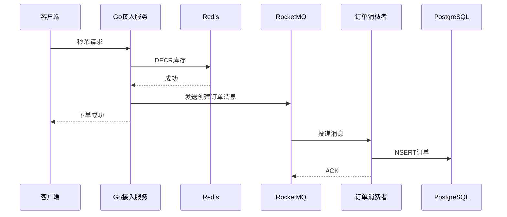
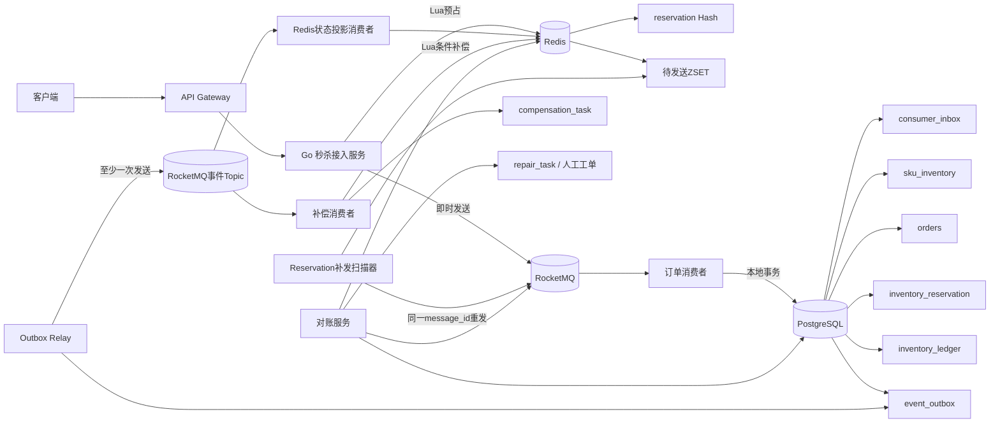
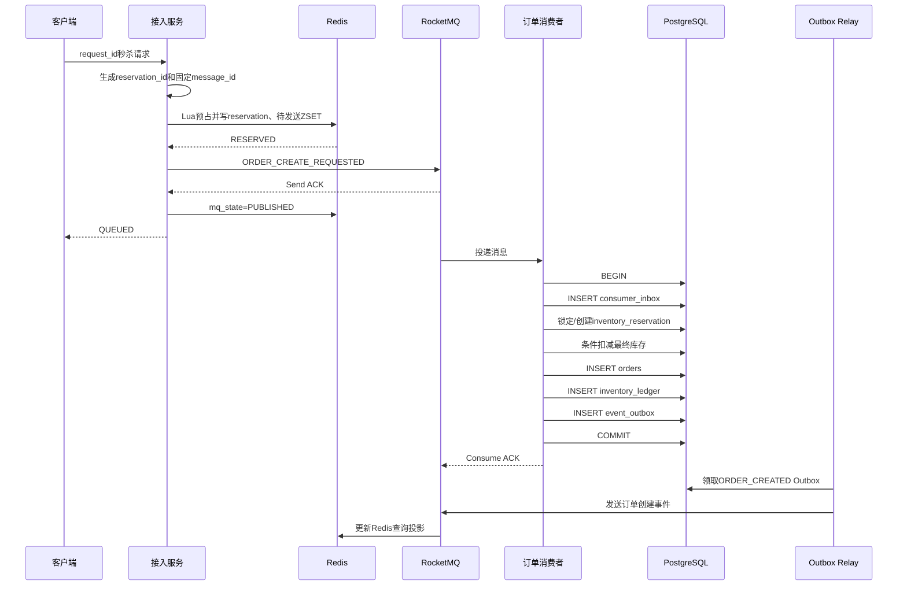
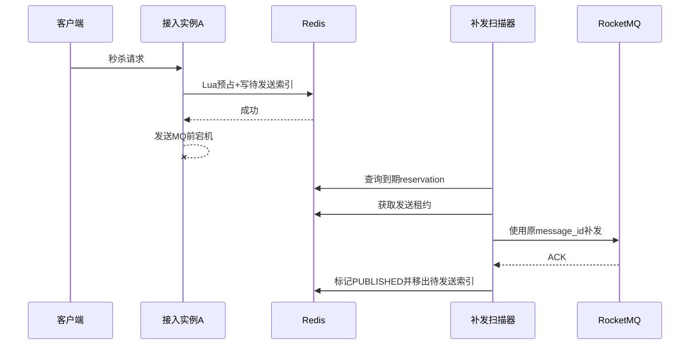
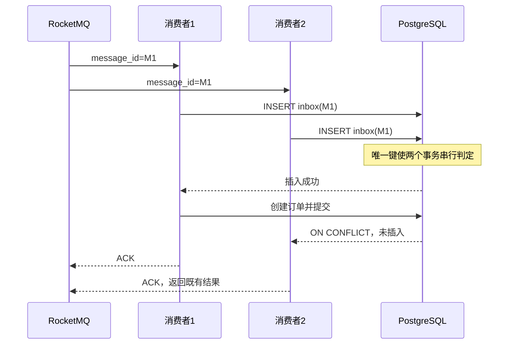
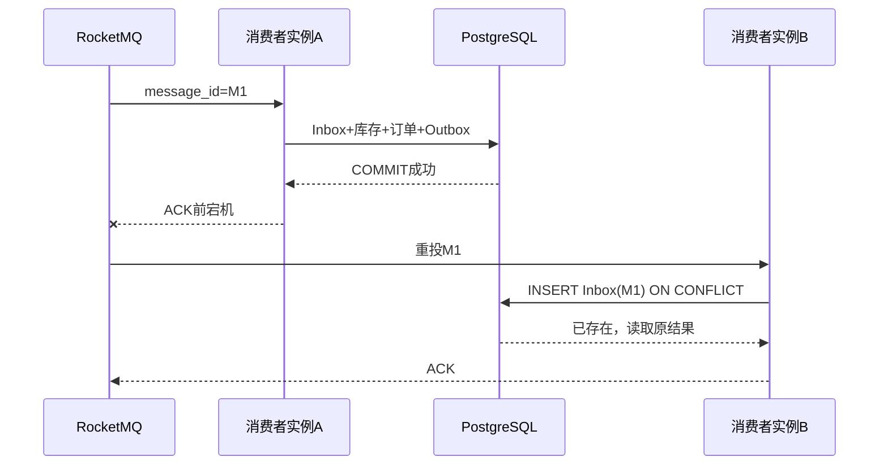
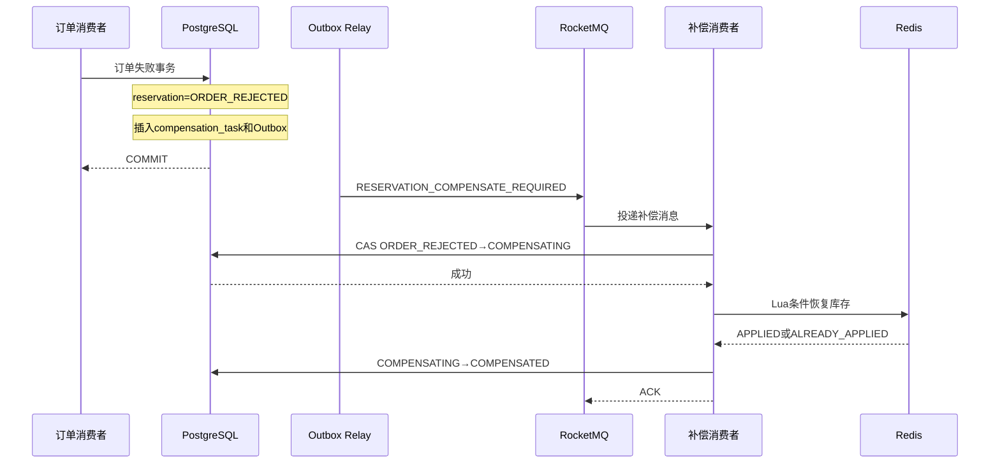
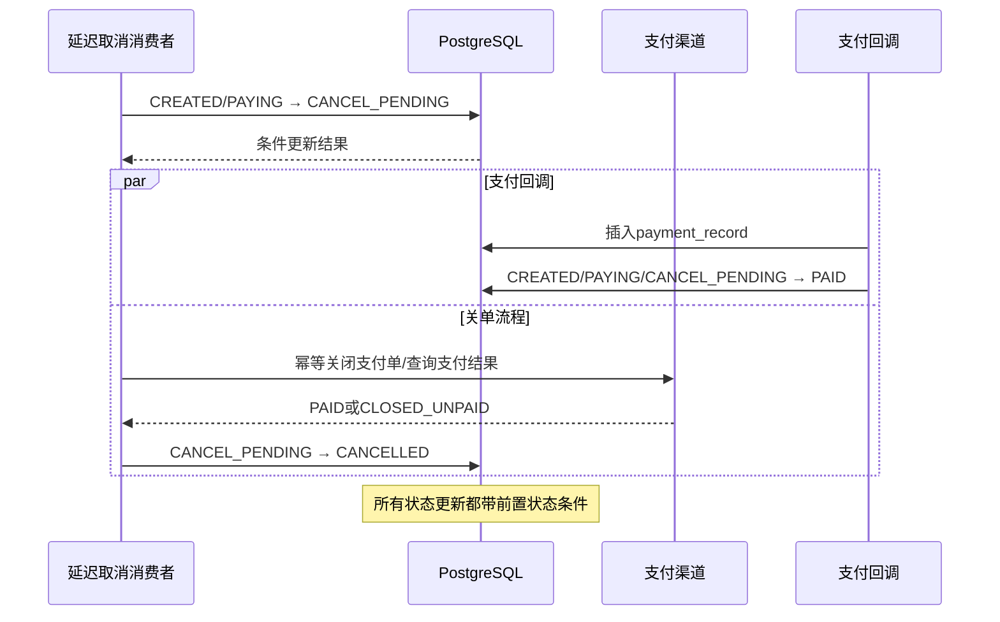
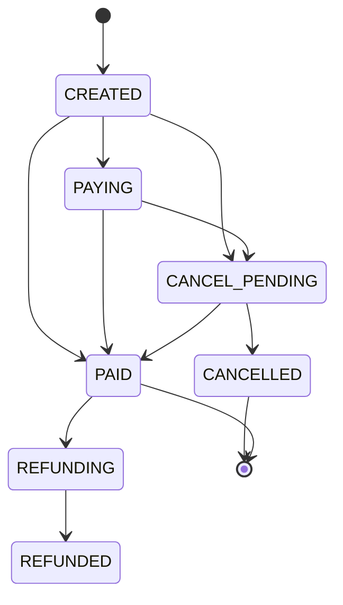
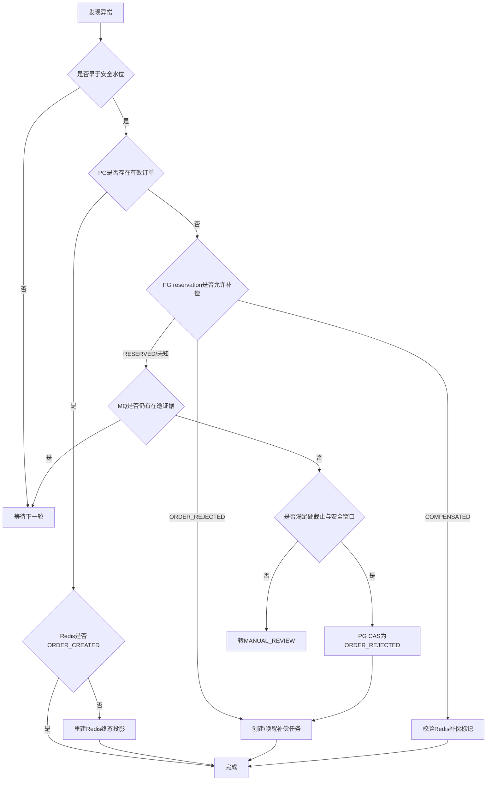

# 第 8 章：分布式一致性、幂等、补偿与对账

> **本章核心结论：**
>
> 本系统不追求也不宣称跨 Redis、RocketMQ、PostgreSQL 的天然端到端 Exactly Once。
> 推荐采用：
>
> **Redis reservation 原子预占与扫描补发 + RocketMQ At-Least-Once + PostgreSQL Inbox/唯一约束/条件更新 + Transactional Outbox + 持久化补偿任务 + 定期对账。**
>
> 最终目标不是“每个动作只执行一次”，而是：**动作可以重复执行，但业务效果只能成功发生一次。**

本章约定：

* PostgreSQL SQL 采用 PostgreSQL 15 以上通用语义，引用当前 PostgreSQL 18 文档。
* Go 数据库示例基于 `pgx/v5` 的抽象接口。
* RocketMQ Go SDK 在不同版本中 API 差异较大，因此 Producer、Consumer 适配层使用明确标注的伪代码。
* Redis Lua 假定所有相关 Key 位于同一 Cluster Hash Slot。
* 沿用全书统一标识：`activity_id`、`sku_id`、`user_id`、`request_id`、`reservation_id`、`message_id`、`order_id`、`payment_id`。

---

## 1. 本章目标

本章解决的不是某一个中间件的可靠性问题，而是以下跨组件问题：

1. Redis 已经扣减库存，但 RocketMQ 消息尚未可靠发送。
2. RocketMQ 可能重复投递、延迟投递或返回不确定的发送结果。
3. PostgreSQL 事务可能已经提交，但消费者没有成功 ACK。
4. 订单失败后需要补偿 Redis，而补偿本身也可能重复或中断。
5. Redis、RocketMQ、PostgreSQL 中的数据可能暂时不一致。
6. 支付回调和超时取消可能并发执行。
7. 自动补偿无法处理所有模糊状态，需要对账和人工修复。
8. 在故障恢复过程中仍然必须保持不超卖、不重复下单和库存守恒。

本章最终给出：

* 明确的一致性责任边界。
* 推荐主方案及选型理由。
* 20 类故障的完整处理矩阵。
* Inbox、Outbox、补偿任务的表结构与代码。
* Redis 补偿 Lua。
* 未知事务提交结果的处理方式。
* 支付与取消的并发控制。
* 库存守恒对账算法。
* 自动修复流程和人工 Runbook。

---

## 2. 业务背景

### 2.1 系统中存在四种不同的“成功”

秒杀链路中必须区分：

| 状态                | 含义                          | 是否代表用户最终获得商品 |
| ----------------- | --------------------------- | -----------: |
| Redis 预占成功        | Redis 可售库存减一，建立 reservation |            否 |
| MQ 发送成功           | Broker 接受订单创建请求             |            否 |
| PostgreSQL 订单创建成功 | 最终库存校验通过，订单落库               |           尚未 |
| 支付成功              | 支付记录落库，订单转为 `PAID`          |            是 |

因此，接入服务只能向用户返回：

```json
{
  "code": "QUEUED",
  "reservation_id": "019...",
  "message": "请求已受理，正在排队创建订单"
}
```

不能在 Redis Lua 返回成功后直接返回“下单成功”。

### 2.2 各组件的事实权威等级

| 业务事实           | 权威来源                      | 其他组件的定位                |
| -------------- | ------------------------- | ---------------------- |
| 活动总库存          | PostgreSQL                | Redis 是高性能准入缓存         |
| 最终有效订单         | PostgreSQL                | Redis 仅保存查询投影          |
| 支付结果           | PostgreSQL + 支付渠道凭证       | Redis 不能作为最终依据         |
| 短期 reservation | Redis                     | 终态需要在 PostgreSQL 留痕    |
| 消息是否已消费        | `consumer_inbox`          | Broker Offset 不能代替业务结果 |
| 下游事件是否应发送      | `event_outbox`            | Producer 返回值不是最终业务事实   |
| 是否允许补偿         | PostgreSQL reservation 状态 | Redis 当前状态只是辅助校验       |

### 2.3 一致性设计的五条决策规则

1. **成功的正向证据优先于超时。**
   发现订单或支付已成功时，不能因为某个超时任务到达就执行补偿或取消。

2. **未知不等于失败。**
   MQ 发送超时、数据库提交超时、Redis 更新超时，都不能直接推断操作失败。

3. **补偿必须建立在持久化业务决策之上。**
   不能仅因 Redis reservation 超时就直接 `INCR` 库存。

4. **所有重试必须复用相同业务幂等键。**
   不能每次重试重新生成 `message_id`、`reservation_id` 或补偿 ID。

5. **删除和 TTL 只能用于垃圾回收，不能代表业务状态迁移。**
   Key 消失不能被解释为“预约失败”或“可以重新下单”。

---

## 3. 核心问题

本章必须回答以下问题：

* Redis 扣减成功后进程宕机，如何重新生成并发送消息？
* MQ 发送超时后，应该重发还是认为成功？
* 消费者如何区分重复消息与新业务？
* PostgreSQL 提交成功但 ACK 失败，为什么不会重复扣库存？
* 数据库提交结果未知时，为什么不能立即补偿？
* 订单创建失败后，如何确保 Redis 库存只补一次？
* Redis reservation 已过期但消息随后到达，应该创建订单还是拒绝？
* Redis 主从切换丢失 reservation 时，如何收敛？
* 支付和超时取消同时发生时，谁应该获胜？
* 对账任务重复运行，如何避免重复修复？

---

## 4. 未优化的基线方案

最简单但不可靠的方案如下：



该方案通常还包含以下错误实现：

```go
stock, _ := redis.Get(ctx, stockKey).Int64()
if stock <= 0 {
    return ErrSoldOut
}

_ = redis.Decr(ctx, stockKey).Err()
_ = producer.Send(ctx, message)
return nil
```

消费者可能写成：

```go
func Consume(msg Message) error {
    var exists bool
    _ = db.QueryRow(
        context.Background(),
        `SELECT EXISTS(SELECT 1 FROM orders WHERE request_id = $1)`,
        msg.RequestID,
    ).Scan(&exists)

    if exists {
        return nil
    }

    _, err := db.Exec(context.Background(), `
        INSERT INTO orders (...) VALUES (...)
    `)
    return err
}
```

---

## 5. 基线方案的问题

| 维度    | 问题                                            |
| ----- | --------------------------------------------- |
| 正确性   | `GET` 后 `DECR` 存在竞态；重复消息可能创建重复订单；补偿可能重复增加库存   |
| 数据可靠性 | Redis 成功后、MQ 发送前宕机会永久丢失订单创建请求                 |
| 性能    | 每个请求使用分布式锁或同步写数据库会使热点 SKU 串行化                 |
| 并发    | 先查询后插入不能防止两个事务同时通过检查                          |
| 可用性   | MQ 或数据库短暂故障可能导致请求永久停留在未知状态                    |
| 可恢复性  | 没有 reservation、Inbox、Outbox 和修复任务，无法知道执行到了哪一步 |
| 可运维性  | 只能通过人工比较 Redis 数值和订单数量，无法定位单个异常请求             |
| 用户体验  | Redis 成功后直接返回下单成功，后续数据库失败将造成结果反转              |

RocketMQ 的发送重试无法消除结果不确定性。官方文档明确指出：发送重试可能在 Broker 中形成重复消息；最终重试仍失败时，调用方还需要自己的冗余恢复机制。([RocketMQ][1])

---

## 6. 推荐架构

### 6.1 推荐主方案

```text
Redis → RocketMQ：
    reservation + 待发送时间索引 + 固定 message_id
    + 接入服务即时发送
    + 扫描器租约补发

RocketMQ → PostgreSQL：
    At-Least-Once
    + consumer_inbox
    + 最终库存条件更新
    + 一人一单唯一约束
    + reservation 条件状态迁移

PostgreSQL → RocketMQ：
    本地事务写 event_outbox
    + Outbox Relay 租约领取
    + 固定 event_id
    + 下游 Inbox

订单失败 → Redis：
    PostgreSQL 持久化补偿决策
    + compensation_task
    + Redis Lua 条件补偿
    + 补偿幂等标记

全链路：
    定时对账
    + 自动修复
    + 模糊状态转人工
```

### 6.2 为什么不默认使用 RocketMQ 事务消息

RocketMQ 事务消息通过 Half Message、本地事务执行和事务状态回查，实现“本地事务结果与消息生产结果”的最终一致。它不保证下游消费结果与上游本地事务一致，下游仍然必须自行实现重试和幂等。([RocketMQ][2])

本系统的入口业务动作是 **Redis Lua 预占**，而不是 PostgreSQL 本地事务：

* Redis reservation 可能因为主从切换而丢失。
* 事务回查需要一个可靠、可重复查询的本地事务事实。
* Redis reservation 不是足够稳定的本地事务日志。
* 强行先写 PostgreSQL 再执行 Redis，会把数据库重新放回 30 万 QPS 热路径。

因此本书默认选择：

> **Redis reservation 扫描补发，而不是入口使用 RocketMQ 事务消息。**

RocketMQ 事务消息更适合：

* 本地业务事实已经在关系数据库事务中落库。
* Producer 可以根据本地事务表可靠返回 `COMMIT` 或 `ROLLBACK`。
* 业务接受异步最终一致。
* 团队能够维护事务回查服务。

### 6.3 方案职责矩阵

| 机制                   | 解决的问题                    | 不能解决的问题                 | 本方案是否使用 |
| -------------------- | ------------------------ | ----------------------- | ------: |
| Redis Lua            | 单个 Redis Slot 内原子预占、前置幂等 | 跨 Redis、MQ、PG 事务        |       是 |
| reservation 扫描补发     | Redis 成功后 MQ 未发送         | Redis 自身已丢失 reservation |       是 |
| RocketMQ 事务消息        | 本地事务与消息生产一致              | 下游消费幂等；Redis 状态丢失       |  入口默认不用 |
| Inbox                | 重复消费、提交后 ACK 失败          | 生产端消息缺失                 |       是 |
| Transactional Outbox | PG 事务与事件产生一致             | Redis 到 MQ 缺口           |       是 |
| 本地消息表                | 与 Outbox 基本同类            | 非数据库本地事务                |   不额外叠加 |
| Saga                 | 长事务补偿编排                  | 隔离性；补偿自身幂等              |  局部采用思想 |
| 定期对账                 | 检测遗漏和长期漂移                | 不能代替实时可靠链路              |       是 |
| 人工修复                 | 处理模糊或外部系统冲突              | 无法规模化处理正常流量             |    最后手段 |

### 6.4 推荐架构图



### 6.5 事务与故障边界

| 边界            | 原子范围                                 |
| ------------- | ------------------------------------ |
| Redis Lua     | 同一 Redis 节点、同一脚本内的 Key 更新            |
| RocketMQ Send | Broker 是否接受消息；调用方可能无法获知最终结果          |
| PostgreSQL 事务 | Inbox、库存、订单、流水、Outbox 一起提交或回滚        |
| Redis 补偿 Lua  | reservation 状态、补偿标记、库存恢复一起执行         |
| 支付事务          | payment_record、订单状态、库存状态、Outbox 一起提交 |

Redis Lua 在执行期间具有原子性，但脚本执行会阻塞该 Redis 服务线程，因此脚本必须保持固定复杂度，不能扫描大集合或执行长循环。([Redis][3])

---

## 7. 核心流程

## 7.1 正常流程



关键点：

* 用户收到 `QUEUED`，不是 `ORDER_CREATED`。
* `consumer_inbox` 和订单业务写入位于同一个事务。
* PostgreSQL 提交成功后才 ACK。
* Redis 状态更新失败不会回滚已创建订单，由 Outbox 事件重试修复。

---

## 7.2 Redis 预占后进程宕机

预占 Lua 必须在同一个脚本中完成：

1. 库存减一。
2. 建立 reservation。
3. 保存完整消息恢复字段。
4. 将 `reservation_id` 加入待发送 ZSET。
5. 保存 `request_id → reservation_id` 映射。



扫描器不能直接使用 `ZPOPMIN` 后再发送，因为：

* 元素被删除后扫描器可能宕机。
* 消息尚未发送，恢复入口已经丢失。

正确做法是：

* 原子领取任务。
* 将 ZSET Score 更新为租约到期时间。
* 发送成功后再删除。
* 进程宕机后租约自然过期，其他实例重新领取。

---

## 7.3 MQ 重复投递



RocketMQ 消费失败、消费超时或 ACK 丢失时可能重新投递；超过配置的最大重试次数后才进入 DLQ。DLQ 是等待业务恢复的隔离区，不是业务终态。([RocketMQ][4])

---

## 7.4 PostgreSQL 提交成功、ACK 前宕机



由于 Inbox 与订单在同一事务内：

* 事务未提交：Inbox 不存在，消息重试后重新处理。
* 事务已提交：Inbox 已存在，消息重试后不再执行库存和订单写入。

---

## 7.5 订单失败与库存补偿

补偿流程分为两个事务边界：

1. PostgreSQL 持久化“允许补偿”的决策。
2. Redis Lua 执行幂等库存恢复。



**不能采用：**

```text
reservation 超时
→ 直接 INCR Redis 库存
```

因为消息可能只是积压，订单可能已经提交或正在提交。

---

## 7.6 支付与超时取消竞态

推荐使用中间状态 `CANCEL_PENDING`，不要让延迟消息直接把订单从 `CREATED` 改成 `CANCELLED`。



状态迁移规则：



这里保证的是：

* PostgreSQL 中已经是 `PAID` 的订单不会被取消。
* 回调与取消由行级更新串行裁决。
* 如果外部支付实际成功、但回调晚于本地取消，则进入异常支付退款流程，不能伪造为未支付。

---

## 8. 数据结构

## 8.1 reservation 状态机

业务状态和 MQ 发送状态必须分开。

### 业务状态

| 状态               | 含义                  |
| ---------------- | ------------------- |
| `RESERVED`       | Redis 已预占，尚无订单终态    |
| `ORDER_CREATED`  | PostgreSQL 已创建订单    |
| `ORDER_REJECTED` | 数据库库存不足、重复订单或消息过期   |
| `COMPENSATING`   | 已持久化补偿决策，正在恢复 Redis |
| `COMPENSATED`    | Redis 库存已幂等恢复       |
| `CANCELLED`      | 订单取消且按业务规则释放库存      |
| `MANUAL_REVIEW`  | 无法安全自动判定            |

### MQ 状态

| 状态           | 含义                 |
| ------------ | ------------------ |
| `PENDING`    | 尚未确认发送             |
| `PUBLISHING` | 被扫描器租约领取           |
| `PUBLISHED`  | 至少一次发送得到成功响应       |
| `UNKNOWN`    | 发送调用超时，Broker 结果未知 |

`PUBLISHED` 不表示只存在一份消息；`UNKNOWN` 也不表示消息未发送。

---

## 8.2 Redis Key 设计

以下为逻辑 Key。若第 4 章启用了库存分桶，应将 Hash Tag 替换为：

```text
{activity_id:sku_id:bucket_id}
```

| Key                                            | 类型          | 主要内容                           | TTL         |
| ---------------------------------------------- | ----------- | ------------------------------ | ----------- |
| `seckill:{a:s}:stock`                          | String      | Redis 可售库存                     | 活动结束后保留对账窗口 |
| `seckill:{a:s}:reservation:{reservation_id}`   | Hash        | reservation 完整状态和恢复字段          | 终态后长 TTL    |
| `seckill:{a:s}:request:{user_id}:{request_id}` | String/Hash | request_id 对应结果                | 覆盖客户端最大重试窗口 |
| `seckill:{a:s}:user:{user_id}`                 | String      | 用户前置防重标记                       | 活动结束后保留     |
| `seckill:{a:s}:send_due`                       | ZSet        | 待发送 reservation，Score 为下次发送时间  | 不单独过期       |
| `seckill:{a:s}:comp:{reservation_id}`          | String      | 补偿幂等标记                         | 不早于活动归档     |
| `seckill:{a:s}:counter`                        | Hash        | available/open/committed 等守恒计数 | 活动归档后删除     |

reservation Hash 示例：

```text
status              RESERVED
mq_state             PENDING
activity_id          1001
sku_id               90001
user_id              80000001
request_id           019...
reservation_id       019...
message_id           019...
schema_version       1
reserved_at_ms       1782360000000
business_deadline_ms 1782360300000
send_attempts        0
last_error            ""
```

### TTL 原则

* `business_deadline` 是业务截止时间。
* TTL 是垃圾回收时间。
* 两者不能相等。
* 非终态 reservation 不应因 TTL 到期直接消失。
* 终态 Key 的 TTL 必须覆盖：

  * MQ 最大保留期。
  * 最大消息回放窗口。
  * 支付和退款窗口。
  * 对账与审计窗口。

---

## 8.3 RocketMQ 消息结构

```json
{
  "schema_version": 1,
  "event_type": "ORDER_CREATE_REQUESTED",
  "message_id": "019c8d22-7800-7a20-b125-36f04f69dc11",
  "message_key": "019c8d22-7700-72af-a910-a2a167416d6c",
  "request_id": "019c8d22-7600-7fa6-9307-6126afbc703b",
  "reservation_id": "019c8d22-7700-72af-a910-a2a167416d6c",
  "activity_id": 1001,
  "sku_id": 90001,
  "user_id": 80000001,
  "order_id": null,
  "reserved_at": "2026-06-25T09:00:00.123Z",
  "business_deadline": "2026-06-25T09:05:00Z",
  "retry_count": 0,
  "trace": {
    "trace_id": "4f86d448da3a4f61a25d12a171a0404b",
    "span_id": "90b29f2183c6fb98"
  }
}
```

设计要求：

* `message_id` 是业务生成的稳定 ID，不使用 Broker 自动生成 ID 作为业务幂等键。
* 重发时复用原 `message_id`。
* `message_key` 使用 `reservation_id`，便于查询和局部路由。
* `retry_count` 是传输元数据，不参与业务幂等判断。
* 同一个 `message_id` 对应的业务载荷必须不可变。
* Inbox 保存 `payload_hash`，检测“同 ID 不同内容”。

---

## 8.4 Go 结构体

```go
type OrderCreateRequested struct {
	SchemaVersion int        `json:"schema_version"`
	EventType     string     `json:"event_type"`
	MessageID     uuid.UUID  `json:"message_id"`
	MessageKey    string     `json:"message_key"`
	RequestID     uuid.UUID  `json:"request_id"`
	ReservationID uuid.UUID  `json:"reservation_id"`
	ActivityID    int64      `json:"activity_id"`
	SKUID         int64      `json:"sku_id"`
	UserID        int64      `json:"user_id"`
	OrderID       *uuid.UUID `json:"order_id,omitempty"`

	ReservedAt      time.Time `json:"reserved_at"`
	BusinessDeadline time.Time `json:"business_deadline"`
	RetryCount       int       `json:"retry_count"`
	Trace            TraceInfo `json:"trace"`
}

type TraceInfo struct {
	TraceID string `json:"trace_id"`
	SpanID  string `json:"span_id"`
}
```

---

## 8.5 PostgreSQL 核心表

以下只列出本章新增或重点使用的字段。

### consumer_inbox

```sql
CREATE TABLE consumer_inbox (
    consumer_group   text        NOT NULL,
    message_id       uuid        NOT NULL,
    topic            text        NOT NULL,
    event_type       text        NOT NULL,
    reservation_id   uuid,
    request_id       uuid,
    payload_hash     bytea       NOT NULL,
    result_code      text        NOT NULL,
    order_id         uuid,
    processed_at     timestamptz NOT NULL DEFAULT clock_timestamp(),
    created_at       timestamptz NOT NULL DEFAULT clock_timestamp(),

    PRIMARY KEY (consumer_group, message_id),
    CHECK (octet_length(payload_hash) = 32)
);
```

为什么主键包含 `consumer_group`：

* 同一条业务事件可能需要由多个不同业务消费者处理。
* 每个消费者组都应拥有独立的业务幂等记录。

### inventory_reservation

```sql
CREATE TABLE inventory_reservation (
    reservation_id   uuid        PRIMARY KEY,
    request_id       uuid        NOT NULL,
    activity_id      bigint      NOT NULL,
    sku_id           bigint      NOT NULL,
    user_id           bigint      NOT NULL,
    message_id       uuid        NOT NULL,
    order_id         uuid,
    status           varchar(32) NOT NULL,
    reason_code      varchar(64),
    version           bigint      NOT NULL DEFAULT 0,
    reserved_at      timestamptz NOT NULL,
    business_deadline timestamptz NOT NULL,
    created_at       timestamptz NOT NULL DEFAULT clock_timestamp(),
    updated_at       timestamptz NOT NULL DEFAULT clock_timestamp(),

    UNIQUE (message_id),
    UNIQUE (user_id, request_id),

    CHECK (status IN (
        'RESERVED',
        'ORDER_CREATED',
        'ORDER_REJECTED',
        'COMPENSATING',
        'COMPENSATED',
        'CANCELLED',
        'MANUAL_REVIEW'
    ))
);

CREATE INDEX idx_inventory_reservation_reconcile
    ON inventory_reservation (status, updated_at, reservation_id);
```

### event_outbox

```sql
CREATE TABLE event_outbox (
    event_id          uuid        PRIMARY KEY,
    aggregate_type    varchar(32) NOT NULL,
    aggregate_id      uuid        NOT NULL,
    event_type        varchar(64) NOT NULL,
    schema_version    integer     NOT NULL,
    message_key       text        NOT NULL,
    payload           jsonb       NOT NULL,

    status            varchar(16) NOT NULL DEFAULT 'PENDING',
    attempt_count     integer     NOT NULL DEFAULT 0,
    next_retry_at     timestamptz NOT NULL DEFAULT clock_timestamp(),
    lease_owner       text,
    lease_until       timestamptz,
    last_error        text,
    created_at        timestamptz NOT NULL DEFAULT clock_timestamp(),
    sent_at           timestamptz,

    CHECK (status IN ('PENDING', 'SENDING', 'RETRY', 'SENT', 'MANUAL'))
);

CREATE INDEX idx_event_outbox_dispatch
    ON event_outbox (next_retry_at, created_at)
    WHERE status IN ('PENDING', 'RETRY', 'SENDING');
```

### compensation_task

```sql
CREATE TABLE compensation_task (
    task_id           uuid        PRIMARY KEY,
    reservation_id    uuid        NOT NULL,
    compensation_type varchar(32) NOT NULL,
    idempotency_key   text        NOT NULL,
    status            varchar(16) NOT NULL DEFAULT 'PENDING',
    attempt_count     integer     NOT NULL DEFAULT 0,
    next_retry_at     timestamptz NOT NULL DEFAULT clock_timestamp(),
    lease_owner       text,
    lease_until       timestamptz,
    last_result       varchar(64),
    last_error        text,
    created_at        timestamptz NOT NULL DEFAULT clock_timestamp(),
    updated_at        timestamptz NOT NULL DEFAULT clock_timestamp(),

    UNIQUE (idempotency_key),
    CHECK (status IN (
        'PENDING',
        'CLAIMED',
        'RETRY',
        'APPLIED',
        'VERIFIED',
        'MANUAL'
    ))
);

CREATE INDEX idx_compensation_task_dispatch
    ON compensation_task (next_retry_at, created_at)
    WHERE status IN ('PENDING', 'RETRY', 'CLAIMED');
```

### 最终唯一约束

```sql
ALTER TABLE orders
    ADD CONSTRAINT uq_orders_activity_sku_user
    UNIQUE (activity_id, sku_id, user_id);

ALTER TABLE orders
    ADD CONSTRAINT uq_orders_reservation_id
    UNIQUE (reservation_id);
```

PostgreSQL 的唯一约束由唯一索引实现；在并发插入冲突键时，数据库会等待竞争事务结束后再判断冲突。`INSERT ... ON CONFLICT` 能原子选择插入或替代动作，是数据库最终幂等防线的重要组成部分。([PostgreSQL][5])

---

## 9. 核心代码

## 9.1 固定业务 ID

推荐在调用 Redis Lua 前生成：

```go
type BusinessIDs struct {
	RequestID     uuid.UUID
	ReservationID uuid.UUID
	MessageID     uuid.UUID
}
```

重复请求的规则：

1. 客户端重复使用同一 `request_id`。
2. Redis 存在 request 映射时，直接返回原 `reservation_id` 和结果。
3. Redis 映射丢失时，可按稳定算法重新计算 `reservation_id`。
4. 消息补发复用原 `message_id`。
5. 不允许补发任务重新生成随机消息 ID。

稳定 ID 可以由服务端使用带密钥的摘要生成：

```text
reservation_id = Truncate128(
    HMAC-SHA256(
        secret,
        activity_id | sku_id | user_id | request_id
    )
)

message_id = Truncate128(
    HMAC-SHA256(
        secret,
        "ORDER_CREATE_REQUESTED" | reservation_id | schema_version
    )
)
```

密钥轮换时必须保留历史版本号，否则同一请求可能生成不同 ID。

---

## 9.2 Inbox 插入

```sql
INSERT INTO consumer_inbox (
    consumer_group,
    message_id,
    topic,
    event_type,
    reservation_id,
    request_id,
    payload_hash,
    result_code
)
VALUES (
    $1, $2, $3, $4, $5, $6, $7, 'PROCESSING'
)
ON CONFLICT (consumer_group, message_id) DO NOTHING
RETURNING message_id;
```

返回结果：

| 结果          | 业务含义              |
| ----------- | ----------------- |
| 返回一行        | 当前事务获得该消息的处理权     |
| 返回零行        | 该消费者组已经处理过或正在并发处理 |
| 唯一冲突等待后返回零行 | 另一事务已经成功提交        |
| 另一事务回滚后插入成功 | 当前事务继续处理          |

对重复消息还应读取既有 `payload_hash`：

```sql
SELECT payload_hash, result_code, order_id
FROM consumer_inbox
WHERE consumer_group = $1
  AND message_id = $2;
```

如果同一个 `message_id` 对应不同 `payload_hash`：

* 不应返回幂等成功。
* 应停止处理。
* 进入 `MANUAL_REVIEW` 或隔离 Topic。
* 记录安全级告警。

---

## 9.3 创建订单本地事务

以下代码省略日志、指标和部分 Repository 实现，但保留关键事务语义。

```go
var (
	ErrRetryable       = errors.New("retryable database error")
	ErrPayloadConflict = errors.New("same message id with different payload")
	ErrCommitUnknown   = errors.New("transaction commit outcome unknown")
)

type ConsumeResult int

const (
	ConsumeACK ConsumeResult = iota
	ConsumeRetry
	ConsumeManual
)

type OrderConsumer struct {
	pool          *pgxpool.Pool
	consumerGroup string
}

func (c *OrderConsumer) Consume(
	parent context.Context,
	msg OrderCreateRequested,
	rawPayload []byte,
) (ConsumeResult, error) {
	ctx, cancel := context.WithTimeout(parent, 1500*time.Millisecond)
	defer cancel()

	payloadHash := sha256.Sum256(rawPayload)

	tx, err := c.pool.BeginTx(ctx, pgx.TxOptions{
		IsoLevel: pgx.ReadCommitted,
	})
	if err != nil {
		return ConsumeRetry, fmt.Errorf("begin transaction: %w", err)
	}

	committed := false
	defer func() {
		if !committed {
			_ = tx.Rollback(context.WithoutCancel(ctx))
		}
	}()

	owned, prior, err := insertInbox(
		ctx,
		tx,
		c.consumerGroup,
		msg,
		payloadHash[:],
	)
	if err != nil {
		return classifyDBError(err)
	}

	if !owned {
		if !bytes.Equal(prior.PayloadHash, payloadHash[:]) {
			return ConsumeManual, ErrPayloadConflict
		}

		// 既有事务已经完成业务处理。
		if err := tx.Rollback(ctx); err != nil &&
			!errors.Is(err, pgx.ErrTxClosed) {
			return ConsumeRetry, fmt.Errorf("rollback duplicate: %w", err)
		}
		return ConsumeACK, nil
	}

	if err := upsertAndLockReservation(ctx, tx, msg); err != nil {
		return classifyDBError(err)
	}

	reservation, err := loadReservationForUpdate(
		ctx,
		tx,
		msg.ReservationID,
	)
	if err != nil {
		return classifyDBError(err)
	}

	switch reservation.Status {
	case "ORDER_CREATED":
		if err := finishInboxAsSuccess(
			ctx, tx, c.consumerGroup, msg.MessageID, reservation.OrderID,
		); err != nil {
			return classifyDBError(err)
		}

	case "COMPENSATED", "CANCELLED":
		if err := finishInboxAsRejected(
			ctx, tx, c.consumerGroup, msg.MessageID, "LATE_AFTER_COMPENSATION",
		); err != nil {
			return classifyDBError(err)
		}

	default:
		if err := c.createOrderOrReject(ctx, tx, msg); err != nil {
			return classifyDBError(err)
		}
	}

	if err := tx.Commit(ctx); err != nil {
		// Commit 返回错误后，不能假定回滚。
		return c.resolveCommitOutcome(parent, msg, payloadHash[:], err)
	}

	committed = true
	return ConsumeACK, nil
}
```

### 最终库存条件扣减

```sql
UPDATE sku_inventory
SET available_stock = available_stock - 1,
    occupied_stock  = occupied_stock + 1,
    version         = version + 1,
    updated_at      = clock_timestamp()
WHERE activity_id = $1
  AND sku_id = $2
  AND available_stock > 0
RETURNING available_stock, occupied_stock, version;
```

* `affected rows = 1`：获得一个 PostgreSQL 最终库存名额。
* `affected rows = 0`：数据库库存已耗尽，或者库存记录不存在。
* 不能忽略受影响行数。
* 不能先读取库存，再无条件更新。

PostgreSQL 在 `Read Committed` 下会在并发更新后重新检查 `UPDATE` 的 `WHERE` 条件，因此 `available_stock > 0` 是并发正确性条件的一部分。([PostgreSQL][6])

### 创建订单

```sql
INSERT INTO orders (
    order_id,
    activity_id,
    sku_id,
    user_id,
    request_id,
    reservation_id,
    status,
    created_at,
    updated_at
)
VALUES (
    $1, $2, $3, $4, $5, $6,
    'CREATED',
    clock_timestamp(),
    clock_timestamp()
)
ON CONFLICT (activity_id, sku_id, user_id) DO NOTHING
RETURNING order_id;
```

如果最终库存扣减成功，但订单因一人一单唯一约束未插入，必须在**同一数据库事务**中恢复 PostgreSQL 库存：

```sql
UPDATE sku_inventory
SET available_stock = available_stock + 1,
    occupied_stock  = occupied_stock - 1,
    version         = version + 1,
    updated_at      = clock_timestamp()
WHERE activity_id = $1
  AND sku_id = $2
  AND occupied_stock > 0;
```

由于扣减与恢复位于同一个未提交事务，外部事务看不到中间库存变化。

### reservation 成功迁移

```sql
UPDATE inventory_reservation
SET status     = 'ORDER_CREATED',
    order_id   = $2,
    version    = version + 1,
    updated_at = clock_timestamp()
WHERE reservation_id = $1
  AND status = 'RESERVED';
```

`affected rows = 0` 可能表示：

* 已经是 `ORDER_CREATED`，属于幂等成功。
* 已经是 `COMPENSATING` 或 `COMPENSATED`，属于状态冲突。
* reservation 不存在，属于异常数据。

因此需要在零行时再次查询状态，而不是把所有零行都当作成功。

---

## 9.4 Outbox 写入

订单创建事务中：

```sql
INSERT INTO event_outbox (
    event_id,
    aggregate_type,
    aggregate_id,
    event_type,
    schema_version,
    message_key,
    payload
)
VALUES (
    $1,
    'ORDER',
    $2,
    'ORDER_CREATED',
    1,
    $2::text,
    $3::jsonb
)
ON CONFLICT (event_id) DO NOTHING;
```

订单失败事务中：

```sql
INSERT INTO compensation_task (
    task_id,
    reservation_id,
    compensation_type,
    idempotency_key
)
VALUES (
    $1,
    $2,
    'RELEASE_REDIS_RESERVATION',
    'RELEASE_REDIS_RESERVATION:' || $2::text
)
ON CONFLICT (idempotency_key) DO NOTHING;

INSERT INTO event_outbox (
    event_id,
    aggregate_type,
    aggregate_id,
    event_type,
    schema_version,
    message_key,
    payload
)
VALUES (
    $3,
    'RESERVATION',
    $2,
    'RESERVATION_COMPENSATE_REQUIRED',
    1,
    $2::text,
    $4::jsonb
)
ON CONFLICT (event_id) DO NOTHING;
```

---

## 9.5 Outbox 任务领取

不能在数据库事务内持有锁并执行较长的 MQ 网络调用。

推荐先使用短事务领取租约：

```sql
WITH candidates AS (
    SELECT event_id
    FROM event_outbox
    WHERE (
            status IN ('PENDING', 'RETRY')
            OR (
                status = 'SENDING'
                AND lease_until < clock_timestamp()
            )
          )
      AND next_retry_at <= clock_timestamp()
    ORDER BY next_retry_at, created_at
    FOR UPDATE SKIP LOCKED
    LIMIT $1
)
UPDATE event_outbox AS o
SET status        = 'SENDING',
    lease_owner   = $2,
    lease_until   = clock_timestamp() + $3::interval,
    attempt_count = attempt_count + 1
FROM candidates AS c
WHERE o.event_id = c.event_id
RETURNING o.*;
```

提交领取事务后，再发送 RocketMQ。

发送成功：

```sql
UPDATE event_outbox
SET status      = 'SENT',
    sent_at     = clock_timestamp(),
    lease_owner = NULL,
    lease_until = NULL,
    last_error  = NULL
WHERE event_id = $1
  AND status = 'SENDING'
  AND lease_owner = $2;
```

发送失败或结果未知：

```sql
UPDATE event_outbox
SET status        = 'RETRY',
    next_retry_at = clock_timestamp() + $3::interval,
    lease_owner   = NULL,
    lease_until   = NULL,
    last_error    = $4
WHERE event_id = $1
  AND status = 'SENDING'
  AND lease_owner = $2;
```

`SKIP LOCKED` 会跳过已经被其他事务锁定的行，因此适合多 Worker 领取队列任务；它会产生不完整视图，不适合普通一致性查询。([PostgreSQL][7])

---

## 9.6 Redis 条件补偿 Lua

### KEYS

```text
KEYS[1] reservation Hash
KEYS[2] Redis stock
KEYS[3] compensation marker
KEYS[4] stock counter Hash
```

### ARGV

```text
ARGV[1] reservation_id
ARGV[2] compensation_id
ARGV[3] now_ms
ARGV[4] terminal_ttl_ms
```

### 返回码

|  返回码 | 含义                       |
| ---: | ------------------------ |
|  `1` | 本次成功执行补偿                 |
|  `2` | 已经补偿，幂等成功                |
| `-1` | reservation 不存在，不允许盲目加库存 |
| `-2` | reservation_id 不匹配       |
| `-3` | reservation 已有订单，不允许补偿   |
| `-4` | reservation 状态不允许补偿      |
| `-5` | 补偿标记冲突，需人工检查             |

```lua
-- KEYS[1] reservation hash
-- KEYS[2] available stock
-- KEYS[3] compensation marker
-- KEYS[4] counters hash
--
-- ARGV[1] reservation_id
-- ARGV[2] compensation_id
-- ARGV[3] now_ms
-- ARGV[4] terminal_ttl_ms

local reservationExists = redis.call('EXISTS', KEYS[1])
if reservationExists == 0 then
    -- Key缺失可能是故障转移、错误TTL或已归档。
    -- 不能据此直接增加库存。
    return {-1, 'RESERVATION_MISSING'}
end

local storedReservationID =
    redis.call('HGET', KEYS[1], 'reservation_id')

if storedReservationID ~= ARGV[1] then
    return {-2, 'RESERVATION_ID_MISMATCH'}
end

local marker = redis.call('GET', KEYS[3])
if marker then
    if marker == ARGV[2] then
        return {2, 'ALREADY_COMPENSATED'}
    end

    -- 不同补偿ID针对同一reservation，说明调用方幂等键不稳定。
    return {-5, 'COMPENSATION_ID_CONFLICT'}
end

local status = redis.call('HGET', KEYS[1], 'status')

if status == 'COMPENSATED' then
    return {2, 'ALREADY_COMPENSATED'}
end

if status == 'ORDER_CREATED'
    or status == 'PAID'
    or status == 'CANCEL_PENDING' then
    return {-3, 'ORDER_ALREADY_EXISTS'}
end

if status ~= 'RESERVED'
    and status ~= 'ORDER_REJECTED'
    and status ~= 'COMPENSATING' then
    return {-4, 'INVALID_STATUS:' .. tostring(status)}
end

redis.call('INCRBY', KEYS[2], 1)

local openCount =
    tonumber(redis.call('HGET', KEYS[4], 'open_reserved') or '0')

if openCount > 0 then
    redis.call('HINCRBY', KEYS[4], 'open_reserved', -1)
end

redis.call(
    'HSET',
    KEYS[1],
    'status', 'COMPENSATED',
    'compensation_id', ARGV[2],
    'compensated_at_ms', ARGV[3]
)

redis.call('SET', KEYS[3], ARGV[2])
redis.call('PEXPIRE', KEYS[1], tonumber(ARGV[4]))
redis.call('PEXPIRE', KEYS[3], tonumber(ARGV[4]))

return {1, 'COMPENSATED'}
```

### 为什么 reservation 缺失时不能直接补偿

以下情况都会造成 reservation Key 不存在：

* Redis 主从切换丢失写入。
* Key 被错误 TTL 删除。
* 运维误删。
* 活动提前归档。
* 当前查询到了错误的 Cluster Slot。
* reservation 已经迁移为另一种存储结构。

此时直接 `INCR stock` 可能重复恢复库存。

正确处理：

1. 将补偿任务转为 `MANUAL` 或 `RECONCILE_REQUIRED`。
2. 查询 PostgreSQL 订单、reservation、库存流水。
3. 比较 Redis 聚合计数。
4. 通过活动级库存校准修复，而不是对单个缺失 Key 盲目加一。

---

## 9.7 补偿任务领取与恢复

### PostgreSQL CAS

```sql
UPDATE inventory_reservation
SET status     = 'COMPENSATING',
    version    = version + 1,
    updated_at = clock_timestamp()
WHERE reservation_id = $1
  AND status = 'ORDER_REJECTED'
RETURNING version;
```

只有返回一行，补偿 Worker 才获得执行资格。

任务领取：

```sql
UPDATE compensation_task
SET status        = 'CLAIMED',
    lease_owner   = $2,
    lease_until   = clock_timestamp() + interval '30 seconds',
    attempt_count = attempt_count + 1,
    updated_at    = clock_timestamp()
WHERE task_id = $1
  AND (
      status IN ('PENDING', 'RETRY')
      OR (
          status = 'CLAIMED'
          AND lease_until < clock_timestamp()
      )
  )
RETURNING *;
```

Lua 返回 `COMPENSATED` 或 `ALREADY_COMPENSATED` 后：

```sql
BEGIN;

UPDATE inventory_reservation
SET status     = 'COMPENSATED',
    version    = version + 1,
    updated_at = clock_timestamp()
WHERE reservation_id = $1
  AND status = 'COMPENSATING';

UPDATE compensation_task
SET status      = 'APPLIED',
    lease_owner = NULL,
    lease_until = NULL,
    last_result = $2,
    updated_at  = clock_timestamp()
WHERE task_id = $3
  AND lease_owner = $4;

COMMIT;
```

如果进程在 Lua 成功后、数据库更新前宕机：

* 任务租约过期。
* 新 Worker 再次执行 Lua。
* Lua 返回 `ALREADY_COMPENSATED`。
* Worker 将 PostgreSQL 状态更新为 `COMPENSATED`。
* Redis 库存不会增加两次。

---

## 9.8 数据库提交结果未知

### 为什么会出现未知结果

消费者向 PostgreSQL 发送 `COMMIT` 后：

1. PostgreSQL 可能已经持久化提交。
2. 网络连接随后断开。
3. 客户端没有收到成功响应。
4. 客户端无法仅根据错误判断提交还是回滚。

PostgreSQL 官方协议文档也说明：客户端断开时，后端可能在发现连接关闭前完成非查询语句，并使结果提交。([PostgreSQL][8])

### 错误做法

```go
if err := tx.Commit(ctx); err != nil {
    // 错误：立即补偿Redis
    compensateRedis()
    return err
}
```

如果事务实际已经提交，就会出现：

* PostgreSQL 已创建订单。
* Redis 库存却被恢复。
* 新用户再次预占。
* 最终由数据库拒绝，形成库存漂移和大量失败请求。

### 正确处理

使用新连接查询稳定业务键：

```sql
SELECT result_code, order_id, payload_hash
FROM consumer_inbox
WHERE consumer_group = $1
  AND message_id = $2;
```

决策表：

| 查询结果                   | 处理                     |
| ---------------------- | ---------------------- |
| Inbox 存在且 Hash 一致      | 事务已提交，返回 ACK           |
| Inbox 不存在，主库稳定且已超过确认窗口 | 重新投递或重试整个事务            |
| 主库正在故障转移，结果暂不可确认       | 保持 `UNKNOWN`，不 ACK、不补偿 |
| Inbox 存在但 Hash 不一致     | 转人工，禁止继续               |
| Inbox 存在但关联订单/流水不完整    | 严重事务不变量破坏，转人工          |

Go 处理框架：

```go
func (c *OrderConsumer) resolveCommitOutcome(
	ctx context.Context,
	msg OrderCreateRequested,
	payloadHash []byte,
	commitErr error,
) (ConsumeResult, error) {
	verifyCtx, cancel := context.WithTimeout(ctx, 3*time.Second)
	defer cancel()

	result, err := c.queryInboxFromPrimary(
		verifyCtx,
		c.consumerGroup,
		msg.MessageID,
	)
	if err == nil && result.Exists {
		if !bytes.Equal(result.PayloadHash, payloadHash) {
			return ConsumeManual, ErrPayloadConflict
		}
		return ConsumeACK, nil
	}

	if err == nil && !result.Exists {
		// 不做补偿。由MQ重投后使用同一message_id重新执行。
		return ConsumeRetry, fmt.Errorf(
			"%w: commit error=%v",
			ErrCommitUnknown,
			commitErr,
		)
	}

	return ConsumeRetry, fmt.Errorf(
		"%w: commit error=%v, verify error=%v",
		ErrCommitUnknown,
		commitErr,
		err,
	)
}
```

### PostgreSQL RPO 要求

如果 PostgreSQL 使用异步复制：

* 主库提交并返回成功。
* 消费者 ACK MQ。
* 主库宕机。
* 尚未复制的订单事务可能丢失。
* MQ 又认为该消息已处理。

对于要求订单 RPO 接近 0 的系统，应为订单事务配置同步复制，并使 `synchronous_commit=on` 等待同步备库持久化 WAL。`remote_apply` 还能等待备库回放可见，但会增加更高提交延迟。([PostgreSQL][9])

---

## 9.9 支付与取消 SQL

### 支付记录幂等

```sql
INSERT INTO payment_record (
    payment_id,
    order_id,
    provider,
    provider_transaction_id,
    amount,
    status,
    paid_at,
    created_at,
    updated_at
)
VALUES (
    $1, $2, $3, $4, $5,
    'SUCCESS',
    $6,
    clock_timestamp(),
    clock_timestamp()
)
ON CONFLICT (payment_id) DO NOTHING;
```

支付渠道交易号也应建立唯一约束：

```sql
CREATE UNIQUE INDEX uq_payment_provider_transaction
    ON payment_record (provider, provider_transaction_id);
```

### 支付状态迁移

```sql
UPDATE orders
SET status     = 'PAID',
    paid_at    = $2,
    version    = version + 1,
    updated_at = clock_timestamp()
WHERE order_id = $1
  AND status IN ('CREATED', 'PAYING', 'CANCEL_PENDING')
RETURNING order_id, status;
```

零行时再查询：

```sql
SELECT status, paid_at
FROM orders
WHERE order_id = $1;
```

分类：

| 当前状态                 | 支付回调结果            |
| -------------------- | ----------------- |
| `PAID`               | 幂等成功              |
| `CANCELLED`          | 支付后取消冲突，进入退款或人工流程 |
| `REFUNDING/REFUNDED` | 返回既有退款状态          |
| 不存在                  | 隔离回调并重试查询，不直接创建订单 |

### 进入取消待确认

```sql
UPDATE orders
SET status     = 'CANCEL_PENDING',
    version    = version + 1,
    updated_at = clock_timestamp()
WHERE order_id = $1
  AND status IN ('CREATED', 'PAYING')
  AND expires_at <= clock_timestamp()
RETURNING order_id, version;
```

### 最终取消

只有在支付渠道确认未支付或关单成功后：

```sql
UPDATE orders
SET status       = 'CANCELLED',
    cancelled_at = clock_timestamp(),
    version      = version + 1,
    updated_at   = clock_timestamp()
WHERE order_id = $1
  AND status = 'CANCEL_PENDING'
  AND NOT EXISTS (
      SELECT 1
      FROM payment_record p
      WHERE p.order_id = orders.order_id
        AND p.status = 'SUCCESS'
  )
RETURNING order_id;
```

订单取消、PostgreSQL 库存释放、库存流水和 Outbox 必须位于同一事务。

---

## 10. 优化设计与原理

## 10.1 固定业务 ID

**优化点：** reservation、消息、补偿和修复使用稳定幂等 ID。

**要解决的问题：**
网络重试或进程重启后，系统无法判断新操作是不是原操作。

**未经优化时会发生什么：**
每次重试生成新的 `message_id`，Inbox 无法识别重复消息。

**实现方式：**

* 第一次请求时生成并固化 ID。
* 重试时读取原 ID。
* Redis 数据丢失场景可通过稳定摘要重新计算。
* 同一消息 ID 的载荷必须不可变。

**底层原理：**
将“不可靠调用次数”映射到同一个“稳定业务操作”。

**预计收益：**

* 重复发送不会重复创建订单。
* 未知结果可以通过 ID 查询。
* 对账能够关联跨系统记录。

**代价和副作用：**

* ID 生成规则需要版本管理。
* 载荷变化必须创建新的事件版本和 ID。
* 需要防止客户端伪造跨用户 request_id。

**适用边界：**
适用于同一个业务意图可以被唯一标识的操作。

**监控指标：**

* `same_message_id_payload_conflict_total`
* `duplicate_message_total`
* `request_id_reuse_conflict_total`

**验证方法：**
并发重复发送同一 ID 一万次，断言只存在一条有效订单和一次最终库存扣减。

---

## 10.2 待发送 ZSET 与租约补发

**优化点：** 使用按时间排序的待发送索引，而不是全库扫描 reservation。

**要解决的问题：**
Redis 预占成功、进程发送 MQ 前宕机。

**未经优化时会发生什么：**

* reservation 永久停留。
* Redis 库存永久少一。
* 用户一直处于排队状态。

**实现方式：**

* Lua 原子写入 reservation 和 `send_due`。
* Score 保存下次尝试时间。
* 扫描器领取租约后更新 Score。
* 成功发送后删除，失败后按退避时间重排。

**底层原理：**
将隐式恢复需求转化为显式可重放任务。

**性能收益：**

* 查询复杂度从遍历全部 reservation 降为读取已到期项。
* 可按 SKU、库存桶分片。
* 扫描器可水平扩容。

**代价：**

* Redis 额外维护 ZSET。
* 需要处理租约和时钟偏差。
* Redis 整体丢失时该恢复索引也可能丢失。

**监控指标：**

* `reservation_send_due_size`
* `reservation_send_oldest_age_seconds`
* `reservation_send_attempts`
* `reservation_send_lease_expired_total`

---

## 10.3 Inbox 插入优先

**优化点：** 消费事务第一步尝试插入 Inbox。

**要解决的问题：**
重复消息进入昂贵的库存锁、订单写入和业务查询。

**实现方式：**

```text
Inbox插入
→ reservation检查
→ 最终库存
→ 订单
→ 流水
→ Outbox
```

**底层原理：**
用数据库唯一索引作为并发序列化点。

**预计收益：**

* 已完成消息快速返回。
* 避免重复库存竞争。
* 将幂等检查与业务事务绑定。

**代价：**

* 每条消息增加一行 Inbox。
* 增加 WAL 和索引写入。
* 需要分区和归档。

**适用边界：**
适用于业务结果写入同一个 PostgreSQL 实例或同一事务域。

---

## 10.4 Outbox 短事务租约

**优化点：** 数据库内只领取任务，不在事务中发送 MQ。

**要解决的问题：**
持锁执行网络调用导致锁等待和连接池耗尽。

**实现方式：**

1. `FOR UPDATE SKIP LOCKED` 领取一批任务。
2. 写入租约后立即提交。
3. 事务外发送。
4. 条件更新任务结果。

**预计收益：**

* 降低事务持续时间。
* 多 Worker 并行领取。
* 单 Worker 宕机后租约恢复。

**副作用：**

* MQ 发送成功、状态更新失败时会重复发送。
* 所以下游仍然必须有 Inbox。

---

## 10.5 持久化补偿决策

**优化点：** 先在 PostgreSQL 中决定“允许补偿”，再修改 Redis。

**要解决的问题：**
超时任务和订单创建消息并发执行。

**实现方式：**

```text
ORDER_REJECTED
→ COMPENSATING
→ 调用Redis Lua
→ COMPENSATED
```

订单创建路径只能：

```text
RESERVED
→ ORDER_CREATED
```

两条路径通过同一 reservation 行的条件更新竞争。

**底层原理：**
将跨系统竞争先收敛为单个 PostgreSQL 行上的状态机竞争。

**预计收益：**

* 已创建订单不会被补偿。
* 补偿服务宕机后可以继续。
* 补偿操作具有完整审计链路。

**代价：**

* 补偿延迟增加。
* PostgreSQL 增加任务和状态写入。
* Redis 缺失状态时仍需对账。

---

## 10.6 基于水位的对账

**优化点：** 只对早于安全水位的数据做终态判断。

**要解决的问题：**
对账任务将正常在途数据误判为异常。

**实现方式：**

```text
watermark =
    当前时间
    - 最大数据库事务时间
    - 最大Outbox延迟
    - 最大Redis投影延迟
    - 安全余量
```

例如：

```text
当前时间：09:10:00
安全余量：2分钟
对账水位：09:08:00
```

只处理 `updated_at < 09:08:00` 的异常数据。

**代价：**

* 异常发现存在延迟。
* 水位过大降低恢复速度。
* 水位过小容易误修复。

**监控指标：**

* `reconcile_watermark_lag_seconds`
* `reconcile_false_positive_total`
* `reconcile_anomaly_age_seconds`

---

## 11. 故障分析

## 11.1 完整故障矩阵

|  # | 故障                       | 立即风险                  | 处理方式                                    | 最终收敛依据                   |
| -: | ------------------------ | --------------------- | --------------------------------------- | ------------------------ |
|  1 | Redis 预占成功，发送 MQ 前进程宕机   | reservation 泄漏、订单请求丢失 | Lua 已写待发送 ZSET；租约扫描器使用原 `message_id` 补发 | Inbox + PostgreSQL 订单    |
|  2 | Redis 预占成功，MQ 发送失败       | 用户长期排队                | 标记 `PENDING/UNKNOWN`，有界重试；MQ 持续故障时入口熔断  | 补发成功或持久化补偿               |
|  3 | MQ 实际发送成功，Producer 收到超时  | 重发产生重复消息              | 使用相同 `message_id` 重发                    | consumer_inbox           |
|  4 | 相同消息重复投递                 | 重复扣 PG 库存、重复订单        | Inbox 唯一键先行                             | Inbox 原处理结果              |
|  5 | 消费者开始处理后宕机               | 事务可能回滚或结果未知           | 未提交则连接关闭回滚；消息重新投递                       | Inbox 是否存在               |
|  6 | PG 提交成功，ACK 前宕机          | MQ 重投                 | 重投后 Inbox 冲突，直接返回原结果                    | Inbox + order            |
|  7 | PG 提交结果未知                | 误重试或误补偿               | 新连接按 `message_id` 查询主库；未知期间不补偿          | Inbox、reservation、order  |
|  8 | PG 库存不足，但 Redis 已预占      | Redis 比 PG 少一         | reservation=`ORDER_REJECTED`，创建持久化补偿任务  | compensation_task + Lua  |
|  9 | 订单创建成功，Redis 状态更新失败      | 查询仍显示排队中              | Outbox 发送 `ORDER_CREATED` 投影事件；查询可回源 PG | PostgreSQL 订单            |
| 10 | 订单失败，补偿消息发送失败            | Redis 库存暂未恢复          | 补偿任务和 Outbox 已在 PG 事务落库；Relay 重试        | event_outbox             |
| 11 | 补偿消息重复投递                 | Redis 库存增加多次          | compensation 唯一键 + PG CAS + Lua Marker  | compensation_task        |
| 12 | 补偿过程中服务宕机                | PG 与 Redis 状态中间不一致    | 租约恢复；Lua 返回 `ALREADY_COMPENSATED`       | Redis Marker + PG 任务     |
| 13 | Redis 主从切换丢失 reservation | 无法按单条记录判断是否补偿         | 不盲目 INCR；查询 PG 并执行活动级库存对账               | PG 订单和库存流水               |
| 14 | RocketMQ 长时间积压           | reservation 看似过期      | 暂停基于时间的补偿；扩容消费者但受 PG 容量限制               | MQ 最老消息年龄                |
| 15 | reservation 过期后订单消息到达    | 可能在补偿后创建订单            | 过期不等于失败；检查 PG 持久化 tombstone             | inventory_reservation 状态 |
| 16 | 支付成功与超时取消并发              | 已支付订单被取消              | `CANCEL_PENDING` + 条件更新 + 支付渠道关单        | order/payment_record     |
| 17 | 支付回调重复                   | 重复改状态、重复发履约事件         | `payment_id` 和渠道交易号唯一；状态 CAS            | payment_record           |
| 18 | 延迟取消消息重复                 | 重复释放库存                | 订单状态 CAS；库存流水幂等键                        | order + inventory_ledger |
| 19 | Outbox 事件重复发送            | 下游重复执行                | event_id 固定；下游 Inbox                    | 下游 consumer_inbox        |
| 20 | 对账任务自身重复执行               | 重复补偿、重复修复             | `repair_id` 唯一；所有修复调用标准状态机              | repair_task + 业务终态       |

### Redis 故障转移的特殊风险

Redis 主从复制通常是异步的，主节点已经确认的写入仍可能在故障转移时丢失；`WAIT` 可以要求副本确认，但不能把 Redis 变为强一致 CP 系统，也不能彻底消除故障转移丢写窗口。([Redis][10])

因此：

* Redis 不能作为不超卖的最终防线。
* Redis 丢失 reservation 后不能依据 Key 缺失直接补偿。
* PostgreSQL 最终库存条件更新仍然不可省略。
* 对极端 Redis 丢写敏感的业务，需要在返回 `QUEUED` 前写入更持久的日志，但这会改变热路径架构。

---

## 11.2 reservation 已过期但消息随后到达

首先区分两种时间：

| 时间                  | 含义           |
| ------------------- | ------------ |
| 3 秒订单创建目标           | SLO，不是业务失效时间 |
| `business_deadline` | 明确的业务硬截止时间   |
| Redis TTL           | 垃圾回收时间       |

### 仅超过 SLO

消息仍应处理。不能因为订单创建超过 3 秒就直接补偿。

### 超过业务硬截止时间

必须先在 PostgreSQL 中建立终态：

```sql
UPDATE inventory_reservation
SET status      = 'ORDER_REJECTED',
    reason_code = 'BUSINESS_DEADLINE_EXCEEDED',
    version     = version + 1,
    updated_at  = clock_timestamp()
WHERE reservation_id = $1
  AND status = 'RESERVED'
RETURNING reservation_id;
```

随后才能创建补偿任务。

晚到消息处理时：

```sql
SELECT status
FROM inventory_reservation
WHERE reservation_id = $1
FOR UPDATE;
```

若为 `ORDER_REJECTED`、`COMPENSATING`、`COMPENSATED`：

* 不创建订单。
* Inbox 记录 `LATE_REJECTED`。
* ACK 消息。
* 不重复补偿。

若没有持久化拒绝终态：

* 不应仅因 Redis Key 已过期而拒绝。
* 继续按 PostgreSQL 最终库存处理，或者转人工判定。

---

## 11.3 RocketMQ 长时间积压

不能因为 MQ 积压就无限扩容消费者。

假设：

```text
PostgreSQL 稳定写能力：8,000 条订单事务/秒
当前消费者速度：6,000 条/秒
消息生产速度：5,000 条/秒
当前积压：1,800,000 条
```

可用于清理积压的净速度：

```text
6,000 - 5,000 = 1,000 条/秒
```

清空时间：

```text
1,800,000 / 1,000 = 1,800 秒 = 30 分钟
```

如果把消费者扩容到 15,000 条/秒，但 PostgreSQL 只能承受 8,000：

* 数据库连接池耗尽。
* 锁等待和 WAL 延迟上升。
* 单事务耗时变长。
* 实际吞吐可能下降。
* MQ 重试进一步放大流量。

正确治理顺序：

1. 接入层停止或降低新 reservation。
2. 测量 PostgreSQL 可持续写入能力。
3. 将消费者总并发限制在数据库容量以内。
4. 适当增加批量拉取，但不把多个热点库存操作盲目合并成大事务。
5. 延长非终态 reservation 的保留时间。
6. 暂停纯时间驱动的补偿。
7. 监控最老消息年龄，而不仅是消息条数。

---

## 11.4 Exactly Once 常见错误观点

| 错误观点                         | 为什么错误                        |
| ---------------------------- | ---------------------------- |
| MQ 保证 Exactly Once，所以业务不需要幂等 | Broker 无法控制数据库事务提交后消费者宕机     |
| 消费者 ACK 成功就代表业务绝对成功          | ACK 是消息系统状态，不是数据库业务不变量       |
| RocketMQ 事务消息能解决整个链路一致性      | 它不保证下游消费结果，且本系统入口本地动作是 Redis |
| 使用唯一索引就完成所有幂等                | 唯一索引不能自动恢复库存、Outbox 和补偿状态    |
| Redis Lua 能实现跨系统事务           | Lua 原子性仅覆盖 Redis 脚本内操作       |
| 消息发送失败就说明 Broker 没收到         | 超时可能发生在 Broker 接收后、响应到达前     |
| 数据库 Commit 返回错误就一定回滚         | 连接中断可能使客户端无法知道最终结果           |
| 补偿消息重复无所谓                    | 不做幂等会重复增加库存                  |
| Key 不存在就说明未处理                | Key 可能因故障切换、TTL 或误删而消失       |
| 定期对账可以替代可靠消息                 | 对账发现问题时业务影响已经发生，且模糊状态未必能自动判断 |

---

## 11.5 自动修复流程



自动修复只处理具有明确证据的情况：

| 异常                                |       是否自动修复 | 动作                |
| --------------------------------- | -----------: | ----------------- |
| PG 有订单，Redis 仍为排队中                |            是 | 重建 Redis 投影，不改库存  |
| PG 明确 `ORDER_REJECTED`，Redis 仍预占  |            是 | 标准补偿任务            |
| Outbox 为 `SENDING` 且租约过期          |            是 | 重新领取和发送           |
| compensation 已应用但 PG 状态未更新        |            是 | Lua 幂等确认后完成 PG 状态 |
| Redis reservation 缺失且 PG 无订单      | 否，通常不按单条自动加一 | 活动级库存对账或人工        |
| PG 为 `PAID`、Redis 为 `COMPENSATED` |            否 | 严重冲突，冻结并人工处理      |
| 支付渠道成功、PG 订单已取消                   |            否 | 退款或履约业务裁决         |

---

## 11.6 人工修复 Runbook

### 第一步：冻结自动动作

对目标对象设置：

```text
reservation.status = MANUAL_REVIEW
compensation_task.status = MANUAL
```

暂停：

* 补偿重试。
* 延迟取消。
* 自动 Redis 校准。
* 消息回放。

### 第二步：收集证据

至少查询：

```text
request_id
reservation_id
message_id
order_id
payment_id
```

数据源：

1. PostgreSQL 主库订单。
2. `inventory_reservation`。
3. `consumer_inbox`。
4. `inventory_ledger`。
5. `event_outbox`。
6. `compensation_task`。
7. Redis reservation 与补偿 Marker。
8. RocketMQ 消息查询和消费轨迹。
9. 支付渠道交易状态。
10. Trace 和结构化日志。

### 第三步：按权威顺序判定

```text
支付渠道凭证/支付记录
    >
PostgreSQL订单、库存流水
    >
Inbox、Outbox、补偿任务
    >
Redis状态
    >
MQ轨迹
    >
应用日志
```

MQ 中存在消息只能证明“可能发送过”，不能证明订单已成功。

### 第四步：生成幂等修复 ID

```text
repair_id =
    SHA256(
        rule_name |
        reservation_id |
        expected_source_version |
        target_state
    )
```

写入修复任务：

```sql
INSERT INTO repair_task (
    repair_id,
    object_type,
    object_id,
    rule_name,
    expected_version,
    target_state,
    operator,
    reason
)
VALUES (...)
ON CONFLICT (repair_id) DO NOTHING;
```

### 第五步：只调用标准业务状态机

禁止人工直接执行：

```sql
UPDATE sku_inventory SET available_stock = available_stock + 1;
```

应调用：

* 标准取消事务。
* 标准补偿任务。
* 标准 Redis 投影修复。
* 标准支付异常退款流程。

### 第六步：验证不变量

```sql
-- 不允许重复有效订单
SELECT activity_id, sku_id, user_id, count(*)
FROM orders
GROUP BY activity_id, sku_id, user_id
HAVING count(*) > 1;

-- PostgreSQL库存不得为负
SELECT *
FROM sku_inventory
WHERE available_stock < 0
   OR occupied_stock < 0
   OR sold_stock < 0;

-- 订单必须有唯一reservation
SELECT reservation_id, count(*)
FROM orders
GROUP BY reservation_id
HAVING count(*) > 1;
```

### 第七步：留下审计记录

必须记录：

* 修复前状态。
* 修复依据。
* 执行 SQL 或任务 ID。
* 修复后状态。
* 操作人。
* 审批人。
* 时间。
* 关联事故编号。

---

## 12. 可观测性

## 12.1 日志字段

所有相关日志必须包含：

```text
trace_id
request_id
reservation_id
message_id
order_id
payment_id
activity_id
sku_id
user_id
event_type
consumer_group
reservation_status
order_status
compensation_id
outbox_event_id
attempt_count
error_class
```

不要将这些高基数字段作为 Prometheus Label。

### 推荐日志事件

```text
reservation.created
reservation.mq_send_started
reservation.mq_send_unknown
reservation.mq_resend_claimed
order.consumer_duplicate
order.transaction_committed
order.commit_unknown
outbox.claimed
outbox.send_unknown
compensation.authorized
compensation.redis_applied
compensation.already_applied
compensation.redis_missing
reconcile.anomaly_detected
reconcile.repair_created
payment.cancel_race_detected
```

---

## 12.2 核心指标

### Redis 到 MQ

| 指标                                    | 含义                  |
| ------------------------------------- | ------------------- |
| `reservation_created_total`           | Redis 预占成功总数        |
| `reservation_send_pending`            | 待发送 reservation 数   |
| `reservation_send_oldest_age_seconds` | 最老待发送记录年龄           |
| `reservation_send_unknown_total`      | 发送结果未知次数            |
| `reservation_resend_total`            | 扫描补发次数              |
| `reservation_send_attempts_histogram` | 每条 reservation 发送次数 |

### MQ 到 PostgreSQL

| 指标                                 | 含义           |
| ---------------------------------- | ------------ |
| `order_consume_total{result}`      | 成功、重复、重试、人工  |
| `inbox_duplicate_total`            | Inbox 命中重复数  |
| `inbox_payload_conflict_total`     | 相同消息 ID 不同载荷 |
| `db_commit_unknown_total`          | Commit 结果未知  |
| `db_final_stock_reject_total`      | PG 最终库存拒绝    |
| `order_user_unique_conflict_total` | 一人一单冲突       |

### Outbox

```text
outbox_pending
outbox_oldest_age_seconds
outbox_send_total{result}
outbox_lease_expired_total
outbox_attempt_count
outbox_manual_total
```

### 补偿

```text
compensation_pending
compensation_oldest_age_seconds
compensation_total{result}
compensation_already_applied_total
compensation_redis_missing_total
compensation_state_conflict_total
```

### 对账

```text
inventory_pg_invariant_delta
inventory_redis_invariant_delta
inventory_cross_system_delta
reconcile_anomaly_total{type}
reconcile_auto_repair_total{type}
reconcile_manual_total{type}
reconcile_run_duration_seconds
```

---

## 12.3 告警阈值示例

| 告警                     |        Warning |     Critical |
| ---------------------- | -------------: | -----------: |
| 最老待发送 reservation      |          > 3 秒 |       > 15 秒 |
| 最老 Outbox              |          > 5 秒 |       > 30 秒 |
| MQ 最老订单消息              |          > 3 秒 |       > 30 秒 |
| Commit Unknown         |      1 分钟内 > 0 | 持续 5 分钟或快速增长 |
| Redis reservation 缺失补偿 |           任意出现 |      5 分钟内多条 |
| Inbox Payload 冲突       | 任意出现即 Critical |            — |
| 库存守恒偏差                 |         一轮对账非零 |       连续两轮非零 |
| 支付后取消冲突                |           任意出现 |            — |
| DLQ 新增                 |           任意新增 |         持续增长 |

阈值需要通过实际压测和活动规模校准，不能机械照抄。

---

## 13. 测试方法

## 13.1 单元测试

需要覆盖：

* message_id 稳定生成。
* 相同 request_id 返回同一 reservation。
* Inbox 重复消息判定。
* 相同消息 ID 不同 Payload 判定。
* reservation 条件状态迁移。
* 补偿 Lua 所有返回码。
* Outbox 指数退避。
* Commit Unknown 分类。
* 支付和取消状态机。

Lua 单测至少包含：

| 初始状态            | 操作    | 预期          |
| --------------- | ----- | ----------- |
| `RESERVED`      | 第一次补偿 | 库存 +1，返回 1  |
| `COMPENSATED`   | 重复补偿  | 库存不变，返回 2   |
| `ORDER_CREATED` | 补偿    | 拒绝，返回 -3    |
| Key 不存在         | 补偿    | 不增加库存，返回 -1 |
| 补偿 ID 不同        | 补偿    | 返回 -5       |
| `COMPENSATING`  | 重试补偿  | 成功或幂等成功     |

---

## 13.2 并发测试

### 重复订单测试

同时启动 1,000 个 goroutine，使用：

```text
相同 activity_id
相同 sku_id
相同 user_id
不同 request_id
```

正确性断言：

```text
有效订单数量 <= 1
PostgreSQL最终库存最多扣减1
多余Redis reservation最终全部补偿
```

### 重复消息测试

同一 `message_id` 并发投递 10,000 次：

```text
consumer_inbox = 1
orders = 1
inventory_ledger占用记录 = 1
event_outbox ORDER_CREATED = 1
```

### 重复补偿测试

同一 `compensation_id` 并发执行 10,000 次：

```text
Redis库存只增加1
compensation marker = 1
compensation_task最终状态 = APPLIED/VERIFIED
```

---

## 13.3 故障注入点

建议在测试版本中加入显式 Failpoint：

| Failpoint                         | 注入位置                        |
| --------------------------------- | --------------------------- |
| `after_redis_reserve`             | Lua 成功后、MQ Send 前           |
| `after_mq_send_before_redis_mark` | Broker ACK 后、标记 PUBLISHED 前 |
| `after_inbox_insert`              | Inbox 插入后                   |
| `after_pg_stock_decrement`        | PG 库存扣减后                    |
| `after_order_insert`              | 订单插入后                       |
| `after_pg_commit_before_ack`      | Commit 成功后、MQ ACK 前         |
| `during_commit_response`          | 模拟 Commit 响应丢失              |
| `after_compensation_lua`          | Redis 恢复后、PG 任务更新前          |
| `after_payment_record_insert`     | 支付事务中                       |
| `after_cancel_pending`            | 进入取消待确认后                    |

每个 Failpoint 都应重复执行数百至数千次，并在服务重启后验证最终收敛。

---

## 13.4 库存守恒断言

### PostgreSQL 内部守恒

假定库存字段为：

* `initial_stock`
* `available_stock`
* `occupied_stock`
* `sold_stock`

则：

```text
initial_stock
=
available_stock
+ occupied_stock
+ sold_stock
```

SQL：

```sql
SELECT
    activity_id,
    sku_id,
    initial_stock
      - available_stock
      - occupied_stock
      - sold_stock AS delta
FROM sku_inventory
WHERE initial_stock
      <> available_stock + occupied_stock + sold_stock;
```

### Redis 内部守恒

若 Redis 维护：

* `available`
* `open_reserved`
* `committed`

则：

```text
redis_initial
=
available
+ open_reserved
+ committed
```

状态迁移：

| 事件       | available | open_reserved | committed |
| -------- | --------: | ------------: | --------: |
| Redis 预占 |        -1 |            +1 |         0 |
| 订单创建投影   |         0 |            -1 |        +1 |
| 订单失败补偿   |        +1 |            -1 |         0 |
| 取消并重新可售  |        +1 |             0 |        -1 |

### 跨系统比较

在传播延迟消除后，应近似满足：

```text
Redis committed
=
PostgreSQL occupied_stock
+ PostgreSQL sold_stock
```

非零差异需要分类：

* Redis 投影落后。
* Outbox 积压。
* Redis 写丢失。
* 重复或遗漏补偿。
* 取消释放事件未处理。
* 对账水位过新。

---

## 13.5 对账算法伪代码

```text
function reconcile(activity_id, sku_id, watermark):

    pg_inventory = load_pg_inventory(activity_id, sku_id)

    assert pg_inventory.initial_stock
           == pg_inventory.available_stock
            + pg_inventory.occupied_stock
            + pg_inventory.sold_stock

    redis_counters = load_redis_counters(activity_id, sku_id)

    if redis_counters exist:
        redis_delta =
            redis_initial
            - redis_available
            - redis_open_reserved
            - redis_committed

        if redis_delta != 0:
            create_anomaly(
                type = REDIS_INTERNAL_INVARIANT_BROKEN,
                activity_id,
                sku_id,
                delta = redis_delta
            )

    reservations = load_pg_reservations_updated_before(
        activity_id,
        sku_id,
        watermark
    )

    for reservation in reservations:

        redis_state = load_redis_reservation(reservation.id)

        switch reservation.status:

        case ORDER_CREATED:
            if redis_state missing
               or redis_state.status != ORDER_CREATED:
                enqueue_idempotent_repair(
                    repair_id = hash(
                        "REBUILD_ORDER_PROJECTION",
                        reservation.id,
                        reservation.version
                    )
                )

        case ORDER_REJECTED:
            ensure_compensation_task_exists(reservation.id)

        case COMPENSATING:
            ensure_compensation_task_runnable(reservation.id)

        case COMPENSATED:
            if redis_state exists
               and redis_state.status != COMPENSATED:
                create_manual_anomaly()

    pending_redis_reservations =
        load_redis_pending_before(watermark)

    for redis_reservation in pending_redis_reservations:

        pg_state = load_pg_state(redis_reservation.id)

        if pg_state has order:
            enqueue_projection_repair()

        else if message_is_still_inflight(redis_reservation):
            continue

        else if hard_deadline_passed(redis_reservation):
            persist_timeout_rejection_with_cas()
            ensure_compensation_task_exists()

        else:
            leave_pending()

    verify_cross_system_counters()
```

`message_is_still_inflight` 只能作为延迟修复的依据，不能单独证明消息一定会被处理。

---

## 14. 方案边界

### 14.1 默认方案可以保证什么

在 PostgreSQL 最终库存和唯一约束正常工作的前提下：

* 不会创建超过 PostgreSQL 总库存的有效订单。
* 同一用户不会创建两个有效订单。
* 同一消息重复消费不会重复创建订单。
* 同一补偿任务重复执行不会重复恢复 Redis 库存。
* PostgreSQL 提交后 ACK 失败不会重复产生业务效果。
* Redis 状态更新失败能够由 Outbox 和对账修复。
* MQ、Redis、PostgreSQL 短暂故障后可以最终收敛。

### 14.2 默认方案不能无条件保证什么

#### Redis 已确认写入绝不丢失

Redis 异步复制下存在已确认写入丢失窗口。因此默认方案不能承诺：

> 用户收到 `QUEUED` 后，reservation 在任何 Redis 灾难下都绝不丢失。

若必须做到，应在返回 `QUEUED` 前写入一个具备明确持久性和复制保证的日志，例如：

* PostgreSQL 准入日志。
* 具备强持久化语义的消息日志。
* 业务可接受的同步复制存储。

代价是：

* 热路径延迟上升。
* PostgreSQL 或日志系统进入入口容量模型。
* 架构复杂度和成本增加。

#### 多地域多主强一致

本方案默认：

* PostgreSQL 最终库存存在单一写主或单一一致性域。
* 不支持两个地域同时独立修改同一 SKU 最终库存。
* 多地域 Active-Active 需要库存配额切分、全局一致数据库或更复杂的冲突处理。

#### 外部支付的绝对原子性

支付渠道是独立系统：

* 支付成功和本地回调之间可能有延迟。
* 关单与支付可能竞争。
* 仍需要支付主动查询、退款和支付对账。

---

## 15. 常见错误设计

### 15.1 Redis Key 超时就直接加库存

错误原因：

* MQ 可能只是积压。
* 订单可能正在提交。
* 订单可能已成功但 Redis 投影失败。
* 超时不是业务失败证明。

### 15.2 MQ Send 返回失败就生成新消息 ID 重发

错误原因：

* 原消息可能已被 Broker 接收。
* 新 ID 会绕过 Inbox。
* 最终可能产生两次业务处理。

### 15.3 消费者先查 Inbox，再在事务外创建订单

错误原因：

```text
查询未处理
→ 另一个消费者也查询未处理
→ 两者同时创建订单
```

Inbox 插入和业务写入必须位于同一个事务。

### 15.4 订单创建成功后直接更新 Redis，不写 Outbox

错误原因：

* PG Commit 后进程可能宕机。
* Redis 更新没有可靠恢复入口。
* 用户可能长期看到排队中。

### 15.5 在 PostgreSQL 事务中发送 MQ 或调用 Redis

错误原因：

* 网络调用延长事务。
* 增加行锁持有时间。
* 连接池容易耗尽。
* 外部调用失败也无法与数据库真正原子提交。

### 15.6 补偿只用 PostgreSQL 唯一任务，不做 Redis CAS

错误原因：

* Worker 可能在 Redis 成功后、PG 状态更新前宕机。
* 任务重新执行时仍会重复 `INCR`。

### 15.7 补偿只用 Redis Marker，不持久化业务决策

错误原因：

* 无法阻止订单创建和补偿并发竞争。
* Redis Marker 可能丢失。
* 缺少审计依据。

### 15.8 将 DLQ 当作终态

错误原因：

* DLQ 中的业务仍未完成。
* 长期不处理会导致库存泄漏和用户状态悬挂。
* DLQ 必须有监控、重放和人工处置流程。

### 15.9 Commit 返回错误后立即再次创建订单

错误原因：

* 原事务可能已经提交。
* 重试必须使用同一幂等键，并先查询 Inbox。

### 15.10 延迟消息到达后无条件取消订单

错误原因：

* 订单可能已经支付。
* 必须使用状态条件更新和支付渠道确认。

### 15.11 Redis 缺失 reservation 时盲目补偿

错误原因：

* 缺失不代表未补偿。
* 可能导致 Redis 库存超过合理上限。

### 15.12 对账直接修改业务表

错误原因：

* 绕过正常状态机。
* 无法保证幂等。
* 无法留下完整审计。
* 可能与在线业务并发冲突。

---

## 16. 面试追问

### 16.1 Redis 预占成功后、MQ 发送前宕机，怎么处理？

在 Redis Lua 中同时写 reservation 和待发送 ZSET。后台扫描器通过租约领取到期 reservation，并使用原 `message_id` 补发。不能只依赖接入进程内重试，因为进程状态会丢失。

---

### 16.2 为什么不直接使用 RocketMQ 事务消息？

RocketMQ 事务消息要求 Producer 能可靠查询本地事务结果。本系统入口本地动作是 Redis Lua，而 Redis 状态可能在故障转移中丢失，不能天然充当稳定本地事务日志。默认采用 reservation 扫描补发更符合热路径架构。即使使用事务消息，下游仍然需要 Inbox 和业务幂等。

---

### 16.3 MQ 发送超时，应该重发吗？

应该使用相同业务 `message_id` 有界重发。超时表示结果未知，不表示 Broker 未收到。重复消息由消费者 Inbox 消除。不能重新生成消息 ID。

---

### 16.4 Inbox 为什么必须和订单写入同一个事务？

如果 Inbox 先单独提交，随后订单失败，重投消息会被误认为已经处理；如果订单先提交、Inbox 后写失败，重投会重复处理。二者必须一起提交或回滚。

---

### 16.5 只有订单唯一索引，为什么还需要 Inbox？

订单唯一索引只能防止重复订单，不能避免：

* 重复执行库存扣减。
* 重复写库存流水。
* 重复创建 Outbox。
* 重复执行其他非订单副作用。
* 同一个消息 ID 被篡改为不同载荷。

Inbox 提供消息级处理结果，订单唯一约束提供业务不变量，两者职责不同。

---

### 16.6 消费者提交数据库成功但 ACK 前宕机，会怎样？

RocketMQ 会重新投递。新消费者插入同一 `message_id` 的 Inbox 时命中唯一冲突，读取原处理结果并 ACK，不再重复扣库存或创建订单。

---

### 16.7 数据库 Commit 返回网络错误，能否认为事务失败？

不能。PostgreSQL 可能已经提交，只是响应丢失。应使用新连接按 `message_id`、`reservation_id` 查询权威主库。在结果未知期间不能补偿。

---

### 16.8 Redis 已经防止一人一单，为什么数据库还要唯一约束？

Redis 可能：

* 故障转移丢写。
* Key 过期。
* 被误删。
* 出现客户端路由错误。
* 在恢复期间状态不完整。

数据库唯一约束是最终防线，Redis 只是减少无效数据库请求。

---

### 16.9 PostgreSQL 最终库存不足，但 Redis 已预占，如何处理？

订单事务把 reservation 更新为 `ORDER_REJECTED`，同时写入补偿任务和 Outbox。补偿 Worker 先通过 PostgreSQL CAS 获得补偿资格，再使用 Redis Lua 恢复库存。

---

### 16.10 如何保证补偿只执行一次？

需要两层：

1. PostgreSQL `compensation_task.idempotency_key` 唯一，并通过状态 CAS 领取。
2. Redis Lua 原子检查补偿 Marker、reservation 状态，并同时恢复库存和写 Marker。

任一层单独使用都不足以覆盖全部故障窗口。

---

### 16.11 Redis 补偿成功后服务宕机怎么办？

PostgreSQL 任务仍为 `CLAIMED` 或 `COMPENSATING`。租约过期后其他 Worker 重试。Lua 检测补偿 Marker，返回 `ALREADY_COMPENSATED`，新 Worker 再把 PostgreSQL 状态更新为完成。

---

### 16.12 Redis reservation 丢失了，为什么不能直接补库存？

因为 reservation 丢失可能发生在补偿已经执行之后。如果直接补库存会重复增加。应先查询 PostgreSQL 订单、reservation 和库存流水，再通过活动级守恒关系校准。

---

### 16.13 reservation 超时后消息才到达，是否应该拒绝？

不能仅根据 SLO 超时或 Redis TTL 拒绝。若业务确实存在硬截止时间，必须先在 PostgreSQL 写入 `ORDER_REJECTED` 或 `COMPENSATED` 终态。晚到消息再根据该持久化终态拒绝。

---

### 16.14 Outbox 为什么仍然可能重复发送？

MQ 发送成功后，Relay 可能在更新 Outbox 为 `SENT` 之前宕机。租约恢复后会再次发送。因此 Outbox 提供的是 At-Least-Once，不是天然 Exactly Once，下游仍需 Inbox。

---

### 16.15 支付回调和取消消息同时到达，如何保证已支付订单不被取消？

订单状态使用条件更新，并引入 `CANCEL_PENDING`：

* 支付可以将 `CREATED/PAYING/CANCEL_PENDING` 更新为 `PAID`。
* 最终取消只能将 `CANCEL_PENDING` 更新为 `CANCELLED`，且必须不存在成功支付记录。
* 对支付渠道的查询或关单在数据库事务外执行。
* 已经是 `PAID` 时取消更新受影响行数为零。

---

### 16.16 为什么不能无限重试补偿？

永久错误不会因重试而恢复，例如：

* reservation ID 冲突。
* 同消息 ID 不同载荷。
* 已支付订单却收到补偿。
* Redis Key 丢失且无法判断库存效果。

无限重试会造成资源浪费和告警噪声。达到重试上限后应转 `MANUAL`，但不能静默丢弃。

---

### 16.17 对账为什么不能只比较 Redis 库存和订单数量？

因为系统中还存在：

* 在途 reservation。
* MQ 积压。
* 已创建未支付订单。
* 已支付订单。
* 取消待释放库存。
* 已补偿但投影未更新的记录。

必须基于状态机和库存守恒公式分类比较，不能只做两个数字相减。

---

### 16.18 这套方案是不是 Exactly Once？

不是传输层端到端 Exactly Once。

它采用：

* 消息至少一次投递。
* 稳定业务 ID。
* Inbox。
* 唯一约束。
* 条件状态更新。
* Outbox。
* 补偿幂等。
* 对账。

最终实现的是：

> **同一业务意图可能被执行多次，但其有效业务效果只能成功落地一次。**

---

## 17. 本章总结

本章的关键结论如下：

1. **Redis 预占不是订单成功，只是临时准入。**
2. **Redis 到 MQ 的缺口通过 reservation、待发送索引和扫描补发恢复。**
3. **MQ 的发送超时和数据库 Commit 错误都属于结果未知，不能直接当作失败。**
4. **消息重发必须复用相同 `message_id`。**
5. **MQ 到 PostgreSQL 使用 Inbox、最终库存条件更新和唯一约束。**
6. **Inbox、订单、库存、流水和 Outbox 必须位于同一个 PostgreSQL 事务。**
7. **PG Commit 成功后、ACK 前宕机依靠 Inbox 消除重复业务效果。**
8. **PostgreSQL 到 MQ 使用 Transactional Outbox，但下游仍然必须幂等。**
9. **补偿必须先持久化业务决策，再通过 Redis Lua 条件执行。**
10. **Redis reservation 缺失时不能盲目增加库存。**
11. **3 秒创建目标是 SLO，不是 reservation 的自动失效条件。**
12. **支付和取消必须通过条件状态迁移及支付渠道确认解决竞态。**
13. **对账是最后安全网，不能替代实时可靠链路。**
14. **系统不宣称端到端 Exactly Once，而是保证业务效果仅发生一次。**

## 下一章：第 9 章——系统高可用、容灾、降级与可观测性

[1]: https://rocketmq.apache.org/docs/featureBehavior/05sendretrypolicy/ "Sending Retry and Throttling Policy | RocketMQ"
[2]: https://rocketmq.apache.org/docs/featureBehavior/04transactionmessage/ "Transaction Message | RocketMQ"
[3]: https://redis.io/docs/latest/develop/programmability/eval-intro/ "Scripting with Lua | Docs"
[4]: https://rocketmq.apache.org/docs/featureBehavior/10consumerretrypolicy/ "Consumption Retry | RocketMQ"
[5]: https://www.postgresql.org/docs/current/index-unique-checks.html "Documentation: 18: 63.5. Index Uniqueness Checks"
[6]: https://www.postgresql.org/docs/current/transaction-iso.html "PostgreSQL: Documentation: 18: 13.2. Transaction Isolation"
[7]: https://www.postgresql.org/docs/current/sql-select.html "PostgreSQL: Documentation: 18: SELECT"
[8]: https://www.postgresql.org/docs/current/protocol-flow.html "PostgreSQL: Documentation: 18: 54.2. Message Flow"
[9]: https://www.postgresql.org/docs/current/runtime-config-wal.html "PostgreSQL: Documentation: 18: 19.5. Write Ahead Log"
[10]: https://redis.io/docs/latest/operate/oss_and_stack/management/replication/ "Redis replication | Docs"
