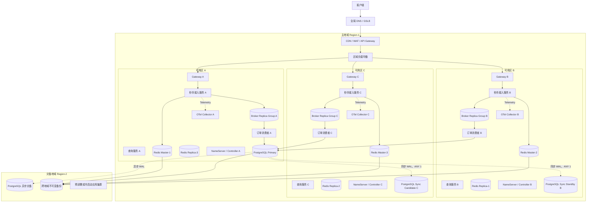
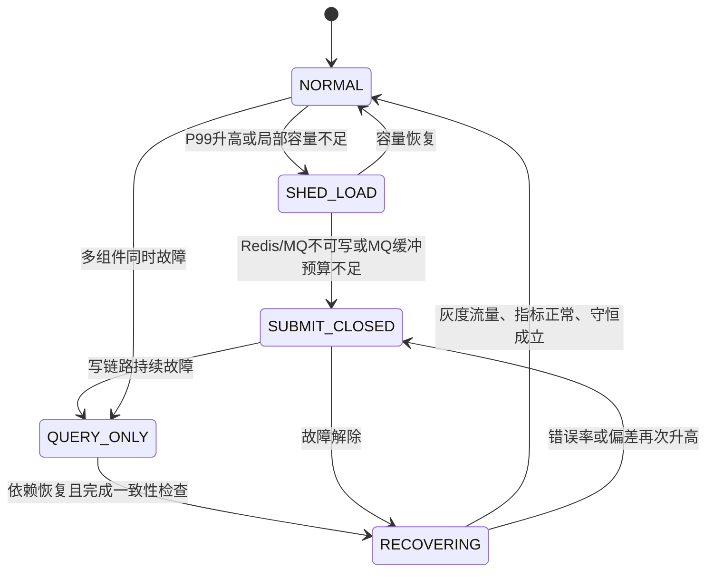
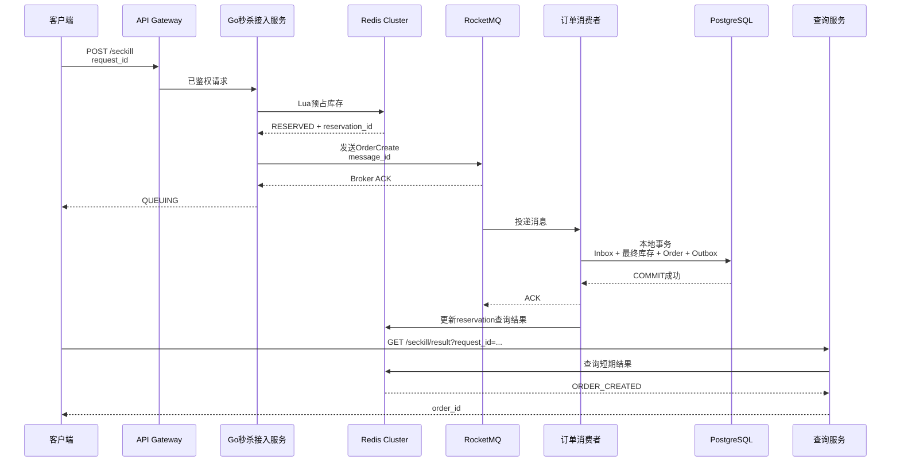
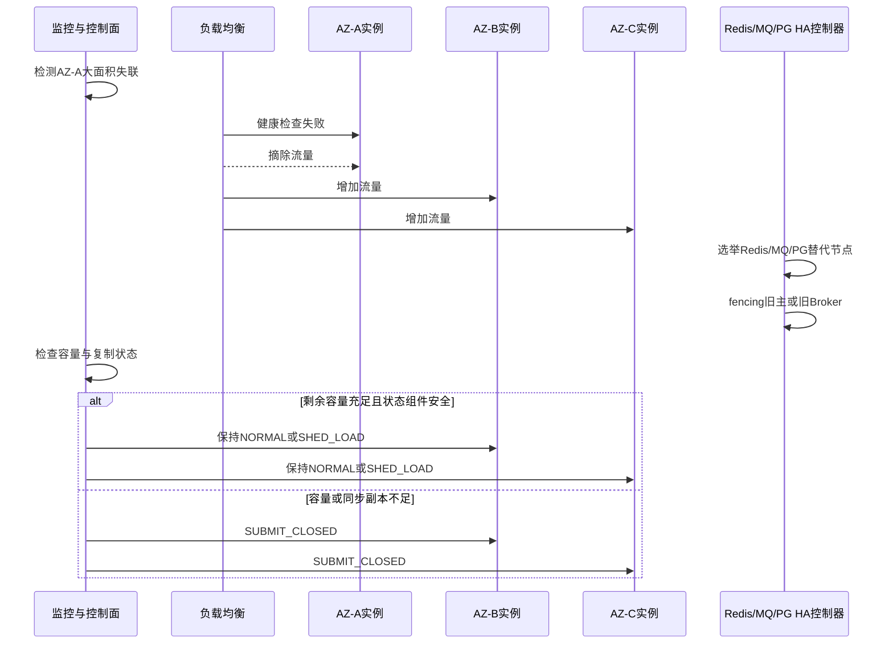

# 第 9 章：系统高可用、容灾、降级与可观测性

> **本章核心结论：高可用不是“任何故障都继续接单”，而是在发生故障时，优先保持库存、订单和支付正确，再通过限流、降级、消息缓冲和自动恢复缩小业务影响。**
>
> 对秒杀写链路而言，Redis、RocketMQ 或关键一致性条件失效时，应当优先 **Fail Closed**；对日志、Trace、推荐信息等非关键能力，可以 **Fail Open**。
> **未知状态必须作为一种明确业务状态处理，不能被解释为失败，更不能据此重新扣库存、重新下单或释放库存。**

---

## 1. 本章目标

本章解决以下问题：

1. 如何把 Go 服务、Redis、RocketMQ、PostgreSQL 部署到三个可用区，并在单实例或单可用区故障后继续提供服务。
2. 如何为不同组件定义合理的 RTO 和 RPO，而不是笼统地宣称“高可用”。
3. Redis、RocketMQ、PostgreSQL 自动故障转移时，如何避免数据丢失、脑裂和重试风暴。
4. 网络分区、DNS 异常、连接失效后，客户端如何重建连接。
5. 如何设计超时、重试、熔断、隔离、限流和降级。
6. Redis、RocketMQ、PostgreSQL 分别不可用时，系统是否继续接收秒杀。
7. PostgreSQL 长时间故障时，如何控制 RocketMQ 积压。
8. 查询服务异常时，为什么不能允许客户端使用新 `request_id` 重新下单。
9. 支付状态未知时，为什么不能直接取消订单或释放库存。
10. 如何建立覆盖接口、Redis、RocketMQ、PostgreSQL、Go 和业务正确性的指标体系。
11. 如何执行备份恢复、跨地域灾难恢复和故障演练。
12. 如何编写可执行的故障恢复 Runbook。

### 1.1 版本与部署假设

本章示例基于以下版本语义：

* Go 1.26.x；截至 2026 年 6 月，官方发布页列出的稳定版本为 Go 1.26.4。([Go][1])
* PostgreSQL 18。
* Redis 8.x。
* Apache RocketMQ 5.x，采用 Controller 自动主从切换模式。
* Kubernetes 风格的容器编排环境；若实际使用虚拟机、Nomad 或裸机，应保留相同的故障域、探针、流量摘除和优雅停机语义。

本章新增的运维控制结构不会改变前文已经定义的：

* `activity_id`
* `sku_id`
* `user_id`
* `request_id`
* `reservation_id`
* `message_id`
* `order_id`
* `payment_id`

---

## 2. 业务背景

秒杀主链路为：

```text
客户端
→ CDN / WAF
→ API Gateway
→ Go 秒杀接入服务
→ Redis Lua 库存预占
→ RocketMQ
→ Go 订单消费者
→ PostgreSQL 创建订单
→ Redis 更新查询结果
→ 客户端查询最终状态
```

不同故障对系统的影响并不相同：

| 故障             | 主要影响             | 是否可能影响正确性 |
| -------------- | ---------------- | --------: |
| 单个 Go 实例宕机     | 部分连接中断           |      通常不会 |
| 单个可用区故障        | 约三分之一实例和部分状态节点失效 |   取决于副本布局 |
| Redis 不可用      | 无法执行库存预占和前置幂等    |         是 |
| RocketMQ 不可用   | 预占结果无法可靠进入订单链路   |         是 |
| PostgreSQL 不可用 | 无法完成最终库存扣减和订单落库  |         是 |
| 查询服务不可用        | 用户暂时看不到结果        |      通常不会 |
| 支付渠道超时         | 支付结果不确定          |         是 |
| Trace 平台不可用    | 排障能力下降           |         否 |
| DNS 异常         | 新连接无法解析依赖地址      |      间接影响 |

因此，不能对所有故障使用同一种策略。

本章将系统能力划分为三层：

1. **正确性层**：最终库存、一人一单、订单状态、支付状态、补偿幂等。
2. **处理层**：Redis 预占、MQ 异步处理、订单消费者、查询结果刷新。
3. **体验层**：页面查询、通知、日志、Trace、运营看板。

故障时必须按这个顺序保护。

---

## 3. 核心问题

### 3.1 可用性与正确性冲突

例如 Redis 故障时，继续绕过 Redis 直接创建订单，表面上提高了接口可用率，却可能使 30 万 QPS 直接冲击 PostgreSQL，并绕过前置库存和幂等控制。

这种“可用”会导致：

* 数据库雪崩。
* 重复订单。
* 锁竞争失控。
* 请求大量超时。
* 故障扩大。

**正确决策不是继续接单，而是快速、明确地拒绝新秒杀请求。**

### 3.2 自动故障转移与脑裂

自动故障转移必须同时解决：

* 谁判断主节点失效。
* 谁选择新主节点。
* 旧主节点恢复后如何禁止继续写。
* 客户端如何发现新主节点。
* 已建立的旧连接如何失效。
* 切换期间未知提交结果如何处理。

只实现“提升从库”而没有 fencing，会产生双主写入。

### 3.3 重试与故障放大

当某依赖变慢时，如果每个请求重试三次：

```text
原始流量 300,000 QPS
× 最多 3 次尝试
≈ 900,000 次依赖调用/秒
```

这会把一个局部故障放大为重试风暴。

### 3.4 MQ 不是无限缓冲区

PostgreSQL 短暂不可用时，可以依靠 MQ 缓冲；但 PostgreSQL 长时间不可用时，继续生产消息会带来：

* Consumer Lag 持续增长。
* 最老消息年龄突破订单 SLA。
* Broker 磁盘使用率升高。
* 消息保留期内无法清空。
* 恢复后数据库被积压流量再次击穿。

因此必须定义“允许缓冲多久”和“何时关闭新增预占”。

---

## 4. 未优化的基线方案

一个常见但不可靠的初始部署如下：

* Go 接入服务只部署 3 个实例。
* 3 个实例恰好位于同一个可用区。
* Redis 使用一个主节点和一个同可用区从节点。
* RocketMQ 使用单个 NameServer 和单 Broker。
* PostgreSQL 使用单主库，每小时做一次备份。
* 所有调用统一设置 3 秒超时并自动重试 3 次。
* Kubernetes `livenessProbe` 会同时检查 Redis、MQ 和 PostgreSQL。
* 任一依赖失败就重启 Go Pod。
* 查询失败时，前端允许用户重新点击并生成新 `request_id`。
* 只监控 CPU、内存和接口错误率。
* 没有库存守恒、MQ 最老消息年龄、复制延迟等指标。
* 没有定期恢复演练。

---

## 5. 基线方案的问题

| 维度   | 问题                                  |
| ---- | ----------------------------------- |
| 正确性  | 查询失败后重新下单可能重复预占；支付未知时可能错误释放库存       |
| 性能   | 固定重试会把下游故障放大数倍                      |
| 并发   | 实例或连接池没有上限，故障恢复时产生连接风暴              |
| 可用性  | 单可用区、单 NameServer、单 Broker、单数据库均是单点 |
| 可扩展性 | 新增实例可能耗尽 PostgreSQL 连接，而不是提高吞吐      |
| 可运维性 | 缺少故障状态、业务漏斗和正确性指标                   |
| 容灾   | 有备份但没有恢复验证，无法证明备份可用                 |
| 故障隔离 | 查询、接入和消费共享资源，一个模块阻塞可能拖垮全部模块         |
| 自动恢复 | 健康检查错误地把下游故障解释为本进程故障，导致 Pod 重启风暴    |

---

## 6. 推荐架构

## 6.1 架构原则

推荐方案遵循以下原则：

1. **Go 服务无状态化，至少跨三个可用区部署。**
2. **状态组件的主副本不能位于同一个故障域。**
3. **最终订单数据优先保证 RPO，而不是盲目追求写可用性。**
4. **Redis reservation 不是最终事实，Redis 故障转移可能损失最近写入，因此 PostgreSQL 最终防线和对账不能省略。**
5. **RocketMQ 必须禁止不完整副本被提升为主。**
6. **PostgreSQL 自动切换必须包含 fencing。**
7. **遥测系统不得成为业务请求的同步依赖。**
8. **从故障模式恢复时必须先灰度，不允许瞬间恢复全部流量。**
9. **控制面故障时，安全关键写链路默认进入关闭状态。**
10. **每个组件分别定义 RTO、RPO，不使用一个全局数字掩盖差异。**

---

## 6.2 多可用区部署图



### 图中职责

* Gateway 和 Go 服务跨三个可用区部署。
* Redis 每个主节点的副本位于其他可用区。
* RocketMQ NameServer、Controller 和 Broker 副本跨区部署。
* PostgreSQL 主库在 A 区，B、C 区提供同步候选副本。
* 跨地域灾备采用异步复制和不可变备份，不让跨地域 RTT 进入秒杀主链路。
* OTel Collector 本地接收遥测数据；Collector 故障不能阻断请求。

### 事务边界

* Redis Lua 的原子性仅限 Redis。
* RocketMQ 发送不与 Redis 组成数据库事务。
* 订单、Inbox、库存流水、reservation 落库和 Outbox 在 PostgreSQL 本地事务中完成。
* PostgreSQL 事务提交成功后才允许消费者 ACK。

### 故障边界

* 单个 Go Pod 故障不影响其他实例。
* 单可用区故障不应同时损失某一状态组件的主副本和全部副本。
* 主地域全部故障属于灾难恢复，不应被普通主从切换掩盖。

Kubernetes 的拓扑分布约束可以把 Pod 分散到不同 zone、node 等故障域；Service 和 DNS 为动态 Pod 提供稳定发现入口。([Kubernetes][2])

---

## 6.3 Go 服务多实例与无状态化

Go 接入服务不得把以下内容只保存在本地内存中：

* 请求最终结果。
* 是否已预占库存。
* 是否已发送 MQ。
* 是否已经创建订单。
* 是否已经支付。
* 是否已经执行补偿。

可以保存在本地的内容包括：

* 短期售罄标记。
* 限流令牌的局部配额。
* 只读活动配置快照。
* 熔断器状态。
* 降级控制快照。
* 连接池。
* 非关键统计缓存。

这些状态丢失后只能影响性能，不得影响正确性。

### 容量冗余示例

假设压测得到：

* 单个接入实例在 P99 小于 100ms、CPU 不超过 60% 时，稳定处理 12,000 QPS。
* 峰值目标为 300,000 QPS。
* 预留 20% 突发容量。
* 单个可用区故障后仍要承担全部目标流量。

单区故障后所需实例数：

```text
ceil(300,000 × 1.2 / 12,000)
= 30 个实例
```

三个可用区均匀部署时，失去一个区后只剩三分之二实例：

```text
总实例数 × 2/3 ≥ 30
总实例数 ≥ 45
```

因此可部署：

```text
AZ-A：15
AZ-B：15
AZ-C：15
```

这只是容量示例，实际单实例能力必须通过第 10 章的开环压测和故障压测校准。

---

## 6.4 Redis 高可用

推荐使用：

* 3 个或更多主分片。
* 每个主分片至少一个跨可用区副本。
* Cluster-aware 客户端。
* AOF 与 RDB 组合持久化。
* `maxmemory-policy noeviction`，避免静默淘汰幂等和 reservation 数据。
* 为故障转移、复制延迟、内存和 Hot Key 设置独立告警。
* 预留足够内存，避免在秒杀高峰触发频繁持久化重写和内存压力。

**Redis 高可用不等于 Redis 写入绝不丢失。**

Redis Cluster 主从复制是异步的：主节点可能已经向客户端确认写入，但写入尚未传播到副本；如果此时主节点故障并提升副本，该写入可能丢失。网络分区期间也存在已确认写入丢失窗口。([Redis][3])

因此：

* Redis 预占成功仍然不能作为订单最终成功依据。
* PostgreSQL 必须保留库存和一人一单最终防线。
* Redis failover 后必须启动 reservation 与 PostgreSQL 的差异对账。
* Redis 恢复后不能仅凭当前库存 Key 宣称库存正确。
* AOF/RDB 用于缩短恢复时间，但不能取代业务对账。Redis 官方同时提供 RDB、AOF 等持久化选项。([Redis][4])

---

## 6.5 RocketMQ 高可用

推荐部署：

* 至少 3 个 NameServer，分别位于三个可用区。
* 至少 3 个 Controller 节点，分别位于三个可用区。
* 每个 Broker replica group 至少两份、推荐三份跨区副本。
* 禁止 unclean master election。
* 订单创建 Topic 使用同步落盘和至少两份同步副本确认。
* Broker 磁盘使用率保留不少于 30% 的安全空间。
* 生产者显式配置多个 NameServer 地址。
* 消费者实例跨区分布。

RocketMQ 5.x 的 Controller 负责主节点选择。官方文档建议 Controller 为了容错部署至少三个副本，并通过 Raft 多数派工作；`enableElectUncleanMaster=false` 可以避免把落后副本提升为主，减少消息丢失风险。([RocketMQ][5])

订单创建 Topic 的可靠性配置建议包括：

```properties
enableControllerMode=true
controllerAddr=controller-a:9877;controller-b:9877;controller-c:9877

# 不允许同步状态集之外的旧副本被提升
enableElectUncleanMaster=false

# 至少保持两份同步副本
minInSyncReplicas=2

# 订单消息使用同步刷盘
flushDiskType=SYNC_FLUSH
```

对于 `allAckInSyncStateSet=true`：

* 优点：只有消息复制到 SyncStateSet 全部副本后才返回成功。
* 缺点：任一同步副本变慢都可能增加发送延迟或降低写可用性。
* 决策：应结合 SyncStateSet 规模、跨区 RTT 和压测结果决定。

RocketMQ 官方明确区分同步、异步刷盘，并指出同步刷盘可靠性更高但有性能损失。([RocketMQ][6])

---

## 6.6 PostgreSQL 高可用

推荐拓扑：

* 1 个主库。
* 2 个跨可用区物理流复制副本。
* `synchronous_standby_names = 'ANY 1 (...)'`。
* 核心订单事务使用 `synchronous_commit = on`。
* 另建跨地域异步灾备副本。
* 通过受控代理、VIP 或托管数据库写端点提供稳定访问地址。
* 自动故障转移必须使用仲裁和 fencing。

示例：

```conf
synchronous_standby_names = 'ANY 1 (pg_b, pg_c)'
synchronous_commit = on

wal_level = replica
archive_mode = on
```

`ANY 1` 表示主库提交时等待候选同步副本中的任意一个确认。PostgreSQL 的同步复制可以等到 WAL 在主库和同步副本的持久存储中落盘后再确认提交；它同时会增加提交延迟，并可能延长事务持锁时间。([PostgreSQL][7])

### 为什么不默认跨地域同步复制

跨地域同步复制会把跨地域网络 RTT 放入每次订单提交路径，可能严重影响：

* 订单消费 TPS。
* 锁持有时间。
* P99。
* 可用性。

因此本方案选择：

* 同地域跨可用区：同步复制。
* 跨地域：异步复制和连续 WAL 归档。
* 地域级 RPO 不承诺为零。

### 自动切换必须 fencing

PostgreSQL 本身提供复制和提升能力，但不会自动完成故障识别、路由迁移和旧主 fencing。官方文档明确指出，旧主恢复后必须有机制阻止其继续作为主库运行，否则可能产生双主和数据损坏。([PostgreSQL][8])

可采用：

* 云数据库原生 HA。
* 基于一致性存储的故障转移控制器。
* STONITH。
* 撤销旧主存储访问权限。
* 隔离旧主网络。
* 写代理只允许当前 epoch 的主库注册。

---

## 6.7 RTO 与 RPO 目标

以下为本系统的示例目标，而不是组件默认保证：

| 对象              | 故障范围     | RTO 目标 |       RPO 目标 | 说明                              |
| --------------- | -------- | -----: | -----------: | ------------------------------- |
| Go 接入服务         | 单 Pod    |  10 秒内 |          不适用 | 流量切到其他实例                        |
| Go 接入服务         | 单可用区     |  30 秒内 |          不适用 | 其余两区承接流量                        |
| Redis           | 单主节点     |  30 秒内 |     不严格承诺为 0 | 异步复制存在写丢失窗口                     |
| RocketMQ        | 单 Broker |  60 秒内 |  ACK 消息目标为 0 | 依赖同步刷盘、副本确认和禁止 unclean election |
| PostgreSQL      | 主库故障     |  90 秒内 |   已确认事务目标为 0 | 依赖同步副本和正确 fencing               |
| 主地域             | 地域级故障    | 30 分钟内 | 最终订单不超过 60 秒 | 取决于异步灾备和 WAL 传输                 |
| 未落库 reservation | 地域级故障    | 30 分钟内 |       不承诺为 0 | 需要业务重试、补偿和对账                    |
| 监控平台            | 单集群故障    | 15 分钟内 |     允许少量遥测丢失 | 不阻断业务                           |

### RPO 必须按数据类型定义

不能只说“系统 RPO 为 0”。

应分别定义：

* PostgreSQL 已确认订单的 RPO。
* 已确认支付记录的 RPO。
* RocketMQ 已 ACK 消息的 RPO。
* Redis reservation 的 RPO。
* 尚未进入 MQ 的 reservation 的 RPO。
* 日志和 Trace 的 RPO。

其中 Redis reservation 和跨地域在途请求通常无法以低成本实现严格 RPO 0。

---

## 6.8 Fail Open 与 Fail Closed

| 能力                | 故障决策           | 原因             |
| ----------------- | -------------- | -------------- |
| 身份校验              | Fail Closed    | 无法确认用户身份不能接单   |
| 秒杀令牌校验            | Fail Closed    | 防止绕过入口保护       |
| Redis 库存预占        | Fail Closed    | 无法保证预占和前置幂等    |
| RocketMQ 发送能力     | Fail Closed    | 无法可靠进入订单链路     |
| PostgreSQL 最终库存事务 | Fail Closed    | 无法保证订单和最终库存    |
| 支付状态确认            | Fail Closed    | 未知状态不能释放库存     |
| 查询缓存              | Fail Open / 降级 | 可回源或返回状态未知     |
| 短信、Push 通知        | Fail Open      | 通过 Outbox 后续补发 |
| 日志平台              | Fail Open      | 本地缓冲或丢弃低级别日志   |
| Trace 后端          | Fail Open      | 采样、异步导出        |
| 非核心运营统计           | Fail Open      | 不影响交易正确性       |
| 推荐和营销组件           | Fail Open      | 返回默认内容         |

**Fail Open 不等于忽略错误。**
它表示业务主流程可以继续，但错误必须被记录、告警并异步恢复。

---

## 6.9 降级优先级

降级顺序为：

1. 降低 Trace 采样率。
2. 关闭非关键审计扩展字段和实时统计。
3. 降低查询刷新频率，延长缓存 TTL。
4. 对非热点 SKU 提高限流力度。
5. 对入口执行更严格的设备、IP、用户限流。
6. 关闭新活动或非核心活动。
7. 关闭所有新的秒杀预占，只保留查询和已存在订单处理。
8. 暂停消费者扩张，保护 PostgreSQL。
9. 必要时暂停消费者拉取，但绝不 ACK 未提交事务的消息。
10. 保留支付回调、订单查询、补偿和对账。

### 降级状态机



### 状态含义

* `NORMAL`：正常接收秒杀。
* `SHED_LOAD`：提高限流、关闭非关键能力。
* `SUBMIT_CLOSED`：拒绝新预占，但处理已有消息、查询和支付。
* `QUERY_ONLY`：仅保留查询、支付确认和运维接口。
* `RECOVERING`：只开放小比例流量并执行持续对账。

禁止从 `QUERY_ONLY` 直接跳回 `NORMAL`。

---

## 7. 核心流程

## 7.1 正常流程



可以重试的步骤：

* 使用同一 `request_id` 重复提交。
* 使用同一 `message_id` 重发 MQ。
* 消费者重复消费。
* Redis 查询结果回写。
* 客户端查询。

必须幂等的步骤：

* Redis 预占。
* MQ 生产重试。
* Inbox 插入。
* PostgreSQL 最终库存扣减。
* 订单创建。
* 补偿。
* 支付回调。

---

## 7.2 重复请求流程

同一 `request_id` 重复提交时：

1. Redis 中仍有幂等结果：

   * 返回第一次请求的 `reservation_id` 和当前状态。
2. Redis 结果丢失，但 PostgreSQL 已有订单：

   * 通过 `request_id` 唯一约束查询并返回原订单。
3. Redis 不可用且 PostgreSQL 尚无订单：

   * 返回 `SYSTEM_BUSY` 或 `UNKNOWN`。
   * 不允许以新 `request_id` 创建另一条业务链路。
4. 客户端只能继续使用原 `request_id` 查询。

查询失败不是下单失败。

---

## 7.3 超时与未知结果

下列场景均可能出现“调用方不知道操作是否成功”：

* Redis 已执行 Lua，但响应在网络中丢失。
* MQ 已保存消息，但生产者没有收到 ACK。
* PostgreSQL 已提交，但消费者连接中断。
* 支付渠道已扣款，但回调超时。

处理原则：

```text
超时 ≠ 失败
未知 ≠ 可重做
```

接口应返回：

```json
{
  "request_id": "req_01J...",
  "reservation_id": "rsv_01J...",
  "state": "UNKNOWN",
  "retry_after_ms": 500
}
```

客户端后续只能：

* 使用相同 `request_id` 查询。
* 使用相同 `request_id` 重试提交。
* 不得生成新请求标识。

---

## 7.4 重试流程

重试只允许用于：

* 明确可重试的网络错误。
* 临时服务不可用。
* 幂等操作。
* 使用稳定幂等键的 MQ 重发。
* 数据库序列化冲突或明确的暂时错误。

不允许重试：

* 参数错误。
* 唯一约束表示的业务重复。
* 库存不足。
* 非法状态迁移。
* 未知支付结果上的取消操作。
* 已经超过业务截止时间的请求。

重试必须满足：

* 有最大次数。
* 有总时间预算。
* 指数退避。
* 随机抖动。
* 服从 `context.Context` 取消。
* 每次尝试均记录指标。
* 熔断器打开后不再执行真实调用。

---

## 7.5 Go 实例宕机恢复

接入服务退出前应：

1. 停止接收新的秒杀请求。
2. Readiness 置为失败或从负载均衡摘除。
3. 等待正在处理的 HTTP 请求完成。
4. 停止新 MQ 拉取。
5. 等待正在执行的数据库事务结束。
6. 已提交事务但尚未 ACK 的消息可以不 ACK，等待重复投递。
7. 关闭数据库、Redis、MQ 连接。
8. 超过优雅停机时间后退出。

不得在收到终止信号后：

* 立即 `os.Exit`。
* 先 ACK MQ 再等待数据库。
* 强制终止正在提交的事务而不记录状态。

---

## 7.6 单可用区故障切流



切流判断不应只看“还有两个可用区”，还必须检查：

* 剩余实例容量。
* Redis 可写分片数量。
* RocketMQ 同步副本数量。
* PostgreSQL 当前主库和同步副本状态。
* MQ 积压。
* PostgreSQL 连接和锁等待。
* 库存守恒偏差。

---

## 7.7 PostgreSQL 短暂不可用

处理策略：

1. 消费者数据库调用超时。
2. 事务回滚或连接失败。
3. 消费者不得 ACK。
4. 返回消费失败，交给 RocketMQ 重试。
5. 熔断器打开后，消费者降低或暂停拉取。
6. 秒杀接入可以在一个**有界缓冲窗口**内继续接受请求。
7. 超过缓冲预算后，切换到 `SUBMIT_CLOSED`。

缓冲预算应由以下条件共同确定：

```text
MQ 最老消息年龄 < 订单 SLA 安全阈值
Broker 磁盘使用率 < 70%
预计积压清空时间 < 允许恢复时间
消息保留时间有足够余量
PostgreSQL 故障持续时间 < 最大缓冲窗口
```

---

## 7.8 PostgreSQL 长时间不可用

当满足任一条件时，关闭新预占：

* PostgreSQL 不可用超过 30～60 秒的预设窗口。
* MQ 最老订单消息年龄接近 3 秒业务 SLA。
* Consumer Lag 持续增长。
* Broker 磁盘使用率超过预警值。
* 预计积压清空时间不可接受。
* 同步副本状态异常且存在数据安全风险。

恢复后不能一次性放开全部消费者。

应先计算：

```text
积压清空时间
= 当前积压量 /（恢复后的消费速度 - 当前新增生产速度）
```

当消费速度小于等于生产速度时，积压无法清空。

---

## 7.9 查询服务异常

查询服务异常时：

* 客户端显示“结果确认中”。
* 客户端继续使用原 `request_id`。
* 不显示“下单失败，请重新抢购”。
* 不生成新 `request_id`。
* 不重新扣减库存。
* 查询服务恢复后从 Redis 或 PostgreSQL 返回最终状态。

可以降级为：

```json
{
  "request_id": "req_01J...",
  "state": "UNKNOWN",
  "message": "结果确认中，请稍后查询",
  "retry_after_ms": 1000
}
```

---

## 7.10 支付状态未知

支付超时或回调未知时：

1. 订单进入 `PAYMENT_UNKNOWN` 或保持 `PAYING`。
2. 禁止超时取消任务直接释放库存。
3. 主动查询支付渠道。
4. 等待支付渠道对账文件或补偿回调。
5. 只有获得权威的未支付、已关闭结果后，才能通过条件更新取消订单。
6. 已支付状态具有更高优先级。
7. 取消和支付并发时，以状态机 CAS 和支付记录唯一约束裁决。

**宁可暂时占用库存，也不能把可能已经支付的订单释放后再次售卖。**

---

## 7.11 多组件同时故障

| 同时故障                     | 决策                                      |
| ------------------------ | --------------------------------------- |
| Redis + RocketMQ         | 立即关闭新秒杀，只保留查询和支付处理                      |
| Redis + PostgreSQL       | 关闭新秒杀；不得从 Redis 推导最终订单状态                |
| RocketMQ + PostgreSQL    | 关闭新秒杀；保留 reservation 扫描，但不无限新增          |
| PostgreSQL + 查询服务        | 返回状态未知；禁止重新下单                           |
| Redis + 查询服务             | 查询回源 PostgreSQL；新秒杀关闭                   |
| 单可用区 + PostgreSQL 同步副本不足 | 关闭数据库写或只处理已有关键事务                        |
| DNS +连接失效                | 使用已缓存的安全地址短时维持；缓存过期后 Fail Closed        |
| 控制面 +数据面故障               | 使用最后一个签名配置；安全 TTL 过期后进入 `SUBMIT_CLOSED` |

---

## 8. 数据结构

## 8.1 降级控制结构

```go
type DegradationMode string

const (
	ModeNormal       DegradationMode = "NORMAL"
	ModeShedLoad     DegradationMode = "SHED_LOAD"
	ModeSubmitClosed DegradationMode = "SUBMIT_CLOSED"
	ModeQueryOnly    DegradationMode = "QUERY_ONLY"
	ModeRecovering   DegradationMode = "RECOVERING"
)

type ModeSnapshot struct {
	Version    int64           `json:"version"`
	Mode       DegradationMode `json:"mode"`
	ActivityID int64           `json:"activity_id,omitempty"`
	SKUID      int64           `json:"sku_id,omitempty"`
	Reason     string          `json:"reason"`
	IssuedBy   string          `json:"issued_by"`
	IssuedAt   time.Time       `json:"issued_at"`
	ExpiresAt  time.Time       `json:"expires_at"`
	Signature  string          `json:"signature"`
}
```

要求：

* `Version` 单调递增，防止旧配置覆盖新配置。
* 控制消息必须签名。
* 支持全局、活动级、SKU 级降级。
* 本地通过 `atomic.Value` 保存只读快照。
* 配置过期后，安全关键链路默认进入 `SUBMIT_CLOSED`。
* 降级控制不能只存储在正在故障的 Redis 中。

---

## 8.2 依赖健康快照

```go
type DependencyHealth struct {
	RedisWritable       bool
	MQPublishable       bool
	PostgresWritable    bool
	QueryAvailable      bool

	LocalInflight       int64
	LocalQueueDepth     int64
	MQConsumerLag       int64
	MQOldestMessageAge  time.Duration
	MQDiskUsageRatio    float64
	PostgresOutageAge   time.Duration
	PostgresPoolWait    time.Duration

	ObservedAt          time.Time
}
```

该结构用于做准入判断，不能作为业务事实来源。

---

## 8.3 接口结果

```go
type SubmitState string

const (
	StateQueueing   SubmitState = "QUEUING"
	StateSucceeded  SubmitState = "SUCCEEDED"
	StateFailed     SubmitState = "FAILED"
	StateUnknown    SubmitState = "UNKNOWN"
	StateSystemBusy SubmitState = "SYSTEM_BUSY"
	StateSoldOut    SubmitState = "SOLD_OUT"
)

type SeckillResponse struct {
	RequestID     string      `json:"request_id"`
	ReservationID string      `json:"reservation_id,omitempty"`
	OrderID       string      `json:"order_id,omitempty"`
	State         SubmitState `json:"state"`
	ReasonCode    string      `json:"reason_code,omitempty"`
	RetryAfterMS  int64       `json:"retry_after_ms,omitempty"`
}
```

`UNKNOWN` 的语义是：

* 系统无法立即确认结果。
* 不代表失败。
* 不能据此生成新请求。
* 需要继续查询或使用相同 `request_id` 重试。

---

## 8.4 Trace 与消息传播字段

HTTP 请求头：

```text
traceparent
tracestate
x-request-id
```

RocketMQ 消息属性：

```text
traceparent
tracestate
message_id
message_key
request_id
reservation_id
activity_id
sku_id
user_id_hash
order_id
payment_id
schema_version
retry_count
producer_service
producer_az
created_at
```

OpenTelemetry 的上下文传播用于把跨进程的 Trace、日志和指标关联起来。([OpenTelemetry][9])

不得把以下内容作为 Prometheus Label：

* `request_id`
* `reservation_id`
* `message_id`
* `order_id`
* `payment_id`
* 原始 `user_id`

这些字段基数过高，应记录到日志和 Trace。

---

## 8.5 灾备演练记录表

该表位于独立 `ops` schema，不进入订单热路径：

```sql
CREATE SCHEMA IF NOT EXISTS ops;

CREATE TABLE ops.recovery_drill (
    drill_id            bigint GENERATED ALWAYS AS IDENTITY PRIMARY KEY,
    drill_type          varchar(32) NOT NULL,
    started_at          timestamptz NOT NULL,
    finished_at         timestamptz,
    target_rto_seconds  integer NOT NULL CHECK (target_rto_seconds > 0),
    actual_rto_seconds  integer CHECK (actual_rto_seconds >= 0),
    target_rpo_seconds  integer NOT NULL CHECK (target_rpo_seconds >= 0),
    actual_rpo_seconds  integer CHECK (actual_rpo_seconds >= 0),
    result              varchar(16) NOT NULL
                        CHECK (result IN ('RUNNING', 'PASSED', 'FAILED')),
    restored_point      timestamptz,
    order_count_check   bigint,
    inventory_deviation bigint,
    operator            varchar(128) NOT NULL,
    report_uri          text,
    created_at          timestamptz NOT NULL DEFAULT now()
);

CREATE INDEX idx_recovery_drill_started_at
    ON ops.recovery_drill (started_at DESC);
```

该表只用于审计。真正故障期间的事件记录还应写入独立事件平台，避免依赖正在故障的 PostgreSQL。

---

## 9. 核心代码

## 9.1 写链路准入决策

```go
package resilience

import (
	"net/http"
	"time"
)

type Decision struct {
	Allowed    bool
	HTTPStatus int
	Code       string
	RetryAfter time.Duration
}

type Policy struct {
	MaxLocalInflight      int64
	MaxLocalQueueDepth    int64
	MaxMQOldestAge        time.Duration
	MaxMQDiskUsageRatio   float64
	MaxPostgresBufferTime time.Duration
}

func DecideSubmit(
	mode DegradationMode,
	h DependencyHealth,
	p Policy,
) Decision {
	switch mode {
	case ModeSubmitClosed, ModeQueryOnly:
		return Decision{
			Allowed:    false,
			HTTPStatus: http.StatusServiceUnavailable,
			Code:       "SUBMIT_CLOSED",
			RetryAfter: time.Second,
		}
	case ModeRecovering:
		// RECOVERING 模式还应在上层执行小比例灰度。
	case ModeNormal, ModeShedLoad:
	default:
		// 未识别模式按照安全原则关闭写链路。
		return Decision{
			Allowed:    false,
			HTTPStatus: http.StatusServiceUnavailable,
			Code:       "INVALID_CONTROL_STATE",
			RetryAfter: time.Second,
		}
	}

	if !h.RedisWritable {
		return Decision{
			Allowed:    false,
			HTTPStatus: http.StatusServiceUnavailable,
			Code:       "REDIS_UNAVAILABLE",
			RetryAfter: 500 * time.Millisecond,
		}
	}

	if !h.MQPublishable {
		return Decision{
			Allowed:    false,
			HTTPStatus: http.StatusServiceUnavailable,
			Code:       "MQ_UNAVAILABLE",
			RetryAfter: time.Second,
		}
	}

	if h.MQOldestMessageAge >= p.MaxMQOldestAge ||
		h.MQDiskUsageRatio >= p.MaxMQDiskUsageRatio ||
		h.PostgresOutageAge >= p.MaxPostgresBufferTime {
		return Decision{
			Allowed:    false,
			HTTPStatus: http.StatusServiceUnavailable,
			Code:       "ASYNC_BUFFER_EXHAUSTED",
			RetryAfter: 2 * time.Second,
		}
	}

	if h.LocalInflight >= p.MaxLocalInflight ||
		h.LocalQueueDepth >= p.MaxLocalQueueDepth {
		return Decision{
			Allowed:    false,
			HTTPStatus: http.StatusTooManyRequests,
			Code:       "LOCAL_OVERLOAD",
			RetryAfter: 200 * time.Millisecond,
		}
	}

	return Decision{
		Allowed:    true,
		HTTPStatus: http.StatusOK,
		Code:       "ALLOWED",
	}
}
```

### 决策说明

* Redis 或 MQ 不可写时，不允许新预占。
* PostgreSQL 短暂不可用时，可以利用 MQ 有界缓冲。
* PostgreSQL 故障超过预算时，关闭新预占。
* 本地过载返回 429。
* 依赖故障返回 503。
* 未识别的控制状态默认关闭写链路。

---

## 9.2 有界重试

```go
package resilience

import (
	"context"
	"errors"
	"fmt"
	"math/rand/v2"
	"time"
)

type RetryPolicy struct {
	MaxAttempts int
	BaseDelay   time.Duration
	MaxDelay    time.Duration
}

type Retryable func(error) bool

func DoWithRetry(
	ctx context.Context,
	p RetryPolicy,
	retryable Retryable,
	op func(context.Context) error,
) error {
	if p.MaxAttempts <= 0 {
		return errors.New("max attempts must be positive")
	}
	if p.BaseDelay <= 0 || p.MaxDelay < p.BaseDelay {
		return errors.New("invalid retry delay")
	}

	var lastErr error

	for attempt := 1; attempt <= p.MaxAttempts; attempt++ {
		if err := ctx.Err(); err != nil {
			return err
		}

		err := op(ctx)
		if err == nil {
			return nil
		}
		lastErr = err

		if !retryable(err) || attempt == p.MaxAttempts {
			break
		}

		delay := p.BaseDelay << (attempt - 1)
		if delay > p.MaxDelay {
			delay = p.MaxDelay
		}

		// Full jitter，避免大量实例同时重试。
		jitter := time.Duration(rand.Int64N(int64(delay) + 1))

		timer := time.NewTimer(jitter)
		select {
		case <-ctx.Done():
			if !timer.Stop() {
				<-timer.C
			}
			return ctx.Err()
		case <-timer.C:
		}
	}

	return fmt.Errorf("operation failed after %d attempts: %w",
		p.MaxAttempts, lastErr)
}
```

### 使用边界

该函数只允许用于幂等操作，或调用方已经提供稳定幂等键的操作。

例如：

* 同一 `request_id` 的 Redis Lua。
* 同一 `message_id` 的 MQ 重发。
* 查询操作。
* 明确可以重试的数据库序列化失败。

不能用于：

* 使用新 `request_id` 重新预占。
* 不带幂等键的外部扣款。
* 非条件库存补偿。

---

## 9.3 健康检查设计

```go
type HealthServer struct {
	localReady atomic.Bool
}

// livez 只判断进程是否仍能工作。
// 不检查 Redis、MQ、PostgreSQL。
func (h *HealthServer) Live(w http.ResponseWriter, _ *http.Request) {
	w.WriteHeader(http.StatusOK)
	_, _ = w.Write([]byte("ok"))
}

// readyz 判断该实例是否适合继续承接流量。
// 只检查本地过载、启动完成、关闭状态等。
func (h *HealthServer) Ready(w http.ResponseWriter, _ *http.Request) {
	if !h.localReady.Load() {
		http.Error(w, "not ready", http.StatusServiceUnavailable)
		return
	}
	w.WriteHeader(http.StatusOK)
	_, _ = w.Write([]byte("ready"))
}
```

### 为什么 Liveness 不检查依赖

如果 Redis 故障导致所有 Pod 的 Liveness 失败：

1. Kubernetes 会不断重启所有接入实例。
2. 每次启动又会重新创建连接。
3. Redis 承受更大的连接风暴。
4. 故障被放大。

Kubernetes 官方也警告，错误配置的 Liveness 可能造成级联故障；Readiness 失败会把 Pod 从 Service Endpoint 中摘除，而 Liveness 失败会重启容器。([Kubernetes][10])

本系统采用：

* Liveness：只检测进程死锁、事件循环失效等不可恢复故障。
* Readiness：检查本实例是否完成启动、是否正在关闭、是否本地过载。
* 依赖状态：进入应用级准入控制，不直接触发全实例重启。
* Submit 与 Query 分开部署，避免写链路故障摘除查询服务。

---

## 9.4 优雅停机

```go
type App struct {
	httpServer *http.Server
	consumer   ConsumerController
	ready      *atomic.Bool
	closeDeps  func() error
}

type ConsumerController interface {
	PauseFetch()
	WaitInflight(context.Context) error
}

func (a *App) Shutdown(ctx context.Context) error {
	// 1. 停止承接新流量。
	a.ready.Store(false)

	// 2. 停止拉取新消息。
	a.consumer.PauseFetch()

	// 3. 关闭 HTTP 入口并等待现有请求。
	if err := a.httpServer.Shutdown(ctx); err != nil {
		return fmt.Errorf("shutdown http server: %w", err)
	}

	// 4. 等待正在执行的消费事务结束。
	if err := a.consumer.WaitInflight(ctx); err != nil {
		return fmt.Errorf("wait consumer inflight: %w", err)
	}

	// 5. 最后关闭依赖连接。
	if err := a.closeDeps(); err != nil {
		return fmt.Errorf("close dependencies: %w", err)
	}

	return nil
}
```

消费者必须保证：

```text
PostgreSQL COMMIT 成功
→ 才能 ACK RocketMQ
```

如果 COMMIT 成功后、ACK 前实例退出，消息会被再次投递，由 Inbox 和唯一约束保证幂等。

---

## 9.5 Kubernetes 部署示例

```yaml
apiVersion: apps/v1
kind: Deployment
metadata:
  name: seckill-api
spec:
  replicas: 45
  strategy:
    type: RollingUpdate
    rollingUpdate:
      maxUnavailable: 0
      maxSurge: 20%
  selector:
    matchLabels:
      app: seckill-api
  template:
    metadata:
      labels:
        app: seckill-api
    spec:
      terminationGracePeriodSeconds: 45
      topologySpreadConstraints:
        - maxSkew: 1
          topologyKey: topology.kubernetes.io/zone
          whenUnsatisfiable: DoNotSchedule
          labelSelector:
            matchLabels:
              app: seckill-api
        - maxSkew: 1
          topologyKey: kubernetes.io/hostname
          whenUnsatisfiable: ScheduleAnyway
          labelSelector:
            matchLabels:
              app: seckill-api
      containers:
        - name: seckill-api
          image: registry.example.com/seckill-api:2026.06.25
          ports:
            - name: http
              containerPort: 8080
          resources:
            requests:
              cpu: "2"
              memory: "2Gi"
            limits:
              cpu: "4"
              memory: "4Gi"
          startupProbe:
            httpGet:
              path: /startupz
              port: http
            periodSeconds: 2
            failureThreshold: 30
          readinessProbe:
            httpGet:
              path: /readyz
              port: http
            periodSeconds: 2
            timeoutSeconds: 1
            failureThreshold: 3
          livenessProbe:
            httpGet:
              path: /livez
              port: http
            periodSeconds: 10
            timeoutSeconds: 1
            failureThreshold: 5
          lifecycle:
            preStop:
              httpGet:
                path: /internal/drain
                port: http
---
apiVersion: policy/v1
kind: PodDisruptionBudget
metadata:
  name: seckill-api
spec:
  minAvailable: 30
  selector:
    matchLabels:
      app: seckill-api
```

PodDisruptionBudget 只能约束驱逐、节点维护等自愿中断，不能防止断电或可用区故障等非自愿中断。([Kubernetes][11])

秒杀活动开始前应提前扩容和预热，不能依赖 HPA 在 10 秒流量峰值到来后再扩容。

---

## 9.6 PostgreSQL 连接池配置

```go
func ConfigureDB(db *sql.DB, maxOpen int) {
	db.SetMaxOpenConns(maxOpen)
	db.SetMaxIdleConns(maxOpen / 2)
	db.SetConnMaxIdleTime(5 * time.Minute)
	db.SetConnMaxLifetime(30 * time.Minute)
}
```

连接数预算：

```text
单实例最大连接数
≤ floor(
    (PostgreSQL max_connections - 管理预留 - 运维预留)
    / 最大应用实例数
  )
```

例如：

```text
PostgreSQL max_connections = 800
管理和运维预留 = 200
消费者最大实例数 = 30

每实例最大连接数
≤ floor((800 - 200) / 30)
= 20
```

不能因为增加到 60 个消费者实例，就让每个实例仍保持 20 条连接，否则总连接数会超过数据库容量。

Go 的 `database/sql` 提供 `OpenConnections`、`InUse`、`Idle`、`WaitCount`、`WaitDuration` 等池统计，应全部导出为指标。([Go Packages][12])

---

## 9.7 连接重建原则

故障转移后，旧连接可能出现：

* Connection reset。
* Broken pipe。
* Read-only transaction。
* Connection refused。
* DNS 仍返回旧地址。
* 连接还连着已降级为只读的旧主。
* Redis 返回 `MOVED` 或 `ASK`。
* MQ 路由尚未刷新。

连接重建必须：

1. 对错误分类。
2. 使旧连接失效。
3. 重新发现当前主节点。
4. 使用指数退避和随机抖动。
5. 设置全局并发上限。
6. 不允许所有实例同时清空并重建全部连接。
7. 切换后执行读写角色校验。
8. PostgreSQL 写连接必须确认目标为可写主库。
9. Redis 客户端必须刷新 Cluster slot map。
10. MQ 客户端必须刷新 Topic 路由。

---

## 10. 优化设计与原理

## 10.1 跨可用区无状态部署

**优化点：** Go 服务跨三个可用区均匀部署。

**要解决的问题：** 单实例、单节点或单可用区故障。

**未经优化时会发生什么：** 一个可用区故障可能丢失全部服务能力。

**实现方式：**

* 服务无状态化。
* zone 和 hostname 双层拓扑分布。
* 每区预留足够容量。
* Gateway、接入、查询、消费者分别部署。
* 活动开始前预扩容。

**底层原理：** 把相关故障限制在独立故障域内。

**为什么提高可靠性：** 单区失效时，其余实例仍能承接流量。

**预计收益：** 在容量满足条件时，单区故障后维持目标吞吐。

**代价和副作用：**

* 跨区网络费用。
* 跨区延迟。
* 部署和故障演练更复杂。

**适用边界：** 同地域内的可用区级故障。

**不适用场景：** 整个地域不可用。

**监控指标：**

* 每区实例数。
* 每区 QPS。
* 每区错误率。
* 每区 CPU 和请求并发。
* 拓扑偏斜。

**验证方法：** 峰值流量下关闭一个可用区。

---

## 10.2 Liveness、Readiness 与依赖健康分离

**优化点：** 不使用同一个探针表达所有健康状态。

**要解决的问题：** 下游故障触发全量 Pod 重启。

**未经优化时会发生什么：** 重启风暴和连接风暴。

**实现方式：**

* Liveness 只检查进程自身。
* Readiness 检查本实例是否承接流量。
* 依赖故障进入应用级熔断和降级。
* Submit 与 Query 独立部署。

**底层原理：** 把不可恢复进程故障、局部实例过载和共享依赖故障分别处理。

**预计收益：** 共享依赖故障时避免大量无效重启。

**代价：** 健康模型更复杂。

**不适用场景：** 极简单、无外部依赖的服务。

**监控指标：**

* Pod restart。
* Readiness failure。
* 依赖健康状态。
* 连接创建速度。

**验证方法：** 断开 Redis 网络，检查 Pod 是否保持运行并返回受控 503。

---

## 10.3 有界重试与熔断

**优化点：** 只对幂等、暂时性错误执行有限重试。

**要解决的问题：** 瞬时网络抖动和故障放大。

**未经优化时会发生什么：** 固定重试形成同步风暴。

**实现方式：**

* 指数退避。
* Full Jitter。
* 最大尝试次数。
* 总超时预算。
* 熔断。
* 半开探测。
* 按依赖分别配置。

**底层原理：** 减少故障依赖上的并发请求，并让重试在时间上分散。

**预计收益：** 瞬时故障可自动恢复；持续故障时快速失败。

**代价：**

* 调用延迟可能增加。
* 错误分类不正确可能误重试。
* 熔断阈值需要压测校准。

**适用边界：** 幂等或具备幂等键的操作。

**不适用场景：** 无幂等保护的扣款、发货等操作。

**监控指标：**

* 重试率。
* 每次尝试延迟。
* 熔断状态。
* 半开探测成功率。
* 总调用放大倍数。

**验证方法：** 注入 1%、10%、100% 超时和连接重置。

---

## 10.4 舱壁隔离

**优化点：** 接入、查询、消费和补偿使用不同的资源池。

**要解决的问题：** 一个慢任务耗尽全部 goroutine、连接或线程。

**实现方式：**

* 独立 Deployment。
* 独立 Worker 池。
* 独立数据库连接预算。
* 独立 MQ Consumer Group。
* 独立限流器。
* 独立超时。

**底层原理：** 限制故障资源消耗范围。

**预计收益：** 查询洪峰不会耗尽订单消费者资源，补偿任务不会阻塞实时订单。

**代价：** 资源利用率可能下降。

**监控指标：**

* 各池并发。
* 队列长度。
* 拒绝数。
* 连接池使用率。

**验证方法：** 人为阻塞补偿任务，验证实时订单仍能完成。

---

## 10.5 MQ 积压驱动的准入控制

**优化点：** 不仅看 MQ 是否可用，还看积压年龄和清空能力。

**要解决的问题：** PostgreSQL 长故障时无限接单。

**实现方式：**

* 监控 Consumer Lag。
* 监控最老消息年龄。
* 估算积压清空时间。
* 监控 Broker 磁盘。
* 超阈值自动切换 `SUBMIT_CLOSED`。

**底层原理：** 消息队列的容量、磁盘和保留时间都是有限的。

**预计收益：** 避免 Broker 磁盘耗尽和恢复后二次冲击数据库。

**代价：** 故障期间会主动拒绝一部分请求。

**适用边界：** 允许异步处理、但有明确完成 SLA 的链路。

**监控指标：**

* Lag。
* Oldest Message Age。
* 生产 TPS。
* 消费 TPS。
* 预计清空时间。
* 磁盘使用率。

**验证方法：** 暂停 PostgreSQL 10 分钟，验证系统在预算耗尽前关闭新预占。

---

## 10.6 PostgreSQL 跨区同步复制

**优化点：** 核心订单事务等待至少一个跨区同步副本。

**要解决的问题：** 主库和所在可用区同时故障后丢失已确认订单。

**实现方式：**

```conf
synchronous_standby_names = 'ANY 1 (pg_b, pg_c)'
synchronous_commit = on
```

**底层原理：** 提交 ACK 前，WAL 已被主库和至少一个候选同步副本持久化。

**预计收益：** 正确配置和切换条件下，已确认订单事务目标 RPO 为 0。

**代价：**

* 提交增加跨区 RTT。
* 同步副本慢会提高锁持有时间。
* 所有候选副本失联时写入会阻塞或失败。

**适用边界：** 高价值交易和库存数据。

**不适用场景：** 可容忍数据丢失、极端追求写延迟的非关键数据。

**监控指标：**

* 复制延迟。
* `sync_state`。
* WAL flush latency。
* Commit latency。
* 等待事件。

**验证方法：** 峰值订单写入时关闭主库，核对已确认订单是否全部存在于新主。

---

## 10.7 故障后灰度恢复

**优化点：** 从关闭状态进入 `RECOVERING`，而不是直接全量恢复。

**要解决的问题：** 依赖刚恢复时被积压和新流量同时击穿。

**实现方式：**

* 先只恢复消费者。
* 限制消费并发。
* 核对库存和订单。
* 开放 1%、5%、20%、50%、100% 新流量。
* 每阶段观察 P99、错误率、复制延迟和守恒偏差。
* 任一核心指标异常立即回退。

**底层原理：** 恢复后的系统通常处于缓存冷、连接重建和积压处理状态。

**预计收益：** 降低二次故障概率。

**代价：** 完全恢复时间增加。

**监控指标：**

* 灰度比例。
* 积压清空速度。
* 数据库锁等待。
* 库存偏差。
* 熔断重开次数。

**验证方法：** 在故障演练中强制执行分阶段恢复。

---

## 11. 故障分析

## 11.1 组件故障决策矩阵

| 故障                       | 即时影响          | 系统决策               | 自动恢复              | 数据风险              |
| ------------------------ | ------------- | ------------------ | ----------------- | ----------------- |
| 单个 Go Pod 宕机             | 部分连接断开        | 其他实例承接             | 重建 Pod            | 低                 |
| Go 实例大量过载                | P99、超时上升      | 本地限流、摘除过载实例        | 扩容、恢复 Readiness   | 低                 |
| 单可用区故障                   | 三分之一实例和部分副本失效 | 切流，必要时 `SHED_LOAD` | 状态组件选主            | 中                 |
| Redis 单主故障               | 对应 slot 暂不可写  | 短暂拒绝或重试            | Cluster 提升副本      | 可能丢最近 reservation |
| Redis 多数派不足              | Cluster 不可写   | `SUBMIT_CLOSED`    | 等待节点或网络恢复         | 高                 |
| Redis 网络分区               | 路由、写入不确定      | 只允许多数派服务；禁止旁路      | Cluster 收敛        | 存在写丢失窗口           |
| RocketMQ 单 NameServer 故障 | 路由发现能力下降      | 使用其他 NameServer    | 自动恢复实例            | 低                 |
| Controller 少数节点故障        | 仍可选主          | 保持服务               | 重建 Controller     | 低                 |
| Controller 失去多数派         | 无法安全切换 Broker | 禁止不安全选主；评估关闭生产     | 恢复多数派             | 中                 |
| Broker 主节点故障             | 部分队列暂时不可用     | Controller 安全选主    | 提升同步副本            | 取决于同步配置           |
| RocketMQ 全部不可用           | 无法可靠发送订单消息    | 关闭新 Redis 预占       | 恢复后扫描补发           | 高                 |
| PostgreSQL 单从库故障         | 冗余降低          | 保持主库，禁止继续降低冗余      | 重建从库              | 低                 |
| PostgreSQL 主库故障          | 订单事务中断        | fencing 后提升同步副本    | 自动切换              | 中                 |
| PostgreSQL 短故障           | MQ 积压         | 不 ACK，有限缓冲         | 重试消费              | 低                 |
| PostgreSQL 长故障           | MQ Lag、磁盘增长   | 关闭新预占，控制消费者        | 恢复后限速清积压          | 中                 |
| 查询服务故障                   | 用户看不到结果       | 返回 UNKNOWN；禁止新请求链路 | 重启、切流             | 低                 |
| 支付结果未知                   | 无法确认是否扣款      | 不取消、不释放库存          | 主动查单和对账           | 高                 |
| DNS 异常                   | 新连接解析失败       | 使用短期安全缓存；过期后关闭写    | DNS 恢复            | 中                 |
| 监控平台故障                   | 可见性下降         | 业务继续，降低遥测量         | 本地缓冲、Collector 恢复 | 低                 |
| Redis + MQ 同时故障          | 预占和发布均不可用     | 立即 `SUBMIT_CLOSED` | 分阶段恢复             | 高                 |
| MQ + PostgreSQL 同时故障     | 无缓冲且无法落库      | 立即关闭新预占            | 先恢复 MQ/PG，再对账     | 高                 |
| 主地域故障                    | 全链路中断         | 启动灾备 Runbook       | 跨地域恢复             | 极高                |

---

## 11.2 关键故障决策

### Redis 不可用时是否继续接收秒杀

**不继续。**

原因：

* 无法执行库存预占。
* 无法完成 request 幂等。
* 无法进行用户前置防重。
* 直接绕过 Redis 会使数据库承受入口峰值。
* 本地库存无法跨实例保持一致。

允许继续的仅是：

* 查询已落库订单。
* 支付回调。
* 已有订单状态迁移。
* 运维和健康接口。

---

### RocketMQ 不可用时是否继续扣 Redis 库存

**正常情况下不继续。**

不可避免的边界情况是：

1. Redis 已经预占。
2. MQ 发送失败或结果未知。
3. reservation 处于 `PUBLISH_PENDING`。
4. 扫描任务负责后续补发。

但在检测到 MQ 持续不可用后，系统必须：

* 打开 MQ 熔断器。
* 关闭新的 Redis 预占。
* 限制 `PUBLISH_PENDING` 数量。
* 对超过期限且确认未发布的 reservation 做条件补偿。
* 不允许在 MQ 故障期间持续扣完整个库存。

---

### PostgreSQL 短暂不可用时如何处理 MQ 消息

* 消费者不 ACK。
* 事务失败则回滚。
* 返回可重试错误。
* 打开数据库熔断。
* 降低消费并发。
* 由 RocketMQ 重试。
* 继续接单时间不得超过 MQ 缓冲预算。

RocketMQ 的消费重试最终可能把多次失败消息送入 DLQ；重试是故障恢复机制，不应被当作业务限流机制。([RocketMQ][13])

---

### PostgreSQL 长时间不可用时如何控制 MQ 积压

1. 关闭新秒杀预占。
2. 停止非关键事件生产。
3. 保留订单创建、支付等关键消息。
4. 监控最老消息年龄和 Broker 磁盘。
5. 限制消费者重试频率，避免持续打击数据库。
6. PostgreSQL 恢复后按数据库能力恢复消费者。
7. 不得通过无限增加消费者解决数据库瓶颈。
8. 积压量超过消息保留和磁盘预算前必须升级为最高等级故障。

---

### 查询服务异常时客户端是否可以重新下单

**不可以。**

查询失败只表示结果不可见，不表示下单失败。

客户端必须继续使用原：

```text
request_id
```

服务端必须保留：

* request 幂等映射。
* reservation 查询能力。
* PostgreSQL `request_id` 唯一约束。

---

### 支付状态未知时是否可以释放库存

**不可以。**

必须等到：

* 支付渠道明确返回未支付或已关闭。
* 对账结果证明未扣款。
* 订单状态条件更新成功。

任何“支付查询超时，所以按失败处理”的方案都可能把已付款商品再次出售。

---

### 单个可用区故障时如何切流

1. 负载均衡摘除该区实例。
2. 剩余两区承担流量。
3. Redis、MQ、PostgreSQL 进行安全选主。
4. 检查同步副本数量。
5. 检查剩余容量。
6. 视情况进入 `SHED_LOAD` 或 `SUBMIT_CLOSED`。
7. 旧主必须 fencing。
8. 不在流量尚未稳定时立即重建全部副本。

---

### 多组件同时故障时如何保护正确性

原则是：

```text
不知道是否安全
→ 就不创建新的业务效果
```

优先级：

1. 停止新写入。
2. 保留已支付订单处理。
3. 保留已有消息和事务恢复。
4. 防止重复补偿。
5. 保存审计信息。
6. 最后才考虑恢复新流量。

---

## 11.3 网络分区处理

### Redis

Redis Cluster 在少数派分区中最终会停止接受写入，但异步复制意味着分区和 failover 前后仍可能存在已确认写入丢失窗口。([Redis][3])

因此：

* 不允许两个分区分别承接业务写入。
* 不使用旧 slot map 长时间继续写。
* failover 后执行 reservation 对账。

### RocketMQ

* Controller 必须有多数派。
* 禁止 unclean master election。
* 没有足够同步副本时，宁可停止该队列写入。
* 生产者不能因为某 Broker 超时就使用新 `message_id` 重新表达同一业务。

### PostgreSQL

* 只有仲裁确认的主库可写。
* 旧主必须被隔离。
* 写端点只能指向当前 epoch 主库。
* 连接到只读旧主时必须快速失败并刷新路由。

---

## 11.4 备份与恢复

### PostgreSQL

推荐：

* 连续 WAL 归档。
* 每日基础备份。
* 备份存储跨地域复制。
* 备份使用不可变存储或对象锁。
* 定期执行 PITR。
* 恢复后验证订单数、库存流水、唯一约束和库存守恒。

PostgreSQL 的连续归档与 PITR 依赖从基础备份起连续、完整的 WAL 序列。([PostgreSQL][14])

### Redis

Redis 备份用于：

* 缩短活动配置恢复时间。
* 恢复 reservation 快照。
* 辅助对账。

不能用于：

* 覆盖 PostgreSQL 最终订单。
* 单独决定可售库存。
* 证明所有 reservation 均未丢失。

### RocketMQ

必须备份和版本化：

* Topic 配置。
* Consumer Group 配置。
* ACL。
* Broker 和 Controller 配置。
* 消息保留策略。
* 告警规则。
* 重放工具。
* DLQ 处理工具。

跨地域灾难后，如果无法证明在途消息完整，不得直接重新开放受影响活动库存。

---

## 11.5 地域级灾难恢复 Runbook

### 阶段一：宣布故障和冻结写入

1. 启动最高等级事件。
2. 全局 Gateway 切换到 `QUERY_ONLY`。
3. 停止新 reservation。
4. 停止自动库存释放。
5. 保存最后的主地域复制位置和 MQ offset。
6. 禁止旧地域恢复后自动重新接收写流量。

### 阶段二：确认旧地域已 fencing

必须确认：

* 旧 PostgreSQL 主库不可写。
* 旧 RocketMQ Broker 不会重新成为生产主节点。
* 旧 Redis 集群不再承接业务流量。
* DNS、GSLB 不再把写流量导向旧地域。

### 阶段三：恢复 PostgreSQL

1. 选择灾备副本或最新 PITR 点。
2. 提升为新主库。
3. 检查恢复时间点。
4. 检查订单数、支付记录、库存流水。
5. 检查唯一约束。
6. 记录实际 RPO。

### 阶段四：恢复 MQ 和 Redis

1. 启动灾备 RocketMQ。
2. 恢复 Topic、Consumer Group、ACL。
3. 恢复活动热数据。
4. Redis 可售库存不能简单使用备份值。
5. 从 PostgreSQL 重新计算安全库存基线。
6. 对无法证明状态的 reservation 标记为异常待处理。

### 阶段五：对账

必须检查：

```text
活动初始库存
- PostgreSQL 有效订单
- 已支付订单
- 已创建未支付订单
- 已取消但未释放库存
- 异常 reservation
```

如果跨地域异步复制存在 RPO 缺口：

* 不得立即重新出售缺口对应库存。
* 冻结相关活动。
* 等待旧地域恢复、WAL 补齐或人工核对。
* 必要时终止该活动并退款，而不是冒险超卖。

### 阶段六：灰度恢复

1. 先开放查询。
2. 再开放支付回调。
3. 恢复消费者。
4. 开放内部测试用户。
5. 开放 1% 秒杀流量。
6. 逐级扩大。
7. 库存守恒偏差必须为 0。
8. 任何核心告警触发则回退。

---

## 11.6 自动恢复与人工介入边界

可以自动恢复：

* 单 Pod 重启。
* 单个无状态实例摘除。
* Redis 单主 failover。
* RocketMQ 安全同步副本提升。
* PostgreSQL 已配置 fencing 的主从切换。
* 短时网络抖动。
* MQ 消费重试。
* 连接重建。

必须人工确认：

* 数据库疑似脑裂。
* 地域级故障。
* 跨地域 RPO 缺口。
* 库存守恒偏差非零。
* 大批 reservation 状态未知。
* DLQ 中存在订单、支付或补偿消息。
* 支付渠道对账不一致。
* MQ 发生不安全副本提升。
* 备份恢复校验失败。

---

## 12. 可观测性

## 12.1 可观测性原则

系统必须同时观察：

1. **用户体验**：请求是否成功、是否超时、排队多久。
2. **系统资源**：CPU、内存、连接、磁盘。
3. **依赖状态**：Redis、MQ、PostgreSQL。
4. **业务漏斗**：预占、订单、支付、取消、补偿。
5. **正确性不变量**：一人一单、不超卖、库存守恒。
6. **恢复能力**：RTO、RPO、备份和演练结果。

遥测上报必须：

* 异步。
* 有界缓冲。
* 支持采样。
* 遥测后端异常时 Fail Open。
* 不在业务事务中同步调用日志或 Trace 服务。

---

## 12.2 接口指标字典

| 指标                                | 类型与建议标签                          | 含义             | 告警示例              |
| --------------------------------- | -------------------------------- | -------------- | ----------------- |
| `http_requests_total`             | Counter；`route,outcome,az`       | QPS 和结果分布      | 实际 QPS 超容量预算      |
| `http_success_ratio`              | Recording Rule                   | 排除售罄和主动限流后的成功率 | 5 分钟低于 99.9%      |
| `seckill_rejected_total`          | Counter；`reason`                 | 系统主动拒绝数        | 非计划拒绝率超过 5%       |
| `seckill_rate_limited_total`      | Counter；`scope`                  | 用户/IP/设备/系统限流  | 系统级限流超过 20%       |
| `http_request_duration_seconds`   | Histogram；`route,az`             | P50/P95/P99    | 提交接口 P99 超过 100ms |
| `http_timeout_total`              | Counter；`dependency`             | 请求或依赖超时        | 5 分钟超时率超过 0.5%    |
| `seckill_queueing_response_total` | Counter；`activity_id`            | 返回排队中的请求数      | 与订单创建数长期不收敛       |
| `seckill_queueing_age_seconds`    | Histogram                        | 请求排队时间         | P99 超过 3 秒        |
| `seckill_sold_out_total`          | Counter；`activity_id,sku_bucket` | 售罄响应数          | 与库存变化不一致          |

`activity_id`、`sku_id` 数量很大时，不应把全部 SKU 直接作为长期指标标签，可采用：

* 只对当前热点活动建立标签。
* Top-K 聚合。
* 其余明细写日志或 OLAP。

---

## 12.3 Redis 指标字典

| 指标                                 | 含义            | 告警示例                     |
| ---------------------------------- | ------------- | ------------------------ |
| `redis_lua_duration_seconds`       | Lua 执行耗时      | P99 超 5ms 预警，超 10ms 严重   |
| `redis_command_duration_seconds`   | 命令延迟          | P99 超历史基线 3 倍            |
| `redis_hot_key_ops_ratio`          | 单 Key 占节点操作比例 | 单 Key 超过节点 50%           |
| `redis_big_key_bytes`              | Big Key 大小    | 单 Key 超 10MB 或达到业务阈值     |
| `redis_slowlog_total`              | Slowlog 新增数   | 高峰期持续新增                  |
| `redis_memory_used_ratio`          | 内存使用率         | 75% 预警，85% 严重            |
| `redis_evicted_keys_total`         | Key 淘汰        | 任意增长即严重                  |
| `redis_rejected_connections_total` | 拒绝连接          | 任意持续增长                   |
| `redis_replication_lag_seconds`    | 主从延迟          | 超 1 秒预警，超 5 秒严重          |
| `redis_failover_total`             | failover 次数   | 每次均产生事件                  |
| `redis_connected_clients`          | 连接数           | 超 `maxclients` 的 70%/85% |
| `redis_cluster_slots_unavailable`  | 不可用 slot      | 大于 0 即严重                 |

Redis 的 `INFO` 提供服务器、内存、复制、连接等统计，可由 exporter 转换成监控指标。([Redis][15])

---

## 12.4 RocketMQ 指标字典

| 指标                                    | 含义             | 告警示例                    |
| ------------------------------------- | -------------- | ----------------------- |
| `rocketmq_send_total`                 | 发送总量与结果        | 成功率低于 99.99%            |
| `rocketmq_send_duration_seconds`      | 发送延迟           | P99 超 20ms 预警           |
| `rocketmq_consume_tps`                | 消费 TPS         | 持续低于生产 TPS              |
| `rocketmq_consumer_lag`               | 未消费消息数         | 持续增长 2 分钟               |
| `rocketmq_oldest_message_age_seconds` | 最老消息年龄         | 超 1 秒预警，超 3 秒严重         |
| `rocketmq_retry_total`                | 重试消息数          | 重试比例超过 1%               |
| `rocketmq_dlq_messages`               | DLQ 消息数        | 订单、支付 Topic 大于 0 即严重    |
| `rocketmq_broker_available`           | Broker 可用性     | 任一 replica group 无安全主节点 |
| `rocketmq_controller_quorum`          | Controller 多数派 | 不满足多数派即严重               |
| `rocketmq_sync_replica_count`         | 同步副本数          | 低于 2                    |
| `rocketmq_disk_usage_ratio`           | Broker 磁盘      | 70% 预警，85% 严重           |
| `rocketmq_put_failed_total`           | Broker 写入失败    | 任意持续增长                  |

RocketMQ 官方提供 Prometheus Exporter，可从 Broker 和客户端侧采集相关指标。([RocketMQ][16])

---

## 12.5 PostgreSQL 指标字典

| 指标                                     | 含义               | 告警示例           |
| -------------------------------------- | ---------------- | -------------- |
| `postgres_transactions_total`          | TPS              | 与基线异常偏离        |
| `postgres_active_connections`          | 活跃连接             | 超预算 70%/85%    |
| `postgres_pool_wait_seconds`           | 应用等待连接时间         | P95 超 10ms     |
| `postgres_lock_wait_seconds`           | 锁等待              | 订单热路径持续超 50ms  |
| `postgres_deadlocks_total`             | 死锁               | 任意新增需调查        |
| `postgres_slow_query_total`            | 慢 SQL            | 核心 SQL 超阈值持续出现 |
| `postgres_wal_bytes_total`             | WAL 生成速度         | 超归档或网络容量       |
| `postgres_wal_archive_lag`             | WAL 归档落后         | 超 RPO 预算       |
| `postgres_checkpoint_duration_seconds` | Checkpoint 耗时    | 超历史基线 3 倍      |
| `postgres_cache_hit_ratio`             | Buffer Cache 命中率 | 明显低于业务基线       |
| `postgres_autovacuum_lag_seconds`      | Autovacuum 延迟    | 热表持续无法清理       |
| `postgres_dead_tuple_ratio`            | 死元组比例            | 热表超过 10%～20%   |
| `postgres_table_bloat_ratio`           | 表和索引膨胀           | 超 20% 预警       |
| `postgres_replication_lag_bytes`       | 字节复制延迟           | 超 RPO 预算       |
| `postgres_replication_lag_seconds`     | 时间复制延迟           | 同步副本超 1 秒      |
| `postgres_sync_standby_count`          | 同步候选数            | 少于要求数量         |
| `postgres_failover_total`              | 主库切换数            | 每次均触发事件        |
| `postgres_commit_duration_seconds`     | 事务提交延迟           | P99 显著上升       |

PostgreSQL 的统计系统能够提供连接、表访问、索引、Vacuum 和复制等信息。([PostgreSQL][17])

---

## 12.6 Go 指标字典

| 指标                          | 含义          | 告警示例               |
| --------------------------- | ----------- | ------------------ |
| `go_goroutines`             | goroutine 数 | 超基线 2 倍且不回落        |
| `go_gc_pause_seconds`       | GC 暂停       | P99 超 20ms 或明显偏离基线 |
| `go_heap_bytes`             | Heap        | 超 limit 的 75%/85%  |
| `process_cpu_ratio`         | CPU         | 65% 预警，80% 严重      |
| `http_inflight_requests`    | 请求并发        | 超有界并发 80%          |
| `worker_queue_depth`        | Worker 队列长度 | 超容量 70%/90%        |
| `db_pool_in_use`            | 数据库连接池使用    | 超 80%/95%          |
| `db_pool_wait_total`        | 等待数据库连接     | 持续增长               |
| `dependency_timeout_total`  | 各依赖超时数      | 5 分钟超过 0.5%        |
| `dependency_retry_total`    | 重试次数        | 调用放大倍数超过 1.1       |
| `circuit_breaker_state`     | 熔断状态        | Redis/MQ/PG 熔断打开   |
| `graceful_shutdown_seconds` | 优雅停机耗时      | 接近终止宽限期            |
| `panic_total`               | Panic 次数    | 大于 0 即严重           |

Go 的 `runtime/metrics` 提供稳定的运行时指标接口；指标集合可能随版本演进，采集器应先查询当前版本支持的指标描述。([Go Packages][18])

---

## 12.7 业务指标字典

| 指标                                | 含义                 | 告警示例             |
| --------------------------------- | ------------------ | ---------------- |
| `seckill_redis_reservations`      | Redis 成功预占数量       | 与 MQ 发布或订单数长期不收敛 |
| `seckill_pg_orders`               | PostgreSQL 有效订单数   | 超活动总库存立即严重       |
| `seckill_payment_success`         | 支付成功数              | 与支付渠道对账不一致       |
| `seckill_cancelled_orders`        | 取消数量               | 异常突增             |
| `seckill_compensation_total`      | 补偿次数               | 超历史基线            |
| `seckill_abnormal_reservations`   | 异常 reservation     | 大于 0 且超过修复期限     |
| `seckill_inventory_deviation`     | 库存守恒偏差             | 经过延迟窗口后非 0       |
| `seckill_duplicate_request_ratio` | 重复请求比例             | 异常突增可能表示客户端重试风暴  |
| `seckill_duplicate_message_ratio` | 重复消息比例             | 异常突增表示生产或消费故障    |
| `seckill_order_creation_latency`  | 从预占到订单创建耗时         | 99.9% 未在 3 秒内完成  |
| `seckill_publish_pending_age`     | 未发布 reservation 年龄 | 超补发 SLA          |
| `seckill_payment_unknown_age`     | 支付未知持续时间           | 超支付查单 SLA        |

### 核心正确性告警

以下告警不能仅作为普通 Warning：

```text
PostgreSQL 有效订单数 > 活动总库存
同一 activity_id + sku_id + user_id 有多个有效订单
已支付订单被取消
补偿流水重复生效
库存守恒偏差经过宽限期后仍不为 0
订单消息进入 DLQ
```

这些均应触发最高等级事件。

---

## 12.8 Dashboard 设计

### Dashboard 1：秒杀战情总览

显示：

* 当前降级模式。
* 各可用区健康状态。
* 接口 QPS。
* P50/P95/P99。
* 成功率、拒绝率、限流率。
* Redis、MQ、PostgreSQL 总体状态。
* 99.9% 三秒订单创建达标率。
* 库存守恒偏差。
* 当前重大告警。

### Dashboard 2：业务漏斗

```text
入口请求
→ 通过网关
→ Redis 预占成功
→ MQ 发布成功
→ PostgreSQL 订单成功
→ 支付成功
→ 取消
→ 补偿
```

每一层都必须能按时间窗口比较差值。

### Dashboard 3：异步处理

显示：

* 生产 TPS。
* 消费 TPS。
* Consumer Lag。
* 最老消息年龄。
* 重试消息。
* DLQ。
* 积压预计清空时间。
* PostgreSQL 提交延迟。

### Dashboard 4：数据正确性

显示：

* 活动库存总量。
* Redis 可售。
* Redis reservation。
* PostgreSQL 有效订单。
* 已支付。
* 已取消待释放。
* 异常待处理。
* 守恒偏差。
* 重复请求和重复消息。

### Dashboard 5：高可用与灾备

显示：

* Redis 主从状态。
* MQ Controller 多数派。
* Broker 同步副本。
* PostgreSQL 主从角色。
* PostgreSQL 复制延迟。
* 最近 failover。
* 最近成功备份。
* 最近恢复演练。
* 当前 RPO 估算。
* 灾备地域健康状态。

---

## 12.9 告警分级

### P0：数据正确性风险

* 超卖。
* 重复有效订单。
* 已支付订单取消。
* 库存守恒偏差。
* PostgreSQL 脑裂。
* 不安全 MQ 主节点提升。
* 订单或支付消息进入 DLQ。

### P1：核心服务中断

* Redis 不可写。
* RocketMQ 无法生产。
* PostgreSQL 主库不可用。
* 单可用区故障且剩余容量不足。
* 订单创建三秒 SLA 大面积失效。

### P2：性能和容量风险

* P99 超标。
* MQ Lag 增长。
* Redis 内存超过 75%。
* PostgreSQL 连接超过 70%。
* Broker 磁盘超过 70%。
* 复制延迟增加。

### P3：非核心能力异常

* Trace 导出失败。
* 日志延迟。
* 非核心 Dashboard 不可用。
* 通知发送延迟。

---

## 12.10 链路追踪字段

每个 Span 至少包含：

```text
service.name
service.version
deployment.environment
cloud.region
cloud.availability_zone

trace_id
span_id
request_id
reservation_id
message_id
message_key
order_id
payment_id

activity_id
sku_id
user_id_hash

schema_version
retry_count
consumer_group
rocketmq_topic
rocketmq_tag

db.operation
db.system
dependency
timeout_ms
result_code
degradation_mode
```

### Span 设计

建议 Span：

```text
gateway.authenticate
gateway.rate_limit
seckill.validate
redis.reserve
rocketmq.publish
rocketmq.consume
postgres.inbox
postgres.inventory_decrement
postgres.order_insert
postgres.commit
redis.update_query_result
payment.callback
payment.query
order.cancel
inventory.compensate
```

消息重放时：

* 保留原 `message_id`。
* 新建本次消费 Span。
* 使用 Span Link 关联原生产上下文。
* `retry_count` 增加。
* 不伪造原消费时间。

---

## 13. 测试方法

## 13.1 单元测试

必须覆盖：

* 每种降级模式的准入判断。
* Redis 不可写时禁止接单。
* MQ 不可写时禁止接单。
* PostgreSQL 短故障允许有限缓冲。
* 超过缓冲预算后关闭接单。
* 未知控制状态 Fail Closed。
* 重试次数和总时间预算。
* 不可重试错误不执行重试。
* `context` 取消立即终止。
* Full Jitter 的边界。
* 支付未知不允许释放库存。

---

## 13.2 并发测试

测试：

* 多实例同时切换降级模式。
* 控制配置乱序到达。
* 旧版本配置不能覆盖新版本。
* 大量连接同时失效时的重建并发上限。
* 同一 `request_id` 在多个实例并发提交。
* 同一消息多消费者并发处理。
* failover 前后相同订单状态迁移。

---

## 13.3 集成测试

至少搭建：

* 3 节点 Redis Cluster 加跨区副本。
* 3 Controller RocketMQ。
* 多 Broker replica group。
* PostgreSQL 主库和两个从库。
* 多实例接入和消费者。
* Prometheus、日志和 Trace Collector。

验证：

* Redis `MOVED`、`ASK` 路由。
* Broker 切换。
* PostgreSQL 主从切换。
* DNS 和连接池刷新。
* MQ 重试和 DLQ。
* 降级配置传播。

---

## 13.4 压力测试

压力模型包括：

* 300,000 QPS 突发。
* 稳态 10 分钟。
* 单热点 SKU。
* 多 SKU 倾斜。
* 单可用区故障下的峰值流量。
* 故障恢复时积压和新流量并存。
* Redis failover 期间继续查询。
* PostgreSQL failover 期间 MQ 积压。

核心断言：

```text
接口 P99
订单三秒达标率
不超卖
无重复有效订单
无重复补偿
已支付订单不取消
库存守恒
```

---

## 13.5 故障注入

| 故障注入                | 预期结果                   |
| ------------------- | ---------------------- |
| Kill 单个接入 Pod       | 流量自动切换，无业务错误峰值         |
| Kill 一个可用区全部 Pod    | 其余两区承接，必要时限流           |
| 阻断 Redis 主从复制       | 触发复制延迟告警，不盲目宣称安全       |
| Kill Redis 主节点      | 副本提升，执行 reservation 对账 |
| 隔离 Redis 少数派        | 少数派不得继续承接写入            |
| Kill 一个 NameServer  | 客户端使用其他节点              |
| Kill Broker 主节点     | 安全同步副本提升               |
| 失去 Controller 多数派   | 不执行不安全主从切换             |
| 停止 PostgreSQL 主库    | fencing 后提升同步副本        |
| 阻断同步从库              | 写延迟或可用性按配置变化           |
| PostgreSQL 停止 30 秒  | MQ 缓冲，不 ACK 失败事务       |
| PostgreSQL 停止 10 分钟 | 自动关闭新预占                |
| DNS 返回旧主            | 客户端角色校验后拒绝写            |
| 关闭 OTel Collector   | 业务不受影响                 |
| 支付回调超时              | 订单保持支付未知，不释放库存         |

---

## 13.6 灾难恢复演练

至少每季度进行一次完整演练：

1. 选择随机恢复时间点。
2. 从基础备份和 WAL 恢复 PostgreSQL。
3. 启动隔离灾备环境。
4. 校验订单、支付、库存流水。
5. 计算实际 RPO。
6. 记录实际 RTO。
7. 执行库存守恒。
8. 执行抽样订单状态核对。
9. 验证旧主 fencing。
10. 生成演练报告。

每月可进行较轻量的：

* 备份可读性校验。
* WAL 连续性校验。
* 单表抽样恢复。
* 配置恢复。
* Runbook 桌面演练。

---

## 14. 方案边界

本方案适用于：

* 单地域三可用区主部署。
* 跨地域主备灾备。
* 入口峰值约 30 万 QPS。
* 单热点 SKU 库存约 10,000。
* 异步订单创建。
* 可以接受故障期间返回排队中或系统繁忙。
* 对最终库存、订单和支付正确性要求高。

本方案不承诺：

1. Redis reservation 的严格 RPO 0。
2. 跨地域故障时所有在途请求零丢失。
3. 任意多组件故障时仍继续接收新秒杀。
4. 无限制地依靠 MQ 承载长时间数据库故障。
5. 全球多地域同时写同一库存。

需要升级架构的场景：

* 跨地域同时售卖同一库存。
* 强制要求地域级 RPO 0。
* 单 SKU Redis slot 已成为持续瓶颈。
* 活动数量和消息量超过单 RocketMQ 集群容量。
* PostgreSQL 单写主库无法满足最终订单 TPS。
* 监管要求跨地域实时双活。

跨地域双活不能简单部署两个 Redis、两个 MQ、两个 PostgreSQL 然后同时写。它需要重新定义：

* 库存所有权。
* 地域配额。
* 冲突裁决。
* 支付和订单归属。
* 跨地域网络分区语义。

---

## 15. 常见错误设计

### 15.1 Redis 故障后直接写 PostgreSQL

错误原因：

* 入口流量可能直接击穿数据库。
* 绕过前置幂等和库存预占。
* 行锁和连接池迅速耗尽。

---

### 15.2 RocketMQ 故障期间继续扣完整个 Redis 库存

错误原因：

* 所有库存都可能停留在 `PUBLISH_PENDING`。
* 用户长时间看不到订单。
* Redis 故障时这些状态还可能丢失。
* 恢复工作量不可控。

---

### 15.3 Liveness 探针检查所有依赖

错误原因：

* 共享依赖故障会触发所有 Pod 重启。
* 产生连接风暴。
* 故障从依赖层扩散到应用层。

---

### 15.4 自动故障转移但没有 fencing

错误原因：

* 旧主恢复后可能继续写。
* 产生双主。
* 最终需要人工合并不可合并的数据。

---

### 15.5 使用固定间隔同时重试

错误原因：

* 所有实例在相同时间再次请求。
* 形成周期性流量尖峰。
* 延长依赖恢复时间。

---

### 15.6 数据库连接越多越好

错误原因：

* PostgreSQL 后端进程、内存、锁和调度开销增加。
* 上下文切换增加。
* 数据库实际吞吐可能下降。
* failover 后重连风暴更严重。

---

### 15.7 消费者越多，积压一定清得越快

错误原因：

* PostgreSQL 可能已经是瓶颈。
* 增加消费者只会增加锁等待和连接竞争。
* Topic queue 数也限制有效并行度。

RocketMQ 官方也指出，消费并发增加到一定程度后，吞吐可能反而下降。([RocketMQ][6])

---

### 15.8 查询失败就让用户重新下单

错误原因：

* 查询失败不代表原请求失败。
* 新 `request_id` 会创建第二条业务链路。
* 可能重复预占和重复订单。

---

### 15.9 支付查单超时就释放库存

错误原因：

* 支付渠道可能已经扣款。
* 回调可能延迟。
* 商品可能被再次售卖。

---

### 15.10 Redis failover 后相信剩余库存 Key 一定正确

错误原因：

* 异步复制可能丢失最近 reservation。
* Key 值只能作为高性能近实时状态。
* 必须与 PostgreSQL、消息和 reservation 对账。

---

### 15.11 允许 RocketMQ 提升落后副本以提高可用性

错误原因：

* 可能丢失已经返回成功的消息。
* 对订单链路而言，错误的可用性比短暂不可用更危险。

---

### 15.12 所有查询都走 PostgreSQL 从库

错误原因：

* 从库可能存在复制延迟。
* 用户刚创建订单后可能读不到。
* 支付和取消状态可能陈旧。
* 需要根据一致性要求选择主库、`remote_apply` 或版本等待。

---

### 15.13 只做备份，不做恢复演练

错误原因：

* 备份可能不完整。
* WAL 可能中断。
* 密钥或权限可能失效。
* Runbook 可能过期。
* 团队无法证明 RTO 和 RPO。

---

### 15.14 在指标中使用 `request_id`、`order_id`

错误原因：

* 产生极高 Label 基数。
* Prometheus 内存和存储迅速膨胀。
* 查询速度下降。

这些标识应进入日志和 Trace。

---

### 15.15 认为 PDB 能防止可用区故障

错误原因：

* PDB 主要约束自愿驱逐。
* 无法阻止断电、节点崩溃或可用区中断。
* 真正的可用区容灾依赖拓扑分布和容量冗余。

---

## 16. 面试追问

### 16.1 Redis 不可用时，为什么不能直接降级到 PostgreSQL 扣库存

因为 Redis 故障时入口仍可能有 30 万 QPS。直接访问 PostgreSQL 会绕过流量削峰，把所有请求转化为数据库连接、事务、唯一约束冲突和锁竞争。

正确做法是：

1. 新秒杀 Fail Closed。
2. 已有订单、支付、查询继续。
3. Redis 恢复后重新加载活动数据。
4. 通过 PostgreSQL 和 reservation 对账后灰度开放。

---

### 16.2 RocketMQ 发送失败，但 Redis 已经扣库存，怎么办

不能立即断言消息未发送。

应：

1. reservation 保持 `PUBLISH_PENDING`。
2. 使用相同 `message_id` 有界重试。
3. reservation 扫描器补发。
4. MQ 持续不可用时关闭新预占。
5. 超时后只有在确认订单未创建、消息未产生业务效果时，才能条件补偿。
6. 补偿必须使用 `reservation_id` 幂等。

---

### 16.3 PostgreSQL 故障时，接入服务是否必须立即停单

不一定。

* 短故障：RocketMQ 可以提供有界缓冲。
* 长故障：必须关闭新预占。
* 判断依据不是单纯的数据库健康布尔值，而是 MQ 最老消息年龄、积压、磁盘、预计清空时间和订单 SLA。

---

### 16.4 为什么 PostgreSQL 使用 `ANY 1` 同步副本

它在耐久性和可用性之间折中：

* 主库提交只需 B、C 两个候选中的任意一个确认。
* 单个从库故障时仍可提交。
* 已确认事务至少存在于主库和一个跨区副本。
* 如果所有候选同步副本均失联，则写入会阻塞或失败，这正是安全性优先的体现。

---

### 16.5 PostgreSQL 自动切换最大的风险是什么

脑裂。

不仅要提升新主，还要：

* fencing 旧主。
* 更新写路由。
* 让旧连接失效。
* 校验新主时间线和复制位置。
* 重建新的副本冗余。

只做 `pg_promote()` 不构成完整高可用方案。

---

### 16.6 Redis Cluster 有副本，为什么仍可能丢写入

因为主从复制是异步的。

主节点可能：

1. 接收写入。
2. 向客户端返回成功。
3. 尚未把写入复制到从节点。
4. 主节点故障。
5. 从节点被提升。
6. 最近写入丢失。

所以 Redis reservation 不能作为最终订单事实。

---

### 16.7 Fail Open 和 Fail Closed 如何选择

判断标准是：故障时继续执行会不会产生不可逆、错误的业务效果。

* 身份、库存、订单、支付：Fail Closed。
* 日志、Trace、通知、推荐：Fail Open。
* 查询：通常降级为 UNKNOWN，而不是让用户重下单。

---

### 16.8 查询服务故障时，为什么不能返回“下单失败”

因为查询服务只负责观察结果，不负责决定结果。

Redis 预占、MQ、PostgreSQL 可能已经成功。错误返回失败会诱导客户端生成新请求，产生重复业务链路。

正确状态是 `UNKNOWN` 或 `QUEUING`。

---

### 16.9 支付状态未知时，为什么宁可占库存也不释放

释放库存是可导致商品再次售卖的不可逆动作。

如果原支付实际成功：

* 用户已经付款。
* 商品又被卖给第二个用户。
* 后续无法同时履约。

因此必须等权威支付结果或对账确认。

---

### 16.10 Liveness 和 Readiness 有什么区别

* Liveness：进程是否陷入不可恢复状态，需要重启。
* Readiness：该实例当前是否应接收流量。
* Dependency Health：共享依赖是否可用，应驱动业务降级。

共享 Redis 故障不应该让所有 Pod 的 Liveness 同时失败。

---

### 16.11 单可用区故障后，如何计算实例数

先计算故障后仍需保留的实例数：

```text
故障后实例数
= 目标峰值 × 安全系数 / 单实例稳定 QPS
```

再考虑三个可用区失去一个，只剩三分之二容量：

```text
总部署实例数
≥ 故障后所需实例数 ÷ (2/3)
```

例如故障后需要 30 个实例，则总部署至少 45 个。

---

### 16.12 为什么不能无限增加重试次数

无限重试会：

* 占用 goroutine。
* 占用连接。
* 放大下游流量。
* 延长请求生命周期。
* 阻止队列释放。
* 让不可恢复错误长期消耗资源。

正确方案是有界重试、熔断、DLQ、补偿和人工处理。

---

### 16.13 如何判断 MQ 积压是否危险

不能只看消息数量，还要看：

* 最老消息年龄。
* 生产 TPS。
* 消费 TPS。
* Broker 磁盘。
* 消息保留时间。
* 订单完成 SLA。
* 预计清空时间。

一百万条小消息可能很快清空，十万条每条都等待慢数据库事务的消息可能更危险。

---

### 16.14 RTO 和 RPO 为什么要按组件分别定义

因为不同数据的恢复语义不同：

* Go 服务没有持久数据，主要关注 RTO。
* Redis reservation 可能因异步复制丢失。
* PostgreSQL 已确认订单可以通过同步复制追求 RPO 0。
* 跨地域异步复制通常存在 RPO。
* Trace 可以接受少量数据丢失。

统一宣称“系统 RPO 0”通常是不准确的。

---

### 16.15 为什么不直接做跨地域双活

同一库存跨地域同时写会遇到：

* 跨地域网络分区。
* 库存冲突。
* 用户重复请求。
* 两边同时扣减。
* 订单和支付归属。
* 冲突合并不可逆。

更常见的方案是：

* 单地域三可用区强一致主写。
* 跨地域异步灾备。
* 或将库存预先切分为地域配额，各地域只出售自己的配额。

---

## 17. 本章总结

本章的关键结论如下：

1. **高可用必须服从业务正确性，安全关键写链路发生不确定性时默认 Fail Closed。**
2. Go 服务应无状态、多实例、跨三个可用区部署，并按失去一个可用区后的容量设计实例数。
3. Redis Cluster 可以自动故障转移，但异步复制意味着 reservation 写入仍可能丢失，不能替代 PostgreSQL 最终防线。
4. RocketMQ 应使用多 NameServer、多 Controller、跨区 Broker 副本、同步落盘和安全选主。
5. PostgreSQL 应使用跨可用区同步复制、外部自动切换控制和 fencing。
6. PostgreSQL 短故障可由 MQ 有界缓冲，长故障必须关闭新预占。
7. 查询失败不代表下单失败，客户端不能生成新 `request_id` 重新下单。
8. 支付未知时不能释放库存。
9. 重试必须有界、带退避和抖动，并且只用于幂等操作。
10. Liveness、Readiness 和依赖健康必须分离。
11. 可观测性必须同时覆盖系统性能、异步积压、业务漏斗和正确性不变量。
12. 备份只有经过恢复演练后才具有实际价值。
13. 地域级灾难恢复存在 RPO 缺口时，必须冻结相关库存，不能冒险重新售卖。
14. 故障恢复必须经过 `RECOVERING` 灰度阶段，不能瞬间恢复全量流量。

## 下一章：第 10 章——压测、混沌工程、容量验证与面试表达

[1]: https://go.dev/doc/devel/release "Release History"
[2]: https://kubernetes.io/docs/concepts/scheduling-eviction/topology-spread-constraints/ "Pod Topology Spread Constraints"
[3]: https://redis.io/docs/latest/operate/oss_and_stack/reference/cluster-spec/ "Redis cluster specification | Docs"
[4]: https://redis.io/docs/latest/operate/oss_and_stack/management/persistence/ "Redis persistence | Docs"
[5]: https://rocketmq.apache.org/docs/deploymentOperations/03autofailover/ "Master-Slave Automatic Failover Mode | RocketMQ"
[6]: https://rocketmq.apache.org/docs/bestPractice/01bestpractice/ "Basic Best Practices - Apache RocketMQ"
[7]: https://www.postgresql.org/docs/current/warm-standby.html "PostgreSQL: Documentation: 18: 26.2. Log-Shipping Standby Servers"
[8]: https://www.postgresql.org/docs/current/warm-standby-failover.html "PostgreSQL: Documentation: 18: 26.3. Failover"
[9]: https://opentelemetry.io/docs/concepts/context-propagation/ "Context propagation"
[10]: https://kubernetes.io/docs/concepts/workloads/pods/probes/ "Liveness, Readiness, and Startup Probes | Kubernetes"
[11]: https://kubernetes.io/docs/concepts/workloads/pods/disruptions/ "Disruptions | Kubernetes"
[12]: https://pkg.go.dev/database/sql "sql package - database/sql - Go Packages"
[13]: https://rocketmq.apache.org/docs/featureBehavior/10consumerretrypolicy/ "Consumption Retry - Apache RocketMQ"
[14]: https://www.postgresql.org/docs/current/continuous-archiving.html "25.3. Continuous Archiving and Point-in-Time Recovery ..."
[15]: https://redis.io/docs/latest/commands/info/ "INFO | Docs"
[16]: https://rocketmq.apache.org/docs/deploymentOperations/05Exporter/ "RocketMQ Prometheus Exporter"
[17]: https://www.postgresql.org/docs/current/monitoring-stats.html "Documentation: 18: 27.2. The Cumulative Statistics System"
[18]: https://pkg.go.dev/runtime/metrics "runtime/metrics"
