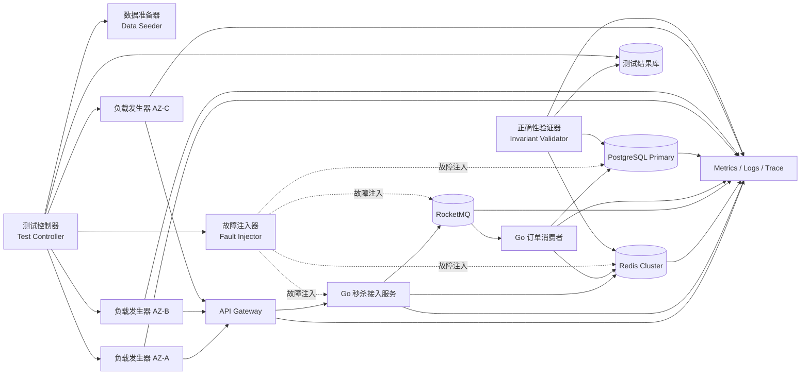
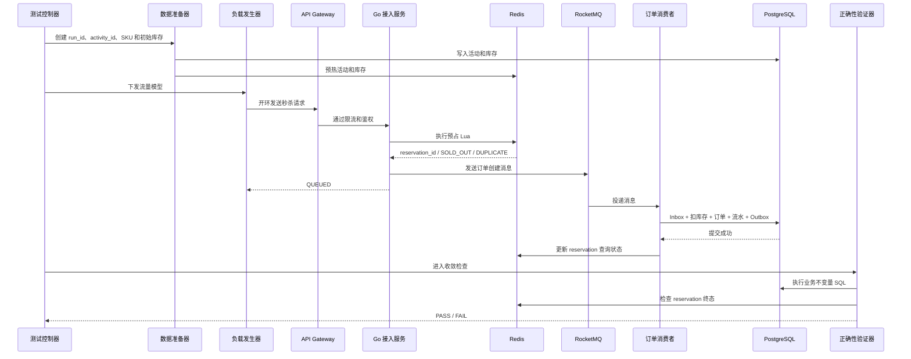
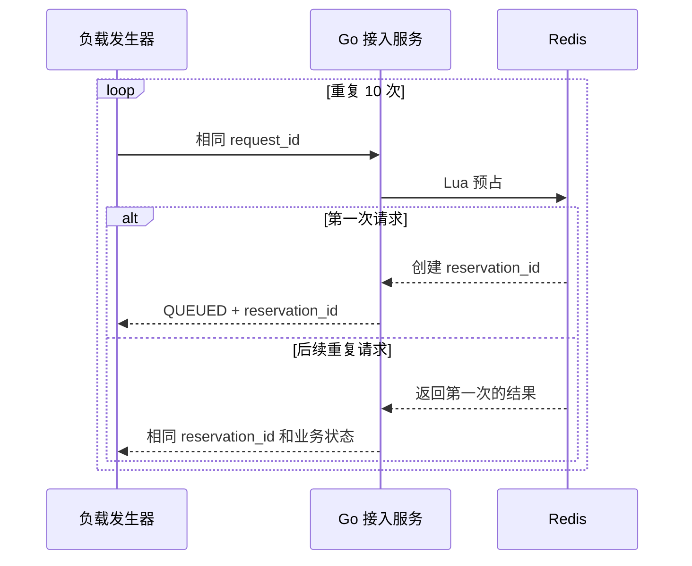
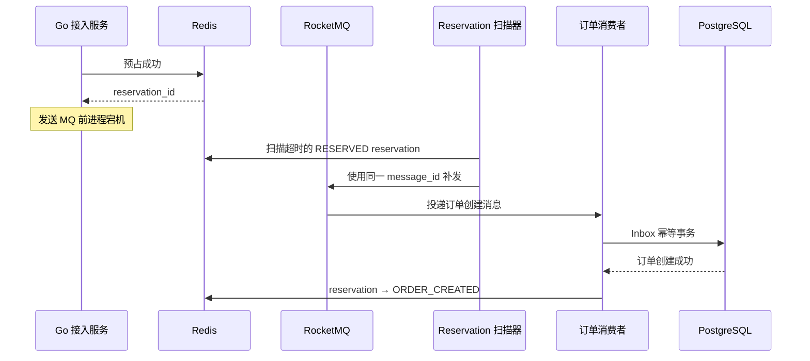
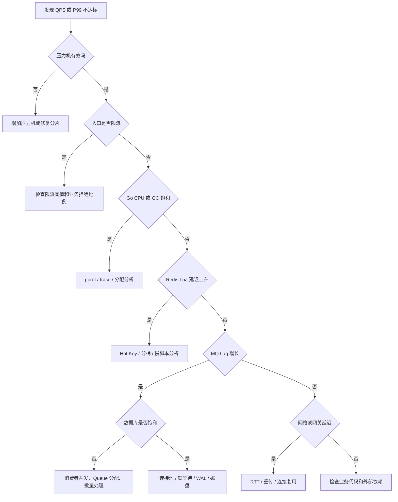

# 第 10 章：压测、混沌工程、容量验证与面试表达

**本章核心结论：秒杀系统的压测不是“把 QPS 打上去”，而是同时证明四件事：流量打得准、系统扛得住、业务不出错、故障后能收敛。**

---

## 1. 本章目标

本章需要建立一套可重复、可量化、可自动判定的秒杀系统验证体系，重点回答：

1. 系统是否能承受 100 万用户在 10 秒内集中请求、峰值 30 万 QPS。
2. 接口 P99 是否能够稳定小于 100ms。
3. Redis、RocketMQ、PostgreSQL 和 Go 服务分别能承受多大压力。
4. 99.9% 的有效订单是否能在 3 秒内创建完成。
5. Redis Failover、RocketMQ Broker 故障、PostgreSQL Failover 时是否仍然保持业务正确。
6. 重复请求、重复消息、重复补偿、重复支付回调是否幂等。
7. MQ 积压是否能够在规定时间内清空。
8. 故障恢复后是否会形成重试洪峰或连接重建洪峰。
9. 系统是否最终满足库存守恒。
10. 如何把复杂的架构设计压缩为 3 分钟、15 分钟和 45 分钟的面试表达。

本章不以“压测工具显示成功”为完成标准，而以以下结果为完成标准：

> **负载发生器没有失真、性能 SLO 达标、所有业务不变量成立、故障恢复时间满足目标、最终数据完成收敛。**

---

## 2. 业务背景

本书统一秒杀链路为：

```text
客户端
→ CDN / WAF
→ API Gateway
→ Go 秒杀接入服务
→ Redis Lua 库存预占
→ RocketMQ
→ Go 订单消费者
→ PostgreSQL 创建订单
→ Redis 更新查询状态
→ 用户查询最终结果
```

统一业务基线如下：

| 项目         |                 目标 |
| ---------- | -----------------: |
| 用户规模       |              100 万 |
| 集中请求窗口     |               10 秒 |
| 峰值入口流量     |           30 万 QPS |
| 单热点 SKU 库存 |             10,000 |
| 入口接口 P99   |           小于 100ms |
| 下单方式       |    Redis 预占后异步创建订单 |
| 订单创建 SLO   | 99.9% 有效订单在 3 秒内完成 |
| 部署拓扑       |            至少三个可用区 |
| 一人一单       |               必须保证 |
| 不超卖        |               必须保证 |
| 消息语义       |      At-Least-Once |
| 故障目标       |       短暂故障后最终恢复并收敛 |

秒杀压测有一个容易被忽略的特点：

**入口流量、Redis 请求量、MQ 消息量和 PostgreSQL 写入量并不相等。**

例如，峰值入口可能达到 30 万 QPS，但单 SKU 只有 10,000 件库存。大量请求会在网关、本地售罄标记、Redis 库存检查阶段被拒绝，真正进入 RocketMQ 和 PostgreSQL 的请求量通常远小于入口流量。

因此，需要分别测量：

* 入口拒绝路径的最大吞吐。
* Redis Lua 热点路径的最大吞吐。
* RocketMQ 生产和消费能力。
* PostgreSQL 创建订单事务能力。
* 故障后的积压清空能力。
* 全链路最终一致性。

---

## 3. 核心问题

本章必须解决以下问题：

1. 如何生成真实的 100 万用户、10 秒突发流量。
2. 为什么固定虚拟用户数可能掩盖系统过载。
3. 什么是 Coordinated Omission。
4. 如何确认压力机不是瓶颈。
5. 如何区分业务拒绝和系统错误。
6. 如何验证库存不超卖，而不是只看请求成功率。
7. 如何验证一人一单和请求幂等。
8. 如何注入 Redis、RocketMQ、PostgreSQL 故障。
9. 如何验证重复投递和数据库提交结果未知。
10. 如何测量 MQ 积压恢复时间。
11. 如何判断消费者扩容是否正在压垮 PostgreSQL。
12. 如何自动判断系统已经最终收敛。
13. 如何比较优化前后的真实收益。
14. 如何给出可以审计的容量结论。
15. 如何把测试结果转化为面试表达。

---

## 4. 未优化的基线方案

最常见的基线压测方式如下：

1. 使用一台压力机。
2. 固定启动若干虚拟用户。
3. 每个虚拟用户发送请求，收到响应后再发下一次。
4. 持续压测 10 秒。
5. 观察平均延迟和总 QPS。
6. 随机重启几个服务 Pod。
7. 没有执行数据库一致性检查。
8. 根据“接口没有大量报错”判断系统通过。

伪代码如下：

```text
启动 10,000 个并发用户
每个用户循环：
    发送秒杀请求
    等待响应
    发送下一个请求

持续 10 秒
输出平均 QPS 和平均响应时间
```

这是一种典型的闭环负载模型：只有上一个请求结束，虚拟用户才会发起下一个请求。

闭环模型本身并非错误，但当系统响应变慢时，它会自动降低请求到达率。系统越慢，压力工具发得越少，最终可能出现“系统已经过载，但压测曲线反而下降”的假象。开环模型把请求到达率与响应完成时间解耦，更适合模拟固定业务到达率和突发流量。Grafana k6 官方文档也将这种闭环负载失真与 Coordinated Omission 联系起来，并通过 arrival-rate executor 提供开环模型。([Grafana Labs][1])

---

## 5. 基线方案的问题

| 维度    | 问题               | 可能产生的错误结论                 |
| ----- | ---------------- | ------------------------- |
| 正确性   | 不检查订单、库存和补偿数据    | QPS 达标，但已经超卖              |
| 性能    | 只看平均延迟           | P99 已经严重超时却未被发现           |
| 并发    | 使用闭环模型           | 系统越慢，产生的压力越小              |
| 负载准确性 | 不监控压力机           | 把压力机 CPU 饱和误判为系统瓶颈        |
| 可用性   | 随机杀进程            | 无法复现故障，也无法确认恢复条件          |
| 可扩展性  | 只测试一个流量点         | 不知道容量拐点在哪里                |
| 可运维性  | 没有 run_id 和统一时间线 | 无法关联日志、指标、消息和故障事件         |
| 消息可靠性 | 不注入重复消息          | 无法证明消费者幂等                 |
| 补偿可靠性 | 不注入重复补偿          | 无法证明库存只释放一次               |
| 恢复能力  | 只观察故障期间错误率       | 不知道恢复后是否产生重试洪峰            |
| 最终一致性 | 测试结束后立即统计        | 把正常的处理中状态误判为数据错误          |
| 容量规划  | 只记录最大 QPS        | 无法判断该 QPS 是否满足 P99 和正确性要求 |

**未经正确性断言验证的性能数字，不具备生产容量意义。**

---

## 6. 推荐架构

### 6.1 压测设计原则

推荐采用以下原则：

1. **开环模型作为容量验证主模型。**
2. **闭环模型用于用户行为、连接复用和长时间稳定性测试。**
3. **负载发生器与被测系统物理隔离。**
4. **压测流量、故障事件、业务断言使用同一个 run_id。**
5. **性能断言和业务正确性断言分别执行。**
6. **故障注入必须预定义开始时间、持续时间、停止条件和回滚动作。**
7. **正式容量结论必须包含一可用区故障后的容量。**
8. **所有数据一致性断言必须在指定收敛窗口后执行。**
9. **压力机丢失的迭代必须计入失败，而不能悄悄降低实际流量。**
10. **禁止通过无限增加消费者绕过 PostgreSQL 写入瓶颈。**

k6 的 arrival-rate executor 在没有空闲虚拟用户时会记录 `dropped_iterations`。大量 dropped iterations 既可能表示虚拟用户配置不足，也可能表示被测系统响应持续变慢，因此它必须作为正式压测的有效性指标，而不能忽略。([Grafana Labs][2])

---

### 6.2 测试架构图



### 6.3 组件职责

| 组件     | 职责                    |
| ------ | --------------------- |
| 测试控制器  | 创建 run_id、编排阶段、执行停止条件 |
| 数据准备器  | 创建独立活动、SKU、库存、用户数据    |
| 负载发生器  | 按指定到达率发出请求            |
| 故障注入器  | 注入进程、网络和组件故障          |
| 可观测平台  | 收集接口、组件、运行时和业务指标      |
| 正确性验证器 | 验证不变量、等待最终收敛          |
| 测试结果库  | 保存配置、版本、指标和断言结果       |

### 6.4 事务边界和故障边界

* Redis Lua 只保证 Redis 内部相关 Key 的原子修改。
* Redis 预占和 RocketMQ 发送不在同一个事务中。
* RocketMQ 投递和 PostgreSQL 提交不在同一个事务中。
* 消费者通过 Inbox、唯一约束和条件更新处理重复消息。
* PostgreSQL 本地事务负责库存扣减、订单创建、库存流水和 Outbox 写入。
* Redis 状态回写失败不应回滚已经提交的 PostgreSQL 订单。
* 故障注入必须覆盖这些跨组件边界。

### 6.5 测试环境要求

| 项目       | 要求                            |
| -------- | ----------------------------- |
| 可用区      | 至少三个，与生产逻辑拓扑一致                |
| 数据库      | 独立测试集群，参数和实例规格接近生产            |
| Redis    | Cluster、复制和 Failover 策略与生产一致  |
| RocketMQ | Broker、NameServer、队列数量与生产近似   |
| Go 服务    | 使用正式构建参数和资源限制                 |
| 网络       | 接近生产 RTT，禁止全部组件部署在同一宿主机       |
| 压力机      | 与业务实例隔离，不共享 CPU、磁盘或带宽         |
| 时间同步     | 所有节点统一时间源                     |
| 数据隔离     | 每次运行创建独立 activity_id 和 run_id |
| 监控       | 压测前完成指标、日志、Trace 校验           |

压测环境不一定需要完全复制生产成本，但以下因素不能随意缩减：

* Redis 分片数量和热点分布。
* PostgreSQL 单主写入模型。
* RocketMQ Queue 数量和消费者分配。
* Go 服务实例资源限制。
* 跨可用区 RTT。
* PostgreSQL WAL 和磁盘同步策略。
* Redis 持久化和复制策略。

---

### 6.6 流量模型

为了产生总计 100 万请求、峰值 30 万 QPS，可以采用以下阶梯波形：

| 时间段    |         到达率 |           请求量 |
| ------ | ----------: | ------------: |
| 0～1 秒  |  50,000 QPS |        50,000 |
| 1～2 秒  | 150,000 QPS |       150,000 |
| 2～3 秒  | 300,000 QPS |       300,000 |
| 3～4 秒  | 200,000 QPS |       200,000 |
| 4～6 秒  | 100,000 QPS |       200,000 |
| 6～10 秒 |  25,000 QPS |       100,000 |
| **合计** |             | **1,000,000** |

这比简单地持续 10 秒发送 10 万 QPS 更接近突发抢购：

* 存在明显峰值。
* 能观察限流和售罄传播速度。
* 能观察高峰结束后的积压恢复。
* 能区分瞬时容量与稳态容量。

### 6.7 SKU 流量分布

至少验证三种分布：

#### 单热点 SKU

```text
100% 请求 → sku_hot_001
```

用于验证：

* 单个 Redis Key 或单个库存桶的极限。
* 单个 SKU 售罄传播。
* 一人一单。
* 热点状态查询。

#### 多 SKU 倾斜

```text
90% 请求 → sku_hot_001
10% 请求 → 其余 SKU
```

用于验证：

* 热点 SKU 是否拖累普通 SKU。
* Redis 分桶或连接池隔离是否有效。
* RocketMQ 队列分配是否倾斜。

#### 相对均匀分布

```text
请求均匀分布到多个 SKU
```

用于验证：

* 系统整体吞吐。
* 多 Queue、多 Redis Slot 的扩展效果。
* PostgreSQL 多行库存更新能力。

---

### 6.8 压力机数量估算

假设单台压力机经校准后能够稳定产生 15,000 QPS，并满足：

* CPU 小于 60%。
* 网卡利用率小于 50%。
* 无 dropped iterations。
* 客户端侧 P99 稳定。
* 无明显 GC 抖动。

为 30 万 QPS 保留 20% 压力机余量：

```text
压力机数量
= ceil(300,000 × 1.2 / 15,000)
= 24 台
```

这只是示例，单机 15,000 QPS 必须通过实际校准得到，不能直接照搬。

### 6.9 虚拟用户数量估算

根据 Little’s Law：

```text
并发数 ≈ 吞吐量 × 平均在途时间
```

按目标 P99 100ms 粗略估算：

```text
并发数 ≈ 300,000 × 0.1
       = 30,000
```

考虑 50% 余量：

```text
预留虚拟用户 ≈ 45,000
```

但当系统故障时，响应可能上升到 200ms：

```text
故障期间并发数 ≈ 300,000 × 0.2
               = 60,000
```

因此，开环压测工具的最大虚拟用户数不能只按正常延迟计算，否则系统一变慢，压力机就会因为没有空闲虚拟用户而减少实际请求量。

### 6.10 订单消费者吞吐预算

单热点 SKU 库存为 10,000，要求 99.9% 有效订单在 3 秒内创建：

```text
最低平均有效处理速度
≈ 9,990 / 3
≈ 3,330 单/秒
```

考虑数据库抖动、调度、重试和 20% 余量：

```text
建议验证目标 ≥ 4,000～5,000 单/秒
```

多 SKU 场景下应使用活动总库存计算：

```text
目标订单 TPS
≥ 活动有效订单总量 / 目标完成时间 × 安全系数
```

### 6.11 单可用区故障容量

三个可用区均匀承载流量。为了在一个可用区故障后仍承受 30 万 QPS，并保留 20% 余量：

```text
两个存活可用区所需容量 ≥ 300,000 × 1.2 = 360,000 QPS

单可用区稳定容量 ≥ 180,000 QPS

正常三可用区总稳定容量 ≥ 540,000 QPS
```

这意味着正常情况下系统可能只有约 56% 的总体容量利用率：

```text
300,000 / 540,000 ≈ 55.6%
```

这是跨可用区容灾的容量成本，而不是资源浪费。

---

### 6.12 验收门禁

| 类别       | 验收条件                                       |
| -------- | ------------------------------------------ |
| 流量有效性    | 实际发送量达到计划量，dropped iterations 为 0 或低于明确预算  |
| 接口延迟     | 目标负载下 P99 小于 100ms                         |
| 系统错误     | 非预期系统错误率低于项目阈值                             |
| 不超卖      | 有效订单数量不超过活动库存                              |
| 一人一单     | 同一 activity_id + sku_id + user_id 最多一个有效订单 |
| 请求幂等     | 同 request_id 最多对应一个 reservation_id         |
| 消息幂等     | 同 message_id 最多产生一次业务效果                    |
| 补偿幂等     | 同 reservation_id 最多成功释放一次库存                |
| 支付正确性    | 已支付订单不能进入已取消终态                             |
| 创建时效     | 99.9% 有效订单在 3 秒内创建                         |
| 积压恢复     | 在规定时间内将积压清空                                |
| 重启恢复     | Go 服务重启后 reservation、订单和库存最终收敛             |
| Redis 故障 | 不允许绕过 Redis 库存控制继续下单                       |
| 数据库故障    | 不允许无限重试或无界增加消费者                            |
| 最终守恒     | PostgreSQL 库存、有效订单和库存流水一致                  |

---

## 7. 核心流程

### 7.1 正常压测流程



#### 可重试步骤

* 客户端请求超时后可以使用相同 request_id 查询或有限重试。
* MQ 发送失败可以按发送策略有限重试。
* MQ 消费失败允许 Broker 重新投递。
* Redis 查询状态失败可以重试。
* 对账任务可以重复执行，但修复操作必须幂等。

#### 必须幂等的步骤

* Redis 预占。
* MQ 消费。
* PostgreSQL 创建订单。
* 库存流水写入。
* Redis 库存补偿。
* 支付回调。
* 超时取消。
* Outbox 发送。
* 对账修复。

---

### 7.2 重复请求流程

测试工具对同一用户发送 10 次相同 request_id：



验收条件：

* Redis 库存只减少一次。
* 只创建一个 reservation。
* 只发送一个有效业务操作。
* 最终最多一个有效订单。
* 所有重复请求返回同一业务结果或可关联到同一结果。

---

### 7.3 客户端超时流程

客户端请求超时不代表服务端没有完成预占。

测试场景：

1. 请求已经到达 Redis。
2. Redis 预占成功。
3. 接入服务返回响应前网络断开。
4. 客户端收到超时。
5. 客户端使用相同 request_id 重试。
6. Redis 返回第一次请求结果。

禁止使用新的 request_id 进行盲目重试，否则它不再是同一业务请求。

---

### 7.4 消息重复流程

测试工具或专用测试 Producer 投递多条相同 message_id 的消息。

验收条件：

* `consumer_inbox` 只有一条逻辑记录。
* PostgreSQL 库存只扣一次。
* 订单最多创建一次。
* 库存流水最多写一次。
* 重复消息能够成功 ACK，不进入无限重试。

---

### 7.5 宕机恢复流程



验收条件：

* 不需要人工重放即可恢复绝大多数 reservation。
* 补发消息与原消息使用同一业务幂等键。
* 补发和原始发送并发发生时，不产生重复订单。
* 超过自动修复上限的数据进入补偿任务或人工处理队列。

---

### 7.6 降级流程

| 故障                | 推荐行为                                    |
| ----------------- | --------------------------------------- |
| Redis 不可用         | Fail Closed，拒绝新秒杀，不绕过库存控制               |
| RocketMQ 不可用      | 停止或严格限制新的 Redis 预占；已有 reservation 由扫描补发 |
| PostgreSQL 短暂不可用  | 消费失败，不 ACK，进入有限重试                       |
| PostgreSQL 长时间不可用 | 降低或暂停接入，限制 MQ 积压增长                      |
| 查询服务异常            | 返回状态暂不可用，不允许用户用新 request_id 重新下单        |
| 支付状态未知            | 不释放库存，进入待确认状态                           |
| 一个可用区故障           | 从健康可用区承载流量，验证容量冗余                       |
| 多组件同时故障           | 优先保护正确性，停止新预占，保留恢复证据                    |

---

## 8. 数据结构

### 8.1 测试运行表

建议使用独立测试结果库，不要把压测控制数据写入业务数据库。

```sql
CREATE TABLE load_test_run (
    run_id              text PRIMARY KEY,
    scenario_name       text NOT NULL,
    git_commit          text NOT NULL,
    config_digest       text NOT NULL,
    activity_id         bigint NOT NULL,
    started_at          timestamptz NOT NULL,
    ended_at            timestamptz,
    planned_requests    bigint NOT NULL CHECK (planned_requests >= 0),
    actual_requests     bigint CHECK (actual_requests >= 0),
    peak_target_qps     integer NOT NULL CHECK (peak_target_qps > 0),
    status              text NOT NULL CHECK (
        status IN ('PREPARING', 'RUNNING', 'CONVERGING', 'PASSED', 'FAILED', 'ABORTED')
    ),
    notes               text
);
```

### 8.2 断言结果表

```sql
CREATE TABLE load_test_assertion (
    run_id              text NOT NULL,
    assertion_name      text NOT NULL,
    passed              boolean NOT NULL,
    observed_value      text,
    expected_value      text,
    checked_at          timestamptz NOT NULL DEFAULT now(),
    details             jsonb NOT NULL DEFAULT '{}'::jsonb,
    PRIMARY KEY (run_id, assertion_name)
);
```

### 8.3 故障事件表

```sql
CREATE TABLE load_test_fault_event (
    run_id              text NOT NULL,
    fault_id            text NOT NULL,
    target_component    text NOT NULL,
    fault_type          text NOT NULL,
    planned_start_at    timestamptz NOT NULL,
    actual_start_at     timestamptz,
    planned_end_at      timestamptz,
    actual_end_at       timestamptz,
    rollback_status     text,
    parameters          jsonb NOT NULL,
    PRIMARY KEY (run_id, fault_id)
);
```

### 8.4 请求 ID 生成规则

每次测试必须生成独立 run_id：

```text
run_id = 20260625-seckill-capacity-r017
```

请求标识可由以下信息确定性生成：

```text
request_id
= hash(run_id + activity_id + sku_id + user_id + logical_attempt)
```

规则：

* 同一业务重试使用相同 request_id。
* 模拟新业务请求才增加 logical_attempt。
* 重复请求场景必须显式复用 request_id。
* 不要使用纯随机 request_id 测试幂等，因为无法复现。

### 8.5 故障清单示例

```yaml
run_id: 20260625-seckill-chaos-r017
scenario: pg-failover-under-load

traffic:
  model: open
  peak_qps: 300000
  total_requests: 1000000

fault:
  target: postgresql-primary
  type: controlled-failover
  start_after: 3s
  max_duration: 60s

abort_conditions:
  unexpected_error_rate: "> 5%"
  paid_order_canceled_count: "> 0"
  oversold_quantity: "> 0"
  load_generator_dropped_iterations: "> 0"

convergence:
  max_wait: 5m
  stable_window: 30s
```

---

## 9. 核心代码

### 9.1 开环流量脚本

以下为 k6 风格示例。分布式执行时必须使用执行分片或平台自带的分布式调度，不能在多台机器上直接重复运行同一个完整脚本，否则总流量会被机器数量放大。

```javascript
import http from 'k6/http';
import exec from 'k6/execution';
import { Counter, Rate, Trend } from 'k6/metrics';

const seckillLatency = new Trend('seckill_latency', true);
const queuedCount = new Counter('business_queued');
const soldOutCount = new Counter('business_sold_out');
const duplicateCount = new Counter('business_duplicate');
const limitedCount = new Counter('business_rate_limited');
const unexpectedRate = new Rate('business_unexpected');

const BASE_URL = __ENV.BASE_URL;
const RUN_ID = __ENV.RUN_ID;
const ACTIVITY_ID = __ENV.ACTIVITY_ID;
const HOT_SKU_ID = __ENV.HOT_SKU_ID;
const OTHER_SKU_ID = __ENV.OTHER_SKU_ID || HOT_SKU_ID;
const HOT_RATIO = Number(__ENV.HOT_RATIO || '1.0');

const plannedP99Seconds =
  Number(__ENV.PLANNED_P99_MS || '100') / 1000;

const vuHeadroom = Number(__ENV.VU_HEADROOM || '1.5');

function requiredVUs(rate) {
  return Math.ceil(rate * plannedP99Seconds * vuHeadroom);
}

function wave(rate, duration, startTime) {
  const preallocated = requiredVUs(rate);

  return {
    executor: 'constant-arrival-rate',
    rate: rate,
    timeUnit: '1s',
    duration: duration,
    startTime: startTime,
    preAllocatedVUs: preallocated,
    maxVUs: preallocated * 2,
    exec: 'seckill',
  };
}

// 总请求量：1,000,000；峰值：300,000 QPS。
export const options = {
  scenarios: {
    wave_1: wave(50000, '1s', '0s'),
    wave_2: wave(150000, '1s', '1s'),
    wave_3: wave(300000, '1s', '2s'),
    wave_4: wave(200000, '1s', '3s'),
    wave_5: wave(100000, '2s', '4s'),
    wave_6: wave(25000, '4s', '6s'),
  },

  thresholds: {
    seckill_latency: ['p(99)<100'],
    business_unexpected: ['rate<0.001'],
    dropped_iterations: ['count==0'],
  },
};

const waveBase = {
  wave_1: 0,
  wave_2: 50000,
  wave_3: 200000,
  wave_4: 500000,
  wave_5: 700000,
  wave_6: 900000,
};

function selectSku(userOrdinal) {
  // 通过确定性分布保证测试可复现。
  const bucket = userOrdinal % 10000;
  return bucket < HOT_RATIO * 10000 ? HOT_SKU_ID : OTHER_SKU_ID;
}

function classify(body) {
  switch (body.status) {
    case 'QUEUED':
      queuedCount.add(1);
      return true;

    case 'SOLD_OUT':
      soldOutCount.add(1);
      return true;

    case 'DUPLICATE':
    case 'ALREADY_ACCEPTED':
      duplicateCount.add(1);
      return true;

    case 'RATE_LIMITED':
      limitedCount.add(1);
      return true;

    default:
      return false;
  }
}

export function seckill() {
  const scenarioName = exec.scenario.name;
  const userOrdinal =
    waveBase[scenarioName] + exec.scenario.iterationInTest;

  const userId = `load-user-${userOrdinal}`;
  const skuId = selectSku(userOrdinal);

  // 正常场景每个用户只有一次业务请求。
  const requestId =
    `${RUN_ID}:${ACTIVITY_ID}:${skuId}:${userId}:1`;

  const payload = JSON.stringify({
    activity_id: ACTIVITY_ID,
    sku_id: skuId,
    user_id: userId,
    request_id: requestId,
  });

  const response = http.post(
    `${BASE_URL}/api/v1/seckill/submit`,
    payload,
    {
      headers: {
        'Content-Type': 'application/json',
        'X-Test-Run-ID': RUN_ID,
      },
      timeout: '500ms',
      tags: {
        endpoint: 'seckill_submit',
        run_id: RUN_ID,
      },
    },
  );

  seckillLatency.add(response.timings.duration);

  let expected = false;

  try {
    const body = JSON.parse(response.body);
    expected = classify(body);
  } catch (_) {
    expected = false;
  }

  unexpectedRate.add(!expected);
}
```

正式测试还必须监控：

* 压力机 CPU。
* 压力机内存和 GC。
* 压力机网卡吞吐。
* 客户端连接数。
* TCP 重传。
* `dropped_iterations`。
* 实际启动迭代数。
* 实际完成迭代数。

k6 的 threshold 可以把 P99、错误率、dropped iterations 等指标转化为自动化 PASS/FAIL 条件。([Grafana Labs][3])

---

### 9.2 重复请求脚本逻辑

重复请求测试不应该随机重复，而应控制重复比例和次数。

```javascript
export function duplicateRequest() {
  const userOrdinal = exec.scenario.iterationInTest;
  const userId = `duplicate-user-${userOrdinal}`;
  const requestId = `${RUN_ID}:${ACTIVITY_ID}:${HOT_SKU_ID}:${userId}:1`;

  const payload = JSON.stringify({
    activity_id: ACTIVITY_ID,
    sku_id: HOT_SKU_ID,
    user_id: userId,
    request_id: requestId,
  });

  for (let i = 0; i < 10; i++) {
    http.post(`${BASE_URL}/api/v1/seckill/submit`, payload, {
      headers: {
        'Content-Type': 'application/json',
        'X-Test-Run-ID': RUN_ID,
      },
      timeout: '500ms',
    });
  }
}
```

验收结果不是“10 个请求都返回成功”，而是：

```text
10 次请求
→ 1 次库存预占
→ 1 个 reservation_id
→ 1 个订单创建消息的业务效果
→ 最多 1 个有效订单
```

---

### 9.3 正确性断言 SQL

正式断言应在 PostgreSQL 主库上执行，或者使用能够保证读取到目标提交点的强一致读取路径。不能默认在存在复制延迟的只读副本上判定刚完成的订单。

#### 断言一：不超卖

```sql
WITH valid_order_quantity AS (
    SELECT
        o.activity_id,
        oi.sku_id,
        SUM(oi.quantity) AS ordered_quantity
    FROM orders o
    JOIN order_items oi
      ON oi.order_id = o.order_id
    WHERE o.activity_id = $1
      AND o.status IN ('CREATED', 'PAYING', 'PAID')
    GROUP BY o.activity_id, oi.sku_id
)
SELECT
    i.activity_id,
    i.sku_id,
    i.total_stock,
    COALESCE(v.ordered_quantity, 0) AS ordered_quantity
FROM sku_inventory i
LEFT JOIN valid_order_quantity v
  ON v.activity_id = i.activity_id
 AND v.sku_id = i.sku_id
WHERE i.activity_id = $1
  AND COALESCE(v.ordered_quantity, 0) > i.total_stock;
```

**返回 0 行表示通过。**

#### 断言二：不产生重复有效订单

```sql
SELECT
    o.activity_id,
    oi.sku_id,
    o.user_id,
    COUNT(DISTINCT o.order_id) AS valid_order_count
FROM orders o
JOIN order_items oi
  ON oi.order_id = o.order_id
WHERE o.activity_id = $1
  AND o.status IN ('CREATED', 'PAYING', 'PAID')
GROUP BY o.activity_id, oi.sku_id, o.user_id
HAVING COUNT(DISTINCT o.order_id) > 1;
```

**返回 0 行表示通过。**

#### 断言三：相同 request_id 不产生多个 reservation

```sql
SELECT
    request_id,
    COUNT(DISTINCT reservation_id) AS reservation_count
FROM inventory_reservation
WHERE activity_id = $1
GROUP BY request_id
HAVING COUNT(DISTINCT reservation_id) > 1;
```

#### 断言四：相同 message_id 不产生多个库存扣减效果

假设 `inventory_ledger.source_message_id` 保存来源消息 ID：

```sql
SELECT
    source_message_id,
    COUNT(*) AS ledger_count
FROM inventory_ledger
WHERE activity_id = $1
  AND ledger_type = 'ORDER_RESERVE'
GROUP BY source_message_id
HAVING COUNT(*) > 1;
```

#### 断言五：重复补偿不会释放两次库存

```sql
SELECT
    reservation_id,
    COUNT(*) AS release_count,
    SUM(quantity_delta) AS total_release_quantity
FROM inventory_ledger
WHERE activity_id = $1
  AND ledger_type = 'RESERVATION_RELEASE'
GROUP BY reservation_id
HAVING COUNT(*) > 1
    OR SUM(quantity_delta) > 1;
```

如果一个订单允许购买多件，应将 `1` 替换为 reservation 的原始预占数量。

#### 断言六：已支付订单不能被取消

```sql
SELECT
    o.order_id,
    o.status,
    p.payment_id,
    p.status AS payment_status
FROM orders o
JOIN payment_record p
  ON p.order_id = o.order_id
WHERE o.activity_id = $1
  AND p.status = 'SUCCESS'
  AND o.status IN ('CANCELED', 'CLOSED');
```

#### 断言七：PostgreSQL 库存守恒

在订单创建和库存扣减位于同一事务、取消订单会释放库存的前提下：

```sql
WITH valid_order_quantity AS (
    SELECT
        o.activity_id,
        oi.sku_id,
        SUM(oi.quantity) AS held_quantity
    FROM orders o
    JOIN order_items oi
      ON oi.order_id = o.order_id
    WHERE o.activity_id = $1
      AND o.status IN ('CREATED', 'PAYING', 'PAID')
    GROUP BY o.activity_id, oi.sku_id
)
SELECT
    i.activity_id,
    i.sku_id,
    i.total_stock,
    i.available_stock,
    COALESCE(v.held_quantity, 0) AS held_quantity
FROM sku_inventory i
LEFT JOIN valid_order_quantity v
  ON v.activity_id = i.activity_id
 AND v.sku_id = i.sku_id
WHERE i.activity_id = $1
  AND i.total_stock <>
      i.available_stock + COALESCE(v.held_quantity, 0);
```

#### 断言八：没有超时未处理 reservation

```sql
SELECT
    reservation_id,
    request_id,
    status,
    created_at,
    updated_at
FROM inventory_reservation
WHERE activity_id = $1
  AND status IN ('RESERVED', 'MQ_PENDING', 'COMPENSATING')
  AND updated_at < now() - interval '5 minutes';
```

#### 断言九：99.9% 订单创建时间

```sql
SELECT
    percentile_cont(0.999)
    WITHIN GROUP (
        ORDER BY EXTRACT(
            EPOCH FROM (o.created_at - r.created_at)
        ) * 1000
    ) AS p999_create_latency_ms
FROM inventory_reservation r
JOIN orders o
  ON o.reservation_id = r.reservation_id
WHERE r.activity_id = $1
  AND o.status IN ('CREATED', 'PAYING', 'PAID');
```

验收条件：

```text
p999_create_latency_ms ≤ 3000
```

---

### 9.4 收敛验证器

测试结束后不能立即执行一次 SQL 就宣布成功。正确做法是等待所有暂态数据进入终态，并在一个稳定窗口内持续满足不变量。

```go
package validator

import (
	"context"
	"errors"
	"fmt"
	"time"
)

type Snapshot struct {
	PendingReservations int64
	MQOldestAge         time.Duration
	OversoldQuantity    int64
	DuplicateOrders     int64
	DuplicateEffects    int64
	PaidCanceledOrders  int64
	InventoryDeviation int64
}

func (s Snapshot) Converged() bool {
	return s.PendingReservations == 0 &&
		s.MQOldestAge == 0 &&
		s.OversoldQuantity == 0 &&
		s.DuplicateOrders == 0 &&
		s.DuplicateEffects == 0 &&
		s.PaidCanceledOrders == 0 &&
		s.InventoryDeviation == 0
}

type Sampler interface {
	Sample(ctx context.Context, activityID int64) (Snapshot, error)
}

func WaitForConvergence(
	ctx context.Context,
	sampler Sampler,
	activityID int64,
	stableWindow time.Duration,
) error {
	ticker := time.NewTicker(2 * time.Second)
	defer ticker.Stop()

	var stableSince time.Time

	for {
		select {
		case <-ctx.Done():
			return fmt.Errorf("convergence timeout: %w", ctx.Err())

		case <-ticker.C:
			snapshot, err := sampler.Sample(ctx, activityID)
			if err != nil {
				stableSince = time.Time{}
				continue
			}

			if !snapshot.Converged() {
				stableSince = time.Time{}
				continue
			}

			if stableSince.IsZero() {
				stableSince = time.Now()
				continue
			}

			if time.Since(stableSince) >= stableWindow {
				return nil
			}
		}
	}
}

var ErrInvariantViolation = errors.New("business invariant violated")
```

这里使用稳定窗口，是为了避免以下情况：

1. 某一时刻 MQ Lag 短暂归零。
2. 下一秒补发任务又产生消息。
3. 对账器刚好在中间时刻采样。
4. 测试被误判为已经收敛。

---

### 9.5 网络故障注入

Linux `netem` 能模拟延迟、抖动、丢包、乱序和重复包。故障应作用于测试命名空间、Sidecar 或指定代理，避免无差别修改整个宿主机网络。([Linux Kernel 文档][4])

示例：

```bash
# 增加 120ms 延迟、30ms 抖动和 1% 丢包。
tc qdisc replace dev eth0 root netem \
  delay 120ms 30ms \
  loss 1%

# 清除故障。
tc qdisc del dev eth0 root
```

在开发、CI 或无法直接操作网络命名空间的环境中，可以使用 Toxiproxy 一类 TCP 代理进行确定性的延迟、超时和断连测试。Toxiproxy 官方项目将其定位为测试、CI 和开发环境中的网络条件模拟工具。([GitHub][5])

---

## 10. 优化设计与原理

### 10.1 使用开环到达率模型

**优化点：** 使用固定到达率代替固定虚拟用户闭环。

**要解决的问题：** 系统变慢后，压测工具自动降低压力。

**未经优化时会发生什么：**

* 响应时间从 100ms 上升到 1 秒。
* 同样的虚拟用户只能产生原来约十分之一的请求量。
* 压测结果表现为 QPS 下降，而不是持续过载。
* 系统的真实排队、限流和过载行为无法被触发。

**实现方式：**

* 使用 constant-arrival-rate 或等价的开环调度。
* 预分配足够的虚拟用户。
* 监控 dropped iterations。
* 同时记录计划到达量和实际发送量。

**底层原理：**

请求到达时间由调度器决定，不依赖上一个请求的完成时间。

**为什么能够提高可靠性：**

它能够在系统响应变慢时继续施加目标流量，暴露真实的排队、连接池耗尽、超时和重试问题。

**预计收益：**

* 更准确地识别容量拐点。
* 更容易复现生产突发。
* 避免 Coordinated Omission。

**代价和副作用：**

* 需要更多虚拟用户。
* 压力机资源成本更高。
* 系统可能被快速压垮，必须设置停止条件。

**适用边界：**

适用于固定到达率、突发流量和容量验证。

**不适用场景：**

单纯模拟“用户完成一个操作后才进行下一个操作”的交互流程时，闭环模型更自然。

**监控指标：**

* 实际到达率。
* dropped iterations。
* 活跃虚拟用户数。
* 压力机 CPU 和网卡。
* 被测系统 P99。

**验证方法：**

故意增加下游延迟，确认到达率仍保持目标值，并观察系统是否正确限流和降级。

---

### 10.2 压力机校准和隔离

**优化点：** 在测试业务系统前先测试压力机极限。

**要解决的问题：** 无法区分压力机瓶颈和被测系统瓶颈。

**未经优化时会发生什么：**

* 压力机 CPU 达到 100%。
* 实际发送量低于目标。
* 客户端 GC 引起延迟。
* 结果被误判为网关或服务端性能问题。

**实现方式：**

1. 对本地 mock server 进行压力机校准。
2. 记录单机稳定 QPS。
3. 保持 CPU、内存和带宽余量。
4. 多可用区部署负载发生器。
5. 使用统一时钟和 run_id。
6. 压力机与被测系统物理隔离。

**底层原理：**

任何测试工具本身也是排队系统，也有 CPU、连接、端口、内存和网卡上限。

**预计收益：**

* 提高流量精度。
* 方便计算压力机数量。
* 减少客户端侧噪声。

**代价和副作用：**

* 增加独立基础设施。
* 需要维护测试集群。
* 分布式压测需要解决流量分片。

**适用边界：**

适用于十万级以上 QPS 和多可用区测试。

**不适用场景：**

低流量功能测试不需要复杂的压力机集群。

**监控指标：**

* 压力机 CPU。
* 负载发生器 GC。
* TCP 连接数。
* 网卡吞吐和重传。
* 实际迭代数。
* dropped iterations。

**验证方法：**

让压力机请求一个极简静态响应服务，确认其稳定上限高于目标流量并保留安全余量。

---

### 10.3 自动化业务不变量断言

**优化点：** 将不超卖、幂等和库存守恒变成自动测试门禁。

**要解决的问题：** 性能测试通过，但数据已经错误。

**未经优化时会发生什么：**

* 重复消息创建多个订单。
* 补偿执行两次。
* 支付订单被取消。
* Redis 和 PostgreSQL 长期不一致。
* 错误直到人工抽样时才被发现。

**实现方式：**

* 每次运行使用独立 activity_id。
* 在 PostgreSQL 主库执行一致性 SQL。
* 对 Redis reservation 逐项核对。
* 将断言结果写入测试结果库。
* 任意核心不变量失败则整体测试失败。

**底层原理：**

吞吐和延迟属于非功能指标，不会自动推导业务正确性。

**预计收益：**

* 回归测试能够发现并发边界错误。
* 故障测试结果可以审计。
* 避免只依赖日志人工判断。

**代价和副作用：**

* 需要维护断言 SQL。
* 状态机变化时必须同步更新断言。
* 大表扫描可能消耗资源。

**适用边界：**

适用于所有涉及库存、支付、账务和消息幂等的测试。

**不适用场景：**

没有业务状态变化的纯静态接口可以不做复杂对账。

**监控指标：**

* 超卖数量。
* 重复有效订单数。
* 重复业务效果数。
* 库存偏差。
* 暂态 reservation 数量。
* 收敛耗时。

**验证方法：**

主动移除某个幂等约束，确认测试能够稳定检测出错误，证明断言不是“永远通过”。

---

### 10.4 分层压测

**优化点：** 将入口、Redis、MQ、数据库和全链路分别压测。

**要解决的问题：** 全链路出现瓶颈时无法定位原因。

**未经优化时会发生什么：**

* Redis 热 Key、MQ 队列、数据库锁竞争和 Go GC 混在一起。
* 优化一个组件后没有整体收益。
* 无法得到各层容量预算。

**实现方式：**

按以下顺序测试：

1. API Gateway 快速拒绝路径。
2. Go 服务空处理路径。
3. Redis Lua 预占路径。
4. RocketMQ Producer。
5. RocketMQ Consumer 空消费。
6. PostgreSQL 创建订单事务。
7. 全链路。
8. 故障链路。

**底层原理：**

串联系统的稳定吞吐受最慢阶段限制，且每个阶段的排队会传播到上游。

**预计收益：**

* 建立组件容量基线。
* 快速识别瓶颈。
* 避免无效扩容。

**代价和副作用：**

* 测试场景数量增加。
* Mock 路径必须与真实路径保持足够接近。
* 局部性能不能代替全链路性能。

**监控指标：**

每层服务时间、等待时间、队列长度、吞吐和错误率。

**验证方法：**

比较局部压测容量和全链路容量，定位吞吐损失发生在哪一层。

---

### 10.5 有界消费者与积压恢复测试

**优化点：** 按 PostgreSQL 可承受吞吐设置消费者上限。

**要解决的问题：** MQ 积压时消费者无限扩容压垮数据库。

**未经优化时会发生什么：**

* PostgreSQL 连接池耗尽。
* 锁等待和 WAL 延迟增加。
* 单事务耗时上升。
* 消费失败后产生更多重试消息。
* 实际清空速度反而下降。

**实现方式：**

* 设置消费者最大并发。
* 使用有界 Worker Pool。
* 依据数据库 TPS 调整批量大小。
* 同时监控 MQ Lag 和 PostgreSQL 饱和度。
* 使用净清空速度计算恢复时间。

**底层原理：**

```text
净清空速度 = 消费速度 - 新消息生产速度
```

```text
积压清空时间
= 当前积压量 / 净清空速度
```

当消费速度小于或等于生产速度时，积压无法清空。

**预计收益：**

* 防止数据库雪崩。
* 恢复时间可预测。
* 消费者扩容决策更加准确。

**代价和副作用：**

* 清空时间可能变长。
* 需要牺牲部分恢复速度保护数据库。
* 必须维护背压和告警。

**监控指标：**

* Consumer Lag。
* 最老消息年龄。
* 消费 TPS。
* PostgreSQL 活跃连接。
* 数据库事务 P99。
* 锁等待。
* WAL 写入速度。

**验证方法：**

制造固定积压，逐步增加消费者并发，寻找消费净速度开始下降的拐点。

---

### 10.6 重试抑制和恢复整形

**优化点：** 故障恢复后逐步恢复流量，而不是立即释放所有重试。

**要解决的问题：** 组件恢复后形成重试洪峰。

**未经优化时会发生什么：**

* 大量客户端同时重试。
* Redis 和数据库连接同时重建。
* MQ 重试消息集中投递。
* 刚恢复的组件再次被压垮。

**实现方式：**

* 指数退避。
* 随机抖动。
* 全局重试预算。
* 分批恢复消费者。
* 慢启动恢复接入流量。
* 对扫描补发任务设置速率上限。

**底层原理：**

没有随机抖动的固定重试会使失败请求在相同时间重新聚集，形成同步重试。

**预计收益：**

* 降低二次故障概率。
* 缩短总体恢复时间。
* 控制数据库和 Redis 瞬时压力。

**代价和副作用：**

* 个别请求恢复时间变长。
* 参数过于保守会降低恢复速度。
* 需要统一协调不同组件重试策略。

**监控指标：**

* 每秒重试数。
* 连接建立速率。
* 补发速率。
* 组件恢复后的 P99。
* 熔断半开请求数。
* MQ 重试消息数量。

**验证方法：**

恢复故障组件后观察 1 秒、10 秒和 60 秒窗口内的流量尖峰，并与正常峰值比较。

---

## 11. 故障分析

### 11.1 故障注入矩阵

| 故障                  | 注入方法                   | 期望行为                       | 核心断言                |
| ------------------- | ---------------------- | -------------------------- | ------------------- |
| Go 接入实例重启           | 持续删除部分 Pod             | 流量转移，进程内请求可由 request_id 恢复 | 不重复预占、不超卖           |
| Go 消费者重启            | 数据库提交前后分别重启            | 消息重投，Inbox 幂等              | 不重复订单、不重复扣库存        |
| Redis Failover      | 受控主从切换                 | 新请求 Fail Closed 或短暂失败      | 不绕过库存控制             |
| Redis 网络分区          | 隔离部分实例                 | 客户端超时、熔断                   | 无无限重试               |
| RocketMQ Broker 故障  | 停止一个 Broker            | Producer 切换或有限失败           | 消息不永久丢失             |
| MQ 发送结果未知           | 发送后断开连接                | 允许补发和重复投递                  | 同 message_id 一次业务效果 |
| PostgreSQL Failover | 受控主库切换                 | 消费暂时失败，不 ACK               | 恢复后幂等重放             |
| PostgreSQL 慢响应      | 增加延迟或锁等待               | 触发超时和背压                    | 不堆积无界 goroutine     |
| PostgreSQL 连接池耗尽    | 降低池大小或占用连接             | 快速失败、消费降速                  | 无无限排队               |
| 网络延迟                | 增加 RTT                 | P99 上升，超时预算生效              | context 取消传播        |
| 网络丢包                | 注入 1%～5% 丢包            | 有限重试                       | 无重试风暴               |
| 网络分区                | 双向断开                   | Fail Closed 或熔断            | 不出现双写               |
| MQ 积压               | 暂停消费者                  | Lag 增长                     | 不丢消息                |
| 积压恢复                | 恢复消费者                  | 有界提速                       | 在目标时间清空             |
| GC 抖动               | 增加分配或降低内存限制            | P99 可观察上升                  | 无实例雪崩               |
| 重复消息                | 重放相同 message_id        | 幂等消费                       | 一次业务效果              |
| 重复补偿                | 重放相同 reservation_id 补偿 | 条件补偿                       | 库存最多增加一次            |
| 重复支付回调              | 重放相同 payment_id        | 条件更新                       | 订单只支付一次             |
| 重复取消消息              | 重放延迟取消                 | 条件取消                       | 已支付订单不取消            |
| 重试风暴                | 同时解除大量超时请求             | 限流、抖动和慢启动                  | 恢复后无二次故障            |

---

### 11.2 Redis Failover

Redis 复制通常是异步的。在网络分区和自动故障转移情况下，已经被旧主节点确认但尚未复制到新主节点的写入存在丢失窗口；官方 Sentinel 文档也明确说明异步复制无法完全消除该场景的数据丢失，只能限制主从分歧。([Redis][6])

因此，测试不能只验证“Redis 能自动切主”，还要验证：

1. reservation 是否可能在切主后消失。
2. request_id 幂等结果是否可能丢失。
3. 系统是否会因为丢失购买标记而再次预占。
4. PostgreSQL 最终唯一约束是否阻止重复有效订单。
5. 对账任务是否能发现 Redis 与 PostgreSQL 不一致。
6. 是否能安全重建 Redis 查询状态。

#### 通过条件

* Redis 不可用时新请求不能绕过库存控制。
* 切换后不产生重复有效订单。
* 丢失的查询状态能够从 PostgreSQL 重建。
* 异常 reservation 最终进入补发、补偿或人工处理流程。

---

### 11.3 RocketMQ Broker 故障

RocketMQ 的消费重试机制会在消费失败或超时后重新投递，达到最大重试次数后进入死信队列。官方文档同时强调，消费重试是业务异常保护机制，不应被用作业务流转控制或限流手段。([RocketMQ][7])

测试必须验证：

* Broker 故障期间 Producer 的发送行为。
* 发送成功但客户端超时。
* 消费者数据库提交后 ACK 前宕机。
* 重试消息是否保持原业务幂等键。
* DLQ 是否有告警和处理流程。
* Broker 恢复后是否形成集中重试。

#### 通过条件

* 消息可以重复，但不能永久无痕丢失。
* 重复消息不产生重复业务效果。
* DLQ 数量有明确阈值并触发告警。
* MQ 恢复后 Producer 和 Consumer 不得无限重试。

---

### 11.4 PostgreSQL Failover

PostgreSQL 官方文档指出，主库故障切换后必须有机制阻止旧主库继续以主库身份运行，否则可能形成双主并导致数据丢失；这通常需要 fencing 或 STONITH。([PostgreSQL][8])

测试必须覆盖：

1. 主库连接突然断开。
2. 事务提交前连接断开。
3. 事务提交成功后客户端未收到结果。
4. 新主库提升。
5. 旧连接池中的连接失效。
6. 应用重新解析服务地址并建立连接。
7. 消息重新投递。
8. Inbox 唯一约束处理重复。
9. 旧主库被隔离，不能接受写入。

#### 通过条件

* 不出现双主写入。
* 提交结果未知时不直接执行反向补偿。
* 重试使用原 message_id、reservation_id。
* PostgreSQL 恢复后积压可控地清空。
* 数据库错误不会触发无限 goroutine 或无限重试。

测试还应显式设置事务、语句和锁等待预算。PostgreSQL 分别提供 `statement_timeout`、`transaction_timeout` 和 `lock_timeout` 等机制，其中 `lock_timeout` 只限制等待锁的时间。([PostgreSQL][9])

---

### 11.5 GC 抖动

注入方式：

* 降低容器内存限制。
* 增加临时对象分配。
* 使用大 JSON 响应或额外复制作为测试开关。
* 调整测试环境的 GC 参数。
* 注入高基数日志导致分配增加。

观察：

* Heap 增长。
* GC CPU 占比。
* GC Pause。
* P99。
* goroutine 数量。
* Redis 和数据库超时。
* MQ 消费 TPS。

通过条件：

* GC 抖动不能导致无界排队。
* 系统应通过限流和背压降低接入。
* 不能仅通过增加内存掩盖对象分配问题。

---

### 11.6 连接池耗尽

测试方式：

1. 将 PostgreSQL 连接池临时降低到小值。
2. 使用测试事务占用连接。
3. 向消费者持续投递消息。
4. 观察获取连接等待时间。

期望行为：

* 获取连接受 context 超时控制。
* Worker 不继续无界领取消息。
* MQ Lag 上升，但 Go 内存不会持续增长。
* 数据库恢复后按有界并发清空积压。

禁止行为：

* 每个消息单独创建数据库连接。
* 连接获取失败后立即无限重试。
* 增加消费者数量绕过连接池上限。

---

### 11.7 故障组合

单故障通过后，再验证组合故障：

| 组合                            | 目的                     |
| ----------------------------- | ---------------------- |
| Redis Failover + Go 实例重启      | 验证 reservation 和本地重试状态 |
| PostgreSQL Failover + MQ 重复投递 | 验证 Inbox 幂等            |
| MQ 积压 + 数据库慢响应                | 验证消费者背压                |
| 网络丢包 + 固定间隔重试                 | 验证是否形成同步重试             |
| 支付回调 + 延迟取消                   | 验证订单状态机竞态              |
| Redis 丢失状态 + 客户端重复请求          | 验证 PostgreSQL 最终唯一约束   |
| 一个可用区故障 + 30 万 QPS            | 验证容灾容量                 |
| Broker 恢复 + 消费者批量扩容           | 验证恢复洪峰控制               |

不能一开始就同时注入大量故障，否则很难定位失败原因。

推荐顺序：

```text
单组件正常容量
→ 单组件单故障
→ 全链路单故障
→ 两组件组合故障
→ 可用区级故障
→ 长时间稳定性与随机故障
```

---

## 12. 可观测性

### 12.1 压力机指标

| 指标                   | 作用          |
| -------------------- | ----------- |
| planned_iterations   | 计划迭代数       |
| started_iterations   | 实际启动数       |
| completed_iterations | 实际完成数       |
| dropped_iterations   | 未能启动的迭代     |
| client_latency_p99   | 客户端观察到的 P99 |
| generator_cpu        | 压力机 CPU     |
| generator_heap       | 压力机内存       |
| generator_gc         | 压力机 GC      |
| generator_network    | 网卡吞吐        |
| connection_count     | 客户端连接数      |
| tcp_retransmission   | TCP 重传      |

### 12.2 接口指标

* QPS。
* P50、P95、P99、Max。
* 业务排队数量。
* 售罄数量。
* 重复请求数量。
* 网关限流数量。
* 超时数量。
* 非预期错误数量。
* 单 SKU 和单活动维度流量。

### 12.3 Redis 指标

* Lua 执行 TPS。
* Lua P99。
* 单 Key 命令速率。
* Redis CPU。
* Slowlog。
* 主从复制延迟。
* Failover 时间。
* 连接重建速率。
* Eviction。
* reservation 状态数量。
* 售罄标记传播时间。

### 12.4 RocketMQ 指标

* Producer 发送 TPS。
* 发送失败率。
* 发送超时率。
* Consumer TPS。
* Consumer Lag。
* 最老消息年龄。
* 重试消息数量。
* DLQ 数量。
* Broker 切换时间。
* 每个 Queue 的流量倾斜。

### 12.5 PostgreSQL 指标

* 创建订单事务 TPS。
* 事务 P99。
* 活跃连接。
* 连接等待。
* 锁等待。
* 死锁。
* WAL 生成速度。
* WAL Flush 延迟。
* Checkpoint。
* Buffer Cache Hit。
* 数据库 CPU。
* 磁盘 IOPS。
* 主从复制延迟。
* Failover 时间。
* `pg_stat_statements` 中的调用次数、平均时间和总时间。

`pg_stat_statements` 用于跟踪 SQL 的计划和执行统计，适合识别压测期间总耗时最高、调用量最高或平均延迟异常的 SQL。([PostgreSQL][10])

### 12.6 Go 指标

* goroutine 数量。
* Heap。
* GC CPU。
* GC Pause。
* Worker 队列长度。
* Worker 活跃数。
* Redis 连接池等待。
* PostgreSQL 连接池等待。
* MQ 消费并发。
* context deadline exceeded 数量。
* 重试次数。
* 熔断状态。
* Panic 数量。

Go 官方诊断体系覆盖 profiling、tracing、runtime statistics 和 debugging；CPU、Heap、mutex、block profile 和运行时 Trace 应用于定位，而不是在没有证据时直接调整 GC 或使用 `sync.Pool`。([Go][11])

### 12.7 业务指标

* Redis 成功预占数量。
* PostgreSQL 有效订单数量。
* 支付成功数量。
* 取消数量。
* 补偿数量。
* 超时 reservation 数量。
* 重复 request_id 数量。
* 重复 message_id 投递数量。
* Inbox 幂等命中数量。
* 唯一约束冲突数量。
* 库存守恒偏差。
* 订单创建耗时 P99.9。
* 最终收敛耗时。

### 12.8 Trace 字段

所有链路必须保留：

```text
run_id
trace_id
span_id
activity_id
sku_id
user_id
request_id
reservation_id
message_id
order_id
payment_id
consumer_group
queue_id
retry_count
schema_version
```

注意：

* request_id、message_id 等高基数字段适合日志和 Trace。
* 不应直接作为 Prometheus 指标 Label。
* 指标可按 activity_id、sku_id 做受控采样或 Top-N 聚合。

### 12.9 Dashboard 布局

推荐从上到下分为五层：

1. **压测有效性：** 实际 QPS、dropped iterations、压力机 CPU。
2. **用户体验：** P50、P95、P99、错误率、业务状态。
3. **核心链路：** Redis、MQ、PostgreSQL 吞吐和延迟。
4. **恢复能力：** Consumer Lag、最老消息年龄、补偿和收敛状态。
5. **业务正确性：** 超卖、重复订单、库存偏差、已支付取消数量。

---

## 13. 测试方法

### 13.1 单元测试

重点测试：

* request_id 生成。
* Lua 返回码映射。
* 消息字段校验。
* 状态机迁移判断。
* 重试预算。
* 退避和抖动。
* 补偿条件判断。
* 库存守恒计算。
* 积压清空时间计算。
* 错误分类。

Go 数据竞争测试使用：

```bash
go test -race ./...
```

Race Detector 只能检测实际运行路径中发生的数据竞争，因此需要配合具有代表性的并发测试，不能把“未发现竞争”理解为“绝对不存在竞争”。([Go][12])

---

### 13.2 并发测试

至少覆盖：

1. 10,000 个 goroutine 并发提交同一用户、同一 request_id。
2. 10,000 个 goroutine 使用不同 request_id 但同一用户。
3. 多个消费者并发处理相同 message_id。
4. 支付回调和超时取消同时执行。
5. 补偿和订单创建同时执行。
6. Outbox 多 Worker 使用 `SKIP LOCKED` 领取任务。
7. 服务关闭时仍有在途消息。
8. context 取消时等待连接的 goroutine 是否退出。

---

### 13.3 集成测试

使用真实或容器化的：

* Redis Cluster。
* RocketMQ。
* PostgreSQL。
* Go 接入服务。
* Go 消费者。

重点验证：

* Redis Lua 原子预占。
* 消息发送和重复投递。
* Inbox + 订单本地事务。
* Redis 查询状态回写。
* reservation 扫描补发。
* 补偿消息。
* 延迟取消。
* 支付回调。
* Outbox 发送。

---

### 13.4 压测场景矩阵

| 编号  | 场景                  | 主要目的           | 核心断言              |
| --- | ------------------- | -------------- | ----------------- |
| S01 | 低流量冒烟               | 验证测试链路         | 所有指标和 Trace 完整    |
| S02 | 稳态 10 万 QPS         | 验证持续能力         | P99、错误率达标         |
| S03 | 峰值 30 万 QPS         | 验证目标峰值         | P99 小于 100ms      |
| S04 | 100 万请求阶梯波          | 验证真实突发         | 实际发送量准确           |
| S05 | 单热点 SKU             | 验证热 Key        | 不超卖               |
| S06 | 多 SKU 90/10 倾斜      | 验证隔离           | 普通 SKU 不被拖垮       |
| S07 | 多 SKU 均匀分布          | 验证横向扩展         | 吞吐随分片提升           |
| S08 | 库存为 1               | 验证极限竞争         | 恰好一个有效订单          |
| S09 | 库存为 0               | 验证快速失败         | 无 reservation 和订单 |
| S10 | 20% 重复 request_id   | 验证请求幂等         | 每个请求一次预占          |
| S11 | 相同用户不同 request_id   | 验证一人一单         | 最多一个有效订单          |
| S12 | 重复 message_id       | 验证消费幂等         | 一次业务效果            |
| S13 | 重复补偿                | 验证补偿幂等         | 最多释放一次            |
| S14 | 重复支付回调              | 验证支付幂等         | 只记录一次成功           |
| S15 | 支付与取消竞态             | 验证状态机          | 已支付不取消            |
| S16 | Redis Failover      | 验证 Fail Closed | 不绕过库存             |
| S17 | RocketMQ Broker 故障  | 验证可靠投递         | 无永久无痕丢失           |
| S18 | PostgreSQL Failover | 验证提交未知         | 恢复后不重复            |
| S19 | 接入服务频繁重启            | 验证无状态          | 请求最终可恢复           |
| S20 | 消费者频繁重启             | 验证 ACK 边界      | 不重复订单             |
| S21 | 网络延迟和丢包             | 验证超时和重试        | 无重试风暴             |
| S22 | 网络分区                | 验证隔离策略         | 不出现双写             |
| S23 | MQ 积压               | 验证存储和告警        | Lag 可观察           |
| S24 | MQ 积压恢复             | 验证净清空速度        | 在规定时间清空           |
| S25 | Go GC 抖动            | 验证运行时稳定性       | P99 可控            |
| S26 | PostgreSQL 连接池耗尽    | 验证背压           | 无界队列不增长           |
| S27 | Redis 连接池耗尽         | 验证快速失败         | 不生成无界 goroutine   |
| S28 | 下游慢响应               | 验证 context     | 超时向下传播            |
| S29 | 重试风暴                | 验证抖动和预算        | 无二次雪崩             |
| S30 | 单可用区故障              | 验证容灾容量         | 其余 AZ 承受目标流量      |
| S31 | 30 分钟稳态             | 验证泄漏           | goroutine、Heap 稳定 |
| S32 | 6～12 小时浸泡           | 验证长期稳定         | 无持续膨胀和漂移          |

---

### 13.5 测试执行阶段

#### 阶段一：冒烟

* 低 QPS。
* 检查日志、指标和 Trace。
* 检查数据准备和清理。
* 检查正确性 SQL。

#### 阶段二：单组件基线

分别测量：

* Gateway。
* Go 接入服务。
* Redis Lua。
* RocketMQ Producer。
* RocketMQ Consumer。
* PostgreSQL 创建订单事务。

#### 阶段三：容量曲线

逐级增加流量：

```text
5 万 → 10 万 → 15 万 → 20 万 → 25 万 → 30 万 → 35 万 QPS
```

每个阶段持续足够时间，记录：

* 吞吐。
* P99。
* 错误率。
* 排队长度。
* 资源利用率。
* 正确性断言。

容量上限不是系统崩溃点，而是：

> **能够同时满足延迟、错误率、正确性和恢复余量的最大稳定流量点。**

#### 阶段四：突发测试

执行 100 万请求阶梯波，观察：

* 瞬时限流。
* Redis 热点。
* 本地售罄标记传播。
* MQ 消息峰值。
* 订单创建完成曲线。

#### 阶段五：故障测试

按故障矩阵逐项注入。

#### 阶段六：积压恢复

* 暂停消费者。
* 形成目标积压。
* 恢复消费者。
* 测量净清空速度。
* 观察 PostgreSQL 饱和度。

#### 阶段七：浸泡测试

持续运行数小时，检测：

* goroutine 泄漏。
* 连接泄漏。
* Heap 漂移。
* 表膨胀。
* Redis 内存增长。
* MQ 重试和 DLQ 累积。
* Outbox 长期未发送数据。

---

### 13.6 正确性断言清单

每次正式运行至少执行以下断言：

```text
A01 有效订单数量不超过总库存
A02 同一用户没有多个有效订单
A03 同 request_id 没有多个 reservation
A04 同 message_id 没有多个订单效果
A05 同 reservation_id 没有重复释放库存
A06 已支付订单没有进入取消终态
A07 PostgreSQL 可用库存与有效订单守恒
A08 Redis 成功预占量与 reservation 记录一致
A09 Redis 最终确认 reservation 与 PostgreSQL 订单一致
A10 超时 reservation 已补发或补偿
A11 MQ Lag 在规定时间归零
A12 DLQ 已被处理或有明确工单
A13 订单创建 P99.9 不超过 3 秒
A14 故障后无持续异常重试
A15 所有修复任务本身幂等
```

---

### 13.7 MQ 积压容量计算

假设：

```text
当前积压 B = 120,000 条
恢复后的消费速度 C = 14,000 条/秒
恢复期间新增消息速度 P = 2,000 条/秒
```

则：

```text
净清空速度 = C - P
           = 12,000 条/秒
```

```text
清空时间 = B / (C - P)
         = 120,000 / 12,000
         = 10 秒
```

若：

```text
C = 10,000
P = 12,000
```

则：

```text
C - P = -2,000
```

积压不仅无法清空，还会每秒增加 2,000 条。

实际测试还需考虑：

* 消息处理速度会随着数据库压力变化。
* 重试消息可能增加实际生产速度。
* 消费者重平衡会产生暂时停顿。
* 数据库 Failover 后缓存和连接可能处于冷启动状态。
* 批量处理会影响单条消息的尾延迟。

---

### 13.8 容量评估报告模板

```markdown
# 秒杀系统容量评估报告

## 1. 基本信息

- run_id：
- 测试时间：
- Git Commit：
- 配置摘要：
- 测试负责人：
- 环境拓扑：
- 各组件版本：

## 2. 测试目标

- 目标峰值 QPS：
- 请求总量：
- P99 目标：
- 订单创建时效：
- RTO：
- RPO：
- 可用区故障目标：

## 3. 流量模型

- 开环或闭环：
- 各阶段到达率：
- SKU 分布：
- 重复请求比例：
- 用户数据规模：

## 4. 压力机有效性

- 计划请求量：
- 实际请求量：
- dropped iterations：
- 压力机最大 CPU：
- 压力机最大带宽：
- 客户端连接数：

## 5. 结果摘要

| 指标 | 目标 | 实际 | 结论 |
|---|---:|---:|---|
| 峰值 QPS | 300,000 |  |  |
| P99 | <100ms |  |  |
| 非预期错误率 |  |  |  |
| 订单创建 P99.9 | <3s |  |  |
| MQ 最大积压 |  |  |  |
| 积压清空时间 |  |  |  |
| 故障恢复时间 |  |  |  |

## 6. 正确性断言

- 不超卖：
- 一人一单：
- request_id 幂等：
- message_id 幂等：
- 补偿幂等：
- 支付取消竞态：
- 库存守恒：

## 7. 资源瓶颈

- Go：
- Redis：
- RocketMQ：
- PostgreSQL：
- 网络：

## 8. 故障测试结果

- Redis Failover：
- RocketMQ Broker 故障：
- PostgreSQL Failover：
- 可用区故障：
- 网络分区：
- 恢复洪峰：

## 9. 容量结论

- 最大稳定入口 QPS：
- 最大稳定 Redis Lua TPS：
- 最大稳定订单消费 TPS：
- 单可用区故障后容量：
- 建议生产限流值：
- 建议预留比例：

## 10. 风险和改进项

- P0：
- P1：
- P2：
```

---

### 13.9 性能瓶颈定位流程



定位原则：

1. 先确认测试工具。
2. 再看排队发生在哪一层。
3. 区分服务时间和等待时间。
4. 先找饱和资源，再分析代码。
5. 不根据 CPU 单一指标下结论。
6. 不在没有 profile 的情况下直接做 GC 优化。

---

### 13.10 优化前后对比方法

必须保持以下条件一致：

* 同一流量模型。
* 同一 SKU 分布。
* 同一库存规模。
* 同一活动数据量。
* 同一实例规格。
* 同一可用区拓扑。
* 同一 Redis、MQ、PostgreSQL 参数。
* 同一压测工具版本和压力机数量。
* 同一预热方式。
* 同一正确性断言。

至少执行多轮：

```text
基线版本：5 次
优化版本：5 次
```

报告：

* 中位数。
* P95 或置信区间。
* 最大和最小值。
* 是否存在异常运行。
* 吞吐和延迟是否同时改善。
* 资源成本是否增加。
* 正确性是否保持。

不能只选择最好的一次结果。

---

## 14. 方案边界

本章方案适用于：

* 入口达到数万至数十万 QPS。
* Redis 预占、MQ 异步创建订单。
* PostgreSQL 作为订单和库存最终事实来源。
* At-Least-Once 消息投递。
* 多可用区部署。
* 强调一人一单、不超卖和最终一致性的交易系统。

以下情况需要调整：

### 完全同步下单

应重点测试：

* PostgreSQL 连接池。
* 同步事务尾延迟。
* 锁等待。
* 客户端超时后的提交未知。

### 预生成库存令牌

应增加：

* 令牌分配均匀性。
* 令牌丢失和重复领取。
* 未使用令牌回收。
* 令牌与订单对账。

### 多地域部署

应增加：

* 跨地域 RTT。
* 多地域写入冲突。
* RPO。
* 流量切换。
* 地域级网络分区。
* 数据主权和时钟问题。

### 单体或小规模业务

低流量系统不必一开始就建设完整分布式压测平台，但以下内容不能省略：

* 请求幂等。
* 唯一约束。
* 不超卖断言。
* 重复消息测试。
* 故障恢复测试。

---

## 15. 常见错误设计

### 15.1 只看平均延迟

平均值会掩盖尾延迟。秒杀系统应重点观察 P95、P99、P99.9 和最大延迟。

### 15.2 固定虚拟用户就等于固定 QPS

错误。闭环模型中的 QPS 受响应时间影响。

### 15.3 压力机发不出流量时降低目标

应先扩容压力机或修复测试配置，不能把目标降低后宣布系统达标。

### 15.4 HTTP 200 就表示下单成功

秒杀接口可能返回 `QUEUED`。真正的订单创建结果需要查询最终状态。

### 15.5 只验证 Redis 库存没有小于零

Redis 没有负数不代表 PostgreSQL 没有重复订单，也不代表跨组件最终一致。

### 15.6 库存售罄后立即结束测试

售罄后仍需测试：

* 快速失败吞吐。
* 本地售罄标记。
* 重复请求。
* 状态查询。
* MQ 积压清空。
* 最终对账。

### 15.7 直接杀进程就算混沌工程

没有故障假设、停止条件和断言的随机破坏只能制造噪声。

### 15.8 消费者越多，恢复越快

消费者超过数据库承载能力后，锁等待、连接等待和重试会使净消费速度下降。

### 15.9 DLQ 没有消息就代表可靠

消息可能在 Redis 到 MQ 的缺口中丢失，根本没有进入 MQ 和 DLQ。

### 15.10 测试结束后立即对账

应等待暂态数据进入终态，并满足稳定窗口。

### 15.11 在只读副本上检查刚提交订单

复制延迟可能造成假阴性，应使用主库或明确的一致性读取点。

### 15.12 故障恢复后立即恢复全部流量

可能触发连接重建洪峰、MQ 重试洪峰和补发洪峰。

### 15.13 使用新的 request_id 重试超时请求

这会把重试变成新的业务请求，破坏请求幂等语义。

### 15.14 只验证单热点 SKU

还必须验证多 SKU 倾斜，确认热点不会拖累其他 SKU。

### 15.15 只验证峰值，不做浸泡测试

短时峰值无法发现 goroutine、连接、内存、Outbox 和表膨胀问题。

### 15.16 根据一次最好结果发布容量结论

应执行多轮并报告波动范围。

### 15.17 为了压测绕过网关或鉴权

这只能用于单组件基线，不能代替真实全链路测试。

### 15.18 用固定间隔立即重试所有错误

会形成同步重试风暴。

### 15.19 混沌环境没有自动回滚

网络规则、限流参数或故障开关残留会污染后续测试。

### 15.20 只验证 QPS 和 P99

任何核心业务不变量失败，都应使测试整体失败。

---

## 16. 面试表达

### 16.1 3 分钟讲解版本

我设计的秒杀链路是网关限流、Go 接入服务、Redis Lua 原子预占、RocketMQ 削峰、PostgreSQL 异步创建订单。Redis 负责高性能过滤，PostgreSQL 通过条件库存扣减和唯一约束承担最终正确性。

压测方面，我不会只启动固定 goroutine 看平均 QPS，而是使用开环到达率模型，模拟 100 万用户在 10 秒内请求、峰值 30 万 QPS。压力机也要单独校准，确保没有 dropped iterations，避免把压力机瓶颈误判为服务端瓶颈。

性能验收包括入口 P99 小于 100ms、99.9% 有效订单 3 秒内创建、MQ 积压在规定时间清空。正确性验收包括不超卖、一人一单、request_id 幂等、message_id 幂等、补偿幂等、已支付订单不被取消和最终库存守恒。

混沌测试会覆盖 Redis Failover、RocketMQ Broker 故障、PostgreSQL Failover、Go 服务重启、网络延迟丢包和连接池耗尽。每个故障都有明确预期，例如 Redis 不可用时 Fail Closed，数据库故障时消费者不 ACK 且只能有限重试。

最终容量不是系统崩溃前的最大 QPS，而是在一个可用区故障后，仍满足 P99、错误率、正确性和恢复目标的最大稳定流量。

---

### 16.2 15 分钟讲解版本

#### 第 1～2 分钟：业务目标

* 100 万用户，10 秒集中请求。
* 峰值 30 万 QPS。
* 单热点 SKU 库存 10,000。
* 接口 P99 小于 100ms。
* 99.9% 有效订单 3 秒内创建。
* 不超卖、一人一单、所有重试幂等。

#### 第 3～5 分钟：架构

* 网关负责流量过滤。
* Redis Lua 原子预占。
* RocketMQ 削峰。
* PostgreSQL 最终扣库存和创建订单。
* Inbox 处理重复消息。
* Outbox 发送后续事件。
* reservation 扫描修复 Redis 到 MQ 的缺口。
* 对账处理长期异常。

#### 第 6～8 分钟：负载模型

* 使用开环模型，避免系统变慢后压测工具自动降低流量。
* 采用 100 万请求阶梯波，峰值为 30 万 QPS。
* 压力机先校准，监控 CPU、网卡、GC 和 dropped iterations。
* 分别测试单热点、90/10 倾斜和多 SKU 均匀分布。

#### 第 9～11 分钟：正确性

* PostgreSQL 查询有效订单是否超过库存。
* 检查同用户是否有多个有效订单。
* 检查 request_id 是否对应多个 reservation。
* 检查相同 message_id 是否产生多个库存流水。
* 检查补偿是否重复释放。
* 检查成功支付订单是否被取消。
* 等待稳定窗口后验证最终库存守恒。

#### 第 12～13 分钟：故障

* Redis Failover：Fail Closed，依靠数据库唯一约束和对账收敛。
* MQ 故障：发送结果允许未知，重复补发必须幂等。
* PostgreSQL Failover：事务结果可能未知，使用原 message_id 重试。
* 消费者重启：数据库提交后 ACK 前宕机，消息会重复投递。
* 网络故障：超时、熔断、指数退避和随机抖动。

#### 第 14～15 分钟：容量结论

报告四个容量：

1. 最大稳定入口 QPS。
2. 最大 Redis Lua TPS。
3. 最大订单创建 TPS。
4. 最大积压净清空速度。

最终生产限流值应低于最大稳定容量，并满足一个可用区故障后的冗余要求。

---

### 16.3 45 分钟讲解版本

|       时间 | 内容                          |
| -------: | --------------------------- |
|   0～5 分钟 | 业务模型、不变量和 SLO               |
|  5～10 分钟 | 网关、Redis、MQ、PostgreSQL 架构   |
| 10～15 分钟 | 请求幂等、消息幂等、补偿幂等              |
| 15～20 分钟 | 开环与闭环、Coordinated Omission  |
| 20～25 分钟 | 100 万请求流量模型和压力机校准           |
| 25～30 分钟 | 正确性 SQL、库存守恒和收敛验证           |
| 30～35 分钟 | Redis、MQ、PostgreSQL 故障注入    |
| 35～38 分钟 | MQ 积压、消费者背压和恢复速度            |
| 38～41 分钟 | Go、Redis、MQ、PostgreSQL 可观测性 |
| 41～43 分钟 | 容量报告和优化前后对比                 |
| 43～45 分钟 | 方案边界、风险和最终结论                |

45 分钟表达中应重点画三张图：

1. 全链路架构图。
2. Redis 预占后进程宕机的恢复时序图。
3. 数据库提交成功但 ACK 前宕机的幂等时序图。

---

## 16.4 高级面试问题与参考答案

### 问题 1：为什么秒杀容量测试优先使用开环模型？

开环模型按照预定到达率发请求，不依赖前一个请求何时完成。系统变慢时压力仍然存在，因此能暴露排队、超时和过载保护；闭环模型可能在系统变慢时自动降低吞吐。

### 问题 2：什么是 Coordinated Omission？

压测工具因为等待慢请求完成而停止产生本应到达的新请求，导致最严重的拥塞时段没有被采样。最终统计出的延迟和错误率会比真实情况更好。

### 问题 3：闭环模型是否完全没有价值？

不是。闭环模型适合模拟用户完成一个操作后再进行下一个操作，也适合连接复用和长时间交互测试，但不应单独承担固定到达率的容量验证。

### 问题 4：如何判断压力机不是瓶颈？

监控压力机 CPU、Heap、GC、网卡、TCP 重传、连接数和 dropped iterations。还应先对 mock server 校准单机稳定 QPS，正式测试保留明确余量。

### 问题 5：30 万 QPS、P99 100ms，大约需要多少在途并发？

根据 Little’s Law 粗略估算为：

```text
300,000 × 0.1 = 30,000
```

还需为故障期间延迟上升和调度波动预留额外虚拟用户。

### 问题 6：为什么不能只压 10 秒平均 10 万 QPS？

因为它没有模拟 30 万 QPS 的瞬时峰值，可能无法触发连接池耗尽、Redis 热点、网关限流、MQ 突发积压等问题。

### 问题 7：如何验证不超卖？

在 PostgreSQL 中统计占用库存的有效订单数量，与活动总库存比较。同时检查 `available_stock + valid_order_quantity = total_stock`，并核对库存流水。

### 问题 8：Redis 库存始终不小于零是否足以证明不超卖？

不足。Redis Failover 可能丢失部分写入，重复消息也可能在数据库产生重复业务效果。最终仍需 PostgreSQL 条件扣减和唯一约束。

### 问题 9：唯一索引是否已经解决全部幂等问题？

唯一索引只能阻止重复行，不能自动定义重复请求应该返回什么结果，也不能代替状态机、库存流水和补偿幂等。

### 问题 10：怎样测试相同 request_id 的幂等？

对同一用户并发或连续发送多次完全相同的 request_id，验证库存只减少一次、reservation_id 相同、最多一个订单，并返回第一次请求的业务结果。

### 问题 11：同一用户使用不同 request_id 怎么办？

Redis 的 request_id 幂等无法解决这一情况，需要用户购买标记和 PostgreSQL 的 `activity_id + sku_id + user_id` 唯一约束作为最终防线。

### 问题 12：如何测试消息重复投递？

使用测试 Producer 重复发送相同 message_id，或者让消费者在数据库提交后 ACK 前退出。最终必须只有一条订单和一次库存业务效果。

### 问题 13：消费者提交数据库成功但 ACK 前宕机会怎样？

RocketMQ 会重新投递消息。消费者通过 `consumer_inbox.message_id` 唯一约束识别已处理消息，并将重复投递视为幂等成功。

### 问题 14：如何测试补偿幂等？

重复投递相同 reservation_id 的补偿事件，并在补偿脚本或数据库中执行条件状态迁移。最终库存最多恢复一次。

### 问题 15：为什么不能在订单创建失败后直接把 Redis 库存加一？

因为数据库提交结果可能未知。如果订单已经提交，只是客户端没收到结果，直接补偿会造成 Redis 库存多加。应先按 reservation_id 或 message_id查询最终事实。

### 问题 16：支付回调和延迟取消并发时如何测试？

使用同步屏障让两个操作尽量同时开始。支付和取消都使用条件 UPDATE，最终只允许一个合法状态迁移成功，已支付订单不能被取消。

### 问题 17：Redis Failover 测试的重点是什么？

不仅是切换时间，还要验证异步复制丢失窗口、reservation 丢失、request_id 状态丢失、重复请求以及 PostgreSQL 最终防线。

### 问题 18：RocketMQ Broker 故障后为什么不能无限重试发送？

无限重试会占用请求 goroutine、连接和 CPU，并在 Broker 恢复后形成洪峰。应使用有限重试、退避、抖动和 reservation 扫描补发。

### 问题 19：PostgreSQL Failover 时为什么会出现提交结果未知？

客户端连接断开时，事务可能尚未提交，也可能已提交但响应没有送达。调用方不能仅根据网络错误判断事务结果。

### 问题 20：提交结果未知时怎样处理？

使用原 message_id、reservation_id 查询 Inbox、订单或库存流水。无法确认时使用相同幂等键重试，而不是生成新的业务 ID。

### 问题 21：消费者越多，积压清理越快吗？

不一定。消费者超过 PostgreSQL 容量后会增加连接等待、锁竞争、WAL 压力和重试，净消费速度可能下降。

### 问题 22：MQ 积压清空时间如何计算？

```text
清空时间
= 当前积压量 /（消费速度 - 新增生产速度）
```

消费速度必须大于生产速度，否则积压无法清空。

### 问题 23：如何找到消费者最佳并发？

逐级提高消费者并发，记录净消费 TPS、数据库事务 P99、连接等待和锁等待。最佳点通常位于净消费速度开始下降之前。

### 问题 24：为什么平均响应时间没有代表性？

少量极慢请求可能对平均值影响有限，但会直接破坏用户体验和超时预算。高并发系统应重点观察 P95、P99 和 P99.9。

### 问题 25：P99 突然升高时先看什么？

先确认压力机和实际到达率，再看排队发生在哪一层：Go Worker 队列、Redis 延迟、MQ Lag、数据库连接等待或锁等待。

### 问题 26：如何区分服务时间和排队时间？

在 Trace 和指标中分别记录：

* 请求进入队列时间。
* 开始处理时间。
* 下游调用时间。
* 事务执行时间。
* 提交时间。

总延迟减去实际服务时间，大部分就是等待和调度时间。

### 问题 27：如何测试 GC 抖动？

通过增加临时对象分配、降低容器内存或使用测试开关制造分配压力，同时采集 Heap、GC CPU、Pause、P99 和 goroutine 指标。

### 问题 28：为什么不能看到 GC 高就立即使用 sync.Pool？

GC 高可能来自日志、JSON、缓冲区复制或请求堆积。应先通过 profile 找到分配来源；`sync.Pool` 只适合可丢弃的临时对象复用，不是业务缓存。

### 问题 29：如何测试连接池耗尽？

降低池大小或占用部分连接，持续向消费者投递消息。验证获取连接受 context 限制、Worker 能够背压、内存不会无界增长。

### 问题 30：什么是重试风暴？

大量请求在同一故障后使用相同固定间隔重试，导致请求再次同步聚集。应使用指数退避、随机抖动和全局重试预算。

### 问题 31：故障恢复后为什么要慢启动？

连接池、缓存和副本可能仍处于冷状态。立即恢复全部流量容易让刚恢复的组件再次过载。

### 问题 32：混沌工程为什么需要停止条件？

故障影响可能超过预期。出现超卖、已支付订单取消、压力机失真或错误率超过阈值时，应立即停止注入并执行回滚。

### 问题 33：为什么先测试单故障再测试组合故障？

单故障便于验证一个恢复机制和定位根因。组合故障用于验证级联行为，但不应替代单故障基线。

### 问题 34：如何证明数据最终收敛？

等待 MQ Lag、暂态 reservation 和补偿任务清零，并在一个稳定窗口内连续满足库存守恒、订单唯一和状态机断言。

### 问题 35：为什么最终对账不能只执行一次？

系统可能在采样后继续收到重试、补发或延迟消息。稳定窗口可以避免在暂时归零时误判完成。

### 问题 36：如何测试一个可用区故障？

在目标峰值期间隔离一个可用区，验证流量转移、剩余实例容量、连接重建、P99 和业务正确性。容量规划必须基于故障后的剩余容量。

### 问题 37：系统最大 QPS 应如何定义？

不是崩溃前的最高瞬时 QPS，而是同时满足延迟、错误率、正确性、资源余量和故障恢复目标的最大稳定 QPS。

### 问题 38：如何验证优化真正有效？

保持环境、数据和流量模型一致，执行多轮基线和优化测试，同时比较吞吐、P99、资源成本、恢复时间和正确性，不选择性报告最好结果。

### 问题 39：单热点 SKU 和多 SKU 测试有什么区别？

单热点测试验证 Redis 热 Key、库存竞争和售罄传播；多 SKU 测试验证分片扩展、队列分配和热点隔离。

### 问题 40：什么时候需要库存分桶？

当单 SKU 对应的单 Redis Key 或单执行序列成为稳定瓶颈，并且目标吞吐无法通过实例升级、请求过滤和脚本优化解决时，再考虑分桶。分桶会增加局部售罄、余量聚合和补偿复杂度。

---

## 17. 本章总结

秒杀系统的最终验收不是一张 QPS 曲线，而是一组相互约束的证据：

1. **开环负载证明目标流量真实到达。**
2. **压力机指标证明测试工具没有失真。**
3. **P99 和错误率证明用户体验满足目标。**
4. **订单创建时效证明 MQ 和数据库能够消化有效流量。**
5. **数据库断言证明不超卖和一人一单。**
6. **重复请求、重复消息和重复补偿证明业务幂等。**
7. **故障注入证明系统在 Redis、MQ、PostgreSQL 异常时不会牺牲正确性。**
8. **积压恢复测试证明故障后能够在目标时间恢复。**
9. **稳定窗口和库存对账证明跨组件数据最终收敛。**
10. **单可用区故障容量证明高可用不是只部署多个副本。**

最重要的结论是：

> **性能测试负责证明系统能够处理多少流量；正确性测试负责证明处理结果可信；混沌工程负责证明故障不会破坏业务不变量；容量验证负责把三者转化为可以用于上线决策的工程结论。**

[1]: https://grafana.com/docs/k6/latest/using-k6/scenarios/concepts/open-vs-closed/ "Open and closed models | Grafana k6 documentation"
[2]: https://grafana.com/docs/k6/latest/using-k6/scenarios/concepts/dropped-iterations/ "Dropped iterations | Grafana k6 documentation"
[3]: https://grafana.com/docs/k6/latest/using-k6/thresholds/ "Thresholds | Grafana k6 documentation"
[4]: https://docs.kernel.org/netlink/specs/tc.html "Family tc netlink specification"
[5]: https://github.com/shopify/toxiproxy "Shopify/toxiproxy: :alarm_clock: A TCP proxy to simulate ..."
[6]: https://redis.io/docs/latest/operate/oss_and_stack/management/sentinel/ "High availability with Redis Sentinel | Docs"
[7]: https://rocketmq.apache.org/docs/featureBehavior/10consumerretrypolicy/ "Consumption Retry - Apache RocketMQ"
[8]: https://www.postgresql.org/docs/current/warm-standby-failover.html "Documentation: 18: 26.3. Failover"
[9]: https://www.postgresql.org/docs/current/runtime-config-client.html "Documentation: 18: 19.11. Client Connection Defaults"
[10]: https://www.postgresql.org/docs/current/pgstatstatements.html "F.32. pg_stat_statements — track statistics of SQL planning ..."
[11]: https://go.dev/doc/diagnostics "Diagnostics"
[12]: https://go.dev/doc/articles/race_detector "Data Race Detector"
