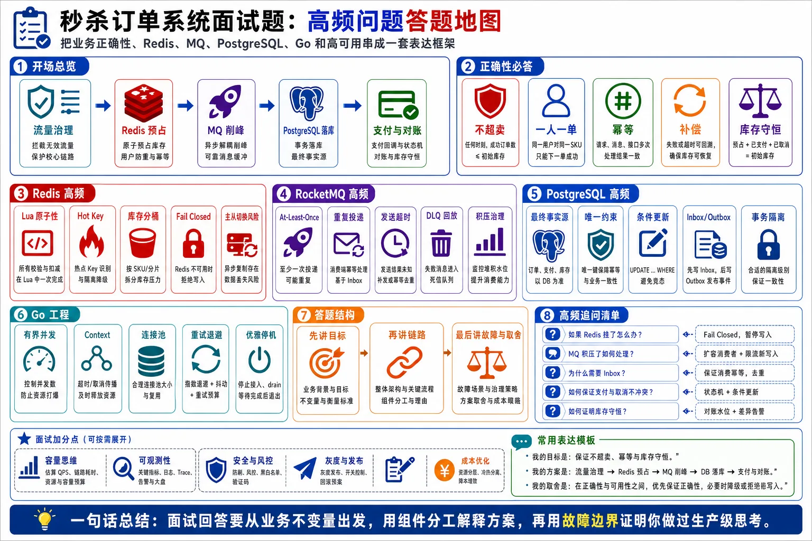

# 第 11 章：秒杀订单系统面试高频问题与参考答案



> 图注：本章全文重点总结图，把面试常见追问按开场总览、业务正确性、Redis、RocketMQ、PostgreSQL、Go 工程和答题结构组织成一张答题地图。

下面的问题基于前面的架构设计展开，默认技术栈为：

```text
Go + Redis + RocketMQ + PostgreSQL
```

默认主链路为：

```text
客户端
  → 网关限流 / 防刷
  → Go 秒杀接入服务
  → Redis Lua 原子预占库存
  → RocketMQ 异步削峰
  → Go 订单消费者
  → PostgreSQL 创建订单
  → Redis 更新查询状态
```

核心设计原则是：

> **Redis 负责高并发预占，RocketMQ 负责削峰异步，PostgreSQL 负责最终正确性，Go 服务负责有界并发、超时、幂等和降级。**

---

## 一、面试开场类问题

### 1. 请你整体设计一个高并发秒杀订单系统

#### 参考答案

我会把秒杀链路拆成 **接入层、预占层、异步削峰层、订单落库层、支付与补偿层**。

整体流程是：

```text
用户请求
  → 网关限流、防刷、令牌校验
  → Go 秒杀服务做参数校验和本地售罄判断
  → Redis Lua 原子执行库存检查、用户防重、request_id 幂等、库存预占
  → 预占成功后发送 RocketMQ 消息
  → 订单消费者异步消费消息
  → PostgreSQL 事务内做 Inbox 幂等、最终库存校验、一人一单唯一约束、订单创建
  → 返回或更新 Redis 查询状态
```

这个设计的核心是：

1. **入口限流**，先挡掉大部分无效流量。
2. **Redis Lua 原子预占库存**，避免请求直接打到数据库。
3. **RocketMQ 削峰**，把瞬时高并发写入变成数据库能承受的稳定写入。
4. **PostgreSQL 作为最终正确性防线**，用唯一约束、条件更新和事务防止超卖、重复下单。
5. **全链路幂等和补偿对账**，处理超时、重试、宕机和消息重复。

---

### 2. 秒杀系统最核心的难点是什么？

#### 参考答案

核心难点不是简单的高 QPS，而是 **高并发下的数据正确性和故障恢复**。

主要难点有：

1. **不超卖**
   多个用户同时抢同一个 SKU，最终有效订单数不能超过库存。

2. **一人一单**
   同一个用户重复点击、重试、并发请求，不能创建多个有效订单。

3. **跨组件一致性**
   Redis 预占成功、RocketMQ 发送、PostgreSQL 创建订单，这三个动作无法放在一个本地事务里。

4. **消息重复和消费幂等**
   MQ 通常是 At-Least-Once 投递，消费者必须能处理重复消息。

5. **支付和取消并发**
   超时取消消息和支付回调可能同时到达，状态机必须保证已支付订单不能被取消。

6. **高可用和降级**
   Redis、MQ、PostgreSQL 任意组件故障时，系统要知道继续、暂停还是降级。

所以秒杀系统不是只考 Redis 或 MQ，而是考 **并发控制、事务边界、幂等、补偿、对账和容量治理**。

---

### 3. 秒杀接口返回成功，是否代表订单已经创建成功？

#### 参考答案

不一定。

在高并发秒杀系统里，接口通常采用异步模式。用户请求成功后，可能只是代表：

```text
Redis 库存预占成功，用户获得了排队创建订单的资格。
```

它不等于：

```text
PostgreSQL 订单已经创建成功。
```

更不等于：

```text
支付成功。
```

建议把结果分成几个状态：

| 状态              | 含义                |
| --------------- | ----------------- |
| `ACCEPTED`      | 请求已接收，进入排队        |
| `RESERVED`      | Redis 库存预占成功      |
| `ORDER_CREATED` | PostgreSQL 订单创建成功 |
| `SOLD_OUT`      | 库存不足              |
| `DUPLICATE`     | 用户重复抢购            |
| `FAILED`        | 创建失败，需要补偿         |
| `PAID`          | 支付成功              |
| `CANCELLED`     | 超时未支付取消           |

接口可以先返回：

```json
{
  "code": "ACCEPTED",
  "message": "排队中",
  "reservation_id": "xxx"
}
```

用户通过查询接口获取最终订单结果。

---

### 4. 为什么秒杀系统一般不直接同步创建订单？

#### 参考答案

因为同步创建订单会把所有峰值流量直接打到数据库。

例如 100 万用户在 10 秒内请求，入口平均就是 10 万 QPS，峰值可能达到 30 万 QPS。如果每个请求都同步写 PostgreSQL，会造成：

1. 数据库连接池耗尽。
2. 热点库存行锁竞争严重。
3. WAL 写入压力暴增。
4. 大量请求阻塞，延迟升高。
5. 客户端超时后重试，形成重试风暴。
6. 数据库被打垮后，整个交易链路不可用。

所以常见做法是：

```text
Redis 负责快速判断和库存预占
RocketMQ 负责削峰
PostgreSQL 按自身能力稳定落库
```

同步接口只做轻量操作，重操作异步化。

---

### 5. Redis 扣库存成功，为什么还需要 PostgreSQL 做最终校验？

#### 参考答案

因为 Redis 是秒杀链路的高性能预占层，不应该作为订单最终事实来源。

Redis 可能出现：

1. 主从异步复制丢失写入。
2. 故障切换后 reservation 状态丢失。
3. Lua 执行成功但服务发送 MQ 前宕机。
4. Redis 中的预占状态和 PostgreSQL 订单状态不一致。
5. 运维误操作或缓存淘汰风险。
6. 补偿重复或遗漏。

所以 PostgreSQL 必须有最终防线，例如：

```sql
CREATE UNIQUE INDEX uk_orders_user_sku
ON orders(activity_id, sku_id, user_id);
```

以及最终库存条件扣减：

```sql
UPDATE sku_inventory
SET available_stock = available_stock - 1
WHERE activity_id = $1
  AND sku_id = $2
  AND available_stock > 0;
```

如果受影响行数为 1，说明最终扣减成功；如果为 0，说明库存不足或状态不满足条件。

**Redis 提升性能，PostgreSQL 保证最终正确性。**

---

## 二、业务正确性与状态机类问题

### 6. 如何保证不超卖？

#### 参考答案

我会使用多层防线保证不超卖。

第一层是 Redis Lua 原子预占：

```text
检查库存 > 0
检查用户未购买
扣减 Redis 库存
写入 reservation
```

这些步骤在一个 Lua 脚本里完成，避免并发请求之间出现竞态。

第二层是 RocketMQ 削峰，让订单创建按数据库能力消费，避免直接冲击 PostgreSQL。

第三层是 PostgreSQL 最终防线：

```sql
UPDATE sku_inventory
SET available_stock = available_stock - 1
WHERE activity_id = $1
  AND sku_id = $2
  AND available_stock > 0;
```

只有受影响行数为 1 才能创建订单。

第四层是订单唯一约束和库存流水对账，定期校验：

```text
初始库存 = 已售 + 可售 + 已取消 + 异常待处理
```

所以即使 Redis 或 MQ 出现异常，PostgreSQL 仍能防止最终超卖。

---

### 7. 如何保证一人一单？

#### 参考答案

一人一单需要在 Redis 和 PostgreSQL 两层都做。

Redis 前置防重：

```text
user_buy:{activity_id}:{sku_id}:{user_id}
```

Lua 脚本中判断该用户是否已经抢过，如果抢过直接返回重复请求。

PostgreSQL 最终防线：

```sql
CREATE UNIQUE INDEX uk_order_activity_sku_user
ON orders(activity_id, sku_id, user_id);
```

消费者创建订单时，即使重复消息、重复请求进入数据库，也会被唯一约束拦截。

处理方式可以使用：

```sql
INSERT INTO orders (...)
VALUES (...)
ON CONFLICT (activity_id, sku_id, user_id)
DO NOTHING;
```

然后根据影响行数判断：

* 插入成功：首次创建订单。
* 插入失败：重复下单，按幂等成功处理或返回已有订单。

这样可以防止 Redis 前置防重失效时产生重复订单。

---

### 8. 什么是 request_id 幂等？为什么需要它？

#### 参考答案

`request_id` 是客户端或服务端生成的请求幂等键，用来识别同一次业务请求。

秒杀时用户可能因为网络超时、页面重复点击、APP 自动重试，发送多次相同请求。如果没有 `request_id`，系统可能重复扣库存、重复发送 MQ、重复创建 reservation。

处理方式是：

```text
request_result:{request_id} → 第一次请求的处理结果
```

Redis Lua 执行时第一步先判断 request_id 是否存在：

* 存在：直接返回第一次处理结果。
* 不存在：继续检查库存和用户资格。
* 成功后写入 request_id 对应结果。

这样可以保证：

```text
同一个 request_id 重复执行，业务效果不重复发生。
```

注意，`request_id` 不能替代用户维度的一人一单，因为同一个用户可能伪造多个 request_id，所以还需要 `activity_id + sku_id + user_id` 防重。

---

### 9. 什么是 message_id 幂等？为什么 MQ 消费必须做幂等？

#### 参考答案

MQ 通常采用 At-Least-Once 投递语义，也就是说消息至少投递一次，但可能重复投递。

重复投递的典型原因有：

1. 消费者处理成功，但 ACK 前宕机。
2. 消费者处理超时，Broker 认为消费失败。
3. 网络抖动导致 ACK 丢失。
4. 消费者主动返回失败，触发重试。
5. 消息回放。

所以消费者必须使用 `message_id` 做幂等。

常见做法是在 PostgreSQL 中设计 Inbox 表：

```sql
CREATE TABLE consumer_inbox (
    message_id text PRIMARY KEY,
    topic text NOT NULL,
    consumer_group text NOT NULL,
    status text NOT NULL,
    created_at timestamptz NOT NULL DEFAULT now()
);
```

消费时在本地事务开始插入：

```sql
INSERT INTO consumer_inbox(message_id, topic, consumer_group, status)
VALUES ($1, $2, $3, 'PROCESSING')
ON CONFLICT (message_id) DO NOTHING;
```

如果插入失败，说明消息已经处理过或正在处理，不再重复执行业务逻辑。

---

### 10. 如何设计订单状态机？

#### 参考答案

订单状态不能随意修改，必须通过状态机控制。

常见状态如下：

```text
CREATED      已创建，待支付
PAYING       支付中
PAID         已支付
CANCELLING   取消中
CANCELLED    已取消
FAILED       创建失败
```

状态迁移示例：

```text
CREATED → PAYING → PAID
CREATED → CANCELLED
PAYING  → PAID
PAYING  → CANCELLED
```

禁止：

```text
PAID → CANCELLED
CANCELLED → PAID
```

数据库更新必须使用条件 UPDATE，例如支付成功：

```sql
UPDATE orders
SET status = 'PAID',
    paid_at = now(),
    updated_at = now()
WHERE order_id = $1
  AND status IN ('CREATED', 'PAYING');
```

超时取消：

```sql
UPDATE orders
SET status = 'CANCELLED',
    cancelled_at = now(),
    updated_at = now()
WHERE order_id = $1
  AND status IN ('CREATED', 'PAYING');
```

通过 affected rows 判断是否更新成功。如果支付和取消并发，只有一个状态更新能成功，另一个 affected rows 为 0，再查询当前状态做幂等处理。

---

### 11. 支付成功和超时取消同时发生怎么办？

#### 参考答案

这是典型并发竞态，不能靠应用层先查状态再判断，必须使用数据库条件更新。

支付回调执行：

```sql
UPDATE orders
SET status = 'PAID',
    paid_at = now()
WHERE order_id = $1
  AND status IN ('CREATED', 'PAYING');
```

超时取消执行：

```sql
UPDATE orders
SET status = 'CANCELLED',
    cancelled_at = now()
WHERE order_id = $1
  AND status IN ('CREATED', 'PAYING');
```

这两个 SQL 并发执行时，PostgreSQL 会通过行锁保证同一时刻只有一个事务成功修改该行。

结果有两种：

1. 支付先成功，取消 affected rows = 0，取消任务查询发现订单已支付，不释放库存。
2. 取消先成功，支付 affected rows = 0，支付回调需要走退款或异常处理流程。

核心原则是：

> **状态迁移必须用条件更新保证原子性，不能先 SELECT 再 UPDATE。**

---

### 12. 库存补偿如何保证不会重复增加？

#### 参考答案

库存补偿也必须幂等，不能简单执行：

```text
INCR stock
```

否则补偿消息重复投递会导致库存被多次加回。

正确做法是基于 reservation 状态做条件补偿。

例如 reservation 状态：

```text
RESERVED       已预占
ORDER_CREATED 订单已创建
RELEASED       已释放
FAILED         创建失败
```

补偿时只允许：

```text
RESERVED → RELEASED
```

Redis Lua 中判断 reservation 当前状态：

```text
如果状态是 RESERVED：
    修改为 RELEASED
    INCR 库存
否则：
    不增加库存
```

PostgreSQL 也要有类似条件更新：

```sql
UPDATE inventory_reservation
SET status = 'RELEASED',
    released_at = now()
WHERE reservation_id = $1
  AND status = 'RESERVED';
```

只有 affected rows = 1 时，才允许写库存释放流水。

---

### 13. 如何判断一次重复操作应该返回成功还是失败？

#### 参考答案

幂等不是简单地“重复就失败”，而是要根据第一次操作的业务结果返回一致语义。

例如：

#### 重复秒杀请求

如果第一次请求已经预占成功，重复请求应该返回：

```text
排队中或已抢购成功
```

而不是返回失败。

#### 重复支付回调

如果订单已经是 `PAID`，重复支付回调应该返回：

```text
处理成功
```

避免支付平台继续重试。

#### 重复取消

如果订单已经是 `CANCELLED`，重复取消也可以返回成功。

#### 非法状态

如果订单已经 `PAID`，取消请求再来，不能返回“取消成功”，而应该返回：

```text
订单已支付，不能取消
```

所以判断逻辑是：

```text
重复请求 + 结果一致 = 幂等成功
状态冲突 + 业务不允许 = 幂等拒绝或异常处理
```

---

## 三、Redis 高频问题

### 14. Redis Lua 为什么能防止超卖？

#### 参考答案

Redis 单个命令执行具有原子性，Lua 脚本在 Redis 中执行时，整个脚本也会作为一个原子操作执行。

也就是说，下面这些步骤不会被其他请求打断：

```text
检查库存
检查用户是否已购买
扣减库存
写入用户购买标记
写入 reservation
写入 request_id 结果
```

所以不会出现两个请求同时看到库存为 1，然后都扣减成功的情况。

Lua 预占逻辑类似：

```lua
local stock = tonumber(redis.call("GET", stockKey))
if stock <= 0 then
    return SOLD_OUT
end

if redis.call("EXISTS", userKey) == 1 then
    return DUPLICATE
end

redis.call("DECR", stockKey)
redis.call("SET", userKey, reservationId, "EX", ttl)
redis.call("HSET", reservationKey, "status", "RESERVED")
return SUCCESS
```

但是要注意：

> **Redis Lua 只能保证 Redis 内部操作原子，不能保证 Redis、MQ、PostgreSQL 之间的分布式事务。**

---

### 15. 为什么不能先 GET 库存，再 DECR？

#### 参考答案

因为 `GET` 和 `DECR` 是两个独立操作，中间可能被其他请求插入。

例如库存为 1：

```text
请求 A：GET stock = 1
请求 B：GET stock = 1
请求 A：DECR stock，库存变成 0
请求 B：DECR stock，库存变成 -1
```

这样就发生超卖。

解决方式是：

1. 使用 Lua 把检查和扣减合并成一个原子操作。
2. 或者使用 Redis 的原子命令结合补偿，但逻辑复杂。
3. 或者用 PostgreSQL 条件 UPDATE 做最终防线。

推荐 Redis Lua：

```text
判断库存 > 0 和扣减库存必须在同一个原子单元内完成。
```

---

### 16. 为什么不建议每个秒杀请求都使用分布式锁？

#### 参考答案

分布式锁会把高并发请求串行化，吞吐量会明显下降。

秒杀扣库存本质上是一个简单的原子条件修改：

```text
库存 > 0 才扣减
```

Redis Lua 或 PostgreSQL 条件 UPDATE 已经能解决这个问题，不需要额外加锁。

分布式锁还会引入额外问题：

1. 锁过期时间不好设置。
2. 业务执行时间超过锁 TTL 可能导致锁提前释放。
3. 加锁和释放锁增加 Redis 压力。
4. 锁竞争会导致大量请求阻塞。
5. 客户端重试可能形成雪崩。
6. 锁无法天然解决 MQ 重复消费和数据库幂等。

所以秒杀系统默认不使用分布式锁，而是使用：

```text
Redis Lua 原子预占 + PostgreSQL 唯一约束 + 条件更新 + 幂等消息
```

---

### 17. Redis Cluster 能不能解决热点库存 Key 问题？

#### 参考答案

不能完全解决。

Redis Cluster 可以把不同 Key 分布到不同节点上，但一个热点 SKU 的库存通常是一个 Key，例如：

```text
stock:{activity_id}:{sku_id}
```

这个单 Key 只能落在一个 Redis Slot 上，也只能由一个主节点处理。Redis Cluster 不能自动把一个 Key 拆到多个节点。

解决热点库存 Key 的方式通常是业务层拆分：

```text
stock_bucket:{activity_id}:{sku_id}:0
stock_bucket:{activity_id}:{sku_id}:1
...
stock_bucket:{activity_id}:{sku_id}:N
```

每个分桶保存一部分库存，请求随机或按用户 hash 访问某个桶。

但库存分桶有副作用：

1. 可能出现局部售罄，但全局还有库存。
2. 补偿逻辑更复杂。
3. 对账更复杂。
4. 热点分布不均时仍可能局部热点。
5. 需要处理分桶重试和库存回流。

所以库存分桶适合极高并发热点 SKU，不是所有场景都需要。

---

### 18. Redis 库存分桶怎么设计？

#### 参考答案

假设某个 SKU 库存为 10,000，可以拆成 100 个桶，每个桶 100 件：

```text
stock_bucket:{activity_id}:{sku_id}:0 = 100
stock_bucket:{activity_id}:{sku_id}:1 = 100
...
stock_bucket:{activity_id}:{sku_id}:99 = 100
```

请求时根据用户 ID 做 hash：

```text
bucket = hash(user_id) % bucket_count
```

优点是：

1. 把单 Key 热点拆散。
2. 多个 Redis 节点可以共同承担压力。
3. Lua 执行压力下降。
4. 单节点延迟更稳定。

但是如果用户分布不均，某些桶先卖完，其他桶还有库存。可以设计二次探测：

```text
先访问 hash 桶
如果桶售罄，再尝试少量其他桶
```

注意探测次数必须有限，不能扫描所有桶，否则 Redis 压力会重新升高。

---

### 19. Redis 预占成功后，服务在发送 MQ 前宕机怎么办？

#### 参考答案

这是秒杀系统最关键的分布式一致性问题之一。

流程中断位置是：

```text
Redis Lua 预占成功
Go 服务宕机
RocketMQ 消息未发送
PostgreSQL 订单未创建
```

结果是：

```text
库存被 Redis 占住，但没有订单创建消息。
```

解决方案是 reservation 状态机 + 扫描补发。

Redis 预占成功时写入 reservation：

```text
reservation:{reservation_id}
status = RESERVED
message_sent = false
created_at = xxx
```

服务发送 MQ 成功后，再把状态更新为：

```text
message_sent = true
```

后台扫描任务定期扫描：

```text
status = RESERVED 且 message_sent = false 且超过一定时间
```

然后补发 MQ 消息。

消费者侧使用 `reservation_id` 和 `message_id` 做幂等，保证补发多次也不会重复创建订单。

同时 PostgreSQL 仍然使用唯一约束和最终库存校验兜底。

---

### 20. Redis 主从切换会带来什么风险？

#### 参考答案

Redis 主从复制通常是异步的。

可能发生这种情况：

```text
主节点写入 reservation 成功
客户端收到成功
写入还没复制到从节点
主节点宕机
从节点提升为新主
刚才的 reservation 丢失
```

结果可能是：

1. 用户已经收到排队中，但 Redis 查询不到 reservation。
2. Redis 库存回滚，可能造成预占状态丢失。
3. MQ 消息和 PostgreSQL 订单状态与 Redis 不一致。

处理方式：

1. Redis 只作为预占和查询缓存，最终以 PostgreSQL 为准。
2. reservation 需要有补偿和对账机制。
3. 对已发 MQ 的订单，由 PostgreSQL 幂等创建。
4. 查询接口如果 Redis 查不到，要能回查 PostgreSQL。
5. Redis 故障期间通常 Fail Closed，暂停新秒杀请求，避免绕过预占层直接冲数据库。

---

### 21. Redis 不可用时，系统应该继续卖吗？

#### 参考答案

通常不应该继续卖，应该 **Fail Closed**，暂停新秒杀请求。

原因是 Redis 在这个架构中负责：

1. 高并发库存预占。
2. 用户前置防重。
3. request_id 幂等。
4. 热点流量过滤。
5. 查询状态缓存。

如果 Redis 不可用，直接绕过 Redis 打 PostgreSQL，会导致：

1. 数据库承受全部峰值流量。
2. 热点库存行严重锁竞争。
3. 大量连接耗尽。
4. 整个交易库可能被打垮。
5. 其他非秒杀业务受影响。

所以推荐策略是：

```text
Redis 短暂不可用：
    秒杀接口返回系统繁忙或排队失败

Redis 恢复后：
    扫描 reservation、MQ、PostgreSQL 做状态修复

已有订单查询：
    可以降级回查 PostgreSQL
```

---

## 四、RocketMQ 高频问题

### 22. RocketMQ 在秒杀系统中解决什么问题？

#### 参考答案

RocketMQ 主要解决的是 **削峰填谷和异步解耦**。

秒杀入口可能有 30 万 QPS，但 PostgreSQL 可能只能稳定处理几千到几万 TPS 的订单写入。RocketMQ 把瞬时流量暂存起来，让消费者按照数据库可承受能力逐步处理。

它的作用是：

1. 削峰：把突发请求变成平滑消费。
2. 解耦：秒杀接入服务和订单服务解耦。
3. 重试：消费失败可以自动重试。
4. 延迟消息：实现订单超时取消。
5. 死信队列：保存多次失败的异常消息。
6. 回放：必要时可以重新处理历史消息。

但 MQ 不能解决所有问题：

```text
MQ 不等于分布式事务。
MQ 不保证业务只执行一次。
消费者仍然必须幂等。
数据库仍然需要唯一约束和事务。
```

---

### 23. MQ 消息发送成功，但生产者收到超时怎么办？

#### 参考答案

这属于“发送结果未知”。

可能实际情况有两种：

1. Broker 已经收到消息，但响应丢失。
2. Broker 没收到消息，发送失败。

生产者无法单靠超时判断消息到底有没有成功。

处理方式是：

1. 生产者可以重试发送。
2. 消息必须带业务唯一键，例如 `reservation_id` 或 `message_id`。
3. 消费者必须使用 Inbox 幂等。
4. PostgreSQL 使用唯一约束防重复订单。
5. 发送端记录 message_sent 状态，后台扫描补发未确认消息。

这样即使重复发送，消费者也只会产生一次业务效果。

回答重点是：

> **发送超时时不能简单认为失败，也不能简单认为成功，必须按结果未知处理，并依赖幂等保证重复发送安全。**

---

### 24. 消费者写数据库成功，但 ACK 前宕机怎么办？

#### 参考答案

这种情况下，RocketMQ 认为消息没有成功消费，之后会重新投递。

如果消费者没有幂等保护，就会重复创建订单或重复扣库存。

正确做法是在 PostgreSQL 本地事务里使用 Inbox 表：

```text
开始事务
  → 插入 consumer_inbox(message_id)
  → 如果插入失败，说明已处理，直接返回成功
  → 条件扣减库存
  → 创建订单
  → 写库存流水
  → 提交事务
提交成功后 ACK MQ
```

如果数据库提交成功但 ACK 前宕机，消息会再次投递。下一次消费时插入 Inbox 失败，说明该消息已处理，消费者直接 ACK。

所以核心机制是：

```text
MQ At-Least-Once + PostgreSQL Inbox 幂等 = 业务效果只发生一次
```

---

### 25. RocketMQ 事务消息能解决 Redis、MQ、PostgreSQL 一致性吗？

#### 参考答案

不能完全解决。

RocketMQ 事务消息主要解决的是：

```text
本地事务和消息发送之间的一致性
```

它的典型流程是：

```text
发送 Half Message
执行本地事务
根据本地事务结果 Commit 或 Rollback 消息
Broker 回查本地事务状态
```

但在秒杀系统中，如果 Redis 已经预占库存，而本地事务还涉及 PostgreSQL 或其他状态，事务边界仍然复杂。

它不能自动解决：

1. Redis Lua 成功和 PostgreSQL 事务的一致性。
2. 消费者重复消费。
3. 下游创建订单失败后的补偿。
4. 支付和取消并发。
5. 业务幂等。
6. 对账修复。

所以 RocketMQ 事务消息可以作为可靠消息方案之一，但不能替代：

```text
Inbox 幂等
Outbox
状态机
补偿
对账
唯一约束
```

---

### 26. 秒杀订单需要顺序消息吗？

#### 参考答案

大多数场景不需要全局顺序消息。

全局顺序会严重降低吞吐，因为所有消息都要进入同一个队列或严格串行消费。

秒杀系统通常只需要 **局部有序**，例如：

1. 同一个 `order_id` 的状态事件有序。
2. 同一个 `reservation_id` 的创建和补偿有序。
3. 同一个用户同一个 SKU 的操作有序。

可以使用顺序键：

```text
hash(order_id) 或 hash(reservation_id)
```

把同一业务对象的消息路由到同一个队列。

但是即使使用顺序消息，消费者仍然要处理：

1. 重复消息。
2. 延迟消息。
3. 状态已变化。
4. 消费失败重试。

所以顺序消息不是幂等的替代品。

---

### 27. 延迟消息如何实现订单超时取消？

#### 参考答案

订单创建成功后发送一条延迟取消消息，例如 15 分钟后投递：

```json
{
  "message_type": "ORDER_TIMEOUT_CANCEL",
  "order_id": "xxx",
  "reservation_id": "xxx",
  "activity_id": 1001,
  "sku_id": 2001,
  "user_id": 3001
}
```

延迟消息到达后，消费者不能直接取消订单，必须重新检查订单当前状态。

取消 SQL：

```sql
UPDATE orders
SET status = 'CANCELLED',
    cancelled_at = now()
WHERE order_id = $1
  AND status IN ('CREATED', 'PAYING');
```

如果 affected rows = 1，说明取消成功，然后释放库存或写补偿流水。

如果 affected rows = 0，需要查询当前状态：

* 如果是 `PAID`，说明已支付，取消消息幂等忽略。
* 如果是 `CANCELLED`，说明已经取消，幂等成功。
* 如果是其他异常状态，进入人工或补偿流程。

核心原则：

> **延迟消息只是触发器，不是状态判断依据。**

---

### 28. MQ 积压严重怎么办？

#### 参考答案

首先要判断积压原因：

1. 消费者数量不足。
2. PostgreSQL 写入能力不足。
3. 消费逻辑变慢。
4. 下游依赖超时。
5. 某类消息持续失败重试。
6. 单队列热点导致局部积压。

处理方式：

#### 短期措施

1. 降低入口秒杀请求速率。
2. 启动降级，减少新 reservation。
3. 增加消费者实例，但不能超过 PostgreSQL 承载能力。
4. 临时提高批处理大小。
5. 暂停非核心消费任务。
6. 将异常消息转入隔离队列或 DLQ。

#### 长期措施

1. 提高 PostgreSQL 写入能力。
2. 优化事务和索引。
3. 使用分区表。
4. 拆分 Topic 或 Queue。
5. 优化消费者 Worker Pool。
6. 优化批量写库。
7. 增加容量冗余。

积压清空时间计算：

```text
清空时间 = 当前积压量 / (消费速度 - 新增生产速度)
```

如果消费速度小于生产速度，积压永远无法清空，只扩容 MQ 没有意义。

---

### 29. 死信队列中的消息怎么处理？

#### 参考答案

死信队列不能长期堆积不处理。

消息进入 DLQ 说明它经过多次重试仍然失败，可能原因是：

1. 数据格式错误。
2. 数据库约束冲突。
3. 依赖服务异常。
4. 业务状态不一致。
5. 代码 Bug。
6. 脏数据。

处理流程应该是：

```text
DLQ 告警
  → 自动分类
  → 可重试消息重新投递
  → 不可重试消息标记失败
  → 触发补偿或人工修复
  → 记录处理结果
```

对于秒杀订单，DLQ 消息必须关联：

```text
message_id
request_id
reservation_id
order_id
activity_id
sku_id
user_id
```

方便对账和修复。

---

## 五、PostgreSQL 高频问题

### 30. PostgreSQL 在秒杀架构中承担什么角色？

#### 参考答案

PostgreSQL 是订单和库存的最终事实来源。

它负责：

1. 活动和 SKU 基础数据。
2. 最终库存。
3. 订单主表和明细。
4. 支付记录。
5. 库存流水。
6. 消费 Inbox。
7. 事件 Outbox。
8. 补偿任务。
9. 对账数据。
10. 一人一单唯一约束。
11. 状态机条件更新。

Redis 是高性能预占层，RocketMQ 是削峰层，但最终是否创建有效订单，必须以 PostgreSQL 的事务提交结果为准。

---

### 31. 为什么 Redis 已经防重，PostgreSQL 还要唯一索引？

#### 参考答案

因为 Redis 防重不是最终强一致保证。

Redis 可能出现：

1. Key 过期。
2. 主从切换丢数据。
3. 预占状态丢失。
4. 业务代码 Bug。
5. 重复消息绕过 Redis 前置逻辑。
6. 数据修复时重复执行。

所以 PostgreSQL 必须用唯一索引兜底：

```sql
CREATE UNIQUE INDEX uk_orders_activity_sku_user
ON orders(activity_id, sku_id, user_id);
```

这样即使重复请求或重复消息到达数据库，也不能插入第二个有效订单。

架构原则是：

```text
前置防重提升性能，数据库约束保证正确性。
```

---

### 32. 为什么不能先 SELECT 库存再 UPDATE？

#### 参考答案

因为先 SELECT 再 UPDATE 不是原子操作，会产生并发竞态。

例如库存为 1：

```text
事务 A SELECT stock = 1
事务 B SELECT stock = 1
事务 A UPDATE stock = stock - 1
事务 B UPDATE stock = stock - 1
```

如果没有正确条件，可能导致库存为 -1。

正确方式是条件 UPDATE：

```sql
UPDATE sku_inventory
SET available_stock = available_stock - 1
WHERE activity_id = $1
  AND sku_id = $2
  AND available_stock > 0;
```

数据库会在更新时加行锁，并重新检查条件。

根据 affected rows 判断：

* `1`：扣减成功。
* `0`：库存不足或条件不满足。

这种方式把检查和修改放进一个数据库原子操作里。

---

### 33. PostgreSQL Read Committed 隔离级别够用吗？

#### 参考答案

很多秒杀订单创建场景下，`Read Committed` 是可以使用的，但前提是关键并发控制依赖：

1. 唯一约束。
2. 条件 UPDATE。
3. 行锁。
4. affected rows 判断。
5. 幂等表。
6. 事务内一致性处理。

例如库存扣减：

```sql
UPDATE sku_inventory
SET available_stock = available_stock - 1
WHERE sku_id = $1
  AND available_stock > 0;
```

在 `Read Committed` 下，PostgreSQL 会对被更新行加锁，并在等待锁后重新判断 WHERE 条件，因此可以防止库存扣成负数。

但是如果存在复杂跨多行约束，例如：

```text
多个 SKU 组合库存
跨表聚合约束
复杂优惠资格
```

可能需要更高隔离级别、显式锁、约束表或业务补偿。

不能简单说某个隔离级别永远够用，要看并发不变量靠什么机制保证。

---

### 34. 如何用 PostgreSQL 实现消费幂等？

#### 参考答案

使用 Inbox Pattern。

表结构示例：

```sql
CREATE TABLE consumer_inbox (
    message_id text PRIMARY KEY,
    topic text NOT NULL,
    consumer_group text NOT NULL,
    status text NOT NULL,
    created_at timestamptz NOT NULL DEFAULT now(),
    processed_at timestamptz
);
```

消费者本地事务中：

```sql
INSERT INTO consumer_inbox(message_id, topic, consumer_group, status)
VALUES ($1, $2, $3, 'PROCESSING')
ON CONFLICT (message_id) DO NOTHING;
```

如果插入成功，说明首次处理，继续执行业务。

如果插入失败，说明消息已经处理过或正在处理，直接返回幂等成功或查询状态。

业务处理完成后：

```sql
UPDATE consumer_inbox
SET status = 'DONE',
    processed_at = now()
WHERE message_id = $1;
```

关键是 Inbox 和订单创建必须在同一个 PostgreSQL 本地事务里提交。

---

### 35. 如何设计 Outbox？它解决什么问题？

#### 参考答案

Outbox 解决的是：

```text
数据库本地事务成功后，后续事件发送不能丢失
```

例如订单创建成功后，需要发送：

1. 订单创建事件。
2. 支付超时取消事件。
3. Redis 状态更新事件。
4. 对账事件。

如果直接在事务提交后发送 MQ，服务可能在提交成功后、发送消息前宕机，导致事件丢失。

Outbox 做法是在同一个数据库事务内写入业务数据和事件表：

```sql
INSERT INTO orders (...);
INSERT INTO event_outbox (
    event_id,
    event_type,
    aggregate_id,
    payload,
    status
) VALUES (..., 'NEW');
```

事务提交后，由独立 Relay 任务扫描 `event_outbox` 表，把事件发送到 MQ。发送成功后标记为 `SENT`。

Outbox 的代价是：

1. 增加一张事件表。
2. 增加 Relay 组件。
3. 事件可能重复发送。
4. 下游仍然要幂等。

---

### 36. PostgreSQL 热点库存行怎么优化？

#### 参考答案

热点库存行是指大量事务同时更新同一行：

```sql
UPDATE sku_inventory
SET available_stock = available_stock - 1
WHERE sku_id = $1;
```

这会导致行锁竞争，事务排队。

优化方式有：

1. **Redis 前置预占**
   大部分请求不进入数据库。

2. **RocketMQ 削峰**
   控制数据库写入速度。

3. **库存令牌化**
   提前生成 10,000 个库存令牌，消费者领取令牌，而不是更新同一行。

4. **库存分片表**
   把库存拆成多个库存段，降低单行锁竞争。

5. **批处理**
   多个订单聚合提交，减少事务开销，但要注意延迟。

6. **减少索引**
   写热点表上过多索引会增加写放大。

在秒杀系统里，最核心的是不要让所有入口请求直接更新 PostgreSQL 热点行。

---

### 37. PostgreSQL 连接池怎么设置？

#### 参考答案

连接池不是越大越好。

连接过多会导致：

1. 上下文切换增加。
2. 内存占用增加。
3. 锁竞争增加。
4. 磁盘随机 IO 增加。
5. PostgreSQL 后台进程压力增加。
6. P99 延迟升高。

连接池大小应该根据：

```text
数据库 CPU 核数
单事务耗时
目标 TPS
锁等待
WAL 能力
查询复杂度
服务实例数
```

综合压测得到。

例如 PostgreSQL 总可承受 300 个活跃连接，有 10 个消费者实例，则每个实例的连接池不能随便配置 100，而应该控制在 20～30 左右，并留出管理连接和其他业务连接。

Go 服务里：

```text
goroutine 数量可以多
数据库并发必须有界
```

Worker Pool 的大小也应该受数据库连接池限制。

---

### 38. 为什么订单查询不能都走 PostgreSQL 从库？

#### 参考答案

因为从库存在复制延迟。

秒杀订单创建后，用户马上查询订单状态。如果查询从库，可能出现：

```text
主库已创建订单
从库还没复制到
用户查询不到订单
用户重复提交请求
```

对于强一致状态查询，应优先查：

1. Redis 查询状态。
2. PostgreSQL 主库。
3. 或者先查 Redis，未命中再按业务要求回查主库。

从库适合：

1. 历史订单查询。
2. 报表统计。
3. 非强一致读。
4. 活动信息等较低一致性要求的数据。

不能因为读写分离就把所有查询都打到从库。

---

## 六、Go 高并发问题

### 39. Go 服务如何承载高并发秒杀请求？

#### 参考答案

Go 服务本身适合高并发，但必须控制下游并发。

设计要点：

1. HTTP 层设置超时。
2. 每个请求携带 `context.Context`。
3. Redis、MQ、PostgreSQL 调用都要继承 context。
4. 使用本地限流保护服务。
5. 使用本地售罄标记快速失败。
6. MQ 消费者使用 Worker Pool。
7. 数据库写入并发受连接池限制。
8. 重试必须有次数和时间预算。
9. 服务支持优雅停机，避免消费中断造成大量重复消息。

关键原则：

```text
Go 可以同时接收很多请求，但不能让每个请求无限制访问下游。
```

---

### 40. 为什么不能为每条 MQ 消息都启动一个 goroutine？

#### 参考答案

goroutine 很轻量，但不是没有成本。

如果 MQ 积压 100 万条消息，每条消息都启动一个 goroutine，会导致：

1. 内存暴涨。
2. 调度开销增加。
3. 数据库连接池被打满。
4. Redis 或 PostgreSQL 被压垮。
5. GC 压力增加。
6. P99 延迟升高。
7. 服务 OOM。

正确做法是使用有界 Worker Pool：

```text
MQ 拉取消息
  → 写入有界 Channel
  → 固定数量 Worker 消费
  → 每个 Worker 使用受控数据库连接
```

Channel 满了就形成背压，消费者降低拉取速度。

核心是：

```text
入口可以高并发，下游必须有界并发。
```

---

### 41. Go 中 context 在秒杀链路中有什么作用？

#### 参考答案

`context.Context` 用来传递：

1. 请求超时。
2. 取消信号。
3. Trace 信息。
4. request_id 等链路标识。

例如用户请求超时后，服务不应该继续长时间执行 Redis、MQ 或数据库操作，否则会造成资源浪费。

正确做法是：

```go
ctx, cancel := context.WithTimeout(r.Context(), 80*time.Millisecond)
defer cancel()
```

然后 Redis、MQ、PostgreSQL 调用都使用这个 ctx。

但是要注意：

1. 已经提交到 MQ 或数据库的操作不能因为客户端断开就假装没发生。
2. 对于已经进入异步链路的任务，应该由后台消费者继续完成或补偿。
3. context 主要控制资源使用，不是业务事务回滚机制。

---

### 42. Go 消费者如何设计重试？

#### 参考答案

重试必须有边界，不能无限重试。

设计原则：

1. 区分错误类型：

   * 临时错误：网络抖动、数据库连接暂时不可用。
   * 永久错误：消息格式错误、非法状态。
   * 幂等冲突：重复消息。
2. 临时错误可以重试。
3. 永久错误进入 DLQ 或补偿任务。
4. 重试使用指数退避和随机抖动。
5. 设置最大重试次数和总耗时预算。
6. 重试前确认操作幂等。

例如：

```text
最多重试 3 次
初始等待 50ms
指数退避
加入随机抖动
总耗时不超过 500ms
```

不能在数据库事务里做长时间外部重试，否则会持有锁，影响其他事务。

---

### 43. Go 服务如何优雅停机？

#### 参考答案

优雅停机要避免正在处理的请求和消息被粗暴中断。

HTTP 服务：

1. 停止接收新请求。
2. 等待正在处理的请求完成。
3. 超过超时时间后强制退出。

MQ 消费者：

1. 停止拉取新消息。
2. 等待 Worker Pool 中正在处理的消息完成。
3. 对已完成业务事务的消息 ACK。
4. 对未完成的消息不 ACK，让 MQ 后续重投。
5. 关闭数据库、Redis、MQ 连接。

核心原则是：

```text
宁可让未完成消息重新投递，也不能在未知状态下确认成功。
```

---

### 44. Go 服务如何定位性能瓶颈？

#### 参考答案

需要结合指标、日志、Trace 和 pprof。

常用手段：

1. `pprof CPU`：看 CPU 热点。
2. `pprof heap`：看内存分配。
3. `goroutine profile`：看 goroutine 是否泄漏。
4. `block profile`：看锁或 Channel 阻塞。
5. `trace`：看调度、GC、网络等待。
6. 数据库慢 SQL：看 SQL 和锁等待。
7. Redis slowlog：看 Lua 或命令延迟。
8. MQ lag：看消费是否跟不上。

不要凭感觉优化 GC、连接池或 goroutine 数量，必须基于指标。

---

## 七、分布式一致性问题

### 45. Redis、MQ、PostgreSQL 之间如何保证一致性？

#### 参考答案

三者无法放进一个本地事务，所以不追求强分布式事务，而是采用最终一致性。

核心机制：

1. Redis Lua 原子预占，生成 reservation。
2. RocketMQ 发送订单创建消息。
3. PostgreSQL 消费端使用 Inbox 幂等。
4. PostgreSQL 本地事务内创建订单、扣减最终库存、写库存流水。
5. 订单创建失败时，通过补偿事件释放 Redis reservation。
6. 订单创建成功后，更新 Redis 查询状态。
7. 后台扫描 Redis reservation，补发未发送消息。
8. 定期对账 Redis、MQ、PostgreSQL 状态。
9. 异常数据进入人工修复。

核心思想是：

```text
At-Least-Once 投递
+ 幂等消费
+ 唯一约束
+ 条件更新
+ 状态机
+ 补偿
+ 对账
= 业务效果上的最终一致
```

---

### 46. 为什么不能实现真正的端到端 Exactly Once？

#### 参考答案

因为网络、进程、存储之间存在不确定状态。

例如：

1. 生产者发送 MQ 超时，不知道 Broker 是否收到。
2. 消费者提交数据库成功，但 ACK 前宕机。
3. 客户端收到超时，不知道服务是否已经处理。
4. Redis 写成功，但主从切换可能丢失。
5. PostgreSQL 提交结果可能因为网络断开对客户端不可见。

在这些情况下，调用方无法准确知道操作是否发生。

所以工程上通常不承诺物理意义上的端到端 Exactly Once，而是使用：

1. 全局业务幂等键。
2. 数据库唯一约束。
3. Inbox 去重。
4. Outbox 可靠事件。
5. 状态机条件更新。
6. 补偿和对账。

最终实现：

```text
消息可能处理多次，但业务效果只发生一次。
```

---

### 47. 什么是 Saga 补偿？秒杀中怎么用？

#### 参考答案

Saga 是一种长事务拆分思想，把一个大事务拆成多个本地事务，每个本地事务都有对应补偿动作。

秒杀中的 Saga 可以理解为：

```text
Redis 预占库存
  → 发送 MQ
  → PostgreSQL 创建订单
  → 支付
```

如果某一步失败，就执行补偿：

```text
订单创建失败 → 释放 Redis 预占库存
支付超时 → 取消订单并释放库存
补偿失败 → 重试或进入人工修复
```

但补偿必须满足：

1. 幂等。
2. 可重试。
3. 有状态机约束。
4. 可对账。
5. 不破坏已支付订单。

Saga 不保证中间过程强一致，它保证的是最终收敛。

---

### 48. Outbox 和 RocketMQ 事务消息怎么选？

#### 参考答案

两者解决的问题有重叠，但适用边界不同。

| 方案                   | 适合场景               | 优点                | 缺点                   |
| -------------------- | ------------------ | ----------------- | -------------------- |
| RocketMQ 事务消息        | 本地事务与 MQ 发送一致      | Broker 支持事务回查     | 仍需实现本地状态查询和消费者幂等     |
| PostgreSQL Outbox    | 以数据库事务为核心的事件可靠发送   | 业务数据和事件同事务提交      | 需要 Relay 扫描发送，事件可能重复 |
| Redis reservation 扫描 | Redis 预占后 MQ 未发送恢复 | 适合补 Redis → MQ 缺口 | Redis 数据可靠性弱于数据库     |

在我们的主架构中：

* Redis 到 MQ 的缺口使用 reservation 扫描补发。
* PostgreSQL 内部订单创建后的事件使用 Outbox。
* MQ 消费端使用 Inbox 幂等。

选择原则是：

```text
哪个组件是本阶段的事实来源，就围绕它设计可靠事件。
```

---

### 49. 对账怎么做？

#### 参考答案

对账的目标是发现并修复 Redis、MQ、PostgreSQL 之间的不一致。

对账维度包括：

1. Redis reservation。
2. PostgreSQL reservation 落库记录。
3. orders 表。
4. inventory_ledger 库存流水。
5. consumer_inbox 消费记录。
6. event_outbox 事件记录。
7. payment_record 支付记录。

库存守恒公式类似：

```text
活动初始库存
= PostgreSQL 已支付订单数
+ PostgreSQL 已创建待支付订单数
+ 已取消释放数量
+ Redis 仍预占但未落库数量
+ 异常待处理数量
+ 剩余可售库存
```

对账发现问题后：

| 异常                 | 处理            |
| ------------------ | ------------- |
| Redis 已预占但无 MQ 消息  | 补发 MQ         |
| MQ 消费失败多次          | 进入 DLQ 并告警    |
| PG 有订单但 Redis 状态缺失 | 修复 Redis 查询缓存 |
| 订单失败但库存未释放         | 触发幂等补偿        |
| 已支付订单被取消           | 严重告警，人工处理     |

对账任务本身也要幂等，避免重复修复造成二次错误。

---

## 八、高可用与降级问题

### 50. Redis、MQ、PostgreSQL 任一组件故障时怎么处理？

#### 参考答案

不同组件故障，策略不同。

| 故障组件              | 处理策略                |
| ----------------- | ------------------- |
| Redis 不可用         | 暂停新秒杀请求，Fail Closed |
| RocketMQ 不可用      | 停止新预占，或仅允许可靠本地记录后补发 |
| PostgreSQL 短暂不可用  | MQ 保留消息，消费者退避重试     |
| PostgreSQL 长时间不可用 | 限制入口，防止 MQ 无限积压     |
| 查询 Redis 不可用      | 降级回查 PostgreSQL     |
| 支付系统异常            | 不轻易释放库存，等待支付状态确认    |
| 单个 Go 实例宕机        | 负载均衡摘除，其他实例继续       |
| 单可用区故障            | 流量切到其他可用区           |

原则是：

```text
影响正确性的依赖故障时 Fail Closed
影响查询体验的依赖故障时可以降级
```

---

### 51. 为什么 Redis 故障时不能 Fail Open？

#### 参考答案

Fail Open 意味着 Redis 不可用时仍然继续接收秒杀请求，甚至直接打 PostgreSQL。

这很危险，因为 Redis 承担的是：

1. 高并发库存预占。
2. 前置防重。
3. 热点过滤。
4. request_id 幂等。
5. 流量削减。

绕过 Redis 后，数据库会承受原始峰值流量，可能造成：

1. PostgreSQL 连接池耗尽。
2. 库存热点行锁竞争。
3. 整库延迟升高。
4. 订单、支付、用户等其他业务受影响。
5. 故障扩大。

所以 Redis 不可用时，新秒杀请求应 Fail Closed，返回系统繁忙或稍后重试。

---

### 52. MQ 不可用时能不能继续扣 Redis 库存？

#### 参考答案

默认不建议继续扣 Redis 库存。

因为扣完 Redis 后，如果 MQ 长时间不可用，订单创建消息无法发送，会产生大量：

```text
Redis 已预占，但 PostgreSQL 无订单
```

最终需要大量补偿或扫描修复。

可选方案有两种：

#### 方案一：停止新预占

MQ 不可用时，直接拒绝新的秒杀请求，保护一致性。

#### 方案二：可靠本地记录后继续

如果业务必须继续，可以在 Redis reservation 中可靠记录未发送状态，并有后台补发机制。但要限制数量和时间，防止 Redis 积压大量 pending reservation。

推荐面试回答：

```text
默认 Fail Closed；只有在设计了可靠 reservation 扫描补发、容量限制和对账机制后，才允许短时间有限接收。
```

---

### 53. PostgreSQL 短暂不可用时怎么办？

#### 参考答案

PostgreSQL 短暂不可用时，不应该丢弃 MQ 消息。

消费者应该：

1. 停止或降低消费速度。
2. 对临时错误进行有界重试。
3. 不 ACK 未成功处理的消息。
4. 让 MQ 保留消息等待后续重投。
5. 监控 MQ 积压和最老消息年龄。
6. 当积压超过阈值时，反向限流入口。

如果数据库长时间不可用，需要：

1. 暂停新秒杀请求。
2. 防止 MQ 积压无限扩大。
3. 启动故障转移。
4. 恢复后按数据库能力逐步消费。
5. 通过对账验证状态一致。

---

### 54. 多可用区部署如何设计？

#### 参考答案

Go 服务无状态，可以多可用区部署：

```text
AZ1: Go 服务 + Redis 节点 + MQ Broker + PG 副本
AZ2: Go 服务 + Redis 节点 + MQ Broker + PG 副本
AZ3: Go 服务 + Redis 节点 + MQ Broker + PG 主/副本
```

关键点：

1. Go 服务无状态，靠负载均衡切流。
2. Redis 使用 Cluster 或主从高可用。
3. RocketMQ Broker 多副本部署。
4. PostgreSQL 主库高可用，副本跨 AZ。
5. 所有服务设置连接超时和重连。
6. 单 AZ 故障时流量切到其他 AZ。
7. 数据库主库切换期间暂停或降低写入。
8. 恢复后对账。

跨 AZ 设计必须考虑延迟和一致性，不是简单把服务复制三份。

---

## 九、压测与可观测性问题

### 55. 秒杀系统压测应该怎么做？

#### 参考答案

不能只压 QPS 和延迟，还要验证正确性。

压测场景包括：

1. 100 万用户 10 秒请求。
2. 单热点 SKU。
3. 多 SKU 倾斜流量。
4. 库存为 1 的并发抢购。
5. 库存为 0 的空库存请求。
6. 大量重复请求。
7. MQ 重复消息。
8. Redis Failover。
9. PostgreSQL Failover。
10. MQ Broker 故障。
11. 网络延迟和丢包。
12. Go 服务重启。
13. MQ 积压恢复。

正确性断言：

```text
最终有效订单数 <= 初始库存
同一用户同一 SKU 最多一单
重复 request_id 不重复预占
重复 message_id 不重复创建订单
已支付订单不能被取消
补偿不会重复加库存
库存最终守恒
```

性能指标：

```text
入口 QPS
Redis Lua P99
MQ Lag
PG TPS
订单创建延迟
接口 P99
错误率
超时率
```

---

### 56. 什么是开环压测和闭环压测？

#### 参考答案

闭环压测是：

```text
客户端发送请求
等待响应
再发送下一批请求
```

它容易受到系统延迟影响。当系统变慢时，压测端发送速度也变慢，可能掩盖真实问题。

开环压测是：

```text
按照固定速率持续发送请求
不因为响应变慢而降低发送速率
```

秒杀更接近开环场景，因为用户会在活动开始瞬间同时涌入，不会因为系统慢就自动均匀排队。

所以秒杀压测应重点使用开环模型，模拟真实突发流量。

---

### 57. 秒杀系统要监控哪些核心指标？

#### 参考答案

#### 业务指标

```text
Redis 预占成功数
PostgreSQL 订单创建数
支付成功数
取消数
补偿数
异常 reservation 数
库存守恒偏差
重复请求比例
重复消息比例
```

#### 接口指标

```text
QPS
成功率
限流率
失败率
P50/P95/P99
超时率
排队中数量
售罄响应数量
```

#### Redis 指标

```text
Lua 执行耗时
Slowlog
Hot Key
内存使用
Eviction
主从延迟
Failover 次数
```

#### RocketMQ 指标

```text
发送延迟
消费 TPS
Consumer Lag
最老消息年龄
重试消息数
DLQ 数量
```

#### PostgreSQL 指标

```text
TPS
连接池使用率
锁等待
死锁
慢 SQL
WAL 写入
Autovacuum
复制延迟
```

#### Go 指标

```text
goroutine 数量
GC pause
Heap
Worker 队列长度
重试次数
熔断状态
```

最重要的是业务守恒指标，因为它直接反映是否超卖或库存丢失。

---

### 58. 如何证明系统没有超卖？

#### 参考答案

不能只靠代码推理，要通过约束和测试共同证明。

设计层面：

1. Redis Lua 原子预占。
2. PostgreSQL 条件库存扣减。
3. PostgreSQL 唯一约束。
4. 库存流水。
5. 订单状态机。
6. 补偿幂等。
7. 对账任务。

测试层面：

1. 库存为 1，并发 10 万请求，最终只能有 1 个有效订单。
2. 库存为 10,000，并发 100 万请求，最终有效订单数不能超过 10,000。
3. 重复 request_id 不重复扣 Redis。
4. 重复 message_id 不重复创建订单。
5. 补偿消息重复投递，库存只能释放一次。
6. 支付和取消并发，已支付订单不能取消。
7. Redis、MQ、PG 故障恢复后库存守恒。

验收 SQL 示例：

```sql
SELECT activity_id, sku_id, count(*)
FROM orders
WHERE status IN ('CREATED', 'PAYING', 'PAID')
GROUP BY activity_id, sku_id;
```

结果必须小于等于初始库存。

---

## 十、综合追问与高级回答

### 59. 面试官问：你的系统有没有可能少卖？

#### 参考答案

有可能。

在高并发系统里，不超卖是强约束，少卖通常是可以接受的业务取舍。

可能少卖的原因：

1. Redis reservation 预占后订单创建失败，但补偿延迟。
2. Redis 故障期间 Fail Closed，拒绝了一部分请求。
3. 本地售罄标记传播不准确，提前拒绝请求。
4. 库存分桶出现局部售罄。
5. MQ 积压超过 reservation 有效期。
6. 支付超时取消后库存未及时释放。

处理方式：

1. 补偿任务释放库存。
2. reservation 过期扫描。
3. 库存分桶二次探测。
4. 对账发现异常库存。
5. 活动结束后统一释放未成交库存。

面试中可以明确说：

```text
秒杀系统优先保证不超卖和不重复下单，少量少卖可以通过补偿和对账修复，或者在业务上接受。
```

---

### 60. 面试官问：用户重复点击 10 次，你怎么处理？

#### 参考答案

分两层处理。

第一层是 request_id 幂等。

如果 10 次请求是同一个 request_id，Redis Lua 第一次处理后保存结果，后续 9 次直接返回第一次结果，不重复扣库存。

第二层是一人一单。

如果用户伪造 10 个不同 request_id，也会被：

```text
user_buy:{activity_id}:{sku_id}:{user_id}
```

拦截。

即使 Redis 层失效，PostgreSQL 还有唯一索引：

```sql
UNIQUE(activity_id, sku_id, user_id)
```

最终只能创建一个有效订单。

---

### 61. 面试官问：如果用户抢到了，但订单创建失败，怎么处理？

#### 参考答案

Redis 预占成功只是抢购资格，不是最终订单成功。

如果订单创建失败，要根据失败原因处理：

| 失败原因             | 处理                   |
| ---------------- | -------------------- |
| PostgreSQL 临时不可用 | MQ 重试                |
| 消息重复             | 幂等返回成功               |
| 最终库存不足           | 释放 Redis reservation |
| 用户重复订单           | 幂等返回已有订单             |
| 非法数据             | 进入 DLQ 和人工修复         |

如果确定无法创建订单，需要执行补偿：

```text
reservation RESERVED → RELEASED
Redis 库存 +1
写补偿流水
更新查询状态为 FAILED 或 SOLD_OUT
```

补偿必须基于 reservation 状态条件执行，避免重复释放。

---

### 62. 面试官问：Redis 已经扣库存，PostgreSQL 又扣库存，会不会重复扣？

#### 参考答案

这两个库存含义不同。

Redis 扣的是：

```text
高并发预占库存
```

PostgreSQL 扣的是：

```text
最终事实库存
```

Redis 的作用是提前过滤，让超过库存数量的请求不要进入订单创建链路。PostgreSQL 的作用是最终确认订单能否成立。

为了避免混乱，需要通过 reservation 和库存流水关联：

```text
Redis RESERVED
  → MQ 创建订单
  → PostgreSQL 最终扣减
  → 订单创建成功
  → Redis reservation 标记 ORDER_CREATED
```

如果 PostgreSQL 最终扣减失败，就释放 Redis 预占库存。

这不是重复扣，而是两套不同语义的库存状态：

```text
Redis: 快速预占视图
PostgreSQL: 最终事实视图
```

---

### 63. 面试官问：如何处理 MQ 消息乱序？

#### 参考答案

首先区分是否真的需要顺序。

订单创建消息通常可以独立处理，不需要全局顺序。但同一个订单的状态事件需要按状态机处理。

处理方式：

1. 按 `order_id` 或 `reservation_id` 做局部顺序。
2. 消费者使用状态机条件更新。
3. 对提前到达的消息做幂等或延迟处理。
4. 不依赖消息到达顺序做最终正确性判断。

例如取消消息先于订单创建消息到达，不能直接释放库存，而要检查 reservation 和订单状态。

核心是：

```text
顺序可以优化处理流程，但正确性必须靠状态机和条件更新保证。
```

---

### 64. 面试官问：你的架构最大瓶颈在哪里？

#### 参考答案

不同阶段瓶颈不同。

1. **入口层瓶颈**
   网关、负载均衡、连接数、TLS、限流计算。

2. **Redis 瓶颈**
   热点库存 Key、Lua 执行延迟、单节点 CPU、网络带宽。

3. **RocketMQ 瓶颈**
   Broker 写入、队列数、Consumer Lag、重试消息。

4. **PostgreSQL 瓶颈**
   订单写入 TPS、热点库存行、WAL、索引写放大、锁等待、连接数。

5. **Go 服务瓶颈**
   goroutine 堆积、连接池耗尽、GC、下游超时、日志 IO。

一般秒杀订单最终瓶颈通常在：

```text
Redis 热点 Key 和 PostgreSQL 写入能力
```

所以需要入口限流、Redis 分桶、MQ 削峰、PG 事务优化、索引控制和批量写入。

---

### 65. 面试官问：你如何评估需要多少台 Go 服务？

#### 参考答案

根据压测得到单实例稳定 QPS，再结合峰值和安全系数计算。

例如：

```text
峰值入口 QPS = 300,000
单实例稳定 QPS = 20,000
目标 CPU 使用率 = 60%
安全系数 = 1.5
```

实例数约为：

```text
300,000 / 20,000 × 1.5 = 22.5
```

至少需要 23 台实例。

还要考虑多可用区容灾，如果任意一个 AZ 故障，剩余两个 AZ 仍能承载流量，则需要增加冗余。

但最终实例数不能只按 QPS 算，还要看：

1. P99 延迟。
2. Redis 连接数。
3. MQ 发送能力。
4. 内存和 GC。
5. 网卡带宽。
6. 下游限流。

---

### 66. 面试官问：如何防止客户端重试风暴？

#### 参考答案

重试风暴来自：

```text
系统变慢 → 客户端超时 → 大量重试 → 系统更慢
```

处理方式：

1. 客户端使用 request_id，重复请求幂等。
2. 明确返回排队中，不让客户端频繁重试下单。
3. 查询接口和下单接口分离。
4. 下单接口设置合理超时。
5. 服务端快速失败，不长时间阻塞。
6. 网关按用户、IP、设备限流。
7. 客户端退避重试，增加随机抖动。
8. 服务端返回 Retry-After 或建议查询间隔。
9. 系统过载时熔断和限流。

核心目标是：

```text
让重复请求变成廉价查询，而不是重复执行下单流程。
```

---

### 67. 面试官问：动态秒杀链接能不能防刷？

#### 参考答案

动态秒杀链接只能提高攻击成本，不能作为唯一防刷机制。

它能防止：

1. 提前构造请求。
2. 简单脚本直接刷固定接口。
3. 部分重放攻击。

但不能防止：

1. 登录用户拿到链接后批量请求。
2. 自动化脚本模拟真实用户。
3. 分布式 IP 攻击。
4. 设备农场。
5. 正常用户高频点击。

所以还需要：

1. 登录态校验。
2. 短期令牌。
3. 用户限流。
4. IP 和设备限流。
5. 行为风控。
6. 验证码或人机校验。
7. 黑名单和灰度策略。
8. 服务端幂等和限流。

---

### 68. 面试官问：为什么本地售罄标记能提高性能？有什么风险？

#### 参考答案

本地售罄标记是在 Go 服务内存中保存某个 SKU 已售罄的状态。

优点是：

```text
库存卖完后，大量请求可以在 Go 服务本地直接拒绝，不再访问 Redis。
```

这能显著降低 Redis 压力。

风险是：

1. 售罄标记可能传播延迟。
2. 补偿释放库存后，本地仍认为售罄，导致少卖。
3. 多实例之间状态不一致。
4. 活动版本变更时旧标记可能误用。

处理方式：

1. 售罄标记设置短 TTL。
2. Redis 或 MQ 广播售罄事件。
3. 补偿释放库存时广播恢复事件。
4. Key 中加入 activity_version。
5. 查询 Redis 做周期性校正。

本地售罄标记是性能优化，不是正确性机制。

---

## 十一、最终面试总答法

### 69. 请用 3 分钟讲清你的秒杀订单设计

#### 参考答案

我的秒杀订单系统会采用 **入口限流 + Redis 原子预占 + RocketMQ 削峰 + PostgreSQL 最终落库 + 幂等补偿对账** 的架构。

入口层通过 CDN、WAF、动态令牌、用户/IP/设备限流，先挡掉无效和恶意流量。Go 秒杀服务接收到请求后，会先做参数校验、本地限流和本地售罄判断，然后调用 Redis Lua。Lua 在 Redis 内原子完成 request_id 幂等、用户防重、库存判断、库存扣减和 reservation 创建。

Redis 预占成功后，服务发送 RocketMQ 消息。RocketMQ 的作用是削峰，把瞬时几十万 QPS 的请求转换成 PostgreSQL 可以承受的稳定写入。消费者消费消息时，在 PostgreSQL 本地事务内先插入 Inbox 做消息幂等，再进行最终库存扣减、一人一单唯一约束、订单创建、库存流水记录和 Outbox 事件写入。

正确性方面，我不会依赖 Redis 单独保证不超卖。Redis 是预占层，PostgreSQL 是最终事实来源。数据库通过唯一索引保证一人一单，通过条件 UPDATE 保证库存不为负，通过状态机条件更新处理支付和取消并发。

一致性方面，因为 Redis、MQ、PostgreSQL 不能放在同一个本地事务里，所以采用 At-Least-Once 投递、幂等消费、reservation 扫描补发、Outbox、补偿任务和定期对账来实现最终一致。比如 Redis 预占成功但发送 MQ 前服务宕机，后台会扫描未发送的 reservation 并补发消息；消费者重复消费则由 Inbox 和唯一约束保证业务只生效一次。

高可用方面，Go 服务无状态多实例部署，Redis、RocketMQ、PostgreSQL 跨可用区高可用。Redis 不可用时默认 Fail Closed，暂停新秒杀请求；MQ 不可用时停止新预占或进入有限可靠补发模式；PostgreSQL 不可用时 MQ 保留消息并降低消费，避免数据丢失。

最后通过压测和混沌测试验证：不超卖、不重复下单、重复消息幂等、补偿幂等、支付订单不被取消、故障恢复后库存守恒。

---

## 十二、最容易被面试官连续追问的 10 个问题

### 70. Redis 扣成功，MQ 没发出去怎么办？

#### 答案

写 reservation，后台扫描 `RESERVED && message_sent=false` 的记录补发 MQ，消费者用 `reservation_id/message_id` 幂等，PostgreSQL 用唯一约束兜底。

---

### 71. MQ 发成功了，但是生产者超时怎么办？

#### 答案

按发送结果未知处理，允许重试发送。消息必须带业务唯一键，消费者通过 Inbox 和数据库唯一约束保证重复消息不会重复创建订单。

---

### 72. 消费者写库成功但 ACK 失败怎么办？

#### 答案

消息会被重新投递。消费者再次消费时先插入 Inbox，如果 `message_id` 已存在，说明已经处理过，直接 ACK。

---

### 73. Redis 库存和 PostgreSQL 库存不一致怎么办？

#### 答案

Redis 是预占视图，PostgreSQL 是事实视图。通过 reservation 状态、库存流水和定期对账发现差异。Redis 状态缺失则回查 PostgreSQL 修复；Redis 多占则补偿释放；PG 已有订单则以 PG 为准。

---

### 74. 支付成功后，延迟取消消息来了怎么办？

#### 答案

取消消息必须执行条件更新：

```sql
UPDATE orders
SET status = 'CANCELLED'
WHERE order_id = $1
  AND status IN ('CREATED', 'PAYING');
```

如果订单已经 `PAID`，affected rows = 0，取消消息幂等忽略，不能释放库存。

---

### 75. 为什么不用分布式锁？

#### 答案

库存扣减是简单条件原子更新，Redis Lua 和 PostgreSQL 条件 UPDATE 更高效。分布式锁会串行化请求、增加锁超时和释放风险，且不能解决 MQ 重复消费、数据库幂等、补偿重复等问题。

---

### 76. 消息重复怎么解决？

#### 答案

MQ 层接受重复，业务层消除重复。使用 `message_id` 插入 Inbox 表，唯一约束防重；订单表再用 `activity_id + sku_id + user_id` 唯一约束兜底。

---

### 77. 数据库怎么防超卖？

#### 答案

用条件 UPDATE：

```sql
UPDATE sku_inventory
SET available_stock = available_stock - 1
WHERE sku_id = $1
  AND available_stock > 0;
```

根据 affected rows 判断是否扣减成功。这个操作在数据库内部加锁并重新检查条件，是最终库存防线。

---

### 78. MQ 积压了，直接加消费者可以吗？

#### 答案

不能盲目加。消费者最终要写 PostgreSQL，如果数据库是瓶颈，增加消费者只会加重锁等待和连接池耗尽。要根据数据库写入能力控制消费者并发，同时限流入口、优化 SQL、批处理和扩容数据库能力。

---

### 79. 如何证明你的系统真的可靠？

#### 答案

通过正确性约束和故障测试证明：

1. 库存为 1，并发 10 万请求，只能成功 1 单。
2. 库存 10,000，并发 100 万请求，有效订单不能超过 10,000。
3. 重复 request_id 不重复预占。
4. 重复 message_id 不重复创建订单。
5. Redis、MQ、PG 任意组件故障恢复后库存守恒。
6. 支付和取消并发时，已支付订单不能取消。
7. 补偿消息重复投递不会重复加库存。

---

## 十三、建议重点背诵的核心结论

面试中最关键的是把下面几句话讲清楚：

```text
1. Redis 负责高性能预占，不是最终事实来源。

2. RocketMQ 负责削峰和异步解耦，不保证业务只执行一次。

3. PostgreSQL 必须用唯一约束、条件更新和事务作为最终正确性防线。

4. 秒杀系统通常不追求端到端 Exactly Once，而是用 At-Least-Once + 幂等 + 补偿 + 对账，实现业务效果上的一次。

5. 不超卖是强约束，少卖通常可以接受并通过补偿修复。

6. 分布式锁不是默认方案，Redis Lua 和数据库条件更新更适合库存扣减。

7. 延迟取消消息只是触发器，真正能否取消必须看订单当前状态。

8. MQ 积压不能只靠加消费者解决，最终要看 PostgreSQL 写入能力。

9. Redis 不可用时通常 Fail Closed，不能绕过 Redis 直接打数据库。

10. 压测不能只看 QPS 和 P99，还必须验证库存守恒、不重复下单和故障恢复。
```

---

## 十四、对账任务专题

> 这一节可以作为“对账怎么做”的展开版。它重点讲清楚：对账任务对什么、怎么跑、发现异常后怎么修、以及如何保证修复动作本身也是幂等的。

### 80. 为什么秒杀系统必须有对账任务？

#### 参考答案

秒杀系统里的 Redis、RocketMQ、PostgreSQL、支付系统不在同一个本地事务里，任何一个环节都可能出现“调用方不知道结果”的状态。例如：

```text
Redis 预占成功，但服务在发送 MQ 前宕机
MQ 已经收到消息，但生产者收到发送超时
消费者写 PostgreSQL 成功，但 ACK 前宕机
订单已支付，但延迟取消消息也到达
Redis 查询缓存丢失，但 PostgreSQL 已经有订单
```

这些问题不能只靠一次请求链路内的代码解决，必须靠后台对账任务持续发现和修复。

对账任务的定位不是简单统计报表，而是秒杀系统最终一致性的闭环：

```text
发现不一致
  → 判断事实来源
  → 生成修复动作
  → 幂等执行修复
  → 验证修复结果
  → 无法自动修复时告警或人工处理
```

需要特别说明的是：

```text
对账任务不能替代交易链路里的唯一约束、条件更新、状态机和幂等。
```

交易链路负责“尽量不出错”，对账任务负责“出错后能发现、能收敛、能追溯”。

---

### 81. 对账任务到底对什么账？

#### 参考答案

秒杀系统通常要从六个维度对账。

| 对账维度 | 参与数据                                             | 主要检查内容                           |
| ---- | ------------------------------------------------ | -------------------------------- |
| 预占对账 | Redis reservation、PostgreSQL reservation、MQ 发送状态 | 预占成功后消息是否发送、是否落库、是否超时未处理         |
| 订单对账 | reservation、orders、consumer_inbox                | 有预占无订单、有订单无预占、重复消费、创建失败未补偿       |
| 库存对账 | sku_inventory、orders、inventory_ledger            | 初始库存、可售库存、有效订单、释放库存是否守恒          |
| 支付对账 | orders、payment_record、支付渠道流水                     | 支付成功未改订单、订单已支付但无支付流水、已取消订单收到支付成功 |
| 消息对账 | consumer_inbox、event_outbox、DLQ                  | 消息是否卡在处理中、Outbox 是否未发送、死信是否未处理   |
| 缓存对账 | PostgreSQL 订单状态、Redis 查询状态                       | Redis 状态丢失、状态滞后、缓存和数据库不一致        |

事实来源要分清楚：

```text
PostgreSQL orders / inventory_ledger 是订单和库存的最终事实来源。
支付渠道流水是支付成功与否的外部事实来源。
Redis 是高性能预占视图和查询缓存，不是最终事实来源。
RocketMQ 是事件传输通道，不是业务状态事实来源。
```

对账时不能所有系统互相“投票”，而是要按业务语义确定谁说了算。

---

### 82. 对账任务整体架构怎么设计？

#### 参考答案

我会把对账设计成一个独立的后台任务系统，而不是散落在业务代码里的几个定时器。

整体结构如下：

```text
Scheduler 定时生成任务
  → 按 activity_id / sku_id / 时间窗口 / 分片拆分
  → Worker Pool 领取任务
  → 扫描各系统状态
  → 写入 reconciliation_anomaly 异常表
  → Repair Executor 执行幂等修复
  → 修复后再次校验
  → 告警或人工处理
```

任务拆分维度通常是：

```text
activity_id + sku_id + time_window + shard_no
```

这样可以避免一个大活动的对账任务扫描全表，也方便并发执行和失败重试。

可以设计三张核心表。

#### 1. 对账任务表

```sql
CREATE TABLE reconciliation_task (
    task_id bigserial PRIMARY KEY,
    task_type text NOT NULL,
    activity_id bigint,
    sku_id bigint,
    window_start timestamptz NOT NULL,
    window_end timestamptz NOT NULL,
    shard_no int NOT NULL DEFAULT 0,
    shard_count int NOT NULL DEFAULT 1,
    status text NOT NULL,
    cursor_value text,
    retry_count int NOT NULL DEFAULT 0,
    locked_until timestamptz,
    created_at timestamptz NOT NULL DEFAULT now(),
    updated_at timestamptz NOT NULL DEFAULT now()
);

CREATE UNIQUE INDEX uk_reconciliation_task
ON reconciliation_task(task_type, activity_id, sku_id, window_start, window_end, shard_no);
```

#### 2. 对账异常表

```sql
CREATE TABLE reconciliation_anomaly (
    anomaly_id bigserial PRIMARY KEY,
    anomaly_type text NOT NULL,
    business_key text NOT NULL,
    activity_id bigint,
    sku_id bigint,
    order_id text,
    reservation_id text,
    snapshot jsonb NOT NULL,
    status text NOT NULL,
    repair_action text,
    retry_count int NOT NULL DEFAULT 0,
    created_at timestamptz NOT NULL DEFAULT now(),
    resolved_at timestamptz
);

CREATE UNIQUE INDEX uk_reconciliation_anomaly
ON reconciliation_anomaly(anomaly_type, business_key);
```

#### 3. 修复动作幂等表

```sql
CREATE TABLE reconciliation_action_log (
    action_key text PRIMARY KEY,
    anomaly_id bigint NOT NULL,
    action_type text NOT NULL,
    status text NOT NULL,
    request_payload jsonb NOT NULL,
    result_payload jsonb,
    retry_count int NOT NULL DEFAULT 0,
    created_at timestamptz NOT NULL DEFAULT now(),
    updated_at timestamptz NOT NULL DEFAULT now()
);
```

`action_key` 要具备业务唯一性，例如：

```text
REPAIR_REDIS_STATUS:{order_id}:{target_status}
RELEASE_RESERVATION:{reservation_id}
RESEND_CREATE_ORDER_MSG:{reservation_id}
MARK_ORDER_PAID:{order_id}:{payment_id}
```

这样即使任务重复执行，修复动作也不会重复生效。

---

### 83. Redis 预占链路如何对账？

#### 参考答案

预占链路的核心异常是：

```text
Redis 已经扣库存并生成 reservation，但订单创建链路没有继续往下走。
```

典型流程是：

```text
Redis Lua 预占成功
  → 生成 reservation_id
  → 发送 CREATE_ORDER MQ
  → 消费者创建 PostgreSQL 订单
```

可能出现的问题包括：

| 异常                               | 原因                  | 修复方式                    |
| -------------------------------- | ------------------- | ----------------------- |
| `RESERVED && message_sent=false` | 服务在发送 MQ 前宕机        | 补发 CREATE_ORDER 消息      |
| `message_sent=unknown`           | 发送 MQ 超时，结果未知       | 使用相同业务键重发，依赖消费者幂等       |
| `message_sent=true` 但无订单         | 消息丢失、消费失败、消费者卡住     | 查询 Inbox；必要时补发或进入 DLQ   |
| Redis 有 reservation，PG 无记录       | Redis 预占后 PG 侧未同步   | 补写 PG reservation 或补发消息 |
| PG 有订单，Redis 查询状态缺失              | Redis Key 过期或故障切换丢失 | 按 PG 订单状态重建 Redis 查询缓存  |

扫描 SQL 示例：

```sql
SELECT reservation_id, activity_id, sku_id, user_id, created_at
FROM inventory_reservation
WHERE status = 'RESERVED'
  AND message_sent = false
  AND created_at < now() - interval '30 seconds'
ORDER BY created_at
LIMIT 1000;
```

补发消息时，消息必须携带稳定业务键：

```json
{
  "message_type": "CREATE_ORDER",
  "message_id": "CREATE_ORDER:{reservation_id}",
  "reservation_id": "xxx",
  "request_id": "xxx",
  "activity_id": 1001,
  "sku_id": 2001,
  "user_id": 3001
}
```

消费者继续使用 Inbox 表做幂等：

```sql
INSERT INTO consumer_inbox(message_id, topic, consumer_group, status)
VALUES ($1, $2, $3, 'PROCESSING')
ON CONFLICT (message_id) DO NOTHING;
```

如果补发多次，最多只是消息多次投递，不能导致多次创建订单。

---

### 84. 订单和库存如何对账？

#### 参考答案

订单和库存对账的目标是验证库存守恒。

如果 PostgreSQL 的 `available_stock` 在订单创建时扣减，在订单取消时释放，那么库存公式可以写成：

```text
初始库存 = 当前可售库存 + 有效占用订单数 + 异常占用数
```

其中有效占用订单通常包括：

```text
CREATED
PAYING
PAID
```

不应该包括：

```text
CANCELLED
FAILED
REFUNDED
```

更严谨的方式是基于库存流水对账：

```text
当前可售库存 = 初始库存 - 成功扣减流水数量 + 成功释放流水数量
```

同时校验：

```text
成功扣减流水数量 - 成功释放流水数量
= 当前有效占用订单数量 + 异常待处理数量
```

如果发现库存不守恒，不要直接粗暴执行：

```sql
UPDATE sku_inventory
SET available_stock = xxx;
```

正确处理方式是：

```text
先冻结异常 SKU 的自动修复
  → 查询订单、reservation、库存流水
  → 找出具体缺失或重复的业务流水
  → 通过幂等补偿动作修复
  → 修复后再次跑库存守恒校验
```

库存修复必须基于业务流水，不能只改库存数字。否则账面库存看似正确，但订单、流水、支付之间仍然可能不一致。

---

### 85. 支付对账怎么做？

#### 参考答案

支付对账要同时看三份数据：

```text
orders           订单状态
payment_record   本地支付流水
支付渠道流水       外部支付事实
```

常见异常和处理方式如下：

| 异常                            | 判断                            | 处理                       |
| ----------------------------- | ----------------------------- | ------------------------ |
| 渠道已支付，本地订单仍是 `CREATED/PAYING` | 渠道流水成功，但订单未改 `PAID`           | 通过状态机条件更新补记支付成功          |
| 本地订单 `PAID`，但没有支付流水           | 本地状态缺少 payment_record 或渠道查无成功 | 严重告警，冻结后人工核查             |
| 订单已 `CANCELLED`，渠道后到支付成功      | 支付成功晚于取消                      | 走退款或人工异常流程，不能直接把取消订单改已支付 |
| 支付流水重复                        | 多条相同支付通知                      | 用 `payment_id` 唯一约束幂等处理  |
| 超时未支付但渠道状态未知                  | 渠道查询超时或处理中                    | 暂缓取消，进入下一轮对账             |

支付成功补偿 SQL 也必须走条件更新：

```sql
UPDATE orders
SET status = 'PAID',
    paid_at = $2,
    updated_at = now()
WHERE order_id = $1
  AND status IN ('CREATED', 'PAYING');
```

如果 affected rows 为 0，需要查询订单当前状态：

```text
已经是 PAID：幂等成功
已经是 CANCELLED：不能直接改回 PAID，需要走退款或人工处理
不存在订单：严重异常，记录对账异常并告警
```

支付对账里，支付渠道是“钱是否成功”的事实来源，但订单状态仍然必须通过本地状态机合法迁移，不能绕过状态机直接改状态。

---

### 86. 对账修复如何保证幂等？

#### 参考答案

对账任务本身也可能重复执行，所以修复动作必须幂等。

核心做法有五个：

#### 1. 修复动作有唯一键

```sql
INSERT INTO reconciliation_action_log(action_key, anomaly_id, action_type, status, request_payload)
VALUES ($1, $2, $3, 'PROCESSING', $4)
ON CONFLICT (action_key) DO NOTHING;
```

插入成功才执行修复。插入失败说明同一个修复动作已经执行过或正在执行。

#### 2. 数据库更新必须有状态条件

```sql
UPDATE inventory_reservation
SET status = 'RELEASED',
    released_at = now()
WHERE reservation_id = $1
  AND status = 'RESERVED';
```

只有 `RESERVED → RELEASED` 成功时才允许释放库存。

#### 3. 库存流水必须有业务唯一键

```sql
CREATE UNIQUE INDEX uk_inventory_ledger_biz
ON inventory_ledger(business_type, business_id, change_type);
```

这样重复补偿不会写出两条释放流水。

#### 4. Redis 修复使用 Lua 条件脚本

```text
只有 reservation 当前状态仍是 RESERVED，才允许改成 RELEASED 并 INCR 库存。
如果已经 RELEASED、ORDER_CREATED、PAID，则不能重复释放。
```

#### 5. MQ 补发依赖消费者幂等

补发消息不能假设只发一次。消息体要带稳定的 `message_id` 或 `reservation_id`，消费者通过 Inbox 和唯一约束兜底。

一句话总结：

```text
对账可以重复跑，异常可以重复发现，修复可以重复触发，但业务效果只能发生一次。
```

---

### 87. 对账任务发现异常后，哪些可以自动修，哪些必须人工处理？

#### 参考答案

不是所有异常都应该自动修复。建议分级处理。

| 异常类型                   | 自动修复         | 原因                        |
| ---------------------- | ------------ | ------------------------- |
| Redis 查询缓存缺失，但 PG 订单存在 | 可以           | PG 是事实来源，重建缓存风险低          |
| Redis 预占成功但 MQ 未发送     | 可以           | 补发消息由消费者幂等兜底              |
| Outbox 事件长时间未发送        | 可以           | 重新发送事件，下游幂等处理             |
| 订单失败但 reservation 未释放  | 可以，但必须状态条件校验 | 只允许 `RESERVED → RELEASED` |
| MQ 消息重复                | 可以           | Inbox 幂等处理                |
| 支付成功但订单仍待支付            | 可以，但必须确认渠道成功 | 通过订单状态机补记 `PAID`          |
| 已取消订单收到支付成功            | 不建议自动改订单     | 涉及资金和履约，通常走退款或人工          |
| 库存守恒出现负差异              | 不建议直接自动改库存   | 可能涉及超卖或重复释放，需冻结和人工核查      |
| 已支付订单被取消               | 不应自动掩盖       | 严重状态机异常，必须告警              |

自动修复的原则是：

```text
低风险、事实来源明确、修复动作幂等，可以自动修。
涉及资金、履约、超卖、状态机非法迁移，必须告警或人工确认。
```

---

### 88. 面试中如何简洁回答“对账任务怎么设计”？

#### 参考答案

可以这样回答：

```text
对账任务是秒杀系统最终一致性的闭环。因为 Redis、MQ、PostgreSQL、支付系统无法放在一个本地事务里，所以一定会存在结果未知、消息重复、缓存丢失、补偿失败等异常状态。

我会按预占、订单、库存、支付、消息、缓存六个维度对账。PostgreSQL 的订单和库存流水是业务事实来源，支付渠道流水是资金事实来源，Redis 只是预占视图和查询缓存，MQ 只是事件通道。

对账任务由 Scheduler 按 activity_id、sku_id、时间窗口和分片生成任务，Worker Pool 有界并发扫描，发现异常后写 reconciliation_anomaly 表，再由 Repair Executor 执行幂等修复。修复动作通过 action_key 唯一约束、数据库状态机条件更新、库存流水唯一键、Redis Lua 条件脚本和 MQ 消费幂等来保证重复执行也不会产生二次错误。

对账分为实时扫描、准实时对账、支付对账、活动结束对账和 T+1 对账。低风险问题比如 Redis 缓存缺失、MQ 未发送、Outbox 未发送可以自动修；涉及支付、超卖、已支付订单被取消等高风险异常必须告警或人工处理。

一句话总结：交易链路保证尽量正确，对账任务保证异常可发现、可修复、可追溯，最终让 Redis、MQ、PostgreSQL 和支付状态收敛一致。
```

---

## 十五、对账任务核心结论

建议重点背下面几句话：

```text
1. 对账任务不是统计报表，而是最终一致性的修复闭环。

2. PostgreSQL 订单和库存流水是业务事实来源，支付渠道流水是资金事实来源，Redis 和 MQ 不能作为最终事实来源。

3. 对账任务要按预占、订单、库存、支付、消息、缓存六个维度设计。

4. 对账必须设置安全时间窗口，不能把正在流转中的数据误判成异常。

5. 自动修复必须幂等，依赖 action_key 唯一约束、状态机条件更新、库存流水唯一键、Redis Lua 和 MQ 消费幂等。

6. 库存守恒异常不能直接改库存数字，必须追溯订单、reservation 和库存流水。

7. 涉及支付、履约、超卖、已支付订单被取消的异常，不应盲目自动修，必须告警或人工处理。

8. 对账任务可以重复跑，修复动作可以重复触发，但业务效果只能发生一次。
```
