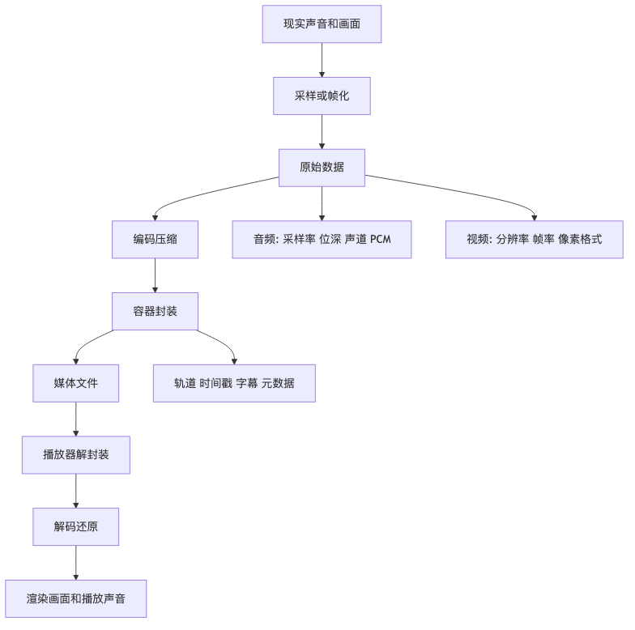

# 第一章｜数字音视频基础

面向前端工程师的音视频入门心智模型

这一章先不钻算法，也不要求你马上看懂 H.264、AAC、MP4 Box。我们先建立一个最重要的底层直觉：

> **音视频文件，本质上是在记录“声音随时间变化”和“画面随时间变化”。**
> 原始数据非常巨大，所以要压缩；压缩后的数据还要和时间戳、字幕、封面、轨道信息放在一起，所以需要容器。

你后面学 WebCodecs、Web Audio、MP4 解析、音视频合成时，都会反复用到这一章的概念。

---

## 1. 本章学习目标

学完本章，你应该能讲清楚这些问题：

1. **音频是什么？**
   采样率、位深、声道、PCM 分别是什么意思。

2. **视频是什么？**
   帧、分辨率、帧率、像素格式分别是什么意思。

3. **原始音视频为什么巨大？**
   能手算一个 1080p 视频和一段 PCM 音频的原始体积。

4. **为什么需要编码压缩？**
   明白编码器是在尽量保留感知质量的前提下减少数据量。

5. **为什么需要容器格式？**
   明白 MP4 不是视频编码，而是把视频、音频、字幕、元数据装起来的“盒子”。

6. **播放器播放一个 MP4 大概做了什么？**
   能从“读取文件 → 解封装 → 解码 → 渲染/播放”讲完整流程。

---

## 本章速览

先把本章看成一条从现实信号到浏览器播放的链路：



读图时抓住三个总结：

* 音频和视频的原始形态都是“随时间变化的数字样本”，只是音频记录振幅，视频记录连续画面。
* 原始 PCM、RGB、YUV 数据通常太大，编码器负责在可接受质量下把它们压缩成更小的码流。
* 容器不负责压缩画面或声音，它负责把编码后的音频、视频、字幕、时间戳和元数据组织成一个可播放文件。

# 2. 音频是什么？

## 2.1 声音的本质：空气振动

现实世界里的声音，是空气压力随时间变化形成的波。

你可以把声音想象成一条不断起伏的曲线：

```text
空气压力
  ^
  |        /\        /\          /\
  |       /  \      /  \        /  \
  |______/    \____/    \______/    \____> 时间
```

但计算机不能直接存“连续曲线”。计算机只能存数字，所以要把连续的声音切成一个个时间点来记录。

这个过程叫：

> **采样，Sampling**

---

## 2.2 采样率：每秒记录多少次声音

**采样率，Sample Rate**，表示每秒钟采集多少个声音样本。

常见采样率：

|      采样率 | 含义           | 常见场景       |
| -------: | ------------ | ---------- |
|  8000 Hz | 每秒 8000 个样本  | 电话语音       |
| 16000 Hz | 每秒 16000 个样本 | 语音识别、会议录音  |
| 44100 Hz | 每秒 44100 个样本 | CD、音乐      |
| 48000 Hz | 每秒 48000 个样本 | 视频、直播、影视制作 |

`44.1kHz` 的意思是：

```text
每秒记录 44100 次声音的瞬时状态
```

类比一下：

> 拍视频是每秒拍很多张照片；
> 录音频是每秒记录很多次声音的高度。

采样率越高，能记录的声音细节越多，尤其是高频声音。但采样率越高，数据也越大。

---

## 2.3 位深：每个声音样本有多精细

**位深，Bit Depth**，表示每个采样点用多少 bit 来表示。

常见位深：

|           位深 |  每个样本大小 | 可表示范围      | 常见场景             |
| -----------: | ------: | ---------- | ---------------- |
|        8 bit |  1 byte | 256 个等级    | 很老的音频            |
|       16 bit | 2 bytes | 65536 个等级  | CD、常见 PCM        |
|       24 bit | 3 bytes | 约 1677 万等级 | 专业录音             |
| 32-bit float | 4 bytes | 浮点数        | Web Audio 内部常见格式 |

可以把位深理解成“声音振幅的刻度精度”。

```text
低位深：刻度少，声音变化不够细腻
高位深：刻度多，声音变化更细腻
```

类比图片：

```text
图片里每个像素的颜色可以有 256 级、65536 级……
音频里每个采样点的音量也可以有不同精度。
```

---

## 2.4 声道：有几路声音

**声道，Channel**，表示同时记录几路声音。

常见声道：

| 声道 | 英文           | 含义            |
| -: | ------------ | ------------- |
|  1 | mono         | 单声道           |
|  2 | stereo       | 双声道，左声道 + 右声道 |
|  6 | 5.1 surround | 环绕声           |

双声道音频可以理解为：

```text
时间点 1：左耳一个值，右耳一个值
时间点 2：左耳一个值，右耳一个值
时间点 3：左耳一个值，右耳一个值
...
```

所以声道越多，数据量也越大。

---

## 2.5 PCM：最朴素的原始音频数据

**PCM，Pulse Code Modulation，脉冲编码调制**，可以先理解成：

> 没有经过 MP3、AAC 这类有损压缩的原始数字音频样本。

例如一段音频是：

```text
44.1kHz / 16bit / stereo
```

意思是：

```text
每秒 44100 个采样点
每个采样点 16 bit，也就是 2 bytes
左右两个声道
```

那么它每秒的数据量是：

```text
44100 × 2 bytes × 2 channels
= 176400 bytes/s
≈ 172.27 KiB/s
```

换成码率：

```text
44100 × 16 bit × 2
= 1411200 bit/s
= 1411.2 kbps
```

这就是为什么 CD 音质 PCM 的码率常说是 **1411.2 kbps**。

---

# 3. 视频是什么？

## 3.1 视频的本质：连续播放的图片

视频可以先粗暴理解成：

> 很多张图片按照固定速度连续播放。

每一张图片叫一帧：

> **Frame，帧**

例如 30fps 的视频表示：

```text
每秒播放 30 张图片
```

```text
Frame 1 → Frame 2 → Frame 3 → ... → Frame 30
       一秒钟内连续播放
```

人眼看到足够快的连续图片，就会感受到运动。

---

## 3.2 分辨率：每一帧有多少像素

**分辨率，Resolution**，表示每一帧画面的宽高。

常见分辨率：

| 分辨率         |      像素数量 | 常见说法     |
| ----------- | --------: | -------- |
| 1280 × 720  |   921,600 | 720p     |
| 1920 × 1080 | 2,073,600 | 1080p    |
| 2560 × 1440 | 3,686,400 | 2K / QHD |
| 3840 × 2160 | 8,294,400 | 4K UHD   |

一帧 1080p 图片有：

```text
1920 × 1080 = 2,073,600 个像素
```

也就是两百多万个小点。

---

## 3.3 帧率：每秒多少帧

**帧率，Frame Rate / FPS**，表示每秒播放多少帧。

常见帧率：

|      帧率 | 场景             |
| ------: | -------------- |
|   24fps | 电影             |
|   25fps | 部分电视制式         |
|   30fps | 普通视频、会议、短视频    |
|   60fps | 游戏、运动视频、高流畅度场景 |
| 120fps+ | 高刷、慢动作素材       |

帧率越高，动作越流畅，但数据量也越大。

例如：

```text
1080p 30fps：每秒 30 张 1080p 图片
1080p 60fps：每秒 60 张 1080p 图片
```

60fps 的原始数据量几乎是 30fps 的两倍。

---

## 3.4 像素格式：每个像素怎么存颜色

一张图片由很多像素组成。每个像素要记录颜色。

最容易理解的是 **RGB**：

```text
一个像素 = R + G + B
R：红色
G：绿色
B：蓝色
```

如果每个通道 8 bit：

```text
R = 8 bit
G = 8 bit
B = 8 bit

一个像素 = 24 bit = 3 bytes
```

所以 RGB 24-bit 的一帧 1080p 图片大小是：

```text
1920 × 1080 × 3 bytes
= 6,220,800 bytes
≈ 5.93 MiB
```

但真实视频编码里经常不是 RGB，而是 **YUV**。

---

## 3.5 RGB 和 YUV 的区别

RGB 更符合屏幕显示：

```text
R 红
G 绿
B 蓝
```

YUV 更符合视频压缩。

严格说，数字视频里常说的 YUV 通常更接近 **YCbCr**。可以先这样理解：

```text
Y：亮度 / 明暗信息
U / Cb：蓝色色差，表示这个像素相对亮度“偏蓝多少”
V / Cr：红色色差，表示这个像素相对亮度“偏红多少”
```

也就是说，U/V 不是两份独立的“颜色”，而是配合 Y 使用的两个色差信号。

为什么视频喜欢 YUV？

因为人眼对亮度更敏感，对颜色细节没那么敏感。

所以视频可以做一种聪明操作：

> 亮度信息多保留一点，颜色信息少存一点。

常见像素格式：

| 像素格式    | 大致含义                      |
| ------- | ------------------------- |
| RGB24   | 每个像素 3 bytes，红绿蓝          |
| RGBA    | 每个像素 4 bytes，多一个透明度 Alpha |
| YUV420P | 亮度全量，色度降采样，视频里非常常见        |
| NV12    | 常见硬件解码输出格式之一              |

对于前端工程师来说，后面你会在这些地方遇到它们：

```text
Canvas：常见是 RGBA
WebCodecs VideoFrame：可能涉及 I420、NV12、RGBA 等格式
编码器：常见输入/输出可能更偏 YUV
```

---

# 4. 原始数据为什么巨大？

我们算两个数，你会瞬间有感觉。

---

## 4.1 计算 10 秒 1080p 30fps RGB 视频的原始体积

条件：

```text
分辨率：1920 × 1080
帧率：30fps
时长：10 秒
像素格式：RGB，每个像素 3 bytes
```

一帧大小：

```text
1920 × 1080 × 3
= 6,220,800 bytes
≈ 5.93 MiB
```

10 秒总帧数：

```text
30 × 10 = 300 帧
```

总大小：

```text
6,220,800 × 300
= 1,866,240,000 bytes
≈ 1.87 GB
≈ 1.74 GiB
```

也就是说：

> **10 秒 1080p 30fps 的未压缩 RGB 视频，大约 1.87GB。**

这还只是 10 秒。
如果是 1 分钟，就是十几 GB。
如果是 4K 60fps，那数据量直接起飞，硬盘和网络会一起哭出声。

---

## 4.2 计算 44.1kHz / 16bit / stereo / 3 分钟 PCM 音频体积

条件：

```text
采样率：44100 Hz
位深：16 bit = 2 bytes
声道：2
时长：3 分钟 = 180 秒
```

每秒大小：

```text
44100 × 2 × 2
= 176400 bytes/s
```

3 分钟大小：

```text
176400 × 180
= 31,752,000 bytes
≈ 31.75 MB
≈ 30.28 MiB
```

所以：

> **3 分钟 CD 质量 PCM 音频，大约 31.75MB。**

如果压成 128kbps 的 MP3：

```text
128000 bit/s × 180 秒 ÷ 8
= 2,880,000 bytes
≈ 2.88 MB
```

从 31.75MB 到 2.88MB，差不多小了 11 倍。

---

# 5. 为什么需要编码压缩？

原始音视频数据太大，所以需要压缩。

这个过程叫：

> **编码，Encoding**

编码后的数据播放时需要还原成可以播放/显示的数据，这个过程叫：

> **解码，Decoding**

```text
原始音视频数据 → 编码器压缩 → 编码后的音视频数据
编码后的音视频数据 → 解码器解压 → 可播放/可渲染的数据
```

---

## 5.1 音频压缩在压什么？

音频压缩会利用人耳特性。

例如：

1. 人耳听不到某些特别高或特别低的频率。
2. 一个很大的声音附近，小声音可能被掩盖。
3. 有些重复或相近的信息可以用更少数据表示。

所以 MP3、AAC、Opus 这类编码格式会尽量保留人耳更容易感知的部分，丢掉或简化不太敏感的部分。

这类压缩通常是：

> **有损压缩，Lossy Compression**

也就是压缩后不可能完全还原原始数据，但听起来可以很接近。

---

## 5.2 视频压缩在压什么？

视频压缩主要利用两件事：

### 第一，空间冗余

一帧图片内部，很多像素是相近的。

比如蓝天：

```text
蓝 蓝 蓝 蓝 蓝 蓝 蓝 蓝
蓝 蓝 蓝 蓝 蓝 蓝 蓝 蓝
蓝 蓝 蓝 蓝 蓝 蓝 蓝 蓝
```

没必要每个像素都完整记录一遍。

---

### 第二，时间冗余

连续视频里，相邻帧通常很像。

比如一个人坐着说话：

```text
第 1 帧：人坐在椅子上
第 2 帧：人还坐在椅子上，只是嘴动了一点
第 3 帧：人还坐在椅子上，只是头动了一点
```

那就没必要每一帧都当成完整图片存下来。

可以这样存：

```text
第 1 帧：完整画面
第 2 帧：相对于第 1 帧变化了什么
第 3 帧：相对于前面帧变化了什么
```

这就是视频压缩的核心直觉。

---

# 6. 码率是什么？

**码率，Bitrate**，表示单位时间内使用多少 bit 来表示音视频数据。

常见单位：

```text
kbps：kilobits per second，每秒多少千 bit
Mbps：megabits per second，每秒多少百万 bit
```

注意：

```text
bit 和 byte 不一样
1 byte = 8 bit
```

比如一个视频码率是 5Mbps，时长 10 秒，那么大致大小是：

```text
5,000,000 bit/s × 10s ÷ 8
= 6,250,000 bytes
≈ 6.25 MB
```

所以文件大小可以粗略估算：

```text
文件大小 ≈ 码率 × 时长 ÷ 8
```

如果一个 MP4 里面有视频和音频：

```text
总码率 ≈ 视频码率 + 音频码率 + 少量容器开销
```

---

# 7. 关键帧、GOP 是什么？

## 7.1 关键帧：可以独立解码的帧

视频里不是每一帧都完整保存。

通常有些帧是完整画面，可以独立解码。它叫：

> **关键帧，Keyframe**

在 H.264 里，你也经常听到：

> **I 帧，Intra Frame**

可以先粗略理解成：

```text
关键帧 ≈ 一张完整图片
非关键帧 ≈ 参考其他帧，只记录变化
```

---

## 7.2 GOP：一组相关的视频帧

**GOP，Group of Pictures**，表示从一个关键帧开始的一组视频帧。

例如：

```text
I B B P B B P B B P
```

也可以简化理解成：

```text
关键帧 + 后面一串依赖它的帧
```

一个 GOP 可能长这样：

```text
I 帧：完整画面
P 帧：参考前面的帧
B 帧：参考前后帧
```

你现在不需要深入 P 帧、B 帧算法，只要记住：

> **GOP 会影响压缩率、随机 seek、首帧速度、编辑切割体验。**

---

## 7.3 为什么关键帧影响拖动进度条？

假设一个视频每 5 秒才有一个关键帧。

你拖到第 23 秒，播放器可能不能直接从第 23 秒开始解码，因为第 23 秒附近的帧依赖前面的关键帧。

播放器可能要：

```text
找到第 20 秒关键帧
从第 20 秒开始解码
一直解到第 23 秒
最后显示第 23 秒画面
```

所以关键帧间隔太长，可能导致 seek 变慢。

---

# 8. 为什么需要容器格式？

现在我们已经有了编码后的音频和视频：

```text
H.264 视频数据
AAC 音频数据
```

但问题来了：

播放器怎么知道：

1. 这个文件里有几条轨道？
2. 哪条是视频，哪条是音频？
3. 视频宽高是多少？
4. 音频采样率是多少？
5. 每一帧的时间戳是多少？
6. 哪些是关键帧？
7. 字幕在哪里？
8. 封面、标题、作者、旋转角度这些元数据在哪里？
9. 音频和视频怎么同步？

这些信息不能靠裸编码流自己全部解决，所以需要一个“外壳”。

这个外壳就是：

> **容器格式，Container Format**

常见容器格式：

| 容器   | 常见扩展名                  | 可以装什么                     |
| ---- | ---------------------- | ------------------------- |
| MP4  | `.mp4`, `.m4a`, `.mov` | H.264、H.265、AAC、字幕、元数据等   |
| WebM | `.webm`                | VP8、VP9、AV1、Opus、Vorbis 等 |
| MKV  | `.mkv`                 | 很多种视频、音频、字幕               |
| WAV  | `.wav`                 | 常见 PCM 音频                 |
| FLV  | `.flv`                 | 直播和旧 Web 视频场景常见           |

容器就像快递盒：

```text
编码数据 = 货物
容器格式 = 快递盒 + 标签 + 目录 + 时间表
```

MP4 里面可以装：

```text
视频轨道：H.264 / H.265 / AV1 ...
音频轨道：AAC / MP3 / ALAC ...
字幕轨道：WebVTT / mov_text ...
元数据：时长、旋转角度、封面、标题 ...
```

所以一定要记住：

> **MP4 不是 H.264。**
> **MP4 是容器，H.264 是视频编码格式。**

---

# 9. 编码、解码、封装、解封装

这几个词非常容易混，面试也很爱问。

## 9.1 编码 Encoding

把原始音视频压缩成编码格式。

```text
原始视频帧 RGB/YUV → H.264 Encoder → H.264 码流
原始音频 PCM → AAC Encoder → AAC 码流
```

---

## 9.2 解码 Decoding

把编码后的数据解压成可播放、可处理的原始数据。

```text
H.264 码流 → H.264 Decoder → 视频帧 YUV/RGBA
AAC 码流 → AAC Decoder → PCM 音频
```

---

## 9.3 封装 Muxing

把编码后的音频、视频、字幕、元数据打包进容器。

```text
H.264 视频 + AAC 音频 + 字幕 + 元数据
        ↓
      MP4 Muxer
        ↓
      output.mp4
```

---

## 9.4 解封装 Demuxing

从容器里拆出音频轨、视频轨、字幕轨和元数据。

```text
input.mp4
   ↓
MP4 Demuxer
   ↓
H.264 视频数据
AAC 音频数据
字幕
元数据
```

---

## 9.5 四个概念放在一张图里

```text
录制 / 生成阶段：

摄像头原始画面       麦克风原始声音
     ↓                  ↓
  视频帧 YUV/RGB       PCM 音频
     ↓                  ↓
  H.264 编码           AAC 编码
     ↓                  ↓
  H.264 码流           AAC 码流
          \            /
           \          /
            MP4 封装
               ↓
            output.mp4


播放阶段：

            input.mp4
               ↓
            MP4 解封装
           /          \
          /            \
  H.264 码流           AAC 码流
     ↓                  ↓
  H.264 解码           AAC 解码
     ↓                  ↓
  视频帧 YUV/RGBA      PCM 音频
     ↓                  ↓
  Canvas/Video 渲染    Audio 输出
```

---

# 10. 音频、视频、字幕、元数据如何组成一个媒体文件？

一个 MP4 文件可以粗略理解成这样：

```text
movie.mp4
├── 文件类型信息
├── 全局元数据
│   ├── 时长
│   ├── 创建时间
│   ├── 兼容品牌
│   └── 封面 / 标题 / 作者等
├── 视频轨道
│   ├── 编码格式：H.264
│   ├── 分辨率：1920 × 1080
│   ├── 帧率：30fps
│   ├── 关键帧位置
│   ├── 每个 sample 的时间戳
│   └── 编码后的视频数据位置
├── 音频轨道
│   ├── 编码格式：AAC
│   ├── 采样率：48000Hz
│   ├── 声道数：2
│   ├── 每个 sample 的时间戳
│   └── 编码后的音频数据位置
├── 字幕轨道，可选
└── 真正的媒体数据
```

这里有一个重要词：

> **Track，轨道**

一个媒体文件里可以有多个轨道：

```text
视频轨道
音频轨道 1：中文
音频轨道 2：英文
字幕轨道 1：中文字幕
字幕轨道 2：英文字幕
```

还有一个重要词：

> **Sample，样本**

在 MP4 语境里，sample 可以粗略理解成轨道里的一个媒体单元。

对于视频：

```text
一个 sample 通常对应一帧压缩后的视频数据
```

对于音频：

```text
一个 sample 通常对应一小段压缩后的音频数据
```

注意，MP4 里的 sample 和音频采样点 sample 不是一个层面的概念。这个点很容易混。

---

# 11. 播放器播放一个 MP4 的完整流程

假设浏览器要播放一个 MP4：

```html
<video src="demo.mp4" controls></video>
```

表面上你只写了一行 HTML，但底层大概经历了这些步骤。

---

## 11.1 第一步：读取文件或网络数据

播放器先获取 MP4 数据：

```text
本地文件
或者
HTTP 请求返回的数据
```

如果是在线播放，播放器不会总是等整个文件下载完才播放，而是边下边分析。

---

## 11.2 第二步：解析容器

播放器需要先看 MP4 容器结构，找到：

```text
文件类型
有哪些轨道
每条轨道是什么 codec
视频宽高
音频采样率
时长
关键帧位置
sample 的 offset 和 size
时间戳信息
```

这一阶段叫：

```text
Demuxing，解封装
```

---

## 11.3 第三步：取出编码后的音视频数据

从 MP4 里拆出：

```text
H.264 视频 sample
AAC 音频 sample
```

注意，这时候拆出来的还不能直接显示或播放。

H.264 还是压缩数据。
AAC 也是压缩数据。

---

## 11.4 第四步：送入解码器

播放器把压缩数据送给对应解码器：

```text
H.264 Decoder → 输出视频帧
AAC Decoder → 输出 PCM 音频
```

视频解码后可能是：

```text
YUV 视频帧
```

音频解码后通常是：

```text
PCM 音频样本
```

---

## 11.5 第五步：音视频同步

视频有视频时间戳，音频有音频时间戳。

播放器要根据时间戳同步播放：

```text
第 10.000 秒应该显示哪一帧？
第 10.000 秒应该播放哪一段音频？
```

通常音频时钟比较稳定，播放器常常以音频播放进度作为主时钟，让视频帧跟着音频走。

---

## 11.6 第六步：渲染画面，播放声音

最后：

```text
视频帧 → GPU / 渲染管线 → 屏幕
PCM 音频 → 音频设备 → 扬声器 / 耳机
```

你看到画面，听到声音。

---

## 11.7 文字版流程图

```text
用户打开 MP4
    ↓
读取文件 / 网络数据
    ↓
解析 MP4 容器
    ↓
获取轨道信息
    ├── 视频轨：codec、宽高、帧率、时间戳、关键帧
    └── 音频轨：codec、采样率、声道、时间戳
    ↓
解封装 Demux
    ├── 拆出 H.264 / H.265 / AV1 等视频码流
    └── 拆出 AAC / MP3 / Opus 等音频码流
    ↓
解码 Decode
    ├── 视频码流 → 原始视频帧 YUV/RGBA
    └── 音频码流 → PCM 音频
    ↓
音视频同步
    ↓
渲染视频帧 + 输出音频
    ↓
用户看到画面，听到声音
```

---

# 12. 必须掌握的术语表

| 术语       | 英文                    | 一句话解释                 |
| -------- | --------------------- | --------------------- |
| 采样率      | Sample Rate           | 每秒记录多少个音频采样点          |
| 位深       | Bit Depth             | 每个音频采样点用多少 bit 表示     |
| 声道       | Channel               | 有几路声音，比如 mono、stereo  |
| PCM      | Pulse Code Modulation | 原始数字音频数据              |
| 帧        | Frame                 | 视频中的一张画面              |
| 分辨率      | Resolution            | 每帧画面的宽高像素数            |
| 帧率       | FPS                   | 每秒播放多少帧               |
| 像素格式     | Pixel Format          | 像素颜色数据的存储方式，如 RGB、YUV |
| 码率       | Bitrate               | 每秒使用多少 bit 表示音视频数据    |
| 编码       | Encoding              | 把原始音视频压缩成编码数据         |
| 解码       | Decoding              | 把编码数据还原成可播放数据         |
| 容器       | Container             | 装音频、视频、字幕、元数据的文件格式    |
| 封装       | Muxing                | 把音视频轨道打包进容器           |
| 解封装      | Demuxing              | 从容器里拆出音视频轨道           |
| Codec    | Codec                 | 编码器/解码器，也常指编码格式       |
| Keyframe | Keyframe              | 可以独立解码的视频帧            |
| GOP      | Group of Pictures     | 从关键帧开始的一组相关视频帧        |
| Track    | Track                 | 媒体文件中的一条轨道，如视频轨、音频轨   |
| Sample   | Sample                | 轨道中的一个媒体单元，语境不同含义不同   |

---

# 13. 和真实工程的关系

这些概念不是背诵用的，前端音视频工程里会经常遇到。

## 13.1 WebCodecs

WebCodecs 直接暴露底层编码/解码能力。

你会接触到：

```ts
VideoEncoder
VideoDecoder
AudioEncoder
AudioDecoder
VideoFrame
AudioData
EncodedVideoChunk
EncodedAudioChunk
```

这时候你必须知道：

```text
VideoFrame 是原始视频帧
AudioData 是原始音频数据
EncodedVideoChunk 是编码后的视频数据
EncodedAudioChunk 是编码后的音频数据
```

也就是说，WebCodecs 正好对应这一章讲的：

```text
编码 Encoding
解码 Decoding
原始帧
编码帧
时间戳
关键帧
codec
```

---

## 13.2 Web Audio

Web Audio 处理的是音频图和 PCM 数据。

你会遇到：

```ts
AudioContext
AudioBuffer
AudioBufferSourceNode
GainNode
AnalyserNode
AudioWorklet
```

Web Audio 里非常重要的概念是：

```text
采样率
声道
PCM
音频时间
音频节点
```

比如你要做可视化频谱、音量分析、混音、变速、音效处理，这一章的音频基础都逃不掉。

---

## 13.3 Canvas 和视频帧处理

如果你做浏览器端视频处理，比如：

```text
视频截图
滤镜
水印
逐帧处理
视频合成
AI 预处理
```

你会经常把视频帧画到 Canvas 上：

```ts
ctx.drawImage(video, 0, 0);
const imageData = ctx.getImageData(0, 0, width, height);
```

这时你拿到的通常是 RGBA 像素数据：

```text
R G B A R G B A R G B A ...
```

所以你得知道：

```text
分辨率决定像素数量
像素格式决定每个像素占多少 bytes
帧率决定每秒处理多少帧
```

---

## 13.4 MP4 解析和封装

后面学 MP4 时，你会看到：

```text
ftyp
moov
mdat
trak
stbl
stts
stsz
stco
stss
```

这些东西的目的其实就是回答：

```text
文件里有什么轨道？
每个 sample 在哪里？
每个 sample 多大？
每个 sample 应该什么时候播放？
哪些 sample 是关键帧？
```

所以 MP4 不只是“装数据”，它还要提供播放所需的目录和时间表。

---

# 14. 常见误区

## 误区 1：MP4 就是 H.264

不对。

```text
MP4 是容器格式。
H.264 是视频编码格式。
```

一个 MP4 里可以装 H.264 视频，也可以装 H.265、AV1 等其他视频编码。只是浏览器和设备不一定都支持。

---

## 误区 2：视频文件后缀一样，就一定能播放

不一定。

两个文件都叫 `.mp4`，里面的编码可能不同：

```text
A.mp4：H.264 + AAC
B.mp4：H.265 + AC-3
```

浏览器可能能播 A，但播不了 B。

所以判断能不能播放，要看：

```text
容器格式 + codec + profile + level + 浏览器/系统支持
```

---

## 误区 3：帧率越高一定越好

不一定。

60fps 比 30fps 更流畅，但也意味着：

```text
数据更多
编码压力更大
解码压力更大
耗电更多
带宽更高
```

对于电影、课程、会议、短视频，不同场景有不同取舍。

---

## 误区 4：码率越高一定越清晰

大多数情况下，码率高有助于画质，但不是唯一因素。

画质还受这些影响：

```text
编码格式
编码器质量
分辨率
帧率
内容复杂度
GOP 设置
是否多次转码
```

同样 5Mbps，H.265 或 AV1 可能比 H.264 更清晰，但解码兼容性和性能又是另一个问题。

---

## 误区 5：解封装就是解码

不对。

```text
解封装：从容器里拆出压缩数据。
解码：把压缩数据还原成原始音视频。
```

比如：

```text
MP4 解封装 → 得到 H.264 和 AAC
H.264 解码 → 得到视频帧
AAC 解码 → 得到 PCM
```

---

# 15. 面试可能怎么问

## 问题 1：音频里的采样率和位深分别是什么意思？

参考回答：

> 采样率表示每秒采集多少个音频样本，比如 44.1kHz 表示每秒 44100 个采样点。位深表示每个采样点用多少 bit 表示，比如 16bit 表示每个采样点占 2 bytes。采样率影响能记录的频率范围，位深影响振幅精度和动态范围。再乘以声道数和时长，就可以算出 PCM 原始音频大小。

---

## 问题 2：为什么原始视频数据很大？

参考回答：

> 因为视频本质上是连续图片。比如 1080p 一帧有 1920×1080 个像素，如果用 RGB，每个像素 3 bytes，一帧大约 6MB。30fps 每秒 30 帧，10 秒就接近 1.87GB。所以必须通过 H.264、H.265、AV1 这类视频编码压缩。

---

## 问题 3：MP4 和 H.264 有什么区别？

参考回答：

> MP4 是容器格式，负责把视频、音频、字幕、元数据以及时间戳等信息组织在一个文件里。H.264 是视频编码格式，负责压缩视频画面。一个 MP4 文件里可以装 H.264 视频加 AAC 音频，也可以装其他编码。浏览器能播放 MP4，不代表能播放所有 MP4，还要看里面具体 codec 是否支持。

---

## 问题 4：封装和编码有什么区别？

参考回答：

> 编码是把原始音视频数据压缩成编码数据，比如把 YUV 视频帧编码成 H.264，把 PCM 音频编码成 AAC。封装是把这些编码后的音视频数据，以及时间戳、轨道、字幕、元数据等信息打包进容器，比如 MP4。播放时反过来，先解封装，再解码。

---

## 问题 5：关键帧有什么用？

参考回答：

> 关键帧是可以独立解码的视频帧，通常相当于一张完整画面。非关键帧往往依赖前后帧，只记录变化。关键帧影响随机 seek、首帧速度、剪辑切割和压缩率。关键帧间隔太长，压缩率可能更好，但拖动进度条可能更慢。

---

# 16. 实践任务

## 任务 1：计算 10 秒 1080p 30fps RGB 视频原始体积

条件：

```text
width = 1920
height = 1080
fps = 30
duration = 10
bytesPerPixel = 3
```

公式：

```text
size = width × height × bytesPerPixel × fps × duration
```

JavaScript 代码：

```js
const width = 1920;
const height = 1080;
const fps = 30;
const duration = 10;
const bytesPerPixel = 3;

const bytes = width * height * bytesPerPixel * fps * duration;
const mb = bytes / 1000 / 1000;
const gib = bytes / 1024 / 1024 / 1024;

console.log(`bytes: ${bytes}`);
console.log(`MB: ${mb.toFixed(2)} MB`);
console.log(`GiB: ${gib.toFixed(2)} GiB`);
```

输出大约是：

```text
bytes: 1866240000
MB: 1866.24 MB
GiB: 1.74 GiB
```

---

## 任务 2：计算 44.1kHz / 16bit / stereo / 3 分钟 PCM 音频体积

条件：

```text
sampleRate = 44100
bitDepth = 16
channels = 2
duration = 180
```

公式：

```text
size = sampleRate × bitDepth/8 × channels × duration
```

JavaScript 代码：

```js
const sampleRate = 44100;
const bitDepth = 16;
const channels = 2;
const duration = 180;

const bytesPerSample = bitDepth / 8;
const bytes = sampleRate * bytesPerSample * channels * duration;

const mb = bytes / 1000 / 1000;
const mib = bytes / 1024 / 1024;

console.log(`bytes: ${bytes}`);
console.log(`MB: ${mb.toFixed(2)} MB`);
console.log(`MiB: ${mib.toFixed(2)} MiB`);
```

输出大约是：

```text
bytes: 31752000
MB: 31.75 MB
MiB: 30.28 MiB
```

---

## 任务 3：估算压缩后文件大小

假设一段 3 分钟 MP3 是 128kbps：

```js
const bitrate = 128_000; // bit/s
const duration = 180;

const bytes = bitrate * duration / 8;
const mb = bytes / 1000 / 1000;

console.log(`${mb.toFixed(2)} MB`);
```

输出：

```text
2.88 MB
```

对比前面的 PCM：

```text
PCM：约 31.75 MB
MP3 128kbps：约 2.88 MB
```

压缩后小很多，是因为 MP3 会利用人耳感知特性，丢弃或简化不太容易听出来的信息。

---

## 任务 4：用 Canvas 理解一帧视频的像素数据

你可以用 Canvas 读取一张图片或视频帧的 RGBA 数据：

```html
<video id="video" src="demo.mp4" controls></video>
<canvas id="canvas"></canvas>

<script>
const video = document.querySelector('#video');
const canvas = document.querySelector('#canvas');
const ctx = canvas.getContext('2d');

video.addEventListener('loadeddata', () => {
  canvas.width = video.videoWidth;
  canvas.height = video.videoHeight;

  ctx.drawImage(video, 0, 0, canvas.width, canvas.height);

  const imageData = ctx.getImageData(0, 0, canvas.width, canvas.height);

  console.log('width:', imageData.width);
  console.log('height:', imageData.height);
  console.log('data length:', imageData.data.length);
  console.log('bytes per pixel:', imageData.data.length / (imageData.width * imageData.height));
});
</script>
```

你会看到：

```text
data.length = width × height × 4
```

因为 Canvas 的 `ImageData` 通常是 RGBA：

```text
R G B A
```

每个像素 4 bytes。

---

## 任务 5：用 AudioContext 看采样率

```html
<button id="btn">Start AudioContext</button>

<script>
document.querySelector('#btn').addEventListener('click', async () => {
  const audioContext = new AudioContext();

  console.log('sampleRate:', audioContext.sampleRate);
  console.log('currentTime:', audioContext.currentTime);
});
</script>
```

你可能会看到：

```text
sampleRate: 44100
```

或者：

```text
sampleRate: 48000
```

不同设备、浏览器、音频输出环境可能不同。

---

# 17. 自测题

## 题 1：44.1kHz 的音频表示什么？

答案：

> 表示每秒采集 44100 个音频样本。采样率越高，每秒记录的声音点越多，能表示的声音细节通常越多，但数据量也越大。

---

## 题 2：16bit stereo PCM，每秒有多少 bytes？

已知：

```text
sampleRate = 44100
bitDepth = 16bit = 2 bytes
channels = 2
```

计算：

```text
44100 × 2 × 2 = 176400 bytes/s
```

答案：

> 每秒 176400 bytes，约 172.27 KiB/s。

---

## 题 3：1080p RGB 一帧大约多大？

已知：

```text
1920 × 1080
RGB = 3 bytes/pixel
```

计算：

```text
1920 × 1080 × 3
= 6,220,800 bytes
≈ 5.93 MiB
```

答案：

> 一帧大约 6.22MB，或者 5.93MiB。

---

## 题 4：MP4 和 H.264 是什么关系？

答案：

> MP4 是容器格式，H.264 是视频编码格式。MP4 可以装 H.264 视频和 AAC 音频，也可以装其他编码。判断一个 MP4 能不能播放，不能只看 `.mp4` 后缀，还要看里面的 codec。

---

## 题 5：为什么播放器要先解封装再解码？

答案：

> 因为 MP4 这类容器里面同时包含视频、音频、字幕、元数据和时间戳信息。播放器需要先通过解封装找到各个轨道，拆出压缩后的视频码流和音频码流，然后再分别送给对应的解码器。解封装解决“数据在哪里、什么时候播放”的问题，解码解决“如何把压缩数据还原成画面和声音”的问题。

---

# 18. 本章总结

这一章你要带走几个核心模型。

## 音频模型

```text
声音 → 采样 → PCM
```

音频大小由这些因素决定：

```text
采样率 × 位深 × 声道数 × 时长
```

例如：

```text
44.1kHz / 16bit / stereo / 3 分钟 PCM ≈ 31.75MB
```

---

## 视频模型

```text
视频 = 很多帧连续播放
```

视频大小由这些因素决定：

```text
分辨率 × 每像素字节数 × 帧率 × 时长
```

例如：

```text
10 秒 1080p 30fps RGB ≈ 1.87GB
```

---

## 压缩模型

```text
原始音频 PCM → 音频编码器 → AAC / MP3 / Opus
原始视频帧 → 视频编码器 → H.264 / H.265 / AV1
```

编码压缩的目标是：

```text
尽量保持主观质量
尽量减少数据量
```

---

## 容器模型

```text
容器 = 音视频数据 + 字幕 + 元数据 + 时间戳 + 轨道目录
```

MP4 是容器，不是视频编码。

```text
MP4 里面可以有：
H.264 视频
AAC 音频
字幕
封面
时间戳
轨道信息
```

---

## 播放流程模型

```text
读取 MP4
  ↓
解析容器
  ↓
解封装
  ↓
解码音视频
  ↓
音视频同步
  ↓
渲染画面 + 播放声音
```

---

# 19. 后面学习 WebCodecs / Web Audio 会用到哪些概念？

## WebCodecs 会用到

```text
VideoFrame
AudioData
EncodedVideoChunk
EncodedAudioChunk
timestamp
key frame
codec
encoder
decoder
pixel format
```

你需要知道：

```text
VideoFrame 是原始视频帧
EncodedVideoChunk 是编码后的视频 chunk
AudioData 是原始音频数据
EncodedAudioChunk 是编码后的音频 chunk
```

---

## Web Audio 会用到

```text
PCM
sampleRate
channel
AudioBuffer
AudioContext
AudioNode
AudioWorklet
```

你需要知道：

```text
Web Audio 主要处理原始音频数据和音频处理图
```

---

## MP4 解析会用到

```text
container
track
sample
timestamp
duration
keyframe
demuxing
muxing
```

你需要知道：

```text
MP4 的核心价值是组织音视频轨道、sample 位置、时间戳和元数据。
```

---

# 20. 下一章衔接

下一章要解决一个前端音视频新人最容易混的问题：

> **容器格式和编码格式到底有什么区别？**

你会系统区分这些词：

```text
MP4
WebM
MKV
MP3
AAC
H.264
H.265
AV1
Opus
PCM
```

尤其要把这句话真正吃透：

```text
.mp4 不等于 H.264
.mp3 不等于万能音频容器
浏览器支持 MP4 不代表支持所有 MP4 文件
```

下一章会重点讲：

```text
Container
Codec
Muxer
Demuxer
Encoder
Decoder
MIME type
codec string
```

学完之后，你就能比较自然地回答面试高频问题：

> “MP4 和 H.264 有什么区别？”
