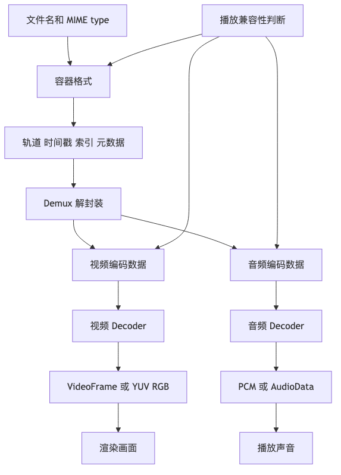

# 第二章｜容器格式 vs 编码格式

## 本章学习目标

学完这一章，你要能把下面这些容易混在一起的词彻底拆开：

```text
容器 container
编码格式 codec
编码 encoding
解码 decoding
封装 muxing
解封装 demuxing
裸流 elementary stream / raw stream
MIME type
codec string
```

这一章最重要的结论是：

> **`.mp4` 不等于 H.264，`.webm` 不等于 VP9，`.mp3` 也不是像 MP4 那样的万能容器。**

文件后缀只是外壳提示。真正决定浏览器能不能播的，通常是：

```text
容器格式是否支持
+
里面的音视频 codec 是否支持
+
codec profile / level / bit depth / pixel format 是否支持
+
当前浏览器和系统是否有对应解码能力
```

MP4 的官方标准是 ISO/IEC 14496-14，它定义的是一种从 ISO Base Media File Format 派生出来的 **MP4 文件格式**，也就是容器层的规则，不等于某个具体视频编码算法。([ISO][1]) WebM 是面向开放 Web 的多媒体容器，是 Matroska 的一个子集；Matroska 本身也是一种可扩展的音视频容器结构。([WebM Project][2]) MP3 则更接近由 MPEG 音频帧组成的音频码流，IETF 对 `audio/mpeg` 的描述里明确说它是包含 MPEG frames 的 elementary byte stream，并且元数据通常是 ID3 这类额外块拼接在码流前后。([IETF Datatracker][3])

---

## 本章速览

这章最容易混乱的地方，是把“文件外壳”和“压缩算法”说成一回事。先用这张图分层：



本章可以压缩成三句话：

* 容器负责“怎么装”，codec 负责“怎么压缩和还原”，两者是不同层。
* 文件后缀只能提示容器，真正能不能播还要看浏览器是否支持容器、codec、profile、level、像素格式和系统解码能力。
* muxing / demuxing 处理的是容器和轨道，encoding / decoding 处理的是压缩数据和原始媒体数据。

## 1. 先建立一个生活化类比

可以把一个媒体文件想成一个快递包裹：

```text
快递纸箱        = 容器格式 container
箱子里的物品    = 编码后的音频 / 视频数据
打包过程        = 封装 muxing
拆箱过程        = 解封装 demuxing
把衣服压缩袋压扁 = 编码 encoding
把压缩袋恢复    = 解码 decoding
```

比如一个常见的 MP4 文件可以长这样：

```text
movie.mp4
├── 容器：MP4
├── 视频轨：H.264 编码后的视频数据
├── 音频轨：AAC 编码后的音频数据
├── 字幕轨：可选
└── 元数据：时长、宽高、旋转角、时间戳、索引等
```

注意这里有两层：

```text
文件怎么组织数据？      → 容器格式负责
音视频怎么压缩数据？    → codec 负责
```

所以说：

```text
MP4 是盒子。
H.264 是视频压缩方法。
AAC 是音频压缩方法。
```

一句面试话术：

> **MP4 是容器格式，负责把视频轨、音频轨、字幕、元数据、时间戳等组织在一个文件里；H.264 是视频编码格式，负责把原始视频帧压缩成更小的编码数据。一个 MP4 文件里可以放 H.264 视频，也可以放 H.265、AV1 等其他视频编码，具体能不能播放取决于播放器是否同时支持容器和里面的 codec。**

---

## 2. Container format 是什么

**Container format，容器格式**，解决的是：

> 多条媒体轨道和元数据，怎么放进一个文件里？

它通常负责这些事：

| 容器负责什么 | 解释                           |
| ------ | ---------------------------- |
| 轨道组织   | 一个文件里可能有视频轨、音频轨、字幕轨、章节信息     |
| 时间信息   | 每个 sample / frame 在什么时间播放    |
| 索引     | 播放器 seek 到第 30 秒时，怎么快速找到对应数据 |
| 元数据    | 时长、宽高、旋转角、语言、封面、title 等      |
| 数据块位置  | 真正的媒体数据在文件哪个 offset          |
| 多路复用   | 把音频、视频按时间关系交错存储              |

容器不一定关心视频画面怎么被压缩。它更像一个档案盒，负责说：

```text
这里有一条视频轨。
这里有一条音频轨。
视频轨使用 avc1，也就是 H.264/AVC 的一种 sample entry。
音频轨使用 mp4a，也就是 MPEG-4 Audio / AAC 相关编码。
每个 sample 的时间戳是这样。
每个 sample 的数据在文件这里。
```

MP4 就是典型容器。WebM、MKV 也是典型容器。MP4 标准定义的是文件组织方式，WebM 项目文档也把 WebM 描述为多媒体容器格式。([ISO][1])

---

## 3. Codec 是什么

**Codec** 是：

```text
coder + decoder
```

它可以理解成一套“压缩和还原规则”。

在音视频里，codec 通常做两件事：

```text
原始数据 → 编码器 encoder → 压缩后的编码数据
压缩数据 → 解码器 decoder → 原始数据
```

视频例子：

```text
一帧一帧的 RGB / YUV 原始画面
  ↓ H.264 encoder
H.264 encoded bitstream
  ↓ H.264 decoder
一帧一帧的 VideoFrame / YUV / RGB
```

音频例子：

```text
PCM 采样数据
  ↓ AAC encoder
AAC encoded audio frames
  ↓ AAC decoder
PCM 采样数据
```

你可以把 codec 理解成压缩算法家族：

| 类型         | 常见 codec                         |
| ---------- | -------------------------------- |
| 视频 codec   | H.264/AVC、H.265/HEVC、AV1、VP8、VP9 |
| 音频 codec   | AAC、MP3、Opus、Vorbis、FLAC         |
| 原始 / 未压缩表示 | PCM、Raw YUV、Raw RGB              |

H.264/AVC 是视频压缩标准，ISO/IEC 14496-10 与 ITU-T H.264 对应同一类高级视频编码标准。([The Library of Congress][4]) H.265/HEVC 是另一代视频压缩标准，目标是更高压缩效率。([The Library of Congress][5]) AV1 是 AOMedia 推出的开放视频 codec，面向高效视频压缩。([Alliance for Open Media][6]) Opus 是 IETF RFC 6716 定义的音频 codec，面向语音、会议、游戏语音、音乐等交互式音频场景。([IETF Datatracker][7])

---

## 4. Muxing / Demuxing 是什么

### 4.1 Muxing：封装

**Muxing**，中文常叫：

```text
封装
复用
多路复用
```

它做的是：

> 把已经编码好的音频数据、视频数据、字幕、元数据，按照某种容器格式写成一个文件。

比如：

```text
H.264 视频编码数据
+
AAC 音频编码数据
+
时间戳 / 索引 / 轨道信息
  ↓ muxer
output.mp4
```

封装不会必然重新压缩画面。

也就是说，下面这个流程只是封装：

```text
H.264 + AAC → MP4
```

如果视频本来就是 H.264，音频本来就是 AAC，只是把它们写进 MP4 容器，这叫 **muxing**，不叫重新编码。

---

### 4.2 Demuxing：解封装

**Demuxing**，中文常叫：

```text
解封装
拆包
解复用
```

它做的是：

> 从容器里把音频轨、视频轨、字幕轨、元数据拆出来。

比如：

```text
input.mp4
  ↓ demuxer
H.264 视频 samples
AAC 音频 samples
时间戳
track 信息
codec config
```

注意，demuxer 拿出来的通常还是 **压缩后的编码数据**，不是原始像素，也不是 PCM。

比如从 MP4 里 demux 出视频轨，你拿到的可能是：

```text
EncodedVideoChunk / H.264 sample / access unit
```

而不是：

```text
VideoFrame / RGB pixels / YUV pixels
```

真正把 H.264 变成 VideoFrame 的，是 **decoder**，不是 demuxer。WebCodecs 也是这个模型：它提供 VideoDecoder、VideoEncoder、AudioDecoder、AudioEncoder 等 codec 接口，用于在 raw frame/data 和 encoded chunk 之间转换；规范本身不强制浏览器必须支持某个具体 codec。([MDN Web Docs][8])

---

## 5. Encoding / Decoding 是什么

### 5.1 Encoding：编码

**Encoding** 是把原始音视频数据压缩成 codec 数据。

视频：

```text
VideoFrame / Raw YUV / Raw RGB
  ↓ VideoEncoder / H.264 encoder
EncodedVideoChunk / H.264 bitstream
```

音频：

```text
PCM / AudioData
  ↓ AudioEncoder / AAC encoder
EncodedAudioChunk / AAC frames
```

编码通常会涉及：

```text
压缩率
画质 / 音质
码率
关键帧
GOP
延迟
硬件加速
profile / level
```

---

### 5.2 Decoding：解码

**Decoding** 是把 codec 数据还原成可处理的原始音视频数据。

视频：

```text
H.264 / H.265 / AV1 encoded chunks
  ↓ decoder
VideoFrame / YUV / RGB
```

音频：

```text
AAC / MP3 / Opus encoded chunks
  ↓ decoder
PCM / AudioData
```

浏览器播放视频时，大概就是：

```text
下载 MP4
  ↓ demux
拆出 H.264 视频数据和 AAC 音频数据
  ↓ decode
视频变成帧，音频变成 PCM
  ↓ render / output
画到屏幕，送到声卡
```

---

## 6. 一张总流程图：从文件到播放

```text
用户选择 movie.mp4
        │
        ▼
┌──────────────────┐
│ Container: MP4    │
│ - metadata        │
│ - video track     │
│ - audio track     │
│ - timestamps      │
└──────────────────┘
        │
        │ demux 解封装
        ▼
┌──────────────────┐       ┌──────────────────┐
│ H.264 samples     │       │ AAC samples       │
│ encoded video     │       │ encoded audio     │
└──────────────────┘       └──────────────────┘
        │                           │
        │ decode 解码                │ decode 解码
        ▼                           ▼
┌──────────────────┐       ┌──────────────────┐
│ VideoFrame        │       │ PCM / AudioData   │
│ raw video frame   │       │ raw audio samples │
└──────────────────┘       └──────────────────┘
        │                           │
        ▼                           ▼
   Canvas / GPU                Audio output
   屏幕显示                    扬声器播放
```

前端工程里最容易漏的一点是：

```text
WebCodecs 接收的不是完整 MP4 文件。
WebCodecs 更关心 EncodedVideoChunk、EncodedAudioChunk、VideoFrame、AudioData。
```

所以如果输入是 MP4，你通常需要：

```text
MP4 文件
  ↓ demuxer
EncodedVideoChunk / EncodedAudioChunk
  ↓ WebCodecs decoder
VideoFrame / AudioData
```

如果你最后要导出 MP4，你也需要：

```text
VideoFrame / AudioData
  ↓ WebCodecs encoder
EncodedVideoChunk / EncodedAudioChunk
  ↓ muxer
MP4 文件
```

WebCodecs 是 codec 层 API，不是 MP4/WebM/MKV 容器解析器。W3C 对 WebCodecs 的定义是提供音频、视频、图像编码/解码接口，而不是规定某个容器格式的 muxer/demuxer。([W3C][9])

---

## 7. 常见格式关系表

| 名称           |             类型 | 常见后缀 / MIME                           | 它到底是什么                          | 常见搭配                                     |
| ------------ | -------------: | ------------------------------------- | ------------------------------- | ---------------------------------------- |
| MP4          |           容器格式 | `.mp4` / `video/mp4` / `audio/mp4`    | 存放音频、视频、字幕、元数据的文件结构             | H.264 + AAC、H.265 + AAC、AV1 + Opus/AAC 等 |
| WebM         |           容器格式 | `.webm` / `video/webm` / `audio/webm` | Matroska 的子集，面向开放 Web           | VP8/VP9/AV1 + Vorbis/Opus                |
| MKV          |           容器格式 | `.mkv`                                | Matroska 视频容器，更开放、可扩展           | H.264、H.265、AV1、AAC、Opus、字幕等             |
| MP3          |  音频编码格式 / 音频帧流 | `.mp3` / `audio/mpeg`                 | MPEG Layer III 音频帧，常带 ID3 元数据   | 通常就是单音频文件                                |
| AAC          |       音频 codec | `.aac`、`.m4a`、`.mp4`                  | 有损音频编码格式                        | 常放进 MP4 / M4A，也可用 ADTS                   |
| H.264 / AVC  |       视频 codec | `avc1`、`.h264`、常在 `.mp4`              | 视频压缩格式                          | MP4、TS、MKV                               |
| H.265 / HEVC |       视频 codec | `hvc1` / `hev1`、常在 `.mp4` / `.heic`   | 视频压缩格式，压缩效率通常高于 H.264，但兼容和授权更复杂 | MP4、HEIF、MKV                             |
| AV1          |       视频 codec | `av01`、常在 `.webm` / `.mp4`            | 开放视频压缩格式                        | WebM、MP4、MKV                             |
| Opus         |       音频 codec | `opus`、常在 `.webm` / `.ogg`            | 低延迟、高适应性的音频 codec               | WebM、Ogg、Matroska                        |
| PCM          | 原始音频表示 / 未压缩编码 | `.wav` 常见，但 WAV 是容器                   | 采样后的原始音频数据                      | WAV、AudioData、Web Audio 内部处理             |

这里有几个关键点：

1. **MP4、WebM、MKV 是容器。**
2. **H.264、H.265、AV1 是视频 codec。**
3. **AAC、MP3、Opus 是音频 codec。**
4. **PCM 是未压缩音频采样数据，经常是音频解码后的目标形态。**
5. **MP3 文件虽然有文件形式，但它不像 MP4/MKV 那样是通用多轨容器。**

WebM 官方文档说明它是 Matroska 的一个子集，Matroska 官方也说明 `.webm` 基于 Matroska；MP3 的 `audio/mpeg` 则由 RFC 3003 描述为 MPEG frames 的 elementary byte stream。([WebM Project][2]) AAC 属于 MPEG-4 Audio 体系，MPEG 文档把 ISO/IEC 14496-3 描述为整合多类音频编码工具的音频标准。([MPEG][10])

---

## 8. 为什么 “MP4 里面可以放 H.264 视频 + AAC 音频”

因为 MP4 是容器，它允许文件里有多条 track。

一个典型 MP4 可以这样理解：

```text
movie.mp4
├── ftyp：这个文件兼容哪些 MP4 brand
├── moov：元数据
│   ├── mvhd：整个 movie 的时间信息
│   ├── trak：视频轨
│   │   ├── codec: avc1 / H.264
│   │   ├── width / height
│   │   ├── duration
│   │   └── sample table
│   └── trak：音频轨
│       ├── codec: mp4a / AAC
│       ├── sample rate
│       ├── channel count
│       ├── duration
│       └── sample table
└── mdat：真正的媒体数据
```

这里：

```text
MP4 负责：
- 这个文件里有几条轨
- 每条轨是什么类型
- 每条轨用什么 codec
- 每个 sample 在什么时候播放
- 每个 sample 在文件哪里

H.264 负责：
- 视频帧如何压缩
- I/P/B 帧如何组织
- 运动估计、帧间预测等编码细节

AAC 负责：
- PCM 音频如何压缩
- 频域数据如何表示
- 音频帧如何还原成 PCM
```

所以这句话是成立的：

```text
MP4 里面可以放 H.264 视频 + AAC 音频。
```

但这句话不严谨：

```text
MP4 是 H.264。
```

更准确的说法是：

```text
这个 MP4 文件的视频轨使用 H.264 编码，音频轨使用 AAC 编码。
```

---

## 9. 为什么“浏览器能播放 MP4”不代表所有 MP4 都能播放

因为 `video/mp4` 只说明容器大概率是 MP4，不说明里面到底是什么 codec。

比如这几个文件都可能叫 MP4：

```text
A.mp4 = H.264 Baseline + AAC-LC
B.mp4 = H.264 High 10-bit + AAC
C.mp4 = H.265 / HEVC + AAC
D.mp4 = AV1 + Opus
E.mp4 = MPEG-4 Part 2 Video + MP3
```

浏览器看到它们都是 `.mp4`，但支持情况可能完全不同。

真正需要问的是：

```text
这个浏览器支持 MP4 容器吗？
这个浏览器支持里面的视频 codec 吗？
支持这个 codec 的 profile / level 吗？
支持 8-bit 还是 10-bit？
支持硬解还是只能软解？
音频 codec 支持吗？
```

MDN 的媒体类型文档也强调，单独的 MIME type 很模糊，因为同一种容器可能支持多种 codec、profile、level 等信息，因此可以在 MIME type 后面加 `codecs` 参数说明内容细节。([MDN Web Docs][11]) HTMLMediaElement 的 `canPlayType()` 也允许传入 MIME type 和可选的 codecs 参数，并返回 `""`、`maybe` 或 `probably` 来表示当前设备播放可能性。([MDN Web Docs][12]) RFC 6381 定义 `codecs` 和 `profiles` 参数，目的就是让接收端能从 Content-Type 判断里面使用了哪些 codec。([IETF Datatracker][13])

---

## 10. MIME type 和 codec string

### 10.1 MIME type 是什么

MIME type 是 Web 世界里描述资源类型的字符串。

常见媒体 MIME type：

```text
video/mp4
audio/mp4
audio/mpeg
video/webm
audio/webm
video/ogg
audio/ogg
```

但是只写：

```text
video/mp4
```

信息不够。它只说“这是 MP4 容器”，没说里面视频、音频分别是什么编码。

所以更好的写法是：

```text
video/mp4; codecs="avc1.640028, mp4a.40.2"
```

这句话大概表示：

```text
容器：MP4
视频：H.264 / AVC，codec string 是 avc1.640028
音频：AAC，codec string 是 mp4a.40.2
```

---

### 10.2 常见 codec string 示例

| MIME + codecs                                     | 大致含义                                        |
| ------------------------------------------------- | ------------------------------------------- |
| `video/mp4; codecs="avc1.42E01E, mp4a.40.2"`      | MP4 + H.264 Baseline-ish + AAC-LC           |
| `video/mp4; codecs="avc1.640028, mp4a.40.2"`      | MP4 + H.264 High Profile Level 4.0 + AAC-LC |
| `video/mp4; codecs="hvc1.1.6.L120.90, mp4a.40.2"` | MP4 + HEVC + AAC，实际支持依赖浏览器和系统               |
| `video/mp4; codecs="av01.0.08M.08, mp4a.40.2"`    | MP4 + AV1 + AAC                             |
| `video/webm; codecs="vp9, opus"`                  | WebM + VP9 + Opus                           |
| `video/webm; codecs="av01.0.08M.08, opus"`        | WebM + AV1 + Opus                           |
| `audio/mpeg`                                      | MP3 / MPEG audio                            |
| `audio/mp4; codecs="mp4a.40.2"`                   | MP4/M4A 容器里的 AAC-LC                         |

注意：这些字符串不是“随便写给人看的注释”，而是浏览器、MSE、服务端响应头、播放器兼容性判断都会用到的东西。

前端代码里经常会这样判断：

```ts
const video = document.createElement("video");

const candidates = [
  'video/mp4; codecs="avc1.42E01E, mp4a.40.2"',
  'video/mp4; codecs="hvc1.1.6.L120.90, mp4a.40.2"',
  'video/webm; codecs="vp9, opus"',
  'video/webm; codecs="av01.0.08M.08, opus"',
  'audio/mpeg',
];

for (const type of candidates) {
  console.log(type, "=>", video.canPlayType(type));
}
```

可能输出：

```text
video/mp4; codecs="avc1.42E01E, mp4a.40.2" => probably
video/mp4; codecs="hvc1.1.6.L120.90, mp4a.40.2" => ""
video/webm; codecs="vp9, opus" => probably
video/webm; codecs="av01.0.08M.08, opus" => maybe
audio/mpeg => probably
```

这个结果不是标准答案，不同浏览器、系统、硬件会不同。重点是：

```text
不要只问：你支持 MP4 吗？
要问：你支持这个 container + codec + profile 吗？
```

---

## 11. 裸流是什么

**裸流**，也叫：

```text
elementary stream
raw stream
bitstream
```

它指的是：

> 只有某种编码格式自己的连续数据，没有完整容器包装。

常见例子：

| 裸流      | 说明                                             |
| ------- | ---------------------------------------------- |
| `.h264` | H.264 Annex B 码流，常见 start code 是 `00 00 00 01` |
| `.aac`  | 可能是 ADTS AAC，每帧带 ADTS header                   |
| `.mp3`  | MPEG Audio frames，加上可选 ID3 标签                  |
| `.ivf`  | 简单视频码流容器，常用于 VP8/VP9 测试，不是业务常见发布格式             |
| Raw PCM | 只有采样值，甚至可能没有采样率、声道数等头信息                        |

裸流的问题是：

```text
播放器不一定知道：
- 时长是多少
- 有几条轨
- 每帧时间戳是多少
- codec 参数在哪里
- 如何 seek
```

所以真实业务里更常见的是：

```text
H.264 + AAC → MP4
VP9 + Opus → WebM
AAC → M4A / MP4
PCM → WAV
```

MP3 是个有点特殊的存在。它常以 `.mp3` 文件形式出现，但底层更像连续的 MPEG 音频帧流，元数据通过 ID3v2 放在开头、ID3v1 放在末尾等方式附加，而不是像 MP4 那样用复杂 box tree 管理多轨和索引。([IETF Datatracker][3])

---

## 12. 几组最容易混的概念

### 12.1 MP4 vs H.264

```text
MP4：容器
H.264：视频 codec
```

正确说法：

```text
这个 MP4 文件的视频轨是 H.264 编码。
```

错误说法：

```text
这个视频是 MP4 编码。
```

更工程化的说法：

```text
container = mp4
video codec = avc1 / H.264
audio codec = mp4a / AAC
```

---

### 12.2 MP3 vs AAC

```text
MP3：音频 codec / MPEG 音频帧流
AAC：音频 codec
```

它们都是压缩音频的方法，不是“视频容器”。

常见文件：

```text
song.mp3     → 通常是 MP3 音频帧 + ID3 标签
song.m4a     → 通常是 MP4/M4A 容器 + AAC 音频
audio.aac    → 可能是 ADTS AAC 裸流
```

一句话：

> **MP3 和 AAC 都是音频压缩格式；AAC 常被放进 MP4/M4A 容器里，MP3 则通常以连续 MPEG 音频帧加 ID3 元数据的方式存在。**

---

### 12.3 WebM vs VP9 / Opus

```text
WebM：容器
VP9：视频 codec
Opus：音频 codec
```

正确说法：

```text
这个 WebM 文件里有 VP9 视频轨和 Opus 音频轨。
```

错误说法：

```text
WebM 就是 VP9。
```

WebM 官方文档说明 WebM 是 Matroska 的子集，并且目标之一是适合 VP8/VP9 和开放 Web。([WebM Project][2])

---

### 12.4 解封装 vs 解码

这是面试高频混淆点。

```text
demux：从容器里拆出编码数据
decode：把编码数据还原成原始帧 / PCM
```

对 MP4 来说：

```text
MP4
  ↓ demux
H.264 samples + AAC samples
  ↓ decode
VideoFrame + PCM
```

所以：

```text
拆 MP4 box ≠ 解码 H.264
解析 MP3 frame header ≠ 解码 MP3 音频
拿到 EncodedVideoChunk ≠ 拿到 VideoFrame
```

---

### 12.5 重新封装 vs 转码

这两个词在业务里非常常见。

#### Remux：重新封装

不改 codec，只换容器。

```text
input.mkv
├── H.264 视频
└── AAC 音频

remux

output.mp4
├── H.264 视频
└── AAC 音频
```

特点：

```text
速度快
画质不变
体积变化通常不大
不需要完整解码和重新编码
```

---

#### Transcode：转码

改 codec，需要解码再编码。

```text
input.mp4
├── H.265 视频
└── AAC 音频

transcode

output.mp4
├── H.264 视频
└── AAC 音频
```

流程：

```text
H.265 encoded video
  ↓ decode
raw VideoFrame
  ↓ encode
H.264 encoded video
```

特点：

```text
速度慢
可能损失画质
CPU/GPU 消耗大
兼容性可变好
```

面试时可以这样说：

> **Remux 是换包装，不换内容；Transcode 是把内容拆开重新压缩。**

---

## 13. 和真实前端工程的关系

### 13.1 上传文件预览

用户上传一个 `.mp4`，你不能只看后缀就认为浏览器一定能播。

更稳的判断方式是：

```ts
function canPlay(type: string): boolean {
  const video = document.createElement("video");
  const result = video.canPlayType(type);
  return result === "probably" || result === "maybe";
}

console.log(
  canPlay('video/mp4; codecs="avc1.42E01E, mp4a.40.2"')
);
```

但注意，`canPlayType()` 也不是 100% 保证播放成功，它只是浏览器基于 MIME 和 codec 信息做能力判断。MDN 对返回值的定义也只是 `probably`、`maybe` 或空字符串。([MDN Web Docs][12])

---

### 13.2 WebCodecs 处理 MP4 文件

很多新人会以为：

```ts
const file = input.files[0];
const buffer = await file.arrayBuffer();

const decoder = new VideoDecoder(...);
decoder.decode(buffer); // 错误心智模型
```

问题是：

```text
VideoDecoder 不能直接吃完整 MP4 文件。
```

你需要：

```text
File / ArrayBuffer
  ↓ MP4 demuxer
EncodedVideoChunk
  ↓ VideoDecoder
VideoFrame
```

WebCodecs 处理的是 codec 层数据，不是完整容器文件。MDN 对 WebCodecs 的解释也是围绕 raw frame/data 和 encoded chunk 的转换：VideoDecoder 把 EncodedVideoChunk 转成 VideoFrame，AudioDecoder 把 EncodedAudioChunk 转成 AudioData。([MDN Web Docs][8])

---

### 13.3 导出 MP4 文件

同样，很多新人会以为：

```ts
const chunks: EncodedVideoChunk[] = [];

const encoder = new VideoEncoder({
  output(chunk) {
    chunks.push(chunk);
  },
  error: console.error,
});

// 最后把 chunks 拼起来就是 mp4？不是。
```

`EncodedVideoChunk` 只是编码后的视频块，还不是一个标准 MP4 文件。

你还需要：

```text
EncodedVideoChunk
+
EncodedAudioChunk
+
track metadata
+
timestamp
+
codec config
+
MP4 box 结构
  ↓ muxer
output.mp4
```

这就是为什么很多 WebCodecs 项目会搭配：

```text
mp4box.js
mp4-muxer
webm-muxer
ffmpeg.wasm
自研最小 muxer
```

这一章先把概念拆清楚，后面到 WebCodecs 实战时，你就不会把 `encoder output` 和“可保存的视频文件”混为一谈。

---

## 14. 常见误区

### 误区 1：`.mp4` 文件一定是 H.264

不一定。

`.mp4` 只是容器后缀。里面的视频轨可能是：

```text
H.264
H.265 / HEVC
AV1
MPEG-4 Part 2
甚至其他 codec
```

---

### 误区 2：浏览器支持 MP4，就支持所有 MP4

不一定。

浏览器可能支持：

```text
MP4 + H.264 + AAC
```

但不支持：

```text
MP4 + HEVC
MP4 + 10-bit H.264
MP4 + 某些 profile / level
MP4 + 不常见音频 codec
```

---

### 误区 3：demux 就是 decode

不是。

```text
demux：拆容器
decode：解压缩 codec 数据
```

---

### 误区 4：编码后的视频 chunk 可以直接保存成 MP4

不行。

WebCodecs encoder 输出的是 codec chunk，不是容器文件。要保存成 MP4 / WebM，还要 mux。

---

### 误区 5：MP3 是和 MP4 一样的容器

不准确。

MP3 通常是 MPEG 音频帧流加元数据标签，不是 MP4 那种通用多轨容器。

---

### 误区 6：MIME type 只要写 `video/mp4` 就够

工程上通常不够。

更好的写法是：

```text
video/mp4; codecs="avc1.640028, mp4a.40.2"
```

因为 `video/mp4` 只能说明容器，不能说明里面的 codec 和 profile。MDN 也明确说明 `codecs` 参数可以补充容器内部 codec、profile 等信息。([MDN Web Docs][11])

---

## 15. 必须掌握的术语表

| 术语                | 中文          | 一句话解释                        |
| ----------------- | ----------- | ---------------------------- |
| Container         | 容器          | 组织音频、视频、字幕、元数据的文件格式          |
| Codec             | 编解码器 / 编码格式 | 压缩和还原音视频数据的规则                |
| Encoder           | 编码器         | 原始帧 / PCM → 编码数据             |
| Decoder           | 解码器         | 编码数据 → 原始帧 / PCM             |
| Muxer             | 封装器         | 多条编码轨道 → 容器文件                |
| Demuxer           | 解封装器        | 容器文件 → 编码轨道数据                |
| Track             | 轨道          | 容器中的一条媒体流，比如视频轨、音频轨          |
| Sample            | 样本          | 容器层的一段媒体数据，常对应一帧或一段音频数据      |
| Frame             | 帧           | 视频画面帧，或音频 codec frame，语境要看清  |
| Bitstream         | 码流          | 编码后的连续二进制数据                  |
| Elementary Stream | 基本流 / 裸流    | 没有完整容器包装的单一编码流               |
| MIME type         | 媒体类型        | Web 中描述资源类型的字符串              |
| Codec string      | 编码标识字符串     | MIME 里说明具体 codec/profile 的参数 |
| Remux             | 重新封装        | 不改 codec，只换容器                |
| Transcode         | 转码          | 解码后重新编码，改变 codec 或参数         |

---

## 16. 三个实践任务

### 实践 1：检测浏览器对常见容器 + codec 的支持

```ts
const types = [
  'video/mp4; codecs="avc1.42E01E, mp4a.40.2"',
  'video/mp4; codecs="avc1.640028, mp4a.40.2"',
  'video/mp4; codecs="hvc1.1.6.L120.90, mp4a.40.2"',
  'video/mp4; codecs="av01.0.08M.08, mp4a.40.2"',
  'video/webm; codecs="vp9, opus"',
  'video/webm; codecs="av01.0.08M.08, opus"',
  'audio/mpeg',
  'audio/mp4; codecs="mp4a.40.2"',
];

const video = document.createElement("video");

for (const type of types) {
  console.log(type, "=>", video.canPlayType(type));
}
```

你要观察：

```text
Chrome / Edge / Safari / Firefox 输出有什么不同？
同一个浏览器在 Windows / macOS / iOS 上是否不同？
只写 video/mp4 和写完整 codecs 参数有什么不同？
```

---

### 实践 2：写一个格式分类器

目标：输入一个名字，输出它是容器、视频 codec、音频 codec，还是原始数据。

```ts
type MediaKind =
  | "container"
  | "video-codec"
  | "audio-codec"
  | "raw-audio"
  | "unknown";

const formatMap: Record<string, MediaKind> = {
  mp4: "container",
  webm: "container",
  mkv: "container",

  h264: "video-codec",
  avc: "video-codec",
  h265: "video-codec",
  hevc: "video-codec",
  av1: "video-codec",
  vp9: "video-codec",

  aac: "audio-codec",
  mp3: "audio-codec",
  opus: "audio-codec",
  vorbis: "audio-codec",

  pcm: "raw-audio",
};

function classifyFormat(name: string): MediaKind {
  return formatMap[name.toLowerCase()] ?? "unknown";
}

console.log(classifyFormat("mp4"));  // container
console.log(classifyFormat("h264")); // video-codec
console.log(classifyFormat("aac"));  // audio-codec
console.log(classifyFormat("pcm"));  // raw-audio
```

扩展任务：

```text
给每个格式补上：
- 常见后缀
- 常见 MIME type
- 常见搭配
- 浏览器兼容性备注
```

---

### 实践 3：画出一个媒体处理 pipeline

把下面几个需求分别画成流程图：

#### 需求 A：播放一个 MP4

```text
MP4 file
  ↓ demux
H.264 samples + AAC samples
  ↓ decode
VideoFrame + PCM
  ↓ render / audio output
屏幕 + 扬声器
```

#### 需求 B：MP4 转 WebM

```text
MP4 file
  ↓ demux
H.264 + AAC
  ↓ decode
VideoFrame + PCM
  ↓ encode
VP9 + Opus
  ↓ mux
WebM file
```

#### 需求 C：MKV 转 MP4，但不改变 codec

```text
MKV file
  ↓ demux
H.264 + AAC
  ↓ mux
MP4 file
```

这个是 remux，不是 transcode。

#### 需求 D：给视频加水印

```text
MP4 file
  ↓ demux
H.264 samples
  ↓ decode
VideoFrame
  ↓ Canvas 绘制水印
新 VideoFrame
  ↓ encode
H.264 / VP9 / AV1 chunks
  ↓ mux
新 MP4 / WebM
```

只要涉及“改画面内容”，通常就绕不开：

```text
decode → process → encode
```

---

## 17. 面试题与参考回答

### 题 1：MP4 和 H.264 有什么区别？

**简洁回答：**

> MP4 是容器格式，H.264 是视频编码格式。MP4 负责组织音频、视频、字幕、时间戳和元数据；H.264 负责压缩视频画面。一个 MP4 文件里可以放 H.264 视频，也可以放 H.265、AV1 等其他视频编码。

**深入回答：**

> 播放一个 MP4 时，播放器会先 demux MP4 容器，读出 track 信息、sample table、时间戳和 codec config，然后把视频轨里的 H.264 samples 送给 H.264 decoder，解码成原始视频帧，再渲染到屏幕。所以容器层和 codec 层是两层不同职责。

**踩坑回答：**

> MP4 就是 H.264。
> H.264 是视频文件格式。
> MP4 解码后就是 H.264。

---

### 题 2：浏览器支持 MP4，为什么有些 MP4 还是播不了？

**参考回答：**

> 因为 MP4 只是容器。浏览器支持 MP4 容器，不代表支持里面所有可能的 codec、profile、level、bit depth 和音频格式。例如浏览器可能支持 MP4 + H.264 + AAC，但不支持 MP4 + HEVC，或者不支持某些 10-bit profile。工程上应该用带 codecs 参数的 MIME type 做能力判断，比如 `video/mp4; codecs="avc1.640028, mp4a.40.2"`。

---

### 题 3：muxing 和 encoding 有什么区别？

**参考回答：**

> Encoding 是编码，把原始音视频数据压缩成 H.264、AAC、Opus 等编码数据。Muxing 是封装，把已经编码好的音频、视频、字幕、时间戳和元数据写进 MP4、WebM、MKV 等容器。编码改变数据压缩方式，封装改变文件组织方式。

---

### 题 4：demuxing 和 decoding 有什么区别？

**参考回答：**

> Demuxing 是从容器里拆出编码后的音视频 sample，比如从 MP4 里拆出 H.264 samples 和 AAC samples。Decoding 是把这些编码数据真正解码成原始视频帧或 PCM 音频。demux 后的数据通常还是压缩的，不能直接画到屏幕或播放成声音。

---

### 题 5：WebCodecs 能不能直接读取 MP4？

**参考回答：**

> WebCodecs 主要处理 codec 层的数据，比如 EncodedVideoChunk、EncodedAudioChunk、VideoFrame、AudioData。完整 MP4 是容器文件，里面有 box、track、sample table、mdat 等结构。要用 WebCodecs 解码 MP4，一般需要先用 demuxer 从 MP4 里拆出编码 samples，再构造成 EncodedVideoChunk 送给 VideoDecoder。

---

### 题 6：EncodedVideoChunk 拼起来是不是 MP4？

**参考回答：**

> 不是。EncodedVideoChunk 是编码后的视频块，不包含完整 MP4 容器所需的 box、track metadata、sample table、索引、音频轨等信息。要生成可播放 MP4，还需要 muxer 把编码后的 chunks 和元数据封装成 MP4 文件。

---

### 题 7：remux 和 transcode 有什么区别？

**参考回答：**

> Remux 是重新封装，不改变 codec，比如 MKV 里的 H.264 + AAC 重新封装成 MP4。Transcode 是转码，需要先解码再重新编码，比如把 H.265 视频转成 H.264。Remux 通常快且无画质损失；transcode 更慢，可能有画质损失，但可以提升兼容性或改变码率、分辨率等参数。

---

## 18. 本章总结

这一章你要记住这条链路：

```text
容器文件
  ↓ demux 解封装
编码数据 samples / chunks
  ↓ decode 解码
原始帧 VideoFrame / PCM / AudioData
  ↓ process 处理
新的原始帧 / 音频
  ↓ encode 编码
新的编码数据 chunks
  ↓ mux 封装
新的容器文件
```

再浓缩成四句话：

```text
MP4 / WebM / MKV 是容器。
H.264 / H.265 / AV1 是视频 codec。
AAC / MP3 / Opus 是音频 codec。
WebCodecs 处理 codec 层，不负责完整容器的 mux / demux。
```

面试里最值钱的不是背出一堆格式名，而是能讲清楚：

```text
文件后缀
容器格式
codec
profile / level
封装
解封装
编码
解码
```

它们分别在哪一层、解决什么问题。

---

## 19. 自测题

### 题 1

`.mp4` 文件一定是 H.264 编码吗？

**答案：**

不一定。MP4 是容器格式，里面的视频轨可以是 H.264，也可以是 H.265、AV1 或其他 codec。

---

### 题 2

从 MP4 中 demux 出来的 H.264 sample 可以直接画到 Canvas 吗？

**答案：**

不能。demux 出来的 H.264 sample 仍然是压缩编码数据，需要经过 H.264 decoder 解码成 VideoFrame 或像素数据后，才能绘制到 Canvas。

---

### 题 3

`video/mp4; codecs="avc1.640028, mp4a.40.2"` 比 `video/mp4` 多表达了什么？

**答案：**

它不仅说明容器是 MP4，还说明视频 codec 是 H.264/AVC 的某种 profile/level，音频 codec 是 AAC-LC。这样浏览器能更准确判断是否支持播放。

---

### 题 4

把 `input.mkv` 里的 H.264 + AAC 不重新编码，直接写成 `output.mp4`，这叫什么？

**答案：**

叫 remux，重新封装。它改变容器，不改变音视频 codec。

---

### 题 5

把 H.265 视频转成 H.264 视频，这叫什么？

**答案：**

叫 transcode，转码。它需要先解码 H.265 得到原始视频帧，再用 H.264 encoder 重新编码。

---

### 题 6

WebCodecs 的 VideoEncoder 输出的 EncodedVideoChunk 可以直接保存成 `.mp4` 吗？

**答案：**

不可以。EncodedVideoChunk 是编码后的视频块，还不是 MP4 文件。要保存成 MP4，需要 muxer 生成 MP4 容器结构和相关元数据。

---

## 20. 下一章衔接

下一章开始进入 MP4 内部结构。

这一章我们只说：

```text
MP4 是容器。
```

下一章要具体拆开看：

```text
MP4 这个容器里面到底长什么样？
```

你会看到这些关键词：

```text
ftyp
moov
mdat
trak
mdia
minf
stbl
stsd
stts
stsc
stsz
stco / co64
stss
```

也就是：

```text
播放器到底怎么知道：
- 这个 MP4 有几条轨？
- 视频宽高是多少？
- 音频采样率是多少？
- 每一帧在文件哪里？
- 每一帧什么时候播放？
- seek 时该跳到哪里？
```

一句话预告：

> **Chapter 3 会把 MP4 从“一个文件”拆成一棵 box tree。**

[1]: https://www.iso.org/standard/79110.html " ISO/IEC 14496-14:2020 - Information technology — Coding of audio-visual objects — Part 14: MP4 file format"
[2]: https://www.webmproject.org/docs/container/ "
   The WebM Project | WebM Container Guidelines
  "
[3]: https://datatracker.ietf.org/doc/rfc3003/ "

        RFC 3003 - The audio/mpeg Media Type

        "
[4]: https://www.loc.gov/preservation/digital/formats/fdd/fdd000081.shtml?utm_source=chatgpt.com "MPEG-4, Advanced Video Coding (Part 10) (H.264)"
[5]: https://www.loc.gov/preservation/digital/formats/fdd/fdd000530.shtml?utm_source=chatgpt.com "High Efficiency Video Coding (HEVC) Family, H.265 ..."
[6]: https://aomedia.org/specifications/av1/ "AV1 Video Codec | Alliance for Open Media"
[7]: https://datatracker.ietf.org/doc/html/rfc6716 "

                RFC 6716 - Definition of the Opus Audio Codec

        "
[8]: https://developer.mozilla.org/en-US/docs/Web/API/WebCodecs_API?utm_source=chatgpt.com "WebCodecs API - MDN Web Docs"
[9]: https://www.w3.org/TR/webcodecs/?utm_source=chatgpt.com "WebCodecs"
[10]: https://www.mpeg.org/standards/MPEG-4/3/ "Standards – MPEG"
[11]: https://developer.mozilla.org/en-US/docs/Web/Media/Guides/Formats/codecs_parameter "Codecs in common media types - Media | MDN"
[12]: https://developer.mozilla.org/en-US/docs/Web/API/HTMLMediaElement/canPlayType "HTMLMediaElement: canPlayType() method - Web APIs | MDN"
[13]: https://datatracker.ietf.org/doc/html/rfc6381 "

                RFC 6381 - The 'Codecs' and 'Profiles' Parameters for \"Bucket\" Media Types

        "
