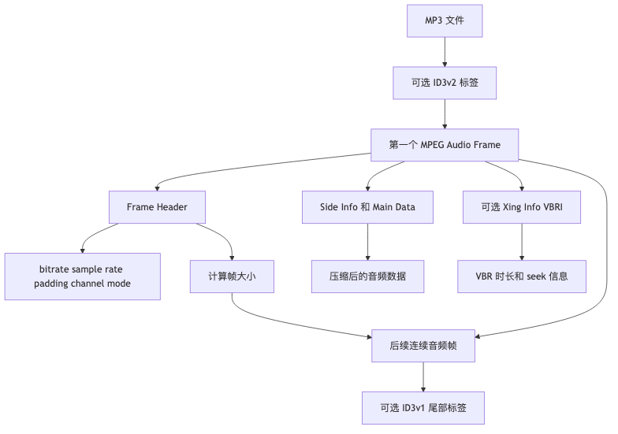

# 第四章｜MP3 内部结构：Frame、ID3、CBR/VBR

## 1. 本章学习目标

学完这一章，你要能做到三件事：

1. **能解释 MP3 文件到底由什么组成**：它不像 MP4 那样是复杂 box/atom 容器，而更像是“标签 + 一串连续 MPEG Audio Frame”。
2. **能看懂 MP3 frame header**：知道 sync、version、layer、bitrate、sample rate、padding、channel mode 这些字段各自干什么。
3. **能从工程角度处理 MP3 文件**：比如跳过 ID3v2 标签，找到第一个音频帧，估算时长，理解为什么 VBR MP3 seek 可能不准。

本章重点不是实现 MP3 解码器，而是建立“能读结构、能讲原理、能写 parser demo、能应付面试追问”的能力。

---

## 本章速览

MP3 的主线比 MP4 更线性：先跳过标签，再一帧一帧读 MPEG Audio Frame。



本章先记住这三点：

* MP3 通常不是多轨容器，而是可选 ID3 标签加一串连续 MPEG Audio Frame。
* 解析 MP3 的第一步是跳过 ID3v2，找到 sync，再用 frame header 判断码率、采样率、padding 和下一帧位置。
* CBR 可以比较容易估算时长和 seek，VBR 则依赖 Xing、Info、VBRI 或全文件扫描。

## 2. MP3 的整体结构：它不是 MP4 那种容器

先建立一个非常重要的心智模型：

> **MP4 像一个带目录的压缩包，里面有各种 box 告诉播放器轨道、时间戳、sample 位置。
> MP3 更像是一串连续的音频帧，前后可能贴了一些标签。**

一个常见 MP3 文件大概长这样：

```text
+------------------+----------------------+----------------------+-----+------------------+
| ID3v2 Tag         | MPEG Audio Frame 1    | MPEG Audio Frame 2    | ... | ID3v1 Tag         |
| 文件开头，可选      | 可能含 Xing/Info/VBRI | 真正的压缩音频数据       |     | 文件结尾，可选      |
+------------------+----------------------+----------------------+-----+------------------+
```

更工程化一点：

```text
MP3 文件
├── ID3v2 tag，可选
│   ├── 歌名
│   ├── 艺术家
│   ├── 专辑
│   ├── 封面图
│   └── 歌词等元数据
│
├── MPEG Audio Frames
│   ├── Frame header
│   ├── 可选 CRC
│   ├── side information
│   └── main data
│
├── Xing / Info / VBRI header，可选
│   └── 通常藏在第一个音频 frame 里面，用于描述 VBR 信息
│
└── ID3v1 tag，可选
    └── 老式 128 字节尾部标签
```

### 和 MP4 的核心区别

| 对比项            | MP4                    | MP3                          |
| -------------- | ---------------------- | ---------------------------- |
| 类型             | 容器格式                   | 更接近编码后的音频帧流                  |
| 结构             | box / atom 树形结构        | 标签 + 连续 MPEG Audio Frame     |
| 是否有全局 sample 表 | 通常有，比如 `stbl`          | 通常没有                         |
| 多轨能力           | 可以放视频、音频、字幕、多条轨道       | 通常就是一条音频流                    |
| seek 信息        | 可以通过 sample table 精确定位 | CBR 相对容易，VBR 需要 Xing/VBRI/扫描 |
| 常见元数据          | `moov`、`udta` 等        | ID3v2、ID3v1、APE tag 等        |

所以面试里可以这样说：

> MP3 不像 MP4 那样是复杂的多媒体容器。一个普通 MP3 文件通常由可选的 ID3 标签和连续的 MPEG Audio Frame 组成。真正的音频压缩数据在这些 frame 里，播放器通过扫描 frame header 找到帧边界，再根据 bitrate、sample rate 等字段解码和播放。

---

## 3. ID3v2：文件开头的元数据标签

很多 MP3 文件一开头并不是音频帧，而是 ID3v2 标签。

ID3v2 的作用是存储元数据，例如：

```text
标题：Title
艺术家：Artist
专辑：Album
年份：Year
封面：Cover Art
歌词：Lyrics
评论：Comment
```

一个 ID3v2 标签通常位于文件开头：

```text
+------------------+-------------------------+
| ID3v2 Tag         | MPEG Audio Frames       |
+------------------+-------------------------+
^
文件 offset = 0
```

### ID3v2 header 的基本结构

ID3v2 header 固定 10 字节：

```text
0      1      2      3      4      5      6      7      8      9
+------+------+------+------+------+------+------+------+------+------+
| 'I'  | 'D'  | '3'  | ver  | rev  | flag | size | size | size | size |
+------+------+------+------+------+------+------+------+------+------+
```

字段含义：

| 字段       |   长度 | 说明                           |
| -------- | ---: | ---------------------------- |
| `ID3`    | 3 字节 | 标识这是 ID3v2 标签                |
| version  | 1 字节 | 例如 3 表示 ID3v2.3，4 表示 ID3v2.4 |
| revision | 1 字节 | 修订版本                         |
| flags    | 1 字节 | 是否有扩展 header、footer 等        |
| size     | 4 字节 | 标签大小，使用 syncsafe integer     |

### 什么是 syncsafe integer？

ID3v2 的 size 不是普通 32 位整数，而是 **syncsafe integer**。

它每个字节只使用低 7 位，最高位必须是 0。

```text
普通字节：  xxxxxxxx
syncsafe： 0xxxxxxx
```

为什么这么设计？

因为 MP3 frame sync 里会出现连续的 `1`，比如 `11111111 111xxxxx`。ID3v2 为了避免标签内容被误判成 MPEG frame sync，就使用了这种“安全整数”。

计算方式：

```ts
size =
  (byte0 & 0x7f) << 21 |
  (byte1 & 0x7f) << 14 |
  (byte2 & 0x7f) << 7  |
  (byte3 & 0x7f)
```

注意：

```text
ID3v2 header 里的 size 不包含前面 10 字节 header 本身。
```

所以跳过 ID3v2 时，通常是：

```text
audioStart = 10 + id3v2Size
```

如果有 footer，还可能额外多 10 字节。

---

## 4. MPEG Audio Frame：MP3 真正的音频主体

MP3 的核心是连续的 MPEG Audio Frame。

你可以把每个 frame 理解成一小段压缩后的音频数据：

```text
+----------------------+----------------------+----------------------+
| MPEG Audio Frame 1    | MPEG Audio Frame 2    | MPEG Audio Frame 3    |
+----------------------+----------------------+----------------------+
```

每个 frame 大致长这样：

```text
+--------------+--------------+------------------+----------------+
| Frame Header | Optional CRC | Side Information | Main Data      |
| 4 bytes      | 0 or 2 bytes | 解码辅助信息       | 压缩音频数据     |
+--------------+--------------+------------------+----------------+
```

其中最重要的是前 4 字节的 **Frame Header**。

播放器或 parser 会先通过 frame header 判断：

```text
这是一个合法音频帧吗？
它是 MPEG1 还是 MPEG2？
它是不是 Layer III，也就是通常说的 MP3？
码率是多少？
采样率是多少？
这一帧有多大？
下一帧在哪里？
```

---

## 5. MP3 Frame Header 的二进制结构

MP3 frame header 固定 4 字节，也就是 32 bit。

结构如下：

```text
AAAAAAAA AAABBCCD EEEEFFGH IIJJKLMM
```

对应字段：

| 字段 | bit 数 | 含义                    |
| -- | ----: | --------------------- |
| A  |    11 | frame sync            |
| B  |     2 | MPEG audio version ID |
| C  |     2 | Layer                 |
| D  |     1 | protection bit        |
| E  |     4 | bitrate index         |
| F  |     2 | sample rate index     |
| G  |     1 | padding bit           |
| H  |     1 | private bit           |
| I  |     2 | channel mode          |
| J  |     2 | mode extension        |
| K  |     1 | copyright             |
| L  |     1 | original              |
| M  |     2 | emphasis              |

用 bit offset 表示更清楚：

```text
bit 31 ───────────────────────────────────────────── bit 0

31          21 20  19 18  17 16 15    12 11  10 9 8 7   6 5   4 3 2 1 0
+-------------+------+------+--+--------+------+--+-+-----+-----+-+-+---+
| sync 11 bit | ver  |layer |P |bitrate | sr   |p |v|mode |ext  |c|o|emp|
+-------------+------+------+--+--------+------+--+-+-----+-----+-+-+---+
```

---

## 6. Sync bits：播放器如何找到音频帧

MP3 frame header 的前 11 bit 是 sync：

```text
11111111111
```

它的作用是告诉 parser：

```text
这里可能是一个 MPEG Audio Frame 的开始。
```

通常在字节层面，会看到：

```text
0xFF 0xE0
```

也就是：

```text
第一个字节必须是 0xff
第二个字节的高 3 位必须是 111
```

代码里常见判断：

```ts
if (data[i] === 0xff && (data[i + 1] & 0xe0) === 0xe0) {
  // 这里可能是一个 MP3 frame header
}
```

但要注意：

> 看到 sync bits 不代表一定是真 frame。

因为 ID3 标签、封面图片、歌词文本、甚至随机二进制数据里，也可能偶然出现类似 `0xff 0xe?` 的字节组合。

更稳的做法是：

```text
1. 先跳过 ID3v2
2. 扫描 sync bits
3. 解析 version、layer、bitrate、sample rate
4. 检查这些字段是否合法
5. 根据 frame size 算出下一帧 offset
6. 再检查下一帧是不是也有合法 sync
```

这就是最小 MP3 parser 的核心思路。

---

## 7. Version、Layer、Bitrate、Sample Rate

### MPEG version

frame header 里的 version 字段有 2 bit：

| bits | 含义       |
| ---- | -------- |
| `00` | MPEG 2.5 |
| `01` | reserved |
| `10` | MPEG 2   |
| `11` | MPEG 1   |

常见高质量 MP3 通常是：

```text
MPEG 1 Layer III
44.1kHz
128kbps / 192kbps / 320kbps
```

### Layer

Layer 字段也是 2 bit：

| bits | 含义        |
| ---- | --------- |
| `00` | reserved  |
| `01` | Layer III |
| `10` | Layer II  |
| `11` | Layer I   |

平常说的 MP3，严格来说就是：

```text
MPEG Audio Layer III
```

也就是 header 里 Layer 字段应该是：

```text
01
```

### Bitrate index

header 里不会直接写 `128kbps`，而是写一个 bitrate index。

对于常见的 **MPEG1 Layer III**：

| index |  bitrate |
| ----: | -------: |
|     1 |  32 kbps |
|     2 |  40 kbps |
|     3 |  48 kbps |
|     4 |  56 kbps |
|     5 |  64 kbps |
|     6 |  80 kbps |
|     7 |  96 kbps |
|     8 | 112 kbps |
|     9 | 128 kbps |
|    10 | 160 kbps |
|    11 | 192 kbps |
|    12 | 224 kbps |
|    13 | 256 kbps |
|    14 | 320 kbps |

其中：

```text
index = 0  表示 free，不适合初学 parser 处理
index = 15 表示 bad，非法
```

### Sample rate index

sample rate 也不是直接写 `44100`，而是写 index。

| version | index 0 | index 1 | index 2 |
| ------- | ------: | ------: | ------: |
| MPEG1   |   44100 |   48000 |   32000 |
| MPEG2   |   22050 |   24000 |   16000 |
| MPEG2.5 |   11025 |   12000 |    8000 |

`index = 3` 是 reserved，非法。

---

## 8. 用一个真实 header 例子理解

假设某个 MP3 frame header 是：

```text
FF FB 90 64
```

转成二进制：

```text
FF       FB       90       64
11111111 11111011 10010000 01100100
```

拆字段：

```text
sync:        11111111111
version:     11       => MPEG1
layer:       01       => Layer III
protection:  1        => no CRC
bitrate:     1001     => index 9 => 128 kbps
sample rate: 00       => 44100 Hz
padding:     0        => no padding
channel:     01       => joint stereo
```

所以这个 frame 是：

```text
MPEG1 Layer III
128 kbps
44100 Hz
Joint Stereo
```

### 这一帧有多大？

对于 **MPEG1 Layer III**：

```text
frameSize = floor(144 * bitrate / sampleRate + padding)
```

注意 bitrate 要用 bps。

所以：

```text
frameSize = floor(144 * 128000 / 44100 + 0)
          = floor(417.95)
          = 417 bytes
```

### 这一帧能播放多久？

MPEG1 Layer III 每帧通常包含：

```text
1152 samples
```

所以：

```text
duration = 1152 / 44100
         ≈ 0.026122 秒
         ≈ 26.1 ms
```

也就是说，44.1kHz 的 MP3，一帧大约 26ms。

---

## 9. Frame Size 如何计算

对于 MP3，也就是 Layer III，常见公式是：

### MPEG1 Layer III

```text
frameSize = floor(144 * bitrate / sampleRate + padding)
```

### MPEG2 / MPEG2.5 Layer III

```text
frameSize = floor(72 * bitrate / sampleRate + padding)
```

其中：

```text
bitrate 单位是 bps
sampleRate 单位是 Hz
padding 是 0 或 1
frameSize 单位是 byte
```

举例：

```text
MPEG1 Layer III
128kbps
44100Hz
padding = 0
```

计算：

```text
frameSize = floor(144 * 128000 / 44100)
          = 417 bytes
```

如果 padding = 1：

```text
frameSize = 418 bytes
```

### padding 的作用

因为很多采样率和码率无法整除，编码器会用 padding 让整体码率更接近目标值。

所以即使是 CBR MP3，也可能出现：

```text
417 bytes
418 bytes
417 bytes
418 bytes
...
```

这不代表它是 VBR。

CBR 更准确的说法是：

> 每个 frame header 里的 bitrate index 基本一致，而不是每一帧字节数绝对完全一样。

---

## 10. CBR 和 VBR

MP3 常见有两种码率模式：

```text
CBR：Constant Bitrate，恒定码率
VBR：Variable Bitrate，可变码率
```

### CBR

CBR 的特点是每个 frame 使用相同或基本相同的 bitrate。

比如：

```text
Frame 1: 128 kbps
Frame 2: 128 kbps
Frame 3: 128 kbps
Frame 4: 128 kbps
...
```

优点：

```text
1. 时长容易估算
2. seek 相对简单
3. 兼容性好
```

时长粗略估算：

```text
duration = audioDataBytes * 8 / bitrate
```

例如：

```text
音频数据大小：3,840,000 bytes
码率：128,000 bps

duration = 3,840,000 * 8 / 128,000
         = 240 秒
         = 4 分钟
```

### VBR

VBR 会根据音频复杂度动态调整码率。

比如：

```text
Frame 1: 96 kbps
Frame 2: 128 kbps
Frame 3: 192 kbps
Frame 4: 112 kbps
...
```

安静、简单的片段用低码率，复杂、响亮、细节多的片段用高码率。

优点：

```text
1. 同等体积下音质更好
2. 同等音质下体积更小
```

缺点：

```text
1. 不能只靠文件大小和第一个 frame bitrate 准确计算时长
2. seek 需要额外索引或扫描
3. 某些播放器可能显示时长不准
```

---

## 11. Xing / Info / VBRI Header 是什么

VBR MP3 最大的问题是：

```text
每一帧大小不固定，怎么快速知道总时长？
拖动进度条时，怎么知道目标时间对应文件哪个 offset？
```

为了解决这个问题，很多编码器会在第一个音频 frame 里放一个特殊 header。

常见有三种：

| Header | 常见来源             | 作用                   |
| ------ | ---------------- | -------------------- |
| Xing   | LAME 等编码器常见      | 记录 VBR 的总帧数、总字节数、TOC |
| Info   | LAME 常见          | 类似 Xing，但常用于 CBR 文件  |
| VBRI   | Fraunhofer 编码器常见 | 另一种 VBR 信息格式         |

它们一般不是独立的文件块，而是藏在第一个 MPEG audio frame 的数据区域里。

结构大概是：

```text
+-----------------------------+
| First MPEG Audio Frame       |
|                             |
| +-------------------------+ |
| | MPEG Frame Header       | |
| +-------------------------+ |
| | Side Information        | |
| +-------------------------+ |
| | Xing / Info / VBRI      | |
| +-------------------------+ |
| | Optional LAME Tag       | |
| +-------------------------+ |
+-----------------------------+
```

Xing / Info 通常可能包含：

```text
frames: 总 frame 数
bytes: 总音频字节数
toc: seek table，用于快速 seek
quality: 质量指标
```

如果有总 frame 数，就可以这样计算时长：

```text
duration = totalFrames * samplesPerFrame / sampleRate
```

例如：

```text
totalFrames = 10000
samplesPerFrame = 1152
sampleRate = 44100

duration = 10000 * 1152 / 44100
         ≈ 261.22 秒
```

这比用文件大小估算 VBR 时长靠谱很多。

---

## 12. 为什么 MP3 seek 有时候不精确

MP3 seek 不精确是很常见的工程问题，原因主要有这些：

### 1. MP3 通常没有 MP4 那样的全局 sample table

MP4 里有 `stts`、`stsc`、`stsz`、`stco`、`stss` 等表，可以告诉播放器：

```text
第几个 sample 在哪个文件 offset
哪个 sample 是关键帧
每个 sample 的时间戳是多少
```

普通 MP3 文件没有这种完整索引。

所以 seek 的时候经常只能：

```text
目标时间
  ↓
估算 byte offset
  ↓
附近扫描 frame sync
  ↓
从某个 frame 开始解码
```

### 2. CBR 可以估算，VBR 不能简单估算

CBR：

```text
offset ≈ audioStart + targetTime * bitrate / 8
```

VBR：

```text
offset 不和时间线性对应
```

因为前 10 秒可能是低码率，后 10 秒可能是高码率。

### 3. VBR 依赖 Xing/VBRI TOC

如果 VBR 文件有 Xing TOC，seek 会准很多。

如果没有，播放器可能要：

```text
1. 扫描整个文件建立索引
2. 或者使用粗略估算
```

### 4. MP3 有 encoder delay 和 padding

编码器可能会在开头和结尾加入一些额外 samples。

这会影响：

```text
1. 精确时长
2. 无缝播放 gapless playback
3. 精确剪辑
```

一些 LAME tag 会记录 encoder delay 和 padding，用于播放器做更精确的 gapless 处理。

### 5. Layer III 有 bit reservoir

MP3 的 Layer III 还有一个机制叫 **bit reservoir**。

简单理解：

> 某一帧的主数据可能会借用前面帧剩余的空间。

这意味着从任意帧开始解码，理论上可能缺少前面的一些上下文数据。

实际播放器通常会从目标点前面一点开始解码，然后丢掉多余音频，以提高 seek 后的准确性。

---

## 13. 浏览器工程里怎么用这些知识

前端做音频相关需求时，常见场景包括：

```text
1. 用户上传 MP3，快速读取时长
2. 生成音频波形
3. 做音频裁剪
4. 多段音频拼接
5. 音频可视化
6. 用 Web Audio 播放、混音、变速、滤波
7. 用 WebCodecs 或 WASM 解码/编码
```

这章知识主要帮你理解文件入口层：

```text
MP3 文件
  ↓
跳过 ID3v2
  ↓
找到 MPEG Audio Frame
  ↓
读取 frame header
  ↓
得到 bitrate / sampleRate / channelMode
  ↓
估算 duration 或建立 frame index
  ↓
后续交给解码器 / Web Audio / WebCodecs
```

但是要注意：

> 解析 MP3 frame header 不等于解码 MP3。

解码 MP3 需要实现完整的 Layer III 解码流程，这涉及 Huffman decoding、反量化、IMDCT、polyphase filterbank 等复杂算法。浏览器工程里通常不会手写 MP3 解码器，而是使用：

```text
HTMLAudioElement
AudioContext.decodeAudioData()
WebCodecs AudioDecoder，取决于浏览器支持情况
ffmpeg.wasm
第三方 demuxer / decoder
```

---

## 14. 必须掌握的术语表

| 术语            | 解释                                         |
| ------------- | ------------------------------------------ |
| MP3           | MPEG Audio Layer III，常见有损音频编码格式            |
| ID3v2         | 位于 MP3 文件开头的元数据标签                          |
| ID3v1         | 位于 MP3 文件结尾的老式 128 字节标签                    |
| Frame         | MP3 音频数据的基本组织单位                            |
| Frame Header  | 每个 MPEG Audio Frame 开头的 4 字节头              |
| Sync Bits     | frame header 开头的 11 个 1，用于定位帧开始            |
| MPEG Version  | MPEG1、MPEG2、MPEG2.5                        |
| Layer         | Layer I、Layer II、Layer III；MP3 是 Layer III |
| Bitrate       | 码率，单位通常是 kbps                              |
| Sample Rate   | 采样率，例如 44100Hz                             |
| Padding       | 用来修正帧大小的小补位                                |
| Channel Mode  | 声道模式，比如 stereo、joint stereo、mono           |
| CBR           | 恒定码率                                       |
| VBR           | 可变码率                                       |
| Xing Header   | 常见 VBR 信息头，可能包含总帧数、总字节数、TOC                |
| Info Header   | 类似 Xing，常用于 CBR 文件                         |
| VBRI Header   | 另一种 VBR 信息头                                |
| TOC           | Table of Contents，用于辅助 seek                |
| Bit Reservoir | MP3 Layer III 允许 frame 借用前后数据空间的机制         |

---

## 15. TypeScript 实践：读取 MP3，跳过 ID3v2，找到第一个 Frame Header

这个练习目标：

```text
1. 用户上传 MP3 文件
2. 使用 File.arrayBuffer() 读取
3. 判断并跳过 ID3v2
4. 扫描第一个 MPEG frame sync
5. 解析 frame header
6. 打印 version、layer、bitrate、sample rate、channel mode、frame size
7. 尝试解析 Xing / Info / VBRI
```

### 核心代码

```ts
type MpegVersion = "MPEG1" | "MPEG2" | "MPEG2.5";
type ChannelMode = "Stereo" | "Joint stereo" | "Dual channel" | "Mono";

interface Mp3FrameHeader {
  offset: number;
  version: MpegVersion;
  layer: "Layer III";
  hasCrc: boolean;
  bitrateKbps: number;
  sampleRate: number;
  padding: number;
  channelMode: ChannelMode;
  frameSize: number;
  samplesPerFrame: number;
  durationMs: number;
  rawBytes: string;
}

interface VbrInfo {
  type: "Xing" | "Info" | "VBRI";
  frames?: number;
  bytes?: number;
  hasToc?: boolean;
}

const BITRATES_LAYER3: Record<MpegVersion, number[]> = {
  MPEG1: [
    0, 32, 40, 48, 56, 64, 80, 96,
    112, 128, 160, 192, 224, 256, 320, 0,
  ],
  MPEG2: [
    0, 8, 16, 24, 32, 40, 48, 56,
    64, 80, 96, 112, 128, 144, 160, 0,
  ],
  "MPEG2.5": [
    0, 8, 16, 24, 32, 40, 48, 56,
    64, 80, 96, 112, 128, 144, 160, 0,
  ],
};

const SAMPLE_RATES: Record<MpegVersion, number[]> = {
  MPEG1: [44100, 48000, 32000, 0],
  MPEG2: [22050, 24000, 16000, 0],
  "MPEG2.5": [11025, 12000, 8000, 0],
};

const CHANNEL_MODES: ChannelMode[] = [
  "Stereo",
  "Joint stereo",
  "Dual channel",
  "Mono",
];

function ascii(data: Uint8Array, offset: number, length: number): string {
  if (offset < 0 || offset + length > data.length) return "";
  return String.fromCharCode(...data.slice(offset, offset + length));
}

function readU32BE(data: Uint8Array, offset: number): number {
  if (offset + 4 > data.length) {
    throw new Error("Not enough bytes to read u32");
  }

  return (
    (data[offset] << 24) |
    (data[offset + 1] << 16) |
    (data[offset + 2] << 8) |
    data[offset + 3]
  ) >>> 0;
}

function syncSafeToInt(b0: number, b1: number, b2: number, b3: number): number {
  for (const b of [b0, b1, b2, b3]) {
    if ((b & 0x80) !== 0) {
      throw new Error("Invalid syncsafe integer");
    }
  }

  return (
    ((b0 & 0x7f) << 21) |
    ((b1 & 0x7f) << 14) |
    ((b2 & 0x7f) << 7) |
    (b3 & 0x7f)
  );
}

function skipID3v2(data: Uint8Array): number {
  if (data.length < 10) return 0;

  const signature = ascii(data, 0, 3);

  if (signature !== "ID3") {
    return 0;
  }

  const flags = data[5];
  const size = syncSafeToInt(data[6], data[7], data[8], data[9]);

  // ID3v2 header 的 size 不包含 10 字节 header 本身
  let offset = 10 + size;

  // ID3v2.4 footer flag: bit 4
  const hasFooter = (flags & 0x10) !== 0;
  if (hasFooter) {
    offset += 10;
  }

  return offset;
}

function parseFrameHeader(data: Uint8Array, offset: number): Mp3FrameHeader | null {
  if (offset + 4 > data.length) return null;

  const b0 = data[offset];
  const b1 = data[offset + 1];
  const b2 = data[offset + 2];
  const b3 = data[offset + 3];

  // sync: 11 bits, usually checked as 0xff + next byte high 3 bits 111
  if (b0 !== 0xff || (b1 & 0xe0) !== 0xe0) {
    return null;
  }

  const versionBits = (b1 >> 3) & 0b11;
  const layerBits = (b1 >> 1) & 0b11;
  const protectionBit = b1 & 0b1;

  const bitrateIndex = (b2 >> 4) & 0b1111;
  const sampleRateIndex = (b2 >> 2) & 0b11;
  const padding = (b2 >> 1) & 0b1;

  const channelModeIndex = (b3 >> 6) & 0b11;

  const versionMap: Record<number, MpegVersion | null> = {
    0b00: "MPEG2.5",
    0b01: null,
    0b10: "MPEG2",
    0b11: "MPEG1",
  };

  const version = versionMap[versionBits];
  if (!version) return null;

  // MP3 指的是 Layer III
  // Layer bits:
  // 01 = Layer III
  // 10 = Layer II
  // 11 = Layer I
  if (layerBits !== 0b01) {
    return null;
  }

  const bitrateKbps = BITRATES_LAYER3[version][bitrateIndex];
  if (!bitrateKbps) return null;

  const sampleRate = SAMPLE_RATES[version][sampleRateIndex];
  if (!sampleRate) return null;

  const channelMode = CHANNEL_MODES[channelModeIndex];

  const samplesPerFrame = version === "MPEG1" ? 1152 : 576;
  const coefficient = version === "MPEG1" ? 144 : 72;

  const frameSize = Math.floor(
    (coefficient * bitrateKbps * 1000) / sampleRate + padding
  );

  if (frameSize <= 4) return null;

  const durationMs = (samplesPerFrame / sampleRate) * 1000;

  const rawBytes = [b0, b1, b2, b3]
    .map((b) => b.toString(16).padStart(2, "0"))
    .join(" ")
    .toUpperCase();

  return {
    offset,
    version,
    layer: "Layer III",
    hasCrc: protectionBit === 0,
    bitrateKbps,
    sampleRate,
    padding,
    channelMode,
    frameSize,
    samplesPerFrame,
    durationMs,
    rawBytes,
  };
}

function findFirstMp3Frame(data: Uint8Array, startOffset: number): Mp3FrameHeader | null {
  for (let offset = startOffset; offset + 4 <= data.length; offset++) {
    const header = parseFrameHeader(data, offset);
    if (!header) continue;

    const nextOffset = offset + header.frameSize;

    // 如果后面已经没有完整 header，就先接受当前结果
    if (nextOffset + 4 > data.length) {
      return header;
    }

    // 用下一帧校验，减少误判 sync 的概率
    const nextHeader = parseFrameHeader(data, nextOffset);

    if (
      nextHeader &&
      nextHeader.version === header.version &&
      nextHeader.sampleRate === header.sampleRate
    ) {
      return header;
    }
  }

  return null;
}

function parseVbrInfo(data: Uint8Array, firstFrame: Mp3FrameHeader): VbrInfo | null {
  const channels = firstFrame.channelMode === "Mono" ? 1 : 2;

  const sideInfoSize =
    firstFrame.version === "MPEG1"
      ? channels === 1
        ? 17
        : 32
      : channels === 1
        ? 9
        : 17;

  const crcSize = firstFrame.hasCrc ? 2 : 0;

  // Xing / Info 通常在首帧 header + optional CRC + side information 后
  const xingOffset = firstFrame.offset + 4 + crcSize + sideInfoSize;
  const xingTag = ascii(data, xingOffset, 4);

  if (xingTag === "Xing" || xingTag === "Info") {
    const flags = readU32BE(data, xingOffset + 4);

    let cursor = xingOffset + 8;
    let frames: number | undefined;
    let bytes: number | undefined;
    let hasToc = false;

    if ((flags & 0x1) !== 0) {
      frames = readU32BE(data, cursor);
      cursor += 4;
    }

    if ((flags & 0x2) !== 0) {
      bytes = readU32BE(data, cursor);
      cursor += 4;
    }

    if ((flags & 0x4) !== 0) {
      hasToc = true;
      cursor += 100;
    }

    return {
      type: xingTag,
      frames,
      bytes,
      hasToc,
    };
  }

  // VBRI 通常在首帧 MPEG header 后 32 字节附近
  const vbriOffset = firstFrame.offset + 4 + 32;
  const vbriTag = ascii(data, vbriOffset, 4);

  if (vbriTag === "VBRI") {
    const bytes = readU32BE(data, vbriOffset + 10);
    const frames = readU32BE(data, vbriOffset + 14);

    return {
      type: "VBRI",
      frames,
      bytes,
    };
  }

  return null;
}

function hasID3v1(data: Uint8Array): boolean {
  if (data.length < 128) return false;

  const offset = data.length - 128;
  return ascii(data, offset, 3) === "TAG";
}

function estimateDurationSeconds(
  data: Uint8Array,
  firstFrame: Mp3FrameHeader,
  audioStart: number,
  vbrInfo: VbrInfo | null
): number | null {
  if (vbrInfo?.frames) {
    return (vbrInfo.frames * firstFrame.samplesPerFrame) / firstFrame.sampleRate;
  }

  // CBR 粗略估算
  const tailTagSize = hasID3v1(data) ? 128 : 0;
  const audioBytes = data.length - audioStart - tailTagSize;

  if (audioBytes <= 0) return null;

  return (audioBytes * 8) / (firstFrame.bitrateKbps * 1000);
}

export async function inspectMp3(file: File) {
  const arrayBuffer = await file.arrayBuffer();
  const data = new Uint8Array(arrayBuffer);

  const audioStart = skipID3v2(data);
  const firstFrame = findFirstMp3Frame(data, audioStart);

  if (!firstFrame) {
    throw new Error("No valid MP3 frame found");
  }

  const vbrInfo = parseVbrInfo(data, firstFrame);
  const durationSeconds = estimateDurationSeconds(
    data,
    firstFrame,
    audioStart,
    vbrInfo
  );

  return {
    fileName: file.name,
    fileSize: file.size,
    id3v2Size: audioStart,
    hasID3v1: hasID3v1(data),
    firstFrame,
    vbrInfo,
    estimatedDurationSeconds: durationSeconds,
  };
}
```

### 浏览器里使用

```ts
const input = document.querySelector<HTMLInputElement>("#mp3-input")!;

input.addEventListener("change", async () => {
  const file = input.files?.[0];
  if (!file) return;

  try {
    const result = await inspectMp3(file);
    console.log(result);
  } catch (error) {
    console.error(error);
  }
});
```

HTML：

```html
<input id="mp3-input" type="file" accept="audio/mpeg,.mp3" />
```

输出结果类似：

```ts
{
  fileName: "demo.mp3",
  fileSize: 3840128,
  id3v2Size: 2048,
  hasID3v1: false,
  firstFrame: {
    offset: 2048,
    version: "MPEG1",
    layer: "Layer III",
    hasCrc: false,
    bitrateKbps: 128,
    sampleRate: 44100,
    padding: 0,
    channelMode: "Joint stereo",
    frameSize: 417,
    samplesPerFrame: 1152,
    durationMs: 26.122,
    rawBytes: "FF FB 90 64"
  },
  vbrInfo: {
    type: "Xing",
    frames: 9210,
    bytes: 3840000,
    hasToc: true
  },
  estimatedDurationSeconds: 240.58
}
```

---

## 16. 这个 parser 的已知限制

上面的代码是教学版，适合面试 demo 和理解 MP3 结构，但不是完整工业级 parser。

限制包括：

```text
1. 只处理常见 Layer III，也就是普通 MP3
2. 不完整解析 ID3v2 内部 frame
3. 不处理 APE tag
4. 不处理 free bitrate
5. 不构建完整 seek index
6. 不解码音频数据
7. 对极端损坏文件容错有限
8. 对某些非标准 VBR header 可能识别不到
```

如果要做真实产品，可以继续扩展：

```text
1. 解析 ID3v2 的 TIT2、TPE1、TALB、APIC 等 frame
2. 扫描所有 MP3 frame，构建 frame index
3. 更准确地区分 CBR / VBR
4. 支持 LAME tag 的 encoder delay / padding
5. 支持 Web Worker，避免大文件扫描阻塞主线程
```

---

## 17. 常见误区

### 误区 1：MP3 是音频容器，里面可以随便放各种 codec

不准确。

MP3 通常指 MPEG Audio Layer III 编码后的音频流，加上一些 ID3 标签。它不像 MP4、MKV、WebM 那样是通用容器。

更准确的说法：

> MP3 文件通常由 ID3 元数据标签和 MPEG Audio Layer III frames 组成。

---

### 误区 2：MP3 文件开头一定是音频帧

不一定。

很多 MP3 文件开头是 ID3v2 标签：

```text
49 44 33
I  D  3
```

真正的 MPEG frame 可能在几 KB、几十 KB 甚至更后面，尤其是有封面图的时候。

---

### 误区 3：找到 `0xff 0xe?` 就一定找到了 MP3 frame

不一定。

这只是 sync pattern，可能误判。

正确做法是继续校验：

```text
version 合法
layer 合法
bitrate index 合法
sample rate index 合法
frame size 合法
下一帧位置也能解析出合法 header
```

---

### 误区 4：CBR MP3 每一帧大小一定完全一样

不一定。

因为 padding 的存在，CBR frame size 可能在两个值之间变化。

CBR 的重点是：

```text
bitrate index 基本一致
```

不是每个 frame 字节数完全一致。

---

### 误区 5：VBR MP3 可以用第一个 frame 的 bitrate 估算总时长

不靠谱。

VBR 的每一帧码率可能不同。更好的方式是：

```text
1. 读取 Xing / Info / VBRI header 的总帧数
2. 或者扫描所有 frame 统计数量
3. 或者交给浏览器/解码器处理
```

---

### 误区 6：能解析 MP3 header 就等于能解码 MP3

不是。

解析 header 只是知道：

```text
这个音频是什么格式
码率是多少
采样率是多少
帧有多大
```

真正解码 MP3 是另一个复杂任务。

---

## 18. 和真实工程的关系

### 场景 1：上传 MP3 后快速显示基础信息

你可以不解码整个文件，只读取前几 KB：

```text
读取 ArrayBuffer
  ↓
跳过 ID3v2
  ↓
找第一个 frame header
  ↓
拿到 sampleRate / bitrate / channelMode
  ↓
显示基础信息
```

这比直接 decode 整个文件轻很多。

---

### 场景 2：音频时长估算

对于 CBR：

```text
duration ≈ audioBytes * 8 / bitrate
```

对于 VBR：

```text
优先 Xing / VBRI
其次扫描所有 frame
最后才粗略估算
```

---

### 场景 3：自定义音频波形编辑器

如果你要画波形，最终还是需要 PCM 数据。

通常流程是：

```text
MP3 文件
  ↓
AudioContext.decodeAudioData()
  ↓
AudioBuffer
  ↓
getChannelData()
  ↓
抽样绘制 waveform
```

MP3 parser 可以用于前置检查和辅助时长估算，但画波形本身需要解码后的 PCM。

---

### 场景 4：Web Audio 多轨混音

Web Audio 不直接关心 MP3 frame header。

它更关心：

```text
AudioBuffer
sampleRate
channel count
duration
PCM samples
```

但是当你要解释“上传 MP3 到 Web Audio 之前发生了什么”时，就需要知道：

```text
MP3 压缩音频
  ↓
浏览器 demux / parse
  ↓
解码器 decode
  ↓
PCM
  ↓
Web Audio processing graph
```

---

## 19. 面试题和参考答案

### 题 1：MP3 文件内部大概是什么结构？

参考答案：

> MP3 文件通常不是像 MP4 那样的复杂容器，而是由可选的 ID3 标签和连续的 MPEG Audio Frame 组成。ID3v2 通常在文件开头，用来存储歌名、艺术家、封面等元数据；真正的音频数据在后面的 MPEG Audio Layer III frames 里。文件末尾还可能有老式的 ID3v1 标签。

---

### 题 2：ID3v2 是什么？为什么解析 MP3 时要跳过它？

参考答案：

> ID3v2 是 MP3 文件开头的元数据标签，用来存储标题、艺术家、专辑、封面、歌词等信息。它不是音频帧。如果 parser 从文件 offset 0 直接找 MP3 frame header，可能会误判。所以一般要先检查文件开头是否是 `ID3`，读取 ID3v2 header 里的 size，然后跳到真正音频数据开始的位置。

---

### 题 3：MP3 frame header 里有哪些重要字段？

参考答案：

> MP3 frame header 固定 4 字节，重要字段包括 11 bit sync、MPEG version、Layer、protection bit、bitrate index、sample rate index、padding、channel mode 等。通过这些字段可以判断帧是否合法，计算帧大小，知道采样率和码率，并定位下一帧。

---

### 题 4：sync bits 是什么？只靠 sync bits 找帧可以吗？

参考答案：

> sync bits 是 MPEG Audio Frame header 开头的 11 个 1，用于标识帧开始。字节层面通常表现为 `0xff` 加下一个字节高 3 位为 `111`。但只靠 sync bits 不够，因为其他二进制数据里也可能偶然出现类似模式。更可靠的方法是解析完整 header，检查 version、layer、bitrate、sample rate 是否合法，并根据 frame size 检查下一帧是否也合法。

---

### 题 5：MP3 frame size 怎么算？

参考答案：

> 对常见 MPEG1 Layer III，公式是 `frameSize = floor(144 * bitrate / sampleRate + padding)`，bitrate 用 bps，sampleRate 用 Hz。比如 128kbps、44.1kHz、padding 为 0 时，frame size 大约是 417 字节。对于 MPEG2 或 MPEG2.5 Layer III，常用系数是 72。

---

### 题 6：CBR 和 VBR 有什么区别？

参考答案：

> CBR 是恒定码率，每个 frame 的 bitrate 基本一致，所以可以通过文件音频数据大小和码率粗略估算时长，seek 也相对简单。VBR 是可变码率，不同 frame 可以使用不同 bitrate，音频简单的地方码率低，复杂的地方码率高，因此同等质量下体积更优，但时长计算和 seek 更依赖 Xing/VBRI 这类额外索引信息。

---

### 题 7：Xing / VBRI header 是干什么的？

参考答案：

> Xing 和 VBRI 是常见的 VBR 信息头，通常位于第一个音频 frame 内部。它们可以记录总帧数、总字节数、TOC 等信息。播放器可以通过这些信息更准确地计算 VBR MP3 的时长，也可以更快地做 seek。

---

### 题 8：为什么有些 MP3 文件显示时长不准？

参考答案：

> 常见原因是文件是 VBR，但没有 Xing/VBRI 这类总帧数或 seek 信息。如果播放器只根据第一个 frame 的 bitrate 和文件大小估算时长，就会不准。另一个原因是文件里有 ID3 标签、尾部 tag、encoder delay、padding 等额外数据，也会影响粗略估算。

---

### 题 9：为什么 MP3 seek 没有 MP4 那么天然精确？

参考答案：

> MP4 通常有 sample table，可以明确知道 sample 的时间和文件 offset。普通 MP3 主要是一串连续 frame，没有完整全局索引。CBR 可以按码率估算 offset，VBR 则需要 Xing/VBRI TOC 或扫描全部 frame，否则只能粗略定位。再加上 encoder delay、padding、bit reservoir 等因素，MP3 seek 可能不如 MP4 精确。

---

### 题 10：解析 MP3 header 和解码 MP3 是一回事吗？

参考答案：

> 不是。解析 header 只是读取 frame 的结构信息，比如版本、层级、码率、采样率、帧大小等。真正解码 MP3 需要实现 Layer III 的完整解码流程，包括 Huffman 解码、反量化、频域到时域转换等复杂步骤。浏览器工程里通常会使用浏览器内置解码器、Web Audio、WebCodecs 或 ffmpeg.wasm。

---

## 20. 实践任务

### 任务 1：解析 ID3v2

输入一个 MP3 文件，判断它是否以 `ID3` 开头。

要求输出：

```text
是否存在 ID3v2
ID3v2 version
ID3v2 size
真正音频数据起始 offset
```

---

### 任务 2：寻找第一个 MPEG Audio Frame

从 `audioStart` 开始扫描：

```text
0xff
下一个字节高 3 位为 111
```

找到候选 frame header 后，继续校验：

```text
version 合法
layer 是 Layer III
bitrate index 合法
sample rate index 合法
```

---

### 任务 3：解析 frame header

输出：

```text
offset
version
layer
bitrate
sampleRate
padding
channelMode
frameSize
durationMs
```

---

### 任务 4：判断 CBR / VBR

简单版本：

```text
1. 解析前 100 个 frame
2. 统计 bitrate 是否变化
3. 如果 bitrate 多次变化，基本可判断为 VBR
4. 如果 bitrate 一直相同，可暂时判断为 CBR
```

注意：

```text
是否有 Xing / Info / VBRI 比单纯统计更可靠。
```

---

### 任务 5：估算 MP3 时长

实现三种策略：

```text
优先级 1：如果有 Xing / VBRI frames 字段，用 frame 数计算
优先级 2：如果疑似 CBR，用 audioBytes * 8 / bitrate 计算
优先级 3：扫描所有 frame，累加 samplesPerFrame / sampleRate
```

---

## 21. 自测题

### 题 1：MP3 文件开头一定是 MPEG Audio Frame 吗？

答案：

> 不一定。很多 MP3 文件开头是 ID3v2 标签，真正的 MPEG Audio Frame 在 ID3v2 后面。

---

### 题 2：ID3v2 header 有多少字节？

答案：

> 10 字节。

---

### 题 3：ID3v2 size 为什么叫 syncsafe integer？

答案：

> 因为它每个字节只使用低 7 位，最高位保持为 0，避免标签数据被误判为 MPEG frame sync。

---

### 题 4：MP3 frame header 有多少字节？

答案：

> 4 字节，也就是 32 bit。

---

### 题 5：frame sync 有多少 bit？

答案：

> 11 bit，全部为 1。

---

### 题 6：普通 MP3 对应 MPEG Audio 的哪一层？

答案：

> Layer III。

---

### 题 7：MPEG1 Layer III、128kbps、44100Hz、padding 为 0 时，frame size 大约是多少？

答案：

```text
frameSize = floor(144 * 128000 / 44100)
          = 417 bytes
```

---

### 题 8：MPEG1 Layer III 每帧通常包含多少 samples？

答案：

> 1152 samples。

---

### 题 9：为什么 VBR MP3 不能简单用第一个 frame 的 bitrate 估算总时长？

答案：

> 因为 VBR 每个 frame 的 bitrate 可能不同，第一个 frame 的 bitrate 不代表整个文件的平均码率。

---

### 题 10：Xing header 主要解决什么问题？

答案：

> 它可以记录 VBR 文件的总帧数、总字节数和 TOC，帮助播放器更准确地计算时长和 seek。

---

## 22. 本章总结

这一章你要记住这条主线：

```text
MP3 文件
  ↓
可能先有 ID3v2 元数据
  ↓
然后是一串 MPEG Audio Frame
  ↓
每个 Frame 开头有 4 字节 header
  ↓
header 里有 sync、version、layer、bitrate、sampleRate、padding、channelMode
  ↓
通过 header 可以计算 frame size
  ↓
通过 frame size 可以定位下一帧
  ↓
CBR 可以粗略按码率估算时长
  ↓
VBR 最好依赖 Xing / Info / VBRI 或扫描全部 frame
```

面试里最核心的表达是：

> MP3 通常不是 MP4 那种复杂容器，而是由 ID3 标签和连续 MPEG Audio Layer III frames 组成。解析 MP3 的关键是跳过 ID3v2，找到 frame sync，读取 4 字节 frame header，通过 bitrate、sample rate、padding 算出 frame size，并理解 CBR/VBR 对时长计算和 seek 的影响。

---

## 23. 下一章衔接：从“文件结构”进入“压缩原理”

前面几章解决的是：

```text
媒体文件长什么样？
容器和编码有什么区别？
MP4 如何组织 sample？
MP3 如何组织 frame？
```

下一章要进入更底层的问题：

```text
为什么音频和视频能被压缩？
MP3 / AAC 到底压缩了什么？
H.264 / AV1 为什么能把视频压这么小？
I 帧、P 帧、B 帧、GOP、码率控制到底是什么？
```

也就是：

```text
Chapter 5：Codec 基础：压缩到底在压什么
```

从下一章开始，你会把“MP3 frame 里面装着压缩音频数据”这件事继续往下拆，理解编码器和解码器到底在做什么。
