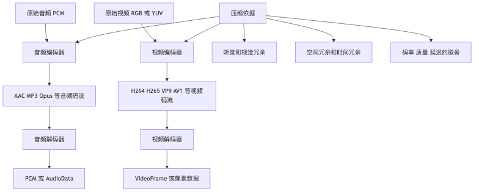

# 第五章｜编解码基础：压缩到底在压什么

## 1. 本章学习目标

学完这一章，你不需要会手写一个 H.264、AAC 或 MP3 编码器，但你要能做到三件事：

1. **能解释音视频为什么可以被压缩**
2. **能区分编码、解码、压缩、封装这些概念**
3. **能用面试语言讲清楚 codec 的核心原理**

这一章的目标不是“研究算法论文”，而是建立工程上够用的心智模型。

你要重点记住这句话：

```text
编码器做的事：把原始音视频数据变小。
解码器做的事：把压缩后的数据还原成可以播放或处理的原始帧。
```

对于前端 / 浏览器音视频处理岗位来说，你真正需要掌握的是：

```text
PCM / RGB / YUV
  ↓
音频编码：MP3 / AAC / Opus
  ↓
视频编码：H.264 / H.265 / VP9 / AV1
  ↓
压缩后的数据 chunk / sample
  ↓
解码成 AudioData / VideoFrame
  ↓
处理后再编码
```

---

## 本章速览

编解码可以先理解成“原始媒体数据”和“压缩码流”之间来回转换：



本章的速记总结：

* 编码器把原始 PCM、RGB、YUV 变成更小的 encoded data，解码器把 encoded data 还原成可播放或可处理的原始数据。
* 音频压缩更多利用心理声学和频域冗余，视频压缩更多利用帧内空间冗余、帧间时间冗余和运动补偿。
* 码率、GOP、I/P/B 帧、profile、level 不是孤立概念，它们共同决定体积、质量、延迟、seek 体验和兼容性。

# 2. 前置概念：这里不再重复展开

前面几章已经讲过：codec 负责“原始数据和压缩数据之间的转换”，container 负责“把多条编码轨道和元数据装进一个文件”。本章不再重新解释 MP4、H.264、AAC、PCM、RGB 这些基础定义，而是直接追问下一层问题：

```text
为什么 codec 可以把原始 PCM / RGB / YUV 压小？
它到底丢掉了什么、保留了什么？
这些取舍又怎样影响画质、音质、延迟和兼容性？
```

你只需要带着这条前置链路进入本章：

```text
raw audio/video
  ↓ encode
encoded chunks / samples
  ↓ decode
raw audio/video
```

---

# 3. 原始数据为什么必须压缩

原始音视频体积的计算方法已经在第 1 章展开过，这里只保留结论：

* PCM 会按采样率、位深、声道数线性增长，几分钟无压缩音频就可能达到几十 MB。
* RGB / YUV 原始视频会按分辨率、帧率、像素格式和时长线性增长，10 秒 1080p 原始帧就可能接近 GB 级。
* 所以 codec 的价值不是“换个文件后缀”，而是利用听觉、视觉和相邻帧之间的冗余，把原始数据改写成更小的表示。

从这里开始，重点就不是再算一遍体积，而是理解编码器用什么策略把这些数据压下去。

---

# 4. 有损压缩 vs 无损压缩

压缩分两类：

```text
无损压缩 lossless compression
有损压缩 lossy compression
```

## 4.1 无损压缩

无损压缩的特点是：

```text
压缩后再解压，可以 100% 还原原始数据。
```

例如：

```text
zip
png
flac
```

适合不能丢信息的场景，比如文本、程序、部分图像和高保真音频归档。

但无损压缩的问题是：

```text
压缩率有限。
```

如果你想把一个 2GB 的原始视频压到 20MB，只靠无损压缩通常做不到。

---

## 4.2 有损压缩

有损压缩的特点是：

```text
压缩后再解压，不能 100% 还原原始数据。
```

但它会尽量丢掉人耳、人眼不敏感的信息。

典型格式包括：

```text
MP3
AAC
Opus
JPEG
H.264
H.265
VP9
AV1
```

音视频里最常见的是有损压缩。

工程上经常要在这几个目标之间权衡：

```text
文件体积
画质 / 音质
编码速度
解码性能
延迟
兼容性
```

没有一个 codec 在所有维度上永远最优。

---

# 5. 音频为什么能压缩

音频压缩的核心问题是：

```text
哪些声音信息可以少存，甚至不存，而人耳还不太容易察觉？
```

这背后主要利用的是 **心理声学**。

---

## 5.1 人耳不是完美传感器

人耳并不是对所有声音都一样敏感。

它有几个特点：

```text
对某些频率更敏感
对极高频或极低频不敏感
响亮声音会掩盖附近较弱的声音
短时间内相邻声音会互相影响
```

所以编码器可以根据人耳特性决定：

```text
重要的信息多保留
不重要的信息少保留
听不出来的信息直接丢掉
```

这就是 MP3、AAC 这类有损音频编码的核心思路。

---

## 5.2 频域：把声音拆成不同频率

PCM 是时间域数据。

你可以把它理解成：

```text
某一时刻，声音波形的振幅是多少。
```

但音频编码器通常会把音频转换到频域。

频域更像是在问：

```text
这段声音里有哪些频率？
每个频率有多强？
```

举个类比：

```text
时间域：一首歌的完整波形。
频域：这首歌里低音、中音、高音分别有多少。
```

很多音频编码器会使用类似 MDCT 这样的变换，把一小段 PCM 转成频域系数，然后再决定哪些频率信息值得保留。

---

## 5.3 掩蔽效应

掩蔽效应是音频压缩里非常重要的概念。

比如：

```text
旁边有人在用电钻，你可能听不见远处很小的脚步声。
```

这说明一个强声音会掩盖附近的弱声音。

编码器可以利用这个现象：

```text
如果某些弱声音已经被强声音盖住了，
那这些弱声音就可以少存，甚至不存。
```

这不是“乱丢数据”，而是有策略地丢掉人耳难以察觉的信息。

---

## 5.4 音频编码的大致流程

以 MP3 / AAC 这类有损音频编码为例，可以粗略理解成：

```text
PCM samples
  ↓
分帧
  ↓
转换到频域
  ↓
根据心理声学模型判断哪些信息重要
  ↓
量化
  ↓
熵编码
  ↓
输出压缩后的音频帧
```

文字版流程图：

```text
原始 PCM
   │
   ▼
切成一小段一小段音频 frame
   │
   ▼
从时间域转换到频域
   │
   ▼
分析人耳能不能明显听出来
   │
   ▼
重要频率精细保存，不重要频率粗略保存
   │
   ▼
进一步压缩二进制表示
   │
   ▼
得到 MP3 / AAC / Opus 编码数据
```

---

# 6. PCM、MP3、AAC、Opus 的关系

## 6.1 PCM

PCM 是原始音频数据。

特点：

```text
未压缩
体积大
容易处理
适合 Web Audio 内部计算
```

Web Audio API 最终处理的核心数据，本质上就是 PCM 采样数据。

你可以把 PCM 理解成音频世界里的“原始像素”。

---

## 6.2 MP3

MP3 是老牌有损音频编码格式。

特点：

```text
兼容性强
体积小
历史非常久
低码率下音质不如新格式
```

MP3 常见于音乐文件、播客、历史存量资源。

前面第四章讲过，MP3 文件经常是：

```text
ID3 tag
+
一帧一帧 MPEG Audio Frame
```

它不像 MP4 那样是复杂 box 容器。

---

## 6.3 AAC

AAC 是更现代、更常见于 MP4 里的音频编码格式。

特点：

```text
压缩效率通常比 MP3 好
常用于 MP4
移动端和浏览器支持广泛
直播和点播都常见
```

一个常见 MP4 文件通常是：

```text
H.264 video
+
AAC audio
```

所以做 MP4 处理时，经常会遇到 AAC。

---

## 6.4 Opus

Opus 是更适合实时通信的音频编码格式。

特点：

```text
低延迟
适合语音
也能处理音乐
WebRTC 中非常常见
网络适应性好
```

语音会议、在线通话、实时互动场景里，Opus 非常重要。

---

## 6.5 面试回答模板

当面试官问：

> PCM、MP3、AAC、Opus 有什么区别？

可以这样回答：

```text
PCM 是未压缩的原始音频采样数据，体积大但容易处理；
MP3、AAC、Opus 都是有损音频编码格式，会利用人耳听觉特性进行压缩。

MP3 比较老，兼容性强；
AAC 常见于 MP4，压缩效率通常比 MP3 好；
Opus 更适合实时通信和低延迟场景，比如 WebRTC。
在浏览器音频处理中，解码后的数据最终通常会变成 PCM，再交给 Web Audio 或 AudioData 处理。
```

---

# 7. 视频为什么能压缩

视频压缩比音频更复杂，但核心思想很好理解：

```text
不要重复存已经知道的信息。
```

视频能压缩，主要是因为有三类冗余：

```text
空间冗余
时间冗余
视觉冗余
```

---

## 7.1 空间冗余

空间冗余指的是：

```text
同一帧画面内部，有大量相似区域。
```

比如一帧蓝天画面：

```text
左上角是蓝色
旁边也是蓝色
再旁边还是蓝色
```

如果每个像素都完整保存一遍，会很浪费。

编码器可以用更聪明的方式表示：

```text
这一大片区域都差不多是蓝色。
```

这就是空间压缩。

类似 JPEG 图片压缩，视频编码器也会对单帧内部做预测、变换、量化等操作。

---

## 7.2 时间冗余

时间冗余指的是：

```text
相邻视频帧之间，通常大部分内容都没变。
```

比如一个人坐在桌前说话：

```text
背景基本不动
桌子不动
墙不动
只有嘴巴、眼睛、手势在变
```

那就没必要每一帧都完整保存整张图片。

编码器可以保存：

```text
上一帧是什么
这一帧相比上一帧变化了什么
```

这就是视频压缩里最关键的地方。

---

## 7.3 视觉冗余

视觉冗余指的是：

```text
人眼对某些画面信息不敏感。
```

比如：

```text
人眼对亮度变化更敏感
对颜色细节相对没那么敏感
对高速运动中的细节没那么敏感
```

所以视频编码里经常会用 YUV，并且使用色度抽样，比如 YUV420P。

这也是为什么视频编码很少直接用 RGB 存储。

---

# 8. RGB、YUV、YUV420P 在编码里的位置

RGB、YUV / YCbCr、YUV420P 的基础区别第 1 章已经讲过。本章只补一个和压缩直接相关的判断：

```text
RGB 更贴近显示和 Canvas 像素处理；
YUV / YCbCr 更贴近视频编码，因为它把亮度和色度拆开；
YUV420P 通过降低色度采样量，利用“人眼对亮度更敏感、对色度细节没那么敏感”的特性减少数据。
```

所以在浏览器视频处理中，经常会出现这样的转换：

```text
VideoFrame / decoder output
  ↓
Canvas / WebGL 里按 RGB/RGBA 处理
  ↓
VideoEncoder 内部或输入要求再回到更适合编码的像素格式
```

你不需要在这里重新背一遍色彩模型，只要记住：**YUV420P 是视频编码把视觉冗余变成体积优势的典型入口。**

---

## 8.1 面试回答模板

当面试官问：

> RGB 和 YUV 有什么区别？为什么视频常用 YUV420P？

可以这样回答：

```text
RGB 是红绿蓝颜色模型，适合显示和图像处理；
YUV 或更准确说 YCbCr，把亮度和色度分开，Y 表示亮度，U/V 表示色度。

人眼对亮度更敏感，对色度细节不那么敏感，所以视频编码通常会保留完整亮度信息，减少色度采样。
YUV420P 就是常见的色度抽样格式，每 2×2 像素共享一组色度信息，能明显减少数据量，同时主观画质损失较小。
```

---

# 9. 视频编码器大概做了什么

一个典型视频编码流程可以粗略理解为：

```text
原始图像帧
  ↓
颜色空间转换 RGB → YUV
  ↓
帧内预测 / 帧间预测
  ↓
运动估计
  ↓
计算残差
  ↓
变换
  ↓
量化
  ↓
熵编码
  ↓
输出压缩视频码流
```

这看起来很吓人，但你不用实现它。

你要理解每一步解决什么问题。

---

## 9.1 预测

预测就是：

```text
不要直接保存原始数据，而是先猜一个差不多的结果。
```

如果猜得很准，只需要保存：

```text
真实值 - 预测值
```

这个差值叫做残差。

如果残差很小，就更容易压缩。

---

## 9.2 帧内预测

帧内预测只看当前帧。

比如当前图片里有一块墙面，周围像素都是浅灰色，那么编码器可以预测：

```text
中间这块大概率也是浅灰色。
```

然后只保存预测误差。

帧内预测对应的是：

```text
Intra prediction
```

I 帧主要依赖帧内预测。

---

## 9.3 帧间预测

帧间预测会参考其他帧。

比如上一帧里有一个人，下一帧这个人只是向右移动了一点。

编码器可以表示：

```text
这个区域和上一帧某个区域很像，只是移动了 10 个像素。
```

这样就不需要重新保存整个人的图像。

帧间预测对应的是：

```text
Inter prediction
```

P 帧和 B 帧主要依赖帧间预测。

---

## 9.4 运动估计

运动估计就是找：

```text
当前帧的这块区域，像不像前面或后面某一帧里的某块区域？
```

如果像，就可以用运动向量表示。

比如：

```text
这个 16×16 区块来自上一帧的某个位置，向右移动了 8 像素，向下移动了 2 像素。
```

这个移动信息就是 motion vector。

这比直接保存完整像素便宜得多。

---

## 9.5 残差

预测不可能完全准确。

所以编码器还要保存：

```text
真实画面 - 预测画面 = 残差
```

如果预测很准，残差就很小。

残差越小，越容易压缩。

---

## 9.6 变换和量化

变换可以理解成：

```text
把像素差异换一种更容易压缩的表达方式。
```

量化可以理解成：

```text
把精确值变粗糙一点。
```

量化是有损压缩里非常关键的一步。

量化越狠：

```text
文件越小
画质越差
```

量化越轻：

```text
文件越大
画质越好
```

---

## 9.7 熵编码

熵编码是最后一层无损压缩。

它利用数据出现频率不均匀的特点：

```text
常出现的东西用短编码
少出现的东西用长编码
```

类似 Huffman coding、Arithmetic coding、CABAC 这一类思想。

对前端工程师来说，不需要深入公式，但要知道：

```text
熵编码是压缩码流体积的最后一步。
```

---

# 10. I 帧、P 帧、B 帧

视频压缩里非常重要的三个概念：

```text
I frame
P frame
B frame
```

---

## 10.1 I 帧

I 帧是 intra frame，也叫帧内编码帧。

特点：

```text
不依赖其他帧
可以独立解码
体积通常较大
适合作为 seek 起点
```

你可以把 I 帧理解成：

```text
一张相对完整的图片。
```

不是说它一定是完全未压缩图片，而是说它不需要参考其他帧就能解码。

---

## 10.2 P 帧

P 帧是 predictive frame。

特点：

```text
参考之前的帧
保存相对前面帧的变化
体积通常比 I 帧小
不能完全独立解码
```

例如：

```text
上一帧人站在左边
这一帧人向右移动了一点
```

P 帧可以只保存：

```text
这个人移动了多少
还有哪些地方发生了变化
```

---

## 10.3 B 帧

B 帧是 bidirectional predictive frame。

特点：

```text
可以参考前面的帧
也可以参考后面的帧
压缩率通常更高
会增加编码和解码复杂度
可能增加延迟
```

B 帧的问题是：

```text
它可能需要未来帧作为参考。
```

所以解码顺序和显示顺序可能不同。

这就是为什么后面会有：

```text
DTS = 解码时间戳
PTS = 显示时间戳
```

这个问题会在第十一章重点讲。

---

## 10.4 I/P/B 帧对比

| 类型  | 是否可独立解码 | 参考关系     | 体积 | 延迟 | 常见用途     |
| --- | ------: | -------- | -: | -: | -------- |
| I 帧 |       是 | 不参考其他帧   |  大 |  低 | 随机访问、关键帧 |
| P 帧 |       否 | 参考过去帧    |  中 |  中 | 普通压缩     |
| B 帧 |       否 | 参考过去和未来帧 |  小 | 较高 | 提高压缩率    |

---

## 10.5 面试回答模板

当面试官问：

> I 帧、P 帧、B 帧有什么区别？

可以这样回答：

```text
I 帧是帧内编码帧，不依赖其他帧，可以独立解码，通常体积较大，常作为关键帧和 seek 起点。

P 帧会参考之前的帧，只保存运动和残差信息，体积比 I 帧小，但不能独立解码。

B 帧可以同时参考前后帧，压缩率更高，但会增加编码、解码复杂度和延迟，也可能导致解码顺序和显示顺序不同。
```

---

# 11. GOP 和 Keyframe

GOP 和 keyframe 的基础定义前面已经讲过：GOP 是一组连续视频帧，keyframe 通常是可以作为随机访问点的帧。本章只看它们在编码参数里的取舍。

---

## 11.1 GOP 长短有什么影响

GOP 短：

```text
关键帧更多
seek 更快
错误恢复更好
直播延迟可能更可控
文件更大
压缩率较低
```

GOP 长：

```text
关键帧更少
压缩率更高
文件更小
seek 可能更慢
出错后恢复更慢
```

所以 GOP 是画质、体积、延迟、seek 体验之间的权衡。

---

## 11.2 为什么 seek 通常要找关键帧

假设你想跳到第 100 帧。

如果第 100 帧是 P 帧，它可能依赖第 99 帧。

第 99 帧又可能依赖第 98 帧。

最后你可能需要从前面的 I 帧开始解码。

所以播放器 seek 时通常会：

```text
找到目标时间之前最近的关键帧
  ↓
从关键帧开始解码
  ↓
一直解到目标时间点
  ↓
显示目标帧
```

这也是为什么有些视频拖动进度条时不够精确，或者需要等待一下。

---

## 11.3 面试回答模板

当面试官问：

> GOP 是什么？GOP 太长或太短有什么影响？

可以这样回答：

```text
GOP 是一组连续的视频帧，通常从一个关键帧开始，到下一个关键帧之前结束。
GOP 短意味着关键帧更多，seek 和错误恢复更好，但码率更高、文件更大；
GOP 长意味着压缩率更好，但 seek 可能更慢，错误恢复也更差。
所以 GOP 长度需要根据点播、直播、低延迟互动等不同场景权衡。
```

---

# 12. Bitrate、Framerate、Resolution、Quality 的关系

码率、帧率、分辨率在第 1 章已经分别解释过。这里把它们放回编码器里看：它们不是三个孤立参数，而是在争同一份 bit budget。

```text
同样编码器、同样内容下，
分辨率越高，需要的码率越高；
帧率越高，需要的码率越高；
码率越高，通常质量越好；
但码率不是唯一决定质量的因素。
```

---

## 12.1 帧率会分走每帧可用码率

帧率表示每秒多少帧。

常见：

```text
24fps
25fps
30fps
60fps
```

帧率越高，运动越流畅，但每秒需要编码的画面更多。

如果码率不变，把 30fps 改成 60fps，可能会导致：

```text
每一帧能分到的 bit 变少
单帧质量下降
压缩伪影变多
```

---

## 12.2 分辨率会放大每帧像素压力

分辨率表示画面尺寸。

例如：

```text
1280 × 720
1920 × 1080
3840 × 2160
```

分辨率越高，像素越多。

像素数量对比：

```text
720p:  1280 × 720  = 921,600 像素
1080p: 1920 × 1080 = 2,073,600 像素
4K:    3840 × 2160 = 8,294,400 像素
```

4K 像素数量大约是 1080p 的 4 倍。

所以 4K 视频通常需要更高码率。

---

## 12.3 质量不是单一参数

质量不是一个单一参数。

它受很多因素影响：

```text
分辨率
帧率
码率
编码器
编码参数
内容复杂度
GOP 设置
色彩格式
码率控制方式
```

同样是 5 Mbps：

```text
拍摄静态 PPT 可能很清楚
拍摄草地、海浪、演唱会灯光可能很糊
```

因为内容复杂度不同。

---

## 12.4 内容复杂度

视频编码很怕这些场景：

```text
大量运动
细碎纹理
雨雪
烟雾
水面
草地
闪烁灯光
快速切镜头
```

这些内容很难预测，残差大，压缩难。

所以同样码率下，复杂内容更容易糊。

---

## 12.5 面试回答模板

当面试官问：

> 码率、分辨率、帧率和画质是什么关系？

可以这样回答：

```text
分辨率决定每帧有多少像素，帧率决定每秒有多少帧，码率决定每秒可以用多少 bit 来描述这些画面。
在同样编码器和内容下，分辨率越高、帧率越高，通常需要更高码率才能维持同等主观画质。

但画质不只由码率决定，还受编码器效率、内容复杂度、GOP、码率控制策略影响。
同样 5Mbps，静态画面可能很清楚，复杂运动场景可能就会出现明显压缩伪影。
```

---

# 13. 码率控制：CBR、VBR、CRF

编码器不只是决定“压缩不压缩”，还要决定：

```text
每一秒、每一帧分配多少 bit。
```

这就是码率控制。

常见方式：

```text
CBR
VBR
CRF
```

---

## 13.1 CBR

CBR 是 Constant Bitrate。

意思是：

```text
尽量保持固定码率。
```

比如设置：

```text
5 Mbps
```

编码器会尽量让整体输出接近这个固定码率。

优点：

```text
网络带宽可预测
适合直播、实时传输、某些硬件设备
```

缺点：

```text
简单画面可能浪费码率
复杂画面可能不够用
```

比如一段黑屏和一段演唱会都用 5 Mbps，就不够聪明。

---

## 13.2 VBR

VBR 是 Variable Bitrate。

意思是：

```text
根据内容复杂度动态分配码率。
```

简单画面少分 bit。

复杂画面多分 bit。

优点：

```text
整体质量和体积更平衡
适合点播文件
```

缺点：

```text
瞬时码率不稳定
网络传输和缓冲策略更复杂
```

---

## 13.3 CRF

CRF 是 Constant Rate Factor。

它常见于 x264 / x265 这类编码器参数里。

它的目标不是固定码率，而是：

```text
尽量保持恒定主观质量。
```

CRF 值通常越小，质量越高，文件越大。

例如在 x264 里，经常看到：

```text
CRF 18：质量较高，文件较大
CRF 23：常见默认附近
CRF 28：文件更小，质量下降
```

注意：不同编码器的 CRF 数值范围和实际效果可能不同。

---

## 13.4 CBR / VBR / CRF 对比

| 模式  | 核心目标 | 适合场景    | 优点        | 缺点             |
| --- | ---- | ------- | --------- | -------------- |
| CBR | 固定码率 | 直播、实时传输 | 带宽可预测     | 复杂画面容易糊，简单画面浪费 |
| VBR | 动态码率 | 点播、文件压缩 | 质量/体积更平衡  | 瞬时码率波动         |
| CRF | 恒定质量 | 离线转码    | 使用方便，质量稳定 | 文件大小不可精确预测     |

---

## 13.5 面试回答模板

当面试官问：

> CBR、VBR、CRF 有什么区别？

可以这样回答：

```text
CBR 是尽量固定码率，适合直播或网络带宽要求稳定的场景；
VBR 是根据内容复杂度动态分配码率，适合点播和离线文件压缩；
CRF 是常见编码器里的恒定质量模式，目标是保持主观质量稳定，文件大小不固定。

简单说，CBR 控制带宽，VBR 平衡质量和体积，CRF 更偏向控制质量。
```

---

# 14. H.264、H.265、VP9、AV1 的基本差异

## 14.1 H.264 / AVC

H.264 是目前最重要、最常见的视频编码格式之一。

特点：

```text
兼容性非常好
硬件解码支持广泛
MP4 中最常见
直播、点播、短视频都常用
```

如果你做浏览器端视频处理，H.264 基本绕不开。

---

## 14.2 H.265 / HEVC

H.265 也叫 HEVC。

目标是：

```text
在相似画质下，比 H.264 更省码率。
```

特点：

```text
压缩效率更高
适合 4K / 高分辨率视频
兼容性和授权问题更复杂
浏览器支持不如 H.264 统一
```

工程上不能只说“HEVC 更先进”，还要考虑播放端是否支持。

---

## 14.3 VP9

VP9 是 Google 推动的视频编码格式。

特点：

```text
压缩效率通常优于 H.264
常用于 WebM
YouTube 场景常见
浏览器支持较好，但容器通常不是 MP4
```

VP9 在 Web 生态里比较重要。

---

## 14.4 AV1

AV1 是更新一代的视频编码格式。

特点：

```text
压缩效率高
适合高分辨率和大规模分发
编码复杂度高
硬件支持正在逐渐普及
```

AV1 的优势是省带宽，但编码成本和兼容性仍然是工程决策里要考虑的点。

---

## 14.5 对比表

| Codec | 压缩效率 |   兼容性 | 编码复杂度 | 常见容器       | 常见场景           |
| ----- | ---: | ----: | ----: | ---------- | -------------- |
| H.264 |   中等 |   非常好 |    中等 | MP4        | 通用视频、直播、点播     |
| H.265 |    高 | 中等/复杂 |    较高 | MP4、HEIF 等 | 4K、高压缩需求       |
| VP9   |    高 |    较好 |    较高 | WebM       | Web 视频、YouTube |
| AV1   |   很高 |  逐步增强 |     高 | WebM、MP4   | 大规模分发、高清视频     |

---

## 14.6 面试回答模板

当面试官问：

> H.264、H.265、VP9、AV1 有什么区别？

可以这样回答：

```text
H.264 是目前兼容性最好的主流视频编码格式，MP4 里非常常见；
H.265 相比 H.264 压缩效率更高，适合 4K 等高分辨率场景，但兼容性和授权问题更复杂；
VP9 是 Web 生态里常见的开放视频编码格式，常和 WebM 搭配；
AV1 是更新一代编码格式，压缩效率更高，但编码复杂度高，硬件支持和兼容性需要具体判断。

工程选型不能只看压缩率，还要看浏览器支持、硬件解码、编码成本、延迟和业务分发场景。
```

---

# 15. 编码延迟和实时性

实时音视频和离线转码最大的区别是：

```text
实时场景没有太多时间慢慢算。
```

比如视频会议、直播连麦、在线课堂：

```text
摄像头采集
  ↓
编码
  ↓
网络传输
  ↓
解码
  ↓
播放
```

整个链路都要尽量低延迟。

---

## 15.1 编码器为什么会带来延迟

编码器可能需要：

```text
等待更多帧
分析未来帧
做复杂运动估计
使用 B 帧
做多遍编码
做码率平滑
```

这些都会增加延迟。

比如 B 帧可能要参考未来帧，所以编码器和解码器都可能需要等待。

---

## 15.2 低延迟场景常见策略

低延迟实时编码常见做法：

```text
减少或关闭 B 帧
缩短 GOP
降低编码复杂度
使用硬件编码
降低分辨率或帧率
控制码率
减少缓冲
```

这会牺牲一些压缩效率或画质，但换来更低延迟。

---

## 15.3 离线转码可以更慢

如果是离线转码，比如上传一个视频后后台处理：

```text
不要求立刻完成每一帧
可以使用更慢但更高质量的编码参数
可以多遍编码
可以使用更复杂的压缩策略
```

这就是为什么同样码率下，慢速高质量编码通常比实时编码效果更好。

编码器多花时间“思考”，就更容易找到更省 bit 的表示方式。

---

## 15.4 浏览器端实时编码的难点

在浏览器里做实时编码，比如用 WebCodecs，难点包括：

```text
主线程不能卡
VideoFrame 要及时 close
编码队列不能无限堆积
硬件编码能力不稳定
不同浏览器支持不同 codec
timestamp 必须连续合理
音视频同步不能漂
码率需要适应设备和网络
```

所以浏览器音视频工程不是简单调用一个 `encode()` 就结束。

真正的 pipeline 要考虑：

```text
采集
处理
编码
背压
同步
传输
播放
释放资源
```

---

## 15.5 面试回答模板

当面试官问：

> 实时编码为什么难？和离线转码有什么区别？

可以这样回答：

```text
实时编码要求低延迟，编码器不能等待太多未来帧，也不能使用太复杂的分析过程。
所以实时场景通常会减少 B 帧、缩短 GOP、降低编码复杂度，并尽量使用硬件编码。

离线转码不那么关注实时性，可以使用更慢但质量更高的编码参数，甚至多遍编码，以获得更好的压缩效率。
浏览器端实时编码还要额外关注主线程阻塞、WebCodecs 队列背压、VideoFrame 生命周期、timestamp 连续性和兼容性。
```

---

# 16. 浏览器工程里的 Codec 链路

在浏览器端，一个典型视频处理链路是：

```text
MP4 文件
  ↓
demuxer 解析容器
  ↓
拿到 encoded video chunks / samples
  ↓
VideoDecoder 解码
  ↓
得到 VideoFrame
  ↓
Canvas / WebGL / WebGPU 处理
  ↓
VideoEncoder 编码
  ↓
得到 encoded video chunks
  ↓
muxer 封装成 MP4 / WebM
```

音频链路类似：

```text
MP4 / MP3 / WebM 文件
  ↓
demuxer 或浏览器解码能力
  ↓
AudioDecoder / decodeAudioData
  ↓
得到 PCM / AudioData / AudioBuffer
  ↓
Web Audio 处理 / 混音
  ↓
AudioEncoder 编码
  ↓
muxer 封装
```

WebCodecs 只负责：

```text
encoded chunk  ↔  raw frame
```

它不负责：

```text
解析 MP4
生成 MP4
管理音视频同步策略
绘制 UI
处理业务流程
```

所以后面第六章、第七章会继续拆：

```text
demux / decode / process / encode / mux
```

这条完整链路。

---

# 17. 本章新增术语表

基础术语如 codec、container、PCM、RGB、YUV、bitrate、GOP 已经在前面章节集中解释过。这里仅保留本章压缩原理里真正新增或需要加深的词：

| 术语                | 解释                  |
| ----------------- | ------------------- |
| I frame           | 帧内编码帧，可独立解码，但仍然是压缩数据 |
| P frame           | 参考过去帧的预测帧           |
| B frame           | 参考过去和未来帧的双向预测帧      |
| CRF               | 恒定质量模式，常用于离线转码      |
| Psychoacoustics   | 心理声学，音频有损压缩的重要基础    |
| Masking effect    | 掩蔽效应，强声音掩盖弱声音       |
| Motion estimation | 运动估计，寻找帧间区域移动关系     |
| Residual          | 残差，真实值和预测值的差        |
| Quantization      | 量化，有损压缩的重要步骤        |
| Entropy coding    | 熵编码，通常是编码流程末尾的无损压缩  |

---

# 18. 和真实工程的关系

这一章的知识会直接影响这些真实工程问题。

---

## 18.1 为什么同一个视频有的浏览器能播，有的不能播？

因为播放能力取决于：

```text
容器支持
+
视频 codec 支持
+
音频 codec 支持
+
硬件 / 系统能力
+
浏览器实现
```

比如一个 `.mp4` 文件内部可能是：

```text
H.265 video + AAC audio
```

某些浏览器或设备不支持 H.265，就可能无法播放。

---

## 18.2 为什么视频转码后变糊了？

常见原因：

```text
码率太低
分辨率降低
重复有损压缩
编码器参数不合适
GOP 设置不合理
源视频本身质量差
复杂运动场景太多
```

尤其是重复转码：

```text
H.264 → 解码 → H.264 → 解码 → H.264
```

每次有损压缩都会损失信息。

---

## 18.3 为什么视频 seek 不准？

常见原因：

```text
目标位置不是关键帧
GOP 太长
索引信息不完整
时间戳处理不准确
VFR 可变帧率导致计算复杂
```

seek 通常要先跳到目标时间前最近的 keyframe，然后继续解码到目标时间。

---

## 18.4 为什么直播延迟高？

可能原因包括：

```text
编码器缓冲
B 帧
GOP 太长
网络缓冲
播放器缓冲
协议设计
解码缓冲
```

低延迟直播通常要从编码器、传输协议、播放器缓冲多方面一起优化。

---

## 18.5 为什么 WebCodecs 输出的 EncodedVideoChunk 不能直接保存成 MP4？

因为 codec 输出的是：

```text
压缩后的视频 chunk
```

但 MP4 还需要容器结构，比如：

```text
ftyp
moov
mdat
track metadata
sample table
duration
timescale
codec config
```

所以你还需要 muxer 把编码后的 chunk 封装成标准 MP4 文件。

---

# 19. 常见误区

## 误区 1：码率越高画质一定越好

不完全对。

码率很重要，但画质还取决于：

```text
编码器
源质量
分辨率
帧率
内容复杂度
编码参数
播放设备
```

如果源视频已经糊了，提高码率也不能神奇恢复细节。

---

## 误区 2：I 帧就是未压缩图片

不准确。

I 帧不是原始 RGB 图片。

它仍然是编码压缩后的帧，只是不依赖其他帧就能解码。

---

## 误区 3：B 帧越多越好

不一定。

B 帧可以提高压缩率，但会增加：

```text
延迟
解码复杂度
缓冲需求
实时性问题
```

在低延迟直播、视频会议里，可能会减少甚至不用 B 帧。

---

## 误区 4：WebCodecs 可以直接处理 MP4 文件

错误。

WebCodecs 不解析 MP4。

它需要你提供：

```text
EncodedVideoChunk
EncodedAudioChunk
```

如果输入是 MP4，你需要先 demux。

如果输出要 MP4，你需要再 mux。

---

# 20. 面试可能怎么问

## 问题 1：音频为什么能压缩？

参考回答：

```text
音频能压缩主要是因为人耳不是完美传感器。
编码器会利用心理声学模型，比如频率敏感度和掩蔽效应，把人耳不敏感或听不出来的信息减少保存。

通常会先把 PCM 分帧，再转换到频域，分析哪些频率信息重要，然后做量化和熵编码，最后得到 MP3、AAC、Opus 这样的压缩音频数据。
```

---

## 问题 2：视频为什么能压缩？

参考回答：

```text
视频能压缩主要利用三类冗余：空间冗余、时间冗余和视觉冗余。
空间冗余是单帧内部有很多相似区域；时间冗余是相邻帧之间大部分内容没变；视觉冗余是人眼对某些颜色细节和高频细节不敏感。

视频编码器会通过帧内预测、帧间预测、运动估计、变换、量化和熵编码来减少数据量。
```

---

## 问题 3：I 帧、P 帧、B 帧有什么区别？

参考回答：

```text
I 帧是帧内编码帧，不依赖其他帧，可以独立解码，通常体积较大；
P 帧参考之前的帧，只保存相对变化，体积更小；
B 帧可以参考前后帧，压缩率更高，但会增加延迟和复杂度。

seek 通常需要从关键帧，也就是常见意义上的 I 帧附近开始。
```

---

## 问题 4：GOP 是什么？

参考回答：

```text
GOP 是 Group of Pictures，一组连续的视频帧，通常从一个关键帧开始。
GOP 短，关键帧更多，seek 和错误恢复更好，但文件更大；
GOP 长，压缩率更高，但 seek 更慢，错误恢复更差。
```

---

## 问题 5：CBR、VBR、CRF 有什么区别？

参考回答：

```text
CBR 是固定码率，适合直播和带宽可预测的场景；
VBR 是可变码率，会根据内容复杂度动态分配码率，适合点播；
CRF 是恒定质量模式，常见于离线转码，目标是保持主观质量稳定，但文件大小不可精确预测。
```

---

## 问题 6：为什么同样是 1080p，有的视频清楚，有的视频很糊？

参考回答：

```text
因为 1080p 只代表分辨率，不代表画质。
画质还受码率、编码器、编码参数、源质量、内容复杂度、帧率等影响。
同样 1080p，静态画面和高速运动画面对码率需求完全不同。
```

---

## 问题 7：H.264、H.265、VP9、AV1 怎么选？

参考回答：

```text
要根据压缩率、兼容性、编码成本、解码性能、延迟和业务场景选择。
H.264 兼容性最好，适合通用场景；
H.265 压缩率更高，适合高分辨率视频，但兼容性和授权更复杂；
VP9 常见于 WebM 和 Web 视频；
AV1 压缩效率更高，但编码复杂度高，兼容性和硬件支持要具体评估。
```

---

## 问题 8：实时编码为什么难？

参考回答：

```text
实时编码既要压缩，又要低延迟。
编码器不能等待太多未来帧，也不能使用太复杂的分析过程。
为了降低延迟，通常会减少 B 帧、缩短 GOP、降低编码复杂度，尽量使用硬件编码。

在浏览器端，还要处理 WebCodecs 队列背压、主线程卡顿、VideoFrame 生命周期和 timestamp 连续性。
```

---

# 21. 实践任务

下面这些任务不要求你实现真正 codec，但可以帮你建立工程直觉。

---

## 任务 1：计算原始视频体积

### 目标

理解为什么视频必须压缩。

### 题目

计算一段视频的原始 RGB 体积：

```text
分辨率：1920 × 1080
帧率：30fps
时长：10 秒
像素格式：RGB，每像素 3 字节
```

### 参考代码

```ts
function calcRawRgbVideoSize(
  width: number,
  height: number,
  fps: number,
  durationSeconds: number
) {
  const bytesPerPixel = 3;
  const totalBytes = width * height * bytesPerPixel * fps * durationSeconds;
  const mb = totalBytes / 1024 / 1024;
  const gb = totalBytes / 1024 / 1024 / 1024;

  return {
    bytes: totalBytes,
    mb,
    gb,
  };
}

const result = calcRawRgbVideoSize(1920, 1080, 30, 10);

console.log(result);
```

### 你应该得到的直觉

```text
10 秒 1080p RGB 原始视频就接近 1.7GB。
```

这就是为什么视频一定要压缩。

---

## 任务 2：比较 RGB 和 YUV420P 的体积

### 目标

理解为什么视频常用 YUV420P。

### 参考代码

```ts
function compareRgbAndYuv420p(width: number, height: number) {
  const rgbBytes = width * height * 3;

  const yBytes = width * height;
  const uBytes = width * height / 4;
  const vBytes = width * height / 4;
  const yuv420pBytes = yBytes + uBytes + vBytes;

  return {
    rgbBytes,
    yuv420pBytes,
    ratio: rgbBytes / yuv420pBytes,
  };
}

console.log(compareRgbAndYuv420p(1920, 1080));
```

### 你应该看到

```text
RGB 每像素 3 字节。
YUV420P 平均每像素 1.5 字节。
```

所以在编码前，即使不做复杂压缩，YUV420P 也已经比 RGB 更省数据。

---

## 任务 3：用 Canvas 做一个简单的“帧差异”实验

### 目标

理解时间冗余。

如果两帧画面差异很小，就说明视频编码器有机会用帧间预测压缩。

### 示例思路

```ts
function calcFrameDifference(
  frameA: ImageData,
  frameB: ImageData
) {
  if (
    frameA.width !== frameB.width ||
    frameA.height !== frameB.height
  ) {
    throw new Error("ImageData size mismatch");
  }

  const a = frameA.data;
  const b = frameB.data;

  let diff = 0;

  for (let i = 0; i < a.length; i += 4) {
    const dr = Math.abs(a[i] - b[i]);
    const dg = Math.abs(a[i + 1] - b[i + 1]);
    const db = Math.abs(a[i + 2] - b[i + 2]);

    diff += dr + dg + db;
  }

  const pixelCount = frameA.width * frameA.height;
  const maxDiff = pixelCount * 255 * 3;

  return diff / maxDiff;
}
```

### 你可以怎么实验

```text
1. 用 Canvas 画一张静态背景
2. 第二帧只移动一个小方块
3. 计算两帧差异比例
4. 再尝试整屏随机噪声，比较差异
```

你会发现：

```text
静态背景 + 小范围移动：两帧差异很小
随机噪声：两帧差异巨大
```

这就是为什么噪声、烟雾、草地、水面、灯光闪烁很难压缩。

---

## 任务 4：检查浏览器是否支持某个 WebCodecs 编码配置

### 目标

理解 codec 支持不是理所当然的。

### 示例代码

```ts
async function checkVideoEncoderSupport() {
  if (!("VideoEncoder" in window)) {
    console.log("WebCodecs VideoEncoder is not supported.");
    return;
  }

  const configs: VideoEncoderConfig[] = [
    {
      codec: "avc1.42E01E",
      width: 1280,
      height: 720,
      bitrate: 2_000_000,
      framerate: 30,
    },
    {
      codec: "vp09.00.10.08",
      width: 1280,
      height: 720,
      bitrate: 2_000_000,
      framerate: 30,
    },
  ];

  for (const config of configs) {
    try {
      const result = await VideoEncoder.isConfigSupported(config);
      console.log(config.codec, result.supported, result.config);
    } catch (error) {
      console.error("Failed to check config:", config, error);
    }
  }
}

checkVideoEncoderSupport();
```

### 你应该理解

即使浏览器支持 WebCodecs，也不代表它支持所有 codec、profile、level、分辨率和硬件加速路径。

工程上要做：

```text
能力检测
降级策略
错误处理
```

---

# 22. 自测题

## 题 1：Codec 和 container 有什么区别？

答案：

```text
Codec 是编码/解码规则，用于压缩和还原音视频数据；
container 是容器格式，用于把音频轨、视频轨、字幕、元数据等组织成一个文件。

比如 MP4 是容器，H.264 和 AAC 是 codec。
```

---

## 题 2：为什么音频可以做有损压缩？

答案：

```text
因为人耳对所有声音并不一样敏感。
编码器可以利用心理声学模型，比如掩蔽效应，把听不明显的信息减少保存或丢弃，从而降低数据量。
```

---

## 题 3：为什么视频可以压缩得很小？

答案：

```text
因为视频存在空间冗余、时间冗余和视觉冗余。
编码器可以利用帧内预测、帧间预测、运动估计、变换、量化和熵编码减少数据量。
```

---

## 题 4：I 帧为什么适合 seek？

答案：

```text
I 帧不依赖其他帧，可以独立解码。
播放器 seek 时通常会先找到目标时间之前最近的关键帧，再从那里开始解码到目标时间。
```

---

## 题 5：GOP 太长会有什么问题？

答案：

```text
GOP 太长会让关键帧间隔变大，压缩率可能更高，但 seek 更慢，错误恢复更差，低延迟场景也可能受到影响。
```

---

## 题 6：CBR 和 VBR 分别适合什么场景？

答案：

```text
CBR 适合直播、实时传输等需要稳定带宽的场景；
VBR 适合点播、文件压缩等希望在整体质量和体积之间取得平衡的场景。
```

---

## 题 7：为什么 YUV420P 比 RGB 更适合视频编码？

答案：

```text
RGB 保存红绿蓝三通道，每个像素通常 3 字节。
YUV420P 把亮度和色度分开，并降低色度采样，因为人眼对色度细节不如亮度敏感。
所以 YUV420P 可以明显减少数据量，同时主观画质损失较小。
```

---

## 题 8：为什么实时编码通常不喜欢太多 B 帧？

答案：

```text
B 帧可能需要参考未来帧，会增加编码和解码等待时间。
实时场景更关注低延迟，所以通常会减少或关闭 B 帧。
```

---

# 23. 本章总结

这一章可以用一条主线串起来：

```text
原始音视频数据非常大
  ↓
人耳和人眼并不需要所有原始信息
  ↓
编码器利用感知特性和数据冗余进行压缩
  ↓
音频压缩主要利用心理声学和频域表示
  ↓
视频压缩主要利用空间冗余、时间冗余和视觉冗余
  ↓
I/P/B 帧、GOP、keyframe 决定压缩效率、seek 和延迟
  ↓
码率、分辨率、帧率、内容复杂度共同影响质量
  ↓
实时编码要在质量、性能、延迟之间做取舍
```

你现在应该能解释：

```text
为什么 MP3 / AAC 比 PCM 小
为什么 H.264 视频比原始 RGB 小
为什么 I 帧适合 seek
为什么 B 帧会增加延迟
为什么同样 1080p 画质可能差很多
为什么 WebCodecs 编码后还需要 muxer
```

最重要的是，你要把 codec 放回整个音视频处理链路里理解：

```text
容器文件
  ↓
demux 解封装
  ↓
encoded chunk
  ↓
decode 解码
  ↓
raw frame
  ↓
process 处理
  ↓
encode 编码
  ↓
encoded chunk
  ↓
mux 封装
  ↓
输出文件
```

---

# 24. 下一章衔接

下一章要进入一个更工程化的问题：

```text
Muxing / Demuxing / Remuxing / Transcoding
```

也就是：

```text
编码好的音视频数据，怎么放进文件？
文件里的音视频轨道，怎么拆出来？
只换容器不改编码叫什么？
重新编码又叫什么？
加水印、换背景音乐、视频拼接分别需要哪些步骤？
```

你会正式把前面几章串成一条完整 pipeline：

```text
MP4 / MP3 文件
  ↓
解封装 demux
  ↓
解码 decode
  ↓
处理 process
  ↓
编码 encode
  ↓
封装 mux
  ↓
导出 / 播放
```

第六章会特别重要，因为它会帮你分清真实业务里经常混用的几个词：

```text
合成
混音
封装
转封装
转码
剪辑
拼接
加水印
```

这部分一旦打通，后面学 WebCodecs 和 Web Audio 就会顺很多。
