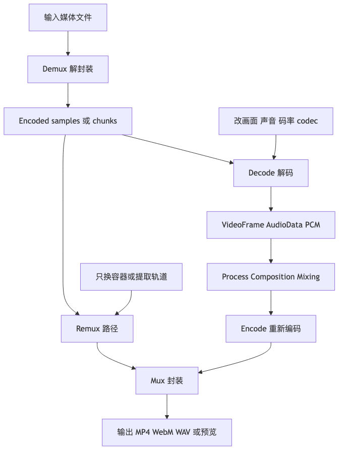

# 第六章｜Muxing / Demuxing / Remuxing / Transcoding

# 音视频合成与处理流程

## 1. 本章学习目标

前面几章你已经知道了：

* MP4 是容器，不是编码格式。
* H.264、AAC、MP3、Opus 才是编码格式。
* MP4 里面靠 box / atom 记录 track、sample、offset、duration 等信息。
* 编码压缩会把原始音视频变成更小的 encoded data。

这一章要把这些概念串成一条真实工程链路：

```text
媒体文件
  ↓
解封装 demux
  ↓
编码后的音视频 sample / chunk
  ↓
解码 decode
  ↓
原始帧 VideoFrame / AudioData / PCM
  ↓
处理 process / 合成 composition / 混音 mixing
  ↓
重新编码 encode
  ↓
封装 mux
  ↓
输出 MP4 / WebM / WAV / 图片 / 预览画面
```

学完本章，你应该能回答这些问题：

1. **demux、decode、encode、mux 分别在做什么？**
2. **remux 和 transcode 有什么区别？**
3. **“合成”到底是封装合成、画面合成，还是音频混音？**
4. **给视频加水印为什么通常必须重新编码？**
5. **从 MP4 提取音频为什么不一定需要解码？**
6. **PTS、DTS、timebase、duration 为什么是音视频同步的核心？**
7. **WebCodecs 为什么不能直接读取 MP4，也不能直接导出 MP4？**

WebCodecs 本身是浏览器里的底层编解码接口，W3C 规范也把它定位为音频、视频、图像编码/解码接口，而不是容器解析或文件封装工具。MDN 也明确说明，从视频文件里拿到 `EncodedVideoChunk` 属于 demuxing，需要额外的 demuxer。([W3C][1])

---

## 本章速览

这章的所有概念，都可以放进“拆容器、改内容、重新装回去”这条链路里：



先用三个判断总结本章：

* 只改容器、抽取轨道、重写 metadata，通常走 demux + mux 的 remux 路径，不需要解码媒体帧。
* 改画面、混音、裁剪、加水印、换 codec 或改变码率，通常需要 decode + process + encode。
* PTS、DTS、timebase、duration 是这条链路的时间坐标，任何一步处理错都会影响同步、seek 和导出文件可播放性。

## 2. 先建立一张大图

可以把一个媒体处理任务想象成“拆快递、加工零件、重新打包”。

```text
输入文件：example.mp4
里面有：
  - video track：H.264 encoded samples
  - audio track：AAC encoded samples
  - metadata：duration、timescale、sample offset、keyframe 信息

处理流程：

┌──────────────┐
│ MP4 文件      │
└──────┬───────┘
       │ demux：拆容器
       ▼
┌──────────────────────────────┐
│ video samples / audio samples │
│ 压缩后的 H.264 / AAC 数据       │
└──────┬───────────────────────┘
       │ decode：解码
       ▼
┌──────────────────────────────┐
│ VideoFrame / PCM / AudioData  │
│ 原始画面帧 / 原始音频采样       │
└──────┬───────────────────────┘
       │ process：处理
       ▼
┌──────────────────────────────┐
│ 加水印、裁剪、缩放、混音、降噪   │
└──────┬───────────────────────┘
       │ encode：重新压缩
       ▼
┌──────────────────────────────┐
│ EncodedVideoChunk / 音频 chunk │
│ H.264 / VP9 / AV1 / AAC / Opus │
└──────┬───────────────────────┘
       │ mux：重新封装
       ▼
┌──────────────┐
│ 输出文件      │
│ MP4 / WebM   │
└──────────────┘
```

核心判断很简单：

> **只改外壳，通常是 remux。
> 改内容，通常要 decode + process + encode。**

---

## 3. 核心动作：基础定义合并成一张表

第 1、2、5 章已经解释过“封装/解封装”和“编码/解码”的基本含义，这里不再逐个重新开课。本章只把它们放到真实处理链路里：

| 动作 | 输入 | 输出 | 工程判断 |
| --- | --- | --- | --- |
| Demux | MP4 / WebM / M4A 等容器 | encoded samples / chunks | 拆容器，不还原像素或 PCM |
| Decode | encoded samples / chunks | `VideoFrame` / `AudioData` / PCM | 进入可处理的原始媒体层 |
| Process | 原始视频帧 / PCM | 处理后的原始视频帧 / PCM | 水印、裁剪、滤镜、混音、降噪发生在这里 |
| Encode | 原始视频帧 / PCM | encoded chunks | 改 codec、码率、分辨率、画面或声音时通常需要 |
| Mux | encoded chunks + metadata | MP4 / WebM / M4A 等容器 | 重新写 track、timestamp、sample table、codec config |

这张表足够支撑后文判断。真正容易混的，是下面四个词。

---

## 3.1 Remuxing：重新封装

**Remuxing** 是“不重新编码，只换容器或重写容器结构”。

典型例子：

```text
MP4 里的 H.264 + AAC
  ↓ demux
H.264 samples + AAC samples
  ↓ mux
新的 MP4 / M4A
```

如果 codec 没变，画面和声音本身没变，就属于 remux。

常见 remux 任务：

| 任务                                   | 是否 remux                  |
| ------------------------------------ | ------------------------- |
| MP4 提取 AAC 音频并保存成 M4A                | 是                         |
| 把 `moov` 从文件尾移动到文件头，做 fast start MP4 | 是                         |
| 重新写 metadata                         | 通常是                       |
| 把 H.264 + AAC 从一个 MP4 换到另一个 MP4      | 是                         |
| 把 MP4 改成 WebM                        | 不一定，取决于 codec 是否被 WebM 支持 |
| H.264 转 VP9                          | 不是 remux，是 transcode      |

Remux 的优点：

* 快。
* 基本不损失画质音质。
* 不需要完整解码。
* 适合“换壳”“提取轨道”“修 metadata”。

Remux 的限制：

* 目标容器必须支持原 codec。
* 时间戳必须能正确映射。
* 某些 codec 数据格式可能需要轻量转换，比如 H.264 的 AVCC 和 Annex B 表示方式。
* 如果你改了画面内容或声音内容，就不能只 remux。

---

## 3.2 Transcoding：转码

**Transcoding** 是重新编码。

完整链路通常是：

```text
输入文件
  ↓ demux
encoded samples
  ↓ decode
raw frames / PCM
  ↓ 可选处理：缩放、裁剪、调色、混音
  ↓ encode
新的 encoded samples
  ↓ mux
输出文件
```

典型例子：

| 任务              | 为什么是 transcode   |
| --------------- | ---------------- |
| H.264 转 VP9     | codec 变了         |
| AAC 转 Opus      | codec 变了         |
| 1080p 转 720p    | 分辨率变了，需要处理帧并重新编码 |
| 10Mbps 转 2Mbps  | 码率变了，需要重新编码      |
| 给视频加水印          | 像素变了，需要重新编码      |
| 两个 MP3 混成一个 MP3 | 音频采样值变了，需要重新编码   |

Transcoding 的成本：

* 慢。
* 占 CPU / GPU。
* 可能损失质量。
* 会引入编码延迟。
* 需要处理同步、时间戳、关键帧、码率控制。

---

## 3.3 Composition：画面合成

**Composition** 更偏向视频画面层面的“把多个视觉元素合成一帧”。

比如：

```text
背景视频
+ 前景贴纸
+ 字幕
+ 水印
+ 图片图层
+ 动态文字
  ↓
合成后的 VideoFrame
```

这通常发生在 Canvas / WebGL / WebGPU 里。

```text
VideoFrame A
Image B
Text C
Watermark D
  ↓ draw 到同一个 Canvas
合成后的一帧
  ↓ VideoEncoder
encoded video chunk
```

所以，composition 和 muxing 不是一回事。

* **muxing**：把多条编码轨道放进一个容器。
* **composition**：把多个视觉图层画成一个画面。

很多中文语境下都会说“视频合成”，但工程上你要追问一句：

> 你说的合成，是**封装合成**，还是**画面合成**？

---

## 3.4 Mixing：音频混音

**Mixing** 是把多个音频信号混成一个音频信号。

比如：

```text
人声 track
+ 背景音乐 track
+ 音效 track
  ↓ mixing
一个混合后的 PCM track
```

混音一般不是简单地把两个 MP3 文件拼在一起，而是：

```text
MP3 A
  ↓ decode
PCM A

MP3 B
  ↓ decode
PCM B

PCM A + PCM B
  ↓ 按时间线对齐、调整音量、相加、避免爆音
混合后的 PCM
  ↓ encode
AAC / Opus / MP3
  ↓ mux
输出文件
```

混音最容易踩的坑是音量溢出。两个音频采样相加后可能超过 `[-1.0, 1.0]`，这会导致 clipping，也就是爆音。

---

# 4. 一张表讲清楚所有概念

| 概念          | 输入               | 输出               | 是否解码 | 是否重新编码 | 典型场景                  |
| ----------- | ---------------- | ---------------- | ---: | -----: | --------------------- |
| Demux       | MP4 / WebM       | encoded samples  |    否 |      否 | 从 MP4 拆出音视频轨          |
| Decode      | encoded samples  | raw frames / PCM |    是 |      否 | 播放、抽帧、分析音频            |
| Process     | raw frames / PCM | raw frames / PCM | 已经解码 |      否 | 水印、裁剪、滤镜、混音           |
| Encode      | raw frames / PCM | encoded chunks   |    否 |      是 | 导出视频、压缩音频             |
| Mux         | encoded chunks   | MP4 / WebM       |    否 |      否 | 生成最终文件                |
| Remux       | 容器 A             | 容器 B             |    否 |      否 | MP4 提取 M4A、fast start |
| Transcode   | 旧 encoded data   | 新 encoded data   |    是 |      是 | H.264 转 VP9、加水印       |
| Composition | 多个视觉图层           | 一个画面帧            | 通常需要 |   通常需要 | 字幕、水印、贴纸、画中画          |
| Mixing      | 多路 PCM           | 一路 PCM           | 通常需要 |   通常需要 | 人声 + BGM + 音效         |

---

# 5. 时间系统：PTS、DTS、timebase、duration

音视频工程真正麻烦的地方，往往不是“能不能解码”，而是：

> **每一帧应该什么时候显示？
> 每一段音频应该什么时候播放？
> 音画怎么保持同步？**

这就要靠时间戳。

---

## 5.1 Track

**Track** 是容器里的独立媒体轨道。

一个 MP4 里可能有：

```text
video track 0
audio track 1
subtitle track 2
metadata track 3
```

每条 track 可以有自己的：

* codec
* duration
* timescale
* sample table
* language
* metadata

---

## 5.2 Sample

**Sample** 是容器层面的一个媒体数据单元。

在 MP4 里：

* 一个 video sample 通常对应一个编码后的视频帧，也叫 access unit。
* 一个 audio sample 可能对应一小段压缩音频数据，比如 AAC 的 1024 个音频采样点组成的一个编码帧。
* sample 有 size、offset、duration、timestamp、是否 keyframe 等信息。

不要把这里的 sample 和“音频采样点”混淆。

```text
容器 sample：MP4 里的一块媒体数据
音频 sample：PCM 里的一个采样点
```

这俩名字一样，语境不同。音视频领域就是这么爱给新人下绊子，有点坏。

---

## 5.3 Frame

**Frame** 通常指帧。

视频里：

```text
1 个 VideoFrame = 1 张画面
```

音频里有时也会说 audio frame，但它不是“一张图”，而是一小段音频采样块。

在 WebCodecs 语境里：

* `VideoFrame` 是未压缩视频帧。
* `AudioData` 是未压缩音频数据块。
* `EncodedVideoChunk` 是压缩后的视频块。
* `EncodedAudioChunk` 是压缩后的音频块。

WebCodecs 的 `EncodedVideoChunk`、`EncodedAudioChunk`、`VideoFrame`、`AudioData` 都使用微秒级 timestamp / duration。([W3C][1])

---

## 5.4 PTS：Presentation Timestamp

**PTS** 是 presentation timestamp，表示“什么时候展示”。

对视频来说：

```text
PTS = 这帧画面应该在什么时候显示
```

对音频来说：

```text
PTS = 这段音频应该在什么时候开始播放
```

比如一个 30fps 视频，每帧间隔大约是 33.333ms：

```text
frame 0: PTS = 0 ms
frame 1: PTS = 33.333 ms
frame 2: PTS = 66.666 ms
frame 3: PTS = 100 ms
```

播放器最终按照 PTS 来决定展示顺序。

---

## 5.5 DTS：Decoding Timestamp

**DTS** 是 decoding timestamp，表示“什么时候送进解码器解码”。

为什么 PTS 和 DTS 会不同？

因为有 B 帧。

比如显示顺序是：

```text
I0  B1  B2  P3
```

但是 B1、B2 可能需要参考未来的 P3，所以解码顺序可能是：

```text
I0  P3  B1  B2
```

于是：

```text
PTS：按照显示顺序排列
DTS：按照解码顺序排列
```

如果一个视频没有 B 帧，PTS 和 DTS 常常是一样或者接近一样的。
如果有 B 帧，就要特别小心“喂给 decoder 的顺序”和“最终显示的顺序”。

---

## 5.6 Timebase

**Timebase** 是时间戳的单位。

不要以为所有 timestamp 都是毫秒。不同容器、不同 track 可能有不同 timebase。

举个例子：

```text
video track timescale = 90000
```

表示：

```text
1 秒 = 90000 ticks
1 tick = 1 / 90000 秒
```

如果 30fps：

```text
每帧 duration = 90000 / 30 = 3000 ticks
```

于是：

```text
frame 0: PTS = 0
frame 1: PTS = 3000
frame 2: PTS = 6000
frame 3: PTS = 9000
```

换算成秒：

```text
seconds = pts / timescale
```

也就是：

```text
frame 1: 3000 / 90000 = 0.033333... 秒
```

---

## 5.7 Duration

**Duration** 表示一个 sample / frame 持续多长时间。

例如：

```text
30fps 视频：
每帧 duration ≈ 33.333ms

48kHz AAC：
一个 AAC frame 常见包含 1024 个 PCM samples
duration = 1024 / 48000 ≈ 21.333ms
```

如果 duration 算错，会出现：

* 视频播放速度不对。
* 音频提前或延后。
* 音画不同步。
* seek 不准。
* 拼接后中间有空洞或重叠。

---

## 5.8 Sync Sample / Keyframe

**Sync sample** 在视频里通常就是 keyframe，也就是可以独立解码的帧。

seek 时为什么通常要找关键帧？

因为如果你想跳到第 10 秒，但第 10 秒那一帧是 P 帧或 B 帧，它可能依赖前面的帧。播放器不能直接从它开始解码。

实际流程通常是：

```text
目标时间：10.0s
  ↓
找到 10.0s 之前最近的 keyframe，比如 8.7s
  ↓
从 8.7s 开始解码
  ↓
丢掉 8.7s ~ 10.0s 之间不需要显示的帧
  ↓
显示 10.0s 的画面
```

所以 keyframe 间隔越大，seek 可能越慢；keyframe 越密，文件可能越大。

---

# 6. 常见任务流程图

下面这部分非常重要，面试和项目里都很常见。

---

## 6.1 从 MP4 提取音频

需求：

```text
输入：video.mp4
输出：audio.m4a
```

如果 MP4 里本来就是 AAC 音频，而且你只是想提取成 M4A：

```text
MP4
  ↓ demux
AAC audio samples
  ↓ mux
M4A
```

这叫 remux，不需要 decode，也不需要 encode。

但如果需求是：

```text
输入：video.mp4
输出：audio.mp3
```

那就可能需要：

```text
MP4
  ↓ demux
AAC audio samples
  ↓ decode
PCM
  ↓ encode
MP3
```

所以面试回答要带条件：

> 如果只是提取原音频轨并换成合适容器，通常是 demux + mux，不需要重新编码；如果要换音频 codec，比如 AAC 转 MP3，就需要 decode + encode，也就是 transcode。

---

## 6.2 MP4 转 WebM

很多人会说：

```text
MP4 转 WebM = 换个后缀
```

不对。

WebM 常见组合是：

```text
VP8 / VP9 / AV1 video
Opus / Vorbis audio
```

而很多 MP4 是：

```text
H.264 video
AAC audio
```

如果输入是 H.264 + AAC，输出要 WebM，通常需要：

```text
MP4
  ↓ demux
H.264 samples + AAC samples
  ↓ decode
VideoFrame + PCM
  ↓ encode
VP9 / AV1 + Opus
  ↓ mux
WebM
```

这就是 transcode。

但是如果一个 MP4 里恰好是目标容器支持的 codec，理论上可以少做甚至不做重新编码。工程上要看目标容器、codec、浏览器支持和 muxer 能力。

---

## 6.3 给视频加水印

需求：

```text
输入：video.mp4
输出：watermarked.mp4
```

水印改变了画面像素，所以不能只 remux。

流程：

```text
MP4
  ↓ demux
video samples + audio samples
  ↓ decode video
VideoFrame
  ↓ draw to Canvas
Canvas 上绘制原视频帧 + 水印
  ↓ create VideoFrame
新 VideoFrame
  ↓ encode video
新 video samples

audio samples
  ↓ 如果不改音频，可以直接保留

新 video samples + 原 audio samples
  ↓ mux
MP4
```

关键点：

```text
视频轨：需要 decode + process + encode
音频轨：如果不改，可以直接 remux
```

这也是工程里很常见的优化：只重编码必须改的轨道。

---

## 6.4 给视频换背景音乐

需求：

```text
输入：video.mp4 + bgm.mp3
输出：new-video.mp4
```

如果视频画面不变，可以保留视频轨：

```text
video.mp4
  ↓ demux
原 video samples 直接保留

bgm.mp3
  ↓ decode
PCM
  ↓ 裁剪 / 调音量 / fade out
处理后的 PCM
  ↓ encode
AAC audio samples

原 video samples + 新 audio samples
  ↓ mux
MP4
```

如果还要保留原视频声音并叠加 BGM：

```text
原 audio
  ↓ decode
PCM A

BGM
  ↓ decode
PCM B

PCM A + PCM B
  ↓ mixing
混合 PCM
  ↓ encode
AAC
```

所以“换背景音乐”和“混背景音乐”不是一回事。

---

## 6.5 多段视频拼接

需求：

```text
a.mp4 + b.mp4 + c.mp4 → output.mp4
```

这件事看起来简单，实际上很容易坑。

### 情况一：可以 remux 级拼接

条件比较苛刻：

* codec 相同。
* 分辨率相同。
* fps / timebase 兼容。
* audio sample rate 相同。
* channel count 相同。
* codec config 相同。
* 拼接点最好在 keyframe。
* 时间戳能正确重写。

流程：

```text
a.mp4 / b.mp4 / c.mp4
  ↓ demux
samples
  ↓ 重写 PTS / DTS
  ↓ mux
output.mp4
```

### 情况二：必须 transcode

如果三段视频参数不一致：

```text
a: 1080p H.264 30fps
b: 720p H.264 25fps
c: 1080p VP9 30fps
```

那通常要：

```text
全部 decode
  ↓
统一分辨率 / 帧率 / 像素格式 / 音频采样率
  ↓
重新 encode
  ↓
mux
```

面试时可以这样说：

> 视频拼接不只是把二进制文件 concat 到一起。容器要重写 sample table 和时间戳；如果参数不一致，还需要重新编码。

---

## 6.6 多个音频混音

需求：

```text
voice.mp3 + bgm.mp3 + effect.wav → mix.m4a
```

流程：

```text
voice.mp3
  ↓ decode
PCM voice

bgm.mp3
  ↓ decode
PCM bgm

effect.wav
  ↓ decode 或直接读 PCM
PCM effect

统一 sample rate / channel count
  ↓
按时间线对齐
  ↓
调整音量
  ↓
PCM 相加
  ↓
限制峰值 / 归一化
  ↓
encode AAC / Opus / MP3
  ↓
mux
```

重点：

```text
mux 是把不同轨道放进容器；
mix 是把多个声音信号混成一个声音信号。
```

两个音频 track 放进一个 MP4，不等于混音。播放器可能会只播放其中一条，或者按规则选择轨道。

---

## 6.7 视频抽帧生成缩略图

需求：

```text
输入：video.mp4
输出：第 1 秒、第 2 秒、第 3 秒的 jpg/png 缩略图
```

流程：

```text
MP4
  ↓ demux video track
找到目标时间之前最近的 keyframe
  ↓
从 keyframe 开始 decode
  ↓
拿到目标时间附近的 VideoFrame
  ↓
drawImage 到 Canvas
  ↓
canvas.toBlob("image/jpeg")
```

这个任务不需要重新 mux，也不需要重新 encode 视频。

只需要：

```text
demux + decode + draw + image export
```

---

## 6.8 浏览器端录制摄像头并保存为文件

简单方案：

```text
getUserMedia
  ↓
MediaStream
  ↓
MediaRecorder
  ↓
Blob
  ↓
保存 WebM / MP4，取决于浏览器支持
```

MediaStream Recording API 可以录制音频、视频 stream，并通过 `MediaRecorder` 输出可用的媒体数据；MDN 的示例也展示了 `getUserMedia()` 获取输入流后创建 `MediaRecorder(stream)` 的基本流程。([MDN Web Docs][3])

高级方案：

```text
getUserMedia
  ↓
MediaStreamTrackProcessor
  ↓
VideoFrame / AudioData
  ↓
WebCodecs encode
  ↓
muxer
  ↓
MP4 / WebM 文件
```

简单方案适合快速做产品功能。
高级方案适合你需要控制编码参数、逐帧处理、加水印、做实时滤镜、控制关键帧和码率。

W3C 的 WebCodecs 示例里也有“demux MP4 后解码绘制到 Canvas”和“读取摄像头、用 WebCodecs 编码并生成文件”的方向，正好对应本章这条 pipeline。([W3C][4])

---

# 7. “合成”这个词到底怎么翻译成工程动作？

中文里“合成”太宽了，面试里一定要讲清楚。

| 中文说法          | 真实含义       | 工程动作                              |
| ------------- | ---------- | --------------------------------- |
| 把音频和视频合成一个文件  | 封装合成       | mux                               |
| 把 MP4 改成 WebM | 重新封装或转码    | remux / transcode                 |
| 给视频加水印        | 画面合成       | decode + compose + encode         |
| 人声和 BGM 合成    | 音频混音       | decode + mix + encode             |
| 多段视频合成一个视频    | 时间线渲染 / 拼接 | remux 或 transcode                 |
| 字幕合成进视频       | 硬字幕        | decode + render subtitle + encode |
| 字幕作为单独轨道放进去   | 软字幕        | mux subtitle track                |

一句非常面试友好的说法：

> “合成”要先拆语义。如果只是把编码后的音视频轨道写入同一个容器，是 mux；如果是把多个画面图层画成一帧，是 composition；如果是多个音频信号叠加，是 mixing；如果 codec 或画面内容发生变化，一般就进入 transcoding pipeline。

---

# 8. 和真实工程的关系

## 8.1 浏览器端视频编辑器

一个浏览器端视频编辑器通常会有两条链路：

### 预览链路

```text
用户拖动时间线
  ↓
快速 seek
  ↓
解码附近帧
  ↓
Canvas / WebGL 预览
```

预览链路强调：

* 快速响应。
* 可以降低分辨率。
* 不一定要最终质量。
* 可以跳帧。
* 可以只处理可见区域。

### 导出链路

```text
读取完整素材
  ↓
按时间线逐帧渲染
  ↓
编码
  ↓
mux
  ↓
导出文件
```

导出链路强调：

* 时间戳准确。
* 音画同步。
* 质量稳定。
* 资源可控。
* 不能漏帧、乱序、内存爆炸。

---

## 8.2 视频水印工具

如果用户上传 MP4，然后加一个 logo：

```text
demux video
decode frame
draw frame + logo
encode frame
mux with original audio
```

这里音频如果不变，可以直接 remux。这样能减少处理时间，也避免音频二次压缩损失。

---

## 8.3 音频剪辑 / 混音工具

比如在线播客编辑器：

```text
上传人声
上传 BGM
上传片头音效
  ↓
decodeAudioData / AudioDecoder
  ↓
时间线对齐
  ↓
GainNode 调音量
  ↓
OfflineAudioContext 离线渲染
  ↓
导出 WAV / AAC
```

这类项目重点不是 MP4 box，而是：

* sample rate
* channel layout
* 音量包络
* clipping
* fade in / fade out
* 音频时间线

---

## 8.4 服务端转码系统

虽然本路线重点是浏览器端，但服务端音视频处理也是同一套概念。

典型服务端任务：

```text
用户上传视频
  ↓
转码成多档清晰度
  ↓
生成封面
  ↓
切 HLS / DASH
  ↓
写入存储
  ↓
播放器按网络情况选择清晰度
```

你不一定要实现服务端转码系统，但面试时能讲清楚：

```text
上传文件 → demux → decode → scale → encode 多码率 → mux / segment → 分发播放
```

这就已经很加分了。

---

# 9. 常见误区

## 误区 1：把 `.mp4` 改名成 `.webm` 就完成格式转换

不行。

文件后缀只是名字，容器结构和 codec 没变。播放器看的是文件内部结构，不是只看后缀。

---

## 误区 2：WebCodecs 编码出来的 chunk 可以直接保存成 MP4

不行。

`EncodedVideoChunk` 是编码后的压缩数据，不是完整文件。MP4 还需要 `ftyp`、`moov`、`mdat`、sample table、track metadata 等结构。

---

## 误区 3：给视频加水印可以只改 metadata

不行。

水印改变了每一帧的像素。只改 metadata 不会让画面出现水印。通常必须解码、绘制、重新编码。

---

## 误区 4：音频混音就是把两个音频文件拼一起

不对。

拼接是前后连接：

```text
A 后面接 B
```

混音是同时播放并叠加：

```text
A + B 同时响
```

混音一般要解码到 PCM，再按时间线相加。

---

## 误区 5：remux 一定能做任何格式转换

不对。

Remux 的前提是目标容器支持原来的 codec。H.264 + AAC 通常不能直接 remux 成标准 WebM，因为 WebM 常见支持的是 VP8 / VP9 / AV1 视频和 Opus / Vorbis 音频。

---

## 误区 6：PTS 用毫秒就行

不严谨。

不同容器和 API 的时间单位可能不同。MP4 track 可能用 timescale 表示时间，WebCodecs 使用微秒。单位搞错，音画同步会直接翻车。

---

## 误区 7：视频拼接就是二进制 concat

通常不行。

MP4 不是简单帧流。你要重写 box、sample table、duration、offset、timestamp。直接拼二进制，大概率播放器不认。

---

## 误区 8：抽第 10 秒的帧就直接解第 10 秒那帧

不一定。

如果第 10 秒不是 keyframe，就要从它前面的 keyframe 开始解码，再丢掉中间帧。

---

# 10. 面试可能怎么问

## 题 1：muxing 和 encoding 有什么区别？

**简洁回答：**

Encoding 是把原始音视频压缩成编码数据，比如 `VideoFrame → H.264 chunk`。Muxing 是把已经编码好的音视频轨道写进容器，比如 `H.264 + AAC → MP4`。

**深入回答：**

Encoding 关心 codec、码率、关键帧、压缩质量；muxing 关心容器结构、track、sample table、timestamp、duration、metadata。WebCodecs 主要负责 encode / decode，不负责 MP4 这种容器的 mux / demux。

---

## 题 2：demuxing 和 decoding 有什么区别？

**简洁回答：**

Demuxing 是拆容器，拿到压缩后的音视频 sample；decoding 是解码 codec，把压缩数据还原成原始画面帧或 PCM 音频。

**深入回答：**

从 MP4 里解析出 H.264 sample 是 demux；把 H.264 sample 解成 `VideoFrame` 是 decode。demuxer 懂 MP4 / WebM；decoder 懂 H.264 / VP9 / AAC / Opus。

---

## 题 3：remux 和 transcode 有什么区别？

**简洁回答：**

Remux 不重新编码，只换容器或重写容器；transcode 会重新编码，通常需要 decode + encode。

**深入回答：**

比如从 MP4 提取 AAC 并保存 M4A，可以 demux 后重新 mux，不损失音质。把 H.264 转 VP9，或者给视频加水印，就必须解码后重新编码，是 transcode。

---

## 题 4：从 MP4 提取音频一定要解码吗？

**参考答案：**

不一定。如果只是把 MP4 里的 AAC 音频轨提取出来并保存成 M4A，可以只 demux + mux，不需要 decode。如果目标是 MP3，或者要混音、调音量、降噪，就需要 decode 成 PCM，再处理和重新编码。

---

## 题 5：给视频加水印需要哪些步骤？

**参考答案：**

一般流程是：demux MP4，解码视频 sample 得到 `VideoFrame`，绘制到 Canvas，再把水印画上去，生成新帧，使用 encoder 重新编码视频。音频如果不变可以直接 remux。最后把新视频轨和原音频轨 mux 成输出 MP4。

---

## 题 6：为什么 WebCodecs 不能直接处理 MP4 文件？

**参考答案：**

WebCodecs 处理的是 codec 层的数据，比如 `EncodedVideoChunk` 和 `VideoFrame`。MP4 是容器格式，里面有 box、track、sample table、offset、timestamp 等结构。要从 MP4 里拿出能喂给 WebCodecs 的 encoded chunks，需要 demuxer；要把 WebCodecs 输出的 chunks 保存成 MP4，需要 muxer。

---

## 题 7：PTS 和 DTS 有什么区别？

**参考答案：**

PTS 是展示时间，表示这帧什么时候显示；DTS 是解码时间，表示这帧什么时候送进解码器。没有 B 帧时两者可能相同；有 B 帧时，因为解码顺序和显示顺序不同，PTS 和 DTS 可能不同。

---

## 题 8：timebase 是什么？为什么重要？

**参考答案：**

Timebase 是时间戳单位。比如 timescale 是 90000，表示 1 秒等于 90000 个 tick。把容器 timestamp 传给 WebCodecs 或播放器时，必须正确换算，否则会导致播放速度错误、音画不同步、seek 不准。

---

## 题 9：视频拼接为什么容易出问题？

**参考答案：**

因为拼接不仅是数据相加，还要处理 codec 参数、分辨率、帧率、音频采样率、keyframe、PTS / DTS、duration、sample table。如果素材参数一致，可以尝试 remux 级拼接；如果不一致，通常要重新解码、统一参数、重新编码。

---

## 题 10：多个音频 track 放进 MP4，等于混音吗？

**参考答案：**

不等于。多个 audio track 是多轨封装，播放器可能选择其中一条播放。混音是把多路音频解码成 PCM，按时间线对齐后相加，生成一条新的音频信号。

---

# 11. 项目实践建议

## 11.1 必做 Demo 1：音频提取器

目标：

```text
上传 MP4
  ↓
解析 track
  ↓
找到 audio track
  ↓
提取 encoded audio samples
  ↓
保存成 M4A 或展示基本信息
```

你要讲清楚：

* 为什么这是 demux。
* 什么时候需要 mux。
* 为什么不一定要 decode。
* 如果输出 MP3，为什么就变成 transcode。

---

## 11.2 必做 Demo 2：视频抽帧器

目标：

```text
上传 MP4
  ↓
demux video samples
  ↓
按目标时间 seek 到 keyframe
  ↓
decode 到目标帧
  ↓
Canvas 导出 JPG
```

你要讲清楚：

* keyframe 和 seek 的关系。
* 为什么不是直接跳到任意帧。
* timestamp 如何转换。
* 为什么这个任务不需要 mux。

---

## 11.3 必做 Demo 3：水印 Pipeline 设计

目标不一定是马上做完整 MP4 导出，但至少要能画出 pipeline：

```text
MP4
  ↓ demux
video samples
  ↓ decode
VideoFrame
  ↓ Canvas draw + watermark
new VideoFrame
  ↓ encode
new video chunks

audio samples
  ↓ remux

new video chunks + original audio samples
  ↓ mux
output.mp4
```

面试时你能把这个流程讲清楚，就已经能证明你理解“编解码 + 合成 + 封装”的核心链路。

---

## 11.4 加分 Demo：浏览器录制摄像头

简单版本：

```text
getUserMedia + MediaRecorder → Blob
```

进阶版本：

```text
getUserMedia
  ↓
逐帧处理
  ↓
WebCodecs encode
  ↓
mux
  ↓
导出文件
```

这个 Demo 能自然衔接第七章 WebCodecs。

---

# 12. 代码与实验任务

下面给 4 个练习。你不需要一次全做完，但至少要把第 1、2、3 个跑通。

---

## 任务 1：写一个 timebase 转换工具

目标：把 MP4 track timestamp 转成 WebCodecs 可用的微秒 timestamp。

```ts
const MICROSECONDS_PER_SECOND = 1_000_000n;

export function ticksToMicroseconds(
  ticks: number | bigint,
  timescale: number | bigint,
): bigint {
  const t = BigInt(ticks);
  const scale = BigInt(timescale);

  if (scale <= 0n) {
    throw new Error("timescale must be positive");
  }

  return (t * MICROSECONDS_PER_SECOND) / scale;
}

export function microsecondsToTicks(
  microseconds: number | bigint,
  timescale: number | bigint,
): bigint {
  const us = BigInt(microseconds);
  const scale = BigInt(timescale);

  if (scale <= 0n) {
    throw new Error("timescale must be positive");
  }

  return (us * scale) / MICROSECONDS_PER_SECOND;
}

// 例子：video timescale = 90000，30fps 每帧 3000 ticks
const ptsTicks = 3000n;
const ptsUs = ticksToMicroseconds(ptsTicks, 90000);

console.log(String(ptsUs)); // 33333，约等于 33.333ms

// 例子：AAC 48kHz，一个 AAC frame 常见 duration = 1024 ticks
const audioDurationUs = ticksToMicroseconds(1024, 48000);

console.log(String(audioDurationUs)); // 21333，约等于 21.333ms
```

思考题：

```text
为什么这里用 BigInt？
```

参考答案：

```text
因为长视频里的 timestamp 可能很大，用 number 直接做整数时间戳计算可能有精度风险。工程里常用 BigInt 或 rational 来减少累计误差。
```

---

## 任务 2：写一个“是否需要重新编码”的判断器

这个练习不是为了做完整转码器，而是训练你判断 pipeline。

```ts
type MediaTask =
  | "extract-audio-as-m4a"
  | "extract-audio-as-mp3"
  | "add-watermark"
  | "replace-bgm"
  | "concat-same-codec"
  | "concat-different-codec"
  | "generate-thumbnail"
  | "fast-start-mp4";

type PipelineStep =
  | "demux"
  | "decode-video"
  | "decode-audio"
  | "process-video"
  | "process-audio"
  | "encode-video"
  | "encode-audio"
  | "mux"
  | "rewrite-metadata";

export function planPipeline(task: MediaTask): PipelineStep[] {
  switch (task) {
    case "extract-audio-as-m4a":
      return ["demux", "mux"];

    case "extract-audio-as-mp3":
      return ["demux", "decode-audio", "encode-audio", "mux"];

    case "add-watermark":
      return [
        "demux",
        "decode-video",
        "process-video",
        "encode-video",
        "mux",
      ];

    case "replace-bgm":
      return [
        "demux",
        "decode-audio",
        "process-audio",
        "encode-audio",
        "mux",
      ];

    case "concat-same-codec":
      return ["demux", "rewrite-metadata", "mux"];

    case "concat-different-codec":
      return [
        "demux",
        "decode-video",
        "decode-audio",
        "process-video",
        "process-audio",
        "encode-video",
        "encode-audio",
        "mux",
      ];

    case "generate-thumbnail":
      return ["demux", "decode-video", "process-video"];

    case "fast-start-mp4":
      return ["rewrite-metadata"];

    default:
      return assertNever(task);
  }
}

function assertNever(value: never): never {
  throw new Error(`Unhandled task: ${value}`);
}

console.log(planPipeline("add-watermark"));
```

你可以把输出展示成 UI：

```text
add-watermark:
demux → decode-video → process-video → encode-video → mux
```

这个小练习对面试很有帮助，因为它逼你分清楚每个任务到底在哪一层工作。

---

## 任务 3：用 MediaRecorder 录制摄像头

这是浏览器端最容易跑通的录制实验。

```ts
export async function recordCamera(durationMs = 5000): Promise<Blob> {
  if (!navigator.mediaDevices?.getUserMedia) {
    throw new Error("getUserMedia is not supported in this browser");
  }

  if (typeof MediaRecorder === "undefined") {
    throw new Error("MediaRecorder is not supported in this browser");
  }

  const stream = await navigator.mediaDevices.getUserMedia({
    video: true,
    audio: true,
  });

  const mimeCandidates = [
    "video/webm;codecs=vp9,opus",
    "video/webm;codecs=vp8,opus",
    "video/webm",
  ];

  const mimeType = mimeCandidates.find((type) =>
    MediaRecorder.isTypeSupported(type),
  );

  const recorder = new MediaRecorder(
    stream,
    mimeType ? { mimeType } : undefined,
  );

  const chunks: BlobPart[] = [];

  recorder.ondataavailable = (event) => {
    if (event.data.size > 0) {
      chunks.push(event.data);
    }
  };

  const done = new Promise<Blob>((resolve, reject) => {
    recorder.onerror = () => {
      stream.getTracks().forEach((track) => track.stop());
      reject(recorder.error ?? new Error("MediaRecorder error"));
    };

    recorder.onstop = () => {
      stream.getTracks().forEach((track) => track.stop());

      resolve(
        new Blob(chunks, {
          type: recorder.mimeType || "video/webm",
        }),
      );
    };
  });

  recorder.start();

  window.setTimeout(() => {
    if (recorder.state !== "inactive") {
      recorder.stop();
    }
  }, durationMs);

  return done;
}

// 使用示例：
async function demo() {
  const blob = await recordCamera(5000);
  const url = URL.createObjectURL(blob);

  const video = document.createElement("video");
  video.controls = true;
  video.src = url;
  document.body.appendChild(video);
}
```

你要观察：

```text
1. 输出 Blob 的 type 是什么？
2. 浏览器实际用了什么容器？
3. 能不能指定 MP4？
4. 不同浏览器支持的 mimeType 是否一致？
```

---

## 任务 4：设计一个视频抽帧伪代码

先不用完整实现 demuxer，只写清楚接口和流程。

```ts
interface EncodedSample {
  data: Uint8Array;
  ptsUs: number;
  dtsUs: number;
  durationUs: number;
  isKeyframe: boolean;
}

interface DemuxedVideoTrack {
  codec: string;
  codedWidth: number;
  codedHeight: number;
  samples: EncodedSample[];
}

function findPreviousKeyframeSample(
  samples: EncodedSample[],
  targetUs: number,
): EncodedSample {
  let result: EncodedSample | undefined;

  for (const sample of samples) {
    if (sample.ptsUs <= targetUs && sample.isKeyframe) {
      result = sample;
    }

    if (sample.ptsUs > targetUs) {
      break;
    }
  }

  if (!result) {
    throw new Error("No keyframe found before target timestamp");
  }

  return result;
}

// 伪代码：真实代码里要把 keyframe 后面的 samples 继续喂给 VideoDecoder
async function extractThumbnailAt(
  track: DemuxedVideoTrack,
  targetUs: number,
): Promise<Blob> {
  const keyframe = findPreviousKeyframeSample(track.samples, targetUs);

  console.log("Start decoding from keyframe:", keyframe.ptsUs);

  // 1. configure VideoDecoder
  // 2. 从 keyframe 开始喂 EncodedVideoChunk
  // 3. 等 output callback 返回 VideoFrame
  // 4. 找到 timestamp >= targetUs 的帧
  // 5. drawImage 到 Canvas
  // 6. canvas.convertToBlob() 或 canvas.toBlob()

  throw new Error("Implement with WebCodecs in Chapter 7 / 8");
}
```

这个任务的重点不是代码完整，而是理解：

```text
抽帧 = demux + seek keyframe + decode + draw
不是 mux
也不一定需要 encode video
```

---

# 13. 章节总结

这一章你要记住一条总线：

```text
容器层：demux / mux / remux
编码层：decode / encode / transcode
原始数据层：process / composition / mixing
时间系统：PTS / DTS / timebase / duration
```

最重要的判断公式：

```text
只换容器，不改内容：
  demux + mux = remux

改 codec / 码率 / 分辨率 / 画面 / 声音：
  demux + decode + process + encode + mux = transcode

多个视觉元素叠成画面：
  composition

多个音频信号叠成一路：
  mixing
```

面试时，不要只说“合成”。要说清楚是哪种合成：

```text
是 mux？
是 remux？
是 transcode？
是 video composition？
是 audio mixing？
```

这会显得你不是背概念，而是真的懂 pipeline。

---

# 14. 自测题

## 题 1：把 MP4 里的 AAC 音频提取成 M4A，需要解码吗？

答案：

```text
通常不需要。可以 demux 出 AAC audio samples，然后 mux 成 M4A。这属于 remux。
```

---

## 题 2：把 MP4 里的 AAC 音频提取成 MP3，需要解码吗？

答案：

```text
需要。AAC 和 MP3 是不同 codec，需要 AAC decode 成 PCM，再 encode 成 MP3。这属于 transcode。
```

---

## 题 3：给视频加水印，为什么不能只 remux？

答案：

```text
因为水印改变了视频像素。必须解码视频帧，绘制水印，再重新编码视频轨。音频如果不变，可以直接 remux。
```

---

## 题 4：WebCodecs 的 `EncodedVideoChunk` 能直接保存成 `.mp4` 吗？

答案：

```text
不能。EncodedVideoChunk 只是编码后的视频数据，不包含 MP4 容器需要的 ftyp、moov、sample table、track metadata 等结构。需要 muxer。
```

---

## 题 5：PTS 和 DTS 分别表示什么？

答案：

```text
PTS 是展示时间，表示帧什么时候显示或音频什么时候播放。
DTS 是解码时间，表示数据什么时候送入解码器。
有 B 帧时，解码顺序和显示顺序可能不同，所以 PTS 和 DTS 可能不同。
```

---

## 题 6：一个 video track 的 timescale 是 90000，30fps 下每帧 duration 是多少？

答案：

```text
90000 / 30 = 3000 ticks
```

换算成秒：

```text
3000 / 90000 = 0.033333... 秒
```

---

## 题 7：两个 MP3 文件混音成一个 MP3，能不能直接二进制相加？

答案：

```text
不能。MP3 是压缩数据，不能直接相加。要先 decode 成 PCM，按时间线对齐并混合 PCM，再重新 encode 成 MP3。
```

---

## 题 8：视频拼接什么时候可以不重新编码？

答案：

```text
当多个视频 codec、分辨率、帧率、timebase、音频采样率、声道数、codec config 等参数兼容，并且拼接点处理得当时，可以尝试 remux 级拼接。否则通常需要重新编码。
```

---

## 题 9：为什么 seek 通常要从 keyframe 开始？

答案：

```text
因为 P 帧、B 帧依赖其他帧，不能保证独立解码。播放器通常会找到目标时间之前最近的 keyframe，从那里开始解码，再丢弃目标时间之前的帧。
```

---

## 题 10：muxing 和 mixing 有什么区别？

答案：

```text
muxing 是把多条编码轨道封装进同一个容器，比如 H.264 + AAC → MP4。
mixing 是把多个音频信号叠加成一路音频，比如人声 PCM + BGM PCM → 混合 PCM。
```

---

# 15. 下一章衔接：进入 WebCodecs

这一章讲的是完整音视频处理 pipeline。下一章开始，我们进入其中最核心的一段：

```text
EncodedVideoChunk
  ↓ VideoDecoder
VideoFrame
  ↓ 处理
VideoEncoder
  ↓
EncodedVideoChunk
```

也就是 WebCodecs。

但你现在应该已经有一个很关键的意识：

```text
WebCodecs 不是播放器。
WebCodecs 不是 MP4 parser。
WebCodecs 不是 muxer。
WebCodecs 是 codec 层的底层 API。
```

所以后面学 WebCodecs 时，一定要带着这张图：

```text
MP4 / WebM 文件
  ↓ demuxer
EncodedVideoChunk / EncodedAudioChunk
  ↓ WebCodecs decoder
VideoFrame / AudioData
  ↓ Canvas / WebGL / Web Audio 处理
VideoFrame / AudioData
  ↓ WebCodecs encoder
EncodedVideoChunk / EncodedAudioChunk
  ↓ muxer
MP4 / WebM 文件
```

理解了这条线，WebCodecs 就不会变成一堆孤零零的 API 名字了。

[1]: https://www.w3.org/TR/webcodecs/ "WebCodecs"
[2]: https://developer.mozilla.org/en-US/docs/Web/API/WebCodecs_API "WebCodecs API - Web APIs | MDN"
[3]: https://developer.mozilla.org/en-US/docs/Web/API/MediaStream_Recording_API/Using_the_MediaStream_Recording_API "Using the MediaStream Recording API - Web APIs | MDN"
[4]: https://w3c.github.io/webcodecs/samples/ "WebCodecs API Samples"
