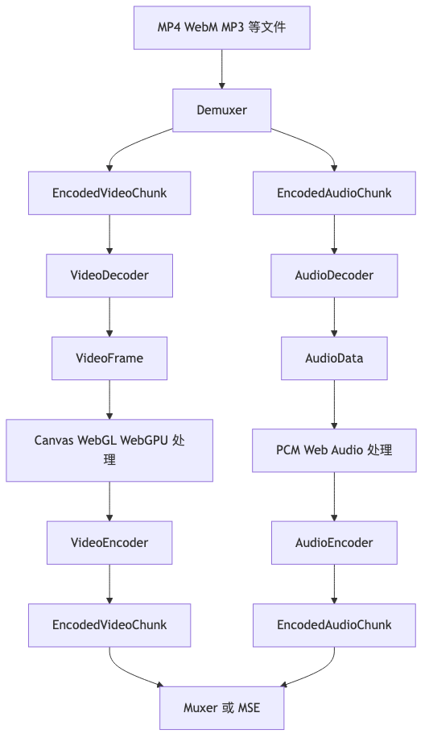

# 第七章｜WebCodecs API 入门

> 本章目标：把你从“知道浏览器能播放视频”推进到“能按帧处理视频、按块处理编码数据，并能解释 WebCodecs 在完整音视频 pipeline 里的位置”。

WebCodecs 是浏览器暴露出来的一组**底层编解码 API**。它让前端可以直接接触：

```text
压缩后的视频数据 EncodedVideoChunk
  ⇄ VideoDecoder / VideoEncoder
原始视频帧 VideoFrame

压缩后的音频数据 EncodedAudioChunk
  ⇄ AudioDecoder / AudioEncoder
原始音频数据 AudioData
```

但这一章先把一句话钉死：

> **WebCodecs 只负责 codec 层的编码和解码，不负责 MP4/WebM/MP3 这种容器的解析和生成。**

W3C 对 WebCodecs 的定位也是“提供音频、视频、图像编解码接口”，并且规范本身不要求浏览器必须支持某个特定 codec；具体支持哪些 codec，要看浏览器和设备实现。([W3C][1]) MDN 对 WebCodecs 的概念总结也很直接：它提供原始视频帧、编码后视频帧、原始音频、编码后音频这些浏览器原生接口。([MDN Web Docs][2])

---

## 1. 本章学习目标

学完这一章，你应该能做到：

1. 解释 `VideoFrame`、`AudioData`、`EncodedVideoChunk`、`EncodedAudioChunk` 分别是什么。
2. 解释 `VideoDecoder`、`VideoEncoder`、`AudioDecoder`、`AudioEncoder` 在 pipeline 里的位置。
3. 写出一个最小 WebCodecs 编码 Demo：
   `Canvas → VideoFrame → VideoEncoder → EncodedVideoChunk`
4. 说清楚为什么 WebCodecs **不能直接读取 MP4**，也**不能直接生成 MP4**。
5. 理解 `configure()`、`decode()`、`encode()`、`flush()`、`close()` 的基本语义。
6. 理解 `timestamp`、`duration`、`key frame`、`queue`、`backpressure` 这些工程关键点。
7. 知道为什么真实项目里通常要把 WebCodecs 放进 Worker，并且必须及时 `close()` 帧对象。

---

## 本章速览

WebCodecs 只站在 codec 层中间，左右两边的容器解析和封装都要交给别的模块：



本章最重要的总结：

* WebCodecs 负责 encoded chunk 和 raw frame / audio data 之间的转换，不负责 MP4、WebM、MP3 的容器解析或文件生成。
* `configure()` 决定 codec 参数，`decode()` / `encode()` 排队处理数据，`flush()` 等待队列排空，`close()` 释放解码器、编码器或帧资源。
* 真正的工程重点不是只会调用 API，而是处理 timestamp、queue、backpressure、Worker 和 `VideoFrame.close()`。

## 2. WebCodecs 解决了什么问题

在 WebCodecs 之前，前端做音视频通常用这些 API：

| API                   | 适合做什么          | 不适合做什么                       |
| --------------------- | -------------- | ---------------------------- |
| `<video>` / `<audio>` | 播放媒体           | 逐帧处理、精细控制编码                  |
| Canvas                | 画图、处理像素        | 本身不负责视频编码                    |
| MediaRecorder         | 录制 MediaStream | 编码参数控制有限，难拿到每个 encoded chunk |
| Web Audio             | 音频播放、混音、滤波     | 不负责视频，不直接处理视频编码              |
| MSE                   | 播放媒体分片         | 不负责解码后的逐帧处理                  |
| ffmpeg.wasm           | 几乎什么都能做        | 包体大、CPU 压力高、启动慢              |

WebCodecs 的价值在于：它把浏览器内部已经存在的编解码能力开放出来，让你可以按 **frame / chunk** 这个粒度处理媒体数据。MDN 也强调它适合需要重度媒体处理或底层编码控制的场景，比如浏览器端音视频编辑、直播、视频会议等。([MDN Web Docs][2])

可以这样类比：

```text
普通 <video>：
像一个成品播放器。你点播放，它自己完成解析、解码、同步、渲染。

WebCodecs：
像把播放器里面的“编码器 / 解码器模块”单独拆出来给你用。
你要自己准备输入数据，也要自己处理输出数据。
```

所以 WebCodecs 很强，但它不是“一键处理 MP4”的万能 API。它更像音视频 pipeline 中间那段最核心、但也最底层的发动机。

---

## 3. WebCodecs 是什么，不是什么

### 3.1 WebCodecs 是什么

WebCodecs 是浏览器提供的底层编解码接口，主要负责这几类转换：

```text
EncodedVideoChunk → VideoDecoder → VideoFrame

VideoFrame → VideoEncoder → EncodedVideoChunk

EncodedAudioChunk → AudioDecoder → AudioData

AudioData → AudioEncoder → EncodedAudioChunk
```

也就是说，它关心的是：

```text
压缩数据 ⇄ 原始帧 / 原始音频数据
```

### 3.2 WebCodecs 不是什么

WebCodecs **不是**：

| 它不是什么            | 为什么                                        |
| ---------------- | ------------------------------------------ |
| 不是 MP4 parser    | 它不会帮你解析 `ftyp`、`moov`、`mdat`、`trak`、`stbl` |
| 不是 demuxer       | 它不会从 MP4/WebM 里拆出视频 sample 和音频 sample      |
| 不是 muxer         | 它不会把 encoded chunks 写成标准 MP4/WebM 文件       |
| 不是播放器            | 它不负责音视频同步、播放控制、seek UI                     |
| 不是 codec 实现库     | 它调用浏览器已有的 codec 能力                         |
| 不是跨浏览器 codec 保证  | 不是每个浏览器都支持同样的 codec、profile、level          |
| 不是 Web Audio 替代品 | 它处理的是音频编码/解码，Web Audio 处理的是音频图、混音、滤波、播放    |

MDN 明确说明，WebCodecs 只处理编码和解码；如果要从视频文件中得到 `EncodedVideoChunk`，需要 demuxer；如果要写出可播放的视频文件，需要 muxer。([MDN Web Docs][2])

这句话面试时很好用：

> **WebCodecs 工作在 codec 层；MP4/WebM 工作在 container 层。WebCodecs 能处理编码数据和原始帧，但不负责容器格式。**

---

## 4. 核心心智模型：Chunk 和 Frame

WebCodecs 最核心的抽象只有两组：

```text
视频：
EncodedVideoChunk  ⇄  VideoFrame

音频：
EncodedAudioChunk  ⇄  AudioData
```

### 4.1 视频模型

```text
MP4 / WebM 文件
  ↓ demuxer
EncodedVideoChunk
  ↓ VideoDecoder
VideoFrame
  ↓ Canvas / WebGL / WebGPU / 图像处理
VideoFrame
  ↓ VideoEncoder
EncodedVideoChunk
  ↓ muxer
MP4 / WebM 文件
```

### 4.2 音频模型

```text
MP4 / MP3 / WebM / AAC 文件
  ↓ demuxer
EncodedAudioChunk
  ↓ AudioDecoder
AudioData
  ↓ PCM 处理 / 转 AudioBuffer / 混音 / 音效
AudioData
  ↓ AudioEncoder
EncodedAudioChunk
  ↓ muxer
MP4 / WebM / AAC 等输出
```

注意：`AudioData` 和 Web Audio 的 `AudioBuffer` 不是同一个东西。MDN 说明 `AudioData` 可以通过 `copyTo()` 取出音频 sample 数据，但它和 Web Audio API 没有直接集成；你可以把提取出来的 sample 拷贝到 `AudioBuffer` 再播放或处理。([MDN Web Docs][2])

---

## 5. 四个核心数据类型

## 5.1 `VideoFrame`

`VideoFrame` 表示一帧**未压缩的视频图像**。

它可以来自：

```text
Canvas
HTMLVideoElement
ImageBitmap
OffscreenCanvas
MediaStreamTrackProcessor
另一个 VideoFrame
原始像素数据 ArrayBuffer / TypedArray
```

你可以把它理解成：

```text
VideoFrame = 一张带时间戳的视频图片
```

它通常包含这些关键信息：

| 属性                               | 含义                              |
| -------------------------------- | ------------------------------- |
| `timestamp`                      | 这一帧的显示时间，单位通常按 WebCodecs 语义使用微秒 |
| `duration`                       | 这一帧持续多久                         |
| `codedWidth` / `codedHeight`     | 编码层面的宽高                         |
| `displayWidth` / `displayHeight` | 显示时的宽高                          |
| `format`                         | 像素格式，比如 I420、RGBA 等，具体取决于来源     |
| `colorSpace`                     | 色彩空间信息                          |

MDN 对 `VideoFrame` 的描述是：它代表视频的一帧，并且可以从 Canvas、视频元素、ImageBitmap、OffscreenCanvas 等来源创建；`timestamp` 和 `duration` 也是它的重要元数据。([GitHub][3])

最常见创建方式：

```ts
const frame = new VideoFrame(canvas, {
  timestamp: 0,
  duration: 33_333, // 约等于 30fps 的一帧，单位微秒
});
```

特别重要：`VideoFrame` 背后可能绑定 GPU 或底层媒体资源，用完要及时 `close()`。MDN 也明确说明 `VideoFrame.close()` 会释放它引用的媒体资源。([MDN Web Docs][4])

```ts
encoder.encode(frame);
frame.close();
```

不要小看这一句。很多 WebCodecs Demo 卡死、内存爆、浏览器崩，就是忘了 `frame.close()`。

---

## 5.2 `EncodedVideoChunk`

`EncodedVideoChunk` 表示一段**压缩后的视频数据**。

你可以把它理解成：

```text
EncodedVideoChunk = 编码后的视频帧数据 + 时间戳 + 关键帧类型
```

它不是图片，而是 codec bitstream 的一段数据，比如 VP8、VP9、H.264、AV1 编码后的数据。

常见属性：

| 属性           | 含义                  |
| ------------ | ------------------- |
| `type`       | `"key"` 或 `"delta"` |
| `timestamp`  | 时间戳                 |
| `duration`   | 持续时间                |
| `byteLength` | 编码数据字节数             |

其中：

```text
key   = 关键帧，可以相对独立解码
delta = 依赖其他帧的差异帧
```

MDN 对 WebCodecs 视频概念的说明里也提到，`EncodedVideoChunk` 是同一视频帧的压缩版本，并且多了一个 `type` 字段，用来表示 key frame 或 delta frame。([MDN Web Docs][2])

从 chunk 中复制二进制数据：

```ts
const bytes = new Uint8Array(chunk.byteLength);
chunk.copyTo(bytes);
```

注意：这个 `bytes` 仍然只是 codec 数据，不是 MP4 文件。

---

## 5.3 `AudioData`

`AudioData` 表示一段**未压缩音频数据**，可以近似理解成 WebCodecs 世界里的 PCM 音频块。

它通常包含：

| 属性                 | 含义                                     |
| ------------------ | -------------------------------------- |
| `format`           | sample 格式                              |
| `sampleRate`       | 采样率，比如 44100、48000                     |
| `numberOfFrames`   | 音频帧数量，这里的 frame 是音频 sample frame，不是视频帧 |
| `numberOfChannels` | 声道数                                    |
| `timestamp`        | 时间戳                                    |
| `duration`         | 持续时间                                   |

MDN 的 `AudioData` 文档列出了这些关键属性，包括 sample format、sample rate、channel count、number of frames、timestamp、duration 等。([MDN Web Docs][5])

注意这里有一个容易混的点：

```text
视频 frame：
一张画面。

音频 frame：
同一时刻所有声道的一组 sample。
比如 stereo 下，一个 audio frame 通常包含 L/R 两个 sample。
```

所以 `AudioData.numberOfFrames` 不是“有多少张画面”，而是有多少组音频 sample frame。

---

## 5.4 `EncodedAudioChunk`

`EncodedAudioChunk` 表示一段**压缩后的音频数据**。

比如：

```text
AAC packet
Opus packet
MP3 frame 附近的数据块
```

它常见属性包括：

| 属性           | 含义          |
| ------------ | ----------- |
| `type`       | 音频 chunk 类型 |
| `timestamp`  | 时间戳         |
| `duration`   | 持续时间        |
| `byteLength` | 编码数据字节数     |

MDN 对 `EncodedAudioChunk` 的属性说明包括 `type`、`timestamp`、`duration`、`byteLength`，其中 `timestamp` 和 `duration` 使用微秒语义。([MDN Web Docs][6])

---

## 6. 四个核心处理器

## 6.1 `VideoDecoder`

`VideoDecoder` 做这件事：

```text
EncodedVideoChunk → VideoFrame
```

典型输入来自：

```text
MP4/WebM demuxer 拆出来的视频 sample
```

典型输出给：

```text
Canvas
WebGL
WebGPU
VideoEncoder
MediaStreamTrackGenerator
```

伪代码：

```ts
const decoder = new VideoDecoder({
  output(frame) {
    // 得到解码后的一帧
    // 可以画到 canvas，也可以送给 encoder
    frame.close();
  },
  error(error) {
    console.error(error);
  },
});

decoder.configure({
  codec: "avc1.42E01E",
  codedWidth: 1280,
  codedHeight: 720,
});

decoder.decode(encodedVideoChunk);
await decoder.flush();
decoder.close();
```

真实项目里，`configure()` 的 codec 参数和 codec description 通常来自 demuxer 解析容器后的 track metadata。

---

## 6.2 `VideoEncoder`

`VideoEncoder` 做这件事：

```text
VideoFrame → EncodedVideoChunk
```

典型输入来自：

```text
Canvas
OffscreenCanvas
VideoDecoder 输出的 VideoFrame
摄像头轨道拆出来的 VideoFrame
WebGL/WebGPU 处理后的帧
```

典型输出给：

```text
muxer
网络发送
WebTransport
WebRTC 自定义 pipeline
MSE 前的容器分片生成流程
```

MDN 对 `VideoEncoder` 的说明是：它把 `VideoFrame` 编码成 `EncodedVideoChunk`，并且提供 `configure()`、`encode()`、`flush()`、`reset()`、`close()` 等方法；`encodeQueueSize` 可以观察待处理编码请求数量。([MDN Web Docs][7])

---

## 6.3 `AudioDecoder`

`AudioDecoder` 做这件事：

```text
EncodedAudioChunk → AudioData
```

典型输入：

```text
demuxer 从 MP4/WebM/音频文件中拆出的编码音频块
```

典型输出：

```text
PCM 处理
音频分析
转成 AudioBuffer
重新编码
```

伪代码：

```ts
const decoder = new AudioDecoder({
  output(audioData) {
    // 这里可以 copyTo() 拿到 PCM-like sample
    audioData.close();
  },
  error(error) {
    console.error(error);
  },
});

decoder.configure({
  codec: "opus",
  sampleRate: 48000,
  numberOfChannels: 2,
});

decoder.decode(encodedAudioChunk);
await decoder.flush();
decoder.close();
```

---

## 6.4 `AudioEncoder`

`AudioEncoder` 做这件事：

```text
AudioData → EncodedAudioChunk
```

典型用途：

```text
录音后编码成 Opus/AAC
Web Audio 处理后重新编码
实时语音发送
离线音频处理后导出
```

伪代码：

```ts
const encoder = new AudioEncoder({
  output(chunk, metadata) {
    const bytes = new Uint8Array(chunk.byteLength);
    chunk.copyTo(bytes);

    // bytes 仍然不是一个完整音频文件
    // 如果要保存成容器格式，还需要 muxer
  },
  error(error) {
    console.error(error);
  },
});

encoder.configure({
  codec: "opus",
  sampleRate: 48000,
  numberOfChannels: 2,
  bitrate: 128_000,
});

encoder.encode(audioData);
await encoder.flush();
encoder.close();
```

---

## 7. 核心方法：configure / encode / decode / flush / close

WebCodecs 的编码器和解码器都有一个异步处理队列。MDN 的处理模型说明里提到，`configure()`、`encode()`、`decode()`、`flush()` 会异步追加任务到队列；`reset()` 和 `close()` 会同步中止或清理队列，其中 `close()` 是永久操作。([MDN Web Docs][2])

### 7.1 `configure()`

`configure()` 用来告诉编码器或解码器：

```text
我要处理什么 codec？
分辨率是多少？
码率是多少？
帧率是多少？
音频采样率是多少？
声道数是多少？
有没有 codec-specific description？
```

例子：

```ts
encoder.configure({
  codec: "vp8",
  width: 640,
  height: 360,
  bitrate: 800_000,
  framerate: 30,
});
```

配置不是随便写的。不同浏览器、不同设备支持的 codec string 可能不同，所以工程里要先做能力检测。

---

### 7.2 `isConfigSupported()`

`isConfigSupported()` 用来检测配置是否可用。

```ts
const config: VideoEncoderConfig = {
  codec: "vp8",
  width: 640,
  height: 360,
  bitrate: 800_000,
  framerate: 30,
};

const support = await VideoEncoder.isConfigSupported(config);

if (!support.supported) {
  throw new Error("当前浏览器不支持这个编码配置");
}

encoder.configure(support.config);
```

MDN 说明 `VideoEncoder.isConfigSupported()` 会检查给定配置是否能成功配置编码器，并返回包含 `supported` 和规范化后 `config` 的 Promise。([MDN Web Docs][8])

面试里可以这样说：

> WebCodecs 不保证所有浏览器都支持同一个 codec，所以不能只写死 codec 字符串就上线。工程上要用 `isConfigSupported()` 做能力检测，再决定使用 H.264、VP8、VP9、AV1，或者 fallback 到 MediaRecorder / 服务端 / ffmpeg.wasm。

---

### 7.3 `decode()`

`decode()` 把编码后的 chunk 送进解码器。

```ts
decoder.decode(chunk);
```

但它不会立刻同步返回 `VideoFrame`。解码结果会从 `output` callback 出来。

```ts
const decoder = new VideoDecoder({
  output(frame) {
    // 解码结果在这里
  },
  error(error) {
    console.error(error);
  },
});
```

这点很重要：

```text
错误理解：
const frame = decoder.decode(chunk)

正确理解：
decoder.decode(chunk)
然后等 output(frame)
```

---

### 7.4 `encode()`

`encode()` 把原始帧或音频数据送进编码器。

```ts
encoder.encode(frame, {
  keyFrame: true,
});
```

编码结果同样不是同步返回，而是从 `output` callback 出来。

```ts
const encoder = new VideoEncoder({
  output(chunk, metadata) {
    // 编码结果在这里
  },
  error(error) {
    console.error(error);
  },
});
```

视频编码时可以指定是否强制关键帧：

```ts
encoder.encode(frame, {
  keyFrame: frameIndex % 60 === 0,
});
```

通常：

```text
第一帧应该是 key frame。
每隔一段时间插一个 key frame，方便 seek、恢复播放、分段。
key frame 太多：文件变大。
key frame 太少：seek 和错误恢复变差。
```

---

### 7.5 `flush()`

`flush()` 用来等待当前已提交的任务处理完。

```ts
await encoder.flush();
```

但不要每一帧都 `flush()`。

错误写法：

```ts
for (const frame of frames) {
  encoder.encode(frame);
  await encoder.flush(); // 不推荐
}
```

更合理：

```ts
for (const frame of frames) {
  encoder.encode(frame);
  frame.close();
}

await encoder.flush();
```

MDN 也提醒，`flush()` 通常应该在所有期望的工作都排队后调用，而不是用来定时强迫编码器推进；不必要地调用可能影响编码质量，也可能让解码器要求下一个输入必须是关键帧。([MDN Web Docs][2])

---

### 7.6 `close()`

`close()` 用来释放编码器 / 解码器资源。

```ts
encoder.close();
decoder.close();
```

`VideoFrame`、`AudioData` 也要及时 `close()`：

```ts
frame.close();
audioData.close();
```

尤其是 `VideoFrame`，它可能占用大量底层资源。MDN 的 WebCodecs 使用指南明确提醒，`VideoFrame` 在送入编码器后应尽快关闭，否则可能导致内存泄漏；活跃帧数量不多时就可能造成应用崩溃。([MDN Web Docs][9])

---

## 8. Queue、Backpressure 和 Worker

WebCodecs 是异步队列模型。你调用：

```ts
encoder.encode(frame);
```

不是说编码器马上完成，而是把任务排进编码队列。

如果你生成帧的速度大于编码速度，队列会越来越长：

```text
Canvas 每秒生成 30 帧
Encoder 每秒只能处理 10 帧
  ↓
encodeQueueSize 越来越大
  ↓
内存上涨
  ↓
页面卡顿 / 崩溃
```

所以要做 backpressure，也就是“别喂太快”。

### 8.1 使用 `encodeQueueSize`

```ts
if (encoder.encodeQueueSize < 3) {
  encoder.encode(frame);
} else {
  // 队列太长，可以等待、丢帧、降分辨率，或者暂停生产
  frame.close();
}
```

### 8.2 使用 `dequeue` 事件

```ts
encoder.addEventListener("dequeue", () => {
  // 编码队列减少了，可以继续投喂
});
```

MDN 的使用指南也建议关注 `encodeQueueSize`，避免队列无限增长；也可以用 `dequeue` 事件在编码队列下降时继续排队工作。([MDN Web Docs][9])

### 8.3 为什么推荐 Worker

音视频处理很容易压主线程：

```text
读取大文件
解析容器
解码大量帧
Canvas / WebGL / WebGPU 处理
编码
mux 输出文件
```

这些如果都放主线程，UI 会卡得像在泥地里骑共享单车。

WebCodecs 的很多接口可以在 Dedicated Worker 中使用；MDN 的 `VideoEncoder` 文档也标明它可在 Dedicated Web Workers 中使用，并且通常需要安全上下文。([MDN Web Docs][7])

推荐结构：

```text
Main Thread
  ├─ UI
  ├─ 文件选择
  ├─ 进度展示
  └─ 结果预览

Worker
  ├─ demux
  ├─ decode
  ├─ frame processing
  ├─ encode
  └─ mux
```

如果要处理 Canvas，优先考虑：

```ts
const offscreen = canvas.transferControlToOffscreen();
worker.postMessage({ canvas: offscreen }, [offscreen]);
```

然后在 Worker 中用 `OffscreenCanvas` 绘制和生成 `VideoFrame`。

---

## 9. WebCodecs 和其他浏览器 API 的关系

### 9.1 和 Canvas 的关系

Canvas 常用于：

```text
VideoFrame → Canvas 绘制
Canvas 加水印 / 滤镜 / 缩放 / 裁剪
Canvas → 新 VideoFrame
```

典型流程：

```text
VideoDecoder output VideoFrame
  ↓
ctx.drawImage(frame, 0, 0)
  ↓
ctx.fillText("watermark", 20, 40)
  ↓
new VideoFrame(canvas, { timestamp })
  ↓
VideoEncoder.encode()
```

Canvas 是图像处理层，WebCodecs 是编解码层。

---

### 9.2 和 WebGL / WebGPU 的关系

Canvas 适合简单处理：

```text
水印
截图
缩放
裁剪
简单滤镜
```

WebGL / WebGPU 适合重度处理：

```text
美颜
实时滤镜
复杂转场
颜色矩阵
AI 前后处理
高性能缩放
```

常见 pipeline：

```text
VideoFrame
  ↓
上传为 GPU texture
  ↓
WebGL / WebGPU shader 处理
  ↓
输出到 Canvas / OffscreenCanvas
  ↓
new VideoFrame()
  ↓
VideoEncoder
```

---

### 9.3 和 MediaStream 的关系

摄像头输入通常来自：

```ts
const stream = await navigator.mediaDevices.getUserMedia({
  video: true,
  audio: true,
});
```

如果要逐帧拿到摄像头画面，可以使用：

```text
MediaStreamTrackProcessor
  ↓
VideoFrame stream
  ↓
WebCodecs / Canvas / WebGL
```

如果处理后想重新变成媒体轨道，可以使用：

```text
MediaStreamTrackGenerator
```

这样可以做：

```text
摄像头
  ↓
逐帧处理
  ↓
生成新视频轨道
  ↓
WebRTC 推流 / 页面预览
```

---

### 9.4 和 MSE 的关系

MSE，也就是 Media Source Extensions，主要用于：

```text
把媒体分片 append 到 SourceBuffer 里播放
```

但是 MSE 通常吃的是：

```text
fMP4 segment
WebM segment
```

不是裸的 `EncodedVideoChunk`。

所以：

```text
EncodedVideoChunk
  ↓ mux 成 fMP4/WebM segment
  ↓ SourceBuffer.appendBuffer()
```

WebCodecs 负责编码，MSE 负责把符合容器格式的媒体分片交给播放器播放。

---

### 9.5 和 Web Audio 的关系

WebCodecs 的 `AudioData` 是编解码层的原始音频数据。

Web Audio 的核心是：

```text
AudioContext
AudioNode graph
GainNode
BiquadFilterNode
AnalyserNode
AudioWorklet
OfflineAudioContext
```

它们可以配合，但不是同一个层级：

```text
EncodedAudioChunk
  ↓ AudioDecoder
AudioData
  ↓ copyTo PCM
AudioBuffer
  ↓ Web Audio graph
混音 / 滤波 / 可视化 / 离线渲染
```

WebCodecs 更偏“把压缩音频变成原始音频，或反过来”；Web Audio 更偏“处理、合成、播放音频”。

---

## 10. 为什么输入 MP4 还需要 demuxer

第 6 章已经讲过 demux / decode / mux 的分工，这里只把结论落到 WebCodecs API 上：`VideoDecoder.decode()` 要的是 `EncodedVideoChunk`，不是完整 MP4 文件。

所以你不能直接这样：

```ts
const file = input.files![0];
const buffer = await file.arrayBuffer();

decoder.decode(buffer); // 错误：buffer 是完整容器，不是 encoded chunk
```

MP4 里的视频数据虽然最终在 `mdat` 附近，但 sample offset、size、timestamp、keyframe、codec config 等信息要从 `moov/trak/stbl` 这类容器结构里读出来。

所以需要 demuxer：

```text
MP4 file
  ↓ demuxer 解析 box 和 sample table
EncodedVideoChunk[]
  ↓ VideoDecoder
VideoFrame[]
```

MDN 也明确说明，从视频文件读取 encoded chunks 是 demuxing，需要 demuxing library；这些库会根据 MP4/WebM 等容器规范提取 track data、byte offset 和实际 chunks。([MDN Web Docs][2])

---

## 11. 为什么输出 chunks 不能直接保存成 MP4

`VideoEncoder` 的输出是：

```text
EncodedVideoChunk[]
```

它们只是压缩后的视频数据块。

而一个标准 MP4 还需要容器层信息，例如：

```text
ftyp：文件类型和品牌
moov：元数据
trak：轨道信息
mdia/minf/stbl：sample table
mdat：媒体数据
duration：时长
timescale：时间单位
sample size：每个 sample 大小
sample offset：每个 sample 在文件里的位置
sync sample：关键帧表
codec config：解码配置
```

所以第 6 章里的 muxer 边界在这里依然成立。你不能这样：

```ts
const blob = new Blob(encodedChunks.map(c => c.data), {
  type: "video/mp4",
});
```

这个 Blob 大概率不是合法 MP4。它只是把一堆编码数据裸拼起来了。

正确流程是：

```text
EncodedVideoChunk[]
  ↓ muxer
MP4 / WebM
  ↓ Blob
download / preview
```

如果输出 VP8/VP9，更常见是 mux 成 WebM；如果输出 H.264/AAC，才常见 mux 成 MP4。实际能不能编码 H.264，也要看浏览器支持情况。

---

## 12. 最小 Demo：Canvas → VideoFrame → VideoEncoder → EncodedVideoChunk

这个 Demo 做一件事：

```text
用 Canvas 生成 2 秒动画
  ↓
每一帧创建 VideoFrame
  ↓
用 VideoEncoder 编码
  ↓
收集 EncodedVideoChunk
```

它不会生成 MP4 文件。它只证明你已经拿到了编码后的视频 chunks。

### 12.1 TypeScript 代码

```ts
type EncodedChunkRecord = {
  type: EncodedVideoChunkType;
  timestamp: number;
  duration?: number;
  data: Uint8Array;
};

type EncodeCanvasResult = {
  chunks: EncodedChunkRecord[];
  decoderConfig?: VideoDecoderConfig;
};

function assertWebCodecsAvailable(): void {
  if (!("VideoEncoder" in globalThis)) {
    throw new Error("当前环境不支持 VideoEncoder。请使用支持 WebCodecs 的浏览器，并确保在 HTTPS 或 localhost 下运行。");
  }

  if (!("VideoFrame" in globalThis)) {
    throw new Error("当前环境不支持 VideoFrame。");
  }
}

function drawDemoFrame(
  ctx: CanvasRenderingContext2D,
  frameIndex: number,
  totalFrames: number,
  width: number,
  height: number,
): void {
  const progress = frameIndex / Math.max(1, totalFrames - 1);

  ctx.clearRect(0, 0, width, height);

  // 背景
  ctx.fillStyle = "#111827";
  ctx.fillRect(0, 0, width, height);

  // 移动的圆
  const radius = 40;
  const x = radius + progress * (width - radius * 2);
  const y = height / 2;

  ctx.beginPath();
  ctx.arc(x, y, radius, 0, Math.PI * 2);
  ctx.fillStyle = "#60A5FA";
  ctx.fill();

  // 文本
  ctx.fillStyle = "#FFFFFF";
  ctx.font = "24px sans-serif";
  ctx.fillText(`WebCodecs Demo Frame ${frameIndex}`, 24, 42);

  ctx.font = "16px sans-serif";
  ctx.fillText("Canvas → VideoFrame → VideoEncoder → EncodedVideoChunk", 24, height - 32);
}

async function waitForEncoderQueue(
  encoder: VideoEncoder,
  maxQueueSize: number,
): Promise<void> {
  if (encoder.encodeQueueSize <= maxQueueSize) {
    return;
  }

  await new Promise<void>((resolve) => {
    const onDequeue = () => {
      if (encoder.encodeQueueSize <= maxQueueSize) {
        encoder.removeEventListener("dequeue", onDequeue);
        resolve();
      }
    };

    encoder.addEventListener("dequeue", onDequeue);
  });
}

export async function encodeCanvasAnimation(): Promise<EncodeCanvasResult> {
  assertWebCodecsAvailable();

  const width = 640;
  const height = 360;
  const fps = 30;
  const seconds = 2;
  const totalFrames = fps * seconds;
  const frameDurationUs = Math.round(1_000_000 / fps);

  const canvas = document.createElement("canvas");
  canvas.width = width;
  canvas.height = height;

  const ctx = canvas.getContext("2d");
  if (!ctx) {
    throw new Error("无法创建 CanvasRenderingContext2D");
  }

  const chunks: EncodedChunkRecord[] = [];
  let decoderConfig: VideoDecoderConfig | undefined;

  const encoder = new VideoEncoder({
    output(chunk, metadata) {
      const data = new Uint8Array(chunk.byteLength);
      chunk.copyTo(data);

      chunks.push({
        type: chunk.type,
        timestamp: chunk.timestamp,
        duration: chunk.duration ?? undefined,
        data,
      });

      // metadata.decoderConfig 通常对 muxer 很重要。
      // 例如写 MP4/WebM 时，muxer 需要知道 codec 初始化信息。
      if (metadata?.decoderConfig) {
        decoderConfig = metadata.decoderConfig;
      }
    },

    error(error) {
      console.error("VideoEncoder error:", error);
    },
  });

  const config: VideoEncoderConfig = {
    codec: "vp8",
    width,
    height,
    bitrate: 1_000_000,
    framerate: fps,
    latencyMode: "quality",
  };

  const support = await VideoEncoder.isConfigSupported(config);

  if (!support.supported) {
    encoder.close();
    throw new Error(`当前浏览器不支持该编码配置：${JSON.stringify(config)}`);
  }

  encoder.configure(support.config);

  for (let i = 0; i < totalFrames; i++) {
    await waitForEncoderQueue(encoder, 4);

    drawDemoFrame(ctx, i, totalFrames, width, height);

    const timestamp = i * frameDurationUs;

    const frame = new VideoFrame(canvas, {
      timestamp,
      duration: frameDurationUs,
    });

    encoder.encode(frame, {
      keyFrame: i % fps === 0,
    });

    // 非常重要：送入 encoder 后尽快释放当前 JS 持有的 frame 引用。
    frame.close();
  }

  await encoder.flush();
  encoder.close();

  return {
    chunks,
    decoderConfig,
  };
}
```

### 12.2 调用示例

```ts
const button = document.querySelector<HTMLButtonElement>("#encode")!;

button.addEventListener("click", async () => {
  try {
    const result = await encodeCanvasAnimation();

    console.log("encoded chunks:", result.chunks.length);
    console.log("first chunk:", result.chunks[0]);
    console.log("decoder config:", result.decoderConfig);

    const totalBytes = result.chunks.reduce((sum, chunk) => {
      return sum + chunk.data.byteLength;
    }, 0);

    console.log("total encoded bytes:", totalBytes);
  } catch (error) {
    console.error(error);
  }
});
```

### 12.3 这个 Demo 产物为什么不是 MP4

上面的 `result.chunks` 是：

```text
[
  EncodedVideoChunk bytes,
  EncodedVideoChunk bytes,
  EncodedVideoChunk bytes,
  ...
]
```

它缺少：

```text
容器头
轨道信息
sample table
duration
timescale
chunk offset
keyframe table
codec private data 的容器写法
```

所以它不能直接：

```ts
new Blob(result.chunks.map(c => c.data), {
  type: "video/mp4",
});
```

要生成可播放文件，需要：

```text
result.chunks
  +
result.decoderConfig
  +
时间戳 / duration / keyframe 信息
  ↓
muxer
  ↓
合法 WebM 或 MP4 Blob
```

---

## 13. 如果输入是 MP4，完整 pipeline 应该长什么样

真实项目里不是从 Canvas 生成帧，而是用户上传 MP4：

```text
用户上传 input.mp4
  ↓
File.arrayBuffer()
  ↓
MP4 demuxer
  ↓
读取 video track metadata
  ↓
生成 EncodedVideoChunk
  ↓
VideoDecoder.decode()
  ↓
得到 VideoFrame
  ↓
Canvas / WebGL / WebGPU 处理
  ↓
VideoEncoder.encode()
  ↓
得到新的 EncodedVideoChunk
  ↓
MP4/WebM muxer
  ↓
输出 Blob
```

伪代码：

```ts
const fileBuffer = await file.arrayBuffer();

const demuxer = new MP4Demuxer(fileBuffer);

const videoConfig = demuxer.getVideoDecoderConfig();
const samples = demuxer.getVideoSamples();

const decoder = new VideoDecoder({
  output(frame) {
    processFrame(frame);
  },
  error(error) {
    console.error(error);
  },
});

decoder.configure(videoConfig);

for await (const sample of samples) {
  const chunk = new EncodedVideoChunk({
    type: sample.isKeyframe ? "key" : "delta",
    timestamp: sample.timestamp,
    duration: sample.duration,
    data: sample.data,
  });

  decoder.decode(chunk);
}

await decoder.flush();
decoder.close();
```

这里的重点不是让你现在写完 demuxer，而是记住边界：

```text
demuxer 负责从容器中拿 chunk
decoder 负责把 chunk 变成 frame
processor 负责处理 frame
encoder 负责把 frame 变回 chunk
muxer 负责把 chunk 写回容器
```

---

## 14. 常见误区

### 误区 1：忘了 WebCodecs 工作在 codec 层

这会导致两种错误：

```ts
decoder.decode(mp4FileBytes);
new Blob(encodedChunks, { type: "video/mp4" });
```

正确说法是：输入完整文件前要先 demux，输出可播放文件时要再 mux。WebCodecs 只负责 encoded chunk 和 raw frame / audio data 之间的转换。

---

### 误区 2：`codec: "h264"` 就够了

通常不够。

更靠谱的是 codec string，例如：

```text
avc1.42E01E
vp8
vp09.00.10.08
av01.0.04M.08
```

并且要：

```ts
await VideoEncoder.isConfigSupported(config);
```

---

### 误区 3：`timestamp` 是毫秒

在 WebCodecs 的常见语义里，`timestamp` 和 `duration` 使用微秒。

比如 30fps：

```text
第 0 帧 timestamp = 0
第 1 帧 timestamp ≈ 33_333
第 2 帧 timestamp ≈ 66_666
第 3 帧 timestamp ≈ 99_999
```

不是：

```text
0, 33, 66, 99
```

---

### 误区 4：`VideoFrame` 不用手动释放

大错特错。

`VideoFrame` 用完要：

```ts
frame.close();
```

`AudioData` 用完也要：

```ts
audioData.close();
```

---

### 误区 5：每 encode 一帧就 flush 一次

不推荐。

`flush()` 是“等前面排队的工作完成”，不是“让编码器每帧立刻吐结果”的按钮。

---

### 误区 6：WebCodecs 一定更简单

WebCodecs 更底层，所以它给你控制力，也把复杂度还给你：

```text
时间戳你管
关键帧你管
内存释放你管
队列背压你管
容器封装你管
兼容性 fallback 你管
```

这就是底层 API 的快乐与痛苦：方向盘终于到你手上了，但安全带也得你自己系。

---

## 15. 和真实工程的关系

### 15.1 视频抽帧

```text
MP4
  ↓ demux
EncodedVideoChunk
  ↓ VideoDecoder
VideoFrame
  ↓ drawImage 到 Canvas
缩略图
```

### 15.2 视频加水印

```text
MP4
  ↓ demux
EncodedVideoChunk
  ↓ decode
VideoFrame
  ↓ Canvas 绘制水印
VideoFrame
  ↓ encode
EncodedVideoChunk
  ↓ mux
output.mp4 / output.webm
```

### 15.3 浏览器端转码

```text
H.264/AAC in MP4
  ↓ demux
Encoded chunks
  ↓ decode
VideoFrame / AudioData
  ↓ encode
VP8/Opus chunks
  ↓ mux
WebM
```

### 15.4 视频会议 / 实时处理

```text
Camera MediaStream
  ↓ MediaStreamTrackProcessor
VideoFrame
  ↓ 背景虚化 / 美颜 / 虚拟背景
VideoFrame
  ↓ MediaStreamTrackGenerator
WebRTC
```

### 15.5 音频处理

```text
EncodedAudioChunk
  ↓ AudioDecoder
AudioData
  ↓ copyTo PCM
Web Audio / AudioWorklet / OfflineAudioContext
  ↓ 处理后的 PCM
AudioData
  ↓ AudioEncoder
EncodedAudioChunk
```

---

## 16. WebCodecs 专属术语表

container、demux、mux、codec 的基础含义前面已经集中讲过。这里仅保留本章 API 会直接碰到的对象和方法：

| 术语                | 解释                            |
| ----------------- | ----------------------------- |
| WebCodecs         | 浏览器底层编解码 API                  |
| VideoFrame        | 原始视频帧                         |
| AudioData         | 原始音频数据块                       |
| EncodedVideoChunk | 编码后的视频数据块                     |
| EncodedAudioChunk | 编码后的音频数据块                     |
| VideoDecoder      | 视频解码器                         |
| VideoEncoder      | 视频编码器                         |
| AudioDecoder      | 音频解码器                         |
| AudioEncoder      | 音频编码器                         |
| configure         | 配置编解码器                        |
| encode            | 编码原始帧 / 音频数据                  |
| decode            | 解码 encoded chunk              |
| flush             | 等待已排队任务完成                     |
| close             | 关闭并释放资源                       |
| key frame         | 可作为解码起点的关键帧                   |
| delta frame       | 依赖其他帧的差异帧                     |
| timestamp         | WebCodecs 中通常使用微秒单位的时间戳       |
| duration          | 持续时间                          |
| queue             | 编解码器内部任务队列                    |
| backpressure      | 背压，防止生产速度超过消费速度               |
| codec string      | 精确描述 codec/profile/level 的字符串 |
| decoderConfig     | 解码配置，demuxer 和 decoder 常需要它   |

---

## 17. 面试可能怎么问

### 问题 1：WebCodecs 是什么？

**简洁回答：**

WebCodecs 是浏览器提供的底层音视频编解码 API，可以把编码后的视频/音频 chunk 解码成 `VideoFrame` / `AudioData`，也可以把 `VideoFrame` / `AudioData` 编码成 encoded chunk。

**深入回答：**

它工作在 codec 层，不工作在 container 层。也就是说，它处理的是 H.264、VP8、Opus、AAC 这类编码数据和原始帧之间的转换，但不负责解析 MP4/WebM，也不负责生成 MP4/WebM 文件。

---

### 问题 2：WebCodecs 能直接读取 MP4 吗？

**回答：**

不能。MP4 是容器，里面有 box、track、sample table、mdat 等结构。WebCodecs 的 `VideoDecoder.decode()` 需要的是 `EncodedVideoChunk`，不是整个 MP4 文件。所以需要先用 demuxer 从 MP4 里拆出视频 sample，再构造成 `EncodedVideoChunk` 喂给 decoder。

---

### 问题 3：`VideoFrame` 和 `EncodedVideoChunk` 有什么区别？

**回答：**

`VideoFrame` 是解码后的原始视频帧，可以理解成一张带 timestamp 的图片，适合画到 Canvas 或做图像处理。`EncodedVideoChunk` 是压缩后的视频数据块，比如 H.264/VP8/AV1 的一段 bitstream，适合送进 decoder 或 muxer。

---

### 问题 4：为什么 `EncodedVideoChunk` 不能直接保存成 MP4？

**回答：**

因为 MP4 不只是视频编码数据。MP4 还需要 `ftyp`、`moov`、`trak`、`stbl`、`mdat` 等容器结构，需要记录 duration、timescale、sample size、sample offset、keyframe table、codec config 等信息。`EncodedVideoChunk` 只是 codec 层数据，必须经过 muxer 才能写成标准 MP4。

---

### 问题 5：`flush()` 是干什么的？

**回答：**

`flush()` 用来等待当前已经排队的编解码任务完成。它不是每帧都应该调用的“刷新按钮”。通常是在所有帧都送入 encoder/decoder 之后调用一次，确保最后的输出都吐出来。

---

### 问题 6：为什么要调用 `VideoFrame.close()`？

**回答：**

`VideoFrame` 背后可能引用 GPU 或底层媒体资源，体积很大。如果不及时 `close()`，会导致内存或显存持续上涨，严重时浏览器崩溃。一般在把 frame 送进 encoder 或处理完成后就要释放。

---

### 问题 7：WebCodecs 里的 backpressure 是什么？

**回答：**

backpressure 是防止生产速度超过编码/解码速度的机制。比如 Canvas 每秒生成 30 帧，但 encoder 每秒只能处理 10 帧，`encodeQueueSize` 会越来越大。工程上要监控队列长度，必要时等待、丢帧、降级或放到 Worker 处理。

---

### 问题 8：WebCodecs 和 Web Audio 有什么关系？

**回答：**

WebCodecs 负责音频编码/解码，比如 `EncodedAudioChunk ⇄ AudioData`。Web Audio 负责音频处理和合成，比如混音、滤波、音量控制、频谱分析。两者可以配合：先用 WebCodecs 解码出 `AudioData`，再把 PCM sample 放进 Web Audio 的 `AudioBuffer` 或 AudioWorklet 里处理。

---

## 18. 实践任务

### 任务 1：Canvas 编码 Demo

实现：

```text
Canvas 动画
  ↓
VideoFrame
  ↓
VideoEncoder
  ↓
EncodedVideoChunk[]
```

要求：

1. 使用 `VideoEncoder.isConfigSupported()` 检查配置。
2. 每帧设置 `timestamp` 和 `duration`。
3. 每 30 或 60 帧设置一次 key frame。
4. 每个 `VideoFrame` encode 后调用 `close()`。
5. 打印 chunks 数量和总字节数。

---

### 任务 2：增加 backpressure

在任务 1 基础上增加：

```ts
encoder.encodeQueueSize
```

要求：

1. 当 `encodeQueueSize > 4` 时暂停继续生成帧。
2. 使用 `dequeue` 事件或 Promise 等待队列下降。
3. 对比加 backpressure 前后的内存表现。

---

### 任务 3：Worker 版本编码

把 Canvas 编码逻辑迁移到 Worker：

```text
Main Thread
  ↓ transferControlToOffscreen()
Worker
  ↓ OffscreenCanvas
  ↓ VideoFrame
  ↓ VideoEncoder
  ↓ chunks
Main Thread
```

要求：

1. 主线程只负责 UI。
2. Worker 负责绘制、编码、收集 chunks。
3. 用 `postMessage()` 回传进度。
4. 思考 chunks 是直接回传，还是最后统一回传。

---

### 任务 4：解释为什么 chunks 不是文件

拿任务 1 输出的 chunks，尝试：

```ts
const blob = new Blob(chunks.map(c => c.data), {
  type: "video/webm",
});
```

观察它是否能播放。然后写一段说明：

```text
为什么裸 chunks 不等于 WebM/MP4？
muxer 需要补哪些信息？
```

---

### 任务 5：设计 MP4 输入 pipeline

不用完整实现，只写伪代码：

```text
File
  ↓ ArrayBuffer
  ↓ MP4 demuxer
  ↓ EncodedVideoChunk
  ↓ VideoDecoder
  ↓ VideoFrame
```

要求说明：

1. demuxer 从 MP4 里提取哪些信息。
2. 如何构造 `EncodedVideoChunk`。
3. `timestamp` 从哪里来。
4. keyframe 信息从哪里来。
5. decoder config 从哪里来。

---

## 19. 自测题

### 题 1：WebCodecs 工作在哪一层？

**答案：**

工作在 codec 层，负责编码和解码。它不工作在 container 层，所以不负责 MP4/WebM 的解析和生成。

---

### 题 2：`VideoFrame` 是压缩数据还是原始数据？

**答案：**

原始视频帧数据。它可以被绘制到 Canvas，也可以送给 `VideoEncoder` 编码。

---

### 题 3：`EncodedVideoChunk` 可以直接 append 到 MP4 文件里吗？

**答案：**

不可以。它只是编码数据块。MP4 需要完整容器结构和 sample metadata，必须由 muxer 写入。

---

### 题 4：为什么输入 MP4 需要 demuxer？

**答案：**

因为 MP4 是容器，WebCodecs 不能直接理解 MP4 box 结构。demuxer 负责解析容器，提取视频/音频 sample、timestamp、duration、keyframe 信息和 decoder config，再构造成 WebCodecs 需要的 chunk。

---

### 题 5：`flush()` 应该什么时候调用？

**答案：**

通常在所有期望处理的帧或 chunks 都送入编码器/解码器之后调用，用来等待当前排队任务完成。不应该每帧调用一次。

---

### 题 6：为什么要监控 `encodeQueueSize`？

**答案：**

因为编码器是异步队列模型。如果生产帧的速度超过编码速度，队列会无限增长，造成内存上涨甚至崩溃。监控 `encodeQueueSize` 可以实现 backpressure。

---

### 题 7：`keyFrame: true` 有什么作用？

**答案：**

它请求编码器把当前帧编码为关键帧。关键帧可以作为解码起点，有利于 seek、分段、错误恢复，但关键帧太多会增加码率和文件体积。

---

### 题 8：WebCodecs 和 Web Audio 谁负责混音？

**答案：**

Web Audio 更适合负责混音、音量、滤波、频谱、离线渲染。WebCodecs 负责把压缩音频解码成 `AudioData`，或把 `AudioData` 编码成 `EncodedAudioChunk`。

---

## 20. 本章总结

这一章你要记住一条主线：

```text
容器文件
  ↓ demux
EncodedVideoChunk / EncodedAudioChunk
  ↓ decode
VideoFrame / AudioData
  ↓ process
VideoFrame / AudioData
  ↓ encode
EncodedVideoChunk / EncodedAudioChunk
  ↓ mux
容器文件
```

WebCodecs 只覆盖中间这两段：

```text
Encoded chunk → raw frame/data
raw frame/data → Encoded chunk
```

它不负责：

```text
MP4/WebM 解析
MP4/WebM 生成
播放器 UI
音视频同步策略
seek 逻辑
完整文件导出
```

但它给了前端非常关键的能力：

```text
逐帧处理视频
精细控制编码参数
拿到编码后的 chunk
接入 Canvas / WebGL / WebGPU
接入 Worker
构建浏览器端音视频编辑 pipeline
```

这章学完后，你已经摸到了浏览器音视频处理的发动机。下一章就可以正式把它装进车里：从用户上传 MP4 开始，经过 demux、decode、Canvas 水印、encode，再讨论 mux 输出。

[1]: https://www.w3.org/TR/webcodecs/ "WebCodecs"
[2]: https://developer.mozilla.org/en-US/docs/Web/API/WebCodecs_API "WebCodecs API - Web APIs | MDN"
[3]: https://github.com/mdn/content/blob/main/files/en-us/web/api/videoframe/index.md?plain=1 "content/files/en-us/web/api/videoframe/index.md at main · mdn/content · GitHub"
[4]: https://developer.mozilla.org/en-US/docs/Web/API/VideoFrame/close "VideoFrame: close() method - Web APIs | MDN"
[5]: https://developer.mozilla.org/en-US/docs/Web/API/AudioData "AudioData - Web APIs | MDN"
[6]: https://developer.mozilla.org/en-US/docs/Web/API/EncodedAudioChunk "EncodedAudioChunk - Web APIs | MDN"
[7]: https://developer.mozilla.org/en-US/docs/Web/API/VideoEncoder "VideoEncoder - Web APIs | MDN"
[8]: https://developer.mozilla.org/en-US/docs/Web/API/VideoEncoder/isConfigSupported_static "VideoEncoder: isConfigSupported() static method - Web APIs | MDN"
[9]: https://developer.mozilla.org/en-US/docs/Web/API/WebCodecs_API/Using_the_WebCodecs_API "Using the WebCodecs API - Web APIs | MDN"
