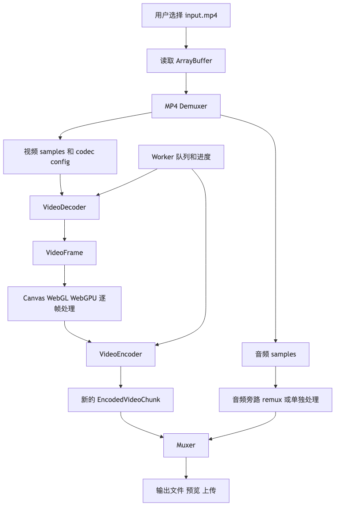

# 第八章｜WebCodecs 视频处理实战：浏览器端视频处理 Pipeline

## 1. 本章学习目标

学完这一章，你要能把前面几章的知识串成一条真正的浏览器端视频处理链路：

```text
用户上传 MP4
  ↓
读取 ArrayBuffer
  ↓
Demux：从 MP4 里拆出视频 sample
  ↓
VideoDecoder：压缩视频帧 → VideoFrame
  ↓
Canvas / WebGL / WebGPU：逐帧处理，比如加水印、灰度、缩放、裁剪
  ↓
VideoEncoder：VideoFrame → EncodedVideoChunk
  ↓
Mux：重新封装成 MP4 / WebM，或者通过 MSE 播放
  ↓
下载 / 预览 / 上传服务器
```

这一章不追求写一个工业级剪辑器，而是要让你能回答三个非常面试向的问题：

1. **浏览器里如何给一个 MP4 视频加水印？**
2. **WebCodecs 在这个流程里负责什么，不负责什么？**
3. **为什么只拿到 EncodedVideoChunk 还不能直接保存成 `.mp4` 文件？**

WebCodecs 的定位要先摆正：它提供的是浏览器里的低层音视频编解码接口，而不是完整播放器、不是 FFmpeg 替代品、也不是容器解析器。W3C 规范明确说 WebCodecs 定义的是音频、视频、图像编解码接口，并且不要求浏览器必须支持某个具体 codec；MDN 也把它描述为按 raw/encoded 数据对象进行转换的 API，比如 `VideoDecoder` 把 `EncodedVideoChunk` 解成 `VideoFrame`，`VideoEncoder` 再把 `VideoFrame` 编成 `EncodedVideoChunk`。([W3C][1])

---

## 本章速览

这章把前面所有概念串成一个浏览器端视频处理任务：



本章可以先记住三个工程结论：

* 给 MP4 加水印不是“改文件名”或“改 metadata”，而是 video track 的 demux、decode、逐帧处理、encode 和 mux。
* 音频可以先走旁路 remux，只要处理不改变整体时长；如果要混音、变速或降噪，就要进入音频 decode / process / encode。
* 视频处理要放进 Worker，并用 queue size、progress、及时 `close()` 和错误恢复来守住性能与内存边界。

## 2. 本章大图：一条浏览器端视频处理 Pipeline

先用“厨房流水线”类比一下：

| 视频处理步骤             | 厨房类比     | 技术含义                         |
| ------------------ | -------- | ---------------------------- |
| MP4 文件             | 打包好的便当盒  | 容器，里面可能有视频、音频、字幕、元数据         |
| Demux              | 拆便当盒     | 从 MP4 里拆出视频 sample、音频 sample |
| Decode             | 把冷冻食材解冻  | 把 H.264 / VP9 等压缩数据解码成原始帧    |
| Process            | 加调料、摆盘   | 给每一帧加水印、滤镜、裁剪、缩放             |
| Encode             | 重新压缩包装食材 | 把处理后的原始帧重新编码成压缩帧             |
| Mux                | 重新装回便当盒  | 把编码后的视频和音频封装成 MP4 / WebM     |
| Download / Preview | 出餐       | 下载文件或在 `<video>` 里预览         |

完整流程图：

```text
┌────────────────────────────┐
│ 用户选择 input.mp4          │
└──────────────┬─────────────┘
               │ file.arrayBuffer()
               ▼
┌────────────────────────────┐
│ MP4 Demuxer                │
│ - 解析 ftyp/moov/mdat       │
│ - 找到 video track          │
│ - 读取 samples              │
│ - 得到 codec config         │
└──────────────┬─────────────┘
               │ EncodedVideoChunk
               ▼
┌────────────────────────────┐
│ VideoDecoder               │
│ - H.264/VP9/AV1 → VideoFrame│
└──────────────┬─────────────┘
               │ VideoFrame
               ▼
┌────────────────────────────┐
│ Frame Processor            │
│ - drawImage 到 Canvas       │
│ - 加水印                    │
│ - 灰度/缩放/裁剪            │
│ - new VideoFrame(canvas)    │
└──────────────┬─────────────┘
               │ processed VideoFrame
               ▼
┌────────────────────────────┐
│ VideoEncoder               │
│ - VideoFrame → encoded chunk│
│ - 控制码率、帧率、关键帧      │
└──────────────┬─────────────┘
               │ EncodedVideoChunk
               ▼
┌────────────────────────────┐
│ Muxer / MSE                │
│ - 封装成 MP4/WebM           │
│ - 或 append 到 SourceBuffer  │
└──────────────┬─────────────┘
               ▼
          输出文件 / 预览
```

一句话记忆：

> **Demuxer 负责把容器拆开，WebCodecs 负责编解码，Canvas/WebGL/WebGPU 负责画面处理，Muxer 负责重新装回容器。**

---

## 3. 项目职责边界

第 7 章已经详细解释过 WebCodecs 的对象和方法，本章不再重复定义。放到视频水印项目里，只需要记住这张职责表：

| 模块 | 负责 | 不负责 |
| --- | --- | --- |
| Demuxer | 从 MP4 读出视频 sample、timestamp、keyframe、codec config | 解码像素 |
| WebCodecs | `EncodedVideoChunk ⇄ VideoFrame` | 解析 MP4、生成 MP4、管理完整剪辑时间线 |
| Canvas / WebGL / WebGPU | 对 `VideoFrame` 做水印、滤镜、缩放、裁剪 | 压缩编码 |
| Muxer | 把编码后的视频和旁路音频写回 MP4 / WebM | 改画面内容 |
| 业务层 | 进度、错误恢复、能力检测、Worker 通信、音画同步策略 | 底层 codec 实现 |

这章真正新增的是：如何把这些模块接成一个能跑的浏览器端 pipeline。

---

## 4. 本章案例：给上传的 MP4 视频加水印

本章设计一个浏览器端 demo：

```text
用户上传 MP4
  ↓
解析出视频轨
  ↓
解码每一帧
  ↓
把每一帧画到 Canvas
  ↓
右下角加文字水印
  ↓
重新编码
  ↓
封装成新文件
```

为了降低复杂度，第一版只处理 **视频轨**。音频有两种策略：

| 策略          | 做法                                                        | 难度             |
| ----------- | --------------------------------------------------------- | -------------- |
| 暂时丢弃音频      | 输出无声视频                                                    | 简单，适合第一版 demo  |
| 原音频旁路 remux | 不解码音频，只把原音频 sample 重新封装进输出文件                              | 中等，要求 muxer 支持 |
| 音频也处理       | AudioDecoder → Web Audio / AudioData → AudioEncoder → mux | 高，放到后面章节       |

第一版项目建议做成：

```text
input.mp4
  ↓
只处理 video track
  ↓
output.mp4 / output.webm
```

等你把视频链路跑通之后，再加音频轨。

---

## 5. 核心数据结构：从 MP4 sample 到 WebCodecs chunk

### 5.1 Demuxer 输出什么

一个 MP4 demuxer 最少要给我们这些东西：

```ts
type DemuxedVideoTrack = {
  id: number;
  codec: string;          // 例如 "avc1.42E01E"、"vp09.00.10.08"
  codedWidth: number;
  codedHeight: number;
  timescale: number;      // MP4 track 自己的时间单位
  description?: ArrayBuffer; // codec-specific config，例如 avcC/hvcC 相关数据
};

type DemuxedVideoSample = {
  data: Uint8Array;       // 压缩后的视频 sample bytes
  dts: number;            // decoding timestamp，单位是 track timescale
  pts: number;            // presentation timestamp，单位是 track timescale
  duration: number;       // 单个 sample 时长，单位是 track timescale
  isKeyframe: boolean;
};
```

你可以先不用手写完整 MP4 demuxer，真实项目里通常接第三方库。重点是你要知道 demuxer 输出的东西最终会变成：

```ts
const chunk = new EncodedVideoChunk({
  type: sample.isKeyframe ? "key" : "delta",
  timestamp: ptsToMicroseconds(sample.pts, track.timescale),
  duration: durationToMicroseconds(sample.duration, track.timescale),
  data: sample.data,
});
```

WebCodecs 里的 `VideoFrame` 元数据包含 timestamp、duration、format、resolution 等信息，MDN 文档说明 timestamp 和 duration 使用微秒单位；所以从 MP4 timescale 转 WebCodecs timestamp 时，核心公式就是 `value / timescale * 1_000_000`。([MDN Web Docs][2])

```ts
function toMicroseconds(value: number, timescale: number): number {
  return Math.round((value / timescale) * 1_000_000);
}
```

---

## 6. Timestamp：这章最容易翻车的地方

视频处理 pipeline 不是“来一帧处理一帧”这么简单，因为每一帧都有时间。

你需要分清：

| 名称           | 含义                     | 简单理解                         |
| ------------ | ---------------------- | ---------------------------- |
| DTS          | Decode Timestamp       | 这一帧什么时候送进解码器                 |
| PTS / CTS    | Presentation Timestamp | 这一帧什么时候显示                    |
| duration     | 这一帧持续多久                | 下一帧前它占多少时间                   |
| timescale    | MP4 轨道时间单位             | 比如 90000 表示 1 秒 = 90000 tick |
| microseconds | WebCodecs 常用时间单位       | 1 秒 = 1,000,000 微秒           |

### 6.1 没有 B 帧的简单情况

很多简单视频大概是：

```text
解码顺序 = 显示顺序

Frame 0: DTS 0,   PTS 0
Frame 1: DTS 33,  PTS 33
Frame 2: DTS 66,  PTS 66
Frame 3: DTS 99,  PTS 99
```

这时你几乎感觉不到 DTS / PTS 的区别。

### 6.2 有 B 帧的情况

有 B 帧时，解码顺序和显示顺序可能不同：

```text
显示顺序：I0  B1  B2  P3
解码顺序：I0  P3  B1  B2
```

因为 B 帧可能依赖未来的 P 帧，所以解码器要先看到 P3，才能还原 B1、B2。

这时你的原则是：

```text
按 DTS 顺序喂给 VideoDecoder
但 EncodedVideoChunk.timestamp 应该表示 PTS
```

也就是说：

```ts
samples.sort((a, b) => a.dts - b.dts);

for (const sample of samples) {
  decoder.decode(new EncodedVideoChunk({
    type: sample.isKeyframe ? "key" : "delta",
    timestamp: toMicroseconds(sample.pts, track.timescale),
    duration: toMicroseconds(sample.duration, track.timescale),
    data: sample.data,
  }));
}
```

面试时可以这样说：

> 对于有 B 帧的视频，解码顺序和展示顺序可能不一致。demuxer 需要提供 DTS 和 PTS。我们通常按 DTS 顺序把 chunk 喂给 decoder，但 chunk 上携带的 timestamp 要用展示时间，也就是 PTS，这样后续渲染、编码、mux 才能维持正确时间线。

---

## 7. 处理帧：VideoFrame → Canvas → VideoFrame

最直观的处理方式是 Canvas 2D：

```text
VideoFrame
  ↓ drawImage()
Canvas
  ↓ ctx.fillText() / ctx.drawImage() / getImageData()
处理后的画面
  ↓ new VideoFrame(canvas, { timestamp, duration })
新的 VideoFrame
```

### 7.1 加文字水印

示例函数：

```ts
type WatermarkOptions = {
  text: string;
  width: number;
  height: number;
};

function addWatermarkWithCanvas(
  frame: VideoFrame,
  canvas: OffscreenCanvas,
  options: WatermarkOptions,
): VideoFrame {
  const ctx = canvas.getContext("2d");
  if (!ctx) {
    throw new Error("Cannot get 2D context");
  }

  const { width, height, text } = options;

  canvas.width = width;
  canvas.height = height;

  // 1. 把原始帧画到 Canvas
  ctx.drawImage(frame, 0, 0, width, height);

  // 2. 画水印
  ctx.font = "28px sans-serif";
  ctx.textAlign = "right";
  ctx.textBaseline = "bottom";

  // 先画半透明背景，提升可读性
  const padding = 16;
  const metrics = ctx.measureText(text);
  const boxWidth = metrics.width + padding * 2;
  const boxHeight = 44;

  ctx.globalAlpha = 0.45;
  ctx.fillStyle = "black";
  ctx.fillRect(
    width - boxWidth - 24,
    height - boxHeight - 24,
    boxWidth,
    boxHeight,
  );

  ctx.globalAlpha = 1;
  ctx.fillStyle = "white";
  ctx.fillText(text, width - 24 - padding, height - 24 - 8);

  // 3. 从 Canvas 重新创建 VideoFrame
  return new VideoFrame(canvas, {
    timestamp: frame.timestamp,
    duration: frame.duration ?? undefined,
  });
}
```

这个函数做了三件事：

```text
旧 VideoFrame 负责提供原画面
Canvas 负责绘制和加水印
新 VideoFrame 负责送去编码
```

注意：**旧 frame 和新 frame 都要在不用时 close。**

MDN 的 WebCodecs 使用指南明确提醒，`VideoFrame` 可能占用大量 GPU 内存，需要尽早 `close()`，甚至少于 100 个未释放的活跃帧就可能导致应用崩溃；编码时通常可以在 `encoder.encode(frame)` 后关闭该帧。([MDN Web Docs][3])

---

## 8. 重新编码：VideoFrame → EncodedVideoChunk

`VideoEncoder` 的工作是把处理后的 `VideoFrame` 重新压缩。

你需要配置这些参数：

```ts
type EncodeOptions = {
  codec: string;      // 例如 "vp09.00.10.08"、"avc1.42E01E"
  width: number;
  height: number;
  bitrate: number;   // 例如 2_000_000 = 2 Mbps
  framerate: number; // 例如 30
};
```

示例：

```ts
const encodedChunks: EncodedVideoChunk[] = [];
const encodedMetadata: EncodedVideoChunkMetadata[] = [];

const encoder = new VideoEncoder({
  output(chunk, metadata) {
    encodedChunks.push(chunk);
    if (metadata) {
      encodedMetadata.push(metadata);
    }
  },
  error(error) {
    console.error("VideoEncoder error:", error);
  },
});

const config: VideoEncoderConfig = {
  codec: "vp09.00.10.08",
  width: 1280,
  height: 720,
  bitrate: 2_000_000,
  framerate: 30,
};

const support = await VideoEncoder.isConfigSupported(config);
if (!support.supported) {
  throw new Error("Current browser does not support this encoder config");
}

encoder.configure(config);
```

编码时：

```ts
let frameIndex = 0;
const keyframeInterval = 60;

function encodeProcessedFrame(frame: VideoFrame) {
  const shouldBeKeyframe = frameIndex % keyframeInterval === 0;

  encoder.encode(frame, {
    keyFrame: shouldBeKeyframe,
  });

  frame.close();
  frameIndex++;
}
```

MDN 示例也会显式设置关键帧，并提醒要关注 `encodeQueueSize`：如果你 30fps 地塞帧，但设备只能 10fps 编码，编码队列会持续增长，最后可能耗尽显存或崩溃；因此真实项目必须做 backpressure 控制。([MDN Web Docs][3])

---

## 9. Mux：为什么 EncodedVideoChunk 不能直接保存成 MP4

这个原因第 6、7 章已经讲过：`EncodedVideoChunk` 是 codec 层数据，MP4 / WebM 是 container 层文件。本章只保留工程动作：

```text
encoded chunks
  ↓ muxer 写 track、timestamp、duration、keyframe、codec config、media data
MP4 / WebM bytes
```

所以，下面这样是不对的：

```ts
const blob = new Blob(encodedChunks, { type: "video/mp4" });
```

这通常不是合法 MP4。你只是把一堆 encoded chunk 拼起来了，没有写容器结构，播放器不知道该怎么解释。

正确做法是：

```text
EncodedVideoChunk[]
  ↓ muxer
MP4 / WebM bytes
  ↓ Blob
download / preview
```

示意接口：

```ts
type MuxedVideoSample = {
  data: Uint8Array;
  timestamp: number; // microseconds
  duration: number;  // microseconds
  isKeyframe: boolean;
};

async function muxToMp4(params: {
  samples: MuxedVideoSample[];
  codec: string;
  width: number;
  height: number;
  timescale: number;
  decoderConfig?: ArrayBuffer;
}): Promise<Blob> {
  // 这里通常调用第三方 muxer。
  // 真正的 muxer 要写 ftyp/moov/mdat/stbl/stts/stsz/stco/stss 等结构。
  throw new Error("Pseudo code: use a real MP4 muxer here");
}
```

如果不是下载文件，而是边生成边预览，可以走 MSE：MSE 让 JavaScript 构造媒体流，并把一个个媒体 segment append 到 `SourceBuffer`，再由 `<video>` 播放。W3C 的 MSE 规范也说明应用会把 data segments 追加到 `SourceBuffer`，这些数据会作为音频、视频、文本 track buffer 被管理和播放。([W3C][4])

---

## 10. TypeScript 伪代码：完整 Pipeline

下面是一份“工程骨架级”的 TypeScript 伪代码。它不是直接可运行的完整项目，因为 `demuxMp4()` 和 `muxVideoOnly()` 需要接具体库，但主流程是对的。

```ts
// types.ts

export type DemuxedVideoTrack = {
  id: number;
  codec: string;
  codedWidth: number;
  codedHeight: number;
  timescale: number;
  description?: ArrayBuffer;
};

export type DemuxedVideoSample = {
  data: Uint8Array;
  dts: number;
  pts: number;
  duration: number;
  isKeyframe: boolean;
};

export type DemuxResult = {
  videoTrack: DemuxedVideoTrack;
  videoSamples: DemuxedVideoSample[];
};

export type EncodedOutputSample = {
  data: Uint8Array;
  timestamp: number;
  duration?: number;
  isKeyframe: boolean;
};
```

```ts
// time.ts

export function toMicroseconds(value: number, timescale: number): number {
  return Math.round((value / timescale) * 1_000_000);
}
```

```ts
// processor.ts

export function addWatermark(
  frame: VideoFrame,
  canvas: OffscreenCanvas,
  text: string,
): VideoFrame {
  const width = frame.codedWidth;
  const height = frame.codedHeight;

  canvas.width = width;
  canvas.height = height;

  const ctx = canvas.getContext("2d");
  if (!ctx) {
    throw new Error("Cannot create 2D context");
  }

  ctx.drawImage(frame, 0, 0, width, height);

  const padding = 12;
  const margin = 24;

  ctx.font = "28px sans-serif";
  ctx.textBaseline = "bottom";
  ctx.textAlign = "right";

  const textMetrics = ctx.measureText(text);
  const boxWidth = textMetrics.width + padding * 2;
  const boxHeight = 44;

  ctx.globalAlpha = 0.45;
  ctx.fillStyle = "black";
  ctx.fillRect(
    width - margin - boxWidth,
    height - margin - boxHeight,
    boxWidth,
    boxHeight,
  );

  ctx.globalAlpha = 1;
  ctx.fillStyle = "white";
  ctx.fillText(text, width - margin - padding, height - margin - 8);

  return new VideoFrame(canvas, {
    timestamp: frame.timestamp,
    duration: frame.duration ?? undefined,
  });
}
```

```ts
// pipeline.ts

import type {
  DemuxResult,
  EncodedOutputSample,
} from "./types";

import { toMicroseconds } from "./time";
import { addWatermark } from "./processor";

// 伪函数：真实项目中用 MP4 demuxer 实现
declare function demuxMp4(buffer: ArrayBuffer): Promise<DemuxResult>;

// 伪函数：真实项目中用 MP4/WebM muxer 实现
declare function muxVideoOnly(params: {
  samples: EncodedOutputSample[];
  codec: string;
  width: number;
  height: number;
  framerate: number;
}): Promise<Blob>;

function once(target: EventTarget, eventName: string): Promise<void> {
  return new Promise((resolve) => {
    target.addEventListener(eventName, () => resolve(), { once: true });
  });
}

export async function transcodeWithWatermark(file: File): Promise<Blob> {
  if (!("VideoDecoder" in globalThis) || !("VideoEncoder" in globalThis)) {
    throw new Error("WebCodecs is not supported in this browser");
  }

  // 1. 读取文件
  const buffer = await file.arrayBuffer();

  // 2. Demux MP4
  const { videoTrack, videoSamples } = await demuxMp4(buffer);

  // 3. 按 DTS 排序，保证解码输入顺序正确
  videoSamples.sort((a, b) => a.dts - b.dts);

  const outputSamples: EncodedOutputSample[] = [];
  const pendingFrameTasks: Promise<void>[] = [];

  const width = videoTrack.codedWidth;
  const height = videoTrack.codedHeight;
  const canvas = new OffscreenCanvas(width, height);

  // 4. 创建 encoder
  const encoderConfig: VideoEncoderConfig = {
    codec: "vp09.00.10.08",
    width,
    height,
    bitrate: 2_000_000,
    framerate: 30,
  };

  const encoderSupport = await VideoEncoder.isConfigSupported(encoderConfig);
  if (!encoderSupport.supported) {
    throw new Error("Encoder config is not supported");
  }

  const encoder = new VideoEncoder({
    output(chunk) {
      const data = new Uint8Array(chunk.byteLength);
      chunk.copyTo(data);

      outputSamples.push({
        data,
        timestamp: chunk.timestamp,
        duration: chunk.duration ?? undefined,
        isKeyframe: chunk.type === "key",
      });
    },
    error(error) {
      console.error("Encoder error:", error);
    },
  });

  encoder.configure(encoderConfig);

  let frameIndex = 0;
  const keyframeInterval = 60;

  // 5. 创建 decoder
  const decoderConfig: VideoDecoderConfig = {
    codec: videoTrack.codec,
    codedWidth: videoTrack.codedWidth,
    codedHeight: videoTrack.codedHeight,
    description: videoTrack.description,
  };

  const decoderSupport = await VideoDecoder.isConfigSupported(decoderConfig);
  if (!decoderSupport.supported) {
    throw new Error("Decoder config is not supported");
  }

  const decoder = new VideoDecoder({
    output(frame) {
      const task = Promise.resolve().then(async () => {
        let processedFrame: VideoFrame | undefined;

        try {
          processedFrame = addWatermark(frame, canvas, "Demo Watermark");

          const shouldBeKeyframe = frameIndex % keyframeInterval === 0;

          // Backpressure：不要无限塞给 encoder
          while (encoder.encodeQueueSize > 8) {
            await once(encoder, "dequeue");
          }

          encoder.encode(processedFrame, {
            keyFrame: shouldBeKeyframe,
          });

          frameIndex++;
        } finally {
          // 原始帧和处理后的帧都要释放
          frame.close();
          processedFrame?.close();
        }
      });

      pendingFrameTasks.push(task);
    },
    error(error) {
      console.error("Decoder error:", error);
    },
  });

  decoder.configure(decoderConfig);

  // 6. 送入 decoder
  for (const sample of videoSamples) {
    while (decoder.decodeQueueSize > 16) {
      await once(decoder, "dequeue");
    }

    const chunk = new EncodedVideoChunk({
      type: sample.isKeyframe ? "key" : "delta",
      timestamp: toMicroseconds(sample.pts, videoTrack.timescale),
      duration: toMicroseconds(sample.duration, videoTrack.timescale),
      data: sample.data,
    });

    decoder.decode(chunk);
  }

  // 7. 等 decoder 清空
  await decoder.flush();

  // 8. 等异步帧处理完成
  await Promise.all(pendingFrameTasks);

  // 9. 等 encoder 输出最后的 chunk
  await encoder.flush();

  decoder.close();
  encoder.close();

  // 10. Mux 成文件
  const outputBlob = await muxVideoOnly({
    samples: outputSamples,
    codec: encoderConfig.codec,
    width,
    height,
    framerate: 30,
  });

  return outputBlob;
}
```

主线程调用：

```ts
// main.ts

import { transcodeWithWatermark } from "./pipeline";

const input = document.querySelector<HTMLInputElement>("#file")!;
const button = document.querySelector<HTMLButtonElement>("#start")!;
const link = document.querySelector<HTMLAnchorElement>("#download")!;

let selectedFile: File | null = null;

input.addEventListener("change", () => {
  selectedFile = input.files?.[0] ?? null;
});

button.addEventListener("click", async () => {
  if (!selectedFile) {
    alert("Please select a video file first");
    return;
  }

  button.disabled = true;
  button.textContent = "Processing...";

  try {
    const blob = await transcodeWithWatermark(selectedFile);

    const url = URL.createObjectURL(blob);
    link.href = url;
    link.download = "watermarked-video.webm";
    link.textContent = "Download result";
  } catch (error) {
    console.error(error);
    alert(String(error));
  } finally {
    button.disabled = false;
    button.textContent = "Start";
  }
});
```

---

## 11. 为什么应该放到 Worker 里

视频处理非常吃 CPU / GPU / 内存。主线程还要负责：

```text
响应点击
滚动页面
更新进度条
渲染 React/Vue 组件
处理拖拽
播放预览
```

如果你在主线程里做 demux、decode、canvas 处理、encode，很容易出现：

```text
页面卡死
按钮点不动
进度条不更新
浏览器提示页面无响应
移动端直接崩
```

更合理的结构是：

```text
Main Thread
  - 文件选择
  - UI 状态
  - 进度条
  - 预览
  - 下载链接

Worker
  - demux
  - decode
  - frame process
  - encode
  - mux
```

线程通信大概这样：

```text
Main Thread
  postMessage({ type: "start", file })
      ↓
Worker
  处理视频
      ↓
  postMessage({ type: "progress", value: 0.42 })
      ↓
Main Thread
  更新进度条
      ↓
Worker
  postMessage({ type: "done", blob })
      ↓
Main Thread
  创建下载链接
```

Worker 版本目录可以这样设计：

```text
src/
  main.ts
  worker/
    video-worker.ts
  media/
    demux/
      mp4-demuxer.ts
    mux/
      mp4-muxer.ts
      webm-muxer.ts
    codecs/
      decoder.ts
      encoder.ts
    process/
      watermark.ts
      grayscale.ts
      resize.ts
    utils/
      time.ts
      support.ts
  ui/
    progress.ts
    preview.ts
```

Worker 通信类型：

```ts
// worker-messages.ts

export type WorkerInputMessage =
  | {
      type: "start";
      file: File;
      watermarkText: string;
    }
  | {
      type: "cancel";
    };

export type WorkerOutputMessage =
  | {
      type: "progress";
      progress: number;
    }
  | {
      type: "done";
      blob: Blob;
    }
  | {
      type: "error";
      message: string;
    };
```

Worker 示例：

```ts
// video-worker.ts

import { transcodeWithWatermark } from "../media/pipeline";
import type {
  WorkerInputMessage,
  WorkerOutputMessage,
} from "./worker-messages";

self.onmessage = async (event: MessageEvent<WorkerInputMessage>) => {
  const message = event.data;

  if (message.type === "start") {
    try {
      const blob = await transcodeWithWatermark(message.file);

      const output: WorkerOutputMessage = {
        type: "done",
        blob,
      };

      self.postMessage(output);
    } catch (error) {
      const output: WorkerOutputMessage = {
        type: "error",
        message: error instanceof Error ? error.message : String(error),
      };

      self.postMessage(output);
    }
  }
};
```

主线程：

```ts
// main.ts

const worker = new Worker(
  new URL("./worker/video-worker.ts", import.meta.url),
  { type: "module" },
);

worker.onmessage = (event) => {
  const message = event.data;

  switch (message.type) {
    case "progress":
      updateProgress(message.progress);
      break;

    case "done": {
      const url = URL.createObjectURL(message.blob);
      showDownloadLink(url);
      break;
    }

    case "error":
      showError(message.message);
      break;
  }
};

function start(file: File) {
  worker.postMessage({
    type: "start",
    file,
    watermarkText: "Demo Watermark",
  });
}
```

---

## 12. 内存管理：VideoFrame.close() 是生死线

视频帧非常大。

一帧 1080p RGBA 大约：

```text
1920 × 1080 × 4 bytes ≈ 8.29 MB
```

如果你手上同时压着 100 帧：

```text
8.29 MB × 100 ≈ 829 MB
```

这还没算 GPU 内存、编码器队列、解码器队列、Canvas buffer、muxer 缓存。

所以真实项目里要遵守这几个规则：

### 12.1 谁创建，谁负责释放

```ts
const processed = new VideoFrame(canvas, {
  timestamp: frame.timestamp,
});

try {
  encoder.encode(processed);
} finally {
  processed.close();
}
```

### 12.2 decoder output 里的 frame 用完立刻 close

```ts
const decoder = new VideoDecoder({
  output(frame) {
    try {
      // process frame
    } finally {
      frame.close();
    }
  },
  error(console.error),
});
```

### 12.3 不要无限缓存 VideoFrame

坏写法：

```ts
const frames: VideoFrame[] = [];

decoder = new VideoDecoder({
  output(frame) {
    frames.push(frame); // 很危险
  },
  error(console.error),
});
```

好写法：

```ts
decoder = new VideoDecoder({
  output(frame) {
    processAndEncode(frame);
    // processAndEncode 内部负责 close
  },
  error(console.error),
});
```

### 12.4 控制 decodeQueueSize 和 encodeQueueSize

```ts
while (decoder.decodeQueueSize > 16) {
  await once(decoder, "dequeue");
}

while (encoder.encodeQueueSize > 8) {
  await once(encoder, "dequeue");
}
```

### 12.5 Blob URL 用完释放

```ts
const url = URL.createObjectURL(blob);

downloadLink.href = url;

// 不需要时释放
URL.revokeObjectURL(url);
```

---

## 13. 进度条怎么做

最简单的进度：

```ts
progress = decodedSamples / totalSamples
```

伪代码：

```ts
let decodedCount = 0;
const total = videoSamples.length;

const decoder = new VideoDecoder({
  output(frame) {
    decodedCount++;

    self.postMessage({
      type: "progress",
      progress: decodedCount / total,
    });

    processFrame(frame);
  },
  error(console.error),
});
```

更合理的是分阶段：

```text
0%   - 10%   读取文件 + demux
10%  - 60%   decode + process
60%  - 90%   encode
90%  - 100%  mux
```

示例：

```ts
function reportProgress(stage: string, value: number) {
  self.postMessage({
    type: "progress",
    stage,
    progress: value,
  });
}
```

---

## 14. 常见处理任务怎么接入

### 14.1 灰度滤镜

灰度处理可以用 `getImageData()`：

```ts
function applyGrayscale(ctx: OffscreenCanvasRenderingContext2D, width: number, height: number) {
  const imageData = ctx.getImageData(0, 0, width, height);
  const data = imageData.data;

  for (let i = 0; i < data.length; i += 4) {
    const r = data[i];
    const g = data[i + 1];
    const b = data[i + 2];

    const gray = Math.round(0.299 * r + 0.587 * g + 0.114 * b);

    data[i] = gray;
    data[i + 1] = gray;
    data[i + 2] = gray;
  }

  ctx.putImageData(imageData, 0, 0);
}
```

但这条路会把像素拉到 CPU，高清视频会比较慢。真实项目里更推荐：

```text
简单水印：Canvas 2D
复杂滤镜：WebGL / WebGPU shader
实时预览：尽量 GPU path
离线导出：可以接受更慢，但要有进度和取消
```

### 14.2 缩放

```ts
ctx.drawImage(frame, 0, 0, outputWidth, outputHeight);

const resizedFrame = new VideoFrame(canvas, {
  timestamp: frame.timestamp,
  duration: frame.duration ?? undefined,
});
```

注意：如果你改变分辨率，encoder 配置也要同步变化：

```ts
encoder.configure({
  codec: "vp09.00.10.08",
  width: outputWidth,
  height: outputHeight,
  bitrate: 1_500_000,
  framerate: 30,
});
```

### 14.3 裁剪

```ts
ctx.drawImage(
  frame,
  cropX,
  cropY,
  cropWidth,
  cropHeight,
  0,
  0,
  outputWidth,
  outputHeight,
);
```

### 14.4 图片水印

```ts
ctx.drawImage(
  watermarkImage,
  width - watermarkWidth - 24,
  height - watermarkHeight - 24,
  watermarkWidth,
  watermarkHeight,
);
```

---

## 15. 实际项目目录结构

一个比较干净的 demo 可以这样组织：

```text
webcodecs-watermark-demo/
  package.json
  vite.config.ts
  tsconfig.json
  index.html

  src/
    main.ts
    app.ts

    worker/
      video-worker.ts
      worker-messages.ts

    media/
      pipeline.ts

      demux/
        mp4-demuxer.ts
        types.ts

      mux/
        webm-muxer.ts
        mp4-muxer.ts
        types.ts

      codecs/
        create-video-decoder.ts
        create-video-encoder.ts
        support.ts

      process/
        watermark.ts
        grayscale.ts
        resize.ts

      utils/
        time.ts
        events.ts
        errors.ts

    ui/
      file-input.ts
      progress-bar.ts
      download-link.ts
      preview.ts
```

职责划分：

| 文件                               | 职责                                         |
| -------------------------------- | ------------------------------------------ |
| `main.ts`                        | 初始化 UI 和 Worker                            |
| `video-worker.ts`                | 接收任务，调用 pipeline                           |
| `pipeline.ts`                    | 串联 demux → decode → process → encode → mux |
| `mp4-demuxer.ts`                 | 从 MP4 里拆 sample                            |
| `create-video-decoder.ts`        | 封装 WebCodecs decoder 创建和能力检测               |
| `create-video-encoder.ts`        | 封装 encoder 创建、队列控制                         |
| `watermark.ts`                   | 逐帧加水印                                      |
| `time.ts`                        | timescale 和微秒转换                            |
| `webm-muxer.ts` / `mp4-muxer.ts` | 输出容器                                       |

---

## 16. 常见坑

### 坑 1：忘了 WebCodecs 不处理容器

这类错误有两种常见写法：

```ts
decoder.decode(mp4FileBytes);
new Blob(chunks, { type: "video/mp4" });
```

正确理解：

```text
输入 MP4：先 demux，再把 sample 包成 EncodedVideoChunk。
输出文件：先收集 encoded chunks，再交给 muxer 写 MP4 / WebM。
```

---

### 坑 2：忘记 VideoFrame.close()

典型后果：

```text
处理十几秒视频还行
处理一分钟视频开始卡
处理几分钟视频直接崩
```

解决：

```ts
try {
  // process
} finally {
  frame.close();
}
```

---

### 坑 3：timestamp 单位错

常见错误：

```ts
timestamp: sample.pts
```

如果 `sample.pts` 是 MP4 timescale 单位，WebCodecs 需要的是微秒，就会导致播放速度异常。

正确：

```ts
timestamp: toMicroseconds(sample.pts, track.timescale)
```

---

### 坑 4：忽略 DTS / PTS 区别

简单视频可能没问题，但带 B 帧的视频会出错。

原则：

```text
按 DTS 顺序送解码器
用 PTS 作为展示 timestamp
```

---

### 坑 5：不做 backpressure

错误写法：

```ts
for (const sample of samples) {
  decoder.decode(chunk);
}
```

如果视频很长，队列可能暴涨。

更稳妥：

```ts
while (decoder.decodeQueueSize > 16) {
  await once(decoder, "dequeue");
}
decoder.decode(chunk);
```

---

### 坑 6：以为所有浏览器都支持同一个 codec

WebCodecs 不保证每个浏览器支持同样的 codec。你要检测：

```ts
await VideoDecoder.isConfigSupported(decoderConfig);
await VideoEncoder.isConfigSupported(encoderConfig);
```

并准备降级方案：

```text
WebCodecs 不支持 → 提示换浏览器
编码器不支持 H.264 → 尝试 VP8/VP9
导出 MP4 不支持 → 导出 WebM
复杂导出 → 上传服务器处理
```

---

### 坑 7：把处理和 UI 都放主线程

结果：

```text
页面卡死
进度条不动
用户以为挂了
```

解决：

```text
Worker 做重活
主线程做 UI
```

---

## 17. 和真实工程的关系

浏览器端视频处理在真实业务里很常见：

| 业务场景     | Pipeline                                              |
| -------- | ----------------------------------------------------- |
| 上传前压缩    | decode → resize → encode → mux                        |
| 视频加水印    | decode → draw watermark → encode → mux                |
| 生成缩略图    | demux → decode 指定帧 → canvas export                    |
| 视频裁剪     | demux → 按时间选择 sample/frame → encode/mux               |
| 视频转码     | demux → decode → encode different codec → mux         |
| 在线剪辑器    | timeline → decode → compose → encode → mux            |
| 视频会议背景处理 | MediaStream → VideoFrame → segmentation → encode/send |
| 直播推流前处理  | capture → process → encode → packetize/send           |

但也要诚实：浏览器端并不是万能的。

适合放浏览器端的：

```text
短视频
上传前压缩
简单水印
缩略图
轻量滤镜
隐私敏感、不想上传原片的处理
```

不适合纯浏览器端硬扛的：

```text
超长视频
多轨复杂剪辑
大量特效
批量转码
专业级调色
复杂字幕烧录
严格兼容所有设备的 MP4 输出
```

工程上经常是混合方案：

```text
浏览器端：
  - 预览
  - 轻量处理
  - 上传前压缩
  - 粗剪

服务端：
  - 最终转码
  - 多码率生成
  - HLS/DASH 切片
  - 复杂字幕和特效
  - 兼容性兜底
```

---

## 18. 面试可能怎么问

### 问题 1：如何在浏览器里给 MP4 视频加水印？

参考回答：

> 我会把流程拆成几步。首先用 File API 读取 MP4 的 ArrayBuffer，然后用 demuxer 解析 MP4，拿到视频轨的 codec config 和 video samples。接着把 samples 包装成 EncodedVideoChunk，按解码顺序送给 VideoDecoder。decoder 输出 VideoFrame 后，我把它画到 OffscreenCanvas，在 Canvas 上绘制水印，再用新的 VideoFrame 送给 VideoEncoder 编码。最后拿到 EncodedVideoChunk 后，还需要 muxer 把它们封装成 MP4 或 WebM。WebCodecs 只负责编解码，不负责 MP4 的解析和生成。

---

### 问题 2：WebCodecs 能不能直接处理 MP4？

参考回答：

> 不能。这个边界前面已经讲过：WebCodecs 只处理 codec 层的 `EncodedVideoChunk ⇄ VideoFrame`。输入 MP4 前要 demux，输出文件时要 mux。实战里真正要补充的是：demuxer 必须把 sample 的 timestamp、duration、keyframe 和 decoder config 一起交出来，否则后面的同步和 mux 都会出问题。

---

### 问题 3：为什么 EncodedVideoChunk 不能直接保存成 `.mp4`？

参考回答：

> 因为它只是编码帧，不是容器文件。面试里不要停在“需要 muxer”这句话，还要继续说 muxer 要写 sample 的时间、大小、偏移、关键帧索引、codec config 和音频轨信息。缺这些，播放器无法正确 seek、同步和解码。

---

### 问题 4：VideoFrame 为什么要 close？

参考回答：

> VideoFrame 可能持有很大的像素 buffer 或 GPU 资源。视频每秒几十帧，如果不及时 close，内存和显存会快速上涨，导致页面卡顿甚至崩溃。通常 decoder 输出的 frame 在处理完后 close，处理后新建的 frame 在 encode 之后也 close。

---

### 问题 5：如何保证音画同步？

参考回答：

> 核心是 timestamp。demux 阶段要保留音频和视频 sample 的 PTS、DTS、duration 和 timescale。送 WebCodecs 时要把时间转换成微秒。视频处理后不能随便重排或丢失 timestamp。mux 阶段要把音视频各自的 sample 按正确时间线写回容器。如果只是给视频加水印且不改变时长，可以原样 remux 音频轨；如果改变帧率、裁剪时长或变速，就要同时调整音频时间线。

---

### 问题 6：为什么建议把视频处理放 Worker？

参考回答：

> 因为 demux、decode、Canvas 处理、encode、mux 都可能是重任务。如果放主线程，会阻塞 UI，导致页面无响应。更好的做法是主线程负责文件选择、进度条、预览和下载，Worker 负责视频 pipeline，并通过 postMessage 汇报进度和结果。

---

## 19. 实践任务

### 任务 1：实现一个视频抽帧预览

目标：

```text
上传 MP4
  ↓
demux 视频轨
  ↓
decode 前 10 帧
  ↓
画到 Canvas
```

要求：

```text
1. 打印每一帧的 timestamp
2. 每个 VideoFrame 使用后 close
3. 页面展示第一帧缩略图
```

---

### 任务 2：实现视频加文字水印

目标：

```text
每一帧右下角添加文字水印
```

要求：

```text
1. 使用 OffscreenCanvas
2. 水印包含半透明背景
3. 输出重新编码后的 chunks
4. 控制 encodeQueueSize
```

---

### 任务 3：实现灰度滤镜

目标：

```text
VideoFrame → Canvas → getImageData → 灰度 → VideoFrame
```

要求：

```text
1. 对每个像素计算 gray
2. 对比灰度处理前后的耗时
3. 思考为什么 CPU 像素处理会慢
```

---

### 任务 4：把处理流程移到 Worker

目标：

```text
主线程不做视频处理
```

要求：

```text
1. Worker 接收 File
2. Worker 汇报 progress
3. 主线程显示进度条
4. Worker 返回 Blob
5. 主线程生成下载链接
```

---

### 任务 5：音频旁路 remux

进阶目标：

```text
视频重新编码
音频不重新编码
最后 mux 到同一个输出文件
```

要求：

```text
1. demux 时保留 audio samples
2. 视频处理后生成新 video samples
3. mux 时写入 video track + original audio track
4. 检查输出文件音画是否同步
```

---

## 20. 自测题

### 题 1：WebCodecs 能直接把 MP4 文件解码成 VideoFrame 吗？

答案：

> 不能。MP4 是容器，WebCodecs 的 `VideoDecoder` 接收的是 `EncodedVideoChunk`。需要先用 demuxer 从 MP4 中拆出视频 sample，再包装成 chunk 送给 decoder。

---

### 题 2：为什么 `new Blob(encodedChunks, { type: "video/mp4" })` 通常是错的？

答案：

> 因为 encoded chunks 只是编码帧数据，不包含 MP4 容器结构。合法 MP4 需要 `ftyp`、`moov`、`mdat`、sample table、track metadata、codec config 等信息，必须通过 muxer 生成。

---

### 题 3：WebCodecs timestamp 通常用什么单位？

答案：

> 通常使用微秒。MP4 sample 的时间一般是 track timescale 单位，所以要用 `timestampUs = pts / timescale * 1_000_000` 转换。

---

### 题 4：有 B 帧时，DTS 和 PTS 有什么区别？

答案：

> DTS 表示解码时间，PTS 表示展示时间。有 B 帧时，解码顺序和展示顺序可能不同。通常要按 DTS 顺序把 sample 送给 decoder，但 chunk 的 timestamp 应该使用 PTS。

---

### 题 5：为什么 `VideoFrame.close()` 很重要？

答案：

> 因为 `VideoFrame` 可能持有很大的像素数据或 GPU 资源。视频处理每秒会产生大量帧，如果不释放，会造成内存或显存持续增长，最终导致卡顿或崩溃。

---

### 题 6：给视频加水印时，WebCodecs、Canvas、Muxer 分别负责什么？

答案：

> WebCodecs 负责把压缩帧解码成 `VideoFrame`，以及把处理后的 `VideoFrame` 编码回 `EncodedVideoChunk`。Canvas 负责绘制原始帧和水印。Muxer 负责把编码后的 chunks 封装成 MP4 或 WebM 文件。

---

### 题 7：为什么要控制 `decodeQueueSize` 和 `encodeQueueSize`？

答案：

> 因为 decoder 和 encoder 都是异步队列模型。如果生产速度大于消费速度，队列会不断变长，占用大量内存或显存，导致页面变慢甚至崩溃。控制 queue size 是 backpressure 的一部分。

---

### 题 8：如果只给视频加水印，不改变时长，音频可以怎么处理？

答案：

> 可以不解码音频，直接把原 MP4 的 audio samples 旁路 remux 到输出文件。这样可以减少计算量，也更容易保持音画同步。

---

## 21. 本章总结

本章你要带走这条主线：

```text
MP4 不是直接给 WebCodecs 的。
EncodedVideoChunk 才是给 VideoDecoder 的。
VideoFrame 才是给 Canvas/WebGL/WebGPU 处理的。
处理后的 VideoFrame 才是给 VideoEncoder 的。
EncodedVideoChunk 不是最终文件。
最终文件还需要 muxer。
```

最核心的工程公式：

```text
Input MP4
  = container

Demuxed sample
  = encoded frame data + timestamp + keyframe info

VideoDecoder
  = EncodedVideoChunk → VideoFrame

Canvas/WebGL/WebGPU
  = VideoFrame → processed VideoFrame

VideoEncoder
  = processed VideoFrame → EncodedVideoChunk

Muxer
  = EncodedVideoChunk[] + metadata → MP4/WebM
```

最容易踩的坑：

```text
1. 忘记 demux
2. 忘记 mux
3. 忘记 timestamp 转换
4. 忘记 DTS / PTS
5. 忘记 VideoFrame.close()
6. 忘记 backpressure
7. 忘记 Worker
8. 忘记 codec 支持检测
```

面试时最稳的回答模板：

> 浏览器端视频处理通常是“容器层 + 编解码层 + 帧处理层 + 重新封装层”的组合。MP4 先由 demuxer 拆出 video samples，再交给 WebCodecs 解码成 VideoFrame。逐帧处理可以用 Canvas、WebGL 或 WebGPU。处理后用 VideoEncoder 重新编码成 EncodedVideoChunk。最后如果要保存成文件，还必须用 muxer 写成 MP4 或 WebM。WebCodecs 只解决编解码，不解决容器解析和封装。

---

## 22. 下一章衔接：进入 Web Audio

到这里你已经能处理视频帧了，但真实媒体文件通常还有音频。

下一章会进入：

```text
AudioContext
AudioNode graph
音频播放
音量控制
混音
滤波
可视化
录制
```

也就是从：

```text
VideoFrame pipeline
```

扩展到：

```text
Audio graph pipeline
```

再往后，我们会把两条线合起来：

```text
视频：WebCodecs + Canvas/WebGL/WebGPU
音频：Web Audio + AudioData/AudioEncoder
封装：Muxer
同步：timestamp / timeline
```

最终目标是做出真正能讲清楚、也能跑起来的浏览器端音视频处理 demo。

[1]: https://www.w3.org/TR/webcodecs/ "WebCodecs"
[2]: https://developer.mozilla.org/en-US/docs/Web/API/WebCodecs_API "WebCodecs API - Web APIs | MDN"
[3]: https://developer.mozilla.org/en-US/docs/Web/API/WebCodecs_API/Using_the_WebCodecs_API "Using the WebCodecs API - Web APIs | MDN"
[4]: https://www.w3.org/TR/media-source-2/ "Media Source Extensions™"
