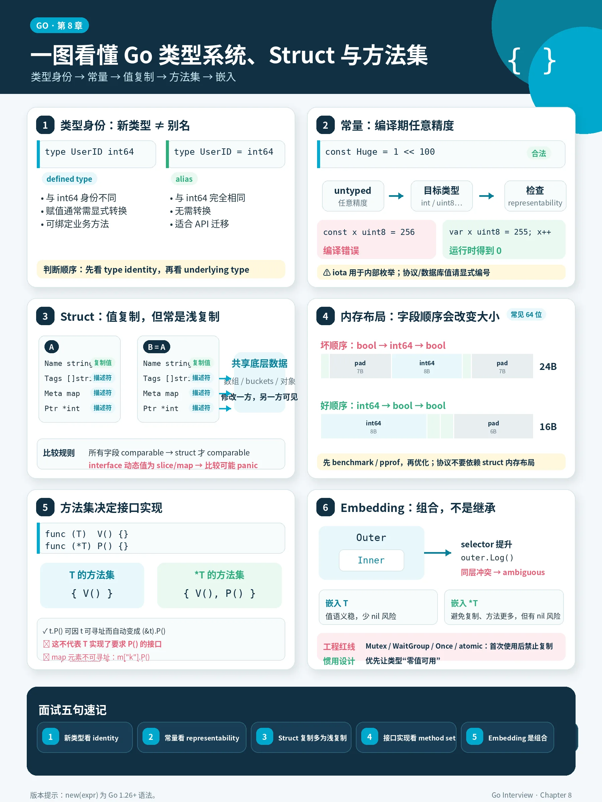
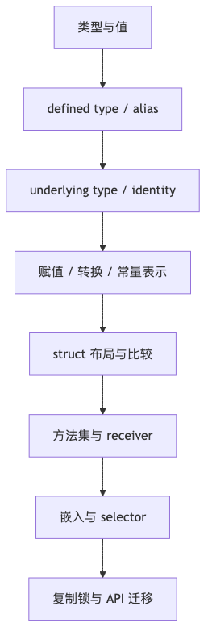
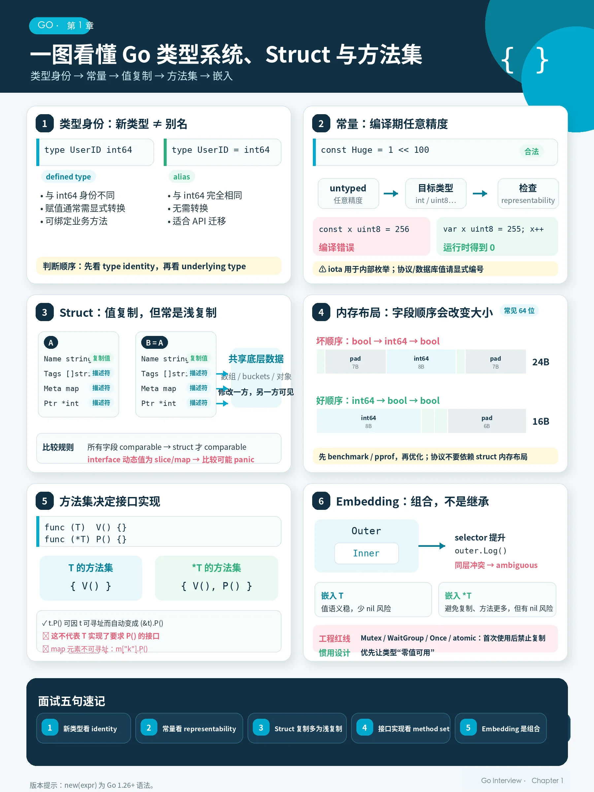

# 第 1 章：Go 类型系统、常量、Struct、方法集与嵌入



> **版本口径**：本文以 **Go 1.26.4** 为当前稳定版本口径。Go 官方 Release History 显示 Go 1.26.4 于 2026-06-02 发布；Go 1.26 的语言变化之一是内置 `new` 函数开始支持表达式操作数，例如 `new(123)`。本文凡涉及 `new(expr)` 的地方，均按 Go 1.26+ 解释；Go 1.25 及以前只支持 `new(T)`。

## 阅读定位与关联章节

> 本章主讲 Go 类型系统基础：defined type、alias、underlying type、type identity、assignability、convertibility、untyped constant、iota、struct、方法集、嵌入和复制锁。它是接口、泛型、Map Key 和 unsafe 布局的规则来源。

| 关联概念 | 建议读法 |
|---|---|
| 方法集如何影响接口实现、指针 receiver 与值 receiver | 本章讲语言规则；接口动态值、ITab、装箱和 API 设计看 [第 8 章：Interface 底层实现与设计](/blog/tech/GO/08.Interface底层实现与设计)。 |
| 类型集、约束接口、`~T`、泛型别名 | 本章讲普通类型系统基础；泛型专门语义和编译器实现看 [第 9 章：泛型、类型集合与迭代器](/blog/tech/GO/09.泛型-类型集合与迭代器)。 |
| Struct 内存布局、字段偏移、未导出字段反射访问 | 本章讲可见的语言模型；`unsafe.Offsetof`、反射权限和对象布局看 [第 10 章：Reflection、unsafe 与 Go 内存布局](/blog/tech/GO/10.Reflection-unsafe与Go内存布局)。 |
| Map Key 的可比较性、`map[interface{}]V` 风险 | 类型规则在本章；Map 使用场景和 runtime 实现看 [第 5 章：Map](/blog/tech/GO/05.Map)。 |
| 接口、反射、泛型三种抽象如何选 | 选型总览看 [第 7 章：接口、反射与泛型：抽象机制导论](/blog/tech/GO/07.接口反射与泛型导论)。 |

---

## 本章速览

先把本章看成一条从“类型身份”到“工程事故”的规则链：



读图时抓住三个总结：

- 类型系统先解决“两个值能不能放在一起”，再影响接口、泛型、Map Key 和反射布局。
- Struct 是值语义，方法集和 receiver 决定它怎样被调用、怎样实现接口。
- 嵌入不是继承；复制含锁对象、误用 alias 或忽略方法提升，都会变成真实生产风险。

面试前快速复盘时，可以直接按这张速记图串起核心问题：



---

## 一、本章面试目标

本章要掌握的知识链是：

```text
类型、值、变量、常量
    -> defined type / alias / underlying type / identity
    -> assignability / convertibility / representability
    -> untyped constant 与 iota
    -> struct 语义、比较性、tag、浅复制
    -> struct 内存布局、alignment、padding、零大小对象
    -> value receiver / pointer receiver
    -> T 与 *T 的 method set
    -> method value / method expression
    -> embedding、字段提升、方法提升、selector depth
    -> 含锁对象复制、API 迁移、零值设计
    -> 编译器类型检查、reflect/abi 元数据
    -> 面试陷阱与生产事故排查
```

### 1. 初级面试需要掌握

- `type MyInt int` 和 `type MyInt = int` 的区别。
- 常量和变量的区别。
- `const` 为什么不会运行时溢出。
- `struct` 是值类型，赋值会复制。
- value receiver 和 pointer receiver 的区别。
- map 元素为什么不能直接调用 pointer receiver 方法。
- struct tag 怎么被 `encoding/json` 使用。
- `new` 和 `make` 区别。
- 嵌入不是继承。

### 2. 中高级面试需要掌握

- defined type、alias、underlying type、type identity 的关系。
- assignability、convertibility、representability 的边界。
- untyped constant 的默认类型和任意精度。
- struct 比较性和 interface 字段比较 panic。
- struct padding、字段排序、缓存友好性。
- method set 如何决定接口实现。
- method value 何时捕获 receiver。
- embedding 的字段提升、方法提升、selector depth、歧义。
- 为什么 `sync.Mutex`、`sync.WaitGroup`、`sync.Once`、`atomic.*` 不能复制。
- 如何用 `go vet -copylocks`、`go test -race`、`go build -gcflags=-m` 排查问题。

### 3. 高级 / 源码级面试可能追问

- `go/types` 和 `cmd/compile/internal/types2` 如何做类型检查。
- `reflect.Type` 背后的 `rtype` 与 `internal/abi.Type`。
- struct tag 为什么影响 type identity，但转换时可忽略 tag。
- method set 与 selector resolution 在规范层面的规则。
- embedding `T` 和 embedding `*T` 的 method set 差异。
- 泛型 receiver 的规则。
- `new(expr)` 在 Go 1.26 的规范语义与旧版本兼容性风险。
- 编译器如何计算 size、align、offset。
- 为什么零大小对象地址不能作为唯一身份。
- API 迁移时为什么用 type alias，而不是 defined type。

---

## 二、功能介绍与语言语义

### 1. 类型、值、变量、常量的区别

| 概念 | 含义 | 是否占存储 | 是否有类型 | 典型例子 |
| --- | --- | --- | --- | --- |
| Type | 值的集合和可用操作集合 | 否 | 本身就是类型 | `int`、`string`、`struct{}` |
| Value | 某个类型集合中的具体值 | 不一定 | 是 | `1`、`"go"`、`User{Name:"a"}` |
| Variable | 用来保存值的存储位置 | 是 | 是 | `var x int` |
| Constant | 编译期常量值 | 否 | typed 或 untyped | `const N = 1 << 100` |

Go 规范明确说：变量是保存值的存储位置，变量的静态类型决定它允许保存哪些值；接口变量还可能有运行时动态类型。常量可以是 typed，也可以是 untyped；数值常量在语言层面是任意精度，不会像运行时整数一样溢出。

面试时不要把这几个概念混在一起：

```go
const A = 1        // untyped integer constant，没有运行时地址
var x int = A      // A 在赋值上下文中必须 representable by int
type MyInt int     // 定义一个新的 named type
var y MyInt = 1    // untyped constant 1 可赋给 MyInt
```

### 2. 预声明类型与别名：byte、rune、any

Go 中常见预声明名字：

```go
type byte = uint8
type rune = int32
type any = interface{}
```

它们是别名，不是新的 defined type。

```go
var b byte = 1
var u uint8 = b // 可以，因为 byte 与 uint8 是 identical type
var r rune = '中'
var i int32 = r // 可以，因为 rune 与 int32 是 identical type
var a any = 123 // any 就是 interface{}
```

面试重点：

- `byte` 表达语义：这是字节。
- `rune` 表达语义：这是 Unicode code point。
- `any` 表达语义：任意值，等价于 `interface{}`。
- 它们不会引入新的类型身份。

### 3. Defined Type、Type Alias、Underlying Type、Type Identity

Go 类型声明有两类：

```go
type MyInt int   // type definition：定义新类型
type MyInt = int // alias declaration：别名
```

规范明确区分 alias declaration 和 type definition：alias 是给已有类型绑定一个别名；type definition 会创建一个新的、不同的 defined type，但它拥有相同 underlying type 和相同操作集合。

一句话记忆：

- `type MyInt int`：以 `int` 为底层类型，定义一个新的类型身份。
- `type MyInt = int`：给 `int` 绑定一个新名字，二者仍然是同一个类型。

先看赋值差异：

```go
type NewInt int
type AliasInt = int

var i int = 10

// var a NewInt = i        // 编译错误：int 不能直接赋给 NewInt
var b NewInt = NewInt(i) // 可以：显式转换

var c AliasInt = i // 可以：AliasInt 与 int 是 identical type
```

`NewInt` 和 `int` 是两个不同类型，只是 underlying type 都是 `int`；`AliasInt` 和 `int` 的类型身份完全相同。

再看方法集差异：

```go
type Score int

func (s Score) Passed() bool {
	return s >= 60
}
```

`Score` 是当前包里定义的新类型，可以拥有自己的 method set。

```go
type RawScore = int

// func (s RawScore) Passed() bool { // 编译错误：不能给 int 挂方法
// 	return s >= 60
// }
```

alias 本身不创建新的类型身份，也不是一个新的方法接收者边界。更准确地说，方法属于 alias 指向的 defined type，而不是属于 alias 这个名字；因此别名不能用来给 `int`、外部包类型这类非本包 defined type 增加方法。

还有一个容易被忽略的点：untyped constant 可以直接赋给新的 defined type，只要值能被目标类型表示。

```go
type MyInt int

var x MyInt = 10 // 可以：10 是 untyped integer constant

var i int = 10
// var y MyInt = i        // 编译错误：i 已经是 int 变量
var z MyInt = MyInt(i) // 可以：显式转换
```

所以设计上，defined type 用来建立类型边界、表达业务语义、挂方法；type alias 更多用于兼容、重构和 API 迁移。

#### 3.1 Defined Type

```go
type UserID int64

var a UserID = 1
var b int64 = 1

// b = a // 编译错误：UserID 和 int64 不是 identical type
b = int64(a) // 显式转换
```

`UserID` 的 underlying type 是 `int64`，但 `UserID` 是一个新的 named type。它的主要作用是：

- 提升类型安全；
- 给类型绑定方法；
- 避免不同业务语义的值混用。

```go
type UserID int64
type OrderID int64

func LoadUser(id UserID) {}

func main() {
	var oid OrderID = 100
	// LoadUser(oid) // 编译错误，避免误传
	LoadUser(UserID(oid))
}
```

#### 3.2 Type Alias

```go
type UserID = int64

var a UserID = 1
var b int64 = a // 可以
```

alias 不创建新类型。`UserID` 和 `int64` 是 identical type。

主要用途是 API 迁移：

```go
// oldpkg
type User struct {
	Name string
}

// newpkg
type User = oldpkg.User
```

这样旧 API 和新 API 可以平滑过渡，调用方不用显式转换。

#### 3.3 Underlying Type

underlying type 可以理解为“剥开类型定义后最底层的结构”。规范规定：预声明类型和 type literal 的 underlying type 是它自己；其他类型的 underlying type 是其声明中引用类型的 underlying type。

```go
type A string
type B A
type C []A
type D C
```

- `A` underlying type 是 `string`。
- `B` underlying type 是 `string`。
- `C` underlying type 是 `[]A`。
- `D` underlying type 是 `[]A`。

注意：`C` 的 underlying type 不是 `[]string`，而是 `[]A`。

### 4. Type Identity：什么时候两个类型相同？

规范说：两个类型要么 identical，要么 different；named type 总是不同于其他类型，除非它们是 alias。struct 的 identity 要求字段顺序、字段名、字段类型、tag、是否 embedded 都一致。

```go
type A int
type B int

var a A
var b B

// a = b // 错误：A 和 B 是不同 defined type
a = A(b)
```

struct tag 也参与 type identity：

```go
type A struct {
	Name string `json:"name"`
}

type B struct {
	Name string
}

// var a A
// var b B
// a = b // 编译错误，tag 不同导致类型不 identical
```

但是转换时有特殊规则：struct tag 在某些转换规则中会被忽略。

### 5. Assignability、Convertibility、Representability

这三个词是 Go 类型系统面试核心。

#### 5.1 Assignability：能不能直接赋值？

```go
var x int = 1
var y int64

// y = x // 不行：int 和 int64 不 identical
y = int64(x)
```

规范定义了 assignable 的条件，例如：

- `V` 和 `T` identical；
- underlying type identical 且至少一个不是 named type；
- 赋给 interface 且实现该 interface；
- `nil` 赋给 pointer、slice、map、chan、func、interface；
- untyped constant 可被目标类型表示。

典型例子：

```go
type MyInt int

var a MyInt
var b int

// a = b // 不行：int 是预声明 named type，MyInt 也是 named type
a = MyInt(b)
a = 1 // 可以：untyped constant 1 representable by MyInt
```

#### 5.2 Convertibility：能不能显式转换？

```go
type MyInt int

var a MyInt = 10
var b int = int(a) // 可以转换
```

常见可转换情况：

- 数值类型之间；
- `string` 和 `[]byte` / `[]rune`；
- underlying type 相同的非类型参数类型；
- 忽略 tag 后 underlying type 相同的 struct；
- slice 到 array / array pointer 的转换有长度检查。

规范明确：非 constant 的数值转换可能改变表示，可能有运行时成本；整数转换按符号扩展或零扩展到无限精度后截断，不报告溢出。

#### 5.3 Representability：常量能不能被某类型表示？

```go
const A = 256
var x uint8 = A // 编译错误：256 不能被 uint8 表示
```

representability 只针对常量。规范说：常量 `x` 可由类型 `T` 表示，要求它属于该类型值集合；浮点常量还涉及舍入和溢出规则。

```go
const A = 255
var x uint8 = A // ok

const B = -1
// var y uint8 = B // 编译错误
```

### 6. Untyped Constant、默认类型和任意精度

Go 的常量系统非常特殊：

```go
const Huge = 1 << 100
```

`Huge` 不是 `int`，也不是 `uint64`，它是 untyped integer constant。

```go
const Huge = 1 << 100

// var x int64 = Huge // 编译错误：不能表示
var y = Huge >> 98 // y 的默认类型是 int，值为 4
```

untyped constant 在需要 typed value 的上下文中才会默认化：

```go
i := 1       // int
f := 1.0     // float64
c := 1 + 2i  // complex128
r := 'a'     // rune，也就是 int32
s := "hello" // string
```

默认类型规则是：`bool`、`rune`、`int`、`float64`、`complex128`、`string`。

### 7. 常量溢出与运行时整数溢出

常量溢出是编译期错误：

```go
const A int8 = 128 // 编译错误
```

运行时整数溢出按机器整数规则截断：

```go
package main

import "fmt"

func main() {
	var x uint8 = 255
	x++
	fmt.Println(x) // 0
}
```

面试回答要强调：

- 常量表达式必须 representable，否则编译错误。
- 运行时整数运算按类型宽度截断，不报错。
- 浮点到整数如果超出目标范围，结果是 implementation-dependent，不应依赖。

### 8. iota：省略表达式、多表达式、位标志、兼容性风险

`iota` 是 const 声明块内的 untyped integer constant，按 ConstSpec 行号从 0 递增。省略表达式时，会重复上一条非空表达式列表。

基础用法：

```go
const (
	Sunday = iota // 0
	Monday        // 1
	Tuesday       // 2
)
```

位标志：

```go
type Permission uint8

const (
	Read Permission = 1 << iota // 1
	Write                       // 2
	Execute                     // 4
)

func Has(p, flag Permission) bool {
	return p&flag != 0
}
```

多表达式：

```go
const (
	bit0, mask0 = 1 << iota, 1<<iota - 1 // 1, 0
	bit1, mask1                          // 2, 1
	_, _                                 // iota = 2
	bit3, mask3                          // 8, 7
)
```

兼容性风险：

```go
const (
	StatusUnknown = iota
	StatusPending
	StatusRunning
	StatusDone
)
```

如果中间插入：

```go
const (
	StatusUnknown = iota
	StatusPending
	StatusPaused // 新增
	StatusRunning
	StatusDone
)
```

老数据中的 `2` 原本代表 `StatusRunning`，现在变成 `StatusPaused`。

生产建议：

```go
const (
	StatusUnknown = 0
	StatusPending = 10
	StatusRunning = 20
	StatusDone    = 30
)
```

对协议、数据库、消息队列、外部 API，不要依赖 `iota` 的隐式连续值作为稳定协议值。

### 9. 数值转换：有符号、无符号、截断、float 转 int、int 转 string

整数之间转换：

```go
var x uint16 = 0x10F0
fmt.Printf("%#x\n", uint32(int8(x))) // 0xfffffff0
```

过程：

1. `uint16(0x10F0)` 转 `int8`，截断成低 8 位：`0xF0`。
2. `int8(0xF0)` 是 `-16`。
3. `-16` 转 `uint32`，得到 `0xFFFFFFF0`。

float 转 int：

```go
fmt.Println(int(3.9))  // 3
fmt.Println(int(-3.9)) // -3
```

规则是向 0 截断。

但是：

```go
var f float64 = 1e100
fmt.Println(int(f)) // 结果实现相关，不要依赖
```

int 转 string：

```go
fmt.Println(string(65))     // "A"
fmt.Println(string(0x4e2d)) // "中"
```

`string(int)` 不是把数字格式化成十进制字符串，而是把整数当作 Unicode code point。业务格式化应使用 `strconv.Itoa` 或 `fmt.Sprint`。

```go
strconv.Itoa(65) // "65"
```

### 10. 零值设计

Go 的零值不是“空值”，而是每个类型的默认初始值：

| 类型 | 零值 |
| --- | --- |
| `bool` | `false` |
| numeric | `0` |
| `string` | `""` |
| pointer | `nil` |
| slice | `nil` |
| map | `nil` |
| channel | `nil` |
| function | `nil` |
| interface | `nil` |
| struct | 每个字段零值 |

优秀 Go API 设计常追求：零值可用。

```go
var b bytes.Buffer
b.WriteString("hello")
fmt.Println(b.String())
```

但不是所有类型零值都完全可用：

```go
var m map[string]int
// m["a"] = 1 // panic: assignment to entry in nil map
```

零值可用设计适合：

- `sync.Mutex`
- `sync.WaitGroup`
- `bytes.Buffer`
- `strings.Builder`

不适合强依赖外部资源的对象，例如数据库连接池、HTTP 客户端包装器、Kafka producer 等，它们通常需要 constructor 管理生命周期。

### 11. new、make 与 Go 1.26 的 new(expr)

`new(T)` 分配一个 `T` 类型变量，初始化为零值，返回 `*T`。

```go
p := new(int)
fmt.Println(*p) // 0
```

`make` 只用于：

```go
make([]T, len, cap)
make(map[K]V, hint)
make(chan T, cap)
```

它返回的是初始化后的值本身，不是指针。

```go
s := make([]int, 3)     // []int
m := make(map[string]int)
ch := make(chan int)
```

Go 1.26 起，`new` 的参数可以是类型，也可以是表达式。若参数是表达式 `x`，则分配一个 `x` 的类型的变量，并初始化为 `x` 的值；若 `x` 是 untyped constant，则先转换为默认类型；`nil` 不能作为 `new` 的参数。

```go
p := new(123)     // *int，*p == 123
q := new("hello") // *string，*q == "hello"
r := new(true)    // *bool，*r == true
```

这在可选字段中很方便：

```go
type Person struct {
	Name string `json:"name"`
	Age  *int   `json:"age,omitempty"`
}

p := Person{
	Name: "Tom",
	Age:  new(18), // Go 1.26+
}
```

旧版本写法通常是：

```go
func Ptr[T any](v T) *T {
	return &v
}

p := Person{
	Name: "Tom",
	Age:  Ptr(18),
}
```

面试要点：

- `new(T)` 初始化零值。
- `new(expr)` 初始化为表达式值。
- `new(123)` 返回 `*int`，不是 `*untyped integer`。
- `new(nil)` 非法。
- Go 1.25 及以前不支持 `new(expr)`，面经要标明版本。

### 12. Struct 字段、匿名字段、Tag、比较性、值复制

字段与匿名字段：

```go
type User struct {
	ID   int64
	Name string
}

type Service struct {
	User // embedded field
}
```

embedded field 的字段名默认是类型名 `User`。

Tag：

```go
type User struct {
	ID   int64  `json:"id"`
	Name string `json:"name,omitempty"`
}
```

tag 是字段元数据，主要被 reflection 读取，例如 `encoding/json`、ORM、validator。规范说明 tag 通过 reflection 可见，并参与 struct type identity，但除此之外被语言本身忽略。

Struct 比较性：

```go
type A struct {
	X int
	Y string
}

fmt.Println(A{1, "a"} == A{1, "a"}) // true
```

struct 只有在所有字段都 comparable 时才 comparable。

```go
type B struct {
	S []int
}

// _ = B{} == B{} // 编译错误：slice 不 comparable
```

但 interface 字段有陷阱：

```go
type C struct {
	X any
}

func main() {
	a := C{X: []int{1}}
	b := C{X: []int{1}}
	fmt.Println(a == b) // panic
}
```

因为 struct 静态上 comparable：`any` 是 comparable；但运行时比较 interface 动态值时，发现动态类型 `[]int` 不 comparable，于是 panic。

### 13. Struct 内存布局：alignment、padding、field ordering

Go struct 是按字段声明顺序布局的。为了满足对齐要求，编译器会插入 padding。

```go
type A struct {
	B bool  // 1 byte
	I int64 // 8 bytes
	C bool  // 1 byte
}

type B struct {
	I int64
	B bool
	C bool
}
```

在 64 位平台上，通常：

```go
unsafe.Sizeof(A{}) // 24
unsafe.Sizeof(B{}) // 16
```

原因：

```text
A:
offset 0: B bool
offset 1-7: padding
offset 8-15: I int64
offset 16: C bool
offset 17-23: tail padding
size = 24

B:
offset 0-7: I int64
offset 8: B bool
offset 9: C bool
offset 10-15: tail padding
size = 16
```

工程建议：

- 高 QPS 热路径对象要关注字段顺序。
- 大 struct 避免频繁值复制。
- 不要为了省几个字节牺牲可读性，除非 benchmark / pprof 证明是瓶颈。
- 跨语言二进制协议不要依赖 Go struct 内存布局，应该显式编码。

### 14. struct{}、零大小对象和零大小字段

`struct{}` 大小为 0：

```go
fmt.Println(unsafe.Sizeof(struct{}{})) // 0
```

常见用途：

```go
set := map[string]struct{}{
	"a": {},
	"b": {},
}
```

相比 `map[string]bool`，`struct{}` 不为 value 占额外空间。

channel 信号：

```go
done := make(chan struct{})
close(done)
```

但零大小对象有一个非常重要的边界：

```go
a := struct{}{}
b := struct{}{}
fmt.Println(&a == &b) // 结果不要依赖
```

规范允许不同零大小变量拥有相同地址。

所以：

- 可以用 `struct{}` 表示无数据。
- 不要用 `*struct{}` 地址作为唯一身份。
- 空 struct 字段可能影响尾部 padding，尤其放在 struct 末尾时要注意实际布局。

### 15. Struct 复制后的共享关系

struct 是值复制，但字段如果是引用语义描述符，会共享底层数据。

```go
type User struct {
	Name string
	Tags []string
	Meta map[string]string
	Ptr  *int
	Ch   chan int
}

func main() {
	x := 1
	a := User{
		Name: "a",
		Tags: []string{"go"},
		Meta: map[string]string{"k": "v"},
		Ptr:  &x,
		Ch:   make(chan int),
	}
	b := a
	b.Name = "b"        // 不影响 a.Name
	b.Tags[0] = "java"  // 影响 a.Tags[0]
	b.Meta["k"] = "new" // 影响 a.Meta
	*b.Ptr = 2          // 影响 x，也影响 a.Ptr 指向值
	fmt.Println(a.Name)    // a
	fmt.Println(a.Tags[0]) // java
	fmt.Println(a.Meta)    // map[k:new]
	fmt.Println(*a.Ptr)    // 2
}
```

| 字段类型 | struct 复制后 |
| --- | --- |
| `int` / `string` / `bool` / array / struct | 复制值 |
| slice | 复制 slice header，共享底层数组 |
| map | 复制 map header，共享 buckets |
| pointer | 复制地址，指向同一对象 |
| channel | 复制 channel descriptor，指向同一 hchan |
| interface | 复制接口头，动态值视类型而定 |
| func | 复制函数值，闭包环境可能共享 |

### 16. 含 Mutex、WaitGroup、Once、Atomic 类型的 Struct 为什么不能复制

错误示例：

```go
type Counter struct {
	mu sync.Mutex
	n  int
}

func main() {
	var a Counter
	a.mu.Lock()
	b := a // 复制了已使用的 Mutex，严重错误
	a.mu.Unlock()
	_ = b
}
```

问题不是“struct 不能复制”，而是复制了同步原语内部状态。

例如：

- `sync.Mutex` 内部有锁状态和 waiter 信息。
- `sync.WaitGroup` 内部有计数状态。
- `sync.Once` 内部有 done 状态和 mutex。
- `atomic.Int64` 等类型也不应在首次使用后复制。

`go vet` 的 copylocks analyzer 就是检查这种错误。源码路径：

```text
src/cmd/vendor/golang.org/x/tools/go/analysis/passes/copylock/copylock.go
```

其核心思路是扫描 assignment、call、return、range、composite literal 等 AST 节点，发现是否复制了 lock-like 类型。

工程规则：

```go
type SafeCounter struct {
	mu sync.Mutex
	n  int
}

func (c *SafeCounter) Inc() {
	c.mu.Lock()
	defer c.mu.Unlock()
	c.n++
}
```

### 17. Value Receiver 与 Pointer Receiver

Value Receiver：

```go
type Counter struct {
	N int
}

func (c Counter) Inc() {
	c.N++
}

func main() {
	c := Counter{}
	c.Inc()
	fmt.Println(c.N) // 0
}
```

value receiver 会复制 receiver。

适合：

- 小对象；
- 不需要修改 receiver；
- receiver 本身不可变语义；
- 基础类型包装，例如 `time.Duration`。

Pointer Receiver：

```go
func (c *Counter) IncPtr() {
	c.N++
}

func main() {
	c := Counter{}
	c.IncPtr()
	fmt.Println(c.N) // 1
}
```

适合：

- 需要修改 receiver；
- struct 较大，避免复制；
- 含锁、slice、map、buffer 等状态；
- 方法集需要让 `*T` 实现接口。

面试重点：不要只说“指针 receiver 性能好”。真正决策依据是语义一致性、是否修改状态、是否含不可复制字段、方法集和接口实现。

### 18. T 和 *T 的 Method Set

规范定义：

- defined type `T` 的 method set 包含 receiver 为 `T` 的方法。
- `*T` 的 method set 包含 receiver 为 `T` 和 `*T` 的方法。
- interface 的 method set 是其 type set 中每个类型 method set 的交集。
- embedded field 还有额外提升规则。

```go
type T struct{}

func (T) V()  {}
func (*T) P() {}

type IV interface {
	V()
}

type IP interface {
	P()
}

func main() {
	var t T
	var pt *T = &t
	var _ IV = t  // ok
	var _ IV = pt // ok
	// var _ IP = t // 编译错误
	var _ IP = pt // ok
}
```

核心结论：

```text
T  的方法集：V
*T 的方法集：V + P
```

### 19. 可寻址值自动取地址调用方法，与 Interface 实现之间的区别

Go 允许对可寻址的 `T` 值调用 pointer receiver 方法：

```go
type Counter struct{ N int }

func (c *Counter) Inc() {
	c.N++
}

func main() {
	var c Counter
	c.Inc() // 等价于 (&c).Inc()
}
```

但这不意味着 `Counter` 实现了需要 `Inc` 的接口：

```go
type Counter struct{ N int }

func (c *Counter) Inc() {
	c.N++
}

type Incer interface {
	Inc()
}

func main() {
	var c Counter
	c.Inc() // ok，因为 c 可寻址
	// var _ Incer = c // 编译错误
	var _ Incer = &c // ok
}
```

面试官最爱问这一点：“为什么 `c.Inc()` 可以，但 `var _ Incer = c` 不可以？”

答案：

- 方法调用有 selector 的自动取地址规则；
- 接口实现只看类型的 method set；
- `Counter` 的 method set 不包含 `Inc`；
- `*Counter` 的 method set 才包含 `Inc`。

也就是说，`c.Inc()` 里的 `&c` 是编译器在“方法调用表达式”里帮你补的；但 `var _ Incer = c` 是在检查 `Counter` 这个类型本身是否满足接口，不会把 `c` 自动改成 `&c`。

### 20. Method Value、Method Expression 与 Receiver 捕获时机

Method Value：

```go
type Counter struct{ N int }

func (c Counter) Print() {
	fmt.Println(c.N)
}

func main() {
	c := Counter{N: 1}
	f := c.Print // 此时 receiver 被求值并保存
	c.N = 2
	f() // 1
}
```

规范明确：method value `x.M` 会在求值时保存 `x`，后续调用使用保存的 receiver。

如果是 pointer receiver：

```go
type Counter struct{ N int }

func (c *Counter) Print() {
	fmt.Println(c.N)
}

func main() {
	c := Counter{N: 1}
	f := c.Print // 保存的是 &c
	c.N = 2
	f() // 2
}
```

Method Expression：

```go
type Counter struct{ N int }

func (c Counter) Add(x int) int {
	return c.N + x
}

func main() {
	f := Counter.Add
	fmt.Println(f(Counter{N: 10}, 5)) // 15
}
```

method expression 把 receiver 变成普通函数的第一个参数。规范说，`T.M` 生成一个函数，调用时需要显式传 receiver。

### 21. Embedded Field、字段提升、方法提升、selector depth、冲突与歧义

```go
type Logger struct{}

func (Logger) Log() {
	fmt.Println("log")
}

type Service struct {
	Logger
}

func main() {
	var s Service
	s.Log()        // promoted method
	s.Logger.Log() // 显式访问
}
```

`Service` 没有直接声明 `Log`，但 `Logger.Log` 被提升。

selector depth：

```go
type A struct{ X int }
type B struct{ A }
type C struct{ B }

func main() {
	var c C
	c.X = 1 // X 的 depth 是 2
}
```

如果同一 depth 有冲突：

```go
type A struct{ X int }
type B struct{ X int }
type C struct {
	A
	B
}

func main() {
	var c C
	// fmt.Println(c.X) // 编译错误：ambiguous selector
	fmt.Println(c.A.X)
	fmt.Println(c.B.X)
}
```

如果不同 depth 冲突，浅层优先：

```go
type A struct{ X int }
type B struct{ A }
type C struct {
	B
	X int
}

func main() {
	var c C
	c.X = 10 // 访问 C.X，depth 0
}
```

### 22. 嵌入 T 与嵌入 *T

```go
type Inner struct{}

func (Inner) V()  {}
func (*Inner) P() {}

type Outer1 struct {
	Inner
}

type Outer2 struct {
	*Inner
}
```

规范中的提升规则非常关键：

- 若 struct `S` 嵌入 `T`：
  - `S` 和 `*S` 都包含 promoted `T` receiver 方法；
  - `*S` 还包含 promoted `*T` receiver 方法。
- 若 struct `S` 嵌入 `*T`：
  - `S` 和 `*S` 都包含 promoted `T` 和 `*T` receiver 方法。

所以：

```go
type HasP interface {
	P()
}

var _ HasP = &Outer1{} // ok
// var _ HasP = Outer1{} // 不一定 ok，Outer1 的 method set 不含 *Inner receiver promoted method
var _ HasP = Outer2{}  // ok
var _ HasP = &Outer2{} // ok
```

但是嵌入 `*T` 有 nil 风险：

```go
var o Outer2
o.P() // 可能 panic，取决于方法内部是否解引用 receiver
```

| 嵌入方式 | 优点 | 风险 |
| --- | --- | --- |
| 嵌入 `T` | 无 nil embedded pointer；值语义清晰 | 可能复制较大对象；`S` 的方法集不含 `*T` 方法 |
| 嵌入 `*T` | 避免复制；`S` 也能提升 `*T` 方法 | nil pointer 风险；生命周期不清晰 |

### 23. Embedding 为什么不是传统继承

Go embedding 是组合和 selector promotion，不是继承。

```go
type Animal struct{}

func (Animal) Speak() {
	fmt.Println("animal")
}

type Dog struct {
	Animal
}

func main() {
	var d Dog
	d.Speak() // promoted method
	// var a Animal = d // 编译错误：Dog 不是 Animal 的子类
	_ = d.Animal
}
```

| 传统继承 | Go embedding |
| --- | --- |
| 子类 is-a 父类 | 外层类型 has-a 内嵌字段 |
| 支持多态替换 | 不自动成为内嵌类型 |
| 方法 override | 同名 selector shadow / ambiguity |
| 继承层级 | 组合关系 |
| 父类构造链 | 显式初始化字段 |

面试回答：Go 没有类继承。Embedding 只是把字段和方法通过 selector 提升到外层类型上，方便组合复用。它不会改变类型身份，也不会让外层类型成为内嵌类型的子类型。

### 24. Struct Tag 对 Type Identity、反射和转换的影响

tag 影响 type identity：

```go
type A struct {
	Name string `json:"name"`
}

type B struct {
	Name string `db:"name"`
}

// A 和 B 不是 identical type
```

tag 可被反射读取：

```go
t := reflect.TypeOf(A{})
field, _ := t.FieldByName("Name")
fmt.Println(field.Tag.Get("json")) // name
```

转换时可忽略 tag：

```go
type A struct {
	Name string `json:"name"`
}

type B struct {
	Name string
}

func main() {
	a := A{Name: "go"}
	b := B(a) // ok：转换时忽略 tag
	fmt.Println(b)
}
```

规范明确：struct tag 参与 struct type identity；但在特定转换规则下，比较 struct underlying type 时会忽略 tag。

### 25. Comparable Struct、Interface 字段比较风险、NaN

struct comparable：

```go
type Point struct {
	X, Y int
}

fmt.Println(Point{1, 2} == Point{1, 2}) // true
```

interface 字段运行时 panic：

```go
type Box struct {
	V any
}

func main() {
	a := Box{V: []int{1}}
	b := Box{V: []int{1}}
	fmt.Println(a == b) // panic
}
```

NaN 不等于自己：

```go
type F struct {
	X float64
}

func main() {
	n := math.NaN()
	fmt.Println(n == n)       // false
	fmt.Println(F{n} == F{n}) // false
}
```

生产场景：

- struct 作为 map key 时，避免含 float NaN 或 interface 字段。
- 如果含 interface 字段，比较前需要业务自定义 equal。
- JSON 反序列化出的 `any` 可能是 `map[string]any`、`[]any`，直接比较容易 panic。

### 26. 类型别名在 API 迁移中的作用

假设旧包：

```go
package old

type User struct {
	Name string
}
```

新包：

```go
package new

import "example.com/old"

type User = old.User
```

调用方：

```go
var u new.User
var v old.User = u // 可以，因为 identical
```

如果写成：

```go
type User old.User
```

那就是新 defined type，调用方需要显式转换，方法集也不会自动带过来。

面试重点：

- alias 适合 API 迁移、包拆分、兼容旧调用方。
- defined type 适合表达新业务语义、绑定新方法、阻止误用。
- alias 不能给非本包类型“新增方法”，因为方法 receiver base type 必须定义在同一包。

### 27. 泛型类型 Receiver 与方法集

Go 允许 generic type 声明方法：

```go
type Box[T any] struct {
	V T
}

func (b Box[T]) Get() T {
	return b.V
}

func (b *Box[T]) Set(v T) {
	b.V = v
}
```

注意 receiver 写法：

```go
func (b Box[T]) Get() T
```

这里的 receiver base type 是 `Box`，receiver 中要声明类型参数列表 `[T]`。

接口实现仍然看实例化后的 method set：

```go
type Getter[T any] interface {
	Get() T
}

var _ Getter[int] = Box[int]{}
var _ Getter[int] = &Box[int]{}
```

而 pointer receiver 方法仍然只进入 `*Box[T]` 的 method set。

### 28. 零值可用类型与 Constructor 设计

优秀设计：

```go
type Counter struct {
	n atomic.Int64
}

func (c *Counter) Inc() {
	c.n.Add(1)
}

func (c *Counter) Value() int64 {
	return c.n.Load()
}
```

零值可用：

```go
var c Counter
c.Inc()
fmt.Println(c.Value())
```

需要 constructor 的设计：

```go
type Client struct {
	baseURL string
	http    *http.Client
	token   string
}

func NewClient(baseURL, token string, opts ...Option) (*Client, error) {
	if baseURL == "" {
		return nil, errors.New("empty baseURL")
	}
	c := &Client{
		baseURL: baseURL,
		http:    http.DefaultClient,
		token:   token,
	}
	for _, opt := range opts {
		opt(c)
	}
	return c, nil
}
```

| 类型 | 推荐 |
| --- | --- |
| 纯内存状态、默认值合理 | 零值可用 |
| 需要校验参数 | constructor |
| 需要外部连接、文件、goroutine | constructor + Close |
| 含锁状态 | 指针方法，禁止复制 |
| 需要不可变配置 | constructor 后只读 |

---

## 三、底层实现

### 1. 编译期类型系统大图

```text
source code
   |
   v
parser: go/parser / cmd/compile parser
   |
   v
AST
   |
   v
type checker
   |
   +--> go/types              标准库类型检查器
   +--> cmd/compile/types2    编译器内部类型检查器
   |
   v
IR / SSA
   |
   v
escape analysis / inlining / bounds check / devirtualization
   |
   v
machine code
```

本章很多规则不是 runtime 决定的，而是编译期类型检查器决定的：

- `MyInt` 能不能赋给 `int`；
- struct 是否 comparable；
- method set 是否满足 interface；
- map 元素能不能调用 pointer receiver 方法；
- 常量是否 representable；
- `iota` 如何展开；
- `new(expr)` 参数是否合法。

### 2. 类型元数据：reflect 与 internal/abi

运行时和反射需要保存类型元数据。阅读重点：

```text
src/reflect/type.go
src/internal/abi/type.go
```

关键概念：

```text
reflect.Type
   |
   v
reflect.rtype
   |
   v
internal/abi.Type
```

`reflect.TypeOf(x)` 能拿到运行时类型描述，包括：

- size；
- alignment；
- kind；
- method 信息；
- struct field 信息；
- tag；
- name；
- package path。

这就是为什么可以在运行时读取 tag：

```go
t := reflect.TypeOf(User{})
f, _ := t.FieldByName("Name")
fmt.Println(f.Tag.Get("json"))
```

### 3. Struct 内存布局

结构体布局本质是：

```text
offset = 0                                    // 当前已经使用的字节数，从结构体起始位置 0 开始
for each field:
    offset = alignUp(offset, field.align)     // 先按字段自身对齐要求补 padding
    field.offset = offset                     // 对齐后的 offset，就是该字段在结构体内的起始偏移
    offset += field.size                      // 放下字段本身，占用 field.size 个字节
struct.align = max(field.align)               // 结构体整体对齐值，等于所有字段对齐值的最大值
struct.size = alignUp(offset, struct.align)   // 结构体总大小也要按整体对齐值补齐，方便数组连续存放
```

示意：

```go
type Bad struct {
	A bool  // 1
	B int64 // 8
	C bool  // 1
}
```

```text
+-----+--------------+---------+-----+--------------+
| A   | padding 7B   | B 8B    | C   | padding 7B   |
+-----+--------------+---------+-----+--------------+
0     1              8         16    17             24
```

优化：

```go
type Good struct {
	B int64
	A bool
	C bool
}
```

```text
+---------+-----+-----+--------------+
| B 8B    | A   | C   | padding 6B   |
+---------+-----+-----+--------------+
0         8     9     10             16
```

为什么只是换字段顺序就能优化？

关键在于 Go 按字段声明顺序布局，不会为了省内存自动重排字段。`Bad` 里先放 `bool`，只占 1 字节；接下来要放 `int64`，而 `int64` 通常要求 8 字节对齐，所以 offset 1 到 7 必须补 7 字节 padding，`B` 才能从 offset 8 开始。`C` 放完后结构体当前到 offset 17，但整个结构体的对齐值仍然是 8，因此尾部还要补到 24 字节。

`Good` 把最大对齐要求的 `int64` 放在前面，`B` 从 offset 0 开始天然满足 8 字节对齐；后面的两个 `bool` 连续放在 offset 8 和 offset 9，不需要在它们之间补 padding。最后只需要把结构体总大小从 10 补齐到 16。结果就是 `Bad` 约 24 字节，`Good` 约 16 字节。

面试里可以这么总结：字段重排不是改变字段本身大小，而是减少字段之间因为 alignment 产生的空洞；通常把对齐要求大的字段放前面，把小字段集中放后面，更容易得到紧凑布局。

### 4. 方法调用底层直觉

```go
func (c Counter) Add(x int) int
```

可以近似看成：

```go
func Counter_Add(c Counter, x int) int
```

pointer receiver：

```go
func (c *Counter) Add(x int) int
```

近似看成：

```go
func Counter_Add(c *Counter, x int) int
```

method expression 就是把这个“隐藏 receiver 参数”显式暴露出来：

```go
f := Counter.Add
f(c, 1)
```

method value 则会绑定 receiver：

```go
f := c.Add
f(1)
```

### 5. Method Set 与 Interface 实现

接口实现是纯静态规则：

```text
T  method set 是否包含 interface 所有方法？
*T method set 是否包含 interface 所有方法？
```

编译器不会因为 `t` 可寻址就认为 `T` 实现了 pointer receiver 接口。

```go
type T struct{}

func (*T) M() {}

type I interface{ M() }

// var _ I = T{} // false
var _ I = &T{} // true
```

### 6. Embedding 的实现直觉

Embedding 不改变对象布局的本质，它仍然是字段：

```go
type Outer struct {
	Inner
}
```

等价于有一个字段名为 `Inner` 的字段：

```go
type Outer struct {
	Inner Inner
}
```

selector promotion 是编译器在解析 `o.X` 时进行搜索：

```text
depth 0: Outer 自己的字段 / 方法
depth 1: embedded field 的字段 / 方法
depth 2: embedded field 里面的 embedded field
...
```

同一 depth 多个候选则 ambiguous。

---

## 四、源码阅读路径

### 1. Go 规范阅读路径

优先读这些章节：

```text
Go Specification
├── Types
├── Properties of types and values
├── Type definitions
├── Alias declarations
├── Underlying types
├── Type identity
├── Constants
├── Representability
├── Assignability
├── Conversions
├── Struct types
├── Method sets
├── Method declarations
├── Selectors
├── Method values
└── Method expressions
```

### 2. 标准库类型检查器

```text
src/go/types
├── type.go              // Type 接口和具体类型
├── basic.go             // Basic 类型
├── named.go             // Named type
├── alias.go             // Alias
├── struct.go            // Struct
├── signature.go         // Signature / receiver
├── methodset.go         // MethodSet
├── lookup.go            // selector / method lookup
├── api_predicates.go    // AssignableTo / ConvertibleTo / Identical
├── assignments.go       // assignment checking
├── conversions.go       // conversion checking
├── const.go             // constant handling
├── sizes.go             // Sizes 接口
├── gcsizes.go           // gc 编译器 size/align 规则
├── under.go             // underlying type
└── universe.go          // predeclared identifiers
```

推荐阅读顺序：

```text
type.go
-> basic.go / named.go / alias.go
-> under.go / predicates.go / api_predicates.go
-> assignments.go / conversions.go
-> struct.go / sizes.go / gcsizes.go
-> methodset.go / lookup.go / selection.go
-> const.go / operand.go
```

重点看：

- `AssignableTo`
- `ConvertibleTo`
- `Identical`
- `IdenticalIgnoreTags`
- `NewMethodSet`
- selector lookup
- constant operand mode
- size / align 计算

### 3. 编译器内部 types2

```text
src/cmd/compile/internal/types2
```

它与 `go/types` 思路高度接近，但服务于编译器。重点路径：

```text
src/cmd/compile/internal/types2/type.go
src/cmd/compile/internal/types2/named.go
src/cmd/compile/internal/types2/alias.go
src/cmd/compile/internal/types2/assignments.go
src/cmd/compile/internal/types2/conversions.go
src/cmd/compile/internal/types2/methodset.go
src/cmd/compile/internal/types2/lookup.go
src/cmd/compile/internal/types2/sizes.go
src/cmd/compile/internal/types2/gcsizes.go
```

### 4. reflect 与 ABI

```text
src/reflect/type.go
src/internal/abi/type.go
```

阅读目标：

- reflect 如何表示 struct field；
- tag 如何暴露；
- type size / align / kind 如何存储；
- method metadata 如何用于反射调用；
- `reflect.Type` 与 runtime type metadata 的关系。

### 5. unsafe size/align/offset

```go
unsafe.Sizeof(x)
unsafe.Alignof(x)
unsafe.Offsetof(s.Field)
```

用来验证 struct 布局：

```go
type S struct {
	A bool
	B int64
	C bool
}

fmt.Println(unsafe.Sizeof(S{}))
fmt.Println(unsafe.Offsetof(S{}.A))
fmt.Println(unsafe.Offsetof(S{}.B))
fmt.Println(unsafe.Offsetof(S{}.C))
```

### 6. go vet copylocks

```text
src/cmd/vendor/golang.org/x/tools/go/analysis/passes/copylock/copylock.go
```

重点看：

- 它扫描哪些 AST 节点；
- 如何识别 lock-like 类型；
- 为什么 return、call、assignment、range 都可能复制锁；
- 为什么它是静态分析，不能证明所有并发安全问题。

---

## 五、常用场景与工程取舍

### 场景 1：业务 ID 用 defined type

```go
type UserID int64
type OrderID int64
```

适合：

- 避免误传；
- 给 ID 绑定校验、格式化方法；
- 提升 API 语义。

不适合：

- 需要和大量第三方库直接互传，频繁转换很烦；
- 简单 CRUD 内部小项目可能成本略高。

替代：

```go
type UserID = int64 // 只做迁移，不做强类型约束
```

### 场景 2：API 迁移用 alias

```go
type Client = oldpkg.Client
```

适合：

- 包拆分；
- 模块重构；
- 保持向后兼容。

不适合：

- 需要创建新的业务类型；
- 需要阻止旧类型和新类型混用；
- 需要给类型建立新的不变量。

### 场景 3：枚举值不要裸用 iota 做外部协议

不推荐：

```go
const (
	Unknown = iota
	Running
	Done
)
```

推荐：

```go
const (
	Unknown = 0
	Running = 10
	Done    = 20
)
```

适合：数据库状态、MQ 消息、OpenAPI、Protobuf 外层补充状态、配置文件。

### 场景 4：大 struct 用 pointer receiver

```go
type RequestContext struct {
	UserID  string
	TraceID string
	Headers map[string]string
	Buf     [4096]byte
}

func (c *RequestContext) Reset() {}
```

原因：

- 避免复制大对象；
- 修改状态；
- 管理内部引用字段；
- 与对象池配合。

风险：

- 指针别名导致共享状态；
- 并发访问需要同步；
- 生命周期不清晰可能导致逻辑泄漏。

### 场景 5：小不可变值用 value receiver

```go
type Point struct {
	X, Y float64
}

func (p Point) Distance() float64 {
	return math.Sqrt(p.X*p.X + p.Y*p.Y)
}
```

优点：语义清晰、不担心 nil、并发读安全、适合值对象。

### 场景 6：含锁 struct 一律指针传递

```go
type Cache struct {
	mu sync.RWMutex
	m  map[string]string
}

func (c *Cache) Get(k string) string { return "" }
func (c *Cache) Set(k, v string)     {}
```

不适合值传递：

```go
func Use(c Cache) {} // 复制锁，危险
```

排查：

```sh
go vet -copylocks ./...
```

### 场景 7：struct tag 用于反射框架

```go
type User struct {
	Name string `json:"name" db:"name" validate:"required"`
}
```

风险：

- tag 拼写错误编译器不管；
- 多个框架 tag 语义冲突；
- tag 改动可能改变 type identity；
- 反射有一定运行时成本。

工程建议：

- 核心 DTO 可以使用 tag；
- 领域对象不要被各种框架 tag 污染；
- 用测试覆盖 JSON / DB mapping。

### 场景 8：embedding 用于组合，不用于模拟继承树

适合：

```go
type Service struct {
	*Logger
	*Metrics
}
```

不适合：

```go
type Dog struct {
	Animal
}
```

然后把它当传统 OO 继承用。

风险：

- promoted method 冲突；
- 内嵌指针 nil；
- API 暴露过多；
- 修改内嵌类型会影响外层类型方法集。

---

## 六、代码陷阱题

### 题 1：Defined Type 与 Alias

```go
package main

import "fmt"

type A int
type B = int

func main() {
	var x A = 1
	var y B = 2
	var z int = 3
	// z = x
	z = y
	fmt.Println(x, y, z)
}
```

判断：能否编译？

答案：不能编译。`z = x` 编译错误；`A` 是新的 defined type，不可直接赋给 `int`。`B` 是 `int` 的 alias，可以直接赋值。

面试追问：

- `type A int` 是否继承了 `int` 的方法？没有。
- `A` underlying type 是什么？`int`。
- `A` 和 `int` 是否可转换？可以。

### 题 2：Untyped Constant 默认类型

```go
package main

import "fmt"

func main() {
	x := 1
	y := 1.0
	z := 'a'
	fmt.Printf("%T %T %T\n", x, y, z)
}
```

答案：

```text
int float64 int32
```

`'a'` 是 untyped rune constant，默认类型是 `rune`，也就是 `int32`。

### 题 3：常量溢出

```go
package main

func main() {
	const x = 256
	var y uint8 = x
	_ = y
}
```

答案：编译错误。`256` 不能 representable by `uint8`。

### 题 4：运行时溢出

```go
package main

import "fmt"

func main() {
	var x uint8 = 255
	x++
	fmt.Println(x)
}
```

答案：

```text
0
```

运行时整数溢出不会 panic，按类型宽度截断。

### 题 5：iota 中途插入

```go
package main

import "fmt"

const (
	A = iota
	B
	C = 100
	D
	E = iota
)

func main() {
	fmt.Println(A, B, C, D, E)
}
```

答案：

```text
0 1 100 100 4
```

`D` 省略表达式，重复上一条非空表达式 `100`，不是 `iota`。`E` 显式使用当前 `iota`，值为 `4`。

### 题 6：float 转 int

```go
package main

import "fmt"

func main() {
	fmt.Println(int(3.9))
	fmt.Println(int(-3.9))
}
```

答案：

```text
3
-3
```

向 0 截断。

### 题 7：int 转 string

```go
package main

import "fmt"

func main() {
	fmt.Println(string(65))
	fmt.Println(fmt.Sprint(65))
}
```

答案：

```text
A
65
```

`string(65)` 是 code point 转字符串，不是数字格式化。

### 题 8：Struct 浅复制

```go
package main

import "fmt"

type S struct {
	A []int
}

func main() {
	x := S{A: []int{1, 2, 3}}
	y := x
	y.A[0] = 99
	fmt.Println(x.A[0])
}
```

答案：

```text
99
```

struct 复制了 slice header，但底层数组共享。

### 题 9：Interface 字段比较 panic

```go
package main

import "fmt"

type Box struct {
	V any
}

func main() {
	a := Box{V: []int{1}}
	b := Box{V: []int{1}}
	fmt.Println(a == b)
}
```

答案：运行时 panic。

原因：`Box` 静态上 comparable，因为 `any` comparable；但比较时 interface 动态值是 slice，slice 不 comparable。

### 题 10：Value Receiver 修改无效

```go
package main

import "fmt"

type Counter struct {
	N int
}

func (c Counter) Inc() {
	c.N++
}

func main() {
	c := Counter{}
	c.Inc()
	fmt.Println(c.N)
}
```

答案：

```text
0
```

value receiver 是副本。

### 题 11：Pointer Receiver 与 Interface 实现

```go
package main

type Counter struct{}

func (c *Counter) Inc() {}

type Incer interface {
	Inc()
}

func main() {
	var c Counter
	c.Inc()
	// var _ Incer = c
	var _ Incer = &c
}
```

答案：`c.Inc()` 可以；`var _ Incer = c` 不可以。

原因：

- `c` 可寻址，方法调用可自动取地址；
- 接口实现看 method set；
- `Counter` method set 不含 `Inc`；
- `*Counter` method set 含 `Inc`。

### 题 12：Map 元素不可寻址

```go
package main

type Counter struct {
	N int
}

func (c *Counter) Inc() {
	c.N++
}

func main() {
	m := map[string]Counter{
		"a": {},
	}
	// m["a"].Inc()
}
```

答案：`m["a"].Inc()` 编译错误。

原因：map 元素不可寻址，不能自动取地址调用 pointer receiver 方法。

正确写法：

```go
v := m["a"]
v.Inc()
m["a"] = v
```

或者：

```go
m := map[string]*Counter{"a": {}}
m["a"].Inc()
```

### 题 13：Method Value 捕获 Receiver

```go
package main

import "fmt"

type S struct {
	N int
}

func (s S) Print() {
	fmt.Println(s.N)
}

func main() {
	s := S{N: 1}
	f := s.Print
	s.N = 2
	f()
}
```

答案：

```text
1
```

method value 创建时捕获 value receiver 的副本。

### 题 14：Pointer Method Value 捕获地址

```go
package main

import "fmt"

type S struct {
	N int
}

func (s *S) Print() {
	fmt.Println(s.N)
}

func main() {
	s := S{N: 1}
	f := s.Print
	s.N = 2
	f()
}
```

答案：

```text
2
```

捕获的是 `&s`。

### 题 15：Method Expression

```go
package main

import "fmt"

type S struct {
	N int
}

func (s S) Add(x int) int {
	return s.N + x
}

func main() {
	f := S.Add
	fmt.Println(f(S{N: 10}, 5))
}
```

答案：

```text
15
```

`S.Add` 的类型是：

```go
func(S, int) int
```

### 题 16：Embedded Field 歧义

```go
package main

type A struct{ X int }
type B struct{ X int }
type C struct {
	A
	B
}

func main() {
	var c C
	// _ = c.X
	_ = c.A.X
}
```

答案：`c.X` 编译错误，ambiguous selector；`c.A.X` 可以。

### 题 17：嵌入 T 与 *T 的方法集

```go
package main

type Inner struct{}

func (*Inner) P() {}

type Outer1 struct {
	Inner
}

type Outer2 struct {
	*Inner
}

type I interface {
	P()
}

func main() {
	// var _ I = Outer1{}
	var _ I = &Outer1{}
	var _ I = Outer2{}
	var _ I = &Outer2{}
}
```

答案：

- `Outer1{}` 不实现 `I`；
- `&Outer1{}` 实现 `I`；
- `Outer2{}` 和 `&Outer2{}` 都实现 `I`。

### 题 18：复制含 Mutex 的 Struct

```go
package main

import "sync"

type S struct {
	mu sync.Mutex
	n  int
}

func main() {
	var a S
	b := a
	_ = b
}
```

答案：能编译，但 `go vet -copylocks` 会警告。若锁已经使用过，复制可能导致严重并发错误。

### 题 19：Struct Padding

```go
package main

import (
	"fmt"
	"unsafe"
)

type A struct {
	X bool
	Y int64
	Z bool
}

type B struct {
	Y int64
	X bool
	Z bool
}

func main() {
	fmt.Println(unsafe.Sizeof(A{}))
	fmt.Println(unsafe.Sizeof(B{}))
}
```

在常见 64 位平台上通常输出：

```text
24
16
```

具体布局依赖目标架构的 size/alignment 规则，面试时要说明平台条件。

### 题 20：struct{} 地址

```go
package main

import "fmt"

func main() {
	a := struct{}{}
	b := struct{}{}
	fmt.Println(&a == &b)
}
```

答案：不能依赖 true 或 false。规范允许不同零大小变量拥有相同地址。

### 题 21：Go 1.26 的 new(expr)

```go
package main

import "fmt"

func main() {
	p := new(123)
	fmt.Printf("%T %v\n", p, *p)
}
```

Go 1.26+ 答案：

```text
*int 123
```

Go 1.25 及以前：编译错误，因为旧版本 `new` 只接受类型参数。

---

## 七、面试高频问题

### 1. type MyInt int 和 type MyInt = int 区别？

30 秒回答：前者定义新类型，后者是别名。新类型和 `int` 不是同一个类型，需要显式转换；别名和原类型 identical，可以直接赋值。

中高级回答：`type MyInt int` 创建 defined type，有自己的 method set，可表达业务语义；underlying type 是 `int`。`type MyInt = int` 不创建新类型，常用于 API 迁移。

源码级回答：`go/types` 中 named type 和 alias 分别建模；assignability、identity、method set 都依赖这个区分。

常见错误：说 alias 是“继承”或“包装”。不是。

### 2. underlying type 有什么用？

30 秒回答：underlying type 决定类型底层结构，影响转换、泛型 `~T` 约束、部分赋值规则。

中高级回答：defined type 拥有新的 identity，但 underlying type 相同的类型通常可以显式转换。泛型中 `~int` 表示所有 underlying type 是 `int` 的类型。

常见错误：以为 `type C []A` 的 underlying type 是 `[]underlying(A)`。不是，通常是声明右侧的 type literal 结构。

### 3. assignability 和 convertibility 区别？

30 秒回答：assignability 是能否直接赋值；convertibility 是能否显式转换。

中高级回答：`var x T = y` 走 assignability；`T(y)` 走 convertibility。untyped constant 可以在 representable 时直接赋值；两个 defined type 即使 underlying type 相同，也通常需要显式转换。

常见错误：认为能转换就能赋值。

### 4. untyped constant 为什么可以很大？

30 秒回答：Go 常量是编译期值，数值常量在语言层面任意精度，不按 `int64` 存。

中高级回答：只有进入 typed 上下文时，才检查 representability。`const Huge = 1<<100` 合法，但 `var x int64 = Huge` 不合法。

常见错误：认为常量默认就是 `int`。

### 5. 常量溢出和运行时溢出区别？

30 秒回答：常量溢出是编译错误；运行时整数溢出按类型宽度截断，不 panic。

中高级回答：`const x uint8 = 256` 不合法；`var x uint8 = 255; x++` 合法且变 `0`。安全计算要自己检查边界。

### 6. iota 有哪些坑？

30 秒回答：省略表达式会重复上一条非空表达式；中间插入会改变后续值；不适合直接作为稳定协议值。

中高级回答：`iota` 是 ConstSpec index，不是“上一值 + 1”。多表达式同一行共享同一个 `iota`。

### 7. new 和 make 区别？

30 秒回答：`new` 分配变量并返回指针；`make` 初始化 slice、map、chan 并返回值本身。

中高级回答：Go 1.26 起 `new` 支持表达式参数，`new(expr)` 返回指向初始化为该表达式值的新变量的指针；旧版本只支持 `new(T)`。

### 8. struct 是值类型是什么意思？

30 秒回答：struct 赋值、传参、返回都会复制整个 struct 值。

中高级回答：复制是字段级复制。字段若是 slice、map、pointer、chan、interface，复制的是描述符或指针，底层数据可能共享。

### 9. 为什么含 Mutex 的 struct 不能复制？

30 秒回答：因为复制会复制锁内部状态，两个对象会持有不一致的锁状态。

中高级回答：首次使用后的 `Mutex`、`WaitGroup`、`Once`、atomic 类型都不能复制。使用指针传递，并用 `go vet -copylocks` 检查。

### 10. value receiver 和 pointer receiver 怎么选？

30 秒回答：要修改 receiver 或避免复制大对象用 pointer；小的不可变值可用 value。

中高级回答：更重要的是语义一致性。一个类型的方法最好不要混用 value/pointer receiver，除非有明确理由。

### 11. T 和 *T 的 method set 区别？

30 秒回答：`T` 只有 value receiver 方法；`*T` 同时有 value 和 pointer receiver 方法。

中高级回答：这决定了接口实现。`T` 可以调用 pointer receiver 方法不代表 `T` 实现了对应接口。

### 12. 为什么 map 元素不能调用 pointer receiver 方法？

30 秒回答：map 元素不可寻址，不能自动取地址。

中高级回答：map 扩容和 bucket 移动使元素地址不稳定，语言禁止取 map 元素地址。解决方案是取出改完放回，或 map 存指针。

### 13. method value 捕获 receiver 的时机？

30 秒回答：创建 method value 时捕获 receiver。

中高级回答：value receiver 捕获副本；pointer receiver 捕获地址。闭包和延迟执行时常出坑。

### 14. method expression 是什么？

30 秒回答：把方法转换成普通函数，receiver 成为第一个显式参数。

```go
f := T.M
f(t, arg)
```

### 15. embedding 是继承吗？

30 秒回答：不是。embedding 是组合和 selector promotion。

中高级回答：外层类型不会变成内嵌类型的子类型；只是字段和方法可通过浅层 selector 访问。

### 16. 嵌入 T 和嵌入 *T 有什么区别？

30 秒回答：嵌入 `T` 更偏值语义；嵌入 `*T` 避免复制且提升更多 pointer receiver 方法，但有 nil 风险。

### 17. struct tag 会影响类型吗？

30 秒回答：会影响 struct type identity，但语言本身除反射外不解释 tag。

中高级回答：tag 不同的 struct 类型不 identical，但某些显式转换规则会忽略 tag。

### 18. struct 可以作为 map key 吗？

30 秒回答：可以，但前提是所有字段 comparable。

中高级回答：含 interface 字段时静态可能 comparable，但运行时动态值不可比较会 panic；含 float 时要注意 NaN。

### 19. struct{} 有什么用？

30 秒回答：表示零大小值，常用于 set value 或 channel signal。

中高级回答：不要依赖不同零大小变量地址不同；规范允许它们地址相同。

### 20. 类型别名为什么适合 API 迁移？

30 秒回答：alias 不创建新类型，旧类型和新名字 identical，调用方无需转换。

中高级回答：包迁移时可以保持二进制和源码兼容；如果用 defined type，会破坏赋值、接口和方法兼容性。

---

## 八、深挖追问链

### 追问链 1：Defined Type / Alias / Underlying Type

1. `type A int` 是什么？创建新的 defined type。
2. 它和 `int` 是同一类型吗？不是，type identity 不同。
3. 它的 underlying type 是什么？`int`。
4. 能直接赋给 `int` 吗？一般不能，需要显式转换。
5. 为什么要设计 defined type？提升类型安全，表达业务语义，绑定方法。
6. 什么时候用 alias？API 迁移、包拆分、兼容旧代码。
7. alias 能给旧类型新增方法吗？不能，因为方法 receiver base type 必须定义在同一包。

### 追问链 2：Untyped Constant 与溢出

1. `const x = 1<<100` 合法吗？合法，untyped integer constant 任意精度。
2. `var y int64 = x` 合法吗？不合法，不能 representable by `int64`。
3. `var z = x >> 98` 呢？合法，值为 `4`，默认类型 `int`。
4. 运行时 `uint8(255)+1` 会怎样？截断为 `0`，不 panic。
5. float 转 int 超范围呢？结果 implementation-dependent，不应依赖。
6. 生产中怎么防溢出？显式边界检查，必要时用 `math/bits`、大整数或业务约束。

### 追问链 3：Struct 复制与并发问题

1. struct 赋值会发生什么？值复制。
2. slice 字段会深拷贝吗？不会，只复制 slice header。
3. map 字段呢？复制 map header，共享底层 map。
4. 含 Mutex 的 struct 可以复制吗？首次使用后不应复制。
5. 怎么发现？`go vet -copylocks`。
6. 生产中表现是什么？偶发死锁、数据竞争、计数异常、WaitGroup panic。
7. 怎么设计避免？指针传递；不导出含锁 struct 的值复制 API；禁止复制注释；必要时加 noCopy 模式。

### 追问链 4：Method Set 与 Interface

1. value receiver 方法属于谁？属于 `T`，也属于 `*T` 的 method set。
2. pointer receiver 方法属于谁？只属于 `*T` 的 method set。
3. 为什么 `t.P()` 可以？如果 `t` 可寻址，调用时自动取地址。
4. 那为什么 `T` 不实现含 `P` 的接口？接口实现看 method set，不看调用语法糖。
5. map 元素为什么不行？map 元素不可寻址。
6. embedding 会影响 method set 吗？会，promoted methods 进入 method set，但规则取决于嵌入 `T` 还是 `*T`。

### 追问链 5：Embedding 与继承

1. embedding 是继承吗？不是，是组合。
2. 为什么看起来像继承？因为 selector promotion 允许 `outer.Method()`。
3. 外层类型能赋给内层类型变量吗？不能，类型身份不同。
4. 同名字段冲突怎么办？同 depth ambiguous；不同 depth 浅层优先。
5. 嵌入 `*T` 的风险？nil pointer、生命周期不清晰、方法集暴露过多。
6. 生产中怎么用？用于能力组合，如 logger、metrics、config；不要构造复杂继承树。

---

## 九、生产故障与排查

### 故障 1：struct 浅复制导致数据串改

现象：

- 请求 A 修改了请求 B 的字段；
- cache 中对象被外部调用方修改；
- DTO 复制后 slice/map 内容互相影响。

排查：

```sh
go test -race ./...
go test -run TestName -count=100
```

工具能证明：

- `-race` 能发现并发读写 data race。
- `-race` 不能发现单线程逻辑共享导致的错误。

修复：

- 深拷贝 slice/map；
- 对外返回只读视图；
- 明确 ownership；
- 避免复用含引用字段的 struct。

### 故障 2：复制 Mutex 导致死锁或状态错乱

现象：

- 偶发死锁；
- `fatal error: all goroutines are asleep - deadlock!`；
- WaitGroup 计数异常；
- 加锁但数据仍 race。

排查：

```sh
go vet -copylocks ./...
go test -race ./...
go test -run TestName -count=100
```

工具边界：

- `go vet -copylocks` 是静态启发式检查，可能漏报或误报。
- `-race` 只能发现实际执行路径上的 race。
- goroutine dump 可看到卡在 `sync.Mutex.Lock`、channel send/recv 等位置。

修复：

- 含锁对象只传指针；
- 不要把含锁对象放到会被复制的容器流程里；
- 禁止 value receiver；
- API 层隐藏 struct，暴露 constructor 返回指针。

### 故障 3：interface 字段比较 panic

现象：

```text
panic: runtime error: comparing uncomparable type []int
```

常见来源：

- `map[SomeStruct]...`
- struct 去重；
- `if old == new`；
- 测试里 `assert.Equal`。

排查：

- 看 panic 栈；
- 找到比较点；
- 检查 struct 是否含 `any` / `interface{}` 字段；
- 打印动态类型：

```go
fmt.Printf("%T\n", x.Field)
```

修复：

- 自定义 `Equal`；
- 避免 interface 字段参与比较；
- map key 使用稳定字符串 / hash；
- 对 JSON-like 数据使用 `reflect.DeepEqual` 或专用 diff，但注意性能和语义。

### 故障 4：padding 导致内存暴涨

现象：

- 某个对象数组占用异常；
- pprof heap 显示大量同一 struct；
- QPS 高时 GC 压力上升。

排查：

```go
fmt.Println(unsafe.Sizeof(MyStruct{}))
```

```sh
go test -bench=. -benchmem
go test -run=^$ -bench=BenchmarkX -count=10 > old.txt
benchstat old.txt new.txt
go test -c
go tool pprof ./pkg.test mem.out
```

工具边界：

- `unsafe.Sizeof` 只能看单对象静态大小。
- pprof 能看分配热点，但不直接告诉你 padding。
- benchmark 能比较优化前后，但要控制噪声。

修复：

- 调整字段顺序；
- 拆冷热字段；
- 避免大对象按值传递；
- 批量数据使用紧凑结构。

### 故障 5：method value 捕获导致旧值被异步使用

错误示例：

```go
type Job struct {
	ID string
}

func (j Job) Run() {
	fmt.Println(j.ID)
}

func main() {
	j := Job{ID: "old"}
	f := j.Run
	j.ID = "new"
	go f() // 打印 old
}
```

排查：

- 搜索 `.Method` 赋值给变量、传入 goroutine、defer、callback；
- 看 receiver 是 value 还是 pointer；
- 用 race 检查并发，但这类旧值捕获不是 race。

修复：

- 用 pointer receiver；
- 创建 closure 明确捕获：

```go
go func() {
	j.Run()
}()
```

- 不要在状态会变的对象上保存 value method value。

### 故障 6：embedding 暴露过多 API

现象：

- 外层类型意外实现了某接口；
- 新增内嵌类型方法后外层 API 行为变化；
- selector 冲突导致升级后编译失败。

排查：

```sh
go test ./...
go vet ./...
```

设计修复：

```go
type Service struct {
	logger *Logger
}
```

- 不需要 promoted API 时用命名字段；
- 显式转发需要暴露的方法；
- 对外 API 不滥用 embedding。

### 故障 7：整数转换导致权限或金额错误

错误示例：

```go
func parseLimit(n int64) uint32 {
	return uint32(n)
}
```

当 `n < 0` 或超出 `uint32` 范围时会得到错误结果。

排查：

- 搜索 `uint(`、`uint32(`、`int32(`；
- 对边界值写 fuzz / property tests；
- 对外部输入做范围校验。

修复：

```go
func parseLimit(n int64) (uint32, error) {
	if n < 0 || n > math.MaxUint32 {
		return 0, fmt.Errorf("out of range")
	}
	return uint32(n), nil
}
```

---

## 十、面试回答模板

### 1. 30 秒回答

Go 的类型系统核心是 defined type、alias、underlying type 和 type identity。`type A int` 会创建新类型，`type A = int` 只是别名。常量可以是 untyped，并且数值常量任意精度，只有进入具体类型上下文时才检查 representability。struct 是值语义，赋值会复制，但 slice、map、pointer 等字段会共享底层数据。方法集决定接口实现：`T` 只有 value receiver 方法，`*T` 同时有 value 和 pointer receiver 方法。embedding 是组合和方法提升，不是继承。

### 2. 2 分钟回答

我会从三个层次理解 Go 类型系统。第一是规范层，类型身份决定能不能直接赋值，underlying type 决定能不能显式转换，untyped constant 在赋值时看 representability。第二是 struct 层，struct 是值类型，tag 影响 type identity，比较要求所有字段 comparable，但 interface 字段可能运行时 panic。第三是方法层，value receiver 和 pointer receiver 不只是性能差异，还影响 method set 和接口实现。`T` 的 method set 只有 value receiver，`*T` 有 value 和 pointer receiver。可寻址变量调用 pointer receiver 是语法便利，不代表 `T` 实现接口。embedding 只是 selector promotion，不是继承，嵌入 `T` 和 `*T` 的方法提升规则不同。

### 3. 5 分钟深入回答

Go 的类型系统大部分规则在编译期完成。`go/types` 和编译器内部 `types2` 会检查 assignability、convertibility、method set、constant representability。`type A int` 会创建新的 named defined type，它和 `int` type identity 不同，但 underlying type 相同，所以通常可以显式转换。`type A = int` 是 alias，和 `int` identical，适合 API 迁移。

常量系统是 Go 很特别的地方。`const x = 1<<100` 是 untyped integer constant，不会运行时溢出，只有赋给具体类型时才检查能否表示。运行时整数则按类型宽度截断，比如 `uint8(255)+1` 得到 `0`。`iota` 是 ConstSpec index，省略表达式会重复上一条非空表达式，所以不能把隐式 `iota` 值随意暴露给外部协议。

struct 是值语义，但不是所有字段都深拷贝。slice、map、chan、pointer、interface 字段复制后可能共享底层状态。含 `sync.Mutex`、`WaitGroup`、`Once`、atomic 的 struct 首次使用后不能复制，否则会复制同步状态。struct 布局按字段顺序和 alignment 插入 padding，高 QPS 热路径需要关注 `unsafe.Sizeof` 和 pprof。

方法集方面，`T` 只有 value receiver 方法，`*T` 有 value 和 pointer receiver 方法。接口实现只看 method set，不看某个变量是否可寻址。method value 会在创建时捕获 receiver，value receiver 捕获副本，pointer receiver 捕获地址。embedding 是组合，不是继承，它会做字段和方法提升，但不改变类型身份。

### 4. 源码级回答

源码上我会看三条线。第一条是规范和类型检查：`src/go/types` 里的 `api_predicates.go`、`assignments.go`、`conversions.go`、`methodset.go`、`lookup.go`、`struct.go`、`sizes.go`，以及编译器内部的 `src/cmd/compile/internal/types2`。第二条是运行时类型元数据：`src/reflect/type.go` 和 `src/internal/abi/type.go`，理解 reflect 如何读取 struct field、tag、method、size、align。第三条是静态分析：`src/cmd/vendor/golang.org/x/tools/go/analysis/passes/copylock/copylock.go`，看 vet 如何发现复制锁。回答时我会明确区分规范保证、编译器实现细节和工程建议。

### 5. 生产事故分析回答

如果线上出现因为本章主题导致的问题，我会先判断是类型语义、值复制、并发同步还是内存布局问题。比如数据串改，优先检查 struct 浅复制里的 slice/map/pointer 字段；用 `-race` 找并发读写，但也要注意单线程共享不是 race。比如死锁，检查是否复制了含 `Mutex`/`WaitGroup` 的 struct，用 `go vet -copylocks` 和 goroutine dump。比如内存暴涨，用 `unsafe.Sizeof`、benchmark、pprof 看 struct padding 和大对象复制。比如比较 panic，检查 struct 是否含 interface 字段且动态值不可比较。修复上通常是明确 ownership、深拷贝、指针传递、禁止复制、显式 `Equal`、调整字段布局或避免 embedding 暴露过多 API。

---

## 十一、本章速记

1. `type A int` 创建新类型；`type A = int` 只是别名。
2. defined type 有新的 type identity，但 underlying type 可能相同。
3. alias 适合 API 迁移，defined type 适合业务语义隔离。
4. assignability 是直接赋值规则，convertibility 是显式转换规则。
5. representability 主要用于常量能否放进某个具体类型。
6. untyped numeric constant 在语言层面任意精度，不会运行时溢出。
7. 常量溢出是编译错误；运行时整数溢出通常截断。
8. untyped constant 默认类型：`bool`、`rune`、`int`、`float64`、`complex128`、`string`。
9. `iota` 是 ConstSpec index，不是上一值 + 1。
10. 省略 const 表达式会重复上一条非空表达式。
11. 外部协议值不要裸依赖 `iota` 隐式连续编号。
12. Go 1.26+ 支持 `new(expr)`；旧版本只支持 `new(T)`。
13. `new` 返回指针；`make` 返回初始化后的 slice/map/channel 值。
14. struct 赋值是值复制，但引用字段可能共享底层数据。
15. 含 `Mutex`、`WaitGroup`、`Once`、atomic 的 struct 首次使用后不要复制。
16. struct tag 参与 type identity，但部分转换规则会忽略 tag。
17. struct comparable 要求所有字段 comparable。
18. 含 interface 字段的 struct 比较可能运行时 panic。
19. NaN 不等于自己，含 float 的 struct 比较要注意。
20. `T` 的 method set 只有 value receiver；`*T` 有 value 和 pointer receiver。
21. 可寻址值能自动取地址调用 pointer receiver，不代表 `T` 实现接口。
22. map 元素不可寻址，不能自动取地址调用 pointer receiver。
23. method value 创建时捕获 receiver。
24. embedding 是组合和 selector promotion，不是继承。
25. 零大小对象地址不能作为唯一身份依据。

---

## 十二、自测题

### A. 简答题

1. `type A int` 和 `type A = int` 在 type identity 上有什么区别？
2. underlying type 在显式转换和泛型约束中有什么作用？
3. assignability 和 convertibility 的区别是什么？
4. 为什么 `const x = 1<<100` 合法，但 `var y int64 = x` 不合法？
5. `iota` 省略表达式时到底重复什么？
6. 为什么 `string(65)` 输出 `"A"` 而不是 `"65"`？
7. struct tag 是否影响 type identity？转换时是否一定影响？
8. 为什么含 `sync.Mutex` 的 struct 不能复制？
9. 为什么 `c.Inc()` 能调用 pointer receiver，但 `Counter` 不一定实现 `Incer`？
10. embedding 和继承最本质的区别是什么？

### B. 代码题

代码题 1：

```go
type A int
type B = int

var a A = 1
var b B = 2
var c int

func main() {
	// c = a
	c = b
	_ = c
}
```

判断编译结果。

代码题 2：

```go
const (
	A = iota
	B
	C = 100
	D
	E = iota
)
```

写出 `A`、`B`、`C`、`D`、`E` 的值。

代码题 3：

```go
type S struct {
	V any
}

func main() {
	a := S{V: []int{1}}
	b := S{V: []int{1}}
	fmt.Println(a == b)
}
```

判断输出或 panic。

代码题 4：

```go
type T struct{ N int }

func (t T) V()  { t.N++ }
func (t *T) P() { t.N++ }

type I interface{ P() }

func main() {
	var t T
	t.P()
	// var _ I = t
	var _ I = &t
}
```

哪些语句合法？为什么？

代码题 5：

```go
type Inner struct{}

func (*Inner) M() {}

type Outer struct {
	Inner
}

type I interface{ M() }

func main() {
	// var _ I = Outer{}
	var _ I = &Outer{}
}
```

判断接口实现情况。

### C. 系统设计 / 生产故障题

1. 你设计一个高并发本地缓存结构，内部有 `sync.RWMutex`、map、统计计数器。如何设计 API，避免调用方复制锁或并发误用？
2. 某服务升级后出现 `panic: comparing uncomparable type []interface {}`，你如何定位和修复？
3. 一个热点对象数组占用内存远超预期，你如何判断是否是 struct padding 和大对象复制导致？

---

## 参考答案

### 简答题答案

1. `type A int` 是新 defined type；`type A = int` 是 alias，和 `int` identical。
2. underlying type 决定很多转换规则；泛型里 `~T` 表示 underlying type 是 `T` 的类型集合。
3. assignability 是能否直接赋值；convertibility 是能否显式转换。
4. `1<<100` 是 untyped integer constant；赋给 `int64` 时不能 representable。
5. 重复上一条非空 ConstSpec 的表达式列表和类型。
6. `string(int)` 是 code point 转字符串；数字格式化应用 `strconv.Itoa`。
7. tag 影响 struct type identity；但某些显式转换比较 underlying type 时忽略 tag。
8. 会复制同步原语内部状态，导致锁状态错乱。
9. 方法调用有自动取地址；接口实现只看 method set。
10. embedding 是 has-a 组合和 selector promotion；继承是 is-a 子类型关系。

### 代码题答案

代码题 1：`c = a` 编译错误；`c = b` 合法。因为 `A` 是新类型，`B` 是 `int` alias。

代码题 2：

```text
A = 0
B = 1
C = 100
D = 100
E = 4
```

代码题 3：运行时 panic。`S` 静态 comparable，但 interface 动态值是 slice，不 comparable。

代码题 4：`t.P()` 合法，因为 `t` 可寻址，自动取地址。`var _ I = t` 不合法，因为 `T` 的 method set 不含 pointer receiver 方法。`var _ I = &t` 合法。

代码题 5：`Outer{}` 不实现 `I`；`&Outer{}` 实现 `I`。因为嵌入 `Inner` 时，`*Outer` 的 method set 包含 promoted `*Inner` receiver 方法。

### 系统设计 / 生产故障题答案

题 1：高并发缓存推荐设计：

```go
type Cache struct {
	mu   sync.RWMutex
	m    map[string]string
	hits atomic.Int64
}

func NewCache() *Cache {
	return &Cache{
		m: make(map[string]string),
	}
}

func (c *Cache) Get(k string) (string, bool) {
	c.mu.RLock()
	v, ok := c.m[k]
	c.mu.RUnlock()
	if ok {
		c.hits.Add(1)
	}
	return v, ok
}

func (c *Cache) Set(k, v string) {
	c.mu.Lock()
	c.m[k] = v
	c.mu.Unlock()
}
```

要点：constructor 返回 `*Cache`；所有方法用 pointer receiver；不导出内部 map；不提供返回内部 map 的 API；`go vet -copylocks` 纳入 CI；benchmark 评估锁粒度。

题 2：比较 panic 排查步骤：从 panic stack 找到比较位置；检查被比较 struct 是否含 `any` / `interface{}` 字段；打印动态类型；找到为什么动态值变成 `[]interface{}`；改成自定义 `Equal` 或 canonical string/hash；增加单测覆盖不可比较动态值。

题 3：struct padding 和大对象复制排查步骤：用 `unsafe.Sizeof` 查看对象大小；用 `unsafe.Offsetof` 查看字段偏移；用 `go test -bench -benchmem` 看分配；用 pprof heap 看热点类型；调整字段顺序或拆分冷热字段；大对象改指针传递；用 benchstat 比较优化前后。
