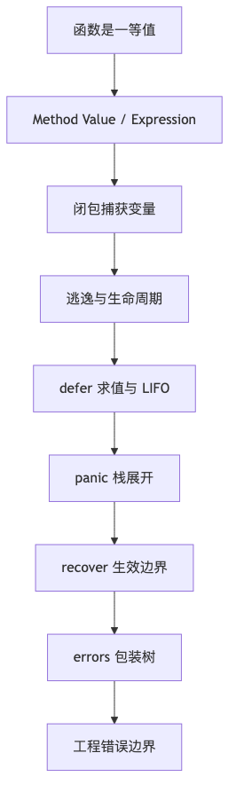

# 第 2 章：函数、闭包、defer、panic/recover 与 errors

> 版本口径：截至 **2026-06-19**，Go 官方下载页显示当前稳定版本为 **Go 1.26.4**，同时维护上一稳定线 **Go 1.25.11**。本章按 Go 1.26.4 口径讲；涉及 Go 1.22 循环变量、Go 1.20 `errors.Join`、Go 1.26 `errors.AsType` 时会单独标注。([go.dev][1])

## 阅读定位与关联章节

> 本章主讲函数一等值、Method Value/Expression、闭包捕获、defer、panic/recover、errors 包装和工程错误边界。它会引用逃逸、接口、并发和 Context，但这些不是本章的主讲对象。

| 关联概念 | 建议读法 |
|---|---|
| 闭包捕获导致逃逸、闭包长期持有大对象 | 本章讲语义和陷阱；逃逸分析、GC 根和 heap profile 看 [第 6 章：内存管理、逃逸分析与 GC](/blog/tech/GO/06.内存管理-逃逸分析与GC)。 |
| `error` 是 interface、typed nil error、接口装箱 | 本章讲错误处理后果；interface 底层模型看 [第 8 章：Interface 底层实现与设计](/blog/tech/GO/08.Interface底层实现与设计)。 |
| `defer Unlock`、panic 后锁释放、data race | 本章讲 defer/panic 语义；同步保证、锁和 Race Detector 看 [第 13 章：并发同步](/blog/tech/GO/13.并发同步-MemoryModel-锁-Atomic-Race)。 |
| 跨 Goroutine recover、worker panic 边界 | 本章讲 recover 生效条件；Goroutine 生命周期和调度排障看 [第 11 章：Goroutine 与 Go 调度器](/blog/tech/GO/11.Goroutine与Go调度器)。 |
| Context 取消原因、错误传播和请求边界 | 错误包装在本章；取消树、deadline、Cause 和生命周期管理看 [第 14 章：Context、取消传播与生命周期管理](/blog/tech/GO/14.Context-取消传播与生命周期管理)。 |

---

## 本章速览

先把本章看成一条从“函数值”到“错误边界”的控制流链：



读图时抓住三个总结：

- 闭包、方法值和函数参数的求值时机，会直接影响逃逸、资源释放和线上内存问题。
- `defer`、`panic`、`recover` 是同一条栈展开机制里的三个阶段，跨 goroutine 不会自动传播。
- Go 的错误处理重点不是“抛异常”，而是把可判断、可包装、可观测的错误边界设计清楚。

---

## 一、本章面试目标

这一章是 Go 面试里非常容易被深挖的一章，因为它连接了：

```text
函数语义
→ 闭包捕获
→ 逃逸分析
→ defer 执行顺序
→ panic 栈展开
→ recover 生效条件
→ errors 包装树
→ 工程错误边界设计
→ 线上故障排查
```

### 1. 初级面试需要掌握

你至少要能答清楚：

* 函数可以作为值传递；
* 函数值零值是 `nil`；
* 函数值只能和 `nil` 比较；
* 闭包捕获的是变量，不是简单复制值；
* `defer` 参数会立即求值；
* 多个 `defer` 按 LIFO 执行；
* `panic` 会触发当前 goroutine 栈展开；
* `recover` 只有在 deferred function 中直接调用才有效；
* `error` 是接口；
* `fmt.Errorf("%w", err)` 能包装错误；
* `errors.Is` 比 `==` 更适合判断被包装的 sentinel error。

### 2. 中高级面试需要掌握

你要能继续说出：

* Method Value 和 Method Expression 的区别；
* 闭包为什么导致变量逃逸；
* Go 1.22 前后循环变量捕获差异；
* `defer` 如何影响 named result；
* `defer nilFunc()` 什么时候 panic；
* `os.Exit` 为什么不会执行 defer；
* `runtime.Goexit` 会执行当前 goroutine 的 defer；
* `panic(nil)` 当前不再让 `recover()` 返回 nil；
* `errors.Join` 形成的是 error tree，不只是 chain；
* `errors.Unwrap` 不会展开 `Unwrap() []error`；
* `errors.As` target 写错会 panic；
* typed nil error 为什么 `err != nil`；
* error message 不应该作为稳定 API。

### 3. 高级 / 源码级面试可能追问

高级面试会继续追问：

* `deferproc`、`deferprocStack`、`deferreturn` 分别是什么；
* open-coded defer 为什么快；
* stack defer 和 heap defer 的差异；
* panic 栈展开如何找到 defer；
* recover 为什么必须直接调用；
* 多重 panic 最终保留哪个；
* `errors.Is` 和 `errors.As` 的遍历顺序；
* `Unwrap() error` 和 `Unwrap() []error` 对 API 兼容性的影响；
* sentinel error 暴露后为什么形成 API 耦合；
* HTTP / worker / plugin 边界应该在哪里 recover；
* Go error 为什么默认不带 stack；
* 如何避免每层都打日志导致重复噪声。

---

## 二、功能介绍与语言语义

## 2.1 函数是一等值

在 Go 中，函数可以：

```go
func add(a, b int) int {
	return a + b
}

func main() {
	var f func(int, int) int
	f = add
	println(f(1, 2))
}
```

函数类型表示一组具有相同参数和返回值签名的函数；未初始化的函数类型变量零值是 `nil`。函数值不可比较，但可以和 `nil` 比较。([go.dev][2])

```go
var f func()
fmt.Println(f == nil) // true

// fmt.Println(f == f) // 编译错误：func can only be compared to nil
```

**面试表达：**

> 函数在 Go 里是一等值，可以赋值、传参、作为返回值。但函数值本身不可比较，只能和 nil 比较。它的零值是 nil，调用 nil 函数会 panic。

---

## 2.2 参数求值顺序

Go 规范保证：在表达式、赋值、return 中，函数调用、方法调用、channel receive、逻辑运算会按词法从左到右求值；但复合字面量中某些普通表达式的相对求值顺序不完全指定。([go.dev][2])

```go
func f() int { fmt.Print("f "); return 1 }
func g() int { fmt.Print("g "); return 2 }

func main() {
	fmt.Println(f(), g())
}
```

输出：

```text
f g 1 2
```

但下面这种不要依赖：

```go
a := 1
f := func() int { a++; return a }
x := []int{a, f()}
fmt.Println(x)
```

规范允许不同结果，因为 `a` 和 `f()` 在复合字面量内部的相对求值存在未指定部分。

---

## 2.3 多返回值、Named Result 和 Naked Return

```go
func f() (x int, err error) {
	x = 1
	return
}
```

等价于：

```go
func f() (x int, err error) {
	x = 1
	return x, err
}
```

Named Result 的本质是：返回值变量在函数入口已经声明，并在 return 时被赋值。它最大的面试点不是语法，而是它会被 `defer` 修改。

```go
func f() (x int) {
	defer func() {
		x++
	}()
	return 1
}
```

结果是：

```text
2
```

原因是：

```text
return 1
→ 先把 named result x 设为 1
→ 执行 defer，x++
→ 返回给调用者
```

Go 规范明确说明：显式 return 先设置 result parameters，再执行 deferred functions，最后函数才真正返回。([go.dev][2])

---

## 2.4 Variadic Function

```go
func sum(nums ...int) int {
	total := 0
	for _, n := range nums {
		total += n
	}
	return total
}

sum(1, 2, 3)

s := []int{1, 2, 3}
sum(s...)
```

本质：

```go
func sum(nums ...int)
```

调用方看起来像多个参数，但函数内部 `nums` 是 `[]int`。

### 面试坑

```go
func appendOne(xs ...int) {
	xs = append(xs, 100)
}

func main() {
	a := []int{1, 2, 3}
	appendOne(a...)
	fmt.Println(a)
}
```

输出：

```text
[1 2 3]
```

因为 `appendOne` 内部只是修改了局部 slice header。如果底层数组容量足够，并且修改的是已有下标，才会影响外部。

---

## 2.5 Method Value 与 Method Expression

### Method Value

```go
type User struct {
	Name string
}

func (u User) Hello(prefix string) {
	fmt.Println(prefix, u.Name)
}

func main() {
	u := User{Name: "Tom"}
	f := u.Hello
	f("hi")
}
```

`f := u.Hello` 是 **method value**。它会把 receiver 绑定进去。

等价理解：

```go
f := func(prefix string) {
	User.Hello(u, prefix)
}
```

### Method Expression

```go
f := User.Hello
f(User{Name: "Tom"}, "hi")
```

`User.Hello` 是 **method expression**。receiver 变成普通第一个参数。

### 指针 receiver 的坑

```go
type Counter struct {
	N int
}

func (c *Counter) Inc() {
	c.N++
}

func main() {
	c := Counter{}
	f := c.Inc
	f()
	f()
	fmt.Println(c.N)
}
```

输出：

```text
2
```

`f := c.Inc` 会捕获 `&c` 这个 receiver。

---

## 2.6 闭包捕获变量还是值

Go 规范说：函数闭包可以引用外层函数定义的变量，这些变量在外层函数和函数字面量之间共享，并且只要仍可访问就继续存活。([go.dev][2])

```go
func makeCounter() func() int {
	n := 0
	return func() int {
		n++
		return n
	}
}

func main() {
	c := makeCounter()
	fmt.Println(c())
	fmt.Println(c())
}
```

输出：

```text
1
2
```

说明闭包捕获的是同一个变量 `n`，不是每次复制一个 `n` 的值。

---

## 2.7 Go 1.22 前后的循环变量捕获差异

Go 1.22 起，`for` 循环每次迭代有自己的 iteration variable；Go 1.22 前，多个迭代共享同一组变量。规范现在明确标注了这一变化。([go.dev][2])

### Go 1.22 以后

```go
func main() {
	var fs []func()

	for i := 0; i < 3; i++ {
		fs = append(fs, func() {
			fmt.Println(i)
		})
	}

	for _, f := range fs {
		f()
	}
}
```

输出一般是：

```text
0
1
2
```

### Go 1.22 前

经典老面经答案是：

```text
3
3
3
```

### 但这个仍然有坑：预先声明变量

```go
func main() {
	var fs []func()
	var i int

	for i = 0; i < 3; i++ {
		fs = append(fs, func() {
			fmt.Println(i)
		})
	}

	for _, f := range fs {
		f()
	}
}
```

即使在 Go 1.22+，这里仍然输出：

```text
3
3
3
```

因为 `i` 不是 `for` 语句新声明的 iteration variable，而是外部已存在变量。

**面试表达：**

> Go 1.22 修复的是通过 `:=` 在 for/range 中声明的循环变量捕获问题；如果循环变量是外部预先声明再赋值，闭包仍然共享同一个变量。

---

## 2.8 defer 基本语义

`defer` 会把一个函数调用延迟到当前函数返回前执行。返回原因可以是：

* 显式 `return`；
* 函数体自然结束；
* 当前 goroutine 正在 panic。

每次执行 `defer` 语句时，函数值和参数会立即求值并保存；真正调用发生在当前函数返回前，多个 defer 按后进先出执行。([go.dev][2])

```go
func main() {
	x := 1
	defer fmt.Println(x)
	x = 2
}
```

输出：

```text
1
```

因为 `fmt.Println(x)` 的参数在 defer 语句执行时已经求值。

---

## 2.9 defer 闭包读取最终变量

```go
func main() {
	x := 1
	defer func() {
		fmt.Println(x)
	}()
	x = 2
}
```

输出：

```text
2
```

因为 deferred function literal 捕获的是变量 `x`，执行时读取的是最终值。

---

## 2.10 defer nil Function

```go
func main() {
	var f func()
	defer f()
	fmt.Println("before return")
}
```

输出：

```text
before return
panic: runtime error: invalid memory address or nil pointer dereference
```

注意：不是执行 `defer f()` 时 panic，而是函数返回、真正调用 deferred function 时 panic。规范也明确说明：如果 deferred function value 求值为 nil，会在调用该 deferred function 时 panic，而不是在 defer 语句执行时 panic。([go.dev][2])

---

## 2.11 panic / recover 基本语义

`panic` 会终止当前函数正常执行，并开始当前 goroutine 的栈展开：

```text
panic 发生
→ 执行当前函数已经注册的 defer
→ 回到调用者，执行调用者 defer
→ 一直展开到 goroutine 顶层
→ 如果没有 recover，程序崩溃
```

规范说明：panic 会终止当前函数执行，运行该函数的 defer，然后运行调用者的 defer，直到当前 goroutine 顶层；如果没有 recover，程序终止并报告 panic 值。([go.dev][2])

```go
func f() {
	defer fmt.Println("defer f")
	panic("boom")
}

func main() {
	f()
}
```

输出类似：

```text
defer f
panic: boom
```

---

## 2.12 recover 的有效位置

`recover` 只有在 **正在 panic 的同一个 goroutine** 中，并且被 **deferred function 直接调用** 时才有效。

```go
func main() {
	defer func() {
		if r := recover(); r != nil {
			fmt.Println("recover:", r)
		}
	}()

	panic("boom")
}
```

输出：

```text
recover: boom
```

下面无效：

```go
func myRecover() any {
	return recover()
}

func main() {
	defer func() {
		fmt.Println(myRecover())
	}()

	panic("boom")
}
```

这里 `recover` 不是由 deferred function 直接调用，而是在 `myRecover` 里间接调用，所以返回 `nil`，panic 继续传播。规范明确：如果 goroutine 没有 panic，或者 recover 不是由 deferred function 直接调用，则 recover 返回 nil。([go.dev][2])

---

## 2.13 panic(nil) 当前行为

当前 Go 规范要求：如果一个 goroutine 正在 panic，并且 recover 是由 deferred function 直接调用，那么 recover 返回值保证非 nil。为保证这一点，调用 `panic` 时传入 nil interface 或 untyped nil 会触发运行时 panic。([go.dev][2])

```go
func main() {
	defer func() {
		fmt.Printf("%T %v\n", recover(), recover())
	}()
	panic(nil)
}
```

注意这个例子本身有坑：第一次 `recover()` 已经恢复了 panic，第二次 `recover()` 不再处于 panicking 状态，会返回 nil。更好的写法：

```go
func main() {
	defer func() {
		r := recover()
		fmt.Printf("%T %v\n", r, r)
	}()
	panic(nil)
}
```

当前版本中，`r` 不是 nil。

**面试重点：**

> 旧面经里常说 `panic(nil)` 会让 recover 返回 nil，这是过时口径。当前规范为了保证 recover 成功时返回非 nil，已经改变了这个语义。

---

## 2.14 error 是 interface

Go 里的 `error` 本质是：

```go
type error interface {
	Error() string
}
```

所以任何实现了 `Error() string` 方法的类型都可以作为 error。

```go
type MyError struct {
	Code int
	Msg  string
}

func (e MyError) Error() string {
	return e.Msg
}
```

---

## 2.15 Sentinel、Typed、Opaque Error

### Sentinel Error

```go
var ErrNotFound = errors.New("not found")
```

优点：

* 简单；
* 可用 `errors.Is` 判断；
* 适合稳定 API。

缺点：

* 一旦导出，就形成 API 承诺；
* 调用方可能依赖它；
* 未来替换底层错误变困难。

### Typed Error

```go
type NotFoundError struct {
	Resource string
	ID       string
}

func (e *NotFoundError) Error() string {
	return e.Resource + " not found: " + e.ID
}
```

优点：

* 可以携带结构化字段；
* 可用 `errors.As` 或 `errors.AsType` 提取。

缺点：

* 暴露类型就是暴露 API；
* 字段变化需要兼容性设计。

### Opaque Error

```go
return fmt.Errorf("query user: %v", err)
```

不使用 `%w`，只保留文本上下文，不暴露底层错误。

适合：

* 不希望调用方依赖底层实现；
* 底层错误来自数据库、RPC、第三方 SDK；
* 你只想告诉调用方失败原因，不想暴露可匹配类型。

---

## 2.16 `%w`、`%v` 与错误包装

```go
err := fmt.Errorf("open config: %w", os.ErrNotExist)
```

`%w` 会让返回的 error 实现 `Unwrap`，从而可被 `errors.Is` / `errors.As` 检查。`fmt.Errorf` 文档说明：一个 `%w` 会返回实现 `Unwrap() error` 的错误；多个 `%w` 会返回实现 `Unwrap() []error` 的错误；`%w` 的操作数必须实现 `error`。([pkg.go.dev][3])

```go
fmt.Errorf("open config: %v", os.ErrNotExist)
```

`%v` 只是格式化文本，不形成可展开的错误链。

---

## 2.17 Error Chain 与 Error Tree

Go 1.13 引入 `errors.Is` / `errors.As` / `Unwrap` 后，常说 error chain。Go 1.20 引入 `errors.Join` 后，更准确地说是 **error tree**。

`errors` 包文档明确说：连续 unwrap 会创建 tree；`Is` 和 `As` 会先检查 error 本身，再以前序深度优先遍历每个 child。([pkg.go.dev][4])

```go
err := errors.Join(
	fmt.Errorf("db: %w", ErrDB),
	fmt.Errorf("cache: %w", ErrCache),
)
```

结构类似：

```text
joinError
├── wrapError("db")
│   └── ErrDB
└── wrapError("cache")
    └── ErrCache
```

---

## 2.18 errors.AsType

Go 1.26 新增：

```go
func AsType[E error](err error) (E, bool)
```

`errors.AsType` 会在 error tree 中查找第一个类型匹配 `E` 的错误，成功返回该错误值和 `true`；失败返回 `E` 的零值和 `false`。官方文档标注它 added in go1.26.0。([pkg.go.dev][4])

```go
if perr, ok := errors.AsType[*fs.PathError](err); ok {
	fmt.Println(perr.Path)
}
```

相比：

```go
var perr *fs.PathError
if errors.As(err, &perr) {
	fmt.Println(perr.Path)
}
```

`AsType` 更简洁，也减少了 target 写错导致 panic 的风险。

---

# 三、底层实现

## 3.1 函数值的底层直觉

函数值不是单纯的代码地址。对于普通函数，它可以理解为指向一段代码的值；对于闭包，还需要携带环境。

概念模型：

```text
普通函数值：
+----------------+
| code pointer   |
+----------------+

闭包函数值：
+----------------+
| code pointer   |
| env pointer    |
+----------------+
          |
          v
+----------------------+
| captured variables   |
+----------------------+
```

这不是语言规范承诺的布局，而是理解当前实现和逃逸行为的工程模型。

---

## 3.2 闭包捕获与逃逸

```go
func f() func() int {
	x := 1
	return func() int {
		x++
		return x
	}
}
```

`x` 原本是局部变量，但闭包返回后仍然需要访问它，所以 `x` 不能只放在当前栈帧里。编译器会让它逃逸到堆上，或者放到可被闭包环境持有的位置。

可用：

```bash
go build -gcflags="-m=2" main.go
```

观察：

```text
moved to heap: x
func literal escapes to heap
```

### 面试表达

> 闭包捕获外部变量时，如果闭包生命周期超过当前栈帧，捕获变量必须逃逸。逃逸不是因为“用了闭包”这个语法本身，而是因为变量生命周期被延长。

---

## 3.3 闭包长期持有大对象

```go
func handler() func() int {
	buf := make([]byte, 100<<20)

	return func() int {
		return len(buf)
	}
}
```

闭包只用了 `len(buf)`，但会持有整个 slice header，而 slice header 指向 100MB 底层数组，导致数组无法被 GC。

优化：

```go
func handler() func() int {
	buf := make([]byte, 100<<20)
	n := len(buf)
	buf = nil

	return func() int {
		return n
	}
}
```

**生产事故常见表现：**

```text
heap inuse 持续上涨
→ pprof top 看到大对象来自某个 handler
→ alloc_space 很高但更关键是 inuse_space 不释放
→ 最后发现闭包、callback、timer、goroutine 长期持有大 slice/map
```

---

## 3.4 defer 的三类实现直觉

当前 Go 实现里，defer 大致可以分为三类路径：

| 类型               | 场景                          | 大致特点                    |
| ---------------- | --------------------------- | ----------------------- |
| open-coded defer | 简单、静态可分析的 defer             | 编译器在函数返回路径直接插入调用逻辑，性能最好 |
| stack defer      | 部分不能 open-code 但可放栈上的 defer | 通过栈上 `_defer` 记录管理      |
| heap defer       | 循环、大量动态 defer 等             | 需要分配 `_defer` 对象，成本最高   |

注意：这是 **当前编译器/runtime 实现细节**，不是 Go 语言规范保证。

### open-coded defer 概念模型

```go
func f() {
	defer cleanup()
	body()
}
```

可理解为编译器改写成：

```go
func f() {
	registered := false
	registered = true

	body()

	if registered {
		cleanup()
	}
	return
}
```

真实实现还要处理：

* 多个 return；
* panic 栈展开；
* liveness；
* named result；
* register ABI；
* race/msan/asan instrumentation；
* open-coded defer metadata。

---

## 3.5 defer、return、named result 的执行顺序

```go
func f() (x int) {
	defer func() {
		x++
	}()
	return 10
}
```

执行顺序：

```text
1. named result x 已经存在，初值 0
2. return 10 把 x 设为 10
3. 执行 defer，x++，变成 11
4. 函数返回 11
```

---

## 3.6 panic 的底层流程

概念流程：

```text
panic(v)
  |
  v
runtime.gopanic
  |
  v
当前 goroutine 标记 panic 状态
  |
  v
依次执行当前栈帧 defer
  |
  +-- defer 中 recover 成功？
  |       |
  |       +-- yes: 停止 panicking，丢弃 panic 点到 recover 帧之间的调用状态
  |       |
  |       +-- no: 继续向上展开
  |
  v
到 goroutine 顶层仍未 recover
  |
  v
打印 panic 信息和 stack trace，进程崩溃
```

recover 成功后，panic 点之后的代码不会继续执行。规范说：recover 后，panic sequence 停止，被 panic 调用和恢复函数之间的调用状态被丢弃，恢复函数返回给其调用者。([go.dev][2])

---

## 3.7 fatal error 与 panic 的区别

| 类型            | 示例                                                        | 能否 recover | 说明                             |
| ------------- | --------------------------------------------------------- | ---------: | ------------------------------ |
| 普通 panic      | `panic("boom")`                                           |         可以 | 同 goroutine 的 defer 直接 recover |
| runtime panic | index out of range、nil pointer                            |       通常可以 | 本质也是 panic                     |
| fatal error   | concurrent map writes、all goroutines asleep、runtime throw |        不可以 | runtime 认为进程状态不可恢复             |

例子：

```go
m := map[int]int{}

go func() {
	for {
		m[1] = 1
	}
}()

go func() {
	for {
		m[2] = 2
	}
}()
```

可能触发：

```text
fatal error: concurrent map writes
```

这个不是普通业务 panic，不能靠 recover 拯救。

---

## 3.8 error 接口的底层坑：typed nil

```go
type MyError struct{}

func (*MyError) Error() string {
	return "my error"
}

func f() error {
	var e *MyError = nil
	return e
}

func main() {
	err := f()
	fmt.Println(err == nil)
}
```

输出：

```text
false
```

因为接口值由两部分组成：

```text
interface value
+-------------+-------------+
| dynamic type| dynamic data|
+-------------+-------------+
| *MyError    | nil         |
+-------------+-------------+
```

接口只有在 **动态类型和动态值都为空** 时才等于 nil。

正确写法：

```go
func f() error {
	var e *MyError = nil
	if e == nil {
		return nil
	}
	return e
}
```

---

# 四、源码阅读路径

以下源码路径按 Go 官方源码树组织。阅读时以当前 tag，例如 `go1.26.4` 为准。

## 4.1 函数、闭包、逃逸

### 推荐路径

```text
src/cmd/compile/internal/escape/
src/cmd/compile/internal/walk/
src/cmd/compile/internal/ir/
src/cmd/compile/internal/ssagen/
```

重点看：

| 路径                                         | 重点                   |
| ------------------------------------------ | -------------------- |
| `src/cmd/compile/internal/escape/`         | 闭包捕获变量是否逃逸           |
| `src/cmd/compile/internal/ir/func.go`      | 函数 IR 表示             |
| `src/cmd/compile/internal/walk/closure.go` | 闭包转换、捕获变量处理          |
| `src/cmd/compile/internal/ssagen/ssa.go`   | SSA 生成时如何处理函数值、defer |

面试可推导答案：

> 闭包不是运行时魔法，主要在编译期被转换成函数体加环境对象；变量是否上堆由逃逸分析决定。

---

## 4.2 defer / panic / recover

### Runtime 路径

```text
src/runtime/panic.go
```

重点函数：

```text
deferproc
deferprocStack
deferreturn
gopanic
gorecover
Goexit
```

重点类型：

```text
_defer
_panic
g
```

阅读顺序：

```text
1. deferproc / deferprocStack
2. deferreturn
3. gopanic
4. gorecover
5. Goexit
```

重点理解：

* defer 如何挂到当前 goroutine；
* 函数返回时如何触发 defer；
* panic 如何沿调用栈展开；
* recover 如何判断是否直接调用；
* Goexit 为什么不是 panic 但会执行 defer。

---

## 4.3 open-coded defer 编译器路径

重点路径：

```text
src/cmd/compile/internal/walk/stmt.go
src/cmd/compile/internal/ssagen/ssa.go
src/cmd/compile/internal/ssagen/pgen.go
src/cmd/compile/internal/base/debug.go
```

重点搜索关键词：

```text
openDefer
open-coded defer
deferprocStack
deferreturn
NoOpenDefer
```

阅读重点：

* 哪些 defer 允许 open-code；
* 哪些场景会退化；
* open-coded defer 如何生成 metadata；
* panic 发生时如何通过 `deferreturn` 路径执行这些 defer。

---

## 4.4 errors 包源码路径

```text
src/errors/errors.go
src/errors/wrap.go
src/errors/join.go
src/fmt/errors.go
```

重点函数：

```text
errors.New
errors.Is
errors.As
errors.AsType
errors.Unwrap
errors.Join
fmt.Errorf
```

阅读顺序：

```text
1. src/errors/errors.go
2. src/errors/wrap.go
3. src/errors/join.go
4. src/fmt/errors.go
```

重点问题：

* `errors.Is` 如何递归；
* `errors.As` 何时 panic；
* `errors.AsType` 如何基于泛型简化类型提取；
* `errors.Join` 返回值实现了什么；
* `fmt.Errorf` 如何根据 `%w` 个数决定 `Unwrap() error` 或 `Unwrap() []error`。

---

## 4.5 runtime/debug

```text
src/runtime/debug/
```

重点 API：

```go
debug.Stack()
debug.PrintStack()
debug.SetCrashOutput()
```

`runtime/debug` 包用于程序运行时自调试；`debug.PrintStack` 会向标准错误打印 `runtime.Stack` 返回的栈；Go 1.23 起 `debug.SetCrashOutput` 可以配置额外 crash 输出文件。([pkg.go.dev][5])

---

# 五、常用场景与工程取舍

## 5.1 使用闭包做回调

适合：

```go
func retry(fn func() error) error {
	for i := 0; i < 3; i++ {
		if err := fn(); err == nil {
			return nil
		}
	}
	return errors.New("retry failed")
}
```

优点：

* API 简洁；
* 可以捕获上下文；
* 适合重试、拦截器、中间件、异步任务。

风险：

* 捕获大对象导致内存不释放；
* 捕获共享变量导致 data race；
* 回调生命周期不清晰；
* 闭包中调用外部资源，可能超过 owner 生命周期。

工程建议：

```go
func newTask(userID string, payload []byte) func(context.Context) error {
	// 不要捕获整个 Request / Response / 大对象
	p := append([]byte(nil), payload...)

	return func(ctx context.Context) error {
		return process(ctx, userID, p)
	}
}
```

---

## 5.2 defer Unlock

推荐：

```go
mu.Lock()
defer mu.Unlock()
```

适合：

* 临界区短；
* 函数早返回分支多；
* 可读性优先；
* 出错也必须释放锁。

不适合：

```go
for _, item := range items {
	mu.Lock()
	defer mu.Unlock()
	// ...
}
```

这里 defer 在函数返回才执行，不是在每次循环结束执行，可能导致锁一直不释放。

应改为：

```go
for _, item := range items {
	func() {
		mu.Lock()
		defer mu.Unlock()
		// ...
	}()
}
```

或直接：

```go
for _, item := range items {
	mu.Lock()
	// ...
	mu.Unlock()
}
```

---

## 5.3 defer Close

推荐：

```go
f, err := os.Open(name)
if err != nil {
	return err
}
defer f.Close()
```

但要注意：

```go
func write(name string, data []byte) error {
	f, err := os.Create(name)
	if err != nil {
		return err
	}
	defer f.Close()

	_, err = f.Write(data)
	return err
}
```

这里忽略了 `Close` 错误。对写文件来说，`Close` 可能 flush 失败。

更稳：

```go
func write(name string, data []byte) (err error) {
	f, err := os.Create(name)
	if err != nil {
		return err
	}

	defer func() {
		if cerr := f.Close(); err == nil && cerr != nil {
			err = cerr
		}
	}()

	_, err = f.Write(data)
	return err
}
```

---

## 5.4 HTTP middleware recover

```go
func Recover(next http.Handler) http.Handler {
	return http.HandlerFunc(func(w http.ResponseWriter, r *http.Request) {
		defer func() {
			if x := recover(); x != nil {
				log.Printf("panic: %v\n%s", x, debug.Stack())
				http.Error(w, "internal server error", http.StatusInternalServerError)
			}
		}()

		next.ServeHTTP(w, r)
	})
}
```

适合：

* 防止单个请求 panic 打崩整个服务；
* 记录 stack；
* 返回统一 500。

不适合：

* 吞掉不可恢复的严重状态；
* recover 后继续使用已破坏的局部状态；
* 对 fatal error 期待 recover；
* 每层 middleware 都 recover 导致日志重复。

---

## 5.5 Worker 边界 recover

```go
func runWorker(job Job) {
	defer func() {
		if x := recover(); x != nil {
			log.Printf("job panic: job_id=%s panic=%v stack=%s",
				job.ID, x, debug.Stack())
			markFailed(job.ID, fmt.Errorf("panic: %v", x))
		}
	}()

	process(job)
}
```

适合：

* 异步任务；
* 消息消费；
* AI 视频生成任务；
* 定时任务；
* 插件执行。

注意：

* recover 后应标记任务失败；
* 不要悄悄吞掉；
* 需要区分 retryable / permanent；
* panic 不能代替 error 返回。

---

## 5.6 error 包装边界

推荐：

```go
if err != nil {
	return fmt.Errorf("query user id=%s: %w", id, err)
}
```

不要每层都打印：

```go
log.Println(err)
return fmt.Errorf("query user: %w", err)
```

如果每层都 log，最终会出现：

```text
dao log 一次
service log 一次
handler log 一次
worker log 一次
```

生产中正确做法通常是：

```text
底层：包装上下文，不 log
中间层：继续包装，不 log
边界层：http/worker/cron：统一 log
```

---

## 5.7 error code 与 HTTP status

不要让 `Error()` 字符串承担机器判断。

不推荐：

```go
if strings.Contains(err.Error(), "not found") {
	w.WriteHeader(404)
}
```

推荐：

```go
var ErrNotFound = errors.New("not found")

if errors.Is(err, ErrNotFound) {
	w.WriteHeader(http.StatusNotFound)
}
```

或：

```go
type CodedError interface {
	error
	Code() string
	HTTPStatus() int
}
```

---

# 六、代码陷阱题

## 题 1：函数值能不能比较？

```go
func main() {
	f := func() {}
	g := f
	fmt.Println(f == g)
}
```

判断：输出、编译错误还是 panic？

答案：**编译错误**。

分析：

函数值不可比较，只能和 `nil` 比较。

正确：

```go
fmt.Println(f == nil)
```

追问：

> 那 `reflect.ValueOf(f).Pointer()` 能不能比较函数身份？

可以拿到入口地址，但对闭包、方法值、包装函数不等价于语义身份，不应作为业务判断依据。

---

## 题 2：nil 函数调用

```go
func main() {
	var f func()
	fmt.Println(f == nil)
	f()
}
```

答案：

```text
true
panic
```

分析：

函数零值是 nil；调用 nil function value 会 panic。

---

## 题 3：defer 参数立即求值

```go
func main() {
	x := 1
	defer fmt.Println("defer:", x)
	x = 2
	fmt.Println("main:", x)
}
```

答案：

```text
main: 2
defer: 1
```

分析：

`defer fmt.Println(..., x)` 执行时参数已经求值并保存。

---

## 题 4：defer 闭包读取最终变量

```go
func main() {
	x := 1
	defer func() {
		fmt.Println("defer:", x)
	}()
	x = 2
}
```

答案：

```text
defer: 2
```

分析：

闭包捕获变量 `x`，不是复制当时的值。

---

## 题 5：Receiver 捕获

```go
type User struct {
	Name string
}

func (u User) Print() {
	fmt.Println(u.Name)
}

func main() {
	u := User{Name: "A"}
	defer u.Print()
	u.Name = "B"
}
```

答案：

```text
A
```

分析：

`defer u.Print()` 执行时，method value 的 receiver 已经求值。值 receiver 拷贝了当时的 `u`。

追问：

```go
func (u *User) Print() {
	fmt.Println(u.Name)
}
```

如果改成指针 receiver，输出：

```text
B
```

因为保存的是 `&u`。

---

## 题 6：Named Result 被 defer 修改

```go
func f() (x int) {
	defer func() {
		x += 10
	}()
	return 1
}

func main() {
	fmt.Println(f())
}
```

答案：

```text
11
```

分析：

`return 1` 先设置 `x=1`，再执行 defer。

---

## 题 7：多 defer 顺序

```go
func main() {
	defer fmt.Print(1)
	defer fmt.Print(2)
	defer fmt.Print(3)
}
```

答案：

```text
321
```

分析：

defer LIFO。

---

## 题 8：defer nil function 何时 panic？

```go
func main() {
	var f func()
	defer f()
	fmt.Println("hello")
}
```

答案：

```text
hello
panic
```

分析：

函数值在 defer 时求值为 nil，但 panic 发生在真正执行 deferred call 时。

---

## 题 9：循环中的 defer

```go
func main() {
	for i := 0; i < 3; i++ {
		defer fmt.Println(i)
	}
}
```

Go 1.22+ 答案：

```text
2
1
0
```

分析：

每次循环注册一个 defer，函数返回时逆序执行。

生产坑：

```go
for _, file := range files {
	f, _ := os.Open(file)
	defer f.Close()
}
```

如果文件很多，函数结束前都不会关闭，可能耗尽 FD。

---

## 题 10：os.Exit 与 defer

```go
func main() {
	defer fmt.Println("defer")
	os.Exit(0)
}
```

答案：

```text
无输出
```

分析：

`os.Exit` 直接终止进程，不执行 defer。

追问：

> `log.Fatal` 会执行 defer 吗？

不会。`log.Fatal` 最后会调用 `os.Exit(1)`。

---

## 题 11：panic 后 defer 执行

```go
func main() {
	defer fmt.Println("defer")
	panic("boom")
}
```

答案：

```text
defer
panic: boom
```

分析：

panic 会触发当前 goroutine 栈展开并执行 defer。

---

## 题 12：recover 直接调用

```go
func main() {
	defer func() {
		fmt.Println("recover:", recover())
	}()

	panic("boom")
}
```

答案：

```text
recover: boom
```

分析：

recover 在 deferred function 中直接调用，有效。

---

## 题 13：recover 间接调用

```go
func r() any {
	return recover()
}

func main() {
	defer func() {
		fmt.Println("recover:", r())
	}()

	panic("boom")
}
```

答案：

```text
recover: <nil>
panic: boom
```

分析：

`recover` 不是 deferred function 直接调用，无效。

---

## 题 14：跨 goroutine recover

```go
func main() {
	defer func() {
		fmt.Println("recover:", recover())
	}()

	go func() {
		panic("child boom")
	}()

	time.Sleep(time.Second)
}
```

答案：

子 goroutine panic，main goroutine 的 defer 不能 recover 它。

分析：

panic/recover 只在同一个 goroutine 的栈展开中生效。

---

## 题 15：panic(nil)

```go
func main() {
	defer func() {
		r := recover()
		fmt.Printf("%T %v\n", r, r)
	}()
	panic(nil)
}
```

当前 Go 1.26 口径：`recover()` 返回非 nil 的运行时 panic 值。

分析：

当前规范保证 recover 成功时返回非 nil。

---

## 题 16：defer 中再次 panic

```go
func main() {
	defer func() {
		panic("panic in defer")
	}()

	panic("original panic")
}
```

答案：

最终程序崩溃，输出中会显示多个 panic 信息，最后的 panic 使程序终止。

分析：

defer 中再次 panic 会替代或叠加当前 panic 状态；真实输出由 runtime 打印 panic 链和栈。

面试重点：

> 不要在 cleanup defer 中随意 panic，否则会掩盖原始故障。

---

## 题 17：runtime.Goexit

```go
func main() {
	done := make(chan struct{})

	go func() {
		defer fmt.Println("defer")
		defer close(done)
		runtime.Goexit()
		fmt.Println("unreachable")
	}()

	<-done
}
```

答案：

```text
defer
```

分析：

`runtime.Goexit` 终止当前 goroutine，但会执行该 goroutine 的 defer。它不是 panic，recover 捕获不到 panic 值。

---

## 题 18：errors.Is 与 ==

```go
var ErrNotFound = errors.New("not found")

func f() error {
	return fmt.Errorf("query user: %w", ErrNotFound)
}

func main() {
	err := f()
	fmt.Println(err == ErrNotFound)
	fmt.Println(errors.Is(err, ErrNotFound))
}
```

答案：

```text
false
true
```

分析：

`==` 只比较当前 error 值；`errors.Is` 会遍历 error tree。

---

## 题 19：errors.As target 错误

```go
var target *fs.PathError
err := errors.New("x")
fmt.Println(errors.As(err, target))
```

答案：**panic**。

分析：

`errors.As` 的第二个参数必须是非 nil pointer，通常写 `&target`。官方文档也说明 target 不满足要求会 panic。([pkg.go.dev][4])

正确：

```go
var target *fs.PathError
ok := errors.As(err, &target)
```

---

## 题 20：errors.AsType

```go
err := fmt.Errorf("open: %w", &fs.PathError{
	Op:   "open",
	Path: "/tmp/a",
	Err:  fs.ErrNotExist,
})

pe, ok := errors.AsType[*fs.PathError](err)
fmt.Println(ok, pe.Path)
```

Go 1.26+ 答案：

```text
true /tmp/a
```

分析：

`AsType` 会遍历 error tree，寻找类型匹配的错误。

---

## 题 21：errors.Join

```go
var ErrA = errors.New("A")
var ErrB = errors.New("B")

err := errors.Join(ErrA, ErrB)
fmt.Println(errors.Is(err, ErrA))
fmt.Println(errors.Is(err, ErrB))
fmt.Println(errors.Unwrap(err))
```

答案：

```text
true
true
nil
```

分析：

`errors.Join` 返回的错误实现 `Unwrap() []error`；`errors.Is` 会遍历它，但 `errors.Unwrap` 只调用 `Unwrap() error`，不会展开 `[]error`。`Join` 文档也说明非 nil 返回值实现 `Unwrap() []error`。([pkg.go.dev][4])

---

## 题 22：多个 `%w`

```go
var ErrA = errors.New("A")
var ErrB = errors.New("B")

err := fmt.Errorf("both: %w %w", ErrA, ErrB)
fmt.Println(errors.Is(err, ErrA))
fmt.Println(errors.Is(err, ErrB))
```

答案：

```text
true
true
```

分析：

多个 `%w` 会形成 `Unwrap() []error`，顺序按参数出现顺序。([pkg.go.dev][3])

---

## 题 23：Typed Nil Error

```go
type MyError struct{}

func (*MyError) Error() string {
	return "my error"
}

func f() error {
	var e *MyError = nil
	return e
}

func main() {
	err := f()
	fmt.Println(err == nil)
}
```

答案：

```text
false
```

分析：

接口动态类型是 `*MyError`，动态值是 nil，接口整体非 nil。

---

## 题 24：闭包持有大 slice

```go
func f() func() int {
	buf := make([]byte, 100<<20)
	return func() int {
		return len(buf)
	}
}
```

答案：

闭包会长期持有 `buf`，底层 100MB 数组不能释放。

修复：

```go
func f() func() int {
	buf := make([]byte, 100<<20)
	n := len(buf)
	buf = nil
	return func() int {
		return n
	}
}
```

---

# 七、面试高频问题

## 1. Go 函数值是什么？

**30 秒回答：**

Go 函数是一等值，可以赋值、传参、返回。函数类型变量零值是 nil，函数值只能和 nil 比较。

**中高级回答：**

普通函数值可以理解为代码入口；闭包函数值还需要携带捕获环境。闭包可能让捕获变量逃逸。

**源码级回答：**

编译器会把闭包转换为函数体加环境对象；逃逸分析决定环境和变量是否上堆。

**常见错误回答：**

“函数就是指针，可以随便比较。”错误。函数值不可比较，只能与 nil 比较。

---

## 2. 闭包捕获的是变量还是值？

**30 秒回答：**

捕获的是变量，所以闭包内看到的是变量的最新值。

**中高级回答：**

如果想捕获当时的值，需要显式复制：

```go
v := v
fs = append(fs, func() { fmt.Println(v) })
```

**高级回答：**

闭包延长变量生命周期，可能导致逃逸和堆分配。

**常见错误回答：**

“闭包会自动复制值。”错误。

---

## 3. Go 1.22 循环变量改了什么？

**30 秒回答：**

Go 1.22 后，for/range 通过 `:=` 声明的 iteration variable 每轮是新变量，老的闭包捕获坑被修复。

**中高级回答：**

外部预先声明变量再在循环里赋值，不受这个修复影响，仍然共享同一个变量。

**源码级回答：**

这是语言语义变化，不是 runtime 行为变化。编译器按语言版本处理。

**常见错误回答：**

“Go 1.22 后所有循环闭包问题都没了。”错误。

---

## 4. defer 参数什么时候求值？

**30 秒回答：**

执行 defer 语句时立即求值，真正调用延迟到函数返回前。

**中高级回答：**

函数值、receiver、参数都会立即求值。闭包体内读取的外部变量则是执行时读取。

**常见错误回答：**

“defer 里的所有东西都最后求值。”错误。

---

## 5. 多个 defer 顺序？

**回答：**

LIFO，后注册的先执行。常用于资源释放栈，比如 lock 后 defer unlock，open 后 defer close。

---

## 6. defer 能修改返回值吗？

**回答：**

能，但前提是 named result 在 defer 闭包作用域内。

```go
func f() (err error) {
	defer func() {
		if err != nil {
			err = fmt.Errorf("wrap: %w", err)
		}
	}()
	return errors.New("x")
}
```

---

## 7. defer 会不会影响性能？

**30 秒回答：**

现代 Go defer 已经大幅优化，简单 defer 通常不用过度担心。

**中高级回答：**

简单静态 defer 可能走 open-coded defer；循环里的动态 defer 可能有明显成本和资源延迟释放问题。

**高级回答：**

是否分配、是否慢，要用 benchmark 和 `-gcflags=-m`、pprof 看，而不是背老面经。

---

## 8. defer Unlock 有什么坑？

**回答：**

在普通函数里推荐，防止早返回忘记释放。但不要在大循环里直接 defer unlock，否则锁会到函数结束才释放。

---

## 9. os.Exit 会执行 defer 吗？

**回答：**

不会。`os.Exit` 直接退出进程。`log.Fatal` 也不会执行 defer，因为它最终调用 `os.Exit(1)`。

---

## 10. runtime.Goexit 会执行 defer 吗？

**回答：**

会执行当前 goroutine 的 defer，然后终止当前 goroutine。它不是 panic，recover 不会拿到 panic 值。

---

## 11. panic 和 error 的区别？

**30 秒回答：**

error 是普通返回值，表示可预期失败；panic 表示不可继续的异常路径或程序 bug。

**中高级回答：**

库函数不应该随便 panic；服务边界可以 recover 防止请求或 worker 打崩进程。

**高级回答：**

recover 应该放在 goroutine 边界、HTTP middleware、worker wrapper、插件隔离层，而不是到处捕获。

---

## 12. recover 什么时候有效？

**回答：**

必须在同一个 goroutine 的 deferred function 中直接调用。

无效场景：

* 普通函数中调用；
* 间接封装调用；
* 跨 goroutine 调用；
* panic 已经恢复后再次调用。

---

## 13. recover 后从哪里继续执行？

**回答：**

不会回到 panic 的下一行。panic 点到 recover 所在 defer 之间的调用状态被丢弃；recover 所在函数执行完 defer 后返回给调用者。

---

## 14. panic(nil) 当前行为？

**回答：**

当前规范保证 recover 成功时返回非 nil；所以 `panic(nil)` 会触发一个运行时 panic 值，而不是让 recover 返回 nil。

---

## 15. fatal error 能 recover 吗？

**回答：**

不能。比如 concurrent map writes、all goroutines asleep、runtime throw，这些属于 runtime fatal，不是普通 panic。

---

## 16. error 是什么？

**回答：**

`error` 是接口：

```go
type error interface {
	Error() string
}
```

任何实现 `Error() string` 的类型都满足 error。

---

## 17. `errors.Is` 和 `==` 区别？

**回答：**

`==` 只比较当前 error 值；`errors.Is` 会遍历 error tree，并支持自定义 `Is(error) bool`。

---

## 18. `errors.As` 和 type assertion 区别？

**回答：**

type assertion 只看当前 error 的动态类型；`errors.As` 会遍历包装链或错误树，并支持自定义 `As(any) bool`。

---

## 19. `errors.AsType` 是什么？

**回答：**

Go 1.26 新增的泛型版 `As`，写法更简洁：

```go
pe, ok := errors.AsType[*fs.PathError](err)
```

---

## 20. `errors.Join` 是什么？

**回答：**

它把多个 error 合成一个 error tree。返回值实现 `Unwrap() []error`，`errors.Is` / `errors.As` 可以遍历，但 `errors.Unwrap` 不会展开 `[]error`。

---

## 21. `%w` 和 `%v` 区别？

**回答：**

`%w` 包装错误，支持 `Unwrap`；`%v` 只是格式化文本。

---

## 22. Go error 自带 stack 吗？

**回答：**

不自带。需要在边界处用 `debug.Stack()`、第三方 error 包或日志系统记录 stack。Go 标准 error 设计偏轻量。

---

## 23. 为什么不要每层都打 error log？

**回答：**

会导致重复日志。更好的做法是：底层包装上下文，边界层统一记录日志和 trace。

---

## 24. error message 能不能作为 API？

**回答：**

通常不能。`Error()` 文本适合人看，不适合机器判断。机器判断应用 `errors.Is`、`errors.As`、错误码或接口方法。

---

## 25. Sentinel error 有什么 API 风险？

**回答：**

导出的 sentinel error 会让调用方依赖具体错误值，未来你必须维持兼容。能不暴露就不暴露；需要暴露时要文档化。

---

# 八、深挖追问链

## 追问链 1：闭包捕获

1. **闭包是什么？**
   函数字面量引用外部变量形成闭包。

2. **捕获变量还是值？**
   捕获变量，闭包与外层函数共享变量。

3. **为什么会逃逸？**
   如果闭包生命周期超过当前函数栈帧，被捕获变量不能放在原栈帧中。

4. **Go 1.22 改了什么？**
   for/range 通过 `:=` 声明的迭代变量每轮独立。

5. **还有什么循环捕获坑？**
   外部预声明变量仍然共享；闭包捕获大对象会导致内存滞留。

6. **生产如何排查？**
   用 `go build -gcflags=-m=2` 看逃逸，用 heap pprof 看大对象被谁持有。

---

## 追问链 2：defer

1. **defer 是什么？**
   延迟函数调用到当前函数返回前执行。

2. **参数什么时候求值？**
   defer 语句执行时立即求值。

3. **多个 defer 顺序？**
   LIFO。

4. **named result 关系？**
   return 先设置 named result，再执行 defer，defer 可修改 named result。

5. **底层如何实现？**
   可能是 open-coded defer、stack defer 或 heap defer。

6. **什么时候不要用 defer？**
   大循环资源释放、极高频热路径需 benchmark 验证。

---

## 追问链 3：panic/recover

1. **panic 做什么？**
   停止当前函数，触发当前 goroutine 栈展开。

2. **defer 会执行吗？**
   会，按栈帧和 LIFO 执行。

3. **recover 什么时候有效？**
   同 goroutine、deferred function、直接调用。

4. **recover 后回到哪里？**
   不回到 panic 下一行，而是恢复函数正常返回给调用者。

5. **跨 goroutine 可以 recover 吗？**
   不可以。

6. **哪些不能 recover？**
   runtime fatal error，如 concurrent map writes。

---

## 追问链 4：errors.Is / As

1. **error 是什么？**
   接口。

2. **为什么 `==` 不够？**
   包装后当前 error 值不是原 sentinel。

3. **Is 怎么判断？**
   遍历 error tree，判断相等或调用自定义 `Is`。

4. **As 怎么判断？**
   查找 assignable 类型或调用自定义 `As`。

5. **Join 后是什么结构？**
   error tree，不是单链。

6. **遍历顺序？**
   前序深度优先。

---

## 追问链 5：工程错误边界

1. **业务错误用 panic 还是 error？**
   可预期失败用 error。

2. **哪里 recover？**
   HTTP、worker、goroutine、plugin 边界。

3. **底层要不要 log？**
   一般不要，包装上下文即可。

4. **错误码怎么设计？**
   用 sentinel、typed error 或接口提供 code/status。

5. **要不要暴露底层 DB error？**
   看 API 承诺。暴露后形成耦合。

6. **敏感信息怎么处理？**
   内部日志可以保留 trace_id 和必要上下文；外部响应不能暴露 SQL、token、路径、隐私字段。

---

# 九、生产故障与排查

## 9.1 闭包导致内存泄漏

现象：

```text
RSS 持续上涨
heap inuse 不下降
GC 正常运行但释放不了
```

常见原因：

```go
func makeHandler(req *http.Request, body []byte) func() {
	return func() {
		_ = req
		_ = body
	}
}
```

排查：

```bash
go tool pprof http://localhost:6060/debug/pprof/heap
```

看：

```text
top -inuse_space
list makeHandler
```

能证明：

* 哪些分配仍然存活；
* 哪些函数路径持有大对象。

不能证明：

* 业务上为什么还引用；
* 是否一定是“泄漏”，可能是缓存。

---

## 9.2 循环 defer 导致 FD 泄漏

错误代码：

```go
func readAll(files []string) error {
	for _, name := range files {
		f, err := os.Open(name)
		if err != nil {
			return err
		}
		defer f.Close()
		// read...
	}
	return nil
}
```

问题：

函数结束前所有文件都不关闭。

排查：

```bash
lsof -p <pid>
```

或系统指标：

```text
open_fds
process_open_fds
too many open files
```

修复：

```go
for _, name := range files {
	if err := readOne(name); err != nil {
		return err
	}
}
```

---

## 9.3 panic 打崩 worker

错误：

```go
go process(job)
```

如果 `process` panic，整个进程可能崩。

修复：

```go
go func() {
	defer func() {
		if x := recover(); x != nil {
			log.Printf("panic: %v\n%s", x, debug.Stack())
		}
	}()
	process(job)
}()
```

排查：

* crash log；
* `debug.SetCrashOutput`；
* supervisor 重启记录；
* job 状态是否卡住。

---

## 9.4 recover 吞错导致任务假成功

错误：

```go
defer func() {
	_ = recover()
}()
process()
markSuccess()
```

问题：

panic 被吞掉，但任务可能继续被标记成功。

正确：

```go
func run(job Job) (err error) {
	defer func() {
		if x := recover(); x != nil {
			err = fmt.Errorf("panic: %v", x)
		}
	}()

	return process(job)
}
```

---

## 9.5 每层重复日志

错误：

```go
if err != nil {
	log.Println("dao:", err)
	return err
}
```

上层继续：

```go
if err != nil {
	log.Println("service:", err)
	return err
}
```

最后：

```go
if err != nil {
	log.Println("handler:", err)
}
```

问题：

* 一次失败三四条日志；
* trace 分散；
* 告警噪声；
* 排查困难。

建议：

```text
底层：return fmt.Errorf("query user id=%s: %w", id, err)
边界：log with trace_id, user_id, stack if panic
```

---

## 9.6 errors.Is 判断失败

错误：

```go
return fmt.Errorf("query: %v", ErrNotFound)
```

上层：

```go
errors.Is(err, ErrNotFound) // false
```

原因：

用了 `%v`，没有包装。

修复：

```go
return fmt.Errorf("query: %w", ErrNotFound)
```

---

## 9.7 typed nil error 导致误判失败

现象：

```go
err != nil
```

但日志里看起来没有错误。

原因：

```go
var e *MyError = nil
return e
```

排查：

```go
fmt.Printf("%T %[1]v\n", err)
```

修复：

返回前显式判断 typed nil。

---

## 9.8 data race：闭包捕获共享变量

错误：

```go
var err error

for _, task := range tasks {
	go func() {
		err = process(task)
	}()
}
```

问题：

多个 goroutine 写同一个 `err`，data race。

排查：

```bash
go test -race ./...
```

修复：

```go
errCh := make(chan error, len(tasks))

for _, task := range tasks {
	task := task
	go func() {
		errCh <- process(task)
	}()
}
```

---

## 9.9 工具选择

| 工具                         | 能证明什么                      | 不能证明什么           |
| -------------------------- | -------------------------- | ---------------- |
| `go test -race`            | 运行路径上的 data race           | 未覆盖路径没有结论        |
| `go test -bench`           | defer/closure/error 包装局部性能 | 不能代表完整线上行为       |
| `benchstat`                | benchmark 差异是否稳定           | 不能解释业务瓶颈         |
| `pprof heap`               | 谁持有内存                      | 不直接说明业务引用是否合理    |
| `pprof cpu`                | CPU 热点                     | 不证明锁等待           |
| `go tool trace`            | goroutine 阻塞、调度、网络、syscall | 对长期内存持有帮助有限      |
| `-gcflags=-m=2`            | 逃逸决策                       | 不等于实际线上分配热点      |
| `runtime/debug.Stack`      | 当前 goroutine 栈             | 不是所有 goroutine 栈 |
| `runtime.Stack(buf, true)` | 可抓全部 goroutine 栈           | 需要足够 buffer      |
| `GODEBUG`                  | runtime 行为调试               | 不应作为业务逻辑依赖       |

---

# 十、面试回答模板

## 10.1 30 秒回答

> Go 的函数是一等值，可以赋值、传参和返回，函数值零值是 nil，只能和 nil 比较。闭包捕获外部变量，会延长变量生命周期，可能导致逃逸。defer 在执行 defer 语句时立即求值函数值和参数，函数返回前按 LIFO 执行。panic 会触发当前 goroutine 栈展开并执行 defer，recover 只有在同 goroutine 的 deferred function 中直接调用才有效。error 是接口，现代 Go 推荐用 `%w` 包装，用 `errors.Is/As/AsType` 判断和提取错误，Go 1.20 后还要理解 error tree。

---

## 10.2 2 分钟回答

> 这一章重点是执行时机和生命周期。函数值可以作为普通值使用，但不可比较。闭包不是简单复制值，而是捕获变量，如果闭包比外层函数活得久，被捕获变量就可能逃逸到堆上。Go 1.22 后 for/range 通过 `:=` 声明的迭代变量每轮独立，老循环捕获坑被修复，但外部预声明变量仍然会共享。
>
> defer 的核心规则是：注册时立即求值函数值、receiver 和参数；返回前逆序执行；return 会先设置 named result，再执行 defer，所以 defer 可以修改 named result。现代 Go 对 defer 做了优化，简单场景可能 open-code，但循环中 defer 仍要小心资源延迟释放。
>
> panic/recover 是 goroutine 内的异常机制。panic 会展开当前 goroutine 栈，执行 defer。recover 必须在同 goroutine 的 deferred function 里直接调用才有效。服务端一般只在 HTTP、worker、goroutine 边界 recover，并记录 stack。
>
> error 是接口，`fmt.Errorf("%w")` 形成包装，`errors.Is/As` 遍历 error tree。`errors.Join` 和多个 `%w` 会形成多子节点错误树。Go 1.26 有 `errors.AsType`，比 `errors.As` 更简洁。

---

## 10.3 5 分钟深入回答

> 我会从三个层次回答：语言语义、runtime/编译器实现、工程边界。
>
> 语言语义上，函数是一等值，函数变量零值为 nil，只能和 nil 比较。函数字面量是闭包，可以引用外层变量，而且捕获的是变量本身，因此闭包里看到的是变量最终状态。Go 1.22 后，for/range 中用 `:=` 声明的迭代变量每次迭代独立，修复了经典闭包捕获坑；但是如果变量在循环外声明，仍然共享。
>
> defer 的规范规则非常关键：执行 defer 语句时，函数值和参数立即求值并保存；真正调用在当前函数返回前；多个 defer LIFO；如果函数通过 return 返回，先给 result parameter 赋值，再执行 defer，所以 named result 可以被 defer 修改。nil function 的 defer 不会在注册时报错，而是在实际调用时报 panic。
>
> runtime 实现上，defer 可能走 open-coded defer、stack defer 或 heap defer。简单静态 defer 编译器可以在返回路径插入调用逻辑，性能已经很好；循环中的 defer、动态 defer 更可能走较重路径，也会导致资源释放推迟。panic 由 runtime.gopanic 发起栈展开，执行每个栈帧上的 defer；recover 由 runtime.gorecover 判断是否处在正确的 panic/defer 调用上下文。
>
> error 方面，Go 的 error 是接口。`errors.New` 每次返回不同 error；sentinel error 要复用同一个变量。`fmt.Errorf("%w")` 会包装底层错误，`errors.Is` 判断 sentinel，`errors.As` 提取类型。Go 1.20 的 `errors.Join` 让错误结构从 chain 变成 tree；遍历是前序深度优先。Go 1.26 新增 `errors.AsType[E error]`，减少了 `errors.As` target 写错的风险。工程上，底层只包装上下文，边界统一记录日志；不要依赖 Error 字符串做机器判断，也不要随便暴露底层错误形成 API 耦合。

---

## 10.4 源码级回答

> 源码上，panic/defer/recover 主要看 `src/runtime/panic.go`，重点是 `deferproc`、`deferprocStack`、`deferreturn`、`gopanic`、`gorecover`、`Goexit`。编译器 open-coded defer 主要看 `src/cmd/compile/internal/walk/stmt.go` 和 `src/cmd/compile/internal/ssagen/ssa.go`，搜索 `openDefer`、`deferprocStack`、`deferreturn`。闭包和逃逸看 `src/cmd/compile/internal/escape`、`walk/closure.go`、`ir/func.go`。errors 包看 `src/errors/errors.go`、`wrap.go`、`join.go` 和 `src/fmt/errors.go`。
>
> 面试时要强调：源码实现会随版本优化，不能把 open-coded defer、阈值、内部结构当成语言规范。规范只保证 defer 的求值时机、LIFO、panic/recover 语义和函数值比较规则。

---

## 10.5 生产事故分析回答

> 如果线上出现 panic，我首先看它是不是普通 panic 还是 runtime fatal。如果是普通 panic，确认边界 recover 有没有记录 `debug.Stack()`，以及任务是否被标记失败而不是假成功。如果是 fatal error，比如 concurrent map writes，recover 没用，需要修 data race。
>
> 如果是内存问题，我会怀疑闭包、timer、goroutine、callback 持有大对象，用 heap pprof 看 inuse_space 和引用路径，再用 `-gcflags=-m=2` 辅助看逃逸。
>
> 如果是 FD 泄漏，我会检查循环里 defer Close 的代码，因为 defer 到函数返回才执行。
>
> 如果是错误判断失败，我会检查是不是用了 `%v` 而不是 `%w`，是不是用了 `==` 而不是 `errors.Is`，或者是不是 typed nil error 导致 `err != nil`。
>
> 如果是日志爆炸，我会检查是不是每一层都 log error。通常应当底层包装上下文，边界统一记录一次。

---

# 十一、本章速记

1. **函数值零值是 nil。**
2. **函数值不可比较，只能和 nil 比较。**
3. **闭包捕获变量，不是简单捕获值。**
4. **闭包可能延长变量生命周期，导致逃逸。**
5. **Go 1.22 后，for/range 中 `:=` 声明的迭代变量每轮独立。**
6. **外部预声明循环变量仍然可能被闭包共享捕获。**
7. **defer 注册时，函数值、receiver、参数立即求值。**
8. **defer 的函数体执行时才读取闭包变量。**
9. **多个 defer 按 LIFO 执行。**
10. **return 先设置 named result，再执行 defer。**
11. **defer 可以修改 named result。**
12. **nil function defer 在真正调用时 panic，不是在注册时 panic。**
13. **循环中 defer 会推迟资源释放，可能导致 FD 或锁问题。**
14. **os.Exit 不执行 defer。**
15. **runtime.Goexit 会执行当前 goroutine 的 defer。**
16. **panic 只展开当前 goroutine。**
17. **recover 必须在同 goroutine 的 deferred function 中直接调用才有效。**
18. **recover 成功后不会回到 panic 下一行。**
19. **当前 `panic(nil)` 的 recover 结果保证非 nil。**
20. **fatal error 不能 recover。**
21. **error 是接口，typed nil error 会导致 `err != nil`。**
22. **`%w` 包装错误，`%v` 只格式化文本。**
23. **`errors.Is` 优先于 `==` 判断被包装 sentinel error。**
24. **Go 1.20 后要把 error 理解成 tree，而不只是 chain。**
25. **Go 1.26 的 `errors.AsType` 是泛型版类型提取工具。**

---

# 十二、自测题

## 12.1 简答题

1. Go 函数值为什么不能互相比较？
2. 闭包捕获变量和值有什么区别？
3. Go 1.22 对循环变量捕获做了什么变化？
4. 为什么外部预声明的循环变量仍然有闭包捕获坑？
5. defer 的函数值和参数什么时候求值？
6. defer 如何修改 named result？
7. recover 为什么必须直接在 deferred function 中调用？
8. `panic(nil)` 当前行为和旧面经有什么不同？
9. `errors.Is` 和 `==` 的区别是什么？
10. `errors.Join` 为什么让 error chain 变成 error tree？

## 12.2 代码题

### 代码题 1

```go
func f() (x int) {
	defer func() {
		x *= 2
	}()
	return 10
}

func main() {
	fmt.Println(f())
}
```

判断输出。

---

### 代码题 2

```go
func main() {
	x := 1
	defer fmt.Println(x)
	defer func() {
		fmt.Println(x)
	}()
	x = 2
}
```

判断输出顺序。

---

### 代码题 3

```go
func main() {
	var fs []func()
	var i int

	for i = 0; i < 3; i++ {
		fs = append(fs, func() {
			fmt.Println(i)
		})
	}

	for _, f := range fs {
		f()
	}
}
```

Go 1.26 输出什么？

---

### 代码题 4

```go
var ErrA = errors.New("A")

func f() error {
	return fmt.Errorf("wrap: %v", ErrA)
}

func main() {
	err := f()
	fmt.Println(errors.Is(err, ErrA))
}
```

判断输出并说明原因。

---

### 代码题 5

```go
type E struct{}

func (*E) Error() string {
	return "E"
}

func f() error {
	var e *E = nil
	return e
}

func main() {
	err := f()
	fmt.Println(err == nil)
}
```

判断输出。

---

## 12.3 系统设计 / 故障分析题

1. 你负责一个 AI 视频生成 worker，某个 job 的 panic 导致整个进程退出。你如何设计 worker recover、错误记录、重试和告警？
2. 线上服务 heap 持续上涨，pprof 显示大对象来自某个 callback 注册函数。你如何判断是不是闭包持有大对象？
3. 一个服务错误判断逻辑大量失效，明明底层返回 `ErrNotFound`，HTTP 层却返回 500。你如何排查 error wrapping 问题？

---

## 12.4 参考答案

### 简答题答案

1. 函数值可能包含代码指针和闭包环境，语言规范不定义可比较语义，所以只能和 nil 比较。
2. 捕获变量意味着闭包读取的是同一变量的当前值；捕获值需要显式复制。
3. Go 1.22 后，for/range 中用 `:=` 声明的迭代变量每轮独立。
4. 因为变量不是循环语句新声明的 iteration variable，而是外层同一个变量。
5. 执行 defer 语句时求值。
6. return 先设置 named result，defer 后执行，因此 defer 可读写 named result。
7. recover 依赖 runtime 判断当前 defer/panic 上下文；间接调用没有正确上下文。
8. 当前规范保证 recover 成功时返回非 nil，所以 `panic(nil)` 不再恢复为 nil。
9. `==` 只比较当前错误值；`errors.Is` 遍历 error tree 并支持自定义 `Is`。
10. `errors.Join` 和多个 `%w` 都可能形成 `Unwrap() []error`，一个错误可有多个 child。

### 代码题答案

### 代码题 1

输出：

```text
20
```

原因：

```text
return 10 设置 x=10
→ defer 执行 x*=2
→ 返回 20
```

---

### 代码题 2

输出：

```text
2
1
```

原因：

defer LIFO。后注册的闭包先执行，读取最终 `x=2`；前一个 `fmt.Println(x)` 注册时参数已求值为 1。

---

### 代码题 3

输出：

```text
3
3
3
```

原因：

`i` 是外部预先声明变量，不是 `for i := ...` 新声明变量，所以所有闭包共享同一个 `i`。

---

### 代码题 4

输出：

```text
false
```

原因：

`%v` 没有包装错误，`errors.Is` 无法 unwrap 到 `ErrA`。应改成 `%w`。

---

### 代码题 5

输出：

```text
false
```

原因：

`err` 接口值动态类型是 `*E`，动态值是 nil；接口整体不是 nil。

[1]: https://go.dev/dl/ "All releases - The Go Programming Language"
[2]: https://go.dev/ref/spec "The Go Programming Language Specification - The Go Programming Language"
[3]: https://pkg.go.dev/fmt "fmt package - fmt - Go Packages"
[4]: https://pkg.go.dev/errors "errors package - errors - Go Packages"
[5]: https://pkg.go.dev/runtime/debug "debug package - runtime/debug - Go Packages"
