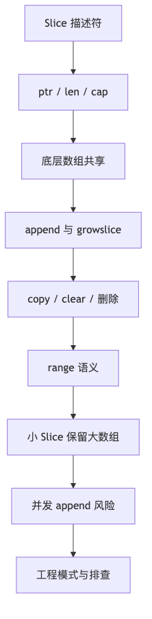

# 第 4 章：Slice

> **版本口径：Go 1.26.4。** 它于 2026 年 6 月 2 日发布。扩容算法、内存布局属于当前 runtime 实现细节；语言语义以 Go Specification 为准。([Go编程语言][1])

## 阅读定位与关联章节

> 本章主讲 Slice 的语言语义、描述符、底层数组共享、`append` 扩容、`copy/clear`、删除模式、`range` 语义和 Slice 视角下的内存保留问题。遇到更底层的分配、GC、unsafe 或并发可见性问题，不在本章重复展开，按下表跳转。

| 关联概念 | 建议读法 |
|---|---|
| 小 Slice 持有大数组、指针元素清零、扩容是否逃逸 | 这里讲 Slice 现象；分配器、逃逸和 GC 根统一看 [第 6 章：内存管理、逃逸分析与 GC](/blog/tech/GO/06.内存管理-逃逸分析与GC)。 |
| 并发读写同一个 Slice、并发 `append`、data race | 本章只讲容器语义；happens-before、锁、atomic 和 Race Detector 看 [第 13 章：并发同步](/blog/tech/GO/13.并发同步-MemoryModel-锁-Atomic-Race)。 |
| `string`、`[]byte`、`[]rune` 转换与零拷贝 | Slice 作为字节容器的部分在这里；字符串编码、Builder、unsafe 转换看 [第 3 章：String、byte、rune 与 Unicode](/blog/tech/GO/03.String-byte-rune与Unicode)。 |
| `reflect.SliceHeader`、`unsafe.Slice`、对象布局 | 本章只保留直觉；反射、unsafe 和内存布局专讲见 [第 10 章：Reflection、unsafe 与 Go 内存布局](/blog/tech/GO/10.Reflection-unsafe与Go内存布局)。 |
| `slices.Clone/Grow/Clip` 与泛型集合算法 | API 用法在这里；类型参数、类型集合、`slices/maps/iter` 的泛型边界看 [第 9 章：泛型、类型集合与迭代器](/blog/tech/GO/09.泛型-类型集合与迭代器)。 |

---

## 本章速览

先把本章看成一条从“Slice 描述符”到“并发和内存事故”的链路：



读图时抓住三个总结：

- Slice 值本身是描述符，复制描述符不复制底层数组。
- `append` 是否扩容决定旧 Slice、新 Slice 和底层数组之间的可见性关系。
- 删除、截取、复用缓冲区和并发写入都可能保留对象或制造 data race。

---

# 一、这一章面试要达到什么程度

学完 Slice，至少要能顺着下面这条链答下去：

```text
Slice 是什么
→ ptr / len / cap
→ 赋值和函数传参
→ 底层数组共享
→ append 是否扩容
→ growslice 如何计算容量
→ 为什么实际 cap 不一定是 2 倍
→ 小 Slice 为什么能持有大数组
→ 删除元素为什么需要 clear
→ range 期间修改 Slice 会怎样
→ 并发 append 为什么危险
```

面试官通常不会满足于一句：

> Slice 底层是数组，扩容时小于 1024 翻倍，大于 1024 增长 1.25 倍。

这句话不仅不够，而且阈值已经过时。当前实现的平滑过渡阈值是 **256**，最终容量还会受到内存分配器 size class 的影响。([Go编程语言][2])

---

# 二、系统讲义

## 2.1 Slice 到底是什么

Slice 不是数组，也不是“一个指针”。

更准确的说法是：

> Slice value 是一个按值复制的描述符，它描述底层数组中的一段连续区间。

当前 runtime 中，它大致表示为：

```go
type slice struct {
    array unsafe.Pointer
    len   int
    cap   int
}
```

```text
Slice 描述符
┌──────────────┐
│ array ───────────────┐
│ len = 3      │       │
│ cap = 5      │       ▼
└──────────────┘   [10][20][30][0][0]
                   └── 当前可访问 ─┘
                   └──── 可扩展范围 ────┘
```

其中：

* `array` 指向 Slice 第一个元素；
* `len` 表示当前可以通过索引访问的元素数；
* `cap` 表示从 Slice 起始位置到底层数组末端还容得下多少元素。

Go 规范明确说明，Slice value 包含长度、容量和对底层数组的引用；多个 Slice 可以共享同一底层数组。([Go编程语言][3])

### 当前实现下的大小

在通常的 64 位平台上：

```go
unsafe.Sizeof([]int(nil)) // 通常是 24
```

因为是：

```text
8 字节指针 + 8 字节 len + 8 字节 cap
```

32 位平台通常是 12 字节。

但这是实现细节，不是语言规范承诺。`reflect.SliceHeader` 也已经被标记为 deprecated，不应拿它直接构造 Slice；低层代码应优先使用 `unsafe.Slice` 和 `unsafe.SliceData`。([Go Packages][4])

---

## 2.2 Slice 和数组的本质区别

```go
a := [3]int{1, 2, 3}
b := a
b[0] = 100

fmt.Println(a) // [1 2 3]
fmt.Println(b) // [100 2 3]
```

数组赋值复制全部元素。

```go
a := []int{1, 2, 3}
b := a
b[0] = 100

fmt.Println(a) // [100 2 3]
fmt.Println(b) // [100 2 3]
```

Slice 赋值只复制 Slice 描述符，`a` 和 `b` 仍引用同一个底层数组。

| 对比项      | 数组 `[N]T` | Slice `[]T`        |
| -------- | --------- | ------------------ |
| 长度是否属于类型 | 是         | 否                  |
| 赋值       | 复制所有元素    | 复制 Slice 描述符       |
| 是否可直接比较  | 元素可比较时可以  | 只能和 `nil` 比较       |
| 长度是否可变   | 不可变       | 可通过重新切片或 append 改变 |
| 是否可能共享数据 | 不同数组不共享   | 多个 Slice 可共享底层数组   |

Go 官方文档也特别强调：函数接收 Slice 后，修改元素会被调用者观察到，但 Slice 描述符本身仍然是按值传入。([Go编程语言][5])

---

## 2.3 创建 Slice 的几种方式

### 方式一：零值

```go
var s []int
```

此时：

```go
s == nil
len(s) == 0
cap(s) == 0
```

nil Slice 可以：

```go
append(s, 1)
len(s)
cap(s)
range s
copy(s, other)
clear(s)
```

这些都合法。

---

### 方式二：Slice literal

```go
s := []int{1, 2, 3}
```

底层有一个长度为 3 的数组，Slice 通常为：

```text
len = 3
cap = 3
```

空 literal：

```go
s := []int{}
```

它是一个 **非 nil 的空 Slice**：

```go
s != nil
len(s) == 0
cap(s) == 0
```

---

### 方式三：`make`

```go
s := make([]int, 3, 10)
```

得到：

```text
len = 3
cap = 10
value = [0 0 0]
```

底层概念模型：

```text
[0][0][0][0][0][0][0][0][0][0]
 └ len=3 ┘
 └────────── cap=10 ───────────┘
```

注意：

```go
make([]int, 10)
```

等价于：

```go
make([]int, 10, 10)
```

这已经有 10 个零值元素，不是“预留 10 个空位”。Go 规范从语义上将 `make([]T, length, capacity)` 描述为创建隐藏数组并返回对应 Slice，但实际底层数组可以因逃逸分析而位于栈、堆或被进一步优化，并不是看到 `make` 就一定发生堆分配。([Go编程语言][3])

---

### 方式四：从数组或其他 Slice 截取

```go
a := [5]int{10, 20, 30, 40, 50}
s := a[1:4]
```

此时：

```text
s       = [20 30 40]
len(s)  = 3
cap(s)  = 4
```

因为 `s` 从 `a[1]` 开始，到数组末端还有 4 个位置。

---

### 方式五：`new([]T)`

```go
p := new([]int)
```

得到的是：

```go
*p == nil
```

也就是“指向 nil Slice 的指针”。绝大多数业务代码都不需要这样做：

```go
var s []int // 通常更自然
```

`make` 返回初始化后的 Slice value，而 `new([]T)` 返回指向零值 Slice 的指针。([Go编程语言][5])

---

## 2.4 nil Slice 和空 Slice

```go
var a []int
b := []int{}
c := make([]int, 0)

fmt.Println(a == nil) // true
fmt.Println(b == nil) // false
fmt.Println(c == nil) // false
```

三者都有：

```go
len(...) == 0
cap(...) == 0
```

大部分 Slice 操作不需要区分 nil 和空：

```go
for range a {}
for range b {}

a = append(a, 1)
b = append(b, 1)
```

但协议层可能需要区分。例如标准 `encoding/json` 默认将 nil Slice 编码为 `null`，将普通非 nil 空 Slice 编码为 `[]`；`[]byte` 另有特殊编码规则。([Go Packages][6])

### 面试标准回答

> nil Slice 是 Slice 的零值，描述符中的引用、长度和容量均为零；非 nil 空 Slice 长度也为零，但它不等于 nil。两者在 append、range、len、cap 等常见操作中行为相近，但在 JSON、数据库协议以及“未设置”和“已设置为空”的业务语义上可能不同。

---

## 2.5 索引和切片表达式

### 索引使用 `len`

```go
s := make([]int, 2, 5)

fmt.Println(s[0]) // 合法
fmt.Println(s[1]) // 合法
fmt.Println(s[2]) // panic
```

即使 `cap(s) == 5`，也只能直接访问：

```text
0 <= i < len(s)
```

---

### 重新切片可以扩展到 `cap`

```go
s := make([]int, 2, 5)
s = s[:5]

fmt.Println(len(s)) // 5
fmt.Println(cap(s)) // 5
```

对 Slice 的简单切片表达式：

```go
t := s[low:high]
```

结果为：

```go
len(t) = high - low
cap(t) = cap(s) - low
```

并要求：

```text
0 <= low <= high <= cap(s)
```

注意，这里的 `high` 上限是 `cap(s)`，而不是 `len(s)`。([Go编程语言][3])

---

### 截取不会复制元素

```go
a := []int{10, 20, 30, 40, 50}
b := a[1:4]

b[0] = 99

fmt.Println(a) // [10 99 30 40 50]
fmt.Println(b) // [99 30 40]
```

底层关系：

```text
a: ptr ──→ [10][99][30][40][50]
            ↑
b: ptr ─────┘ 从第二个元素开始
```

`b` 是一个新的 Slice 描述符，但和 `a` 共享数组。重新切片通常是常数时间操作，不会复制底层元素。([Go编程语言][7])

---

## 2.6 三下标切片：Full Slice Expression

```go
t := s[low:high:max]
```

结果：

```go
len(t) = high - low
cap(t) = max - low
```

要求：

```text
0 <= low <= high <= max <= cap(s)
```

示例：

```go
a := []int{1, 2, 3, 4, 5}
b := a[1:3:3]

fmt.Println(b)      // [2 3]
fmt.Println(len(b)) // 2
fmt.Println(cap(b)) // 2
```

因为：

```text
low  = 1
high = 3
max  = 3

len = 3 - 1 = 2
cap = 3 - 1 = 2
```

Full Slice Expression 只修改新 Slice 的容量边界，**不会复制数据，也不会解除共享关系**。([Go编程语言][3])

```go
b[0] = 100
fmt.Println(a) // [1 100 3 4 5]
```

仍然会修改 `a`。

它主要影响后续 `append`：

```go
b = append(b, 99)
```

因为 `len(b) == cap(b)`，这次 append 必须寻找新的底层存储，因此不会覆盖 `a[3]`。

### 面试中最容易答错的地方

错误回答：

> 三下标切片可以让两个 Slice 不再共享底层数组。

正确回答：

> 三下标切片只限制容量。已有元素仍然共享；只有后续 append 超出该容量、触发新数组后，追加结果才与旧数组分离。

---

## 2.7 Slice 作为函数参数

Slice 描述符是按值传递的。

```go
func modify(s []int) {
    s[0] = 100
}

func main() {
    a := []int{1, 2, 3}
    modify(a)
    fmt.Println(a) // [100 2 3]
}
```

因为函数内的 `s` 虽然是描述符副本，但它指向与 `a` 相同的数组。

但是：

```go
func appendValue(s []int) {
    s = append(s, 100)
}

func main() {
    a := []int{1, 2, 3}
    appendValue(a)
    fmt.Println(a) // [1 2 3]
}
```

调用者的 Slice 描述符没有被更新，所以调用者看不到长度变化。

通常应该返回新的 Slice：

```go
func appendValue(s []int) []int {
    return append(s, 100)
}

a = appendValue(a)
```

---

### 一个更阴险的情况

```go
func appendValue(s []int) {
    s = append(s, 100)
}

func main() {
    a := make([]int, 1, 2)
    a[0] = 1

    appendValue(a)

    fmt.Println(a)     // [1]
    fmt.Println(a[:2]) // [1 100]
}
```

这里：

* 函数内的 Slice 长度变成 2；
* 调用者的 Slice 长度仍然是 1；
* 但由于容量足够，函数内 append 写入了调用者共享的底层数组；
* 调用者重新切到长度 2 后，能看到写入的 `100`。

这正是 Slice 面试题最核心的难点：

> **Slice 描述符是否相同**，与 **底层数组是否相同**，是两个问题。

---

## 2.8 `append` 的语言语义

```go
s = append(s, x)
s = append(s, x, y, z)
s = append(s, other...)
```

`append` 返回一个新的 Slice value。

分为两种情况：

### 容量足够

```text
newLen <= oldCap
```

通常会：

1. 复用现有底层数组；
2. 在原数组尾部写入新元素；
3. 返回长度变大的 Slice 描述符。

### 容量不足

```text
newLen > oldCap
```

通常会：

1. 计算新容量；
2. 分配新的底层存储；
3. 复制原有元素；
4. 写入新元素；
5. 返回指向新数组的 Slice。

Go 规范只保证：容量不足时分配足够大的新数组；容量足够时复用底层数组。它不承诺具体扩容倍数。([Go编程语言][3])

---

## 2.9 为什么必须接收 `append` 的返回值

```go
append(s, 1) // 编译错误：结果未使用
```

因为 append 可能改变三个字段：

```text
array：可能指向新数组
len：一定可能改变
cap：扩容时可能改变
```

因此必须写：

```go
s = append(s, 1)
```

一个容易被追问的表达：

> append 不是“修改 Slice 本身”的普通函数。它接收一个 Slice value，根据容量决定是否复用数组，并返回更新后的 Slice value。

---

# 三、`append` 的底层实现

## 3.1 编译器如何处理 append

`append` 是内建函数，不是普通 Go 函数。

对于类似：

```go
s = append(s, a, b, c)
```

当前编译器可以把它近似降级为：

```go
ptr, oldLen, oldCap := decompose(s)
newLen := oldLen + 3

if newLen > oldCap {
    ptr, newLen, oldCap = runtime.growslice(
        ptr,
        newLen,
        oldCap,
        3,
        elementType,
    )
}

ptr[oldLen] = a
ptr[oldLen+1] = b
ptr[oldLen+2] = c

s = makeSlice(ptr, newLen, oldCap)
```

容量足够时，不需要调用 `runtime.growslice`，只是修改长度并写元素。当前编译器源码还包含对非逃逸、小型 append 使用栈上 backing store 的优化，因此不要简单认为“每个 append 都会进入 runtime”。([Go编程语言][8])

---

## 3.2 `runtime.growslice`

当前源码入口：

```text
src/runtime/slice.go
```

核心函数：

```go
func growslice(
    oldPtr unsafe.Pointer,
    newLen int,
    oldCap int,
    num int,
    et *_type,
) slice
```

主要步骤：

```text
1. 计算 oldLen = newLen - num
2. 检查长度溢出
3. 处理零大小元素
4. 调用 nextslicecap 计算候选容量
5. 根据元素大小计算所需字节数
6. 按 allocator size class 向上取整
7. 分配新底层存储
8. 复制 [0, oldLen) 的旧元素
9. 返回新 ptr / len / cap
```

源码明确指出：`growslice` 会分配至少能容纳 `newLen` 个元素的新存储，并复制旧的 `[0, oldLen)` 元素。([Go编程语言][2])

---

## 3.3 当前扩容算法

核心函数：

```go
func nextslicecap(newLen, oldCap int) int
```

简化后：

```go
doubleCap := oldCap * 2

if newLen > doubleCap {
    return newLen
}

if oldCap < 256 {
    return doubleCap
}

for newCap < newLen {
    newCap += (newCap + 3*256) >> 2
}

return newCap
```

### 情况一：一次追加很多元素

```text
newLen > 2 * oldCap
```

直接以 `newLen` 作为候选容量，避免反复扩容。

### 情况二：小 Slice

```text
oldCap < 256
```

候选容量倾向于翻倍。

### 情况三：较大 Slice

使用：

```go
newCap += (newCap + 3*256) >> 2
```

它让增长比例从约 2 倍平滑过渡到约 1.25 倍。

例如只看候选公式、不考虑 size class：

```text
oldCap = 256  → newCap ≈ 512
oldCap = 512  → newCap ≈ 832
oldCap = 1024 → newCap ≈ 1472
```

随着容量继续增大，比例逐渐接近 1.25。([Go编程语言][2])

---

## 3.4 为什么实际 cap 可能不等于公式结果

`nextslicecap` 计算的是候选元素数量。

后面 runtime 还会：

```text
候选元素数
× 单个元素大小
→ 候选字节数
→ 按内存分配 size class 向上取整
→ 再换算回元素数量
```

因此：

```go
[]byte
[]int32
[]int64
[]LargeStruct
[]*Object
```

即使旧容量相同，扩容后得到的实际 `cap` 也可能不同。

源码还会针对：

* 元素大小等于 1；
* 元素大小等于指针大小；
* 元素大小是 2 的幂；
* 其他大小

走不同的字节计算快路径。([Go编程语言][2])

### 面试标准回答

> 当前 runtime 先用 `nextslicecap` 计算候选容量：小容量倾向于翻倍，超过 256 后平滑过渡到约 1.25 倍；随后还要将总字节数按 allocator size class 向上取整，因此最终 cap 受元素大小和内存规格类影响，不能只靠固定倍数预测。

---

## 3.5 扩容一定在堆上吗

不一定。

需要区分：

```text
Slice 描述符
底层数组
```

它们是否位于栈或堆，由编译器逃逸分析和优化决定。

例如：

```go
func f() int {
    s := make([]int, 0, 4)
    s = append(s, 1)
    return s[0]
}
```

如果编译器能证明数据不会逃逸，底层数组可能放在栈上，甚至进一步优化掉。

查看逃逸分析：

```bash
go build -gcflags="-m=2" ./...
```

所以面试中不要说：

> make 创建的 Slice 一定在堆上。

更准确的是：

> 语言语义上 make 创建底层存储；实际存储位置由编译器决定。只有运行时需要动态堆分配时，才会走 `mallocgc` 等路径。当前编译器甚至有针对部分 append 的栈上 backing store 优化。([Go编程语言][8])

---

## 3.6 指针元素和非指针元素的区别

Runtime 会区分元素类型是否含指针：

```go
[]byte
[]int64
```

属于无指针数据。

```go
[]*User
[]string
[]interface{}
[]struct {
    P *Object
}
```

包含 GC 需要扫描的指针。

当前 `growslice` 中：

* 无指针类型可以使用不需要 GC 扫描的内存；
* append 即将覆盖的部分不必全部提前清零；
* 包含指针的内存必须正确清零，避免 GC 扫描未初始化指针；
* 复制指针时还要配合写屏障。([Go编程语言][2])

这解释了为什么两个元素数量相同的 Slice，GC 成本可能完全不同。

---

## 3.7 零大小元素的特殊情况

```go
type Empty struct{}

s := make([]Empty, 0)

for i := 0; i < 1000000; i++ {
    s = append(s, Empty{})
}
```

`Empty{}` 大小为零。

当前 `growslice` 对零大小元素有特殊处理：

```go
return slice{
    array: &zerobase,
    len:   newLen,
    cap:   newLen,
}
```

所以 Slice 可以有很大的 `len`，但元素本身几乎不需要对应的逐元素存储。这个细节适合作为高级追问回答，不应依赖它编写业务逻辑。([Go编程语言][2])

---

# 四、`copy` 和 `clear`

## 4.1 `copy`

```go
n := copy(dst, src)
```

复制数量：

```go
n = min(len(dst), len(src))
```

注意使用的是长度，不是容量。

```go
src := []int{1, 2, 3}
dst := make([]int, 0, 3)

n := copy(dst, src)

fmt.Println(n)   // 0
fmt.Println(dst) // []
```

虽然 `dst` 容量为 3，但长度是 0，没有可写的逻辑元素。

正确写法：

```go
dst := make([]int, len(src))
copy(dst, src)
```

---

## 4.2 `copy` 支持重叠内存

```go
s := []int{1, 2, 3, 4, 5}
copy(s[1:], s)

fmt.Println(s) // [1 1 2 3 4]
```

`copy` 的结果不依赖源和目标是否重叠，runtime 的对应路径最终使用类似 `memmove` 的语义。([Go编程语言][3])

这使得原地移动元素非常方便：

```go
copy(s[i:], s[i+1:])
```

---

## 4.3 `copy` 是浅拷贝

```go
type User struct {
    Profile *Profile
}

dst := make([]User, len(src))
copy(dst, src)
```

Slice 元素本身被赋值复制，但 `Profile` 指针指向的对象仍然共享。

对于：

```go
[][]int
[]*User
[]map[string]int
```

只复制最外层元素，不会递归复制内部对象。

---

## 4.4 `clear`

```go
clear(s)
```

会把 `s` 当前长度范围内的所有元素设为零值：

```go
s := []int{1, 2, 3}
clear(s)

fmt.Println(s) // [0 0 0]
```

对指针：

```go
clear(pointerSlice)
```

会把元素置为 `nil`。

需要注意，`clear(s)` 只处理：

```text
s[0:len(s)]
```

不处理：

```text
s[len(s):cap(s)]
```

`clear(nilSlice)` 是 no-op。([Go编程语言][3])

---

# 五、删除 Slice 元素

## 5.1 保持顺序，删除单个元素

```go
func DeleteAt[T any](s []T, i int) []T {
    copy(s[i:], s[i+1:])

    var zero T
    s[len(s)-1] = zero

    return s[:len(s)-1]
}
```

复杂度：

```text
O(len(s) - i)
```

因为后面的元素需要向前移动。

---

## 5.2 保持顺序，删除区间

删除 `[i:j)`：

```go
func DeleteRange[T any](s []T, i, j int) []T {
    oldLen := len(s)

    s = append(s[:i], s[j:]...)
    clear(s[len(s):oldLen])

    return s
}
```

为什么需要 `clear`？

假设：

```text
原数组：[A B C D E]
删除：       C
结果：  [A B D E]
底层：  [A B D E E]
                 ↑
            多余的旧引用
```

Slice 长度虽然变短了，但底层数组尾部可能仍保存旧指针。只要该底层数组还存活，GC 仍可能扫描整个指针数组对象，使尾部引用指向的对象继续可达。

当前标准库 `slices.Delete` 也是在移动元素后清理旧尾部，源码注释明确指出这是为了将废弃元素置零。([Go编程语言][9])

---

## 5.3 不保持顺序，O(1) 删除

```go
func DeleteUnordered[T any](s []T, i int) []T {
    last := len(s) - 1

    s[i] = s[last]

    var zero T
    s[last] = zero

    return s[:last]
}
```

适合：

* 任务集合；
* 在线对象集合；
* 不要求稳定顺序的内部结构。

不适合：

* 用户可见列表；
* 顺序代表优先级；
* 索引具有业务含义。

---

## 5.4 使用标准库

```go
import "slices"

s = slices.Delete(s, i, j)
```

当前实现会自动清理被废弃的尾部元素。

还可以使用：

```go
s = slices.DeleteFunc(s, shouldDelete)
```

它也会清理旧尾部。([Go编程语言][10])

---

# 六、Clone、Grow 和 Clip

## 6.1 `slices.Clone`

```go
copied := slices.Clone(s)
```

特点：

* 创建与原 Slice 不共享底层数组的外层副本；
* 是浅拷贝；
* 保留 nil 性质；
* 返回结果可能有额外容量。

```go
var a []int
b := slices.Clone(a)

fmt.Println(b == nil) // true
```

对于非 nil 空 Slice，Clone 仍返回非 nil 空 Slice。当前实现专门处理了 nilness 和零长度大数组的存活问题。([Go编程语言][10])

---

### 常见复制写法

```go
copied := append([]T(nil), s...)
```

它简单高效，但有一个细节：

```go
s := []int{}
copied := append([]int(nil), s...)

fmt.Println(copied == nil) // true
```

因为追加了零个元素，结果可能仍是 nil。

需要严格保留 nil/non-nil 语义时，使用：

```go
slices.Clone(s)
```

需要准确控制 `cap == len` 时，可以：

```go
copied := make([]T, len(s))
copy(copied, s)
```

---

## 6.2 `slices.Grow`

```go
s = slices.Grow(s, n)
```

保证之后至少可以再 append `n` 个元素而不发生新的分配：

```go
s = slices.Grow(s, 100)

for i := 0; i < 100; i++ {
    s = append(s, i)
}
```

必须接收返回值，因为 Grow 也可能更换底层数组。([Go编程语言][10])

---

## 6.3 `slices.Clip`

```go
s = slices.Clip(s)
```

当前实现本质上是：

```go
s[:len(s):len(s)]
```

也就是：

```text
新 cap = len(s)
```

它通常不复制底层数组，也不释放原数组：

```go
large := make([]byte, 100<<20)
small := slices.Clip(large[:10])
```

`small` 仍然引用原来的 100 MB 数组。

因此：

> `Clip` 适合防止后续 append 继续复用尾部容量，但不适合解除对大数组的持有。

需要脱离大数组：

```go
small := slices.Clone(large[:10])
```

或：

```go
small := make([]byte, 10)
copy(small, large[:10])
```

`slices.Clip` 当前源码直接返回三下标切片，因此不会因为名字叫 Clip 就自动缩小实际分配。([Go编程语言][10])

---

# 七、Slice 与内存、GC

## 7.1 小 Slice 持有大数组

```go
func Header(data []byte) []byte {
    return data[:10]
}
```

如果 `data` 指向 100 MB 数组，返回的 Slice 虽然只有 10 字节，但仍引用原数组。

只要这个 Slice 存活，整个底层数组就不能被 GC 回收。

正确处理：

```go
func Header(data []byte) []byte {
    result := make([]byte, 10)
    copy(result, data[:10])
    return result
}
```

或者：

```go
return slices.Clone(data[:10])
```

Go 官方 Slice 文章将这种情况列为典型陷阱：重新切片不复制数据，因此很小的返回 Slice 也可能保持整个文件缓冲区存活。([Go编程语言][7])

---

## 7.2 `s[:0]` 和 `s = nil`

```go
s = s[:0]
```

表示：

* 长度归零；
* 保留容量；
* 保留底层数组；
* 之后 append 可以复用内存。

适合临时缓冲区复用：

```go
buf = buf[:0]
```

但：

```go
s = nil
```

会清空 Slice 描述符对底层数组的引用。如果没有其他引用，底层数组之后可以被 GC 回收。

两者选择：

| 写法                    |  保留底层数组 | 后续可复用容量 | 有助于释放大数组 |
| --------------------- | ------: | ------: | -------: |
| `s = s[:0]`           |       是 |       是 |        否 |
| `s = nil`             |       否 |       否 |        是 |
| `s = slices.Clip(s)`  |       是 |  限制可见容量 |        否 |
| `s = slices.Clone(s)` | 否，换成新数组 |  取决于新数组 |        是 |

---

## 7.3 重置指针 Slice

如果要复用 Slice，但又想解除元素引用：

```go
clear(s)
s = s[:0]
```

只写：

```go
s = s[:0]
```

旧元素仍在底层数组里。

对于：

```go
[]*User
[]string
[]interface{}
[][]byte
```

这些尾部引用可能延长对象生命周期。

---

## 7.4 `unsafe.Sizeof` 不包含底层数组

```go
s := make([]int64, 1_000_000)

fmt.Println(unsafe.Sizeof(s)) // 64 位平台通常仍是 24
```

它只计算 Slice 描述符，不计算底层数组。

底层有效数据字节数粗略为：

```go
uintptr(cap(s)) * unsafe.Sizeof(s[0])
```

但实际分配还可能包含 size class 向上取整和分配器元数据。

---

# 八、`range` Slice 的语义

## 8.1 range 表达式只求值一次

```go
for i, v := range s {
    ...
}
```

可以近似理解为：

```go
temp := s // 复制一次 Slice 描述符
for i := 0; i < len(temp); i++ {
    v := temp[i]
    ...
}
```

因此迭代次数通常由循环开始时的长度决定。对 nil Slice，迭代次数为零。([Go编程语言][3])

---

## 8.2 循环中 append 不会扩大本次循环次数

```go
s := []int{1, 2, 3}

for _, v := range s {
    s = append(s, v)
}

fmt.Println(s) // [1 2 3 1 2 3]
```

不会无限循环，因为本次 range 使用开始时的长度 3。

---

## 8.3 但元素不是完整快照

```go
s := []int{1, 2, 3}

for i, v := range s {
    if i == 0 {
        s[1] = 100
    }
    fmt.Println(v)
}
```

输出：

```text
1
100
3
```

迭代长度固定，并不代表所有元素值提前复制完毕。每次第二个迭代值仍从对应元素读取。

---

## 8.4 range value 是元素副本

```go
type User struct {
    Age int
}

users := []User{
    {Age: 10},
    {Age: 20},
}

for _, user := range users {
    user.Age++
}

fmt.Println(users) // [{10} {20}]
```

`user` 是元素副本。

正确修改：

```go
for i := range users {
    users[i].Age++
}
```

或者当 Slice 存放指针时：

```go
users := []*User{
    {Age: 10},
    {Age: 20},
}

for _, user := range users {
    user.Age++
}
```

这里复制的是指针值，指针仍指向原对象。

---

## 8.5 Go 1.22 之后的 range 变量

```go
for _, user := range users {
    ptrs = append(ptrs, &user)
}
```

从 Go 1.22 起，如果迭代变量通过 `:=` 声明，每一轮拥有新的迭代变量，因此这些地址不再全部指向同一个变量。

但是：

> `&user` 指向的仍然是元素副本，而不是 `users[i]`。

即使地址不同：

```go
ptrs[0].Age = 999
```

也不会修改原 Slice 元素。

需要获取元素地址：

```go
for i := range users {
    ptrs = append(ptrs, &users[i])
}
```

如果使用预先存在的变量：

```go
var user User

for _, user = range users {
    ptrs = append(ptrs, &user)
}
```

它仍是同一个变量被反复赋值。Go 规范明确区分了 `:=` 新声明迭代变量和预先存在变量的行为。([Go编程语言][3])

---

# 九、Slice 的并发安全

Slice 本身没有自动并发保护。

需要分别分析：

```text
Slice 描述符
底层数组元素
```

---

## 9.1 多 goroutine 只读

如果：

* Slice 描述符不再修改；
* 底层数组元素也不修改；

那么多个 goroutine 并发读取是安全的。

---

## 9.2 并发写不同元素

下面可以设计为无 data race：

```go
result := make([]int, n)

var wg sync.WaitGroup
wg.Add(n)

for i := 0; i < n; i++ {
    go func(i int) {
        defer wg.Done()
        result[i] = calculate(i)
    }(i)
}

wg.Wait()
```

原因是：

* Slice 描述符没有变化；
* 每个 goroutine 写入不同内存位置；
* `Wait` 之后才读取结果。

不过仍可能存在 cache false sharing 等性能问题。

---

## 9.3 并发 append

```go
var s []int

go func() {
    s = append(s, 1)
}()

go func() {
    s = append(s, 2)
}()
```

不安全。

可能竞争的内容包括：

* Slice 的 `array` 字段；
* `len`；
* `cap`；
* 原底层数组尾部元素；
* 扩容时的复制和新数组发布。

Slice 是多字结构。Go 内存模型特别提醒：对 Slice 这类包含指针和长度的多字结构发生 data race，可能观察到互不匹配的字段组合，严重时造成任意内存破坏。([Go编程语言][11])

修复方式：

```go
var mu sync.Mutex

mu.Lock()
s = append(s, value)
mu.Unlock()
```

或者让每个 goroutine 使用自己的局部 Slice，最后统一合并。

---

## 9.4 两个 Slice 变量不同，不代表没有 Race

```go
a := make([]int, 10)
b := a[:5]
c := a[3:8]
```

`b` 和 `c` 的重叠区域：

```text
a[3], a[4]
```

如果不同 goroutine 分别修改：

```go
b[3]
c[0]
```

实际上修改的是同一个底层元素。

判断并发安全时，不能只看变量名，必须看底层存储是否重叠。

---

# 十、常用工程场景

## 10.1 已知结果数量，按索引填充

```go
result := make([]Result, n)

for i := range result {
    result[i] = build(i)
}
```

优点：

* 长度一次确定；
* 不需要 append；
* 便于并发写不同索引。

---

## 10.2 已知上限，通过 append 构造

```go
result := make([]Result, 0, n)

for _, item := range input {
    if match(item) {
        result = append(result, transform(item))
    }
}
```

不要写：

```go
result := make([]Result, n)

for _, item := range input {
    result = append(result, transform(item))
}
```

这会先创建 `n` 个零值元素，然后继续追加。

---

## 10.3 原地过滤

```go
func Filter[T any](s []T, keep func(T) bool) []T {
    out := s[:0]

    for _, value := range s {
        if keep(value) {
            out = append(out, value)
        }
    }

    clear(s[len(out):])
    return out
}
```

特点：

* 通常不新增底层数组；
* 保留原元素相对顺序；
* 会覆盖原 Slice；
* 返回结果仍引用原数组；
* 含指针时最好清理尾部。

适合调用方明确拥有该 Slice 的场景。

---

## 10.4 复用缓冲区

```go
buf := make([]byte, 0, 4096)

for {
    buf = buf[:0]
    buf = encode(buf, message)
    send(buf)
}
```

需要保证 `send` 返回后不会继续异步保存或使用 `buf`。

如果接收方需要跨越当前迭代保存数据，应复制：

```go
owned := slices.Clone(buf)
```

这属于 Slice API 中非常重要的 **所有权边界**。

---

## 10.5 连续二维 Slice

```go
rows, cols := 100, 200

data := make([]int, rows*cols)
matrix := make([][]int, rows)

for i := range matrix {
    start := i * cols
    end := start + cols

    matrix[i] = data[start:end:end]
}
```

这里使用：

```go
data[start:end:end]
```

把每一行的 `cap` 限制为 `cols`。

否则：

```go
matrix[i] = data[start:end]
```

这一行的容量可能延伸到整个大数组末尾。对某一行 append 时，可能覆盖下一行。

连续分配的优点：

* 少量内存分配；
* 更好的缓存局部性；
* 所有数据连续。

缺点：

* 行之间共享大数组；
* 各行不适合独立增长；
* 小行也可能持有整个矩阵数据。

---

## 10.6 长期队列不要只不断切头

```go
queue = queue[1:]
```

逻辑上删除了首元素，但剩余 Slice 仍然引用原数组的后半部分。

长期运行的队列可能出现：

* 数组前部空间无法复用；
* 队列只剩少量元素却持有大数组；
* 指针元素未清理导致对象继续存活。

常见选择：

* 环形队列；
* 定期 `copy` 回数组头部；
* 达到阈值后重新分配；
* 删除时清理指针。

---

# 十一、源码阅读路径

建议按下面顺序，不要一上来就扎进汇编。

| 顺序 | 源码位置                                     | 重点                     |
| -: | ---------------------------------------- | ---------------------- |
|  1 | Go Specification：Slice types             | Slice 的语言定义            |
|  2 | Go Specification：Slice expressions       | 两下标、三下标、边界规则           |
|  3 | Go Specification：append、copy、clear       | 内建操作的语言保证              |
|  4 | `src/runtime/slice.go`：`type slice`      | 当前内部表示                 |
|  5 | `src/runtime/slice.go`：`makeslice`       | make 的长度、容量和溢出检查       |
|  6 | `src/runtime/slice.go`：`growslice`       | 分配、清零、复制、写屏障           |
|  7 | `src/runtime/slice.go`：`nextslicecap`    | 扩容候选容量计算               |
|  8 | `src/runtime/slice.go`：`slicecopy`       | copy 与 memmove         |
|  9 | `src/cmd/compile/internal/ssagen/ssa.go` | append 如何降级为 SSA       |
| 10 | `src/slices/slices.go`                   | Delete、Clone、Grow、Clip |

官方规范定义 Slice 的共享、长度、容量和切片边界；runtime 源码实现当前的 `makeslice`、`growslice` 与 `slicecopy`；编译器源码展示 append 如何先比较新长度和容量，再决定是否调用 growslice。([Go编程语言][3])

---

## 11.1 阅读 `makeslice` 时看什么

核心逻辑：

```go
mem := elementSize * cap
```

然后检查：

```text
乘法是否溢出
是否超过最大可分配内存
len 是否小于 0
len 是否大于 cap
```

最后通过：

```go
mallocgc(mem, elementType, true)
```

获取存储。([Go编程语言][2])

面试可能问：

> `make([]T, len, cap)` 的错误是在编译期还是运行期？

如果参数是常量且明显非法，编译器可能直接报错：

```go
make([]int, 10, 5)
```

如果参数运行时才确定：

```go
make([]int, n, m)
```

当 `n > m` 时会在运行时 panic。

---

## 11.2 阅读 `growslice` 时看什么

重点关注：

```text
et.Size_ == 0
nextslicecap
roundupsize
et.Pointers()
mallocgc
bulkBarrierPreWriteSrcOnly
memmove
```

能够串起来回答：

> 为什么 Slice 扩容既与旧容量有关，也与元素类型有关？

因为：

1. `nextslicecap` 决定候选元素数；
2. 元素大小将元素数转成字节数；
3. allocator 按字节 size class 取整；
4. 指针类型决定 GC 扫描、清零和写屏障路径；
5. 最终再换算为可表示的元素容量。

---

## 11.3 阅读编译器 append 时看什么

当前编译器源码给出的近似流程非常适合面试复述：

```text
分解 Slice 的 ptr、len、cap
→ newLen = len + appendCount
→ 比较 newLen 和 cap
→ 不够则调用 growslice
→ 写入追加元素
→ 重新组成 Slice value
```

还可以看到：

* `growslice` 被标记为不常走的分支；
* 部分非逃逸 append 可以使用栈上 backing store；
* 编译器会考虑写屏障；
* 固定参数 append 和 `append(s, other...)` 的降级过程不完全相同。([Go编程语言][8])

---

# 十二、代码陷阱题

建议先遮住答案，自己逐行画出：

```text
ptr
len
cap
底层数组
```

---

## 陷阱 1：`make` 的第二个参数

```go
s := make([]int, 3, 5)
s = append(s, 7)

fmt.Println(s)
fmt.Println(len(s), cap(s))
```

### 答案

```text
[0 0 0 7]
4 5
```

`make([]int, 3, 5)` 已经有 3 个零值元素。`append` 从索引 3 开始写入。

---

## 陷阱 2：Slice 赋值

```go
a := []int{1, 2, 3}
b := a

b[1] = 9

fmt.Println(a)
fmt.Println(b)
```

### 答案

```text
[1 9 3]
[1 9 3]
```

只复制了 Slice 描述符，底层数组共享。

---

## 陷阱 3：函数内 append，容量足够

```go
func add(s []int) {
    s = append(s, 9)
    fmt.Println("inside:", s)
}

func main() {
    a := make([]int, 1, 2)
    a[0] = 1

    add(a)

    fmt.Println("outside:", a)
    fmt.Println("reslice:", a[:2])
}
```

### 答案

```text
inside: [1 9]
outside: [1]
reslice: [1 9]
```

函数没有改变调用者的 Slice 描述符，但修改了共享的底层数组。

---

## 陷阱 4：函数内 append，容量不足

```go
func add(s []int) {
    s = append(s, 9)
    s[0] = 100
}

func main() {
    a := []int{1}
    add(a)

    fmt.Println(a)
}
```

### 答案

```text
[1]
```

`a` 的长度和容量都是 1。append 触发新数组，函数后续修改的是新数组。

---

## 陷阱 5：限制容量

```go
a := make([]int, 2, 4)
a[0], a[1] = 1, 2

b := a[:1:1]
b[0] = 8
b = append(b, 9)

fmt.Println(a)
fmt.Println(b)
```

### 答案

```text
[8 2]
[8 9]
```

分析：

1. `b[0] = 8` 时仍共享数组，所以 `a[0]` 变成 8；
2. `cap(b) == 1`，append 触发新数组；
3. 新写入的 9 不会覆盖 `a[1]`。

---

## 陷阱 6：分叉 append

```go
base := make([]int, 0, 4)

a := append(base, 1)
b := append(base, 2)

fmt.Println(a)
fmt.Println(b)
```

### 答案

```text
[2]
[2]
```

过程：

```text
a := append(base, 1)
底层：[1 _ _ _]

b := append(base, 2)
底层：[2 _ _ _]
```

`base` 的长度一直是 0，因此两次 append 都从底层数组索引 0 开始写。

这是非常典型的生产 Bug：

```go
prefix := make([]byte, 0, 1024)

requestA := append(prefix, dataA...)
requestB := append(prefix, dataB...)
```

两个结果可能相互覆盖。

---

## 陷阱 7：copy 看 len，不看 cap

```go
src := []int{1, 2, 3}
dst := make([]int, 0, 3)

n := copy(dst, src)

fmt.Println(n)
fmt.Println(dst)
```

### 答案

```text
0
[]
```

要复制三个元素：

```go
dst := make([]int, len(src))
copy(dst, src)
```

---

## 陷阱 8：重叠 copy

```go
s := []int{1, 2, 3, 4, 5}

copy(s[1:], s)

fmt.Println(s)
```

### 答案

```text
[1 1 2 3 4]
```

`copy` 支持重叠，效果类似 `memmove`。

---

## 陷阱 9：range 修改副本

```go
type User struct {
    Age int
}

users := []User{{10}, {20}}

for _, user := range users {
    user.Age++
}

fmt.Println(users)
```

### 答案

```text
[{10} {20}]
```

正确：

```go
for i := range users {
    users[i].Age++
}
```

---

## 陷阱 10：range 期间 append

```go
s := []int{1, 2, 3}

for _, v := range s {
    s = append(s, v)
}

fmt.Println(s)
```

### 答案

```text
[1 2 3 1 2 3]
```

本次 range 的迭代次数由开始时的长度决定。

---

## 陷阱 11：range 期间修改未遍历元素

```go
s := []int{1, 2, 3}

for i, v := range s {
    if i == 0 {
        s[1] = 100
    }
    fmt.Print(v, " ")
}
```

### 答案

```text
1 100 3
```

range 固定了遍历长度，但没有提前复制所有元素值。

---

## 陷阱 12：删除后的底层数组

```go
a, b, c := 1, 2, 3
s := []*int{&a, &b, &c}

s = append(s[:1], s[2:]...)

fmt.Println(len(s), cap(s))
fmt.Println(*s[0], *s[1])
fmt.Println(*s[:cap(s)][2])
```

### 答案

```text
2 3
1 3
3
```

底层数组变成类似：

```text
[&a, &c, &c]
```

最后一个 `&c` 已经不在逻辑长度内，但仍保存在数组中。

应当：

```go
oldLen := len(s)
s = append(s[:1], s[2:]...)
clear(s[len(s):oldLen])
```

---

## 陷阱 13：重新暴露旧元素

```go
s := []int{1, 2, 3, 4}

s = s[:2]
fmt.Println(s)

s = s[:4]
fmt.Println(s)
```

### 答案

```text
[1 2]
[1 2 3 4]
```

缩短 Slice 不会清除元素。只要容量允许，重新切长后会看到旧值。

---

## 陷阱 14：`Clip` 是否释放内存

```go
large := make([]byte, 100<<20)
small := slices.Clip(large[:10])

large = nil
runtime.GC()
```

问题：原来的 100 MB 数组是否一定可以回收？

### 答案

不能。

`small` 仍然引用原数组。`Clip` 只是把可见容量改成长度。

真正解除共享：

```go
small = slices.Clone(small)
```

---

## 陷阱 15：变长参数

```go
func modify(values ...int) {
    values[0] = 100
}

func main() {
    s := []int{1, 2, 3}
    modify(s...)

    fmt.Println(s)
}
```

### 答案

```text
[100 2 3]
```

把 Slice 作为最后一个参数并使用 `...` 时，该 Slice value 被直接传给变长参数，不会自动复制底层元素。相关参数传递规则由规范明确规定。([Go编程语言][3])

---

# 十三、面试深挖追问题

## Q1：Slice 是引用类型吗

不建议只回答“是”。

更准确的回答：

> Slice value 本身按值复制，它包含对底层数组的引用、长度和容量。复制 Slice 不会复制数组，因此多个 Slice value 可以共享底层存储。

“引用类型”容易让面试官继续追问：

> 那为什么函数里 append 后外部长度没变？

因为 Slice 描述符是值传递。

---

## Q2：为什么 append 一定要返回 Slice

因为 append 可能：

* 修改长度；
* 修改容量；
* 更换底层数组地址。

调用者必须拿到新描述符。

---

## Q3：append 后原 Slice 一定不变吗

不一定。

即使调用者没有接收 append 结果，只要容量足够，append 仍可能修改共享底层数组的尾部。

调用者的 `len` 不变，但重新切长后可能看到写入结果。

---

## Q4：Slice 扩容一定是 2 倍吗

不是。

当前实现：

1. 如果所需长度超过旧容量两倍，候选容量直接使用所需长度；
2. 旧容量小于 256 时倾向于翻倍；
3. 较大容量通过公式平滑过渡到约 1.25 倍；
4. 最终容量还会按 allocator size class 取整；
5. 元素大小不同，结果可能不同。([Go编程语言][2])

---

## Q5：扩容为什么不直接按精确所需长度分配

如果每次只增加一个元素都精确分配，会导致：

* 大量内存分配；
* 大量旧元素复制；
* 时间复杂度恶化；
* 分配器和 GC 压力增大。

按几何比例增长可以让连续 append 的平均成本保持为摊销 `O(1)`，虽然某一次扩容仍是 `O(n)`。

---

## Q6：Slice 扩容复制 `len` 个元素还是 `cap` 个元素

复制旧 Slice 当前长度内的元素：

```text
[0, oldLen)
```

不会为了保留未使用容量而复制完整旧 `cap` 范围。当前 `growslice` 源码对此有明确说明。([Go编程语言][2])

---

## Q7：三下标切片解决了什么问题

它限制新 Slice 的容量，常用于：

* 防止后续 append 覆盖原 Slice 尾部；
* 将 API 返回 Slice 的可扩展区域限制在指定范围；
* 连续二维数组中限制每一行的容量；
* 帮助表达“追加时应该独立分配”。

但它：

* 不复制已有元素；
* 不解除底层数组引用；
* 不释放大数组。

---

## Q8：为什么小 Slice 会导致大对象无法回收

GC 按可达性回收对象。

Slice 的 `array` 字段仍指向大底层数组中的元素，因此整个底层数组仍然可达，即使 Slice 的长度只有几个元素。

解决方案是复制需要的部分到新的小数组。

---

## Q9：删除 Slice 元素后为什么还要置零

缩短 `len` 只改变 Slice 描述符，不会自动清理底层数组。

如果尾部保存指针，这些指针可能继续让其他对象保持可达。

所以应在缩短前或通过旧长度范围清除废弃位置。

---

## Q10：`s[:0]` 会释放内存吗

不会。

它把长度设为 0，但仍保留：

* 底层数组引用；
* 原容量。

适合复用，不适合释放。

---

## Q11：`slices.Clip` 会释放内存吗

通常不会。

当前实现只是：

```go
s[:len(s):len(s)]
```

需要释放大底层数组时，应 Clone 或 make+copy。([Go编程语言][10])

---

## Q12：`copy` 是深拷贝吗

不是。

它执行逐元素赋值。元素如果包含指针、Map、Slice、接口或其他引用，内部对象仍然可能共享。

---

## Q13：两个 Slice 能不能比较

不能：

```go
a == b // 编译错误
```

只能与 `nil` 比较：

```go
a == nil
```

按元素比较可以使用：

```go
slices.Equal(a, b)
```

或者自定义比较逻辑。

---

## Q14：可以获取 Slice 元素地址吗

可以：

```go
p := &s[i]
```

但后续如果 `s` append 并扩容：

* `p` 仍指向旧底层数组；
* 新 Slice 已经指向新数组；
* 修改 `*p` 不会修改新 Slice 中对应元素。

所以：

> 获取元素地址并不会禁止 Slice 扩容；它只是让旧数组因该指针继续存活。

---

## Q15：并发写不同 Slice 元素安全吗

在满足以下条件时可以：

* 写入真正不同的内存位置；
* 没有 goroutine 同时修改 Slice 描述符；
* 没有 append；
* 没有其他 goroutine同时读写同一元素；
* 最后通过 WaitGroup、Channel 等同步后读取。

如果两个 Slice 的逻辑索引不同，但底层区域重叠，仍然可能 data race。

---

## Q16：为什么并发修改 Slice 描述符特别危险

Slice 通常由三个机器字组成。

发生数据竞争时，读者可能看到：

```text
新 ptr + 旧 len + 旧 cap
旧 ptr + 新 len + 新 cap
```

这种不一致组合比普通整数竞争更危险。Go 内存模型明确指出，对 Slice 等多字结构的 race 可能造成任意内存破坏。([Go编程语言][11])

---

## Q17：`make([]T, n)` 一定发生堆分配吗

不一定。

底层数组是否逃逸，由编译器分析决定。

可能情况：

* 栈分配；
* 堆分配；
* 内联后放在调用者栈；
* 完全优化掉。

使用：

```bash
go build -gcflags="-m=2"
```

查看，而不是仅凭语法判断。

---

## Q18：Slice 转数组会怎样

现代 Go 支持将 Slice 转为数组或数组指针：

```go
s := []int{1, 2, 3}

a := [2]int(s)     // 复制前两个元素
p := (*[2]int)(s)  // 指向底层数组
```

如果 Slice 长度小于目标数组长度，会在运行时 panic。

区别：

* 转为数组 value 会复制；
* 转为数组指针会共享底层数组。([Go编程语言][3])

---

# 十四、面试回答模板

## 30 秒回答

> Slice 是对底层数组连续区间的描述符，当前实现包含数组指针、长度和容量。Slice 赋值和函数传参复制的是描述符，所以多个 Slice 可能共享底层数组。append 在容量足够时复用原数组，容量不足时分配新数组并复制已有元素，因此必须接收返回值。重新切片不会复制数据，也可能导致小 Slice 长期持有大数组。

---

## 2 分钟回答

> Slice value 包含 ptr、len、cap。len 决定可索引范围，cap 决定能重新切片或 append 到什么程度。Slice 描述符按值复制，所以函数内修改元素通常对调用者可见，但修改 Slice 长度或者让它指向新数组不会自动更新调用者的描述符。
>
> append 会先计算新长度：容量足够时直接复用底层数组，不够时调用 runtime 的 growslice。当前实现的小容量倾向于翻倍，容量达到一定规模后平滑过渡到约 1.25 倍，阈值是 256，但最终 cap 还受元素大小和 allocator size class 影响，所以不能依赖精确倍数。
>
> 工程上要特别注意底层数组共享：子 Slice 的修改会影响原 Slice，函数内 append 即使外部长度不变也可能写入共享尾部；小 Slice 还可能持有整个大数组。删除指针元素时应清理尾部引用，并发 append 同一个 Slice 则会产生 data race。

---

## 高级追问时补充

> 编译器会把固定参数 append 降级成 ptr、len、cap 的分解和容量判断，只有容量不足时才进入 growslice。growslice 通过 nextslicecap 计算候选容量，再按元素大小转换为字节并经过 size class 取整；无指针和含指针元素会走不同的清零、GC 扫描和写屏障路径。copy 则按两个 Slice 的最小长度复制，并支持底层内存重叠。

---

# 十五、本章速记

```text
1. Slice 不是数组，是 ptr + len + cap 的描述符。
2. Slice 描述符按值复制，底层数组可能共享。
3. 索引看 len，重新切片上界可以到 cap。
4. 三下标切片限制 cap，但不复制、不释放数组。
5. append 容量足够时复用数组，不足时换数组。
6. append 必须接收返回值。
7. 当前扩容不是固定 2 倍，阈值为 256，最终还要按 size class 取整。
8. copy 看 len，不看 cap，并支持重叠。
9. 缩短 len 不会清理旧元素。
10. 删除指针元素后要清理废弃尾部。
11. s[:0] 用于复用，不用于释放。
12. Clip 限制容量，不解除大数组引用。
13. Clone 是浅拷贝，但可解除外层底层数组共享。
14. range value 是元素副本。
15. range 迭代长度固定，但元素值不一定是快照。
16. 并发 append 同一个 Slice 不安全。
17. 不同 Slice 变量也可能重叠同一底层数组。
18. make 不代表底层数组一定在堆上。
```

下一章继续梳理 `Map`。

[1]: https://go.dev/doc/devel/release "Release History - The Go Programming Language"
[2]: https://go.dev/src/runtime/slice.go " - The Go Programming Language"
[3]: https://go.dev/ref/spec "The Go Programming Language Specification"
[4]: https://pkg.go.dev/unsafe "unsafe package"
[5]: https://go.dev/doc/effective_go "Effective Go - The Go Programming Language"
[6]: https://pkg.go.dev/encoding/json "json package - encoding/json - Go Packages"
[7]: https://go.dev/blog/slices-intro "Go Slices: usage and internals - The Go Programming Language"
[8]: https://go.dev/src/cmd/compile/internal/ssagen/ssa.go " - The Go Programming Language"
[9]: https://go.dev/src/slices/slices.go " - The Go Programming Language"
[10]: https://go.dev/src/slices/slices.go "slices.go"
[11]: https://go.dev/ref/mem "The Go Memory Model - The Go Programming Language"
