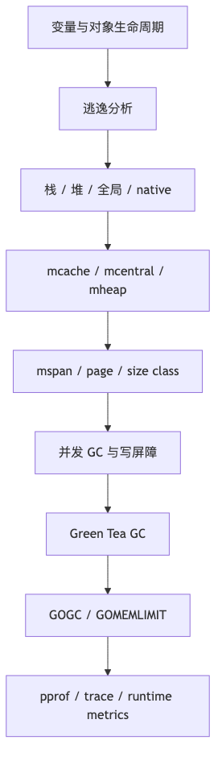

# 第 6 章：Go 内存管理、逃逸分析与垃圾回收

> **版本口径**：本章以 **Go 1.26.4（2026-06-02）** 为主要口径。Go 的栈大小、size class、GC 写屏障、分配器字段与源码路径都属于实现细节，未来版本可能变化；语言语义以 [Go Specification](https://go.dev/ref/spec) 为准。
>
> **两个容易混淆的“内存模型”**：本章主要讨论内存分配、对象布局、逃逸分析和垃圾回收；官方 [Go Memory Model](https://go.dev/ref/mem) 讨论的是并发程序中的可见性、排序与 happens-before，**不规定变量一定在栈上或堆上**。
>
> **Go 1.26 关键变化**：Green Tea GC 已成为默认实现；官方称，在 GC 开销较重的代表性基准中可减少约 10%～40% 的 GC CPU 开销，但具体程序可能收益不明显，甚至出现回退。Go 1.26 编译器还扩大了 Slice backing store 的栈分配机会，并扩展了 `new` 的语言语义。详见 [Go 1.26 Release Notes](https://go.dev/doc/go1.26) 与 [Green Tea GC](https://go.dev/blog/greenteagc)。

## 阅读定位与关联章节

> 本章主讲“对象在哪里、为什么分配、如何被 GC 看见、什么时候被回收”。它不是 Go Memory Model 章节，也不替容器、字符串、反射或 Goroutine 章节重复讲所有案例；那些章节讲现象，本章讲内存机制。

| 关联概念 | 建议读法 |
|---|---|
| Go Memory Model、happens-before、DRF-SC | 本章只讨论分配和 GC；并发可见性和同步保证统一看 [第 13 章：并发同步](/blog/tech/GO/13.并发同步-MemoryModel-锁-Atomic-Race)。 |
| Slice 小视图持有大数组、Map 删除后 RSS 不降、String 子串保留大对象 | 容器/字符串现象分别看 [第 4 章：Slice](/blog/tech/GO/04.Slice)、[第 5 章：Map](/blog/tech/GO/05.Map)、[第 3 章：String](/blog/tech/GO/03.String-byte-rune与Unicode)；本章负责解释背后的对象生命周期和 GC 根。 |
| Goroutine 栈增长、G 泄漏保留对象图 | 栈和调度状态看 [第 11 章：Goroutine 与 Go 调度器](/blog/tech/GO/11.Goroutine与Go调度器)；本章解释栈扫描、对象保留和 heap profile。 |
| 闭包捕获变量导致逃逸或内存泄漏 | 闭包语义和代码陷阱看 [第 2 章：函数、defer、panic/recover 与 errors](/blog/tech/GO/02.函数-闭包-defer-panic-recover-errors)；本章只讲逃逸分析和保留路径。 |
| `unsafe.Pointer`、对象布局、cgo 指针规则 | 本章讲 GC 视角；反射、unsafe、`KeepAlive`、checkptr 和 cgo 细节看 [第 10 章：Reflection、unsafe 与 Go 内存布局](/blog/tech/GO/10.Reflection-unsafe与Go内存布局)。 |

---

## 本章速览

先把本章看成一条从“对象在哪里”到“线上内存排查”的机制链：



读图时抓住三个总结：

- “局部变量在栈上”不是语言保证，真正要看逃逸分析、内联和对象生命周期。
- 分配器和 GC 是一体的：对象从哪里来、是否含指针、怎样被扫描，决定回收成本。
- 内存排查要区分高分配率、高存活堆、对象保留和 RSS 偏高，不能只看一个指标。

---

## 一、本章面试目标

学完本章，应当能够形成下面这条完整知识链：

```text
语言语义
  ↓
new / make / 局部变量 / 返回局部地址
  ↓
编译器逃逸分析与内联
  ↓
栈、堆、全局区、native 内存的边界
  ↓
mcache → mcentral → mheap → OS
  ↓
mspan / page / size class / tiny allocator
  ↓
并发标记清扫、根扫描、写屏障、mutator assist
  ↓
GOGC / GOMEMLIMIT / pacer / scavenger
  ↓
pprof / runtime.MemStats / runtime/metrics / trace
  ↓
定位高分配率、高存活堆、逻辑泄漏、RSS 偏高与 GC 抖动
```

面试中至少应能准确回答：

1. **局部变量不等于栈变量**，分配位置由编译器决定，规范不保证。
2. 返回局部变量地址为什么安全，以及为什么它又不必然导致最终堆分配。
3. 逃逸分析分析的究竟是什么，`interface`、闭包、`fmt` 为什么“可能”促成逃逸而不是“一定逃逸”。
4. 小对象怎样从 per-P `mcache` 分配，大对象为什么绕过 `mcache` 和 `mcentral`。
5. `mspan`、page、size class、scan/noscan span 之间的关系。
6. Go GC 的并发标记清扫流程，哪些环节需要 STW，为什么必须有写屏障。
7. Green Tea GC 改了什么、没改什么，以及它为何改善缓存局部性。
8. `GOGC`、GC pacer、`GOMEMLIMIT` 如何共同决定 GC 触发频率。
9. 为什么 GC 完成后 `HeapAlloc` 下降，但 RSS 可能不降。
10. 如何用 heap profile 区分“分配得快”和“活得太久”。
11. `sync.Pool` 的 per-P、本地队列、victim cache 与 GC 行为。
12. 怎样从指标、profile、trace 和源码证据逐步定位生产内存故障。

---

## 二、功能介绍

### 2.1 Go 进程内存的主要组成

| 组成 | 典型内容 | Go GC 是否直接管理 | 常见观测口径 |
|---|---|---:|---|
| Goroutine 栈 | 参数、局部变量、返回值、临时值 | 扫描，但不是普通 GC 对象生命周期 | `StackInuse`、`/memory/classes/heap/stacks:bytes` |
| Go 堆 | 逃逸对象、Slice backing array、Map bucket、Channel 缓冲区、闭包环境等 | 是 | `HeapAlloc`、heap profile、`/gc/heap/live:bytes` |
| 全局区 | `.data`、`.bss`、只读常量及全局变量 | 作为根扫描 | 进程映射、GC root scan 指标 |
| Runtime 元数据 | `mspan`、arena map、位图、page allocator、profile bucket 等 | 多数位于 off-heap/runtime 管理区 | `MSpanSys`、`GCSys`、runtime/metrics memory classes |
| OS 线程栈与 system stack | M 的 native stack、`g0`、signal stack、cgo 调用栈 | 不等同于 Go 堆 | `StackSys`、`/memory/classes/os-stacks:bytes`、RSS |
| `mmap` / `syscall` 内存 | 用户直接映射的文件或匿名内存 | 通常否 | `/proc/<pid>/smaps`、OS 指标 |
| cgo/C 内存 | `malloc`、第三方 C 库缓存、native TLS 等 | 否 | C allocator 指标、RSS、smaps |
| 代码、共享库、只读映射 | text、rodata、动态库 | 否 | RSS/PSS、进程映射 |

**面试核心结论**：

- `runtime.MemStats` 主要描述 Go runtime 管理的内存，不等于整个进程的 RSS。
- `GOMEMLIMIT` 约束的是 Go runtime 能感知和管理的内存，不会直接限制 cgo、用户 `mmap`、共享库和全部 native 线程栈。
- “Go 进程内存上涨”必须先拆成：**Go live heap、Go 已保留但空闲的 heap、栈、runtime 元数据、native/cgo/mmap、文件映射**。

### 2.2 栈和堆：语言语义与实现决策

Go 语言规范允许编译器自由决定对象放在哪里，只要程序行为符合规范。因此：

```go
func sum() int {
    x := 1
    y := 2
    return x + y
}
```

`x`、`y` 可能：

- 位于栈帧；
- 被保存在寄存器；
- 被常量折叠或完全消除；
- 在某些改写后根本没有可观察的“对象”。

反过来，语法上是局部变量，也可能被放到堆上：

```go
func makeCounter() *int {
    n := 0
    return &n
}
```

这段代码安全。编译器必须确保 `n` 的生命周期覆盖返回指针的使用期。常见做法是把 `n` 移到堆上；但若函数被内联且指针没有离开调用者，编译器也可能继续把它放在调用者栈上，甚至做标量替换。

### 2.3 `new` 与 `make`

#### 2.3.1 传统且仍然成立的区别

```go
p := new(int)              // *int，指向一个零值 int
s := make([]byte, 0, 1024) // []byte，初始化 Slice descriptor 和 backing array
m := make(map[string]int)  // map[string]int，初始化可用 Map
ch := make(chan int, 16)   // chan int，初始化 Channel 及缓冲区
```

| 对比项 | `new` | `make` |
|---|---|---|
| 适用对象 | 任意类型；Go 1.26 还可接受表达式 | 仅 Slice、Map、Channel |
| 返回值 | 指针 | 初始化后的 Slice/Map/Channel 值 |
| 初始化 | `new(T)` 为 `T` 的零值；`new(expr)` 为表达式值 | 建立类型所需的运行时结构 |
| 是否必然堆分配 | **否** | **否；需分别分析头部与 backing storage** |

`new([]int)` 与 `make([]int, 0)` 不同：

```go
p := new([]int)       // p 的类型是 *[]int，*p 是 nil Slice
s := make([]int, 0)   // s 是非 nil 的空 Slice
```

#### 2.3.2 Go 1.26 的 `new(expr)`

Go 1.26 将 `new` 从“只接收类型”扩展为也可接收表达式：

```go
x := 42
p := new(x) // *int，所指变量初始化为 42

q := new(42) // 指向以 42 初始化的变量；无类型常量按上下文确定类型
```

仍需强调：

- 这是 **Go 1.26 语言变化**，模块的语言版本需允许该语法。
- `new(expr)` 只改变初始化语义，**不意味着一定调用 heap allocator**。
- 能被证明不逃逸的对象，仍可能位于栈、寄存器或被优化掉。

### 2.4 逃逸分析是什么

逃逸分析回答的不是“代码里有没有 `&`”，而是：

> **某个值或指向它的引用，是否可能超过当前安全存储区域的生命周期，或者被存入编译器无法证明生命周期足够短的位置。**

当前 Go 编译器将程序转换为位置与指针流动关系，满足两个核心安全约束：

1. 指向栈对象的指针不能被存入堆对象而在栈帧结束后继续存活。
2. 指向栈对象的指针不能比该栈对象活得更久。

常见场景如下。表中的“通常”是经验，不是语言保证。

| 场景 | 为什么可能逃逸 | 边界 |
|---|---|---|
| 返回局部变量指针 | 指针可能在函数返回后使用 | 内联后可能重新证明不逃逸 |
| 闭包捕获变量 | 闭包可能比创建它的调用帧活得久 | 闭包不逃逸、按值捕获时可留栈 |
| 装箱为 `interface{}` / `any` | 动态值需放入接口表示，并可能流向未知调用 | 接口转换本身不必然产生 heap allocation |
| 传给 `fmt`、反射或未知函数 | 可变参数、接口和反射让分析更保守 | 具体版本、调用点和内联结果会变化 |
| 动态大小对象 | 栈帧通常要求编译时可控的布局 | Go 1.26 扩大了可变大小 Slice backing store 的栈分配机会 |
| 对象过大 | 防止栈帧过大、增长和拷贝成本过高 | 阈值是编译器实现细节 |
| 指针写入已逃逸对象 | 被引用对象的生命周期被堆对象延长 | 若接收对象自身未逃逸，结论可能不同 |
| 参数流向返回值或全局变量 | 调用者可能长期持有该引用 | 编译器会生成参数泄漏摘要供跨包分析 |
| 传入 goroutine/defer 闭包 | 异步执行可能超过当前帧 | 某些 `defer` 可栈上开放编码，仍需看捕获对象 |

#### “返回指针一定逃逸”为何不绝对

```go
func addr() *int {
    x := 7
    return &x
}

func read() int {
    return *addr()
}
```

单独编译 `addr` 时，`x` 很可能显示为 `moved to heap`。但若 `addr` 被内联进 `read`，编译器看到返回指针只被立即解引用，就可能将 `x` 保留在调用者栈中，甚至直接得到常量 `7`。

因此面试中应说：

> 返回局部地址会造成“引用跨越原函数边界”，但最终物理分配位置取决于内联后的整体逃逸结论，不能从单一语法断言一定产生 heap allocation。

### 2.5 如何查看逃逸分析

常用命令：

```bash
# 当前包
 go build -gcflags='-m=2' .

# 指定模块内包，避免把所有依赖的诊断都刷出来
 go build -gcflags='example.com/project/...=-m=2' ./...

# 测试代码也参与分析
 go test -run='^$' -gcflags='example.com/project/...=-m=2' ./...

# 结合 benchmark 看最终分配
 go test -run='^$' -bench=. -benchmem ./...
```

典型输出含义：

```text
can inline f
inlining call to f
moved to heap: x
x does not escape
parameter p leaks to ~r0 with derefs=0
capturing by value: buf
capturing by ref: state
```

阅读时遵循三条规则：

1. **先看是否内联，再看逃逸结论**。禁用内联会改变结果。
2. `-m=2` 是编译器诊断接口，不是稳定机器协议，措辞和阈值可能随版本变化。
3. “moved to heap”不等于“性能一定有问题”；必须结合 `allocs/op`、分配热点、QPS 和 live heap 判断。

### 2.6 Slice、Map、interface 与 closure 的常见边界

#### Slice

Slice descriptor 本身只有 data pointer、len、cap，是否逃逸与 backing array 是否逃逸是两个问题：

```go
func local() int {
    s := make([]int, 8)
    s[0] = 1
    return s[0]
}
```

编译器可能把 backing array 放在栈上。若返回 `s`、把它写入全局变量、在异步闭包中捕获，backing array 通常需要更长生命周期。

#### Map

`map` 是 runtime 管理的引用型值，但不能简单背诵“Map 一定在堆上”。编译器可在足够局部、规模可控的场景中栈上放置部分 map 结构或初始 bucket；具体策略属于实现细节。对面试题应回答：**语义上无需关心，性能上以逃逸诊断和 benchmark 为证据。**

#### interface

接口值的概念模型包含动态类型与动态数据。小标量有时可直接编码或使用静态数据，具体转换也可能被内联、去虚化或优化掉。因此：

```go
func box(x int) any { return x }
```

不能仅凭 `any` 就断言一定有一次 heap allocation。若接口值逃出调用链、被反射长期持有或传给难以分析的调用，分配概率会上升。

#### closure

当前编译器会在满足条件时按值捕获较小且不再赋值的变量，否则按引用捕获。按源码中的当前启发式，大小不超过 128 字节、未取地址且未重新赋值的变量更可能按值捕获；**128 字节是实现细节，不是规范。**

### 2.7 内存优化的正确优先级

不要从“把所有指针改成值”开始。更可靠的顺序是：

1. 先确定业务是否真的有内存或 GC 瓶颈。
2. 区分高分配率、live heap 增长、Go 保留内存、native 内存增长。
3. 用 profile 找到分配或保留路径。
4. 优先修复无界结构、对象生命周期和批量设计。
5. 再做预分配、减少临时对象、降低指针密度、复用 buffer。
6. 最后才考虑微观逃逸与字段布局，并用 benchmark 和生产指标验证。

---

## 三、底层实现

### 3.1 进程内存与 runtime 的概念图

```text
+------------------------------------------------------------------+
|                         Go process address space                  |
|                                                                  |
|  text / rodata / globals                                         |
|           │                                                      |
|           ├────────────── GC roots                               |
|           │                                                      |
|  Goroutine stacks ─────── precise stack maps ───────┐             |
|  (grow/shrink)                                      │             |
|                                                      ▼             |
|  Go heap: arena → pages → mspan → objects       concurrent GC      |
|           ▲             ▲                           │              |
|           │             │                           ▼              |
|        mheap        mcentral ← refill ← per-P mcache               |
|           │                                                      |
|           └──────── reserve/commit/release ─────── OS VM           |
|                                                                  |
|  runtime metadata / profiler / trace buffers                      |
|  OS-thread stacks / g0 / signal stacks                            |
|  cgo malloc / user mmap / shared libraries  ← outside Go heap     |
+------------------------------------------------------------------+
```

### 3.2 Goroutine 栈

#### 3.2.1 当前实现特征

当前 Go 使用**连续栈**：

- 函数入口附近有栈空间检查；空间不足时进入 `morestack` / `newstack` 路径。
- runtime 分配更大的连续栈，复制旧栈内容，并根据编译器生成的指针图调整指向旧栈的内部指针。
- GC 周期中可根据使用情况缩栈。
- 当前源码中的最小 Go 栈基数 `stackMin` 为 2048 字节，但新 goroutine 的 `startingStackSize` 可以根据最近 GC 扫描到的平均栈大小自适应；平台附加空间也可能不同。

所以“goroutine 初始栈固定 2 KB”是**过度简化**。更准确的说法是：当前很多 Unix 64 位平台的最小分配档位为 2 KB，但实际起始栈可被 runtime 自适应调整，这是版本和平台相关实现。

#### 3.2.2 为什么栈分配便宜

栈帧通常只需要调整 SP，函数返回时整体回收，不需要逐对象进入通用 allocator，也不会成为独立 GC heap object。代价主要在：

- 大栈增长时复制；
- GC 扫描含指针的栈区域；
- 过深递归可能持续扩栈并最终触发栈上限。

#### 3.2.3 Go 栈与 OS 线程栈不是一回事

Goroutine 在 M 上调度执行。每个 M 有 runtime system stack（通常通过 `g0` 使用）处理调度、栈增长、GC 等不能在普通 goroutine 栈上安全执行的工作。cgo 调用还可能使用 native 线程栈。生产中看到 `StackSys` 或 RSS 增长时，要同时考虑：

- goroutine 数量及其栈深度；
- OS 线程数量；
- cgo/native 线程；
- 大量阻塞系统调用造成的线程增长。

### 3.3 堆分配器

#### 3.3.1 分层结构

当前 runtime allocator 的主干可概括为：

```text
allocation request
       │
       ├── size == 0 ───────────────→ zerobase
       │
       ├── tiny noscan (<16 B) ─────→ per-P tiny block
       │
       ├── small (≤32 KiB) ─────────→ size class
       │                                │
       │                                ▼
       │                         P.mcache 中的 mspan
       │                                │ refill
       │                                ▼
       │                         mcentral（按 span class）
       │                                │ need pages
       │                                ▼
       │                         mheap / page allocator
       │                                │
       │                                ▼
       │                              OS VM
       │
       └── large (>32 KiB) ─────────→ mheap，绕过 mcache/mcentral
```

当前源码注释给出的实现常量包括：

- page 粒度：**8192 字节**；
- small object：**不超过 32 KiB**；
- 小对象被向上取整到约 70 个 size class 之一；
- large object 直接从 `mheap` 获取 page run。

这些都是 **Go 1.26 runtime 实现细节**。

#### 3.3.2 `mspan`

`mspan` 描述一段连续 page：

- 小对象 span：切成相同大小的 object slot；
- 大对象 span：通常为单个大对象服务；
- 维护起始地址、page 数、元素大小、分配位图、标记位图、sweep generation、span class 等；
- span class 同时编码 size class 与 scan/noscan 属性。

`mcentral` 不直接保存每个对象的自由链表，实际空闲 slot 信息在 `mspan` 中。`mcentral` 按 span class 组织有空位与已满的 span，并在 GC 周期中区分已 sweep 与未 sweep 集合。

#### 3.3.3 `mcache` 为什么是 per-P

每个 P 拥有一个 `mcache`。运行在该 P 上的 goroutine 分配小对象时，可从当前 span 的位图取一个空槽，常见快路径无需全局锁。

收益是：

- 将高频对象分配从全局竞争中移开；
- 一次从 `mcentral` 获取整个 span，摊薄锁和 refill 成本；
- 分配路径更利于 CPU cache locality。

这也是它被称为 per-P 而不是 per-goroutine 的原因：goroutine 数量可以极大，给每个 goroutine 一个 allocator cache 成本过高；P 数量受 `GOMAXPROCS` 控制，更适合作为并行执行资源的本地缓存单位。

#### 3.3.4 size class 与内部碎片

请求 33 字节时，allocator 可能提供 48 字节 slot；差额是内部碎片。size class 的设计要权衡：

- class 越密，内部碎片越少；
- class 越多，元数据、span 管理与缓存规模越大；
- 每个 span 还可能有尾部不足以放下完整对象的 tail waste。

碎片可分三类：

1. **内部碎片**：对象请求大小与 slot 大小的差。
2. **span/页碎片**：span 中有空 slot，但因 size class 不匹配不能服务别的大小。
3. **地址空间或物理驻留滞留**：page 已空闲但尚未 scavenged，仍计入保留映射或 RSS。

#### 3.3.5 tiny allocator

当前 tiny allocator 将多个 **小于 16 字节、无指针** 的微小对象合并进一个 16 字节 block。只有当 block 中所有子对象都不可达时，整个 block 才能回收。

适用它的原因：大量极小对象若各自拥有分配/标记元数据，固定成本很高。限制为 noscan，是为了不必为子对象分别维护精确指针扫描信息，并限制浪费。

面试边界：

- tiny allocation 不等于“没有堆分配”；它是合并堆分配。
- 一个仍存活的子对象可能让同 block 中其他已死亡空间暂时不能回收。
- 具体 16 字节阈值是实现细节。

#### 3.3.6 scan 与 noscan

含指针对象需要 GC 根据类型位图扫描其指针字段；无指针对象可放入 noscan span，标记时不必遍历对象内容。

这解释了两个性能现象：

- 同样字节数，指针密度高的数据结构通常 GC 成本更高。
- `[]byte`、大数值数组等 noscan backing store 对 GC 扫描较友好；但其内存容量仍计入 heap，并可能抬高 RSS。

不能因此机械地把所有对象改成无指针或索引编码。转换复杂度、cache miss、复制成本和可维护性可能抵消收益。

#### 3.3.7 zeroing

Go 保证新分配变量按语言规则获得零值。runtime 不一定在 page 刚取得时立刻把全部内存重新清零：

- OS 新映射页本身通常为零；
- span 可记录 `needzero`；
- 若 slot 已知为零，可跳过重复清零；
- 否则在对象交给程序前清零；
- **含指针对象必须在对 GC 可见前处于合法的零指针状态**。

延迟 zeroing 可改善时间局部性，并避免清零从未复用的页面。

#### 3.3.8 `mallocgc` 主要流程

源码入口为：

```go
func mallocgc(size uintptr, typ *_type, needzero bool) unsafe.Pointer
```

面试级伪流程：

```text
1. size==0：返回 zerobase 相关地址
2. 根据 typ 判断是否含指针，选择 scan/noscan 路径
3. 根据 size 选择 tiny / small / large
4. 若 GC 正在并发标记，记账 mutator assist debt
5. small：从当前 P.mcache 的对应 mspan 取 slot
6. span 不足：向 mcentral refill；再不足则向 mheap 申请 pages
7. large：直接从 mheap 申请 page run
8. 必要时清零，安装/更新 GC 类型与标记元数据
9. 并发标记期间，新对象按当前分配黑化规则处理
10. 更新统计、heap profile sampling、race/msan/asan hooks
11. 返回对象地址
```

平均小对象快路径接近摊销 O(1)，但不能把所有分配都宣称为严格 O(1)：refill、page 获取、sweep、OS 映射和 GC assist 都可能进入慢路径。

### 3.4 编译器逃逸分析的实现思路

当前路径主要在 `src/cmd/compile/internal/escape/`。可把算法理解成：

```text
语法树/IR
  ↓
为变量、表达式、参数、返回值、heap 等建立 location
  ↓
为赋值、取地址、解引用、调用、闭包捕获建立带“解引用深度”的边
  ↓
求解引用如何流动，以及生命周期是否越界
  ↓
标记 EscNone / Heap，并为函数参数生成 leak summary
  ↓
后续栈布局、对象分配、内联与代码生成使用该结果
```

#### 3.4.1 跨包调用

编译器不会因为看不到依赖包函数体就一律让参数逃逸。它会把“参数是否流向 heap、返回值或调用者”等摘要编码进导出数据。调用方可据此判断：

- 参数只读且不保存；
- 参数泄漏到某个返回值；
- 参数泄漏到 heap；
- 参数被调用或修改。

#### 3.4.2 内联的影响

内联把被调函数体暴露到调用点，可能：

- 消除原本跨函数的保守边界；
- 证明返回指针只在局部使用；
- 让 Slice backing store 留在调用者栈上；
- 触发标量替换与死代码消除。

反之，函数变大而不能内联、使用接口动态分派、反射或 `//go:noinline`，都可能改变逃逸结论。优化时不要依赖某次编译输出作为永久契约。

#### 3.4.3 Go 1.26 的 Slice 栈分配变化

Go 1.26 编译器能在更多情形下为 Slice backing store 做栈分配，包括某些大小不能完全静态确定的情况。实现可在栈上预留推测性容量，并在超出时回退到 heap。面试时应强调：

- 这是编译器优化，不改变 Slice 语言语义；
- 是否命中取决于控制流、上界、内联和版本；
- 最终以 `-m=2` 与 `allocs/op` 为准。

### 3.5 Go GC 的整体特征

| 特征 | 当前口径 |
|---|---|
| 可达性算法 | tracing GC，从 roots 追踪可达对象 |
| 主体 | 并发、并行标记清扫（mark-sweep） |
| 分代 | **非分代** |
| 压缩 | **非压缩**，普通对象地址在生命周期内稳定 |
| 扫描 | 精确扫描，依赖类型与栈指针图 |
| 暂停 | 有短暂 STW 阶段，主要标记与程序并发 |
| 回收粒度 | sweep 使 object slot/span 可复用；scavenger 再向 OS 归还物理页 |

“Go GC 完全无 STW”是错误答案；“Go GC 每次都全程 STW”同样错误。

#### 3.5.1 一个 GC 周期

```text
上一轮 sweep/正常运行
        │
        ▼
[STW] Sweep termination
  - 完成上一周期未完成的必要 sweep
        │
        ▼
[STW] Mark setup
  - 开启写屏障
  - 准备 root jobs、mark state
        │
        ▼
[Concurrent mark]
  - 扫描 globals、stacks、runtime roots
  - mark workers 并行追踪对象
  - mutator 继续运行并执行 write barrier
  - 分配过快的 mutator 做 assist
        │
        ▼
[STW] Mark termination
  - 完成剩余标记与状态切换
  - 关闭本周期写屏障相关状态
        │
        ▼
[Concurrent sweep]
  - 回收未标记对象的 slot/span
  - 后台或分配路径按需 sweep
        │
        ▼
[Scavenger]
  - 对长期空闲页执行 OS release（可与程序长期并行）
```

根扫描任务包括：

- 全局 `.data` / `.bss` 中的指针；
- 所有需要扫描的 goroutine 栈；
- finalizer 与 cleanup 相关 runtime roots；
- runtime 持有的其他特殊引用。

并发扫描某个 goroutine 栈时，需要把该 goroutine 暂停在可安全扫描的状态，但这不等于把全进程所有 goroutine 同时长时间 STW。

#### 3.5.2 三色标记是推理模型

- 白：尚未证明可达；
- 灰：对象已发现，但其指针字段尚未全部扫描；
- 黑：对象及其指针字段已扫描。

标记结束时仍为白的对象被判定不可达。真实实现使用位图、work buffer、page/span 元数据等，并不一定存一个显式“颜色字段”。

#### 3.5.3 为什么并发标记必须有写屏障

标记线程与 mutator 同时修改对象图。若 mutator 将一个白对象的唯一引用从 GC 尚未扫描的位置移动到已扫描的黑对象，GC 可能漏标并错误回收仍可达对象。

当前 Go 使用 hybrid write barrier，结合 Yuasa deletion barrier 和 Dijkstra insertion barrier。源码给出的伪代码是：

```text
writePointer(slot, ptr):
    shade(*slot)
    if current stack is grey:
        shade(ptr)
    *slot = ptr
```

直觉解释：

- 先 shade 被覆盖的旧指针，避免从 heap 删除最后一条边时把对象藏到栈中；
- 当前 goroutine 栈仍为灰时，也 shade 新写入指针，避免把栈中的白对象藏进黑对象；
- 栈完成扫描变黑后，第二部分可省，因为该栈当时只指向已 shade 对象。

写屏障只在 GC 相关阶段启用，并经过编译器插桩与 runtime 快路径实现。它有成本，但换来了大部分标记与业务并发执行。

#### 3.5.4 mark worker 与 mutator assist

后台 mark worker 常见角色包括：

- **dedicated**：专门消耗一个 P 的 GC 标记时间；
- **fractional**：只运行目标比例时间；
- **idle**：调度器没有业务工作时利用空闲 CPU 标记。

如果程序分配速度超过后台标记进度，分配 goroutine 会积累 assist debt，并被要求完成一部分标记工作后才能继续分配。其目的不是惩罚某个 goroutine，而是让**产生 GC 工作的分配速率与完成 GC 工作的速率闭环**。

生产中 assist 过高常表现为：

- 请求路径 CPU 上升；
- tail latency 抖动；
- GC CPU 占比升高；
- allocation rate 高但 live heap 未必大。

#### 3.5.5 Green Tea GC：Go 1.26 当前状态

Green Tea 在 Go 1.25 以实验形式出现，Go 1.26 已默认启用。它没有把 Go 变成分代或压缩 GC，主要重构了小对象标记扫描的组织方式：

- 传统工作队列更偏“逐对象”；
- Green Tea 更偏向按 page/span 局部批量组织待扫描对象；
- 使用 seen/scanned bitmap 区分已发现和已扫描对象；
- 连续扫描同一页面中的对象，提升 CPU cache locality；
- 在适合的平台与对象布局上可使用更高效的批量/向量化扫描内核。

因此其收益更可能出现在：

- 指针较多、标记扫描占 CPU 较高；
- 小对象密集；
- 旧实现受随机访问和 cache miss 影响明显。

若程序主要瓶颈是大块 noscan 数据、业务计算、锁竞争或 I/O，收益可能有限。Go 1.26 仍提供临时退回开关 `GOEXPERIMENT=nogreenteagc`，官方计划在后续版本移除，不能当长期运行配置依赖。

### 3.6 Sweep、Scavenge 与 RSS

#### 3.6.1 Sweep

Sweep 检查 span 的 mark bitmap：

- 未标记对象变成可复用 slot；
- span 仍有存活对象，回到相应 size class 集合；
- span 全空，可把 pages 归还给 `mheap` 的 page allocator。

此时内存已经“可供 Go 再分配”，但不代表物理页已经归还 OS。

#### 3.6.2 Scavenger

Scavenger 寻找足够空闲的物理页，通过平台机制（例如 Linux 上相关 madvise 路径）减少其物理驻留。效果是提高 `HeapReleased`，并可能降低 RSS。

RSS 不立即下降的常见原因：

1. 空闲 slot 与存活对象混在同一 span/page，不能整页 release。
2. 内存刚变空闲，runtime 为复用而暂时保留。
3. OS 对 resident 统计和回收具有延迟。
4. RSS 增长来自 cgo、mmap、线程栈或共享映射，而非 Go heap。
5. allocator/size class 碎片使 `HeapInuse` 仍高。
6. profile 与 MemStats 是采样或特定时点口径，和外部 RSS 采样不完全同步。

`runtime.GC()` 只强制一次 GC 周期，不承诺 RSS 下降。`debug.FreeOSMemory()` 会先 GC 并尝试更积极地向 OS 归还内存，但仍不是跨平台的 RSS 硬保证，也不适合在每个请求路径调用。

### 3.7 GC pacer、`GOGC` 与 `GOMEMLIMIT`

#### 3.7.1 `GOGC`

官方 GC Guide 给出的近似目标公式为：

```text
Target heap = Live heap + (Live heap + GC roots) × GOGC / 100
```

其中 roots 主要包括 goroutine stacks 和全局指针扫描工作；自 Go 1.18 起，roots 纳入目标计算。

直觉：

- `GOGC=100`：允许约等于“上一轮 live heap + roots”的新增 heap 工作量；
- 提高 `GOGC`：GC 更少，CPU 通常下降，峰值 heap 上升；
- 降低 `GOGC`：GC 更频繁，峰值 heap 下降，CPU 与 assist 压力上升；
- `GOGC=off`：关闭由 GOGC 目标触发的 GC，但若内存限制生效，GC 仍会运行。

这只是目标，不是硬上界。大对象突发分配、pacer 预测误差、调度延迟等都可能让实际 heap 越过目标。

#### 3.7.2 GC pacer

Pacer 根据：

- 上一轮 live heap；
- root scan work；
- 当前 allocation rate；
- 实际 scan throughput；
- `GOGC` 与 memory limit；
- 后台 mark CPU 目标和 assist 反馈；

动态决定何时提前启动 GC、后台 worker 应承担多少工作、每分配多少字节需要多少 assist。它的目标是让标记在接近 heap goal 前完成，而不是等内存到达目标才开始。

#### 3.7.3 `GOMEMLIMIT`

`GOMEMLIMIT` 或 `debug.SetMemoryLimit` 设置的是 **soft memory limit**。官方口径可近似写成：

```text
runtime-managed memory ≈ MemStats.Sys - MemStats.HeapReleased
```

对应 runtime/metrics 可用：

```text
/memory/classes/total:bytes
- /memory/classes/heap/released:bytes
```

它不包括许多 runtime 不可见内存，例如：

- cgo/C `malloc`；
- 用户通过 `syscall`/`mmap` 管理的映射；
- 程序二进制和部分共享库映射；
- 某些 OS 线程栈或内核记账。

#### 3.7.4 为什么是软限制

若 live heap 本身已经接近或超过限制，GC 再频繁也无法回收仍可达对象。若 runtime 为了死守限制而无限 GC，程序会 thrashing，几乎不能推进。

因此当前 runtime 对 GC CPU 使用设置保护阈值：官方 GC Guide 描述为约 **50% GC CPU**，在约 `2 × GOMAXPROCS` CPU-second 的窗口上判断。必要时 runtime 会允许内存超过限制，以避免无限 GC。

所以：

- `GOMEMLIMIT` 不是 OOM killer 的替代品；
- 不是进程 RSS 硬上界；
- 不是“达到该值就拒绝分配”；
- 配得过低会造成高频 GC、assist、吞吐下降和延迟尖刺。

#### 3.7.5 `GOGC` 与 `GOMEMLIMIT` 如何共同作用

可以把它们理解为两个约束：

- `GOGC` 决定常态下 CPU/内存交换点；
- `GOMEMLIMIT` 在异常 live heap 或突发分配时压低允许的目标。

实际 pacer 会选择更紧的目标，并保留实现所需的最小 heap 与安全余量。常见生产策略是：

- 保持合理的 `GOGC` 处理正常负载；
- 把 `GOMEMLIMIT` 设在容器限制以下，吸收峰值；
- 不要为了“让内存曲线好看”把限制压到 live heap 附近。

官方 GC Guide 对 runtime 不可见内存建议至少留 **5%～10%** 余量。若服务使用大量 cgo、direct I/O buffer、mmap、sidecar 共享预算或线程栈，应基于实测留下更多，而不是机械套固定比例。

### 3.8 `runtime.MemStats` 与 RSS

| 字段 | 含义与常见误区 |
|---|---|
| `HeapAlloc` | 已分配 heap object 字节，包括 live object，以及尚未 sweep 的不可达对象；不是 RSS |
| `HeapSys` | runtime 从 OS 为 heap 获取/保留的虚拟地址空间；不等于都驻留物理内存 |
| `HeapInuse` | 当前被 in-use spans 覆盖的字节，包含对象之间和 size class 内部碎片 |
| `HeapIdle` | 当前没有用于对象的 spans；其中一部分可能仍物理驻留，一部分已 release |
| `HeapReleased` | runtime 估计已归还底层系统的 heap 物理内存 |
| `StackInuse` | goroutine 栈 spans 中正在使用的字节 |
| `StackSys` | 为栈获得的内存，cgo/平台口径有边界 |
| `MSpanInuse/MSpanSys` | span 元数据使用与获取量 |
| `MCacheInuse/MCacheSys` | mcache 元数据使用与获取量 |
| `GCSys` | GC 元数据与相关结构 |
| `Sys` | runtime 从 OS 获取的总虚拟地址空间近似总量；**不是进程 RSS** |
| `NextGC` | 下一次目标 heap 触发相关值，不是硬上限 |
| `NumGC` | 已完成 GC 周期数 |
| `PauseNs` / `PauseTotalNs` | 历史 STW pause 环形记录及累计值；高分位更宜看 metrics histogram |

外部 RSS 更接近“当前驻留在物理内存的进程页”，但还会受共享页、PSS/RSS 口径、内核回收、透明大页等影响。排查时建议同时画：

```text
RSS
HeapAlloc / live heap
HeapInuse
HeapIdle - HeapReleased   # Go 保留且可能仍驻留的空闲 heap
StackInuse / thread count
total runtime memory - released
cgo/mmap 自定义指标
```

### 3.9 `runtime/metrics`

相较于频繁读取整个 `MemStats`，`runtime/metrics` 提供更结构化的稳定指标名和 histogram。内存与 GC 常用项包括：

```text
/gc/heap/live:bytes
/gc/heap/goal:bytes
/gc/heap/objects:objects
/gc/cycles/total:gc-cycles
/gc/cycles/forced:gc-cycles
/gc/scan/heap:bytes
/gc/scan/stack:bytes
/cpu/classes/gc/total:cpu-seconds
/cpu/classes/gc/mark/assist:cpu-seconds
/memory/classes/total:bytes
/memory/classes/heap/objects:bytes
/memory/classes/heap/free:bytes
/memory/classes/heap/released:bytes
/memory/classes/heap/stacks:bytes
/sched/goroutines:goroutines
/sched/pauses/total/gc:seconds
```

指标名随版本增加，采集程序应调用 `metrics.All()` 检查可用项，避免假设未来永久存在全部名称。

### 3.10 `sync.Pool`

#### 3.10.1 语义

`sync.Pool` 是临时对象缓存：

- `Put` 添加对象；
- `Get` 可能返回缓存对象，也可能返回 `nil` 或调用 `New`；
- runtime **可在任何时候移除对象而不通知程序**；
- 不得用于保存连接、事务、锁、session 等必须存在的业务状态。

#### 3.10.2 当前实现概念

```text
Pool
 ├─ per-P local
 │    ├─ private slot       # 当前 P 优先使用
 │    └─ shared chain       # 本 P push/pop，其他 P 可 steal
 └─ victim cache           # 上一轮 local，在下一轮 GC 后再淘汰
```

GC 的 STW 清理阶段会：

1. 丢弃更老的 victim cache；
2. 把当前 local 移为 victim；
3. 清空当前 local 指针，等待下一轮使用重新建立。

victim cache 让刚经历一次 GC 的热点对象还有一次被复用的机会，避免每次 GC 都把缓存命中率瞬间打到零；再下一轮仍未使用则可丢弃。

#### 3.10.3 适合与不适合

适合：

- 大量并发请求中的短命、同类型临时对象；
- `bytes.Buffer`、编码器 scratch、临时 `[]byte` wrapper；
- 构造成本或分配频率高，且对象可完全重置。

不适合：

- 低频对象；
- 必须保留的资源；
- 带请求身份或敏感数据但未清理的对象；
- 容量无上限的大 buffer；
- 用来实现精确缓存容量或 TTL。

大 buffer 归还策略示例：

```go
var bufPool = sync.Pool{
    New: func() any { return new(bytes.Buffer) },
}

const maxPooledCap = 64 << 10

func putBuffer(b *bytes.Buffer) {
    if b.Cap() > maxPooledCap {
        return // 让异常大对象自然回收，避免池把峰值长期保留
    }
    b.Reset()
    bufPool.Put(b)
}
```

### 3.11 常见逻辑内存泄漏

GC 只能回收不可达对象；仍被错误引用的对象对 GC 来说就是“活的”。

| 类型 | 保留路径 | 典型修复 |
|---|---|---|
| 无界 Map/缓存 | 全局 Map 永久引用 value | 容量上限、TTL、LRU、分片淘汰、外部缓存 |
| 小 Slice 持有大数组 | Slice data pointer 指向大 backing array | 复制需要的小段；明确所有权 |
| `s[:0]` | len 归零但 data/cap 仍持有数组 | `s=nil` 或替换为新小切片；是否释放取决于其他引用 |
| 指针 Slice 删除不清尾部 | 缩短 len，但旧指针留在 backing array | `clear` 尾部后再缩短 |
| Goroutine 泄漏 | goroutine 栈和局部变量成为 root | context/cancel、关闭协议、超时、等待退出 |
| Channel 积压 | 缓冲区保存大量对象 | 有界背压、丢弃策略、消费者容量规划 |
| 闭包捕获 | closure 环境持有大对象/外层结构 | 只复制必要字段，缩小捕获范围 |
| Timer/Ticker | 旧版本或仍有引用的定时器结构 | 当前版本关注引用与停止语义；见陷阱题版本边界 |
| 回调/订阅未注销 | registry 持有 closure 和业务对象 | 显式 unsubscribe、生命周期绑定 |
| finalizer/cleanup 队列积压 | 回调慢或依赖不可靠时序 | 显式 `Close`；cleanup 仅作兜底且要轻量 |
| cgo/native cache | Go heap profile 看不到 | native profiler、自定义指标、smaps |

### 3.12 Heap profile 的四种主要视角

| sample | 看什么 | 适合回答的问题 |
|---|---|---|
| `inuse_space` | 当前存活对象占用字节 | 谁在占内存、哪个路径保留大对象 |
| `inuse_objects` | 当前存活对象数量 | 谁保留了海量小对象 |
| `alloc_space` | 进程启动以来累计分配字节（含已回收） | 谁造成高分配流量和 GC 压力 |
| `alloc_objects` | 累计分配对象数 | 哪个路径制造了最多对象 |

**判别法**：

- `alloc_space` 很高、`inuse_space` 稳定：高 churn，重点减少临时分配。
- `inuse_space` 持续增长：live set 或逻辑泄漏，找保留路径。
- 两者都不高但 RSS 高：看 `HeapIdle-HeapReleased`、栈、cgo、mmap、共享库和碎片。

---

## 四、源码阅读路径

### 4.1 推荐顺序

| 顺序 | 路径/文档 | 核心内容 | 阅读时重点 |
|---:|---|---|---|
| 1 | [Go Specification](https://go.dev/ref/spec) | allocation、`new`、`make`、变量生命周期语义 | 哪些是语言保证；Go 1.26 `new(expr)` |
| 2 | [Go GC Guide](https://go.dev/doc/gc-guide) | GC 成本模型、GOGC、memory limit | 目标公式、soft limit、thrashing 与容器余量 |
| 3 | `src/cmd/compile/internal/escape/escape.go` | escape 批处理、location、closure capture | 两个安全不变量、`HeapAllocReason`、capture by value/ref |
| 4 | `src/cmd/compile/internal/escape/graph.go`、`solve.go` | 指针流图与求解 | dereference weight、生命周期循环、heap flow |
| 5 | `expr.go`、`assign.go`、`call.go`、`leaks.go` | 表达式、赋值、调用和参数摘要 | 接口、闭包、参数到结果/heap 的传播 |
| 6 | `src/runtime/malloc.go` | allocator 总览与 `mallocgc` | small/large 分支、zeroing、tiny allocator、GC assist 记账 |
| 7 | `src/runtime/mcache.go` | per-P cache | `alloc` span、tiny state、refill/release |
| 8 | `src/runtime/mcentral.go` | span class 中央集合 | partial/full、swept/unswept 代际切换、cacheSpan |
| 9 | `src/runtime/mheap.go` | `mheap`、`mspan`、arena/page allocator | span 状态、page run、heap arena 与 metadata |
| 10 | `src/internal/runtime/gc/sizeclasses.go` | 当前生成的 size class 表 | object size、span bytes、objects/span、waste |
| 11 | `src/runtime/mgc.go` | GC 周期总控 | sweep termination、mark、mark termination、forced GC |
| 12 | `src/runtime/mgcmark.go` | roots、scan、mark workers | `gcPrepareMarkRoots`、`markroot`、`gcDrain`、stack scan |
| 13 | `src/runtime/mbarrier.go` | hybrid write barrier | Yuasa deletion + Dijkstra insertion 的源码注释与不变量 |
| 14 | `src/runtime/mgcpacer.go` | pacer/controller | heap goal、scan work、assist ratio、memory limit |
| 15 | `src/runtime/mgcscavenge.go` | scavenger | page release、RSS 与复用权衡 |
| 16 | `src/runtime/stack.go` | 栈分配、增长、缩小 | `stackMin`、`copystack`、`newstack`、adaptive starting size |
| 17 | `src/sync/pool.go` | Pool per-P 与 victim | `pin`、local/private/shared、`poolCleanup` |
| 18 | `src/runtime/mstats.go`、`runtime/metrics` | 内存统计 | MemStats 与 metrics 的口径差异 |
| 19 | [Go Memory Model](https://go.dev/ref/mem) | 并发可见性 | 明确它不定义 stack/heap；Pool 的同步保证也需看文档 |
| 20 | [Go 1.26 Release Notes](https://go.dev/doc/go1.26) 与 [Green Tea blog](https://go.dev/blog/greenteagc) | 当前版本变化 | 默认状态、回退开关、性能适用边界 |

> **路径变化提醒**：旧资料常写 `src/runtime/sizeclasses.go`；Go 1.26 当前源码中的生成表位于 `src/internal/runtime/gc/sizeclasses.go`。面试时给出概念后补一句“路径随版本可能调整”，比死背旧目录更可靠。

### 4.2 从源码可直接推导的面试答案

1. `malloc.go` 顶部写明 small object 最高 32 KiB、page 8192 字节以及分配层级，所以这是**当前实现事实，不是规范**。
2. `mcache.go` 注释明确它是 per-P 且常见路径无需锁，因此能解释低竞争来源。
3. `mallocgcTiny` 注释明确 tiny object 必须 noscan，当前 block 为 16 字节。
4. `mbarrier.go` 直接给出 hybrid barrier 伪代码，能避免只背“三色不变式”却说不清实际算法。
5. `mgcmark.go` 的 root jobs 包括 globals、stacks、finalizer/cleanup 等，能纠正“GC root 只有全局变量和栈”的简化说法。
6. `poolCleanup` 的 local→victim、old victim drop 过程，说明 Pool 内容为何跨 GC 不可靠。
7. `stack.go` 的 adaptive `startingStackSize` 说明“所有 goroutine 永远从固定 2 KB 开始”已不严谨。
8. escape 源码会为参数生成 leak tags，说明跨包分析并非完全失明。

---

## 五、常用场景

### 5.1 高 QPS HTTP/RPC 服务

**适合做的优化**：

- 为已知大小的 Slice/Map 预分配；
- 避免 `fmt.Sprintf` 构造热点日志字段，使用结构化日志和 append API；
- 复用可完全重置的 buffer/encoder；
- 限制请求体、Channel backlog 与批量大小；
- 关注 `alloc_space`、assist CPU 和 p99，而不只看平均延迟。

**不适合**：为了零分配把业务对象改成难维护的 `unsafe` arena 或手写对象池。对象池可能引入跨请求数据污染、容量膨胀和更长生命周期。

### 5.2 编解码与临时 buffer

适合 `sync.Pool`，前提是：

- buffer 确实高频；
- 每次取出后都重置；
- 归还前设置最大容量门槛；
- 敏感数据按安全要求清理；
- 不依赖 Pool 命中才能正确运行。

替代方案包括调用者提供目标 Slice、`Append` 型 API、分层固定大小 buffer pool。后者能精确控容量，但实现和并发管理更复杂。

### 5.3 大文件、流式处理与批任务

优先流式读取和有界批次，而不是一次性 `ReadAll`。批任务常见问题并非单个对象逃逸，而是：

- 工作队列无界；
- 一批完成前仍由错误的父切片或闭包引用；
- 聚合 Map 不淘汰；
- 并发度过高导致同时存活批次过多。

### 5.4 缓存

缓存本质上是主动延长对象生命周期。必须定义：

- 最大条目数或最大字节数；
- TTL 与淘汰策略；
- key/value 的真实内存成本；
- singleflight/并发加载策略；
- 失效时是否及时断开大对象引用。

`sync.Pool` 不是缓存替代品，因为条目可随时消失；无界 Map 也不是合格缓存。

### 5.5 低延迟服务

优化目标通常不是“让每次 GC pause 为零”，而是降低：

- allocation burst；
- assist 落在请求关键路径的概率；
- pointer-rich live graph；
- goroutine 与 stack root 数量；
- 过低 memory limit 引发的连续 GC。

常用办法：复用热点临时对象、拆掉无界队列、分批处理、避免大对象峰值同时存活，并在真实负载下看 p99/p999 与 GC timeline。

### 5.6 容器部署

建议同时设置容器 memory limit 与 Go `GOMEMLIMIT`，但 Go limit 应低于容器硬限制。余量需要覆盖：

```text
cgo + mmap + thread stacks + binary/shared libs
+ observability agent/sidecar 共用预算（若有）
+ 内核与统计误差
+ 瞬时分配和 GC 控制误差
```

上线前做压力测试：逐步逼近峰值，观察 live heap、runtime-managed memory、RSS、GC CPU、assist、OOM 事件和 p99，而不是只验证“进程没崩”。

### 5.7 值类型还是指针类型

选择依据应是语义优先：

- 需要共享可变状态、稳定身份或对象较大时，指针通常自然；
- 小型不可变数据、复制成本低时，值更简单；
- 指针会增加 GC 扫描边和潜在 heap lifetime；
- 大值频繁复制可能增加 CPU、栈和内存带宽；
- 指针并不自动“更快”，值也不自动“零分配”。

最终通过 benchmark、CPU profile、heap profile 和可维护性共同决定。

### 5.8 cgo 与用户 `mmap`

当 RSS 上涨但 Go heap 平稳时，应尽早检查 native 内存。可采取：

- 给 C allocator 暴露统计；
- 使用 jemalloc/tcmalloc profiler 或平台工具；
- 记录 mmap/munmap 大小和生命周期；
- 查看 `/proc/<pid>/smaps_rollup` 与各 mapping；
- 把 `GOMEMLIMIT` 设得更低，为 native 峰值留空间。

只反复抓 Go heap profile，无法解释不在 Go heap 中的泄漏。

---

## 六、代码陷阱题

> 以下题目中的“是否分配”若无特别说明，均指：**不能仅凭源码语法作语言级断言，需以指定 Go 版本的逃逸诊断和 benchmark 为准。**

### 6.1 `new` 是否一定堆分配

**题目代码：**

```go
package main

import "fmt"

func f() int {
    p := new(int)
    *p = 7
    return *p
}

func main() {
    fmt.Println(f())
}
```

**先判断**：输出什么？`new(int)` 是否必然产生一次 heap allocation？

**标准答案**：输出 `7`。`new(int)` **不必然堆分配**；当前编译器很可能将对象放在栈、寄存器中，或直接消除对象。

**逐行分析**：

1. `new(int)` 的语言语义是取得一个指向零值 `int` 的指针。
2. `p` 只在 `f` 内部使用，没有离开调用链。
3. `*p=7` 后又立即读取，编译器可把它简化成返回常量。
4. 规范只规定可观察行为，不规定必须调用 `mallocgc`。

**继续追问**：怎样验证？使用 `go build -gcflags='-m=2'` 看逃逸，再用 `go test -bench=. -benchmem` 看 `allocs/op`；不能只看汇编中是否出现某个符号，因为内联和版本会改变代码形态。

---

### 6.2 返回局部变量指针为什么安全

**题目代码：**

```go
package main

import "fmt"

func ptr() *int {
    x := 10
    return &x
}

func main() {
    p := ptr()
    fmt.Println(*p)
}
```

**先判断**：是否悬空指针？是否 panic？

**标准答案**：输出 `10`，没有悬空指针。Go 编译器/runtime 会保证被引用对象活得足够久。

**逐行分析**：

1. `x` 是局部变量，但“局部”只描述词法作用域。
2. `&x` 返回后仍被 `p` 使用，编译器必须延长其存储期。
3. 未内联时，常见诊断是 `moved to heap: x`。
4. 若 `ptr` 被内联且使用范围很短，最终对象也可能留在调用者栈上或被标量替换。

**继续追问**：为什么 C 中类似写法危险而 Go 安全？因为 Go 的编译器和 runtime 共同控制栈增长、对象分配与 GC，并禁止把生命周期不足的栈地址以不安全方式暴露；使用 `unsafe` 或 cgo 则需要遵守额外指针规则。

---

### 6.3 装箱进 `any` 是否一定分配

**题目代码：**

```go
package main

import "fmt"

func box(x int) any {
    return x
}

func main() {
    v := box(42)
    fmt.Println(v)
}
```

**先判断**：`x` 是否一定逃逸？接口里保存的是 `x` 的地址吗？

**标准答案**：接口保存动态类型和动态值的表示，**不能笼统说接口转换一定 heap allocation**。本例最终传给 `fmt`，当前编译器可能因调用链而让某些值逃逸，但这是实现结论。

**逐行分析**：

1. `return x` 将值装入接口，不代表接口一定指向原局部变量。
2. 对小标量，runtime/编译器有多种表示和优化机会。
3. `fmt.Println` 接受 `...any`，并经过复杂调用与反射格式化，可能让分析更保守。
4. 是否产生分配还受内联、去虚化、常量和调用者使用方式影响。

**继续追问**：如何写出更准确的面试回答？说“接口会引入动态表示，常使逃逸分析更困难；是否分配要看具体值大小、调用路径和编译器版本”，不要背“interface 一定逃逸”。

---

### 6.4 `fmt` 相关逃逸

**题目代码：**

```go
package bench

import (
    "fmt"
    "io"
    "testing"
)

func BenchmarkFmt(b *testing.B) {
    for b.Loop() {
        x := 123
        fmt.Fprintln(io.Discard, x)
    }
}
```

**先判断**：这一定是零分配吗？`x` 一定在堆上吗？

**标准答案**：两者都不能凭语法断言。`fmt` 的接口、格式解析和反射路径通常比专用转换 API 更容易产生分配，当前诊断也常显示参数经接口调用逃逸；但具体次数和逃逸结论会随版本与调用点变化。

**逐行分析**：

1. `x` 先被转换成 `any` 以组成可变参数。
2. `fmt` 需要处理动态类型和格式化状态。
3. `io.Discard` 只避免输出存储，不会自动消除格式化工作。
4. `b.Loop()` 防止常见 benchmark 结构错误，但仍应看 `B/op` 与 `allocs/op`。

**继续追问**：热点整数格式化的替代方案是什么？`strconv.AppendInt` 写入复用的 `[]byte`，或使用结构化日志库的 typed field API；是否更快仍需基准验证。

---

### 6.5 闭包捕获大对象

**题目代码：**

```go
package main

func makeReader() func() byte {
    buf := make([]byte, 100<<20)
    buf[0] = 7
    return func() byte {
        return buf[0]
    }
}

func main() {
    f := makeReader()
    _ = f
}
```

**先判断**：闭包只读取一个字节，100 MiB backing array 能否回收？

**标准答案**：只要返回的闭包仍可达，整个 backing array 通常仍被 Slice descriptor 引用，不能回收。

**逐行分析**：

1. `buf` 是一个 Slice descriptor，指向 100 MiB backing array。
2. 闭包捕获的是 `buf`，不是只捕获 `buf[0]` 的值。
3. 返回闭包使捕获环境超过函数调用期。
4. GC 从 closure environment 追踪到 Slice，再追踪到 backing array。

**修复示例**：

```go
func makeReader() func() byte {
    buf := make([]byte, 100<<20)
    buf[0] = 7
    first := buf[0]
    return func() byte { return first }
}
```

**继续追问**：闭包一定在堆上吗？不一定；不逃出调用点的闭包可栈上或被内联。但本题返回闭包，环境需要延长生命周期。

---

### 6.6 小 Slice 持有大数组

**题目代码：**

```go
package main

func header() []byte {
    data := make([]byte, 100<<20)
    copy(data, "OK")
    return data[:2]
}
```

**先判断**：调用者只得到 2 字节，live heap 是约 2 字节还是约 100 MiB？

**标准答案**：返回 Slice 仍指向原 backing array，通常保留约 100 MiB 数组。

**逐行分析**：

1. 切片表达式只构造新的 descriptor，不复制元素。
2. `len=2` 不改变 backing array 的分配大小。
3. 只要 Slice 可达，data pointer 使数组可达。
4. GC 以对象为回收单位，不能回收数组的后半部分。

**修复示例**：

```go
func header() []byte {
    data := make([]byte, 100<<20)
    copy(data, "OK")
    return append([]byte(nil), data[:2]...)
}
```

**继续追问**：三下标切片 `data[:2:2]` 能释放原数组吗？不能；它只限制 cap，避免后续 append 覆盖共享区域，不会复制或释放 backing array。

---

### 6.7 `s[:0]` 是否释放 backing array

**题目代码：**

```go
package main

import "runtime"

type Node struct{ Payload [1024]byte }

func f() {
    s := make([]*Node, 1_000_000)
    for i := range s {
        s[i] = new(Node)
    }

    s = s[:0]
    runtime.GC()
    runtime.KeepAlive(s)
}
```

**先判断**：`s=s[:0]` 后 backing array 和一百万个 `Node` 是否都可回收？

**标准答案**：不能。`s` 仍保留原 data pointer 和 cap；backing array 仍可达，数组槽中的指针也仍可能让 `Node` 可达。

**逐行分析**：

1. `s[:0]` 只把 len 设为 0。
2. cap 和 data pointer 未变。
3. GC 扫描的是 heap object 的指针布局，不以当前 Slice len 作为“只扫前 len 个”的通用释放信号。
4. `runtime.KeepAlive(s)` 确保本函数结尾前 `s` 仍被视为活跃。

**正确处理**：

```go
clear(s) // 必须在 len 仍覆盖元素时清理指针
s = nil  // 丢掉本地对 backing array 的引用
```

其他别名仍可能保留数组。

**继续追问**：`clear(s)` 会释放 backing array 吗？不会，只把当前 len 范围元素置零；是否回收取决于随后是否还有引用。

---

### 6.8 删除指针 Slice 元素但不清尾部

**题目代码：**

```go
func deleteAt[T any](s []*T, i int) []*T {
    copy(s[i:], s[i+1:])
    return s[:len(s)-1]
}
```

**先判断**：逻辑上删除后，被删对象一定可回收吗？

**标准答案**：不一定。移动后，原最后一个槽位仍保存一个重复指针；缩短 len 不会自动清零 backing array 的尾槽。

**逐行分析**：

1. `copy` 把后续元素左移。
2. backing array 的最后一个旧槽未被覆盖为 `nil`。
3. 返回 Slice 的 len 变短，但 backing array 仍由返回值持有。
4. 尾槽中的指针可能继续保留对象。

**修复**：

```go
func deleteAt[T any](s []*T, i int) []*T {
    copy(s[i:], s[i+1:])
    last := len(s) - 1
    s[last] = nil
    return s[:last]
}
```

也可使用当前标准库 `slices.Delete`，但仍应理解其版本语义与清尾行为。

**继续追问**：元素是 `int` 时还要清尾吗？GC 保留问题不存在，但清理是否必要取决于数据安全和逻辑需求；对大值可能有额外写成本。

---

### 6.9 用 `sync.Pool` 保存业务状态

**题目代码：**

```go
var sessions sync.Pool

func save(s *Session) {
    sessions.Put(s)
}

func load() *Session {
    return sessions.Get().(*Session)
}
```

**先判断**：只要调用过 `save`，`load` 是否一定成功返回该 Session？

**标准答案**：不保证，甚至可能因 `Get()` 返回 `nil` 而类型断言 panic。Pool 可随时丢弃条目，也不提供按 key 查找或身份保证。

**逐行分析**：

1. `Put` 只是把对象放入临时缓存。
2. 其他 goroutine 可能先取走对象。
3. GC 清理会轮换或丢弃 local/victim 内容。
4. Pool 不保证 FIFO/LIFO、数量、身份和持久性。

**继续追问**：Pool 的同步保证是什么？文档规定某次 `Put(x)` synchronizes-before 返回同一个 `x` 的 `Get`；但它不保证该 `Get` 一定发生。

---

### 6.10 把超大 Buffer 放回 Pool

**题目代码：**

```go
var pool = sync.Pool{
    New: func() any { return new(bytes.Buffer) },
}

func handle(payload []byte) {
    b := pool.Get().(*bytes.Buffer)
    defer func() {
        b.Reset()
        pool.Put(b)
    }()

    b.Grow(len(payload))
    b.Write(payload)
}
```

**先判断**：某次处理 256 MiB payload 后，`Reset` 是否释放 256 MiB backing array？

**标准答案**：不会。`Reset` 通常保留容量。Pool 可能把这个大 backing array 保留到后续 GC 轮换，甚至每个 P 都积累异常大的 buffer。

**逐行分析**：

1. `Grow` 扩大 backing array。
2. `Reset` 只重置读写位置/长度，不一定缩容。
3. `Put` 延长 buffer 及其 backing array 的可达期。
4. Pool 虽可丢条目，但不能把“以后也许丢”当容量控制。

**修复**：超过上限就不归还，或按容量档位建立有限 pool。

**继续追问**：为什么 Pool 可能降低分配却提高 RSS？复用延长了对象寿命，并让峰值容量跨请求保留；GC 压力和 RSS 不是同一个指标。

---

### 6.11 Ticker 未 `Stop`：旧面经是否仍正确

**题目代码：**

```go
func create(n int) {
    for i := 0; i < n; i++ {
        _ = time.NewTicker(time.Hour)
    }
}
```

**先判断**：这些 Ticker 在 Go 1.26 中是否永远无法被 GC？

**标准答案**：在主模块语言版本为 Go 1.23+ 且未恢复旧 timer channel 行为时，**不再是永久泄漏**。从 Go 1.23 起，无引用、未 Stop 的 Timer/Ticker 可被 GC 回收。

**逐行分析**：

1. 每轮创建 Ticker 后没有保存引用。
2. 新 timer 实现允许 GC 识别无引用 timer/ticker。
3. Go 1.23 之前，未 Stop 的 Ticker 不会被 GC 回收，这是旧面经来源。
4. 新行为受模块 `go` 版本及 `GODEBUG=asynctimerchan=1` 影响。

**工程结论**：仍建议在明确生命周期结束时 `Stop`，因为它能确定停止后续 tick，并使意图清晰；但不要再把它描述成 Go 1.26 下“唯一防止 GC 泄漏的办法”。

**继续追问**：`Stop` 会关闭 `Ticker.C` 吗？不会。若 goroutine `range ticker.C`，仅 Stop 后 channel 不关闭，goroutine仍可能永久阻塞，需要额外的 context/done 协议。

---

### 6.12 循环中的 `time.After`

**题目代码：**

```go
for {
    select {
    case msg := <-input:
        use(msg)
    case <-time.After(time.Hour):
        return
    }
}
```

**先判断**：如果 `input` 持续有数据，这在 Go 1.26 是否必然累积一小时内全部 Timer，形成旧式内存泄漏？

**标准答案**：在 Go 1.23+ 新 timer 语义下，select 未选中的、随后无引用的 timer 可被 GC 回收，因此旧版“必须等到到期才回收”的结论已过时。但每轮创建 Timer 仍会带来分配、调度与 GC churn。

**逐行分析**：

1. 每次循环都创建一个新 Timer。
2. 若 `input` 分支被选中，返回的 channel 和 Timer 随后可能无引用。
3. 新实现允许其立即具备 GC 可回收性。
4. 高频循环中，创建成本和累计分配仍可能显著。

**替代方案**：复用 `time.Timer`，在每轮正确 `Reset`；Go 1.23+ 的同步 timer channel 也简化了 Stop/Reset 后陈旧值问题。

**继续追问**：为什么仍需 benchmark？低频控制循环可优先可读性；只有热点路径才值得引入复杂的 Timer 复用状态机。

---

### 6.13 无界缓存

**题目代码：**

```go
var cache = map[string][]byte{}

func remember(key string, value []byte) {
    cache[key] = append([]byte(nil), value...)
}
```

**先判断**：没有 data race 的前提下，这是否仍可能是内存泄漏？

**标准答案**：是典型逻辑泄漏。全局 Map 永远可达，条目没有容量或过期边界，GC 正确地把所有 value 判为 live。

**逐行分析**：

1. 全局 `cache` 是 root 可达对象。
2. 每个 key/value 都被 Map 引用。
3. `append` 还复制并拥有独立 backing array，避免外部修改，但也明确增加内存。
4. GC 无法猜测业务上哪些条目“不再需要”。

**继续追问**：怎样设计？按字节预算而非只按条目数限制；配置 TTL/LRU；提供观测指标；考虑 key 本身、Map overhead、对象碎片和并发加载峰值。

---

### 6.14 Goroutine 泄漏持有大对象

**题目代码：**

```go
var never = make(chan struct{})

func start() {
    buf := make([]byte, 100<<20)
    go func() {
        <-never
        _ = buf[0]
    }()
}
```

**先判断**：`start` 返回并执行多次 GC 后，`buf` 能否回收？

**标准答案**：不能。泄漏 goroutine 的栈/闭包环境是 GC root 链的一部分，继续持有 `buf`。

**逐行分析**：

1. closure 捕获 Slice descriptor。
2. goroutine 永久阻塞在 `never`。
3. runtime 仍把该 goroutine 视为存在并扫描其栈/闭包引用。
4. backing array 因此保持可达。

**继续追问**：怎样排查？看 goroutine 数趋势和 goroutine profile，按相同阻塞栈聚合；再用 heap profile 找对应大对象分配点，结合业务生命周期确认为何没有退出。

---

### 6.15 `unsafe.Sizeof` Slice

**题目代码：**

```go
s := make([]byte, 100<<20)
fmt.Println(unsafe.Sizeof(s))
```

**先判断**：输出是否约为 100 MiB？

**标准答案**：不是。`unsafe.Sizeof(s)` 只返回 Slice descriptor 的大小；在常见 64 位实现上通常是三个 machine word，即 24 字节，但架构不同会变化。

**逐行分析**：

1. `s` 是 descriptor：data、len、cap。
2. backing array 是独立存储。
3. `unsafe.Sizeof` 不递归计算引用对象。
4. 真实占用还包含 size class/page rounding、allocator 元数据和碎片。

**继续追问**：怎样估算容器内对象大小？需建立“逻辑 payload + backing storage + referenced graph + allocator rounding + metadata”的模型；准确分析使用 heap profile 和 runtime 指标，而不是递归 `unsafe.Sizeof`。

---

### 6.16 把 finalizer 当作 `Close`

**题目代码：**

```go
func openResource() *Resource {
    r := &Resource{/* native handle */}
    runtime.SetFinalizer(r, func(r *Resource) {
        r.Close()
    })
    return r
}

func main() {
    _ = openResource()
}
```

**先判断**：进程退出前 `Close` 是否一定执行？

**标准答案**：不保证。finalizer 的执行时间、顺序和是否在进程退出前执行都不确定，不能作为资源正确性机制。

**逐行分析**：

1. finalizer 只在对象变为不可达并经历相关 GC 处理后才可能排队。
2. 排队与执行是异步的。
3. 程序可能在执行前退出。
4. finalizer 还涉及循环引用、对象复活、过早判死与 `runtime.KeepAlive` 等复杂边界。

**当前版本建议**：显式 `Close`/`defer Close` 是主路径。Go 1.24+ 对许多兜底清理可优先考虑 `runtime.AddCleanup`，它比 `SetFinalizer` 更灵活且较少引入保留问题，但仍不是确定性析构。

**继续追问**：何时需要 `runtime.KeepAlive`？当最后一次语言级使用早于 native 操作结束，而 finalizer/cleanup 可能提前运行时，在操作之后调用 `KeepAlive(obj)` 延长可达性到该点。

---

### 6.17 `runtime.GC()` 是否保证 RSS 下降

**题目代码：**

```go
buf := make([]byte, 500<<20)
for i := range buf {
    buf[i] = 1
}
buf = nil
runtime.GC()
```

**先判断**：`runtime.GC()` 返回后，RSS 是否必然立即下降约 500 MiB？

**标准答案**：不保证。

**逐行分析**：

1. `buf=nil` 只移除当前引用；编译器活跃性和其他别名仍需考虑。
2. `runtime.GC()` 使不可达对象进入可复用状态。
3. sweep 与 scavenger/OS release 是不同层次。
4. 页可能因碎片、复用策略或 OS 统计延迟保持 resident。
5. RSS 还包含非 Go heap 内存。

**继续追问**：`debug.FreeOSMemory()` 呢？会触发 GC 并更积极尝试释放，但仍不提供跨平台精确 RSS 降幅保证；频繁调用会伤害吞吐和 cache locality。

---

### 6.18 把 `GOMEMLIMIT` 当硬上限

**题目代码：**

```go
func main() {
    debug.SetMemoryLimit(64 << 20)

    blocks := make([][]byte, 0, 128)
    for i := 0; i < 128; i++ {
        b := make([]byte, 1<<20)
        b[0] = 1
        blocks = append(blocks, b)
    }
    runtime.KeepAlive(blocks)
}
```

**先判断**：分配达到 64 MiB 时，`make` 是否返回错误或被 runtime 拒绝？

**标准答案**：不会按这种方式工作。memory limit 是软限制；live set 约 128 MiB 时无法通过 GC 回收，runtime 可超过限制以避免无限 thrashing，最终仍可能触发系统 OOM。

**逐行分析**：

1. 所有 block 被 `blocks` 引用，是 live heap。
2. GC 再频繁也不能回收它们。
3. Go allocation API 没有因 `GOMEMLIMIT` 返回普通错误的语义。
4. soft limit 主要通过调整 GC 频率和 scavenging 努力控制 runtime-managed memory。

**继续追问**：怎样避免？应用层限制输入、队列、并发和缓存；容器硬限制作为最终保护；Go limit 留 native 余量并监控 GC CPU/assist。

---

### 6.19 指针一定比值快吗

**题目代码：**

```go
type Point struct {
    X, Y, Z int64
}

func byValue(p Point) int64   { return p.X + p.Y + p.Z }
func byPointer(p *Point) int64 { return p.X + p.Y + p.Z }
```

**先判断**：`byPointer` 是否一定更快、更省内存？

**标准答案**：不一定。小值可能通过寄存器传递、留在栈上并被内联；指针可能引入间接寻址、别名限制、逃逸和 GC 扫描。

**逐行分析**：

1. `Point` 只有三个整数，复制成本可能很低。
2. 内联后可能根本没有实际函数调用和结构复制。
3. 指针版本需要一次间接访问，并可能使对象身份和生命周期扩散。
4. 若结构很大或需共享修改，指针又可能更合适。

**继续追问**：如何决策？先按 API 语义和可变性设计，再用 representative benchmark 检查 ns/op、B/op、allocs/op 和 CPU profile；不要只测一个空函数微基准。

---

### 6.20 Benchmark 被编译器消除

**题目代码：**

```go
func BenchmarkWork(b *testing.B) {
    for i := 0; i < b.N; i++ {
        x := 12345 * 67890
        _ = x
    }
}
```

**先判断**：结果是否能代表真实乘法成本？

**标准答案**：不能。常量表达式可编译期折叠，结果又不可观察，整个循环体可能被消除。

**逐行分析**：

1. 两个操作数是常量。
2. `x` 没有可观察用途。
3. `_ = x` 不构成外部副作用。
4. benchmark 报告可能主要是空循环或框架成本。

**修复示例**：

```go
var sink int

func BenchmarkWork(b *testing.B) {
    x, y := 12345, 67890
    for b.Loop() {
        sink = x * y
    }
}
```

Go 1.24+ 的 `B.Loop` 能减少一些常见 benchmark 优化陷阱，但不是“任何代码都绝不会被优化”的魔法；输入、输出和副作用仍需设计合理。

**继续追问**：怎样验证分配？结合 `-benchmem`、`testing.AllocsPerRun`、逃逸诊断，并检查 benchmark 是否包含 setup、I/O 或锁等非目标成本。

---

### 6.21 Channel backlog 不是 GC 泄漏但能吃光内存

**题目代码：**

```go
ch := make(chan []byte, 100_000)

for i := 0; i < cap(ch); i++ {
    ch <- make([]byte, 64<<10)
}
```

**先判断**：GC 能否回收已发送但尚未接收的 `[]byte`？

**标准答案**：不能。Channel 缓冲区是可达对象，槽位中的 Slice 指向 backing arrays；这是有界但可能巨大的 live set。

**逐行分析**：

1. Channel 自身被变量 `ch` 引用。
2. 缓冲区保存 100,000 个 Slice descriptor。
3. 每个 descriptor 持有 64 KiB 数组。
4. 逻辑 payload 已超过 6 GiB，尚未计入 overhead 和峰值。

**继续追问**：如何设计背压？缩小队列、控制 producer 并发、使用字节预算 semaphore、批量但限定总字节数，并监控 queue depth 与 queued bytes。

---

### 6.22 Go heap profile 平稳但 cgo 泄漏

**题目代码：**

```go
/*
#include <stdlib.h>
*/
import "C"

func leak() {
    _ = C.malloc(10 << 20)
}
```

**先判断**：Go heap profile 的 `inuse_space` 是否会显示这 10 MiB？GC 是否会自动 `free`？

**标准答案**：通常不会。该内存由 C allocator 管理，不是 Go heap object；GC 不会自动调用 `C.free`。

**逐行分析**：

1. `C.malloc` 在 native allocator 申请内存。
2. 返回地址若丢失，C 内存发生真实 native leak。
3. Go `HeapAlloc` 可保持平稳而 RSS 持续上涨。
4. `GOMEMLIMIT` 也不会精确覆盖这部分。

**继续追问**：如何定位？native allocator profiler、ASan/LSan、Valgrind（适用平台）、自定义 alloc/free 计数、`smaps` 和 cgo 调用审计；同时确认 Go 指针与 C 指针传递规则。

---

## 七、面试高频问题

### 7.1 Go 的栈和堆有什么区别？

- **普通回答**：栈主要保存函数调用帧，分配和回收快；堆保存生命周期更长的对象，由 GC 回收。
- **中高级回答**：Go 规范不规定变量物理位置。goroutine 使用可增长、可缩小的连续栈；堆对象走 runtime allocator，并成为 GC tracing 的对象。栈分配通常只移动 SP，堆分配涉及 size class、span、GC 记账和可能的 assist。
- **继续深挖**：栈也需要 GC 精确扫描其中的指针；栈增长会复制并调整内部指针；当前起始栈大小可自适应，不应只背固定 2 KB。
- **常见错误回答**：“局部变量全在栈，全局变量全在堆。”全局变量位于静态数据区，局部变量也可能逃逸到堆或被优化掉。
- **版本/边界**：栈最小档位、增长策略、缩栈阈值都是 runtime 实现细节。

### 7.2 局部变量是否一定在栈上？

- **普通回答**：不一定，取决于逃逸分析。
- **中高级回答**：还取决于内联、对象大小、动态长度、闭包捕获和优化。变量甚至可能进入寄存器或完全消失，而不是简单二选一。
- **继续深挖**：编译器必须保证指向栈对象的指针不被存入更长生命周期位置，也不能比对象活得久；无法证明时会保守地移动到 heap。
- **常见错误回答**：“只要没有 `new` 就在栈上。”复合字面量、`make`、取地址、闭包等都可能影响分配；`new` 也不必然在堆上。
- **版本/边界**：逃逸结论不是 API 契约，升级 Go 后应重新 benchmark。

### 7.3 返回局部变量地址为什么安全？

- **普通回答**：编译器会把对象移到堆上，保证生命周期。
- **中高级回答**：这是一种常见实现，但不是唯一可能。若函数被内联，编译器可能在调用者上下文证明引用不逃逸，把对象留栈或标量替换。
- **继续深挖**：真正的安全条件是引用生命周期不能超过存储生命周期；Go 编译器通过逃逸分析和受控栈模型满足它。
- **常见错误回答**：“Go 的栈帧返回后还一直存在。”错误；栈空间会复用，安全来自编译器改变存储位置或消除对象。
- **版本/边界**：使用 `unsafe` 保存栈地址、违反 cgo pointer rule 会绕开正常保证。

### 7.4 逃逸分析到底分析什么？

- **普通回答**：判断变量是否需要放到堆上。
- **中高级回答**：它分析指针和值在 location graph 中的流动及生命周期，目标是阻止栈引用流入 heap 或活过栈对象；堆分配是分析结果之一。
- **继续深挖**：边可携带取地址/解引用深度；编译器为参数生成 leak summary，描述参数是否流向 heap、返回值、调用或修改位置，供跨包调用使用。
- **常见错误回答**：“看到 `&` 就逃逸。”取地址只是建立引用，若引用不离开安全作用域可完全留栈。
- **版本/边界**：源码路径在 `src/cmd/compile/internal/escape`，诊断文本和启发式会变化。

### 7.5 常见逃逸场景有哪些？

- **普通回答**：返回指针、闭包捕获、接口、动态大小、大对象和保存到全局变量。
- **中高级回答**：要加限定词“可能”。本质是引用流入更长生命周期或编译器无法证明安全；参数传给未知调用、写入已逃逸对象、异步 goroutine 捕获也常见。
- **继续深挖**：对象大小可因栈帧上限被强制 heap；动态 Slice backing store 过去通常 heap，但 Go 1.26 已扩大栈分配机会。
- **常见错误回答**：“传给函数就逃逸”“接口一定逃逸”。编译器有函数摘要、内联和去虚化，不能一概而论。
- **版本/边界**：用 `-m=2` 验证具体调用点。

### 7.6 `new` 和 `make` 有什么区别？

- **普通回答**：`new` 返回指向变量的指针；`make` 初始化 Slice、Map、Channel 并返回相应值。
- **中高级回答**：`new(T)` 零初始化；Go 1.26 起 `new(expr)` 可用表达式初始化。`make` 可能建立 backing array、bucket、channel buffer 等 runtime 状态。两者都不等于“必然堆分配”。
- **继续深挖**：`new([]T)` 得到指向 nil Slice 的指针，`make([]T,0)` 得到非 nil 空 Slice；Slice descriptor 与 backing array 要分别做逃逸分析。
- **常见错误回答**：“new 在堆上，make 在栈上。”错误。
- **版本/边界**：`new(expr)` 是 Go 1.26 语言特性，旧模块语言版本不能直接使用。

### 7.7 interface 为什么常与逃逸相关？

- **普通回答**：接口需要保存动态类型和动态值，可能产生装箱和分配。
- **中高级回答**：接口转换本身不必然分配。真正问题是动态值是否需要地址化、接口是否逃出作用域、调用是否可去虚化，以及后续是否进入反射/`fmt` 等复杂路径。
- **继续深挖**：空接口/非空接口的具体 runtime 表示属于实现细节；小标量可能使用非 heap 表示，指针值也可能只复制指针。
- **常见错误回答**：“任何值转 `any` 都有一次 alloc。”不准确。
- **版本/边界**：编译器的去虚化与接口优化持续变化，应实测。

### 7.8 内联如何影响逃逸？

- **普通回答**：内联让编译器看到更多代码，可能减少逃逸。
- **中高级回答**：被调函数体进入调用者后，原本跨函数的返回指针、临时 Slice 或闭包可在更大上下文重新分析；也可能触发常量传播、标量替换和死代码消除。
- **继续深挖**：未内联的跨包调用并非完全失明，编译器会读取参数 leak summary；但摘要不如完整调用点上下文精细。
- **常见错误回答**：“禁用内联只影响速度，不影响分配。”会影响逃逸结果和 benchmark。
- **版本/边界**：比较时可用 `-gcflags='-l -m=2'` 观察，但禁用优化后的结果不能代表生产构建。

### 7.9 `mcache`、`mcentral`、`mheap` 如何协作？

- **普通回答**：小对象先从 per-P `mcache` 分配，不足时向 `mcentral` 取 span，再不足由 `mheap` 提供 pages。
- **中高级回答**：`mcache` 按 span class 缓存可分配 `mspan`，快路径常不加锁；`mcentral` 按 size class+scan bit 管理 partial/full、swept/unswept spans；`mheap` 负责 page run、arena 和全局 heap 管理。
- **继续深挖**：一次从 central 获取整个 span摊薄锁成本；大对象超过 32 KiB 直接走 mheap；分配路径还可能触发 sweep 和 GC assist。
- **常见错误回答**：“mcache 是每个线程或每个 goroutine一个。”Go 语境中是 per-P。
- **版本/边界**：字段和集合名称可能变化，层次概念更稳定。

### 7.10 什么是 page、`mspan` 和 size class？

- **普通回答**：page 是 allocator 管理内存的基本页；`mspan` 是连续 page；size class 把小对象按固定大小分组。
- **中高级回答**：当前 page 为 8 KiB。小对象 span 被切成同尺寸 slot；size class 决定 slot 大小、span 大小和对象数；span class还编码 scan/noscan。
- **继续深挖**：size rounding 导致内部碎片，span 尾部有 tail waste；同一 span 只能服务对应 class，空闲槽不能直接给其他大小对象。
- **常见错误回答**：“这里的 page 一定等于 OS 4 KiB 页。”runtime page 是 allocator 抽象，当前 8 KiB，不等于所有平台 OS page。
- **版本/边界**：8 KiB、32 KiB 和 class 表都是当前实现。

### 7.11 tiny allocator 是什么？

- **普通回答**：把多个很小的无指针对象合并到一个小块中，减少分配开销。
- **中高级回答**：当前只处理小于 16 字节的 noscan 对象，使用 per-P mcache 中的 tiny block；整个 block 在所有子对象都不可达后才能释放。
- **继续深挖**：它降低每对象固定成本，但可能因一个存活子对象保留同块中的死空间；不能用于含指针对象，否则无法低成本维持精确扫描。
- **常见错误回答**：“tiny object 都在栈上”或“完全没有 GC 成本”。两者都错。
- **版本/边界**：16 字节阈值是实现细节。

### 7.12 大对象为什么绕过 `mcache`？

- **普通回答**：大对象需要多个 page，直接从 `mheap` 分配更合适。
- **中高级回答**：若给每种大尺寸建立 per-P class，会造成巨大缓存和碎片；大对象数量通常少，按 page run 直接分配可简化管理。
- **继续深挖**：大对象突发会直接推高 heap goal、assist debt 和 RSS；释放后也要等 span 空闲与 scavenging 才可能归还 OS。
- **常见错误回答**：“超过 32 KiB 就直接 `mmap` 一个对象。”当前是绕过 mcache/mcentral 走 mheap，不等于每个对象都单独系统调用。
- **版本/边界**：32 KiB 是当前 small/large 边界。

### 7.13 含指针对象为何比无指针对象更贵？

- **普通回答**：GC 需要扫描指针，判断它们指向的对象是否可达。
- **中高级回答**：成本取决于要扫描的 pointer bytes、对象图形状、cache locality 和并行度，不只是总字节数。noscan span 的对象内容无需作为指针图遍历。
- **继续深挖**：链表、树和高指针密度结构可能带来随机访问及串行依赖；Green Tea 主要改善小对象扫描的局部性，但不能消除真实指针边的工作。
- **常见错误回答**：“`[]byte` 不参与 GC，所以不占堆。”它占 heap，只是不扫描内容中的指针。
- **版本/边界**：具体 scan kernel 和元数据布局会变。

### 7.14 Go GC 的整体算法是什么？

- **普通回答**：并发标记清扫 GC。
- **中高级回答**：当前是 tracing、并发并行、精确、非分代、非压缩的 mark-sweep。通过 roots 和写屏障维持并发标记正确性，sweep 回收 slot，scavenger 再向 OS 释放空闲页。
- **继续深挖**：非压缩意味着普通 heap object 地址稳定，但也可能保留碎片；非分代意味着不会只因对象年轻就放进独立 young generation。
- **常见错误回答**：“Go 使用引用计数”“Go GC 无暂停”“Green Tea 是分代 GC”。都错误。
- **版本/边界**：高层性质是当前实现状态，不是语言规范永久承诺。

### 7.15 GC 哪些阶段 STW？

- **普通回答**：开始标记和结束标记附近有短 STW，主要标记并发进行。
- **中高级回答**：周期包含 sweep termination STW、mark setup STW、concurrent mark、mark termination STW 和 concurrent sweep。单个 goroutine 栈扫描还需暂停该 goroutine到安全状态，但不是整个进程长时间停顿。
- **继续深挖**：STW latency 包含“请求停世界到所有 P 真正停下”的 stopping latency；不可抢占的长运行、系统调用边界或 runtime 临界区可能影响它。
- **常见错误回答**：“只有一次 STW”或“sweep 全程 STW”。
- **版本/边界**：具体阶段切分和命名看 `mgc.go`。

### 7.16 GC roots 有哪些？什么叫精确扫描？

- **普通回答**：全局变量和 goroutine 栈是主要 roots。
- **中高级回答**：还包括 runtime 的特殊 root，例如 finalizer/cleanup 队列与相关 metadata。精确扫描依赖编译器生成的 stack map 和类型指针位图，只把真正可能是指针的位置当引用。
- **继续深挖**：这使 runtime 可在栈复制时调整指针，也减少把普通整数误认成地址造成的保守保留。
- **常见错误回答**：“寄存器完全不参与 roots。”运行 goroutine 被暂停和扫描时，寄存器状态会以安全点机制纳入处理，不能简单排除。
- **版本/边界**：某些 runtime 特殊区域的处理更复杂，面试无需把全部 root 枚举成固定清单。

### 7.17 三色标记和写屏障是什么关系？

- **普通回答**：三色用于描述标记状态；写屏障防止并发修改让 GC 漏标对象。
- **中高级回答**：当前 hybrid barrier 对被覆盖旧引用做 deletion shading，并在当前栈仍灰时对新引用做 insertion shading，避免 mutator 把白对象隐藏在已扫描区域。
- **继续深挖**：写屏障作用于 pointer writes，由编译器插桩并通过 buffer 批处理；栈扫描完成后可省一部分 insertion shading，从而避免 mark termination 重新扫描所有栈。
- **常见错误回答**：“只要保证黑对象不指向白对象就够了，所以所有写都必须先判断对象颜色。”当前实现并不对每次写做昂贵的宿主对象颜色条件判断。
- **版本/边界**：以 `mbarrier.go` 源码注释为当前权威。

### 7.18 什么是 mutator assist？

- **普通回答**：分配过快的业务 goroutine要帮 GC 做标记工作。
- **中高级回答**：Pacer 根据分配字节与剩余 scan work 计算 assist ratio。mutator 分配会积累 debt，欠债达到条件时进入 `gcAssistAlloc` 等路径完成标记以换取继续分配额度。
- **继续深挖**：assist 把 GC 成本施加到产生分配压力的路径，帮助在 heap goal 前完成标记；过高 assist 是 allocation rate 过高或 memory limit 过紧的信号。
- **常见错误回答**：“assist 只发生在 STW”或“只由后台 GC goroutine执行”。
- **版本/边界**：ratio 和控制器细节持续调整。

### 7.19 Sweep 和 scavenger 有什么区别？

- **普通回答**：sweep 让不可达对象空间可供 Go 复用；scavenger 把空闲页归还操作系统。
- **中高级回答**：sweep 按 span mark bitmap 回收 slot，全部空闲 span 的 pages回到 mheap；scavenger 进一步选择空闲物理页做 release。前者可使 `HeapAlloc` 下降，后者才更直接影响 `HeapReleased` 和潜在 RSS。
- **继续深挖**：有存活对象的 page 不能部分物理释放；size class 与 span 碎片使“逻辑空闲很多”仍不等于可 release pages 多。
- **常见错误回答**：“GC 就等于把内存还给 OS”。
- **版本/边界**：OS release 语义和 RSS反应依平台而异。

### 7.20 `GOGC` 怎么工作？

- **普通回答**：控制 GC 频率，默认 100；越高用更多内存、少做 GC，越低相反。
- **中高级回答**：近似目标为 `live + (live+roots)*GOGC/100`，pacer 会提前启动标记，争取在目标附近完成。它是 CPU/内存交换参数，不是 heap 硬上限。
- **继续深挖**：高 allocation rate 会缩短周期；live heap 越大，每轮扫描成本越高；自 Go 1.18 起 roots 纳入目标，改善大量 goroutine 场景。
- **常见错误回答**：“GOGC=100 表示内存使用率达到 100% 才 GC。”
- **版本/边界**：公式是高层模型，实际 goal 还受最小 heap、memory limit 与控制反馈影响。

### 7.21 `GOMEMLIMIT` 为什么是软限制？

- **普通回答**：如果 live heap 已超过限制，GC 无法回收，硬守限制会让程序无限 GC。
- **中高级回答**：runtime 约束的是自身管理内存，并对 GC CPU 设置保护；官方当前说明约 50% CPU、`2*GOMAXPROCS` CPU-second 窗口。必要时允许超限以避免 thrashing。
- **继续深挖**：限制近似针对 `Sys-HeapReleased`，不覆盖 cgo和用户 mmap；应与容器硬限制和业务背压共同使用。
- **常见错误回答**：“超过限制，`make` 返回 error”或“RSS 永远不超过该值”。
- **版本/边界**：控制算法和CPU阈值属于当前实现。

### 7.22 `GOGC` 与 `GOMEMLIMIT` 怎么一起调？

- **普通回答**：`GOGC`管常态，memory limit管上界压力，runtime选更紧的目标。
- **中高级回答**：先测常态 live heap 和 native overhead；用合理 GOGC 保持CPU效率，再把Go limit设在容器限制以下，留出至少5%～10%及实测native余量。观察GC CPU、assist、live/goal差距和RSS。
- **继续深挖**：`GOGC=off`配memory limit可实现“尽量晚GC”，但当环境共享内存、live set波动或限制估计错误时风险更高；不是默认万能配置。
- **常见错误回答**：“设置 GOMEMLIMIT 后 GOGC 完全无效。”未触碰限制时仍主要由GOGC控制。
- **版本/边界**：不同工作负载必须压测，不存在通用最佳数字。

### 7.23 `sync.Pool` 的底层和边界是什么？

- **普通回答**：用于复用临时对象，减少分配；对象可能被GC清掉。
- **中高级回答**：当前每P有local private/shared结构，其他P可steal；GC时旧victim丢弃、当前local转为victim、local清空。Pool只保证临时复用，不保证容量或命中。
- **继续深挖**：Pool可以降低alloc rate，但可能延长大buffer寿命、扩大RSS；`New`通常返回指针类型以避免接口装箱产生额外分配。
- **常见错误回答**：“Pool就是线程安全LRU”“Put进去直到Get前一定存在”。
- **版本/边界**：具体队列结构和清理时机是实现细节，语义以 `sync.Pool` 文档为准。

### 7.24 Green Tea GC 改了什么？

- **普通回答**：Go 1.26 默认启用的新GC标记实现，主要提高缓存局部性，降低GC CPU。
- **中高级回答**：它把小对象扫描从更随机的逐对象工作队列转向 page/span 局部批量处理，使用seen/scanned bitmap并可利用向量化扫描；没有改成分代或压缩GC。
- **继续深挖**：收益取决于对象图和标记占比。官方代表性GC-heavy基准报告约10%～40%开销下降，但不是所有程序都收益；应比较CPU、pause、throughput和RSS。
- **常见错误回答**：“Green Tea消除了STW”或“升级1.26后内存一定降40%”。
- **版本/边界**：Go 1.25实验，1.26默认；`nogreenteagc`只是临时回退手段。

### 7.25 如何区分高分配率与高存活堆？

- **普通回答**：看 `alloc_space` 与 `inuse_space`。
- **中高级回答**：`alloc_space/alloc_objects`看累计 churn，`inuse_space/inuse_objects`看当前保留；再结合 `/gc/heap/live`、allocation rate、GC cycles和assist CPU。高alloc低inuse通常是短命对象，高inuse持续增长是live set/逻辑泄漏。
- **继续深挖**：heap profile反映最近完成GC的采样口径，需多时点diff；高RSS低Go heap则转向idle-not-released、栈、cgo和mmap。
- **常见错误回答**：“HeapAlloc高就说明泄漏”或“alloc_space高就是当前占用高”。
- **版本/边界**：采样率影响小对象热点精度，可在可控环境调整 `MemProfileRate`。

### 7.26 为什么大量小对象昂贵？

- **普通回答**：分配次数多，GC要管理和扫描更多对象。
- **中高级回答**：成本包括allocator快路径、size-class浪费、对象头/位图、profile sampling、write barrier、mark work和cache miss。即使总字节不大，object count极高也会增加固定开销。
- **继续深挖**：聚合成连续数组可减少对象数和指针边，但可能增加复制、峰值批量和所有权复杂度；需权衡。
- **常见错误回答**：“小对象都走mcache所以免费。”mcache只是降低锁竞争，不消除全部成本。
- **版本/边界**：Green Tea改善扫描局部性，但不会让对象数量成本归零。

### 7.27 为什么 GC 后 RSS 仍高？

- **普通回答**：GC只让内存可复用，不一定立即还给OS。
- **中高级回答**：看 `HeapIdle-HeapReleased`、`HeapInuse`和碎片；scavenger需整页空闲才能release。还要排除栈、cgo、mmap、共享库和OS统计延迟。
- **继续深挖**：对比 `runtime-managed≈total-released` 与RSS；若差距大，查smaps/native；若HeapInuse远高于HeapAlloc，查span/size-class碎片和对象分布。
- **常见错误回答**：“调用两次 runtime.GC 就一定下降。”
- **版本/边界**：不同OS的madvise和RSS统计行为不同。

### 7.28 值对象和指针对象怎样权衡？

- **普通回答**：小且不可变的对象适合值，大对象或共享修改适合指针。
- **中高级回答**：值可能留栈、减少GC边和别名；指针避免大复制但可能逃逸、增加间接访问和scan work。API语义、cache locality、复制频率和并发所有权都要考虑。
- **继续深挖**：现代ABI和内联可能把小结构放寄存器；“结构大小”不能脱离调用频率、字段访问和数据布局判断。
- **常见错误回答**：“指针永远只复制8字节所以一定更快。”忽略pointee分配和GC成本。
- **版本/边界**：用真实数据规模benchmark，不依赖微型合成测试。

---

## 八、深挖追问链

### 8.1 追问链一：从“返回局部指针”追到编译器

1. **局部变量地址为什么可以返回？**  
   回答要点：Go 保证引用有效；编译器延长对象存储期，常见为 heap，也可能内联后留栈。
2. **逃逸分析为什么不是看到 `&` 就判 heap？**  
   回答要点：取地址只建立引用；若引用不离开安全生命周期，仍可栈上或消除。
3. **编译器怎样表示引用流动？**  
   回答要点：location graph、赋值边、取地址/解引用权重、heap location 与生命周期。
4. **跨包看不到函数体怎么办？**  
   回答要点：导出参数 leak summary，描述参数到 heap/结果/调用的流动。
5. **内联为什么能改变结果？**  
   回答要点：调用点获得完整上下文，可证明返回指针只被局部解引用，触发标量替换。
6. **如何用工具验证？**  
   回答要点：`-m=2` 看 `moved to heap`、`leaks to result` 和 inlining；`-benchmem` 看实际 allocs/op。
7. **生产中何时值得优化逃逸？**  
   回答要点：只有热点分配在 alloc profile 中显著、影响GC/延迟时；先修生命周期和批量设计。

### 8.2 追问链二：从一次小对象分配追到 OS

1. **`make([]byte, 100)` 的 backing array去哪里？**  
   回答要点：先由编译器决定栈/heap；若heap，100字节向上取整到对应size class。
2. **heap小对象先查哪里？**  
   回答要点：当前P的mcache中相应span class的mspan。
3. **mspan没有空槽怎么办？**  
   回答要点：mcache向mcentral获取有空位且已sweep的span，必要时促成sweep。
4. **mcentral也没有怎么办？**  
   回答要点：向mheap/page allocator申请连续pages，初始化成该span class。
5. **mheap没有合适page run怎么办？**  
   回答要点：扩展heap，从OS保留/映射更大块地址空间，摊薄系统调用。
6. **为什么per-P mcache能降竞争？**  
   回答要点：常见slot分配无需全局锁；按span批量refill摊薄central锁。
7. **对象死亡后如何回收？**  
   回答要点：mark后sweep释放slot；span全空回到mheap；scavenger再可能release物理页。
8. **为什么RSS不一定降？**  
   回答要点：page未整页空闲、刚空闲待复用、scavenger/OS延迟或内存来自native。

### 8.3 追问链三：从三色标记追到 hybrid barrier

1. **三色标记中灰对象是什么意思？**  
   回答要点：已发现但指针字段未完全扫描，是待处理work。
2. **并发标记最大风险是什么？**  
   回答要点：mutator改变图后，白对象可能被藏到GC认为已扫描的区域。
3. **只在新指针写入时shade够不够？**  
   回答要点：不总够；从heap删除旧边、移到未扫描栈也可能隐藏对象。
4. **Go当前写屏障如何做？**  
   回答要点：shade旧指针；当前栈灰时也shade新指针；最后完成写入。
5. **为什么栈变黑后可省新指针shade？**  
   回答要点：刚扫描完的栈只指向已shade对象，旧指针barrier又防止它新增隐藏白对象。
6. **写屏障是否每次都查询宿主对象颜色？**  
   回答要点：当前实现避免这种昂贵条件；采用无条件/阶段性barrier与buffer。
7. **写屏障成本如何观察？**  
   回答要点：它混在业务写操作与GC CPU中，结合CPU profile、GC CPU classes、分配率和指针写密度判断。
8. **Green Tea是否改变屏障语义？**  
   回答要点：高层可达性与并发正确性要求不变，主要改变小对象扫描工作组织和局部性。

### 8.4 追问链四：从 `GOGC` 追到容器 OOM

1. **`GOGC=100` 是什么意思？**  
   回答要点：目标新增heap约为上一轮live+roots的100%，不是“内存占满100%”。
2. **为什么GC要在goal之前启动？**  
   回答要点：标记需要时间，pacer根据allocation rate和scan throughput提前触发。
3. **allocation rate突然翻倍会怎样？**  
   回答要点：更早/更频繁GC，assist ratio提高，业务goroutine可能承担更多mark。
4. **`GOMEMLIMIT`如何介入？**  
   回答要点：限制派生出更紧heap/runtime目标；未触限时GOGC仍起主导作用。
5. **为什么限制不是硬的？**  
   回答要点：live set不可回收时硬守会thrash；runtime限制GC CPU并允许必要超限。
6. **容器限1GiB，Go limit能直接设1GiB吗？**  
   回答要点：不应；需给cgo、mmap、线程栈、binary、统计误差和峰值留余量。
7. **设置过低有什么指标？**  
   回答要点：GC cycles密集、heap goal贴live、assist CPU高、吞吐下降、p99抖动、RSS仍可能超限。
8. **最终怎样调？**  
   回答要点：压测测live/native基线；先业务限流与有界结构，再调GOGC和limit，比较CPU/内存/延迟三者。

### 8.5 追问链五：从“内存涨了”追到保留路径

1. **第一步看什么？**  
   回答要点：把RSS、live heap、runtime-managed、goroutine、native/mmap分开，确定是哪层增长。
2. **`alloc_space`高、`inuse_space`不高说明什么？**  
   回答要点：高短命分配，重点减少churn，而不是寻找长期泄漏。
3. **`inuse_space`持续涨说明什么？**  
   回答要点：live set增长；抓多时点heap profile并diff，找增长分配栈和业务保留路径。
4. **heap profile低而RSS高怎么办？**  
   回答要点：看`HeapIdle-HeapReleased`、Stack、thread count、cgo、mmap和smaps。
5. **goroutine数也在涨怎么办？**  
   回答要点：抓goroutine profile，按阻塞栈聚合；泄漏goroutine可能持有大对象。
6. **Map热点出现在inuse profile就一定是Map bug吗？**  
   回答要点：profile显示分配点，不直接显示谁当前引用；要结合对象生命周期、代码所有权和profile diff。
7. **如何证明修复有效？**  
   回答要点：相同负载下比较live plateau、alloc rate、GC CPU、RSS、queue/goroutine趋势和业务延迟。

### 8.6 追问链六：从 `sync.Pool` 追到缓存污染

1. **Pool解决什么问题？**  
   回答要点：减少并发路径中临时同类型对象的分配频率。
2. **为什么用per-P local？**  
   回答要点：常见Get/Put局部化，减少全局锁和cache line争用。
3. **victim cache做什么？**  
   回答要点：把上一轮local保留一代，降低GC后命中率骤降；下一轮未使用可丢弃。
4. **Pool为什么不能保存业务状态？**  
   回答要点：条目可随时消失、被别的goroutine取走、无key和身份保证。
5. **Pool为何可能提高内存？**  
   回答要点：延长对象和大backing array寿命，每P可能保留峰值对象。
6. **怎样防大buffer污染？**  
   回答要点：Reset后按Cap阈值决定是否Put，必要时按容量分档并限制总量。
7. **怎样确认Pool有价值？**  
   回答要点：AB benchmark与压测，比较allocs/op、GC CPU、p99、RSS；不能只看分配下降。

---

## 九、生产故障与排查

### 9.1 先建立统一观测面

建议至少同时采集：

```text
进程层：RSS / PSS / virtual size / OOM / page fault
Go内存：live heap / heap goal / heap objects / total-released
Go GC：cycle rate / GC CPU / mark assist CPU / pause histogram
调度：goroutine数 / thread数 / runnable latency
业务：QPS / p50-p99-p999 / queue depth / queued bytes / cache entries
Native：cgo malloc / mmap bytes / native thread count（如适用）
```

一个实用决策树：

```text
RSS上涨？
  ├─ /gc/heap/live 同步上涨
  │    ├─ alloc_space也高 → 高分配 + 可能保留，分别看alloc/inuse
  │    └─ alloc_space不异常 → 长寿命/缓存/队列/大对象峰值
  │
  ├─ live稳定，runtime total-released上涨
  │    └─ Go保留/碎片/scavenger问题，比较HeapInuse与Idle-Released
  │
  └─ Go runtime口径稳定
       ├─ goroutine/thread上涨 → 栈或生命周期泄漏
       ├─ cgo/mmap上涨 → native排查
       └─ shared/file mapping/OS统计 → smaps/PSS核对
```

### 9.2 建议的工具命令

#### 逃逸与编译器

```bash
# 当前包
 go build -gcflags='-m=2' .

# 模块内指定包
 go build -gcflags='example.com/project/...=-m=2' ./...

# 对照禁用内联，但不要把该结果当生产性能
 go build -gcflags='example.com/project/...=-l -m=2' ./...
```

#### Benchmark

```bash
go test -run='^$' -bench=. -benchmem -count=5 ./...

go test -run='^$' -bench='BenchmarkEncode' \
  -benchmem -cpuprofile=cpu.out -memprofile=mem.out ./path/to/pkg
```

#### pprof

```bash
# heap默认视角：inuse_space
go tool pprof http://127.0.0.1:6060/debug/pprof/heap

# 累计分配字节
go tool pprof -sample_index=alloc_space heap.pb.gz

# 存活对象数量
go tool pprof -sample_index=inuse_objects heap.pb.gz

# 两个时点做差异对比
go tool pprof -diff_base=heap-before.pb.gz heap-after.pb.gz

# goroutine阻塞栈
curl -sS 'http://127.0.0.1:6060/debug/pprof/goroutine?debug=2' > goroutines.txt
```

生产 pprof endpoint 必须做网络隔离、鉴权或仅监听本地，profile 也可能包含函数名、路径和业务标签等敏感信息。

#### execution trace

```bash
curl -sS 'http://127.0.0.1:6060/debug/pprof/trace?seconds=10' > trace.out
go tool trace trace.out
```

重点看：

- GC 周期与 STW 区间；
- goroutine 是否在 GC assist 中阻塞/工作；
- scheduler latency 与 runnable queue；
- 网络、syscall、锁和业务阶段是否与延迟尖刺重合；
- heap goal 与分配 burst 的时间关系。

#### `GODEBUG`

```bash
GODEBUG=gctrace=1,scavtrace=1 ./service
```

`gctrace` 通常包含：GC 序号、启动时间、GC CPU 百分比、各阶段 clock/CPU 时间、heap 的起始/结束/live 大小、目标、栈与 globals 扫描量、P 数等。**字段格式可能随版本变化**，不要让日志解析器依赖未经确认的固定列。

#### Race、block、mutex

```bash
go test -race ./...
go test -race -run TestConcurrentCache -count=20 ./path/to/pkg

go test -run TestX -blockprofile=block.out -mutexprofile=mutex.out ./...
go tool pprof block.out
go tool pprof mutex.out
```

应用中可按需启用：

```go
runtime.SetBlockProfileRate(1)       // 1表示记录所有阻塞事件，开销可能较高
runtime.SetMutexProfileFraction(10) // 约每10个竞争事件采样1个
```

Race detector 是动态检测，只能发现实际执行路径上的 data race；它有明显CPU和内存开销，通常用于测试、预发布或受控流量，不等于形式证明。

### 9.3 故障一：GC CPU 高、live heap 稳定

**症状**：

- `/gc/heap/live` 稳定；
- `alloc_space` 快速增长；
- GC cycle rate 和 mark assist CPU 高；
- p99随流量上升而抖动。

**推断**：高allocation churn，而非长期泄漏。

**排查步骤**：

1. 抓 `alloc_space` 和 `alloc_objects` profile。
2. 看热点是否为 `fmt`、JSON中间结构、`[]byte`↔`string`转换、临时Map、日志字段、反射。
3. 用 benchmark 重现热点，检查 `allocs/op`。
4. 看 trace 中assist是否落在请求关键路径。
5. 优先改为Append API、预分配、批量、复用临时buffer。
6. 重新压测，确认GC CPU与p99同时改善；只看到allocs下降不够。

### 9.4 故障二：live heap 持续增长

**症状**：

- 每次 GC 后 live heap 基线仍抬升；
- `inuse_space` 与 `inuse_objects`持续增长；
- RSS通常同步上涨。

**高概率原因**：无界缓存、Channel积压、Slice保留大数组、goroutine/closure保留、回调未注销。

**排查步骤**：

1. 在负载稳定的两个时点抓heap profile。
2. 使用 `-diff_base` 找净增长分配栈。
3. 同时记录cache entries、queue depth/bytes、goroutine count。
4. 在代码中追踪对象所有权：谁创建、谁保存、谁删除、删除是否清尾。
5. 对可疑Map/队列添加字节预算与高水位日志。
6. 修复后看多轮GC后的live plateau，而不是只看瞬时下降。

### 9.5 故障三：RSS 高，但 `HeapAlloc` 不高

**分支检查**：

1. `HeapInuse` 是否远高于 `HeapAlloc`？  
   可能是size-class/span碎片或对象散布导致page不能全空。
2. `HeapIdle-HeapReleased` 是否很高？  
   Go已空闲但尚未向OS release；看scavtrace和时间趋势。
3. `StackInuse`、goroutine、thread count是否高？  
   可能是goroutine/线程泄漏或深栈。
4. `/memory/classes/total - heap/released`是否也不高？  
   差值更可能来自cgo、mmap、shared mapping。
5. `smaps_rollup`中Anonymous、File、Shared_Clean、Private_Dirty如何？  
   用OS映射证据确定来源。

不要第一步就调用 `debug.FreeOSMemory()`。它最多是诊断实验：若调用后RSS明显下降，说明有较多可release空闲页；若不降，仍需查碎片或native来源。

### 9.6 故障四：GC 抖动和延迟尖刺

**证据链**：

```text
延迟尖刺时间
  ↕ 对齐
trace中的GC start/mark termination/assist
  ↕
/gc/heap/live 与 goal距离
  ↕
allocation rate / queue burst / batch size
  ↕
GC CPU、assist CPU、STW pause histogram
```

常见根因：

- 突发批次一次创建大量对象；
- memory limit离live heap太近；
- 高指针密度live graph；
- goroutine数巨大，stack roots增长；
- CPU已接近饱和，GC worker抢占业务预算；
- `GOMAXPROCS`/容器CPU配额不匹配；
- 强制 `runtime.GC()` 或频繁 `debug.FreeOSMemory()`。

处理顺序：减少峰值同时存活量 → 降allocation rate → 校正limit/headroom → 再试调GOGC。只提高GOGC可能暂时降低CPU，却增加峰值内存和OOM风险。

### 9.7 故障五：Goroutine 泄漏兼内存泄漏

**症状**：goroutine数单调上涨、stack memory上涨、heap profile显示请求对象或buffer被保留。

**排查**：

1. 多时点抓goroutine profile，按相同栈计数。
2. 寻找永久阻塞在channel receive/send、WaitGroup、Cond、网络读、重试循环的栈。
3. 看这些栈上的闭包是否捕获请求、buffer、context或大对象。
4. 检查退出协议：谁close、谁cancel、谁wait、异常路径是否执行。
5. 用测试构造取消/超时/下游永不响应场景，确认goroutine最终回到基线。

runtime 的“all goroutines are asleep”只检测某些全局死锁；部分goroutine互锁而服务其他部分仍运行时，不会自动报 fatal。

### 9.8 故障六：锁竞争、阻塞与“像内存问题”的吞吐下降

大量请求被锁或Channel阻塞时，对象生命周期被动延长，live heap会随in-flight请求增长。因此内存上涨可能是并发瓶颈的二次效应。

使用：

- mutex profile：定位造成其他goroutine等待的解锁栈；
- block profile：定位channel、Mutex、WaitGroup、Cond等阻塞位置；
- trace：看runnable和blocked时间；
- goroutine profile：看大量相同等待栈；
- race detector：发现未同步读写，但不能检测所有业务竞态。

修复锁竞争后，应同时验证吞吐、in-flight数量、live heap和GC频率是否恢复。

### 9.9 故障七：`GOMEMLIMIT` 设置过低导致 thrashing

**典型指标**：

- live heap接近memory limit；
- heap goal几乎贴着live；
- GC刚结束很快又开始；
- GC CPU/assist升高，业务CPU下降；
- RSS仍可能越过limit；
- QPS下降、超时增加。

**处理**：

1. 确认live set中哪些是必要数据，先缩缓存/队列和并发峰值。
2. 核实limit是否错误地等于容器硬限制或低于常态runtime-managed memory。
3. 为native与瞬时内存增加余量。
4. 逐档提高limit或调整GOGC，压测寻找CPU/内存/延迟平衡。
5. 保留容器硬限制和应用层背压，不能依赖soft limit兜底无限输入。

### 9.10 一份可执行的排查清单

```text
[ ] 明确时间窗、版本、部署变更和流量变化
[ ] 对齐RSS、live heap、goal、GC CPU、assist、goroutine、queue
[ ] 抓两个时点heap profile并分别看alloc/inuse
[ ] 抓goroutine profile，确认是否有生命周期泄漏
[ ] 必要时抓CPU、mutex、block profile和execution trace
[ ] 检查cgo/mmap/native指标与smaps
[ ] 检查GOGC、GOMEMLIMIT、容器memory/CPU配额
[ ] 在压测中复现，避免只在空载微基准优化
[ ] 修复后比较多轮GC后的稳态，不只看单个瞬时点
[ ] 记录Go版本与诊断命令，防止升级后沿用过时结论
```

---

## 十、面试回答模板

### 10.1 30 秒回答

> Go 规范不规定变量一定在栈还是堆，编译器通过逃逸分析、内联和对象大小决定实际存储。堆上小对象通常走 per-P `mcache`，不足时向 `mcentral` 获取 `mspan`，再由 `mheap` 申请 page；大对象直接走 `mheap`。当前 Go 1.26 使用默认启用的 Green Tea 并发标记清扫 GC，仍是非分代、非压缩、精确扫描，并通过 hybrid write barrier 保证并发标记正确性。生产调优主要看 allocation rate、live heap、GC CPU 和 RSS，使用 `GOGC` 做 CPU/内存权衡，使用软限制 `GOMEMLIMIT` 控制 runtime-managed memory，但必须给 cgo 和 mmap 留余量。

### 10.2 2 分钟回答

> 我会把 Go 内存问题分成编译器、allocator、GC 和观测四层。编译器层，局部变量不一定在栈，`new` 也不一定堆分配；逃逸分析判断引用是否超过安全生命周期，返回局部指针虽然安全，但内联后甚至可能继续留栈。可以用 `-gcflags='-m=2'` 看诊断，再用 benchmark 的 `allocs/op` 验证。
>
> allocator 层，当前小对象不超过 32 KiB，按 size class 从当前 P 的 `mcache` 中的 `mspan` 分配，缺少 span 时到 `mcentral`，再到 `mheap` 和 OS；大对象绕过前两层。含指针对象放在 scan span，GC 必须扫描，noscan 对象只占内存、不扫描内容。
>
> GC 层，Go 1.26 默认是 Green Tea 的并发标记清扫，仍非分代、非压缩。周期有短 STW 的 sweep termination、mark setup 和 mark termination，主要标记并发进行。hybrid write barrier 防止 mutator 在并发标记中隐藏白对象，分配太快时业务 goroutine 会做 mutator assist。
>
> 调优时，`GOGC` 决定常态 CPU/内存交换，`GOMEMLIMIT` 是软限制，不是 RSS 硬上限。排查要区分 `alloc_space` 和 `inuse_space`，并比较 live heap、`HeapIdle-HeapReleased`、栈、cgo/mmap 和外部 RSS。

### 10.3 5 分钟深入回答

> Go 语言层只规定程序语义，不规定栈堆。编译器的逃逸分析把变量和表达式建成 location graph，分析取地址、赋值、解引用、调用和闭包捕获产生的引用流；如果栈引用可能流入 heap 或活过对象，就需要改变存储位置。跨包调用通过参数 leak summary，不是完全保守；内联会让调用点重新分析，所以“返回指针一定 heap”“interface 一定 alloc”都不是严谨说法。
>
> runtime allocator 当前以 8 KiB page 和约 70 个 size class 管理小对象。P 的 `mcache` 保存各 span class 的可分配 `mspan`，常见快路径无锁；`mcentral` 管理该 class 的 partial/full、swept/unswept spans；`mheap` 管理 page run、arena 和全局地址空间。小于 16 字节的 noscan 对象还可能进入 tiny allocator；超过 32 KiB 的大对象直接走 mheap。size rounding、span尾部和对象分布都会形成碎片。含指针对象必须在交给程序前正确清零并安装精确扫描元数据。
>
> GC 从全局、goroutine栈和runtime特殊root出发追踪可达对象。三色只是推理模型，实际由mark bitmap、work buffers和span/page元数据实现。并发期间，Go的hybrid barrier先shade旧指针，当前栈仍灰时再shade新指针，避免对象图修改导致漏标。后台mark worker并行扫描，allocation rate过高时mutator assist迫使分配者承担标记工作。标记完成后sweep让slot可复用，scavenger再对整页空闲内存做OS release，所以`runtime.GC()`不保证RSS马上下降。
>
> Go 1.26默认Green Tea，它主要把小对象扫描改成page/span局部批量组织，使用seen/scanned位图改善cache locality，并非分代或压缩GC。官方在GC-heavy基准上报告约10%～40%的GC开销下降，但应以业务压测为准。
>
> 调优方面，近似heap goal为`live+(live+roots)*GOGC/100`，pacer根据allocation rate和scan throughput提前启动GC。`GOMEMLIMIT`近似约束`Sys-HeapReleased`，但不覆盖cgo和用户mmap；它是软限制，因为live set不可回收时必须允许超限以避免无限thrashing。生产上我会同时看RSS、live/goal、GC与assist CPU、alloc/inuse profile、goroutine和native内存，先修无界结构和生命周期，再做预分配与复用，最后才做微观逃逸优化。

### 10.4 源码级回答

> 编译器从 `src/cmd/compile/internal/escape/escape.go` 的批处理入口建立location，`graph.go`/`solve.go`求解引用流，`call.go`和`leaks.go`处理参数泄漏摘要，closure在当前实现中会根据是否取地址、是否重赋值和大小决定按值或按引用捕获。allocator总览在`src/runtime/malloc.go`，入口`mallocgc`按scan/noscan和tiny/small/large分流；`mcache.go`解释per-P无锁快路径，`mcentral.go`管理span class集合，`mheap.go`定义`mspan`、page allocator和arena。Go 1.26的size class生成表在`src/internal/runtime/gc/sizeclasses.go`。
>
> GC总控在`mgc.go`，root准备和mark drain在`mgcmark.go`，pacer/assist在`mgcpacer.go`，写屏障的Yuasa+Dijkstra伪代码直接写在`mbarrier.go`，OS page release在`mgcscavenge.go`。栈增长和adaptive starting size看`stack.go`，Pool的local/victim轮换看`src/sync/pool.go:poolCleanup`。回答时要明确：这些路径与字段是Go 1.26当前实现，语言保证仍以Spec为准。

---

## 十一、本章速记

1. **Go 规范不保证变量在栈或堆。**
2. `new` 只表示取得指向新变量的指针，**不等于必然 heap allocation**。
3. Go 1.26 支持 `new(expr)`；这是语言版本变化。
4. `make` 只用于 Slice、Map、Channel，返回初始化后的值而不是统一返回指针。
5. 返回局部地址是安全的；未内联时常移到heap，内联后仍可能留栈或被消除。
6. 逃逸分析关注引用流和生命周期，不是搜索`&`。
7. interface、`fmt`、closure只会**增加逃逸可能性**，不应说“一定分配”。
8. 当前goroutine最小栈档位常为2 KiB，但起始栈可根据历史扫描自适应。
9. 当前allocator page为8 KiB，small object最大32 KiB，均为实现细节。
10. 小对象路径：`mcache → mcentral → mheap → OS`。
11. `mcache`是per-P，常见分配快路径无需全局锁。
12. `mspan`是一段连续pages，小对象span切成同size-class slot。
13. tiny allocator当前合并小于16字节的noscan对象。
14. 含指针对象需要精确扫描；noscan对象不扫内容，但照样占heap。
15. Go 1.26 GC仍是并发、非分代、非压缩、精确的mark-sweep。
16. GC有STW：sweep termination、mark setup、mark termination附近。
17. 当前hybrid barrier：shade旧引用；当前栈灰时也shade新引用。
18. allocation rate过高会让mutator承担assist，直接影响请求延迟。
19. sweep使内存可被Go复用；scavenger才进一步尝试向OS release页。
20. `runtime.GC()`不保证RSS下降；`debug.FreeOSMemory()`也不是跨平台硬保证。
21. `GOGC`是CPU/内存交换参数，不是heap上限。
22. `GOMEMLIMIT`是soft limit，近似约束runtime-managed memory，不覆盖全部cgo/mmap。
23. memory limit离live set太近会GC thrashing。
24. `sync.Pool`条目可随时消失，不能保存业务状态；大buffer要设回池容量门槛。
25. `alloc_space`看累计分配，`inuse_space`看当前保留；两者回答的问题不同。

---

## 十二、自测题

### 12.1 简答题

1. 为什么“局部变量在栈上”不是Go语言保证？
2. 返回局部变量指针为何安全？为什么又不能绝对说它最终一定heap分配？
3. `new([]int)`与`make([]int,0)`有什么区别？Go 1.26的`new`又增加了什么？
4. 逃逸分析的两个核心安全约束是什么？内联如何改变结果？
5. 描述小对象从`mallocgc`到OS的主要分配层级。
6. `mspan`、size class、scan/noscan之间是什么关系？
7. Go GC为何在并发标记时需要写屏障？当前hybrid barrier做哪两类shade？
8. `GOGC`近似heap目标公式是什么？提高和降低它分别有什么代价？
9. `GOMEMLIMIT`为何是软限制？它不覆盖哪些典型内存？
10. 如何用pprof区分高allocation churn和高live heap？

### 12.2 代码题

#### 题一

```go
func f() int {
    p := new(int)
    *p = 9
    return *p
}
```

判断：是否必然有一次heap allocation？说明验证方式。

#### 题二

```go
func prefix() []byte {
    b := make([]byte, 200<<20)
    return b[:16:16]
}
```

判断：三下标切片是否使后面的约200 MiB可回收？如何修复？

#### 题三

```go
func remove[T any](s []*T, i int) []*T {
    copy(s[i:], s[i+1:])
    return s[:len(s)-1]
}
```

判断：被删除对象是否一定可回收？写出安全版本。

#### 题四

```go
var p sync.Pool

func Save(token *Token) { p.Put(token) }
func Load() *Token      { return p.Get().(*Token) }
```

指出至少三个正确性问题。

#### 题五

```go
for {
    select {
    case <-work:
    case <-time.After(time.Hour):
        return
    }
}
```

说明Go 1.22与Go 1.26对未选中Timer回收的关键差异，并说明为什么当前版本仍可能值得复用Timer。

### 12.3 系统设计/生产故障题

#### 题一：容器RSS告警

一个Go服务容器限制1 GiB，RSS稳定在930 MiB，`HeapAlloc=220 MiB`、`HeapInuse=260 MiB`、`HeapIdle=300 MiB`、`HeapReleased=40 MiB`，goroutine和线程稳定。服务使用cgo图片库。请给出排查顺序，不允许直接回答“调低GOGC”。

#### 题二：高峰期p99尖刺

业务低峰正常，高峰时live heap稳定在300 MiB，但每秒分配4 GiB，GC CPU和mark assist显著升高，p99从20 ms升到180 ms。请给出证据链、优化顺序和调参边界。

#### 题三：每轮GC后live基线持续上涨

发布后`/gc/heap/live`每10分钟上涨100 MiB，goroutine数也持续上涨。heap profile热点是请求buffer分配点，goroutine profile大量阻塞在向下游Channel发送。请分析最可能的保留链，并设计修复与验证方案。

---

### 12.4 统一答案

#### 简答题答案

1. **规范只约束可观察行为，不规定物理存储。** 编译器可把变量放在栈、heap、寄存器，或完全优化掉。逃逸、大小、内联和控制流都会影响决定。
2. Go必须让被引用对象活到最后一次合法使用，常见做法是移动到heap。若函数内联后调用者只局部使用指针，编译器可能留在调用者栈或标量替换，所以“返回指针一定heap”不绝对。
3. `new([]int)`返回`*[]int`，所指Slice为nil；`make([]int,0)`返回可用的非nil空Slice。Go 1.26起`new`还可接收表达式，创建并以表达式值初始化变量。
4. 两个核心约束是：指向栈对象的指针不能被保存到heap而在帧结束后继续存在；指针不能比其栈对象活得更久。内联扩大分析上下文，可能消除原本保守的跨函数逃逸。
5. heap小对象按size class从当前P的`mcache`/`mspan`取slot；span不足向`mcentral`refill；central不足向`mheap`取pages；heap需要时向OS扩展。大对象直接走mheap。
6. `mspan`描述连续pages；小对象span按一个size class切slot。span class通常还区分scan/noscan，含指针对象需要GC扫描，noscan对象内容不作为指针图遍历。
7. mutator可在GC并发标记期间改变对象图，若无屏障可能把白对象隐藏到已扫描区域。当前barrier先shade被覆盖旧引用，当前栈仍灰时也shade新引用。
8. 近似公式为`Live+(Live+Roots)*GOGC/100`。提高GOGC通常减少GC CPU但增加峰值heap；降低则减少内存目标但增加GC频率、CPU和assist。
9. live set可能已超过限制，硬守会无限GC，所以runtime允许必要超限并限制GC CPU。它不覆盖典型cgo/C malloc、用户mmap、部分native stack、binary/shared mapping等。
10. 看`alloc_space/alloc_objects`判断累计分配热点，看`inuse_space/inuse_objects`判断当前存活保留。alloc高而inuse稳是churn；inuse持续增长是live set/逻辑泄漏。再与live heap、RSS和runtime metrics交叉验证。

#### 代码题答案

1. 不必然heap allocation。对象不离开`f`，可能栈上、寄存器化或被常量传播消除。用`go build -gcflags='-m=2'`看逃逸，再以`go test -bench=. -benchmem`确认最终`allocs/op`。
2. 不能。`b[:16:16]`只把cap限制为16，data pointer仍指向原200 MiB backing array。修复为复制：`return append([]byte(nil), b[:16]...)`，随后原数组在无其他引用时可回收。
3. 不一定，backing array末尾仍有重复指针。安全版本：

   ```go
   func remove[T any](s []*T, i int) []*T {
       copy(s[i:], s[i+1:])
       last := len(s) - 1
       s[last] = nil
       return s[:last]
   }
   ```

4. `Get`可返回nil导致panic；条目可被GC丢弃；其他goroutine可先取走；无key/身份保证；旧Token若未重置会跨请求泄漏状态；Pool没有业务持久性语义。
5. Go 1.22旧语义下，未到期且无引用Timer通常要等触发后才可回收，循环可能积累大量Timer。Go 1.23+新语义允许无引用未Stop Timer立即具备GC可回收性，Go 1.26沿用；但每轮创建仍有allocation和timer管理成本，热点循环可复用Timer以降churn。模块`go`版本与`asynctimerchan`会影响边界。

#### 系统设计/生产故障题答案

1. **先做口径拆分**。`HeapIdle-HeapReleased=260 MiB`，说明有较多Go空闲heap尚未release；但已给字段合计仍不能解释全部930 MiB RSS，且服务使用cgo。顺序应为：
   - 画`runtime total-released`、RSS和上述字段时间线；
   - 开`scavtrace`或观察released增长，确认Go保留页是否随时间释放；
   - 查看`/proc/<pid>/smaps_rollup`区分anonymous/file/shared；
   - 给cgo图片库增加native alloc/free指标或使用native profiler；
   - 检查图片库内部缓存、解码并发和native线程；
   - 在受控环境用`debug.FreeOSMemory`作一次诊断实验，而非长期方案；
   - 根据实测native峰值重新设置Go limit和容器余量。不能仅调GOGC，因为主要差值可能不在live Go heap。
2. 这是**高allocation churn**而非live set泄漏。证据链应对齐：`alloc_space`热点、每秒allocation bytes、GC cycle、assist CPU、trace中的assist与p99尖刺。优化顺序：
   - 找累计分配热点；
   - 去掉临时Map/interface/fmt/编码中间对象；
   - 预分配和Append API；
   - 对合适buffer用带容量上限的Pool；
   - 限制批量和并发峰值；
   - 重测GC CPU和p99。
   调参方面，可在内存余量足够时适度提高GOGC降低cycle频率，但会增加峰值heap；不能用过低GOMEMLIMIT压制，因为会进一步提高assist和延迟。
3. 最可能链路是：下游消费不足 → 发送goroutine阻塞且数量增长 → goroutine闭包/栈持有请求buffer → buffer保持live → 每轮GC基线抬升。修复包括：
   - 有界并发和有界Channel；
   - context取消、发送超时或丢弃/降级策略；
   - 明确关闭与等待协议；
   - 避免在阻塞前捕获不必要的大buffer，必要时先提取小数据；
   - 添加queued bytes而不仅是queue length指标；
   - 测试下游永久阻塞、慢消费和取消路径。
   验证要求goroutine数回到基线、队列有稳定上限、多轮GC后live heap形成平台、heap profile增长热点消失，并且业务错误率/吞吐符合设计。

---

**本章核心官方依据**：

- [Go 1.26 Release Notes](https://go.dev/doc/go1.26)
- [Go Release History](https://go.dev/doc/devel/release)
- [Go Specification](https://go.dev/ref/spec)
- [A Guide to the Go Garbage Collector](https://go.dev/doc/gc-guide)
- [The Go Memory Model](https://go.dev/ref/mem)
- [Green Tea Garbage Collector](https://go.dev/blog/greenteagc)
- [runtime source](https://go.dev/src/runtime/)
- [compiler escape source](https://go.dev/src/cmd/compile/internal/escape/)
- [sync.Pool source](https://go.dev/src/sync/pool.go)
- [runtime/metrics documentation](https://pkg.go.dev/runtime/metrics)
- [runtime/pprof documentation](https://pkg.go.dev/runtime/pprof)
