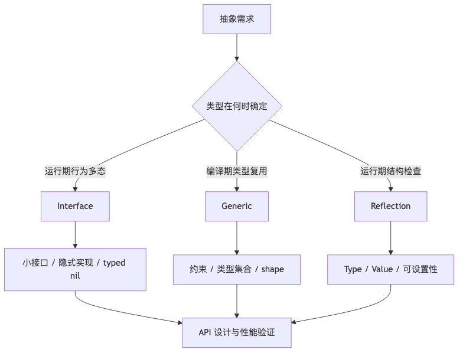

# 第 7 章：接口、反射与泛型：抽象机制导论


> **版本口径**：本章以 **Go 1.26.4** 为主要口径。Go 1.26.4 于 2026 年 6 月 2 日发布。泛型自 Go 1.18 进入语言；Go 1.20 调整了 `comparable` 约束的满足规则；Go 1.22 增加 `reflect.TypeFor`；Go 1.24 完整支持泛型类型别名；Go 1.25 增加 `reflect.TypeAssert`。
>
> **结论标签**：
>
> - **[规范]**：Go Language Specification 保证，不能依赖某个编译器版本改变。
> - **[标准库]**：`reflect` 等公开 API 的文档契约。
> - **[当前实现]**：Go 1.26.4 的 `gc` 编译器、ABI 或 runtime 实现，未来可能调整。

## 阅读定位与关联章节

> 本章是“接口、反射、泛型如何选”的全景章，负责建立三者的边界和共同词汇。为了避免重复，源码级细节不在这里背第二遍：接口底层归第 8 章，泛型和类型集合归第 9 章，反射/unsafe/内存布局归第 10 章。

| 关联概念 | 建议读法 |
|---|---|
| 方法集、接口隐式实现、typed nil、ITab、装箱、接口比较 | 本章给总览；源码级接口实现、API 设计和 typed nil 事故看 [第 8 章：Interface 底层实现与设计](/blog/tech/GO/08.Interface底层实现与设计)。 |
| 类型集合、`~T`、Union、`comparable`、shape、dictionary、迭代器 | 本章只讲“泛型适合什么”；完整泛型语义和实现看 [第 9 章：泛型、类型集合与迭代器](/blog/tech/GO/09.泛型-类型集合与迭代器)。 |
| `reflect.Type/Value`、可寻址、可设置、动态调用、unsafe | 本章只讲选型边界；反射 API、unsafe 边界和对象布局看 [第 10 章：Reflection、unsafe 与 Go 内存布局](/blog/tech/GO/10.Reflection-unsafe与Go内存布局)。 |
| defined type、alias、underlying type、方法集与嵌入 | 类型系统基础看 [第 1 章：类型系统、常量、Struct、方法集与嵌入](/blog/tech/GO/01.类型系统-常量-Struct-方法集与嵌入)。 |
| 接口装箱是否逃逸、反射热路径分配 | 本章只讲判断方法；逃逸分析、分配器和 GC 看 [第 6 章：内存管理、逃逸分析与 GC](/blog/tech/GO/06.内存管理-逃逸分析与GC)。 |

接口、反射和泛型解决的是三个不同层次的抽象问题：

- **接口**解决运行期多态：调用方只依赖行为，具体类型在运行时确定。
- **泛型**解决编译期参数化多态：一份算法在一组满足约束的类型上复用，并尽量保留静态类型信息。
- **反射**解决运行期结构检查与动态操作：程序可以检查类型、字段、方法并动态构造调用，但会牺牲静态检查、可读性和部分性能。

高级面试不会只问“接口是什么”，而会沿着以下链路深挖：

```text
方法集与隐式实现
    ↓
接口值的静态类型、动态类型、动态值
    ↓
typed nil、断言、类型开关、比较与 panic
    ↓
EmptyInterface / NonEmptyInterface / ITab
    ↓
接口转换、装箱、逃逸、动态分派
    ↓
reflect.Value 的有效性、可寻址性、可设置性
    ↓
类型集、约束、~、comparable
    ↓
shape、字典、代码复用与性能边界
    ↓
生产故障、基准测试和源码定位
```

## 本章速览

先把本章看成一张“接口、反射、泛型如何选”的抽象地图：



读图时抓住三个总结：

- 接口解决运行期行为多态，泛型解决编译期类型参数化，反射解决运行期结构操作。
- 三者可以组合，但要分别付出动态派发、代码生成或反射分配与 panic 风险。
- 面试里最重要的不是背定义，而是能按 API 边界、性能证据和故障模式做选型。

---

## 一、本章面试目标

学完本章，应当能够完整回答以下知识链：

1. **接口语义链**：接口类型 → 类型集 → 方法集 → 隐式实现 → 赋值与转换。
2. **接口值模型**：静态类型 → 动态类型 → 动态值 → nil 接口 → typed nil。
3. **方法调用链**：值接收者/指针接收者 → 方法集 → `ITab` → 间接调用。
4. **接口转换链**：编译器 lowering → 类型字/数据字 → 直接存储或间接存储 → 是否逃逸与分配。
5. **断言与类型开关链**：动态类型检查 → 成功/失败语义 → `getitab` → 当前断言缓存实现。
6. **比较链**：接口自身可比较 → 动态类型必须可比较 → 哈希/相等函数 → 运行期 panic 边界。
7. **反射链**：`Type`/`Value` → `Kind` → 有效性 → 可寻址性 → 可设置性 → 导出规则 → 动态调用。
8. **泛型链**：类型参数 → 约束 → 类型集 → 推断 → 实例化 → 允许的操作。
9. **泛型实现链**：实例化 → shape → runtime dictionary → 类型信息、方法、`itab` → 代码共享。
10. **选型链**：接口、泛型、反射分别适合什么问题，何时组合，何时应避免。
11. **性能链**：接口装箱、动态分派、反射调用、泛型代码共享各自的成本以及如何实测。
12. **故障链**：typed nil → 比较 panic → 反射 panic → data race → CPU/分配升高 → 工具定位。

面试回答至少要主动强调以下三点：

- **接口变量不是“一个指针”**，概念上是“动态类型 + 动态值”；当前实现通常是两个机器字。
- **把值赋给接口不等于一定堆分配**，是否分配由具体表示、逃逸分析和编译器优化共同决定。
- **泛型不是接口的语法糖，当前 Go 编译器也不是简单的“每种类型完整复制一份代码”**。

---

## 二、功能介绍

### 2.1 接口：按行为抽象，而不是按继承关系抽象

```go
package main

import "io"

type Buffer struct {
    data []byte
}

func (b *Buffer) Read(p []byte) (int, error) {
    if len(b.data) == 0 {
        return 0, io.EOF
    }
    n := copy(p, b.data)
    b.data = b.data[n:]
    return n, nil
}

var _ io.Reader = (*Buffer)(nil)
```

**[规范]** Go 的接口实现是隐式的。一个非接口类型只要位于接口的类型集中，就实现该接口；对普通方法接口而言，直观判断就是该类型的方法集包含接口要求的全部方法。

编译期断言：

```go
var _ io.Reader = (*Buffer)(nil)
```

这行代码不创建有用的运行期对象，主要用于在编译期验证 `*Buffer` 是否实现 `io.Reader`。相比在注释里声称“实现了某接口”，它能随重构自动失败。

#### 基本接口与约束接口

```go
// 基本接口：只有方法，可以作为普通变量类型。
type Reader interface {
    Read([]byte) (int, error)
}

// 非基本接口：包含类型项，只能用作约束。
type Integer interface {
    ~int | ~int8 | ~int16 | ~int32 | ~int64
}
```

**[规范]** 包含类型项、近似类型项 `~T` 或联合项的非基本接口只能作为类型约束，不能声明普通变量：

```go
// var x Integer // 编译错误：不能在约束之外使用 Integer
```

`any` 是 `interface{}` 的别名，不是新的运行期容器。

### 2.2 方法集：值接收者与指针接收者的核心边界

设定义类型为 `T`：

| 类型 | 方法集包含 |
|---|---|
| `T` | 接收者为 `T` 的方法 |
| `*T` | 接收者为 `T` 或 `*T` 的方法 |
| 接口类型 `I` | `I` 类型集中所有类型共同拥有的方法 |

示例：

```go
package main

import "fmt"

type Counter int

func (Counter) Value() int   { return 1 }
func (*Counter) Increment()  {}

type Valuer interface {
    Value() int
}

type Incrementer interface {
    Increment()
}

func main() {
    var c Counter

    var _ Valuer = c
    var _ Valuer = &c
    // var _ Incrementer = c  // 编译错误
    var _ Incrementer = &c

    fmt.Println(c.Value())
    c.Increment() // c 可寻址，编译器可改写成 (&c).Increment()
}
```

必须区分两条规则：

1. **方法调用语法可以自动取地址或解引用。** `c.Increment()` 能编译，是因为 `c` 可寻址。
2. **接口赋值检查方法集，不会为了让赋值成功而自动取地址。** `var x Incrementer = c` 仍然失败。

这也是面试中“为什么 `t.M()` 能调，但 `T` 却没有实现接口”的标准答案。

### 2.3 接口值：静态类型、动态类型和动态值

```go
var r io.Reader          // 静态类型：io.Reader；动态类型和值均不存在
r = os.Stdin             // 动态类型：*os.File；动态值：指向文件对象的指针
var a any = r            // a 的动态类型仍是 *os.File，而不是 io.Reader
```

**[规范]** 接口变量有一个静态接口类型；运行时装入具体值后，又具有动态类型和动态值。

概念模型：

```text
接口值 = (动态类型, 动态值)

nil 接口       = (nil, nil)
typed nil 接口 = (*MyError, nil)
普通接口值     = (User, User{...})
```

#### nil 接口与 typed nil

```go
package main

import "fmt"

type MyError struct{}

func (*MyError) Error() string { return "my error" }

func load() error {
    var e *MyError = nil
    return e
}

func main() {
    err := load()
    fmt.Println(err == nil) // false
}
```

`err` 的动态类型是 `*MyError`，动态值是 nil 指针，因此接口整体不等于 nil。只有动态类型和动态值都不存在时，接口才是 nil。

生产代码通常应在返回接口前判断具体指针：

```go
func load() error {
    var e *MyError
    if e == nil {
        return nil
    }
    return e
}
```

### 2.4 类型断言与类型开关

```go
v, ok := x.(T)
```

- 成功：`v` 是断言后的值，`ok == true`。
- 失败：双结果形式返回 `T` 的零值和 `false`。
- `v := x.(T)` 的单结果形式失败时 panic。
- 对 nil 接口做任何具体类型断言都失败。

```go
switch v := x.(type) {
case nil:
    fmt.Println("nil interface")
case string:
    fmt.Println("string", v)
case fmt.Stringer:
    fmt.Println("Stringer", v.String())
default:
    fmt.Printf("other %T\n", v)
}
```

类型开关按源代码顺序匹配 case；一个动态类型可能满足多个接口 case，最先匹配的 case 生效。

### 2.5 接口比较：静态上允许，不代表运行时一定安全

接口类型是可比较类型，所以可以写：

```go
var a, b any
_ = a == b
```

但 **[规范]** 要求两个接口值动态类型相同，并且该动态类型的值可比较，才能完成动态值比较。如果两个接口装入了相同的不可比较动态类型，比较会 panic：

```go
var x any = []int{1, 2, 3}
fmt.Println(x == x) // panic: comparing uncomparable type []int
```

作为 `map[any]V` 的键也有同一边界：`any` 静态上可比较，但插入动态值为 slice、map 或 function 的键时会 panic。

### 2.6 反射：运行期类型元数据与值操作

最常用的入口：

```go
reflect.TypeOf(x)   // 动态类型；x 为 nil 接口时返回 nil
reflect.ValueOf(x)  // 动态值；x 为 nil 接口时返回零 reflect.Value
reflect.TypeFor[T]() // 直接取得类型参数 T 对应的 reflect.Type
```

`reflect.Type` 描述类型，`reflect.Value` 封装一个具体值。`Kind` 表示底层类别，例如 `Int`、`Struct`、`Slice`；命名类型的 `Name`、`PkgPath` 与 `Kind` 是不同维度。

```go
package main

import (
    "fmt"
    "reflect"
)

type UserID int64

func main() {
    t := reflect.TypeFor[UserID]()
    fmt.Println(t.Name()) // UserID
    fmt.Println(t.Kind()) // int64
}
```

反射的三条核心规律可概括为：

1. 从接口值可以得到反射对象。
2. 从有效且允许导出的反射值可以回到接口值。
3. 要修改反射值，目标必须可设置；通常要把指针传入，再取 `Elem()`。

```go
x := 10
v := reflect.ValueOf(&x).Elem()
fmt.Println(v.CanAddr(), v.CanSet()) // true true
v.SetInt(20)
```

### 2.7 泛型：由约束限定的编译期参数化

```go
package main

import "cmp"

func Max[T cmp.Ordered](a, b T) T {
    if a > b {
        return a
    }
    return b
}
```

`T` 是类型参数，`cmp.Ordered` 是约束。约束的类型集决定允许传入哪些类型，同时也决定函数体中对 `T` 可以执行哪些操作。

#### `~` 的含义

```go
type Signed interface {
    ~int | ~int8 | ~int16 | ~int32 | ~int64
}

type UserID int64

func Neg[T Signed](x T) T { return -x }

var _ = Neg(UserID(10)) // 可用，因为 UserID 的底层类型是 int64
```

- `int64`：类型集只包含预声明类型 `int64` 本身。
- `~int64`：类型集包含底层类型为 `int64` 的所有类型。

#### `comparable` 的重要版本边界

`comparable` 用于表达支持 `==`、`!=` 且适合作为 map 键的约束。但从 Go 1.20 起，普通接口类型也可以满足 `comparable` 约束；若实际动态值不可比较，比较仍可能在运行时 panic：

```go
func Equal[T comparable](a, b T) bool { return a == b }

func main() {
    Equal[any]([]int{1}, []int{1}) // 编译通过，运行时 panic
}
```

所以“`T comparable` 保证所有实例化后的比较绝不 panic”是错误结论。更准确地说：对严格可比较的具体类型安全；当类型实参本身是接口或包含接口字段的复合类型时，仍要考虑动态值。

### 2.8 接口、泛型与反射如何选

| 需求 | 首选 | 原因 | 主要代价 |
|---|---|---|---|
| 不同实现共享一组行为，运行期替换实现 | 接口 | 解耦调用者和实现者，适合依赖倒置 | 动态分派，可能装箱，能力受方法集限制 |
| 同一算法支持一组静态类型 | 泛型 | 保留类型信息，避免重复代码和手工断言 | 约束设计复杂，可能增加编译时间/二进制体积 |
| 运行时字段遍历、标签解析、动态调用 | 反射 | 类型在编译期未知仍可处理 | 易 panic、难重构、性能与可读性较差 |
| “任意值”只做传递，不操作内部结构 | `any`/接口 | 简单且不需要反射 | 使用点必须断言或类型开关 |
| 高性能序列化热路径 | 生成代码或泛型 + 少量反射缓存 | 把动态工作移到初始化阶段 | 构建链和代码量增加 |
| API 只需一两个行为 | 小接口 | 最小依赖面，易测试 | 接口过碎也会增加抽象成本 |

经验规则：

- **行为多态用接口。**
- **算法复用用泛型。**
- **结构未知且必须在运行期检查时才用反射。**
- 泛型不能替代所有接口：当具体实现要在运行时装入同一容器，接口仍然自然。
- 接口不能替代所有泛型：`[]T` 到 `[]any` 不能零成本协变，强行用 `any` 会丢失静态类型并引入断言。
- 反射不应仅仅用来规避几行重复代码；先评估接口、泛型、代码生成是否更清晰。

---

## 三、底层实现

### 3.1 当前接口值的运行时布局

#### 空接口

Go 1.26.4 的 ABI 定义：

```go
// src/internal/abi/iface.go
type EmptyInterface struct {
    Type *Type
    Data unsafe.Pointer
}
```

概念图：

```text
var x any = concreteValue

+----------------------+----------------------+
| Type *abi.Type       | Data unsafe.Pointer  |
+----------------------+----------------------+
          |                         |
          v                         v
  具体类型元数据             具体值或其副本的位置
```

#### 非空接口

```go
// src/internal/abi/iface.go
type NonEmptyInterface struct {
    ITab *ITab
    Data unsafe.Pointer
}

type ITab struct {
    Inter *InterfaceType
    Type  *Type
    Hash  uint32
    Fun   [1]uintptr
}
```

概念图：

```text
var r io.Reader = concreteValue

接口值
+----------------------+----------------------+
| ITab *abi.ITab       | Data unsafe.Pointer  |
+----------------------+----------------------+
          |
          v
+----------------------+----------------------+
| Inter: io.Reader     | Type: concrete type  |
+----------------------+----------------------+
| Hash                 | Fun[0], Fun[1]...    |
+----------------------+----------------------+
                                  |
                                  v
                         接口方法调用入口
```

`ITab` 同时关联“目标接口类型”和“动态具体类型”，并保存接口方法对应的调用入口。`Fun` 在源码中声明为长度 1 的尾随数组，实际按接口方法数量分配更大的连续内存。

需要注意：

- **[当前实现]** `ITab` 分配在非 GC 管理的持久内存中。
- `Fun[0] == 0` 可表示该具体类型不实现该接口，用于缓存失败结果。
- `Hash` 用于类型开关相关路径；当前 runtime 动态创建的 `ITab` 不参与编译器静态生成的类型开关时，可把该字段设为 0。因此不要把“任何 `ITab.Hash` 都必定等于具体类型哈希”说成永久事实。

#### Data 字并不总是“指向堆对象”

**[当前实现]** 具体值的接口表示分两类：

1. **可直接装入接口数据字的类型**：数据字直接携带该值，例如部分单字指针类值。
2. **间接存储的类型**：数据字指向值的副本；副本可能位于只读静态区、栈上或堆上。

`src/internal/abi/type.go` 中的 `TFlagDirectIface`/`IsDirectIface` 记录当前 ABI 是否可直接存储。不能简单用“值大小小于一个指针”猜测，因为表示还受到类型布局、指针性和编译器优化影响。

#### nil 接口为何与 typed nil 不同

```text
nil any:
+----------+----------+
| Type=nil | Data=nil |
+----------+----------+

any((*User)(nil)):
+------------------+----------+
| Type=*User       | Data=nil |
+------------------+----------+

nil 非空接口:
+----------+----------+
| ITab=nil | Data=nil |
+----------+----------+

error((*MyError)(nil)):
+--------------------------+----------+
| ITab=(*MyError,error)     | Data=nil |
+--------------------------+----------+
```

接口与 nil 比较首先能看出类型字/`ITab` 是否为空。typed nil 仍保留动态类型，所以不等于 nil。

#### 复制接口值意味着什么

接口赋值本身复制当前接口表示；它不会自动深拷贝动态值：

- 动态值是结构体值且被间接装箱时，接口中保存的是赋值时的结构体副本。
- 动态值是指针、slice、map、channel、function 等描述符/引用类值时，复制后仍可能指向同一底层对象。
- 因此“接口是引用类型”不准确；更好的说法是：**接口值按值复制，但其动态值可能间接引用共享对象。**

### 3.2 从具体类型转换为接口：编译器 lowering 与分配

源代码：

```go
var x any = value
var r io.Reader = reader
```

**[当前实现]** 编译器在 `src/cmd/compile/internal/walk/convert.go` 的 `walkConvInterface` 中，把转换降低为类似：

```text
OMAKEFACE(typeWord, dataWord)
```

- `typeWord`：空接口使用具体类型元数据；非空接口使用对应 `ITab`。
- `dataWord`：直接保存值，或指向一个可供接口使用的副本。

当前编译器会根据情况选择：

- 直接接口表示；
- 零大小对象的共享地址；
- 小整数/布尔值的静态只读表；
- 只读全局常量地址；
- 不逃逸且尺寸受控时的栈临时对象；
- runtime 转换函数及必要的堆分配。

runtime 中可见的转换辅助函数包括：

- `convT`：为含指针类型分配并进行 typed memory move；
- `convTnoptr`：无指针类型的复制路径；
- `convT16`、`convT32`、`convT64`：小整数专门路径；
- `convTstring`、`convTslice`：字符串和 slice 描述符的专门路径。

例如，当前 runtime 对一部分较小无符号整数可复用 `staticuint64s` 静态表，避免分配。这属于优化细节，业务逻辑绝不能依赖其地址或分配次数。

#### “赋值给接口一定逃逸到堆”为什么错

是否堆分配取决于：

1. 动态值是否可以直接放入接口数据字；
2. 是否已有可复用静态存储；
3. 接口值和动态值是否逃逸当前栈帧；
4. 编译器能否内联、标量替换或消除接口；
5. 当前版本的 lowering 与 ABI。

应以以下工具验证具体代码：

```bash
go build -gcflags='all=-m=2' ./...
go test -bench=. -benchmem ./...
```

面试中的标准表述是：**接口转换可能产生装箱和分配，但不是语义保证，也不是必然发生。**

#### 时间与空间复杂度

- 直接表示：构造接口通常是 O(1)。
- 间接表示：复制成本通常是 O(`sizeof(T)`)，必要时再加一次分配。
- 大结构体频繁按值装入接口会产生明显复制成本；传指针能减少复制，但会改变可变性、共享和逃逸行为，不能只为“快”机械改指针。

### 3.3 `ITab` 构造、方法匹配与动态分派

#### `getitab` 快路径

**[当前实现]** `src/runtime/iface.go:getitab` 的主要流程：

```text
(interface type, concrete type)
             |
             v
    无锁查询全局 itab 表
       | 命中          | 未命中
       v               v
   检查 Fun[0]      加 itabLock
                       |
                  加锁后再次查询
                       |
                  分配并 itabInit
                       |
                    插入哈希表
```

当前全局表使用接口类型与具体类型组合的哈希，开放寻址并采用二次探测；负载达到约 75% 时扩容为两倍。首次创建需要锁，常见查询走原子读取的无锁快路径。

#### 方法匹配不是朴素的二重循环

接口方法列表和具体类型方法列表都按名称排序。`itabInit` 以锁步方式匹配方法，并同时检查方法签名、名称和包路径，复杂度为：

```text
O(接口方法数 + 具体类型方法数)
```

而不是 O(`ni * nt`)。

若不实现：

- 双结果断言/可失败转换可返回失败，并把 `Fun[0] == 0` 的负结果缓存下来；
- 后续单结果断言若命中负缓存，为生成准确错误信息，可能重新扫描以找出缺失方法名，然后 panic。

#### 接口方法调用

```go
r.Read(buf)
```

当前实现概念上会：

1. 从接口的 `ITab` 取得对应方法入口；
2. 取数据字作为接收者表示；
3. 通过 ABI 适配入口间接调用具体方法。

这比可直接内联的静态调用多一次动态加载和间接分派，并可能阻碍内联。但实际成本取决于编译器是否完成去虚拟化、调用频率、方法体大小、CPU 分支预测以及是否伴随装箱分配，不能只背“接口调用慢 N 倍”。

#### 类型断言与类型开关

**[规范]** 只规定成功、失败、panic 和 case 匹配语义。

**[当前实现]** Go 1.26.4 的 runtime 对部分接口断言和类型开关维护缓存：

- 断言先尝试已生成的快速检查；未命中时进入 `typeAssert`/`getitab`。
- 当前实现以低概率重建缓存，并通过 CAS 发布，以摊薄更新成本。
- 类型开关可利用动态类型哈希构建分发逻辑；具体生成策略由编译器决定。

缓存概率、表布局和更新策略都不是语言保证。

#### 接口相等与哈希

接口比较的逻辑可概括为：

```text
动态类型不同         -> 不相等
动态类型相同且为 nil -> 比较相应零/空状态
动态类型不可比较     -> panic
动态类型可比较       -> 调用该类型的相等函数
```

用作 map 键时，还需调用动态类型的哈希函数。具体类型元数据中保存相等函数等信息；slice、map、function 等不支持普通相等比较，因此作为动态键会在运行期失败。

### 3.4 `reflect.Value` 的当前表示与三类状态

Go 1.26.4 中 `reflect.Value` 的核心字段可概括为：

```go
type Value struct {
    typ_ *abi.Type
    ptr  unsafe.Pointer
    flag
}
```

`flag` 编码：

- `Kind`；
- 值是否间接存储；
- 是否可寻址；
- 是否来自未导出字段而只读；
- 是否表示方法值等。

#### 有效、可寻址、可设置不是同一个概念

| 状态 | 含义 | 典型来源 |
|---|---|---|
| 有效 `IsValid()` | `Value` 确实表示某个值 | `ValueOf(10)` |
| 可寻址 `CanAddr()` | 可以取得其地址 | `ValueOf(&x).Elem()` |
| 可设置 `CanSet()` | 可通过反射修改 | 可寻址且不受只读/未导出限制 |
| 可接口化 `CanInterface()` | 可以安全调用 `Interface()` | 非受限的导出值 |

当前实现的 `CanSet` 条件可概括为：有可寻址标志，且没有只读标志。

```go
x := 10
v1 := reflect.ValueOf(x)
v2 := reflect.ValueOf(&x).Elem()

fmt.Println(v1.CanAddr(), v1.CanSet()) // false false
fmt.Println(v2.CanAddr(), v2.CanSet()) // true true
```

#### 零 `reflect.Value` 与某类型零值

这是高频陷阱：

```go
var invalid reflect.Value
zeroInt := reflect.Zero(reflect.TypeFor[int]())
```

- `invalid.IsValid() == false`，`Kind() == reflect.Invalid`；多数读取方法会 panic。
- `zeroInt.IsValid() == true`，表示一个有效的 `int(0)`，但通常不可设置。

`ValueOf(nil)` 返回无效的零 `Value`。对 nil 指针或 nil 接口调用 `Elem()` 也返回无效 `Value`，不是“表示目标类型零值的 Value”。

#### 未导出字段

即使通过反射找到了未导出字段，标准库也会限制 `CanSet` 和 `CanInterface`。绕过限制通常需要 `unsafe`，会破坏封装并依赖布局，不应作为普通业务方案。

#### `reflect.TypeAssert`

Go 1.25 增加：

```go
v, ok := reflect.TypeAssert[T](rv)
```

它在语义上类似：

```go
v, ok := rv.Interface().(T)
```

但标准库可避免后者中不必要的内存分配。仍应先确认 `rv` 有效且可接口化；该 API 不会解除未导出字段限制。

#### 反射的主要成本

- 动态类型检查和大量分支；
- 无法像普通静态代码一样充分内联；
- `Value.Interface`、`Call`、切片参数构造等路径可能分配；
- 错误从编译期转移到运行期 panic；
- 复杂反射代码增加维护成本。

常见优化是：首次看到一个 `reflect.Type` 时解析字段、标签和访问计划，缓存元数据；热路径按缓存执行，而不是每个请求重新遍历类型。

### 3.5 泛型的规范模型与当前编译器实现

#### 规范层：类型集决定合法类型与合法操作

```go
type Addable interface {
    ~int | ~int64 | ~float64 | ~string
}

func Add[T Addable](a, b T) T {
    return a + b
}
```

编译器必须证明 `+` 对约束类型集内的每个类型都有效。约束不是只用来“过滤调用者”，也定义了泛型函数体可以依赖的共同操作。

联合类型项有严格限制，例如非接口项的类型集必须两两不相交：

```go
// 错误：int 的类型集包含于 ~int，二者重叠。
// type Bad interface { int | ~int }
```

带多个项的联合还不能任意嵌入 `comparable` 或含方法的接口。面试时无需背完全部语法限制，但要知道：**类型集是集合运算，编译器要保证联合项没有规范禁止的重叠和组合。**

#### 类型推断

```go
func First[A, B any](a A, b B) A { return a }

x := First(1, "go") // 推断 A=int, B=string
```

推断根据实参、已知类型实参、约束以及上下文求解。推断失败时应显式给出必要类型实参；不能把“能推断”说成语言永远能从返回值单独反推所有类型参数。

#### 当前 `gc` 编译器：shape + 字典的混合方案

Go 1.26.4 的编译器并非简单执行以下任一极端模型：

- 不是 Java 式把所有类型信息完全擦除并统一装箱；
- 也不是 C++ 模板式保证每个具体类型都生成完全独立的一份机器码。

**[当前实现]** 编译器会把一部分类型实例映射到内部 **shape type**，让 ABI/表示相容的实例共享代码；同时生成或传递运行时字典，提供泛型代码需要的类型信息、子字典、方法表达式和 `itab` 等。

概念图：

```text
调用 F[int]
   |
   +--> 选择/生成 shape 版本 F[go.shape.int]
   |          |
   |          +--> 普通算术可直接生成机器指令
   |          +--> 需要类型元数据时从 dictionary 读取
   |
   +--> 传入该实例对应的 runtime dictionary

调用 F[MyInt]
   |
   +--> 若 shape/ABI 可共享，复用同一形状代码
   +--> 使用不同字典保留实际类型信息
```

`src/cmd/compile/internal/noder/reader.go` 中可看到：

- `shapify`；
- runtime dictionary 的构造；
- 类型参数方法表达式；
- 子字典；
- runtime 类型描述符；
- `itab` 条目。

这解释了几个面试结论：

1. 泛型调用通常不需要把参数装入普通接口，因此不等于接口动态分派。
2. 某些操作仍可能通过字典取得类型元数据或方法入口。
3. 多个实例可能共享机器码，因此不能把 Go 泛型概括为“完整单态化”。
4. 具体是否内联、共享多少代码、二进制增长多少，属于编译器优化结果，必须用当前工具链实测。

#### 泛型方法的限制

方法可以使用接收者类型已有的类型参数：

```go
type Box[T any] struct{ V T }

func (b Box[T]) Get() T { return b.V }
```

但方法不能额外声明自己的方法级类型参数：

```go
// 编译错误
// func (b Box[T]) Map[U any](f func(T) U) U { ... }
```

通常把它改为包级泛型函数：

```go
func MapBox[T, U any](b Box[T], f func(T) U) Box[U] {
    return Box[U]{V: f(b.V)}
}
```

#### 泛型的性能边界

- 静态约束允许编译器生成直接算术和直接内存操作时，性能通常接近手写具体类型代码。
- 通过约束方法调用时，可能涉及字典中的方法信息或调用适配，是否去虚拟化取决于编译器。
- 大量不同实例可能增加编译时间、字典和部分代码体积，但 shape 共享会缓解“每种类型复制全部代码”的最坏情况。
- 泛型不自动消除逃逸与分配；返回闭包、接口化、反射化或把地址保存到堆对象仍可能逃逸。

### 3.6 三种机制的底层差异

| 维度 | 接口 | 泛型 | 反射 |
|---|---|---|---|
| 类型选择时机 | 运行期动态类型 | 编译期实例化 | 运行期 |
| 类型安全 | 接口方法静态检查；断言可失败 | 约束内静态检查 | 大量错误运行期才发现 |
| 当前主要表示 | 类型/`ITab` + 数据字 | shape 代码 + 字典等 | `reflect.Type`/`Value` + flags |
| 调用方式 | 常见为间接分派 | 常见为静态/shape 代码，必要时查字典 | `Value.Call` 动态检查与调用 |
| 分配 | 可能装箱，非必然 | 由普通逃逸规则决定 | 常见动态对象和参数切片可能分配 |
| 最适合 | 行为替换、依赖倒置 | 类型安全算法复用 | 元编程、序列化、框架基础设施 |
| 主要风险 | typed nil、比较 panic、接口污染 | 约束复杂、代码体积、误判实现成本 | panic、慢、难维护、绕过封装 |

### 3.7 版本变化与过时面经纠正

| 版本 | 相关变化 | 面试时如何表述 |
|---|---|---|
| Go 1.18 | 引入类型参数、类型集约束、`any`、`comparable` | 早于 1.18 的“Go 没有泛型”已经过时 |
| Go 1.20 | 普通接口等可满足 `comparable` 约束 | 实例化能编译不代表动态比较绝不 panic |
| Go 1.22 | `reflect.TypeFor[T]()` | 不再必须写 `TypeOf((*T)(nil)).Elem()` 技巧 |
| Go 1.24 | 完整支持泛型类型别名 | `type Set[P comparable] = map[P]struct{}` 可作为正式语言功能 |
| Go 1.25 | `reflect.TypeAssert[T]` | 可直接从 `Value` 做泛型断言并减少不必要分配 |
| Go 1.26.4 | 本章 runtime/compiler 基线 | `ITab`、断言缓存、shape/字典细节均按此版本描述 |

常见过时或过度简化结论：

- “空接口叫 `eface`，非空接口叫 `iface`，源码中永远就是这两个结构体。”——这些是长期流行的实现术语；当前 ABI 源码核心公开内部布局名为 `EmptyInterface`、`NonEmptyInterface`、`ITab`。概念可沿用，字段名不能脱离版本。
- “接口转换一定分配。”——错误。
- “接口只要能写 `==` 就不会 panic。”——错误。
- “泛型为每种类型复制一份函数。”——不准确，当前实现存在 shape 共享与字典。
- “`comparable` 能从类型系统上彻底排除运行期比较 panic。”——对接口类型实参不成立。
- “反射值只要可寻址就可修改。”——不完整，还必须可设置且不受未导出字段只读限制。

---

## 四、源码阅读路径

### 4.1 语言规范

1. `https://go.dev/ref/spec#Interface_types`
   - 看接口的类型集、基本接口、非基本接口、嵌入和联合类型项。
2. `https://go.dev/ref/spec#Method_sets`
   - 看 `T`、`*T` 和接口的方法集定义。
3. `https://go.dev/ref/spec#Variables`
   - 看接口变量的动态类型、动态值和 nil 初始状态。
4. `https://go.dev/ref/spec#Type_assertions`
   - 看断言成功条件、单结果与双结果形式。
5. `https://go.dev/ref/spec#Type_switches`
   - 看 case 匹配、`nil` case、变量类型。
6. `https://go.dev/ref/spec#Comparison_operators`
   - 看接口比较与动态不可比较类型导致 panic 的边界。
7. `https://go.dev/ref/spec#Type_parameter_declarations`
   - 看类型参数和约束。
8. `https://go.dev/ref/spec#Type_inference`
   - 看类型推断的阶段和边界。

从规范可以直接推出的面试答案：

- 实现接口不需要显式声明。
- nil 接口没有动态类型；typed nil 有动态类型。
- `T` 和 `*T` 实现接口的结论由方法集决定。
- 接口比较可能因为动态类型不可比较而 panic。
- 非基本接口不能作为普通变量类型。
- 泛型函数可执行的操作必须对约束类型集中的所有类型成立。

### 4.2 接口 ABI 与 runtime

#### `src/internal/abi/iface.go`

核心类型：

- `ITab`
- `EmptyInterface`
- `NonEmptyInterface`
- `CommonInterface`

阅读重点：

- 空接口与非空接口第一字的差别；
- `ITab.Inter`、`Type`、`Hash`、`Fun` 的协作；
- `Fun[0] == 0` 的负缓存含义；
- 尾随方法表为什么声明成 `[1]uintptr`。

#### `src/internal/abi/type.go`

核心内容：

- `Type`
- `TFlagDirectIface`
- `IsDirectIface`
- `InterfaceType`
- `Method`/`Imethod`

阅读重点：

- 具体类型元数据如何描述大小、指针字节、哈希、相等函数和 GC 数据；
- 哪些类型能直接存入接口数据字；
- 普通方法入口与接口调用入口的 ABI 差别。

#### `src/runtime/iface.go`

推荐阅读顺序：

1. `getitab`
2. `itabTableType.find`
3. `itabAdd` / `itabTableType.add`
4. `itabInit`
5. `convT` / `convTnoptr`
6. `convT16` / `convT32` / `convT64`
7. `convTstring` / `convTslice`
8. `assertE2I` / `assertE2I2`
9. `typeAssert`
10. `interfaceSwitch`

阅读时重点回答：

- `ITab` 为什么能缓存 `(接口类型, 具体类型)` 关系？
- 常见查找为何可以无锁？
- 首次构造为什么需要锁？
- 方法匹配为何是 O(`ni + nt`)？
- 失败断言为什么也值得缓存？
- 当前断言/类型开关缓存为何采用概率更新和 CAS？

#### `src/runtime/alg.go`

关注接口哈希与相等相关函数，以及类型元数据中的哈希/相等入口如何被 map 和比较使用。重点理解语义，不要依赖内部函数名永久不变。

### 4.3 编译器接口 lowering

#### `src/cmd/compile/internal/walk/convert.go`

核心函数：

- `walkConvInterface`
- `dataWord`
- `dataWordFuncName`

阅读重点：

- 具体类型到接口如何构造 `OMAKEFACE`；
- 直接接口、静态值、栈临时对象和 runtime 转换函数的选择；
- 为什么“装入接口一定分配”不成立；
- 接口到接口的转换何时需要断言路径。

#### `src/cmd/compile/internal/walk/switch.go`

阅读重点：

- 类型开关如何按动态类型或类型哈希生成分发；
- 编译器何时生成快速路径，何时调用 runtime；
- case 顺序语义与内部优化如何同时成立。

### 4.4 `reflect`

#### `src/reflect/value.go`

推荐阅读：

- `Value` 与 flags
- `ValueOf`
- `Value.Elem`
- `Value.CanSet`
- `Value.CanInterface`
- `Value.Interface`
- `Value.Set`
- `Value.Call`
- `TypeAssert`

重点回答：

- 零 `Value` 如何表示？
- `CanAddr`、`CanSet`、`CanInterface` 分别由什么限制？
- 为什么从非指针值取得的 `Value` 不能设置？
- 未导出字段为什么不能正常 `Interface`？
- 动态调用需要进行哪些类型和参数数量检查？

#### `src/reflect/type.go`

关注：

- `TypeOf`
- `TypeFor`
- `PointerTo`
- `StructOf`
- 类型元数据包装与方法查询

#### 官方博客

- `https://go.dev/blog/laws-of-reflection`

阅读时把博客中的概念模型与当前 `reflect` 源码分开：博客解释的是稳定思维模型，内部字段和优化仍以当前版本源码为准。

### 4.5 泛型类型检查与实例化

#### 规范和类型检查器

可按以下路径阅读：

- `src/cmd/compile/internal/types2/typeset.go`
- `src/cmd/compile/internal/types2/instantiate.go`
- `src/cmd/compile/internal/types2/infer.go`
- 标准库镜像实现：`src/go/types/`

阅读重点：

- 类型集如何求交、求联合并验证重叠；
- 约束满足与实现接口的区别；
- 类型实参替换和实例化；
- 类型推断如何收集并求解类型等式。

#### `src/cmd/compile/internal/noder/reader.go`

核心线索：

- `readerDict`
- `shapify`
- runtime dictionary 的布局与生成
- `typeParamMethodExprs`
- `subdicts`
- `rtypes`
- `itabs`

可从源码推导的面试答案：

- 当前编译器有 shape 代码共享，不是完全逐类型复制代码。
- 字典不仅保存普通类型描述符，还可保存方法表达式、子字典和 `itab`。
- 泛型方法调用与普通接口调用不是同一种源语言机制，但当前后端都可能使用类型元数据和间接入口。

### 4.6 推荐总阅读顺序

```text
Specification: Interface types / Method sets
    ↓
internal/abi/iface.go
    ↓
runtime/iface.go: getitab → itabInit → convT
    ↓
compiler/walk/convert.go 与 switch.go
    ↓
reflect/value.go: ValueOf → Elem → CanSet → Interface → Call
    ↓
Specification: Type parameters / Type inference
    ↓
types2: typeset → instantiate → infer
    ↓
noder/reader.go: shapify 与 runtime dictionary
```

不要一开始就背字段。先用规范建立“什么必须成立”，再用源码解释“当前版本如何做到”。

---
## 五、常用场景

### 5.1 在使用方定义小接口

```go
package report

type UserLoader interface {
    LoadUser(id int64) (User, error)
}

type Service struct {
    users UserLoader
}
```

**为什么适合**：

- 调用方只声明自己真正需要的能力；
- 实现类型不需要反向依赖调用方包；
- 测试替身只实现一两个方法；
- 减少大接口升级造成的连锁修改。

**不适合**：

- 为每个函数机械创建只用一次、没有抽象价值的接口；
- 接口只包裹一个具体类型，又没有替换、测试或边界隔离需求；
- 在实现包提前设计“万能接口”，把所有未来可能的方法都放进去。

替代方案：直接传具体类型、函数值或泛型参数。函数值尤其适合单一行为：

```go
type UserLoaderFunc func(int64) (User, error)
```

### 5.2 可选能力探测

标准库中常见做法是先依赖最小接口，再通过断言探测额外能力：

```go
if f, ok := w.(interface{ Flush() error }); ok {
    _ = f.Flush()
}
```

适合：协议适配、流式输出、优化快路径。

风险：

- 可选接口过多会让行为难以预测；
- 断言失败时必须有正确降级路径；
- 不要用未文档化的私有可选接口形成隐形协议。

### 5.3 用泛型实现容器和算法

```go
type Set[T comparable] map[T]struct{}

func (s Set[T]) Add(v T) { s[v] = struct{}{} }
func (s Set[T]) Has(v T) bool {
    _, ok := s[v]
    return ok
}
```

适合：

- slice/map 上的算法；
- 类型安全集合、堆、缓存包装；
- 数值算法；
- 返回类型与输入类型存在静态关系的转换。

不适合：

- 只是为了隐藏一个具体实现；
- 类型参数只出现一次，且普通接口已经准确表达行为；
- 约束极其复杂，调用者反而难以理解错误信息；
- 需要把不同具体类型混放在同一运行期集合，通常仍需接口或 tagged union。

### 5.4 用反射做框架边界，而不是扩散到业务层

典型场景：

- JSON/ORM/DI 框架读取 struct tag；
- 测试框架动态发现方法；
- RPC/序列化层根据运行期类型建立编解码计划；
- 通用字段校验器。

推荐结构：

```text
首次遇到 reflect.Type
    ↓
解析字段、标签、偏移和编码函数
    ↓
缓存 immutable plan
    ↓
请求热路径复用 plan
```

不推荐在每次请求中：

```text
ValueOf → NumField → Field → Tag.Get → Interface → 类型断言
```

反射应被封装在边界包内，对业务层暴露普通类型安全 API。

### 5.5 接口用于依赖倒置，泛型用于数据关系

下列 API 用接口更自然：

```go
func Copy(dst io.Writer, src io.Reader) error
```

因为核心是两种运行时行为。

下列 API 用泛型更自然：

```go
func Map[S ~[]E, E, R any](s S, f func(E) R) []R
```

因为返回元素类型与输入、函数返回类型存在静态关系。若改成 `[]any`，调用者要装箱、断言并丢失编译期检查。

### 5.6 对外 API 中谨慎使用 `any`

适合：

- 日志字段值；
- 事件载荷需要携带异构数据；
- 仅透传到序列化边界；
- 兼容已有动态协议。

不适合：

- 真实类型集合其实很小且稳定；
- 调用者必须阅读实现才知道允许哪些类型；
- 错误直到运行期才暴露；
- API 内部大量 `switch v := x.(type)`。

可替代为：

- 明确接口；
- 泛型；
- 枚举 + 明确字段的 tagged union；
- 多个命名构造函数。

### 5.7 指针还是值装入接口

应按语义选择，而不是只按性能：

| 选择 | 优点 | 风险 |
|---|---|---|
| 值装入接口 | 接口持有快照；调用方后续修改原值不影响快照 | 大值复制；仅值方法集可用 |
| 指针装入接口 | 避免大结构体复制；可修改共享对象；包含指针接收者方法 | typed nil；共享可变状态；更可能逃逸；需同步 |

不可变小值通常可直接按值；有身份、内部锁、不可复制字段或需要修改状态的对象通常使用指针。

### 5.8 高性能路径先基准，再决定是否消除接口/反射

优化顺序：

1. 建立可重复 benchmark；
2. `-benchmem` 看分配；
3. CPU/alloc pprof 定位热点；
4. `-gcflags='all=-m=2'` 看逃逸和内联；
5. 检查是否可缓存反射元数据；
6. 再考虑泛型、代码生成、专门化快路径或接口去虚拟化。

不要根据“接口慢”“反射慢”的口号重写架构。若真正瓶颈是 I/O、锁竞争或数据库，消除一次纳秒级分派没有工程价值。

---

## 六、代码陷阱题

### 题 1：typed nil 返回为 `error`

**题目**

```go
package main

import "fmt"

type MyError struct{}

func (*MyError) Error() string { return "failed" }

func work() error {
    var e *MyError
    return e
}

func main() {
    err := work()
    fmt.Println(err == nil)
}
```

**判断**：输出什么？

**答案**：输出 `false`。

**分析**：

1. `e` 是 nil 的 `*MyError`。
2. 返回时转换为 `error`，接口取得动态类型 `*MyError`。
3. 动态值虽是 nil 指针，但动态类型不为空。
4. 接口只有在动态类型和值都不存在时才等于 nil。

**继续追问**：

- `fmt.Println(err)` 是否一定 panic？不一定，取决于 `Error` 方法是否解引用 nil 接收者以及格式化路径。
- 如何修复？在返回前显式判断具体指针，返回无类型的 `nil`。
- 如何写静态检查或测试覆盖这类问题？为错误返回路径写 `if err != nil` 测试，并避免返回可能为 nil 的具体错误指针。

---

### 题 2：nil 指针接收者的方法是否必然 panic

**题目**

```go
package main

import "fmt"

type Node struct{ N int }

func (n *Node) String() string {
    if n == nil {
        return "<nil-node>"
    }
    return fmt.Sprint(n.N)
}

func main() {
    var n *Node
    var s fmt.Stringer = n
    fmt.Println(s == nil)
    fmt.Println(s.String())
}
```

**判断**：输出还是 panic？

**答案**：输出：

```text
false
<nil-node>
```

**分析**：

1. `s` 是 typed nil 接口，因此 `s != nil`。
2. Go 允许以 nil 指针作为指针接收者调用方法。
3. 是否 panic 取决于方法体是否在检查前解引用接收者；不是调用动作本身必然 panic。

**继续追问**：是否推荐所有指针接收者都支持 nil？不推荐机械支持。只有当 nil 有明确业务语义且文档说明时才这样设计。

---

### 题 3：值类型是否实现指针接收者接口

**题目**

```go
package main

type T struct{}

func (*T) M() {}

type M interface{ M() }

var _ M = T{}

func main() {}
```

**判断**：能否编译？

**答案**：不能。`T` 的方法集不包含接收者为 `*T` 的 `M`；`*T` 才实现接口。

**逐行分析**：

- `func (*T) M()` 把方法加入 `*T` 的方法集。
- `var _ M = T{}` 要求 `T` 自身实现 `M`。
- 改为 `var _ M = (*T)(nil)` 即可。

**继续追问**：若 `M` 使用值接收者，则 `T` 和 `*T` 都实现该接口。

---

### 题 4：为什么方法能调用，接口赋值却失败

**题目**

```go
package main

type T struct{}
func (*T) M() {}

type M interface{ M() }

func main() {
    var t T
    t.M()
    var x M = t
    _ = x
}
```

**判断**：`t.M()` 与接口赋值分别如何？

**答案**：`t.M()` 可编译；`var x M = t` 编译失败。

**分析**：

- `t` 可寻址，方法调用语法可自动改写为 `(&t).M()`。
- 接口实现检查严格依据方法集，不会把 `t` 自动改成 `&t`。

**继续追问**：若 `t` 是 map 元素，`m[k].M()` 是否可调用？map 元素不可寻址，不能依赖自动取地址调用指针接收者方法。

---

### 题 5：接口保存值快照还是原对象

**题目**

```go
package main

import "fmt"

type S struct{ N int }

func main() {
    s := S{N: 1}
    var x any = s
    s.N = 2
    fmt.Println(x.(S).N, s.N)
}
```

**判断**：输出什么？

**答案**：输出 `1 2`。

**分析**：把结构体值装入接口时，接口持有当时值的副本。之后修改原变量不会回写接口副本。

若改成：

```go
var x any = &s
s.N = 2
fmt.Println(x.(*S).N)
```

则输出 `2`，因为接口中的动态值是指向同一对象的指针。

**继续追问**：接口值按值复制是否等于深拷贝？不是；动态值内部的指针、slice、map 等仍可共享底层对象。

---

### 题 6：nil 接口上的类型断言

**题目**

```go
package main

import "fmt"

func main() {
    var x any
    v, ok := x.(int)
    fmt.Println(v, ok)
    fmt.Println(x.(int))
}
```

**判断**：输出还是 panic？

**答案**：先输出 `0 false`，随后第二次断言 panic。

**分析**：

- nil 接口没有动态类型，不可能满足 `int`。
- 双结果形式返回目标类型零值和 `false`。
- 单结果形式失败时 panic。

**继续追问**：断言目标为接口类型时也一样，nil 接口不会“实现空接口断言成功”；`x.(any)` 对 nil 接口仍失败。

---

### 题 7：类型开关的 case 顺序

**题目**

```go
package main

import "fmt"

type E struct{}

func (E) Error() string  { return "error" }
func (E) String() string { return "string" }

func classify(x any) string {
    switch x.(type) {
    case fmt.Stringer:
        return "stringer"
    case error:
        return "error"
    default:
        return "other"
    }
}

func main() {
    fmt.Println(classify(E{}))
}
```

**判断**：输出什么？

**答案**：输出 `stringer`。

**分析**：`E` 同时实现 `fmt.Stringer` 和 `error`，类型开关按 case 的源代码顺序选择第一个匹配项。

**继续追问**：把 `error` 放前面会输出什么？`error`。类型开关不是按“更具体接口”自动排序。

---

### 题 8：接口与自己比较也可能 panic

**题目**

```go
package main

import "fmt"

func main() {
    var x any = []int{1, 2}
    fmt.Println(x == x)
}
```

**判断**：输出 `true` 还是 panic？

**答案**：panic。

**分析**：两个接口动态类型相同，都是 `[]int`；下一步需要比较动态值，但 slice 不可比较，因此运行时 panic。

**继续追问**：

- 动态类型不同且其中一个不可比较时是否 panic？通常先发现动态类型不同而得到不等；规范关键条件是相同动态类型的比较。
- 安全比较任意值怎么办？明确限定类型集合，或使用适合业务语义的比较函数；`reflect.DeepEqual` 也有自身语义边界。

---

### 题 9：`map[any]V` 并不接受所有动态键

**题目**

```go
package main

func main() {
    m := make(map[any]string)
    m[[]int{1}] = "x"
}
```

**判断**：编译失败还是运行时 panic？

**答案**：编译通过，插入时 panic。

**分析**：`any` 是可比较的接口类型，满足 map 键的静态要求；但实际键的动态类型是不可哈希的 `[]int`，runtime 无法计算合法哈希。

**继续追问**：生产中如何防御？在边界处限制键类型，使用泛型 `map[K]V` 且让 `K` 为明确具体类型。`reflect.TypeOf(v).Comparable()` 可筛掉动态类型本身不可比较的直接情况，但若可比较 struct/array 内含接口字段，其动态字段仍可能触发 panic，所以它不是对任意对象图的完整证明。

---

### 题 10：`ValueOf(x)` 为什么不能设置

**题目**

```go
package main

import "reflect"

func main() {
    x := 10
    v := reflect.ValueOf(x)
    v.SetInt(20)
}
```

**判断**：`x` 变为 20 还是 panic？

**答案**：panic。

**分析**：

1. `ValueOf(x)` 得到接口中值副本的反射表示。
2. 它不可寻址、不可设置。
3. `SetInt` 对不可设置的 `Value` panic。

正确写法：

```go
v := reflect.ValueOf(&x).Elem()
v.SetInt(20)
```

**继续追问**：`CanAddr()==true` 是否必然 `CanSet()==true`？不必然；未导出字段等值可寻址但受只读限制。

---

### 题 11：nil 指针的 `Elem`

**题目**

```go
package main

import (
    "fmt"
    "reflect"
)

func main() {
    var p *int
    v := reflect.ValueOf(p).Elem()
    fmt.Println(v.IsValid(), v.Kind())
    fmt.Println(v.Interface())
}
```

**判断**：输出什么？

**答案**：先输出：

```text
false invalid
```

然后 `v.Interface()` panic。

**分析**：对 nil 指针调用 `Elem()` 返回零 `reflect.Value`。它无效，不是有效的 `int(0)`。

**继续追问**：怎样创建有效的 int 零值？`reflect.Zero(reflect.TypeFor[int]())`。

---

### 题 12：未导出字段能否 `Interface`

**题目**

```go
package main

import (
    "fmt"
    "reflect"
)

type secret struct {
    value int
}

func main() {
    f := reflect.ValueOf(secret{value: 7}).Field(0)
    fmt.Println(f.CanSet(), f.CanInterface())
    fmt.Println(f.Interface())
}
```

**判断**：输出还是 panic？

**答案**：先输出 `false false`，随后 panic。

**分析**：字段未导出，反射把该值标记为只读且不可安全转回接口；即使代码处于同一个包，也不能通过普通 `reflect` API 绕过这条限制。

**继续追问**：用 `unsafe` 能否绕过？技术上可能，但破坏封装且依赖实现，不应用于普通业务逻辑。

---

### 题 13：反射赋值是否做数值自动转换

**题目**

```go
package main

import "reflect"

func main() {
    var x int
    v := reflect.ValueOf(&x).Elem()
    v.Set(reflect.ValueOf(int64(10)))
}
```

**判断**：能否把 `int64` 自动转为 `int`？

**答案**：不能，`Set` 会 panic，因为 `int64` 值不可直接赋给 `int`。

正确做法之一：

```go
src := reflect.ValueOf(int64(10))
v.Set(src.Convert(v.Type()))
```

但调用 `Convert` 前应先检查 `src.Type().ConvertibleTo(v.Type())`，并处理溢出语义。

**继续追问**：`AssignableTo` 与 `ConvertibleTo` 有何区别？前者对应无需显式转换即可赋值；后者对应语言允许显式转换。

---

### 题 14：`DeepEqual` 的“深”不等于业务等价

**题目**

```go
package main

import (
    "fmt"
    "math"
    "reflect"
)

func main() {
    var a []int
    b := []int{}
    fmt.Println(reflect.DeepEqual(a, b))
    fmt.Println(reflect.DeepEqual(math.NaN(), math.NaN()))
}
```

**判断**：输出什么？

**答案**：输出：

```text
false
false
```

**分析**：

- nil slice 与非 nil 空 slice 在 `DeepEqual` 语义中不同。
- NaN 与自身按浮点比较不相等，因此 `DeepEqual` 也返回 false。

**继续追问**：测试结构体应否普遍使用 `DeepEqual`？应优先使用领域明确的比较或 `cmp` 类工具并配置语义；否则 nil/空集合、未导出字段、函数值等边界容易与业务预期不符。

---

### 题 15：`TypeOf(nil)` 与某个 nil 指针的类型

**题目**

```go
package main

import (
    "fmt"
    "reflect"
)

func main() {
    var p *int
    fmt.Println(reflect.TypeOf(nil) == nil)
    fmt.Println(reflect.TypeOf(p))
    fmt.Println(reflect.ValueOf(nil).IsValid())
}
```

**判断**：输出什么？

**答案**：

```text
true
*int
false
```

**分析**：

- `nil` 作为 nil 接口没有动态类型，`TypeOf` 返回 nil。
- `p` 转入接口后有动态类型 `*int`，即使动态值是 nil。
- `ValueOf(nil)` 返回无效零 `Value`。

**继续追问**：在泛型代码中如何取得 `T` 的类型而不构造值？Go 1.22+ 使用 `reflect.TypeFor[T]()`。

---

### 题 16：`int` 约束与 `~int` 约束

**题目**

```go
package main

type UserID int

func Exact[T int](v T) T { return v }
func Approx[T ~int](v T) T { return v }

func main() {
    id := UserID(1)
    _ = Exact(id)
    _ = Approx(id)
}
```

**判断**：能否编译？

**答案**：不能；`Exact(id)` 编译失败，`Approx(id)` 可以。

**分析**：

- `int` 类型项只包含 `int` 本身。
- `~int` 包含所有底层类型为 `int` 的类型，包括 `UserID`。

**继续追问**：`type Alias = int` 是否可传给 `Exact`？可以，因为别名与 `int` 是同一类型，不是新的定义类型。

---

### 题 17：`comparable` 仍可能运行时 panic

**题目**

```go
package main

func Equal[T comparable](a, b T) bool {
    return a == b
}

func main() {
    Equal[any]([]int{1}, []int{1})
}
```

**判断**：编译失败、返回 false，还是 panic？

**答案**：在当前版本中编译通过，运行时 panic。

**分析**：

1. 自 Go 1.20 起，普通接口类型 `any` 可以满足 `comparable` 约束。
2. 泛型函数体中的 `a == b` 合法。
3. 两个 `any` 实参的动态类型都是不可比较的 `[]int`，动态比较 panic。

**继续追问**：怎样让 API 从类型层面更强地避免这一问题？不要开放 `any` 作为键域；使用由具体严格可比较类型组成的约束，或在运行期对接口动态类型做验证。

---

### 题 18：泛型类型开关看的是实际动态类型

**题目**

```go
package main

import "fmt"

type MyInt int

func Class[T ~int](v T) string {
    switch any(v).(type) {
    case int:
        return "int"
    default:
        return "other"
    }
}

func main() {
    fmt.Println(Class(MyInt(1)))
}
```

**判断**：输出什么？

**答案**：输出 `other`。

**分析**：把 `v` 转为 `any` 后，动态类型仍是 `MyInt`，不会自动变成其底层类型 `int`。`~int` 只影响约束的类型集，不改变运行期类型身份。

**继续追问**：若确实要按底层数值处理，可直接在泛型函数中使用约束允许的运算；不要用类型开关枚举每个命名类型。

---

### 题 19：泛型函数能否直接返回 `nil`

**题目**

```go
package main

func BadZero[T any]() T {
    return nil
}

func GoodZero[T any]() T {
    var zero T
    return zero
}

func main() {}
```

**判断**：能否编译？

**答案**：不能，`BadZero` 编译失败；`GoodZero` 正确。

**分析**：`T any` 可能实例化为 `int` 等不能取 nil 的类型，编译器必须保证函数体对约束类型集中的所有类型有效。通用零值写法是声明 `var zero T`。

**继续追问**：若约束只包含指针类型，能否返回 nil？可以设计明确允许 nil 的约束，但表达“任意指向某类型的指针”时要谨慎处理底层类型和方法集；很多场景返回 `(T, bool)` 更清楚。

---

### 题 20：方法能否声明额外类型参数

**题目**

```go
package main

type Box[T any] struct{ V T }

func (b Box[T]) Map[U any](f func(T) U) Box[U] {
    return Box[U]{V: f(b.V)}
}

func main() {}
```

**判断**：能否编译？

**答案**：不能。Go 方法可以使用接收者类型的类型参数，但不能声明额外的方法级类型参数。

改为包级函数：

```go
func MapBox[T, U any](b Box[T], f func(T) U) Box[U] {
    return Box[U]{V: f(b.V)}
}
```

**继续追问**：为什么语言这样限制？规范选择保持方法集、接口实现和实例化模型更简单；不能把其他语言的泛型方法规则直接套到 Go。

---

### 题 21：泛型类型别名的版本边界

**题目**

```go
package main

type Set[P comparable] = map[P]struct{}

func main() {
    s := Set[int]{1: {}}
    _ = s
}
```

**判断**：当前版本能否编译？

**答案**：Go 1.24+ 可以。Go 1.24 完整支持带类型参数的类型别名。

**分析**：这是别名，不是定义新类型；`Set[int]` 与 `map[int]struct{}` 类型身份相同。旧工具链可能不支持或曾要求实验开关，面试回答必须标注版本。

**继续追问**：若写 `type Set[P comparable] map[P]struct{}`，则是定义新的泛型类型，可以为它定义方法，类型身份也不同。

---

### 题 22：接口变量并发读写是否安全

**题目**

```go
package main

import "sync"

func main() {
    var x any
    var wg sync.WaitGroup
    wg.Add(2)

    go func() {
        defer wg.Done()
        for i := 0; i < 10000; i++ {
            x = i
        }
    }()

    go func() {
        defer wg.Done()
        for i := 0; i < 10000; i++ {
            _ = x
        }
    }()

    wg.Wait()
}
```

**判断**：是否安全？

**答案**：不安全，存在 data race；程序输出和观察结果没有可依赖的保证。

**分析**：接口变量是普通共享变量，语言没有为它提供原子读写语义。当前实现通常涉及多个机器字，更不能把无同步访问当作原子快照。

**继续追问**：如何修复？使用 mutex、channel，或在适合的场景使用 `atomic.Value`；`atomic.Value` 又要求非 nil 且所有 Store 的具体类型一致。

---

### 题 23：接口中的短 slice 会不会保留大数组

**题目**

```go
package main

import (
    "fmt"
    "runtime"
)

func hold() any {
    b := make([]byte, 100<<20)
    return b[:1]
}

func main() {
    x := hold()
    runtime.GC()
    s := x.([]byte)
    fmt.Println(len(s), cap(s))
}
```

**判断**：打印后，大数组是否仍可回收？

**答案**：打印 `1 104857600`；只要 `x`/`s` 仍可达，slice 描述符中的数据指针就让整个底层数组保持存活。

**分析**：接口保存的是 slice 描述符副本，而 slice 描述符仍引用原大数组。`b[:1:1]` 只限制容量，通常也不会复制或释放底层数组。

**继续追问**：如何解除保留？复制需要保留的小片段，例如 `small := append([]byte(nil), b[:1]...)`，再把 `small` 装入接口。

---

### 题 24：这次接口转换到底会不会分配

**题目**

```go
package box

func BoxInt(v int) any {
    return v
}
```

**判断**：每次调用是否必然产生一次堆分配？

**答案**：不能仅凭语言代码得出“必然一次堆分配”。

**分析**：

- [规范] 只规定返回接口值的语义，不规定对象放栈、堆还是静态区。
- [当前实现] 小整数可能复用静态表；内联和逃逸分析也会改变结果。
- 调用者如何使用返回值会影响优化。

应使用：

```bash
go test -bench=BoxInt -benchmem
go test -gcflags='all=-m=2'
```

**继续追问**：为什么只看 `-m` 仍不够？逃逸报告解释编译器决策，但最终性能还受内联、调用上下文和运行期路径影响，需与 benchmark/pprof 结合。

---
## 七、面试高频问题

### 问题 1：Go 接口是什么？类型如何实现接口？

**基础回答**：接口是一组行为约束。类型不需要显式声明实现关系，只要方法集满足接口要求，就能赋给该接口。

**中高级回答**：从当前规范的统一模型看，接口定义一个类型集。普通方法接口的类型集包含所有实现这些方法的非接口类型；一个类型实现接口，本质是它属于接口的类型集。隐式实现降低实现包与接口包的耦合，允许调用方定义小接口。

**源码级回答**：编译期由类型检查器验证方法集。运行期把具体值转换为非空接口时，当前实现使用 `(接口类型, 具体类型)` 对应的 `ITab`，其中保存方法入口。首次需要时可经 `getitab`/`itabInit` 构建，常见静态组合也可能由编译器和链接器预生成。

**常见错误回答**：“在类型声明上写 `implements` 才算实现。”Go 没有这种声明。

**版本与边界**：含类型项的非基本接口只可作为约束，不能当普通运行期接口变量。

---

### 问题 2：接口的静态类型、动态类型、动态值分别是什么？

**基础回答**：变量声明决定静态接口类型；装入具体值后，接口拥有动态具体类型和对应动态值。

**中高级回答**：`var r io.Reader` 的静态类型始终是 `io.Reader`。赋入 `*os.File` 后，其动态类型为 `*os.File`。把 `r` 再赋给 `any`，外层接口的动态类型通常仍是最终具体类型，而不是简单套一层 `io.Reader` 容器。

**源码级回答**：当前空接口表示为 `Type + Data`，非空接口表示为 `ITab + Data`。`ITab.Type` 指向动态具体类型，`ITab.Inter` 指向目标接口类型。

**常见错误回答**：“接口变量的类型会从 `io.Reader` 变成 `*os.File`。”静态类型不会改变，改变的是动态类型和值。

**版本与边界**：两个机器字是当前 ABI 实现模型，不是规范承诺的内存布局。

---

### 问题 3：为什么 typed nil 不等于 nil？

**基础回答**：因为接口中仍保存了动态类型，只是动态值是 nil 指针。

**中高级回答**：nil 接口是 `(nil, nil)`；`error((*MyError)(nil))` 是 `(*MyError, nil)`。接口比较 nil 时，后者的动态类型存在，所以结果为 false。

**源码级回答**：当前空接口的类型字或非空接口的 `ITab` 非空，数据字可为 nil。判断接口 nil 不需要调用具体值的相等函数。

**常见错误回答**：“接口只看 Data 是否 nil。”这会误判 typed nil。

**版本与边界**：nil 指针接收者方法是否 panic 由方法体决定；typed nil 本身只解释接口比较结果。

---

### 问题 4：值接收者和指针接收者如何影响接口实现？

**基础回答**：`T` 的方法集包含值接收者方法；`*T` 的方法集同时包含值接收者和指针接收者方法。

**中高级回答**：值接收者接口通常由 `T` 和 `*T` 都实现；只有指针接收者方法时，仅 `*T` 实现。方法调用语法的自动取地址不参与接口赋值判断。

**源码级回答**：编译期类型检查器根据规范方法集判定；`ITab` 只会为实际满足接口的方法组合建立有效方法表。`itabInit` 还要匹配方法签名、名称及未导出方法的包路径。

**常见错误回答**：“能写 `t.M()` 就说明 `T` 实现含 `M` 的接口。”忽略了自动取地址规则。

**版本与边界**：嵌入字段会提升方法，具体方法集还需应用规范的 promoted method 规则。

---

### 问题 5：空接口和非空接口的底层表示有何区别？

**基础回答**：当前实现中，空接口保存具体类型指针和数据；非空接口保存 `ITab` 和数据。

**中高级回答**：空接口没有要分派的方法，只需知道动态具体类型。非空接口还要知道“具体类型如何实现目标接口”，因此第一字是关联两者并含方法表的 `ITab`。

**源码级回答**：看 `src/internal/abi/iface.go` 的 `EmptyInterface`、`NonEmptyInterface` 和 `ITab`。`ITab` 包含 `Inter`、`Type`、`Hash` 与尾随 `Fun` 方法入口数组。

**常见错误回答**：“所有接口第一字都是具体类型指针。”非空接口第一字是 `ITab`。

**版本与边界**：历史文章常用 `eface`/`iface` 术语，当前源码类型名与文件组织已演进，应以目标版本为准。

---

### 问题 6：接口中的 Data 一定指向堆上副本吗？

**基础回答**：不一定。

**中高级回答**：值可能直接装在数据字中，也可能指向静态区、栈临时对象或堆对象。是否在堆上取决于表示方式、逃逸分析和优化。

**源码级回答**：`abi.Type.IsDirectIface` 决定当前 ABI 的直接表示能力；`walkConvInterface`/`dataWord` 会选择直接值、静态小整数、零地址、栈临时对象或 `convT*` runtime 路径。

**常见错误回答**：“接口就是指向堆对象的指针。”既忽略类型字，又误把实现优化当语义。

**版本与边界**：具体阈值、静态表和转换函数选择都可随版本或架构改变。

---

### 问题 7：把具体值赋给接口是否一定产生内存分配？

**基础回答**：不一定，应通过逃逸分析和 benchmark 判断。

**中高级回答**：直接接口表示、静态值复用、栈临时对象、内联和逃逸消除都可能避免堆分配。大值间接装箱并逃逸时更可能分配。

**源码级回答**：编译器把转换降低为 `OMAKEFACE(typeWord, dataWord)`；`dataWord` 决定数据存储。runtime 的 `convT`/`convTnoptr` 是会分配的路径，但并非所有转换都调用它们。

**常见错误回答**：“只要看到 `any` 就有一次 allocation。”

**版本与边界**：优化结果不是 Go 1 兼容承诺；升级工具链后应重新基准。

---

### 问题 8：`ITab` 是什么？为什么需要它？

**基础回答**：`ITab` 是当前 runtime 中具体类型实现某个非空接口的适配表，保存类型关联和方法入口。

**中高级回答**：同一具体类型转换到不同接口需要不同方法子集和顺序，因此仅有具体类型元数据不够。`ITab` 把目标接口、具体类型和按接口方法顺序排列的调用入口绑定起来。

**源码级回答**：`getitab` 先无锁查全局表，未命中后加锁重查、分配并 `itabInit`。方法表和具体类型方法列表有序，匹配为 O(`ni + nt`)；失败结果也可缓存。

**常见错误回答**：“一个具体类型只有一个 `ITab`。”实际是每个相关的 `(接口类型, 具体类型)` 组合。

**版本与边界**：`ITab` 是当前实现名称与结构；规范只保证接口转换和方法调用语义。

---

### 问题 9：接口方法调用一定比普通调用慢吗？

**基础回答**：通常多动态分派成本，但不能脱离代码和编译器优化下绝对结论。

**中高级回答**：接口调用可能多一次方法入口加载和间接跳转，也可能阻碍内联；若转换还分配，成本更大。但编译器能在部分场景去虚拟化或内联，方法体本身较重时分派成本可能可忽略。

**源码级回答**：当前非空接口从 `ITab.Fun` 取接口调用入口。可用 `go build -gcflags='all=-m=2'` 看 devirtualization/inline 决策，用 benchmark 与 CPU profile 验证。

**常见错误回答**：“接口调用固定慢 2 倍/10 倍。”没有通用固定比例。

**版本与边界**：不同架构、PGO、编译器版本和调用上下文结果不同。

---

### 问题 10：类型断言在底层如何工作？

**基础回答**：检查接口动态类型是否等于目标具体类型，或是否实现目标接口；失败时单结果 panic、双结果返回 false。

**中高级回答**：断言到具体类型主要比较类型身份并提取值；断言到非空接口需要取得目标 `(接口, 具体类型)` 的实现关系。nil 接口没有动态类型，所以断言失败。

**源码级回答**：当前接口到接口断言可进入 `typeAssert`/`getitab`，并有断言缓存；具体类型断言常由编译器生成快速类型指针比较。失败路径构造 `TypeAssertionError`。

**常见错误回答**：“断言会扫描所有方法，每次都是 O(n)。”常见路径有类型身份比较、`ITab` 和缓存，首次构造才可能匹配方法。

**版本与边界**：缓存布局与更新概率属于当前 runtime 实现。

---

### 问题 11：类型开关是按什么匹配的？

**基础回答**：按接口的动态类型依次检查 case，第一个匹配项生效。

**中高级回答**：具体类型 case 要求动态类型相同；接口 case 要求动态类型实现该接口；`case nil` 只匹配 nil 接口。多个 case 都能匹配时遵循源码顺序。

**源码级回答**：编译器可根据动态类型指针/哈希生成决策树或查表，并利用 runtime 的 interface switch cache；但必须保持语义上的 case 顺序结果。

**常见错误回答**：“运行时自动选择最具体的接口 case。”

**版本与边界**：泛型值要做类型开关通常先转为 `any`；匹配的是实际动态命名类型，不是约束中的底层类型项。

---

### 问题 12：为什么两个接口比较会 panic？

**基础回答**：当它们的动态类型相同但该类型不可比较时，动态值比较会 panic。

**中高级回答**：接口静态上可比较，只说明比较表达式能通过类型检查。运行时先比较动态类型；相同后必须使用具体类型的相等规则。slice、map、function 没有普通相等运算，因此失败。

**源码级回答**：具体类型元数据含相等函数入口；不可比较类型没有可用相等函数。map 键还需要动态哈希函数，所以 `map[any]V` 也有同类 panic。

**常见错误回答**：“`any` 能装任何值，所以任何值都能比较和做键。”装载能力与比较/哈希能力是两回事。

**版本与边界**：动态类型不同通常直接不等，无需比较不可比较的动态值；不要把所有含 slice 的接口比较都笼统说成必 panic。

---

### 问题 13：接口赋值是深拷贝还是浅拷贝？

**基础回答**：接口值自身按值复制，但不会递归深拷贝动态对象。

**中高级回答**：装入结构体值会保存该值的快照；结构体中的指针、slice、map 等仍指向共享对象。装入指针时，多个接口副本共享同一被指对象。

**源码级回答**：间接装箱时 `convT` 等复制 `sizeof(T)` 字节并遵循写屏障/类型信息；这只是值的位级/typed copy，不是遍历对象图的 deep copy。

**常见错误回答**：“接口是引用类型，所以赋值只复制一个地址。”当前表示通常至少含类型和数据两部分，语义也不是统一引用。

**版本与边界**：含 mutex 等禁止复制语义的值不应按值装入接口；`go vet -copylocks` 可辅助发现。

---

### 问题 14：为什么提倡小接口和使用方定义接口？

**基础回答**：减少耦合、易测试、实现成本低。

**中高级回答**：调用方最清楚自己需要哪些行为。在使用方定义最小接口，使现有具体类型可自然适配，不迫使实现包承担未知消费者的抽象。接口越大，变化传播和 mock 成本越高。

**源码级回答**：这主要是 API 设计原则，不是 runtime 优化规则。不过方法少的接口也意味着更小的 `ITab` 尾随方法表和更简单的适配关系，通常不是首要性能理由。

**常见错误回答**：“任何函数参数都应该先抽成接口。”过度抽象同样降低可读性。

**版本与边界**：跨包边界、替换实现或测试需求明确时价值最大；包内稳定具体实现未必需要接口。

---

### 问题 15：反射中的 `Type`、`Value`、`Kind` 有何区别？

**基础回答**：`Type` 描述类型；`Value` 表示运行期值；`Kind` 是类型的底层类别。

**中高级回答**：命名类型 `UserID` 的 `Name` 是 `UserID`，`Kind` 可能是 `Int64`。两个不同命名类型可以有相同 `Kind`，但不可直接赋值。`Value` 还携带有效性、可寻址性和只读等状态。

**源码级回答**：当前 `Value` 包含 `*abi.Type`、数据指针和 flags；`Kind` 编码在类型/flag 信息中。`reflect.Type` 是对 runtime 类型元数据的公开抽象。

**常见错误回答**：“`Kind` 相同就能直接 `Set`。”还需满足 `AssignableTo`，或显式且合法地 `Convert`。

**版本与边界**：不要依赖 `reflect.Value` 未导出字段布局；只能依赖标准库文档行为。

---

### 问题 16：`CanAddr`、`CanSet`、`CanInterface` 有什么区别？

**基础回答**：分别表示能否取地址、能否修改、能否调用 `Interface()` 导出为普通接口值。

**中高级回答**：可设置通常要求可寻址且不受未导出字段只读限制。一个值可能可寻址但不可设置；未导出字段也可能不可接口化。

**源码级回答**：当前 `Value.flag` 中有 addressable 与 read-only 标志；`CanSet` 检查二者组合，`CanInterface` 检查只读来源标志。

**常见错误回答**：“拿到指针再 `Elem()` 后所有字段都可改。”未导出字段仍受限制。

**版本与边界**：用 `unsafe` 绕过不属于 `reflect` 契约，可能随实现和平台变化。

---
### 问题 17：零 `reflect.Value` 与类型零值有什么区别？

**基础回答**：零 `Value` 无效；类型零值是有效值，只是其内容为该类型的零值。

**中高级回答**：`ValueOf(nil)` 和 nil 指针的 `Elem()` 返回无效 `Value`，`IsValid()==false`、`Kind()==Invalid`，多数操作 panic。`reflect.Zero(t)` 返回有效的 `t` 类型零值。

**源码级回答**：无效 `Value` 的 `typ_` 等核心状态为空；公开方法会先检查有效性。有效零值仍携带完整类型元数据和数据表示。

**常见错误回答**：“无效 `Value` 就是 `any(nil)`。”二者 API 状态不同，不能随意调用 `Interface`。

**版本与边界**：`IsNil` 只能用于 Chan、Func、Interface、Map、Pointer、Slice 等可 nil kind；对其他 kind 调用会 panic。

---

### 问题 18：`TypeOf`、`TypeFor` 和 `ValueOf` 如何选择？

**基础回答**：有运行期值时用 `TypeOf`/`ValueOf`；只想取得泛型类型参数的类型时用 `TypeFor[T]`。

**中高级回答**：`TypeOf(x)` 返回接口 `x` 的动态类型，nil 接口返回 nil。`ValueOf(x)` 返回动态值表示，nil 接口返回无效值。`TypeFor[T]` 不要求构造 `T` 的值，也能正确表达接口类型本身。

**源码级回答**：`TypeFor` 在 Go 1.22 加入，替代过去常见的 `TypeOf((*T)(nil)).Elem()` 技巧；实现仍连接到 runtime 类型描述符。

**常见错误回答**：“`TypeOf((*MyInterface)(nil))` 直接得到 `MyInterface`。”它得到的是 `*MyInterface`，旧技巧还需 `.Elem()`。

**版本与边界**：支持 Go 1.21 及更早版本的库不能直接使用 `TypeFor`，需保留兼容写法或提高最低版本。

---

### 问题 19：如何优化反射代码？

**基础回答**：缓存类型解析结果，减少热路径反射，必要时使用泛型或代码生成。

**中高级回答**：把字段遍历、标签解析、方法选择和转换函数构造成不可变 plan，以 `reflect.Type` 为键缓存；请求路径直接执行 plan。避免频繁 `Interface()`、`Call()`、临时 `[]reflect.Value` 和重复字符串解析。

**源码级回答**：先用 alloc/CPU profile 确认热点，再查看 `Value.Call`、`Value.Interface` 和用户缓存路径。Go 1.25+ 可用 `reflect.TypeAssert[T]` 替代 `v.Interface().(T)` 的部分场景，减少不必要分配。

**常见错误回答**：“反射一定慢，所以全部改成 `unsafe`。”这往往把可维护性和内存安全风险放大。

**版本与边界**：缓存必须有容量/生命周期策略；若运行期持续出现无界不同类型，`map[reflect.Type]...` 本身可能成为逻辑内存泄漏。

---

### 问题 20：泛型约束为什么用接口表示？

**基础回答**：接口的类型集可以描述允许的类型以及它们共同支持的操作。

**中高级回答**：普通接口偏方法集合；约束接口还可包含具体类型项、`~T` 和联合。泛型函数体只能依赖类型集内所有类型共同具备的操作，因此类型集自然承担静态证明角色。

**源码级回答**：`types2`/`go/types` 会规范化并计算 type set，检查联合重叠、方法交集和约束满足，再实例化和推断类型实参。

**常见错误回答**：“约束接口在运行时会生成一个接口对象。”类型参数约束主要是编译期概念，泛型值不必装箱成普通接口。

**版本与边界**：含类型项的非基本接口只能作约束；不能声明其普通变量或结构体字段。

---

### 问题 21：`~T` 到底表示什么？

**基础回答**：表示所有底层类型为 `T` 的类型。

**中高级回答**：`~int` 包含 `int` 以及 `type UserID int` 这类定义类型；`int` 项只包含 `int` 本身。它让算法保留调用者的命名类型并返回同一 `T`。

**源码级回答**：类型检查器把近似类型项表示为底层类型集合，并在求 type set 时处理交集和联合。联合中的非接口类型项必须满足规范的不重叠规则。

**常见错误回答**：“`~int` 会在运行时把 `UserID` 转成 `int`。”它不改变类型身份或动态类型。

**版本与边界**：`~T` 中的 `T` 必须是其自身的底层类型，且不能是类型参数等规范禁止的形式。

---

### 问题 22：`comparable` 与普通“可比较类型”有什么区别？

**基础回答**：`comparable` 是预声明约束，用于允许 `==`、`!=` 和 map 键类操作。

**中高级回答**：需要区分严格可比较类型与包含接口的可比较类型。自 Go 1.20 起，普通接口也可满足 `comparable` 约束，但其动态值可能不可比较，因此运行期仍可能 panic。

**源码级回答**：类型检查器按规范的约束满足例外接受接口类型实参；生成的比较最终仍按接口动态类型调用相等逻辑。

**常见错误回答**：“通过 `comparable` 后比较绝不 panic。”对 `T=any` 等实例不成立。

**版本与边界**：这是 Go 1.20 的重要变化；引用旧面经时必须说明旧规则。

---

### 问题 23：Go 泛型是单态化、类型擦除，还是字典传递？

**基础回答**：当前 `gc` 编译器是 shape 代码共享与字典机制的混合实现，不能简单归为一个极端。

**中高级回答**：ABI/表示相容的类型实例可能映射到同一 shape 代码；实例对应字典提供实际 runtime 类型、方法、子字典和 `itab`。某些具体操作仍能生成直接机器指令，某些操作需借助字典。

**源码级回答**：阅读 `src/cmd/compile/internal/noder/reader.go` 的 `shapify`、`readerDict`、runtime dictionary 构造、`rtypes` 与 `itabs`。编译器还会根据优化条件内联和专门化部分路径。

**常见错误回答**：“Go 泛型和 Java 完全一样，全部擦除为 `any`。”或“和 C++ 一样，每个类型一定复制完整代码。”两者都不准确。

**版本与边界**：这是当前 `gc` 工具链实现，不约束其他合规编译器，也可能在后续版本演进。

---

### 问题 24：什么时候用泛型，什么时候用接口？

**基础回答**：算法和数据结构复用用泛型；运行期行为替换和依赖倒置用接口。

**中高级回答**：若 API 的输出类型与输入类型存在静态关系，泛型通常更好；若调用方只关心一组方法并需要在运行时替换实现，接口更自然。两者可组合，例如泛型容器存放某接口约束下的元素，但要避免无意义叠加抽象。

**源码级回答**：接口调用当前常通过 `ITab` 动态分派；泛型当前常走 shape 代码并传字典。两者的调用、装箱、内联机会不同，应对关键路径实测。

**常见错误回答**：“有了泛型就不需要接口。”泛型不能自然替代运行期异构对象和依赖倒置。

**版本与边界**：不要为了追求零成本抽象把稳定简单接口改造成复杂约束；API 可读性优先于理论性能。

---

### 问题 25：什么时候用反射，什么时候用泛型？

**基础回答**：编译期知道类型关系时优先泛型；只有运行期才知道字段、标签或方法时使用反射。

**中高级回答**：泛型能静态验证操作，但不能枚举任意 `T` 的字段或 struct tag；反射能检查运行期结构，却会把错误推迟到运行时。序列化框架常用反射建立计划，再用生成代码或缓存优化执行。

**源码级回答**：泛型由类型检查、实例化、shape/字典完成；反射直接操作 runtime 类型元数据和 `Value` flags。两者可以通过 `TypeFor[T]` 连接，但不要因此把所有泛型代码变成反射代码。

**常见错误回答**：“泛型可以直接访问 `T` 的任意字段。”Go 约束不能表达“所有具有某字段名的结构体”。

**版本与边界**：接口约束能表达方法，不能按字段名做结构化类型约束。

---

### 问题 26：为什么 Go 不支持带额外类型参数的方法？

**基础回答**：当前语言规范不允许方法声明自己的额外类型参数，只能使用接收者类型参数。

**中高级回答**：这使方法集、接口匹配、包间实例化和运行期发现规则保持较简单。需要额外类型参数的转换通常写成包级泛型函数。

**源码级回答**：解析/类型检查阶段直接拒绝方法级类型参数；无需等到后端实例化。接收者实例化规则仍会把接收者类型参数带入方法体。

**常见错误回答**：“语法只是暂时没实现，runtime 其实支持。”这是语言规则，不应把它描述成偶然编译器 bug。

**版本与边界**：未来语言提案可能演进，但以 Go 1.26.4 规范为准。

---

## 八、深挖追问链

### 追问链 1：从 typed nil 深挖到接口布局

1. **什么是 nil 接口？**
   - 回答要点：没有动态类型，也没有动态值；概念上 `(nil, nil)`。
2. **为什么 `var p *T=nil; var x any=p; x!=nil`？**
   - 回答要点：动态类型为 `*T`，只是在数据部分保存 nil。
3. **当前空接口与非空接口如何表示？**
   - 回答要点：`EmptyInterface{Type, Data}`；`NonEmptyInterface{ITab, Data}`。
4. **typed nil 的方法能否调用？**
   - 回答要点：能发起调用；是否 panic 取决于方法体是否解引用 nil 接收者。
5. **为什么错误返回特别容易踩坑？**
   - 回答要点：具体错误指针转换为 `error` 后动态类型保留；调用方 `err != nil`。
6. **如何从 API 设计上避免？**
   - 回答要点：成功路径直接 `return nil`；构造错误时返回非 nil 具体值；测试边界。
7. **能否写一个通用 `IsNil(any) bool`？**
   - 回答要点：可用反射检查可 nil kind，但要处理无效值和 kind；通常不应替代明确 API 语义。
8. **并发写接口会不会看到“类型来自 A、数据来自 B”？**
   - 回答要点：无同步就是 data race，程序行为不可依赖；不要用实现层撕裂推测替代内存模型结论。

### 追问链 2：从方法集深挖到 `ITab`

1. **值接收者和指针接收者的方法集规则是什么？**
   - 回答要点：`T` 仅值接收者；`*T` 包含两者。
2. **为什么 `t.M()` 能调用但 `T` 不一定实现接口？**
   - 回答要点：调用语法自动取地址不改变方法集。
3. **编译器何时验证实现关系？**
   - 回答要点：赋值、转换、类型实参约束满足等类型检查阶段。
4. **运行时为什么还需要 `ITab`？**
   - 回答要点：动态分派需把目标接口的方法顺序映射到具体实现入口。
5. **`ITab` 如何构造？**
   - 回答要点：`getitab` 查缓存，未命中加锁构造；`itabInit` 匹配有序方法表。
6. **匹配复杂度是多少？**
   - 回答要点：当前实现 O(`ni + nt`)。
7. **失败断言为什么缓存？**
   - 回答要点：避免反复扫描同一不实现关系；`Fun[0]==0` 表示负结果。
8. **接口方法调用是否一定无法内联？**
   - 回答要点：动态调用一般妨碍内联，但编译器可能去虚拟化；必须看具体优化报告。

### 追问链 3：从接口转换深挖到逃逸与性能

1. **把值赋给接口发生什么？**
   - 回答要点：构造类型字/`ITab` 和数据字，必要时复制动态值。
2. **是否必然装箱到堆？**
   - 回答要点：否；可能直接、静态、栈或堆。
3. **编译器在哪处理？**
   - 回答要点：`walkConvInterface`、`dataWord`，降低为 `OMAKEFACE`。
4. **runtime 有哪些转换函数？**
   - 回答要点：`convT`、`convTnoptr`、整数/string/slice 专门函数。
5. **大结构体按值转接口的成本？**
   - 回答要点：O(size) 复制，可能分配；但指针替代会改变共享和逃逸语义。
6. **如何判断具体函数分配？**
   - 回答要点：`-gcflags=-m=2`、`-benchmem`、alloc profile。
7. **为何 benchmark 里 0 alloc，生产仍可能 alloc？**
   - 回答要点：调用上下文、内联、返回值逃逸、接口是否保存、基准被优化掉。
8. **怎样做正确微基准？**
   - 回答要点：使用全局 sink 或可观察结果，覆盖真实调用链，防止常量折叠，与 profile 互证。

### 追问链 4：从反射修改深挖到安全边界

1. **为什么 `ValueOf(x).Set` 会 panic？**
   - 回答要点：得到不可寻址副本，不可设置。
2. **正确修改方式？**
   - 回答要点：传 `&x`，再 `Elem()`；先检查 `CanSet`。
3. **可寻址为何仍可能不可设置？**
   - 回答要点：未导出字段带只读限制。
4. **`CanInterface` 又解决什么？**
   - 回答要点：防止把受限值经 `Interface()` 泄漏出去。
5. **nil 指针 `Elem()` 返回什么？**
   - 回答要点：无效零 `Value`，不是目标类型零值。
6. **怎样避免动态 `Set` 类型不匹配 panic？**
   - 回答要点：`AssignableTo`/`ConvertibleTo` 检查，处理溢出和 nil。
7. **如何优化反射热路径？**
   - 回答要点：按 `reflect.Type` 缓存 plan，减少 `Call`/`Interface`，考虑生成代码。
8. **为什么不直接 `unsafe`？**
   - 回答要点：破坏内存安全、封装和兼容性；只有封闭基础设施且有充分测试时谨慎使用。

### 追问链 5：从类型集深挖到泛型实现

1. **约束是什么？**
   - 回答要点：接口表示的类型集，限定类型实参和函数体允许操作。
2. **`int` 与 `~int` 有何区别？**
   - 回答要点：精确类型 vs 底层类型为 int 的所有类型。
3. **为什么 `int | ~int` 非法？**
   - 回答要点：非接口联合项类型集重叠。
4. **为什么 `T any` 不能直接 `return nil`？**
   - 回答要点：类型集含不可 nil 类型；用 `var zero T`。
5. **`comparable` 是否绝对不会 panic？**
   - 回答要点：Go 1.20+ 接口实参例外；动态不可比较值仍 panic。
6. **当前编译器如何实现实例化？**
   - 回答要点：shape 共享 + runtime dictionary 的混合方案。
7. **字典可能包含什么？**
   - 回答要点：runtime 类型、方法表达式、子字典、`itab` 等。
8. **泛型是否总比接口快？**
   - 回答要点：否；看内联、字典访问、代码体、装箱、缓存局部性和真实 benchmark。

### 追问链 6：从接口比较深挖到生产缓存故障

1. **接口为何可以作为 map 键？**
   - 回答要点：接口类型静态上可比较。
2. **为什么 `map[any]V` 插入 slice 会 panic？**
   - 回答要点：动态类型不可哈希。
3. **包含 `any` 字段的 struct 是否可作键？**
   - 回答要点：静态可比较，但若字段动态值不可比较，运行时也可 panic。
4. **如何在边界处检测？**
   - 回答要点：优先约束为明确键类型；`reflect.TypeOf(v).Comparable()` 只能筛查动态类型本身，含接口字段的复合值仍需额外约束。
5. **为什么 `DeepEqual` 不能直接替代 map key equality？**
   - 回答要点：map 需要稳定哈希和语言相等关系；DeepEqual 语义不同且成本高。
6. **如何设计异构缓存键？**
   - 回答要点：显式 tagged key、稳定序列化键、分类型缓存；避免任意 `any`。
7. **如何排查线上偶发 panic？**
   - 回答要点：保留 panic stack、记录动态类型 `%T`、构造最小复现和 fuzz 测试。
8. **恢复 panic 后继续服务是否足够？**
   - 回答要点：只能隔离请求，不能修复错误键设计；还需监控、降级和根因修复。

---
## 九、生产故障与排查

### 9.1 故障一：成功路径返回 typed nil，业务误判为失败

**现象**：

- 接口层日志显示“对象为空”，但 `err != nil`；
- 重试、熔断或事务回滚被错误触发；
- 某些格式化日志甚至在调用 nil 接收者的 `Error()` 时 panic。

**典型根因**：

```go
func query() error {
    var e *DBError
    return e
}
```

**排查步骤**：

1. 在错误边界记录 `err == nil` 和 `%T`，不要只打印 `%v`；
2. 检查返回路径是否把 nil 具体指针转换为 `error`；
3. 为每个“无错误”分支写断言 `if err != nil { t.Fatalf(...) }`；
4. 检查包装函数是否返回了 typed nil 的自定义接口实现。

**修复**：成功路径显式 `return nil`；错误对象只在确实存在错误时构造并返回。

### 9.2 故障二：异构缓存偶发 `hash of unhashable type`

**现象**：

- 线上某类请求触发 panic；
- 栈位于 map 插入、查询或接口哈希函数；
- 大部分键正常，只有某些动态载荷失败。

**典型根因**：

```go
cache := map[any]Result{}
cache[input] = result // input 偶尔是 []byte、map 或含接口字段的键
```

**排查步骤**：

1. 从 panic stack 定位具体 map 操作；
2. 在恢复边界记录键的动态类型 `%T`，注意避免再次格式化触发方法 panic；
3. 构造包含 slice/map/function 动态值的回归测试；
4. 对入口类型做 fuzz，特别测试嵌套在 interface 字段中的不可比较值。

**修复方案**：

- 使用明确的键结构和具体字段；
- 对字节序列生成稳定字符串/摘要键；
- 按动态类型拆分缓存；
- 仅在必要边界用 `reflect.TypeOf(v).Comparable()` 筛掉直接不可比较动态类型；它无法证明含接口字段的整个动态对象图比较安全，不能代替良好键设计。

### 9.3 故障三：反射序列化导致 CPU 飙升和 P99 抖动

**现象**：

- CPU profile 中 `reflect.Value.Field`、`Interface`、`Call`、标签解析或自定义字段遍历占比高；
- alloc profile 出现大量 `[]reflect.Value`、字符串处理和临时对象；
- GC 频率上升，P99 延迟随流量非线性增长。

**排查工具**：

```bash
# 基准
 go test -run='^$' -bench=. -benchmem -count=5 ./...

# CPU / 内存 profile
 go tool pprof -http=:0 cpu.pprof
 go tool pprof -http=:0 allocs.pprof
 go tool pprof -http=:0 heap.pprof

# 编译器优化信息
 go build -gcflags='all=-m=2' ./...

# GC 观察（短期诊断）
 GODEBUG=gctrace=1 ./service
```

**重点区别**：

- `allocs` profile 看累计分配来源；
- `heap` profile 看采样时仍存活的对象；
- CPU profile 看反射本身还是业务回调更耗时；
- trace 用于确认 GC、调度和 goroutine 阻塞是否放大尾延迟。

**优化顺序**：

1. 以 `reflect.Type` 为键缓存解析后的字段计划；
2. 热路径避免重复 tag 解析和方法查找；
3. 避免不必要的 `Interface()` 和 `Value.Call()`；
4. Go 1.25+ 在合适处使用 `reflect.TypeAssert[T]`；
5. 再评估泛型、代码生成或专用编码器。

### 9.4 故障四：反射赋值在新字段上线后 panic

**现象**：

- 发布新模型后出现 `reflect: Set using ... as type ...`、`call of reflect.Value... on zero Value` 等 panic；
- 只在字段缺失、指针为 nil、未导出字段或别名类型上发生。

**根因类别**：

- 未检查 `IsValid()`；
- 对 nil pointer/interface 直接 `Elem()` 后继续操作；
- 只比较 `Kind`，忽略命名类型的可赋值性；
- 未检查 `CanSet`/`CanInterface`；
- `int64` 向 `int` 直接 `Set`；
- schema 缓存未随类型版本更新。

**修复框架**：

```go
func setValue(dst, src reflect.Value) error {
    if !dst.IsValid() || !src.IsValid() {
        return errors.New("invalid reflect.Value")
    }
    if !dst.CanSet() {
        return fmt.Errorf("destination %v is not settable", dst.Type())
    }
    if src.Type().AssignableTo(dst.Type()) {
        dst.Set(src)
        return nil
    }
    if src.Type().ConvertibleTo(dst.Type()) {
        dst.Set(src.Convert(dst.Type()))
        return nil
    }
    return fmt.Errorf("cannot assign %v to %v", src.Type(), dst.Type())
}
```

还需根据业务决定是否允许有损数值转换，不能只因 `ConvertibleTo` 为 true 就无条件转换。

### 9.5 故障五：反射元数据缓存形成逻辑内存泄漏

**现象**：

- heap 中自定义 `typePlan`、字段描述、闭包、字符串持续增长；
- GC 正常运行，但 live heap 不下降；
- 缓存键是 `reflect.Type`，类型来源或 schema 组合无界。

**常见根因**：

```go
var plans sync.Map // reflect.Type -> *plan
```

缓存没有淘汰，而业务不断构造不同匿名结构、动态 schema 或版本化包装类型。即使单个 plan 很小，无界 key 仍会增长。

**排查**：

1. 比较不同时间点 heap profile；
2. 使用 pprof `-diff_base` 看增长对象；
3. 检查缓存 key 基数和命中率指标；
4. 记录 plan 创建计数，而不是只看请求数；
5. 检查闭包是否捕获大型 schema、模块或函数表。

**修复**：限定类型集合、增加容量/TTL/代际淘汰、按租户隔离、避免为短生命周期动态类型建立永久全局缓存。

### 9.6 故障六：共享接口变量出现 data race

**现象**：

- `go test -race` 报告同一接口变量一读一写或多写；
- 线上表现为偶发错误、panic 或状态不一致；
- 开发者误以为“只是替换一个指针”。

**排查**：

```bash
go test -race ./...
go test -race -run TestHotReload -count=100 ./...
```

Race Detector 只能报告执行到的竞争路径，因此要构造足够并发和重复次数。

**修复选择**：

- `sync.RWMutex` 保护读取和替换；
- channel 单所有者模型；
- `atomic.Value` 发布不可变快照；
- `atomic.Pointer[T]` 发布同一具体指针类型。

`atomic.Value` 的 Store 不能存 nil，且首次存入后后续具体类型必须一致；把这些 panic 边界纳入测试。

### 9.7 故障七：接口间接保留大对象，GC 后内存不降

**现象**：

- 小任务对象、日志字段或事件载荷看起来很小；
- heap profile 却显示大型 byte array、对象图仍被少量接口容器引用；
- GC 次数增加但 live heap 稳定在高位。

**根因示例**：

```go
var payload any = hugeBuffer[:16]
```

接口保存 slice 描述符，描述符仍指向整个底层数组。类似地，把指向大型对象图的指针放入长期队列、缓存或 context value，也会延长整个对象图生命周期。

**排查**：

- heap profile 的 `inuse_space`；
- pprof `list`/`web` 查持有路径附近的分配；
- 对队列长度、缓存条目、事件积压建立指标；
- 在最小复现中通过 `runtime.KeepAlive` 谨慎控制活性边界，避免误读编译器提前判死。

**修复**：复制小片段、清理长期容器、缩短生命周期、存稳定 ID 而不是完整对象。

### 9.8 故障八：泛型重构后编译时间或二进制体积上升

**现象**：

- 大量泛型实例化后 CI 编译时间上升；
- 可执行文件体积增加；
- 性能收益不明显，甚至因内联和指令缓存变化回退。

**排查方法**：

```bash
# 比较构建耗时
/usr/bin/time -v go build ./cmd/service

# 查看符号与体积
 go tool nm -size ./service | sort -k2 -n
 go build -work -x ./cmd/service

# 看内联与逃逸
 go build -gcflags='all=-m=2' ./cmd/service
```

还应对重构前后执行相同 benchmark 和生产代表性压测。shape 共享能减少重复，但不同操作、字典和包装函数仍可能带来体积变化。

**修复选择**：

- 合并不必要的实例化层次；
- 对非热点保留简单接口；
- 避免为每个业务实体生成庞大的泛型适配链；
- 让复杂转换停留在少数包级函数，而不是层层泛型包装。

### 9.9 故障九：反射回调阻塞导致 goroutine 堆积

反射不是 goroutine 泄漏的直接原因，但框架常通过 `Value.Call` 调用用户回调。若回调阻塞且框架没有超时/背压，profile 中可能只看到统一反射入口，真实业务函数被掩盖。

**排查**：

1. goroutine profile 看大量相同调用栈；
2. `go tool trace` 看阻塞、网络等待与调度延迟；
3. 在调用计划中记录回调名称、类型和耗时；
4. 为插件/处理器调用加 context、并发上限和超时策略。

### 9.10 一套可复用的排查流程

```text
确认症状
  ├─ panic        → stack + 动态类型 + 最小复现 + fuzz
  ├─ data race    → go test -race + 同步设计审查
  ├─ CPU 高       → CPU pprof → 反射/断言/业务回调
  ├─ 分配高       → benchmem + allocs pprof + -m=2
  ├─ live heap 高 → heap pprof + 缓存基数 + 持有链
  └─ 尾延迟高     → trace + GC 指标 + 阻塞/调度分析

形成假设
    ↓
写最小 benchmark 或回归测试
    ↓
只改一个变量
    ↓
比较 CPU、alloc/op、B/op、P95/P99、live heap
    ↓
回归语义边界：typed nil、不可比较值、无效 Value、并发访问
```

可关注的 `runtime/metrics` 类别包括 heap live/alloc、GC 周期与暂停、GC CPU、goroutine 数等。指标名称应以目标 Go 版本的 `runtime/metrics.All()` 为准，避免把旧版本名称硬编码到监控库而不做兼容检查。

---

## 十、面试回答模板

### 10.1 30 秒回答

> Go 接口用于运行期行为多态，类型通过方法集隐式实现接口。接口值概念上包含动态类型和动态值，所以 nil 具体指针装进接口后形成 typed nil，不等于 nil。当前 Go 1.26.4 中，空接口大致是类型指针加数据字，非空接口是 `ITab` 加数据字；接口转换可能装箱，但不一定堆分配。泛型则是编译期的类型参数化，由类型集约束允许的类型和操作，当前编译器使用 shape 代码共享加字典。反射用于运行期检查类型和值，必须区分有效、可寻址、可设置，热路径应谨慎使用。

### 10.2 2 分钟回答

> 我会把接口、泛型和反射看成三种不同的抽象工具。接口解决运行期多态，核心是方法集和隐式实现。`T` 的方法集只有值接收者方法，`*T` 包含值和指针接收者方法；方法调用可以自动取地址，但接口赋值不会。接口值有静态接口类型，也有动态具体类型和值，因此 `(动态类型=*MyError, 动态值=nil)` 的 error 不等于 nil。
>
> 当前实现中，空接口用具体类型元数据和数据字，非空接口用 `ITab` 和数据字。`ITab` 关联接口与具体类型并保存方法入口。编译器将具体值转接口降低为类型字和数据字的构造，值可能直接存储，也可能在静态区、栈或堆，所以接口转换不必然分配。接口比较还要看动态类型；相同动态类型不可比较时会 panic。
>
> 反射通过 `Type` 和 `Value` 操作运行期元数据。修改值通常需要 `ValueOf(&x).Elem()`，并检查 `IsValid`、`CanSet`、`CanInterface`。泛型由约束接口的类型集限定，`~int` 包含所有底层类型为 int 的定义类型。Go 1.20 后 `any` 可以满足 `comparable`，但动态值是 slice 时比较仍会 panic。当前编译器不是简单全量单态化，而是 shape 共享加 runtime dictionary。工程上，行为替换用接口，算法复用用泛型，只有运行期结构未知时才用反射。

### 10.3 5 分钟深入回答

> 第一层是规范语义。接口定义类型集，普通接口通常由方法集合表达，类型隐式实现。方法集决定 `T` 与 `*T` 哪个能赋给接口，自动取地址只适用于方法调用语法。接口变量有动态类型和值；nil 接口两者都不存在，typed nil 仍有动态类型。类型断言失败时，单结果形式 panic，双结果形式返回零值和 false。接口静态上可比较，但动态类型相同且不可比较时，比较或作为 map 键都会 panic。
>
> 第二层是当前实现。Go 1.26.4 的 `src/internal/abi/iface.go` 定义 `EmptyInterface{Type,Data}` 和 `NonEmptyInterface{ITab,Data}`。`ITab` 保存接口类型、具体类型和按接口顺序排列的方法入口。`getitab` 常见路径无锁查表，首次构造加锁；`itabInit` 利用有序方法表做 O(ni+nt) 匹配，并能缓存失败结果。编译器的 `walkConvInterface` 把转换降低为 `OMAKEFACE`，`dataWord` 可能选择直接表示、静态值、栈临时对象或 runtime 的 `convT*`，因此是否分配必须看逃逸和 benchmark。
>
> 第三层是反射。`reflect.Value` 当前包含类型、数据指针和 flags。零 Value 无效，不等于某类型零值；可设置要求通常既可寻址又没有未导出字段的只读限制。`TypeOf(nil)` 返回 nil，`ValueOf(nil)` 返回无效 Value，Go 1.22 的 `TypeFor[T]` 可以直接取得类型参数的 Type，Go 1.25 的 `TypeAssert[T]` 可以减少 `Interface().(T)` 的不必要分配。反射热路径应缓存类型计划，必要时用生成代码替代。
>
> 第四层是泛型。约束的类型集既限定调用者，也限定函数体可用的操作。`T ~int` 保留命名类型，联合项不能非法重叠。Go 1.20 后接口类型可满足 `comparable`，所以还要说明动态比较的 panic 边界。当前 `gc` 编译器会把实例映射到 shape，并传 runtime dictionary，字典可含类型描述符、方法表达式、子字典和 `itab`；因此既不是纯接口装箱，也不是保证每种类型完整复制代码。
>
> 工程选型上，小接口用于依赖倒置和运行期替换，泛型用于保持输入输出静态类型关系，反射只放在序列化、ORM、DI 等基础设施边界。性能问题必须用 `-m=2`、benchmark、pprof 和 trace 证实，不能把当前内部结构当成永久规范。

### 10.4 源码级回答

> 从源码看，我会先以规范的 Interface types、Method sets、Type assertions、Comparison 和 Type parameters 为边界。当前 Go 1.26.4 的接口 ABI 在 `src/internal/abi/iface.go`：空接口是 `Type+Data`，非空接口是 `ITab+Data`；`ITab` 有 `Inter`、`Type`、`Hash` 和尾随 `Fun`。`src/runtime/iface.go` 的 `getitab` 先无锁查全局表，未命中加锁重查并分配；表采用开放寻址，`itabInit` 通过两个有序方法表锁步匹配，复杂度 O(ni+nt)，`Fun[0]==0` 可缓存不实现关系。具体值转接口在 `src/cmd/compile/internal/walk/convert.go` 的 `walkConvInterface`/`dataWord` 中降低为 `OMAKEFACE`，并选择直接值、静态表、栈临时对象或 `convT*`。
>
> 反射看 `src/reflect/value.go`：`Value` 由类型指针、数据指针和 flag 组成，`CanSet` 本质检查 addressable 且非 read-only，`Elem` 对 nil 指针返回无效 Value。泛型实现看 `src/cmd/compile/internal/noder/reader.go`：`shapify` 和 `readerDict` 展示 shape 代码共享与 runtime dictionary，字典有类型参数方法表达式、子字典、runtime 类型和 `itab`。这些能解释性能，但我会明确它们是当前 `gc` 实现，不是 Go 规范保证。

### 10.5 单独回答“接口和泛型怎么选”

> 判断标准不是哪个更新，而是多态发生在什么时候。运行期需要把不同实现放入同一个变量并按方法调用，用接口；编译期已经知道一组类型，且算法希望保持输入输出类型关系，用泛型；运行期才知道字段和标签，用反射。接口、泛型可以组合，但不应为了展示技巧同时叠加三层抽象。

---

## 十一、本章速记

1. **接口实现是隐式的，判断依据是类型集/方法集，不是声明关键字。**
2. `T` 的方法集只有值接收者方法；`*T` 包含值和指针接收者方法。
3. 方法调用的自动取地址不改变接口实现关系。
4. 接口值概念上是动态类型与动态值；变量还具有静态接口类型。
5. nil 接口是 `(nil,nil)`；typed nil 是 `(具体类型,nil)`，因此不等于 nil。
6. 当前空接口约为 `Type+Data`；非空接口约为 `ITab+Data`。
7. `ITab` 属于 `(接口类型,具体类型)` 组合，不是每个具体类型只有一个。
8. 当前 `itabInit` 利用有序方法表，匹配复杂度 O(`ni+nt`)。
9. 接口数据字不一定指向堆；可直接、静态、栈或堆。
10. **接口转换可能分配，但绝非必然分配。**
11. 接口值按值复制，不等于动态对象深拷贝。
12. 类型断言单结果失败 panic，双结果返回零值和 false。
13. 类型开关选择第一个匹配 case，不自动选择“最具体”接口。
14. 接口静态上可比较；动态类型相同且不可比较时会 panic。
15. `map[any]V` 不能安全接受任意动态类型作为键。
16. `ValueOf(nil)` 是无效零 `Value`；`reflect.Zero(t)` 是有效的类型零值。
17. `CanAddr`、`CanSet`、`CanInterface` 是三种不同能力。
18. 修改反射值通常要传指针并 `Elem()`，还要检查未导出字段限制。
19. `Kind` 相同不代表类型可直接赋值；看 `AssignableTo`/`ConvertibleTo`。
20. Go 1.22+ 可用 `reflect.TypeFor[T]()`；Go 1.25+ 有 `reflect.TypeAssert[T]`。
21. 约束的类型集同时决定合法实参和泛型函数体可用操作。
22. `~int` 包含底层类型为 int 的命名类型；`int` 只表示 int 本身。
23. Go 1.20+ `any` 可满足 `comparable`，但动态比较仍可能 panic。
24. 当前 Go 泛型是 shape 共享加字典的混合实现，不是简单纯擦除或完整单态化。
25. 方法不能声明额外类型参数；需要时改用包级泛型函数。
26. 行为替换用接口，算法复用用泛型，运行期结构检查才用反射。
27. 反射热路径应缓存 type plan；无界 `reflect.Type` 缓存会形成逻辑泄漏。
28. 接口变量并发读写没有自动原子性，必须同步。
29. 长期接口容器可能通过指针或 slice 描述符保留大型对象图。
30. **性能结论必须用逃逸报告、benchmark、pprof、trace 验证，并标注工具链版本。**

---
## 十二、自测题

> 先独立作答，再查看本节末尾统一答案。回答时必须标注哪些是规范结论、哪些是当前实现。

### 12.1 简答题

1. 什么条件下一个接口值等于 nil？为什么 nil 的具体指针装入接口后通常不等于 nil？
2. `T` 与 `*T` 的方法集有何区别？为什么 `t.M()` 可调用不能直接证明 `T` 实现含 `M` 的接口？
3. 当前 Go 实现中，空接口和非空接口的第一机器字分别是什么？`ITab` 解决了什么问题？
4. 为什么“具体值转换为接口一定在堆上分配”是错误结论？列出至少四种影响因素。
5. 接口比较在什么条件下会 panic？`map[any]V` 为什么仍有键类型风险？
6. 零 `reflect.Value`、`reflect.Zero(t)` 和 `reflect.ValueOf((*T)(nil)).Elem()` 分别是什么状态？
7. `CanAddr`、`CanSet`、`CanInterface` 的区别是什么？未导出字段通常受哪些限制？
8. 泛型约束中的 `int`、`~int`、`int | string` 分别表示什么类型集？
9. Go 1.20 后 `comparable` 有什么重要边界变化？为什么 `Equal[any]` 仍可能 panic？
10. 如何准确描述 Go 1.26.4 `gc` 编译器对泛型的实现，而不落入“纯类型擦除”或“完整单态化”的误区？

### 12.2 代码题

#### 代码题 1

```go
package main

import "fmt"

type T int

func (T) M() { fmt.Println("M") }

type I interface{ M() }

func main() {
    var p *T
    var i I = p
    fmt.Println(i == nil)
    i.M()
}
```

判断输出和 panic 行为，并解释值接收者方法为何出现在 `*T` 的方法集中。

#### 代码题 2

```go
package main

import "fmt"

func main() {
    var a any = []int{1}
    var b any = []string{"1"}
    fmt.Println(a == b)
}
```

判断是输出 false 还是 panic，并说明与 `a == a` 的区别。

#### 代码题 3

```go
package main

import (
    "fmt"
    "reflect"
)

func main() {
    v := reflect.ValueOf(1)
    fmt.Println(v.IsNil())
}
```

判断结果，并给出调用 `IsNil` 前的安全检查方式。

#### 代码题 4

```go
package main

import "fmt"

type Celsius float64

func TwiceExact[T float64](v T) T { return v * 2 }
func TwiceApprox[T ~float64](v T) T { return v * 2 }

func main() {
    c := Celsius(20)
    fmt.Println(TwiceExact(c))
    fmt.Println(TwiceApprox(c))
}
```

判断能否编译；若不能，指出具体行并修复。

#### 代码题 5

```go
package main

import "fmt"

type Alias[P comparable] = map[P]struct{}
type Defined[P comparable] map[P]struct{}

func (d Defined[P]) Add(v P) {
    d[v] = struct{}{}
}

func main() {
    a := Alias[int]{}
    d := Defined[int]{}

    d.Add(1)
    // a.Add(1)

    var m map[int]struct{} = d
    fmt.Println(len(a), len(d), len(m))
}
```

按 Go 1.26.4 判断当前代码能否编译、输出什么；若取消 `a.Add(1)` 的注释又如何？解释别名、定义类型与赋值规则的差异。

### 12.3 系统设计 / 生产故障题

1. 设计一个高吞吐 JSON-like 编码器：输入类型在运行时才确定，但同一类型会被重复编码。请说明如何组织反射、缓存、并发安全、错误处理、benchmark 和降级路径。
2. 服务支持热更新路由器，实现为全局 `var current Handler`，一个 goroutine 更新，数百个 goroutine 调用。Race Detector 报告竞争。请给出至少两种安全发布方案，并讨论接口值、不可变快照和 typed nil 边界。
3. 某异构缓存以 `map[any]Result` 保存结果，线上同时出现“不可哈希类型 panic”和 live heap 持续增长。请给出根因假设、排查流程、数据结构重构及验证指标。

---

## 自测题答案

### 简答题答案

1. **只有接口没有动态类型也没有动态值时才等于 nil。** nil 具体指针装入接口后，动态类型仍为 `*T`，所以是 typed nil。当前表示上可理解为类型字/`ITab` 非 nil、数据字为 nil。
2. `T` 的方法集含接收者为 `T` 的方法；`*T` 含接收者为 `T` 和 `*T` 的方法。`t.M()` 可能因为 `t` 可寻址而被自动改写为 `(&t).M()`，但接口赋值严格检查原类型方法集。
3. 当前空接口第一字是具体类型元数据指针，非空接口第一字是 `ITab`。`ITab` 关联目标接口与动态具体类型，并按接口方法顺序保存调用入口。
4. 影响因素包括：是否直接接口表示、是否可复用静态值、接口/动态值是否逃逸、是否内联、是否可用栈临时对象、值大小与指针布局、当前编译器 lowering 和调用上下文。
5. 两个接口动态类型相同且该类型不可比较时，比较动态值会 panic。`map[any]V` 的静态键类型虽可比较，但动态键若是 slice、map、function 或包含不可比较动态字段，哈希时仍 panic。
6. 零 `reflect.Value` 无效；`reflect.Zero(t)` 是有效的 `t` 类型零值；`ValueOf((*T)(nil)).Elem()` 因源指针为 nil 而返回无效零 `Value`。
7. `CanAddr` 表示可取地址；`CanSet` 表示可通过反射修改；`CanInterface` 表示可安全导出为普通接口值。未导出字段通常不可设置、不可接口化，即使其存储位置可寻址。
8. `int` 只含精确类型 `int`；`~int` 含所有底层类型为 `int` 的类型；`int|string` 是两者的联合类型集，并允许两类共同支持的操作。
9. Go 1.20 起普通接口等可满足 `comparable` 约束。`Equal[any]` 中静态比较合法，但若两个 `any` 的动态类型都是 slice 等不可比较类型，运行时仍 panic。
10. 当前 `gc` 编译器使用 shape-based code sharing 与 runtime dictionary 的混合方案。多个表示相容实例可共享 shape 代码，字典提供实际 runtime 类型、方法表达式、子字典和 `itab`；部分路径仍可静态生成和内联。

### 代码题答案

#### 代码题 1 答案

先输出 `false`，随后调用 `i.M()` 时 panic。

`*T` 的方法集包含接收者为 `T` 的方法，因此 nil 的 `*T` 可以赋给 `I`，形成 typed nil 接口。调用值接收者方法需要取得一个 `T` 值；对 nil `*T` 隐式解引用无法得到该值，所以在进入方法体前就会 panic。它不同于显式定义 `func (*T) M()` 并在方法体内先检查 nil。

#### 代码题 2 答案

输出 `false`，不 panic。两个接口的动态类型分别是 `[]int` 和 `[]string`，类型不同即可判定不相等，无需比较不可比较的动态值。`a == a` 的动态类型相同，必须比较两个 `[]int` 值，因此 panic。

#### 代码题 3 答案

panic。`IsNil` 只适用于 Chan、Func、Interface、Map、Pointer、Slice 等 kind，`int` 不可 nil。

安全模式：

```go
switch v.Kind() {
case reflect.Chan, reflect.Func, reflect.Interface,
    reflect.Map, reflect.Pointer, reflect.Slice:
    fmt.Println(v.IsNil())
default:
    fmt.Println("not nil-able")
}
```

还应在 `Kind` 前确认 `v.IsValid()`；无效值的很多操作也会 panic。

#### 代码题 4 答案

不能编译，`TwiceExact(c)` 失败，因为 `Celsius` 是底层类型为 `float64` 的新定义类型，不是精确的 `float64`。`TwiceApprox(c)` 可以并返回 `Celsius(40)`。

修复：删除第一行调用，或把 `TwiceExact` 的约束改为 `~float64`，或显式转换 `TwiceExact(float64(c))`，但后者返回 `float64` 而非 `Celsius`。

#### 代码题 5 答案

当前代码可以编译，输出：

```text
0 1 1
```

`Defined[int]` 是新的定义类型，可以声明方法，所以 `d.Add(1)` 合法。`var m map[int]struct{} = d` 也合法：两者底层类型相同，而且赋值两侧至少有一侧（这里是未命名的 `map[int]struct{}`）不是命名类型。这种可赋值性不代表类型身份相同。

`Alias[int]` 只是 `map[int]struct{}` 的别名，本身没有新的类型身份，也不能为该别名凭空获得 `Defined` 的方法；取消 `a.Add(1)` 注释会编译失败。若用反射观察，alias 对应的仍是未命名 map 类型，而 `Defined[int]` 是命名的实例化类型。泛型类型别名在 Go 1.24+ 完整支持。

### 系统设计 / 生产故障题答案

#### 系统题 1 答案：高吞吐动态编码器

推荐架构：

```text
reflect.Type
   ↓ singleflight / 带锁双检
buildPlan(type)
   ├─ 字段索引路径
   ├─ tag 与命名策略
   ├─ nil/循环引用规则
   ├─ 每字段编码函数
   └─ 错误上下文
   ↓
有界并发安全缓存
   ↓
热路径直接执行 immutable plan
```

关键点：

- 只在首次类型出现时遍历字段与标签；
- plan 构建失败也可短期负缓存，避免惊群反复解析；
- 缓存值不可变，发布后并发读取无需逐字段加锁；
- 动态类型无界时必须有容量/淘汰策略；
- 反射操作前检查有效性、nil、导出字段与类型兼容性；
- 热点类型可注册手写/生成代码快路径；
- benchmark 分冷缓存、热缓存、小对象、大对象和并发场景，报告 ns/op、B/op、allocs/op；
- CPU/alloc pprof 验证瓶颈，fuzz 覆盖循环引用、typed nil、非法值和嵌套接口。

#### 系统题 2 答案：热更新 Handler

方案一：`atomic.Value` 发布不可变接口快照。

```go
var current atomic.Value // 首次 Store 一个非 nil、固定具体类型的包装器
```

为了避免后续不同具体 handler 类型导致 panic，可固定存储一个具体包装类型：

```go
type holder struct{ h Handler }
current.Store(holder{h: initial})
```

读路径 `current.Load().(holder).h.Serve(...)`。禁止把 typed nil handler 当作“未配置”；使用明确状态字段或 no-op 实现。

方案二：`sync.RWMutex` 保护接口字段，更新持写锁，调用前在读锁下复制接口快照后释放锁；若 handler 本身可变，还要保证其内部并发安全。

方案三：存 `atomic.Pointer[immutableRouter]`，路由器快照为同一具体类型且构建完成后只读。更新构建新对象并原子替换，读路径不需要接口变量并发写。

验证：`go test -race`、高频更新压力测试、旧快照生命周期、nil/失败回滚、P99 与内存回收指标。

#### 系统题 3 答案：异构缓存 panic 与内存增长

根因假设：

- 键的动态类型偶尔为 slice/map/function，或可比较 struct 内含 `any` 字段且动态值不可比较；
- 值或键持有大 slice、小视图、大对象图；
- 缓存 key 空间无界、没有淘汰；
- 为规避键问题转成字符串时产生巨大临时分配或不稳定序列化。

排查：

1. 从 panic stack 和动态 `%T` 定位不可哈希键；
2. 收集缓存 key 类型与基数、命中率、容量、淘汰计数；
3. 对两个时间点 heap profile 做 diff，区分缓存条目与底层大对象；
4. 使用 alloc profile 查看 key 编码分配；
5. fuzz 键构造器，覆盖 nil、slice、嵌套接口和命名类型。

重构：

- 定义明确、稳定、严格可比较的 `CacheKey`；
- byte 序列使用内容摘要加长度/命名空间，而非直接接口键；
- 按业务类型拆分缓存或使用泛型缓存；
- 值只保存必要副本或 ID；
- 增加容量、TTL、租户配额和淘汰；
- 指标验证 panic 归零、live heap 稳定、key 基数受控、命中率和 P99 不回退。

---

## 官方资料与版本依据

- Go downloads：`https://go.dev/dl/`
- Go release history：`https://go.dev/doc/devel/release`
- Go 1.26 release notes：`https://go.dev/doc/go1.26`
- Go Language Specification：`https://go.dev/ref/spec`
- `reflect` package：`https://pkg.go.dev/reflect`
- The Laws of Reflection：`https://go.dev/blog/laws-of-reflection`
- Go 1.20 release notes：`https://go.dev/doc/go1.20`
- Go 1.22 release notes：`https://go.dev/doc/go1.22`
- Go 1.24 release notes：`https://go.dev/doc/go1.24`
- Go 1.25 release notes：`https://go.dev/doc/go1.25`
- Go 1.26.4 source tree：`https://github.com/golang/go/tree/go1.26.4/src`
