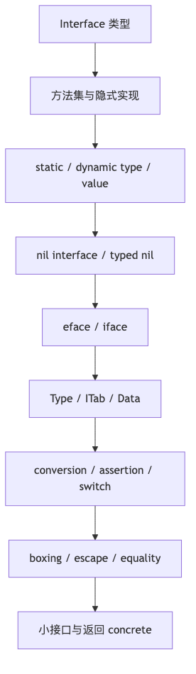

# 第 8 章：Go Interface 底层实现与设计

> **版本口径**：本章以 **Go 1.26.4** 为当前稳定版口径。go.dev 下载页显示当前 featured / stable 版本为 `go1.26.4`；源码路径也以 go.dev 当前源码视图为准。涉及 runtime、compiler、internal/abi 的字段和函数都属于**当前实现细节**，不是 Go 语言规范永久保证。([go.dev][1])

## 阅读定位与关联章节

> 本章是 Interface 的主讲章：接口语言语义、nil interface、typed nil、method set、eface/iface、ITab、interface conversion、type assertion、boxing、escape、interface equality 和 API 设计都在这里深挖。其他章节遇到接口概念时应优先跳回本章，而不是各自重复一遍底层模型。

| 关联概念 | 建议读法 |
|---|---|
| 接口、反射、泛型的选型总览 | 总览看 [第 7 章：接口、反射与泛型：抽象机制导论](/blog/tech/GO/07.接口反射与泛型导论)；本章负责接口本身的源码级细节。 |
| 方法集、defined type、alias、underlying type | 类型规则源头看 [第 1 章：类型系统、常量、Struct、方法集与嵌入](/blog/tech/GO/01.类型系统-常量-Struct-方法集与嵌入)。 |
| constraint interface、type set 与 runtime interface value 的区别 | 本章会划边界；泛型类型集合、推断和实例化看 [第 9 章：泛型、类型集合与迭代器](/blog/tech/GO/09.泛型-类型集合与迭代器)。 |
| `reflect.TypeOf/ValueOf` 为什么从 interface 出发 | 本章解释 interface 的两个 word；反射 API、可设置性和 unsafe 看 [第 10 章：Reflection、unsafe 与 Go 内存布局](/blog/tech/GO/10.Reflection-unsafe与Go内存布局)。 |
| `error` 是 interface、typed nil error、`errors.Is/As` | 接口模型在本章；错误处理工程边界看 [第 2 章：函数、defer、panic/recover 与 errors](/blog/tech/GO/02.函数-闭包-defer-panic-recover-errors)。 |

---

## 本章速览

先把本章看成一条从“接口语义”到“API 设计事故”的运行期链路：



读图时抓住三个总结：

- 接口的语言语义是方法集合，运行期值模型则是“类型信息 + 数据”的组合。
- `nil interface`、typed nil、装箱和比较 panic，本质上都来自 dynamic type/value 的边界。
- 好的接口设计要小、稳定、靠近消费者；返回 concrete 往往比提前暴露大接口更稳。

---

## 一、本章面试目标

本章要建立这条知识链：

```text
Interface 语言语义
→ Static Type / Dynamic Type / Dynamic Value
→ nil interface 与 typed nil
→ method set 与隐式实现
→ empty interface / non-empty interface / any
→ eface / iface / EmptyInterface / NonEmptyInterface
→ ITab / Type / Data
→ interface conversion / assertion / type switch
→ boxing / escape / direct interface / indirect interface
→ interface equality / map key 风险
→ API 设计：小接口、消费者定义接口、返回 concrete
→ 泛型、反射、函数参数与 interface 的选择
→ 生产故障与排查
→ 面试表达
```

### 1. 初级面试必须掌握

* interface 是一组方法集合。
* Go 是**隐式实现接口**，不需要 `implements`。
* `interface{}` 和 `any` 可以接收任意类型。
* `nil interface` 和“接口里装了一个 nil 指针”不是一回事。
* 类型断言有单返回值和 comma-ok 两种写法。
* pointer receiver 和 value receiver 会影响是否实现接口。
* 给已发布接口增加方法会破坏实现方兼容性。

### 2. 中高级面试必须掌握

* interface 变量有 **static type**、**dynamic type**、**dynamic value**。
* empty interface 和 non-empty interface 当前 runtime 布局不同。
* `iface` 依赖 `ITab`，`eface` 依赖 concrete `Type`。
* interface 调用是动态派发，但不一定慢，可能被 devirtualization / inlining 优化。
* interface boxing 是否分配，要结合逃逸分析、direct interface、value size、调用边界判断。
* interface 比较会检查 dynamic type 和 dynamic value，可比较性不足会 panic。
* `map[interface{}]V` 能编译，但运行时可能因 key 的动态值不可比较而 panic。

### 3. 高级 / 源码级面试可能追问

* `internal/abi.ITab` 的 `Inter`、`Type`、`Hash`、`Fun` 分别干什么。
* `getitab` 如何查找 / 创建 / 缓存 interface-concrete 映射。
* 编译器如何把 concrete-to-interface 转换 lowering 成 `OMAKEFACE`。
* `convT`、`convTnoptr`、`convT16`、`convT32`、`convT64`、`convTstring`、`convTslice` 分别解决什么。
* type assertion 如何走 `assertE2I`、`assertE2I2`、`typeAssert`。
* interface equality 为什么会走 `efaceeq` / `ifaceeq`。
* constraint interface 和 runtime interface value 的区别。
* interface、泛型、反射、函数参数在 API 设计上的取舍。

---

## 二、功能介绍与语言语义

### 1. Interface 是什么

Go 规范中，interface type 定义的是一个 **type set**。接口变量可以保存任何属于该 type set 的类型的值；未初始化的 interface 变量值是 `nil`。([go.dev][2])

```go
type Reader interface {
    Read(p []byte) (n int, err error)
}
```

只要某个类型的方法集包含：

```go
Read([]byte) (int, error)
```

它就实现了 `Reader`。

Go 的接口实现是：

```text
结构化匹配
而不是名义声明
```

所以不需要：

```go
implements Reader
```

而是只要方法集满足即可。

---

### 2. Static Type、Dynamic Type、Dynamic Value

Go 规范明确区分变量的 static type 与 interface 变量的 dynamic type。interface 变量的 static type 是声明时的接口类型；dynamic type 是运行时实际装入的非接口类型；如果赋值的是 `nil`，则没有 dynamic type。规范中的例子也直接展示了 `x = v` 后，`x` 的 dynamic type 是 `*T`，即使 `v` 本身是 nil 指针。([go.dev][2])

```go
var x any        // static type: interface{}
var p *int = nil // static type: *int, value: nil

x = p
```

此时：

```text
x 的 static type  = any
x 的 dynamic type = *int
x 的 dynamic value = nil pointer
x == nil ? false
```

这就是 typed nil 的根源。

---

### 3. nil Interface 与 Typed Nil Interface

#### nil interface

```go
var x any
fmt.Println(x == nil) // true
```

此时 interface 的两个核心字都为空：

```text
type word = nil
data word = nil
```

#### typed nil interface

```go
var p *int = nil
var x any = p

fmt.Println(x == nil) // false
```

此时：

```text
type word = *int 的类型描述符
data word = nil
```

所以它不是 nil interface。

---

### 4. Typed Nil Error Bug

最经典的坑：

```go
type MyError struct {
    msg string
}

func (e *MyError) Error() string {
    return e.msg
}

func bad() error {
    var e *MyError = nil
    return e
}

func main() {
    err := bad()
    fmt.Println(err == nil) // false
}
```

原因：

```text
return e
```

把 `*MyError(nil)` 装进了 `error` interface。

结果不是：

```text
nil error
```

而是：

```text
error{
    dynamic type  = *MyError
    dynamic value = nil
}
```

所以 `err != nil`。

正确写法：

```go
func good() error {
    var e *MyError = nil
    if e == nil {
        return nil
    }
    return e
}
```

面试表达：

> Go 判断 interface 是否为 nil，看的是整个 interface value 是否为 nil，而不是它内部 dynamic value 是否为 nil。`*MyError(nil)` 转成 `error` 后 dynamic type 不为空，所以 `err != nil`。

---

### 5. Empty Interface、Non-empty Interface、any

#### empty interface

```go
interface{}
```

空接口 type set 包含所有非接口类型；`any` 是 `interface{}` 的预声明别名，Go 1.18 引入。([go.dev][2])

```go
var x interface{}
var y any
```

二者完全等价。

#### non-empty interface

```go
type Stringer interface {
    String() string
}
```

它要求 dynamic type 的 method set 至少包含 `String() string`。

---

### 6. Basic Interface、General Interface、Constraint Interface

Go 1.18 之后，interface 不只可以写方法，也可以写 type terms：

```go
type Integer interface {
    ~int | ~int64 | ~uint
}
```

这类带 type terms 的接口叫 general interface。规范规定：**非 basic interface 只能作为类型约束，不能作为普通变量类型**。([go.dev][2])

```go
type Number interface {
    ~int | ~float64
}

var x Number // 编译错误：Number 不是 basic interface
```

这点面试很重要：

```text
运行时 interface value
≠ 泛型 constraint interface
```

运行时 interface value 是两个 word 的动态值。

泛型 constraint interface 是编译期用于约束类型参数的类型集合。

---

### 7. Method Set 与接口实现

规范定义 method set：

* defined type `T` 的方法集包含 receiver 为 `T` 的方法；
* `*T` 的方法集包含 receiver 为 `T` 和 `*T` 的方法；
* interface 的方法集通常就是它声明的方法集合。([go.dev][2])

```go
type I interface {
    M()
}

type T struct{}

func (T) M() {}

var _ I = T{}  // ok
var _ I = &T{} // ok
```

如果方法是 pointer receiver：

```go
type T struct{}

func (*T) M() {}

var _ I = T{}  // 编译错误
var _ I = &T{} // ok
```

原因：

```text
T 的 method set 不包含 M
*T 的 method set 包含 M
```

---

## 三、底层实现

### 1. 规范与实现要分开

| 维度             | 内容                                                                     |
| -------------- | ---------------------------------------------------------------------- |
| Go 规范保证        | interface type set、method set、type assertion、type switch、comparison 行为 |
| 当前 runtime 实现  | EmptyInterface / NonEmptyInterface / ITab / Type / Data                |
| 当前 compiler 实现 | `OCONVIFACE`、`OMAKEFACE`、`convT*`、`typeAssert`                         |
| 工程经验           | interface 是否分配、是否慢，要 benchmark 和 escape analysis 判断                    |

---

### 2. 当前源码中的 interface 布局

当前 Go 源码在 `src/internal/abi/iface.go` 中定义了三类结构：

```go
type EmptyInterface struct {
    Type *Type
    Data unsafe.Pointer
}

type NonEmptyInterface struct {
    ITab *ITab
    Data unsafe.Pointer
}
```

源码注释说明：empty interface 的第一个 word 指向 `abi.Type`；non-empty interface 的第一个 word 指向 `ITab`。([go.dev][3])

可以抽象为：

```text
empty interface / any:

+---------+---------+
| *Type   | Data    |
+---------+---------+

non-empty interface:

+---------+---------+
| *ITab   | Data    |
+---------+---------+
```

历史面经常说：

```text
eface = empty interface
iface = non-empty interface
```

这个术语仍然便于解释，但当前更准确的源码名是：

```text
internal/abi.EmptyInterface
internal/abi.NonEmptyInterface
```

---

### 3. ITab 结构

当前 `ITab`：

```go
type ITab struct {
    Inter *InterfaceType
    Type  *Type
    Hash  uint32
    Fun   [1]uintptr
}
```

源码注释说明：non-empty interface 的第一个 word 是 `*ITab`；`ITab` 记录 interface type、underlying concrete type 以及辅助信息。([go.dev][3])

含义：

| 字段      | 作用                                        |
| ------- | ----------------------------------------- |
| `Inter` | 目标 interface 类型，例如 `io.Reader`            |
| `Type`  | concrete dynamic type，例如 `*bytes.Buffer`  |
| `Hash`  | concrete type hash 的拷贝，主要用于 type switch   |
| `Fun`   | 方法表，存放 concrete type 实现 interface 方法的函数入口 |

示意图：

```text
var r io.Reader = bytes.NewBuffer(nil)

r:
+------------------+------------------+
| *ITab            | Data             |
+------------------+------------------+
        |                    |
        v                    v
+-------------------------+  *bytes.Buffer object
| Inter = *io.Reader type |
| Type  = *bytes.Buffer   |
| Hash  = ...             |
| Fun[0] = (*Buffer).Read |
+-------------------------+
```

调用：

```go
r.Read(p)
```

大致过程：

```text
1. 从 interface 第一个 word 拿到 ITab
2. 根据方法偏移找到 Fun[i]
3. 把 Data 作为 receiver 传入
4. 调用具体函数
```

---

### 4. Type 结构与 InterfaceType

`src/internal/abi/type.go` 中的 `Type` 是运行时类型元数据的核心结构；`InterfaceType` 包含嵌入的 `Type`、包路径和方法集合。源码还提供 `IsDirectIface` 判断某类型是否直接存入 interface data word。([go.dev][4])

```text
Type:
- Size
- PtrBytes
- Hash
- TFlag
- Align
- Kind
- Equal
- GCData
- Str
- PtrToThis
...

InterfaceType:
- Type
- PkgPath
- Methods
```

注意：

```text
Type 是 runtime 类型描述符
不是 reflect.Type 接口本身
```

`reflect.Type` 是公开 API 层；底层通过 runtime 类型元数据支撑。

---

### 5. Concrete → Interface

```go
var x any = 123
```

当前编译器会处理为：

```text
type word = int 的 Type
data word = 123 的数据地址或直接值
```

在 `src/cmd/compile/internal/walk/convert.go` 中，`walkConvInterface` 会处理 `OCONVIFACE`，对 non-interface 到 interface 的转换构造 `OMAKEFACE`，其中第一个参数是 type word，第二个参数是 data word。([go.dev][5])

抽象流程：

```text
Concrete value
    |
    | compiler lowering
    v
OMAKEFACE(typeWord, dataWord)
    |
    v
interface value
```

---

### 6. dataWord：什么时候分配，什么时候不分配

这是 interface 性能面试的核心。

当前编译器 `dataWord` 的逻辑大致是：

1. 如果类型可 direct interface，直接用原值作为 data word。
2. zero-size value 可以用全局 `zerobase`。
3. bool / byte / 小整数可能用静态表。
4. 只读全局值可直接引用。
5. 如果不逃逸且大小不超过阈值，可用栈临时变量。
6. 否则调用 runtime `convT*` 进行转换，可能堆分配。([go.dev][5])

源码中 `dataWordFuncName` 会根据类型大小、对齐、是否含指针、是否 string / slice 等选择 `convT16`、`convT32`、`convT64`、`convTstring`、`convTslice`、`convT`、`convTnoptr`。([go.dev][5])

所以不能简单说：

```text
interface 一定分配
```

准确表达是：

> concrete value 装箱进 interface 时是否分配，取决于 dynamic value 的类型表示、是否 direct interface、是否逃逸、大小、是否可用静态数据或栈临时变量。必须用 `-gcflags=-m`、benchmark 和 pprof 验证。

---

### 7. Direct Interface 与 Indirect Interface

当前源码中 `Type.IsDirectIface()` 通过 `TFlagDirectIface` 判断类型是否直接存入 interface value。([go.dev][4])

可以理解为：

```text
Direct interface:
Data word 本身就是值或指针形态的值

Indirect interface:
Data word 指向一份保存 dynamic value 的内存
```

例子：

```go
var p *int
var x any = p
```

pointer 是 pointer-shaped，通常可以直接放入 data word。

```go
type Big struct {
    A, B, C, D int64
}

var b Big
var x any = b
```

大 struct 一般需要复制到某处，然后 data word 指向它。

---

### 8. runtime convT

runtime 中的 `convT` 会分配一块内存，把值复制进去，并返回可作为 interface 第二个 word 的指针。源码中 `convT` 调用 `mallocgc`，再 `typedmemmove`；`convTnoptr` 则针对不含指针的类型走 `memmove`。([go.dev][6])

```text
convT:
mallocgc(size, type, true)
typedmemmove(type, dst, src)

convTnoptr:
mallocgc(size, type, false)
memmove(dst, src, size)
```

面试表达：

> interface 装箱的本质是构造 type word 和 data word。data word 可能直接保存 pointer-shaped value，也可能指向一份复制出来的对象。是否堆分配由编译器逃逸分析和 lowering 结果决定。

---

### 9. Interface → Interface

```go
var r io.Reader = buf
var x any = r
```

non-empty interface 转 empty interface 时：

```text
从 ITab 中拿 concrete Type
保留 Data
构造 EmptyInterface{Type, Data}
```

源码中的 `walkConvInterface` 对 interface-to-empty-interface 有专门逻辑：取 `itab` 和 `data`，如果 `itab != nil`，取出 `itab.type`，然后构造 `OMAKEFACE`。([go.dev][5])

non-empty interface 转另一个 non-empty interface：

```go
var r io.Reader = buf
var s fmt.Stringer = r
```

需要判断 dynamic type 是否实现目标 interface，当前实现会走类似 type assertion 的路径。

---

### 10. Interface → Concrete：Type Assertion

```go
v := x.(int)
```

规范规定：对 interface 表达式 `x` 和类型 `T`，`x.(T)` 断言 `x` 非 nil，并且 `x` 存储的值类型为 `T`；如果 `T` 是 interface，则断言 dynamic type 实现 `T`。([go.dev][2])

两种形式：

```go
v := x.(int)      // 失败 panic
v, ok := x.(int)  // 失败 ok=false
```

runtime 中 `assertE2I` 对 nil 输入会 panic，`assertE2I2` 对 nil 输入返回 nil；`typeAssert` 会根据 `CanFail` 决定失败时 panic 还是返回 nil。([go.dev][6])

---

### 11. Type Switch

```go
switch v := x.(type) {
case nil:
case int:
case string:
default:
}
```

规范规定 type switch 比较的是 dynamic type；`case nil` 只匹配 nil interface value。([go.dev][2])

注意：

```go
var p *int = nil
var x any = p

switch x.(type) {
case nil:
    fmt.Println("nil")
case *int:
    fmt.Println("*int")
}
```

输出：

```text
*int
```

因为 `x` 不是 nil interface，而是 dynamic type 为 `*int` 的 interface。

---

### 12. getitab 与 ITab 缓存

`runtime.getitab` 负责根据：

```text
interface type + concrete type
```

找到或创建 `ITab`。

当前源码流程：

1. 如果 concrete type 没有 uncommon method data，快速失败。
2. 无锁读取全局 itab table。
3. 找不到则加锁再查一次。
4. 仍找不到则 persistent allocate 一个新 itab。
5. 初始化 method table。
6. 加入 itab table。
7. 如果 `Fun[0] == 0`，表示不实现接口。([go.dev][6])

itab table 的查找使用二次探测；表负载达到 75% 时扩容。([go.dev][6])

面试表达：

> ITab 是 non-empty interface 动态派发的桥。它把“某个具体类型是否实现某个接口”这件事缓存下来，并保存方法入口表，避免每次调用都重新匹配方法集合。

---

### 13. Interface Equality

规范规定：两个 interface value 比较时，如果 dynamic type 相同但该 dynamic type 不可比较，会运行时 panic；slice、map、function 不可比较，只能和 nil 比较。([go.dev][2])

```go
var a any = []int{1}
var b any = []int{1}

fmt.Println(a == b) // panic
```

runtime 中：

* empty interface 比较走 `efaceeq`
* non-empty interface 比较走 `ifaceeq`
* 如果类型没有 equality function，panic
* direct interface 类型可直接比较 data word，否则调用类型专属 equality function。([go.dev][7])

---

### 14. Interface 作为 Map Key 的风险

规范规定 map key 类型必须支持 `==` 和 `!=`；如果 key 是 interface type，则要求 dynamic key values 可比较，否则会 panic。([go.dev][2])

```go
m := map[any]int{}

m["a"] = 1       // ok
m[123] = 2       // ok
m[[]int{1}] = 3  // panic: hash of unhashable type []int
```

面试表达：

> `map[interface{}]V` 的 key 类型在编译期是可比较的，但真正 hash 和 equal 时要看 dynamic value。dynamic value 如果是 slice、map、func，会运行时 panic。

---

### 15. nil Pointer Receiver 经 Interface 调用

```go
type T struct{}

func (*T) M() {
    fmt.Println("M")
}

func main() {
    var p *T = nil
    var i interface{ M() } = p

    i.M() // 可以进入方法，是否 panic 取决于方法内部是否解引用 receiver
}
```

这里 `i` 非 nil，因为 dynamic type 是 `*T`。

如果方法内部不解引用 receiver，可以正常执行。

```go
func (t *T) M() {
    fmt.Println(t == nil)
}
```

输出：

```text
true
```

但如果：

```go
func (t *T) M() {
    fmt.Println(t.Name)
}
```

则会因 nil pointer dereference panic。

规范也规定：nil interface 上调用方法会 panic。([go.dev][2])

```go
var i interface{ M() }
i.M() // panic
```

---

## 四、源码阅读路径

### 1. 语言规范

优先读：

```text
Go Specification
- Interface types
- Implementing an interface
- Method sets
- Type assertions
- Type switches
- Comparison operators
```

重点结论：

| 章节                        | 重点                                         |
| ------------------------- | ------------------------------------------ |
| Interface types           | type set、basic interface、general interface |
| Implementing an interface | 隐式实现规则                                     |
| Method sets               | value receiver / pointer receiver          |
| Type assertions           | `x.(T)` 成功和失败条件                            |
| Type switches             | dynamic type 匹配                            |
| Comparison operators      | interface 比较和 panic 条件                     |

---

### 2. runtime / internal/abi

#### `src/internal/abi/iface.go`

重点看：

```go
type ITab struct
type EmptyInterface struct
type NonEmptyInterface struct
type CommonInterface struct
```

它给出当前 interface value 的基本布局。([go.dev][3])

#### `src/internal/abi/type.go`

重点看：

```go
type Type struct
func (t *Type) IsDirectIface() bool
type InterfaceType struct
```

它解释 runtime 如何描述类型、接口方法集合、direct interface 标记。([go.dev][4])

#### `src/runtime/iface.go`

重点看：

```go
getitab
itabHashFunc
itabTableType.find
itabAdd
itabInit
assertE2I
assertE2I2
typeAssert
convT
convTnoptr
convT16
convT32
convT64
convTstring
convTslice
```

阅读顺序：

```text
1. ITab 布局
2. getitab 查找流程
3. itabInit 方法匹配
4. assertE2I / assertE2I2
5. typeAssert 缓存
6. convT* 装箱分配
```

#### `src/runtime/alg.go`

重点看：

```go
efaceeq
ifaceeq
interequal
nilinterequal
efaceHash
ifaceHash
```

可推导出 interface 比较和 map key panic 的原因。([go.dev][7])

---

### 3. compiler

#### `src/cmd/compile/internal/walk/convert.go`

重点看：

```go
walkConvInterface
dataWord
dataWordFuncName
```

它解释 concrete-to-interface 如何 lowering，以及何时用栈、静态数据或 runtime conv 函数。([go.dev][5])

#### `src/cmd/compile/internal/typecheck/builtin.go`

重点看 runtime helper 注册：

```go
convT
convTnoptr
convT16
convT32
convT64
convTstring
convTslice
assertE2I
assertE2I2
panicdottypeE
panicdottypeI
typeAssert
interfaceSwitch
ifaceeq
efaceeq
```

这些是编译器可能生成调用的 runtime helper。([go.dev][8])

#### `src/cmd/compile/internal/ssagen/ssa.go`

重点看：

```go
OCALLINTER
ODOTINTER
getClosureAndRcvr
dottype
callResult
```

interface method call 在 SSA 阶段会走 `OCALLINTER`，加载方法入口并传入 receiver。([go.dev][9])

---

## 五、常用场景与工程取舍

### 场景 1：小接口抽象行为

```go
type Clock interface {
    Now() time.Time
}
```

适合：

* 测试可替换。
* 业务只依赖行为，不依赖具体实现。
* 接口方法少，语义稳定。

不适合：

* 方法太多。
* 还没出现第二个实现就提前抽象。
* 抽象泄漏底层细节。

替代方案：

```go
func now func() time.Time
```

或直接传函数。

---

### 场景 2：消费者定义接口

推荐：

```go
package service

type UserRepo interface {
    GetByID(ctx context.Context, id int64) (*User, error)
}
```

不推荐让 provider 包定义大接口：

```go
package mysqlrepo

type Repository interface {
    GetByID(...)
    Create(...)
    Update(...)
    Delete(...)
    BatchUpsert(...)
    Tx(...)
}
```

原则：

> 接口应该由使用方定义，而不是由实现方提前定义一个“全家桶接口”。

---

### 场景 3：返回 concrete，接收 interface

推荐：

```go
func NewClient(...) *Client
```

而不是：

```go
func NewClient(...) ClientInterface
```

原因：

* 返回 concrete 保留扩展能力。
* 使用方可以自行定义需要的接口。
* 避免接口锁死 API。
* 避免 mock 为了满足巨大接口而臃肿。

经典表达：

```text
Accept interfaces, return structs.
```

但不是绝对规则。如果你要隐藏实现，例如 plugin、driver、remote client，也可以返回 interface。

---

### 场景 4：error 接口

`error` 是最重要的接口之一：

```go
type error interface {
    Error() string
}
```

使用风险：

* typed nil error。
* 包装后丢失 sentinel。
* 错误字符串判断。
* `errors.Is` / `errors.As` 使用不当。

建议：

```go
if err != nil {
    return fmt.Errorf("query user: %w", err)
}
```

需要类型判断时：

```go
var target *MyError
if errors.As(err, &target) {
    ...
}
```

---

### 场景 5：interface 与泛型

interface 适合：

```text
运行时多态
异构集合
mock / fake
插件式扩展
```

泛型适合：

```text
同构算法
容器
避免 interface{} + type assertion
编译期类型安全
```

例子：

```go
func Max[T constraints.Ordered](a, b T) T
```

比：

```go
func Max(a, b any) any
```

更安全、更少运行时判断。

---

### 场景 6：interface 与 reflection

反射适合：

* 序列化。
* ORM。
* 通用配置解析。
* 动态字段处理。

interface 适合：

* 稳定行为抽象。
* 多实现切换。
* 测试替换。

不要用 `reflect` 解决本来可以用 interface 解决的问题。

---

## 六、代码陷阱题

### 题 1：nil interface

```go
package main

import "fmt"

func main() {
    var x any
    fmt.Println(x == nil)
}
```

答案：

```text
true
```

分析：

`x` 是未初始化的 interface，type word 和 data word 都是 nil。

追问：

> 如果 `var p *int = nil; x = p` 呢？

---

### 题 2：typed nil pointer

```go
package main

import "fmt"

func main() {
    var p *int = nil
    var x any = p
    fmt.Println(x == nil)
}
```

答案：

```text
false
```

分析：

`x` 的 dynamic type 是 `*int`，dynamic value 是 nil pointer。

---

### 题 3：typed nil error

```go
package main

import "fmt"

type MyErr struct{}

func (*MyErr) Error() string { return "bad" }

func f() error {
    var e *MyErr = nil
    return e
}

func main() {
    err := f()
    fmt.Println(err == nil)
}
```

答案：

```text
false
```

分析：

`return e` 触发 `*MyErr` 到 `error` 的转换。

---

### 题 4：返回真正的 nil error

```go
func f(ok bool) error {
    var e *MyErr = nil
    if ok {
        return nil
    }
    return e
}
```

当 `ok=true`：

```text
返回 nil interface
```

当 `ok=false`：

```text
返回 dynamic type = *MyErr, dynamic value = nil
```

所以：

```go
fmt.Println(f(true) == nil)  // true
fmt.Println(f(false) == nil) // false
```

---

### 题 5：slice 动态值比较

```go
package main

import "fmt"

func main() {
    var a any = []int{1}
    var b any = []int{1}
    fmt.Println(a == b)
}
```

答案：

```text
panic
```

原因：

interface 可以比较，但 dynamic type `[]int` 不可比较。规范明确规定 dynamic type 相同且不可比较时会 panic。([go.dev][2])

---

### 题 6：interface 作为 map key

```go
package main

func main() {
    m := map[any]int{}
    m[[]int{1}] = 1
}
```

答案：

```text
panic: hash of unhashable type []int
```

分析：

`map[any]int` 编译通过，但插入时要 hash dynamic value。

---

### 题 7：value receiver 实现接口

```go
type I interface{ M() }

type T struct{}

func (T) M() {}

var _ I = T{}
var _ I = &T{}
```

答案：

```text
都能编译
```

分析：

`T` 的方法集有 `M`，`*T` 的方法集也包含 receiver 为 `T` 的方法。

---

### 题 8：pointer receiver 实现接口

```go
type I interface{ M() }

type T struct{}

func (*T) M() {}

var _ I = T{}
```

答案：

```text
编译错误
```

分析：

`T` 的 method set 不包含 `M`，只有 `*T` 包含。

---

### 题 9：nil pointer receiver 经 interface 调用

```go
package main

import "fmt"

type I interface{ M() }

type T struct{}

func (t *T) M() {
    fmt.Println(t == nil)
}

func main() {
    var p *T = nil
    var i I = p
    i.M()
}
```

答案：

```text
true
```

分析：

interface 非 nil，方法可调用；receiver 是 nil pointer。

---

### 题 10：nil interface 调用方法

```go
type I interface{ M() }

func main() {
    var i I
    i.M()
}
```

答案：

```text
panic
```

分析：

nil interface 没有 ITab，无法动态派发。

---

### 题 11：单返回值断言失败

```go
package main

func main() {
    var x any = "hello"
    _ = x.(int)
}
```

答案：

```text
panic
```

分析：

单返回值断言失败会 panic。

---

### 题 12：comma-ok 断言失败

```go
package main

import "fmt"

func main() {
    var x any = "hello"
    v, ok := x.(int)
    fmt.Println(v, ok)
}
```

答案：

```text
0 false
```

分析：

断言失败时返回目标类型零值和 `false`。

---

### 题 13：type switch 中的 nil

```go
package main

import "fmt"

func main() {
    var p *int = nil
    var x any = p

    switch x.(type) {
    case nil:
        fmt.Println("nil")
    case *int:
        fmt.Println("*int")
    }
}
```

答案：

```text
*int
```

分析：

`case nil` 只匹配 nil interface，不匹配 typed nil。

---

### 题 14：interface 保存值副本

```go
package main

import "fmt"

type User struct {
    Name string
}

func main() {
    u := User{Name: "A"}
    var x any = u
    u.Name = "B"
    fmt.Println(x.(User).Name)
}
```

答案：

```text
A
```

分析：

struct value 装入 interface 时复制了一份。

---

### 题 15：interface 保存 pointer

```go
package main

import "fmt"

type User struct {
    Name string
}

func main() {
    u := &User{Name: "A"}
    var x any = u
    u.Name = "B"
    fmt.Println(x.(*User).Name)
}
```

答案：

```text
B
```

分析：

interface 保存的是 pointer value，指向同一个对象。

---

### 题 16：不能直接修改 interface 中的 struct 字段

```go
type User struct {
    Name string
}

func main() {
    var x any = User{Name: "A"}
    x.(User).Name = "B"
}
```

答案：

```text
编译错误
```

分析：

`x.(User)` 的结果不是可寻址变量，不能直接赋字段。

正确写法：

```go
u := x.(User)
u.Name = "B"
x = u
```

---

### 题 17：compile-time assertion

```go
type I interface{ M() }

type T struct{}

func (*T) M() {}

var _ I = (*T)(nil)
```

答案：

```text
编译通过
```

分析：

这是编译期检查 `*T` 是否实现 `I`，不会创建运行时对象。

---

### 题 18：接口增加方法

```go
type Store interface {
    Get(id int64) string
}
```

发布后改成：

```go
type Store interface {
    Get(id int64) string
    Set(id int64, v string)
}
```

答案：

```text
可能破坏所有已有实现
```

分析：

Go 接口是结构化匹配，所有只实现 `Get` 的类型都会不再满足新接口。

---

### 题 19：general interface 不能作为普通变量类型

```go
type Number interface {
    ~int | ~int64
}

var x Number
```

答案：

```text
编译错误
```

分析：

带 type terms 的非 basic interface 只能作为类型约束。([go.dev][2])

---

### 题 20：NaN 动态值

```go
package main

import (
    "fmt"
    "math"
)

func main() {
    var a any = math.NaN()
    var b any = math.NaN()
    fmt.Println(a == b)
}
```

答案：

```text
false
```

分析：

dynamic type 都是 `float64`，可比较；但 `NaN != NaN`，所以 interface 比较结果也是 false。

---

## 七、面试高频问题

### 1. interface 是什么？

**30 秒回答：**

> interface 是一组方法约束。某个类型只要方法集满足接口要求，就隐式实现该接口。

**中高级回答：**

> Go 1.18 后，从规范角度 interface 定义的是 type set。basic interface 的 type set 由方法集合决定；general interface 可以包含 type terms，但只能用于约束。

**源码级回答：**

> runtime 中 empty interface 当前是 `Type + Data`，non-empty interface 当前是 `ITab + Data`。non-empty interface 通过 ITab 保存 interface type、concrete type 和方法表。

**常见错误：**

> “interface 就是 Java interface。”

不准确。Go 没有显式 implements，且接口可由使用方定义。

---

### 2. `interface{}` 和 `any` 有什么区别？

没有语义区别。`any` 是 `interface{}` 的 alias。规范明确说明 `any` 是 empty interface 的预声明别名。([go.dev][2])

---

### 3. nil interface 和 typed nil 的区别？

**核心：**

```text
nil interface:
type=nil, data=nil

typed nil:
type=*T, data=nil
```

所以：

```go
var p *T = nil
var x any = p
x == nil // false
```

---

### 4. 为什么 typed nil error 会出 bug？

因为返回 `*MyError(nil)` 到 `error` 时，interface 的 dynamic type 是 `*MyError`，不是 nil interface。

---

### 5. interface 底层是两个指针吗？

更准确：

> 当前实现中 interface value 是两个 word。empty interface 是 `*Type + Data`，non-empty interface 是 `*ITab + Data`。Data 是 `unsafe.Pointer` 形态，但可能保存的是直接值的指针形态表示，也可能指向复制后的对象。([go.dev][3])

不要说成永久语言保证。

---

### 6. eface 和 iface 是什么？

历史术语：

```text
eface = empty interface
iface = non-empty interface
```

当前源码更推荐看：

```text
internal/abi.EmptyInterface
internal/abi.NonEmptyInterface
```

---

### 7. ITab 是什么？

ITab 是 non-empty interface 动态派发的核心结构，包含：

```text
Inter: interface type
Type: concrete type
Hash: type hash
Fun: method table
```

源码字段在 `internal/abi.ITab` 中。([go.dev][3])

---

### 8. interface 调用一定慢吗？

不一定。

影响因素：

* 是否动态派发。
* 是否逃逸。
* 是否能 devirtualize。
* 是否能 inline。
* hot path 调用频率。
* concrete type 是否可在编译期确定。

结论必须通过：

```bash
go test -bench=. -benchmem
go build -gcflags='-m=2'
go test -cpuprofile cpu.out
```

判断。

---

### 9. interface 装箱一定分配吗？

不一定。

当前编译器可能：

* direct interface，不分配。
* 用静态全局。
* 用栈临时变量。
* 调 runtime `convT*` 堆分配。

`dataWord` 源码能看到这些分支。([go.dev][5])

---

### 10. type assertion 和 type switch 的区别？

type assertion 判断一个目标类型：

```go
v, ok := x.(T)
```

type switch 判断多个类型：

```go
switch v := x.(type) {}
```

二者都基于 interface dynamic type。

---

### 11. 为什么 interface 比较会 panic？

因为 interface 自身可比较，但 dynamic value 可能不可比较。

```go
var x any = []int{1}
fmt.Println(x == x) // panic
```

规范对此有明确说明。([go.dev][2])

---

### 12. `map[any]V` 有什么坑？

编译期允许，但 key 的 dynamic value 必须 hashable / comparable。

```go
m[[]int{1}] = 1 // panic
```

---

### 13. value receiver 和 pointer receiver 如何影响接口实现？

```text
T 的 method set:     只有 receiver T 的方法
*T 的 method set:    receiver T + receiver *T 的方法
```

所以 pointer receiver 方法只有 `*T` 实现接口。

---

### 14. nil pointer receiver 可以调用吗？

可以，只要 interface 非 nil，是否 panic 取决于方法内部是否解引用 nil receiver。

---

### 15. 为什么推荐小接口？

因为小接口：

* 更稳定。
* 更易 mock。
* 更少破坏兼容性。
* 更符合使用方视角。
* 更不容易泄漏实现细节。

---

### 16. 为什么推荐返回 concrete？

因为返回 concrete：

* 保留实现类型的完整能力。
* 调用方可以自行抽象接口。
* 避免锁死 API。
* 避免未来扩展困难。

---

### 17. interface 和泛型怎么选？

| 场景          | 选择                     |
| ----------- | ---------------------- |
| 运行时多态       | interface              |
| mock / fake | interface              |
| 容器 / 算法     | 泛型                     |
| 编译期类型安全     | 泛型                     |
| 异构集合        | interface              |
| 序列化 / ORM   | reflection + interface |

---

### 18. constraint interface 和普通 interface 一样吗？

不一样。

```go
type Number interface {
    ~int | ~int64
}
```

这是类型约束，不是运行时 interface value 类型。

---

### 19. `var _ Interface = (*T)(nil)` 有什么用？

用于编译期断言：

```go
var _ io.Reader = (*MyReader)(nil)
```

如果 `*MyReader` 没实现 `io.Reader`，编译失败。

---

### 20. 给接口增加方法为什么危险？

因为 Go 接口是结构化匹配。接口增加方法后，所有旧实现都可能不再满足接口。

---

## 八、深挖追问链

### 追问链 1：从 interface 语义到 typed nil

1. **interface 是什么？**
   一组方法约束；Go 1.18 后规范上是 type set。

2. **什么叫隐式实现？**
   类型方法集满足接口即可，不需要声明 implements。

3. **interface 变量里有什么？**
   static type 是接口类型，dynamic type 是运行时装入的具体类型，dynamic value 是具体值。

4. **nil interface 是什么？**
   dynamic type 和 dynamic value 都没有。

5. **typed nil 是什么？**
   dynamic type 存在，但 dynamic value 是 nil。

6. **typed nil error 怎么避免？**
   返回前显式判断 typed nil，真正返回 `nil`。

---

### 追问链 2：从 eface/iface 到 ITab

1. **empty interface 当前如何表示？**
   `Type + Data`。

2. **non-empty interface 当前如何表示？**
   `ITab + Data`。

3. **为什么 non-empty interface 不直接用 Type？**
   因为还需要保存 concrete type 针对该 interface 的方法表。

4. **ITab 里有什么？**
   interface type、concrete type、hash、method table。

5. **方法调用怎么发生？**
   通过 ITab 找到 Fun 中的方法入口，把 Data 作为 receiver。

6. **ITab 如何生成？**
   由 `getitab` 查找或创建，并由 `itabInit` 填充方法表。

---

### 追问链 3：从装箱到逃逸

1. **什么是 boxing？**
   concrete value 转 interface value 的过程。

2. **boxing 一定分配吗？**
   不一定。

3. **什么时候不分配？**
   direct interface、静态数据、栈临时、不逃逸等情况。

4. **什么时候可能分配？**
   大值、跨函数逃逸、返回 interface、存入 heap object 等。

5. **怎么证明？**
   `go build -gcflags='-m=2'` 看逃逸，`go test -benchmem` 看 allocs/op。

6. **怎么优化？**
   避免 hot path 中频繁装箱大对象；必要时用泛型、具体类型或函数参数。

---

### 追问链 4：从 assertion 到 type switch

1. **type assertion 做什么？**
   判断 interface dynamic type 是否为某类型或实现某接口。

2. **单返回值失败怎样？**
   panic。

3. **comma-ok 失败怎样？**
   返回零值和 false。

4. **interface-to-interface assertion 是什么？**
   判断 dynamic type 是否实现目标接口。

5. **type switch 匹配什么？**
   dynamic type。

6. **case nil 匹配 typed nil 吗？**
   不匹配，只匹配 nil interface。

---

### 追问链 5：从 API 设计到兼容性

1. **接口应该定义在哪里？**
   多数情况下由消费者定义。

2. **接口应该大还是小？**
   小。

3. **为什么不推荐返回接口？**
   容易锁死 API，调用方难以扩展。

4. **什么时候可以返回接口？**
   隐藏实现、插件系统、driver、远程代理。

5. **接口增加方法为什么破坏兼容？**
   旧实现不再满足接口。

6. **泛型出现后 interface 过时了吗？**
   没有。泛型解决编译期类型参数问题，interface 解决运行时多态问题。

---

## 九、生产故障与排查

### 故障 1：typed nil error 导致错误分支误触发

现象：

```go
err := service.Do()
if err != nil {
    alarm()
}
```

明明没有真实错误，却进入错误分支。

排查：

1. 打印：

```go
fmt.Printf("%T %[1]v\n", err)
```

2. 检查返回函数是否返回了 `*CustomError(nil)`。
3. 用单测覆盖：

```go
if got := f(); got != nil {
    t.Fatalf("expected nil, got %T", got)
}
```

解决：

```go
if e == nil {
    return nil
}
return e
```

---

### 故障 2：`map[any]V` 线上 panic

现象：

```text
panic: hash of unhashable type []string
```

原因：

interface key 的 dynamic value 是 slice / map / func。

排查：

1. 搜索 `map[interface{}]`、`map[any]`。
2. panic 堆栈定位插入点。
3. 打印 key dynamic type。
4. 对 key 类型做白名单。

解决：

```go
type CacheKey struct {
    TenantID string
    UserID   int64
}
```

不要用任意 `any` 当 key。

---

### 故障 3：interface 装箱导致 allocs/op 升高

现象：

```text
BenchmarkX-8  1000000  1200 ns/op  512 B/op  8 allocs/op
```

排查：

```bash
go test -bench=. -benchmem
go build -gcflags='-m=2'
```

看是否出现：

```text
x escapes to heap
```

解决方向：

* hot path 避免返回 `any`。
* 避免把大 struct 频繁装入 interface。
* 使用泛型。
* 使用具体类型。
* 指针传递，但要注意共享可变状态。
* 用 benchmark 验证优化。

---

### 故障 4：interface 抽象过大导致 mock 臃肿

现象：

```go
type Repository interface {
    Get()
    Create()
    Update()
    Delete()
    Tx()
    Batch()
    Search()
    Export()
}
```

测试一个函数却要 mock 八个方法。

解决：

在消费者处定义最小接口：

```go
type UserGetter interface {
    GetUser(ctx context.Context, id int64) (*User, error)
}
```

---

### 故障 5：nil pointer receiver panic

现象：

```text
panic: runtime error: invalid memory address or nil pointer dereference
```

interface 不为 nil，但 receiver 为 nil。

排查：

```go
fmt.Printf("%T %#v\n", i, i)
```

解决：

```go
func (t *T) M() {
    if t == nil {
        return
    }
}
```

或者避免把 nil pointer 装入 interface。

---

### 工具选择

| 工具                         | 能证明什么                   | 不能证明什么       |
| -------------------------- | ----------------------- | ------------ |
| `go test -race`            | data race               | 不能证明无所有并发问题  |
| `go test -benchmem`        | allocs/op、B/op          | 不能解释为什么分配    |
| `go build -gcflags='-m=2'` | 逃逸原因                    | 不直接说明业务瓶颈    |
| `pprof`                    | CPU / heap 热点           | 需要压测流量代表真实场景 |
| `go tool objdump`          | 是否存在间接调用、runtime helper | 阅读成本高        |
| `go tool trace`            | 调度、阻塞、GC 影响             | 不直接定位所有代码级原因 |
| `runtime/metrics`          | 运行时指标趋势                 | 需要配合业务标签     |
| 日志                         | dynamic type、错误路径       | 可能影响性能，注意采样  |

---

## 十、面试回答模板

### 1. 30 秒回答

> Go interface 是一组方法约束，类型只要方法集满足接口就隐式实现。interface 变量有 static type、dynamic type 和 dynamic value。nil interface 和装了 typed nil 的 interface 不一样，这是 typed nil error bug 的根源。

---

### 2. 2 分钟回答

> 从规范上看，Go 1.18 后 interface 定义的是 type set。basic interface 主要由方法集合组成，general interface 可以包含 type terms，但只能用于泛型约束。运行时当前实现里，empty interface 是 `Type + Data`，non-empty interface 是 `ITab + Data`。ITab 记录 interface type、concrete type 和方法表，所以 interface 方法调用可以通过 ITab 做动态派发。interface 转换、断言、比较都围绕 dynamic type 和 dynamic value 展开。

---

### 3. 5 分钟深入回答

> concrete value 转 interface 时，本质是构造 type word 和 data word。empty interface 的 type word 是 concrete type；non-empty interface 的 type word 是 ITab。Data word 可能直接保存 pointer-shaped value，也可能指向一份复制出来的值。是否分配不绝对，编译器会根据 direct interface、逃逸分析、value size、静态值、栈临时等做优化。类型断言会检查 dynamic type，失败时单返回值 panic，comma-ok 返回 false。interface 比较时，如果 dynamic type 相同但不可比较，比如 slice，就会 panic。生产中最常见的坑是 typed nil error、map[any] key panic、接口过大、过早抽象以及 hot path 装箱分配。

---

### 4. 源码级回答

> 当前源码中 interface 相关结构在 `internal/abi/iface.go`，`EmptyInterface` 是 `Type + Data`，`NonEmptyInterface` 是 `ITab + Data`，`ITab` 包含 `Inter`、`Type`、`Hash`、`Fun`。`runtime/iface.go` 的 `getitab` 负责查找或创建 interface-concrete 的映射，`itabInit` 填充方法表。compiler 的 `walkConvInterface` 会把 concrete-to-interface lowering 成 `OMAKEFACE(typeWord, dataWord)`；`dataWord` 决定是否使用 direct value、静态数据、栈临时或 runtime `convT*`。interface equality 在 `runtime/alg.go` 中走 `efaceeq` / `ifaceeq`，不可比较 dynamic type 会 panic。

---

### 5. 生产事故分析回答

> 如果线上看到 interface 相关问题，我会先区分是语义问题、分配问题还是 API 设计问题。typed nil error 通过 `%T` 打印 dynamic type 和单测确认；map[any] panic 通过堆栈定位 key dynamic type；性能问题用 `benchmem` 看 allocs/op，用 `-gcflags=-m=2` 看逃逸，用 pprof 看 CPU/heap 热点。修复上，语义问题优先调整返回 nil 的逻辑；性能问题避免 hot path 大对象装箱或改泛型；设计问题则拆小接口、消费者定义接口、返回 concrete。

---

## 十一、本章速记

1. **interface 的核心不是对象继承，而是方法集约束。**
2. **Go 接口是隐式实现，不需要 `implements`。**
3. **interface 变量有 static type、dynamic type、dynamic value。**
4. **nil interface 是 type 和 data 都为空。**
5. **typed nil 是 type 不为空、data 为空。**
6. **typed nil error 是 Go 面试最高频坑之一。**
7. **`any` 是 `interface{}` 的 alias。**
8. **empty interface 当前实现是 `Type + Data`。**
9. **non-empty interface 当前实现是 `ITab + Data`。**
10. **ITab 保存 interface type、concrete type 和 method table。**
11. **interface method call 通过 ITab 动态派发。**
12. **interface 装箱不一定堆分配。**
13. **是否分配要看 direct interface、逃逸和 compiler lowering。**
14. **type assertion 单返回值失败 panic。**
15. **comma-ok assertion 失败返回零值和 false。**
16. **type switch 匹配 dynamic type。**
17. **`case nil` 只匹配 nil interface，不匹配 typed nil。**
18. **interface 比较可能因 dynamic value 不可比较而 panic。**
19. **`map[any]V` 的 key 运行时仍要求 dynamic value 可比较。**
20. **value receiver 方法让 `T` 和 `*T` 都实现接口。**
21. **pointer receiver 方法通常只有 `*T` 实现接口。**
22. **nil pointer receiver 可以被调用，但方法内部解引用会 panic。**
23. **小接口比大接口稳定。**
24. **接口通常由消费者定义。**
25. **一般推荐接收 interface，返回 concrete。**

---

## 十二、自测题

### 简答题

1. interface 的 static type、dynamic type、dynamic value 分别是什么？
2. 为什么 `var p *T = nil; var x any = p; x == nil` 是 false？
3. typed nil error bug 如何产生？
4. `any` 和 `interface{}` 有什么区别？
5. empty interface 和 non-empty interface 当前 runtime 布局有什么区别？
6. ITab 的作用是什么？
7. interface 装箱一定堆分配吗？
8. type assertion 单返回值和 comma-ok 有什么区别？
9. 为什么 `map[any]int` 可能 panic？
10. 为什么给接口增加方法会破坏兼容性？

### 代码题

#### 代码题 1

```go
var p *int = nil
var x any = p
fmt.Println(x == nil)
```

#### 代码题 2

```go
type I interface{ M() }
type T struct{}
func (*T) M() {}

var _ I = T{}
```

#### 代码题 3

```go
var a any = []int{1}
fmt.Println(a == a)
```

#### 代码题 4

```go
type E struct{}
func (*E) Error() string { return "e" }

func f() error {
    var e *E = nil
    return e
}
fmt.Println(f() == nil)
```

#### 代码题 5

```go
type User struct{ Name string }

u := User{Name: "A"}
var x any = u
u.Name = "B"
fmt.Println(x.(User).Name)
```

### 系统设计 / 生产故障题

1. 线上出现大量 `panic: hash of unhashable type []string`，如何定位和修复？
2. 某个高频接口从 `0 allocs/op` 变成 `3 allocs/op`，你如何判断是否 interface 装箱导致？
3. 一个 repository interface 有 20 个方法，导致测试 mock 非常痛苦，你如何重构？

---

## 参考答案

### 简答题答案

1. static type 是声明类型；dynamic type 是 interface 中运行时保存的具体类型；dynamic value 是具体值。
2. 因为 `x` 的 dynamic type 是 `*int`，不是 nil interface。
3. 返回 `*CustomError(nil)` 到 `error`，导致 `error` dynamic type 不为空。
4. 没区别，`any` 是 `interface{}` 的 alias。
5. empty interface 当前是 `Type + Data`；non-empty interface 当前是 `ITab + Data`。
6. ITab 连接 interface type 和 concrete type，并保存方法表。
7. 不一定，要看 direct interface、逃逸、大小、是否可用栈或静态数据。
8. 单返回值失败 panic；comma-ok 失败返回零值和 false。
9. dynamic key value 如果是 slice、map、func 等不可比较类型，运行时 panic。
10. 旧实现可能不再满足新接口。

### 代码题答案

1. `false`。
2. 编译错误，`T` 没有实现 `I`，只有 `*T` 实现。
3. panic，因为 dynamic type 是不可比较的 `[]int`。
4. `false`，typed nil error。
5. 输出 `A`，因为 struct value 装入 interface 时复制了一份。

### 系统设计 / 故障题答案

1. 查堆栈定位 map 写入点，打印 key dynamic type，替换成强类型 key。
2. 用 `benchmem` 确认分配，用 `-gcflags=-m=2` 看逃逸，用 pprof 看 heap 热点，再检查是否 concrete-to-interface 装箱。
3. 按消费者拆小接口，删除 provider 侧大接口，测试只 mock 当前用到的方法。

[1]: https://go.dev/dl/ "All releases - The Go Programming Language"
[2]: https://go.dev/ref/spec "The Go Programming Language Specification - The Go Programming Language"
[3]: https://go.dev/src/internal/abi/iface.go " - The Go Programming Language"
[4]: https://go.dev/src/internal/abi/type.go " - The Go Programming Language"
[5]: https://go.dev/src/cmd/compile/internal/walk/convert.go " - The Go Programming Language"
[6]: https://go.dev/src/runtime/iface.go " - The Go Programming Language"
[7]: https://go.dev/src/runtime/alg.go " - The Go Programming Language"
[8]: https://go.dev/src/cmd/compile/internal/typecheck/builtin.go " - The Go Programming Language"
[9]: https://go.dev/src/cmd/compile/internal/ssagen/ssa.go " - The Go Programming Language"
