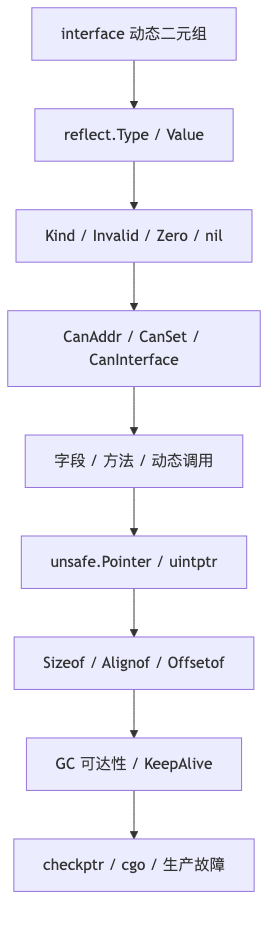

# 第 10 章：Reflection、unsafe 与 Go 内存布局

> **版本口径（2026-06-19）**：本章以当前稳定版 **Go 1.26.4** 为基线。Go 1.27rc1 属于候选版本，不作为稳定口径。涉及 `reflect.Value.Seq/Seq2`、`reflect.TypeFor`、Go 1.26 新增迭代 API、`unsafe.String`、`unsafe.Slice`、`checkptr`、ABI 字段等内容时均显式标注版本。
>
> **结论标签**：
>
> - **[规范]**：Go 语言规范保证，兼容性最强；
> - **[标准库契约]**：`reflect`、`unsafe`、`runtime` 等公开文档承诺；
> - **[当前实现：Go 1.26.4]**：gc 编译器/runtime 的当前源码实现，未来可变；
> - **[工程建议]**：需要通过测试、benchmark、profile 和目标平台验证。
>
> 主要一手资料：
>
> - Go Specification：https://go.dev/ref/spec
> - `reflect` 文档：https://pkg.go.dev/reflect@go1.26.4
> - `unsafe` 文档：https://pkg.go.dev/unsafe@go1.26.4
> - The Laws of Reflection：https://go.dev/blog/laws-of-reflection
> - Go 1.26 Release Notes：https://go.dev/doc/go1.26
> - Go 源码标签：`go1.26.4`

## 阅读定位与关联章节

> 本章是 Reflection、unsafe 和 Go 内存布局的主讲章。`reflect.Type/Value`、可寻址/可设置、动态调用、`unsafe.Pointer`、`uintptr`、`Sizeof/Alignof/Offsetof`、GC 可达性、checkptr、cgo 指针规则和生产故障都在这里集中处理；其他章节只保留到达这里的入口。

| 关联概念 | 建议读法 |
|---|---|
| 接口、反射、泛型的整体选型 | 选型总览看 [第 7 章：接口、反射与泛型：抽象机制导论](/blog/tech/GO/07.接口反射与泛型导论)。 |
| interface 的静态类型、动态类型、动态值和两个 word | 反射从 interface 出发；接口运行期模型看 [第 8 章：Interface 底层实现与设计](/blog/tech/GO/08.Interface底层实现与设计)。 |
| Struct 字段、方法集、嵌入和导出规则 | 语言层规则看 [第 1 章：类型系统、常量、Struct、方法集与嵌入](/blog/tech/GO/01.类型系统-常量-Struct-方法集与嵌入)。 |
| GC 可达性、栈移动、对象保活、写屏障 | 本章讲 unsafe 约束；分配、逃逸和 GC 机制看 [第 6 章：内存管理、逃逸分析与 GC](/blog/tech/GO/06.内存管理-逃逸分析与GC)。 |
| `unsafe.String`、`unsafe.Slice`、字符串和字节切片零拷贝 | unsafe 规则在本章；具体字符串转换和 Unicode 语义看 [第 3 章：String、byte、rune 与 Unicode](/blog/tech/GO/03.String-byte-rune与Unicode)。 |
| `reflect.TypeFor`、泛型 API 与类型参数边界 | 反射 API 在本章；泛型、类型集合和迭代器看 [第 9 章：泛型、类型集合与迭代器](/blog/tech/GO/09.泛型-类型集合与迭代器)。 |

---

## 本章速览

先把本章看成一条从“interface 动态值”到“unsafe 事故排查”的边界链：



读图时抓住三个总结：

- 反射从 interface 动态类型和值出发，所有 Type/Value 操作都受可寻址、可设置、可导出限制。
- unsafe 不是“关闭类型系统”，而是在更窄的生命周期、对齐和 GC 可达性规则里写代码。
- 反射和 unsafe 的问题通常不是语法不会用，而是性能、panic、对象保活和跨平台边界没验证。

---

## 一、本章面试目标

### 1. 知识链

```text
interface 的静态/动态二元组
→ reflect.Type 与 reflect.Value
→ Type、Kind、Invalid、Zero、nil
→ Addressable / Settable / Interfaceable
→ 字段、方法、Map、动态调用与动态构造
→ reflect.Value 当前内部布局与 abi.Type
→ DeepEqual、反射缓存、分配与性能
→ unsafe.Pointer / uintptr 的合法边界
→ Sizeof / Alignof / Offsetof 与对象布局
→ GC 可达性、栈移动、写屏障、KeepAlive
→ checkptr、cgo Pointer Rules、Atomic Alignment
→ 生产故障定位与面试表达
```

### 2. 初级面试必须掌握

- `reflect.TypeOf` 与 `reflect.ValueOf` 的用途；
- `Type` 与 `Kind` 的区别；
- `ValueOf(x).Set` 为什么 panic，`ValueOf(&x).Elem().Set` 为什么可行；
- `IsValid`、`IsZero`、`IsNil` 的适用范围；
- `CanAddr`、`CanSet`、`CanInterface` 的含义；
- `unsafe.Sizeof`、`Alignof`、`Offsetof` 的基本用途；
- `unsafe.Pointer` 与 `uintptr` 不是同一种东西；
- 不要用 `reflect.SliceHeader`/`StringHeader` 构造零拷贝视图；
- `DeepEqual(nilSlice, emptySlice)` 为 `false`。

### 3. 中高级面试必须掌握

- 反射三定律与 interface 动态类型、动态值之间的关系；
- 可寻址、可设置、可导出接口三者并不等价；
- `MapIndex` 返回的是不可设置值，修改 Map 应使用 `SetMapIndex`；
- 未导出字段为何即使可寻址也不可 `Set`/`Interface`；
- `reflect.Call`、`MakeFunc`、`Select` 的类型检查、panic 与分配边界；
- `Value.Seq/Seq2`、`TypeFor[T]` 和 Go 1.26 新增反射迭代 API 的版本口径；
- `reflect.Value` 当前由类型指针、数据指针和标志位构成，但这不是语言 ABI；
- `unsafe.Add`、`unsafe.Slice`、`unsafe.String` 的合法前提；
- `uintptr` 不保持对象存活，也不会随栈移动而被修正；
- Slice 扩容、零拷贝、Interior Pointer、`runtime.KeepAlive` 的生命周期风险；
- 32 位平台的 64 位原子对齐与 `atomic.Int64`/`atomic.Uint64` 的优势。

### 4. 高级/源码级面试可能继续追问

- `internal/abi.Type`、`EmptyInterface`、`NonEmptyInterface`、`ITab` 的当前布局；
- `reflect.Value.flag` 中 `flagIndir`、`flagAddr`、只读标志和方法编号如何协作；
- `packEface`/`unpackEface`、`typedmemmove`、Map 反射快路径；
- 反射动态调用如何进入 `reflectcall`，寄存器 ABI 如何参与参数编排；
- `DeepEqual` 如何处理循环引用以及为何会有“同一 Map/Slice 快捷相等”；
- 编译器如何插入 `checkptrArithmetic`、`checkptrAlignment`；
- cgo 中“固定（pin）”与“保持存活（keep alive）”为什么不是一回事；
- `unsafe` 写指针时写屏障、GC 指针图和外部 C 内存之间的边界；
- ABI、字段偏移、缓存行大小为何不能当作跨版本、跨架构协议；
- 如何用 `-m=2`、`-S`、`objdump`、pprof、trace、race、checkptr 组合证明或否定一个性能/安全假设。

---

## 二、功能介绍与语言语义

### 2.1 反射是什么

**[标准库契约]** `reflect` 允许程序在运行时检查类型信息、读取或修改值、动态构造类型和值、动态调用函数。它通常从一个 interface 值开始：

```go
package main

import (
    "fmt"
    "reflect"
)

type UserID int64

func main() {
    var x any = UserID(42)

    t := reflect.TypeOf(x)
    v := reflect.ValueOf(x)

    fmt.Println(t)        // main.UserID
    fmt.Println(t.Kind()) // int64
    fmt.Println(v.Int())  // 42
}
```

这里：

- `x` 的静态类型是 `any`；
- `x` 的动态类型是 `UserID`；
- `x` 的动态值是 `UserID(42)`；
- `reflect.TypeOf(x)` 返回动态类型；
- `reflect.ValueOf(x)` 返回表示动态值的 `Value`。

**不要说“反射绕过类型系统”**。绝大多数 `reflect` API 仍会在运行时严格检查 Kind、类型一致性、赋值规则、导出性和可设置性；检查失败通常 panic。

### 2.2 反射三定律

官方文章“The Laws of Reflection”可概括为：

1. **从 interface 值到反射对象**：`TypeOf`、`ValueOf`；
2. **从反射对象回到 interface 值**：`Value.Interface()`；
3. **要修改反射对象，它必须可设置（settable）**。

```text
Go value T
   │ 装入 interface
   ▼
(dynamic type = T, dynamic value = v)
   │ TypeOf / ValueOf
   ▼
reflect.Type + reflect.Value
   │ Interface
   ▼
interface{} holding T(v)
```

第三定律是面试重点：`ValueOf(x)` 接收的是 interface 中的值副本，不是变量 `x` 本身；只有把 `&x` 传入，再通过 `Elem` 取得变量，才能修改原变量。

### 2.3 `reflect.Type`、`reflect.Kind` 与类型身份

`reflect.Type` 表示完整 Go 类型；`Kind` 只表示底层类别。

```go
type Celsius float64
type Fahrenheit float64

var c Celsius
var f Fahrenheit

fmt.Println(reflect.TypeOf(c) == reflect.TypeOf(f)) // false
fmt.Println(reflect.TypeOf(c).Kind())               // float64
fmt.Println(reflect.TypeOf(f).Kind())               // float64
```

| 概念 | 示例 | 回答重点 |
|---|---|---|
| Type | `main.Celsius` | 包路径、定义类型名、方法集等完整身份 |
| Kind | `float64` | 反射 API 的粗粒度运行时类别 |
| Underlying type | `float64` | 语言规范中的底层类型，不等同于 `Kind` |

**[标准库契约]** Kind 专用方法调用前必须检查 Kind。例如对 String Value 调用 `Int()` 会 panic。

### 2.4 `TypeOf`、`ValueOf`、`TypeFor[T]`

```go
var p *int
fmt.Println(reflect.TypeOf(p))   // *int
fmt.Println(reflect.TypeOf(nil)) // <nil>

v := reflect.ValueOf(nil)
fmt.Println(v.IsValid()) // false
```

`reflect.TypeFor[T]` 在 Go 1.22 引入，避免传统写法：

```go
func typeOfT[T any]() reflect.Type {
    return reflect.TypeFor[T]()
    // 旧写法：return reflect.TypeOf((*T)(nil)).Elem()
}
```

它尤其适合泛型注册表、编解码器缓存和依赖注入容器。

**边界**：`TypeOf` 返回的 `Type` 可比较，通常可作为 Map Key；但反射动态创建类型的生命周期和内部驻留属于实现细节，不应据此设计无限增长的用户输入类型缓存。

### 2.5 Invalid Value、零值与 nil

反射中至少要区分四件事：

1. Go 变量的零值；
2. `reflect.Zero(t)` 返回的“类型为 t 的零值”；
3. `reflect.Value{}` 或 `ValueOf(nil)` 得到的 **Invalid Value**；
4. 一个有效、其底层值为 nil 的 Pointer/Slice/Map/Chan/Func/Interface Value。

```go
var p *int
vp := reflect.ValueOf(p)

fmt.Println(vp.IsValid()) // true
fmt.Println(vp.Kind())    // ptr
fmt.Println(vp.IsNil())   // true
fmt.Println(vp.IsZero())  // true

vi := reflect.ValueOf(nil)
fmt.Println(vi.IsValid()) // false
fmt.Println(vi.Kind())    // invalid
// vi.IsZero() // panic：Invalid Value 没有类型
// vi.IsNil()  // panic：Invalid Value 不是允许 IsNil 的 Kind
```

**[标准库契约]** Invalid Value 上除 `String` 等极少数明确允许的方法外，绝大多数方法都会 panic；使用反射查找 API 后应先判断 `IsValid`。

### 2.6 `Elem` 与 `Indirect`

- `Value.Elem()`：仅用于 Interface 或 Pointer；nil 时返回 Invalid Value；
- `reflect.Indirect(v)`：若 v 是 Pointer，返回 `v.Elem()`；若是 nil Pointer，返回 Invalid Value；否则原样返回；
- `Type.Elem()`：适用于 Array、Chan、Map、Pointer、Slice，返回元素类型；这与 `Value.Elem` 的适用 Kind 不同。

```go
var p *int
v := reflect.ValueOf(p)
e := v.Elem()
fmt.Println(e.IsValid()) // false
```

处理多层指针时，生产代码通常需要显式定义策略：

```go
func deref(v reflect.Value) reflect.Value {
    for v.IsValid() && (v.Kind() == reflect.Pointer || v.Kind() == reflect.Interface) {
        if v.IsNil() {
            return reflect.Value{}
        }
        v = v.Elem()
    }
    return v
}
```

不要无条件循环 `Elem`：nil、非 Pointer/Interface、接口中的 typed nil 都是边界。

### 2.7 Addressable、Settable、Interfaceable

三个概念不要混为一谈：

| 检查 | 含义 | 典型失败原因 |
|---|---|---|
| `CanAddr` | 可通过 `Addr` 取得地址 | 值是副本、Map 元素、临时值 |
| `CanSet` | 可通过反射修改 | 不可寻址，或来自未导出字段 |
| `CanInterface` | 可安全调用 `Interface` | 来自未导出字段 |

```go
x := 10
v1 := reflect.ValueOf(x)
v2 := reflect.ValueOf(&x).Elem()

fmt.Println(v1.CanAddr(), v1.CanSet()) // false false
fmt.Println(v2.CanAddr(), v2.CanSet()) // true true
v2.SetInt(20)
fmt.Println(x) // 20
```

**[规范+标准库契约]**：

- 可设置值必须代表真实存储位置，而非只读副本；
- `Set` 使用 Go 的**可赋值性**，不是“可转换性”；
- 可转换但不可直接赋值时，应先 `Convert`；
- 通过未导出字段得到的 Value 不允许借 `Interface` 或 `Set` 突破包封装。

```go
type MyInt int

x := 0
v := reflect.ValueOf(&x).Elem()
// v.Set(reflect.ValueOf(MyInt(1))) // panic：MyInt 不可直接赋给 int
v.Set(reflect.ValueOf(MyInt(1)).Convert(v.Type()))
```

### 2.8 Slice 元素、Array 元素与 Map 元素的可设置性

```go
s := []int{1}
sv := reflect.ValueOf(s)
fmt.Println(sv.CanSet())          // false：Slice Header 是副本
fmt.Println(sv.Index(0).CanSet()) // true：元素对应底层数组存储
sv.Index(0).SetInt(9)
fmt.Println(s) // [9]
```

数组不同：

```go
a := [1]int{1}
fmt.Println(reflect.ValueOf(a).Index(0).CanSet())       // false
fmt.Println(reflect.ValueOf(&a).Elem().Index(0).CanSet()) // true
```

Map 元素不可寻址，与普通 Go 语义一致：

```go
m := map[string]int{"x": 1}
mv := reflect.ValueOf(m)
e := mv.MapIndex(reflect.ValueOf("x"))
fmt.Println(e.CanAddr(), e.CanSet()) // false false
mv.SetMapIndex(reflect.ValueOf("x"), reflect.ValueOf(2))
```

### 2.9 未导出字段

```go
package main

import (
    "fmt"
    "reflect"
)

type secret struct {
    token string
}

func main() {
    s := secret{token: "abc"}
    f := reflect.ValueOf(&s).Elem().Field(0)
    fmt.Println(f.CanAddr())      // true
    fmt.Println(f.CanSet())       // false
    fmt.Println(f.CanInterface()) // false
    fmt.Println(f.String())       // abc：部分 Kind 读取方法仍可读
    // _ = f.Interface()          // panic
    // f.SetString("x")           // panic
}
```

**关键边界**：`CanAddr == true` 不代表 `CanSet == true`；`CanSet == false` 也不代表所有读取方法都禁止。使用 `unsafe` 强行修改未导出字段会破坏包不变量、版本兼容和安全边界，不属于受支持的反射能力。

### 2.10 字段查找、嵌入与 `VisibleFields`

- `Field(i)` 按声明顺序访问直接字段；
- `FieldByName` 遵循字段提升与最浅深度唯一匹配规则；
- 同一最浅深度存在多个同名字段时，匹配取消，返回 Invalid Value；
- `FieldByIndex` 使用索引路径，遇到 nil 嵌入指针会 panic；
- `FieldByIndexErr` 在需穿过 nil 指针时返回 error；
- `VisibleFields`（Go 1.17）返回所有可被 `FieldByName` 直接找到的字段，包括匿名字段内部字段和未导出字段。

```go
type A struct{ X int }
type B struct{ X int }
type C struct {
    A
    B
}

v := reflect.ValueOf(C{})
fmt.Println(v.FieldByName("X").IsValid()) // false：同深度冲突
fmt.Println(v.FieldByIndex([]int{0, 0}).Int()) // 0
```

### 2.11 Struct Tag

`StructTag` 本质上是字符串，但标准库约定格式为若干 `key:"value"` 对。应优先使用 `Lookup` 区分“没有该键”和“值显式为空”。

```go
type Config struct {
    Name string `json:"name" validate:"required" note:""`
}

t := reflect.TypeFor[Config]()
f, _ := t.FieldByName("Name")

v1, ok1 := f.Tag.Lookup("note")
v2, ok2 := f.Tag.Lookup("missing")
fmt.Printf("%q %v, %q %v\n", v1, ok1, v2, ok2)
// "" true, "" false
```

Tag 会参与未命名 Struct 类型的类型身份判断。不要随意改变导出 Struct 的 Tag 并假设对所有反射框架无影响。

### 2.12 动态创建与修改：New、Zero、Make、Append、Copy、Clear

| API | 结果/行为 | 常见陷阱 |
|---|---|---|
| `reflect.New(t)` | 可设置的 `*T` Value | 返回 Kind 是 Pointer，不是 T |
| `reflect.Zero(t)` | 类型为 T 的只读零值 | 结果通常不可设置 |
| `MakeSlice` | 新 Slice | `Append` 后要接回返回值 |
| `MakeMap`/`MakeMapWithSize` | 新 Map | Map 元素仍不可寻址 |
| `Append`/`AppendSlice` | 返回扩展后的 Slice | 可能换底层数组 |
| `Copy` | 类似内建 `copy` | 类型/Kind 不匹配会 panic |
| `Value.Clear` | 清空 Map 或将 Slice 元素置零 | Go 1.21 引入；其他 Kind panic |

```go
t := reflect.TypeOf([]int(nil))
v := reflect.MakeSlice(t, 0, 1)
v = reflect.Append(v, reflect.ValueOf(1))
v = reflect.Append(v, reflect.ValueOf(2)) // 可能扩容
fmt.Println(v.Interface())                // [1 2]

m := reflect.MakeMap(reflect.TypeOf(map[string]int{}))
m.SetMapIndex(reflect.ValueOf("x"), reflect.ValueOf(1))
m.Clear()
fmt.Println(m.Len()) // 0
```

### 2.13 `MapIndex` 与 `SetMapIndex`

- Key 不存在或 Map 为 nil：`MapIndex` 返回 Invalid Value；
- 存在且值恰好为元素零值：返回有效 Value；
- `SetMapIndex(key, reflect.Value{})`：删除 key；
- 对 nil Map 设置非零元素：panic；
- Key 和 Value 必须可赋值给 Map 类型。

```go
m := map[string]int{"zero": 0}
v := reflect.ValueOf(m)

fmt.Println(v.MapIndex(reflect.ValueOf("zero")).IsValid()) // true
fmt.Println(v.MapIndex(reflect.ValueOf("miss")).IsValid()) // false

v.SetMapIndex(reflect.ValueOf("zero"), reflect.Value{})
fmt.Println(m) // map[]
```

### 2.14 动态调用：`Call`、`CallSlice`、`MakeFunc`

`Value.Call` 对参数个数、类型和可变参数执行运行时检查，错误通常 panic。返回值以 `[]reflect.Value` 表示。

```go
func add(a, b int) int { return a + b }

f := reflect.ValueOf(add)
out := f.Call([]reflect.Value{reflect.ValueOf(2), reflect.ValueOf(3)})
fmt.Println(out[0].Int()) // 5
```

对可变参数：

- `Call` 把末尾多个参数视为独立实参；
- `CallSlice` 要求最后一个实参是对应 Slice，并以 `slice...` 语义调用。

`MakeFunc` 用一个 `func([]Value) []Value` 适配器动态构造给定函数类型。适合 RPC Stub、Mock、适配层，不适合未经缓存的热路径。

```go
t := reflect.TypeOf(func(int, int) int { return 0 })
f := reflect.MakeFunc(t, func(in []reflect.Value) []reflect.Value {
    sum := in[0].Int() + in[1].Int()
    return []reflect.Value{reflect.ValueOf(int(sum))}
})
add2 := f.Interface().(func(int, int) int)
fmt.Println(add2(4, 5)) // 9
```

### 2.15 动态 `select`

`reflect.Select` 接收 `[]reflect.SelectCase`，适合 channel 集合在运行时才确定的场景。其语义与语言 `select` 对应：多个 case 可执行时伪随机选择；全 nil 且无 default 会永久阻塞。

```go
cases := []reflect.SelectCase{
    {Dir: reflect.SelectRecv, Chan: reflect.ValueOf(ch1)},
    {Dir: reflect.SelectRecv, Chan: reflect.ValueOf(ch2)},
    {Dir: reflect.SelectDefault},
}
chosen, recv, ok := reflect.Select(cases)
_ = chosen
_ = recv
_ = ok
```

工程上应优先考虑固定 `select`、扇入 Goroutine 或结构化并发；动态 Select 在 case 很多、调用频繁时需 benchmark。

### 2.16 迭代 API：`Seq`、`Seq2` 与 Go 1.26 新增方法

- Go 1.23：`Value.Seq`、`Value.Seq2`，以及 `Type.CanSeq`、`Type.CanSeq2`；
- Go 1.26：`Type.Fields`、`Type.Methods`、`Type.Ins`、`Type.Outs`，以及 `Value.Fields`、`Value.Methods`。

```go
// Go 1.23+
v := reflect.ValueOf(map[string]int{"a": 1})
for k, val := range v.Seq2() {
    fmt.Println(k.String(), val.Int())
}

// Go 1.26+
t := reflect.TypeFor[struct{ A int; B string }]()
for f := range t.Fields() {
    fmt.Println(f.Name)
}
```

**版本边界**：模块 `go` 指令低于 API 引入版本时，应通过 `go vet` 的 `stdversion` 分析器或 CI 多版本矩阵发现误用；不要把本地新工具链“能编译”误当作最低兼容版本已满足。

### 2.17 `DeepEqual`

**[标准库契约]** `reflect.DeepEqual` 是一套特定递归相等规则，不是业务语义的通用定义：

- 不同类型永远不等；
- nil Slice 与非 nil 空 Slice 不等；
- Func 只有两者都 nil 才等，非 nil Func 即使来源相同也不等；
- NaN 与自身不等，因此包含 NaN 的数组/Struct/Interface 也可能与自身不等；
- Map、Slice 若是同一个对象，有快捷相等规则，即使包含 NaN；
- 会记录已比较指针对，避免循环结构无限递归；
- 会比较 Struct 的导出和未导出字段。

```go
fmt.Println(reflect.DeepEqual([]int(nil), []int{})) // false
fmt.Println(reflect.DeepEqual(math.NaN(), math.NaN())) // false

f := func() {}
fmt.Println(reflect.DeepEqual(f, f)) // false
```

替代方案：

- 可比较类型：直接 `==`；
- Slice：`slices.Equal`/`EqualFunc`，其 nil 与空 Slice 在长度和元素相同时视为相等；
- Map：`maps.Equal`/`EqualFunc`；
- 领域对象：显式 `Equal` 方法；
- 测试：可使用明确配置的比较库，但其规则必须成为测试契约的一部分。

### 2.18 反射 panic 的总体模型

常见 panic 原因：

1. 对错误 Kind 调用专用方法；
2. Invalid Value 上调用大多数方法；
3. 对不可设置值调用 Set 系列；
4. 对未导出字段调用 `Interface`；
5. `Call` 参数个数或类型错误；
6. `Convert` 到不可转换类型；
7. `IsNil` 用于不支持 nil 的 Kind；
8. `Elem`、`Field`、`Index`、`Slice` 越界或 Kind 错误；
9. 动态构造非法类型；
10. `Value.Equal` 比较到不可比较动态值。

生产反射框架应把“预检”和“执行”分离：先编译并缓存元数据计划，再对值执行；不要在每条请求上依靠 recover 掩盖任意反射 panic。

### 2.19 `unsafe` 是什么

`unsafe` 提供绕过部分静态类型和内存安全限制的能力。它不是“关闭 GC”，也不是“所有指针转换都合法”。

核心工具：

- `unsafe.Pointer`：可在指针类型之间进行受限转换；
- `uintptr`：足以保存指针位模式的整数，但**不是指针**；
- `Sizeof`、`Alignof`、`Offsetof`；
- `Add`、`Slice`、`SliceData`；
- `String`、`StringData`。

**[工程建议]** 使用 unsafe 前必须同时写清：目标平台、对象所有权、生命周期、可变性、并发模型、对齐、GC 可见性、升级测试与回退实现。

### 2.20 `unsafe.Pointer` 与 `uintptr`

```go
p := &x
up := unsafe.Pointer(p) // GC 仍将它视为指针
u := uintptr(up)        // 只是整数；不保持 x 存活，也不会被栈移动修正
```

错误模式：

```go
u := uintptr(unsafe.Pointer(&buf[0]))
runtime.GC()
p := unsafe.Pointer(u) // 不受支持：跨语句保存 uintptr 指针值
```

较安全的对象内偏移写法：

```go
p := unsafe.Pointer(&buf[0])
q := unsafe.Add(p, 3) // 仍必须处于同一有效分配对象范围内
_ = *(*byte)(q)
```

传统同表达式模式：

```go
q := unsafe.Pointer(uintptr(unsafe.Pointer(&buf[0])) + 3)
```

`unsafe.Add` 更清晰，也更容易让审查工具理解。

### 2.21 `Sizeof`、`Alignof`、`Offsetof`

```go
type S struct {
    A byte
    B int64
    C int32
}

var s S
fmt.Println(unsafe.Sizeof(s))
fmt.Println(unsafe.Alignof(s))
fmt.Println(unsafe.Offsetof(s.A))
fmt.Println(unsafe.Offsetof(s.B))
fmt.Println(unsafe.Offsetof(s.C))
```

**[规范]**：

- 数字类型的若干大小有明确保证；
- Struct 的对齐至少为 1，并等于字段最大对齐；
- Array 对齐等于元素对齐；
- 编译器可在字段间和尾部插入 padding；
- 零大小变量可能共享地址；
- `Sizeof` 只计算值本身，不递归计算其指向数据，例如 Slice 值大小不含底层数组，String 值大小不含字节内容；
- 常量大小类型上的 `Sizeof`/`Alignof`/`Offsetof` 是 `uintptr` 类型常量。

**[工程建议]** 输出依赖 GOARCH、编译器和实验配置。示例中常见 amd64 结果不能当作 32 位、Wasm、未来 ABI 的保证。

### 2.22 `unsafe.Slice`、`SliceData`、`String`、`StringData`

```go
func bytesView(p *byte, n int) []byte {
    return unsafe.Slice(p, n) // Go 1.17+
}

func bytesToStringNoCopy(b []byte) string {
    if len(b) == 0 {
        return ""
    }
    return unsafe.String(unsafe.SliceData(b), len(b)) // Go 1.20+
}
```

约束：

- `unsafe.Slice(nil, 0)` 返回 nil Slice；`nil` 加非零长度会 panic；
- 长度不能为负，也必须真实对应足够大的连续内存；
- `unsafe.String` 建立字符串后，其字节不得再被修改；
- `StringData("")` 返回值未指定，可能为 nil；
- `SliceData` 对非 nil、cap 为 0 的 Slice 返回非 nil 但地址未指定；
- 函数只建立视图，不自动转移所有权、不复制、不加锁、不固定内存。

### 2.23 `reflect.SliceHeader`/`StringHeader` 为什么危险

这两个类型已弃用：

```go
type SliceHeader struct {
    Data uintptr
    Len  int
    Cap  int
}
```

`Data` 是 `uintptr`，不能保证底层对象保持存活。把 Header 作为独立值拼装还可能制造 GC 不可见的指针、越界长度或错误对齐。应使用：

- `unsafe.Slice` / `unsafe.SliceData`；
- `unsafe.String` / `unsafe.StringData`；
- 或直接复制，换取清晰所有权。

Go 源码内部的 `internal/unsafeheader.Slice/String` 使用 `unsafe.Pointer` 保存 Data，与公开 `reflect.*Header` 不同，但它仍明确声明不可安全或可移植地由用户依赖。

### 2.24 `runtime.KeepAlive`

`KeepAlive(x)` 把 x 的可达性延长到该调用点，典型用于对象带 finalizer，而系统调用只使用了对象内部的裸句柄：

```go
n, err := syscall.Read(file.fd, buf)
runtime.KeepAlive(file) // 必须在依赖 file 存活的操作之后
```

它**不能**：

- 使非法 `uintptr` 往返合法；
- 固定对象地址；
- 为并发访问建立 happens-before；
- 代替 cgo 的 pin 规则；
- 保证 finalizer 何时运行。

### 2.25 GC、栈移动与写屏障

- Go 栈可增长、收缩并移动；正确类型的指针会由 runtime 更新，`uintptr` 不会；
- `unsafe.Pointer` 本身对 GC 可见，但它指向的内存是否包含可扫描指针取决于分配类型和元数据；
- 使用正常的 Go 指针赋值，即使地址由 unsafe 获得，编译器仍可能插入写屏障；unsafe 并不自动关闭写屏障；
- 通过 C、汇编、错误的 `uintptr`、裸字节拷贝写入 Go 指针，可能绕过 GC 需要的屏障和指针图；
- **[当前实现：Go 1.26.4]** 指向对象中间的合法 Go 指针可使包含它的分配对象保持存活；地址仍必须属于同一分配对象，且不能借此访问越界区域。

### 2.26 Slice 扩容后的旧指针

```go
s := make([]int, 1, 1)
p := unsafe.SliceData(s)
s = append(s, 2) // 必然需要新数组
*p = 99          // 修改旧数组，不是新 s[0]
fmt.Println(s)   // 通常仍是 [0 2]
```

这不是“悬空指针立即崩溃”的 C 模型：只要 `p` 仍是合法 Go 指针，旧数组会保持存活；但它已经与新 Slice 脱离，逻辑上极易出错。若把 p 转成 uintptr 保存，则还叠加 GC/栈移动风险。

### 2.27 `checkptr`

推荐测试命令：

```bash
go test -gcflags=all=-d=checkptr=1 ./...
go test -gcflags=all=-d=checkptr=2 ./...
go test -race ./...
```

Go 1.26.4 当前编译器：

- `checkptr=1`：为 unsafe.Pointer 转换插桩；
- `checkptr=2`：转换到 unsafe.Pointer 时进一步强制相关值逃逸到堆，以增强检查；
- runtime 的 `checkptrAlignment` 检查某些对齐和跨分配对象情况；
- `checkptrArithmetic` 检查 uintptr 算术结果是否仍属于原分配对象。

**不能证明**：未触发路径安全、并发无 race、C 侧不保留指针、长度语义正确、业务所有权正确。它是动态防线，不是 unsafe 形式化证明。

### 2.28 cgo Pointer Passing Rules

当前规则的核心是：

- 传给 C 的 Go 指针必须指向已固定（pinned）的 Go 内存；
- 函数参数指向的内存在 C 调用期间会被隐式固定；
- C 只有在内存持续被固定时才能在调用返回后保留 Go 指针；可使用 `runtime.Pinner` 固定部分 Go 分配对象；
- C 不得长期保留指向含未固定 Go 指针的 Go 内存；
- String、Slice、Channel 等值本身不能按“固定整个值并交给 C 长期持有”的方式处理；通常传数据指针并严格限定调用期；
- 回传 Go 对象身份应考虑 `runtime/cgo.Handle`，而不是把任意 Go 指针塞进 `void*` 长期保存；
- `GODEBUG=cgocheck=1` 提供默认动态检查；更完整检查可用构建时 `GOEXPERIMENT=cgocheck2`。

`runtime.KeepAlive` 只延长可达性，**不等于 pin**。

### 2.29 Atomic Alignment 与 32 位平台

在 ARM、386 和 32 位 MIPS 上，使用老式 `atomic.LoadInt64(&x)` 等原始函数时，调用者要保证 64 位对齐。常见做法是把字段放在分配对象首字，或更好地使用 Go 1.19 引入的类型化原子：

```go
type Counter struct {
    n atomic.Int64 // 内含特殊对齐标记；零值可用
}
```

`atomic.Int64`、`atomic.Uint64` 当前实现含 `align64`，自动解决相应对齐问题，并通过 `noCopy` 约束表达“使用后不得复制”。

### 2.30 False Sharing

两个 Goroutine 频繁写位于同一缓存行的不同字段，虽然没有 data race，也可能因缓存一致性流量导致吞吐下降。

```go
type Counters struct {
    A atomic.Int64
    B atomic.Int64
}
```

是否发生 false sharing 取决于目标 CPU 缓存行、字段偏移、对象地址和访问模式。不要把“填充 64 字节”写成跨架构规范；应通过硬件计数器、benchmark、真实负载和布局打印验证。过度 padding 也会增大工作集和 GC 压力。

### 2.31 何时使用反射、泛型、代码生成、Interface

| 需求 | 首选 | 原因 |
|---|---|---|
| 编译期已知类型、统一算法 | 泛型 | 类型安全、通常易内联 |
| 行为抽象 | 小 Interface | 清晰契约、动态派发 |
| 运行时未知 Schema | 反射 | 可检查任意动态类型 |
| 极热路径序列化/ORM | 代码生成或预编译计划 | 避免重复反射和装箱 |
| 小规模插件/注册表 | Interface + `TypeFor` | 清晰且便于缓存 |
| ABI/系统调用/高性能边界 | 最小化 unsafe | 仅在收益可量化时使用 |

**反射不是天然慢，Interface 也不是天然快**。慢通常来自反复元数据查找、动态调用、`[]Value` 构造、装箱、逃逸和分配。先缓存，再 benchmark，再 profile。

---

## 三、底层实现

> 本节描述 **Go 1.26.4 gc 编译器与 runtime 的当前实现**。除明确标为规范或标准库契约的内容外，不应据此编写跨版本持久化格式、网络协议或跨语言 ABI。

### 3.1 从 Interface 到 Reflection

当前空接口概念布局可画为：

```text
any / empty interface
+----------------------+----------------------+
| dynamic type pointer | data word            |
+----------------------+----------------------+
          │                       │
          │                       ├─ 对某些 direct-interface 类型直接编码值
          │                       └─ 对其他类型指向一份值数据
          ▼
     *abi.Type
```

非空接口概念布局：

```text
non-empty interface
+----------------------+----------------------+
| *abi.ITab            | data word            |
+----------------------+----------------------+
          │
          ▼
+----------------------+----------------------+
| interface type       | concrete type        |
| hash                 | method table ...     |
+----------------------+----------------------+
```

Go 1.26.4 的 `src/internal/abi/iface.go` 中：

```go
// 简化摘录，只用于解释当前实现
type EmptyInterface struct {
    Type *Type
    Data unsafe.Pointer
}

type NonEmptyInterface struct {
    ITab *ITab
    Data unsafe.Pointer
}

type ITab struct {
    Inter *InterfaceType
    Type  *Type
    Hash  uint32
    Fun   [1]uintptr
}
```

`reflect.TypeOf(i)` 取得动态类型元数据；`reflect.ValueOf(i)` 同时保存类型、数据位置与访问属性。旧面经常用 `eface`/`iface`，当前 runtime 的 `src/runtime/runtime2.go` 仍有这些内部名字，但对外解释应优先说“空接口/非空接口的类型字和数据字”，并强调内部命名和布局可变。

### 3.2 `internal/abi.Type`

Go 1.26.4 的核心类型描述结构包含以下信息：

```go
// 字段顺序为当前源码概念简化
type Type struct {
    Size_       uintptr
    PtrBytes    uintptr
    Hash        uint32
    TFlag       TFlag
    Align_      uint8
    FieldAlign_ uint8
    Kind_       Kind
    Equal       func(unsafe.Pointer, unsafe.Pointer) bool
    GCData      *byte
    Str         NameOff
    PtrToThis   TypeOff
}
```

字段协作关系：

- `Size_`：该类型值本身所占字节数；
- `PtrBytes`、`GCData`：告诉 GC 哪部分可能含指针以及指针位图/程序；
- `Hash`：类型哈希，参与接口表、类型查找等流程；
- `Align_`、`FieldAlign_`：变量和 Struct 字段对齐；
- `Kind_`：底层类别和当前实现标志；
- `Equal`：可比较类型的相等函数入口；
- `Str`、`PtrToThis`：名称和指针类型偏移。

**不要说 `reflect.Type` 就是这个 Struct。** `reflect.Type` 是公开 Interface；当前大多数实现对象通过 `rtype` 包装/重解释 `abi.Type`，不同具体 Kind 还有 Array、Func、Struct、Interface、Map 等扩展描述。

### 3.3 `reflect.Value` 当前布局

Go 1.26.4 `src/reflect/value.go` 中核心结构为：

```text
reflect.Value
+----------------------+  typ_  *abi.Type
| type metadata        |
+----------------------+  ptr   unsafe.Pointer
| direct data / &data  |
+----------------------+  flag  uintptr
| Kind + RO/indir/...  |
+----------------------+
```

简化源码：

```go
type Value struct {
    typ_ *abi.Type
    ptr  unsafe.Pointer
    flag flag
}
```

`flag` 低位保存 Kind，其他位当前包括：

- `flagStickyRO`：来自未导出非嵌入字段，只读；
- `flagEmbedRO`：来自未导出嵌入字段，只读；
- `flagIndir`：`ptr` 指向值数据，而不是直接保存值；
- `flagAddr`：可寻址，且隐含 `flagIndir`；
- `flagMethod`：该 Value 表示方法值；高位存方法编号。

由此可推导：

```text
CanAddr      ≈ flagAddr != 0
CanSet       ≈ flagAddr != 0 && flagRO == 0
CanInterface ≈ flagRO == 0
Invalid      ≈ typ_ == nil（概念上）
```

这是当前源码推导，不是公开字段契约。用户代码不得用 unsafe 直接读取或构造 `reflect.Value`。

### 3.4 Direct Interface 与 Indirect Interface

`abi.Type.IsDirectIface` 决定某些类型是否可直接放入接口数据字。当前实现中，Pointer、Map、Chan、Func、UnsafePointer 及部分只包裹单个 direct 类型的 Array/Struct 可走 direct 形式；其他值通常需要数据地址或一份装箱副本。

这影响：

- Interface 转换是否需要复制或分配；
- `reflect.Value.ptr` 是直接值还是指向值；
- `packEface`/`unpackEface` 如何组装接口；
- 逃逸分析和动态调用成本。

**面试边界**：不能仅凭“值小于一个机器字”判断是否 direct，也不能承诺“装入 interface 一定堆分配”。是否分配取决于类型、逃逸、编译器优化、调用上下文和版本。

### 3.5 `ValueOf`、`Interface` 与数据复制

概念调用链：

```text
ValueOf(i)
  → 读取 empty interface 的 Type/Data
  → unpackEface
  → 根据 Type.IsDirectIface 设置 ptr/flagIndir
  → 得到 reflect.Value

v.Interface()
  → 检查 v.CanInterface
  → packEface
  → direct：写入 Data word
  → indirect：复制/引用正确类型数据
  → 返回 any
```

当前 `packEface` 会根据 `flagIndir` 和 `IsDirectIface` 决定是否复制数据，必要时使用类型感知复制以保证 GC 与写屏障正确。不要自己把 `Value` 的三个机器字强转成 Interface。

### 3.6 可设置性的形成过程

```text
ValueOf(x)
  └─ x 已复制进 interface
     └─ Value 不代表调用者变量存储
        └─ flagAddr = 0 → CanSet=false

ValueOf(&x)
  └─ Value 表示 *T
     └─ Elem 解引用到 x 的真实存储
        └─ flagAddr = 1
           ├─ 导出/普通值 → CanSet=true
           └─ 未导出字段 → RO 标志 → CanSet=false
```

为什么 Slice 元素特殊：Slice Header 虽是副本，但 Header 仍指向同一底层数组，`Index` 可得到数组元素地址；Map 元素则可能因扩容、迁移、删除而移动，语言本身就不允许取 Map 元素地址，因此反射也返回副本式、不可设置 Value。

### 3.7 Field 查找与 `VisibleFields`

`VisibleFields` 当前实现使用递归遍历嵌入字段：

1. 按字段声明顺序遍历；
2. 记录字段名、索引路径和首次发现深度；
3. 同名字段在更浅深度出现时覆盖更深字段；
4. 同一深度重复出现时相互取消；
5. 对匿名 Struct 或 `*Struct` 继续递归；
6. 最后移除被取消字段。

时间复杂度通常近似 O(访问字段数)，空间复杂度 O(字段数 + 嵌入深度)。若每次请求都重复 `VisibleFields`/`FieldByName`，应按 `reflect.Type` 缓存编译后的字段索引路径。

### 3.8 反射创建类型与中央缓存

`ArrayOf`、`ChanOf`、`FuncOf`、`MapOf`、`PointerTo`、`SliceOf`、`StructOf` 会查找或创建运行时类型。Go 1.26.4 `reflect.Value.typ` 附近的源码注释明确指出：反射创建的类型会保存在中央 Map 中并始终可达。

**生产推论**：不要让不可信输入生成无限多种 `StructOf`/`FuncOf` 组合；即使业务缓存淘汰，这些动态类型元数据在当前实现中仍可能伴随进程存活，形成逻辑内存泄漏。

### 3.9 Map 反射流程

`src/reflect/map.go` 直接与 runtime/internal map 实现桥接。

```text
MapIndex
  → 校验 Kind、Key assignability
  → 某些 string key / 小元素走快路径
  → runtime map access
  → copyVal：返回独立、不可设置 Value

SetMapIndex
  → 校验 Map、导出性、类型可赋值
  → elem invalid ? delete : assign
  → 某些 string key / 小元素走快路径
  → runtime mapassign / mapdelete
```

`MapKeys` 会按当前长度分配 `[]Value`；`MapRange` 返回迭代器，当前设计允许调用者不让迭代器逃逸时栈分配。遍历顺序与普通 Map range 一样未指定。

并发边界没有变化：反射不会把普通 Map 变成并发安全 Map；并发读写仍是 data race，并可能触发 runtime fatal error。

### 3.10 Dynamic Call 与 ABI

概念流程：

```text
Value.Call(args)
  → 检查 Func Kind、参数数量、可变参数规则
  → 检查每个 Value 可导出且可赋值
  → 根据函数 ABI 计算寄存器/栈参数位置
  → 构造调用帧和指针位图
  → reflectcall / ABI trampoline
  → 收集返回值为 []reflect.Value
```

当前 Go 使用寄存器 ABI；`reflect` 需要同时处理寄存器参数、栈溢出区、GC 指针位图和返回值复制。`MakeFunc` 反向完成同类适配：低层入口把真实 ABI 参数解包成 `[]Value`，调用用户适配器，再把返回 `[]Value` 写回 ABI 位置。

成本来源包括：

- `[]reflect.Value` 参数/结果；
- 动态类型检查；
- 可能的临时 Frame 和堆分配；
- 难以内联、难以去虚拟化；
- 参数装箱和逃逸。

但“反射调用一定每次堆分配”也不准确；要以目标版本的 `-benchmem`、逃逸报告和 profile 为准。

### 3.11 Function Value 当前概念布局

`src/runtime/runtime2.go` 当前有：

```go
type funcval struct {
    fn uintptr
    // 后随函数特定、变长的捕获数据
}
```

因此函数值不只是代码地址：闭包、方法值还可能携带环境或 receiver。`reflect.Value` 的 `flagMethod` 也会用 receiver + 方法编号表示待绑定方法值。这个布局是内部 ABI，不能序列化、跨进程传输或用 `unsafe.Sizeof(funcValue)` 推断全部闭包对象大小。

### 3.12 `DeepEqual` 实现

`src/reflect/deepequal.go` 的核心是 `deepValueEqual`：

- 按 Kind 递归；
- 对 Pointer、Map、Slice、Interface 等沿引用关系深入；
- 使用 `visit` Key 记录已比较的地址对和类型；
- 再遇同一对指针时视为相等，保证循环终止；
- Map/Slice 同一对象先走快捷成功；
- Func 非 nil 直接不等；
- 标量最终使用语言相等规则。

复杂度：对有限对象图，时间通常 O(可达节点/元素数)，辅助空间 O(需要记录的引用对)。但自定义巨型图、共享结构和深层递归仍可能造成明显 CPU、栈与堆压力。

### 3.13 `internal/reflectlite`

标准库内部有精简版本 `src/internal/reflectlite`，用于只需要部分反射能力、又希望控制依赖和体积的内部包。它不是用户可导入 API，也不意味着公开 `reflect` 会自动使用“轻量模式”。源码阅读时可对照它与完整 `reflect` 的类型/Value 操作，理解最小运行时类型支持。

### 3.14 Struct 布局推导

典型布局算法可概括为：

```text
offset = 0
for field in declaration order:
    offset = alignUp(offset, fieldAlign)
    field.Offset = offset
    offset += field.Size
structAlign = max(fieldAlign, 1)
structSize = alignUp(offset, structAlign)
```

示意：

```text
type S struct {
    A byte   // size 1, align 1
    B int64  // size 8, align 8
    C int32  // size 4, align 4
}

常见 amd64：
0        1        8               16       20       24
+--------+--------+---------------+--------+--------+
| A:1B   | pad:7B | B:8B          | C:4B   | pad:4B |
+--------+--------+---------------+--------+--------+
```

字段重排为 `B, C, A` 在常见 amd64 上可能从 24 字节降为 16 字节，但代价是：

- 改变字段偏移和可能的外部二进制布局；
- 可能影响可读性和逻辑分组；
- 导出 Struct 的非 keyed literal 兼容性；
- 不能假定所有 GOARCH 收益相同。

**零大小尾字段**：规范只保证零大小对象可共享地址。当前 gc 编译器可能为非零 Struct 的最后零大小字段增加尾部空间，避免其地址落在对象末端之外；这不是可移植 ABI，必须用目标工具链的 `Sizeof/Offsetof` 验证。

### 3.15 String、Slice、Interface、Func 的概念布局

当前常见概念模型：

```text
String value              Slice value
+----------+------+       +----------+------+------+
| data ptr | len  |       | data ptr | len  | cap  |
+----------+------+       +----------+------+------+

Empty Interface           Non-empty Interface
+----------+------+       +----------+------+
| type ptr | data |       | itab ptr | data |
+----------+------+       +----------+------+

Function value
+----------+---------------------------+
| code ptr | closure / receiver data...|
+----------+---------------------------+
```

这些模型适合解释当前实现，不是允许用户按字段硬编码的语言结构。String/Slice 推荐通过公开 API 与 `unsafe.String/Slice` 操作，而不是自造 Header；Interface/Func 更不应手工构造。

### 3.16 `unsafe.Add` 与对象边界

`unsafe.Add(p, n)` 只是更清晰地表达 `unsafe.Pointer(uintptr(p)+uintptr(n))`。合法性仍要求结果属于同一分配对象的有效区域，并满足目标类型对齐。

```text
allocated object
base                                               end
|---------------------------------------------------|
      p ---------- unsafe.Add ----------> q   OK
      p -------------------------------> q outside  invalid
```

`checkptrArithmetic` 会尝试确认算术结果仍在原分配对象中；`checkptrAlignment` 会检查需要指针对齐的转换和跨对象情况。关闭 checkptr 不会让非法代码变合法，只是少了一层诊断。

### 3.17 `unsafe.Slice` 与边界检查缺口

`unsafe.Slice(ptr, n)` 只知道 ptr 与 n，不知道“真实分配对象长度”。

```go
var x int
s := unsafe.Slice((*byte)(unsafe.Pointer(&x)), 1<<30)
```

语言层面无法为这段代码提供内存安全。开启 checkptr 时，部分跨分配对象的错误会被捕获；未开启或未覆盖路径上，后续访问可能读写任意内存。封装函数应同时携带可信长度，并在进入 unsafe 之前完成整数溢出和范围检查。

### 3.18 零拷贝 String/Slice 的所有权模型

安全分析必须回答四个问题：

```text
谁拥有 backing bytes？
谁可以修改？
视图能活多久？
是否有并发访问？
```

`[]byte -> string` 零拷贝后：

- String 要求字节永久按其生命周期保持不变；
- 原 Slice 不能被修改、复用、放回 Pool 后再写；
- 共享写会同时违反 String 不可变假设并造成 data race；
- 省下的一次复制可能换来长生命周期保留大 Buffer。

`string -> []byte` 零拷贝更危险：

- 返回 Slice 必须只读；
- 字符串字面量可能位于只读存储；
- 写入可能崩溃或静默破坏共享数据；
- API 的 `[]byte` 类型天然向调用者暗示“可写”，容易形成契约欺骗。

生产中应优先复制；只有经过 benchmark 证明收益、并能用类型/封装阻止写入时才考虑 unsafe 视图。

### 3.19 GC 可见性与写屏障

当前 GC 依赖类型元数据识别指针：

```text
allocated object
+--------------------------------------+
| pointer bitmap / GC program          |
| 1 = pointer word, 0 = scalar word    |
+--------------------------------------+
```

当 Go 代码把指针写入堆对象的指针字段时，编译器可能插入写屏障，使并发标记阶段不丢失引用。风险包括：

- 把指针位模式写入被声明为整数/字节的区域，GC 不会按指针扫描；
- C 或汇编直接改 Go 堆指针字段，绕过写屏障；
- 用错误类型的 `memmove` 搬运含指针数据；
- 把 Go 指针仅保存在 `uintptr`、C 整数或未扫描内存中。

`reflect` 内部使用 `typedmemmove` 等类型感知操作，正是为了兼顾复制与 GC。用户手写 unsafe memcpy 不能假定等价。

### 3.20 并发安全与 happens-before

**[标准库契约]** `reflect.Value` 可被多个 Goroutine 并发使用的前提是：底层 Go 值执行等价直接操作本身就并发安全。

- 反射读取普通不可变值：通常安全；
- 反射并发读写普通字段：仍可能 data race；
- 反射并发操作普通 Map：规则与直接 Map 一样；
- `Set`、`SetMapIndex` 不建立同步；
- `atomic` 字段必须通过 atomic API 访问，不能一边 `Value.SetInt` 一边 `atomic.Load`；
- `unsafe` 指针别名会让竞态更难审计，但不改变 Go Memory Model。

### 3.21 复杂度与资源成本汇总

| 操作 | 典型复杂度 | 主要成本/边界 |
|---|---:|---|
| `TypeOf`、`ValueOf` | O(1) | 装箱、逃逸依上下文而定 |
| `Field(i)`、`Index(i)` | O(1) | Kind/边界检查 |
| `FieldByName` | 实现相关，通常需搜索 | 嵌入字段、冲突解析 |
| `VisibleFields` | O(遍历字段数) | 返回 Slice、索引路径分配 |
| `MapKeys` | O(n) | 分配 `[]Value` |
| `MapRange` | O(n) | 迭代器可望栈分配，键值仍需包装 |
| `Call` | O(参数+结果) 外加调用 | Frame、ABI 转换、`[]Value`、难内联 |
| `DeepEqual` | O(对象图) | 递归、visit Map、业务语义不一定匹配 |
| `StructOf` 等 | 查找/创建相关 | 中央类型缓存，动态类型长期存活 |
| `unsafe` 操作 | 表面 O(1) | 安全验证和生命周期成本转嫁给程序员 |

### 3.22 为什么这样设计

- Interface 已携带动态类型和值，反射复用这一运行时信息；
- Value 用 flag 同时表示 Kind、间接性、可寻址性和只读性，减少额外对象；
- Map 元素不暴露地址，避免 runtime 重排与语言语义冲突；
- 未导出字段只读，维护包封装；
- 动态 Call 使用统一 ABI 适配器，换取任意函数类型支持；
- unsafe API 保持极小，明确把证明责任交给调用者；
- `checkptr` 采用可选插桩，避免所有正常构建永久承担成本；
- `runtime.Pinner` 与 `cgo.Handle` 把常见跨语言生命周期模式显式化。

---

## 四、源码阅读路径

### 4.1 推荐阅读顺序

```text
1. Go Spec：Interface、Addressability、unsafe Size/Align
2. reflect 官方文档 + Laws of Reflection
3. src/internal/abi/type.go / iface.go
4. src/reflect/type.go / value.go
5. src/reflect/map.go / visiblefields.go / deepequal.go
6. src/reflect/makefunc.go
7. src/runtime/type.go / iface.go / runtime2.go
8. src/runtime/string.go / slice.go / internal/unsafeheader
9. src/runtime/checkptr.go + 编译器 checkptr 插桩
10. src/cmd/cgo/doc.go + runtime.Pinner / cgo.Handle
```

### 4.2 文件、核心类型与阅读重点

| 路径 | 核心符号 | 阅读重点 |
|---|---|---|
| `src/reflect/type.go` | `Type`、`rtype`、`TypeOf`/`TypeFor` 相关实现、`StructOf` | 公开 Type 接口如何映射 `abi.Type`；动态类型缓存；字段/方法元数据 |
| `src/reflect/value.go` | `Value`、`flag`、`ValueOf`、`Elem`、`Set`、`Interface`、`Call`、`Seq/Seq2` | `typ_`/`ptr`/`flag` 如何协作；RO、indir、addr；装箱/拆箱；动态调用 |
| `src/reflect/map.go` | `MapIndex`、`MapKeys`、`MapRange`、`SetMapIndex` | Map 快路径；返回值为何复制；删除用 Invalid Value；迭代器逃逸 |
| `src/reflect/makefunc.go` | `MakeFunc`、`makeFuncImpl`、ABI 适配 | 动态函数如何把寄存器/栈参数转换为 `[]Value` |
| `src/reflect/deepequal.go` | `DeepEqual`、`deepValueEqual`、`visit` | 循环检测、同对象快捷路径、各 Kind 规则 |
| `src/reflect/visiblefields.go` | `VisibleFields`、walker | 嵌入字段深度、同名冲突、索引路径 |
| `src/internal/abi/type.go` | `Type`、`Kind`、`ArrayType`、`FuncType`、`StructType`、`InterfaceType` | 类型大小、对齐、GC 数据、名称、方法和 Kind 扩展布局 |
| `src/internal/abi/iface.go` | `ITab`、`EmptyInterface`、`NonEmptyInterface` | Interface 当前两字布局与动态派发表 |
| `src/runtime/type.go` | 类型链接、解析、运行时类型帮助函数 | 模块间类型偏移、名称与方法解析；具体符号随版本核实 |
| `src/runtime/iface.go` | 接口转换、断言、itab 缓存 | Interface 与反射共享的动态类型基础 |
| `src/runtime/runtime2.go` | `funcval`、内部 `eface/iface` | 函数值环境；旧术语与当前内部结构 |
| `src/runtime/string.go` | String 转换、拼接帮助函数 | String 数据和长度如何进入 runtime 操作 |
| `src/runtime/slice.go` | Slice 分配、扩容、复制 | 扩容后旧指针、元素类型和写屏障 |
| `src/internal/unsafeheader/unsafeheader.go` | `Slice`、`String` | Data 使用 `unsafe.Pointer`；与已弃用 reflect Header 对比 |
| `src/internal/reflectlite` | 精简 Type/Value | 标准库内部最小反射能力，不是公开 API |
| `src/unsafe/unsafe.go` | `Pointer`、`Add`、`Slice`、`String` 等声明文档 | 合法模式、版本标记、Size/Align 保证 |
| `src/runtime/mfinal.go` | `KeepAlive`、finalizer | 最后一次可达点、finalizer 提前运行风险 |
| `src/runtime/pinner.go` | `Pinner` | cgo 长于单次调用的固定生命周期 |
| `src/runtime/checkptr.go` | `checkptrAlignment`、`checkptrArithmetic` | 对齐、跨分配对象、uintptr 算术检查 |
| `src/cmd/compile/internal/walk/convert.go` | `walkCheckPtrArithmetic` | 编译器识别 Pointer/uintptr 算术并插入 runtime 检查 |
| `src/cmd/compile/internal/ssagen/ssa.go` | checkptr runtime 调用映射 | 插桩如何 Lower 到 runtime 函数 |
| `src/cmd/cgo/doc.go` | Pointer passing 规则 | pinned memory、C 保留 Go 指针、cgocheck、Handle |
| `src/sync/atomic/type.go` | `Int64`、`Uint64`、`align64`、`noCopy` | 类型化原子的对齐和不可复制语义 |

### 4.3 关键调用链

#### 4.3.1 读取和修改字段

```text
reflect.ValueOf(&obj)
  → unpackEface
  → Value{typ=*T, ptr=&obj}
  → Elem
  → Value{typ=T, ptr=&obj, flagAddr|flagIndir}
  → Field(i)
  → 加字段 Offset，传播 Addr/RO 标志
  → SetXxx
  → mustBeAssignable
  → typedmemmove / typed store
  → 必要时执行写屏障
```

#### 4.3.2 动态调用

```text
Value.Call
  → value.call
  → 参数个数/类型/导出性检查
  → abi.FuncType + ABI 描述
  → 组装 stack frame / RegArgs
  → reflectcall
  → 收集返回值
```

#### 4.3.3 Map 写入

```text
SetMapIndex
  → mustBe(Map) + mustBeExported
  → key/elem assignTo
  → faststr 或通用路径
  → mapassign / mapdelete
```

#### 4.3.4 checkptr

```text
源码 Pointer/uintptr 转换
  → walkCheckPtrArithmetic 识别相关表达式
  → 编译器插入 runtime.checkptrArithmetic
  → 转换目标需要检查时插入 checkptrAlignment
  → runtime 查找分配对象与对齐
  → 非法时 fatal throw
```

### 4.4 从源码可推导的典型面试答案

1. **为什么 `Value` 需要 flag？** 因为同一个数据指针不足以表达 Kind、值是直接还是间接、能否取址、是否来自未导出字段、是否是方法值。
2. **为什么 `MapIndex` 不可设置？** 当前实现返回 `copyVal`；更根本的原因是语言不允许 Map 元素取址，Map 内部可迁移。
3. **为什么未导出字段的 `CanAddr` 可能为 true，`CanSet` 却 false？** 地址属性和包封装只读属性由不同 flag 表示。
4. **反射类型为什么可能形成逻辑泄漏？** 当前动态创建类型进入中央缓存并始终可达。
5. **为什么反射调用贵？** ABI Frame、类型检查、Value Slice、装箱和无法静态内联共同造成，而非单一“查表”。
6. **为什么 `uintptr` 不安全？** runtime 不把它当指针，不保持对象存活，也不在栈移动时修正。
7. **为什么 Header.Data 危险？** 它是 uintptr，GC 不据此保持底层对象；独立拼装还可能越界。
8. **为什么 `KeepAlive` 放在系统调用后？** 它定义最后必须可达点；放前面不能保证调用期间仍可达。
9. **为什么 `-race` 不能证明 unsafe 安全？** 它只报告实际执行到的冲突访问；生命周期、越界、C 保存指针、错误布局不是同一问题。
10. **ABI 图为什么只能用于解释？** Go 规范不承诺这些字段顺序，目标架构、编译器和版本都可能变化。

### 4.5 版本变化清单

| 版本 | 变化 | 面试口径 |
|---|---|---|
| Go 1.17 | `unsafe.Add`、`unsafe.Slice` | 旧 Header/uintptr 算术代码应优先迁移 |
| Go 1.20 | `unsafe.SliceData`、`unsafe.String`、`unsafe.StringData`；`Value.Equal` | 零拷贝有正式低层原语，但仍非内存安全 |
| Go 1.21 | `Value.Clear` | Map/Slice 可通过反射清空 |
| Go 1.22 | `reflect.TypeFor[T]` | 泛型环境获取 Type 无需 nil 指针技巧 |
| Go 1.23 | `Value.Seq/Seq2`、`Type.CanSeq/CanSeq2` | 反射可对接 range-over-function |
| Go 1.25 | `reflect.TypeAssert[T]` | 比 `v.Interface().(T)` 更直接的泛型断言 API |
| Go 1.26 | `Type.Fields/Methods/Ins/Outs`、`Value.Fields/Methods` | 新迭代 API；最低 Go 版本需同步更新 |
| 早期至今 | `InterfaceData` 已无定义用途并弃用；Slice/String Header 已弃用 | 旧面经里的“两 uintptr 手搓布局”不可作为现代建议 |


---

## 五、常用场景与工程取舍

### 5.1 通用序列化、校验与配置绑定

**适合**：输入类型在编译框架时未知，需要读取字段、Tag、指针层级和自定义接口，例如 JSON、配置、表单、校验器。

**不适合**：固定少量消息类型、极高 QPS、尾延迟敏感且 Schema 稳定。

**推荐设计**：

```text
首次遇到 reflect.Type
  → 解析字段、Tag、嵌入规则
  → 编译成 field plan
  → 缓存在并发安全 Map
后续值
  → 直接按 Index 路径执行
```

**替代方案**：泛型包装、手写代码、`go generate` 生成 Codec。

**所有权与生命周期**：明确是否复制输入 `[]byte`、Map、Slice；若缓存 `reflect.Type` 到执行计划，计划应不可变；不要缓存某个请求的 `reflect.Value` 或指向短生命周期对象的 Pointer。

**并发要求**：元数据缓存使用 `sync.Map`、锁或 copy-on-write；执行计划只读；底层对象的并发安全仍由调用方保证。

**常见事故**：每次请求重复 `FieldByName`、Tag 解析和 `Call`；对 nil 指针无策略；复用对象导致旧字段残留；把未导出字段当作可写。

**决策工具**：`go test -bench . -benchmem`、benchstat、CPU/allocs profile；只有确认反射占热点后才引入代码生成。

### 5.2 依赖注入、路由注册与命令分发

**适合**：启动阶段扫描构造函数签名、检查输入输出、建立依赖图；运行期只执行已编译计划。

**不适合**：每次请求都通过 `reflect.Call` 解析依赖；错误只在生产流量触发。

**替代方案**：显式构造函数、Interface、泛型 Provider、代码生成。

**生命周期**：容器必须定义 Singleton/Request/Transient 所有权；反射只解决类型匹配，不能自动解决 Close 顺序和 Goroutine 所有权。

**并发安全**：构建阶段可单线程；构建完成后冻结注册表。若允许运行时修改，必须保证读取计划与更新之间同步。

**常见事故**：循环依赖、typed nil 被当成有效依赖、多个同类型依赖歧义、动态 Call panic、单例被错误复制。

**取舍**：反射成本若只发生在启动阶段，通常比运行时复杂度更值得关注；应优先提升错误信息和确定性。

### 5.3 ORM、数据库行扫描与 Schema 映射

**适合**：列集合和目标 Struct 在运行时组合，需要按 Tag/名称映射字段。

**不适合**：核心热查询、数百字段对象、每行重新查字段。

**替代方案**：生成 Scanner、显式 DTO、数据库驱动提供的类型化 API。

**所有权**：数据库返回的临时 `[]byte`/RawBytes 可能只在下一次 Scan 前有效，不能把其 Data 通过 unsafe 长期挂到 String；应复制。

**并发**：每行目标对象通常由单 Goroutine 所有；共享 Schema Plan 应不可变。

**事故**：错误 Kind 转换、NULL 策略不一致、Tag 冲突、未导出字段、把 MapIndex Value 当地址、反射分配导致 GC 抖动。

**Profile 决策**：比较“反射+缓存”“代码生成”“手写”在真实行宽、批量和驱动上的 `ns/op`、`B/op`、`allocs/op`。

### 5.4 测试比较、快照与 Deep Copy

**适合**：测试工具需要遍历未知对象图，或快速做结构诊断。

**不适合**：把 `DeepEqual` 直接定义成业务等价；含时间单调部分、NaN、函数、循环、未导出状态、nil/empty 语义差异时尤其危险。

**替代方案**：类型专属 `Equal`、`slices.Equal`、`maps.Equal`、明确比较选项。

**所有权**：所谓“反射 Deep Copy”必须决定 Pointer、Map、Slice、Interface、Channel、Func、unsafe.Pointer、循环引用如何处理。浅层复制 Header 不等于深复制。

**并发**：比较期间对象必须不被并发修改；否则可能 race 或观察到不一致快照。

**事故**：测试误把 nil Slice 和空 Slice 当不同/相同；函数永远不等；NaN；复制 Mutex/Atomic；未处理循环导致栈溢出。

### 5.5 泛型注册表与 `TypeFor[T]`

```go
type Registry struct {
    mu sync.RWMutex
    m  map[reflect.Type]any
}

func Register[T any](r *Registry, v T) {
    r.mu.Lock()
    defer r.mu.Unlock()
    r.m[reflect.TypeFor[T]()] = v
}
```

**适合**：编译期类型参数需要映射到运行时 Key；序列化器、Handler、Factory 注册。

**不适合**：只按行为分派时，Interface 更直接；使用 `any` 注册后到处断言可能弱化类型安全。

**替代方案**：泛型实例字段、显式枚举 Key、小 Interface。

**生命周期**：Registry 持有的值可能阻止大对象回收；需要注销或限定作用域。

**并发**：Type 可作稳定 Key，但 Map 本身需要同步。

**版本**：`TypeFor` 要求 Go 1.22+；库的 `go.mod` 最低版本必须匹配。

### 5.6 动态 Channel 扇入与 `reflect.Select`

**适合**：Channel 数量在运行时变化，且需要单 Goroutine 选择任意一个。

**不适合**：case 固定；Channel 数量巨大；需要公平性或明确优先级保证。

**替代方案**：每输入一个转发 Goroutine、固定 select、事件循环、队列。

**生命周期**：新增/删除 Channel、关闭、nil Channel、取消信号必须有明确定义；移除 case 后不能遗留发送方永久阻塞。

**并发**：Case Slice 通常由 Select Goroutine 独占，通过控制 Channel 更新；不要一边 Select 一边无同步修改 Slice。

**事故**：全部 nil 无 default 永久阻塞；已关闭 Channel 持续被选中造成 busy loop；未检查 `recvOK`；动态更新 race。

**Benchmark**：比较 case 数量、消息分布、GOMAXPROCS 下的吞吐和 P99，而不是只测单 case。

### 5.7 零拷贝文本/协议解析

**适合**：只读 Buffer 生命周期短且严格受控、复制已经被 profile 证明是主要成本、封装能阻止写入。

**不适合**：Buffer 来自 Pool、调用方可持有 String、并发复用、外部插件、长期缓存。

**替代方案**：普通 `string(b)`/`[]byte(s)` 复制；使用偏移量引用原 Buffer；Arena/Chunk 生命周期设计。

**所有权契约示例**：

```text
ParseView(b []byte) 返回的所有 view
只在下一次 Read/Reset/Release 前有效；
调用者不得保存，不得并发使用，不得修改 b。
```

若公开 API 无法让编译器强制该契约，应倾向复制。

**事故**：Pool Put 后 String 内容改变；Slice 扩容后 Pointer 指向旧数组；字面量 String 被转成可写 Slice；大 Buffer 被小 view 长期持有。

**验证**：race、checkptr、fuzz、ASan/MSan（适用平台）、真实分配 profile；注意工具都不能证明所有权契约已被所有调用方遵守。

### 5.8 二进制协议、共享内存与 mmap

**适合**：必须匹配外部既定布局，且能为每个字段显式定义字节序、大小、对齐和版本。

**不适合**：直接把 Go Struct 内存通过 Socket/磁盘持久化；Go Padding、Bool、Pointer、String、Slice、Interface 都不应作为稳定线格式。

**替代方案**：`encoding/binary`、明确 Wire Struct、FlatBuffers/Protobuf 等协议、手写编解码。

**生命周期**：mmap 取消映射后任何 Pointer/Slice/String View 都无效；文件 truncate 可使访问触发 SIGBUS；GC 不管理映射内存生命周期。

**并发**：共享内存需要进程间原子/内存序和对齐，不是普通 Go 锁即可自动覆盖。

**事故**：按本机端序读取、跨 GOARCH 偏移变化、未检查长度、指针越界、映射释放后使用。

### 5.9 cgo/系统调用边界

**适合**：必须调用 C ABI、OS API 或设备接口。

**不适合**：只为省一次普通 Go 函数调用或绕开类型转换。

**替代方案**：纯 Go 库、`x/sys`、复制到 C 分配内存、使用句柄而非 Go 指针。

**所有权**：明确由 Go/C 谁分配、谁释放；C 是否在调用后保存地址；回调期间对象是否 pinned；String/Slice 长度是否显式传递。

**并发**：C 回调进入 Go、线程局部状态、信号、锁顺序都需设计；race detector 对 C 内部访问覆盖有限。

**事故**：C 长期保存未 pin 的 Go 指针；Go 指针指向含其他 Go 指针的内存；C 写越界；Go finalizer 过早释放句柄；把 uintptr 当长期句柄。

**工具**：`GODEBUG=cgocheck=1`、`GOEXPERIMENT=cgocheck2`、C 侧 sanitizer、Valgrind（适用时）、Go race/checkptr；多工具交叉验证。

### 5.10 Struct 布局、缓存行与原子字段

**适合优化**：对象数量巨大，heap profile 显示该类型占主导；或高争用原子字段被硬件计数器证明存在 false sharing。

**不适合优化**：仅凭 `Sizeof` 看到几个字节就重排业务字段；导出 Struct 已构成外部 API；对象稀少。

**替代方案**：拆分热/冷字段、指针间接、SoA、批量对象、减少对象数量。

**所有权**：含 atomic/Mutex 的 Struct 使用后不得复制；通常通过 Pointer 传递。

**并发**：Padding 不替代同步；避免普通读写与 atomic 读写混用。

**事故**：32 位原子未对齐；为缓存行盲填 64 字节导致内存放大；字段重排破坏 FFI；Copy 后两个 Atomic/Lock 语义分裂。

**验证**：跨 `GOARCH` 的编译测试、`unsafe.Offsetof` 断言仅放在明确 ABI 适配层；benchmark 使用真实并发与 CPU 亲和性。

### 5.11 反射热路径：先缓存还是改代码生成

建议决策顺序：

```text
1. pprof 证明反射是热点
2. 缓存 Type/字段/调用计划
3. 减少 Interface/[]Value 临时对象
4. benchmark + benchstat 验证
5. 仍不满足再代码生成
6. unsafe 作为最后方案，并提供安全实现回退
```

反射框架的常见最佳形态不是“完全无反射”，而是“启动/首次使用时反射，运行时执行预编译计划”。

### 5.12 不应使用 unsafe 的典型场景

- 修改其他包未导出字段；
- 伪造 Interface/Function Value；
- 把 Go Struct 内存直接当稳定文件或网络格式；
- 为消除未被 profile 证明的一次 String/Slice 复制；
- 跨 Goroutine/跨请求保存 Pool Buffer 的零拷贝视图；
- 用 uintptr 充当长期对象句柄；
- 绕过 atomic、锁或 channel 建立“自定义并发协议”；
- 假设当前 runtime 私有字段在未来版本不变。

---

## 六、代码陷阱题

> 每题先判断：输出、编译错误、panic、data race、内存行为或平台差异。除特别标注外，示例可独立放入 `main`。

### 题 1：Type 相同还是 Kind 相同

```go
package main

import (
    "fmt"
    "reflect"
)

type A int
type B int

func main() {
    ta, tb := reflect.TypeOf(A(1)), reflect.TypeOf(B(1))
    fmt.Println(ta == tb)
    fmt.Println(ta.Kind() == tb.Kind())
}
```

**判断**：输出什么？

**答案**：

```text
false
true
```

**逐行分析**：A、B 是不同定义类型，因此 Type Identity 不同；两者底层类别都是 `int`，Kind 相同。

**依据**：Go Spec 的类型定义与 Type Identity；`reflect.Type.Kind` 契约。

**追问**：`ConvertibleTo` 是否为 true？是，A 和 B 可显式转换；但 `AssignableTo` 通常为 false。

### 题 2：Invalid Value

```go
package main

import (
    "fmt"
    "reflect"
)

func main() {
    v := reflect.ValueOf(nil)
    fmt.Println(v.IsValid())
    fmt.Println(v.Kind())
    fmt.Println(v.IsZero())
}
```

**判断**：输出还是 panic？

**答案**：先输出 `false`、`invalid`，随后 `IsZero` panic。

**逐行分析**：`ValueOf(nil)` 返回零 Value；`Kind` 对零 Value 返回 Invalid；`IsZero` 需要一个有类型的有效 Value。

**依据**：`reflect.Value.IsValid`、`Kind`、`IsZero` 文档。

**追问**：`reflect.Zero(reflect.TypeOf((*int)(nil)))` 是否有效？有效，Kind 为 Pointer，值为 nil，`IsZero` 为 true。

### 题 3：`ValueOf(x).Set`

```go
package main

import "reflect"

func main() {
    x := 10
    reflect.ValueOf(x).SetInt(20)
}
```

**答案**：运行时 panic：对不可设置 Value 调用 `SetInt`。

**逐行分析**：`x` 装入 interface 时复制值；Value 不代表变量 x 的存储位置，`CanAddr`/`CanSet` 均为 false。

**依据**：反射第三定律；`CanSet` 契约。

**追问**：为什么编译器不直接报错？`reflect` 的类型和可设置性在运行时决定。

### 题 4：正确修改原变量

```go
package main

import (
    "fmt"
    "reflect"
)

func main() {
    x := 10
    v := reflect.ValueOf(&x).Elem()
    fmt.Println(v.CanAddr(), v.CanSet())
    v.SetInt(20)
    fmt.Println(x)
}
```

**答案**：输出 `true true` 和 `20`。

**分析**：`&x` 保存变量地址；`Elem` 得到真实存储并带 `flagAddr`，且不是未导出字段。

**追问**：`reflect.New(v.Type()).Elem()` 是否可设置？是，它代表新分配的 T 变量。

### 题 5：nil Pointer 的 `Elem`

```go
package main

import (
    "fmt"
    "reflect"
)

func main() {
    var p *int
    e := reflect.ValueOf(p).Elem()
    fmt.Println(e.IsValid())
    fmt.Println(e.Int())
}
```

**答案**：输出 `false`，随后 `Int` panic。

**分析**：Pointer Value 本身有效且 nil；`Elem` 对 nil Pointer 返回 Invalid Value。

**追问**：如何自动分配？持有可设置的 Pointer 字段时，可用 `Set(reflect.New(elemType))` 后再 Elem。

### 题 6：Interface 的 `Elem`

```go
package main

import (
    "fmt"
    "reflect"
)

func main() {
    var x any = int64(7)
    v := reflect.ValueOf(&x).Elem()
    fmt.Println(v.Kind(), v.Type())
    e := v.Elem()
    fmt.Println(e.Kind(), e.Type(), e.Int())
}
```

**答案**：第一行输出 `interface interface {}`；第二行输出 `int64 int64 7`。

**分析**：`ValueOf(&x).Elem()` 表示接口变量本身；其 Elem 表示接口中当前动态值。

**追问**：若 `x == nil`，`v.Elem()` 返回 Invalid Value；若 x 保存 `(*T)(nil)`，Elem 返回有效、Kind Pointer、IsNil=true。

### 题 7：未导出字段

```go
package main

import (
    "fmt"
    "reflect"
)

type S struct{ x int }

func main() {
    s := S{x: 1}
    f := reflect.ValueOf(&s).Elem().Field(0)
    fmt.Println(f.CanAddr(), f.CanSet(), f.CanInterface())
    fmt.Println(f.Int())
    fmt.Println(f.Interface())
}
```

**答案**：通常先输出 `true false false` 和 `1`，随后 `Interface` panic。

**分析**：字段有地址，但 RO 标志阻止 Set 与 Interface；Kind 专用读取方法可读取。

**追问**：用 `unsafe.NewAt` 绕过是否推荐？不推荐；破坏包封装并依赖实现，可能违反对象不变量。

### 题 8：nil Slice 与空 Slice

```go
package main

import (
    "fmt"
    "reflect"
    "slices"
)

func main() {
    var a []int
    b := []int{}
    fmt.Println(reflect.DeepEqual(a, b))
    fmt.Println(slices.Equal(a, b))
}
```

**答案**：`false`、`true`。

**分析**：DeepEqual 明确区分 nil Slice 与非 nil 空 Slice；`slices.Equal` 只看长度和元素。

**追问**：JSON 编码通常也可能区分 `null` 与 `[]`，业务语义应显式选择。

### 题 9：NaN 与 DeepEqual

```go
package main

import (
    "fmt"
    "math"
    "reflect"
)

func main() {
    x := math.NaN()
    fmt.Println(x == x)
    fmt.Println(reflect.DeepEqual(x, x))

    s := []float64{x}
    fmt.Println(reflect.DeepEqual(s, s))
    fmt.Println(reflect.DeepEqual(s, append([]float64(nil), s...)))
}
```

**答案**：

```text
false
false
true
false
```

**分析**：NaN 不等于自身；同一 Slice 对象触发 DeepEqual 的同对象快捷相等；复制 Slice 后逐元素比较，NaN 不等。

**追问**：如何定义业务相等？自定义比较器，显式决定 NaN 是否等价。

### 题 10：Func 与 DeepEqual

```go
package main

import (
    "fmt"
    "reflect"
)

func main() {
    f := func() {}
    fmt.Println(reflect.DeepEqual(f, f))
    var g func()
    fmt.Println(reflect.DeepEqual(g, g))
}
```

**答案**：`false`、`true`。

**分析**：非 nil Func 一律不深等；两个 nil Func 深等。

**追问**：函数值可否用 `==`？只能与 nil 比较，不能彼此比较。

### 题 11：`SetMapIndex` 删除

```go
package main

import (
    "fmt"
    "reflect"
)

func main() {
    m := map[string]int{"x": 0}
    v := reflect.ValueOf(m)
    k := reflect.ValueOf("x")

    fmt.Println(v.MapIndex(k).IsValid())
    v.SetMapIndex(k, reflect.Value{})
    fmt.Println(v.MapIndex(k).IsValid(), len(m))
}
```

**答案**：`true`，随后 `false 0`。

**分析**：存在且值为 0 的条目仍返回有效 Value；Invalid elem 在 `SetMapIndex` 中表示删除。

**追问**：如何给 Map 写入某类型的零值？使用 `reflect.Zero(v.Type().Elem())`，不能用 `reflect.Value{}`。

### 题 12：MapIndex 不可设置

```go
package main

import "reflect"

func main() {
    m := map[string]int{"x": 1}
    e := reflect.ValueOf(m).MapIndex(reflect.ValueOf("x"))
    e.SetInt(2)
}
```

**答案**：panic。

**分析**：Map 元素不可寻址；`MapIndex` 当前返回复制出来的 Value。应 `SetMapIndex`。

**追问**：Map 值是 Pointer 时怎么办？取出的 Pointer Value 不可替换，但可通过其指针指向的对象进行合法修改，前提是同步正确。

### 题 13：`reflect.Call` 参数类型

```go
package main

import "reflect"

func add(a, b int) int { return a + b }

func main() {
    f := reflect.ValueOf(add)
    f.Call([]reflect.Value{
        reflect.ValueOf(int32(1)),
        reflect.ValueOf(2),
    })
}
```

**答案**：panic，`int32` 不可赋值给 `int`。

**分析**：`Call` 不会自动做所有数值转换；要先检查 `ConvertibleTo` 并显式 `Convert`。

**追问**：参数个数错误、把未导出字段 Value 作为参数、返回值类型错误的 MakeFunc 都会怎样？通常 panic。

### 题 14：`uintptr` 跨语句

```go
package main

import (
    "runtime"
    "unsafe"
)

func bad() *byte {
    b := make([]byte, 1)
    u := uintptr(unsafe.Pointer(&b[0]))
    runtime.GC()
    return (*byte)(unsafe.Pointer(u))
}

func main() { _ = bad() }
```

**答案**：代码可能看似运行，但属于无效 unsafe 用法；`u` 不保持 b 存活，地址也不受栈/对象移动修正。开启 `go vet`/checkptr 可能报告或终止。

**分析**：`uintptr` 是整数。跨语句保存打断了被允许的同表达式转换模式。

**追问**：加 `runtime.KeepAlive(b)` 能否修复所有问题？可延长 b 生命周期，但仍应避免 uintptr 往返；直接保存 `unsafe.Pointer` 或正确类型 Pointer 更合理。

### 题 15：Pointer 算术越界

```go
package main

import (
    "fmt"
    "unsafe"
)

func main() {
    a := [4]byte{1, 2, 3, 4}
    p := unsafe.Pointer(&a[0])
    q := unsafe.Add(p, 8)
    fmt.Println(*(*byte)(q))
}
```

**答案**：该用法不受 Go 的有效 unsafe 模式保证；普通构建可能读到任意值或崩溃，checkptr 构建可能触发 runtime fatal error。

**分析**：q 已超出 a 的有效分配对象。Go unsafe 规则不提供 C 式任意地址算术许可。

**追问**：刚好指向 one-past-end 是否允许？不允许。Go 的 `unsafe.Pointer` 规则明确要求结果继续指向原分配对象内部，不像 C 那样允许构造 one-past-end 指针。

### 题 16：`unsafe.Slice` 长度造假

```go
package main

import (
    "fmt"
    "unsafe"
)

func main() {
    x := byte(7)
    s := unsafe.Slice(&x, 1024)
    fmt.Println(s[100])
}
```

**答案**：长度 1024 并不代表真实存在 1024 字节；访问越过 x 是内存不安全。checkptr 可能检测跨分配对象。

**分析**：`unsafe.Slice` 只按参数构造 Header，不能从 `*byte` 推断分配大小。

**追问**：如何封装？由可信来源同时提供 base 和 size，先验证整数溢出、对齐、范围和生命周期。

### 题 17：`unsafe.String` 后修改原 Slice

```go
package main

import (
    "fmt"
    "unsafe"
)

func main() {
    b := []byte("abc")
    s := unsafe.String(unsafe.SliceData(b), len(b))
    b[0] = 'X'
    fmt.Println(s)
}
```

**答案**：常见当前实现打印 `Xbc`，但程序违反 `unsafe.String` 契约：建成 String 后底层字节不得修改。

**分析**：String 与 Slice 共享内存；编译器和库可能基于 String 不可变性优化，违反契约的后果不能只按这次输出理解。

**追问**：若 b 被放回 `sync.Pool` 呢？更危险，后续复用会无同步改变 s 或产生 race。

### 题 18：Slice 扩容与旧 Pointer

```go
package main

import (
    "fmt"
    "unsafe"
)

func main() {
    s := make([]int, 1, 1)
    p := unsafe.SliceData(s)
    s = append(s, 2)
    *p = 9
    fmt.Println(s[0], *p)
}
```

**答案**：常见输出 `0 9`。

**分析**：append 因 cap 不足换了底层数组；p 保持旧数组存活，但不再指向新 s。

**追问**：若 append 未扩容？p 与 s 仍指同一数组，输出可能 `9 9`。因此不能跨可能扩容操作缓存元素 Pointer。

### 题 19：KeepAlive 的位置

```go
package main

import (
    "runtime"
    "syscall"
)

type File struct{ fd int }

func writeFile(f *File, p []byte) error {
    runtime.KeepAlive(f)
    _, err := syscall.Write(f.fd, p)
    return err
}

func main() {}
```

**判断**：`KeepAlive` 是否放对？

**答案**：没有。若 f 有 finalizer 关闭 fd，KeepAlive 应放在 `syscall.Write` 之后。

```go
_, err := syscall.Write(f.fd, p)
runtime.KeepAlive(f)
return err
```

**分析**：KeepAlive 定义“对象至少活到此点”；放在调用前，调用期间对象仍可能已无后续 Go 引用。

**追问**：KeepAlive 是否建立 finalizer 与主 Goroutine 的 happens-before？否；可变状态仍要同步。

### 题 20：Struct Padding

```go
package main

import (
    "fmt"
    "unsafe"
)

type A struct {
    X byte
    Y int64
    Z byte
}

type B struct {
    Y int64
    X byte
    Z byte
}

func main() {
    fmt.Println(unsafe.Sizeof(A{}), unsafe.Sizeof(B{}))
}
```

**答案**：输出依赖目标平台；常见 amd64 为 `24 16`。

**分析**：A 在 Y 前有 7 字节 padding，Z 后有尾 padding；B 把 8 字节字段前置，减少空洞。

**依据**：规范只给最小对齐保证与目标类型大小，不保证所有 Struct 的固定布局。

**追问**：是否应总按大小降序？不一定，要考虑可读性、热冷字段、false sharing、API/FFI 兼容和不同架构。

### 题 21：独立构造 `SliceHeader`

```go
package main

import (
    "reflect"
    "unsafe"
)

func bad() []byte {
    b := []byte("abc")
    h := reflect.SliceHeader{
        Data: uintptr(unsafe.Pointer(&b[0])),
        Len:  3,
        Cap:  3,
    }
    return *(*[]byte)(unsafe.Pointer(&h))
}

func main() { _ = bad() }
```

**答案**：不安全且不可移植。Header.Data 不保持 b 的底层数组存活，独立 Header 不是受支持构造模式。

**修正**：通常直接返回 b；确需从 Pointer 构造则使用 `unsafe.Slice`，并确保 Pointer 本身和所有权合法。

**追问**：为什么把 `Data` 改成 unsafe.Pointer 的内部 Header 更能保持存活？GC 会把正确类型 Pointer 当引用；但内部布局仍非用户 API。

### 题 22：C 保存 Go Pointer

```go
package main

/*
#include <stdint.h>
static void *saved;
static void save(void *p) { saved = p; }
*/
import "C"

import "unsafe"

func bad() {
    x := new(int)
    C.save(unsafe.Pointer(x))
}

func main() { bad() }
```

**答案**：若 C 在调用返回后继续保存并使用该 Go Pointer，而内存未按规则持续 pin，则违反 cgo Pointer Passing Rules。

**修正方向**：复制到 C 分配内存；或在允许类型上用 `runtime.Pinner` 严格管理固定期；传 Go 对象身份用 `runtime/cgo.Handle`。

**追问**：`runtime.KeepAlive(x)` 是否足够？否，保持可达不等于固定地址，也不自动允许 C 长期持有。

### 题 23：32 位原子对齐

```go
package main

import "sync/atomic"

type Bad struct {
    B byte
    N int64
}

func inc(x *Bad) {
    atomic.AddInt64(&x.N, 1)
}
```

**答案**：在常见 64 位平台可能正常；在 ARM、386、32 位 MIPS 等，老式 64 位 atomic 函数要求调用者保证 N 的 64 位对齐，此布局可能不满足。

**修正**：

```go
type Good struct {
    N atomic.Int64
    B byte
}
```

或确保原始 int64 位于可靠对齐位置，但类型化原子更不易误用。

**追问**：`atomic.Int64` 可否使用后复制？不可，文档和内部 `noCopy` 都表达了这一限制。

### 题 24：Go 1.26 API 与最低版本

```go
package main

import (
    "fmt"
    "reflect"
)

func dump(v reflect.Value) {
    for f, fv := range v.Fields() {
        fmt.Println(f.Name, fv)
    }
}

func main() {
    dump(reflect.ValueOf(struct{ A int }{A: 1}))
}
```

**判断**：所有现代 Go 都能编译吗？

**答案**：不能。`Value.Fields` 是 Go 1.26 新增 API；模块或消费者若需要支持 Go 1.25 及更早版本，应使用 `NumField`/`Field` 循环，或通过版本构建标签提供兼容实现。

**追问**：本地 Go 1.26 编译成功能否说明 `go 1.25` 模块可安全发布？不能；应运行 `go vet` 的 `stdversion`、最低版本 CI 和实际编译矩阵。

### 题 25：反射动态类型的逻辑泄漏

```go
package main

import (
    "fmt"
    "reflect"
)

func makeType(n int) reflect.Type {
    fields := []reflect.StructField{{
        Name: fmt.Sprintf("F%d", n),
        Type: reflect.TypeFor[int](),
    }}
    return reflect.StructOf(fields)
}

func main() {
    for i := 0; ; i++ {
        _ = makeType(i)
    }
}
```

**答案**：会不断创建不同 Struct 类型并消耗内存；Go 1.26.4 当前反射创建类型进入中央缓存并保持可达，GC 不能像普通短命对象那样回收这些类型元数据。

**分析**：用户输入参与字段名/Tag/组合时尤其危险。

**追问**：删除业务 Map 缓存能否完全释放？当前实现下不能保证释放已注册的动态类型元数据。

### 题 26：反射与并发 Map

```go
package main

import "reflect"

func main() {
    m := map[string]int{}
    v := reflect.ValueOf(m)

    go func() {
        for {
            v.SetMapIndex(reflect.ValueOf("x"), reflect.ValueOf(1))
        }
    }()

    for {
        _ = v.MapIndex(reflect.ValueOf("x"))
    }
}
```

**答案**：data race，并可能出现 concurrent map read and map write 的 runtime fatal error。反射没有添加任何同步。

**依据**：`reflect.Value` 的并发使用要求底层值的等价直接操作本身安全；Go Memory Model 与 Map 并发规则。

**追问**：换 `sync.Map` 能否仍用普通 `SetMapIndex`？不能，`sync.Map` 是 Struct，应调用其方法，不应反射修改内部字段。


## 七、面试高频问题

> 回答时先给稳定语义，再下沉到当前实现。不要一上来背 `reflect.Value` 字段，也不要把某个 amd64 布局说成 Go 规范。

### 问题 1：什么是反射三定律？

- **30 秒基础回答**：第一，反射从 interface 值得到 `Type` 和 `Value`；第二，反射可以从 `Value` 还原 interface；第三，要通过反射修改值，该值必须可设置。可设置通常要求从指针出发，经 `Elem` 得到可寻址值。
- **中高级回答**：反射处理的不是“变量名”，而是 interface 中的动态类型与动态值。`ValueOf(x)` 对非 interface 参数会先把值装入 interface，因此一般得到副本；`ValueOf(&x).Elem()` 才关联原变量。`CanAddr`、`CanSet`、`CanInterface` 是不同权限维度。
- **源码级回答**：当前 `reflect.Value` 保存 `typ_ *abi.Type`、`ptr unsafe.Pointer` 和 `flag`；`flagAddr`、只读位、`flagIndir` 等共同决定是否可设置、是否能 `Interface`。这是 Go 1.26.4 实现，不是语言 ABI。
- **继续深挖**：为什么 `ValueOf(x).CanAddr()` 通常为 false？因为 interface 装箱得到的是动态值副本，不是原变量的可寻址存储位置。
- **常见错误回答**：“反射可以无条件修改任何字段。”错误；Kind、赋值规则、可寻址性、可设置性和未导出字段限制都仍然存在。
- **版本/边界**：三定律是理解模型，不是新增 API；具体内部 flag 和装箱优化会随版本变化。

### 问题 2：`reflect.Type` 和 `reflect.Kind` 有什么区别？

- **30 秒基础回答**：`Type` 表示完整动态类型身份，例如 `main.UserID`；`Kind` 只表示底层分类，例如 `int64`。多个不同 Defined Type 可以有同一个 Kind。
- **中高级回答**：方法集、包路径、名称、字段、Tag、函数签名属于 Type 信息；`Kind` 适合分派通用操作。不能只看 Kind 就判断两个值可赋值或可转换。
- **源码级回答**：当前 `reflect.rtype` 包装 `internal/abi.Type`，Kind 编码在 `abi.Type.Kind_` 的低位，附加位还表达 direct-interface 等实现属性。
- **继续深挖**：`type A int` 和 `type B int` 的 Kind 相同，能直接 `Set` 吗？不能；需要满足 assignability，必要时显式 `Convert`。
- **常见错误回答**：“Kind 就是底层类型，所以能唯一标识类型。”错误。
- **版本/边界**：Kind 枚举是公开 API；`abi.Type.Kind_` 的位布局属于内部实现。

### 问题 3：`reflect.TypeOf(nil)` 和 `reflect.ValueOf(nil)` 返回什么？

- **30 秒基础回答**：`TypeOf(nil)` 返回 nil；`ValueOf(nil)` 返回零 `Value`，其 `IsValid()` 为 false，`Kind()` 为 `Invalid`。
- **中高级回答**：这与“包含 typed nil 的 interface”不同。`var p *T=nil; any(p)` 的动态类型是 `*T`，所以 `TypeOf` 非 nil，`ValueOf(p).Kind()` 为 Pointer，且 `IsNil()` 为 true。
- **源码级回答**：`ValueOf` 对空 interface 没有动态类型可解包，返回零值；typed nil 则仍带 `abi.Type`，数据指针可以为 nil。
- **继续深挖**：为什么不能对 Invalid Value 调用 `Type()`？因为多数操作要求有效值并会 panic；先用 `IsValid` 守卫。
- **常见错误回答**：“nil 的 Type 是 `nil` Kind。”Kind 没有 nil，只有 `Invalid`；而 Type 本身是 nil interface。
- **版本/边界**：这是长期稳定的公开契约。

### 问题 4：`IsValid`、`IsNil`、`IsZero` 应如何区分？

- **30 秒基础回答**：`IsValid` 判断 `Value` 是否表示任何值；`IsNil` 只适用于 Chan、Func、Interface、Map、Pointer、Slice；`IsZero` 判断是否为其类型零值。
- **中高级回答**：Invalid Value 不是某个类型的零值。对不支持 nil 的 Kind 调 `IsNil` 会 panic；对 Invalid Value 调 `IsZero` 也会 panic。`IsZero` 对 Struct 会递归检查字段语义，但不要把它当作通用业务“空值”定义。
- **源码级回答**：这些 API 先检查 flag/Kind，再走各 Kind 专用路径；`IsZero` 有针对简单内存和可比较类型的优化，但实现策略不构成契约。
- **继续深挖**：`reflect.ValueOf((*T)(nil)).Elem()` 是什么？Invalid Value，而不是类型 T 的 Zero Value。
- **常见错误回答**：“所有 Value 都可以安全调用 `IsNil`。”错误。
- **版本/边界**：业务层 `omitempty`、数据库 NULL、空字符串等概念不能直接等同于 `IsZero`。

### 问题 5：`CanAddr`、`CanSet`、`CanInterface` 分别表示什么？

- **30 秒基础回答**：`CanAddr` 表示可取地址；`CanSet` 表示可通过反射赋值；`CanInterface` 表示可调用 `Interface()` 暴露为 interface。
- **中高级回答**：可设置通常蕴含可寻址，但可寻址不一定可设置；未导出字段可能 `CanAddr()==true`，却 `CanSet()==false`、`CanInterface()==false`。它们分别处理存储位置、写权限和包封装。
- **源码级回答**：当前实现通过 `flagAddr` 与只读 flag 位判断；字段选择会传播父值的地址属性，并根据字段导出性设置只读位。
- **继续深挖**：为什么 `Addr().Interface()` 也可能 panic？因为地址可取并不意味着来自未导出字段的值可以跨包导出为 interface。
- **常见错误回答**：“`CanAddr` 为 true 就能 `Set`。”错误。
- **版本/边界**：不要用 unsafe 清除 flag 规避限制；这是依赖内部布局且破坏封装的非支持做法。

### 问题 6：为什么 `ValueOf(x).Set` panic，而 `ValueOf(&x).Elem().Set` 可行？

- **30 秒基础回答**：前者表示装入 interface 的值副本，不可寻址；后者从指向原变量的指针出发，`Elem` 得到原变量的可设置位置。
- **中高级回答**：还要保证新值类型可赋值。相同 Kind 不足够，例如 Defined Type 之间可能需要 `Convert`。若指针为 nil，`Elem` 得到 Invalid Value。
- **源码级回答**：`Elem` 对 Pointer 值构造带 `flagAddr|flagIndir` 的 Value；`Set` 调 `mustBeAssignable`，再按类型执行 typed copy 与必要的写屏障。
- **继续深挖**：为什么 `reflect.ValueOf(&x).Set(...)` 不行？它表示指针变量的动态值副本，而不是保存该指针的原变量位置；一般应 `Elem()`。
- **常见错误回答**：“只要传地址，任何字段都可改。”未导出字段、不可赋值类型仍会失败。
- **版本/边界**：编译器是否逃逸、是否分配是实现和上下文问题，需 `-gcflags=-m=2`/benchmark 验证。

### 问题 7：反射能否读取或修改未导出字段？

- **30 秒基础回答**：可通过 `Field` 检查其 Kind 或某些专用 getter，但不能正常 `Interface`，也不能 `Set`；跨包封装仍受保护。
- **中高级回答**：即便 Struct 本身通过指针可寻址，未导出字段仍带只读来源标志。生产代码不应借 unsafe 破坏这一限制，否则会绑定内部布局并绕过不变量。
- **源码级回答**：当前字段 Value 通过 `flagStickyRO`/`flagEmbedRO` 一类只读位记录来源；`mustBeExported`、`CanInterface`、`mustBeAssignable` 会拒绝操作。
- **继续深挖**：标准库内部为何能处理某些未导出状态？它可以使用包内 API 或内部机制；不等于用户代码拥有公开保证。
- **常见错误回答**：“反射天然绕过 private。”错误。
- **版本/边界**：通过 `UnsafeAddr`/`NewAt` 访问未导出字段属于高风险实现技巧，不能作为稳定公共 API 方案。

### 问题 8：为什么 `MapIndex` 返回的值不可设置？怎样修改或删除 Map 元素？

- **30 秒基础回答**：Map 元素不可寻址，`MapIndex` 返回的 Value 不可 `Set`。修改用 `SetMapIndex(key, value)`；删除用 `SetMapIndex(key, reflect.Value{})`。
- **中高级回答**：Map 可能增长、搬迁或复用 bucket，语言本身禁止对 `m[k]` 取地址。若元素是 Struct，应读出、修改副本，再整体写回；元素是 Pointer 时可以修改指向对象。
- **源码级回答**：当前反射 Map 读取通过 runtime map access 后调用 `copyVal` 返回独立值；写入和删除分别进入 mapassign/mapdelete 路径。
- **继续深挖**：`MapIndex` 未命中返回什么？Invalid Value，应用 `IsValid` 判断。
- **常见错误回答**：“MapIndex 后 `Elem` 就能改。”除非 Map 元素本身是 Pointer/Interface 且你处理其动态值，否则不能把普通元素变可寻址。
- **版本/边界**：反射不提供并发安全；普通 Map 的并发读写仍是 data race。

### 问题 9：`FieldByName`、字段提升和 `VisibleFields` 有哪些坑？

- **30 秒基础回答**：嵌入字段会提升 selector；同一最浅深度的同名字段冲突会导致选择失败。`VisibleFields` 返回可通过 `FieldByName` 访问的可见字段，并给出索引路径。
- **中高级回答**：序列化框架不能只按深度优先“第一个命中”，应严格处理导出性、嵌入深度、同名取消、Tag 重命名和 nil 嵌入指针。字段名查找适合初始化期，热路径应缓存 `StructField.Index`。
- **源码级回答**：`visiblefields.go` 当前 walker 记录名称、深度和索引；同深冲突会相互抵消，更浅层覆盖更深层。
- **继续深挖**：`FieldByIndex` 穿过 nil 嵌入指针会怎样？可能 panic；可用 `FieldByIndexErr` 或手工逐层判 nil。
- **常见错误回答**：“嵌入就是继承，字段总能唯一提升。”错误。
- **版本/边界**：可见字段规则基于语言 selector 语义；具体遍历实现可变。

### 问题 10：`reflect.TypeFor[T]` 解决了什么问题？

- **30 秒基础回答**：它在泛型代码中直接取得类型参数 T 的 `reflect.Type`，例如 `reflect.TypeFor[MyType]()`，无需 `(*T)(nil)` 再 `Elem` 的惯用写法。
- **中高级回答**：`TypeFor` 返回精确类型身份，包括 Defined Type、实例化泛型类型和接口类型。它适合构建类型键缓存，但不要把 Type 指针地址持久化为跨进程协议。
- **源码级回答**：当前实现仍连接到 runtime 类型描述；Type 相等可用 `==`，但内部地址和元数据布局不是公开 ABI。
- **继续深挖**：`TypeOf((*T)(nil))` 得到什么？`*T`，若要 T 需 `Elem()`；`TypeFor[T]` 更直接。
- **常见错误回答**：“TypeFor 会创建新的运行时类型。”一般不会，它取得已有的实例化类型描述。
- **版本/边界**：`TypeFor` 从 Go 1.22 起可用；支持更早版本的库需兼容写法。

### 问题 11：`reflect.Call` 为什么通常比直接调用慢？

- **30 秒基础回答**：它需要运行时检查参数、构造 `[]reflect.Value`、按 ABI 搬运参数和结果，并失去普通静态调用的直接内联机会。
- **中高级回答**：成本取决于签名、参数大小、是否逃逸、调用频率和缓存方式。一次性框架初始化通常可接受；每行数据、每请求热循环中应优先编译执行计划、接口、泛型或代码生成。
- **源码级回答**：当前 `Value.Call` 进入 `value.call`，利用 `abi.FuncType`、ABI 描述和 `reflectcall` 组装寄存器/栈帧；返回值再包装为 Value。
- **继续深挖**：方法调用与普通函数有何额外成本？方法 Value 还需处理 receiver/方法编号；但具体优化应通过汇编和基准验证。
- **常见错误回答**：“反射固定慢 100 倍。”没有跨工作负载的固定倍数。
- **版本/边界**：寄存器 ABI、内联和逃逸优化会随 Go 版本变化；必须用目标版本 benchmark。

### 问题 12：如何设计反射缓存？

- **30 秒基础回答**：以 `reflect.Type` 为键，缓存解析后的字段索引、Tag、转换函数和执行计划；热路径只执行计划，不重复扫描 Struct。
- **中高级回答**：缓存必须有并发安全、错误结果缓存、生命周期和容量策略。若类型集合由用户动态输入构造，`StructOf` 等动态类型可能造成不可回收的类型元数据增长，不能只依赖 GC。
- **源码级回答**：反射包本身也维护类型、方法和动态构造相关缓存；用户层再做执行计划缓存是减少 API 调用与分配，而非“避免所有 runtime 类型查找”。
- **继续深挖**：用 `sync.Map` 还是锁保护 Map？取决于读写比例、键稳定性和删除需求；应 benchmark。
- **常见错误回答**：“缓存 `reflect.Value` 永远安全。”Value 可能引用请求对象或大对象，造成生命周期延长和 data race；通常缓存 Type/元数据，不缓存实例 Value。
- **版本/边界**：缓存键可直接用可比较的 `reflect.Type`；不要用 `Type.String()`，可能有命名冲突且会丢失精确身份。

### 问题 13：`reflect.DeepEqual` 的核心语义和坑是什么？

- **30 秒基础回答**：它递归比较；nil Slice 与非 nil 空 Slice 不等；Func 只有都 nil 才相等；NaN 与自身不等；Map/Slice 若是同一对象可走快捷相等；能处理循环引用。
- **中高级回答**：它不是业务等价、序列化等价或数据库等价。它会比较未导出字段，时间值可能包含内部状态；Func 无法内容比较；Map/Slice alias 快捷规则可能让包含 NaN 的同一对象比较为 true。
- **源码级回答**：当前实现维护 `visit` 集合避免循环；对 Pointer、Map、Slice 使用地址组合；不同 Kind 有专门规则。
- **继续深挖**：替代方案？可比较类型用 `==`；Slice/Map 用 `slices.EqualFunc`/`maps.EqualFunc`；业务对象定义显式 `Equal`。
- **常见错误回答**：“DeepEqual 等价于把所有字段用 `==`。”错误。
- **版本/边界**：公开语义稳定，但性能和内部遍历方式可变；不要在热点无测量使用。

### 问题 14：反射、接口、泛型、代码生成如何选择？

- **30 秒基础回答**：接口适合行为抽象；泛型适合编译期已知类型集合上的统一算法；反射适合运行时未知结构；代码生成适合 Schema 稳定且极度关注性能的场景。
- **中高级回答**：可组合使用：初始化期反射编译计划，热路径执行静态闭包；泛型提供类型安全外壳；接口处理用户扩展；生成代码覆盖高频模型。选择标准是类型何时已知、API 稳定性、热度、二进制大小和维护成本。
- **源码级回答**：反射依赖 runtime 类型元数据和动态检查；泛型当前由 shape/dictionary 等编译策略实现；代码生成产生普通静态代码，优化器可直接内联。三者成本模型不同。
- **继续深挖**：泛型能否完全替代反射读取 Struct Tag？不能，类型参数没有通用“枚举字段”语言操作。
- **常见错误回答**：“泛型一定零开销，反射一定不可用。”两者都需按实际调用路径验证。
- **版本/边界**：API 与优化随版本演进；在公共库中尤其要考虑最低 Go 版本。

### 问题 15：`unsafe.Pointer` 和 `uintptr` 的本质区别是什么？

- **30 秒基础回答**：`unsafe.Pointer` 仍是指针，GC 能识别其指向关系；`uintptr` 只是整数，不保持对象存活，也不会在对象或栈移动时被修正。
- **中高级回答**：合法的 Pointer↔uintptr 模式受 `unsafe` 文档严格限制。用于地址算术时，转换和转回通常必须在同一表达式内，并保持在同一已分配对象范围内；跨语句保存 uintptr 很危险。
- **源码级回答**：编译器和 runtime 会对某些转换插入 checkptr 检查；GC 的指针扫描和栈复制只处理指针类型槽位，不把任意整数当根。
- **继续深挖**：为什么 syscall 参数可以传 uintptr？某些系统调用模式有特殊规则，编译器识别调用边界以保持对象活跃；不能泛化到普通函数。
- **常见错误回答**：“uintptr 是不会被 GC 回收的指针。”恰好相反，它不具备指针可达性语义。
- **版本/边界**：具体 checkptr 覆盖范围不是完整证明；代码仍必须满足文档列出的合法模式。

### 问题 16：什么样的 Pointer→uintptr→Pointer 转换是合法的？

- **30 秒基础回答**：典型合法模式是同一表达式内做偏移并立即转回，例如 `unsafe.Pointer(uintptr(p)+off)`；更推荐 `unsafe.Add(p, off)`。
- **中高级回答**：偏移结果必须仍指向原分配对象内部；Go 不允许像 C 那样构造 one-past-end 指针。不能先保存 uintptr、触发调用/调度/栈增长后再转回，也不能借它跨对象拼地址。
- **源码级回答**：checkptr 会尝试验证转回指针仍属于原分配对象，并检查目标类型的对齐与指针内容合法性；失败是 fatal throw，不可 recover。
- **继续深挖**：`unsafe.Add(nil, 0)` 呢？结果为 nil；但构造 Slice/String 等还要遵守其独立的 nil/len 规则。
- **常见错误回答**：“只要最终地址有效，来源无所谓。”错误，Go 的对象边界和 GC 可追踪性仍重要。
- **版本/边界**：`unsafe.Add` 自 Go 1.17 起；旧代码的 uintptr 算术宜迁移并重新跑 checkptr。

### 问题 17：`unsafe.Add`、`unsafe.Slice`、`unsafe.String` 的边界是什么？

- **30 秒基础回答**：它们减少手工 Header/uintptr 操作，但不做完整内存安全保护。调用者必须保证地址有效、长度不越界、元素对齐和生命周期足够长；`unsafe.String` 对应内存还必须在字符串使用期间保持不可变。
- **中高级回答**：`unsafe.Slice((*T)(nil), 0)` 可得到 nil Slice；nil 指针配非零长度非法。长度过大导致地址空间溢出或超出对象都属未定义/非法使用。构造出的视图与原内存共享，扩容、释放、池复用、并发写都会带来风险。
- **源码级回答**：这些是编译器内建语义/特殊声明，runtime 可插入检查；但 GC 只根据真实指针槽和类型图追踪，不理解外部协议中的“逻辑所有权”。
- **继续深挖**：`unsafe.StringData("")` 是否一定非 nil？文档不保证；不可解引用。
- **常见错误回答**：“新 API 意味着安全零拷贝。”错误，名字仍在 `unsafe` 包。
- **版本/边界**：`Add`/`Slice` 为 Go 1.17；`String`/`StringData`/`SliceData` 为 Go 1.20。

### 问题 18：零拷贝 string/[]byte 转换有什么风险？

- **30 秒基础回答**：二者共享同一字节存储；若底层 `[]byte` 被修改，已经暴露的 string 内容也会变，破坏字符串不可变假设，并可能产生 data race、Map Key 失效和缓存污染。
- **中高级回答**：还要考虑生命周期：Buffer/Pool 归还、网络读缓冲重用、Slice 扩容、mmap unmap、C 内存释放。零拷贝只适合明确只读、所有权可证明、作用域短且有 benchmark 价值的内部路径。
- **源码级回答**：标准 string 概念上是 data pointer + len；Map 哈希、比较和编译器优化都可以依赖字符串在可观察期不变。unsafe 破坏该前提不会得到语言保护。
- **继续深挖**：可以把零拷贝 string 当 Map Key 吗？只有底层保证永久不变才可能正确；工程上通常禁止。
- **常见错误回答**：“string 语法上不能写，所以底层永远不变。”unsafe 共享可绕过语法限制。
- **版本/边界**：某些安全转换可能被编译器临时优化为无分配，但那不等于公开共享可变内存。

### 问题 19：为什么不应使用 `reflect.SliceHeader`/`StringHeader` 手工构造视图？

- **30 秒基础回答**：它们的 `Data` 是 uintptr，不保证底层对象存活；官方已弃用把它们作为独立变量构造。应优先使用 `unsafe.Slice`、`SliceData`、`unsafe.String`、`StringData`。
- **中高级回答**：把 Header 转换到现有 Slice/String 指针用于短暂检查也要谨慎；独立字面量拼出 Data/Len/Cap 会丢失 provenance、越界约束和 GC 根。Cap 错误还可能让 append 写越界。
- **源码级回答**：标准库内部使用 `internal/unsafeheader`，Data 字段是 `unsafe.Pointer`，以保持可达性；这恰好说明公开 reflect Header 的 uintptr 形态不适合作为构造 API。
- **继续深挖**：为什么不能简单把 Data 改成 uintptr 再保存？因为整数槽位不被扫描为指针，且栈移动时不会更新。
- **常见错误回答**：“Header 是官方类型，所以这样做受支持。”类型公开不代表所有用法合法，文档明确限定并弃用构造方式。
- **版本/边界**：迁移到新 unsafe API仍需自己保证边界与生命周期。

### 问题 20：`runtime.KeepAlive` 解决什么问题？

- **30 秒基础回答**：它把参数的最后可达点延长到调用位置，防止对象 finalizer 在外部调用仍使用其底层资源时过早运行。
- **中高级回答**：典型场景是从 Go 对象取得文件描述符或裸地址，调用 syscall/C，再在调用后 `KeepAlive(obj)`。它不是内存屏障、不是锁、不会固定对象，也不能让 uintptr 本身变成 GC 根。
- **源码级回答**：编译器/runtime 把 `KeepAlive` 视为存活性标记；程序运行时没有普通业务效果，但会影响 liveness 分析和 finalizer 可运行时机。
- **继续深挖**：为何必须放在外部调用后？放前面只保证到前面的位置，后续调用期间对象仍可能被判死。
- **常见错误回答**：“`KeepAlive(ptr)` 会 pin 住地址。”错误；需要跨 cgo 调用长期固定时考虑 `runtime.Pinner`，且仍受规则限制。
- **版本/边界**：没有 finalizer/外部裸句柄的普通 Go 指针通常不需随意加 KeepAlive；滥用会延长生命周期。

### 问题 21：`checkptr` 和 Race Detector 各能发现什么，不能发现什么？

- **30 秒基础回答**：checkptr 检查某些 unsafe 指针算术、对象边界和对齐；race 检测实际执行路径上的未同步冲突访问。两者互补，都不能证明程序完全安全。
- **中高级回答**：race 看不到未执行路径、单线程越界、C 内部竞态和很多所有权错误；checkptr 看不到业务级共享可变缓冲，也不覆盖所有硬件/FFI 情形。应结合单测、Fuzz、目标架构 CI 和 sanitizers。
- **源码级回答**：编译器在转换路径插入 `runtime.checkptrArithmetic`/`checkptrAlignment`；race 则插桩内存访问并维护 happens-before 元数据。
- **继续深挖**：为什么 checkptr fatal 不能 recover？它走 runtime throw，表示进程状态可能已不可信。
- **常见错误回答**：“`go test -race` 通过就说明 unsafe 没问题。”错误。
- **版本/边界**：checkptr 插桩选项与覆盖范围会演进；应按当前 `go help build`、编译器 debug 文档核实。

### 问题 22：cgo Pointer Passing Rules 的核心是什么？

- **30 秒基础回答**：C 只能在规则允许范围内临时接收 Go 指针；指向的 Go 内存必须在调用期间 pinned，且其可达内存不能包含 C 不允许长期持有的未固定 Go 指针。C 默认不能在调用返回后保存 Go 指针。
- **中高级回答**：需长期引用时可复制到 C 内存、用 `runtime.Pinner` 在允许对象上显式固定，或用 `runtime/cgo.Handle` 传不透明整数句柄。字符串、Slice、接口等描述符本身含 Go 指针，不能随意让 C 保存。
- **源码级回答**：cgo 生成包装层配合 runtime 指针检查；默认 `GODEBUG=cgocheck=1` 做动态检查，更严格模式可通过 `GOEXPERIMENT=cgocheck2` 构建。
- **继续深挖**：C 能保存 `&slice[0]` 吗？只有满足 pinning、生命周期和指针内容规则；不能由此保存 Slice 描述符或在 Go 扩容后继续假定旧内存有效。
- **常见错误回答**：“只要 C 不写就能永久保存 Go 指针。”读写不是唯一问题，GC 可达性和移动/固定规则才是核心。
- **版本/边界**：Pinner 只能固定可固定的 Go 对象，并需成对 `Unpin`；具体规则以当前 `cmd/cgo` 文档为准。

### 问题 23：Struct Padding 和字段顺序如何影响布局？

- **30 秒基础回答**：每个字段按自身对齐要求放置，Struct 大小还会向整体对齐倍数补齐。因此 `byte,int64,byte` 常比 `int64,byte,byte` 更大。
- **中高级回答**：重排字段可节省内存，但会影响可读性、False Sharing、二进制/FFI 布局和兼容性。Go 只保证通过 `unsafe.Offsetof/Sizeof/Alignof` 在当前编译结果中查询，不承诺跨 GOARCH/版本相同。
- **源码级回答**：编译器类型布局阶段计算字段 offset、align 和 size，并把结果写入 runtime 类型元数据；GC bitmap 还描述指针字段。
- **继续深挖**：零大小字段是否总不占空间？其地址可能与其他零大小对象相同，尾部零大小字段还可能影响 Struct 大小以避免地址越界语义；必须实测目标版本/架构。
- **常见错误回答**：“字段严格连续，没有 padding。”错误。
- **版本/边界**：不能把 Go Struct 直接当网络协议；跨语言用明确序列化或经过验证的 C ABI 定义。

### 问题 24：什么是 False Sharing，如何在 Go 中处理？

- **30 秒基础回答**：不同 Goroutine 更新逻辑上独立但位于同一缓存行的数据，会导致缓存一致性反复失效，吞吐下降；没有 data race 也可能很慢。
- **中高级回答**：先用 CPU profile、mutex/block profile、硬件计数器或缩放实验定位，再考虑分片、批量、本地累加或 padding。盲目填充会增加内存和 GC 扫描压力，并依赖硬件缓存行假设。
- **源码级回答**：Go 语言不提供稳定的“缓存行大小” ABI。标准库内部可能使用平台相关 padding 类型，但用户代码不应复制内部常量当永久契约。
- **继续深挖**：为什么 `-race` 不报告？False Sharing 是性能问题，不是违反 happens-before 的冲突访问。
- **常见错误回答**：“只要加 64 字节 padding 就永久解决。”缓存行可能不同，字段/对象布局和分配边界也会变化。
- **版本/边界**：优化必须在目标 CPU、GOMAXPROCS、真实访问模式上复测。

### 问题 25：Go 中 String、Slice、Interface、Function Value 的 ABI 布局能否作为协议？

- **30 秒基础回答**：不能。可以用当前实现的概念布局解释行为，例如 String 为数据+长度、Slice 为数据+长度+容量、Interface 为类型/itab+数据、函数值含代码指针和环境，但它们不是语言永久 ABI。
- **中高级回答**：即使字段数在长期内相似，寄存器 ABI、指针压缩、对齐、GC 元数据和跨模块表示都可能改变。持久化、共享内存、网络和插件边界应使用明确版本化格式。
- **源码级回答**：Go 1.26.4 当前可在 `internal/abi/iface.go`、`unsafeheader`、`runtime/runtime2.go` 看到对应结构；`reflect.Value` 又是另一套内部表示。
- **继续深挖**：为什么 `unsafe.Sizeof(interface{}(nil))` 结果也不能跨平台写死？指针宽度和目标 ABI不同。
- **常见错误回答**：“源码里有 Struct 定义，所以兼容性承诺成立。”内部源码定义仅描述该版本实现。
- **版本/边界**：同一工具链不同 GOARCH 也可能不同；与 C 交互应由 cgo 生成桥接，不应手抄 Go 内部布局。

### 问题 26：32 位平台为什么特别关注 64 位原子对齐？

- **30 秒基础回答**：在 ARM、386、32 位 MIPS 等平台，老式 `sync/atomic` 64 位函数要求调用者保证 64 位对齐；字段放置不当可能 panic 或行为不正确。类型化 `atomic.Int64/Uint64` 会自带所需对齐。
- **中高级回答**：还要避免复制正在使用的 atomic 类型。对跨架构库，应在 32 位 CI 编译/测试，优先把类型化 atomic 直接作为字段，而不是 `int64` 配函数。
- **源码级回答**：当前 `atomic.Int64` 内含 `align64` 标记和 `noCopy`，编译器识别对齐标记；这是标准库/编译器协作实现。
- **继续深挖**：把 int64 放 Struct 第一字段是否总够？对已分配 Struct 通常有帮助，但嵌套、数组、手工 unsafe 内存和非 Go 分配仍需验证；类型化 atomic 更稳妥。
- **常见错误回答**：“Go 所有整数天然按自身宽度对齐。”在 32 位目标上并非如此。
- **版本/边界**：具体受影响架构以当前 `sync/atomic` 文档为准。


## 八、深挖追问链

### 追问链 1：从“为什么 Set panic”一路追到写屏障

1. **问：`reflect.ValueOf(x).Set(...)` 为什么 panic？**  
   **答题要点**：`x` 被装入 interface 后，`ValueOf` 表示动态值副本；该 Value 不可寻址、不可设置。

2. **问：怎样得到可设置值？**  
   **答题要点**：传入 `&x`，再 `Elem()`；检查 `CanSet`，同时保证目标类型可赋值。

3. **问：可寻址为什么不等于可设置？**  
   **答题要点**：地址属性只说明有稳定存储位置；未导出字段仍受包封装的只读限制，可能 `CanAddr=true`、`CanSet=false`。

4. **问：`Set` 只比较 Kind 吗？**  
   **答题要点**：不。它按 Go assignability 检查精确类型；相同 Kind 的不同 Defined Type 可能需要 `Convert`。

5. **问：当前 `Value` 如何记录这些状态？**  
   **答题要点**：Go 1.26.4 当前包含 `typ_`、`ptr`、`flag`；flag 编码 Kind、间接性、地址性、只读来源、方法值等。

6. **问：给 Pointer 字段 Set 新指针时，为什么不能简单写机器字？**  
   **答题要点**：GC 需要维护指针图和并发标记不变量；类型化写入可能需要写屏障。反射调用 runtime 的 typed store/memmove 路径处理这些细节。

7. **问：用 unsafe 直接写未导出指针字段会怎样？**  
   **答题要点**：可能破坏包不变量、写屏障、对齐和版本兼容；即使当前运行正常，也不是受支持的封装机制。

8. **问：生产上怎样证明修改路径正确？**  
   **答题要点**：对 Value 状态做显式检查；覆盖 typed nil、未导出字段、嵌入 nil 指针；跑 race/checkptr/Fuzz；对热点做 benchmark；升级 Go 时重跑矩阵。

### 追问链 2：从 Type/Kind 追到运行时类型元数据

1. **问：Type 与 Kind 的区别？**  
   **答题要点**：Type 是完整身份；Kind 是底层分类。`type UserID int64` 的 Type 是 `UserID`，Kind 是 `Int64`。

2. **问：两个 Type 何时相等？**  
   **答题要点**：`reflect.Type` 可比较；`t1 == t2` 表示相同 Go 类型身份。不要用 `String()` 代替类型键。

3. **问：`TypeOf` 从哪里获得动态类型？**  
   **答题要点**：从 interface 表示中的类型/itab 部分解包；空 interface 没有动态类型时返回 nil。

4. **问：当前 runtime 类型描述包含什么？**  
   **答题要点**：`internal/abi.Type` 当前含大小、ptr bytes、hash、tflag、align、field align、kind、equal 函数、GCData、名称偏移、指针类型偏移等；扩展类型追加字段/方法信息。

5. **问：为什么 Kind 里还有实现位？**  
   **答题要点**：当前实现需要表达 direct-interface 等属性，以决定 interface 数据是直接位模式还是间接指针；公开 `Kind()` 会屏蔽附加位。

6. **问：动态构造 `StructOf` 类型为什么可能长期占内存？**  
   **答题要点**：当前反射实现把动态类型放入全局/中央缓存以保证类型身份复用；类型元数据通常不会像普通临时对象回收。

7. **问：能否把 `abi.Type` 地址存盘，重启后恢复？**  
   **答题要点**：不能。地址只对当前进程/构建有效，ASLR、链接、工具链、架构都会改变。

8. **问：框架如何安全使用 Type？**  
   **答题要点**：进程内用 `reflect.Type` 作缓存键；跨进程使用显式 Schema ID、版本和规范化名称，不泄露内部地址/布局。

### 追问链 3：从 `reflect.Call` 追到 ABI 与性能验证

1. **问：怎样通过反射调用函数？**  
   **答题要点**：先验证 Value Kind 为 Func，构造类型正确的 `[]reflect.Value`，调用 `Call`；可变参数可用 `CallSlice` 或按规则展开。

2. **问：常见 panic 是什么？**  
   **答题要点**：参数数量不符、类型不可赋值、nil Func、未导出来源 Value、对非 Func 调用、错误使用 variadic。

3. **问：为什么动态调用有额外开销？**  
   **答题要点**：运行时类型检查、Value Slice、装箱/拆箱、ABI Frame 编排、结果重包装，以及无法走普通静态内联。

4. **问：当前实现如何跨越动态 Value 与真实调用约定？**  
   **答题要点**：`value.call` 根据 `abi.FuncType` 和 ABI 描述把参数放入寄存器/栈帧，再经 `reflectcall` 调用，最后收集返回值。

5. **问：`MakeFunc` 反方向如何工作？**  
   **答题要点**：创建指定函数类型的函数值；调用时 trampoline 将真实 ABI 参数转换为 `[]Value`，执行用户回调，再把返回 Value 写回 ABI 位置。

6. **问：如何优化框架中的动态调用？**  
   **答题要点**：初始化期验证和缓存签名；把字段/转换编译成闭包；避免每次 `Interface()`；高频类型生成静态适配器；批量处理降低边界次数。

7. **问：怎样判断优化有效？**  
   **答题要点**：基准同时报告 ns/op、B/op、allocs/op；`-count` 多次并用 benchstat；CPU/alloc profile；`-m=2` 看逃逸/内联；objdump 看调用路径。

8. **问：能否说 Go 1.26 反射调用固定比 Go 1.25 快多少？**  
   **答题要点**：不能概括。签名、架构、PGO、内联、参数大小和工作负载共同决定，必须在实际版本复测。

### 追问链 4：从 DeepEqual 追到业务等价设计

1. **问：`DeepEqual` 是否等价于递归 `==`？**  
   **答题要点**：不是。Slice/Map/Func 不可直接 `==`，DeepEqual 为它们定义了特定递归规则和同对象快捷规则。

2. **问：nil Slice 和空 Slice 相等吗？**  
   **答题要点**：DeepEqual 不相等；但 `slices.Equal` 将二者视作相等。要先定义业务语义。

3. **问：NaN 呢？**  
   **答题要点**：NaN 不等于自身；Struct 中独立 NaN 值会导致 DeepEqual false。不过同一个 Slice/Map 的身份快捷路径可直接 true。

4. **问：Func 怎么比较？**  
   **答题要点**：只有两者都 nil 才 DeepEqual true；非 nil Func 无法按行为/代码内容比较。

5. **问：循环链表会无限递归吗？**  
   **答题要点**：当前实现用 visited pair 集合避免重复比较，因此能处理循环引用。

6. **问：为什么不能用 DeepEqual 比较 API 响应？**  
   **答题要点**：nil/empty、时间内部字段、未导出字段、缓存字段、NaN、函数、Map alias 都可能与业务语义不符。

7. **问：更好的设计？**  
   **答题要点**：定义业务 `Equal`；对 Slice/Map 用 `EqualFunc`；对协议先规范化；测试可使用差异工具，但断言语义应显式。

8. **问：性能怎样评估？**  
   **答题要点**：对真实对象图 benchmark；关注 alloc profile 与递归深度；若频繁比较大图，考虑哈希、版本号、不可变快照或增量比较。

### 追问链 5：从 uintptr 追到 GC、栈移动与 KeepAlive

1. **问：为什么 Pointer 转 uintptr 后对象可能被回收？**  
   **答题要点**：uintptr 是整数，不被 GC 当作根；若没有其他活指针，对象可在整数仍存在时死亡。

2. **问：Go 堆会移动吗？**  
   **答题要点**：当前常规 Go GC 不压缩移动堆对象，但栈会增长和复制；规范也不承诺永远不移动堆。不能以当前非移动堆为 unsafe 契约。

3. **问：栈移动为何影响 uintptr？**  
   **答题要点**：真实指针槽会在栈复制时修正；整数槽不会，因此保存的栈地址整数会过期。

4. **问：怎样做字段偏移？**  
   **答题要点**：优先 `unsafe.Add(base, offset)`；base 必须是真实活指针，结果必须在同一分配对象允许范围内。

5. **问：为什么同一表达式转换常被允许？**  
   **答题要点**：编译器能看到原指针与目标关系，并在表达式求值期间维持必要活性；跨语句则失去这种保证。

6. **问：`KeepAlive` 能修复跨语句 uintptr 吗？**  
   **答题要点**：它可延长原对象存活，但不能修复栈移动后整数地址、跨对象算术、对齐或越界；不是通用补丁。

7. **问：何时真正需要 `KeepAlive`？**  
   **答题要点**：finalizer 管理资源且外部调用只拿到裸句柄/地址时；应放在最后一次外部使用之后。

8. **问：怎样测试？**  
   **答题要点**：`-d=checkptr=2`、GC 压力、栈增长、race、不同 GOARCH、Fuzz；仍需人工证明所有权和对象边界。

### 追问链 6：从 cgo 指针追到跨架构原子与生产隔离

1. **问：C 为什么不能任意保存 Go 指针？**  
   **答题要点**：GC 需要知道并管理 Go 指针图；C 内存和 C 生命周期不在 Go 扫描/更新模型内，长期保存会破坏可达性和潜在移动约束。

2. **问：单次 cgo 调用期间可否传 `&buf[0]`？**  
   **答题要点**：可在满足规则时临时传递：内存在调用期间 pinned，范围内不能包含不允许暴露的未固定 Go 指针，且 C 不在返回后保留。

3. **问：C 回调以后还要引用 Go 对象怎么办？**  
   **答题要点**：优先 `runtime/cgo.Handle` 传整数句柄，在 Go 侧查回对象并明确删除；或复制数据到 C 内存。必要时谨慎用 Pinner。

4. **问：Pinner 与 KeepAlive 的区别？**  
   **答题要点**：Pinner 固定地址；KeepAlive 只延长可达性。两者都不自动赋予 C 任意保存包含 Go 指针对象的权利。

5. **问：如何检测违规？**  
   **答题要点**：默认 cgocheck、`GOEXPERIMENT=cgocheck2`、race（覆盖有限）、ASan/MSan（适用环境）、压力与生命周期测试。

6. **问：为什么同一段 atomic 代码在 amd64 正常、386 出错？**  
   **答题要点**：64 位 atomic 对齐要求不同；原始 int64 字段可能未 8 字节对齐。优先类型化 `atomic.Int64`。

7. **问：跨 C/Go 共享原子字段能直接用 Go atomic 吗？**  
   **答题要点**：必须同时满足两侧 ABI、对齐和内存模型；Go atomic 的 happens-before 契约不能自动替代 C11 原子协议。通常设计清晰的边界或由一侧拥有。

8. **问：生产上如何降低爆炸半径？**  
   **答题要点**：把 unsafe/cgo 封装在小包；API 不暴露裸指针；加 build-tag 平台实现、架构 CI、校验和降级路径；崩溃隔离到独立进程时优先考虑进程边界。


## 九、生产故障与排查

### 9.1 总体排查原则

遇到反射或 unsafe 相关故障，不要先凭经验改成“少用反射”或随意加 `KeepAlive`。按以下证据链推进：

```text
确认现象与影响范围
→ 固定 Go 版本、GOOS/GOARCH、构建参数、是否 cgo/race/checkptr
→ 构造最小输入与最小并发度
→ 区分 panic / runtime fatal / data race / 逻辑错误 / 性能退化
→ 用 profile、trace、编译器诊断或检测器收集证据
→ 检查 Type/Value 状态、所有权、对象边界和生命周期
→ 在目标架构复现
→ 修改后做回归、压力、Fuzz、基准和升级测试
```

**关键区别**：普通 panic 可在恰当 Goroutine 边界 recover；`concurrent map read and map write`、checkptr throw、某些 runtime fatal error 不能依赖 recover 保住进程。

### 9.2 故障一：反射热路径导致 CPU 与分配飙升

**现象**：发布通用校验器/ORM/序列化层后，P99 上升、CPU 饱和、GC 周期增加；profile 中 `reflect.Value.FieldByName`、`Value.Interface`、`Value.Call`、Tag 解析或 `fmt` 占比高。

**常见根因**：

- 每次请求重复扫描字段、解析 Tag、构造字段路径；
- 以字段名查找代替缓存 `StructField.Index`；
- 大量 `Interface()` 装箱和动态类型断言；
- 每个元素使用 `reflect.Call`；
- 缓存了 Type，却没有缓存“执行计划”；
- benchmark 只测了单一小 Struct，未覆盖真实嵌套与并发。

**排查步骤**：

1. CPU profile 看 flat/cum；allocs profile 看累计分配来源；heap profile 看当前存活，不要混淆。
2. 以真实类型分布写基准，分别测冷缓存和热缓存：

   ```bash
   go test ./codec -run '^$' -bench 'BenchmarkEncode' -benchmem -count=10 > old.txt
   ```

3. 把字段解析挪到 `reflect.Type` 级初始化，缓存 Index、转换函数和错误结果。
4. 避免在热循环反复 `FieldByName`、`Type.FieldByName`、Tag Split、`Call`。
5. 重新测试并用 `benchstat old.txt new.txt` 比较；再在服务压测中验证 P95/P99 和 GC，而非只看 ns/op。

**不能仅凭什么下结论**：CPU profile 中出现 reflect 不等于它就是问题；累积调用可能只是业务入口。必须结合占比、调用链、分配和替代实现基准。

### 9.3 故障二：动态类型缓存形成内存逻辑泄漏

**现象**：Heap 持续增长，GC 后不下降；`reflect.StructOf`、`FuncOf`、`MapOf`、`SliceOf` 或框架类型注册相关对象长期存活。租户字段、Tag 或用户 Schema 每次略有不同。

**常见根因**：以不受限输入动态创建唯一 Type。当前反射实现需要保持动态类型身份并缓存元数据，这些对象不会像普通请求对象一样自然淘汰。

**排查步骤**：

1. 对比 `inuse_space` 与 `alloc_space`；持续增长的是存活问题还是仅高 churn。
2. Heap profile 用 `top -cum`、`list` 定位动态类型创建入口；记录动态 Schema 基数。
3. 审计缓存键：字段名、Tag、包路径、函数签名是否含请求 ID、时间戳或租户自由文本。
4. 把动态类型集合改为有限 Schema 注册；用户数据用 Map/显式 AST，不把每种输入编译成新 Go Type。
5. 增加“动态类型总数/每分钟新增数/拒绝数”指标和上限。

**不能仅凭什么下结论**：删除业务层 `map[reflect.Type]...` 不代表 runtime 已创建的类型元数据会释放；需要改变“创建无限新 Type”的设计。

### 9.4 故障三：Schema 变化触发反射 panic 风暴

**现象**：字段改名、指针层级变化或插件升级后，大量 `reflect: call of ... on ... Value`、`using value obtained using unexported field`、`Set using unaddressable value`。

**常见根因**：

- 未检查 `FieldByName` 的返回 Value 是否有效；
- 对可能 nil 的 Pointer/Interface 直接 `Elem` 后继续操作；
- 只比较 Kind，不检查 assignability/convertibility；
- 嵌入字段冲突后仍假定唯一字段；
- 在请求热路径才验证函数签名。

**排查步骤**：

1. 日志记录 Type 的 `PkgPath`、`String`、Kind、字段 Index 路径和操作名；不要打印敏感字段值。
2. 在框架注册/启动阶段完成 Type 验证，并返回结构化错误，而非延迟到请求阶段 panic。
3. 对 Invalid、nil Pointer、未导出字段、冲突字段建立表驱动测试与 Fuzz。
4. Recovery 只作为服务边界保护，并保留 `debug.Stack`；不能把 panic 当正常分支。
5. 若升级 Go 后出现，核对最低 Go 版本和新增 API，例如 `Value.Fields` 仅 Go 1.26+。

**不能仅凭什么下结论**：recover 后返回 500 只能限制单次请求影响，不能修复持续输入触发的 CPU/日志风暴。

### 9.5 故障四：零拷贝 string 被 Buffer Pool 重用后数据串改

**现象**：请求 ID、Map Key、日志字段或解析结果偶发变化；同一字符串前后打印不同；开启 race 可能报告，也可能因时序未命中。

**典型错误**：

```go
buf := pool.Get().([]byte)
n, _ := conn.Read(buf)
s := unsafe.String(unsafe.SliceData(buf[:n]), n)
pool.Put(buf)       // 底层字节可立即被别的请求覆盖
cache.Store(s, val) // s 的生命周期远长于 buf 所有权
```

**排查步骤**：

1. 暂时改为 `s := string(buf[:n])` 做安全复制；若故障消失，强烈指向所有权问题。
2. 在 Pool Get/Put、字符串构造、缓存写入处加入缓冲 ID/容量/生命周期调试信息。
3. `go test -race` 加高并发、主动复用同一缓冲、循环 GC；不要只跑一次。
4. 检查零拷贝结果是否跨 Goroutine、跨请求、进入 Map/日志队列/异步回调。
5. 明确 API：调用者是否必须复制、返回值有效到何时；无法证明只读与生命周期时恢复复制。

**不能仅凭什么下结论**：race 未报告不代表安全；Pool 复用可能是顺序发生但仍违反逻辑所有权，也可能发生在 C 代码中。

### 9.6 故障五：Slice 扩容后保存的裸指针指向旧数组

**现象**：通过 unsafe 更新 Slice 元素后，业务 Slice 未变化；或旧数组被回收/复用后出现崩溃、静默破坏。常见于保存 `unsafe.SliceData(s)` 后继续 append。

**排查步骤**：

1. 记录每次操作前后 `len/cap` 和 `SliceData`；确认 append 是否扩容。
2. 把裸指针缩小到不跨越任何可能 append 的作用域；append 后重新获取。
3. 不把内部元素地址放入长期缓存；更稳妥地保存索引或拥有底层数组的对象。
4. 运行：

   ```bash
   go test ./... -gcflags=all=-d=checkptr=2
   ```

5. 加 Fuzz 变化初始 cap、append 次数、GC 与并发调度；在 32/64 位架构跑。

**不能仅凭什么下结论**：`runtime.KeepAlive(s)` 只能延长旧数组存活，不能让旧指针自动指向扩容后的新数组。

### 9.7 故障六：finalizer 提前关闭 FD，系统调用复用了错误资源

**现象**：低概率 `bad file descriptor`，更危险时 FD 已被系统复用，操作落到另一文件/Socket。包装对象有 finalizer，业务只取出整数 FD 传给 syscall。

**典型风险模型**：

```go
fd := obj.Fd()
// 编译器认为 obj 此后不再使用，finalizer 可能关闭 fd。
err := rawSyscall(fd)
runtime.KeepAlive(obj) // 正确位置应在最后一次外部使用之后
```

**排查步骤**：

1. 审核对象 finalizer、Close 与裸句柄提取路径；确认最后活引用。
2. 在外部调用之后添加 `runtime.KeepAlive(obj)`；不要仅 KeepAlive(fd)。
3. 记录 open/close/finalizer/FD generation，检查重复 Close 和描述符复用。
4. 压力测试主动 `runtime.GC()`，缩短对象生命周期并并发打开关闭资源。
5. 更优先使用封装对象自身提供的安全方法，减少裸 FD 暴露。

**不能仅凭什么下结论**：KeepAlive 不是 Close 协议；调用方仍需明确资源所有权和并发 Close 规则。

### 9.8 故障七：cgo 保存 Go 指针导致 runtime 报错或内存破坏

**现象**：`cgo argument has Go pointer to unpinned Go pointer`、更严格检查下失败，或 C 异步回调访问已经无效的 Go 内存。

**排查步骤**：

1. 列出所有跨边界值：是数据地址、Slice 描述符、String、Interface，还是包含 Pointer 的 Struct。
2. 确认 C 是否在调用返回后保存任何 Go 地址；若保存，改用 C 分配内存或 `runtime/cgo.Handle`。
3. 需要固定时明确 `Pinner.Pin`/`Unpin` 的拥有者和异常路径；不要 pin 指针图不合规的对象。
4. 用默认 cgocheck 跑测试，并增加严格构建：

   ```bash
   GOEXPERIMENT=cgocheck2 go test ./...
   ```

5. 若 C 代码可能越界，结合适用平台使用 ASan/MSan、Valgrind 或 C 侧工具；Go race 不能完整观察 C 内部访问。
6. 将 FFI 封装成极小包，用纯 Go Mock 覆盖上层；对真实 FFI 做进程级集成测试。

**不能仅凭什么下结论**：`runtime.KeepAlive` 不能授权 C 长期保存 Go 指针；存活、固定和指针传递规则是三个不同维度。

### 9.9 故障八：只在 32 位平台出现的 atomic panic/数据错误

**现象**：amd64 测试全绿，386/ARM 上 64 位 atomic 操作报未对齐，或共享状态行为异常。

**排查步骤**：

1. 检查原始 `int64/uint64` 字段在 Struct 中的顺序和 `unsafe.Offsetof`。
2. 优先替换为 `atomic.Int64`/`atomic.Uint64`，不要复制使用后的原子值。
3. 增加跨架构 CI：

   ```bash
   GOARCH=386 go test ./...
   GOARCH=arm GOARM=7 go test ./...   # 需适当执行环境或模拟器
   ```

4. 若内存来自 mmap/C/unsafe 分配，单靠 Go Struct 对齐不足；验证起始地址。
5. 跑 race 只能检查并发冲突，不能证明硬件原子对齐。

**不能仅凭什么下结论**：在 64 位机器打印 Offset 对齐不能证明 32 位目标布局。

### 9.10 故障九：False Sharing 造成无锁计数器吞吐骤降

**现象**：没有锁竞争、race 也通过，但 Goroutine 数增加后吞吐反而下降，CPU 系统/用户时间高，多个原子计数器相邻。

**排查步骤**：

1. 做 1、2、4、8、16 P 缩放基准，看吞吐曲线是否提前坍塌。
2. CPU profile 区分业务计算与 atomic 热点；必要时使用平台硬件性能计数器观察 cache miss/coherence。
3. 尝试按 P/Shard 分片、本地批量累加，再周期聚合；与 padding 方案对比。
4. 若用 padding，封装并注释其目标架构假设；测内存占用和扫描成本。
5. 在真实 CPU 型号和生产编译参数下复测。

**不能仅凭什么下结论**：Mutex profile 看不到所有 cache-line 竞争；race 也不会报告。

### 9.11 故障十：动态 `reflect.Select` 泄漏 Goroutine 或永久阻塞

**现象**：Goroutine profile 大量卡在 `reflect.Select`；动态 fan-in 的输入 Channel 已无生产者，但未关闭；取消 Channel 未加入 cases，或 nil Channel 被错误保留。

**排查步骤**：

1. Goroutine profile 和 trace 查看阻塞栈、Channel 生命周期和取消路径。
2. 确保 Select cases 中始终有可达的取消 case；收到输入关闭后将对应 case 移除或把 Chan 置为零 Value 禁用。
3. 明确谁负责关闭输入，Select 管理者是否在退出前通知生产者。
4. 对 0 个输入、全部 nil、提前取消、部分关闭、生产者 panic 建立测试。
5. 能静态写 select 时优先静态写；动态反射只在输入数运行时变化时使用。

**不能仅凭什么下结论**：增加 default 会把阻塞变成忙循环，可能从 Goroutine 泄漏升级为 CPU 飙升。

### 9.12 故障十一：持锁执行 `reflect.Call` 触发重入死锁或饥饿

**现象**：Goroutine profile 显示一批请求等待同一 Mutex，锁持有者停在 `reflect.Value.Call`；插件或回调又反向调用宿主对象，试图获取同一把非重入锁。另一些实现虽不永久死锁，却因回调执行外部 I/O 导致锁长期占用和队列饥饿。

**常见根因**：

- 在持有内部锁时调用用户提供的反射函数、方法或 `MakeFunc` 回调；
- 动态调用边界不声明是否允许重入；
- 回调 panic 后清理路径漏解锁，或 recover 层级错误；
- 为保护反射元数据缓存而把“查计划”和“执行用户代码”放在同一临界区。

**排查步骤**：

1. 获取 Goroutine、Mutex、Block profile，画出锁等待者和持有者调用链。
2. 检查 `reflect.Call` 前后的锁状态；对插件接口记录进入/退出、回调 ID 和耗时。
3. 把临界区拆成“锁内读取不可变计划/状态快照”和“锁外执行用户代码”；需要提交时再次加锁并校验版本。
4. 规定回调重入、并发和超时契约；外部回调应有 Context/Deadline，并隔离 panic。
5. 写可控回调测试：同步重入、阻塞、panic、递归、并发 Close；用 trace 验证不再形成等待环。

**不能仅凭什么下结论**：把 Mutex 换成 RWMutex 不会自动消除重入死锁；增加超时也不能安全中断一个已经在 Go 代码中执行的回调。

### 9.13 工具矩阵：能证明什么，不能证明什么

| 工具/命令 | 适合证明或定位 | 不能证明 |
|---|---|---|
| `go test -race ./...` | 已执行路径中的 Go 内存 data race、部分 cgo 交互 | 未执行路径、越界、对象生命周期、所有 C 内部竞态、False Sharing |
| `go test -bench ... -benchmem -count=N` | 特定基准下时间、分配；反射缓存/代码生成前后差异 | 生产尾延迟、网络/GC/调度整体效应、统计显著性本身 |
| `benchstat old new` | 多次 benchmark 样本的统计比较 | 基准是否代表生产、功能是否正确 |
| CPU pprof | 消耗 CPU 的调用栈、flat/cum 热点 | 阻塞等待时间、未采样的短事件、所有 wall time 原因 |
| Heap `inuse_space` | 当前存活内存主要保留路径 | 历史分配 churn |
| Allocs `alloc_space` | 生命周期内累计分配热点 | 当前是否泄漏 |
| Goroutine profile | 当前阻塞/泄漏 Goroutine 栈 | 过去已消失的短暂抖动、完整调度因果 |
| Block/Mutex profile | 已启用采样下的阻塞与锁竞争 | False Sharing、没有经过同步原语的忙等；未启用时无历史证据 |
| `go tool trace` | 调度、阻塞、syscall、网络、GC 时序 | 长时间低开销持续观测；trace 过大时难用 |
| `go build -gcflags='all=-m=2'` | 逃逸、内联决策及原因 | 实际运行分配次数和热点占比 |
| `go tool compile -S` / `go build -gcflags='all=-S'` | 单版本/架构的汇编、调用和写屏障线索 | 跨版本永久 ABI、真实负载性能 |
| `go tool objdump -s 'regexp' binary` | 最终二进制中函数指令、反射/atomic 调用 | 源码层对象生命周期完整证明 |
| `-gcflags=all=-d=checkptr=2` | 某些 unsafe 对齐、对象边界、Pointer/uintptr 错误 | 所有 unsafe 误用、逻辑所有权、Map Key 被修改 |
| `GODEBUG=cgocheck=1` | 默认 cgo 动态指针传递检查 | C 越界和全部异步生命周期问题 |
| `GOEXPERIMENT=cgocheck2` | 更完整的 cgo Pointer 检查路径 | 业务协议正确性、所有 C 内存错误 |
| `go vet ./...` | copylocks、printf、atomic 等静态可疑模式；版本 API 使用可配合 `stdversion` | 动态反射签名、运行时输入、完整正确性证明 |
| Fuzz | 自动探索输入导致的 panic、越界、状态机错误 | 未建模的环境/并发全部状态，性能上界 |
| `runtime/metrics` / expvar | 在线观察 GC、Heap、Goroutine 等趋势与自定义动态类型/缓存指标 | 精确归因到某一调用栈 |
| 系统指标/日志 | RSS、page fault、FD、CPU、崩溃信号、架构差异 | Go 对象保留链和源码行级根因 |

### 9.14 建议的诊断命令组合

```bash
# 1. 正确性与并发
go test -race ./...
go test ./... -gcflags=all=-d=checkptr=2
GOEXPERIMENT=cgocheck2 go test ./...
go vet ./...

# 2. 性能基线
go test ./path -run '^$' -bench . -benchmem -count=10 > baseline.txt

# 3. 逃逸与编译器决策
go build -gcflags='all=-m=2' ./cmd/service 2> escape.txt

# 4. 服务 Profile（示意，端点必须受保护）
go tool pprof -top cpu.pprof
go tool pprof -top -sample_index=alloc_space heap.pprof
go tool pprof -top -sample_index=inuse_space heap.pprof

# 5. 最终机器码
go tool objdump -s 'your/module\.hotFunc' ./service
```

**诊断闭环**：检测器通过只是必要条件；最终修复还必须给出所有权、生命周期、对象边界、并发同步和最低版本的可审查证明。


## 十、面试回答模板

### 10.1 30 秒回答

> Go 反射本质上是把 interface 中的动态类型和值暴露为 `reflect.Type` 和 `reflect.Value`。`Type` 是完整类型身份，`Kind` 只是底层分类；要修改值，必须从指针取得可寻址、可设置的 Value，同时仍受赋值规则和未导出字段限制。`unsafe` 则允许低层指针和布局操作，但 `uintptr` 不是 GC 指针，零拷贝、Header、cgo 和跨架构对齐都必须证明生命周期与对象边界。ABI 结构只能解释当前 Go 1.26.4 实现，不能当语言永久保证。

### 10.2 2 分钟回答

> 我会把反射分三层回答。第一层是语言模型：interface 有动态类型和动态值，`TypeOf`、`ValueOf` 从这里出发；Invalid、typed nil、Type/Kind 要分清。第二层是可操作性：`ValueOf(x)` 通常是副本，`ValueOf(&x).Elem()` 才关联原变量；`CanAddr`、`CanSet`、`CanInterface` 不等价，未导出字段即便可寻址也不能正常设置或导出。Map 元素不可寻址，修改要用 `SetMapIndex`。第三层是工程成本：反射热路径贵在字段扫描、装箱、动态调用和失去静态优化，所以通常初始化期缓存 Type 级执行计划，热点再考虑接口、泛型或代码生成。
>
> unsafe 方面，我会先强调 `unsafe.Pointer` 仍是指针，而 `uintptr` 只是整数，不保持对象存活，也不会随栈移动修正；地址算术优先 `unsafe.Add`，切片和字符串视图优先新 unsafe API，但仍要保证同一对象边界、对齐、不可变性和生命周期。`runtime.KeepAlive` 只延长存活，不会 pin；cgo 长期引用需要符合 Pointer Rules，必要时用 `Pinner` 或 `cgo.Handle`。所有布局和 `reflect.Value`/Interface 结构都只按当前版本源码解释。

### 10.3 5 分钟深入回答

> 反射的核心不是“运行时随便操作内存”，而是运行时类型系统。Go 把具体值装入 interface 后携带动态 Type 和 Data；`reflect.Type` 暴露名称、Kind、方法、字段、可赋值/可转换关系，`reflect.Value` 则表示一个值及其权限状态。空 interface 的 nil 会得到 Invalid Value；typed nil 仍有动态类型。`IsNil` 只适用于特定 Kind，不能代替 `IsValid`。
>
> 修改路径要从地址性解释：`ValueOf(x)` 接收到的是 interface 中的副本，因此不可设置；`ValueOf(&x).Elem()` 指向原存储。可寻址不自动等于可设置，未导出字段仍带只读来源。`Set` 检查的是 assignability，不是 Kind 相同即可。Map 元素因语言上不可取址，`MapIndex` 返回不可设置副本，写回用 `SetMapIndex`。动态调用则需要按函数类型检查 Value 参数、编排 ABI Frame，再收集返回值，所以不宜在极热循环无缓存使用。
>
> Go 1.26.4 当前 `reflect.Value` 大体由 `*abi.Type`、数据指针和 flag 构成；flag 表达 Kind、间接性、可寻址和只读等。`internal/abi.Type` 保存大小、对齐、GC 数据和扩展类型元数据。它能解释为什么 `CanSet`、interface 装箱和动态调用这样工作，但字段名和位布局不是规范。
>
> unsafe 需要从 GC 可达性回答。`unsafe.Pointer` 参与指针扫描；`uintptr` 不参与。把 Pointer 转成 uintptr 保存到下一条语句，期间对象可能死亡或栈移动，因此文档只允许有限模式，推荐用 `unsafe.Add` 保持原 Pointer。`unsafe.Slice`、`unsafe.String` 虽然比手工 Header 清晰，但不会验证业务所有权：底层 Buffer 若归还 Pool，零拷贝 string 会被覆盖；Slice append 扩容后旧指针也不会跟随新数组。`KeepAlive` 只规定最后可达点，Pinner 才是固定地址，而且 cgo 仍有包含 Go 指针对象的额外限制。
>
> 工程上我会把 unsafe 封装成小包，提供安全 API，写清生命周期和并发契约；跑 race、checkptr、cgocheck2、Fuzz 和跨 GOARCH CI。性能结论用 benchmark、benchstat、pprof、`-m=2`、objdump 共同验证，而不是凭“反射慢”或“零拷贝快”的标签。

### 10.4 源码级回答

> 从源码看，入口先读 `src/internal/abi/iface.go` 和 `type.go`：空接口当前是 Type+Data，非空接口是 ITab+Data；`abi.Type` 保存 Size、PtrBytes、Hash、Kind、Equal、GCData 等。`src/reflect/type.go` 的 `rtype` 包装 `abi.Type`；`src/reflect/value.go` 的 `Value` 保存 `typ_`、`ptr`、`flag`。`ValueOf` 解包 interface，`Elem` 根据 Pointer/Interface 构造新的 Value，并传播 `flagIndir`、`flagAddr` 和只读位。`Set` 经 `mustBeAssignable` 后做类型化拷贝，指针写入需要满足 GC 写屏障。
>
> Map 读写看 `src/reflect/map.go`：`MapIndex` 通过 runtime map access 后复制出 Value，因此不可设置；`SetMapIndex` 走 assignTo，再调用 mapassign/mapdelete。动态调用看 `value.call`、`src/reflect/makefunc.go` 和 ABI 描述：Value 参数被搬到寄存器/栈帧，经 `reflectcall` 进入目标函数。DeepEqual 看 `src/reflect/deepequal.go` 的 visit 集合和各 Kind 分支。
>
> unsafe 读官方 `src/unsafe/unsafe.go` 的合法模式，再看 `src/runtime/checkptr.go` 与编译器 `walkCheckPtrArithmetic` 如何插桩。`runtime.KeepAlive` 在 `mfinal.go`；cgo 指针规则在 `src/cmd/cgo/doc.go`；64 位类型化原子对齐看 `src/sync/atomic/type.go` 的 `align64`。这些路径以 Go 1.26.4 为口径，回答时必须明确它们是当前实现。

### 10.5 生产事故分析回答

> 我先区分事故类型：是可 recover 的 reflect panic、runtime fatal/checkptr、data race、逻辑数据污染，还是 CPU/Heap 退化。然后固定 Go 版本、GOARCH、构建标签、cgo/checkptr/race 配置和最小输入。
>
> 如果是反射 panic，我会记录动态 Type、Kind、Index 路径和操作，检查 Invalid、typed nil、未导出字段、assignability 与 Schema 变化，并把验证前移到注册阶段。如果是性能，我会同时看 CPU 与 allocs profile，确认是否重复字段扫描、Tag 解析、`Interface()` 或 `Call`，再以 Type 为键缓存执行计划，用 benchmark+benchstat 验证。
>
> 如果是 unsafe 数据污染，我会先恢复安全复制形成 A/B 证据，再追踪 Buffer/Pool、Slice 扩容、跨 Goroutine和 Map Key 生命周期；race 未报告也不能排除所有权错误。如果涉及裸句柄/finalizer，检查 `KeepAlive` 位置；涉及 cgo，审计 C 是否保存 Go 指针并运行 cgocheck2；涉及跨架构 atomic，则检查对齐并改用类型化 atomic。修复后必须补 race、checkptr、Fuzz、架构 CI、基准和升级回归，而不只是修复单个输入。

---

## 十一、本章速记

1. **`reflect.TypeOf(nil) == nil`；`reflect.ValueOf(nil)` 是 Invalid Value。**
2. **typed nil 仍有动态类型；其 Value 有效，但 `IsNil()` 为 true。**
3. **Type 是完整类型身份，Kind 只是底层分类。**
4. **`ValueOf(x)` 通常表示 interface 中的值副本，不关联原变量的可设置存储。**
5. **修改变量的标准路径是 `ValueOf(&x).Elem()`，并先检查 `CanSet`。**
6. **`CanAddr`、`CanSet`、`CanInterface` 是三个不同问题。**
7. **未导出字段可能可寻址，但不能正常 Set 或 Interface。**
8. **`IsNil` 只支持 Chan、Func、Interface、Map、Pointer、Slice；错误 Kind 会 panic。**
9. **nil Pointer 的 `Elem()` 返回 Invalid Value，不是该元素类型的 Zero Value。**
10. **Map 元素不可寻址；`MapIndex` 返回不可设置值，写入/删除用 `SetMapIndex`。**
11. **`SetMapIndex(key, reflect.Value{})` 表示删除键。**
12. **嵌入字段同一最浅深度重名会产生歧义；热路径应缓存字段 Index。**
13. **`TypeFor[T]` 从 Go 1.22 起提供；`Value.Seq/Seq2` 从 Go 1.23 起；`Value.Fields` 等从 Go 1.26 起。**
14. **反射动态调用的主要成本是运行时检查、ABI 编排、装箱/拆箱和失去静态优化，不是一个固定倍数。**
15. **`DeepEqual(nilSlice, emptySlice)` 为 false；`slices.Equal` 对二者可为 true。**
16. **NaN 不等于自身；非 nil Func 不能按内容 DeepEqual。**
17. **`unsafe.Pointer` 是 GC 可识别指针；`uintptr` 只是整数，不保持对象存活。**
18. **Pointer→uintptr→Pointer 只在文档允许模式下使用；地址算术优先 `unsafe.Add`。**
19. **指针偏移必须留在同一分配对象允许范围内，目标地址还要满足对齐。**
20. **`unsafe.Slice`/`unsafe.String` 是更清晰的低层原语，不是内存安全保证。**
21. **零拷贝 string 的底层字节必须在整个使用期只读且存活；Buffer Pool 复用是高危场景。**
22. **`reflect.SliceHeader`/`StringHeader` 的 Data 为 uintptr，不应作为独立构造 API。**
23. **Slice append 扩容后，旧元素指针仍指向旧数组，不会自动迁移。**
24. **`runtime.KeepAlive` 只延长可达性，不固定地址、不同步并发、也不修复越界。**
25. **cgo 中“存活、固定、允许 C 保存”是三个不同条件；长期关联优先用复制或 `cgo.Handle`。**
26. **`-race`、checkptr、cgocheck 各自覆盖有限，任何一个通过都不能证明 unsafe 完全正确。**
27. **Struct 大小包含字段间和尾部 padding；布局依赖目标架构。**
28. **False Sharing 没有 data race 也会显著降速；先测量，再分片或填充。**
29. **32 位平台的 64 位 atomic 对齐要特别注意；优先 `atomic.Int64/Uint64`。**
30. **String、Slice、Interface、Function Value 和 `reflect.Value` 的当前布局只用于解释实现，不能作为持久化或跨语言协议。**


## 十二、自测题

### 12.1 简答题（10 道）

1. `reflect.TypeOf(nil)`、`reflect.ValueOf(nil)`、`reflect.ValueOf((*int)(nil))` 三者分别表示什么？调用哪些方法需要先做守卫？
2. 为什么 `reflect.Type` 与 `reflect.Kind` 不能混用？请用两个 Defined Type 举例说明 assignability 与 convertibility。
3. 分别解释 `CanAddr`、`CanSet`、`CanInterface`，并给出一个“可寻址但不可设置”的例子。
4. 为什么 Map 元素不能通过 `MapIndex` 返回值直接修改？若 Map 类型为 `map[string]Config` 和 `map[string]*Config`，更新方式有何不同？
5. `reflect.DeepEqual` 在 nil/empty Slice、NaN、Func、循环引用上的语义分别是什么？为什么它不等于业务等价？
6. `unsafe.Pointer` 与 `uintptr` 在 GC、栈移动和生命周期方面有什么本质差别？
7. 为什么 `runtime.KeepAlive` 必须放在最后一次外部使用之后？它不能解决哪些问题？
8. `unsafe.Slice`、`unsafe.String` 相比 `reflect.SliceHeader`/`StringHeader` 改进了什么？仍有哪些必须由调用者保证？
9. 概述 cgo Pointer Passing Rules，并区分 `runtime.KeepAlive`、`runtime.Pinner`、`runtime/cgo.Handle` 的用途。
10. 为什么 Go Struct 的字段 Offset、Slice/String/Interface 的布局不能作为跨版本网络或持久化协议？如何设计替代方案？

### 12.2 代码题（5 道）

#### 代码题 1：Invalid、typed nil 与 Elem

判断每行输出或 panic：

```go
package main

import (
    "fmt"
    "reflect"
)

func main() {
    var p *int

    a := reflect.ValueOf(nil)
    b := reflect.ValueOf(p)
    c := b.Elem()

    fmt.Println(a.IsValid(), a.Kind())
    fmt.Println(b.IsValid(), b.Kind(), b.IsNil())
    fmt.Println(c.IsValid(), c.Kind())
    fmt.Println(c.IsZero())
}
```

说明如何安全改写最后一行。

#### 代码题 2：可设置性与 Defined Type

判断代码在哪一行 panic，并给出两种修复方式：

```go
package main

import (
    "fmt"
    "reflect"
)

type UserID int64

func main() {
    var id UserID = 1
    v := reflect.ValueOf(&id).Elem()

    fmt.Println(v.CanAddr(), v.CanSet(), v.Kind(), v.Type())
    v.Set(reflect.ValueOf(int64(9)))
    fmt.Println(id)
}
```

#### 代码题 3：Map 元素更新和删除

写出输出，并解释每次操作：

```go
package main

import (
    "fmt"
    "reflect"
)

type Config struct{ N int }

func main() {
    m := map[string]Config{"a": {N: 1}, "b": {N: 2}}
    mv := reflect.ValueOf(m)
    key := reflect.ValueOf("a")

    x := mv.MapIndex(key)
    fmt.Println(x.CanAddr(), x.CanSet(), x.Field(0).Int())

    copyX := reflect.New(x.Type()).Elem()
    copyX.Set(x)
    copyX.Field(0).SetInt(7)
    mv.SetMapIndex(key, copyX)

    mv.SetMapIndex(reflect.ValueOf("b"), reflect.Value{})
    fmt.Println(m)
}
```

#### 代码题 4：DeepEqual、NaN 与别名

判断四个结果：

```go
package main

import (
    "fmt"
    "math"
    "reflect"
    "slices"
)

func main() {
    var nils []float64
    empty := []float64{}
    x := []float64{math.NaN()}
    y := []float64{math.NaN()}

    fmt.Println(reflect.DeepEqual(nils, empty))
    fmt.Println(slices.Equal(nils, empty))
    fmt.Println(reflect.DeepEqual(x, y))
    fmt.Println(reflect.DeepEqual(x, x))
}
```

#### 代码题 5：零拷贝字符串和 Slice 扩容

下列程序有哪些语义风险？输出是否由 Go 规范稳定保证？给出安全改写。

```go
package main

import (
    "fmt"
    "unsafe"
)

func main() {
    b := make([]byte, 3, 3)
    copy(b, "cat")

    s := unsafe.String(unsafe.SliceData(b), len(b))
    p := unsafe.SliceData(b)

    b[0] = 'r'
    b = append(b, '!')
    *p = 'b'

    fmt.Println(s, string(b))
}
```

### 12.3 系统设计与生产故障题（3 道）

#### 系统题 1：高性能 Struct 校验与编码框架

设计一个支持任意 Struct、嵌入字段、Tag、自定义校验接口和可选代码生成的框架。要求：

- 首次遇到类型可以使用反射；
- 热路径目标低分配；
- 支持并发；
- Schema 错误要在启动/注册阶段暴露；
- 不允许无限动态类型导致内存增长；
- 需兼容最低 Go 1.23，但在 Go 1.26 可利用新反射迭代 API。

请说明 API、缓存键、执行计划、错误策略、版本兼容、Benchmark 和 Profile 方案。

#### 系统题 2：零拷贝协议解析器事故

网络服务从 `sync.Pool` 取得 `[]byte`，通过 `unsafe.String` 生成字段字符串，解析后把部分字段作为 Map Key 和异步日志字段。上线后偶发请求串数据、缓存命中错误，race 只在高压下偶尔报告。

请给出：

- 根因假设与证据链；
- 最小复现；
- 临时止血；
- 长期 API 所有权设计；
- 哪些字段可以零拷贝，哪些必须复制；
- 检测工具及其局限；
- 性能回归验证方式。

#### 系统题 3：cgo 回调与跨架构原子故障

一个 Go SDK 把 Go 对象地址传给 C 库，C 在异步回调时再使用；SDK 还在一个 `byte` 字段后放置 `uint64` 状态，并用 `sync/atomic` 函数更新。amd64 正常，ARM 设备上出现 cgo 指针报错和 atomic 对齐问题。

请设计修复方案，覆盖：

- C 如何标识 Go 对象；
- 对象生命周期与回收；
- 是否使用 `Pinner`；
- C/Go 共享内存所有权；
- atomic 类型与布局；
- 架构 CI、cgocheck、race、C sanitizer；
- 兼容升级与回滚。

---

### 12.4 参考答案

#### 简答题答案

**1. nil、typed nil 与守卫**

- `reflect.TypeOf(nil)` 返回 nil，因为空 interface 没有动态类型；
- `reflect.ValueOf(nil)` 返回 Invalid Value，`IsValid()==false`、`Kind()==Invalid`；
- `reflect.ValueOf((*int)(nil))` 是有效 Pointer Value，Type 为 `*int`，`IsNil()==true`；
- 对 Invalid Value 调 `Type`、`Interface`、`IsZero`、大多数 getter 会 panic；
- `IsNil` 只能在支持 nil 的 Kind 上调用。一般先 `IsValid`，再按 Kind 决定是否 `IsNil`/`Elem`。

**2. Type、Kind 与赋值/转换**

```go
type A int
type B int
```

`reflect.TypeFor[A]().Kind()` 与 `reflect.TypeFor[B]().Kind()` 都是 `Int`，但 A、B 是不同 Defined Type。A 值不能直接 `Set` 给 B 变量；若语言转换规则允许，可以先 `Convert(BType)`。Kind 只适合选择操作类别，Type 才决定方法集、身份和赋值规则。

**3. 三种能力**

- `CanAddr`：有稳定可取地址的存储位置；
- `CanSet`：可通过反射改写；
- `CanInterface`：可调用 `Interface()` 暴露为 interface。

从 `ValueOf(&s).Elem().Field(i)` 得到的未导出字段可能可寻址，但因只读来源而不可设置、不可 Interface。

**4. Map 元素更新**

Map 内部可因增长/迁移改变元素位置，语言禁止 `&m[k]`；反射因此返回不可设置副本。

- `map[string]Config`：读出 Config 副本，修改副本，再 `SetMapIndex` 整体写回；
- `map[string]*Config`：MapIndex 返回 Pointer 值，可经 `Elem` 修改其指向对象，但要处理 nil 和并发；Map entry 本身仍不可取址。

**5. DeepEqual**

- nil Slice 与非 nil 空 Slice：false；
- NaN 与自身：按数值规则不等；独立包含 NaN 的结构通常不等；
- Func：只有两者都 nil 才等；
- 循环引用：当前实现通过 visited pair 避免无限递归；
- 业务等价可能要求忽略缓存字段、统一 nil/empty、规范化时间或容忍浮点误差，因此应显式定义。

**6. Pointer 与 uintptr**

`unsafe.Pointer` 是指针类型，GC 会把指针槽作为可达关系处理，栈复制时能更新；uintptr 是整数，既不保持对象存活，也不会随地址变化修正。保存 uintptr 跨越语句、函数调用或可能栈增长的点，再转回 Pointer，通常不满足安全模式。

**7. KeepAlive**

`KeepAlive(obj)` 规定 obj 至少活到该调用，因此应位于 syscall/C 使用裸句柄之后。它不能：

- 固定对象地址；
- 修复跨对象或越界 Pointer 算术；
- 修复 Slice 扩容后的旧指针；
- 提供并发同步；
- 允许 C 违反 Pointer Passing Rules。

**8. 新 unsafe API 与 Header**

`unsafe.Add`、`unsafe.Slice`、`unsafe.String` 保留真实 Pointer 形态，减少把指针存入 uintptr Header.Data 的风险，表达也更直接。但调用者仍要保证：对象存活、同一对象边界、地址对齐、长度合法、String 底层不可变、共享访问同步、底层资源未释放/复用。

**9. cgo 三种工具**

- Pointer Rules：C 默认只在调用期间临时使用合规且 pinned 的 Go 内存，不可在返回后任意保存；
- `KeepAlive`：延长 Go 对象存活，不 pin；
- `Pinner`：显式固定可固定对象的地址，必须管理 Unpin，仍不取消其他 cgo 限制；
- `cgo.Handle`：把 Go 值映射为整数句柄，让 C 保存句柄而非 Go 地址，回调时由 Go 查回并最终 Delete。

**10. ABI 不能作为协议**

布局受 GOARCH、指针宽度、对齐、工具链、寄存器 ABI 和内部实现影响，规范不承诺固定。替代方案是明确的版本化编码：Protobuf、JSON、CBOR、自定义字节序/字段长度协议；与 C 交互使用 cgo 的 C Struct 和静态断言/测试，不手抄 Go Interface/Slice 结构。

#### 代码题答案

**代码题 1**

前三行输出概念上为：

```text
false invalid
true ptr true
false invalid
```

最后 `c.IsZero()` panic，因为 `c` 是 Invalid Value。安全写法：

```go
if c.IsValid() {
    fmt.Println(c.IsZero())
} else {
    fmt.Println("invalid")
}
```

若目标是获得 int 的零值，应使用 `reflect.Zero(b.Type().Elem())`，而不是对 nil Pointer 调 `Elem`。

**代码题 2**

第一行打印类似：

```text
true true int64 main.UserID
```

`v.Set(reflect.ValueOf(int64(9)))` panic，因为 `int64` 不能直接赋值给 Defined Type `UserID`，即使 Kind 相同。

修复一：构造精确类型值：

```go
v.Set(reflect.ValueOf(UserID(9)))
```

修复二：显式转换：

```go
src := reflect.ValueOf(int64(9))
v.Set(src.Convert(v.Type()))
```

生产代码在 Convert 前应先检查 `src.Type().ConvertibleTo(v.Type())`。

**代码题 3**

第一行输出：

```text
false false 1
```

`MapIndex` 返回不可寻址、不可设置的 Config 副本。程序创建可设置的同类型临时值，复制 x，修改 N 为 7，再整体写回键 a。零 `reflect.Value{}` 作为 value 传给 `SetMapIndex` 表示删除 b。最终 Map 只剩 `a:{7}`；Map 打印顺序一般不应作为契约，但这里只有一个元素。

**代码题 4**

输出：

```text
false
true
false
true
```

- DeepEqual 区分 nil Slice 和空 Slice；
- `slices.Equal` 把二者视作相同元素序列；
- 独立 Slice x、y 的 NaN 元素互不相等；
- `DeepEqual(x, x)` 因同一 Slice 对象快捷规则为 true，即使其元素为 NaN。

这正说明 DeepEqual 不是简单逐元素业务等价。

**代码题 5**

风险和行为：

1. `s` 与原 b 的三字节底层数组共享；`b[0]='r'` 会让 `s` 可观察为 `"rat"`，破坏字符串不可变假设；
2. `append` 因 cap=3 必须分配新数组，新的 b 为 `"rat!"`；
3. `p` 仍指向旧数组，`*p='b'` 会令共享旧数组的 s 变成 `"bat"`；
4. 因此当前常见实现下打印类似 `bat rat!`，但这种通过 unsafe 修改字符串底层内存的程序违反 API 前提，不能把结果当作 Go 规范稳定保证；优化器和运行时可基于字符串不可变性作假设。

安全改写应复制：

```go
s := string(b) // 安全转换，语义上得到独立不可变字符串
b[0] = 'r'
b = append(b, '!')
fmt.Println(s, string(b)) // cat rat!
```

若确有内部零拷贝需要，必须保证底层字节在 s 整个生命周期不再修改、不归还池、不释放，并且不跨越所有权边界。

#### 系统题答案

**系统题 1：Struct 校验与编码框架**

推荐架构：

```text
Register[T] / Register(reflect.Type)
  → 校验必须为 Struct 或 *Struct
  → 遍历可见字段、解析 Tag、嵌入规则和自定义接口
  → 编译 immutable plan
  → 原子发布到 type-keyed cache
Encode/Validate(value)
  → 精确 Type 检查
  → 执行 plan
  → 复用短期 scratch，但不缓存实例 Value
```

关键设计：

- **API**：优先 `Register[T any](options...) error` 与 `Validate[T]` 类型安全外壳；动态入口接受 `any` 并返回错误，不用 panic 表示用户 Schema 错误。
- **缓存键**：`reflect.Type`，不能用 Type.String；若配置影响计划，键应为 `(Type, normalized options version)`。
- **执行计划**：每字段保存 Index 路径、预解析 Tag、是否指针、零值策略、静态转换/校验闭包；热路径避免 FieldByName、Tag Split 和 Call。
- **自定义扩展**：优先小接口，例如 `Validate() error`、`MarshalX`；注册期确定 Value/Pointer Receiver 哪个实现接口。
- **并发**：计划不可变；用 `sync.Map` 或 RWMutex Map 发布；singleflight/once 防止同 Type 重复编译。缓存错误结果防止错误 Schema 请求风暴。
- **容量**：只允许程序类型或显式白名单 Schema；禁止用户自由字段名直接进入 `StructOf`。记录类型基数并设上限。
- **版本兼容**：核心实现使用 Go 1.23 可用的 `NumField/Field`；Go 1.26 可通过 build tag 文件使用 `Type.Fields/Value.Fields`，但公共 API 不强迫最低版本提升。CI 至少编译 Go 1.23 与 1.26。
- **错误策略**：注册阶段返回包含 Type、字段 Index、Tag 的结构化错误；请求阶段仅处理值错误。框架边界可 recover 内部 bug并附 Stack，但不吞掉错误。
- **性能验证**：冷/热缓存分别 benchmark；真实嵌套模型和并发；比较手写、反射计划、代码生成；用 benchstat、CPU/alloc pprof、`-m=2`。
- **代码生成**：为高频类型生成普通函数，仍复用同一 Schema 规范和测试向量，避免两套语义漂移。

**系统题 2：零拷贝协议解析器事故**

根因最可能是零拷贝 string 的生命周期超过 Pool Buffer 的租约。Pool.Put 后其他请求覆写底层字节，Map Key 与异步日志引用同一可变内存，因此产生串数据；race 只在实际并发重叠时报告。

证据链：

1. 临时把所有 `unsafe.String` 改成 `string(fieldBytes)`；若事故消失，形成强 A/B；
2. 构造容量为固定值的单 Buffer，循环 Get/Put 并在另一 Goroutine 覆写；保存旧 string，验证其变化；
3. 日志记录 Buffer ID、地址、租约序号、Put 时刻、异步消费时刻；
4. 检查 Map Key 的哈希/查找异常和字符串内容在入库前后变化。

止血：全面复制跨函数/跨 Goroutine/跨请求字段，暂时关闭 Pool 或零拷贝优化；限制异步日志队列，防止旧引用堆积。

长期所有权 API：

- 解析结果分为 `BorrowedView` 与 `OwnedValue`，类型/API 名称明确；
- 借用视图仅在回调作用域有效，回调返回前不得保存；
- Map Key、缓存、异步日志、Trace、错误对象、返回给调用者的字段必须复制；
- 仅同步比较、立即数值解析、同一租约内不保存的字段可借用；
- Pool.Put 前统一失效，调试构建可覆写缓冲帮助发现越界生命周期。

工具：race 查执行到的并发覆盖；Fuzz 变化字段边界；checkptr 对此逻辑所有权帮助有限；pprof 对比分配收益；压测验证 P99、GC 和吞吐。最终以安全复制版本为基线，只有数据证明复制成本重要时才恢复局部零拷贝。

**系统题 3：cgo 回调与原子故障**

修复方案：

1. **对象标识**：创建 `h := cgo.NewHandle(obj)`，把整数句柄传给 C；C 只保存句柄，不保存 Go 地址。回调进入 Go 后用 `cgo.Handle(h).Value()` 取对象。
2. **生命周期**：SDK 定义注册/注销状态机；只有确认 C 不再回调后才能 `h.Delete()`。处理并发回调计数、Close 幂等和超时；进程退出不依赖 finalizer。
3. **Pinner**：若 C 仅需在单次同步调用访问字节，可按规则临时传指针；若确需固定一段合规 Go 内存，才用 Pinner，且明确 Unpin。异步对象关联优先 Handle，而非长期 pin 整个 Go 对象图。
4. **共享内存**：复杂可变数据由一侧拥有。长期 C 使用的数据复制到 C 分配内存；Go 回调把结果复制回 Go。不要让 C 保存 Slice/String/Interface 描述符。
5. **原子布局**：将原始 `uint64` 替换为 `atomic.Uint64`，避免复制；调整 Struct 以减少 padding，但不依赖手工第一字段规则。若共享的是 C 内存，则由 C11 atomic/API 管理，Go 通过桥接函数访问，明确共同内存模型。
6. **验证**：默认 cgocheck、`GOEXPERIMENT=cgocheck2`；Go race 查 Go 侧；C 侧用 ASan/TSan（可用环境）；386/ARM/arm64 构建与实机/模拟测试；压力测试 Close 与回调竞态。
7. **兼容和回滚**：新旧 C ABI 通过版本字段或新注册函数并存；feature flag 切换 Handle 路径；监控活跃 Handle、回调 after-close、pin 数、C 分配；可快速回退到复制与同步调用模式。

---

**本章结论**：反射的安全边界由运行时类型、可寻址性、赋值规则和包封装共同决定；unsafe 的安全边界则由对象边界、对齐、GC 可达性、生命周期、不可变性与跨语言指针规则共同决定。高级面试的关键不是背诵两字或三字布局，而是明确指出：**哪一层是规范，哪一层是公开 API 契约，哪一层只是 Go 1.26.4 当前实现，以及如何用工具验证工程假设。**
