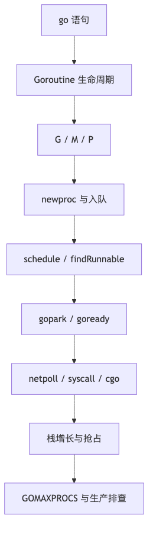
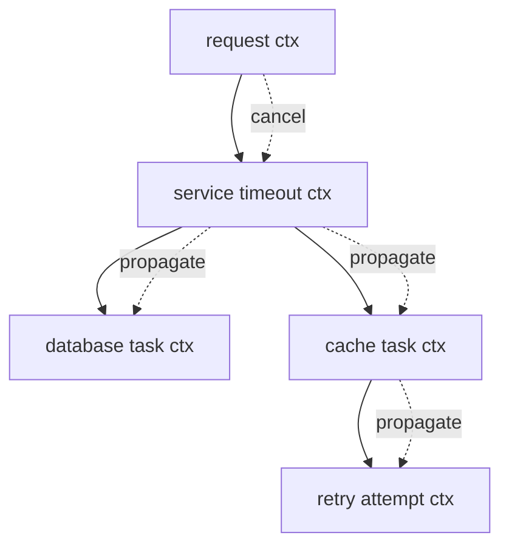
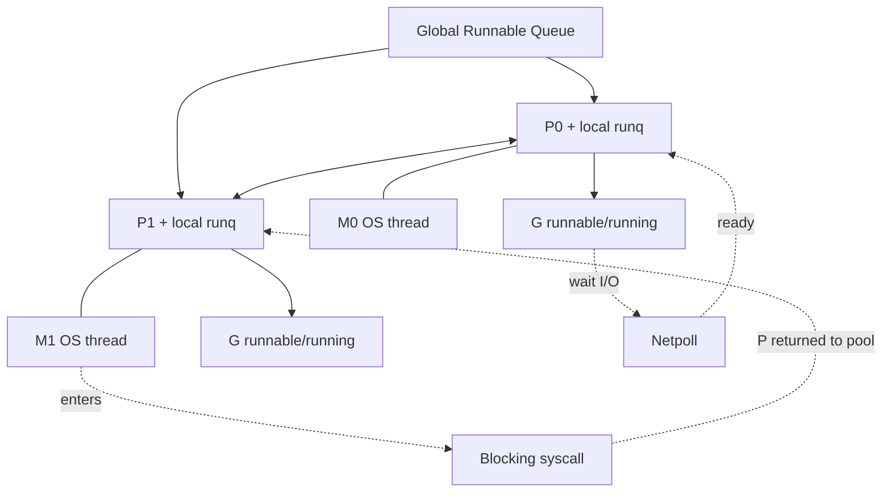
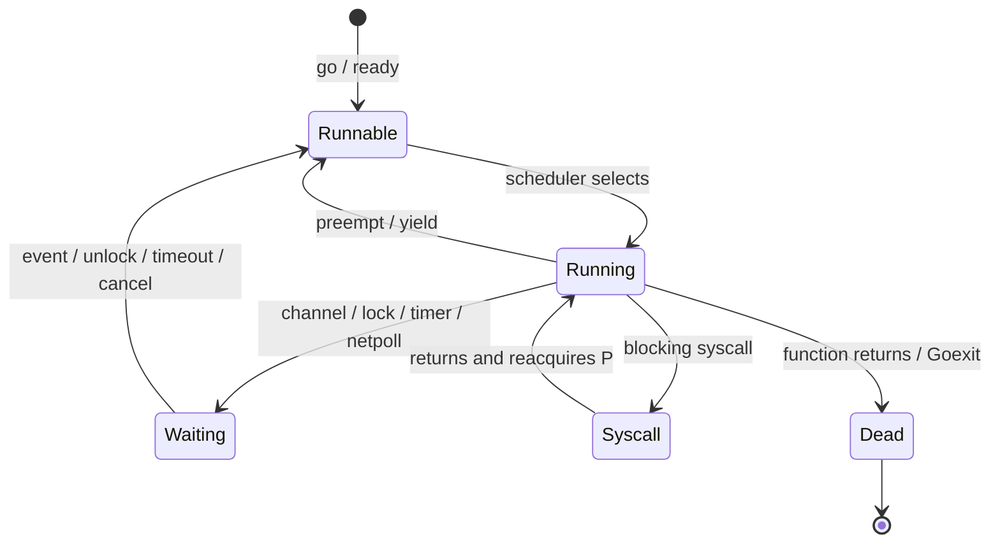
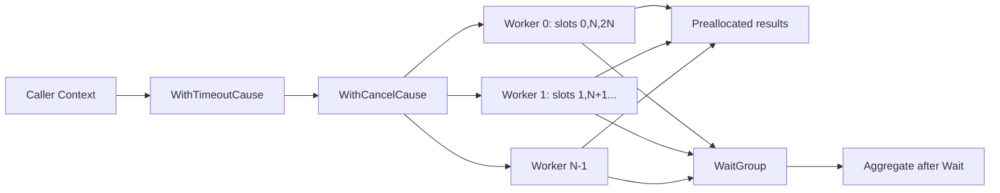

# 第 11 章：并发基础、Goroutine 生命周期与 Go 内存模型

## 阅读定位与关联章节

> 本章是后半段并发专题的入口：先把 Goroutine 生命周期、调度资源、退出协议和 Happens-Before 证明框架统一起来，再进入 Channel、锁、Atomic、Context 和生产级架构。

| 关联概念 | 建议读法 |
|---|---|
| Channel 通信、关闭协议、`select` 与 Pipeline | 看 [第 12 章：Channel、Select、并发模式与运行时实现](/blog/tech/GO/12.Channel)。 |
| Mutex、RWMutex、WaitGroup、Once、Cond、sync.Map 与 sync.Pool | 看 [第 13 章：Mutex、RWMutex 与 sync 工具箱](/blog/tech/GO/13.Mutex-RWMutex与sync工具箱)。 |
| Context 取消树、deadline、Cause 和跨 API 生命周期 | 看 [第 14 章：Context、取消传播与生命周期管理](/blog/tech/GO/14.Context-取消传播与生命周期管理)。 |
| Atomic、CAS、不可变快照和无锁思想 | 看 [第 15 章：Atomic、CAS、内存语义与无锁思想](/blog/tech/GO/15.Atomic-CAS-内存语义与无锁思想)。 |
| 生产级容量、过载、诊断和面试体系 | 看 [第 16 章：生产级高并发架构、性能诊断与面试体系](/blog/tech/GO/16.生产级高并发架构-性能诊断与面试体系)。 |

---

## 本章速览



这张图保留原有 Goroutine 调度链路，正文进一步把 WaitGroup、Context、退出协议和内存模型合成一条可证明的并发设计路径。

> **版本基线**：Go 1.26.x；本文核验版本为 Go 1.26.4，核验日期为 2026-06-22。
> **本章产物**：一个可取消、有限并发、结果顺序稳定、无内部 Goroutine 泄漏的并发任务执行器。
> **阅读约定**：文中用四种标签区分不同层级的结论。
>
> - **[语言保证]**：Go 规范或 Go 内存模型承诺。
> - **[API 契约]**：标准库公开文档承诺。
> - **[Go 1.26 实现]**：当前源码实现，未来版本可能变化。
> - **[工程推论]**：由契约、实现和负载模型推导出的实践结论。

---

### 1. 本章解决什么问题

并发代码的困难，不是“如何写出 `go f()`”，而是回答以下问题：

1. 谁创建 Goroutine，谁负责等待、取消和回收？
2. 多个 Goroutine 访问同一份数据时，哪些结果有语言保证？
3. 一个 Goroutine 已经退出，为什么另一个 Goroutine 仍可能看不到它写入的值？
4. 超时、上游取消、任务失败和 Panic 发生时，全部执行路径能否收敛？
5. 并发数、排队量、内存、调度与尾延迟是否有明确上限？
6. 测试为什么偶尔通过，却不能证明并发程序正确？

本章的核心结论是：

> **并发正确性来自明确的所有权、退出协议和 Happens-Before 关系，而不是来自“看起来执行完了”、日志顺序、CPU 很快或 `time.Sleep` 足够久。**

#### 1.1 并发与并行

| 概念 | 精确定义 | 是否要求多核 | 典型关注点 |
|---|---|---:|---|
| 并发（Concurrency） | 多个任务在一段时间内都有进展，执行区间可以交错 | 否 | 结构、协作、取消、同步、资源上限 |
| 并行（Parallelism） | 多个任务在同一时刻实际执行 | 是 | 核数、`GOMAXPROCS`、缓存、可扩展性 |

单核机器可以并发：调度器轮流运行多个 Goroutine。多核机器也不一定并行执行你的 Go 代码：例如 `GOMAXPROCS=1` 时，同一时刻最多一个 P 执行用户 Go 代码。

**工程结论**：先设计正确的并发结构，再根据 CPU、I/O 与依赖特征评估是否值得并行；“多开 Goroutine”不等于“更快”。

---

### 2. 学习目标和前置知识

完成本章后，你应能：

- 区分并发、并行、Goroutine 和操作系统线程；
- 解释 GMP、运行队列、Work Stealing、系统调用、Netpoll、抢占和 `GOMAXPROCS`；
- 描述 Goroutine 从创建到退出的主要状态迁移；
- 区分数据竞争、竞态条件、死锁、活锁、饥饿与 Goroutine 泄漏；
- 用 Sequenced-Before、Synchronized-Before、Happens-Before 和 DRF-SC 证明代码；
- 正确使用 `sync.WaitGroup.Go`，并理解传统 `Add`、`Done`、`Wait`；
- 正确传递和释放 Context，保留取消原因；
- 设计可终止、可等待、可观测、有限并发的 Goroutine；
- 编写不依赖真实睡眠的并发测试，并理解 `go test -race` 的边界。

前置知识：函数、闭包、接口、错误链、泛型、单元测试和基本命令行使用。

---

### 3. 一个生活类比：餐厅后厨

把一个 Go 进程看成餐厅：

- **G（Goroutine）**：订单卡，描述要做什么以及做到哪一步；
- **M（Machine）**：厨师，对应操作系统线程；
- **P（Processor）**：一套可让厨师执行 Go 工作的灶台与本地工具；
- **本地运行队列**：每个灶台旁的待做订单；
- **全局运行队列**：中央待办区；
- **Work Stealing**：某个灶台没活时，从别的灶台分一部分订单；
- **系统调用阻塞**：厨师去仓库等原料，暂时不能占着灶台；
- **Netpoll**：前台统一观察外卖平台和电话，事件就绪后再把订单唤醒；
- **Context**：订单的取消、截止时间和请求范围信息；
- **WaitGroup**：总控板上的未完成计数；
- **Happens-Before**：交接签字，保证前一个岗位完成的状态能被后一个岗位可靠观察。

类比的边界也很重要：真实 Goroutine 不是线程，P 不是物理 CPU，调度器也不承诺公平、先来先服务或固定执行顺序。

**工程结论**：G 是任务状态，M 是执行载体，P 是运行 Go 代码所需的调度资源；调度顺序不可作为业务正确性条件。

---

### 4. 从错误代码切入：启动了，不等于完成了

#### 4.1 错误示例：只启动 Goroutine 就读取结果

```go
package main

import "fmt"

func main() {
	var answer int
	go func() {
		answer = 42
	}()
	fmt.Println(answer)
}
```

这段代码有两个问题：

1. 主 Goroutine 可能先打印并退出，子 Goroutine 甚至还没运行；
2. `answer` 的写和读没有同步关系，构成数据竞争。

`go` 语句只保证：**`go` 语句发生在新 Goroutine 开始执行之前**。它不保证新 Goroutine 何时完成，也不保证其退出发生在主 Goroutine 的任何后续事件之前。

#### 4.2 常见伪修复：睡一会儿

```go
func main() {
	var answer int
	go func() { answer = 42 }()
	time.Sleep(time.Millisecond)
	fmt.Println(answer)
}
```

`time.Sleep` 只让当前 Goroutine 在“不早于某个时间”后重新变为可运行。它没有说明：

- 子 Goroutine 已经被调度；
- 写入已经发生；
- 写入与读取建立了同步；
- CI、低配容器、GC、系统抖动下仍然成立。

它仍然是数据竞争。睡得更久只是改变复现概率。

#### 4.3 正确修复：建立完成与可见性边界

```go
package main

import (
	"fmt"
	"sync"
)

func main() {
	var answer int
	var wg sync.WaitGroup

	wg.Go(func() {
		answer = 42
	})
	wg.Wait()

	fmt.Println(answer)
}
```

`WaitGroup.Go` 启动任务并计数；任务正常返回会减少计数；该任务的返回 **synchronizes-before** 被它解除阻塞的 `Wait` 返回。因此：

```text
子 Goroutine 写 answer
    sequenced-before
任务函数返回
    synchronized-before
wg.Wait 返回
    sequenced-before
主 Goroutine 读 answer
```

所以写入 Happens-Before 读取。

**工程结论**：等待的价值不只是“拖住 main”，而是建立可证明的内存可见性边界。

---

### 5. 基本 API 和最小可运行示例

#### 5.1 Goroutine：轻量并发执行单元

```go
package main

import (
	"fmt"
	"sync"
)

func main() {
	var wg sync.WaitGroup
	for i := range 3 {
		i := i
		wg.Go(func() {
			fmt.Println("task", i)
		})
	}
	wg.Wait()
}
```

输出顺序不固定，这是正常语义。不要把日志顺序当作调度保证。

##### Goroutine 与 OS 线程

| 维度 | Goroutine | OS 线程 |
|---|---|---|
| 调度者 | Go Runtime | 操作系统内核 |
| 栈 | 当前实现从较小栈开始，按需增长/收缩 | 通常预留更大、策略由 OS 决定 |
| 数量级 | 可创建很多，但绝非零成本 | 通常更重，数量更受限制 |
| 阻塞处理 | Channel、锁、网络 I/O 可由 Runtime 协作调度 | 内核阻塞线程 |
| 映射 | 多个 G 复用多个 M | 线程本身是内核调度实体 |
| 可强制终止 | 不支持 | 某些平台 API 可做，但通常危险 |

#### 5.2 `sync.WaitGroup.Go`

```go
var wg sync.WaitGroup
wg.Go(func() {
	work()
})
wg.Wait()
```

**[API 契约]**：

- 零值可用；
- 第一次使用后不得复制；
- `Go(f)` 在新 Goroutine 中调用 `f` 并纳入计数；
- `f` 必须不发生 Panic；
- 若 WaitGroup 为空，新的 `Go` 调用必须发生在对应的 `Wait` 之前；
- 复用时，新一轮 `Go` 必须在上一轮所有 `Wait` 返回后开始；
- `f` 的返回 synchronizes-before 它解除阻塞的 `Wait` 返回。

本章项目会在调用任务函数的边界恢复 Panic，把它转为错误，因此传给 `WaitGroup.Go` 的 Worker 函数本身不因用户任务 Panic 而退出。

#### 5.3 传统 `Add`、`Done`、`Wait`

```go
var wg sync.WaitGroup

wg.Add(1) // 必须在启动前完成

go func() {
	defer wg.Done()
	work()
}()

wg.Wait()
```

错误写法：

```go
// 错误：Add 可能尚未执行，Wait 已观察到计数为 0 并返回。
go func() {
	wg.Add(1)
	defer wg.Done()
	work()
}()
wg.Wait()
```

`Done()` 等价于 `Add(-1)`。计数变负会 Panic。`Add` 不是任务队列，也不限制并发。

#### 5.4 WaitGroup 的十二问

| 问题 | 回答 |
|---|---|
| 核心问题 | 等待一组已登记任务全部结束 |
| 零值可用 | 是 |
| 首次使用后可复制 | 否 |
| 是否阻塞 | `Wait` 可能阻塞；`Add/Done` 通常不阻塞调用者，但最后一次 `Done` 会唤醒等待者 |
| 是否建立 HB | 会；任务完成/`Done` 与被解除阻塞的 `Wait` 返回形成同步关系 |
| 释放方式 | 计数必须最终归零；不需要 `Close` |
| 最常见误用 | `Add` 放在 Goroutine 内、漏 `Done`、重复 `Done`、复制、错误复用 |
| 高竞争成本 | 同一个原子状态字段产生缓存行争用，归零时唤醒多个 Waiter |
| 尾延迟 | 漏完成导致永久等待；慢任务决定整组完成尾部 |
| 替代方案 | 单个结果可用 Channel；结构化并发可用更高层任务组；无需并发时直接调用 |
| 何时避免 | 需要传递结果、背压、动态流式任务或失败传播时，WaitGroup 单独不够 |
| 面试追问 | 为什么 `Add` 要先于 `go`？Wait 如何建立 Happens-Before？能否边 Wait 边增加任务？ |

#### 5.5 Context：取消、截止时间和请求范围值

##### 根 Context

```go
ctx := context.Background() // 通常用于 main、初始化、测试顶层
ctx = context.TODO()        // 暂时还不知道应传哪个 Context
```

两者都不可取消、没有截止时间、没有值。`TODO` 是迁移标记，不是“生产中随便用”的理由。

##### 主动取消

```go
ctx, cancel := context.WithCancel(parent)
defer cancel()
```

##### 超时与截止时间

```go
ctx, cancel := context.WithTimeout(parent, 500*time.Millisecond)
defer cancel()

ctx2, cancel2 := context.WithDeadline(parent, time.Now().Add(time.Second))
defer cancel2()
```

即使超时最终会自动发生，也应调用 `cancel`：这样可以尽早停止 Timer、解除父 Context 对子节点的引用并释放关联资源。

##### 保留取消原因

```go
var ErrOverloaded = errors.New("overloaded")
ctx, cancel := context.WithCancelCause(parent)
cancel(ErrOverloaded)

fmt.Println(ctx.Err())           // context canceled
fmt.Println(context.Cause(ctx)) // overloaded
```

`CancelFunc` 发出停止信号，**不会等待工作真正停止**。等待仍需 WaitGroup 或其他同步机制。

##### 取消传播树



父节点取消会传播到所有后代；子节点取消不会反向取消父节点或兄弟节点。

##### Value 的合理与错误用途

合理：跨 API 边界传播请求范围、可选、非业务核心的数据，例如 trace ID、认证主体、租户 ID。

错误：

```go
// 错误：把函数必需参数、连接池或全局配置藏进 Context。
ctx = context.WithValue(ctx, "timeout", 5*time.Second)
ctx = context.WithValue(ctx, "db", db)
```

推荐使用私有键类型，避免包间冲突：

```go
type traceIDKey struct{}
ctx = context.WithValue(ctx, traceIDKey{}, traceID)
```

##### 为什么通常不把 Context 存进结构体

把 Context 放进长生命周期对象会模糊：

- 它属于哪个请求；
- 截止时间从何时开始；
- 对象能否跨请求复用；
- 调用者能否为每次操作提供不同取消边界。

常规 API 形态应是：

```go
func (s *Service) Fetch(ctx context.Context, id string) error
```

而不是：

```go
// 通常不推荐。
type Service struct {
	ctx context.Context
}
```

#### 5.6 Context 的十二问

| 问题 | 回答 |
|---|---|
| 核心问题 | 跨调用边界传递取消、截止时间和请求范围值 |
| 零值可用 | `nil` 不可用；使用 `Background` 或 `TODO` |
| 首次使用后可复制 | Context 是接口值，可安全传给多个 Goroutine；不要修改其内部实现 |
| 是否阻塞 | `Done` 的接收可能阻塞；调用 `cancel` 本身不等待任务结束 |
| 是否建立 HB | `Done` 的关闭与观察到关闭的接收具有 Channel 关闭/接收的同步关系 |
| 释放方式 | 对所有派生 Context 调用返回的 cancel，通常 `defer cancel()` |
| 最常见误用 | 忘记 cancel、传 nil、存结构体、用 Value 传必需参数、任务忽略取消 |
| 高竞争成本 | 取消大树需遍历后代、关闭多个 Done、唤醒大量等待者 |
| 尾延迟 | 取消风暴与慢退出任务会放大 P99；deadline 过紧也会造成重试风暴 |
| 替代方案 | 进程生命周期可用专门 shutdown 信号；局部状态可用显式参数 |
| 何时避免 | 不应把它当事件总线、参数字典或任意依赖注入容器 |
| 面试追问 | cancel 是否等待？父子传播方向？`Err` 与 `Cause` 有何区别？ |

#### 5.7 最小可运行的“取消 + 等待”示例

```go
package main

import (
	"context"
	"errors"
	"fmt"
	"sync"
)

func main() {
	ctx, cancel := context.WithCancelCause(context.Background())
	var wg sync.WaitGroup

	wg.Go(func() {
		<-ctx.Done()
		fmt.Println("worker exit:", context.Cause(ctx))
	})

	cancel(errors.New("shutdown requested"))
	wg.Wait()
}
```

这里有两个不同责任：

- `cancel` 请求 Worker 停止；
- `Wait` 确认 Worker 已停止，并建立完成可见性边界。

**工程结论**：Context 负责“请停止”，WaitGroup 负责“已停止”；二者不能互相替代。

---

### 6. 正确性分析：用 Go 内存模型证明

#### 6.1 Memory Operation

**一句话定义**：程序执行可建模为多个 Goroutine 执行的内存操作集合。

每个内存操作包含：操作种类、程序位置、访问的内存位置以及读写值。操作可分为：

- 普通读/写；
- 同步读样操作：原子读、锁、Channel 接收等；
- 同步写样操作：原子写、解锁、Channel 发送与关闭等；
- 同时读写样操作：例如 CAS。

#### 6.2 Sequenced-Before

同一个 Goroutine 内，由语言控制流和表达式求值规则要求的偏序。例如：

```go
x = 1
f()
y = x
```

在该 Goroutine 中，写 `x`、调用 `f`、读 `x` 受程序顺序约束。Sequenced-Before 只描述单个 Goroutine 内部，并不能自行跨 Goroutine。

#### 6.3 Synchronized-Before

同步操作之间，由观察关系产生的偏序。例如：

- `go` 语句 synchronized-before 新 Goroutine 开始；
- Channel 发送 synchronized-before 对应接收完成；
- Channel 关闭 synchronized-before 因关闭而返回零值的接收；
- Mutex 的一次解锁 synchronized-before 后续相应加锁；
- WaitGroup 任务完成 synchronized-before 它解除阻塞的 `Wait` 返回。

#### 6.4 Happens-Before

Happens-Before 是 Sequenced-Before 与 Synchronized-Before 并集的传递闭包。

```mermaid
flowchart LR
    A[worker: write result[i]] -->|sequenced-before| B[worker returns]
    B -->|synchronized-before| C[wg.Wait returns]
    C -->|sequenced-before| D[caller reads result[i]]
```

因此 `A happens-before D`。

#### 6.5 数据竞争与 DRF-SC

**数据竞争**：两个 Goroutine 并发访问同一内存位置，至少一个是普通写，并且两者没有 Happens-Before 顺序；原子操作按其契约另论。

**DRF-SC**：没有数据竞争的 Go 程序，表现得像所有 Goroutine 的操作以某个满足同步约束的单一顺序交错执行。它不是说程序只有一种结果；不同合法调度仍可产生不同业务结果。

#### 6.6 可见性、原子性、有序性

| 属性 | 问题 | 同步原语解决方式 |
|---|---|---|
| 可见性 | 另一个 Goroutine 能否可靠看到写入 | 建立 Happens-Before |
| 原子性 | 操作能否作为不可分割步骤观察 | 锁临界区或原子操作 |
| 有序性 | 多个操作的先后约束是什么 | Sequenced-Before + Synchronized-Before |

一个原子计数器只能保证该计数器操作的原子性；它不会自动保护与另一个字段之间的不变量。

#### 6.7 为什么 Goroutine 启动只建立单向关系

```go
config := Config{Timeout: time.Second}
go use(config)
```

`config` 的构造 sequenced-before `go` 语句，`go` 语句 synchronized-before 子 Goroutine 开始，所以子 Goroutine能看到启动前完成的初始化。

反方向不成立：

```go
go func() { result = 42 }()
fmt.Println(result)
```

没有从子 Goroutine 的写回到主 Goroutine 读取的同步边。Goroutine 退出本身不是同步操作。

#### 6.8 本章执行器的共享状态证明

贯穿项目中的共享对象：

| 对象 | 可能并发操作 | 保护方式 |
|---|---|---|
| `tasks` 切片及任务函数 | 多个 Worker 只读 | 调用 `Run` 前完成构造；`go` 启动关系发布给 Worker |
| `results` 底层数组 | 多个 Worker 写不同下标 | 静态分片保证每个槽只有一个 Writer；调用者在 `Wait` 后读取 |
| WaitGroup 状态 | 多 Worker 完成、调用者等待 | WaitGroup 内部原子状态与信号量 |
| Context 取消树 | 多 Worker 可能同时 fail-fast 取消 | Context API 并发安全，首次取消原因生效 |
| 聚合错误 | 只在 `Wait` 后遍历结果构建 | 不与 Worker 并发访问 |

关键 HB 链：

```text
Run 在启动 Worker 前初始化 tasks/results
  → go/WaitGroup.Go 启动关系
Worker 读取 tasks

Worker 写 results[index]
  → Worker 返回 / Done
  → Wait 返回
Run 读取 results 并返回给调用者
```

“写不同数组下标”通常不会形成同一内存位置的数据竞争，但仍需保证：

1. 不发生 append 导致切片扩容；
2. 不让两个 Worker 获得同一索引；
3. 调用者不能在完成同步前读这些槽。

#### 6.9 六类并发故障的区别

| 概念 | 定义 | 是否必然被 `-race` 发现 | 示例 |
|---|---|---:|---|
| 数据竞争 | 未同步的冲突内存访问 | 仅当运行路径实际发生 | 一个写共享 map，一个同时读 |
| 竞态条件 | 结果错误地依赖事件时序 | 否 | 两个无数据竞争的请求争抢“首个成功者”，业务规则却要求固定优先级 |
| 死锁 | 参与者永久等待，系统无法前进 | 通常否；全局死锁有时被 Runtime 报告 | A 等 B，B 等 A |
| 活锁 | 持续运行和改变状态，但没有有效进展 | 否 | 两方不断礼让并重试 |
| 饥饿 | 某个参与者长期得不到资源 | 否 | 热点任务持续占据有限槽位 |
| Goroutine 泄漏 | Goroutine 已无业务价值却永久无法退出 | 否 | 发送者等待无人接收，或任务忽略取消 |

注意：Runtime 的“all goroutines are asleep”只能检测某些全局死锁；服务中一个子系统死锁而其他 Goroutine 仍运行，通常不会自动崩溃提示。

**工程结论**：`-race` 解决的是“实际执行到的数据竞争检测”，不是并发正确性的完整证明器。


---

### 7. 常见使用场景

#### 7.1 并行调用独立依赖

一个请求需要并发查询库存、价格和优惠，但必须有总预算、有限并发和清晰失败策略。适合使用：

- 上游请求 Context；
- 派生总超时；
- 固定数量 Worker 或任务组；
- 每个结果槽独占写入；
- WaitGroup 等待收敛。

#### 7.2 后台任务的结构化生命周期

服务启动时创建健康检查、刷新器、批处理器；关闭时取消根 Context，再等待所有组件退出。

```go
ctx, cancel := context.WithCancel(context.Background())
var wg sync.WaitGroup

wg.Go(func() { refreshLoop(ctx) })
wg.Go(func() { healthLoop(ctx) })

// 收到关闭信号后：
cancel()
wg.Wait()
```

#### 7.3 有限批量计算

对有限输入做 CPU 或 I/O 工作，并要求结果按输入顺序返回。应根据任务类型选择并发度：

- CPU 密集：通常从 `GOMAXPROCS` 附近起测；
- 网络 I/O：可高于 `GOMAXPROCS`，但受连接池、依赖容量和速率限制约束；
- 内存密集：可能受带宽和缓存限制，增加并发反而恶化。

#### 7.4 失败后取消兄弟任务

当结果必须“全部成功才有效”时，首个不可恢复错误可触发 `WithCancelCause`；其他任务通过 `ctx.Done()` 尽快退出。仍需等待所有已启动任务真正返回。

#### 7.5 请求范围的追踪和身份信息

Context Value 适合传递 trace ID、请求身份等横切数据，但不代替显式业务参数。

**工程结论**：Context + WaitGroup 适合“有限任务集合的取消与汇合”；流式传输、队列与背压将在 Channel 章节解决。

---

### 8. 不适合使用的场景

#### 8.1 为极小工作强行创建 Goroutine

```go
wg.Go(func() { x++ })
```

若工作量小于 Goroutine 创建、调度、同步和缓存失效成本，串行更快、更简单。

#### 8.2 用 WaitGroup 传输结果

WaitGroup 只表达计数和完成，不携带值、不提供错误策略、不提供背压。结果应存入明确拥有的槽位，或用 Channel/更高层抽象传递。

#### 8.3 用 Context 作为配置中心或事件总线

Context 的 Value 查找沿派生链进行，键缺乏编译期约束，也会隐藏依赖。必需配置应显式传参或放在清晰的依赖对象中。

#### 8.4 期望 Context 强杀阻塞函数

Go 没有安全的通用 Goroutine 强制终止机制。若第三方调用不接收 Context、没有超时且可能永久阻塞，外层取消不能让该调用自动停止。

#### 8.5 无界输入、无界并发或无界排队

“每个请求一个 Goroutine”在正常流量下可能工作，但突发流量会把排队从显式队列转移到：

- 运行队列；
- 连接池等待；
- 内存和 GC；
- 下游依赖；
- 内核 socket 缓冲。

这些都不是免费的队列。

**工程结论**：每个并发设计都要同时给出 Goroutine 上限、排队上限、取消边界和过载行为。

---

### 9. 错误示例、原因和修复过程

#### 9.1 用 `time.Sleep` 等待完成

**错误**：

```go
var result int
go func() { result = 7 }()
time.Sleep(10 * time.Millisecond)
use(result)
```

**原因**：没有 HB；调度和机器负载不受睡眠时长约束。

**修复**：用 WaitGroup、Channel、锁或其他明确同步。

```go
var wg sync.WaitGroup
wg.Go(func() { result = 7 })
wg.Wait()
use(result)
```

#### 9.2 在 Goroutine 内调用 `Add`

**错误**：

```go
for _, task := range tasks {
	go func() {
		wg.Add(1)
		defer wg.Done()
		task()
	}()
}
wg.Wait()
```

**竞态窗口**：`Wait` 可能先看到计数为 0 并返回。

**修复一**：优先使用 `wg.Go`。

```go
for _, task := range tasks {
	task := task
	wg.Go(task)
}
wg.Wait()
```

**修复二**：存量写法中，`Add` 必须先于 `go`。

```go
wg.Add(len(tasks))
for _, task := range tasks {
	task := task
	go func() {
		defer wg.Done()
		task()
	}()
}
wg.Wait()
```

#### 9.3 复制 WaitGroup

**错误**：

```go
type Group struct {
	wg sync.WaitGroup
}

func wait(g Group) { // 复制了内部 WaitGroup
	g.wg.Wait()
}
```

调用者和 `wait` 在不同计数状态副本上操作，可能永久等待或提前返回。

**修复**：持有并传递指针；运行 `go vet` 检查 copylock 类问题。

```go
func wait(g *Group) { g.wg.Wait() }
```

#### 9.4 计数变负

```go
var wg sync.WaitGroup
wg.Add(1)
wg.Done()
wg.Done() // panic: negative WaitGroup counter
```

原因通常是重复 `Done`、错误分支多调用，或没有把“登记一次、完成一次”绑定到同一所有权范围。

推荐：

```go
wg.Add(1)
go func() {
	defer wg.Done()
	// 所有 return 和 panic 之前都有一次 Done（但未恢复的 panic 仍会终止进程）。
}()
```

在 Go 1.26 新代码中，能用 `wg.Go` 时优先使用。

#### 9.5 WaitGroup 错误复用

**错误时序**：上一轮 `Wait` 还没返回，就开始把同一个 WaitGroup 用于下一轮。当前实现会尽力检测部分误用并 Panic，但不能把“可能 Panic”当成同步设计。

正确阶段：

```text
round 1: Go/Add ... -> Wait returns
round 2: Go/Add ... -> Wait returns
```

#### 9.6 忘记调用 cancel

**错误**：

```go
ctx, _ := context.WithTimeout(parent, time.Minute)
return call(ctx)
```

即使 `call` 很快返回，Timer 和父子引用仍可能保留到超时或父 Context 取消。

**修复**：

```go
ctx, cancel := context.WithTimeout(parent, time.Minute)
defer cancel()
return call(ctx)
```

#### 9.7 取消后立即返回，却不等待所有者创建的 Goroutine

**错误**：

```go
ctx, cancel := context.WithCancel(parent)
go worker(ctx)
cancel()
return nil // worker 可能仍在运行并访问已失效资源
```

`cancel` 不等待。若当前组件拥有该 Worker，就必须定义 join：

```go
var wg sync.WaitGroup
ctx, cancel := context.WithCancel(parent)
wg.Go(func() { worker(ctx) })
cancel()
wg.Wait()
```

#### 9.8 任务忽略 Context

```go
func badTask(context.Context) error {
	select {} // 永久阻塞
}
```

外层无法强制杀死它。修复方向：

- 使用支持 Context 的 API；
- 为网络、数据库和锁等待设置可取消路径；
- 将不可取消的第三方调用隔离在容量受限的 Bulkhead 中；
- 进程级故障恢复作为最后边界，而不是日常控制流。

#### 9.9 共享 append

**错误**：

```go
var results []Result
for _, task := range tasks {
	wg.Go(func() {
		results = append(results, task())
	})
}
```

多个 Goroutine 同时修改 slice header 和底层数组，会数据竞争，也可能损坏内容。

**本章修复**：预分配固定长度，每个任务只写独占下标。

```go
results := make([]Result, len(tasks))
for i, task := range tasks {
	i, task := i, task
	wg.Go(func() {
		results[i] = task()
	})
}
wg.Wait()
```

#### 9.10 把“无数据竞争”误认为“业务正确”

```go
var winner atomic.Int32
// 两个无数据竞争的 CAS 决定 winner，但业务要求主库优先于缓存。
```

代码可以 race-free，却仍因完成先后产生不符合业务优先级的结果。这是竞态条件，不是数据竞争。

**工程结论**：先定义业务允许的状态机和结果集合，再选择同步原语；工具不能替你定义正确性。

---

### 10. 底层实现

#### 10.1 GMP 总览

**[Go 1.26 实现]** Runtime 调度器围绕 G、M、P 组织：

- **G**：Goroutine 的运行状态、栈、调度上下文等；
- **M**：操作系统线程，可执行用户 Go 代码、Runtime、系统调用或空闲；
- **P**：执行用户 Go 代码所需的权利和资源，包含调度与分配器相关的本地状态；P 的数量等于 `GOMAXPROCS`。



调度器的目标是匹配：要运行的 G、承载它的 M，以及允许执行 Go 代码的 P。

#### 10.2 本地队列、全局队列和 Work Stealing

每个 P 有本地可运行队列，通常减少对全局调度锁的争用。当前源码路径大意是：

1. 新变为 runnable 的 G 优先进入当前 P 的 `runnext` 或本地运行队列；
2. 本地队列满时，当前实现会把一批任务转移到全局队列；
3. P 找不到本地工作时，会检查全局队列、Netpoll，并尝试从其他 P 偷取一部分工作；
4. Work Stealing 平衡负载，但不承诺公平顺序。

**[工程推论]**：大量极短任务会让创建、入队、偷取和缓存迁移占比上升；固定调度顺序测试是脆弱测试。

#### 10.3 系统调用

M 进入可能阻塞的系统调用时，不能长期占有 P。Runtime 可让 P 与其他 M 结合继续运行 Go 代码；原 M 从系统调用返回后，需要重新获取 P 才能继续执行用户 Go 代码。

这解释了：

- M 的数量可以高于 P；
- `GOMAXPROCS` 限制同时执行用户 Go 代码的 P，不等于线程总数；
- 大量不可控阻塞系统调用仍会造成线程增长和资源压力。

#### 10.4 Netpoll

网络 I/O 通常不会为每个等待连接永久占用一个 OS 线程。G 在等待可轮询的网络事件时进入等待状态；Netpoll 在事件就绪、超时或取消后让对应 G 重新 runnable。

Netpoll 能改善线程利用率，但不会消除：

- socket、连接池和文件描述符上限；
- 下游慢导致的在途请求增长；
- 业务层无界重试和无界并发。

#### 10.5 抢占

现代 Go 支持协作式安全点以及异步抢占。Runtime 可以请求长时间运行的 G 让出执行资源，避免纯计算循环长期独占 P。

不要把抢占误解为严格时间片或公平承诺。长临界区、cgo、系统调用、Runtime 不可抢占区域等仍会影响延迟。

#### 10.6 `GOMAXPROCS`

**[API 契约]**：`runtime.GOMAXPROCS(n)` 设置可同时执行 Go 代码的最大 CPU 数并返回旧值；`n < 1` 时只查询。

**[Go 1.26 行为]**：未显式设置时，Runtime 会综合逻辑 CPU、CPU affinity，以及 Linux cgroup CPU quota 选择默认值，并可能周期性更新。显式环境变量或函数调用会影响自动更新行为。

```go
current := runtime.GOMAXPROCS(0)
fmt.Println(current)
```

调优原则：

- CPU 密集任务先从默认值开始；
- 不要把 Worker 数机械设为 `GOMAXPROCS * 100`；
- I/O 并发上限应由依赖容量、连接池、请求预算和排队策略决定；
- 修改后必须用相同负载比较吞吐量、P95/P99、CPU、GC 和错误率。

#### 10.7 Goroutine 生命周期

**语言层面**只承诺行为，不暴露稳定的状态枚举。以下是当前 Runtime 的主要状态抽象：



源码状态还包含 scan 变体、preempted 以及实验性 leak 标记等。这些名字属于实现细节，不应写入业务逻辑。

关键 Runtime 操作的概念：

- `gopark`：把当前 G 置为等待并让出执行；
- `goready`：把等待 G 变为 runnable 并放回运行队列；
- 调度器之后决定它何时真正运行。

“唤醒”不等于“立即执行”。

#### 10.8 WaitGroup 当前实现

**[Go 1.26 实现]** `WaitGroup` 当前主要字段：

```go
type WaitGroup struct {
	noCopy noCopy
	state  atomic.Uint64
	sema   uint32
}
```

`state` 的高位保存任务计数，另有 synctest 标记和 Waiter 数；`sema` 用于 Runtime 信号量等待/唤醒。

##### `Add` 快速路径

1. 原子地调整计数；
2. 若计数仍大于 0，或没有 Waiter，直接返回；
3. 若计数变负，Panic；
4. 若发现某些 `Add` 与 `Wait` 误用，Panic。

##### 归零慢路径

当最后一个任务把计数减到 0 且存在 Waiter：

1. 重置 Waiter 计数；
2. 通过 Runtime semaphore 逐个释放等待者；
3. Waiter 返回前再次检查错误复用。

##### `Wait`

1. 原子读取状态；
2. 计数为 0 时立即返回；
3. 否则 CAS 增加 Waiter 数；
4. 在 Runtime semaphore 上阻塞；
5. 被最后一次完成唤醒后返回。

##### `WaitGroup.Go`

公开语义相当于“登记 + 启动 + 正常完成时移除”。Go 1.26 当前实现还特意处理 `f` Panic：它重新 Panic 而不先 `Done`，避免主 Goroutine 被 `Wait` 提前释放并可能在致命 Panic 完成前退出。因此 API 明确要求 `f` 不得 Panic。

**工程推论**：WaitGroup 是一个共享原子热点。它适合任务生命周期汇合，不适合每次微操作都频繁 `Add/Done` 的超高频协议。

#### 10.9 Context 当前实现

**[Go 1.26 实现]** 可取消 Context 的核心结构概念如下：

```go
type cancelCtx struct {
	Context
	mu       sync.Mutex
	done     atomic.Value          // 惰性创建的 chan struct{}
	children map[canceler]struct{}
	err      atomic.Value
	cause    error
}
```

取消路径大意：

1. 加锁并确认是否已取消；
2. 记录 `err` 与 `cause`；
3. 关闭或发布已关闭的 `done`；
4. 遍历并取消子节点；
5. 清空子节点集合；
6. 必要时从父节点移除自身。

因此取消一棵很大的 Context 树并唤醒大量任务不是零成本。`Done` Channel 通常惰性创建；只调用 `Err`/`Deadline` 的路径不一定需要它。

#### 10.10 三层边界总结

| 主题 | 稳定契约 | 当前实现细节 |
|---|---|---|
| Goroutine | 可并发执行；启动有单向同步；退出无自动同步 | G 状态枚举、栈初始大小、具体队列策略 |
| WaitGroup | 计数、等待、HB、不可复制、复用规则 | 64 位状态布局、Runtime semaphore、误用检测细节 |
| Context | 父子取消传播、并发安全、必须调用 cancel | `cancelCtx` 字段、锁、惰性 Done、遍历算法 |
| 调度 | 不承诺顺序或公平 | GMP、Work Stealing、Netpoll、抢占实现 |

**工程结论**：业务正确性只能依赖稳定契约；实现细节用于性能解释、排障和版本核验。

---

### 11. 时间、空间、调度和缓存成本

#### 11.1 Goroutine 成本

单个 Goroutine 比 OS 线程轻，但仍包含：

- G 描述符；
- 可增长栈及其引用对象；
- 调度、创建和退出成本；
- GC 扫描根；
- 阻塞原语中的等待节点；
- 可能持有的大对象、Buffer、Context 和连接引用。

一百万个“只阻塞”的 Goroutine 也可能造成显著内存、GC 和诊断成本。

#### 11.2 调度成本

当任务太细或 runnable G 远多于 P：

- 本地/全局队列操作增多；
- Work Stealing 与线程唤醒增多；
- CPU Cache 局部性下降；
- 真正业务计算占比下降；
- P99 可能被排队和调度延迟主导。

#### 11.3 WaitGroup 成本

- `Add/Done/Wait` 操作集中在同一原子状态；
- 多核频繁修改会产生 Cache Line 所有权迁移；
- 最后归零时多个 Waiter 被唤醒可能形成突发；
- 整组延迟由最慢任务决定。

通常这不是首要瓶颈，但不要在高频内层循环中无 Benchmark 地反复创建任务组。

#### 11.4 Context 成本

- 每次派生可能分配包装节点；
- Timeout/Deadline 可能关联 Timer；
- Value 查找沿链向上；
- 取消需传播到后代并唤醒等待者；
- 大量短超时会增加 Timer 和取消压力。

#### 11.5 结果槽与缓存

“每任务独占槽”避免逻辑锁，但相邻 Worker 写入相邻小元素时仍可能落在同一 Cache Line，引发伪共享。是否需要填充或分片必须由 Profile/Benchmark 证明；大多数业务先保持简单结构。

#### 11.6 静态分片的代价

本章执行器采用 `workerID, workerID+N...` 静态分片，优点是无需队列、锁或原子索引；缺点是任务耗时差异大时负载不均。例如 Worker 0 恰好分到多个慢任务，其他 Worker 已空闲。

这是刻意的教学取舍。第 12 章用有界 Channel Worker Pool 实现动态取任务和背压，并与本章版本做等价 Benchmark。

#### 11.7 复杂度

设任务数为 `n`，Worker 数为 `w=min(n, MaxConcurrency)`：

| 项目 | 复杂度/上限 |
|---|---|
| Worker Goroutine 数 | `O(w)`，硬上限 `MaxConcurrency` |
| 任务遍历 | `O(n)` |
| 结果空间 | `O(n)` |
| WaitGroup 空间 | `O(1)` |
| 任务额外排队结构 | 无；输入切片本身由调用者持有 |
| 取消传播 | 与派生 Context 子树规模相关 |

**工程结论**：并发上限不只是一项性能参数，也是内存、连接、下游负载和故障半径的安全边界。

---

### 12. 高性能、高可用、高并发场景：可取消任务执行器

#### 12.1 需求与非目标

需求：

- 接收有限的一批独立任务；
- 最大并发数有硬上限；
- 每个任务接收同一个派生 Context；
- 总超时和上游取消可传播；
- 可选首错取消；
- 每个结果槽仅一个 Worker 写；
- Panic 转换为错误，避免用户任务破坏 `WaitGroup.Go` 契约；
- `Run` 返回前等待全部已启动 Worker 退出。

非目标：

- 不提供动态流式入队；
- 不提供队列背压；
- 不强杀忽略 Context 的任务；
- 不保证开始顺序或完成顺序；
- 不宣称静态分片是所有负载下最快方案。

#### 12.2 Goroutine 所有权和退出协议

每个并发组件应写清五件事：

| 问题 | 本项目答案 |
|---|---|
| 谁创建 | `Run` 创建固定数量 Worker |
| 谁拥有 | `Run`；调用者只等待 `Run` 返回 |
| 谁请求停止 | 上游 Context、总超时或首错调用 `cancelRun` |
| Worker 如何退出 | Context 已取消，或完成静态分配的全部任务 |
| 谁确认退出 | `Run` 调用 `wg.Wait()`，然后才读结果并返回 |

额外合同：Task 必须尊重 Context，或至少保证有限时间返回。否则任何库层执行器都无法提供有限关闭延迟。

#### 12.3 架构



#### 12.4 完整实现：`executor/executor.go`

```go
// Package executor provides a bounded, cancellable executor for independent tasks.
//
// The implementation intentionally uses static task partitioning instead of a
// channel-backed work queue. That keeps Chapter 1 focused on goroutine
// ownership, Context, WaitGroup, and happens-before. Chapter 2 can replace the
// static partitioner with a dynamic worker pool.
package executor

import (
	"context"
	"errors"
	"fmt"
	"runtime/debug"
	"sync"
	"time"
)

var (
	// ErrInvalidMaxConcurrency reports an invalid concurrency limit.
	ErrInvalidMaxConcurrency = errors.New("executor: MaxConcurrency must be greater than zero")
	// ErrNilContext reports a nil parent Context.
	ErrNilContext = errors.New("executor: nil context")
	// ErrNilTask reports a nil task function.
	ErrNilTask = errors.New("executor: nil task")
	// ErrTotalTimeout is the cancellation cause used when the executor's own
	// total timeout expires.
	ErrTotalTimeout = errors.New("executor: total timeout exceeded")
)

// Task is one independent unit of work.
// A task must return promptly when ctx is canceled if bounded shutdown latency
// is required. Go cannot forcibly terminate an arbitrary goroutine.
type Task[T any] func(ctx context.Context) (T, error)

// Status describes a task's terminal state.
type Status string

const (
	StatusPending   Status = "pending"
	StatusRunning   Status = "running"
	StatusSucceeded Status = "succeeded"
	StatusFailed    Status = "failed"
	StatusCanceled  Status = "canceled"
	StatusSkipped   Status = "skipped"
	StatusPanicked  Status = "panicked"
)

// Result is stored in the input task's corresponding slot.
// Each slot has exactly one worker owner, so workers never concurrently write
// the same Result value.
type Result[T any] struct {
	Index  int
	Value  T
	Err    error
	Status Status
}

// Options controls execution.
type Options struct {
	// MaxConcurrency is the maximum number of worker goroutines.
	MaxConcurrency int
	// Timeout is the executor-wide budget. Zero means no additional deadline.
	Timeout time.Duration
	// StopOnError cancels sibling work after the first task error or panic.
	StopOnError bool
}

// TaskError attaches the input index to a task failure.
type TaskError struct {
	Index int
	Err   error
}

func (e *TaskError) Error() string {
	return fmt.Sprintf("task %d: %v", e.Index, e.Err)
}

func (e *TaskError) Unwrap() error { return e.Err }

// PanicError converts a task panic into an ordinary error so one bad task does
// not violate sync.WaitGroup.Go's contract that f must not panic.
type PanicError struct {
	Value any
	Stack []byte
}

func (e *PanicError) Error() string {
	return fmt.Sprintf("task panicked: %v", e.Value)
}

// Run executes tasks with bounded concurrency and preserves input order in the
// result slice.
//
// Shutdown is cooperative: Run waits for every started task to return. A task
// that ignores ctx and blocks forever can therefore block Run forever.
func Run[T any](parent context.Context, tasks []Task[T], opts Options) ([]Result[T], error) {
	if parent == nil {
		return nil, ErrNilContext
	}
	if opts.MaxConcurrency <= 0 {
		return nil, ErrInvalidMaxConcurrency
	}

	results := make([]Result[T], len(tasks))
	for i := range results {
		results[i] = Result[T]{Index: i, Status: StatusPending}
	}
	if len(tasks) == 0 {
		return results, nil
	}

	baseCtx := parent
	stopTimeout := func() {}
	if opts.Timeout != 0 {
		baseCtx, stopTimeout = context.WithTimeoutCause(parent, opts.Timeout, ErrTotalTimeout)
	}
	defer stopTimeout()

	runCtx, cancelRun := context.WithCancelCause(baseCtx)
	defer cancelRun(nil)

	if cause := context.Cause(runCtx); cause != nil {
		markSkipped(results, cause)
		return results, cause
	}

	workerCount := min(opts.MaxConcurrency, len(tasks))
	var wg sync.WaitGroup

	for workerID := range workerCount {
		workerID := workerID
		wg.Go(func() {
			// Static striding gives every task index exactly one worker owner:
			// worker 0 owns 0, N, 2N; worker 1 owns 1, N+1, ...
			for index := workerID; index < len(tasks); index += workerCount {
				if runCtx.Err() != nil {
					return
				}

				result := &results[index]
				result.Status = StatusRunning

				value, err := callTask(runCtx, tasks[index])
				result.Value = value
				if err == nil {
					result.Status = StatusSucceeded
					continue
				}

				wrapped := &TaskError{Index: index, Err: err}
				result.Err = wrapped
				result.Status = classifyStatus(runCtx, err)

				if opts.StopOnError {
					// CauseCancelFunc is safe for concurrent calls; the first
					// cancellation cause wins.
					cancelRun(wrapped)
				}
			}
		})
	}

	wg.Wait()

	cause := context.Cause(runCtx)
	markSkipped(results, cause)

	var errs []error
	for i := range results {
		// Skipped slots all carry the same cancellation cause. Aggregate that
		// cause once below instead of joining it once per skipped task.
		if results[i].Err != nil && results[i].Status != StatusSkipped {
			errs = append(errs, results[i].Err)
		}
	}
	if cause != nil && !errorCovered(errs, cause) {
		errs = append(errs, cause)
	}

	return results, errors.Join(errs...)
}

func callTask[T any](ctx context.Context, task Task[T]) (value T, err error) {
	if task == nil {
		return value, ErrNilTask
	}
	defer func() {
		if recovered := recover(); recovered != nil {
			err = &PanicError{Value: recovered, Stack: debug.Stack()}
		}
	}()
	return task(ctx)
}

func classifyStatus(ctx context.Context, err error) Status {
	var panicErr *PanicError
	if errors.As(err, &panicErr) {
		return StatusPanicked
	}
	if errors.Is(err, context.Canceled) || errors.Is(err, context.DeadlineExceeded) {
		return StatusCanceled
	}
	if cause := context.Cause(ctx); cause != nil && errors.Is(err, cause) {
		return StatusCanceled
	}
	return StatusFailed
}

func markSkipped[T any](results []Result[T], cause error) {
	if cause == nil {
		return
	}
	for i := range results {
		if results[i].Status == StatusPending {
			results[i].Status = StatusSkipped
			results[i].Err = cause
		}
	}
}

func errorCovered(errs []error, target error) bool {
	for _, err := range errs {
		if errors.Is(err, target) || errors.Is(target, err) {
			return true
		}
	}
	return false
}
```


#### 12.5 正确性逐项审查

##### 共享变量

- `tasks`：Worker 并发读；调用者不得在 `Run` 期间修改任务切片或替换任务函数。
- `results`：多个 Worker 写不同索引；`Run` 在 `Wait` 返回后读取。
- Context：标准库保证可并发调用；首次取消原因生效。
- WaitGroup：内部同步；不复制。

##### 数据竞争

实现中没有两个 Worker 写同一结果槽，也没有在 Worker 运行时 append `results`。聚合发生在 `Wait` 后。

##### 同步关系

- `Run` 初始化输入和结果后调用 `wg.Go`，发布给 Worker；
- Worker 写槽位 sequenced-before Worker 函数返回；
- Worker 返回 synchronized-before 对应 `wg.Wait` 返回；
- 聚合读取 sequenced-after `Wait`。

##### 原子性与业务不变量

每个 `Result` 作为一个 Worker 私有的可变对象，直到 join 后才公开。无需给 `Result` 字段逐个加原子操作。

##### 取消与退出

- 总超时使用 `WithTimeoutCause`，保留 `ErrTotalTimeout`；
- fail-fast 使用 `WithCancelCause`，保留首个任务错误；
- Worker 在开始下一任务前检查 Context；
- 正在运行的 Task 通过自身 Context 协作退出；
- `Run` 不在 Worker 退出前返回。

##### Panic

任务边界 `callTask` 恢复 Panic，记录栈并返回 `PanicError`。这只隔离用户任务 Panic；执行器内部不变量被破坏时不应静默吞掉 Panic。

#### 12.6 高可用注意事项

1. **容量与依赖一致**：`MaxConcurrency` 不应超过连接池或下游承载能力。
2. **总预算要分层**：上游 500ms 预算不能让每个下游都各自拥有 500ms。
3. **首错取消不是总适用**：可部分成功的聚合应收集全部结果；事务式“全成或全败”才更适合 fail-fast。
4. **错误分类**：取消、超时、业务失败和 Panic 应分开计数。
5. **重试在执行器外设计**：必须有幂等、退避、抖动和重试预算，避免首错取消后立即形成重试风暴。
6. **静态分片的长尾**：任务耗时方差大时，使用第 12 章动态 Worker Pool；队列仍须有界。
7. **任务函数合同**：所有网络和数据库调用都要接收 Context；不支持取消的依赖要隔离。

**工程结论**：无泄漏并不只靠实现者；它是执行器和 Task 共同遵守的接口合同。


---

### 13. 测试和 Benchmark

#### 13.1 测试策略

并发测试不应依赖“多睡一会儿”。本项目使用：

- 明确 Channel 握手确认任务已启动；
- `sync/atomic` 只用于测试中观测最大并发数；
- `testing/synctest` 的虚拟时间测试超时和取消；
- `synctest.Test` 等待 bubble 内所有 Goroutine 退出，并在 bubble 死锁时使测试失败；
- `go test -race` 检查实际执行路径中的数据竞争；
- 重复执行放大少见交错。

#### 13.2 完整单元测试：`executor/executor_test.go`

```go
package executor_test

import (
	"context"
	"errors"
	"sync/atomic"
	"testing"
	"testing/synctest"
	"time"

	"example.com/go-concurrency-chapter1/executor"
)

func TestRunSuccessPreservesOrder(t *testing.T) {
	tasks := make([]executor.Task[int], 8)
	for i := range tasks {
		i := i
		tasks[i] = func(context.Context) (int, error) {
			return i * i, nil
		}
	}

	results, err := executor.Run(context.Background(), tasks, executor.Options{
		MaxConcurrency: 3,
	})
	if err != nil {
		t.Fatalf("Run() error = %v", err)
	}
	for i, result := range results {
		if result.Status != executor.StatusSucceeded {
			t.Fatalf("result[%d].Status = %q", i, result.Status)
		}
		if want := i * i; result.Value != want {
			t.Fatalf("result[%d].Value = %d, want %d", i, result.Value, want)
		}
	}
}

func TestRunTaskFailureWithoutFailFast(t *testing.T) {
	boom := errors.New("boom")
	var calls atomic.Int32
	tasks := []executor.Task[int]{
		func(context.Context) (int, error) { calls.Add(1); return 10, nil },
		func(context.Context) (int, error) { calls.Add(1); return 0, boom },
		func(context.Context) (int, error) { calls.Add(1); return 30, nil },
	}

	results, err := executor.Run(context.Background(), tasks, executor.Options{
		MaxConcurrency: 2,
	})
	if !errors.Is(err, boom) {
		t.Fatalf("Run() error = %v, want errors.Is(..., boom)", err)
	}
	if got := calls.Load(); got != int32(len(tasks)) {
		t.Fatalf("calls = %d, want %d", got, len(tasks))
	}
	if results[1].Status != executor.StatusFailed {
		t.Fatalf("failed result status = %q", results[1].Status)
	}
}

func TestRunStopOnErrorSkipsPendingTasks(t *testing.T) {
	boom := errors.New("boom")
	var calls atomic.Int32
	tasks := []executor.Task[int]{
		func(context.Context) (int, error) { calls.Add(1); return 0, boom },
		func(context.Context) (int, error) { calls.Add(1); return 2, nil },
		func(context.Context) (int, error) { calls.Add(1); return 3, nil },
	}

	results, err := executor.Run(context.Background(), tasks, executor.Options{
		MaxConcurrency: 1,
		StopOnError:    true,
	})
	if !errors.Is(err, boom) {
		t.Fatalf("Run() error = %v, want boom", err)
	}
	if got := calls.Load(); got != 1 {
		t.Fatalf("calls = %d, want 1", got)
	}
	if results[0].Status != executor.StatusFailed ||
		results[1].Status != executor.StatusSkipped ||
		results[2].Status != executor.StatusSkipped {
		t.Fatalf("statuses = %q, %q, %q", results[0].Status, results[1].Status, results[2].Status)
	}
}

func TestRunTotalTimeout(t *testing.T) {
	synctest.Test(t, func(t *testing.T) {
		tasks := []executor.Task[int]{
			func(ctx context.Context) (int, error) {
				select {
				case <-time.After(10 * time.Second):
					return 1, nil
				case <-ctx.Done():
					return 0, ctx.Err()
				}
			},
			func(ctx context.Context) (int, error) {
				<-ctx.Done()
				return 0, ctx.Err()
			},
		}

		results, err := executor.Run(context.Background(), tasks, executor.Options{
			MaxConcurrency: 2,
			Timeout:        time.Second,
		})
		if !errors.Is(err, executor.ErrTotalTimeout) {
			t.Fatalf("Run() error = %v, want ErrTotalTimeout", err)
		}
		for i, result := range results {
			if result.Status != executor.StatusCanceled {
				t.Fatalf("result[%d].Status = %q, want canceled", i, result.Status)
			}
		}
	})
}

func TestRunParentCancellation(t *testing.T) {
	synctest.Test(t, func(t *testing.T) {
		parent, cancel := context.WithCancelCause(context.Background())
		started := make(chan struct{})
		task := func(ctx context.Context) (int, error) {
			close(started)
			<-ctx.Done()
			return 0, ctx.Err()
		}

		type outcome struct {
			results []executor.Result[int]
			err     error
		}
		done := make(chan outcome, 1)
		go func() {
			results, err := executor.Run(parent, []executor.Task[int]{task}, executor.Options{
				MaxConcurrency: 1,
			})
			done <- outcome{results: results, err: err}
		}()

		<-started
		shutdown := errors.New("caller shutting down")
		cancel(shutdown)

		got := <-done
		if !errors.Is(got.err, shutdown) {
			t.Fatalf("Run() error = %v, want shutdown cause", got.err)
		}
		if got.results[0].Status != executor.StatusCanceled {
			t.Fatalf("status = %q", got.results[0].Status)
		}
	})
}

func TestRunBoundsConcurrency(t *testing.T) {
	const (
		taskCount = 20
		limit     = 4
	)

	var active atomic.Int32
	var maximum atomic.Int32
	started := make(chan struct{}, taskCount)
	release := make(chan struct{})

	tasks := make([]executor.Task[int], taskCount)
	for i := range tasks {
		tasks[i] = func(context.Context) (int, error) {
			current := active.Add(1)
			defer active.Add(-1)
			updateMaximum(&maximum, current)
			started <- struct{}{}
			<-release
			return 1, nil
		}
	}

	done := make(chan error, 1)
	go func() {
		_, err := executor.Run(context.Background(), tasks, executor.Options{
			MaxConcurrency: limit,
		})
		done <- err
	}()

	for range limit {
		<-started
	}
	if got := active.Load(); got != limit {
		t.Fatalf("active = %d, want %d", got, limit)
	}
	select {
	case <-started:
		t.Fatal("more tasks started than the concurrency limit")
	default:
	}

	close(release)
	if err := <-done; err != nil {
		t.Fatalf("Run() error = %v", err)
	}
	if got := maximum.Load(); got > limit {
		t.Fatalf("maximum concurrency = %d, limit %d", got, limit)
	}
}

func TestRunRecoversTaskPanic(t *testing.T) {
	tasks := []executor.Task[int]{
		func(context.Context) (int, error) { panic("bad task") },
	}
	results, err := executor.Run(context.Background(), tasks, executor.Options{
		MaxConcurrency: 1,
	})
	if err == nil {
		t.Fatal("Run() error = nil, want panic error")
	}
	var panicErr *executor.PanicError
	if !errors.As(err, &panicErr) {
		t.Fatalf("Run() error = %T, want *executor.PanicError", err)
	}
	if results[0].Status != executor.StatusPanicked {
		t.Fatalf("status = %q", results[0].Status)
	}
	if len(panicErr.Stack) == 0 {
		t.Fatal("panic stack is empty")
	}
}

func TestRunAlreadyCanceledParentMarksTasksSkipped(t *testing.T) {
	shutdown := errors.New("shutdown")
	parent, cancel := context.WithCancelCause(context.Background())
	cancel(shutdown)

	tasks := []executor.Task[int]{
		func(context.Context) (int, error) {
			t.Fatal("task must not start")
			return 0, nil
		},
		func(context.Context) (int, error) {
			t.Fatal("task must not start")
			return 0, nil
		},
	}
	results, err := executor.Run(parent, tasks, executor.Options{MaxConcurrency: 2})
	if !errors.Is(err, shutdown) {
		t.Fatalf("Run() error = %v, want shutdown", err)
	}
	for index, result := range results {
		if result.Status != executor.StatusSkipped {
			t.Fatalf("result[%d].Status = %q, want skipped", index, result.Status)
		}
		if !errors.Is(result.Err, shutdown) {
			t.Fatalf("result[%d].Err = %v, want shutdown", index, result.Err)
		}
	}
}

func TestRunNilTask(t *testing.T) {
	results, err := executor.Run(context.Background(), []executor.Task[int]{nil}, executor.Options{
		MaxConcurrency: 1,
	})
	if !errors.Is(err, executor.ErrNilTask) {
		t.Fatalf("Run() error = %v, want ErrNilTask", err)
	}
	if results[0].Status != executor.StatusFailed {
		t.Fatalf("status = %q, want failed", results[0].Status)
	}
}

func TestRunPreservesIndependentFailureAfterSiblingCancellation(t *testing.T) {
	first := errors.New("first failure")
	second := errors.New("second failure")
	secondStarted := make(chan struct{})

	tasks := []executor.Task[int]{
		func(context.Context) (int, error) {
			<-secondStarted
			return 0, first
		},
		func(ctx context.Context) (int, error) {
			close(secondStarted)
			<-ctx.Done()
			return 0, second
		},
	}

	results, err := executor.Run(context.Background(), tasks, executor.Options{
		MaxConcurrency: 2,
		StopOnError:    true,
	})
	if !errors.Is(err, first) || !errors.Is(err, second) {
		t.Fatalf("Run() error = %v, want both failures", err)
	}
	if results[0].Status != executor.StatusFailed || results[1].Status != executor.StatusFailed {
		t.Fatalf("statuses = %q, %q, want failed, failed", results[0].Status, results[1].Status)
	}
}

func TestRunRejectsInvalidOptions(t *testing.T) {
	if _, err := executor.Run[int](context.Background(), nil, executor.Options{}); !errors.Is(err, executor.ErrInvalidMaxConcurrency) {
		t.Fatalf("Run() error = %v", err)
	}
	if _, err := executor.Run[int](nil, nil, executor.Options{MaxConcurrency: 1}); !errors.Is(err, executor.ErrNilContext) {
		t.Fatalf("Run() error = %v", err)
	}
}

func updateMaximum(maximum *atomic.Int32, current int32) {
	for {
		old := maximum.Load()
		if current <= old || maximum.CompareAndSwap(old, current) {
			return
		}
	}
}
```


测试覆盖：

| 测试 | 验证内容 |
|---|---|
| `TestRunSuccessPreservesOrder` | 正常执行、输入输出顺序稳定 |
| `TestRunTaskFailureWithoutFailFast` | 单任务失败不影响其他任务继续 |
| `TestRunStopOnErrorSkipsPendingTasks` | 首错取消、未开始任务跳过 |
| `TestRunTotalTimeout` | 总超时 Cause、正在运行任务取消、虚拟时间 |
| `TestRunParentCancellation` | 上游 Cause 向下传播，执行器等待退出 |
| `TestRunBoundsConcurrency` | 活跃任务数不超过硬上限，无睡眠猜测 |
| `TestRunRecoversTaskPanic` | 用户任务 Panic 隔离和栈记录 |
| `TestRunAlreadyCanceledParentMarksTasksSkipped` | 调用前已取消时不启动任务，保留 Cause |
| `TestRunNilTask` | nil Task 转换为带索引的普通失败 |
| `TestRunPreservesIndependentFailureAfterSiblingCancellation` | sibling 取消后独立错误仍分类为失败 |
| `TestRunRejectsInvalidOptions` | API 前置条件 |

还可继续增加：空任务、多次并发取消、任务返回自定义取消错误和超大任务集等边界测试。

#### 13.3 `testing/synctest`

在 synctest bubble 内：

- `time` 使用虚拟时钟；
- 只有当 bubble 内所有 Goroutine 都“持久阻塞”时，时间才跳到下一个可唤醒时刻；
- `synctest.Wait()` 等到其他 Goroutine 都退出或持久阻塞；
- bubble 内所有 Goroutine 必须在 `synctest.Test` 返回前退出；
- 若全部 Goroutine 死锁且无定时事件可推进，测试失败。

这让“一秒超时”测试可以几乎立即运行，且不因 CI 调度抖动产生随机失败。

局限：真实网络 I/O、系统调用、普通 Mutex 阻塞等不一定属于可推进的持久阻塞；应使用内存中的假实现或明确同步。

#### 13.4 `go test -race` 能发现什么

常用命令：

```bash
go test -race ./...
go test -race -count=20 ./executor
go test -race -run TestRunBoundsConcurrency -count=100 ./executor
```

能发现：实际运行时发生的、被检测器覆盖的冲突内存访问，例如共享 slice append、共享变量无锁读写、错误复用临时变量等。

不能证明：

- 未执行路径没有竞争；
- 没有死锁、活锁、饥饿或泄漏；
- 业务时序和状态机正确；
- 原子操作组合维护了跨字段不变量；
- Context 一定会被任务响应；
- 生产负载下不会过载。

`-race` 会改变时序并显著增加开销。它适合正确性测试，不适合拿来报告正式性能数据。

#### 13.5 完整 Benchmark：`executor/benchmark_test.go`

```go
package executor_test

import (
	"context"
	"testing"

	"example.com/go-concurrency-chapter1/executor"
)

func BenchmarkRunNoopTasks(b *testing.B) {
	for _, taskCount := range []int{1, 16, 128} {
		b.Run("tasks="+itoa(taskCount), func(b *testing.B) {
			tasks := make([]executor.Task[int], taskCount)
			for i := range tasks {
				tasks[i] = func(context.Context) (int, error) { return 1, nil }
			}
			b.ReportAllocs()
			for b.Loop() {
				results, err := executor.Run(context.Background(), tasks, executor.Options{
					MaxConcurrency: 8,
				})
				if err != nil || len(results) != taskCount {
					b.Fatalf("Run() = %d results, %v", len(results), err)
				}
			}
		})
	}
}

func BenchmarkRunCPUWork(b *testing.B) {
	tasks := make([]executor.Task[uint64], 64)
	for i := range tasks {
		tasks[i] = func(context.Context) (uint64, error) {
			var sum uint64
			for n := uint64(0); n < 2_000; n++ {
				sum = sum*33 + n
			}
			return sum, nil
		}
	}

	for _, concurrency := range []int{1, 2, 4, 8} {
		b.Run("workers="+itoa(concurrency), func(b *testing.B) {
			b.ReportAllocs()
			for b.Loop() {
				_, err := executor.Run(context.Background(), tasks, executor.Options{
					MaxConcurrency: concurrency,
				})
				if err != nil {
					b.Fatal(err)
				}
			}
		})
	}
}

func itoa(n int) string {
	if n == 0 {
		return "0"
	}
	var buf [20]byte
	i := len(buf)
	for n > 0 {
		i--
		buf[i] = byte('0' + n%10)
		n /= 10
	}
	return string(buf[i:])
}
```


运行：

```bash
go test -bench=. -benchmem -count=5 ./executor
go test -bench=BenchmarkRunCPUWork -benchmem -cpu=1,2,4,8 -count=5 ./executor
```

Go 1.26 的 `b.Loop()` 将循环控制交给 testing 框架。不要把初始化、随机数据生成或日志输出错误地放在计时热路径里，除非它们本来就是被测工作。

##### 如何解读指标

| 指标 | 含义 | 注意事项 |
|---|---|---|
| `ns/op` | 每次完整 `Run` 的平均耗时 | 不能代表 P99；并发 Benchmark 的均值可能掩盖长尾 |
| `B/op` | 每次操作分配字节数 | Context、结果切片、Goroutine 闭包都可能贡献 |
| `allocs/op` | 每次操作分配次数 | 降低分配不必然降低端到端延迟 |
| CPU 扩展 | 增加 Worker/CPU 后吞吐变化 | 需检查是否工作量相同、是否受内存/调度限制 |

不要编造“8 Worker 比 4 Worker 快多少”。结果取决于：CPU、Go 版本、任务粒度、容器 quota、GC、CPU 频率和系统噪声。保存原始结果并使用 `benchstat` 比较多个样本。

#### 13.6 等价 Benchmark 原则

比较串行、静态分片和 Channel Worker Pool 时，必须保证：

1. 输入完全相同；
2. 每个任务做相同工作；
3. 结果不能被编译器整体消除；
4. 错误与取消策略相同；
5. 并发上限相同；
6. 初始化是否计入要一致；
7. 不使用日志、网络抖动等不可控因素污染微基准。

#### 13.7 推荐验证命令

```bash
go version
go vet ./...
go test ./...
go test -race ./...
go test -shuffle=on -count=20 ./...
go test -bench=. -benchmem -count=5 ./executor
```

本章配套源码声明 `go 1.26.0`，使用 `WaitGroup.Go`、`testing/synctest` 和 `testing.B.Loop`。

**工程结论**：单测证明具体场景，`-race` 检测实际冲突，synctest 控制并发时间，Benchmark 衡量成本；四者职责不同。

---

### 14. 生产排障方法

#### 14.1 先按症状分类

| 症状 | 优先假设 |
|---|---|
| Goroutine 数持续上涨 | 泄漏、下游变慢、排队转移到 Goroutine、取消未响应 |
| CPU 高但吞吐低 | 活锁、忙重试、过细任务、调度开销、GC |
| CPU 低但延迟高 | I/O/锁/连接池等待、依赖慢、Goroutine 堵塞 |
| P99 高、均值正常 | 长尾依赖、队头阻塞、取消风暴、资源热点 |
| 偶发错误结果 | 数据竞争或无数据竞争的竞态条件 |
| 关机卡住 | Task 忽略 Context、WaitGroup 漏完成、后台所有权不清 |

#### 14.2 Goroutine Dump

HTTP 服务启用 `net/http/pprof` 后，可检查：

```bash
curl -s 'http://127.0.0.1:6060/debug/pprof/goroutine?debug=2' > goroutines.txt
```

或者程序内：

```go
pprof.Lookup("goroutine").WriteTo(os.Stderr, 2)
```

分析步骤：

1. 按堆栈签名聚类，而不是逐条阅读；
2. 找数量持续增长的阻塞点；
3. 检查创建者和阻塞原语；
4. 判断该 Goroutine 的所有者、取消源和 join 在哪里；
5. 对比正常与异常快照，确认趋势而非单次绝对值。

#### 14.3 Runtime 指标

可观测指标至少包括：

- Goroutine 总数和按组件估算的活跃 Worker；
- runnable/调度延迟；
- 请求在途数、排队数、拒绝数；
- Context 取消、deadline exceeded、业务失败、Panic；
- 依赖延迟和连接池等待；
- CPU、Heap、GC pause、分配速率；
- P50/P95/P99，而不只平均值。

不要只根据 `runtime.NumGoroutine()` 判断泄漏：业务流量增长或下游变慢也会增加在途 Goroutine。必须结合请求量、完成率和堆栈形态。

#### 14.4 Block、Mutex、CPU 和 Trace

常用工具：

```bash
go tool pprof http://127.0.0.1:6060/debug/pprof/profile?seconds=30
go tool pprof http://127.0.0.1:6060/debug/pprof/block
go tool pprof http://127.0.0.1:6060/debug/pprof/mutex
curl -o trace.out 'http://127.0.0.1:6060/debug/pprof/trace?seconds=5'
go tool trace trace.out
```

- CPU Profile：忙在哪里；
- Block Profile：在哪些同步点累计阻塞；
- Mutex Profile：锁竞争与持锁路径；
- Trace：Goroutine 生命周期、调度延迟、系统调用、网络阻塞、GC 和处理器利用率。

Profile 是采样与累计视图，Trace 更细但数据量更大。先缩小时间窗，避免在故障时进一步压垮服务。

#### 14.5 调度器诊断

临时环境可使用：

```bash
GODEBUG=schedtrace=1000,scheddetail=1 ./service
```

观察 P、线程、runnable 队列等。输出属于 Runtime 实现诊断接口，不应被业务解析为稳定协议。

#### 14.6 Go 1.26 实验性 Goroutine Leak Profile

Go 1.26 提供实验性的 `goroutineleak` Profile，可通过构建时 `GOEXPERIMENT=goroutineleakprofile` 启用，并暴露 `/debug/pprof/goroutineleak`。它能发现一大类“阻塞在不可再被唤醒的并发原语上”的泄漏，但无法检测所有永久阻塞情形。

因为它是实验功能：

- 不作为唯一泄漏检测方案；
- 在目标版本和构建环境中验证；
- 保留常规 Goroutine Dump、指标和所有权审计。

#### 14.7 数据竞争报告阅读

Race 报告通常包含：

- 当前冲突访问的堆栈；
- 前一个冲突访问的堆栈；
- 相关 Goroutine 的创建堆栈。

修复时不要只给单个字段“贴一个锁”。先识别共享不变量和对象所有权，再决定：

- 改为单 Writer；
- 通过 Channel 转移所有权；
- 用 Mutex 保护完整不变量；
- 用 Atomic 表达单变量状态；
- 在 join 前不公开结果。

#### 14.8 关机卡住的排查清单

1. 根 Context 是否真正取消？
2. 每个后台循环是否监听 `ctx.Done()`？
3. 是否有不可取消的网络/数据库/第三方调用？
4. 是否在持锁状态下等待另一个组件退出？
5. WaitGroup 是否登记和完成一一对应？
6. 是否有 Worker 等待永远不会到来的任务或结果？
7. 是否先关闭了资源，导致 Worker 卡在重试？
8. 退出顺序是否应该是“停止接流量 → 取消生产者 → 排空/取消 Worker → 等待 → 关闭依赖”？

**工程结论**：生产排障从“哪个 Goroutine、由谁拥有、为何阻塞、谁能唤醒”四个问题开始。

---

### 15. 方案选择表

| 需求 | 推荐起点 | 关键理由 | 主要风险 |
|---|---|---|---|
| 等待固定任务集合 | `WaitGroup.Go` | 简洁、完成 HB 明确 | 不传值、不限流、不传播错误 |
| 存量代码手工启动 | `Add` → `go` → `defer Done` | 兼容旧版本和特殊启动方式 | Add 时序、漏 Done |
| 请求取消与总预算 | Context | 跨 API 传播、父子树 | 取消不等待、任务可忽略 |
| 有限批次并行、结果按序 | 预分配结果槽 + 有限 Worker + WaitGroup | 单 Writer、无需共享 append | 静态分片可能不均衡 |
| 动态任务流和背压 | 有界 Channel Worker Pool | 队列和所有权清晰 | 关闭协议和提前退出复杂 |
| 单个共享状态/计数 | `sync/atomic` | 低级原子语义 | 不能自动维护复合不变量 |
| 复合共享不变量 | `sync.Mutex` | 临界区表达完整事务 | 竞争、死锁、尾延迟 |
| 一次性等待单结果 | Channel 或返回值封装 | 同时传值和同步 | 关闭/容量协议 |
| 整个进程的优雅关闭 | 根 Context + 每组件 join | 结构化生命周期 | 所有权不清会挂住 |
| 不可取消阻塞依赖 | 隔离、超时、容量限制、进程边界 | 外层无法强杀 Goroutine | 泄漏和资源耗尽 |

#### 15.1 `WaitGroup.Go` 还是 `Add/Done`

优先 `WaitGroup.Go`，除非：

- 任务不是由新 Goroutine 执行但仍需计数；
- 需要与存量 Go 版本兼容；
- 任务生命周期跨越一个简单函数调用，必须显式登记和完成；
- 启动过程需要更细粒度控制。

无论哪种方式，任务函数的 Panic、错误、取消和资源释放仍需要业务代码处理。

---

### 16. 本章知识地图

```mermaid
mindmap
  root((Go 并发正确性))
    执行模型
      并发 vs 并行
      Goroutine vs OS Thread
      GMP
        G
        M
        P
        Local Run Queue
        Global Run Queue
        Work Stealing
        Syscall
        Netpoll
        Preemption
        GOMAXPROCS
    生命周期
      创建
      Runnable
      Running
      Waiting
      Wakeup
      Exit
      Ownership
      Join
    内存模型
      Memory Operation
      Sequenced-Before
      Synchronized-Before
      Happens-Before
      Data Race
      DRF-SC
      Visibility
      Atomicity
      Ordering
    同步
      WaitGroup.Go
      Add Done Wait
      Context
        Cancel
        Timeout
        Deadline
        Cause
        Value
    故障
      Data Race
      Race Condition
      Deadlock
      Livelock
      Starvation
      Goroutine Leak
    验证
      Unit Test
      synctest
      race detector
      Benchmark
      pprof
      trace
```

#### 16.1 一页记忆

```text
启动：go statement → child start
完成：worker return/Done → Wait return
取消：cancel closes Done, but does not wait
读取：必须位于明确的 Happens-Before 之后
容量：Goroutine、队列、连接、重试都要有上限
退出：每个 Goroutine 都要有 owner、stop signal、exit path、join
验证：test + synctest + race + benchmark + production profile
```

**本章终极回答**：

> 仅仅启动一个 Goroutine，只建立了“启动语句在子 Goroutine 开始之前”的单向同步关系。子 Goroutine 的写入发生在启动之后，而其退出本身不与调用者后续读取同步，因此写入与读取可能无 Happens-Before，甚至构成数据竞争。必须通过 WaitGroup、Channel、锁、Atomic 或其他明确同步，让写入沿同步边传递到读取。

---

### 17. 面试题

下面的题目按基础、原理、代码判断、故障排查和系统设计分层。回答时不要只背 API；面试官真正关心的是：你能否说清并发边界、同步边、资源上限和退出协议。

#### 17.1 基础题：并发和并行有什么区别？

**推荐回答**：并发描述多个任务在一段时间内都在推进，是程序结构和调度问题；并行描述多个任务在同一时刻实际占用不同计算资源执行，是物理执行状态。单个 P 上可以并发但通常不能同时执行多个 Go 代码流；多个 P 允许多个 Goroutine 并行执行 Go 代码。I/O 密集任务即使没有大量 CPU 并行，也可能通过并发隐藏等待时间。

**面试官追问**：把 `GOMAXPROCS` 从 1 调到 8，吞吐量一定提高吗？

**容易踩的坑**：把“启动很多 Goroutine”直接等同于“并行”；忽略锁竞争、内存带宽、GC、调度和外部依赖容量。

**体现水平的关键点**：能区分任务并发度、可运行 Goroutine 数、P 数量、机器 CPU 配额和真实并行度，并说明性能结论必须由负载模型和 Benchmark 验证。

#### 17.2 基础题：Goroutine 与操作系统线程有什么不同？

**推荐回答**：Goroutine 是 Go Runtime 管理的轻量执行单元，初始栈较小且可增长，由调度器把大量 G 多路复用到较少的 M 上；操作系统线程由内核调度，创建、栈空间和上下文切换成本通常更高。Goroutine 仍然必须借助 M 才能执行；当 M 陷入阻塞系统调用时，Runtime 可以让对应 P 与其他 M 结合继续运行可运行的 G。

**面试官追问**：Goroutine 很轻，是否意味着可以无限创建？

**容易踩的坑**：只讨论初始栈大小，不讨论任务闭包、队列、连接、文件描述符、GC 根和泄漏带来的总成本。

**体现水平的关键点**：明确“轻量不等于免费”，所有并发都需要容量上限、背压和退出路径。

#### 17.3 原理题：仅仅启动一个 Goroutine，为什么不能保证它写入的数据被调用者正确看到？

**推荐回答**：`go f()` 建立的是启动语句到新 Goroutine 开始执行之间的同步关系。它没有建立新 Goroutine 完成到调用者后续读取之间的同步关系。若子 Goroutine 写共享变量、调用者无同步地读取，两个操作可能无 Happens-Before，且在至少一个是写时构成数据竞争。需要通过 `WaitGroup.Wait`、Channel、锁、Atomic 或其他明确同步把写入传递到读取。

**面试官追问**：子 Goroutine 已经“肉眼看见”执行完了，为什么还不够？

**容易踩的坑**：用墙上时钟、日志顺序、调试器观察或 `time.Sleep` 代替内存模型中的同步证明。

**体现水平的关键点**：能准确说出“启动同步边”和“完成同步边”是两个方向不同、不能互相替代的关系。

#### 17.4 原理题：解释 Sequenced-Before、Synchronized-Before、Happens-Before 和 DRF-SC。

**推荐回答**：Sequenced-Before 是单个 Goroutine 内由语言求值顺序和控制流产生的顺序；Synchronized-Before 是由同步操作的配对关系产生的跨 Goroutine 顺序；Happens-Before 是两者并集的传递闭包。若程序不存在数据竞争，Go 内存模型提供 DRF-SC：程序行为可按所有 Goroutine 操作的某个顺序一致交错来理解。

**面试官追问**：一个普通写如何通过 `WaitGroup` 对等待者可见？

**容易踩的坑**：把 Happens-Before 当成实际时间顺序；把“原子写入一个机器字”误认为整个算法已经同步。

**体现水平的关键点**：能画出 `write → worker return/Done → Wait return → read` 的传递链，并强调 DRF-SC 的前提是无数据竞争。

#### 17.5 原理题：数据竞争与竞态条件有什么区别？

**推荐回答**：数据竞争是内存模型概念：两个 Goroutine 并发访问同一内存位置，至少一个是写，并且没有适当同步。竞态条件是更广的业务正确性概念：结果依赖不受控制的执行时序。程序可能没有数据竞争却仍有竞态条件，例如两个操作都在锁内，但“先检查后执行”跨了两个不同临界区；程序也可能存在数据竞争却偶然得到预期结果。

**面试官追问**：`go test -race` 没报警，能否说明并发代码正确？

**容易踩的坑**：把 race detector 当成完整形式化证明；只修复访问级冲突，不检查复合不变量。

**体现水平的关键点**：能同时从内存安全、业务原子性、协议状态机和退出时序四层检查正确性。

#### 17.6 原理题：如何正确使用 `WaitGroup.Go`，它与 `Add/Done/Wait` 有什么差异？

**推荐回答**：Go 1.25+ 可用 `wg.Go(f)` 原子地登记并启动任务，任务返回时自动完成计数；当 WaitGroup 为空时，`Go` 必须发生在对应 `Wait` 之前。传统写法必须先 `Add`，再启动 Goroutine，并在任务中 `defer Done`。WaitGroup 第一次使用后不能复制；新一轮 `Add/Go` 必须发生在上一轮所有 `Wait` 返回之后；计数器变负会 Panic。`WaitGroup.Go` 的任务契约要求 `f` 不得 Panic，因此边界层应自行恢复并转换错误，或明确让进程失败。

**面试官追问**：任务能否在内部继续调用同一个 `wg.Go`？

**容易踩的坑**：把 `Add(1)` 放到新 Goroutine 内；在上一轮 `Wait` 尚未返回时复用；复制含 WaitGroup 的结构体；认为 WaitGroup 能传播错误或取消。

**体现水平的关键点**：知道 WaitGroup 只解决生命周期 join，不解决结果传递、限流、错误聚合或取消。

#### 17.7 原理题：Context 取消到底保证了什么？

**推荐回答**：取消会关闭派生 Context 的 `Done` Channel，并让 `Err`/`Cause` 可观察；取消沿派生树传播。它只是协作信号，不会强制终止 Goroutine，也不会等待任务退出。创建 `WithCancel`、`WithTimeout` 或 `WithDeadline` 后通常必须调用返回的 cancel，以及时释放计时器和父 Context 中的引用。API 通常把 Context 作为首个参数传递，不存入结构体；Value 只用于跨 API 边界的请求域元数据，不应用于可选参数、业务对象或依赖注入。

**面试官追问**：调用 cancel 后，什么时候可以关闭数据库连接或复用结果缓冲区？

**容易踩的坑**：取消后立即假设所有 Worker 已退出；任务内部使用不可取消调用；把大对象长期挂在 Value 上。

**体现水平的关键点**：回答“cancel + join”二阶段协议：先发送停止信号，再等待明确的完成同步。

#### 17.8 原理题：简述 GMP 调度路径。

**推荐回答**：G 是 Goroutine，M 是执行用户代码的操作系统线程，P 持有执行 Go 代码所需的调度资源。新可运行 G 通常进入某个 P 的本地运行队列；调度器也会周期性检查全局队列，空闲 P 可从其他 P 窃取工作。网络 I/O 可通过 netpoll 在就绪后唤醒 G；阻塞系统调用可能使 M 阻塞，Runtime 尝试让 P 去服务其他 G；抢占机制避免长时间运行的 G 永久占据执行资源。`GOMAXPROCS` 主要限制同时执行 Go 代码的 P 数量。

**面试官追问**：为什么本地队列之外还需要全局队列和 Work Stealing？

**容易踩的坑**：把实现细节当成语言永久保证；把 P 说成 CPU 核，或把 M 数量说成等于 `GOMAXPROCS`。

**体现水平的关键点**：能把吞吐量、局部性、公平性、阻塞系统调用和负载均衡联系起来，并注明具体队列算法属于当前 Runtime 实现。

#### 17.9 代码判断题：下面代码为什么错误？

```go
var value int

go func() {
    value = 42
}()

time.Sleep(10 * time.Millisecond)
fmt.Println(value)
```

**推荐回答**：`Sleep` 只让当前 Goroutine 在一段时间内不可运行，不建立子 Goroutine 写入到读取之间的 Synchronized-Before。代码仍有数据竞争；即使在某台机器上反复输出 42，也没有正确性保证。应使用 WaitGroup、Channel 或其他与协议匹配的同步方式。

**面试官追问**：把 10ms 改成 10s 是否能修复？

**容易踩的坑**：回答“时间足够长就行”；只从调度概率而不是内存模型解释。

**体现水平的关键点**：明确测试中的等待条件也必须由事件和状态驱动，而不是猜时间。

#### 17.10 代码判断题：为什么不能在新 Goroutine 内调用 `Add(1)`？

```go
var wg sync.WaitGroup
for i := 0; i < 100; i++ {
    go func() {
        wg.Add(1) // 错误时序
        defer wg.Done()
        work()
    }()
}
wg.Wait()
```

**推荐回答**：调用者可能在任一子 Goroutine 执行 `Add` 之前看到计数为零，使 `Wait` 立即返回；之后再 `Add` 会破坏生命周期协议，并可能与 WaitGroup 的复用规则冲突。传统写法应在启动前统一或逐个 `Add`，再 `go`；现代写法优先 `wg.Go(func(){ ... })`。

**面试官追问**：为什么加锁保护 `Add` 仍不是理想修复？

**容易踩的坑**：只说“有概率问题”，却不能指出 Wait 提前返回的具体交错。

**体现水平的关键点**：能列出最小反例调度：主 Goroutine 完成循环 → `Wait` 读取零计数并返回 → 子 Goroutine 才 `Add`。

#### 17.11 代码判断题：多个 Worker 写同一个结果切片一定有数据竞争吗？

**推荐回答**：不一定。若切片在启动前完成分配、长度不再变化，每个索引只有一个 Worker 写，Worker 不修改切片头，调用者在 `Wait` 返回后才读取，则不同元素是不同内存位置，通常无数据竞争；`WaitGroup` 建立完成到读取的 HB。相反，多个 Worker 对同一个切片执行 `append` 会竞争切片头和底层数组，必须避免或同步。

**面试官追问**：两个不同索引位于同一 Cache Line 会怎样？

**容易踩的坑**：把“无数据竞争”说成“没有性能竞争”；忽略元素内部若含共享指针仍可能竞争。

**体现水平的关键点**：能区分正确性上的独占槽与性能上的 False Sharing，并检查结果元素的深层可变对象。

#### 17.12 代码判断题：Race Detector 能发现什么，不能发现什么？

**推荐回答**：Race Detector 在实际执行到的路径上，通过动态插桩发现未同步的冲突内存访问。它不能证明未覆盖路径没有数据竞争，也通常不会直接报告死锁、活锁、饥饿、业务竞态、Goroutine 泄漏或容量设计错误。测试应扩大并发路径、重复运行、覆盖取消和错误分支，并结合协议断言、`synctest`、Profile 和代码审查。

**面试官追问**：为什么 `-race` 下测试变慢或改变调度仍然有价值？

**容易踩的坑**：因为时序改变就拒绝使用；只运行一个“快乐路径”测试。

**体现水平的关键点**：知道它是高价值动态检测器而非完备证明，并把它纳入持续集成而不是发布前临时运行。

#### 17.13 故障排查题：线上 Goroutine 数持续增长，如何定位？

**推荐回答**：先确认增长速率和触发流量，再采集不同时刻的 Goroutine Profile，按相同栈聚合并比较增量；寻找等待在 Channel、锁、网络调用、Timer、`WaitGroup.Wait` 或重试循环的栈。对每类栈回答 owner、停止信号、唤醒者和 join 点。随后关联请求超时、依赖延迟、队列深度、FD、连接池和内存曲线，构造可重复的取消/故障测试。

**面试官追问**：大量 Goroutine 都停在 `<-ctx.Done()`，一定是泄漏吗？

**容易踩的坑**：看到数量高就认定泄漏；只看一次快照；直接重启而不保留 Profile。

**体现水平的关键点**：区分稳定常驻、随负载有界波动和单调增长；优先找“谁负责取消”和“谁负责等待退出”。

#### 17.14 故障排查题：服务优雅关闭偶尔超时，如何分析？

**推荐回答**：把关闭拆成阶段并记录耗时：停止接收新请求、取消生产者、停止入队、等待或放弃队列、通知 Worker、等待 join、关闭依赖资源。检查是否有任务忽略 Context、锁内等待外部 I/O、关闭顺序反转、重试不受总预算约束、WaitGroup 登记不平衡，或外部库没有可取消接口。为每阶段设置总预算内的子预算，并在超时时导出 Goroutine Profile。

**面试官追问**：达到关闭截止时间后能否“杀死”某个 Goroutine？

**容易踩的坑**：认为 Go 提供安全的 Goroutine 强杀；先关闭任务仍在使用的共享资源。

**体现水平的关键点**：说明取消是协作式的；真正不可控的阻塞可能需要进程隔离、连接级 Deadline 或可中断的底层 API。

#### 17.15 系统设计题：设计一个可取消、有界、可观测的并发任务执行器。

**推荐回答**：输入是独立任务和父 Context；配置最大并发数与总预算。只创建固定数量 Worker，每个任务接收派生 Context；结果预分配并按索引独占写入，完成后通过 WaitGroup join；错误携带任务索引，Panic 在任务边界恢复并转为结构化错误；可配置 fail-fast，取消后停止领取新任务但等待已启动任务退出；暴露任务状态、执行中数量、取消原因、耗时分布和失败分类。明确任务必须协作响应 Context，执行器不能强杀任意 Goroutine。

**面试官追问**：静态分片和有界队列 Worker Pool 如何选择？失败后尚未启动任务如何表示？如何避免重试风暴？

**容易踩的坑**：每任务一个 Goroutine；无界任务 Channel；取消后不 join；并发 append；只返回第一个错误而丢失上下文；在执行器内部无限重试。

**体现水平的关键点**：能用 HB 证明结果可见性，用容量公式说明资源上限，用状态机描述 `pending/running/succeeded/failed/canceled/skipped/panicked`，并把重试预算、幂等和指标纳入设计。

**工程结论**：高质量面试回答不是“知道某个 API”，而是能从语言保证、API 契约、当前实现和工程约束四个层次给出可验证的解释。

---

### 18. 练习题和参考实现

三个练习都要求使用 Go 1.26.x。错误示例不得作为生产代码；参考实现应在项目根目录执行以下命令：

```bash
go test ./...
go test -race ./...
go test -count=100 ./...
go test -bench=. -benchmem ./...
```

#### 18.1 基础实现题：泛型 `ParallelMap`

##### 题目

实现一个泛型函数，把输入按原顺序并发映射成输出：

```go
func Map[T, R any](
    ctx context.Context,
    input []T,
    maxConcurrency int,
    fn func(context.Context, T) (R, error),
) ([]R, error)
```

要求：

- 最大并发数严格不超过 `maxConcurrency`；
- 输出顺序与输入顺序一致；
- 任一任务失败后取消尚未开始的任务；
- 已启动任务必须收到 Context 并协作退出；
- 不通过并发 `append` 聚合结果；
- 不用 `time.Sleep` 做测试同步；
- 解释结果读取的 Happens-Before 链。

##### 验收标准

| 项目 | 验收条件 |
|---|---|
| 功能正确 | 正常输入得到按序结果；空输入正常返回；非法并发度和 nil 参数返回错误 |
| 单元测试 | 覆盖成功、失败、父取消、并发上限和顺序 |
| Race | `go test -race ./...` 无报告 |
| 无泄漏 | 所有启动的 Worker 都由 `Wait` join；任务观察取消后能退出 |
| 可取消 | 父 Context 或首个任务错误可阻止继续启动后续工作 |
| 有界 | Worker 数不超过 `min(maxConcurrency, len(input))`，无无界队列 |
| Benchmark | 使用相同输入和相同工作量，采用 `b.Loop()`，报告分配；不伪造结论 |

##### 参考实现：`exercises/parallelmap/parallelmap.go`

```go
package parallelmap

import (
	"context"
	"errors"
	"fmt"
	"sync"
)

var (
	ErrNilContext         = errors.New("parallelmap: nil context")
	ErrNilFunction        = errors.New("parallelmap: nil function")
	ErrInvalidParallelism = errors.New("parallelmap: maxConcurrency must be positive")
)

// Map applies fn with bounded concurrency and preserves input order.
// It returns partial output if execution is canceled or a task fails.
func Map[T, R any](
	parent context.Context,
	input []T,
	maxConcurrency int,
	fn func(context.Context, T) (R, error),
) ([]R, error) {
	if parent == nil {
		return nil, ErrNilContext
	}
	if fn == nil {
		return nil, ErrNilFunction
	}
	if maxConcurrency <= 0 {
		return nil, ErrInvalidParallelism
	}

	output := make([]R, len(input))
	if len(input) == 0 {
		return output, nil
	}

	ctx, cancel := context.WithCancelCause(parent)
	defer cancel(nil)

	workerCount := min(maxConcurrency, len(input))
	taskErrs := make([]error, len(input))
	var wg sync.WaitGroup

	for workerID := range workerCount {
		workerID := workerID
		wg.Go(func() {
			for index := workerID; index < len(input); index += workerCount {
				if ctx.Err() != nil {
					return
				}

				value, err := fn(ctx, input[index])
				if err != nil {
					wrapped := fmt.Errorf("input[%d]: %w", index, err)
					taskErrs[index] = wrapped
					cancel(wrapped)
					return
				}
				output[index] = value
			}
		})
	}

	wg.Wait()

	var errs []error
	for _, err := range taskErrs {
		if err != nil {
			errs = append(errs, err)
		}
	}
	if cause := context.Cause(ctx); cause != nil && !contains(errs, cause) {
		errs = append(errs, cause)
	}
	return output, errors.Join(errs...)
}

func contains(errs []error, target error) bool {
	for _, err := range errs {
		if errors.Is(err, target) || errors.Is(target, err) {
			return true
		}
	}
	return false
}
```

##### 关键测试：`exercises/parallelmap/parallelmap_test.go`

```go
package parallelmap_test

import (
	"context"
	"errors"
	"sync/atomic"
	"testing"

	"example.com/go-concurrency-chapter1/exercises/parallelmap"
)

func TestMapPreservesOrderAndBoundsConcurrency(t *testing.T) {
	const limit = 3
	input := []int{0, 1, 2, 3, 4, 5, 6, 7}

	var active atomic.Int32
	var maximum atomic.Int32
	started := make(chan struct{}, len(input))
	release := make(chan struct{})

	type outcome struct {
		output []int
		err    error
	}
	done := make(chan outcome, 1)

	go func() {
		output, err := parallelmap.Map(
			context.Background(), input, limit,
			func(_ context.Context, value int) (int, error) {
				current := active.Add(1)
				defer active.Add(-1)
				updateMaximum(&maximum, current)
				started <- struct{}{}
				<-release
				return value * value, nil
			},
		)
		done <- outcome{output: output, err: err}
	}()

	for range limit {
		<-started
	}
	if got := active.Load(); got != limit {
		t.Fatalf("active = %d, want %d", got, limit)
	}
	select {
	case <-started:
		t.Fatal("concurrency limit was exceeded")
	default:
	}

	close(release)
	result := <-done
	if result.err != nil {
		t.Fatal(result.err)
	}
	for index, got := range result.output {
		if want := input[index] * input[index]; got != want {
			t.Fatalf("output[%d] = %d, want %d", index, got, want)
		}
	}
	if got := maximum.Load(); got > limit {
		t.Fatalf("maximum = %d, limit = %d", got, limit)
	}
}

func TestMapStopsAfterFirstError(t *testing.T) {
	boom := errors.New("boom")
	var calls atomic.Int32

	output, err := parallelmap.Map(
		context.Background(), []int{1, 2, 3}, 1,
		func(_ context.Context, value int) (int, error) {
			calls.Add(1)
			if value == 1 {
				return 0, boom
			}
			return value, nil
		},
	)
	if !errors.Is(err, boom) {
		t.Fatalf("Map() error = %v, want boom", err)
	}
	if calls.Load() != 1 {
		t.Fatalf("calls = %d, want 1", calls.Load())
	}
	if len(output) != 3 {
		t.Fatalf("len(output) = %d, want 3", len(output))
	}
}

func TestMapPropagatesParentCancellation(t *testing.T) {
	shutdown := errors.New("shutdown")
	ctx, cancel := context.WithCancelCause(context.Background())
	cancel(shutdown)

	_, err := parallelmap.Map(ctx, []int{1}, 1, func(context.Context, int) (int, error) {
		t.Fatal("task must not run after parent cancellation")
		return 0, nil
	})
	if !errors.Is(err, shutdown) {
		t.Fatalf("Map() error = %v, want shutdown", err)
	}
}

func TestMapValidatesArguments(t *testing.T) {
	valid := func(context.Context, int) (int, error) { return 0, nil }
	if _, err := parallelmap.Map[int, int](nil, nil, 1, valid); !errors.Is(err, parallelmap.ErrNilContext) {
		t.Fatalf("nil context error = %v", err)
	}
	if _, err := parallelmap.Map[int, int](context.Background(), nil, 1, nil); !errors.Is(err, parallelmap.ErrNilFunction) {
		t.Fatalf("nil function error = %v", err)
	}
	if _, err := parallelmap.Map(context.Background(), []int{1}, 0, valid); !errors.Is(err, parallelmap.ErrInvalidParallelism) {
		t.Fatalf("invalid parallelism error = %v", err)
	}
}

func updateMaximum(maximum *atomic.Int32, current int32) {
	for {
		old := maximum.Load()
		if current <= old || maximum.CompareAndSwap(old, current) {
			return
		}
	}
}
```

**正确性证明**：`output` 和 `taskErrs` 在启动前完成分配；每个索引只属于一个 Worker；Worker 不修改切片头；`wg.Go` 中函数返回 synchronizes-before 被其解除阻塞的 `wg.Wait` 返回；调用者只在 `Wait` 后聚合和读取，因此形成 `slot write → worker return → Wait return → slot read`。

#### 18.2 Bug 修复题：修复“偶发缺结果、Race、超时后仍运行”

##### 题目

下面的代码同时包含生命周期、共享内存和资源清理错误：

```go
// 错误代码：不要复制到生产环境。
func broken(values []int) []int {
    ctx, _ := context.WithTimeout(context.Background(), time.Second)

    var wg sync.WaitGroup
    var output []int
    for _, value := range values {
        go func(value int) {
            wg.Add(1)
            defer wg.Done()

            select {
            case <-ctx.Done():
                return
            default:
                output = append(output, value*value)
            }
        }(value)
    }

    time.Sleep(10 * time.Millisecond)
    wg.Wait()
    return output
}
```

请识别并修复：

1. `Add` 与 `Wait` 的时序错误；
2. 并发 `append` 的数据竞争；
3. 未调用 cancel 导致计时器和引用延迟释放；
4. `Sleep` 不是同步；
5. 每个输入一个 Goroutine，缺少并发上限；
6. 输出顺序不稳定；
7. 取消原因和错误没有返回。

##### 验收标准

除通用标准外，测试必须构造一个调度，使所有 Worker 在显式 `release` 事件前阻塞，并确认活跃数从不超过限制；不得以“循环多跑几次等待复现”代替确定性测试。

##### 参考实现：`exercises/bugfix/square.go`

```go
package bugfix

import (
	"context"
	"errors"
	"fmt"
	"sync"
)

var (
	ErrNilContext   = errors.New("bugfix: nil context")
	ErrInvalidLimit = errors.New("bugfix: limit must be positive")
)

// SquareAll is the corrected version of the intentionally broken example in
// Chapter 1. It uses a fixed number of workers and one exclusive result slot
// per input value.
func SquareAll(parent context.Context, values []int, limit int) ([]int, error) {
	if parent == nil {
		return nil, ErrNilContext
	}
	if limit <= 0 {
		return nil, ErrInvalidLimit
	}

	output := make([]int, len(values))
	taskErrs := make([]error, len(values))
	workerCount := min(limit, len(values))
	if workerCount == 0 {
		return output, nil
	}

	// Traditional form: Add must happen before any goroutine can race with Wait.
	var wg sync.WaitGroup
	wg.Add(workerCount)
	for workerID := range workerCount {
		workerID := workerID
		go func() {
			defer wg.Done()
			for index := workerID; index < len(values); index += workerCount {
				select {
				case <-parent.Done():
					taskErrs[index] = fmt.Errorf("value[%d]: %w", index, context.Cause(parent))
					return
				default:
					output[index] = values[index] * values[index]
				}
			}
		}()
	}

	wg.Wait()

	var errs []error
	for _, err := range taskErrs {
		if err != nil {
			errs = append(errs, err)
		}
	}
	if cause := context.Cause(parent); cause != nil && !contains(errs, cause) {
		errs = append(errs, cause)
	}
	return output, errors.Join(errs...)
}

func contains(errs []error, target error) bool {
	for _, err := range errs {
		if errors.Is(err, target) || errors.Is(target, err) {
			return true
		}
	}
	return false
}
```

调用方负责创建预算并释放：

```go
ctx, cancel := context.WithTimeout(context.Background(), time.Second)
defer cancel()

output, err := bugfix.SquareAll(ctx, values, 4)
```

这里使用 `parent` 而不在函数内部硬编码超时，是为了让预算所有权保持清晰：谁创建超时，谁调用 cancel；库函数只消费传入的 Context。若业务 API 要求函数自身提供总预算，可以像贯穿项目一样创建派生 Context 并在函数内 `defer cancel()`。

#### 18.3 生产场景设计题：多依赖聚合器

##### 题目

实现一个请求聚合器：并发调用多个下游依赖并返回部分结果。要求：

- 整体有总超时；
- 每个依赖有独立子预算；
- 最大并发数有上限；
- 返回结果保持依赖定义顺序；
- 区分成功、依赖超时、总超时、调用者取消、普通失败、Panic 和未启动；
- 单个失败可配置是否 fail-fast；
- 取消后等待已启动调用退出；
- 指标至少包含进行中数量、状态计数和耗时；
- 禁止在聚合器内部无预算地重试；如需重试，必须考虑幂等、退避、抖动和总预算。

##### 验收标准

| 项目 | 验收条件 |
|---|---|
| 功能 | 正常、单依赖失败、依赖超时、总超时、父取消、Panic 均有测试 |
| 部分结果 | 某些依赖失败时，成功结果仍可读取且位置稳定 |
| Race | 所有结果槽独占写，`go test -race` 通过 |
| 退出 | 每个下游调用必须观察 Context；聚合器等待已启动调用返回 |
| 有界 | Worker 和下游并发均不超过配置；无无界重试或队列 |
| 可观测 | 错误保留下游名称、索引和取消原因；状态可聚合成指标 |
| Benchmark | 使用可控的 CPU/内存工作，不能把真实网络抖动当实现性能 |

##### 参考实现：`exercises/aggregator/aggregator.go`

```go
// Package aggregator demonstrates a production-oriented, bounded fan-out over
// independent downstream dependencies. It intentionally reuses the Chapter 1
// executor so the lifecycle proof has one owner and one join point.
package aggregator

import (
	"context"
	"errors"
	"fmt"
	"sync/atomic"
	"time"

	"example.com/go-concurrency-chapter1/executor"
)

type Dependency struct {
	Name   string
	Budget time.Duration
	Call   func(context.Context) (any, error)
}

type Policy struct {
	MaxConcurrency int
	TotalTimeout   time.Duration
	StopOnError    bool
	Metrics        *Metrics
}

type State string

const (
	StateSucceeded         State = "succeeded"
	StateDependencyTimeout State = "dependency_timeout"
	StateTotalTimeout      State = "total_timeout"
	StateCallerCanceled    State = "caller_canceled"
	StateFailed            State = "failed"
	StatePanicked          State = "panicked"
	StateSkipped           State = "skipped"
)

type Outcome struct {
	Name     string
	Value    any
	Err      error
	State    State
	Duration time.Duration
}

type DependencyTimeoutError struct {
	Name string
}

func (e *DependencyTimeoutError) Error() string {
	return fmt.Sprintf("dependency %q timed out", e.Name)
}

// Metrics is safe for concurrent use and may be shared by multiple Run calls.
// State counts are cumulative.
type Metrics struct {
	inFlight atomic.Int64
	started  atomic.Uint64
	finished atomic.Uint64

	succeeded         atomic.Uint64
	dependencyTimeout atomic.Uint64
	totalTimeout      atomic.Uint64
	callerCanceled    atomic.Uint64
	failed            atomic.Uint64
	panicked          atomic.Uint64
	skipped           atomic.Uint64
}

func (m *Metrics) InFlight() int64  { return m.inFlight.Load() }
func (m *Metrics) Started() uint64  { return m.started.Load() }
func (m *Metrics) Finished() uint64 { return m.finished.Load() }

func (m *Metrics) Count(state State) uint64 {
	switch state {
	case StateSucceeded:
		return m.succeeded.Load()
	case StateDependencyTimeout:
		return m.dependencyTimeout.Load()
	case StateTotalTimeout:
		return m.totalTimeout.Load()
	case StateCallerCanceled:
		return m.callerCanceled.Load()
	case StateFailed:
		return m.failed.Load()
	case StatePanicked:
		return m.panicked.Load()
	case StateSkipped:
		return m.skipped.Load()
	default:
		return 0
	}
}

func (m *Metrics) begin() func() {
	if m == nil {
		return func() {}
	}
	m.started.Add(1)
	m.inFlight.Add(1)
	return func() {
		m.inFlight.Add(-1)
		m.finished.Add(1)
	}
}

func (m *Metrics) record(state State) {
	if m == nil {
		return
	}
	switch state {
	case StateSucceeded:
		m.succeeded.Add(1)
	case StateDependencyTimeout:
		m.dependencyTimeout.Add(1)
	case StateTotalTimeout:
		m.totalTimeout.Add(1)
	case StateCallerCanceled:
		m.callerCanceled.Add(1)
	case StateFailed:
		m.failed.Add(1)
	case StatePanicked:
		m.panicked.Add(1)
	case StateSkipped:
		m.skipped.Add(1)
	}
}

type taskValue struct {
	value    any
	duration time.Duration
}

func Run(parent context.Context, dependencies []Dependency, policy Policy) ([]Outcome, error) {
	tasks := make([]executor.Task[taskValue], len(dependencies))
	for index := range dependencies {
		dependency := dependencies[index]
		tasks[index] = func(ctx context.Context) (taskValue, error) {
			finishMetrics := policy.Metrics.begin()
			defer finishMetrics()

			started := time.Now()
			callCtx := ctx
			cancel := func() {}
			if dependency.Budget > 0 {
				timeoutCause := &DependencyTimeoutError{Name: dependency.Name}
				callCtx, cancel = context.WithTimeoutCause(ctx, dependency.Budget, timeoutCause)
			}
			defer cancel()

			if dependency.Call == nil {
				return taskValue{duration: time.Since(started)}, errors.New("nil dependency call")
			}
			value, err := dependency.Call(callCtx)
			elapsed := time.Since(started)
			if err != nil {
				if cause := context.Cause(callCtx); cause != nil {
					return taskValue{duration: elapsed}, cause
				}
				return taskValue{duration: elapsed}, err
			}
			return taskValue{value: value, duration: elapsed}, nil
		}
	}

	results, runErr := executor.Run(parent, tasks, executor.Options{
		MaxConcurrency: policy.MaxConcurrency,
		Timeout:        policy.TotalTimeout,
		StopOnError:    policy.StopOnError,
	})

	outcomes := make([]Outcome, len(results))
	for index, result := range results {
		state := classify(parent, result)
		outcomes[index] = Outcome{
			Name:     dependencies[index].Name,
			Value:    result.Value.value,
			Err:      result.Err,
			Duration: result.Value.duration,
			State:    state,
		}
		policy.Metrics.record(state)
	}
	return outcomes, runErr
}

func classify(parent context.Context, result executor.Result[taskValue]) State {
	if result.Status == executor.StatusSucceeded {
		return StateSucceeded
	}
	if result.Status == executor.StatusPanicked {
		return StatePanicked
	}
	if result.Status == executor.StatusSkipped {
		if errors.Is(result.Err, executor.ErrTotalTimeout) {
			return StateTotalTimeout
		}
		if parent != nil && parent.Err() != nil && errors.Is(result.Err, context.Cause(parent)) {
			return StateCallerCanceled
		}
		return StateSkipped
	}

	var dependencyTimeout *DependencyTimeoutError
	if errors.As(result.Err, &dependencyTimeout) {
		return StateDependencyTimeout
	}
	if errors.Is(result.Err, executor.ErrTotalTimeout) {
		return StateTotalTimeout
	}
	if parent != nil && parent.Err() != nil && errors.Is(result.Err, context.Cause(parent)) {
		return StateCallerCanceled
	}
	return StateFailed
}
```

##### 测试设计要点

1. 用 `testing/synctest.Test` 验证依赖子预算和总预算，不等待真实时间。
2. 用 `started`/`release` Channel 验证并发上限，而不是读取某个瞬时计数后猜测。
3. 失败依赖返回哨兵错误，使用 `errors.Is` 验证错误链保留。
4. Panic 依赖验证 `StatePanicked`，且测试进程不崩溃。
5. 父 Context 使用 `WithCancelCause`，确认业务关闭原因能沿错误链返回。
6. 测试完成时 `synctest.Test` 会等待其 bubble 内的 Goroutine；若所有 Goroutine 永久阻塞，则测试失败，有助于暴露泄漏或死锁。

##### 生产化扩展

- 把 `Outcome` 状态计数、下游耗时直方图和当前 in-flight 作为指标；下游名称必须来自有限集合，避免高基数标签。
- 外部调用必须配置连接、读取和整体 Deadline；只有 Context 而底层调用不支持取消，仍无法保证退出时延。
- 重试应在总预算内进行，限制次数，使用指数退避和随机抖动，并只重试幂等或有幂等键保护的操作。
- 流量突增时，执行器的并发上限只是 Bulkhead；入口还需要有界排队、限流或负载削减，否则等待请求仍会消耗内存和截止时间。
- 若依赖长期不可控阻塞，考虑进程/服务隔离，而不是幻想从外部安全终止任意 Goroutine。

**工程结论**：练习验收的核心不是“输出看起来对”，而是功能、同步证明、取消、容量、退出和可观测性形成闭环。

---

### 19. 官方资料来源

以下资料均为 Go 官方站点或 Go 官方源码。Runtime 字段和算法用于解释 Go 1.26 当前实现，不应视为语言永久承诺。访问与核验日期：**2026-06-22**。

#### 19.1 版本、语言与内存模型

1. [Go Downloads](https://go.dev/dl/)：稳定版本和发行包。
2. [Go 1.26 Release Notes](https://go.dev/doc/go1.26)：Go 1.26 变化。
3. [The Go Programming Language Specification](https://go.dev/ref/spec)：`go` 语句、求值与语言规则。
4. [The Go Memory Model](https://go.dev/ref/mem)：Memory Operation、Sequenced-Before、Synchronized-Before、Happens-Before、数据竞争和 DRF-SC。

#### 19.2 WaitGroup 与 Context

5. [`sync` package documentation](https://pkg.go.dev/sync)：`WaitGroup.Go`、`Add`、`Done`、`Wait` 的 API 契约。
6. [`sync/waitgroup.go` source](https://go.dev/src/sync/waitgroup.go)：Go 1.26 WaitGroup 当前字段、状态和信号量路径。
7. [`context` package documentation](https://pkg.go.dev/context)：取消树、Deadline、Cause、Value 和 API 约定。
8. [`context/context.go` source](https://go.dev/src/context/context.go)：`cancelCtx`、传播和取消的当前实现。

#### 19.3 Runtime 与调度器

9. [`runtime` package documentation](https://pkg.go.dev/runtime)：`GOMAXPROCS`、调度和 Runtime 能力。
10. [`runtime/runtime2.go` source](https://go.dev/src/runtime/runtime2.go)：G、M、P 等当前核心数据结构。
11. [`runtime/proc.go` source](https://go.dev/src/runtime/proc.go)：运行队列、调度、Work Stealing 和系统调用相关路径。
12. [`runtime/netpoll.go` source](https://go.dev/src/runtime/netpoll.go)：网络轮询器接口与就绪 Goroutine 处理。
13. [`runtime/preempt.go` source](https://go.dev/src/runtime/preempt.go)：抢占相关当前实现。

#### 19.4 测试、诊断与性能

14. [Data Race Detector](https://go.dev/doc/articles/race_detector)：`go test -race` 的用法、报告和覆盖边界。
15. [`testing/synctest` package](https://pkg.go.dev/testing/synctest)：并发测试 bubble、虚拟时间和等待语义。
16. [`testing` package](https://pkg.go.dev/testing)：测试、Fuzz、`B.Loop` 和 Benchmark API。
17. [Diagnostics](https://go.dev/doc/diagnostics)：Profile、Trace、执行统计和诊断入口。
18. [`runtime/pprof` package](https://pkg.go.dev/runtime/pprof)：CPU、Heap、Goroutine、Block、Mutex 等 Profile。
19. [`runtime/trace` package](https://pkg.go.dev/runtime/trace)：执行追踪与任务、区域标注。
20. [Profiling Go Programs](https://go.dev/blog/pprof)：Go 官方性能分析实践。

---

### 本章总结

本章建立了后续所有并发原语的共同坐标系：

1. **结构层**：并发不是无限创建 Goroutine，而是有所有权、有上限、有取消、有 join 的生命周期设计。
2. **正确性层**：普通读写是否安全，最终要落到是否存在明确的 Happens-Before；`time.Sleep`、日志先后和“它应该执行完了”都不是证明。
3. **运行时层**：GMP、运行队列、Work Stealing、系统调用、netpoll 和抢占解释性能现象，但它们是当前实现，不替代语言和 API 契约。
4. **工程层**：Context 负责传播停止信号，WaitGroup 负责等待完成；二者组合成“cancel + join”，再配合有界并发、独占结果槽、错误分类和可观测性，才能形成可运营的并发组件。

回答本章最后的问题：

> **仅仅启动一个 Goroutine，只保证启动语句发生在该 Goroutine 开始之前；它不保证该 Goroutine 的写入发生在其他 Goroutine 的后续读取之前。没有 WaitGroup、Channel、锁、Atomic 等明确同步，就可能既没有可见性保证，又存在数据竞争。**
