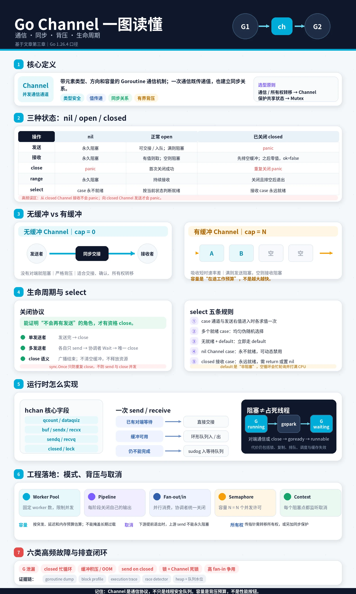
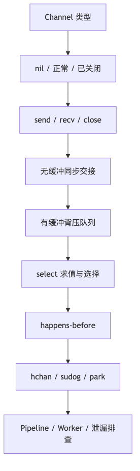
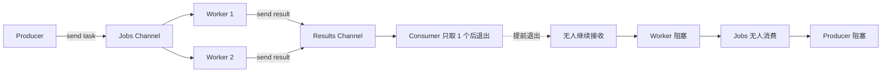
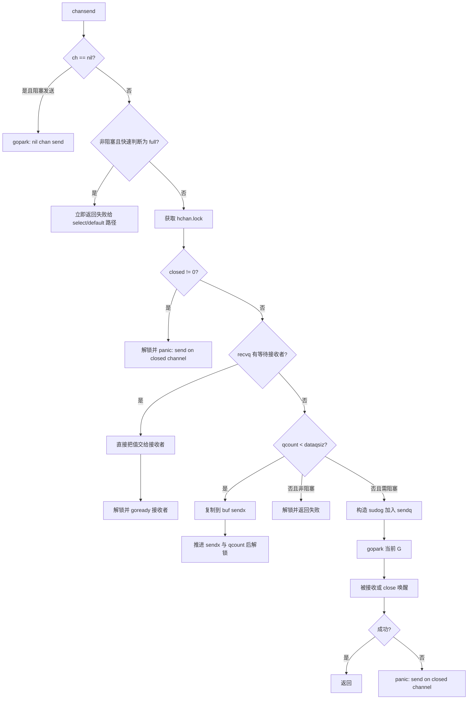
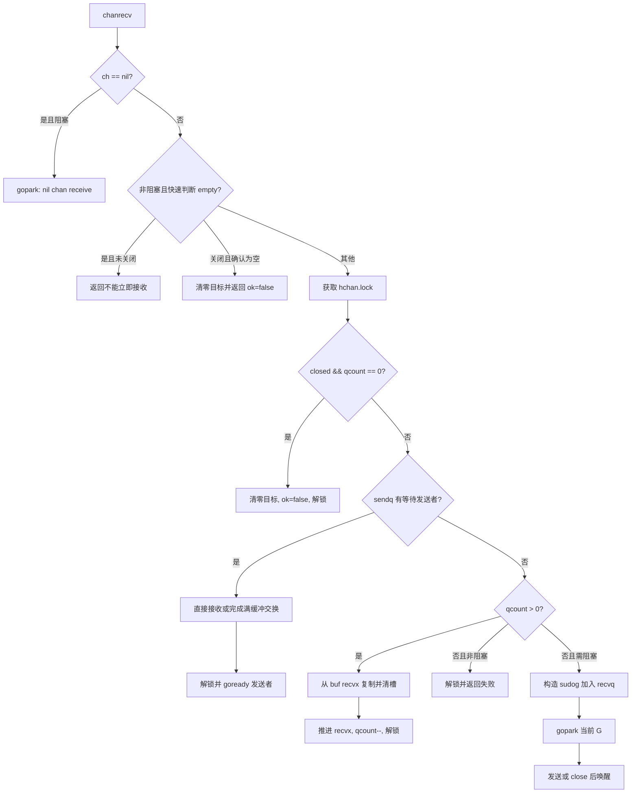
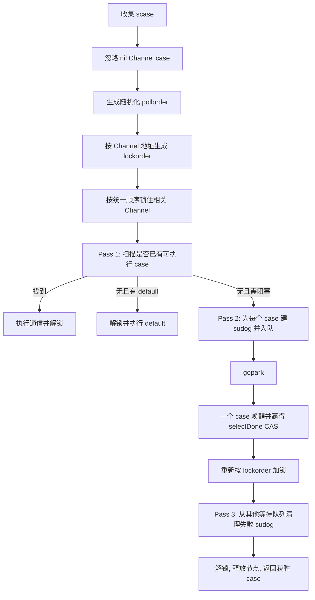
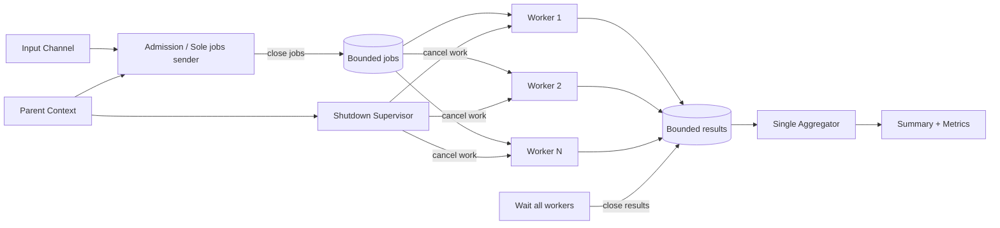
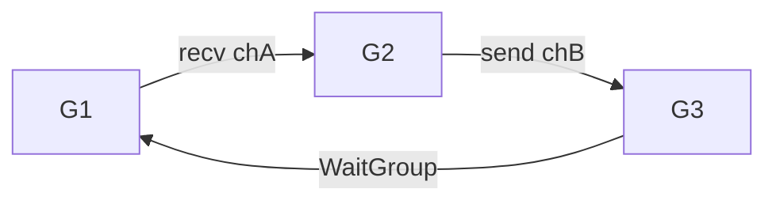
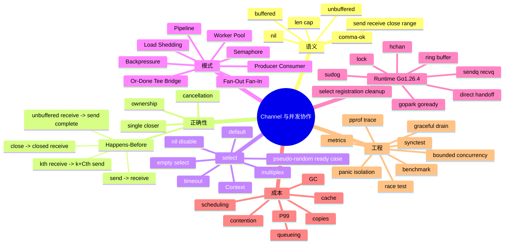

# 第 12 章：Channel、Select、并发模式与运行时实现

## 阅读定位与关联章节

> 本章承接第 11 章的生命周期与 Happens-Before 框架，专门讨论 Channel 如何表达数据流、所有权转移、同步边和系统压力。

| 关联概念 | 建议读法 |
|---|---|
| Goroutine 生命周期、Context 和 Memory Model 证明框架 | 看 [第 11 章：并发基础、Goroutine 生命周期与 Go 内存模型](/blog/tech/GO/11.并发基础-Goroutine生命周期与Go内存模型)。 |
| 共享复合不变量、锁、条件等待和 sync 工具 | 看 [第 13 章：Mutex、RWMutex 与 sync 工具箱](/blog/tech/GO/13.Mutex-RWMutex与sync工具箱)。 |
| Pipeline 的请求级取消、deadline 和 Cause | 看 [第 14 章：Context、取消传播与生命周期管理](/blog/tech/GO/14.Context-取消传播与生命周期管理)。 |
| Atomic 与 Channel/Semaphore 的选型边界 | 看 [第 15 章：Atomic、CAS、内存语义与无锁思想](/blog/tech/GO/15.Atomic-CAS-内存语义与无锁思想)。 |
| 背压、准入控制、过载拒绝和生产诊断 | 看 [第 16 章：生产级高并发架构、性能诊断与面试体系](/blog/tech/GO/16.生产级高并发架构-性能诊断与面试体系)。 |

---



## 本章速览



读图时抓住三个总结：Channel 是通信和同步协议，不是万能队列；`select` 是状态机入口，不是严格公平调度器；生产代码必须同时设计关闭权、取消路径和容量边界。

## 面试题目精选

本章后文有完整答法、代码判断和系统设计题。面试前至少先刷这些题：

1. 无缓冲 Channel 和缓冲 Channel 的本质区别是什么？
2. `nil`、正常、已关闭 Channel 的发送、接收、关闭、`range` 行为分别是什么？
3. 谁应该关闭 Channel？多 Producer 的 fan-in 如何安全关闭？
4. 关闭 Channel 为什么可以做广播？它和 Context 取消有什么边界差异？
5. Channel 建立哪些 Happens-Before？缓冲 Channel 的第 k 次接收规则怎么解释？
6. `select` 多个 case 同时就绪时如何选择？它是否保证公平或优先级？
7. 为什么已关闭 Channel 在 `select` 中可能造成忙循环？如何用 `nil` Channel 禁用分支？
8. Pipeline 下游只取一个结果就返回，为什么可能导致上游 Goroutine 泄漏？
9. Channel-backed Semaphore 为什么要先 acquire 再启动 Goroutine？
10. `len(ch) < cap(ch)` 后发送为什么仍可能阻塞？
11. 线上大量 Goroutine 堆在 `chan send`，如何用 goroutine dump、block profile 和指标排查？
12. Channel、Mutex、Atomic、消息队列分别适合解决什么问题？

> 课程：**《Go 并发同步：从基本使用、运行时原理到生产级高并发》**
> 目标版本：**Go 1.26.x**
> 核验版本：**Go 1.26.4（2026-06-22）**
> 本章阶段产物：**有界、可取消、可观测、无泄漏的并发任务流水线**

---

### 阅读约定：四类结论必须分开

本章用以下标签区分不同强度的结论：

- **【语言规范保证】**：由 Go 语言规范定义，不能因为 Runtime 重写而改变。
- **【内存模型保证】**：由 Go Memory Model 定义，可用于证明可见性与执行顺序。
- **【标准库契约】**：由公开 API 文档承诺。
- **【Go 1.26.4 当前实现】**：来自 `go1.26.4` 标签下的 Runtime 源码，未来版本可能变化。
- **【工程推论】**：由规范、实现和排队理论推导出的工程结论，必须通过目标环境测试验证。

不要把“当前恰好这样实现”说成“语言永远保证如此”。例如：规范保证多个已就绪 `select` 分支会进行伪随机选择，但并不承诺跨请求的严格公平、FIFO 公平或无饥饿；Runtime 当前如何生成轮询顺序，也不是语言层永久契约。

---

## 1. 本章解决什么问题

第 11 章解决的是“多个 Goroutine 为什么可能并发出错，以及如何建立 Happens-Before”。本章进一步解决：

> **多个 Goroutine 怎样在不共享可变状态，或尽量少共享可变状态的前提下，安全地传递数据、所有权、完成信号、取消信号和系统压力？**

Channel 的价值不只是“把一个值从 A 送到 B”。在工程里，它通常同时承担四类职责：

| 职责 | 典型内容 | 核心问题 |
|---|---|---|
| 数据通信 | 任务、事件、结果、批次 | 谁生产、谁消费、是否允许丢失 |
| 同步 | 握手、完成通知、阶段衔接 | 哪个操作必须先发生 |
| 所有权转移 | 缓冲区、连接、对象引用 | 发送后谁还能修改 |
| 控制信号 | 取消、停止、刷新、重载 | 如何广播、如何退出、谁关闭 |

真正困难的地方不是 `ch <- v` 这一行，而是围绕它的协议：

1. 谁创建 Channel？
2. 谁拥有发送生命周期？
3. 谁负责关闭？
4. 接收方提前退出时，发送方怎样退出？
5. 队列满时阻塞、丢弃、降级还是扩容？
6. 一个任务已被“接受”后，取消时是立即放弃还是优雅排空？
7. 如何证明不会发生重复关闭、向已关闭 Channel 发送、Goroutine 泄漏和数据竞争？
8. 缓冲区到底是在提高吞吐量，还是在隐藏过载并放大 P99？

本章的主线不是罗列 API，而是建立一套可证明、可测试、可观测的并发协议。

---

## 2. 学习目标和前置知识

### 2.1 学习目标

完成本章后，应能做到：

1. 正确使用无缓冲、缓冲、只收、只发和 `nil` Channel。
2. 精确回答发送、接收、关闭、`range`、`len`、`cap` 和 comma-ok 的行为。
3. 写出完整的 Channel 异常行为矩阵，而不是靠印象判断。
4. 用发送方生命周期而不是“谁创建”来确定关闭责任。
5. 使用 Go 内存模型的四条 Channel 规则证明可见性。
6. 正确使用 `select` 做多路复用、超时、取消和动态禁用分支。
7. 实现 Producer-Consumer、Worker Pool、Fan-Out、Fan-In、Pipeline、Semaphore、Backpressure、Or-Done、Tee 和 Bridge。
8. 识别 Pipeline 提前退出造成的阻塞链和 Goroutine 泄漏。
9. 解释 `hchan`、环形缓冲区、等待队列、`sudog`、`gopark`、`goready` 和 `select` 注册清理流程。
10. 设计并验证一个有界并发任务流水线，包含取消、排空、过载策略、指标、竞态测试与 Benchmark。
11. 在 Channel、Mutex、Atomic、外部消息队列和直接函数调用之间做工程选择。
12. 面对吞吐下降、队列堆积和 P99 上升时，能从 Goroutine dump、block profile、trace 和业务指标定位问题。

### 2.2 前置知识

需要掌握：

- Goroutine 的创建和生命周期；
- `context.Context` 的取消传播；
- 数据竞争、同步操作和 Happens-Before；
- `sync.WaitGroup`；
- 基本测试与 Benchmark；
- GMP 调度器中 G、M、P 的基本含义。

---

## 3. 一个生活类比：有容量的物流传送带

把并发流水线想象成仓库：

- **生产者**：把包裹放到传送带上。
- **Channel**：传送带。
- **接收者**：从传送带取包裹的工人。
- **无缓冲 Channel**：没有暂存位，生产者必须等工人当场接手。
- **缓冲 Channel**：有固定数量的暂存位；未满时生产者可先放下，满后必须等待或执行丢弃策略。
- **`close(ch)`**：负责人宣布“不会再有新包裹”，不是销毁传送带，也不是清空已有包裹。
- **`range ch`**：工人持续取件，直到暂存位排空且收到“不会再来货”的通知。
- **`select`**：调度员同时监听多条传送带、取消广播和超时闹钟。
- **背压**：下游变慢后，满载传送带迫使上游减速，而不是无限堆积。
- **负载削减**：传送带满时明确丢弃低价值新包裹，并记录丢弃数量。

这个类比还解释了关闭权：通常不是“造传送带的人”关闭，而是**能够确定不会再有任何发送者投放包裹的人**关闭。

---

## 4. 从一次生产事故切入：下游只取一个结果

### 4.1 错误代码

下面的代码有意保留错误，不应复制到生产环境：

```go
// 错误示例：下游提前返回后，其他 worker 可能永久阻塞在 out <- result。
func firstResult(in <-chan int, workers int) int {
    out := make(chan int)

    for range workers {
        go func() {
            for value := range in {
                out <- expensive(value) // 下游返回后可能再也没人接收
            }
        }()
    }

    return <-out
}
```

假设请求只需要第一个成功结果。函数收到一个结果后立即返回，其他 Worker 仍可能执行：

```text
worker -> out <- result -> 永久阻塞
```

如果 Worker 被卡住，它也不会继续读取 `in`；于是上游生产者又可能阻塞在：

```text
producer -> in <- task -> 永久阻塞
```

形成阻塞链：



### 4.2 事故表象

生产中常见表象不是立刻 `fatal error: all goroutines are asleep`，而是更隐蔽的“活着但越来越慢”：

- Goroutine 数持续增长；
- 内存随 Goroutine 栈和被引用对象增长；
- 请求已经超时，但后台计算仍在运行；
- Goroutine dump 大量出现 `[chan send]`；
- 队列长度长期接近容量；
- 吞吐量不再增长，P95/P99 持续恶化；
- 部署滚动退出时一直等不到优雅关闭完成。

### 4.3 正确性分析

| 问题 | 错误代码中的事实 |
|---|---|
| 共享变量 | Channel 本身安全，但任务和结果的生命周期是共享协议 |
| 并发操作 | 多个 Worker 同时发送，Consumer 可能提前退出 |
| 数据竞争 | 未必有传统内存数据竞争，但存在协议级阻塞与泄漏 |
| 缺少的同步关系 | 没有“下游不再需要结果”的广播，也没有发送取消分支 |
| 关闭责任 | 没有一个协调者等待全部发送者退出后关闭 `out` |
| 退出路径 | Worker 和 Producer 均无取消路径 |

这说明：**通过 Race Detector 不等于并发程序正确**。Race Detector 检查数据竞争，无法替你证明没有死锁、活锁、泄漏、错误关闭或无限排队。

### 4.4 修复原则

1. 整条流水线共享一个可取消的 `Context`。
2. 每次可能阻塞的发送或接收都考虑取消分支。
3. 下游提前结束时，由拥有请求生命周期的一方调用 `cancel()`。
4. 只有知道“所有结果发送者都退出”的协调者关闭结果 Channel。
5. 生产者也必须观察同一取消信号。
6. 不用 `time.Sleep` 猜测退出顺序；测试使用显式信号或 `testing/synctest`。

最小修复骨架：

```go
func sendResult(ctx context.Context, out chan<- int, value int) bool {
    select {
    case <-ctx.Done():
        return false
    case out <- value:
        return true
    }
}
```

但仅给发送加 `select` 仍不够：上游接收、结果关闭、Worker 汇合以及取消所有权也必须形成完整协议。

---

## 5. 基本 API 和最小可运行示例

### 5.1 Channel 类型、创建与方向

```go
package main

import "fmt"

func produce(out chan<- int) { // 只发送
    defer close(out)
    for i := 1; i <= 3; i++ {
        out <- i
    }
}

func consume(in <-chan int) { // 只接收
    for value := range in {
        fmt.Println(value)
    }
}

func main() {
    unbuffered := make(chan int)    // cap == 0
    buffered := make(chan string, 8) // cap == 8

    _ = buffered
    go produce(unbuffered)
    consume(unbuffered)
}
```

#### 类型要点

| 形式 | 含义 |
|---|---|
| `chan T` | 可发送、可接收 |
| `chan<- T` | 只发送 |
| `<-chan T` | 只接收 |
| `var ch chan T` | 零值是 `nil` |
| `make(chan T)` | 无缓冲 Channel |
| `make(chan T, n)` | 容量为 `n` 的缓冲 Channel |

**【语言规范保证】** Channel 零值为 `nil`。同一个 Channel 可以被多个 Goroutine 并发发送和接收。Channel 值可以复制；副本引用同一个底层 Channel。这里与 `sync.Mutex` 完全不同：Mutex 第一次使用后不可复制，而 Channel 句柄复制本身是常见操作。

方向类型是编译期能力约束。把 `chan T` 传给 `chan<- T` 或 `<-chan T` 参数，可以让 API 明确表达所有权边界，但方向类型本身不会自动决定谁负责关闭。

### 5.2 无缓冲与缓冲

#### 无缓冲 Channel

```go
ch := make(chan int)
```

发送和对应接收必须会合。发送值被接收方接手前，发送方通常无法完成发送；这使它天然适合握手、所有权交接和阶段同步。

#### 缓冲 Channel

```go
ch := make(chan int, 4)
```

当缓冲区未满时，发送可完成而不等待某个接收者当场接手；当缓冲区非空时，接收可完成而不等待某个发送者当场出现。

不要把“发送完成”误解为“下游处理完成”：

```text
发送完成 -> 值进入缓冲区
下游处理完成 -> 是另一个业务事件
```

若业务必须确认处理完成，需要结果 Channel、确认消息、`WaitGroup`、Future/Promise 风格结构或持久化状态，而不是仅依赖缓冲发送成功。

### 5.3 发送、接收与 comma-ok

```go
ch <- value       // 发送
value := <-ch     // 接收
value, ok := <-ch // 接收并判断关闭状态
```

`ok` 的含义：

- `ok == true`：收到一个实际发送的值，即使该值恰好是元素类型的零值；
- `ok == false`：Channel 已关闭，并且缓冲区已排空，此时 `value` 是元素类型零值。

这就是为什么下面两种情况必须用 comma-ok 区分：

```go
ch <- 0        // 合法发送的零值
close(ch)      // 排空后接收也会得到 0，但 ok == false
```

### 5.4 `close` 和 `range`

```go
close(ch)

for value := range ch {
    // 一直接收，直到 ch 已关闭且缓冲区排空
}
```

`close(ch)` 表达的是：

> **从现在起，这个 Channel 不会再有新值被发送。**

它不表示：

- 销毁 Channel；
- 清空缓冲区；
- 等待接收者处理完；
- 取消所有相关 Goroutine；
- 释放所有引用；
- 关闭接收方向；
- 把当前队列长度冻结。

Channel 对象何时回收由 GC 决定；只要仍有可达引用，它就仍然存在。因此“关闭 ≠ 销毁”。

### 5.5 完整行为矩阵

| 操作 | 状态 | 行为 |
|---|---|---|
| `ch <- v` | `ch == nil` | 永久阻塞 |
| `<-ch` | `ch == nil` | 永久阻塞 |
| `close(ch)` | `ch == nil` | Panic |
| `ch <- v` | `ch` 已关闭 | Panic |
| `<-ch` | 已关闭但仍有缓冲值 | 继续按队列顺序取值，`ok == true` |
| `<-ch` | 已关闭且已排空 | 立即返回元素零值，`ok == false` |
| `close(ch)` | 已关闭 | Panic |
| `for range ch` | `ch == nil` | 永久阻塞 |
| `for range ch` | 从未关闭且无后续值 | 永久等待 |
| `len(ch)` | `ch == nil` | `0` |
| `cap(ch)` | `ch == nil` | `0` |

必须能在面试和代码审查中不假思索地写出这张表。

### 5.6 关闭所有权

最实用的规则不是“发送方关闭”，而是更精确的：

> **能够确定发送生命周期已经结束的一方负责关闭。**

因此：

- 创建者不一定是关闭者；
- 接收者通常不关闭数据 Channel，因为它通常不知道其他发送者是否仍会发送；
- 单一发送者通常在发送完后关闭；
- 多个发送者时，由协调者等待所有发送者退出后关闭；
- 取消信号和数据流关闭是两个概念，通常用 `Context` 广播取消，用数据 Channel 的关闭表达“不会再有数据”。

#### 多发送者安全关闭

```go
package main

import (
    "fmt"
    "sync"
)

func main() {
    out := make(chan int)
    var senders sync.WaitGroup

    for workerID := range 3 {
        workerID := workerID
        senders.Go(func() {
            out <- workerID
        })
    }

    go func() {
        senders.Wait()
        close(out) // 协调者知道所有发送者都结束
    }()

    for value := range out {
        fmt.Println(value)
    }
}
```

`WaitGroup.Go` 从 Go 1.25 起提供。传入的函数不得让 Panic 逃逸；需要 Panic 隔离时，应在函数内部 `recover`。传统写法是先 `Add(1)`，再启动 Goroutine，并在所有退出路径 `defer Done()`；`Add` 放到 Goroutine 内部会和 `Wait` 形成竞态，是经典错误。

### 5.7 `len` 和 `cap`

```go
queued := len(ch)
capacity := cap(ch)
```

`cap(ch)` 是固定容量。`len(ch)` 是调用瞬间缓冲区中排队的元素数。

`len(ch)` 可以用于：

- 监控和日志；
- 近似负载指标；
- 调试快照；
- Benchmark 观测。

不能用于并发正确性决策：

```go
// 错误：检查后到发送前，状态可能已经变化。
if len(ch) < cap(ch) {
    ch <- value // 仍可能阻塞
}
```

非阻塞发送应直接写成：

```go
select {
case ch <- value:
    // accepted
default:
    // full: drop/reject/fallback
}
```

同理，不能用 `len(ch) == 0` 推断“Channel 已关闭”“不会再收到值”或“接收不会阻塞”。

### 5.8 Channel 的 12 个必答问题

| 问题 | 回答 |
|---|---|
| 核心问题 | 在 Goroutine 间传递值、同步阶段、转移所有权和表达流量压力 |
| 零值可用吗 | 零值是 `nil`；可用于 `select` 动态禁用，但直接发送/接收永久阻塞，关闭会 Panic |
| 使用后可复制吗 | 可以；副本指向同一底层 Channel，协议和关闭权也因此共享 |
| 会阻塞吗 | 会；发送、接收、`range` 均可能阻塞 |
| 建立 HB 吗 | 会；需精确匹配内存模型规定的发送、接收和关闭规则 |
| 如何释放 | 通常不需“释放”；关闭只声明不再发送，内存由 GC 回收 |
| 最常见误用 | 多方关闭、向已关闭 Channel 发送、忽略取消、把 `len` 当同步条件 |
| 高竞争成本 | 内部锁竞争、缓存行争用、等待队列操作、Goroutine park/wake、元素复制 |
| 影响尾延迟吗 | 会；队列等待、调度唤醒和下游变慢都会反映到 P99 |
| 替代方案 | Mutex、Atomic、`WaitGroup`、`Cond`、直接调用、外部消息队列 |
| 何时避免 | 维护复杂共享不变量、需要持久化/重放、无明确所有权、无限队列需求 |
| 面试追问 | 关闭矩阵、HB、缓冲规则、`hchan`、`sudog`、`select` 公平性、泄漏定位 |

---

### 5.9 `select`：多路复用、取消与动态状态机

#### 5.9.1 基本语义

```go
select {
case value := <-in:
    use(value)
case out <- result:
    markSent()
case <-ctx.Done():
    return ctx.Err()
default:
    // 只有其他通信均不能立即进行时才执行
}
```

**【语言规范保证】**：

1. 进入 `select` 时，所有 case 的 Channel 操作数以及发送右侧表达式会按源码顺序求值一次；未被选中的分支也可能已经发生求值副作用。
2. 如果一个或多个通信分支可以立即进行，会从中选择一个执行。
3. 若没有通信可立即进行且存在 `default`，执行 `default`。
4. 若没有通信可立即进行且没有 `default`，当前 Goroutine 阻塞。
5. `select {}` 永久阻塞。
6. 只有 `nil` Channel 分支且没有 `default` 的 `select` 永久阻塞。

#### 5.9.2 多路接收

```go
func multiplex(ctx context.Context, a, b <-chan int) error {
    for a != nil || b != nil {
        select {
        case value, ok := <-a:
            if !ok {
                a = nil // 禁用已关闭分支，避免它永远立即就绪
                continue
            }
            fmt.Println("a:", value)
        case value, ok := <-b:
            if !ok {
                b = nil
                continue
            }
            fmt.Println("b:", value)
        case <-ctx.Done():
            return ctx.Err()
        }
    }
    return nil
}
```

关闭且排空的 Channel 接收永远立即就绪。如果循环中不把它设为 `nil`，该 case 会反复被选中，造成空转甚至挤压其他分支。

#### 5.9.3 `default`：非阻塞，也可能忙等

```go
select {
case queue <- task:
    accepted.Add(1)
default:
    dropped.Add(1)
}
```

这是明确的负载削减策略。反例是：

```go
for {
    select {
    case value := <-ch:
        use(value)
    default:
        // 没有阻塞点，可能占满一个 CPU 核
    }
}
```

`default` 不是性能开关，而是语义选择：“当前不能通信时立即走另一条路径”。循环需要等待时，应使用阻塞 `select`、Ticker、条件变量或其他明确的等待机制，而不是空转，也不是用 `time.Sleep` 猜测并发顺序。

#### 5.9.4 超时与 Context

一次性局部操作超时：

```go
timer := time.NewTimer(200 * time.Millisecond)
defer timer.Stop()

select {
case result := <-results:
    return result, nil
case <-timer.C:
    return Result{}, context.DeadlineExceeded
}
```

请求或任务生命周期更适合 Context：

```go
select {
case result := <-results:
    return result, nil
case <-ctx.Done():
    return Result{}, context.Cause(ctx)
}
```

在高频循环中每轮调用 `time.After` 会创建新 Timer；通常应复用 `time.Timer`，并严格处理 Stop/Reset 生命周期。不要为了“看起来安全”同时叠加多个互相矛盾的超时源；应明确哪个组件拥有 deadline。

#### 5.9.5 `nil` Channel 动态禁用分支

因为对 `nil` Channel 的通信永远不能进行，把局部 Channel 变量设置为 `nil` 可以关闭某个状态机分支：

```go
var pending chan<- int
var next int

for {
    select {
    case next, ok = <-input:
        if !ok {
            input = nil
        } else {
            pending = output
        }
    case pending <- next:
        pending = nil
    case <-ctx.Done():
        return
    }
}
```

这比维护一组布尔变量后在 case 内判断更直接，因为不可用分支根本不会参与选择。

#### 5.9.6 多个就绪分支与公平性

规范使用“统一伪随机选择”描述多个可进行通信分支的选择。正确结论是：

- 不应依赖源码 case 顺序作为优先级；
- 不应假设严格轮询；
- 不应假设某个分支在有限时间内必然被选中；
- 高频永远就绪分支可能让低频控制分支出现较长等待；
- 需要强优先级时，应显式构造两阶段 `select`、独立控制通道或队列调度，而不是期待 Runtime 公平性。

一种“尽量优先处理取消”的写法：

```go
for {
    select {
    case <-ctx.Done():
        return
    default:
    }

    select {
    case <-ctx.Done():
        return
    case task := <-jobs:
        process(task)
    }
}
```

它缩小了取消延迟窗口，但仍不是硬实时保证；两个 `select` 之间仍可能发生调度和状态变化。

#### 5.9.7 `select` 的 12 个必答问题

| 问题 | 回答 |
|---|---|
| 核心问题 | 在多个可能阻塞的通信、超时和取消事件之间选择 |
| 零值可用吗 | `select` 不是值；其中 `nil` Channel case 会被永久禁用 |
| 能复制吗 | 不适用；但 case 中复制的 Channel 句柄仍指向同一对象 |
| 会阻塞吗 | 无可执行通信、无 `default` 时阻塞；空 `select` 永久阻塞 |
| 建立 HB 吗 | `select` 本身不额外建立；被选中的 Channel 操作按其规则建立 |
| 如何关闭 | 不适用；需要管理参与 Channel、Timer 和 Context 的生命周期 |
| 常见误用 | `default` 忙等、已关闭 Channel 永远就绪、忽视表达式求值副作用 |
| 高竞争成本 | 多 Channel 注册等待、排序锁顺序、扫描、清理失败 case |
| 尾延迟 | 大 case 集、热点分支和调度竞争可能放大尾延迟 |
| 替代 | 单 Channel 消息封装、专用调度 Goroutine、Mutex/Cond、事件循环 |
| 何时避免 | 可以通过一个统一事件 Channel 简化协议时；超大动态 case 集时 |
| 面试追问 | 多就绪如何选、nil/closed 行为、Runtime 如何避免重复唤醒、是否公平 |

---

## 6. 正确性分析：Channel 的 Happens-Before

Go Memory Model 对 Channel 给出四条关键同步规则。

### 6.1 规则一：发送先于对应接收完成

**【内存模型保证】** 对某个 Channel 的发送，在对应接收完成之前同步发生。

```go
var message string
ch := make(chan struct{})

go func() {
    message = "ready"
    ch <- struct{}{}
}()

<-ch
fmt.Println(message) // 可以看到 "ready"
```

证明链：

```text
写 message
  sequenced-before
发送 ch <- struct{}{}
  synchronized-before
对应接收完成
  sequenced-before
读取 message
```

由传递性得到写入 Happens-Before 读取。

### 6.2 规则二：关闭先于因关闭而返回零值的接收

**【内存模型保证】** 关闭 Channel，在接收方因为该关闭而返回零值之前同步发生。

```go
var config *Config
ready := make(chan struct{})

go func() {
    config = loadConfig()
    close(ready)
}()

<-ready
use(config)
```

这使关闭 Channel 可用于一次性广播完成信号。注意：接收必须观察到关闭；仅仅“某处调用过 close”并不能替代实际同步路径。

### 6.3 规则三：无缓冲接收先于对应发送完成

**【内存模型保证】** 对无缓冲 Channel，接收在对应发送完成之前同步发生。

这是一条容易忽略但很重要的反向规则。无缓冲 Channel 是真正的交接点：发送方完成时，可以确定接收方已经接手了该值。

### 6.4 规则四：容量为 C 时，第 k 次接收先于第 k+C 次发送完成

**【内存模型保证】** 对容量为 `C` 的 Channel，第 `k` 次接收在第 `k+C` 次发送完成之前同步发生。

这条规则解释了为什么缓冲 Channel 可以实现计数信号量：容量满后，后续获取必须等待某个释放。

```go
sem := make(chan struct{}, limit)

// acquire
sem <- struct{}{}

// release
<-sem
```

但工程上必须保证每次成功 acquire 都有一次 release，通常用 `defer`：

```go
if err := acquire(ctx, sem); err != nil {
    return err
}
defer func() { <-sem }()
```

### 6.5 缓冲发送不代表业务完成

假设：

```go
jobs := make(chan *Task, 100)
jobs <- task
```

这里只能推导任务值已被 Channel 接受，不能推导：

- Worker 已接收；
- Worker 已开始；
- Worker 已完成；
- 持久化已成功；
- 下游依赖已确认；
- 请求可以安全返回成功。

需要何种确认，必须由业务协议单独定义。

### 6.6 “发送指针”不自动消除数据竞争

```go
task := &Task{Payload: 1}
ch <- task
task.Payload = 2 // 如果接收方同时读取，仍可能数据竞争
```

初次发送建立了发送前写入对接收完成后的可见性，但发送后双方继续并发读写同一对象，仍会形成数据竞争。所谓“通过 Channel 转移所有权”是设计协议，不是编译器强制规则：

> 发送后，原所有者停止访问可变对象；或对象本身不可变；或后续访问再用同步保护。

### 6.7 关闭与数据排空

当缓冲 Channel 被关闭：

1. 已入队值仍可接收，`ok == true`；
2. 缓冲排空后，后续接收立即返回零值，`ok == false`；
3. 关闭不等待接收者处理这些值；
4. 关闭也不会取消正在执行的工作。

因此“优雅排空”需要两个阶段：停止接收新任务，再等待已接受任务完成；不能只调用 `close` 就宣布完成。

### 6.8 项目中的正确性不变量

本章项目在终态满足以下可检查关系：

```text
Succeeded + Failed = Completed
Accepted = Completed + Abandoned     // 前提：Processor 最终返回
Offered = Accepted + Dropped         // 仅在正常完成 admission、无中途取消时成立
MaxInFlight <= Workers
MaxQueueDepth <= QueueCapacity
```

这些是业务计数不变量，不等同于内存模型规则；实现使用 Atomic 和 Channel 关闭发布终态。

---

## 7. 常见并发模式

### 7.1 Producer-Consumer

拓扑：

```text
Producer(s) -> bounded channel -> Consumer(s)
```

关键设计：

- 谁关闭任务 Channel；
- 生产速度超过消费速度时的策略；
- Consumer 失败是否重试；
- 取消是否能打断发送和接收；
- 任务是否允许重复或丢失。

Channel 只提供进程内、内存中的传输，不提供持久化、跨进程、重放、事务和 exactly-once。需要这些能力时应考虑 Kafka、NATS、RabbitMQ、数据库队列表等外部系统，并接受其不同一致性语义。

### 7.2 Worker Pool

固定 Worker Pool 控制同时执行的任务数，也控制长期 Goroutine 数：

```go
func workers(ctx context.Context, n int, jobs <-chan Task, results chan<- Result) {
    var wg sync.WaitGroup
    for range n {
        wg.Go(func() {
            for {
                select {
                case <-ctx.Done():
                    return
                case task, ok := <-jobs:
                    if !ok {
                        return
                    }
                    result := process(ctx, task)
                    select {
                    case <-ctx.Done():
                        return
                    case results <- result:
                    }
                }
            }
        })
    }
    wg.Wait()
}
```

完整实现还必须由另一个协调者在 `wg.Wait()` 后关闭 `results`，不能让任意 Worker 关闭共享结果 Channel。

### 7.3 Fan-Out

多个 Worker 从同一个输入 Channel 竞争接收任务：

```text
              -> Worker 1
jobs channel  -> Worker 2
              -> Worker N
```

每个任务通常只会被其中一个 Worker 接收。Fan-Out 适合彼此独立、可并行的任务；如果任务存在顺序约束、热点键串行要求或共享事务，就需要按 Key 分片或在阶段内重新串行化。

### 7.4 Fan-In

多个输入合并到一个输出：

```go
func FanIn[T any](ctx context.Context, inputs ...<-chan T) <-chan T {
    out := make(chan T)
    var wg sync.WaitGroup

    for _, input := range inputs {
        input := input
        wg.Go(func() {
            for value := range input {
                select {
                case <-ctx.Done():
                    return
                case out <- value:
                }
            }
        })
    }

    go func() {
        wg.Wait()
        close(out)
    }()
    return out
}
```

输出关闭者是协调者，因为只有它知道所有复制 Goroutine 都已停止发送。

### 7.5 Pipeline

每个阶段接收上游、转换并发送下游：

```text
Generate -> Parse -> Enrich -> Persist -> Aggregate
```

每个阶段都应遵守：

1. 只关闭自己拥有发送生命周期的输出；
2. 上游关闭后自然排空；
3. 下游取消时能停止发送；
4. 本阶段的内部 Goroutine 有汇合点；
5. 错误和取消语义明确。

### 7.6 Semaphore 与 Bounded Concurrency

Channel 信号量：

```go
sem := make(chan struct{}, limit)

for _, task := range tasks {
    select {
    case <-ctx.Done():
        return ctx.Err()
    case sem <- struct{}{}: // 先获取，再启动
    }

    wg.Go(func() {
        defer func() { <-sem }()
        process(task)
    })
}
```

必须强调“先获取，再启动”。下面的写法只限制同时执行数，却可能先创建无限多阻塞 Goroutine：

```go
// 错误：高峰时可以创建海量等待 sem 的 Goroutine。
go func() {
    sem <- struct{}{}
    defer func() { <-sem }()
    process(task)
}()
```

Worker Pool 与 Semaphore 的差异：

| 维度 | 固定 Worker Pool | Channel Semaphore |
|---|---|---|
| Goroutine 数 | 长期固定 | 可按任务创建，但应在创建前获取令牌 |
| 任务队列 | 明确的 jobs Channel | 调用循环本身形成 admission 阻塞 |
| Worker 本地状态 | 容易保留 | 每任务 Goroutine 更独立 |
| 短任务开销 | 可减少创建开销 | 每任务创建/销毁 Goroutine |
| 代码结构 | 适合持续服务 | 适合有限批次或局部并发限制 |
| 谁更快 | 无固定答案，必须 Benchmark |

#### Channel-backed Semaphore 的 12 个必答问题

| 问题 | 回答 |
|---|---|
| 核心问题 | 给稀缺资源或并发工作设置硬上限 |
| 零值可用吗 | `nil` Channel 会永久阻塞；应由构造函数创建正容量 Channel |
| 使用后可复制吗 | Channel 句柄可复制，副本共享同一令牌池；需避免释放到错误实例 |
| 会阻塞吗 | 获取在容量满时阻塞；释放通常接收一个令牌 |
| 建立 HB 吗 | 建立 Channel 对应的 HB，特别是容量 C 的第 k 次接收规则 |
| 如何释放 | 每次成功获取恰好释放一次，通常立即 `defer`；不要关闭作为普通释放 |
| 常见误用 | Goroutine 内才获取、漏释放、重复释放、动态改变容量、用 close 释放全部 |
| 高竞争成本 | 单个 `hchan` 热点、内部锁、排队和 park/wake |
| 尾延迟 | 等令牌时间直接进入任务延迟，长任务会造成队头效应 |
| 替代 | 固定 Worker Pool、Mutex、连接池、`x/sync/semaphore` 加权信号量 |
| 何时避免 | 需要优先级、加权、公平队列或资源必须与外部租约绑定时 |
| 面试追问 | 为什么先 acquire 再 `go`、如何取消、如何证明不超限、令牌泄漏怎样排查 |

### 7.7 Backpressure

背压是让下游容量限制向上游传播：

```go
select {
case <-ctx.Done():
    return ctx.Err()
case jobs <- task:
    return nil // 队列满时等待
}
```

背压的优点：

- 保护内存；
- 抑制无上限并发；
- 让调用方感知系统真实处理能力；
- 避免把过载隐藏到更深层。

代价：

- 上游延迟增加；
- 可能占住连接、线程或请求预算；
- 若跨服务同步传播，可能形成级联阻塞；
- 必须结合 deadline、限流和 Bulkhead。

### 7.8 Load Shedding

非阻塞丢弃：

```go
select {
case jobs <- task:
    accepted.Add(1)
default:
    dropped.Add(1)
    return ErrOverloaded
}
```

丢弃策略必须是产品语义，而非偶然副作用。常见策略：

- Drop Newest；
- Drop Oldest；
- 按优先级拒绝；
- 采样；
- 降级为缓存值；
- 返回 `429`/`503` 并携带重试提示；
- 将低价值任务转入异步持久队列。

若所有客户端立即无抖动重试，负载削减会变成重试风暴。需要指数退避、抖动、重试预算和幂等设计。

### 7.9 Broadcast Cancellation

关闭一个只读通知 Channel 可以广播：

```go
done := make(chan struct{})
close(done) // 所有接收者都能立即观察
```

现代业务代码通常优先用 Context，因为它还携带 deadline、取消原因和请求范围值。但 Context 的 `Done()` 本质上仍提供一个关闭广播 Channel。不要把 Context 存进长期结构作为万能全局变量，也不要把它用于可选参数。

### 7.10 Or-Done

当某个阶段无法控制上游关闭，却必须能退出时，用 Or-Done 包装接收：

```go
func OrDone[T any](ctx context.Context, in <-chan T) <-chan T {
    out := make(chan T)
    go func() {
        defer close(out)
        for {
            select {
            case <-ctx.Done():
                return
            case value, ok := <-in:
                if !ok {
                    return
                }
                select {
                case <-ctx.Done():
                    return
                case out <- value:
                }
            }
        }
    }()
    return out
}
```

为什么接收和发送都需要取消分支？因为 Goroutine 可能阻塞在任意一边。

### 7.11 Tee

Tee 将每个值发送给两个输出。核心技巧是某一输出发送成功后把对应局部 Channel 设为 `nil`，确保每个值对每个输出恰好发送一次：

```go
leftCase, rightCase := left, right
for range 2 {
    select {
    case <-ctx.Done():
        return
    case leftCase <- value:
        leftCase = nil
    case rightCase <- value:
        rightCase = nil
    }
}
```

Tee 会受最慢下游背压。如果一个下游允许丢失，必须明确增加独立缓冲或丢弃策略，而不能假装两个消费者速度相同。

### 7.12 Bridge

Bridge 把“Channel 的 Channel”压平成一个输出：

```text
streams: [ch1, ch2, ch3] -> bridge -> values
```

顺序 Bridge 会先排空 `ch1` 再处理 `ch2`；如果要同时消费所有内部流，语义更接近动态 Fan-In。二者不能混为一谈。

### 7.13 Pipeline 提前退出的通用规则

假设下游只取前 N 个值：

```go
for value := range Take(ctx, stage, n) {
    use(value)
}
cancel() // 必须通知整条上游停止
```

仅让 `Take` 关闭自己的输出不足以释放上游。上游仍可能堵在向 `Take` 输入发送。请求生命周期所有者应取消共享 Context，使所有阶段都能从接收或发送点退出。

---

## 8. 不适合使用 Channel 的场景

### 8.1 维护复杂共享不变量

若多个字段必须原子地一起检查和修改：

```go
type Account struct {
    balance int64
    version uint64
    frozen bool
}
```

一个 `Mutex` 往往比把每个读写都封装成消息更直接。Actor/事件循环也可以维护不变量，但它引入请求封装、响应 Channel、排队和单点吞吐限制；不是天然优于锁。

### 8.2 超短临界区的高频共享状态

计数器、标志位或短临界区可能更适合 Atomic/Mutex。Channel 会引入元素传输、内部锁、可能的 park/wake 和调度路径。不能仅凭“Channel 更 Go”选择它。

### 8.3 需要持久化、重放或跨进程投递

进程内 Channel 在进程崩溃后内容消失，也没有消费确认、重放和消费者组语义。应选择外部消息系统或数据库。

### 8.4 无界优先队列和复杂调度

Channel 是 FIFO 通信抽象，不直接提供优先级、按 deadline 排序、取消队列中任意元素或动态权重。可以由单独调度 Goroutine 持有堆，再通过 Channel 接收命令，但真正的队列结构仍是堆或其他容器。

### 8.5 Channel 当锁、队列和信号量的取舍

| 用法 | 优点 | 风险/代价 | 更合适的替代 |
|---|---|---|---|
| 容量 1 Channel 当锁 | 可结合 `select` 和 Context 获取 | 所有权不清时易漏令牌；比 Mutex 语义更绕 | 普通临界区优先 `sync.Mutex` |
| 缓冲 Channel 当队列 | 天然阻塞、关闭、背压 | 固定容量；不支持窥视、删除任意项、优先级 | 自定义队列 + Cond，或外部 Broker |
| Channel 当信号量 | 简单、可取消、HB 清晰 | 获取/释放不平衡会永久占令牌；仍需控制 Goroutine 创建 | `x/sync/semaphore` 支持加权需求 |
| Channel 当事件循环 | 单所有者，无数据竞争 | 单 Goroutine 可能成为瓶颈；请求响应复杂 | Mutex、分片、Actor 框架 |

`golang.org/x/sync/semaphore` 是扩展仓库包，不是标准库；需要加权获取时可评估它。

### 8.6 Channel 与 Mutex 选择

| 问题形态 | 倾向 Channel | 倾向 Mutex |
|---|---|---|
| 传递任务、结果、事件 | 是 | 否 |
| 转移对象所有权 | 是 | 否 |
| Pipeline/Worker Pool | 是 | 否 |
| 同时维护多个字段不变量 | 可做 Actor，但较重 | 是 |
| 高频短临界区 | 通常不是第一选择 | 是，先测竞争 |
| 需要取消阻塞等待 | `select` 很自然 | 需 Cond/额外机制 |
| 需要读当前状态 | 需请求/快照 | 加锁读取直接 |
| 需要严格优先级 | 需额外调度层 | 也需额外结构 |

经验法则：

> **传递所有权和工作流，先想 Channel；保护共享状态和不变量，先想 Mutex；单个状态字，评估 Atomic。**

这不是性能结论。最终以可读性、正确性证明和目标负载 Benchmark 为准。

---

## 9. 常见错误、原因与修复

### 9.1 向 `nil` Channel 发送或接收

```go
var ch chan int
ch <- 1 // 永久阻塞
```

**原因**：零值 Channel 没有对应通信对象。
**修复**：用 `make` 初始化；若故意用于动态禁用，确保它只出现在受控 `select` 中。

### 9.2 关闭 `nil` Channel

```go
var ch chan int
close(ch) // panic
```

**修复**：让 Channel 在构造函数中初始化，并让关闭权单一化。用 `if ch != nil` 只能掩盖设计问题，不能解决多方关闭。

### 9.3 向已关闭 Channel 发送

```go
close(ch)
ch <- value // panic
```

不存在无竞争的通用 `isClosed(ch)` 可以在发送前检查。即使检查时未关闭，下一瞬间也可能被其他 Goroutine 关闭。修复是建立发送生命周期所有权，而不是先探测。

### 9.4 重复关闭

多个发送者都 `defer close(out)` 会 Panic。正确结构是：发送者只发送，协调者等待全部发送者退出后关闭。

`sync.Once` 可以防止重复执行 `close`，但不自动证明关闭时没有发送者。把 `close` 包在 `Once` 中可能只是把协议错误藏起来。

### 9.5 接收者关闭数据 Channel

接收方“已经不想收了”不等于“不会再有人发送”。接收者应取消 Context 或通知发送生命周期所有者，而不是擅自关闭共享数据 Channel。

### 9.6 `range` 等不到结束

```go
for value := range ch { ... }
```

若发送方永不关闭且不再发送，循环永久等待。修复：发送生命周期所有者关闭，或接收方用 `select` 同时监听 Context。

### 9.7 已关闭 Channel 让 `select` 忙循环

```go
for {
    select {
    case <-ch: // ch 关闭后永远立即就绪
    case <-other:
    }
}
```

使用 comma-ok，关闭后把局部变量设为 `nil`。

### 9.8 `default` 制造 CPU 空转

见前述 busy loop。通过 CPU Profile 和 Goroutine dump 常能看到某个循环持续运行而不阻塞。修复为真正等待事件。

### 9.9 用 `len(ch)` 做先检查后操作

这是 TOCTOU（检查时与使用时）竞态。直接使用阻塞发送或带 `default` 的非阻塞 `select`。

### 9.10 在循环中无节制创建 Timer

```go
for {
    select {
    case <-time.After(timeout):
    case value := <-ch:
        use(value)
    }
}
```

每轮都会创建 Timer。高频路径应复用 Timer，或者把 deadline 放进 Context。Timer Reset 的正确协议与 Go 版本有关，需按当前标准库文档实现并测试。

### 9.11 先创建 Goroutine，再在内部等信号量

这只限制执行，不限制等待 Goroutine 数。先获取令牌再启动，或用固定 Worker Pool。

### 9.12 下游提前退出但不上游取消

结果是 Worker 阻塞在发送，继而 Producer 阻塞。每个可能阻塞的边都要有取消路径，并由请求生命周期所有者广播取消。

### 9.13 用超大缓冲“修复”阻塞

扩大缓冲可能暂时降低发送阻塞，却增加：

- 排队等待；
- 内存占用；
- GC 扫描；
- 崩溃时未处理任务；
- 过载被发现的时间；
- P99/P999。

缓冲只吸收有限突发，不能创造处理能力。

### 9.14 通过 Channel 传巨大结构

Channel 会复制元素。传 `[64 << 10]byte` 之类大值会增加复制和缓存压力。传指针可减少复制字节，但会引入堆分配、GC 指针扫描、别名和所有权风险。应基于对象大小、生命周期和逃逸分析测试，而不是机械改成指针。

### 9.15 Processor 不响应取消

Go 不能安全强杀任意 Goroutine。即使 Drain Timeout 到期，若用户函数忽略 `ctx` 并永久阻塞，流水线仍无法完成。所有可能长时间阻塞的 I/O、锁等待和重试循环必须接收 deadline/cancel，或者放入可以被关闭的底层资源。

### 9.16 依赖 `select` 做严格优先级

多个就绪分支不按源码顺序保证优先级。需要优先处理控制事件时，显式建模优先队列或分层检查。

---
## 10. 底层实现：从一次发送走到 Goroutine 唤醒

> 本节分析 `go1.26.4/src/runtime/chan.go`、`select.go` 和 `runtime2.go`。除明确标注的规范结论外，字段布局、算法步骤和复杂度都属于 **Go 1.26.4 当前实现**，未来版本可能调整。

### 10.1 `hchan`：Channel 的运行时对象

Go 源码里的 `chan T` 值可以理解为指向 Runtime Channel 对象的句柄。当前主要结构可概括为：

```text
type hchan struct {
    qcount   uint           // 缓冲区当前元素数
    dataqsiz uint           // 环形缓冲区容量
    buf      unsafe.Pointer // 缓冲区起点
    elemsize uint16         // 单个元素大小
    closed   uint32         // 是否已关闭
    elemtype *_type         // 元素类型元数据
    sendx    uint           // 下一次缓冲发送位置
    recvx    uint           // 下一次缓冲接收位置
    recvq    waitq          // 等待接收的 sudog 队列
    sendq    waitq          // 等待发送的 sudog 队列
    lock     mutex          // 保护 Channel 状态和相关等待节点
    ...                     // Timer、测试 bubble 等当前实现字段
}
```

| 字段 | 工程含义 |
|---|---|
| `qcount` | 当前排队元素数，即 `len(ch)` 的核心来源 |
| `dataqsiz` | 容量，即 `cap(ch)` 的核心来源 |
| `buf` | 固定容量环形缓冲区 |
| `sendx` / `recvx` | 环形队列写入和读取索引 |
| `sendq` / `recvq` | 无法立即完成通信的发送者/接收者等待队列 |
| `closed` | 关闭状态；不代表对象销毁 |
| `lock` | 保护队列、索引、计数和关闭状态的一致性 |

Channel 不是无锁数据结构。非阻塞失败判断存在快速路径，但进入真实修改、配对、排队和关闭流程时会使用内部锁。

### 10.2 `make(chan T, n)` 的分配

**【Go 1.26.4 当前实现】** `makechan` 会校验元素大小、对齐和容量乘法溢出。分配策略大致为：

1. 缓冲内存为零时，分配 `hchan`；
2. 元素不含指针时，Runtime 可把 `hchan` 和缓冲数据放在一块分配中；
3. 元素含指针时，Channel 头和缓冲区通常分别按 GC 可扫描对象分配；
4. `buf` 指向环形缓冲区起点，索引从零开始。

**【工程推论】** 容量增大近似增加 `capacity × elementSize` 的直接存储成本，此外还有对齐、对象头和 GC 元数据。元素含大量指针时，即使 `qcount` 很低，整个缓冲对象的可扫描范围也可能增加 GC 压力。真实大小需用目标版本和目标架构测量。

### 10.3 发送完整路径

调用：

```go
ch <- value
```

当前 Runtime 大致经历：



#### 10.3.1 `nil` Channel

阻塞发送到 `nil` Channel 时，Runtime 将 G 停放在“nil Channel 发送”等待原因上；没有任何操作能让该通信变得可完成，所以逻辑上永久阻塞。非阻塞 `select` 探测则直接认为不能发送。

#### 10.3.2 非阻塞快速路径

对带 `default` 的非阻塞发送，Runtime 可以先观察“未关闭且当前已满”，不获取 Channel 锁就返回“不能立即发送”。这是用于回答某个瞬时非阻塞问题的优化，不应被用户代码解释成额外的内存序保证。

#### 10.3.3 直接交接

若 `recvq` 已有接收者：

- 无需先写入缓冲区；
- Runtime 可把发送值直接复制到等待接收者的目标位置；
- 设置接收结果；
- 解锁后把接收者 G 置为 runnable。

当前源码包含 `sendDirect` / `recvDirect` 等辅助路径，用于跨 Goroutine 栈复制并正确处理写屏障。

#### 10.3.4 写入环形缓冲区

若没有等待接收者且缓冲区未满：

1. 根据 `sendx` 计算槽位；
2. 按元素类型复制值；
3. `sendx` 前进并在容量处回绕；
4. `qcount++`；
5. 解锁返回。

该路径仍有内部锁和元素复制，但不需要 park/wake 另一个 Goroutine。

#### 10.3.5 慢速阻塞路径

缓冲区满且必须等待时：

1. 从 Runtime 的 `sudog` 池取得等待节点；
2. 节点记录当前 G、待发送元素地址、Channel 等信息；
3. 节点加入 `sendq`；
4. `gopark` 提交停车；
5. 某个接收者或 `close` 使它被唤醒；
6. 成功接收则返回；因关闭唤醒则在发送方恢复后 Panic。

等待发送值的地址可能位于发送者栈上，因此 Runtime 必须把栈移动、GC 和写屏障处理正确；这也是用户不应依赖内部指针布局的原因。

### 10.4 接收完整路径

接收：

```go
value, ok := <-ch
```

大致为发送路径的镜像：



#### 10.4.1 已关闭但仍有缓冲值

关闭状态不会跳过队列。`qcount > 0` 时仍按 FIFO 取出缓冲值，`ok == true`。只有已关闭且缓冲为空时才返回零值和 `ok == false`。

#### 10.4.2 等待发送者与满缓冲交换

若缓冲 Channel 已满且有发送者在 `sendq` 等待，接收者会：

1. 取走 `recvx` 位置的最老值；
2. 将等待发送者的值复制到刚腾出的环形槽位；
3. 同时推进接收和发送索引；
4. 唤醒发送者。

这样保持队列顺序，也避免先把缓冲数量减一再做另一轮竞争。

### 10.5 `sudog` 与等待队列

`sudog` 不是用户可见 Goroutine，也不是一个新线程。它是 Runtime 描述“某个 G 正在等待某个同步对象”的节点。一个 G 可能参与 `select` 的多个 Channel 等待，一个 Channel 也可能有多个 G 等待，因此需要这种多对多关联节点。

当前 `sudog` 包含的信息包括：

- 等待的 G；
- 前后队列指针；
- 元素地址；
- 是否属于 `select`；
- 通信是否成功；
- 关联 Channel；
- 若干计时和分析字段。

Runtime 对 `sudog` 进行池化，以减少每次阻塞都直接堆分配的成本；但排队、锁竞争、调度和缓存访问成本仍然存在。

### 10.6 `gopark` 与 `goready`

- `gopark`：把当前 G 变为等待状态，让出执行资源；对应 M 可以继续执行其他可运行 G，而不是让整个操作系统线程永久堵在用户 Channel 上。
- `goready`：把等待 G 变为 runnable，放入调度队列。

`goready` 不等于“立即执行”。从被唤醒到真正获得 P 并继续运行之间存在调度延迟，系统高负载时这段延迟会进入请求尾延迟。

```text
G_running -> gopark -> G_waiting
G_waiting -> goready -> G_runnable -> scheduler -> G_running
```

### 10.7 关闭路径

`close(ch)` 当前大致执行：

1. `nil` 检查，`nil` 则 Panic；
2. 获取 `hchan.lock`；
3. 已关闭则解锁并 Panic；
4. 设置 `closed = 1`；
5. 取出所有等待接收者：清零目标、标记接收失败；
6. 取出所有等待发送者：标记发送失败；
7. 释放 Channel 锁；
8. 逐个 `goready` 等待者。

为什么先收集、解锁后再唤醒？当前源码明确避免在持有 Channel 锁时直接改变其他 G 的状态，从而减少与栈收缩和调度相关的锁排序风险。

关闭后的结果：

- 阻塞接收者恢复，得到零值和 `ok == false`；
- 阻塞发送者恢复，随后 Panic；
- 缓冲区中已有值仍可正常接收；
- 新发送直接 Panic；
- 新接收在排空后立即返回零值。

**【工程推论】** `close` 的唤醒成本与等待发送者和接收者数量相关。把关闭广播给几十万个等待 G，可能造成 runnable 激增和调度尖峰；广播树、分片或更有层次的生命周期设计可能更平滑。

### 10.8 `select` 的 Runtime 流程

`select` 比单 Channel 操作复杂，因为一个 G 可能同时等待多个 Channel，而最终只能有一个 case 获胜。

**【Go 1.26.4 当前实现】** `selectgo` 的主要阶段：



#### 10.8.1 `pollorder`

Runtime 对参与 case 生成随机化轮询顺序，避免总是按源码顺序探测。它是当前实现实现规范伪随机选择的一部分，不是严格公平调度器。

#### 10.8.2 `lockorder`

一个 `select` 可能同时涉及多个 Channel。Runtime 按 Channel 地址构造一致的加锁顺序，避免两个 `select` 以相反顺序获取多把 Channel 锁而死锁。

#### 10.8.3 三次处理

- **Pass 1**：查找已经可通信的 case；
- **Pass 2**：若需阻塞，把当前 G 以多个 `sudog` 注册到所有相关等待队列，然后停车；
- **Pass 3**：某一个 case 获胜后，从其他 Channel 等待队列移除未获胜节点并清理状态。

#### 10.8.4 如何只让一个 case 获胜

等待队列取出属于 `select` 的 `sudog` 时，会通过与当前 G 关联的选择状态进行 CAS。只有一个唤醒方能把状态从“未选择”改为“已选择”；其他竞争唤醒方跳过该节点。这样一个 `select` 不会因多个 Channel 同时就绪而被重复完成。

### 10.9 当前实现的复杂度

以下是对 Go 1.26.4 源码的工程归纳，不是规范复杂度承诺：

| 操作 | 无竞争/已有缓冲 | 发生等待 | 额外说明 |
|---|---:|---:|---|
| 单 Channel 发送/接收 | 通常 O(1) | 入队/出队通常 O(1) + 调度 | 还包含元素复制和锁竞争 |
| `close` | O(1) 基础 | O(S+R) 唤醒等待者 | `S/R` 为等待发送/接收者数 |
| `select` k 个 case | 扫描 O(k) | 排序约 O(k log k)、注册/清理 O(k) | 具体排序算法可随版本变化 |
| `len/cap` | O(1) | — | 仅瞬时观测 |

大 `select` 的成本不只在“选一次”，还在锁排序、多个队列注册和失败 case 清理。上百或上千动态数据源通常更适合聚合到少量 Channel，而不是生成巨型 `select`。

### 10.10 FIFO 到底保证什么

**【语言规范保证】** 单个 Channel 对单个发送者的发送按发送顺序被接收；Channel 通信按 FIFO 队列语义工作。不要把它扩大为：

- 多个并发发送者之间按启动顺序公平；
- 等待 Goroutine 一定严格按业务到达时间服务；
- `select` 跨 Channel 保证 FIFO；
- 调度器唤醒后立即按队列顺序运行。

并发发送者之间的全局顺序由实际同步和调度决定。

### 10.11 大元素复制成本

发送值语义上会复制：

```go
ch := make(chan [4096]byte, 64)
ch <- block
```

当前实现可能发生：

- 发送者到缓冲槽复制；
- 缓冲槽到接收者目标复制；
- 无缓冲时发送者栈到接收者栈直接复制；
- 清理含指针槽位时执行类型感知的清零与写屏障。

传指针：

```go
ch := make(chan *Block, 64)
```

减少 Channel 内复制字节，但增加：

- 指针追踪和 GC 扫描；
- 对象逃逸到堆的可能；
- 缓存局部性下降；
- 发送后双方误用同一可变对象的风险；
- 池化对象被提前复用的生命周期 Bug。

选择值还是指针，必须同时检查 `-gcflags=-m`、allocs/op、CPU Profile、GC 指标和 Race Detector。

---

## 11. 时间、空间、调度和缓存成本

### 11.1 成本分解

一次 Channel 操作可能包含：

```text
表达式求值
+ Channel 状态检查
+ 内部锁获取/释放
+ 元素复制
+ 环形索引维护
+ 等待队列操作
+ sudog 获取/归还
+ gopark/goready
+ 调度等待
+ GC/写屏障
+ CPU Cache 一致性流量
```

低竞争下很多项不会出现；高竞争和过载时，慢路径占比会上升。

### 11.2 无缓冲 Channel 的成本特征

优点：

- 强握手和即时背压；
- 无队列内存；
- 更容易界定所有权交接点；
- 不积累排队等待。

代价：

- 生产者和消费者时间必须更紧密匹配；
- 更容易发生 park/wake；
- 调度延迟直接进入每次交接；
- 小任务下同步开销占比可能较高。

### 11.3 缓冲 Channel 的成本特征

优点：

- 吸收短突发；
- 解耦短期生产/消费抖动；
- 批次阶段可能减少交替唤醒；
- 允许生产者短时间领先。

代价：

- 占用固定缓冲内存；
- 排队时间增加；
- 容量过大隐藏下游退化；
- 更多待处理对象延长存活时间，增加 GC 压力；
- 进程崩溃时丢失更多已接受未完成工作。

### 11.4 缓冲容量与吞吐量

不存在“容量越大吞吐越高”的普遍规律。容量从 0 增至一个小值，可能减少生产/消费严格会合和调度切换；继续增大后，吞吐可能不再变化，甚至因缓存、GC 和排队成本下降。

应至少测试：

```text
0, 1, workers, 2×workers, 典型突发量, 业务上限
```

并同时观察：

- ops/s；
- ns/op；
- allocs/op 与 B/op；
- 平均、P95、P99；
- queue depth 分布，而非只有平均；
- blocked send/receive 时间；
- GC CPU 和 pause；
- Goroutine 数；
- dropped/rejected；
- 依赖服务延迟。

### 11.5 Little 定律与队列

稳定系统近似满足：

```text
L = λW
```

其中 `L` 是系统平均在途数量，`λ` 是吞吐率，`W` 是平均停留时间。若下游服务率不变，仅扩大队列会允许更大的 `L`，通常也意味着更大的 `W`。这就是“大缓冲能让入口短期不阻塞，却可能让用户等得更久”的数学背景。

### 11.6 内部锁与缓存行竞争

多个 P 上的 Goroutine 高频访问同一个 `hchan`，会竞争其锁和热点字段。即使没有长时间阻塞，`qcount`、索引和队列状态所在缓存行也会在 CPU 核之间迁移。

可选优化必须基于数据：

- 按 Key 或分区拆成多个 Channel；
- 每个 Worker 独立队列；
- 批量发送；
- 减少跨阶段次数；
- 对极短任务直接顺序执行；
- 用 Mutex 保护共享结构而不是把每次微操作都消息化。

分片会增加路由、顺序和负载不均问题，不是免费优化。

### 11.7 尾延迟来源

P99 常由以下叠加：

```text
入口排队
+ 等待 Worker
+ Channel 锁竞争
+ Goroutine 唤醒等待
+ 业务处理
+ 下游依赖长尾
+ 结果队列等待
+ GC/调度抖动
```

只看处理函数耗时会漏掉大部分排队时间。指标应区分：

- admission wait；
- queue wait；
- service time；
- result delivery wait；
- end-to-end latency。

### 11.8 容量估算步骤

1. 先确定可接受的端到端 deadline。
2. 测量单任务服务时间分布，而不是只看均值。
3. 按 CPU、I/O 连接池和下游配额确定 Worker 上限。
4. 明确允许吸收的突发持续时间。
5. 计算内存预算和崩溃丢失窗口。
6. 设置一个有业务含义的初始容量。
7. 压测正常、突发、依赖变慢和取消场景。
8. 根据 P99、丢弃率和资源使用调整。

容量不是“经验魔法数字”，而是延迟、突发、内存和可靠性的显式预算。

---
## 12. 高性能、高可用、高并发场景：有界任务流水线

### 12.1 设计目标

本章项目实现：

```text
Cancellation-aware Producer
        |
        v
Bounded Admission Queue
        |
        v
Fixed Worker Pool
        |
        v
Bounded Result Queue
        |
        v
Single Aggregator
```

必须满足：

- 固定 Worker 数，避免无界执行；
- 有界任务和结果队列；
- `Backpressure` 或 `DropNewest` 明确过载策略；
- Context 取消传播；
- 立即终止与“停止接收新任务后排空已接受任务”两种关闭模式；
- 下游聚合器始终排空内部结果，避免 Worker 堵在结果发送；
- 关闭权唯一；
- Processor Panic 隔离；
- 队列长度、in-flight、accepted、dropped、abandoned 等指标；
- `Accepted = Completed + Abandoned` 的终态审计；
- Race Detector 和压力测试；
- 多种缓冲容量与并发策略的等工作量 Benchmark。

### 12.2 架构图



### 12.3 关闭所有权表

| Channel/信号 | 发送者 | 关闭者 | 为什么 |
|---|---|---|---|
| 外部 `input` | 调用者/Producer | 调用者/Producer | 它拥有输入发送生命周期 |
| 内部 `jobs` | Admission 单 Goroutine | Admission | 唯一发送者，所有退出路径 `defer close` |
| 内部 `results` | 多个 Worker | Worker 协调者 | 等到全部 Worker 退出后才能关闭 |
| `admissionDone` | 无值，仅关闭 | Admission | 发布 jobs 已关闭 |
| `done` | 无值，仅关闭 | Aggregator | 发布不可变 Summary 已写完 |
| Context `Done` | Context 实现 | CancelFunc 所有者 | 广播取消，不传业务数据 |

### 12.4 为什么拆成 Admission Context 与 Work Context

立即取消模式：

```text
parent canceled -> stop admission + cancel workers
```

优雅排空模式：

```text
parent canceled -> stop admission -> close jobs
                -> workers drain accepted jobs
                -> 若超过 DrainTimeout，再 cancel workers
```

如果所有阶段直接只用同一个父 Context，父取消会让 Worker 立即退出，无法表达“停止收新任务但完成已接受任务”。实现用 `context.WithoutCancel` 保留值、移除父取消，再由 Shutdown Supervisor 显式控制工作 Context。

这不是说所有系统都应排空。HTTP 请求超时后继续做昂贵工作可能浪费资源；支付落账、审计写入等已接受任务又可能必须完成或可靠转移。是否排空是业务语义。

### 12.5 过载策略

#### Backpressure

任务队列满时 Admission 阻塞，直到：

- Worker 腾出空间；或
- Admission Context 取消。

适合不能随意丢失、调用方能承受等待并设置 deadline 的任务。

#### DropNewest

任务队列满时当前任务立即拒绝并增加 `Dropped`。适合遥测、刷新、低价值异步通知等允许损失的流量。

生产系统通常还需要将拒绝原因返回上游，而示例的 Channel 输入接口只能通过指标观察。对外 API 可以封装成：

```go
type Submitter interface {
    Submit(ctx context.Context, task Task) error
}
```

使 `ErrOverloaded` 成为明确结果。

### 12.6 指标语义

| 指标 | 含义 | 用法 |
|---|---|---|
| `QueueDepth` | 读取瞬间 jobs 中元素数 | Dashboard，不做正确性判断 |
| `MaxQueueDepth` | 运行期间观测到的最大深度 | 判断容量是否经常打满 |
| `InFlight` | 已取出、尚未完成 Processor 的任务数 | 当前并行工作量 |
| `MaxInFlight` | 最大并行工作量 | 验证不超过 Worker 数 |
| `Offered` | Admission 从 input 读到的任务数 | 输入观测 |
| `Accepted` | 成功放入 jobs 的任务数 | 承诺边界 |
| `Started` | Worker 开始处理的任务数 | 区分排队与执行 |
| `Completed` | Aggregator 收到结果数 | 已完成并交付内部聚合 |
| `Dropped` | Admission 主动丢弃数 | 过载信号 |
| `Abandoned` | 已接受但取消后未完成交付数 | 关闭质量 |
| `Panics` | Processor Panic 数 | 隔离与告警 |

只有 `Done` 关闭后的 Summary 才是终态快照。运行中各 Atomic 字段可能来自略有不同的瞬间，不能把它们当成事务一致快照。

### 12.7 核心完整文件：`pipeline/pipeline.go`

```go
package pipeline

import (
	"context"
	"errors"
	"fmt"
	"runtime/debug"
	"sync"
	"sync/atomic"
	"time"
)

var (
	ErrAborted      = errors.New("pipeline aborted")
	ErrDrainTimeout = errors.New("pipeline drain timeout")
)

// OverflowPolicy controls what admission does when the bounded job queue is full.
type OverflowPolicy uint8

const (
	// Backpressure blocks admission until queue space is available or the context is canceled.
	Backpressure OverflowPolicy = iota
	// DropNewest rejects the task currently being admitted when the queue is full.
	DropNewest
)

// ShutdownMode controls what happens to already accepted work after cancellation.
type ShutdownMode uint8

const (
	// AbortOnCancel asks workers to stop immediately. Processors must observe ctx.
	AbortOnCancel ShutdownMode = iota
	// DrainAcceptedOnCancel stops admission, then gives accepted work time to drain.
	DrainAcceptedOnCancel
)

// Config makes every capacity and overload decision explicit.
type Config struct {
	Workers        int
	QueueCapacity  int
	ResultCapacity int
	Overflow       OverflowPolicy
	Shutdown       ShutdownMode
	DrainTimeout   time.Duration
}

func (c Config) validate() error {
	if c.Workers <= 0 {
		return fmt.Errorf("workers must be > 0: %d", c.Workers)
	}
	if c.QueueCapacity < 0 {
		return fmt.Errorf("queue capacity must be >= 0: %d", c.QueueCapacity)
	}
	if c.ResultCapacity < 0 {
		return fmt.Errorf("result capacity must be >= 0: %d", c.ResultCapacity)
	}
	if c.Overflow != Backpressure && c.Overflow != DropNewest {
		return fmt.Errorf("unknown overflow policy: %d", c.Overflow)
	}
	if c.Shutdown != AbortOnCancel && c.Shutdown != DrainAcceptedOnCancel {
		return fmt.Errorf("unknown shutdown mode: %d", c.Shutdown)
	}
	if c.Shutdown == DrainAcceptedOnCancel && c.DrainTimeout <= 0 {
		return errors.New("drain timeout must be > 0 in drain mode")
	}
	return nil
}

// Task is intentionally small. Real systems often pass an ID plus an immutable
// payload reference rather than copying a large mutable object through a channel.
type Task struct {
	ID      int
	Payload int64
}

// Result is emitted exactly once for every task that completes processing and
// reaches the internal aggregator.
type Result struct {
	TaskID     int
	Value      int64
	Err        error
	Panicked   bool
	PanicStack []byte
}

// Processor must return when ctx is canceled if bounded shutdown time matters.
type Processor func(ctx context.Context, task Task) (int64, error)

// Snapshot is an instantaneous telemetry view. QueueDepth is suitable for
// dashboards, not for synchronization or correctness decisions.
type Snapshot struct {
	QueueDepth    int
	QueueCapacity int
	InFlight      int64
	MaxQueueDepth int64
	MaxInFlight   int64

	Offered   uint64
	Accepted  uint64
	Started   uint64
	Completed uint64
	Succeeded uint64
	Failed    uint64
	Dropped   uint64
	Abandoned uint64
	Panics    uint64
}

// Summary is immutable once Done is closed.
type Summary struct {
	Snapshot
	Sum        int64
	FirstError error
	StopCause  error
	Drained    bool
}

type metrics struct {
	offered   atomic.Uint64
	accepted  atomic.Uint64
	started   atomic.Uint64
	completed atomic.Uint64
	succeeded atomic.Uint64
	failed    atomic.Uint64
	dropped   atomic.Uint64
	abandoned atomic.Uint64
	panics    atomic.Uint64
	inFlight  atomic.Int64
	maxQueue  atomic.Int64
	maxFlight atomic.Int64
}

func updateMax(dst *atomic.Int64, candidate int64) {
	for {
		old := dst.Load()
		if candidate <= old || dst.CompareAndSwap(old, candidate) {
			return
		}
	}
}

// Execution is a handle for observation, cancellation, and joining.
type Execution struct {
	jobs          chan Task
	metrics       *metrics
	admissionDone chan struct{}
	done          chan struct{}

	cancelAdmission context.CancelCauseFunc
	cancelWork      context.CancelCauseFunc
	abortOnce       sync.Once

	summary Summary // published by close(done)
}

// Start builds a producer -> bounded queue -> fixed workers -> aggregator pipeline.
// The feeder is the sole sender owner of jobs and therefore the sole closer of jobs.
// A separate closer waits for all workers before closing results.
func Start(parent context.Context, cfg Config, input <-chan Task, process Processor) (*Execution, error) {
	if parent == nil {
		return nil, errors.New("nil parent context")
	}
	if process == nil {
		return nil, errors.New("nil processor")
	}
	if err := cfg.validate(); err != nil {
		return nil, err
	}

	admissionCtx, cancelAdmission := context.WithCancelCause(parent)
	// Drain mode deliberately separates admission cancellation from worker cancellation.
	// Values survive; the parent's Done/deadline do not. The supervisor below restores
	// the desired cancellation policy explicitly.
	workBase := context.WithoutCancel(admissionCtx)
	workCtx, cancelWork := context.WithCancelCause(workBase)

	jobs := make(chan Task, cfg.QueueCapacity)
	results := make(chan Result, cfg.ResultCapacity)
	finished := make(chan struct{})

	e := &Execution{
		jobs:            jobs,
		metrics:         &metrics{},
		admissionDone:   make(chan struct{}),
		done:            make(chan struct{}),
		cancelAdmission: cancelAdmission,
		cancelWork:      cancelWork,
	}

	// Shutdown supervisor: normal completion wins without injecting a cancellation cause.
	go func() {
		select {
		case <-finished:
			return
		case <-admissionCtx.Done():
		}

		cause := context.Cause(admissionCtx)
		if cause == nil {
			cause = context.Canceled
		}
		if cfg.Shutdown == AbortOnCancel {
			cancelWork(cause)
			return
		}

		timer := time.NewTimer(cfg.DrainTimeout)
		defer timer.Stop()
		select {
		case <-finished:
			return
		case <-timer.C:
			cancelWork(ErrDrainTimeout)
		}
	}()

	// Admission/producer stage. It owns the send lifecycle of jobs.
	go func() {
		defer close(e.admissionDone)
		defer close(jobs)

		for {
			var (
				task Task
				ok   bool
			)
			select {
			case <-admissionCtx.Done():
				return
			case task, ok = <-input:
				if !ok {
					return
				}
			}

			e.metrics.offered.Add(1)
			switch cfg.Overflow {
			case Backpressure:
				select {
				case <-admissionCtx.Done():
					return
				case jobs <- task:
					e.recordAccepted()
				}
			case DropNewest:
				select {
				case <-admissionCtx.Done():
					return
				case jobs <- task:
					e.recordAccepted()
				default:
					e.metrics.dropped.Add(1)
				}
			}
		}
	}()

	var workers taskGroup
	for range cfg.Workers {
		workers.Go(func() {
			e.worker(workCtx, jobs, results, process)
		})
	}

	// Only this goroutine closes results, after every possible sender has exited.
	go func() {
		workers.Wait()
		// If abort stopped workers while accepted tasks remained queued, account for them.
		// The feeder closes jobs on every exit path, so this loop eventually terminates.
		for range jobs {
			e.metrics.abandoned.Add(1)
		}
		close(results)
	}()

	// Single-writer aggregation avoids a lock around Sum and final status.
	go func() {
		var (
			sum      int64
			firstErr error
		)
		for result := range results {
			e.metrics.completed.Add(1)
			if result.Panicked {
				e.metrics.panics.Add(1)
			}
			if result.Err != nil {
				if firstErr == nil {
					firstErr = result.Err
				}
				e.metrics.failed.Add(1)
			} else {
				e.metrics.succeeded.Add(1)
				sum += result.Value
			}
		}

		snap := e.Snapshot()
		cause := context.Cause(workCtx)
		if cause == nil {
			cause = context.Cause(admissionCtx)
		}
		e.summary = Summary{
			Snapshot:   snap,
			Sum:        sum,
			FirstError: firstErr,
			StopCause:  cause,
			Drained:    snap.Accepted == snap.Completed,
		}

		close(finished)
		close(e.done) // publishes summary to Wait/Done observers

		// Release context links after publication; Summary has already captured the cause.
		cancelAdmission(nil)
		cancelWork(nil)
	}()

	return e, nil
}

func (e *Execution) recordAccepted() {
	e.metrics.accepted.Add(1)
	updateMax(&e.metrics.maxQueue, int64(len(e.jobs)))
}

func (e *Execution) worker(ctx context.Context, jobs <-chan Task, results chan<- Result, process Processor) {
	for {
		var (
			task Task
			ok   bool
		)
		select {
		case <-ctx.Done():
			return
		case task, ok = <-jobs:
			if !ok {
				return
			}
		}

		e.metrics.started.Add(1)
		inFlight := e.metrics.inFlight.Add(1)
		updateMax(&e.metrics.maxFlight, inFlight)

		result := callProcessor(ctx, task, process)
		e.metrics.inFlight.Add(-1)

		select {
		case results <- result:
		case <-ctx.Done():
			e.metrics.abandoned.Add(1)
			return
		}
	}
}

func callProcessor(ctx context.Context, task Task, process Processor) (result Result) {
	result.TaskID = task.ID
	defer func() {
		if v := recover(); v != nil {
			result.Err = fmt.Errorf("processor panic: %v", v)
			result.Panicked = true
			result.PanicStack = debug.Stack()
		}
	}()
	result.Value, result.Err = process(ctx, task)
	return result
}

// Abort stops admission and asks workers to stop. It cannot forcibly terminate a
// processor that ignores ctx.
func (e *Execution) Abort(cause error) {
	if cause == nil {
		cause = ErrAborted
	}
	e.abortOnce.Do(func() {
		e.cancelAdmission(cause)
		e.cancelWork(cause)
	})
}

func (e *Execution) Done() <-chan struct{} {
	return e.done
}

// AdmissionDone closes after input admission has stopped and jobs has been closed.
func (e *Execution) AdmissionDone() <-chan struct{} {
	return e.admissionDone
}

// Wait joins the execution. A canceled wait context does not abort the pipeline;
// call Abort explicitly when that is the desired ownership decision.
func (e *Execution) Wait(ctx context.Context) (Summary, error) {
	if ctx == nil {
		return Summary{}, errors.New("nil wait context")
	}
	select {
	case <-e.done:
		return e.summary, nil
	case <-ctx.Done():
		return Summary{Snapshot: e.Snapshot(), StopCause: context.Cause(ctx)}, ctx.Err()
	}
}

func (e *Execution) Snapshot() Snapshot {
	return Snapshot{
		QueueDepth:    len(e.jobs),
		QueueCapacity: cap(e.jobs),
		InFlight:      e.metrics.inFlight.Load(),
		MaxQueueDepth: e.metrics.maxQueue.Load(),
		MaxInFlight:   e.metrics.maxFlight.Load(),
		Offered:       e.metrics.offered.Load(),
		Accepted:      e.metrics.accepted.Load(),
		Started:       e.metrics.started.Load(),
		Completed:     e.metrics.completed.Load(),
		Succeeded:     e.metrics.succeeded.Load(),
		Failed:        e.metrics.failed.Load(),
		Dropped:       e.metrics.dropped.Load(),
		Abandoned:     e.metrics.abandoned.Load(),
		Panics:        e.metrics.panics.Load(),
	}
}

// Generate is a cancellation-aware producer. The returned channel is closed by
// the goroutine that owns its send lifecycle.
func Generate(ctx context.Context, tasks []Task) <-chan Task {
	out := make(chan Task)
	go func() {
		defer close(out)
		for _, task := range tasks {
			select {
			case <-ctx.Done():
				return
			case out <- task:
			}
		}
	}()
	return out
}
```

### 12.8 `WaitGroup.Go` 与传统写法的兼容层

Go 1.26 路径使用标准库 `WaitGroup.Go`：

```go
//go:build go1.25

package pipeline

import "sync"

// taskGroup uses sync.WaitGroup.Go on Go 1.25 and later.
// Functions passed to Go must recover their own panics when panic isolation is required.
type taskGroup struct {
	wg sync.WaitGroup
}

func (g *taskGroup) Go(f func()) {
	g.wg.Go(f)
}

func (g *taskGroup) Wait() {
	g.wg.Wait()
}
```

存量代码常见写法：

```go
//go:build !go1.25

package pipeline

import "sync"

// taskGroup keeps the traditional Add/Done/Wait pattern available for older
// toolchains. Add must happen before the goroutine starts; Done must run on
// every exit path.
type taskGroup struct {
	wg sync.WaitGroup
}

func (g *taskGroup) Go(f func()) {
	g.wg.Add(1)
	go func() {
		defer g.wg.Done()
		f()
	}()
}

func (g *taskGroup) Wait() {
	g.wg.Wait()
}
```

传统写法的两个关键约束：

1. `Add(1)` 必须在启动 Goroutine 前完成；
2. `Done()` 必须覆盖正常返回、错误返回和取消返回。

`WaitGroup.Go` 消除了手工 Add/Done 配对错误，但不替你恢复 Panic；官方契约要求 `f` 不得 Panic。因此本项目在 Worker 内部的 `callProcessor` 捕获用户 Processor Panic，确保传给 `WaitGroup.Go` 的 Worker 函数不会因业务 Panic 逃逸。

### 12.9 可复用模式完整文件：`pipeline/patterns.go`

```go
package pipeline

import "context"

// OrDone forwards values until input closes or ctx is canceled. It is useful
// when a stage does not control the upstream channel but must still be cancellable.
func OrDone[T any](ctx context.Context, in <-chan T) <-chan T {
	out := make(chan T)
	go func() {
		defer close(out)
		for {
			var (
				value T
				ok    bool
			)
			select {
			case <-ctx.Done():
				return
			case value, ok = <-in:
				if !ok {
					return
				}
			}
			select {
			case <-ctx.Done():
				return
			case out <- value:
			}
		}
	}()
	return out
}

// Map is a cancellation-aware pipeline stage.
func Map[T, U any](ctx context.Context, in <-chan T, fn func(T) U) <-chan U {
	out := make(chan U)
	go func() {
		defer close(out)
		for value := range OrDone(ctx, in) {
			mapped := fn(value)
			select {
			case <-ctx.Done():
				return
			case out <- mapped:
			}
		}
	}()
	return out
}

// Take forwards at most n values and then closes its output. The caller should
// cancel the shared context when Take represents downstream early termination.
func Take[T any](ctx context.Context, in <-chan T, n int) <-chan T {
	out := make(chan T)
	go func() {
		defer close(out)
		for range max(n, 0) {
			select {
			case <-ctx.Done():
				return
			case value, ok := <-in:
				if !ok {
					return
				}
				select {
				case <-ctx.Done():
					return
				case out <- value:
				}
			}
		}
	}()
	return out
}

// FanIn merges all inputs. Each copier has a cancellation path, and one closer
// owns the output close after all senders have returned.
func FanIn[T any](ctx context.Context, inputs ...<-chan T) <-chan T {
	out := make(chan T)
	var copiers taskGroup
	for _, input := range inputs {
		input := input
		copiers.Go(func() {
			for value := range OrDone(ctx, input) {
				select {
				case <-ctx.Done():
					return
				case out <- value:
				}
			}
		})
	}
	go func() {
		copiers.Wait()
		close(out)
	}()
	return out
}

// Tee sends every input value once to each output. Setting a selected local
// channel to nil dynamically disables that select case for the current value.
func Tee[T any](ctx context.Context, in <-chan T) (<-chan T, <-chan T) {
	left := make(chan T)
	right := make(chan T)
	go func() {
		defer close(left)
		defer close(right)
		for value := range OrDone(ctx, in) {
			leftCase, rightCase := left, right
			for range 2 {
				select {
				case <-ctx.Done():
					return
				case leftCase <- value:
					leftCase = nil
				case rightCase <- value:
					rightCase = nil
				}
			}
		}
	}()
	return left, right
}

// Bridge flattens a channel of channels sequentially. Use FanIn instead when
// simultaneous draining of all inner streams is required.
func Bridge[T any](ctx context.Context, streams <-chan (<-chan T)) <-chan T {
	out := make(chan T)
	go func() {
		defer close(out)
		for stream := range OrDone(ctx, streams) {
			for value := range OrDone(ctx, stream) {
				select {
				case <-ctx.Done():
					return
				case out <- value:
				}
			}
		}
	}()
	return out
}

// Semaphore is a channel-backed counting semaphore. Its zero value is nil and
// therefore unusable; construct it with NewSemaphore.
type Semaphore chan struct{}

func NewSemaphore(limit int) Semaphore {
	if limit <= 0 {
		panic("semaphore limit must be > 0")
	}
	return make(Semaphore, limit)
}

func (s Semaphore) Acquire(ctx context.Context) error {
	select {
	case <-ctx.Done():
		return ctx.Err()
	case s <- struct{}{}:
		return nil
	}
}

func (s Semaphore) Release() {
	select {
	case <-s:
	default:
		panic("semaphore release without acquire")
	}
}
```

### 12.10 可运行 Demo

```go
package main

import (
	"context"
	"fmt"
	"log"
	"time"

	"example.com/chapter2/pipeline"
)

func main() {
	ctx, cancel := context.WithTimeout(context.Background(), 2*time.Second)
	defer cancel()

	tasks := make([]pipeline.Task, 20)
	for i := range tasks {
		tasks[i] = pipeline.Task{ID: i + 1, Payload: int64(i + 1)}
	}

	execution, err := pipeline.Start(ctx, pipeline.Config{
		Workers:        4,
		QueueCapacity:  8,
		ResultCapacity: 4,
		Overflow:       pipeline.Backpressure,
		Shutdown:       pipeline.DrainAcceptedOnCancel,
		DrainTimeout:   500 * time.Millisecond,
	}, pipeline.Generate(ctx, tasks), func(ctx context.Context, task pipeline.Task) (int64, error) {
		select {
		case <-ctx.Done():
			return 0, ctx.Err()
		default:
			return task.Payload * task.Payload, nil
		}
	})
	if err != nil {
		log.Fatal(err)
	}

	summary, err := execution.Wait(context.Background())
	if err != nil {
		log.Fatal(err)
	}
	fmt.Printf("sum=%d accepted=%d completed=%d dropped=%d max_queue=%d max_in_flight=%d cause=%v\n",
		summary.Sum,
		summary.Accepted,
		summary.Completed,
		summary.Dropped,
		summary.MaxQueueDepth,
		summary.MaxInFlight,
		summary.StopCause,
	)
}
```

运行：

```bash
go run ./cmd/demo
```

输出中的具体任务完成顺序不可假定，但最终平方和、终态计数和容量上限应满足测试不变量。

### 12.11 设计边界

该示例有意不伪装成分布式可靠队列：

- 进程崩溃会丢失内存中任务；
- 没有持久化确认和重放；
- `DropNewest` 只计数，没有死信存储；
- Processor 若忽略 Context，不能被强制终止；
- Panic 被隔离并计数，但生产系统还应接入结构化日志、Trace ID 和告警；
- Summary 只保存第一个错误，完整错误流应送入专门 Sink 或聚合策略；
- Atomic 指标是进程内累计值，生产中应导出到 Prometheus/OpenTelemetry 等系统。

这种边界声明比在示例中堆砌“看似生产级”的复杂度更重要。

---

## 13. 测试和 Benchmark

### 13.1 测试目标不是“跑过一次”

并发测试应证明协议属性：

| 测试 | 证明内容 |
|---|---|
| 正常完成 | 所有任务完成，和与计数正确 |
| DropNewest | 容量不越界、丢弃有计数 |
| Drain | 取消后停止 Admission，已接受任务完成 |
| Abort | 队列任务被计为 Abandoned，终态守恒 |
| Panic | 一个任务 Panic 不杀死 Worker Pool |
| Wait 取消 | 等待者退出不偷偷改变执行所有权 |
| 并发 Snapshot | `-race` 下无数据竞争 |
| Early Exit | 下游提前结束后所有阶段响应取消 |
| Drain Timeout | 使用虚拟时间验证超时，不真实等待 |

### 13.2 禁止用 `time.Sleep` 猜顺序

坏测试：

```go
go doWork()
time.Sleep(10 * time.Millisecond)
if !done { t.Fatal(...) }
```

它依赖机器速度和调度时机。正确方式：

- 关闭一个 Channel 表达阶段到达；
- `WaitGroup` 汇合；
- Barrier；
- Context；
- `testing/synctest` 的虚拟时间和 durable blocking。

### 13.3 单元与 Race 测试命令

```bash
go test ./...
go test -race ./...
go test -run='Test' -count=100 ./pipeline
```

`-count=100` 不是形式证明，但能提高低概率调度交错被触发的机会。Race Detector 仍只覆盖实际执行到的路径，应提高测试覆盖和并发强度。

### 13.4 核心测试完整文件

```go
package pipeline

import (
	"context"
	"errors"
	"sync"
	"testing"
	"time"
)

func TestPipelineNormalCompletion(t *testing.T) {
	t.Parallel()
	ctx := context.Background()
	tasks := makeTasks(100)

	execution, err := Start(ctx, Config{
		Workers:        4,
		QueueCapacity:  8,
		ResultCapacity: 4,
		Overflow:       Backpressure,
		Shutdown:       AbortOnCancel,
	}, Generate(ctx, tasks), squareProcessor)
	if err != nil {
		t.Fatal(err)
	}

	summary, err := execution.Wait(context.Background())
	if err != nil {
		t.Fatal(err)
	}
	if summary.Sum != expectedSquareSum(tasks) {
		t.Fatalf("sum=%d, want %d", summary.Sum, expectedSquareSum(tasks))
	}
	if summary.Accepted != uint64(len(tasks)) || summary.Completed != uint64(len(tasks)) {
		t.Fatalf("unexpected counts: %+v", summary)
	}
	if summary.Dropped != 0 || summary.Abandoned != 0 || summary.StopCause != nil || !summary.Drained {
		t.Fatalf("unexpected terminal state: %+v", summary)
	}
	if summary.MaxInFlight > 4 {
		t.Fatalf("max in flight=%d, workers=4", summary.MaxInFlight)
	}
}

func TestDropNewestIsBoundedAndAccounted(t *testing.T) {
	t.Parallel()
	ctx := context.Background()
	input := make(chan Task, 100)
	for i := range 100 {
		input <- Task{ID: i, Payload: int64(i)}
	}
	close(input)

	release := make(chan struct{})
	started := make(chan struct{})
	var once sync.Once
	execution, err := Start(ctx, Config{
		Workers:        1,
		QueueCapacity:  1,
		ResultCapacity: 0,
		Overflow:       DropNewest,
		Shutdown:       AbortOnCancel,
	}, input, func(ctx context.Context, task Task) (int64, error) {
		once.Do(func() { close(started) })
		select {
		case <-ctx.Done():
			return 0, ctx.Err()
		case <-release:
			return task.Payload, nil
		}
	})
	if err != nil {
		t.Fatal(err)
	}

	<-started
	<-execution.AdmissionDone()
	snap := execution.Snapshot()
	if snap.Offered != 100 {
		t.Fatalf("offered=%d, want 100", snap.Offered)
	}
	if snap.Dropped == 0 {
		t.Fatalf("expected overload drops: %+v", snap)
	}
	if snap.Accepted+snap.Dropped != snap.Offered {
		t.Fatalf("admission accounting mismatch: %+v", snap)
	}
	if snap.MaxQueueDepth > 1 {
		t.Fatalf("queue exceeded capacity: %+v", snap)
	}
	close(release)

	summary, err := execution.Wait(context.Background())
	if err != nil {
		t.Fatal(err)
	}
	if summary.Accepted != summary.Completed || summary.Abandoned != 0 {
		t.Fatalf("accepted tasks did not drain: %+v", summary)
	}
}

func TestDrainAcceptedAfterParentCancellation(t *testing.T) {
	t.Parallel()
	ctx, cancel := context.WithCancel(context.Background())
	input := make(chan Task, 8)
	for i := range 8 {
		input <- Task{ID: i, Payload: int64(i + 1)}
	}
	close(input)

	release := make(chan struct{})
	execution, err := Start(ctx, Config{
		Workers:        2,
		QueueCapacity:  8,
		ResultCapacity: 2,
		Overflow:       Backpressure,
		Shutdown:       DrainAcceptedOnCancel,
		DrainTimeout:   time.Minute,
	}, input, func(ctx context.Context, task Task) (int64, error) {
		select {
		case <-ctx.Done():
			return 0, ctx.Err()
		case <-release:
			return task.Payload, nil
		}
	})
	if err != nil {
		t.Fatal(err)
	}

	<-execution.AdmissionDone() // every task is accepted and jobs is closed
	cancel()                    // stop admission lifecycle, but allow accepted work to drain
	close(release)

	summary, err := execution.Wait(context.Background())
	if err != nil {
		t.Fatal(err)
	}
	if summary.Accepted != 8 || summary.Completed != 8 || !summary.Drained {
		t.Fatalf("drain failed: %+v", summary)
	}
	if !errors.Is(summary.StopCause, context.Canceled) {
		t.Fatalf("stop cause=%v, want context canceled", summary.StopCause)
	}
}

func TestAbortAccountsQueuedWork(t *testing.T) {
	t.Parallel()
	ctx := context.Background()
	input := make(chan Task, 32)
	for i := range 32 {
		input <- Task{ID: i, Payload: int64(i)}
	}
	close(input)

	started := make(chan struct{})
	var once sync.Once
	execution, err := Start(ctx, Config{
		Workers:        1,
		QueueCapacity:  32,
		ResultCapacity: 0,
		Overflow:       Backpressure,
		Shutdown:       AbortOnCancel,
	}, input, func(ctx context.Context, task Task) (int64, error) {
		once.Do(func() { close(started) })
		<-ctx.Done()
		return 0, ctx.Err()
	})
	if err != nil {
		t.Fatal(err)
	}
	<-started
	<-execution.AdmissionDone()
	execution.Abort(ErrAborted)

	summary, err := execution.Wait(context.Background())
	if err != nil {
		t.Fatal(err)
	}
	if !errors.Is(summary.StopCause, ErrAborted) {
		t.Fatalf("stop cause=%v", summary.StopCause)
	}
	if summary.Accepted != summary.Completed+summary.Abandoned {
		t.Fatalf("terminal accounting mismatch: %+v", summary)
	}
	if summary.Abandoned == 0 || summary.Drained {
		t.Fatalf("expected abandoned work: %+v", summary)
	}
}

func TestProcessorPanicIsIsolated(t *testing.T) {
	t.Parallel()
	ctx := context.Background()
	input := make(chan Task, 3)
	input <- Task{ID: 1, Payload: 1}
	input <- Task{ID: 2, Payload: 2}
	input <- Task{ID: 3, Payload: 3}
	close(input)

	execution, err := Start(ctx, Config{
		Workers:        2,
		QueueCapacity:  2,
		ResultCapacity: 2,
		Overflow:       Backpressure,
		Shutdown:       AbortOnCancel,
	}, input, func(ctx context.Context, task Task) (int64, error) {
		if task.ID == 2 {
			panic("boom")
		}
		return task.Payload, nil
	})
	if err != nil {
		t.Fatal(err)
	}

	summary, err := execution.Wait(context.Background())
	if err != nil {
		t.Fatal(err)
	}
	if summary.Panics != 1 || summary.Failed != 1 || summary.Succeeded != 2 {
		t.Fatalf("panic accounting failed: %+v", summary)
	}
	if summary.Completed != 3 || summary.Abandoned != 0 {
		t.Fatalf("pipeline did not continue after panic: %+v", summary)
	}
}

func TestWaitCancellationDoesNotImplicitlyAbort(t *testing.T) {
	t.Parallel()
	ctx := context.Background()
	input := make(chan Task, 1)
	input <- Task{ID: 1, Payload: 7}
	close(input)

	release := make(chan struct{})
	execution, err := Start(ctx, Config{
		Workers:        1,
		QueueCapacity:  1,
		ResultCapacity: 0,
		Overflow:       Backpressure,
		Shutdown:       AbortOnCancel,
	}, input, func(ctx context.Context, task Task) (int64, error) {
		select {
		case <-ctx.Done():
			return 0, ctx.Err()
		case <-release:
			return task.Payload, nil
		}
	})
	if err != nil {
		t.Fatal(err)
	}

	waitCtx, cancelWait := context.WithCancel(context.Background())
	cancelWait()
	if _, err := execution.Wait(waitCtx); !errors.Is(err, context.Canceled) {
		t.Fatalf("wait error=%v", err)
	}
	close(release)
	if _, err := execution.Wait(context.Background()); err != nil {
		t.Fatal(err)
	}
}

func TestConcurrentSnapshotsRaceFree(t *testing.T) {
	t.Parallel()
	ctx := context.Background()
	tasks := makeTasks(1_000)
	execution, err := Start(ctx, Config{
		Workers:        8,
		QueueCapacity:  32,
		ResultCapacity: 8,
		Overflow:       Backpressure,
		Shutdown:       AbortOnCancel,
	}, Generate(ctx, tasks), squareProcessor)
	if err != nil {
		t.Fatal(err)
	}

	var readers taskGroup
	for range 8 {
		readers.Go(func() {
			for {
				select {
				case <-execution.Done():
					_ = execution.Snapshot()
					return
				default:
					_ = execution.Snapshot()
				}
			}
		})
	}
	if _, err := execution.Wait(context.Background()); err != nil {
		t.Fatal(err)
	}
	readers.Wait()
}

func TestPipelineValidation(t *testing.T) {
	t.Parallel()
	validInput := make(chan Task)
	close(validInput)
	cases := []Config{
		{Workers: 0},
		{Workers: 1, QueueCapacity: -1},
		{Workers: 1, ResultCapacity: -1},
		{Workers: 1, Overflow: OverflowPolicy(99)},
		{Workers: 1, Shutdown: ShutdownMode(99)},
		{Workers: 1, Shutdown: DrainAcceptedOnCancel, DrainTimeout: 0},
	}
	for _, cfg := range cases {
		if _, err := Start(context.Background(), cfg, validInput, squareProcessor); err == nil {
			t.Fatalf("expected validation error for %+v", cfg)
		}
	}
}

func makeTasks(n int) []Task {
	tasks := make([]Task, n)
	for i := range tasks {
		tasks[i] = Task{ID: i, Payload: int64(i + 1)}
	}
	return tasks
}

func squareProcessor(_ context.Context, task Task) (int64, error) {
	return task.Payload * task.Payload, nil
}

func expectedSquareSum(tasks []Task) int64 {
	var total int64
	for _, task := range tasks {
		total += task.Payload * task.Payload
	}
	return total
}
```

### 13.5 `testing/synctest`

Go 1.25 起标准库提供 `testing/synctest`。它在隔离的测试 bubble 中运行并发代码，使用虚拟时钟；当 bubble 内 Goroutine 都处于可持久等待状态时，时间可以自动推进。`synctest.Wait()` 还可等待其他 Goroutine 达到 durable blocking 状态。

它适合：

- 超时与 Timer；
- Context deadline；
- 取消后的 Goroutine 退出；
- 避免真实等待数秒；
- 发现 bubble 内死锁。

它不是万能调度探索器，也不替代 `-race`。

```go
//go:build go1.25

package pipeline

import (
	"context"
	"errors"
	"testing"
	"testing/synctest"
	"time"
)

func TestDrainTimeoutWithSynctest(t *testing.T) {
	synctest.Test(t, func(t *testing.T) {
		ctx, cancel := context.WithCancel(context.Background())
		input := make(chan Task, 2)
		input <- Task{ID: 1, Payload: 1}
		input <- Task{ID: 2, Payload: 2}
		close(input)

		execution, err := Start(ctx, Config{
			Workers:        1,
			QueueCapacity:  2,
			ResultCapacity: 0,
			Overflow:       Backpressure,
			Shutdown:       DrainAcceptedOnCancel,
			DrainTimeout:   10 * time.Second,
		}, input, func(ctx context.Context, task Task) (int64, error) {
			<-ctx.Done()
			return 0, ctx.Err()
		})
		if err != nil {
			t.Fatal(err)
		}
		<-execution.AdmissionDone()
		cancel()

		summary, err := execution.Wait(context.Background())
		if err != nil {
			t.Fatal(err)
		}
		if !errors.Is(summary.StopCause, ErrDrainTimeout) {
			t.Fatalf("stop cause=%v", summary.StopCause)
		}
		if summary.Accepted != summary.Completed+summary.Abandoned {
			t.Fatalf("accounting mismatch: %+v", summary)
		}
	})
}

func TestCancellationAwarePipelineHasNoDurableLeak(t *testing.T) {
	synctest.Test(t, func(t *testing.T) {
		ctx, cancel := context.WithCancel(context.Background())
		in := GenerateValues(ctx, []int{1, 2, 3, 4, 5})
		mapped := Map(ctx, in, func(v int) int { return v * v })
		out := Take(ctx, mapped, 1)
		if got := <-out; got != 1 {
			t.Fatalf("got %d", got)
		}
		cancel()
		for range out {
		}
		synctest.Wait()
	})
}
```

### 13.6 Benchmark 公平性

要比较：

1. 每任务一个 Goroutine；
2. 固定 Worker Pool；
3. Channel Semaphore；
4. 无缓冲 Worker Pool；
5. 多种缓冲容量；

必须保证每种方案：

- 使用完全相同的任务数组；
- 执行相同的 `deterministicWork`；
- 产生并验证相同结果；
- 包含自己真实需要的创建、汇合和队列成本；
- 不在一个方案中省略结果汇总；
- 不硬编码任何“预期赢家”。

### 13.7 比较实现

```go
package pipeline

// RunOneGoroutinePerTask is intentionally finite and benchmark-oriented. It is
// not a recommendation for an unbounded server admission path.
func RunOneGoroutinePerTask(tasks []Task, work func(Task) int64) int64 {
	results := make([]int64, len(tasks))
	var group taskGroup
	for i, task := range tasks {
		i, task := i, task
		group.Go(func() {
			results[i] = work(task)
		})
	}
	group.Wait()
	return sumValues(results)
}

// RunFixedWorkerPool starts a fixed number of goroutines and feeds them indices
// through a channel with the requested capacity.
func RunFixedWorkerPool(tasks []Task, workers, buffer int, work func(Task) int64) int64 {
	if workers <= 0 || buffer < 0 {
		panic("invalid worker pool configuration")
	}
	results := make([]int64, len(tasks))
	jobs := make(chan int, buffer)
	var group taskGroup
	for range workers {
		group.Go(func() {
			for i := range jobs {
				results[i] = work(tasks[i])
			}
		})
	}
	for i := range tasks {
		jobs <- i
	}
	close(jobs)
	group.Wait()
	return sumValues(results)
}

// RunChannelSemaphore acquires before launching, so both active work and the
// number of outstanding goroutines are bounded. Acquiring inside each newly
// launched goroutine would bound execution but still allow a goroutine explosion.
func RunChannelSemaphore(tasks []Task, limit int, work func(Task) int64) int64 {
	if limit <= 0 {
		panic("invalid semaphore limit")
	}
	results := make([]int64, len(tasks))
	sem := make(chan struct{}, limit)
	var group taskGroup
	for i, task := range tasks {
		sem <- struct{}{}
		i, task := i, task
		group.Go(func() {
			defer func() { <-sem }()
			results[i] = work(task)
		})
	}
	group.Wait()
	return sumValues(results)
}

func sumValues(values []int64) int64 {
	var total int64
	for _, value := range values {
		total += value
	}
	return total
}
```

注意：`RunOneGoroutinePerTask` 只用于有限批次比较。持续服务若直接对每个输入启动 Goroutine，会把过载转换为 Goroutine 和内存增长。

### 13.8 Go 1.26 `testing.B.Loop` Benchmark

`B.Loop` 从 Go 1.24 起提供。第一次调用前的准备工作不计入耗时；循环精确执行框架决定的次数，且循环体中的调用结果会被保持为可观察，减少编译器删除工作的风险。仍需自己保证各子 Benchmark 做相同业务工作。

```go
//go:build go1.24

package pipeline

import (
	"context"
	"fmt"
	"testing"
)

var benchmarkSink int64

func BenchmarkStrategies(b *testing.B) {
	tasks := makeTasks(256)
	work := deterministicWork
	want := sequentialResult(tasks, work)

	benchmarks := []struct {
		name string
		run  func() int64
	}{
		{"one-goroutine-per-task", func() int64 {
			return RunOneGoroutinePerTask(tasks, work)
		}},
		{"fixed-pool-unbuffered", func() int64 {
			return RunFixedWorkerPool(tasks, 8, 0, work)
		}},
		{"fixed-pool-buffer-8", func() int64 {
			return RunFixedWorkerPool(tasks, 8, 8, work)
		}},
		{"fixed-pool-buffer-64", func() int64 {
			return RunFixedWorkerPool(tasks, 8, 64, work)
		}},
		{"channel-semaphore", func() int64 {
			return RunChannelSemaphore(tasks, 8, work)
		}},
	}

	for _, benchmark := range benchmarks {
		b.Run(benchmark.name, func(b *testing.B) {
			b.ReportAllocs()
			for b.Loop() {
				got := benchmark.run()
				if got != want {
					b.Fatalf("got %d, want %d", got, want)
				}
				benchmarkSink = got
			}
		})
	}
}

func BenchmarkPipelineBufferCapacity(b *testing.B) {
	tasks := makeTasks(256)
	want := expectedSquareSum(tasks)
	for _, capacity := range []int{0, 1, 8, 64, 256} {
		b.Run(fmt.Sprintf("capacity-%d", capacity), func(b *testing.B) {
			b.ReportAllocs()
			for b.Loop() {
				ctx := context.Background()
				execution, err := Start(ctx, Config{
					Workers:        8,
					QueueCapacity:  capacity,
					ResultCapacity: 8,
					Overflow:       Backpressure,
					Shutdown:       AbortOnCancel,
				}, Generate(ctx, tasks), squareProcessor)
				if err != nil {
					b.Fatal(err)
				}
				summary, err := execution.Wait(ctx)
				if err != nil {
					b.Fatal(err)
				}
				if summary.Sum != want {
					b.Fatalf("got %d, want %d", summary.Sum, want)
				}
				benchmarkSink = summary.Sum
			}
		})
	}
}

func BenchmarkChannelElementSize(b *testing.B) {
	b.Run("8-bytes", func(b *testing.B) {
		benchmarkChannelRoundTrip[uint64](b, 42)
	})
	b.Run("4096-bytes", func(b *testing.B) {
		benchmarkChannelRoundTrip[[4096]byte](b, [4096]byte{1})
	})
}

func benchmarkChannelRoundTrip[T any](b *testing.B, value T) {
	ch := make(chan T, 1)
	b.ReportAllocs()
	for b.Loop() {
		ch <- value
		benchmarkKeep(value, <-ch)
	}
}

func benchmarkKeep[T any](a, b T) {
	// Passing both values through a noinline-like generic function keeps the
	// operations observable without adding different work between sub-benchmarks.
	_ = a
	_ = b
}

func deterministicWork(task Task) int64 {
	x := uint64(task.Payload)
	for range 64 {
		x ^= x << 13
		x ^= x >> 7
		x ^= x << 17
	}
	return int64(x)
}

func sequentialResult(tasks []Task, work func(Task) int64) int64 {
	var total int64
	for _, task := range tasks {
		total += work(task)
	}
	return total
}
```

运行：

```bash
go test -bench=. -benchmem -count=5 ./pipeline
go test -bench=BenchmarkStrategies -benchmem -cpu=1,2,4,8 ./pipeline
go test -bench=BenchmarkPipelineBufferCapacity -benchmem -count=10 ./pipeline
```

不要只看一次结果。使用 `benchstat` 比较多次样本时，应保持：

- 同一机器；
- 相同电源/CPU 配置；
- 尽量低的后台噪声；
- 相同 Go 版本和 `GOMAXPROCS`；
- 足够长的 Benchmark 时间；
- 完整记录参数。

`benchstat` 属于 `golang.org/x/perf/cmd/benchstat`，不是标准库。

### 13.9 指标解读

| 指标 | 含义 | 常见误判 |
|---|---|---|
| `ns/op` | 每次完整工作平均耗时 | 不等于线上 P99 |
| `B/op` | 每次分配字节 | 不含所有常驻缓冲内存解释 |
| `allocs/op` | 每次分配次数 | 少一次分配不一定更快 |
| `MB/s` | 可选吞吐指标 | 需正确设置处理字节数 |
| CPU 扩展曲线 | 随 `-cpu` 的变化 | 更多 P 不保证更快，竞争可能上升 |

真实网络/I/O 服务还必须做端到端压测，记录延迟分位数和错误率。微 Benchmark 只能隔离局部机制。

### 13.10 本项目验证状态

建议在配套示例目录中完成：

```text
go test ./...
go test -race ./...
go vet ./...
go test -run='Test' -count=50 ./pipeline
```

本文只保留验证命令和验收口径；如果你把示例代码落成本地 Go module，应在 Go 1.26.4 工具链中重新执行上述命令，尤其是涉及 `WaitGroup.Go`、`testing/synctest` 与 `B.Loop` 的路径。

---
## 14. 生产排障方法

### 14.1 先区分四类问题

| 问题 | 典型定义 | 表象 |
|---|---|---|
| Deadlock | 需要继续执行的 Goroutine 形成不可解等待环 | 程序停住；纯命令程序可能触发 Runtime deadlock 报错 |
| Goroutine Leak | 请求结束后 Goroutine 永久无法退出 | Goroutine 数和内存缓慢增长，服务仍能响应 |
| Backlog | 有界队列长期满或无界队列持续增长 | 排队延迟、超时、丢弃率上升 |
| Starvation/Unfairness | 某类工作长期拿不到执行机会 | 局部超时，整体仍有吞吐 |

服务进程有网络轮询器、定时器和后台 Goroutine 时，即使业务 Goroutine 全泄漏，也未必触发“all goroutines are asleep”。不要等待 Runtime 替你报警。

### 14.2 最小证据集

出现 Channel 相关故障时，先收集：

1. 同一时间窗口的请求率、错误率、P50/P95/P99；
2. Goroutine 数及增长斜率；
3. jobs/results 队列深度、容量、等待时间；
4. in-flight、accepted、completed、dropped、abandoned；
5. CPU、内存、GC、调度延迟；
6. 两到三份间隔数秒的 Goroutine dump；
7. block profile；
8. Runtime trace；
9. 下游依赖延迟与连接池使用率；
10. 最近发布、配置和流量变化。

单份 dump 只能说明“当时在哪里”，多份 dump 才能判断同一批 Goroutine 是否长期卡住。

### 14.3 Goroutine dump

若服务安全地启用了 `net/http/pprof`：

```bash
curl -s 'http://127.0.0.1:6060/debug/pprof/goroutine?debug=2' > goroutines.txt
```

生产中必须限制监听地址、鉴权和网络访问，不要把 pprof 直接暴露到公网。

常见等待原因：

```text
[chan send]      阻塞发送
[chan receive]   阻塞接收
[select]         阻塞在 select
[sync.WaitGroup.Wait]
[semacquire]
[IO wait]
```

分析 `[chan send]` 时继续追问：

- 谁应该接收？
- 接收者是否已提前返回？
- 结果 Channel 是否没人排空？
- Channel 是否过小，还是下游永久卡住？
- 发送是否缺少 `ctx.Done()`？
- 发送值是否持有大对象，造成内存滞留？

分析 `[chan receive]` 时追问：

- 谁应该发送或关闭？
- 所有发送者是否已退出却无人关闭？
- 接收的是不是 `nil` Channel？
- 是否因为局部 Channel 被错误置为 `nil`？
- 是否把“取消”错误地寄托在数据 Channel 关闭上？

### 14.4 Block Profile

Block Profile 记录 Goroutine 在 Channel、Mutex 等同步点上的阻塞。测试中：

```bash
go test -run=YourLoadTest -blockprofile=block.out ./...
go tool pprof -http=:0 block.out
```

在线进程可在受控诊断期间设置合适的 `runtime.SetBlockProfileRate`，再读取 `/debug/pprof/block`。采样会增加开销，不应无评估地长期设为最高频率。

关注：

- 累计阻塞时间最高的发送/接收点；
- 阻塞次数高但单次短，还是次数少但单次极长；
- 是否集中在结果发送、信号量获取或 Admission；
- 与业务 P99 时间窗口是否一致。

Block Profile 展示等待成本，不直接说明等待是错误。有界背压本来就会阻塞；问题是是否符合容量和 deadline 预算。

### 14.5 Runtime Trace

测试采集：

```bash
go test -run=YourScenario -trace=trace.out ./...
go tool trace trace.out
```

Trace 可观察：

- Goroutine 创建与生命周期；
- park/unpark；
- Channel 阻塞；
- 调度延迟；
- GC；
- 网络等待；
- Processor 并行度是否真正达到预期。

Trace 文件可能很大，应缩小复现场景和采样窗口。

### 14.6 指标相关性

#### 场景 A：QueueDepth 长期满，InFlight 也满

可能是：

- Worker 数不足；
- Processor 变慢；
- 下游依赖退化；
- Worker 被结果发送阻塞；
- 单个热点任务拖住资源。

不要第一反应只扩大队列。先看 service time 和结果通道。

#### 场景 B：QueueDepth 满，InFlight 低

可能是：

- Worker 未启动或已退出；
- Worker 卡在其他锁/结果发送；
- Context 被过早取消；
- jobs Channel 收到方逻辑异常。

#### 场景 C：QueueDepth 低，P99 高

可能是：

- 依赖服务长尾；
- 任务在队列前已经等待；
- 结果交付或请求写回慢；
- 调度和 GC 抖动；
- 指标采样遗漏短峰值。

#### 场景 D：Dropped 增长但 CPU 很低

可能是：

- 下游 I/O/连接池限制，而非 CPU；
- 队列容量设置过小；
- Worker 被锁或 Channel 阻塞；
- Drop 策略放在过早阶段；
- 任务路由严重倾斜。

### 14.7 泄漏定位步骤

1. 在稳定空闲流量下记录 Goroutine 基线。
2. 重放一批请求，等待其 deadline 全部结束。
3. 再记录 Goroutine 数和 dump。
4. 按创建栈聚类，而不是只看当前阻塞栈。
5. 查找没有 Context 分支的 Channel 发送/接收。
6. 检查结果 Channel 是否始终有人排空。
7. 检查 Timer/Ticker 是否 Stop。
8. 检查 Producer 是否由同一请求 Context 取消。
9. 使用 `testing/synctest` 构造最小复现。
10. 修复后做多轮压力测试，确认回落到基线。

### 14.8 Deadlock 等待图

把每个等待边写出来：

```text
G1 waits receive(chA), sender is G2
G2 waits send(chB), receiver is G3
G3 waits WaitGroup, counter owned by G1
```

形成环：



Channel 容量只能改变环何时暴露，不能从根本上修复环形依赖。

### 14.9 高 P99 的修复顺序

建议顺序：

1. 先确认是否过载，比较到达率和稳定服务率；
2. 缩短或取消无价值工作；
3. 修复下游超时和连接池瓶颈；
4. 加有界并发、Admission deadline 和 Bulkhead；
5. 明确丢弃/降级；
6. 调整 Worker 和缓冲容量；
7. 批处理或分片；
8. 最后才考虑复杂的无锁或自定义队列。

不要把微观同步优化用于掩盖宏观排队失控。

### 14.10 发布前检查清单

- [ ] 每个 Goroutine 都有明确退出条件。
- [ ] 每个可能永久阻塞的 Channel 操作都有协议上的唤醒来源或取消分支。
- [ ] 每个 Channel 的发送者、接收者和关闭者已写入设计文档。
- [ ] 多发送者 Channel 由协调者关闭。
- [ ] 下游提前退出会广播取消。
- [ ] 无无界任务队列和无界 Goroutine 创建。
- [ ] Processor 遵守 Context。
- [ ] 过载策略和客户端重试策略配套。
- [ ] 测试不依赖 `time.Sleep` 排序。
- [ ] `go test -race` 已运行。
- [ ] 正常、取消、超时、Panic、过载和优雅关闭均有测试。
- [ ] Dashboard 同时有队列、in-flight、丢弃、延迟和资源指标。

---

## 15. 方案选择表

### 15.1 通信与同步方案

| 需求 | 首选候选 | 关键风险 | 验证方式 |
|---|---|---|---|
| 单生产者到单消费者握手 | 无缓冲 Channel | 调度交接成本、双方生命周期耦合 | 延迟 Benchmark、取消测试 |
| 吸收有限突发 | 小型缓冲 Channel | 排队放大 P99 | 容量矩阵压测 |
| 持续任务执行 | 固定 Worker Pool | Worker/容量配置、热点任务 | 端到端负载测试 |
| 有限批次并发 | 先获取令牌的 Semaphore | 漏令牌、仍可能每任务创建 G | 终态计数、Goroutine 峰值 |
| 共享复合状态 | Mutex | 锁竞争、临界区过长 | Mutex Profile、Race |
| 单计数器/标志 | Atomic | 内存语义和复合不变量 | Race、模型审查、Benchmark |
| 一次性完成广播 | 关闭 Channel / Context | 重复关闭、所有权 | 关闭协议测试 |
| 等一组任务完成 | WaitGroup | Add/Wait 竞态、Panic | 单元测试、synctest |
| 跨进程可靠投递 | 消息 Broker/数据库 | 交付语义、幂等、运维 | 故障注入、重放测试 |

### 15.2 缓冲策略

| 策略 | 优点 | 缺点 | 适用 |
|---|---|---|---|
| `cap=0` | 强握手、无排队 | park/wake 多、耦合强 | 同步交接、严格背压 |
| `cap=1` | 允许一个状态/令牌 | 仍易被慢消费者阻塞 | 最新状态触发、令牌 |
| `cap≈workers` | 常见初始点 | 不是普遍最优 | Worker Pool 初始实验 |
| `cap=burst` | 吸收已知短突发 | 增加等待和内存 | 有明确突发预算 |
| 超大容量 | 入口短期平滑 | 隐藏过载、长尾、GC | 通常应谨慎 |
| 无界自建队列 | 不阻塞入口 | 内存失控、崩溃丢失 | 极少，需硬预算和降级 |

### 15.3 取消与关闭模式

| 模式 | 新任务 | 已接受任务 | 适用 | 风险 |
|---|---|---|---|---|
| Abort | 停止 | 尽快取消 | 查询、可重试工作 | 半完成副作用需幂等 |
| Drain | 停止 | 限时完成 | 落账、审计、必须交付 | Processor 不响应会拖住关闭 |
| Persist-and-drain | 停止 | 转移到可靠存储后退出 | 高可靠异步任务 | 实现复杂、需确认语义 |
| Drop | 拒绝/丢弃 | 已接受按协议处理 | 遥测、低价值事件 | 必须可观测并防重试风暴 |

### 15.4 一句话决策法

```text
是数据流/所有权交接？        -> Channel
是共享状态复合不变量？       -> Mutex
是单个状态字且极高频？       -> Atomic（先证明再测）
需要跨进程可靠性？           -> Broker/数据库
负载可能超过处理能力？       -> 有界 Admission + deadline + shedding
下游可能提前退出？           -> 全链路 Context + 可取消发送
```

---

## 16. 本章知识地图



核心因果链：

```text
业务所有权
  -> 决定谁发送、谁关闭、谁取消
  -> 决定 Channel 拓扑
  -> 建立可证明的 HB 与退出路径
  -> 决定阻塞和排队行为
  -> 决定吞吐、资源上限和 P99
  -> 决定测试不变量与生产指标
```

---
## 17. 面试题

### 17.1 基础题

#### 题 1：无缓冲 Channel 和缓冲 Channel 的本质区别是什么？

**推荐回答**

无缓冲 Channel 要求发送与接收直接会合；对应接收接手值之前，发送不能完成。它适合握手、同步和所有权交接。缓冲 Channel 允许发送在缓冲未满时先完成，接收在缓冲非空时先完成，因此解耦短期速度，但引入排队、内存和长尾。发送到缓冲成功只表示 Channel 接受了值，不表示业务处理完成。

**可能追问**

- `cap=1` 是否等于异步？
- 无缓冲一定更慢吗？
- 缓冲越大吞吐越高吗？

**回答要点**

都不能绝对化。性能取决于任务粒度、调度、竞争和负载；用容量矩阵 Benchmark。`cap=1` 只允许一个排队值，不提供持久化或完成确认。

**常见误区**

把无缓冲描述成“没有内存”、把缓冲描述成“完全不阻塞”。`hchan` 本身仍需内存；缓冲满时发送照样阻塞。

---

#### 题 2：关闭 Channel 后，发送、接收和 `range` 分别怎样？

**推荐回答**

- 向已关闭 Channel 发送：Panic；
- 再次关闭：Panic；
- 关闭 `nil` Channel：Panic；
- 接收：先排空缓冲中的已发送值，随后立即返回元素零值；
- comma-ok：排空后 `ok == false`；
- `range`：排空后结束；
- 关闭不清空缓冲、不等待处理完成，也不销毁对象。

**可能追问**

如何区分真实发送的零值与关闭后的零值？

**回答要点**

使用 `value, ok := <-ch`，不能仅检查 `value == zero`。

**常见误区**

说“关闭后不能接收”或“关闭立即丢弃缓冲值”。

---

#### 题 3：谁应该关闭 Channel？

**推荐回答**

拥有发送生命周期、能证明未来不再有任何发送的人关闭。单发送者通常自己关闭；多发送者由协调者在等待所有发送者退出后关闭。接收者通常通过 Context 表达“不再需要”，而不是关闭共享数据 Channel。创建者不必然是关闭者。

**可能追问**

`sync.Once` 包住 `close` 是否就是安全关闭？

**回答要点**

它只防重复执行，不能证明关闭时没有并发发送。协议错误仍可能导致 `send on closed channel`。

**常见误区**

背诵“发送方关闭”却无法解释多个发送方。

---

#### 题 4：`nil` Channel 有什么用？

**推荐回答**

直接发送和接收永久阻塞，关闭会 Panic；在 `select` 中，涉及 `nil` Channel 的 case 永远不能就绪，因此可用来动态禁用分支。例如一个输入关闭后把局部变量设为 `nil`，防止关闭 Channel 永远就绪导致忙循环。

**可能追问**

`select { case <-nilCh: default: }` 执行什么？

**回答要点**

执行 `default`。若没有 `default`，永久阻塞。

**常见误区**

把 `nil` Channel 当成已关闭 Channel；两者接收行为完全不同。

---

### 17.2 原理题

#### 题 5：Channel 建立哪些 Happens-Before？

**推荐回答**

至少说清四条：

1. 某次发送在对应接收完成之前同步发生；
2. `close` 在因关闭而返回零值的接收之前同步发生；
3. 无缓冲 Channel 的接收在对应发送完成之前同步发生；
4. 容量为 C 时，第 k 次接收在第 k+C 次发送完成之前同步发生。

再说明 HB 通过程序顺序传递，可发布发送前写入。

**可能追问**

发送一个指针后，发送者继续写、接收者同时读是否安全？

**回答要点**

不安全。初次交接可见性不保护后续并发访问；需要所有权转移、不可变对象或额外同步。

**常见误区**

只说“Channel 是线程安全的，所以通过它传的对象也线程安全”。

---

#### 题 6：为什么缓冲 Channel 可以实现计数信号量？

**推荐回答**

容量是同时持有的令牌上限。发送空结构体获取，Channel 满后下一次获取阻塞；接收释放。内存模型的第 k 次接收先于第 k+C 次发送完成规则为这种计数信号量提供同步基础。

**可能追问**

为什么要在启动 Goroutine 前获取？

**回答要点**

在 Goroutine 内获取只限制同时执行数，不限制等待 Goroutine 数；流量高峰仍可创建海量 Goroutine。先获取再启动，或用固定 Worker Pool。

**常见误区**

忘记 `defer release`，异常路径泄漏令牌。

---

#### 题 7：描述一次 Channel 发送的 Runtime 路径。

**推荐回答**

以 Go 1.26.4 当前实现说明并标注非规范：

1. `nil` Channel 阻塞路径；
2. 非阻塞发送先做快速失败检查；
3. 获取 `hchan.lock`；
4. 已关闭则 Panic；
5. `recvq` 有接收者则直接交接并唤醒；
6. 缓冲未满则复制到 `buf[sendx]`，更新索引和 `qcount`；
7. 否则构造 `sudog` 加入 `sendq`，`gopark`；
8. 被接收者或关闭唤醒，成功返回，因关闭唤醒则 Panic。

**可能追问**

Channel 是无锁的吗？`goready` 是否立即运行？

**回答要点**

不是；内部使用锁。`goready` 只把 G 置为 runnable，何时执行由调度器决定。

**常见误区**

只背 `hchan` 字段，不讲完整操作路径。

---

#### 题 8：`select` 多个 case 同时就绪时如何选择？Runtime 怎样实现阻塞？

**推荐回答**

规范保证从可执行通信中做统一伪随机选择，不按源码顺序提供优先级，也不承诺严格公平。Go 1.26.4 当前实现生成随机化 `pollorder`，按 Channel 地址构造 `lockorder`，锁住相关 Channel；先扫描可执行 case。若都不可执行且无 `default`，为每个 case 构造 `sudog` 入对应等待队列并 park。一个 case 通过选择状态 CAS 获胜，唤醒后再清理其他未获胜节点。

**可能追问**

为什么需要统一 lock order？

**回答要点**

一个 `select` 可能锁多个 Channel，一致顺序避免交叉加锁死锁。

**常见误区**

说“随机，所以绝对不会饥饿”。随机选择不是有限等待保证。

---

#### 题 9：关闭一个 Channel 为什么可以做广播？成本是什么？

**推荐回答**

关闭后所有等待接收者都能恢复，未来接收也立即观察关闭，因此可做一次性广播。关闭还建立“close 到因关闭返回的接收”的 HB。当前 Runtime 会遍历等待接收者和发送者，解锁后逐个 `goready`；等待者很多时，关闭成本和 runnable 突增可能造成调度尖峰。

**可能追问**

可以通过发送一个空结构体广播吗？

**回答要点**

一次发送通常只被一个接收者消费；关闭才是所有接收者都能观察的一次性广播。

**常见误区**

让多个接收者都尝试关闭同一广播 Channel。

---

### 17.3 代码判断题

#### 题 10：下面代码有什么问题？

```go
for {
    select {
    case value := <-ch:
        handle(value)
    case <-ctx.Done():
        return
    }
}
```

**推荐回答**

若 `ch` 关闭，接收会永远立即返回零值，循环不断调用 `handle(zero)`，可能造成 CPU 空转。应使用 comma-ok；关闭后返回，或把局部 `ch = nil` 禁用该分支，继续等待其他事件。

```go
case value, ok := <-ch:
    if !ok {
        ch = nil
        continue
    }
    handle(value)
```

**可能追问**

若所有数据 Channel 都设为 `nil` 且 Context 也不会取消？

**回答要点**

`select` 永久阻塞。循环条件应在所有输入完成时退出。

**常见误区**

只加 `if value == 0`，这会误伤合法零值。

---

#### 题 11：多个 Worker 都执行 `defer close(results)`，为什么错误？怎样修？

**推荐回答**

第一个 Worker 退出就可能关闭，而其他 Worker 仍在发送，导致发送 Panic；后续 Worker 关闭又会重复关闭 Panic。修复为 Worker 只发送，协调者 `Wait()` 全部 Worker 后唯一关闭 `results`；Aggregator `range results`。

**可能追问**

能否不关闭结果 Channel？

**回答要点**

若接收方知道精确结果数，可以固定次数接收；但在取消、错误和动态任务数下，关闭通常是更清晰的完成协议。仍需明确关闭者。

**常见误区**

用 `recover` 吞掉关闭 Panic，把生命周期错误留在系统中。

---

#### 题 12：下面代码为什么不能保证非阻塞？

```go
if len(ch) < cap(ch) {
    ch <- value
}
```

**推荐回答**

`len` 是瞬时快照。检查后到发送前，其他发送者可填满 Channel，当前发送仍会阻塞。用带 `default` 的 `select` 原子地表达“现在能发就发，否则走备用路径”。

```go
select {
case ch <- value:
default:
}
```

**可能追问**

`len(ch)` 是否有数据竞争？

**回答要点**

并发调用本身是允许的，但结果立即可能过时；“race-free”不等于可用于复合正确性判断。

**常见误区**

用 `len(ch) == 0` 判断 Channel 已关闭。

---

#### 题 13：Pipeline 下游只取一个值就返回，为什么可能泄漏？

**推荐回答**

其他上游阶段可能阻塞在向下游发送；它们停止读取自己的输入后，阻塞向上游级联。修复是整条请求链共享可取消 Context，每个阻塞发送/接收都监听取消；下游决定提前结束时调用 `cancel()`；每个阶段关闭自己拥有的输出并汇合内部 Goroutine。

**可能追问**

把所有中间 Channel 改成大缓冲能解决吗？

**回答要点**

只能延迟暴露；结果数超过容量仍阻塞，并增加内存和长尾。

**常见误区**

只在最上游检查 Context，而中间发送仍不可取消。

---

### 17.4 故障排查题

#### 题 14：线上 Goroutine 数持续增长，大量栈停在 `chan send`，怎样排查？

**推荐回答**

1. 获取多份 Goroutine dump，按创建栈和阻塞点聚类；
2. 找每个发送点的预期接收者；
3. 检查接收者是否因超时、错误或只取前 N 个而退出；
4. 检查发送是否有 `ctx.Done()`；
5. 看结果队列、jobs 队列、in-flight 和 dropped；
6. 开 Block Profile 和短 Trace；
7. 构造取消/下游变慢最小复现；
8. 修复后验证请求结束时 Goroutine 回落。

**可能追问**

为什么没触发 Runtime deadlock？

**回答要点**

服务还有网络轮询、Timer 或其他可运行 Goroutine；局部业务泄漏不会让整个 Runtime 无可运行任务。

**常见误区**

直接把 Channel 容量乘十，没有查接收生命周期。

---

#### 题 15：扩大缓冲后吞吐没变，P99 反而上升，为什么？

**推荐回答**

处理能力由 Worker 和下游服务率决定。大缓冲允许更多任务提前进入系统，增加 queue wait；同时保留更多对象，可能增加 GC 和缓存压力。入口发送看起来更快，但端到端延迟变长。用 Little 定律、queue wait 指标和 service time 验证。

**可能追问**

怎样选择容量？

**回答要点**

按 deadline、服务时间分布、Worker 数、允许突发持续时间、内存预算和崩溃丢失窗口设初值；压测容量矩阵。

**常见误区**

只看平均 latency 或 `ns/op`，不看分位数。

---

#### 题 16：系统 CPU 不高，但任务队列满、Dropped 上升，可能是什么？

**推荐回答**

I/O 依赖变慢、连接池耗尽、Worker 阻塞在结果发送或锁、热点 Key 串行、Context 误取消、队列路由倾斜都可能让 CPU 低而吞吐低。检查 in-flight、Worker 栈、下游延迟、连接池、Block Profile 和每分片队列。

**可能追问**

是否应该增加 Worker？

**回答要点**

只有瓶颈可并行且下游能承受时才可能有效。若是连接池或限额瓶颈，更多 Worker 只增加等待和 P99。

**常见误区**

把低 CPU 等同于并发不足。

---

### 17.5 系统设计题

#### 题 17：设计一个图片处理任务服务的进程内并发层。

**推荐回答框架**

1. **Admission**：有界队列；API 返回 accepted/overloaded；请求带 deadline。
2. **Worker**：按 CPU、内存和下游连接限制固定 Worker 数；不同图像类型可分 Bulkhead。
3. **任务语义**：任务 ID、幂等键、输入对象只读；避免把大图像字节直接复制进 Channel，可传受控引用。
4. **结果**：单独结果聚合或回调；不能让无人接收的结果堵住 Worker。
5. **取消**：查询类可 Abort；已确认异步任务应持久化而非依赖请求 Context。
6. **过载**：拒绝低优先级，指数退避加抖动，防重试风暴。
7. **关闭**：停止 Admission，限时排空，超时后取消；未完成任务写入可靠存储或标记重试。
8. **可观测**：queue wait、service time、P99、in-flight、dropped、panic、按类型/租户分组。
9. **测试**：依赖变慢、Panic、大图、取消、队列满、滚动发布。

**可能追问**

为什么不每张图一个 Goroutine？为什么不把队列设十万？

**回答要点**

资源有界；每任务 G 会把过载转成栈和对象滞留。超大队列增加等待、内存和发布排空时间，不能增加 CPU 处理能力。

**常见误区**

只画 Worker Pool，不定义持久化和“accepted”承诺边界。

---

#### 题 18：什么时候用 Channel，什么时候用 Mutex？

**推荐回答**

用 Channel 表达任务、事件、所有权转移和阶段协作；用 Mutex 保护共享可变状态和复合不变量。若为了读取一个结构的三个字段而构造请求 Channel、响应 Channel 和事件循环，Mutex 可能更简单；若多个阶段传递任务并需要背压、取消，Channel 更自然。性能不靠口号，先选最容易证明正确的方案，再 Benchmark。

**可能追问**

Channel 能不能当锁？Mutex 能不能实现 Worker Pool？

**回答要点**

都能绕着做，但应比较语义清晰度。容量 1 Channel 可当令牌锁且可 `select` 取消；普通临界区仍优先 Mutex。Mutex 不能直接提供数据流和关闭语义，需要额外队列/Cond。

**常见误区**

说“不要通过共享内存通信”就完全禁止锁。Go 的格言是设计指导，不是语法禁令。

---

#### 题 19：每任务一个 Goroutine、固定 Worker Pool、Channel Semaphore，谁性能最好？

**推荐回答**

没有固定赢家。

- 每任务一个 G：有限批次、任务较重时简单，G 创建成本可能被业务淹没；持续高流量会失控。
- 固定 Pool：G 数稳定、适合持续服务；Channel 调度和任务分配有成本，Worker 数配置不当会排队。
- Semaphore：适合局部并发限制；先获取再启动可同时限制活跃和 outstanding G；每任务仍创建 G。

用相同任务、相同结果验证、相同汇合范围和多组任务粒度 Benchmark，同时测线上 P99 与资源峰值。

**可能追问**

为什么微 Benchmark 的赢家可能在线上输？

**回答要点**

线上还有突发、取消、依赖长尾、GC、连接池、租户隔离和调度干扰；平均 `ns/op` 不代表稳定性和 P99。

**常见误区**

引用一台机器的一组数字作为普遍结论。

---

#### 题 20：Channel 里传大结构还是指针？

**推荐回答**

值会复制，可能增加内存带宽和缓存成本；指针减少传输字节，但可能导致逃逸、GC 扫描、缓存局部性变差、别名和所有权数据竞争。小型不可变描述符通常适合值；大对象可传只读引用或句柄。用逃逸分析、`-benchmem`、CPU/Heap Profile 和 `-race` 验证。

**可能追问**

使用 `sync.Pool` 复用后有什么危险？

**回答要点**

必须证明所有消费者都结束后才能 Put；过早归还会发生并发复用和数据损坏。`sync.Pool` 也不保证对象长期保留。

**常见误区**

认为指针总是更快，或发送后双方继续修改对象。

---
## 18. 练习题和参考实现

### 18.1 练习一：保序的有界并行 Map

#### 需求

实现：

```go
func OrderedParallelMap[T, U any](
    ctx context.Context,
    inputs []T,
    workers int,
    fn func(context.Context, T) (U, error),
) ([]U, error)
```

要求：

1. 最多 `workers` 个任务同时执行；
2. 输出顺序与输入顺序一致，而不是完成顺序；
3. 第一个错误取消其他任务；
4. 所有已启动 Goroutine 必须汇合后返回；
5. 发送、接收都支持取消；
6. `fn` Panic 被转换为错误，不能让传给 `WaitGroup.Go` 的函数 Panic；
7. 不使用 `time.Sleep`；
8. `workers <= 0`、`nil ctx`、`nil fn` 返回错误。

#### 验收标准

- 输入 `[1,2,3,4]`，即使任务乱序完成，输出仍是 `[f(1),f(2),f(3),f(4)]`；
- `-race` 通过；
- 第一个错误后不会继续无界启动任务；
- Context 取消后返回对应原因；
- 结果写入不同索引，无并发写同一元素；
- 任务数为零时返回空切片而不是死锁。

#### 设计提示

结果消息携带输入索引：

```go
type result[U any] struct {
    index int
    value U
    err   error
}
```

多个 Worker 可以乱序完成，Aggregator 按 `index` 写回预分配切片。这是“执行无序，提交有序”的常见模式。

---

### 18.2 练习二：按大小或时间 Flush 的 Batch Stage

#### 需求

实现：

```go
func Batch[T any](
    ctx context.Context,
    in <-chan T,
    maxSize int,
    maxWait time.Duration,
) <-chan []T
```

Flush 条件：

- 累积到 `maxSize`；
- 第一条数据进入批次后等待 `maxWait`；
- 输入关闭时 Flush 最后一个非空批次。

取消语义必须明确。本参考实现选择：**取消时丢弃当前未 Flush 的部分批次**。另一种合理协议是取消时尝试 Flush，但它可能拖长取消并产生副作用；必须由业务决定。

#### 验收标准

- 每个输出批次是独立切片，后续复用缓冲不能修改已发送批次；
- 空批次不发送；
- 输入关闭后输出关闭；
- Timer 不在每条数据上创建；
- 满批次 Flush 后停止并正确复用 Timer；
- Context 取消可打断输出发送；
- 用 `testing/synctest` 验证 5 秒超时，不真实等待 5 秒；
- `maxSize <= 0` 或 `maxWait <= 0` 明确失败。

#### 设计提示

当当前批次为空时，把 Timer Channel 设为 `nil`：

```go
var timerC <-chan time.Time // nil: select 中禁用
```

收到第一条数据时启动/重置 Timer 并令 `timerC = timer.C`；Flush 后再设回 `nil`。这是 `nil` Channel 作为动态状态机开关的典型应用。

---

### 18.3 练习三：首个成功结果与 Hedged Requests

#### 需求

实现：

```go
func FirstSuccessful[T any](
    ctx context.Context,
    limit int,
    alternatives ...func(context.Context) (T, error),
) (T, error)
```

要求：

1. 同时执行数不超过 `limit`；
2. 第一个成功结果获胜；
3. 获胜后取消其他已启动请求；
4. 返回前汇合所有已启动 Goroutine；
5. 全部失败时使用 `errors.Join` 返回错误集合；
6. 父 Context 取消时返回父取消原因；
7. 单个 Alternative Panic 转为错误；
8. 不能因下游提前返回让结果发送者泄漏。

#### 验收标准

- 一个快速成功、一个等待 Context 的慢任务：返回成功后慢任务已观察取消；
- 全部失败时错误可用 `errors.Is` 匹配各原因；
- `limit=1` 时不超过串行并发；
- `-race` 通过；
- nil Alternative 被验证而不是运行时崩溃。

#### 工程追问

Hedged Request 会放大下游流量。生产设计还应考虑：

- 只对超过某个分位数的请求启动备份；
- 备份延迟，而不是所有副本同时启动；
- 全局 Hedging 预算；
- 下游幂等；
- 成功后取消是否真的能终止远端请求；
- 哪个错误应返回；
- 多区域成本和数据一致性。

---

### 18.4 三道练习的完整参考实现：`pipeline/exercises.go`

```go
package pipeline

import (
	"context"
	"errors"
	"fmt"
	"time"
)

var errWinnerSelected = errors.New("first successful alternative selected")

// OrderedParallelMap processes a finite slice with bounded parallelism while
// placing successful results back in input order. The first error cancels peers.
func OrderedParallelMap[T, U any](
	parent context.Context,
	inputs []T,
	workers int,
	fn func(context.Context, T) (U, error),
) ([]U, error) {
	if parent == nil {
		return nil, errors.New("nil context")
	}
	if workers <= 0 {
		return nil, fmt.Errorf("workers must be > 0: %d", workers)
	}
	if fn == nil {
		return nil, errors.New("nil map function")
	}

	type job struct {
		index int
		value T
	}
	type result struct {
		index int
		value U
		err   error
	}

	ctx, cancel := context.WithCancelCause(parent)
	defer cancel(nil)
	jobs := make(chan job)
	results := make(chan result, workers)

	go func() {
		defer close(jobs)
		for index, value := range inputs {
			select {
			case <-ctx.Done():
				return
			case jobs <- job{index: index, value: value}:
			}
		}
	}()

	var group taskGroup
	for range workers {
		group.Go(func() {
			for current := range jobs {
				value, err := callMapFunction(ctx, current.value, fn)
				select {
				case <-ctx.Done():
					return
				case results <- result{index: current.index, value: value, err: err}:
				}
				if err != nil {
					return
				}
			}
		})
	}
	go func() {
		group.Wait()
		close(results)
	}()

	ordered := make([]U, len(inputs))
	completed := 0
	var firstErr error
	for current := range results {
		if current.err != nil {
			if firstErr == nil {
				firstErr = current.err
				cancel(current.err)
			}
			continue
		}
		ordered[current.index] = current.value
		completed++
	}
	if firstErr != nil {
		return nil, firstErr
	}
	if cause := context.Cause(parent); cause != nil {
		return nil, cause
	}
	if completed != len(inputs) {
		return nil, fmt.Errorf("incomplete map: completed %d of %d", completed, len(inputs))
	}
	return ordered, nil
}

func callMapFunction[T, U any](ctx context.Context, input T, fn func(context.Context, T) (U, error)) (output U, err error) {
	defer func() {
		if value := recover(); value != nil {
			err = fmt.Errorf("map function panic: %v", value)
		}
	}()
	return fn(ctx, input)
}

// Batch emits a copy of the accumulated values when maxSize is reached, maxWait
// elapses since the first value in the batch, or input closes. Cancellation
// discards the current partial batch by design.
func Batch[T any](ctx context.Context, in <-chan T, maxSize int, maxWait time.Duration) <-chan []T {
	if maxSize <= 0 {
		panic("batch maxSize must be > 0")
	}
	if maxWait <= 0 {
		panic("batch maxWait must be > 0")
	}

	out := make(chan []T)
	go func() {
		defer close(out)
		batch := make([]T, 0, maxSize)
		var (
			timer  *time.Timer
			timerC <-chan time.Time
		)
		defer func() {
			if timer != nil {
				stopAndDrainTimer(timer)
			}
		}()

		flush := func() bool {
			if len(batch) == 0 {
				return true
			}
			copyOfBatch := append([]T(nil), batch...)
			batch = batch[:0]
			select {
			case <-ctx.Done():
				return false
			case out <- copyOfBatch:
				return true
			}
		}

		for {
			select {
			case <-ctx.Done():
				return
			case value, ok := <-in:
				if !ok {
					flush()
					return
				}
				if len(batch) == 0 {
					if timer == nil {
						timer = time.NewTimer(maxWait)
					} else {
						timer.Reset(maxWait)
					}
					timerC = timer.C
				}
				batch = append(batch, value)
				if len(batch) == maxSize {
					stopAndDrainTimer(timer)
					timerC = nil
					if !flush() {
						return
					}
				}
			case <-timerC:
				timerC = nil
				if !flush() {
					return
				}
			}
		}
	}()
	return out
}

func stopAndDrainTimer(timer *time.Timer) {
	if timer == nil || timer.Stop() {
		return
	}
	select {
	case <-timer.C:
	default:
	}
}

func callAlternative[T any](ctx context.Context, alternative func(context.Context) (T, error)) (value T, err error) {
	defer func() {
		if recovered := recover(); recovered != nil {
			err = fmt.Errorf("alternative panic: %v", recovered)
		}
	}()
	return alternative(ctx)
}

// FirstSuccessful runs a finite set of alternatives with bounded parallelism,
// cancels outstanding alternatives after the first success, and joins every
// launched goroutine before returning.
func FirstSuccessful[T any](
	parent context.Context,
	limit int,
	alternatives ...func(context.Context) (T, error),
) (T, error) {
	var zero T
	if parent == nil {
		return zero, errors.New("nil context")
	}
	if limit <= 0 {
		return zero, fmt.Errorf("limit must be > 0: %d", limit)
	}
	if len(alternatives) == 0 {
		return zero, errors.New("no alternatives")
	}

	for index, alternative := range alternatives {
		if alternative == nil {
			return zero, fmt.Errorf("nil alternative at index %d", index)
		}
	}

	type result struct {
		value T
		err   error
	}

	ctx, cancel := context.WithCancelCause(parent)
	defer cancel(nil)
	results := make(chan result, limit)
	sem := make(chan struct{}, limit)
	launchDone := make(chan struct{})
	var group taskGroup

	go func() {
		defer close(launchDone)
		for _, alternative := range alternatives {
			alternative := alternative
			select {
			case <-ctx.Done():
				return
			case sem <- struct{}{}:
			}
			select {
			case <-ctx.Done():
				<-sem
				return
			default:
			}
			group.Go(func() {
				defer func() { <-sem }()
				value, err := callAlternative(ctx, alternative)
				select {
				case results <- result{value: value, err: err}:
				case <-ctx.Done():
				}
			})
		}
	}()

	go func() {
		<-launchDone
		group.Wait()
		close(results)
	}()

	var (
		winner   T
		found    bool
		failures []error
	)
	for current := range results {
		if current.err == nil && !found {
			winner = current.value
			found = true
			cancel(errWinnerSelected) // internal wake-up cause; winner is returned below
			continue
		}
		if current.err != nil {
			failures = append(failures, current.err)
		}
	}
	if found {
		return winner, nil
	}
	if cause := context.Cause(parent); cause != nil {
		return zero, cause
	}
	return zero, errors.Join(failures...)
}
```

### 18.5 参考测试

```go
package pipeline

import (
	"context"
	"errors"
	"slices"
	"testing"
	"time"
)

func TestOrderedParallelMapPreservesOrder(t *testing.T) {
	t.Parallel()
	got, err := OrderedParallelMap(context.Background(), []int{1, 2, 3, 4}, 2,
		func(_ context.Context, value int) (int, error) {
			return value * value, nil
		})
	if err != nil {
		t.Fatal(err)
	}
	if !slices.Equal(got, []int{1, 4, 9, 16}) {
		t.Fatalf("got %v", got)
	}
}

func TestOrderedParallelMapCancelsOnError(t *testing.T) {
	t.Parallel()
	want := errors.New("bad input")
	_, err := OrderedParallelMap(context.Background(), []int{1, 2, 3}, 2,
		func(_ context.Context, value int) (int, error) {
			if value == 2 {
				return 0, want
			}
			return value, nil
		})
	if !errors.Is(err, want) {
		t.Fatalf("error=%v", err)
	}
}

func TestBatchBySizeAndClose(t *testing.T) {
	t.Parallel()
	in := make(chan int, 5)
	for _, value := range []int{1, 2, 3, 4, 5} {
		in <- value
	}
	close(in)
	var got [][]int
	for batch := range Batch(context.Background(), in, 2, time.Hour) {
		got = append(got, batch)
	}
	want := [][]int{{1, 2}, {3, 4}, {5}}
	if !slices.EqualFunc(got, want, slices.Equal[[]int]) {
		t.Fatalf("got %v", got)
	}
}

func TestFirstSuccessfulCancelsAndJoinsLosers(t *testing.T) {
	t.Parallel()
	loserCanceled := make(chan struct{})
	got, err := FirstSuccessful(context.Background(), 2,
		func(ctx context.Context) (string, error) {
			<-ctx.Done()
			close(loserCanceled)
			return "", ctx.Err()
		},
		func(context.Context) (string, error) {
			return "winner", nil
		},
	)
	if err != nil {
		t.Fatal(err)
	}
	if got != "winner" {
		t.Fatalf("got %q", got)
	}
	<-loserCanceled // return occurs only after launched alternatives are joined
}
```

虚拟时间测试：

```go
//go:build go1.25

package pipeline

import (
	"context"
	"testing"
	"testing/synctest"
	"time"
)

func TestBatchFlushesByVirtualTimeout(t *testing.T) {
	synctest.Test(t, func(t *testing.T) {
		input := make(chan int)
		output := Batch(context.Background(), input, 10, 5*time.Second)
		input <- 42

		batch := <-output // fake time advances once the bubble is durably blocked
		if len(batch) != 1 || batch[0] != 42 {
			t.Fatalf("batch=%v", batch)
		}
		close(input)
		for range output {
		}
		synctest.Wait()
	})
}
```

### 18.6 进阶改造

完成基础练习后，可继续：

1. 给 `OrderedParallelMap` 增加每任务独立超时，但避免重复嵌套无意义 deadline；
2. 给 Batch 增加最大字节数而不只是元素数；
3. 给 FirstSuccessful 增加延迟 Hedging 和全局令牌预算；
4. 给主流水线增加 per-tenant 队列与加权公平调度；
5. 增加 Drop Oldest，但必须用单一所有者调度 Goroutine，避免“接收旧值再发送新值”的并发非原子协议；
6. 将已接受任务落入持久存储，定义至少一次交付与幂等键；
7. 用 OpenTelemetry Trace 分解 admission、queue、service、result wait；
8. 做故障注入：Processor 变慢、Panic、忽略 Context、下游断连、队列打满、滚动关闭。

---

## 19. 官方资料来源

以下资料均为 Go 官方站点、官方标准库文档或 `golang/go` 官方仓库；Runtime 源码链接固定到 `go1.26.4` 标签，以免主分支变化导致章节内容漂移。

1. **Go 下载页与当前稳定版本**
   <https://go.dev/dl/>

2. **Go Language Specification：Channel types**
   <https://go.dev/ref/spec#Channel_types>

3. **Go Language Specification：Send statements**
   <https://go.dev/ref/spec#Send_statements>

4. **Go Language Specification：Receive operator**
   <https://go.dev/ref/spec#Receive_operator>

5. **Go Language Specification：Close**
   <https://go.dev/ref/spec#Close>

6. **Go Language Specification：For statements with range clause**
   <https://go.dev/ref/spec#For_statements>

7. **Go Language Specification：Select statements**
   <https://go.dev/ref/spec#Select_statements>

8. **The Go Memory Model**
   <https://go.dev/ref/mem>

9. **`sync.WaitGroup` 与 `WaitGroup.Go`**
   <https://pkg.go.dev/sync#WaitGroup.Go>

10. **`testing/synctest`**
    <https://pkg.go.dev/testing/synctest>

11. **`testing.B.Loop`**
    <https://pkg.go.dev/testing#B.Loop>

12. **Go Blog：Go Concurrency Patterns: Pipelines and cancellation**
    <https://go.dev/blog/pipelines>

13. **Go Blog：Go Concurrency Patterns: Context**
    <https://go.dev/blog/context>

14. **Go 1.26.4 Runtime：`src/runtime/chan.go`**
    <https://github.com/golang/go/blob/go1.26.4/src/runtime/chan.go>

15. **Go 1.26.4 Runtime：`src/runtime/select.go`**
    <https://github.com/golang/go/blob/go1.26.4/src/runtime/select.go>

16. **Go 1.26.4 Runtime：`src/runtime/runtime2.go`（`sudog`）**
    <https://github.com/golang/go/blob/go1.26.4/src/runtime/runtime2.go>

17. **Race Detector**
    <https://go.dev/doc/articles/race_detector>

18. **Diagnostics：pprof**
    <https://go.dev/doc/diagnostics#profiling>

19. **Execution Tracer**
    <https://go.dev/doc/diagnostics#execution-tracer>

---

## 本章结论

Channel 的核心不是语法，而是协议：

```text
谁拥有发送生命周期
-> 谁关闭
-> 谁能取消
-> 谁负责排空
-> 队列满时发生什么
-> 已接受任务在关闭时得到什么承诺
```

正确的并发流水线必须同时满足：

- **内存正确**：用 Happens-Before 证明可见性；
- **生命周期正确**：每个 Goroutine 有退出路径；
- **关闭正确**：只有能证明发送结束的一方关闭；
- **容量正确**：队列和并发有硬上限；
- **过载正确**：阻塞、拒绝、丢弃和降级是显式语义；
- **故障正确**：取消、Panic、依赖变慢和滚动关闭都有行为定义；
- **性能正确**：不编造结论，用等工作量 Benchmark、Profile 和端到端分位数验证；
- **可观测正确**：能区分排队、执行、交付、丢弃和放弃。

掌握这些之后，Channel 才不再是“会写 `go func()` 和 `<-ch`”，而是可用于生产系统的并发协作工具。
