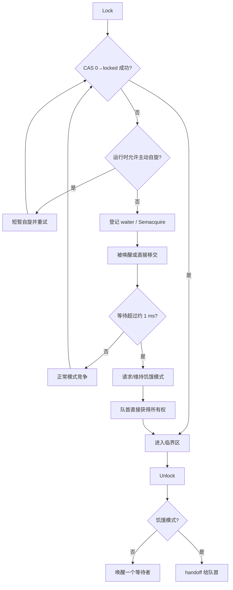
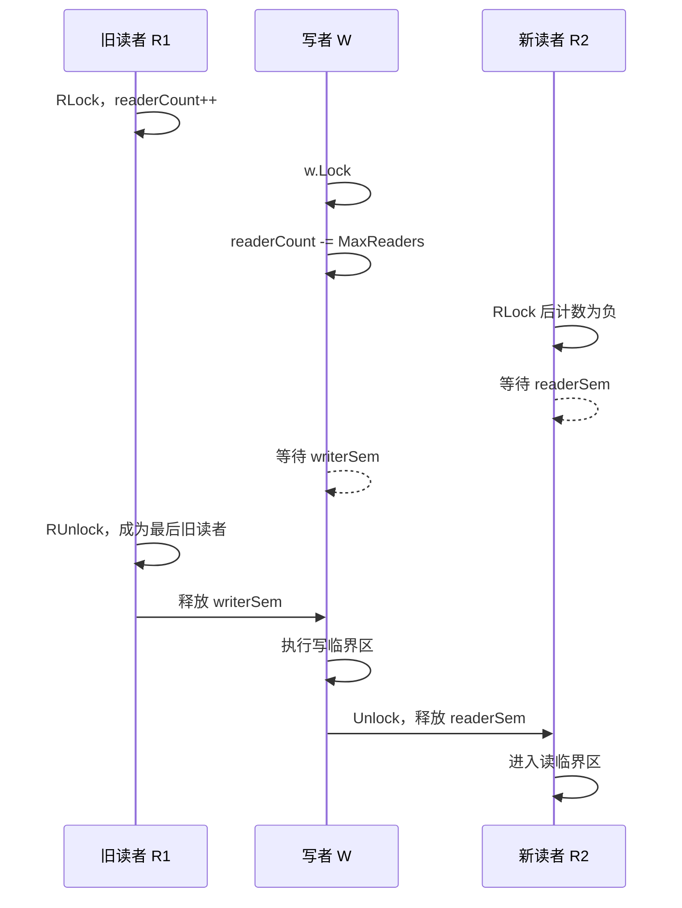
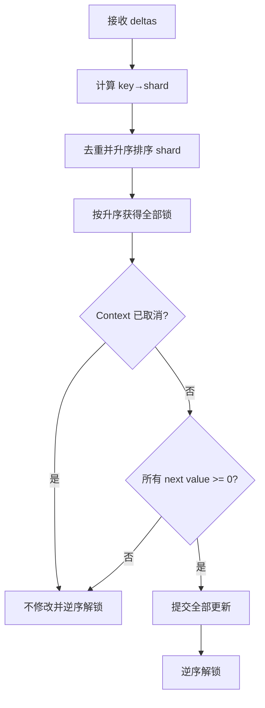
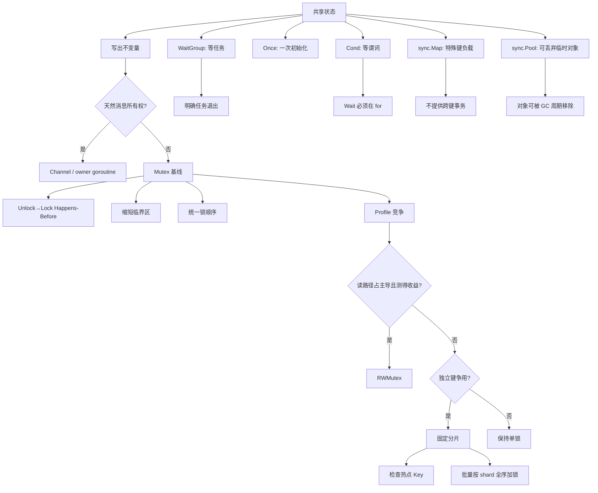

# 第 13 章：Mutex、RWMutex 与 sync 工具箱

## 阅读定位与关联章节

> 本章把共享状态的正确性收束到“显式不变量 + 临界区 + 可见性保证”上，和 Channel 的数据流模型、Atomic 的单值状态模型形成互补。

| 关联概念 | 建议读法 |
|---|---|
| Goroutine 生命周期、Happens-Before 与 DRF-SC 总框架 | 看 [第 11 章：并发基础、Goroutine 生命周期与 Go 内存模型](/blog/tech/GO/11.并发基础-Goroutine生命周期与Go内存模型)。 |
| Channel、select、Pipeline 和背压协议 | 看 [第 12 章：Channel、Select、并发模式与运行时实现](/blog/tech/GO/12.Channel)。 |
| Context 取消信号与临界区/等待收束的边界 | 看 [第 14 章：Context、取消传播与生命周期管理](/blog/tech/GO/14.Context-取消传播与生命周期管理)。 |
| Atomic、CAS、不可变快照和无锁思想 | 看 [第 15 章：Atomic、CAS、内存语义与无锁思想](/blog/tech/GO/15.Atomic-CAS-内存语义与无锁思想)。 |
| 锁竞争、队列堆积、P99 上涨和生产诊断 | 看 [第 16 章：生产级高并发架构、性能诊断与面试体系](/blog/tech/GO/16.生产级高并发架构-性能诊断与面试体系)。 |

---


## 面试题目精选

本章后文有完整回答、追问和代码判断。先用这组题建立主线：

1. Mutex 保护的是变量、代码，还是共享不变量？
2. `sync.Mutex` 零值能否直接用？首次使用后为什么不能复制？
3. `defer mu.Unlock()` 一定慢吗？什么时候应显式缩小临界区？
4. `TryLock` 适合什么场景？失败后能不能读取受保护状态？
5. `RWMutex` 为什么不一定比 `Mutex` 快？写者优先如何影响读延迟？
6. `WaitGroup.Add`、`Done`、`Wait` 的误用有哪些？`WaitGroup.Go` 改善了什么？
7. `sync.Once`、`OnceFunc`、`OnceValue` 分别适合什么初始化场景？
8. `Cond` 为什么要在循环里等待条件？它和 Channel 通知怎么选？
9. `sync.Map` 的适用负载是什么？为什么不能维护跨 Key 事务？
10. `sync.Pool` 为什么不是缓存？GC 对 Pool 中对象有什么影响？
11. 如何定位生产环境中的锁竞争、死锁和长尾等待？
12. 设计一个并发缓存时，普通 Mutex、RWMutex、分片锁和 `sync.Map` 如何验证取舍？

> 课程版本：Go 1.26.x；本文按 2026 年 6 月 22 日可用的 Go 1.26.4 官方文档与源码核验。

本章使用四类标签，避免把实现细节说成永久承诺：

- **[内存模型保证]**：Go Memory Model 定义的同步与可见性关系。
- **[API 契约]**：`sync` 包公开文档承诺的行为。
- **[Go 1.26.4 当前实现]**：本版本源码中的字段、位布局、算法和阈值，未来可能变化。
- **[工程推论]**：根据负载与当前实现作出的设计判断，必须用测试和 Profile 验证。

---

### 1. 本章解决什么问题

并发程序最难的部分通常不是“同时执行”，而是**多个 Goroutine 同时观察和修改共享状态时，怎样保证状态始终合法**。

例如库存服务有两个字段：

```text
available >= 0
reserved  >= 0
available + reserved == total
```

这三个条件共同构成一个**共享不变量**。任何一次“预占库存”都不是只修改一个整数，而是把状态从一个合法点转换到另一个合法点：

```text
(available, reserved) -> (available-n, reserved+n)
```

如果其他 Goroutine 能看到转换中间态，或者两个更新交错，系统即使没有崩溃，也可能出现超卖、余额凭空增加、统计不一致、缓存索引损坏等业务事故。

本章围绕三个核心问题展开：

1. **互斥**：某段状态转换同一时刻只能由一个 Goroutine 执行。
2. **可见性**：一个 Goroutine 在临界区中的写入，之后获得同一把锁的 Goroutine必须能看到。
3. **扩展性**：当并发量上升时，如何控制锁粒度、等待队列、缓存行争用和 P99 延迟。

一句话定义：

> **锁不是为了“保护某个变量”，而是为了把一组必须共同成立的状态约束和状态转换封装成不可交错的临界区。**

`Mutex` 是默认起点；`RWMutex` 是经过负载验证后的读并行优化；`WaitGroup`、`Once`、`Cond`、`sync.Map`、`sync.Pool` 则解决等待、一次性初始化、条件等待、特殊并发 Map 和临时对象复用等不同问题。

> **工程结论**：先写出共享不变量和所有状态转换，再决定锁放在哪里。若连不变量都无法表述，锁通常也很难放对。

---

### 2. 学习目标和前置知识

#### 2.1 学习目标

完成本章后，应能做到：

- 用 `Mutex` 维护跨字段、跨键或跨容器的不变量；
- 正确解释零值、不可复制、不可重入、`defer Unlock` 和 `TryLock` 的边界；
- 分析 `RWMutex` 的写者优先行为，并通过公平 Benchmark 决定是否采用；
- 解释 Go 1.26.4 `Mutex` 的快速路径、慢速路径、自旋、信号量、正常模式和饥饿模式；
- 解释 `WaitGroup` 的计数器、等待者计数和信号量；
- 正确选择 `Once`、`OnceFunc`、`OnceValue`、`OnceValues`；
- 用条件循环正确使用 `Cond`，并设计显式关闭路径；
- 说明 `sync.Map` 的两个主要适用负载，以及为何它不能自动维护跨键事务；
- 说明 `sync.Pool` 的 GC 语义，以及为什么它不能当可靠缓存；
- 实现普通 `Mutex`、`RWMutex`、分片锁和 `sync.Map` 四版并发缓存；
- 使用 Race Detector、Mutex Profile、Block Profile 和 Benchmark 定位问题。

#### 2.2 前置知识

需要已经理解：

- Goroutine 的创建、退出和泄漏；
- Channel 的发送、接收、关闭与 `select`；
- `context.Context` 的取消传播；
- 数据竞争与 Happens-Before；
- `go test`、表驱动测试和基础 Benchmark。

#### 2.3 本章的正确性优先级

建议按以下顺序评审并发状态：

```text
业务不变量
    ↓
所有读写是否遵守同一同步协议
    ↓
是否存在数据竞争或死锁
    ↓
是否有取消、退出和资源清理路径
    ↓
临界区是否过长
    ↓
是否需要分片、RWMutex、COW 或 sync.Map
    ↓
Benchmark + Profile 验证
```

性能优化不得越过正确性。一个吞吐量更高但偶尔破坏余额守恒的实现，不是“有少量误差”，而是错误实现。

> **工程结论**：先证明正确，再减少锁竞争；先测真实负载，再替换同步原语。

---

### 3. 一个生活类比

把共享状态想象成仓库总账。

#### 3.1 `Mutex`：唯一的账本钥匙

仓库只有一本总账和一把钥匙。拿到钥匙的人可以同时修改“可售库存、冻结库存、总金额”等多个格子；其他人必须等待。归还钥匙后，下一个人看到的是完整的新账目。

这里：

- 钥匙是 `Mutex`；
- 拿钥匙是 `Lock`；
- 归还钥匙是 `Unlock`；
- 账本修改区域是临界区；
- “总数守恒、库存不为负”是不变量。

#### 3.2 `RWMutex`：阅览证和修改权

账本允许多人同时查看，但修改时必须清场。只要修改员已经排队，后来到达的读者不能持续插队，否则修改员可能永远等不到。

这对应 Go `RWMutex` 的关键行为：**写者等待时，新读者会被阻塞**。因此递归 `RLock` 并不安全：第一次读锁持有期间若写者到来，第二次 `RLock` 可能等待写者，而写者又等待第一次读锁释放，形成死锁。

#### 3.3 其他工具

- `WaitGroup`：项目经理等待所有登记过的工单完成；它不分配工单，也不传递错误。
- `Once`：只允许第一次到场的人执行“开总闸”；后续人员只确认已完成。
- `Cond`：在仓库门口等待“有货”或“有空位”的叫号系统；醒来后仍要重新检查条件。
- `sync.Map`：适合大量独立货架的并发索引，但不自动保证多货架调拨事务。
- `sync.Pool`：可随时被清理的周转箱堆；用于减少临时箱子的分配，不是保证物品长期存在的储物柜。

#### 3.4 类比的边界

现实钥匙通常与持有人绑定，而 Go 的 `Mutex` **不与特定 Goroutine 绑定**：一个 Goroutine 可以加锁，另一个可以解锁。虽然 API 允许，但这种所有权转移通常降低可读性，应有非常清晰的协议。

> **工程结论**：类比帮助理解互斥，但最终必须回到精确模型：共享状态、临界区、不变量、同步关系和退出路径。

---

### 4. 从错误代码和事故场景切入

#### 4.1 Check-then-act：看起来合理的超卖代码

以下代码同时存在 Map 并发访问和复合操作竞态：

```go
// 错误示例：故意包含数据竞争。
type Inventory struct {
    stock map[string]int64
}

func (s *Inventory) Reserve(sku string, n int64) bool {
    if s.stock[sku] < n { // 读取
        return false
    }
    s.stock[sku] -= n // 另一次读改写
    return true
}
```

假设库存为 10，两个 Goroutine 同时预占 8：

```text
G1 读取 10，判断足够
G2 读取 10，判断足够
G1 写入 2
G2 写入 2
```

最终库存看似仍非负，但业务已经承诺发出 16 件。错误不只在“写 Map 不安全”，更在于“检查并扣减”没有形成一个不可分割的状态转换。

#### 4.2 两个 Atomic 也不是跨字段事务

把两个余额改成原子变量只能保证每次单独读写不会撕裂，不能让两次操作自动成为一个整体：

```go
// 错误设计：单次操作原子，但跨字段不变量不是原子的。
type AtomicLedger struct {
    from atomic.Int64
    to   atomic.Int64
}

func (l *AtomicLedger) Transfer(amount int64) bool {
    for {
        old := l.from.Load()
        if old < amount {
            return false
        }
        if l.from.CompareAndSwap(old, old-amount) {
            break
        }
    }
    // 此处其他 Goroutine 可观察到总额暂时减少。
    l.to.Add(amount)
    return true
}
```

即便源账户使用 CAS 保证不为负，在 `from` 成功扣减和 `to` 增加之间：

- 审计 Goroutine 可能看到 `from + to` 变小；
- 进程若在第二步前异常退出，更新永久只完成一半；
- 其他需要同时检查两个账户的规则没有一个统一线性化点。

多个 Atomic 可以构造更复杂算法，但必须自行设计协议、版本、重试和正确性证明；“把字段改成 Atomic”本身不是事务。

#### 4.3 用一个临界区维护不变量

```go
package ledger

import (
    "errors"
    "sync"
)

var (
    ErrInvalidAmount       = errors.New("amount must be positive")
    ErrInsufficientBalance = errors.New("insufficient balance")
)

type Ledger struct {
    mu       sync.Mutex
    balances map[string]int64
}

func New(initial map[string]int64) *Ledger {
    balances := make(map[string]int64, len(initial))
    for account, value := range initial {
        balances[account] = value
    }
    return &Ledger{balances: balances}
}

func (l *Ledger) Transfer(from, to string, amount int64) error {
    if amount <= 0 {
        return ErrInvalidAmount
    }
    if from == to {
        return nil
    }

    l.mu.Lock()
    defer l.mu.Unlock()

    if l.balances[from] < amount {
        return ErrInsufficientBalance
    }
    l.balances[from] -= amount
    l.balances[to] += amount
    return nil
}

func (l *Ledger) Balance(account string) int64 {
    l.mu.Lock()
    defer l.mu.Unlock()
    return l.balances[account]
}
```

这段代码的关键不是 `map` 被锁住，而是所有会影响下列不变量的操作都遵循同一协议：

```text
每个余额 >= 0
一次成功转账前后的总余额相同
外部读取不会观察到只扣未加的中间状态
```

严格地说，连续调用两次 `Balance` 仍不是一个多账户一致快照；若业务需要审计总额，应另写 `Snapshot(accounts)`，一次性锁住并复制所有目标值。

#### 4.4 事故复盘模板

遇到并发状态事故时，不要只问“哪行忘了加锁”，而要回答：

| 问题 | 示例答案 |
|---|---|
| 共享状态是什么 | `balances` 中全部账户余额 |
| 不变量是什么 | 非负、转账总额守恒 |
| 哪些操作并发 | `Transfer`、`Balance`、审计快照 |
| 哪个操作不是原子的 | 检查余额 + 扣款 + 入账 |
| 统一同步协议是什么 | 所有相关操作持有 `Ledger.mu` |
| 线性化点在哪里 | 持锁期间完成状态提交的时刻 |
| 如何测试 | 并发转账后检查非负与总额，配合 `-race` |

> **工程结论**：数据竞争只是错误的一类；即使全部字段都是 Atomic，也可能违反更高层业务不变量。

---

### 5. 基本 API 和最小可运行示例

#### 5.1 `sync.Mutex`

##### API 契约

```go
var mu sync.Mutex // 零值就是未加锁状态

mu.Lock()
// 临界区
mu.Unlock()

if mu.TryLock() {
    // 成功时等价于 Lock
    mu.Unlock()
}
```

核心规则：

- 零值可用，不需要构造函数；
- 第一次使用后不能复制；
- `Lock` 在锁不可用时阻塞；
- `Unlock` 一个未锁定的 Mutex 是运行时错误；
- Mutex 不可重入；
- 成功 `TryLock` 等价于 `Lock`，失败 `TryLock` 不建立任何同步关系；
- 锁不与特定 Goroutine 绑定，但通常应由同一控制流解锁。

##### 最小可运行计数器

```go
package main

import (
    "fmt"
    "sync"
)

type Counter struct {
    mu sync.Mutex
    n  int64
}

func (c *Counter) Add(delta int64) {
    c.mu.Lock()
    c.n += delta
    c.mu.Unlock()
}

func (c *Counter) Load() int64 {
    c.mu.Lock()
    defer c.mu.Unlock()
    return c.n
}

func main() {
    var c Counter
    var wg sync.WaitGroup
    for range 100 {
        wg.Go(func() {
            for range 1000 {
                c.Add(1)
            }
        })
    }
    wg.Wait()
    fmt.Println(c.Load()) // 100000
}
```

`Counter` 的方法必须使用指针接收者，否则值接收者会复制包含锁的结构体。

##### `defer Unlock` 的权衡

优先使用：

```go
mu.Lock()
defer mu.Unlock()
```

优点是错误返回和 Panic 路径都不会忘记解锁，审查容易。需要避免的是在大循环或大函数中过早 `defer`，导致锁持有时间意外延长：

```go
for _, item := range items {
    func() {
        mu.Lock()
        defer mu.Unlock()
        update(item)
    }()
}
```

也可以显式解锁，但必须保持控制流简单。微小的 `defer` 成本通常不值得优先于正确性；是否需要消除应由 Benchmark 和 Profile 决定。

##### `TryLock` 的少数合理场景

```go
type DebugState struct {
    mu    sync.Mutex
    queue []string
}

func (s *DebugState) TrySnapshot() ([]string, bool) {
    if !s.mu.TryLock() {
        return nil, false // 允许本次低优先级诊断跳过
    }
    defer s.mu.Unlock()
    return append([]string(nil), s.queue...), true
}
```

这里业务语义明确允许“忙时跳过”。不要用 `for !mu.TryLock() {}` 自制忙等，也不要用 TryLock 拼接复杂锁协议。

#### 5.2 `sync.RWMutex`

`RWMutex` 提供两种模式：

```go
mu.RLock()
// 只读临界区
mu.RUnlock()

mu.Lock()
// 写临界区
mu.Unlock()
```

多个读者可以并发持有读锁；写者需要独占。零值可用，首次使用后不可复制。不可从 `RLock` 升级到 `Lock`，也不可从 `Lock` 原子降级到 `RLock`。

```go
package registry

import "sync"

type Registry struct {
    mu     sync.RWMutex
    values map[string]string
}

func New() *Registry {
    return &Registry{values: make(map[string]string)}
}

func (r *Registry) Get(key string) (string, bool) {
    r.mu.RLock()
    value, ok := r.values[key]
    r.mu.RUnlock()
    return value, ok
}

func (r *Registry) Set(key, value string) {
    r.mu.Lock()
    r.values[key] = value
    r.mu.Unlock()
}
```

“读多”不是充分条件。只有在下列条件同时较接近时，RWMutex 才更可能有收益：

- 读比例高；
- 读临界区不是短到锁管理成本占主导；
- 写不频繁且不会形成持续写者队列；
- 读者确实能在多核上并行；
- 热点数据和统计计数器没有把并发重新集中到另一处。

#### 5.3 `sync.WaitGroup`

##### Go 1.25+ 的现代写法

```go
var wg sync.WaitGroup
for _, job := range jobs {
    job := job
    wg.Go(func() {
        process(job)
    })
}
wg.Wait()
```

`WaitGroup.Go` 自动执行 `Add(1)`、启动 Goroutine，并在函数正常返回时完成任务计数。**传给 `Go` 的函数不得 Panic**；若需要 Panic 隔离，应在函数内部恢复并转换为受控错误。

##### 传统写法

```go
var wg sync.WaitGroup
for _, job := range jobs {
    job := job
    wg.Add(1) // 必须在启动 Goroutine 之前
    go func() {
        defer wg.Done()
        process(job)
    }()
}
wg.Wait()
```

错误模式是把 `Add(1)` 放到 Goroutine 内；主 Goroutine 可能先看到计数为零并让 `Wait` 返回。

`WaitGroup` 只负责等待，不负责：

- 限制并发数；
- 取消任务；
- 收集错误；
- 传播 Context；
- 捕获 Panic。

需要这些能力时，应在更高层设计 Worker Pool，或使用明确标注来源的 `golang.org/x/sync/errgroup`。

#### 5.4 `Once`、`OnceFunc`、`OnceValue`、`OnceValues`

##### `Once`

```go
var once sync.Once
var client *Client

func ClientInstance() *Client {
    once.Do(func() {
        client = newClient()
    })
    return client
}
```

`Do` 的函数返回同步先于任何后续 `Do` 返回，因此后续调用者能看到初始化完成的对象。若函数 Panic，`Once` 仍认为这次调用已经完成，之后不会重试。

##### `OnceFunc`

```go
closeAll := sync.OnceFunc(func() {
    db.Close()
    cache.Close()
})

closeAll()
closeAll() // 不重复执行
```

若包装函数 Panic，`OnceFunc` 的每次调用都会以同一个 Panic 值再次 Panic；这与直接用 `Once.Do` 后续静默跳过不同。

##### `OnceValue`

```go
loadSchema := sync.OnceValue(func() *Schema {
    return parseSchema(embeddedSchema)
})

schema := loadSchema()
```

##### `OnceValues`

```go
loadConfig := sync.OnceValues(func() (*Config, error) {
    return readConfig("config.yaml")
})

cfg, err := loadConfig()
```

`OnceValues` 会缓存第一次调用的结果和错误。这意味着临时错误也会永久缓存；需要重试、过期刷新或动态配置时，不应使用 Once 系列作为刷新机制。

#### 5.5 `sync.Cond`

`Cond` 用于“持锁检查一个谓词，不成立则释放锁并等待状态变化”。它的零值不可直接使用，必须绑定一个 `Locker`：

```go
cond := sync.NewCond(&mu)
```

`Wait` 必须放在循环中：

```go
c.L.Lock()
for !condition() {
    c.Wait()
}
useState()
c.L.Unlock()
```

原因不是简单的“可能虚假唤醒”。Go 的 `Wait` 只在被 `Signal` 或 `Broadcast` 唤醒后返回，但从收到通知到重新获得锁之间，条件可能已经被其他 Goroutine 改变；多个等待者竞争同一资源时尤其如此。

一个带关闭路径的有界队列核心如下：

```go
package queue

import (
    "errors"
    "sync"
)

var ErrClosed = errors.New("queue closed")

type Queue[T any] struct {
    mu       sync.Mutex
    notEmpty *sync.Cond
    notFull  *sync.Cond
    items    []T
    head     int
    size     int
    closed   bool
}

func New[T any](capacity int) *Queue[T] {
    if capacity <= 0 {
        panic("capacity must be positive")
    }
    q := &Queue[T]{items: make([]T, capacity)}
    q.notEmpty = sync.NewCond(&q.mu)
    q.notFull = sync.NewCond(&q.mu)
    return q
}

func (q *Queue[T]) Put(v T) error {
    q.mu.Lock()
    defer q.mu.Unlock()
    for q.size == len(q.items) && !q.closed {
        q.notFull.Wait()
    }
    if q.closed {
        return ErrClosed
    }
    q.items[(q.head+q.size)%len(q.items)] = v
    q.size++
    q.notEmpty.Signal()
    return nil
}

func (q *Queue[T]) Get() (T, error) {
    q.mu.Lock()
    defer q.mu.Unlock()
    for q.size == 0 && !q.closed {
        q.notEmpty.Wait()
    }
    if q.size == 0 && q.closed {
        var zero T
        return zero, ErrClosed
    }
    v := q.items[q.head]
    var zero T
    q.items[q.head] = zero
    q.head = (q.head + 1) % len(q.items)
    q.size--
    q.notFull.Signal()
    return v, nil
}

func (q *Queue[T]) Close() {
    q.mu.Lock()
    if !q.closed {
        q.closed = true
        q.notEmpty.Broadcast()
        q.notFull.Broadcast()
    }
    q.mu.Unlock()
}
```

`Cond.Wait` 不能直接 `select` Context。若每次等待都必须独立取消，Channel 往往更自然；不要为每个等待者额外启动一个无法回收的桥接 Goroutine。

#### 5.6 `sync.Map`

`sync.Map` 的零值可用，首次使用后不可复制。它不是“并发 Map 的默认答案”。官方文档明确建议多数代码使用普通 `map` 加锁，以获得类型安全并方便维护额外不变量。

两个主要优化场景是：

1. 某个键只写一次、读很多次，例如只增长缓存；
2. 多个 Goroutine 读写互不重叠的键集合。

用泛型包装类型断言：

```go
type StringMap[V any] struct {
    m sync.Map
}

func (m *StringMap[V]) Load(key string) (V, bool) {
    raw, ok := m.m.Load(key)
    if !ok {
        var zero V
        return zero, false
    }
    return raw.(V), true
}

func (m *StringMap[V]) Store(key string, value V) {
    m.m.Store(key, value)
}
```

注意：

- `Range` 不是一致性快照；
- `Load` 后再 `Store` 是两个操作，不能自动实现复合条件更新；
- 单键条件更新可考虑 `LoadOrStore`、`CompareAndSwap`、`CompareAndDelete`；
- 跨键不变量仍需要额外协调；
- `Range` 即使很早停止，也可能有 O(N) 成本。

#### 5.7 `sync.Pool`

`Pool` 用于复用**临时对象**、降低分配和 GC 压力。任何对象都可能随时被自动移除，所以 `Get` 必须接受拿不到旧对象的情况。

```go
var bufferPool = sync.Pool{
    New: func() any {
        return new(bytes.Buffer)
    },
}

func encode(v any) ([]byte, error) {
    buf := bufferPool.Get().(*bytes.Buffer)
    buf.Reset()
    defer func() {
        // 防止偶发超大 Buffer 长期占用内存。
        if buf.Cap() <= 64<<10 {
            bufferPool.Put(buf)
        }
    }()

    if err := json.NewEncoder(buf).Encode(v); err != nil {
        return nil, err
    }
    return bytes.Clone(buf.Bytes()), nil
}
```

不要把以下对象放入 Pool 作为可靠资源管理：

- 必须长期存在的缓存条目；
- 数据库连接或需要显式关闭的资源；
- 带外部所有权、归还次数难以证明的对象；
- 含敏感数据但归还前未清理的缓冲区。

#### 5.8 七类原语的 12 问契约矩阵

##### 问题 1—6

| 原语 | 核心问题 | 零值 | 使用后复制 | 可能阻塞 | Happens-Before | 释放/关闭 |
|---|---|---|---|---|---|---|
| `Mutex` | 独占维护不变量 | 可用 | 禁止 | `Lock` 可阻塞 | `Unlock` 同步先于后续 `Lock`；成功 `TryLock` 同等 | 每次成功加锁匹配一次 `Unlock` |
| `RWMutex` | 读并行、写独占 | 可用 | 禁止 | `Lock/RLock` 可阻塞；释放操作可能唤醒 | 文档定义写锁与读锁/写锁之间的同步关系 | `RLock/RUnlock`、`Lock/Unlock` 严格配对 |
| `WaitGroup` | 等待任务集合归零 | 可用 | 禁止 | `Wait` 可阻塞 | `Done` 或 `Go` 中函数返回同步先于其解除的 `Wait` 返回 | 计数归零；无 `Close` |
| `Once` 家族 | 一次初始化或缓存首次结果 | `Once` 可用；函数包装器直接调用构造函数 | `Once` 使用后禁止复制 | 其他调用者可等待首次函数 | 首次函数返回同步先于后续调用返回 | 不可重置；需刷新时换方案 |
| `Cond` | 等待受锁保护的谓词成立 | 不可直接用，须 `NewCond` | 禁止 | `Wait` 阻塞 | `Signal/Broadcast` 同步先于被其解除的 `Wait` | 修改关闭状态并 `Broadcast` |
| `sync.Map` | 特殊键负载下的并发 Map | 可用 | 禁止 | API 不承诺绝不等待；内部更新可竞争 | 写操作同步先于观察到其效果的读操作 | 无关闭；按业务删除或丢弃整个 Map |
| `sync.Pool` | 复用可丢弃临时对象 | 可用，`New` 可选 | 禁止 | API 通常短，但不作实时性保证 | `Put(x)` 同步先于返回同一 `x` 的 `Get` | 无关闭；归还前重置，最终丢弃引用 |

##### 问题 7—12

| 原语 | 常见误用 | 高竞争成本 | 对尾延迟 | 替代 | 应避免时 | 常见追问 |
|---|---|---|---|---|---|---|
| `Mutex` | 复制、漏解锁、锁内 I/O、锁序反转 | CAS 重试、自旋、停车/唤醒、缓存行抖动 | 排队和长临界区直接放大 P99 | Channel 所有权、分片、COW | 等待需取消、状态天然消息化 | 正常/饥饿模式、不可重入、HB |
| `RWMutex` | 递归读锁、升级锁、假设读多必快 | 读计数热点、写者清场、读者唤醒 | 长读会拖住写，写到来又阻塞新读 | `Mutex`、COW、分片 | 写频繁、临界区极短、热点单核 | 写者到来后新读者怎样、内部计数 |
| `WaitGroup` | `Add` 太晚、负计数、复用重叠、用来传错 | 归零时批量唤醒等待者 | 大量任务一起完成可产生调度突发 | `errgroup`、结果 Channel、任务队列 | 需要限流、取消、错误聚合 | 内部 64 位状态、`Go` 与传统写法 |
| `Once` 家族 | 期待失败重试、递归 `Do`、首次错误永久缓存 | 首次慢函数让所有调用者等待 | 冷启动和首次失败可形成长尾 | 显式状态机、定时刷新、COW | 配置需刷新、初始化可重试 | Panic 语义、为什么不能先置 done |
| `Cond` | `if` 代替 `for`、忘持锁、无关闭 | 广播惊群、重新争锁 | `Broadcast` 后排队可形成尖峰 | Channel、semaphore、事件流 | 需要每等待者 Context 取消 | Wait 如何原子释放锁、为什么循环 |
| `sync.Map` | 当通用 Map、Range 当快照、跨键事务 | 热点键和节点锁仍会竞争，类型断言有成本 | 热点更新或大 Range 可抬升尾延迟 | 普通 Map+锁、分片 Map、COW | 需跨键不变量、键值类型约束强 | 两个适用场景、Go 1.26 实现变化 |
| `sync.Pool` | 当缓存/资源池、假设 Put 后一定 Get 到 | P 本地快速；跨 P 窃取和 GC 周期有波动 | Miss 后重新分配可能影响长尾 | 栈上对象、专用有界池、复用缓冲 | 对象必须可靠存在或需显式关闭 | GC victim cache、为何会被清空 |

> **工程结论**：`sync` 中每个类型解决的是不同同步问题。不要因为它们在同一个包里，就把它们当作可以互换的“性能工具”。

---
### 6. 正确性分析

#### 6.1 从内存模型到工程证明

Go 内存模型中，Happens-Before 是以下关系的传递闭包：

```text
sequenced-before（单个 Goroutine 内的程序顺序）
            ∪
synchronized-before（锁、Channel、Atomic 等同步操作建立的关系）
```

如果写操作 `W` Happens-Before 读操作 `R`，则 `R` 必须按内存模型观察到与该顺序一致的结果。对无数据竞争程序，Go 提供 DRF-SC：程序可以按某个顺序一致的交错来理解。

对 `Mutex`，公开契约是：第 n 次 `Unlock` 同步先于之后第 m 次 `Lock` 成功，其中 `n < m`。因此：

```text
G1: 写 balances[A]
    写 balances[B]
    Unlock
       │ synchronized-before
       ▼
G2: Lock
    读 balances[A]
    读 balances[B]
```

注意同步边界是**成功获得锁**，不是“调用了 Lock”这一瞬间。失败的 `TryLock` 没有同步效果，不能据此安全读取受保护状态。

#### 6.2 库存扣减的五步证明

以 `Reserve` 为例：

```go
func (s *Store) Reserve(sku string, n int64) error {
    if n <= 0 {
        return ErrInvalidAmount
    }
    s.mu.Lock()
    defer s.mu.Unlock()

    if s.stock[sku] < n {
        return ErrInsufficientStock
    }
    s.stock[sku] -= n
    s.reserved[sku] += n
    return nil
}
```

##### 1. 共享变量是什么

- `stock[sku]`
- `reserved[sku]`
- Map 自身的内部结构

##### 2. 哪些操作可能并发

- 多个 `Reserve`
- `Release`
- `Commit`
- 查询库存
- 审计快照

##### 3. 数据竞争在哪里

若无锁，任意 Map 读写与另一写操作都可能冲突；两个读改写序列也会交错。

##### 4. 使用了什么同步关系

所有相关访问必须先获得同一个 `s.mu`，完成后 `Unlock`。前一个临界区的 `Unlock` 同步先于后一个临界区的 `Lock`。

##### 5. Happens-Before 如何建立

临界区内写入 sequenced-before `Unlock`；该 `Unlock` synchronized-before 后续 `Lock`；后续 `Lock` sequenced-before 读取。经传递性，前次写入 Happens-Before 后次读取。

互斥还保证同一时刻只有一个状态转换执行，因此检查和两次更新不会与另一个转换交错。

#### 6.3 线性化点和事务边界

并发对象通常需要指定每个操作“看起来瞬间发生”的位置：

| 操作 | 可采用的线性化点 |
|---|---|
| `Get` | 持锁读取目标值的时刻 |
| `Set` | 持锁写入 Map 的时刻 |
| `Delete` | 持锁删除的时刻 |
| `ApplyBatch` | 所有校验通过后、批量写入提交期间的逻辑提交点 |

实现可以有多行代码，但对其他遵守同一锁协议的单个操作而言，它应等价于在某一时刻发生。

必须区分：

- **单操作线性化**：每次 `Get` 要么在批量提交前，要么在提交后；
- **多操作一致快照**：连续两次独立 `Get` 可能跨过一次提交，不能当成同一时刻的快照。

需要多键一致读取时，应增加 `Snapshot(keys)`，按与批量写相同的锁顺序一次性读取。

#### 6.4 `RWMutex` 的同步关系

[API 契约] 可概括为：

- 一次 `Unlock` 同步先于后续某次 `Lock`；
- 对任意一次 `RLock`，存在一次更早的 `Unlock` 同步先于它；
- 对应的 `RUnlock` 同步先于之后的某次 `Lock`。

这使得写者发布的状态对后续读者可见，并让写者在所有先前读者退出后安全修改状态。

`RLock` 只适用于读取。以下代码错误：

```go
r.mu.RLock()
r.values[key]++ // 错误：读锁下写共享状态
r.mu.RUnlock()
```

多个读者会同时执行这次写，既破坏互斥，也可能产生数据竞争。

#### 6.5 `WaitGroup` 的可见性边界

`Done` 同步先于它解除阻塞的 `Wait` 返回；`WaitGroup.Go` 中函数返回也同步先于它解除的 `Wait` 返回。因此：

```go
results := make([]int, n)
var wg sync.WaitGroup
for i := range results {
    i := i
    wg.Go(func() {
        results[i] = compute(i) // 每个任务写不同元素
    })
}
wg.Wait()
consume(results) // 可以看到任务完成前的写入
```

这不意味着多个 Goroutine 可以写同一个元素，也不意味着 `WaitGroup` 是任意时刻的“内存屏障”。可见性保证与任务完成、`Wait` 返回相关；任务运行期间的共享访问仍需其他同步。

#### 6.6 `Once` 的安全发布

`Once.Do(f)` 的关键保证是 `f` 的返回同步先于任何 `Do` 返回。正确实现不能在执行 `f` 前就把 `done` 标为真，否则另一个调用者可能看到 `done`，直接返回，却观察到未初始化完成的对象。

```text
错误设想：done=true -> 执行初始化
                       ↑
另一个调用者在这里返回，读到半初始化状态

正确语义：获得内部锁 -> 执行初始化 -> 发布 done -> 其他调用者返回
```

#### 6.7 `Cond` 的谓词才是状态真相

`Signal` 不是把某个资源“交给”特定等待者；它只是通知至少一个等待者状态可能变化。真正的正确性来自：

1. 谓词由同一把锁保护；
2. 修改状态后发通知；
3. 等待者醒来并重新获得锁；
4. 在循环中再次检查谓词。

```go
q.mu.Lock()
for q.size == 0 && !q.closed {
    q.notEmpty.Wait()
}
```

即使通知发生在等待者调用 `Wait` 前，只要状态修改和检查都持同一把锁，也不会出现传统意义上的“检查后错过通知”：等待者在释放锁并登记等待之间由 `Wait` 完成原子衔接。

#### 6.8 `sync.Map` 的同步边界

`sync.Map` 为“写操作”和观察到该写效果的“读操作”建立同步关系。它保证单个 API 操作的并发安全，但不把任意多次调用合并成事务：

```go
v, _ := m.Load(key)
// 其他 Goroutine 可在这里修改 key。
m.Store(key, v.(int)+1)
```

要实现单键条件更新，应使用 `CompareAndSwap` 循环或外部锁；要维护多个键的不变量，通常应使用普通 Map 加锁、分片锁加全序，或额外的事务协调锁。

#### 6.9 `Pool` 的同步不等于对象永久存在

若 `Get` 恰好返回先前 `Put(x)` 的同一个对象，则 `Put(x)` 同步先于这次 `Get`。但 Pool 可以在任何时候移除对象；HB 保证不能推导出“Put 后一定能 Get 到”。

#### 6.10 锁域清单

推荐为每个并发结构写一段锁域注释：

```go
type Cache struct {
    // mu protects entries and the invariant that every value is non-negative.
    // stats is independent and uses atomic counters; Stats is not a transactional snapshot.
    mu      sync.RWMutex
    entries map[string]int64
    stats   counters
}
```

审查时逐项确认：

- 所有写路径是否持锁；
- 所有读路径是否持锁或读取不可变快照；
- 回调是否可能在锁内回入对象；
- 是否有字段实际上受另一把锁保护；
- 是否存在需要同时持多把锁的操作；
- 多锁是否有全局顺序；
- 返回的切片、Map、指针是否把内部可变状态泄漏到锁外。

> **工程结论**：正确性证明必须覆盖共享变量、并发操作、不变量、同步关系和线性化点；“我加了一把锁”不是证明。

---

### 7. 常见使用场景

#### 7.1 `Mutex` 的典型场景

1. **普通 Map 与派生索引**：一个 Map 更新时还要同步维护计数、LRU 链表或反向索引。
2. **账户、库存、配额**：检查与扣减必须在同一临界区。
3. **状态机**：状态转换同时修改时间戳、错误原因和重试计数。
4. **连接对象状态**：`closed`、活动请求数、缓冲区和最后错误必须一致。
5. **批量提交**：先校验全部更新，再一次提交。
6. **小型缓存**：单锁实现通常最简单，也是性能比较的基线。

#### 7.2 `RWMutex` 的典型场景

- 读路径频繁、写入较少的路由表或注册表；
- 读取临界区有一定工作量，多个读者并行确有价值；
- 读取返回复制值，不把可变内部对象泄漏出去；
- 写者延迟可接受，并且已经用真实并发度验证。

如果配置更新是“构造一个全新不可变对象并整体替换”，Copy-on-Write 加 `atomic.Pointer` 往往比 RWMutex 更适合，详见第 15 章。

#### 7.3 `WaitGroup`

- 等待固定批次的并行任务完成；
- 服务关闭时等待已登记的 Worker 退出；
- 测试中等待显式启动的 Goroutine；
- 分阶段并行计算的栅栏。

它不是工作队列，也不控制并发上限。启动十万个 `wg.Go` 仍会创建十万个 Goroutine。

#### 7.4 Once 家族

| 需求 | 选择 |
|---|---|
| 首次调用执行无返回值初始化 | `Once.Do` |
| 得到可重复调用的一次性函数 | `OnceFunc` |
| 首次计算并缓存一个值 | `OnceValue` |
| 首次计算并缓存两个值，常见为值与错误 | `OnceValues` |

适合进程生命周期内不需刷新、失败不需重试的初始化。

#### 7.5 `Cond`

- 自定义有界环形队列；
- 等待资源计数从 0 变为正数；
- 等待状态机进入某个状态；
- 一个状态变化需要唤醒一个或全部等待者，且状态由复杂谓词表达。

在业务层，Channel 通常更易组合 Context 和 `select`。`Cond` 更常见于底层数据结构和运行库式代码。

#### 7.6 `sync.Map`

- 只增不改或基本只读的动态注册表；
- 键被不同 Goroutine 分区拥有；
- 单键原子 API 足够，不需要跨键约束；
- 已通过 Benchmark 证明普通 Map+锁的争用确实是瓶颈。

#### 7.7 `sync.Pool`

- 编解码临时缓冲区；
- 格式化、压缩、序列化过程中的短命对象；
- 请求间可安全重置和复用的 builder；
- 大量并发客户共享、分配成本确实显著的临时对象。

> **工程结论**：先按语义选择原语，再按负载优化。正确的默认项通常是普通 `map` + `Mutex`，而不是最复杂的同步结构。

---

### 8. 不适合使用的场景

#### 8.1 不适合 `Mutex` 的情况

- 状态天然由单一 Goroutine 拥有，操作通过消息顺序执行；
- 调用者必须能取消“等待访问权”，而 `Mutex.Lock` 本身不可被 Context 取消；
- 临界区不可避免地包含长网络 I/O；
- 需要跨进程一致性，单进程锁无法覆盖；
- 需要数据库事务的持久性、隔离性和故障恢复。

#### 8.2 不适合 `RWMutex` 的情况

- 临界区只有几个机器指令，读锁计数成本可能超过收益；
- 写比例高或写者持续到来；
- 读临界区可能很长；
- 热点读仍集中修改命中统计等共享数据；
- 业务需要可取消的锁等待；
- 尚未测量，仅凭“读多”猜测。

#### 8.3 不适合 `WaitGroup` 的情况

- 需要第一个错误后取消其余任务；
- 需要限制并发或队列长度；
- 任务源是长期流而非有边界批次；
- 需要逐个消费结果，而不是只等待全部结束。

#### 8.4 不适合 Once 家族的情况

- 初始化失败后需要重试；
- 配置要热更新；
- 资源要定期重建；
- 测试需要重置全局状态；
- 初始化函数可能递归调用同一个 Once。

#### 8.5 不适合 `Cond` 的情况

- 每个等待者需要独立超时或 Context 取消；
- Channel 已能清楚表达事件与关闭所有权；
- 通知本身携带数据；
- 无法定义一个受同一把锁保护的明确谓词。

#### 8.6 不适合 `sync.Map` 的情况

- 需要强类型 API；
- 写入集中在热点键；
- 需要一致快照、范围事务或跨键不变量；
- 常见操作是“读—计算—写”的复合事务；
- 普通 Map+锁已经足够且更可维护。

#### 8.7 不适合 `sync.Pool` 的情况

- 对象缺失会破坏正确性；
- 资源必须显式关闭；
- Pool 与短命对象绑定，复用收益无法摊销；
- 对象很大且大小无上限，可能造成内存滞留；
- 需要固定容量、公平性或背压，这应由专用有界池实现。

> **工程结论**：同步原语的“不可用场景”与“可用场景”同样重要。最危险的误用通常是把性能优化原语当成业务语义原语。

---

### 9. 错误示例、错误原因和修复过程

#### 9.1 值接收者复制锁

```go
// 错误：每次调用都复制 Counter 和其中的 Mutex。
type Counter struct {
    mu sync.Mutex
    n  int
}

func (c Counter) Inc() {
    c.mu.Lock()
    c.n++
    c.mu.Unlock()
}
```

修复为指针接收者：

```go
func (c *Counter) Inc() {
    c.mu.Lock()
    c.n++
    c.mu.Unlock()
}
```

同样要避免：

- 使用后返回结构体副本；
- 把含锁结构体按值放入接口；
- 把含锁元素存入可能搬移/复制的容器后再复制；
- `append` 的不是问题本身，问题在于元素类型按值复制且锁已使用。

运行：

```bash
go vet ./...
```

`copylocks` 分析器可发现许多此类错误，但静态检查不是完整证明。

#### 9.2 忘记解锁或提前返回

```go
func (s *Store) Set(key string, value int) error {
    s.mu.Lock()
    if value < 0 {
        return ErrNegative // 锁永远不释放
    }
    s.values[key] = value
    s.mu.Unlock()
    return nil
}
```

修复：在锁后立即 `defer`，或把校验移到锁前（前提是校验不依赖共享状态）：

```go
func (s *Store) Set(key string, value int) error {
    if value < 0 {
        return ErrNegative
    }
    s.mu.Lock()
    defer s.mu.Unlock()
    s.values[key] = value
    return nil
}
```

#### 9.3 在循环外部函数中 `defer`，意外长时间持锁

```go
for _, key := range keys {
    mu.Lock()
    defer mu.Unlock() // 直到整个函数退出才执行
    update(key)
}
```

第二次循环就会尝试重入同一把锁并死锁。修复为显式解锁，或提取小函数让 `defer` 作用域等于单次迭代。

#### 9.4 把 Mutex 当成可重入锁

```go
func (s *Store) Update() {
    s.mu.Lock()
    defer s.mu.Unlock()
    s.rebuild() // rebuild 又调用 s.mu.Lock()
}
```

Go Mutex 不记录“当前 Goroutine 已持有”。第二次 `Lock` 会等待自己释放，永远无法继续。

常用修复是拆分锁内辅助函数：

```go
func (s *Store) Update() {
    s.mu.Lock()
    defer s.mu.Unlock()
    s.rebuildLocked()
}

// 调用者必须持有 s.mu。
func (s *Store) rebuildLocked() { /* ... */ }
```

函数名中的 `Locked` 是重要协议提示。

#### 9.5 锁顺序反转

```text
G1: Lock(A) -> 等待 B
G2: Lock(B) -> 等待 A
```

修复原则：所有路径按同一个全序加锁，逆序解锁。例如按账户 ID 或分片索引升序：

```go
first, second := a, b
if first.id > second.id {
    first, second = second, first
}
first.mu.Lock()
second.mu.Lock()
defer second.mu.Unlock()
defer first.mu.Unlock()
```

若对象 ID 可变化或相等，需要稳定的唯一排序键和同对象特判。

#### 9.6 锁内执行网络、磁盘、未知回调或阻塞 Channel

```go
s.mu.Lock()
result := remoteClient.Fetch(ctx, s.config) // 可能超时数秒
s.cache[key] = result
s.mu.Unlock()
```

问题：所有等待者的延迟都被远程调用放大，Context 取消也无法解除其他 Goroutine 的锁等待。

修复模式：

1. 持锁读取并复制必要状态；
2. 解锁；
3. 执行慢操作；
4. 重新加锁，校验版本仍适用；
5. 快速提交。

```go
s.mu.Lock()
cfg := s.config.Clone()
version := s.version
s.mu.Unlock()

result, err := remoteClient.Fetch(ctx, cfg)
if err != nil {
    return err
}

s.mu.Lock()
defer s.mu.Unlock()
if s.version != version {
    return ErrStale
}
s.cache[key] = result
return nil
```

未知回调更危险，因为它可能回入当前对象或获得另一把锁。默认不在锁内调用用户代码。

#### 9.7 递归 `RLock` 并不安全

```go
r.mu.RLock()
defer r.mu.RUnlock()
helper() // helper 再次 RLock
```

在没有写者时可能长期“正常”，因此很隐蔽。若写者已经等待，新来的 `RLock` 会阻塞；外层读锁又阻止写者完成，形成死锁。

修复：避免递归锁；把只读辅助函数改为接收已经复制的数据，或提供 `helperRLocked` 明确要求调用者持锁且自身不再加锁。

#### 9.8 尝试升级读锁

```go
mu.RLock()
if needWrite() {
    mu.Lock() // 死锁：写锁等待所有读者，包括自己
}
```

Go `RWMutex` 不支持原子升级。常见修复：

```go
mu.RLock()
need := needWriteLocked()
mu.RUnlock()

if need {
    mu.Lock()
    defer mu.Unlock()
    // 状态可能已变化，必须重新检查。
    if needWriteLocked() {
        writeLocked()
    }
}
```

这不是原子升级，而是释放后重新竞争，所以必须二次校验。

#### 9.9 `Cond.Wait` 使用 `if`

```go
q.mu.Lock()
if q.size == 0 {
    q.notEmpty.Wait()
}
item := q.popLocked() // 条件可能已被其他消费者改变
q.mu.Unlock()
```

修复为 `for`，并把关闭状态纳入谓词：

```go
for q.size == 0 && !q.closed {
    q.notEmpty.Wait()
}
```

#### 9.10 `Broadcast` 引发惊群

如果只增加一个资源却调用 `Broadcast`，所有等待者都会醒来并竞争同一把锁，最终只有一个成功，其余再次睡眠。优先根据语义使用 `Signal`；只有关闭、全局状态切换或多个等待者都可能继续时才广播。

#### 9.11 `WaitGroup.Add` 太晚与重叠复用

```go
// 错误
for _, task := range tasks {
    go func() {
        wg.Add(1)
        defer wg.Done()
        task()
    }()
}
wg.Wait()
```

主 Goroutine 可能在任何 `Add` 之前返回。使用 `wg.Go`，或在 `go` 语句前 `Add`。

另一个错误是上一轮 `Wait` 尚未返回就开始下一轮 `Add`。独立批次复用时，所有上一轮 `Wait` 返回后才能开始新一轮。

#### 9.12 忽略 `WaitGroup.Go` 的 Panic 契约

```go
wg.Go(func() {
    panic("boom") // API 明确要求 f 不得 Panic
})
```

若任务可能 Panic，应由任务边界恢复、记录并转换为错误，同时决定是否取消同批任务。不要假设 WaitGroup 会替你做 Panic 隔离。

#### 9.13 Once 初始化失败后期待重试

```go
load := sync.OnceValues(fetchRemoteConfig)
```

若第一次因短暂网络故障返回错误，之后所有调用都得到同一个错误。需要重试时，应使用显式状态机、退避和更新时间，而不是 Once。

递归调用同一个 `Once.Do` 也会死锁，因为首次调用还没返回，内部锁不会释放。

#### 9.14 `sync.Map.Range` 当作一致快照

```go
var total int64
m.Range(func(_, value any) bool {
    total += value.(int64)
    return true
})
```

并发更新时，`total` 可能组合了不同时间点的值。若总和是业务不变量，应使用外部协调锁、不可变快照或数据库事务。

#### 9.15 把 `sync.Pool` 当可靠缓存

```go
pool.Put(session)
// 错误假设：稍后一定能取回同一个 session。
```

GC 可以移除对象。Pool 中也没有“按键查找”“容量”“过期”“所有权”语义。可靠缓存应使用明确的数据结构和淘汰策略。

#### 9.16 用 `TryLock` 忙等

```go
for !mu.TryLock() {
    // 占满 CPU，且失败尝试没有同步效果
}
```

直接 `Lock` 能让运行时在适当时自旋或停车；手写忙等通常更差。需要非阻塞语义时，应允许失败后做其他工作或返回，而不是无限重试。

> **工程结论**：最常见的锁 Bug 来自复制、控制流、嵌套调用和多锁协议，而不是 `Lock` 拼写错误。静态检查、Race Detector 和压力测试必须同时使用。

---

### 10. 底层实现

> 本节除明确标为 [API 契约] 的内容外，均描述 Go 1.26.4 当前实现。字段、阈值和策略可能在未来版本改变。

#### 10.1 `Mutex` 的外层与内部字段

公开的 `sync.Mutex` 包含一个 `noCopy` 标记和一个内部 `internal/sync.Mutex`。真正的运行时状态在内部结构中：

```go
// 概念化摘录
 type Mutex struct {
     state int32
     sema  uint32
 }
```

`state` 把多个状态压进一个 32 位整数：

```text
bit 0: locked    当前是否锁定
bit 1: woken     已有等待者被唤醒，避免重复唤醒
bit 2: starving  饥饿模式
bit 3..31: waiter count 等待者数量
```

这种布局让快速路径只需一个 CAS，不必先取独立字段。

#### 10.2 `Lock` 快速路径

锁完全空闲时：

```text
CAS(state, 0, locked)
        │
        ├─成功：立即进入临界区
        └─失败：进入 lockSlow
```

快速路径没有分配，也不需要进入等待队列。无竞争 Mutex 因此很便宜，但“便宜”不等于零成本：它仍涉及原子读改写和缓存一致性协议。

#### 10.3 主动自旋

竞争出现后，当前实现可能短暂主动自旋，而不是立即停车。只有运行时判断自旋可能有效时才这样做，例如多核、可运行 P 数量合适、已自旋次数有限等。

自旋的收益：锁即将释放时，避免停车和唤醒的调度成本。代价：占用 CPU，并反复访问同一状态缓存行。长临界区或过度竞争时，自旋只会浪费周期。

与 GMP 的关系：自旋期间 G 仍在 M/P 上运行；进入信号量等待后，G 会被挂起，M/P 可调度其他可运行 G。

#### 10.4 正常模式

正常模式优化总体吞吐量：

1. 等待者进入信号量队列；
2. `Unlock` 唤醒一个等待者；
3. 被唤醒者与新到达 Goroutine 竞争 CAS；
4. 新到达者正在 CPU 上运行，通常更容易先获得锁；
5. 失败的老等待者再次排队。

这种策略减少上下文切换，适合短临界区和偶发竞争，但可能让某个等待者多次失败。

#### 10.5 饥饿模式与约 1 ms 阈值

当前实现中，等待者等待超过约 1 ms 后可能把 Mutex 切换到饥饿模式。饥饿模式下：

- 解锁者不再让新到达者自由竞争；
- 锁通过信号量直接移交给等待队列前端；
- 新到达者即使看到锁似乎空闲，也不会抢占所有权，而是排队；
- 获得锁的等待者若是队尾，或等待时间低于阈值，可切回正常模式。

这在吞吐量和公平性之间折中：正常模式偏吞吐；饥饿模式牺牲部分吞吐，限制极端等待时间。



#### 10.6 信号量、停车和唤醒

`sema` 不是业务层计数信号量，而是 Mutex 慢路径与 runtime 信号量机制交互的地址。竞争者通过 `Semacquire` 进入等待；解锁路径通过 `Semrelease` 唤醒或移交。

从一次操作看：

```text
G 调用 Lock
  -> CAS/自旋失败
  -> 增加 waiter 状态
  -> runtime sema 队列
  -> gopark：G 进入等待，P 可运行别的 G
  -> Unlock 调用 semrelease
  -> goready：等待 G 重新进入可运行队列
  -> 获得调度后继续竞争或接收 handoff
```

具体 runtime 内部函数不是 API。工程上只需理解：高竞争会从便宜的用户态原子操作升级为调度和队列成本。

#### 10.7 `Unlock` 路径

快速路径原子清除 `locked` 位；若发现仍有等待者或处于特殊状态，则进入慢路径：

- 正常模式选择一个等待者唤醒，并用 `woken` 位避免多个解锁者重复唤醒；
- 饥饿模式使用 handoff，把所有权直接交给队首等待者；
- 当前实现会配合调度让接收 handoff 的 Goroutine 尽快运行。

解锁不是“把某个 CPU 指令置零”那么简单；在竞争下，它还决定谁被唤醒、是否移交以及是否切换模式。

#### 10.8 为什么锁竞争会导致 Cache Line 抖动

`state` 是所有竞争者共同读改写的热点。多核 CPU 使用缓存一致性协议维护同一缓存行：某个核心要修改它时，需要取得该行的独占/修改权限，使其他核心副本失效。

在高竞争下：

```text
Core 0 获取锁 -> cache line 所有权到 Core 0
Core 1 CAS    -> cache line 转移/失效
Core 2 CAS    -> 再次转移
Core 0 Unlock -> 再次写入
```

即使临界区只做 `n++`，锁状态缓存行和受保护数据也可能在核心间来回跳动。分片的主要收益之一，就是把一个热点缓存行拆成多个独立争用域。

#### 10.9 `RWMutex` 当前字段

Go 1.26.4 的 `RWMutex` 关键字段概念化如下：

```go
type RWMutex struct {
    w           Mutex       // 串行化写者
    writerSem   uint32      // 写者等待现有读者离开
    readerSem   uint32      // 读者等待写者完成
    readerCount atomic.Int32
    readerWait  atomic.Int32
}
```

`readerCount` 正常为活跃读者数量。写者到来后会减去一个很大的常量 `rwmutexMaxReaders`，使值变负；后续读者看到负值，就知道有写者等待并阻塞在 `readerSem`。

#### 10.10 `RLock` / `RUnlock` 路径

`RLock`：

```text
readerCount.Add(1)
    ├─结果 >= 0：快速进入
    └─结果 < 0：写者已等待，Semacquire(readerSem)
```

`RUnlock`：

```text
readerCount.Add(-1)
    ├─结果 >= 0：普通快速退出
    └─结果 < 0：有写者等待
                  readerWait.Add(-1)
                  最后一个旧读者唤醒 writerSem
```

读路径仍有原子更新；它不是完全无写入的“免费并行”。大量读者会共同修改 `readerCount` 的缓存行。

#### 10.11 `Lock` / `Unlock` 路径

写者先获得内部 `w`，确保写者之间串行。随后：

1. `readerCount` 减去 `rwmutexMaxReaders`，宣布写者等待；
2. 计算当前已有读者数；
3. 若仍有读者，把数量加入 `readerWait`；
4. 等待最后一个旧读者释放 `writerSem`；
5. 独占修改状态。

解锁时：

1. `readerCount` 加回 `rwmutexMaxReaders`；
2. 根据被阻塞的新读者数量释放 `readerSem`；
3. 释放内部写者 Mutex，让下一个写者竞争。



这解释了两个 API 规则：

- 写者等待后新读者会阻塞，以免写者饥饿；
- 不得递归 `RLock`，因为第二次读锁可能被写者挡住。

#### 10.12 `WaitGroup` 的状态和信号量

当前 `WaitGroup` 使用：

```go
type WaitGroup struct {
    noCopy noCopy
    state  atomic.Uint64
    sema   uint32
}
```

64 位状态把任务计数、内部 `synctest` 标志和等待者计数打包：

```text
高 32 位：任务 counter
中间 1 位：synctest 内部标志
低 31 位：waiter count
```

`Add(delta)` 原子修改高位计数：

- 变成负数会 Panic；
- 从非零降到零时，重置等待者计数并逐个释放 `sema`；
- 源码含误用检查，用于发现 `Add` 与 `Wait` 的非法重叠。

`Wait` 循环读取状态：

- 计数为零立即返回；
- 否则 CAS 增加 waiter count；
- 在 `sema` 上等待；
- 被唤醒后检查是否被过早复用。

`WaitGroup.Go` 在调用方先登记任务，再启动 Goroutine。Go 1.26 当前实现对 Panic 有特殊处理，但 API 已明确要求 `f` 不得 Panic；工程代码不得依赖未承诺的内部行为。

#### 10.13 `Once` 的双重检查

当前 `Once` 关键字段是一个原子完成标记和一个 Mutex：

```go
type Once struct {
    done atomic.Bool
    m    Mutex
}
```

路径：

```text
Do(f)
  -> done.Load() == true ? 直接返回
  -> 否：进入 doSlow
       -> m.Lock()
       -> 再检查 done
       -> 执行 f
       -> 在 f 返回或 Panic 展开时设置 done
       -> m.Unlock()
```

为什么不能简单 CAS `done: false -> true` 后立即执行 `f`？因为输掉 CAS 的调用者必须等待 `f` 真正完成，而不是看到标记就返回。内部 Mutex 同时提供等待和安全发布。

`OnceFunc/Value/Values` 在此基础上保存函数结果或 Panic 值，并按各自契约重放。

#### 10.14 `Cond` 的通知列表

当前 `Cond` 包含：

- 绑定的 `Locker L`；
- runtime 通知列表 `notifyList`；
- 复制检查器 `copyChecker`。

`Wait` 的操作路径是：

```text
取得通知 ticket
-> 原子释放 L
-> 在 notifyList 上等待
-> 被 Signal/Broadcast 唤醒
-> 重新 Lock(L)
-> 返回给调用者
```

“释放锁并进入等待”必须作为一个协调操作完成，否则可能在检查条件后、真正睡眠前错过通知。

`Signal` 通知一个 ticket；`Broadcast` 推进通知边界，让当前所有等待者可运行。被唤醒不等于立即获得 `L`，它们仍会竞争锁，因此大规模广播可能形成惊群。

#### 10.15 `sync.Map`：Go 1.26 的实现已经变化

很多旧文章讲 `read`、`dirty`、`misses` 三件套。**这不是 Go 1.26 当前实现。**

Go 1.26 的公开 `sync.Map` 委托给 `internal/sync.HashTrieMap[any, any]`。当前实现是并发 Hash Trie，关键点包括：

- 零值通过惰性初始化建立根节点、哈希函数和随机 seed；
- `Load` 按哈希位逐层读取原子子指针，常见读路径无需获得节点锁；
- 插入、替换和删除定位到候选节点后，获得局部间接节点锁，再二次确认并发布新节点；
- 新结构通过原子指针最后发布，使读者不会看到“旧条目已消失而新条目尚未可见”的中间状态；
- 冲突键可能扩展为更深子树或溢出链；
- 不同子树的写入有机会分散争用。

```text
root
 ├─ child[hash high bits] -> indirect node
 │      ├─ child[...] -> entry
 │      └─ child[...] -> deeper node
 └─ child[...] -> entry
```

这些都是当前实现细节。对业务代码稳定的仍是公开 API、适用场景和内存模型契约，不应依据内部节点布局编写程序。

#### 10.16 `sync.Pool` 的 per-P 与 victim cache

当前 Pool 为每个 P 维护本地结构：

- `private`：当前 P 优先使用的单个对象；
- `shared`：当前 P 的共享队列；
- 获取不到时可从其他 P 窃取；
- 操作过程中会短暂 pin 到当前 P，以安全访问本地槽位。

GC 周期开始时，当前实现会在 STW 阶段：

1. 丢弃更老的 victim；
2. 把当前 primary 本地池移动为 victim；
3. 清空新的 primary。

下一个周期仍可能从 victim 取到对象；再后续周期若未复用，它们可被回收。这解释了 Pool 为什么能在负载下降时收缩，也解释了为何不能把它当持久缓存。

#### 10.17 `noCopy` 与工具链

`Mutex`、`RWMutex`、`WaitGroup`、`Once`、`Cond`、`Map`、`Pool` 都有“使用后不可复制”的约束。标准库内部常通过 `noCopy` 和 `copyChecker` 配合 `go vet` 发现误用。

这不是运行时为所有类型强制提供的语言特性；它主要依赖 API 纪律和静态分析。因此：

- 含锁结构体通常通过指针传递；
- 构造完成后可以在首次使用前移动/复制，但工程上最好从一开始就只传指针；
- 不要通过序列化、反射复制或按值接口绕过审查。

> **工程结论**：源码知识的价值在于解释竞争成本和尾延迟，而不是让业务代码依赖字段布局。所有实现细节都要与 API 契约分层表达。

---
### 11. 时间、空间、调度和缓存成本

#### 11.1 不要只看“大 O”

从算法复杂度看，`Lock`、`RLock`、`WaitGroup.Add` 等常被视为 O(1)。但高并发系统真正关心的是常数项及其随竞争变化的非线性行为：

```text
无竞争原子操作
    < 短暂 CAS 重试/自旋
    < 进入等待队列
    < Goroutine 停车与唤醒
    < 锁队列拥塞、调度延迟和缓存行反复转移
```

一次锁操作的成本不是固定常数，而是负载、临界区、核数、GOMAXPROCS、热点分布和调度状态的函数。

#### 11.2 成本对照表

| 原语/路径 | 时间成本 | 空间成本 | 调度成本 | 缓存/GC 成本 |
|---|---|---|---|---|
| Mutex 无竞争 | 原子 CAS + 普通代码 | 结构很小 | 通常无停车 | 状态行独占写 |
| Mutex 竞争 | 自旋、队列、信号量 | 等待队列由 runtime 管理 | 可能 park/unpark | 状态行和共享数据抖动 |
| RWMutex 读 | 原子 reader 计数 | 固定字段 | 写者等待时可停车 | 所有读者写同一计数行 |
| RWMutex 写 | 串行写者并等待旧读者 | 固定字段 | 可能唤醒一批读者 | 计数行、信号量热点 |
| WaitGroup | 原子计数；归零时释放等待者 | 固定字段 | 多等待者同时唤醒 | 状态行热点；无任务结果存储 |
| Once 热路径 | 一次原子 Load | 固定字段 | 无 | 极低；首次路径取锁 |
| Cond Wait | ticket + 解锁 + 停车 + 重加锁 | 等待列表 | 显著 | Broadcast 后争锁 |
| sync.Map Load | Hash Trie 原子指针遍历 | 节点与 entry | 常见读路径不停车 | 指针追逐、节点占用、GC 扫描 |
| sync.Map 写 | 哈希遍历 + 局部节点锁 + 发布 | 新节点/entry 可能分配 | 竞争时可能等待 | 更高内存和 GC 成本 |
| Pool 命中 | per-P 本地访问 | 保存可复用对象 | 通常无 | 降低分配；可能滞留容量 |
| Pool miss | `New` 或外部分配 | 新对象 | 取决于构造 | 增加分配和 GC 压力 |

#### 11.3 临界区长度决定排队上限

设平均临界区耗时为 `S`，同一把独占锁理论上最多每秒服务约 `1/S` 次状态转换；实际还要扣除锁管理、调度和缓存一致性成本。

当到达率接近服务能力时，等待不会线性增加，而会快速恶化：

```text
到达率低：大部分请求直接拿锁
接近饱和：少量排队，P95/P99 开始上升
超过能力：队列持续增长，超时与重试进一步放大负载
```

因此，锁内多做 100 微秒网络等待，不只是让当前请求慢 100 微秒，而是让同锁上的所有后续请求都排在它后面。

#### 11.4 `defer` 与真正的大头

`defer Unlock` 有成本，但在多数真实锁争用问题中，大头通常是：

- 临界区过长；
- 锁内分配或 I/O；
- 热点键集中；
- 多锁死锁规避失败；
- 读锁下仍更新统计；
- 停车/唤醒和缓存行转移。

不要在没有 Profile 的情况下，牺牲异常路径正确性去省一个 `defer`。对极短高频函数，可分别 Benchmark 显式解锁和 `defer`，但要确保两版做相同工作。

#### 11.5 粗粒度、细粒度和分片

| 策略 | 优点 | 代价 | 适合 |
|---|---|---|---|
| 单把粗锁 | 最容易证明；批量不变量简单 | 独立键也串行 | 初始实现、小状态、低竞争 |
| 每对象细锁 | 独立对象可并行 | 对象生命周期、锁顺序复杂 | 对象稳定且跨对象操作少 |
| 固定分片锁 | 锁数量有界；管理简单 | 同分片键仍竞争；批量需多锁 | 大键空间、访问较均匀 |
| 每键动态锁 | 可隔离热点之外的键 | 锁表清理、引用计数、ABA/泄漏风险 | 有成熟 lock registry 且必要 |
| COW | 读路径近似无锁 | 写时复制、旧快照 GC | 读极多、数据不大、写少 |

细粒度不是自动更快。锁数量越多，协议和死锁面越大；批量操作可能需要持有大量锁，退化成更昂贵的全局锁。

#### 11.6 锁分片的空间与哈希成本

分片增加：

- 每个 shard 的锁和 Map 头；
- 哈希计算；
- 批量操作的索引集合、排序和临时切片；
- 不均匀哈希导致的负载偏斜风险。

分片数过少无法分散竞争，过多会增加内存和管理成本。常见做法从 16、32、64 等 2 的幂开始测试，但这不是通用最优值。

#### 11.7 RWMutex 的隐藏写流量

即使业务只读，`RLock` 和 `RUnlock` 也会原子更新读者计数。读者在多个核心上并行时，这个计数缓存行仍可能抖动。因此：

- 读临界区越长，允许读者并行的收益越大；
- 临界区越短，计数管理占比越大；
- 热点键若都在同一个共享对象上，读计数仍是中心点；
- 一旦写者到来，新读者开始等待，吞吐和尾延迟形态会变化。

#### 11.8 Pool 与内存滞留

Pool 可以降低 `allocs/op`，但也可能让大容量对象在至少一个 GC 周期内保持可达。典型控制：

```go
if buf.Cap() <= maxReusableCapacity {
    pool.Put(buf)
}
```

对象归还前还要清除引用字段，否则一个小池对象可能间接保留一棵大对象图。

#### 11.9 尾延迟比平均值更敏感

平均锁等待很低时，少量长临界区仍可能制造显著 P99：

```text
99 个请求持锁 5µs
1 个请求持锁 50ms
```

平均值会淡化 50ms，但排在它后面的整批请求都会变慢。生产评估至少同时观察：

- 吞吐量；
- 平均延迟；
- P95/P99；
- 锁等待累计时间；
- 每次竞争平均等待；
- Goroutine 阻塞数量；
- CPU 和调度开销。

> **工程结论**：锁性能不是“某个 API 几纳秒”，而是临界区服务能力、排队、调度和缓存一致性的共同结果。P99 往往先于平均值暴露问题。

---

### 12. 高性能、高可用、高并发场景：分片缓存项目

本章项目实现一个保存非负 `int64` 值的并发缓存，可模拟库存、配额或账户余额。可以按示例目录 `chapter3-sync/` 组织代码；这里重点是接口、不变量、测试和 Benchmark 的结构。

#### 12.1 统一接口与不变量

```go
package cache

import "context"

type Cache interface {
    Get(key string) (int64, bool)
    Set(key string, value int64) error
    Delete(key string)
    ApplyBatch(ctx context.Context, deltas map[string]int64) error
    Stats() Stats
}
```

统一语义：

- 每个已存值必须 `>= 0`；
- `Set` 拒绝负值；
- `ApplyBatch` 先检查所有目标值，任一将变负则全部不修改；
- 成功批量更新对遵守同一同步协议的单键操作呈现为提交前或提交后；
- `Transfer` 用同一批次执行 `from -= amount` 与 `to += amount`；
- 统计计数单独原子更新，`Stats` 是逐字段安全快照，不是多计数器事务快照。

```go
func Transfer(ctx context.Context, c Cache, from, to string, amount int64) error {
    if amount <= 0 {
        return ErrInvalidAmount
    }
    if from == to {
        return ctx.Err()
    }
    return c.ApplyBatch(ctx, map[string]int64{
        from: -amount,
        to:   amount,
    })
}
```

#### 12.2 架构图

```mermaid
flowchart LR
    C[调用者] --> API[Cache API]
    API --> M[MutexCache\n单把 Mutex]
    API --> R[RWMutexCache\n单把 RWMutex]
    API --> S[ShardedCache\nN 个 RWMutex shard]
    API --> SM[SyncMapCache\nsync.Map + batch gate]
    M --> D1[map[string]int64]
    R --> D2[map[string]int64]
    S --> H[hash key]
    H --> S0[shard 0]
    H --> S1[shard 1]
    H --> SN[shard N-1]
    SM --> D4[sync.Map]
    M --> ST[atomic stats]
    R --> ST
    S --> ST
    SM --> ST
```

#### 12.3 普通 Mutex 版本：正确性基线

```go
type MutexCache struct {
    mu    sync.Mutex
    data  map[string]int64
    stats counters
}

func (c *MutexCache) Get(key string) (int64, bool) {
    c.mu.Lock()
    value, ok := c.data[key]
    c.mu.Unlock()
    if ok {
        c.stats.hits.Add(1)
    } else {
        c.stats.misses.Add(1)
    }
    return value, ok
}

func (c *MutexCache) ApplyBatch(ctx context.Context, deltas map[string]int64) error {
    if err := ctx.Err(); err != nil {
        return err
    }
    c.mu.Lock()
    defer c.mu.Unlock()

    if err := ctx.Err(); err != nil {
        return err
    }
    for key, delta := range deltas {
        if c.data[key]+delta < 0 {
            return ErrNegativeValue
        }
    }
    for key, delta := range deltas {
        c.data[key] += delta
    }
    c.stats.batches.Add(1)
    return nil
}
```

优点：

- 最容易证明所有键的一致性；
- 批量操作不需要锁排序；
- 实现和维护成本最低。

限制：

- 任意两个键的操作都串行；
- 热点或长批次会阻塞整个缓存；
- 读操作也互斥。

这版必须保留，作为正确性和 Benchmark 基线。

#### 12.4 RWMutex 版本：让读路径并行

只把 `Get` 改成 `RLock`，写操作仍用 `Lock`：

```go
func (c *RWMutexCache) Get(key string) (int64, bool) {
    c.mu.RLock()
    value, ok := c.data[key]
    c.mu.RUnlock()
    if ok {
        c.stats.hits.Add(1)
    } else {
        c.stats.misses.Add(1)
    }
    return value, ok
}
```

批量更新必须拿写锁。它适合“真正读多、写少、读临界区有足够工作量”的负载。若每次 `Get` 只是读一个整数，RWMutex 的读计数原子操作可能抵消并行收益。

#### 12.5 分片版本：有界地拆分争用域

```go
type shard struct {
    mu   sync.RWMutex
    data map[string]int64
}

type ShardedCache struct {
    shards []*shard
    mask   uint64
    stats  counters
}
```

分片数要求是正的 2 的幂，索引用位与计算：

```go
func (c *ShardedCache) shardIndex(key string) int {
    return int(hashKey(key) & c.mask)
}
```

单键操作只锁一个 shard。批量操作可能跨多个 shard，必须建立全局锁序。

##### 批量更新的核心实现

```go
type batchItem struct {
    key   string
    delta int64
    index int
}

func (c *ShardedCache) ApplyBatch(
    ctx context.Context,
    deltas map[string]int64,
) error {
    if err := ctx.Err(); err != nil {
        return err
    }
    if len(deltas) == 0 {
        return nil
    }

    items := make([]batchItem, 0, len(deltas))
    indices := make([]int, 0, len(deltas))
    seen := make(map[int]struct{}, len(deltas))

    for key, delta := range deltas {
        index := c.shardIndex(key)
        items = append(items, batchItem{key: key, delta: delta, index: index})
        if _, ok := seen[index]; !ok {
            seen[index] = struct{}{}
            indices = append(indices, index)
        }
    }
    if err := ctx.Err(); err != nil {
        return err
    }

    sort.Ints(indices)
    for _, index := range indices {
        c.shards[index].mu.Lock()
    }
    defer func() {
        for i := len(indices) - 1; i >= 0; i-- {
            c.shards[indices[i]].mu.Unlock()
        }
    }()

    if err := ctx.Err(); err != nil {
        return err
    }
    for _, item := range items {
        s := c.shards[item.index]
        if s.data[item.key]+item.delta < 0 {
            return ErrNegativeValue
        }
    }
    for _, item := range items {
        s := c.shards[item.index]
        s.data[item.key] += item.delta
    }
    c.stats.batches.Add(1)
    return nil
}
```

关键证明：

1. 同一批次中的 shard 索引去重；
2. 所有批次都按升序加锁，因此不会形成环；
3. 获得全部目标 shard 后才开始校验和修改；
4. 任一校验失败时没有写入，解锁后返回；
5. 成功时所有写入在锁集合内完成；
6. 逆序解锁使协议清楚，虽然在固定全序下逆序不是防死锁的必要条件。



##### 分片批量操作的边界

- 批次覆盖越多 shard，越接近全局锁；
- 批次构建和排序发生在锁外，缩短持锁时间；
- 必须限制单批键数，避免一个请求锁住所有分片太久；
- 若拆分批次会破坏原子语义，就不能为了性能擅自拆分；
- 多键一致读取也应使用同样的 shard 排序协议。

#### 12.6 `sync.Map` 版本：跨键事务仍需外部协调

```go
type SyncMapCache struct {
    gate  sync.RWMutex
    data  sync.Map
    stats counters
}
```

单键操作持 `gate.RLock`，批量操作持 `gate.Lock`：

```go
func (c *SyncMapCache) Get(key string) (int64, bool) {
    c.gate.RLock()
    raw, ok := c.data.Load(key)
    c.gate.RUnlock()
    // 统计省略
    if !ok {
        return 0, false
    }
    return raw.(int64), true
}
```

为什么需要 `gate`？`sync.Map` 只保证每次 Map API 安全，不提供跨键原子提交。如果批量更新直接连续 `Store`，读者可在中间观察到部分结果。

这版有意展示一个事实：**当业务需要跨键不变量时，使用 `sync.Map` 后仍可能要加协调锁，优势可能消失。** 若业务完全不需要批量事务，可删除 gate，再单独 Benchmark 官方文档描述的特殊负载。

#### 12.7 并发安全统计

示例代码使用 `atomic.Uint64` 保存命中、未命中、设置、删除和批次数：

```go
type counters struct {
    hits    atomic.Uint64
    misses  atomic.Uint64
    sets    atomic.Uint64
    deletes atomic.Uint64
    batches atomic.Uint64
}
```

这里 Atomic 适合的是**彼此独立的简单计数器**。`Stats()` 逐个 Load，因此可能看到不同瞬间的组合；若业务要求 `hits + misses == requests` 在快照中严格成立，应使用同一锁或版本化快照。

所有四版缓存都包含同样统计工作，保证 Benchmark 对比公平。若统计本身成为热点，可增加“关闭统计”对照、分片计数或 Worker 本地汇总，但不得只给某一版移除统计后再宣称更快。

#### 12.8 Context 的真实边界

项目的 `ApplyBatch` 接收 Context，用于：

- 在批次预处理前快速失败；
- 在排序和加锁前再次检查；
- 获得锁后、提交前检查，保证取消时不做业务写入。

但必须明确：

> `sync.Mutex.Lock` 和 `RWMutex.Lock` 本身不可被 Context 取消。

若 Goroutine 已阻塞在 `Lock`，deadline 到期不会立刻把它从锁等待中移除。不要用循环 `TryLock + time.Sleep` 模拟可取消锁。真正需要可取消准入时，可以：

- 用有界 Channel/队列把状态所有权交给单一 Goroutine；
- 在进入锁前使用可取消 semaphore 控制并发；
- 缩短和限制批次；
- 设置服务级 admission control，在拥塞前拒绝；
- 重新设计数据分区，避免请求进入同一热点锁。

#### 12.9 Copy-on-Write

对读极多、写极少且数据规模有限的配置表，可以：

1. 读者读取不可变快照；
2. 写者加锁；
3. 复制旧 Map；
4. 在副本修改；
5. 原子发布新指针；
6. 旧读者继续使用旧快照，GC 最终回收。

优点是读路径不争锁；代价是写时 O(N) 复制和额外内存。发布后绝不能修改旧快照。具体 Atomic 发布在第 15 章展开。

#### 12.10 读写路径分离

常见设计：

```text
写请求 -> 校验/合并 -> 单一写路径 -> 发布版本
读请求 -> 只读快照或分片数据
```

收益来自把复杂写事务从高频读路径移开。风险包括：

- 读到旧版本；
- 写队列积压；
- 写失败后的重试与幂等；
- 发布版本和数据生命周期管理。

若业务要求强一致，不能只因追求吞吐就允许异步读写分离。

#### 12.11 热点 Key、锁惊群与 P99

锁分片无法解决单个热点键：所有请求仍落到同一 shard。可根据业务采用：

- 热点复制为只读副本；
- 单键请求合并，例如 `singleflight`（第三方 `golang.org/x/sync/singleflight`）；
- 对热点键做独立限流；
- 把计数改为分片累加并容忍汇总延迟；
- 缓存预热和随机过期，减轻同时失效；
- 拆分业务键，但必须保持语义正确。

“锁惊群”常见于：

- `Cond.Broadcast` 唤醒大量等待者；
- 一个写者释放 RWMutex 后大量读者同时可运行；
- 热点缓存填充结束后大量请求同时争用后续资源；
- 服务恢复后积压请求同时重试。

需要配合有界队列、限流、抖动和请求合并，而不是只换一把锁。

#### 12.12 高可用约束

本项目没有后台 Goroutine，因此不存在内部无限任务创建或关闭泄漏。生产化时仍需增加：

- 批量键数上限；
- 请求 deadline 和入口限流；
- 对超大值、超长 key 的资源限制；
- Panic 边界；
- 指标采样而非无限标签；
- 锁等待和批次时长监控；
- 进程关闭时拒绝新写、等待在途请求、持久化或同步下游。

内存缓存本身不提供跨进程一致性、持久性或故障恢复。库存、余额等权威数据仍应由数据库事务或专门一致性系统维护；这里的缓存模型用于学习进程内同步。

#### 12.13 示例代码结构

```text
chapter3-sync/
├── cache/
│   ├── cache.go
│   ├── mutex_cache.go
│   ├── rwmutex_cache.go
│   ├── sharded_cache.go
│   ├── syncmap_cache.go
│   ├── cache_test.go
│   ├── benchmark_common_test.go
│   ├── benchmark_go126_test.go
│   └── benchmark_compat_test.go
├── toolbox/
│   ├── bounded_queue.go
│   ├── once_examples.go
│   └── waitgroup_go125.go
└── cmd/demo/main.go
```

> **工程结论**：分片提升的是独立键并行度，不会消灭热点，也不会自动解决跨分片事务。批量操作必须有全局锁序、上限和明确一致性语义。

---

### 13. 测试和 Benchmark

#### 13.1 测试层次

| 层次 | 目标 |
|---|---|
| 单元测试 | 基本 Get/Set/Delete、错误和边界 |
| 不变量测试 | 批量失败不产生部分写、成功转账守恒 |
| 并发压力测试 | 多 Goroutine 交错读写，验证最终不变量 |
| Race Detector | 发现实际执行路径上的数据竞争 |
| Benchmark | 比较同工作量下的吞吐、延迟和分配 |
| Profile | 解释 Benchmark 或生产中的锁等待来源 |

Race Detector 只能发现本次执行覆盖路径中的竞争，不能证明“没有数据竞争”。测试必须主动制造交错并重复运行。

#### 13.2 不使用 `time.Sleep` 猜顺序

用关闭 Channel 同时放行 Goroutine：

```go
start := make(chan struct{})
var wg sync.WaitGroup
for range workers {
    wg.Go(func() {
        <-start
        runOperations()
    })
}
close(start)
wg.Wait()
```

这比“Sleep 10ms 等大家启动”更确定，也不会因 CI 机器快慢而脆弱。

#### 13.3 批量原子性测试

```go
func TestApplyBatchIsAtomic(t *testing.T) {
    c := NewMutexCache()
    mustSet(t, c, "A", 100)
    mustSet(t, c, "B", 100)

    err := c.ApplyBatch(context.Background(), map[string]int64{
        "A": -150,
        "B": 150,
    })
    if !errors.Is(err, ErrNegativeValue) {
        t.Fatalf("got %v, want ErrNegativeValue", err)
    }
    assertValue(t, c, "A", 100)
    assertValue(t, c, "B", 100)
}
```

关键是失败后检查**所有键都未改变**，而不只是错误值。

#### 13.4 并发守恒测试

测试方法：

1. 初始化 32 个账户，每个 100；
2. 启动固定数量 Goroutine；
3. 同时开始大量跨账户 `Transfer`；
4. 余额不足允许事务被拒绝；
5. 等全部完成后检查每个余额非负、总额仍为 3200；
6. 对四种实现运行同一测试；
7. 使用 `go test -race`。

命令：

```bash
go test ./...
go test -race ./...
go test -count=100 ./cache -run TestConcurrentTransfersPreserveInvariant
```

`-count=100` 增加调度交错覆盖，但仍不是形式化证明。

#### 13.5 Go 1.26 的 `testing.B.Loop`

串行微基准：

```go
func BenchmarkCacheGet(b *testing.B) {
    c := NewMutexCache()
    _ = c.Set("key", 1) // setup，不应计入核心循环

    b.ReportAllocs()
    var sink int64
    for b.Loop() {
        value, _ := c.Get("key")
        sink ^= value
    }
    benchmarkSink = sink
}
```

`B.Loop` 让框架决定迭代数，并自动把循环前 setup 和循环后 cleanup 排除在计时之外。仍要保留结果，防止编译器消除无可观察效果的工作。

#### 13.6 并行 Benchmark

`B.Loop` 用于普通基准循环；`RunParallel` 的 API 仍通过 `PB.Next` 驱动并行操作：

```go
b.RunParallel(func(pb *testing.PB) {
    rng := newLocalRNG()
    for pb.Next() {
        key := keys[rng.next()&uint64(len(keys)-1)]
        if rng.next()%100 < readPercent {
            value, _ := c.Get(key)
            consume(value)
        } else {
            _ = c.Set(key, int64(rng.next()&1023))
        }
    }
})
```

每个并行 Worker 应使用本地随机状态，避免 `math/rand` 全局锁或测试辅助锁污染结果。

#### 13.7 四类负载

| 负载 | 读写比 | 键分布 | 主要观察 |
|---|---:|---|---|
| ReadHeavy / Uniform | 95% 读，5% 写 | 4096 键均匀 | RWMutex 和分片是否释放读并行度 |
| WriteHeavy / Uniform | 20% 读，80% 写 | 均匀 | 写锁、分片写并行和节点更新成本 |
| ReadHeavy / HotKey | 95% 读 | 90% 请求落一个键 | 热点是否抵消分片；读计数/统计热点 |
| WriteHeavy / HotKey | 20% 读 | 90% 热点 | 最恶劣锁队列与 P99 风险 |

配套 Benchmark 为四个实现执行完全相同的键数、读写比例、统计更新和返回值消费。

#### 13.8 公平 Benchmark 清单

- setup 不计时；
- 预填充同样键和值；
- 所有实现执行同样 API 语义；
- 不让某一实现跳过统计或错误检查；
- 不在热循环格式化字符串或分配随机数；
- 键集足够大，且单独测试热点；
- 固定或记录 `GOMAXPROCS`；
- 多次运行，用 `benchstat` 比较分布；
- `-benchmem` 观察 `B/op` 和 `allocs/op`；
- 结果必须与 CPU 型号、Go 版本和命令一起保存。

命令示例：

```bash
go test -run '^$' -bench BenchmarkCacheParallel -benchmem -count=10 ./cache > old.txt
# 修改实现后再次运行

go test -run '^$' -bench BenchmarkCacheParallel -benchmem -count=10 ./cache > new.txt
benchstat old.txt new.txt
```

`benchstat` 来自 `golang.org/x/perf/cmd/benchstat`，不是标准库命令。

#### 13.9 如何解读指标

- `ns/op`：每次操作平均时间；并行基准中是总体工作摊销，不等同于单请求 P99；
- `ops/s`：吞吐直观表达，可由时间指标换算；
- `B/op`：每次操作平均分配字节；
- `allocs/op`：平均分配次数；
- CPU 利用率：更快是否只是用了更多 CPU 自旋；
- Mutex/Block Profile：等待发生在哪里、谁造成等待；
- 延迟直方图：服务级 P95/P99，不能只靠 `testing.B` 平均值替代。

#### 13.10 预期趋势，而不是预设赢家

可以提出待验证假设：

- 单线程或低竞争下，单 Mutex 可能因路径简单而很强；
- 读多均匀负载下，RWMutex 或分片可能受益；
- 写多均匀负载下，分片可能允许不同键并行；
- 热点键会让分片退化；
- `sync.Map` 的结果取决于键生命周期和写入分布；
- 额外 batch gate 会削弱 `sync.Map` 优势；
- 分片哈希和更多 Map 会增加固定成本。

这些都不是结论。必须运行目标硬件、目标 Go 版本和接近生产的负载。

#### 13.11 本地验证说明

建议在示例目录中运行：

```text
go test ./...
go test -race ./...
go vet ./...
```

如果示例中包含 Go 1.26 专用 Benchmark 文件，可通过 `//go:build go1.26` 使用 `testing.B.Loop`，并在 Go 1.26.4 工具链中单独执行。

> **工程结论**：Benchmark 用来证伪假设，不是为既定方案背书。正确的比较必须同语义、同工作量、同统计、同键分布，并结合 Profile 与尾延迟。

---

### 14. 生产排障方法

#### 14.1 从症状到证据

锁问题常表现为：

- CPU 不高但请求变慢；
- Goroutine 数快速上升；
- P99 上升而平均值变化不大；
- 吞吐到某一点后不再随 CPU 增加；
- 下游已恢复，积压仍需很久清空；
- 写请求出现尖峰时，读请求也整体抖动。

排障顺序：

```text
确认时间窗口与版本
 -> 看服务级吞吐、P95/P99、错误、在途请求
 -> Goroutine Profile 看大量阻塞点
 -> Block Profile 看等待者在哪里阻塞
 -> Mutex Profile 看谁持锁造成竞争
 -> CPU Profile 看自旋/业务计算
 -> Trace 看调度、阻塞和唤醒时间线
 -> 回到代码缩小临界区或重构锁域
```

#### 14.2 测试环境采集 Mutex Profile

```bash
go test -run '^$' \
  -bench BenchmarkCacheParallel \
  -benchtime=10s \
  -mutexprofile mutex.out \
  -mutexprofilefraction 1 \
  ./cache

go tool pprof -top mutex.out
go tool pprof -http=:0 mutex.out
```

`-mutexprofilefraction 1` 尝试记录所有竞争事件，开销较高，适合受控测试。生产环境通常应采样。

#### 14.3 采集 Block Profile

```bash
go test -run '^$' \
  -bench BenchmarkCacheParallel \
  -benchtime=10s \
  -blockprofile block.out \
  -blockprofilerate 1 \
  ./cache

go tool pprof -top block.out
```

`blockprofilerate` 越小采样越密；具体开销需测试。不要在高流量生产长期无采样记录所有阻塞。

#### 14.4 两类 Profile 的语义不同

这是最容易误判的地方：

- **Block Profile** 归因到 Goroutine **发生阻塞的位置**，例如 `Mutex.Lock`、Channel 接收、`Cond.Wait`；它回答“等待者在哪里卡住”。
- **Mutex Profile** 归因到造成其他 Goroutine 等待的临界区结束位置，通常表现为 `Unlock` 附近；它回答“哪段持锁代码制造了竞争”。

若只看 Block Profile，可能把受害者调用栈当成根因。正确做法是把二者关联：

```text
Block: cache.Get 卡在 RLock
Mutex: refreshAll 的 Unlock 累积 delay 很高
代码: refreshAll 在写锁内做全量 JSON 编码
结论: Get 是受害者，refreshAll 的长写临界区是根因
```

Mutex Profile 的 delay 可近似累计所有被阻塞 Goroutine 的等待：一个临界区多持锁 1 秒、同时挡住 5 个等待者，可能贡献约 5 秒等待量。因此它不等同于墙钟持锁时间。

#### 14.5 在服务中启用采样

```go
runtime.SetMutexProfileFraction(10)       // 约每 10 次竞争采样一次
runtime.SetBlockProfileRate(1_000_000)    // 目标约每阻塞 1ms 采样
```

配合受保护的 `net/http/pprof` 端点采集。采样参数会影响开销和统计精度，应在压测中确定，并限制端点访问。

#### 14.6 `pprof` 常用视图

```text
top      按累计等待查看热点
list F   对函数 F 做源码行级归因
web      看调用图
peek F   看相关调用栈
```

重点观察：

- `flat`：当前位置自身贡献；
- `cum`：包含下游调用的累计贡献；
- 竞争次数与总 delay 是否同时高；
- 一次很慢还是大量很短竞争；
- 是否集中到单个 shard 或全局统计锁。

#### 14.7 定位持锁过久代码

审查 Profile 热点对应的临界区：

1. 锁内是否有网络、磁盘、日志、序列化；
2. 是否复制大 Map 或排序大切片；
3. 是否调用未知回调；
4. 是否向可能阻塞的 Channel 发送；
5. 是否持锁等待另一个锁；
6. 是否把 `defer Unlock` 放在过大作用域；
7. 是否在读锁里做大计算；
8. 是否有单个超大批次；
9. 是否因为日志格式化或指标标签分配拖慢；
10. 是否可以锁内复制状态、锁外处理、再按版本提交。

#### 14.8 Goroutine Profile 排查死锁和拥塞

```bash
curl -s 'http://127.0.0.1:6060/debug/pprof/goroutine?debug=2' > goroutines.txt
```

关注大量相同堆栈：

- `sync.(*Mutex).Lock`：独占锁等待；
- `sync.(*RWMutex).RLock`：可能有写者等待或长写临界区；
- `sync.(*RWMutex).Lock`：旧读者或另一写者未退出；
- `sync.(*Cond).Wait`：谓词是否永远不会改变、关闭是否广播；
- `sync.(*WaitGroup).Wait`：是否漏 `Done`、任务泄漏或 Panic；
- `chan send/receive`：锁内 Channel 操作可能形成跨原语死锁。

单份 Goroutine dump 只能看到状态快照。间隔数秒采集两到三份，比较同一批栈是否持续存在。

#### 14.9 Execution Trace

当 Profile 只能说明“有等待”，但难以看清时间线时采集 Trace：

```bash
go test -run TestScenario -trace trace.out ./cache
go tool trace trace.out
```

Trace 可观察：

- Goroutine 何时运行、阻塞、唤醒；
- P 是否空闲；
- GC 与 STW；
- 网络和同步阻塞；
- 某次长临界区后大量 Goroutine 同时被唤醒。

Trace 数据量和开销高于采样 Profile，应控制窗口。

#### 14.10 P99 突升的锁诊断清单

| 现象 | 可能原因 | 验证 |
|---|---|---|
| P99 高、CPU 低 | Goroutine 停车等锁/下游 | Block、Mutex、Goroutine Profile |
| CPU 高、Mutex delay 不高 | 业务计算、GC、用户态自旋 | CPU Profile、Trace |
| 写尖峰后读也慢 | RWMutex 写者清场、长写锁 | Mutex Profile + 请求类型指标 |
| 分片后仍无改善 | 热点键集中、统计原子热点 | 每 shard 指标、键分布 |
| Broadcast 后延迟尖峰 | 惊群和重新争锁 | Trace、Cond 调用点 |
| GC 后分配突增 | Pool miss/victim 被清理 | Heap/alloc Profile、GC 指标 |
| Goroutine 持续增长 | 锁等待无超时、任务入口无界 | Goroutine 数、队列深度、入口限流 |

#### 14.11 不要边排障边制造新问题

- 不要在热锁内加入同步日志；
- 不要为测持锁时间再加一把全局统计锁；
- 不要长期把采样率设为 1；
- 不要只看单次 Profile；
- 不要看到 `Lock` 栈就直接把 Mutex 换成 RWMutex；
- 不要在未证明语义的情况下拆锁；
- 不要用重试掩盖锁超时，重试可能制造更大排队。

> **工程结论**：Block Profile 找等待者，Mutex Profile 找造成等待的持锁路径，Trace 还原调度时间线。三者要与业务流量和 P99 同窗口关联。

---
### 15. 方案选择表

#### 15.1 决策顺序

```text
状态是否天然由消息/所有权转移表达？
  ├─是：优先 Channel/单一所有者
  └─否：需要共享状态
       ↓
是否维护多个字段或多个键的不变量？
  ├─是：先用 Mutex
  └─否：继续判断
       ↓
是否只是独立计数/标志？
  ├─是：可考虑 Atomic（第 15 章）
  └─否：Map + Mutex
       ↓
普通 Mutex 是否经测量成为瓶颈？
  ├─否：保持简单
  └─是：按负载考虑 RWMutex、分片或 COW
```

#### 15.2 同步原语选择

| 需求 | 首选 | 备选/优化 | 主要风险 |
|---|---|---|---|
| 维护复合不变量 | `Mutex` | 分片锁、事务 | 锁内工作过长、死锁 |
| 读多写少共享 Map | 先 `Mutex` | 测后 `RWMutex` | 读计数成本、写者清场 |
| 多个独立键高并发 | 分片 Map | 特定负载 `sync.Map` | 热点键、跨分片批量 |
| 不可变配置高频读取 | `RWMutex` 基线 | COW + Atomic | 写时复制、旧快照修改 |
| 等待固定任务批次 | `WaitGroup.Go` | `errgroup` | 无限启动、无错误传播 |
| 初始化一次 | `Once`/`OnceValue(s)` | 显式状态机 | 首次失败永久缓存 |
| 等待复杂谓词 | `Cond` | Channel | 惊群、取消困难 |
| 临时对象复用 | `sync.Pool` | 栈上对象、专用池 | GC 清理、容量滞留 |
| 单键条件写 | `sync.Map.CompareAndSwap` 或锁 | Atomic 状态 | 无跨键事务 |
| 可取消的访问排队 | 有界 Channel/semaphore | 状态所有者 Goroutine | 不要伪造可取消 Mutex |

#### 15.3 Mutex、RWMutex、分片和 sync.Map

| 维度 | 单 Mutex | 单 RWMutex | 分片锁 | sync.Map |
|---|---|---|---|---|
| 正确性证明 | 最简单 | 较简单 | 多锁协议复杂 | 单键简单，跨键复杂 |
| 类型安全 | 高 | 高 | 高 | 需包装/断言 |
| 跨键批量 | 最自然 | 写锁下自然 | 锁排序 | 需额外协调 |
| 均匀独立键 | 串行 | 读可并行 | 读写均可分散 | 特定场景可好 |
| 热点键 | 差 | 热读可能较好，热写差 | 仍退化到一个 shard | 热点更新仍竞争 |
| 内存开销 | 低 | 低 | 中 | 通常较高 |
| 维护成本 | 低 | 中 | 中高 | 中高 |
| 默认建议 | 是 | 测后采用 | 竞争证据充分后 | 仅官方适用负载 |

#### 15.4 `Signal` 还是 `Broadcast`

| 状态变化 | 选择 |
|---|---|
| 新增一个可被一个等待者消费的资源 | `Signal` |
| 关闭，所有等待者都应退出 | `Broadcast` |
| 全局配置切换，所有等待者都可能满足 | `Broadcast` |
| 不确定谓词是否只允许一个继续 | 先精确定义谓词，不能靠广播掩盖 |

#### 15.5 `defer Unlock` 还是显式 Unlock

| 情况 | 建议 |
|---|---|
| 有多个错误返回/Panic 风险 | `defer` |
| 小函数、一个清楚的临界区 | `defer` |
| 热循环每次都要立即释放 | 提取小函数或显式释放 |
| 需要锁外执行慢操作 | 显式划分两个阶段 |
| 只因“defer 慢”想改 | 先 Benchmark/Profile |

> **工程结论**：默认选择最容易证明的方案。只有当测量证明同步是瓶颈，且新方案仍能清楚证明不变量时，才增加复杂度。

---

### 16. 本章知识地图



#### 16.1 一页纸记忆

```text
1. 锁保护不变量，不是“某个变量”。
2. Mutex 零值可用，使用后不可复制，不可重入。
3. Unlock 同步先于后续 Lock；失败 TryLock 没有同步效果。
4. 锁内不做 I/O、未知回调、阻塞 Channel 和大计算。
5. 多锁必须有稳定全序。
6. RWMutex 不是读多即快；写者等待会阻塞新读者。
7. 不递归 RLock，不做锁升级/降级。
8. WaitGroup 等完成，不限流、不传错、不取消。
9. Once 的首次错误会被缓存；递归 Do 会死锁。
10. Cond 的真相是谓词，Wait 必须在 for；关闭时 Broadcast。
11. sync.Map 是专用结构；Go 1.26 当前实现为 Hash Trie。
12. sync.Pool 中对象可消失，不是缓存或可靠资源池。
13. Block Profile 看等待者，Mutex Profile 看造成等待的临界区。
14. 分片解决独立键竞争，不解决热点和跨分片事务。
15. Benchmark 必须同语义、同负载，并观察 P99。
```

> **工程结论**：本章主线是“不变量—临界区—同步关系—成本—测量”。API 只是这条链上的工具。

---

### 17. 面试题

#### A. 基础题

##### 题 1：Mutex 保护的是变量还是代码？

**推荐回答**

Mutex 本质上协调一组 Goroutine 对共享状态的访问。工程上不应说“保护某一行代码”或“保护一个字段”，而应说明它保护的**锁域和不变量**。临界区是遵守协议的代码范围；同一不变量涉及的所有读写路径都必须使用同一同步协议。例如转账需要同时保护源余额、目标余额和总额守恒，而不是分别给两个整数随意加锁。

**面试官追问**

- 两个字段各有一把锁能否维护总和不变？
- 读操作是否也必须加锁？
- 返回内部 Map 指针后锁还有意义吗？

**容易踩的坑**

只说“防止多个线程同时写”，忽略读写冲突、可见性和复合不变量。

**水平信号**

高级候选人会主动写出不变量、线性化点、锁域注释，并指出多键快照与单键线性化的区别。

##### 题 2：Mutex 的零值、复制和 Goroutine 归属是什么？

**推荐回答**

零值是未加锁状态，可直接使用；首次使用后不得复制。公开 API 不把锁绑定到特定 Goroutine，一个 Goroutine 可加锁、另一个解锁，但这通常需要清晰所有权协议。含锁结构体通常只通过指针传递，方法使用指针接收者，并用 `go vet` 的 `copylocks` 辅助检查。

**面试官追问**

- 为什么值接收者危险？
- 首次使用前能否复制？
- `noCopy` 是语言强制吗？

**容易踩的坑**

误以为编译器会禁止所有复制，或认为 Mutex 与 Java 的可重入 monitor 一样绑定线程。

**水平信号**

能说明 `noCopy` 主要服务静态分析，且复制后的两个锁无法协调同一份或相关状态。

##### 题 3：`defer mu.Unlock()` 一定慢吗？什么时候不用？

**推荐回答**

`defer` 有固定成本，但通常优先换取异常路径和早返回的正确性。真正的锁性能大头通常是临界区、争用、停车和缓存行抖动。若在高频小循环中需要每轮立即解锁，可提取小函数或显式解锁；是否值得应通过 Benchmark 和 Profile 证明，而不是凭经验删掉。

**面试官追问**

- 在循环里 defer 有什么风险？
- Panic 时 defer 有何价值？
- 如何保证显式解锁覆盖所有路径？

**容易踩的坑**

把 `defer` 放在大函数开头导致临界区扩大，或为省微小开销引入漏解锁。

**水平信号**

能把正确性、作用域和测量放在一起，而不是给绝对结论。

##### 题 4：`TryLock` 适合什么场景？

**推荐回答**

正确场景很少，通常是业务语义允许忙时跳过的低优先级操作，例如诊断快照或尽力而为的维护。成功 `TryLock` 等价于 `Lock`；失败不建立任何 Happens-Before，不能在失败后读取受保护状态。不能无限循环 TryLock 自制忙等，也不应靠它规避缺乏全局锁序的设计。

**面试官追问**

- 能否用 TryLock 实现超时锁？
- 失败后可以读取一个“看起来只读”的字段吗？

**容易踩的坑**

`TryLock + Sleep` 轮询、吞掉高竞争、把失败当成状态已经可见。

**水平信号**

能指出 Go Mutex 等待不可 Context 取消，并提出 Channel/semaphore/入口限流等语义更准确的替代。

#### B. 原理题

##### 题 5：解释 Go 1.26 Mutex 的正常模式和饥饿模式。

**推荐回答**

当前实现的内部状态包含 locked、woken、starving 和 waiter 数。无竞争时 CAS 快速获得锁；竞争时可能主动自旋，之后在 runtime 信号量队列等待。正常模式让被唤醒的老等待者与正在运行的新到达者竞争，偏向吞吐。等待超过约 1 ms 的 Goroutine 可能请求饥饿模式，此时 Unlock 把所有权直接移交给队首，限制极端等待。队尾或等待较短的获得者可切回正常模式。这是 Go 1.26 当前实现，不是语言永久保证。

**面试官追问**

- 为什么新到达者有优势？
- handoff 如何影响吞吐？
- 什么情况下会退出饥饿模式？

**容易踩的坑**

把 1 ms 当公开 API SLA；声称饥饿模式保证严格公平；只背字段不讲完整路径。

**水平信号**

能关联 CAS、自旋、park/unpark、GMP、缓存行和 P99。

##### 题 6：为什么“读多”不代表 RWMutex 一定比 Mutex 快？

**推荐回答**

RWMutex 的每次 RLock/RUnlock 都要原子更新读计数；短读临界区时管理成本可能占主导。写者到来后要等待旧读者，并阻塞新读者，可能形成批量唤醒。若读路径还更新共享命中计数，实际并不只读。核数、临界区长度、写比例、热点分布都影响结果，所以应先用 Mutex，再按真实负载 Benchmark。

**面试官追问**

- 写者到来后新读者怎样？
- 为什么不能递归 RLock？
- 如何设计公平 Benchmark？

**容易踩的坑**

只看读写比例，不看临界区和 CPU 核数；给 RWMutex 一个更轻的工作负载。

**水平信号**

能解释 readerCount 负值、writerSem/readerSem，并提出均匀键与热点键两类基准。

##### 题 7：Mutex 如何建立 Happens-Before？

**推荐回答**

对同一 Mutex，第 n 次 Unlock synchronized-before 后续第 m 次 Lock 成功，n<m。临界区内写 sequenced-before Unlock；后续 Lock sequenced-before 读；经传递性，写 Happens-Before 读。成功 TryLock 等价于 Lock；失败 TryLock 没有同步关系。这个可见性保证成立的前提是所有相关访问都遵守同一锁协议。

**面试官追问**

- 只给写加锁、读不加锁是否安全？
- 两把不同 Mutex 能否自动建立关系？
- WaitGroup.Wait 后能否看见任务结果？

**容易踩的坑**

把“CPU 最终会刷缓存”当正确性理由，或认为锁只提供互斥不提供可见性。

**水平信号**

能用 sequenced-before、synchronized-before 和传递闭包做形式化说明。

##### 题 8：WaitGroup 的内部状态是什么？`Go` 比传统写法解决了什么？

**推荐回答**

Go 1.26 当前实现用一个 `atomic.Uint64` 打包任务计数、内部 synctest 标志和等待者计数，并用 `sema` 挂起和唤醒 Wait。计数降到零时释放所有等待者。`WaitGroup.Go` 把登记任务和启动 Goroutine 放在一个 API 中，避免常见的“在 Goroutine 内 Add”竞态；函数返回时完成计数。它不提供限流、错误收集或取消，而且 `f` 不得 Panic。

**面试官追问**

- WaitGroup 何时可复用？
- 为什么 Add 可能 Panic？
- 任务能否在内部再调用 `wg.Go`？

**容易踩的坑**

把 WaitGroup 当 Worker Pool；把 Add 放在 Goroutine 内；上一轮 Wait 未结束就复用。

**水平信号**

能同时讲 API 时序、HB 和信号量慢路径，不只说“计数器”。

##### 题 9：Once 为什么需要 Mutex，不能只用 CAS 吗？

**推荐回答**

若 CAS 把 `done` 从 false 改为 true 后再执行初始化，其他调用者看到 true 会提前返回，观察到半初始化状态。Once 需要让输掉快速检查的调用者等待首次函数真正返回。当前实现用原子 done 做热路径，慢路径用 Mutex 串行并二次检查，最后发布 done。函数 Panic 也被视为已执行；`OnceFunc/Value(s)` 还有重放 Panic 的契约。

**面试官追问**

- 首次返回错误会怎样？
- 递归 Do 为什么死锁？
- 需要重试如何设计？

**容易踩的坑**

误以为 Once 会重试失败初始化，或在初始化函数里再次调用同一个 Once。

**水平信号**

能从安全发布而非“防止执行两次”解释内部顺序。

##### 题 10：为什么 Cond.Wait 必须写在循环里？

**推荐回答**

Wait 会原子释放 Locker、等待通知、重新获得 Locker再返回。通知只表示状态可能变化，不保证当前等待者一定能消费资源；它在重新拿锁前，其他 Goroutine 可能已经改变条件。因此必须在持锁状态下循环检查谓词。关闭时通常修改 `closed` 并 Broadcast，让所有等待者退出。

**面试官追问**

- Go Cond 是否会无缘无故虚假唤醒？
- Signal 与 Broadcast 如何选择？
- 如何支持 Context？

**容易踩的坑**

用 `if`；未持锁调用 Wait；把 Signal 当资源所有权转移；为 Context 启动无法退出的桥接 Goroutine。

**水平信号**

能解释 ticket/notifyList、原子解锁等待和惊群。

#### C. 代码判断题

##### 题 11：以下代码安全吗？

```go
func (c Counter) Value() int {
    c.mu.Lock()
    defer c.mu.Unlock()
    return c.n
}
```

**推荐回答**

不安全或至少不符合设计，因为值接收者复制了 Counter 和 Mutex。调用者锁住的是副本，不是原对象的锁。应改成 `func (c *Counter) Value() int`，并确保整个结构使用后不按值复制。

**面试官追问**

- 只读方法为什么也要指针接收者？
- 若 `n` 本身也被复制，返回值看起来正确吗？

**容易踩的坑**

认为方法没有修改接收者，所以值接收者更“语义化”。锁的身份本身就是状态。

**水平信号**

会提到接口装箱、容器复制和 `go vet -copylocks`。

##### 题 12：两个 Atomic 余额能否正确实现转账？

**推荐回答**

单个 CAS 可保证源余额不被并发扣成负数，但源扣减和目标增加之间没有跨字段原子性；审计者可能观察到总额变化，崩溃也可能留下半事务。除非设计完整的多字协议、描述符、帮助机制和恢复策略，否则普通业务应使用一个临界区或数据库事务。

**面试官追问**

- 若不允许并发审计，是否就安全？
- 用版本号重试能否解决？
- 进程崩溃的一致性谁负责？

**容易踩的坑**

把“没有 data race”当“业务线程安全”，忽略失败原子性和观察一致性。

**水平信号**

能区分原子性层级、线性化、多字段不变量和持久事务。

##### 题 13：下面升级锁代码有什么问题？

```go
mu.RLock()
if cache[key] == nil {
    mu.Lock()
    cache[key] = load(key)
    mu.Unlock()
}
mu.RUnlock()
```

**推荐回答**

写锁等待所有读者释放，其中包括当前 Goroutine 持有的读锁，因此死锁。应释放读锁，再获得写锁并二次检查；同时 `load` 若是慢 I/O，不应在写锁内执行，可使用请求合并和版本校验。

**面试官追问**

- 释放后为什么必须二次检查？
- 多个 Goroutine 同时 miss 怎样避免重复加载？

**容易踩的坑**

只修成释放读锁后写入，却忘记状态可能变化或在锁内做远程加载。

**水平信号**

会提出 double-check、singleflight、锁外加载和过期一致性策略。

#### D. 故障排查题

##### 题 14：线上 P99 升高，大量 Goroutine 堵在 `RLock`，根因一定在 Get 吗？

**推荐回答**

不一定。Block Profile 会把等待归因到 `RLock`，它显示受害者位置；应再看 Mutex Profile，找到造成竞争的持锁临界区结束位置，常见是长写锁。结合同窗口 Goroutine Profile、请求类型和 Trace，检查是否有全量刷新、锁内编码、I/O或大批次。

**面试官追问**

- Mutex Profile 的 delay 如何解释？
- 为什么 P99 高而 CPU 低？
- 如何安全提高采样率？

**容易踩的坑**

直接把 `Get` 改成无锁；只看一个 Profile；把累计等待时间当单次墙钟时间。

**水平信号**

能建立“等待者—持锁者—时间线”三角证据，并提出具体采集命令。

##### 题 15：服务偶发死锁，如何定位锁顺序问题？

**推荐回答**

先采集多份 goroutine dump，找相互等待的锁调用栈和对象路径；再列出每条路径的锁获得顺序，寻找 A→B 与 B→A。修复为稳定全序，封装多锁 helper，并增加并发压力测试。Race Detector 不保证发现死锁；必要时用 Trace 和阻塞 Profile确认时间线。

**面试官追问**

- 如何给动态对象排序？
- 同一对象转账如何处理？
- TryLock 能否避免死锁？

**容易踩的坑**

通过随机重试掩盖顺序问题，或只在一条路径排序。

**水平信号**

能把锁图建模为有向图，说明无环全序的证明，并考虑对象生命周期和相等键。

#### E. 系统设计题

##### 题 16：设计一个高并发缓存，你会选 Mutex、RWMutex、分片还是 sync.Map？

**推荐回答**

先定义一致性：是否需要跨键批量、快照、过期、容量和热点处理。以普通 Map+Mutex 做正确性基线。若读多，再公平比较 RWMutex；若独立键写竞争明显，采用固定分片并为跨分片操作建立全序；只有键写一次读很多或不同 Goroutine 操作不相交键集时考虑 sync.Map。热点键需要请求合并、限流或业务拆分，分片本身无效。Benchmark 覆盖读多、写多、热点、均匀，并结合 P99 和 Profile。

**面试官追问**

- 批量更新如何避免死锁？
- Context 超时能否中断 Lock？
- 缓存击穿如何处理？
- 统计计数会不会成为热点？

**容易踩的坑**

直接宣布 RWMutex/sync.Map 最快；不定义一致性；忽略容量和过载；把本地缓存当权威库存。

**水平信号**

能从语义、正确性、负载、故障和观测五个维度设计，并明确单实例与分布式一致性的边界。

##### 题 17：如何设计可关闭的 Cond 队列？

**推荐回答**

队列有固定容量、`closed` 状态、`notEmpty` 与 `notFull` 两个 Cond，共用一把 Mutex。Put 在“满且未关闭”循环等待；Get 在“空且未关闭”循环等待。Close 持锁把 `closed=true`，然后 Broadcast 两个 Cond。Put 醒来后若 closed 返回错误；Get 可选择排空剩余元素后再返回关闭。若需要每次操作的 Context 超时，优先使用 Channel 或更高层有界队列，而不是为每个等待者启动桥接 Goroutine。

**面试官追问**

- Close 是否幂等？
- 为什么要广播两个 Cond？
- 关闭后是否允许排空？

**容易踩的坑**

只唤醒消费者不唤醒生产者；关闭状态不在谓词里；Signal 数量不足导致永久等待。

**水平信号**

能写出完整状态机、关闭语义和无泄漏测试。

> **工程结论**：高质量面试回答应同时包含 API 契约、内存模型、当前实现边界、工程权衡和验证方法，而不是背一句结论。

---
### 18. 练习题和参考实现

#### 18.1 练习一：基础实现题——并发安全库存

##### 题目

实现一个 `Store`：

```go
type Store struct { /* 自行设计 */ }

func New(initial map[string]int64) (*Store, error)
func (s *Store) Reserve(sku string, n int64) error
func (s *Store) Release(sku string, n int64) error
func (s *Store) Move(ctx context.Context, from, to string, n int64) error
func (s *Store) Snapshot() map[string]int64
```

要求：

- 所有库存始终非负；
- `Move` 的扣减和增加必须是一个复合状态转换；
- `Snapshot` 返回副本，不能泄漏内部 Map；
- 含锁结构体不得复制；
- 错误路径不得漏解锁。

##### 验收标准

- 功能测试覆盖非法初始值、非法数量、库存不足和同 SKU 移动；
- 多 Goroutine 并发移动后，每个值非负且总量守恒；
- `go test ./...` 通过；
- `go test -race ./...` 通过；
- 不通过 `time.Sleep` 猜执行顺序；
- 无后台 Goroutine，因此不泄漏；
- `Move` 在提交前检查 Context 取消，并明确说明锁等待本身不可取消；
- 不创建队列，因此不存在无界队列；
- 提供 `Reserve`、`Move` 的 Benchmark，setup 不计时，Go 1.26 使用 `B.Loop`。

#### 18.2 练习二：Bug 修复题——修复 Cond 队列

##### 题目

下面的队列有多处错误：

```go
// 错误示例
func (q *Queue[T]) Get() T {
    q.mu.Lock()
    if q.size == 0 {
        q.notEmpty.Wait()
    }
    v := q.popLocked()
    q.mu.Unlock()
    return v
}

func (q *Queue[T]) Close() {
    q.closed = true
}
```

请修复并补充：

- 固定容量；
- 满时生产者等待；
- 空时消费者等待；
- 幂等关闭；
- 关闭后唤醒所有生产者和消费者；
- 允许消费者排空关闭前已有数据；
- 返回明确错误；
- 提供 Context 驱动的整体关闭方式，但不为每个等待操作创建桥接 Goroutine。

##### 验收标准

- `Wait` 只在持锁状态调用，且位于谓词循环；
- 状态修改和 Signal/Broadcast 使用同一把锁；
- Close 后所有阻塞调用最终返回；
- `go test`、`go test -race` 通过；
- 测试用 Channel/WaitGroup 协调，不用 Sleep；
- `context.AfterFunc(ctx, q.Close)` 的注册在结束时可停止；
- 无 Goroutine 泄漏；
- 容量固定，不产生无界队列；
- Benchmark 比较容量 1、8、64，但各版本完成同样 Put/Get 工作。

#### 18.3 练习三：生产场景设计题——分片库存缓存

##### 题目

实现本章项目的四个版本：

1. `MutexCache`；
2. `RWMutexCache`；
3. `ShardedCache`；
4. `SyncMapCache`。

统一支持：

```go
Get(key string) (int64, bool)
Set(key string, value int64) error
Delete(key string)
ApplyBatch(ctx context.Context, deltas map[string]int64) error
Stats() Stats
```

生产约束：

- 所有值非负；
- 批量更新全成或全不成；
- 分片数固定且有上限；
- 跨分片按稳定全序加锁；
- 单批键数在服务入口有限制；
- 无内部后台 Goroutine；
- 不在锁内做 I/O、日志或未知回调；
- `sync.Map` 版本必须说明如何处理跨键事务；
- 指标不能让某个版本少做工作。

##### 验收标准

- 四版本通过同一表驱动功能测试；
- 并发转账后非负且总额守恒；
- 失败批次不产生部分写；
- 取消 Context 时提交前不写入；
- `go test`、`go test -race`、`go vet` 通过；
- 无 Goroutine 泄漏和无界队列；
- Benchmark 覆盖读多、写多、热点键、均匀键；
- Go 1.26 串行循环使用 `B.Loop`，并行使用 `RunParallel/PB.Next`；
- 输出 Go 版本、CPU、GOMAXPROCS、`ns/op`、`B/op`、`allocs/op`；
- 不宣称任何实现永久最快；
- 能用 Mutex/Block Profile解释至少一个竞争热点。

---

#### 18.4 参考实现一：并发安全库存

##### `store.go`

```go
package inventory

import (
    "context"
    "errors"
    "math"
    "sync"
)

var (
    ErrInvalidAmount = errors.New("amount must be positive")
    ErrNegativeStock = errors.New("stock cannot be negative")
    ErrInsufficient  = errors.New("insufficient stock")
    ErrOverflow      = errors.New("stock overflow")
    ErrNilContext    = errors.New("nil context")
)

type Store struct {
    mu    sync.Mutex
    stock map[string]int64
}

func New(initial map[string]int64) (*Store, error) {
    copied := make(map[string]int64, len(initial))
    for sku, value := range initial {
        if value < 0 {
            return nil, ErrNegativeStock
        }
        copied[sku] = value
    }
    return &Store{stock: copied}, nil
}

func (s *Store) Reserve(sku string, n int64) error {
    if n <= 0 {
        return ErrInvalidAmount
    }
    s.mu.Lock()
    defer s.mu.Unlock()
    if s.stock[sku] < n {
        return ErrInsufficient
    }
    s.stock[sku] -= n
    return nil
}

func (s *Store) Release(sku string, n int64) error {
    if n <= 0 {
        return ErrInvalidAmount
    }
    s.mu.Lock()
    defer s.mu.Unlock()
    if s.stock[sku] > math.MaxInt64-n {
        return ErrOverflow
    }
    s.stock[sku] += n
    return nil
}

func (s *Store) Move(ctx context.Context, from, to string, n int64) error {
    if ctx == nil {
        return ErrNilContext
    }
    if err := ctx.Err(); err != nil {
        return err
    }
    if n <= 0 {
        return ErrInvalidAmount
    }
    if from == to {
        return nil
    }

    s.mu.Lock()
    defer s.mu.Unlock()

    // Lock 等待本身不可取消；这里保证获得锁后、提交前响应取消。
    if err := ctx.Err(); err != nil {
        return err
    }
    if s.stock[from] < n {
        return ErrInsufficient
    }
    if s.stock[to] > math.MaxInt64-n {
        return ErrOverflow
    }
    s.stock[from] -= n
    s.stock[to] += n
    return nil
}

func (s *Store) Snapshot() map[string]int64 {
    s.mu.Lock()
    defer s.mu.Unlock()
    copied := make(map[string]int64, len(s.stock))
    for sku, value := range s.stock {
        copied[sku] = value
    }
    return copied
}
```

##### `store_test.go` 的并发核心

```go
func TestConcurrentMovePreservesTotal(t *testing.T) {
    store, err := New(map[string]int64{
        "A": 1000,
        "B": 1000,
        "C": 1000,
    })
    if err != nil {
        t.Fatal(err)
    }

    start := make(chan struct{})
    var wg sync.WaitGroup
    pairs := [][2]string{{"A", "B"}, {"B", "C"}, {"C", "A"}}
    for worker := range 24 {
        worker := worker
        wg.Go(func() {
            <-start
            pair := pairs[worker%len(pairs)]
            for range 1000 {
                _ = store.Move(context.Background(), pair[0], pair[1], 1)
            }
        })
    }
    close(start)
    wg.Wait()

    snapshot := store.Snapshot()
    var total int64
    for sku, value := range snapshot {
        if value < 0 {
            t.Fatalf("%s is negative: %d", sku, value)
        }
        total += value
    }
    if total != 3000 {
        t.Fatalf("total=%d, want 3000", total)
    }
}
```

#### 18.5 参考实现二：可关闭 Cond 队列

##### `queue.go`

```go
package queue

import (
    "errors"
    "sync"
)

var ErrClosed = errors.New("queue closed")

type Queue[T any] struct {
    mu       sync.Mutex
    notEmpty *sync.Cond
    notFull  *sync.Cond
    items    []T
    head     int
    size     int
    closed   bool
}

func New[T any](capacity int) *Queue[T] {
    if capacity <= 0 {
        panic("capacity must be positive")
    }
    q := &Queue[T]{items: make([]T, capacity)}
    q.notEmpty = sync.NewCond(&q.mu)
    q.notFull = sync.NewCond(&q.mu)
    return q
}

func (q *Queue[T]) Put(value T) error {
    q.mu.Lock()
    defer q.mu.Unlock()

    for q.size == len(q.items) && !q.closed {
        q.notFull.Wait()
    }
    if q.closed {
        return ErrClosed
    }

    index := (q.head + q.size) % len(q.items)
    q.items[index] = value
    q.size++
    q.notEmpty.Signal()
    return nil
}

func (q *Queue[T]) Get() (T, error) {
    q.mu.Lock()
    defer q.mu.Unlock()

    for q.size == 0 && !q.closed {
        q.notEmpty.Wait()
    }
    if q.size == 0 && q.closed {
        var zero T
        return zero, ErrClosed
    }

    value := q.items[q.head]
    var zero T
    q.items[q.head] = zero
    q.head = (q.head + 1) % len(q.items)
    q.size--
    q.notFull.Signal()
    return value, nil
}

func (q *Queue[T]) Close() {
    q.mu.Lock()
    if !q.closed {
        q.closed = true
        q.notEmpty.Broadcast()
        q.notFull.Broadcast()
    }
    q.mu.Unlock()
}
```

##### Context 驱动整体关闭

```go
ctx, cancel := context.WithCancel(parent)
q := queue.New[Task](64)

stopCloseHook := context.AfterFunc(ctx, q.Close)
defer stopCloseHook()

// 服务关闭时：
cancel() // 触发 q.Close，所有等待者被唤醒
```

`context.AfterFunc` 返回的停止函数应在生命周期结束时调用，避免不再需要的回调继续注册。队列的每次 `Put/Get` 仍没有独立 Context；若业务要求逐操作超时，优先使用有界 Channel 设计。

##### 无 Sleep 的关闭测试

```go
func TestCloseWakesBlockedGet(t *testing.T) {
    q := New[int](1)
    entered := make(chan struct{})
    done := make(chan error, 1)

    go func() {
        close(entered)
        _, err := q.Get()
        done <- err
    }()

    <-entered
    q.Close()
    if err := <-done; !errors.Is(err, ErrClosed) {
        t.Fatalf("got %v, want ErrClosed", err)
    }
}
```

#### 18.6 参考实现三：四版分片缓存

可按以下结构组织完整参考实现：

```text
chapter3-sync/cache/cache.go
chapter3-sync/cache/mutex_cache.go
chapter3-sync/cache/rwmutex_cache.go
chapter3-sync/cache/sharded_cache.go
chapter3-sync/cache/syncmap_cache.go
chapter3-sync/cache/cache_test.go
chapter3-sync/cache/benchmark_go126_test.go
```

实现中的关键决策：

1. **统一接口**：四版完成相同功能；
2. **错误语义**：负值、非法数量、非法 shard 数都有明确错误；
3. **统计一致工作量**：四版都更新同样的原子计数；
4. **Context**：预处理前、加锁前和提交前检查；
5. **锁排序**：分片批次升序获得所有目标 shard；
6. **失败原子性**：先校验全部值，再修改任何值；
7. **sync.Map gate**：所有单键操作持读锁，批量持写锁，避免单个操作观察部分提交；
8. **测试**：基础操作、取消、失败无部分写、并发守恒和并发读写；
9. **Benchmark**：Go 1.26 文件使用 `B.Loop`，并行负载使用 `RunParallel`；
10. **兼容构建**：仅为当前环境验证保留 pre-1.26 Benchmark 文件，不改变 Go 1.26 课程写法。

运行：

```bash
cd chapter3-sync
go test ./...
go test -race ./...
go vet ./...
go test -run '^$' -bench . -benchmem ./cache
```

参考实现不是“生产万能缓存”。真实系统还需容量、淘汰、TTL、持久化边界、指标标签控制、入口限流、批次上限和分布式一致性设计。

> **工程结论**：练习验收不能只看最终数字。必须同时验证失败原子性、取消边界、无泄漏、无界资源、Race Detector 和公平 Benchmark。

---

### 19. 官方资料来源

以下资料均为 Go 官方站点、官方源码或 Go 项目维护的工具文档；检索日期为 2026 年 6 月 22 日。

#### 19.1 版本与内存模型

1. [Go Downloads：当前稳定版本](https://go.dev/dl/)
2. [Go 1.26 Release Notes](https://go.dev/doc/go1.26)
3. [The Go Memory Model](https://go.dev/ref/mem)

#### 19.2 `sync` API 文档

4. [`sync` package documentation](https://pkg.go.dev/sync)
5. [`sync.Mutex` source and API comments](https://go.dev/src/sync/mutex.go)
6. [`sync.RWMutex` source and API comments](https://go.dev/src/sync/rwmutex.go)
7. [`sync.WaitGroup` source and API comments](https://go.dev/src/sync/waitgroup.go)
8. [`sync.Once` source](https://go.dev/src/sync/once.go)
9. [`OnceFunc`, `OnceValue`, `OnceValues` source](https://go.dev/src/sync/oncefunc.go)
10. [`sync.Cond` source](https://go.dev/src/sync/cond.go)
11. [`sync.Map` source](https://go.dev/src/sync/map.go)
12. [`sync.Pool` source](https://go.dev/src/sync/pool.go)

#### 19.3 Go 1.26 当前实现源码

13. [`internal/sync.Mutex`](https://go.dev/src/internal/sync/mutex.go)
14. [`internal/sync.HashTrieMap`](https://go.dev/src/internal/sync/hashtriemap.go)
15. [runtime semaphore implementation](https://go.dev/src/runtime/sema.go)
16. [runtime proc/scheduler implementation](https://go.dev/src/runtime/proc.go)

阅读源码时应以 Go 1.26.4 tag 为准；go.dev 的默认源码视图未来可能随新版本更新。可在官方 Go 仓库选择 `go1.26.4` 标签核对。

#### 19.4 测试、Benchmark 和诊断

17. [`testing` package：`B.Loop`、`RunParallel`](https://pkg.go.dev/testing)
18. [Data Race Detector](https://go.dev/doc/articles/race_detector)
19. [Diagnostics](https://go.dev/doc/diagnostics)
20. [`runtime.SetMutexProfileFraction`](https://pkg.go.dev/runtime#SetMutexProfileFraction)
21. [`runtime.SetBlockProfileRate`](https://pkg.go.dev/runtime#SetBlockProfileRate)
22. [`runtime/pprof`](https://pkg.go.dev/runtime/pprof)
23. [`net/http/pprof`](https://pkg.go.dev/net/http/pprof)
24. [`go tool trace`](https://pkg.go.dev/cmd/trace)
25. [`go test` profiling flags](https://pkg.go.dev/cmd/go#hdr-Testing_flags)
26. [`go vet` analyzers](https://pkg.go.dev/cmd/vet)

#### 19.5 版本边界提醒

- `WaitGroup.Go` 自 Go 1.25 起提供；存量代码仍大量使用 `Add/Done/Wait`。
- Go 1.26 当前 `sync.Map` 委托给并发 Hash Trie；旧版 `read/dirty/misses` 文章不能当作本版本源码说明。
- Mutex 的状态位、约 1 ms 饥饿阈值、主动自旋和 handoff 都是当前实现细节。
- `sync.Pool` 的 per-P 与 victim cache 是当前实现；稳定契约是对象可被随时移除。
- Benchmark 结果只对具体 Go 版本、硬件、GOMAXPROCS 和负载成立。

> **工程结论**：以公开 API 和内存模型证明正确性，以对应版本源码解释成本，以测试和 Profile验证工程推论。三者不可混为一谈。
