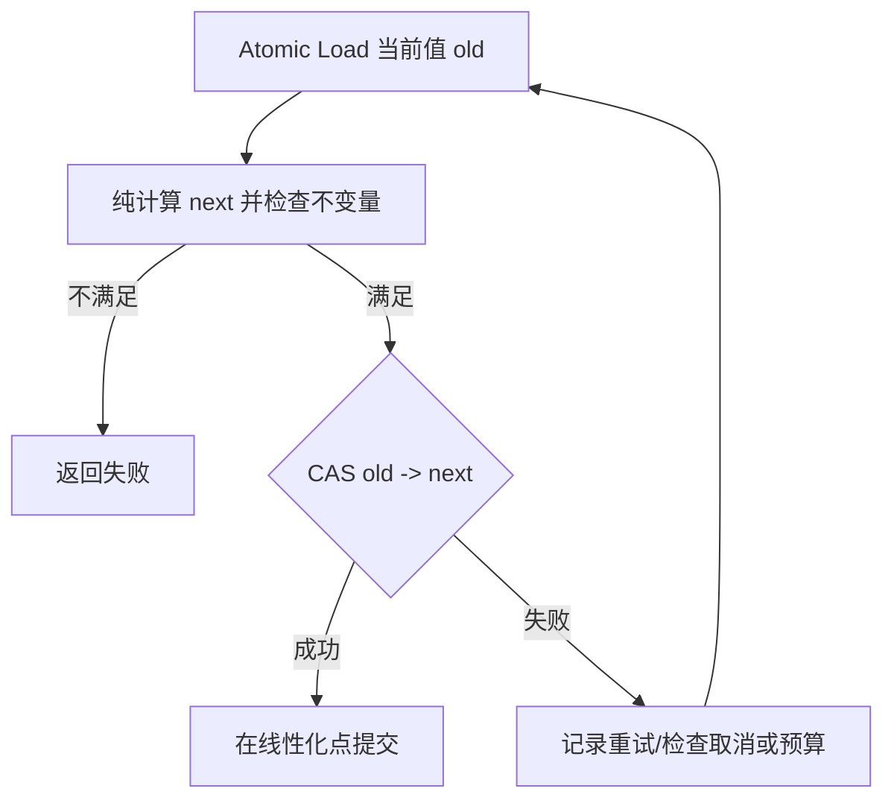
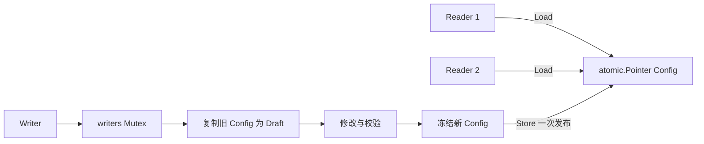
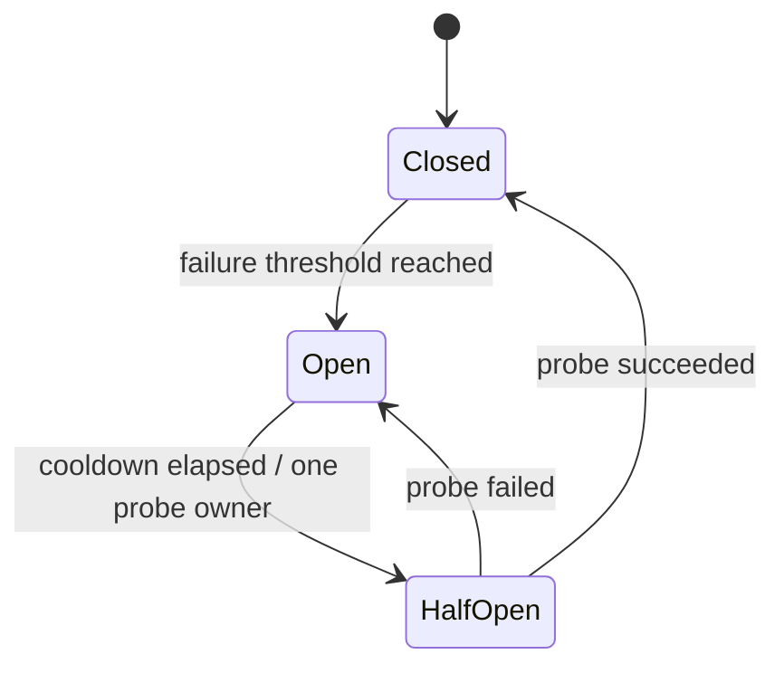
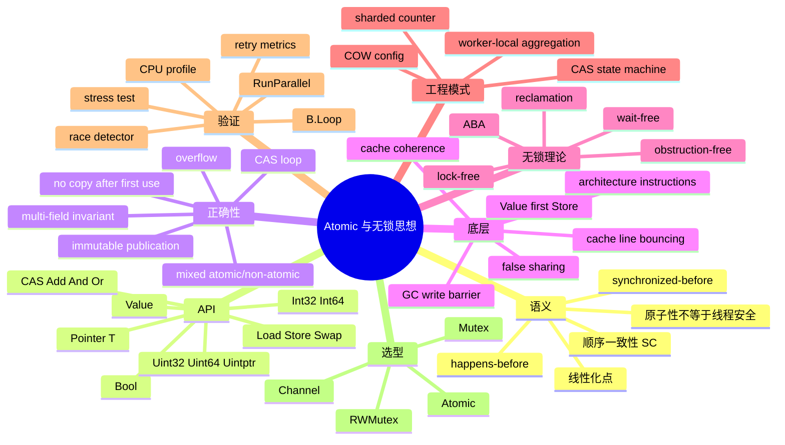

# 第 15 章：Atomic、CAS、内存语义与无锁思想

## 阅读定位与关联章节

> 本章只讨论适合被一个原子值表达的状态模型。只要问题涉及跨字段不变量、等待队列、取消、外部副作用或事务语义，优先回到锁、Channel 或更高层架构。

| 关联概念 | 建议读法 |
|---|---|
| Happens-Before、DRF-SC 和并发正确性框架 | 看 [第 11 章：并发基础、Goroutine 生命周期与 Go 内存模型](/blog/tech/GO/11.并发基础-Goroutine生命周期与Go内存模型)。 |
| Channel Semaphore、背压和 Pipeline | 看 [第 12 章：Channel、Select、并发模式与运行时实现](/blog/tech/GO/12.Channel)。 |
| Mutex/RWMutex、WaitGroup、Once、Cond 和 sync.Map | 看 [第 13 章：Mutex、RWMutex 与 sync 工具箱](/blog/tech/GO/13.Mutex-RWMutex与sync工具箱)。 |
| Context 取消不会替代 Atomic 或锁的同步语义 | 看 [第 14 章：Context、取消传播与生命周期管理](/blog/tech/GO/14.Context-取消传播与生命周期管理)。 |
| Atomic 热点、缓存行争用、指标和生产诊断 | 看 [第 16 章：生产级高并发架构、性能诊断与面试体系](/blog/tech/GO/16.生产级高并发架构-性能诊断与面试体系)。 |

---

## 面试题目精选

Atomic 题最容易被问到“边界”。先把这组题刷熟，再看后文答案：

1. 原子性和线程安全有什么区别？没有 data race 是否就业务安全？
2. CAS 是什么？成功 CAS 的线性化点在哪里？
3. CAS 失败后为什么必须重新 Load 并重算 next？
4. Go `sync/atomic` 的公开内存序是什么？和 C++ relaxed/acquire/release 有什么差异？
5. 多个 Atomic 字段为什么不能自动组成事务？
6. `atomic.Pointer[T]` 如何安全发布不可变快照？发布后为什么不能修改旧对象？
7. `atomic.Value` 的一致类型规则是什么？首次 Store 并发时有什么实现边界？
8. `Add`、`And`、`Or`、`Swap` 分别返回旧值还是新值？
9. ABA 问题是什么？Go 有 GC 是否就完全没有 ABA？
10. 热点 Atomic 为什么可能拖垮多核扩展性？False Sharing 如何观察？
11. 什么时候应该从 Atomic 回退到 Mutex、Channel 或 Semaphore？
12. 下面“先 Load 检查阈值，再 Add 进入”的限流代码为什么会超限？

---

> **课程基线**：Go 1.26.x；本文核验基于 2026 年 6 月 22 日可用的 Go 1.26.4 官方文档与源码。
> **核心原则**：Atomic 不是“更快的锁”，而是一组用于构造同步算法的底层原语。使用它之前，必须先说清楚共享状态、业务不变量、线性化点、失败重试、对象生命周期和高竞争成本。

本章用四种标签区分不同层级的结论：

- **[语言/内存模型保证]**：可跨 Go 实现依赖的语义；
- **[标准库 API 契约]**：`sync/atomic` 文档明确承诺的行为；
- **[Go 1.26 当前实现]**：当前源码或特定架构实现，未来可能变化；
- **[工程推论]**：由工作负载、硬件和当前实现得到的设计判断，需要 Benchmark 或生产指标验证。

---

### 1. 本章解决什么问题

在第 13 章中，`sync.Mutex` 用一个临界区保护一组共享状态和业务不变量。Atomic 解决的是更窄的问题：

> **让一个受支持的值在多个 Goroutine 之间以原子方式读、写或执行读—改—写，并建立明确的内存顺序。**

典型目标包括：

1. 高频计数器：请求数、字节数、版本号；
2. 开关与状态：是否关闭、是否过载、熔断器阶段；
3. 不可变对象发布：配置、路由表、策略快照；
4. 有明确线性化点的简单状态转换；
5. 在已经证明正确且确认锁竞争是瓶颈后，缩短热路径。

Atomic **不自动解决**以下问题：

- 多个字段之间的不变量；
- 一段业务操作的事务性；
- 公平性、排队、超时和取消；
- 外部副作用与状态转换的一致提交；
- 无界重试、活锁或饥饿；
- 对已发布对象的后续并发修改；
- 无锁数据结构中的 ABA 和安全内存回收。

#### 1.1 原子性不等于线程安全

**一句话定义**：

- **原子性**：某一个操作从其他并发参与者视角看不可分割；
- **线程安全/并发安全**：对象在允许的全部并发调用序列下都满足其公开契约和业务不变量。

下面每次 `Load` 和 `Add` 都是原子的，但“最多 100 个请求进入”的业务语义并不安全：

```go
// 错误：check-then-act 被拆成两个独立原子操作。
if active.Load() < 100 {
    active.Add(1)
    enter()
}
```

两个 Goroutine 可以同时读到 `99`，随后都加一，结果变成 `101`。程序可能没有数据竞争，仍然存在**竞态条件**。

正确方案可以是 CAS 循环，也可以是 Mutex、Semaphore 或有界 Channel。选哪一个取决于操作是否只有一个整数不变量、是否需要等待/取消、竞争强度以及可维护性。

#### 1.2 本章最终要能回答的问题

学完本章，应能清晰回答：

- Go Atomic 的内存序是什么？
- `Load` 看到一次 `Store` 后，为什么能看到此前初始化完成的普通字段？
- 为什么两个 Atomic 不能自动组成一个事务？
- CAS 的线性化点在哪里，失败后为什么要重算？
- Atomic 是否必然 Lock-Free？
- 一个热点 Atomic 为什么会限制多核扩展性？
- `atomic.Pointer[T]` 与 GC 怎样协作？
- 何时应回退到 Mutex，而不是继续堆叠 CAS？

> **工程结论**：先证明状态模型可以由一个原子值表达，再考虑 Atomic；不能先选 Atomic，再强行把业务压进几个整数。

---

### 2. 学习目标和前置知识

#### 2.1 学习目标

完成本章后，你应能够：

1. 使用 `atomic.Bool`、`Int32`、`Int64`、`Uint32`、`Uint64`、`Uintptr` 和 `Pointer[T]`；
2. 准确解释 `Load`、`Store`、`Swap`、`CompareAndSwap`、`Add`、`And`、`Or` 的返回值和线性化点；
3. 使用 Go 的顺序一致性语义证明对象发布正确；
4. 编写有上界检查的 CAS 循环，并识别无界重试成本；
5. 正确使用 `atomic.Value`，处理首次 Store、类型一致性和 nil 限制；
6. 识别 ABA、False Sharing、Cache Line Bouncing、计数溢出；
7. 设计 Copy-on-Write 配置、CAS 状态机和高频统计；
8. 用 `go test -race`、Benchmark、CPU Profile 和重试指标验证实现；
9. 在 Atomic、Mutex、RWMutex 和 Channel 之间做工程选型。

#### 2.2 前置知识

需要掌握：

- Goroutine 生命周期与调度基础；
- 数据竞争、竞态条件、Happens-Before、DRF-SC；
- `sync.Mutex` 与临界区；
- Go 测试、`go test -race`、`testing.B`；
- 基本 CPU Cache 概念。

#### 2.3 四个关键定义

| 概念 | 严格含义 | 常见误解 |
|---|---|---|
| 原子操作 | 单个操作具有不可分割的观察效果 | 一组 Atomic 调用也是原子的 |
| 线性化点 | 并发操作可以被视为瞬时生效的那个时刻 | 函数返回时才生效 |
| 数据竞争自由 | 冲突内存访问由同步排序，或全部为合法原子访问 | 没有 race 就一定业务正确 |
| 顺序一致性 | 所有 Atomic 看起来处于一个与各 Goroutine 程序顺序一致的全序中 | 与真实墙上时间完全相同；多个操作自动事务化 |

> **工程结论**：Atomic 代码的设计单位不是“变量”，而是“状态机 + 不变量 + 线性化点”。

---

### 3. 一个生活类比：机场航班屏与防伪封条

把动态配置想象成机场航班信息屏。

#### 3.1 Copy-on-Write：换整张屏，不在旧屏上涂改

错误做法是工作人员一边改“登机口”，一边改“起飞时间”。旅客可能看到新登机口配旧时间。

正确做法是：

1. 在后台复制上一版航班表；
2. 在副本上完成全部修改与校验；
3. 一次性把屏幕指针切换到新版本；
4. 已经看到旧屏的旅客继续使用旧版本；新旅客看到新版本；
5. 发布后的两张表都不再原地修改。

`atomic.Pointer[Config]` 的 `Store` 就是“切换整张屏”的线性化点。

#### 3.2 CAS：只在封条编号仍符合预期时更换

CAS 可以理解为：

> “只有当前封条编号仍是 42，才把它改成 43；否则说明有人先改过，我必须重新读取现场。”

CAS 失败不是异常，而是并发协议中的正常分支。失败后不能盲目重复原来的写入，因为计算依据已经过期。

#### 3.3 类比的边界

现实屏幕切换似乎是瞬间的，但 CPU 仍需通过缓存一致性协议传播某条 Cache Line 的所有权。并发写者越多，同一条线在核心间迁移越频繁。Atomic 没有消除协调，只是把协调下沉到硬件和运行时原语。

> **工程结论**：Copy-on-Write 的关键不是“用了指针”，而是“新对象完整构建、一次发布、发布后不可变”。

---

### 4. 从错误代码和事故场景切入

#### 4.1 事故一：Atomic 发布了指针，却继续修改对象

```go
// 错误代码：current 的指针访问是原子的，map 的修改不是。
type Config struct {
    Routes map[string]string
}

var current atomic.Pointer[Config]

func updateRoute(name, target string) {
    cfg := current.Load()
    cfg.Routes[name] = target // 与读者并发访问同一个 map
}
```

读者可能正在执行：

```go
func route(name string) string {
    return current.Load().Routes[name]
}
```

Atomic 只保护 `current` 这个指针值，不保护 `*Config` 指向的对象。这里会产生 map 的数据竞争，严重时还可能触发运行时错误。

修复：复制 map，构造新 `Config`，最后 `Store` 新指针；旧对象永不修改。

#### 4.2 事故二：两个 Atomic 破坏库存不变量

假设不变量是：

```text
available + reserved = total
available >= 0
reserved >= 0
```

错误实现：

```go
func reserveOne() bool {
    if available.Load() == 0 {
        return false
    }
    available.Add(-1)
    reserved.Add(1)
    return true
}
```

即使两个字段各自都是 Atomic，也有三个问题：

1. `Load == 0` 与 `Add(-1)` 之间存在竞态，可能超卖；
2. 两次 Add 之间，其他 Goroutine 能看到不满足总量不变量的中间状态；
3. 如果第二步之前发生 Panic、取消或进程终止，业务操作只完成一半。

Mutex 版本更直接：

```go
type Inventory struct {
    mu        sync.Mutex
    available int64
    reserved  int64
}

func (i *Inventory) ReserveOne() bool {
    i.mu.Lock()
    defer i.mu.Unlock()

    if i.available == 0 {
        return false
    }
    i.available--
    i.reserved++
    return true
}
```

临界区保护的是**跨字段不变量**，不是两个单独数字。

另一种可行方案是把两个字段编码成一个不可变快照，通过一个指针 CAS 整体替换；但这会引入分配、复制、重试和可读性成本，通常不如 Mutex。

#### 4.3 正确性审查模板

| 问题 | 配置事故 | 库存事故 |
|---|---|---|
| 共享变量 | 指针和指向的 map | `available`、`reserved` |
| 并发操作 | 读 map、写 map、换指针 | 检查、扣减、增加、读取总量 |
| 数据竞争 | map 读写有竞争 | 若全部访问原子则可能无数据竞争 |
| 竞态条件 | 读到发布后仍变化的对象 | check-then-act、跨字段中间态 |
| 同步关系 | 指针 Load/Store 只排序发布 | 每个 Atomic 单独处于 SC 顺序 |
| 缺失保证 | 对象不可变 | 整个预留事务的线性化点 |
| 修复 | 深拷贝 + 整体发布 | 一个临界区，或一个整体状态 CAS |

> **工程结论**：`go test -race` 能发现第一类事故，却可能无法发现第二类纯逻辑竞态；正确性证明不能外包给 Race Detector。

---

### 5. 基本 API 和最小可运行示例

#### 5.1 `sync/atomic` 的定位

官方文档将该包定义为实现同步算法的底层原语，并建议除特殊低层应用外，优先通过 Channel 或 `sync` 工具完成同步。

Go 1.19 起提供 Typed Atomic；Go 1.23 起整数 Typed Atomic 增加 `And` 和 `Or`。新代码通常优先使用类型化 API，因为它：

- 把原子语义封装进字段类型；
- 降低对错地址、错类型和对齐问题的风险；
- 使“不得复制”的约束更容易被 `go vet` 检查；
- 对 `atomic.Pointer[T]` 提供编译期类型安全。

#### 5.2 Typed Atomic API 总表

| 类型 | 零值 | 方法 | 典型用途 |
|---|---:|---|---|
| `atomic.Bool` | `false` | `Load`、`Store`、`Swap`、`CompareAndSwap` | 开关、停止标志、一次性状态门 |
| `atomic.Int32` | `0` | 上述 + `Add`、`And`、`Or` | 小状态机、带符号计数、位状态 |
| `atomic.Int64` | `0` | 上述 + `Add`、`And`、`Or` | 时间戳、差值、带符号计数 |
| `atomic.Uint32` | `0` | 上述 + `Add`、`And`、`Or` | 位图、标志集合、计数 |
| `atomic.Uint64` | `0` | 上述 + `Add`、`And`、`Or` | 高频统计、版本号 |
| `atomic.Uintptr` | `0` | 上述 + `Add`、`And`、`Or` | 机器字大小的**整数令牌** |
| `atomic.Pointer[T]` | `nil` | `Load`、`Store`、`Swap`、`CompareAndSwap` | 不可变对象、节点指针、快照 |
| `atomic.Value` | 空；`Load` 返回 `nil` | `Load`、`Store`、`Swap`、`CompareAndSwap` | 同一具体类型的整体值或快照 |

所有 Typed Atomic 都遵守一个关键契约：**第一次使用后不得复制**。

#### 5.3 各操作的精确语义

| 操作 | 逻辑效果 | 返回值 | 常见用途 |
|---|---|---|---|
| `Load()` | 原子读取 | 当前值 | 读状态 |
| `Store(v)` | 原子写入 | 无 | 发布新状态 |
| `Swap(v)` | 写入新值并取走旧值 | **旧值** | 所有权交换、复位 |
| `CompareAndSwap(old, new)` | 当前值等于 old 才写 new | 是否成功 | 条件状态转换、CAS 循环 |
| `Add(delta)` | 原子加法 | **新值** | 计数、版本号 |
| `And(mask)` | 原子按位与 | **旧值** | 清除位；注意返回旧值 |
| `Or(mask)` | 原子按位或 | **旧值** | 设置位；注意返回旧值 |

`And`/`Or` 返回旧值是常见面试陷阱。需要新值时可以基于旧值计算，但若还要确认当前全局值，必须考虑其他并发更新。

#### 5.4 最小可运行示例

```go
package main

import (
    "fmt"
    "sync/atomic"
)

const (
    flagReadable uint32 = 1 << iota
    flagWritable
    flagAdmin
)

type Service struct {
    enabled atomic.Bool
    flags   atomic.Uint32
    calls   atomic.Uint64
}

func (s *Service) Call() bool {
    if !s.enabled.Load() {
        return false
    }
    s.calls.Add(1)
    return true
}

func main() {
    var service Service // 所有 Typed Atomic 的零值可用

    service.enabled.Store(true)
    oldFlags := service.flags.Or(flagReadable | flagWritable)
    fmt.Println("old flags:", oldFlags)

    fmt.Println(service.Call())
    fmt.Println("calls:", service.calls.Load())

    previous := service.enabled.Swap(false)
    fmt.Println("previous enabled:", previous)
}
```

这个示例只有“单字段操作”是原子的。`enabled.Load()` 与 `calls.Add(1)` **不是一个事务**：调用可能在开关被关闭的并发时刻仍计入一次。是否可接受要由服务契约定义。

#### 5.5 `atomic.Uintptr` 不是 GC 指针容器

`uintptr` 是整数。GC 不把它当作保持对象存活的普通指针。不要把 Go 堆对象地址转换成 `uintptr` 后长期保存在 `atomic.Uintptr` 中，并期待它承担对象所有权。

需要发布 Go 对象时，优先使用：

```go
var current atomic.Pointer[Config]
```

而不是：

```go
var raw atomic.Uintptr // 不要把它当通用 *Config 容器
```

`atomic.Uintptr` 更适合数值句柄、位编码、非 Go 对象的受控低层协议；涉及 `unsafe`、cgo 或系统调用时必须单独遵守 `unsafe.Pointer` 规则。

#### 5.6 `atomic.Value`：规则比看起来多

`atomic.Value` 可以保存任意**一致具体类型**的值，但有严格契约：

1. 零值 `Load()` 返回 `nil`；
2. 第一次成功的 `Store`/`Swap`/空值 CAS 决定具体类型；
3. 后续写入必须是相同具体类型；
4. `Store(nil)` 和 `Swap(nil)` 会 Panic；
5. `CompareAndSwap(old, nil)` 会 Panic；
6. `CompareAndSwap(nil, new)` 可用于初始化空 `Value`；
7. 第一次 Store 后不能复制；
8. CAS 的 `old` 需要可比较。用 slice、map、func 等不可比较动态值作为 `old`，在当前实现的接口相等比较处会 Panic；
9. 存入 `(*T)(nil)` 这样的 typed nil 时，接口本身不是 nil，技术上可存，但通常会让 API 语义含混，建议显式建模“空状态”。

示例：

```go
package main

import (
    "fmt"
    "sync/atomic"
)

type Config struct {
    Version int
    Region  string
}

func main() {
    var value atomic.Value
    fmt.Println(value.Load() == nil) // true

    first := &Config{Version: 1, Region: "ap-northeast-1"}
    second := &Config{Version: 2, Region: "ap-northeast-1"}

    value.Store(first) // 具体类型固定为 *Config
    swapped := value.CompareAndSwap(first, second)
    fmt.Println(swapped, value.Load().(*Config).Version)
}
```

为什么配置通常存 `*Config` 而不是直接存 map？

- 指针可比较，适合 CAS；
- 可以通过私有字段和只读方法建立不可变约束；
- 整体替换成本固定为一个指针；
- 旧版本可由 GC 在读者不再引用后回收。

#### 5.7 为什么第一次使用后不能复制

错误示例：

```go
func cloneService(src Service) Service { // 错误：按值复制包含 Atomic 的结构体
    return src
}
```

复制后会出现两个独立原子地址。调用者可能以为它们仍代表同一个状态，实际同步关系已经分裂。对某些含指针或运行时状态的同步类型，复制还可能破坏内部约束。

Go 1.26 当前 Typed Atomic 内部含 `noCopy` 标记；`go vet -copylocks` 可发现一部分复制，但这不是运行时保险。正确做法是：

- 对含 Atomic 的结构体使用指针接收者；
- 构造后传 `*T`；
- 不把它按值放进会复制元素的 API；
- 代码评审和 `go vet ./...` 同时执行。

#### 5.8 原语问答清单

| 问题 | Atomic 的回答 |
|---|---|
| 核心问题 | 单个受支持值的原子访问和同步顺序 |
| 零值可用 | Typed Atomic 可用；`Pointer` 为 nil；`Value.Load` 为 nil |
| 首次使用后可复制 | 不可 |
| 是否可能阻塞 Goroutine | API 不承诺 Lock-Free/Wait-Free；普通数值操作通常不走 Goroutine 停放，但 CAS 循环可无限重试，`Value` 首次写当前实现会主动自旋 |
| 是否建立 HB | 若 B 观察到 A 的效果，A synchronized-before B；所有 Atomic 处于某个 SC 全序 |
| 关闭/释放 | 无 Close；生命周期由外层对象、协议和 GC 管理 |
| 最常见误用 | 多字段不变量、check-then-act、发布后修改、复制、混用普通读写 |
| 高竞争成本 | Cache Line 所有权迁移、CAS 失败、CPU 自旋、吞吐下降 |
| 尾延迟 | 可能因重试次数无界、调度竞争和缓存抖动恶化 |
| 替代 | Mutex、RWMutex、Channel、分片、Worker 本地状态、不可变快照 |
| 何时避免 | 复杂状态、需要公平等待、外部副作用、团队难以证明正确性 |
| 面试追问 | SC、HB、ABA、False Sharing、是否 Lock-Free、多字段事务 |

> **工程结论**：优先选择 Typed Atomic；对每个返回值都要知道它是旧值还是新值；任何“读后判断再写”都应立即接受竞态审查。

---

### 6. 正确性分析

#### 6.1 Go Atomic 的顺序一致性语义

**[语言/内存模型保证]**：

1. 如果 Atomic 操作 B 观察到了 Atomic 操作 A 的效果，则 A synchronized-before B；
2. 程序中的所有 Atomic 操作表现得仿佛位于某个顺序一致的全序中；
3. 该全序必须与每个 Goroutine 内的程序顺序一致。

可以把它理解为：所有 Atomic 操作被放进一条合法的全局时间线，但这条线是语义模型，不一定等同于真实物理完成时间。

顺序一致性给了你强内存序，却没有把多次调用合并为一个更大的原子动作。

#### 6.2 Happens-Before 与安全发布

安全发布一个完整初始化对象：

```go
type Config struct {
    endpoint string
    timeout  int
}

var current atomic.Pointer[Config]

func publish() {
    cfg := &Config{
        endpoint: "api.internal",
        timeout:  500,
    }
    current.Store(cfg)
}

func use() {
    cfg := current.Load()
    if cfg != nil {
        println(cfg.endpoint, cfg.timeout)
    }
}
```

若读者的 `Load` 观察到发布者的 `Store`，关系为：

```text
写 cfg.endpoint / cfg.timeout
        sequenced-before
current.Store(cfg)
        synchronized-before（读者观察到该 Store）
current.Load()
        sequenced-before
读 cfg.endpoint / cfg.timeout
```

经传递闭包，初始化写 Happens-Before 后续字段读。因此读者能看到完整初始化结果。

但如果发布后继续执行：

```go
cfg.timeout = 1000
```

这次普通写不受原来的 Store 保护。它与读者的普通读仍可能产生数据竞争。发布屏障不是“永久保护罩”。

#### 6.3 每个操作的线性化点

| 操作 | 线性化点 |
|---|---|
| `Load` | 它从 SC 顺序中读取某个值的那一刻 |
| `Store` | 新值进入 SC 顺序并成为可观察状态的那一刻 |
| `Swap` | 旧值被新值替换的单一原子步骤 |
| 成功 CAS | 比较成立并写入新值的原子步骤 |
| 失败 CAS | 观察到当前值不等于期望值的原子步骤 |
| `Add` | 读旧值、计算和写新值组成的单一 RMW 步骤 |
| `And`/`Or` | 位运算更新的单一 RMW 步骤 |

#### 6.4 CAS 循环：读取、计算、CAS、失败重试

上限计数器：

```go
func addWithinLimit(counter *atomic.Uint64, delta, limit uint64) (uint64, bool) {
    for {
        old := counter.Load()
        if old > limit || delta > limit-old { // 同时避免加法溢出
            return old, false
        }

        next := old + delta
        if counter.CompareAndSwap(old, next) {
            return next, true
        }

        // 有并发写者改变了 counter。
        // 必须回到 Load，基于最新状态重新检查不变量。
    }
}
```

正确性证明：

1. 共享状态只有一个 `uint64`；
2. 所有访问都通过同一 Atomic；
3. 成功 CAS 是唯一提交点；
4. 在该提交点，`old + delta <= limit` 已基于 CAS 所验证的同一个 `old` 成立；
5. CAS 失败不会提交，循环重新读取；
6. 因而任何成功操作都不会越过 limit。

注意：这证明了**安全性**，没有证明**进展性**。在持续竞争下，某个 Goroutine 可能反复失败。

#### 6.5 CAS 循环不能包裹不可重复副作用

错误：

```go
for {
    old := state.Load()
    chargeCustomer() // 错误：CAS 失败会重复扣款
    if state.CompareAndSwap(old, old+1) {
        return
    }
}
```

CAS 循环中的“计算”应是纯计算或可安全重试的操作。数据库写入、支付、发送消息、调用未知回调都不能随 CAS 重试任意重复。

正确设计通常是：

- 先用 CAS 获得一个明确状态/令牌，再执行副作用；
- 或用 Mutex 把状态决策串行化，但不要在锁内执行慢外部调用；
- 或使用带幂等键的事务、Outbox、Saga 等更高层协议。

#### 6.6 多字段不变量为什么不能简单用多个 Atomic

考虑两个 Atomic：

```go
var low, high atomic.Uint64
```

写者：

```go
low.Store(10)
high.Store(20)
```

读者：

```go
l := low.Load()
h := high.Load()
```

每次操作都在 SC 全序里，但合法全序可以是：

```text
low.Store(10)
low.Load()  -> 10
high.Load() -> 旧值 0
high.Store(20)
```

因此读者得到 `(10, 0)`。SC 保证所有人可用同一顺序解释结果，不保证读者自动取得多字段快照。

修复选择：

1. Mutex 保护两个字段；
2. 将字段放入不可变结构体，用一个 `atomic.Pointer` 整体发布；
3. 将有限状态编码进一个整数，并用 CAS 更新；
4. 使用版本校验的乐观读取，但必须完整证明并处理重试。

#### 6.7 CAS 状态机的正确性边界

对于 `Closed -> Open -> HalfOpen -> Closed/Open`：

- CAS 能保证只有一个 Goroutine 把 `Open` 改为 `HalfOpen`；
- CAS 不能自动保证该 Goroutine随后发出的探测请求一定只执行一次；
- CAS 不能把“状态变化、计时器、失败窗口、指标、网络调用”变成一个事务；
- 网络调用完成后，状态可能已被其他管理操作改变，因此回写仍需版本/令牌校验。

> **工程结论**：正确使用 Atomic 的核心是把业务承诺收缩到一个清晰的线性化点；承诺跨越多个步骤时，需要更高层协议。

---

### 7. 常见使用场景

#### 7.1 计数器

适合：单调请求总数、字节数、命中数、失败数。

不一定适合：必须与其他字段构成一致快照的财务、库存、限额数据。

#### 7.2 开关

```go
var draining atomic.Bool

func AcceptingRequests() bool {
    return !draining.Load()
}
```

它适合表达“新请求是否应拒绝”的瞬时策略，但不能替代优雅关闭协议。正在执行的请求、连接排空、超时和资源释放仍需 Context、WaitGroup 或其他同步。

#### 7.3 状态机

用 `atomic.Int32` 保存小型枚举，CAS 拒绝非法或过期转换。状态数少、转换规则清晰、外围副作用可独立协调时效果好。

#### 7.4 版本号与代次

版本号可以：

- 使读者检测是否发生更新；
- 与指针一起帮助识别 ABA；
- 标记配置、路由或缓存代次；
- 作为乐观并发控制的一部分。

版本号本身仍可能溢出，也不能单独保证关联数据一致。

#### 7.5 不可变快照

读多写少、快照不大、允许旧读者短暂使用旧版本时，`atomic.Pointer[T]` 或 `atomic.Value` 很合适。

常见对象：

- 动态配置；
- 路由表；
- 权限策略；
- Feature Flag 集合；
- 经过预计算的索引；
- 只读证书/密钥元数据指针——敏感材料还需安全清理与轮换设计。

#### 7.6 分片计数与 Worker 本地计数

单一热点计数器扩展性不足时：

- 按 P、Worker、连接、租户或 Hash 分片；
- 写路径只更新本地/分片值；
- 查询时汇总；
- 明确汇总是否要求瞬时一致。

> **工程结论**：Atomic 最适合单字段、短操作、清晰线性化点和可接受弱快照语义的场景。

---

### 8. 不适合使用的场景

1. **多字段事务**：账户转账、库存状态、订单状态与余额；
2. **临界区包含复杂分支**：审计、回滚、多个集合更新；
3. **需要公平排队**：每个等待者都应最终获得机会；
4. **需要阻塞、超时或取消**：Atomic 没有等待队列和 Context 协议；
5. **外部副作用**：网络、磁盘、数据库、消息发送；
6. **状态难以编码**：大量 bit packing 会降低可读性并提高迁移风险；
7. **更新频繁且对象很大**：Copy-on-Write 会产生大量复制与 GC 压力；
8. **CAS 高失败率**：CPU 时间耗在重试而非有效工作；
9. **团队无法给出正确性证明**：短代码不是采用理由；
10. **试图手写通用无锁队列、栈、哈希表或内存回收**：这些需要处理 ABA、回收、进展性、架构内存模型和长期维护。

有时 Mutex 的优势正是“会阻塞”：高竞争时让等待 Goroutine 停放，避免所有参与者持续争抢同一 Cache Line。是否更快必须测量，但可维护性往往先胜出。

> **工程结论**：当你需要的是“一个临界区”时就使用锁；不要把临界区拆成十个 CAS，只为让代码名义上无锁。

---

### 9. 错误示例、错误原因和修复过程

#### 9.1 普通读与原子写混用

```go
var n uint64

atomic.StoreUint64(&n, 1)
fmt.Println(n) // 错误：并发时普通读与原子写混用
```

修复：对该内存位置的并发访问全部使用 Atomic，或全部放入同一锁协议。

#### 9.2 Check-Then-Act

错误：

```go
if n.Load() < limit {
    n.Add(1)
}
```

修复：CAS 循环，或者使用 Mutex/有界 Semaphore。

#### 9.3 发布后修改对象

错误：Atomic 指针替换后仍修改 map/slice/字段。

修复：

- 字段私有；
- 构造时深拷贝 map/slice；
- 只暴露只读方法；
- 更新时从旧值生成 Draft，再 Freeze 新对象；
- 不返回内部可变引用。

#### 9.4 多个 Atomic 假装事务

错误：先扣库存，再加预留；先改状态，再改版本；先写长度，再写指针。

修复：

- 用 Mutex；
- 或把完整状态封装为一个不可变对象并整体发布；
- 或压缩为一个 Atomic word，但必须评估可读性、位宽、溢出和 ABA。

#### 9.5 复制含 Atomic 的结构体

错误：值接收者、按值返回、赋值、append 一个已使用的含 Atomic 元素。

修复：使用指针语义；运行 `go vet ./...`；避免把同步对象当 DTO。

#### 9.6 `atomic.Value` 类型不一致

```go
var v atomic.Value
v.Store(int64(1))
v.Store(uint64(1)) // Panic：具体类型不同
```

修复：封装专用类型，不把裸 `atomic.Value` 暴露给多个模块；构造函数先 Store 正确类型。

#### 9.7 `atomic.Value` 与不可比较值 CAS

```go
var v atomic.Value
old := []int{1, 2}
v.Store(old)
v.CompareAndSwap(old, []int{3, 4}) // 可能因 slice 不可比较而 Panic
```

修复：CAS 存放 `*ImmutableSnapshot`，或使用 Mutex；仅 Load/Store 时仍须遵守类型一致性和不可变约束。

#### 9.8 CAS 循环重复副作用

修复原则：CAS 前的计算必须纯净；若需要回调，明确回调可能多次执行，或在写者锁内只执行一次。

#### 9.9 忙等且没有退避/退出

```go
for !ready.Load() {
}
```

这在短暂、严格受控的底层路径中可能出现，但业务代码通常会：

- 长时间占用 CPU；
- 在单 P 或资源饱和时妨碍生产者运行；
- 没有 Context 取消；
- 造成功耗和尾延迟问题。

修复：Channel、Cond、Mutex、定时器或有取消能力的等待协议。不要用 `time.Sleep` 猜同步顺序。

#### 9.10 无符号计数溢出

`atomic.Uint64.Add` 遵循整数运算的回绕语义。若计数不能回绕，必须用 CAS 在提交前检查：

```go
if delta > math.MaxUint64-old { ... }
```

也可以通过监控接近阈值、周期轮换代次、使用更适合的业务表示来处理。

#### 9.11 分片汇总被误当成瞬时快照

逐个 `Load` 各分片是 race-free 的，但写者运行时，结果可能混合不同时间点。监控指标通常可接受；计费、库存和审计通常不可接受。

#### 9.12 False Sharing

两个逻辑无关的 Atomic 若落在同一 Cache Line，不同核心写各自字段也会互相使缓存行失效。

修复候选：

- 调整布局或填充；
- 分离高频写字段；
- Worker 本地累积；
- 降低写频率、批量更新；
- 用 Benchmark 和硬件指标确认，而不是盲目 padding。

> **工程结论**：Atomic 的常见错误不是语法错误，而是“协议缺了一步”。代码评审必须画出状态转换和并发交错。

---

### 10. 底层实现

#### 10.1 从 API 到 CPU 的调用路径

以 `atomic.Uint64.Add` 为例，可概括为：

```text
Typed Atomic 方法
    ↓
sync/atomic 包函数
    ↓
internal/runtime/atomic
    ↓
编译器内联、架构汇编或运行时辅助
    ↓
CPU 原子读改写 + 缓存一致性协议
```

**[标准库 API 契约]**只承诺语义，不承诺一定对应某条指令。

**[Go 1.26 当前实现]**中，`sync/atomic` 的汇编入口会跳转到 `internal/runtime/atomic`。在 amd64 上，CAS 当前使用带 `LOCK` 的 `CMPXCHG`，Add 当前使用带 `LOCK` 的 `XADD`。ARM64、RISC-V、32 位平台及未来版本可以采用不同指令或循环。

不要从 amd64 当前实现推导“所有 Atomic 都永不阻塞”或“成本恒定”。

#### 10.2 Typed Atomic 的布局

当前源码中，Typed Atomic 包含：

- 实际数值字段；
- `noCopy` 标记，供 `go vet -copylocks` 等检查；
- 对 64 位类型使用编译器识别的对齐辅助。

对于旧式 `AddUint64(*uint64, ...)` 等函数，在部分 32 位架构上调用方需保证 64 位对齐；`atomic.Int64` 和 `atomic.Uint64` 会自动安排对齐。新代码因此更应优先 Typed Atomic。

#### 10.3 Cache Coherence：Atomic 并没有消除协调

简化模型：每个 CPU 核心有私有缓存。对同一 Cache Line 执行写入或 RMW 时，核心必须取得相应所有权，其他核心中的副本会被失效或降级。

当多个核心反复更新同一 Atomic：

```text
Core 0 获得行所有权 → Add
Core 1 请求所有权     → 行迁移
Core 2 请求所有权     → 再迁移
Core 0 再请求          → 再迁移
```

这种 **Cache Line Bouncing** 带来互连通信和流水线停顿。Atomic 省去了显式锁对象和等待队列，不等于“没有串行点”。一个全局计数器的成功更新仍必须在该 Cache Line 上形成顺序。

#### 10.4 False Sharing

```go
type Metrics struct {
    accepted atomic.Uint64
    rejected atomic.Uint64
}
```

若两字段落在同一 Cache Line，Core A 只更新 `accepted`、Core B 只更新 `rejected`，仍可能互相干扰。

Padding 不是语言级解决方案：

- Cache Line 大小与架构有关；
- 结构体布局会受字段和对齐影响；
- 过度 Padding 增加内存和缓存占用；
- 最可靠方法是用真实机器与负载验证。

#### 10.5 `atomic.Value` 的首次 Store

**[Go 1.26 当前实现]**中，空 `Value` 的首次写入需要安全安装接口的 type/data 两个机器字。源码使用一个“first store in progress”哨兵：

1. 临时禁止抢占；
2. CAS 把 type 从 nil 改为哨兵；
3. 写入 data；
4. 最后发布真实 type；
5. 其他并发首次写者看到哨兵时主动自旋等待。

因此 `atomic.Value` 不是“永远一条机器指令”。首次并发 Store 甚至含自旋。该细节可能随版本变化，不能当 API 契约。

#### 10.6 `atomic.Pointer[T]`、写屏障和 GC

**[Go 1.26 当前实现]**中，原子指针 Store、Swap 和 CAS 会与 GC 写屏障协作。这样在并发 GC 期间发布新指针，不会绕开垃圾回收器的可达性维护。

正常模式下：

```go
cfg := current.Load()
use(cfg)
```

`cfg` 在被使用期间是普通 Go 指针，会保持对象可达。旧快照在所有读者都不再引用后可被 GC 回收。

仍需注意：

- GC 解决的是内存可达性，不解决业务 ABA；
- 不要把对象所有权藏进 `uintptr`；
- 使用 `unsafe`、Finalizer、cgo 或系统调用时，可能需要 `runtime.KeepAlive`，但普通字段访问通常不需要；
- 发布后不可变仍是程序约束，GC 不会替你阻止写入。

#### 10.7 ABA 问题

CAS 只比较“当前值是否等于 old”。若值经历：

```text
A → B → A
```

一个持有旧 A 的 Goroutine 会认为状态从未变化，CAS 可能成功。

无锁栈示例：

1. G1 读到头结点 A，准备把头改为 A.next；
2. G2 弹出 A，又弹出 B；
3. G2 把 A 重新压回，头再次是 A；
4. G1 的 CAS(A, B) 可能成功，但链表语义已不同。

Go GC 防止 A 的内存被过早释放，不防止“同一个节点对象被移除再插回”的逻辑 ABA。

缓解方式：

- 指针与版本号绑定；
- 不复用节点；
- 不可变持久化结构；
- Epoch、Hazard Pointer、RCU 类方案；
- 最务实的方案：Mutex。

版本标签也会溢出，位打包还涉及对齐和可移植性，不能把它当万能修复。

#### 10.8 Lock-Free、Wait-Free、Obstruction-Free

| 进展保证 | 定义 | 是否保证每个调用者 |
|---|---|---|
| Obstruction-Free | 一个操作在独占执行足够久时能完成 | 否 |
| Lock-Free | 系统整体持续取得进展；总有某个操作完成 | 否 |
| Wait-Free | 每个操作都在有界步骤内完成 | 是 |

这些是**算法级进展性质**，不等于调度器保证。一个 Wait-Free 算法中的 Goroutine 若一直没被调度，也不会完成。

`sync/atomic` 提供原语，但 API 没有声明“凡使用它的代码都是 Lock-Free”。

#### 10.9 为什么不要轻易手写无锁队列、栈和回收器

除了 CAS 成功路径，还要处理：

- ABA；
- 节点何时可回收；
- GC 与 unsafe 的交互；
- 失败重试和公平性；
- 架构差异；
- 线性化证明；
- Panic 和取消；
- 长期可维护性；
- Race Detector 不能证明进展性质；
- 压测难以覆盖全部交错。

优先使用标准库或经过长期验证的库。若业务真正需要自研，应有正式状态模型、线性化证明、模型检查/模糊测试、多架构 CI、性能回归和专人维护。

#### 10.10 CAS 流程图



> **工程结论**：Atomic 把等待队列换成缓存一致性和重试。低竞争时可能极其高效，高竞争时可能把锁等待转化为 CPU 消耗。

---

### 11. 时间、空间、调度和缓存成本

#### 11.1 成本不是一个常数

| 操作/方案 | 低竞争路径 | 高竞争路径 | 分配/空间 | 调度行为 | 主要风险 |
|---|---|---|---|---|---|
| Atomic Load | 通常很短 | 受并发写和缓存失效影响 | 近乎无额外分配 | 通常不停车 | 读到的是某一时刻值，不是复合快照 |
| Atomic Store | 一个原子发布 | 写者争用同一行 | 无或很少 | 通常不停车 | Cache Line Bouncing |
| Add/Swap | 单次 RMW | 同一行串行化 | 无 | 通常不停车 | 热点扩展瓶颈 |
| CAS 成功 | 一次条件 RMW | 可能先经历多次失败 | 无 | 调用者持续运行 | 重试放大、饥饿 |
| CAS 循环 | 读 + 算 + CAS | 重试次数无界 | 依计算而定 | 可能持续占 CPU | P99、活锁、重复副作用 |
| `atomic.Pointer` COW 读 | 一个 Load | 写入很少时稳定 | 读路径零分配 | 不停车 | 对象必须不可变 |
| COW 写 | 复制 + 校验 + Store | 多写者还需串行或 CAS 重试 | 与对象大小成正比 | 复制占 CPU | GC、写放大 |
| Mutex | 快速路径可能很短 | 竞争后自旋/排队/停车 | 锁本身很小 | 可让 Goroutine 停放 | 持锁过久、队头阻塞 |
| Worker 本地计数 | 普通本地写 | 几乎无共享争用 | 每 Worker 一份 | 无同步 | 汇总时机和所有权 |
| 分片 Atomic | 每次命中一个分片 | 分布不均会形成热点 | O(shards) | 通常不停车 | 近似快照、内存增加 |

#### 11.2 时间复杂度与真实延迟

从算法记号看，Load、Store、CAS、Add 都是 O(1)。但 O(1) 不表示相同成本：

- Cache Line 在本地核心可写状态，和需要跨 Socket 取得所有权，延迟不同；
- CAS 一次失败仍是一次昂贵的共享访问；
- 竞争越高，单个业务操作可能包含多次 O(1) 重试；
- COW 更新的复杂度通常是 O(snapshot size)；
- 分片汇总是 O(shards)。

#### 11.3 调度成本

普通数值 Atomic 通常不会像竞争 Mutex 那样主动把 Goroutine 放入等待队列。优点是没有挂起/唤醒路径；缺点是失败者可能继续占用 M 和 P。

在 CPU 已饱和时，无界 CAS 重试会：

- 抢占真正有进展的工作；
- 增加 runnable Goroutine；
- 放大上下文切换和缓存污染；
- 推高 P95/P99；
- 让吞吐随并发增加反而下降。

#### 11.4 热点 Atomic 的扩展上限

一个全局 `requests.Add(1)` 有一个物理串行点：同一 Cache Line 的修改必须形成顺序。核心数翻倍不会让该行同时被两个核心独立提交。

缓解方法：

1. 每 Worker/P/Shard 本地计数；
2. 批量累积后一次 Add；
3. 降采样；
4. 按租户/连接/CPU Hash 分片；
5. 异步汇总，但队列必须有界；
6. 检查指标是否真的需要每请求精确更新。

#### 11.5 分片不是免费午餐

分片改善写扩展性，却带来：

- 内存占用增加；
- 汇总成本；
- 非瞬时一致；
- 分片选择开销；
- 热点 Hash 倾斜；
- 生命周期和扩缩容复杂度；
- Padding 可能浪费 Cache。

#### 11.6 对尾延迟的影响

低竞争下 Atomic 常有更短中位延迟；高竞争时 CAS 重试次数具有长尾。Mutex 可能提高中位开销，却通过排队和停车降低无效工作。最终结果依赖：

- 临界区长度；
- 读写比例；
- GOMAXPROCS；
- 核数与 NUMA；
- 写者数量；
- 是否有热点；
- 业务是否允许分片或批量。

> **工程结论**：评估 Atomic 时不能只看 ns/op；还要看 CAS failures/op、CPU 利用率、吞吐曲线、P99、功耗和跨核扩展性。

---

### 12. 高性能、高可用、高并发场景与三个项目

#### 12.1 项目一：动态不可变配置快照

##### 12.1.1 需求与设计

要求：

- `Config` 发布后不可变；
- 读路径只有一次 `atomic.Pointer.Load`；
- 更新时复制旧快照、修改 Draft、校验、整体 Store；
- 多写者串行，避免丢更新和回调重复执行；
- 旧读者继续安全使用旧快照；
- 并发测试验证不会观察到撕裂组合。

架构：



为什么写者仍使用 Mutex？

- 读路径才是热点；
- 写者通常稀少；
- 更新回调只执行一次，避免 CAS 重试重复副作用；
- 避免两个写者从同一旧版本复制并互相覆盖；
- 代码的正确性和可维护性优于“全流程无锁”。

##### 12.1.2 完整核心实现：`configsnapshot/config.go`

```go
// Package configsnapshot implements an immutable configuration snapshot store.
// Readers perform one atomic pointer load. Writers build a fresh snapshot and
// publish it as a whole.
package configsnapshot

import (
	"errors"
	"fmt"
	"sync"
	"sync/atomic"
	"time"
)

var ErrNoSnapshot = errors.New("configsnapshot: no snapshot published")

// Draft is the mutable form accepted by NewStore and Update.
// A Draft is never published directly.
type Draft struct {
	Endpoint string
	Timeout  time.Duration
	Features map[string]bool
}

// Config is immutable after construction. Its fields are private so callers
// cannot modify a published snapshot through the public API.
type Config struct {
	version  uint64
	endpoint string
	timeout  time.Duration
	features map[string]bool
}

func (c *Config) Version() uint64        { return c.version }
func (c *Config) Endpoint() string       { return c.endpoint }
func (c *Config) Timeout() time.Duration { return c.timeout }

func (c *Config) FeatureEnabled(name string) bool {
	return c.features[name]
}

// Draft returns a deep mutable copy. Mutating the returned value cannot alter c.
func (c *Config) Draft() Draft {
	features := make(map[string]bool, len(c.features))
	for key, value := range c.features {
		features[key] = value
	}
	return Draft{
		Endpoint: c.endpoint,
		Timeout:  c.timeout,
		Features: features,
	}
}

func freeze(version uint64, draft Draft) (*Config, error) {
	if draft.Endpoint == "" {
		return nil, errors.New("configsnapshot: endpoint is empty")
	}
	if draft.Timeout <= 0 {
		return nil, errors.New("configsnapshot: timeout must be positive")
	}

	features := make(map[string]bool, len(draft.Features))
	for key, value := range draft.Features {
		if key == "" {
			return nil, errors.New("configsnapshot: feature name is empty")
		}
		features[key] = value
	}

	return &Config{
		version:  version,
		endpoint: draft.Endpoint,
		timeout:  draft.Timeout,
		features: features,
	}, nil
}

// Store provides lock-free reads and serialized copy-on-write updates.
// Store must not be copied after first use.
type Store struct {
	current atomic.Pointer[Config]
	writers sync.Mutex
}

func NewStore(initial Draft) (*Store, error) {
	cfg, err := freeze(1, initial)
	if err != nil {
		return nil, err
	}

	store := &Store{}
	store.current.Store(cfg)
	return store, nil
}

// Load returns the current immutable snapshot.
func (s *Store) Load() *Config {
	return s.current.Load()
}

// Update serializes writers, deep-copies the current snapshot, validates the
// modified draft, and publishes the new Config with one atomic Store.
//
// The callback runs exactly once per call because writers are serialized. It
// must not retain and mutate draft.Features after Update returns.
func (s *Store) Update(change func(*Draft) error) error {
	if change == nil {
		return errors.New("configsnapshot: nil update function")
	}

	s.writers.Lock()
	defer s.writers.Unlock()

	old := s.current.Load()
	if old == nil {
		return ErrNoSnapshot
	}

	draft := old.Draft()
	if err := change(&draft); err != nil {
		return fmt.Errorf("configsnapshot: update: %w", err)
	}

	next, err := freeze(old.version+1, draft)
	if err != nil {
		return err
	}
	s.current.Store(next)
	return nil
}
```

##### 12.1.3 正确性证明

共享状态：

- `Store.current` 指针；
- 每个 `Config` 的私有字段；
- 写者锁。

并发操作：

- 任意数量读者执行 `Load` 和只读方法；
- 写者在 `writers` 临界区内复制、修改、冻结并 Store。

证明：

1. 初始 `Config` 在首次 Store 前完整构造；
2. 后续 `Config` 在 Store 前完整构造；
3. 读者若观察到该 Store，则初始化写 HB 读者后续字段读；
4. 发布后的 `Config` 无公开可变字段，内部 map 不返回；
5. 每次 `Draft()` 深拷贝 map；
6. 多写者由 Mutex 串行，不会发生 lost update；
7. 旧对象仍由已有读者持有，GC 在不可达后回收。

线性化点：`s.current.Store(next)`。

注意：原子发布保证进程内可见性，不保证配置来源可靠。生产系统还需：

- 解析和语义校验；
- 版本单调性或来源代次；
- 更新失败保留 last-known-good；
- 配置拉取超时、Context 和退避；
- 防止错误配置风暴；
- 更新成功/失败、版本和年龄指标；
- 必要时灰度与回滚。

##### 12.1.4 并发测试的关键断言

测试不使用 `time.Sleep` 猜调度，而是用开始屏障、完成信号和 WaitGroup。每个版本同时编码：

```text
Endpoint = backend-{version}
Timeout  = version * 1ms
even     = version % 2 == 0
```

读者从**同一个已加载指针**读取全部字段。只要出现混合版本，测试就失败。

完整测试可放在示例路径 `configsnapshot/config_test.go`；核心模式如下：

```go
cfg := store.Load() // 只 Load 一次
version := cfg.Version()

if cfg.Endpoint() != fmt.Sprintf("backend-%d", version) ||
    cfg.Timeout() != time.Duration(version)*time.Millisecond ||
    cfg.FeatureEnabled("even") != (version%2 == 0) {
    return errors.New("torn snapshot")
}
```

不要在同一次逻辑读取中多次 `store.Load()`，否则每次可能合法地得到不同版本：

```go
// 不适合作为一致快照读取：三次 Load 可跨越配置更新。
endpoint := store.Load().Endpoint()
timeout := store.Load().Timeout()
enabled := store.Load().FeatureEnabled("x")
```

##### 12.1.5 Benchmark

对比 Atomic Pointer 与 RWMutex 的只读路径，但必须保证：

- 返回同一对象；
- 做相同字段访问；
- 同时测串行和 `RunParallel`；
- 报告分配；
- 不在计时区构造配置；
- 不预设结果；
- 增加写者后重新测试，因为纯读 Benchmark 不能代表动态更新负载。

配套 Benchmark 使用 Go 1.26 的 `testing.B.Loop`；并行 Benchmark 按 `testing` API 使用 `PB.Next`。

> **工程结论**：Atomic Pointer 只让“指针发布”无锁；不可变封装、深拷贝、写者串行和配置生命周期才组成完整方案。

---

#### 12.2 项目二：CAS 并发状态机

##### 12.2.1 状态与合法转换



非法转换必须拒绝，例如 `Closed -> HalfOpen`、`Open -> Closed`。

##### 12.2.2 完整核心实现：`statemachine/machine.go`

```go
// Package statemachine implements a small CAS-based state machine.
package statemachine

import (
	"errors"
	"fmt"
	"sync/atomic"
)

// State is the externally visible breaker-like state.
type State int32

const (
	Closed State = iota
	Open
	HalfOpen
)

func (s State) String() string {
	switch s {
	case Closed:
		return "Closed"
	case Open:
		return "Open"
	case HalfOpen:
		return "HalfOpen"
	default:
		return fmt.Sprintf("State(%d)", int32(s))
	}
}

func (s State) valid() bool {
	return s >= Closed && s <= HalfOpen
}

var ErrInvalidTransition = errors.New("statemachine: invalid transition")

// ConflictError means another goroutine changed the state before this CAS.
type ConflictError struct {
	Expected State
	Actual   State
	Target   State
}

func (e *ConflictError) Error() string {
	return fmt.Sprintf(
		"statemachine: transition conflict: expected=%s actual=%s target=%s",
		e.Expected, e.Actual, e.Target,
	)
}

// Machine must not be copied after first use. Its zero value is a valid
// machine in the Closed state.
type Machine struct {
	state atomic.Int32
}

func New(initial State) (*Machine, error) {
	if !initial.valid() {
		return nil, fmt.Errorf("statemachine: invalid initial state %d", initial)
	}
	machine := &Machine{}
	machine.state.Store(int32(initial))
	return machine, nil
}

func (m *Machine) State() State {
	return State(m.state.Load())
}

func allowed(from, to State) bool {
	switch from {
	case Closed:
		return to == Open
	case Open:
		return to == HalfOpen
	case HalfOpen:
		return to == Closed || to == Open
	default:
		return false
	}
}

// Transition changes from to to only if the transition is legal and the
// current state still equals from. The successful CAS is the linearization
// point.
func (m *Machine) Transition(from, to State) error {
	if !from.valid() || !to.valid() || !allowed(from, to) {
		return fmt.Errorf("%w: %s -> %s", ErrInvalidTransition, from, to)
	}

	if m.state.CompareAndSwap(int32(from), int32(to)) {
		return nil
	}
	return &ConflictError{
		Expected: from,
		Actual:   m.State(),
		Target:   to,
	}
}

func (m *Machine) Trip() error {
	return m.Transition(Closed, Open)
}

func (m *Machine) BeginProbe() error {
	return m.Transition(Open, HalfOpen)
}

func (m *Machine) ProbeSucceeded() error {
	return m.Transition(HalfOpen, Closed)
}

func (m *Machine) ProbeFailed() error {
	return m.Transition(HalfOpen, Open)
}
```

##### 12.2.3 “只有一个 HalfOpen 探测者”的测试

```go
func TestOnlyOneGoroutineClaimsHalfOpen(t *testing.T) {
    machine, err := New(Open)
    if err != nil {
        t.Fatal(err)
    }

    const contenders = 64
    start := make(chan struct{})
    results := make(chan error, contenders)

    var wg sync.WaitGroup
    for range contenders {
        wg.Add(1)
        go func() {
            defer wg.Done()
            <-start
            results <- machine.BeginProbe()
        }()
    }

    close(start)
    wg.Wait()
    close(results)

    successes := 0
    for err := range results {
        if err == nil {
            successes++
        }
    }
    if successes != 1 {
        t.Fatalf("successes=%d, want 1", successes)
    }
}
```

成功 CAS 是线性化点。所有竞争者都期望 `Open`，第一个成功者写入 `HalfOpen`；后续竞争者的 CAS 因当前值已变化而失败。

##### 12.2.4 CAS 只保护状态，不保护外围业务

真实熔断器还需要：

- 滑动时间窗口或桶化失败统计；
- 连续失败/比例阈值；
- Open 持续时间与时钟抽象；
- HalfOpen 探测并发额度；
- 探测请求的所有权令牌；
- 请求完成后避免旧结果覆盖新代次；
- Context、超时和取消；
- 指标与事件通知；
- 配置动态更新；
- 多实例系统中的状态是否本地化；
- 服务重启后的行为。

一个常见增强是把 `(state, generation)` 编码为一个值，或发布不可变状态快照。探测者取得 generation，完成时只对相同 generation 回写，避免陈旧结果覆盖后续状态。

不要在 CAS 成功后直接假定外围动作一定成功：

```text
CAS Open -> HalfOpen 成功
        ↓
进程可能被取消、Panic 或终止
        ↓
探测请求未执行，状态却停在 HalfOpen
```

因此还需超时恢复、租约或管理协程。

> **工程结论**：CAS 很适合争夺一个状态令牌；完整熔断器仍是时钟、统计、请求生命周期和状态机的组合系统。

---

#### 12.3 项目三：高频统计

##### 12.3.1 四种方案

| 方案 | 写路径 | 读取语义 | 优点 | 主要代价 |
|---|---|---|---|---|
| Mutex Counter | 加锁、加一、解锁 | 精确 | 清晰，可扩展到复合状态 | 高竞争时排队/停车 |
| Single Atomic | 一个 Add | 精确单值 | 简短，低竞争快 | 热点 Cache Line |
| Worker Local | 普通本地加一 | 停写后精确；并发汇总需协议 | 写路径无共享 RMW | 需要稳定所有权和汇总阶段 |
| Sharded Atomic | 选分片后 Add | 汇总时通常为近似快照 | 分散写热点 | 内存、Hash、O(shards) 汇总 |

##### 12.3.2 完整核心实现：`counter/counter.go`

```go
// Package counter contains several counter designs with different contention
// and consistency trade-offs.
package counter

import (
	"errors"
	"sync"
	"sync/atomic"
)

// MutexCounter keeps the invariant inside one ordinary critical section.
// It must not be copied after first use.
type MutexCounter struct {
	mu sync.Mutex
	n  uint64
}

func (c *MutexCounter) Add(delta uint64) uint64 {
	c.mu.Lock()
	c.n += delta
	value := c.n
	c.mu.Unlock()
	return value
}

func (c *MutexCounter) Load() uint64 {
	c.mu.Lock()
	value := c.n
	c.mu.Unlock()
	return value
}

// AtomicCounter is a single globally shared atomic word. It avoids a mutex,
// but under heavy write contention the cache line can still become a hotspot.
type AtomicCounter struct {
	n atomic.Uint64
}

func (c *AtomicCounter) Add(delta uint64) uint64 { return c.n.Add(delta) }
func (c *AtomicCounter) Load() uint64            { return c.n.Load() }

var ErrOverflow = errors.New("counter: uint64 overflow")

// AddChecked adds delta without wrapping. The successful CAS is the
// linearization point. Under contention the loop may retry many times.
func (c *AtomicCounter) AddChecked(delta uint64) (uint64, error) {
	const maxUint64 = ^uint64(0)
	for {
		old := c.n.Load()
		if delta > maxUint64-old {
			return old, ErrOverflow
		}
		next := old + delta
		if c.n.CompareAndSwap(old, next) {
			return next, nil
		}
	}
}

// paddedAtomic uses a conservative 128-byte stride to reduce accidental cache
// line sharing on common machines. This is an engineering heuristic, not a Go
// language guarantee or a portable cache-line-size API.
type paddedAtomic struct {
	value atomic.Uint64
	_     [120]byte
}

// ShardedCounter spreads updates across independent atomic words.
// Sum is race-free, but while writers are active it is not a single-instant
// snapshot: different shards may be observed at different moments.
type ShardedCounter struct {
	shards []paddedAtomic
}

func NewShardedCounter(shards int) (*ShardedCounter, error) {
	if shards <= 0 {
		return nil, errors.New("counter: shard count must be positive")
	}
	return &ShardedCounter{shards: make([]paddedAtomic, shards)}, nil
}

func (c *ShardedCounter) Shards() int { return len(c.shards) }

func (c *ShardedCounter) Add(shard int, delta uint64) uint64 {
	if shard < 0 || shard >= len(c.shards) {
		panic("counter: shard index out of range")
	}
	return c.shards[shard].value.Add(delta)
}

func (c *ShardedCounter) AddHashed(hash uint64, delta uint64) uint64 {
	return c.Add(int(hash%uint64(len(c.shards))), delta)
}

func (c *ShardedCounter) Sum() uint64 {
	var total uint64
	for i := range c.shards {
		total += c.shards[i].value.Load()
	}
	return total
}

// paddedLocal is deliberately not atomic. Ownership, not an atomic operation,
// provides safety: exactly one worker may write each slot.
type paddedLocal struct {
	value uint64
	_     [120]byte
}

// WorkerLocalCounter has no synchronization on the write path. A caller must
// assign one exclusive slot to each worker and call Sum only after all writers
// have stopped (or establish another synchronization phase).
type WorkerLocalCounter struct {
	slots []paddedLocal
}

func NewWorkerLocalCounter(workers int) (*WorkerLocalCounter, error) {
	if workers <= 0 {
		return nil, errors.New("counter: worker count must be positive")
	}
	return &WorkerLocalCounter{slots: make([]paddedLocal, workers)}, nil
}

func (c *WorkerLocalCounter) Add(worker int, delta uint64) uint64 {
	if worker < 0 || worker >= len(c.slots) {
		panic("counter: worker index out of range")
	}
	c.slots[worker].value += delta
	return c.slots[worker].value
}

func (c *WorkerLocalCounter) Sum() uint64 {
	var total uint64
	for i := range c.slots {
		total += c.slots[i].value
	}
	return total
}
```

##### 12.3.3 Worker 本地计数的所有权规则

`WorkerLocalCounter` 没有 Atomic，因此必须满足：

1. 一个 slot 只由一个 Worker 写；
2. 不在写者运行时调用普通 `Sum`；
3. 通过 WaitGroup、Channel close 或其他同步建立“写阶段结束 -> 汇总阶段开始”；
4. Worker 迁移到别的 OS 线程无关紧要，所有权是逻辑 Worker 的，不是 CPU 核心的；
5. 动态 Worker 扩缩容需要重新设计 slot 注册和回收。

若并发读取 Worker 本地 slot，就必须改为 Atomic、双缓冲、epoch 交换或聚合协议。

##### 12.3.4 分片计数的选择

分片索引可以来自：

- 长生命周期 Worker ID；
- 连接 ID；
- 租户/Key Hash；
- 请求 ID Hash；
- 业务自然分区。

不要依赖未经支持的 runtime 内部 P ID。分片数不是越多越好；应测试：

- 1、2、4、8 倍 GOMAXPROCS；
- 均匀与热点分布；
- 汇总频率；
- 内存/Cache 占用；
- 查询延迟。

##### 12.3.5 不同并发度的 Benchmark

示例 Benchmark 可对 `parallelism = 1, 2, 4, 8` 分组，比较四种方案。注意 `SetParallelism(k)` 表示 `RunParallel` 使用约 `k * GOMAXPROCS` 的并行度，而不是总共 k 个 Goroutine。

Benchmark 核心：

```go
func BenchmarkCounterSequential(b *testing.B) {
    b.Run("atomic", func(b *testing.B) {
        var c AtomicCounter
        b.ReportAllocs()
        for b.Loop() {
            c.Add(1)
        }
    })
}

func BenchmarkCounterParallel(b *testing.B) {
    var c AtomicCounter
    b.SetParallelism(4)
    b.ReportAllocs()
    b.RunParallel(func(pb *testing.PB) {
        for pb.Next() {
            c.Add(1)
        }
    })
}
```

##### 12.3.6 如何解释结果

不编造数字，先提出可验证假设：

- `GOMAXPROCS=1` 时没有跨核 Cache Line Bouncing，单 Atomic 可能表现很好；
- 写并发升高后，单 Atomic 可能出现吞吐平台或下降；
- Mutex 可能在某个竞争区间落后，也可能在极高竞争时因停车减少无效工作；
- Worker 本地通常能消除写争用，但只在所有权规则可实现时成立；
- 分片 Atomic 的效果取决于分布是否均匀；
- Padding 可能改善 False Sharing，也可能只增加内存；
- 在 NUMA 机器上跨 Socket 结果可能明显不同；
- Race 模式下的数据不能用于性能结论。

除了 ns/op 和 allocs/op，还应记录：

- 总吞吐；
- CPU 利用率；
- CAS 重试次数；
- P50/P95/P99（在服务级压测中）；
- 汇总读取成本；
- 指标新鲜度；
- 不同 GOMAXPROCS 下的扩展曲线。

> **工程结论**：单 Atomic 是基线，不是终点；高频统计的最佳优化通常是减少共享写，而不是寻找“更强的原子指令”。

---

#### 12.4 为什么 Atomic 代码看起来更短，却可能比 Mutex 更难维护、更容易出错？

Mutex 代码显式标出临界区：

```go
mu.Lock()
defer mu.Unlock()
// 在这里维护全部不变量
```

Atomic 代码把临界区拆散成：

- 哪个 Load 与哪个 CAS 对应；
- 失败后是否重算；
- 对象是否真的不可变；
- 哪些普通字段依赖发布关系；
- 是否可能 ABA；
- 是否会溢出；
- 是否存在重试副作用；
- 是否要求公平；
- 分片汇总是否允许近似；
- 当前实现和架构成本。

短代码可能把复杂度从语法转移到**隐含协议**。维护者新增一个字段或一条写路径，就可能破坏证明。

例：

```go
type State struct {
    status atomic.Int32
    owner  atomic.Uint64
}
```

最初也许两个字段独立；后来需求变成“HalfOpen 时 owner 必须非零”。如果继续独立更新，两字段之间已经形成新不变量，而代码表面没有临界区提醒维护者。

维护 Atomic 代码的最低要求：

1. 在类型注释写明不变量；
2. 标出线性化点；
3. 说明对象所有权和不可变边界；
4. 列出允许的并发调用；
5. 为 CAS 重试计数；
6. 有 Race、压力和 Benchmark；
7. 对状态扩展重新做正确性审查；
8. 当证明变复杂时，主动改回 Mutex。

> **工程结论**：Mutex 把同步边界写在代码里；Atomic 往往把同步边界写在工程师脑中。没有文档和测试时，后者的维护风险更高。

---

### 13. 测试和 Benchmark

#### 13.1 建议执行命令

```bash
# 格式与静态检查
gofmt -w .
go vet ./...

# 单元测试
go test ./...

# 竞态检测
go test -race ./...

# 重复并发测试，扩大交错覆盖
go test -race -run 'Concurrent|HalfOpen|Snapshot' -count=50 ./...

# Benchmark；不要同时开 -race 做性能结论
go test -run '^$' -bench . -benchmem -count=10 ./...

# 改变 GOMAXPROCS，观察扩展曲线
go test -run '^$' -bench BenchmarkCounterParallel \
  -benchmem -count=10 -cpu=1,2,4,8 ./counter
```

#### 13.2 Race Detector 能发现什么

能发现：

- 发布后继续修改 map/slice；
- Atomic 写与普通读混用；
- Worker 本地 slot 被多个 Worker 普通写；
- 不正确的测试辅助变量访问。

不能证明：

- check-then-act 上限正确；
- 两个 Atomic 的复合不变量；
- CAS 循环一定结束；
- 没有 ABA；
- 状态机没有非法业务路径；
- 分片汇总满足瞬时一致；
- 性能足够好。

`-race` 只能报告实际执行覆盖到的竞态。应结合重复测试、压力测试、代码审查和状态模型。

#### 13.3 并发测试不要使用 `time.Sleep` 猜顺序

优先使用：

- 关闭 Channel 作为开始屏障；
- WaitGroup 等待全部参与者结束；
- 结果 Channel 收集每个 Goroutine 的结果；
- 注入 tick/clock Channel；
- Go 1.26 可用的 `testing/synctest`，适合涉及时钟和阻塞的测试；
- Context 明确取消与退出。

`time.Sleep(10 * time.Millisecond)` 既不能保证目标 Goroutine 已运行，也会让测试变慢和不稳定。

#### 13.4 `testing.B.Loop` 与 `RunParallel`

Go 1.24 起，普通 Benchmark 可写：

```go
func BenchmarkAtomicAdd(b *testing.B) {
    var n atomic.Uint64
    b.ReportAllocs()
    for b.Loop() {
        n.Add(1)
    }
}
```

并发 Benchmark 使用 `RunParallel` 的 `PB.Next`：

```go
func BenchmarkAtomicAddParallel(b *testing.B) {
    var n atomic.Uint64
    b.ReportAllocs()
    b.RunParallel(func(pb *testing.PB) {
        for pb.Next() {
            n.Add(1)
        }
    })
}
```

不要把 `b.Loop` 塞进每个并行 Goroutine；`RunParallel` 负责把总迭代数分发给参与者。

#### 13.5 公平 Benchmark 清单

对比前逐项检查：

1. 四种方案是否完成同样的一次逻辑增量；
2. 初始化、分配、汇总是否处于相同计时范围；
3. 是否读取最终结果，避免编译器消除；
4. 是否调用 `b.ReportAllocs()`；
5. 是否固定或报告 GOMAXPROCS；
6. `SetParallelism` 的含义是否写清楚；
7. 是否分别测试均匀分片和热点分片；
8. 是否测试读写混合，而不只测 100% 写；
9. 是否在同一机器、相同电源/容器限制下比较；
10. 是否运行多次并用统计工具比较分布；
11. 是否避免日志、随机数锁或测试框架成为真正瓶颈；
12. 是否没有把 `-race` 结果当生产性能数据。

#### 13.6 建议 Benchmark 矩阵

| 维度 | 建议值 |
|---|---|
| GOMAXPROCS | 1、2、4、8、机器可用上限 |
| Parallelism | 1、2、4、8 |
| 写比例 | 0%、1%、10%、50%、100% |
| 分片分布 | 均匀、80/20、单热点 |
| 分片数 | 1、P、2P、4P、固定较大值 |
| 配置大小 | 小、中、大 |
| 更新频率 | 不更新、低频、突发高频 |
| 指标 | ns/op、allocs/op、吞吐、CPU、P99、retries/op |

#### 13.7 如何验证 Copy-on-Write

至少包含：

- 初始快照读取；
- 更新后版本递增；
- 旧快照保持不变；
- Draft map 深拷贝；
- 非法配置不发布；
- 多读者 + 多次更新；
- 多写者不丢更新；
- `go test -race`；
- Atomic Pointer 与 RWMutex 读取 Benchmark；
- 大快照更新的 allocs/op 与 GC 影响。

#### 13.8 如何验证 CAS 状态机

至少包含：

- 每条合法转换；
- 每条非法转换；
- 64 个竞争者中只有一个获得 HalfOpen；
- 冲突错误包含 expected/actual/target；
- 重复运行；
- 在引入 generation 后测试旧探测结果被拒绝。

#### 13.9 不编造 Benchmark 结论

正确表述：

> “在机器 X、Go 1.26.4、GOMAXPROCS=8、该负载和代码版本下，方案 A 的中位 ns/op 较低；在 parallelism=8 时扩展趋于饱和。需要结合 CPU Profile、重试次数和服务级 P99 决策。”

错误表述：

> “Atomic 永远比 Mutex 快。”

> **工程结论**：Benchmark 是对特定实现、机器和负载的实验，不是同步原语的永久排名。

---

### 14. 生产排障方法

#### 14.1 症状—原因—工具表

| 症状 | 可能原因 | 优先检查 |
|---|---|---|
| CPU 高、吞吐不升 | CAS 重试、热点 Atomic、忙等 | CPU Profile、重试计数、并发度曲线 |
| P99 随并发急升 | Cache Line Bouncing、调度饱和、重试长尾 | 服务延迟直方图、CPU、GOMAXPROCS 对比 |
| Race Detector 报 map/slice | 发布后修改快照 | 所有写路径、深拷贝、返回内部引用 |
| 指标偶尔下降/跳变 | 溢出、重置与 Add 竞态、分片生命周期 | 位宽、Swap/Reset 协议、版本号 |
| 配置字段组合不一致 | 一次逻辑读取多次 Load，或对象仍可变 | 每请求只 Load 一次、不可变封装 |
| 熔断器卡在 HalfOpen | CAS 后外围探测未完成、无租约恢复 | 状态年龄、generation、超时恢复 |
| Atomic Value Panic | nil、具体类型变化、CAS 不可比较值 | 首次 Store、封装类型、调用栈 |
| 加 Padding 后无改善 | 真正瓶颈不是 False Sharing | CPU Profile、热点定位、对照实验 |
| Race 无报告但超卖 | 逻辑竞态而非数据竞争 | 不变量、线性化点、交错推演 |
| 内存/GC 上升 | COW 快照过大或更新过频 | alloc profile、对象大小、更新率 |

#### 14.2 为 CAS 增加可观测性

生产 CAS 循环至少考虑记录：

- attempts；
- failures；
- retries histogram；
- 超过重试预算次数；
- 操作总延迟；
- 当前竞争者/并发度；
- 失败后是否退避或降级。

示意：

```go
for attempts := uint64(1); ; attempts++ {
    old := state.Load()
    next, ok := compute(old)
    if !ok {
        return ErrRejected
    }
    if state.CompareAndSwap(old, next) {
        casAttempts.Add(attempts)
        return nil
    }
    if attempts >= maxAttempts {
        casExhausted.Add(1)
        return ErrContended
    }
}
```

是否设置预算取决于语义。不能因预算耗尽悄悄丢失必须成功的状态更新；可以改为 Mutex 慢路径、排队、返回过载或由上层重试。

#### 14.3 CPU Profile 怎么看

Atomic 竞争不会像 Mutex 一样直接出现在 Mutex Profile 中。CPU Profile 可能表现为：

- 业务 CAS 循环函数占比高；
- `sync/atomic` 或内部原子路径占比高；
- Hash/分片选择意外成为热点；
- 重试中的对象复制、校验占比高。

但 CPU Profile 不直接告诉你 Cache Line 在核心间迁移。进一步可使用平台提供的硬件性能计数器或 cache-to-cache 分析工具，并做字段布局/分片的 A/B 对照。

#### 14.4 Mutex Profile 和 Block Profile 的盲区

- Mutex Profile 主要定位锁竞争，不会把热点 Atomic 归类为 Mutex 等待；
- Block Profile 主要定位 Channel、Cond、Mutex 等阻塞等待；Atomic 自旋可能完全不出现；
- 因此“Profile 中没有锁等待”不代表并发同步没有成本。

#### 14.5 系统化排障步骤

1. 确认是正确性问题还是性能问题；
2. 画出共享状态和全部访问路径；
3. 运行 Race Detector；
4. 检查是否混用普通访问；
5. 标出线性化点和不变量；
6. 对 CAS 记录失败率；
7. 用 GOMAXPROCS 和并发度扫描找扩展拐点；
8. 用 CPU/alloc Profile 找有效工作和无效工作；
9. 将单 Atomic 替换为 Mutex 或分片做对照；
10. 在生产相似机器上复测 P99；
11. 对修改后的状态模型重新做正确性证明。

#### 14.6 高可用视角

Atomic 优化不能破坏降级路径：

- CAS 竞争过高时是否快速失败、转慢路径或限流？
- 配置更新失败是否继续使用 last-known-good？
- 快照更新是否有版本回退保护？
- 指标汇总阻塞时是否影响请求路径？
- 熔断器状态是否有超时恢复？
- 进程关闭时是否停止更新者并等待所有者退出？

> **工程结论**：排查 Atomic 热点要看 CPU 与缓存，不只看锁 Profile；排查 Atomic 正确性要看协议，不只看 Race 报告。

---

### 15. 方案选择表

#### 15.1 Atomic、Mutex、RWMutex、Channel

| 需求 | Atomic | Mutex | RWMutex | Channel |
|---|---|---|---|---|
| 单计数器/标志 | 很合适 | 可用 | 不必要 | 通常过重 |
| 多字段不变量 | 通常不合适 | **首选** | 读临界区多时再测 | 可由单所有者 Goroutine 管理 |
| 不可变配置发布 | `Pointer`/`Value` 很合适 | 简单可靠 | 也可用 | 可广播更新事件，但读状态仍需方案 |
| 高频读、极低频写 | Pointer/COW 候选 | 基线 | Benchmark 后候选 | 视所有权模型 |
| 需要等待/取消 | 不擅长 | 配合 Cond/Context | 配合其他机制 | **擅长** |
| 公平排队 | 无保证 | 由实现和协议提供一定排队 | 同左 | 可显式建模 |
| 外部副作用 | 不应包进 CAS 重试 | 可先决策后锁外执行 | 同左 | 工作流/所有权传递较清晰 |
| 高写竞争热点 | 可能很差 | 可能通过停车更稳 | 通常不适合写热点 | 可有界排队和背压 |
| 状态机令牌 | 很合适 | 也清晰 | 不必要 | 事件驱动时合适 |
| 近似监控计数 | 分片/本地计数很合适 | 可用 | 不必要 | 异步汇总可用但要有界 |

#### 15.2 `atomic.Pointer[T]` 与 `atomic.Value`

| 维度 | `atomic.Pointer[T]` | `atomic.Value` |
|---|---|---|
| 类型安全 | 编译期 `*T` | 运行时具体类型一致 |
| 零值 Load | `nil *T` | `nil interface{}` |
| nil Store | 可 Store nil 指针 | `Store(nil)` Panic；typed nil 语义复杂 |
| CAS 比较 | 指针比较 | 动态值比较，old 必须可比较 |
| 典型对象 | `*Config`、`*Table` | 任意一致类型，常用指针/接口包装 |
| 推荐 | 已知对象类型时优先 | 需要存放非指针或兼容旧接口时 |

#### 15.3 决策树

```text
是否维护多个字段/集合的不变量？
├─ 是 → 优先 Mutex
│      └─ 读极多写极少？先做基线，再测 RWMutex 或 immutable snapshot
└─ 否
   ├─ 是否传递任务、事件、所有权，或需要取消/背压？
   │  └─ 是 → Channel/上层并发结构
   └─ 是否只有单个标志、计数、版本或指针？
      ├─ 是 → Atomic 候选
      │      ├─ 写竞争高？考虑本地累积、批量、分片
      │      └─ CAS 协议复杂？回退 Mutex
      └─ 否 → 重新建模，不要强行 Atomic
```

#### 15.4 选型时的最后五问

1. 我能用一句话写出不变量吗？
2. 我能指出唯一线性化点吗？
3. CAS 失败后，前面的计算和副作用能否安全重试？
4. 高竞争时，失败者是在做有效工作还是烧 CPU？
5. 六个月后的维护者能否从类型和注释恢复正确性证明？

> **工程结论**：正确性相同时，再比较性能；性能相近时，选择更容易证明和维护的方案。

---

### 16. 本章知识地图



#### 16.1 一页复习

- Atomic 保护一次受支持的访问，不自动保护整个业务对象；
- Go Atomic 是顺序一致的；
- 观察到发布 Store 的 Load，可通过 HB 看到发布前初始化；
- 发布后对象必须不可变或另行同步；
- CAS 循环必须重读、重算、重试；
- CAS 前不能放不可重复副作用；
- 多字段不变量优先 Mutex 或整体快照；
- 热点 Atomic 会造成 Cache Line Bouncing；
- False Sharing 是不同字段共享 Cache Line；
- 分片和 Worker 本地计数以汇总复杂度换写扩展性；
- `atomic.Pointer` 与 GC 写屏障协作，但不消除 ABA；
- 使用 Atomic 不等于算法 Lock-Free，更不等于 Wait-Free；
- 无法简洁证明时，使用 Mutex。

> **工程结论**：本章的目标不是“少用锁”，而是能精确判断何时单值线性化足够、何时必须回到更高层同步。

---

### 17. 面试题

#### 基础题 1：原子性和线程安全有什么区别？

**推荐回答**
原子性描述一个操作不可被观察为中间状态；线程安全描述一个对象在全部允许的并发调用下仍满足契约和不变量。`atomic.Add` 是原子的，但“先 Load 检查上限，再 Add”是两个操作，可能超限。多个字段分别原子，也不代表跨字段关系安全。

**面试官追问**
“没有数据竞争是否就线程安全？”

**容易踩的坑**
回答“是”。纯 Atomic 程序可以完全没有 data race，却有 lost update、超卖、非法状态转换等逻辑竞态。

**体现水平的关键点**
能区分 data race、race condition、linearizability 和业务不变量，并给出 check-then-act 反例。

---

#### 基础题 2：CAS 是什么？

**推荐回答**
CAS 即 Compare-And-Swap：原子地比较当前位置是否等于期望旧值，若相等则写入新值并返回成功，否则不写并返回失败。成功 CAS 通常是条件状态更新的线性化点。CAS 循环应执行 Load、基于 old 计算 next、CAS，失败后重新读取和计算。

**面试官追问**
“为什么失败后不能直接再次 CAS 同一个 old/new？”

**容易踩的坑**
把 CAS 描述成“线程安全的 if”，忽略 old 已过期和业务条件需要重算。

**体现水平的关键点**
指出 CAS 只提交单个支持值；失败是正常竞争路径；计算必须可重试且不能包含不可重复副作用。

---

#### 基础题 3：`Load`、`Store`、`Swap`、`Add`、`And`、`Or` 分别返回什么？

**推荐回答**
`Load` 返回当前值；`Store` 无返回；`Swap` 返回旧值；CAS 返回是否交换成功；`Add` 返回新值；Typed Atomic 的 `And` 和 `Or` 返回旧值。

**面试官追问**
“怎样知道 `Or(mask)` 后的新值？”

**容易踩的坑**
误以为 `And`/`Or` 返回新值，进而基于错误状态做判断。

**体现水平的关键点**
说明 `old | mask` 是该次操作刚提交的新值，但此后可能已被其他 Goroutine 再次修改；若需要当前全局值，应重新 Load，并理解它又是另一个时刻。

---

#### 基础题 4：Typed Atomic 的零值和复制规则是什么？

**推荐回答**
`Bool` 零值 false；整数零值 0；`Pointer[T]` 零值 nil；`atomic.Value` 零值 Load 返回 nil。Typed Atomic 和 Value 第一次使用后都不得复制，应通过指针传递包含它们的结构体，并运行 `go vet`。

**面试官追问**
“为什么普通整数可以复制，Atomic 不可以？”

**容易踩的坑**
只说“底层有锁”，这既不准确也不是一般理由。

**体现水平的关键点**
指出复制会创建不同内存地址和不同同步对象，破坏调用者对共享状态身份的假设；`noCopy` 是静态检查辅助，不是运行时保护。

---

#### 原理题 5：Go Atomic 的内存序是什么？

**推荐回答**
Go 对公开 `sync/atomic` 操作提供顺序一致性语义：所有 Atomic 看起来处在某个与各 Goroutine 程序顺序一致的全序中。如果 Atomic B 观察到 Atomic A 的效果，A synchronized-before B。Go 的公共 API 没有像 C++ 那样让业务代码选择 relaxed/acquire/release 顺序。

**面试官追问**
“顺序一致是否意味着两个 Store 构成事务？”

**容易踩的坑**
把 SC 解释为“所有 Goroutine 在同一墙上时间立即看到所有写”。

**体现水平的关键点**
能给出两个字段交错 `(new, old)` 的合法 SC 顺序，说明 SC 是全序解释而非复合原子性。

---

#### 原理题 6：怎样用 Atomic 安全发布一个初始化完成的对象？

**推荐回答**
先在单个 Goroutine 中完整构造对象，最后用 `atomic.Pointer[T].Store` 或同类型 `atomic.Value.Store` 发布。读者用对应 Atomic Load；若 Load 观察到该 Store，则发布前初始化写通过 sequenced-before、synchronized-before 的传递形成 HB，读者可看到完整初始化。发布后对象必须不可变，或其后续访问另行同步。

**面试官追问**
“读者需要对每个字段也用 Atomic 吗？”

**容易踩的坑**
说“指针是原子的，所以字段天然安全”，忽略发布后修改。

**体现水平的关键点**
画出 HB 链；强调每次逻辑读取只 Load 一次；解释旧快照由读者引用并最终由 GC 回收。

---

#### 原理题 7：Atomic 是否等于 Lock-Free？

**推荐回答**
不等于。Atomic 是构造算法的原语；算法是否 Lock-Free 取决于整体进展证明。`sync/atomic` API 也没有承诺每个操作在所有平台都是 Wait-Free。用户写的 CAS 循环可能无限失败；`atomic.Value` 首次并发 Store 在 Go 1.26 当前实现中还会主动自旋。

**面试官追问**
“Lock-Free 和 Wait-Free 区别？”

**容易踩的坑**
回答“没有 Mutex 就是 Lock-Free”。

**体现水平的关键点**
Lock-Free 保证系统整体有人完成，不保证某个调用者；Wait-Free 保证每个操作有界完成；Obstruction-Free 只保证独占运行时完成。

---

#### 原理题 8：CAS 有哪些典型问题？

**推荐回答**
包括 ABA、失败重试造成的 CPU 消耗和长尾、个别 Goroutine 饥饿、重试副作用、热点 Cache Line、版本溢出、复杂正确性证明，以及与内存回收协议的结合难度。

**面试官追问**
“Go 有 GC，ABA 还存在吗？”

**容易踩的坑**
认为 GC 能完全消除 ABA。

**体现水平的关键点**
GC 可防对象内存过早回收，但同一节点可以被移除后重新插入，值仍经历 A→B→A；逻辑 ABA 依旧存在。

---

#### 原理题 9：False Sharing 是什么，怎样识别和缓解？

**推荐回答**
不同 Goroutine 更新逻辑上独立的字段，但字段位于同一 Cache Line，缓存一致性以整行工作，导致核心之间反复失效和迁移。症状常是 CPU 高、扩展性差、没有明显锁等待。缓解可用字段分离、合理 Padding、Worker 本地累积、分片和批量更新，但必须在目标机器上 Benchmark 验证。

**面试官追问**
“为什么加了 Padding 仍可能没效果？”

**容易踩的坑**
把任意固定 64 字节 Padding 当作跨平台保证。

**体现水平的关键点**
指出 Cache Line 大小和结构布局依架构而异；真正瓶颈可能是同一个 Atomic 的真实共享而非 False Sharing；Padding 也会增加内存工作集。

---

#### 代码判断题 10：下面的限额代码正确吗？

```go
if used.Load()+n <= limit {
    used.Add(n)
    return true
}
return false
```

**推荐回答**
不正确。Load 与 Add 之间可被其他 Goroutine 插入，多个调用都通过检查后共同越界。还要处理 `used+n` 的溢出。应使用 CAS 循环：读取 old，检查 `n <= limit-old`，CAS(old, old+n)，失败重试；如果需要等待额度释放、超时和公平性，应使用 Semaphore/Channel/Mutex 协议。

**面试官追问**
“把 Add 的返回值拿来判断，超限后再减回去可以吗？”

**容易踩的坑**
认为回滚 Add 能让超限状态不可见。其他 Goroutine 可以在回滚前观察或依赖超限值，且多个回滚之间更复杂。

**体现水平的关键点**
能说明提交前检查必须和写入共享同一 CAS old；能讨论阻塞与非阻塞语义的选型。

---

#### 代码判断题 11：下面的配置读取是一个一致快照吗？

```go
endpoint := current.Load().Endpoint()
timeout := current.Load().Timeout()
region := current.Load().Region()
```

**推荐回答**
不一定。每次 Load 都是独立原子读取，更新可能发生在它们之间，因此字段可能来自不同版本。应先 `cfg := current.Load()`，再从同一个不可变对象读取全部字段。

**面试官追问**
“如果字段本身也都是 Atomic 呢？”

**容易踩的坑**
回答“那就一致”。多个 Atomic 仍不是快照。

**体现水平的关键点**
能把一致性单位定义为“一个指针版本”，并强调快照对象发布后不可变。

---

#### 代码判断题 12：这段 CAS 循环有什么问题？

```go
for {
    old := version.Load()
    sendAuditEvent(old + 1)
    if version.CompareAndSwap(old, old+1) {
        return
    }
}
```

**推荐回答**
`sendAuditEvent` 可能执行多次，因为 CAS 失败会重试；还可能发送未实际提交的版本。应先 CAS 提交，再基于成功的新版本发送幂等事件；若要求状态和事件原子一致，需要 Outbox/事务日志等更高层协议，而不是单靠 CAS。

**面试官追问**
“先 CAS 后发送，进程在两者之间崩溃怎么办？”

**容易踩的坑**
只把副作用移到 CAS 后，就宣称 exactly-once。

**体现水平的关键点**
识别双写一致性问题，讨论幂等、At-Least-Once、Outbox，而不是把 Atomic 扩大成分布式事务。

---

#### 故障排查题 13：服务没有 Mutex 竞争，但 CPU 随并发升高、吞吐不升，怎样排查？

**推荐回答**
先看 CPU Profile 和扩展曲线，定位 CAS 循环、单 Atomic Add、忙等或 Hash 热点；给 CAS 增加 attempts/failures 指标；扫描 GOMAXPROCS 和并发度；将单 Atomic 替换为 Mutex、分片或 Worker 本地方案做对照；检查 False Sharing；必要时用硬件缓存指标分析。Mutex/Block Profile 没有热点不代表 Atomic 没有同步成本。

**面试官追问**
“为什么 Mutex 版本可能反而更稳？”

**容易踩的坑**
只看平均 ns/op，不看 P99、失败重试和 CPU 饱和。

**体现水平的关键点**
指出 Mutex 高竞争时可让等待者停车，CAS 则可能制造无效工作；用实验而非教条决策。

---

#### 系统设计题 14：设计一个动态配置服务的进程内读取路径

**推荐回答**
用私有字段的不可变 `Config`；构造函数深拷贝 map/slice；`atomic.Pointer[Config]` 保存当前快照；请求开始时只 Load 一次；写者通过 Mutex 串行，复制旧 Draft、应用更新、校验、版本递增、Store；失败保留 last-known-good；记录版本、更新时间和更新错误；拉取协程有 Context、超时、退避和退出路径。

**面试官追问**
“为什么不让多个写者 CAS 更新？”

**容易踩的坑**
只描述原子指针，不说明对象不可变、写者丢更新和配置源故障。

**体现水平的关键点**
能权衡写者锁与 CAS：回调重试、对象复制成本、更新频率、版本冲突；能说明旧快照的 GC 生命周期和回滚策略。

---

#### 系统设计题 15：设计每秒数百万次更新的指标计数系统

**推荐回答**
先确认是否需要每次精确全局可见。若只用于监控，优先 Worker 本地或分片计数，周期汇总为近似快照；分片按稳定 Worker/连接/Hash 分配；避免单热点 Atomic；汇总输出使用有界 Channel，消费者慢时定义覆盖、丢快照或背压策略；记录 dropped snapshots；测试不同 GOMAXPROCS、热点分布和汇总频率。若计费要求强一致，不应复用近似指标路径。

**面试官追问**
“怎样支持 Reset？”

**容易踩的坑**
对每个分片逐个 Store(0) 并宣称是原子 Reset。

**体现水平的关键点**
讨论 epoch/双缓冲、Swap 后汇总、读写代次、Reset 与 Add 的归属语义；明确强一致 Reset 可能需要停写、锁或整体代次切换。

---

#### 加分题 16：`atomic.Pointer[T]` 与 GC、对象生命周期是什么关系？

**推荐回答**
Atomic Pointer 是真实 Go 指针容器。Go 1.26 当前运行时的原子指针写入与 GC 写屏障协作；读者 Load 到局部指针并使用期间，对象保持可达；旧快照在 Atomic 不再指向且没有读者引用后回收。`uintptr` 不提供这种普通指针可达性。GC 处理内存安全，不处理发布后变更、ABA 或业务所有权。

**面试官追问**
“什么时候需要 `runtime.KeepAlive`？”

**容易踩的坑**
把任何 Atomic Pointer 使用都加 KeepAlive，或反过来在 unsafe/cgo/finalizer 边界完全忽略生命周期。

**体现水平的关键点**
能区分普通 Go 指针使用和 unsafe 外部边界；不把当前写屏障源码细节当语言 API。

---

#### 加分题 17：`atomic.Value` 的首次 Store 为什么特殊？

**推荐回答**
接口值通常包含类型和数据两个机器字，首次写需要在并发读写下安全确立具体类型并发布完整值。Go 1.26 当前实现用首次写哨兵、临时禁止抢占和主动自旋完成 type/data 安装。API 层只承诺一致类型和原子 Load/Store，不承诺这一具体实现。

**面试官追问**
“这是否说明 Value 是阻塞原语？”

**容易踩的坑**
把当前主动自旋描述成永久规范，或断言所有后续 Store 都同样走首次路径。

**体现水平的关键点**
明确区分 API 契约与当前实现；指出首次并发初始化可通过构造阶段先 Store 来避免热路径争用。

> **工程结论**：优秀面试回答不只会背 API，还会主动界定保证层级、给出反例、说明线性化点并讨论高竞争退化。

---

### 18. 练习题和参考实现

#### 练习一：基础实现题——有上限的非阻塞配额

##### 题目

实现 `Quota`：

- `TryAcquire(n)`：只有在 `used+n <= limit` 时提交；不等待；
- `Release(n)`：不能减到 0 以下；
- `Used()`：读取当前占用；
- 不使用 Mutex；
- 正确处理 `uint64` 溢出；
- 说明线性化点和进展性边界。

##### 验收标准

- 并发 Acquire 后 `Used() <= limit`；
- 成功次数与最终占用匹配；
- Release 不下溢；
- `go test ./...` 通过；
- `go test -race ./...` 通过；
- 不创建 Goroutine，因此不存在泄漏；
- API 是非阻塞的，不涉及取消；若扩展为等待式 Acquire，必须接受 Context；
- 没有队列，更不能添加无界等待队列；
- Benchmark 使用 `B.Loop`，并另做 `RunParallel` 高竞争测试；
- 记录或测试 CAS 失败率。

##### 参考实现

```go
package quota

import (
    "errors"
    "sync/atomic"
)

var ErrUnderflow = errors.New("quota: release exceeds used quota")

type Quota struct {
    // limit 构造后不可修改；Quota 第一次使用后不得复制。
    limit uint64
    used  atomic.Uint64
}

func New(limit uint64) *Quota {
    return &Quota{limit: limit}
}

func (q *Quota) TryAcquire(n uint64) bool {
    for {
        old := q.used.Load()
        if old > q.limit || n > q.limit-old {
            return false
        }
        if q.used.CompareAndSwap(old, old+n) {
            return true
        }
    }
}

func (q *Quota) Release(n uint64) error {
    for {
        old := q.used.Load()
        if n > old {
            return ErrUnderflow
        }
        if q.used.CompareAndSwap(old, old-n) {
            return nil
        }
    }
}

func (q *Quota) Used() uint64 {
    return q.used.Load()
}
```

正确性要点：成功 CAS 是 Acquire/Release 的线性化点；检查和提交基于同一个 `old`。它不保证某个竞争者有界完成，因此不能宣称 Wait-Free。

---

#### 练习二：Bug 修复题——修复可变配置发布

##### 错误代码

```go
type Config struct {
    Rules map[string]bool
}

var current atomic.Pointer[Config]

func SetRule(name string, enabled bool) {
    cfg := current.Load()
    cfg.Rules[name] = enabled
}
```

##### 题目

将它改造成：

- 读路径不加锁；
- 发布对象不可变；
- map 深拷贝；
- 多写者不丢更新；
- 非法更新不替换旧快照；
- 每次逻辑读取只 Load 一次。

##### 验收标准

- 旧快照在更新后仍保持原值；
- 修改 Draft 不影响已发布 Config；
- 16 个读者与 2,000 次更新下无撕裂组合；
- 多写者更新最终全部可见，或明确冲突语义；
- `go test`、`go test -race` 通过；
- 无后台 Goroutine；
- 若加入远端配置轮询，必须有 Context、超时、cancel、Ticker Stop 和退出等待；
- 更新请求不得进入无界队列；
- Benchmark 同时包含 Atomic Pointer 和 RWMutex 基线。

##### 参考实现

本章项目一的 `configsnapshot.Store` 即完整参考实现。业务适配层可以保持很薄：

```go
func SetFeature(store *configsnapshot.Store, name string, enabled bool) error {
    return store.Update(func(draft *configsnapshot.Draft) error {
        if draft.Features == nil {
            draft.Features = make(map[string]bool)
        }
        draft.Features[name] = enabled
        return nil
    })
}
```

修复的本质不是把 map 操作换成 Atomic，而是把共享可变对象改为：

```text
old immutable snapshot
        ↓ deep copy
mutable draft
        ↓ validate/freeze
new immutable snapshot
        ↓ one atomic Store
published version
```

---

#### 练习三：生产场景设计题——有界、可取消的指标快照器

##### 题目

实现一个高频指标收集器：

- 请求路径按 Hash 更新分片 Atomic；
- 周期性汇总为 Snapshot；
- Snapshot 输出 Channel 有界；
- 消费者过慢时不得形成无界队列；
- 支持 Context 取消；
- 测试不使用 `time.Sleep`，而是注入 tick Channel；
- 明确汇总是近似快照；
- 调用方拥有 Run Goroutine，并负责等待退出。

##### 验收标准

- Record 并发安全；
- Snapshot 总数在停止写入后精确；并发写入时文档声明近似；
- 输出满时按设计丢弃 Snapshot，并累计 dropped 指标；
- `Run` 只能执行一次；
- Context 取消后退出并关闭输出；
- `go test`、`go test -race` 通过；
- 不创建不可见的内部 Goroutine，不泄漏；
- tick 和输出都是有界/受所有权管理的；
- Benchmark 覆盖均匀 Hash、单热点和不同分片数；
- 服务级压测观察 P99、CPU 和汇总新鲜度。

##### 参考实现：`collector/collector.go`

```go
// Package collector demonstrates a bounded, cancellable metrics snapshot loop.
package collector

import (
	"context"
	"errors"
	"sync/atomic"
	"time"

	"example.com/chapter4-atomic/counter"
)

var ErrAlreadyRunning = errors.New("collector: Run called more than once")

// Snapshot is an approximate view when Record calls are concurrent with Sum.
type Snapshot struct {
	At    time.Time
	Total uint64
}

// Collector records directly into sharded counters. It emits snapshots through
// a bounded channel; when that channel is full it drops the snapshot rather
// than creating an unbounded queue or blocking the request path.
// Collector must not be copied after first use.
type Collector struct {
	counts  *counter.ShardedCounter
	output  chan Snapshot
	started atomic.Bool
	dropped atomic.Uint64
}

func New(shards, outputBuffer int) (*Collector, error) {
	if outputBuffer < 0 || outputBuffer > 1024 {
		return nil, errors.New("collector: output buffer must be between 0 and 1024")
	}
	counts, err := counter.NewShardedCounter(shards)
	if err != nil {
		return nil, err
	}
	return &Collector{
		counts: counts,
		output: make(chan Snapshot, outputBuffer),
	}, nil
}

func (c *Collector) Record(hash, delta uint64) {
	c.counts.AddHashed(hash, delta)
}

func (c *Collector) SnapshotNow(at time.Time) Snapshot {
	return Snapshot{At: at, Total: c.counts.Sum()}
}

func (c *Collector) Snapshots() <-chan Snapshot { return c.output }
func (c *Collector) DroppedSnapshots() uint64   { return c.dropped.Load() }

// Run owns and eventually closes the snapshot channel. The caller owns the
// goroutine running Run and must join it. ticks is injected so tests need no
// sleeps and production code can own/Stop its time.Ticker explicitly.
func (c *Collector) Run(ctx context.Context, ticks <-chan time.Time) error {
	if !c.started.CompareAndSwap(false, true) {
		return ErrAlreadyRunning
	}
	defer close(c.output)

	for {
		select {
		case <-ctx.Done():
			return ctx.Err()
		case at, ok := <-ticks:
			if !ok {
				return nil
			}
			snapshot := c.SnapshotNow(at)
			select {
			case c.output <- snapshot:
			default:
				c.dropped.Add(1)
			}
		}
	}
}
```

生产调用示意：

```go
collector, err := collector.New(64, 1)
if err != nil {
    return err
}

ticker := time.NewTicker(time.Second)
defer ticker.Stop()

runErr := make(chan error, 1)
go func() {
    runErr <- collector.Run(ctx, ticker.C)
}()

// 请求路径：collector.Record(hash, 1)
// 消费路径：for snapshot := range collector.Snapshots() { ... }

<-ctx.Done()
return <-runErr
```

实际服务中应把 Run Goroutine 纳入统一的生命周期管理。不要只取消 Context 而不等待退出；不要让多个消费者猜测谁关闭输出 Channel。

> **工程结论**：练习的目标不是把所有东西 Atomic 化，而是让 Atomic、所有权、Context、有界缓冲和可观测降级形成完整协议。

---

### 19. 官方资料来源

以下资料是本章的主要依据。源码链接反映 Go 1.26.x 当前实现；实现细节可能在未来版本变化。

1. **Go Downloads / Release History**
   https://go.dev/dl/

2. **The Go Memory Model**
   https://go.dev/ref/mem

3. **`sync/atomic` Package Documentation**
   https://pkg.go.dev/sync/atomic

4. **Typed Atomic Source：`sync/atomic/type.go`**
   https://go.dev/src/sync/atomic/type.go

5. **`atomic.Value` Source：`sync/atomic/value.go`**
   https://go.dev/src/sync/atomic/value.go

6. **`sync/atomic` Assembly Entrypoints**
   https://go.dev/src/sync/atomic/asm.s

7. **Current amd64 Runtime Atomic Implementation**
   https://go.dev/src/internal/runtime/atomic/atomic_amd64.s

8. **Runtime Atomic Pointer and GC Write Barrier Integration**
   https://go.dev/src/runtime/atomic_pointer.go

9. **Runtime GC Write Barrier Source**
   https://go.dev/src/runtime/mbarrier.go

10. **Go 1.24 Release Notes：`testing.B.Loop`**
    https://go.dev/doc/go1.24

11. **`testing` Package Documentation**
    https://pkg.go.dev/testing

12. **Go Language Specification：Integer Operations、`uintptr`、Comparison**
    https://go.dev/ref/spec

#### 本章结论

Atomic 的价值不在于“代码短”或“没有 Mutex”，而在于它能为一个精确建模的状态提供清晰的单点线性化和发布顺序。它的边界同样明确：

- 一次原子操作不是一个业务事务；
- 顺序一致性不是多字段快照；
- 指针原子发布不等于对象可随意修改；
- CAS 成功路径短，不代表竞争路径便宜；
- GC 解决对象可达性，不解决 ABA；
- 无锁不是免协调，更不是免证明；
- 热点 Atomic 仍会被缓存一致性串行化；
- 当状态模型开始变复杂，Mutex 往往是更好的工程答案。

最终选型原则是：

> **用最简单、能够完整保护业务不变量并经测试验证的同步方案。只有在 Profile 和 Benchmark 证明必要时，才把 Atomic 引入热路径。**
