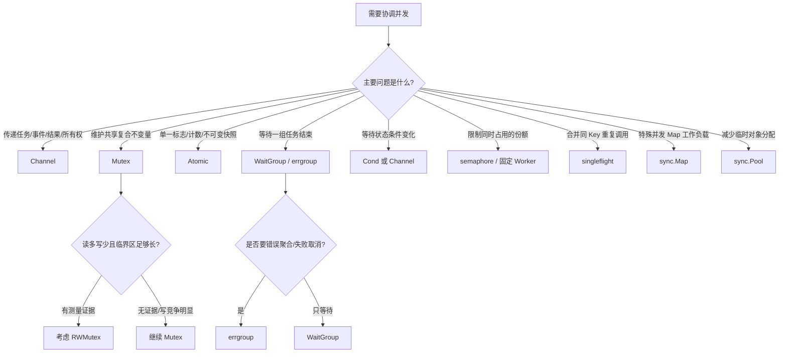
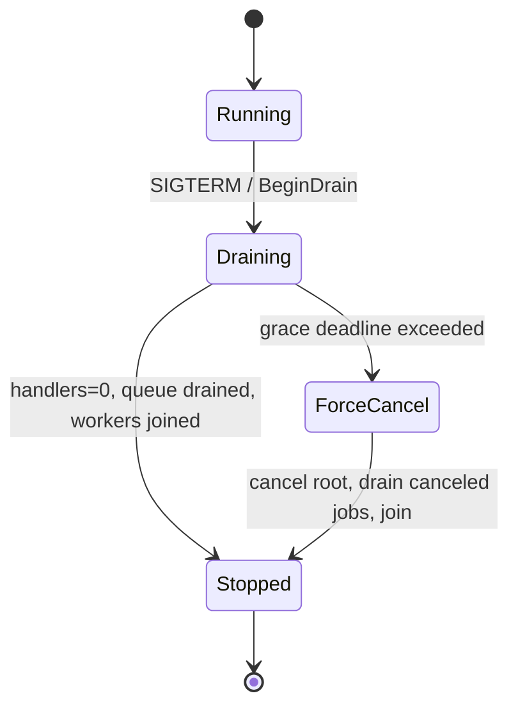
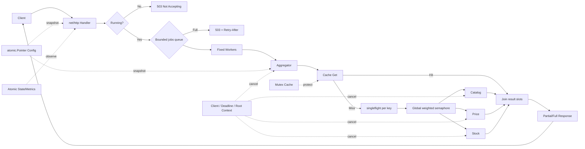
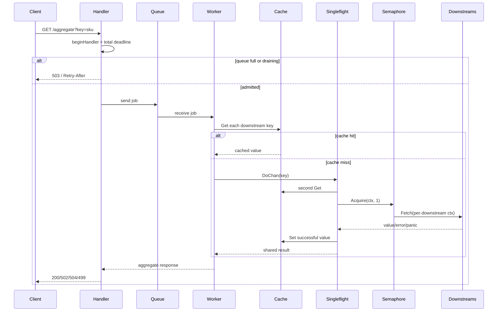
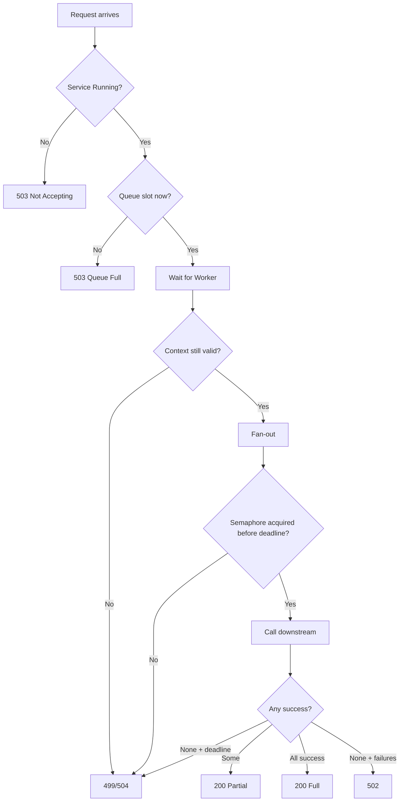
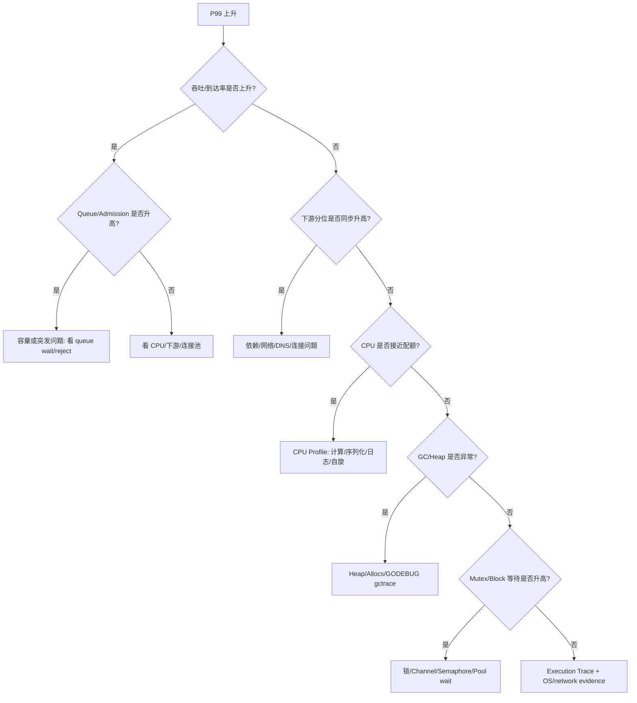
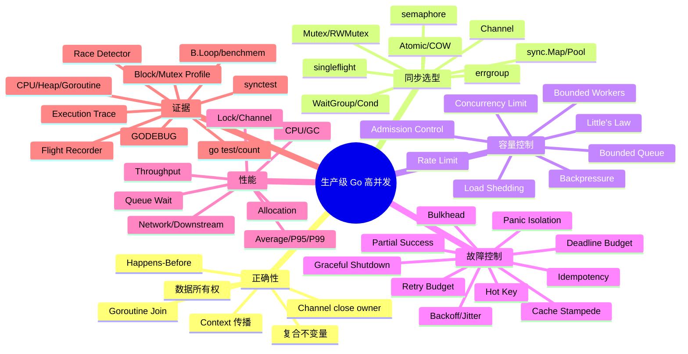

# 第 16 章：生产级高并发架构、性能诊断与面试体系

## 阅读定位与关联章节

> 本章是并发专题的收束章：不再按单个 API 重讲，而是把生命周期、容量、过载、故障隔离、可观测性和面试表达串成一套生产级闭环。

| 关联概念 | 建议读法 |
|---|---|
| Goroutine 生命周期、Memory Model、WaitGroup 和取消收束 | 看 [第 11 章：并发基础、Goroutine 生命周期与 Go 内存模型](/blog/tech/GO/11.并发基础-Goroutine生命周期与Go内存模型)。 |
| Channel、select、Pipeline、背压和关闭协议 | 看 [第 12 章：Channel、Select、并发模式与运行时实现](/blog/tech/GO/12.Channel)。 |
| Mutex/RWMutex、sync 工具和锁竞争 | 看 [第 13 章：Mutex、RWMutex 与 sync 工具箱](/blog/tech/GO/13.Mutex-RWMutex与sync工具箱)。 |
| Context、deadline、Cause、请求生命周期与优雅关闭 | 看 [第 14 章：Context、取消传播与生命周期管理](/blog/tech/GO/14.Context-取消传播与生命周期管理)。 |
| Atomic、CAS、不可变快照和热点争用 | 看 [第 15 章：Atomic、CAS、内存语义与无锁思想](/blog/tech/GO/15.Atomic-CAS-内存语义与无锁思想)。 |

---

> **适用版本**：Go 1.26.x。本文核验日期为 2026 年 6 月 22 日，当日官方稳定版本为 Go 1.26.4。
> **本章定位**：不再按 API 重讲第 11 至第 15 章，而是把 Goroutine 生命周期、Channel、锁、Atomic、Context、测试与运行时诊断组合成一个在过载和故障下仍然可控的服务。

### 阅读约定：四种结论必须分开

本章使用以下标签，避免把实现细节误当成永久保证。

- **[规范]**：Go 语言规范或内存模型保证。
- **[API]**：标准库或第三方包公开文档承诺。
- **[Go 1.26 实现]**：当前工具链/Runtime 的实现，可在未来版本变化。
- **[工程推论]**：基于负载模型、测量和上述契约得出的设计判断，不是语言保证。

---

## 1. 本章解决什么问题

并发正确只回答“会不会错”；生产系统还必须回答另外四个问题：

1. **流量超过处理能力时，系统怎样失败？** 是排队几分钟、耗尽内存、把下游打死，还是在毫秒级拒绝一小部分请求？
2. **依赖变慢或部分故障时，故障是否被隔离？** 一个库存服务变慢，是否会拖垮价格、商品和整个聚合服务？
3. **问题已经发生时，如何用证据定位？** P99 上涨到底来自 CPU、GC、锁、Channel、网络、DNS、连接池，还是下游？
4. **发布、扩容和关闭时，谁拥有 Goroutine、Channel 与资源？** 能否停止接流量、排空已接请求、取消剩余工作并确定性退出？

一句话定义本章目标：

> **生产级高并发不是“尽可能多地并发”，而是用明确的容量边界、时间预算、故障边界和可观测证据，把系统维持在可恢复区域。**

### 1.1 从正确性到稳定性的四层模型

| 层次 | 核心问题 | 典型机制 |
|---|---|---|
| 并发正确性 | 共享数据是否有竞争，退出是否完整 | Memory Model、Mutex、Channel、Atomic、WaitGroup |
| 容量控制 | 同时处理和排队多少工作 | Worker、Semaphore、有界队列、Admission Control |
| 故障控制 | 超时、重试、降级和隔离如何组合 | Deadline Budget、Bulkhead、Jitter、Singleflight、部分成功 |
| 诊断闭环 | 如何证明瓶颈在哪里 | Metrics、Race、Benchmark、pprof、Trace、Flight Recorder |

**工程结论**：如果设计文档只画“请求 → Goroutine → 下游”，却没有容量、预算、拒绝、取消、关闭和观测路径，它还不是生产架构。

---

## 2. 学习目标和前置知识

完成本章后，应能：

- 根据数据所有权和共享不变量，在 Channel、Mutex、RWMutex、Atomic 之间做选择；
- 知道 `WaitGroup`、`Cond`、`sync.Map`、`sync.Pool`、`errgroup`、`singleflight`、`semaphore` 各自的边界；
- 用 Little's Law 和延迟预算推导并发数、队列长度，而不是拍脑袋配置；
- 设计有界并发、有界队列、背压、准入、负载削减、隔舱和降级；
- 解释 Timeout、Deadline、Context 取消与重试预算如何组合；
- 实现一个可部分成功、可过载拒绝、可优雅关闭的 HTTP 聚合服务；
- 使用 `go test`、`-race`、`testing/synctest`、`B.Loop`、pprof、Trace 与 Flight Recorder；
- 从指标与 Profile 判断 CPU、GC、锁、Channel、网络和依赖瓶颈；
- 回答中高级 Go 并发面试题，并能承受追问。

### 2.1 前置知识

应已理解：

- Goroutine 生命周期、GMP 和 Context；
- Happens-Before 与 DRF-SC；
- Channel 的发送、接收、关闭与 `select`；
- Mutex/RWMutex、WaitGroup、Once、Cond、Map、Pool；
- Typed Atomic、CAS 和不可变快照；
- Go HTTP、测试与模块基础。

**工程结论**：本章默认你会“写并发代码”，重点转向“怎样证明服务在高流量和故障中仍可控”。

---

## 3. 生活类比：机场不是靠无限增加候机旅客提高吞吐量

把聚合服务想象成一座机场：

- **入口安检**是 Admission Control；
- **候机区座位**是有界队列；
- **登机口数量**是 Worker 数；
- **跑道容量**是下游全局 Semaphore；
- **每小时可售票数**是 Rate Limit；
- **雷雨时取消部分航班**是 Load Shedding；
- **不同航站楼**是 Bulkhead；
- **最晚起飞时间**是 Deadline；
- **同一团旅客共用一辆摆渡车**类似 Singleflight；
- **停止售票、完成登机、关闭跑道**是 Graceful Shutdown。

若机场把所有旅客都放进大厅：

1. 售票数字短期看起来很高；
2. 大厅不断积压，旅客实际等待时间增长；
3. 安检、登机口和跑道不会因此变快；
4. 拥堵反而增加调度、广播、行李和安全成本；
5. 最后必须一次性取消大量航班，恢复更慢。

技术模型与类比的边界：请求不是旅客，Goroutine 也不是实体座位；但二者都说明一个原则：**排队只能吸收有限突发，不能创造服务能力。**

**工程结论**：容量边界不是“降低性能”，而是保护有效吞吐量和恢复能力。

---

## 4. 从事故切入：下游变慢如何演化为级联雪崩

### 4.1 错误实现

下面的伪生产代码有三个危险特征：每请求无界创建 Goroutine、没有统一时间预算、失败立即重试。

```go
// 错误示例：不要用于生产。
func handle(w http.ResponseWriter, r *http.Request) {
    keys := []string{"catalog", "price", "stock"}
    results := make(chan string)

    for _, name := range keys {
        go func() {
            for {
                value, err := callDownstream(context.Background(), name)
                if err == nil {
                    results <- value
                    return
                }
                // 无退避、无上限、无 Context、无幂等判断。
            }
        }()
    }

    // 客户端断开后仍可能永远等待；results 也无人关闭。
    for range keys {
        fmt.Fprintln(w, <-results)
    }
}
```

### 4.2 事故链

假设正常时：

- 到达率 `λ = 2,000 req/s`；
- 每个请求调用 3 个下游；
- 平均下游停留时间 `S = 50 ms`。

仅下游 I/O 的平均并发需求约为：

```text
C ≈ λ × 3 × S = 2,000 × 3 × 0.05 = 300
```

当库存下游从 50 ms 变为 2 s，而服务仍接受所有请求：

```text
库存分支并发需求 ≈ 2,000 × 2 = 4,000
```

若每次失败再立即重试两次，真实到达下游的尝试率可能接近原来的三倍。随后出现：

1. 等待连接和响应的 Goroutine 激增；
2. 栈、Timer、Context、请求对象和响应缓冲增加 Heap 压力；
3. GC 与调度成本上升，健康分支也开始变慢；
4. 连接池、文件描述符、NAT 或下游线程池耗尽；
5. 请求超过客户端超时后，服务仍做“僵尸工作”；
6. 上游重试形成正反馈；
7. P99 先上升，随后吞吐下降，最终大量超时。

这不是单一“下游慢”事故，而是**没有容量反馈的开放环路**。

### 4.3 修复优先级

正确顺序通常是：

1. 先设置请求总 Deadline 和依赖超时；
2. 再限制全局下游并发；
3. 再限制入口队列并快速拒绝；
4. 将重试纳入同一预算并加退避、Jitter、上限和幂等约束；
5. 再考虑缓存、Singleflight、降级和扩容；
6. 最后才讨论微观锁优化。

**工程结论**：当系统已过载，优化一个 Mutex 往往不如减少无效工作、缩短队列和停止重试更重要。

---

## 5. 基本 API、综合选型与最小可运行示例

### 5.1 第一原则：先识别“数据流”还是“共享状态”



### 5.2 原语总表

| 原语 | 核心问题 | 零值 | 使用后复制 | 可能阻塞 | 同步关系 | 释放/结束 | 高竞争成本 | 常见误用 |
|---|---|---:|---:|---:|---|---|---|---|
| Channel | 数据/所有权/信号传递 | `nil` 但不可通信 | 句柄可复制，共享同一 Channel | 是 | send/receive、close/receive 建立相应 HB | 由拥有发送生命周期的一方关闭；也可不关 | 排队、复制、调度、内部锁 | Receiver 关闭、多 Sender 竞态关闭、无界缓冲思维 |
| Mutex | 保护复合共享不变量 | 可用 | **不可** | 是 | `Unlock` 同步于后续成功 `Lock` | `Unlock` | 锁队列、Cache Line 抖动、尾延迟 | 锁内 I/O、复制、重入、锁顺序不一致 |
| RWMutex | 允许并发读、独占写 | 可用 | **不可** | 是 | 对 Lock/RLock 有文档规定的同步关系 | `RUnlock`/`Unlock` | Reader 计数争用、写者等待、长读临界区 | “读多就一定快”、递归 RLock、升级锁 |
| Atomic | 单值原子状态/快照发布 | Typed Atomic 可用 | **不可** | API 不挂起，但 CAS 可重试 | [规范/API] 顺序一致原子操作 | 无显式释放 | 热点 Cache Line、CAS 失败 | 用多个 Atomic 假装事务、发布后修改对象 |
| WaitGroup | 等待一组任务完成 | 可用 | **不可** | `Wait` 是 | `Done` 同步于它解除的 `Wait` | 计数归零 | 单点计数与唤醒 | `Add` 在 goroutine 内、负计数、与 Wait 错误复用 |
| Cond | 在锁保护条件上等待变化 | 需 `NewCond` | **不可** | `Wait` 是 | `Broadcast/Signal` 与被唤醒 Wait 有文档关系 | 无 close；改变条件后通知 | 惊群、锁竞争 | `if` 代替 `for`、不持锁检查条件 |
| sync.Map | 特殊 Map 并发模式 | 可用 | **不可** | 内部可能阻塞 | 文档定义读写同步 | `Delete/Clear` | 类型转换、写热点、内部迁移 | 代替所有 `map+Mutex`、维护跨键不变量 |
| sync.Pool | 跨调用复用临时对象 | 可用 | **不可** | `Get/Put` 通常不阻塞业务锁 | `Put(x)` 同步于返回同一 x 的 `Get` | GC 可随时丢弃对象 | 清零成本、对象滞留、伪优化 | 当可靠缓存、保存必须存在的资源 |
| errgroup | 结构化启动、等待和错误传播 | `Group` 零值可用 | 不应复制 | `Wait`；Limit 可使 Go 阻塞 | 建立方式依赖其内部同步/API | `Wait` | goroutine、错误取消传播 | 以为零值 Group 会自动取消、忽略 goroutine Panic |
| singleflight | 合并同 Key 同时发生的调用 | `Group` 零值可用 | 不应复制 | `Do` 等待；`DoChan` 返回结果 Channel | 内部同步保证共享结果 | `Forget` 仅忘记 Key，不取消调用 | 热 Key 锁竞争、Leader 拖累 Followers | 当缓存、忽略 Leader Context 语义、等 Channel close |
| semaphore.Weighted | 限制加权并发资源 | 需构造 | 不应复制 | `Acquire` 是 | 包内部同步 | `Release` 必须匹配 | 等待队列、头阻塞、取消处理 | 忘记 Release、申请量超过总权重、无 Context |

#### 选择时必须回答的 12 个问题

对任何原语都要问：它解决什么问题；零值是否可用；使用后能否复制；是否阻塞；建立什么 HB；谁结束/释放；最常见误用；高竞争成本；对尾延迟影响；替代方案；何时避免；面试追问是什么。上表给出主干，后文在具体架构中落地。

### 5.3 `errgroup`、`singleflight`、`semaphore` 不是标准库

三者来自 `golang.org/x/sync`：

- `errgroup`：在 `WaitGroup` 之上增加错误传播、可选 Context 取消和并发上限；
- `singleflight`：抑制同 Key 的重复函数调用；
- `semaphore`：提供可取消的加权信号量。

不要在设计文档里写成“Go 标准库自带”。第三方包版本也应锁定并纳入升级测试。

### 5.4 最小可运行示例：有界、可取消、无泄漏的批任务执行

```go
package main

import (
    "context"
    "errors"
    "fmt"
    "sync"
)

type Task func(context.Context) error

func RunBounded(ctx context.Context, limit int, tasks []Task) error {
    if limit <= 0 {
        return errors.New("limit must be positive")
    }

    jobs := make(chan Task) // 无缓冲：生产者直接感知 Worker 能力。
    errCh := make(chan error, 1)
    var workers sync.WaitGroup

    workers.Add(limit)
    for range limit { // Go 1.22+ 可对整数 range。
        go func() {
            defer workers.Done()
            for task := range jobs {
                if err := task(ctx); err != nil {
                    select {
                    case errCh <- err:
                    default:
                    }
                }
            }
        }()
    }

    // Sender 拥有 jobs 的发送生命周期，因此由 Sender 关闭。
    go func() {
        defer close(jobs)
        for _, task := range tasks {
            select {
            case jobs <- task:
            case <-ctx.Done():
                return
            }
        }
    }()

    done := make(chan struct{})
    go func() {
        workers.Wait()
        close(done)
    }()

    select {
    case <-done:
        select {
        case err := <-errCh:
            return err
        default:
            return nil
        }
    case <-ctx.Done():
        <-done // 任务必须遵守 Context；等待所有 owned Goroutine 退出。
        return ctx.Err()
    }
}

func main() {
    tasks := []Task{
        func(context.Context) error { fmt.Println("A"); return nil },
        func(context.Context) error { fmt.Println("B"); return nil },
    }
    if err := RunBounded(context.Background(), 2, tasks); err != nil {
        panic(err)
    }
}
```

这个示例仍不是完整服务：它没有入口拒绝、依赖隔离、缓存、动态配置、指标和 HTTP 关闭编排。配套项目将在第 12 节补齐。

**工程结论**：优先用最简单、能证明正确且具备容量边界的组合；不要先从“无锁”“超大缓冲”或“每任务一个 Goroutine”开始。

---

## 6. 正确性分析：配套聚合服务为什么没有数据竞争

### 6.1 架构中的共享状态

| 状态 | 可能并发的操作 | 同步手段 | 不变量 |
|---|---|---|---|
| 服务状态 `running/draining/stopped` | HTTP 读取、关闭写入 | `atomic.Uint32` | 状态单调前进 |
| 动态配置指针 | 请求 Load、控制面 Store | `atomic.Pointer[RuntimeConfig]` | 发布对象完整初始化且发布后不可变 |
| 缓存 Map、过期删除、命中统计 | 多请求 Get/Set/Delete/Snapshot | `sync.Mutex` | Entry 与统计作为复合状态一致变化 |
| 有界任务队列 | Handler send、Worker receive、Shutdown close | Channel + admission gate + WaitGroup | close 前不再有 Sender |
| 请求结果 | 多分支写不同 Slice 下标、Join 后读取 | 独占槽 + `errgroup.Wait` | 同一元素仅一个分支写 |
| 下游并发额度 | 多请求 Acquire/Release | `semaphore.Weighted` | 已占权重不超过上限 |
| 重复缓存加载 | 同 Key 多请求 | `singleflight.Group` | 同一时刻至多一个共享函数执行 |
| 指标 | 高频 Add/Load | Typed Atomic | 单计数/单桶独立原子更新 |
| Handler/Worker 生命周期 | Add/Done/Wait | gate + WaitGroup | `Wait` 开始后不再发生新的 Add |

### 6.2 哪些操作可能并发

- 多个 HTTP Handler 同时尝试入队；
- Worker 同时处理不同请求；
- 每个请求的多个下游分支并发运行；
- 缓存命中、过期删除、Singleflight Leader 写缓存并发发生；
- 控制面更新配置时，数据面继续读取旧快照；
- `SIGTERM` 到达时，已有请求仍在处理，新请求仍可能到达监听层；
- 指标读取与更新并发发生。

### 6.3 Happens-Before 证明

#### 配置发布

1. 更新方构造并深拷贝 `RuntimeConfig`；
2. `atomic.Pointer.Store` 发布指针；
3. 请求通过 `Load` 读取一个完整快照；
4. [规范/API] Go 的原子操作按顺序一致语义参与同步；
5. 发布后禁止修改 Map，因此读方不与写方并发修改同一对象。

仅原子替换指针不够；若 Store 后仍修改 `PerDownstreamTimeout`，Map 仍会数据竞争。

#### 缓存

- 所有 Map 和统计访问都在同一 `Mutex` 临界区内；
- [API] 某次 `Unlock` 同步于后续成功的 `Lock`；
- 因而后续临界区可见先前更新；
- Map、过期删除、`hits/misses/expired` 作为一个复合不变量更新。

#### 任务队列与关闭

- Handler 成功发送 `job` 后，Worker 对应接收完成；Channel 通信建立同步关系；
- Shutdown 先在 `gate` 下把状态改为 Draining，阻止新 `handlerWG.Add`；
- 再等待所有已接 Handler `Done`；
- `Wait` 返回意味着不会再有 Handler 入队；
- 此后才由 Service 唯一关闭 `jobs`；
- Worker `range jobs` 排空后退出。

因此不存在 send 与 close 并发，也不存在 Receiver 关闭 Channel。

#### 聚合结果槽

```go
items := make([]ItemResult, len(downstreams))
for i, d := range downstreams {
    i, d := i, d
    group.Go(func() error {
        items[i] = fetchOne(d)
        return nil
    })
}
group.Wait()
use(items)
```

- 不同分支只写不同数组元素；
- 没有两个 Goroutine 访问同一元素并至少一个写；
- `Wait` 返回后主路径才读取；
- 结构化 Join 提供完成同步。

“写不同下标”通常是安全的，但前提是 Slice Header 不再被并发 `append` 或替换，元素也不共享内部可变对象。

#### 状态与指标

每个状态/计数器用单一 Typed Atomic 更新。它们只表达独立数值，不承担跨字段事务。比如 `requests` 与 `completed` 在一次快照中可能来自略有不同的时刻，这是可接受的监控语义；若要求严格一致快照，应使用锁或版本化协议。

### 6.4 取消与退出证明

每类 Goroutine 必须有所有者、终止事件和 Join 点：

| Goroutine | 所有者 | 终止事件 | Join |
|---|---|---|---|
| 固定 Worker | `Service` | `jobs` 被关闭 | `workerWG.Wait` |
| 请求下游分支 | 当前聚合调用 | Fetch 返回或 Context 取消 | `errgroup.Wait` |
| HTTP Handler | `net/http`，业务侧登记 | 请求完成、取消或 Root Cancel | `http.Server.Shutdown` + `handlerWG.Wait` |
| 应用/管理 HTTP server | `main` | Shutdown/Close | `Server.Shutdown` 返回 |
| Flight Recorder | `main` | `Stop` | 同步方法返回 |

一个重要边界：Go 不能安全强杀一个忽略 Context、永不返回的普通函数。下游实现必须遵守 Context；HTTP Client 还要配置 Transport 级别的连接、TLS、响应头和连接池超时。

### 6.5 Race Detector 的角色

`go test -race` 能证实测试执行路径中发生的冲突访问是否被检测到，但不能证明所有路径无竞争。正确流程是：

1. 先用所有权和 HB 证明设计；
2. 再用单元测试覆盖正常、错误、取消和关闭交错；
3. 使用 `-count` 增加调度多样性；
4. 用 `-race` 执行测试和接近真实的负载；
5. 仍保留代码审查和不变量说明。

**工程结论**：没有 Race 报告不等于正确；正确性来自可审查的同步协议，Race 是动态证据之一。

---
## 7. 常见使用场景

### 7.1 Channel：数据流和所有权边界

适合：

- 固定 Worker 从任务队列取工作；
- Pipeline 阶段之间传递不可变值或所有权；
- 将事件序列化给单一状态拥有者；
- 用关闭广播“不会再有值”；
- 在 `select` 中组合结果、Context 和超时。

不应因为“Channel 是 Go 风格”就把随机共享查询也改成消息传递。若每次读缓存都需要向唯一 Goroutine 发请求，会引入额外排队、调度和单点吞吐限制。

### 7.2 Mutex：共享复合不变量

适合：

- Map 与命中/过期统计同时变化；
- 库存数量、预留数量和版本必须一起校验更新；
- 多个字段组成状态机，但转换还伴随其他内存更新；
- 批量更新需要全有或全无的进程内临界区。

锁保护的是“不变量”，不是变量的数量。一个锁可以合理保护十个强相关字段；十把锁也可能无法保护一个跨字段约束。

### 7.3 RWMutex：有证据的读并行

考虑条件：

- 读取比例很高；
- 读临界区不是只有一两个机器指令；
- 写较少且可容忍写者等待；
- Benchmark 使用真实 Key 分布和并发度，证明优于 Mutex；
- 没有递归读锁、锁升级或超长读临界区。

读多只是必要条件之一，不是充分条件。短临界区里 Reader 计数的原子争用可能抵消收益。

### 7.4 Atomic：单值状态和不可变快照

适合：

- 服务运行状态；
- 高频独立计数；
- 版本号；
- 已完整初始化、发布后只读的配置指针；
- 简单 CAS 状态转换。

不适合：余额与冻结金额、队列长度与内容、Map 与统计等跨字段事务。

### 7.5 WaitGroup 与 errgroup

- 只需等待且错误由独占结果槽保存：`WaitGroup`；
- 需要返回首个错误、失败时取消兄弟任务：`errgroup.WithContext`；
- 需要限制该 Group 自身并发：`SetLimit`；
- 需要“部分成功，不因一个失败取消其他分支”：可用零值 `errgroup.Group` 只做结构化 Join，或用 `WaitGroup`。

`errgroup` 不会自动恢复 Panic。每个信任边界仍需显式 `recover`，否则任一子 Goroutine Panic 会终止进程。

### 7.6 Cond

适合一个锁保护的复杂状态谓词，例如“队列非空且未关闭”“可用内存达到阈值”。标准写法：

```go
c.L.Lock()
for !condition() {
    c.Wait()
}
consume()
c.L.Unlock()
```

必须使用 `for`，因为被唤醒不保证条件仍成立；`Signal` 也不承诺唤醒哪个等待者。简单的一次性广播通常更适合关闭 Channel。

### 7.7 sync.Map

优先场景来自其 API 文档：

- 一个 Key 通常只写一次、之后多次读，例如只增长缓存；
- 多 Goroutine 操作互不相交的 Key 集合。

普通业务 Map、需要类型安全、需要跨 Key 不变量、频繁覆盖热点 Key 时，先使用 `map+Mutex/RWMutex`。

### 7.8 sync.Pool

适合减少高频临时对象分配，例如编码缓冲：

```go
var buffers = sync.Pool{New: func() any { return new(bytes.Buffer) }}

buf := buffers.Get().(*bytes.Buffer)
buf.Reset()
defer func() {
    if buf.Cap() <= 64<<10 { // 避免把异常大对象长期留在池中。
        buffers.Put(buf)
    }
}()
```

Pool 中对象可在 GC 时被移除，因此不能存连接、锁、事务、必须存在的缓存条目或资源所有权。

### 7.9 singleflight

适合缓存 miss 合并、配置刷新、元数据加载：

```text
先查缓存 → singleflight.Do(key, 再查缓存 → 加载 → 写缓存)
```

第二次查缓存不可省略，因为第一次 miss 到成为 Leader 之间，另一个调用可能已经填充缓存。

它只合并“同时发生”的调用，不提供 TTL、容量、持久性，也不是缓存。热点 Key 还需考虑：

- Leader 太慢会让大量 Followers 一起等待；
- Leader Context 被取消时共享调用如何处理；
- 返回大对象时 Followers 的内存和序列化成本；
- 单 Key 结果释放瞬间形成后续波峰。

### 7.10 semaphore 与固定 Worker

二者控制对象不同：

- **固定 Worker + 有界队列**：控制入口接纳的请求工作和排队；
- **Semaphore**：控制跨所有请求共享的稀缺资源，如下游连接、CPU 密集步骤、文件句柄。

在聚合服务中两层通常同时需要。仅有 Worker 时，一个请求可扇出很多下游；仅有 Semaphore 时，入口仍可能创建大量等待额度的 Goroutine。

**工程结论**：原语不是相互替代的排行榜，而是不同控制面；先明确要限制的是“排队工作”“执行工作”还是“共享资源”。

---

## 8. 不适合使用的场景

### 8.1 不要用 Channel 代替所有锁

避免：

- 高频随机读一个共享 Map，每次都向 Owner Goroutine RPC；
- 需要事务式读取多个状态却拆成多条消息；
- 为“异步”而创建没有退出协议的后台 Consumer；
- 用超大 Buffer 掩盖 Consumer 能力不足。

### 8.2 不要在没有测量时使用 RWMutex

避免：

- 临界区极短；
- 写比例不低；
- 热点集中在单一 Cache Line；
- 读锁持有期间进行 I/O；
- 希望从 RLock 直接升级为 Lock。

### 8.3 不要用多个 Atomic 维护事务

错误思想：

```go
available.Add(-1)
reserved.Add(1)
```

两个操作各自原子，但观察者可能看到中间状态；失败回滚、并发校验也不构成一个事务。使用 Mutex，或设计一个可放入单个机器字/不可变对象的状态并证明 CAS 协议。

### 8.4 不要把 sync.Pool 当缓存

Pool 无命中保证、无 TTL、无容量和逐出策略。GC 可以清空它。需要可靠复用或缓存时使用显式池、连接池或缓存结构。

### 8.5 不要在普通任务上无条件 Singleflight

不同调用可能有不同权限、租户、请求头、语言、版本或超时；若 Key 未包含影响结果的全部维度，就会错误共享。带副作用、不可重放或每个请求必须独立执行的操作更不适合。

### 8.6 不要把排队当成功

请求成功入队只说明“系统收下了债务”，不是完成工作。若队列等待已经吃完大部分 Deadline，继续执行只会制造超时和下游负载，应在出队或调用前检查剩余预算。

### 8.7 不要把增加 Goroutine 当扩容

增加 Goroutine 可能提高 I/O 等待覆盖率，但不会增加：

- CPU 配额；
- 下游 QPS；
- 数据库连接；
- 内存带宽；
- 网络带宽；
- 锁保护资源的串行能力。

超过最佳点后只会增加调度、栈、GC、竞争和尾延迟。

**工程结论**：避免原语误用的最快方法，是把目标资源和不变量写成一句话；写不出来通常意味着设计尚未完成。

---

## 9. 错误示例、错误原因和修复过程

### 9.1 每请求、每任务无界创建 Goroutine

#### 错误

```go
for _, item := range items {
    go process(item)
}
```

#### 原因

输入规模或请求并发不受控，Goroutine 数随负载增长；即使最终都阻塞在 Semaphore 上，也已经创建了等待对象。

#### 修复

- 入口固定 Worker；
- 队列有界；
- 或在创建 Goroutine **之前** 获取额度；
- 所有等待都接受 Context；
- 记录拒绝率与队列等待。

### 9.2 用超大 Channel Buffer “解决”突发

#### 错误

```go
jobs := make(chan Job, 1_000_000)
```

#### 原因

Buffer 把错误从“立即拒绝”变成“很久以后超时”，同时持有请求对象、Body、Context、Timer 和业务数据。

#### 修复

按可接受排队时间推导：

```text
QueueCapacity ≈ 可持续完成率 × 可接受队列等待
```

再用压测验证 P99，而不是按内存能放多少配置。

### 9.3 用 `time.Sleep` 等待并发顺序

#### 错误

```go
go update()
time.Sleep(10 * time.Millisecond)
assertState()
```

#### 原因

没有 HB；机器、调度器、Race 模式和 CI 负载变化都会破坏假设。

#### 修复

使用 Channel、WaitGroup、Cond 或 `testing/synctest`；测试的是事件关系，不是墙钟猜测。

### 9.4 Timeout 只是外层返回，下游工作没有取消

#### 错误

```go
select {
case result := <-done:
    return result
case <-time.After(100 * time.Millisecond):
    return ErrTimeout
}
```

后台调用仍继续，且 `time.After` 的 Timer 无法由调用者提前停止。

#### 修复

创建 Context Deadline 并传入真正的 I/O：

```go
ctx, cancel := context.WithTimeout(parent, budget)
defer cancel()
return client.Do(req.WithContext(ctx))
```

同时验证下游库确实遵守 Context。

### 9.5 重试没有预算、退避和幂等

#### 错误

```go
for err != nil {
    value, err = call(ctx)
}
```

#### 修复

- 仅重试暂态、可重放错误；
- 总次数有上限；
- 每次尝试受总 Deadline 约束；
- 指数退避并加全 Jitter；
- 写操作使用幂等键、去重记录或事务语义；
- 记录尝试次数，而不只记录最终请求数；
- 当下游过载时减少而非增加尝试。

一个常见全 Jitter 形式：

```text
cap = min(maxBackoff, base × 2^attempt)
sleep = random(0, cap)
```

### 9.6 Singleflight Leader Context 设计不清

三种策略没有绝对答案：

| 策略 | 优点 | 风险 |
|---|---|---|
| 使用首个调用者 Context | 取消能到真实 I/O；无人等待时更快停止 | Leader 取消使 Followers 一起失败 |
| 使用服务级 Context + 最大加载超时 | Followers 独立取消等待；共享加载稳定 | 所有等待者取消后调用仍可能继续 |
| 引用计数、最后等待者取消 | 语义精细 | 实现复杂，容易竞态和泄漏 |

修复不是“换一行 Context”，而是明确文档、指标和测试。

### 9.7 Receiver 关闭任务 Channel

#### 错误

Worker 因为“不想再收”而 `close(jobs)`，其他 Producer 随后 send Panic。

#### 修复

- 由拥有**全部发送生命周期**的一方关闭；
- 多 Producer 先 Join，再由 Coordinator 关闭；
- Receiver 提前退出用 Context/Done 告诉 Sender 停止，而不是抢夺 close 权。

### 9.8 优雅关闭顺序反了

#### 错误顺序

```text
先关数据库/连接池 → 再停止接请求 → 已接请求大量失败
```

#### 修复顺序

```text
readiness 失败/停止接流量
→ 关闭监听并等待 HTTP Handler
→ 排空队列
→ 超时后取消剩余工作
→ Join 自有 Goroutine
→ 关闭依赖资源、管理端口和日志
```

实际环境还要考虑负载均衡器传播延迟、Kubernetes `terminationGracePeriodSeconds` 和 `preStop`，保证外部宽限期大于内部排空预算。

### 9.9 锁内调用下游或未知回调

锁持有时间由网络尾延迟决定，所有等待者共享该尾部；未知回调还可能重入并死锁。

修复模式：

1. 锁内读取/复制必要状态；
2. 解锁；
3. 做 I/O；
4. 必要时重新加锁校验版本并提交。

注意这可能引入 TOCTOU，需要版本号、乐观并发控制或事务。

### 9.10 以为 `recover` 能跨 Goroutine

外层 Handler 的 `defer recover()` 不能捕获其子 Goroutine 的 Panic。每个信任边界必须在同一 Goroutine 中恢复：

```go
group.Go(func() (err error) {
    defer func() {
        if v := recover(); v != nil {
            err = fmt.Errorf("branch panic: %v", v)
        }
    }()
    return work()
})
```

恢复后仍应记录堆栈、下游名和请求关联 ID，并判断状态是否还能安全继续。

**工程结论**：错误修复要改变控制环路，而不是只让错误日志消失。

---

## 10. 底层实现：从快速路径到等待与唤醒

本节只提炼与架构决策直接相关的路径。字段和阈值属于 **[Go 1.26 实现]**，不得当成语言规范。

### 10.1 Channel

#### 快速路径

- 无缓冲 Channel 若已有接收者等待，发送值可直接交接；
- 有缓冲 Channel 若 Buffer 有空位，发送方写入环形队列并推进索引；
- 接收同理。

#### 慢速路径

- 条件不满足且非阻塞操作时立即返回；
- 阻塞操作会构造/复用等待描述，加入发送或接收等待队列；
- Runtime 通过 `gopark` 挂起 G；匹配、接收或 close 时通过可运行化路径唤醒；
- Channel 内部有锁，因此“用 Channel 就无锁”是错误说法。

#### 工程影响

- 大元素发送可能复制，优先传小值或不可变指针，但要明确对象生命周期；
- Buffer 增加解耦，也增加驻留内存和排队延迟；
- 大量 Goroutine 堵在同一 Channel 会形成唤醒和调度压力；
- `select` 需要注册多个候选等待，复杂度和清理成本高于单一操作。

### 10.2 Mutex

#### 快速路径

无竞争时，CAS 把锁状态从未锁变为已锁，成本很低。

#### 慢速路径

竞争出现后，当前实现可能短暂主动自旋；不适合继续自旋时进入基于 Runtime Semaphore 的等待。当前实现区分偏吞吐的正常模式和改善长期等待者的饥饿模式。

#### 工程影响

- 锁本身小，不代表竞争成本小；热点 Cache Line 在 CPU Core 间转移；
- 持锁 1 ms 且有 100 个等待者，会累积大量等待时间并放大 P99；
- Mutex Profile 的栈通常指向导致竞争的临界区结束位置，即 `Unlock` 附近，而不只是等待者的 `Lock`。

### 10.3 RWMutex

读锁需要维护 Reader 状态；写者到来时需要阻止新的 Reader 并等待已有 Reader 离开。其收益来自“多个足够长的读临界区能够重叠”，成本来自 Reader 计数、写者协调和缓存一致性。

[工程推论]：如果读临界区只是 Map 查找，普通 Mutex 可能更快；只有同工作量 Benchmark 才能判断。

### 10.4 Atomic 与 CAS

Typed Atomic 最终映射到目标架构支持的原子指令和编译器/CPU 所需的顺序约束。CAS 失败不会挂起 Goroutine，但在高竞争下会循环重试，消耗 CPU 并让同一 Cache Line 反复失效。

“非阻塞 API”不等于“没有等待成本”：等待从调度队列变成了 CPU 和缓存一致性争用。

### 10.5 WaitGroup

公开契约是计数和 Wait；当前实现把计数、等待者等状态编码在原子字段中，并在归零时通过 Runtime Semaphore 唤醒等待者。Go 1.25 增加 `WaitGroup.Go`，可减少 `Add`/启动顺序错误；存量代码仍大量使用：

```go
wg.Add(1)
go func() {
    defer wg.Done()
    work()
}()
```

核心规则：正向 `Add` 必须在相应 `Wait` 有机会观察到零之前发生；不可复制；复用必须在上一轮 Wait 返回之后。

### 10.6 Cond

`Wait` 原子地解锁关联 Locker 并进入通知等待，唤醒后重新加锁再返回。通知只是“状态可能变化”，真正条件仍由锁保护并在循环里检查。`Broadcast` 可能形成惊群。

### 10.7 sync.Map

当前实现针对特定读写模式维护读优化结构和脏数据结构，并在 miss 达到条件时进行提升。工程上只依赖 API，不依赖内部字段；频繁覆盖同一个热点 Key 可能仍成为争用点。

### 10.8 sync.Pool

当前实现利用每 P 的局部结构降低常见路径竞争，并跨 GC 周期处理对象；API 明确允许对象随时被移除。它优化的是分配压力，不是业务缓存命中率。

### 10.9 errgroup

- `Go` 启动函数并在内部计数；
- 首个非 nil 错误被保存；
- `WithContext` 返回的 Context 在首错或 `Wait` 完成时取消；
- `SetLimit` 通过令牌机制限制活跃函数；
- `TryGo` 不阻塞地尝试启动。

零值 Group 不关联 Context。Group 本身不会恢复函数 Panic。

### 10.10 singleflight

同 Key 首个调用创建在途记录；后续调用等待其完成并接收相同结果。`DoChan` 返回的结果 Channel **不会被关闭**，调用者应接收一个结果或被自己的 Context 取消，不能 `range` 等待 close。

共享结果中的 `Shared` 表示结果被多个调用者共享，不应误解为“当前调用一定是 Follower”。

### 10.11 semaphore.Weighted

`Acquire(ctx, n)`：

- 额度足够且队列条件允许时走快速路径；
- 否则把请求放入等待队列并等待通知或 Context；
- `Release(n)` 归还额度并唤醒可满足的等待者；
- 加权请求可能造成队首阻塞：前面的大请求暂时不满足时，后面的小请求也未必越过它。

因此若任务权重差异很大，可考虑分舱、多个 Semaphore 或任务分类，避免大任务阻塞所有小任务。

### 10.12 与 GMP、CPU Cache 和 GC 的关系

| 机制 | GMP/调度 | Cache | 分配/GC |
|---|---|---|---|
| 阻塞 Channel/Mutex/Semaphore | G park，释放 M/P 去运行其他 G | 热点状态行抖动 | 等待节点、闭包、请求对象可能分配 |
| CAS 自旋 | G 持续占用 P/CPU | 同一行高频失效 | 通常少分配，但可能浪费 CPU |
| 大量 Goroutine | 调度队列、抢占和扫描增加 | 工作集扩大 | 栈、Timer、Context、闭包增加 Heap/扫描 |
| 大 Buffer | 少一些直接交接阻塞 | 数据驻留更久 | 持有对象导致 Heap 增大、GC 延迟 |
| sync.Pool | 降低分配路径 | 局部性可能改善 | GC 可清理，需防大对象滞留 |

**工程结论**：快速路径是否命中由竞争和负载决定；看源码只能解释可能性，Profile 和 Benchmark 才能说明你的服务走了哪条路径。

---

## 11. 时间、空间、调度和缓存成本

### 11.1 时间成本不是只有平均耗时

一次请求的总延迟可拆成：

```text
T_total = T_admission + T_queue + T_service + T_downstream + T_serialization
```

并发聚合时，健康情况下分支部分更接近最大值而不是求和：

```text
T_fanout ≈ max(T_catalog, T_price, T_stock) + join/调度开销
```

但排队、Semaphore 等待、连接池等待和重试会叠加。只看下游 RPC duration 容易漏掉真正的队列时间。

### 11.2 空间成本

每个未完成请求可能持有：

- Goroutine 栈；
- Request/Response、Header、Body Buffer；
- Context 节点与 Timer；
- Trace Span、日志字段；
- Channel 等待记录；
- 缓存 Key、Singleflight 在途记录；
- 下游连接和内核缓冲。

队列容量乘以“每请求保留对象大小”才是实际内存预算。

### 11.3 调度成本

Goroutine 很轻量，但不是免费：创建、栈增长、Runnable 队列、抢占、Work Stealing、系统调用和 GC 扫描都会产生成本。大量 Runnable G 往往意味着 CPU 饱和或锁/Channel 唤醒风暴；大量 Waiting G 可能意味着 I/O 正常等待，也可能是泄漏。

### 11.4 Cache 成本

热点 Atomic、Mutex 状态、全局计数器和单 Key Map 会集中在少数 Cache Line。多核扩展时，Cache Coherence 往返可能先于算术本身成为瓶颈。缓解方式：

- 分片计数后汇总；
- 分片锁；
- 避免所有请求更新高基数字段；
- 批量更新；
- 降低采样率；
- 通过 Benchmark/Profile 证明收益。

### 11.5 尾延迟放大

聚合 `N` 个独立分支时，即使每个分支只有少量慢请求，“至少一个分支变慢”的概率会增加。粗略地，若单分支在阈值内完成概率为 `p`，全部 N 个都在阈值内的概率约为 `p^N`。现实中分支还可能相关，因此更要使用独立超时、部分成功和降级。

### 11.6 Profile 本身有成本

- CPU Profile 采样会有开销；
- Block/Mutex Profile 需要启用采样；
- `SetBlockProfileRate(1)` 记录所有阻塞事件，教学方便，生产可能过重；
- Trace 数据量和扰动更大；
- 多种诊断同时开启会相互干扰。

生产中应在代表性实例上、有限时段、一次一种工具采集，并先评估开销。

**工程结论**：性能预算必须同时包含 CPU、内存、调度、缓存一致性、排队和观测成本，不能只比较某个 API 的纳秒数。

---
## 12. 高性能、高可用、高并发场景

### 12.1 先画出四个边界

任何高并发服务在编码前都应明确：

1. **容量边界**：入口速率、同时执行数、队列容量、下游并发；
2. **时间边界**：总 Deadline、排队预算、各依赖预算、重试预算；
3. **故障边界**：哪个故障能影响哪些请求、租户、下游和实例；
4. **所有权边界**：谁创建、停止、关闭、释放并等待每个资源。

缺一项，系统就可能在边界外产生无穷等待或无穷工作。

### 12.2 有界并发

#### 定义

在任意时刻，进入某类昂贵执行阶段的工作数不超过配置上限。

#### 三种常见实现

| 实现 | 在哪里限 | 优点 | 风险 |
|---|---|---|---|
| 固定 Worker | 任务执行入口 | Goroutine 数稳定，天然 Join | 队列设计不当会积压；任务差异大时利用率不均 |
| Channel Semaphore | 创建/执行前 | 标准库即可实现 | 关闭与归还协议容易写错；不支持权重 |
| `semaphore.Weighted` | 共享稀缺资源前 | Context、权重、跨请求全局限制 | 等待者本身仍存在；权重差异可能队首阻塞 |

关键规则：**尽量在创建额外 Goroutine 之前获取额度。** 若每个请求先创建 1,000 个 Goroutine，再让它们等待一个 10 额度 Semaphore，执行并发有界，但等待对象仍无界。

### 12.3 有界队列

#### 队列解决什么

- 吸收短暂突发；
- 平滑上游和 Worker 的瞬时抖动；
- 给负载削减提供明确阈值。

#### 队列不解决什么

- 不提高稳态服务率；
- 不修复慢依赖；
- 不代替持久消息系统；
- 不保证请求能在 Deadline 内完成。

队列设计要同时给出：容量、最大排队时间、满时策略、关闭时排空策略、指标和每项内存成本。

### 12.4 Backpressure

背压是下游能力不足时，压力向上游传播，使生产速率下降。形式包括：

- 无缓冲或小缓冲 Channel 让 Producer 阻塞；
- `Acquire(ctx)` 让调用者等待额度；
- HTTP 返回 `429/503`，让上游按策略降速；
- 流式协议减少读速率；
- 消息系统暂停拉取或降低 prefetch。

阻塞不是唯一背压；快速拒绝也是反馈。对在线请求，阻塞过久往往不如在预算内拒绝。

### 12.5 Admission Control

准入发生在投入大量资源之前。典型条件：

- 服务状态必须是 Running；
- 当前 in-flight 未超过上限；
- 有界队列有空位；
- 请求剩余 Deadline 足够；
- 租户配额、全局预算或依赖健康允许；
- 请求体大小和复杂度在上限内。

配套项目使用非阻塞入队：

```go
s.metrics.queueDepth.Add(1)
queued := false
select {
case s.jobs <- current:
    queued = true
case <-ctx.Done():
case <-s.rootCtx.Done():
default: // 队列此刻无空位，立即拒绝。
}
if !queued {
    s.metrics.queueDepth.Add(-1)
    // 503 + Retry-After，或按业务返回降级值。
}
```

非阻塞 admission 把排队上限变为硬边界。若业务允许等待空位，也必须让等待消耗同一个 Deadline，并设置最大 admission wait。

### 12.6 Load Shedding

负载削减是在过载时主动丢弃低价值工作，保护高价值请求和系统恢复。策略可以按：

- 请求优先级；
- 租户级别；
- 可缓存性；
- 是否可降级；
- 剩余 Deadline；
- 估算成本；
- 当前依赖健康。

不要随机丢弃所有请求而不区分价值，也不要等内存耗尽才削减。拒绝指标应区分：队列满、并发满、速率限流、Deadline 不足、服务关闭和依赖熔断。

### 12.7 Rate Limiting 与 Concurrency Limiting

两者不是同一个问题：

| 控制 | 限制 | 更适合 |
|---|---|---|
| Rate Limit | 单位时间内到达/尝试数量 | 外部配额、成本、突发整形 |
| Concurrency Limit | 同时未完成的数量 | 慢依赖、连接池、内存和尾延迟保护 |

在固定速率下，延迟变长会自动推高并发，因此只限 QPS 不能保护慢依赖。常见组合：令牌桶限制长期速率和允许突发，Semaphore 限制同时进行的调用。

### 12.8 Bulkhead：隔舱

若价格、库存、推荐共用一个全局池，库存变慢可能占满所有额度。隔舱方案：

- 每下游独立 Semaphore/连接池；
- 每租户独立队列或配额；
- 在线与离线任务分池；
- 高低优先级分队列；
- 关键依赖与可选依赖分 Worker；
- 进程/实例级物理隔离。

隔舱会降低资源共享效率，但换来故障边界。可使用“每舱保底 + 可借用共享额度”折中，前提是复杂度可观测、可测试。

### 12.9 Timeout 与 Deadline Budget

Timeout 是相对时长；Deadline 是绝对截止时间。跨层传播时优先传 Context Deadline，避免每层重新获得完整 Timeout 导致总时长膨胀。

#### 预算分解示例

总预算 800 ms：

```text
入口与排队       80 ms
业务准备          20 ms
并发下游窗口      500 ms
序列化与回写      50 ms
安全余量          150 ms
```

下游并发并不意味着每个下游都能拿 500 ms；可按历史分布、依赖 SLO 和重要性设置独立超时，并保证不超过剩余总预算：

```go
remaining := time.Until(deadline)
childBudget := min(configuredDownstreamTimeout, remaining-safetyMargin)
```

出队后若剩余预算不足以完成最小有用工作，应立即拒绝或降级，避免“注定超时”的请求继续占资源。

### 12.10 Context 取消传播

正确传播链：

```text
客户端断开 / 请求 Deadline / 服务强制关闭
    ↓
HTTP Request Context
    ↓
聚合请求 Context
    ↓
每下游独立 Timeout Context
    ↓
HTTP Client / DB / RPC 调用
```

每次 `WithCancel/WithTimeout/WithDeadline` 都应调用返回的 `cancel`，用于释放 Timer 和子节点，即使父 Context 最终也会取消。

Context 只传播信号，不自动终止函数；被调用代码必须 select `ctx.Done()` 或使用支持 Context 的 I/O API。

### 12.11 请求排队与尾延迟

队列会让利用率高时的等待非线性增加。一个系统在平均负载下看似有余量，也可能因服务时间方差和突发导致 P99 急升。

必须分别测量：

- admission wait；
- queue wait；
- semaphore wait；
- connection pool wait；
- downstream wire time；
- total request latency。

仅有 total latency 无法判断该扩 Worker、调连接池、限流还是修下游。

### 12.12 Little's Law 的工程意义

稳定系统长期平均满足：

```text
L = λW
```

- `L`：系统内平均未完成工作数；
- `λ`：平均完成/到达率；
- `W`：平均停留时间。

应用：

1. 观测 `λ=1,000 req/s`，平均响应 `W=0.2 s`，平均 in-flight 应约为 200；若实际远高，可能有泄漏、统计口径或排队问题。
2. 希望队列等待不超过 50 ms，可持续完成率 2,000 req/s，则吸收该等待窗口的平均队列规模约 100；还需考虑突发和方差，并用压测验证。
3. 下游延迟从 50 ms 增至 500 ms，若不降速，同等流量所需并发约增十倍。

Little's Law 描述平均关系，不直接给 P99，也不保证系统稳定。不要用它替代排队模型和实测。

### 12.13 依赖变慢时为什么不能无限堆积

因为“未完成工作”会随停留时间线性增长，并进一步增加：

- 内存和 GC；
- 调度与 Timer；
- 连接、FD 和内核 Buffer；
- 超时后无效工作；
- 恢复时的陈旧请求洪峰。

正确动作：限制并发、缩短预算、拒绝低价值请求、返回缓存/部分数据、打开熔断或隔离，并让上游停止重试风暴。

### 12.14 重试、指数退避与 Jitter

#### 何时可能重试

- 连接建立失败、明确的临时过载、可重放读请求；
- 有足够剩余预算；
- 请求是幂等或带幂等键；
- 下游建议重试且没有处于系统性故障。

#### 何时不应重试

- 参数错误、权限错误、业务拒绝；
- 已超过 Deadline；
- 非幂等写且结果未知；
- 下游持续过载；
- 上层已经会重试且没有总重试预算。

#### Retry Budget

按原始请求量限制额外尝试比例，比每请求固定三次更能防风暴。例如只允许额外尝试不超过近期成功/请求量的一小部分。所有层的重试次数必须可观测。

#### Jitter

没有 Jitter 时，大量客户端在相同退避时刻再次同步冲击。Jitter 打散相位；全 Jitter、等 Jitter等策略应通过负载测试选择。

### 12.15 幂等

幂等不是“HTTP 方法名看起来安全”，而是重复执行在业务上产生等价结果。写操作常用：

- 客户端幂等键；
- 服务端去重表与结果持久化；
- 唯一约束；
- 事务内检查与写入；
- 版本号/条件更新；
- Outbox/Inbox 模式。

需要处理“第一次已成功但响应丢失”的不确定性。只在内存 Map 去重无法跨重启和多实例保证。

### 12.16 缓存击穿、Singleflight 与热点 Key

#### 基本组合

```text
Get cache
  hit → return
  miss → singleflight(key)
             Get cache again
             load downstream
             Set cache
```

#### 缓存过期风暴的其他手段

- TTL 加随机抖动；
- stale-while-revalidate；
- 主动预热/异步刷新；
- 负缓存（谨慎设置短 TTL）；
- 多级缓存；
- 每 Key 并发上限；
- 热点 Key 分片或复制；
- 限制返回对象大小。

Singleflight 只能降低同实例、同一时刻的重复加载。多实例同时过期时仍可能每实例各发一次；需要分布式锁、租约、协调刷新或允许可控重复，取决于成本和一致性。

### 12.17 Panic 隔离

建议隔离边界：

- HTTP Middleware 捕获 Handler 同 Goroutine Panic；
- 每个扇出分支在自己的 Goroutine 内捕获；
- 消费外部插件/回调时捕获；
- Worker 顶层最后一道保护。

恢复后：

1. 记录堆栈、请求、分支、版本；
2. 指标告警；
3. 将该分支转为错误或触发请求失败；
4. 不继续使用可能被部分修改、无法证明一致的状态；
5. 对 Runtime fatal error 等不可恢复情况不要假装可恢复。

### 12.18 Graceful Shutdown

#### 推荐状态机



#### 顺序

1. 状态切为 Draining，readiness 返回失败；
2. 外部负载均衡停止新流量；
3. `http.Server.Shutdown` 关闭 Listener、空闲连接并等待活跃 Handler；
4. 已接 Handler 完成或触发宽限期；
5. 关闭应用任务 Channel，Worker 排空；
6. 若超时，取消 Root Context；
7. Wait 所有自有 Goroutine；
8. 关闭数据库、消息、管理端口和日志。

`Server.Shutdown` 不负责由 Handler 劫持的连接；WebSocket 等需要单独登记与关闭。

### 12.19 Goroutine 所有权和泄漏预防

每个 `go` 语句在 Review 时回答：

- 谁拥有它？
- 什么事件让它返回？
- 阻塞点是否监听取消？
- 谁等待它？
- 它持有什么资源？
- 如果依赖不返回会怎样？
- 单元测试如何证明退出？

不接受“它很快会结束”作为协议。

### 12.20 降级模式和故障隔离

聚合服务可按业务定义：

- 返回部分成功并标注缺失分支；
- 返回过期缓存；
- 跳过可选推荐；
- 以默认值替代非关键字段；
- 对关键依赖失败返回 5xx；
- 对过载返回 503/429 和 `Retry-After`；
- 对不同租户保留最低容量；
- 熔断持续失败下游，半开探测恢复。

降级必须明确语义，避免把“未知库存”伪装为“库存为 0”。响应应能让上游区分真实数据、缓存、默认和缺失。

### 12.21 为什么高并发不等于更多 Goroutine

最佳并发点取决于：

- CPU 密集：通常接近可用 P 数或略有余量；
- I/O 密集：可高于 CPU 数，但受连接、内存、依赖和 Deadline 限制；
- 串行临界区：增加并发只增加等待；
- 热点 Atomic/Cache Line：增加核数也可能扩展不佳；
- 下游固定容量：超过后只排队或被限流。

要以“完成的有用请求/资源”和 P99 为目标，不以 Goroutine 数或入口 QPS 为成功指标。

---

### 12.22 综合项目：高并发下游聚合服务

#### 12.22.1 需求映射

HTTP 请求携带 `key`，服务并发查询 `catalog`、`price`、`stock` 等模拟下游，聚合结果。工程实现满足：

- 总 Deadline + 每下游 Timeout；
- Context 传播客户端取消和服务关闭；
- 固定 Worker、有界入口队列；
- 全局 Weighted Semaphore；
- 队列满快速 503；
- 部分成功；
- Mutex Cache + Singleflight；
- `atomic.Pointer` 配置；
- Atomic 状态、计数和固定桶延迟；
- Panic 隔离；
- Graceful Drain；
- 明确 Channel 关闭责任；
- 普通、超时、取消、失败、慢依赖、突发、缓存击穿和关闭测试。

#### 12.22.2 系统架构图



#### 12.22.3 请求时序图



#### 12.22.4 过载状态图



#### 12.22.5 工程目录

```text
go-concurrency-ch5/
├── aggregator/
│   ├── cache.go
│   ├── config.go
│   ├── http.go
│   ├── metrics.go
│   ├── service.go
│   ├── types.go
│   ├── service_test.go
│   ├── synctest_go125_test.go
│   └── benchmark_go124_test.go
├── cmd/server/main.go
├── diagnostics/
│   ├── flight_go125.go
│   └── flight_legacy.go
├── vendor/golang.org/x/sync/...
├── go.mod
└── README.md
```

#### 12.22.6 结构性限制与动态配置

```go
type Limits struct {
    Workers                 int
    QueueCapacity           int
    MaxConcurrentDownstream int64
}

type RuntimeConfig struct {
    OverallTimeout           time.Duration
    DefaultDownstreamTimeout time.Duration
    PerDownstreamTimeout     map[string]time.Duration
    CacheTTL                 time.Duration
}
```

`Limits` 在构造时分配 Worker、Channel 和 Semaphore，改变它需要重建 Service。`RuntimeConfig` 通过深拷贝后原子发布，可热更新：

```go
func (s *Service) UpdateConfig(next RuntimeConfig) error {
    if err := next.validate(); err != nil {
        return err
    }
    s.config.Store(next.clone())
    return nil
}
```

请求只 Load 一次快照，使一次请求内的预算规则一致；请求执行中配置更新只影响后续请求。

#### 12.22.7 两层容量控制

```go
s.jobs = make(chan job, limits.QueueCapacity)
s.limiter = semaphore.NewWeighted(limits.MaxConcurrentDownstream)
```

- 队列 + Worker 限制已接业务请求；
- Semaphore 限制所有请求合计的实际下游 I/O；
- 固定下游集合意味着每个已执行请求最多创建固定数量的短生命周期分支；
- 应用层不会按任意输入规模无限创建任务 Goroutine。

注意 `net/http` 自己管理连接/请求 Goroutine，所以严格表达应是“应用层接纳工作和下游调用有界”，而不是“进程 Goroutine 总数恒定”。

#### 12.22.8 缓存复合不变量

```go
type Cache struct {
    mu      sync.Mutex
    entries map[string]cacheEntry
    hits    uint64
    misses  uint64
    expired uint64
}
```

Get 需要在一个临界区中：查找、判断过期、删除过期项并更新统计。多个 Atomic 无法让这组变化成为整体。

#### 12.22.9 Singleflight 与双检

```go
if value, ok := s.cache.Get(now, cacheKey); ok {
    return value, true, false, nil
}

resultCh := s.flights.DoChan(cacheKey, func() (any, error) {
    if value, ok := s.cache.Get(time.Now(), cacheKey); ok {
        return loadedValue{value: value, cached: true}, nil
    }
    // Acquire global semaphore, call downstream, then cache success.
})
```

每个等待者用自己的 `callerCtx` select 结果；取消等待不会阻塞 Worker 回复，因为结果通道/回复通道设计为不会要求已经离开的接收者继续接收。

#### 12.22.10 部分成功与结果槽

每个下游分支写唯一 `items[index]`；一个分支错误不取消兄弟分支。全部 Join 后统计：

```go
response.Partial = response.Succeeded > 0 && response.Failed > 0
```

HTTP 语义示例：

- 至少一个成功：`200`，Body 标注 `partial` 和每分支错误；
- 全部业务失败：`502`；
- 总 Deadline 且无成功：`504`；
- 客户端取消：示例使用非标准 `499`；
- 过载或关闭：`503`。

实际 API 需与调用方约定，不能仅靠状态码猜测字段完整性。

#### 12.22.11 Panic 隔离

下游函数 Panic 在同一分支 Goroutine 中恢复并转为 `PanicError`；聚合分支还有第二层保护，防止缓存/组装逻辑 Panic 直接终止进程。Worker 顶层为最后防线。

多层 `recover` 不能代替修 Bug。它的价值是隔离单请求并保留诊断证据。

#### 12.22.12 优雅关闭实现要点

```text
BeginDrain under gate
→ state = Draining, no new handlerWG.Add
→ wait accepted handlers
→ close jobs exactly once
→ cancel root context
→ range workers drain canceled jobs and exit
→ workerWG.Wait
→ state = Stopped
```

`gate` 解决的是 WaitGroup 使用协议：在持锁状态转为 Draining 后，不会再有新的 `Add`，因此 `Wait` 不与未来 Add 竞态。

#### 12.22.13 Channel 所有权

| Channel | Sender | Receiver | 谁关闭 | 理由 |
|---|---|---|---|---|
| `jobs` | 已准入 Handler | 固定 Worker | Service Shutdown | Service 知道所有 Handler 已退出 |
| `job.reply` | 对应 Worker | 对应 Handler | 不需要关闭 | 只发送一个值；Buffer 1 防止取消后 Worker 阻塞 |
| 测试 Gate | 测试协调者 | 模拟下游 | 测试协调者 | 它拥有释放时机 |
| server error channel | server goroutine | main | 不需要关闭 | main 只需一个/有限结果 |

“创建者关闭”不是规则；真正规则是“拥有全部发送生命周期的一方关闭”。

#### 12.22.14 指标

示例暴露：

- 请求、完成、拒绝、队列超时；
- 当前队列深度、请求 in-flight；
- 下游调用、错误、Panic、in-flight；
- Singleflight 共享次数；
- Queue Wait、Request、Downstream 固定桶延迟。

生产系统还应加入：

- 按路由/下游/结果的低基数 Histogram；
- admission/semaphore/连接池等待；
- 重试尝试数和 Retry Budget；
- 缓存命中、过期、装载耗时；
- Go Runtime 指标、GC、Heap、Goroutine、CPU；
- 实例容量配置和版本信息。

避免将完整 Key、用户 ID、错误文本当 Label，防止高基数摧毁监控系统。

#### 12.22.15 性能指标如何解释

| 现象 | 可能解释 | 下一证据 |
|---|---|---|
| 吞吐持平、队列深度增长 | 已到服务能力上限或依赖变慢 | Queue wait、downstream latency、CPU |
| 平均稳定、P99 上升 | 少量长尾、锁排队、GC Pause、连接等待 | Histogram 分层、Trace、mutex/block |
| 拒绝率升高、P99 稳定 | Load shedding 正在保护已接请求 | 容量与业务可接受性 |
| 请求 P99 高、下游 wire P99 低 | 本地排队/锁/序列化/GC | queue/semaphore wait、CPU、Trace |
| 下游调用少、Singleflight shared 高 | 热 Key 被合并 | Leader latency、缓存 TTL、Followers 数 |
| CPU 低、Goroutine 多 | I/O/锁/Channel 等待或泄漏 | goroutine dump、block profile |
| CPU 高、吞吐下降 | 计算、GC、CAS/锁自旋、日志/序列化 | CPU profile、alloc profile、mutex |

#### 12.22.16 单实例优化与水平扩容边界

先修单实例：

- 无界队列/Goroutine；
- 无超时和僵尸工作；
- 锁内 I/O；
- 过量分配；
- 热点 Key；
- 连接池和下游并发不匹配；
- 错误重试风暴。

再水平扩容：

- CPU 或独立实例容量确实饱和；
- 下游和数据库能承受总流量；
- 限流/Singleflight/缓存语义理解多实例效应；
- 负载均衡均匀；
- 状态已外置或可分片；
- 扩容速度快于流量变化。

扩容不能解决共享数据库锁、单热点 Key、外部配额或错误重试；反而可能把下游打得更快。

**工程结论**：稳定架构的目标不是拒绝率永远为零，而是在容量外明确拒绝、在容量内维持可预测延迟，并快速恢复。

---
## 13. 测试、压力验证与 Benchmark

### 13.1 测试金字塔

并发服务至少需要五类证据：

1. **单元测试**：状态、不变量、错误映射；
2. **交错测试**：取消、关闭、满队列、Singleflight 等事件顺序；
3. **Race 测试**：动态发现执行路径中的数据竞争；
4. **Benchmark/压力测试**：容量、分配和延迟分布；
5. **故障注入**：验证失败模式，不只验证成功路径。

### 13.2 可执行命令

```bash
# 所有测试
go test -mod=vendor ./...

# 重复执行，增加调度交错；失败后固定随机种子/输入复现
go test -mod=vendor -count=50 ./aggregator

# 竞态检测
go test -mod=vendor -race -count=1 ./...

# 指定测试并输出日志
go test -mod=vendor -run TestBoundedQueueRejectsOverload -v ./aggregator

# 静态检查
go vet -mod=vendor ./...
```

Race 模式开销显著，不应用其绝对吞吐作为生产容量结论。它只能发现**实际执行**的冲突路径；测试覆盖不到的路径仍可能有 Race。

### 13.3 不使用 `time.Sleep` 猜并发顺序

测试应使用事件 Gate：

```go
started := make(chan struct{})
release := make(chan struct{})

downstream := func(ctx context.Context) error {
    close(started)
    select {
    case <-release:
        return nil
    case <-ctx.Done():
        return ctx.Err()
    }
}

// 测试先等待真实 started，再触发取消/关闭。
<-started
cancel()
```

这让测试表达“调用已经进入下游”这一因果关系，而不是假设 10 ms 足够调度。

### 13.4 `testing/synctest`

Go 1.25 起，`testing/synctest` 正式可用。它在隔离的测试 Bubble 中使用虚拟时间，并可等待其中 Goroutine 到达 durable blocking 状态。适合测试 Timer、Deadline 和取消，不必真实等待。

配套示例：

```go
//go:build go1.25

func TestAggregateDeadlineWithSyntheticTime(t *testing.T) {
    synctest.Test(t, func(t *testing.T) {
        cfg := testConfig()
        cfg.OverallTimeout = 50 * time.Millisecond

        service := newSlowService(t, cfg, 200*time.Millisecond)
        started := time.Now()

        _, err := service.Aggregate(t.Context(), "sku")
        if !errors.Is(err, context.DeadlineExceeded) {
            t.Fatalf("error=%v", err)
        }
        if elapsed := time.Since(started); elapsed != 50*time.Millisecond {
            t.Fatalf("virtual elapsed=%v", elapsed)
        }
    })
}
```

不要为了让虚拟时间推进而混入无法被 Bubble 识别的外部阻塞。真实网络、OS 文件描述符和第三方库仍应通过 Fake 或集成测试覆盖。

### 13.5 配套项目测试矩阵

| 测试 | 验证的不变量 |
|---|---|
| `TestAggregateNormalAndCache` | 正常聚合，第二次命中缓存，下游不重复调用 |
| `TestAggregatePartialFailureAndPanicIsolation` | 一个失败/一个 Panic 不终止进程，健康分支仍成功 |
| `TestPerDownstreamTimeoutReturnsPartialResult` | 独立下游超时只影响该分支 |
| `TestCallerCancellationReachesDownstream` | 客户端取消传播到真实 I/O |
| `TestBoundedQueueRejectsOverload` | Worker 忙且队列满时第三个请求快速 503 |
| `TestGlobalDownstreamConcurrencyIsBounded` | 突发请求下实际下游 in-flight 不超过 Semaphore |
| `TestSingleflightSuppressesConcurrentMisses` | 同 Key 并发 miss 只触发一次加载 |
| `TestGracefulDrainRejectsNewAndFinishesAccepted` | Draining 后拒绝新请求，已接请求完成 |
| `TestAtomicConfigSnapshotIsDeepCopied` | 发布后修改调用方 Map 不影响已发布配置 |
| `TestWorkerPanicIsConvertedToError` | 子 Goroutine Panic 在自身边界恢复 |
| `TestAggregateDeadlineWithSyntheticTime` | 虚拟时间下总 Deadline 精确触发 |

### 13.6 故障注入矩阵

| 故障 | 注入方法 | 期望行为 | 必看指标 | 禁止行为 |
|---|---|---|---|---|
| 某下游持续超时 | Fetch 等待 `ctx.Done()` | 该分支超时；有健康分支则部分成功 | per-downstream latency/error、总 P99 | 无限等待、取消兄弟健康分支 |
| 某下游偶发 Panic | 每 N 次 `panic` | 捕获、记录堆栈、分支失败，进程继续 | panic count、错误率 | 进程崩溃或静默返回零值 |
| 队列满 | Worker=1、Queue=1、阻塞第一个 | 后续请求快速 503，`Retry-After` | reject、queue depth/wait | 继续创建无限等待 Goroutine |
| Worker 变慢 | 人为延长任务处理 | Queue wait/P99 上升，最终削减 | queue wait histogram、in-flight | Buffer 无限增大 |
| 大量请求同时取消 | 并发请求后统一 cancel | 下游尽快观察取消，Handler/Worker 回落 | cancel、goroutine、in-flight | 僵尸 I/O、Worker 回复阻塞 |
| 缓存过期瞬时并发 | 短 TTL + 同 Key Burst | 同实例单次加载，多 Followers 共享 | singleflight shared、load calls | 每请求都打下游 |
| 热点 Key | 绝大多数请求同 Key | Cache 命中高；Leader 慢时可见共享等待 | hit ratio、Leader latency | 锁/单 Key 无观测地拖垮全局 |
| 关闭中仍有请求 | BeginDrain 后继续请求 | 新请求 503，已接请求完成或在宽限期后取消 | state、in-flight、shutdown duration | send on closed channel、Goroutine 泄漏 |

#### 负载脚本

```bash
# 多 Key 突发，观察 admission 与下游并发
seq 1 200 | xargs -P 50 -I{} \
  curl -s -o /dev/null -w '%{http_code}\n' \
  'http://127.0.0.1:8080/aggregate?key=sku-{}' | sort | uniq -c

# 热点 Key，观察缓存和 singleflight
seq 1 200 | xargs -P 50 -I{} \
  curl -s 'http://127.0.0.1:8080/aggregate?key=hot-key' >/dev/null
```

压测工具本身也要有足够连接、CPU 和文件描述符；否则测到的是客户端瓶颈。

### 13.7 Benchmark 与 `B.Loop`

Go 1.24 引入 `B.Loop`。基准主体写法：

```go
func BenchmarkAggregateCacheHit(b *testing.B) {
    service := newBenchmarkService(b)
    _, _ = service.Aggregate(context.Background(), "hot-key") // 预热

    b.ReportAllocs()
    for b.Loop() {
        if _, err := service.Aggregate(context.Background(), "hot-key"); err != nil {
            b.Fatal(err)
        }
    }
}
```

执行：

```bash
go test -mod=vendor -run '^$' -bench . -benchmem -count=5 ./aggregator
```

解释：

- `ns/op`：每次完成相同工作所需时间；
- `B/op`：平均每操作分配字节；
- `allocs/op`：平均分配次数；
- `-count`：观察方差，不能只挑最好的一次；
- `RunParallel`：模拟并发调用，但其工作负载分布必须与生产一致。

#### 有效对比的规则

1. 两方案完成相同语义，包括错误处理和同步；
2. 初始化、预热和数据生成不混进计时；
3. 固定 Go 版本、CPU 配额、`GOMAXPROCS` 和输入；
4. 分别测读多、写多、热点、均匀 Key；
5. 同时看吞吐、分配和 P99，不因 `ns/op` 小幅改善牺牲可维护性；
6. 不编造结果，本章不预设 Mutex、RWMutex 或 Atomic 谁永远最快。

### 13.8 Profile/Trace 采集命令

测试过程：

```bash
go test -mod=vendor -run TestAggregateNormalAndCache \
  -cpuprofile cpu.out \
  -memprofile heap.out \
  -blockprofile block.out \
  -mutexprofile mutex.out \
  -trace test.trace ./aggregator

go tool pprof -http=:0 cpu.out
go tool pprof -http=:0 heap.out
go tool pprof -http=:0 block.out
go tool pprof -http=:0 mutex.out
go tool trace test.trace
```

运行服务后：

```bash
curl -o cpu.pb.gz 'http://127.0.0.1:6060/debug/pprof/profile?seconds=30'
curl -o heap.pb.gz 'http://127.0.0.1:6060/debug/pprof/heap'
curl -o goroutine.txt 'http://127.0.0.1:6060/debug/pprof/goroutine?debug=2'
curl -o block.pb.gz 'http://127.0.0.1:6060/debug/pprof/block'
curl -o mutex.pb.gz 'http://127.0.0.1:6060/debug/pprof/mutex'
```

管理端口必须受网络和身份控制，不应直接暴露公网；Profile 可能包含路径、栈和业务线索。

### 13.9 验收标准

示例工程的验收不能只写“测试通过”，还应包含：

- 队列和下游并发存在硬上限；
- 客户端取消能到达模拟下游；
- 关闭后所有 Service-owned Worker 退出；
- `go test -race` 无报告；
- 高并发同 Key 实际加载次数符合 Singleflight 预期；
- Panic 不终止进程；
- 队列满时拒绝延迟远小于正常处理 Deadline；
- Benchmark 报告分配且没有把初始化算入；
- 不以单次、Race 模式或不同工作量的数字做结论。

**工程结论**：并发测试应控制事件交错；性能测试应控制工作量；故障测试应控制系统失败方式。

---

## 14. 生产排障方法

### 14.1 先确认症状、时间窗和变化

排障第一轮只回答：

- 什么时候开始，是否与发布、配置、流量、下游或基础设施变化重合？
- 哪些实例、区域、路由、租户和下游受影响？
- 吞吐、错误率、平均、P95、P99、队列、in-flight 如何同时变化？
- 资源是 CPU、内存、GC、线程、FD、连接还是网络先异常？
- 拒绝是否保护了已接请求，还是所有请求都一起变慢？

不要先重启并丢失现场。若必须止血，先抓取短 CPU、Heap、Goroutine、Block/Mutex 或 Flight Recorder 快照。

### 14.2 证据层次

| 层次 | 工具 | 回答什么 |
|---|---|---|
| 指标 | QPS、错误、Histogram、Queue、Runtime metrics | 何时、范围、相关性 |
| 日志/Trace ID | 结构化日志、分布式 Trace | 哪类请求、哪个依赖、哪次重试 |
| Goroutine dump | `/debug/pprof/goroutine?debug=2` | 大量 G 在哪里等待 |
| CPU Profile | pprof CPU | CPU 周期花在哪里 |
| Heap/Allocs | pprof Heap/Allocs | 谁持有/分配内存 |
| Block Profile | pprof block | 在哪些同步点累计阻塞 |
| Mutex Profile | pprof mutex | 哪些临界区造成锁等待 |
| Execution Trace | `go tool trace` | 调度、阻塞、GC、网络和延迟时间线 |
| Flight Recorder | 滚动 Trace 快照 | 故障发生前后的短时间窗口 |
| 系统证据 | `top/perf/ss/iostat`、容器指标 | 内核、网络、磁盘、配额 |

### 14.3 Goroutine 大量阻塞

#### 步骤

1. 比较 `runtime.NumGoroutine` 或 Runtime metric 的基线和增长率；
2. 连续抓两到三份 Goroutine dump，间隔数秒；
3. 按相同栈聚类；
4. 判断状态：`chan send/receive`、`select`、`sync.Mutex.Lock`、`semacquire`、`IO wait`、`sleep`；
5. 若同一批栈数量只增不减，检查泄漏；
6. 用 Block Profile/Trace 确认等待时间，而不只看瞬时数量；
7. 找到 owner：谁应 close/cancel/release/receive？

#### 常见模式

- 全堵在向无人接收的结果 Channel 发送：请求取消后 Worker 没有非阻塞回复；
- 全堵在 Semaphore Acquire：限额过低或 Release 泄漏；
- 全堵在 HTTP Transport 等连接：连接池/响应 Body 未关闭/下游慢；
- 全堵在 `WaitGroup.Wait`：有任务未 Done 或依赖不返回；
- 大量 Timer/Context 等待：Deadline 太长、取消未调用或队列积压。

### 14.4 Channel 堆积

Go 没有自动给每个业务 Channel 暴露完整历史，因此应用应显式记录：容量、当前深度、高水位、入队/出队/拒绝率、排队时间。

判断：

- 深度瞬时升高后回落：短突发被吸收；
- 深度持续满：服务率低于到达率；
- 深度低但 Producer 阻塞：无缓冲/小缓冲直接背压，或 Consumer 卡住；
- 深度高且 CPU 低：依赖慢、Worker 阻塞；
- 深度高且 CPU 满：本地算力不足或 GC/竞争。

不要仅通过 `len(ch)` 做并发正确性决策；它只是瞬时观测，可用于近似指标，不能证明下一步 send 一定不阻塞。

### 14.5 锁竞争

#### 采集

```go
runtime.SetMutexProfileFraction(5) // 示例采样率，生产需评估
runtime.SetBlockProfileRate(1000000)
```

或测试参数 `-mutexprofile`、`-blockprofile`。

#### 分析

- Mutex Profile 指向造成其他 Goroutine 等待的临界区结束栈；
- Block Profile 还包含 Channel、WaitGroup、Cond 等同步阻塞；
- 看累计等待时间和样本，不只看调用次数；
- 回到源码检查锁内 I/O、循环、分配、日志、回调和嵌套锁；
- 结合 Trace 判断是否正好对应 P99 波峰。

#### 修复优先级

1. 缩短临界区；
2. 移出 I/O 和未知回调；
3. 降低访问频率/批量化；
4. 按独立不变量分片；
5. 不可变快照；
6. 有测量后考虑 RWMutex/Atomic；
7. 最后才是复杂无锁算法。

### 14.6 P99 突然升高的决策树



### 14.7 判断 CPU 瓶颈

信号：CPU 接近容器配额、Runnable G 多、Throttle 上升、CPU Profile 有清晰热点、增加 Worker 不增吞吐。

常见热点：JSON/压缩、正则、加密、日志格式化、Map/Hash、拷贝、GC assist、CAS 自旋。

行动：减少工作、缓存/批量、优化算法与分配、提高配额或扩容。先确认不是 cgroup throttling；进程看到的 CPU 与可用配额可能不同。

### 14.8 判断 GC/内存瓶颈

信号：Heap/Allocation rate 上升、GC 周期变密、GC CPU 比例升高、P99 与 GC/assist 同步、RSS 接近限制并 OOM。

步骤：

```bash
GODEBUG=gctrace=1 ./server
curl -o heap.pb.gz http://127.0.0.1:6060/debug/pprof/heap
curl -o allocs.pb.gz http://127.0.0.1:6060/debug/pprof/allocs
```

区分：

- `inuse_space`：当前仍存活对象；
- `alloc_space`：累计分配热点；
- 队列/缓存增长导致持有；
- 序列化/临时 Buffer 导致分配速率；
- Goroutine 栈和非 Go 内存不一定完整体现在同一视图。

### 14.9 判断网络或下游瓶颈

信号：CPU 不高、I/O wait/网络延迟升高、下游 Span 同步变慢、连接池等待、DNS/TLS 时间增加。

检查：

- 每下游独立 Histogram；
- 客户端连接池指标；
- 响应 Body 是否总是关闭/排空；
- DNS、Dial、TLS、ResponseHeader 时间；
- FD、端口、NAT、SYN 重传；
- 下游限流/错误码和容量；
- 请求/响应大小变化。

总 Timeout 不是完整 Transport 配置；生产客户端应显式配置连接与池参数。

### 14.10 Execution Trace

Trace 适合看：

- Goroutine 创建、运行、阻塞、唤醒；
- Processor 利用；
- GC 与 STW 时间线；
- 网络阻塞；
- User Region/Task；
- 延迟路径和调度空洞。

采集：

```bash
go test -trace=test.trace ./aggregator
go tool trace test.trace
```

Trace 数据量较大，应采短窗口。给关键请求/阶段添加 `runtime/trace` Task/Region 可提高可读性。

### 14.11 Flight Recorder

Go 1.25 引入 Runtime Execution Trace 的 Flight Recorder：持续保留有限时间/大小的滚动 Trace，故障触发时写出快照。适合“偶发 P99 峰值已经过去才收到告警”的场景。

示例工程：

```go
recorder := trace.NewFlightRecorder(trace.FlightRecorderConfig{
    MinAge:   10 * time.Second,
    MaxBytes: 32 << 20,
})
_ = recorder.Start()
// 故障时 recorder.WriteTo(file)
```

必须控制磁盘、触发频率和敏感数据；它不是长期全量分布式追踪替代品。

### 14.12 GODEBUG 调度信息

临时使用：

```bash
GODEBUG=schedtrace=1000,scheddetail=1,gctrace=1 ./server 2>runtime.log
```

观察 P/M/G、运行队列、线程、自旋和 GC 概况。输出格式和字段属于实现诊断接口，版本间可能变化；不要把它作为稳定业务 API，也不要长期高频开启详细输出。

### 14.13 止血与根因分开

止血可以：

- 降低入口速率/并发；
- 关闭重试；
- 缩短超时；
- 启用缓存/降级；
- 隔离故障下游；
- 扩容健康实例；
- 回滚发布。

根因仍需：保存证据、复现负载、修不变量/容量模型、添加测试和告警。重启让指标恢复不等于问题解决。

**工程结论**：排障顺序应是“指标定位范围 → Dump/Profile/Trace 定位等待或消耗 → 源码验证 → 负载复现”，不是凭经验随机调 Worker。

---
## 15. 方案选择表

### 15.1 按问题选机制

| 问题 | 首选 | 次选/组合 | 避免 |
|---|---|---|---|
| 传任务、结果、所有权 | Channel | 固定 Worker + Context | 共享 Slice 无同步写 |
| 保护 Map 和复合统计 | Mutex | 分片 Mutex、COW | 多个独立 Atomic 假装事务 |
| 读多写少共享结构 | 先 Mutex | 实测后 RWMutex/COW | 未 Benchmark 就换 RWMutex |
| 高频单计数/标志 | Typed Atomic | 分片计数 | 热点全局 CAS 复杂协议 |
| 动态只读配置 | `atomic.Pointer[T]` | `atomic.Value`、RWMutex | 发布后修改 Map/Slice |
| 等一组任务 | WaitGroup | errgroup | Sleep 等待 |
| 首错取消兄弟任务 | `errgroup.WithContext` | 手工 Context+WG | 只返回首错但忘记取消 |
| 部分成功、固定结果槽 | WaitGroup/零值 errgroup | 独占槽 + Join | 多 Goroutine append 同 Slice |
| 状态条件等待 | Cond | Channel 广播 | `if` 后 Wait、轮询 Sleep |
| 特殊 Map 工作负载 | sync.Map | map+Mutex/RWMutex | 跨 Key 不变量 |
| 临时对象复用 | sync.Pool | 局部 Buffer | 可靠缓存/资源池 |
| 同 Key 重复加载 | singleflight + Cache | 租约/分布式协调 | 把 singleflight 当缓存 |
| 全局资源并发 | semaphore | 固定 Worker | 先无限起 G 再等待额度 |
| 突发吸收 | 小型有界队列 | 令牌桶 | 超大 Buffer |
| 长期 QPS 配额 | Rate Limiter | 并发限制 | 只限 QPS 保护慢依赖 |
| 下游故障隔离 | Bulkhead | 熔断、降级 | 所有依赖共享一池无保底 |
| 在线过载 | Admission + Load Shedding | 缓存/降级 | 所有请求排队到超时 |

### 15.2 Worker、Semaphore、Rate Limiter 的组合

| 目标 | Worker | Queue | Semaphore | Rate Limiter |
|---|---:|---:|---:|---:|
| 控制应用层执行任务数 | ✓ | 配套 | 可选 | 否 |
| 控制等待工作数 | 间接 | ✓ | 否，等待者仍存在 | 间接 |
| 控制某下游同时 I/O | 不精确 | 否 | ✓ | 否 |
| 控制每秒尝试数 | 否 | 否 | 否 | ✓ |
| 吸收短突发 | 否 | ✓ | 否 | 令牌桶可允许突发 |
| 依赖变慢时保护 | 部分 | 必须有界 | ✓ | 需与并发限制组合 |

### 15.3 Timeout、拒绝、降级、重试的顺序

```text
先验证请求/权限/大小
→ Admission
→ 在剩余预算内排队
→ 执行关键路径
→ 可选依赖独立超时
→ 失败时优先缓存/部分结果/降级
→ 仅对暂态、幂等且预算充足的操作重试
→ 容量外快速拒绝
```

### 15.4 选型反问清单

做决定前问：

- 共享变量和不变量具体是什么？
- 到达率、服务时间及其 P99 是多少？
- 限制的是速率、并发、排队还是资源权重？
- 满时阻塞、拒绝、丢弃还是持久化？
- 请求剩余预算不足时怎么处理？
- 下游变慢十倍会发生什么？
- Leader/Owner 被取消会发生什么？
- 谁关闭 Channel、Release 额度、Wait Goroutine？
- 单实例和多实例语义是否一致？
- 哪些指标能证明设计生效？

**工程结论**：选型表给默认起点，最终方案必须由不变量、负载模型、故障语义和测量共同决定。

---

## 16. 本章知识地图



### 16.1 一条完整推理链

```text
业务 SLO
→ 总 Deadline 与失败语义
→ 依赖预算和降级
→ 到达率/服务时间估算并发
→ Worker/Semaphore/队列上限
→ Admission/拒绝/重试协议
→ 所有权与 HB 证明
→ 指标、测试、Profile、Trace
→ 压测和故障注入
→ 发布后根据证据迭代
```

**工程结论**：高级工程能力不是记住更多 API，而是能把 SLO、容量、正确性、故障和证据连成闭环。

---
## 17. 综合面试体系

下面共 36 题。回答时先给结论，再说明不变量、同步关系、负载条件和验证方法。绝对化结论通常会被追问击穿。

### 17.1 基础与选型题

#### 1. Channel 与 Mutex 怎样选？

**推荐回答**：Channel 优先表达任务、事件、结果、所有权转移和生命周期信号；Mutex 优先保护多个 Goroutine 直接访问的共享复合不变量。二者可以组合，例如 Channel 传任务，Mutex 保护缓存。选择依据不是“哪个更 Go”，而是数据流还是共享状态。

**追问**：用 Channel 实现 Actor 缓存有什么代价？什么时候反而合适？

**易踩坑**：说 Channel 一定比锁慢或一定更安全。

**关键水平信号**：能写出共享变量、不变量、owner、阻塞点和 HB，而不是只谈语法。

#### 2. Channel 是线程安全的吗？

**推荐回答**：[API/规范] 多 Goroutine 可以并发 send/receive，Runtime 负责 Channel 自身状态同步；但通过 Channel 传递的指针所指对象不会因此永久线程安全。发送前完成的写对对应接收可见，接收后若双方继续并发修改同一对象，仍需同步。

**追问**：向 Channel 发送 Slice 后，Sender 能否继续修改底层数组？

**易踩坑**：把 Channel 句柄安全等同于消息对象安全。

**关键水平信号**：能区分“容器操作的并发安全”和“对象所有权”。

#### 3. 谁应该关闭 Channel？

**推荐回答**：拥有全部发送生命周期、能证明未来不再 send 的一方关闭。不是机械的“创建者关闭”，Receiver 通常不应关闭数据 Channel；多个 Sender 要先 Join 或由 Coordinator 统一关闭。

**追问**：多个 Producer 如何安全关闭 fan-in Channel？

**易踩坑**：用 `recover` 掩盖重复 close/send-on-closed。

**关键水平信号**：能给出 Sender WaitGroup → Coordinator close → Receiver range 的协议。

#### 4. nil Channel 有什么用途？

**推荐回答**：send/receive 永久阻塞；在 `select` 中 nil case 永远不就绪，可动态启用/禁用分支，例如输出 Buffer 为空时把输出 Channel 设 nil。关闭 nil Channel 会 Panic。

**追问**：如何用 nil Channel 写一个有内部队列的转发器？

**易踩坑**：在主流程直接对 nil Channel 操作造成永久阻塞。

**关键水平信号**：理解 nil case 是状态机工具，而非“未初始化也能用”。

#### 5. `select` 多个 case 同时就绪会怎样？

**推荐回答**：[规范] 从可继续通信的 case 中做伪随机选择；没有优先级保证。`default` 在没有其他 case 立即就绪时执行。空 `select{}` 永久阻塞。

**追问**：怎样实现严格优先级？

**易踩坑**：依赖源码顺序或认为 cancel case 永远优先。

**关键水平信号**：会用分层 select/显式队列实现策略，并承认仍需防饥饿。

#### 6. WaitGroup 和 errgroup 的区别？

**推荐回答**：WaitGroup 只管理完成计数；errgroup 增加函数启动、首错保存、可选 Context 取消和并发 Limit。部分成功且不希望首错取消兄弟时，可用零值 Group 只 Join，或 WaitGroup+独占结果槽。

**追问**：`errgroup.WithContext` 的 Context 什么时候取消？

**易踩坑**：认为零值 errgroup 自动提供 Context；认为它捕获 Panic。

**关键水平信号**：根据错误语义选择，而不是把 errgroup 当新版 WaitGroup。

#### 7. `sync.Map` 什么时候用？

**推荐回答**：优先用于一次写多次读或不同 Goroutine 操作互不相交 Key 的特殊模式。普通类型安全 Map、频繁覆盖热点 Key、需要跨 Key 不变量时先用 `map+Mutex/RWMutex`，再 Benchmark。

**追问**：为什么不能用 sync.Map 维护“两个 Key 必须同时更新”？

**易踩坑**：把它当万能高性能 Map。

**关键水平信号**：引用 API 场景并强调复合事务仍需外部同步。

#### 8. `sync.Pool` 是缓存吗？

**推荐回答**：不是。它用于复用临时对象、降低分配；Pool 中对象可随时被移除，不能承载必须存在的数据或资源。Get 后应重置，Put 前应避免保留敏感数据和异常大对象。

**追问**：为什么 Pool 可能降低而不是提高性能？

**易踩坑**：把数据库连接、必须命中的对象放入 Pool。

**关键水平信号**：能谈清零成本、对象滞留、GC 语义和基准验证。

### 17.2 原理题

#### 9. Mutex 的正常模式和饥饿模式是什么？

**推荐回答**：[Go 1.26 实现] 无竞争走 CAS 快速路径；竞争时可能自旋并进入 Semaphore 等待。当前实现有偏吞吐的正常模式和改善长期等待者的饥饿模式，具体阈值和字段属于实现细节，不是规范。

**追问**：为什么直接 handoff 有利于尾延迟却可能损失吞吐？

**易踩坑**：把某个毫秒阈值当永久 API 保证。

**关键水平信号**：能区分规范、API、实现与工程推论。

#### 10. RWMutex 是否一定比 Mutex 快？

**推荐回答**：不一定。收益取决于读比例、临界区长度、并发度、写者频率和 Key 分布；Reader 计数和写者协调也有成本。应以相同语义 Benchmark 读多、写多、热点和均匀负载。

**追问**：长时间 RLock 对写者和 P99 有什么影响？

**易踩坑**：只说“读多写少就用 RWMutex”。

**关键水平信号**：能提出工作负载矩阵与 Profile 证据。

#### 11. Go Atomic 的内存语义是什么？

**推荐回答**：[规范/API] Go 原子操作表现为顺序一致的同步原子操作；若原子操作 A 的效果被 B 观察到，可建立相应的同步顺序。但多个独立原子操作不会自动组成业务事务。

**追问**：怎样用 `atomic.Pointer` 安全发布配置？

**易踩坑**：只原子 Store 指针，随后继续修改对象内 Map。

**关键水平信号**：强调“完整初始化 → Store → 发布后不可变 → Load”。

#### 12. CAS 有什么问题？

**推荐回答**：失败重试会消耗 CPU；热点 Cache Line 在核间抖动；可能饥饿；复杂状态有 ABA；算法的内存回收与正确性证明困难。CAS API 不阻塞不代表系统没有等待成本。

**追问**：ABA 是什么，指针 CAS 在 GC 语言里是否完全没有 ABA？

**易踩坑**：把 CAS 等同于 wait-free 或必然比锁快。

**关键水平信号**：能区分 lock-free、wait-free、obstruction-free，并建议优先锁。

#### 13. Goroutine 启动和退出分别建立什么同步？

**推荐回答**：启动 Goroutine 的 `go` 语句与新 Goroutine 开始之间有内存模型规定的顺序，使启动前初始化可见；Goroutine 退出本身不自动与其他 Goroutine 同步。必须通过 Channel、WaitGroup、锁或 Atomic 等 Join/信号观察结果。

**追问**：为什么 `go f(); time.Sleep(...)` 不能保证读取 f 的写？

**易踩坑**：把“通常已经执行完”当 HB。

**关键水平信号**：明确退出和完成通知是两件事。

#### 14. Channel Buffer 容量怎样影响 Happens-Before？

**推荐回答**：发送与对应接收建立同步；对容量 `C` 的 Channel，第 k 次接收完成先于第 k+C 次发送完成，这使有界 Buffer 可表达计数信号量。容量也改变阻塞、排队和对象驻留，不能只看吞吐。

**追问**：为什么 `len(ch)<cap(ch)` 后 send 仍可能阻塞？

**易踩坑**：用瞬时 len 做正确性判断。

**关键水平信号**：同时回答内存模型和竞态时序。

#### 15. `singleflight` 怎样工作，为什么不是缓存？

**推荐回答**：同 Key 首个调用执行函数，重叠调用等待并共享结果；调用完成后在途记录消失。它没有 TTL、容量和持久性。标准组合是 cache miss → singleflight → 二次 cache check → load → cache set。

**追问**：Leader 取消后 Followers 怎么办？`DoChan` 会关闭吗？

**易踩坑**：`range` DoChan 结果、Key 不包含全部语义维度。

**关键水平信号**：能讨论 Leader Context 的三种策略与多实例边界。

#### 16. Semaphore 和 Worker Pool 有什么差别？

**推荐回答**：Semaphore 限制某资源同时占用量，但等待额度的调用/Goroutine 仍可能很多；固定 Worker 限制执行主体数量，配合有界队列限制等待工作。在聚合服务中入口 Worker 和下游 Semaphore 常同时使用。

**追问**：为什么先起 Goroutine 再 Acquire 仍可能内存失控？

**易踩坑**：认为一个 Semaphore 就让整个系统完全有界。

**关键水平信号**：能明确每层限制对象。

#### 17. Little's Law 如何用于容量规划？

**推荐回答**：稳定长期平均 `L=λW`。可用到达/完成率和停留时间估算 in-flight，或反查异常；依赖延迟十倍时，同流量并发需求近似十倍。它只描述平均值，不直接给 P99，也要求系统近似稳定。

**追问**：如何从可接受 50 ms 排队和 2,000 req/s 推队列规模？

**易踩坑**：把计算出的平均数直接当硬容量，忽略突发和方差。

**关键水平信号**：会先算，再压测并留安全余量。

#### 18. 为什么尾延迟在扇出系统中更严重？

**推荐回答**：请求完成时间通常受最慢关键分支决定；分支数增加后“至少一个慢”的概率上升，且依赖可能相关。需要独立超时、部分成功、隔舱、缓存和 Hedging（谨慎且计入预算），而不是只优化平均值。

**追问**：Hedged Request 有什么风险？

**易踩坑**：无条件复制请求，制造双倍负载和副作用。

**关键水平信号**：知道只对幂等请求、超过延迟阈值、受全局预算控制地发送备份。

### 17.3 代码判断题

#### 19. 下面代码安全吗？

```go
var cfg atomic.Pointer[Config]
cfg.Store(&Config{Rules: map[string]int{"a": 1}})
cfg.Load().Rules["a"] = 2
```

**推荐回答**：不安全。Pointer 的 Store/Load 原子，但 Map 在发布后被修改；并发读写 Map 会 Race。应深拷贝构造新 Config，完成后整体 Store，旧对象保持不可变。

**追问**：如何处理 Config 中的 Slice、Map、指针和接口字段？

**易踩坑**：只复制外层 Struct，内部仍共享可变对象。

**关键水平信号**：会做深拷贝或使用真正不可变的数据结构。

#### 20. 下面关闭方式有什么问题？

```go
for i := 0; i < 4; i++ {
    go producer(ch)
}
go func() {
    time.Sleep(time.Second)
    close(ch)
}()
```

**推荐回答**：Sleep 不证明 Producer 结束，close 可能与 send 并发并 Panic。用 Producer WaitGroup；Coordinator 在 Wait 返回后 close。

**追问**：若任一 Producer 出错要取消其他 Producer，怎样组合 Context？

**易踩坑**：给 close 加 `sync.Once`，却仍无法防 send-on-closed。

**关键水平信号**：理解“只关闭一次”与“关闭时无 Sender”是不同条件。

#### 21. 这段并发写 Slice 是否安全？

```go
results := make([]Result, n)
for i := range n {
    go func() { results[i] = work(i) }()
}
```

**推荐回答**：不同 Goroutine 写不同元素通常不构成同一内存位置的 Race，但代码还缺 Join；而且要确认闭包变量语义、元素内部没有共享可变对象、没有并发 append/替换 Slice Header。应 Wait 后读取。

**追问**：Go 1.22 前后 range 变量捕获有什么变化？怎样写兼容代码？

**易踩坑**：只说安全或不安全，不陈述条件。

**关键水平信号**：能把 Header、元素和内部引用分开分析。

#### 22. 这个限流器有什么泄漏？

```go
sem <- struct{}{}
go func() {
    work()
    <-sem
}()
```

**推荐回答**：`work` Panic 或提前返回会不归还额度；获取也没有 Context，调用可能永久阻塞。应在同一 Goroutine 中 `defer release`，并在创建前可取消地获取；还要定义 Channel 的容量和关闭语义。

**追问**：使用 `semaphore.Weighted` 后还有什么错误可能？

**易踩坑**：Release 数量不匹配、申请权重大于总额度。

**关键水平信号**：把额度视为资源所有权，用 defer 和 Context 管理。

#### 23. 这个缓存为什么仍可能击穿？

```go
v, err, _ := group.Do(key, func() (any, error) {
    return load(key)
})
cache.Set(key, v)
```

**推荐回答**：每次调用都先进入 Singleflight，没有外层 Cache Get；调用完成后下一波仍会加载。若外层先 Get，也应在 Leader 内二次 Get，关闭 miss 到 Leader 之间的竞态。错误结果是否负缓存、TTL 和多实例也未定义。

**追问**：缓存 Set 应在 Group 内还是外？

**易踩坑**：在外部由每个 Follower 重复 Set，或在错误时缓存无效值。

**关键水平信号**：能给出完整双检流程和失败语义。

#### 24. 这个 `recover` 能捕获子 Goroutine Panic 吗？

```go
func handler() {
    defer recoverAndLog()
    go risky()
}
```

**推荐回答**：不能。Panic 只能在同一 Goroutine 的延迟调用中恢复。应在启动的函数内部 defer recover；并确保恢复后返回错误、记录堆栈和保持状态一致。

**追问**：为什么不应该在所有 Goroutine 无差别吞掉 Panic？

**易踩坑**：只记录一行日志然后继续使用半更新状态。

**关键水平信号**：把 Panic 隔离和状态不变量一起讨论。

### 17.4 故障排查题

#### 25. Goroutine 数持续增长，怎样排查？

**推荐回答**：先看增长时间和请求量；连续抓多份 Goroutine dump，按栈聚类并观察同一栈是否只增不减；结合 Block Profile/Trace 判断 Channel、Mutex、Semaphore、WaitGroup、I/O 或 Timer；回到 owner 协议找缺失的 cancel/close/release/receive/Done。

**追问**：大量 `IO wait` 一定是泄漏吗？

**易踩坑**：只看 `runtime.NumGoroutine`，立即提高上限或重启。

**关键水平信号**：会做时间序列和栈差分，区分正常池与泄漏。

#### 26. CPU 不高但 P99 很高，先看什么？

**推荐回答**：Queue/admission/semaphore/连接池等待、下游分位、Goroutine 状态、Block/Mutex Profile 和 Trace。CPU 低说明可能在等待，不代表系统健康。

**追问**：怎样区分锁等待和网络等待？

**易踩坑**：因为 CPU 低就盲目增加 Worker。

**关键水平信号**：能拆 total latency 为各等待阶段。

#### 27. CPU 100%，吞吐反而下降，可能是什么？

**推荐回答**：业务计算、序列化、日志、GC assist、CAS 自旋、锁竞争唤醒、Runnable G 过多或 cgroup throttling。采 CPU Profile、Allocs、Mutex/Trace，并看配额和运行队列。

**追问**：CPU Profile 里 Runtime 占比高怎样继续？

**易踩坑**：直接加 Goroutine或 GOMAXPROCS。

**关键水平信号**：会区分有用 CPU、GC、调度、自旋与系统限额。

#### 28. Mutex Profile 显示 `Unlock` 热，怎么解释？

**推荐回答**：Mutex Profile 归因于造成等待的临界区结束栈；一个 `Unlock` 前持锁很久且多人等待，会累积大量 contention。应查看该临界区内容和等待者数，而不是认为 Unlock 指令本身慢。

**追问**：Block Profile 与 Mutex Profile 有何不同？

**易踩坑**：优化 `Unlock` 调用点的语法而不缩短临界区。

**关键水平信号**：理解 Profile 采样语义。

#### 29. 队列一直满但 CPU 只有 30%，怎么判断？

**推荐回答**：Worker 可能在下游、连接池、锁或 Semaphore 等待。看 Worker Goroutine 栈、下游 latency、in-flight、Block Profile。也可能 Worker 数过少，但先证实服务时间组成。

**追问**：把 Worker 从 16 调到 1,000 有什么风险？

**易踩坑**：只根据 CPU 空闲调整并发。

**关键水平信号**：知道 CPU 不是 I/O/依赖容量的唯一资源。

#### 30. Race Detector 没报错，能宣布线程安全吗？

**推荐回答**：不能。它只检测本次执行路径中发生的数据竞争；路径、调度、架构或 cgo 覆盖不足都可能漏掉。要结合 HB 证明、事件控制测试、`-count`、真实负载和 Review。

**追问**：Race 能发现死锁、业务竞态或 Goroutine 泄漏吗？

**易踩坑**：把“无数据 Race”当“业务正确”。

**关键水平信号**：区分 data race、race condition、deadlock 和 leak。

### 17.5 系统设计题

#### 31. 设计一个有界高并发聚合服务。

**推荐回答**：入口做状态和配额校验；固定 Worker+有界队列；请求总 Deadline，出队检查剩余预算；每下游独立 Timeout 和 Bulkhead/Semaphore；结果写独占槽并 Join；支持部分成功；缓存+Singleflight；过载快速拒绝；指标覆盖排队、执行、下游、失败；关闭按停止接流量、排空、取消、Join、关资源执行。

**追问**：单实例 16 Worker、每请求 3 分支，为什么还要全局下游 Semaphore？

**易踩坑**：只画 Goroutine 扇出，不给容量数字和失败语义。

**关键水平信号**：从 SLO 和 Little's Law 推边界，并给故障注入计划。

#### 32. 如何应对突发流量？

**推荐回答**：令牌桶允许受控突发；小型有界队列吸收短波峰；Admission/Load Shedding 在容量外拒绝；缓存和合并降低重复工作；自动扩容处理持续增长，但不能替代即时保护；上游使用 Jitter 和 Retry Budget。

**追问**：队列应该多大？

**易踩坑**：回答“尽量大，避免丢请求”。

**关键水平信号**：按可接受 queue wait、服务率、内存和 Deadline 计算并压测。

#### 33. 如何设计优雅关闭？

**推荐回答**：先 readiness 失败并停止 admission；关闭 Listener、等待 HTTP Handler；排空应用队列；宽限期到后取消 Root Context；Join Worker 和后台任务；最后关闭连接池、管理端口和日志。所有 Channel 只有明确 owner 关闭；Hijacked 连接单独管理。

**追问**：如何避免 `WaitGroup.Add` 与 Shutdown Wait 并发误用？

**易踩坑**：先关闭依赖资源，或直接 `os.Exit`。

**关键水平信号**：能给状态机、时间预算和强制取消路径。

#### 34. 如何防止重试风暴？

**推荐回答**：只重试暂态且幂等操作；全链路统一 Deadline；次数上限、指数退避、Jitter；Retry Budget 限制额外尝试比例；尊重 `Retry-After`；熔断/负载削减；观测 attempted calls 而非只看原始请求。

**追问**：多个服务层都各重试 3 次会怎样？

**易踩坑**：只加随机 Sleep，不限制总尝试。

**关键水平信号**：能算乘法放大并指定唯一重试层或全局预算。

#### 35. 如何设计高并发缓存并处理热点 Key？

**推荐回答**：先明确一致性、TTL、容量和逐出；选择 Mutex/分片锁或 COW；缓存 miss 用 Singleflight；TTL 抖动、stale-while-revalidate、预热和负缓存；热点 Key 单独限并发/复制/分片；多实例考虑同时过期；指标看命中、加载、逐出、Leader 和 Followers。

**追问**：为什么分片锁对单一热点 Key 无效？

**易踩坑**：只做 256 分片就宣称线性扩展。

**关键水平信号**：区分均匀 Key 和热点分布，讨论一致性与多实例。

#### 36. 单实例应该继续优化还是水平扩容？

**推荐回答**：先用 Profile/Trace 确认瓶颈。无界工作、错误重试、锁内 I/O、过量分配等应先修；若实例在目标 P99 下确实达到 CPU/独立资源容量，且下游、数据库、状态和限流可承受总量，再扩容。扩容不能修共享瓶颈和热点 Key。

**追问**：扩容后为什么下游可能更快雪崩？

**易踩坑**：只看入口 CPU，不看系统总容量和负载均衡。

**关键水平信号**：能说明扩容边界、依赖预算、Warm-up、连接风暴与全局配额。

**工程结论**：面试高分答案通常包含“条件、边界、失败方式、证据”，而不是背诵一个原语定义。

---
## 18. 练习题和参考实现

### 18.1 练习一：基础实现——可取消的有界批处理器

#### 题目

实现：

```go
func Run[T, R any](
    ctx context.Context,
    workers int,
    queueCapacity int,
    input []T,
    fn func(context.Context, T) (R, error),
) ([]R, error)
```

要求：

- 固定 Worker 数；
- 队列有界；
- 结果顺序与输入一致；
- 任一任务错误时取消尚未完成工作；
- Context 取消能传播到 `fn`；
- 所有 Worker 退出；
- 不用 `time.Sleep` 做同步；
- 不发生 send-on-closed。

#### 验收标准

- 空输入、正常、首错、取消、Worker=1、Queue=1 均正确；
- 参数非法返回错误；
- `go test -count=50` 通过；
- `go test -race` 通过；
- 测试结束 Worker 数回落；
- Benchmark 使用相同 `fn` 比较不同 Worker/Queue，不把初始化计时；
- 没有无界 Goroutine 或队列。

#### 参考实现：`runner.go`

```go
package runner

import (
    "context"
    "errors"
    "sync"
)

type task[T any] struct {
    index int
    value T
}

func Run[T, R any](
    parent context.Context,
    workers int,
    queueCapacity int,
    input []T,
    fn func(context.Context, T) (R, error),
) ([]R, error) {
    if workers <= 0 {
        return nil, errors.New("workers must be positive")
    }
    if queueCapacity < 0 {
        return nil, errors.New("queue capacity cannot be negative")
    }
    if fn == nil {
        return nil, errors.New("fn cannot be nil")
    }

    ctx, cancel := context.WithCancelCause(parent)
    defer cancel(nil)

    jobs := make(chan task[T], queueCapacity)
    results := make([]R, len(input))

    var workerWG sync.WaitGroup
    workerWG.Add(workers)
    for range workers {
        go func() {
            defer workerWG.Done()
            for current := range jobs {
                if ctx.Err() != nil {
                    return
                }
                value, err := fn(ctx, current.value)
                if err != nil {
                    cancel(err)
                    return
                }
                // 每个 index 只由一个 task 写；Wait 后读取。
                results[current.index] = value
            }
        }()
    }

    // 当前调用拥有 jobs 的全部 Sender 生命周期。
    for index, value := range input {
        select {
        case jobs <- task[T]{index: index, value: value}:
        case <-ctx.Done():
            close(jobs)
            workerWG.Wait()
            return nil, context.Cause(ctx)
        }
    }
    close(jobs)
    workerWG.Wait()

    if cause := context.Cause(ctx); cause != nil {
        return nil, cause
    }
    return results, nil
}
```

#### 参考测试：`runner_test.go`

```go
package runner

import (
    "context"
    "errors"
    "reflect"
    "sync/atomic"
    "testing"
)

func TestRunPreservesOrder(t *testing.T) {
    got, err := Run(context.Background(), 3, 2, []int{1, 2, 3, 4},
        func(_ context.Context, v int) (int, error) { return v * v, nil })
    if err != nil {
        t.Fatal(err)
    }
    want := []int{1, 4, 9, 16}
    if !reflect.DeepEqual(got, want) {
        t.Fatalf("got=%v want=%v", got, want)
    }
}

func TestRunCancelsSiblingsOnError(t *testing.T) {
    injected := errors.New("injected")
    bothStarted := make(chan struct{})
    canceled := make(chan struct{})
    var started atomic.Int32
    var observed atomic.Bool

    _, err := Run(context.Background(), 2, 0, []int{1, 2},
        func(ctx context.Context, v int) (int, error) {
            if started.Add(1) == 2 {
                close(bothStarted)
            }
            <-bothStarted
            if v == 1 {
                return 0, injected
            }
            <-ctx.Done()
            observed.Store(true)
            close(canceled)
            return 0, ctx.Err()
        })
    if !errors.Is(err, injected) {
        t.Fatalf("err=%v", err)
    }
    <-canceled
    if !observed.Load() {
        t.Fatal("sibling did not observe cancellation")
    }
}
```

#### 参考 Benchmark

```go
func BenchmarkRun(b *testing.B) {
    input := make([]int, 1_000)
    b.ReportAllocs()
    for b.Loop() {
        _, err := Run(context.Background(), 8, 16, input,
            func(_ context.Context, v int) (int, error) { return v + 1, nil })
        if err != nil {
            b.Fatal(err)
        }
    }
}
```

注意：该 Benchmark 每次都创建 Worker，衡量的是完整批次成本；若要比较稳定 Worker Pool，应另写长期存活的 Pool，使比较对象语义一致。

---

### 18.2 练习二：Bug 修复——找出关闭、取消与结果发送问题

#### 错误代码

```go
// 错误示例。
func FetchAll(ctx context.Context, keys []string) []string {
    out := make(chan string)
    for _, key := range keys {
        go func() {
            value, _ := fetch(context.Background(), key)
            out <- value
            close(out)
        }()
    }

    var result []string
    for value := range out {
        result = append(result, value)
    }
    return result
}
```

#### 至少找出七个问题

1. 闭包 Key 捕获在旧版本/写法下可能错误，兼容写法应显式传参；
2. 使用 `context.Background()` 丢失取消；
3. 每任务无界创建 Goroutine；
4. 多 Sender 重复 close；
5. 第一个 Sender close 后其他 Sender send-on-closed；
6. 错误被丢弃；
7. Receiver 提前退出时 Sender 可能永久阻塞；
8. 结果顺序不确定；
9. 无并发上限和退出 Join；
10. `fetch` Panic 会终止进程。

#### 验收标准

修复后：

- 最大并发可配置且有硬上限；
- Context 传入真实 Fetch；
- 错误语义明确：首错取消或部分成功二选一；
- 唯一 Coordinator 关闭结果 Channel；
- Receiver 取消后 Sender 不泄漏；
- Panic 被分支边界转为错误；
- Race/重复测试通过；
- 有过载策略，不能仅无限排队。

#### 参考实现：部分成功版本

```go
package fetchall

import (
    "context"
    "fmt"
    "sync"
)

type Result struct {
    Key   string
    Value string
    Err   error
}

type FetchFunc func(context.Context, string) (string, error)

func FetchAll(
    ctx context.Context,
    workers int,
    keys []string,
    fetch FetchFunc,
) ([]Result, error) {
    if workers <= 0 {
        return nil, fmt.Errorf("workers must be positive")
    }

    jobs := make(chan string, workers)
    results := make(chan Result, workers)

    var wg sync.WaitGroup
    wg.Add(workers)
    for range workers {
        go func() {
            defer wg.Done()
            for key := range jobs {
                current := Result{Key: key}
                func() {
                    defer func() {
                        if v := recover(); v != nil {
                            current.Err = fmt.Errorf("fetch %q panic: %v", key, v)
                        }
                    }()
                    current.Value, current.Err = fetch(ctx, key)
                }()

                select {
                case results <- current:
                case <-ctx.Done():
                    return
                }
            }
        }()
    }

    producerDone := make(chan struct{})
    go func() {
        defer close(producerDone)
        defer close(jobs)
        for _, key := range keys {
            select {
            case jobs <- key:
            case <-ctx.Done():
                return
            }
        }
    }()

    go func() {
        wg.Wait()
        close(results) // 唯一 Coordinator；所有 Sender 已退出。
    }()

    output := make([]Result, 0, len(keys))
    for {
        select {
        case current, ok := <-results:
            if !ok {
                if err := ctx.Err(); err != nil {
                    return output, err
                }
                return output, nil
            }
            output = append(output, current)
        case <-ctx.Done():
            <-producerDone
            wg.Wait()
            return output, ctx.Err()
        }
    }
}
```

这个版本结果顺序是完成顺序。若要求输入顺序，任务携带 index，每个 Worker 写独占槽并 Join；不应由多个 Worker 并发 append 同一 Slice。

---

### 18.3 练习三：生产设计——聚合服务容量与故障演练

#### 题目

基于示例工程，为一个目标负载设计配置与发布方案：

- 目标峰值 5,000 req/s；
- 每请求最多调用 3 个下游；
- 总 SLO：P99 < 800 ms；
- 下游正常 P99：catalog 120 ms、price 180 ms、stock 100 ms；
- stock 偶发持续 2 s；
- 单实例 CPU 配额 4 Core、内存 1 GiB；
- 允许缺少 stock 的部分成功；
- 上游会对 503 重试一次。

提交：

1. Worker、Queue、全局和每下游并发上限；
2. 总预算、排队预算和每依赖 Timeout；
3. Admission、Load Shedding、Rate Limit、Bulkhead；
4. Retry/Jitter/幂等协议；
5. Cache/Singleflight/热点 Key 策略；
6. Shutdown 时间线；
7. 指标、告警、Profile/Trace 采集方案；
8. 8 个故障注入实验与通过标准；
9. 单实例容量测试和水平扩容计算；
10. 正确性证明：共享变量、HB、Channel Owner、Goroutine Owner。

#### 验收标准

- 所有容量数字有测量或公式依据，不以“经验值”结束；
- Queue 等待不吞掉大部分 Deadline；
- stock 变慢不会占满 catalog/price 额度；
- 503 重试不会同步形成第二波；
- Burst 时队列、Goroutine、Heap 有硬边界；
- 已接请求可排空，新请求可拒绝；
- `go test -race`、重复测试和 synctest 通过；
- 基准不编造数据，报告环境和方差；
- Profile/Trace 能区分 CPU、GC、锁、Channel 与下游；
- 多实例扩容不会忽略数据库/下游总容量。

#### 参考设计思路

不能仅凭题目精确给出最终数值，因为服务时间分布、实例数、请求对象大小、连接池和 CPU 成本仍需压测。合理答题方式：

1. 用 `L=λW` 估算正常与 stock 故障下的 in-flight 量级；
2. 先给每实例试验起点，例如按目标实例数分摊 λ，再设置 Queue Wait 上限；
3. stock 独立 Bulkhead，Timeout 明显小于总预算，允许部分成功；
4. catalog/price 额度不被 stock 借光；
5. 入口队列容量按“每实例完成率 × 可接受排队窗口”估算；
6. 在压测中逐步提高并发，找吞吐不再增长或 P99 急升的 knee；
7. 将生产上限设在 knee 之前并保留余量；
8. 上游 503 重试使用 Jitter、总 Deadline 和 Retry Budget；
9. 以拒绝保护 P99，而不是要求峰值下零拒绝；
10. 通过依赖变慢、取消、关闭和缓存过期实验验证恢复。

#### 参考实现

可按示例目录 `go-concurrency-ch5` 组织完整参考实现。核心文件映射：

- `aggregator/service.go`：Worker、Semaphore、Context、Singleflight、部分成功、关闭；
- `aggregator/http.go`：Admission、队列满拒绝、状态码；
- `aggregator/cache.go`：Mutex 复合缓存；
- `aggregator/config.go`：Atomic 配置快照；
- `aggregator/metrics.go`：Atomic 指标和延迟桶；
- `aggregator/service_test.go`：故障与突发测试；
- `aggregator/synctest_go125_test.go`：虚拟时间；
- `aggregator/benchmark_go124_test.go`：B.Loop；
- `cmd/server/main.go`：pprof、Flight Recorder、信号和 Shutdown。

#### 示例工程验证说明

本文保留示例工程的验证口径，不声称当前博客仓库已经包含或执行这些 Go module 测试。落成本地工程后，应在目标 Go 版本中执行普通测试、重复测试、Race、`go vet`，并单独验证 `testing/synctest`、`B.Loop`、Flight Recorder 等版本相关路径。

**工程结论**：生产设计题没有“神奇线程数”；高水平答案会给推导方法、初始假设、实验计划、保护边界和回滚条件。

---
## 19. 官方资料来源

以下以官方资料为主。阅读源码时请固定到实际使用的 Go/x/sync 版本；源码字段属于当前实现，不是永久语言契约。

1. **Go Releases**：<https://go.dev/dl/>
   核验当前稳定版本；2026-06-22 页面列出 Go 1.26.4。
2. **Go 1.26 Release Notes**：<https://go.dev/doc/go1.26>
   当前版本行为变化与工具链说明。
3. **Go Memory Model**：<https://go.dev/ref/mem>
   Happens-Before、DRF-SC、Channel、锁与 Atomic 同步语义。
4. **Package sync**：<https://pkg.go.dev/sync>
   Mutex、RWMutex、WaitGroup、Cond、Map、Pool、Once 契约。
5. **Package sync/atomic**：<https://pkg.go.dev/sync/atomic>
   Typed Atomic、Pointer、Value 和顺序一致语义。
6. **Package context**：<https://pkg.go.dev/context>
   取消、Deadline、Cause 和 API 使用规则。
7. **Go Concurrency Patterns: Context**：<https://go.dev/blog/context>
   Context 在请求树中的传播设计。
8. **Go Concurrency Patterns: Pipelines and cancellation**：<https://go.dev/blog/pipelines>
   Pipeline、提前退出和取消泄漏。
9. **Data Race Detector**：<https://go.dev/doc/articles/race_detector>
   `-race` 用法、典型 Race、开销和“只检测实际执行路径”的限制。
10. **Diagnostics**：<https://go.dev/doc/diagnostics>
    CPU、Heap、Goroutine、Block、Mutex、Trace 等官方诊断总览。
11. **Package runtime/pprof**：<https://pkg.go.dev/runtime/pprof>
    各 Profile 的采样和归因语义。
12. **Package net/http/pprof**：<https://pkg.go.dev/net/http/pprof>
    运行时 HTTP Profile 端点。
13. **Package runtime**：<https://pkg.go.dev/runtime>
    `SetBlockProfileRate`、`SetMutexProfileFraction`、Runtime 统计。
14. **Package runtime/trace**：<https://pkg.go.dev/runtime/trace>
    Execution Trace、Task、Region 和 Flight Recorder API。
15. **Flight Recording Your Go Programs**：<https://go.dev/blog/flight-recorder>
    Flight Recorder 的使用场景与工程方法。
16. **Package testing**：<https://pkg.go.dev/testing>
    `B.Loop`、Benchmark、Profile 测试参数。
17. **Package testing/synctest**：<https://pkg.go.dev/testing/synctest>
    虚拟时间与并发测试 Bubble。
18. **Package net/http, Server.Shutdown**：<https://pkg.go.dev/net/http#Server.Shutdown>
    HTTP 优雅关闭契约及 Hijacked 连接边界。
19. **x/sync/errgroup**：<https://pkg.go.dev/golang.org/x/sync/errgroup>
    结构化并发、首错、Context 和并发限制。
20. **x/sync/singleflight**：<https://pkg.go.dev/golang.org/x/sync/singleflight>
    重复调用抑制、`Do`、`DoChan`、`Forget`。
21. **x/sync/semaphore**：<https://pkg.go.dev/golang.org/x/sync/semaphore>
    可取消加权信号量。
22. **Go Runtime Channel Source**：<https://go.dev/src/runtime/chan.go>
    Go 1.26 当前 Channel 快慢路径与等待队列实现。
23. **Go Mutex Source**：<https://go.dev/src/internal/sync/mutex.go>
    Go 1.26 当前 Mutex 状态、自旋、Semaphore 和模式实现。
24. **Go Runtime HACKING**：<https://go.dev/src/runtime/HACKING.md>
    Runtime 内部约定、调度与实现阅读背景。

---

## 章末附录：五张一页纸

### A. 一页纸并发知识地图

```text
先问：数据流，还是共享状态？

数据流/任务/结果/所有权        → Channel
共享复合不变量                 → Mutex
读多写少且实测有收益           → RWMutex
单计数/标志/版本               → Typed Atomic
不可变配置整体替换             → atomic.Pointer / atomic.Value
等待一组完成                   → WaitGroup
首错 + 取消 + Join             → errgroup.WithContext
等待锁保护条件                 → Cond（Wait 必须在 for）
特殊并发 Map                   → sync.Map
临时对象复用                   → sync.Pool（不是缓存）
同 Key 重复调用                → singleflight + Cache
共享稀缺资源并发               → semaphore

生产闭环：
SLO → Deadline → 容量估算 → Worker/Queue/Semaphore
→ Admission/Shedding/Bulkhead → Retry/Idempotency/Cache
→ Ownership/HB → Metrics/Test/Profile/Trace → 故障演练
```

关键恒等式：

```text
L = λW
总延迟 = admission + queue + resource wait + service + downstream + encode
聚合尾延迟 ≈ 关键分支最大值 + 排队/Join 开销
```

红线：无界 Goroutine、无界队列、无 Deadline、无取消、无 Owner、无 Join、无证据。

---

### B. 一页纸同步原语选型表

| 需求 | 默认选择 | 使用前必须确认 |
|---|---|---|
| 任务流水线 | Channel + Context | 谁 close、队列多大、提前退出 |
| 复合状态 | Mutex | 不变量、锁顺序、锁内是否阻塞 |
| 读并行 | RWMutex | 真实比例/临界区/Benchmark |
| 高频单值 | Atomic | 是否真是单值不变量、热点争用 |
| 配置快照 | atomic.Pointer | 深拷贝、发布后不可变 |
| Join | WaitGroup | Add/Wait 顺序、复用、Panic |
| 首错取消 | errgroup | 是否需要部分成功、Context 语义 |
| 条件等待 | Cond | for 循环、锁保护谓词、惊群 |
| 并发 Map | sync.Map | 是否符合一次写多读/独立 Key |
| 对象复用 | sync.Pool | 可丢弃、重置、大对象上限 |
| 防击穿 | singleflight | Key 完整、Leader 取消、多实例 |
| 资源上限 | semaphore | Acquire 前是否已无界起 G、Release |

统一检查：零值；是否可复制；是否阻塞；HB；释放/关闭；竞争成本；尾延迟；替代方案。

---

### C. 一页纸生产排障清单

#### 先看指标

```text
流量 / 完成率 / 错误 / 拒绝
平均 / P95 / P99
queue depth + queue wait
request/downstream/semaphore/connection wait
CPU / throttling / Heap / alloc rate / GC
Goroutine / thread / FD / connection
版本 / 配置 / 发布 / 下游变化
```

#### 再抓证据

```bash
curl /debug/pprof/goroutine?debug=2
curl /debug/pprof/profile?seconds=30
curl /debug/pprof/heap
curl /debug/pprof/block
curl /debug/pprof/mutex
go tool pprof ...
go tool trace ...
GODEBUG=schedtrace=1000,scheddetail=1,gctrace=1
```

#### 症状对照

| 症状 | 优先证据 |
|---|---|
| CPU 高 | CPU Profile、allocs、throttling |
| CPU 低 P99 高 | Queue、下游、Block、Goroutine、Trace |
| Heap/RSS 高 | Heap inuse、alloc_space、队列/缓存/G 数 |
| G 数只增不减 | 多份 Dump 差分、owner/cancel/close |
| 锁等待 | Mutex Profile + 临界区源码 |
| Channel/Semaphore 等待 | Block Profile + Queue/额度指标 |
| 下游慢 | per-dependency Histogram、连接池、网络 |

止血和根因分开；止血前尽量保存 Flight/Profile/Dump。

---

### D. 一页纸面试速查表

回答模板：

```text
1. 一句话结论
2. 适用条件与不适用条件
3. 共享变量/不变量/Owner
4. 阻塞与 Happens-Before
5. 高竞争和 P99 成本
6. 错误/取消/关闭路径
7. 如何测试和观测
8. 当前实现 ≠ 永久规范
```

高频追问：

- Channel close owner、nil Channel、select 公平性；
- Mutex 饥饿模式、RWMutex 条件；
- Atomic 顺序一致、CAS/ABA、不可变发布；
- WaitGroup Add/Wait、errgroup Context；
- Worker vs Semaphore、背压 vs 限流；
- Little's Law、队列与 P99；
- Timeout/Deadline/Retry/Jitter/幂等；
- Singleflight 不是缓存、热点 Key；
- Goroutine 泄漏、Race 限制；
- Graceful Shutdown 顺序；
- CPU/GC/锁/Channel/网络诊断。

避免绝对话术：“Channel 一定更慢”“Atomic 一定更快”“读多必用 RWMutex”“Race 通过就安全”。

---

### E. 从初级到高级的自测标准

#### L1：会写

- 能正确启动/等待 Goroutine；
- 会用 Context、Channel、Mutex；
- 不用 Sleep 猜顺序；
- 知道谁关闭 Channel。

#### L2：会证明

- 能列共享变量和并发访问；
- 能用 HB 解释可见性；
- 能区分数据 Race、业务竞态、死锁和泄漏；
- 能说明 Atomic 为何不能自动维护多字段事务。

#### L3：会设计

- 能给 Worker、Queue、Semaphore 和 Deadline；
- 能设计 Admission、Load Shedding、Bulkhead、部分成功；
- 能处理 Retry Budget、Jitter、幂等、缓存击穿；
- 每个 Goroutine 有 Owner、退出和 Join。

#### L4：会诊断

- 能从指标缩小范围；
- 会抓 CPU/Heap/Goroutine/Block/Mutex；
- 会用 Trace/Flight Recorder；
- 能把 P99 拆成队列、本地、网络和下游；
- 不编造 Benchmark 结论。

#### L5：会治理

- 能把 SLO 转成容量和时间预算；
- 能设计故障注入、发布、回滚和关闭协议；
- 能判断优化与扩容边界；
- 能区分规范、API、当前实现和工程推论；
- 能让系统在过载时有意、快速、可观测地失败，并可恢复。

> **最终通关问题**：给你一个依赖突然变慢十倍的 Go 服务，你能否在不无限加 Goroutine、不丢失正确性证据的前提下，说明它怎样限流、排队、拒绝、取消、降级、关闭，并用 Profile/Trace 证明瓶颈？能完整回答，即达到本章目标。
