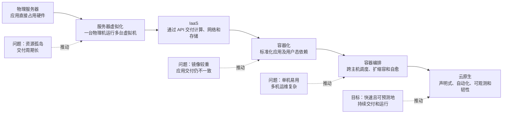
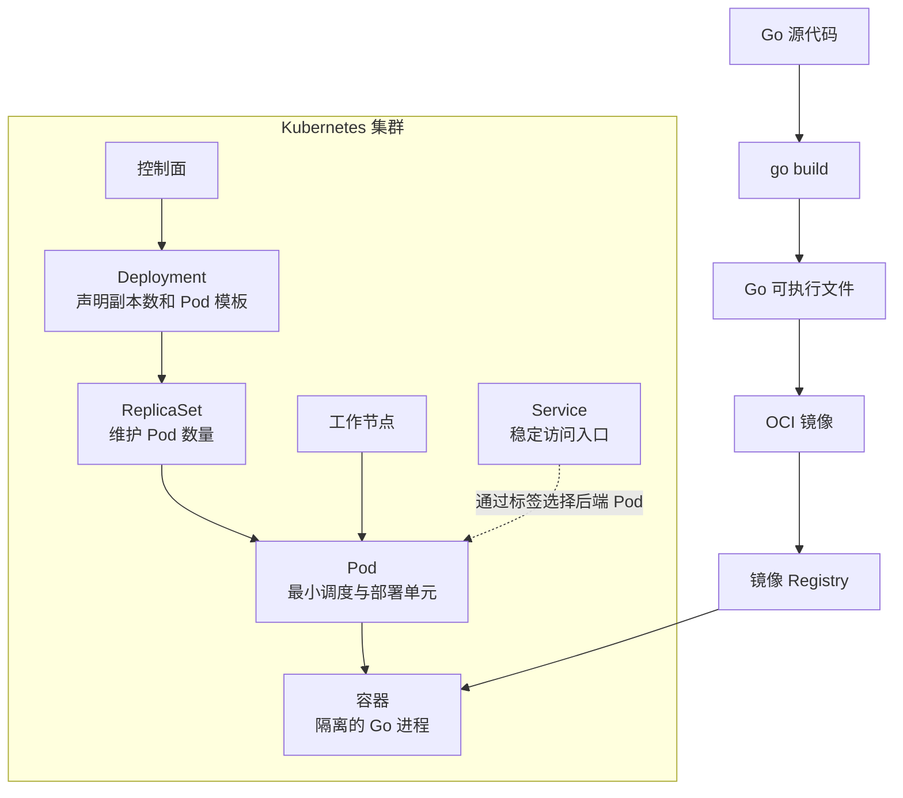

# 第 1 章：从物理机到云原生——Docker 与 Kubernetes 为什么会出现

> **版本状态说明（截至 2026 年 6 月）**
>
> 本章示例使用稳定的 Kubernetes API：`apps/v1` Deployment 和 `v1` Service，不依赖 Alpha 或 Beta 功能。Kubernetes 内置的 `dockershim` 已在 v1.24 中移除；当前节点应使用符合 CRI 的容器运行时。这个变化不会影响 Docker 构建的 OCI 兼容镜像在 Kubernetes 中运行。([Kubernetes][1])

---

## 学习目标

完成本章后，你应当能够：

1. 从资源利用率、交付效率和运维规模三个维度，解释物理机、虚拟机、IaaS、容器、容器编排和云原生的演进逻辑。
2. 准确比较物理机、虚拟机和容器的隔离边界、启动方式、性能损耗及安全模型。
3. 说明“开发环境能运行，生产环境不能运行”的主要原因，以及 Docker 能解决和不能解决的部分。
4. 解释单机容器数量增加后，为什么会出现调度、扩缩容、自愈、服务发现、配置管理和故障域问题。
5. 说清 Docker、Kubernetes、containerd、OCI、CRI、CNI 和 CSI 之间的职责边界。
6. 判断一个业务是否适合使用 Kubernetes，而不是把 Kubernetes 当成默认答案。
7. 使用一个 Go HTTP 服务，解释源代码、二进制文件、镜像、进程、容器、Pod、Deployment、Service 和集群之间的关系。
8. 在面试中按照“结论→机制→场景→取舍→验证”组织答案。

---

## 核心术语

| 术语         | 核心含义                                      |
| ---------- | ----------------------------------------- |
| 物理服务器      | 直接运行操作系统和应用程序的独立硬件                        |
| 虚拟机        | 由 Hypervisor 提供虚拟硬件，并运行独立 Guest OS 的计算实例  |
| IaaS       | 通过 API、自助服务和计量方式交付计算、网络、存储资源              |
| 容器镜像       | 包含应用程序、依赖文件和运行配置的标准化只读软件包                 |
| 容器         | 镜像在指定运行配置下启动后形成的隔离进程                      |
| Registry   | 保存和分发容器镜像及相关元数据的服务                        |
| 容器运行时      | 管理镜像、容器生命周期和容器进程的软件，如 containerd、CRI-O    |
| 容器编排       | 跨多台机器管理工作负载放置、扩缩容、更新和故障恢复                 |
| 集群         | 被统一控制面管理的一组物理机或虚拟机                        |
| Node       | Kubernetes 集群中的工作节点，可以是物理机或虚拟机            |
| Pod        | Kubernetes 可创建和管理的最小计算部署单元，包含一个或多个紧密协作的容器 |
| Deployment | 声明并维护一组无状态 Pod 副本，负责更新、扩缩容和回滚             |
| Service    | 为一组动态变化的 Pod 提供稳定访问入口和服务发现抽象              |
| 声明式 API    | 用户描述期望状态，由系统持续推动实际状态向期望状态收敛               |
| 控制循环       | 持续执行“观察实际状态→比较期望状态→采取纠正动作”的逻辑             |
| OCI        | 定义容器镜像、运行时和分发格式的开放标准                      |
| CRI        | kubelet 与容器运行时之间的接口                       |
| CNI        | 容器网络接口规范                                  |
| CSI        | 容器编排系统与存储插件之间的接口规范                        |
| 云原生        | 通过可编程、可重复的方式构建和运行可扩展、松耦合、可观测且有韧性的系统       |

Docker 官方将容器描述为镜像的可运行实例；Kubernetes 官方将 Pod 定义为最小可部署计算单元。CNCF 对云原生的定义强调可编程、可重复、松耦合、韧性、可管理和可观测，而不是限定必须使用某个公有云或某个具体产品。([Docker Documentation][2])

---

## 技术演进时间线

### 1. 物理机到云原生的演进图



这不是“后面的技术完全替代前面的技术”。生产中的常见结构通常是：

```text
物理数据中心
└── 虚拟机或云主机
    └── Linux 操作系统
        └── 容器运行时
            └── Kubernetes Pod
                └── 业务容器
```

容器经常运行在虚拟机上，Kubernetes 节点也可以是物理机。云原生则是一组架构和工程实践，而不是基础设施的某一层。

### 2. 物理服务器阶段

早期常见部署方式是“一套应用占用一台或几台服务器”：

```text
服务器 A：订单系统
服务器 B：用户系统
服务器 C：数据库
```

这种方式直观，但存在明显问题：

* 资源按机器分配，某个服务只使用 10% CPU，也可能长期独占整台机器。
* 不同应用可能要求不同版本的运行库，容易产生依赖冲突。
* 新增机器涉及采购、上架、装机、配置网络和部署应用，交付周期较长。
* 硬件故障恢复依赖人工或复杂的专用运维系统。
* 应用与具体机器强绑定，迁移和扩容成本高。

### 3. 虚拟机阶段

虚拟化通过 Hypervisor 把物理硬件抽象为多个虚拟机。每台虚拟机拥有自己的虚拟 CPU、内存、磁盘、网卡和 Guest OS。

它解决了两个主要问题：

1. **提高资源利用率**：一台物理服务器可以承载多个相互隔离的工作负载。
2. **提高基础设施交付速度**：虚拟机模板可以复制，机器交付从采购硬件转化为创建虚拟资源。

但虚拟机交付的是“机器”，并没有完全解决“应用如何交付”：

* 每个虚拟机仍要启动完整操作系统。
* VM 模板可能逐渐产生版本漂移。
* 应用依赖、启动命令和配置方式仍可能不统一。
* 复制完整 VM 镜像的成本通常高于复制应用镜像。

### 4. IaaS 阶段

IaaS 不只是“在别人的机房里运行虚拟机”，其关键变化是把基础设施变成可以通过 API 操作的资源：

```text
申请服务器 → 调用创建实例 API
配置网络   → 创建虚拟网络、安全组和负载均衡器
申请磁盘   → 创建并挂载云盘
容量扩展   → 自动创建或删除实例
```

IaaS 提高了基础设施的可编程性，但交付单位仍然主要是虚拟机。应用团队仍需要解决操作系统配置、依赖安装、版本一致性和进程管理问题。

### 5. 容器阶段

Linux 容器并不是 Docker 首创。Linux 内核已经提供 Namespace、Cgroups、Capabilities、联合文件系统等能力。Docker 的关键贡献是将这些底层能力整合成开发者易于理解和使用的产品体验：

```text
Dockerfile → 镜像 → Registry → docker run → 容器
```

Docker 在 2013 年首次公开演示，其核心目标就是降低“把代码交付到服务器”的难度。Docker 通过统一的镜像格式、构建流程、分发机制和运行命令，使容器从一组底层内核能力变成了可规模使用的软件交付方式。([Docker][3])

### 6. 容器编排阶段

单机运行几个容器时，可以人工执行：

```bash
docker run ...
docker stop ...
docker logs ...
```

当系统扩展为几十台机器、数百个服务实例时，问题不再是“如何启动一个容器”，而是：

* 应该把容器放在哪台机器上？
* 某台机器宕机后，谁来迁移工作负载？
* 某个容器异常退出后，谁负责重新创建？
* 流量增长时，如何增加副本？
* Pod IP 不断变化时，调用方如何找到服务？
* 新版本如何逐步替换旧版本？
* 配置、密钥、存储和网络策略如何统一管理？

Kubernetes 正是为管理跨主机容器化工作负载而设计的。其核心不是一组命令，而是声明式 API 和持续运行的控制循环。Kubernetes 1.0 于 2015 年 7 月发布，并在同一时期进入新成立的 CNCF。([Kubernetes][4])

### 7. 标准化与云原生阶段

容器生态成熟后，需要避免“只能用某个厂商的镜像或运行时”。因此逐渐形成了多层开放接口：

* OCI 统一镜像、运行时和分发规范。
* CRI 解耦 Kubernetes 与容器运行时。
* CNI 解耦编排系统与容器网络实现。
* CSI 解耦编排系统与存储厂商实现。

OCI 于 2015 年成立，目前覆盖 Runtime、Image 和 Distribution 三类规范。OCI 运行时规范由 `runc` 等低层运行时实现；高层运行时如 containerd 通常负责镜像、容器生命周期及进程监督。([Open Container Initiative][5])

---

## 核心机制与职责边界

### 1. 物理机、虚拟机、容器和 Kubernetes 的比较

| 比较维度   | 物理机           | 虚拟机                         | 容器                             | Kubernetes                          |
| ------ | ------------- | --------------------------- | ------------------------------ | ----------------------------------- |
| 本质     | 独立硬件          | 虚拟硬件及完整 Guest OS            | 被隔离和限制的进程                      | 管理容器化工作负载的控制平台                      |
| 主要隔离边界 | 物理设备          | Hypervisor、虚拟硬件、独立内核        | Namespace、Cgroups、权限机制，共享宿主机内核 | 不直接增加内核隔离，继承节点和运行时的安全边界             |
| 内核     | 每台机器一个宿主内核    | 每台 VM 有独立 Guest Kernel      | 同一宿主机上的 Linux 容器通常共享宿主机内核      | 每个节点有自己的内核，节点上 Pod 使用相应容器运行时        |
| 启动过程   | 启动硬件、操作系统、应用  | 启动 Guest OS，再启动应用           | 创建隔离环境后启动进程                    | 调度、拉取镜像、创建 Pod 和容器，再等待探针就绪          |
| 启动速度   | 通常最慢          | 通常较慢                        | 通常最快                           | 取决于调度、镜像拉取、运行时和健康检查，不一定比直接启动容器快     |
| 资源密度   | 最低            | 中等                          | 通常最高                           | 通过调度提高集群利用率，但自身有控制面和系统组件开销          |
| 性能损耗   | 无虚拟化损耗        | CPU 常可接近原生，I/O 和内存路径可能有额外成本 | 通常接近原生，但网络、存储、配额和安全沙箱可能增加开销    | 不改变应用算法性能，数据面组件、Sidecar 和网络实现可能增加开销 |
| 安全边界   | 独占硬件时租户隔离较强   | 一般比共享内核容器提供更强的租户边界          | 共享内核，不能默认等同于虚拟机级强隔离            | 可提供 RBAC、策略和审计，但也扩大了控制面和供应链攻击面      |
| 调度能力   | 人工或外部系统       | 由虚拟化平台调度 VM                 | 单个容器引擎通常只管理本机                  | 原生提供跨节点调度                           |
| 故障恢复   | 依赖硬件和外部运维     | 虚拟化平台可迁移或重建 VM              | 可配置本机重启，但不能天然处理整机故障            | 控制器可在可用节点上重建工作负载                    |
| 典型交付单元 | 服务器           | VM 镜像或 VM                   | 容器镜像和运行参数                      | 声明式 API 对象，如 Deployment、Service     |
| 适用重点   | 专用硬件、强隔离、固定负载 | 基础设施隔离、多操作系统                | 应用打包、环境一致性、高密度运行               | 多节点自动化运维和应用生命周期管理                   |

容器与虚拟机的根本区别在于：虚拟机通常运行自己的完整操作系统和内核，而同一宿主机上的容器共享内核。Kubernetes 则不是第四种虚拟化技术，它管理 Pod、节点和应用状态。([Docker Documentation][6])

#### 不能机械使用“容器没有性能损耗”

容器减少了完整 Guest OS 的开销，但以下因素仍可能影响性能：

* Cgroups CPU 配额造成节流。
* OverlayFS 或远程存储增加 I/O 路径。
* CNI、Service 转发、网络策略或 Service Mesh 增加网络处理。
* 日志采集和可观测性 Agent 消耗 CPU、内存和磁盘。
* Sidecar 增加进程、网络跳数和资源占用。
* 镜像拉取和初始化影响冷启动时间。

因此应说“容器通常比完整虚拟机更轻量”，而不是“容器没有开销”。

---

### 2. “开发环境能运行，生产环境不能运行”为什么发生

这类问题不是单一原因，而是不同环境之间存在未经控制的差异。

#### 2.1 构建产物差异

```text
开发环境运行的是本地源码
生产环境运行的是另一台机器编译的二进制文件
```

可能出现：

* 源码提交与实际部署版本不一致。
* 构建参数或编译器版本不一致。
* 依赖版本未锁定。
* 二进制架构错误，例如把 `amd64` 程序部署到 `arm64`。
* Go 程序启用了 CGO，但生产环境缺少相应动态库。

#### 2.2 操作系统和用户态依赖差异

例如：

* 开发机存在某个共享库，生产机不存在。
* CA 证书不同，导致 TLS 验证失败。
* 时区或 Locale 不一致。
* 文件路径、大小写规则或目录权限不同。
* 生产进程使用普通用户运行，开发环境使用管理员权限。
* DNS 配置或 `/etc/hosts` 不同。

即使 Go 程序编译成静态二进制，也不代表它完全不依赖环境。它仍可能依赖证书、时区数据、DNS、内核能力、文件系统、设备和外部服务。

#### 2.3 配置和外部依赖差异

应用镜像无法自动保证以下内容一致：

* 数据库版本和 Schema。
* 缓存集群状态。
* 消息队列 Topic 或权限。
* 第三方接口行为。
* DNS、负载均衡器和网络访问控制。
* Secret、证书和密钥。
* 云厂商资源和 IAM 权限。

#### 2.4 运行负载差异

开发环境通常只有一个用户，生产环境可能面对：

* 大量并发连接。
* 长尾请求。
* 突发流量。
* CPU 或内存限制。
* 慢数据库查询。
* 下游超时和级联故障。
* 进程信号和优雅退出。
* 磁盘写满、文件句柄耗尽和端口耗尽。

#### 2.5 Docker 对这一问题的覆盖范围

| 差异来源       | Docker 能否直接缓解 | 说明                |
| ---------- | ------------: | ----------------- |
| 应用代码和二进制文件 |             能 | 镜像可以固定部署产物        |
| 用户态库和工具    |             能 | 可随镜像一同打包          |
| 启动命令       |             能 | 可通过镜像配置统一         |
| 默认环境变量和目录  |           部分能 | 生产配置通常仍需外部注入      |
| 宿主机内核      |        不能完整打包 | Linux 容器共享节点内核    |
| CPU 架构     |        不能自动消除 | 需要构建对应平台镜像        |
| 数据库和消息队列   |            不能 | 属于外部系统            |
| 网络、DNS和证书  |        只能部分控制 | 仍受部署环境影响          |
| 真实生产流量     |            不能 | 需要压测、限流和容量规划      |
| 应用逻辑错误     |            不能 | 错误代码被稳定打包后仍然是错误代码 |

Docker 的准确价值不是“保证任何地方绝对相同”，而是**显著缩小应用交付环境的差异范围**。

---

### 3. Docker 解决了什么

Docker Engine 采用客户端—服务器架构，通过 `docker` CLI、API 和 `dockerd` 管理镜像、容器、网络和卷。当前 Docker Engine 使用 containerd 管理容器生命周期，而 containerd 默认通常通过 `runc` 启动符合 OCI 规范的 Linux 容器。([Docker Documentation][7])

#### 3.1 标准化应用交付物

传统交付：

```text
代码包
+ 安装文档
+ 依赖清单
+ 人工配置步骤
+ 启动脚本
```

容器化交付：

```text
镜像 Digest
+ 明确的运行配置
```

镜像可以包含：

* Go 可执行文件。
* 必要的动态库。
* CA 证书。
* 默认配置文件。
* 启动命令。
* 环境变量默认值。
* 文件和目录结构。

#### 3.2 提高构建和运行的一致性

同一个镜像可以用于：

```text
开发测试 → CI → 集成测试 → 预发布 → 生产
```

前提是这些环境具有兼容的 CPU 架构、操作系统内核能力和运行时实现。

#### 3.3 提供相对轻量的进程隔离

容器可以拥有不同的：

* PID 视图。
* 网络栈。
* 挂载视图。
* 主机名。
* IPC 资源。
* 用户映射。
* CPU、内存和进程数限制。

容器仍然是进程，而不是拥有独立内核的虚拟机。

#### 3.4 提供镜像分发机制

镜像可以推送到 Registry，并通过 Tag 或 Digest 拉取。尤其是 Digest，可以把部署内容绑定到不可变标识，降低“同一个 Tag 指向不同内容”的风险。

#### 3.5 简化单机容器生命周期管理

Docker 可以处理：

* 创建、启动、停止和删除容器。
* 连接网络。
* 挂载存储。
* 收集标准输出日志。
* 配置端口映射。
* 设置部分资源约束和重启策略。

---

### 4. Docker 没有解决什么

#### 4.1 Docker 不自动解决多机调度

假设有三台机器：

```text
Node A：剩余 2 CPU、4 GiB 内存
Node B：剩余 8 CPU、2 GiB 内存
Node C：剩余 4 CPU、16 GiB 内存
```

现在需要启动一个请求 4 CPU、8 GiB 内存的服务。单机 Docker Engine 不会自动遍历整个集群并选择 Node C。

#### 4.2 Docker 不自动解决节点级故障

容器的重启策略可以处理本机进程退出，但如果整台机器断电，运行在该机器上的 Docker 也停止了。必须有机器之外的控制系统发现故障，并在其他节点重建工作负载。

#### 4.3 Docker 不保证应用高可用

即使一个容器一直运行，应用仍可能：

* 线程或 Goroutine 死锁。
* 只接受连接但不能正确处理请求。
* 无法连接数据库。
* 返回大量错误。
* 处理速度远低于进入流量。
* 持有错误缓存或过期证书。

“进程存活”与“业务可用”不是同一件事。

#### 4.4 Docker 不解决分布式系统问题

容器化无法消除：

* 分布式事务。
* 网络分区。
* 请求重试风暴。
* 数据一致性。
* 幂等性。
* 服务依赖循环。
* 级联故障。
* 消息重复和乱序。
* 数据库主从切换。

#### 4.5 Docker 不自动解决安全问题

镜像可能包含：

* 已知漏洞。
* 恶意依赖。
* 泄露的 Secret。
* 过大的权限。
* 不可信安装脚本。
* 错误的文件权限。

容器进程也可能以 root 运行、挂载宿主机敏感目录或获得危险的 Linux Capability。

#### 4.6 Docker 不自动解决可观测性和容灾

生产系统仍需要：

* 指标、日志和链路追踪。
* SLO 和告警。
* 数据备份。
* 恢复演练。
* 容量规划。
* 安全审计。
* 发布审批和回滚机制。

---

### 5. 单机运行大量容器后会出现什么问题

| 问题     | 单机小规模时的做法         | 多机大规模时的问题         |
| ------ | ----------------- | ----------------- |
| 放置     | 人工选择机器            | 无法持续计算资源、亲和性和故障域  |
| 扩容     | 手工执行 `docker run` | 副本容易分布不均，流量入口难以同步 |
| 自愈     | 本机重启策略            | 无法处理节点宕机和跨机迁移     |
| 服务发现   | 固定 IP 或端口         | 容器地址不断变化          |
| 负载均衡   | 手工修改代理配置          | 实例增减时配置需要自动更新     |
| 发布     | 停旧容器、启新容器         | 需要滚动更新、健康检查和失败回滚  |
| 配置     | 环境变量或挂载文件         | 需要版本化、权限控制和批量更新   |
| Secret | 明文文件或命令参数         | 需要访问控制、轮换和审计      |
| 存储     | 本机目录或 Volume      | 容器迁移后数据不一定可访问     |
| 网络     | 本机 Bridge         | 跨节点地址、路由和网络策略复杂   |
| 资源管理   | 人工观察              | 需要请求量、限制、配额和优先级   |
| 故障域    | 只有一台机器            | 副本可能全部落在同一节点或可用区  |
| 可观测性   | `docker logs`     | 需要全局检索、聚合和关联分析    |

当工作负载规模增加后，需要一个始终运行的控制系统，而不是一套由运维人员反复执行的命令清单。

---

### 6. Kubernetes 为什么出现

Kubernetes 官方将自身定义为管理容器化工作负载和服务、支持声明式配置与自动化的平台。它的核心价值可以概括为：

```text
用户声明期望状态
        ↓
API Server 保存期望状态
        ↓
控制器持续观察实际状态
        ↓
发现差异后执行纠正动作
        ↓
实际状态逐步收敛
```

例如，用户声明：

```yaml
spec:
  replicas: 3
```

这句话不是“立即启动三个进程”的命令，而是一个长期约束：

```text
期望状态：3 个副本
实际状态：2 个副本
差异：少 1 个
动作：创建新的 Pod
```

如果之后一个 Pod 退出，实际状态重新变成 2，控制器会再次创建 Pod。Kubernetes 对象本质上是“意图记录”，系统持续工作以使实际状态接近期望状态。([Kubernetes][8])

#### Kubernetes 的主要职责

1. **调度**：为 Pod 选择节点。
2. **副本维护**：维持指定数量的工作负载实例。
3. **自愈**：重建失败的 Pod，替换不健康实例。
4. **滚动发布和回滚**：逐步替换工作负载版本。
5. **服务发现和负载分发**：通过 Service 为动态 Pod 提供稳定入口。
6. **配置与 Secret 管理**：把运行配置与镜像分离。
7. **资源管理**：声明 CPU、内存请求与限制。
8. **存储编排**：通过存储类、PV、PVC 和 CSI 接入存储。
9. **扩展能力**：通过自定义资源和控制器扩展 API。

Kubernetes 的控制面管理节点和 Pod，工作节点负责实际承载应用。生产集群通常包含多个控制面实例和多个工作节点，以降低单点故障风险。([Kubernetes][9])

---

### 7. Docker 与 Kubernetes 的职责边界

可以用一句话区分：

> **Docker 主要解决如何构建、分发和运行容器；Kubernetes 主要解决如何在集群中持续管理容器化工作负载。**

更准确地说：

| 能力         |                    Docker Engine |            Kubernetes |
| ---------- | -------------------------------: | --------------------: |
| 构建镜像       |                               支持 |    Kubernetes 本身不构建镜像 |
| 推送和拉取镜像    |                               支持 |           通过节点容器运行时拉取 |
| 单机启动容器     |                               支持 | 通过 kubelet 和容器运行时间接完成 |
| 多节点调度      |               不属于单机 Engine 的核心职责 |                    支持 |
| 声明副本数      | 有其他 Docker 生态方案，但非 Engine 单机模型核心 |      Deployment 等原生支持 |
| 节点宕机后重建    |                         不支持跨节点恢复 |             支持在可用节点重建 |
| Service 抽象 |                 Docker 网络可实现本机连接 |   提供集群级 Service 和服务发现 |
| 滚动更新       |                           需要外部编排 |       Deployment 原生支持 |
| 应用构建流程     |            Dockerfile、BuildKit 等 |                   不负责 |
| 集群控制循环     |                              不负责 |                  核心机制 |

Kubernetes 不要求开发者停止使用 Docker 构建镜像。常见流程仍然是：

```text
docker build
     ↓
推送 OCI 兼容镜像
     ↓
Kubernetes Deployment 引用镜像
     ↓
节点上的 containerd 或 CRI-O 拉取并运行
```

---

### 8. Docker、containerd、OCI、CRI、CNI、CSI 和 Kubernetes 的位置

| 层级    | 组件或规范                          | 主要职责                             | 不负责什么               |
| ----- | ------------------------------ | -------------------------------- | ------------------- |
| 应用层   | Go 源码和二进制文件                    | 实现业务逻辑                           | 不管理容器和集群            |
| 构建工具  | Docker Build、BuildKit 等        | 根据 Dockerfile 构建镜像               | 不负责集群调度             |
| 镜像标准  | OCI Image Specification        | 规定镜像 Manifest、Config、Layer 等格式   | 不启动容器               |
| 分发标准  | OCI Distribution Specification | 规定镜像内容如何通过 Registry 分发           | 不管理工作负载             |
| 容器产品  | Docker Engine                  | 构建、运行并管理本机容器、镜像、网络和卷             | 不等同于 Kubernetes     |
| 编排控制面 | Kubernetes                     | 声明式管理 Pod、Service、Deployment 等对象 | 不直接实现所有运行时、网络和存储    |
| 节点代理  | kubelet                        | 根据 PodSpec 管理节点上的 Pod            | 不自己实现底层容器隔离         |
| 运行时接口 | CRI                            | 规范 kubelet 与容器运行时的交互             | 不定义镜像构建流程           |
| 高层运行时 | containerd、CRI-O               | 镜像管理、容器生命周期、进程监督                 | 通常不负责集群调度           |
| 低层运行时 | runc、crun 等                    | 根据 OCI Runtime Spec 创建容器进程       | 不负责镜像仓库和集群管理        |
| 网络接口  | CNI                            | 规范网络插件如何配置和清理容器网络                | 不规定具体 Overlay 或路由实现 |
| 存储接口  | CSI                            | 规范存储提供方应暴露的 RPC                  | 不实现具体磁盘或存储系统        |
| 内核层   | Linux Kernel                   | Namespace、Cgroups、网络、挂载和安全能力     | 不负责声明式集群管理          |

CRI 是基于 protobuf 和 gRPC 的插件接口，使 kubelet 无需重新编译就能使用不同容器运行时。CNI 聚焦容器网络连接及资源清理；CSI 规定存储插件需要实现的接口。([GitHub][10])

#### dockershim 移除到底意味着什么

早期 Kubernetes 的 kubelet 内置了 `dockershim`，用来把 CRI 请求转换为 Docker Engine 调用。后来 containerd、CRI-O 等运行时可以直接提供 CRI 接口，因此 Kubernetes 在 v1.20 弃用 dockershim，并在 v1.24 将其移除。([Kubernetes][11])

它意味着：

```text
旧方式：
kubelet → CRI → dockershim → Docker Engine → containerd → runc

常见新方式：
kubelet → CRI → containerd 或 CRI-O → runc
```

它不意味着：

* Docker 镜像不能使用。
* Dockerfile 不能使用。
* Docker Desktop 不能用于本地开发。
* OCI 镜像格式被废弃。

如果确实要把 Docker Engine 作为 Kubernetes 节点运行时，可以使用额外的 CRI 适配层，如 `cri-dockerd`；但这不等于恢复 Kubernetes 内置 dockershim。Kubernetes 当前官方运行时文档仍列出了通过适配方式使用 Docker Engine的路径。([Kubernetes][1])

---

### 9. 单体架构、微服务架构和容器化没有必然关系

这是面试中非常重要的概念分离。

#### 9.1 三者属于不同维度

| 维度   | 关注的问题       | 典型选项                        |
| ---- | ----------- | --------------------------- |
| 软件架构 | 代码和业务能力如何拆分 | 单体、模块化单体、微服务                |
| 交付方式 | 应用如何打包和运行   | 二进制包、VM 镜像、容器镜像             |
| 运维平台 | 工作负载如何部署和管理 | Shell、配置管理、虚拟化平台、Kubernetes |

所以：

* 单体应用可以被打包成一个容器并运行在 Kubernetes 中。
* 微服务可以直接运行在物理机或虚拟机上，不使用容器。
* 使用 Docker 不会自动把单体变成微服务。
* 把单体拆成多个容器，也不代表完成了合理的微服务拆分。

#### 9.2 四种组合都可能成立

| 软件架构 | 非容器化部署         | 容器化部署         |
| ---- | -------------- | ------------- |
| 单体   | 一个二进制文件部署到 VM  | 一个镜像运行一个或多个副本 |
| 微服务  | 多个服务分别部署到不同 VM | 多个服务分别构建镜像并编排 |

微服务是一种组织复杂业务和团队边界的方式，它同时引入网络调用、数据一致性、服务治理、故障传播和可观测性成本。容器只是降低服务交付和运行环境管理成本，并不会解决这些分布式系统问题。

---

### 10. 从 Go 源代码到 Kubernetes 工作负载

#### 10.1 最小 Go HTTP 服务

```go
package main

import (
	"fmt"
	"log"
	"net/http"
	"os"
	"time"
)

func main() {
	mux := http.NewServeMux()

	mux.HandleFunc("/hello", func(w http.ResponseWriter, r *http.Request) {
		hostname, _ := os.Hostname()
		fmt.Fprintf(w, "hello from %s\n", hostname)
	})

	mux.HandleFunc("/ready", func(w http.ResponseWriter, r *http.Request) {
		w.WriteHeader(http.StatusOK)
		_, _ = w.Write([]byte("ready\n"))
	})

	server := &http.Server{
		Addr:              ":8080",
		Handler:           mux,
		ReadHeaderTimeout: 2 * time.Second,
		IdleTimeout:       60 * time.Second,
	}

	log.Printf("listening on %s", server.Addr)
	log.Fatal(server.ListenAndServe())
}
```

`go build` 会把 Go 包及其依赖编译成可执行文件。运行该文件时，操作系统创建一个进程；容器运行时则在隔离和资源约束条件下启动这个进程。([Go][12])

#### 10.2 构建容器镜像

```dockerfile
# syntax=docker/dockerfile:1

FROM golang:1.26 AS build
WORKDIR /src
COPY . .
RUN CGO_ENABLED=0 GOOS=linux go build -trimpath -o /out/app .

FROM scratch
COPY --from=build /out/app /app
ENTRYPOINT ["/app"]
```

构建并推送镜像：

```bash
docker build -t registry.example.com/demo/hello:v1 .
docker push registry.example.com/demo/hello:v1
```

在更严格的生产环境中，Deployment 通常应引用镜像 Digest，而不是依赖可变 Tag：

```text
registry.example.com/demo/hello@sha256:...
```

#### 10.3 使用 Deployment 和 Service

```yaml
apiVersion: apps/v1
kind: Deployment
metadata:
  name: hello
spec:
  replicas: 3
  selector:
    matchLabels:
      app: hello
  template:
    metadata:
      labels:
        app: hello
    spec:
      containers:
        - name: hello
          image: registry.example.com/demo/hello:v1
          ports:
            - name: http
              containerPort: 8080
          readinessProbe:
            httpGet:
              path: /ready
              port: http
---
apiVersion: v1
kind: Service
metadata:
  name: hello
spec:
  selector:
    app: hello
  ports:
    - name: http
      port: 80
      targetPort: http
```

#### 10.4 层级关系图



需要特别注意：

1. **源代码不是容器**：源代码先被编译为二进制文件。
2. **镜像不是容器**：镜像是静态软件包，容器是它的运行实例。
3. **容器主要是进程**：Go 二进制最终仍以操作系统进程形式执行。
4. **Pod 不等于容器**：Pod 可以包含一个或多个共享部分网络和存储环境的容器。
5. **Deployment 不直接“包含”运行中的 Pod**：Deployment 管理 ReplicaSet，ReplicaSet 根据 Pod 模板维护副本。
6. **Service 不是 Deployment 的子对象**：Service 通过标签选择 Pod，为动态后端提供稳定访问入口。
7. **集群不只包含 Pod**：还包括控制面、工作节点、网络、存储和大量 API 对象。

Deployment 提供对 Pod 和 ReplicaSet 的声明式更新；Service 为一个或多个动态 Pod 提供稳定的网络暴露方式。([Kubernetes][13])

---

## 使用场景及不适用场景

### 1. 适合使用容器但未必需要 Kubernetes 的场景

* 开发环境需要快速建立一致依赖。
* CI 需要可重复的构建和测试环境。
* 单机部署多个相互隔离的服务。
* 本地集成测试需要启动数据库、缓存和消息队列。
* 应用数量不多、机器数量少、发布频率较低。
* 已使用托管平台处理调度和扩缩容，应用团队只需提供镜像。

此时 Docker、Compose、系统服务管理器或轻量托管平台可能已经足够。

### 2. Kubernetes 比较合适的场景

| 业务特征      | Kubernetes 可能带来的价值         |
| --------- | -------------------------- |
| 服务和副本数量较多 | 统一调度和生命周期管理                |
| 发布频繁      | 标准化滚动更新、回滚和健康检查            |
| 流量波动明显    | 配合指标和扩缩容机制调整副本             |
| 多团队共享基础设施 | Namespace、RBAC、Quota 和策略治理 |
| 存在多节点故障   | 自动重建工作负载并重新调度              |
| 需要统一平台接口  | 使用一致的声明式 API 管理应用          |
| 基础设施环境多样  | 在不同节点和云环境上提供相对一致的应用抽象      |
| 平台团队成熟    | 可以统一建设网络、存储、可观测性和安全能力      |

### 3. 不适合或不急于使用 Kubernetes 的场景

#### 3.1 只有一个稳定的小型服务

例如：

```text
一个 Go API
一台虚拟机
每天几百个请求
每月发布一次
允许短时间维护
```

此时引入 Kubernetes 可能增加：

* 集群部署和升级成本。
* 网络和证书管理成本。
* YAML、RBAC、资源模型学习成本。
* 日志、监控和备份系统复杂度。
* 故障排查层级。

一个进程管理器、虚拟机快照、负载均衡器和自动化脚本可能更经济。

#### 3.2 团队缺乏平台运维能力

Kubernetes 会把部分应用运维问题标准化，但不会使运维消失。团队仍需理解：

* 集群升级。
* CNI 和 DNS。
* 存储和备份。
* 节点资源压力。
* 证书和权限。
* 镜像供应链。
* 控制面、Admission 和 Webhook。
* 监控、告警和容量规划。

托管 Kubernetes 可以降低控制面运维成本，但不能消除应用、节点、网络和生态组件的复杂度。

#### 3.3 极端低延迟或强硬件绑定负载

例如：

* 对尾延迟极敏感的交易路径。
* 强依赖 NUMA、CPU Pinning、专用网卡或特定设备的应用。
* 高性能计算或对本地存储拓扑有严格要求的负载。

Kubernetes 并非一定不能运行这些业务，但需要额外的拓扑、调度和性能工程。如果收益小于复杂性，直接使用物理机或专用虚拟机可能更合适。

#### 3.4 难以容器化的旧式商业软件

某些软件可能：

* 依赖固定主机名或硬件许可。
* 要求完整 init 系统。
* 强依赖桌面环境或特权内核模块。
* 不支持实例动态变化。
* 把配置、日志和数据混在同一目录。
* 缺少健康检查和自动恢复能力。

强行迁移可能只会把原有问题包在容器里。

#### 3.5 强状态、低自动化的系统

数据库可以运行在 Kubernetes 中，但这不意味着“创建 StatefulSet 就完成了数据库高可用”。仍需处理：

* 复制和一致性。
* Leader 选举。
* 故障切换。
* 数据修复。
* 备份和恢复。
* 存储延迟。
* 可用区故障。
* 版本升级。

如果组织已有成熟的托管数据库服务，通常不必为了“技术统一”而把数据库迁入集群。

### 4. 一个实用的选型公式

可以把决策近似理解为：

```text
净收益
= 标准化收益
+ 自动化收益
+ 资源利用率收益
+ 发布效率收益
+ 故障恢复收益
- 平台建设成本
- 学习和认知成本
- 运维复杂度
- 迁移成本
- 新增故障面
```

不要问：

> “Kubernetes 功能是否更强？”

应该问：

> “这些功能是否解决了当前业务中真实、频繁且成本足够高的问题？”

---

## 与高并发、高性能、高可用的关系

### 1. Kubernetes 与高并发

Kubernetes 可以帮助高并发系统：

* 维护多个无状态副本。
* 把流量分散到多个 Pod。
* 根据指标调整副本数。
* 通过调度把负载分布到多台节点。
* 在升级期间逐步替换实例。

但 Kubernetes 不会自动解决：

* Go 服务内部锁竞争。
* Goroutine 泄漏。
* 数据库连接池耗尽。
* 下游接口限流。
* 热点 Key。
* 队列积压。
* 重试风暴。
* 非幂等请求。
* 缓存击穿。
* 数据库写入瓶颈。

因此：

```text
高并发能力
≠ Pod 数量多

高并发能力
= 单实例效率
× 有效实例数
× 下游承载能力
× 流量治理能力
× 故障隔离能力
```

### 2. Kubernetes 与高性能

Kubernetes 对性能的价值主要是：

* 提供统一资源模型。
* 按资源需求进行放置。
* 支持水平扩展。
* 便于快速替换性能异常实例。
* 统一接入压测、监控和分析工具。

它不会把低效代码变快。相反，以下组件还可能增加延迟：

* Service 转发路径。
* Overlay 网络。
* 网络策略。
* Sidecar 代理。
* 远程存储。
* CPU Limit 导致的节流。
* 跨节点、跨可用区流量。

高性能场景要测量真实数据路径，不能只比较“是否使用容器”。

### 3. Kubernetes 与高可用

Kubernetes 可提供的基础能力包括：

* 维护副本。
* 重建失败 Pod。
* 在其他可用节点重新调度。
* 将未就绪实例从 Service 后端移除。
* 滚动更新和回滚。
* 将副本分散到不同节点和故障域。

但应用高可用还要求：

* 至少两个真正独立的副本。
* 正确的 readiness 检查。
* 合理的请求超时。
* 优雅退出。
* 数据层高可用。
* 多可用区部署。
* 正确的反亲和或拓扑分布。
* 容量冗余。
* 故障演练。
* 对外部依赖的降级和熔断。

Kubernetes 的自愈主要针对“把工作负载恢复到声明状态”，不保证业务语义一定正确。

### 4. 三者关系总结

| 目标  | Kubernetes 能提供     | 仍需应用解决                 |
| --- | ------------------ | ---------------------- |
| 高并发 | 副本、调度、服务发现、扩缩容基础   | 并发模型、限流、背压、幂等、数据分片     |
| 高性能 | 资源声明、拓扑调度、弹性基础     | 代码优化、数据结构、I/O、网络和数据库性能 |
| 高可用 | 副本维护、自愈、滚动更新、故障域调度 | 数据一致性、依赖治理、容灾、容量和恢复验证  |

---

## 常见错误认知

### 错误一：容器就是轻量级虚拟机

容器和虚拟机都可以提供隔离，但实现边界不同。虚拟机抽象硬件并运行独立内核；Linux 容器通常共享宿主机内核。更准确的说法是：

> 容器是使用内核隔离和资源控制机制运行的受约束进程。

### 错误二：镜像里包含完整操作系统内核

普通 Linux 容器镜像主要包含用户态文件，例如：

* 应用二进制。
* Shell。
* libc。
* 包管理器。
* CA 证书。
* 配置文件。

运行时使用的是节点内核，而不是镜像中的独立 Linux 内核。

### 错误三：用了 Docker，环境一定完全一致

Docker 能固定应用和大量用户态依赖，但不能固定：

* CPU 架构。
* 宿主内核。
* 外部数据库。
* 云网络。
* Secret。
* 真实流量。
* 内核参数。
* 硬件设备。

### 错误四：Kubernetes 是 Docker 的升级版

Docker 和 Kubernetes 不处于完全相同的抽象层。Docker 偏向构建、分发和单机运行；Kubernetes 偏向跨节点编排和声明式生命周期管理。

### 错误五：Kubernetes 已经不支持 Docker 镜像

移除的是 kubelet 内置的 dockershim，不是 OCI 镜像支持。通过 Docker 构建的标准镜像仍可由 containerd、CRI-O 等运行时运行。([Kubernetes][14])

### 错误六：Pod 就是容器

Pod 是 Kubernetes 的部署和调度单元，可以包含一个或多个紧密协作的容器。最常见的是一个业务容器一个 Pod，但两者仍不是同一概念。

### 错误七：Service 包含一组 Pod

Service 不拥有 Pod。它通常根据标签选择后端，并通过 EndpointSlice 等对象表示可用端点。Pod 可以被 Deployment 创建和删除，而 Service 提供稳定访问抽象。

### 错误八：容器化等于微服务化

容器是打包和运行方式，微服务是架构拆分方式。一个结构混乱的单体不会因为拆成多个容器就自动成为合理的微服务系统。

### 错误九：Kubernetes 可以自动让应用高可用

Kubernetes 能恢复副本数量，但无法判断业务数据是否正确，也无法自动修复所有下游依赖、分布式事务或数据库一致性问题。

### 错误十：副本越多，吞吐量就一定线性增长

当瓶颈位于共享数据库、缓存热点、消息队列或外部接口时，增加 Pod 可能只是增加竞争，甚至让系统更快过载。

### 错误十一：用了 Kubernetes 就不需要运维

Kubernetes 把大量运维行为转化为平台能力和 API，但平台本身仍需要升级、安全、可观测性、容量和故障管理。

### 错误十二：所有业务最终都应该迁移到 Kubernetes

技术选择必须考虑业务规模、团队能力、发布频率、可靠性目标和成本。更复杂的平台只有在解决足够昂贵的问题时才有价值。

---

## 面试回答方法

面对“为什么需要 Docker”“为什么需要 Kubernetes”这类问题，不要从名词清单开始，而应使用以下结构。

| 步骤 | 回答内容              |
| -- | ----------------- |
| 结论 | 先用一句话直接回答问题       |
| 机制 | 说明底层或控制机制         |
| 场景 | 给出问题出现的规模和条件      |
| 取舍 | 说明它不能解决什么、引入什么成本  |
| 验证 | 给出指标、命令、故障演练或检查方式 |

### 示例：为什么需要 Kubernetes

#### 结论

Kubernetes 用于解决容器化工作负载跨多台机器运行后产生的调度、扩缩容、自愈、服务发现和发布管理问题。

#### 机制

用户通过 API 声明期望状态，调度器选择节点，控制器持续比较实际状态与期望状态，kubelet 再通过 CRI 驱动节点容器运行时。

#### 场景

当系统只有一台机器和几个容器时，人工管理通常足够；当发展到数十台节点、数百个服务实例并频繁发布时，人工命令无法稳定维护全局状态。

#### 取舍

Kubernetes 增加控制面、网络、存储、安全和排障复杂度，不适合所有小型系统，也不能自动解决业务逻辑和分布式数据一致性问题。

#### 验证

可以删除一个 Deployment 管理的 Pod，观察控制器是否创建新 Pod；再停止一个节点，观察工作负载是否在其他可用节点重建，并验证 Service 是否只把流量发送到就绪后端。

---

## 章节总结

1. 物理机解决计算问题，虚拟机提高基础设施利用率和隔离能力，IaaS 让基础设施可通过 API 交付。
2. 容器把应用及用户态依赖标准化为镜像，并以隔离进程形式运行。
3. Docker 显著降低了镜像构建、分发和单机容器管理的门槛，但不负责解决所有多机编排和分布式系统问题。
4. 单机容器规模扩大后，会产生跨节点调度、自愈、扩缩容、服务发现、滚动发布、配置、存储和故障域问题。
5. Kubernetes 通过声明式 API 和控制循环维护集群期望状态。
6. Kubernetes 管理的是 Pod 和工作负载，而不是直接把 Docker Engine 当作唯一运行时。
7. OCI 定义容器标准，CRI、CNI 和 CSI 分别解耦运行时、网络和存储。
8. 单体与微服务属于软件架构维度，容器属于交付和运行维度，两者没有必然关系。
9. Kubernetes 能为高并发、高性能和高可用提供平台基础，但不能代替应用架构、性能优化和数据容灾设计。
10. 是否采用 Kubernetes，应根据问题规模和总体成本判断，而不是根据技术流行程度判断。

---

## 5 道自测题及答案

### 自测题 1：容器和虚拟机的根本区别是什么？

**答案：**

虚拟机通过 Hypervisor 提供虚拟硬件，并运行独立 Guest OS 和内核；Linux 容器通常是共享宿主机内核、通过 Namespace 和 Cgroups 隔离及限制的进程。因此容器通常启动更快、密度更高，但默认安全边界一般弱于拥有独立内核的虚拟机。

---

### 自测题 2：为什么同一个镜像在测试环境正常，在生产环境仍可能失败？

**答案：**

镜像只能固定应用和部分用户态依赖，无法固定 CPU 架构、宿主机内核、网络、DNS、Secret、数据库状态、证书、云权限和真实负载。生产环境也可能设置不同的 CPU、内存、文件系统和安全约束。

---

### 自测题 3：Docker 已经能重启容器，为什么还需要 Kubernetes 自愈？

**答案：**

Docker 的本机重启策略只能在 Docker Engine 和主机仍然可用时工作。如果节点断电、内核崩溃或网络隔离，本机 Docker 无法在其他机器上重建容器。Kubernetes 控制器运行在集群控制面，可以发现实际副本不足，并在可用节点重新创建 Pod。

---

### 自测题 4：移除 dockershim 是否意味着不能再用 Dockerfile？

**答案：**

不是。移除的是 kubelet 内置的 Docker Engine 适配代码。Dockerfile 和 Docker 构建出的 OCI 兼容镜像仍然可以使用，节点上的 containerd 或 CRI-O 可以直接拉取并运行这些镜像。

---

### 自测题 5：一个只有单体 Go 服务的系统能否使用 Kubernetes？

**答案：**

可以。单体与 Kubernetes 并不冲突。但是否应该使用取决于副本规模、发布频率、可靠性目标、团队能力和平台成本。一个低流量、低变更的小型单体服务，使用虚拟机和进程管理器可能更简单。

---

# 面试题

## 一、基础题

### 1. 为什么 Docker 会出现？

**面试官考察意图**

考察候选人是否理解 Docker 解决的是软件交付问题，而不仅会背“容器轻量、启动快”。

**30 秒回答**

Docker 出现的核心原因是传统应用交付缺少统一、可移植的运行单元。它把应用、用户态依赖和启动配置构建成标准镜像，通过 Registry 分发，再以隔离进程形式运行，从而减少开发、测试和生产之间的环境差异。它解决了构建、分发和单机运行问题，但不自动解决多机调度、高可用和分布式数据一致性。([Docker Documentation][15])

**展开回答**

* **结论：** Docker 将应用交付单元从“安装步骤和机器状态”转变为“版本化镜像和运行配置”。
* **机制：** Dockerfile 描述构建过程，镜像保存应用和文件系统内容，Registry 负责分发，Docker Engine 根据镜像创建隔离进程。
* **场景：** 多个开发者、CI 和生产环境需要运行同一 Go 服务时，可以复用相同镜像，而不是在每台机器上重新执行依赖安装。
* **取舍：** 镜像不会包含外部数据库状态，也不能固定宿主机内核、网络、Secret 和真实流量。镜像过大、来源不可信或配置错误还会带来供应链风险。
* **验证：** 检查镜像 Digest、构建记录和 SBOM；在不同环境拉取同一 Digest，验证二进制版本、启动命令和关键文件是否一致。

**可能追问**

* 镜像与容器有什么区别？
* Go 静态二进制为什么还需要镜像？
* 同一镜像为什么仍可能在生产失败？

**常见误区**

只回答“Docker 比虚拟机轻”，没有说明镜像、分发和交付一致性。

---

### 2. 容器与虚拟机有什么区别？

**面试官考察意图**

考察候选人是否理解共享内核、隔离边界和性能取舍。

**30 秒回答**

虚拟机虚拟化硬件，每台 VM 运行独立 Guest OS 和内核；容器通常共享宿主机内核，通过 Namespace、Cgroups 和权限机制隔离进程。容器通常启动更快、资源密度更高，但共享内核意味着其默认安全边界通常弱于虚拟机。([Docker Documentation][6])

**展开回答**

* **结论：** 二者都提供隔离，但隔离层级不同。
* **机制：** VM 的边界位于虚拟硬件和 Hypervisor；容器的边界主要位于同一内核中的进程视图、资源控制和权限控制。
* **场景：** 普通无状态服务适合容器高密度运行；强多租户或需要不同操作系统内核时，VM 更自然。
* **取舍：** VM 启动和资源成本较高；容器轻量，但内核漏洞和高权限配置可能扩大影响范围。也可以使用沙箱容器或 MicroVM 加强边界。
* **验证：** 在容器中检查内核版本并与宿主机对比；观察容器进程在宿主机上的 PID；验证 Cgroups 资源约束和 Namespace 隔离。

**可能追问**

* 容器是否包含操作系统？
* 为什么容器启动快？
* 容器逃逸是什么？
* Kata Containers 或 gVisor 解决什么问题？

**常见误区**

认为容器完全没有操作系统文件，或认为容器与 VM 只是体积大小不同。

---

### 3. Docker 和 Kubernetes 有什么区别？

**面试官考察意图**

考察候选人能否区分应用容器化与集群编排。

**30 秒回答**

Docker 主要负责构建、分发和在节点上运行容器；Kubernetes 负责在集群中声明式地调度和管理容器化工作负载，包括副本、自愈、服务发现和滚动更新。Kubernetes 通常运行 Docker 构建的 OCI 镜像，但节点不必运行 Docker Engine。([Docker Documentation][7])

**展开回答**

* **结论：** Docker 更接近容器开发和节点运行工具，Kubernetes 是跨节点工作负载管理平台。
* **机制：** Docker Engine 管理镜像和本机容器；Kubernetes 通过 API 对象、调度器、控制器、kubelet 和 CRI 管理集群期望状态。
* **场景：** 本地开发一个 Go 服务可直接用 Docker；生产中有数十台节点、多个副本和频繁发布时，可使用 Kubernetes。
* **取舍：** Kubernetes 功能更完整，但运维和排障复杂度更高。小规模系统可能无需集群编排。
* **验证：** 查看 Deployment、ReplicaSet 和 Pod 的 OwnerReference；删除 Pod 观察重建；检查节点运行时是否为 containerd 或 CRI-O。

**可能追问**

* Kubernetes 是否负责构建镜像？
* Docker Compose 与 Kubernetes 的边界是什么？
* 移除 dockershim 后 Docker 如何使用？

**常见误区**

把 Kubernetes 描述为“可以运行更多容器的 Docker”。

---

### 4. Pod、Deployment 和 Service 分别是什么关系？

**面试官考察意图**

考察候选人是否真正理解 Kubernetes 基础对象，而不是只会套 YAML。

**30 秒回答**

Pod 是最小部署和调度单元；Deployment 声明无状态 Pod 的模板、副本数和更新策略，并通过 ReplicaSet 维护 Pod；Service 根据标签选择一组 Pod，为这些动态后端提供稳定的访问入口。Service 与 Deployment 没有直接父子关系。([Kubernetes][16])

**展开回答**

* **结论：** Deployment 管理工作负载生命周期，Service 管理访问抽象，二者通过 Pod 标签间接关联。
* **机制：** Deployment 创建 ReplicaSet，ReplicaSet 创建 Pod；Service Selector 匹配 Pod 标签，控制面生成对应端点信息。
* **场景：** 三副本 Go API 由 Deployment 管理，Service 以固定名称 `hello` 暴露后端，而实际 Pod 名称和 IP 可以不断变化。
* **取舍：** 标签设计错误会导致 Service 无端点或选中错误 Pod；直接创建 Pod 缺少副本维护和滚动更新能力。
* **验证：** 对比 `kubectl get pods --show-labels`、Service Selector 和 EndpointSlice；检查 Deployment、ReplicaSet、Pod 的归属链。

**可能追问**

* Service 是否一定通过 kube-proxy 实现？
* 一个 Pod 能否被多个 Service 选择？
* 为什么不直接访问 Pod IP？

**常见误区**

认为 Deployment 内嵌运行中的 Pod，或者 Service 会创建 Pod。

---

## 二、原理深挖题

### 5. 为什么同一个镜像在不同环境中仍可能表现不同？

**面试官考察意图**

考察候选人是否理解镜像的可移植性边界。

**30 秒回答**

镜像固定的是应用和大部分用户态文件，不会固定宿主机内核、CPU 架构、资源限制、网络、DNS、挂载、Secret、外部数据库和实际负载。因此同一 Digest 可以保证软件包一致，却不能保证所有运行条件一致。

**展开回答**

* **结论：** 镜像一致是运行一致性的必要条件，但不是充分条件。
* **机制：** 容器运行时将镜像文件系统与节点内核、运行参数、网络和存储组合，最终环境由多部分共同决定。
* **场景：** Go 服务在测试环境无 CPU Limit，生产中被严格限制；程序内容相同，但生产可能因 CPU 节流出现尾延迟。
* **取舍：** 把所有配置写进镜像可减少差异，却会降低配置灵活性并增加 Secret 泄露风险；外部配置则需要版本和变更治理。
* **验证：** 对比镜像 Digest、节点架构、Kernel、环境变量、挂载、Cgroups、DNS 配置、NetworkPolicy 和下游版本。

**可能追问**

* 多架构镜像如何工作？
* `latest` Tag 有什么风险？
* 如何建立环境一致性检查？

**常见误区**

认为只要镜像 Digest 相同，所有非功能特性也必然相同。

---

### 6. Kubernetes 移除 dockershim 后，为什么 Docker 镜像还能运行？

**面试官考察意图**

考察候选人是否理解产品、接口和标准的分层。

**30 秒回答**

dockershim 只是 kubelet 与 Docker Engine 之间的内置 CRI 适配层。Docker 构建的镜像通常符合 OCI 镜像规范，containerd 和 CRI-O 也能读取并运行。Kubernetes v1.24 移除的是适配代码，不是 OCI 镜像支持。([Kubernetes][11])

**展开回答**

* **结论：** 镜像格式和节点运行时是两个不同问题。
* **机制：** 构建工具输出 OCI 兼容镜像；kubelet 通过 CRI 调用 containerd 或 CRI-O；高层运行时再使用 OCI 运行时创建容器。
* **场景：** 开发者仍可执行 `docker build` 和 `docker push`，Deployment 引用该镜像，节点由 containerd 拉取并运行。
* **取舍：** 移除 dockershim 缩短了调用链并统一 CRI，但依赖 Docker 专有日志路径、指标或运行时行为的系统需要迁移。
* **验证：** 查看节点的容器运行时版本，确认镜像 Media Type 和平台信息；部署 Docker 构建镜像进行验证。

**可能追问**

* `cri-dockerd` 是什么？
* containerd 与 Docker Engine 有何关系？
* runc 与 containerd 有何区别？

**常见误区**

把 Docker CLI、Dockerfile、Docker Engine、Docker 镜像和 dockershim 当成同一个概念。

---

### 7. OCI、CRI、CNI 和 CSI 分别解决什么问题？

**面试官考察意图**

考察候选人能否从接口解耦角度理解云原生技术栈。

**30 秒回答**

OCI 定义容器镜像、运行时和分发标准；CRI 定义 kubelet 与容器运行时的接口；CNI 定义容器网络配置接口；CSI 定义编排系统与存储插件的接口。它们分别解耦镜像与运行时、Kubernetes 与运行时、平台与网络、平台与存储。([Open Container Initiative][5])

**展开回答**

* **结论：** 这些规范解决的是不同层级的可替换性，不能相互替代。
* **机制：**

  * OCI：规定镜像和低层运行时的通用契约。
  * CRI：kubelet 通过 gRPC 管理 Pod Sandbox、容器和镜像。
  * CNI：运行时调用插件配置网络接口、IP 和路由。
  * CSI：存储插件通过标准 RPC 完成创建、挂载和卸载等操作。
* **场景：** 集群可以更换 containerd、CNI 插件或存储厂商，而 Kubernetes 上层对象模型保持相对稳定。
* **取舍：** 标准接口提高可替换性，但不同实现仍可能具有专有能力、性能差异和配置差异。
* **验证：** 检查 CRI RuntimeEndpoint、CNI 配置目录、StorageClass Provisioner 和节点运行时；用故障测试验证插件行为。

**可能追问**

* OCI 是否定义 Kubernetes Pod？
* CNI 是否负责 Service 负载均衡？
* CSI 是否保证数据库数据一致性？

**常见误区**

认为 CNI 是某一个具体网络插件，或认为 CSI 就是 Kubernetes 的持久化磁盘。

---

### 8. Kubernetes 自愈的机制和边界是什么？

**面试官考察意图**

考察候选人是否理解控制循环，并能指出自愈不等于业务恢复。

**30 秒回答**

Kubernetes 自愈依赖期望状态和控制循环。控制器发现副本不足时创建新 Pod，kubelet可根据重启策略处理容器退出，Service 会避免向未就绪端点发送流量。但它主要恢复资源状态，不能自动判断业务数据是否正确，也不能修复所有数据库和外部依赖故障。([Kubernetes][8])

**展开回答**

* **结论：** Kubernetes 自愈是资源层状态收敛，不是通用业务故障修复。
* **机制：** 控制器 Watch API 对象，比较 `spec` 与实际状态；节点失联、Pod 终止或探针失败后，不同组件执行重启、替换或重新调度。
* **场景：** 某个 Go API Pod 进程崩溃，容器可被重启；节点宕机后，Deployment 控制器最终在其他可用节点维护所需副本。
* **取舍：** 错误探针可能引发重启风暴；副本重建还受到调度资源、镜像拉取、存储绑定和故障检测时间影响。
* **验证：** 分别执行进程退出、删除 Pod、停止 kubelet、关闭节点等故障实验，测量恢复时间和成功率。

**可能追问**

* liveness 和 readiness 的区别是什么？
* 节点失联后 Pod 会立刻迁移吗？
* StatefulSet 自愈与数据恢复有什么区别？

**常见误区**

认为只要配置了 `replicas: 3`，应用就一定拥有三个可用且正确的业务副本。

---

## 三、场景设计题

### 9. 一个低流量 Go 服务是否应该迁移到 Kubernetes？

**面试官考察意图**

考察候选人是否会根据收益和成本选型，而不是默认推荐 Kubernetes。

**30 秒回答**

不一定。如果只有一个稳定服务、发布不频繁、可用性要求一般，虚拟机加进程管理器、自动化部署和监控可能更简单。只有当服务数量、发布频率、弹性或统一治理需求达到一定规模时，Kubernetes 的自动化收益才可能超过平台成本。

**展开回答**

* **结论：** 先评估真实问题，不因为“云原生”标签迁移。
* **机制：** Kubernetes 的价值来自多节点调度、控制循环和统一 API；如果业务没有这些需求，这些机制会主要表现为额外复杂度。
* **场景：** 一个内部管理 API 每天几百次请求、允许维护窗口，可使用两台 VM 加负载均衡器满足需求。
* **取舍：** VM 方案简单但标准化和弹性能力有限；Kubernetes 便于长期扩展，但要求平台、监控、安全和升级投入。
* **验证：** 统计服务数、发布频率、故障恢复时间、人工操作时长和资源成本，进行小规模试点并比较总拥有成本。

**可能追问**

* 使用托管 Kubernetes 是否改变结论？
* 什么时候应该重新评估？
* 如何实现不使用 Kubernetes 的高可用？

**常见误区**

以 QPS 作为唯一判断标准。发布频率、团队规模、治理要求和可靠性目标同样重要。

---

### 10. 有 50 个 Go 微服务，如何判断是否应该采用 Kubernetes？

**面试官考察意图**

考察候选人的平台化思维和渐进式落地能力。

**30 秒回答**

50 个服务通常已经具备采用统一编排平台的动机，但仍需评估团队能力、状态服务比例和现有基础设施。我会先标准化镜像、健康检查、资源声明和发布流程，再建设集群网络、可观测性、安全和 GitOps，最后分批迁移无状态服务，而不是一次性迁移全部系统。

**展开回答**

* **结论：** 规模支持采用 Kubernetes，但应以平台能力成熟度决定节奏。
* **机制：** Deployment 统一管理无状态副本，Service 提供发现，资源请求支持调度，控制器负责状态收敛。
* **场景：** 优先迁移无状态 HTTP 服务和异步消费者；数据库、强状态中间件根据托管能力和运维成熟度单独决策。
* **取舍：** 平台统一可以降低每个团队的重复劳动，但错误的统一也可能形成集中故障、复杂 Webhook 链和过度抽象。
* **验证：** 选择低风险服务试点，记录发布耗时、失败率、恢复时间、资源利用率和开发者操作成本，再逐步扩大。

**可能追问**

* Namespace 如何划分？
* 多集群是否必要？
* 如何限制团队之间的相互影响？
* 如何设计镜像和配置发布流程？

**常见误区**

先部署集群，再要求所有应用无条件适配；或者只建设集群，不建设监控、安全和开发者自助能力。

---

### 11. 极低延迟服务是否适合运行在 Kubernetes 中？

**面试官考察意图**

考察候选人是否能识别抽象层的性能成本，并通过数据做决策。

**30 秒回答**

可以运行，但不能仅凭平均延迟判断。需要测量 CPU 调度、Cgroups 配额、网络路径、Sidecar、跨节点流量、NUMA 和存储等对 P99、P999 的影响。如果业务对微秒级尾延迟极敏感且平台收益有限，专用物理机可能更合适。

**展开回答**

* **结论：** 适不适合取决于尾延迟预算和可控制的数据路径。
* **机制：** Kubernetes 调度决定节点，Cgroups 控制资源，CNI 和 Service 实现影响网络路径，Sidecar 或跨可用区调用可能增加抖动。
* **场景：** 普通低毫秒 API 可以通过节点池、反亲和和资源 Guaranteed 配置运行；高频交易核心撮合链路可能选择专用机器。
* **取舍：** Kubernetes 提供发布和自愈能力，但可能增加调度及网络变量；裸机减少抽象，却增加部署、恢复和资源管理成本。
* **验证：** 在目标硬件上分别测试裸机、直接容器和 Kubernetes，比较 P50、P99、P999、抖动、CPU 节流、上下文切换和跨 NUMA 访问。

**可能追问**

* CPU Manager 和静态策略有什么作用？
* CPU Limit 为什么可能引起抖动？
* 如何避免跨节点流量？

**常见误区**

用“容器接近原生性能”直接得出所有低延迟业务都适合 Kubernetes。

---

### 12. 是否应该把数据库也迁移到 Kubernetes？

**面试官考察意图**

考察候选人对状态、存储和运维责任边界的理解。

**30 秒回答**

不能只因为应用已经在 Kubernetes 中就迁移数据库。需要比较托管数据库与集群内数据库在可用性、备份、恢复、存储延迟、故障切换和团队能力上的差异。Kubernetes 能编排进程和存储挂载，但不能代替数据库复制、一致性和恢复机制。

**展开回答**

* **结论：** 数据库是否入集群是数据平台决策，不是容器统一决策。
* **机制：** StatefulSet 提供稳定身份和有序管理，CSI 提供存储接入；数据库自身仍负责复制、选主、日志恢复和数据一致性。
* **场景：** 有成熟 Operator、可靠 CSI、多可用区存储和专业数据库团队时，可以考虑；已有成熟托管数据库时，通常优先保留托管服务。
* **取舍：** 集群内运行便于统一交付和自动化，但会把节点、存储、Kubernetes 和数据库故障域叠加；托管服务减少运维，却可能增加成本和厂商绑定。
* **验证：** 执行节点宕机、可用区故障、磁盘故障、误删除、版本升级和时间点恢复演练，并验证 RPO、RTO 和数据完整性。

**可能追问**

* StatefulSet 能保证什么？
* 本地盘和网络盘如何选择？
* Operator 是否等同于自动驾驶数据库？
* 如何设计备份恢复验证？

**常见误区**

认为 StatefulSet 加 PVC 就天然获得数据库高可用，或者认为任何状态服务都不应该运行在 Kubernetes 中。

[1]: https://kubernetes.io/docs/setup/production-environment/container-runtimes/?utm_source=chatgpt.com "Container Runtimes"
[2]: https://docs.docker.com/get-started/docker-overview/?utm_source=chatgpt.com "What is Docker?"
[3]: https://www.docker.com/blog/docker-11-year-anniversary/?utm_source=chatgpt.com "11 Years of Docker: Shaping the Next Decade ..."
[4]: https://kubernetes.io/blog/2024/06/06/10-years-of-kubernetes/?utm_source=chatgpt.com "10 Years of Kubernetes"
[5]: https://opencontainers.org/?utm_source=chatgpt.com "Open Container Initiative"
[6]: https://docs.docker.com/get-started/docker-concepts/the-basics/what-is-a-container/?utm_source=chatgpt.com "What is a container?"
[7]: https://docs.docker.com/engine/?utm_source=chatgpt.com "Docker Engine"
[8]: https://kubernetes.io/docs/concepts/overview/working-with-objects/?utm_source=chatgpt.com "Objects In Kubernetes"
[9]: https://kubernetes.io/docs/concepts/architecture/?utm_source=chatgpt.com "Cluster Architecture"
[10]: https://github.com/kubernetes/cri-api?utm_source=chatgpt.com "kubernetes/cri-api: Container Runtime Interface ..."
[11]: https://kubernetes.io/blog/2022/02/17/dockershim-faq/?utm_source=chatgpt.com "Updated: Dockershim Removal FAQ"
[12]: https://go.dev/doc/tutorial/compile-install?utm_source=chatgpt.com "Compile and install the application"
[13]: https://kubernetes.io/docs/concepts/workloads/controllers/deployment/?utm_source=chatgpt.com "Deployments"
[14]: https://kubernetes.io/blog/2020/12/02/dont-panic-kubernetes-and-docker/?utm_source=chatgpt.com "Don't Panic: Kubernetes and Docker"
[15]: https://docs.docker.com/get-started/get-docker/?utm_source=chatgpt.com "Get Docker"
[16]: https://kubernetes.io/docs/concepts/workloads/pods/?utm_source=chatgpt.com "Pods"
