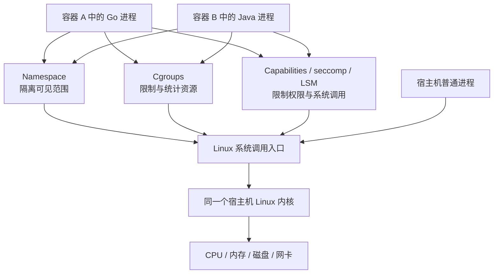
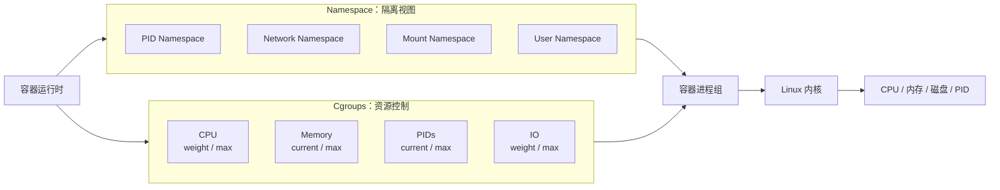
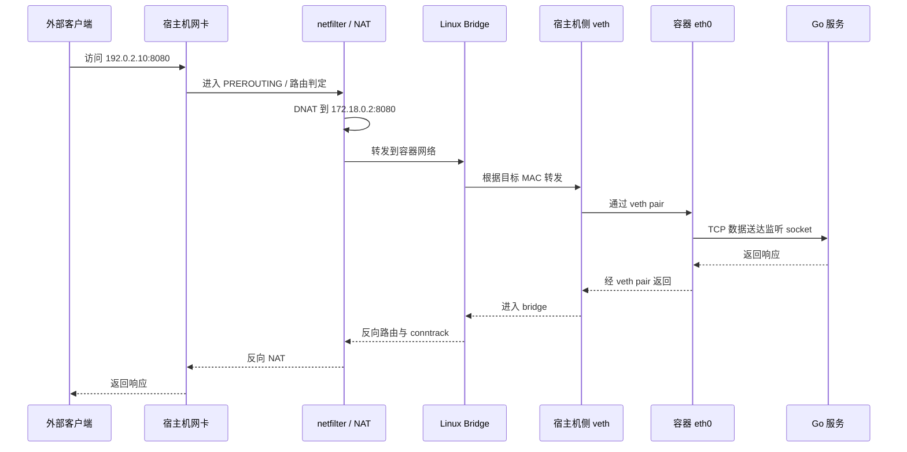
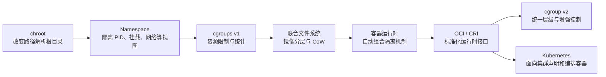

# 第 2 章：Linux 容器底层原理——Namespace、Cgroups 与联合文件系统

## 一、学习目标

完成本章后，你应当能够：

1. 从进程、系统调用和 Linux 内核的角度解释容器的本质。
2. 准确区分 Namespace、Cgroups、Capabilities、seccomp 的职责。
3. 说明 PID、Network、Mount、UTS、IPC、User Namespace 分别隔离什么。
4. 解释 Kubernetes 的 CPU request、CPU limit 如何落到 cgroup 的权重、配额和节流机制。
5. 解释内存限制、memcg OOM、系统级 OOM、OOM Killer 与 `OOMKilled` 的关系。
6. 说明镜像层、容器可写层、OverlayFS 和 Copy-on-Write 如何协作。
7. 描述常见桥接网络中数据包经过 veth、Linux Bridge、路由和 NAT 的过程。
8. 使用 `/proc`、`nsenter`、`unshare` 和 cgroup 文件系统观察容器。
9. 分析 CPU 节流、内存 OOM、PID 耗尽、网络不通和 seccomp 拒绝等生产问题。
10. 在面试中清楚回答“容器是不是轻量级虚拟机”。

---

## 二、核心术语

| 术语            | 含义                                               |
| ------------- | ------------------------------------------------ |
| 进程            | 正在执行的程序实例，拥有虚拟地址空间、文件描述符、凭证、信号处理状态等执行上下文         |
| 线程            | 共享同一进程大部分资源的执行流；Linux 内核通常以 task 为调度对象           |
| 系统调用          | 用户态程序请求内核执行文件、网络、进程、内存等特权操作的接口                   |
| Namespace     | 对内核全局资源进行视图隔离，使不同进程看到不同的 PID、网络、挂载点等             |
| Cgroups       | 对一组进程进行资源记账、限制、优先级控制和统计                          |
| RootFS        | 进程看到的根文件系统，即从 `/` 开始的目录树                         |
| OverlayFS     | 将一个或多个只读下层与一个可写上层合并为统一视图的联合挂载文件系统                |
| Copy-on-Write | 初始共享只读数据，第一次修改时再复制到可写层                           |
| veth pair     | 成对出现的虚拟以太网设备；从一端发出的包会从另一端收到                      |
| Linux Bridge  | 工作在二层的软件交换机，可连接多个 veth 或物理接口                     |
| NAT           | 修改报文源地址或目的地址，常用于容器出网和端口映射                        |
| Capability    | 将传统 root 权限拆分成多个独立能力                             |
| seccomp       | 按系统调用编号和参数过滤进程能够调用的系统调用                          |
| OOM           | Out Of Memory，内存分配无法继续满足时触发的内核处理流程               |
| PID 1         | 某个 PID Namespace 中的第一个进程，承担该 Namespace 的 init 角色 |

---

# 三、原理

## 3.1 容器的本质：受隔离、受限制的进程

容器不是一种新的进程类型，也不是一台被缩小的虚拟机。

在 Linux 上，容器通常由以下元素共同组成：

* 一组普通 Linux 进程；
* 一组 Namespace，限制进程可以看到什么；
* 一组 Cgroups，限制和统计进程可以使用多少资源；
* 一个由镜像层与可写层组成的根文件系统；
* Capabilities、seccomp、SELinux 或 AppArmor 等安全策略；
* 容器运行时维护的生命周期和元数据。

可以将其概括为：

> **容器 = 普通进程 + 隔离视图 + 资源约束 + 根文件系统 + 安全策略 + 生命周期管理。**

容器内的 Go 程序执行 `open`、`read`、`write`、`socket`、`connect`、`epoll_wait` 等系统调用时，并不会进入一个“容器专用内核”，而是直接进入宿主机 Linux 内核。

这意味着：

* 容器不需要启动一个完整的 Guest OS；
* 容器启动通常只需要创建进程、Namespace、Cgroup 和挂载；
* 容器可以获得接近原生进程的执行性能；
* 容器和宿主机共享同一套内核攻击面；
* 宿主机内核不支持的系统调用或内核功能，容器也无法凭空获得。



---

## 3.2 进程、线程、用户态和内核态

### 3.2.1 进程与线程

进程可理解为资源与执行上下文的集合，其中包括：

* 虚拟地址空间；
* 文件描述符表；
* 当前工作目录和根目录；
* 用户与组凭证；
* 信号处理状态；
* Namespace 成员关系；
* Cgroup 成员关系。

线程是进程中的执行流。一个多线程 Go 程序通常只有一个进程号，但会存在多个内核线程。Go runtime 再把大量 goroutine 调度到这些操作系统线程上。

因此必须区分：

| 概念           | 是否是内核直接调度对象 | 是否单独消耗 PIDs Cgroup 计数 |
| ------------ | ----------: | --------------------: |
| Go goroutine |           否 |                     否 |
| POSIX 线程     |           是 |                     是 |
| Linux 进程     |           是 |                     是 |

在 cgroup v2 的 PIDs Controller 中，“PID”实际按内核任务 ID，也就是 TID 统计。因此，一个只有一个 Unix 进程的多线程 Go 服务，也可能消耗数十个甚至数百个 `pids.current`。Linux 内核文档明确说明，PIDs Controller 中统计的是内核使用的任务 ID。([Linux内核文档][1])

### 3.2.2 用户态与内核态

普通业务逻辑运行在用户态。用户态代码不能直接：

* 操作物理网卡；
* 修改页表；
* 调度 CPU；
* 挂载文件系统；
* 创建网络设备；
* 直接访问磁盘控制器。

当程序需要这些能力时，必须通过系统调用进入内核态。

例如：

```text
Go http.Client
    ↓
net.Dial
    ↓
socket/connect 系统调用
    ↓
宿主机 Linux TCP/IP 协议栈
    ↓
路由、netfilter、网卡驱动
```

Namespace 会影响内核在处理系统调用时使用哪套资源视图，Cgroups 会影响内核是否允许该进程继续消耗 CPU、内存、PID 或 IO。

---

## 3.3 Namespace：隔离进程能够看到什么

Namespace 将原本全局的内核资源包装为不同实例。处于不同 Namespace 的进程，对同一类资源看到的结果可以不同。

Namespace 解决的是：

> **“这个进程能看到哪些对象？”**

它不直接解决：

> **“这个进程最多能使用多少 CPU 或内存？”**

后者属于 Cgroups。

Linux Namespace 可以通过 `clone`、`unshare`、`setns` 等系统调用创建或加入。对应对象可以通过 `/proc/<pid>/ns/` 观察。([man7.org][2])

### 3.3.1 常见 Namespace

| Namespace | 主要隔离内容                            | 常见可观察对象                   | 对容器的意义                 |
| --------- | --------------------------------- | ------------------------- | ---------------------- |
| PID       | PID 编号空间、进程可见性                    | `/proc`、`ps`、信号目标         | 容器内可以把主进程看成 PID 1      |
| Network   | 网卡、IP、路由、端口、网络协议栈、部分防火墙规则         | `ip addr`、`ip route`、`ss` | 每个容器可拥有独立网络栈           |
| Mount     | 挂载点和挂载传播关系                        | `/proc/<pid>/mountinfo`   | 容器看到独立的文件系统树           |
| UTS       | hostname 和 NIS domain name        | `hostname`、`uname`        | 容器可以拥有独立主机名            |
| IPC       | System V IPC、POSIX 消息队列           | `ipcs`、`/dev/mqueue`      | 避免容器间共享 IPC 对象         |
| User      | UID、GID 映射及 Capability 作用域        | `/proc/<pid>/uid_map`     | 容器内 root 可映射为宿主机非 root |
| Cgroup    | `/proc/self/cgroup` 等 cgroup 路径视图 | `/proc/<pid>/cgroup`      | 避免容器看到完整宿主机 cgroup 路径  |
| Time      | 部分单调时钟和启动时钟偏移                     | `timens_offsets`          | 为测试、检查点恢复等提供时间视图隔离     |

---

### 3.3.2 PID Namespace

PID Namespace 隔离 PID 编号空间。不同 PID Namespace 中的进程可以拥有相同的 PID。

新 PID Namespace 中的第一个进程 PID 为 1，承担该 Namespace 的 init 职责：

* 接收被重新托管的孤儿进程；
* 负责回收子进程；
* 对信号具有特殊处理语义；
* 一旦该 PID 1 退出，内核会终止该 PID Namespace 中的其他进程。

父 PID Namespace 可以看到子 Namespace 中的进程，而子 Namespace 默认不能看到父 Namespace 中的进程。一个进程在不同层级的 PID Namespace 中可能具有不同的 PID。([man7.org][3])

例如，同一个进程可能是：

```text
宿主机 PID：38421
Pod Sandbox 中 PID：17
容器 PID Namespace 中 PID：1
```

这并不是三个进程，而是同一个内核任务在不同 PID 视图中的编号。

### 3.3.3 Network Namespace

Network Namespace 隔离：

* 网络设备；
* IPv4/IPv6 协议栈；
* IP 地址；
* 路由表；
* 端口空间；
* socket；
* `/proc/net`；
* `/sys/class/net`；
* 部分网络参数和防火墙规则。

因此两个不同 Network Namespace 中的进程都可以监听 `0.0.0.0:8080`，只要它们不共享同一网络栈。([man7.org][4])

新建的 Network Namespace 通常只有一个关闭状态的 `lo`，不会自动获得物理网卡。运行时或 CNI 必须为其配置 veth、IP、路由和必要的转发规则。

### 3.3.4 Mount Namespace

Mount Namespace 隔离的是挂载表，而不是磁盘本身。

两个进程即使访问的是同一块底层磁盘，也可以因为 Mount Namespace 不同而看到不同的目录树、绑定挂载和 OverlayFS 合并结果。

新 Mount Namespace 创建时，会复制调用方当前的挂载列表；之后的挂载和卸载默认只影响本 Namespace，但挂载传播属性可能允许事件向其他 Namespace 传播。([man7.org][5])

容器运行时通常会：

1. 创建新的 Mount Namespace；
2. 挂载 OverlayFS 合并后的 RootFS；
3. 挂载 `/proc`、`/sys`、`/dev` 等必要伪文件系统；
4. 加入 volume、bind mount、Secret 等额外挂载；
5. 将新 RootFS 切换为容器进程的 `/`；
6. 卸载或隐藏旧根文件系统。

### 3.3.5 UTS Namespace

UTS Namespace 隔离：

* hostname；
* NIS domain name。

修改一个容器中的 hostname，不会直接修改宿主机或其他容器的 hostname。([man7.org][6])

注意：UTS Namespace 隔离的不是 DNS 域名，也不负责服务发现。

### 3.3.6 IPC Namespace

IPC Namespace 隔离：

* System V 共享内存；
* System V 消息队列；
* System V 信号量；
* POSIX 消息队列。

不同 IPC Namespace 中的进程看不到彼此创建的这些 IPC 对象。Namespace 被销毁时，其中的 IPC 对象也会被销毁。([man7.org][7])

普通 TCP、UDP 和 Unix 文件路径 socket 不属于 IPC Namespace 的主要隔离范围；网络 socket 主要由 Network Namespace 管理。

### 3.3.7 User Namespace

User Namespace 隔离并映射：

* UID；
* GID；
* Capability 作用域；
* 与安全凭证相关的部分资源。

进程可以在 User Namespace 内是 UID 0，但在宿主机初始 User Namespace 中映射为普通 UID。

例如：

```text
容器内 UID 0
        ↓ UID 映射
宿主机 UID 100000
```

这意味着容器内的 root 可以在该 User Namespace 管辖的资源上拥有较高权限，但不自动获得宿主机初始 User Namespace 的 root 权限。([man7.org][8])

User Namespace 是 rootless 容器和用户 ID 重映射的重要基础，但它不是绝对安全边界：

* 系统调用仍然进入同一个宿主机内核；
* 内核漏洞仍可能形成逃逸路径；
* 某些设备和非 Namespace 化资源仍需额外限制；
* 挂载、网络和文件 UID/GID 映射可能变复杂。

---

## 3.4 Cgroups：限制和统计进程能使用多少资源

Namespace 让进程看到不同的世界，Cgroups 则决定进程可以消耗多少资源。

Cgroups 主要提供：

* CPU 相对权重与带宽上限；
* 内存用量统计和硬限制；
* PID 数量限制；
* 块设备 IO 权重、BPS 和 IOPS 限制；
* cpuset 与 NUMA 节点绑定；
* 资源压力、节流和 OOM 事件统计。



### 3.4.1 Cgroups v1

cgroup v1 的不同 Controller 可以挂载在不同层级：

```text
/sys/fs/cgroup/cpu/...
/sys/fs/cgroup/memory/...
/sys/fs/cgroup/pids/...
/sys/fs/cgroup/blkio/...
```

同一个进程可能：

* 在 CPU 层级位于 `/team-a/app`；
* 在 memory 层级位于 `/production/service-x`；
* 在 pids 层级又位于另一条路径。

这种设计灵活，但会产生：

* 层级结构不一致；
* Controller 组合复杂；
* 管理和委派困难；
* 部分资源语义不统一。

### 3.4.2 Cgroups v2

cgroup v2 使用统一层级：

```text
/sys/fs/cgroup/
├── cgroup.controllers
├── cgroup.procs
├── cpu.max
├── cpu.weight
├── memory.current
├── memory.max
├── memory.events
├── pids.current
├── pids.max
└── io.max
```

所有启用的 Controller 共享同一棵进程层级树，接口和资源模型更加一致。

截至 2026 年 6 月，Kubernetes 已推荐使用 cgroup v2；cgroup v1 从 Kubernetes 1.31 起进入维护模式，不再面向 v1 增加新特性。([Kubernetes][9])

判断当前系统使用的版本：

```bash
stat -fc %T /sys/fs/cgroup
```

常见结果：

```text
cgroup2fs   # cgroup v2
tmpfs       # 通常是 cgroup v1 或混合模式
```

也可以观察：

```bash
cat /proc/self/cgroup
```

cgroup v2 常见输出：

```text
0::/user.slice/user-1000.slice/session-3.scope
```

---

## 3.5 CPU request、CPU limit 与内核调度

### 3.5.1 CPU request 的两个作用

在 Kubernetes 中，CPU request 至少参与两个不同阶段。

第一，调度阶段：

```text
Pod CPU requests
       ↓
Scheduler 判断节点剩余可分配 CPU
       ↓
决定 Pod 放到哪个 Node
```

第二，节点运行阶段：

```text
CPU request
    ↓
kubelet 转换为 CPU shares
    ↓
运行时写入 cpu.shares 或映射为 cpu.weight
    ↓
发生 CPU 竞争时按相对权重分配时间
```

在默认共享 CPU 池中，CPU request 不是专属 CPU 核，也不是绝对的 CPU 时间预留。没有竞争且没有配置 limit 时，容器可以使用超过 request 的 CPU。

Kubernetes 的换算逻辑大致为：

```text
cpuShares = milliCPU × 1024 / 1000
```

并将结果限制在内核允许的范围内。

例如：

| CPU request | cgroup v1 `cpu.shares` 近似值 |
| ----------: | -------------------------: |
|        100m |                        102 |
|        250m |                        256 |
|        500m |                        512 |
|       1000m |                       1024 |
|       2000m |                       2048 |

Kubernetes 当前源码仍通过 `MilliCPUToShares` 按该方式计算 OCI CPU shares。对于 cgroup v2，OCI 运行时会再将 shares 映射为 `cpu.weight`；具体映射属于运行时实现细节，不应假定所有 runc 或 containerd 版本都使用完全相同的简单公式，应以节点上的实际 `cpu.weight` 为准。([GitHub][10])

在 cgroup v2 中：

```text
cpu.weight 范围：1～10000
默认值：100
```

权重只在同级 cgroup 发生 CPU 竞争时决定相对分配比例。它不是硬上限。([Linux内核文档][1])

### 3.5.2 CPU limit 与 CFS 带宽控制

CPU limit 通常转换为：

* cgroup v1：`cpu.cfs_quota_us` 和 `cpu.cfs_period_us`；
* cgroup v2：`cpu.max`。

cgroup v2 的格式为：

```text
$MAX $PERIOD
```

表示该 cgroup 每个 PERIOD 最多可使用 MAX 微秒的 CPU 时间。默认无限制值通常为：

```text
max 100000
```

例如，容器 CPU limit 为 `500m`，周期为 `100000µs`：

```text
quota = 500 × 100000 / 1000
      = 50000µs
```

最终可能表现为：

```text
cpu.max = 50000 100000
```

即每 100ms 最多使用 50ms CPU 时间，相当于平均 0.5 个 CPU 核。

CPU limit 为 `2` 时：

```text
cpu.max = 200000 100000
```

它可以在一个周期内：

* 使用一个 CPU 核运行 200ms，这在单个 100ms 周期内不可能；
* 或同时使用两个 CPU 核各运行 100ms；
* 或使用四个 CPU 核各运行 50ms。

因此 CPU limit 控制的是一段周期内累计的 CPU 时间，不是简单绑定到某一个核。cgroup v2 对 `cpu.max` 的定义以及 Kubernetes 的配额换算分别见内核文档和 kubelet 源码。([Linux内核文档][1])

### 3.5.3 CPU 节流为什么导致延迟抖动

当一个多线程 Go 服务在周期前半段快速消耗完 CPU quota：

```text
周期开始
  ↓
多个线程并行运行，快速消耗 quota
  ↓
quota 用尽
  ↓
整个 cgroup 被 throttled
  ↓
等待下一个周期补充预算
```

即使此时宿主机仍有空闲 CPU，内核也不能让该 cgroup 超过硬限制。

表现为：

* 平均 CPU 使用率不一定很高；
* P50 延迟可能正常；
* P99、P999 周期性升高；
* GC、JSON 编码、压缩或突发流量时更明显；
* 应用内部看不到明显锁等待，但请求就是停顿。

cgroup v2 可观察：

```bash
cat cpu.stat
```

重点字段：

```text
nr_periods
nr_throttled
throttled_usec
```

如果 `nr_throttled` 和 `throttled_usec` 持续快速增长，应怀疑 CPU limit 节流，而不能只看分钟级平均 CPU。

---

## 3.6 内存限制、OOM 与 OOMKilled

### 3.6.1 内存不能像 CPU 一样简单暂停

CPU 是可压缩资源。一个进程暂时得不到 CPU，之后仍可以继续运行。

内存通常是不可压缩资源。一个进程已经持有的匿名内存、页表、内核对象和部分 page cache，不能仅通过“暂停几毫秒”自动释放。

因此：

* CPU 达到 limit：通常被节流，不会因为 CPU 使用过高而被杀死；
* 内存达到硬 limit：回收失败后可能进入 cgroup OOM，并杀死进程。

Kubernetes 官方文档也区分了两种行为：CPU limit 通过节流强制执行，而内存 limit 主要通过 OOM 机制被动执行。([Kubernetes][11])

### 3.6.2 cgroup v2 内存接口

常见文件：

| 文件                 | 含义                          |
| ------------------ | --------------------------- |
| `memory.current`   | 当前内存用量                      |
| `memory.max`       | 内存硬上限                       |
| `memory.peak`      | 记录到的峰值                      |
| `memory.stat`      | anon、file、kernel、slab 等分类统计 |
| `memory.events`    | high、max、oom、oom_kill 等事件计数 |
| `memory.high`      | 软节流边界，超过后触发直接回收和分配延迟        |
| `memory.low`       | 尽量保护的内存量                    |
| `memory.min`       | 更强的最低内存保护                   |
| `memory.swap.max`  | swap 使用上限                   |
| `memory.oom.group` | 是否将 cgroup 作为不可分割的 OOM 单元   |

`memory.max` 是硬上限。达到上限后，内核会尝试回收可回收页面；如果仍无法满足分配，便可能在该 cgroup 内触发 OOM Killer。用量在部分情况下可能短暂超过限制。([Linux内核文档][1])

### 3.6.3 一次容器内存 OOM 的典型过程

```text
Go 进程申请更多内存
        ↓
内核给 cgroup 记账
        ↓
memory.current 接近 memory.max
        ↓
回收 page cache、匿名页或 swap
        ↓
无法回收足够内存
        ↓
进入 memcg OOM
        ↓
选择并 SIGKILL 某个进程或整个 cgroup
        ↓
容器主进程退出
        ↓
容器运行时报告 OOM
        ↓
Kubernetes 显示 Reason: OOMKilled
```

`memory.events` 中常见字段包括：

```text
max
oom
oom_kill
oom_group_kill
```

其中：

* `max`：用量即将超过硬上限的次数；
* `oom`：进入 cgroup OOM 状态的次数；
* `oom_kill`：cgroup 中进程被 OOM Killer 杀死的数量；
* `oom_group_kill`：发生组级 OOM kill 的次数。([Linux内核文档][1])

### 3.6.4 OOMKilled 不完全等于“节点没有内存”

需要区分两类问题。

#### 容器级或 cgroup 级 OOM

```text
节点仍有可用内存
但该容器达到 memory.max
```

内核通常只在该 cgroup 范围内选择受害者。

#### 节点级全局 OOM

```text
整个节点内存严重不足
回收和 swap 都无法满足分配
```

内核在更大范围内选择受害者，受 `oom_score_adj` 等因素影响。

Kubernetes 还可能在节点内存压力下由 kubelet 驱逐 Pod。Eviction 与内核 OOM kill 不是同一机制：

* Eviction 通常由 kubelet主动终止 Pod；
* OOM kill 由内核直接发送 `SIGKILL`；
* 两者在事件、退出原因和排查证据上不同。

### 3.6.5 退出码 137 的含义

常见约定：

```text
137 = 128 + 9
```

即进程收到 `SIGKILL`。

但不能只凭 137 断定是 OOM：

* `docker kill`；
* kubelet 强制终止；
* 人工 `kill -9`；
* 超过终止宽限期；
* OOM Killer；

都可能导致 `SIGKILL`。

正确结论应综合：

* Kubernetes 容器终止状态；
* `memory.events`；
* 节点内核日志；
* cgroup 内存指标；
* Pod 是否发生驱逐；
* 当时的 `memory.current` 和 `memory.max`。

### 3.6.6 MemoryQoS 的当前状态

cgroup v2 提供 `memory.high`、`memory.low` 和 `memory.min`，可以在硬 OOM 之前提供回收压力或内存保护。

截至 Kubernetes v1.36，MemoryQoS 仍为 **Alpha、默认关闭**。开启后可利用 `memory.high` 做内存节流，并可选择基于 QoS 等级设置 `memory.min` 或 `memory.low`。生产环境不能假定只要设置了 memory request，就一定会自动写入这些保护参数，应检查 feature gate、kubelet 配置和实际 cgroup 文件。([Kubernetes][12])

---

## 3.7 PID 与 IO 限制

### 3.7.1 PIDs Controller

cgroup v2 常见文件：

```text
pids.current
pids.max
pids.peak
pids.events
```

达到 `pids.max` 后，新的 `fork` 或 `clone` 会失败并返回 `EAGAIN`，现有进程通常不会因此被杀死。([Linux内核文档][1])

它可以防止：

* fork bomb；
* 错误地无限创建线程；
* 子进程泄漏；
* 单个容器耗尽节点任务数。

典型表现：

```text
fork: Resource temporarily unavailable
pthread_create: Resource temporarily unavailable
runtime/cgo: pthread_create failed
```

对 Go 服务而言，即使不主动创建子进程，以下行为仍可能增加内核线程数：

* 大量阻塞式 cgo 调用；
* `runtime.LockOSThread`；
* 大量需要操作系统线程配合的阻塞；
* 第三方库创建原生线程。

### 3.7.2 IO Controller

cgroup v2 可通过：

```text
io.weight
io.max
io.stat
io.pressure
```

控制和观察块设备 IO。

`io.max` 可以按设备主次设备号限制：

* `rbps`：读字节每秒；
* `wbps`：写字节每秒；
* `riops`：读 IOPS；
* `wiops`：写 IOPS。

例如：

```bash
echo "8:16 rbps=2097152 wiops=120" > io.max
```

表示对设备 `8:16` 限制为：

* 读带宽 2 MiB/s；
* 写 IOPS 120。

达到限制后，IO 请求通常会被延迟，而不是杀死进程。控制效果还取决于内核、块设备、文件系统和写回归属支持。([Linux内核文档][1])

---

## 3.8 根文件系统：chroot、Mount Namespace 与 pivot_root

### 3.8.1 chroot 做了什么

`chroot(path)` 修改进程进行绝对路径解析时使用的根目录。

调用后：

```text
原路径：/var/lib/container/rootfs/etc/hosts
容器视图：/etc/hosts
```

但 `chroot` 只改变路径解析的一部分：

* 不创建 Mount Namespace；
* 不隔离挂载表；
* 不关闭指向外部的文件描述符；
* 不改变当前工作目录；
* 本身不应被视为完整安全沙箱。

Linux 手册明确说明，`chroot` 并非为完整安全隔离而设计。([man7.org][13])

### 3.8.2 pivot_root 做了什么

`pivot_root(new_root, put_old)` 在当前 Mount Namespace 中：

1. 将当前根挂载移动到 `put_old`；
2. 将 `new_root` 变成新的根挂载；
3. 后续可以卸载旧根挂载。

这比单纯 `chroot` 更适合容器 RootFS 切换，因为旧根文件系统可以从容器的挂载视图中被真正移除。`pivot_root` 的现代用途之一正是容器 RootFS 初始化。([man7.org][14])

典型流程：

```text
创建 Mount Namespace
        ↓
准备 OverlayFS merged 目录
        ↓
挂载 /proc、/sys、/dev 与业务 Volume
        ↓
pivot_root 到 merged
        ↓
卸载旧根目录
        ↓
exec 容器主进程
```

不同运行时、rootless 模式和特殊文件系统环境可能采用 `pivot_root`、移动挂载或其他等效切根流程，不能把某一个系统调用当成所有容器的唯一实现。

---

## 3.9 OverlayFS、镜像层与 Copy-on-Write

### 3.9.1 镜像为什么可以共享

容器镜像由多个只读层组成，例如：

```text
Layer 1：基础发行版文件
Layer 2：CA 证书和时区数据
Layer 3：Go 服务二进制
Layer 4：默认配置
```

多个基于同一镜像启动的容器可以共享这些只读层，每个容器只需要自己的可写层。

```text
                 只读镜像层
        ┌──────────┴──────────┐
        │                     │
   容器 A 可写层         容器 B 可写层
        │                     │
   容器 A 合并视图       容器 B 合并视图
```

### 3.9.2 OverlayFS 的目录角色

常见 OverlayFS 结构：

| 目录         | 作用                |
| ---------- | ----------------- |
| `lowerdir` | 一个或多个只读下层，通常对应镜像层 |
| `upperdir` | 当前容器的可写层          |
| `workdir`  | OverlayFS 内部工作目录  |
| `merged`   | 提供给容器进程的统一文件系统视图  |

示意：

```text
lowerdir：镜像只读层
upperdir：容器可写层
workdir ：内部工作区
        ↓
merged  ：容器最终看到的目录树
```

### 3.9.3 读取文件

读取 `/app/config.yaml` 时：

1. OverlayFS 先检查 `upperdir`；
2. 如果上层存在，读取上层版本；
3. 如果上层不存在，继续在 `lowerdir` 查找；
4. 返回第一个可见版本。

如果同一路径在 upper 和 lower 都存在，upper 会遮蔽 lower。

### 3.9.4 第一次修改：copy-up

假设镜像层中存在一个 1 GiB 文件，容器第一次只修改其中几个字节。

OverlayFS 通常需要：

1. 在 lower 中找到该文件；
2. 将整个文件复制到 upper；
3. 在 upper 中执行修改；
4. 后续读取看到 upper 中的版本。

这就是 copy-up。

OverlayFS 的 copy-up 以文件为单位，而不是仅复制被修改的数据块。因此对大文件的第一次小范围修改也可能带来明显 IO 和空间开销。Docker 的 `overlay2` 文档也说明，第一次写入现有下层文件时会执行完整文件的 copy-up。([Docker Documentation][15])

### 3.9.5 删除文件：whiteout

lower 是只读的，因此容器不能真正删除镜像层中的文件。

当容器删除 lower 中的文件时，OverlayFS 会在 upper 中创建 whiteout 标记：

```text
lower：仍然保留原始文件
upper：存在该文件的 whiteout
merged：文件不可见
```

删除目录时可能使用 opaque directory，遮蔽下层同名目录。

### 3.9.6 为什么数据库不应长期写可写层

容器可写层适合：

* 少量临时文件；
* 缓存；
* 测试数据；
* 生命周期与容器一致的数据。

不适合长期承载数据库主数据，原因包括：

* 容器删除后可写层通常随之删除；
* copy-up 可能导致额外写放大；
* OverlayFS 语义与普通块设备存在差异；
* 容量和 inode 管理不直观；
* 备份、迁移和性能隔离更困难。

Docker 当前推荐使用 `overlay2`，并建议将持久化写入放到 volume，而不是大量写入容器可写层。旧的 `overlay` 驱动已经被移除。([Docker Documentation][16])

---

## 3.10 veth、Linux Bridge、路由与 NAT

### 3.10.1 veth pair

veth 设备总是成对出现：

```text
veth-host  <======>  eth0-container
```

从一端发出的以太网帧会立即从另一端收到。常见用法是：

* 一端放在容器 Network Namespace；
* 另一端留在宿主机；
* 宿主机端接入 Linux Bridge 或参与三层路由。([man7.org][17])

### 3.10.2 Linux Bridge

Linux Bridge 类似内核中的二层交换机：

```text
                         Linux Bridge
                    ┌────────┼────────┐
                    │        │        │
                veth-A   veth-B   host interface
                    │        │
                容器 A    容器 B
```

Bridge 根据 MAC 地址学习和转发数据帧。

### 3.10.3 容器访问外网

常见 bridge 模式的数据路径：

```text
容器进程
  ↓
容器 eth0
  ↓
veth pair
  ↓
Linux Bridge
  ↓
宿主机路由
  ↓
netfilter SNAT / MASQUERADE
  ↓
宿主机物理网卡
  ↓
外部网络
```

返回报文根据 conntrack 状态执行反向地址转换，再送回容器。

### 3.10.4 外部访问容器端口

假设：

```text
宿主机：192.0.2.10:8080
容器：172.18.0.2:8080
```

常见端口映射的数据路径为：



该链路只是常见 bridge/NAT 模型，不是所有容器网络的唯一实现。

Kubernetes CNI 还可能使用：

* 纯三层路由；
* VXLAN、Geneve 等隧道；
* BGP；
* eBPF 数据平面；
* IPVLAN、MACVLAN；
* 云厂商 VPC 原生网卡。

因此面试中应说“在常见 bridge 模式下”，而不是宣称所有容器流量必然经过同一个 Linux Bridge 和 iptables。

---

## 3.11 Capabilities、seccomp 与 User Namespace

### 3.11.1 Capabilities

传统 Unix 权限模型把 UID 0 视为全能 root。Linux Capabilities 将 root 权限拆成多个独立能力，例如：

* `CAP_NET_BIND_SERVICE`：绑定低端口；
* `CAP_NET_ADMIN`：配置网络；
* `CAP_SYS_CHROOT`：调用 `chroot`；
* `CAP_CHOWN`：修改文件所有者；
* `CAP_KILL`：绕过部分信号权限检查；
* `CAP_SYS_PTRACE`：执行受限的进程跟踪；
* `CAP_SYS_ADMIN`：包含大量管理权限，应特别谨慎。

Capabilities 是线程属性，不是简单的“容器属性”。Linux 从 2.2 开始将传统 root 权限拆分为独立能力。([man7.org][18])

安全原则：

```text
默认删除全部 Capability
        ↓
仅添加业务必需的最小集合
```

例如应用只需监听 80 端口，可考虑：

* 使用 8080，完全不增加 Capability；
* 或只增加 `CAP_NET_BIND_SERVICE`；
* 不应直接使用 `--privileged`。

`--privileged` 会给容器更完整的能力和设备访问，并显著放宽其他安全策略，不等同于“只多一个小权限”。([Docker Documentation][19])

### 3.11.2 seccomp

seccomp 对进程可调用的系统调用进行过滤。

过滤依据主要包括：

* 系统调用编号；
* CPU 架构；
* 部分系统调用参数。

可以采取：

* 允许；
* 返回 `EPERM`；
* 记录日志；
* 发送信号；
* 终止线程或进程；
* 交给用户态通知处理。

seccomp 过滤器使用 BPF 表达系统调用过滤规则。([Linux内核文档][20])

seccomp 不负责：

* 文件路径访问控制；
* 网络地址访问控制；
* CPU 或内存限制；
* UID/GID 映射；
* 容器镜像漏洞扫描。

Docker 默认 seccomp 配置采用允许列表思路，并阻止一部分高风险或不常用系统调用。生产环境通常不应无理由使用 `seccomp=unconfined`。([Docker Documentation][21])

### 3.11.3 User Namespace

User Namespace 解决“容器内身份”和“宿主机身份”映射问题。

它与 Capabilities 的关系是：

```text
某 Capability
    只在特定 User Namespace 中有意义
```

容器内 UID 0 可以在自己的 User Namespace 中拥有一组 Capability，但不代表在宿主机初始 User Namespace 中也拥有相同能力。

### 3.11.4 四类机制的职责比较

| 机制           | 核心问题        | 典型控制对象          | 是否限制资源用量 | 是否改变资源视图 | 是否直接过滤系统调用 |
| ------------ | ----------- | --------------- | -------: | -------: | ---------: |
| Namespace    | 进程能看到什么     | PID、网络、挂载、UID 等 |        否 |        是 |          否 |
| Cgroups      | 进程能用多少      | CPU、内存、PID、IO   |        是 |        否 |          否 |
| Capabilities | 进程拥有哪些特权    | root 权限拆分项      |        否 |        否 |   间接影响权限检查 |
| seccomp      | 进程能调用哪些系统调用 | syscall 编号及参数   |        否 |        否 |          是 |

安全隔离不能只靠其中一种机制。典型防御链为：

```text
User Namespace
    +
删除非必要 Capabilities
    +
seccomp
    +
只读 RootFS
    +
SELinux / AppArmor
    +
设备访问限制
    +
不使用 privileged
    +
及时修复宿主机内核漏洞
```

---

# 四、演进

Linux 容器技术不是一次性出现的，而是多个内核能力逐渐组合的结果。



### 第一阶段：目录视图隔离

`chroot` 可以改变进程看到的根目录，但它不隔离进程、网络和资源，也不是完整沙箱。

### 第二阶段：Namespace

Linux 逐步增加 Mount、UTS、IPC、PID、Network、User 等 Namespace，使进程能够拥有彼此独立的系统资源视图。

### 第三阶段：cgroups v1

cgroups 提供 CPU、内存、进程数和 IO 等资源控制，使容器不再只是“看起来隔离”，还可以限制资源消耗。

### 第四阶段：联合文件系统

OverlayFS 等技术让多个容器共享镜像只读层，并通过 Copy-on-Write 提供独立可写层，显著降低镜像存储与启动成本。

### 第五阶段：容器引擎和 OCI

Docker 等工具把 Namespace、Cgroups、RootFS、网络和安全配置包装成易用的镜像与容器模型。OCI 进一步标准化镜像格式和运行时规范。

### 第六阶段：cgroup v2

cgroup v2 将不同 Controller 整合到统一层级，改善资源语义、委派和扩展能力。Kubernetes 当前推荐使用 cgroup v2。

---

# 五、机制实验

以下实验建议在专用 Linux 虚拟机或测试节点执行。部分命令需要 root 权限，并可能受到发行版、systemd、内核配置和安全策略影响。

## 5.1 观察当前进程

```bash
echo "shell pid: $$"

ps -o pid,ppid,tid,stat,comm -p $$

cat /proc/$$/status
cat /proc/$$/cgroup

ls -l /proc/$$/ns
```

典型 Namespace 输出：

```text
cgroup -> cgroup:[4026531835]
ipc    -> ipc:[4026531839]
mnt    -> mnt:[4026531841]
net    -> net:[4026531992]
pid    -> pid:[4026531836]
user   -> user:[4026531837]
uts    -> uts:[4026531838]
```

方括号中的 inode 可作为 Namespace 实例的标识。两个进程对应符号链接的 inode 相同，通常表示它们处于同一个该类型 Namespace。

比较两个进程：

```bash
readlink /proc/<PID_A>/ns/net
readlink /proc/<PID_B>/ns/net
```

---

## 5.2 使用 unshare 创建 Namespace

### UTS Namespace

```bash
sudo unshare --uts --fork bash
```

进入后：

```bash
hostname container-lab
hostname
```

另开宿主机终端：

```bash
hostname
```

两边应看到不同结果。

### PID Namespace

```bash
sudo unshare --pid --fork --mount-proc bash
```

进入后：

```bash
echo $$
ps -ef
```

新 bash 通常会在该 PID Namespace 中显示为 PID 1。`--mount-proc` 会挂载与新 PID Namespace 匹配的 `/proc`，否则 `ps` 可能仍显示旧视图。

`unshare` 可以让进程拆分原本共享的执行上下文；`CLONE_NEWPID` 对调用进程的后续子进程生效。([man7.org][22])

### Mount Namespace

```bash
sudo unshare --mount --fork bash
```

进入后：

```bash
mount --make-rprivate /
mkdir -p /tmp/ns-demo
mount -t tmpfs tmpfs /tmp/ns-demo
findmnt /tmp/ns-demo
```

宿主机其他终端通常看不到该挂载，前提是挂载传播属性已经正确设置。

---

## 5.3 使用 nsenter 进入容器 Namespace

先取得容器在宿主机上的 PID，记为 `$PID`：

```bash
sudo nsenter \
  --target "$PID" \
  --mount \
  --uts \
  --ipc \
  --net \
  --pid \
  --fork \
  /bin/sh
```

进入后可以执行：

```bash
hostname
ip addr
ip route
ps -ef
mount
```

`nsenter` 本质上是根据 `/proc/<pid>/ns/*` 进入目标进程的 Namespace。进入 PID Namespace 时通常需要 fork，才能让新程序成为目标 PID Namespace 的成员。([man7.org][23])

注意：

* 进入 Namespace 不等于自动进入完全相同的 cgroup；
* 进入 Mount Namespace 不等于自动切换到目标进程的根目录；
* 调试时还可能需要 `--root=/proc/$PID/root` 和 `--wd=/proc/$PID/cwd`；
* 生产节点应谨慎使用，避免误操作容器文件系统或网络。

---

## 5.4 观察 cgroup v2

找到当前 shell 的 cgroup 相对路径：

```bash
CGROUP_PATH=$(awk -F: '$1 == "0" {print $3}' /proc/self/cgroup)
CGROUP_DIR="/sys/fs/cgroup${CGROUP_PATH}"

echo "$CGROUP_DIR"
```

观察：

```bash
cat "$CGROUP_DIR/cpu.max" 2>/dev/null
cat "$CGROUP_DIR/cpu.weight" 2>/dev/null
cat "$CGROUP_DIR/cpu.stat" 2>/dev/null

cat "$CGROUP_DIR/memory.current" 2>/dev/null
cat "$CGROUP_DIR/memory.max" 2>/dev/null
cat "$CGROUP_DIR/memory.events" 2>/dev/null

cat "$CGROUP_DIR/pids.current" 2>/dev/null
cat "$CGROUP_DIR/pids.max" 2>/dev/null
```

在 systemd 系统上，也可以创建临时 scope：

```bash
systemd-run --user --scope \
  -p MemoryMax=200M \
  -p CPUQuota=50% \
  bash
```

在新 shell 中重新查看 cgroup 文件，可以观察 systemd 如何把属性转换为 cgroup 参数。

---

## 5.5 手工创建 Network Namespace 与 veth

创建 Namespace：

```bash
sudo ip netns add ns1
```

创建 veth pair：

```bash
sudo ip link add veth-host type veth peer name veth-ns
```

把一端放入 ns1：

```bash
sudo ip link set veth-ns netns ns1
```

配置宿主机端：

```bash
sudo ip addr add 10.200.1.1/24 dev veth-host
sudo ip link set veth-host up
```

配置 Namespace 端：

```bash
sudo ip -n ns1 addr add 10.200.1.2/24 dev veth-ns
sudo ip -n ns1 link set lo up
sudo ip -n ns1 link set veth-ns up
```

测试：

```bash
ping -c 3 10.200.1.2

sudo ip netns exec ns1 ping -c 3 10.200.1.1
```

观察两端：

```bash
ip addr show veth-host
sudo ip netns exec ns1 ip addr
```

清理：

```bash
sudo ip netns del ns1
```

删除 Namespace 时，内部 veth 端也会随之销毁。

---

## 5.6 手工挂载 OverlayFS

准备目录：

```bash
mkdir -p /tmp/overlay-lab/{lower,upper,work,merged}

echo "from image layer" > /tmp/overlay-lab/lower/config.txt
```

挂载：

```bash
sudo mount -t overlay overlay \
  -o lowerdir=/tmp/overlay-lab/lower,upperdir=/tmp/overlay-lab/upper,workdir=/tmp/overlay-lab/work \
  /tmp/overlay-lab/merged
```

读取：

```bash
cat /tmp/overlay-lab/merged/config.txt
```

第一次修改：

```bash
echo "changed by container" > /tmp/overlay-lab/merged/config.txt

cat /tmp/overlay-lab/upper/config.txt
cat /tmp/overlay-lab/lower/config.txt
```

此时：

* lower 仍保存原内容；
* upper 中出现修改后的副本；
* merged 返回 upper 中的版本。

删除：

```bash
sudo rm /tmp/overlay-lab/merged/config.txt
sudo ls -la /tmp/overlay-lab/upper
```

OverlayFS 会在 upper 中记录 whiteout，使 lower 中的文件在 merged 视图中不可见。

清理：

```bash
sudo umount /tmp/overlay-lab/merged
rm -rf /tmp/overlay-lab
```

---

## 5.7 Go 程序：观察 PID、信号与资源消耗

下面的程序可以：

* 打印 PID、PPID、UID、GID；
* 捕获 `SIGTERM` 和 `SIGINT`；
* 分配并实际触碰指定大小的内存；
* 启动 CPU 消耗 goroutine；
* 定期打印 Go 堆统计。

```go
package main

import (
	"context"
	"crypto/sha256"
	"flag"
	"fmt"
	"os"
	"os/signal"
	"runtime"
	"sync"
	"syscall"
	"time"
)

var retained [][]byte

func main() {
	memMiB := flag.Int("mem-mib", 0, "memory to allocate and retain")
	burnCPU := flag.Bool("burn-cpu", false, "consume CPU until terminated")
	flag.Parse()

	ctx, stop := signal.NotifyContext(
		context.Background(),
		syscall.SIGTERM,
		syscall.SIGINT,
	)
	defer stop()

	fmt.Printf(
		"pid=%d ppid=%d uid=%d gid=%d gomaxprocs=%d\n",
		os.Getpid(),
		os.Getppid(),
		os.Getuid(),
		os.Getgid(),
		runtime.GOMAXPROCS(0),
	)

	for i := 0; i < *memMiB; i++ {
		block := make([]byte, 1<<20)

		// 触碰每个内存页，避免只分配虚拟地址而没有实际记账。
		for offset := 0; offset < len(block); offset += 4096 {
			block[offset] = byte(i)
		}

		retained = append(retained, block)
	}

	var wg sync.WaitGroup

	if *burnCPU {
		workers := runtime.GOMAXPROCS(0)

		for i := 0; i < workers; i++ {
			wg.Add(1)

			go func(id int) {
				defer wg.Done()

				data := []byte(fmt.Sprintf("worker-%d", id))

				for {
					select {
					case <-ctx.Done():
						return
					default:
						sum := sha256.Sum256(data)
						data = sum[:]
					}
				}
			}(i)
		}
	}

	ticker := time.NewTicker(2 * time.Second)
	defer ticker.Stop()

	for {
		select {
		case <-ctx.Done():
			fmt.Printf("received shutdown signal: %v\n", ctx.Err())
			wg.Wait()
			fmt.Println("exited cleanly")
			return

		case <-ticker.C:
			var m runtime.MemStats
			runtime.ReadMemStats(&m)

			fmt.Printf(
				"heap_alloc=%dMiB heap_sys=%dMiB goroutines=%d\n",
				m.HeapAlloc>>20,
				m.HeapSys>>20,
				runtime.NumGoroutine(),
			)
		}
	}
}
```

运行：

```bash
go run main.go -mem-mib 100
```

另一个终端：

```bash
kill -TERM <PID>
```

在容器内运行后，可以比较：

```bash
cat /proc/1/status
cat /proc/1/cgroup
ls -l /proc/1/ns
```

注意：Go 的 `HeapAlloc` 不等于 cgroup 的全部内存用量。cgroup 内存还可能包括：

* Go runtime 保留但未归还的内存；
* goroutine 栈；
* 操作系统线程栈；
* page cache；
* mmap；
* cgo 分配；
* 内核记账；
* tmpfs；
* socket buffer。

---

# 六、生产场景

## 6.1 CPU request 很小但没有 limit

配置：

```yaml
resources:
  requests:
    cpu: 100m
```

含义：

* 调度器按 100m 计算节点容量；
* CPU 竞争时，该容器获得相对较低的调度权重；
* 没有竞争时，它可能使用多个 CPU 核；
* 不会因为超过 100m 被节流。

风险：

* 节点过度超卖时，关键请求可能抢不到 CPU；
* 业务延迟对同节点其他工作负载敏感；
* request 过低会低估真实容量需求。

## 6.2 request 为 1 CPU，limit 为 500m

这种配置通常是不合理或无法通过校验的，因为 limit 不应低于 request。

合理的关系一般是：

```text
request <= limit
```

request 表示期望和调度依据，limit 表示允许使用的硬上限。

## 6.3 CPU 平均利用率不高，但 P99 周期性升高

排查顺序：

1. 查看 `cpu.stat`；
2. 比较 `nr_throttled` 增速；
3. 计算 `throttled_usec` 占观测窗口比例；
4. 检查 Pod CPU limit；
5. 检查 Go `GOMAXPROCS` 和并发数；
6. 用更短时间粒度观察 CPU；
7. 临时提高或移除 limit 做对照实验。

常见原因是：

```text
多线程突发消耗
    +
较小 CPU quota
    +
100ms 左右的带宽周期
    =
周期性节流和尾延迟
```

生产取舍：

* 对强延迟敏感服务，可只设置合理 request，不设置过紧 limit；
* 如果必须限制，limit 应覆盖合理突发；
* 控制应用并发，避免瞬时并行线程过多；
* 不应仅根据平均 CPU 设置 limit。

## 6.4 Go 服务持续 OOMKilled

可能原因包括：

* 真正的内存泄漏；
* 请求并发增加；
* 单请求缓冲过大；
* 无界缓存或 map；
* goroutine 泄漏导致栈和对象保留；
* 大量 cgo 内存不在 Go heap 指标中；
* page cache、tmpfs 或 mmap 占用；
* limit 与真实工作集不匹配；
* Go GC 目标和容器限制不协调；
* 节点级 OOM 或 kubelet 驱逐。

排查时不要只看：

```text
go_memstats_heap_alloc_bytes
```

还要对比：

```text
container_memory_working_set_bytes
memory.current
memory.stat
memory.events
进程 RSS / PSS
Go heap profile
```

如果 Go heap 很小但 cgroup 内存很高，应重点检查：

* cgo；
* mmap；
* page cache；
* tmpfs；
* 线程栈；
* 内核内存；
* 文件或网络缓冲。

## 6.5 pids.max 导致服务无法创建线程

症状：

```text
pthread_create failed
fork: Resource temporarily unavailable
```

检查：

```bash
cat pids.current
cat pids.max
cat pids.events
```

还应查看：

```bash
ps -eLf | wc -l
ls /proc/<pid>/task | wc -l
```

不要把“进程数限制”理解为只限制 `ps -ef` 中显示的进程行数，因为线程也会消耗该 Controller 的任务计数。

## 6.6 写日志导致容器根文件系统膨胀

如果应用把日志直接写入容器可写层：

```text
/app/logs/service.log
```

可能导致：

* 可写层持续膨胀；
* 节点磁盘空间耗尽；
* inode 耗尽；
* 容器删除后日志消失；
* copy-up 或 OverlayFS 写路径增加开销。

更合理的方式通常是：

* 写标准输出和标准错误，由日志系统采集；
* 或使用明确的持久卷；
* 配置日志轮转和容量限制；
* 监控节点文件系统与容器可写层用量。

---

# 七、性能与安全影响

## 7.1 容器为什么通常比虚拟机轻量

虚拟机通常包含：

```text
应用
  ↓
Guest 用户态
  ↓
Guest 内核
  ↓
虚拟硬件
  ↓
Hypervisor
  ↓
宿主机
```

容器通常是：

```text
应用
  ↓
宿主机 Linux 内核
  ↓
硬件
```

容器不需要为每个实例启动独立 Guest 内核，因此通常具有：

* 更快的启动速度；
* 更低的基础内存占用；
* 更高的部署密度；
* 更直接的系统调用路径。

但“容器没有性能损耗”也是错误的。

常见额外开销包括：

* OverlayFS copy-up；
* bridge、veth 和 NAT；
* conntrack；
* Cgroup 记账；
* seccomp 过滤；
* 日志驱动；
* 网络隧道；
* 存储插件；
* CPU throttling；
* NUMA 跨节点访问。

## 7.2 容器与虚拟机隔离强度不同的根本原因

根本区别不是“容器启动快，虚拟机启动慢”，而是：

> **虚拟机通常拥有独立 Guest Kernel，容器与宿主机共享 Kernel。**

虚拟机的应用即使攻破 Guest Kernel，仍需继续突破虚拟化边界才能控制宿主机。

容器进程的系统调用直接进入宿主机内核。如果利用了可达的内核漏洞，可能直接威胁宿主机和其他容器。

因此：

* Namespace 是资源视图隔离，不是硬件虚拟化；
* root 用户、Capabilities 和 seccomp 配置会显著影响攻击面；
* `--privileged` 会大幅削弱容器边界；
* 宿主机内核补丁级别极其重要；
* 高风险多租户场景可能需要用户态内核或 microVM 等更强沙箱。

## 7.3 OverlayFS 的性能影响

主要风险：

* 第一次修改大文件时发生完整 copy-up；
* 镜像层过多会增加路径查找复杂度；
* 写密集型工作负载可能不适合容器可写层；
* 删除下层文件不会真正释放镜像层空间；
* page cache 和 writeback 归属可能使 IO 分析更复杂。

适合：

* 只读应用文件；
* 少量临时写；
* 高密度共享镜像；
* 快速创建短生命周期实例。

不适合：

* 高频随机修改大文件；
* 数据库主数据；
* 强依赖稳定低延迟 IO 的写密集型服务。

## 7.4 CPU limit 的性能取舍

CPU limit 的优点：

* 防止单个容器占满节点 CPU；
* 提高容量控制的确定性；
* 适合批处理或不希望抢占过多 CPU 的任务。

缺点：

* 突发流量可能快速耗尽 quota；
* 可能导致周期性尾延迟；
* 节点有空闲 CPU 时也可能继续被节流；
* 多线程应用更容易提前耗尽周期预算。

不能简单得出“永远不要设置 CPU limit”。正确做法是根据业务目标选择：

| 业务类型         | 常见倾向                    |
| ------------ | ----------------------- |
| 强尾延迟敏感的在线服务  | 合理 request，谨慎设置过紧 limit |
| 批处理任务        | 可设置 limit，避免影响在线服务      |
| 多租户共享节点      | 通常需要更明确的上限与隔离           |
| CPU 使用稳定、易预测 | request 与 limit 可以相对接近  |
| 突发明显的 API 服务 | limit 需要保留突发空间          |

## 7.5 安全边界的叠加

生产容器安全不是依赖单一开关，而是纵深防御：

```text
非 root 用户
  +
User Namespace
  +
最小 Capabilities
  +
默认 seccomp
  +
只读 RootFS
  +
禁止 privileged
  +
限制 hostPath 与设备
  +
网络策略
  +
SELinux / AppArmor
  +
内核和运行时补丁
```

Namespace 被突破不一定意味着宿主机已被控制，但如果同时存在：

* 特权容器；
* 宿主机目录读写挂载；
* 宿主机 PID 或 Network Namespace；
* 高危 Capability；
* 不受限设备访问；
* seccomp 关闭；

容器逃逸风险会显著增加。

---

# 八、排障

## 8.1 总体排障模型

遇到容器问题时，按以下顺序定位：

```text
容器状态
  ↓
容器主进程
  ↓
Namespace 视图
  ↓
Cgroup 限制与事件
  ↓
RootFS 与挂载
  ↓
网络链路
  ↓
安全策略
  ↓
宿主机内核与节点资源
```

---

## 8.2 确认宿主机使用的 cgroup 版本

```bash
stat -fc %T /sys/fs/cgroup
mount | grep cgroup
cat /proc/self/cgroup
```

不要在 cgroup v2 节点上机械地查找：

```text
cpu.cfs_quota_us
memory.limit_in_bytes
```

对应的 v2 文件是：

```text
cpu.max
memory.max
```

---

## 8.3 获取容器宿主机 PID

Docker：

```bash
docker inspect \
  --format '{{.State.Pid}}' \
  <container>
```

containerd/CRI 环境通常可以结合：

```bash
crictl inspect <container-id>
crictl inspectp <pod-sandbox-id>
```

拿到 PID 后：

```bash
PID=<host-pid>

cat /proc/$PID/status
cat /proc/$PID/cgroup
ls -l /proc/$PID/ns
cat /proc/$PID/mountinfo
```

---

## 8.4 CPU 节流排查

找到目标 cgroup：

```bash
cat /proc/$PID/cgroup
```

检查：

```bash
cat /sys/fs/cgroup/<path>/cpu.max
cat /sys/fs/cgroup/<path>/cpu.weight
cat /sys/fs/cgroup/<path>/cpu.stat
cat /sys/fs/cgroup/<path>/cpu.pressure
```

重点判断：

* `cpu.max` 是否与预期 limit 一致；
* `nr_throttled` 是否持续增加；
* `throttled_usec` 是否占比过高；
* 进程是否被绑定到少量 cpuset；
* 节点是否本身 CPU 饱和；
* 应用是否有锁竞争或 GC，不能把所有延迟都归因于 cgroup。

对照实验：

1. 提高 CPU limit；
2. 临时移除 limit；
3. 降低应用并发；
4. 调整 `GOMAXPROCS`；
5. 比较 P99 和 `cpu.stat` 变化。

---

## 8.5 OOMKilled 排查

Kubernetes 层：

```bash
kubectl describe pod <pod-name>

kubectl get pod <pod-name> \
  -o jsonpath='{range .status.containerStatuses[*]}{.name}{"\t"}{.lastState.terminated.reason}{"\t"}{.lastState.terminated.exitCode}{"\n"}{end}'
```

cgroup v2：

```bash
cat /sys/fs/cgroup/<path>/memory.current
cat /sys/fs/cgroup/<path>/memory.max
cat /sys/fs/cgroup/<path>/memory.peak
cat /sys/fs/cgroup/<path>/memory.events
cat /sys/fs/cgroup/<path>/memory.stat
cat /sys/fs/cgroup/<path>/memory.pressure
```

节点日志：

```bash
sudo journalctl -k | grep -Ei 'oom|out of memory|killed process'
```

判断路径：

```text
memory.events 的 oom_kill 增加？
    ├─ 是：优先怀疑 cgroup OOM
    └─ 否
        ↓
节点内核日志是否存在全局 OOM？
        ├─ 是：节点级 OOM
        └─ 否
            ↓
是否为 kubelet eviction、人工 kill 或终止超时？
```

然后分析内存构成：

```bash
cat /proc/$PID/status
cat /proc/$PID/smaps_rollup
```

Go 服务同时采集：

```text
heap profile
goroutine profile
allocs profile
runtime.MemStats
```

---

## 8.6 PID 耗尽排查

```bash
cat /sys/fs/cgroup/<path>/pids.current
cat /sys/fs/cgroup/<path>/pids.max
cat /sys/fs/cgroup/<path>/pids.events

ls /proc/$PID/task | wc -l
ps -eLf | grep <process-name>
```

检查：

* 是否出现线程泄漏；
* 是否存在大量僵尸进程；
* PID 1 是否正确回收子进程；
* 是否使用 cgo 或外部命令；
* `pids.max` 是否过低；
* 节点全局 `pid_max` 和 `threads-max` 是否耗尽。

---

## 8.7 网络不通排查

先进入目标 Network Namespace：

```bash
sudo nsenter -t "$PID" -n bash
```

容器侧检查：

```bash
ip addr
ip link
ip route
ss -lntup
cat /etc/resolv.conf
ping <gateway>
```

宿主机侧检查：

```bash
ip link
bridge link
bridge fdb show
ip route
ip rule
sudo nft list ruleset
```

抓包时分段定位：

```bash
sudo tcpdump -ni any host <container-ip>
sudo tcpdump -ni <bridge-name> host <container-ip>
sudo tcpdump -ni <veth-name>
```

判断：

```text
应用是否监听？
  ↓
容器路由是否正确？
  ↓
veth 是否 UP？
  ↓
bridge 或三层路由是否正确？
  ↓
netfilter 是否丢包？
  ↓
NAT/conntrack 是否正确？
  ↓
宿主机外部路由是否正确？
```

“Connection refused”与“timeout”通常代表不同问题：

* `refused`：目标可达，但端口没有监听或被主动拒绝；
* `timeout`：可能是路由、防火墙、网络策略或返回路径问题。

---

## 8.8 RootFS 与 OverlayFS 排查

检查挂载：

```bash
cat /proc/$PID/mountinfo
findmnt -T /proc/$PID/root
```

检查空间和 inode：

```bash
df -h
df -i
du -xhd1 /var/lib/docker 2>/dev/null
du -xhd1 /var/lib/containerd 2>/dev/null
```

常见问题：

* 可写层写满；
* inode 耗尽；
* 删除文件仍被进程持有；
* 日志未轮转；
* volume 挂载覆盖镜像原目录；
* UID/GID 不匹配；
* copy-up 导致首次写入延迟；
* 容器看到的磁盘空间与业务 volume 实际空间不是同一对象。

查找已删除但仍打开的文件：

```bash
sudo lsof +L1
```

---

## 8.9 Capability 与 seccomp 排查

观察进程 Capability：

```bash
grep '^Cap' /proc/$PID/status
```

如果环境提供 `capsh`：

```bash
capsh --decode=<hex-value>
```

典型错误：

```text
Operation not permitted
Permission denied
```

排查顺序：

1. 文件 UID/GID 和传统权限；
2. 是否缺少 Capability；
3. seccomp 是否拒绝系统调用；
4. SELinux/AppArmor 是否拒绝；
5. RootFS 是否只读；
6. 设备 cgroup 或设备权限；
7. User Namespace 映射；
8. 是否错误依赖宿主机特权操作。

可以使用：

```bash
strace -f -e trace=%process,%network,%file <command>
```

定位失败的系统调用。

但 `EPERM` 不等于一定缺少 Capability；seccomp、LSM 和只读挂载也可能产生类似错误。

---

# 九、面试题

## 9.1 基础题

### 题 1：容器是不是轻量级虚拟机？

**考察意图**

判断候选人能否从共享内核和进程模型解释容器，而不是只背“容器启动快”。

**30 秒答案**

容器不是严格意义上的轻量虚拟机。Linux 容器本质上是运行在宿主机内核上的普通进程，通过 Namespace 隔离资源视图，通过 Cgroups 限制资源，再叠加 RootFS、Capabilities 和 seccomp 等机制。虚拟机通常拥有独立 Guest Kernel，而容器共享宿主机内核，因此容器更轻，但内核隔离边界通常也弱于虚拟机。

**详细答案**

* **结论**：容器是受隔离和受限制的进程集合，不是拥有独立内核的虚拟机。
* **机制**：容器系统调用直接进入宿主机内核；PID、网络和挂载视图由 Namespace 隔离，CPU 和内存由 Cgroups 控制。
* **场景**：两个容器都可以看到 PID 1、都可以监听 8080，因为它们位于不同 PID 和 Network Namespace。
* **取舍**：共享内核减少启动和基础资源开销，但容器会共享内核漏洞攻击面。
* **验证**：在宿主机查看容器进程，可以发现它仍是普通 PID；比较 `/proc/<pid>/ns/*` 可以观察 Namespace，而 `uname` 显示的内核版本来自宿主机。

**可能追问**

* 容器内执行 `uname -r` 为什么看到宿主机内核版本？
* Windows 容器和 Linux 容器有什么差异？
* gVisor 或 microVM 为什么能增强隔离？
* root 容器是否等于宿主机 root？

**常见误区**

* 认为每个容器都有独立 Linux 内核；
* 认为容器完全没有性能开销；
* 仅凭启动速度区分容器和虚拟机；
* 认为 Namespace 等价于强安全边界。

---

### 题 2：Namespace 和 Cgroups 有什么区别？

**考察意图**

确认候选人能否准确区分隔离视图与资源控制。

**30 秒答案**

Namespace 解决“进程能看到什么”，例如独立的 PID、网卡、路由和挂载表；Cgroups 解决“进程能使用多少”，例如 CPU 权重和配额、内存上限、PID 数量和 IO 限制。只有 Namespace 没有资源限制，进程仍可能耗尽宿主机；只有 Cgroups 没有 Namespace，进程仍能看到宿主机资源。

**详细答案**

* **结论**：Namespace 负责隔离，Cgroups 负责限制、记账和优先级。
* **机制**：Namespace 影响内核解析系统调用时选择的资源实例；Cgroups 在调度、分配内存、创建任务和提交 IO 时实施策略。
* **场景**：Network Namespace 允许两个容器同时监听 8080；CPU Cgroup 决定它们竞争 CPU 时各自获得多少时间。
* **取舍**：Namespace 和 Cgroups 必须组合使用，但它们仍不能替代 Capability、seccomp 和 LSM。
* **验证**：查看 `/proc/<pid>/ns/` 验证 Namespace；查看 `/proc/<pid>/cgroup` 和 `/sys/fs/cgroup` 验证资源控制。

**可能追问**

* PID Namespace 能否限制进程数量？
* cgroup Namespace 是否负责资源限制？
* CPU request 属于 Namespace 还是 Cgroups？
* 网络带宽是否都能由 Network Namespace 限制？

**常见误区**

* 认为 PID Namespace 可以防止 fork bomb；
* 认为 Cgroups 会隐藏宿主机进程；
* 把 Kubernetes Namespace 与 Linux Namespace 混为一谈；
* 把 cgroup Namespace 与 Cgroups Controller 混为一谈。

---

### 题 3：容器为什么共享宿主机内核？

**考察意图**

判断候选人是否理解系统调用路径和容器高密度运行的根本原因。

**30 秒答案**

容器内程序仍是宿主机上的普通进程，执行系统调用时直接进入宿主机内核。Namespace 只为这些内核资源提供不同视图，并没有为每个容器启动 Guest Kernel。共享内核减少了虚拟硬件和 Guest OS 的开销，但也意味着容器必须兼容宿主机内核，并共享内核攻击面。

**详细答案**

* **结论**：共享内核来自容器的进程模型，而不是某个单独的 Docker 优化。
* **机制**：容器运行时调用 `clone`、`unshare`、mount 和 cgroup 接口，然后 `exec` 应用；应用系统调用仍由同一内核实现。
* **场景**：容器镜像可以带自己的 glibc 和用户态工具，但不能携带一个替代宿主机运行的 Linux 内核。
* **取舍**：获得快速启动和高密度，但无法像完整虚拟机那样依靠独立 Guest Kernel 隔离。
* **验证**：比较容器与宿主机的内核版本，查看宿主机进程表中的容器 PID。

**可能追问**

* 为什么不同发行版镜像能运行在同一个宿主机？
* Linux 镜像能否直接运行在 Windows 内核上？
* 容器能否加载内核模块？
* 容器内升级内核包是否会升级宿主机内核？

**常见误区**

* 把镜像中的 `/boot` 当成容器运行内核；
* 认为镜像发行版必须与宿主机发行版完全一致；
* 认为共享内核意味着所有容器看到相同 PID 和网络；
* 认为容器内 root 默认可以修改宿主机内核。

---

### 题 4：镜像层和容器可写层如何工作？

**考察意图**

检查候选人是否理解 OverlayFS、Copy-on-Write 和容器数据生命周期。

**30 秒答案**

镜像由多个只读层组成，多个容器可以共享这些层。每个容器在镜像层之上拥有独立可写层，OverlayFS 将它们合并为统一 RootFS。读取优先查可写层，第一次修改下层文件时执行 copy-up，删除下层文件则在上层创建 whiteout。删除容器通常会丢失可写层，因此持久数据应使用 volume。

**详细答案**

* **结论**：镜像层只读共享，容器变更保存在自己的可写层。
* **机制**：OverlayFS 使用 lowerdir、upperdir、workdir 和 merged；upper 中同名文件遮蔽 lower。
* **场景**：两个容器修改 `/etc/config` 后，各自 upper 中保存不同副本，镜像层保持不变。
* **取舍**：共享层节省空间并加快启动，但首次修改大文件可能发生完整 copy-up。
* **验证**：手工挂载 OverlayFS，修改 merged 中的文件，再观察 upper 和 lower。

**可能追问**

* 删除文件为什么不会让镜像层变小？
* `docker commit` 做了什么？
* 为什么数据库不适合写容器可写层？
* 容器退出和删除对可写层有什么区别？

**常见误区**

* 认为容器直接修改镜像；
* 认为 copy-up 只复制被修改的数据块；
* 认为删除容器后数据一定保留；
* 认为删除 lower 文件会释放镜像层空间。

---

## 9.2 原理深挖题

### 题 5：Kubernetes CPU request 和 limit 最终如何落到 Linux？

**考察意图**

判断候选人能否贯通 Kubernetes、kubelet、OCI 运行时和 cgroup。

**30 秒答案**

CPU request 首先用于调度，在节点上还会转换为相对 CPU shares，cgroup v1 使用 `cpu.shares`，cgroup v2 由运行时映射为 `cpu.weight`，只在竞争时影响相对份额。CPU limit 转换为 CFS 带宽配额，v1 使用 quota/period，v2 使用 `cpu.max`。配额耗尽后进程被节流到下个周期，而不是被杀死。

**详细答案**

* **结论**：request 是调度依据加相对权重，limit 是 CPU 时间硬上限。
* **机制**：

  * request：`milliCPU × 1024 / 1000` 得到 OCI shares；
  * limit：`quota = milliCPU × period / 1000`；
  * cgroup v2：运行时将 shares 转换为 `cpu.weight`，将 quota/period 写为 `cpu.max`。
* **场景**：request 500m、limit 1 CPU 时，竞争时大约按半核权重参与分配，但每个 100ms 周期最多累计使用 100ms CPU 时间。
* **取舍**：request 过低会在竞争时失去份额，limit 过紧会导致尾延迟；不设 limit 则可能抢占更多节点 CPU。
* **验证**：查看 Pod Spec、`cpu.weight`、`cpu.max` 和 `cpu.stat`，并在压测时观察节流次数。([GitHub][10])

**可能追问**

* 没有 limit 时能否使用超过 request 的 CPU？
* `500m` 是否表示绑定半个核？
* cgroup v2 的 `cpu.weight` 与 v1 shares 是否数值相同？
* CPU Manager static policy 会如何改变结论？

**常见误区**

* 认为 request 是硬限制；
* 认为 limit 达到后容器会被杀死；
* 认为 `500m` 会固定绑定某半个 CPU 核；
* 直接把 v1 shares 数值写成 v2 weight。

---

### 题 6：CPU limit 为什么会导致延迟抖动？

**考察意图**

检查候选人是否理解 CFS bandwidth、突发并行和尾延迟。

**30 秒答案**

CPU limit 通常按周期分配累计 CPU 时间。多线程服务可能在周期前半段并行消耗完 quota，之后整个 cgroup 被暂停到下一周期。即使节点还有空闲 CPU，也不能突破 limit。长时间窗口的平均 CPU 可能不高，但短周期内反复耗尽 quota，会表现为 P99 周期性升高。

**详细答案**

* **结论**：抖动来自“周期内快速耗尽 CPU 预算后的强制等待”。
* **机制**：例如 limit 500m 对应每 100ms 约 50ms CPU 时间；五个线程并行运行约 10ms 就可能耗尽累计预算。
* **场景**：流量突发、GC、压缩、TLS、JSON 序列化和批量 goroutine 同时运行时，配额会被快速消耗。
* **取舍**：CPU limit 能防止失控占用，但过紧会损害在线服务尾延迟。
* **验证**：观察 `cpu.stat` 的 `nr_throttled` 和 `throttled_usec`；提高或临时移除 limit 后进行 A/B 压测。

**可能追问**

* 为什么节点空闲仍会节流？
* 为什么平均 CPU 只有 40% 仍可能节流？
* `GOMAXPROCS` 如何影响节流？
* 如何区分节流和 Go GC 停顿？

**常见误区**

* 只看一分钟平均 CPU；
* 认为节流只影响超出 limit 的单个线程；
* 认为调大 request 能自动消除 limit 节流；
* 不做对照实验就直接移除所有 limit。

---

### 题 7：OOMKilled 的完整链路是什么？

**考察意图**

判断候选人能否区分内存限制、内核 OOM、容器状态和 kubelet 驱逐。

**30 秒答案**

容器内存分配会记账到 cgroup。当 `memory.current` 接近 `memory.max` 时，内核先尝试回收；回收失败后进入 memcg OOM，并根据 OOM 策略杀死进程。若主进程退出，运行时记录容器终止，Kubernetes 通常显示 `OOMKilled`。但退出码 137 不一定就是 OOM，还要结合 `memory.events`、内核日志和 Pod 状态判断。

**详细答案**

* **结论**：OOMKilled 是内核内存控制结果经运行时上报后的容器状态，不是调度器直接杀死容器。
* **机制**：内存记账、回收、memcg OOM、选择受害者、发送 SIGKILL、主进程退出、运行时上报。
* **场景**：

  * 容器达到自身 limit；
  * 节点全局 OOM；
  * tmpfs 或 page cache 被计入 cgroup；
  * cgo 或 mmap 占用未体现在 Go heap。
* **取舍**：提高 limit 可以缓解容量不足，但不能替代定位泄漏；过高 limit 可能放大节点风险。
* **验证**：检查 `memory.events`、`memory.current`、`memory.max`、内核 OOM 日志和 Kubernetes lastState。([Linux内核文档][1])

**可能追问**

* 退出码 137 是否必然是 OOM？
* Go heap 很小为什么仍 OOM？
* memcg OOM 和 node OOM 有什么区别？
* `memory.oom.group` 有什么作用？

**常见误区**

* 只看 Go heap；
* 把 kubelet eviction 当成内核 OOM；
* 认为超过 limit 的瞬间一定立即被杀；
* 不检查 page cache、tmpfs、cgo 和 mmap。

---

### 题 8：chroot、Mount Namespace 和 pivot_root 有什么区别？

**考察意图**

判断候选人是否真正理解容器 RootFS，而不是简单说“容器有独立目录”。

**30 秒答案**

`chroot` 只改变进程进行绝对路径解析时的根目录，本身不隔离挂载表，也不是完整安全沙箱。Mount Namespace 提供独立的挂载视图。`pivot_root` 在当前 Mount Namespace 中把新挂载切换成根挂载，并允许卸载旧根，更适合容器 RootFS 初始化。容器一般组合 Mount Namespace、OverlayFS 和切根流程。

**详细答案**

* **结论**：三者分别处理路径解析根、挂载视图隔离和根挂载切换。
* **机制**：

  * `chroot`：修改进程 root directory；
  * Mount Namespace：复制并隔离 mount table；
  * `pivot_root`：把旧根移到新根下，并将新挂载变为 `/`。
* **场景**：运行时先在 Mount Namespace 中组装 OverlayFS 和 volume，再切换到新 RootFS。
* **取舍**：`chroot` 简单，但安全性和隔离不完整；`pivot_root` 要求更严格的挂载条件。
* **验证**：比较 `/proc/<pid>/root` 和 `/proc/<pid>/mountinfo`，在独立 Mount Namespace 中手工挂载并切根。([man7.org][13])

**可能追问**

* 为什么 `chroot` 可能逃逸？
* bind mount 与 Mount Namespace 有什么关系？
* volume 挂载发生在 pivot_root 前还是后？
* rootless 运行时一定使用 pivot_root 吗？

**常见误区**

* 把 `chroot` 当作完整容器；
* 认为 Mount Namespace 会复制所有文件数据；
* 认为 `pivot_root` 会创建镜像层；
* 认为所有容器运行时路径完全相同。

---

## 9.3 场景设计题

### 题 9：Go 服务频繁 OOMKilled，你如何排查？

**考察意图**

考察候选人能否建立从 Kubernetes 状态到内核证据，再到 Go 内存分析的完整路径。

**30 秒答案**

先确认是否真是 OOM，而不是 eviction 或人工 SIGKILL；再区分容器 cgroup OOM 和节点全局 OOM。检查 `memory.current`、`memory.max`、`memory.events`、`memory.stat` 和内核日志，然后对比 Go heap、RSS、PSS、cgo、mmap、page cache、tmpfs 和 goroutine。最后通过压测、profile 和 limit 调整验证根因。

**详细答案**

* **结论**：先确定“谁杀的、在哪个范围杀的”，再分析内存由什么构成。
* **机制**：

  1. 查看 Pod lastState 和 Events；
  2. 检查 `memory.events` 的 `oom_kill`；
  3. 检查节点内核日志；
  4. 比较 Go heap 与 cgroup memory；
  5. 采集 heap、allocs、goroutine profile。
* **场景**：

  * heap 持续增长：缓存或对象泄漏；
  * goroutine 持续增长：请求或 channel 泄漏；
  * heap 稳定但 RSS 高：cgo、mmap、线程栈；
  * file 占比高：page cache 或 tmpfs；
  * 突发 OOM：并发峰值、批处理或大对象。
* **取舍**：提高 limit 可快速止血，但应同时设置监控和继续定位；降低 GC 目标可能增加 CPU。
* **验证**：修复后在同等流量下比较 `memory.peak`、OOM 事件、heap profile 和尾延迟。

**可能追问**

* `GOMEMLIMIT` 能否完全防止 OOM？
* page cache 是否会被回收？
* memory request 对 OOM 有什么作用？
* 容器内存指标应看 working set 还是 usage？

**常见误区**

* 看到 OOM 就直接翻倍内存；
* 只分析 Go heap；
* 没有保留 OOM 前的 profile 和指标；
* 忽略节点级内存压力。

---

### 题 10：服务平均 CPU 不高，但延迟每隔一段时间升高，如何定位？

**考察意图**

考察对 CPU 节流、GC、调度和短周期指标的综合分析能力。

**30 秒答案**

先把平均 CPU 指标缩短到秒级，同时检查 cgroup `cpu.stat`。如果 `nr_throttled` 和 `throttled_usec` 与延迟峰值同步增长，说明 limit 节流概率高。再检查 Go GC、锁竞争、下游依赖和节点 CPU steal。通过提高 limit、移除 limit 或降低并发做对照实验确认。

**详细答案**

* **结论**：不能用分钟级 CPU 平均值排除短周期 CPU 预算耗尽。
* **机制**：多线程在周期前半段耗尽 quota，剩余时间被暂停；平均值经过长窗口后被稀释。
* **场景**：TLS 握手、压缩、批量序列化、GC mark、定时任务与业务峰值叠加。
* **取舍**：

  * 提高 limit：保留隔离但增加容量占用；
  * 移除 limit：降低节流但可能影响邻居；
  * 限制并发：平滑 CPU，但可能降低吞吐。
* **验证**：关联 P99、`throttled_usec`、GC pause、run queue 和下游延迟，完成单变量 A/B 测试。

**可能追问**

* CPU request 是否也会造成 throttling？
* 节点 CPU 空闲为什么仍被 throttle？
* 如何用 Prometheus 计算节流比例？
* 锁竞争和 CPU 节流的 flame graph 有何差异？

**常见误区**

* 直接认定是 GC；
* 只观察 CPU 利用率，不看 CPU quota；
* 同时修改 limit、并发、GC 参数，无法验证单一变量；
* 把 request 和 limit 混为一谈。

---

### 题 11：容器无法访问外网，你如何排查？

**考察意图**

考察候选人是否能沿 Network Namespace、veth、路由、NAT 和外部网络逐段定位。

**30 秒答案**

先进入容器 Network Namespace，检查接口、IP、默认路由和 DNS；再测试网关与目标 IP，区分 DNS 和链路问题。宿主机上检查 veth、bridge 或 CNI 路由、IP forwarding、netfilter/NAT、conntrack 和返回路由。最后在容器 veth、bridge、宿主机网卡分段抓包，找出报文在哪一段消失。

**详细答案**

* **结论**：网络排障要按数据包路径逐跳验证，不能只重复执行 ping。
* **机制**：

  1. 应用 socket；
  2. 容器 eth0；
  3. veth；
  4. bridge 或 CNI 路由；
  5. 宿主机路由；
  6. NAT；
  7. 物理网卡；
  8. 外部返回路径。
* **场景**：

  * IP 可通、域名不通：DNS；
  * 网关不通：veth、接口、路由；
  * 网关通、外网不通：转发或 NAT；
  * SYN 发出无返回：外部 ACL 或返回路由；
  * SYN/SYN-ACK 完成后断开：应用或 MTU。
* **取舍**：`hostNetwork` 可绕过部分链路，但会失去独立端口空间和部分隔离，不应作为通用修复。
* **验证**：在 veth、bridge、宿主机出口同时抓包，确认源/目标地址和 NAT 是否符合预期。

**可能追问**

* veth pair 的工作方式是什么？
* bridge 工作在二层还是三层？
* DNAT 和 SNAT 分别出现在哪个方向？
* 为什么 ping 通但 TCP 不通？

**常见误区**

* 把所有问题归因于 DNS；
* 只在容器内部抓包；
* 忽略返回路由和 conntrack；
* 认为所有 Kubernetes CNI 都使用 Linux Bridge。

---

### 题 12：应用在容器里执行某操作报 EPERM，如何判断是 Capability 还是 seccomp？

**考察意图**

考察候选人对 Linux 权限链和安全策略的系统理解。

**30 秒答案**

先用 `strace` 确认失败的系统调用，再检查文件权限和 UID/GID。然后查看进程 Capability 集、seccomp 状态、SELinux/AppArmor 日志、只读挂载和设备权限。缺少 Capability 与 seccomp 都可能返回 EPERM，因此不能只看错误码。通过最小化增加单个 Capability或使用审计模式的 seccomp 配置做对照验证。

**详细答案**

* **结论**：`EPERM` 只是结果，必须找出内核在哪一层拒绝了操作。
* **机制**：

  * DAC：UID/GID 与文件模式；
  * Capability：特权权限检查；
  * seccomp：系统调用过滤；
  * LSM：SELinux/AppArmor；
  * Mount：只读、noexec、nosuid；
  * User Namespace：Capability 的作用域；
  * 设备控制：设备是否可访问。
* **场景**：

  * 绑定 80 端口失败：可能缺少 `CAP_NET_BIND_SERVICE`；
  * 创建网络设备失败：可能缺少 `CAP_NET_ADMIN`；
  * 特定 syscall 一律 EPERM：可能被 seccomp 拒绝；
  * 文件读写失败：可能是 DAC、LSM 或只读挂载。
* **取舍**：优先增加单一 Capability或定制最小 seccomp 规则，不能直接改为 privileged 或 unconfined。
* **验证**：`strace` 定位 syscall；查看 `/proc/<pid>/status`；读取审计日志；做最小权限对照实验。

**可能追问**

* `CAP_SYS_ADMIN` 为什么危险？
* 容器内 root 为什么仍可能没有权限？
* seccomp 能否按文件路径限制？
* `--privileged` 实际放开了什么？

**常见误区**

* 遇到 EPERM 就使用 privileged；
* 认为容器内 UID 0 拥有所有宿主机权限；
* 认为 seccomp 负责文件路径 ACL；
* 一次增加大量 Capability，无法确定真正依赖。

---

# 十、总结

1. **容器不是独立虚拟机，而是运行在宿主机内核上的普通进程集合。**
2. **Namespace 负责隔离可见范围，Cgroups 负责资源限制与统计。**
3. PID Namespace 隔离进程编号，Network Namespace 隔离网络栈，Mount Namespace 隔离挂载表，User Namespace 隔离和映射 UID、GID 与 Capability 作用域。
4. Kubernetes CPU request 在调度阶段代表容量需求，在节点侧主要映射为相对调度权重；CPU limit 映射为周期性 CPU 带宽配额。
5. CPU quota 耗尽后会发生节流而不是进程终止，过紧的 CPU limit 可能造成明显尾延迟抖动。
6. 内存达到 `memory.max` 后，内核先尝试回收；回收失败可能触发 cgroup OOM 和 OOM Killer。
7. `OOMKilled` 需要结合 `memory.events`、内核日志和容器状态判断，退出码 137 本身不能证明 OOM。
8. Mount Namespace、OverlayFS 和切根流程共同构成容器 RootFS；`chroot` 单独使用不是完整安全沙箱。
9. OverlayFS 通过只读 lower、可写 upper 和 merged 视图实现镜像层共享；第一次修改下层文件会发生 copy-up。
10. 常见 bridge 网络通过 veth、Linux Bridge、路由和 NAT 连接容器，但 Kubernetes CNI 并不只有这一种实现。
11. Capabilities 拆分 root 权限，seccomp 过滤系统调用，User Namespace 限制权限作用范围；它们必须与其他安全机制组合。
12. 生产排障应从容器状态出发，逐层检查进程、Namespace、Cgroup、RootFS、网络、安全策略和宿主机内核。

[1]: https://docs.kernel.org/admin-guide/cgroup-v2.html "Control Group v2 — The Linux Kernel  documentation"
[2]: https://man7.org/linux/man-pages/man7/namespaces.7.html "namespaces(7) - Linux manual page"
[3]: https://man7.org/linux/man-pages/man7/pid_namespaces.7.html "pid_namespaces(7) - Linux manual page"
[4]: https://man7.org/linux/man-pages/man7/network_namespaces.7.html "network_namespaces(7) - Linux manual page"
[5]: https://man7.org/linux/man-pages/man7/mount_namespaces.7.html "mount_namespaces(7) - Linux manual page"
[6]: https://man7.org/linux/man-pages/man7/uts_namespaces.7.html "uts_namespaces(7) - Linux manual page"
[7]: https://man7.org/linux/man-pages/man7/ipc_namespaces.7.html "ipc_namespaces(7) - Linux manual page"
[8]: https://man7.org/linux/man-pages/man7/user_namespaces.7.html "user_namespaces(7) - Linux manual page"
[9]: https://kubernetes.io/docs/concepts/architecture/cgroups/?utm_source=chatgpt.com "About cgroup v2"
[10]: https://github.com/kubernetes/kubernetes/blob/master/pkg/kubelet/cm/helpers_linux.go "kubernetes/pkg/kubelet/cm/helpers_linux.go at master · kubernetes/kubernetes · GitHub"
[11]: https://kubernetes.io/docs/concepts/configuration/manage-resources-containers/ "Resource Management for Pods and Containers | Kubernetes"
[12]: https://kubernetes.io/blog/2026/04/29/kubernetes-v1-36-memory-qos-tiered-protection/?utm_source=chatgpt.com "Kubernetes v1.36: Tiered Memory Protection with ..."
[13]: https://man7.org/linux/man-pages/man2/chroot.2.html "chroot(2) - Linux manual page"
[14]: https://man7.org/linux/man-pages/man2/pivot_root.2.html "pivot_root(2) - Linux manual page"
[15]: https://docs.docker.com/engine/storage/drivers/overlayfs-driver/ "OverlayFS storage driver | Docker Docs"
[16]: https://docs.docker.com/reference/cli/dockerd/?utm_source=chatgpt.com "dockerd"
[17]: https://man7.org/linux/man-pages/man4/veth.4.html "veth(4) - Linux manual page"
[18]: https://man7.org/linux/man-pages/man7/capabilities.7.html "capabilities(7) - Linux manual page"
[19]: https://docs.docker.com/engine/containers/run/?utm_source=chatgpt.com "Running containers | Docker Docs"
[20]: https://docs.kernel.org/userspace-api/seccomp_filter.html?utm_source=chatgpt.com "Seccomp BPF (SECure COMPuting with filters)"
[21]: https://docs.docker.com/engine/security/seccomp/ "Seccomp security profiles for Docker | Docker Docs"
[22]: https://man7.org/linux/man-pages/man2/unshare.2.html "unshare(2) - Linux manual page"
[23]: https://man7.org/linux/man-pages/man1/nsenter.1.html "nsenter(1) - Linux manual page"
