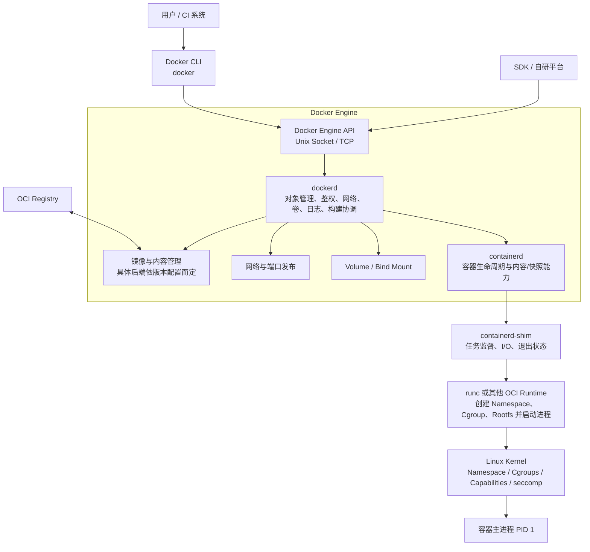
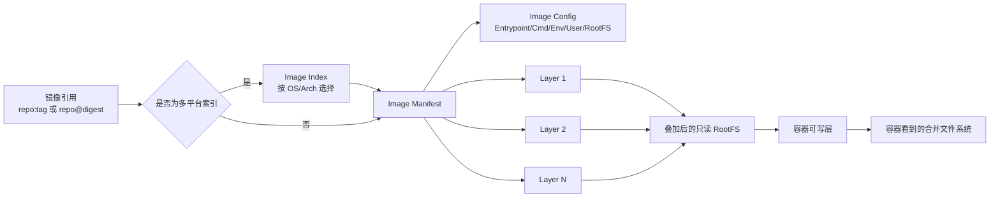
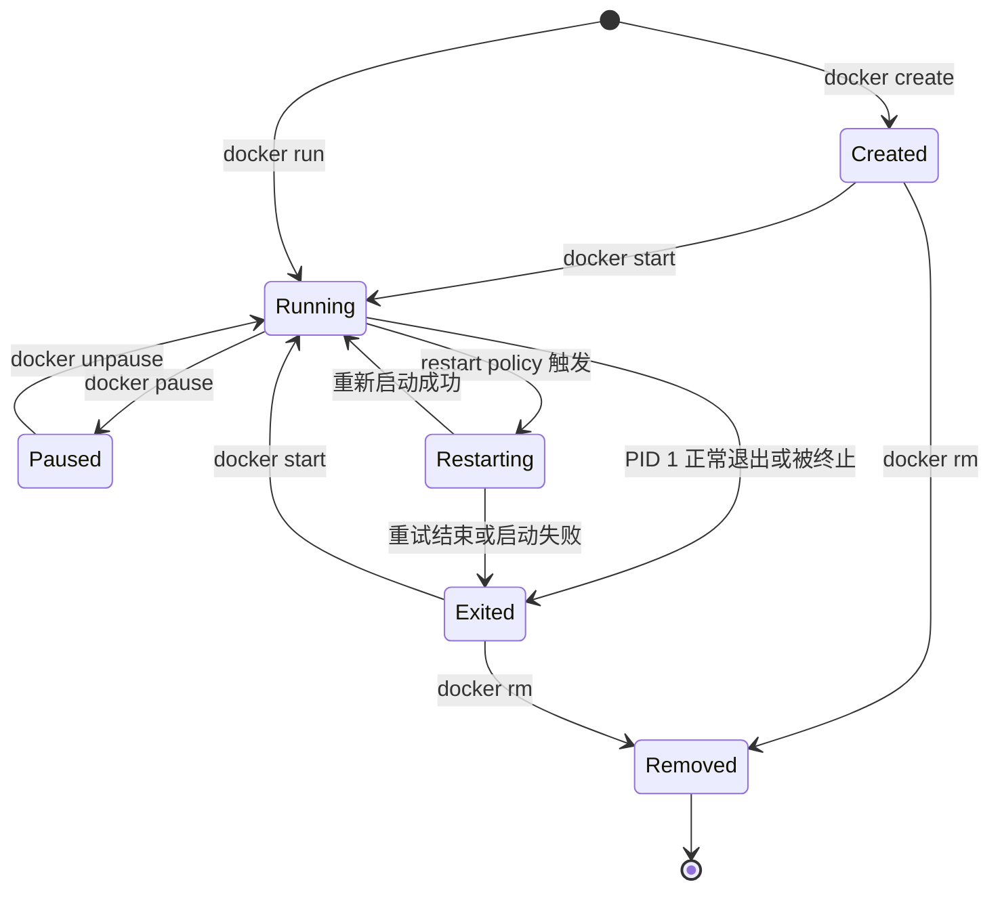
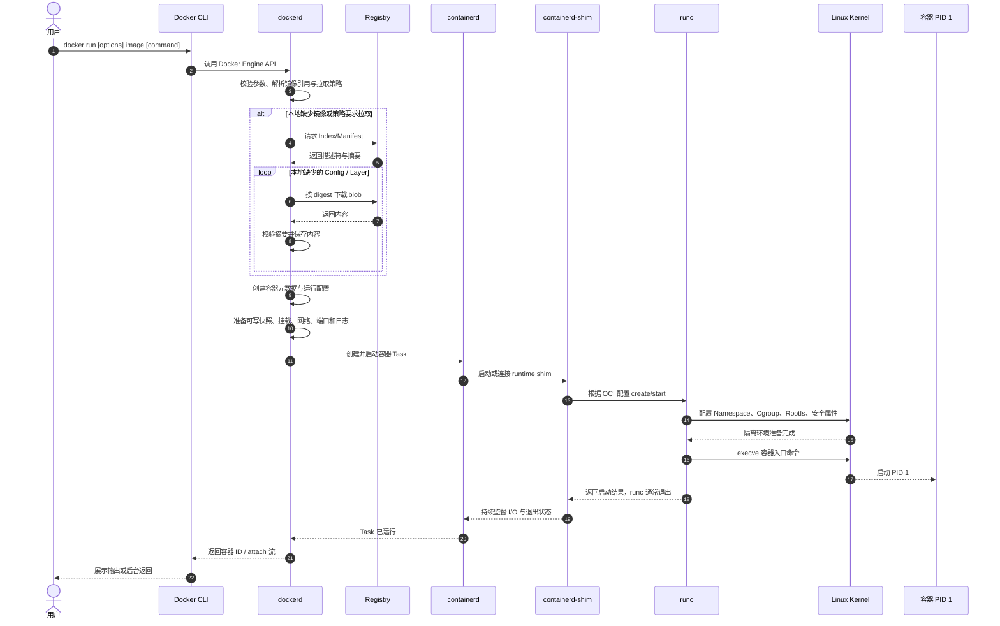
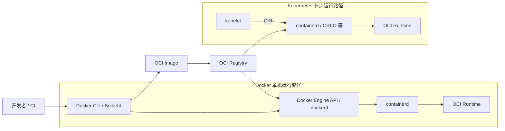

# 第 3 章：Docker 架构、镜像模型与容器生命周期

> 版本说明：本章按 2026 年 6 月可用的 Docker、containerd、OCI 与 Kubernetes 官方资料核对。Docker 的具体内部实现会随版本和配置变化，例如 Docker Engine 29.0 及以后版本的全新安装默认使用 containerd image store，而从旧版本升级的环境可能仍使用经典 `overlay2` graph driver。面试时应优先回答稳定的职责边界与调用链，不要把某个版本的磁盘目录或内部进程名当成永恒标准。

## 学习目标

学完本章后，你应当能够：

1. 准确区分 Docker Client、Docker API、`dockerd`、containerd、containerd-shim、`runc` 与 OCI 的职责。
2. 解释 Docker 为什么从较集中的早期实现演进为分层、可替换的运行时架构。
3. 区分 Image、Container、Process、Repository、Registry、Tag 与 Digest。
4. 描述 OCI 镜像中的 Image Index、Manifest、Config 与 Layer，以及内容寻址存储的意义。
5. 说清 `docker pull`、`docker build`、`docker create`、`docker run`、`docker start` 与 `docker exec` 的语义差异。
6. 从执行 `docker run` 开始，完整说明镜像解析、容器创建、文件系统准备、资源隔离、主进程启动和日志接管的调用链。
7. 解释容器停止时 `SIGTERM`、停止超时和 `SIGKILL` 的关系。
8. 识别 PID 1、信号转发、孤儿进程与僵尸进程问题。
9. 理解环境变量、端口映射、挂载、日志驱动和重启策略分别解决什么问题。
10. 使用 `docker inspect`、`docker stats`、`docker top`、`docker logs` 与 `docker events` 建立系统化排障路径。
11. 准确说明 Docker、containerd 与 Kubernetes 的关系，避免把 Docker Engine 等同于 OCI 运行时或 Kubernetes 所要求的 CRI 运行时。

---

## 一、先建立正确的对象模型

学习 Docker 最容易出现的问题，是把“镜像”“容器”“进程”和“仓库”混为一谈。可以先记住下面这条主线：

> **镜像是可分发的只读模板；容器是基于镜像创建出的运行实例与配置集合；进程是容器真正执行的工作；仓库和注册中心负责保存、命名与分发镜像。**

### 1.1 核心术语

| 术语 | 本质 | 是否直接运行 | 生命周期与可变性 | 典型标识或示例 |
|---|---|---:|---|---|
| Image（镜像） | 文件系统层与运行配置组成的可分发制品 | 否 | 按内容摘要识别的对象不可原地修改；可基于它构建新镜像 | `registry.example.com/pay/api:1.4`、`@sha256:...` |
| Container（容器） | 镜像、运行参数、可写层、挂载、网络和状态组成的实例 | 间接，承载进程 | 可创建、启动、停止、重启和删除 | 容器 ID、容器名 `pay-api` |
| Process（进程） | 宿主机内核调度的执行实体 | 是 | PID 1 退出通常意味着容器结束 | `/app/server`、`sh` |
| Repository（仓库） | 注册中心内一组相关镜像版本的逻辑集合 | 否 | 包含多个 tag 或 digest 引用 | `team/pay-api` |
| Registry（注册中心） | 存储、认证、查询和分发镜像内容的服务 | 否 | 可为公共或私有服务 | Docker Hub、企业私有 Registry |
| Tag（标签） | 指向某个镜像清单的可读名称 | 否 | 通常可移动、可覆盖，不等于不可变版本 | `latest`、`1.4.2`、`prod` |
| Digest（摘要） | 对内容计算出的密码学哈希标识 | 否 | 内容一变，摘要就变；适合精确锁定制品 | `sha256:8f...` |

### 1.2 镜像引用的组成

一个常见镜像引用可以写成：

```text
[registry-host[:port]/][namespace/]repository[:tag]
```

例如：

```text
registry.example.com/payment/order-api:1.8.3
```

也可以使用摘要精确引用：

```text
registry.example.com/payment/order-api@sha256:0123...
```

需要注意：

- `tag` 便于人阅读，但通常是一个可移动指针。今天的 `prod` 和明天的 `prod` 可能指向不同内容。
- `digest` 与内容绑定。相同摘要意味着所指向的清单内容相同。
- 一个镜像可以同时拥有多个 tag；增加 tag 通常只是增加引用，不会复制所有层。
- `latest` 只是默认 tag 名称，不表示“注册中心里创建时间最新”或“版本号最大”。

### 1.3 容器不是“运行中的镜像”这么简单

“容器是运行中的镜像”适合入门，但不够精确。一个容器对象通常还包含：

- 所引用的镜像及其配置；
- 容器级命令、参数、环境变量、用户和工作目录；
- CPU、内存、PID 等资源约束；
- 独立或共享的 Namespace；
- 容器可写层；
- Volume、bind mount、tmpfs 等挂载；
- 网络端点、端口发布规则和 DNS 配置；
- 日志驱动配置；
- 重启策略、停止信号和停止超时；
- 当前状态、退出码、启动与停止时间。

因此，同一个镜像可以创建多个容器，而这些容器可以拥有不同端口、环境变量、挂载和资源限制。

---

## 二、Docker 的分层架构

Docker Engine 是一个客户端—服务器系统。Docker CLI 通过 Docker API 与长期运行的 `dockerd` 通信；`dockerd` 管理镜像、容器、网络和卷等 Docker 对象，并将更底层的容器执行工作交给 containerd 和 OCI runtime。

### 2.1 Docker 组件架构图



这张图表达的是稳定的逻辑分层。不同 Docker Engine 版本、操作系统和 runtime 配置可能调整实际进程、插件和存储后端，但面试中应坚持以下职责边界。

### 2.2 各组件的职责

| 组件 | 所处层次 | 主要职责 | 不应混淆为 |
|---|---|---|---|
| Docker Client | 用户入口 | 解析 CLI 参数，调用 Docker API，展示结果，处理 attach/输入输出 | 容器运行时本身 |
| Docker API | 控制接口 | 以 HTTP API 暴露镜像、容器、网络、卷等操作 | OCI Runtime API 或 Kubernetes CRI |
| `dockerd` | Docker Engine 守护进程 | 管理 Docker 对象、校验请求、协调镜像、网络、存储、日志、构建和生命周期 | 单纯的进程启动器 |
| containerd | 高层容器运行时 | 管理容器任务生命周期，并提供内容、镜像、快照等基础能力；通过 shim 与具体 runtime 协作 | 直接等同于 `runc` |
| containerd-shim | 任务监督层 | 承接 containerd 与容器任务之间的通信，保持 I/O、收集退出状态，使低层 runtime 可短暂执行后退出 | 镜像构建器或注册中心 |
| `runc` | 低层 OCI runtime | 按 OCI Runtime Spec 根据 bundle/config 创建和运行 Linux 容器 | 长期管理所有镜像、网络和集群的守护进程 |
| OCI | 标准集合 | 定义 Image、Runtime、Distribution 等标准，使镜像和运行时具有互操作性 | 某一个具体二进制程序 |

### 2.3 Docker Client 与 Docker API

执行：

```bash
docker run --name api -p 8080:8080 example/api:1.0
```

并不是 CLI 自己调用 `clone`、`mount` 和 `execve` 创建容器。典型过程是：

1. CLI 解析参数与当前 Docker context。
2. CLI 通过 Unix Socket，例如 `/var/run/docker.sock`，或配置好的 TCP 端点调用 Docker Engine API。
3. `dockerd` 验证请求并创建、查询或修改 Docker 对象。
4. CLI 根据请求模式等待响应、附加标准输入输出，或立即返回容器 ID。

这意味着 Docker CLI 和 Docker daemon 可以不在同一台机器上。它也意味着 Docker Socket 不是普通“日志文件”：能控制 Docker API 的主体通常具备创建高权限容器、挂载宿主机路径等强大能力，生产环境必须严格控制访问权限。

### 2.4 `dockerd` 的角色

`dockerd` 是 Docker Engine 的核心控制进程。它负责的是“Docker 产品语义”，包括但不限于：

- 容器、镜像、网络、卷等对象的元数据和 API；
- 镜像拉取、推送和本地存储协调；
- 端口发布、网络端点和 DNS 配置；
- Volume 与 bind mount 配置；
- 日志驱动；
- 重启策略；
- 与 BuildKit、containerd 等组件协作；
- 事件生成与状态查询。

面试中不要回答成“`dockerd` 负责调用 Linux Namespace，所以 Docker 就是 `dockerd`”。更准确的说法是：`dockerd` 负责上层对象与策略，底层执行通过 containerd、shim 和 OCI runtime 分层完成。

### 2.5 containerd 的角色

containerd 是面向宿主机的高层容器运行时。它强调稳定、可嵌入和可复用，能够管理镜像内容、快照和容器任务的完整生命周期。运行时 v2 架构中，containerd 本身不直接长期充当每个容器进程的父进程，而是通过 runtime shim 暴露的接口控制任务。

可以把 containerd 理解为：

> **负责“把准备好的镜像与运行配置变成可管理的容器任务”，并维护这些任务的创建、启动、停止、删除和状态。**

它比 `runc` 更高层，但通常又比 Docker Engine 更低层。containerd 不负责提供 Docker CLI 的全部用户体验，也不天然等同于 Docker 的网络、构建、Compose 和完整产品 API。

### 2.6 containerd-shim 为什么存在

低层 runtime 的工作应尽量短小、可审计：创建隔离环境并启动进程后即可退出。如果让 `runc` 长期驻留并承担所有监督职责，会扩大复杂度和故障面。shim 作为中间层通常承担：

- 接收 containerd 的 create、start、kill、delete、exec 等任务操作；
- 保存或转接容器标准输入、标准输出与标准错误；
- 作为容器进程的监督者，收集退出状态；
- 处理进程回收等生命周期细节；
- 降低 containerd 重启对既有容器任务的直接影响。

“一个容器永远对应一个 shim”也不应当被背成绝对真理。经典 Runtime v2 场景常见一任务一 shim；随着 sandbox 与不同 runtime 模型的发展，具体粒度可以变化。面试应回答 shim 的职责，而不是死记进程数量。

### 2.7 `runc` 的角色

`runc` 是 OCI Runtime Spec 的主流实现之一。它接收 OCI bundle，其中包括根文件系统和 `config.json`，然后调用 Linux 内核能力完成：

- 创建或加入 PID、Mount、Network、IPC、UTS、User 等 Namespace；
- 配置 cgroup 资源约束；
- 挂载 rootfs、只读路径、设备和其他挂载；
- 设置用户、能力集、seccomp、SELinux/AppArmor 等安全属性；
- 设置环境变量、工作目录和命令；
- 最终执行容器初始进程。

在典型调用链中，`runc` 完成 create/start 等短时操作后退出，持续监督由 shim 和更高层运行时负责。因此，`runc` 不是“永远运行着的 Docker daemon”。

### 2.8 OCI 到底是什么

OCI，即 Open Container Initiative，不是某个 daemon。它目前主要提供三类标准：

1. **Image Specification**：定义镜像清单、配置、层、索引和布局。
2. **Runtime Specification**：定义如何从 rootfs 与 `config.json` 组成的 bundle 创建和管理容器。
3. **Distribution Specification**：定义客户端与 Registry 之间分发内容的 API 行为。

OCI 的核心价值是解耦：构建工具、Registry、高层运行时和低层 runtime 可以由不同项目实现，只要遵循相应规范，就能实现较好的互操作。

### 2.9 为什么 Docker 要从集中实现走向分层

早期 Docker 需要快速提供完整体验，镜像、构建、分发、网络、存储和底层进程隔离高度集中是合理的。但生态扩大后，分层带来明显收益：

- **职责隔离**：产品 API、容器生命周期与内核调用不再挤在一个复杂模块中。
- **标准化**：OCI 让镜像格式和低层 runtime 不被单一产品私有接口锁死。
- **复用**：Docker、Kubernetes 及其他系统可以复用 containerd、`runc` 等基础组件。
- **可替换性**：高层系统可以选择 `runc`、Kata Containers、gVisor 等不同隔离实现。
- **独立演进**：各组件可以分别测试、发布、修复安全问题和优化性能。
- **故障边界**：短生命周期的低层 runtime 与长期运行的高层 daemon 分离，降低单点复杂度。

这里的取舍是：分层会增加进程、接口和调试链路。排障时不能只看 `docker` 命令报错，还可能需要检查 `dockerd`、containerd、shim、OCI runtime 与内核日志。

---

## 三、镜像模型：Manifest、Config、Layer 与内容寻址

### 3.1 一个镜像不是一个大压缩包

从 OCI 视角看，一个镜像通常由一组通过 descriptor 相互引用的对象构成。descriptor 至少描述媒体类型、摘要和大小。核心对象包括：

- Image Index：可选，用于指向多个平台或变体的 Manifest；
- Image Manifest：引用一个 Config 和一组有顺序的 Layer；
- Image Config：描述运行配置、rootfs diff IDs、历史等元数据；
- Filesystem Layers：按顺序叠加的文件系统变更集合。



### 3.2 Manifest

Manifest 是镜像分发结构中的“目录”。它通常包含：

- schemaVersion；
- Config descriptor；
- 按顺序排列的 Layer descriptors；
- 媒体类型等信息。

Manifest 自身不保存所有文件内容，而是用摘要引用其他 blob。拉取镜像时，客户端先解析 tag 或 digest，得到 Manifest 或 Index，再根据 descriptor 获取缺少的内容。

### 3.3 Image Config

Config 是一个 JSON 对象，常见内容包括：

- `Env`；
- `Entrypoint` 与 `Cmd`；
- `WorkingDir`；
- `User`；
- 暴露端口与卷声明等元数据；
- rootfs 层的 diff IDs；
- 构建历史。

Config 中的默认值不是不可覆盖的“法律”。创建容器时，`docker run` 或 Docker API 可以覆盖命令、环境变量、用户、工作目录等部分配置。

### 3.4 Layer

Layer 表示相对于上一层的文件系统变更。多层按固定顺序叠加后形成镜像只读 rootfs。创建容器时，再在其上增加容器可写层。

例如：

```text
Layer 1：基础系统文件
Layer 2：CA 证书和时区数据
Layer 3：Go 二进制 /app/server
Layer 4：默认配置文件
容器层：运行时产生的临时文件、修改和删除标记
```

多个镜像若共享相同 layer digest，本地内容存储可以复用该 blob，从而减少下载与磁盘重复。但“共享层”不表示容器会共享可写状态；每个容器仍有自己的可写层或外部挂载。

### 3.5 内容寻址存储

内容寻址的核心是：

```text
digest = hash(content)
```

其价值包括：

- **完整性校验**：下载内容后重新计算摘要，可发现内容损坏或被替换。
- **去重**：相同内容只有一个摘要，可复用已有 blob。
- **可重复引用**：使用 digest 可以明确指定同一份制品。
- **缓存**：本地已有某摘要内容时可以跳过重复下载。

需要区分两个概念：

- tag 是“名字指向哪个 Manifest”；
- digest 是“这个 Manifest 或 blob 的内容是什么”。

因此，生产部署中常见做法是保留可读 tag 便于运维，同时记录或锁定 digest，确保部署的确切内容可审计。

### 3.6 镜像为什么说是“不可变”的

“镜像不可变”应理解为：

1. 已按 digest 标识的 Manifest、Config 或 Layer 内容不能在保持同一 digest 的情况下被修改。
2. 修改 Dockerfile 或文件后，构建工具会生成新的层、Config 与 Manifest，从而得到新的摘要。
3. 容器运行时的写入进入容器可写层或挂载，不会回写已有镜像层。
4. tag 可以改指向，因此 `app:1.0` 这个名称未必不可变；真正不可变的是特定 digest 所标识的内容。

错误说法是：“镜像文件在磁盘上绝对不能被删除或替换。”镜像对象可以被垃圾回收或删除；不可变强调的是内容标识语义，而不是永久保存。

### 3.7 2026 年需要注意的存储实现差异

不要把 `/var/lib/docker/overlay2` 背成 Docker 镜像模型本身。Docker Engine 29.0 及以后版本的全新安装默认使用 containerd image store 与 snapshotter；从旧版本升级的环境可能继续使用经典 graph driver，除非显式迁移。

面试回答应分两层：

- **稳定原理**：镜像由只读层组成，容器在其上建立可写视图，内容通过 digest 标识。
- **实现细节**：层由 graph driver 或 containerd snapshotter 组织，具体目录、元数据和快照方式依版本与配置而变。

---
## 四、Docker 命令与容器生命周期

### 4.1 六个高频命令的本质区别

| 命令 | 是否产生镜像 | 是否创建新容器 | 是否启动主进程 | 核心语义 |
|---|---:|---:|---:|---|
| `docker pull` | 拉取并保存镜像 | 否 | 否 | 从 Registry 解析引用并下载本地缺少的 Manifest、Config 与 Layers |
| `docker build` | 是 | 不创建面向用户的运行容器 | 不启动最终应用主进程 | 根据 Dockerfile 和构建上下文生成新镜像；现代 Docker 通常由 BuildKit 执行构建图 |
| `docker create` | 否 | 是 | 否 | 根据镜像和运行参数创建容器对象、运行配置及可写文件系统视图 |
| `docker run` | 否；镜像缺失时可先拉取 | 是 | 是 | 本质上是“必要时 pull + create + start”，并可 attach 到进程 I/O |
| `docker start` | 否 | 否 | 是 | 启动已经存在的 created 或 stopped 容器，复用原容器配置和可写层 |
| `docker exec` | 否 | 否 | 启动一个附加进程 | 在正在运行容器的隔离环境内执行新命令，不创建新容器 |

需要特别强调以下细节。

#### `docker run` 不等于每次都拉取最新 tag

默认拉取策略通常是本地镜像缺失时才拉取。如果本地已经存在 `example/api:latest`，直接执行 `docker run example/api:latest` 不保证查询并使用 Registry 中刚更新的内容。需要明确更新时可先执行 `docker pull`，或使用合适的 `--pull` 策略。

#### `docker start` 不是“恢复内存快照”

停止后的容器会保留其对象、配置和可写层，但原来的进程已经结束。`docker start` 是重新启动容器主命令，而不是从停止前 CPU 寄存器和内存位置继续执行。

#### `docker exec` 不会创建新容器

`docker exec` 创建的是目标容器中的附加进程。它通常加入目标容器的 Namespace 和资源控制环境，使用同一个容器文件系统视图。它可以单独覆盖用户、环境变量或工作目录，但不会获得新的容器 ID、独立网络端点或独立可写层。

附加进程依赖容器主进程存在。主进程退出后，容器结束，`exec` 进程也不能作为“隐藏的第二个容器”独立存活。

### 4.2 容器状态机



状态名称的具体展示可能因版本和命令而略有差异，但核心判断始终是：

- 容器对象是否存在；
- 主进程是否正在运行；
- 是否处于暂停或重启阶段；
- 最后一次退出的原因和退出码是什么。

---

## 五、`docker run` 背后发生了什么

这是 Docker 面试中最重要的问题之一。好的回答不能只说“创建 Namespace 和 cgroup”，也不能只背组件名称；应从 API、镜像、容器对象、文件系统、网络、运行时和进程七个层面串起来。

### 5.1 `docker run` 时序图



### 5.2 第一步：CLI 解析命令并调用 API

CLI 解析：

```bash
docker run -d \
  --name order-api \
  -p 8080:8080 \
  -e APP_ENV=prod \
  --mount type=volume,src=order-data,dst=/data \
  --restart unless-stopped \
  example/order-api:1.0
```

它会把镜像引用、命令、端口、环境变量、挂载、资源限制、重启策略等转换为 Docker API 请求。`-d` 只决定 CLI 是否在后台返回，不会让应用自动获得正确的 daemon 化能力；容器内主进程仍应以前台方式运行。

### 5.3 第二步：解析镜像并按策略拉取

`dockerd` 检查本地是否已有可用镜像，并结合 `--pull` 策略决定是否访问 Registry。若需要拉取，大致过程是：

1. 认证并解析 repository、tag 或 digest；
2. 获取 Image Index 或 Manifest；
3. 根据宿主机平台选择匹配的 Manifest；
4. 获取 Config 与缺少的 Layers；
5. 逐个校验 descriptor 中的 digest 和大小；
6. 保存内容并准备可挂载的快照。

由于内容寻址和层复用，本地已有相同 digest 的 blob 时不需要重复下载。

### 5.4 第三步：创建容器对象

Docker 将镜像默认配置与命令行覆盖项合并，形成容器级配置。这里的对象通常包括：

- 容器名与 ID；
- 镜像引用与解析后的镜像 ID；
- Entrypoint、Cmd、Env、User、WorkingDir；
- 停止信号与停止超时；
- CPU、内存、PID 等资源参数；
- 安全配置；
- 挂载、网络、端口和日志配置；
- 重启策略。

执行 `docker create` 到这里就会返回，而不会启动 PID 1。

### 5.5 第四步：准备 rootfs 与可写层

运行时从镜像层构造只读根文件系统视图，并为该容器准备一个可写层或可写快照。容器看到的是合并后的统一目录树：

```text
只读镜像层 1
      +
只读镜像层 2
      +
只读镜像层 N
      +
容器可写层
      =
容器根文件系统视图
```

Volume、bind mount 或 tmpfs 随后挂载到目标路径。挂载点会遮蔽镜像中该目录原有内容，因此“镜像里明明有文件，运行后却看不到”经常是挂载覆盖导致的。

### 5.6 第五步：准备网络、端口和日志

Docker 根据网络模式完成网络 Namespace、接口、IP、路由、DNS 和网络端点配置。使用 `-p 8080:8080` 时，还会在宿主机建立端口发布规则，使宿主机端口映射到容器端口。

同时，Docker 根据日志驱动准备对 stdout 和 stderr 的接管。应用把日志写到容器内某个普通文件，并不会自动让 `docker logs` 看到该文件内容；最通用的容器日志模式是直接输出到 stdout/stderr。

### 5.7 第六步：containerd 创建 Task

Docker Engine 将底层任务交给 containerd。containerd 准备运行时需要的 rootfs、OCI 配置和任务元数据，并通过 runtime v2 shim 启动或控制任务。

这里要区分：

- **container object**：镜像、配置和元数据；
- **task**：正在执行的进程及其运行时状态。

一个已经 `docker create` 的容器对象存在，但尚没有运行中的主进程 Task。

### 5.8 第七步：shim 调用 `runc`

shim 根据配置调用 `runc` 或其他 runtime。`runc` 读取 OCI 配置，执行实际的内核级操作：

- 创建或加入 Namespace；
- 配置 cgroup；
- 设定 rootfs 与挂载；
- 应用 capabilities、seccomp、LSM 等安全配置；
- 设置用户、环境变量、工作目录；
- 启动容器入口进程。

`runc` 完成启动后通常退出，shim 保持对容器任务的监督，并向 containerd 报告退出码和状态。

### 5.9 第八步：主进程成为 PID 1

镜像的 Entrypoint、Cmd 与用户在 `docker run` 后提供的 command/args 共同决定最终执行命令。该命令在容器 PID Namespace 中通常成为 PID 1。

容器的存活与 PID 1 强绑定：

- PID 1 持续运行，容器通常处于 running；
- PID 1 正常返回，容器进入 exited，退出码通常来自 PID 1；
- PID 1 崩溃或被信号终止，容器结束；
- 重启策略若满足条件，Docker 会再次启动该容器的主命令。

因此，在容器中启动应用后再把应用放到后台，并让 shell 立即退出，是典型错误。容器不是靠“里面还有一个后台进程”维持，而是由主进程生命周期定义。

### 5.10 第九步：CLI attach 或后台返回

前台模式下，CLI 可以附加到容器标准输入输出。后台模式 `-d` 下，CLI 通常返回容器 ID。CLI 退出不代表容器必须退出；真正决定容器状态的是 daemon、runtime 与 PID 1。

---

## 六、用最小 Go HTTP 服务观察容器生命周期

下面的代码只保留与容器生命周期相关的关键部分：打印 PID、监听 HTTP、接收 `SIGTERM`/`SIGINT` 并优雅关闭。

```go
package main

import (
    "context"
    "errors"
    "fmt"
    "log"
    "net/http"
    "os"
    "os/signal"
    "syscall"
    "time"
)

func main() {
    mux := http.NewServeMux()
    mux.HandleFunc("/", func(w http.ResponseWriter, r *http.Request) {
        _, _ = fmt.Fprintf(w, "pid=%d\n", os.Getpid())
    })
    mux.HandleFunc("/healthz", func(w http.ResponseWriter, r *http.Request) {
        w.WriteHeader(http.StatusOK)
        _, _ = w.Write([]byte("ok\n"))
    })

    server := &http.Server{
        Addr:              ":8080",
        Handler:           mux,
        ReadHeaderTimeout: 3 * time.Second,
    }

    stopCtx, stop := signal.NotifyContext(
        context.Background(),
        syscall.SIGTERM,
        syscall.SIGINT,
    )
    defer stop()

    errCh := make(chan error, 1)
    go func() {
        log.Printf("server starting: pid=%d addr=%s", os.Getpid(), server.Addr)
        errCh <- server.ListenAndServe()
    }()

    select {
    case <-stopCtx.Done():
        log.Printf("termination signal received")
    case err := <-errCh:
        if !errors.Is(err, http.ErrServerClosed) {
            log.Fatalf("server failed: %v", err)
        }
        return
    }

    shutdownCtx, cancel := context.WithTimeout(context.Background(), 8*time.Second)
    defer cancel()

    if err := server.Shutdown(shutdownCtx); err != nil {
        log.Printf("graceful shutdown failed: %v", err)
        _ = server.Close()
    }
    log.Printf("server stopped")
}
```

用于说明 PID 1 和信号的 Dockerfile 片段如下。镜像体积、缓存和安全优化将在下一章系统展开。

```dockerfile
FROM golang:1.26-bookworm AS build
WORKDIR /src
COPY . .
RUN CGO_ENABLED=0 go build -o /out/server .

FROM scratch
COPY --from=build /out/server /server
EXPOSE 8080
ENTRYPOINT ["/server"]
```

这里使用 exec form：

```dockerfile
ENTRYPOINT ["/server"]
```

容器启动后，Go 程序直接成为 PID 1。若写成 shell form：

```dockerfile
ENTRYPOINT /server
```

Docker 通常会通过 `/bin/sh -c` 启动命令，PID 1 可能变成 shell。对于 `scratch` 镜像，甚至没有 `/bin/sh` 可用；即使基础镜像有 shell，也可能出现信号未正确转发的问题。

### 6.1 构建并运行

```bash
docker build -t go-lifecycle:demo .

docker run -d \
  --name go-lifecycle \
  -p 8080:8080 \
  --stop-timeout 12 \
  go-lifecycle:demo

curl http://127.0.0.1:8080/
```

### 6.2 观察容器配置与状态

```bash
docker inspect go-lifecycle \
  --format 'pid={{.State.Pid}} status={{.State.Status}} exit={{.State.ExitCode}} oom={{.State.OOMKilled}}'

docker top go-lifecycle

docker logs -f go-lifecycle
```

### 6.3 观察停止过程

```bash
docker events --filter container=go-lifecycle
```

另一个终端执行：

```bash
docker stop go-lifecycle
```

预期日志大致为：

```text
termination signal received
server stopped
```

如果程序未处理停止信号，或信号被 shell 包装层截获，Docker 会等到停止超时后发送 `SIGKILL`。这时应用没有机会执行延迟请求处理、刷盘或连接关闭逻辑。

---

## 七、容器停止、PID 1 与信号

### 7.1 `docker stop` 的信号链

默认情况下，Docker 停止容器的逻辑是：

1. 向容器主进程发送配置的停止信号；未配置时通常为 `SIGTERM`。
2. 等待容器在停止超时内自行退出。
3. 如果超时仍未退出，发送不可捕获的 `SIGKILL` 强制终止。

可以通过以下方式修改行为：

- Dockerfile `STOPSIGNAL`；
- `docker run` 或 `docker create` 的 `--stop-signal`；
- `docker stop --signal`；
- `--stop-timeout` 或 `docker stop --timeout`。

Linux 容器在未配置时常见默认停止超时为 10 秒，但生产设计不应把这一默认值当成固定业务契约。应根据应用最长合理排空时间设置，并与上游负载摘除、请求超时和编排平台终止宽限期协调。

### 7.2 `SIGTERM` 与 `SIGKILL` 的根本区别

| 信号 | 能否捕获或处理 | 典型用途 | 对应用的含义 |
|---|---:|---|---|
| `SIGTERM` | 能 | 请求进程有序退出 | 可停止接收新请求、等待存量请求、刷新缓冲、关闭连接 |
| `SIGINT` | 能 | 终端中断，常由 Ctrl+C 产生 | 可与 `SIGTERM` 使用相同退出逻辑 |
| `SIGKILL` | 不能 | 强制终止 | 不执行 defer、shutdown hook 或业务清理逻辑 |

优雅退出必须在收到可处理信号后主动完成。不能指望收到 `SIGKILL` 时再保存状态。

### 7.3 为什么 PID 1 特殊

容器中的 PID 1 不只是“编号最小的进程”，它还承担 init 类职责：

- 容器生命周期以它为核心；
- 孤儿子进程可能被它接管；
- 它应回收已经退出但父进程尚未 wait 的子进程；
- 它必须正确处理或转发停止信号。

应用直接作为 PID 1 并没有问题，前提是它：

- 显式处理需要的停止信号；
- 启动子进程时正确调用 `Wait`；
- 不依赖一个不会转发信号的 shell 包装层。

### 7.4 僵尸进程是怎么产生的

子进程退出后，内核会暂时保留其退出状态，等待父进程调用 `wait`/`waitpid`。如果父进程长期不回收，它就成为 zombie。zombie 不再执行代码，但会占用进程表项；大量累积可能耗尽 PID 资源。

常见场景：

- 应用频繁启动外部命令，却没有等待其退出；
- shell 脚本启动后台子进程后自身行为不正确；
- PID 1 没有承担孤儿进程回收职责。

解决方式按优先级包括：

1. 应用自己正确管理子进程；Go 中使用 `cmd.Run()`，或 `Start()` 后确保调用 `Wait()`。
2. 使用 exec form，让真正应用成为 PID 1。
3. 当镜像需要运行会派生子进程的软件时，使用 `docker run --init`，让轻量 init 进程负责信号转发和 zombie 回收。

`--init` 不是所有容器的强制要求。一个不启动子进程且正确处理信号的 Go 单进程服务可以直接担任 PID 1。

### 7.5 Shell 包装脚本的正确写法

错误示例：

```sh
#!/bin/sh
/server &
wait
```

此时 shell 是 PID 1，信号是否被转发取决于脚本逻辑，容易造成超时强杀。若脚本只需做少量初始化后启动主服务，应使用：

```sh
#!/bin/sh
set -eu
# 初始化逻辑
exec /server "$@"
```

`exec` 用目标程序替换 shell，使服务成为 PID 1，而不是 shell 的子进程。

---
## 八、运行时配置：环境变量、端口、挂载、日志和重启策略

### 8.1 环境变量

环境变量适合传递简单、非结构化或低敏感度的运行配置：

```bash
docker run \
  -e APP_ENV=prod \
  -e HTTP_ADDR=:8080 \
  --env-file ./app.env \
  example/api:1.0
```

配置合并通常体现为：镜像 Config 提供默认值，创建容器时的 `-e`、`--env` 或 `--env-file` 覆盖同名变量。需要注意：

- 容器环境变量在创建时确定，改变宿主机当前 shell 变量不会自动修改已有容器。
- `docker exec -e` 只影响本次 exec 的附加进程，不会永久修改容器主进程环境。
- 环境变量可能出现在 `docker inspect`、进程信息、崩溃报告或诊断输出中，不适合直接承载高敏感秘密。
- 复杂配置应有明确 schema、校验和默认值；不要把数百项配置全部塞入无约束环境变量。

### 8.2 端口与端口发布

Dockerfile 中：

```dockerfile
EXPOSE 8080
```

主要是镜像元数据，表达“应用预期监听 8080”。它不会自动把端口暴露到宿主机外部。

真正发布端口的是：

```bash
docker run -p 8080:8080 example/api:1.0
```

含义是把宿主机端口 8080 映射到容器端口 8080。常见排障点包括：

- 应用只监听容器内 `127.0.0.1`，导致从容器外无法访问；容器服务通常应监听 `0.0.0.0` 或 `:8080`。
- 把宿主机端口和容器端口顺序写反。
- 宿主机端口已经被其他进程占用。
- 只写了 `EXPOSE`，却没有 `-p`。
- 发布到 `0.0.0.0` 可能对宿主机所有网络接口开放，应按安全需求绑定具体地址并配置防火墙。

### 8.3 挂载

Docker 常见挂载类型包括：

| 类型 | 数据位置 | 典型用途 | 容器删除后 |
|---|---|---|---|
| Volume | Docker 管理的宿主机存储区域或插件后端 | 持久化业务数据、共享数据 | 通常保留，需单独删除 |
| Bind mount | 明确指定的宿主机路径 | 开发代码映射、宿主机配置或文件接入 | 宿主机文件仍然存在 |
| tmpfs | 宿主机内存 | 临时敏感数据、短生命周期缓存 | 消失 |
| 容器可写层 | 存储驱动或 snapshotter 管理 | 临时运行状态 | 删除容器时删除 |

推荐使用语义更清晰的 `--mount`：

```bash
docker run \
  --mount type=volume,src=order-data,dst=/var/lib/order \
  example/order-api:1.0
```

挂载的几个关键事实：

- 挂载发生在容器启动前，应用看到的是挂载后的目录视图。
- 将挂载放到镜像内已有文件的目录，会遮蔽原有内容，而不是自动合并两个目录。
- bind mount 的权限取决于宿主机路径、UID/GID、只读标记和安全模块策略。
- 挂载不是“把数据写回镜像”；它是独立于镜像层的运行时数据路径。

### 8.4 日志驱动

容器应用最通用的日志约定是：

- 正常业务日志写 stdout；
- 错误和诊断日志写 stderr；
- Docker 的日志驱动负责收集、保存或转发。

常见日志驱动包括 `json-file`、`local`、`journald`、`syslog`、`fluentd` 等，具体可用项依环境而定。`docker logs` 读取的是日志驱动能够返回的容器输出，不是递归读取容器内 `/var/log`。

生产注意事项：

- 为本地文件型驱动设置轮转，避免日志填满磁盘。
- 外部日志系统故障时，阻塞式日志链路可能反向影响应用；非阻塞模式又可能在缓冲区满时丢日志，需要按可靠性要求取舍。
- 应在日志中保留时间、级别、请求 ID、错误上下文等字段，但避免输出密码、令牌和个人敏感信息。

### 8.5 重启策略

| 策略 | 行为 | 适用理解 |
|---|---|---|
| `no` | 不自动重启，默认值 | 调试、一次性任务或由外部系统控制 |
| `on-failure[:max-retries]` | 非零退出码时重启，可限制次数；daemon 自身重启时不会仅因此策略自动拉起 | 对明确失败退出的一次性或简单服务进行有限重试 |
| `always` | 容器停止后通常会重启；手工停止后，在 daemon 重启或手工启动前不会立刻反复拉起 | 希望随 Docker daemon 恢复的常驻服务 |
| `unless-stopped` | 类似 `always`，但显式停止后，daemon 重启也不自动拉起 | 单机常驻服务的常见选择 |

示例：

```bash
docker run -d --restart unless-stopped example/api:1.0
```

需要理解重启策略的边界：

- 它重启的是同一个容器对象，复用原配置和可写层，并不是创建新容器。
- 它不提供副本数、跨节点调度、滚动发布、健康流量摘除或故障迁移。
- 快速崩溃循环会掩盖根因并制造日志噪声，应同时检查退出码、错误日志和 backoff。
- Docker 只在容器成功启动并进入监控后应用重启策略；当前官方文档将“成功启动”定义为容器至少运行约 10 秒。
- 不要同时让 Docker restart policy 和宿主机另一个进程管理器反复争抢同一容器生命周期。

---

## 九、为什么停止后数据还在，删除后又可能丢失

### 9.1 停止容器不会立即删除可写层

执行：

```bash
docker stop app
docker start app
```

容器对象没有被删除，原有可写层仍属于该容器。应用重新启动后，通常还能看到之前写在可写层中的文件。

但这不代表把数据库长期写入可写层是正确设计。可写层与容器对象绑定，删除容器、重建发布或迁移到另一台主机时都可能失去这些数据，并且写密集型负载还可能受到 Copy-on-Write 路径影响。

### 9.2 删除容器会删除其可写层

```bash
docker rm app
```

删除容器会移除容器元数据和可写层。镜像的只读层仍然存在，其他容器也不受影响。

### 9.3 Volume 的生命周期独立于单个容器

命名 Volume 的内容存在于容器生命周期之外：

```bash
docker volume create app-data

docker run --name app-1 \
  --mount type=volume,src=app-data,dst=/data \
  example/api:1.0
```

删除 `app-1` 后，`app-data` 通常仍存在，可挂载给新容器。必须显式执行 `docker volume rm`、`docker volume prune` 或相应管理动作才会删除。

### 9.4 Bind mount 数据属于宿主机路径

```bash
docker run \
  --mount type=bind,src=/srv/app-data,dst=/data \
  example/api:1.0
```

容器删除后，`/srv/app-data` 仍在宿主机。Docker 只负责把它挂载进容器，不拥有该路径的完整生命周期。

### 9.5 `--rm` 与匿名 Volume

`docker run --rm` 会在容器退出后自动删除容器。与该容器一起创建的匿名 Volume 也可能被清理；显式命名的 Volume 不会因为 `--rm` 自动删除。因此，排查数据丢失时必须确认：

- 数据写入的是可写层、匿名 Volume、命名 Volume，还是 bind mount；
- 容器是否使用 `--rm`；
- 删除命令是否带 `-v`；
- 是否执行过 volume prune；
- 实际挂载目标是否被写错。

### 9.6 数据生命周期对比

| 操作 | 镜像只读层 | 容器可写层 | 命名 Volume | Bind mount 宿主机数据 |
|---|---:|---:|---:|---:|
| `docker stop` | 保留 | 保留 | 保留 | 保留 |
| `docker start` | 复用 | 复用 | 重新挂载 | 重新挂载 |
| `docker rm` | 保留 | 删除 | 默认保留 | 保留 |
| `docker rm -v` | 保留 | 删除 | 命名 Volume 通常不因该参数删除；关联匿名 Volume 可删除 | 保留 |
| `docker image rm` | 可能删除未被引用镜像内容 | 已有容器仍受引用关系保护或操作被拒绝 | 不影响 | 不影响 |
| `docker volume rm` | 不影响 | 不影响 | 删除目标 Volume | 不影响 |

最稳妥的面试表达是：

> **停止只结束进程，不删除容器；删除容器会删除其可写层；Volume 和 bind mount 的生命周期独立于容器，因此是否丢数据取决于数据实际写到了哪一层。**

---

## 十、五个核心排障命令

### 10.1 `docker inspect`：先确认“事实配置”和“最终状态”

`docker inspect` 返回 Docker 对象的底层 JSON 信息。排障时重点关注：

- `.State.Status`：running、exited、restarting 等；
- `.State.ExitCode`：主进程退出码；
- `.State.Error`：启动错误；
- `.State.OOMKilled`：是否被内存 OOM 终止；
- `.State.Pid`：宿主机视角 PID；
- `.Path` 与 `.Args`：最终执行命令；
- `.Config.Env`：容器环境变量；
- `.HostConfig`：资源、端口、重启策略等宿主机配置；
- `.Mounts`：最终挂载来源和目标；
- `.NetworkSettings`：IP、网络和端口映射；
- `.Config.Healthcheck` 与 `.State.Health`：健康检查配置和结果。

常用格式化查询：

```bash
docker inspect app --format '{{json .State}}'

docker inspect app --format '{{json .Mounts}}'

docker inspect app --format '{{json .NetworkSettings.Ports}}'

docker inspect app --format 'path={{.Path}} args={{json .Args}}'
```

第一原则是：不要只看 Dockerfile 猜运行配置，要看容器创建后最终生效的 inspect 结果。

### 10.2 `docker logs`：判断主进程启动到了哪一步

```bash
docker logs --tail 200 --timestamps app

docker logs -f --since 10m app
```

适合回答：

- 应用是否启动；
- 配置解析是否失败；
- 监听端口是否成功；
- 是否发生 panic、fatal、连接失败；
- 收到停止信号后是否执行了退出逻辑。

如果日志为空，不代表应用没有错误。还要检查：

- 应用是否把日志写入了容器文件；
- 日志驱动是否支持读取；
- 进程是否在输出前就因 exec、权限或动态链接错误而失败；
- daemon 日志中是否有 runtime 层错误。

### 10.3 `docker top`：查看容器内实际进程关系

```bash
docker top app
```

它不要求镜像内安装 `ps`，适合判断：

- PID 1 到底是应用、shell 还是 init；
- 是否有意外子进程；
- 进程是否大量增长；
- `docker exec` 启动的进程是否还存在。

输出通常来自宿主机视角，PID 可能与容器内看到的 PID 不同，这是 PID Namespace 映射的正常现象。

### 10.4 `docker stats`：观察资源趋势

```bash
docker stats app

docker stats --no-stream app
```

常见指标包括 CPU、内存、网络 I/O、块 I/O 和 PID 数。它适合快速发现：

- CPU 是否持续打满；
- 内存是否接近限制；
- PID 是否异常增长；
- 网络或磁盘 I/O 是否异常。

但 `docker stats` 只是入口，不是完整性能分析。出现问题后还需要结合 cgroup 指标、宿主机监控、Go runtime 指标、pprof、应用延迟与错误率判断根因。

### 10.5 `docker events`：还原发生顺序

```bash
docker events \
  --since 30m \
  --filter container=app
```

它能观察 create、start、die、stop、kill、restart、oom、destroy 等事件，特别适合回答：

- 是谁先发生：健康检查失败、OOM、kill 还是 restart；
- 容器是否在反复重启；
- 容器是否被外部自动化删除和重建；
- stop 后是否进入 kill。

事件流不是长期审计系统。官方 CLI 只保留有限的近期事件，生产环境应把关键事件汇聚到可持久化的监控或审计系统。

---

## 十一、典型故障的排查路径

### 11.1 容器一启动就退出

按以下顺序检查：

```bash
docker ps -a --filter name=app
docker inspect app --format '{{json .State}}'
docker inspect app --format 'path={{.Path}} args={{json .Args}}'
docker logs --tail 200 app
docker events --since 10m --filter container=app
```

高频根因：

- 主命令执行完毕，本来就是一次性进程；
- Entrypoint/Cmd 覆盖错误；
- 二进制不存在或没有执行权限；
- 动态链接器或共享库缺失；
- 配置、证书、环境变量或挂载缺失；
- 应用 panic 或 fatal；
- 端口冲突；
- OOMKilled；
- CPU 架构不匹配；
- shell form 在无 shell 镜像中执行失败。

### 11.2 容器 running，但端口访问失败

检查：

```bash
docker inspect app --format '{{json .NetworkSettings.Ports}}'
docker logs --tail 100 app
docker top app
```

然后确认：

1. 应用进程是否实际监听目标端口；
2. 是否监听 `0.0.0.0`，而不是容器内 `127.0.0.1`；
3. `-p` 的宿主机端口和容器端口是否写对；
4. 宿主机防火墙和安全组是否允许；
5. 请求是否发到了正确宿主机；
6. 应用是否健康但依赖不可用，导致请求超时。

### 11.3 `docker stop` 总要等到超时

检查：

- `docker top` 中 PID 1 是谁；
- Dockerfile 是否使用 shell form；
- Go 程序是否调用 `signal.Notify` 或 `signal.NotifyContext`；
- 退出逻辑是否卡在未设超时的数据库、消息队列或 HTTP 连接；
- 服务关闭时间是否大于 Docker stop timeout；
- 应用是否在收到信号后仍继续接收新请求。

验证方式：

```bash
time docker stop --timeout 15 app
docker logs --since 1m app
```

### 11.4 容器反复重启

```bash
docker inspect app --format 'restart={{.RestartCount}} exit={{.State.ExitCode}} error={{.State.Error}}'
docker logs --tail 300 app
docker events --since 30m --filter container=app
```

先判断是应用非零退出、OOM、健康管理脚本、daemon 重启还是外部自动化触发。不要通过无限 `always` 策略掩盖不可恢复配置错误。

### 11.5 数据“突然丢失”

```bash
docker inspect app --format '{{json .Mounts}}'
docker volume ls
docker volume inspect app-data
```

重点确认：

- 实际写入路径和挂载目标是否一致；
- 新容器是否挂载了同一个命名 Volume；
- bind mount 源路径是否因相对路径、拼写或宿主机变化而改变；
- 挂载是否遮蔽了镜像预置数据；
- 是否使用 `--rm`、`docker rm -v` 或 volume prune；
- 应用是否将数据写在临时目录或内存文件系统。

---

## 十二、Docker、containerd 与 Kubernetes 的关系

### 12.1 三者不是同一层的替代品



- **Docker Engine**：提供面向开发者和单机容器管理的完整产品能力，包括 CLI/API、镜像、构建协作、网络、卷、日志等。
- **containerd**：高层容器运行时，可被 Docker Engine 或 Kubernetes 节点使用。
- **Kubernetes**：集群编排系统，负责声明式工作负载、调度、自愈、服务发现、滚动发布和集群资源管理。

Kubernetes 不需要 Docker CLI 才能运行容器，也不把 Docker Engine API 当成通用运行时标准。

### 12.2 CRI、OCI 和 Docker API 的区别

| 接口或标准 | 调用双方 | 解决的问题 |
|---|---|---|
| Docker Engine API | Docker CLI/SDK ↔ `dockerd` | Docker 产品对象与操作 |
| CRI | kubelet ↔ CRI 兼容运行时 | Kubernetes Pod sandbox、容器、镜像和状态管理 |
| OCI Runtime Spec | 高层 runtime ↔ `runc` 等低层 runtime | 如何创建和管理单个容器执行环境 |
| OCI Image Spec | 构建、Registry、运行时 | 镜像制品结构和内容描述 |
| OCI Distribution Spec | Registry 客户端 ↔ Registry | 镜像和其他内容如何分发 |

### 12.3 dockershim 被移除意味着什么

Kubernetes 早期通过内置 dockershim 把 kubelet 的 CRI 调用适配到 Docker Engine。dockershim 已在 Kubernetes 1.24 从上游项目移除。当前 Kubernetes 节点要求使用符合 CRI 的容器运行时；截至本章核对时，Kubernetes 1.36 文档仍明确这一要求。

这不意味着：

- Docker 构建的镜像不能在 Kubernetes 中运行；
- Dockerfile 失效；
- OCI 镜像格式被 Kubernetes 放弃。

实际变化是运行时控制路径：

```text
过去：kubelet → CRI → dockershim → Docker Engine → containerd → runc
现在常见：kubelet → CRI → containerd/CRI-O → runc 或其他 OCI runtime
```

只要构建结果符合 OCI/Docker 镜像兼容格式，仍可由 containerd 等运行时拉取并运行。若某环境坚持让 Kubernetes 节点使用 Docker Engine，则需要额外的 CRI 适配组件，而不是 kubelet 原生直接调用 Docker API。

### 12.4 Docker 与 Kubernetes 的职责边界

Docker 擅长：

- 本地构建和运行镜像；
- 单机容器调试；
- 开发环境复现；
- 镜像分发工作流；
- 单节点的网络、卷和日志配置。

Kubernetes 在其上解决：

- 多节点调度；
- 副本与自愈；
- 服务发现和负载均衡；
- 滚动发布与回滚；
- 配置、Secret 和持久化存储编排；
- 资源配额、调度约束和弹性伸缩。

面试中最准确的结论是：

> **Docker Engine 是完整的容器开发与单机运行平台；containerd 是可复用的高层容器运行时；Kubernetes 是通过 CRI 使用运行时的集群编排系统。三者可以协作，但不处在同一个职责层。**

---

## 十三、常见错误认知

| 错误认知 | 正确理解 |
|---|---|
| Docker 就是一个 `docker` 命令 | CLI 只是客户端，核心控制通过 Docker API 与 `dockerd` 完成 |
| containerd 和 `runc` 是同一个东西 | containerd 管理高层生命周期；`runc` 按 OCI 配置完成低层容器创建和启动 |
| OCI 是一个容器运行进程 | OCI 是规范组织与标准集合，不是 daemon |
| 镜像不可变，所以 tag 也绝不会变 | digest 标识的内容不可变；tag 通常可移动 |
| `docker run` 每次都会拉最新镜像 | 默认通常只在本地缺失时拉取，需显式控制 pull 策略 |
| `docker exec` 会创建一个新容器 | 它只在已有运行容器中创建附加进程 |
| 容器 stopped 后数据必然丢失 | stopped 容器的可写层仍在；删除容器才会删除该层 |
| 使用 Volume 后数据绝不会丢 | Volume 仍可能被误删、prune、存储损坏或挂载错对象，必须备份和验证 |
| 写了 `EXPOSE` 就能从宿主机访问 | `EXPOSE` 是元数据；需要 `-p`，并确保应用监听正确地址 |
| 容器里有进程就算 running | 容器生命周期以 PID 1 为核心，PID 1 退出后容器结束 |
| `docker stop` 会一直等待优雅退出 | 超时后会发送 `SIGKILL`，应用必须在宽限期内完成退出 |
| Kubernetes 不再支持 Docker，因此 Docker 镜像不能用 | 被移除的是内置 dockershim；OCI 兼容镜像仍可由 CRI 运行时运行 |

---

## 十四、面试回答方法

对于 Docker 原理题，可以固定使用：

> **结论 → 机制 → 场景 → 取舍 → 验证**

例如回答“`docker run` 背后发生了什么”：

- **结论**：它不是单纯启动进程，而是必要时拉取镜像、创建容器对象并启动主进程。
- **机制**：CLI 调用 Docker API，`dockerd` 准备镜像、可写层、网络、挂载和日志，再交给 containerd、shim 与 OCI runtime 创建隔离环境并执行 PID 1。
- **场景**：端口、环境变量、资源限制和 Volume 都在创建阶段固化为容器配置。
- **取舍**：分层架构提高复用和可替换性，但排障链路更长。
- **验证**：用 `docker inspect` 看最终配置，用 `docker events` 看生命周期，用 `docker top` 看 PID 1，用 `docker logs` 看启动结果。

这种组织方式比连续罗列 Namespace、cgroup、UnionFS、containerd、`runc` 更能体现工程理解。

---
## 十五、章节总结

1. Docker Engine 是客户端—服务器架构：Docker CLI 通过 Docker API 控制 `dockerd`。
2. `dockerd` 负责 Docker 对象与产品语义，containerd 负责高层容器生命周期，containerd-shim 负责任务监督和 I/O，`runc` 等 OCI runtime 负责真正创建隔离环境并启动进程。
3. OCI 是 Image、Runtime、Distribution 等规范集合，不是某个 daemon。
4. 镜像由 Manifest、Config 和有序 Layers 等内容组成；tag 是可读且通常可移动的引用，digest 是内容标识。
5. 镜像“不可变”指特定 digest 的内容不能原地变化；修改会产生新内容和新摘要。容器写入不会修改镜像层。
6. `docker run` 本质上组合了必要时 pull、create 和 start；`docker start` 复用已有容器；`docker exec` 只增加附加进程，不创建新容器。
7. 容器生命周期以 PID 1 为核心。应用应正确接收停止信号、回收子进程，并在停止超时前完成优雅退出。
8. `docker stop` 先发送停止信号，等待超时后使用 `SIGKILL`；`SIGKILL` 无法被应用捕获。
9. 停止容器不会删除可写层，删除容器会删除可写层；Volume 和 bind mount 的生命周期独立于单个容器。
10. 排障时先用 `inspect` 确认最终配置和状态，再用 `logs`、`top`、`stats`、`events` 从进程、资源和时间线验证假设。
11. Kubernetes 通过 CRI 控制容器运行时。dockershim 的移除改变的是节点运行时调用链，不影响 OCI 兼容镜像继续在 Kubernetes 中运行。

## 官方资料索引

- [Docker Engine](https://docs.docker.com/engine/)
- [Docker container run](https://docs.docker.com/reference/cli/docker/container/run/)
- [Docker container stop](https://docs.docker.com/reference/cli/docker/container/stop/)
- [Docker container exec](https://docs.docker.com/reference/cli/docker/container/exec/)
- [Docker storage](https://docs.docker.com/engine/storage/)
- [Docker volumes](https://docs.docker.com/engine/storage/volumes/)
- [Docker restart policies](https://docs.docker.com/engine/containers/start-containers-automatically/)
- [Docker Engine containerd image store](https://docs.docker.com/engine/storage/containerd/)
- [containerd Runtime v2](https://github.com/containerd/containerd/blob/main/docs/runtime-v2.md)
- [containerd 项目](https://github.com/containerd/containerd)
- [runc 项目](https://github.com/opencontainers/runc)
- [OCI Image Specification](https://specs.opencontainers.org/image-spec/)
- [OCI 概览](https://opencontainers.org/about/overview/)
- [Kubernetes Container Runtimes](https://kubernetes.io/docs/setup/production-environment/container-runtimes/)
- [Go Release History](https://go.dev/doc/devel/release)

---

## 十六、面试题

### A. 基础题

#### 1. Docker Client、Docker API、`dockerd`、containerd 和 `runc` 分别做什么？

**面试官考察意图**

判断候选人是否建立了分层架构，而不是把所有组件都笼统称为“Docker runtime”。

**30 秒回答**

Docker CLI 是客户端，通过 Docker Engine API 请求 `dockerd`。`dockerd` 管理镜像、容器、网络、卷和日志等 Docker 对象，并把底层容器生命周期交给 containerd。containerd 通过 shim 管理容器任务，`runc` 按 OCI Runtime Spec 创建 Namespace、cgroup、rootfs 和安全配置，最终启动容器进程。OCI 是标准，不是进程。

**展开回答**

- **结论**：这些组件从上到下分别解决用户入口、产品 API、对象管理、高层生命周期和低层内核执行问题。
- **机制**：CLI 把命令转换为 API；`dockerd` 合并镜像配置与运行参数并准备网络、挂载和日志；containerd 创建 Task；shim 保持控制通道与退出状态；`runc` 根据 OCI bundle 调用 Linux 内核能力并执行 PID 1。
- **场景**：执行 `docker run` 时，CLI 并不会直接创建 Namespace；真正的低层创建工作由 OCI runtime 完成。
- **取舍**：分层提高标准化、可替换性和复用，但日志与故障可能跨 `dockerd`、containerd、shim、runtime 和内核多个层次。
- **验证**：用 `docker info` 看 Engine 配置，用宿主机进程树和 daemon 日志观察 containerd/shim，用 `docker inspect` 和 `docker events` 验证对象状态。

**可能追问**

1. containerd-shim 为什么不能省略？
2. `runc` 为什么通常不是长期驻留 daemon？
3. Docker API 与 Kubernetes CRI 有什么区别？

**常见误区**

- 说 containerd 就是 `runc` 的新名字。
- 说 OCI 是一个后台进程。
- 说 Docker CLI 直接调用 Linux Namespace API。

---

#### 2. Image、Container、Process、Repository 和 Registry 有什么区别？

**面试官考察意图**

检查对象模型是否清晰，能否解释同一镜像为什么能创建多个不同容器。

**30 秒回答**

Image 是只读层和运行配置组成的可分发模板；Container 是基于镜像创建的实例，额外拥有可写层、挂载、网络和运行配置；Process 是容器实际执行的宿主机内核进程；Repository 是 Registry 中一组相关镜像版本的集合；Registry 是存储和分发镜像内容的服务。

**展开回答**

- **结论**：镜像是制品，容器是实例，进程是执行实体，仓库和注册中心是分发组织结构。
- **机制**：镜像通过 Manifest 引用 Config 与 Layers；创建容器时叠加可写层并加入运行参数；启动容器后才产生 PID 1。Repository 通过 tag 或 digest 组织镜像，Registry 提供认证与内容分发 API。
- **场景**：同一个 `api:1.0` 可创建三个容器，分别使用不同端口、环境变量和 Volume，但共享相同只读镜像层。
- **取舍**：共享镜像层提高分发和磁盘效率，但运行时状态必须外置，否则容器重建时难以迁移。
- **验证**：`docker image inspect` 查看镜像配置，`docker inspect` 查看容器配置，`docker top` 查看实际进程，Registry 页面或 API 查看 repository/tag。

**可能追问**

1. 一个容器能否运行多个进程？
2. 一个镜像能否有多个 tag？
3. 停止容器后镜像会发生变化吗？

**常见误区**

- 把 Repository 和 Registry 当作同义词。
- 认为 Container ID 就是 Process PID。
- 认为容器写文件会修改原镜像。

---

#### 3. `docker pull`、`build`、`create`、`run`、`start` 和 `exec` 有什么区别？`exec` 会创建新容器吗？

**面试官考察意图**

判断候选人是否真正理解容器对象与进程的生命周期。

**30 秒回答**

`pull` 只拉镜像，`build` 生成镜像，`create` 创建容器但不启动进程，`run` 是必要时拉取再 create 加 start，`start` 启动已有容器，`exec` 只在正在运行的容器内启动附加进程，不会创建新容器，也没有独立容器 ID、网络和可写层。

**展开回答**

- **结论**：关键分界是“是否生成镜像”“是否创建容器对象”“是否启动主进程或附加进程”。
- **机制**：`create` 固化镜像、命令、环境、挂载、端口和资源配置；`start` 基于这些配置重新启动 PID 1；`exec` 加入已有容器的隔离环境运行一个额外命令。
- **场景**：需要提前创建并检查配置时用 `create`；停止后原配置重新启动用 `start`；进入运行容器做诊断用 `exec`。
- **取舍**：`exec` 适合临时排障，不适合把生产变更偷偷写进运行容器，因为变更不可重复、重建即丢失。
- **验证**：执行 `docker ps -a` 比较容器数量；`docker top` 可看到 exec 进程；`docker inspect` 可证明容器 ID 和可写层没有新增。

**可能追问**

1. `docker run` 会不会每次拉取 Registry 最新 tag？
2. `docker start` 能否修改端口映射？
3. exec 进程能否在 PID 1 退出后继续运行？

**常见误区**

- 认为 `docker run` 等于 `docker start`。
- 认为 `docker exec bash` 启动了一个新容器。
- 认为 `docker start` 能覆盖所有原始运行参数。

---

#### 4. Tag 与 Digest 有什么区别？为什么说镜像不可变？

**面试官考察意图**

检查候选人是否理解内容寻址、供应链可重复性，以及“不可变”不是一句口号。

**30 秒回答**

Tag 是可读名称，通常可以重新指向另一个 Manifest；Digest 是对内容计算出的哈希，内容变化就会得到新摘要。镜像不可变指特定 digest 标识的 Manifest、Config 和 Layer 不能在保持摘要不变的情况下修改。容器写入进入可写层，不会修改原镜像。

**展开回答**

- **结论**：tag 解决可读命名，digest 解决精确身份和完整性，真正稳定的是 digest。
- **机制**：Manifest 通过 descriptor 按 digest 引用 Config 和 Layers；拉取后可重新计算摘要校验内容。修改任意字节都会产生不同 digest。
- **场景**：`prod` tag 可在发布时从版本 A 移到版本 B；若部署只记录 `prod`，回溯时可能不知道当时运行的确切内容。记录 `repo:tag@sha256:...` 可兼顾可读性与精确性。
- **取舍**：固定 digest 提高可重复性，但不会自动获得安全补丁，需要通过重建、扫描和受控升级更新摘要。
- **验证**：用 `docker image inspect`、`docker pull` 输出或 Registry 元数据查看 RepoDigests；重新推送相同 tag 后比较 digest。

**可能追问**

1. `latest` 是否代表最新版本？
2. 同一镜像为什么可以有多个 tag？
3. 固定 digest 后如何更新基础镜像漏洞？

**常见误区**

- 说 tag 永远不可变。
- 说不可变意味着镜像不能被删除。
- 认为固定 digest 就自动安全，无需漏洞修复。

---

### B. 原理深挖题

#### 5. 从执行 `docker run` 到 Go 主进程启动，完整链路是什么？

**面试官考察意图**

考察是否能把 API、镜像、存储、网络、运行时和内核机制串成完整因果链。

**30 秒回答**

CLI 解析命令后调用 Docker API；`dockerd` 解析镜像引用，按策略拉取并校验 Manifest、Config 和 Layers；随后创建容器配置、可写快照、挂载、网络、端口和日志。`dockerd` 把 Task 交给 containerd，containerd 通过 shim 调用 `runc`。`runc` 根据 OCI 配置创建 Namespace、cgroup、rootfs 和安全上下文，并 `execve` Go 二进制成为 PID 1。之后 shim 监督 I/O 和退出状态，CLI attach 或后台返回。

**展开回答**

- **结论**：`docker run` 是“镜像准备 + 容器对象创建 + 隔离环境创建 + 主进程启动”的组合事务。
- **机制**：先解析本地/远端镜像并按 digest 获取内容；再合并镜像默认值与 CLI 覆盖；准备文件系统、Volume、网络和日志；containerd 创建 Task；shim 调用 OCI runtime；内核完成 Namespace、cgroup、挂载和安全设置；最后执行 Entrypoint/Cmd。
- **场景**：`-p`、`-e`、`--mount`、`--memory` 等参数会在容器创建阶段进入最终配置，不是 Go 程序启动后才由 CLI 临时注入。
- **取舍**：分层使运行时可替换、组件可独立演进，但错误可能发生在 Registry、存储、网络、runtime 或应用任一环节。
- **验证**：`docker events` 观察 create/start/die；`docker inspect` 看最终配置；`docker top` 确认 PID 1；daemon 日志定位 shim/runc 错误；应用日志确认 Go 服务开始监听。

**可能追问**

1. 镜像本地已有时还会发生什么？
2. `-d` 在哪一层生效？
3. `runc` 启动完成后为什么可以退出？
4. 容器网络和挂载是在 PID 1 之前还是之后准备？

**常见误区**

- 只回答“创建 Namespace 和 cgroup”，忽略镜像、容器配置、网络和日志。
- 只罗列组件，不说明调用关系。
- 认为 CLI 是容器进程的长期父进程。

---

#### 6. containerd、containerd-shim 与 `runc` 的区别是什么？

**面试官考察意图**

验证对高层 runtime、监督进程和低层 runtime 的边界理解。

**30 秒回答**

containerd 是长期运行的高层容器运行时，管理内容、快照和容器 Task 生命周期；shim 是 containerd 与具体容器任务之间的监督和通信层，保留 I/O、收集退出状态；`runc` 是低层 OCI runtime，短时执行 create/start 等操作，真正配置 Namespace、cgroup、rootfs 和安全属性并启动进程。

**展开回答**

- **结论**：containerd 管“任务生命周期”，shim 管“任务监督和连接”，`runc` 管“按 OCI 配置创建执行环境”。
- **机制**：containerd Runtime v2 不直接长期启动和承载每个容器，而是连接 shim 暴露的 TaskService；shim 再调用 `runc` 或其他 runtime。`runc` 完成启动后返回，shim 保持运行。
- **场景**：Kubernetes 可以通过 CRI 使用 containerd；containerd 再选择 `runc`、gVisor 或其他 runtime class。更换低层 runtime 不要求 kubelet 理解所有内核细节。
- **取舍**：shim 增加进程和通信成本，但提供故障隔离、I/O 管理、退出状态收集和 runtime 可插拔性。
- **验证**：查看 containerd 配置、宿主机进程树和 shim socket；从错误链如 `failed to create shim task: OCI runtime create failed` 判断故障已经进入哪一层。

**可能追问**

1. containerd 能否脱离 Docker 单独使用？
2. shim 是否永远一容器一个？
3. `runc` 与 crun、Kata、gVisor 的关系？

**常见误区**

- 认为 containerd 只是 Docker 的一个子命令。
- 认为 `runc` 负责拉镜像、创建网络和管理 Registry。
- 把 shim 说成镜像层存储驱动。

---

#### 7. Docker 停止容器时发生什么？PID 1、信号转发和僵尸进程有什么关系？

**面试官考察意图**

考察生产级容器进程模型和优雅退出能力。

**30 秒回答**

`docker stop` 先向 PID 1 发送镜像或容器配置的停止信号，默认通常是 `SIGTERM`；等待停止超时后仍未退出就发送 `SIGKILL`。PID 1 决定容器生命周期，还应处理信号并回收孤儿子进程。若 shell 是 PID 1 且不转发信号，应用可能收不到 `SIGTERM`；若父进程不 wait 子进程，会积累 zombie。可用 exec form、正确的 Go signal 处理和必要时 `--init` 解决。

**展开回答**

- **结论**：优雅退出是否成功，关键不在 Docker 有没有发送信号，而在 PID 1 是否收到并在宽限期内完成退出。
- **机制**：Docker 向 PID 1 发送 StopSignal；Go 服务通过 `signal.NotifyContext` 取消上下文，停止接收新请求并调用 `Server.Shutdown`；超时后 `SIGKILL` 无法捕获。子进程退出后必须由父进程调用 wait 回收。
- **场景**：Shell-form Entrypoint 让 `/bin/sh -c` 成为 PID 1，脚本未 `exec` 主程序时可能不转发信号；频繁调用外部工具又不 `Wait` 会积累 zombie。
- **取舍**：直接让应用做 PID 1 最简单，但应用必须正确处理信号和子进程；增加 tiny init 更稳健，但也增加一个组件。
- **验证**：`docker top` 看 PID 1，`time docker stop` 看是否超时，`docker logs` 看是否记录收到信号和完成 shutdown，检查 PID 数是否持续增加。

**可能追问**

1. `SIGKILL` 时 Go 的 `defer` 会不会执行？
2. 为什么 `exec /server` 能改善信号问题？
3. 单进程 Go 服务是否必须使用 tini？

**常见误区**

- 认为 `docker stop` 直接发送 `SIGKILL`。
- 认为任何 PID 1 都会自动转发信号。
- 认为 zombie 仍在消耗 CPU 执行业务代码。

---

#### 8. 为什么容器停止后文件还在，删除后却可能丢失？

**面试官考察意图**

检查是否理解镜像层、容器可写层与外部持久化存储的生命周期。

**30 秒回答**

停止容器只结束 PID 1，不删除容器对象，所以它的可写层仍在，重新 start 还能看到原文件。删除容器会删除可写层，因此写在里面的数据会丢。命名 Volume 和 bind mount 独立于容器生命周期，删除容器后数据通常仍在，但仍可能被 prune、误删或挂载错路径。

**展开回答**

- **结论**：数据是否保留取决于数据落在镜像只读层、容器可写层、Volume、bind mount 还是 tmpfs，而不是只看容器是否 running。
- **机制**：容器 rootfs 是镜像只读层加可写层的合并视图；stop 保留对象和层；rm 释放容器可写层；Volume 由 Docker 单独管理；bind mount 指向宿主机路径；tmpfs 随容器消失。
- **场景**：数据库写 `/var/lib/db`，若未挂载 Volume，重新 create 新容器时会得到空目录；若挂载同一个命名 Volume，新容器可继续读取数据。
- **取舍**：Volume 可移植性和 Docker 管理体验较好；bind mount 路径直观但耦合宿主机；无论哪种都需要备份、权限和容量治理。
- **验证**：用 `docker inspect .Mounts` 确认实际来源与目标，`docker volume inspect` 找到 Volume，创建新容器挂载同一 Volume 验证数据。

**可能追问**

1. `docker rm -v` 会删除什么？
2. `--rm` 对匿名 Volume 有什么影响？
3. 为什么写密集型数据库不适合容器可写层？

**常见误区**

- 认为容器 stop 就会删除所有文件。
- 认为使用 Volume 后无需备份。
- 认为 bind mount 会把数据写进镜像。

---

### C. 场景设计题

#### 9. 一个 Go 容器启动后立刻退出，你如何排查？

**面试官考察意图**

考察能否从状态、命令、日志、运行时和应用层逐层缩小范围，而不是盲目重建。

**30 秒回答**

先用 `docker ps -a` 和 `docker inspect` 看 Status、ExitCode、OOMKilled、State.Error、Path 和 Args，再看 `docker logs` 与 `docker events`。若退出码和日志指向应用，再检查配置、端口、依赖和 panic；若是 126/127、exec format、动态链接或 OCI runtime 错误，则检查权限、入口路径、CPU 架构、基础镜像和宿主机 runtime。最后用覆盖 entrypoint 或离线检查镜像验证。

**展开回答**

- **结论**：先判断是“命令正常执行完”“应用失败”“资源终止”还是“进程根本没启动”。
- **机制**：Docker 以 PID 1 退出作为容器结束，退出码和 State.Error 能区分应用返回、信号、OOM 和 runtime create 失败。
- **场景**：Go 服务常见根因包括 main 立即返回、监听地址或配置解析失败、证书缺失、架构不匹配、二进制无权限、scratch 中缺 CA/时区、CGO 动态库缺失。
- **取舍**：临时覆盖 entrypoint 进入 shell 有助于诊断，但 scratch 镜像没有 shell；生产镜像应通过调试镜像、ephemeral 工具或构建阶段检查避免现场改动。
- **验证**：比较 `.Path/.Args` 与预期；检查 exit code；在相同平台执行二进制；用 `docker image inspect` 看 Entrypoint/Cmd；修复后确认事件从 start 不再立即进入 die。

**可能追问**

1. 退出码 0 但容器立刻退出说明什么？
2. `exec format error` 常见原因是什么？
3. scratch 镜像无法 `docker exec sh` 时怎么办？

**常见误区**

- 先加 `restart: always` 掩盖错误。
- 只看 `docker logs`，忽略进程根本未启动时的 State.Error。
- 进入容器手工改文件后把结果当作正式修复。

---

#### 10. 容器显示 running，但宿主机访问 Go 服务端口失败，如何定位？

**面试官考察意图**

考察容器进程、监听地址、端口发布和宿主机网络之间的分层诊断能力。

**30 秒回答**

先确认应用是否实际监听目标端口和地址，再用 `docker inspect` 检查端口映射。高频问题是 Go 服务只绑定了 `127.0.0.1`、`-p` 顺序写错、容器端口与应用端口不一致、宿主机端口冲突或防火墙拦截。按“进程→容器内监听→容器 IP→宿主机发布端口→外部网络”逐跳验证。

**展开回答**

- **结论**：running 只说明 PID 1 存活，不代表应用已经监听、健康或可从外部路由到达。
- **机制**：Go `ListenAndServe(":8080")` 通常监听所有容器接口；若使用 `127.0.0.1:8080`，宿主机到容器接口的流量无法到达。`-p host:container` 创建宿主机发布规则，`EXPOSE` 本身不会发布。
- **场景**：应用配置为 9090，但运行命令写 `-p 8080:8080`；或者端口已发布，但云安全组只允许其他端口。
- **取舍**：绑定 `0.0.0.0` 提供容器网络可达性，同时要通过端口绑定地址、防火墙和认证控制暴露面。
- **验证**：看应用启动日志；`docker inspect .NetworkSettings.Ports`；从容器网络命名空间或同网络诊断容器访问服务；再从宿主机 `curl 127.0.0.1:hostPort`；最后从外部客户端验证。

**可能追问**

1. `EXPOSE 8080` 与 `-p 8080:8080` 的区别？
2. 为什么容器内 curl 成功而宿主机失败？
3. `-p 127.0.0.1:8080:8080` 有何安全意义？

**常见误区**

- 把 host port 与 container port 写反。
- 认为容器 running 就一定通过健康检查。
- 一开始就修改 iptables，而未确认应用是否监听。

---

#### 11. `docker stop` 经常超时，随后服务被强杀；你会如何改造和验证？

**面试官考察意图**

考察 Go 服务优雅退出、信号链和超时预算设计。

**30 秒回答**

先用 `docker top` 确认 PID 1 是否为 Go 程序，检查 Dockerfile 是否使用 exec form。Go 服务用 `signal.NotifyContext` 接收 `SIGTERM`，先停止接收新请求，再给存量请求一个有界 `Shutdown` 超时；所有外部连接关闭也必须有超时。Docker stop timeout 要大于应用正常排空时间。验证时记录收到信号、开始排空和完成退出的时间，并确保没有进入 `SIGKILL`。

**展开回答**

- **结论**：问题通常是信号没有到达应用，或应用退出路径无界阻塞。
- **机制**：Docker 只把 StopSignal 发给 PID 1；shell 未 `exec` 时可能截断信号。Go `http.Server.Shutdown` 会停止新连接并等待活动请求，但若处理器、数据库调用或 goroutine 不响应 context，仍可能超时。
- **场景**：服务有 30 秒长请求，而容器 stop timeout 只有 10 秒；即使信号正确，仍会被强杀。应协调入口摘流、请求超时、应用 shutdown timeout 与容器宽限期。
- **取舍**：宽限期太短会中断请求，太长会拖慢发布和故障恢复。应基于真实延迟分位数和业务幂等能力设置，而不是无限等待。
- **验证**：`time docker stop --timeout N app`；观察日志时间线；确认退出码与事件中没有强制 kill；压测中发起长请求再 stop，检查客户端结果和未完成请求数。

**可能追问**

1. Go `Shutdown` 与 `Close` 有何区别？
2. 如何处理无法在宽限期完成的消息消费？
3. 为什么 shell form Entrypoint 容易出问题？

**常见误区**

- 只把 stop timeout 调得很大，不修复阻塞退出逻辑。
- 收到信号后立即 `os.Exit`，没有排空。
- 认为 `SIGKILL` 可以被 `signal.Notify` 捕获。

---

#### 12. Kubernetes 移除 dockershim 后，Docker、containerd 和镜像工作流应该怎样理解？

**面试官考察意图**

判断候选人是否能区分开发构建工具、镜像标准、CRI runtime 和编排平台，避免传播“Docker 被 Kubernetes 淘汰”的错误结论。

**30 秒回答**

移除的是 Kubernetes 内置的 Docker Engine 适配层 dockershim，不是 Dockerfile 或 OCI 镜像。现在 kubelet 通过 CRI 直接使用 containerd、CRI-O 等兼容运行时，再由它们调用 `runc` 等 OCI runtime。开发者仍可用 Docker/BuildKit 构建并推送 OCI 兼容镜像，Kubernetes 节点从 Registry 拉取运行。Docker Engine 与 Kubernetes 解决的是不同层次的问题。

**展开回答**

- **结论**：变化发生在节点控制路径，不在镜像制品兼容性。
- **机制**：过去是 kubelet → CRI → dockershim → Docker Engine；当前常见是 kubelet → CRI → containerd/CRI-O。两条路径底层都可使用 OCI 镜像和 OCI runtime。
- **场景**：CI 使用 `docker buildx build` 生成多平台镜像并推送 Registry，Kubernetes Deployment 引用该镜像；节点上的 containerd 按 CRI 请求拉取并运行，不需要 Docker daemon。
- **取舍**：绕过完整 Docker Engine 可减少适配层和重复功能，但节点调试命令、日志路径和镜像缓存行为可能与过去不同，团队应使用 `crictl`、runtime 工具和 Kubernetes API 排障。
- **验证**：查看 kubelet runtime endpoint、节点 container runtime version、Pod status 和 CRI 工具输出；用镜像 digest 对比 CI 推送内容与节点实际拉取内容。

**可能追问**

1. Docker 构建的镜像为什么仍可由 containerd 运行？
2. CRI 与 OCI Runtime Spec 有什么层次差异？
3. 节点没有 Docker daemon 后如何查看容器？
4. 还能否让 Kubernetes 使用 Docker Engine？

**常见误区**

- 说 Kubernetes 1.24 后不能使用 Docker 镜像。
- 把 CRI 与 OCI 当作同一个接口。
- 认为 containerd 只存在于 Docker 内部，不能被 kubelet 直接使用。
