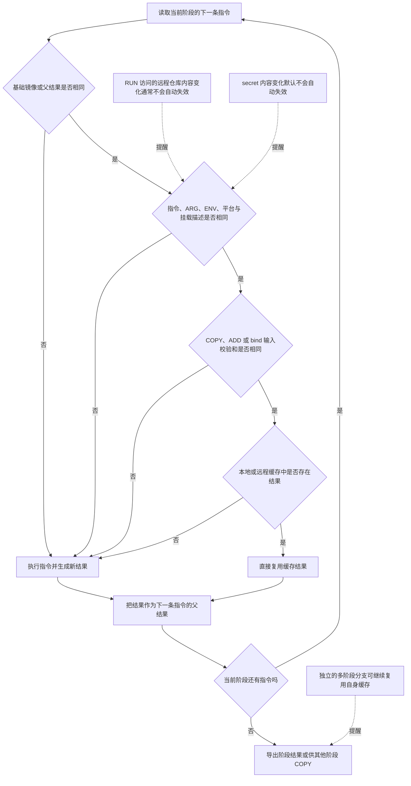
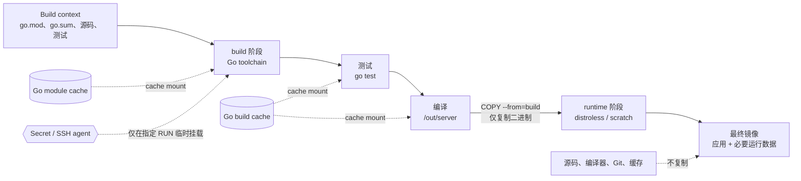

# 第 4 章：Dockerfile、BuildKit 与 Go 镜像优化

> 本章面向准备 Docker/Kubernetes 面试的 Go 后端工程师。示例以 Linux 容器、BuildKit 和 Go Modules 为前提。版本性说明以 **2026 年 6 月 21 日**为准；示例构建镜像使用当前稳定版 Go 1.26.4。生产发布时仍应由依赖更新工具持续刷新基础镜像 digest，而不是长期冻结在旧 digest 上。[^go-releases]

## 学习目标

学完本章后，应当能够：

1. 准确解释 build context、镜像层、缓存键和最终镜像之间的关系。
2. 编写上下文小、缓存命中率高、不泄露凭据的 Dockerfile。
3. 区分 `ENTRYPOINT` 与 `CMD`、shell form 与 exec form，并解释它们对 PID 1 和信号处理的影响。
4. 使用多阶段构建和 BuildKit cache/secret/SSH mount 构建 Go 服务。
5. 根据 CGO、libc、证书、时区、排障和安全需求选择运行时基础镜像。
6. 让镜像能够以非 root、只读根文件系统运行，并以 digest、SBOM、扫描、签名和 provenance 构成基本供应链闭环。
7. 从拉取、解压、节点缓存和进程初始化四个环节分析镜像体积对冷启动与扩容的真实影响。

---

## 核心术语

| 术语 | 准确定义 | 面试中的关键点 |
|---|---|---|
| Build context | 构建器可访问的一组文件，可以来自本地目录、Git、远程 tar 或标准输入 | `COPY`/`ADD` 不能任意读取宿主机；上下文边界决定可见文件和传输成本 |
| `.dockerignore` | 在上下文发送给构建器前排除文件的规则文件 | 减少扫描、哈希、传输和误带密钥的风险 |
| Image layer | 由构建步骤产生的只读文件系统差异 | 删除后层文件不会抹掉前层字节 |
| Image config | 镜像的运行配置，如环境变量、用户、入口点和默认参数 | `ENV`、`USER`、`ENTRYPOINT`、`CMD` 主要影响配置，而非简单增加业务文件 |
| Cache key | BuildKit 根据父结果、指令、构建参数、挂载元数据和输入内容计算的缓存身份 | 不是“只比较 Dockerfile 这一行字符串” |
| Multi-stage build | 一个 Dockerfile 中包含多个 `FROM` 阶段，并只把所需产物复制进最终阶段 | 编译工具链不必进入运行镜像 |
| Cache mount | BuildKit 在 `RUN` 时挂载的可复用缓存目录 | 缓存不进入最终层；缓存未命中时仍可加速下载和编译 |
| Secret mount | 仅在指定 `RUN` 中临时可见的秘密文件或环境变量 | 优于 `ARG`/`ENV`，但命令仍可能主动泄密 |
| SSH mount | 把 SSH agent socket 临时转发给构建步骤 | 不应把私钥 `COPY` 进上下文或镜像层 |
| Digest | 内容寻址标识，如 `sha256:...` | tag 可变，digest 不变；发布和准入验证应围绕 digest |
| SBOM | Software Bill of Materials，软件物料清单 | 描述“镜像里有什么”，不等于漏洞结论 |
| Provenance | 描述镜像由什么源码、参数、构建器和流程产生的证明材料 | 回答“它是怎么构建出来的” |

---

## 一、从 build context 理解 Docker 构建边界

### 1.1 build context 是什么

执行：

```bash
docker buildx build -f deploy/Dockerfile .
```

最后的 `.` 才是 **build context**；`-f deploy/Dockerfile` 只是指定 Dockerfile 的位置。构建器能看到上下文中的文件，`COPY` 和 `ADD` 的本地源路径也以该上下文为边界。Docker 官方将上下文定义为构建器可访问的一组文件；它可以是本地路径、Git URL、远程 tar，甚至空上下文。[^docker-context]

例如：

```dockerfile
COPY go.mod go.sum ./
```

这里的 `go.mod` 和 `go.sum` 来自 build context，而不是相对 Dockerfile 所在目录查找。

常见错误：

```bash
# Dockerfile 在 deploy/，但上下文也错误地设成了 deploy/
docker build -f deploy/Dockerfile deploy/
```

如果应用源码和 `go.mod` 位于仓库根目录，上述命令会让构建器根本看不到它们。正确做法通常是：

```bash
docker build -f deploy/Dockerfile .
```

### 1.2 上下文过大为什么会拖慢构建

大上下文带来的成本不只是“上传慢”：

1. **目录遍历和元数据读取**：构建客户端需要枚举文件。
2. **内容哈希**：BuildKit 需要识别输入内容，以判断 `COPY` 等步骤是否可复用缓存。
3. **传输成本**：远程 builder、CI builder 或 Kubernetes builder 需要接收上下文；BuildKit 支持增量传输，但首次传输和大量变更仍有成本。
4. **缓存敏感度**：宽泛的 `COPY . .` 会让更多无关文件成为缓存输入。
5. **安全风险**：`.git`、本地凭据、测试数据、数据库转储和 `.env` 可能被误送给构建器，甚至被复制进层。
6. **存储与日志噪声**：临时产物可能占用 builder 的缓存空间，降低诊断效率。

要区分三个概念：

- **上下文大小**：送给构建器的输入规模。
- **构建缓存大小**：builder 保存的中间结果和 cache mount 数据。
- **最终镜像大小**：推送、拉取和运行时使用的层。

多阶段构建可以让最终镜像很小，却不一定让上下文也小；`.dockerignore` 很好，却不代表最终镜像一定小。

### 1.3 `.dockerignore` 的作用

`.dockerignore` 在上下文发送前排除文件，因此同时改善性能和降低误带文件的概率。Dockerfile 专用忽略文件可以放在 Dockerfile 旁，并使用 `<Dockerfile 名>.dockerignore` 命名；当它存在时，其规则优先于上下文根目录的 `.dockerignore`。[^docker-context]

适合 Go 服务的基础示例：

```text
.git
.gitmodules
.idea
.vscode

bin/
dist/
coverage/
*.out
*.test
*.log

.env
.env.*
!.env.example

**/.DS_Store
```

设计原则：

- 不要为了减小生产镜像而忽略测试文件，如果 Docker 构建阶段还需要执行测试。
- `.env`、云凭据、SSH 私钥应当排除；真正需要的构建凭据通过 secret/SSH mount 注入。
- 单仓多服务时，为每个 Dockerfile 建立专用 ignore 文件，避免某服务把整个 monorepo 作为有效输入。
- 规则中的 `!` 表示重新包含；多条匹配时，后面的规则会影响最终结果。

`.dockerignore` **不是密钥保险箱**。已经提交到 Git、打印到日志、作为 `ARG` 传入，或由构建命令写进输出层的秘密，不会因为有 `.dockerignore` 就自动安全。

---

## 二、Dockerfile 的执行模型与核心指令

### 2.1 Dockerfile 不是普通 Shell 脚本

Dockerfile 是构建声明。构建器按依赖关系求解每个步骤，并为步骤生成文件系统结果或镜像配置。现代 Docker 默认围绕 BuildKit 工作；建议在首行声明稳定 Dockerfile frontend：

```dockerfile
# syntax=docker/dockerfile:1
```

这不是注释性版本说明，而是告诉 BuildKit 使用哪个 Dockerfile 语法 frontend。使用稳定主版本 `1` 可以获得兼容的最新稳定语法；只有确实需要实验能力时才选择 labs frontend。

### 2.2 指令语义总表

| 指令 | 核心语义 | 高频误区 |
|---|---|---|
| `FROM` | 指定阶段的基础镜像；每个 `FROM` 开启一个新阶段 | 把 tag 当成不可变版本；忘记 `ARG` 的阶段作用域 |
| `RUN` | 在构建阶段执行命令并形成文件系统结果 | 把运行时启动命令写进 `RUN`；把 secret 写入命令或层 |
| `COPY` | 从上下文、阶段、镜像或命名上下文复制文件 | 认为路径相对 Dockerfile；先 `COPY . .` 导致缓存频繁失效 |
| `ADD` | 除复制外，还支持本地 tar 自动解包、URL/Git 等扩展语义 | 所有复制都用 `ADD`；对自动解包和网络输入缺少明确控制 |
| `WORKDIR` | 设置后续指令的工作目录，不存在时创建 | 使用相对路径，结果依赖基础镜像原有 `WORKDIR` |
| `ENV` | 设置后续构建步骤及运行容器可见的环境变量 | 用它保存密码；以为只在构建期存在 |
| `ARG` | 设置构建期参数，作用域受声明位置和阶段限制 | 当作安全秘密；以为运行容器仍能读取 |
| `USER` | 设置后续 `RUN` 及最终运行的默认 UID/GID | 只写 `USER` 却未处理文件权限；使用用户名但镜像无 passwd 记录 |
| `EXPOSE` | 声明镜像预期监听端口的元数据 | 认为它会自动发布端口或创建防火墙规则 |
| `ENTRYPOINT` | 定义容器的主可执行程序 | 使用 shell form 导致 shell 成为 PID 1、信号转发异常 |
| `CMD` | 定义默认命令，或为 exec-form `ENTRYPOINT` 提供默认参数 | 认为可以有多个有效 `CMD`；误解运行时参数的覆盖关系 |

Dockerfile 完整语义以官方 reference 为准。[^dockerfile-reference]

### 2.3 `FROM`：阶段、平台与不可变基础

```dockerfile
ARG GO_IMAGE=golang:1.26.4-bookworm
FROM --platform=$BUILDPLATFORM ${GO_IMAGE} AS build
```

要点：

- 每个 `FROM` 开启一个新阶段。
- `AS build` 为阶段命名，后续可以 `COPY --from=build`。
- `--platform=$BUILDPLATFORM` 让编译工具链运行在 builder 原生平台，再由 Go 交叉编译到 `$TARGETOS/$TARGETARCH`，避免不必要的 QEMU 模拟。BuildKit 会提供 `BUILDPLATFORM`、`TARGETOS`、`TARGETARCH` 等自动平台参数，但在阶段内使用前仍要以 `ARG` 声明。[^docker-platform]
- `FROM image:tag` 的 tag 可以被仓库重新指向；`FROM image:tag@sha256:<digest>` 才能同时保留可读版本和不可变内容身份。

全局 `ARG` 可用于 `FROM`，但如果还要在阶段内部读取，必须重新声明：

```dockerfile
ARG VERSION=1.26.4
FROM golang:${VERSION}-bookworm
ARG VERSION
RUN echo "Go image version: ${VERSION}"
```

### 2.4 `RUN`：构建时执行，而非容器启动

```dockerfile
RUN go test ./...
```

`RUN` 在构建容器中执行，结果成为构建产物；它不会在每次 `docker run` 时再次执行。

错误认知：

```dockerfile
RUN /app/server
```

这会在**构建期间**启动服务，通常导致构建卡住或失败。容器运行命令应由 `ENTRYPOINT`/`CMD` 定义。

安装系统包时，应把索引更新、安装和清理放在同一 `RUN` 中：

```dockerfile
RUN apt-get update \
    && apt-get install -y --no-install-recommends ca-certificates \
    && rm -rf /var/lib/apt/lists/*
```

原因有二：

- 分开的 `apt-get update` 可能命中旧缓存，而后续安装使用过期索引。
- 在后层删除文件不会从前层真正移除字节。

### 2.5 `COPY` 与 `ADD`

普通本地文件复制优先使用 `COPY`：

```dockerfile
COPY go.mod go.sum ./
COPY . .
```

`ADD` 不是废弃指令，但语义更多：它能处理本地 tar 自动解包，也支持 URL/Git 等来源。只有明确需要这些行为时再用它。例如，自动解包是预期行为时：

```dockerfile
ADD rootfs.tar.gz /
```

对远程依赖，生产构建应固定版本并验证校验和。即使 `ADD` 支持远程来源，也不能把“下载成功”当成“内容可信、可重复”。

另一个常见误区：

```dockerfile
COPY secret.txt /tmp/secret.txt
RUN use-secret /tmp/secret.txt && rm /tmp/secret.txt
```

秘密仍存在于前一个 `COPY` 层中。应使用 BuildKit secret mount。

### 2.6 `WORKDIR`

```dockerfile
WORKDIR /src
```

它为后续 `RUN`、`CMD`、`ENTRYPOINT`、`COPY` 和 `ADD` 等设置工作目录，并在目录不存在时创建。建议始终使用绝对路径：

```dockerfile
# 不推荐：结果可能依赖基础镜像当前工作目录
WORKDIR app

# 推荐
WORKDIR /app
```

连续的相对 `WORKDIR` 会逐级拼接，这种隐式状态会降低可读性。

### 2.7 `ENV` 与 `ARG`

```dockerfile
ARG VERSION=dev
ENV APP_MODE=production
```

区别：

| 维度 | `ARG` | `ENV` |
|---|---|---|
| 主要生命周期 | 构建期 | 构建后仍写入镜像配置，运行时可见 |
| 运行容器默认可见 | 否 | 是 |
| 能否用于 `FROM` | 在首个 `FROM` 前声明时可以 | 不可以 |
| 是否适合秘密 | 不适合 | 不适合 |
| 是否可能影响缓存 | 会 | 会，并影响后续步骤环境 |

`ARG` 并不安全。它可能出现在镜像历史、构建记录或 provenance 中；`ENV` 更会持久化到镜像配置。密码、Token、私钥应使用 secret/SSH mount。[^docker-secrets]

应使用现代等号写法：

```dockerfile
ENV APP_MODE=production LOG_LEVEL=info
```

**已过时/不推荐写法：**

```dockerfile
ENV APP_MODE production
```

Docker 文档将这种空格分隔的 legacy 格式标为不鼓励使用，未来可能移除；它在多变量场景也容易产生歧义。[^dockerfile-reference]

### 2.8 `USER`

```dockerfile
USER 65532:65532
```

它会影响后续构建步骤的默认用户，也会写入最终镜像的运行配置。生产镜像应尽量以非 root 运行，但必须同时处理：

- 监听端口应使用大于 1024 的端口，避免依赖 `CAP_NET_BIND_SERVICE`。
- 需要读取的文件至少对该 UID/GID 可读。
- 需要写入的路径应显式挂载 volume/tmpfs，而不是让整个根文件系统可写。
- `COPY --chown=65532:65532` 可在复制时设置所有者，避免再增加 `RUN chown` 层。
- scratch 中可能没有 `/etc/passwd`；数字 UID 仍能运行，但依赖用户名解析的代码可能失败。

### 2.9 `EXPOSE`

```dockerfile
EXPOSE 8080
```

它只是镜像元数据和文档，表示应用预期监听 8080。它不会：

- 自动执行 `-p 8080:8080`；
- 修改云安全组；
- 创建 Kubernetes Service；
- 迫使应用真正监听该端口。

### 2.10 `ENTRYPOINT` 与 `CMD`

推荐组合：

```dockerfile
ENTRYPOINT ["/app/server"]
CMD ["-listen=:8080"]
```

运行行为：

```bash
# 实际命令：/app/server -listen=:8080
docker run app:dev

# 运行时参数替换 CMD：/app/server -listen=:9090
docker run app:dev -listen=:9090

# 显式替换 ENTRYPOINT
docker run --entrypoint /other/tool app:dev
```

规则：

1. 只有最后一个 `CMD` 生效。
2. 没有 `ENTRYPOINT` 时，`CMD` 是默认命令，`docker run IMAGE ...` 会整体替换它。
3. exec-form `ENTRYPOINT` 与 exec-form `CMD` 组合时，前者是固定可执行程序，后者是可覆盖的默认参数。
4. `ENTRYPOINT` 不等于“不可覆盖”；`--entrypoint` 可以覆盖。
5. shell-form `ENTRYPOINT` 还会破坏 `CMD`/运行时参数的常规拼接语义，因此服务镜像应优先使用 exec form。

**已废弃指令：** `MAINTAINER` 已被弃用，应改用 OCI/Docker label，例如：

```dockerfile
LABEL org.opencontainers.image.authors="team@example.com"
```

---

## 三、Shell form 与 exec form：差异不只在语法

### 3.1 两种形式

Shell form：

```dockerfile
RUN go build -o /out/server ./cmd/server
ENTRYPOINT /app/server
```

Exec form：

```dockerfile
RUN ["go", "version"]
ENTRYPOINT ["/app/server"]
```

对比：

| 维度 | Shell form | Exec form |
|---|---|---|
| 表示方式 | 单个字符串 | JSON 字符串数组 |
| 默认解释器 | Linux 通常为 `/bin/sh -c` | 不经过 shell，直接 `execve` 可执行文件 |
| `&&`、管道、重定向 | 可直接使用 | 不可直接使用 |
| `$VAR` 展开 | 由 shell 展开 | 不自动展开 |
| 通配符 `*` | 由 shell 展开 | 不自动展开 |
| 入口进程 | 可能先启动 shell | 可执行程序直接成为 PID 1 |
| 信号处理 | shell 可能不转发信号 | 信号直接到应用 |

### 3.2 为什么服务入口优先使用 exec form

下面的写法：

```dockerfile
ENTRYPOINT /app/server
```

通常等价于由 `/bin/sh -c` 启动。shell 可能成为容器 PID 1，应用成为它的子进程。停止容器时，`SIGTERM` 首先发给 PID 1；如果 shell 不正确转发，Go 服务可能收不到优雅退出信号，最终在超时后被 `SIGKILL`。Docker 官方明确提示 shell-form `ENTRYPOINT` 会影响信号传递和 PID 1 行为。[^dockerfile-reference]

推荐：

```dockerfile
ENTRYPOINT ["/app/server"]
```

如果必须用启动脚本，脚本最后应使用 `exec` 替换 shell：

```sh
#!/bin/sh
set -eu

# 做少量、确定性的启动前检查
exec /app/server "$@"
```

然后：

```dockerfile
ENTRYPOINT ["/app/entrypoint.sh"]
CMD ["-listen=:8080"]
```

注意：exec form 中的环境变量不会由 shell 展开：

```dockerfile
# 不会把 $PORT 自动替换成环境变量值
ENTRYPOINT ["/app/server", "-listen=:$PORT"]
```

应让应用直接读取环境变量，或显式调用 shell，并在 shell 中 `exec`：

```dockerfile
ENTRYPOINT ["/bin/sh", "-c", "exec /app/server -listen=:\"$PORT\""]
```

但 distroless/scratch 通常没有 shell，因此更推荐由 Go 程序读取 `PORT`。

---

## 四、镜像分层与 BuildKit 构建缓存

### 4.1 镜像层是文件系统差异，不是“完整磁盘快照”

`RUN`、`COPY`、`ADD` 通常会形成文件系统变化；`ENV`、`CMD`、`ENTRYPOINT` 等主要修改镜像配置。最终镜像由只读层与配置对象共同描述，容器启动时再叠加可写层。

关键结论：**在后层删除文件，不能让前层中的字节消失。**

```dockerfile
COPY large-toolchain.tar /tmp/
RUN rm /tmp/large-toolchain.tar
```

最终可见文件中没有该 tar，但第一层仍保存它。真正解决方案是：

- 不把无关文件复制进去；
- 在同一个 `RUN` 中下载、使用并清理；
- 更优先使用多阶段构建，只复制最终产物。

### 4.2 缓存判断不是单纯比较命令文本

对于一个线性阶段，可将缓存理解为：

```text
缓存键 = 父结果 + 指令语义 + 构建参数/环境 + 挂载描述 + 相关输入内容
```

不同指令的输入不同：

- `COPY`/`ADD` 会考虑源文件内容和相关元数据；单纯修改文件 mtime 不一定导致缓存失效。
- 普通 `RUN` 通常以命令、父结果、环境和挂载等为关键输入；命令访问的远程 URL 当前返回了什么，并不会自动成为缓存键。
- secret 的**内容**默认不参与缓存键；secret ID、目标路径等挂载属性会参与。轮换 secret 后如果必须重跑步骤，要显式破坏缓存。[^docker-cache-invalidation]

### 4.3 Docker 构建缓存判断流程



### 4.4 常见缓存失效来源

| 修改 | 通常从哪里开始失效 | 原因 |
|---|---|---|
| 基础镜像解析到新 digest | `FROM` 后整个线性阶段 | 父结果改变 |
| 修改 `RUN` 命令文本 | 该 `RUN` | 指令输入改变 |
| 修改 `ARG` 值并在后续使用 | 首次受影响的指令 | 构建参数改变 |
| 修改 `ENV` | 该指令及后续 | 镜像配置和执行环境改变 |
| 修改被 `COPY` 的文件内容 | 该 `COPY` | 输入校验和改变 |
| 修改 `COPY --chown/--chmod` | 该 `COPY` | 指令与输出元数据改变 |
| `.dockerignore` 改变了复制文件集合 | 受影响的 `COPY` | 输入集合改变 |
| secret 值变化 | 默认不自动失效 | secret 内容不进入缓存键 |
| 包仓库出现新版本 | 相同 `RUN` 可能仍命中旧缓存 | 网络响应不是可靠缓存输入 |

一个缓存失效点之后，同一线性阶段的后续步骤通常因父结果变化而重新求解；但多阶段 DAG 中未依赖该结果的独立分支仍可命中缓存。

### 4.5 缓存不是更新机制

```dockerfile
RUN apt-get update && apt-get install -y curl
```

即使仓库中出现更新，只要缓存键不变，构建器仍可能复用旧结果。要获取最新基础镜像或依赖，应有明确策略：

```bash
# 拉取更新的基础镜像元数据
docker buildx build --pull .

# 完全不使用普通层缓存
docker buildx build --no-cache .

# 只让指定阶段不使用缓存
docker buildx build --no-cache-filter build .
```

`--pull` 与 `--no-cache` 解决的问题不同：前者刷新基础镜像解析，后者禁用构建步骤缓存。

---

## 五、为什么先复制 go.mod、go.sum

### 5.1 低命中率写法

```dockerfile
COPY . .
RUN go mod download
RUN go build -o /out/server ./cmd/server
```

任何源码、README 或测试数据变更，都可能让 `COPY . .` 的结果改变，从而让依赖下载层失效。

### 5.2 缓存友好写法

```dockerfile
COPY go.mod go.sum ./
RUN --mount=type=cache,target=/go/pkg/mod \
    go mod download && go mod verify

COPY . .
RUN --mount=type=cache,target=/go/pkg/mod \
    --mount=type=cache,target=/root/.cache/go-build \
    go build -mod=readonly -trimpath -o /out/server ./cmd/server
```

逻辑是：

1. `go.mod`/`go.sum` 的变化频率通常低于业务源码。
2. 只要模块描述未变，依赖下载步骤就能直接命中层缓存。
3. 即便下载层因某种原因需要重跑，`/go/pkg/mod` cache mount 仍可复用已下载模块。
4. 源码改变时，通常只重新测试和编译。
5. Go build cache 保存包级编译结果；局部代码变化不必重新编译全部依赖。

Docker 官方的 Go cache mount 示例同样挂载 `/go/pkg/mod` 与 `/root/.cache/go-build`。[^docker-cache-optimize]

### 5.3 这条规则不是机械模板

还必须复制所有影响依赖图的文件：

- 使用 workspace 时包含 `go.work`、`go.work.sum`；
- monorepo 中多个 module 的 `go.mod`/`go.sum`；
- `replace ../shared` 指向的本地模块；
- 使用 vendor 模式时的 `vendor/`；
- 生成代码所需的 schema、模板或工具版本文件。

如果过早执行 `go mod download` 却缺少本地 `replace` 目标，构建会失败。正确原则是：**先复制稳定且足以确定依赖图的最小文件集合，而不是永远只复制两个文件。**

`go mod verify` 主要验证模块缓存内容与 `go.sum` 记录是否一致；它不是恶意代码检测器，也不能替代漏洞扫描和签名验证。

---

## 六、BuildKit mount：缓存、秘密与 SSH

### 6.1 Cache mount

```dockerfile
RUN --mount=type=cache,target=/go/pkg/mod \
    --mount=type=cache,target=/root/.cache/go-build \
    CGO_ENABLED=0 go test -mod=readonly ./...
```

cache mount 的特征：

- 不会被提交进最终镜像层。
- 普通层缓存命中时，`RUN` 根本不会执行；层缓存未命中时，cache mount 才帮助命令复用下载和编译结果。
- cache mount 的内容不应被视为构建输出；真正产物必须写到普通文件系统路径，例如 `/out/server`。
- CI 中如果 builder 每次都是全新的，本地 cache mount 也会消失。`--cache-to/--cache-from` 可保存普通 BuildKit 构建结果，但不要假定所有后端都会自动导出可变 cache mount 内容；例如 GitHub Actions 场景默认不保留 cache mount，需要持久 builder 或专门的提取/注入方案。[^docker-cache-ci]
- 共享缓存可能被多个构建并发访问。某些包管理器需要 `sharing=locked`；Go 的模块和构建缓存通常能并发工作，但仍应按平台、项目和信任边界合理隔离。

CI 外部缓存示意：

```bash
docker buildx build \
  --cache-from type=registry,ref=registry.example.com/acme/server:buildcache \
  --cache-to type=registry,ref=registry.example.com/acme/server:buildcache,mode=max \
  --push \
  -t registry.example.com/acme/server:dev .
```

缓存可以被污染或包含不再需要的数据，因此不能把“来自任意来源的共享缓存”当成天然可信输入。

### 6.2 Secret mount

错误做法：

```dockerfile
ARG GITHUB_TOKEN
RUN git config --global url."https://${GITHUB_TOKEN}@github.com/".insteadOf "https://github.com/"
```

即使最终删除配置，Token 仍可能进入构建历史、provenance、缓存元数据或日志。

更安全的私有 Go module 下载方式：

```dockerfile
RUN --mount=type=secret,id=netrc,target=/root/.netrc,required=true \
    --mount=type=cache,target=/go/pkg/mod \
    GOPRIVATE=github.com/acme/* go mod download
```

构建命令：

```bash
docker buildx build \
  --secret id=netrc,src="$HOME/.netrc" \
  .
```

secret 只在该 `RUN` 的挂载位置临时可见，不会自动进入结果层。Docker 官方明确建议不要用 `ARG`/`ENV` 传递构建秘密。[^docker-secrets]

但要理解边界：

- 构建命令仍可以主动 `cp /root/.netrc /out/`，BuildKit 无法替你阻止恶意 Dockerfile。
- `set -x`、错误日志或工具输出可能把秘密打印出来。
- secret 内容变化默认不使步骤缓存失效；必要时同时改变一个非秘密 cache-bust 参数。

### 6.3 SSH mount

访问基于 SSH 的私有仓库时，不要：

```dockerfile
COPY id_ed25519 /root/.ssh/id_ed25519
```

可使用 SSH agent 转发：

```dockerfile
RUN install -d -m 0700 /root/.ssh \
    && git config --global url."ssh://git@github.com/".insteadOf "https://github.com/"

RUN --mount=type=ssh,required=true \
    --mount=type=secret,id=known_hosts,target=/root/.ssh/known_hosts,required=true \
    --mount=type=cache,target=/go/pkg/mod \
    GOPRIVATE=github.com/acme/* go mod download
```

构建：

```bash
docker buildx build \
  --ssh default \
  --secret id=known_hosts,src="$HOME/.ssh/known_hosts" \
  .
```

SSH mount 通常暴露的是 agent socket，而不是把私钥文件写入镜像。仍应保留严格的 host key 校验，不要为了“构建能过”使用 `StrictHostKeyChecking=no`。

### 6.4 三种 mount 的安全定位

| mount | 解决的问题 | 是否进入最终层 | 主要风险 |
|---|---|---|---|
| `type=cache` | 重用下载和编译缓存 | 否 | 跨项目污染、陈旧数据、CI builder 不持久 |
| `type=secret` | 临时提供 Token、配置、证书 | 否，除非命令主动复制 | 日志泄露、恶意构建命令、轮换不触发缓存失效 |
| `type=ssh` | 临时使用 SSH agent 访问私库 | 否 | 构建过程可借 agent 发起签名/认证；host key 校验不当 |

---

## 七、多阶段构建：把“构建环境”与“运行环境”分开

### 7.1 基本思想

Go 编译需要：

- Go toolchain；
- Git、C 编译器或其他构建工具；
- 源码、测试、模块缓存；
- 可能的代码生成器。

运行一个纯 Go 服务通常只需要：

- 一个可执行文件；
- CA 证书、时区等必要运行数据；
- 非 root 用户信息和少量目录。

多阶段构建允许在大而完整的 builder 中编译，再把**白名单产物**复制到小运行镜像。Docker 官方将其核心价值概括为：在同一 Dockerfile 中使用多个 `FROM`，选择性复制产物，不把构建工具留在最终镜像。[^docker-multistage]

### 7.2 多阶段构建数据流



### 7.3 多阶段构建不只是减小体积

它还带来：

1. **更小攻击面**：运行镜像没有编译器、包管理器和源代码。
2. **更清晰信任边界**：最终阶段只接收明确产物。
3. **更容易非 root/只读运行**：运行镜像不需要在启动时安装或编译。
4. **更稳定发布物**：测试、扫描和签名围绕最终镜像 digest 进行。
5. **更方便调试构建**：可通过 `--target build` 或专门的 debug/test 阶段停在中间阶段。

```bash
docker buildx build --target build --load -t server-build:debug .
```

注意：多阶段并不自动安全。如果使用 `COPY --from=build / /`，仍可能把整个 builder 搬进最终镜像；应只复制已知文件。

---

## 八、scratch、distroless、Alpine、Debian slim 如何选择

### 8.1 比较表

| 维度 | scratch | distroless | Alpine | Debian slim |
|---|---|---|---|---|
| 本质 | 完全空的特殊基础 | 仅应用运行依赖，无常规 shell/包管理器 | 基于 musl + BusyBox 的小型发行版 | 精简 Debian，使用 glibc |
| 典型体积 | 最小，基础层近似为空 | 很小 | 小 | 相对较大 |
| libc | 无 | `static` 无需 libc；`base` 等通常为 glibc | musl | glibc |
| Shell | 无 | 默认无；部分项目提供 debug 变体 | 有 BusyBox `sh` | 通常有 shell |
| 包管理器 | 无 | 无 | `apk` | `apt`/`apt-get` |
| CA/时区 | 默认无，需自行复制或嵌入 | static 镜像通常包含 CA、tzdata、passwd、`/tmp` 等最小数据 | 可通过包安装 | 通常易于安装和维护 |
| CGO 动态程序 | 不适合，除非手工复制完整依赖 | 选择与 libc/运行库匹配的变体 | 适合 musl 构建；不兼容普通 glibc 动态程序 | 最适合常规 glibc CGO 程序 |
| 在线排障 | 极差 | 较差，应依靠可观测性或临时 debug 工具 | 较方便，但 BusyBox 工具参数较少 | 最方便 |
| 攻击面 | 基础用户态最小 | 很小 | 比前两者大，有 shell/包管理器 | 通常最大，但仍可显著精简 |
| 推荐场景 | 已验证的纯静态单二进制、需求极明确 | 大多数纯 Go 生产服务的优先候选 | 明确接受 musl、需要少量 shell/工具 | CGO/glibc 依赖复杂、兼容性和排障优先 |
| 主要风险 | 缺证书、时区、用户、`/tmp`、动态 loader，排障困难 | 无 shell；版本后缀和运行数据仍需验证 | musl/glibc 差异、BusyBox 工具差异 | 体积和包数量更多，需持续更新与扫描 |

Docker 的 `scratch` 是保留的空基础，不能像普通镜像那样单独拉取和运行。[^docker-base-images] Distroless 官方定义是只包含应用及其运行依赖，不包含包管理器、shell 等常规工具；其 static 基础包含 CA、passwd、`/tmp` 和 tzdata 等最小数据。当前应使用带 Debian 版本后缀的受支持引用，例如 `static-debian13:nonroot`；Distroless 官方已将列表之外的旧标签视为弃用且不再更新。[^distroless][^distroless-base] Alpine 使用 musl 与 BusyBox；glibc 与 musl 在兼容性和行为上存在差异，不能只按镜像 MB 数做选择。Debian slim 则保留 Debian/glibc 生态与包管理能力。[^alpine][^libc][^debian-image]

### 8.2 选择顺序

可以按以下决策链思考：

1. 二进制是否真正不依赖 libc/动态库？
   - 是：优先评估 distroless static；对运行数据完全可控时可用 scratch。
   - 否：继续判断依赖的是 glibc 还是 musl。
2. CGO 依赖是否按 glibc 构建？
   - 是：distroless base/cc 或 Debian slim。
   - 按 musl 构建且验证过：可用 Alpine。
3. 是否必须在容器内使用 shell/诊断工具？
   - 生产长期保留工具通常不是最佳答案；优先改善指标、日志、pprof 和临时调试能力。
   - 若业务确实需要运行时脚本或工具，Debian slim/Alpine 更合适。
4. 团队是否具备无 shell 镜像的运维能力？
   - 没有时，直接选择 scratch 可能让故障恢复变慢，安全收益反而被错误操作抵消。

不要把“越小越好”当成唯一目标。正确目标是：**在满足兼容性、可运维性和安全更新能力的前提下，最小化不必要内容。**

---

## 九、CGO_ENABLED、静态链接、动态链接、glibc 与 musl

### 9.1 `CGO_ENABLED` 控制什么

CGO 允许 Go 代码调用 C。Go 官方说明：当 `CGO_ENABLED=0` 时，导入 `C` 的文件不会参与构建；交叉编译时 CGO 通常默认关闭，若要开启则需要目标平台的 C 交叉编译器。[^go-cgo]

```bash
CGO_ENABLED=0 go build -o server ./cmd/server
CGO_ENABLED=1 go build -o server ./cmd/server
```

`CGO_ENABLED=0` 常常能得到不依赖系统 libc 的 Linux 可执行文件，适合 scratch/distroless static。但不要只凭环境变量推断，必须验证最终二进制。

### 9.2 静态与动态链接

- **静态链接**：所需代码大多已进入可执行文件，运行时不依赖对应 `.so` 和动态 loader。
- **动态链接**：可执行文件在启动时由动态 loader 加载 glibc、musl 或其他共享库。

验证思路：

```bash
file ./server
ldd ./server || true
readelf -l ./server | grep -i interpreter || true
```

判断依据：

- `ldd` 显示共享库，说明存在动态依赖。
- ELF 中出现 `INTERP` 段，说明需要动态 loader。
- “文件明明存在却报 `no such file or directory`”常常不是二进制路径错，而是 ELF 指定的 loader 不存在。

### 9.3 glibc 与 musl

- glibc 是 Debian、Ubuntu 等主流发行版常见 libc，兼容生态广。
- musl 更轻量，Alpine 使用它，但某些依赖、DNS/NSS、locale、线程或预编译原生库按 glibc 假设开发。
- glibc 与 musl 不是可直接互换的 ABI。

典型故障：在 Debian builder 中以 CGO 编译，得到依赖 glibc 的二进制，然后复制到 Alpine：

```text
exec /app/server: no such file or directory
```

文件存在，但 Alpine 缺少 glibc loader。修复方向：

1. 关闭不必要的 CGO，生成纯 Go 二进制；
2. 在 Alpine/musl 环境中重新构建并完整测试；
3. 运行阶段改用 glibc 基础，如 distroless base/cc 或 Debian slim；
4. 不要通过随意复制几个 `.so` 来“碰运气”，应明确列出并维护完整运行依赖。

### 9.4 CGO 不等于一定动态，纯 Go 也不等于绝对静态

通过外部链接器和特定参数，CGO 程序可以尝试静态链接；Go 也支持某些特殊构建模式。实际结果受构建模式、目标平台、依赖库和链接器影响。因此面试中的专业回答应是：

> `CGO_ENABLED=0` 是获得可移植纯 Go 二进制的常见条件，但最终是否静态、需要什么 loader 和共享库，应通过 ELF 工具验证，不能只看 Dockerfile 中一个变量。

---

## 十、scratch 中的 CA、时区、DNS、用户和临时目录

scratch 没有操作系统用户态文件。它不是“极简 Debian”，而是空根文件系统。

### 10.1 CA 证书

Go 的 TLS 客户端通常从系统证书池加载根证书；Linux 上会查找常见证书文件路径。scratch 默认没有这些文件。[^go-x509]

症状：

```text
x509: certificate signed by unknown authority
```

解决方案之一是在 builder 中安装/确认 CA 包后复制：

```dockerfile
FROM golang:1.26.4-bookworm AS build
# 构建二进制……

FROM scratch
COPY --from=build /etc/ssl/certs/ca-certificates.crt /etc/ssl/certs/ca-certificates.crt
COPY --from=build /out/server /server
ENTRYPOINT ["/server"]
```

更省心的选择通常是 distroless static，因为其基础已包含 CA 等必要数据。不要通过关闭 TLS 验证来“修复”证书错误。

### 10.2 时区

scratch 默认没有 `/usr/share/zoneinfo`。使用 `time.LoadLocation("Asia/Shanghai")` 等命名时区时可能失败。

三种方案：

1. 服务内部统一使用 UTC，仅在展示层转换；
2. 从 builder 复制所需 zoneinfo 或整个时区数据库；
3. 在 Go 程序中嵌入时区数据库：

```go
import _ "time/tzdata"
```

或者使用 Go 的 `timetzdata` build tag。官方文档指出，嵌入完整数据库会让程序增加约 450 KB。[^go-tzdata]

不要只测试 `time.Now()`；它可能正常，而命名时区加载仍失败。

### 10.3 DNS

scratch 没有 `nslookup`，但不代表 Go 不能做 DNS。Docker/Kubernetes 运行时通常会为容器提供 `/etc/resolv.conf` 和 `/etc/hosts`。纯 Go resolver 可读取 `/etc/resolv.conf`；使用 cgo resolver 时则依赖 libc 和系统解析行为。Go 可通过 `GODEBUG=netdns=go` 或 `netdns=cgo` 辅助诊断。[^go-net][^docker-network]

常见差异：

- 纯 Go resolver 不一定完整遵循企业环境中的所有 NSS 插件规则；
- cgo resolver 需要匹配的 libc；
- 搜索域、`ndots`、DNS 超时属于运行时网络配置，不是镜像中安装 `nslookup` 就能解决的问题；
- 无 shell 镜像应通过应用内诊断、临时 debug 容器或网络观测工具排查。

### 10.4 用户信息

数字 UID 可以直接运行：

```dockerfile
USER 65532:65532
```

但 scratch 没有 `/etc/passwd`。调用用户名查询、写 home 目录或依赖 `$HOME` 的库可能异常。可选择：

- 应用只使用数字 UID，不依赖用户名；
- 复制一份最小 passwd/group 文件；
- 使用带 nonroot 用户记录的 distroless 变体。

### 10.5 `/tmp` 与只读根文件系统

scratch 中连 `/tmp` 都不一定存在。Go 标准库或第三方库可能创建临时文件。生产运行时可显式挂载 tmpfs：

```bash
docker run --rm \
  --read-only \
  --tmpfs /tmp:rw,noexec,nosuid,size=64m \
  app:release
```

Docker 的 `--read-only` 会把容器根文件系统挂成只读，只有显式 volume/tmpfs 位置可写。[^docker-run]

### 10.6 动态 loader 与共享库

动态二进制放进 scratch 后，最常见问题不是缺少业务文件，而是缺少：

- `/lib64/ld-linux-x86-64.so.2` 等 loader；
- libc；
- 其他 `.so`；
- NSS、locale、证书或配置文件。

手工复制依赖会迅速把 scratch 变成“没有包管理信息、难以更新的自制发行版”。CGO 依赖复杂时，Debian slim 或匹配的 distroless 运行时通常更可靠。

---

## 十一、生产级但精简的 Go 多阶段 Dockerfile

### 11.1 假设

下面示例假设：

- 主程序位于 `./cmd/server`；
- 程序支持 `-listen=:8080` 参数；
- `main` 包定义了可通过 `-X main.version=...` 注入的字符串变量；
- 服务不需要 CGO；
- 发布时使用 BuildKit/buildx；
- 最终使用带版本后缀的 distroless static nonroot 镜像。

### 11.2 Dockerfile

```dockerfile
# syntax=docker/dockerfile:1

# 默认值便于本地直接构建；正式发布通过 build-arg 改为带 digest 的引用。
ARG GO_IMAGE=golang:1.26.4-bookworm
ARG RUNTIME_IMAGE=gcr.io/distroless/static-debian13:nonroot

FROM --platform=$BUILDPLATFORM ${GO_IMAGE} AS build

WORKDIR /src
ENV GOTOOLCHAIN=local

ARG TARGETOS
ARG TARGETARCH
ARG VERSION=dev

# 依赖描述先复制，使业务源码变更不破坏依赖下载层。
COPY go.mod go.sum ./
RUN --mount=type=cache,target=/go/pkg/mod \
    go mod download && go mod verify

# 再复制其余源码。
COPY . .

# 测试和编译分别复用 module cache 与 Go build cache。
RUN --mount=type=cache,target=/go/pkg/mod \
    --mount=type=cache,target=/root/.cache/go-build \
    CGO_ENABLED=0 go test -mod=readonly ./...

RUN --mount=type=cache,target=/go/pkg/mod \
    --mount=type=cache,target=/root/.cache/go-build \
    CGO_ENABLED=0 GOOS=${TARGETOS} GOARCH=${TARGETARCH} \
    go build -mod=readonly -trimpath -buildvcs=false \
      -ldflags="-X main.version=${VERSION}" \
      -o /out/server ./cmd/server

FROM ${RUNTIME_IMAGE} AS runtime

WORKDIR /app
COPY --from=build --chown=65532:65532 /out/server /app/server

USER 65532:65532
EXPOSE 8080

ENTRYPOINT ["/app/server"]
CMD ["-listen=:8080"]
```

### 11.3 逐行解释

1. `# syntax=docker/dockerfile:1`：启用当前稳定 Dockerfile frontend，确保 `RUN --mount` 等 BuildKit 语法可用。
2. `ARG GO_IMAGE`、`ARG RUNTIME_IMAGE`：提供可构建默认值；发布流水线可传入 `tag@digest`。它们不是秘密。
3. `FROM --platform=$BUILDPLATFORM ... AS build`：builder 在原生平台运行，Go 根据目标参数交叉编译。
4. `WORKDIR /src`：显式、绝对工作目录。
5. `ENV GOTOOLCHAIN=local`：不允许 Go 在构建中隐式下载另一套 toolchain；若 `go.mod` 要求更高版本，构建直接失败，促使显式升级 builder。[^go-toolchain]
6. `ARG TARGETOS/TARGETARCH`：把 BuildKit 自动平台参数引入阶段作用域。
7. `ARG VERSION=dev`：注入稳定发布版本；正式构建应使用 Git commit/tag，而不是当前时间或随机值。
8. `COPY go.mod go.sum ./`：建立低频变化的依赖输入层。
9. 第一个 `RUN --mount=type=cache`：模块缓存不进入镜像层；`go mod verify` 检查已下载模块内容。
10. `COPY . .`：依赖层之后再复制高频变化源码；`.dockerignore` 必须排除无关文件。
11. `go test -mod=readonly`：禁止测试过程静默修改 module 文件。
12. 编译步骤：
    - `CGO_ENABLED=0`：构建纯 Go 可执行文件；
    - `GOOS/GOARCH`：目标平台；
    - `-trimpath`：移除本地文件系统路径，改善可重复性；
    - `-buildvcs=false`：本示例把 VCS 身份交给显式版本和外部 provenance，避免依赖上下文中的 `.git`；
    - `-X main.version=...`：把版本注入程序，变量路径应按真实模块修改；
    - 未默认加入 `-s -w`，因为去除符号/DWARF 会影响部分诊断。团队确认取舍后可加入。
13. 第二个 `FROM`：新建干净运行阶段，builder 的源码、工具链和缓存不会自动继承。
14. `COPY --from=build --chown=...`：只复制一个二进制，并直接设置非 root 所有者。
15. `USER 65532:65532`：显式以非 root 运行，即使基础镜像已提供 nonroot 默认值也不依赖隐式行为。
16. `EXPOSE 8080`：仅记录预期端口。
17. exec-form `ENTRYPOINT`：Go 进程直接作为 PID 1 接收信号。
18. exec-form `CMD`：默认参数可由 `docker run IMAGE ...` 或 Kubernetes `args` 覆盖。

### 11.4 发布时锁定 digest

上面的 tag 默认值是为了让教材可直接使用。正式发布应在可信流水线解析、审批并传入 digest：

```bash
VERSION="$(git rev-parse HEAD)"
SOURCE_DATE_EPOCH="$(git show -s --format=%ct HEAD)"

GO_IMAGE='golang:1.26.4-bookworm@sha256:<builder-manifest-digest>'
RUNTIME_IMAGE='gcr.io/distroless/static-debian13:nonroot@sha256:<runtime-manifest-digest>'

docker buildx build \
  --platform linux/amd64,linux/arm64 \
  --build-arg GO_IMAGE="$GO_IMAGE" \
  --build-arg RUNTIME_IMAGE="$RUNTIME_IMAGE" \
  --build-arg VERSION="$VERSION" \
  --build-arg SOURCE_DATE_EPOCH="$SOURCE_DATE_EPOCH" \
  --provenance=mode=max \
  --sbom=true \
  --push \
  -t registry.example.com/acme/server:"$VERSION" \
  .
```

注意：

- 多平台镜像通常应固定 manifest list/index digest，使构建器仍能选择对应架构。
- digest 固定后不会自动获得安全补丁；应由 Renovate、Dependabot、Docker Scout policy 或内部任务持续提交 digest 更新并重建。
- 部署时也应记录或直接使用应用镜像 digest，而不是只记录 tag。

### 11.5 私有模块版本

如果依赖私有 module，把依赖下载步骤改成 secret 或 SSH mount，而不是给整个 Dockerfile 增加永久凭据。可以为公开依赖和私有依赖维护一个统一步骤，但要确保本地开发没有 secret 时的行为符合预期。

---

## 十二、非 root、只读文件系统与固定 digest

### 12.1 非 root 的必要性

非 root 不能把容器变成强安全边界，但能降低多类后果：

- 应用漏洞被利用后，攻击者在容器内默认权限更低；
- 减少修改系统路径、安装工具或绑定特权端口的能力；
- 与 capability drop、seccomp、只读根文件系统形成纵深防御。

必须验证，而不是只看 Dockerfile：

```bash
docker inspect --format '{{json .Config.User}}' app:release

docker run --rm app:release
```

### 12.2 只读根文件系统在运行时设置

Dockerfile 可以让镜像**兼容**只读运行，但不能强制所有使用者都以只读方式启动。运行时示例：

```bash
docker run --rm \
  --read-only \
  --tmpfs /tmp:rw,noexec,nosuid,size=64m \
  --cap-drop=ALL \
  -p 8080:8080 \
  app:release
```

应用应：

- 日志写 stdout/stderr；
- 上传、缓存、PID 文件等写入显式 volume 或 tmpfs；
- 不在启动时修改 `/app`；
- 不依赖运行时安装包或生成不可控文件。

在 Kubernetes 中对应能力是容器 `securityContext.readOnlyRootFilesystem: true`，但仍需为必要写路径提供 `emptyDir` 等显式挂载。

### 12.3 为什么固定 digest

Tag 是可变引用：

```text
debian:bookworm-slim
```

同一 tag 在不同时间可能指向不同内容。Digest 是内容身份：

```text
debian:bookworm-slim@sha256:...
```

固定 digest 带来：

- 构建输入可审计；
- 回滚时知道使用了哪一份基础内容；
- 防止 tag 漂移导致“同一源码今天和明天构建不同镜像”。

代价是更新不再自动发生。因此正确策略不是“永远固定”，而是：

> 固定 digest + 自动发现更新 + 审核/测试 + 重建 + 重新扫描和签名。

Docker 官方最佳实践同样指出，digest pinning 提供可审计和可重复输入，但会放弃 tag 自动更新，需要配套更新流程。[^docker-best-practices]

---

## 十三、镜像体积如何影响拉取、冷启动、扩容和攻击面

### 13.1 冷启动链路

一个新节点启动容器通常经历：

```text
解析镜像引用 → 拉取 manifest/config → 检查本地已有层
→ 下载缺失的压缩层 → 校验 digest → 解压/写入内容存储
→ 准备 snapshot/rootfs → 创建容器 → 启动 Go 进程 → 应用初始化并就绪
```

镜像变小主要改善前半段：网络传输、校验、解压、磁盘占用。在以下场景收益明显：

- 节点首次拉取；
- 大规模扩容落到新节点；
- 节点频繁替换或弹性节点生命周期短；
- 跨区域/弱带宽镜像仓库；
- 大量不同版本导致层复用率低。

但镜像已经缓存时，冷启动可能主要由：

- Go 程序初始化；
- 配置和 Secret 挂载；
- 数据库连接、缓存预热；
- readiness 条件；
- CNI、CSI 和 sandbox 创建；
- CPU/IO 争用。

因此不能简单说“镜像从 100 MB 降到 20 MB，启动一定快 5 倍”。还要区分：

- registry 中的**压缩大小**；
- 节点上的**解压后大小**；
- 可与其他镜像共享的层；
- 应用真正到 ready 的时间。

### 13.2 镜像大小与攻击面

较小镜像通常意味着更少工具和软件包，潜在漏洞与误用入口更少，例如没有 shell、curl、包管理器和编译器。但 MB 数不是安全性的线性指标：

- 一个很小的静态二进制仍可能含严重业务漏洞；
- 一个较大的基础镜像可能维护及时、SBOM 完整、补丁清晰；
- 未使用的软件包数量、可执行能力、权限和暴露接口比单纯字节数更关键。

正确指标组合包括：

- 压缩/解压大小；
- 包和文件数量；
- CVE 严重度、可利用性与是否有修复；
- 基础镜像更新频率；
- 容器用户、capabilities、文件系统可写性；
- 应用依赖与供应链证据。

### 13.3 不要为了层数牺牲缓存结构

“Dockerfile 行越少越好”不是现代优化原则。把所有步骤塞进一个巨型 `RUN`，可能降低可读性和缓存复用。应重点优化：

- 稳定、昂贵步骤放前面；
- 高频变化源码放后面；
- 同一个包安装事务中完成更新、安装和清理；
- builder 与 runtime 分离；
- 用 cache mount 保存可变缓存，而不是把缓存烘焙进层。

---

## 十四、可重复构建、SBOM、漏洞扫描和镜像签名

### 14.1 可重复构建

可重复构建的目标是：给定同一源码、工具链、依赖、参数和目标平台，尽可能得到可验证的一致产物。

关键措施：

1. 固定 Git commit，而不是构建工作区中的未提交文件。
2. 固定 Go toolchain 和基础镜像 digest。
3. 提交 `go.mod`、`go.sum`，使用 `-mod=readonly`，不在构建中执行会修改依赖图的 `go get`。
4. 使用 `-trimpath` 去除本机路径。
5. 不把“当前时间”、随机数和不固定网络响应注入二进制。
6. 使用稳定版本变量，例如 commit SHA。
7. 以 Git commit 时间设置 `SOURCE_DATE_EPOCH`。BuildKit 可使用该标准变量统一镜像 index、config 和文件元数据时间；并非所有工具都会自动遵守，所以仍需验证。[^docker-reproducible]
8. 对多平台构建分别验证每个目标产物。

可重复构建不等于安全构建：恶意但固定的依赖同样可以被稳定重现。它解决的是一致性和审计基础。

### 14.2 SBOM

SBOM 回答“镜像中包含什么”：

- OS 包；
- Go module；
- 文件和组件版本；
- 许可证等元数据，具体取决于生成器。

BuildKit/buildx 可以在构建和推送时附加 SBOM 与 provenance attestation：

```bash
docker buildx build \
  --sbom=true \
  --provenance=mode=max \
  --push \
  -t registry.example.com/acme/server:1.0.0 .
```

Docker 文档将 SBOM 定义为软件清单，将 provenance 定义为构建过程信息。[^docker-attestations]

### 14.3 漏洞扫描

扫描器把 SBOM/镜像内容与持续变化的漏洞数据库匹配。示例：

```bash
docker scout cves \
  --only-severity critical,high \
  registry.example.com/acme/server@sha256:<digest>
```

Docker Scout 的 `cves` 命令可分析镜像等软件制品；扫描结果会随漏洞数据库更新而变化。[^docker-scout]

生产策略不应只是“发现任意 CVE 就失败”，还应考虑：

- 严重度和可利用路径；
- 包是否真的被运行时使用；
- 是否已有修复版本；
- 是否属于基础镜像或应用依赖；
- 临时例外的负责人、原因和过期时间。

必须持续重扫已发布 digest，因为今天没有已知漏洞，不代表明天仍没有。

### 14.4 镜像签名

签名回答“某个可信身份是否对这个 digest 作出过签署”。以 Cosign 的 keyless 模式为例：

```bash
cosign sign registry.example.com/acme/server@sha256:<digest>
```

验证时应同时限定身份和 OIDC issuer，而不是只验证“存在某个签名”：

```bash
cosign verify \
  --certificate-identity='https://github.com/acme/server/.github/workflows/release.yml@refs/heads/main' \
  --certificate-oidc-issuer='https://token.actions.githubusercontent.com' \
  registry.example.com/acme/server@sha256:<digest>
```

Cosign 官方文档建议围绕 digest 签名和验证，并支持基于 OIDC 身份的 keyless 流程。[^cosign-sign][^cosign-verify]

签名不表示镜像没有漏洞。完整关系是：

| 能力 | 回答的问题 |
|---|---|
| Digest | 我拿到的内容是否与指定内容完全一致？ |
| SBOM | 里面有什么组件？ |
| 扫描 | 这些组件目前有哪些已知风险？ |
| Provenance | 由什么源码、参数和构建流程产生？ |
| 签名 | 哪个受信身份认可了这个 digest/attestation？ |
| Admission policy | 未满足哪些条件时禁止进入集群？ |

只有在部署入口强制执行验证策略，签名才真正形成控制；“签了但从不验证”只是存档。

---

## 十五、构建与运行验证清单

### 15.1 构建诊断

```bash
# 展开查看每一步是否命中缓存
docker buildx build --progress=plain .

# 查看镜像历史，排查大层和可疑命令
docker history --no-trunc app:release

# 查看镜像配置中的用户、入口点、环境变量
docker image inspect app:release

# 查看 builder 缓存占用
docker buildx du
```

### 15.2 运行验证

```bash
# 非 root + 只读根文件系统
docker run --rm \
  --read-only \
  --tmpfs /tmp:rw,noexec,nosuid,size=64m \
  --cap-drop=ALL \
  app:release

# 覆盖默认 CMD 参数
docker run --rm app:release -listen=:9090

# 验证停止时应用是否收到 SIGTERM，而不是只能被 SIGKILL
docker stop --timeout 10 <container>
```

### 15.3 二进制兼容性验证

在 builder 或专用检查环境中验证：

```bash
file /out/server
ldd /out/server || true
readelf -l /out/server | grep -i interpreter || true
```

还应进行实际运行测试：

- 访问 HTTPS 上游，验证 CA；
- 执行命名时区转换；
- 解析集群 DNS 名称；
- 在只读根文件系统下触发上传、压缩、临时文件等真实路径；
- 以目标 UID 访问所有配置和挂载文件；
- 对 amd64/arm64 分别运行 smoke test。

### 15.4 常见过时或危险写法

| 写法 | 状态 | 替代方案 |
|---|---|---|
| `MAINTAINER ...` | 已弃用 | `LABEL org.opencontainers.image.authors=...` |
| `ENV key value` | legacy，不推荐 | `ENV key=value` |
| shell-form `ENTRYPOINT /app/server` | 语法仍有效，但服务场景不推荐 | `ENTRYPOINT ["/app/server"]` |
| `ADD` 用于所有普通复制 | 不是废弃，但意图不清 | 默认 `COPY`，明确需要扩展语义才 `ADD` |
| `ARG TOKEN=...` / `ENV TOKEN=...` | 危险 | BuildKit secret mount |
| `COPY id_rsa ...` 后删除 | 危险，私钥仍在前层 | SSH mount |
| builder 镜像直接作为 runtime | 体积和攻击面大 | Multi-stage，只复制产物 |
| `apt-get update` 与 install 分层 | 容易命中陈旧索引 | 同一 `RUN` 完成更新、安装、清理 |
| `FROM image:latest` 发布 | 不可审计、易漂移 | 版本 tag + digest，配套自动更新 |
| 使用无 Debian 版本后缀的旧 distroless 引用 | 官方列表外标签已弃用/不再更新 | 使用 `static-debian13`、`base-debian13` 等受支持引用并固定 digest |
| 认为 `EXPOSE` 会发布端口 | 错误认知 | 运行时 `-p` 或编排层 Service/端口配置 |
| 认为删除后层文件会缩小前层 | 错误认知 | 避免复制、同层清理或多阶段构建 |
| 只按镜像 MB 选择 Alpine | 片面 | 先验证 CGO/libc/运维需求 |

---

## 十六、面试回答框架

遇到 Dockerfile 优化题，可按以下顺序回答：

1. **输入边界**：上下文是否最小，`.dockerignore` 是否正确。
2. **依赖顺序**：低频、昂贵步骤是否在前；Go module 描述是否先复制。
3. **缓存类型**：区分普通层缓存与 BuildKit cache mount。
4. **秘密处理**：是否使用 secret/SSH mount，是否可能进入日志和产物。
5. **构建/运行分离**：是否多阶段，只复制白名单产物。
6. **二进制兼容性**：CGO、静态/动态、glibc/musl 是否匹配并经过验证。
7. **运行数据**：CA、时区、DNS、passwd、`/tmp` 是否齐全。
8. **最小权限**：非 root、只读 rootfs、capability drop。
9. **不可变与供应链**：digest、SBOM、扫描、provenance、签名及准入验证。
10. **量化验证**：缓存日志、镜像层、拉取时间、ready 时间和漏洞报告。

这种回答比单纯说“用 Alpine、多阶段、删缓存”更接近生产工程。

---

## 十七、章节总结

- build context 是构建器的输入边界；上下文小不等于最终镜像小，两者应分别优化。
- `.dockerignore` 在传输前过滤输入，但不能替代 secret mount 和凭据治理。
- Dockerfile 指令既可能产生文件系统结果，也可能修改镜像配置；不能把它当成普通 Shell 脚本。
- 服务入口优先使用 exec form，使 Go 进程直接成为 PID 1 并接收信号。
- 构建缓存取决于父结果、指令、参数、挂载和输入内容；网络响应与 secret 内容通常不会自动使缓存失效。
- 先复制依赖描述、再下载模块、最后复制源码，是按变化频率组织缓存边界，而不是死记模板。
- cache mount 加速重跑，secret/SSH mount 减少凭据落层风险；三者都不能替代对构建命令本身的信任。
- 多阶段构建的核心是构建环境与运行环境分离，并只复制白名单产物。
- scratch、distroless、Alpine、Debian slim 的选择取决于 libc、CGO、运行数据和运维能力，不只取决于体积。
- 非 root、只读 rootfs、digest pinning、SBOM、扫描、provenance、签名和 admission policy 应形成闭环。
- 小镜像能改善缺层拉取和新节点扩容，但应用 ready 时间还受初始化、网络、存储和资源竞争影响。

---

# 十八、面试题

## 题 1：Docker 镜像为什么是分层的？在后层删除文件为什么不一定减小镜像？

**考察意图**

确认候选人是否理解只读层、内容寻址和 Copy-on-Write，而不是只会使用 `docker images`。

**30 秒回答**

镜像由有序只读层和配置对象组成，每层保存相对父层的文件系统差异。后层删除文件只是增加 whiteout，使联合视图中看不到文件，前层原始字节仍需下载和保存，所以镜像不会按被删文件大小缩小。应避免文件进入层、在同一 `RUN` 中下载后清理，或用多阶段构建只复制最终产物。

**详细答案**

- **结论**：删除可见文件不等于删除历史层内容。
- **机制**：层是不可变内容，后层通过删除标记遮蔽前层路径，不能重写已发布父层。
- **场景**：先 `COPY` 500 MB 工具包，再 `RUN rm`，最终视图干净但仍需拉取 500 MB 层。
- **取舍**：把所有命令合成一层也不是普遍答案；只对必须“创建再清理”的单个事务合并，整体仍按缓存稳定性拆分。
- **验证**：使用 `docker history --no-trunc`、镜像层分析工具和 registry 压缩大小确认大层来源。

**可能追问**

- 多阶段构建为什么能真正去掉 builder 内容？
- whiteout 是什么？
- 层共享如何影响磁盘和拉取？

**常见误区**

- 认为容器可写层会修改镜像层。
- 认为 Dockerfile 行越少，镜像必然越小。

---

## 题 2：Docker 构建缓存如何判断命中？哪些修改会导致缓存失效？

**考察意图**

考察是否能从缓存键和依赖图解释构建速度，而非只会 `--no-cache`。

**30 秒回答**

BuildKit 会结合父结果、指令、ARG/ENV、平台、挂载描述和相关输入内容查找缓存。`COPY` 输入内容变化、指令或参数变化、基础镜像 digest 变化都会失效；普通 `RUN` 访问的远程内容变化通常不会自动失效，secret 内容变化也默认不参与缓存键。一处 miss 后，同一线性阶段后续步骤通常因父结果变化重新求解。

**详细答案**

- `COPY`/`ADD` 根据输入内容与元数据生成校验信息，mtime 本身通常不是决定因素。
- `RUN go mod download` 是否命中不取决于模块代理今天返回了什么，而取决于构建输入是否相同。
- `ARG` 只有在影响后续指令时才改变相应缓存结果。
- secret 值轮换若需要重跑，可增加非秘密 `ARG CACHE_BUST`，或使用 `--no-cache-filter`。
- 多阶段是 DAG；未依赖变化分支的阶段仍可独立命中。

**可能追问**

- `--pull` 与 `--no-cache` 有何区别？
- 为什么 mtime 变化可能不失效？
- registry cache 如何用于无状态 CI？

**常见误区**

- 说缓存只比较 Dockerfile 文本。
- 每次构建都用 `--no-cache`，放弃所有可复用结果。

---

## 题 3：为什么 Go Dockerfile 通常先复制 go.mod、go.sum？

**考察意图**

判断候选人是否会按变化频率设计缓存边界，并理解 Go module cache 与 build cache。

**30 秒回答**

`go.mod`、`go.sum` 通常比业务源码稳定。先复制它们并下载依赖，可以让普通源码修改只使后续 `COPY . .`、测试和编译失效；依赖下载层仍命中。再配合 `/go/pkg/mod` 与 Go build cache mount，即使步骤重跑也能复用模块和编译结果。

**详细答案**

- 这是一种“稳定且昂贵的步骤放前面”的通用缓存设计。
- `go mod download` 的层缓存与 module cache mount 是两层优化：前者可跳过命令，后者加速命令重跑。
- `COPY . .` 前必须有 `.dockerignore`，否则日志、Git 数据等无关变化会影响缓存。
- monorepo、`go.work`、本地 `replace`、vendor 模式需把所有依赖描述输入纳入前置复制，不能机械照抄两个文件。

**可能追问**

- `go mod verify` 能防什么，不能防什么？
- 为什么 `go build` 仍可能联网？
- 私有 module 如何注入凭据？

**常见误区**

- 先 `COPY . .` 再下载依赖。
- 认为 cache mount 会进入最终镜像。

---

## 题 4：ENTRYPOINT 与 CMD 有什么区别？为什么推荐 exec form？

**考察意图**

考察容器命令覆盖规则、PID 1、信号和优雅退出。

**30 秒回答**

`ENTRYPOINT` 通常定义固定主程序，`CMD` 定义默认命令或为 exec-form ENTRYPOINT 提供默认参数。`docker run IMAGE args...` 会替换 CMD 参数；`--entrypoint` 才替换 ENTRYPOINT。服务入口推荐 JSON exec form，使应用直接成为 PID 1，避免 `/bin/sh -c` 截获或不转发 SIGTERM。

**详细答案**

```dockerfile
ENTRYPOINT ["/app/server"]
CMD ["-listen=:8080"]
```

- 默认执行 `/app/server -listen=:8080`。
- `docker run image -listen=:9090` 执行 `/app/server -listen=:9090`。
- shell-form `ENTRYPOINT /app/server` 通常让 shell 成为 PID 1；停止时应用可能收不到 SIGTERM。
- 如果必须用脚本，最后使用 `exec /app/server "$@"`。
- exec form 不做 `$VAR` 展开，应用应直接读取环境变量。

**可能追问**

- 多个 `CMD` 哪个生效？
- Kubernetes `command` 和 `args` 分别如何映射？
- PID 1 还有哪些僵尸进程处理问题？

**常见误区**

- 认为 `ENTRYPOINT` 永远无法覆盖。
- 认为 exec form 会自动展开环境变量。

---

## 题 5：Multi-stage build 为什么能减小 Go 镜像？它还有什么价值？

**考察意图**

判断候选人是否真正理解阶段隔离和白名单复制。

**30 秒回答**

每个 `FROM` 开启独立阶段。Go toolchain、源码、测试和缓存留在 builder，最终阶段只 `COPY --from=build` 二进制和必要运行数据，因此这些构建内容不属于最终镜像。除减小体积外，它还减少运行时工具和攻击面、明确产物边界，并支持 test/debug 等目标阶段。

**详细答案**

- 多阶段不是“后层删除 builder”，而是从新的基础镜像开始创建另一条层链。
- 最终镜像只引用 runtime 阶段及复制进来的对象。
- `COPY --from=build / /` 会破坏白名单原则，应复制精确路径。
- 对 CGO 程序，还要复制或选择匹配的 libc/共享库；多阶段本身不会解决 ABI 兼容。
- 可用 `--target` 构建中间阶段做诊断。

**可能追问**

- 为什么最终镜像仍可能很大？
- 多阶段与多个 Dockerfile 相比如何取舍？
- 未使用阶段是否会构建？

**常见误区**

- 认为阶段之间自动共享所有文件。
- 认为用了多阶段就绝不会泄露秘密。

---

## 题 6：BuildKit cache mount 与普通层缓存有什么区别？

**考察意图**

考察是否理解“跳过步骤”和“加速步骤重跑”是两个层面。

**30 秒回答**

普通层缓存命中时，整个 `RUN` 不执行，直接复用结果；cache mount 是 `RUN` 执行期间可复用的外部目录，步骤失效后仍能复用下载或编译缓存。cache mount 不应进入最终镜像，也不保证在全新 CI builder 上存在，需要外部 cache backend 才能跨 builder 保存。

**详细答案**

- Go 常挂载 `/go/pkg/mod` 和 `/root/.cache/go-build`。
- 产物必须输出到普通路径 `/out/server`，不能只留在 cache mount。
- cache 内容不应影响构建正确性，否则清空缓存后结果可能不同。
- 多租户 CI 要考虑缓存信任、隔离和清理。
- 对不支持安全并发的包管理器使用 `sharing=locked`。

**可能追问**

- 为什么层缓存命中后 cache mount 的新内容可能看不到？
- registry cache 的 `mode=max` 有何作用？
- cache mount 内容是否进入 SBOM？

**常见误区**

- 认为 cache mount 会增加最终镜像体积。
- 把 cache 目录当唯一构建产物存放位置。

---

## 题 7：为什么不能用 ARG、ENV 或 COPY 传递构建秘密？

**考察意图**

考察镜像历史、层不可变性和 BuildKit secret/SSH mount。

**30 秒回答**

`ENV` 会持久化到镜像配置，`ARG` 可能进入构建记录、历史或 provenance，`COPY` 的秘密即使后层删除仍在旧层。应使用 `RUN --mount=type=secret` 临时挂载 Token/配置，或 `type=ssh` 转发 agent。还要避免日志打印和命令主动复制秘密，因为 mount 只解决“默认不落层”，不是沙箱。

**详细答案**

- `.dockerignore` 负责避免秘密进入上下文，但构建确需凭据时使用 secret/SSH mount。
- SSH mount 不应关闭 host key 校验。
- secret 内容默认不影响缓存键；轮换后需显式让相关步骤重跑。
- 构建器和 Dockerfile 必须可信，因为构建进程可读取挂载的秘密。
- 最终检查镜像 history、config、层和日志。

**可能追问**

- secret 能否以环境变量形式挂载？
- 私有 Go module 使用 HTTPS Token 与 SSH 如何取舍？
- 为什么删除 Git config 仍不够？

**常见误区**

- 认为 `ARG` 构建后不存在，所以天然安全。
- 认为 secret mount 可以阻止恶意命令泄密。

---

## 题 8：CGO_ENABLED=0 就一定能放进 scratch 吗？为什么 glibc 二进制在 Alpine 可能启动失败？

**考察意图**

考察链接方式、动态 loader 和 libc ABI，而非背诵环境变量。

**30 秒回答**

`CGO_ENABLED=0` 通常能生成不依赖 libc 的纯 Go Linux 二进制，适合 scratch，但仍应通过 `file`、`ldd`、`readelf` 和实际运行验证。Debian 中以 CGO 构建的程序通常依赖 glibc loader；Alpine 使用 musl，ABI 和 loader 路径不同，因此即使文件存在也可能报 `no such file or directory`。

**详细答案**

- CGO 关闭会排除导入 `C` 的文件；若依赖强制需要 CGO，构建会失败或功能变化。
- 动态 ELF 的 `INTERP` 指向 loader；目标镜像缺 loader 时内核无法启动程序。
- 修复可选：关闭不必要 CGO、在 musl 环境重编、改用 glibc runtime，或维护完整动态依赖。
- DNS、`os/user`、SQLite、图像/加密库等可能受 CGO 与 libc 选择影响。

**可能追问**

- CGO 交叉编译需要什么？
- 静态 glibc 有哪些 NSS/DNS 注意点？
- distroless static 与 base/cc 有什么区别？

**常见误区**

- 把“静态链接”与“单文件”画等号。
- 看到 Alpine 小就直接作为所有 Go 程序运行时。

---

## 题 9：Go 程序放到 scratch 后，HTTPS、时区和 DNS 为什么可能出问题？

**考察意图**

考察候选人是否理解二进制之外的运行时数据依赖。

**30 秒回答**

scratch 是空文件系统。HTTPS 需要 CA 根证书，命名时区需要 zoneinfo，临时文件可能需要 `/tmp`；DNS 还依赖运行时提供的 `/etc/resolv.conf`，cgo resolver 依赖 libc。可复制必要数据、在 Go 中嵌入 tzdata，或选择包含这些数据的 distroless static，并用真实 HTTPS、时区和 DNS 用例验证。

**详细答案**

- CA 缺失表现为 `x509: certificate signed by unknown authority`，不能通过关闭校验解决。
- `time.Now()` 正常不代表 `time.LoadLocation` 正常。
- Docker/Kubernetes 通常注入 resolv.conf/hosts，纯 Go resolver 可使用；企业 NSS 扩展可能与 cgo resolver 行为不同。
- scratch 无 shell，诊断依赖日志、指标、应用内探针或临时 debug 容器。
- `/etc/passwd` 和 `/tmp` 也常被忽略。

**可能追问**

- `time/tzdata` 的体积代价？
- 如何强制 Go DNS resolver？
- 为什么 distroless 也必须验证具体 digest 中的运行数据？

**常见误区**

- 认为 Go 是静态语言，所以完全不需要任何文件系统数据。
- 把所有 DNS 问题归因于镜像中没有 `nslookup`。

---

## 题 10：scratch、distroless、Alpine、Debian slim 如何选择？

**考察意图**

考察架构取舍和生产可运维性，避免“最小镜像万能论”。

**30 秒回答**

先看二进制依赖：纯 Go 可优先 distroless static，运行数据完全可控时可 scratch；musl 构建且经过验证可用 Alpine；glibc CGO 或复杂原生依赖通常选 distroless base/cc 或 Debian slim。再权衡 CA/时区、非 root、调试方式、补丁节奏和团队能力，而不是只比较 MB。

**详细答案**

- scratch 基础最小但需要自行处理所有运行数据，在线排障最差。
- distroless 提供最小运行数据且无 shell/包管理器，是很多纯 Go 服务的平衡点。
- Alpine 小且有 apk/sh，但 musl 兼容必须验证，BusyBox 工具也不同。
- Debian slim 较大，却有最广泛 glibc 兼容和清晰包维护路径。
- 安全取决于更新、权限、暴露面和应用本身，不由镜像大小单独决定。

**可能追问**

- 无 shell 镜像如何排障？
- 为什么在生产镜像中保留 curl 可能有风险？
- debug 变体能否直接长期部署？

**常见误区**

- 固定回答“Go 一律 scratch”。
- 认为 Debian slim 一定不安全、Alpine 一定安全。

---

## 题 11：如何建立镜像供应链安全闭环？

**考察意图**

考察是否能区分 digest、SBOM、扫描、provenance、签名和准入策略。

**30 秒回答**

构建输入固定到源码 commit、Go toolchain 和基础镜像 digest；BuildKit 生成 SBOM 与 provenance；对最终 digest 持续扫描；由受信 CI 身份用 Cosign 签名；部署入口验证签名身份、provenance 和策略后才准入。digest 保证内容身份，SBOM 描述组件，扫描给出已知风险，签名证明谁认可，任何一项都不能单独替代其他项。

**详细答案**

- 使用 `tag@digest`，并自动提交 digest 更新。
- 构建时 `--sbom=true --provenance=mode=max --push`。
- 扫描 final image，不只扫描源码或 builder。
- 以 digest 签名，验证时约束 OIDC issuer 和 workflow identity。
- 漏洞数据库会变化，已发布镜像需持续重扫。
- admission policy 应拒绝未签名、身份不符、provenance 缺失或超出风险阈值的镜像。

**可能追问**

- 签名能否证明镜像无漏洞？
- keyless 签名如何处理身份？
- 可重复构建与 provenance 的关系？

**常见误区**

- 只签 tag，不围绕 digest 验证。
- 生成 SBOM 后从不扫描或更新。
- 签名存在但集群不执行验证。

---

## 题 12：镜像越小，容器冷启动和扩容一定越快吗？

**考察意图**

考察是否能把镜像拉取与应用 ready 全链路区分，并提出量化验证。

**30 秒回答**

小镜像通常减少缺失层的下载、校验、解压和磁盘占用，因此新节点和大规模扩容更有利，但不保证 ready 时间按比例下降。节点若已有共享层，镜像收益可能很小；应用初始化、CNI/CSI、配置挂载、数据库连接和 readiness 才可能是瓶颈。应分别测量 pull、create、process start 和 ready 时间。

**详细答案**

- registry 展示的压缩大小不等于节点解压后大小。
- 分层共享会让多个镜像复用基础层；版本变化和节点缓存命中率决定实际下载量。
- 并发拉取限制、registry 带宽和磁盘解压吞吐会影响扩容。
- Go 二进制本身启动快，但连接池预热、迁移、远程配置可能很慢。
- 优化应通过事件时间戳、container runtime 指标、Kubernetes Pod condition 和应用指标定位。

**可能追问**

- 如何设计一次冷启动基准？
- `imagePullPolicy` 对结果有什么影响？
- 如何利用预拉取或节点镜像缓存？

**常见误区**

- 用本地已缓存镜像测试后宣称“拉取很快”。
- 只看镜像 MB，不测从 Pod 创建到 readiness 的完整时间。

---

## 官方参考资料

[^go-releases]: [Go Release History](https://go.dev/doc/devel/release)
[^docker-context]: [Docker Docs: Build context](https://docs.docker.com/build/concepts/context/)
[^dockerfile-reference]: [Dockerfile reference](https://docs.docker.com/reference/dockerfile/)
[^docker-platform]: [Docker Docs: Multi-platform builds](https://docs.docker.com/build/building/multi-platform/)；[Build variables](https://docs.docker.com/build/building/variables/)
[^docker-secrets]: [Docker Docs: Build secrets](https://docs.docker.com/build/building/secrets/)
[^docker-cache-invalidation]: [Docker Docs: Build cache invalidation](https://docs.docker.com/build/cache/invalidation/)
[^docker-cache-optimize]: [Docker Docs: Optimize cache usage in builds](https://docs.docker.com/build/cache/optimize/)
[^docker-cache-ci]: [Docker Docs: Cache storage backends](https://docs.docker.com/build/cache/backends/)；[Cache mounts in GitHub Actions](https://docs.docker.com/build/ci/github-actions/cache/)
[^docker-multistage]: [Docker Docs: Multi-stage builds](https://docs.docker.com/build/building/multi-stage/)
[^docker-base-images]: [Docker Docs: Create a base image / scratch](https://docs.docker.com/build/building/base-images/)
[^distroless]: [GoogleContainerTools/distroless](https://github.com/GoogleContainerTools/distroless)
[^distroless-base]: [Distroless base image contents](https://github.com/GoogleContainerTools/distroless/blob/main/base/README.md)
[^alpine]: [Alpine Linux overview](https://wiki.alpinelinux.org/wiki/Alpine_Linux:Overview)；[BusyBox](https://wiki.alpinelinux.org/wiki/BusyBox)
[^debian-image]: [Debian Docker Official Image](https://hub.docker.com/_/debian)
[^libc]: [Docker Docs: glibc and musl](https://docs.docker.com/dhi/core-concepts/glibc-musl/)
[^go-cgo]: [Go command cgo documentation](https://pkg.go.dev/cmd/cgo)
[^go-toolchain]: [Go Toolchains and GOTOOLCHAIN](https://go.dev/doc/toolchain)
[^go-x509]: [Go crypto/x509 Linux root certificate paths](https://go.dev/src/crypto/x509/root_linux.go)
[^go-tzdata]: [Go package time/tzdata](https://pkg.go.dev/time/tzdata)
[^go-net]: [Go package net: name resolution](https://pkg.go.dev/net)
[^docker-network]: [Docker Docs: Networking](https://docs.docker.com/engine/network/)
[^docker-run]: [Docker CLI reference: docker container run --read-only](https://docs.docker.com/reference/cli/docker/container/run/)
[^docker-best-practices]: [Docker Docs: Building best practices](https://docs.docker.com/build/building/best-practices/)
[^docker-reproducible]: [Docker Docs: Reproducible builds](https://docs.docker.com/build/ci/github-actions/reproducible-builds/)
[^docker-attestations]: [Docker Docs: Build attestations](https://docs.docker.com/build/metadata/attestations/)
[^docker-scout]: [Docker CLI reference: docker scout cves](https://docs.docker.com/reference/cli/docker/scout/cves/)
[^cosign-sign]: [Sigstore: Signing with Cosign](https://docs.sigstore.dev/quickstart/quickstart-cosign/)
[^cosign-verify]: [Sigstore: Verifying signatures](https://docs.sigstore.dev/cosign/verifying/verify/)
