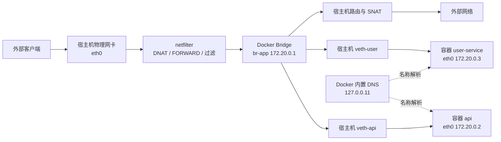
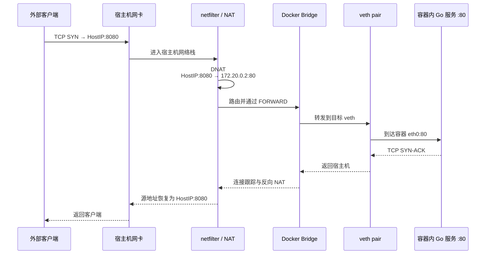
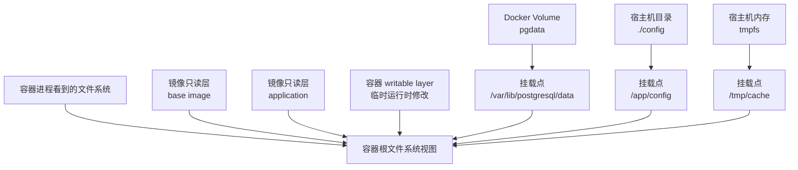

# 第 5 章：Docker 网络、存储与 Compose

> 本章主要讨论 Linux 上的 Docker Engine。Docker Desktop 在 macOS、Windows 以及部分 Linux 配置中通过虚拟机和代理实现网络与文件共享，因此底层路径可能不同，但容器网络、端口发布和 Compose 的使用模型基本一致。([Docker Documentation][1])

## 一、学习目标

完成本章后，应当能够：

1. 解释 Docker 各类网络驱动的工作方式和适用边界。
2. 描述 Network Namespace、veth pair、Linux Bridge、路由和 NAT 的协作关系。
3. 完整说明 `-p 8080:80` 背后的数据包转发路径。
4. 区分容器访问容器、容器访问宿主机、宿主机访问容器和跨主机通信。
5. 使用用户自定义 bridge 网络和 Docker 内置 DNS 完成服务发现。
6. 正确选择 writable layer、volume、bind mount 和 tmpfs。
7. 排查挂载覆盖、UID/GID、只读挂载和 SELinux 权限问题。
8. 使用 Compose 组织两个 Go 服务和一个数据库。
9. 正确理解 `healthcheck` 与 `depends_on`，避免把启动顺序误认为服务就绪。
10. 按照分层方法排查 DNS、端口、连接拒绝、网络超时和存储 IO 问题。

---

## 二、核心术语

| 术语                | 含义                                             |
| ----------------- | ---------------------------------------------- |
| Network Namespace | 隔离网络设备、IP 地址、路由表、端口空间等网络资源                     |
| veth pair         | 成对出现的虚拟以太网设备，一端进入容器 Network Namespace，另一端留在宿主机 |
| Linux Bridge      | 工作在二层的软件交换机，用于连接多个 veth 端点                     |
| NAT               | 修改数据包源地址或目标地址，实现容器出网及端口映射                      |
| Port Publishing   | 将宿主机端口映射到容器端口，例如 `8080:80`                     |
| Embedded DNS      | Docker 在用户自定义网络中提供的内置 DNS 服务                   |
| Writable Layer    | 每个容器独有、位于镜像只读层之上的可写层                           |
| Volume            | 由 Docker 创建和管理的持久化数据存储                         |
| Bind Mount        | 将宿主机上的指定路径挂载到容器                                |
| tmpfs             | 基于宿主机内存的临时文件系统                                 |
| Healthcheck       | 判断容器内部服务是否处于健康状态的检查命令                          |
| depends_on        | 描述 Compose 服务之间的启动和停止依赖关系                      |

---

# 三、Docker 网络的本质

容器网络并不是 Docker 自己实现的一套独立网络协议。Linux 容器主要利用以下内核能力构造网络环境：

* **Network Namespace**：让容器拥有独立的网络设备、IP 地址、路由表和端口空间。
* **veth pair**：像一根虚拟网线，一端放在容器 Network Namespace 中，另一端留在宿主机。
* **Linux Bridge**：像虚拟二层交换机，把多个容器的 veth 端点连接在一起。
* **路由和 IP Forwarding**：决定数据包下一跳，并允许宿主机在接口之间转发数据。
* **netfilter、iptables 或 nftables**：实现网络隔离、端口发布、过滤和 NAT。
* **Docker 内置 DNS**：把容器名、Compose 服务名解析成容器 IP。

Linux 的 veth 设备总是成对创建，可以连接不同的 Network Namespace；Docker 的 bridge 驱动则会为容器配置接口、地址、路由及相应的宿主机防火墙规则。([man7][2])



在同一个 bridge 网络中，容器间通信通常经过：

```text
源容器 eth0
→ 源容器对应的 veth
→ Linux Bridge
→ 目标容器对应的 veth
→ 目标容器 eth0
→ 目标进程
```

这种通信不需要发布宿主机端口。端口发布主要解决的是：**如何让 bridge 网络之外的客户端访问容器端口。**

---

# 四、Docker 网络模式比较

Docker 网络系统采用可插拔驱动模型。常见内置驱动包括 `bridge`、`host`、`none`、`overlay`、`macvlan` 和 `ipvlan`。([Docker Documentation][3])

| 网络模式      | 网络隔离与地址                     | NAT 与端口发布           | 跨主机    | 主要场景               | 关键限制                       |
| --------- | --------------------------- | ------------------- | ------ | ------------------ | -------------------------- |
| `bridge`  | 独立 Network Namespace 和容器 IP | 通常通过 NAT 出网；支持 `-p` | 默认不支持  | 单机上的多数容器应用         | 跨宿主机需要额外路由或 overlay        |
| `host`    | 直接使用宿主机网络栈，无独立容器 IP         | 不需要 NAT；`-p` 被忽略    | 不解决跨主机 | 大量端口、极低网络开销、网络探针   | 网络隔离弱，容易端口冲突               |
| `none`    | 仅有 loopback                 | 无                   | 无      | 离线计算、手工配置网络、安全隔离   | 默认不能访问其他容器或外部网络            |
| `overlay` | 每个容器有虚拟网络地址                 | 支持跨节点转发和端口发布        | 支持     | Docker Swarm 多主机通信 | 主机必须加入 Swarm；有封装开销         |
| `macvlan` | 容器拥有独立 MAC，像局域网物理主机         | 通常直接接入二层网络          | 依赖底层网络 | 遗留应用、网络监控、需要独立二层身份 | 交换机需支持多个 MAC；容器默认不能直接访问宿主机 |
| `ipvlan`  | 多个容器共享父接口 MAC，但拥有独立 IP      | 可直接接入底层网络           | 依赖底层路由 | MAC 数量受限的网络        | 配置和网络运维复杂度较高               |

## 4.1 bridge

`bridge` 是最常用的 Docker 网络驱动。容器拥有独立 IP，通过 Linux Bridge 互通；容器访问外部网络时，宿主机通常对源地址执行 masquerade；外部客户端访问容器时则使用端口发布。bridge 网络主要作用于同一个 Docker 守护进程所在的主机。([Docker Documentation][4])

适合：

* 单机微服务开发。
* Compose 应用。
* CI 集成测试。
* 绝大多数普通 Web 服务。
* 需要容器之间隔离但又允许指定服务互通的场景。

## 4.2 host

使用 `--network host` 时，容器直接使用宿主机网络，不再拥有独立的容器 IP。因为没有需要映射的独立端口空间，所以 `-p`、`--publish` 等选项会被忽略。host 模式不需要执行常规 bridge NAT，也不为每个端口创建代理，因此可以降低部分网络开销。([Docker Documentation][5])

```bash
docker run --rm --network host example/server
```

此时 Go 服务：

```go
http.ListenAndServe(":8080", handler)
```

会直接占用宿主机的 `8080` 端口。另一个进程或容器不能再监听相同的宿主机 IP 和端口组合。

host 模式只去除了**网络层隔离**，并不意味着 PID、Mount、User 等其他 Namespace 都被取消。

Docker Desktop 也提供 host networking，但其实现和原生 Linux 不完全相同，主要工作在 TCP/UDP 所在的四层。([Docker Documentation][6])

## 4.3 none

`--network none` 会创建隔离的网络环境，其中只有 loopback 设备：

```bash
docker run --rm --network none busybox ip addr
```

容器通常只能访问自身的 `127.0.0.1`，不能访问宿主机、其他容器或互联网。([Docker Documentation][7])

适合：

* 完全离线的数据处理。
* 不需要联网的安全任务。
* 希望自行移动网卡、设置路由的高级场景。
* 验证应用是否错误依赖外部网络。

## 4.4 overlay

overlay 网络在多个 Docker 守护进程之间建立逻辑网络，使不同宿主机上的容器能够通过虚拟地址通信。即使连接的是普通独立容器，Docker overlay 仍要求相关主机加入同一个 Swarm；独立容器还需要使用 `--attachable` 网络。([Docker Documentation][8])

典型创建方式：

```bash
docker swarm init

docker network create \
  --driver overlay \
  --attachable \
  app-overlay
```

overlay 的数据面通常基于 VXLAN。多主机之间需要开放：

| 端口                    | 作用          |
| --------------------- | ----------- |
| `2377/tcp`            | Swarm 控制面   |
| `7946/tcp`、`7946/udp` | 节点发现和通信     |
| `4789/udp`            | overlay 数据面 |

可以使用 `--opt encrypted` 对 VXLAN 上的应用数据启用 IPsec 加密，但加密会带来性能损耗，应在生产环境压测后使用。([Docker Documentation][8])

## 4.5 macvlan

macvlan 为每个容器分配独立 MAC 地址，使容器在物理网络上看起来像一台独立主机。它适合必须直接接入现有二层网络的遗留系统或网络监控工具。([Docker Documentation][9])

```bash
docker network create \
  --driver macvlan \
  --subnet 192.168.10.0/24 \
  --gateway 192.168.10.1 \
  -o parent=eth0 \
  physical-net
```

主要风险：

* 交换机端口必须允许同一个物理接口出现多个 MAC。
* 大量容器可能造成 MAC 表膨胀或地址耗尽。
* 很多云平台会限制此类二层网络。
* 受 Linux 内核机制限制，macvlan 容器默认不能直接与其宿主机通信。可以给宿主机创建额外 macvlan 接口，或者让容器同时接入一个 bridge 网络。([Docker Documentation][9])

---

# 五、默认 bridge 与用户自定义 bridge

Docker 启动时通常会创建名为 `bridge` 的默认网络。未指定 `--network` 的容器会接入该网络。

默认 bridge 可以让容器通过 IP 地址互通，但不适合构建正式的多服务应用。Docker 官方将其视为遗留实现细节，不推荐作为生产应用网络。([Docker Documentation][4])

## 5.1 用户自定义 bridge 的优势

创建自定义网络：

```bash
docker network create \
  --driver bridge \
  --subnet 172.20.0.0/24 \
  app-net
```

启动容器：

```bash
docker run -d \
  --name user-service \
  --network app-net \
  example/user-service
```

用户自定义 bridge 相比默认 bridge 主要有以下优势：

### 自动名称解析

同一自定义网络中的容器可以通过容器名或网络别名访问：

```text
http://user-service:8081
```

不需要读取易变的容器 IP，也不需要已经被视为遗留机制的 `--link`。([Docker Documentation][4])

### 更好的隔离范围

没有显式指定网络的容器都可能落入默认 bridge。自定义网络可以按项目、环境或安全域分组，使不相关的容器默认不能互通。

例如：

```text
frontend-net：gateway、web
backend-net：gateway、user-service、db
```

数据库仅接入 `backend-net`，前端容器就不能直接访问数据库。

### 可独立配置

每个用户自定义网络可以分别设置：

* 子网和网关。
* IP 地址池。
* IPv4 或 IPv6。
* MTU。
* 宿主机绑定地址。
* 网络内部属性。

### 可动态连接和断开

运行中的容器可以加入或退出用户自定义网络：

```bash
docker network connect backend-net gateway
docker network disconnect backend-net gateway
```

---

# 六、`-p 8080:80` 背后发生了什么

命令：

```bash
docker run -p 8080:80 example/server
```

含义是：

```text
宿主机 TCP 8080
        ↓
容器 TCP 80
```

如果没有指定协议，默认为 TCP。它不表示把容器的 `8080` 映射到宿主机的 `80`，而是左侧为宿主机，右侧为容器。



Docker 会为 bridge 网络创建防火墙规则，实现网络隔离、DNAT、端口发布和 masquerade。目前 Docker Engine 默认可使用 iptables，并支持 nftables 防火墙后端；两种后端都可以实现 bridge 网络的端口发布功能。([Docker Documentation][10])

## 6.1 请求路径

以容器 IP `172.20.0.2` 为例：

1. 客户端向 `192.0.2.10:8080` 发送数据包。
2. 数据包到达宿主机物理网卡。
3. NAT 规则将目标地址改写为 `172.20.0.2:80`。
4. 宿主机查路由，确认目标位于 Docker bridge。
5. 数据包经过 FORWARD 过滤。
6. Linux Bridge 将数据帧发往目标 veth。
7. 数据进入容器 Network Namespace。
8. 容器内监听 `:80` 的 Go 进程接收连接。
9. 返回数据根据连接跟踪状态执行反向 NAT。
10. 客户端看到的对端始终是宿主机 `192.0.2.10:8080`。

在某些平台或特殊流量场景中，Docker 还可能使用用户态代理，但解释端口发布时，不应把“必然经过 docker-proxy”作为固定结论。核心机制是宿主机转发、防火墙规则和地址转换。

## 6.2 默认绑定范围

下面的写法通常绑定宿主机所有地址：

```bash
docker run -p 8080:80 example/server
```

等价于允许通过宿主机多个接口访问该端口，可能包括公网接口。

只允许本机访问时，应显式绑定 loopback：

```bash
docker run \
  -p 127.0.0.1:8080:80 \
  example/server
```

发布端口默认可能对宿主机之外的网络开放，因此不能把“未配置额外防火墙”理解为“只有本机能够访问”。([Docker Documentation][11])

## 6.3 Go 服务必须监听正确地址

容器内错误写法：

```go
log.Fatal(http.ListenAndServe("127.0.0.1:80", handler))
```

此时服务只监听容器自己的 loopback。通过 veth 到达容器 `eth0` 的请求无法匹配该监听地址。

通常应使用：

```go
log.Fatal(http.ListenAndServe(":80", handler))
```

或：

```go
log.Fatal(http.ListenAndServe("0.0.0.0:80", handler))
```

## 6.4 容器间通信不要走宿主机映射端口

假设：

```yaml
services:
  user-service:
    ports:
      - "18081:8081"
```

另一个容器访问它时，推荐使用：

```text
http://user-service:8081
```

而不是：

```text
http://localhost:18081
```

原因有两个：

1. `localhost` 指向调用方容器自身。
2. `18081` 是宿主机暴露给网络外部的端口，不是目标容器内部监听端口。

---

# 七、四类通信方向

| 通信方向      | 推荐地址                                  |            是否需要 `-p` | 关键点                   |
| --------- | ------------------------------------- | -------------------: | --------------------- |
| 容器访问同网络容器 | `服务名:容器端口`                            |                    否 | 使用 Docker DNS 和容器端口   |
| 宿主机访问容器   | `127.0.0.1:宿主机端口`                     |                 通常需要 | 通过端口发布获得稳定入口          |
| 容器访问宿主机   | `host.docker.internal` 或 host gateway |                    否 | 容器内 `127.0.0.1` 不是宿主机 |
| 不同宿主机容器互访 | overlay、底层路由或编排网络                     | bridge 的 `-p` 只能提供入口 | 普通 bridge 不跨主机        |

## 7.1 容器访问容器

同一用户自定义网络中的服务应使用服务名：

```text
postgres://app:password@db:5432/app
http://user-service:8081
```

容器 IP 是运行时分配结果，容器重建后可能变化；服务名才是稳定的逻辑地址。

如果两个容器不在同一个网络，即使它们运行在同一宿主机，也可能因 Docker 的网络隔离规则而无法直接通信。

检查网络归属：

```bash
docker inspect gateway \
  --format '{{json .NetworkSettings.Networks}}'

docker network inspect app-net
```

## 7.2 宿主机访问容器

在 Linux 上，宿主机通常可以直接访问 bridge 容器 IP，但这种方式存在几个问题：

* 容器 IP 会变化。
* Docker Desktop 的容器实际运行在虚拟机内。
* 直接访问容器 IP 不具有良好的可移植性。
* 容器重建后调用方配置可能失效。

因此更稳妥的方式仍是：

```bash
docker run -p 127.0.0.1:8080:8080 example/gateway
curl http://127.0.0.1:8080/healthz
```

## 7.3 容器访问宿主机

容器内的：

```text
127.0.0.1
```

表示容器自己的 loopback，而不是宿主机。Docker 的故障排查文档也明确指出，容器拥有自己的 Network Namespace，容器内 loopback 地址解析到容器自身。([Docker Documentation][12])

在 Docker Desktop 中可使用：

```text
host.docker.internal
```

它会解析到宿主机内部地址。([Docker Documentation][13])

在 Linux Docker Engine 中，可显式加入 host gateway：

```bash
docker run \
  --add-host host.docker.internal:host-gateway \
  example/client
```

Compose 写法：

```yaml
services:
  client:
    extra_hosts:
      - "host.docker.internal:host-gateway"
```

`host-gateway` 默认解析到宿主机默认 bridge 对应的地址，也可以在 Docker daemon 配置中覆盖。([Docker Documentation][14])

## 7.4 跨宿主机通信

普通 bridge 网络只存在于单个 Docker daemon 所在的主机上。跨主机有三类方案：

1. **发布宿主机端口**
   容器 A 访问另一台宿主机 IP 和已发布端口。

2. **配置底层路由**
   让物理网络直接知道如何到达远端容器子网。

3. **使用 overlay 或其他编排网络**
   在多个主机上建立统一的逻辑网络。

Docker Swarm 的 overlay 网络可以完成第三种方案。Kubernetes 中对应的集群网络通常由 CNI 插件实现，而不是直接复用 Docker bridge。

---

# 八、Docker 内置 DNS

Docker 的 DNS 行为取决于容器所在网络。

## 8.1 默认 bridge

默认 bridge 中的容器通常继承宿主机的 DNS 配置副本，但默认不能依靠 Docker DNS 按容器名互相发现，除非使用已经过时的链接机制或手工维护地址。

## 8.2 用户自定义网络

连接到用户自定义网络的容器会使用 Docker 内置 DNS。其地址通常为：

```text
127.0.0.11
```

该地址位于容器自己的 Network Namespace 内。Docker DNS 负责：

* 解析同一网络中的容器名。
* 解析网络别名。
* 在 Compose 中解析服务名。
* 将外部域名请求转发给宿主机配置的 DNS 服务器。

Docker 官方文档明确区分了默认 bridge 和自定义网络的 DNS 行为。([Docker Documentation][15])

检查：

```bash
docker compose exec gateway cat /etc/resolv.conf
```

可能看到：

```text
nameserver 127.0.0.11
options ndots:0
```

查询服务：

```bash
docker compose exec gateway getent hosts user-service
```

也可以启动临时排障容器：

```bash
docker run --rm -it \
  --network chapter5_backend \
  nicolaka/netshoot
```

然后执行：

```bash
dig user-service
curl -v http://user-service:8081/healthz
```

## 8.3 Compose 服务名

Compose 默认会为应用创建一个 `<project-name>_default` bridge 网络，并把服务名注册到内部 DNS。服务之间可以直接使用服务名通信，不需要配置静态 IP。([Docker Documentation][16])

```yaml
services:
  gateway:
    environment:
      USER_SERVICE_URL: http://user-service:8081

  user-service:
    image: example/user-service
```

## 8.4 DNS 能解析不代表服务就绪

下面两个阶段必须区分：

```text
DNS 已经能够解析服务名
≠
目标进程已经开始监听端口
≠
目标服务已经完成初始化
```

数据库容器可能已经获得 IP，并注册 DNS，但仍在执行数据恢复或初始化。这时调用方往往收到：

```text
connection refused
```

而不是 DNS 错误。

因此应用需要：

* 合理的连接超时。
* 指数退避重试。
* 连接池重连。
* 启动健康检查。
* 避免在第一次连接失败后立即退出并永久停止。

---

# 九、Docker 存储模型

容器看到的文件系统通常由以下部分共同构成：

1. 镜像只读层。
2. 容器 writable layer。
3. 挂载到特定路径的 volume。
4. 挂载到特定路径的宿主机目录。
5. 挂载到特定路径的 tmpfs。



镜像层和容器可写层由 storage driver 管理，常见实现为 OverlayFS/`overlay2`。volume、bind mount 和 tmpfs 则把独立存储源挂载到容器路径，不再把对应数据长期写入容器 writable layer。([Docker Documentation][17])

---

# 十、存储模式比较

| 存储方式           | 生命周期      | 谁管理源位置                | 性能特征                | 可移植性            | 安全与权限              | 典型用途           |
| -------------- | --------- | --------------------- | ------------------- | --------------- | ------------------ | -------------- |
| Writable layer | 随容器删除而删除  | Docker storage driver | 受 CoW 和联合文件系统影响     | 差               | 容器独有，但难独立管理        | 临时文件、小量运行时状态   |
| Volume         | 独立于容器生命周期 | Docker                | 通常适合持久化及高 IO        | 较好，但默认仍是宿主机本地数据 | 宿主机路径被抽象，便于集中管理    | 数据库、队列、持久化业务数据 |
| Bind mount     | 取决于宿主机路径  | 用户和宿主机                | 原生 Linux 上接近宿主机文件系统 | 较差，强依赖宿主机目录     | 默认可修改宿主机文件，风险较高    | 本地源码、配置、构建产物   |
| tmpfs          | 容器停止后消失   | Linux 内存管理            | 避免磁盘 IO，速度快         | 仅适合 Linux 临时数据  | 数据通常不落盘，但可能进入 swap | 临时缓存、敏感临时文件    |

Docker 推荐使用 volume 保存由容器产生并使用的持久化数据；bind mount 适合需要宿主机直接访问的文件；tmpfs 适合不希望长期保存的数据。([Docker Documentation][18])

---

# 十一、容器 writable layer

## 11.1 生命周期

容器停止后，writable layer 通常仍然存在，因此重新启动同一个容器时可以继续看到原有数据。

但删除容器：

```bash
docker rm container-name
```

会删除该容器的 writable layer。

这解释了两个看似矛盾的现象：

```text
容器退出后，文件还在
容器删除并重建后，文件没了
```

## 11.2 为什么不适合写密集型数据

写密集型数据库不适合长期依赖 writable layer，主要原因是：

### Copy-on-Write 开销

镜像层只读。首次修改只读层中的文件时，storage driver 需要先把数据复制到可写层，再执行修改。联合文件系统的额外抽象可能带来 IO 和元数据开销。

### 生命周期耦合

数据和特定容器绑定。容器删除、重建或替换时，数据容易丢失。

### 不利于备份和迁移

数据混在容器存储目录中，不适合作为清晰、独立的备份单元。

### 不利于共享

每个容器有自己的 writable layer。多个容器不能把它当成正常的共享数据目录。

Docker 官方建议对写密集型工作负载使用 volume，而不是长期写入容器可写层。([Docker Documentation][19])

适合写入 writable layer 的内容包括：

* 临时 PID 文件。
* 可丢弃的缓存。
* 少量运行时状态。
* 不需要跨容器重建保留的数据。

即便数据可丢弃，也应注意无限增长的日志和缓存可能耗尽 `/var/lib/docker` 所在磁盘。

---

# 十二、Volume

## 12.1 基本特征

创建 volume：

```bash
docker volume create pgdata
```

查看：

```bash
docker volume inspect pgdata
```

挂载：

```bash
docker run \
  --mount type=volume,src=pgdata,dst=/var/lib/postgresql/data \
  postgres
```

volume 独立于单个容器的生命周期。删除使用它的容器后，volume 默认仍然存在，除非显式删除或执行清理命令。([Docker Documentation][18])

## 12.2 Volume 的优势

* 宿主机具体路径由 Docker 管理。
* 易于通过 Docker CLI 查找和检查。
* 可以挂载给不同容器。
* 通常比容器 writable layer 更适合高 IO。
* 可以使用 volume driver 接入 NFS、块存储等外部系统。
* Compose 可以声明并复用 named volume。

## 12.3 Volume 不是高可用存储

默认 `local` volume 仍保存在某台 Docker 主机上。

因此：

```text
容器删除后数据仍在
```

不等于：

```text
宿主机损坏后数据仍在
```

也不等于：

```text
另一台宿主机可以自动访问同一份数据
```

生产数据库仍需要：

* 数据库自身复制。
* 定期备份。
* 文件系统或块存储快照。
* 异地恢复验证。
* 合适的外部 volume driver。

持久化只解决生命周期问题，不自动解决备份、复制和容灾问题。

---

# 十三、Bind Mount

bind mount 把宿主机的文件或目录直接挂到容器路径：

```bash
docker run \
  --mount type=bind,src="$PWD/config",dst=/app/config,ro \
  example/server
```

简写：

```bash
docker run \
  -v "$PWD/config:/app/config:ro" \
  example/server
```

Docker 官方更推荐在复杂场景中使用语义更明确的 `--mount`。此外，`-v` 在宿主机源路径不存在时可能自动创建目录，而 `--mount` 默认会直接报错，更容易发现路径拼写错误。([Docker Documentation][20])

## 13.1 适用场景

* 本地开发时挂载源代码。
* 把宿主机配置文件注入容器。
* 将构建产物传入容器。
* 明确要求宿主机直接读取容器输出。
* 使用宿主机已有证书或 Unix Socket。

## 13.2 主要风险

### 强依赖宿主机路径

假设 Compose 中写入：

```yaml
volumes:
  - /srv/app/config:/app/config
```

换一台不存在 `/srv/app/config` 的主机后，应用就可能无法启动或读取错误内容。

### 容器默认可能修改宿主机文件

bind mount 默认可写。容器进程可能删除、覆盖或修改宿主机上的重要文件。

应尽可能使用：

```yaml
volumes:
  - ./config:/app/config:ro
```

### 挂载的是 daemon 主机路径

使用远程 Docker daemon 时，bind mount 的源路径属于 Docker daemon 所在主机，不属于发起 CLI 命令的客户端。([Docker Documentation][20])

### Docker Desktop 性能差异

在 Docker Desktop 中，容器通常运行于 Linux 虚拟机内。宿主机目录挂载可能经过 `virtiofs`、gRPC FUSE 等文件共享组件。大量小文件读写的性能可能明显不同于原生 Linux，因此数据库目录通常更适合使用 Docker volume。([Docker Documentation][1])

---

# 十四、tmpfs

tmpfs 将数据保存在宿主机内存支持的临时文件系统中：

```bash
docker run \
  --mount type=tmpfs,dst=/tmp/cache,tmpfs-size=64m \
  example/server
```

适合：

* 临时缓存。
* 无需持久化的中间结果。
* 临时解密文件。
* 希望减少磁盘写入的数据。
* 对延迟敏感且数据可丢弃的任务。

容器停止后，tmpfs 数据会消失。tmpfs 主要适用于 Linux，不能像 volume 一样由多个容器共享；如果宿主机启用了 swap，其中的数据仍可能被写入交换空间，因此不能简单地把 tmpfs 等同于“绝对不会触及磁盘”。([Docker Documentation][21])

---

# 十五、挂载为什么会覆盖容器原有内容

假设镜像中已经存在：

```text
/app/server
/app/config/default.yaml
```

启动容器时执行：

```bash
docker run \
  --mount type=bind,src="$PWD/config",dst=/app \
  example/server
```

挂载完成后，容器看到的 `/app` 来自宿主机的 `./config`。镜像原有的 `/app/server` 并没有被删除，但被新挂载覆盖，因而暂时不可见。

结果可能是：

```text
exec /app/server: no such file or directory
```

正确方式通常是只挂载需要覆盖的子目录：

```bash
docker run \
  --mount type=bind,src="$PWD/config",dst=/app/config,ro \
  example/server
```

## 15.1 Bind mount 与 volume 的细微区别

如果把**非空 bind mount** 挂到非空容器目录，容器原内容直接被遮蔽。

如果把**非空 volume** 挂到非空容器目录，容器原内容同样被遮蔽。

如果把一个**空 volume** 首次挂到镜像中已有内容的目录，Docker 默认会把该目录原有内容复制到 volume 中。可以使用 `volume-nocopy` 禁止该行为。([Docker Documentation][18])

例如：

```bash
docker run \
  --mount type=volume,src=appdata,dst=/app/data,volume-nocopy \
  example/server
```

排查挂载覆盖时，先查看：

```bash
docker inspect container-name \
  --format '{{json .Mounts}}'
```

重点检查：

* `Type`
* `Source`
* `Destination`
* `RW`
* `Propagation`

---

# 十六、UID、GID 与挂载权限

Linux 文件权限判断主要依据数值 UID 和 GID，而不是用户名字符串。

假设宿主机目录：

```text
/srv/app-data
owner UID = 1000
group GID = 1000
mode = 0750
```

容器进程以：

```text
UID = 65532
GID = 65532
```

运行，那么即使容器中该用户叫 `app`，它也可能没有写权限。

## 16.1 排查命令

查看容器进程身份：

```bash
docker compose exec user-service id
```

查看目录数值权限：

```bash
docker compose exec user-service \
  stat -c '%u:%g %a %n' /app/data
```

宿主机检查：

```bash
stat -c '%u:%g %a %n' ./data
ls -ln ./data
```

检查是否只读：

```bash
docker inspect user-service \
  --format '{{json .Mounts}}'
```

## 16.2 常见解决方案

### 让宿主机目录 UID/GID 与容器一致

```bash
sudo chown -R 65532:65532 ./data
```

### 在 Compose 中指定用户

```yaml
services:
  user-service:
    user: "1000:1000"
```

前提是镜像和应用允许使用该身份。

### 使用 ACL

当宿主机目录需要被多个身份访问时，可以设置 ACL，而不是粗暴使用：

```bash
chmod -R 777
```

### 配置只读挂载

```yaml
volumes:
  - type: bind
    source: ./config
    target: /app/config
    read_only: true
```

### 检查 SELinux 标签

在启用 SELinux 的主机上，即使传统 Unix 权限正确，也可能因为安全标签不匹配而收到 `permission denied`。bind mount 简写支持 `:z` 或 `:Z` 标签选项。([Docker Documentation][20])

```yaml
volumes:
  - ./data:/app/data:Z
```

不应把 `privileged: true` 或 `chmod 777` 当作常规权限修复方案。

---

# 十七、Docker Compose 的对象模型

Compose 用声明式 YAML 描述一组相关容器及其网络、存储和启动关系。

| 对象            | 作用                      |
| ------------- | ----------------------- |
| `service`     | 定义镜像、命令、环境变量、端口、挂载和健康检查 |
| `network`     | 定义服务之间的网络连通和隔离关系        |
| `volume`      | 定义可被服务挂载的持久化存储          |
| `healthcheck` | 定义判断容器是否健康的命令           |
| `depends_on`  | 描述服务启动、停止及就绪依赖          |
| `ports`       | 将宿主机端口发布到容器             |
| `expose`      | 描述容器端口，但不等同于向宿主机发布      |
| `environment` | 向容器进程注入环境变量             |
| `restart`     | 配置容器退出后的重启策略            |

Compose 默认创建项目网络，并把服务按服务名注册到内部 DNS。([Docker Documentation][16])

---

# 十八、两个 Go 服务和一个数据库

下面的示例包含：

* `gateway`：对宿主机暴露 `8080`，调用用户服务。
* `user-service`：查询 PostgreSQL，不直接暴露给宿主机。
* `db`：使用 named volume 保存数据。
* `frontend` 和 `backend` 两个网络。
* 健康检查和启动依赖。

## 18.1 Compose 片段

```yaml
name: chapter5

services:
  gateway:
    image: example/gateway:dev
    ports:
      - "127.0.0.1:8080:8080"
    environment:
      USER_SERVICE_URL: http://user-service:8081
    depends_on:
      user-service:
        condition: service_healthy
    healthcheck:
      test:
        - CMD
        - /app/gateway
        - healthcheck
        - http://127.0.0.1:8080/healthz
      interval: 10s
      timeout: 2s
      retries: 5
      start_period: 5s
    restart: unless-stopped
    networks:
      - frontend
      - backend

  user-service:
    image: example/user-service:dev
    environment:
      LISTEN_ADDR: ":8081"
      DATABASE_DSN: >-
        postgres://app:dev-only@db:5432/app?sslmode=disable
    depends_on:
      db:
        condition: service_healthy
    healthcheck:
      test:
        - CMD
        - /app/user-service
        - healthcheck
        - http://127.0.0.1:8081/healthz
      interval: 10s
      timeout: 2s
      retries: 5
      start_period: 10s
    restart: unless-stopped
    networks:
      - backend

  db:
    image: postgres:18-alpine
    environment:
      POSTGRES_USER: app
      POSTGRES_PASSWORD: dev-only
      POSTGRES_DB: app
    healthcheck:
      test:
        - CMD-SHELL
        - pg_isready -U "$${POSTGRES_USER}" -d "$${POSTGRES_DB}"
      interval: 5s
      timeout: 3s
      retries: 10
      start_period: 10s
    volumes:
      - pgdata:/var/lib/postgresql/data
    restart: unless-stopped
    networks:
      - backend

networks:
  frontend: {}

  backend:
    internal: true

volumes:
  pgdata: {}
```

这里存在三个重要地址：

```text
宿主机 → gateway：
http://127.0.0.1:8080

gateway → user-service：
http://user-service:8081

user-service → PostgreSQL：
db:5432
```

只有 `gateway` 需要发布端口。`user-service` 和 `db` 通过 backend 网络直接通信。

示例密码只适合本地开发。生产环境应使用 secret 管理系统，而不是把数据库口令直接写进 Compose 文件或代码仓库。

## 18.2 Gateway 关键 Go 代码

```go
package main

import (
	"context"
	"io"
	"log"
	"net/http"
	"os"
	"time"
)

func runHealthcheck(url string) int {
	client := &http.Client{Timeout: time.Second}

	req, err := http.NewRequestWithContext(
		context.Background(),
		http.MethodGet,
		url,
		nil,
	)
	if err != nil {
		return 1
	}

	resp, err := client.Do(req)
	if err != nil {
		return 1
	}
	defer resp.Body.Close()

	if resp.StatusCode < 200 || resp.StatusCode >= 300 {
		return 1
	}
	return 0
}

func main() {
	if len(os.Args) == 3 && os.Args[1] == "healthcheck" {
		os.Exit(runHealthcheck(os.Args[2]))
	}

	userServiceURL := os.Getenv("USER_SERVICE_URL")
	if userServiceURL == "" {
		userServiceURL = "http://user-service:8081"
	}

	client := &http.Client{
		Timeout: 2 * time.Second,
	}

	mux := http.NewServeMux()

	mux.HandleFunc("GET /healthz", func(w http.ResponseWriter, _ *http.Request) {
		w.WriteHeader(http.StatusOK)
		_, _ = w.Write([]byte("ok"))
	})

	mux.HandleFunc("GET /users/{id}", func(w http.ResponseWriter, r *http.Request) {
		ctx, cancel := context.WithTimeout(r.Context(), 1500*time.Millisecond)
		defer cancel()

		url := userServiceURL + "/users/" + r.PathValue("id")
		req, err := http.NewRequestWithContext(ctx, http.MethodGet, url, nil)
		if err != nil {
			http.Error(w, "build request failed", http.StatusInternalServerError)
			return
		}

		resp, err := client.Do(req)
		if err != nil {
			http.Error(w, "user service unavailable", http.StatusBadGateway)
			return
		}
		defer resp.Body.Close()

		w.WriteHeader(resp.StatusCode)
		_, _ = io.Copy(w, resp.Body)
	})

	server := &http.Server{
		Addr:              ":8080",
		Handler:           mux,
		ReadHeaderTimeout: 2 * time.Second,
	}

	log.Fatal(server.ListenAndServe())
}
```

关键点：

* 监听 `:8080`，而不是 `127.0.0.1:8080`。
* 通过 `user-service:8081` 调用目标服务。
* HTTP 客户端设置超时。
* 健康检查由同一个二进制提供，不依赖镜像中存在 `curl` 或 Shell。
* 生产代码还应实现优雅退出和更完整的错误分类。

## 18.3 User Service 关键 Go 代码

```go
package main

import (
	"context"
	"database/sql"
	"encoding/json"
	"log"
	"net/http"
	"os"
	"time"

	_ "github.com/jackc/pgx/v5/stdlib"
)

type User struct {
	ID   string `json:"id"`
	Name string `json:"name"`
}

func main() {
	if len(os.Args) == 3 && os.Args[1] == "healthcheck" {
		os.Exit(runHealthcheck(os.Args[2]))
	}

	dsn := os.Getenv("DATABASE_DSN")
	db, err := sql.Open("pgx", dsn)
	if err != nil {
		log.Fatal(err)
	}
	defer db.Close()

	db.SetMaxOpenConns(20)
	db.SetMaxIdleConns(10)
	db.SetConnMaxLifetime(30 * time.Minute)

	mux := http.NewServeMux()

	mux.HandleFunc("GET /healthz", func(w http.ResponseWriter, r *http.Request) {
		ctx, cancel := context.WithTimeout(r.Context(), time.Second)
		defer cancel()

		if err := db.PingContext(ctx); err != nil {
			http.Error(w, "database unavailable", http.StatusServiceUnavailable)
			return
		}

		w.WriteHeader(http.StatusOK)
		_, _ = w.Write([]byte("ok"))
	})

	mux.HandleFunc("GET /users/{id}", func(w http.ResponseWriter, r *http.Request) {
		ctx, cancel := context.WithTimeout(r.Context(), time.Second)
		defer cancel()

		var user User
		err := db.QueryRowContext(
			ctx,
			`SELECT id, name FROM users WHERE id = $1`,
			r.PathValue("id"),
		).Scan(&user.ID, &user.Name)

		switch {
		case err == sql.ErrNoRows:
			http.Error(w, "not found", http.StatusNotFound)
			return
		case err != nil:
			http.Error(w, "database error", http.StatusInternalServerError)
			return
		}

		w.Header().Set("Content-Type", "application/json")
		_ = json.NewEncoder(w).Encode(user)
	})

	addr := os.Getenv("LISTEN_ADDR")
	if addr == "" {
		addr = ":8081"
	}

	log.Fatal(http.ListenAndServe(addr, mux))
}
```

数据库 DSN 中的：

```text
db:5432
```

使用的是 Compose 服务名和数据库容器端口，而不是宿主机端口。

---

# 十九、Healthcheck 与 depends_on

## 19.1 healthcheck

Compose 的 `healthcheck` 用来执行检查命令，并将容器状态标记为：

```text
starting
healthy
unhealthy
```

常用字段：

| 字段               | 含义                    |
| ---------------- | --------------------- |
| `test`           | 执行的检查命令               |
| `interval`       | 两次检查之间的间隔             |
| `timeout`        | 单次检查超时                |
| `retries`        | 连续失败多少次后标记为 unhealthy |
| `start_period`   | 容器启动宽限期               |
| `start_interval` | 启动阶段检查间隔              |

健康检查命令在容器内部执行，因此：

```yaml
test: ["CMD", "curl", "-f", "http://localhost:8080/healthz"]
```

只有在镜像内确实存在 `curl` 时才有效。scratch 或 distroless Go 镜像通常不包含这些工具，可以让应用二进制实现 `healthcheck` 子命令。Compose 支持 `CMD`、`CMD-SHELL` 和禁用检查等形式。([Docker Documentation][22])

## 19.2 depends_on 短写不等待健康

短写：

```yaml
depends_on:
  - db
```

只保证 Compose 先启动依赖容器，不保证数据库已经能够接受连接。

长写：

```yaml
depends_on:
  db:
    condition: service_healthy
```

可以等待依赖容器通过健康检查后，再启动当前服务。Compose 也支持 `service_started` 和 `service_completed_successfully` 等条件。([Docker Documentation][22])

## 19.3 仍然需要应用重试

即使使用 `service_healthy`，应用仍需要重试机制，原因包括：

* 数据库在应用运行期间重启。
* 网络出现短暂抖动。
* 容器健康状态发生变化。
* 数据库主从切换。
* 依赖服务在 Compose 启动完成后崩溃。

`depends_on` 主要处理启动阶段依赖，不能替代运行时容错。

---

# 二十、Compose 与 Kubernetes 的边界

| 能力   | Docker Compose                  | Kubernetes              |
| ---- | ------------------------------- | ----------------------- |
| 主要范围 | 一组 Docker 服务，通常运行在一个 Docker 环境中 | 多节点集群                   |
| 调度   | 由当前 Docker daemon 启动容器          | 调度器选择合适节点               |
| 服务发现 | Compose 网络和 Docker DNS          | Service 和集群 DNS         |
| 故障恢复 | 可通过 restart policy 重启本机容器       | 控制器维持期望副本并可跨节点重建        |
| 发布   | 重建或更新 Compose 服务                | Deployment 滚动发布和回滚      |
| 弹性伸缩 | 可手工 scale，但不提供完整集群弹性控制          | 副本控制及 HPA 等机制           |
| 存储   | volume、bind mount、volume driver | PV、PVC、StorageClass、CSI |
| 适用场景 | 本地开发、集成测试、演示、单机服务               | 多节点生产编排、高可用、复杂发布        |

Compose 适合本地开发和集成测试，原因包括：

* 一份 YAML 即可启动完整依赖。
* 服务名自动解析。
* 可快速创建和销毁隔离网络。
* named volume 可保留测试数据。
* healthcheck 可减少启动竞争。
* 与 Docker 镜像和 Dockerfile 配合直接。

但 Compose 并不是“小型 Kubernetes”。当宿主机整体故障时，Compose 不会自动把容器调度到另一台主机。Kubernetes 则由控制面、调度器和控制器维护集群期望状态。([Kubernetes][23])

---

# 二十一、系统化排障方法

Docker 网络问题不应从“重启 Docker”开始，而应从调用链逐层缩小范围：

```text
容器是否运行
→ 进程是否启动
→ 是否监听正确地址和端口
→ DNS 是否解析
→ 网络是否连通
→ 防火墙是否放行
→ 端口发布是否正确
→ 应用协议是否匹配
```

---

## 21.1 第一步：确认容器和健康状态

```bash
docker compose ps
docker inspect gateway --format '{{json .State}}'
docker compose logs --tail=100 gateway
```

关注：

* `running` 还是 `exited`。
* 是否处于 `unhealthy`。
* 是否反复重启。
* 是否发生 OOM。
* 应用是否因为连接依赖失败而退出。

---

## 21.2 第二步：确认进程监听地址

```bash
docker compose exec gateway ss -lntp
```

期望看到：

```text
0.0.0.0:8080
```

如果看到：

```text
127.0.0.1:8080
```

说明进程只能接受容器内部 loopback 请求。

如果生产镜像没有 `ss`，可以：

1. 获取容器主进程 PID。
2. 使用宿主机 `nsenter` 进入其 Network Namespace。
3. 或启动与目标容器共享网络的排障容器。

```bash
pid=$(docker inspect \
  --format '{{.State.Pid}}' gateway)

sudo nsenter -t "$pid" -n ss -lntp
```

---

## 21.3 第三步：确认服务名解析

```bash
docker compose exec gateway \
  getent hosts user-service
```

失败时检查：

```bash
docker compose exec gateway \
  cat /etc/resolv.conf

docker inspect gateway \
  --format '{{json .NetworkSettings.Networks}}'

docker inspect user-service \
  --format '{{json .NetworkSettings.Networks}}'
```

常见原因：

* 两个服务不在同一网络。
* 服务名拼写错误。
* 把容器名、镜像名和 Compose 服务名混淆。
* 自定义 DNS 配置不可达。
* VPN 或企业 DNS 配置异常。
* 应用长期缓存了已经失效的 IP。

---

## 21.4 第四步：确认目标端口

从调用方容器测试：

```bash
curl -v http://user-service:8081/healthz
```

或：

```bash
nc -vz user-service 8081
```

不要测试宿主机映射端口：

```bash
# 通常不是容器间通信的正确方式
curl http://user-service:18081
```

因为 `18081` 是宿主机端口，服务内部监听的仍是 `8081`。

---

## 21.5 第五步：检查端口发布

```bash
docker port gateway
docker inspect gateway --format '{{json .NetworkSettings.Ports}}'
```

预期：

```text
8080/tcp -> 127.0.0.1:8080
```

如果使用：

```yaml
ports:
  - "8080:8080"
```

通常表示绑定所有宿主机地址。

如果宿主机端口已被其他进程占用，容器启动时会出现类似：

```text
address already in use
```

检查：

```bash
sudo ss -lntp | grep ':8080'
```

---

## 21.6 第六步：检查路由和防火墙

```bash
ip route
ip link
docker network inspect chapter5_backend
```

根据 Docker 使用的防火墙后端检查规则：

```bash
sudo iptables -t nat -S
sudo iptables -S
```

或者：

```bash
sudo nft list ruleset
```

Docker 会创建 bridge 网络所需的隔离和端口发布规则，不应为了排障直接清空 Docker 创建的规则。([Docker Documentation][24])

进一步抓包：

```bash
sudo tcpdump -ni any tcp port 8080
```

判断数据包停在哪一层：

* 宿主机物理网卡是否收到 SYN。
* Docker bridge 是否看到转发数据。
* 容器 veth 是否收到数据。
* 容器是否返回 RST。
* 返回包是否被防火墙丢弃。

---

# 二十二、常见错误的语义区别

## 22.1 `no such host`

通常说明名称解析失败：

* 服务名错误。
* 不在同一个网络。
* Docker DNS 不可用。
* 应用 DNS 配置错误。

## 22.2 `connection refused`

通常说明：

* IP 可达。
* 数据包到达目标网络栈。
* 目标端口没有进程监听，或进程主动拒绝连接。

常见原因：

* 服务尚未启动完成。
* 端口写错。
* 服务只监听 `127.0.0.1`。
* 容器进程已经崩溃。
* 调用了容器错误端口。

## 22.3 `i/o timeout`

通常意味着请求没有在超时前获得有效响应，可能涉及：

* 防火墙静默丢包。
* 路由错误。
* MTU 问题。
* 服务处理阻塞。
* 数据库连接池耗尽。
* 下游超时。
* 网络拥塞。

## 22.4 `connection reset by peer`

说明连接建立后被对端或中间设备强制关闭，可能包括：

* 应用崩溃。
* 代理主动重置。
* HTTP 请求发到了 HTTPS 端口。
* 连接空闲时间超过服务端限制。
* 服务在处理期间重启。

---

# 二十三、存储与挂载排障

## 23.1 确认挂载类型

```bash
docker inspect db \
  --format '{{json .Mounts}}'
```

判断是：

* `volume`
* `bind`
* `tmpfs`

并检查实际 `Source` 和 `Destination`。

## 23.2 排查“文件消失”

按以下顺序检查：

1. 目标目录是否被挂载覆盖。
2. bind mount 源目录是否为空。
3. 挂载目标路径是否写错。
4. Compose 相对路径是否以 Compose 文件所在目录为基准。
5. 是否使用了错误的 volume。
6. volume 是否在另一个 Compose project 名下。
7. 容器是否重建后换用了新的匿名 volume。

## 23.3 排查 `permission denied`

```bash
docker compose exec user-service id

docker compose exec user-service \
  stat -c '%u:%g %a %n' /app/data
```

继续检查：

* 数值 UID/GID。
* 目录执行权限。
* 父目录权限。
* 只读挂载。
* SELinux 标签。
* AppArmor 或其他安全策略。
* 容器是否使用非 root 用户。
* 文件系统是否被重新挂成只读。

## 23.4 排查 `no space left on device`

该错误可能不是单纯“磁盘容量不足”，还可能是 inode 耗尽。

```bash
df -h
df -i
docker system df -v
```

检查：

* 容器 JSON 日志是否无限增长。
* writable layer 是否积累大量临时数据。
* 未使用镜像和构建缓存。
* 匿名 volume。
* 数据库 WAL、临时表和备份文件。

---

# 二十四、与高并发、高性能和高可用的关系

## 24.1 高并发

高并发下需要关注：

* 连接跟踪表容量。
* 宿主机临时端口范围。
* HTTP 和数据库连接池。
* DNS 缓存和重解析。
* 服务端监听队列。
* bridge 和防火墙规则规模。
* 发布端口是否成为单机入口瓶颈。

使用 host 网络可能减少部分 NAT 和转发开销，但会牺牲网络隔离并增加端口冲突，不应在没有基准测试的情况下直接使用。

## 24.2 高性能

网络性能问题应通过以下方式验证：

* bridge 与 host 的压测对比。
* p50、p95、p99 延迟。
* CPU softirq 使用率。
* 丢包和重传。
* conntrack 使用量。
* MTU 和分片。
* 宿主机网卡队列。

存储性能问题应关注：

* writable layer 的 CoW 开销。
* volume 和 bind mount 的实际底层文件系统。
* Docker Desktop 跨虚拟机文件共享开销。
* 数据库 `fsync` 延迟。
* 磁盘 IOPS 和队列深度。
* 数据盘与 Docker 根目录是否争用同一磁盘。

## 24.3 高可用

Compose 可以借助 restart policy 处理本机上的进程退出，但不能解决宿主机整体故障。

同样：

```text
named volume
```

只表示数据独立于容器，不表示数据具备多副本。

真正的高可用通常还需要：

* 多节点调度。
* 负载均衡。
* 数据库复制。
* 跨可用区部署。
* 持久化存储冗余。
* 备份与恢复演练。
* 健康检查和流量摘除。
* 应用层幂等与重试。

---

# 二十五、常见错误认知

## 1. `localhost` 是宿主机

错误。容器拥有自己的 Network Namespace，容器内 `localhost` 指向容器自身。

## 2. `EXPOSE 8080` 会把端口发布到宿主机

错误。`EXPOSE` 主要表达镜像预期使用的端口，不会自动建立宿主机端口映射。

## 3. 两个容器通信必须使用 `-p`

错误。同一 Docker 网络中的容器可以直接使用目标容器端口通信。

## 4. 容器间应该访问宿主机映射端口

通常错误。应使用服务名和容器端口，例如 `user-service:8081`。

## 5. `depends_on` 短写会等待数据库可用

错误。短写主要保证启动顺序，不等待健康状态。

## 6. 使用 volume 后数据库就是高可用的

错误。默认 local volume 只是宿主机本地持久化，不是数据复制或容灾。

## 7. 挂载后镜像原文件被删除了

错误。原文件通常只是被挂载点遮蔽。

## 8. bind mount 和 volume 完全一样

错误。两者都以挂载形式呈现，但生命周期、路径管理、可移植性和安全边界不同。

## 9. 数据写进容器后，只要容器停止就会丢失

错误。停止同一个容器通常不会删除 writable layer；删除容器才会删除它。

## 10. host 网络取消了全部容器隔离

错误。它主要取消网络隔离，其他 Namespace 和文件系统隔离仍可能存在。

---

# 二十六、章节总结

理解 Docker 网络时，应始终沿着下面的路径分析：

```text
Network Namespace
→ veth pair
→ Linux Bridge
→ 路由与防火墙
→ NAT 和端口发布
→ Docker DNS
→ 应用监听地址
```

理解 Docker 存储时，应先回答三个问题：

```text
数据来自哪里？
数据生命周期由谁控制？
容器进程以什么 UID/GID 访问？
```

核心结论如下：

1. bridge 是单机容器网络的默认选择。
2. 用户自定义 bridge 在 DNS、隔离和配置方面优于默认 bridge。
3. `-p 8080:80` 左侧是宿主机端口，右侧是容器端口。
4. 同一网络中的容器使用服务名和容器端口通信。
5. 容器内 `127.0.0.1` 不是宿主机。
6. overlay 解决跨主机网络，但 Docker overlay 需要 Swarm。
7. writable layer 适合临时数据，不适合长期写密集型存储。
8. volume 适合容器持久化数据，但不自动提供备份和高可用。
9. bind mount 适合开发和配置注入，但与宿主机耦合较强。
10. 挂载到非空目录会遮蔽目录原有内容。
11. Linux 权限匹配的是数值 UID/GID。
12. `depends_on` 不能替代应用层重试和运行时容错。

---

# 二十七、面试题

## 基础题 1：Docker bridge 网络是怎么工作的？

### 面试官考察意图

考察候选人是否能把 Docker 网络还原为 Linux Network Namespace、veth、Bridge 和 NAT，而不是只会背诵命令。

### 30 秒回答

bridge 模式下，容器拥有独立 Network Namespace 和虚拟网卡。虚拟网卡通过 veth pair 连接到宿主机上的 Linux Bridge。同一 bridge 中的容器通过二层转发互通；容器访问外网时通常进行源地址 masquerade；外部访问容器时通过端口发布和 DNAT 转发。

### 展开回答

**结论：** Docker bridge 本质上是 Linux 虚拟网络设备和 netfilter 规则的组合。

**机制：**

1. Docker 为容器创建 Network Namespace。
2. 创建一对 veth。
3. 一端作为容器 `eth0`。
4. 另一端连接到 Docker Bridge。
5. 为容器分配 IP、默认网关和路由。
6. 创建网络隔离与 NAT 规则。
7. 同网络容器由 Bridge 转发。
8. 容器出网时使用宿主机地址进行 masquerade。

**场景：** 单机上的 Web 服务、数据库、缓存、消息队列通常都适合用户自定义 bridge。

**取舍：** 它提供较好的隔离和易用性，但相比 host 网络多经过虚拟设备、路由和可能的 NAT。

**验证：**

```bash
docker network inspect app-net
ip link
ip route
sudo nft list ruleset
```

Linux veth 可以连接不同 Network Namespace，而 Docker bridge 会安装相应隔离和端口发布规则。([man7][25])

### 可能追问

* 同一 bridge 内是否需要 `-p`？
* 容器访问互联网为什么显示宿主机 IP？
* veth 和 tap 有什么区别？
* bridge 是二层还是三层设备？

### 常见误区

* 把 Docker Bridge 理解为物理交换机。
* 认为容器直接连接宿主机物理网卡。
* 认为所有容器通信都必须进行 NAT。
* 认为 `docker0` 是所有自定义 bridge 的共同网桥。

---

## 基础题 2：`docker run -p 8080:80` 背后发生了什么？

### 面试官考察意图

考察端口映射方向、应用监听地址、DNAT 和返回流量处理。

### 30 秒回答

它把宿主机 TCP 8080 发布到容器 TCP 80。请求到达宿主机后，Docker 创建的防火墙规则将目标改写为容器 IP 的 80 端口，再经路由、Bridge 和 veth 进入容器；返回流量依据连接跟踪进行反向 NAT。容器应用应监听 `0.0.0.0:80`，而不是只监听 `127.0.0.1:80`。

### 展开回答

**结论：** 左边是宿主机端口，右边是容器端口。

**机制：**

```text
Client → HostIP:8080
→ DNAT 为 ContainerIP:80
→ FORWARD
→ Docker Bridge
→ veth
→ Container eth0
→ Go 进程
```

返回流量按原连接状态恢复为宿主机地址和端口。

**场景：** 对外提供 HTTP 服务、把本地数据库仅暴露给开发机、把管理接口限制到 loopback。

**取舍：**

```bash
-p 8080:80
```

通常可能被外部网络访问。

```bash
-p 127.0.0.1:8080:80
```

只允许宿主机本地访问，更适合管理接口和本地开发。

**验证：**

```bash
docker port container-name
sudo ss -lntp | grep ':8080'
curl -v http://127.0.0.1:8080
sudo tcpdump -ni any tcp port 8080
```

Docker 使用 NAT、PAT、masquerade 和防火墙规则完成发布端口；未指定宿主机地址时，应注意端口可能暴露到外部接口。([Docker Documentation][11])

### 可能追问

* UDP 怎么映射？
* host 模式下 `-p` 是否有效？
* 为什么容器内监听 `127.0.0.1` 后无法访问？
* 端口发布是否一定经过 `docker-proxy`？

### 常见误区

* 把 `8080:80` 的方向说反。
* 认为 `EXPOSE 80` 就完成端口发布。
* 认为容器间通信也应访问宿主机 8080。
* 认为发布端口默认只对本机开放。

---

## 基础题 3：为什么用户自定义 bridge 比默认 bridge 更适合多服务应用？

### 面试官考察意图

考察 Docker DNS、网络隔离和服务发现能力。

### 30 秒回答

用户自定义 bridge 提供基于容器名和网络别名的自动 DNS，网络隔离范围更清晰，可以独立配置子网、MTU 等参数，还可以在容器运行期间动态连接或断开。默认 bridge 缺乏完善的名称发现能力，并被 Docker 视为遗留网络，不适合正式多服务应用。

### 展开回答

**结论：** 多服务应用应为每个项目或安全域创建用户自定义网络。

**机制：**

* 同网络容器通过 Docker DNS 解析名字。
* 自定义网络使用内置 DNS，通常位于 `127.0.0.11`。
* 不同自定义网络默认隔离。
* 容器可动态连接多个网络。
* 每个网络可分别配置子网和参数。

**场景：**

```text
gateway：frontend + backend
user-service：backend
db：backend
```

这样 gateway 可以访问 user-service，而只在 frontend 网络中的前端容器不能直接访问 db。

**取舍：** 网络数量过多会增加配置和排障复杂度，应按真实安全边界划分，而不是每个容器创建一个网络。

**验证：**

```bash
docker network inspect backend
docker exec gateway getent hosts user-service
```

Docker 官方明确说明用户自定义 bridge 提供自动 DNS 和更好的隔离，而默认 bridge 不推荐用于生产。([Docker Documentation][4])

### 可能追问

* Docker DNS 地址是什么？
* 容器重建后 IP 变化怎么办？
* 一个容器能否加入多个网络？
* 同一网络中的所有端口是否都可互访？

### 常见误区

* 依赖固定容器 IP。
* 使用已经过时的 `--link`。
* 认为不同网络中的容器天然互通。
* 把容器名写进宿主机 `/etc/hosts` 作为长期方案。

---

## 基础题 4：Volume、bind mount、tmpfs 和 writable layer 有什么区别？

### 面试官考察意图

考察数据生命周期、性能、宿主机耦合和使用场景。

### 30 秒回答

writable layer 随容器删除而删除，适合临时数据；volume 由 Docker 管理，生命周期独立于容器，适合数据库等持久化数据；bind mount 直接挂载宿主机路径，适合源码和配置，但可移植性与安全性较差；tmpfs 保存在内存支持的临时文件系统中，容器停止后数据消失。

### 展开回答

**结论：** 选择存储方式的核心是数据生命周期和宿主机耦合程度。

**机制：**

* Writable layer 通过 storage driver 和 CoW 管理。
* Volume 由 Docker 创建并挂载。
* Bind mount 直接引用宿主机路径。
* tmpfs 将挂载点放在内存支持的临时文件系统中。

**场景：**

| 数据            | 建议              |
| ------------- | --------------- |
| PostgreSQL 数据 | volume          |
| 本地 Go 源码      | bind mount      |
| 只读配置          | bind mount `ro` |
| 临时缓存          | tmpfs           |
| 可丢弃运行时文件      | writable layer  |

**取舍：** volume 提高可管理性，但默认仍是宿主机本地数据；bind mount 灵活，但容器可能修改宿主机；tmpfs 快但数据不持久。

**验证：**

```bash
docker inspect container --format '{{json .Mounts}}'
docker volume inspect volume-name
```

Docker 分别将 volume、bind mount 和 tmpfs 定位为持久化、宿主机路径共享以及临时数据方案。([Docker Documentation][18])

### 可能追问

* volume 是否一定比 bind mount 快？
* 容器停止后 writable layer 是否立即消失？
* tmpfs 是否绝对不会写磁盘？
* local volume 能否跨宿主机共享？

### 常见误区

* 把 volume 当成远程分布式存储。
* 认为 bind mount 与 volume 只有语法区别。
* 把数据库长期写入 writable layer。
* 认为 tmpfs 不受内存限制。

---

## 原理深挖题 5：host 网络一定比 bridge 网络好吗？

### 面试官考察意图

考察性能优化是否有数据依据，以及候选人能否分析隔离和端口冲突。

### 30 秒回答

不一定。host 网络减少了 bridge、NAT 和部分代理路径，可能降低网络开销，适合大量端口或对延迟极敏感的场景。但它取消网络隔离，容器直接占用宿主机端口，容易产生冲突，也不再支持 `-p`。应先压测 bridge 是否真的是瓶颈，再决定是否使用 host。

### 展开回答

**结论：** host 是特定优化工具，不是默认最佳实践。

**机制：**

* 容器没有独立 IP。
* 进程直接监听宿主机网络栈。
* 不需要常规 bridge NAT。
* `-p` 和 `--publish` 被忽略。

**场景：**

* 网络监控工具。
* 节点级代理。
* 需要监听大量动态端口的服务。
* 经压测确认 bridge 路径产生明显开销的应用。

**取舍：**

优点：

* 网络路径更短。
* 无常规端口映射。
* 适合大端口范围。

缺点：

* 容器之间容易端口冲突。
* 网络隔离较弱。
* 部署密度受端口限制。
* 平台行为存在差异。

**验证：**

对相同 Go 服务分别使用 bridge 和 host 压测，比较：

```text
吞吐量
p50/p95/p99 延迟
CPU softirq
丢包与重传
conntrack 使用量
```

Docker 官方将性能和大量端口列为 host 网络的适用场景，同时明确说明其没有独立容器 IP，端口映射不会生效。([Docker Documentation][5])

### 可能追问

* host 网络还保留哪些隔离？
* Kubernetes `hostNetwork` 有什么风险？
* host 模式能否运行两个都监听 8080 的容器？
* Docker Desktop host 网络和 Linux 是否完全相同？

### 常见误区

* 未经压测就声称 host 性能一定显著更高。
* 认为 host 模式取消所有 Namespace。
* 仍然配置并依赖 `-p`。
* 忽略端口冲突和安全边界。

---

## 原理深挖题 6：Docker 如何实现跨主机容器通信？

### 面试官考察意图

考察 bridge 的单机边界、overlay、VXLAN 和控制面要求。

### 30 秒回答

普通 bridge 只作用于单个 Docker 主机。跨主机可以通过宿主机端口、手工底层路由或 overlay 网络实现。Docker overlay 要求主机加入同一 Swarm，并通常通过 VXLAN 封装跨主机数据；独立容器需要 attachable overlay。需要开放 Swarm 控制面、节点通信和 VXLAN 数据面端口。

### 展开回答

**结论：** bridge 不跨主机，overlay 在多主机之上建立逻辑二层网络。

**机制：**

1. 每台主机保留自己的本地网络。
2. Swarm 分发网络和端点信息。
3. overlay 为容器分配逻辑地址。
4. 跨节点数据通过 VXLAN 等方式封装。
5. 目标主机解封装后转发到目标容器。
6. 可选 IPsec 加密 overlay 数据。

**场景：**

* Docker Swarm 服务。
* 两台 Docker 主机上的独立容器需要直接互访。
* 希望服务名在 overlay 范围内解析。

**取舍：**

* 封装带来额外头部和处理开销。
* MTU 配置不当可能造成分片或丢包。
* 加密会进一步增加 CPU 消耗。
* 节点间防火墙必须正确开放。

**验证：**

```bash
docker node ls
docker network inspect app-overlay
ss -lun | grep 4789
tcpdump -ni any udp port 4789
```

Docker overlay 即使连接独立容器也要求 Swarm；默认数据面端口为 `4789/udp`，并可在 VXLAN 层启用 IPsec。([Docker Documentation][8])

### 可能追问

* 为什么需要 `--attachable`？
* overlay 的 MTU 应如何选择？
* Kubernetes 是否使用 Docker overlay？
* 加密 overlay 有什么代价？

### 常见误区

* 认为创建同名 bridge 就能跨主机互通。
* 忽略 Swarm 要求。
* 只开放 4789，忘记控制面和节点通信端口。
* 认为 overlay 没有任何性能开销。

---

## 原理深挖题 7：挂载到非空目录时会发生什么？

### 面试官考察意图

考察 Linux 挂载语义以及 volume 的初始复制行为。

### 30 秒回答

挂载会遮蔽目标目录原有内容，并不是删除这些文件。bind mount 会直接显示宿主机源目录；非空 volume 也会遮蔽原内容。特殊之处是：空 volume 首次挂到镜像中已有文件的目录时，Docker 默认会把目录内容复制到 volume，可以用 `volume-nocopy` 禁止。

### 展开回答

**结论：** 挂载改变的是目录视图，不是删除底层镜像文件。

**机制：**

假设镜像中有：

```text
/app/server
/app/config.yaml
```

执行：

```bash
-v ./local:/app
```

容器看到的是 `./local`，原有 `/app/server` 被遮蔽，因此启动命令可能报文件不存在。

**场景：**

* 挂载整个 `/app` 导致二进制消失。
* 挂载空配置目录导致默认配置不可见。
* 新 volume 自动获得镜像中的初始化文件。
* 旧 volume 中的内容覆盖了新镜像默认文件。

**取舍：** 挂载路径越宽，越容易意外遮蔽文件。应优先挂载具体子目录或文件。

**验证：**

```bash
docker inspect container \
  --format '{{json .Mounts}}'

docker exec container ls -la /app
```

Docker 对 bind mount 和 volume 都遵循挂载遮蔽语义；空 volume 默认还会执行初始内容复制。([Docker Documentation][20])

### 可能追问

* 如何重新看到被遮蔽的文件？
* bind mount 会自动复制内容吗？
* `volume-nocopy` 有什么用途？
* 为什么升级镜像后 volume 中的默认配置没有更新？

### 常见误区

* 认为镜像文件被永久删除。
* 认为 bind mount 会把镜像目录内容复制到宿主机。
* 使用空宿主机目录覆盖应用根目录。
* 忽略旧 volume 对新镜像内容的覆盖。

---

## 原理深挖题 8：为什么数据库不应长期写入容器 writable layer？

### 面试官考察意图

考察 CoW、容器生命周期、IO 性能和持久化边界。

### 30 秒回答

writable layer 由 storage driver 和联合文件系统管理，可能产生 Copy-on-Write 与额外元数据开销；它还与特定容器生命周期绑定，容器删除后数据消失，不便备份、迁移和共享。数据库应使用 volume 或经过验证的外部存储，同时配置数据库复制和备份。

### 展开回答

**结论：** writable layer 适合临时状态，不适合作为正式数据库数据盘。

**机制：**

* 镜像层只读。
* 数据写入容器上层。
* 修改下层文件可能触发 copy-up。
* 删除容器会删除其可写层。
* 每个容器的可写层相互独立。

**场景：**

不适合：

```text
PostgreSQL 数据目录
MySQL 数据目录
消息队列持久化日志
需要长期保存的大文件
```

可以接受：

```text
可丢弃缓存
临时下载
构建中间文件
短生命周期测试数据
```

**取舍：** volume 解决生命周期和管理问题，但不能自动解决数据库高可用。仍要进行逻辑备份、物理快照和复制。

**验证：**

```bash
docker system df -v
docker diff container-name
docker inspect container-name --format '{{json .Mounts}}'
```

Docker 官方指出，storage driver 管理 writable layer 时存在额外抽象，volume 更适合高性能持久化和写密集型工作负载。([Docker Documentation][17])

### 可能追问

* 使用 volume 就没有 IO 问题了吗？
* volume 是否自动跨节点？
* 数据库 volume 应如何备份？
* OverlayFS 的 copy-up 是什么？

### 常见误区

* 只要容器不删除就认为数据安全。
* 把 named volume 等同于分布式存储。
* 从不验证恢复流程。
* 忽略 Docker 日志和临时文件对根磁盘的占用。

---

## 场景题 9：两个 Compose 服务无法通信，你如何排查？

### 面试官考察意图

考察候选人能否按照分层方法定位问题，而不是盲目重启。

### 30 秒回答

先确认两个容器都在运行且健康；再确认目标进程监听 `0.0.0.0` 和正确端口；然后检查两个服务是否共享网络、服务名能否解析；接着从调用方容器测试目标容器端口；最后检查路由、防火墙和抓包。还要区分 DNS 错误、连接拒绝和超时。

### 展开回答

**结论：** 按“进程、监听、DNS、网络、端口、协议”顺序排查。

**机制与步骤：**

1. 检查状态：

   ```bash
   docker compose ps
   docker compose logs user-service
   ```

2. 检查监听：

   ```bash
   docker compose exec user-service ss -lntp
   ```

3. 检查共享网络：

   ```bash
   docker network inspect chapter5_backend
   ```

4. 检查 DNS：

   ```bash
   docker compose exec gateway getent hosts user-service
   ```

5. 测试目标容器端口：

   ```bash
   docker compose exec gateway \
     curl -v http://user-service:8081/healthz
   ```

6. 检查调用配置是否误用了：

   ```text
   localhost
   宿主机映射端口
   过期容器 IP
   ```

7. 必要时抓包：

   ```bash
   tcpdump -ni any port 8081
   ```

**场景判断：**

* `no such host`：DNS 或网络归属。
* `connection refused`：目标未监听或未就绪。
* `timeout`：路由、防火墙或服务阻塞。
* HTTP 404：网络已通，路径或应用路由错误。

**取舍：** 为排障临时安装工具会改变生产镜像，可使用共享同一网络的临时诊断容器。

**验证：** 在同一网络中成功解析服务名并获得健康响应。

Compose 默认通过项目网络和服务名提供服务发现。([Docker Documentation][16])

### 可能追问

* scratch 镜像没有 Shell 怎么办？
* 如何进入容器 Network Namespace？
* ping 通但 TCP 不通说明什么？
* 为什么 DNS 能解析仍然连接拒绝？

### 常见误区

* 从宿主机测试成功就认为容器间也一定成功。
* 让调用方访问 `localhost`。
* 使用宿主机映射端口进行容器间调用。
* 只检查容器状态，不检查应用监听。

---

## 场景题 10：宿主机端口访问不到容器，如何定位？

### 面试官考察意图

考察完整端口发布链路、监听地址和宿主机防火墙排查能力。

### 30 秒回答

先看容器是否运行及端口映射是否存在，再确认容器应用监听的是容器端口和 `0.0.0.0`；然后从容器内部访问自身服务，再从宿主机访问发布端口；之后检查端口绑定地址、宿主机端口冲突、防火墙、Docker NAT 规则和抓包结果。

### 展开回答

**结论：** 逐段验证“应用、容器网络、端口映射、宿主机入口”。

**机制与步骤：**

1. 查看端口：

   ```bash
   docker port gateway
   ```

2. 检查容器内服务：

   ```bash
   docker exec gateway \
     /app/gateway healthcheck http://127.0.0.1:8080/healthz
   ```

3. 检查监听：

   ```bash
   nsenter -t "$(docker inspect -f '{{.State.Pid}}' gateway)" \
     -n ss -lntp
   ```

4. 宿主机本地测试：

   ```bash
   curl -v http://127.0.0.1:8080/healthz
   ```

5. 如果本机成功、远端失败，检查：

   * 是否只绑定 `127.0.0.1`。
   * 云安全组。
   * 宿主机防火墙。
   * 路由和访问控制。

6. 抓包：

   ```bash
   tcpdump -ni any tcp port 8080
   ```

**场景与取舍：**

管理端口应绑定 loopback；真正对外服务才绑定公网或内网接口，并由防火墙进一步控制。

**验证：**

* 物理网卡收到 SYN。
* NAT 后 bridge 收到目标容器流量。
* 容器返回 SYN-ACK。
* 客户端完成 TCP 握手。

Docker 发布端口通过宿主机 NAT 和过滤规则实现；绑定到 `127.0.0.1` 时仅宿主机可访问。([Docker Documentation][11])

### 可能追问

* 为什么本机能访问，外部不能访问？
* 端口映射存在但容器仍返回 RST，说明什么？
* host 网络为什么不需要 `-p`？
* 如何只发布 UDP？

### 常见误区

* 只看 Compose YAML，不看实际容器状态。
* 认为容器监听 `127.0.0.1` 也能接受 DNAT 请求。
* 忽略云安全组。
* 为解决问题直接关闭全部防火墙。

---

## 场景题 11：如何正确使用 Compose healthcheck 和 depends_on？

### 面试官考察意图

考察启动顺序、服务就绪和运行时容错之间的区别。

### 30 秒回答

healthcheck 定义容器内部健康检查。`depends_on` 短写只保证依赖容器先启动，不等待就绪；要等待依赖健康，需要长写并使用 `condition: service_healthy`。不过它只改善启动阶段，应用仍必须配置超时、重试和重连，以处理运行期间的依赖故障。

### 展开回答

**结论：** `depends_on` 解决启动编排，不能替代分布式系统容错。

**机制：**

```yaml
db:
  healthcheck:
    test: ["CMD-SHELL", "pg_isready -U app -d app"]

user-service:
  depends_on:
    db:
      condition: service_healthy
```

Compose 先启动 `db`，等待健康检查成功，再启动 `user-service`。

**场景：**

适合：

* 数据库初始化。
* 缓存服务启动。
* 一次性迁移任务。
* 集成测试减少启动竞争。

仍需应用处理：

* 数据库运行中重启。
* DNS 短暂失败。
* 连接池中的失效连接。
* 主从切换。
* 网络抖动。

**取舍：** 健康检查过于频繁会增加服务负担；检查过于宽松则不能准确反映服务是否可用。健康检查命令还必须真实存在于镜像中。

**验证：**

```bash
docker compose ps
docker inspect db --format '{{json .State.Health}}'
```

Compose 明确规定短写不等待健康，长写的 `service_healthy` 才会等待依赖通过健康检查。([Docker Documentation][22])

### 可能追问

* liveness 和 readiness 有什么区别？
* 健康检查是否应该检查所有下游？
* `service_completed_successfully` 适合什么场景？
* scratch 镜像如何执行 HTTP 健康检查？

### 常见误区

* 认为容器进程启动等于服务可用。
* 认为 `depends_on` 能处理运行期间的故障。
* 健康检查使用镜像中不存在的 `curl`。
* 检查没有设置超时，导致检查进程堆积。

---

## 场景题 12：如何为 Compose 中的数据库设计存储？

### 面试官考察意图

考察持久化、权限、性能、备份和高可用的综合设计能力。

### 30 秒回答

本地开发通常为数据库使用 named volume，挂载到数据库官方数据目录，避免写入 writable layer。需要检查 UID/GID、磁盘容量和 fsync 性能，并制定逻辑备份或卷快照方案。默认 local volume 只在单机持久化，不能提供跨主机高可用；生产系统还需要数据库复制和外部可靠存储。

### 展开回答

**结论：** volume 负责把数据库数据从容器生命周期中分离，但备份和高可用需要单独设计。

**机制：**

```yaml
services:
  db:
    image: postgres:18-alpine
    volumes:
      - pgdata:/var/lib/postgresql/data

volumes:
  pgdata: {}
```

容器重建后仍挂载同一个 `pgdata`。

**场景：**

本地开发：

* named volume。
* 简单逻辑备份。
* 可以接受单机故障风险。

生产环境：

* 经验证的块存储或数据库专用数据盘。
* 数据库副本。
* 定时备份。
* 恢复演练。
* 容量和延迟监控。
* 独立 WAL 和数据盘规划。

**取舍：**

* Bind mount 便于宿主机直接操作，但路径和权限耦合更强。
* local volume 易用，但数据留在单台主机。
* 网络文件系统便于共享，但必须验证锁、`fsync` 和数据库官方支持。
* tmpfs 只能用于可丢弃的临时数据，不能保存正式数据库文件。

**验证：**

1. 删除并重建数据库容器，确认数据仍存在。
2. 执行备份。
3. 在干净环境恢复备份。
4. 测量磁盘延迟和 IOPS。
5. 检查数值 UID/GID。
6. 验证宿主机损坏时的恢复流程。

Volume 的生命周期独立于容器，并比 writable layer 更适合持久化和高 IO；但默认 local volume 不应被误认为自动跨主机共享。([Docker Documentation][18])

### 可能追问

* 如何备份 Docker volume？
* 数据库升级时如何处理旧 volume？
* 为什么不能把多个数据库实例直接挂到同一数据目录？
* Docker Desktop 中 bind mount 为什么可能较慢？

### 常见误区

* 只验证容器重启，不验证宿主机故障。
* 从未做过恢复演练。
* 使用 `chmod 777` 解决数据库权限。
* 把 named volume 当成备份或数据库副本。

[1]: https://docs.docker.com/desktop/features/networking/?utm_source=chatgpt.com "Networking on Docker Desktop"
[2]: https://man7.org/linux/man-pages/man7/network_namespaces.7.html?utm_source=chatgpt.com "network_namespaces(7) - Linux manual page"
[3]: https://docs.docker.com/engine/network/drivers/ "Network drivers | Docker Docs"
[4]: https://docs.docker.com/engine/network/drivers/bridge/ "Bridge network driver | Docker Docs"
[5]: https://docs.docker.com/engine/network/drivers/host/ "Host network driver | Docker Docs"
[6]: https://docs.docker.com/engine/network/drivers/host/?utm_source=chatgpt.com "Host network driver"
[7]: https://docs.docker.com/engine/network/drivers/none/?utm_source=chatgpt.com "None network driver"
[8]: https://docs.docker.com/engine/network/drivers/overlay/ "Overlay network driver | Docker Docs"
[9]: https://docs.docker.com/engine/network/drivers/macvlan/ "Macvlan network driver | Docker Docs"
[10]: https://docs.docker.com/engine/network/port-publishing/ "Port publishing and mapping | Docker Docs"
[11]: https://docs.docker.com/engine/network/port-publishing/?utm_source=chatgpt.com "Port publishing and mapping"
[12]: https://docs.docker.com/engine/daemon/troubleshoot/?utm_source=chatgpt.com "Troubleshooting the Docker daemon"
[13]: https://docs.docker.com/desktop/features/networking/networking-how-tos/?utm_source=chatgpt.com "Explore networking how-tos on Docker Desktop"
[14]: https://docs.docker.com/reference/cli/dockerd/?utm_source=chatgpt.com "dockerd"
[15]: https://docs.docker.com/engine/network/?utm_source=chatgpt.com "Networking overview"
[16]: https://docs.docker.com/compose/how-tos/networking/ "Networking in Compose | Docker Docs"
[17]: https://docs.docker.com/engine/storage/drivers/?utm_source=chatgpt.com "Storage drivers"
[18]: https://docs.docker.com/engine/storage/volumes/ "Volumes | Docker Docs"
[19]: https://docs.docker.com/engine/storage/drivers/select-storage-driver/?utm_source=chatgpt.com "Select a storage driver"
[20]: https://docs.docker.com/engine/storage/bind-mounts/ "Bind mounts | Docker Docs"
[21]: https://docs.docker.com/engine/storage/tmpfs/ "tmpfs mounts | Docker Docs"
[22]: https://docs.docker.com/reference/compose-file/services/ "Define services in Docker Compose | Docker Docs"
[23]: https://kubernetes.io/docs/concepts/overview/components/?utm_source=chatgpt.com "Kubernetes Components"
[24]: https://docs.docker.com/engine/network/packet-filtering-firewalls/?utm_source=chatgpt.com "Packet filtering and firewalls"
[25]: https://man7.org/linux/man-pages/man4/veth.4.html?utm_source=chatgpt.com "veth(4) - Linux manual page"
