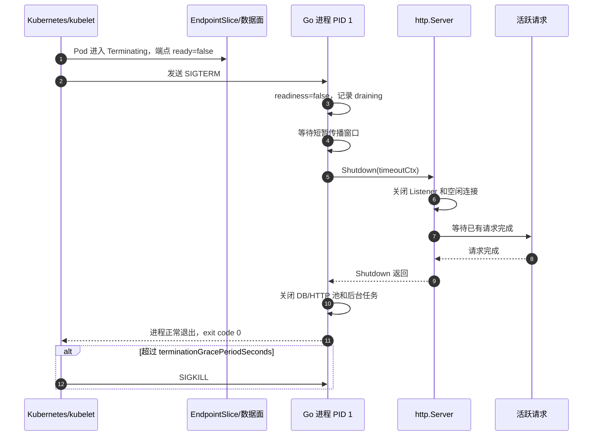
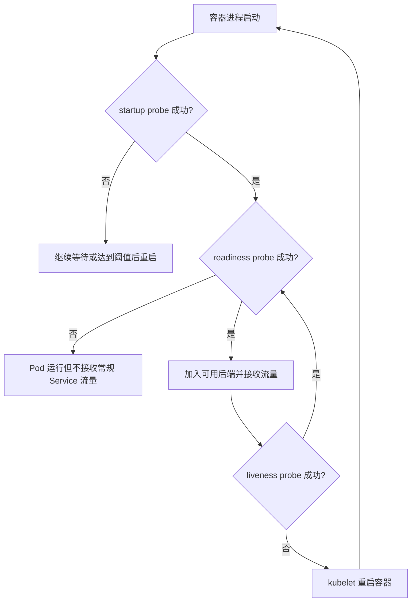

# 第 6 章：Go 服务的生产级容器化

普通 Go HTTP 服务只要能够监听端口、返回 JSON，就可以被打进镜像；但“能够运行”不等于“适合生产”。生产级容器化要求应用能够在受限 CPU、受限内存、动态网络、频繁发布和随时终止的环境中，明确地回答以下问题：

- 什么时候可以接收流量？
- 什么时候需要被重启？
- 收到终止信号后，怎样停止新流量并处理完在途请求？
- 请求、下游调用和后台任务怎样响应取消与超时？
- Pod 扩容后，数据库和下游连接数是否会失控？
- CPU 配额、内存上限和 Go 运行时如何相互影响？
- 日志、指标和性能剖析接口怎样提供诊断能力，又不暴露到公网？
- 容器能否以非 root、只读根文件系统和最小权限运行？

本章以一个 Go HTTP 服务为主线，把这些问题落实为应用代码、Dockerfile 和 Kubernetes 配置。

> 本章按 Go 1.26 与 2026 年 6 月的 Kubernetes 官方文档核对。Go 1.25 起，Linux 上的 `GOMAXPROCS` 默认具备容器 CPU 配额感知能力；旧版本 Go 的行为不同，面试时必须带上版本前提。

---

## 1. 学习目标

完成本章后，应当能够：

1. 为 Go HTTP Server 设置合理的连接级和请求级超时。
2. 正确传播 `context.Context`，让数据库、RPC、HTTP 调用和后台工作响应取消。
3. 解释 `SIGTERM → readiness 失败 → 流量摘除 → Shutdown → SIGKILL` 的完整链路。
4. 区分 startup、readiness、liveness 三类探针，避免探针触发重启风暴。
5. 解释 PID 1、信号转发和僵尸进程问题，并编写正确的 Docker `ENTRYPOINT`。
6. 按 Pod 副本数规划数据库连接池和 HTTP 连接池。
7. 解释 CPU limit、`GOMAXPROCS`、`GOMEMLIMIT`、GC 和 OOMKilled 的关系。
8. 输出适合容器采集的结构化日志，并贯穿 request ID。
9. 保护 pprof、metrics 等管理接口。
10. 使用非 root、只读根文件系统和最小 Linux capabilities 运行服务。

---

## 2. 核心术语

| 术语 | 含义 | 生产关注点 |
|---|---|---|
| `ReadHeaderTimeout` | 读取 HTTP 请求头的最长时间 | 防慢速请求头攻击，通常必须设置 |
| `ReadTimeout` | 读取整个请求，包括请求体的最长时间 | 不适合直接套用到超大上传或流式请求 |
| `WriteTimeout` | 写响应的最长时间 | 长轮询、SSE、流式下载需单独设计 |
| `IdleTimeout` | keep-alive 连接等待下一次请求的最长时间 | 防止大量空闲连接长期占用资源 |
| Request Context | 请求级取消、截止时间和请求范围数据 | 必须向 DB、HTTP、RPC 等下游传播 |
| Graceful Shutdown | 停止新连接并等待活跃请求结束 | 受 `terminationGracePeriodSeconds` 总预算约束 |
| Startup Probe | 判断应用是否完成启动 | 成功前，Kubernetes 不执行 readiness 和 liveness 探针 |
| Readiness Probe | 判断实例是否应接收业务流量 | 失败只摘流量，不直接重启容器 |
| Liveness Probe | 判断实例是否已无法自行恢复 | 失败会触发容器重启，必须保守 |
| `GOMAXPROCS` | Go 同时执行用户级 Go 代码的逻辑处理器数 | Go 1.25+ 默认参考容器 CPU limit，不参考 CPU request |
| `GOMEMLIMIT` | Go 运行时的软内存目标 | 不是 cgroup 硬限制，必须预留非 Go 堆内存空间 |
| PID 1 | 容器 PID Namespace 中的第一个进程 | 信号默认行为特殊，并承担孤儿子进程回收责任 |

---

## 3. 生产级容器化的能力模型

一个生产级 Go 服务至少要具备六类能力。

| 能力层 | 应用责任 | 容器或 Kubernetes 责任 |
|---|---|---|
| 生命周期 | 监听信号、优雅退出、关闭连接池 | 发送终止信号、等待宽限期、超时后强杀 |
| 流量管理 | 暴露 startup/readiness/liveness 接口 | 执行探针、更新 EndpointSlice、停止常规流量 |
| 资源治理 | 设置并发、超时、队列和连接池上限 | 通过 cgroup 执行 CPU、内存、PID 等限制 |
| 可观测性 | 结构化日志、指标、追踪、pprof | 采集 stdout/stderr，抓取指标，聚合日志 |
| 配置管理 | 读取、校验、热更新或安全重启 | 注入环境变量、ConfigMap、Secret 和 Volume |
| 运行安全 | 非 root、最小文件写入、避免泄密 | securityContext、只读根文件系统、网络策略 |

关键边界是：**Kubernetes 可以重启进程，但不能替应用完成请求排空；应用可以返回 readiness=false，但不能自行保证所有负载均衡器已经完成配置收敛。** 两者必须配合。

---

## 4. Go HTTP Server 的超时体系

### 4.1 为什么不应直接使用默认 HTTP Server

下面的写法适合本地演示，不适合直接暴露在不可信网络上：

```go
http.ListenAndServe(":8080", handler)
```

它内部使用的 `http.Server` 没有显式配置超时。`net/http` 中这些超时字段为零或负数时，通常表示不设超时。攻击者或故障客户端可以极慢地发送请求头、请求体，或者长期不读取响应，从而占住文件描述符、连接、goroutine 和内存。

生产代码应显式创建 `http.Server`：

```go
srv := &http.Server{
    Addr:              ":8080",
    Handler:           handler,
    ReadHeaderTimeout: 2 * time.Second,
    ReadTimeout:       10 * time.Second,
    WriteTimeout:      15 * time.Second,
    IdleTimeout:       60 * time.Second,
    MaxHeaderBytes:    1 << 20,
}
```

这些数字不是通用答案。应根据请求体大小、客户端网络、上游超时、业务 SLO 和是否流式传输来确定。

### 4.2 四类超时的职责边界

#### `ReadHeaderTimeout`

限制读取请求头的时间，主要防止 Slowloris 一类慢速请求头攻击。它通常应当较短，例如 1～5 秒。

请求头读完后，连接读截止时间会被重置，Handler 可以对请求体采用更细粒度的策略。因此，在多数普通 API 中，`ReadHeaderTimeout` 比只设置一个全局 `ReadTimeout` 更关键。

#### `ReadTimeout`

限制读取**整个请求**的时间，包括请求体。它从连接被接受后开始计时，因此以下场景不能机械套用一个很短的值：

- 大文件上传；
- 弱网络客户端；
- 长时间流式上传；
- Handler 需要先做鉴权，再决定是否继续读取 Body。

对普通 JSON API，可以设置合理的全局值，再使用 `http.MaxBytesReader` 限制 Body 大小。对上传接口，宜使用单独路由、单独服务器或 `http.ResponseController` 设置请求级读截止时间。

#### `WriteTimeout`

限制响应写入时间。普通 API 可以设置，但必须知道它不是“业务 Handler 运行时间”的完美替代品。流式响应、SSE、长轮询和 WebSocket 需要持续写数据，固定的短 `WriteTimeout` 可能错误中断正常连接。

对于流式接口，常见策略是：

1. 不使用统一的短 `WriteTimeout`；
2. 使用 `ResponseController.SetWriteDeadline` 动态延长写截止时间；
3. 定期发送心跳；
4. 对并发连接数和单连接生命周期设额外上限。

#### `IdleTimeout`

限制 keep-alive 连接在完成一个请求后，等待下一个请求的时间。它能避免大量空闲连接无限期占用文件描述符。若未设置，`net/http` 会回退到 `ReadTimeout`；两者都未设置时可能没有空闲超时。

### 4.3 连接级超时不能替代请求级超时

连接级超时主要保护 HTTP 读写过程，业务 Handler 仍应有自己的截止时间：

```go
func handleOrder(w http.ResponseWriter, r *http.Request) {
    ctx, cancel := context.WithTimeout(r.Context(), 2*time.Second)
    defer cancel()

    order, err := queryOrder(ctx, "order-123")
    if err != nil {
        if errors.Is(err, context.DeadlineExceeded) {
            http.Error(w, "upstream timeout", http.StatusGatewayTimeout)
            return
        }
        http.Error(w, "internal error", http.StatusInternalServerError)
        return
    }

    _ = json.NewEncoder(w).Encode(order)
}
```

推荐遵循超时预算递减原则：

```text
客户端总超时 > 网关超时 > 服务 Handler 超时 > 下游调用超时 > 单次重试超时
```

如果下游超时大于上游总超时，即使上游已经放弃请求，下游仍可能继续消耗连接、CPU 和数据库资源。

### 4.4 还必须限制请求体

超时不能阻止客户端在允许时间内发送超大 Body。普通 JSON API 应同时限制大小：

```go
r.Body = http.MaxBytesReader(w, r.Body, 1<<20) // 1 MiB
```

应对 `*http.MaxBytesError` 返回 `413 Request Entity Too Large`，而不是笼统返回 500。

---

## 5. Context：取消链路而不是参数容器

`context.Context` 传递三类信息：

1. 截止时间；
2. 取消信号；
3. 请求范围内、跨 API 边界传播的少量元数据。

### 5.1 请求 Context 何时被取消

对于入站 HTTP 请求，以下情况会取消 `r.Context()`：

- 客户端连接关闭；
- HTTP/2 请求被取消；
- `ServeHTTP` 返回。

Handler 中的下游操作必须使用这个 Context：

```go
row := db.QueryRowContext(r.Context(), query, id)

req, err := http.NewRequestWithContext(r.Context(), http.MethodGet, url, nil)

resp, err := grpcClient.Get(r.Context(), request)
```

错误示例：

```go
// 错误：切断了客户端取消和上游截止时间。
ctx := context.Background()
result, err := repository.Find(ctx, id)
```

### 5.2 Context 不会强制杀死 goroutine

Context 只是协作式取消信号。以下代码即使 Context 已取消，也不会自动停止：

```go
go expensiveLoop()
```

被调用代码必须主动观察：

```go
for {
    select {
    case <-ctx.Done():
        return ctx.Err()
    case item := <-workCh:
        process(item)
    }
}
```

或者调用原生支持 Context 的 API，例如 `QueryContext`、`Do`、gRPC 方法等。

### 5.3 不要把 Context 存进长期对象

惯用签名是：

```go
func (s *Service) CreateOrder(ctx context.Context, cmd CreateOrderCommand) error
```

而不是：

```go
// 不推荐：Context 的生命周期容易与 Service 对象生命周期混淆。
type Service struct {
    ctx context.Context
}
```

Context 应作为第一个参数显式向下传递。值只适合 request ID、trace ID 等请求范围元数据，不适合传递普通业务配置。

### 5.4 优雅退出时不要过早取消所有请求 Context

一个容易忽略的错误是把收到 `SIGTERM` 的 Context 直接设为 `http.Server.BaseContext`。这样一收到信号，所有活跃请求会立即看到取消，等于放弃了优雅等待。

更稳妥的做法是区分：

- **signal context**：只负责通知主协程开始关停；
- **request base context**：在 `Server.Shutdown` 等待活跃请求期间保持有效；
- **background worker context**：根据业务决定在排空开始时还是请求处理完成后取消。

---

## 6. 从 SIGTERM 到进程退出

### 6.1 Docker 与 Kubernetes 的终止语义

容器平台通常先向容器主进程发送终止信号，等待宽限期；进程仍未退出时再发送 `SIGKILL`。

在 Kubernetes 中，`terminationGracePeriodSeconds` 是总预算。`preStop` 执行时间和应用收到 TERM 后的退出时间都消耗这段预算。默认值通常为 30 秒，但生产服务应按真实最长请求、连接排空和资源关闭时间设置。

### 6.2 正确的关闭顺序

一个典型关闭序列是：

1. 收到 `SIGTERM` 或 `SIGINT`；
2. 将 readiness 状态切为 false；
3. 预留少量流量传播时间；
4. 调用 `http.Server.Shutdown`；
5. 关闭监听器和空闲连接，不再接受新连接；
6. 等待活跃请求完成；
7. 关闭数据库池、HTTP 空闲连接、消息消费者等资源；
8. 退出进程；
9. 若总时间超过 Kubernetes 宽限期，剩余进程被 `SIGKILL`。

`Server.Shutdown` 会关闭监听器、关闭空闲连接，并等待活跃连接回到空闲后退出。它不会自动等待被 Hijack 的连接，例如 WebSocket；这类长连接必须通过 `RegisterOnShutdown` 或应用自己的连接管理器关闭。

### 6.3 优雅关闭时序图



### 6.4 为什么“先 sleep 再退出”不等于优雅退出

单纯 `sleep 10` 只能给负载均衡器传播时间，却没有做到：

- 关闭监听器；
- 等待活跃请求；
- 关闭数据库事务；
- 停止消费者拉取新消息；
- 处理 WebSocket 或流式连接。

传播延迟只是优雅终止的一部分。正确方案是“摘流量 + 传播窗口 + `Shutdown` + 资源清理”。

### 6.5 预算计算

假设配置为：

```text
DRAIN_DELAY = 5s
SHUTDOWN_TIMEOUT = 25s
terminationGracePeriodSeconds = 40s
```

则保留约 10 秒给 kubelet、运行时、调度抖动和最后清理。若业务存在 60 秒合法长请求，就不能把关停预算固定在 25 秒；应缩短业务请求、异步化长任务，或者显式扩大终止宽限期。

不要同时配置一个 10 秒 `preStop sleep` 和应用内 10 秒 drain delay，却仍把宽限期设为 20 秒。两段等待会叠加，最后几乎没有时间处理在途请求。

---

## 7. PID 1、信号转发与僵尸进程

### 7.1 PID 1 为什么特殊

在 Linux PID Namespace 中，容器主进程通常是 PID 1。PID 1 对某些信号的默认处理与普通进程不同，并承担回收孤儿子进程的职责。

因此，容器化 Go 服务应满足：

- Go 二进制直接成为 PID 1；
- 程序显式监听 `SIGTERM`、`SIGINT`；
- 若启动子进程，必须调用 `Cmd.Wait` 回收；
- 若应用会产生复杂子进程树，可使用轻量 init。

### 7.2 Shell form 会破坏信号链路

错误：

```dockerfile
ENTRYPOINT /server
```

这通常变成：

```text
/bin/sh -c /server
```

Shell 成为 PID 1，而应用是其子进程。Shell 不一定会正确转发信号。

正确：

```dockerfile
ENTRYPOINT ["/server"]
```

若必须使用启动脚本，脚本最后应使用 `exec`：

```sh
#!/bin/sh
set -eu
exec /server "$@"
```

### 7.3 什么时候需要 tini 或 `--init`

纯 Go 服务通常只有一个进程，并且显式处理信号，不一定需要 init。以下情况才更需要：

- 服务频繁启动外部命令；
- 子进程可能再派生孙进程；
- 第三方程序不回收僵尸进程；
- 一个容器内不得不管理多个进程。

Docker 的 `--init` 会在容器中插入轻量 init，用于转发信号和回收子进程。但它不能替代应用的业务级优雅退出逻辑。

---

## 8. Startup、Readiness 与 Liveness

### 8.1 三类探针不是同一个接口的三个名字

| 探针 | 回答的问题 | 失败后果 | 是否检查外部依赖 |
|---|---|---|---|
| startup | 应用是否已经完成启动 | 达到阈值后重启容器 | 可检查启动所必需的初始化 |
| readiness | 当前实例是否应该接收新流量 | 从常规 Service 后端摘除 | 可检查关键依赖，但应谨慎 |
| liveness | 进程是否已进入无法自行恢复的状态 | 重启容器 | 通常不检查共享外部依赖 |

配置 startup probe 后，在它成功前，Kubernetes 不执行 readiness 和 liveness probe。这使慢启动服务无需把 liveness 的容忍窗口调得非常大。

### 8.2 健康检查与流量接入关系图



### 8.3 Liveness 必须保守

错误做法：

```text
/livez 同时检查 PostgreSQL、Redis、Kafka、对象存储和第三方支付接口
```

一旦 PostgreSQL 短暂抖动，所有 Pod 的 liveness 同时失败，Kubernetes 会批量重启原本健康的 Go 进程，形成重启风暴，并进一步放大连接建立压力。

Liveness 更适合检查：

- 主事件循环是否卡死；
- 内部不可恢复状态是否被置位；
- 必须运行的后台协程是否永久退出；
- HTTP 服务器自身是否还能响应。

对于多数 Go HTTP 服务，能响应一个极轻量 `/livez` 已经覆盖了进程和 HTTP 调度器的基本活性。

### 8.4 Readiness 可以检查依赖，但要分级

Readiness 可以考虑以下因素：

- 启动初始化是否完成；
- 实例是否正在 draining；
- 本地缓存是否已加载；
- 必需数据库是否在短时间内可达；
- 本实例的连接池是否完全耗尽；
- 是否处于主动过载保护状态。

但不应把所有依赖都无差别加入 readiness：

- 可降级的推荐服务故障，不应让核心订单 API 整体摘流量；
- 共享数据库故障时，所有 Pod 同时摘流量可能让网关直接返回无后端；
- 每秒对数据库执行大量探针 SQL，会让健康检查本身成为负载源。

常见优化是由后台协程低频检查依赖，将结果缓存到原子变量；readiness 请求只读取缓存结果。

### 8.5 探针参数的计算

假设 startup probe：

```yaml
periodSeconds: 2
failureThreshold: 30
```

理论最大启动容忍时间约为：

```text
2s × 30 = 60s
```

还应考虑单次 `timeoutSeconds` 和调度误差。若应用正常启动需要 50 秒，而阈值只允许 20 秒，容器会在启动完成前被反复杀死。

Readiness 通常可以较敏感，因为失败只影响流量；liveness 应更保守，因为失败会重启。

---

## 9. 配置注入：环境变量、文件与 Secret

### 9.1 环境变量

适合：

- 端口；
- 日志级别；
- 单个超时；
- 功能开关；
- 服务地址。

优点是简单、十二要素友好，缺点是：

- 结构化配置表达能力弱；
- 进程启动后不会自动更新；
- Secret 放进环境变量后，可能被错误日志、诊断工具或子进程继承；
- 容易出现单位错误，例如 `30` 究竟是秒还是毫秒。

生产代码必须在启动时解析并校验：

```go
shutdownTimeout, err := time.ParseDuration(os.Getenv("SHUTDOWN_TIMEOUT"))
if err != nil {
    return fmt.Errorf("invalid SHUTDOWN_TIMEOUT: %w", err)
}
```

配置错误应尽早失败，而不是带着隐含默认值运行数小时后才暴露。

### 9.2 配置文件

适合：

- 多层级结构；
- 大量路由或规则；
- CA、证书、私钥；
- 需要轮换的配置；
- 由 ConfigMap、Secret Volume 注入的数据。

Kubernetes 更新投射 Volume 时通常通过原子目录或符号链接切换实现。应用若长期持有旧文件描述符，可能看不到新内容。热更新逻辑应重新打开文件、完整解析、校验成功后再原子替换内存配置，避免读到半更新状态。

### 9.3 Secret

Secret 的 base64 表示不是加密。应用侧仍应：

- 不记录 Secret 值；
- 避免把 Secret 拼进错误消息；
- 使用最小权限 ServiceAccount；
- 对外部密钥管理系统做访问控制与审计；
- 支持证书和凭据轮换；
- 尽量避免通过命令行参数传 Secret，因为命令行更容易出现在进程信息中。

---

## 10. 日志、Request ID 与容器日志模型

### 10.1 输出到 stdout/stderr

容器内不应默认把日志写到本地滚动文件。Kubernetes 容器运行时会捕获应用的 stdout/stderr，并由 kubelet 提供 `kubectl logs` 等访问方式。节点级轮转和集中采集由平台完成。

应用本地写文件会带来：

- 容器删除后日志丢失；
- 需要处理文件轮转；
- 占用可写层或 Volume；
- 采集器必须额外挂载路径；
- 只读根文件系统无法运行。

### 10.2 使用结构化日志

Go 标准库 `log/slog` 可以输出 JSON：

```go
logger := slog.New(slog.NewJSONHandler(os.Stdout, &slog.HandlerOptions{
    Level: slog.LevelInfo,
}))

logger.Info("request completed",
    "request_id", requestID,
    "method", r.Method,
    "path", r.URL.Path,
    "status", status,
    "duration_ms", duration.Milliseconds(),
)
```

推荐稳定字段：

```text
time, level, msg, service, version, pod, request_id,
trace_id, method, path_template, status, duration_ms, error
```

不要使用原始 URL 作为高基数字段，特别是其中含用户 ID、订单 ID 或随机 token 时。指标和日志聚合宜使用路由模板，例如 `/orders/{id}`。

### 10.3 Request ID 的职责

Request ID 用于把入口、业务服务和下游调用的日志关联起来：

1. 优先接受可信网关生成的 ID；
2. 缺失时由服务生成；
3. 校验长度和字符，避免日志注入；
4. 写回响应头；
5. 注入下游 HTTP/gRPC 请求；
6. 与 trace ID 并存，而不是替代分布式追踪。

不要记录完整 Authorization、Cookie、Secret、银行卡号或未脱敏请求体。

---

## 11. 连接池、Keep-Alive 与 Pod 副本数

### 11.1 `sql.DB` 本身就是连接池

不要每个请求 `sql.Open`，也不要在每个请求结束时 `db.Close`。`*sql.DB` 应作为进程级长生命周期对象复用。

关键参数：

```go
db.SetMaxOpenConns(20)
db.SetMaxIdleConns(10)
db.SetConnMaxIdleTime(5 * time.Minute)
db.SetConnMaxLifetime(30 * time.Minute)
```

总连接数不是单 Pod 参数，而是系统参数：

```text
数据库总连接需求
≈ Deployment 副本数 × 每 Pod MaxOpenConns
+ Job/CronJob
+ 管理脚本
+ 迁移任务
+ 故障切换或滚动发布期间的额外副本
```

例如数据库最多允许 300 个业务连接，服务有 10 个 Pod，滚动期间可能达到 13 个 Pod，还要给后台任务预留 40 个连接。若每 Pod 配 30 个连接，则仅滚动期间就可能需要 390 个，必然超过上限。

连接池过小会让请求等待，过大则会把并发压力直接推给数据库。应监控 `DB.Stats()` 中的：

- `InUse`；
- `Idle`；
- `WaitCount`；
- `WaitDuration`；
- 因 idle/lifetime 被关闭的连接数。

### 11.2 HTTP Client 也必须复用

错误：

```go
func callDownstream() {
    client := &http.Client{}
    // 每次请求都创建新的 Transport 或禁用连接复用
}
```

正确做法是进程级复用 `http.Client` 和 `Transport`：

```go
transport := &http.Transport{
    MaxIdleConns:          100,
    MaxIdleConnsPerHost:   20,
    IdleConnTimeout:       90 * time.Second,
    TLSHandshakeTimeout:   3 * time.Second,
    ResponseHeaderTimeout: 2 * time.Second,
}

client := &http.Client{
    Transport: transport,
    Timeout:   3 * time.Second,
}
```

使用完响应后必须关闭 Body，并尽量读到 EOF，以便连接复用：

```go
resp, err := client.Do(req)
if err != nil {
    return err
}
defer resp.Body.Close()
_, _ = io.Copy(io.Discard, io.LimitReader(resp.Body, 4<<10))
```

### 11.3 Keep-Alive 与扩缩容

Keep-alive 减少 TCP/TLS 建连成本，但长连接可能导致：

- 新 Pod 启动后流量迟迟不均衡；
- 某些旧 Pod 持有大量长连接；
- 滚动发布时连接排空时间很长；
- 下游 DNS 或端点变化不能立刻影响已建立连接。

需要在低延迟和流量再均衡之间取舍。常见手段包括合理的 `IdleConnTimeout`、连接最大生命周期、服务端 draining、客户端端点刷新和负载均衡器连接排空。

---

## 12. Go GC、内存限制与 GOMAXPROCS

### 12.1 Kubernetes 内存 limit 是硬边界

容器超过 cgroup 内存限制时，可能被内核 OOM Kill，Pod 状态显示 `OOMKilled`。Go 运行时收到的不是一个可恢复的普通错误，通常没有机会执行优雅清理。

因此必须区分：

- `resources.requests.memory`：调度和资源保障依据；
- `resources.limits.memory`：容器可用内存硬上限；
- `GOMEMLIMIT`：Go 运行时软内存目标；
- 实际 RSS：还包括二进制映射、线程栈、cgo、mmap、网络缓冲等。

### 12.2 `GOMEMLIMIT` 不是容器内存 limit

`GOMEMLIMIT` 会促使 Go 更积极地执行 GC 和向操作系统归还内存，但它是软限制，不保证进程 RSS 永远不超过该值。

如果 Pod limit 为 512Mi，不应简单设置：

```text
GOMEMLIMIT=512MiB
```

应给非 Go 堆内存和峰值留余量，例如先从 400～450MiB 范围压测，再根据以下数据调整：

- RSS 与 working set；
- Go heap goal；
- GC CPU 占比；
- GC pause；
- goroutine 数量与栈；
- cgo 或 mmap 使用；
- OOM 事件和内存 PSI。

`GOMEMLIMIT` 过低会导致 GC 频率显著上升，CPU 消耗增加，尾延迟恶化；过高则更接近 cgroup 硬限制，峰值时容易 OOM。

### 12.3 `GOGC` 与 `GOMEMLIMIT`

`GOGC` 控制堆增长比例，`GOMEMLIMIT` 提供总的软内存约束。通常先保留默认 `GOGC=100`，设置合理 `GOMEMLIMIT`，再通过压测决定是否调整。

不要为了降低内存把 `GOGC` 盲目调到很小。GC 更频繁可能让 CPU limit 下的服务进入“GC 越多 → CPU throttling 越重 → 延迟越高”的循环。

### 12.4 容器 CPU 配额与 `GOMAXPROCS`

Go 1.25 起，在 Linux 上，如果 cgroup CPU 带宽限制低于宿主机逻辑 CPU 数，运行时默认把 `GOMAXPROCS` 调低到相应容器 CPU limit，并会周期性检测配额变化。它不参考 Kubernetes CPU request。

示例：

```yaml
resources:
  requests:
    cpu: 250m
  limits:
    cpu: "1"
```

Go 1.25+ 通常按 1 个 CPU 的配额选择默认 `GOMAXPROCS`，而不是按 250m request，也不会继续按宿主机 64 核运行大量并行 Go 代码。

注意：

- 手动设置 `GOMAXPROCS` 会关闭这部分自动默认行为；
- Go 1.24 及更早版本默认主要看宿主机可见逻辑 CPU；
- 即使 `GOMAXPROCS` 合理，CPU limit 仍可能导致 CFS 节流和尾延迟抖动；
- CPU 密集型服务应通过压测决定 limit，不能只凭平均 CPU 利用率。

### 12.5 性能问题的验证顺序

遇到容器内延迟抖动时，按以下顺序验证：

1. p99 是否与 CPU throttling 同步；
2. `GOMAXPROCS` 实际值；
3. GC CPU 与 GC 次数；
4. goroutine 是否大量 runnable；
5. 下游连接池是否等待；
6. 是否发生内存回收压力、OOM 或节点级驱逐；
7. 是否存在长时间 STW、锁竞争或 syscall 阻塞。

不能看到 CPU 100% 就直接加 Pod。若瓶颈是数据库连接池或共享锁，扩容可能让下游更快过载。

---

## 13. pprof 与 Metrics 为什么不能直接暴露公网

### 13.1 pprof 的风险

`net/http/pprof` 暴露 `/debug/pprof/`，可提供：

- goroutine 栈；
- heap、allocs；
- CPU profile；
- mutex、block；
- command line；
- execution trace。

这些信息可能泄露内部包名、函数名、请求路径、参数片段、连接信息和运行时结构。CPU profile、trace 等操作本身也会消耗资源。

推荐方案：

1. 使用独立管理端口；
2. 不创建公网 Service 或 Ingress；
3. 通过 NetworkPolicy、mTLS、认证代理限制访问；
4. 仅在需要时使用 `kubectl port-forward` 或受控诊断通道；
5. 不把 pprof 注册到业务 `DefaultServeMux` 后再无意暴露。

### 13.2 Metrics 的风险

指标通常比 pprof 风险低，但仍可能泄露：

- 内部服务名和拓扑；
- 租户 ID、用户 ID；
- 业务规模；
- 错误类型和依赖名称。

此外，高基数标签会导致 Prometheus 内存和存储急剧膨胀。禁止把 request ID、完整 URL、订单 ID 等作为指标标签。

---

## 14. 非 root、只读根文件系统与运行时文件

### 14.1 非 root

Go 服务通常监听 8080 等非特权端口，不需要 root。镜像应设置数值 UID/GID，并在 Kubernetes 中再次声明：

```yaml
securityContext:
  runAsNonRoot: true
  runAsUser: 65532
  runAsGroup: 65532
```

使用数值 UID 能避免极简镜像没有 `/etc/passwd` 时的用户名解析问题。

### 14.2 只读根文件系统

```yaml
readOnlyRootFilesystem: true
```

启用后，应用不能随意写：

- 当前目录；
- `/tmp`；
- 日志文件；
- 本地缓存；
- 动态生成证书或模板目录。

需要写入的路径应显式挂载 `emptyDir`：

```yaml
volumeMounts:
  - name: tmp
    mountPath: /tmp
volumes:
  - name: tmp
    emptyDir:
      medium: Memory
      sizeLimit: 64Mi
```

### 14.3 CA 证书与时区

`scratch` 镜像没有 CA 证书。Go 服务访问 HTTPS 下游时必须复制系统 CA，或者使用包含 CA 的运行时镜像。

`scratch` 也通常没有时区数据库。推荐：

- 业务统一使用 UTC；
- 或在程序中导入 `_ "time/tzdata"`；
- 或把 `/usr/share/zoneinfo` 复制进最终镜像。

### 14.4 最小权限

推荐 Kubernetes 容器级配置：

```yaml
securityContext:
  allowPrivilegeEscalation: false
  readOnlyRootFilesystem: true
  capabilities:
    drop: ["ALL"]
  seccompProfile:
    type: RuntimeDefault
```

这不是全部安全措施，但能显著减少容器逃逸和进程被利用后的能力范围。

---

## 15. 生产级 Go 核心代码

下面代码只使用标准库，集中演示：

- HTTP Server 超时；
- request ID 与结构化日志；
- startup/readiness/liveness；
- 下游 HTTP 连接池；
- Context 传播；
- SIGTERM/SIGINT；
- 流量排空与 `Server.Shutdown`；
- panic 恢复；
- 配置解析和错误处理。

```go
package main

import (
    "bufio"
    "context"
    "crypto/rand"
    "encoding/hex"
    "encoding/json"
    "errors"
    "fmt"
    "io"
    "log/slog"
    "net"
    "net/http"
    "os"
    "os/signal"
    "runtime/debug"
    "strings"
    "sync/atomic"
    "syscall"
    "time"
)

type config struct {
    addr              string
    dependencyURL     string
    startupTimeout    time.Duration
    requestTimeout    time.Duration
    drainDelay        time.Duration
    shutdownTimeout   time.Duration
    readHeaderTimeout time.Duration
    readTimeout       time.Duration
    writeTimeout      time.Duration
    idleTimeout       time.Duration
}

type contextKey string

const requestIDKey contextKey = "request_id"

type app struct {
    logger        *slog.Logger
    client        *http.Client
    dependencyURL string
    started       atomic.Bool
    ready         atomic.Bool
    live          atomic.Bool
    requestTTL    time.Duration
}

func main() {
    os.Exit(run())
}

func run() int {
    cfg, err := loadConfig()
    if err != nil {
        fmt.Fprintln(os.Stderr, "configuration error:", err)
        return 2
    }

    logger := slog.New(slog.NewJSONHandler(os.Stdout, &slog.HandlerOptions{
        Level: slog.LevelInfo,
    })).With("service", "orders-api")

    transport := &http.Transport{
        Proxy:                 http.ProxyFromEnvironment,
        DialContext:           (&net.Dialer{Timeout: 2 * time.Second, KeepAlive: 30 * time.Second}).DialContext,
        ForceAttemptHTTP2:     true,
        MaxIdleConns:          100,
        MaxIdleConnsPerHost:   20,
        IdleConnTimeout:       90 * time.Second,
        TLSHandshakeTimeout:   3 * time.Second,
        ResponseHeaderTimeout: 2 * time.Second,
        ExpectContinueTimeout: 1 * time.Second,
    }

    a := &app{
        logger:        logger,
        client:        &http.Client{Transport: transport, Timeout: 3 * time.Second},
        dependencyURL: cfg.dependencyURL,
        requestTTL:    cfg.requestTimeout,
    }
    a.live.Store(true)

    mux := http.NewServeMux()
    mux.HandleFunc("GET /livez", a.handleLiveness)
    mux.HandleFunc("GET /readyz", a.handleReadiness)
    mux.HandleFunc("GET /startupz", a.handleStartup)
    mux.HandleFunc("GET /v1/orders/{id}", a.handleGetOrder)

    var handler http.Handler = mux
    handler = recoverMiddleware(logger, handler)
    handler = accessLogMiddleware(logger, handler)
    handler = requestIDMiddleware(handler)

    // 与 signal context 分离，避免一收到 SIGTERM 就取消所有活跃请求。
    requestBaseCtx, cancelRequestBase := context.WithCancel(context.Background())
    defer cancelRequestBase()

    srv := &http.Server{
        Addr:              cfg.addr,
        Handler:           handler,
        ReadHeaderTimeout: cfg.readHeaderTimeout,
        ReadTimeout:       cfg.readTimeout,
        WriteTimeout:      cfg.writeTimeout,
        IdleTimeout:       cfg.idleTimeout,
        MaxHeaderBytes:    1 << 20,
        BaseContext: func(net.Listener) context.Context {
            return requestBaseCtx
        },
        ErrorLog: slog.NewLogLogger(logger.Handler(), slog.LevelError),
    }

    signalCtx, stopSignals := signal.NotifyContext(
        context.Background(),
        os.Interrupt,
        syscall.SIGTERM,
    )
    defer stopSignals()

    serveErrCh := make(chan error, 1)
    go func() {
        logger.Info("http server starting", "addr", cfg.addr)
        serveErrCh <- srv.ListenAndServe()
    }()

    // 服务器先监听，让 startup probe 能区分“进程未监听”和“初始化未完成”。
    initCtx, cancelInit := context.WithTimeout(context.Background(), cfg.startupTimeout)
    initErrCh := make(chan error, 1)
    go func() {
        initErrCh <- a.initialize(initCtx)
    }()

    select {
    case err := <-initErrCh:
        cancelInit()
        if err != nil {
            logger.Error("startup initialization failed", "error", err)
            _ = srv.Close()
            return 1
        }
        a.started.Store(true)
        a.ready.Store(true)
        logger.Info("startup initialization completed")

    case err := <-serveErrCh:
        cancelInit()
        if !errors.Is(err, http.ErrServerClosed) {
            logger.Error("http server failed", "error", err)
            return 1
        }
        return 0

    case <-signalCtx.Done():
        cancelInit()
        // 恢复信号默认行为；若关停卡住，第二次 Ctrl+C/SIGTERM 可立即终止。
        stopSignals()
        return gracefulShutdown(
            logger, a, srv, transport, cancelRequestBase,
            serveErrCh, cfg.drainDelay, cfg.shutdownTimeout,
        )
    }

    select {
    case err := <-serveErrCh:
        if !errors.Is(err, http.ErrServerClosed) {
            logger.Error("http server failed", "error", err)
            return 1
        }
        return 0

    case <-signalCtx.Done():
        stopSignals()
        return gracefulShutdown(
            logger, a, srv, transport, cancelRequestBase,
            serveErrCh, cfg.drainDelay, cfg.shutdownTimeout,
        )
    }
}

func gracefulShutdown(
    logger *slog.Logger,
    a *app,
    srv *http.Server,
    transport *http.Transport,
    cancelRequestBase context.CancelFunc,
    serveErrCh <-chan error,
    drainDelay time.Duration,
    shutdownTimeout time.Duration,
) int {
    a.ready.Store(false)
    logger.Info("shutdown started",
        "drain_delay", drainDelay.String(),
        "shutdown_timeout", shutdownTimeout.String(),
    )

    if drainDelay > 0 {
        timer := time.NewTimer(drainDelay)
        <-timer.C
    }

    shutdownCtx, cancel := context.WithTimeout(context.Background(), shutdownTimeout)
    err := srv.Shutdown(shutdownCtx)
    cancel()

    if err != nil {
        logger.Error("graceful shutdown timed out; forcing close", "error", err)
        if closeErr := srv.Close(); closeErr != nil {
            logger.Error("forced http close failed", "error", closeErr)
        }
    }

    // Server.Shutdown 只处理入站 HTTP；应用持有的其他资源要自行关闭。
    transport.CloseIdleConnections()
    cancelRequestBase()

    select {
    case serveErr := <-serveErrCh:
        if serveErr != nil && !errors.Is(serveErr, http.ErrServerClosed) {
            logger.Error("http server exited with error", "error", serveErr)
            return 1
        }
    case <-time.After(time.Second):
        logger.Warn("http serve goroutine did not report exit promptly")
    }

    logger.Info("shutdown completed")
    return 0
}

func (a *app) initialize(ctx context.Context) error {
    if a.dependencyURL == "" {
        return nil
    }

    ticker := time.NewTicker(500 * time.Millisecond)
    defer ticker.Stop()

    var lastErr error
    for {
        checkCtx, cancel := context.WithTimeout(ctx, time.Second)
        lastErr = a.checkDependency(checkCtx)
        cancel()
        if lastErr == nil {
            return nil
        }

        select {
        case <-ctx.Done():
            return fmt.Errorf("dependency never became ready: %w; last error: %v", ctx.Err(), lastErr)
        case <-ticker.C:
        }
    }
}

func (a *app) handleStartup(w http.ResponseWriter, _ *http.Request) {
    if !a.started.Load() {
        http.Error(w, "starting", http.StatusServiceUnavailable)
        return
    }
    w.WriteHeader(http.StatusOK)
    _, _ = w.Write([]byte("ok\n"))
}

func (a *app) handleLiveness(w http.ResponseWriter, _ *http.Request) {
    if !a.live.Load() {
        http.Error(w, "unhealthy", http.StatusInternalServerError)
        return
    }
    w.WriteHeader(http.StatusOK)
    _, _ = w.Write([]byte("ok\n"))
}

func (a *app) handleReadiness(w http.ResponseWriter, r *http.Request) {
    if !a.started.Load() || !a.ready.Load() {
        http.Error(w, "not ready", http.StatusServiceUnavailable)
        return
    }

    if a.dependencyURL != "" {
        ctx, cancel := context.WithTimeout(r.Context(), 300*time.Millisecond)
        err := a.checkDependency(ctx)
        cancel()
        if err != nil {
            a.logger.Warn("readiness dependency check failed", "error", err)
            http.Error(w, "not ready", http.StatusServiceUnavailable)
            return
        }
    }

    w.WriteHeader(http.StatusOK)
    _, _ = w.Write([]byte("ok\n"))
}

func (a *app) handleGetOrder(w http.ResponseWriter, r *http.Request) {
    r.Body = http.MaxBytesReader(w, r.Body, 1<<20)

    ctx, cancel := context.WithTimeout(r.Context(), a.requestTTL)
    defer cancel()

    orderID := r.PathValue("id")
    if orderID == "" || len(orderID) > 128 {
        http.Error(w, "invalid order id", http.StatusBadRequest)
        return
    }

    // 用可取消工作模拟数据库或 RPC。真实代码应调用 QueryContext、
    // NewRequestWithContext 或 gRPC 的带 Context 方法。
    select {
    case <-time.After(25 * time.Millisecond):
        writeJSON(w, http.StatusOK, map[string]any{
            "id":     orderID,
            "status": "paid",
        })
    case <-ctx.Done():
        http.Error(w, "request timeout", http.StatusGatewayTimeout)
    }
}

func (a *app) checkDependency(ctx context.Context) error {
    req, err := http.NewRequestWithContext(ctx, http.MethodGet, a.dependencyURL, nil)
    if err != nil {
        return err
    }

    if id := requestIDFromContext(ctx); id != "" {
        req.Header.Set("X-Request-ID", id)
    }

    resp, err := a.client.Do(req)
    if err != nil {
        return err
    }
    defer resp.Body.Close()
    _, _ = io.Copy(io.Discard, io.LimitReader(resp.Body, 4<<10))

    if resp.StatusCode < 200 || resp.StatusCode >= 400 {
        return fmt.Errorf("dependency returned status %d", resp.StatusCode)
    }
    return nil
}

func writeJSON(w http.ResponseWriter, status int, value any) {
    w.Header().Set("Content-Type", "application/json; charset=utf-8")
    w.WriteHeader(status)
    if err := json.NewEncoder(w).Encode(value); err != nil {
        // 响应头可能已发送，此处只能记录，不能再可靠地改成 500。
        slog.Error("encode response", "error", err)
    }
}

func requestIDMiddleware(next http.Handler) http.Handler {
    return http.HandlerFunc(func(w http.ResponseWriter, r *http.Request) {
        id := strings.TrimSpace(r.Header.Get("X-Request-ID"))
        if id == "" || len(id) > 128 || strings.ContainsAny(id, "\r\n") {
            id = newRequestID()
        }

        w.Header().Set("X-Request-ID", id)
        ctx := context.WithValue(r.Context(), requestIDKey, id)
        next.ServeHTTP(w, r.WithContext(ctx))
    })
}

func newRequestID() string {
    var b [16]byte
    if _, err := rand.Read(b[:]); err != nil {
        return fmt.Sprintf("fallback-%d", time.Now().UnixNano())
    }
    return hex.EncodeToString(b[:])
}

func requestIDFromContext(ctx context.Context) string {
    id, _ := ctx.Value(requestIDKey).(string)
    return id
}

type statusWriter struct {
    http.ResponseWriter
    status int
    bytes  int
}

func (w *statusWriter) WriteHeader(code int) {
    if w.status != 0 {
        return
    }
    w.status = code
    w.ResponseWriter.WriteHeader(code)
}

func (w *statusWriter) Write(p []byte) (int, error) {
    if w.status == 0 {
        w.WriteHeader(http.StatusOK)
    }
    n, err := w.ResponseWriter.Write(p)
    w.bytes += n
    return n, err
}

func (w *statusWriter) Flush() {
    if w.status == 0 {
        w.WriteHeader(http.StatusOK)
    }
    if f, ok := w.ResponseWriter.(http.Flusher); ok {
        f.Flush()
    }
}

func (w *statusWriter) Hijack() (net.Conn, *bufio.ReadWriter, error) {
    h, ok := w.ResponseWriter.(http.Hijacker)
    if !ok {
        return nil, nil, http.ErrNotSupported
    }
    return h.Hijack()
}

func (w *statusWriter) Push(target string, opts *http.PushOptions) error {
    p, ok := w.ResponseWriter.(http.Pusher)
    if !ok {
        return http.ErrNotSupported
    }
    return p.Push(target, opts)
}

func (w *statusWriter) Unwrap() http.ResponseWriter {
    return w.ResponseWriter
}

func accessLogMiddleware(logger *slog.Logger, next http.Handler) http.Handler {
    return http.HandlerFunc(func(w http.ResponseWriter, r *http.Request) {
        started := time.Now()
        sw := &statusWriter{ResponseWriter: w}
        next.ServeHTTP(sw, r)

        status := sw.status
        if status == 0 {
            status = http.StatusOK
        }

        logger.Info("request completed",
            "request_id", requestIDFromContext(r.Context()),
            "method", r.Method,
            "path", r.URL.Path,
            "status", status,
            "bytes", sw.bytes,
            "duration_ms", time.Since(started).Milliseconds(),
        )
    })
}

func recoverMiddleware(logger *slog.Logger, next http.Handler) http.Handler {
    return http.HandlerFunc(func(w http.ResponseWriter, r *http.Request) {
        defer func() {
            if recovered := recover(); recovered != nil {
                logger.Error("panic recovered",
                    "request_id", requestIDFromContext(r.Context()),
                    "panic", recovered,
                    "stack", string(debug.Stack()),
                )
                http.Error(w, "internal server error", http.StatusInternalServerError)
            }
        }()
        next.ServeHTTP(w, r)
    })
}

func loadConfig() (config, error) {
    cfg := config{
        addr:              envString("HTTP_ADDR", ":8080"),
        dependencyURL:     strings.TrimSpace(os.Getenv("DEPENDENCY_HEALTH_URL")),
        startupTimeout:    30 * time.Second,
        requestTimeout:    2 * time.Second,
        drainDelay:        5 * time.Second,
        shutdownTimeout:   25 * time.Second,
        readHeaderTimeout: 2 * time.Second,
        readTimeout:       10 * time.Second,
        writeTimeout:      15 * time.Second,
        idleTimeout:       60 * time.Second,
    }

    var err error
    if cfg.startupTimeout, err = envDuration("STARTUP_TIMEOUT", cfg.startupTimeout); err != nil {
        return config{}, err
    }
    if cfg.requestTimeout, err = envDuration("REQUEST_TIMEOUT", cfg.requestTimeout); err != nil {
        return config{}, err
    }
    if cfg.drainDelay, err = envDuration("DRAIN_DELAY", cfg.drainDelay); err != nil {
        return config{}, err
    }
    if cfg.shutdownTimeout, err = envDuration("SHUTDOWN_TIMEOUT", cfg.shutdownTimeout); err != nil {
        return config{}, err
    }

    if cfg.shutdownTimeout <= 0 || cfg.requestTimeout <= 0 {
        return config{}, errors.New("timeouts must be positive")
    }
    return cfg, nil
}

func envString(name, fallback string) string {
    if value := strings.TrimSpace(os.Getenv(name)); value != "" {
        return value
    }
    return fallback
}

func envDuration(name string, fallback time.Duration) (time.Duration, error) {
    value := strings.TrimSpace(os.Getenv(name))
    if value == "" {
        return fallback, nil
    }
    d, err := time.ParseDuration(value)
    if err != nil {
        return 0, fmt.Errorf("%s=%q: %w", name, value, err)
    }
    return d, nil
}
```

### 15.1 代码中的关键取舍

1. **服务器先监听，再执行初始化**：startup probe 可以区分“端口未监听”和“初始化未完成”。
2. **readiness 在关停开始时立即变为 false**：先摘流量，再调用 `Shutdown`。
3. **request base context 不与 signal context 绑定**：避免收到 TERM 后立即取消所有活跃请求。
4. **`Shutdown` 超时后调用 `Close`**：保证进程最终退出，不无限阻塞发布。
5. **下游 Client 进程级复用**：避免连接风暴。
6. **Liveness 不检查共享依赖**：避免依赖故障触发全量重启。
7. **Panic 恢复不等于吞掉所有错误**：请求级 panic 转为 500；进程级启动失败仍退出。

### 15.2 还需要按业务补充的内容

真实服务还应按需加入：

- 数据库 `PingContext`、连接池配置和 `db.Close()`；
- 消息消费者停止拉取、提交 offset 和等待处理完成；
- WebSocket/SSE 长连接注册表与主动关闭；
- Prometheus metrics、OpenTelemetry trace；
- 限流、最大并发、队列背压；
- 配置热更新；
- 业务幂等和重复请求处理。

---

## 16. 多阶段 Dockerfile

下面示例使用 `scratch` 作为运行阶段，二进制采用静态链接，并复制 CA 证书：

```dockerfile
# syntax=docker/dockerfile:1

FROM golang:1.26.4-bookworm AS build

WORKDIR /src

COPY go.mod go.sum ./
RUN --mount=type=cache,target=/go/pkg/mod \
    go mod download

COPY . .

RUN --mount=type=cache,target=/root/.cache/go-build \
    CGO_ENABLED=0 GOOS=linux \
    go build \
      -trimpath \
      -buildvcs=false \
      -ldflags="-s -w" \
      -o /out/server \
      ./cmd/server

FROM scratch

COPY --from=build /etc/ssl/certs/ca-certificates.crt \
    /etc/ssl/certs/ca-certificates.crt
COPY --from=build /out/server /server

USER 65532:65532
EXPOSE 8080
STOPSIGNAL SIGTERM
ENTRYPOINT ["/server"]
```

### 16.1 逐项说明

- `go.mod`、`go.sum` 先复制，使依赖下载层更容易复用。
- BuildKit cache mount 缓存 module 和编译缓存，但不会把缓存打进最终镜像。
- `CGO_ENABLED=0` 便于生成无需 glibc/musl 的静态二进制。
- `-trimpath` 去掉本地构建路径，减少泄露并提高可重复性。
- `scratch` 不包含 Shell、包管理器和调试工具，攻击面小。
- 复制 CA 证书，保证 HTTPS 下游和 TLS 数据库连接能验证证书。
- 使用数值非 root 用户。
- exec form 让 Go 二进制直接成为 PID 1。
- `STOPSIGNAL SIGTERM` 明确终止信号；Docker 和常见 Kubernetes 运行时默认也通常使用 SIGTERM。

### 16.2 `scratch` 的限制

- 没有 `/bin/sh`，不能 `kubectl exec ... -- sh`；
- 没有 curl/wget，不能依赖 shell 命令做健康检查；
- 没有 `/tmp` 可写保证；
- 没有时区数据库；
- 若使用 CGO，静态链接和运行库问题更复杂。

生产排障可使用 Kubernetes ephemeral container，而不是为了方便 SSH/exec 给业务镜像塞入完整工具链。

### 16.3 Docker 本地运行

```bash
docker run --rm \
  --read-only \
  --tmpfs /tmp:rw,noexec,nosuid,size=64m \
  --user 65532:65532 \
  --cap-drop ALL \
  --security-opt no-new-privileges \
  -p 8080:8080 \
  orders-api:local
```

---

## 17. Kubernetes 配置片段

```yaml
apiVersion: apps/v1
kind: Deployment
metadata:
  name: orders-api
spec:
  replicas: 3
  minReadySeconds: 5
  strategy:
    type: RollingUpdate
    rollingUpdate:
      maxUnavailable: 0
      maxSurge: 1
  selector:
    matchLabels:
      app: orders-api
  template:
    metadata:
      labels:
        app: orders-api
    spec:
      automountServiceAccountToken: false
      terminationGracePeriodSeconds: 40
      securityContext:
        runAsNonRoot: true
        runAsUser: 65532
        runAsGroup: 65532
        seccompProfile:
          type: RuntimeDefault
      containers:
        - name: api
          image: registry.example.com/orders-api@sha256:<digest>
          imagePullPolicy: IfNotPresent
          ports:
            - name: http
              containerPort: 8080
          env:
            - name: HTTP_ADDR
              value: ":8080"
            - name: STARTUP_TIMEOUT
              value: "30s"
            - name: REQUEST_TIMEOUT
              value: "2s"
            - name: DRAIN_DELAY
              value: "5s"
            - name: SHUTDOWN_TIMEOUT
              value: "25s"
            # 512Mi limit 下先预留约 80Mi 非 Go 运行时空间；必须压测校准。
            - name: GOMEMLIMIT
              value: "430MiB"
          resources:
            requests:
              cpu: 250m
              memory: 256Mi
            limits:
              cpu: "1"
              memory: 512Mi
          startupProbe:
            httpGet:
              path: /startupz
              port: http
            periodSeconds: 2
            timeoutSeconds: 1
            failureThreshold: 30
          readinessProbe:
            httpGet:
              path: /readyz
              port: http
            periodSeconds: 5
            timeoutSeconds: 1
            failureThreshold: 2
          livenessProbe:
            httpGet:
              path: /livez
              port: http
            periodSeconds: 10
            timeoutSeconds: 1
            failureThreshold: 3
          securityContext:
            allowPrivilegeEscalation: false
            readOnlyRootFilesystem: true
            capabilities:
              drop: ["ALL"]
          volumeMounts:
            - name: tmp
              mountPath: /tmp
      volumes:
        - name: tmp
          emptyDir:
            medium: Memory
            sizeLimit: 64Mi
```

### 17.1 配置解读

- `terminationGracePeriodSeconds=40` 覆盖 5 秒 drain、25 秒 Shutdown 和额外余量。
- startup probe 最大容忍约 60 秒启动时间。
- readiness 失败只摘流量；liveness 失败才重启。
- `maxUnavailable: 0` 与 readiness 配合，降低滚动发布期间容量下降。
- 镜像使用 digest，避免 tag 漂移。
- 不挂载 ServiceAccount token，除非应用确实需要访问 Kubernetes API。
- `emptyDir.medium: Memory` 为只读根文件系统提供受限临时目录；其中数据计入内存使用，必须限制大小。
- Go 1.25+ 无需常规手工设置 `GOMAXPROCS`，运行时会参考 CPU limit；使用旧 Go 版本时必须单独处理。

---

## 18. 应用崩溃后由容器重启，还是应用内部吞掉错误

### 18.1 应当退出的错误

以下错误通常说明进程无法正确提供服务，应记录后退出非零状态，让容器平台重启：

- 配置解析失败；
- 必需证书或私钥不可读取；
- 监听端口失败；
- 关键内部不变量被破坏；
- 主服务循环永久退出；
- 无法恢复的初始化失败；
- 数据文件损坏且没有恢复路径。

### 18.2 不应导致进程退出的错误

以下错误通常属于请求级或暂时性错误：

- 单个请求参数非法；
- 单次数据库超时；
- 下游返回 503；
- 单条消息处理失败；
- 客户端取消请求；
- 可降级依赖暂时不可用。

它们应被分类、重试、熔断、降级或返回合适状态码，而不是调用 `log.Fatal` 杀死整个进程。

### 18.3 “吞掉所有错误”为什么更危险

若主 goroutine 遇到不可恢复错误后只记录日志并继续：

- 进程仍存活，liveness 可能继续成功；
- readiness 可能错误地保持 true；
- 请求不断进入但全部失败；
- Kubernetes 看不到失败，无法自愈；
- 错误状态可能持续数小时。

正确原则是：

```text
请求级错误局部隔离；
暂时性依赖错误限时重试和降级；
不可恢复的进程级错误快速失败；
不要依赖无限重试掩盖永久错误。
```

### 18.4 重启不是修复一切的方案

重启只适合清除进程内暂态故障，例如死锁、内存泄漏累积或损坏缓存。它不能修复：

- 错误配置；
- 数据库 schema 不兼容；
- 所有副本共享的代码缺陷；
- 下游长期不可用；
- 资源 limit 设置过低；
- 非幂等操作造成的数据错误。

如果所有 Pod 因同一永久错误持续崩溃，结果只是 CrashLoopBackOff。

---

## 19. 常见错误认知

### 误区 1：有 Kubernetes，就不需要应用处理 SIGTERM

Kubernetes 只能发送信号和等待。应用不调用 `Shutdown`，在途请求仍可能被中断。

### 误区 2：readiness 和 liveness 共用一个“全依赖健康”接口最简单

它会把共享依赖抖动放大成全量容器重启。两者失败后果不同，接口职责必须分离。

### 误区 3：设置 `http.Client.Timeout` 就不需要 Context

Client Timeout 是客户端全局上限；请求 Context 还要承接上游取消、请求级预算和调用链传播。两者应配合。

### 误区 4：`GOMEMLIMIT` 等于容器内存上限

它是 Go 运行时软目标，不覆盖全部进程内存，也不能阻止内核 OOM Kill。

### 误区 5：数据库每 Pod 连接池越大，吞吐越高

连接池会乘以副本数。过大的总连接数会让数据库上下文切换、锁竞争和内存压力更严重。

### 误区 6：结构化日志就是把文本包进 JSON

真正结构化要求字段稳定、类型稳定、可检索、低基数，并避免把敏感数据和整段堆栈无条件写入每条日志。

### 误区 7：极简镜像没有 Shell，所以无法排障

应用镜像不应承担完整运维工具箱职责。可使用 metrics、pprof、日志、trace、ephemeral container 和受控诊断镜像。

---

## 20. 生产排障清单

### Pod 退出不干净

检查：

```text
应用是否收到 SIGTERM
ENTRYPOINT 是否为 exec form
terminationGracePeriodSeconds 是否足够
preStop 与应用 drain 是否重复耗时
Server.Shutdown 是否被调用
是否存在 WebSocket、SSE 或 Hijacked 连接
后台消费者是否仍在拉取新任务
是否最终被 SIGKILL
```

### Readiness 持续失败

检查：

```text
初始化标志是否置位
依赖检查超时是否过短
探针路径、端口和 scheme 是否正确
readiness 是否访问了仅监听 localhost 的管理端口
依赖检查是否被 NetworkPolicy 阻断
探针是否对数据库造成额外压力
```

### OOMKilled

检查：

```text
容器 memory limit 与实际 RSS
GOMEMLIMIT 是否留有余量
heap、goroutine stack、cgo、mmap 和缓存
请求体是否有限制
并发数和队列是否有上限
pprof heap 与 allocs
是否由节点压力驱逐而非容器硬 OOM
```

### CPU 抖动和 p99 升高

检查：

```text
CPU throttling
Go 版本与实际 GOMAXPROCS
GC CPU 和 GC 频率
goroutine runnable 数量
锁竞争、syscall、数据库池等待
探针或日志是否过于频繁
是否存在无界重试
```

---

## 21. 面试回答方法

生产级容器化问题宜按以下顺序组织答案：

1. **结论**：先说最关键的设计原则。
2. **机制**：解释 Go、Linux、Docker、Kubernetes 各自做什么。
3. **场景**：给出发布、扩容、依赖故障或高并发例子。
4. **取舍**：说明超时、探针敏感度、连接池和资源上限不是越大越好。
5. **验证**：给出日志、指标、pprof、容器状态和压测方法。

例如回答“如何优雅退出”时，不要只背 `Shutdown`，而要覆盖：

```text
SIGTERM → readiness=false → 传播窗口 → Shutdown → 等待在途请求
→ 关闭下游连接与后台任务 → 在 grace period 内退出 → 超时后强制关闭
```

---

# 22. 面试题

## 题 1：为什么生产服务不建议直接使用 `http.ListenAndServe`？

**考察意图**

考察候选人是否理解默认 HTTP Server 的超时边界，以及慢连接如何耗尽服务资源。

**30 秒回答**

`http.ListenAndServe` 适合演示，但它没有显式设置 `ReadHeaderTimeout`、`ReadTimeout`、`WriteTimeout` 和 `IdleTimeout`。在不可信网络上，慢速请求头、慢请求体或不读取响应的客户端可能长期占用连接、goroutine 和文件描述符。生产中应创建 `http.Server`，设置连接级超时、Header 大小和请求体上限，再为业务 Handler 设置请求级 Context 超时。

**展开回答**

- **结论**：显式构造 `http.Server`，不能只依赖零值默认配置。
- **机制**：零或负超时通常表示不限制；慢客户端可占住 socket 和 goroutine。
- **场景**：公网 API 被 Slowloris 或异常移动网络连接拖住。
- **取舍**：超时过短会误伤上传、流式请求和弱网络客户端，因此应按路由分类。
- **验证**：用慢速客户端压测，观察连接数、goroutine、FD 和超时日志。

**可能追问**

- `ReadHeaderTimeout` 与 `ReadTimeout` 有什么区别？
- 如何处理大文件上传？
- `WriteTimeout` 为什么不适合 SSE？

**常见误区**

只设置一个 `http.Client.Timeout`，却忘记这是出站客户端配置，与入站 Server 无关。

---

## 题 2：解释四个 Server Timeout，并给出配置思路。

**考察意图**

考察是否真正理解超时作用范围，而不是背字段名。

**30 秒回答**

`ReadHeaderTimeout` 限制请求头读取，通常较短；`ReadTimeout` 限制整个请求读取，包括 Body；`WriteTimeout` 限制响应写入；`IdleTimeout` 限制 keep-alive 连接等待下一个请求。普通 JSON API 可全部设置，但上传、SSE、WebSocket 和长轮询要按路由或独立服务器处理。业务执行时间仍应通过 Context 单独限制。

**展开回答**

- **结论**：连接级和请求级超时分层配置。
- **机制**：四个字段对应连接生命周期的不同阶段。
- **场景**：普通 API、上传接口、流式接口采用不同策略。
- **取舍**：过长保护不足，过短造成误杀；不能复制固定模板。
- **验证**：分别模拟慢 Header、慢 Body、慢读响应和空闲 keep-alive。

**可能追问**

- `MaxHeaderBytes` 和 `MaxBytesReader` 分别限制什么？
- 网关超时和应用超时如何排序？

**常见误区**

把 `WriteTimeout` 当作 Handler 的精确业务超时。

---

## 题 3：Context 在请求取消中起什么作用？

**考察意图**

考察取消是否能穿透数据库、HTTP、RPC 和 goroutine。

**30 秒回答**

入站请求的 `r.Context()` 会在客户端断开、HTTP/2 取消或 Handler 返回时取消。服务应把它传给 `QueryContext`、`NewRequestWithContext` 和 gRPC 调用，并在需要时派生更短 deadline。Context 是协作式信号，不会自动杀死 goroutine；被调用代码必须观察 `Done()`。不能在 Handler 内换成 `context.Background()`，否则会切断取消链路。

**展开回答**

- **结论**：Context 必须端到端传播。
- **机制**：父 Context 取消会传递给派生 Context。
- **场景**：客户端已经超时离开，数据库查询应尽快停止。
- **取舍**：下游预算要小于上游预算，并为重试保留时间。
- **验证**：主动断开客户端，观察下游请求和 DB 查询是否取消。

**可能追问**

- 为什么不把 Context 存在 struct 中？
- `WithTimeout` 为什么必须调用 cancel？

**常见误区**

认为 Context 取消后所有 goroutine 会被运行时强制终止。

---

## 题 4：Go 服务如何在 Kubernetes 中优雅退出？

**考察意图**

考察信号、Endpoint、Shutdown 和宽限期的完整链路。

**30 秒回答**

进程监听 SIGTERM。收到后先把 readiness 置为 false，让 Service 停止把新流量送来；预留短暂传播窗口，再调用 `http.Server.Shutdown`，它关闭监听器和空闲连接并等待活跃请求完成。随后关闭 DB、HTTP 空闲连接和后台任务。所有步骤必须小于 `terminationGracePeriodSeconds`，否则 kubelet 最终发送 SIGKILL。WebSocket 等 Hijacked 连接要单独关闭。

**展开回答**

- **结论**：先摘流量，再停止接入，最后等待和清理。
- **机制**：Kubernetes 管信号与宽限期，应用管业务排空。
- **场景**：滚动发布或缩容时避免请求被 reset。
- **取舍**：传播 delay 过短可能丢请求，过长会拖慢发布。
- **验证**：持续压测时滚动发布，统计 5xx、连接 reset 和终止耗时。

**可能追问**

- `Shutdown` 与 `Close` 的区别？
- 为什么不能把 signal Context 直接作为 BaseContext？
- preStop 会占用 grace period 吗？

**常见误区**

收到 SIGTERM 后立即 `os.Exit(0)`，或者只 sleep 不调用 `Shutdown`。

---

## 题 5：PID 1 有什么特殊问题？Go 服务需要 tini 吗？

**考察意图**

考察 Linux 进程模型、Docker ENTRYPOINT 和信号转发。

**30 秒回答**

容器主进程通常是 PID 1，默认信号行为和孤儿子进程回收职责与普通进程不同。Go 二进制应通过 exec form 直接成为 PID 1，并显式监听 SIGTERM/SIGINT。纯单进程 Go 服务通常不一定需要 tini；若会产生复杂子进程树或第三方进程不回收子进程，可使用 Docker `--init` 或 tini。Shell form 可能让 `/bin/sh` 成为 PID 1 且不转发信号。

**展开回答**

- **结论**：先保证直接 exec 和应用处理信号，再判断是否需要 init。
- **机制**：PID 1 负责特殊信号语义和孤儿进程回收。
- **场景**：Go 服务调用 ffmpeg、shell 或外部工具。
- **取舍**：tini 解决进程管理，不解决业务请求排空。
- **验证**：`docker top` 查看 PID，发送 SIGTERM，观察 Go 是否进入关停日志。

**可能追问**

- `CMD ["/server"]` 与 `CMD /server` 的区别？
- `os/exec.Cmd.Wait` 为什么重要？

**常见误区**

认为加了 tini 就不需要应用监听信号。

---

## 题 6：Startup、Readiness、Liveness 应如何划分？

**考察意图**

考察探针失败后果和故障隔离意识。

**30 秒回答**

Startup 判断是否完成启动，成功前 Kubernetes 不执行 readiness 和 liveness；readiness 判断是否接收新流量，失败只摘后端；liveness 判断进程是否无法自行恢复，失败会重启。Liveness 应最保守，通常不检查共享数据库；readiness 可以检查关键依赖、初始化和 draining 状态，但要避免检查过重或把可降级依赖纳入。

**展开回答**

- **结论**：按“启动、接流量、是否重启”三个问题拆分。
- **机制**：三类失败行为不同。
- **场景**：慢启动、数据库抖动、进程死锁。
- **取舍**：探针过敏会形成重启风暴，过钝会让故障实例继续接流量。
- **验证**：分别注入慢启动、依赖故障和主循环卡死。

**可能追问**

- startup 最大容忍时间如何计算？
- readiness 失败后 Pod 会重启吗？

**常见误区**

三个探针全部指向同一个深度依赖检查接口。

---

## 题 7：Readiness 是否应该检查数据库？

**考察意图**

考察依赖故障时的系统级行为，而不是单实例视角。

**30 秒回答**

没有绝对答案。若该实例离开数据库就完全无法处理任何请求，readiness 可以做短超时、低成本检查；但共享数据库故障时，所有 Pod 同时摘流量可能让 Service 无后端。可降级依赖不应纳入。生产中常用后台低频检查并缓存结果，同时结合熔断、过载状态和业务降级，不在每次探针请求里执行昂贵 SQL。

**展开回答**

- **结论**：按依赖关键性和全局故障模式决定。
- **机制**：readiness 影响流量，不直接修复依赖。
- **场景**：只读接口可缓存降级，写接口必须访问主库。
- **取舍**：摘流量可保护实例，但全摘会造成无后端。
- **验证**：演练数据库断连，观察端点数量、网关错误和重连压力。

**可能追问**

- 如何避免探针风暴？
- 连接池耗尽是否应 readiness=false？

**常见误区**

把“依赖有一次超时”直接等同于“进程应被重启”。

---

## 题 8：Pod 扩容时如何规划数据库和 HTTP 连接池？

**考察意图**

考察连接池是否具有集群总量意识。

**30 秒回答**

`sql.DB` 和 HTTP Transport 都应进程级复用。数据库总连接约等于副本数乘每 Pod `MaxOpenConns`，还要加滚动发布的 surge、Job 和运维连接。因此每 Pod 上限必须从数据库总容量反推。HTTP Client 要复用 Transport，设置 idle 总量、每 Host idle、握手和响应头超时。监控 DB WaitCount/WaitDuration 和下游连接建立率，而不是只看单 Pod。

**展开回答**

- **结论**：连接池是集群级容量预算在单进程中的切片。
- **机制**：每个 Pod 都有独立池，扩容会线性放大总连接。
- **场景**：10 个 Pod 滚动时短暂增加到 13 个。
- **取舍**：池过小会排队，过大会压垮数据库。
- **验证**：压测并查看 DB 连接数、WaitDuration、握手率和 p99。

**可能追问**

- `SetMaxIdleConns` 与 `SetMaxOpenConns` 的区别？
- 为什么要设置连接最大生命周期？

**常见误区**

每个请求创建 `http.Client` 或 `sql.DB`。

---

## 题 9：Go 在容器 CPU 和内存限制下要注意什么？

**考察意图**

考察 Go 运行时与 cgroup 的交互，以及版本差异。

**30 秒回答**

内存 limit 是 cgroup 硬边界，超过可能 OOMKilled；`GOMEMLIMIT` 是 Go 运行时软目标，必须低于容器 limit 并为栈、cgo、mmap 和系统开销留余量。Go 1.25+ 在 Linux 上默认根据容器 CPU limit 调整 `GOMAXPROCS`，不看 CPU request；旧版本可能按宿主机 CPU 数运行，导致过度并行和 throttling。最终要用压测结合 GC、RSS、CPU throttling 和 p99 校准。

**展开回答**

- **结论**：资源配置和运行时参数要成组设计。
- **机制**：cgroup 硬限制、Go 软限制和调度器并行度各自不同。
- **场景**：512Mi limit、1 CPU limit 的高并发 API。
- **取舍**：内存目标过低增加 GC CPU，CPU limit 过紧增加尾延迟。
- **验证**：看 OOM、RSS、heap goal、GC CPU、throttled seconds 和实际 GOMAXPROCS。

**可能追问**

- CPU request 会影响 GOMAXPROCS 吗？
- 为什么 `GOMEMLIMIT=limit` 仍可能 OOM？

**常见误区**

把 Go heap 大小等同于容器 RSS。

---

## 题 10：容器化 Go 服务应怎样做日志和 Request ID？

**考察意图**

考察可检索性、关联性和敏感数据治理。

**30 秒回答**

日志输出到 stdout/stderr，由容器平台采集；使用 JSON 等结构化格式，字段稳定，包括 service、version、request_id、method、path template、status 和 duration。Request ID 优先接收可信网关值，缺失时生成，写回响应并向下游传播。不能记录 Secret、Authorization、完整请求体，也不能把 request ID 或原始 URL 作为高基数指标标签。

**展开回答**

- **结论**：日志是事件记录，字段要稳定且可关联。
- **机制**：运行时捕获 stdout/stderr，采集器集中处理。
- **场景**：跨三个服务定位一次 500 请求。
- **取舍**：详细日志有诊断价值，但会增加成本和泄密风险。
- **验证**：从入口 request ID 检索完整调用链，检查是否存在敏感字段。

**可能追问**

- Request ID 与 trace ID 有什么区别？
- 如何控制日志采样？

**常见误区**

在容器可写层写本地日志并自行轮转。

---

## 题 11：pprof 和 metrics 为什么不能直接挂到公网路由？

**考察意图**

考察诊断能力与攻击面之间的平衡。

**30 秒回答**

pprof 会暴露 goroutine、heap、函数名、命令行和 trace 等内部信息，采集 CPU profile 或 trace 还会消耗资源；metrics 也可能泄露拓扑和业务规模，并存在高基数风险。应使用独立管理端口，不配置公网 Ingress，通过 NetworkPolicy、认证代理、mTLS 或受控 port-forward 访问。容器同时应非 root、只读根文件系统、禁用提权并 drop capabilities。

**展开回答**

- **结论**：诊断端点默认私有，按需授权访问。
- **机制**：诊断数据包含内部运行状态，且部分操作有成本。
- **场景**：攻击者持续拉取 30 秒 CPU profile 造成额外负载。
- **取舍**：完全关闭会降低排障效率，公开则扩大攻击面。
- **验证**：检查 Service、Ingress、NetworkPolicy 和外部扫描结果。

**可能追问**

- 如何在 scratch 镜像中排障？
- 为什么不能把用户 ID 放进 Prometheus label？

**常见误区**

认为“集群内地址”天然安全，不需要网络和身份控制。

---

## 题 12：哪些错误应让进程退出，哪些应在应用内部处理？

**考察意图**

考察错误分级、自愈边界和 CrashLoop 风险。

**30 秒回答**

配置非法、监听失败、关键不变量破坏、主循环永久退出等进程级不可恢复错误应记录并非零退出，让平台重启。单个请求错误、一次下游超时或可降级依赖故障应局部处理，使用超时、重试、熔断和降级。不能吞掉不可恢复错误让 readiness 仍为 true，也不能对每次业务错误都 `log.Fatal`。重启只能清除进程内暂态状态，不能修复错误配置和共享依赖故障。

**展开回答**

- **结论**：按作用域和可恢复性分级。
- **机制**：容器重启针对进程，不能回滚业务副作用。
- **场景**：配置缺失应启动失败；支付接口 503 应请求级返回或重试。
- **取舍**：过度退出形成 CrashLoop，过度吞错形成“活着但不可用”。
- **验证**：故障注入后检查退出码、readiness、重启次数和业务错误率。

**可能追问**

- panic 是否都应该 recover？
- 无限重试有什么问题？

**常见误区**

把“高可用”理解成进程永不退出。

---

## 23. 章节总结

生产级容器化不是在 Go 二进制外包一层镜像，而是建立一套明确的运行时契约：

1. HTTP 连接和业务请求都有边界明确的超时。
2. Context 从入口传播到数据库、HTTP、RPC 和后台工作。
3. 收到 SIGTERM 后先摘流量，再停止接入并等待在途请求。
4. Startup、readiness、liveness 分别回答启动、接流量和是否重启。
5. Go 二进制通过 exec form 成为 PID 1，并显式处理信号。
6. 数据库和 HTTP 连接池按集群总副本数规划。
7. CPU limit、`GOMAXPROCS`、`GOMEMLIMIT` 和 GC 必须联合压测。
8. 日志写 stdout/stderr，使用稳定结构化字段和 request ID。
9. pprof、metrics 通过私有管理面暴露，而不是进入公网业务路由。
10. 镜像以非 root、只读根文件系统和最小权限运行。
11. 请求级错误局部处理，不可恢复的进程级错误快速失败。

面试中最有价值的不是背诵配置字段，而是能够说明：**一个实例怎样安全地加入流量、在资源限制下稳定运行、在发布时无损退出，以及出错后由应用还是平台负责恢复。**

---

## 参考资料

1. Go `net/http`：https://pkg.go.dev/net/http
2. Go `context`：https://pkg.go.dev/context
3. Go `os/signal`：https://pkg.go.dev/os/signal
4. Go GC Guide：https://go.dev/doc/gc-guide
5. Go 1.25 container-aware GOMAXPROCS：https://go.dev/doc/go1.25
6. Go 数据库连接管理：https://go.dev/doc/database/manage-connections
7. Go `net/http/pprof`：https://pkg.go.dev/net/http/pprof
8. Docker exec form 与信号：https://docs.docker.com/reference/build-checks/json-args-recommended/
9. Docker `--init`：https://docs.docker.com/engine/containers/multi-service_container/
10. Kubernetes Pod 生命周期与终止：https://kubernetes.io/docs/concepts/workloads/pods/pod-lifecycle/
11. Kubernetes 探针：https://kubernetes.io/docs/tasks/configure-pod-container/configure-liveness-readiness-startup-probes/
12. Kubernetes Container Lifecycle Hooks：https://kubernetes.io/docs/concepts/containers/container-lifecycle-hooks/
13. Kubernetes EndpointSlice：https://kubernetes.io/docs/concepts/services-networking/endpoint-slices/
14. Kubernetes 日志架构：https://kubernetes.io/docs/concepts/cluster-administration/logging/
15. Kubernetes Security Context：https://kubernetes.io/docs/tasks/configure-pod-container/security-context/
