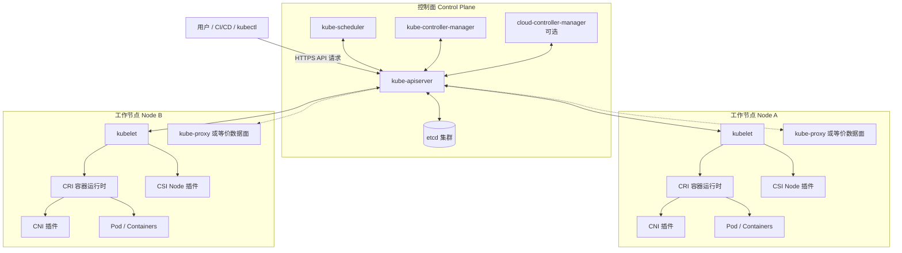
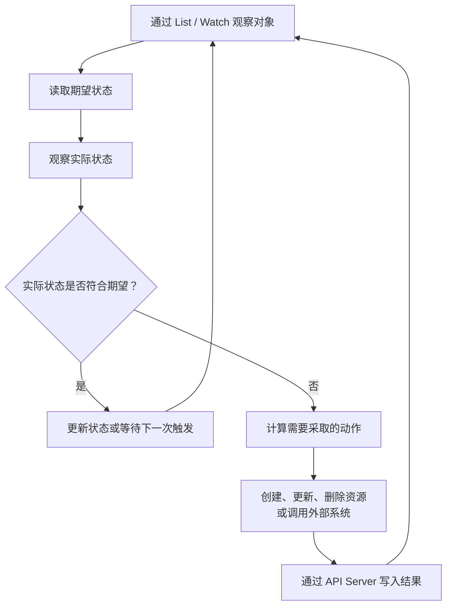
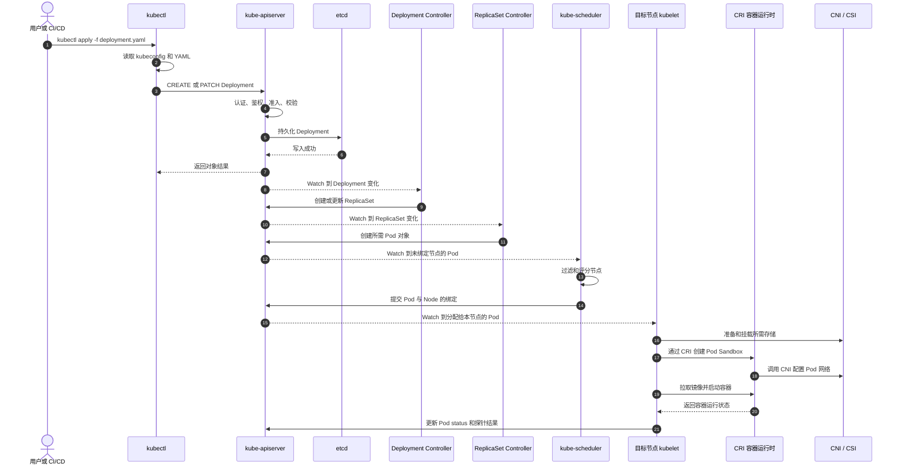

# 第 7 章：Kubernetes 为什么出现——集群架构、声明式 API 与控制循环

> **版本说明**：本章按照 Kubernetes v1.36 官方文档核对核心概念，示例仅使用稳定 API，不依赖 Alpha 功能。Kubernetes v1.36 当前处于受支持状态。([Kubernetes][1])

## 7.1 学习目标

完成本章后，你应该能够：

1. 解释为什么“能够运行容器”不等于“能够管理容器集群”。
2. 说清 Kubernetes 控制面和工作节点的职责边界。
3. 准确描述 `kube-apiserver`、etcd、Scheduler、Controller Manager、kubelet 的协作方式。
4. 区分 CRI、CNI、CSI，避免把接口、实现和具体产品混为一谈。
5. 从 `kubectl apply` 开始，完整描述一个 Pod 最终运行起来的链路。
6. 解释声明式 API、期望状态、实际状态和控制循环。
7. 解释为什么 Scheduler 和 Controller Manager 可以运行多个副本，但通常只有一个活跃领导者。
8. 说明 Kubernetes 自愈能力能够解决什么，不能解决什么。
9. 分析托管 Kubernetes 和自建 Kubernetes 的责任边界。
10. 判断一个业务是否真正适合使用 Kubernetes。

---

## 7.2 核心术语

| 术语                   | 含义                                             |
| -------------------- | ---------------------------------------------- |
| Cluster              | 一个 Kubernetes 集群，由控制面和一个或多个工作节点组成              |
| Control Plane        | 保存、管理并协调集群状态的一组组件                              |
| Node                 | 实际运行 Pod 的物理机或虚拟机                              |
| API Object           | Kubernetes API 中的资源对象，如 Deployment、Pod、Service |
| Desired State        | 用户或控制器声明的期望状态                                  |
| Actual State         | 系统当前观察到的实际状态                                   |
| Controller           | 持续比较期望状态和实际状态，并采取动作的控制循环                       |
| Reconcile            | 让实际状态逐步逼近期望状态的过程                               |
| Scheduler            | 为尚未绑定节点的 Pod 选择合适节点                            |
| kubelet              | 节点代理，负责让分配到本节点的 Pod 真正运行                       |
| Container Runtime    | 实际创建、启动和停止容器的软件                                |
| Leader Election      | 多副本组件之间选择一个活跃实例的协调机制                           |
| Eventual Consistency | 系统不要求所有状态瞬间一致，而是通过持续调谐最终收敛                     |

Kubernetes 官方架构将集群分为控制面和工作节点：控制面管理集群整体状态，节点负责维护正在运行的 Pod。([Kubernetes][2])

---

# 7.3 从手工部署到容器编排

## 7.3.1 手工部署阶段

最早的部署方式通常是：

```bash
scp app server:/opt/app/
ssh server
systemctl restart app
```

这种方式在服务器数量较少时可以工作，但很快会遇到问题：

* 哪台服务器运行哪个版本？
* 服务启动失败后由谁重启？
* 机器宕机后服务迁移到哪里？
* 新增十台服务器时如何批量部署？
* 配置文件是否一致？
* 如何判断发布已经完成？
* 如何回滚？
* 如何发现某个实例已经不可用？

问题的本质不是“命令不会写”，而是**系统缺少统一的状态模型和持续协调机制**。

---

## 7.3.2 脚本和配置管理阶段

随后出现了 Shell、Ansible、Chef、Puppet 等自动化手段。

脚本能够批量执行命令，配置管理工具能够描述一台机器应该安装哪些软件、拥有哪些配置。但它们通常更关注：

> “如何把机器配置成某种样子？”

而容器编排需要持续回答：

> “整个集群现在应该运行多少个实例？这些实例应该放在哪里？某个实例消失后应该如何补齐？”

传统部署自动化往往是一次性或周期性执行；Kubernetes 的控制循环则是持续运行的。

---

## 7.3.3 单机容器阶段

Docker 等容器技术解决了应用交付的一致性问题：

* 应用与依赖一起打包。
* 镜像可以被版本化和分发。
* 容器启动速度较快。
* 同一镜像可以在不同机器上运行。
* 应用进程拥有相对隔离的运行环境。

但单机容器系统仍然不知道：

* 集群中应该有几个实例。
* 哪台机器资源最适合运行新实例。
* 某台机器失联后，实例应迁移到哪里。
* 服务实例 IP 变化后，调用方如何发现它。
* 发布新版本时如何逐批替换。
* 多个副本如何实现负载均衡。
* 配置和密钥如何统一下发。

**容器主要解决打包和运行，编排系统主要解决集群级状态管理。**

---

## 7.3.4 容器编排阶段

当容器数量从几个增长到几百、几千甚至更多时，依靠人工维护“容器清单”已经不可行。

编排系统开始承担以下职责：

1. 接收用户期望。
2. 保存集群状态。
3. 选择运行位置。
4. 创建和删除实例。
5. 检测故障并补齐副本。
6. 提供稳定访问入口。
7. 管理发布和回滚。
8. 根据负载调整副本。
9. 统一管理配置、密钥和存储。

Kubernetes 的核心价值不是“帮你执行很多条 `docker run`”，而是提供一个以 API 对象为中心、通过控制循环持续收敛的分布式控制系统。

| 阶段         | 主要能力               | 仍然存在的问题         |
| ---------- | ------------------ | --------------- |
| 手工部署       | 能把程序放到服务器运行        | 不一致、不可追踪、依赖人工   |
| 脚本部署       | 批量执行和自动化           | 缺少持续状态管理        |
| 配置管理       | 维护机器配置             | 不擅长高频、动态工作负载调度  |
| 单机容器       | 标准化打包和进程隔离         | 缺少跨机器编排         |
| Kubernetes | 集群调度、控制循环、自愈和声明式管理 | 平台复杂度、运维成本、学习成本 |

---

# 7.4 Kubernetes 解决的核心问题

## 7.4.1 调度

用户声明一个 Pod 或工作负载后，Kubernetes 根据资源、约束和策略，为 Pod 选择工作节点。

调度需要考虑的典型因素包括：

* CPU、内存等资源请求。
* 节点标签和亲和性。
* 污点与容忍。
* 存储拓扑。
* 故障域分布。
* Pod 优先级。
* 已有工作负载分布。

Scheduler 的职责是做出“Pod 应放到哪个 Node”的绑定决策，而不是启动容器。([Kubernetes][3])

---

## 7.4.2 期望状态管理

用户通常不需要直接指定：

> 在 node-1 上启动容器 A，在 node-2 上启动容器 B。

更常见的声明是：

```yaml
spec:
  replicas: 3
```

这表示：

> 我期望系统中始终存在三个符合模板的副本。

至于它们具体运行在哪些节点、何时重建、旧实例如何删除，交给 Kubernetes 控制器处理。

---

## 7.4.3 自愈

Kubernetes 可以：

* 根据 `restartPolicy` 重启失败容器。
* 为 Deployment、StatefulSet 等工作负载补建 Pod。
* 在节点不可用后，在其他可用节点创建替代 Pod。
* 将不健康 Pod 从 Service 后端中移除。
* 持续维持声明的副本数量。

但自愈并不意味着 Kubernetes 能理解业务逻辑。它能够发现“进程退出”或“探针失败”，却不一定能发现“订单金额计算错误”。([Kubernetes][4])

---

## 7.4.4 服务发现

Pod 是临时对象，重新创建后 IP 可能变化。Kubernetes 使用 Service、EndpointSlice 和集群 DNS，为一组动态 Pod 提供相对稳定的访问方式。

Service 不是“永久保存 Pod IP”，而是通过标签选择和控制器持续维护当前后端集合。

---

## 7.4.5 滚动更新

Deployment 等控制器可以逐步创建新版本副本并删除旧版本副本，从而避免一次性停止全部实例。

但滚动更新是否真正无损，还取决于：

* readiness 探针是否准确。
* 应用是否支持优雅退出。
* 新旧版本接口和数据是否兼容。
* 集群是否有足够冗余容量。
* 数据库迁移是否可向前、向后兼容。

---

## 7.4.6 扩缩容

Kubernetes 可以通过工作负载控制器调整副本数，并可配合 HPA、VPA 或节点扩缩容组件实现自动扩缩容。

需要注意：

* HPA 依赖可用的指标来源。
* 增加 Pod 副本不等于增加节点容量。
* 有状态服务不一定能够简单横向扩容。
* 扩容速度受镜像拉取、调度、启动和就绪时间影响。

---

## 7.4.7 配置管理

ConfigMap、Secret、Downward API 等机制可以将配置与镜像分离。

Kubernetes 解决的是配置分发和引用问题，不会自动保证：

* 配置内容业务上正确。
* 密钥已经安全轮换。
* 应用能动态加载新配置。
* 多项配置能够作为一个业务事务同时生效。

---

# 7.5 Kubernetes 集群总体架构



Kubernetes 核心组件围绕 API Server 协作。控制面组件和节点组件主要通过 Kubernetes API 观察或更新状态，而不是每个组件之间建立复杂的点对点控制协议。官方文档将这种模式描述为以 API Server 为中心的通信结构。([Kubernetes][5])

---

# 7.6 Kubernetes 组件职责表

| 组件                         | 所在位置     | 核心职责                                 | 不负责什么                   |
| -------------------------- | -------- | ------------------------------------ | ----------------------- |
| `kube-apiserver`           | 控制面      | 暴露 Kubernetes API，处理认证、鉴权、准入、校验和数据访问 | 不调度 Pod，不直接启动容器         |
| etcd                       | 控制面存储    | 持久化 API Server 的集群状态                 | 不保存容器镜像、应用日志和普通业务数据     |
| `kube-scheduler`           | 控制面      | 为未绑定节点的 Pod 选择 Node，并提交绑定结果          | 不创建 Pod，不启动容器，不维护副本数    |
| `kube-controller-manager`  | 控制面      | 运行 Deployment、ReplicaSet、Node 等内置控制器 | 不直接运行应用容器               |
| `cloud-controller-manager` | 控制面，可选   | 对接云厂商节点、路由、负载均衡等能力                   | 不提供通用容器运行时              |
| kubelet                    | 每个节点     | 确保分配到本节点的 Pod 按 PodSpec 运行           | 不负责跨节点调度，不管理 Deployment |
| 容器运行时                      | 每个节点     | 拉取镜像，创建和管理 Pod Sandbox、容器            | 不决定副本数和调度位置             |
| kube-proxy或等价数据面           | 节点或集群数据面 | 根据 Service、EndpointSlice 等状态维护流量转发规则 | 不负责 Pod IP 分配           |
| CNI 插件                     | 节点网络     | 配置 Pod 网络接口、地址、路由或网络策略数据面            | 不负责创建容器                 |
| CSI Driver                 | 控制面及节点   | 对接存储系统，完成供应、附加、挂载等操作                 | 不保证数据库应用一致性             |

官方组件说明将 API Server、etcd、Scheduler 和 Controller Manager 列为核心控制面组件，将 kubelet、容器运行时以及可选的 kube-proxy 列为节点组件。([Kubernetes][6])

---

# 7.7 控制面组件深入解析

## 7.7.1 kube-apiserver：集群交互中心

`kube-apiserver` 是 Kubernetes 控制面的入口。

几乎所有集群级操作最终都会表现为 API 调用：

* `kubectl apply`
* `kubectl get`
* Scheduler 读取待调度 Pod
* Controller 创建新的 ReplicaSet 或 Pod
* kubelet读取分配到本节点的 Pod
* kubelet更新 Pod 状态
* 自定义控制器监听 CRD
* HPA 更新副本数

API Server 对外暴露资源化的 HTTP API，支持创建、读取、更新、删除和 Watch 等操作。([Kubernetes][7])

### API 请求的大致处理过程

一个写请求通常会经过：

1. TLS 连接和请求解析。
2. 认证：请求者是谁。
3. 鉴权：请求者是否有权执行该操作。
4. 准入控制：是否允许对象进入集群，是否需要修改对象。
5. 默认值填充、版本转换和对象校验。
6. 持久化到后端存储。
7. 返回结果，并使相关 Watch 客户端观察到变化。

准入控制发生在请求完成认证和鉴权之后、资源持久化之前；准入机制可以修改或拒绝写请求。([Kubernetes][8])

### 为什么 API Server 必须成为中心

如果 Scheduler、Controller、kubelet 和各种插件直接访问 etcd，会产生一系列问题：

* 每个组件都需要理解 etcd 的存储结构。
* 权限控制无法集中。
* API 版本转换难以统一。
* 校验和准入容易被绕过。
* 审计链路分散。
* 存储结构修改会影响全部组件。

通过 API Server 统一入口，各组件只需要理解 Kubernetes API，而不需要了解底层 etcd 的键布局。

### API Server 不做什么

API Server 不会：

* 自己启动容器。
* 自己决定 Pod 放在哪个节点。
* 自己补齐 Deployment 副本。
* 自己执行滚动发布。

它负责接收、验证、保存和提供状态，而具体动作由 Scheduler、Controller 和 kubelet 完成。

---

## 7.7.2 etcd：集群状态的事实来源

etcd 是 Kubernetes API Server 的一致、高可用键值存储后端。Kubernetes API 对象的持久状态最终保存在 etcd 中。([Kubernetes][9])

etcd 中可能包含：

* Namespace、Node、Pod、Deployment 等对象。
* Service、EndpointSlice。
* ConfigMap、Secret。
* RBAC 规则。
* Lease。
* 工作负载的 `spec` 和 `status`。
* 自定义资源。

etcd 通常不保存：

* 容器镜像层。
* 容器标准输出日志。
* 节点上的容器文件系统。
* 应用数据库中的订单数据。
* Prometheus 的业务指标数据。

### 为什么 etcd 至关重要

etcd 中保存的是控制面的关键状态。如果 etcd 数据永久丢失，控制面将失去对当前集群对象的完整认知。

因此生产环境需要关注：

* 奇数成员和多数派仲裁。
* 磁盘延迟。
* 网络稳定性。
* 定期快照。
* 恢复演练。
* TLS 和最小访问权限。
* 容量和碎片整理。

官方文档指出，etcd 对网络和磁盘 I/O 较为敏感；当 etcd 无法形成稳定领导者时，集群不能可靠修改当前状态，也无法继续调度新 Pod。([Kubernetes][9])

### etcd 故障时现有 Pod 会不会立即退出

通常不会。

已经运行的容器是节点上的进程，etcd 短暂不可用并不会自动杀死它们。但此时：

* 新的 API 写入可能失败。
* 新 Pod 无法正常完成调度。
* 控制器无法持久化收敛结果。
* 集群变更和故障恢复能力受到严重影响。
* 节点故障后可能无法重建工作负载。

因此，**“现有进程仍在运行”不等于“集群仍然健康”。**

---

## 7.7.3 kube-scheduler：为 Pod 选择节点

Scheduler 关注的是尚未绑定节点的 Pod。

其抽象过程可以理解为：

1. 发现一个 `spec.nodeName` 为空的待调度 Pod。
2. 过滤不满足条件的节点。
3. 对可行节点进行评分。
4. 选择合适节点。
5. 通过 API Server 提交绑定结果。

官方调度文档将可运行 Pod 的节点称为可行节点；Scheduler 过滤节点、评分并通过绑定过程通知 API Server。([Kubernetes][10])

### Scheduler 负责什么

* 节点资源是否足够。
* 节点是否满足选择器和亲和性。
* Pod 是否容忍节点污点。
* 存储和拓扑条件是否满足。
* 如何在多个可行节点中选择较优节点。
* 必要时参与抢占决策。

### Scheduler 不负责什么

* 不创建 Deployment。
* 不决定 Deployment 应有几个副本。
* 不拉取镜像。
* 不创建容器。
* 不执行健康检查。
* 不直接迁移一个正在运行的容器。
* 不负责 Service 负载均衡。

所谓“重新调度”通常不是把原容器原地搬走，而是控制器创建替代 Pod，再由 Scheduler 为新 Pod 选择节点。

---

## 7.7.4 kube-controller-manager：运行控制循环

`kube-controller-manager` 并不是一个单一控制器，而是将许多内置控制器组合在一个进程中运行。

典型控制器包括：

* Deployment Controller
* ReplicaSet Controller
* StatefulSet Controller
* DaemonSet Controller
* Job Controller
* Node Lifecycle Controller
* Namespace Controller
* ServiceAccount Controller
* EndpointSlice Controller
* PersistentVolume Controller

Controller 观察 API 对象，通过创建、更新或删除其他对象来推动状态收敛。Controller 本身通常不启动容器，而是向 API Server 提交新的状态。([Kubernetes][11])

例如：

```text
Deployment
    ↓ Deployment Controller
ReplicaSet
    ↓ ReplicaSet Controller
Pod
    ↓ Scheduler
Node
    ↓ kubelet
Container
```

每一层都只负责相对有限的职责，从而避免构造一个包含所有逻辑的巨型集中式控制程序。

---

## 7.7.5 kubelet：节点上的执行代理

kubelet 运行在每个工作节点上，是控制面和节点运行时之间的关键桥梁。

kubelet 主要以 PodSpec 为工作输入，确保其中描述的容器正在运行并保持健康。它主要从 API Server 获取分配到本节点的 Pod。([Kubernetes][12])

kubelet 的主要工作包括：

* 注册和维护 Node 状态。
* 监听分配到本节点的 Pod。
* 准备 Pod 所需目录和资源。
* 处理卷挂载。
* 调用容器运行时。
* 触发 Pod Sandbox 和容器创建。
* 执行健康探针。
* 根据策略重启容器。
* 收集并上报 Pod、容器状态。
* 执行节点资源压力下的驱逐。

### kubelet 不负责调度

kubelet 不会在整个集群中为 Pod 寻找节点。

Scheduler 已经通过绑定结果决定了 Pod 属于哪个节点。kubelet只处理分配给自己的 Pod。

---

## 7.7.6 容器运行时和网络代理

容器运行时负责：

* 镜像拉取。
* Pod Sandbox 创建。
* 容器创建、启动、停止和删除。
* 查询容器状态。
* 提供日志路径等运行时信息。

常见 CRI 运行时包括 containerd 和 CRI-O。

kube-proxy 则传统上根据 Service 和 EndpointSlice 状态维护节点网络规则。需要注意，当前 Kubernetes 官方文档将 kube-proxy 标记为可选组件：某些网络数据面可以使用其他实现替代它。([Kubernetes][6])

---

# 7.8 CRI、CNI、CSI 的插件化职责

Kubernetes 不希望把所有容器、网络和存储实现都编译进核心组件，因此使用标准化接口解耦实现。

| 接口  | 全称                          | 连接双方                 | 主要职责            |
| --- | --------------------------- | -------------------- | --------------- |
| CRI | Container Runtime Interface | kubelet 与容器运行时       | 镜像和容器生命周期       |
| CNI | Container Network Interface | 容器运行时与网络插件           | Pod 网络接口、IP、路由等 |
| CSI | Container Storage Interface | Kubernetes 存储组件与存储驱动 | 卷供应、附加、挂载、卸载    |

---

## 7.8.1 CRI：容器运行时接口

CRI 是 kubelet 和容器运行时之间的主要通信协议，采用 gRPC。它使 kubelet 可以使用不同的容器运行时，而无需把每一种运行时直接编译进 Kubernetes 核心组件。([Kubernetes][13])

CRI 大体分为两类能力：

* Runtime Service：管理 Pod Sandbox 和容器。
* Image Service：拉取、查询和删除镜像。

关系可以简化为：

```text
kubelet
   │ CRI gRPC
   ▼
containerd / CRI-O
   │
   ▼
OCI Runtime
   │
   ▼
Linux process
```

### 常见误区

**错误：CRI 就是 containerd。**

正确理解是：

* CRI 是接口。
* containerd、CRI-O 是实现该接口的运行时。
* runc 等 OCI Runtime 更靠近实际容器进程创建层。

---

## 7.8.2 CNI：容器网络接口

CNI 插件负责实现 Kubernetes Pod 网络所需的数据面配置。官方文档指出，集群需要兼容的 CNI 插件来实现 Kubernetes 网络模型。当前架构中，容器运行时通常负责加载和调用 CNI 插件。([Kubernetes][14])

在创建 Pod Sandbox 时，CNI 插件可能执行：

* 创建或移动网络接口。
* 分配 Pod IP。
* 配置路由。
* 配置隧道或封装。
* 写入网络命名空间。
* 编程网络策略或 eBPF 规则。

CNI 不负责：

* 决定 Pod 放在哪台机器。
* 创建业务容器。
* 维护 Deployment 副本数。
* 保存 Kubernetes API 对象。

---

## 7.8.3 CSI：容器存储接口

CSI 为容器编排系统和存储提供商定义标准接口，使存储厂商可以在 Kubernetes 核心代码之外开发和发布驱动。([Kubernetes][15])

CSI 驱动可能包含：

* Controller 侧组件：创建卷、删除卷、附加、分离。
* Node 侧组件：格式化、挂载、卸载。
* 外部 sidecar：provisioner、attacher、resizer、snapshotter 等。

### CSI 不保证应用一致性

CSI 能够创建快照，不代表数据库快照一定是事务一致的。

数据库一致性仍可能需要：

* 暂停写入。
* Flush WAL。
* 执行数据库原生备份。
* 协调多个数据卷。
* 验证恢复过程。

---

# 7.9 声明式 API 与控制循环

## 7.9.1 命令式思维

命令式管理描述的是具体动作：

```text
在 node-a 启动一个容器
在 node-b 启动一个容器
删除 node-c 上的旧容器
```

问题在于，动作执行完成后，系统并不知道最终目标是什么。

如果 node-a 上的容器随后消失，系统无法仅凭历史命令判断是否应该重建。

---

## 7.9.2 声明式思维

声明式管理描述最终期望：

```yaml
spec:
  replicas: 3
```

系统可以持续检查：

```text
期望副本数 = 3
实际副本数 = 2
差异 = 1
动作 = 创建一个副本
```

如果实际副本数变成 4：

```text
期望副本数 = 3
实际副本数 = 4
差异 = -1
动作 = 删除一个多余副本
```

这使系统不依赖某一次命令是否完整成功，而是不断重新观察和纠正。

---

## 7.9.3 控制循环



Kubernetes Controller 是持续运行的控制循环：观察集群状态，在需要时发起变更，使当前状态逐步逼近期望状态。([Kubernetes][11])

---

## 7.9.4 控制循环的关键属性

### 1. 异步

创建 Deployment 后，Pod 不会在 API 请求返回前全部运行。

API 请求成功通常只表示：

> 期望状态已经被系统接受并持久化。

后续控制器、调度器和 kubelet 会异步工作。

### 2. 最终一致

Kubernetes 不保证所有组件在同一时刻看到完全相同的状态，而是通过持续重试和协调使状态最终收敛。

### 3. 幂等

同一个调谐逻辑被重复执行时，不应不断制造额外副作用。

例如期望三个 Pod，而实际已经有三个时，控制器不应再创建三个。

### 4. 基于状态，而不是依赖一次性事件

Watch 事件可以让控制器更快醒来，但控制器真正的判断依据应当是当前对象状态。

即使漏掉一次通知，重新 List 后也应能够恢复正确状态。

### 5. 职责分离

Deployment Controller 不直接运行 Pod；它管理 ReplicaSet。

ReplicaSet Controller 不选择节点；它创建 Pod。

Scheduler 不启动容器；它绑定 Node。

kubelet不管理副本数；它执行本节点 PodSpec。

---

## 7.9.5 一个简化的 Go 控制循环

下面的代码不是完整 Kubernetes Controller，只用于说明 Reconcile 思想：

```go
package controller

import (
	"context"
	"fmt"
)

type Workload struct {
	Name            string
	DesiredReplicas int
}

type Pod struct {
	Name    string
	Running bool
}

type Store interface {
	GetWorkload(ctx context.Context, name string) (Workload, error)
	ListOwnedPods(ctx context.Context, workloadName string) ([]Pod, error)
	CreatePod(ctx context.Context, workloadName string) error
	DeletePod(ctx context.Context, podName string) error
}

type Controller struct {
	store Store
}

func (c *Controller) Reconcile(ctx context.Context, name string) error {
	workload, err := c.store.GetWorkload(ctx, name)
	if err != nil {
		return fmt.Errorf("get workload: %w", err)
	}

	pods, err := c.store.ListOwnedPods(ctx, workload.Name)
	if err != nil {
		return fmt.Errorf("list pods: %w", err)
	}

	actual := len(pods)
	desired := workload.DesiredReplicas

	switch {
	case actual < desired:
		for i := 0; i < desired-actual; i++ {
			if err := c.store.CreatePod(ctx, workload.Name); err != nil {
				return fmt.Errorf("create pod: %w", err)
			}
		}

	case actual > desired:
		for i := 0; i < actual-desired; i++ {
			if err := c.store.DeletePod(ctx, pods[i].Name); err != nil {
				return fmt.Errorf("delete pod %q: %w", pods[i].Name, err)
			}
		}
	}

	return nil
}
```

它的核心不是“收到创建事件就创建 Pod”，而是：

```text
读取期望状态
读取实际状态
计算差异
执行最小修正
```

---

# 7.10 从 `kubectl apply` 到 Pod 运行

先看一个最小 Deployment：

```yaml
apiVersion: apps/v1
kind: Deployment
metadata:
  name: go-api
  namespace: default
spec:
  replicas: 3
  selector:
    matchLabels:
      app: go-api
  template:
    metadata:
      labels:
        app: go-api
    spec:
      containers:
        - name: api
          image: registry.example.com/go-api:v1.0.0
          ports:
            - name: http
              containerPort: 8080
          readinessProbe:
            httpGet:
              path: /ready
              port: http
          resources:
            requests:
              cpu: 200m
              memory: 128Mi
            limits:
              memory: 256Mi
```

执行：

```bash
kubectl apply -f deployment.yaml
```

`kubectl apply` 用于根据配置文件创建或更新 Kubernetes 对象；API 中的实际对象状态由 API Server 保存。([Kubernetes][16])

---

## 7.10.1 完整时序



---

## 7.10.2 分步解析

### 第一步：kubectl读取配置

`kubectl`：

1. 读取 YAML。
2. 从 kubeconfig 获得 API Server 地址和身份信息。
3. 根据资源类型找到相应 API。
4. 向 API Server 发起创建或补丁请求。

`kubectl` 本身不是控制面，它只是 Kubernetes API 客户端。

---

### 第二步：API Server 接受 Deployment

API Server 对请求进行认证、鉴权、准入和校验，随后把 Deployment 对象写入 etcd。

此时系统保存的是：

```text
我希望存在一个名为 go-api 的 Deployment，副本数为 3。
```

此时通常还没有容器启动。

---

### 第三步：Deployment Controller 创建 ReplicaSet

Deployment Controller 观察到新 Deployment。

它根据 Deployment 的 Pod 模板和发布策略创建 ReplicaSet，并维护 Deployment 与 ReplicaSet 之间的关系。

Deployment Controller 不直接创建运行时容器。

---

### 第四步：ReplicaSet Controller 创建 Pod

ReplicaSet Controller 发现：

```text
期望副本 = 3
实际 Pod = 0
```

因此向 API Server 创建三个 Pod 对象。

这些 Pod 此时尚未必分配节点，通常处于 Pending 阶段。

---

### 第五步：Scheduler 绑定节点

Scheduler 监听到尚未指定 Node 的 Pod。

它执行：

1. 过滤不可用节点。
2. 对可行节点评分。
3. 选择节点。
4. 写入绑定结果。

Scheduler 到这里已经完成职责，但容器仍然可能没有启动。

---

### 第六步：目标节点 kubelet观察到 Pod

目标 Node 上的 kubelet 通过 API Server 看到：

```text
这个 Pod 已经被分配给我。
```

随后 kubelet 开始执行本节点调谐。

---

### 第七步：准备存储和网络

如果 Pod 使用存储卷，kubelet 和 CSI 组件会准备、挂载相应卷。

创建 Pod Sandbox 时，容器运行时调用 CNI 插件配置 Pod 网络，例如：

* 创建网络命名空间。
* 分配 Pod IP。
* 创建虚拟网卡。
* 配置路由。

---

### 第八步：运行时拉取镜像并启动容器

kubelet通过 CRI 请求运行时：

1. 检查或拉取镜像。
2. 创建容器。
3. 配置环境变量和挂载。
4. 启动进程。
5. 返回容器状态。

---

### 第九步：kubelet上报状态

kubelet 持续执行探针并更新 Pod 状态。

当 readiness 探针通过后，Pod 才适合接收正常业务流量。

因此必须记住：

> `kubectl apply` 返回成功，只表示 API 对象已成功提交，不表示应用已经完成发布，更不表示业务已经健康。

发布后应该进一步检查：

```bash
kubectl rollout status deployment/go-api
kubectl get pods -l app=go-api
kubectl describe deployment go-api
kubectl get events --sort-by=.metadata.creationTimestamp
```

---

# 7.11 高可用与领导者选举

## 7.11.1 为什么控制面要运行多个副本

如果集群只有一个 API Server、一个 Scheduler 和一个 Controller Manager，那么任意一个进程或节点故障都可能导致控制面不可用。

高可用控制面通常会部署多个控制面节点，并通过负载均衡器将 API 请求发送到健康的 API Server 实例。Kubernetes 官方 kubeadm 高可用部署文档也采用在多个控制面节点前放置 API Server 负载均衡器的方式。([Kubernetes][17])

---

## 7.11.2 API Server 通常是多活

多个 API Server 实例可以同时处理请求。

原因是：

* 持久状态主要保存在 etcd。
* API 请求可由任意健康实例处理。
* 前方负载均衡器可以分发流量。
* 单个 API Server 故障后，其他实例仍可提供服务。

API Server 也会通过 Lease 发布自己的实例身份，但这不等于多个 API Server 之间只允许一个处理请求。([Kubernetes][18])

---

## 7.11.3 Scheduler 和 Controller Manager 通常单领导者活跃

Scheduler 或 Controller Manager 也可以部署多个实例，但同一组高可用副本通常通过 Lease 进行领导者选举：

* 一个实例持有 Lease，作为活跃领导者。
* 其他实例保持待命。
* 领导者周期性续租。
* 领导者失联并超出租约后，其他实例竞争成为新领导者。

Kubernetes 官方文档明确说明，高可用的 `kube-controller-manager` 和 `kube-scheduler` 使用 Lease，使一个实例活跃、其他实例待命。([Kubernetes][18])

### 为什么不让所有副本同时工作

即使控制器尽量设计为幂等，多个实例同时处理相同对象仍可能造成：

* 重复外部 API 调用。
* 额外的创建和删除竞争。
* 更高的 API Server 压力。
* 更复杂的冲突处理。
* 云资源重复供应风险。
* 排障困难。

领导者选举通过牺牲一部分并行度，换取更简单、可预测的协调模型。

---

## 7.11.4 不同组件的副本模式

| 组件                      | 常见高可用模式                           |
| ----------------------- | --------------------------------- |
| kube-apiserver          | 多个实例同时服务，由负载均衡器分流                 |
| kube-scheduler          | 多个实例部署，一个领导者活跃                    |
| kube-controller-manager | 多个实例部署，一个领导者活跃                    |
| etcd                    | 多成员 Raft 集群，拥有自己的 etcd Leader     |
| kubelet                 | 每个节点一个，互不选举                       |
| kube-proxy              | 通常每个节点一个，互不选举                     |
| 自定义 Controller          | 可单副本，也可多副本加 Leader Election，或自行分片 |

需要区分两种领导者：

* etcd 的 Raft Leader：负责 etcd 一致性复制。
* Kubernetes Lease 选出的组件 Leader：负责决定哪个控制器或调度器实例活跃。

二者不是同一套选举。

---

# 7.12 Kubernetes 自愈能力及边界

## 7.12.1 Kubernetes 能够自愈的故障

| 故障                     | 可能采取的动作                        |
| ---------------------- | ------------------------------ |
| 容器进程异常退出               | kubelet根据重启策略重启容器              |
| Deployment 中一个 Pod 被删除 | ReplicaSet Controller 创建替代 Pod |
| 节点不可用                  | 控制面在条件满足后创建替代 Pod              |
| readiness 失败           | 从 Service 可用后端中移除              |
| 副本数不足                  | 控制器补齐副本                        |
| 某次调谐暂时失败               | 控制器后续重试                        |

这些能力依赖 kubelet、工作负载控制器、存储控制器和网络控制器共同完成。([Kubernetes][4])

---

## 7.12.2 Kubernetes 无法自动修复的故障

### 1. 业务逻辑错误

程序返回 HTTP 200，但返回错误金额。

从进程和探针角度看，应用可能完全健康。Kubernetes 没有足够业务知识判断结果是否正确。

### 2. 错误版本发布

如果 Deployment 声明所有副本使用一个有缺陷的镜像，Kubernetes 会忠实地让实际状态收敛到这个错误期望。

Kubernetes 不会自动判断“新版本业务上比旧版本差”。

### 3. 数据损坏

数据库文件损坏、主从复制错误或误删除数据，通常需要：

* 备份恢复。
* 数据库原生恢复工具。
* 人工决策。
* 业务补偿。

重启 Pod 往往不能修复数据损坏。

### 4. 容量彻底不足

当所有节点都没有足够 CPU、内存或存储时，Scheduler 只能让 Pod 保持 Pending。

如果没有节点扩容能力或扩容失败，Kubernetes 无法凭空创造资源。

### 5. 外部依赖故障

支付网关、云数据库或第三方 API 不可用时，持续重启应用不一定有帮助，反而可能放大故障。

### 6. 错误探针

如果 liveness 探针把暂时依赖超时判定为应用死亡，就可能导致大量容器不断重启，形成重启风暴。

---

## 7.12.3 自愈的正确理解

Kubernetes 自愈的准确描述是：

> 根据用户声明和可观察信号，持续恢复基础设施层和进程层的期望状态。

它不是：

> 自动理解并修复所有软件、数据和业务错误。

---

# 7.13 托管 Kubernetes 与自建 Kubernetes

## 7.13.1 自建 Kubernetes

自建集群通常意味着团队需要负责：

* 控制面节点。
* etcd 部署、备份、恢复。
* 证书轮换。
* API Server 高可用。
* Scheduler 和 Controller Manager 配置。
* 节点操作系统。
* 容器运行时。
* CNI、CSI。
* 集群升级。
* 安全补丁。
* 监控、告警和审计。
* 容量规划和故障处理。

优势是控制力强，但也意味着承担完整平台生命周期。

---

## 7.13.2 托管 Kubernetes

托管服务通常由云厂商承担部分控制面工作，例如：

* 控制面基础设施。
* API Server、Scheduler、Controller Manager。
* etcd 运行和部分备份能力。
* 控制面补丁和高可用。
* 与云负载均衡、身份和存储系统的集成。

具体边界因厂商和产品模式不同而变化。以 GKE 的共享责任模型为例，云厂商负责控制面及部分底层基础设施，用户仍需负责工作负载、访问配置、应用数据和自身安全策略。([Google Cloud Documentation][19])

---

## 7.13.3 责任边界比较

| 事项            | 托管服务商通常负责 | 用户仍需负责               |
| ------------- | --------- | -------------------- |
| 控制面进程可用性      | 通常负责      | 选择区域、版本和可用性方案        |
| etcd 运行       | 通常负责      | 确认备份、恢复和数据保护承诺       |
| 工作节点          | 视产品模式而定   | 节点池、容量、系统配置或部分策略     |
| Kubernetes 升级 | 提供升级机制    | 版本选择、兼容性验证和升级窗口      |
| CNI、CSI       | 可能提供默认实现  | 配置、策略、性能和兼容性         |
| RBAC          | 提供能力      | 角色设计和最小权限            |
| 容器镜像          | 不负责       | 构建、扫描、签名和修复漏洞        |
| 应用数据          | 不负责       | 备份、恢复、一致性和合规         |
| 应用可用性         | 不负责       | 副本、探针、PDB、跨区设计       |
| 成本控制          | 不负责       | requests、节点规格、扩缩容和预算 |
| 监控告警          | 可能提供基础设施  | SLO、业务指标和告警响应        |

### 托管 Kubernetes 不等于免运维

托管服务降低的是控制面和基础设施运维成本，不会替你完成：

* 应用架构设计。
* 数据库高可用。
* 资源配置。
* 安全策略。
* 发布治理。
* 故障演练。
* 成本优化。

---

# 7.14 哪些场景不适合 Kubernetes

## 7.14.1 业务规模很小且变化频率极低

例如：

* 一台服务器。
* 一两个长期稳定的服务。
* 几乎不扩容。
* 无高可用要求。
* 发布频率很低。

此时使用 systemd、Docker Compose 或简单托管平台，可能成本更低。

---

## 7.14.2 团队缺少平台运维能力

Kubernetes 引入了新的故障层次：

* API Server
* etcd
* CNI
* CSI
* DNS
* 调度
* 准入
* RBAC
* 控制器
* 资源限制

如果团队没有建立监控、备份、发布和应急能力，Kubernetes 可能只是把原来简单的应用问题变成更复杂的分布式平台问题。

---

## 7.14.3 强依赖固定机器和人工状态的传统软件

某些遗留系统可能：

* 把机器 IP 写死。
* 把状态保存在本机目录。
* 依赖手工授权文件。
* 不支持优雅退出。
* 不支持多实例。
* 要求固定主机名或硬件指纹。
* 依赖图形界面和人工操作。

这类应用并非永远不能迁移，但容器化和 Kubernetes 化的改造成本可能远大于收益。

---

## 7.14.4 极端实时或严格低抖动场景

Kubernetes 可以运行高性能工作负载，但默认共享资源、网络抽象、控制循环和动态调度可能不适合严格硬实时系统。

如果业务对微秒级尾延迟、确定性调度或专用硬件拓扑有极端要求，需要额外评估：

* CPU 独占。
* NUMA 绑定。
* 中断亲和性。
* HugePages。
* SR-IOV。
* 内核参数。
* 专用节点。
* 是否应该绕过部分通用抽象。

---

## 7.14.5 单机边缘设备或资源极度受限环境

完整 Kubernetes 控制面可能过重。可以考虑：

* 更轻量的 Kubernetes 发行版。
* 容器运行时加 systemd。
* 边缘设备专用编排系统。
* 云端集中控制、设备端轻量代理。

---

## 7.14.6 不能简单用规模判断

以下两个结论都不严谨：

> “服务少就一定不需要 Kubernetes。”

> “机器多就一定必须使用 Kubernetes。”

是否采用 Kubernetes，更应该综合考虑：

```text
收益：
工作负载数量 × 发布频率 × 可用性要求 × 标准化需求

成本：
平台复杂度 × 团队能力缺口 × 状态管理难度 × 合规要求
```

---

# 7.15 组件故障时的现象

| 故障组件               | 典型现象                      | 现有 Pod      | 新变更            |
| ------------------ | ------------------------- | ----------- | -------------- |
| API Server         | `kubectl` 超时，控制器无法读写 API  | 通常继续运行      | 基本无法正常执行       |
| etcd 无法形成多数派       | API 写入失败，控制面不能持久化状态       | 通常继续运行      | 调度和控制循环受阻      |
| Scheduler          | 新 Pod 长期 Pending，未绑定 Node | 不受直接影响      | 新 Pod 无法获得节点   |
| Controller Manager | 副本不补齐，Deployment 不收敛      | 已有 Pod 继续运行 | 控制器动作停止        |
| kubelet            | Node 后续变为 NotReady        | 原进程可能暂时继续   | 本节点无法正常执行更新和探针 |
| 容器运行时              | 新容器无法创建，重启失败              | 已运行容器可能继续   | 创建、停止、查询受影响    |
| CNI                | Pod 卡在创建阶段或无网络            | 已有网络可能部分正常  | 新 Pod 网络配置失败   |
| CSI                | PVC、挂载或附加失败               | 已挂载卷可能继续    | 新卷和重新挂载失败      |
| kube-proxy或等价数据面   | Service 转发异常              | 容器仍可运行      | 服务访问路径受影响      |

etcd 不稳定时集群无法可靠修改状态；Scheduler、Controller 和 kubelet的职责边界则决定了不同组件故障呈现出不同症状。([Kubernetes][9])

---

# 7.16 常见错误认知

## 错误一：Kubernetes 直接启动容器

Kubernetes 通过 kubelet调用符合 CRI 的容器运行时，最终由运行时和 OCI Runtime 创建容器进程。

---

## 错误二：Scheduler 负责维护副本数

Scheduler 只负责给待调度 Pod 选节点。

维护副本数的是相应控制器。

---

## 错误三：etcd 保存应用的全部数据

etcd 保存 Kubernetes API Server 的集群状态，不应作为普通业务数据库使用。

---

## 错误四：`kubectl apply` 成功表示服务已经上线

Apply 成功只说明 API 对象已被接受。Pod 可能仍在：

* Pending
* ContainerCreating
* ImagePullBackOff
* CrashLoopBackOff
* NotReady

---

## 错误五：Kubernetes 能自动修复任何故障

Kubernetes 能恢复进程和副本状态，但无法自动修复业务逻辑错误、错误数据和错误架构。

---

## 错误六：所有控制面组件都是一主多从

Scheduler 和 Controller Manager 常使用单领导者模式；多个 API Server 通常可以同时处理请求；etcd 则有自己独立的 Raft Leader。

---

## 错误七：使用 Kubernetes 必须安装 Docker Engine

现代 Kubernetes 通过 CRI 使用兼容容器运行时，Docker Engine 不是 Kubernetes 节点的必需组件。([Kubernetes][13])

---

## 错误八：托管 Kubernetes 不需要运维

厂商管理控制面，不代表厂商会替用户管理应用可用性、镜像安全、资源成本、数据备份和权限设计。

---

# 7.17 章节总结

1. 容器解决应用打包和隔离，Kubernetes 解决跨节点的集群状态管理。
2. Kubernetes 的核心不是命令编排，而是声明式 API 和控制循环。
3. API Server 是集群状态交互中心，控制面和节点组件主要围绕 API 协作。
4. etcd 保存 Kubernetes API 状态，是控制面的关键持久化基础。
5. Scheduler 选择节点，但不启动容器。
6. Controller 持续比较期望状态和实际状态，并采取修正动作。
7. kubelet负责让分配到本节点的 Pod 真正运行。
8. CRI、CNI、CSI 分别解耦容器运行时、网络和存储实现。
9. `kubectl apply` 返回成功不代表 Pod 已经就绪。
10. API Server 通常多活，Scheduler 和 Controller Manager 通常通过 Lease 选出单一活跃领导者。
11. Kubernetes 自愈主要覆盖基础设施层和进程层，不理解业务语义。
12. 托管 Kubernetes 降低控制面运维成本，但用户仍对工作负载、数据、安全和成本负责。
13. Kubernetes 不是所有业务的默认答案，选型必须比较收益与平台复杂度。

---

# 7.18 面试题

## 一、基础题

### 面试题 1：Docker 已经可以运行容器，为什么还需要 Kubernetes？

**考察意图**

判断候选人是否能区分容器运行时和集群编排系统。

**30 秒回答**

Docker 主要解决镜像构建、分发和单机容器生命周期；Kubernetes 解决跨机器的调度、期望状态、自愈、服务发现、滚动更新、扩缩容和配置管理。容器回答“进程怎样被打包并运行”，Kubernetes 回答“整个集群应该运行什么，以及如何持续维持该状态”。

**展开回答**

* **结论**：Docker 和 Kubernetes 不处于同一职责层，Kubernetes 不是简单替代 Docker。
* **机制**：用户向 API Server 声明工作负载，Controller 创建 Pod，Scheduler 选择节点，kubelet通过 CRI 调用运行时启动容器。
* **场景**：三个容器运行在一台机器时，Compose 可能足够；几百个实例分布在多个节点并要求自愈和滚动发布时，需要集群编排。
* **取舍**：Kubernetes 增加了网络、存储、调度、权限和控制面复杂度，不应为少量稳定服务盲目引入。
* **验证**：可以删除一个 Deployment 管理的 Pod，观察 ReplicaSet Controller 是否创建替代 Pod；也可以停止 Scheduler，观察已有 Pod 与新建 Pod 的差异。([Kubernetes][6])

**可能追问**

* Kubernetes 是否必须使用 Docker？
* Docker Compose 和 Kubernetes 如何选择？
* Kubernetes 是否负责构建镜像？

**常见误区**

把 Kubernetes 描述成“多台机器上的 Docker 命令执行器”。

---

### 面试题 2：Kubernetes 控制面和工作节点分别有哪些核心组件？

**考察意图**

检查候选人是否具备完整的集群架构图。

**30 秒回答**

控制面核心包括 API Server、etcd、Scheduler 和 Controller Manager；云环境还可能有 Cloud Controller Manager。工作节点核心包括 kubelet、容器运行时以及 kube-proxy或等价网络数据面。API Server 保存和提供状态，Scheduler 选节点，Controller 维持期望状态，kubelet执行本节点 Pod。

**展开回答**

* **结论**：控制面负责决策和状态协调，节点负责工作负载执行。
* **机制**：API Server 连接 etcd；Scheduler 和 Controller 通过 API 观察并更新状态；kubelet读取分配到本节点的 PodSpec并调用运行时。
* **场景**：创建 Deployment 时，Controller 创建 ReplicaSet和Pod，Scheduler 绑定 Node，kubelet再启动容器。
* **取舍**：职责分离增加了组件数量，却降低了单体控制程序的耦合，并允许各组件独立扩展和故障恢复。
* **验证**：查看 `kube-system` 组件、节点进程和控制面静态 Pod，并结合组件日志观察调用链。([Kubernetes][6])

**可能追问**

* kube-proxy 是不是必需的？
* CoreDNS 属于控制面吗？
* containerd 属于 Kubernetes 核心组件吗？

**常见误区**

认为 kubelet属于控制面，或者认为 Scheduler 运行在每个工作节点。

---

### 面试题 3：为什么 API Server 是 Kubernetes 的交互中心？

**考察意图**

考察 API 架构、解耦、安全和一致性认知。

**30 秒回答**

API Server 是 Kubernetes 状态访问的统一入口。它集中处理认证、鉴权、准入、版本转换、校验和持久化，并提供 List、Watch 等能力。Scheduler、Controller、kubelet和外部客户端围绕 API Server 协作，而不是直接修改 etcd。

**展开回答**

* **结论**：API Server 不只是一个命令入口，而是 Kubernetes 控制系统的状态总线和安全边界。
* **机制**：写请求经认证、鉴权和准入后持久化；控制器通过 List/Watch 观察对象，再通过 API 写入调谐结果。
* **场景**：如果所有插件都直接写 etcd，就可能绕过 RBAC、准入校验和 API 版本规则。
* **取舍**：中心化入口简化一致性和治理，但也使 API Server 的容量、延迟和高可用十分重要。
* **验证**：检查 API Server 审计日志、准入拒绝、RBAC 返回以及 Watch 行为。([Kubernetes][20])

**可能追问**

* API Server 是否无状态？
* Controller 是否可以直接访问 etcd？
* API Server 故障后已有容器会不会退出？

**常见误区**

认为 API Server 会亲自调度和启动容器。

---

### 面试题 4：etcd 保存什么？为什么它如此重要？

**考察意图**

检查候选人是否理解 Kubernetes 持久状态和控制面故障模型。

**30 秒回答**

etcd 是 API Server 的一致、高可用后端，保存 Kubernetes API 对象和集群元数据，例如 Pod、Deployment、Service、配置和状态。它不保存容器镜像或普通应用数据。etcd 无法形成多数派时，已有容器通常继续运行，但集群无法可靠持久化变更、调度新 Pod 或完成控制循环。

**展开回答**

* **结论**：etcd 是控制面状态恢复的核心，必须备份并保护。
* **机制**：API Server 将资源状态写入 etcd；etcd 使用一致性协议复制数据，需要多数派才能可靠提交写操作。
* **场景**：丢失一个少数成员未必导致集群不可用；丢失多数派则无法继续提交状态变更。
* **取舍**：强一致性提高了状态正确性，但对磁盘延迟、网络抖动和资源争抢敏感。
* **验证**：检查 etcd endpoint health、成员状态、磁盘延迟、leader 变更、快照与恢复演练。([Kubernetes][9])

**可能追问**

* 为什么 etcd 成员通常使用奇数？
* etcd 无法写入时现有 Pod 为什么还能运行？
* etcd 快照是否等于业务数据备份？

**常见误区**

把 etcd 当成业务键值数据库，或认为 etcd 一失联所有容器会立即退出。

---

## 二、原理深挖题

### 面试题 5：Scheduler 负责什么，不负责什么？

**考察意图**

检查候选人是否把调度、控制器和节点执行混为一谈。

**30 秒回答**

Scheduler 负责为尚未绑定节点的 Pod 选择合适 Node。它过滤不满足资源和约束的节点，对可行节点评分，再提交绑定结果。它不创建 Pod、不维护副本数、不拉取镜像，也不启动容器；这些分别由控制器、kubelet和运行时负责。

**展开回答**

* **结论**：Scheduler 的输出是 Pod 与 Node 的绑定决策。
* **机制**：监听未绑定 Pod，执行过滤、评分及绑定；绑定后由目标节点 kubelet接管。
* **场景**：如果所有节点资源不足，Scheduler 不会随意启动 Pod，而是保持 Pending 并记录 FailedScheduling。
* **取舍**：集中调度便于全局优化，但调度规则过于复杂会增加调度延迟和运维难度。
* **验证**：查看 Pod 的 `spec.nodeName`、调度事件、Scheduler 日志及节点可分配资源。([Kubernetes][10])

**可能追问**

* Pod 调度后 Scheduler 是否继续管理它？
* 什么情况下可以绕过 Scheduler？
* 抢占等于立即驱逐低优先级 Pod 吗？

**常见误区**

说 Scheduler 会“把容器复制到目标节点并启动”。

---

### 面试题 6：什么是 Kubernetes 控制循环？

**考察意图**

判断候选人是否真正理解声明式系统，而不是只会写 YAML。

**30 秒回答**

控制循环持续观察资源状态，比较期望状态与实际状态，并采取创建、更新或删除动作，使实际状态逐步逼近期望状态。它是异步、幂等和最终一致的。Watch 主要用于快速触发，正确性应建立在重新读取当前状态并调谐之上。

**展开回答**

* **结论**：Kubernetes 的稳定性来自持续 Reconcile，而不是某次命令一定执行成功。
* **机制**：Controller 读取 `spec`、观察关联资源、计算差异、写入修正，并更新 `status`。
* **场景**：Deployment 期望三个副本，实际只有两个，ReplicaSet Controller 创建一个 Pod。
* **取舍**：最终一致提高了容错能力，但用户必须接受状态变化不是瞬时完成，并为异步操作设计超时和状态检查。
* **验证**：手工删除受控制器管理的 Pod，观察副本恢复；修改副本数，观察逐步收敛。([Kubernetes][11])

**可能追问**

* 为什么 Reconcile 必须幂等？
* Watch 断开后怎么办？
* 控制器会不会无限重试？

**常见误区**

把 Controller 理解成“收到事件后执行一次脚本”。

---

### 面试题 7：kubelet如何让 Pod 真正运行起来？

**考察意图**

检查候选人对节点执行链路的理解。

**30 秒回答**

Scheduler 绑定 Node 后，目标节点 kubelet观察到 PodSpec。kubelet准备存储，调用 CRI 运行时创建 Pod Sandbox，运行时调用 CNI 配置网络，再拉取镜像并启动容器。随后 kubelet执行探针并把 Pod、容器状态上报给 API Server。

**展开回答**

* **结论**：kubelet是 PodSpec 到节点进程之间的执行协调者。
* **机制**：kubelet处理本节点 Pod，同步卷、Sandbox、容器和探针，通过 CRI 调用运行时。
* **场景**：Pod 长期处于 `ContainerCreating` 时，应继续区分镜像、CNI、CSI、Sandbox 和挂载问题。
* **取舍**：通过接口解耦运行时和插件提高可扩展性，但也增加节点排障链路。
* **验证**：查看 `kubectl describe pod`、kubelet日志、运行时日志、`crictl` 输出、CNI 和 CSI 组件日志。([Kubernetes][12])

**可能追问**

* kubelet 是否管理非 Kubernetes 创建的容器？
* Pod Sandbox 是什么？
* CNI 是 kubelet直接调用的吗？

**常见误区**

认为 Scheduler 绑定节点后，容器已经启动完成。

---

### 面试题 8：CRI、CNI、CSI 有什么区别？

**考察意图**

考察接口分层和插件化架构。

**30 秒回答**

CRI 解耦 kubelet和容器运行时，负责镜像及容器生命周期；CNI 解耦容器运行时和网络实现，负责 Pod 网络接口、IP 和路由；CSI 解耦 Kubernetes 与存储系统，负责卷供应、附加和挂载。三者都是接口规范，不是某个固定产品。

**展开回答**

* **结论**：CRI 管运行，CNI 管网络，CSI 管存储。
* **机制**：kubelet通过 CRI gRPC 调用运行时；运行时在 Sandbox 创建期间调用 CNI；Kubernetes 存储组件和 kubelet通过 CSI Driver 对接存储。
* **场景**：镜像拉取失败查 CRI/运行时；Pod 没 IP 查 CNI；PVC 挂载失败查 CSI 和存储后端。
* **取舍**：接口标准化允许更换实现，但兼容矩阵、版本和插件配置需要额外治理。
* **验证**：检查运行时 endpoint、CNI 配置和二进制、CSI Driver 对象以及相关 DaemonSet、Deployment。([Kubernetes][13])

**可能追问**

* containerd 和 runc 分别在哪一层？
* kube-proxy 属于 CNI 吗？
* CSI 快照是否保证数据库一致性？

**常见误区**

把 Calico、containerd、某个云盘驱动分别直接称为 CNI、CRI、CSI 本身。

---

## 三、场景设计题

### 面试题 9：请描述从 `kubectl apply` 到 Pod 运行的完整过程。

**考察意图**

综合考察 API、控制器、调度和节点执行链路。

**30 秒回答**

kubectl读取 YAML 和 kubeconfig，向 API Server 提交创建或补丁请求；API Server 完成认证、鉴权、准入和校验后写入 etcd。Deployment Controller 创建 ReplicaSet，ReplicaSet Controller 创建 Pod。Scheduler 为未绑定 Pod 选择 Node。目标 kubelet观察到 Pod，准备存储，通过 CRI 创建 Sandbox 和容器，运行时调用 CNI 配置网络，最后 kubelet上报状态和探针结果。

**展开回答**

* **结论**：这是多组件异步控制链，不是一条同步远程命令。
* **机制**：API 对象变化驱动 Controller、Scheduler 和 kubelet分别完成各自职责。
* **场景**：Apply 成功后 Pod 可能仍因资源不足、镜像拉取、CNI 或探针问题不能 Ready。
* **取舍**：异步架构具备更好的恢复和解耦能力，但发布系统必须额外等待 rollout 完成并检查健康状态。
* **验证**：依次检查 Deployment、ReplicaSet、Pod、调度事件、Node、kubelet、运行时以及 readiness。([Kubernetes][16])

**可能追问**

* Apply 返回成功时 Pod 一定创建了吗？
* Deployment 为什么不直接创建容器？
* Pod 已绑定但仍 Pending，应检查什么？

**常见误区**

跳过 ReplicaSet Controller，或者说 API Server 把容器启动命令直接发给 Node。

---

### 面试题 10：为什么 Scheduler 和 Controller Manager 多副本部署，却通常只有一个实例活跃？

**考察意图**

检查候选人对高可用和并发协调的理解。

**30 秒回答**

多副本是为了故障切换，单领导者活跃是为了避免多个实例同时处理同一组控制动作。它们通过 Lease 进行领导者选举，领导者持续续租；领导者失效后，待命实例竞争接管。API Server 不同，多个健康 API Server 通常可以同时对外服务。

**展开回答**

* **结论**：这是“冗余部署、单点执行”的高可用模式。
* **机制**：Lease 保存持有者和续租信息，只有持有有效 Lease 的实例执行主循环。
* **场景**：当前 Scheduler 宕机后，现有 Pod 继续运行；新的待调度 Pod 会短暂积压，直到新领导者接管。
* **取舍**：单领导者降低并发冲突，但在切换期间存在短暂停顿；租约参数过短可能误切换，过长则恢复变慢。
* **验证**：查看 `kube-system` 中 Lease、组件日志和 leader transition 指标。([Kubernetes][18])

**可能追问**

* API Server 为什么不采用同样的单 Leader 模式？
* etcd Leader 与 Scheduler Leader 有什么区别？
* 自定义 Controller 是否必须启用 Leader Election？

**常见误区**

认为备用实例会同时处理一半对象，或者把 Lease 领导者和 etcd Raft Leader 混为一谈。

---

### 面试题 11：Kubernetes 自愈为什么不能修复所有业务错误？

**考察意图**

判断候选人是否对自动化能力边界有现实认知。

**30 秒回答**

Kubernetes 的自愈依据可观察的基础设施和进程信号，例如进程退出、探针失败、副本不足和节点不可用。它不了解订单是否正确、数据是否损坏或新版本业务逻辑是否有缺陷。如果期望状态本身错误，Kubernetes 反而会持续维护这个错误状态。

**展开回答**

* **结论**：Kubernetes 自愈的是声明状态和运行状态，不是任意业务语义。
* **机制**：kubelet根据进程和探针重启容器，控制器根据副本状态创建替代 Pod。
* **场景**：有缺陷的新镜像仍通过健康检查时，Kubernetes 不会自动回滚；依赖故障被错误写入 liveness 时，可能形成重启风暴。
* **取舍**：更深入的业务健康判断能发现更多问题，但也可能把外部依赖抖动放大成大规模重启。
* **验证**：同时观察基础设施指标、应用错误率、SLO、业务校验和发布指标，而不能只看 Pod 是否 Running。([Kubernetes][4])

**可能追问**

* readiness 和 liveness 如何划分？
* 自动回滚应依据什么指标？
* 数据库应该如何实现自愈？

**常见误区**

把 Pod 自动重建等同于业务高可用和数据安全。

---

### 面试题 12：什么时候应该选择托管 Kubernetes，什么时候适合自建？哪些业务可能不该使用 Kubernetes？

**考察意图**

考察平台选型和工程取舍，而非单纯技术记忆。

**30 秒回答**

大多数使用公有云、希望降低控制面运维成本的团队应优先考虑托管 Kubernetes。自建更适合本地数据中心、离线环境、特殊合规、底层定制或拥有成熟平台团队的组织。对于工作负载很少、变化极低、没有高可用需求或团队缺乏平台能力的业务，Compose、虚拟机或应用托管平台可能更经济。

**展开回答**

* **结论**：默认优先托管，但是否使用 Kubernetes 本身仍要根据收益和复杂度决定。
* **机制**：托管服务通常承担控制面、etcd 和部分基础设施维护；用户仍负责工作负载、RBAC、数据、安全、发布和成本。
* **场景**：普通互联网 API 平台适合托管 Kubernetes；隔离内网和特殊硬件环境可能需要自建；只有两个低频服务的小系统可能不需要 Kubernetes。
* **取舍**：托管服务减少控制面负担，但可能带来厂商限制和成本；自建增加控制力，也增加升级、备份和故障处理责任。
* **验证**：在选型前量化服务数量、发布频率、SLO、人员能力、合规要求、状态负载比例和三年总成本。([Google Cloud Documentation][19])

**可能追问**

* 托管 Kubernetes 的用户仍要负责哪些安全事项？
* 数据库是否适合运行在 Kubernetes？
* 如何计算平台投入是否值得？

**常见误区**

认为托管 Kubernetes 完全免运维，或者认为任何微服务系统都必须使用 Kubernetes。

[1]: https://kubernetes.io/releases/1.36/?utm_source=chatgpt.com "Kubernetes 1.36"
[2]: https://kubernetes.io/docs/concepts/architecture/?utm_source=chatgpt.com "Cluster Architecture"
[3]: https://kubernetes.io/docs/reference/command-line-tools-reference/kube-scheduler/?utm_source=chatgpt.com "kube-scheduler"
[4]: https://kubernetes.io/docs/concepts/architecture/self-healing/ "Kubernetes Self-Healing | Kubernetes"
[5]: https://kubernetes.io/docs/concepts/architecture/control-plane-node-communication/?utm_source=chatgpt.com "Communication between Nodes and the Control Plane"
[6]: https://kubernetes.io/docs/concepts/overview/components/ "Kubernetes Components | Kubernetes"
[7]: https://kubernetes.io/docs/reference/using-api/api-concepts/?utm_source=chatgpt.com "Kubernetes API Concepts"
[8]: https://kubernetes.io/docs/reference/access-authn-authz/admission-controllers/?utm_source=chatgpt.com "Admission Control in Kubernetes"
[9]: https://kubernetes.io/docs/tasks/administer-cluster/configure-upgrade-etcd/ "Operating etcd clusters for Kubernetes | Kubernetes"
[10]: https://kubernetes.io/docs/concepts/scheduling-eviction/kube-scheduler/?utm_source=chatgpt.com "Kubernetes Scheduler"
[11]: https://kubernetes.io/docs/concepts/architecture/controller/ "Controllers | Kubernetes"
[12]: https://kubernetes.io/docs/reference/command-line-tools-reference/kubelet/?utm_source=chatgpt.com "kubelet | Kubernetes"
[13]: https://kubernetes.io/docs/concepts/architecture/cri/ "Container Runtime Interface (CRI) | Kubernetes"
[14]: https://kubernetes.io/docs/concepts/extend-kubernetes/compute-storage-net/network-plugins/?utm_source=chatgpt.com "Network Plugins"
[15]: https://kubernetes.io/docs/concepts/storage/volumes/?utm_source=chatgpt.com "Volumes"
[16]: https://kubernetes.io/docs/tasks/manage-kubernetes-objects/declarative-config/?utm_source=chatgpt.com "Declarative Management of Kubernetes Objects Using ..."
[17]: https://kubernetes.io/docs/setup/production-environment/tools/kubeadm/high-availability/?utm_source=chatgpt.com "Creating Highly Available Clusters with kubeadm"
[18]: https://kubernetes.io/docs/concepts/architecture/leases/ "Leases | Kubernetes"
[19]: https://docs.cloud.google.com/kubernetes-engine/docs/concepts/shared-responsibility?utm_source=chatgpt.com "GKE shared responsibility | GKE security"
[20]: https://kubernetes.io/docs/reference/command-line-tools-reference/kube-apiserver/?utm_source=chatgpt.com "kube-apiserver"
