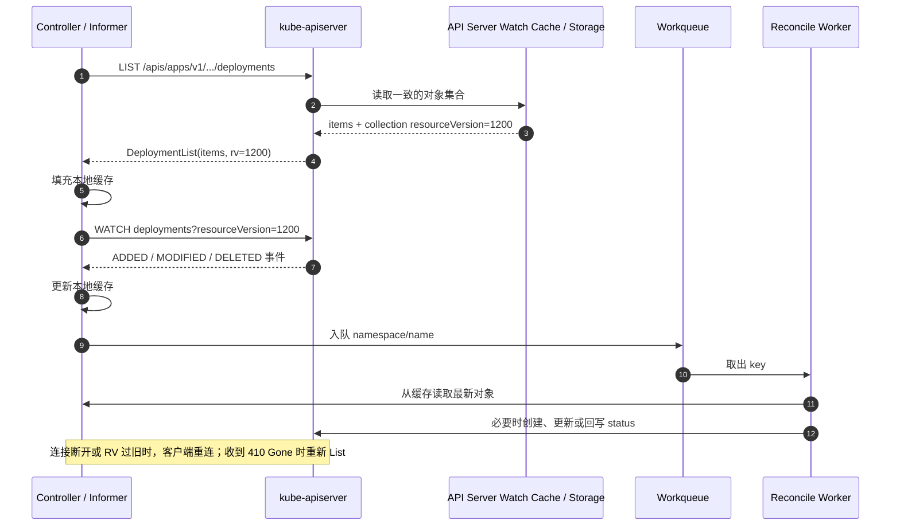
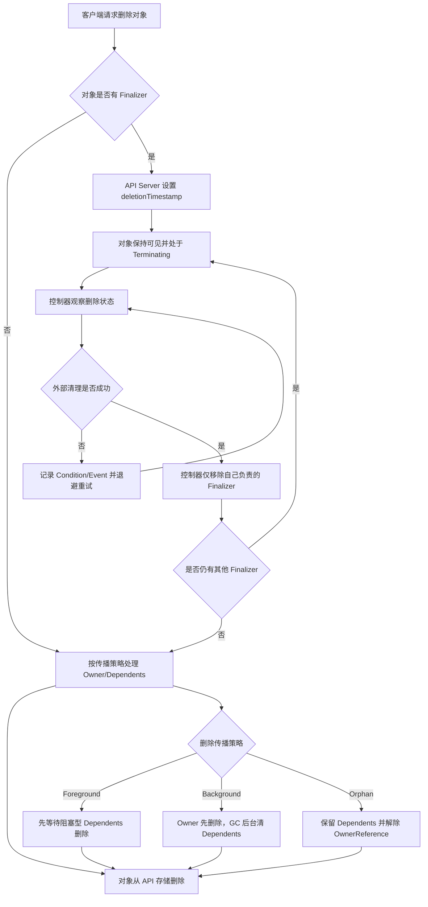
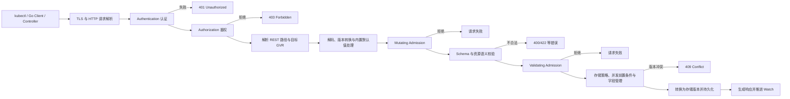

# 第 8 章：Kubernetes API、资源对象与声明式管理

> 本章按 2026 年 6 月 Kubernetes 官方文档核对，命令示例以当前稳定文档（v1.36 文档站）为参考。不同发行版、托管集群和扩展 API Server 可能存在细节差异，生产使用前应通过 `kubectl version`、API Discovery 和对应版本文档确认。

## 学习目标

学完本章后，你应当能够：

1. 准确区分 Kubernetes **Resource、API Object、Group、Version、Kind、GVK 与 GVR**。
2. 解释 `apiVersion`、`kind`、`metadata`、`spec`、`status` 的职责边界。
3. 说清 `name`、`namespace`、`UID`、`resourceVersion`、`generation` 的不同语义。
4. 使用 labels、selectors 和 annotations 设计可维护的资源关系。
5. 解释为什么控制器通常采用 **List → Watch → 本地缓存 → Reconcile**，而不是持续轮询。
6. 说明 Kubernetes 如何利用 `resourceVersion` 实现乐观并发控制，以及如何处理 HTTP 409 冲突。
7. 解释 OwnerReference、垃圾回收、删除传播策略与 Finalizer 的协作方式。
8. 描述写请求从认证、鉴权、准入、默认值填充、校验到持久化的大致链路。
9. 区分 `kubectl create`、`apply`、`replace`、`patch` 的语义和使用场景。
10. 解释 Server-Side Apply 的 field manager、字段所有权和冲突处理。
11. 使用 Go 的类型化客户端和动态客户端读取 Kubernetes 资源。
12. 在面试中按照“结论 → 机制 → 场景 → 取舍 → 验证”回答 API 相关问题。

---

## 一、核心术语

| 术语 | 含义 | 例子 |
|---|---|---|
| API Object | Kubernetes API 中某个对象实例，是集群状态或用户意图的结构化表示 | 名为 `api` 的一个 Deployment |
| Resource | API 暴露的资源端点及其对象集合，通常使用复数、小写名称 | `deployments`、`pods` |
| Kind | 对象在序列化内容中的类型名，通常为单数 CamelCase | `Deployment`、`Pod` |
| Group | 对 API 类型进行分组，避免所有类型挤在同一命名空间 | 核心组、`apps`、`batch` |
| Version | 某个 API Group 下的一种外部表示版本 | `v1`、`v1beta1` |
| GVK | Group、Version、Kind，回答“这段 JSON/YAML 是什么类型” | `apps/v1, Kind=Deployment` |
| GVR | Group、Version、Resource，回答“应访问哪个 REST 资源端点” | `apps/v1, Resource=deployments` |
| desired state | 用户或上层控制器希望系统达到的状态，通常位于 `spec` | `spec.replicas: 3` |
| observed state | 控制器观察并汇报的实际状态，通常位于 `status` | `status.availableReplicas: 2` |
| resourceVersion | API Server 为对象版本或集合快照提供的并发与一致性标识 | `metadata.resourceVersion` |
| generation | 对“期望状态版本”的逻辑序号 | `metadata.generation` |
| Condition | 对资源当前某个方面的状态判断 | `Available=True`、`Progressing=False` |
| OwnerReference | 从依赖对象指向所有者对象的引用 | Pod 指向 ReplicaSet |
| Finalizer | 阻止对象立即从 API 中消失的字符串键，用于等待清理完成 | `example.com/external-cleanup` |
| field manager | 在 Server-Side Apply 中声明或管理某些字段的客户端身份 | `gitops-controller` |

一个重要的总原则是：**Kubernetes API 不是“执行命令的 RPC 集合”，而是围绕资源对象构建的状态 API。** 客户端提交意图，控制器异步观察对象并推动实际状态收敛。

---

## 二、Resource 与 API Object：端点和实例不是一回事

### 2.1 API Object 是“意图记录”

Kubernetes 对象通常是持久化实体，用来表达：

- 哪些工作负载应当运行；
- 需要多少副本；
- 应采用什么镜像和配置；
- 当前观察到多少可用副本；
- 哪个控制器拥有或管理该对象；
- 对象是否正在删除以及还需完成哪些清理。

例如，下面这段 YAML 描述的是一个名为 `api` 的 Deployment 对象：

```yaml
apiVersion: apps/v1
kind: Deployment
metadata:
  name: api
  namespace: production
  labels:
    app.kubernetes.io/name: api
    app.kubernetes.io/instance: api-production
spec:
  replicas: 3
  selector:
    matchLabels:
      app.kubernetes.io/name: api
  template:
    metadata:
      labels:
        app.kubernetes.io/name: api
    spec:
      containers:
        - name: api
          image: registry.example.com/api@sha256:0123456789abcdef
          ports:
            - name: http
              containerPort: 8080
```

这不是“立即启动三个进程”的同步命令。API Server 接受并保存对象后，Deployment Controller、ReplicaSet Controller、Scheduler、Kubelet 等组件通过各自控制循环逐步完成实际执行。

### 2.2 Resource 是 REST 资源端点

Resource 更接近 API 路径中的资源名称。例如：

```text
GET /apis/apps/v1/namespaces/production/deployments
GET /apis/apps/v1/namespaces/production/deployments/api
```

这里：

- Group 是 `apps`；
- Version 是 `v1`；
- Resource 是 `deployments`；
- Namespace 是 `production`；
- Name 是 `api`。

核心 API Group 是历史上的特殊情况，它省略 Group，并使用 `/api`：

```text
GET /api/v1/namespaces/production/pods
```

多数 Resource 保存一组同 Kind 的对象，但并非所有 API 端点都只是简单持久化对象。例如 `status`、`scale`、`eviction` 等子资源具有特定操作语义。

### 2.3 对象身份

一个命名空间级对象通常可用以下元组定位：

```text
Group + Resource + Namespace + Name
```

不同 Version 往往只是同一 Group/Resource 的不同外部表示，不会因为 API 版本不同就产生两份独立对象。例如通过 `apps/v1` 和另一个可转换版本访问同一个 Deployment，本质上仍是同一存储对象。

---

## 三、`apiVersion`、`kind`、`metadata`、`spec`、`status`

### 3.1 `apiVersion`

`apiVersion` 指定对象采用哪一个 Group/Version 的外部表示：

```yaml
apiVersion: v1          # 核心组 v1
apiVersion: apps/v1     # apps 组 v1
apiVersion: batch/v1    # batch 组 v1
```

它的作用包括：

- 帮助客户端和 API Server 选择序列化类型；
- 决定字段结构与校验规则；
- 支持 API 演进和版本转换；
- 避免不同扩展项目的类型命名冲突。

不要把 API Version 与集群版本混为一谈。集群可能是 Kubernetes v1.36，但对象仍大量使用 `apps/v1`、`batch/v1`、`v1` 等 API 版本。

### 3.2 `kind`

`kind` 表示序列化对象的类型，通常为单数 CamelCase：

```yaml
kind: Deployment
```

`kind` 面向对象编码和类型系统；REST 路径中的 `resource` 通常为复数小写：

```text
Kind: Deployment
Resource: deployments
```

两者不能通过“简单加 s”在所有情况下可靠互换。客户端通常通过 API Discovery 和 RESTMapper 完成 GVK 与 GVR 的映射。

### 3.3 `metadata`

`metadata` 保存所有 Kubernetes 对象共享的通用信息，例如：

- 名称和命名空间；
- UID 与版本号；
- labels 和 annotations；
- ownerReferences；
- finalizers；
- 创建时间和删除时间；
- managedFields。

这些字段使通用工具能够在不了解业务 `spec` 的情况下完成查询、选择、所有权追踪、并发控制和生命周期管理。

### 3.4 `spec`

`spec` 通常表达用户或上层控制器的期望状态，例如：

```yaml
spec:
  replicas: 3
```

它回答：“希望系统最终变成什么样？”

但不是所有对象都必须具有 `spec`，也不是所有字段都严格按“用户输入在 spec、系统输出在 status”这一简单规则分布。应以具体 API Schema 和 API 约定为准。

### 3.5 `status`

`status` 通常由控制器写入，用于表达实际观察结果：

```yaml
status:
  observedGeneration: 7
  replicas: 3
  updatedReplicas: 3
  availableReplicas: 2
```

它回答：“控制器观察到了什么，执行到了哪一步？”

很多资源通过独立的 `/status` 子资源更新状态，从而带来两个好处：

1. 普通用户更新 `spec` 时不会无意覆盖控制器写入的 `status`；
2. RBAC 可以分别授予主资源和 `status` 子资源的写权限。

---

## 四、GVK 与 GVR：类型坐标和 REST 坐标

### 4.1 GVK：对象是什么

GVK 由以下三部分组成：

```text
Group + Version + Kind
```

示例：

```text
Group: apps
Version: v1
Kind: Deployment
```

在 Go 中通常表示为：

```go
schema.GroupVersionKind{
    Group:   "apps",
    Version: "v1",
    Kind:    "Deployment",
}
```

GVK 主要用于：

- 识别 JSON/YAML 的对象类型；
- Scheme 中的序列化、反序列化和版本转换；
- 类型化客户端和运行时对象处理。

### 4.2 GVR：访问哪个资源

GVR 由以下三部分组成：

```text
Group + Version + Resource
```

示例：

```go
schema.GroupVersionResource{
    Group:    "apps",
    Version:  "v1",
    Resource: "deployments",
}
```

GVR 主要用于：

- 生成 REST 请求路径；
- 动态客户端访问任意资源；
- List、Watch、Get、Create、Update、Patch、Delete 等资源操作。

### 4.3 GVK、GVR 与 REST 路径关系

| 维度 | Deployment 示例 | 主要用途 |
|---|---|---|
| Group | `apps` | API 分类与命名冲突隔离 |
| Version | `v1` | 外部表示版本 |
| Kind | `Deployment` | 对象类型识别 |
| Resource | `deployments` | REST 端点与集合名 |
| GVK | `apps/v1, Kind=Deployment` | 编解码、类型系统 |
| GVR | `apps/v1, Resource=deployments` | REST 请求、动态客户端 |
| REST 路径 | `/apis/apps/v1/namespaces/production/deployments` | 实际 API 访问路径 |

面试中常见错误是说“Kind 就是 API URL 中的名字”。更准确的说法是：**Kind 面向对象类型，Resource 面向 REST 集合；二者由 API Discovery/RESTMapper 关联。**

---

## 五、Metadata：对象身份、版本与管理信息

### 5.1 常见字段对比表

| 字段 | 谁设置 | 是否通常可变 | 核心作用 | 常见误区 |
|---|---|---:|---|---|
| `metadata.name` | 用户或系统生成 | 否 | 同一作用域内的稳定名称 | 同名重建就是同一对象 |
| `metadata.generateName` | 用户给前缀，Server 生成后缀 | 创建时使用 | 生成唯一名称 | 误以为与 `name` 同时设置时仍会生成 |
| `metadata.namespace` | 用户或请求上下文 | 否 | 指定命名空间作用域 | Namespace 自动提供网络隔离 |
| `metadata.uid` | API Server | 否 | 集群范围内区分对象生命周期 | 可以自己构造并用于创建 |
| `metadata.resourceVersion` | API Server | 每次相关写入变化 | 并发控制、List/Watch 一致性 | 等同于 `generation` 或可跨资源全局排序 |
| `metadata.generation` | API Server | 期望状态变化时递增，规则依资源而定 | 标识 desired state 的代次 | 所有 metadata 变化都会递增 |
| `metadata.labels` | 用户或控制器 | 是 | 标识、组织和选择对象 | 适合存大段文本或非选择信息 |
| `metadata.annotations` | 用户、工具或控制器 | 是 | 非标识性扩展元数据 | 可以被 label selector 直接选择 |
| `metadata.ownerReferences` | 控制器或用户 | 是 | 所有权和垃圾回收 | 只是文档说明，不影响删除 |
| `metadata.finalizers` | 控制器或用户 | 是 | 删除前等待清理 | Finalizer 本身会执行清理代码 |
| `metadata.deletionTimestamp` | API Server | 只读 | 表示对象已接受删除请求 | 出现后还可以取消删除 |
| `metadata.managedFields` | API Server | 系统维护 | 记录字段管理者和所有权 | 业务逻辑应频繁依赖其内部格式 |

### 5.2 `name`、`namespace` 与 `UID`

`name` 是用户可读的稳定名称，但它只在对应资源作用域内唯一。删除并重新创建同名对象后：

- `name` 仍相同；
- `UID` 一定不同；
- 旧对象与新对象是两个生命周期完全不同的实体。

这也是 OwnerReference 必须包含 UID 的原因。仅按名称判断所有权，可能把新建的同名对象误认为旧对象。

### 5.3 `resourceVersion`

`resourceVersion` 是 API Server 暴露的对象版本标识，主要用途是：

1. **乐观并发控制**：更新时证明客户端基于哪个版本修改；
2. **List/Watch 衔接**：从某个集合快照版本开始订阅后续变化；
3. **读取一致性要求**：在 Get/List/Watch 参数中表达“任意、至少、精确或最新”等语义。

实践原则：

- 把它当字符串处理；
- 从 Server 读取后原样传回；
- 不要把它当业务版本号；
- 不要与 `generation` 混用；
- 不要假设它是跨所有资源类型的全局事务序号。

截至 Kubernetes 1.35 以后的当前规范，同一 API Group/Resource 类型内的 `resourceVersion` 在符合认证要求的实现上具有十进制整数的单调可比较性；但这仍不意味着可以跨资源类型比较，也不建议业务代码依赖它进行算术或全局排序。最稳妥的控制器设计仍是使用 API 提供的 List/Watch、前置条件和冲突重试语义。

### 5.4 `generation`

`generation` 表示某一代期望状态。它通常在 API Server 认定“期望状态发生变化”时递增，而状态更新通常不会使其递增。

需要注意：

- 具体哪些字段会触发递增由资源策略决定；
- 它不是任意更新次数；
- 它不能替代 `resourceVersion` 参与并发控制；
- 控制器应通过 `status.observedGeneration` 表示自己处理到了哪一代。

---

## 六、Labels、Selectors 与 Annotations

### 6.1 Labels：可选择的身份属性

Label 是简短的键值对，适合表达稳定、可查询、可分组的身份属性：

```yaml
metadata:
  labels:
    app.kubernetes.io/name: checkout
    app.kubernetes.io/instance: checkout-production
    app.kubernetes.io/version: "2.4.1"
    app.kubernetes.io/component: api
    app.kubernetes.io/part-of: commerce
    app.kubernetes.io/managed-by: argocd
```

常见选择方式：

```bash
kubectl get pods -l app.kubernetes.io/name=checkout
kubectl get pods -l 'environment in (staging,production)'
```

设计建议：

- 用有域名前缀的键避免与其他组件冲突；
- 把会参与 Service、Deployment、NetworkPolicy 等 selector 的 label 当成 API 合同；
- 不要把时间戳、请求 ID、大段 JSON 等高基数或大体积信息放入 label；
- selector 依赖的标签变更可能导致流量、控制器归属或策略范围突然变化。

### 6.2 Selectors：从集合中选择对象

Selector 不是独立存储对象，而是资源或查询中的匹配规则。典型用途包括：

- Deployment/ReplicaSet 选择 Pod；
- Service 选择后端 Pod；
- NetworkPolicy 选择 Pod 或 Namespace；
- `kubectl` 查询过滤；
- List/Watch 的服务端过滤。

Label selector 常见两类：

```yaml
matchLabels:
  app: api
```

```yaml
matchExpressions:
  - key: environment
    operator: In
    values: [production, staging]
```

### 6.3 Annotations：不可选择的扩展元数据

Annotation 适合存放非标识性信息，例如：

- 工具生成信息；
- 配置校验和；
- 外部系统 ID；
- 发布记录；
- 控制器附加参数；
- 人类可读说明。

```yaml
metadata:
  annotations:
    example.com/config-checksum: "8ef2..."
    example.com/owner-team: "payments-platform"
```

Label 与 Annotation 的核心区别不是“重要和不重要”，而是：

| 维度 | Label | Annotation |
|---|---|---|
| 可用于 label selector | 是 | 否 |
| 适合身份与分组 | 是 | 一般不适合 |
| 适合较复杂或工具专用元数据 | 不适合 | 适合 |
| 典型用途 | Service/Controller 选择、查询 | 校验和、外部 ID、工具状态 |

---

## 七、Namespace：逻辑作用域，不是自动安全边界

Namespace 为命名空间级资源提供：

- 名称作用域；
- RBAC 授权范围；
- ResourceQuota 与 LimitRange 的管理范围；
- NetworkPolicy、配置与工作负载的组织边界；
- 团队、环境或项目的逻辑分组。

但 Namespace **不会自动提供**：

- 强制网络隔离；
- 节点或内核级隔离；
- 存储数据隔离；
- 完整多租户安全；
- 集群级资源隔离。

生产上的“租户隔离”通常需要组合：

```text
Namespace
+ RBAC
+ ResourceQuota / LimitRange
+ NetworkPolicy
+ Pod Security 约束
+ Secret 与外部密钥权限
+ 节点隔离或独立集群
+ 审计与准入策略
```

另外，并非所有资源都属于 Namespace。Node、Namespace、PersistentVolume、StorageClass、CustomResourceDefinition 等通常是集群级资源。

---

## 八、`spec`、`status`、Conditions 与 `observedGeneration`

### 8.1 为什么要分离期望状态与观察状态

控制器的执行通常是异步的：

1. 用户更新 `spec`；
2. API Server 接受并持久化新对象；
3. 控制器稍后从 Watch 或缓存中看到变化；
4. 控制器调用外部系统或创建依赖资源；
5. 实际状态逐步变化；
6. 控制器回写 `status`。

如果不区分 `spec` 和 `status`，会产生两个严重问题：

- 用户写入可能覆盖控制器观察结果；
- 控制器写入状态可能与用户的期望字段争用。

因此，分离带来了清晰的写入职责：

```text
用户 / GitOps / 上层控制器 → spec
负责执行的控制器             → status
```

### 8.2 Status Conditions

单个布尔字段很难表达复杂状态。Condition 通常包含：

```yaml
status:
  conditions:
    - type: Available
      status: "False"
      observedGeneration: 7
      lastTransitionTime: "2026-06-22T03:20:00Z"
      reason: MinimumReplicasUnavailable
      message: Deployment does not have minimum availability.
```

常见字段含义：

| 字段 | 含义 |
|---|---|
| `type` | 状态维度，例如 Available、Ready、Progressing |
| `status` | `True`、`False` 或 `Unknown` |
| `observedGeneration` | 该判断对应的期望状态代次 |
| `lastTransitionTime` | Condition 状态最后一次发生转换的时间 |
| `reason` | 机器可读、稳定的原因标识 |
| `message` | 面向人的补充说明 |

Condition 通常不是一条不可变历史事件流，而是“当前条件集合”。不要把它当审计日志或完整事件历史。

### 8.3 `observedGeneration` 防止误读过期状态

假设：

```yaml
metadata:
  generation: 8
status:
  observedGeneration: 7
  conditions:
    - type: Ready
      status: "True"
      observedGeneration: 7
```

此时不能得出“第 8 代配置已经 Ready”的结论。更准确的解释是：控制器汇报的 Ready 状态仍对应第 7 代，尚未确认处理第 8 代期望状态。

可靠的自动化判断通常至少检查：

```text
status.observedGeneration >= metadata.generation
并且目标 Condition.status == True
```

具体字段和 Condition 名称由资源 API 决定，不能对所有对象机械套用同一个 JSONPath。

---

## 九、List、Watch 与事件驱动控制器

### 9.1 为什么不能只 Watch

Watch 只提供某个起点之后的变化。如果控制器启动时不知道集群当前已有对象，仅订阅未来事件会漏掉存量状态。因此经典流程是：

```text
List 当前对象集合
→ 取得集合的 resourceVersion
→ 从该 resourceVersion 开始 Watch
→ 将后续事件更新到本地缓存
```

### 9.2 List/Watch 时序图



### 9.3 Watch 事件类型

常见 Watch 事件包括：

- `ADDED`：对象进入结果集合；
- `MODIFIED`：对象发生更新；
- `DELETED`：对象离开结果集合或被删除；
- `BOOKMARK`：帮助客户端推进已观察到的版本进度；
- `ERROR`：以状态对象形式返回流错误，例如旧版本不可用。

Watch 不是可靠消息队列：

- 连接会断开；
- 旧历史会被压缩清理；
- 客户端可能收到重复触发；
- 事件只说明对象变化，不代表业务动作必须执行一次；
- Reconcile 必须幂等，并以最新对象状态为准。

### 9.4 `resourceVersion` 与 Watch 恢复

客户端可从最后观察到的 `resourceVersion` 重新发起 Watch。如果该版本已不可用，API Server 可能返回 HTTP `410 Gone`。此时正确做法通常是：

1. 重新 List；
2. 重建或校正本地缓存；
3. 从新的集合 `resourceVersion` 开始 Watch。

不要无限重试一个已经过期的版本。

### 9.5 Informer 为什么重要

`client-go` Informer 把 List/Watch、缓存、重连和事件分发封装起来，典型结构是：

```text
Reflector → DeltaFIFO / Queue → Local Store / Indexer → Event Handler → Workqueue
```

它的价值包括：

- 减少每次 Reconcile 都直接访问 API Server；
- 多个 Worker 共享本地缓存；
- 自动处理 List/Watch 的常规重连；
- 将事件通知与业务 Reconcile 解耦；
- 便于按 key 去重、限速和重试。

缓存是最终一致的。控制器刚完成一次写入后，本地 Informer 缓存可能还没立即观察到该写入，因此控制逻辑必须允许短暂陈旧，并依靠下一轮 Reconcile 收敛。

---

## 十、乐观并发控制与更新冲突

### 10.1 为什么 Kubernetes 不对对象加长时间写锁

集群中可能同时存在：

- 用户执行 `kubectl edit`；
- GitOps 控制器更新配置；
- HPA 修改副本数；
- 工作负载控制器更新状态；
- 自定义控制器添加 Finalizer 或 Annotation。

如果使用长事务锁，容易造成低吞吐、死锁或控制器相互阻塞。Kubernetes 采用乐观并发：

1. 客户端读取对象和 `resourceVersion`；
2. 客户端在本地修改；
3. 客户端提交 Update；
4. API Server 检查提交版本是否仍是当前版本；
5. 若对象已被其他写入修改，返回 `409 Conflict`；
6. 客户端重新读取最新对象、重新计算修改并重试。

### 10.2 正确的冲突重试

错误做法是拿旧对象不断重发。正确做法是每次冲突后重新 Get：

```go
err := retry.RetryOnConflict(retry.DefaultBackoff, func() error {
    current, err := clientset.AppsV1().
        Deployments(namespace).
        Get(ctx, name, metav1.GetOptions{})
    if err != nil {
        return err
    }

    desired := current.DeepCopy()
    replicas := int32(5)
    desired.Spec.Replicas = &replicas

    _, err = clientset.AppsV1().
        Deployments(namespace).
        Update(ctx, desired, metav1.UpdateOptions{})
    return err
})
if err != nil {
    return fmt.Errorf("update deployment after conflicts: %w", err)
}
```

关键点：

- 修改逻辑应放在重试闭包内；
- 每次基于最新对象重新计算；
- 不要无条件覆盖自己不负责的字段；
- 设置整体超时和有限退避；
- 高频多写者字段应考虑子资源、Patch 或 Server-Side Apply。

### 10.3 `resourceVersion` 与 `generation` 的区别

| 维度 | `resourceVersion` | `generation` |
|---|---|---|
| 主要目的 | 并发控制、List/Watch、一致性 | desired state 的代次 |
| 哪些写入可能变化 | spec、status、metadata 等相关持久化更新 | 通常是被资源策略认定为期望状态的变化 |
| 控制器怎么使用 | Update 前置版本、Watch 起点 | 与 `observedGeneration` 对比 |
| 能否互相替代 | 不能 | 不能 |

---

## 十一、OwnerReference 与垃圾回收

### 11.1 所有者和依赖对象

典型控制链：

```text
Deployment → ReplicaSet → Pod
```

实际引用方向是依赖对象指向所有者：

```yaml
metadata:
  ownerReferences:
    - apiVersion: apps/v1
      kind: ReplicaSet
      name: api-6f75c9b7d8
      uid: 1b8f3c1a-2a2e-4d40-9c2f-4f2bfa0c9f33
      controller: true
      blockOwnerDeletion: true
```

OwnerReference 的作用：

- 说明依赖对象归属于哪个对象；
- 帮助垃圾回收器在 Owner 删除后处理 Dependents；
- 帮助控制器避免争抢不属于自己的对象；
- 通过 UID 避免把“同名但新生命周期”的对象当成原 Owner。

### 11.2 有效作用域规则

原则上：

- Namespace 级 dependent 可以引用同 Namespace 的 owner；
- Namespace 级 dependent 也可引用集群级 owner；
- 不应跨 Namespace 引用另一个 Namespace 中的 owner；
- 集群级 dependent 不能以 Namespace 级对象为 owner。

错误作用域的 OwnerReference 不应被当作有效所有权设计。

### 11.3 删除传播策略

常见删除传播策略：

| 策略 | Owner 何时消失 | Dependents 如何处理 | 适用理解 |
|---|---|---|---|
| Background | Owner 可先从 API 中删除 | GC 后台删除依赖对象 | 先删根，再异步清理 |
| Foreground | Owner 保持删除中 | 等阻塞删除的依赖对象清理后再完成 Owner 删除 | 先清依赖，再删根 |
| Orphan | Owner 被删除 | 依赖对象保留并移除所有权关系 | 保留子对象 |

删除策略不是业务数据备份策略。若依赖对象对应外部云资源、数据库或账单资产，仅依赖 Kubernetes GC 不足以保证外部清理，通常还需要 Finalizer。

---

## 十二、Finalizer：删除是一个状态转换

### 12.1 Finalizer 不是回调函数

Finalizer 本质上只是 `metadata.finalizers` 中的字符串键：

```yaml
metadata:
  finalizers:
    - example.com/external-database-cleanup
```

它本身不会执行代码。真正的执行者是观察该键和 `deletionTimestamp` 的控制器。

### 12.2 删除流程

当对象包含 Finalizer 时，Delete 通常不会立即让对象消失：

1. API Server 接受删除请求；
2. 设置 `metadata.deletionTimestamp`；
3. 对象进入“正在删除”状态，并仍可通过 API 读取；
4. 对应控制器执行外部清理；
5. 清理成功后，控制器移除自己负责的 Finalizer；
6. 所有 Finalizer 清空后，对象才最终从存储删除。

### 12.3 OwnerReference 与 Finalizer 生命周期图



### 12.4 为什么资源会长期 `Terminating`

常见原因：

- 负责 Finalizer 的控制器已下线；
- 控制器缺少更新资源或 `/finalizers` 的 RBAC 权限；
- 外部 API 不可用；
- 清理逻辑不幂等，部分成功后无法继续；
- Finalizer 键拼写或版本迁移错误；
- Webhook 阻断了 Finalizer 更新；
- 控制器只监听正常更新，没有处理 `deletionTimestamp`。

排查步骤：

```bash
kubectl get <type> <name> -n <ns> -o yaml
kubectl describe <type> <name> -n <ns>
kubectl get events -n <ns> --sort-by=.lastTimestamp
kubectl auth can-i update <resource>/finalizers -n <ns> --as=<service-account>
```

手工移除 Finalizer 是高风险动作。必须先确认：

- 外部资源是否已经清理；
- 是否会造成云资源泄漏、数据残留或重复账单；
- 是否存在其他控制器仍依赖该 Finalizer；
- 是否有可追溯的变更记录和回滚方案。

### 12.5 Finalizer 控制器伪代码

```go
func reconcile(obj *unstructured.Unstructured) error {
    const finalizer = "example.com/external-cleanup"

    if obj.GetDeletionTimestamp().IsZero() {
        if !controllerutil.ContainsFinalizer(obj, finalizer) {
            controllerutil.AddFinalizer(obj, finalizer)
            return update(obj)
        }
        return ensureExternalResource(obj)
    }

    if controllerutil.ContainsFinalizer(obj, finalizer) {
        if err := deleteExternalResourceIdempotently(obj); err != nil {
            return err
        }
        controllerutil.RemoveFinalizer(obj, finalizer)
        return update(obj)
    }

    return nil
}
```

生产实现还要处理冲突重试、状态记录、超时、退避、外部资源唯一 ID 和“删除已完成”幂等判定。

---

## 十三、Kubernetes API 写请求处理链路

下面是面试和系统设计层面足够准确的简化模型。API Server 内部还有内容协商、版本转换、审计、限流、存储策略、子资源处理等细节；不同请求类型并不完全经过相同分支。



### 13.1 认证 Authentication

认证回答：“调用者是谁？”

可能的身份来源包括：

- 客户端证书；
- Bearer Token；
- ServiceAccount Token；
- 外部身份代理；
- 认证 Webhook。

认证成功后得到用户名、组和附加身份信息。认证失败通常返回 401。

### 13.2 鉴权 Authorization

鉴权回答：“这个身份能否对目标资源执行该 verb？”

判断维度通常包括：

```text
user / groups
verb: get, list, watch, create, update, patch, delete
apiGroup
resource / subresource
namespace
name
```

RBAC 是常见实现，但不是唯一授权机制。未被任何授权器允许的请求应被拒绝，通常返回 403。

### 13.3 准入 Admission

准入发生在认证和鉴权之后、持久化之前，主要针对创建、修改、删除及部分特殊操作。读取请求通常不经过准入链。

准入分为：

- **Mutating Admission**：可修改对象，例如注入默认字段或 Sidecar；
- **Validating Admission**：只判断允许或拒绝，不应修改对象。

生产注意事项：

- Mutating Webhook 应幂等；
- Webhook 是控制面请求链的一部分，延迟和故障会影响 API 可用性；
- `failurePolicy`、超时、匹配范围和高可用部署必须谨慎设计；
- 需要看到最终对象形态的策略应放在验证阶段；
- Dry-run 兼容性依赖 Webhook 正确声明副作用属性。

### 13.4 默认值、转换与校验

API Server 根据注册类型、OpenAPI Schema 和资源策略完成：

- 外部版本解码；
- 必要的版本转换；
- 内置默认值填充；
- Mutating Admission 造成修改后的再处理；
- 结构与字段校验；
- 资源特定语义校验；
- 存储版本转换。

因此，客户端本地 YAML 看起来合法，不代表 Server 一定接受。最可靠的校验是：

```bash
kubectl apply --dry-run=server -f object.yaml
```

### 13.5 持久化与 Watch

写入通过并发检查和存储策略后，API Server 持久化对象，生成新的 `resourceVersion`，并使相应 List/Watch 观察者最终看到变化。API 写成功只表示对象被接受和保存，不表示对应控制器已完成业务执行。

---

## 十四、命令式管理与声明式管理

### 14.1 命令式：告诉系统“做什么动作”

示例：

```bash
kubectl scale deployment api --replicas=5
kubectl set image deployment/api api=registry.example.com/api:v2
```

优点：

- 交互快；
- 临时排障或紧急操作方便；
- 学习成本低。

缺点：

- 完整期望状态不一定落入版本库；
- 操作历史难以复现；
- 多人协作容易产生漂移；
- 多个工具可能争抢字段。

### 14.2 声明式：提交完整或部分意图

示例：

```bash
kubectl apply -f deployment.yaml
```

声明式管理强调：

- 配置文件是可审查的期望状态；
- 重复提交应趋向幂等；
- 系统计算当前状态与期望状态的差异；
- 控制器继续使运行状态收敛。

声明式不等于“永远不会冲突”。当多个管理者声明同一字段的不同值时，必须定义所有权和冲突策略。

---

## 十五、`create`、`apply`、`replace`、`patch` 对比

| 命令 | 主要 API 语义 | 对象不存在 | 对象已存在 | 更新范围 | 典型场景 | 主要风险 |
|---|---|---|---|---|---|---|
| `kubectl create -f` | POST 创建 | 创建 | 通常报 AlreadyExists | 创建时提交的对象 | 一次性创建、生成初始对象 | 后续管理方式不统一 |
| `kubectl apply -f` | 声明式合并；可用客户端或服务端 Apply | 创建 | 合并声明字段 | 按三方差异或字段所有权 | GitOps、长期声明式管理 | 多管理者字段冲突、误删自己拥有字段 |
| `kubectl replace -f` | PUT 替换完整对象 | 默认报 NotFound，可选强制重建 | 用完整表示替换 | 整体对象，需携带服务端要求字段 | 明确掌握完整对象时 | 省略字段被清除或回默认值；强制替换导致 UID 变化 |
| `kubectl patch` | PATCH 局部修改 | 通常报 NotFound | 修改指定局部 | Strategic/Merge/JSON Patch | 自动化小范围变更、紧急修复 | 数组合并语义复杂、不同 Patch 类型行为不同 |

### 15.1 `create`

```bash
kubectl create -f deployment.yaml
```

对象已存在时通常失败。它适合“明确只创建一次”的流程，但若资源后续由 Apply 管理，最好从一开始就统一管理模型，避免历史状态缺失或职责不清。

### 15.2 `replace`

```bash
kubectl replace -f deployment.yaml
```

Replace 更接近完整 PUT。使用时应先获取当前对象并保留必要字段及 `resourceVersion`。`replace --force` 通常是“删除再创建”，会改变 UID，并可能触发短暂中断、级联删除或重新调度，不能理解为普通强制更新。

### 15.3 `patch`

```bash
kubectl patch deployment api \
  --type=merge \
  -p '{"spec":{"replicas":5}}'
```

三种常见 Patch：

- Strategic Merge Patch：了解内置类型的合并键；不适用于自定义资源；
- JSON Merge Patch：对象字段合并，数组通常整体替换；
- JSON Patch：使用 `add`、`remove`、`replace`、`test` 等按路径操作。

Patch 适合局部更新，但必须明确数组和空值的语义。

---

## 十六、Server-Side Apply 与字段所有权

### 16.1 为什么需要字段级管理

同一个对象常被多个组件协作管理：

```text
GitOps             管 image、env、resources
HPA                管 spec.replicas
平台注入器          管 sidecar 和部分 annotations
Deployment Controller 管 status
```

若每个客户端都发送完整对象，极易覆盖其他客户端字段。Server-Side Apply（SSA）让 API Server 记录每个 field manager 对字段的声明和所有权。

### 16.2 基本命令

```bash
kubectl apply --server-side \
  --field-manager=gitops-controller \
  -f deployment.yaml
```

对象的 `metadata.managedFields` 中会记录管理信息。业务逻辑一般不应依赖其内部编码细节，但可用它排查“谁在管理哪个字段”。

### 16.3 冲突是保护，不是故障噪声

当 manager A 拥有某字段，而 manager B 试图把它改成不同值时，SSA 会返回冲突。这是在提醒：此次写入可能撤销另一个协作者的声明。

处理方式：

1. **共享相同值**：多个 manager 可共同拥有同值字段；
2. **调整职责**：B 从清单中移除不应管理的字段；
3. **协商转移所有权**：原 manager 放弃字段；
4. **强制接管**：确认覆盖意图后使用 `--force-conflicts`。

```bash
kubectl apply --server-side \
  --field-manager=platform-migrator \
  --force-conflicts \
  -f deployment.yaml
```

`--force-conflicts` 会覆盖冲突字段并转移所有权。它应作为明确迁移或应急动作，而不是常规“遇到冲突就强制”。

### 16.4 从清单中删除字段意味着什么

对某个 manager 而言，SSA 清单中不再声明一个字段，表示该 manager 放弃该字段所有权。如果没有其他 manager 拥有它，该字段可能：

- 从对象中删除；或
- 重置为 API 默认值。

因此，生成清单时不能随意忽略“当前值恰好正确”的字段。应明确：哪些字段由该管理者持续声明，哪些字段由其他控制器管理。

### 16.5 Client-Side Apply 与 Server-Side Apply

| 维度 | Client-Side Apply | Server-Side Apply |
|---|---|---|
| 差异计算位置 | kubectl 客户端 | API Server |
| 历史依据 | `last-applied-configuration` annotation | `managedFields` 字段所有权 |
| 多管理者协作 | 能力较弱，容易互相覆盖 | 原生检测字段所有权冲突 |
| CRD 支持 | 依赖合并行为 | 依赖结构化 Schema，通常更适合控制器协作 |
| 典型使用 | 传统 `kubectl apply` | GitOps、Operator、多控制器协作 |

当前 `kubectl apply` 的默认行为仍需结合客户端版本和参数确认；需要 SSA 时应显式使用 `--server-side`，并为不同自动化组件设置稳定、可识别的 `--field-manager`。

---

## 十七、`dry-run`、`diff`、`explain`、`wait`

### 17.1 Server-side dry-run

```bash
kubectl apply --dry-run=server -f deployment.yaml -o yaml
```

价值：

- 走服务器端解码、默认值、校验和适用的准入流程；
- 不持久化对象；
- 提前发现字段已移除、类型错误、策略拒绝和权限问题；
- 输出服务端处理后的对象形态。

对生产发布而言，它比只做本地 YAML 语法检查可靠得多。

### 17.2 Diff

```bash
kubectl diff -f deployment.yaml
```

用于查看“当前在线对象”与“如果 Apply 后的对象”之间的差异。它适合：

- CI 预览；
- 变更审核；
- 发现默认值或准入注入造成的差异；
- 在提交前识别意外删除字段。

### 17.3 Explain

```bash
kubectl explain deployment.spec.strategy
kubectl explain deployment.spec.template.spec.containers --recursive
```

`explain` 基于集群 API Schema 帮助确认：

- 字段层级；
- 类型和说明；
- 当前集群是否支持该字段；
- CRD 暴露的 Schema。

它比记忆博客示例更可靠，因为它针对当前连接的集群。

### 17.4 Wait

```bash
kubectl wait deployment/api \
  --for=condition=Available \
  --timeout=120s
```

`wait` 根据资源状态、Condition、创建或删除结果等待。注意：

- 目标 Condition 必须确实存在且语义适合；
- 应设置明确超时；
- 对自定义资源应同时考虑 `observedGeneration`；
- 某个 Condition 为 True 不必然等于端到端业务可用。

### 17.5 推荐的发布前检查链

```bash
kubectl apply --dry-run=server -f manifests/
kubectl diff -f manifests/
kubectl apply --server-side --field-manager=release-pipeline -f manifests/
kubectl wait --for=condition=Available deployment/api --timeout=180s
kubectl get deployment api -o yaml
```

在真正生产流程中，还应加入策略校验、镜像签名、渐进发布、指标验证和回滚条件。

---

## 十八、Go 类型化客户端与动态客户端

### 18.1 客户端配置

集群内程序通常使用 ServiceAccount：

```go
cfg, err := rest.InClusterConfig()
if err != nil {
    return fmt.Errorf("load in-cluster config: %w", err)
}

cfg.QPS = 20
cfg.Burst = 40
cfg.Timeout = 10 * time.Second
```

集群外工具通常从 kubeconfig 加载。无论哪种方式，都应：

- 使用最小权限 ServiceAccount；
- 为普通请求设置合理超时；
- 控制 QPS/Burst，避免压垮 API Server；
- 对 Watch 使用与普通短请求不同的生命周期管理；
- 处理 API 错误类型，而不是只匹配错误字符串。

### 18.2 类型化客户端

类型化客户端适合内置资源或已生成 Go 类型和客户端的 CRD：

```go
clientset, err := kubernetes.NewForConfig(cfg)
if err != nil {
    return fmt.Errorf("create typed client: %w", err)
}

ctx, cancel := context.WithTimeout(context.Background(), 5*time.Second)
defer cancel()

deployment, err := clientset.AppsV1().
    Deployments("production").
    Get(ctx, "api", metav1.GetOptions{})
if err != nil {
    return fmt.Errorf("get deployment: %w", err)
}

var desired int32
if deployment.Spec.Replicas != nil {
    desired = *deployment.Spec.Replicas
}

fmt.Printf(
    "name=%s generation=%d observed=%d desired=%d available=%d\n",
    deployment.Name,
    deployment.Generation,
    deployment.Status.ObservedGeneration,
    desired,
    deployment.Status.AvailableReplicas,
)
```

优点：

- 编译期类型检查；
- 字段自动补全；
- 使用体验接近普通 Go API；
- 更易重构和测试。

缺点：

- 与具体 API 类型和版本耦合；
- 操作未知 CRD 时不灵活；
- 依赖版本需要与目标集群兼容。

### 18.3 动态客户端

动态客户端通过 GVR 和 `unstructured.Unstructured` 操作任意资源：

```go
dynamicClient, err := dynamic.NewForConfig(cfg)
if err != nil {
    return fmt.Errorf("create dynamic client: %w", err)
}

gvr := schema.GroupVersionResource{
    Group:    "apps",
    Version:  "v1",
    Resource: "deployments",
}

ctx, cancel := context.WithTimeout(context.Background(), 5*time.Second)
defer cancel()

obj, err := dynamicClient.
    Resource(gvr).
    Namespace("production").
    Get(ctx, "api", metav1.GetOptions{})
if err != nil {
    return fmt.Errorf("get deployment dynamically: %w", err)
}

replicas, found, err := unstructured.NestedInt64(
    obj.Object,
    "spec",
    "replicas",
)
if err != nil {
    return fmt.Errorf("read spec.replicas: %w", err)
}
if !found {
    replicas = 1
}

fmt.Printf(
    "gvk=%s name=%s replicas=%d rv=%s\n",
    obj.GroupVersionKind().String(),
    obj.GetName(),
    replicas,
    obj.GetResourceVersion(),
)
```

优点：

- 无需预先编译具体 Go 类型；
- 可操作运行时才发现的 CRD；
- 适合通用平台、审计工具、资源浏览器。

缺点：

- 字段错误只能在运行时发现；
- 嵌套 map 操作更繁琐；
- 需要正确处理 GVR、作用域和 Schema；
- 重构安全性较弱。

### 18.4 类型化客户端与动态客户端选择

| 场景 | 推荐 |
|---|---|
| 只管理 Deployment、Service 等已知内置类型 | 类型化客户端 |
| 自己拥有 CRD 并已生成客户端代码 | 类型化/生成客户端 |
| 通用资源查看、备份、策略或迁移工具 | 动态客户端 |
| 运行时才知道资源类型 | 动态客户端 + Discovery/RESTMapper |
| 控制器需要高效 List/Watch | 对应 Informer，避免手写持续轮询 |

---

## 十九、生产设计与排障要点

### 19.1 API 不是业务数据库

不要把 Kubernetes API 当作高频业务数据、日志、指标或大对象存储。Kubernetes 资源适合：

- 相对小的配置与状态对象；
- 低到中等频率更新；
- 控制器可通过 CRUD 和 Watch 驱动的声明式模型。

大量高频 Status 写入、高基数 CR、巨型 annotations 会增加 API Server、Watch Cache 和存储压力。

### 19.2 Watch 不是任务队列

错误设计：收到一次 `MODIFIED` 就执行一次不可重复扣款。

正确设计：事件只负责把资源 key 入队，Reconcile 读取最新状态并幂等判断“现在还需要做什么”。若业务要求严格一次，应使用具备相应交付语义的消息或事务系统，并在控制器中使用幂等键。

### 19.3 控制器只管理自己负责的字段

- `spec` 中不同字段可能有不同 owner；
- `status` 应由负责观察的控制器更新；
- Finalizer 只能删除自己负责的键；
- 不要每次 Update 都重建完整对象并覆盖未知字段；
- 对多管理者对象优先考虑 SSA、Patch、子资源或明确的字段职责。

### 19.4 高频 409 冲突怎么排查

检查：

1. 哪些组件在写同一对象；
2. 是否把 `status` 和 `spec` 混在普通 Update 中；
3. HPA 与发布工具是否同时写 `spec.replicas`；
4. 控制器是否基于陈旧缓存直接 Update；
5. 是否在冲突后重新 Get；
6. 是否应改用 Patch、SSA 或 `/status` 子资源；
7. 是否存在无意义的周期性写入。

### 19.5 Finalizer 卡住怎么处理

先判断 Finalizer 所代表的外部副作用，再查：

```text
对象 YAML
→ deletionTimestamp / finalizers
→ 控制器是否运行
→ 控制器日志和指标
→ RBAC
→ Webhook
→ 外部依赖
→ 幂等清理状态
```

不要把“删掉 Finalizer”作为第一步。

### 19.6 API Server 压力问题

常见诱因：

- 控制器频繁全量 List；
- 每次 Reconcile 都直接 Get 多个资源；
- Status 无变化也持续 Update；
- Watch 频繁断线重建；
- 大量客户端同时启动形成 List 风暴；
- 未设置 QPS/Burst 或重试退避；
- CR 数量和对象体积失控；
- Webhook 延迟高或超时。

改进方向：

- 使用 SharedInformer 和本地索引；
- 只在状态实际变化时写入；
- 对队列做限速与抖动；
- 设置合理 client-side rate limit；
- 减少对象体积与 managedFields 噪声；
- 监控 API 请求延迟、429、409、Watch 重连和存储容量。

---

## 二十、与高并发、高性能、高可用的关系

### 20.1 高并发

List/Watch 将“所有控制器持续轮询”变为长连接增量通知，显著降低无效请求。但大量 Watch、全量 List 和高频更新仍会形成控制面压力。

高并发控制器应：

- 使用 Informer 缓存；
- 以 key 入队而不是把完整旧对象当任务；
- 限制 Worker 数；
- 使用指数退避和限速队列；
- 避免事件触发后立即产生多次重复写入。

### 20.2 高性能

性能不只看单次 API 延迟，还要看：

- 每秒 List/Get/Patch/Update 请求量；
- Watch 事件吞吐；
- 对象序列化体积；
- Webhook 链延迟；
- 本地缓存命中率；
- Status 更新频率；
- 冲突重试放大倍数。

“用 Watch”不是性能终点。错误的事件过滤、全对象深拷贝和无意义写回仍会造成显著开销。

### 20.3 高可用

API Server 可以多副本部署，客户端通过负载均衡访问。控制器必须接受：

- Watch 会断开；
- 请求可能超时但服务端结果不确定；
- 缓存短暂陈旧；
- Reconcile 可能重复；
- Leader 切换后任务重新执行；
- 外部清理中途崩溃后需要恢复。

因此，幂等、可重入、可观察和冲突重试是 Kubernetes 控制器高可用性的基础，而不是附加优化。

---

## 二十一、常见错误认知

### 误区 1：`kubectl apply` 成功就代表应用已经可用

Apply 成功只说明对象被 API Server 接受并持久化。控制器、调度、镜像拉取、探针和业务启动仍是异步过程。

### 误区 2：`status=True` 一定是最新状态

必须结合 `metadata.generation` 与 `status.observedGeneration` 判断该状态对应哪一代期望配置。

### 误区 3：`resourceVersion` 就是对象的业务版本号

它服务于 API 并发和一致性，不应展示给业务用户或替代应用版本。

### 误区 4：Watch 是不会丢事件的消息队列

Watch 可断线、版本可过期、事件可重复触发。控制器要以最新状态和幂等 Reconcile 为核心。

### 误区 5：Namespace 天然提供多租户安全隔离

Namespace 只是作用域和组织机制，必须叠加 RBAC、NetworkPolicy、配额、准入、安全策略或独立集群。

### 误区 6：OwnerReference 和 label selector 是同一种关系

Selector 决定匹配哪些对象；OwnerReference 表达生命周期所有权并参与垃圾回收。两者用途不同。

### 误区 7：Finalizer 是 API Server 自动执行的清理钩子

Finalizer 只是字符串。控制器负责观察、清理并移除它。

### 误区 8：出现 409 后重发同一个旧对象即可

必须重新读取最新对象，并在最新版本上重新计算修改。

### 误区 9：`replace --force` 是更强的 Update

它可能执行删除再创建，导致 UID 改变和短暂中断。

### 误区 10：SSA 冲突应统一使用 `--force-conflicts`

冲突在保护字段所有权。强制接管应建立在明确职责迁移之上。

---

## 二十二、面试回答方法

遇到 API 机制题，可按以下结构组织：

1. **结论**：一句话回答核心问题；
2. **机制**：说明 API 对象、版本、控制循环或并发语义；
3. **场景**：给出 Deployment、Controller、GitOps 或 Finalizer 例子；
4. **取舍**：说明一致性、性能、协作和故障边界；
5. **验证**：给出 `kubectl get -o yaml`、`diff`、`dry-run=server`、日志、指标或 Go 错误处理方法。

示例：回答“为什么 Watch 前要 List？”

> **结论**：因为 Watch 只描述某个版本之后的变化，控制器必须先建立当前状态快照。**机制**：List 返回对象集合和集合 `resourceVersion`，客户端再从该版本开始 Watch，形成连续视图。**场景**：控制器重启时，如果只 Watch，会漏掉启动前已存在的对象。**取舍**：List 有全量成本，所以通常用 Informer 缓存和分页，避免反复全量扫描。**验证**：观察控制器的 List/Watch 请求、410 Gone 重建缓存和 Workqueue 指标。

---

## 二十三、章节总结

Kubernetes 的核心不是 YAML，而是一套围绕资源对象构建的分布式控制 API：

- **GVK** 识别对象类型，**GVR** 定位 REST 资源；
- `metadata` 提供身份、版本、选择、所有权和生命周期信息；
- `spec` 表示期望状态，`status` 表示观察状态；
- `generation` 与 `observedGeneration` 用于判断状态是否对应最新意图；
- List/Watch 为控制器提供高效的变化感知，但不能替代幂等 Reconcile；
- `resourceVersion` 支撑乐观并发和 Watch 连续性；
- OwnerReference 负责 Kubernetes 对象间的生命周期关系；
- Finalizer 负责删除前的外部清理协调；
- API 写请求经过认证、鉴权、准入、校验和持久化；
- `create`、`apply`、`replace`、`patch` 对更新责任的表达不同；
- Server-Side Apply 通过 field manager 和字段所有权改善多管理者协作；
- Go 类型化客户端强调编译期安全，动态客户端强调运行时通用性。

真正掌握本章的标志，不是背出字段名，而是能解释：**多个异步控制器如何围绕同一组 API 对象安全协作，并在断线、冲突、重复执行和部分失败下最终收敛。**

---

## 二十四、5 道自测题及答案

### 自测题 1：`resourceVersion` 和 `generation` 有什么区别？

**答案：** `resourceVersion` 表示对象或集合在 API Server 中的版本，用于并发控制、List/Watch 和读取一致性；`generation` 表示期望状态的代次，通常在资源策略认定 desired state 变化时递增。Status 更新可能改变 `resourceVersion`，但通常不改变 `generation`。二者不能互换。

### 自测题 2：为什么控制器启动时通常先 List 再 Watch？

**答案：** List 建立当前对象集合快照，并返回集合 `resourceVersion`；Watch 从该版本继续接收后续变化。只 Watch 会漏掉控制器启动前已存在的对象。Watch 版本过旧返回 410 时，需要重新 List。

### 自测题 3：对象有 `deletionTimestamp` 但一直未消失，最可能是什么机制？

**答案：** 对象通常仍有 Finalizer。API Server 已接受删除请求，但需要对应控制器完成清理并移除 Finalizer。排查时应先检查 Finalizer、控制器、RBAC、Webhook 和外部依赖，而不是直接强删。

### 自测题 4：Namespace 能否单独实现强多租户隔离？

**答案：** 不能。Namespace 主要提供名称和策略作用域。强隔离还需要 RBAC、配额、NetworkPolicy、Pod 安全约束、Secret 权限、节点隔离，必要时使用独立集群。

### 自测题 5：SSA 出现字段冲突时应怎么处理？

**答案：** 先识别冲突字段及其 manager，确认字段职责。可以让当前 manager 从清单中放弃字段、让双方声明相同值、安排所有权迁移；只有明确要覆盖并接管时才使用 `--force-conflicts`。

---

## 二十五、面试题

### A. 基础题

#### 面试题 1：Kubernetes Resource 和 API Object 有什么区别？

**面试官考察意图**

判断候选人是否理解 REST 资源端点与具体对象实例，而不是只会写 YAML。

**30 秒回答**

Resource 是 Kubernetes API 暴露的资源集合和 REST 端点，例如 `deployments`；API Object 是该资源中的一个具体对象，例如 `production` 命名空间下名为 `api` 的 Deployment。Kind 面向对象类型，Resource 面向 REST 路径。

**展开回答**

- **结论**：Resource 是集合/端点，Object 是实例。
- **机制**：`apps/v1` 下的 `deployments` 是 GVR 的 Resource；YAML 中 `kind: Deployment` 是 GVK 的 Kind。
- **场景**：动态客户端使用 GVR 访问 `/apis/apps/v1/namespaces/production/deployments/api`，返回一个 Deployment Object。
- **取舍**：类型化客户端隐藏了部分 GVR 细节，动态平台必须显式处理 Discovery 和 RESTMapper。
- **验证**：执行 `kubectl api-resources`、`kubectl get deployment api -o yaml`，对照 REST 路径、Kind 和 apiVersion。

**可能追问**

- 核心组为什么是 `/api/v1`？
- 子资源 `status`、`scale` 属于什么？
- GVK 如何映射为 GVR？

**常见误区**

- 认为 Kind 与 Resource 完全相同；
- 认为 Version 不同就一定是两份对象；
- 认为所有 API Resource 都是普通持久化对象。

---

#### 面试题 2：`spec` 和 `status` 为什么要分开？

**面试官考察意图**

判断候选人是否理解声明式 API 与异步控制循环。

**30 秒回答**

`spec` 通常表示期望状态，由用户或上层控制器写入；`status` 表示控制器观察到的实际状态，由负责执行的控制器回写。分离可以避免用户更新覆盖状态，也能用独立子资源和 RBAC 分离写权限。

**展开回答**

- **结论**：分开是为了明确 desired state 与 observed state 的写入职责。
- **机制**：用户先更新 `spec`，控制器异步执行并更新 `/status`；二者不是原子同步完成。
- **场景**：Deployment `spec.replicas=3`，但 `status.availableReplicas=2`，说明系统尚未完全收敛。
- **取舍**：状态具有最终一致性，调用方不能把 API 写成功当成业务完成。
- **验证**：比较 `metadata.generation`、`status.observedGeneration` 和 Conditions。

**可能追问**

- 为什么要有 `/status` 子资源？
- 所有对象都有 spec/status 吗？
- 控制器应何时更新 status？

**常见误区**

- 把 status 当作用户配置；
- 认为写 spec 后 status 会同步变化；
- 每轮 Reconcile 无变化也写 status。

---

#### 面试题 3：Labels 和 Annotations 有什么区别？

**面试官考察意图**

考察对象组织、选择器设计和生产规范意识。

**30 秒回答**

Labels 是可被 selector 查询和匹配的简短身份属性，常用于 Service、Controller、NetworkPolicy 选择对象；Annotations 是不可被 label selector 选择的扩展元数据，适合校验和、外部 ID 和工具信息。

**展开回答**

- **结论**：核心区别是是否承担对象选择和身份分组职责。
- **机制**：Label selector 可在 List/Watch 和资源控制逻辑中服务端过滤；Annotation 只是附加元数据。
- **场景**：`app.kubernetes.io/name=api` 放 label；配置文件 SHA 放 annotation。
- **取舍**：进入 selector 的 label 是长期 API 合同，随意修改可能使 Service 断流或控制器失去 Pod。
- **验证**：用 `kubectl get -l` 验证标签选择，检查 Deployment selector 与 Pod template labels 是否一致。

**可能追问**

- Field selector 与 label selector 有何区别？
- 为什么不把时间戳放 label？
- 推荐标签有哪些？

**常见误区**

- 只按“重要信息/不重要信息”区分；
- 在 label 中存大段 JSON；
- 修改 selector 标签时忽略流量影响。

---

#### 面试题 4：Namespace 是安全隔离边界吗？

**面试官考察意图**

考察多租户、安全边界和资源作用域理解。

**30 秒回答**

Namespace 是逻辑作用域，不是自动的强安全边界。它提供名称、RBAC、配额和策略的作用范围，但网络、节点、内核和存储隔离需要额外机制；高风险多租户往往要使用节点隔离甚至独立集群。

**展开回答**

- **结论**：Namespace 是构建隔离的基础，不是隔离的全部。
- **机制**：它只作用于 namespaced resources；Node、PV、StorageClass 等仍是集群级。
- **场景**：两个团队各用 Namespace，并配置 RBAC、ResourceQuota、default-deny NetworkPolicy 和 Pod 安全策略。
- **取舍**：共享集群成本低但爆炸半径更大；独立集群隔离强但运维成本高。
- **验证**：用 `kubectl auth can-i`、网络连通测试、配额状态和准入测试验证。

**可能追问**

- Namespace 可以嵌套吗？
- 删除 Namespace 会怎样？
- Secret 是否天然只对本 Namespace 安全？

**常见误区**

- 认为不同 Namespace 默认网络不通；
- 认为 Namespace 能隔离节点内核；
- 忽略集群级对象权限。

---

### B. 原理深挖题

#### 面试题 5：List/Watch 为什么是 Kubernetes 控制器的基础？

**面试官考察意图**

考察事件驱动、缓存一致性和控制器架构。

**30 秒回答**

List 建立当前资源快照并返回集合 `resourceVersion`，Watch 从该版本接收增量变化。Informer 在此基础上维护本地缓存并把对象 key 入队，Worker 再幂等 Reconcile。Watch 断开或版本过旧时需要重连或重新 List。

**展开回答**

- **结论**：List 解决初始全量状态，Watch 解决后续增量变化。
- **机制**：集合 RV 将二者衔接；Informer 封装 Reflector、Store 和事件处理。
- **场景**：Controller 重启后先恢复所有 CR，再订阅新增和修改。
- **取舍**：List 有全量成本，Watch 有长连接和重连成本；缓存降低 API 压力但具有短暂陈旧。
- **验证**：观察 List/Watch 请求、410 Gone、Informer sync、队列深度和 Reconcile 延迟。

**可能追问**

- Watch 是可靠消息队列吗？
- Bookmark 有什么作用？
- Resync 是否等于重新 List？

**常见误区**

- 只 Watch 不 List；
- 把事件对象当最终事实；
- 连接断开后永远从旧 RV 重试。

---

#### 面试题 6：Kubernetes 如何处理并发更新冲突？

**面试官考察意图**

考察 `resourceVersion`、409 和正确重试模式。

**30 秒回答**

Kubernetes 使用乐观并发控制。客户端读取对象和 `resourceVersion`，Update 时 API Server 检查版本；若期间被其他写者修改，返回 409。客户端必须重新 Get 最新对象、重新计算变更并带退避重试，而不是重发旧对象。

**展开回答**

- **结论**：通过版本前置条件发现丢失更新。
- **机制**：完整 Update 携带当前 `resourceVersion`；SSA 还可检测字段所有权冲突。
- **场景**：用户和控制器同时修改 Deployment，后提交的一方收到 Conflict。
- **取舍**：乐观并发吞吐高，但要求写逻辑可重算、幂等，并限制重试放大。
- **验证**：检查 409 指标、审计日志、managedFields 和实际写者；使用 `RetryOnConflict`。

**可能追问**

- Patch 是否一定不会冲突？
- `generation` 能否用于 Update 前置条件？
- 如何避免 HPA 与 GitOps 争抢 replicas？

**常见误区**

- 无上限重试；
- 在闭包外只 Get 一次；
- 每次更新完整对象并覆盖未知字段。

---

#### 面试题 7：OwnerReference 和 Finalizer 有什么区别？

**面试官考察意图**

考察对象生命周期、垃圾回收和外部资源清理。

**30 秒回答**

OwnerReference 表达 Kubernetes 对象间的所有权，供垃圾回收器处理依赖对象；Finalizer 是删除阻塞键，用于等待控制器完成外部清理。OwnerReference 解决“子对象随谁删除”，Finalizer 解决“对象真正消失前还必须做什么”。

**展开回答**

- **结论**：前者是所有权关系，后者是删除前置条件。
- **机制**：Dependent 保存 Owner UID；有 Finalizer 的对象收到 Delete 后先写 `deletionTimestamp`，控制器清理后移除键。
- **场景**：Deployment 删除 ReplicaSet/Pod 用 OwnerReference；删除 CR 前释放云数据库用 Finalizer。
- **取舍**：Finalizer 提供清理机会，但控制器故障会导致 Terminating；清理必须幂等且可恢复。
- **验证**：查看 `ownerReferences`、`finalizers`、`deletionTimestamp`、GC 事件和控制器日志。

**可能追问**

- Foreground/Background/Orphan 区别？
- 为什么 OwnerReference 要有 UID？
- 可以跨 Namespace 设置 Owner 吗？

**常见误区**

- 认为 label selector 会触发 GC；
- 认为 Finalizer 自己执行代码；
- 卡住时不检查外部资源就直接清空 Finalizer。

---

#### 面试题 8：API 写请求经过哪些阶段？

**面试官考察意图**

考察控制面请求链、安全和准入机制。

**30 秒回答**

简化链路是：TLS 与请求解析 → 认证 → 鉴权 → 目标资源解析和对象解码/转换/默认值 → Mutating Admission → API 校验 → Validating Admission → 并发与存储策略 → 持久化并返回。读取请求通常不经过准入。

**展开回答**

- **结论**：API Server 是身份、权限、策略、Schema 和存储的一致入口。
- **机制**：认证确认身份，鉴权判断 verb/resource，Mutating 可修改，Validating 可拒绝，最终以存储版本保存。
- **场景**：创建 Pod 时，准入可注入字段、限制镜像来源或拒绝特权容器。
- **取舍**：Webhook 提供扩展性，但增加请求延迟和控制面故障点，应限制范围、设置短超时并高可用部署。
- **验证**：`--dry-run=server`、审计日志、Webhook 指标、API Server latency 和拒绝原因。

**可能追问**

- 认证失败与鉴权失败返回什么？
- Mutating 和 Validating 顺序为什么重要？
- Webhook 故障如何影响 API？

**常见误区**

- 把认证和鉴权混为一谈；
- 认为 Get/List 也一定经过 Admission；
- 把客户端 YAML 校验等同于服务器校验。

---

### C. 场景设计题

#### 面试题 9：一个资源的 `status.conditions` 显示 Ready=True，但发布系统仍不应判定成功，为什么？

**面试官考察意图**

考察状态新鲜度、Condition 语义和端到端验证。

**30 秒回答**

Ready=True 可能对应旧 generation。发布系统应确认 `status.observedGeneration` 已追上 `metadata.generation`，再检查目标 Condition、可用副本和业务指标。Condition 只表达该 API 定义的状态，不必然代表端到端业务成功。

**展开回答**

- **结论**：状态值必须结合它对应的期望状态代次解释。
- **机制**：用户更新 spec 后 generation 增加，控制器尚未处理时旧 Condition 仍可能保留。
- **场景**：第 8 代镜像刚提交，Ready=True 仍是第 7 代结果。
- **取舍**：只等 Condition 简单但可能误判；加入 generation、业务探测和 SLO 验证更可靠但发布流程更复杂。
- **验证**：读取完整 YAML，对比 generation/observedGeneration，检查 rollout、Pod readiness、错误率与延迟。

**可能追问**

- `kubectl wait` 会自动检查 observedGeneration 吗？
- 自定义资源应如何设计 Conditions？
- `lastTransitionTime` 能表示更新时间吗？

**常见误区**

- 只看字符串 Ready；
- 把 Condition 当历史日志；
- 用固定 sleep 替代状态判断。

---

#### 面试题 10：GitOps、HPA 和平台注入器同时管理 Deployment，怎样避免互相覆盖？

**面试官考察意图**

考察多写者字段职责和 SSA 设计。

**30 秒回答**

先明确字段所有权：GitOps 管镜像、环境变量和资源模板，HPA 管 `spec.replicas`，注入器管自己注入的容器或 annotations。使用 Server-Side Apply 和稳定 field manager，GitOps 清单不要持续声明 HPA 管理字段；冲突时先调整职责，不能默认 force。

**展开回答**

- **结论**：关键不是选一种命令，而是建立字段级责任边界。
- **机制**：SSA 在 `managedFields` 中记录所有权，不同 manager 修改他人拥有且值不同的字段会冲突。
- **场景**：开启 HPA 后，从 GitOps Deployment 清单中移除固定 replicas，或由专门策略管理初始值。
- **取舍**：SSA 提高安全性，但需要结构化 Schema、稳定 manager 名和清单生成规范；强制接管可能中断其他自动化。
- **验证**：查看 `metadata.managedFields`、SSA conflict 详情、审计日志，并对扩缩容和发布做并发测试。

**可能追问**

- 多个 manager 可以共同拥有字段吗？
- 从清单移除字段会发生什么？
- 注入器应该用 Mutating Webhook 还是控制器？

**常见误区**

- GitOps 每次完整覆盖在线对象；
- HPA 开启后仍固定声明 replicas；
- 所有冲突都使用 `--force-conflicts`。

---

#### 面试题 11：自定义资源删除后一直 Terminating，如何系统排查？

**面试官考察意图**

考察 Finalizer、控制器可靠性、RBAC 与外部副作用。

**30 秒回答**

先查看对象的 `deletionTimestamp` 和 Finalizer 列表，定位负责的控制器；再检查控制器是否运行、日志、队列、RBAC、Webhook 和外部 API。确认清理是否幂等、外部资源是否已删除。只有确认副作用可接受时才手工移除 Finalizer。

**展开回答**

- **结论**：Terminating 通常意味着删除已接受，但清理前置条件未完成。
- **机制**：API Server 保留对象，控制器应完成清理并更新 Finalizer。
- **场景**：CR 对应一个云负载均衡器，云 API 超时或控制器权限丢失导致卡住。
- **取舍**：保留 Finalizer 可防资源泄漏，但延长删除；应设置状态、告警、超时和人工接管流程。
- **验证**：YAML、Events、控制器日志、`auth can-i`、Webhook 状态、云资源列表和审计记录。

**可能追问**

- 控制器在外部删除成功后、移除 Finalizer 前崩溃怎么办？
- 如何设计幂等删除？
- Namespace 删除时 Finalizer 会造成什么影响？

**常见误区**

- 第一时间 patch 清空 Finalizer；
- 清理接口不是幂等；
- Finalizer 名称没有域名前缀或迁移方案。

---

#### 面试题 12：你的 Controller 导致 API Server QPS 很高且频繁 409，如何优化？

**面试官考察意图**

综合考察 Informer、缓存、并发、状态写入和可观测性。

**30 秒回答**

先通过指标和审计确认请求类型与写者。读取侧改用 SharedInformer/Lister 和索引，避免每轮直接 List/Get；写入侧只在实际变化时更新，分离 status，使用 Patch/SSA 或冲突重试；限制 Worker、QPS/Burst 和退避，并检查是否有多个控制器争抢同一字段。

**展开回答**

- **结论**：高 QPS 和 409 通常来自无缓存读取、无意义写入或字段所有权冲突。
- **机制**：Informer 提供本地最终一致缓存；Update 基于 RV，陈旧对象会冲突；每次冲突重试又会放大请求。
- **场景**：100 个 Worker 每次 Reconcile 全量 List Pods，并无条件 Update CR status，造成 List 风暴和写冲突。
- **取舍**：减少 Worker 和写入可降低压力，但会增加收敛延迟；应以 SLO 和队列延迟为依据调参。
- **验证**：按 verb/resource 观察请求率、409/429、Watch 重连、Workqueue depth、reconcile duration、cache hit 和 Status 写入量。

**可能追问**

- 缓存陈旧时如何保证正确？
- 何时必须直接 Get API Server？
- 怎样避免控制器启动时的 List 惊群？

**常见误区**

- 单纯提高 QPS/Burst；
- 无限增加 Worker；
- 用固定周期全量扫描替代事件和索引；
- 无变化也更新时间戳导致持续写入。

---

## 官方参考资料

1. Kubernetes Objects: https://kubernetes.io/docs/concepts/overview/working-with-objects/
2. Kubernetes API Concepts: https://kubernetes.io/docs/reference/using-api/api-concepts/
3. Object Names and IDs: https://kubernetes.io/docs/concepts/overview/working-with-objects/names/
4. Labels and Selectors: https://kubernetes.io/docs/concepts/overview/working-with-objects/labels/
5. Annotations: https://kubernetes.io/docs/concepts/overview/working-with-objects/annotations/
6. Namespaces: https://kubernetes.io/docs/concepts/overview/working-with-objects/namespaces/
7. Owners and Dependents: https://kubernetes.io/docs/concepts/overview/working-with-objects/owners-dependents/
8. Finalizers: https://kubernetes.io/docs/concepts/overview/working-with-objects/finalizers/
9. Authentication: https://kubernetes.io/docs/reference/access-authn-authz/authentication/
10. Authorization: https://kubernetes.io/docs/reference/access-authn-authz/authorization/
11. Admission Controllers: https://kubernetes.io/docs/reference/access-authn-authz/admission-controllers/
12. Dynamic Admission Control: https://kubernetes.io/docs/reference/access-authn-authz/extensible-admission-controllers/
13. Server-Side Apply: https://kubernetes.io/docs/reference/using-api/server-side-apply/
14. Kubernetes Object Management: https://kubernetes.io/docs/concepts/overview/working-with-objects/object-management/
15. kubectl apply: https://kubernetes.io/docs/reference/kubectl/generated/kubectl_apply/
16. kubectl patch: https://kubernetes.io/docs/reference/kubectl/generated/kubectl_patch/
17. kubectl replace: https://kubernetes.io/docs/reference/kubectl/generated/kubectl_replace/
18. kubectl diff: https://kubernetes.io/docs/reference/kubectl/generated/kubectl_diff/
19. kubectl wait: https://kubernetes.io/docs/reference/kubectl/generated/kubectl_wait/
20. Kubernetes Client Libraries: https://kubernetes.io/docs/reference/using-api/client-libraries/
21. client-go: https://pkg.go.dev/k8s.io/client-go
22. apimachinery schema: https://pkg.go.dev/k8s.io/apimachinery/pkg/runtime/schema
