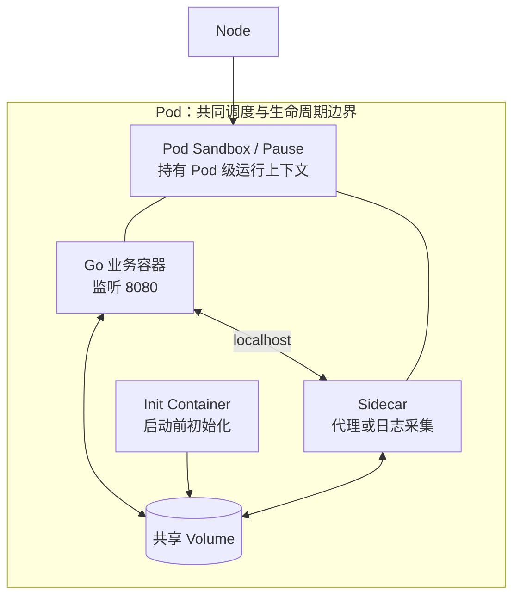
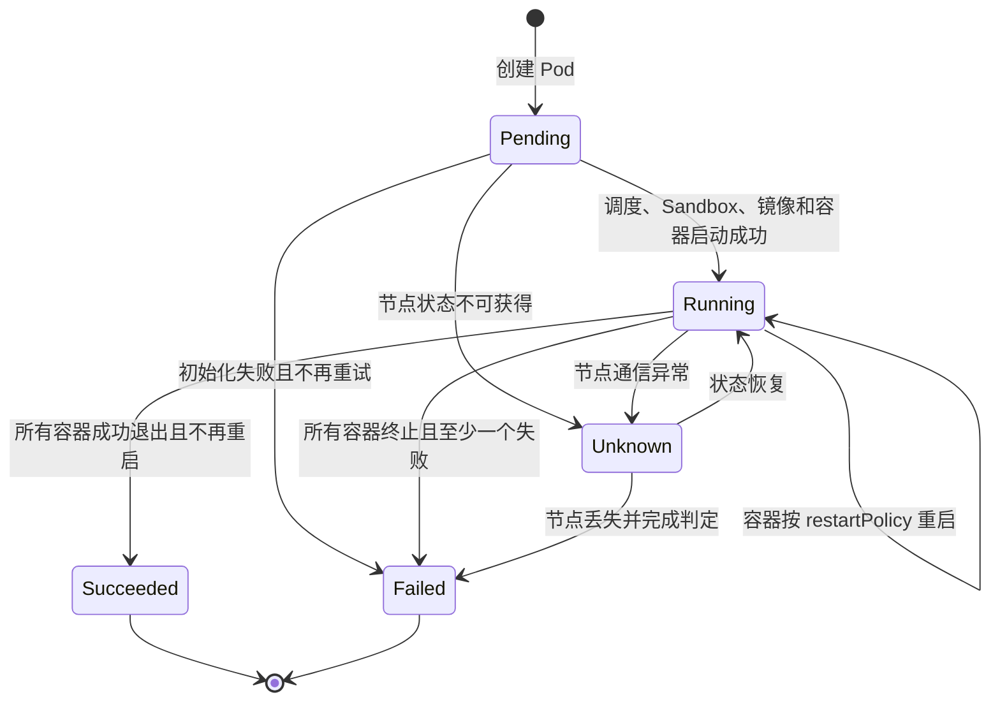
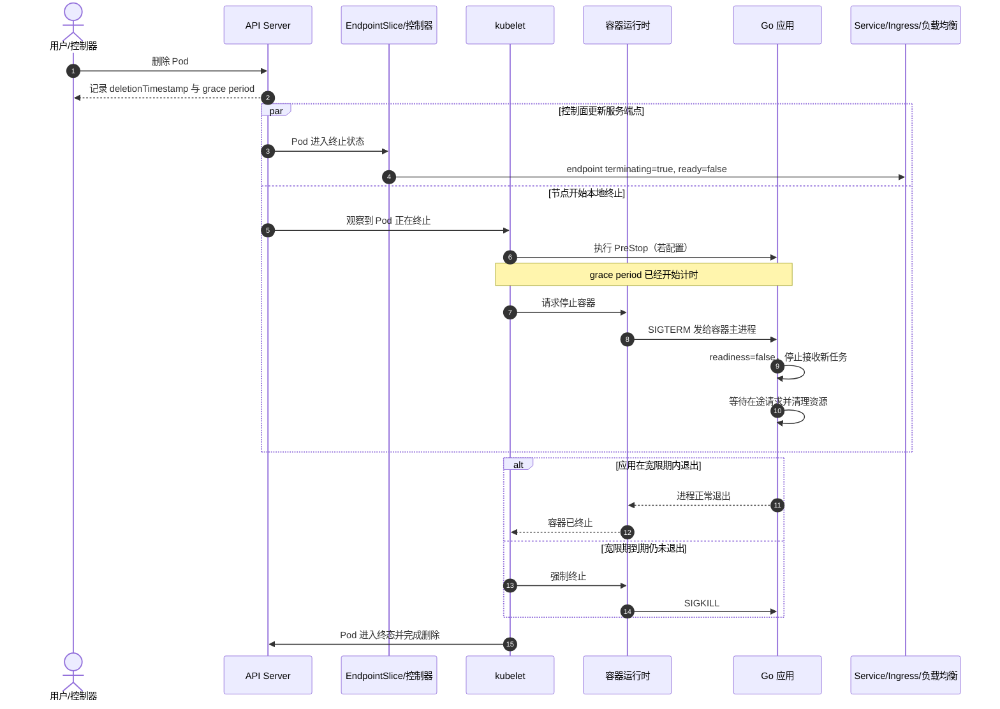

# 第 9 章：Pod 模型、生命周期、探针与优雅终止

> **版本说明**：本章按 Kubernetes v1.36 的官方文档口径编写。原生 Sidecar Containers 自 v1.33 起为 Stable；Ephemeral Containers 自 v1.25 起为 Stable；`PodReadyToStartContainers` 在 v1.36 中仍为 Beta 且默认启用；容器级 `restartPolicyRules` 在 v1.35 起为 Beta。除专门讨论版本状态外，正文优先使用长期稳定、可用于生产面试的核心语义。

## 学习目标

学完本章后，应当能够：

1. 解释为什么 Kubernetes 调度 Pod，而不是直接调度单个容器。
2. 准确说明同一 Pod 内容器共享与不共享的资源。
3. 区分 Pod Phase、Container State、Pod Condition 和 `kubectl` 展示的 `STATUS`。
4. 区分“同一 Pod 内重启容器”与“控制器创建替代 Pod”。
5. 正确选择 Init Container、原生 Sidecar、普通业务容器和 Ephemeral Container。
6. 设计 readiness、liveness、startup 三类探针，避免误杀和重启风暴。
7. 描述 Pod 从删除请求、EndpointSlice 状态变化、`PreStop`、`SIGTERM` 到 `SIGKILL` 的完整终止过程。
8. 为 Go HTTP 服务实现健康检查、流量摘除和优雅退出。
9. 系统排查 `CrashLoopBackOff`、`ImagePullBackOff` 和 `CreateContainerConfigError`。

---

## 一、先建立正确心智模型：Pod 是逻辑主机，不是“容器别名”

Kubernetes 中最小的可部署计算单元是 **Pod**。一个 Pod 包含一个或多个需要紧密协作的容器，这些容器被共同调度到同一节点、共享一部分运行上下文，并拥有共同的生命周期边界。

最常见的模型仍然是“一 Pod 一业务容器”。多容器 Pod 是高级用法，只应在容器之间存在强耦合时使用。

可以把几层对象理解为：

| 层级 | 解决的问题 | 典型职责 |
|---|---|---|
| 容器 | 如何运行一个进程及其依赖 | 镜像、入口进程、环境变量、文件系统、资源限制 |
| Pod | 哪些进程必须共置并共享运行上下文 | 调度、Pod IP、共享卷、探针、终止宽限期 |
| 工作负载控制器 | 应该长期维持多少个怎样的 Pod | 副本、自愈、滚动发布、扩缩容 |
| Service | 如何稳定访问一组会变化的 Pod | 服务发现、虚拟 IP、端点负载均衡 |

### 1. 为什么基本调度单元是 Pod，而不是容器

#### 1.1 调度需要表达“必须共置”的约束

假设一个 Go 服务依赖本地代理完成证书轮换，二者必须：

- 位于同一节点；
- 通过 `localhost` 通信；
- 共享同一份证书目录；
- 一起创建、一起销毁。

如果调度器逐个调度容器，就还要额外处理共置、网络身份、存储绑定和生命周期协调。Pod 将这些约束打包成一个原子调度单元。

#### 1.2 调度决策需要聚合资源

调度器关心的是整个 Pod 能否放入某个节点，而不是孤立地看某个容器。通常会综合 Pod 中各容器的 CPU、内存、临时存储、设备、拓扑和亲和性约束进行放置。

#### 1.3 网络身份属于 Pod

同一 Pod 内的容器共享一个 Pod IP 和端口空间。应用容器监听 `:8080` 后，Sidecar 可以通过 `127.0.0.1:8080` 访问它。相应地，同一 Pod 中两个容器不能同时监听同一个 IP 上的同一端口。

#### 1.4 Pod 是故障与替换边界

Pod 被调度并绑定到一个节点后，不会把同一个 Pod“搬迁”到另一节点。节点失败、驱逐或模板更新时，控制器创建的是一个新的 Pod；即使名称相似，新 Pod 也有新的 UID，并且通常可能获得新的 IP。

> **面试结论**：容器是进程运行单元；Pod 是共置、共享与调度单元；Deployment 等控制器才是长期维持业务副本的单元。

---

## 二、Pod 内部结构与 Sandbox/Pause 容器

### 1. Sidecar Pod 内部结构



### 2. Pause/Sandbox 容器是什么

从 CRI 视角看，kubelet 通常先让容器运行时创建 **Pod Sandbox**，再配置 Pod 网络，最后在这个 Sandbox 中创建业务容器。许多 Linux 容器运行时使用一个极小的 `pause` 或 infrastructure container 持有 Pod 的网络等命名空间，使业务容器即使重启，Pod 级网络上下文仍可保持。

需要注意：

- Pause 容器是运行时实现细节，不在用户编写的 `spec.containers` 中。
- 它不承载业务逻辑，也不是 Sidecar。
- 不同运行时可能以不同方式实现 Sandbox；使用虚拟机隔离的运行时，Sandbox 甚至可能对应一台轻量虚拟机。
- 因此，不应把“Pod”简单等同于“Pause 容器”。Pod 是 Kubernetes API 对象与运行时边界，Pause 只是常见实现手段。

### 3. 同一 Pod 内容器共享什么、不共享什么

| 资源或属性 | 默认是否共享 | 说明 |
|---|---:|---|
| Pod IP、网络命名空间 | 是 | 通过 `localhost` 通信，共享端口空间 |
| Pod 级网络配置 | 是 | 路由、网络策略作用于 Pod 网络身份 |
| IPC/主机名等部分 Pod 运行上下文 | 通常是 Pod 级 | 具体由操作系统和运行时实现；不要据此突破安全边界 |
| Volume | 按声明共享 | 同一个卷必须分别挂载到各容器，挂载路径可以不同 |
| 根文件系统与可写层 | 否 | 每个容器有自己的镜像和可写层 |
| 进程命名空间 | 默认否 | 设置 `shareProcessNamespace: true` 后才可跨容器查看进程 |
| 环境变量 | 否 | 每个容器独立声明 |
| 容器入口进程与退出码 | 否 | 每个容器独立启动、退出和记录状态 |
| 容器级资源限制 | 否 | 每个容器可以有不同 requests/limits；Pod 还有聚合资源视角 |
| SecurityContext、Capabilities | 不一定 | Pod 级可提供默认值，容器级可以进一步覆盖 |
| 标准输出日志流 | 否 | `kubectl logs` 需要通过 `-c` 指定容器 |

### 4. 多容器 Pod 的适用条件

只有当下列问题多数回答为“是”时，才适合放在同一 Pod：

- 两个容器是否必须在同一节点？
- 是否必须通过 `localhost` 低延迟通信？
- 是否共享同一生命周期，不能独立扩缩容？
- 是否需要共享同一临时卷或 Unix Domain Socket？
- 一个组件缺失时，整个 Pod 是否都不应对外服务？

典型适用场景：

- Service Mesh 数据面代理与业务容器；
- 日志转换或文件同步 Sidecar；
- 本地证书代理；
- 需要把旧程序生成的文件日志转换到标准输出的适配器。

典型反模式：

- 把前端、后端、数据库塞进同一 Pod；
- 把需要独立扩容的两个微服务放在一起；
- 仅为了“少写几个 YAML”而合并容器；
- 把 Sidecar 当作通用守护进程，导致每个 Pod 都重复消耗大量资源。

---

## 三、Pod 生命周期的四个观察维度

排障时最容易混淆的四个概念是：

1. **Pod Phase**：Pod 生命周期的高层摘要。
2. **Container State**：某个容器此刻处于等待、运行还是终止。
3. **Pod Conditions**：Pod 是否通过多个独立检查点。
4. **kubectl STATUS**：命令行为了便于理解而生成的展示字段，并不等于 Phase。

### 1. Pod Phase

| Phase | 含义 | 常见场景 |
|---|---|---|
| `Pending` | API Server 已接受 Pod，但至少一个容器尚未准备好运行 | 等待调度、拉镜像、挂卷、Sandbox 或网络初始化 |
| `Running` | 已绑定节点，容器已创建；至少一个容器正在运行、启动或重启 | 正常服务，也可能正在 CrashLoop |
| `Succeeded` | 所有容器成功终止，并且不会重启 | Job 正常完成 |
| `Failed` | 所有容器都已终止，至少一个失败且不会重启 | Job 失败、系统终止 |
| `Unknown` | 控制面无法获得 Pod 状态 | 常见于与节点通信异常 |

`CrashLoopBackOff`、`ImagePullBackOff`、`ContainerCreating` 和 `Terminating` 通常是 `kubectl` 的展示状态或容器等待原因，不是新的 Pod Phase。

### 2. Container State

每个普通容器只有三种基础状态：

| State | 含义 | 关键排查字段 |
|---|---|---|
| `Waiting` | 尚未进入 Running 或 Terminated | `reason`、`message`，如 `ImagePullBackOff` |
| `Running` | 入口进程正在执行 | `startedAt`、`ready`、`restartCount` |
| `Terminated` | 曾经运行，现已成功或失败退出 | `reason`、`exitCode`、`signal`、`finishedAt` |

排查重启时不要只看当前 `state`，还要看 `lastState.terminated`，它会告诉你上一次退出是否为 `OOMKilled`、退出码是多少、何时退出。

### 3. Pod Conditions

常见 Condition 包括：

| Condition | 表示什么 |
|---|---|
| `PodScheduled` | 已完成节点绑定 |
| `PodReadyToStartContainers` | Sandbox、网络、卷等已就绪，可以开始创建容器 |
| `Initialized` | 普通 Init Container 已成功完成 |
| `ContainersReady` | 所有需要就绪的容器均 Ready |
| `Ready` | Pod 可以承接流量，应进入匹配 Service 的负载均衡池 |
| `DisruptionTarget` | Pod 即将因驱逐、抢占等中断事件被终止 |

Condition 的价值在于它们可以同时存在。一个 Pod 完全可能是：

- Phase 为 `Running`；
- 主进程也在 `Running`；
- 但 `Ready=False`，因此不应接收 Service 流量。

### 4. 生命周期示意图

下面是典型路径，不应把它理解成涵盖所有边界情况的严格有限状态机。



---

## 四、restartPolicy 与控制器重建 Pod 完全不同

### 1. Pod 级 restartPolicy

Pod 的 `spec.restartPolicy` 有三个稳定取值：

| restartPolicy | 退出码 0 | 非 0 退出 | 常见用途 |
|---|---:|---:|---|
| `Always` | 重启 | 重启 | Deployment、长期服务 |
| `OnFailure` | 不重启 | 重启 | 批处理任务 |
| `Never` | 不重启 | 不重启 | 希望保留失败现场的 Job、一次性任务 |

默认值是 `Always`。它主要由该节点上的 kubelet执行，含义是：**在同一个 Pod、同一个节点、同一个 Pod UID 内重建容器实例**。

容器连续失败时，kubelet采用指数退避，经典默认序列约为 10 秒、20 秒、40 秒，逐步增加并封顶；容器稳定运行一段时间后会重置退避。`CrashLoopBackOff` 表示当前正在执行这套退避，而不是一种新的 Phase。

### 2. 控制器重建 Pod

Deployment、ReplicaSet、StatefulSet、Job 等控制器处理的是 Pod 级故障：

- Pod 被删除；
- 节点失效；
- Pod 被驱逐；
- 模板发生变更；
- 副本数不足。

控制器创建的是 **新 Pod**：

- UID 不同；
- 可能调度到不同节点；
- Pod IP 通常会变化；
- `emptyDir` 等与旧 Pod UID 绑定的临时数据不会继承。

### 3. 一句话区分

> `restartPolicy` 解决“容器进程在当前 Pod 内是否重启”；控制器解决“这个 Pod 实例消失后，是否创建另一个 Pod 维持期望状态”。

---

## 五、四类容器的职责边界

### 1. 普通业务容器

定义在 `spec.containers` 中，承载主要业务逻辑。多个业务容器默认可以并行启动，Kubernetes 不保证它们的启动顺序。

### 2. Init Container

定义在 `spec.initContainers` 中，普通 Init Container：

- 按声明顺序执行；
- 每一个必须成功完成，后一个才会启动；
- 全部成功后，普通业务容器才开始启动；
- 适合生成配置、等待前置条件、设置文件权限或拉取初始化数据。

不要用 Init Container 无限等待一个可能长期不可用的远程服务，否则 Pod 会长期卡在初始化阶段。更稳妥的系统通常结合超时、退避和上层控制器重试。

### 3. 原生 Sidecar Container

原生 Sidecar 在当前 Kubernetes 中以一种特殊 Init Container 表达：放在 `initContainers` 中，并设置容器级 `restartPolicy: Always`。

其特征包括：

- 在普通业务容器前启动并持续运行；
- 可以拥有 startup/readiness 等适用探针；
- 生命周期独立，可在业务容器运行期间重启；
- Pod 终止时，kubelet先等待主要业务容器退出，再按声明的逆序终止 Sidecar；
- 原生 Sidecar 自 Kubernetes v1.33 起为 Stable。

这比过去“把普通容器当 Sidecar，再用 `PreStop` 人工控制终止顺序”的方式更明确。

### 4. Ephemeral Container

Ephemeral Container 用于向现有 Pod 临时注入调试容器，典型命令是：

```bash
kubectl debug -it pod-name \
  --image=registry.k8s.io/e2e-test-images/busybox:1.29 \
  --target=app
```

其定位是排障，不是构建应用：

- 不会被自动重启；
- 不适合长期运行；
- 不能配置端口、liveness/readiness 探针等多个普通容器字段；
- 适合业务镜像为 distroless、没有 shell 或诊断工具时使用；
- 自 Kubernetes v1.25 起为 Stable。

### 5. 四类容器对比

| 类型 | 定义位置 | 启动语义 | 是否长期运行 | 典型用途 |
|---|---|---|---:|---|
| App Container | `containers` | Init 完成后启动，彼此无固定顺序 | 是 | 业务进程 |
| Init Container | `initContainers` | 顺序执行，成功后退出 | 否 | 初始化、生成配置、权限修正 |
| Native Sidecar | `initContainers` + `restartPolicy: Always` | 启动后持续运行，再推进后续初始化 | 是 | 代理、日志、证书、本地辅助服务 |
| Ephemeral Container | Ephemeral Containers 子资源 | 人工注入 | 临时 | 在线排障 |

---

## 六、探针：不要把“活着”“能接流量”“启动完成”混为一谈

### 1. 三类探针的职责

| 探针 | 回答的问题 | 失败后果 | 是否持续执行 |
|---|---|---|---:|
| `startupProbe` | 应用是否已经完成启动 | kubelet终止容器，再按 restartPolicy 处理 | 成功前执行，成功后停止 |
| `livenessProbe` | 应用是否进入只能靠重启恢复的坏状态 | kubelet终止并重启该容器 | 是 |
| `readinessProbe` | 此刻是否应该接收新流量 | 标记容器/Pod 不 Ready，从 Service 常规端点摘除 | 是 |

如果配置了 `startupProbe`，在它成功前，liveness 和 readiness 不会执行。这使慢启动服务可以获得独立的启动预算，而不必把 liveness 配置得非常迟钝。

### 2. 探针执行方式

Kubernetes 常用四种机制：

| 机制 | 优点 | 局限 |
|---|---|---|
| `httpGet` | 能表达应用语义，最适合 HTTP 服务 | 健康接口本身必须轻量、无认证依赖 |
| `tcpSocket` | 只需确认端口可连接 | 端口可连不代表业务可用 |
| `exec` | 可执行任意本地检查 | 创建进程有开销，命令或 shell 可能不存在 |
| `grpc` | 适合实现 gRPC Health Checking Protocol 的服务 | 需要服务正确实现健康协议和端口配置 |

### 3. 核心参数

| 参数 | 含义 | 常见误区 |
|---|---|---|
| `initialDelaySeconds` | 容器启动后首次探测前等待多久 | 只靠大延迟保护慢启动，导致故障发现也变慢 |
| `periodSeconds` | 探测周期 | 配得过短会增加 kubelet与应用压力 |
| `timeoutSeconds` | 单次探测超时 | 默认 1 秒，复杂健康接口容易被误判 |
| `failureThreshold` | 连续失败多少次才判定失败 | 设为 1 容易因瞬时抖动误杀 |
| `successThreshold` | 失败后连续成功多少次才恢复成功 | liveness/startup 必须为 1；readiness 可大于 1 |

近似故障判定时间可以理解为：

```text
首次探测延迟 + failureThreshold × periodSeconds
```

单次执行还受 `timeoutSeconds` 影响，因此真实时间会受调度与执行耗时影响，不能把公式当作严格 SLA。

### 4. 推荐语义

#### `/startupz`

只检查进程启动所需的一次性初始化是否完成，例如：

- 配置已加载；
- 必要数据已预热；
- 本地监听器已建立；
- 启动迁移已结束。

#### `/livez`

只检查本进程是否仍具备继续工作的能力，例如：

- 主事件循环未死锁；
- 核心 goroutine 未永久停止；
- 内部状态机未进入不可恢复状态。

不要把远程数据库、消息队列、第三方 API 放进 liveness。远程依赖故障时重启所有业务 Pod，不会修好依赖，反而会制造连接风暴、冷缓存和级联故障。

#### `/readyz`

检查当前实例是否应接收新流量，例如：

- 服务已启动并完成预热；
- 连接池已建立；
- 本地队列未严重积压；
- 正在终止时返回失败；
- 必要依赖是否可用，取决于业务能否降级。

### 5. 探针错误配置如何引发事故

#### 错误一：三个探针共用一个“深度依赖检查”接口

数据库短暂变慢后：

1. 所有 Pod readiness 失败，流量池迅速缩小；
2. 同时 liveness 失败，容器批量重启；
3. 新容器重新建连、加载缓存；
4. 剩余 Pod 承受更高流量；
5. 故障被放大成重启风暴。

#### 错误二：慢启动服务没有 startupProbe

服务还在加载模型或预热缓存，liveness 已开始检查并反复杀死容器，导致应用永远无法启动完成。

#### 错误三：探针超时过短

`timeoutSeconds: 1` 对本应毫秒级的本地健康接口通常足够，但如果接口会访问数据库、等待锁或执行复杂计算，高负载时就会频繁误判。

#### 错误四：健康接口与业务请求争抢同一瓶颈

如果健康接口也必须获取已耗尽的工作池、数据库连接或全局锁，它可能无法区分“暂时过载”和“进程不可恢复”。

#### 错误五：readiness 永远返回 200

Pod 会在配置尚未加载、缓存尚未预热或正在退出时继续接收流量，导致发布初期和终止阶段产生大量错误。

### 6. 一个实用的参数设计方法

先定义四个业务量：

- `T_start_max`：正常情况下的最大启动时间；
- `T_detect`：能接受的存活故障发现时间；
- `T_transient`：希望容忍的瞬时抖动时间；
- `T_request_max`：允许的最长请求处理时间。

示例：正常启动最慢 45 秒，希望 15 秒左右发现死锁，又希望容忍 5 秒抖动，可以从以下配置开始压测：

```yaml
startupProbe:
  httpGet:
    path: /startupz
    port: http
  periodSeconds: 2
  timeoutSeconds: 1
  failureThreshold: 30   # 约 60 秒启动预算

livenessProbe:
  httpGet:
    path: /livez
    port: http
  periodSeconds: 5
  timeoutSeconds: 1
  failureThreshold: 3   # 连续约 15 秒失败后重启

readinessProbe:
  httpGet:
    path: /readyz
    port: http
  periodSeconds: 3
  timeoutSeconds: 1
  failureThreshold: 2
  successThreshold: 1
```

这些数值不是通用答案。应通过冷启动、满载、依赖抖动、节点压力和滚动发布测试验证。

---

## 七、Pod 优雅终止：控制面摘流量与节点停进程是并行的

### 1. 标准终止流程

当用户删除 Pod 或控制器缩容、滚动更新时，典型流程如下：



关键点：

1. 删除时默认终止宽限期通常为 30 秒，可通过 `terminationGracePeriodSeconds` 调整。
2. 宽限期从终止流程开始时计时，**包含 `PreStop` 执行时间**。
3. `PreStop` 完成后，运行时才向容器主进程发送停止信号；常见默认是 `SIGTERM`。
4. 宽限期到期后，仍存活的进程会被 `SIGKILL`，无法捕获或清理。
5. 没有原生 Sidecar 时，多容器 Pod 的普通容器终止顺序不应被依赖。
6. 使用原生 Sidecar 时，kubelet会在主要业务容器终止后，再逆序终止 Sidecar。
7. 容器运行时可能遵循镜像中的 `STOPSIGNAL`；没有自定义停止信号时，常见默认才是 `SIGTERM`。
8. 如果 `PreStop` 到宽限期结束仍未完成，kubelet可能申请一次很短的额外宽限，但生产设计不能把这段补偿时间算入正常退出预算。

### 2. 强制删除不是“更快的优雅退出”

执行 `kubectl delete pod <name> --grace-period=0 --force` 时，API Server 可以不等待 kubelet确认进程已经停止就删除 Pod 对象。节点不可达时，旧进程甚至可能继续运行，新的同名或替代 Pod 又已创建，从而带来重复消费、双写或主从脑裂风险。除非已经理解业务后果并有外部隔离手段，否则不要把强制删除当作常规排障动作。

### 3. Endpoint 摘除与 SIGTERM 的竞争窗口

控制面更新 EndpointSlice，与 kubelet执行 `PreStop`、发送 SIGTERM 是并行发生的。即使 EndpointSlice 已将终止端点的 `ready` 设为 `false`，状态仍需传播到 kube-proxy、Ingress、Service Mesh、云负载均衡器或客户端连接池。

因此，应用收到 SIGTERM 后仍可能收到少量新请求。仅仅“捕获 SIGTERM 并立即关闭监听器”可能造成：

- 旧路由仍把新连接发到已关闭端口；
- 长连接被突然中断；
- 滚动发布时短暂出现 502、503 或连接重置。

### 4. 防御式优雅退出策略

推荐采用多层保护：

1. **立即置为 NotReady**：收到终止信号或进入 `/drain` 后，readiness 立即失败。
2. **留出传播窗口**：用短暂 `PreStop` 或应用内 drain delay，让端点状态传播。
3. **停止接收新业务**：传播窗口后关闭监听器或拒绝新任务。
4. **等待在途请求**：使用 Go `http.Server.Shutdown`，并给出明确超时。
5. **给宽限期留余量**：满足：

```text
terminationGracePeriodSeconds
  > PreStop/传播窗口
  + 最长在途请求时间
  + 清理时间
  + 安全余量
```

6. **客户端可重试且请求幂等**：优雅退出不能替代分布式系统的重试和幂等设计。
7. **不要只靠固定 sleep**：sleep 只能缓解传播延迟，不能证明所有负载均衡器都已完成摘流量。

### 5. 退出码 143 与 137

Linux 中常见解释：

- `143 = 128 + 15`：进程因 `SIGTERM` 结束；滚动更新时可能是正常现象。
- `137 = 128 + 9`：进程因 `SIGKILL` 结束；可能是宽限期耗尽，也可能是 OOM Kill，需要结合 `reason: OOMKilled`、事件和节点日志判断。

不能只根据退出码下结论，必须结合 `lastState.terminated.reason`、Pod 事件和应用日志验证。

---

## 八、Go 健康检查与优雅退出核心代码

下面的示例实现：

- `/startupz`：初始化完成后成功；
- `/livez`：进程仍可响应时成功；
- `/readyz`：启动完成且未进入排空状态时成功；
- `/drain`：幂等地进入排空状态，并留出端点传播窗口；
- 收到 `SIGTERM` 或 `SIGINT` 后停止接收新请求，等待在途请求完成。

```go
package main

import (
	"context"
	"errors"
	"log"
	"net/http"
	"os/signal"
	"sync/atomic"
	"syscall"
	"time"
)

const (
	drainPropagationDelay = 5 * time.Second
	shutdownTimeout       = 20 * time.Second
)

var (
	started  atomic.Bool
	ready    atomic.Bool
	draining atomic.Bool
)

func writeHealth(w http.ResponseWriter, ok bool) {
	if !ok {
		http.Error(w, "not ready", http.StatusServiceUnavailable)
		return
	}
	w.WriteHeader(http.StatusOK)
	_, _ = w.Write([]byte("ok\n"))
}

// beginDrain 只让第一个调用者执行传播等待，保证 PreStop 与 SIGTERM 可重复调用。
func beginDrain() bool {
	first := draining.CompareAndSwap(false, true)
	ready.Store(false)
	return first
}

func main() {
	rootCtx, stop := signal.NotifyContext(
		context.Background(),
		syscall.SIGTERM,
		syscall.SIGINT,
	)
	defer stop()

	mux := http.NewServeMux()

	mux.HandleFunc("/startupz", func(w http.ResponseWriter, _ *http.Request) {
		writeHealth(w, started.Load())
	})

	mux.HandleFunc("/livez", func(w http.ResponseWriter, _ *http.Request) {
		// 这里只检查本进程是否还能正常执行健康处理逻辑。
		writeHealth(w, true)
	})

	mux.HandleFunc("/readyz", func(w http.ResponseWriter, _ *http.Request) {
		ok := started.Load() && ready.Load() && !draining.Load()
		writeHealth(w, ok)
	})

	mux.HandleFunc("/drain", func(w http.ResponseWriter, _ *http.Request) {
		if beginDrain() {
			time.Sleep(drainPropagationDelay)
		}
		w.WriteHeader(http.StatusOK)
	})

	mux.HandleFunc("/work", func(w http.ResponseWriter, r *http.Request) {
		select {
		case <-time.After(2 * time.Second):
			_, _ = w.Write([]byte("done\n"))
		case <-r.Context().Done():
			return
		}
	})

	srv := &http.Server{
		Addr:              ":8080",
		Handler:           mux,
		ReadHeaderTimeout: 3 * time.Second,
		ReadTimeout:       10 * time.Second,
		WriteTimeout:      15 * time.Second,
		IdleTimeout:       60 * time.Second,
	}

	errCh := make(chan error, 1)
	go func() {
		log.Printf("HTTP server listening on %s", srv.Addr)
		errCh <- srv.ListenAndServe()
	}()

	// 模拟配置加载和缓存预热。真实程序应让初始化可取消并设置自身超时。
	go func() {
		select {
		case <-time.After(3 * time.Second):
			started.Store(true)
			if !draining.Load() {
				ready.Store(true)
			}
			log.Print("startup completed")
		case <-rootCtx.Done():
		}
	}()

	select {
	case <-rootCtx.Done():
		log.Print("termination signal received")
	case err := <-errCh:
		if err != nil && !errors.Is(err, http.ErrServerClosed) {
			log.Fatalf("HTTP server failed: %v", err)
		}
		return
	}

	// 即使没有配置 PreStop，也先主动摘掉 readiness 并等待传播。
	if beginDrain() {
		time.Sleep(drainPropagationDelay)
	}

	shutdownCtx, cancel := context.WithTimeout(context.Background(), shutdownTimeout)
	defer cancel()

	if err := srv.Shutdown(shutdownCtx); err != nil {
		log.Printf("graceful shutdown failed: %v", err)
		_ = srv.Close()
	}

	log.Print("server stopped")
}
```

### 代码设计说明

1. readiness 使用原子状态，终止时立即切换为失败。
2. `/drain` 和信号处理都调用 `beginDrain`，因此重复执行是安全的。
3. `Shutdown` 会停止接收新连接，并等待已有 handler 返回，直到上下文超时。
4. 应用自己的 shutdown 超时必须小于 Pod 剩余宽限期。
5. 长任务不能只依赖 HTTP Server；还需要停止消费新消息、等待任务确认、释放租约或提交偏移量。
6. 主进程必须直接接收信号。使用 shell form 启动程序时，应确认 shell 会正确转发信号。

---

## 九、最小但完整的 Pod YAML

```yaml
apiVersion: v1
kind: Pod
metadata:
  name: go-pod-lifecycle-demo
  labels:
    app: go-pod-lifecycle-demo
spec:
  restartPolicy: Always
  terminationGracePeriodSeconds: 35

  containers:
    - name: app
      image: example.com/go-pod-lifecycle-demo:v1
      imagePullPolicy: IfNotPresent

      ports:
        - name: http
          containerPort: 8080

      lifecycle:
        preStop:
          httpGet:
            path: /drain
            port: http
            scheme: HTTP

      startupProbe:
        httpGet:
          path: /startupz
          port: http
        periodSeconds: 2
        timeoutSeconds: 1
        failureThreshold: 30

      readinessProbe:
        httpGet:
          path: /readyz
          port: http
        periodSeconds: 3
        timeoutSeconds: 1
        failureThreshold: 2
        successThreshold: 1

      livenessProbe:
        httpGet:
          path: /livez
          port: http
        periodSeconds: 5
        timeoutSeconds: 1
        failureThreshold: 3

      resources:
        requests:
          cpu: 100m
          memory: 64Mi
        limits:
          cpu: 500m
          memory: 256Mi

      securityContext:
        runAsNonRoot: true
        allowPrivilegeEscalation: false
        readOnlyRootFilesystem: true
        capabilities:
          drop: ["ALL"]
```

### 时间预算核对

该示例中：

- `/drain` 最多等待约 5 秒；
- Go `Shutdown` 最多等待 20 秒；
- Pod 宽限期为 35 秒；
- 还剩约 10 秒用于调度抖动、清理和安全余量。

真实服务必须按照自身最长请求和下游超时重新计算，不能机械复制。

> 生产环境通常不直接长期管理裸 Pod。应把相同的 `spec` 放入 Deployment、StatefulSet、Job 等控制器的 Pod Template 中。

---

## 十、Pod IP、重建与临时性

### 1. Pod 是一次性实例

Pod 的真实身份是 UID，而不仅是名称。替代 Pod 即使继承相似名称或标签，也不是原 Pod。

因此不要依赖：

- 固定 Pod IP；
- Pod 本地可写层保存重要状态；
- 某个 Pod 永远留在同一节点；
- 人工登录 Pod 修改文件作为长期配置；
- 通过 Pod 名称直接实现稳定服务发现。

### 2. 正确替代方案

| 需求 | 应使用的抽象 |
|---|---|
| 稳定访问一组 Pod | Service 与 DNS |
| 维持副本与自动恢复 | Deployment/ReplicaSet |
| 稳定身份与持久存储 | StatefulSet + PVC |
| 节点级守护进程 | DaemonSet |
| 一次性或批处理任务 | Job/CronJob |
| 持久配置 | ConfigMap、Secret 或外部配置系统 |

### 3. 为什么不长期管理裸 Pod

裸 Pod 缺少：

- 期望副本控制；
- 节点故障后的替代实例；
- 声明式滚动更新；
- 发布历史与回滚；
- 扩缩容能力。

裸 Pod 更适合教学、临时验证或少数特殊场景。生产应用应由更高层工作负载控制器管理。

---

## 十一、常见异常状态与系统排查方法

### 1. 通用排查顺序

```bash
# 1. 看整体状态、节点和 Pod IP
kubectl get pod <pod> -o wide

# 2. 看容器 state、lastState、Condition 和事件
kubectl describe pod <pod>

# 3. 看完整对象，避免 kubectl 表格丢失细节
kubectl get pod <pod> -o yaml

# 4. 看当前容器日志
kubectl logs <pod> -c <container>

# 5. 容器发生过重启时，看上一次实例日志
kubectl logs <pod> -c <container> --previous

# 6. 按时间查看事件
kubectl get events --sort-by=.metadata.creationTimestamp

# 7. 业务镜像没有 shell 时，注入临时调试容器
kubectl debug -it <pod> --image=busybox:1.36 --target=<container>
```

排障原则是先判断故障发生在哪一层：

```text
调度 → Sandbox/网络/卷 → 拉镜像 → 生成容器配置 → 创建容器
→ 启动进程 → 探针 → 业务依赖 → 终止与重启
```

### 2. CrashLoopBackOff

`CrashLoopBackOff` 表示容器反复启动失败，kubelet正在退避后重试。

#### 重点检查

1. `kubectl logs --previous`：上一实例为何退出。
2. `lastState.terminated.reason/exitCode/signal`。
3. `command`、`args`、工作目录和文件权限。
4. ConfigMap、Secret、Volume 是否挂载到预期路径。
5. 环境变量和启动参数是否正确。
6. 是否 `OOMKilled`，内存限制与实际峰值是否匹配。
7. startup/liveness 是否过于激进。
8. 程序是否把临时依赖故障当作不可恢复错误后直接退出。
9. 容器入口脚本是否吞掉信号或没有 `exec` 主进程。

#### 高频案例

- Go 程序监听了 `127.0.0.1` 以外错误地址或错误端口，探针始终失败；
- 使用相对路径读取配置，但容器 `WORKDIR` 不同；
- 只读根文件系统下仍尝试写当前目录；
- 内存限制过低，初始化时被 OOM Kill；
- 把数据库不可用放进 liveness，导致反复重启。

### 3. ImagePullBackOff

它表示拉取镜像失败后进入退避。

#### 重点检查

1. 仓库、镜像名、Tag 或 Digest 是否正确。
2. 私有仓库的 `imagePullSecrets` 是否存在并绑定正确。
3. 节点到 Registry 的 DNS、路由、代理和证书链。
4. Registry 限流、鉴权过期或服务异常。
5. 镜像是否包含当前节点架构对应的 Manifest。
6. `imagePullPolicy` 是否符合预期。
7. `kubectl describe pod` 中的具体事件：`NotFound`、`Unauthorized`、TLS、超时等。

不要只反复删除 Pod。删除只会重试相同错误，必须修复镜像引用、凭据或网络根因。

### 4. CreateContainerConfigError

它通常发生在镜像可能已经存在，但 kubelet无法根据 Pod Spec 生成有效容器配置时。

#### 高频原因

- 引用不存在的 ConfigMap 或 Secret；
- `env.valueFrom` 引用不存在的 key；
- Volume 或 VolumeMount 名称不匹配；
- ServiceAccount、Secret 或投射卷配置异常；
- 依赖对象存在于错误 Namespace；
- 配置更新后 Pod 仍引用旧名称。

排查优先看 `kubectl describe pod` 最下方 Events，再逐个检查引用对象：

```bash
kubectl get configmap <name> -o yaml
kubectl get secret <name> -o yaml
kubectl get serviceaccount <name> -o yaml
```

### 5. 三者快速区分

| 状态 | 失败阶段 | 第一检查点 |
|---|---|---|
| `ImagePullBackOff` | 镜像拉取 | Events 中的 Registry 错误 |
| `CreateContainerConfigError` | 生成容器运行配置 | ConfigMap、Secret、Volume 等引用 |
| `CrashLoopBackOff` | 进程已启动但反复退出，或被探针杀死 | `logs --previous`、lastState、探针、OOM |

---

## 十二、生产级检查清单

### Pod 模型

- [ ] 多容器是否确实需要共置、共享网络并共同扩缩容？
- [ ] 是否避免把独立微服务放进同一 Pod？
- [ ] 是否为每个容器设置合理的 requests/limits？
- [ ] 是否明确每个容器失败对整个 Pod readiness 的影响？

### 探针

- [ ] startup、liveness、readiness 是否职责分离？
- [ ] liveness 是否避免依赖远程数据库或第三方服务？
- [ ] readiness 是否能在终止和过载时及时失败？
- [ ] 探针端点是否轻量、无认证、无副作用？
- [ ] 参数是否经过冷启动和满载压测，而不是照抄模板？

### 优雅终止

- [ ] Go 主进程是否能直接收到 SIGTERM？
- [ ] 收到信号后是否先置 NotReady？
- [ ] 是否给 Endpoint 传播留出合理窗口？
- [ ] 是否停止接收新任务并等待在途请求？
- [ ] `terminationGracePeriodSeconds` 是否覆盖全部退出预算？
- [ ] 强制终止、节点断电等非优雅情况是否仍能靠幂等和重试恢复？

### 排障

- [ ] 是否采集退出码、`reason`、重启次数和 Pod Events？
- [ ] 日志系统是否保留前一容器实例日志？
- [ ] distroless 镜像是否准备了 Ephemeral Container 调试流程？
- [ ] 是否把 `kubectl STATUS` 与真实 Phase、State、Condition 区分开？

---

## 十三、常见错误认知

### 误区 1：Pod 就是容器

错误。Pod 是一个或多个容器的共同调度和运行上下文；容器是其中的进程执行单元。

### 误区 2：Pod 重启了

通常这句话不够准确。可能是：

- 同一 Pod 内某个容器重启；
- 控制器删除旧 Pod 并创建新 Pod；
- 节点故障后出现替代 Pod。

应通过 UID、`restartCount` 和 ownerReferences 判断。

### 误区 3：Running 就说明服务正常

错误。Phase 为 `Running` 只说明至少一个容器正在运行、启动或重启。Pod 仍可能 `Ready=False`，也可能处于 CrashLoop。

### 误区 4：readiness 失败会重启容器

错误。readiness 失败主要影响流量接入；liveness 或 startup 失败才会触发容器终止，再由 restartPolicy 决定是否重启。

### 误区 5：只要捕获 SIGTERM 就是零停机

错误。还必须处理 Endpoint 传播、在途请求、长连接、客户端重试、发布容量和强制终止。

### 误区 6：Sidecar 就是普通第二容器

“Sidecar”是架构角色；当前 Kubernetes 还提供了具有明确启动与终止语义的原生 Sidecar。普通第二容器没有相同的顺序保证。

### 误区 7：删除 Pod 后会在其他节点原地恢复

错误。旧 Pod 不会迁移；控制器创建的是新 Pod。

---

## 十四、面试回答方法

回答 Pod 生命周期问题时，可以使用以下结构：

1. **结论**：先用一句话区分对象或机制。
2. **机制**：说明 kubelet、容器运行时、控制器、EndpointSlice 各自做什么。
3. **场景**：结合 Go 服务、滚动发布、慢启动或异常重启举例。
4. **取舍**：说明参数过松、过紧或多容器耦合带来的代价。
5. **验证**：给出 `kubectl describe`、`logs --previous`、Condition、事件和压测验证方法。

不要只背诵“readiness 管流量、liveness 管重启”。高级面试更关注：

- 探针为什么会放大故障；
- Endpoint 摘除为什么存在传播窗口；
- 容器重启与 Pod 替换如何区分；
- 如何计算终止预算并用实验验证。

---

# 十五、12 道面试题

## 基础题 1：为什么 Kubernetes 调度 Pod，而不是直接调度容器？

**面试官考察意图**：是否真正理解 Pod 抽象，而不是把 Pod 当作容器别名。

**30 秒回答**：Pod 用来表达一组必须共置的容器，它们共享 Pod IP、可共享卷并拥有共同生命周期。调度器把整个 Pod 原子地绑定到一个节点，控制器再管理 Pod 副本。容器是进程运行单元，Pod 是调度与故障边界。

**展开回答**：

- **结论**：Pod 解决多进程共置和共享上下文，容器只解决单进程封装。
- **机制**：调度器聚合 Pod 中容器资源与约束后选择节点；运行时先创建 Sandbox，再创建容器。
- **场景**：Go 服务与本地代理通过 localhost 通信并共享证书卷。
- **取舍**：多容器 Pod 会共同扩缩容、共同受故障影响，因此只适合强耦合组件。
- **验证**：查看 `spec.nodeName`、Pod UID、多个容器相同 Pod IP，以及各容器资源配置。

**可能追问**：为什么一个 Pod 通常只放一个业务容器？

**常见误区**：认为 Pod 是“更轻量的容器”或认为一个微服务必须由多个容器组成。

---

## 基础题 2：同一 Pod 内容器共享哪些资源？

**面试官考察意图**：考察网络、存储和命名空间边界。

**30 秒回答**：同一 Pod 内容器共享 Pod 网络身份和端口空间，可通过 localhost 通信；声明并挂载同一个 Volume 后可以共享文件。它们默认不共享根文件系统、环境变量和进程命名空间，进程共享需要显式开启 `shareProcessNamespace`。

**展开回答**：

- **结论**：可靠依赖的核心共享项是网络和显式挂载的卷。
- **机制**：容器加入同一 Pod Sandbox 的网络上下文，各自仍有独立镜像和可写层。
- **场景**：App 写共享目录，Sidecar 读取并上传；两个容器通过 Unix Socket 或 localhost 交互。
- **取舍**：共享提高协作效率，但扩大耦合和安全影响面，还会产生端口冲突。
- **验证**：在两个容器内查看 Pod IP、访问 `127.0.0.1`，并分别检查挂载点和进程可见性。

**可能追问**：两个容器能否都监听 8080？

**常见误区**：认为同一 Pod 的所有文件天然共享，或认为默认能看到彼此所有进程。

---

## 基础题 3：Pod Phase、Container State 和 Pod Condition 有什么区别？

**面试官考察意图**：考察状态模型和排障基本功。

**30 秒回答**：Phase 是 Pod 生命周期的高层摘要；Container State 描述每个容器处于 Waiting、Running 或 Terminated；Condition 是多个可并存的检查点，例如 Scheduled、Initialized、Ready。`CrashLoopBackOff` 常是容器等待原因或 kubectl 展示状态，不是 Phase。

**展开回答**：

- **结论**：三者粒度不同，不能互相替代。
- **机制**：kubelet持续更新容器状态和 Conditions，API 中的 Phase 只提供粗粒度汇总。
- **场景**：Pod Phase 为 Running，但 readiness 失败，因此 `Ready=False` 且不接流量。
- **取舍**：只看 `kubectl get pod` 很快，但会丢失 lastState、Reason 和 Condition 细节。
- **验证**：使用 `kubectl get pod -o yaml` 与 `kubectl describe pod` 同时检查。

**可能追问**：`Terminating` 是 Phase 吗？

**常见误区**：看到 Running 就认为业务健康。

---

## 基础题 4：restartPolicy 与 Deployment 重建 Pod 有什么区别？

**面试官考察意图**：考察 kubelet与控制器的职责边界。

**30 秒回答**：restartPolicy 由 kubelet在同一个 Pod、同一节点内决定容器退出后是否重启；Deployment/ReplicaSet 在 Pod 消失或副本不足时创建新的 Pod。新 Pod 有新 UID，可能在不同节点并获得新 IP。

**展开回答**：

- **结论**：一个是容器级恢复，一个是 Pod 级期望状态恢复。
- **机制**：kubelet遵循 Always、OnFailure、Never；控制器根据模板和副本数做调谐。
- **场景**：进程 panic 后通常只是容器 restartCount 增加；节点宕机后则由控制器创建替代 Pod。
- **取舍**：容器原地重启恢复快，但无法修复节点级问题；替代 Pod 成本更高但能跨节点恢复。
- **验证**：比较 Pod UID、creationTimestamp、restartCount 和 ownerReferences。

**可能追问**：Deployment 为什么通常只能使用 `restartPolicy: Always`？

**常见误区**：把“容器重启次数增加”说成“Pod 被重新调度”。

---

## 原理题 5：readiness、liveness、startup 探针如何选择？

**面试官考察意图**：考察健康语义、失败动作和事故放大风险。

**30 秒回答**：startup 保护慢启动，成功前屏蔽另外两类探针；liveness 只判断进程是否进入必须重启才能恢复的状态；readiness 判断当前实例是否应接新流量。readiness 失败只摘流量，liveness/startup 失败会终止容器。

**展开回答**：

- **结论**：三类探针必须回答三个不同问题。
- **机制**：kubelet执行探测；readiness 影响 Ready 与 EndpointSlice，另外两类按阈值失败后触发终止。
- **场景**：模型加载 60 秒用 startup；短暂数据库抖动影响 readiness；本地事件循环死锁影响 liveness。
- **取舍**：阈值太紧会误杀，太松会延迟发现；深度依赖检查容易引发级联重启。
- **验证**：做慢启动、CPU 满载、依赖断开和死锁注入测试，观察 Events、restartCount 和端点变化。

**可能追问**：为什么数据库不应放进 liveness？

**常见误区**：三个探针复用一个访问所有下游的 `/health`。

---

## 原理题 6：Pause/Sandbox 容器的作用是什么？

**面试官考察意图**：考察 Pod 到 CRI 和 Linux Namespace 的落地过程。

**30 秒回答**：kubelet通常先通过 CRI 创建 Pod Sandbox，并配置网络；许多运行时用 Pause 容器持有 Pod 的网络等命名空间，业务容器加入该上下文。它是实现细节，不承载业务，也不在用户的 containers 列表中。

**展开回答**：

- **结论**：Sandbox 是 Pod 级运行时边界，Pause 是常见实现。
- **机制**：RunPodSandbox、CNI 配网、拉镜像、CreateContainer、StartContainer 依次发生。
- **场景**：业务容器重启时，Pod IP 通常不因单次容器重启而改变。
- **取舍**：不同运行时可能用进程或 VM 实现 Sandbox，不应依赖具体 Pause PID。
- **验证**：查看 `PodReadyToStartContainers`、使用 `crictl pods` 与 `crictl ps` 区分 Sandbox 和业务容器。

**可能追问**：Pause 容器挂了会怎样？

**常见误区**：认为 Pause 就是业务 Sidecar，或认为 Pod 与 Pause 完全等价。

---

## 原理题 7：请描述 Pod 的完整优雅终止流程。

**面试官考察意图**：考察控制面、kubelet、运行时和应用的协作。

**30 秒回答**：删除请求先记录 deletionTimestamp 和宽限期；控制面更新 EndpointSlice，同时 kubelet开始本地终止。kubelet先执行 PreStop，再让运行时向主进程发送 SIGTERM；应用应置 NotReady、停止接新请求并等待在途请求。宽限期到期仍未退出就会 SIGKILL。

**展开回答**：

- **结论**：摘流量和停进程是并行过程，不存在天然零竞态。
- **机制**：PreStop 时间包含在 grace period 内；终止端点 `ready=false`，但传播到各数据面需要时间。
- **场景**：滚动发布中，旧 Pod 收到 SIGTERM 后仍可能收到少量新连接。
- **取舍**：传播等待太短会报错，太长会拖慢发布；宽限期太短会强杀，太长会延缓缩容。
- **验证**：持续压测并执行滚动删除，记录请求错误、EndpointSlice 条件、应用信号日志和退出码。

**可能追问**：PreStop 睡 10 秒是否一定能零停机？

**常见误区**：认为 Endpoint 会在 SIGTERM 前同步且瞬时摘除。

---

## 原理题 8：Init、Sidecar 和 Ephemeral Container 有何区别？

**面试官考察意图**：考察容器角色和当前 API 语义。

**30 秒回答**：普通 Init 按顺序运行到成功后退出，阻塞业务容器启动；原生 Sidecar 定义在 initContainers 中并设置 `restartPolicy: Always`，启动后持续运行；Ephemeral Container 是人工注入的临时调试容器，不会自动重启，也不用于正式业务。

**展开回答**：

- **结论**：三者分别解决启动初始化、长期辅助和在线排障。
- **机制**：原生 Sidecar 具有明确的启动推进和反向终止顺序；Ephemeral 通过专门子资源加入现有 Pod。
- **场景**：Init 生成配置，Sidecar 轮换证书，Ephemeral 为 distroless 进程提供 shell 和网络工具。
- **取舍**：Sidecar 会增加每个 Pod 的资源和耦合；Ephemeral 权限必须严格控制。
- **验证**：检查 `initContainerStatuses`、Sidecar 的 `restartPolicy`、`ephemeralContainerStatuses`。

**可能追问**：普通第二容器是否也能叫 Sidecar？

**常见误区**：认为 Init 可以与业务容器长期并行，或拿 Ephemeral 跑常驻代理。

---

## 场景题 9：Pod 出现 CrashLoopBackOff，你如何排查？

**面试官考察意图**：考察结构化排障能力，而不是背命令。

**30 秒回答**：先用 describe 和 YAML 看当前 state、lastState、退出码、Reason、事件和探针；再用 `logs --previous` 看上一实例日志。然后按启动命令、配置挂载、权限、OOM、探针、依赖和信号处理逐层定位，避免只删 Pod。

**展开回答**：

- **结论**：CrashLoopBackOff 是结果，根因通常在应用退出、资源、配置或探针。
- **机制**：容器失败后 kubelet按 restartPolicy 重启，并逐步增加退避时间。
- **场景**：exit 137 结合 `OOMKilled` 指向内存；Events 中 probe failed 指向误配；exit 1 结合日志指向应用错误。
- **取舍**：临时放宽探针或资源可帮助验证，但不能作为永久修复。
- **验证**：修复后确认 restartCount 不再增长，并做相同负载与故障注入复测。

**可能追问**：容器很快退出，`kubectl exec` 进不去怎么办？

**常见误区**：反复重建 Pod，导致上一实例日志和现场更难保留。

---

## 场景题 10：高峰期 liveness 失败导致重启风暴，如何止损和修复？

**面试官考察意图**：考察探针与容量、级联故障的关系。

**30 秒回答**：先确认是误判还是进程真失活。止损时可暂时放宽 liveness 阈值、移除远程依赖检查并保证剩余容量；长期把深度检查移到 readiness/监控，给慢启动配置 startupProbe，让健康接口轻量，并用高负载测试确定 timeout、period 和 threshold。

**展开回答**：

- **结论**：liveness 必须只处理“重启能修复”的故障。
- **机制**：部分 Pod 重启会把流量压到剩余 Pod，进一步使探针超时，形成正反馈。
- **场景**：健康接口需要数据库连接，数据库慢后所有 Pod 同时被杀。
- **取舍**：完全取消 liveness 会失去死锁自愈；过于灵敏则放大抖动。
- **验证**：在压测中注入数据库延迟和 CPU 压力，确认 readiness 可降级而 restartCount 不增长。

**可能追问**：readiness 是否应该检查数据库？

**常见误区**：通过增加副本掩盖错误探针语义。

---

## 场景题 11：如何让一个最长请求 20 秒的 Go 服务尽量无损滚动发布？

**面试官考察意图**：考察终止预算、流量传播和应用代码配合。

**30 秒回答**：应用收到终止时先置 NotReady，预留几秒让端点变化传播，然后停止接新请求，用 `http.Server.Shutdown` 等待最长 20 秒请求完成。终止宽限期应大于传播窗口、20 秒请求时间、清理时间和安全余量，例如至少 30 多秒，并通过持续压测滚动更新验证。

**展开回答**：

- **结论**：无损发布是控制器、Service、探针和应用共同完成的。
- **机制**：EndpointSlice 更新与 SIGTERM 并行；Shutdown 负责监听器与在途请求；超时后仍需允许强制退出。
- **场景**：5 秒传播窗口 + 20 秒在途请求 + 5～10 秒余量，可配置约 35 秒宽限期。
- **取舍**：更长宽限期提升完成率，但会拖慢发布和缩容；应限制业务请求最大时长。
- **验证**：发布期间持续发送带唯一 ID 的请求，统计 5xx、重试、重复处理和尾延迟。

**可能追问**：WebSocket 或消息消费者如何处理？

**常见误区**：只加 `terminationGracePeriodSeconds`，应用本身不处理 SIGTERM。

---

## 场景题 12：Pod 起不来时，如何区分 ImagePullBackOff 与 CreateContainerConfigError？

**面试官考察意图**：考察启动链路分层定位。

**30 秒回答**：ImagePullBackOff 发生在拉镜像阶段，重点看镜像名、凭据、Registry 网络和 Events；CreateContainerConfigError 发生在生成容器配置阶段，重点检查 ConfigMap、Secret、Volume、ServiceAccount 等引用。二者都先看 `kubectl describe pod` 的事件，而不是猜测。

**展开回答**：

- **结论**：先判断失败阶段，再检查该阶段的输入。
- **机制**：kubelet先准备 Sandbox 和镜像，再根据 Pod Spec 生成容器配置并调用运行时创建容器。
- **场景**：`Unauthorized` 指向拉取凭据；`configmap not found` 指向配置引用。
- **取舍**：使用浮动 Tag 看似方便，但增加不可重复性；严格 Secret 管理更安全但需要完善轮换流程。
- **验证**：修复后观察 Events 不再新增错误，并确认容器进入 Running、探针转为 Ready。

**可能追问**：`CreateContainerError` 与 `CreateContainerConfigError` 是否相同？

**常见误区**：把所有 Pending 都归因于调度失败。

---

## 章节总结

1. Pod 是 Kubernetes 的最小部署与调度单元，容器是 Pod 内的进程运行单元。
2. 同一 Pod 的核心共享项是网络身份和显式共享卷；根文件系统、环境变量和默认进程空间仍相互独立。
3. Pause/Sandbox 为 Pod 提供运行时上下文，但只是实现细节，不等于 Pod 本身。
4. Phase、Container State、Condition 和 kubectl `STATUS` 是四个不同观察维度。
5. restartPolicy 负责同一 Pod 内的容器重启，控制器负责创建新的替代 Pod。
6. Init、原生 Sidecar、App 和 Ephemeral Container 分别服务于初始化、长期辅助、业务和排障。
7. startup、liveness、readiness 必须职责分离；错误探针会把局部抖动放大成集群事故。
8. Pod 终止时，Endpoint 更新与节点停进程并行，应用必须主动摘流量、排空请求并设置合理宽限期。
9. Pod IP、UID 和本地临时数据都具有实例性，生产业务应通过 Service、控制器和持久存储获得稳定能力。
10. 排障必须按照启动链路分层，并同时使用 Events、State、lastState、日志和 Conditions 验证。
