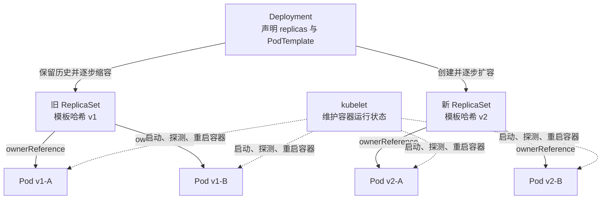
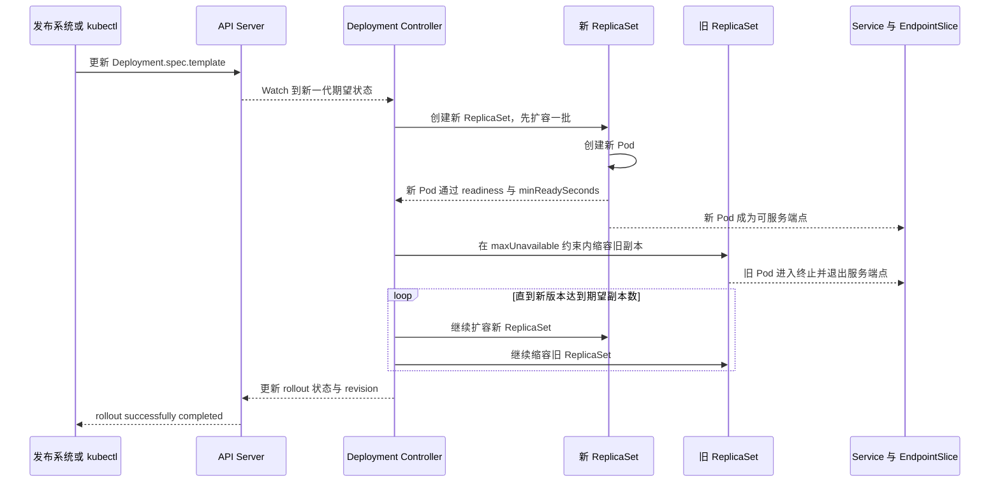
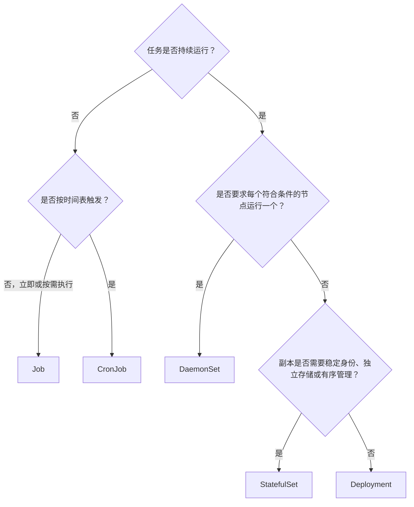
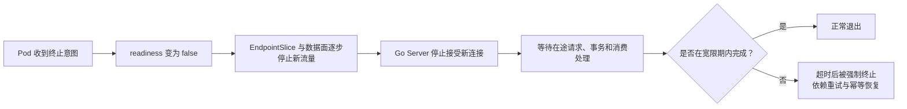

# 第 10 章：Deployment、StatefulSet、DaemonSet、Job 与发布策略

> **版本说明**：本章按 2026 年 6 月可用的 Kubernetes 1.36 官方文档校准。示例使用稳定 API：`apps/v1` 与 `batch/v1`。涉及仍处于 Alpha/Beta 或默认未启用的能力时会单独标注。

## 学习目标

学完本章后，你应该能够：

1. 解释 Pod、ReplicaSet、Deployment 之间的控制关系，而不是把它们当成三个并列对象。
2. 根据业务生命周期、身份、存储和节点绑定要求，在 Deployment、StatefulSet、DaemonSet、Job、CronJob 之间做出选择。
3. 准确计算 `maxSurge`、`maxUnavailable` 对发布容量和可用性的影响。
4. 解释 Deployment 如何借助新旧 ReplicaSet 完成滚动更新、暂停、恢复和回滚。
5. 说明 StatefulSet 提供了哪些稳定性，又为什么它不能自动把数据库变成高可用系统。
6. 设计尽量无损的 Go 服务发布流程，并正确组合 readiness、优雅退出、容量冗余和 PDB。
7. 区分滚动、重建、蓝绿、金丝雀发布，知道原生 Deployment 的能力边界。
8. 处理数据库迁移、消息兼容、回滚失败和滚动更新卡住等生产问题。

---

## 1. 先建立统一心智模型：控制器管理的不是进程，而是期望状态

Kubernetes 的核心不是“执行一条启动命令”，而是让控制器持续比较：

- **期望状态**：写在资源对象的 `spec` 中；
- **实际状态**：来自 Pod、节点、探针、调度和运行时；
- **调谐动作**：创建、删除或更新对象，使实际状态逐步收敛到期望状态。

因此，选择工作负载控制器，本质上是在回答四个问题：

1. 这个任务是**持续运行**，还是**运行完成后退出**？
2. 副本之间是否可以互换，还是需要**稳定身份**？
3. 工作负载是按副本数扩缩，还是必须在**每个符合条件的节点**上运行？
4. 任务是立即执行，还是按时间表周期执行？

### 1.1 控制器职责速览

| 资源 | 主要期望状态 | 身份特征 | 典型用途 |
|---|---|---|---|
| ReplicaSet | 始终维持指定数量的同构 Pod | Pod 可互换 | Deployment 的底层副本控制器，通常不直接使用 |
| Deployment | 持续运行无状态副本，并声明式更新 | Pod 可互换 | HTTP API、消费者、无状态后台服务 |
| StatefulSet | 持续运行有序、具稳定身份的副本 | 稳定序号、网络名、可绑定独立存储 | 数据库、协调系统、需要固定成员身份的服务 |
| DaemonSet | 每个符合条件的节点运行一个 Pod | 身份与节点绑定 | 日志、监控、CNI、CSI、节点代理 |
| Job | 达成指定成功完成次数 | Pod 可重试、可并行 | 数据迁移、批处理、离线计算 |
| CronJob | 按时间表创建 Job | 每次调度产生独立 Job | 定时备份、报表、清理任务 |

> **关键判断**：是否有磁盘，并不是 Deployment 与 StatefulSet 的唯一分界。Deployment 也能挂载 PVC；真正的分界是副本是否需要稳定身份、独立持久卷以及有序管理。

---

## 2. Pod、ReplicaSet、Deployment 的控制关系

Deployment、ReplicaSet、Pod 不是三层“包装壳”，而是三层不同粒度的控制循环：

- **Deployment** 管理版本和发布过程；
- **ReplicaSet** 管理某一份 Pod 模板对应的副本数；
- **Pod** 承载容器；容器在节点内的重启主要由 kubelet 处理。



### 2.1 ReplicaSet 做什么

ReplicaSet 关注三个核心字段：

- `spec.replicas`：期望副本数；
- `spec.selector`：哪些 Pod 属于自己；
- `spec.template`：缺少副本时按什么模板创建 Pod。

假设期望副本数为 4：

- 实际只有 3 个匹配 Pod，ReplicaSet 创建 1 个；
- 实际有 5 个匹配 Pod，ReplicaSet 删除 1 个；
- 某个节点故障导致 Pod 消失，ReplicaSet 在其他可调度节点补副本。

ReplicaSet 不负责多版本发布。直接修改它的模板，不能获得 Deployment 那套完整的版本历史、滚动编排和回滚体验。因此，普通无状态服务应直接声明 Deployment，让 Deployment 自动管理 ReplicaSet。

### 2.2 Deployment 做什么

Deployment 在 ReplicaSet 之上增加了：

- Pod 模板版本管理；
- 新旧 ReplicaSet 的扩缩编排；
- RollingUpdate 与 Recreate 策略；
- rollout 状态、历史、暂停、恢复和回滚；
- `minReadySeconds`、`progressDeadlineSeconds` 等发布稳定性控制。

当 `spec.template` 发生变化时，例如镜像、环境变量、标签、资源配置或探针变化，Deployment 会创建新的 ReplicaSet。仅修改 `spec.replicas` 通常属于扩缩容，不代表产生一个新应用版本。

旧 ReplicaSet 在发布完成后通常被缩容到 0，而不是立即删除。它保存了旧 Pod 模板，供 `rollout history` 和 `rollout undo` 使用。保留数量由 `revisionHistoryLimit` 控制；若设置为 0，旧 ReplicaSet 会被清理，后续将失去 Deployment 原生回滚能力。

### 2.3 不要越过 Deployment 直接操作其 ReplicaSet

生产中常见错误是：

```bash
kubectl scale replicaset/order-api-7b9d8f6d8f --replicas=10
```

如果这个 ReplicaSet 受 Deployment 管理，Deployment 下一次调谐可能覆盖人工修改。正确入口应是 Deployment，或由 HPA 修改 Deployment 的 scale 子资源：

```bash
kubectl scale deployment/order-api --replicas=10
```

---

## 3. Deployment 的声明式更新

下面是一份适合解释发布机制的精简 Deployment：

```yaml
apiVersion: apps/v1
kind: Deployment
metadata:
  name: order-api
  annotations:
    kubernetes.io/change-cause: "release order-api v2.4.0"
spec:
  replicas: 6
  revisionHistoryLimit: 5
  minReadySeconds: 10
  progressDeadlineSeconds: 300
  strategy:
    type: RollingUpdate
    rollingUpdate:
      maxSurge: 2
      maxUnavailable: 0
  selector:
    matchLabels:
      app: order-api
  template:
    metadata:
      labels:
        app: order-api
        version: v2.4.0
    spec:
      terminationGracePeriodSeconds: 45
      containers:
        - name: api
          image: registry.example.com/order-api:v2.4.0
          ports:
            - name: http
              containerPort: 8080
          readinessProbe:
            httpGet:
              path: /readyz
              port: http
            periodSeconds: 2
            failureThreshold: 2
          livenessProbe:
            httpGet:
              path: /livez
              port: http
            periodSeconds: 10
            failureThreshold: 3
          startupProbe:
            httpGet:
              path: /livez
              port: http
            periodSeconds: 2
            failureThreshold: 30
          resources:
            requests:
              cpu: 250m
              memory: 256Mi
            limits:
              memory: 512Mi
```

这份配置表达的是：

- 期望最终有 6 个新版本副本；
- 发布期间不允许可用副本数低于 6；
- 最多额外创建 2 个非终止中 Pod；
- 新 Pod Ready 后还要稳定 10 秒，才被视为 Available；
- 300 秒仍无发布进展时，将 Deployment 标记为 `ProgressDeadlineExceeded`；
- 该标记用于暴露失败和让流水线终止，**不会自动回滚**。

### 3.1 滚动更新时序



实际系统并不是严格串行执行上图每一步。控制器、调度器、kubelet、探针、EndpointSlice 控制器和网络数据面是异步协作的，所以“尽量无损”依赖一整套契约，而不是某个单独字段。

---

## 4. `maxSurge` 与 `maxUnavailable`：必须会算

设 Deployment 期望副本数为 `R`：

- `maxUnavailable` 计算结果记为 `U`；
- `maxSurge` 计算结果记为 `S`。

发布期间的基本边界是：

```text
最少可用副本数 = R - U
最多非终止中 Pod 数 ≈ R + S
```

### 4.1 百分比取整规则

- `maxUnavailable` 百分比：**向下取整**；
- `maxSurge` 百分比：**向上取整**；
- 两者不能同时为 0；
- 两者默认值都是 `25%`。

例如 `replicas: 7`，两个字段都使用默认 `25%`：

```text
U = floor(7 × 25%) = floor(1.75) = 1
S = ceil(7 × 25%)  = ceil(1.75)  = 2
```

所以：

- 发布期间至少保持 `7 - 1 = 6` 个 Available Pod；
- 通常最多有 `7 + 2 = 9` 个非终止中 Pod。

### 4.2 “最多 R + S 个 Pod”为什么不是绝对资源上限

Deployment 计算可用副本时不把正在 Terminating 的 Pod 计入 Available。旧 Pod 如果优雅退出较慢，新 Pod 又已经被创建，总 Pod 数和资源占用可能暂时超过 `R + S`，直到旧 Pod 的 `terminationGracePeriodSeconds` 到期并真正退出。

因此，容量规划不能只预留 `maxSurge`：

- 要考虑旧 Pod 的终止耗时；
- 要考虑节点可调度资源和 Namespace ResourceQuota；
- 要考虑新旧版本在预热期可能同时占用数据库连接、缓存连接和下游并发额度。

### 4.3 常见配置及含义

| 配置 | 可用性 | 额外容量 | 适用场景 | 风险 |
|---|---:|---:|---|---|
| `maxUnavailable: 0`，`maxSurge: 1` | 理论上不主动降低可用副本 | 至少需要 1 个额外槽位 | 对可用性敏感的小规模服务 | 集群无空余资源时发布卡住 |
| `maxUnavailable: 1`，`maxSurge: 0` | 可短暂少 1 个可用副本 | 不需额外容量 | 容量紧张、可承受轻微降容 | 高峰期可能过载 |
| `maxUnavailable: 25%`，`maxSurge: 25%` | 在速度、容量和风险间折中 | 中等 | 通用默认策略 | 小副本数下取整结果容易被忽略 |
| `maxUnavailable: 0`，`maxSurge: 25%` | 更保守 | 较高 | 关键在线服务 | 数据库连接总量和节点容量可能被冲高 |

### 4.4 小副本数的面试陷阱

若 `replicas: 3` 且使用默认 25%：

```text
maxUnavailable = floor(0.75) = 0
maxSurge       = ceil(0.75)  = 1
```

也就是说，默认策略对 3 副本 Deployment 实际表现为“先多建 1 个，再删旧 Pod”。不能只背“默认都是 25%”，必须算出整数结果。

### 4.5 Available 不等于 Running

新 Pod 处于 Running，不代表它可参与旧副本缩容。Deployment 关注的是 Available：

1. Pod 必须 Ready；
2. 如果设置了 `minReadySeconds`，还要连续稳定 Ready 达到指定时间；
3. 中途 readiness 失败或容器崩溃，会重新计算可用性。

这正是 readiness 探针质量直接决定发布安全性的原因。

---

## 5. `RollingUpdate` 与 `Recreate`

### 5.1 RollingUpdate

RollingUpdate 是 Deployment 默认策略。它通过同时调节新旧 ReplicaSet 的副本数，让两个版本在一段时间内共存。

适合：

- 新旧版本可短时间同时处理流量；
- API、消息、缓存和数据库模式具备向前、向后兼容；
- 服务有多个可互换副本；
- 希望降低停机时间。

主要风险：

- 新旧版本行为不兼容；
- 数据库迁移破坏旧版本；
- 两个版本同时消费消息时产生语义冲突；
- readiness 过早成功，把尚未预热好的实例加入流量；
- 扩容带来的下游连接数乘法效应。

### 5.2 Recreate

```yaml
strategy:
  type: Recreate
```

Recreate 在 Deployment 模板升级时，先终止旧版本 Pod，再创建新版本 Pod。它适合：

- 新旧版本绝不能同时运行；
- 共享资源只允许一个版本持有；
- 应用不具备多版本兼容能力，并且业务可以接受停机；
- 测试或内部环境追求简单。

它的代价是明确的发布空窗期：旧 Pod 全部退出到新 Pod Ready 之间，服务不可用。

还要注意：Recreate 只约束 Deployment 驱动的升级流程。若人工删除某个 Pod，ReplicaSet 仍会立即补副本，所以不能把 Recreate 当成通用的“集群里永远最多一个 Pod”保证。真正的单主语义还需要租约、分布式锁、数据库约束或应用级选主。

---

## 6. rollout 操作：状态、历史、回滚、暂停和恢复

### 6.1 查看发布状态

```bash
kubectl rollout status deployment/order-api --timeout=5m
```

默认会持续观察最新 revision。流水线应设置超时并检查退出码，而不是只执行 `kubectl apply` 后就宣告发布成功。

常见辅助命令：

```bash
kubectl get deployment,replicaset,pod -l app=order-api
kubectl describe deployment/order-api
kubectl get events --sort-by=.lastTimestamp
```

### 6.2 查看历史

```bash
kubectl rollout history deployment/order-api
kubectl rollout history deployment/order-api --revision=4
```

建议为每次发布写入可审计的 change-cause 注解：

```bash
kubectl annotate deployment/order-api \
  kubernetes.io/change-cause='release v2.4.0 commit=8f31c2a' --overwrite
```

历史本质上来自 Deployment 保留的旧 ReplicaSet，因此 `revisionHistoryLimit` 太小会削弱回滚能力，太大则增加对象数量和管理噪声。

### 6.3 回滚

```bash
kubectl rollout undo deployment/order-api
kubectl rollout undo deployment/order-api --to-revision=4
```

Deployment 回滚的是 **PodTemplate**，包括镜像、环境变量、探针、资源等模板内容。它不会自动回滚：

- 数据库结构；
- 已写入的新格式数据；
- 已发布的消息；
- 外部系统副作用；
- ConfigMap 或 Secret 的历史值；
- 网关、Service 或其他独立资源的改动。

因此，“能执行 `rollout undo`”不等于“业务一定可回滚”。

### 6.4 暂停与恢复

```bash
kubectl rollout pause deployment/order-api
kubectl set image deployment/order-api api=registry.example.com/order-api:v2.4.1
kubectl set resources deployment/order-api -c api --requests=cpu=300m,memory=256Mi
kubectl rollout resume deployment/order-api
```

暂停后，可以累积多次 Pod 模板修改，恢复时合并成一次 rollout，避免每改一个字段就创建一份新 ReplicaSet。

需要注意：

- `pause` / `resume` 当前只适用于 Deployment；
- 已经创建和正在运行的 Pod 不会因为暂停而停止；
- 暂停状态下 Pod 模板变化不会触发新的 rollout；
- 长期遗忘暂停会导致“配置已改但副本不更新”的故障。

---

## 7. StatefulSet：稳定身份不等于自动高可用

Deployment 把副本视为可互换个体；StatefulSet 则把每个副本视为有编号的成员。它主要提供四类能力：

1. 稳定、唯一的序号，例如 `ledger-0`、`ledger-1`、`ledger-2`；
2. 基于 Headless Service 的稳定网络名称；
3. 通过 `volumeClaimTemplates` 为每个序号绑定独立 PVC；
4. 默认有序创建、扩缩和滚动更新。

### 7.1 StatefulSet 与 Headless Service

下面的 Headless Service 不分配 ClusterIP：

```yaml
apiVersion: v1
kind: Service
metadata:
  name: ledger-peer
spec:
  clusterIP: None
  selector:
    app: ledger
  ports:
    - name: peer
      port: 7000
---
apiVersion: apps/v1
kind: StatefulSet
metadata:
  name: ledger
spec:
  serviceName: ledger-peer
  replicas: 3
  selector:
    matchLabels:
      app: ledger
  podManagementPolicy: OrderedReady
  updateStrategy:
    type: RollingUpdate
  template:
    metadata:
      labels:
        app: ledger
    spec:
      terminationGracePeriodSeconds: 60
      containers:
        - name: ledger
          image: registry.example.com/ledger:v3.2.0
          ports:
            - name: peer
              containerPort: 7000
          readinessProbe:
            tcpSocket:
              port: peer
            periodSeconds: 3
          volumeMounts:
            - name: data
              mountPath: /var/lib/ledger
  volumeClaimTemplates:
    - metadata:
        name: data
      spec:
        accessModes:
          - ReadWriteOncePod
        storageClassName: fast-block
        resources:
          requests:
            storage: 100Gi
```

假设 Namespace 为 `prod`、集群域为默认的 `cluster.local`，Pod 可获得类似下面的稳定 DNS 名称：

```text
ledger-0.ledger-peer.prod.svc.cluster.local
ledger-1.ledger-peer.prod.svc.cluster.local
ledger-2.ledger-peer.prod.svc.cluster.local
```

这里“稳定”的含义是 Pod 被重建后仍沿用相同序号和域名，而不是：

- 永远具有相同 Pod UID；
- 永远调度到相同节点；
- 永远具有相同 Pod IP；
- 永远不会发生 DNS 缓存延迟。

Headless Service 的主要价值是把各个成员的网络身份暴露出来。它不替应用完成主从路由、读写分离、故障转移或一致性协议。

### 7.2 稳定存储

对每一项 `volumeClaimTemplates`，StatefulSet 会为每个 Pod 序号创建一份 PVC。例如：

```text
data-ledger-0
data-ledger-1
data-ledger-2
```

`ledger-1` 被删除后，新创建的 `ledger-1` 会重新关联它原来的 PVC。这适合“成员身份与数据目录绑定”的系统。

默认情况下，缩容或删除 StatefulSet 不会顺手删除这些卷，这是数据安全优先的设计。当前版本也提供 StatefulSet PVC 保留策略，但在生产环境启用自动删除前，必须先确认备份、回收策略和误操作恢复路径。

### 7.3 默认顺序保证

在默认 `OrderedReady` 策略下：

- 创建顺序：`0 → 1 → 2`；
- 缩容与终止顺序：`2 → 1 → 0`；
- 前一个 Pod 未 Running 且 Ready 时，后一个 Pod 通常不会继续创建；
- RollingUpdate 默认从最大序号向最小序号更新，并等待当前 Pod Ready 后再继续。

这种顺序对需要逐个加入成员、同步数据或选主的系统有帮助，但也意味着一个坏版本可能阻塞后续更新。

如果应用不需要顺序扩缩，可以使用：

```yaml
podManagementPolicy: Parallel
```

它放松扩缩时的顺序等待，但不会取消稳定序号、稳定网络身份和 PVC 绑定。

### 7.4 StatefulSet 更新策略

StatefulSet 主要有两种更新策略：

- `RollingUpdate`：默认，自动按顺序删除并重建 Pod；
- `OnDelete`：修改模板后不自动替换现有 Pod，只有人工删除旧 Pod 时才按新模板重建。

`RollingUpdate` 还可通过 `partition` 做分阶段更新：

```yaml
updateStrategy:
  type: RollingUpdate
  rollingUpdate:
    partition: 2
```

对于 3 副本 StatefulSet，这会只更新序号大于等于 2 的 Pod，可先观察 `ledger-2`，再逐步降低 partition。它能控制“哪些序号更新”，但不能自动保证某个流量百分比。

> **版本提示**：StatefulSet 的 `spec.updateStrategy.rollingUpdate.maxUnavailable` 在 Kubernetes 1.36 文档中仍标记为 Beta，并且默认未启用。面试或生产设计时不要把它当成所有集群必然可用的稳定基线。

### 7.5 为什么 StatefulSet 不会自动让数据库高可用

StatefulSet 只提供 Kubernetes 层的身份、编排和存储关联。数据库高可用还需要应用或数据库系统自己处理：

- 数据复制与复制延迟；
- 主节点选举和租约；
- 法定人数与多数派写入；
- 网络分区下的行为；
- fencing，避免旧主恢复后形成双主；
- 日志复制、恢复点和数据校验；
- 读写路由与连接重连；
- 备份、恢复演练和跨故障域容灾。

例如，3 个数据库 Pod 都 Running，并不代表它们形成了正确复制组；3 块 PVC 都挂载成功，也不代表数据一致；Pod 被重建后复用了旧盘，也不代表它有资格自动成为主节点。

**结论**：StatefulSet 是运行有状态系统的基础设施原语，不是数据库高可用方案本身。

---

## 8. DaemonSet：让节点具备本地能力

DaemonSet 的期望状态不是“总共运行 N 个副本”，而是：

> 每一个符合选择条件的节点，都应该运行一个该 DaemonSet 的 Pod。

节点加入集群时，DaemonSet 为它创建 Pod；节点删除后，相应 Pod 被清理。通过 `nodeSelector`、node affinity 和 taint/toleration，可以只覆盖某类节点。

### 8.1 典型场景

- 日志采集代理；
- 节点监控与指标采集代理；
- CNI 网络节点组件；
- CSI 存储节点组件；
- 安全审计、运行时防护代理；
- GPU、硬件或节点特性发现代理。

### 8.2 为什么普通 API 服务不应使用 DaemonSet

普通 HTTP API 的副本数应由流量、容量和 SLO 决定，而不是由节点数决定。使用 DaemonSet 会造成：

- 节点扩容时 API 副本被动增加；
- 每台节点都被迫保留一个副本，即使流量不需要；
- 不能自然表达“需要 20 个副本，但集群有 50 个节点”；
- 滚动更新与容量模型变成节点维度。

### 8.3 选择部分节点

```yaml
apiVersion: apps/v1
kind: DaemonSet
metadata:
  name: node-log-agent
  namespace: observability
spec:
  selector:
    matchLabels:
      app: node-log-agent
  updateStrategy:
    type: RollingUpdate
    rollingUpdate:
      maxUnavailable: 1
  template:
    metadata:
      labels:
        app: node-log-agent
    spec:
      nodeSelector:
        observability-agent: "enabled"
      containers:
        - name: agent
          image: registry.example.com/node-log-agent:v1.8.0
          resources:
            requests:
              cpu: 100m
              memory: 128Mi
          volumeMounts:
            - name: host-logs
              mountPath: /host/var/log
              readOnly: true
      volumes:
        - name: host-logs
          hostPath:
            path: /var/log
      terminationGracePeriodSeconds: 30
```

节点级代理经常需要 `hostPath`、`hostNetwork`、特权能力或访问宿主机设备，因此安全边界比普通业务 Pod 更敏感。应限制权限、使用只读挂载、配置资源请求，并避免一个异常代理耗尽整台节点资源。

### 8.4 DaemonSet 更新

DaemonSet 支持：

- `RollingUpdate`：默认，自动替换节点上的旧 Pod；
- `OnDelete`：只有人工删除旧 Pod 后才按新模板创建。

RollingUpdate 可使用 `maxUnavailable`、`maxSurge` 与 `minReadySeconds`。默认通常为 `maxUnavailable: 1`、`maxSurge: 0`。对于 CNI、CSI 或安全代理，更新过快可能使多个节点同时失去关键能力，因此应结合节点数量、故障域和组件特性谨慎配置。

---

## 9. Job：控制“完成”，而不是控制“持续存活”

Deployment 期望 Pod 长期运行；Job 期望任务达到成功完成条件后结束。

### 9.1 最小 Job

```yaml
apiVersion: batch/v1
kind: Job
metadata:
  name: rebuild-search-index
spec:
  backoffLimit: 3
  activeDeadlineSeconds: 1800
  ttlSecondsAfterFinished: 3600
  template:
    spec:
      restartPolicy: Never
      containers:
        - name: worker
          image: registry.example.com/search-tools:v2.1.0
          args:
            - rebuild-index
```

关键字段：

- `completions`：需要多少次成功完成；
- `parallelism`：最多期望多少个 Pod 并行执行；
- `backoffLimit`：失败重试达到上限后，将 Job 判定失败；
- `activeDeadlineSeconds`：整个 Job 可运行的最长时间；
- `ttlSecondsAfterFinished`：完成后延迟清理 Job；
- `restartPolicy`：Job Pod 只能使用 `Never` 或 `OnFailure`。

### 9.2 三种常见完成模型

#### 非并行 Job

不设置 `completions` 和 `parallelism` 时，两者默认都为 1。一个 Pod 成功退出，Job 完成。

#### 固定完成次数

```yaml
spec:
  completions: 100
  parallelism: 10
```

最多并行 10 个 Pod，累计 100 次成功后完成。适合 100 个可独立处理的分片。

#### Indexed Job

```yaml
spec:
  completions: 100
  parallelism: 10
  completionMode: Indexed
```

每个完成单元获得 `0..99` 的稳定索引，程序可从 `JOB_COMPLETION_INDEX` 获取自己的分片编号。适合静态分片、分布式计算和确定性工作分配。

### 9.3 Job 不保证业务“恰好一次”

即使配置：

```yaml
parallelism: 1
completions: 1
restartPolicy: Never
```

同一业务程序仍可能因节点故障、Pod 状态确认延迟或控制器重试而被启动不止一次。Job 的“成功一次”是控制器观察到一个成功 Pod 的完成语义，不等于数据库写入、付款、发券或外部调用恰好发生一次。

任务必须具备幂等性，常用方法包括：

- 使用唯一业务键和数据库唯一约束；
- 在同一事务中记录处理状态与业务结果；
- 采用幂等键调用外部接口；
- 对分片建立租约，并能识别过期执行者；
- 写临时结果后原子重命名或原子提交；
- 失败重试前检查结果是否已经完成。

### 9.4 `Never` 与 `OnFailure` 的取舍

- `Never`：容器失败后 Pod 进入 Failed，Job 控制器创建新 Pod。失败现场和每次尝试更容易观察，排障通常更清晰；
- `OnFailure`：kubelet 在同一个 Pod 内重启容器，Pod 名不变，但容器重启次数增加。若最终达到 Job 失败条件，现场日志可能更难追踪。

生产中应配合集中日志和业务执行 ID，不要只依赖 Pod 名称定位一次任务。

---

## 10. CronJob：按时间表创建 Job

CronJob 自己不直接运行容器，它按时间表创建 Job，Job 再创建 Pod。

```yaml
apiVersion: batch/v1
kind: CronJob
metadata:
  name: daily-settlement
spec:
  schedule: "0 2 * * *"
  timeZone: "Asia/Tokyo"
  concurrencyPolicy: Forbid
  startingDeadlineSeconds: 900
  successfulJobsHistoryLimit: 3
  failedJobsHistoryLimit: 3
  jobTemplate:
    spec:
      backoffLimit: 2
      activeDeadlineSeconds: 3600
      template:
        spec:
          restartPolicy: Never
          containers:
            - name: settlement
              image: registry.example.com/settlement:v5.0.0
```

### 10.1 `concurrencyPolicy`

| 策略 | 行为 | 适用场景 | 风险 |
|---|---|---|---|
| `Allow` | 允许同一 CronJob 的多次 Job 重叠运行 | 每次任务互不影响 | 下游并发、重复处理和资源峰值 |
| `Forbid` | 上一次未完成时跳过本次启动 | 不允许重叠的备份、结算 | 长任务可能持续造成错过调度 |
| `Replace` | 新调度到来时替换仍在运行的旧 Job | 只关心最新结果的同步任务 | 旧任务中断，必须能安全恢复或放弃 |

该策略只约束同一个 CronJob 创建的 Job。两个不同 CronJob 即使处理相同业务，也可以并发执行。

### 10.2 `startingDeadlineSeconds`

CronJob 控制器未能在计划时间创建 Job 时，可在该截止时间内补建；超过则跳过该次执行。

它不是任务运行超时。任务运行时间应由 Job 的 `activeDeadlineSeconds` 控制。

不要把 `startingDeadlineSeconds` 设置得过小。CronJob 控制器按周期检查，过小的值可能导致调度机会被错过。

### 10.3 错过调度和重复执行

CronJob 调度不是精确到绝不重复、绝不遗漏的“恰好一次”系统。在特殊情况下，可能创建两个 Job，也可能未创建预期 Job。控制器停机、时钟问题、`Forbid`、截止时间和大量错过调度都会影响结果。

所以 CronJob 内的任务同样必须幂等，并应记录：

- 逻辑业务日期，例如 `2026-06-21`；
- 原始计划调度时间；
- 执行 ID；
- 完成状态与校验信息。

不能用“Pod 只启动过一次”推断“业务只处理过一次”。

---

## 11. 工作负载控制器选择决策图



### 11.1 控制器完整比较表

| 维度 | ReplicaSet | Deployment | StatefulSet | DaemonSet | Job | CronJob |
|---|---|---|---|---|---|---|
| 核心目标 | 保持固定副本数 | 无状态副本与版本发布 | 稳定身份的有状态副本 | 每个合格节点一个 Pod | 达成成功完成条件 | 定时创建 Job |
| 运行时长 | 持续 | 持续 | 持续 | 持续 | 有限 | 每次有限、周期触发 |
| Pod 是否可互换 | 是 | 是 | 否，序号有意义 | 与节点绑定 | 通常可重试 | 取决于 Job |
| 稳定网络身份 | 无 | 无 | 有，序号加 Headless Service | 通常通过节点或 Service | 非核心能力 | 非核心能力 |
| 稳定独立存储 | 不负责 | 可挂载，但无每序号语义 | `volumeClaimTemplates` | 常访问节点本地目录 | 可挂载 | 通过 Job 模板挂载 |
| 副本模型 | 总数 N | 总数 N | 总数 N，成员有序号 | 每节点 1 个 | completions / parallelism | schedule → Job |
| 更新能力 | 很弱 | RollingUpdate / Recreate | RollingUpdate / OnDelete | RollingUpdate / OnDelete | 通常创建新 Job | 修改只影响后续 Job |
| 典型用途 | Deployment 内部实现 | API、无状态服务、消费者 | 数据库、协调系统 | 节点代理、网络、存储 | 迁移、批处理 | 备份、结算、清理 |
| 常见误用 | 直接作为业务发布入口 | 承载需要固定成员身份的系统 | 把它等同于数据库 HA | 用它按节点数部署普通 API | 期待恰好一次副作用 | 期待绝不重复且绝不漏跑 |

---

## 12. 发布策略：滚动、重建、蓝绿与金丝雀

### 12.1 滚动发布

滚动发布逐批替换旧副本，是 Deployment 的原生能力。

优点：

- 不必准备完整的双份环境；
- 可用 `maxSurge`、`maxUnavailable` 控制速度和容量；
- 可保留 ReplicaSet 历史并快速回滚 Pod 模板；
- 适合频繁、小步发布。

缺点：

- 发布期间新旧版本共存；
- 发现问题时，部分请求和数据已经由新版本处理；
- 原生控制器只依据副本状态和 readiness 推进，不会自动分析业务错误率、p99 或收入指标；
- 无法原生表达“先给新版本 1% 流量，稳定 30 分钟后再到 10%”。

### 12.2 蓝绿发布

蓝绿发布同时维护两套完整环境：

- Blue：当前生产版本；
- Green：待发布版本。

验证 Green 后，通过 Service selector、入口路由或网关配置把新连接切到 Green。发生问题时再切回 Blue。

一种简单的原生组合方式是：

```text
Deployment/order-api-blue  labels: app=order-api, track=blue
Deployment/order-api-green labels: app=order-api, track=green
Service/order-api          selector: app=order-api, track=blue
```

切换时把 Service 的 `track` 从 `blue` 改为 `green`。

优点：

- 切换和回切都很快；
- Green 可在不接生产流量时充分预热和验证；
- 新旧环境边界清晰。

缺点：

- 接近双倍计算资源；
- 数据库、缓存、消息队列通常仍是共享的，不能真正一键回到发布前世界；
- Service selector 切换是控制面变更，传播存在时间差；
- 已建立的长连接不会因为 selector 改变就自动迁移，仍需连接排空和超时管理。

### 12.3 金丝雀发布

金丝雀发布先让少量实例或少量流量进入新版本，观察指标后逐步扩大。

可用两个 Deployment 做粗粒度方案：

```text
稳定版：9 个副本
金丝雀：1 个副本
两个 Deployment 都被同一个 Service 选中
```

在理想的短连接、均匀端点选择条件下，这可能得到接近 90% / 10% 的连接分布，但它不是精确的请求权重，原因包括：

- Service 通常按连接而不是每个 HTTP 请求重新选择后端；
- HTTP keep-alive、HTTP/2 和 gRPC 长连接会放大偏斜；
- 拓扑感知路由、会话亲和与端点状态会影响分布；
- 新旧 Pod 就绪时间不同；
- 一个实例的处理能力未必等于另一个实例。

若需要按百分比、请求头、用户 ID、租户、地域或 Cookie 精确分流，通常要使用具备加权路由能力的 Ingress/Gateway 实现、API 网关或服务网格；若还要按指标自动晋级和回滚，则需要额外的渐进式交付控制器或发布平台。

### 12.4 发布策略比较表

| 策略 | 新旧版本是否共存 | 额外容量 | 切流方式 | 回滚速度 | 主要风险 | Kubernetes 原生程度 |
|---|---|---:|---|---|---|---|
| Recreate | 否 | 低 | 先停旧再起新 | 取决于重新启动 | 明确停机 | Deployment 直接支持 |
| RollingUpdate | 是 | 由 `maxSurge` 决定 | 新旧 ReplicaSet 渐进替换 | 较快 | 多版本兼容、部分流量已进入新版 | Deployment 直接支持 |
| 蓝绿 | 两套完整环境 | 高，接近双份 | Service、网关或入口切换 | 很快 | 共享数据层、长连接、双份成本 | 可用原生对象组合，切换编排需自行管理 |
| 金丝雀 | 是 | 低到中 | 少量副本或加权路由 | 快，若保留稳定版 | 流量比例不准、观测不足 | 副本级粗粒度可组合；精确权重需额外数据面 |

### 12.5 原生 Deployment 能做什么，不能做什么

**能做：**

- 维护期望副本数；
- 创建新 ReplicaSet、缩容旧 ReplicaSet；
- 依据 readiness、Available 副本和发布参数推进；
- 暂停、恢复、查看历史、回滚 Pod 模板；
- 暴露发布进度和超时状态。

**不能单独做：**

- 按请求维度精确控制 1%、5%、20% 流量；
- 按用户或请求头分群；
- 根据业务错误率、延迟或自定义 SLO 自动晋级；
- 自动回滚数据库结构和外部副作用；
- 证明发布“零错误”；
- 保证新旧版本业务语义兼容。

---

## 13. 尽量无损滚动发布：五个条件必须同时成立

“零停机”常被说得过于绝对。分布式系统中更严谨的目标是：

> 在已定义的故障模型、流量模型和超时预算内，使发布引入的失败率和延迟变化不超过 SLO。

要做到尽量无损，至少要满足五个条件。

### 13.1 条件一：有真实容量冗余

如果服务平时 6 个 Pod 已经跑到 85% CPU，那么 `maxUnavailable: 1` 会把剩余 5 个 Pod 推向过载。即使 Kubernetes 认为仍有 5 个 Available，业务也可能出现 p99 激增和超时。

发布容量应考虑：

- 当前峰值负载；
- 单 Pod 安全吞吐，而不是压测极限吞吐；
- `maxSurge`；
- Terminating Pod 的重叠资源；
- 新版本预热和 JIT、缓存、连接池建立成本；
- 节点故障或驱逐与发布同时发生的可能性。

### 13.2 条件二：readiness 准确表达“可以接收新流量”

readiness 应检查本实例是否完成必要初始化，例如：

- 配置已加载；
- 必要缓存或模型已准备；
- 监听端口可服务；
- 关键内部组件正常。

但不宜把所有下游依赖的瞬时波动都直接映射为 readiness 失败，否则数据库短暂抖动可能让所有 Pod 同时退出 Service，形成级联故障。

可用性判断应区分：

- **实例自身不能服务**：readiness 失败；
- **某下游暂时异常**：接口快速失败、熔断或降级，不一定摘除整个实例；
- **进程已无法恢复**：liveness 失败并重启；
- **启动耗时长**：用 startupProbe 保护启动阶段，避免 liveness 过早杀死进程。

### 13.3 条件三：新 Pod 要经过稳定窗口

`minReadySeconds` 防止一个新 Pod 刚 Ready 就触发旧副本缩容。如果程序启动后 5 秒内经常因配置、连接或内存问题崩溃，把它设为 10～30 秒可让 Deployment 更保守。

`progressDeadlineSeconds` 则用于发现发布长期无进展。它应该大于：

```text
调度等待 + 镜像拉取 + 容器启动 + startupProbe 窗口
+ readiness 收敛 + minReadySeconds + 合理抖动余量
```

设置太短会误报，太长会延迟止损。

### 13.4 条件四：旧 Pod 能排空并优雅退出

Pod 被终止时，端点变更、网络规则传播、`preStop`、SIGTERM 和应用退出是异步协作的。应用不能假定收到 SIGTERM 的瞬间，所有上游就已经停止发请求。

可靠做法是：

1. 收到终止信号后先把自身 readiness 置为失败；
2. 留出一个可测量的端点传播窗口；
3. 停止接收新请求；
4. 等待正在处理的请求、消息和事务完成；
5. 在 `terminationGracePeriodSeconds` 内退出；
6. 超时后接受 kubelet 强制终止，并确保业务可重试、可幂等。



### 13.5 Go 服务的 readiness 与优雅退出示例

下面只展示关键逻辑：

```go
package main

import (
    "context"
    "errors"
    "log/slog"
    "net/http"
    "os"
    "os/signal"
    "sync/atomic"
    "syscall"
    "time"
)

func main() {
    var ready atomic.Bool

    mux := http.NewServeMux()
    mux.HandleFunc("/livez", func(w http.ResponseWriter, _ *http.Request) {
        w.WriteHeader(http.StatusOK)
        _, _ = w.Write([]byte("ok"))
    })
    mux.HandleFunc("/readyz", func(w http.ResponseWriter, _ *http.Request) {
        if !ready.Load() {
            http.Error(w, "not ready", http.StatusServiceUnavailable)
            return
        }
        w.WriteHeader(http.StatusOK)
        _, _ = w.Write([]byte("ready"))
    })
    mux.HandleFunc("/orders", func(w http.ResponseWriter, r *http.Request) {
        // 业务处理必须尊重 r.Context()，并对外部副作用设计幂等。
        w.WriteHeader(http.StatusOK)
        _, _ = w.Write([]byte("accepted"))
    })

    srv := &http.Server{
        Addr:              ":8080",
        Handler:           mux,
        ReadHeaderTimeout: 3 * time.Second,
        ReadTimeout:       10 * time.Second,
        WriteTimeout:      15 * time.Second,
        IdleTimeout:       60 * time.Second,
    }

    ctx, stop := signal.NotifyContext(
        context.Background(),
        syscall.SIGTERM,
        syscall.SIGINT,
    )
    defer stop()

    errCh := make(chan error, 1)
    go func() {
        errCh <- srv.ListenAndServe()
    }()

    // 完成配置加载、连接建立和必要预热后再 Ready。
    ready.Store(true)

    select {
    case <-ctx.Done():
        slog.Info("termination signal received")
    case err := <-errCh:
        if err != nil && !errors.Is(err, http.ErrServerClosed) {
            slog.Error("http server failed", "err", err)
            os.Exit(1)
        }
        return
    }

    // 先主动摘流。等待时长应通过集群实测确定，而不是盲目照抄。
    ready.Store(false)
    time.Sleep(5 * time.Second)

    shutdownCtx, cancel := context.WithTimeout(context.Background(), 35*time.Second)
    defer cancel()

    if err := srv.Shutdown(shutdownCtx); err != nil {
        slog.Error("graceful shutdown timed out", "err", err)
        _ = srv.Close()
        os.Exit(1)
    }

    slog.Info("server stopped gracefully")
}
```

这个例子要求 Pod 的 `terminationGracePeriodSeconds` 大于：

```text
端点传播等待 5 秒 + Shutdown 最长 35 秒 + 少量调度余量
```

因此前面的 YAML 设置为 45 秒。真实数值要根据请求最长耗时、Ingress/Gateway 行为、连接复用、EndpointSlice 传播和服务网格配置实测。

> `preStop` 也消耗同一份终止宽限时间。若 `preStop` 先睡 20 秒，而总宽限期只有 30 秒，留给 Go 的 SIGTERM 处理时间就会明显减少。不要把长时间 sleep 当成万能无损方案。

### 13.6 条件五：新旧版本业务兼容

滚动发布期间至少存在下面的组合：

```text
旧应用 + 新数据库结构
新应用 + 新数据库结构
旧消费者 + 新消息格式
新消费者 + 旧消息格式
```

如果任一组合不成立，Kubernetes 层面即使所有 Pod 都 Ready，业务仍可能出错。因此发布前应建立兼容矩阵，并通过契约测试、影子流量或预生产验证。

---

## 14. PDB 在发布中的真实作用

PodDisruptionBudget 用于约束通过 Eviction API 发起的**主动中断**，典型场景是：

- `kubectl drain`；
- 节点计划维护；
- 尊重 PDB 的节点自动缩容或集群管理工具。

例如：

```yaml
apiVersion: policy/v1
kind: PodDisruptionBudget
metadata:
  name: order-api
spec:
  maxUnavailable: 1
  unhealthyPodEvictionPolicy: AlwaysAllow
  selector:
    matchLabels:
      app: order-api
```

### 14.1 PDB 不控制 Deployment 自身滚动更新

这是高频面试陷阱：

- Deployment 滚动发布的可用性由 `maxUnavailable`、`maxSurge`、readiness 和 `minReadySeconds` 管理；
- PDB 只约束尊重 Eviction API 的中断；
- 直接删除 Pod、删除 Deployment，以及工作负载控制器自己的滚动升级不会被 PDB 阻止；
- 发布中已经不可用的 Pod 会占用 disruption budget，从而可能让同时进行的节点 drain 被阻塞。

所以，PDB 是“发布期间避免节点维护再额外拿走太多副本”的补充保护，而不是 Deployment rollout 的主控制器。

### 14.2 PDB 也不是绝对可用性保证

PDB 无法阻止：

- 节点突然宕机；
- 内核崩溃；
- 网络分区；
- OOM 或节点资源压力；
- 人工直接删除 Pod；
- 错误 Deployment 更新；
- 所有副本被错误 readiness 同时摘除。

高可用仍需要多副本、跨节点和跨故障域分布、合理资源请求、容量冗余以及应用容错。

---

## 15. Go 服务发布中的数据库迁移与回滚风险

数据库迁移是发布系统最容易被低估的部分。Deployment 能回滚容器模板，但数据库通常已被新版本修改，不能假定回滚应用就能恢复旧行为。

### 15.1 推荐模式：Expand → Migrate → Contract

#### 第一步：Expand

先做向后兼容的扩展，例如：

- 新增可空列或带安全默认值的列；
- 新增表；
- 新增索引，并使用数据库支持的低锁或在线方式；
- 保留旧字段和旧约束；
- 让旧版本仍能在新结构上运行。

#### 第二步：部署兼容版本

新版本可以：

- 双写旧字段与新字段；
- 读新字段，缺失时回退旧字段；
- 同时理解旧、新消息格式；
- 使用版本化 API 或事件 schema。

#### 第三步：Migrate / Backfill

通过受控 Job 分批回填历史数据。回填任务需要：

- 幂等；
- 可断点续跑；
- 有限并发；
- 限速，避免压垮主库；
- 可观测进度和失败分片；
- 不与在线请求产生不可控锁竞争。

#### 第四步：Contract

确认所有实例、消费者和回滚窗口都不再依赖旧结构后，在后续独立发布中：

- 停止双写；
- 删除旧列或旧表；
- 收紧约束；
- 删除兼容分支。

Contract 不应与首次启用新代码放在同一次发布中，否则回滚窗口几乎消失。

### 15.2 数据库迁移 Job 示例

```yaml
apiVersion: batch/v1
kind: Job
metadata:
  name: order-db-expand-v240
  labels:
    app: order-api
    release: v2.4.0
spec:
  backoffLimit: 2
  activeDeadlineSeconds: 900
  ttlSecondsAfterFinished: 86400
  template:
    metadata:
      labels:
        app: order-api-migration
    spec:
      restartPolicy: Never
      containers:
        - name: migrate
          image: registry.example.com/order-api:v2.4.0
          args:
            - migrate
            - expand
            - --migration-id=20260622_add_fulfillment_state
```

流水线应明确等待 Job 成功：

```bash
kubectl wait --for=condition=complete \
  job/order-db-expand-v240 --timeout=15m
```

若 Job 失败，停止应用 rollout，并读取失败 Pod 日志和事件。

### 15.3 为什么不建议每个 Pod 都在 initContainer 中抢着迁移

将数据库迁移放进每个业务 Pod 的 initContainer，容易出现：

- 多个新 Pod 并发执行同一 DDL；
- 迁移锁阻塞全部 Pod 启动，rollout 卡死；
- 一个慢迁移放大 `maxSurge` 资源占用；
- 迁移失败与应用启动失败混在一起；
- Deployment 回滚时旧 Pod 仍面对已改变的数据库；
- 很难独立审批、审计和重试。

若组织必须采用应用启动迁移，至少要有数据库级互斥锁、唯一迁移版本、幂等判断和严格超时。但更清晰的方案通常是“每个 release 一个显式 Job，由发布流水线编排”。

### 15.4 回滚前必须回答的问题

1. 新版本是否写入了旧版本无法读取的数据？
2. 新版本是否发布了旧消费者无法解析的消息？
3. 新版本是否删除或重命名了旧版本依赖的列？
4. 新版本是否改变缓存 Key、序列化格式或加密方式？
5. 新版本是否调用了不可逆外部接口？
6. 回滚后，已由新版本处理中的请求如何收敛？
7. 数据迁移是否有反向脚本，反向脚本本身是否安全？

生产上更可靠的目标通常不是“任意时刻都能把所有数据完全回到过去”，而是：

- 应用版本可快速回退；
- 数据结构在回滚窗口内保持前后兼容；
- 数据变更可继续向前修复；
- 不可逆操作有业务补偿流程。

---

## 16. 发布前检查清单

### 16.1 工作负载与容量

- 控制器类型与业务生命周期匹配；
- `replicas` 能覆盖单 Pod 故障和发布降容；
- `maxSurge` 需要的节点资源和 ResourceQuota 已预留；
- 终止中的旧 Pod 可能额外占用资源；
- 数据库、Redis、HTTP、消息客户端连接池按“单 Pod × 峰值 Pod 数”核算；
- Pod 跨节点、故障域合理分布。

### 16.2 健康检查与生命周期

- startup、readiness、liveness 职责分离；
- readiness 不会过早成功；
- readiness 也不会因一个非关键下游抖动导致全体摘流；
- Go 服务处理 SIGTERM；
- 请求、事务和消息处理尊重 context；
- `terminationGracePeriodSeconds` 覆盖排空时间；
- 最长请求超时小于终止宽限期；
- 长连接有重连和服务端排空策略。

### 16.3 兼容与回滚

- 新旧应用可同时运行；
- 数据库采用 Expand / Contract；
- 消息和 API 至少兼容 N 与 N-1；
- 发布镜像使用不可变 tag 或 digest；
- `revisionHistoryLimit` 满足回滚窗口；
- 回滚步骤、停止条件和负责人明确；
- 关键变更已在预生产或小流量阶段验证。

### 16.4 观测与自动止损

- 发布前有错误率、吞吐、p95/p99、饱和度基线；
- 可按版本标签区分新旧 Pod 指标；
- 日志包含 release、commit、Pod 和请求 ID；
- 流水线等待 `rollout status`；
- `ProgressDeadlineExceeded`、CrashLoop、ImagePull、Pending 有告警；
- 明确哪些指标触发暂停、回滚或停止扩量。

---

## 17. 发布失败与控制器排障

### 17.1 统一排障顺序

不要一上来就删除 Pod。先沿控制关系从上到下观察：

```bash
kubectl get deployment/order-api -o wide
kubectl rollout status deployment/order-api --timeout=10s
kubectl describe deployment/order-api
kubectl get rs -l app=order-api --sort-by=.metadata.creationTimestamp
kubectl get pods -l app=order-api -o wide
kubectl describe pod/<new-pod>
kubectl logs <new-pod> -c api
kubectl logs <new-pod> -c api --previous
kubectl get events --sort-by=.lastTimestamp
```

核心问题依次是：

1. Deployment 是否观察到新模板？
2. 新 ReplicaSet 是否创建？
3. 新 ReplicaSet 是否能创建 Pod？
4. Pod 是否可调度、可拉镜像、可启动？
5. startup/readiness 是否通过？
6. 新 Pod 是否达到 Available？
7. 旧 ReplicaSet 是否因此获准继续缩容？

### 17.2 Deployment 滚动更新卡住

| 现象 | 常见原因 | 验证方式 | 处理方向 |
|---|---|---|---|
| 新 RS 为 0 | Deployment 被暂停；模板未实际变化 | 查看 `spec.paused`、revision、事件 | 恢复 Deployment，确认修改位于 `spec.template` |
| 新 Pod Pending | 资源不足、亲和性、污点、PVC、配额 | `describe pod` 看 FailedScheduling | 增加容量、修正调度约束或调低 surge |
| ImagePullBackOff | 镜像名、凭据、网络、架构不匹配 | Pod 事件 | 修复镜像和 imagePullSecrets |
| CrashLoopBackOff | 程序启动失败、配置错误、OOM | `logs --previous`、状态和退出码 | 修复程序、配置或资源 |
| Running 但不 Ready | readiness 错误、依赖不可达、端口配置错误 | `describe pod`、探针日志 | 修复探针和应用就绪条件 |
| Ready 但长期不 Available | `minReadySeconds` 尚未满足或反复抖动 | Deployment 状态、Pod readiness 历史 | 修复抖动或调整稳定窗口 |
| `ProgressDeadlineExceeded` | 在截止时间内无足够进展 | Deployment Conditions | 找根因；该状态不会自动回滚 |
| Pod 数超过 `replicas + maxSurge` | 旧 Pod 仍 Terminating | 查看 deletionTimestamp、终止耗时 | 优化退出，检查 finalizer、挂载和长请求 |

### 17.3 旧 ReplicaSet 为什么没有缩到 0

最常见的机制原因是：新 ReplicaSet 的 Pod 尚未达到 Available，Deployment 必须遵守 `maxUnavailable`，因此不能继续删除旧 Pod。

重点检查：

- 新 Pod readiness；
- `minReadySeconds`；
- 新 Pod 是否反复重启；
- 集群是否有空间满足 `maxSurge`；
- Deployment 是否被 pause；
- 是否在 rollout 未结束时又提交了第三个版本，形成多个在途 ReplicaSet；
- HPA 是否同时修改副本数，使观察结果更复杂；
- 旧 Pod 是否正在优雅终止但尚未退出。

不要把 PDB 当作首要嫌疑。Deployment 自身滚动更新不受 PDB 限制。

### 17.4 回滚后仍不恢复

可能原因：

- 数据库迁移已破坏旧版本兼容性；
- ConfigMap、Secret 或 Service 是独立变更，未随 Deployment 回滚；
- 旧镜像已被覆盖或 tag 不可变性失效；
- 新版本已写入旧版本不能解析的数据；
- 下游缓存、队列或连接池仍保留新状态；
- readiness 依赖的外部系统仍异常；
- 旧 revision 已因 `revisionHistoryLimit` 被清理。

验证回滚不能只看镜像 tag，应核对实际镜像 digest、环境变量、配置版本、数据库 schema 和外部依赖。

### 17.5 StatefulSet 更新卡住

按下面顺序排查：

```bash
kubectl rollout status statefulset/ledger
kubectl get pod -l app=ledger -o wide
kubectl get pvc -l app=ledger
kubectl describe statefulset/ledger
kubectl describe pod/ledger-2
```

常见原因：

- 最高序号的新 Pod 无法 Ready，顺序更新停止；
- PVC Pending、卷无法附加或仍挂在旧节点；
- Headless Service 或 `serviceName` 配置错误；
- 成员加入复制组失败；
- 分区 `partition` 阻止部分序号更新；
- 坏模板造成默认 OrderedReady 更新陷入已知的强制回滚困境。

对于最后一种情况，仅恢复旧模板可能还不够；还需要人工删除已经用坏模板创建、但永远无法 Ready 的 Pod，让 StatefulSet 用恢复后的模板重建。操作前必须确认数据和成员一致性。

### 17.6 DaemonSet 更新卡住

```bash
kubectl rollout status daemonset/node-log-agent -n observability
kubectl get ds/node-log-agent -n observability
kubectl get pods -l app=node-log-agent -n observability -o wide
```

检查：

- 哪些节点是 eligible；
- nodeSelector、affinity 和 taint/toleration；
- 某节点是否资源不足；
- 宿主机路径或设备是否存在；
- 新镜像是否支持该节点架构；
- `maxUnavailable` 是否过于保守；
- 关键系统 DaemonSet 是否因自身故障导致节点无法 Ready。

### 17.7 Job 失败或重复执行

```bash
kubectl describe job/rebuild-search-index
kubectl get pods -l job-name=rebuild-search-index
kubectl logs <failed-job-pod>
```

检查：

- `backoffLimit` 是否耗尽；
- `activeDeadlineSeconds` 是否超时；
- 容器退出码；
- Pod 是被驱逐、OOM 还是程序主动失败；
- 是否缺少权限、配置或 Secret；
- 是否已经部分写入结果；
- 重试是否会产生重复副作用。

排障阶段使用 `restartPolicy: Never` 往往更容易保留每次失败尝试的 Pod 现场。

### 17.8 CronJob 没有按预期运行

```bash
kubectl get cronjob/daily-settlement -o yaml
kubectl get jobs --sort-by=.metadata.creationTimestamp
kubectl get events --sort-by=.lastTimestamp
```

检查：

- `spec.suspend` 是否为 true；
- `schedule` 与 `timeZone` 是否符合预期；
- `startingDeadlineSeconds` 是否太短；
- `concurrencyPolicy: Forbid` 是否因上次任务未结束而跳过；
- `Replace` 是否终止了旧任务；
- 是否累积超过控制器可接受的错过调度次数；
- CronJob 修改是否只影响后续 Job，而旧 Job 仍在运行；
- 任务是否执行了但业务幂等表阻止重复处理。

---

## 18. 常见错误认知

### 误区 1：Deployment 直接管理 Pod

更准确的说法是 Deployment 管理 ReplicaSet，ReplicaSet 管理 Pod。Deployment 通过调节新旧 ReplicaSet 完成版本发布。

### 误区 2：Pod Running 就能缩容旧版本

Deployment 关注 Available。Pod 需要 Ready，并可能还要满足 `minReadySeconds`。

### 误区 3：`maxSurge: 25%` 永远多建四分之一

百分比最终要转成整数，`maxSurge` 向上取整，`maxUnavailable` 向下取整。小副本数下结果可能与直觉差异很大。

### 误区 4：总 Pod 数永远不会超过 `replicas + maxSurge`

正在 Terminating 的旧 Pod 可能仍占用资源，因此实际 Pod 数和资源用量可暂时更高。

### 误区 5：PDB 能阻止 Deployment 发布时删除太多 Pod

PDB 不约束 Deployment 自身的滚动更新。发布可用性由 Deployment 策略和探针控制。

### 误区 6：StatefulSet 保证 Pod IP 不变

它保证稳定序号和网络名称，不保证 Pod IP 或节点不变。

### 误区 7：用了 StatefulSet，数据库就高可用

StatefulSet 不实现复制、选主、法定人数、fencing、备份或数据一致性。

### 误区 8：DaemonSet 等于每个节点一定有一个 Pod

准确说法是每个**符合条件的节点**一个 Pod。节点选择、亲和性、污点、资源和调度失败都会影响结果。

### 误区 9：Job 成功表示业务副作用恰好执行一次

Job 只报告 Pod 完成语义。程序可能被启动多次，业务必须幂等。

### 误区 10：CronJob 是可靠的恰好一次定时器

CronJob 可能重复或错过创建 Job，必须以业务时间键和幂等状态表保证结果。

### 误区 11：`rollout undo` 能恢复整次发布

它只恢复工作负载模板，不恢复数据库、消息、配置和外部副作用。

### 误区 12：同一个 Service 下 9 个稳定 Pod 加 1 个金丝雀 Pod，就严格等于 90%/10% 请求

长连接、会话亲和、拓扑和端点状态都会造成偏斜。精确流量权重要交给支持加权路由的数据面。

---

## 19. 章节总结

1. Deployment 负责版本与发布，ReplicaSet 负责副本数量，Pod 承载容器；理解这条所有权链是分析发布问题的起点。
2. `maxUnavailable` 向下取整，决定发布期间允许损失的可用容量；`maxSurge` 向上取整，决定额外创建容量。终止中的 Pod 可能让实际资源超过表面上限。
3. StatefulSet 提供稳定序号、网络名、PVC 关联和有序管理，但数据库复制、选主和一致性仍由应用系统负责。
4. DaemonSet 面向节点本地能力，不应拿来按节点数部署普通业务服务。
5. Job 和 CronJob 都不提供业务恰好一次语义，重试、重复创建和节点故障要求任务幂等。
6. RollingUpdate 是原生渐进替换；蓝绿和粗粒度金丝雀可由原生对象组合；精确加权流量和指标驱动晋级需要额外数据面与交付控制器。
7. 尽量无损发布需要容量冗余、准确 readiness、稳定窗口、Go 优雅退出以及新旧版本兼容共同成立。
8. PDB 保护尊重 Eviction API 的主动中断，不控制 Deployment 自身 rollout，也不能阻止节点突发故障。
9. 应用回滚不等于数据回滚。数据库发布应采用 Expand → Migrate → Contract，并把不可逆变更放到回滚窗口之后。
10. 排障时沿 Deployment → ReplicaSet → Pod → 容器 → 探针 → Service 端点逐层验证，避免通过盲删 Pod 掩盖根因。

---

## 20. 面试题

### 20.1 基础题 1：Pod、ReplicaSet、Deployment 分别负责什么？

**面试官考察意图**

考察候选人是否理解 Kubernetes 的分层控制循环和所有权关系，而不是只会背资源定义。

**30 秒回答**

Deployment 管理应用版本和发布过程，通常通过创建新 ReplicaSet、缩容旧 ReplicaSet 实现声明式更新；ReplicaSet 负责维持某一份 Pod 模板的期望副本数；Pod 承载容器，节点上的 kubelet 负责容器启动、探测和重启。生产中一般直接管理 Deployment，不直接修改它控制的 ReplicaSet。

**展开回答：结论 → 机制 → 场景 → 取舍 → 验证**

- **结论**：三者不是并列关系，而是 Deployment → ReplicaSet → Pod 的控制链。
- **机制**：Deployment 的 `spec.template` 变化会生成新的 ReplicaSet；ReplicaSet 根据 selector 识别 Pod，根据 replicas 补齐或删除；对象间通过 `ownerReferences` 建立所有权。容器在同一个 Pod 内崩溃时，通常由 kubelet依据 `restartPolicy` 处理，不需要 Deployment 每次介入。
- **场景**：镜像从 v1 更新到 v2 时，Deployment 不直接修改旧 Pod，而是创建 v2 ReplicaSet，逐步扩容 v2、缩容 v1。
- **取舍**：直接使用 ReplicaSet 可以维持副本，但缺少 Deployment 的发布历史、暂停、恢复和便捷回滚；除非自定义编排，否则不推荐。
- **验证**：执行 `kubectl get rs`，再查看 Pod 的 `metadata.ownerReferences`；观察 Deployment 更新时是否出现新模板哈希的 ReplicaSet。

**可能追问**

1. 直接删除一个 Pod 会发生什么？
2. 修改 `spec.replicas` 会不会创建新 revision？
3. 为什么旧 ReplicaSet 发布后还保留？

**常见误区**

- 说 Deployment 直接重启容器；
- 把 ReplicaSet 描述成“只负责创建 Pod，一次完成后不再工作”；
- 认为直接 scale 受 Deployment 管理的 ReplicaSet 是长期有效的操作。

---

### 20.2 基础题 2：Deployment 与 StatefulSet 应如何选择？

**面试官考察意图**

考察候选人是否能从身份、存储和编排语义做选型，而不是简单使用“无状态/有状态”标签。

**30 秒回答**

副本可以互换、只需要按数量扩缩的服务优先 Deployment；副本需要稳定序号、稳定网络名、每个成员独立 PVC 或有序扩缩更新时选择 StatefulSet。是否挂载磁盘不是唯一判断标准，Deployment 也能挂载存储。StatefulSet 只提供身份和编排，不自动提供数据库复制和高可用。

**展开回答：结论 → 机制 → 场景 → 取舍 → 验证**

- **结论**：判断核心是“成员是否有身份”，而不是“有没有数据”。
- **机制**：Deployment 的 Pod 可互换，名称和 IP 可变化；StatefulSet 为 Pod 分配稳定 ordinal，并通过 Headless Service 构造稳定 DNS，通过 `volumeClaimTemplates` 绑定每序号 PVC，默认按序创建和终止。
- **场景**：无状态 Go API、任意副本都能处理请求，用 Deployment；需要 `db-0`、`db-1` 成员关系和独立数据盘的数据库集群，用 StatefulSet。
- **取舍**：StatefulSet 的顺序和稳定身份增加了可控性，也可能让坏 Pod 阻塞整个扩缩或更新；Deployment 更容易弹性扩缩和快速滚动。
- **验证**：确认应用是否依赖固定 hostname、成员编号、独占卷、启动顺序；模拟删除 Pod，验证重建后是否必须复用同一身份和数据。

**可能追问**

1. Deployment 能不能挂 PVC？
2. StatefulSet 是否保证 Pod IP 不变？
3. `podManagementPolicy: Parallel` 改变了什么？

**常见误区**

- 认为“有数据库连接”就是有状态应用；
- 认为 StatefulSet 保证固定节点和固定 Pod IP；
- 认为任何使用磁盘的服务都必须 StatefulSet。

---

### 20.3 基础题 3：DaemonSet、Job、CronJob 的典型使用场景是什么？

**面试官考察意图**

考察候选人能否根据节点覆盖、完成语义和定时语义选择正确控制器。

**30 秒回答**

DaemonSet 保证每个符合条件的节点运行一个 Pod，适合日志、监控、CNI、CSI 等节点代理；Job 负责一次性或批量任务，达到成功完成次数后结束；CronJob 按时间表创建 Job，适合备份、结算和清理。Job 和 CronJob 都必须按可能重复执行来设计幂等。

**展开回答：结论 → 机制 → 场景 → 取舍 → 验证**

- **结论**：DaemonSet 按节点收敛，Job 按完成条件收敛，CronJob 按时间表创建 Job。
- **机制**：DaemonSet 对每个 eligible node 建 Pod；Job 用 `completions`、`parallelism`、`backoffLimit` 控制成功与重试；CronJob 使用 cron 表达式、时区、并发策略和启动截止时间创建 Job。
- **场景**：节点日志代理用 DaemonSet；全量索引重建用 Job；每天 02:00 对账用 CronJob。
- **取舍**：DaemonSet 副本数与节点数绑定，不适合普通 API；Job 重试可能产生重复副作用；CronJob 可能重复或错过调度，不是精确一次定时器。
- **验证**：增加一台带匹配标签的节点，观察 DaemonSet 是否补 Pod；故意让 Job 失败，观察重试；让 CronJob 上次任务持续运行，观察不同 concurrencyPolicy 行为。

**可能追问**

1. DaemonSet 是否一定覆盖控制面节点？
2. Job 的 `parallelism` 和 `completions` 有什么区别？
3. `Forbid` 和 `Replace` 如何选择？

**常见误区**

- 把 DaemonSet 理解为“集群里只有一个 Pod”；
- 用 Deployment 跑执行完即退出的脚本；
- 认为 CronJob 不会重复，也不会漏跑。

---

### 20.4 基础题 4：`rollout status`、`history`、`undo`、`pause`、`resume` 分别做什么？

**面试官考察意图**

考察候选人是否掌握发布操作闭环，以及是否理解回滚和暂停的边界。

**30 秒回答**

`status` 观察 rollout 是否完成；`history` 查看保留的 revision；`undo` 把工作负载 Pod 模板恢复到旧 revision；`pause` 暂停 Deployment 对模板变化触发新 rollout；`resume` 恢复调谐。回滚只恢复 PodTemplate，不会恢复数据库、消息或独立 ConfigMap。pause/resume 当前只用于 Deployment。

**展开回答：结论 → 机制 → 场景 → 取舍 → 验证**

- **结论**：这些命令管理的是工作负载发布状态，不是完整业务事务。
- **机制**：Deployment revision 存储在保留的 ReplicaSet 中；`undo` 重新应用旧模板并形成新的当前 revision；pause 时模板变更不触发 rollout，resume 后统一调谐。
- **场景**：流水线 apply 后用 `status --timeout` 阻塞等待；发现错误用 `history` 确认版本，再 `undo --to-revision=N`；需要连续改镜像和资源时先 pause，避免产生多个中间 revision。
- **取舍**：revision 保留越多，回滚窗口越大，但对象更多；设置为 0 会失去 Deployment 原生历史回滚能力。
- **验证**：查看 `kubectl get rs` 是否保留旧模板；回滚后核对镜像 digest、环境变量和 revision，而不是只看命令成功。

**可能追问**

1. `progressDeadlineSeconds` 超时会自动 rollback 吗？
2. pause 后现有 Pod 会不会停止？
3. ConfigMap 变更是否包含在 Deployment revision 中？

**常见误区**

- 认为 `kubectl apply` 成功等于发布成功；
- 认为超时后 Deployment 自动回滚；
- 认为 `rollout undo` 能撤销数据库迁移。

---

### 20.5 原理深挖题 1：7 个副本，默认 RollingUpdate 参数下，最少可用和最多创建多少 Pod？

**面试官考察意图**

考察百分比取整、Available 语义以及终止中 Pod 的资源边界。

**30 秒回答**

默认 `maxUnavailable=25%` 向下取整，`floor(7×0.25)=1`；默认 `maxSurge=25%` 向上取整，`ceil(7×0.25)=2`。因此发布期间至少 6 个 Available，通常最多 9 个非终止中 Pod。但终止中的旧 Pod 不计入可用副本计算，实际 Pod 总数和资源可能短暂超过 9。

**展开回答：结论 → 机制 → 场景 → 取舍 → 验证**

- **结论**：答案不是简单的 75% 和 125%，必须先转成整数：最少 6 个 Available，最多约 9 个非终止中 Pod。
- **机制**：`maxUnavailable` 百分比向下取整，`maxSurge` 百分比向上取整；Available 还受 readiness 和 `minReadySeconds` 影响。Terminating Pod 可继续占资源，但不计入 Available。
- **场景**：若新 Pod 因资源不足 Pending，且旧副本不能继续缩容，发布会卡住；若旧 Pod 优雅退出 60 秒，新旧资源重叠时间会变长。
- **取舍**：`maxUnavailable: 0` 提高可用性，但需要额外容量；`maxSurge: 0` 节省容量，但会主动降容。两者不能同时为 0。
- **验证**：发布中同时查看 Deployment 的 availableReplicas、新旧 ReplicaSet desired/current，以及带 deletionTimestamp 的 Pod 和节点资源使用量。

**可能追问**

1. 3 副本默认参数是多少？
2. 10 副本、`maxUnavailable: 30%`、`maxSurge: 20%` 怎么算？
3. Running 与 Available 有什么区别？

**常见误区**

- 两个百分比都四舍五入；
- 把 Ready 和 Available 完全等同；
- 断言实际总 Pod 数绝不会超过 `replicas + maxSurge`。

---

### 20.6 原理深挖题 2：StatefulSet 为什么仍然不能保证数据库高可用？

**面试官考察意图**

考察候选人是否能区分 Kubernetes 编排能力与分布式数据库一致性能力。

**30 秒回答**

StatefulSet 只保证稳定序号、稳定 DNS、PVC 关联和有序管理，不实现数据复制、主从选举、法定人数、fencing、故障恢复或备份。三个 Pod Running 只说明进程存在，不说明复制组健康，更不说明网络分区时不会双主。数据库 HA 必须由数据库协议、Operator 或外部运维系统完成。

**展开回答：结论 → 机制 → 场景 → 取舍 → 验证**

- **结论**：StatefulSet 是运行数据库的通用原语，不是数据库控制平面。
- **机制**：它让 `db-1` 重建后仍绑定 `data-db-1` 并拥有稳定域名，但不理解 WAL、复制位点、leader term、quorum 或数据损坏。
- **场景**：旧主节点网络隔离后又恢复，若没有 fencing，两个实例都可能认为自己是主；Kubernetes 看到它们都 Ready，也无法判断写入冲突。
- **取舍**：通用 StatefulSet 灵活，但应用感知能力弱；专用 Operator 可封装扩容、选主、备份和升级，但引入更多控制器复杂度和产品依赖。
- **验证**：进行节点故障、网络分区、主库崩溃、卷重挂载和备份恢复演练，检查 RPO、RTO、是否丢写以及是否出现双主，而不是只看 Pod 状态。

**可能追问**

1. Headless Service 在数据库集群中解决什么问题？
2. 为什么需要 fencing？
3. readiness 应检查进程存活还是成员角色？

**常见误区**

- 把稳定 DNS 等同于服务发现和主从路由全部完成；
- 认为 PVC 不丢数据就等于高可用；
- 只做 Pod 删除测试，不做网络分区和恢复测试。

---

### 20.7 原理深挖题 3：为什么 Job 与 CronJob 必须幂等？

**面试官考察意图**

考察候选人是否理解控制器重试、分布式故障和业务副作用之间的差异。

**30 秒回答**

Job 和 CronJob 都不能提供业务恰好一次。Job 在节点故障、状态确认延迟等情况下可能再次启动相同任务；CronJob 可能重复创建或错过 Job。控制器只管理 Pod 完成状态，不知道付款、写库或发消息是否已成功。因此要用业务唯一键、事务、幂等表、分片租约或外部接口幂等键保证重复执行安全。

**展开回答：结论 → 机制 → 场景 → 取舍 → 验证**

- **结论**：要按“至少可能执行一次以上”设计，而不是依赖 Pod 数量推断副作用次数。
- **机制**：控制器可能在看不到成功状态时补 Pod；Pod 可能在完成外部写入后、上报成功前崩溃；CronJob 调度是近似的，存在重复和遗漏窗口。
- **场景**：结算任务已向支付渠道提交成功，但写本地完成标记前进程崩溃，重试会再次提交。应使用同一幂等键，让渠道返回第一次结果。
- **取舍**：完全通用的分布式恰好一次成本极高；工程上通常采用至少一次执行加幂等副作用，或数据库事务内原子记录状态。
- **验证**：在写入完成后、状态提交前强制杀进程；重复运行相同业务日期和分片，检查结果是否唯一且一致。

**可能追问**

1. `restartPolicy: Never` 能否保证不重复？
2. 如何为 Indexed Job 设计分片幂等键？
3. 数据库事务外的 HTTP 调用如何幂等？

**常见误区**

- 认为 `completions: 1` 就等于只执行一次；
- 只在代码里“先查询再写入”，但没有唯一约束，存在并发竞态；
- 用 Pod 名作为业务幂等键，重建后键会变化。

---

### 20.8 原理深挖题 4：PDB、readiness、优雅退出和 Deployment 参数如何协作？

**面试官考察意图**

考察候选人能否准确划分四者职责，并识别 PDB 的常见误解。

**30 秒回答**

Deployment 的 `maxUnavailable/maxSurge` 控制自身 rollout；readiness 决定新 Pod 何时接流量和何时可替代旧副本；优雅退出负责旧 Pod 摘流、排空和在宽限期内结束；PDB 只限制通过 Eviction API 的节点维护等主动中断，不限制 Deployment 自身滚动更新。四者再加容量冗余，才能降低发布期间的失败率。

**展开回答：结论 → 机制 → 场景 → 取舍 → 验证**

- **结论**：四者互补，任何一个都不能单独保证无损发布。
- **机制**：新 Pod readiness 通过并满足 `minReadySeconds` 后成为 Available，Deployment 才能在 `maxUnavailable` 边界内缩旧副本；旧 Pod 收到终止后应先置 unready，再排空；PDB 只会拒绝不满足预算的 eviction。
- **场景**：发布同时遇到节点 drain。Deployment rollout 本身不被 PDB 阻止，但发布造成的不可用 Pod 会占用预算，使 drain 暂停，避免再拿走过多副本。
- **取舍**：PDB 太严格可能阻塞节点维护；readiness 太严格可能全体摘流；宽限期太长增加资源重叠，太短会杀死在途请求。
- **验证**：分别测试 rollout、`kubectl drain`、SIGTERM、长请求和节点故障；观察 EndpointSlice、错误率、在途请求和 PDB disruptionsAllowed。

**可能追问**

1. 直接 `kubectl delete pod` 是否受 PDB 保护？
2. 节点突然宕机时 PDB 能否阻止？
3. `preStop` 的时间是否另算？

**常见误区**

- 认为 PDB 控制所有 Pod 删除；
- 只配 `preStop: sleep`，应用不处理 SIGTERM；
- readiness 只检查进程端口，不检查初始化完成状态。

---

### 20.9 场景设计题 1：如何让一个 Go HTTP 服务滚动发布时尽量无损？

**面试官考察意图**

考察候选人能否把 Kubernetes 字段、Go 运行时行为、容量和观测串成完整发布方案。

**30 秒回答**

我会至少部署多副本，设置 `maxUnavailable: 0` 和可承受的 `maxSurge`，配置 startup/readiness/liveness 和 `minReadySeconds`。Go 服务收到 SIGTERM 后先将 readiness 置 false，等待端点传播，再调用 `http.Server.Shutdown` 排空在途请求，宽限期覆盖整个过程。发布前保证新旧版本、数据库和消息兼容，流水线等待 rollout 状态并按新版本错误率和 p99 自动止损。

**展开回答：结论 → 机制 → 场景 → 取舍 → 验证**

- **结论**：尽量无损发布是“容量 + 准确就绪 + 排空 + 兼容 + 观测”的系统工程。
- **机制**：surge 先创建新副本；startupProbe 保护慢启动；readiness 控制入流；`minReadySeconds` 防止瞬时 Ready；SIGTERM 驱动摘流与 Shutdown；超时后由幂等和客户端重试兜底。
- **场景**：6 副本服务配置 surge 2、unavailable 0。新 Pod 预热并稳定 10 秒后，旧 Pod 才逐个退出。单 Pod 安全容量必须保证即使一个节点故障也不超载。
- **取舍**：surge 越大发布越快但资源和数据库连接峰值越高；宽限期越长在途请求更安全但发布更慢；readiness 过度依赖下游会导致级联摘流。
- **验证**：在压测流量下持续发布，强制制造 30 秒长请求、Pod 删除和下游抖动，比较发布前后错误率、p99、连接重置和未完成事务数。

**可能追问**

1. gRPC 长连接如何排空？
2. 如果集群没有 surge 空间怎么办？
3. readiness 失败到数据面停止转发有无延迟？

**常见误区**

- 只说“配 readiness 就零停机”；
- 忽略连接池随 Pod 数增长；
- 让 liveness 依赖数据库，数据库抖动时重启所有 Pod；
- 终止宽限期小于最长请求超时。

---

### 20.10 场景设计题 2：Deployment 更新卡住，旧 ReplicaSet 一直不缩容，如何排查？

**面试官考察意图**

考察候选人的控制器链路排障能力，是否会从状态和事件定位而不是盲删资源。

**30 秒回答**

先看 `rollout status` 和 Deployment Conditions，再看新旧 ReplicaSet 的 desired/current/available，最后定位新 Pod 是否 Pending、拉镜像失败、CrashLoop、readiness 失败或未满足 `minReadySeconds`。若 `maxUnavailable: 0` 且没有 surge 资源，新 Pod Pending 会让旧 RS 无法缩容。还要检查 Deployment 是否 pause、是否多次更新在途，以及旧 Pod 是否长期 Terminating。PDB 通常不是 Deployment rollout 卡住的原因。

**展开回答：结论 → 机制 → 场景 → 取舍 → 验证**

- **结论**：旧 RS 不缩容通常是新 RS 没有产生足够 Available 副本，控制器正在遵守可用性边界。
- **机制**：Deployment 只有在 `availableReplicas >= replicas - maxUnavailable` 的约束下才继续删除旧 Pod；新 Pod Pending 或不 Ready 会阻断推进。
- **场景**：6 副本、surge 2、unavailable 0，但集群没有 2 个 Pod 的空闲 CPU。新 Pod Pending，旧副本不能删，形成容量死锁。
- **取舍**：临时调高 `maxUnavailable` 可释放容量，但会降低服务容量；更安全的是先扩节点、降低请求或重新安排资源。
- **验证**：依次执行 `describe deployment`、`get rs`、`describe pod`、`logs --previous`、查看事件和节点资源；修复后观察 Available 增长和旧 RS 逐步归零。

**可能追问**

1. `ProgressDeadlineExceeded` 后控制器会怎样？
2. 为什么可能同时看到三个 ReplicaSet 有副本？
3. Pod 总数超过 surge 如何解释？

**常见误区**

- 先删除旧 RS，破坏 Deployment 的发布状态；
- 认为 Running 就够了，不看 readiness 和 Available；
- 遇到 Pending 就反复删 Pod；
- 错把 PDB 当作 Deployment 自身缩容锁。

---

### 20.11 场景设计题 3：Go 服务发布同时需要数据库迁移，如何保证可发布、可回滚？

**面试官考察意图**

考察候选人是否理解应用版本与数据版本的兼容窗口，以及是否会设计迁移编排。

**30 秒回答**

采用 Expand → Migrate → Contract。先通过独立、幂等且带锁的 Job 做向后兼容 schema 扩展；再发布同时兼容旧、新结构的应用，必要时双读双写；随后用限速 Job 回填；观察稳定并过回滚窗口后，下一次发布再删除旧结构。Deployment 回滚只回 Pod 模板，所以首次发布绝不能同时做破坏性 Contract。

**展开回答：结论 → 机制 → 场景 → 取舍 → 验证**

- **结论**：让数据库在整个 rollout 和回滚窗口内同时兼容 N 与 N-1 应用版本。
- **机制**：Expand 只增加能力，不破坏旧代码；应用双写或兼容读取；Backfill 可断点续跑；Contract 延迟到所有旧版本和旧消息都退出后执行。
- **场景**：把 `status` 拆为新字段时，先新增可空列，新版本写新旧字段，回填历史记录，读流量完全切到新字段后，再在未来版本删除旧字段。
- **取舍**：兼容代码和双写增加短期复杂度，但换来安全 rollout 和回滚；直接改名或删除列简单，却会让旧 Pod 在滚动阶段立即失败。
- **验证**：建立兼容矩阵，测试旧应用+新 schema、新应用+新 schema；强制在发布一半时回滚；重复执行迁移 Job，确认幂等和锁行为。

**可能追问**

1. 为什么不把迁移放到每个 Pod 的 initContainer？
2. DDL 无法在线执行时怎么办？
3. 已经写入新格式数据后如何回滚？

**常见误区**

- 先执行删除列，再滚动应用；
- 假设 `rollout undo` 会执行反向 SQL；
- 回填任务没有限速和断点；
- 多 Pod 并发执行同一迁移，没有数据库锁和唯一迁移 ID。

---

### 20.12 场景设计题 4：滚动、蓝绿、金丝雀如何选择？原生 Deployment 能否精确做 5% 流量？

**面试官考察意图**

考察候选人是否理解发布策略的成本、风险和数据面边界。

**30 秒回答**

频繁、小步且新旧兼容时优先滚动；需要快速整套切换和回切、能承担双份资源时选蓝绿；高风险变更希望先验证少量真实流量时选金丝雀。原生 Deployment 能滚动和重建，也能用两个 Deployment 加副本比例做粗粒度金丝雀，但不能保证精确 5% 请求。精确权重、按用户分群和指标驱动晋级需要网关、Ingress 实现或服务网格等额外数据面与交付控制器。

**展开回答：结论 → 机制 → 场景 → 取舍 → 验证**

- **结论**：选择取决于兼容性、风险、容量预算、切换速度和流量控制精度。
- **机制**：滚动通过新旧 ReplicaSet 调整副本；蓝绿维持两套 Deployment 并切 Service 或入口；金丝雀通过少量实例或加权路由逐步增加流量。
- **场景**：普通 API 小版本用滚动；运行时或框架大升级先蓝绿；支付路径算法变更用按用户哈希的金丝雀，保证同一用户稳定落到同一版本。
- **取舍**：蓝绿资源成本最高但回切快；滚动最经济但版本共存；金丝雀降低爆炸半径，却要求更细的版本指标、路由和自动止损。
- **验证**：按版本标签统计真实请求数、错误率、p99 和业务指标；不要用副本比例推断请求比例。测试长连接、会话亲和和回切后的连接排空。

**可能追问**

1. 为什么 19 个稳定 Pod 加 1 个金丝雀 Pod 不一定等于 5% 请求？
2. 蓝绿切 Service 后旧长连接怎么办？
3. 金丝雀通过 readiness 能否自动判断业务正确？

**常见误区**

- 把 Deployment 滚动过程本身当成可控金丝雀；
- 只看 Pod 数量，不看真实流量；
- 认为蓝绿可以回滚共享数据库状态；
- 没有按版本拆分指标，发现异常却无法确认来源。

---

## 参考资料

本章机制与版本状态主要依据 Kubernetes 1.36 官方文档：

1. Deployments：`https://kubernetes.io/docs/concepts/workloads/controllers/deployment/`
2. ReplicaSet：`https://kubernetes.io/docs/concepts/workloads/controllers/replicaset/`
3. StatefulSets：`https://kubernetes.io/docs/concepts/workloads/controllers/statefulset/`
4. DaemonSet：`https://kubernetes.io/docs/concepts/workloads/controllers/daemonset/`
5. Jobs：`https://kubernetes.io/docs/concepts/workloads/controllers/job/`
6. CronJob：`https://kubernetes.io/docs/concepts/workloads/controllers/cron-jobs/`
7. Disruptions 与 PodDisruptionBudget：`https://kubernetes.io/docs/concepts/workloads/pods/disruptions/`
8. Pod Lifecycle：`https://kubernetes.io/docs/concepts/workloads/pods/pod-lifecycle/`
9. kubectl rollout：`https://kubernetes.io/docs/reference/kubectl/generated/kubectl_rollout/`
