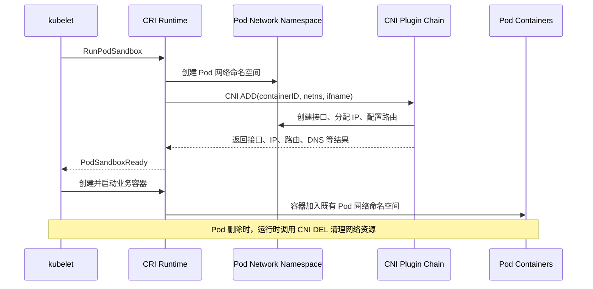
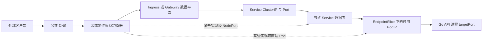
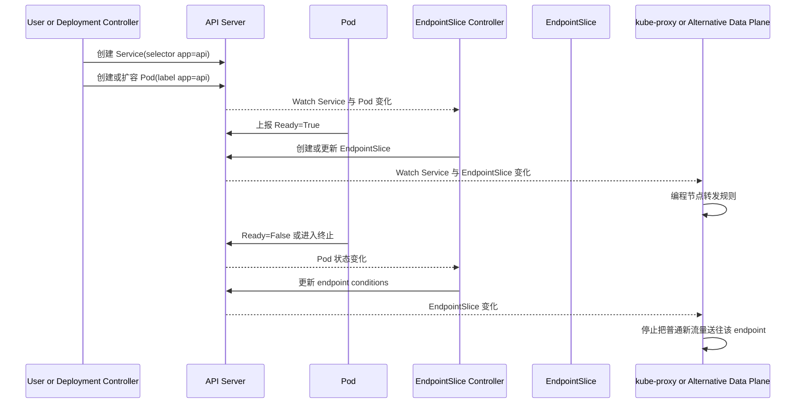
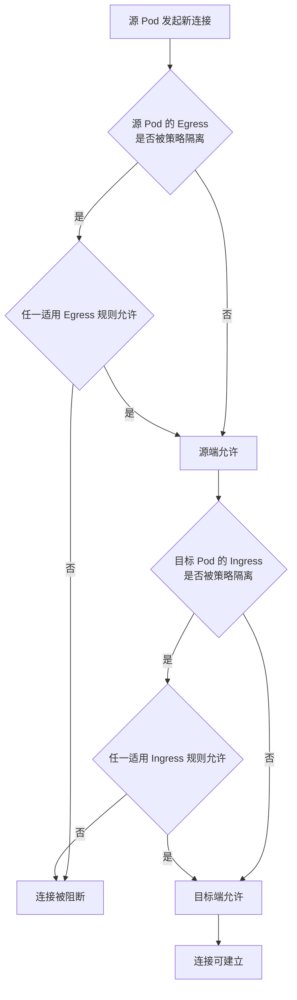

# 第 11 章：Kubernetes 网络——CNI、Service、DNS、Ingress 与 Gateway

> **版本基线**：本章依据 2026 年 6 月可用的 Kubernetes、CNI 与 Gateway API 官方资料编写。不同云厂商、CNI、Service 数据面和入口控制器的实现差异很大；排障时必须先确认集群实际采用的组件，不能把 `iptables`、`nftables`、IPVS 或 eBPF 中的任何一种当作 Kubernetes 唯一实现。

## 学习目标

完成本章后，你应该能够：

1. 解释 Kubernetes 网络模型，以及 Pod IP、Service IP、Node IP 的职责边界。
2. 说明同一 Pod 内容器为什么可以通过 `localhost` 通信。
3. 描述 CNI 在 Pod 创建和删除过程中的调用时机、输入输出及职责范围。
4. 分析 Pod 到 Pod、Pod 到 Service、集群外到 Service 的完整数据路径。
5. 区分 `ClusterIP`、`NodePort`、`LoadBalancer`、`ExternalName` 和 Headless Service。
6. 解释 Service selector、EndpointSlice、readiness 与 Service 数据面的关系。
7. 说明 ClusterIP 为什么是虚拟 IP，而不是某个普通进程监听的地址。
8. 掌握 CoreDNS、Service DNS、搜索域和 Headless Service DNS 的工作方式。
9. 区分 `containerPort`、`targetPort`、`port` 和 `nodePort`。
10. 区分 Ingress Resource、Ingress Controller、GatewayClass、Gateway 与 Route。
11. 正确设计默认拒绝的 NetworkPolicy，并理解策略的双向允许语义。
12. 分析高并发下连接复用、conntrack、短连接、长连接和负载倾斜问题。
13. 按“应用—Pod—Service—DNS—策略—数据面—入口—外部负载均衡”的顺序排查网络故障。

---

## 一、核心术语与总览

| 术语 | 核心职责 | 不负责什么 |
|---|---|---|
| Pod 网络 | 为 Pod 提供地址与 Pod 间连通性 | 不直接提供稳定服务名和四层虚拟 IP |
| CNI | 规定运行时如何调用网络插件；插件完成接口、地址、路由等配置 | CNI 规范本身不定义 Service、DNS、Ingress |
| Service | 为一组动态后端提供稳定访问入口和服务发现抽象 | 通常不是七层 HTTP 路由器 |
| EndpointSlice | 记录 Service 的实际后端地址、端口和就绪条件 | 不主动转发流量 |
| Service 数据面 | 根据 Service 与 EndpointSlice 编程节点网络规则 | 不负责选出哪些 Pod 匹配 selector |
| CoreDNS / 集群 DNS | 为 Service、Pod 等对象提供 DNS 记录 | 不保证每次 HTTP 请求均匀落到不同 Pod |
| Ingress | 描述 HTTP/HTTPS 的主机名和路径路由规则 | 资源本身不转发流量 |
| Ingress Controller | 监听 Ingress 等对象并配置真实代理或负载均衡器 | 不等于 Ingress API 对象 |
| Gateway API | 用 GatewayClass、Gateway、Route 等资源建模四层和七层流量 | 不是 Kubernetes 内置的唯一入口实现，仍需控制器 |
| NetworkPolicy | 描述 Pod 的三层、四层入站和出站允许规则 | 通常不提供七层身份、URL 或域名级策略 |

理解 Kubernetes 网络时，可以把系统分成三个平面：

- **控制平面**：Service、EndpointSlice、Ingress、Gateway、NetworkPolicy 等 API 对象及相应控制器。
- **数据平面**：Linux 路由、隧道、网桥、Netfilter、nftables、IPVS、eBPF 程序、代理进程或云负载均衡器。
- **应用平面**：Go 进程监听端口、连接池、超时、重试、协议和业务健康状态。

API 对象只描述期望状态。真正的数据包是否可达，取决于控制器是否成功把期望状态下发到数据平面，以及应用是否真的在目标地址和端口上监听。

---

## 二、Kubernetes 网络模型

### 2.1 Kubernetes 要解决的四类通信

Kubernetes 网络通常拆成四个问题：

1. **同一 Pod 内容器之间通信**：使用共享网络命名空间和 `localhost`。
2. **Pod 到 Pod 通信**：由 Pod 网络实现跨节点或同节点连通。
3. **Pod 到 Service 通信**：通过稳定的 Service 名称或虚拟 IP 访问动态后端。
4. **集群外到 Service 通信**：通过 NodePort、LoadBalancer、Ingress 或 Gateway 等入口进入集群。

这四条链路不能混为一谈。例如，Pod IP 可达并不意味着 Service 规则一定正确；Service 在集群内可达也不意味着外部负载均衡器或 Gateway 已经配置成功。

### 2.2 每个 Pod 拥有独立 IP 的含义

在常规 Pod 网络模型下，每个 Pod 都获得一个集群内唯一的 IP 地址。应用可以直接监听 Pod 的端口，不需要像单机 Docker 那样为每个 Pod 手工挑选不同的宿主机端口。

这带来几个重要结论：

- 两个不同 Pod 都可以监听 `0.0.0.0:8080`，因为它们位于不同网络命名空间并拥有不同 Pod IP。
- Pod IP 是**运行实例地址**，不是稳定服务身份。Pod 被重建后通常会获得新 IP。
- 客户端不应把 Deployment 下某个 Pod IP 写死到配置中，应通过 Service 名称访问。
- Pod、Service 和 Node 的地址段应避免重叠，否则路由判断会产生歧义。
- `hostNetwork: true` 是例外：Pod 使用节点网络命名空间，不再拥有普通独立 Pod 网络语义，也会与节点进程竞争端口。

Kubernetes 的经典网络假设是：在未被 NetworkPolicy 等机制刻意隔离时，Pod 可以通过真实 Pod IP 彼此通信，Pod 间不要求应用层自行做端口映射。具体如何实现，可能是二层桥接、三层路由、BGP、Overlay 隧道或 eBPF 数据面。

### 2.3 同一 Pod 内容器为什么使用 localhost

同一 Pod 的所有普通容器共享同一个网络命名空间，因此共享：

- Pod IP；
- 回环接口 `lo`；
- 网卡、路由表和邻居表；
- 端口空间；
- 网络相关内核参数的命名空间视图。

因此，主容器监听 `127.0.0.1:9000` 时，同一 Pod 中的 sidecar 可以访问 `http://127.0.0.1:9000`。反过来，这也意味着两个容器不能同时绑定同一个 IP、同一种协议和同一个端口。

把 sidecar 和主应用放在同一个 Pod，适合它们必须共享生命周期、网络或存储的场景。若两个组件需要独立扩缩容、独立发布或独立故障隔离，通常应拆成不同工作负载并通过 Service 通信。

### 2.4 Pod IP、Service IP 与 Node IP

| 地址 | 代表对象 | 生命周期 | 通常由谁分配 | 典型用途 |
|---|---|---|---|---|
| Pod IP | 某个 Pod 实例 | 随 Pod 创建和销毁 | 网络插件/IPAM | 后端真实地址、Pod 间通信 |
| ClusterIP | 某个 Service | 随 Service 生命周期 | API Server 的 Service 地址分配机制 | 集群内稳定虚拟入口 |
| Node IP | 节点 | 随节点或基础设施生命周期 | kubelet、云控制器或基础设施 | 节点管理、NodePort、节点间转发 |
| 外部负载均衡 IP/域名 | 云 LB、硬件 LB 或软件入口 | 由外部实现决定 | 云控制器或入口实现 | 集群外访问 |

**关键判断**：Pod IP 是“实例在哪里”，Service 是“服务叫什么、当前应该转给谁”。

---

## 三、CNI：Pod 接入网络的标准接口

### 3.1 CNI 是规范，不是某个具体网络产品

CNI，即 Container Network Interface，定义运行时与网络插件之间的调用协议。它规定网络配置格式、插件执行方式、环境变量、标准输入输出以及结果结构。

CNI 规范的价值在于解耦：

- 容器运行时不必内置每一种网络实现；
- 网络插件不必理解 Kubernetes 全部业务对象；
- 多个插件可以串联，例如主网络插件、IPAM、端口映射和带宽控制插件。

不要把以下概念混淆：

- **CNI 规范**：定义接口。
- **CNI 插件二进制**：实现接口，例如创建 veth、配置地址或路由。
- **Kubernetes 网络解决方案**：除了 CNI 调用外，往往还包含节点 Agent、控制器、路由协议、隧道、策略引擎和可观测组件。

### 3.2 典型调用时机

Linux 节点上，一个简化的 Pod 启动过程如下：



严格来说，kubelet 通常通过 CRI 请求容器运行时创建 Pod Sandbox，由运行时集成 CNI 并执行插件。不能笼统地说“kubelet 直接调用所有 CNI 插件”。

CNI 当前规范定义的主要操作包括：

- `ADD`：把容器网络命名空间接入网络，或应用附加配置。
- `DEL`：移除网络接入并释放地址、规则等资源。
- `CHECK`：检查已有网络是否与预期一致。
- `GC`：清理不再属于有效 attachment 的残留资源。
- `STATUS`：检查插件是否具备处理新增请求的条件。
- `VERSION`：协商插件支持的规范版本。

### 3.3 CNI 插件通常完成什么

一个典型插件链可能完成：

1. 创建 veth pair，把一端放入 Pod 网络命名空间并命名为 `eth0`。
2. 将宿主机侧 veth 接入网桥、路由表或 eBPF 数据面。
3. 通过 IPAM 分配 Pod IP、网关和路由。
4. 设置 MTU、MAC、sysctl 或流量整形。
5. 建立 Overlay 隧道或更新节点间路由。
6. 在实现支持时，下发 NetworkPolicy 规则。

但以下能力不属于 CNI 规范本身的必然职责：

- Service 虚拟 IP；
- CoreDNS 记录；
- Ingress/Gateway 七层路由；
- 云负载均衡器创建；
- HTTP 重试、熔断和鉴权。

### 3.4 常见 Pod 网络实现思路

| 实现思路 | 数据路径 | 优点 | 代价与风险 |
|---|---|---|---|
| 二层桥接 | veth 接 Linux Bridge | 简单、易理解 | 跨节点仍需额外机制，广播域扩展受限 |
| Overlay | Pod 包封装为 VXLAN、Geneve 等跨节点传输 | 对底层网络要求较低 | 封装开销、MTU 和排障复杂度增加 |
| 三层直路由/BGP | 底层网络学习 Pod CIDR 或主机路由 | 路径清晰、少一层封装 | 依赖底层路由能力和网络团队协作 |
| eBPF 数据面 | 内核挂载 eBPF 程序完成路由、转发、策略 | 可编程、观测能力强、可替代部分传统规则 | 内核版本、实现差异、运维技能要求较高 |

选择网络方案时，不要只比较单包基准性能，还应评估：

- 集群规模与路由条目规模；
- 多可用区流量成本；
- NetworkPolicy 能力；
- IPv6/双栈；
- 内核和发行版兼容性；
- 加密需求；
- 可观测性、升级和故障恢复能力。

---

## 四、三条核心数据链路

### 4.1 Pod 到 Pod

#### 同节点

常见过程是：

1. 源进程把目标 Pod IP 交给内核路由。
2. 数据包从源 Pod 的 `eth0` 经 veth 到宿主机网络命名空间。
3. 宿主机通过网桥、路由或 eBPF 程序把包送入目标 Pod 的 veth。
4. 目标 Pod 收到目的地址为自身 Pod IP 的数据包。

#### 跨节点

跨节点路径取决于 CNI：

- Overlay：先把 Pod 数据包封装成节点间数据包，目标节点解封装后送入目标 Pod。
- 直路由：源节点根据路由表直接把目标 Pod 网段交给下一跳。
- BGP：节点或路由设备动态发布 Pod CIDR。
- eBPF：由实现定义的内核程序完成查表、转发、策略与可观测。

若“同节点 Pod 通，跨节点不通”，优先检查：Pod CIDR 路由、隧道端口、底层防火墙、MTU、反向路径过滤和节点间可达性。

### 4.2 Pod 到 Service

Pod 访问 `api.default.svc.cluster.local:80` 时，典型过程是：

1. DNS 返回 Service 的 ClusterIP。
2. 客户端向 `ClusterIP:port` 建立连接。
3. 节点上的 Service 数据面捕获这段流量。
4. 数据面从可用 EndpointSlice 中选择一个后端。
5. 目的地址和端口被转换或重定向到 `PodIP:targetPort`。
6. 返回流量按连接状态回到客户端。

Service 通常在**新连接**建立时选择后端，而不是为每个 HTTP 请求重新选择后端。因此，一个复用很久的 HTTP/1.1 Keep-Alive、HTTP/2 或 gRPC 连接可能长期固定到同一个 Pod。

### 4.3 集群外到 Service

外部流量可能经过多个实现层。下面是一条常见但并非唯一的链路：



真实集群可能存在以下差异：

- 云负载均衡器把流量发到 NodePort；
- 负载均衡器直接使用 Pod IP 作为后端；
- Ingress Controller 自己发现 EndpointSlice 并绕过 ClusterIP；
- Gateway 数据面位于集群外；
- eBPF 实现替代 kube-proxy；
- Service Mesh 在 Pod 侧再增加代理或节点级隧道。

因此，面试中应说“典型路径”和“实现取决于控制器/数据面”，而不是宣称所有请求一定经过某个组件。

---

## 五、Service、EndpointSlice 与 Service 数据面

### 5.1 Service 解决什么问题

Deployment 中的 Pod 会滚动替换、扩缩容和跨节点重建。Service 通过两个稳定维度把客户端与 Pod 生命周期解耦：

- 稳定名称，例如 `api.shop.svc.cluster.local`；
- 稳定虚拟入口，例如 ClusterIP 和 Service port。

Service 的 selector 通常匹配一组 Pod 标签。控制平面根据匹配结果维护 EndpointSlice，Service 数据面再消费 Service 和 EndpointSlice，把流量送到真实后端。

### 5.2 selector、readiness 与 EndpointSlice

简化控制链如下：



需要注意：

- selector 匹配正确但 Pod 未 Ready，通常不会成为普通可用后端。
- EndpointSlice 的 endpoint 条件可包含 `ready`、`serving` 和 `terminating`。
- 终止中的 endpoint 通常 `ready=false`，用于避免普通新流量继续进入；需要连接排空的实现可以结合 `serving` 和 `terminating` 判断。
- readiness 失败会影响流量接入，但不会自动重启容器；重启是 liveness 的职责。
- Service 无 selector 时，控制器不会自动创建对应 EndpointSlice，可以由用户或自定义控制器维护外部后端。

EndpointSlice 是为大规模后端设计的。默认情况下，一个 EndpointSlice 通常容纳至多约 100 个 endpoint，超过后创建更多切片。旧的 `Endpoints` API 已被标记为弃用，新客户端应优先消费 EndpointSlice。

### 5.3 ClusterIP 为什么不是普通进程监听的 IP

ClusterIP 通常不会被某个用户态进程通过 `listen()` 绑定。它是由 Kubernetes 分配、由 Service 数据面解释的虚拟地址。

以 kube-proxy 为例：

1. kube-proxy Watch Service 和 EndpointSlice。
2. 根据代理模式调用内核接口编写规则。
3. 节点内核捕获访问 ClusterIP 的流量。
4. 规则选择 endpoint，并执行 DNAT 或等价转发。

因此，在节点执行 `ss -lntp` 看不到进程监听 ClusterIP，并不代表 Service 不工作。正确的验证方式是检查 Service、EndpointSlice、实际数据面模式及其规则。

### 5.4 kube-proxy 与等价实现

Linux 上 kube-proxy 的官方实现模式包括：

- **iptables**：通过 Netfilter/iptables 规则实现 Service 转发。
- **nftables**：通过 nftables 实现，当前官方文档将其作为现代替代方向。
- **IPVS**：利用 IPVS 与部分 iptables 规则；自 Kubernetes v1.35 起已标记为弃用。

此外，某些网络方案使用 eBPF 或其他数据面完全替代 kube-proxy。准确表述应是：

> Kubernetes 需要一个 Service 数据面。它可以是 kube-proxy，也可以是兼容 Service 语义的替代实现。

不要把“eBPF”说成 kube-proxy 的官方代理模式，也不要认为使用 eBPF 后就不存在控制循环、连接状态或扩缩容传播延迟。

### 5.5 Service 类型比较

| 类型/形式 | 集群内稳定入口 | 集群外暴露 | 主要机制 | 适用场景 | 关键风险 |
|---|---:|---:|---|---|---|
| ClusterIP | 是 | 否 | 虚拟 IP 转发到 endpoint | 内部微服务、Ingress/Gateway 后端 | 只能在可达集群网络中使用 |
| NodePort | 是 | 是，访问任一节点 IP 加节点端口 | ClusterIP 基础上在节点开放端口 | 裸机入口、外部 LB 后端、测试 | 端口范围有限、暴露面大、源 IP 与跨节点转发复杂 |
| LoadBalancer | 是 | 是 | 外部 LB 加 Service 数据面；具体实现由云或控制器提供 | 云环境公网/内网四层暴露 | 成本、厂商差异、健康检查和源 IP 语义 |
| ExternalName | 有稳定 DNS 名，无 VIP | 间接 | 集群 DNS 返回外部名称的 CNAME | 给外部依赖提供集群内别名 | HTTP Host 与 TLS SNI/证书名可能不匹配 |
| Headless | 有稳定 DNS 名，无 VIP | 通常否 | DNS 直接返回后端地址 | StatefulSet、客户端直连、客户端侧发现 | 客户端需处理多地址、缓存和后端变化 |

补充说明：

- Headless 不是独立的 `type`，而是设置 `clusterIP: None` 的 Service 形式。
- NodePort 默认常见分配范围是 `30000-32767`，但集群管理员可以修改。
- `LoadBalancer` 通常会同时分配 NodePort；若实现能直接把流量送到 Pod，可在支持场景中设置 `allocateLoadBalancerNodePorts: false`。
- `ExternalName` 只做 DNS 别名，不创建 Service 代理规则。

### 5.6 Headless Service

普通 Service DNS 通常返回 ClusterIP；Headless Service 则返回后端 endpoint 的 A/AAAA 记录，或为有稳定主机名的 Pod 生成更细粒度记录。

Headless Service 常用于 StatefulSet，因为客户端可能需要访问特定副本，例如：

```text
mysql-0.mysql.default.svc.cluster.local
mysql-1.mysql.default.svc.cluster.local
```

但 Headless Service 不会自动让数据库获得复制、选主、故障转移和数据一致性。它只提供网络身份和发现能力。

### 5.7 sessionAffinity

Service 可以使用：

```yaml
spec:
  sessionAffinity: ClientIP
```

它尝试让同一源 IP 的新连接在一段时间内落到同一 endpoint。适用场景包括暂时无法外置 Session 的遗留应用。

风险包括：

- 大量真实客户端经过同一个 NAT、代理或负载均衡器后，源 IP 被合并，导致热点 Pod。
- endpoint 变化、超时或数据面重建后，不保证永久粘滞。
- 扩容的新 Pod 可能长期拿不到足够流量。
- 会掩盖应用有状态问题，削弱水平扩展能力。

生产系统应优先把会话状态放入共享存储，或使用协议明确、可控的会话持久化方案，而不是把 `ClientIP` 亲和性当作默认设计。

---

## 六、四种端口字段的区别

假设 Go 应用监听 `8080`，Service 对内暴露 `80`，NodePort 为 `30080`：

```yaml
apiVersion: v1
kind: Service
metadata:
  name: api
spec:
  type: NodePort
  selector:
    app: api
  ports:
    - name: http
      port: 80
      targetPort: http
      nodePort: 30080
---
apiVersion: v1
kind: Pod
metadata:
  name: api-example
  labels:
    app: api
spec:
  containers:
    - name: api
      image: registry.example.com/api:v1
      ports:
        - name: http
          containerPort: 8080
```

| 字段 | 所属对象 | 示例 | 实际含义 |
|---|---|---:|---|
| `containerPort` | Pod/Container | 8080 | 对容器监听端口的声明和命名；本身不会让进程开始监听，也不会自动创建 Service |
| `targetPort` | Service | `http` 或 8080 | Service 最终转发到 endpoint 的端口，可引用命名端口 |
| `port` | Service | 80 | 客户端访问 Service 时使用的端口 |
| `nodePort` | Service | 30080 | NodePort/部分 LoadBalancer 场景下暴露在节点地址上的端口 |

数据路径为：

```text
NodeIP:30080 -> Service port 80 -> PodIP:8080 -> Go 进程
```

高频误区是认为 `containerPort: 8080` 会“打开容器端口”。实际上，只有应用调用 `listen()` 后端口才存在；即使完全不写 `containerPort`，进程仍可监听并被数字形式的 `targetPort` 访问。声明命名端口的价值主要是可读性、探针引用和发布时解耦。

---

## 七、CoreDNS 与服务发现

### 7.1 Service DNS 名称

默认集群域经常是 `cluster.local`，但它是可配置的。一个 Service 的完整名称通常为：

```text
<service>.<namespace>.svc.<cluster-domain>
```

例如：

```text
api.shop.svc.cluster.local
```

在 `shop` Namespace 内：

- 查询 `api`，搜索域可将它扩展为 `api.shop.svc.cluster.local`。
- 查询 `api.shop`，可访问指定 Namespace 的 Service。
- 使用完整 FQDN 最明确。

kubelet 会为 Pod 生成 `/etc/resolv.conf`。常见内容类似：

```text
nameserver 10.96.0.10
search shop.svc.cluster.local svc.cluster.local cluster.local
options ndots:5
```

实际值必须进入 Pod 查看，不能假设所有集群一致。

### 7.2 普通 Service、Headless Service 与 SRV 记录

- 普通 ClusterIP Service 的 A/AAAA 记录通常返回 ClusterIP。
- Headless Service 的 A/AAAA 记录通常返回后端 endpoint 地址。
- 命名端口可以产生 SRV 记录，便于同时发现服务端口和目标名称。
- ExternalName Service 返回 CNAME，解析继续指向外部名称。

DNS 主要解决“名称到地址”的发现问题。普通 Service 的后端负载均衡依靠 Service 数据面，而不是 DNS 每次轮询所有 Pod。

### 7.3 搜索域与 `ndots` 带来的额外查询

在常见 `ndots:5` 配置下，一个点数不足的名称可能先依次拼接多个搜索域，再尝试绝对名称。高 QPS 服务若频繁请求外部域名，可能放大 DNS 查询数和尾延迟。

优化思路：

1. 检查应用真实发出的查询，而不是凭感觉修改 CoreDNS。
2. 对确定的完整域名使用绝对 FQDN；DNS 语义中可用末尾的 `.` 表示绝对名称。
3. 复用 HTTP/gRPC 连接，减少每次请求都重新解析。
4. 合理设置应用和本地缓存，遵守 TTL，避免永久缓存失效地址。
5. 大规模集群可评估 NodeLocal DNSCache，降低跨节点 DNS 延迟和 UDP conntrack 压力。
6. 监控 CoreDNS 请求量、错误码、延迟、缓存命中和上游解析失败。

### 7.4 DNS 故障定位

在问题 Pod 中执行：

```bash
cat /etc/resolv.conf
getent hosts api.shop.svc.cluster.local
nslookup api.shop.svc.cluster.local
nslookup kubernetes.default.svc.cluster.local
```

随后检查：

```bash
kubectl -n kube-system get pods -l k8s-app=kube-dns -o wide
kubectl -n kube-system get svc kube-dns
kubectl -n kube-system logs -l k8s-app=kube-dns --tail=200
```

注意：CoreDNS 的 Service 为兼容历史原因经常仍命名为 `kube-dns`。

常见错误映射：

- `NXDOMAIN`：名称、Namespace、搜索域或对象不存在。
- `SERVFAIL`：CoreDNS 插件、上游 DNS 或配置错误。
- 超时：NetworkPolicy、Service 数据面、节点网络、CoreDNS 过载或上游不可达。
- 能解析但连接失败：问题已进入 Service、端口、endpoint 或应用层，不应继续只盯 DNS。

---

## 八、Ingress Resource 与 Ingress Controller

### 8.1 两者不是同一个东西

**Ingress Resource** 是 Kubernetes API 对象，用于声明 HTTP/HTTPS 主机名、路径和后端 Service。

**Ingress Controller** 是实际控制器与数据平面实现。它会：

1. Watch Ingress、IngressClass、Service、EndpointSlice、Secret 等对象。
2. 校验自己负责的 IngressClass。
3. 生成代理配置或调用云 API。
4. 创建或管理负载均衡器、代理 Pod、监听器和证书。
5. 把状态写回 Ingress。

只有 Ingress 对象、没有对应 Controller，通常不会产生任何真实入口。

### 8.2 Ingress 能力边界

标准 Ingress 主要面向 HTTP 和 HTTPS，提供：

- 基于 Host 路由；
- 基于 Path 路由；
- TLS 终止；
- 指向 Service 后端。

不同 Controller 常通过 annotation 扩展：重写、超时、限流、认证、灰度等。但 annotation 容易产生厂商绑定、类型不明确和权限边界模糊等问题。

截至本章版本基线：Ingress API 自 Kubernetes v1.19 起稳定，API 已冻结。冻结不等于弃用，也不表示会被移除；它表示后续新能力主要不会继续加入 Ingress API，Kubernetes 项目推荐新需求考虑 Gateway API。

### 8.3 一个最小 Ingress

```yaml
apiVersion: networking.k8s.io/v1
kind: Ingress
metadata:
  name: api
spec:
  ingressClassName: nginx
  rules:
    - host: api.example.com
      http:
        paths:
          - path: /
            pathType: Prefix
            backend:
              service:
                name: api
                port:
                  number: 80
```

这里的 `nginx` 只是示例，必须与集群真实的 IngressClass 和 Controller 一致。

---

## 九、Gateway API：面向角色和协议的入口模型

### 9.1 为什么需要 Gateway API

Ingress 的核心模型简单，但难以优雅表达：

- 基础设施所有者与应用团队的权限分离；
- 多监听器、多协议；
- 跨 Namespace 路由授权；
- 标准化流量拆分、Header 匹配、重写和超时；
- 可移植的状态和一致性测试；
- 服务网格中的东西向路由。

Gateway API 通过多个资源拆分职责：

- **GatewayClass**：集群级资源，代表某类 Gateway 实现，由基础设施提供者定义。
- **Gateway**：请求一个实际流量入口，定义地址、端口、协议、TLS 和允许附着的 Route。
- **HTTPRoute / GRPCRoute / TLSRoute / TCPRoute / UDPRoute**：描述协议相关的路由规则。
- **ReferenceGrant**：显式授权跨 Namespace 引用，防止任意 Route 引用其他团队的 Secret 或 Service。

### 9.2 当前稳定性要点

在当前 Gateway API 文档中：

- `GatewayClass`、`Gateway`、`HTTPRoute` 已在 Standard Channel 中稳定。
- `GRPCRoute` 已进入 Standard Channel。
- `TLSRoute` 已进入 Standard Channel。
- `TCPRoute`、`UDPRoute` 仍位于 Experimental Channel，采用前必须核对具体版本和实现支持。

Gateway API 通过 CRD 安装，不是所有 Kubernetes 集群天然具备；还必须部署支持相应资源和特性的 Controller。即使资源处于 Standard Channel，某个实现也未必支持所有 Extended Feature，应查看该实现的 conformance 报告。

### 9.3 Gateway API 的角色分工

一个常见组织模型是：

- 基础设施团队维护 GatewayClass 和 Controller。
- 平台团队创建共享 Gateway、监听器、证书和安全边界。
- 应用团队只创建自己 Namespace 中的 HTTPRoute。

这样既能共享入口基础设施，又能避免所有应用都修改同一个大型 Ingress 对象。

### 9.4 Gateway 与 HTTPRoute 示例

以下示例中的 `production` GatewayClass 必须由实际 Controller 提供：

```yaml
apiVersion: gateway.networking.k8s.io/v1
kind: Gateway
metadata:
  name: public
  namespace: gateway-system
spec:
  gatewayClassName: production
  listeners:
    - name: https
      protocol: HTTPS
      port: 443
      hostname: "*.example.com"
      tls:
        mode: Terminate
        certificateRefs:
          - kind: Secret
            name: wildcard-example-com
      allowedRoutes:
        namespaces:
          from: Selector
          selector:
            matchLabels:
              gateway-access: "true"
---
apiVersion: gateway.networking.k8s.io/v1
kind: HTTPRoute
metadata:
  name: api
  namespace: shop
spec:
  parentRefs:
    - name: public
      namespace: gateway-system
      sectionName: https
  hostnames:
    - api.example.com
  rules:
    - matches:
        - path:
            type: PathPrefix
            value: /
      backendRefs:
        - name: api
          port: 80
          weight: 100
```

排障时不仅看对象是否存在，还要看 `status.parents[].conditions`，例如 Route 是否被接受、引用是否解析成功、Gateway 是否已编程完成。

### 9.5 Ingress 与 Gateway API 比较

| 维度 | Ingress | Gateway API |
|---|---|---|
| API 状态 | 稳定但已冻结 | 持续演进，按 Standard/Experimental Channel 管理 |
| 核心协议 | HTTP/HTTPS | HTTP、gRPC、TLS，并可扩展 TCP/UDP 等 |
| 资源模型 | Ingress + IngressClass | GatewayClass + Gateway + 多种 Route + Policy/ReferenceGrant |
| 角色分离 | 较弱，常靠 RBAC 和约定 | 原生面向基础设施、平台、应用角色分工 |
| 扩展方式 | 大量实现特定 annotation | Core/Extended Feature、标准字段与 Policy Attachment |
| 跨 Namespace | 能力有限且实现差异大 | 通过 allowedRoutes 与 ReferenceGrant 显式授权 |
| 流量拆分 | 常依赖 Controller annotation | HTTPRoute 可通过 backend weight 建模 |
| 可移植性 | 基础规则较可移植，扩展差异大 | 有 conformance profile，但仍需核对实现支持 |
| 是否仍需 Controller | 是 | 是 |
| 迁移建议 | 现有简单入口可继续使用 | 新平台、新能力和多团队场景优先评估 |

迁移不应只做 YAML 字段翻译，还要确认：

- 旧 annotation 对应的 Gateway API 能力是否为 Core 或 Extended；
- TLS、重写、超时、鉴权、源 IP 和访问日志语义是否一致；
- Controller 是否通过相应 conformance 测试；
- 灰度流量比例和健康检查是否与旧实现一致；
- DNS 与外部负载均衡切换如何回滚。

---

## 十、NetworkPolicy

### 10.1 默认行为

Kubernetes 的 NetworkPolicy 是面向 Pod 的三层、四层策略。最重要的默认行为是：

- 没有策略选择某个 Pod 的 Ingress 方向时，该 Pod 的入站默认不隔离。
- 没有策略选择某个 Pod 的 Egress 方向时，该 Pod 的出站默认不隔离。
- 一旦某方向存在选择该 Pod 的策略并声明相应 `policyTypes`，该方向只允许所有适用策略规则的**并集**。
- NetworkPolicy 是加法允许模型，不按对象顺序执行，也没有传统防火墙式“第一条命中即停止”。
- 从源 Pod 到目标 Pod 的新连接，需要源端 Egress 和目标端 Ingress 同时允许。

### 10.2 策略是否生效取决于实现

API Server 接受 NetworkPolicy 对象，不代表数据面一定执行它。网络方案必须实现 NetworkPolicy 控制器和数据面规则。如果集群网络插件不支持，创建策略可能没有任何效果。

因此上线前必须做真实连通性测试：

1. 先创建测试客户端与服务端 Pod。
2. 验证默认可达。
3. 应用 default-deny。
4. 验证被阻断。
5. 再应用精确 allow 规则并验证恢复。

### 10.3 默认拒绝示例

Namespace 内拒绝所有入站和出站：

```yaml
apiVersion: networking.k8s.io/v1
kind: NetworkPolicy
metadata:
  name: default-deny-all
  namespace: shop
spec:
  podSelector: {}
  policyTypes:
    - Ingress
    - Egress
```

允许 `frontend` Pod 访问 `api` Pod 的 8080 端口：

```yaml
apiVersion: networking.k8s.io/v1
kind: NetworkPolicy
metadata:
  name: allow-frontend-to-api
  namespace: shop
spec:
  podSelector:
    matchLabels:
      app: api
  policyTypes:
    - Ingress
  ingress:
    - from:
        - podSelector:
            matchLabels:
              app: frontend
      ports:
        - protocol: TCP
          port: 8080
```

若已经默认拒绝 Egress，还必须允许 DNS。例如根据集群 DNS Pod 标签和 Namespace 编写规则，或者按集群规范允许 DNS Service 后端。不要直接复制某个发行版的标签，先检查真实标签。

### 10.4 selector 的 AND 与 OR

下面同一个 `from` 条目中同时存在 `namespaceSelector` 和 `podSelector`，表示 **AND**：只允许匹配 Namespace 中、同时匹配 Pod 标签的来源。

```yaml
from:
  - namespaceSelector:
      matchLabels:
        team: payments
    podSelector:
      matchLabels:
        app: gateway
```

下面是两个数组元素，表示 **OR**：允许任意 `team=payments` Namespace 的 Pod，或者当前 Namespace 中任意 `app=gateway` Pod。

```yaml
from:
  - namespaceSelector:
      matchLabels:
        team: payments
  - podSelector:
      matchLabels:
        app: gateway
```

这是 NetworkPolicy 面试和生产配置中非常高频的错误点。

### 10.5 流量决策图



### 10.6 NetworkPolicy 的能力边界

标准 NetworkPolicy 通常不直接解决：

- HTTP Path、Header、方法级规则；
- 基于 TLS 身份、JWT 或用户身份的授权；
- 基于外部域名/FQDN 的通用策略；
- 显式 deny 优先级；
- 带宽限速；
- 所有 hostNetwork、节点本地流量和 NAT 前后地址语义的一致行为。

这些能力可能由特定网络方案、服务网格、Gateway 或外部防火墙提供，但不应把实现扩展当成标准 NetworkPolicy 的普遍语义。

---

## 十一、高并发下的 Kubernetes 网络问题

### 11.1 Service 负载均衡通常按连接而不是请求

假设有 10 个 Pod，但客户端只建立 2 条长期 HTTP/2 连接。即使每秒有数万次请求，Service 数据面也可能只在建立这 2 条连接时选择后端，结果大量请求固定在 1～2 个 Pod 上。

扩容到 20 个 Pod 后，已有连接通常不会自动迁移，新 Pod 只能接收新连接。因此会出现：

- HPA 已扩容，但旧 Pod 仍然很热；
- gRPC 流量分布不均；
- 某些 Pod CPU 很高，其他 Pod 几乎空闲；
- 发布后旧 Pod 因长连接迟迟无法排空。

应对方式包括：

- 客户端维持合理数量的并发连接，而不是全进程只使用一条无限长连接；
- 根据协议支持连接最大生命周期、优雅 GOAWAY 或连接轮换；
- 在 L7 代理处按请求或流分发；
- 用无状态设计允许连接自然重建；
- 结合 Pod 级指标，而不是只看 Service 总吞吐。

### 11.2 短连接与 conntrack

每个新 TCP 连接都涉及握手、状态记录、可能的 NAT、TLS 握手和关闭状态。大量短连接会带来：

- CPU 消耗；
- `TIME_WAIT` 增长；
- conntrack 表增长；
- NAT/SNAT 临时端口压力；
- TLS 握手开销；
- Service 数据面规则查找和负载选择开销；
- 尾延迟抖动。

当 conntrack 表接近上限时，可能出现随机超时、丢包和新连接失败。节点排查可关注：

```bash
sysctl net.netfilter.nf_conntrack_count
sysctl net.netfilter.nf_conntrack_max
conntrack -S
ss -s
```

命令是否存在、指标名称和可访问权限取决于节点系统。扩容 conntrack 上限不能替代连接复用、容量规划和流量治理。

### 11.3 Go 客户端必须复用 Transport

不要为每个请求创建新的 `http.Client` 或 `http.Transport`。应复用进程级 Transport，并按目标并发调节连接池：

```go
transport := http.DefaultTransport.(*http.Transport).Clone()
transport.MaxIdleConns = 200
transport.MaxIdleConnsPerHost = 100
transport.MaxConnsPerHost = 200
transport.IdleConnTimeout = 90 * time.Second
transport.TLSHandshakeTimeout = 5 * time.Second

client := &http.Client{
    Transport: transport,
    Timeout:   2 * time.Second,
}
```

还要确保读取并关闭响应体，否则 HTTP/1.1 连接可能无法复用：

```go
resp, err := client.Do(req)
if err != nil {
    return err
}
defer resp.Body.Close()

_, err = io.Copy(io.Discard, resp.Body)
return err
```

连接池不能盲目设大。Pod 副本数、每 Pod 进程数、每进程连接池上限会产生乘法效应，可能压垮数据库、下游 Service 或 NAT 网关。

### 11.4 DNS QPS 与缓存

高并发服务常见反模式是：每个业务请求都重新解析同一域名、建立新连接、立即关闭。结果把业务 QPS 放大为 DNS QPS 和连接创建 QPS。

应结合：

- 连接复用；
- 正确 TTL 缓存；
- CoreDNS 水平扩容；
- NodeLocal DNSCache；
- 上游 DNS 容量；
- DNS 失败指标和采样日志。

不要用永久 DNS 缓存换取性能，因为 Service、Pod、外部 LB 地址都可能变化。

### 11.5 源 IP、SNAT 与负载倾斜

外部流量经过负载均衡器、节点和 Service 转发后，源 IP 是否保留取决于具体路径和 `externalTrafficPolicy` 等配置。

- `externalTrafficPolicy: Cluster` 可以把流量转给所有节点上的 endpoint，但某些路径会做 SNAT。
- `externalTrafficPolicy: Local` 只把外部流量送到本节点 endpoint，通常有利于保留客户端源 IP 并减少跨节点转发；若负载均衡器把流量送到没有本地 endpoint 的节点，则流量会被丢弃，因此必须配合健康检查。

`Local` 也可能造成节点间不均：外部 LB 按节点均匀分流，但不同节点上的 Pod 数量不同，每个 Pod 实际分到的流量就不同。

### 11.6 发布与连接排空

无损发布不是只配置 readiness：

1. Pod 进入终止流程。
2. endpoint 被标记为 terminating，普通 ready 通常变为 false。
3. Service/Gateway/Ingress 数据面需要时间观察并更新配置。
4. 应用停止接收新请求。
5. 已有请求和连接在 grace period 内完成。
6. 超时后进程被强制终止。

若应用在收到 SIGTERM 后立即退出，控制面传播尚未完成时仍可能有少量请求到达，导致连接重置。应结合：

- readiness；
- Go `Server.Shutdown`；
- 合理的 `terminationGracePeriodSeconds`；
- 入口控制器或负载均衡器的连接排空；
- 客户端超时与有限重试；
- 数据库变更的前后兼容。

---

## 十二、Go API 服务与完整 YAML 示例

### 12.1 Go 服务关键代码

下面的服务提供业务接口、健康检查和优雅退出。为了突出网络链路，仅保留关键代码：

```go
package main

import (
    "context"
    "encoding/json"
    "errors"
    "log"
    "net/http"
    "os"
    "os/signal"
    "syscall"
    "sync/atomic"
    "time"
)

type response struct {
    PodName    string `json:"podName"`
    PodIP      string `json:"podIP"`
    Host       string `json:"host"`
    RemoteAddr string `json:"remoteAddr"`
    Time       string `json:"time"`
}

func main() {
    mux := http.NewServeMux()

    var ready atomic.Bool
    ready.Store(true)

    mux.HandleFunc("GET /", func(w http.ResponseWriter, r *http.Request) {
        w.Header().Set("Content-Type", "application/json")
        _ = json.NewEncoder(w).Encode(response{
            PodName:    os.Getenv("POD_NAME"),
            PodIP:      os.Getenv("POD_IP"),
            Host:       r.Host,
            RemoteAddr: r.RemoteAddr,
            Time:       time.Now().UTC().Format(time.RFC3339Nano),
        })
    })

    mux.HandleFunc("GET /healthz", func(w http.ResponseWriter, _ *http.Request) {
        w.WriteHeader(http.StatusOK)
        _, _ = w.Write([]byte("ok"))
    })

    mux.HandleFunc("GET /readyz", func(w http.ResponseWriter, _ *http.Request) {
        if !ready.Load() {
            http.Error(w, "not ready", http.StatusServiceUnavailable)
            return
        }
        // 生产环境应检查“能否接收流量”的必要依赖，
        // 但不要把所有外部依赖瞬时抖动都变成全量摘流。
        w.WriteHeader(http.StatusOK)
        _, _ = w.Write([]byte("ready"))
    })

    server := &http.Server{
        Addr:              ":8080",
        Handler:           mux,
        ReadHeaderTimeout: 2 * time.Second,
        ReadTimeout:       5 * time.Second,
        WriteTimeout:      10 * time.Second,
        IdleTimeout:       60 * time.Second,
    }

    ctx, stop := signal.NotifyContext(
        context.Background(),
        syscall.SIGTERM,
        syscall.SIGINT,
    )
    defer stop()

    errCh := make(chan error, 1)
    go func() {
        log.Printf("listening on %s", server.Addr)
        errCh <- server.ListenAndServe()
    }()

    select {
    case err := <-errCh:
        if !errors.Is(err, http.ErrServerClosed) {
            log.Fatalf("server failed: %v", err)
        }
    case <-ctx.Done():
        ready.Store(false)

        // 给 readiness、EndpointSlice 与入口数据面留出短暂传播窗口。
        // 具体时长应结合集群规模、入口实现和总终止宽限期压测确定。
        drainTimer := time.NewTimer(3 * time.Second)
        <-drainTimer.C

        shutdownCtx, cancel := context.WithTimeout(context.Background(), 20*time.Second)
        defer cancel()
        if err := server.Shutdown(shutdownCtx); err != nil {
            log.Printf("graceful shutdown failed: %v", err)
            _ = server.Close()
        }
    }
}
```

### 12.2 Deployment 与 Service

```yaml
apiVersion: apps/v1
kind: Deployment
metadata:
  name: api
  namespace: shop
spec:
  replicas: 3
  selector:
    matchLabels:
      app: api
  template:
    metadata:
      labels:
        app: api
    spec:
      terminationGracePeriodSeconds: 30
      containers:
        - name: api
          image: registry.example.com/net-demo:v1
          ports:
            - name: http
              containerPort: 8080
          env:
            - name: POD_NAME
              valueFrom:
                fieldRef:
                  fieldPath: metadata.name
            - name: POD_IP
              valueFrom:
                fieldRef:
                  fieldPath: status.podIP
          readinessProbe:
            httpGet:
              path: /readyz
              port: http
            periodSeconds: 5
            failureThreshold: 2
          livenessProbe:
            httpGet:
              path: /healthz
              port: http
            periodSeconds: 10
            failureThreshold: 3
          resources:
            requests:
              cpu: 100m
              memory: 64Mi
            limits:
              memory: 128Mi
---
apiVersion: v1
kind: Service
metadata:
  name: api
  namespace: shop
spec:
  selector:
    app: api
  ports:
    - name: http
      port: 80
      targetPort: http
  type: ClusterIP
```

### 12.3 从外部请求到 Go 进程

以 Gateway 为例：

1. 客户端解析 `api.example.com`，得到外部负载均衡地址。
2. 负载均衡器把连接送到 Gateway 数据平面。
3. Gateway 监听器完成 TLS 终止，并按 `HTTPRoute` 的 hostname/path 选中 `shop/api:80`。
4. Gateway 实现访问 Service ClusterIP，或直接消费 EndpointSlice；具体取决于实现。
5. Service 数据面选择一个 `Ready` endpoint。
6. 流量到达 `PodIP:8080`。
7. Go HTTP Server 接收请求并返回 Pod 名称和地址。
8. Pod readiness 失败或终止后，EndpointSlice 更新，普通新流量逐步停止进入该 Pod。

验证命令：

```bash
kubectl -n shop get deploy,pod,svc,endpointslice -o wide
kubectl -n shop get endpointslice \
  -l kubernetes.io/service-name=api -o yaml
kubectl -n shop run curl --rm -it --restart=Never \
  --image=curlimages/curl -- \
  curl -sS http://api.shop.svc.cluster.local/
```

连续请求可观察返回的 `podName`，但由于连接复用，不能仅凭少量 curl 结果推断真实高并发负载分布。

---

## 十三、系统化排障

### 13.1 先定义故障范围

先回答：

- 是一个客户端 Pod，还是所有客户端都失败？
- 是一个 Node 上失败，还是所有 Node 都失败？
- 是同 Namespace 失败，还是跨 Namespace 失败？
- 直连 Pod IP 是否成功？
- Service IP 失败还是 DNS 名称失败？
- 集群内成功、集群外失败，还是都失败？
- 所有请求失败，还是偶发超时、特定长连接失败？

范围决定排查方向。没有范围就直接抓包，容易陷入大量无关数据。

### 13.2 分层排障顺序

#### 第 1 层：应用是否监听正确地址和端口

```bash
kubectl -n shop get pod -l app=api -o wide
kubectl -n shop logs <pod-name>
kubectl -n shop exec <pod-name> -- ss -lntp
```

重点确认：

- 应用是否监听 `0.0.0.0:8080`，而不是只监听错误的回环地址；
- 进程是否启动成功；
- readiness 是否通过；
- 端口是否与 `targetPort` 一致。

Distroless 镜像中没有 `ss`、`curl` 很正常，可使用 `kubectl debug` 临时调试容器或在同一 Pod 网络命名空间排查。

#### 第 2 层：直连 Pod IP

从测试 Pod 请求 `PodIP:8080`。若失败，问题通常在应用、Pod 网络、NetworkPolicy 或节点间路由；若成功，继续检查 Service 层。

#### 第 3 层：Service 与 EndpointSlice

```bash
kubectl -n shop get svc api -o yaml
kubectl -n shop get pod -l app=api --show-labels
kubectl -n shop get endpointslice \
  -l kubernetes.io/service-name=api -o wide
```

检查：

- selector 是否匹配；
- endpoint 地址是否存在；
- endpoint 是否 Ready；
- `port`、`targetPort`、协议和命名端口是否匹配；
- Service 是否误选了旧版本 Pod；
- `internalTrafficPolicy: Local` 是否导致本节点无 endpoint。

**Service 无 EndpointSlice 后端**时，优先检查 selector 和 readiness，而不是先重启 kube-proxy。

#### 第 4 层：DNS

```bash
kubectl -n shop exec <client-pod> -- cat /etc/resolv.conf
kubectl -n shop exec <client-pod> -- \
  nslookup api.shop.svc.cluster.local
```

若 FQDN 成功、短名称失败，检查 Namespace 和搜索域；若都失败，检查 CoreDNS Service、Pod、日志、NetworkPolicy 和上游 DNS。

#### 第 5 层：NetworkPolicy

```bash
kubectl -n shop get networkpolicy
kubectl -n shop describe networkpolicy <name>
```

从源和目标两个方向检查：

- 源 Pod 是否被 Egress 隔离；
- 目标 Pod 是否被 Ingress 隔离；
- Namespace label 和 Pod label 是否真实匹配；
- DNS Egress 是否被误封；
- 规则中的 selector 是 AND 还是 OR。

#### 第 6 层：Service 数据面

先确认实现：

```bash
kubectl -n kube-system get ds
kubectl -n kube-system get pods -o wide
```

如果使用 kube-proxy，再确认其模式和日志；如果由网络方案替代，则使用该方案的状态和诊断工具。

节点侧命令必须按实际模式选择：

```bash
iptables-save
nft list ruleset
ipvsadm -Ln
```

不能在 nftables 或 eBPF 集群中，因为看不到预期 iptables 规则就断言 Service 失效。

#### 第 7 层：CNI 与节点网络

检查：

```bash
ip addr
ip route
ip neigh
ip link
```

必要时使用：

```bash
tcpdump -ni any host <pod-ip> and port 8080
```

重点关注：

- Pod CIDR 路由；
- 隧道接口和底层 UDP 端口；
- MTU；
- 节点防火墙和安全组；
- 反向路径过滤；
- CNI Agent 日志；
- conntrack 和临时端口。

#### 第 8 层：Ingress、Gateway 与外部负载均衡

检查：

- IngressClass/GatewayClass 是否存在；
- Controller 是否运行并负责该资源；
- Ingress/Gateway/Route 的 status conditions；
- TLS Secret、证书域名和 SNI；
- 外部 LB 后端和健康检查；
- NodePort、防火墙和安全组；
- `externalTrafficPolicy`；
- Controller 是否有可用后端；
- 外部 DNS 是否指向正确地址。

### 13.3 症状到原因映射

| 症状 | 高概率原因 |
|---|---|
| `connection refused` | 目标地址可达，但没有进程监听；targetPort 错；应用已退出 |
| 一直超时 | 路由、防火墙、NetworkPolicy、数据面规则、conntrack 或服务端无响应 |
| Service 无 endpoint | selector 错、Pod 未 Ready、端口命名不匹配、Pod 不在预期 Namespace |
| 同节点通、跨节点不通 | CNI 跨节点路由、Overlay、MTU、底层安全组 |
| Pod IP 通、ClusterIP 不通 | Service 端口或 Service 数据面问题 |
| ClusterIP 通、DNS 名不通 | CoreDNS、搜索域、DNS NetworkPolicy |
| 集群内通、外部 503 | Ingress/Gateway 无后端、Route 未附着、LB 健康检查失败 |
| 只有大包失败 | MTU、路径 MTU 发现、隧道封装或 ICMP 被阻断 |
| 扩容后新 Pod 流量很少 | 长连接、session affinity、客户端连接池太少 |
| 偶发新连接失败 | conntrack、SNAT 端口、短连接风暴、节点热点 |

`kubectl port-forward` 成功只能说明通过 API Server/节点转发通道可以到达目标端口，它可能绕过 Service、DNS、Ingress 和部分正常数据路径，不能证明完整生产链路健康。

---

## 十四、常见错误认知

1. **“写了 containerPort 就对外开放了端口。”** 端口是否监听由进程决定，是否暴露由 Service/入口决定。
2. **“ClusterIP 一定有一个进程在监听。”** ClusterIP 通常由内核或等价数据面规则实现。
3. **“Service 会把每个 HTTP 请求轮询到不同 Pod。”** 多数情况下后端选择发生在连接级，长连接会固定后端。
4. **“CNI 就是 kube-proxy。”** CNI解决 Pod 接网；kube-proxy或替代实现解决 Service 数据面，两者职责不同。
5. **“用了 eBPF 就不再有连接状态和扩缩容传播问题。”** eBPF 改变实现方式，不消除分布式系统基本约束。
6. **“创建 Ingress 就能访问。”** 必须有匹配的 Ingress Controller。
7. **“Ingress 已被废弃。”** Ingress API 稳定且没有移除计划，但已冻结，新增能力推荐 Gateway API。
8. **“Gateway API 是一个现成网关产品。”** 它是 API 规范和资源模型，仍需具体 Controller 与数据平面。
9. **“NetworkPolicy 默认拒绝。”** 默认不隔离；只有选中 Pod 并声明方向后才进入允许列表语义。
10. **“一条 NetworkPolicy 能覆盖链路两端。”** 源 Egress 与目标 Ingress 独立判断，两端都可能需要允许。
11. **“ExternalName 会代理流量。”** 它只返回 DNS CNAME。
12. **“Headless Service 没有服务发现。”** 它没有 ClusterIP，但可通过 DNS 直接发现 endpoint。

---

## 十五、面试回答方法

网络题建议使用以下顺序：

1. **结论**：先说清对象职责或故障所在层。
2. **机制**：说明控制对象如何转成数据面规则。
3. **链路**：按源地址、目的地址、端口、NAT/路由、后端依次描述。
4. **差异**：明确哪些部分取决于 CNI、Controller、云厂商或代理模式。
5. **取舍**：说明性能、源 IP、可移植性、成本和复杂度。
6. **验证**：给出最少但关键的对象查询、连通性测试和节点诊断方法。

不要只背“CNI、kube-proxy、CoreDNS、Ingress”几个名词。高质量回答必须能指出：谁 Watch 谁、谁写入什么状态、数据包在哪一层被转发、失败时如何缩小范围。

---

## 十六、面试题

### A. 基础题

### 1. Kubernetes 网络模型的核心是什么？

**考察意图**

确认候选人是否理解 Pod IP、端口空间和 Service 抽象，而不是只会背插件名称。

**30 秒回答**

结论是：每个普通 Pod 拥有独立 IP，同一 Pod 的容器共享网络命名空间并通过 localhost 通信；不同 Pod 通过 Pod 网络直接用 IP 通信；Pod 地址会变化，所以客户端通过 Service 获得稳定名称和虚拟入口。外部流量再由 LoadBalancer、Ingress 或 Gateway 引入。具体跨节点路径由 CNI 实现。

**展开回答**

- **结论**：Pod 是 Kubernetes 网络中的最小逻辑主机。
- **机制**：运行时创建 Pod 网络命名空间，CNI 为其配置接口、IP 和路由；Service 通过 EndpointSlice 追踪动态后端。
- **场景**：Deployment 滚动更新时旧 Pod IP 消失、新 Pod IP 出现，但 Service 名称不变。
- **取舍**：独立 Pod IP 简化端口管理，但要求集群规划 Pod CIDR、Service CIDR、跨节点路由和策略。
- **验证**：查看 `pod.status.podIP`、`ip addr`、EndpointSlice 和 Service DNS。

**可能追问**

- `hostNetwork: true` 有什么不同？
- Pod IP 是否适合写进数据库配置？
- 双栈集群中 Pod 和 Service 如何分配地址？

**常见误区**

把 Pod IP 当作永久身份；认为每个容器都有独立 Pod IP；认为所有实现都必须使用 Overlay。

---

### 2. 同一个 Pod 中的两个容器为什么能通过 localhost 通信？

**考察意图**

考察 Pod 共享资源模型和网络命名空间基础。

**30 秒回答**

因为同一 Pod 中的容器加入同一个网络命名空间，共享 IP、回环接口、路由表和端口空间。一个容器监听 `127.0.0.1:9000`，另一个容器就能访问该地址。代价是它们不能同时占用相同协议和端口。

**展开回答**

- **结论**：localhost 属于 Pod，而不是某个单独容器。
- **机制**：Pod Sandbox 先持有网络命名空间，业务容器再加入该命名空间。
- **场景**：主应用与本地代理、日志 sidecar、证书代理通信。
- **取舍**：本地通信延迟低、配置简单，但组件共享故障域和扩缩容边界。
- **验证**：在两个容器中查看相同 Pod IP，并从 sidecar 访问主容器的回环端口。

**可能追问**

- 两个容器能否都监听 8080？
- 它们是否默认共享 PID Namespace？
- sidecar 是否应该拆成独立 Deployment？

**常见误区**

认为 localhost 只能访问当前容器；认为同 Pod 容器各有独立端口空间。

---

### 3. `containerPort`、`targetPort`、`port`、`nodePort` 有什么区别？

**考察意图**

检查候选人能否定位最常见的 Service 端口错误。

**30 秒回答**

`containerPort` 是 Pod 模板中的端口声明和命名，本身不打开端口；`targetPort` 是 Service 实际转发到 endpoint 的端口；`port` 是客户端访问 Service 使用的端口；`nodePort` 是 NodePort 或部分 LoadBalancer Service 暴露在节点 IP 上的端口。典型链路是 `NodeIP:nodePort -> ClusterIP:port -> PodIP:targetPort`。

**展开回答**

- **结论**：四个字段处在不同抽象层。
- **机制**：EndpointSlice Controller 依据 Service selector 与 Pod 状态生成 EndpointSlice；数据面把 Service port 映射到 endpoint port。
- **场景**：Go 进程监听 8080，Service 对内暴露 80，NodePort 暴露 30080。
- **取舍**：命名 `targetPort` 可在不同版本使用不同数字端口而保持 Service 配置稳定。
- **验证**：检查进程监听、Pod 端口名称、Service YAML 和 EndpointSlice `ports`。

**可能追问**

- 不写 `containerPort` 能否被 Service 访问？
- 多端口 Service 为什么必须命名端口？
- `hostPort` 与 `nodePort` 有何区别？

**常见误区**

认为 `containerPort` 会修改防火墙；把 `port` 当成容器端口。

---

### 4. Kubernetes Service 有哪些类型？如何选择？

**考察意图**

考察服务暴露层级和边界意识。

**30 秒回答**

内部服务默认用 ClusterIP；需要在每个节点开放固定端口时用 NodePort；云或控制器提供外部四层负载均衡时用 LoadBalancer；仅给外部域名提供集群内别名时用 ExternalName；需要客户端直接发现后端时用 Headless Service。HTTP 多域名和路径路由通常放到 Ingress 或 Gateway。

**展开回答**

- **结论**：先判断访问者在集群内还是集群外，再判断需要四层还是七层能力。
- **机制**：NodePort 建立在 ClusterIP 之上；LoadBalancer 通常再建立在 NodePort 或直达 Pod 的实现之上；ExternalName 只产生 CNAME。
- **场景**：内部订单服务用 ClusterIP；公网 API 用 Gateway；外部数据库别名可用 ExternalName，但需处理 TLS 名称。
- **取舍**：每个 LoadBalancer 可能有成本；NodePort 暴露面较大；Headless 把后端变化处理责任交给客户端。
- **验证**：查看 Service type、external address、nodePort、DNS 返回和实际 LB 后端。

**可能追问**

- LoadBalancer 是否一定经过 NodePort？
- `externalTrafficPolicy: Local` 的作用是什么？
- Headless 与 StatefulSet 的关系是什么？

**常见误区**

把 Headless 当成独立 Service type；认为 ExternalName 会做 TCP 代理。

---

### B. 原理深挖题

### 5. CNI 在 Pod 启动过程中做了什么？

**考察意图**

区分 CRI、CNI、运行时、kubelet 与网络产品的职责。

**30 秒回答**

kubelet 通过 CRI 请求运行时创建 Pod Sandbox。运行时先准备网络命名空间，再按 CNI 配置执行插件链的 `ADD`，插件创建接口、分配 IP、配置路由并返回结果。Pod 删除时执行 `DEL` 清理。CNI 是调用规范，不负责 Service、DNS 或 Ingress；NetworkPolicy 是否由网络方案实现取决于插件能力。

**展开回答**

- **结论**：CNI 解决“把一个网络隔离域接入网络”的标准化问题。
- **机制**：运行时通过环境变量和 JSON 配置调用插件，可串联主插件、IPAM、tuning、portmap 等。
- **场景**：Overlay 插件创建 veth 并配置隧道路由；直路由插件发布 Pod CIDR。
- **取舍**：插件化便于替换，但网络方案还包含控制器、Agent 和数据面，升级兼容性必须整体评估。
- **验证**：检查 Pod IP、节点接口和路由、CNI 配置、运行时与 CNI Agent 日志。

**可能追问**

- 谁直接执行 CNI 插件？
- `ADD` 成功但容器启动失败，谁负责清理？
- CNI 与 kube-proxy 的区别？

**常见误区**

说 kubelet 必然直接调用插件；把 CNI 等同于某个厂商产品；认为 CNI 必然实现 Service。

---

### 6. ClusterIP 为什么不是一个真正监听端口的进程？

**考察意图**

考察 Service 虚拟 IP 和数据面原理。

**30 秒回答**

ClusterIP 是由 Kubernetes 分配的虚拟 Service 地址。kube-proxy 或替代数据面 Watch Service 和 EndpointSlice，在节点配置 iptables、nftables、IPVS 或 eBPF 等规则，捕获发往 ClusterIP 的流量并转发到 Pod endpoint。因此 `ss` 看不到 ClusterIP 监听进程是正常的。

**展开回答**

- **结论**：Service 是 API 抽象，ClusterIP 是由数据面实现的虚拟入口。
- **机制**：控制循环把 Service/EndpointSlice 状态同步为内核或代理规则；新连接被选中一个 endpoint。
- **场景**：访问 `10.96.20.10:80`，规则把目的地址改为 `10.244.2.7:8080`。
- **取舍**：内核数据面效率高，但规则规模、同步延迟和实现差异增加排障复杂度。
- **验证**：查 Service、EndpointSlice、实际代理模式及对应规则，而不是只查监听套接字。

**可能追问**

- 为什么不用 DNS 直接返回所有 Pod IP？
- iptables、nftables、IPVS 有何差异？
- eBPF 是否属于 kube-proxy 模式？

**常见误区**

认为 ClusterIP 是某个 kube-proxy 用户态监听端口；把 IPVS 描述成当前必选高性能模式。

---

### 7. Service selector、EndpointSlice 和 kube-proxy 如何协作？

**考察意图**

考察声明式控制链，而不只是数据包转发。

**30 秒回答**

Service selector 定义候选 Pod；EndpointSlice Controller Watch Service、Pod 和就绪状态，把匹配且可用的地址和端口写入 EndpointSlice；kube-proxy 或替代数据面 Watch Service 与 EndpointSlice，把它们同步成节点转发规则。readiness 失败或 Pod 终止后，endpoint 条件变化，普通新流量逐步停止进入该 Pod。

**展开回答**

- **结论**：selector 决定“谁属于服务”，EndpointSlice 发布“当前后端是什么”，数据面决定“包怎么过去”。
- **机制**：多个独立控制循环通过 API 对象协作，存在有限传播延迟。
- **场景**：Deployment 从 3 扩到 10 个副本，EndpointSlice 增加后端，所有节点数据面更新。
- **取舍**：切片提高大规模更新效率，但控制面和节点规则仍需容量规划。
- **验证**：比较 Pod labels、Ready 状态、EndpointSlice conditions 与数据面规则。

**可能追问**

- Service 无 selector 怎么办？
- 终止中 endpoint 的 `ready`、`serving`、`terminating` 如何理解？
- 旧 Endpoints API 有什么问题？

**常见误区**

认为 kube-proxy 根据 selector 自己扫描 Pod；认为 readiness 失败会重启容器。

---

### 8. CoreDNS 如何完成 Service 发现？

**考察意图**

考察 DNS 名称、Namespace、搜索域与 Service 数据面的关系。

**30 秒回答**

Kubernetes 把 Service 和 Pod 信息提供给集群 DNS，kubelet为 Pod 配置 DNS 服务器与搜索域。普通 Service 名称通常解析为 ClusterIP，Headless Service 解析为 endpoint 地址。短名称只在搜索域和 Namespace 规则下成立；跨 Namespace 应使用 `service.namespace` 或完整 FQDN。DNS 只负责名称解析，普通 Service 的后端负载均衡仍由 Service 数据面完成。

**展开回答**

- **结论**：DNS 提供稳定名字，Service 提供稳定虚拟入口，两者协作但职责不同。
- **机制**：CoreDNS Watch Kubernetes 对象；Pod 查询经 kube-dns Service 到 CoreDNS；搜索域扩展短名称。
- **场景**：`api` 在 `shop` 中解析成功，在 `default` 中需写 `api.shop`。
- **取舍**：搜索域方便，但高 `ndots` 可能放大查询；缓存提高性能但必须尊重 TTL。
- **验证**：查看 Pod `/etc/resolv.conf`、FQDN 解析、CoreDNS Pod/Service/日志和 NetworkPolicy。

**可能追问**

- 为什么 Service 不只靠 DNS 轮询 Pod IP？
- NodeLocal DNSCache 解决什么？
- ExternalName 的 TLS 风险是什么？

**常见误区**

认为 CoreDNS 为每个请求选择 Pod；永久缓存 DNS；忽略 Namespace。

---

### C. 场景设计题

### 9. Ingress、Ingress Controller 与 Gateway API 有什么区别？新系统如何选？

**考察意图**

考察入口 API、控制器实现、演进趋势与迁移判断。

**30 秒回答**

Ingress 是声明 HTTP/HTTPS 路由的 API 对象，Ingress Controller 才是读取对象并配置真实代理或负载均衡器的实现。Gateway API 用 GatewayClass、Gateway 和多种 Route 拆分基础设施与应用职责，支持更丰富协议和标准化能力。Ingress 稳定但 API 已冻结，简单存量入口可继续用；新平台、多团队、多协议和复杂路由优先评估 Gateway API，同时确认 Controller 的 conformance 和 Extended Feature 支持。

**展开回答**

- **结论**：资源描述期望，Controller 执行；Gateway API 是下一代模型，不是现成产品。
- **机制**：Ingress Controller Watch Ingress；Gateway Controller Watch GatewayClass、Gateway、Route、Service、Secret 等并写回 conditions。
- **场景**：平台团队管理共享 443 Listener，应用团队独立创建 HTTPRoute 并做权重灰度。
- **取舍**：Gateway API 权限和可移植性更好，但需要安装 CRD、迁移工具和实现能力核对。
- **验证**：检查 Class、Controller、资源 status、Listener、Route attachment 和后端引用。

**可能追问**

- Ingress 是否会被删除？
- Gateway API 是否内置于每个集群？
- 跨 Namespace 引用如何授权？

**常见误区**

说 Ingress 已弃用；只创建 HTTPRoute 不部署 Controller；把某个厂商 annotation 当成标准能力。

---

### 10. 如何设计 default-deny NetworkPolicy，同时允许前端访问 API？

**考察意图**

考察默认行为、方向、selector 组合和验证方法。

**30 秒回答**

先在 Namespace 创建选择所有 Pod 的 Ingress/Egress default-deny；再给 API 创建 Ingress allow，只允许目标前端 Pod 或指定 Namespace 中的前端 Pod 访问 8080；若前端 Egress 也被隔离，还要在前端侧允许到 API；同时允许必要的 DNS Egress。策略是加法允许模型，源 Egress 和目标 Ingress 都必须通过。

**展开回答**

- **结论**：默认拒绝后按最小权限逐条恢复必要流量。
- **机制**：任一策略选择 Pod 并声明某方向后，该方向只允许适用规则并集；同一条 peer 内 namespaceSelector 与 podSelector 是 AND。
- **场景**：只允许 `team=web` Namespace 内 `app=frontend` 访问 `shop` Namespace 的 `app=api`。
- **取舍**：策略提升隔离，但标签治理、DNS、监控 Agent 和控制面依赖容易被误封。
- **验证**：从允许和不允许的测试 Pod 分别连接；确认网络实现确实支持策略。

**可能追问**

- 为什么应用策略后 DNS 先坏了？
- 两个 `from` 元素是什么逻辑？
- NetworkPolicy 能否按域名允许外部 API？

**常见误区**

以为默认就是 deny；只看目标 Ingress 不看源 Egress；认为规则有显式优先级。

---

### 11. Service 有 20 个 Pod，为什么流量仍集中在 2 个 Pod？

**考察意图**

考察连接级负载均衡、长连接、亲和性与高并发诊断。

**30 秒回答**

最常见原因是客户端只建立了少量长期 HTTP/2、gRPC 或 Keep-Alive 连接，Service 只在新连接时选择后端，因此大量请求固定在少数 Pod。也要检查 ClientIP session affinity、NAT 后源 IP合并、`externalTrafficPolicy: Local`、拓扑本地路由和客户端连接池。扩容不会迁移已有连接。

**展开回答**

- **结论**：副本均衡不等于请求均衡，先看连接分布。
- **机制**：四层数据面按五元组或连接状态选 endpoint；HTTP/2 在一条连接上复用大量流。
- **场景**：一个网关实例只对下游维持两条 gRPC 连接，后端 20 个 Pod 中只有两个繁忙。
- **取舍**：增加连接可改善分布，但连接过多会增加内存、conntrack 和下游压力；L7 代理按请求分配更均匀但增加一跳和资源成本。
- **验证**：查看每 Pod连接数、QPS、CPU，抓取源/目的五元组，检查客户端 Transport、sessionAffinity 和拓扑策略。

**可能追问**

- HPA 扩容后为什么立即无效？
- 如何让 gRPC 优雅迁移连接？
- session affinity 为什么会造成热点？

**常见误区**

认为 kube-proxy 对每个 HTTP 请求轮询；只通过增加副本解决连接池设计问题。

---

### 12. 外部访问 API 超时，你如何从入口排查到 Pod？

**考察意图**

考察系统化排障能力和对完整链路的理解。

**30 秒回答**

先确定范围并从内向外分层：确认 Go 进程监听和 readiness；直连 PodIP；检查 Service selector、port/targetPort 和 EndpointSlice；检查集群 DNS；检查源 Egress 与目标 Ingress NetworkPolicy；确认 kube-proxy 或替代数据面的状态；再检查 Ingress/Gateway 的 Class、Controller、status、Route 与 TLS；最后检查外部 LB 健康检查、NodePort、安全组和 DNS。每一步都用“上一层成功、下一层失败”缩小边界。

**展开回答**

- **结论**：不要一上来重启网络组件，应先把故障定位到最窄的一层。
- **机制**：外部 DNS、LB、Gateway/Ingress、Service、EndpointSlice、CNI 和应用是串联依赖。
- **场景**：外部 503、集群内 Service 正常，通常优先看 Gateway Route 是否附着、Controller 是否发现后端、LB 健康检查是否成功。
- **取舍**：抓包信息最完整但成本高，应在对象与主动探测不能定位时再使用。
- **验证**：分别测试 localhost、PodIP、ClusterIP、Service DNS、入口地址；比较每一跳的日志、status 和数据包。

**可能追问**

- `connection refused` 与 timeout 的含义差异？
- `kubectl port-forward` 成功能证明什么？
- 只有跨节点失败时检查什么？

**常见误区**

只看 Ingress YAML；把所有超时都归因于 DNS；在不知道代理模式时固定检查 iptables。

---

## 十七、章节总结

1. Pod 是 Kubernetes 网络中的逻辑主机；同一 Pod 容器共享 IP、端口空间和 localhost。
2. CNI 定义运行时调用网络插件的接口，解决 Pod 接网，不等于 Service、DNS 或入口系统。
3. Pod IP 表示实例，Service 名称和 ClusterIP 表示稳定服务入口。
4. Service selector 产生动态后端集合，EndpointSlice 发布后端及就绪条件，Service 数据面负责实际转发。
5. ClusterIP 通常是虚拟地址，不能用“是否有进程监听”判断它是否正常。
6. kube-proxy 只是 Service 数据面的一个实现；iptables、nftables、弃用中的 IPVS 和 eBPF 替代方案不能被描述成唯一答案。
7. CoreDNS 负责名称发现，普通 Service 的后端负载均衡仍由 Service 数据面完成。
8. Ingress 是 API 对象，Ingress Controller 才实际处理流量；Ingress 稳定但已冻结。
9. Gateway API 通过 Class、Gateway 和 Route 拆分职责，是新能力的重要演进方向，但仍依赖具体 Controller。
10. NetworkPolicy 默认不隔离，策略是双向、加法允许模型，并且是否生效依赖网络实现。
11. 高并发下要重点观察连接而不只是请求；长连接会固定后端，短连接会放大 DNS、TLS、conntrack 和 NAT 压力。
12. 网络排障应逐层验证应用、Pod、Service、DNS、策略、数据面、入口和外部负载均衡，避免凭组件名称猜测。

---

## 官方资料索引

- [Kubernetes Cluster Networking](https://kubernetes.io/docs/concepts/cluster-administration/networking/)
- [Kubernetes Services, Load Balancing, and Networking](https://kubernetes.io/docs/concepts/services-networking/)
- [Kubernetes Service](https://kubernetes.io/docs/concepts/services-networking/service/)
- [Virtual IPs and Service Proxies](https://kubernetes.io/docs/reference/networking/virtual-ips/)
- [EndpointSlices](https://kubernetes.io/docs/concepts/services-networking/endpoint-slices/)
- [DNS for Services and Pods](https://kubernetes.io/docs/concepts/services-networking/dns-pod-service/)
- [Ingress](https://kubernetes.io/docs/concepts/services-networking/ingress/)
- [Network Policies](https://kubernetes.io/docs/concepts/services-networking/network-policies/)
- [CNI Specification](https://www.cni.dev/docs/spec/)
- [Gateway API Overview](https://gateway-api.sigs.k8s.io/docs/concepts/api-overview/)
- [Gateway API Versioning](https://gateway-api.sigs.k8s.io/docs/concepts/versioning/)
- [Gateway API Conformance](https://gateway-api.sigs.k8s.io/docs/concepts/conformance/)
- [Go net/http Transport Source](https://go.dev/src/net/http/transport.go)
