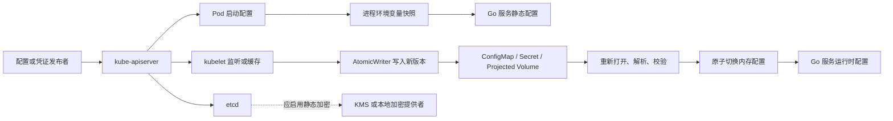
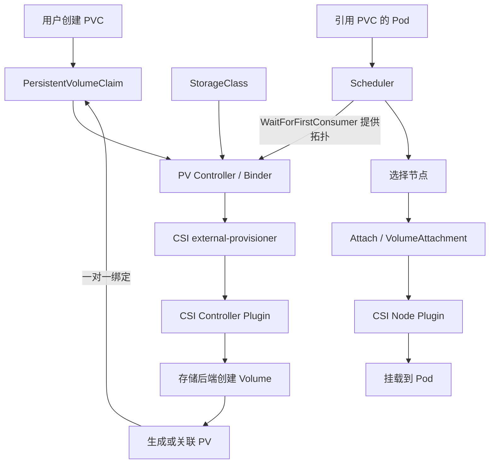
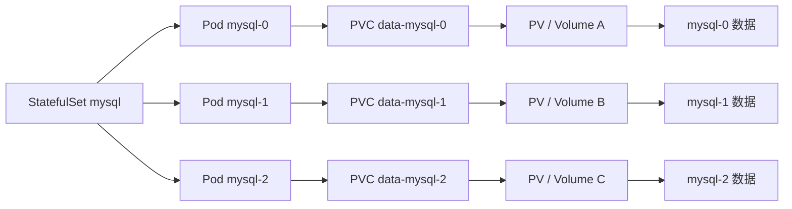

# 第 12 章：Kubernetes 配置管理、Secret 与持久化存储

Kubernetes 中的配置与存储问题，本质上围绕四个维度展开：

1. **生命周期**：数据跟随容器、Pod、节点，还是独立于它们存在。
2. **一致性**：配置更新何时可见，应用能否读取到一个完整版本。
3. **拓扑**：存储位于哪个节点或可用区，Pod 是否能够被调度到相应位置。
4. **安全性**：谁可以读取敏感信息，数据在传输、静态存储和应用内存中是否受到保护。

面试中只背诵 PV、PVC、StorageClass 的定义通常不够。更重要的是能够解释：一次 PVC 创建之后发生了什么、配置更新后应用为什么没有生效、RWO 为什么仍可能被多个 Pod 使用，以及数据库存储出现 `Multi-Attach` 时应该沿着哪条链路排查。

---

## 12.1 本章学习目标

完成本章后，应能够：

* 区分容器可写层、`emptyDir`、`hostPath` 和持久卷的生命周期。
* 解释 ConfigMap 与 Secret 的职责边界。
* 说明 Secret 中的 Base64 编码为什么不是加密。
* 比较环境变量、普通 Volume 和 Projected Volume 的注入方式。
* 设计支持安全热更新的 Go 配置加载器。
* 解释 PV、PVC、StorageClass 和 CSI Driver 的绑定流程。
* 正确理解 RWO、RWX、RWOP、VolumeMode 和 ReclaimPolicy。
* 分析 `Immediate` 与 `WaitForFirstConsumer` 对调度拓扑的影响。
* 解释 StatefulSet 如何为不同副本维护独立 PVC。
* 区分存储快照、备份和应用一致性备份。
* 根据 IOPS、吞吐、延迟和拓扑进行存储选型。
* 系统排查 PVC Pending、挂载失败、Multi-Attach 和权限问题。

---

# 12.2 Kubernetes 中的数据生命周期

## 12.2.1 容器可写层

容器镜像本身通常由只读层组成，容器运行时在其上增加一个可写层。应用在容器文件系统中创建的日志、缓存和临时文件，默认都会写入这一层。

容器可写层具有以下特点：

* 生命周期与具体容器实例绑定。
* 容器被重新创建后，不应假设原可写层中的数据仍然存在。
* 不适合保存数据库文件、用户上传文件或需要长期保留的业务数据。
* 大量写入可能消耗节点的临时存储，并造成 Pod 驱逐或节点磁盘压力。
* 不同容器之间不能直接共享各自的可写层。

因此，容器可写层适合存放真正可以丢弃的数据，例如短期编译产物、运行时临时文件和无需跨容器共享的缓存。

Kubernetes Volume 的目的之一，就是让数据生命周期与单个容器解耦。临时 Volume 通常跟随 Pod，持久 Volume 则可以独立于 Pod 存在。([Kubernetes][1])

---

## 12.2.2 emptyDir

`emptyDir` 在 Pod 被分配到节点时创建，Pod 中的多个容器可以共同挂载它。

```yaml
apiVersion: v1
kind: Pod
metadata:
  name: worker
spec:
  containers:
    - name: producer
      image: example.com/producer:v1
      volumeMounts:
        - name: work
          mountPath: /work

    - name: consumer
      image: example.com/consumer:v1
      volumeMounts:
        - name: work
          mountPath: /work

  volumes:
    - name: work
      emptyDir: {}
```

它的生命周期特点是：

* 容器崩溃并重启时，`emptyDir` 数据通常仍然存在。
* Pod 被删除或被重新调度后，原 `emptyDir` 数据消失。
* 节点永久故障时，数据也无法恢复。
* 同一个 Pod 中的多个容器可以通过它交换文件。
* 默认使用节点本地临时存储。
* 设置 `medium: Memory` 后使用内存支持的临时文件系统，相关写入会消耗内存资源。

```yaml
volumes:
  - name: cache
    emptyDir:
      medium: Memory
      sizeLimit: 256Mi
```

典型场景包括：

* Sidecar 与主容器交换文件。
* 临时解压或数据转换目录。
* 可重新构建的本地缓存。
* Init Container 生成主容器所需文件。
* 批处理任务的中间结果。

`emptyDir` 跟随 Pod，而不是跟随容器；Pod 从节点移除时，数据也会被删除。内存型 `emptyDir` 使用 tmpfs，并会计入相关容器的内存使用。([Kubernetes][1])

---

## 12.2.3 hostPath

`hostPath` 将节点上的真实目录直接挂载到容器中。

```yaml
volumes:
  - name: node-logs
    hostPath:
      path: /var/log
      type: Directory
```

它看起来能够“持久化”，但不能等同于 Kubernetes 的通用持久存储：

* 数据绑定到特定节点。
* Pod 调度到另一节点后，看到的可能是完全不同的数据。
* 节点目录权限和内容可能不一致。
* 容器可能借此访问节点敏感文件。
* 节点磁盘占用不一定能被 Kubernetes 准确归因到该 Pod。
* 需要配合节点亲和性才能保证 Pod 回到正确节点，但节点故障后仍存在可用性问题。

`hostPath` 更常用于节点级组件，例如日志采集器、设备插件或需要读取节点文件的系统 DaemonSet，而不适合作为普通业务数据库的默认存储方案。官方文档也明确提示其安全性、节点差异和磁盘占用风险。([Kubernetes][1])

---

## 12.2.4 持久卷

持久卷将存储生命周期与 Pod 解耦。Pod 删除后，只要回收策略和底层存储允许，数据仍可继续存在。

Pod 通常不直接声明某个云硬盘或存储设备，而是引用 PVC：

```yaml
volumes:
  - name: data
    persistentVolumeClaim:
      claimName: order-data
```

这种间接引用使应用只需描述“需要什么”，而不用直接了解“由哪个设备提供”。

---

## 12.2.5 存储类型对比

| 存储类型          | 主要生命周期        |   多容器共享 | 跨节点能力 | 典型性能        | 适用场景          | 主要风险           |
| ------------- | ------------- | ------: | ----: | ----------- | ------------- | -------------- |
| 容器可写层         | 容器实例          |       否 |     否 | 本地文件系统      | 短期临时文件        | 容器重建后丢失        |
| `emptyDir` 磁盘 | Pod           |       是 |     否 | 节点本地磁盘      | 缓存、中间文件、容器协作  | Pod 删除或节点故障后丢失 |
| `emptyDir` 内存 | Pod           |       是 |     否 | 低延迟         | 小型高速缓存、敏感临时文件 | 占用内存，可能触发 OOM  |
| `hostPath`    | 节点目录          |       是 |     否 | 节点本地磁盘      | 节点代理、日志或设备访问  | 节点耦合和高安全风险     |
| Local PV      | 独立于 Pod，但绑定节点 |   取决于模式 |   通常否 | 低延迟、高 IOPS  | 有应用级复制的数据库    | 节点故障和调度耦合      |
| 网络块存储         | 独立于 Pod       | 通常单节点写入 | 可重新附加 | 稳定、低至中等延迟   | 单实例数据库、消息系统   | 附加耗时、可用区限制     |
| 共享文件存储        | 独立于 Pod       |       是 |  通常支持 | 受网络和元数据操作影响 | 共享内容、模型和文件服务  | 元数据热点、尾延迟      |

Local PV 通过节点亲和性表达存储所在节点；若节点不可用，卷本身也可能不可用。网络块和共享文件存储的实际能力则由具体 CSI Driver 与后端系统决定。([Kubernetes][1])

---

# 12.3 ConfigMap 与 Secret

## 12.3.1 ConfigMap 解决什么问题

ConfigMap 用于保存**非敏感配置**，例如：

* 日志级别。
* 功能开关。
* 服务端口。
* 超时时间。
* 上游服务地址。
* JSON、YAML、INI 等配置文件。
* 启动参数。

它的主要价值不是“存储字符串”，而是将配置与容器镜像分离，使同一镜像能够在不同环境中使用不同配置。

```yaml
apiVersion: v1
kind: ConfigMap
metadata:
  name: checkout-config
data:
  app.json: |-
    {
      "logLevel": "info",
      "requestTimeoutMS": 1500
    }

  FEATURE_ASYNC_PAYMENT: "true"
```

ConfigMap 不提供保密能力，单个对象的数据量也不适合超过 1 MiB；更大的配置或二进制内容应考虑对象存储、镜像、数据库或专门的配置系统。([Kubernetes][2])

---

## 12.3.2 Secret 解决什么问题

Secret 用于保存应用运行所需的敏感信息，例如：

* 数据库用户名和密码。
* API Token。
* TLS 证书和私钥。
* 镜像仓库认证信息。
* SSH 密钥。
* 第三方服务凭证。

```yaml
apiVersion: v1
kind: Secret
metadata:
  name: checkout-database
type: Opaque
stringData:
  username: checkout
  password: replace-through-secure-pipeline
```

`stringData` 允许提交明文字符串，由 API Server 转换到 `data` 字段。这个能力只是为了易用性，并不会使 YAML 文件本身变得安全。上例只适合说明格式，实际密码不应提交到代码仓库。

---

## 12.3.3 Base64 为什么不等于加密

Secret 的 `data` 字段使用 Base64 表示字节内容：

```yaml
apiVersion: v1
kind: Secret
metadata:
  name: demo
type: Opaque
data:
  password: cGFzc3dvcmQ=
```

任何人都能直接解码：

```bash
echo 'cGFzc3dvcmQ=' | base64 --decode
```

输出为：

```text
password
```

Base64 只是编码，其作用是将任意字节表示成适合 JSON 或 YAML 传输的文本。它没有密钥，没有访问控制，也没有机密性。

还需要注意：

* Kubernetes Secret 默认并不意味着 etcd 中的数据已加密。
* 能读取 Secret API 对象的主体可以获得其中的内容。
* 具有创建 Pod 权限的主体，往往可以通过把 Secret 挂入 Pod 来间接读取它。
* `list` 或 `watch` Secret 通常会暴露比单独 `get` 某个 Secret 更广的内容。
* 应同时配置静态加密、最小权限、审计以及应用层面的秘密保护。

官方安全指南明确指出 Base64 不提供保密性，Secret 默认可能以未加密形式保存在 etcd 中，应启用静态加密并限制 API 访问。([Kubernetes][3])

---

## 12.3.4 ConfigMap 与 Secret 对比

| 维度         | ConfigMap                    | Secret                       |
| ---------- | ---------------------------- | ---------------------------- |
| 主要用途       | 非敏感配置                        | 密码、Token、证书等敏感内容             |
| API 数据字段   | `data`、`binaryData`          | `data`、`stringData`          |
| Base64     | `binaryData` 使用 Base64 表示    | `data` 使用 Base64 表示          |
| 是否自动加密     | 否                            | 否，需单独配置静态加密                  |
| 常见注入方式     | 环境变量、Volume、Projected Volume | 环境变量、Volume、Projected Volume |
| 更新行为       | 取决于注入方式                      | 取决于注入方式                      |
| 权限要求       | 通常相对宽松                       | 应实施严格 RBAC                   |
| 单对象容量      | 不适合超过 1 MiB                  | 单个 Secret 限制为 1 MiB          |
| 是否适合写入 Git | 可视内容而定                       | 不适合直接提交真实值                   |

Secret 的安全性主要来自 Kubernetes API 授权、etcd 静态加密、节点与 Pod 隔离以及外部密钥管理，而不是对象名称或 Base64 编码。([Kubernetes][2])

---

# 12.4 配置注入方式及更新行为

## 12.4.1 环境变量注入

可以从 ConfigMap 中引用单个键：

```yaml
env:
  - name: LOG_LEVEL
    valueFrom:
      configMapKeyRef:
        name: checkout-config
        key: LOG_LEVEL
```

也可以一次导入整个 ConfigMap：

```yaml
envFrom:
  - configMapRef:
      name: checkout-config
```

Secret 同样支持：

```yaml
env:
  - name: DB_PASSWORD
    valueFrom:
      secretKeyRef:
        name: checkout-database
        key: password
```

环境变量是在容器启动时形成的进程环境快照。之后即使 ConfigMap 或 Secret 发生变化，已经运行的进程环境也不会自动改变，通常需要重新创建 Pod。([Kubernetes][4])

---

## 12.4.2 Volume 文件注入

ConfigMap 可以作为目录挂载：

```yaml
volumes:
  - name: config
    configMap:
      name: checkout-config
```

```yaml
volumeMounts:
  - name: config
    mountPath: /etc/checkout
    readOnly: true
```

假设 ConfigMap 中存在 `app.json`，容器内将出现：

```text
/etc/checkout/app.json
```

Secret 也可以采用相同方式挂载：

```yaml
volumes:
  - name: credentials
    secret:
      secretName: checkout-database
```

Volume 文件的主要优势是应用可以重新打开文件，从而获取更新后的内容。但是更新并非同步瞬时完成：API Server、kubelet 监听或缓存、Volume 投影之间存在传播延迟。([Kubernetes][2])

---

## 12.4.3 subPath 为什么无法自动更新

有时只想把 ConfigMap 中的一个文件挂到已有目录：

```yaml
volumeMounts:
  - name: config
    mountPath: /etc/checkout/app.json
    subPath: app.json
```

这会带来一个重要限制：通过 `subPath` 挂载的 ConfigMap 或 Secret 文件不会接收自动更新。

原因可以从挂载语义理解：`subPath` 将特定路径绑定到容器中的目标位置，而 Kubernetes 后续更新配置时会切换 Volume 内的文件版本，原有绑定不会跟随切换。

需要热更新时，应挂载整个目录，而不是使用 `subPath`。官方文档对 ConfigMap 和 Secret 都明确说明了这一限制。([Kubernetes][2])

---

## 12.4.4 配置注入方式对比

| 注入方式             | 启动时可用 | 运行中自动变化 | 应用需要做什么       | 优点          | 主要限制            |
| ---------------- | ----: | ------: | ------------- | ----------- | --------------- |
| `env.valueFrom`  |     是 |       否 | Pod 重启后读取     | 使用简单、类型明确   | 不支持热更新          |
| `envFrom`        |     是 |       否 | Pod 重启后读取     | 批量导入方便      | 键名冲突和可见范围较大     |
| ConfigMap Volume |     是 |  最终一致更新 | 重新打开并解析文件     | 适合结构化配置和热更新 | 存在传播延迟          |
| Secret Volume    |     是 |  最终一致更新 | 重新打开并安全切换凭证   | 避免把秘密固化在镜像中 | 应用仍需处理轮换        |
| Projected Volume |     是 |  最终一致更新 | 按同一目录读取       | 可组合多种来源     | 路径冲突和权限配置更复杂    |
| `subPath` 文件     |     是 |       否 | 重建 Pod        | 能挂到精确目标路径   | 不接收自动更新         |
| 应用直接访问 API       | 取决于实现 |    可以监听 | 实现客户端、RBAC、重试 | 控制灵活        | 与控制平面耦合，不适合普通配置 |

对于普通业务配置，常见策略是：

* 不需要热更新：使用环境变量，并通过滚动更新重启 Pod。
* 需要热更新：使用目录 Volume，并让应用监听或轮询文件版本。
* 多种配置源需要组合：使用 Projected Volume。
* 关键配置需要严格版本控制：使用不可变 ConfigMap/Secret 加版本化名称，并通过发布系统触发滚动更新。

---

## 12.4.5 配置与 Secret 注入 Go 服务的数据流



环境变量路径在容器启动时完成；Volume 路径则由 kubelet 持续维护。Kubernetes 在更新投影文件时会写入新版本并切换 `..data` 符号链接，应用应在检测到版本变化后重新按路径打开文件，而不是永久持有旧文件描述符。([GitHub][5])

---

# 12.5 Go 服务如何安全读取和热更新配置

## 12.5.1 常见错误实现

下面的实现只在进程启动时读取一次：

```go
data, err := os.ReadFile("/etc/checkout/app.json")
```

若 ConfigMap 后续更新，程序不会自动再次执行读取。

另一种错误方式是永久持有文件描述符：

```go
f, err := os.Open("/etc/checkout/app.json")
```

Kubernetes 更新投影 Volume 时，新的路径可能已经指向新文件，但旧文件描述符仍指向旧版本。

第三种错误是把多个相关文件分别读取：

```text
database-host
database-port
database-password
```

如果应用恰好在版本切换过程中分别读取这些文件，就需要考虑是否可能混合不同版本。Kubernetes 对同一个投影 Volume 使用版本目录和原子链接切换，但跨不同 Volume 不存在全局原子性。

---

## 12.5.2 正确的更新模型

推荐采用以下流程：

1. 检测 Volume 版本是否变化。
2. 重新按路径打开文件。
3. 一次性读取完整内容。
4. 完整解析。
5. 执行语义校验。
6. 构造新的不可变配置对象。
7. 原子替换应用当前配置。
8. 若新配置非法，保留上一份有效配置。
9. 记录错误指标，但不要把 Secret 内容写入日志。

对于多个必须保持一致的文件，优先选择以下方法之一：

* 将它们合并为一个 JSON 或 YAML 文件。
* 将它们放入同一个 Projected Volume，并基于同一个 `..data` 版本目录读取。
* 在配置中加入统一的版本号并进行交叉校验。
* 由外部配置服务提供事务性快照。

---

## 12.5.3 Go 配置热更新示例

下面的示例只使用 Go 标准库。它轮询 Kubernetes 投影 Volume 的 `..data` 链接；在非 Kubernetes 环境中，则退化为检查文件修改时间和大小。

```go
package runtimeconfig

import (
	"bytes"
	"context"
	"encoding/json"
	"errors"
	"fmt"
	"io"
	"os"
	"path/filepath"
	"sync/atomic"
	"time"
)

type Config struct {
	LogLevel         string `json:"logLevel"`
	RequestTimeoutMS int    `json:"requestTimeoutMS"`
}

var current atomic.Pointer[Config]

// Current 返回当前配置的一份副本。
// Config 中若包含 map、slice 或指针，还应进行深拷贝或保证调用方只读。
func Current() Config {
	cfg := current.Load()
	if cfg == nil {
		panic("runtime config is not initialized")
	}
	return *cfg
}

func parseConfig(path string) (*Config, error) {
	data, err := os.ReadFile(path)
	if err != nil {
		return nil, fmt.Errorf("read config %q: %w", path, err)
	}

	decoder := json.NewDecoder(bytes.NewReader(data))
	decoder.DisallowUnknownFields()

	var cfg Config
	if err := decoder.Decode(&cfg); err != nil {
		return nil, fmt.Errorf("decode config: %w", err)
	}

	// 拒绝一个文件中出现多个 JSON 值。
	if err := decoder.Decode(&struct{}{}); !errors.Is(err, io.EOF) {
		return nil, errors.New("config contains trailing JSON content")
	}

	switch cfg.LogLevel {
	case "debug", "info", "warn", "error":
	default:
		return nil, fmt.Errorf("unsupported logLevel %q", cfg.LogLevel)
	}

	if cfg.RequestTimeoutMS < 50 || cfg.RequestTimeoutMS > 60_000 {
		return nil, fmt.Errorf(
			"requestTimeoutMS must be between 50 and 60000, got %d",
			cfg.RequestTimeoutMS,
		)
	}

	return &cfg, nil
}

// generation 返回当前版本目录、版本标识以及可能的错误。
// Kubernetes 投影 Volume 中，..data 通常是指向当前版本目录的符号链接。
func generation(
	mountRoot string,
	relativePath string,
) (root string, key string, err error) {
	dataLink := filepath.Join(mountRoot, "..data")

	target, readLinkErr := os.Readlink(dataLink)
	if readLinkErr == nil {
		if !filepath.IsAbs(target) {
			target = filepath.Join(mountRoot, target)
		}
		target = filepath.Clean(target)
		return target, target, nil
	}

	if !errors.Is(readLinkErr, os.ErrNotExist) {
		return "", "", fmt.Errorf("read %q: %w", dataLink, readLinkErr)
	}

	// 本地开发环境没有 ..data 时，使用文件元数据作为版本标识。
	path := filepath.Join(mountRoot, relativePath)
	info, statErr := os.Stat(path)
	if statErr != nil {
		return "", "", fmt.Errorf("stat %q: %w", path, statErr)
	}

	key = fmt.Sprintf("%d:%d", info.ModTime().UnixNano(), info.Size())
	return mountRoot, key, nil
}

func Watch(
	ctx context.Context,
	mountRoot string,
	relativePath string,
	interval time.Duration,
	onError func(error),
) error {
	if interval <= 0 {
		return errors.New("watch interval must be positive")
	}

	load := func() (*Config, string, error) {
		root, key, err := generation(mountRoot, relativePath)
		if err != nil {
			return nil, "", err
		}

		cfg, err := parseConfig(filepath.Join(root, relativePath))
		if err != nil {
			return nil, "", err
		}
		return cfg, key, nil
	}

	cfg, lastGeneration, err := load()
	if err != nil {
		return fmt.Errorf("load initial config: %w", err)
	}
	current.Store(cfg)

	ticker := time.NewTicker(interval)
	defer ticker.Stop()

	for {
		select {
		case <-ctx.Done():
			return ctx.Err()

		case <-ticker.C:
			root, nextGeneration, err := generation(
				mountRoot,
				relativePath,
			)
			if err != nil {
				if onError != nil {
					onError(err)
				}
				continue
			}

			if nextGeneration == lastGeneration {
				continue
			}

			next, err := parseConfig(
				filepath.Join(root, relativePath),
			)
			if err != nil {
				// 新版本无效时保留上一份有效配置。
				if onError != nil {
					onError(err)
				}
				continue
			}

			current.Store(next)
			lastGeneration = nextGeneration
		}
	}
}
```

调用示例：

```go
ctx, cancel := context.WithCancel(context.Background())
defer cancel()

err := runtimeconfig.Watch(
	ctx,
	"/var/run/checkout",
	"config/app.json",
	2*time.Second,
	func(err error) {
		log.Printf("config reload failed: %v", err)
	},
)
```

这里的“原子”分为两个层面：

* Kubernetes 通过版本目录和符号链接切换发布完整文件。
* Go 应用使用 `atomic.Pointer` 一次性切换已经解析、校验完成的内存对象。

对于数据库密码轮换，仅替换字符串还不够。更稳妥的方式是：

1. 读取新凭证。
2. 使用新凭证创建新的连接池。
3. 完成健康检查。
4. 原子切换业务流量到新连接池。
5. 等待旧请求结束。
6. 关闭旧连接池。
7. 最后撤销旧凭证。

---

# 12.6 Downward API 与 Projected Volume

## 12.6.1 Downward API

Downward API 允许容器读取自身 Pod 或容器的部分元数据，而不需要直接调用 Kubernetes API。

环境变量方式：

```yaml
env:
  - name: POD_NAME
    valueFrom:
      fieldRef:
        fieldPath: metadata.name

  - name: POD_NAMESPACE
    valueFrom:
      fieldRef:
        fieldPath: metadata.namespace

  - name: CPU_LIMIT
    valueFrom:
      resourceFieldRef:
        resource: limits.cpu
```

Volume 文件方式：

```yaml
volumes:
  - name: podinfo
    downwardAPI:
      items:
        - path: name
          fieldRef:
            fieldPath: metadata.name

        - path: labels
          fieldRef:
            fieldPath: metadata.labels
```

适用场景包括：

* 日志中加入 Pod 名称和 Namespace。
* 应用根据资源限制设置工作线程数。
* 将标签或注解暴露给监控代理。
* 在不授予 API 访问权限的前提下获得本 Pod 元数据。

Downward API 只能暴露官方支持的字段，并不是 Kubernetes API 的任意查询接口。([Kubernetes][6])

---

## 12.6.2 Projected Volume

Projected Volume 可以把多个数据源投影到同一个目录。常用来源包括：

* ConfigMap。
* Secret。
* Downward API。
* ServiceAccount Token。

```yaml
apiVersion: apps/v1
kind: Deployment
metadata:
  name: checkout
spec:
  replicas: 2
  selector:
    matchLabels:
      app: checkout

  template:
    metadata:
      labels:
        app: checkout

    spec:
      serviceAccountName: checkout

      securityContext:
        runAsNonRoot: true
        runAsUser: 10001
        runAsGroup: 10001
        fsGroup: 10001

      containers:
        - name: app
          image: registry.example.com/checkout:v1
          args:
            - "-config=/var/run/checkout/config/app.json"

          volumeMounts:
            - name: runtime
              mountPath: /var/run/checkout
              readOnly: true

      volumes:
        - name: runtime
          projected:
            defaultMode: 0440
            sources:
              - configMap:
                  name: checkout-config
                  items:
                    - key: app.json
                      path: config/app.json

              - secret:
                  name: checkout-database
                  items:
                    - key: username
                      path: database/username
                    - key: password
                      path: database/password

              - downwardAPI:
                  items:
                    - path: pod/name
                      fieldRef:
                        fieldPath: metadata.name
                    - path: pod/namespace
                      fieldRef:
                        fieldPath: metadata.namespace
```

Projected Volume 的价值在于：

* 将应用运行所需信息组织在统一目录中。
* 允许分别控制每个来源映射到哪个文件路径。
* 便于 Go 服务针对一个目录实现版本监听。
* 避免创建多个零散的 Volume 和挂载点。

需要注意：

* 不同来源不能投影到相互冲突的路径。
* 缺少必需的 ConfigMap、Secret 或键时，Pod 可能无法正常启动或挂载。
* 同一 Projected Volume 内可以使用同一版本切换机制，但不同 Volume 之间不存在全局事务。
* Secret、ConfigMap 等命名空间对象通常必须与 Pod 位于同一 Namespace。

Projected Volume 当前支持把多种来源组合到同一目录，Downward API 则提供无需直接访问控制平面的 Pod 自省能力。([Kubernetes][7])

---

# 12.7 PV、PVC、StorageClass 与 CSI Driver

## 12.7.1 PersistentVolume

PV 是集群级存储资源，描述已经存在或动态创建出来的一块存储。

它通常包含：

* 容量。
* AccessMode。
* VolumeMode。
* StorageClass。
* 回收策略。
* 节点或可用区拓扑。
* CSI Driver 名称。
* 底层存储句柄。

示意：

```yaml
apiVersion: v1
kind: PersistentVolume
metadata:
  name: pv-order-data
spec:
  capacity:
    storage: 100Gi

  accessModes:
    - ReadWriteOnce

  volumeMode: Filesystem
  storageClassName: fast-zonal
  persistentVolumeReclaimPolicy: Retain

  csi:
    driver: csi.example.com
    volumeHandle: volume-7f3a
    fsType: ext4
```

应用通常不应把 PV 名称直接写死在工作负载中，而是通过 PVC 申请。

---

## 12.7.2 PersistentVolumeClaim

PVC 是 Namespace 内的存储申请，描述应用需要什么。

```yaml
apiVersion: v1
kind: PersistentVolumeClaim
metadata:
  name: order-data
spec:
  accessModes:
    - ReadWriteOnce

  volumeMode: Filesystem
  storageClassName: fast-zonal

  resources:
    requests:
      storage: 100Gi
```

PVC 关注的是需求：

* 至少多少容量。
* 需要哪种访问模式。
* 是文件系统还是原始块设备。
* 使用哪个 StorageClass。
* 是否从快照或其他数据源恢复。

PV 与 PVC 绑定后通常是一对一关系。PV 通过 `claimRef` 记录绑定对象，而 Pod 通过 PVC 间接使用 PV。([Kubernetes][8])

---

## 12.7.3 StorageClass

StorageClass 是集群级存储策略模板，常见字段包括：

```yaml
apiVersion: storage.k8s.io/v1
kind: StorageClass
metadata:
  name: fast-zonal

provisioner: csi.example.com

parameters:
  storageTier: fast
  filesystem: ext4

reclaimPolicy: Delete
volumeBindingMode: WaitForFirstConsumer
allowVolumeExpansion: true
```

其中：

* `provisioner` 指定由哪个供应器或 CSI Driver 创建存储。
* `parameters` 是驱动特定参数，没有跨驱动统一语义。
* `reclaimPolicy` 决定动态创建出的 PV 在 PVC 释放后如何处理。
* `volumeBindingMode` 决定何时绑定或创建存储。
* `allowVolumeExpansion` 表示是否允许扩容。
* `mountOptions` 可指定挂载参数，但错误参数可能直接造成挂载失败。

StorageClass 本身不保存业务数据，它描述的是“如何创建和管理一类存储”。([Kubernetes][9])

---

## 12.7.4 CSI Driver

CSI，即 Container Storage Interface，用统一接口将 Kubernetes 与具体存储系统解耦。

一个典型 CSI Driver 包含两个部分。

### 控制器组件

通常负责：

* 创建和删除 Volume。
* Attach 和 Detach。
* 扩容。
* 创建和删除快照。

常见配套 Sidecar 包括：

* `external-provisioner`
* `external-attacher`
* `external-resizer`
* `external-snapshotter`

### 节点组件

通常以 DaemonSet 运行在每个需要使用存储的节点上，负责：

* 在节点上准备设备。
* 格式化或检查文件系统。
* 将设备挂载到节点路径。
* 将 Volume 发布到 Pod 使用路径。
* 卸载和清理。

kubelet 通过节点上的 Unix Socket 调用 CSI Node 服务完成挂载和卸载。CSI 驱动通常采用控制器组件与每节点组件分离的架构。([kubernetes-csi.github.io][10])

---

## 12.7.5 对象职责与作用域

| 对象              | 作用域                | 核心职责                        |
| --------------- | ------------------ | --------------------------- |
| Pod             | Namespace          | 消费 PVC                      |
| PVC             | Namespace          | 描述应用需要的存储                   |
| PV              | Cluster            | 表示可绑定的实际存储资源                |
| StorageClass    | Cluster            | 描述动态供应策略                    |
| CSIDriver       | Cluster            | 描述 CSI 驱动与 Kubernetes 的交互能力 |
| CSI Controller  | 通常为集群组件            | 创建、删除、附加、扩容、快照              |
| CSI Node Plugin | 每节点                | 节点侧挂载和卸载                    |
| 后端存储            | Kubernetes 外部或节点本地 | 真正保存字节数据                    |

---

## 12.7.6 绑定与供应流程



对于动态供应，PVC 触发外部供应器根据 StorageClass 调用 CSI Driver 创建底层 Volume，并生成 PV。Pod 调度到节点后，再执行附加和节点侧挂载。([Kubernetes][11])

---

# 12.8 静态供应与动态供应

## 12.8.1 静态供应

静态供应由管理员预先准备底层存储并创建 PV。

流程为：

1. 管理员创建云硬盘、LUN、NFS 目录或本地磁盘。
2. 管理员创建对应 PV。
3. 用户创建 PVC。
4. Kubernetes 根据容量、AccessMode、VolumeMode 和 StorageClass 匹配。
5. PVC 与某个 PV 绑定。

适用场景：

* 已经存在的数据盘。
* 需要严格人工审批的存储。
* Local PV。
* 迁移已有数据。
* 特殊合规或基础设施环境。

静态供应的缺点是运维成本高，容易出现大量规格不匹配或闲置 PV。

---

## 12.8.2 动态供应

动态供应由 StorageClass 和存储供应器按需创建 Volume。

流程为：

1. 用户创建 PVC。
2. Kubernetes 找到对应 StorageClass。
3. External Provisioner 调用 CSI Driver。
4. CSI Driver 在后端创建 Volume。
5. Kubernetes 创建并绑定 PV。
6. Pod 使用 PVC。

动态供应减少了管理员提前创建 PV 的工作，是云原生环境中更常见的方式。若 PVC 指定 `storageClassName: ""`，通常表示不使用默认 StorageClass 动态供应，而是等待无 StorageClass 的匹配 PV。([Kubernetes][8])

---

# 12.9 存储关键字段

## 12.9.1 AccessMode

常见 AccessMode 如下：

| 缩写   | YAML 值             | 含义                |
| ---- | ------------------ | ----------------- |
| RWO  | `ReadWriteOnce`    | 可由一个节点以读写方式挂载     |
| ROX  | `ReadOnlyMany`     | 可由多个节点以只读方式挂载     |
| RWX  | `ReadWriteMany`    | 可由多个节点以读写方式挂载     |
| RWOP | `ReadWriteOncePod` | 只允许一个 Pod 以读写方式使用 |

最容易答错的是 RWO：

> RWO 表示单节点读写，不是单 Pod 读写。

同一节点上的多个 Pod 仍可能使用同一个 RWO Volume。需要严格限制为单个 Pod 时，应考虑 `ReadWriteOncePod`；RWOP 只适用于 CSI Volume。

AccessMode 也不能简单理解为完整安全 ACL。它首先用于声明和匹配存储的挂载能力，实际写保护还受到：

* Pod 中的 `volumeMounts[].readOnly`。
* 文件系统权限。
* 后端存储导出策略。
* CSI Driver 行为。
* 节点挂载参数。

官方文档明确指出 RWO 允许同一节点上的多个 Pod 使用，RWOP 才是单 Pod 语义；AccessMode 本身也不等于挂载后的通用写保护机制。([Kubernetes][8])

---

## 12.9.2 VolumeMode

VolumeMode 有两种主要取值。

### Filesystem

```yaml
volumeMode: Filesystem
```

这是默认模式。设备会被格式化为文件系统，并挂载到容器目录。

适合：

* 普通应用。
* 数据库文件目录。
* 需要 POSIX 文件接口的程序。

### Block

```yaml
volumeMode: Block
```

原始块设备直接暴露给容器，不创建文件系统。

Pod 中需要使用 `volumeDevices`：

```yaml
volumeDevices:
  - name: raw
    devicePath: /dev/xvda
```

适合：

* 自己管理块布局的数据库或存储引擎。
* 分布式存储系统。
* 对文件系统开销或布局有特殊要求的应用。

原始块模式并不天然更快，它将文件系统管理、数据布局和安全责任交给应用。`Filesystem` 是默认模式，`Block` 则向容器暴露原始块设备。([Kubernetes][8])

---

## 12.9.3 ReclaimPolicy

PV 的回收策略决定 PVC 释放后如何处理底层存储。

### Delete

* 删除 PV 对象。
* 请求存储系统删除底层 Volume。
* 动态供应的 StorageClass 通常默认使用该策略。
* 适合可重新生成的数据或自动化程度较高的环境。

### Retain

* PVC 删除后保留 PV 和底层数据。
* PV 通常进入 `Released` 状态。
* 需要管理员手动清理、擦除数据并重新使用。
* 适合生产数据库和需要防止误删的场景。

需要牢记：

> 删除 PVC 是否等于删除真实数据，取决于 PV 的 ReclaimPolicy 和后端驱动行为。

StorageClass 中的 `reclaimPolicy` 会影响由它动态创建的 PV。对于重要数据，应明确设置策略，而不是依赖默认值。([Kubernetes][8])

---

## 12.9.4 VolumeBindingMode

### Immediate

PVC 创建后立即绑定现有 PV，或立即动态创建新 Volume。

优点：

* PVC 很快进入 `Bound`。
* 逻辑直观。

问题：

* 创建存储时可能还不知道 Pod 最终会被调度到哪个节点或可用区。
* 若存储位于可用区 A，但 Pod 只能调度到可用区 B，Pod 将无法启动。

### WaitForFirstConsumer

等到出现真正引用 PVC 的 Pod，并结合 Pod 调度约束后再绑定或创建 Volume。

调度器可以综合考虑：

* NodeSelector。
* NodeAffinity。
* Pod Affinity 和 Anti-Affinity。
* 污点与容忍。
* 节点资源。
* 存储允许的可用区和拓扑。

对于本地盘或可用区级网络块存储，通常更适合使用 `WaitForFirstConsumer`。([Kubernetes][12])

---

# 12.10 Immediate 与 WaitForFirstConsumer 的拓扑影响

假设集群横跨两个可用区：

```text
zone-a:
  node-a1
  volume-a

zone-b:
  node-b1
```

Pod 因节点亲和性必须进入 `zone-b`。

使用 `Immediate` 时可能发生：

1. PVC 先创建。
2. CSI Driver 在 `zone-a` 创建 Volume。
3. Pod 根据亲和性只能调度到 `zone-b`。
4. `volume-a` 不能附加到 `zone-b`。
5. Pod 长期处于 Pending。

使用 `WaitForFirstConsumer` 时：

1. PVC 创建后暂不供应。
2. Pod 引用 PVC。
3. Scheduler 判断 Pod 应进入 `zone-b`。
4. Provisioner 在 `zone-b` 创建 Volume。
5. Pod 与 Volume 拓扑一致。

需要注意，不应在这种场景中直接设置：

```yaml
spec:
  nodeName: node-b1
```

`nodeName` 会绕过正常调度流程，可能导致使用 `WaitForFirstConsumer` 的 PVC 一直处于 Pending。应使用 `nodeSelector` 或节点亲和性，让 Scheduler 参与拓扑决策。([Kubernetes][12])

---

# 12.11 StatefulSet 与 volumeClaimTemplates

## 12.11.1 为什么 StatefulSet 需要独立存储

Deployment 中的 Pod 通常是可互换的，而 StatefulSet Pod 有稳定序号：

```text
mysql-0
mysql-1
mysql-2
```

有状态应用通常要求每个副本拥有自己的数据目录：

```text
mysql-0 -> data-mysql-0
mysql-1 -> data-mysql-1
mysql-2 -> data-mysql-2
```

`volumeClaimTemplates` 就是为每个 StatefulSet Pod 自动生成独立 PVC 的模板。

---

## 12.11.2 YAML 示例

```yaml
apiVersion: v1
kind: Service
metadata:
  name: mysql
spec:
  clusterIP: None
  selector:
    app: mysql
  ports:
    - name: mysql
      port: 3306

---
apiVersion: apps/v1
kind: StatefulSet
metadata:
  name: mysql
spec:
  serviceName: mysql
  replicas: 3

  selector:
    matchLabels:
      app: mysql

  template:
    metadata:
      labels:
        app: mysql

    spec:
      containers:
        - name: mysql
          image: mysql:8
          volumeMounts:
            - name: data
              mountPath: /var/lib/mysql

  volumeClaimTemplates:
    - metadata:
        name: data

      spec:
        accessModes:
          - ReadWriteOnce

        storageClassName: fast-zonal

        resources:
          requests:
            storage: 100Gi
```

这会生成类似以下 PVC：

```text
data-mysql-0
data-mysql-1
data-mysql-2
```

每个 Pod 引用自己的 PVC。

---

## 12.11.3 Pod 与 PVC 关系图



当 `mysql-1` 被重新创建时，新 Pod 仍使用稳定名称 `mysql-1`，并重新挂载 `data-mysql-1`。

默认情况下，StatefulSet 缩容或删除通常不会自动删除这些 PVC，这可以降低误删数据的风险。可以通过 PVC 保留策略分别配置 StatefulSet 被删除或缩容时的行为。([Kubernetes][13])

---

## 12.11.4 StatefulSet 不负责什么

StatefulSet 提供的是稳定身份和稳定存储关联，但它不负责：

* 数据库主从复制。
* 数据一致性协议。
* 分片。
* 自动备份。
* 跨可用区容灾。
* 损坏数据修复。
* 多副本之间的数据同步。

例如，创建三个 MySQL Pod 并不等于自动得到一个可靠的 MySQL 集群。复制和故障转移仍需由数据库自身、Operator 或其他控制组件实现。

---

# 12.12 Volume Snapshot、备份与应用一致性

## 12.12.1 Kubernetes Volume Snapshot 对象

Kubernetes 快照体系主要包含三个对象：

| 对象                      | 作用域       | 职责          |
| ----------------------- | --------- | ----------- |
| `VolumeSnapshot`        | Namespace | 用户提交的快照请求   |
| `VolumeSnapshotContent` | Cluster   | 实际快照资源的集群表示 |
| `VolumeSnapshotClass`   | Cluster   | 指定快照驱动和删除策略 |

这些对象由 Snapshot CRD、Snapshot Controller、CSI Snapshot Sidecar 和支持快照的 CSI Driver 协同完成，并不是所有 CSI Driver 都支持快照。([Kubernetes][14])

---

## 12.12.2 创建快照

```yaml
apiVersion: snapshot.storage.k8s.io/v1
kind: VolumeSnapshot
metadata:
  name: mysql-data-20260622
spec:
  volumeSnapshotClassName: csi-snapshot
  source:
    persistentVolumeClaimName: data-mysql-0
```

查看状态：

```bash
kubectl get volumesnapshot mysql-data-20260622
kubectl describe volumesnapshot mysql-data-20260622
```

快照进入可用状态后，可以创建新的 PVC：

```yaml
apiVersion: v1
kind: PersistentVolumeClaim
metadata:
  name: mysql-data-restored
spec:
  storageClassName: fast-zonal

  dataSource:
    name: mysql-data-20260622
    kind: VolumeSnapshot
    apiGroup: snapshot.storage.k8s.io

  accessModes:
    - ReadWriteOnce

  resources:
    requests:
      storage: 100Gi
```

Kubernetes 使用 PVC 的 `dataSource` 从快照恢复新的 Volume。快照资源也具有保护和删除策略，具体创建与恢复能力依赖 CSI Driver。([Kubernetes][14])

---

## 12.12.3 快照不等于备份

### 存储快照

存储快照通常是后端存储中的某个时间点副本。

优势：

* 创建速度快。
* 恢复方便。
* 适合升级前保护和快速克隆。

限制：

* 可能仍处于同一个存储系统或故障域。
* 存储系统损坏或账号被攻破时，快照可能一起丢失。
* 不一定具有应用一致性。
* 快照格式往往与特定存储后端相关。

### 备份

备份通常还包括：

* 独立的保留周期。
* 跨故障域或跨账号保存。
* 加密和访问审计。
* 备份目录与版本管理。
* 定期恢复演练。
* 恢复时间目标 RTO。
* 恢复点目标 RPO。

因此：

> 快照可以是备份流程的一部分，但不能仅凭“已经创建快照”就断言系统具备可靠备份能力。

---

## 12.12.4 崩溃一致性与应用一致性

### 崩溃一致性

快照中的数据类似于机器突然断电时磁盘上的状态。

应用恢复时可能需要：

* 重放 WAL。
* 回滚未提交事务。
* 修复文件系统日志。
* 执行数据库恢复流程。

### 应用一致性

在创建快照前，应用主动完成：

1. 暂停或限制写入。
2. 刷新内存数据到磁盘。
3. 执行数据库 checkpoint。
4. 确保日志与数据文件位置一致。
5. 创建快照。
6. 恢复写入。

对于多个 Volume，还需要保证它们属于同一个一致性点。逐个创建快照并不天然具有跨 Volume 原子性，必须使用应用协调或后端提供的组快照能力。

---

## 12.12.5 三者对比

| 机制      | 主要目标    | 是否独立于原存储 |    默认应用一致性 | 典型恢复速度 | 是否需要恢复演练 |
| ------- | ------- | -------: | ---------: | -----: | -------: |
| 存储快照    | 快速时间点副本 |      通常否 | 通常只能视为崩溃一致 |      快 |        是 |
| 文件或逻辑备份 | 长期保护与迁移 |       可以 |    取决于备份工具 |  中等或较慢 |        是 |
| 应用协调快照  | 获得一致时间点 |  取决于后续复制 |       可以达到 |      快 |        是 |
| 异地备份    | 灾难恢复    |        是 |    取决于备份流程 | 取决于数据量 |       必须 |

---

# 12.13 高性能存储的核心指标

## 12.13.1 IOPS

IOPS 表示每秒完成多少次 I/O 操作。

它通常对以下负载重要：

* 大量 4 KiB 随机读写。
* OLTP 数据库。
* Key-Value 存储。
* 消息索引。
* 小文件元数据操作。

高 IOPS 不等于高吞吐。例如：

```text
20,000 IOPS × 4 KiB ≈ 78 MiB/s
```

---

## 12.13.2 吞吐

吞吐表示单位时间内传输多少字节，例如 MiB/s 或 GiB/s。

它通常对以下负载重要：

* 大文件顺序读写。
* 数据仓库扫描。
* 视频处理。
* 备份与恢复。
* 模型文件加载。

一个系统可以具有较低 IOPS，但通过大块顺序 I/O 获得很高吞吐。

---

## 12.13.3 延迟

延迟表示一次 I/O 从提交到完成所需时间。

不能只关注平均值，还要观察：

* p50。
* p95。
* p99。
* p99.9。

对数据库和在线服务而言，少量高尾延迟可能直接影响请求的 p99 响应时间。

---

## 12.13.4 队列深度

队列深度表示同时处于进行状态的 I/O 数量。

提高并发可以让设备保持繁忙，从而提高吞吐，但达到饱和后继续增加队列深度通常只会增加等待时间和尾延迟。

稳态下可以用 Little 定律进行近似理解：

```text
并发中的 I/O 数量 ≈ IOPS × 平均延迟
```

因此，评估性能时必须同时观察 IOPS、延迟和队列深度，而不能只看其中一个数字。

---

## 12.13.5 拓扑位置

存储与计算节点的位置会直接影响：

* 网络往返延迟。
* 可用区流量成本。
* 是否允许 Attach。
* 故障域。
* Pod 调度范围。
* 故障恢复时间。

即使某个存储后端宣称性能很高，如果 Pod 与存储跨越较远拓扑，实际延迟仍可能不符合要求。

---

# 12.14 本地盘、网络块存储与共享文件存储

| 维度      | 本地盘 / Local PV | 网络块存储               | 共享文件存储         |
| ------- | -------------- | ------------------- | -------------- |
| 典型延迟    | 最低             | 低至中等                | 中等，受网络与元数据服务影响 |
| 典型 IOPS | 高              | 可预测，常按规格限制          | 取决于后端及文件访问模式   |
| 多节点共享   | 通常不支持          | 多数场景为单节点写           | 通常支持 RWX       |
| 节点故障影响  | 数据可能不可访问       | 可重新附加到其他节点          | 通常可由其他节点继续挂载   |
| 拓扑限制    | 强节点绑定          | 常有可用区限制             | 取决于服务部署范围      |
| 扩容      | 取决于本地运维        | 通常支持在线扩容            | 通常支持容量扩展       |
| 典型用途    | 分布式数据库副本、缓存    | 单实例数据库、消息系统         | 共享内容、文件处理、模型目录 |
| 核心代价    | 应用必须承担复制与容灾    | Attach/Detach 和网络依赖 | 元数据热点与尾延迟      |

## 12.14.1 选择本地盘

适合条件：

* 应用本身具有多副本复制。
* 能够容忍单节点数据副本丢失。
* 对低延迟和高 IOPS 极其敏感。
* 能够进行节点感知调度。
* 有成熟的数据再平衡和修复机制。

不适合：

* 单实例数据库且没有其他副本。
* 无法接受节点故障导致数据不可用。
* 希望任意节点都能快速接管。

---

## 12.14.2 选择网络块存储

适合条件：

* 单个 Pod 或单个节点读写。
* 需要较稳定的块设备语义。
* 希望节点故障后把 Volume 附加到新节点。
* 数据库使用普通文件系统。
* 需要快照、扩容等存储能力。

需要评估：

* Attach/Detach 时延。
* 每节点可附加 Volume 上限。
* 可用区边界。
* 预配置 IOPS 或吞吐上限。
* 突发额度。
* 快照和恢复耗时。

CSI Driver 可以向 Kubernetes 暴露节点可附加 Volume 数量限制，调度器会据此避免超过节点附加能力。([Kubernetes][15])

---

## 12.14.3 选择共享文件存储

适合条件：

* 多个 Pod 需要共享同一目录。
* 需要 RWX。
* 工作负载以文件为核心抽象。
* 需要共享模型、静态资源或处理结果。

需要评估：

* 小文件和元数据性能。
* 文件锁语义。
* 缓存一致性。
* 单目录热点。
* UID/GID 映射。
* NFS `root_squash` 等权限设置。
* 大量客户端并发时的扩展能力。

---

# 12.15 存储故障排查方法

排查 Kubernetes 存储问题时，不应只盯着 Pod 日志。应沿着以下链路逐层检查：

```text
Pod
  ↓
PVC
  ↓
PV / StorageClass
  ↓
Scheduler / Provisioner
  ↓
VolumeAttachment
  ↓
CSI Controller
  ↓
CSI Node Plugin
  ↓
节点挂载
  ↓
容器路径和文件权限
```

---

## 12.15.1 通用命令

```bash
kubectl get pvc -A
kubectl get pv
kubectl get storageclass
kubectl get csidriver
kubectl get csinode
kubectl get volumeattachment
```

查看对象详情：

```bash
kubectl describe pvc order-data
kubectl describe pv <pv-name>
kubectl describe pod <pod-name>
```

查看最近事件：

```bash
kubectl get events -A \
  --sort-by=.metadata.creationTimestamp
```

查看完整 YAML：

```bash
kubectl get pvc order-data -o yaml
kubectl get pv <pv-name> -o yaml
kubectl get pod <pod-name> -o yaml
```

查找 CSI 组件：

```bash
kubectl get pods -A | grep -i csi
```

读取 CSI 日志时，应分别检查：

* External Provisioner。
* External Attacher。
* CSI Controller。
* CSI Node Plugin。
* kubelet 日志。
* 存储后端事件。

---

## 12.15.2 PVC 长期 Pending

常见原因如下。

### 没有可用 StorageClass

```bash
kubectl get storageclass
```

检查：

* PVC 是否指定了不存在的 `storageClassName`。
* 集群是否存在默认 StorageClass。
* 是否错误设置了 `storageClassName: ""`。

### 没有匹配的静态 PV

检查：

* PV 容量是否满足 PVC。
* AccessMode 是否兼容。
* VolumeMode 是否一致。
* StorageClass 是否一致。
* PV 是否已经绑定给其他 PVC。
* PV 是否存在 `claimRef` 预绑定。

### 动态供应器异常

检查：

* CSI Controller 是否正常。
* External Provisioner 是否有 Leader。
* RBAC 是否允许创建 PV。
* 存储后端配额是否耗尽。
* StorageClass 参数是否正确。

### WaitForFirstConsumer 正在等待 Pod

使用 `WaitForFirstConsumer` 时，PVC 在没有消费者 Pod 的情况下保持 Pending 可能是正常行为。

### 拓扑无法满足

例如：

* Pod 只能进入 `zone-a`。
* StorageClass 只允许 `zone-b`。
* 多个 PVC 只能在不同且不兼容的可用区创建。
* 节点选择器与允许拓扑互相冲突。

`WaitForFirstConsumer` 会把调度约束纳入绑定或供应决策，因此 Pending 时必须同时查看 PVC 和消费者 Pod 的事件。([Kubernetes][12])

---

## 12.15.3 FailedMount

Pod 事件中可能出现：

```text
Unable to attach or mount volumes
MountVolume.SetUp failed
```

排查方向：

1. PVC 是否已经 `Bound`。
2. PV 中 CSI Driver 名称是否正确。
3. 目标节点是否运行 CSI Node Plugin。
4. CSI 注册 Socket 是否正常。
5. 文件系统类型是否受支持。
6. `mountOptions` 是否有效。
7. 节点是否缺少所需文件系统工具。
8. 用于存储后端认证的 Secret 是否存在。
9. Volume 是否位于当前节点不可访问的拓扑。
10. 节点磁盘、挂载点或设备是否处于异常状态。

---

## 12.15.4 Multi-Attach

典型错误：

```text
Multi-Attach error for volume
Volume is already used by pod(s)
```

常见场景：

1. RWO Volume 仍附加在旧节点。
2. 旧节点失联。
3. StatefulSet 或 Deployment 在新节点创建替代 Pod。
4. 存储后端尚未完成 Detach。
5. 新节点 Attach 被拒绝。

排查：

```bash
kubectl get pod -o wide
kubectl get volumeattachment
kubectl describe volumeattachment <name>
kubectl describe node <old-node>
```

处理原则：

* 确认旧 Pod 是否仍可能写入。
* 不要在未确认数据安全的情况下强制 Detach。
* 先恢复或隔离旧节点。
* 按存储供应商的故障恢复流程执行强制分离。
* 检查工作负载是否意外创建了两个使用同一 PVC 的 Pod。
* 若业务要求严格单 Pod，考虑使用 RWOP。
* 对数据库实施 fencing，避免两个实例同时写入同一数据盘。

RWO 约束的是节点级读写挂载，并不等于只有一个 Pod；这也是某些错误部署在同一节点正常、跨节点后突然出现 Multi-Attach 的原因。([Kubernetes][8])

---

## 12.15.5 权限错误

典型日志：

```text
permission denied
read-only file system
operation not permitted
```

需要检查：

### 容器身份

```yaml
securityContext:
  runAsUser: 10001
  runAsGroup: 10001
  fsGroup: 10001
```

### 挂载是否只读

```yaml
volumeMounts:
  - name: data
    mountPath: /data
    readOnly: true
```

### 文件系统属主

进入容器检查：

```bash
id
ls -ln /data
stat /data
```

### 共享文件系统策略

例如：

* NFS `root_squash`。
* 后端导出路径权限。
* UID/GID 不一致。
* Access Control List。
* 存储服务端只读导出。

### 安全模块

还可能涉及：

* SELinux 标签。
* AppArmor。
* Pod Security 配置。
* CSI Driver 的 `fsGroup` 支持。

不应把 `chmod -R 777` 作为默认修复方案。它会扩大攻击面、掩盖真实权限模型，并且对某些共享文件系统或只读挂载没有作用。

---

## 12.15.6 存储性能下降

排查时应分别观察：

### 应用层

* 请求 p99。
* 数据库慢查询。
* WAL 或日志刷盘时间。
* 连接池等待。
* 批量大小。
* 同步写比例。

### 文件系统层

* 使用率。
* inode。
* 文件系统错误。
* 日志模式。
* 挂载参数。
* 碎片情况。

### 节点层

* I/O 等待。
* 队列深度。
* CPU steal。
* 内存压力。
* 节点临时存储压力。
* 网络丢包和重传。

### 存储层

* IOPS 是否达到上限。
* 吞吐是否达到上限。
* 是否处于突发额度耗尽状态。
* 后端延迟。
* 快照或重建任务是否占用资源。
* Volume 是否位于远端拓扑。
* 节点是否达到附加 Volume 上限。

一个存储问题最终可能表现为 HTTP 超时，因此需要把应用指标与 CSI、节点和后端存储指标按时间对齐。

---

# 12.16 Secret 外部管理、轮换与最小权限

## 12.16.1 启用静态加密

Secret 默认创建并不保证 etcd 中是密文。生产集群应配置 API Server 的 EncryptionConfiguration，可以使用：

* 本地加密提供者。
* KMS Provider。
* 外部密钥管理系统。

同时还需要保护：

* etcd 备份。
* 加密密钥本身。
* API Server 配置。
* 控制平面节点访问权限。

仅加密 etcd 不能解决所有问题。Secret 被挂载到 Pod 后，具有节点 root 权限、特权容器能力或应用进程读取能力的主体仍可能获得内容。官方文档建议同时实施静态加密、严格 RBAC 和节点隔离。([Kubernetes][16])

---

## 12.16.2 最小权限 RBAC

只允许特定 ServiceAccount 读取特定 Secret：

```yaml
apiVersion: rbac.authorization.k8s.io/v1
kind: Role
metadata:
  name: checkout-secret-reader
  namespace: shop
rules:
  - apiGroups:
      - ""
    resources:
      - secrets
    resourceNames:
      - checkout-database
    verbs:
      - get

---
apiVersion: rbac.authorization.k8s.io/v1
kind: RoleBinding
metadata:
  name: checkout-secret-reader
  namespace: shop
subjects:
  - kind: ServiceAccount
    name: checkout
    namespace: shop
roleRef:
  apiGroup: rbac.authorization.k8s.io
  kind: Role
  name: checkout-secret-reader
```

重要原则：

* 能只授权 `get` 就不要授权 `list`、`watch`。
* 不要给普通应用使用集群管理员权限。
* 不同业务和环境使用不同 Namespace 或身份边界。
* 只把 Secret 挂入真正需要它的容器。
* Sidecar 不需要凭证时，不要共享相同 Secret Volume。
* 审查谁可以创建 Pod，因为创建 Pod 可能成为间接读取 Secret 的途径。
* 避免在日志、错误消息、诊断页面和监控标签中记录秘密。

Kubernetes Secret 安全指南特别提醒，`list` 和 `watch` 权限可能暴露大量 Secret，而能够创建 Pod 的主体可能通过工作负载间接读取 Secret。([Kubernetes][17])

---

## 12.16.3 Secret 轮换模式

### 模式一：环境变量加滚动更新

适合不支持热加载的应用：

1. 创建新 Secret。
2. 修改 Deployment 的 Pod Template。
3. 触发滚动更新。
4. 新 Pod 使用新凭证。
5. 验证完成后撤销旧凭证。

可以使用版本化名称：

```text
checkout-database-v17
checkout-database-v18
```

优点是变更可审计、回滚清晰，缺点是需要重建 Pod。

---

### 模式二：Volume 文件热更新

适合支持热加载的应用：

1. 更新 Secret。
2. kubelet 将新版本投影到 Volume。
3. 应用检测 `..data` 版本变化。
4. 读取并校验新凭证。
5. 建立新连接。
6. 原子切换。
7. 撤销旧凭证。

需要容忍 kubelet 的最终一致传播延迟，并保证新旧凭证存在一段重叠时间。Secret Volume 会最终更新，但 `subPath` 挂载不会接收更新。([Kubernetes][3])

---

### 模式三：外部 Secret 管理

企业环境中常将秘密保存在专门系统，例如：

* 云密钥管理服务。
* 企业密码库。
* HSM。
* 外部 Secret Store。
* 基于工作负载身份签发的短期凭证。

接入方式可能包括：

* CSI 挂载。
* Operator 同步为 Kubernetes Secret。
* Sidecar 或 Agent 写入共享 Volume。
* 应用直接使用工作负载身份访问外部系统。

选型时要回答：

* 外部系统不可用时，Pod 能否启动。
* Secret 是否会同步回 Kubernetes API。
* 轮换延迟是多少。
* 文件更新是否原子。
* 旧版本保留多久。
* 审计日志位于哪里。
* 应用是否支持短期凭证续期。
* 是否会因为缓存而继续使用已撤销凭证。

外部 Secret Store 可以减少长期秘密直接存放在 Kubernetes API 中的需求，但它本身也会引入新的可用性、身份和轮换边界。([Kubernetes][17])

---

## 12.16.4 不可变 ConfigMap 和 Secret

可以设置：

```yaml
immutable: true
```

例如：

```yaml
apiVersion: v1
kind: Secret
metadata:
  name: checkout-database-v18
immutable: true
type: Opaque
stringData:
  username: checkout
  password: replace-through-secure-pipeline
```

不可变对象适合：

* 配置需要严格版本化。
* 禁止原地修改。
* 通过发布系统创建新版本并滚动更新。
* 大规模集群中减少 kubelet 对对象变化的监听压力。

对象变为不可变后不能再修改其数据；需要更新时应创建新对象并替换工作负载引用。([Kubernetes][3])

---

# 12.17 生产环境检查清单

## 配置

* [ ] 非敏感配置与敏感凭证已经分离。
* [ ] ConfigMap 中没有密码、Token 或私钥。
* [ ] 需要热更新的配置没有使用 `subPath`。
* [ ] 应用重新按路径打开文件，而不是永久持有旧文件描述符。
* [ ] 新配置经过完整解析和校验后才切换。
* [ ] 错误配置不会覆盖上一份有效配置。
* [ ] 多文件配置具有统一版本或位于同一 Projected Volume。

## Secret

* [ ] 不把 Base64 当作加密。
* [ ] 已启用 Secret 静态加密。
* [ ] etcd 备份和密钥受到保护。
* [ ] RBAC 遵循最小权限。
* [ ] 真实 Secret 没有提交到代码仓库。
* [ ] 日志、指标和错误页面不会输出秘密。
* [ ] 已设计凭证重叠期和撤销顺序。
* [ ] 已验证应用能够重新加载或通过滚动更新获取新凭证。

## 存储

* [ ] PVC 明确指定了 StorageClass。
* [ ] 理解 StorageClass 的 ReclaimPolicy。
* [ ] 可用区级存储使用了合适的 VolumeBindingMode。
* [ ] AccessMode 与真实后端能力一致。
* [ ] 重要数据没有依赖容器可写层、`emptyDir` 或普通 `hostPath`。
* [ ] StatefulSet 每个副本使用独立 PVC。
* [ ] 已明确节点故障、可用区故障和存储后端故障时的恢复流程。
* [ ] 快照之外还存在独立备份。
* [ ] 定期执行恢复演练。
* [ ] 性能测试覆盖 IOPS、吞吐、p99 延迟和队列深度。

---

# 12.18 本章总结

1. 容器可写层跟随容器，`emptyDir` 跟随 Pod，`hostPath` 绑定节点，持久卷可以独立于 Pod。
2. ConfigMap 保存非敏感配置，Secret 保存敏感数据，但 Secret 的 Base64 编码不是加密。
3. 环境变量在进程启动时确定，ConfigMap 或 Secret 更新后不会自动改变。
4. Volume 文件可以最终一致地更新，但 `subPath` 不会接收更新。
5. Go 服务应重新打开文件、完整解析、校验，并原子切换内存配置。
6. Downward API 提供 Pod 自省，Projected Volume 可以把多个配置来源组合到同一目录。
7. PVC 描述需求，PV 表示资源，StorageClass 描述供应策略，CSI Driver 执行真实存储操作。
8. RWO 表示单节点读写，不等于单 Pod；严格单 Pod 应考虑 RWOP。
9. `WaitForFirstConsumer` 能够把 Pod 调度拓扑纳入存储供应决策。
10. StatefulSet 使用 `volumeClaimTemplates` 为每个序号 Pod 创建独立 PVC。
11. 快照通常只是存储时间点副本，不能自动等同于异地备份或应用一致性备份。
12. 存储选型必须综合考虑 IOPS、吞吐、尾延迟、队列深度、拓扑、可用性和恢复流程。

---

# 12.19 面试题

## 1. 容器可写层、emptyDir、hostPath 和 PV 的生命周期有什么区别？

**回答要点：**

* 容器可写层与具体容器实例绑定，容器重新创建后不应依赖其中数据。
* `emptyDir` 与 Pod 绑定，容器重启后仍在，但 Pod 删除或节点故障后消失。
* `hostPath` 使用节点真实目录，数据可能比 Pod 存活更久，但强绑定节点，不是通用持久化抽象。
* PV 独立于 Pod，真实生命周期还取决于 ReclaimPolicy 和存储后端。

**常见误区：**

* 认为容器重启后本地文件一定存在。
* 认为 `hostPath` 等同于高可用持久存储。
* 认为 `emptyDir` 跟随容器而不是 Pod。([Kubernetes][1])

---

## 2. ConfigMap 和 Secret 有什么区别？Secret 为什么仍然不够安全？

**回答要点：**

ConfigMap 面向非敏感配置，Secret 面向密码、Token、证书等敏感内容。Secret 的 `data` 使用 Base64，只是编码，不提供加密。Secret 默认还可能以未加密形式保存在 etcd 中，因此需要：

* 启用静态加密。
* 严格限制 RBAC。
* 保护 etcd 备份。
* 只挂入需要它的容器。
* 避免日志泄漏。
* 设计轮换和撤销机制。

**常见误区：**

* 把 Base64 当加密。
* 认为用了 Secret 就不需要 KMS 和 RBAC。
* 把包含真实 `stringData` 的 YAML 提交到 Git。([Kubernetes][3])

---

## 3. ConfigMap 更新后，环境变量和 Volume 文件分别如何变化？

**回答要点：**

* 环境变量是容器启动时的快照，不会在运行中自动更新，需要重建 Pod。
* ConfigMap Volume 文件会由 kubelet 最终一致地更新，存在传播延迟。
* 应用必须重新打开文件才能读取新版本。
* 通过 `subPath` 挂载的文件不会自动更新。

**追问：怎样触发环境变量更新？**

修改 Pod Template，例如改变引用的版本化 ConfigMap 名称或更新模板注解，然后执行 Deployment 滚动更新。([Kubernetes][2])

---

## 4. Go 服务如何避免读取到半更新配置？

**回答要点：**

* 挂载整个配置目录，不使用 `subPath`。
* 监听父目录或 `..data` 版本变化。
* 每次更新后重新按路径打开文件。
* 一次性读取整个文件。
* 完整解析并进行语义校验。
* 用 `atomic.Pointer` 或锁原子切换内存配置。
* 解析失败时保留上一份有效配置。
* 多个相关文件应从同一个版本目录读取，或合并为单一结构化文件。

Kubernetes 投影 Volume 通过写入新版本目录并原子切换 `..data` 链接发布更新。([GitHub][5])

---

## 5. PV、PVC、StorageClass 和 CSI Driver 各自负责什么？

**回答要点：**

* PVC：应用提交的存储需求。
* PV：集群中可绑定的实际存储资源表示。
* StorageClass：描述如何供应一类存储。
* CSI Driver：执行创建、删除、Attach、Mount、扩容和快照等真实操作。
* Pod：引用 PVC，而不是直接依赖底层存储实现。

动态供应时，PVC 根据 StorageClass 触发 External Provisioner，后者调用 CSI Driver 创建后端 Volume 并生成 PV。([Kubernetes][8])

---

## 6. 静态供应和动态供应有什么区别？

**回答要点：**

静态供应由管理员先创建后端存储和 PV，PVC 再进行匹配。动态供应由 PVC 和 StorageClass 按需触发 CSI Driver 创建 Volume。

静态供应适合：

* 已存在的数据盘。
* Local PV。
* 迁移和特殊合规场景。

动态供应适合：

* 标准化、大规模、自助式存储申请。
* 云盘和支持动态创建的存储系统。

**常见误区：**

认为 PVC 本身就是磁盘；实际上 PVC 只是请求，真正保存数据的是 PV 所指向的后端 Volume。([Kubernetes][11])

---

## 7. RWO 是否意味着同一时间只能有一个 Pod 使用 Volume？

**回答要点：**

不是。RWO 表示一个节点可以读写挂载。多个 Pod 如果位于同一节点，仍可能同时使用该 Volume。

严格单 Pod 语义应使用 RWOP，但它只适用于 CSI Volume。

此外，AccessMode 主要表达匹配和挂载能力，不是完整安全 ACL。真正的写保护还需要：

* `readOnly` 挂载。
* 文件系统权限。
* 后端导出策略。
* CSI Driver 支持。

([Kubernetes][8])

---

## 8. Immediate 和 WaitForFirstConsumer 有什么区别？

**回答要点：**

* `Immediate` 在 PVC 创建后立即绑定或供应存储。
* `WaitForFirstConsumer` 等待真正使用 PVC 的 Pod，并结合 Pod 调度约束选择拓扑。

对于可用区级云盘或 Local PV，`WaitForFirstConsumer` 能避免 Volume 创建在 Pod 无法进入的区域。

**常见追问：为什么不直接设置 `nodeName`？**

因为 `nodeName` 绕过 Scheduler，可能使等待消费者的 PVC 无法完成正常拓扑决策。应使用 NodeSelector 或 NodeAffinity。([Kubernetes][12])

---

## 9. StatefulSet 的 volumeClaimTemplates 如何工作？

**回答要点：**

StatefulSet 根据模板为每个 Pod 序号创建独立 PVC，例如：

```text
data-mysql-0
data-mysql-1
data-mysql-2
```

Pod 重建后仍会重新挂载自己序号对应的 PVC。默认情况下，缩容或删除 StatefulSet 通常不会自动删除 PVC，从而降低误删数据的风险。

**常见误区：**

* 认为多个副本共享一个 PVC。
* 认为 StatefulSet 自动完成数据库复制。
* 认为删除 StatefulSet 一定会删除所有数据。([Kubernetes][13])

---

## 10. Volume Snapshot、备份和应用一致性有什么区别？

**回答要点：**

* Volume Snapshot 是存储系统的时间点副本。
* 备份通常还要求独立保留、跨故障域、加密、目录管理和恢复验证。
* 应用一致性要求应用在快照前刷新缓冲区、执行 checkpoint 或暂停写入。
* 普通存储快照通常最多只能默认视为崩溃一致。
* 多 Volume 数据需要应用协调或组快照能力。

**核心结论：**

快照可以作为备份链路的一环，但“有快照”不等于“有可靠备份”。([Kubernetes][14])

---

## 11. 如何在本地盘、网络块存储和共享文件存储之间选型？

**回答要点：**

* 本地盘：低延迟、高 IOPS，但节点耦合强，应用必须具备复制和修复能力。
* 网络块：适合单节点读写的数据库，支持重新 Attach，但需要考虑可用区、Attach 时间和规格上限。
* 共享文件：适合多个 Pod 共享目录和 RWX，但要关注元数据性能、锁、UID/GID 和尾延迟。

选型时至少比较：

* IOPS。
* 吞吐。
* p99 延迟。
* 队列深度。
* 读写模式。
* 拓扑。
* 故障恢复。
* 扩容。
* 快照与备份。
* 每节点 Volume 附加限制。

---

## 12. PVC Pending、Multi-Attach 和权限错误应如何排查？

**回答要点：**

首先按链路排查：

```text
Pod → PVC → PV/StorageClass → Scheduler/Provisioner
    → VolumeAttachment → CSI Node → Mount → 文件权限
```

PVC Pending 重点检查：

* StorageClass。
* 动态供应器。
* PV 匹配条件。
* `WaitForFirstConsumer`。
* 拓扑和容量。

Multi-Attach 重点检查：

* 旧 Pod 和旧节点是否仍在使用 RWO Volume。
* `VolumeAttachment` 状态。
* 后端是否完成 Detach。
* 是否存在重复消费者。
* 是否需要 fencing。

权限错误重点检查：

* `runAsUser`、`runAsGroup`、`fsGroup`。
* Volume 是否只读。
* 文件属主和权限。
* NFS `root_squash`。
* SELinux、CSI Driver 和后端导出策略。

**常见误区：**

* 只查看应用日志。
* 看到 Multi-Attach 就立即强制 Detach。
* 使用 `chmod 777` 掩盖权限模型。
* PVC Pending 时只检查 PVC，不检查消费者 Pod 的调度事件。

[1]: https://kubernetes.io/docs/concepts/storage/volumes/ "https://kubernetes.io/docs/concepts/storage/volumes/"
[2]: https://kubernetes.io/docs/concepts/configuration/configmap/ "https://kubernetes.io/docs/concepts/configuration/configmap/"
[3]: https://kubernetes.io/docs/concepts/configuration/secret/ "https://kubernetes.io/docs/concepts/configuration/secret/"
[4]: https://kubernetes.io/docs/tasks/inject-data-application/define-environment-variable-container/ "https://kubernetes.io/docs/tasks/inject-data-application/define-environment-variable-container/"
[5]: https://github.com/kubernetes/kubernetes/blob/master/pkg/volume/util/atomic_writer.go "https://github.com/kubernetes/kubernetes/blob/master/pkg/volume/util/atomic_writer.go"
[6]: https://kubernetes.io/docs/concepts/workloads/pods/downward-api/ "https://kubernetes.io/docs/concepts/workloads/pods/downward-api/"
[7]: https://kubernetes.io/docs/concepts/storage/projected-volumes/ "https://kubernetes.io/docs/concepts/storage/projected-volumes/"
[8]: https://kubernetes.io/docs/concepts/storage/persistent-volumes/ "https://kubernetes.io/docs/concepts/storage/persistent-volumes/"
[9]: https://kubernetes.io/docs/reference/kubernetes-api/storage/storage-class-v1/?utm_source=chatgpt.com "StorageClass"
[10]: https://kubernetes-csi.github.io/docs/deploying.html "https://kubernetes-csi.github.io/docs/deploying.html"
[11]: https://kubernetes.io/docs/concepts/storage/dynamic-provisioning/?utm_source=chatgpt.com "Dynamic Volume Provisioning"
[12]: https://kubernetes.io/docs/concepts/storage/storage-classes/ "https://kubernetes.io/docs/concepts/storage/storage-classes/"
[13]: https://kubernetes.io/docs/concepts/workloads/controllers/statefulset/ "https://kubernetes.io/docs/concepts/workloads/controllers/statefulset/"
[14]: https://kubernetes.io/docs/concepts/storage/volume-snapshots/ "https://kubernetes.io/docs/concepts/storage/volume-snapshots/"
[15]: https://kubernetes.io/docs/concepts/storage/storage-limits/ "https://kubernetes.io/docs/concepts/storage/storage-limits/"
[16]: https://kubernetes.io/docs/tasks/administer-cluster/encrypt-data/ "https://kubernetes.io/docs/tasks/administer-cluster/encrypt-data/"
[17]: https://kubernetes.io/docs/concepts/security/secrets-good-practices/ "https://kubernetes.io/docs/concepts/security/secrets-good-practices/"
