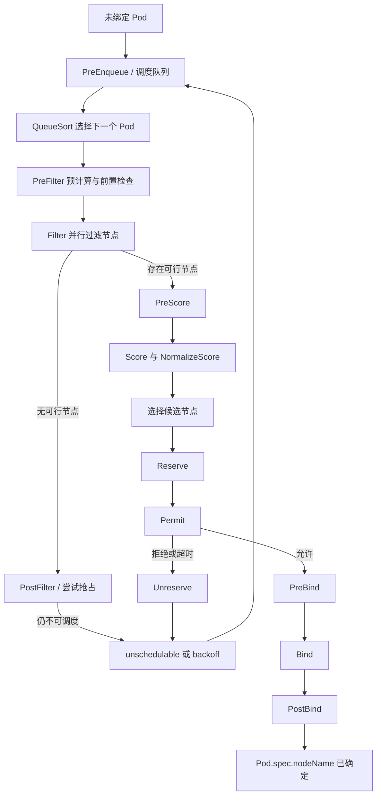
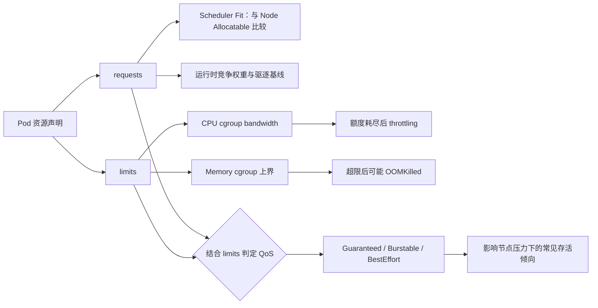
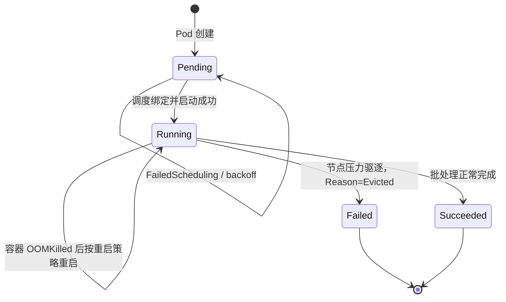
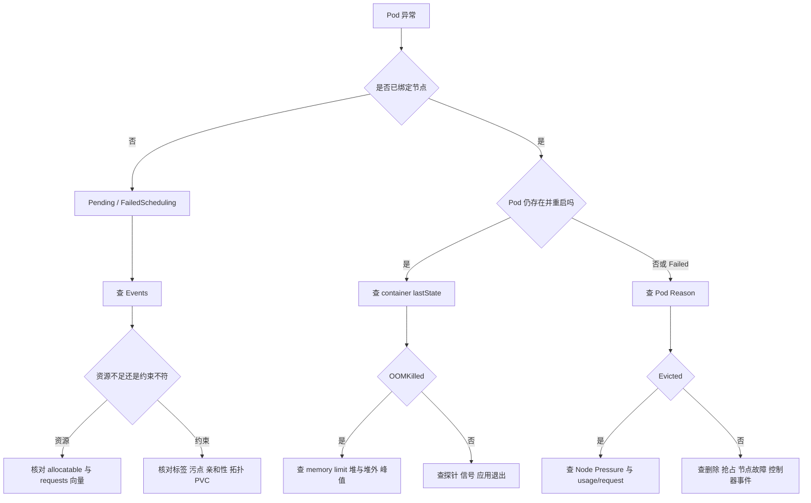

# 第 13 章：Kubernetes 调度、资源管理、QoS 与驱逐机制

> 面向以 Go 为主要语言、准备 Kubernetes 中高级面试与生产实践的后端工程师。本文以容器级 `resources.requests/limits` 为主，并在涉及版本差异时明确标注。资料依据见文末“官方参考资料”。

一个 Go 服务在 Kubernetes 中出现以下现象：

- 六个副本中有两个长期 `Pending`；
- 已运行的 Pod CPU 使用率看似不高，但 p99 延迟周期性抖动；
- 某些 Pod 显示 `OOMKilled`，另一些 Pod 显示 `Evicted`；
- 节点仍有“空闲 CPU”，Scheduler 却报告 `Insufficient cpu`；
- 配置了 `PodDisruptionBudget`，节点故障时仍一次损失多个副本。

这些现象看似分散，实质上都围绕四个量展开：

1. **request**：调度器用于做容量承诺的资源需求；
2. **limit**：节点内核通过 cgroup 执行的运行时上界；
3. **usage**：进程此刻真实消耗的资源；
4. **allocatable**：节点扣除系统预留后可供 Pod 使用的资源。

理解本章的关键，不是背诵 YAML 字段，而是能把“API 声明 → Scheduler 决策 → kubelet/cgroup 执行 → 节点压力保护”串成一条完整因果链。

---

## 学习目标

完成本章后，你应当能够：

- 解释 kube-scheduler 从排队、过滤、打分到绑定的完整流水线；
- 准确区分 CPU、内存的 request 与 limit，以及两者不同的内核行为；
- 判断 Pod 属于 `Guaranteed`、`Burstable` 还是 `BestEffort`；
- 区分容器级 OOM、节点级 OOM、节点压力驱逐与 API 主动驱逐；
- 正确使用节点选择、亲和性、污点、拓扑分布与优先级；
- 解释 PDB 的能力边界，避免把它当作“副本永不减少”的保证；
- 分析资源超卖、资源碎片、热点节点与 `FailedScheduling`；
- 将 Go 的 goroutine、`GOMAXPROCS`、GC、连接池与容器资源配置联动起来；
- 完成 requests、limits、副本数、拓扑偏斜和驱逐顺序的计算题；
- 建立一套可落地的 `Pending`、`OOMKilled`、`Evicted`、CPU throttling 排障流程。

---

## 核心术语

| 术语 | 面试级定义 | 最容易混淆的点 |
|---|---|---|
| `request` | Pod 对资源的调度需求和竞争权重基线 | 不是预先分配并锁死的物理资源 |
| `limit` | 容器在运行期可使用资源的上界 | CPU 超限通常被节流；内存超限可能被 OOM Kill |
| `capacity` | 节点报告的总资源容量 | 不能全部交给普通 Pod |
| `allocatable` | 扣除系统、Kubernetes 组件等预留后，可供 Pod 调度的容量 | Scheduler 主要对它做 request 账本核算 |
| QoS | 根据 CPU/内存 request 与 limit 组合得到的 Pod 服务质量类别 | 它影响驱逐与 OOM 倾向，但不是独立的调度资源 |
| Filter | 淘汰不满足硬约束的节点 | 通过 Filter 不代表最终一定选中 |
| Score | 对可行节点进行偏好排序 | 分数高是相对优选，不是资源保证 |
| Reserve | 在真正绑定前维护调度插件的假定状态 | 不是给容器预留一块物理内存 |
| Permit | 允许、拒绝或暂缓绑定 | 常用于协同调度等扩展逻辑 |
| Preemption | 高优先级 Pod 为获得调度机会，驱逐较低优先级 Pod | 不等同于 kubelet 节点压力驱逐 |
| Eviction | 终止并移除 Pod 的一类机制 | API 驱逐与节点压力驱逐的 PDB/优雅退出语义不同 |
| Taint | 节点对 Pod 的排斥条件 | 节点属性放在 taint，Pod 能否接受写 toleration |
| Toleration | Pod 对某个 taint 的容忍声明 | 只表示“可以去”，不表示“一定去” |
| PDB | 限制自愿性中断同时影响多少可用副本 | 不能阻止机器掉电、节点故障或节点压力驱逐 |

---

# 一、先建立统一心智模型：四层决策链

## 1.1 API 声明层

开发者通过 Pod 模板声明：

- 需要多少 CPU、内存；
- 最多允许使用多少 CPU、内存；
- 可以去哪些节点；
- 应与哪些 Pod 靠近或分散；
- 是否容忍节点污点；
- 优先级与是否允许抢占；
- 副本在节点、可用区等故障域中的分布要求。

这些只是**期望与约束**，不是进程已经获得资源的证明。

## 1.2 调度决策层

kube-scheduler 观察尚未设置 `.spec.nodeName` 的 Pod，从调度队列中取出一个 Pod：

1. 过滤掉资源不足、标签不符、污点不匹配、卷拓扑不满足等节点；
2. 对剩余节点按资源均衡、镜像本地性、亲和性、拓扑分布等规则打分；
3. 选择得分较高的节点；
4. 通过 Bind 将 Pod 与节点关联。

Scheduler 依据的是缓存中的集群对象与 **request 账本**，而不是实时 CPU 百分比。Kubernetes 官方文档明确指出，Pod 的 request 用于调度，limit 由 kubelet、容器运行时与内核在运行时执行。[^resources]

## 1.3 节点执行层

Pod 绑定后，目标节点上的 kubelet：

- 拉取镜像、创建 sandbox 和容器；
- 将资源参数转换为运行时与 cgroup 配置；
- 通过 CPU 权重、CPU 带宽上限、内存上限等机制约束进程；
- 持续上报状态并执行重启策略。

## 1.4 节点生存保护层

当节点内存、磁盘、inode 或 PID 等资源逼近危险阈值时，kubelet 会先尝试回收节点级资源；若不足以恢复安全水位，则选择 Pod 驱逐，以保护节点本身。节点压力驱逐由 kubelet发起，与 API 驱逐不同，且不遵守 PDB。[^eviction]

> **一句话总括**：request 决定“能不能放、竞争时有多大权重”，limit 决定“运行时最多能拿多少”，usage 决定“现在实际用了多少”，QoS/Priority/超 request 程度共同影响“节点危险时先牺牲谁”。

---

# 二、kube-scheduler 的调度流水线

Kubernetes Scheduling Framework 是可插拔架构。一次 Pod 调度尝试分为 **Scheduling Cycle** 和 **Binding Cycle**：前者选择节点，后者落实绑定；调度周期串行推进，而绑定周期可以并发执行。调度失败或内部错误时，Pod 会回到队列等待重试。[^scheduler]

## 2.1 调度队列不是一个简单 FIFO

调度器内部可抽象为三类集合：

- **activeQ**：当前可参与调度的 Pod；
- **backoffQ**：刚失败过、处于退避期的 Pod；
- **unschedulableEntities**：已经尝试但当前判断不可调度的 Pod 或调度实体。

当前实现使用优先级队列；QueueSort 插件决定 activeQ 内 Pod 的先后顺序。集群事件发生后，QueueingHint 可判断某个变化是否可能让特定 Pod 重新变得可调度，再将其移入 activeQ 或 backoffQ，避免无意义地反复全量重试。[^queue]

例如，一个 Pod 因“没有带 `disk=ssd` 标签的节点”失败：

- 普通 ConfigMap 更新通常不会改变它的可调度性；
- 新增符合标签的节点，或修改节点标签，才值得触发重试。

## 2.2 完整调度框架



## 2.3 各阶段的职责

| 阶段 | 核心职责 | 失败后的典型结果 | 常见实例 |
|---|---|---|---|
| PreEnqueue | 进入 activeQ 前判断是否具备排队条件 | 放入不可调度集合或保持 gated | SchedulingGates 等 |
| QueueSort | 决定待调度 Pod 的顺序 | 不直接决定节点 | PrioritySort |
| PreFilter | 为后续过滤做预计算，或做集群级前置校验 | 本轮调度中止 | 资源、亲和性预计算 |
| Filter | 对每个节点执行硬约束检查 | 节点被标记为不可行 | NodeResourcesFit、NodeAffinity、TaintToleration、VolumeBinding |
| PostFilter | 所有节点均失败后尝试补救 | 回队列等待 | 默认抢占逻辑 |
| PreScore | 为打分准备共享状态 | 本轮调度中止 | 拓扑、亲和性预计算 |
| Score | 对可行节点打分 | 选择综合分较高节点 | 资源均衡、拓扑分布、镜像本地性 |
| Reserve | 在绑定前维护插件假定状态，防止并发竞态 | 反向执行 Unreserve | VolumeBinding 等状态型插件 |
| Permit | 允许、拒绝或在超时内等待 | 拒绝后 Unreserve 并回队列 | gang/co-scheduling 扩展场景 |
| PreBind | 绑定前完成必要动作 | 回队列重试 | 卷绑定或准备工作 |
| Bind | 将 Pod 绑定到节点 | 未成功则重试 | DefaultBinder 或自定义 Binder |
| PostBind | 绑定后的通知与清理 | 不再改变本次绑定 | 指标、审计、状态清理 |

官方框架定义中，Filter 会按配置顺序检查节点，任一插件判定不可行后，该节点不再执行后续 Filter；Score 会对通过过滤的节点评分并按插件权重汇总；Reserve 用于维护绑定前的状态，Permit 可返回允许、拒绝或等待；Bind 成功后本轮绑定结束。[^scheduler]

## 2.4 Filter 与 Score 的根本差异

假设有三个节点：

| 节点 | 剩余 request 容量 | zone | 是否有 SSD | 当前同类 Pod 数 |
|---|---:|---|---|---:|
| node-a | 2 CPU / 4 GiB | zone-a | 是 | 3 |
| node-b | 4 CPU / 8 GiB | zone-b | 否 | 1 |
| node-c | 1 CPU / 2 GiB | zone-c | 是 | 0 |

新 Pod 硬性要求 SSD，请求 1500m CPU、3 GiB 内存：

- node-b：SSD 条件不满足，在 Filter 阶段淘汰；
- node-c：资源不足，在 Filter 阶段淘汰；
- node-a：通过 Filter，因此无论它的 Score 是否理想，都将成为唯一候选。

因此：

- **required、request、NoSchedule 等是“能不能”问题；**
- **preferred、资源均衡、软拓扑分散等是“更愿意去哪”问题。**

## 2.5 为什么节点看起来空闲，Pod 仍然 Pending

Scheduler 通常检查：

```text
节点已承诺的 request 总和 + 新 Pod request <= Node Allocatable
```

它不会因为此刻 CPU 使用率只有 10% 就忽略已经承诺出去的 request。这样做的原因是实时 usage 波动大，不能作为稳定容量承诺。官方节点文档也说明，Scheduler 检查节点上容器 request 之和是否超过可调度容量。[^node-allocatable]

这会产生一个常见现象：

- 实际 CPU 很空闲；
- 但已有 Pod 的 CPU request 总和已接近 allocatable；
- 新 Pod 仍报告 `Insufficient cpu`。

这不是 Scheduler “不会看监控”，而是声明式容量模型的设计结果。

---

# 三、requests 与 limits：调度承诺和运行时上界

## 3.1 资源单位

CPU 是绝对计算量，不是百分比：

- `1` CPU：一个逻辑 CPU、一个 vCPU 或一个云厂商定义的 CPU 单位；
- `500m`：0.5 CPU；
- `100m`：0.1 CPU；
- `0.5` 与 `500m` 等价。

内存常用二进制单位：

- `Ki`、`Mi`、`Gi` 分别基于 1024；
- `K`、`M`、`G` 是十进制单位；
- 生产中建议统一使用 `Mi`、`Gi`，减少换算歧义。

## 3.2 request 与 limit 对比

| 维度 | request | limit |
|---|---|---|
| 主要使用者 | kube-scheduler、kubelet 的资源权重与驱逐逻辑 | kubelet、容器运行时、Linux cgroup |
| 调度时是否参与 fit | 是 | 通常不直接参与；但只写 limit 时，request 可能被复制为相同值 |
| CPU 语义 | 竞争时的相对权重与调度容量承诺 | CPU 带宽硬上界，达到后节流 |
| 内存语义 | 调度容量承诺与节点压力判断基线 | cgroup 内存上界，超出可能 OOM Kill |
| 是否等于预分配 | 否 | 否；只是执行约束 |
| 是否允许超出 | 资源空闲时通常可以超出 request | CPU 不可持续超出；内存超出后可能被杀 |
| 对 QoS 的影响 | 有 | 有 |

若只设置某资源的 limit，且没有准入机制注入 request，Kubernetes 会把该 limit 复制为同资源的 request。[^resources] 因此，“只写 limit，不写 request，就不会占调度额度”是错误认知。

## 3.3 Pod request 如何计算

对没有特殊 init 容器语义、没有 Pod overhead 的普通多容器 Pod，可先按以下方式理解：

```text
Pod CPU request    = 所有业务容器 CPU request 之和
Pod memory request = 所有业务容器 memory request 之和
```

例如：

```yaml
containers:
  - name: api
    resources:
      requests:
        cpu: 500m
        memory: 512Mi
  - name: sidecar
    resources:
      requests:
        cpu: 100m
        memory: 128Mi
```

则该 Pod 的普通容器合计 request 为：

```text
CPU    = 500m + 100m = 600m
Memory = 512Mi + 128Mi = 640Mi
```

生产计算还需要考虑 init container、可重启 sidecar init container、RuntimeClass Pod overhead，以及版本相关的 Pod 级资源配置。面试计算题若未特别说明，通常默认只计算普通容器之和；实际排障应以 API 对象和 `kubectl describe node` 中的已分配资源为准。

## 3.4 三种“超卖”必须分开

### CPU request 超卖

Scheduler 不会让 request 总和超过 allocatable，因此严格说 **CPU request 账本本身不超卖**。但如果多个 Pod 实际使用长期高于 request，就会在运行时争抢 CPU，这是一种 usage 相对 request 的超卖。

### CPU limit 超卖

多个 Pod 的 CPU limit 总和可以超过节点 CPU。官方 `kubectl describe node` 示例也明确提示 limit 总计可能超过 100%。[^resources] 这是合理的统计复用，但所有 Pod 同时冲高时会形成争用与节流。

### 内存 limit 超卖

多个 Pod 的 memory limit 总和也可能大于物理内存。内存不可像 CPU 那样被安全压缩；一旦工作集同时增长，可能触发节点压力驱逐或节点 OOM，风险显著高于 CPU limit 超卖。

## 3.5 requests、limits、QoS 与运行时限制的关系



这张图必须按“声明—调度—执行—生存”四层理解：request 决定能否放下以及竞争基线，limit 约束运行时上界，二者共同影响 QoS；QoS 又只是驱逐结果的近似信号，不是 kubelet 的唯一排序键。

---

# 四、CPU：request 是权重，limit 是带宽上限

## 4.1 CPU request 的两层作用

### 作用一：调度容量

Scheduler 用 CPU request 判断节点是否还能接受 Pod。

### 作用二：竞争权重

当多个 cgroup 同时争抢 CPU 时，更大的 CPU request 通常对应更大的 CPU 权重，因而获得更多 CPU 时间。Kubernetes 官方资源文档将 CPU request 描述为竞争时的权重，而 CPU limit 是硬上界。[^resources]

例如，在同一节点上：

- Pod A request `1000m`；
- Pod B request `500m`；
- 二者都无 CPU limit；
- 节点发生持续 CPU 争用。

可近似理解为 A 获得的竞争权重大约是 B 的两倍。它不是“每秒固定发放 1 核和 0.5 核”，而是竞争时的相对份额。

## 4.2 CPU limit 为什么导致 throttling

Linux 通过 cgroup CPU bandwidth 控制容器在一个调度周期内可消耗的 CPU 时间。当 cgroup 用完本周期配额后，即使宿主机还有可运行 CPU，也可能暂停该 cgroup，直到下一周期补充配额。

假设：

- Pod CPU limit 为 `500m`；
- Go 进程有大量可运行 goroutine；
- 它们在周期前半段快速消耗完 CPU 配额。

则周期后半段请求处理、GC、定时任务都可能一起等待。这种“运行一段、停一段”的模式不会一定推高平均延迟，却很容易放大 p95/p99。

## 4.3 尾延迟抖动的因果链

```text
并发请求增加
  → 可运行 goroutine 增多
  → Go 调度器与 GC 同时消耗 CPU
  → cgroup 很快耗尽 CPU quota
  → 进程被 throttled
  → 请求队列增长
  → 超时与重试增加
  → 下一周期负载更高
  → p99 进一步恶化
```

CPU limit 不会像内存超限那样直接杀掉容器。官方文档明确说明，CPU 超限通过节流执行，容器运行时不会仅因 CPU 使用过高而终止 Pod。[^resources]

## 4.4 要不要设置 CPU limit

没有一个适用于所有系统的答案。

| 策略 | 优点 | 风险 | 适用场景 |
|---|---|---|---|
| request 与 limit 相等 | 容量边界清晰，容易获得 Guaranteed | 突发无法借用空闲 CPU，延迟敏感服务易节流 | 批任务、严格租户隔离、可预测 CPU 负载 |
| request 小于 limit | 允许有限突发 | 高峰仍可能节流，QoS 为 Burstable | 一般在线服务 |
| 设置 request，不设 CPU limit | 可借用节点空闲 CPU，减少 quota 节流 | 可能形成 noisy neighbor，需要节点与租户治理 | 延迟敏感服务、专用节点或有完善配额治理的集群 |
| request 与 limit 都不设 | 配置简单 | BestEffort、调度失真、争用与驱逐风险最高 | 临时调试，不建议生产核心服务 |

更可靠的决策方式是：

1. 通过压测得到单 Pod 在目标 p99 下的 CPU 使用；
2. request 覆盖稳定负载和必要余量；
3. 若设置 limit，观察节流比例与尾延迟的相关性；
4. 评估不设 limit 后的租户隔离、故障爆炸半径与成本；
5. 用节点池隔离、ResourceQuota、Priority 等手段补足治理。

## 4.5 CPU 是可压缩资源

CPU 不足时，进程通常只是得到更少执行时间，并不会因为“CPU OOM”被杀。节点压力驱逐的主要信号是内存、文件系统容量、inode 与 PID，而不是 CPU 使用率。[^eviction]

---

# 五、内存：request 是调度基线，limit 是反应式上界

## 5.1 内存 request 不等于锁定物理页

memory request 的主要意义是：

- Scheduler 做节点容量承诺；
- kubelet 在节点压力下判断 Pod 是否超出其声明基线；
- 参与 QoS 与 OOM 倾向计算。

它不是“Pod 启动时立即独占 512 MiB 物理内存”。Pod 可以低于 request，也可能在节点有余量时高于 request。

## 5.2 memory limit 的执行方式

内存 limit 由内核 cgroup 反应式执行。进程申请内存超过可用边界后，内核可能触发 memcg OOM 并杀死进程。Kubernetes 文档强调：CPU limit 是节流型硬上限；memory limit 的终止发生在内核检测到内存压力时，因此是反应式的。[^resources]

典型状态：

```text
Last State:  Terminated
Reason:      OOMKilled
Exit Code:   137
```

`137 = 128 + 9` 通常表示进程收到 `SIGKILL`。结合 `Reason: OOMKilled` 才能确认是 OOM；单独看到退出码 137 不能排除人工或其他机制发送 SIGKILL。

## 5.3 三类容易混淆的内存故障

| 类型 | 触发位置 | 典型表现 | PDB 是否保护 | 主要排查方向 |
|---|---|---|---|---|
| 容器 cgroup OOM | 容器达到 memory limit | 容器 `OOMKilled`，Pod 可能按策略重启 | 不适用 | limit、峰值、堆外内存、泄漏、GC |
| 节点压力驱逐 | kubelet 发现 `memory.available` 低于阈值 | Pod phase `Failed`，Reason `Evicted` | 否 | 节点水位、request、实际用量、系统预留 |
| 节点级 OOM | 内核在 kubelet及时驱逐前耗尽内存 | 某进程被系统 OOM Killer 杀死，节点可能不稳定 | 否 | 内核日志、oom_score_adj、突发分配、系统进程 |

## 5.4 为什么低 memory limit 可能让 Go 服务变慢

Go 的 GC 会在 CPU 与内存之间做权衡：

- 内存空间宽松时，可让堆增长更大、减少 GC 频率；
- 内存上界过低时，GC 更频繁；
- 当存活对象已接近软限制时，运行时可能进入近似 GC thrashing，吞吐下降、延迟上升。

Go 提供 `GOMEMLIMIT` 或 `runtime/debug.SetMemoryLimit` 作为运行时软内存限制。官方 GC 指南建议，在容器固定内存边界中，为运行时不可见的内存来源保留约 5%～10% 余量。[^go-memory]

例如容器 memory limit 为 `1Gi`，可以从以下起点压测：

```yaml
env:
  - name: GOMEMLIMIT
    value: "900MiB"
```

但这不是通用魔法值。还应考虑：

- goroutine 栈；
- cgo/C 库内存；
- mmap；
- 网络缓冲区；
- TLS、压缩与序列化临时对象；
- page cache；
- memory-backed `emptyDir`；
- sidecar 与同 Pod 其他容器。

`GOMEMLIMIT` 是 Go runtime 的软约束，不等于 cgroup memory limit，也不能保证绝不 OOM。

## 5.5 request 应如何估算

可从以下经验流程起步：

1. 在代表性负载下采集工作集内存，而非只看瞬时 RSS；
2. 覆盖正常高峰和 GC 周期；
3. 加入请求体、缓存、批处理、连接数等业务峰值；
4. request 取“正常运行应被保护的稳定水位”；
5. limit 覆盖合理峰值与安全余量，但不能高到让单 Pod拖垮节点；
6. 通过 OOM、GC 次数、heap live、RSS、page cache 和节点压力事件反复校准。

---

# 六、QoS：Guaranteed、Burstable 与 BestEffort

Kubernetes 根据 Pod 中容器的 CPU、内存 request/limit 自动计算 QoS。它不是手工填写的标签。QoS 主要影响节点压力下的处理倾向及 Linux OOM 调整值。[^qos]

## 6.1 判定规则

| QoS | 判定条件 | 运行特征 | 典型用途 |
|---|---|---|---|
| Guaranteed | 每个容器都设置 CPU 与内存 request、limit，且同资源 request=limit，值均大于 0 | 最明确的资源边界，通常最后被节点压力牺牲 | 核心组件、强隔离、CPU Manager 独占核候选 |
| Burstable | 不满足 Guaranteed，但至少有一个容器或 Pod 级资源设置了 CPU/内存 request 或 limit | 有部分容量承诺，可借用空闲资源 | 大多数在线服务 |
| BestEffort | 所有容器都未设置 CPU/内存 request 和 limit | 无调度资源承诺，节点压力下风险最高 | 临时、低价值、可随时丢弃任务 |

> 当前文档还定义了 Pod 级 CPU/内存资源字段；该能力自 Kubernetes v1.34 为 Beta、默认启用。为兼容不同集群和面试语境，本章主线仍使用容器级资源。[^qos]

## 6.2 判定示例

### 示例 A：Guaranteed

```yaml
resources:
  requests:
    cpu: "1"
    memory: 1Gi
  limits:
    cpu: "1"
    memory: 1Gi
```

前提是 Pod 中**每个容器**都满足同样规则。只要 sidecar 漏配 CPU request，该 Pod 就不能是 Guaranteed。

### 示例 B：Burstable

```yaml
resources:
  requests:
    cpu: 500m
    memory: 512Mi
  limits:
    cpu: "1"
    memory: 1Gi
```

request 与 limit 不相等，因此为 Burstable。

### 示例 C：BestEffort

```yaml
resources: {}
```

所有容器均无 CPU/内存 request 和 limit。

## 6.3 “Guaranteed 绝不会被驱逐”是错的

Guaranteed 只是最受保护，不是绝对不死：

- 它仍可能超过自己的 memory limit 并 OOMKilled；
- 节点只剩 Guaranteed 或低于 request 的 Burstable Pod 时，为保护节点，kubelet仍可能按 Priority 驱逐；
- 节点掉电、内核崩溃、云主机消失不会尊重 QoS；
- 管理员删除 Pod、Deployment滚动升级也不受 QoS 阻止。

## 6.4 QoS 与 Priority 是正交维度

一个 BestEffort Pod 可以有高 Priority；一个 Guaranteed Pod 也可以有低 Priority。Scheduler 的抢占逻辑主要看 Priority，不按 QoS 选择牺牲者；kubelet节点压力驱逐则结合“是否超 request、Priority、超出比例”排序。官方文档明确说明 QoS 与 Priority 基本正交。[^priority]

---

# 七、节点压力、驱逐与 OOM

## 7.1 kubelet 监控哪些压力信号

典型信号包括：

| 资源 | 常见信号 | 风险 |
|---|---|---|
| 内存 | `memory.available` | 系统与 Pod 无法继续分配内存 |
| 根文件系统 | `nodefs.available`、`nodefs.inodesFree` | 日志、emptyDir、容器可写层挤满节点盘 |
| 镜像文件系统 | `imagefs.available`、`imagefs.inodesFree` | 镜像与容器层无法写入 |
| 容器文件系统 | `containerfs.available`、`containerfs.inodesFree` | 独立容器文件系统耗尽 |
| PID | `pid.available` | 无法创建新进程或线程 |

CPU 饱和通常通过时间片竞争和节流体现，不属于上述节点压力驱逐信号。

## 7.2 驱逐前先做节点级回收

kubelet会先尝试回收：

- 删除未使用镜像；
- 清理已终止容器与 Pod 资源；
- 根据文件系统布局进行垃圾回收。

如果仍无法恢复到安全水位，才开始驱逐普通 Pod。[^eviction]

## 7.3 硬阈值与软阈值

- **硬阈值**：一旦越过立即触发，Pod 可被快速终止；
- **软阈值**：必须持续超过一定 grace period 才触发，可给短暂波动恢复机会；
- 节点压力驱逐不遵守 Pod 自身的 `terminationGracePeriodSeconds`；硬驱逐可使用 0 秒 grace，软驱逐受 kubelet 的最大驱逐 grace 配置影响。[^eviction]

## 7.4 实际驱逐顺序

最常见的错误回答是：

```text
BestEffort → Burstable → Guaranteed
```

这只是粗略结果，不是完整算法。对内存等有 request 语义的资源，kubelet主要按以下顺序排序：

1. 该 Pod 对紧缺资源的实际使用是否超过 request；
2. Pod Priority；
3. 实际使用相对 request 的超出程度。

因此：

- 一个低 Priority 但使用量低于 request 的 Pod，不一定先于高 Priority、严重超 request 的 Pod 被驱逐；
- BestEffort 的 request 可视为 0，只要使用资源就属于超 request，因此通常最先进入候选；
- Guaranteed 的 request=limit，正常情况下不超 request，因此通常更靠后；
- 对 inode、PID 等没有 Pod request 的资源，排序逻辑会更依赖 Priority 或该资源实际使用量。

官方节点压力文档特别指出，kubelet并不直接以 QoS 类名作为排序键，QoS 只是对常见结果的近似预测。[^eviction-order]

## 7.5 OOM Killer 与 `oom_score_adj`

如果内存增长太快，kubelet可能来不及驱逐，节点先发生 OOM。kubelet会根据 QoS 设置容器的 `oom_score_adj` 倾向：

| QoS | 典型 `oom_score_adj` |
|---|---:|
| Guaranteed | `-997` |
| BestEffort | `1000` |
| Burstable | 根据 memory request 占节点内存比例计算，通常介于两者之间 |

最终由内核综合进程内存占用与 `oom_score_adj` 选择牺牲者。[^eviction]

## 7.6 `Evicted` Pod 会不会自己回来

被驱逐的 Pod 通常进入终态 `Failed`，Reason 为 `Evicted`，不会在原对象上重新变回 Running。

若它由 Deployment、StatefulSet 等控制器管理，控制器会发现期望副本不足并创建**新的 Pod 对象**。因此你可能同时看到：

- 旧 Pod：`Failed/Evicted`；
- 新 Pod：新的 UID，重新调度和启动。

## 7.7 Pod 从调度到驱逐的状态路径



`OOMKilled` 通常首先是**容器终止原因**，Pod 是否进入终态取决于重启策略与控制器行为；`Evicted` 则通常令原 Pod 对象进入 `Failed`，由上层控制器另建替代 Pod。两者在排障路径上不能混为一谈。

---

# 八、ResourceQuota 与 LimitRange

这两个对象都作用于 Namespace，但职责完全不同。

## 8.1 对比

| 维度 | ResourceQuota | LimitRange |
|---|---|---|
| 约束对象 | Namespace 聚合总量或对象数量 | 单个 Pod、Container、PVC 等对象的取值范围 |
| 典型能力 | 限制 requests/limits 总和、Pod 数、PVC 数等 | 默认值、最小值、最大值、request/limit 比例 |
| 执行时机 | API 准入时检查总量 | API 准入时注入默认值并校验 |
| 是否保证资源可用 | 否，只是上限 | 否，只是单对象规范 |
| 是否修改既有对象 | 否 | 否 |
| 常见错误 | 把 quota 当预留容量 | 多个 LimitRange 默认值冲突、默认 request 大于 limit |

ResourceQuota 限制 Namespace 聚合资源消费，也可以限制特定 API 对象数量；违反 quota 的创建或更新请求会被 API Server 以 `403 Forbidden` 拒绝。LimitRange 可为容器注入默认 request/limit，并约束最小值、最大值和比例。二者都只在准入阶段影响新建或更新对象，不会回写已经运行的 Pod。[^quota][^limit-range]

## 8.2 示例

```yaml
apiVersion: v1
kind: LimitRange
metadata:
  name: default-compute
  namespace: team-a
spec:
  limits:
    - type: Container
      defaultRequest:
        cpu: 200m
        memory: 256Mi
      default:
        cpu: "1"
        memory: 1Gi
      min:
        cpu: 50m
        memory: 64Mi
      max:
        cpu: "4"
        memory: 4Gi
      maxLimitRequestRatio:
        cpu: "10"
        memory: "4"
---
apiVersion: v1
kind: ResourceQuota
metadata:
  name: team-a-budget
  namespace: team-a
spec:
  hard:
    requests.cpu: "20"
    requests.memory: 40Gi
    limits.cpu: "40"
    limits.memory: 80Gi
    pods: "100"
```

这表示：

- 单个容器有默认值和上下界；
- team-a Namespace 所有 Pod 的 request/limit 总和有预算上限；
- 最多创建 100 个 Pod。

但它不表示 team-a 一定能在任意时刻拿到 20 CPU。若集群没有足够节点，Pod 仍会 Pending。Quota 是**消费上限**，不是**容量预留**。

---
# 九、控制 Pod 去哪里：选择、亲和性、污点与拓扑分布

## 9.1 nodeSelector

`nodeSelector` 是最简单的节点硬约束：目标节点必须同时具备所有指定标签。

```yaml
spec:
  nodeSelector:
    node.kubernetes.io/instance-type: c3-standard-8
    workload.example.com/tier: online
```

优点是简单明确；缺点是表达能力有限，只支持等值匹配。

## 9.2 nodeAffinity

nodeAffinity 基于节点标签，支持 `In`、`NotIn`、`Exists`、`DoesNotExist`、`Gt`、`Lt` 等更丰富的表达式，并区分硬条件和软偏好。[^placement]

```yaml
spec:
  affinity:
    nodeAffinity:
      requiredDuringSchedulingIgnoredDuringExecution:
        nodeSelectorTerms:
          - matchExpressions:
              - key: workload.example.com/tier
                operator: In
                values: ["online"]
      preferredDuringSchedulingIgnoredDuringExecution:
        - weight: 80
          preference:
            matchExpressions:
              - key: storage.example.com/type
                operator: In
                values: ["nvme"]
```

### required 与 preferred

| 类型 | 调度时 | 条件不满足时 | 标签在运行后变化 |
|---|---|---|---|
| `requiredDuringSchedulingIgnoredDuringExecution` | 必须满足 | Pod Pending | 已运行 Pod 不会因此被自动驱逐 |
| `preferredDuringSchedulingIgnoredDuringExecution` | 尽量满足 | 仍可去其他节点 | 已运行 Pod 不会重新平衡 |

`IgnoredDuringExecution` 的含义是：调度完成后节点标签改变，Pod 通常继续运行，而不是自动搬迁。[^placement]

## 9.3 podAffinity 与 podAntiAffinity

它们不是看节点自身标签，而是看某个 topology domain 中已经存在的 Pod 标签。

### podAffinity

希望相关服务靠近，例如 API 与本地缓存位于同一可用区，以减少跨区网络延迟和费用。

### podAntiAffinity

希望同类副本分散，例如同一 Deployment 的副本不要集中在一台节点上。

```yaml
spec:
  affinity:
    podAntiAffinity:
      preferredDuringSchedulingIgnoredDuringExecution:
        - weight: 100
          podAffinityTerm:
            topologyKey: kubernetes.io/hostname
            labelSelector:
              matchLabels:
                app: checkout
```

硬性 podAntiAffinity 很容易造成资源浪费或调度死锁。例如只有 3 个节点，却要求 5 个副本在 `kubernetes.io/hostname` 上绝不共存，则最多只能调度 3 个。

## 9.4 taint 与 toleration

Taint 放在节点上，表达“默认排斥哪些 Pod”；toleration 放在 Pod 上，表达“我可以容忍该排斥条件”。

```bash
kubectl taint node node-gpu accelerator=nvidia:NoSchedule
```

```yaml
spec:
  tolerations:
    - key: accelerator
      operator: Equal
      value: nvidia
      effect: NoSchedule
```

### 三种 effect

| Effect | 对新 Pod | 对已运行 Pod |
|---|---|---|
| `NoSchedule` | 不匹配 toleration 就不调度 | 不驱逐 |
| `PreferNoSchedule` | 尽量避免，但不是硬约束 | 不驱逐 |
| `NoExecute` | 不匹配则不调度 | 不匹配则驱逐；可用 `tolerationSeconds` 延迟 |

这些语义由官方 taint/toleration 文档定义。[^taints]

### 为什么 toleration 不等于保证调度

Pod 有 GPU taint 的 toleration，只表示它**有资格**进入 GPU 节点；如果它没有 nodeAffinity 或 GPU extended resource request，它仍可能被调度到普通节点。

若目标是专用节点，通常双向配置：

1. 节点加 taint，阻止普通 Pod 进入；
2. 专用 Pod 加 toleration；
3. 专用 Pod 再加 nodeAffinity，确保只选择该节点池。

## 9.5 topologySpreadConstraints

拓扑分布约束用于控制同类 Pod 在节点、可用区、机架或自定义故障域中的数量偏斜。核心字段：

- `topologyKey`：用哪个节点标签划分 domain；
- `labelSelector`：统计哪些 Pod；
- `maxSkew`：允许的最大数量偏斜；
- `whenUnsatisfiable`：硬约束 `DoNotSchedule` 或软偏好 `ScheduleAnyway`；
- `minDomains`：硬约束下要求考虑的最少合格 domain 数。

官方文档说明，`DoNotSchedule` 会在无法满足偏斜要求时让 Pod 保持 Pending；`ScheduleAnyway` 仍允许调度，但优先选择能减小偏斜的节点。[^topology]

```yaml
spec:
  topologySpreadConstraints:
    - maxSkew: 1
      topologyKey: topology.kubernetes.io/zone
      whenUnsatisfiable: DoNotSchedule
      labelSelector:
        matchLabels:
          app: checkout
    - maxSkew: 1
      topologyKey: kubernetes.io/hostname
      whenUnsatisfiable: ScheduleAnyway
      labelSelector:
        matchLabels:
          app: checkout
```

这个配置表达：

- 可用区级别必须尽量均匀，偏斜超过 1 就不调度；
- 节点级别是软分散，资源不足时允许同节点多副本。

### topology spread 与 anti-affinity 对比

| 需求 | 更合适的机制 |
|---|---|
| 同一节点绝不能有两个副本 | required podAntiAffinity |
| 尽量不要同节点 | preferred podAntiAffinity |
| 让 N 个副本在 3 个 zone 数量接近 | topologySpreadConstraints |
| 控制最大数量差而非绝对禁止共存 | topologySpreadConstraints |
| 让 API 与缓存同 zone | podAffinity |

Topology spread 的 `labelSelector` 必须与工作负载 Pod 标签一致，否则当前 Pod 可能不参与自身分布计数，产生“ghost pods”式错误分布。官方文档将这列为已知陷阱。[^topology]

## 9.6 调度约束对比总表

| 机制 | 依据 | 硬/软 | 典型目的 | 主要风险 |
|---|---|---|---|---|
| nodeSelector | 节点标签 | 硬 | 固定节点池 | 表达力弱、标签错误导致 Pending |
| nodeAffinity | 节点标签 | 硬或软 | 机型、合规、磁盘、架构选择 | 硬条件叠加后候选集过小 |
| podAffinity | 其他 Pod 标签+拓扑 | 硬或软 | 靠近依赖 | 故障相关性、调度计算成本 |
| podAntiAffinity | 其他 Pod 标签+拓扑 | 硬或软 | 副本隔离 | 节点不足时无法扩容 |
| taint/toleration | 节点排斥与 Pod 容忍 | 硬或软 | 专用节点、异常节点隔离 | toleration 被误当作选择器 |
| topology spread | 同类 Pod 在 domain 中的数量 | 硬或软 | 高可用与均匀分布 | maxSkew/minDomains 配置过严 |

---

# 十、PriorityClass、Preemption 与 PDB

## 10.1 PriorityClass

PriorityClass 是集群级对象。Pod 引用 `priorityClassName` 后，准入控制器将整数优先级写入 Pod；优先级更高的 Pod 通常在调度队列中更靠前。

```yaml
apiVersion: scheduling.k8s.io/v1
kind: PriorityClass
metadata:
  name: online-critical
value: 100000
preemptionPolicy: PreemptLowerPriority
globalDefault: false
description: "面向核心在线服务"
```

## 10.2 Preemption

当高优先级 Pod 无法调度时，PostFilter 阶段可能尝试：

1. 假设移除某节点上的一组低优先级 Pod；
2. 判断高优先级 Pod 是否因此可以放入；
3. 选择代价较小的候选节点和 victim；
4. 终止 victim，并在高优先级 Pod 状态中设置 `nominatedNodeName`；
5. 等 victim 释放资源后再次调度。

`nominatedNodeName` 不是最终保证。victim 有优雅终止时间，等待期间其他节点可能释放资源，或更高优先级 Pod 到来，因此最终 `.spec.nodeName` 可能不同。[^priority]

## 10.3 非抢占优先级

```yaml
apiVersion: scheduling.k8s.io/v1
kind: PriorityClass
metadata:
  name: high-non-preempting
value: 90000
preemptionPolicy: Never
globalDefault: false
```

这种 Pod 会在队列中优先于低优先级 Pod，但不会主动驱逐它们。适用于希望“有空位时优先运行”，又不希望丢弃已运行批任务的场景。官方文档指出，它仍会经历 scheduler backoff，也可能被更高优先级 Pod 抢占。[^priority]

## 10.4 抢占的风险

- 低优先级服务长期饥饿；
- victim 的优雅退出使高优先级 Pod 仍需等待；
- 高频抢占造成缓存抖动、连接重建与任务浪费；
- 若高优先级 Pod 自身配置错误，它可能反复驱逐健康工作负载却仍无法调度；
- 亲和性、PVC 拓扑、端口冲突等约束可能意味着“释放 CPU/内存也没用”。

PriorityClass 应与 ResourceQuota、准入策略、租户治理配合，不能让普通团队随意使用极高优先级。

## 10.5 PDB 的真实边界

PDB 约束通过 Eviction API 发生的**自愿性中断**，例如 `kubectl drain`。它可以声明 `minAvailable` 或 `maxUnavailable`：

```yaml
apiVersion: policy/v1
kind: PodDisruptionBudget
metadata:
  name: checkout
spec:
  minAvailable: 4
  selector:
    matchLabels:
      app: checkout
```

若 Deployment 期望 5 个副本，`minAvailable: 4` 通常只允许一次自愿驱逐一个可用 Pod。[^pdb]

PDB 不能阻止：

- 机器掉电；
- 节点崩溃或网络隔离；
- kubelet节点压力驱逐；
- 容器 OOMKilled；
- 管理员直接删除 Pod；
- 工作负载控制器自身的滚动更新策略。

对 scheduler preemption，PDB 只是 best effort：Scheduler 会尽量选择不违反 PDB 的 victim，但如果找不到，仍可能违反 PDB 完成抢占。[^priority]

> **面试结论**：PDB 是“主动维护时的并发中断闸门”，不是高可用本身。高可用还需要足够副本、故障域分散、正确探针、优雅退出和真实可用的冗余容量。

---

# 十一、Bin Packing、Spread、资源碎片与热点

## 11.1 Bin Packing

Bin Packing 倾向把 Pod request 集中到较少节点：

- 提高节点利用率；
- 让空节点更容易缩容；
- 降低基础设施成本。

Scheduler 的 `NodeResourcesFit` 可配置 `MostAllocated` 或 `RequestedToCapacityRatio` 等策略实现更强的 bin packing。[^bin-packing]

风险：

- 单节点故障影响更多副本；
- 热点更明显；
- 实际 usage 若显著高于 request，集中放置会放大争用；
- 内存 limit 超卖时故障爆炸半径变大。

## 11.2 Spread

Spread 倾向把 Pod 分散到更多节点或可用区：

- 降低单点故障影响；
- 减少热点；
- 为滚动发布和节点维护留出冗余。

代价：

- 节点利用率降低；
- 跨区流量与费用增加；
- 节点自动缩容更困难；
- 每个节点都可能残留少量不可搬迁 Pod。

## 11.3 资源碎片

考虑三个节点，每个剩余资源如下：

| 节点 | CPU 剩余 | 内存剩余 |
|---|---:|---:|
| A | 2 CPU | 1 GiB |
| B | 500m | 6 GiB |
| C | 1500m | 2 GiB |

集群合计还有 4 CPU、9 GiB，但一个请求 `2 CPU + 4 GiB` 的 Pod 无法放入任何节点。

这叫**资源碎片**：总量足够，单节点向量不匹配。增加节点总容量不一定是唯一方案，还可：

- 调整 Pod request；
- 重新设计副本粒度；
- 使用更匹配的节点规格；
- 通过重调度或节点自动伸缩形成可容纳节点；
- 避免过度硬亲和与拓扑限制。

## 11.4 热点节点

Scheduler 主要按 request 做规划。如果某服务：

- request 仅 `100m`，实际持续使用 `800m`；
- 多个副本被集中到同一节点；
- 又没有 CPU limit；

那么 request 账本认为节点仍很宽松，实际节点却可能 CPU 饱和。这不是调度器“错误”，而是 request 严重失真。

## 11.5 取舍框架

| 目标 | 倾向策略 |
|---|---|
| 成本与节点缩容 | 更强 bin packing |
| 高可用与低故障相关性 | zone/node spread |
| 延迟敏感、易受 noisy neighbor 影响 | 更准确 request、专用节点、软分散 |
| 大型批任务 | bin packing、非抢占高优先级、队列化 |
| 核心在线服务 | 多副本、跨 zone、合理 Priority、PDB、预留容量 |

最佳实践通常不是全局只选一种，而是：

- 普通无状态服务采用软 spread；
- 核心服务采用硬 zone spread + 软 node spread；
- 批处理节点池采用 bin packing；
- 通过独立 scheduler profile 或节点池表达不同策略。

---

# 十二、Go 运行时与容器资源限制

## 12.1 goroutine 不是 CPU 配额

创建 10 万个 goroutine 不代表获得 10 万个执行单元。大量 runnable goroutine 会共享有限的 P 和 OS thread：

- CPU limit 决定 cgroup 总 CPU 带宽；
- `GOMAXPROCS` 决定可同时执行 Go 代码的 P 数量；
- goroutine 数量决定并发任务规模，但不能突破 CPU 物理与 cgroup 边界；
- 无界 goroutine 会增加栈、调度、队列、连接和下游压力。

因此，资源配置必须与应用并发控制一起设计：

```text
Pod 副本数 × 单 Pod 最大并发 × 单请求下游扇出
```

才是数据库、Redis、HTTP 下游真正承受的潜在并发。

## 12.2 Go 1.25 起的容器感知 GOMAXPROCS

使用 Go 1.25 及以上工具链、模块采用 Go 1.25 及以上语言版本，并且没有手工覆盖相关设置时，Linux 上默认 `GOMAXPROCS` 会考虑进程所在 cgroup 的 CPU bandwidth limit，并在限制变化时周期性更新。它通常对应 Kubernetes **CPU limit**，不读取 CPU request；旧语言版本可通过兼容性开关保留旧行为。[^go-maxprocs]

需要注意：

- CPU limit `1500m` 时，运行时按实现规则可能向上取整为 2；
- 默认值通常不会低于 2，除非逻辑 CPU 或 affinity 本身低于 2；
- 手工设置 `GOMAXPROCS` 环境变量或调用 `runtime.GOMAXPROCS` 会关闭自动更新；
- Go 1.24 及更早版本不具备相同默认行为，需要显式配置或使用成熟方案。

这意味着 CPU request 为 `500m`、limit 为 `2` 的 Go 服务，运行时可能按约 2 个并行执行单元运行，而不是按 request 的 0.5 CPU。节点争用时 request 仍决定相对权重，二者不可混为一谈。

## 12.3 GC 与 memory limit

Go 的 `GOMEMLIMIT` 只覆盖 Go runtime 可管理的内存集合，不覆盖所有 RSS 来源。可将它设为容器 limit 的一部分，为非 Go 堆内存留出余量：

```yaml
resources:
  requests:
    memory: 768Mi
  limits:
    memory: 1Gi
env:
  - name: GOMEMLIMIT
    value: 900MiB
```

但如果 live heap 本身已经接近 900 MiB，GC 可能非常频繁，服务先出现高 CPU、高延迟，再 OOM。正确动作可能是减少存活对象、降低缓存、限制请求体、拆分批次或提高容器 limit，而不是继续压低 `GOMEMLIMIT`。

## 12.4 连接池的副本乘法效应

假设：

- 每个 Pod 的数据库 `MaxOpenConns=100`；
- Deployment 从 10 扩到 50 个副本；

理论最大数据库连接数从 1000 增长到 5000。即使每个 Pod 的 CPU/memory 配置合理，下游也可能先被打爆。

更合理的配置应联动：

```text
单 Pod 连接池上限
  <= 数据库可承受总连接 × 本服务预算比例 ÷ 最大副本数
```

还要为发布期间 `maxSurge`、故障重建和其他客户端留余量。

## 12.5 有界并发示例

下面片段用信号量限制单 Pod 同时处理的高成本任务，并将等待纳入请求超时：

```go
package service

import (
    "context"
    "errors"
    "runtime"
    "runtime/debug"
    "strconv"
    "time"
)

var ErrOverloaded = errors.New("service overloaded")

type Gate struct {
    tokens chan struct{}
}

func NewGate(maxConcurrent int) *Gate {
    if maxConcurrent < 1 {
        maxConcurrent = 1
    }
    return &Gate{tokens: make(chan struct{}, maxConcurrent)}
}

func (g *Gate) Do(ctx context.Context, fn func(context.Context) error) error {
    select {
    case g.tokens <- struct{}{}:
        defer func() { <-g.tokens }()
    case <-ctx.Done():
        return ErrOverloaded
    }
    return fn(ctx)
}

// ConfigureMemoryLimit 接收字节数，并保留约 10% 作为非 Go 堆余量。
func ConfigureMemoryLimit(containerLimitBytes string) (int64, error) {
    n, err := strconv.ParseInt(containerLimitBytes, 10, 64)
    if err != nil {
        return 0, err
    }
    soft := n * 90 / 100
    debug.SetMemoryLimit(soft)
    return soft, nil
}

func RuntimeSnapshot() (gomaxprocs int, timeout time.Duration) {
    return runtime.GOMAXPROCS(0), 2 * time.Second
}
```

可通过 Downward API 的 `resourceFieldRef` 把容器 memory limit 以字节数注入：

```yaml
env:
  - name: CONTAINER_MEMORY_LIMIT_BYTES
    valueFrom:
      resourceFieldRef:
        containerName: app
        resource: limits.memory
        divisor: "1"
```

注意：应用若忘记调用配置函数，环境变量本身不会自动设置 Go runtime；直接使用标准 `GOMEMLIMIT` 则由 runtime 自动读取。

## 12.6 Go 服务资源配置检查清单

- goroutine、内部队列、批大小是否有上界；
- HTTP、数据库、Redis 连接池是否按最大副本数核算；
- CPU limit 是否与 p99 抖动同周期；
- `GOMAXPROCS` 是否符合所用 Go 版本和 cgroup 配置；
- `GOMEMLIMIT` 是否给 cgo、mmap、栈和内核缓冲留余量；
- request 是否代表稳定工作集，而非空闲基线；
- readiness 是否在过载或依赖不可用时正确摘流；
- 扩容后下游容量是否同步增长。

---

# 十三、资源配置计算案例

## 案例一：节点能否放入 Pod

节点 allocatable：

```text
CPU    = 4 cores
Memory = 8 GiB
```

已有 Pod request 合计：

```text
CPU    = 2500m
Memory = 5 GiB
```

新 Pod 有两个容器：

| 容器 | CPU request | Memory request |
|---|---:|---:|
| app | 800m | 1536Mi |
| sidecar | 200m | 512Mi |

新 Pod 合计：

```text
CPU    = 1000m
Memory = 2048Mi = 2 GiB
```

调度后账本：

```text
CPU    = 2500m + 1000m = 3500m <= 4000m
Memory = 5Gi + 2Gi = 7Gi <= 8Gi
```

**结论：可以调度一个副本。**

再调度第二个相同 Pod：

```text
CPU    = 4500m > 4000m
Memory = 9Gi > 8Gi
```

**结论：第二个副本不能放入该节点。** 即使第一个 Pod 实际只使用 100m CPU，Scheduler 仍按 request 记账。

## 案例二：判断 QoS

Pod 有两个容器：

```text
app:     CPU request=1, limit=1; memory request=1Gi, limit=1Gi
sidecar: CPU request=100m, limit=100m; memory request=128Mi, limit=256Mi
```

sidecar 的 memory request 不等于 limit，因此整个 Pod 不满足 Guaranteed；至少存在资源配置，所以不是 BestEffort。

**结论：Burstable。**

## 案例三：CPU 理论吞吐与副本数

单次请求平均消耗 20ms CPU 时间，Pod CPU limit 为 `500m`。

理想情况下，每秒可获得：

```text
0.5 CPU-second = 500ms CPU time
```

忽略 GC、调度、网络等开销，理论最大吞吐：

```text
500ms / 20ms = 25 requests/s
```

目标流量 200 QPS，希望平均只使用理论上限的 60%：

```text
单 Pod 目标吞吐 = 25 × 60% = 15 QPS
副本数 = ceil(200 / 15) = 14
```

**结论：至少 14 个副本作为理论起点。** 真实值必须压测，因为 CPU limit 周期性节流、GC、锁竞争与下游等待都会改变结果。

## 案例四：驱逐顺序分析

节点发生内存压力：

| Pod | QoS | Priority | request | usage | 是否超 request |
|---|---|---:|---:|---:|---|
| A | BestEffort | 100 | 0 | 200Mi | 是 |
| B | Burstable | 50 | 500Mi | 900Mi | 是 |
| C | Burstable | 10 | 1Gi | 800Mi | 否 |
| D | Guaranteed | 0 | 1Gi | 1Gi | 否 |

先比较是否超 request：A、B 进入前序候选；C、D 靠后。

A 与 B 都超 request，再看 Priority：B 的 Priority 50 低于 A 的 100，因此 **B 可能先于 A 被驱逐**。这说明“BestEffort 永远第一”并不严格成立。

若 A、B Priority 相同，再比较相对超出：

- A 的 request 为 0，实际使用即为超出；
- B 使用/request = 900/500 = 1.8。

实际实现按对应资源的排序逻辑处理，QoS 只是结果近似。

## 案例五：Topology Spread

三个 zone 中同类 Pod 数量：

```text
zone-a = 3
zone-b = 3
zone-c = 2
maxSkew = 1
whenUnsatisfiable = DoNotSchedule
```

新 Pod 若放入：

- zone-a：4、3、2，最大与最小差 2，不满足；
- zone-b：3、4、2，差 2，不满足；
- zone-c：3、3、3，差 0，满足。

**结论：在其他约束也满足时，只能选择 zone-c。**

## 案例六：资源碎片

四个节点每个 allocatable 为 `2 CPU / 4Gi`。现有剩余资源：

```text
node-1: 2 CPU / 1Gi
node-2: 1 CPU / 4Gi
node-3: 1500m / 2Gi
node-4: 500m / 4Gi
```

集群合计剩余：

```text
CPU    = 5 cores
Memory = 11Gi
```

新 Pod request 为 `2 CPU / 3Gi`。没有任何单节点同时满足两维资源，所以 Pending。

**结论：集群总剩余量不能替代单节点向量 fit。**

---

# 十四、生产级综合配置示例

下面示例展示一个 Go 在线服务如何组合资源、优先级、拓扑分布、软反亲和与 PDB。镜像地址仅作示意。

```yaml
apiVersion: scheduling.k8s.io/v1
kind: PriorityClass
metadata:
  name: online-critical
value: 100000
preemptionPolicy: PreemptLowerPriority
globalDefault: false
---
apiVersion: apps/v1
kind: Deployment
metadata:
  name: checkout
spec:
  replicas: 6
  strategy:
    rollingUpdate:
      maxSurge: 1
      maxUnavailable: 0
  selector:
    matchLabels:
      app: checkout
  template:
    metadata:
      labels:
        app: checkout
    spec:
      priorityClassName: online-critical
      terminationGracePeriodSeconds: 30
      topologySpreadConstraints:
        - maxSkew: 1
          topologyKey: topology.kubernetes.io/zone
          whenUnsatisfiable: DoNotSchedule
          labelSelector:
            matchLabels:
              app: checkout
        - maxSkew: 1
          topologyKey: kubernetes.io/hostname
          whenUnsatisfiable: ScheduleAnyway
          labelSelector:
            matchLabels:
              app: checkout
      affinity:
        nodeAffinity:
          requiredDuringSchedulingIgnoredDuringExecution:
            nodeSelectorTerms:
              - matchExpressions:
                  - key: workload.example.com/tier
                    operator: In
                    values: ["online"]
        podAntiAffinity:
          preferredDuringSchedulingIgnoredDuringExecution:
            - weight: 100
              podAffinityTerm:
                topologyKey: kubernetes.io/hostname
                labelSelector:
                  matchLabels:
                    app: checkout
      containers:
        - name: app
          image: registry.example.com/checkout@sha256:REPLACE_ME
          ports:
            - name: http
              containerPort: 8080
          env:
            - name: GOMEMLIMIT
              value: 900MiB
          resources:
            requests:
              cpu: 500m
              memory: 768Mi
            limits:
              cpu: "1"
              memory: 1Gi
          readinessProbe:
            httpGet:
              path: /readyz
              port: http
            periodSeconds: 5
            timeoutSeconds: 2
          livenessProbe:
            httpGet:
              path: /livez
              port: http
            periodSeconds: 10
            timeoutSeconds: 2
---
apiVersion: policy/v1
kind: PodDisruptionBudget
metadata:
  name: checkout
spec:
  minAvailable: 4
  selector:
    matchLabels:
      app: checkout
```

配置解读：

1. 6 副本跨 zone 做硬分散，跨 node 做软分散；
2. 节点池标签是硬约束，防止进入不合适节点；
3. CPU request 500m、limit 1，允许一定突发但可能产生节流，需要压测；
4. memory request 768Mi 代表稳定工作集，limit 1Gi 是 cgroup 上界；
5. `GOMEMLIMIT=900MiB` 为堆外与运行时不可见内存留余量；
6. `minAvailable: 4` 只约束支持 PDB 的自愿驱逐；
7. `maxUnavailable: 0` 控制 Deployment 自身滚动升级，而不是依赖 PDB；
8. 高 Priority 需要配套租户权限与 quota，避免滥用抢占。

该示例不是可直接复制到所有系统的“标准答案”。资源数值必须由压测、生产指标和故障演练得到。

---

# 十五、系统化排障

## 15.1 Pending / FailedScheduling

第一步查看事件：

```bash
kubectl describe pod <pod-name>
kubectl get events --sort-by=.lastTimestamp
```

常见事件与方向：

| 事件片段 | 含义 | 下一步 |
|---|---|---|
| `Insufficient cpu` | 单节点 request 账本不足 | 查 Node allocatable、已分配 request、Pod request |
| `Insufficient memory` | 单节点 memory request 无法满足 | 查资源碎片、request 是否失真、是否需扩节点 |
| `didn't match Pod's node affinity/selector` | 硬标签条件不满足 | 查节点标签、表达式、NodeRestriction |
| `had untolerated taint` | 存在未容忍 taint | 查 taint effect 与 toleration key/value/operator |
| `didn't match pod anti-affinity rules` | 硬反亲和冲突 | 查 topologyKey、现有 Pod、节点数 |
| `didn't match pod topology spread constraints` | 硬分布偏斜无法满足 | 查 zone 标签、maxSkew、minDomains、selector |
| `unbound immediate PersistentVolumeClaims` | PVC 未绑定或卷拓扑受限 | 查 StorageClass、PV、CSI、zone |
| `Too many pods` | 达到节点 Pod 数上限 | 查 kubelet maxPods、CNI IP 容量 |

再看节点 request 账本：

```bash
kubectl describe node <node-name>
kubectl get nodes --show-labels
kubectl get node <node-name> -o jsonpath='{.status.allocatable}'
```

排障顺序建议：

```text
Pod 是否进入 Scheduler
  → 是否有硬约束排除所有节点
  → 单节点资源向量是否满足
  → PVC/端口/扩展资源是否满足
  → Priority/Preemption 是否有帮助
  → 是否需要节点自动扩容或修改工作负载
```

不要只看 `kubectl top nodes`。它显示实际 usage，Scheduler 报错通常依据 request 与约束。

## 15.2 OOMKilled

```bash
kubectl describe pod <pod-name>
kubectl logs <pod-name> -c <container> --previous
kubectl get pod <pod-name> -o jsonpath='{.status.containerStatuses[*].lastState}'
```

检查：

1. 是哪个容器 OOM；
2. memory limit 是多少；
3. OOM 前 RSS、working set、Go heap live 如何变化；
4. 是否存在请求体暴涨、缓存无界、批处理、泄漏；
5. `GOMEMLIMIT`、GOGC 是否合理；
6. cgo、mmap、goroutine 栈、page cache 是否显著；
7. memory-backed `emptyDir` 是否计入容器内存；
8. 重启是否导致缓存预热和流量重试形成循环。

修复不能只做“limit 翻倍”。应先回答：

- 正常工作集是多少；
- 峰值来自合法业务还是缺陷；
- 节点能否安全承载新的 limit；
- request 是否也应调整；
- 副本数与单 Pod 缓存能否重新分配。

## 15.3 Evicted

```bash
kubectl get pod <pod-name> -o wide
kubectl describe pod <pod-name>
kubectl describe node <node-name>
```

重点查看：

- Pod message 中的紧缺资源；
- Node Conditions：`MemoryPressure`、`DiskPressure`、`PIDPressure`；
- 节点事件与 kubelet日志；
- Pod usage 是否高于 request；
- ephemeral-storage request/limit 是否缺失；
- 日志、emptyDir、可写层、镜像是否填满磁盘；
- `system-reserved`、`kube-reserved` 是否不足。

节点压力驱逐不受 PDB 保护。若 Deployment 创建了替代 Pod，也要确认新 Pod 没有再次落到同类高压节点。

## 15.4 CPU throttling

现象组合通常比单一指标更有说服力：

- CPU usage 长期贴近 limit；
- cgroup `cpu.stat` 中 throttled period/time 增长；
- p95/p99 与节流同步；
- goroutine runnable、请求队列或 GC assist 增长；
- 提高 limit 或取消 limit 后，同负载尾延迟明显改善。

容器内可按 cgroup 版本检查：

```bash
# cgroup v2 常见路径
cat /sys/fs/cgroup/cpu.max
cat /sys/fs/cgroup/cpu.stat

# 同时观察 Go 进程
GODEBUG=schedtrace=1000,scheddetail=0 ./app
```

生产中不建议长期开启高频 `schedtrace`，它会增加日志和开销。更适合结合 metrics、pprof 和短时 trace 验证。

## 15.5 ResourceQuota / LimitRange 失败

这类问题通常在 API 准入时失败，而不是 Pod 创建后 Pending：

```bash
kubectl describe resourcequota -n <ns>
kubectl describe limitrange -n <ns>
kubectl get resourcequota,limitrange -n <ns> -o yaml
```

检查：

- quota 的 `used` 是否接近 `hard`；
- LimitRange 是否注入了意外的大 request；
- limit/request 比例是否超标；
- Namespace 中是否存在多个 LimitRange，导致默认值不可预测；
- Deployment 对象创建成功但其 ReplicaSet 创建 Pod 被 quota 拒绝。

## 15.6 一个统一决策树



---

# 十六、常见错误认知

1. **“request 是保底物理资源。”**
   它首先是调度承诺和竞争基线，不代表启动时锁定相同物理页或独占 CPU。

2. **“limit 越大越安全。”**
   过大的 memory limit 扩大节点 OOM 风险；过大的 CPU limit 可能让单 Pod 抢占过多 CPU；limit 总和超卖还会放大并发峰值。

3. **“CPU 使用率低，所以 Insufficient cpu 是调度器 Bug。”**
   Scheduler 看 request 账本，不按瞬时 usage 填坑。

4. **“Guaranteed 永远不会被杀。”**
   它仍可能自身 OOM、节点故障、被删除，极端节点压力下也可能被驱逐。

5. **“驱逐顺序固定是 BestEffort、Burstable、Guaranteed。”**
   实际先看是否超 request，再看 Priority 和相对超出程度。

6. **“有 toleration 就一定去带 taint 的节点。”**
   toleration 只是取消排斥，选择目标还需要 affinity、selector 或扩展资源 request。

7. **“PDB 能防止节点宕机时同时掉多个副本。”**
   PDB 不能阻止非自愿中断，只能约束支持 Eviction API 的主动操作。

8. **“Priority 越高越高可用。”**
   滥用 Priority 会造成低优先级租户饥饿和抢占风暴；它不能修复 PVC、标签或拓扑硬约束。

9. **“副本分散只靠 podAntiAffinity。”**
   数量均衡更适合 topology spread；硬 anti-affinity 可能让扩容直接卡死。

10. **“Go 有 GC，所以 memory limit 随便设。”**
    Go heap 之外仍有大量内存来源；过低软限制还会造成 GC thrashing。

---

# 十七、面试回答方法

面对本章题目，可以统一使用：

```text
结论 → 机制 → 场景 → 取舍 → 验证
```

示例：“CPU limit 为什么导致 p99 变差？”

- **结论**：CPU limit 会通过 cgroup bandwidth 触发周期性 throttling，容易放大尾延迟；
- **机制**：多 goroutine 和 GC 可提前耗尽本周期 quota，之后共同等待；
- **场景**：突发在线流量、较高 GOMAXPROCS、limit 偏低时明显；
- **取舍**：取消 limit 可减少节流，但会削弱租户隔离；也可提高 limit、调准 request 或使用专用节点；
- **验证**：对齐节流指标、p99、CPU usage、goroutine/GC，再做同流量 A/B 压测。

这种回答比“CPU limit 会限 CPU”更能体现工程能力。

---

# 十八、章节总结

1. Scheduler 的核心不是“找最空节点”，而是在硬约束下过滤，在软目标下打分，并通过 Reserve、Permit、Bind 落实决策。
2. request 是调度承诺与竞争基线；limit 是运行时上界；usage 是实时消耗；allocatable 是节点可供 Pod 使用的预算。
3. CPU limit 通过 throttling 执行，常影响尾延迟；memory limit 通过反应式 OOM 机制执行，可能终止进程。
4. QoS 由 CPU/内存 request/limit 自动推导。Guaranteed 最受保护，但不是绝对不死。
5. 节点压力驱逐先看是否超 request，再看 Priority 和相对超出程度；QoS 只是常见结果的近似。
6. ResourceQuota 管 Namespace 聚合预算，LimitRange 管单对象默认值与边界；二者都不保证集群真实有容量。
7. nodeSelector/nodeAffinity 选择节点；pod affinity/anti-affinity 描述 Pod 间关系；taint/toleration 表达排斥与容忍；topology spread 控制数量偏斜。
8. toleration 不是节点选择保证，PDB 也不是节点故障保护。
9. Bin Packing 优化利用率与成本，Spread 优化故障隔离；生产系统通常按工作负载分层组合。
10. Go 的 `GOMAXPROCS`、GC、goroutine 与连接池必须和 CPU/memory limit、副本数一起规划。
11. 排障时，`Pending` 看调度事件与 request 账本，`OOMKilled` 看容器内存边界，`Evicted` 看节点压力，p99 抖动看 CPU throttling 与应用队列。

---
# 十九、12 道面试题

## 面试题 1：请描述一个 Pod 从 Pending 到绑定节点的 Scheduler 流程

### 面试官考察意图

考察候选人是否只会说“预选和优选”，还是理解当前 Scheduling Framework、失败重试与绑定阶段。

### 30 秒回答

未绑定 Pod 先进入调度队列，由 QueueSort 决定顺序。Scheduler 对其执行 PreFilter 和 Filter，淘汰资源、标签、污点、卷等硬约束不满足的节点；若无可行节点，PostFilter 可能尝试抢占。对可行节点执行 PreScore、Score 和归一化，选出候选节点，再经过 Reserve、Permit、PreBind、Bind，最终写入 `.spec.nodeName`。任一阶段失败，Pod 可能 Unreserve 并回到 unschedulable 或 backoff 队列，等待相关集群事件触发重试。

### 展开回答

- **结论**：调度是“排队 → 硬过滤 → 软打分 → 状态预留 → 许可 → 绑定”的插件化流水线。
- **机制**：Filter 回答“能不能放”，Score 回答“放哪里更好”；Reserve 保护插件的假定状态，Permit 可允许、拒绝或等待，Bind 才真正完成节点关联。
- **场景**：`Insufficient cpu`、未容忍 taint、硬反亲和、PVC zone 不匹配都可能在 Filter 失败；资源均衡、软亲和与拓扑分散主要影响 Score。
- **取舍**：硬约束越多，可用节点越少；软约束更有弹性，但不能提供绝对隔离。
- **验证**：看 Pod Events、Scheduler 指标与日志，区分 `unschedulable` 和内部 `error`，再定位具体失败插件对应的约束。

### 可能追问

- Scheduling Cycle 与 Binding Cycle 有何区别？
- 为什么需要 Reserve/Unreserve？
- PostFilter 与 Preemption 的关系是什么？
- activeQ、backoffQ、unschedulable 集合分别做什么？

### 常见误区

- 仍使用过时的“Predicate/Priority”术语却无法映射到 Filter/Score；
- 认为 Score 可以覆盖 Filter 的硬失败；
- 认为选择了 nominated node 就已经绑定成功。

---

## 面试题 2：requests 和 limits 的根本区别是什么

### 面试官考察意图

考察候选人能否把调度语义、cgroup 执行与 QoS 联系起来。

### 30 秒回答

request 是调度容量承诺和运行时竞争基线，Scheduler 用它判断 Pod 能否放入节点；CPU request 还影响竞争权重。limit 是 kubelet、运行时和内核执行的上界：CPU 达到 limit 会被 throttling，内存达到 limit 可能触发 OOM Kill。Pod 可以在资源空闲时超过 request，但不能把 limit 当作调度时已经预留的资源。只写 limit 时，Kubernetes 还可能把它复制为相同 request。

### 展开回答

- **结论**：request 管“承诺与竞争”，limit 管“运行上界”。
- **机制**：Scheduler 以 Node allocatable 减去已承诺 request；cgroup 将 CPU request 转成权重、CPU limit 转成带宽配额，将 memory limit 转成内存边界。
- **场景**：节点实际 CPU 低但 request 已满时，新 Pod 仍 Pending；内存 usage 超 request 但低于 limit 时可继续运行，但节点压力下更容易进入驱逐候选。
- **取舍**：request 过高浪费容量，过低造成热点与驱逐风险；limit 过低造成节流或 OOM，过高扩大 noisy neighbor 和节点风险。
- **验证**：同时看 `kubectl describe node` 的 Allocated resources、Pod YAML、实时 usage、节流与 OOM 事件，不能只看 `kubectl top`。

### 可能追问

- 为什么 memory request 不是物理内存预分配？
- CPU limit 总和能否超过节点 CPU？
- request 与 HPA CPU 利用率有什么关系？

### 常见误区

- 把 request 解释成“最低始终能用到的固定 CPU”；
- 把 limit 解释成 Scheduler 的主要 fit 条件；
- 认为未设置 request 就不会占调度资源，却忽略 limit 到 request 的默认复制。

---

## 面试题 3：为什么 CPU limit 会导致 Go 服务 p99 延迟升高

### 面试官考察意图

考察 cgroup CPU bandwidth、Go 调度器、GC 与尾延迟的联动分析能力。

### 30 秒回答

CPU limit 通过 cgroup bandwidth 执行。Go 服务有大量 runnable goroutine 时，业务处理、GC 和后台任务可能在一个配额周期前半段快速耗尽 CPU quota，之后整个 cgroup 被 throttled 到下一周期。平均 CPU 可能正常，但请求会周期性排队，因此 p95/p99 比平均延迟更敏感。Go 1.25 起默认 GOMAXPROCS 会感知 cgroup CPU limit，但它不读取 CPU request，也不能消除 quota 节流。

### 展开回答

- **结论**：尾延迟升高的直接原因通常是“短时耗尽 quota 后等待”，而不是 CPU 使用率数值本身。
- **机制**：多 goroutine 并行消耗同一 cgroup 配额；GC assist、锁竞争、日志和 TLS 等也争夺同一 CPU 预算。
- **场景**：突发流量、limit 偏低、`GOMAXPROCS` 较高、每请求 CPU 成本波动大时最明显。
- **取舍**：提高或取消 CPU limit 可减少 throttling，但会降低租户隔离；也可增加副本、降低单 Pod 并发、优化分配和 GC。
- **验证**：对齐 cgroup `cpu.stat`、CPU usage、请求队列、p99、GC CPU；在同样流量下做 limit A/B 测试。

### 可能追问

- request=500m、limit=2 时 Go 按哪个值设置 GOMAXPROCS？
- 为什么 CPU limit 不会产生 OOMKilled？
- 不设 CPU limit 是否一定更好？

### 常见误区

- 只说“CPU 不够”而不解释周期性 throttling；
- 认为 GOMAXPROCS 等于 goroutine 数；
- 只提高 limit，不检查单请求 CPU 成本与重试风暴。

---

## 面试题 4：如何区分 OOMKilled、节点 OOM 和 Evicted

### 面试官考察意图

考察候选人是否能从故障域、发起者、对象状态和排障证据区分三类故障。

### 30 秒回答

`OOMKilled` 通常是容器达到 cgroup memory limit，内核杀死容器进程，Pod 对象可能仍在并按 restartPolicy 重启。节点 OOM 是整机内存耗尽，内核按 oom score 选择进程，节点可能不稳定。`Evicted` 是 kubelet因 memory、disk、inode 或 PID 压力主动终止 Pod，旧 Pod 进入 Failed；若由 Deployment 管理，控制器会创建新 Pod。节点压力驱逐不受 PDB 保护。

### 展开回答

- **结论**：容器 OOM 的边界是 cgroup，节点 OOM 的边界是整机，Evicted 的决策者是 kubelet节点保护逻辑。
- **机制**：memory limit 触发 memcg OOM；节点内核 OOM 综合内存占用和 `oom_score_adj`；kubelet eviction 根据阈值、request、Priority 等排序。
- **场景**：短时大对象可能直接容器 OOM；节点上多个 Pod 同时涨内存可能先触发 eviction；增长太快则 kubelet来不及回收，直接节点 OOM。
- **取舍**：提高容器 limit 能减少 memcg OOM，却可能把风险转移到节点；更准确 request 与系统预留能改善节点稳定性。
- **验证**：查 `lastState.reason`、Pod Reason/Message、Node Conditions、kubelet日志和内核 OOM 日志。

### 可能追问

- 退出码 137 是否一定表示 OOM？
- memory request 如何影响 eviction？
- PDB 为什么保护不了 node-pressure eviction？

### 常见误区

- 把所有 137 都定性为 OOM；
- 看到 Deployment 新 Pod Running 就忽略旧 Pod 的 Evicted 根因；
- 只加内存，不分析 heap、堆外、缓存和批处理峰值。

---

## 面试题 5：三种 QoS 如何判定，驱逐顺序是否固定

### 面试官考察意图

考察规则精度，尤其是多容器 Pod 和驱逐排序的细节。

### 30 秒回答

Guaranteed 要求 Pod 中每个容器都设置 CPU、内存 request 和 limit，且同资源 request=limit；BestEffort 要求所有容器都不设置 CPU/内存 request/limit；其余是 Burstable。节点压力下常见结果是 BestEffort 更早、Guaranteed 更晚，但算法不是按 QoS 名称固定排序，而是先看紧缺资源 usage 是否超过 request，再看 Priority，最后看相对超出程度。

### 展开回答

- **结论**：QoS 是资源配置的派生结果；驱逐时 QoS 是近似判断，不是唯一排序键。
- **机制**：BestEffort request 为 0，使用资源就会超 request；Guaranteed request=limit，正常情况下更不容易超 request。
- **场景**：高 Priority 的 BestEffort Pod可能晚于低 Priority、严重超 request 的 Burstable Pod 被驱逐。
- **取舍**：追求 Guaranteed 会牺牲突发弹性；多数在线服务更适合调准 Burstable，而不是为类别本身机械设 request=limit。
- **验证**：查看 `.status.qosClass`、每个容器资源字段、Priority 和压力资源 usage/request。

### 可能追问

- sidecar 漏配资源会怎样？
- Guaranteed 是否能使用 CPU Manager 独占核？
- QoS 是否影响 Scheduler preemption？

### 常见误区

- 只检查主容器，忽略 sidecar/init container；
- 说 Guaranteed 永不驱逐；
- 把 QoS 与 Priority 当作同一维度。

---

## 面试题 6：nodeSelector、nodeAffinity、podAffinity、podAntiAffinity 如何选择

### 面试官考察意图

考察调度约束的对象、表达力、硬软语义与故障域设计。

### 30 秒回答

nodeSelector 和 nodeAffinity 都根据节点标签选择节点，前者简单等值且是硬约束，后者表达力更强并支持 required/preferred。podAffinity 和 podAntiAffinity 根据其他 Pod 标签以及 topologyKey 决定靠近或分散。节点机型、合规标签用 nodeAffinity；服务靠近依赖用 podAffinity；副本隔离用 podAntiAffinity 或 topology spread。硬约束要谨慎，否则节点不足时直接 Pending。

### 展开回答

- **结论**：先判断约束依据是“节点属性”还是“其他 Pod 分布”，再决定 required 或 preferred。
- **机制**：required 进入 Filter，preferred 主要影响 Score；`IgnoredDuringExecution` 表示调度后标签变化通常不触发迁移。
- **场景**：SSD/CPU 架构用 nodeAffinity；跨 zone 高可用更适合 topology spread；同节点绝对禁止共存才使用 required anti-affinity。
- **取舍**：硬约束提供确定性但降低可调度性；软约束保留弹性但不能保证隔离。
- **验证**：检查节点标签、Pod selector、topologyKey 覆盖范围及 Events 中具体不匹配原因。

### 可能追问

- 多个 `nodeSelectorTerms` 是 AND 还是 OR？
- 为什么运行后标签变化 Pod 不会自动迁移？
- 硬 podAntiAffinity 在大集群有什么成本？

### 常见误区

- 用 podAffinity 表达节点硬件属性；
- 把 preferred 当成保证；
- topologyKey 使用不存在或不一致的节点标签。

---

## 面试题 7：taint/toleration 的作用是什么，为什么 toleration 不保证调度

### 面试官考察意图

考察“排斥”模型与“选择”模型的区分。

### 30 秒回答

Taint 是节点的排斥条件，toleration 是 Pod 对该条件的容忍。`NoSchedule` 阻止新 Pod，`PreferNoSchedule` 是软排斥，`NoExecute` 还会驱逐已运行且不容忍的 Pod。Toleration 只消除某个 taint 的排斥，不会让该节点成为必选项；专用节点通常还要配 nodeAffinity，形成“普通 Pod 进不来、专用 Pod 只去那里”的双向约束。

### 展开回答

- **结论**：toleration 是准入资格，不是目标选择器。
- **机制**：Scheduler 过滤节点未被 Pod 容忍的 taint；容忍后，该节点仍与其他节点一起参与后续过滤和打分。
- **场景**：GPU、数据库、系统组件专用节点；节点 NotReady/Unreachable 的 `NoExecute` taint 与 `tolerationSeconds`。
- **取舍**：广泛的 `operator: Exists` 可能让 Pod 容忍过多风险节点；过短 tolerationSeconds 会加速漂移，过长会延迟故障恢复。
- **验证**：同时检查 node taints、Pod tolerations、nodeAffinity 与最终 Events。

### 可能追问

- `NoSchedule` 会驱逐已有 Pod 吗？
- `NoExecute` 的 `tolerationSeconds` 有什么作用？
- 直接设置 `.spec.nodeName` 会怎样？

### 常见误区

- 认为加 toleration 后 Pod 一定上专用节点；
- 把 taint 当标签选择器；
- 为方便排障添加空 key 的广泛 toleration 并带入生产。

---

## 面试题 8（计算题）：Topology Spread 应把新副本放到哪个 zone

### 题目

三个 zone 现有匹配 Pod 数分别为 `4、3、3`，配置：

```yaml
maxSkew: 1
topologyKey: topology.kubernetes.io/zone
whenUnsatisfiable: DoNotSchedule
```

新 Pod 可以放到哪些 zone？若 zone-c 因资源不足不可用，会发生什么？

### 面试官考察意图

考察 maxSkew 的实际计算及硬拓扑约束与资源约束叠加后的结果。

### 30 秒回答

放入 zone-a 后为 `5、3、3`，偏斜 2，不允许；放入 zone-b 或 zone-c 后分别是 `4、4、3` 或 `4、3、4`，偏斜 1，允许。因此可选 zone-b、zone-c。若 zone-c 资源不足，仍可放 zone-b；若 zone-b 也因其他硬约束不可用，则 Pod 保持 Pending，因为 `DoNotSchedule` 不会为可用性自动放宽。

### 展开回答

- **结论**：先对每个候选 placement 重新计算匹配 Pod 数，再检查最大与全局最小值的差。
- **机制**：Topology spread 只在通过其他节点资格约束的 eligible domains 中计算；资源、taint、affinity 仍可进一步缩小候选集。
- **场景**：zone 标签缺失、某 zone 缩容到 0、PVC 只支持特定 zone 都会改变 eligible domain。
- **取舍**：硬 `DoNotSchedule` 提供更强故障域均衡，但容量不足时牺牲可调度性；可改为 `ScheduleAnyway` 或增加冗余容量。
- **验证**：查看节点 zone 标签、现有匹配 Pod 分布、selector 是否匹配 Pod 自身，以及 Events 中 topology spread 失败信息。

### 可能追问

- `minDomains` 如何影响全局最小值？
- selector 不匹配 Pod 自身会怎样？
- 为什么缩容到 0 的 zone 可能产生问题？

### 常见误区

- 只看当前分布，不模拟新 Pod 放入后的分布；
- 忽略 eligible domains；
- 认为 `ScheduleAnyway` 仍是硬保证。

---

## 面试题 9：Priority、Preemption 和 PDB 如何协作

### 面试官考察意图

考察候选人是否能区分排队优先级、抢占、API 驱逐和 PDB 的 best-effort 边界。

### 30 秒回答

Priority 决定 Pod 在调度队列和部分驱逐决策中的重要性。高优先级 Pod 无法调度时，Scheduler 可在 PostFilter 阶段抢占低优先级 Pod；设置 `preemptionPolicy: Never` 可保留队列优先级但禁止主动抢占。PDB 对正常 Eviction API 是硬约束，但对 Scheduler preemption 只是 best effort，对 kubelet节点压力驱逐和节点故障无效。

### 展开回答

- **结论**：Priority 是业务重要性信号，Preemption 是释放资源的手段，PDB 是自愿中断预算；三者不是同一层机制。
- **机制**：抢占选择低优先级 victims，可能设置 `nominatedNodeName` 并等待优雅终止；Scheduler 尽量不违反 PDB，但必要时仍可违反。
- **场景**：核心 DNS/控制组件高优先级合理；普通业务全设高优先级会让机制失效并造成互相抢占。
- **取舍**：高优先级提升紧急工作负载可调度性，但扩大对低优先级租户的影响；非抢占优先级可减少任务浪费。
- **验证**：看 PriorityClass、Pod status 的 nominated node、victim 事件、PDB currentHealthy/desiredHealthy 和抢占指标。

### 可能追问

- victim 为什么不会立即释放资源？
- PDB 能否阻止 Deployment 自己滚动更新？
- 如何限制团队使用高 PriorityClass？

### 常见误区

- 认为 PDB 对所有删除都是硬保护；
- 认为 nominated node 等于最终 nodeName；
- 用 Priority 替代真实冗余容量。

---

## 面试题 10（计算题）：为什么总资源足够仍然 FailedScheduling

### 题目

三个节点剩余 request 容量：

| 节点 | CPU | 内存 |
|---|---:|---:|
| A | 2500m | 1Gi |
| B | 500m | 6Gi |
| C | 1500m | 3Gi |

新 Pod request 为 `2 CPU / 2Gi`。集群总剩余为 `4.5 CPU / 10Gi`，能否调度？怎样修复？

### 面试官考察意图

考察多维资源向量与碎片，而不是只会求总和。

### 30 秒回答

不能。A 的内存不足，B 的 CPU 不足，C 的 CPU 只有 1500m；虽然集群总量足够，但没有单节点同时满足 `2 CPU / 2Gi`。这是资源碎片。修复可包括扩出合适规格节点、重调度现有 Pod、调准新 Pod request、拆分工作负载或调整节点规格；不能简单用“集群还有 4.5 核”判断。

### 展开回答

- **结论**：调度 fit 是单节点上的多资源向量判断，不是集群总量判断。
- **机制**：Filter 对每个节点独立检查 CPU、内存、Pod 数、端口、卷等全部硬约束。
- **场景**：大小混合 Pod、异构节点、硬亲和和 PVC zone 会加重碎片。
- **取舍**：减小 request 可提高可调度性，但若低于真实需求会制造热点；增加小节点未必能容纳大 Pod。
- **验证**：逐节点对比 allocatable-minus-request，查看 Scheduler Events 和节点规格分布。

### 可能追问

- Cluster Autoscaler 应扩什么规格的节点？
- Descheduler 能否解决所有碎片？
- init container request 如何影响 fit？

### 常见误区

- 将各节点剩余资源直接相加；
- 只考虑 CPU/内存，忽略卷拓扑和 maxPods；
- 为了调度成功盲目把 request 调成极小值。

---

## 面试题 11（计算与分析题）：判断 QoS 和可能的驱逐先后

### 题目

节点发生内存压力，有以下 Pod：

| Pod | 配置 | Priority | memory request | usage |
|---|---|---:|---:|---:|
| A | 无 CPU/内存 request/limit | 100 | 0 | 300Mi |
| B | CPU 500m/1，内存 512Mi/1Gi | 20 | 512Mi | 900Mi |
| C | CPU 1/1，内存 1Gi/1Gi | 0 | 1Gi | 950Mi |
| D | CPU 100m/100m，内存 128Mi/128Mi | 50 | 128Mi | 128Mi |

判断 QoS，并分析谁更早进入驱逐候选。

### 面试官考察意图

同时考察 QoS 判定、超 request、Priority 与“QoS 非固定排序”。

### 30 秒回答

A 是 BestEffort；B 是 Burstable；C、D 都满足 CPU/内存 request=limit，因此是 Guaranteed。A 和 B 都超 memory request，优先于未超 request 的 C、D 进入前序候选。A Priority 100，高于 B 的 20，所以 B 可能先于 A 被驱逐。C、D 未超 request，通常最后比较，并按 Priority 看，C Priority 0 低于 D 的 50，因此极端情况下 C 比 D 更早。

### 展开回答

- **结论**：前序候选是 B、A；后序是 C、D。不能仅按 BestEffort→Burstable→Guaranteed 下结论。
- **机制**：第一排序维度是是否超紧缺资源 request，第二是 Priority，第三是相对超出程度。
- **场景**：A 虽是 BestEffort，但高 Priority 可能保护它晚于 B；这体现 QoS/Priority 正交。
- **取舍**：给低价值 BestEffort 极高 Priority 会扭曲节点保护策略，应通过准入和 quota 治理。
- **验证**：查 `.status.qosClass`、Priority 数值、内存 working set/request 和 Pod eviction message。

### 可能追问

- DiskPressure 时是否仍按 memory request 规则？
- Guaranteed 为什么仍可能被驱逐？
- oom_score_adj 与 kubelet eviction 是否同一算法？

### 常见误区

- 把 D 看成 Burstable；
- 完全忽略 Priority；
- 把 kubelet eviction 与内核 OOM Killer 混为一谈。

---

## 面试题 12（综合计算题）：如何估算 requests、limits 和副本数

### 题目

某 Go API 在压测中：

- 单 Pod 在 500m CPU 实际使用下可稳定处理 100 QPS，p99 满足目标；
- 每 Pod 稳定内存工作集 600Mi，峰值 850Mi；
- 目标峰值 1200 QPS；
- 希望保留 30% 容量余量；
- 数据库最多给该服务 600 个连接；
- 发布时 `maxSurge=2`。

请给出一个起始资源与副本方案。

### 面试官考察意图

考察候选人能否把性能基线、容量余量、资源配置和下游连接池统一计算。

### 30 秒回答

按 30% 余量，单 Pod 规划吞吐可取 `100×70%=70 QPS`，副本数 `ceil(1200/70)=18`。CPU request 可从约 500m 起步，limit 是否设置需结合 throttling 压测，例如先测 1 CPU 或不设 limit。memory request 可从高于稳定工作集的约 650～700Mi 起步，limit 应覆盖 850Mi 峰值并留堆外余量，例如 1Gi，同时把 GOMEMLIMIT 设为约 900MiB 再压测。发布期间最多 20 个 Pod，因此单 Pod 数据库连接池上限不应超过 `600/20=30`，还应再给其他客户端留余量，可从 20～25 起步。

### 展开回答

- **结论**：初始 18 副本；CPU request 约 500m；memory request 约 700Mi、limit 约 1Gi；单 Pod DB 连接池约 20～25，之后通过压测校准。
- **机制**：副本数按目标吞吐除以带余量的单 Pod 能力；request 表示稳定需求；limit 覆盖合理峰值；连接池按最大瞬时 Pod 数而不是稳定副本数分摊。
- **场景**：若 HPA 最大副本数大于 18，还必须按 HPA maxReplicas 重新算连接池，而不是按当前 replicas。
- **取舍**：更高 request 降低节点密度但提高容量可信度；不设 CPU limit 减少节流但需更强隔离；memory limit 太接近峰值会 OOM，太高会扩大节点风险。
- **验证**：在目标并发、真实请求分布和发布过程下压测，观察 p99、节流、GC、OOM、DB 等待时间，再回写配置。

### 可能追问

- HPA 按 CPU utilization 时 request 如何影响扩容？
- 节点至少需要多少 allocatable 才能跨 zone 放下 18 个副本？
- 如果最大副本数是 30，连接池如何改？

### 常见误区

- 用平均吞吐直接算 12 个副本，不留余量；
- memory request 只按空闲内存设定；
- 连接池只按当前副本数计算，忽略 maxSurge 和 HPA；
- 把理论计算当最终容量，不做压测与故障演练。

---

# 官方参考资料

[^scheduler]: Kubernetes Documentation, [Scheduling Framework](https://kubernetes.io/docs/concepts/scheduling-eviction/scheduling-framework/)。
[^queue]: Kubernetes source, [kube-scheduler scheduling queue](https://github.com/kubernetes/kubernetes/blob/master/pkg/scheduler/backend/queue/scheduling_queue.go)；Kubernetes Blog, [QueueingHint](https://kubernetes.io/blog/2024/12/12/scheduler-queueinghint/)。
[^resources]: Kubernetes Documentation, [Resource Management for Pods and Containers](https://kubernetes.io/docs/concepts/configuration/manage-resources-containers/)。
[^node-allocatable]: Kubernetes Documentation, [Reserve Compute Resources for System Daemons](https://kubernetes.io/docs/tasks/administer-cluster/reserve-compute-resources/)；[Nodes](https://kubernetes.io/docs/concepts/architecture/nodes/)。
[^qos]: Kubernetes Documentation, [Pod Quality of Service Classes](https://kubernetes.io/docs/concepts/workloads/pods/pod-qos/)。
[^eviction]: Kubernetes Documentation, [Node-pressure Eviction](https://kubernetes.io/docs/concepts/scheduling-eviction/node-pressure-eviction/)。
[^eviction-order]: Kubernetes Documentation, [Pod selection for kubelet eviction](https://kubernetes.io/docs/concepts/scheduling-eviction/node-pressure-eviction/#pod-selection-for-kubelet-eviction)。
[^quota]: Kubernetes Documentation, [Resource Quotas](https://kubernetes.io/docs/concepts/policy/resource-quotas/)。
[^limit-range]: Kubernetes Documentation, [Limit Ranges](https://kubernetes.io/docs/concepts/policy/limit-range/)。
[^placement]: Kubernetes Documentation, [Assigning Pods to Nodes](https://kubernetes.io/docs/concepts/scheduling-eviction/assign-pod-node/)。
[^taints]: Kubernetes Documentation, [Taints and Tolerations](https://kubernetes.io/docs/concepts/scheduling-eviction/taint-and-toleration/)。
[^topology]: Kubernetes Documentation, [Pod Topology Spread Constraints](https://kubernetes.io/docs/concepts/scheduling-eviction/topology-spread-constraints/)。
[^priority]: Kubernetes Documentation, [Pod Priority and Preemption](https://kubernetes.io/docs/concepts/scheduling-eviction/pod-priority-preemption/)。
[^pdb]: Kubernetes Documentation, [Disruptions and PodDisruptionBudget](https://kubernetes.io/docs/concepts/workloads/pods/disruptions/)。
[^bin-packing]: Kubernetes Documentation, [Resource Bin Packing](https://kubernetes.io/docs/concepts/scheduling-eviction/resource-bin-packing/)；[Scheduler Configuration](https://kubernetes.io/docs/reference/scheduling/config/)。
[^go-maxprocs]: Go Documentation, [Go 1.25 Release Notes: Container-aware GOMAXPROCS](https://go.dev/doc/go1.25#container-aware-gomaxprocs)；[runtime.GOMAXPROCS](https://pkg.go.dev/runtime#GOMAXPROCS)。
[^go-memory]: Go Documentation, [A Guide to the Go Garbage Collector: Memory limit](https://go.dev/doc/gc-guide#Memory_limit)；[runtime package environment variables](https://pkg.go.dev/runtime)。
