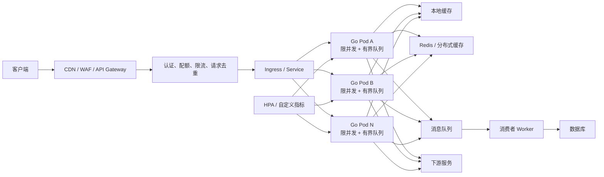
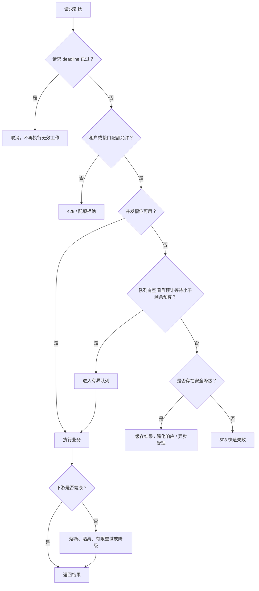
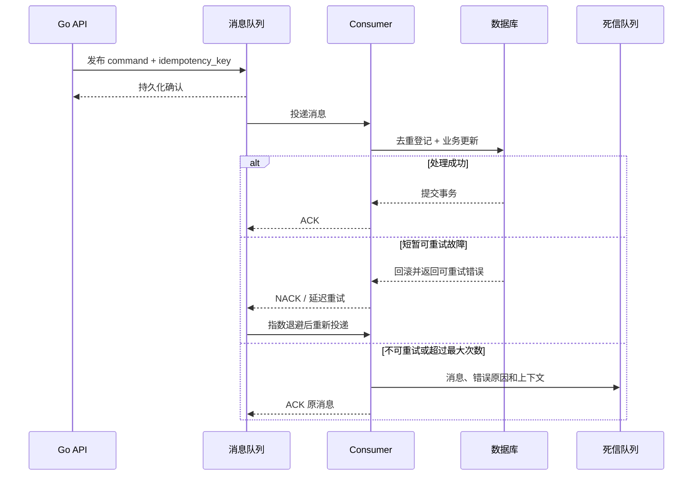

# 第 14 章：Go 与 Kubernetes 高并发架构——限流、削峰、背压与水平扩展

## 学习目标

学完本章后，应能够：

1. 准确区分并发、并行、吞吐量、响应时间、QPS、TPS 和在途请求数。
2. 根据数据所有权和同步需求选择 goroutine、channel、mutex、atomic 与 context。
3. 识别无界 goroutine、无界队列、无界缓存带来的级联故障风险。
4. 使用 Worker Pool、Semaphore 和 Bounded Queue 为单个 Go 进程建立容量边界。
5. 区分限流、限并发、背压、排队、拒绝、降级、熔断和负载卸载。
6. 设计端到端超时预算，并正确处理重试、退避、抖动和重试风暴。
7. 使用幂等键、去重表和事务边界处理消息重复投递。
8. 分析数据库、Redis 和 HTTP 连接池随 Pod 副本数放大的乘法效应。
9. 将服务设计为适合 Kubernetes 水平扩展的无状态服务。
10. 解释消息队列为什么能够削峰，却不能凭空提升下游处理能力。
11. 使用 Little’s Law 分析在途请求、队列等待和尾延迟。
12. 设计一个包含入口限流、缓存、队列、异步处理、幂等和降级的突发流量系统。

---

## 14.1 高并发首先是容量管理问题

高并发系统的核心不是“创建更多 goroutine”，而是回答以下问题：

* 系统每秒能够稳定处理多少请求？
* 同一时刻最多允许多少工作进入系统？
* 多余的请求应该等待、拒绝，还是降级？
* 请求等待多久以后已经失去业务价值？
* 下游数据库、缓存和第三方服务能够承受多少并发？
* 流量超过容量时，系统能否保持可预测地失败？

一个没有明确容量边界的系统，在正常流量下可能表现良好，但在突发流量下通常会经历以下过程：

1. 请求大量进入。
2. goroutine、队列和连接数持续增长。
3. 内存占用、GC 压力、锁竞争和调度成本增加。
4. 请求响应时间上升。
5. 上游因超时开始重试。
6. 重试进一步放大流量。
7. 下游连接池耗尽。
8. 大量请求同时超时，形成级联故障。

因此，高并发架构追求的不是“永不拒绝请求”，而是：

> 在容量范围内尽可能高效地处理请求；超出容量后尽早、明确、可观测地实施背压、拒绝或降级。

---

## 14.2 并发、并行、吞吐量与延迟

### 14.2.1 核心概念

| 概念             | 含义                           | 常见误区                       |
| -------------- | ---------------------------- | -------------------------- |
| 并发 Concurrency | 多个任务在时间上存在重叠，系统能够同时管理多个未完成任务 | 并发不等于同时执行                  |
| 并行 Parallelism | 多个任务在多个 CPU 核心上同时执行          | 增加核心不一定提升串行程序性能            |
| 吞吐量 Throughput | 单位时间内完成的工作量                  | 高吞吐不代表单请求延迟低               |
| 响应时间 Latency   | 从请求到达到响应完成的时间                | 只统计业务执行时间，忽略排队时间           |
| QPS            | 每秒处理的查询或请求数                  | 不定义“一个 Query”包含什么          |
| TPS            | 每秒完成的业务事务数                   | 一个事务可能包含多次数据库操作            |
| 并发数            | 某一时刻系统中尚未完成的任务数量             | 将线程数、goroutine 数直接等同于业务并发数 |
| 利用率            | 某资源忙碌时间占比                    | 认为资源利用率越接近 100% 越好         |

Go 的并发原语让程序能够组织大量并发任务，但并发只有在任务可以独立执行、资源不存在共享瓶颈时，才可能转化为并行和更高吞吐量。Go 官方文档也明确区分了并发与并行：并发提供组织能力，是否能借助多核提速取决于问题本身是否可并行。([Go][1])

### 14.2.2 响应时间包含什么

一次请求的响应时间通常由以下部分构成：

[
W = W_{queue}+W_{service}+W_{dependency}+W_{network}
]

其中：

* (W_{queue})：等待 Worker、连接池或锁的时间。
* (W_{service})：本服务实际计算时间。
* (W_{dependency})：数据库、缓存、消息队列、远程服务耗时。
* (W_{network})：建连、TLS、传输等网络耗时。

生产中最容易被忽略的是排队时间。业务代码执行只需 20ms，并不意味着请求延迟只有 20ms。如果请求在连接池中等待了 300ms，用户观察到的响应时间仍然超过 320ms。

### 14.2.3 平均延迟与尾延迟

平均响应时间可能掩盖少量但严重的慢请求。例如：

* 平均延迟：40ms
* p95：120ms
* p99：900ms
* 最大值：8s

这意味着 1% 的请求至少需要约 900ms。在 10 万 QPS 下，1% 仍然是每秒约 1000 个请求。

高并发系统必须同时观察：

* 平均延迟
* p50
* p95
* p99
* 最大值
* 超时率
* 拒绝率

平均值适合容量估算，分位数适合分析用户体验和尾延迟。

---

## 14.3 高并发系统的整体架构



这套架构中至少存在五层容量控制：

1. **边缘容量**：CDN、WAF、网关的连接数和请求速率。
2. **业务入口容量**：租户配额、接口限流、单用户限流。
3. **单 Pod 容量**：goroutine、Worker、队列和内存。
4. **下游容量**：数据库连接、缓存连接、第三方接口配额。
5. **集群容量**：Pod 数量、节点资源和扩容速度。

只在最外层设置限流并不充分。即使网关总流量处于正常范围，某个热点租户、热点商品或慢接口仍可能耗尽单个服务的容量。

---

## 14.4 Go 并发原语的职责边界

### 14.4.1 goroutine

goroutine 是由 Go 运行时调度的并发执行单元。其初始成本通常低于直接创建操作系统线程，栈也可以按需增长。([Go][2])

但“轻量”不等于“没有成本”。每个 goroutine 仍可能消耗：

* 栈空间
* 堆对象
* 调度器状态
* channel 等待结构
* context、闭包及其引用对象
* 文件描述符或网络连接
* 日志、Trace 和监控数据

如果 100 万个 goroutine 每个间接持有 20KiB 数据，就可能保留约 20GiB 内存。问题往往不在 goroutine 栈本身，而在 goroutine 引用的请求对象、缓冲区和连接。

### 14.4.2 channel

channel 适合：

* 在 goroutine 之间传递任务。
* 表达生产者—消费者关系。
* 建立 Pipeline。
* 转移数据所有权。
* 发送完成或取消信号。
* 使用有界缓冲区表达队列或信号量。

无缓冲 channel 同时完成通信和同步；有缓冲 channel 在缓冲区未满时允许发送方继续执行，缓冲区满后发送方仍会阻塞。([Go][2])

channel 并不是 mutex 的替代品。若多个 goroutine 只是需要短时间保护一个 map，使用 `sync.Mutex` 通常比设计一个专门的 channel Owner 更直接。

### 14.4.3 mutex

`sync.Mutex` 适合保护一组必须共同满足不变量的共享数据：

```go
type Account struct {
	mu      sync.Mutex
	balance int64
	version int64
}

func (a *Account) Debit(amount int64) bool {
	a.mu.Lock()
	defer a.mu.Unlock()

	if a.balance < amount {
		return false
	}
	a.balance -= amount
	a.version++
	return true
}
```

这里的余额和版本号必须作为一个整体更新，单独使用两个原子变量不能保证跨字段不变量。

Go 内存模型要求：多个 goroutine 同时访问且至少一个会修改的数据，必须通过 channel、`sync` 或 `sync/atomic` 等同步机制串行化。([Go][3])

### 14.4.4 RWMutex

`sync.RWMutex` 允许多个读者同时进入，或一个写者独占进入。它适合：

* 读操作明显多于写操作。
* 临界区不是极短。
* 读操作确实能够并行。
* 性能测试证明普通 Mutex 存在明显竞争。

不要因为“读多写少”就自动选择 `RWMutex`。读锁本身也有开销，并且写者到达后会阻止新的读者继续进入。Go 官方文档还明确指出，`RWMutex` 不能从读锁升级为写锁，也不能从写锁降级为读锁。([Go Packages][4])

### 14.4.5 atomic

`sync/atomic` 适合：

* 单调计数器。
* 状态标志。
* 指针或不可变配置快照切换。
* 极短、单变量的无锁状态转换。

例如记录在途请求数：

```go
var inflight atomic.Int64

func handle() {
	inflight.Add(1)
	defer inflight.Add(-1)

	// 执行业务逻辑
}
```

atomic 不适合：

* 同时更新多个相关字段。
* 复杂状态机。
* 需要回滚的业务逻辑。
* 依赖多步读改写且难以证明正确性的逻辑。

无锁不一定比加锁快。CAS 在高竞争下可能反复失败，消耗大量 CPU。

### 14.4.6 context

`context.Context` 用于跨 API 边界传播：

* 截止时间
* 取消信号
* 请求范围内的少量元数据

父 Context 被取消后，其派生 Context 也会被取消。使用 `WithCancel`、`WithTimeout` 或 `WithDeadline` 后，应调用返回的取消函数，否则相关定时器和引用可能持续存在。([Go Packages][5])

Context 不应该：

* 作为可选参数传 `nil`。
* 存储在长期存活的结构体中。
* 用来传递所有业务参数。
* 被用于承载可修改的全局状态。
* 被忽略而继续执行已经失去意义的工作。

### 14.4.7 选择方法

| 需求               | 优先选择                                        |
| ---------------- | ------------------------------------------- |
| 启动一个独立并发任务       | goroutine                                   |
| 生产者向消费者传递任务      | channel                                     |
| 保护共享 map 或复合不变量  | Mutex                                       |
| 大量读、少量写且已证明有竞争   | RWMutex                                     |
| 单计数器、开关、快照指针     | atomic                                      |
| 传播超时和取消          | context                                     |
| 一组子任务共同取消并返回首个错误 | `errgroup`                                  |
| 限制一组子任务的并发数      | Semaphore、Worker Pool 或 `errgroup.SetLimit` |

`golang.org/x/sync/errgroup` 支持错误传播、Context 取消和并发上限；`SetLimit` 会限制组内活跃 goroutine 数量，`TryGo` 则可以在达到上限时拒绝启动。([Go Packages][6])

---

## 14.5 为什么不能无限创建 goroutine

下面的代码在低流量下可能正常工作：

```go
for req := range requests {
	go process(req)
}
```

但它没有任何容量边界。当生产速度大于消费速度时，goroutine 数会持续增长。

### 14.5.1 无界 goroutine 的后果

* 内存持续增长。
* GC 扫描对象增加。
* 调度器维护大量可运行或阻塞 goroutine。
* 大量任务同时访问数据库或缓存。
* 下游连接池排队。
* 日志和 Trace 数量暴增。
* 请求超时后，后台工作仍然继续。
* 服务关闭时无法在宽限期内完成清理。

### 14.5.2 无界队列的后果

队列并没有消除负载，只是把负载转换成等待和内存占用。

当平均到达速率持续大于处理速率时：

[
\frac{dB}{dt} = \lambda_{in}-\lambda_{out}
]

其中 (B) 是积压量。只要 (\lambda_{in}>\lambda_{out}) 持续存在，队列就会不断增长。

一个等待 30 秒后才处理的请求，通常已经超过客户端超时。继续处理这种请求只是在制造无效工作。

### 14.5.3 无界缓存的后果

* 高基数 Key 持续进入内存。
* TTL 未设置或淘汰机制失效。
* 缓存对象引用其他大型对象。
* 缓存击中率不高，却增加 GC 压力。
* 多副本各自维护完整缓存，内存消耗乘以 Pod 数。

所有缓存都必须回答：

* 最大条目数是多少？
* 最大内存是多少？
* 淘汰策略是什么？
* TTL 是多少？
* 是否允许缓存空值和错误？
* 如何观测命中率和淘汰率？

---

## 14.6 Worker Pool、Semaphore 与有界队列

### 14.6.1 三者的区别

| 机制            | 控制对象             |  是否排队 | 适用场景                 |
| ------------- | ---------------- | ----: | -------------------- |
| Worker Pool   | 同时执行任务的 Worker 数 |   通常有 | 批处理、异步任务、固定消费能力      |
| Semaphore     | 某段代码的同时进入数量      | 可选择等待 | 限制下游调用、文件处理、CPU 密集操作 |
| Bounded Queue | 等待处理的任务数量        |     是 | 吸收短暂突发并提供明确容量上限      |

### 14.6.2 Semaphore 的正确使用

使用有缓冲 channel 可以实现简单信号量：

```go
func WithSemaphore(
	ctx context.Context,
	sem chan struct{},
	fn func(context.Context) error,
) error {
	select {
	case sem <- struct{}{}:
		defer func() { <-sem }()
		return fn(ctx)
	case <-ctx.Done():
		return ctx.Err()
	}
}
```

一个常见错误是先创建 goroutine，再在 goroutine 内获取信号量：

```go
// 错误：仍然可能创建无限数量的 goroutine。
go func() {
	sem <- struct{}{}
	defer func() { <-sem }()
	process()
}()
```

此时信号量只限制了实际执行数，没有限制等待信号量的 goroutine 数。

应当在创建 goroutine之前获取槽位：

```go
select {
case sem <- struct{}{}:
	go func() {
		defer func() { <-sem }()
		process()
	}()
case <-ctx.Done():
	return ctx.Err()
}
```

### 14.6.3 一个有界 Worker Pool

下面的代码包含：

* 固定 Worker 数。
* 有界任务队列。
* 阻塞提交。
* 非阻塞提交。
* 停止接收新任务。
* 等待已接收任务完成。

```go
package workerpool

import (
	"context"
	"errors"
	"sync"
)

var (
	ErrPoolClosed = errors.New("worker pool is closed")
	ErrOverloaded = errors.New("worker pool queue is full")
)

type Task func(context.Context) error

type job struct {
	ctx context.Context
	run Task
}

type Pool struct {
	jobs chan job

	mu     sync.RWMutex
	closed bool

	workers sync.WaitGroup
}

func New(workerCount, queueSize int) *Pool {
	if workerCount <= 0 || queueSize < 0 {
		panic("invalid worker pool size")
	}

	p := &Pool{
		jobs: make(chan job, queueSize),
	}

	p.workers.Add(workerCount)
	for i := 0; i < workerCount; i++ {
		go p.worker()
	}
	return p
}

func (p *Pool) worker() {
	defer p.workers.Done()

	for j := range p.jobs {
		// 请求已经超时，直接丢弃过期任务。
		if j.ctx.Err() != nil {
			continue
		}

		// 生产代码应记录错误、耗时和任务结果。
		_ = j.run(j.ctx)
	}
}

// Submit 会等待队列出现空间，因此 ctx 必须有截止时间。
func (p *Pool) Submit(ctx context.Context, task Task) error {
	if ctx == nil || task == nil {
		return errors.New("nil context or task")
	}

	p.mu.RLock()
	defer p.mu.RUnlock()

	if p.closed {
		return ErrPoolClosed
	}

	select {
	case <-ctx.Done():
		return ctx.Err()
	case p.jobs <- job{ctx: ctx, run: task}:
		return nil
	}
}

// TrySubmit 在队列已满时立即拒绝，更适合在线请求入口。
func (p *Pool) TrySubmit(ctx context.Context, task Task) error {
	if ctx == nil || task == nil {
		return errors.New("nil context or task")
	}

	p.mu.RLock()
	defer p.mu.RUnlock()

	if p.closed {
		return ErrPoolClosed
	}

	select {
	case p.jobs <- job{ctx: ctx, run: task}:
		return nil
	default:
		return ErrOverloaded
	}
}

func (p *Pool) Shutdown(ctx context.Context) error {
	p.mu.Lock()
	if !p.closed {
		p.closed = true
		close(p.jobs)
	}
	p.mu.Unlock()

	done := make(chan struct{})
	go func() {
		p.workers.Wait()
		close(done)
	}()

	select {
	case <-done:
		return nil
	case <-ctx.Done():
		return ctx.Err()
	}
}
```

### 14.6.4 如何选择 Worker 数

Worker 数不是越大越好。

对于 CPU 密集任务，起始值通常接近可用 CPU 核数，再通过压测调整。

对于 I/O 密集任务，可以高于 CPU 核数，但必须受到以下下游容量约束：

* 数据库最大连接数。
* 第三方接口并发配额。
* Redis 或对象存储连接数。
* 文件描述符上限。
* 单任务内存占用。
* 下游实际吞吐能力。

例如，一个 Pod 的数据库连接池最多允许 40 个活跃连接，那么同时执行 500 个主要依赖数据库的 Worker 通常没有意义。大部分 Worker 只会转而等待连接池。

### 14.6.5 如何选择队列长度

队列长度应该由可接受等待时间决定，而不是由“内存能放多少”决定。

若 Worker 的稳定处理能力为 2000 个任务/秒，业务最多允许额外等待 100ms，则一个粗略起点是：

[
QueueCapacity \approx 2000 \times 0.1 = 200
]

还要考虑：

* 任务执行时间的方差。
* 高低优先级任务。
* 请求剩余超时预算。
* 单任务内存大小。
* Worker 是否共享同一个下游瓶颈。

队列长度为 10000 并不代表系统容量提高了，只可能意味着请求需要等待更久。

---

## 14.7 背压、限流、排队、拒绝与降级

### 14.7.1 机制对比

| 机制   | 解决的问题          | 典型行为             |
| ---- | -------------- | ---------------- |
| 限流   | 控制单位时间内进入的请求数  | 超额后等待或返回 429     |
| 限并发  | 控制同时执行的请求数     | 无槽位时等待或拒绝        |
| 背压   | 下游向上游表达“处理不过来” | 减慢生产、暂停拉取或显式拒绝   |
| 排队   | 吸收短时间突发        | 有界等待             |
| 拒绝   | 容量不足时快速失败      | 返回 429、503 或业务错误 |
| 降级   | 舍弃部分非核心能力      | 返回缓存、简化数据、关闭推荐   |
| 负载卸载 | 主动丢弃低价值工作      | 丢弃低优先级请求或后台任务    |
| 熔断   | 下游持续异常时暂时停止调用  | 快速失败，周期性探测恢复     |
| 隔离舱  | 防止一个依赖耗尽全部资源   | 为不同依赖分配独立并发池     |

### 14.7.2 过载处理流程



### 14.7.3 什么时候等待，什么时候拒绝

适合短暂等待：

* 后台批处理任务。
* 请求有充足的剩余超时预算。
* 突发持续时间很短。
* 排队顺序和公平性有明确保证。
* 队列长度和等待时间均有上限。

适合快速拒绝：

* 在线请求的剩余预算很少。
* 队列已经达到上限。
* 下游处于明显故障状态。
* 工作完成后用户也不会再等待结果。
* 请求优先级低。
* 请求可以由客户端稍后安全重试。

拒绝并不是系统失败。不可控地超时才是更危险的失败方式。

---

## 14.8 令牌桶与漏桶

### 14.8.1 令牌桶

令牌桶按固定速率生成令牌，桶最多保存一定数量的令牌。请求进入时消耗令牌：

* 有令牌：立即通过。
* 没有令牌：等待或拒绝。
* 桶容量决定允许的突发量。
* 令牌生成速率决定长期平均速率。

`golang.org/x/time/rate` 的 `Limiter` 实现了令牌桶，提供 `Allow`、`Reserve` 和 `Wait` 三类行为：立即拒绝、预约未来令牌或等待令牌。([Go Packages][7])

### 14.8.2 漏桶

漏桶通常把请求放入一个有界桶中，再以接近固定速率流出：

* 输出速率更加平滑。
* 突发请求会被排队。
* 桶满后新请求被丢弃。
* 更容易引入排队延迟。

### 14.8.3 对比

| 维度     | 令牌桶         | 漏桶          |
| ------ | ----------- | ----------- |
| 是否允许突发 | 允许，受桶容量限制   | 输出通常较平滑     |
| 长期速率   | 由令牌补充速率控制   | 由漏出速率控制     |
| 典型用途   | API 限流、租户配额 | 流量整形、固定速率消费 |
| 过载行为   | 拒绝或等待令牌     | 排队，桶满后拒绝    |
| 尾延迟风险  | 等待模式下存在     | 排队模式下更明显    |

### 14.8.4 Go HTTP 限流中间件

```go
func RateLimit(
	limiter *rate.Limiter,
	next http.Handler,
) http.Handler {
	return http.HandlerFunc(func(w http.ResponseWriter, r *http.Request) {
		// 在线入口通常优先快速判断，而不是长时间等待令牌。
		if !limiter.Allow() {
			w.Header().Set("Retry-After", "1")
			http.Error(w, "too many requests", http.StatusTooManyRequests)
			return
		}

		next.ServeHTTP(w, r)
	})
}
```

创建 Limiter：

```go
limiter := rate.NewLimiter(
	rate.Limit(1000), // 长期平均每秒 1000 个事件
	2000,             // 最多允许 2000 个事件的突发
)
```

### 14.8.5 本地限流与全局限流

假设每个 Pod 设置 1000 QPS 的本地限流，HPA 将副本从 5 个扩到 20 个，则理论集群上限也从约 5000 QPS 增加到约 20000 QPS。

因此：

* **本地限流**适合保护单 Pod。
* **网关限流**适合保护整个服务入口。
* **分布式限流**适合全局租户配额或稀缺业务资源。
* **业务约束**仍需数据库唯一约束或原子状态转换兜底。

分布式限流还必须考虑：

* 网络故障时是 Fail Open 还是 Fail Closed。
* 时钟误差。
* 热点 Key。
* 限流存储自身的容量。
* 多区域之间的一致性和延迟。
* 高基数用户限流器的过期与回收。

### 14.8.6 限速与限并发不能互相替代

1000 QPS 的请求，如果每个请求耗时 10ms，平均在途量约为 10。

同样是 1000 QPS，如果每个请求耗时 2s，平均在途量约为 2000。

因此，限流控制的是“单位时间进入多少”，限并发控制的是“同时有多少尚未完成”。高并发服务通常需要同时使用二者。

---

## 14.9 超时预算必须覆盖整条调用链

### 14.9.1 端到端 Deadline

假设客户端允许一次请求最多耗时 800ms，可以建立如下预算：

| 阶段         |    预算 |
| ---------- | ----: |
| 网关转发和网络抖动  |  50ms |
| 本服务排队与计算   | 120ms |
| Redis      |  50ms |
| 数据库        | 250ms |
| 下游 HTTP 服务 | 220ms |
| 安全余量       | 110ms |

这不是要求各阶段机械相加。并行调用应按关键路径计算，但任何内部超时都不能超过请求的剩余 Deadline。

超时预算应覆盖：

* 等待 Worker。
* 等待 Semaphore。
* 等待数据库连接。
* DNS 查询。
* TCP 建连。
* TLS 握手。
* 写请求。
* 等待响应头。
* 读取响应体。
* 重试和退避。

### 14.9.2 向下游传播 Context

```go
var transport = func() *http.Transport {
	tr := http.DefaultTransport.(*http.Transport).Clone()
	tr.MaxIdleConns = 200
	tr.MaxIdleConnsPerHost = 100
	tr.MaxConnsPerHost = 150
	tr.IdleConnTimeout = 90 * time.Second
	tr.ResponseHeaderTimeout = 200 * time.Millisecond
	return tr
}()

var httpClient = &http.Client{
	Transport: transport,
	// 最终安全上限。更细粒度的预算由请求 Context 控制。
	Timeout: 800 * time.Millisecond,
}

func CallInventory(
	parent context.Context,
	endpoint string,
) (*http.Response, error) {
	ctx, cancel := context.WithTimeout(parent, 250*time.Millisecond)
	defer cancel()

	req, err := http.NewRequestWithContext(
		ctx,
		http.MethodGet,
		endpoint,
		nil,
	)
	if err != nil {
		return nil, err
	}

	return httpClient.Do(req)
}
```

Go 官方文档建议复用 `http.Client` 和 `http.Transport`；二者可被多个 goroutine 并发使用。`MaxConnsPerHost` 会限制某一目标主机处于建连、活跃和空闲状态的总连接数，达到限制后新的建连会等待。([Go Packages][8])

### 14.9.3 超时之后必须停止工作

只给调用方返回超时，但后台 goroutine 仍然继续查询数据库，是一种“假超时”。

正确的取消需要整条链路配合：

* Handler 使用 `r.Context()`。
* 数据库调用使用 `QueryContext`、`ExecContext`。
* HTTP 请求使用 `NewRequestWithContext`。
* Worker 检查 `ctx.Err()`。
* 阻塞 channel 操作监听 `ctx.Done()`。
* 自定义循环定期检查取消信号。

若任务必须在请求返回后继续完成，不应继续使用请求 Context，而应转交给具有独立生命周期的持久化任务系统或消息队列。

---

## 14.10 重试、指数退避与随机抖动

### 14.10.1 只有特定错误适合重试

通常可以考虑重试：

* 短暂网络错误。
* 连接重置。
* 依赖服务明确返回可重试状态。
* 乐观锁冲突。
* 主从切换期间的短暂不可用。
* 被限流后且服务给出合理重试时间。

通常不应自动重试：

* 参数错误。
* 权限错误。
* 业务库存不足。
* 唯一约束冲突。
* 明确的不可重试错误。
* 非幂等写请求且没有幂等保护。
* 剩余超时预算不足。

### 14.10.2 指数退避

常见退避上限：

[
delay_n = \min(maxDelay,\ baseDelay \times 2^n)
]

如果所有客户端都严格在 100ms、200ms、400ms 后重试，它们仍可能同时唤醒。

因此要增加随机抖动。Full Jitter 可以在 `[0, delay_n]` 中随机选择等待时间。

### 14.10.3 Go 重试代码

```go
func sleepContext(ctx context.Context, d time.Duration) error {
	timer := time.NewTimer(d)
	defer timer.Stop()

	select {
	case <-ctx.Done():
		return ctx.Err()
	case <-timer.C:
		return nil
	}
}

func Retry(
	ctx context.Context,
	maxAttempts int,
	baseDelay time.Duration,
	maxDelay time.Duration,
	retryable func(error) bool,
	fn func(context.Context) error,
) error {
	if maxAttempts <= 0 {
		return errors.New("maxAttempts must be positive")
	}

	var lastErr error

	for attempt := 0; attempt < maxAttempts; attempt++ {
		if err := ctx.Err(); err != nil {
			return err
		}

		err := fn(ctx)
		if err == nil {
			return nil
		}
		lastErr = err

		if !retryable(err) || attempt == maxAttempts-1 {
			return err
		}

		capDelay := baseDelay
		for i := 0; i < attempt; i++ {
			if capDelay >= maxDelay/2 {
				capDelay = maxDelay
				break
			}
			capDelay *= 2
		}
		if capDelay > maxDelay {
			capDelay = maxDelay
		}

		var wait time.Duration
		if capDelay > 0 {
			wait = time.Duration(rand.Int63n(int64(capDelay) + 1))
		}

		if err := sleepContext(ctx, wait); err != nil {
			return err
		}
	}

	return lastErr
}
```

生产代码还应记录：

* 原始请求次数。
* 重试次数。
* 每次重试原因。
* 最终成功率。
* 重试额外流量。
* 重试消耗的时间预算。

### 14.10.4 重试放大

若调用链有三层，每层最多尝试三次：

[
3 \times 3 \times 3 = 27
]

一次入口请求最坏可能产生 27 次末端调用。

应尽量：

* 只在最了解错误语义的一层重试。
* 限制总尝试次数，而不是“重试次数”表述不清。
* 将所有尝试纳入同一个 Deadline。
* 使用 Retry Budget 限制重试流量占比。
* 熔断打开后不再继续普通重试。
* 对非幂等写请求使用幂等键。

---

## 14.11 幂等键、去重表与至少一次投递

### 14.11.1 什么是幂等

幂等意味着对同一个业务操作重复执行，最终业务效果与执行一次相同。

需要注意：

* HTTP 请求 ID 不一定是幂等键。
* 幂等不等于每次都重新执行。
* 幂等不等于返回内容可以随意变化。
* 幂等通常需要持久化状态。

### 14.11.2 幂等键应包含什么

一个可靠的幂等键通常关联：

* 租户或用户。
* 业务操作类型。
* 客户端生成的唯一键。
* 请求体摘要。
* 创建时间和过期时间。
* 执行状态。
* 最终响应或响应摘要。

推荐的逻辑作用域：

```text
tenant_id + operation + idempotency_key
```

如果同一个幂等键对应不同请求体，应拒绝请求，而不是返回第一次请求的结果。

### 14.11.3 幂等状态机

可以使用以下状态：

* `PENDING`：请求已登记，正在执行。
* `SUCCEEDED`：执行成功，保存结果。
* `FAILED_RETRYABLE`：失败但允许后续重试。
* `FAILED_FINAL`：最终失败。

收到重复请求时：

1. 找不到记录：尝试创建 `PENDING`。
2. 唯一约束冲突：读取已有记录。
3. 已成功：返回已保存结果。
4. 正在执行：返回处理中，或短时间等待。
5. 请求摘要不一致：返回冲突。
6. 可重试失败：根据业务规则重新竞争执行权。

### 14.11.4 消息消费幂等

消息队列常见语义是至少一次投递。消费者可能因为以下原因重复收到消息：

* 业务事务已提交，但 ACK 丢失。
* 消费者处理完成后进程崩溃。
* 消费超时，消息被重新投递。
* 人工重放。
* 消费组再平衡。

一种常见方案是在同一个数据库事务中：

1. 向去重表插入 `message_id`。
2. 执行业务更新。
3. 提交事务。
4. 事务成功后 ACK 消息。

若去重表唯一约束冲突，说明消息已经处理过，可以直接 ACK。

### 14.11.5 不要轻易声称“端到端 Exactly Once”

即使消息中间件提供某种 Exactly Once 能力，跨越以下边界后仍可能需要业务幂等：

* 消息队列与数据库。
* 数据库与第三方支付。
* 数据库与对象存储。
* 多个独立数据库。
* 发送通知、短信或邮件。

业务系统真正需要保证的是：

> 重复请求或重复消息不会产生重复扣款、重复下单、重复发货等重复业务效果。

---

## 14.12 熔断、隔离舱、快速失败与负载卸载

### 14.12.1 熔断器状态

典型熔断器包含三个状态：

* **Closed**：正常放行并统计结果。
* **Open**：快速失败，不调用下游。
* **Half-Open**：允许少量探测请求判断是否恢复。

熔断器应统计真正代表依赖故障的结果：

* 超时。
* 连接失败。
* 依赖 5xx。
* 资源耗尽。

不应把所有业务错误都当作故障。例如库存不足、参数错误和权限拒绝通常不应触发熔断。

### 14.12.2 熔断不能替代什么

熔断器不能替代：

* 超时。
* 限并发。
* 连接池限制。
* 重试预算。
* 幂等。
* 入口限流。

如果没有超时，熔断器可能很久才能收到失败结果；如果没有限并发，在熔断打开前就可能积累大量请求。

### 14.12.3 隔离舱

隔离舱的目标是防止一个依赖耗尽全部资源。例如：

* 支付接口最多使用 50 个并发槽位。
* 推荐接口最多使用 20 个并发槽位。
* 核心订单查询预留 100 个槽位。
* 免费租户和付费租户使用不同配额。
* 在线请求与后台任务使用不同 Worker Pool。

如果所有下游调用共享一个全局连接池和 Semaphore，非核心依赖变慢时可能拖死核心接口。

### 14.12.4 负载卸载

负载卸载可以根据以下维度丢弃工作：

* 优先级。
* 租户等级。
* 请求成本。
* 剩余 Deadline。
* 数据新鲜度要求。
* 是否有缓存结果。
* 是否可以异步执行。

例如：

* 关闭推荐和个性化排序。
* 返回最近一次成功数据。
* 降低查询范围。
* 跳过非必要写入。
* 暂停报表和离线任务。
* 将同步操作转换为异步受理。

降级结果必须满足业务安全性。支付、扣库存、权限判断等逻辑不能用不可靠的缓存结果随意降级。

---

## 14.13 缓存穿透、击穿、雪崩与惊群

### 14.13.1 缓存穿透

请求的数据根本不存在，因此每次都绕过缓存访问数据库。

应对方法：

* 参数和权限校验。
* 缓存短 TTL 的空结果。
* 使用 Bloom Filter 进行快速排除。
* 对高频不存在 Key 限流。
* 监控空结果比例。

缓存空值时必须区分：

* 数据确实不存在。
* 查询失败。
* 下游超时。

不能把一次数据库故障当成“数据不存在”长期缓存。

### 14.13.2 缓存击穿

某个热点 Key 到期，大量请求同时回源。

应对方法：

* singleflight。
* 分布式互斥。
* 逻辑过期。
* 后台主动刷新。
* 热点 Key 永不过期并通过事件更新。
* 返回短时间内可接受的旧值。

### 14.13.3 缓存雪崩

大量 Key 在相近时间失效，或整个缓存集群不可用。

应对方法：

* TTL 加随机抖动。
* 分批预热。
* 多级缓存。
* 缓存故障时对数据库实施更严格限流。
* 保留旧值并异步刷新。
* 避免所有 Key 使用同一个固定过期时刻。

### 14.13.4 热点 Key

热点 Key 即使没有过期，也可能造成：

* 单分片流量过高。
* 单个 Redis 节点网络或 CPU 饱和。
* 大量大对象传输。
* 跨区域带宽增加。

可采用：

* 本地缓存。
* 只读副本。
* Key 拆分。
* 热点数据复制。
* 请求合并。
* 更紧凑的数据结构。

### 14.13.5 singleflight

`golang.org/x/sync/singleflight` 可以让同一进程中、相同 Key 的并发调用共享一次实际执行结果。([Go Packages][9])

```go
type Loader struct {
	group singleflight.Group
	cache Cache
	store Store
}

func (l *Loader) Load(
	ctx context.Context,
	key string,
) ([]byte, error) {
	if value, ok := l.cache.Get(key); ok {
		return value, nil
	}

	value, err, _ := l.group.Do(key, func() (any, error) {
		// Double Check，避免等待期间缓存已经被其他请求填充。
		if cached, ok := l.cache.Get(key); ok {
			return cached, nil
		}

		data, err := l.store.Load(ctx, key)
		if err != nil {
			return nil, err
		}

		l.cache.Set(key, data, randomizedTTL())
		return data, nil
	})
	if err != nil {
		return nil, err
	}

	return value.([]byte), nil
}
```

singleflight 的边界：

1. 默认只在单个进程内合并请求，多个 Pod 之间不会自动合并。
2. 所有等待者会共享 Leader 的结果，包括错误。
3. Leader 很慢时，等待者也会被拖住。
4. Key 设计不当可能跨租户共享敏感结果。
5. 高基数且几乎不重复的 Key 没有明显收益。
6. 它减少并发回源，但不能替代缓存。
7. 它不能代替超时、限并发和熔断。
8. 某些调用方取消等待，并不意味着底层共享调用一定自动停止。

---

## 14.14 连接池与 Pod 副本数的乘法效应

### 14.14.1 数据库连接池

Go 的 `sql.DB` 本身是连接池，而不是单个数据库连接。

`SetMaxOpenConns` 设置打开连接总数上限。达到上限后，新数据库操作会等待已有操作释放连接。Go 官方文档还提醒，设置连接上限后，连接池具有类似锁或 Semaphore 的行为，错误的嵌套使用可能形成死锁。([Go][10])

### 14.14.2 乘法关系

集群最大数据库连接数不能只看单 Pod 配置：

[
TotalConnections \approx
Pods \times ConnectionsPerPod
]

还应加入：

* Deployment `maxSurge`。
* 定时任务。
* 消费者 Deployment。
* 临时调试实例。
* 数据迁移任务。
* 多个服务共享同一数据库。
* 故障切换期间短暂重叠的旧连接。

例如：

* HPA 最大副本数：50
* 每 Pod `MaxOpenConns`：80
* 滚动更新最大额外 Pod：10
* 后台消费者：10 个，每个 30 条连接

则潜在连接数约为：

[
(50+10)\times 80 + 10\times30 = 5100
]

如果数据库只允许 2000 个业务连接，系统会在扩容时反而恶化。

### 14.14.3 每 Pod 连接数的粗略上界

假设：

* 数据库允许业务使用 1600 个连接。
* 预留 20%，即 320 个。
* 最大应用 Pod 数为 40。
* 滚动更新可能额外增加 10 个 Pod。

则每 Pod 的连接上限不应简单按 1600/40 计算，而应按：

[
\frac{1600-320}{40+10}=25.6
]

可以从约 20～25 条连接开始压测，而不是每 Pod 设置 100 条。

### 14.14.4 HTTP 连接池

`http.Transport` 会复用连接。常见配置包括：

* `MaxIdleConns`
* `MaxIdleConnsPerHost`
* `MaxConnsPerHost`
* `IdleConnTimeout`
* `ResponseHeaderTimeout`

不要每个请求创建一个新的 `http.Client` 或 `Transport`，否则会降低连接复用率并增加 TCP、TLS 和临时端口压力。Go 官方文档明确建议复用 Client 和 Transport。([Go Packages][8])

### 14.14.5 Redis 连接池

Redis 连接池的具体语义取决于：

* 客户端实现。
* RESP 协议版本。
* 是否使用 Pipeline。
* 是否使用阻塞命令。
* 是否开启集群模式。
* 单请求命令数。
* 大 Value 的传输成本。

不能照搬数据库连接数配置。应观察：

* Pool Wait Count。
* Pool Wait Duration。
* 活跃连接。
* 空闲连接。
* 建连速率。
* 命令 p95/p99。
* 单节点 CPU 和网络。
* 热点分片。

### 14.14.6 需要重点监控的连接池指标

| 类型    | 关键指标                                                |
| ----- | --------------------------------------------------- |
| 数据库   | Open、InUse、Idle、WaitCount、WaitDuration、查询延迟         |
| HTTP  | 建连次数、连接复用率、活跃连接、等待连接时间、TLS 耗时                       |
| Redis | Pool Hits、Misses、Timeouts、Wait、活跃连接、热点节点            |
| 消息队列  | Producer Inflight、Publish Latency、Consumer Lag、重连次数 |

---

## 14.15 无状态服务与水平扩展

### 14.15.1 什么是无状态

无状态并不是服务完全没有状态，而是：

> 任意一个请求不依赖某个特定 Pod 内部不可替代的本地状态。

一个 Pod 被删除后，其他 Pod 应能继续处理后续请求。

### 14.15.2 状态应该放在哪里

| 状态类型       | 推荐位置                  |
| ---------- | --------------------- |
| 请求临时变量     | 当前 goroutine 栈或请求对象   |
| 可丢失本地缓存    | Pod 内存                |
| 用户 Session | Redis、数据库或受控 Token    |
| 业务事实       | 数据库                   |
| 大文件        | 对象存储                  |
| 异步任务状态     | 数据库或消息系统              |
| 分布式锁或租约    | 具备明确一致性语义的外部系统        |
| 配置         | ConfigMap、Secret、配置中心 |

### 14.15.3 有状态 Session 如何阻碍扩容

如果用户登录状态只存储在 Pod A 内存中：

* 请求被负载均衡到 Pod B 后，用户状态丢失。
* 必须启用 Sticky Session。
* Pod A 故障后 Session 仍会丢失。
* 扩容后的新 Pod 无法立即承接已有用户。
* 流量可能因长连接或粘性策略分布不均。

Sticky Session 可以临时缓解路由问题，但没有消除状态依赖。

### 14.15.4 Token 不等于完全无状态

把所有 Session 信息放进签名 Token 可以减少服务端 Session 查询，但仍需考虑：

* Token 吊销。
* 权限变化。
* 密钥轮换。
* Token 泄露。
* Token 体积。
* 多终端登录管理。
* 风险控制状态。

“使用 JWT”不是无状态架构的完整答案。

### 14.15.5 长连接的特殊问题

WebSocket、SSE 和长轮询会带来：

* 连接在 Pod 间分布不均。
* 扩容后新 Pod 没有历史连接。
* 缩容需要连接排空。
* 在途连接数比 CPU 更适合作为扩容指标。
* 单连接内存和文件描述符成为主要容量边界。
* 发布期间需要更长的优雅退出时间。

---

## 14.16 消息队列能够削峰，但不能创造处理能力

### 14.16.1 削峰的本质

消息队列把同步到达的突发请求转换为可控速率的异步消费：

```text
突发生产速率 → 队列积压 → 稳定消费速率
```

如果流量只是短时间突发，且长期平均生产速率低于消费速率，积压最终可以被清空。

如果长期满足：

[
\lambda_{producer} > \lambda_{consumer}
]

队列只会持续增长，最终遇到：

* 存储耗尽。
* Retention 到期。
* 消费延迟不可接受。
* 消息过期。
* 重放成本增加。
* 恢复时间过长。

### 14.16.2 消费、重试与死信流程



具体 ACK、NACK 和 DLQ 机制因消息中间件而异，但业务原则相同：

* 成功后才确认。
* 失败必须区分可重试与不可重试。
* 重试必须退避。
* 消费必须幂等。
* 死信必须有人处理，而不是永久堆积。

### 14.16.3 消费者扩容上限

增加消费者数量不一定提高吞吐量，可能受以下因素限制：

* Topic 分区数。
* 数据库写入能力。
* 单热点 Key。
* 下游接口配额。
* 消息顺序约束。
* 锁竞争。
* 网络带宽。
* 单条消息处理成本。

如果一个 Topic 只有 8 个可并行消费分区，启动 50 个消费者通常也只有约 8 个消费者真正承担分区。

### 14.16.4 队列指标

应重点监控：

* 队列深度。
* 最老消息年龄。
* Consumer Lag。
* 每秒生产量。
* 每秒消费量。
* 重试量。
* 死信量。
* 单消息处理时间。
* ACK 延迟。
* 消费者空闲率。
* 分区间负载倾斜。

仅看“队列里有多少条消息”不充分。100 万条每条处理 1ms 的消息，和 10 万条每条处理 1s 的消息，恢复时间完全不同。

---

## 14.17 Little’s Law 与尾延迟

### 14.17.1 基本关系

对于长期稳定的系统：

[
L = \lambda W
]

其中：

* (L)：系统中的平均在途任务数。
* (\lambda)：平均完成吞吐率。
* (W)：平均停留时间。

例如：

* 平均吞吐量为 5000 QPS。
* 平均响应时间为 40ms，即 0.04s。

则平均在途请求数约为：

[
5000 \times 0.04 = 200
]

如果吞吐量仍是 5000 QPS，但平均响应时间升到 400ms：

[
5000 \times 0.4 = 2000
]

在没有任何流量增长的情况下，仅因为响应变慢，在途请求就增加了约十倍。

### 14.17.2 接近饱和时为什么延迟急剧上升

当资源利用率接近 100% 时，任何微小波动都可能形成排队：

* 某些请求执行稍慢。
* GC 暂停。
* 数据库出现慢查询。
* 网络发生重传。
* 锁持有时间增加。
* Pod 被 CPU throttling。

系统在 60% 利用率时可能几乎不排队，在 95% 利用率时却可能出现明显尾延迟。

因此，容量规划通常需要预留 Headroom，而不是以“CPU 能否达到 100%”作为目标。

### 14.17.3 Fan-out 放大尾延迟

一个请求若并行调用 20 个下游，并且必须等待所有调用完成，那么总体延迟往往由最慢的那个下游决定。

优化方法包括：

* 减少不必要的 Fan-out。
* 设置每个子调用的独立预算。
* 只等待达到业务需要的最小结果集。
* 对非核心结果设置更短超时。
* 使用缓存。
* 对慢节点实施 Hedging 时严格控制额外流量。
* 避免无限制重试慢分支。

### 14.17.4 排队长度不是延迟保证

即使队列容量只有 100，如果每个任务耗时突然从 10ms 变成 1s，队尾等待时间仍可能非常长。

因此要同时监控：

* 队列深度。
* 队列等待时间。
* Worker 利用率。
* 任务处理时间。
* 请求剩余 Deadline。
* 过期任务丢弃量。

---

## 14.18 Kubernetes 水平扩展为什么不一定线性提升吞吐量

### 14.18.1 HPA 的基本行为

HPA 是周期性控制循环，不是实时请求调度器。它根据资源指标、自定义指标或外部指标计算期望副本数；默认控制循环同步周期通常为 15 秒，并且还要等待 Pod 调度、镜像拉取、进程启动、预热和 Readiness 通过。([Kubernetes][11])

其基本计算思想为：

[
desiredReplicas =
\left\lceil
currentReplicas
\times
\frac{currentMetricValue}{desiredMetricValue}
\right\rceil
]

官方实现还会考虑容差、缺失指标、未就绪 Pod 和稳定窗口。([Kubernetes][11])

因此，HPA 不是处理毫秒级突发的第一道防线。毫秒级和秒级过载首先应由：

* 预留容量。
* 入口限流。
* 有界队列。
* 快速拒绝。
* 缓存。
* 消息队列。

来承担。

### 14.18.2 吞吐量不线性增长的原因

假设单 Pod 能处理 1000 QPS，增加到 10 个 Pod 并不一定能得到 10000 QPS，因为可能存在：

1. **数据库瓶颈**：所有 Pod 共享同一个数据库。
2. **缓存热点**：所有请求集中到同一热点 Key 或分片。
3. **连接池放大**：扩容增加下游连接数和握手。
4. **负载不均**：长连接、粘性 Session 或连接复用导致请求偏斜。
5. **全局锁**：分布式锁或数据库热点行串行化。
6. **外部配额**：第三方服务有固定总 QPS。
7. **网络瓶颈**：节点、网卡、NAT 或跨可用区链路饱和。
8. **冷启动**：新 Pod 在预热期间吞吐能力不足。
9. **串行部分**：系统中存在不可并行步骤。
10. **任务分区限制**：消息消费者数量超过分区数。
11. **CPU 限制**：Pod 增加但节点 CPU 不足或持续节流。
12. **资源碎片**：新 Pod 无法及时调度。

### 14.18.3 CPU HPA 与 requests

基于 CPU 利用率的 HPA 使用“当前 CPU 使用量与 CPU request 的比值”。因此必须合理设置 CPU request。([Kubernetes][11])

例如：

```yaml
resources:
  requests:
    cpu: 500m
    memory: 512Mi
  limits:
    memory: 768Mi
```

若实际稳定使用 300m：

* request 为 500m，利用率约 60%。
* request 为 1000m，利用率约 30%。
* request 为 200m，利用率约 150%。

即使业务流量完全相同，HPA 观察到的利用率也不同。

### 14.18.4 I/O 密集服务不应只看 CPU

以下服务在过载时 CPU 可能并不高：

* 等待数据库连接。
* 等待第三方接口。
* 等待磁盘或网络。
* 大量长连接。
* 消息消费者积压。
* 锁竞争严重。

可考虑的自定义指标：

* 每 Pod 在途请求数。
* Worker 队列等待时间。
* 队列最老消息年龄。
* Consumer Lag。
* 每秒成功处理量。
* 数据库连接池等待时间。

指标必须与实际容量存在较稳定关系。单纯按 QPS 扩容可能忽略请求成本差异。

### 14.18.5 HPA 示例

```yaml
apiVersion: autoscaling/v2
kind: HorizontalPodAutoscaler
metadata:
  name: order-api
spec:
  scaleTargetRef:
    apiVersion: apps/v1
    kind: Deployment
    name: order-api

  minReplicas: 4
  maxReplicas: 40

  behavior:
    scaleUp:
      stabilizationWindowSeconds: 0
      selectPolicy: Max
      policies:
        - type: Percent
          value: 100
          periodSeconds: 60
        - type: Pods
          value: 4
          periodSeconds: 60

    scaleDown:
      stabilizationWindowSeconds: 300
      selectPolicy: Min
      policies:
        - type: Percent
          value: 10
          periodSeconds: 60

  metrics:
    - type: Resource
      resource:
        name: cpu
        target:
          type: Utilization
          averageUtilization: 60

    - type: Pods
      pods:
        metric:
          name: http_inflight_requests
        target:
          type: AverageValue
          averageValue: "80"
```

第二个指标要求集群部署能够提供 Custom Metrics API 的指标适配器。

HPA 使用多个指标时，会分别计算副本建议，并采用较大的建议值；若某些指标获取失败且其他指标只建议缩容，控制器会保守地跳过缩容。([Kubernetes][11])

`autoscaling/v2` 的 `behavior` 配置已经是稳定能力，可以分别控制扩容、缩容速度和稳定窗口。官方文档标注按方向配置的 `tolerance` 字段在 Kubernetes v1.35 为 Beta，使用前应确认实际集群版本和特性门控。([Kubernetes][11])

### 14.18.6 HPA 与 Deployment 配置

启用 HPA 后，应避免在持续交付清单中反复写回固定的 `spec.replicas`，否则每次 Apply 都可能与 HPA 的期望副本数相互覆盖。Kubernetes 官方文档也建议在 HPA 管理工作负载时从清单中移除固定副本值。([Kubernetes][11])

同时需要配置：

* 合理的 `minReplicas`，抵御单 Pod 故障。
* `maxReplicas`，防止下游连接数失控。
* Readiness Probe，预热完成后才接流量。
* Startup Probe，避免启动期被误判失败。
* `terminationGracePeriodSeconds`。
* 应用自身的优雅退出。
* Deployment 的 `maxSurge` 和 `maxUnavailable`。
* 节点扩容能力和镜像拉取速度。

---

## 14.19 Go 服务优雅退出

优雅退出需要完成以下顺序：

1. 收到 SIGTERM。
2. Readiness 变为失败。
3. 给负载均衡传播状态的时间。
4. 停止接受新请求。
5. 等待在途 HTTP 请求完成。
6. 停止接收新任务。
7. 排空 Worker Pool。
8. 取消仍未完成的后台任务。
9. 关闭数据库、缓存和消息客户端。
10. 在 Kubernetes 终止宽限期内退出。

```go
var ready atomic.Bool

func readyHandler(w http.ResponseWriter, _ *http.Request) {
	if !ready.Load() {
		http.Error(w, "not ready", http.StatusServiceUnavailable)
		return
	}
	w.WriteHeader(http.StatusOK)
}

func run() error {
	rootCtx, cancelRoot := context.WithCancel(context.Background())
	defer cancelRoot()

	signalCtx, stop := signal.NotifyContext(
		rootCtx,
		os.Interrupt,
		syscall.SIGTERM,
	)
	defer stop()

	pool := workerpool.New(32, 128)

	mux := http.NewServeMux()
	mux.HandleFunc("/readyz", readyHandler)
	mux.Handle("/api/", apiHandler(pool))

	server := &http.Server{
		Addr:              ":8080",
		Handler:           mux,
		ReadHeaderTimeout: 2 * time.Second,
		ReadTimeout:       5 * time.Second,
		WriteTimeout:      10 * time.Second,
		IdleTimeout:       60 * time.Second,
		BaseContext: func(net.Listener) context.Context {
			return rootCtx
		},
	}

	errCh := make(chan error, 1)
	go func() {
		errCh <- server.ListenAndServe()
	}()

	ready.Store(true)

	select {
	case err := <-errCh:
		if !errors.Is(err, http.ErrServerClosed) {
			return err
		}
		return nil

	case <-signalCtx.Done():
	}

	// 第一步：从就绪端点摘除。
	ready.Store(false)

	// 给 Service/Ingress 更新 Endpoint 状态留出短暂时间。
	drainTimer := time.NewTimer(2 * time.Second)
	select {
	case <-drainTimer.C:
	case <-rootCtx.Done():
	}
	drainTimer.Stop()

	shutdownCtx, cancel := context.WithTimeout(
		context.Background(),
		20*time.Second,
	)
	defer cancel()

	// 先等待 HTTP Handler 完成，期间 Worker 仍保持工作。
	if err := server.Shutdown(shutdownCtx); err != nil {
		cancelRoot()
		return err
	}

	// HTTP 请求完成后，停止任务池并排空已接收任务。
	if err := pool.Shutdown(shutdownCtx); err != nil {
		cancelRoot()
		return err
	}

	cancelRoot()
	return nil
}
```

`terminationGracePeriodSeconds` 应大于：

```text
摘流等待时间 + HTTP Shutdown 预算 + Worker 排空预算 + 清理余量
```

应用不能假设优雅退出永远成功。节点突然断电、内核 OOM、容器强杀等情况仍可能发生，因此业务写操作还必须具备事务、幂等和恢复能力。

---

## 14.20 秒杀与突发流量系统设计

假设场景：

* 峰值流量：10 万 QPS。
* 峰值持续：10 秒。
* 商品库存：1 万件。
* 订单数据库稳定写入能力：2000 TPS。
* 要求：不超卖、同一用户只能购买一次、请求结果可查询。

### 14.20.1 第一层：边缘与网关

网关负责：

* 静态资源 CDN 化。
* 登录认证。
* 请求签名。
* 活动时间校验。
* IP、设备、账号维度限流。
* 单用户重复请求合并。
* 全局接口限流。
* 请求体大小限制。
* 黑名单和风控。

网关应尽可能早地拒绝明显无效请求，避免它们进入业务 Pod。

### 14.20.2 第二层：Go API 的本地保护

每个 Pod 设置：

* 本地令牌桶。
* 在途请求上限。
* 有界 Worker 队列。
* 请求 Deadline。
* 数据库和 Redis 连接上限。
* 请求体和响应体大小上限。

达到容量后，应快速返回 429 或 503，而不是继续创建 goroutine。

### 14.20.3 第三层：资格与库存预占

可以在缓存层执行原子资格判断：

* 活动是否开始。
* 用户是否已经获得购买资格。
* 剩余预占额度是否大于零。
* 生成唯一预占 Token。

缓存中的库存主要用于入口削峰，数据库中的条件更新仍应作为最终一致性兜底。

热点商品的单 Key 可能成为瓶颈，可以考虑：

* 将库存令牌拆成多个桶。
* 根据用户哈希选择库存桶。
* 由单分区顺序处理。
* 使用本地额度分片并定期协调。

拆分会增加额度回收、均衡和一致性复杂度，必须配合数据库最终校验。

### 14.20.4 第四层：持久化消息队列

只有在订单命令被消息队列可靠确认后，才能向用户返回“已受理”。

消息至少包含：

* 订单请求 ID。
* 幂等键。
* 用户 ID。
* 商品 ID。
* 预占 Token。
* 请求时间。
* 请求摘要。
* Trace ID。

如果库存已经预占但消息发布失败，需要执行幂等补偿释放。补偿操作必须验证预占 Token，防止误释放其他请求的额度。

### 14.20.5 第五层：幂等消费者

消费者处理流程：

1. 使用订单请求 ID 写入去重表。
2. 检查 `(user_id, sku_id)` 唯一约束。
3. 以条件更新方式扣减数据库库存：

```text
只有 remaining_stock > 0 时才更新成功
```

4. 创建订单。
5. 写入 Outbox 事件。
6. 提交事务。
7. ACK 消息。

数据库条件更新和唯一约束分别兜底：

* 防止超卖。
* 防止同一用户重复下单。

### 14.20.6 第六层：异步查询结果

入口返回的“已受理”不等于“购买成功”。

客户端可以：

* 轮询订单结果。
* 使用 WebSocket/SSE 接收通知。
* 查看活动结果页。

订单状态可以是：

* `QUEUED`
* `PROCESSING`
* `SUCCEEDED`
* `SOLD_OUT`
* `REJECTED`
* `FAILED`
* `CANCELLED`

### 14.20.7 容量计算示例

外部请求总量约为：

[
100000 \times 10 = 1000000
]

假设网关和资格层过滤掉 98%，仅 2% 进入后续流程：

[
1000000 \times 2% = 20000
]

若最终只允许约 10000 个有效预占进入队列，数据库消费能力为 2000 TPS，理想情况下约需：

[
10000 \div 2000 = 5s
]

实际还要考虑：

* 消息投递开销。
* 事务冲突。
* 重试。
* 数据库抖动。
* 消费分区不均。
* 订单附属写入。

因此应保留更高恢复时间预算，并压测整个链路，而不是只压测 HTTP Handler。

### 14.20.8 故障与降级策略

| 故障         | 策略                   |
| ---------- | -------------------- |
| 网关过载       | 严格限流，返回 429          |
| Go Pod 队列满 | 返回 503，不进入无界等待       |
| Redis 变慢   | 熔断、缩小放行率，必要时暂停活动     |
| MQ 发布失败    | 不返回已受理；补偿预占          |
| MQ 积压      | 降低入口放行、扩消费者、暂停非核心消费  |
| 数据库变慢      | 消费者降并发，避免进一步压垮数据库    |
| 重复消息       | 去重表和唯一约束             |
| 消费毒消息      | 有限重试后进入 DLQ          |
| 查询接口过载     | 返回缓存状态或降低轮询频率        |
| 通知服务故障     | 不回滚订单，通过 Outbox 后续补发 |

---

## 14.21 生产观测指标

### 14.21.1 入口指标

* 请求 QPS。
* 成功率。
* 429 数量。
* 503 数量。
* 超时率。
* 按租户、接口、状态码分组的流量。
* 请求体大小。
* 入站连接数。

### 14.21.2 单 Pod 指标

* goroutine 数量。
* 在途请求数。
* Worker 活跃数。
* 队列深度。
* 队列等待时间。
* 任务处理时间。
* 被拒绝任务数。
* 过期任务数。
* GC 次数和暂停。
* 内存和文件描述符。

### 14.21.3 下游指标

* 数据库连接池等待时间。
* 慢查询。
* Redis 命令延迟。
* HTTP 连接等待。
* 熔断状态。
* 下游超时率。
* 重试次数。
* 第三方配额剩余量。

### 14.21.4 缓存指标

* 命中率。
* 空值命中率。
* 回源 QPS。
* 热点 Key。
* singleflight 共享次数。
* 缓存加载失败率。
* 淘汰率。
* 缓存对象大小。

### 14.21.5 消息指标

* Produce Rate。
* Consume Rate。
* Consumer Lag。
* 最老消息年龄。
* 重试消息数。
* DLQ 数量。
* 消息处理 p95/p99。
* 分区负载倾斜。

### 14.21.6 Kubernetes 指标

* 当前与期望副本数。
* HPA 扩缩容事件。
* Pod 启动时间。
* Pending 时间。
* Readiness 通过时间。
* CPU throttling。
* OOMKilled。
* 节点资源余量。
* 滚动发布期间的额外 Pod 数。

---

## 14.22 常见错误认知

### 误区一：goroutine 很轻，所以可以无限创建

goroutine 仍持有栈、引用对象和调度状态，并可能同时占用数据库或网络资源。必须建立并发上限。

### 误区二：channel 越大，系统吞吐越高

大 channel 主要增加可排队数量。若消费能力没有提升，它只会增加等待时间和内存占用。

### 误区三：限流就是限并发

限流控制进入速率，限并发控制在途数量。慢请求场景下，仅有限流仍可能产生大量在途请求。

### 误区四：重试能提高可用性，所以每层都重试

多层重试会成倍放大流量。应限制重试层级、总尝试次数和重试预算。

### 误区五：使用 MQ 后下游就能承受任意流量

MQ 只把流量转化为积压。如果长期生产速率高于消费速率，积压仍会无限增长。

### 误区六：有 singleflight 就不会缓存击穿

singleflight 默认只在单个进程内合并，并且 Leader 慢或失败时会影响所有等待者。

### 误区七：增加 Pod，吞吐量一定同比增加

共享数据库、热点 Key、外部配额、消息分区和网络都可能成为固定瓶颈。

### 误区八：连接池越大，数据库性能越好

过多连接会增加数据库调度、锁竞争和内存压力。连接池应根据数据库总容量和最大 Pod 数反推。

### 误区九：Sticky Session 等于无状态

Sticky Session 只是尽量把用户继续路由到原 Pod，Pod 故障时本地状态仍会丢失。

### 误区十：排队比拒绝更友好

如果排队时间超过请求 Deadline，排队只是延迟失败，并消耗更多资源。

---

## 14.23 面试回答方法

面对高并发架构题，可以按以下顺序回答：

1. **目标**：峰值 QPS、持续时间、延迟目标、成功率和一致性要求。
2. **容量**：单实例能力、数据库能力、缓存能力、队列和外部配额。
3. **入口保护**：认证、配额、限流、限并发和请求大小。
4. **同步路径**：缓存、数据库、远程服务和超时预算。
5. **异步路径**：队列、消费者、重试、DLQ 和积压恢复。
6. **正确性**：幂等、唯一约束、条件更新、事务和补偿。
7. **过载行为**：排队、拒绝、降级、熔断和隔离。
8. **水平扩展**：无状态、HPA 指标、连接池乘法效应。
9. **可观测性**：QPS、p99、拒绝率、队列等待、连接池等待。
10. **验证**：容量压测、故障注入、热点测试和恢复演练。

---

## 14.24 章节总结

高并发系统的核心不是无限增加线程、goroutine、队列或 Pod，而是建立清晰、可验证的容量边界。

单个 Go 进程内部需要：

* 有界 goroutine。
* 有界队列。
* Worker Pool 或 Semaphore。
* Deadline 和 Context 传播。
* 连接池上限。
* 快速拒绝和优雅退出。

分布式链路需要：

* 分层限流。
* 端到端超时预算。
* 有限重试和随机抖动。
* 熔断与隔离舱。
* 幂等和去重。
* 缓存击穿保护。
* 消息队列削峰。
* 可预测的降级策略。

Kubernetes 能够增加 Pod，但不能消除共享瓶颈。每次扩容都会同时放大数据库连接、缓存连接、HTTP 连接和消息消费者数量。只有无状态服务、合理指标、下游容量约束和完整过载保护结合起来，水平扩展才真正有效。

---

# 面试题

## 题 1：并发和并行有什么区别？

**考察意图**

判断候选人是否理解 Go 并发模型，而不是只会使用 `go` 关键字。

**30 秒回答**

并发是同时管理多个未完成任务，任务在时间上重叠；并行是多个任务在不同 CPU 核心上同时执行。并发是程序结构，是否并行取决于 CPU、Go 调度器和任务是否可以拆分。增加 goroutine 不一定提升吞吐，I/O、锁和数据库都可能成为瓶颈。

**展开回答**

一个单核系统也可以并发运行多个 goroutine，调度器在它们之间切换。多核系统上，可运行 goroutine 才可能被多个线程并行执行。

I/O 密集任务主要通过并发隐藏等待时间，CPU 密集任务只有在可拆分且没有严重共享竞争时才能通过并行加速。

**可能追问**

* `GOMAXPROCS` 控制什么？
* 为什么增加 CPU 后程序没有加速？
* 并发数如何通过 Little’s Law 估算？

**常见误区**

* 把 goroutine 数等同于并行度。
* 认为 CPU 核数增加后吞吐量一定线性提升。

---

## 题 2：为什么 goroutine 不能无限创建？

**考察意图**

判断候选人是否具备生产容量意识。

**30 秒回答**

goroutine 虽然轻量，但仍占用栈、调度状态和其引用的堆对象。更重要的是，每个 goroutine 可能占用数据库连接、文件描述符或下游并发。无界创建会导致内存增长、GC 压力、调度开销和下游过载。生产中应使用 Semaphore、Worker Pool 和有界队列。

**展开回答**

高并发故障通常不是 goroutine 栈直接耗尽，而是 goroutine 引用的请求体、缓冲区、Trace、连接或闭包对象持续存活。

如果任务到达速度长期高于完成速度，goroutine 数本质上就是一个无界内存队列。

**可能追问**

* 如何观察 goroutine 泄漏？
* 信号量放在 goroutine 内部有什么问题？
* Worker 数如何确定？

**常见误区**

* 只说 goroutine 初始栈很小。
* 认为有 GC 就不会内存耗尽。

---

## 题 3：channel、Mutex 和 atomic 应该如何选择？

**考察意图**

判断候选人能否根据数据所有权和同步语义选型。

**30 秒回答**

channel 适合任务传递、Pipeline 和所有权转移；Mutex 适合保护共享状态及多字段不变量；atomic 适合单个计数器、状态位或快照指针。不要用 channel 强行替代简单锁，也不要用多个 atomic 拼接复杂事务。

**展开回答**

若多个 goroutine 需要共同修改余额和版本号，应使用 Mutex 将操作放在同一临界区。若只是统计在途请求，可使用 `atomic.Int64`。若一个生产者把任务交给多个消费者，可使用 channel。

最终选择需要通过 Race Detector 和基准测试验证。

**可能追问**

* `RWMutex` 一定比 `Mutex` 快吗？
* atomic 如何保证可见性？
* channel 关闭应该由谁负责？

**常见误区**

* “不要通过共享内存通信”被解释成禁止使用锁。
* 为了无锁而编写难以证明正确的 CAS 循环。

---

## 题 4：如何设计一个有界 Worker Pool？

**考察意图**

考察并发控制、关闭语义和过载处理。

**30 秒回答**

固定 Worker 数控制实际执行并发，有界 channel 控制等待任务数。提交时应支持 Context；队列满后根据业务选择短暂等待或快速拒绝。关闭时先停止接收新任务，再关闭队列并等待 Worker 排空，同时设置最大退出时间。

**展开回答**

Worker Pool 至少需要：

* 固定 Worker 数。
* 有界队列。
* 阻塞和非阻塞提交接口。
* 过期任务检查。
* Panic 隔离。
* 错误和耗时指标。
* 幂等关闭。
* 有 Deadline 的 Shutdown。

队列容量应由可接受排队时间反推，而不是简单设置一个很大的数字。

**可能追问**

* 正在执行的任务如何强制停止？
* 队列满返回什么错误？
* 不同优先级任务如何隔离？

**常见误区**

* 使用无界 slice 作为队列。
* 关闭 channel 后仍可能发送，导致 Panic。
* 只等待 Worker，不停止新任务提交。

---

## 题 5：令牌桶和漏桶有什么区别？

**考察意图**

考察限流算法和突发流量处理。

**30 秒回答**

令牌桶按固定速率补充令牌，允许在桶中有存量时处理突发，长期平均速率受控；漏桶将请求放入桶中并以较固定速率流出，更偏向流量整形。令牌桶适合 API 限流，漏桶适合平滑下游流量。

**展开回答**

令牌桶需要配置：

* 补充速率。
* 桶容量。
* 无令牌时等待还是拒绝。
* 限流维度。
* 限流状态存储位置。

本地令牌桶只能保护单 Pod。业务全局配额通常需要网关或分布式协调。

**可能追问**

* 20 个 Pod 的本地限流如何计算集群总限额？
* 高基数用户限流器如何回收？
* Fail Open 和 Fail Closed 如何选择？

**常见误区**

* 认为本地每 Pod 1000 QPS 等于集群总共 1000 QPS。
* 只限速，不限制在途并发。

---

## 题 6：背压、排队和拒绝分别适合什么场景？

**考察意图**

判断候选人能否设计可预测的过载行为。

**30 秒回答**

背压是让上游感知下游容量不足；排队适合吸收短暂突发，但必须有长度和等待上限；当请求预计无法在 Deadline 内完成时，应快速拒绝。在线请求通常优先有限等待和快速失败，后台任务可使用较长的持久化队列。

**展开回答**

判断是否排队要比较：

* 预计等待时间。
* 请求剩余 Deadline。
* 任务价值。
* 队列容量。
* 下游恢复速度。

当队列已满时继续接受请求，会把明确拒绝变成不可控超时。

**可能追问**

* HTTP 中如何表达背压？
* 返回 429 还是 503？
* 如何估算队列等待时间？

**常见误区**

* 认为永不拒绝就是高可用。
* 使用无界队列“保护”数据库。

---

## 题 7：如何设计超时、重试和退避？

**考察意图**

考察调用链稳定性和故障放大意识。

**30 秒回答**

先建立端到端 Deadline，再给各阶段分配更短预算。只重试短暂错误，并要求操作幂等。使用指数退避和随机抖动，限制总尝试次数，并让所有尝试共享同一个 Deadline。避免调用链每层都重试。

**展开回答**

超时必须包含排队、连接池等待、建连和读取响应。重试前应检查：

* 是否可重试。
* 是否幂等。
* 是否还有足够预算。
* 熔断器是否打开。
* 是否超过 Retry Budget。

三层各三次尝试可能把一次请求放大为 27 次末端调用。

**可能追问**

* Full Jitter 是什么？
* 哪些 HTTP 状态适合重试？
* 如何避免重试风暴？

**常见误区**

* 每次重试都使用一个全新的完整超时。
* 对数据库写入和支付调用盲目重试。

---

## 题 8：如何保证消息重复消费不会重复下单？

**考察意图**

考察至少一次投递、幂等和事务边界。

**30 秒回答**

为每条消息设置稳定的业务消息 ID，在数据库中建立唯一去重记录，并把去重插入与订单创建放入同一个事务。重复消息因唯一约束冲突可直接视为已处理。订单表还应对用户和商品建立业务唯一约束，库存使用条件更新兜底。

**展开回答**

正确顺序通常是：

1. 接收消息。
2. 开启事务。
3. 插入去重记录。
4. 更新库存和创建订单。
5. 提交。
6. ACK。

如果业务事务已提交但 ACK 丢失，消息会重投，去重表可阻止重复效果。

**可能追问**

* 外部支付如何实现幂等？
* 去重记录多久过期？
* 数据库提交成功但 Outbox 未发送怎么办？

**常见误区**

* 先 ACK 再处理。
* 只在内存 map 中保存已处理消息。
* 把 MQ 的 Exactly Once 当作端到端业务 Exactly Once。

---

## 题 9：如何处理缓存击穿和热点 Key？

**考察意图**

考察缓存故障对数据库的放大效应。

**30 秒回答**

热点 Key 过期时，可以使用 singleflight、逻辑过期、后台刷新和短期旧值避免并发回源。多 Pod 场景下，本地 singleflight 只能在单进程生效，还需要分布式保护或数据库限并发。热点 Key 还可通过本地缓存、复制或拆分降低单节点压力。

**展开回答**

singleflight 应配合：

* 缓存 Double Check。
* 加载超时。
* 最大并发。
* 错误缓存策略。
* Key 中的租户和权限维度。
* 旧值降级。

缓存雪崩还应加入 TTL 抖动和故障时数据库限流。

**可能追问**

* singleflight Leader 超时怎么办？
* 是否应该缓存空值？
* 分布式锁过期后如何防止并发回源？

**常见误区**

* 认为 singleflight 能跨 Pod。
* 把数据库超时当成空值缓存。

---

## 题 10：为什么扩容 Pod 可能压垮数据库？

**考察意图**

考察连接池乘法效应和系统级容量规划。

**30 秒回答**

每个 Pod 都有独立数据库连接池。副本从 10 增加到 50，如果每 Pod 上限为 100，潜在连接数会从 1000 增至 5000，还要加上滚动更新的 Surge 和其他消费者。数据库连接上限应根据最大 Pod 数反推，而不是单独为每个 Pod 设置一个看似合理的值。

**展开回答**

还需要考虑：

* `maxSurge`。
* 定时任务。
* 批处理。
* 数据迁移。
* 多个服务共用数据库。
* 故障切换中的重连风暴。

应监控连接池 WaitCount 和 WaitDuration，而不是只看活跃连接数。

**可能追问**

* 数据库连接是不是越多吞吐越高？
* 如何计算每 Pod 的 MaxOpenConns？
* HPA 最大副本数如何参与计算？

**常见误区**

* 只用当前副本数计算。
* 忽略发布期间的额外 Pod。

---

## 题 11：为什么有状态 Session 不利于水平扩展？

**考察意图**

考察无状态服务和 Kubernetes Pod 生命周期。

**30 秒回答**

如果 Session 只存在某个 Pod 内存中，请求必须持续路由到该 Pod。扩容后的新 Pod 无法承接已有 Session，Pod 重启后状态也会丢失。应把共享 Session 放到 Redis、数据库或经过审慎设计的 Token 中，让任意 Pod 都能处理请求。

**展开回答**

Sticky Session 只是路由层补救，仍存在：

* Pod 故障导致状态丢失。
* 流量分布不均。
* 缩容困难。
* 发布时连接迁移困难。

本地内存可作为可丢失缓存，但不能成为业务唯一事实来源。

**可能追问**

* JWT 是否完全无状态？
* WebSocket 如何扩缩容？
* 本地缓存能否使用？

**常见误区**

* 认为启用粘性会话就已经解决问题。
* 将临时缓存和业务状态混为一谈。

---

## 题 12：消息队列为什么能削峰，却不能提升下游处理能力？

**考察意图**

考察排队理论和异步架构边界。

**30 秒回答**

MQ 把短时间高到达率转化为积压，让消费者以稳定速度处理。如果长期生产速率高于消费速率，积压仍会持续增长。它改变的是处理时间分布，不会自动提高数据库 TPS。必须控制入口、规划队列容量并提升消费者或下游能力。

**展开回答**

恢复时间可以粗略估算为：

[
DrainTime \approx
\frac{Backlog}{ConsumeRate-CurrentProduceRate}
]

当当前生产速率仍大于消费速率时，积压无法清空。

**可能追问**

* Consumer Lag 如何用于扩容？
* 消费者为什么不能无限增加？
* DLQ 应如何处理？

**常见误区**

* 认为只要接入 Kafka 就能承受无限流量。
* 只关注消息数量，不关注最老消息年龄。

---

## 题 13：如何使用 Little’s Law 做容量估算？

**考察意图**

考察候选人是否能把吞吐、延迟和并发联系起来。

**30 秒回答**

稳定系统中平均在途量约等于平均吞吐率乘以平均停留时间，即 (L=\lambda W)。例如 5000 QPS、平均延迟 40ms，则平均约有 200 个在途请求。若延迟升到 400ms，即使流量不变，在途请求也会升到约 2000。

**展开回答**

Little’s Law 使用长期平均值，不直接用 p99 代替平均值。它可用于：

* 估算并发槽位。
* 检查指标是否合理。
* 分析延迟升高为什么导致内存和连接增长。
* 估算队列积压。

实际设计还要考虑突发、方差和安全余量。

**可能追问**

* p99 能否直接代入公式？
* 在途请求与 goroutine 数是否相同？
* 如何计算队列长度？

**常见误区**

* 忽略时间单位换算。
* 把最大并发当作平均并发。

---

## 题 14：为什么增加 Kubernetes 副本后吞吐量没有线性增长？

**考察意图**

考察候选人能否识别共享瓶颈。

**30 秒回答**

Pod 只扩展应用层，数据库、缓存热点、外部配额、消息分区、网络和分布式锁可能仍是共享瓶颈。扩容还会放大连接数、建连流量和缓存回源。应通过指标确认瓶颈，并同时规划下游容量和连接池上限。

**展开回答**

还需检查：

* 新 Pod 是否完成预热。
* Readiness 是否过早通过。
* 请求是否均匀分配。
* CPU request 是否合理。
* 是否发生 CPU throttling。
* 长连接是否集中在旧 Pod。
* HPA 指标是否与业务容量相关。

**可能追问**

* CPU 不高但延迟很高，HPA 应看什么？
* HPA 是否能处理瞬时突发？
* 如何防止扩缩容抖动？

**常见误区**

* 只看平均 CPU。
* 认为 HPA 是实时控制。
* 忽略数据库和第三方服务容量。

---

## 题 15：如何设计一个十万 QPS 的秒杀系统？

**考察意图**

综合考察容量、正确性、过载保护和水平扩展。

**30 秒回答**

先明确峰值持续时间、库存和下游 TPS。入口使用 CDN、网关认证、用户级和全局限流；Go 服务使用限并发和有界队列；缓存层做资格与库存预占；只有 MQ 持久化成功后才返回已受理；消费者通过幂等键、唯一约束和数据库条件更新防止重复下单与超卖；查询结果异步返回。数据库异常时降低消费并发，队列满时入口快速拒绝。

**展开回答**

完整链路包括：

1. CDN 和 WAF 过滤无效流量。
2. 网关按用户、设备和接口限流。
3. Go Pod 设置本地令牌桶、Semaphore 和 Deadline。
4. 缓存原子判断活动资格和预占额度。
5. MQ 承担短时削峰。
6. 消费者幂等创建订单。
7. 数据库条件扣减库存。
8. Outbox 发布后续事件。
9. 查询接口返回订单状态。
10. 监控入口拒绝率、队列年龄、数据库等待和消费恢复时间。

核心取舍是：在库存有限的场景下，尽早拒绝绝大多数无效竞争，而不是让所有请求都进入数据库。

**可能追问**

* Redis 和 MQ 之间如何处理一致性？
* 预占后发布消息失败怎么办？
* 热点库存 Key 如何拆分？
* 如何防止一个用户重复购买？
* MQ 积压时是否继续放流量？

**常见误区**

* 所有请求直接访问数据库。
* 只使用 Redis 扣库存，没有数据库最终约束。
* 返回“排队成功”前没有得到 MQ 持久化确认。
* 使用无限队列吸收十万 QPS。
* 只描述组件，不给容量、失败策略和验证方法。

[1]: https://go.dev/doc/faq "https://go.dev/doc/faq"
[2]: https://go.dev/doc/effective_go "https://go.dev/doc/effective_go"
[3]: https://go.dev/ref/mem "https://go.dev/ref/mem"
[4]: https://pkg.go.dev/sync "https://pkg.go.dev/sync"
[5]: https://pkg.go.dev/context "https://pkg.go.dev/context"
[6]: https://pkg.go.dev/golang.org/x/sync/errgroup "https://pkg.go.dev/golang.org/x/sync/errgroup"
[7]: https://pkg.go.dev/golang.org/x/time/rate "https://pkg.go.dev/golang.org/x/time/rate"
[8]: https://pkg.go.dev/net/http "https://pkg.go.dev/net/http"
[9]: https://pkg.go.dev/golang.org/x/sync/singleflight "https://pkg.go.dev/golang.org/x/sync/singleflight"
[10]: https://go.dev/doc/database/manage-connections "https://go.dev/doc/database/manage-connections"
[11]: https://kubernetes.io/docs/concepts/workloads/autoscaling/horizontal-pod-autoscale/ "https://kubernetes.io/docs/concepts/workloads/autoscaling/horizontal-pod-autoscale/"
