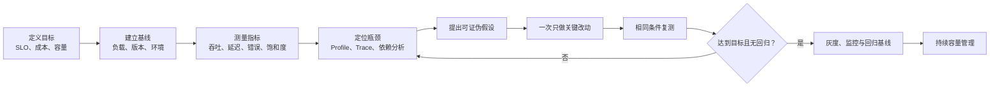
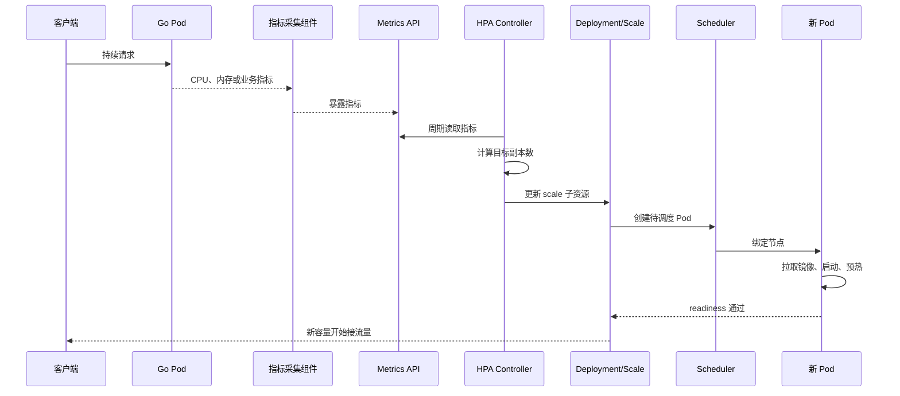
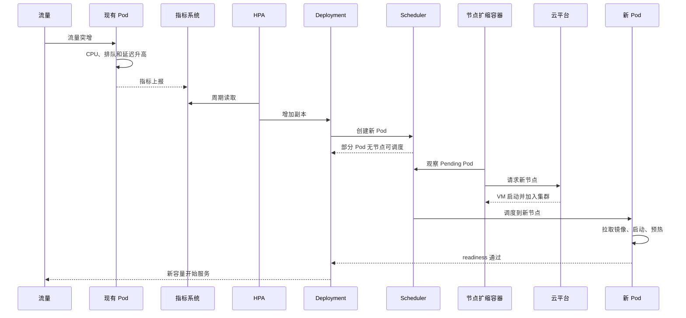

# 第 15 章：Go 服务与 Kubernetes 高性能调优、压测和弹性伸缩

> 版本说明：本章以 2026 年 6 月可用的 Go 1.26 与 Kubernetes 1.36 为参考。涉及 Beta、附加组件或生态项目的能力会单独标记，避免将其误写成 Kubernetes 默认内置功能。([Go][1])

---

## 一、学习目标

完成本章后，应能够：

1. 为 Go 服务建立可复现的性能基线和量化目标。
2. 正确解释吞吐量、平均延迟、p95、p99、错误率和饱和度。
3. 设计包含预热、固定速率、真实数据分布和恢复阶段的压测方案。
4. 识别 Coordinated Omission、压测客户端瓶颈和环境不等价等问题。
5. 使用 Go benchmark、pprof、trace 和 `runtime/metrics` 定位性能瓶颈。
6. 区分 CPU、内存、锁竞争、调度、网络和外部依赖瓶颈。
7. 解释 Kubernetes CPU throttling、内存限制和 Go GC 之间的关系。
8. 解释 HPA 的控制逻辑，以及 CPU 利用率与 `requests` 的关系。
9. 根据同步请求、消息消费、定时任务等负载选择合适的扩缩容指标。
10. 理解 HPA、VPA 和节点自动扩缩容的职责边界及相互影响。
11. 设计能够应对突发流量、冷启动和节点扩容滞后的容量方案。
12. 建立“测量—定位—假设—改动—复测—回归”的性能优化闭环。

---

## 二、核心术语

| 术语             | 含义                           | 常见误区                    |
| -------------- | ---------------------------- | ----------------------- |
| 吞吐量            | 单位时间完成的有效工作量，如 RPS、QPS、消息数/秒 | 吞吐量越高不代表用户体验越好          |
| 响应时间           | 从请求发起到收到完整响应的总时间             | 只看服务执行时间，忽略排队和网络        |
| p95/p99        | 95%/99% 请求的延迟不超过该值           | 把 p99 当作最大值             |
| 错误率            | 失败请求占全部请求的比例                 | 只统计 HTTP 5xx，不统计超时和业务失败 |
| 饱和度            | 资源接近或达到容量上限的程度               | 只观察 CPU 使用率             |
| 基线             | 优化前可复现、可比较的一组测量结果            | 只记录一个 QPS 数字            |
| 容量拐点           | 增加负载后，延迟或错误率开始非线性恶化的位置       | 把压垮系统的最大值当作安全容量         |
| 开环压测           | 按计划到达率发出请求，不因服务变慢自动降低到达率     | 与固定并发压测混为一谈             |
| 闭环压测           | 一个请求完成后才发出后续请求               | 服务变慢后会自行降低施压强度          |
| CPU throttling | 进程达到 cgroup CPU 配额后被内核暂停执行   | 认为平均 CPU 未达到限制就不会发生     |
| HPA            | 调整工作负载副本数                    | 认为 HPA 能优化单个请求的代码路径     |
| VPA            | 调整 Pod 的 CPU、内存请求及可选限制       | 认为 VPA 默认内置于所有集群        |
| 节点自动扩缩容        | 增减集群节点以容纳 Pod                | 认为 HPA 创建 Pod 后节点会立即就绪  |
| 冷启动            | 从扩容决策到新实例真正可服务之间的过程          | 只计算容器进程启动时间             |

---

# 第一部分：建立可量化的性能基线

## 三、为什么优化前必须建立基线

性能优化不是“感觉代码还能更快”，而是回答以下问题：

* 当前系统在什么负载下运行？
* 用户真正关心的性能目标是什么？
* 瓶颈位于应用、运行时、内核、网络还是依赖服务？
* 改动后哪些指标改善了，是否有其他指标恶化？
* 性能改善能否覆盖新增复杂度和运维成本？

没有基线时，常见的“优化”包括：

* 把可读代码改成复杂代码，却没有明显收益。
* 降低平均延迟，却让 p99 更差。
* 提高单 Pod 吞吐量，却增加内存和 GC 风险。
* 扩大数据库连接池，却把数据库压垮。
* 增加 Pod 数，却因下游容量固定而制造更多超时。
* 修改多个参数后得到提升，却无法判断哪个改动有效。

一个完整的性能目标可以写成：

> 在生产等价环境中，订单查询服务以 2 KiB 中位响应、80% 缓存命中率、20% 数据库访问比例运行时，应持续承载 5,000 RPS；p95 不超过 80 ms，p99 不超过 150 ms，业务错误率低于 0.1%，单 Pod CPU 平均使用率不超过 70%，且持续 30 分钟无明显内存增长。

这个目标同时定义了：

* 工作负载；
* 数据分布；
* 吞吐量；
* 延迟；
* 正确性；
* 资源消耗；
* 测试持续时间。

仅说“接口要支持 5,000 QPS”是不完整的。一个接口可能在 5,000 QPS 时有 10% 超时，也可能依赖无限增长的队列暂时接收请求。

---

## 四、性能优化闭环



优化闭环的核心不是“改代码”，而是**提出并验证假设**。

例如：

> 假设：p99 抖动主要来自 CPU 配额节流，而不是数据库延迟。
> 证据：请求慢点与 CPU throttling 时间高度相关；数据库 p99 保持稳定；CPU profile 没有新的热点。
> 改动：调整 CPU request/limit，并验证 Go 运行时并行度。
> 复测：使用相同数据和固定到达率，比较 p50、p99、吞吐量、节流时间和成本。

如果改动后 p99 没有改善，就应推翻假设，而不是继续围绕它增加更多参数。

---

## 五、基线应记录什么

| 维度  | 应记录内容                            |
| --- | -------------------------------- |
| 代码  | Git 提交、Go 版本、编译参数、依赖版本、是否启用 PGO  |
| 镜像  | 镜像 digest、镜像大小、基础镜像、架构           |
| Pod | 副本数、requests、limits、探针、环境变量      |
| 节点  | CPU 型号、核数、内存、虚拟化类型、节点池           |
| 集群  | Kubernetes 版本、CNI、服务网格、DNS、运行时   |
| 流量  | 到达率、并发数、请求大小、读写比例、数据分布           |
| 依赖  | 数据库、缓存、消息队列的规模和连接池配置             |
| 指标  | p50、p95、p99、最大值、错误率、CPU、内存、GC、队列 |
| 时间  | 预热时长、正式测试时长、是否跨越 GC 和缓存周期        |
| 干扰  | 日志级别、Profile、监控采样、其他共享工作负载       |

性能数据离开这些上下文后，往往不再具有可比较性。

---

# 第二部分：吞吐量、延迟与饱和度

## 六、吞吐量不是性能的全部

吞吐量表示单位时间内完成的工作量：

[
Throughput = \frac{Completed\ Operations}{Time}
]

对 HTTP 服务通常是 RPS，对消息消费者可能是消息数/秒，对批处理任务可能是记录数/分钟。

必须强调“完成”：

* 请求进入内存队列，不代表完成。
* 返回 HTTP 200，不代表业务成功。
* 消息被拉取，不代表已经提交处理结果。
* 写入本地缓冲区，不代表数据已持久化。

一个服务可能通过扩大内部队列暂时接受更多请求，但只是把延迟和故障推迟到了未来。

---

## 七、平均延迟为什么会掩盖问题

假设一批请求中：

* 99% 请求耗时 10 ms；
* 1% 请求耗时 2 s。

平均延迟约为：

[
0.99 \times 10 + 0.01 \times 2000 = 29.9ms
]

“平均 30 ms”听起来很好，但每 100 个请求就有约 1 个等待 2 秒。

对一个页面，如果需要串行调用多个下游服务，尾延迟还会逐层累积。若一次用户操作包含多个并行调用，用户感知延迟往往由最慢的那个调用决定。

因此，生产性能至少应同时观察：

* p50：典型请求体验；
* p95：较慢请求；
* p99：尾部体验和容量风险；
* 最大值：异常和暂停，但容易受单个离群值影响；
* 错误率和超时率；
* 测试样本数量。

p99 并不是最大值。样本不足时，高分位数也缺乏统计意义。例如只有 100 个样本时，讨论 p99.9 基本没有价值。

---

## 八、响应时间的组成

一个请求的端到端响应时间通常可以分解为：

[
T_{total} =
T_{queue} +
T_{app} +
T_{dependency} +
T_{network} +
T_{runtime}
]

其中：

* (T_{queue})：线程、goroutine、连接池、数据库池或内部队列等待；
* (T_{app})：业务计算、序列化、校验；
* (T_{dependency})：数据库、缓存、RPC、外部 API；
* (T_{network})：DNS、建连、TLS、传输；
* (T_{runtime})：调度、GC、系统调用、CPU throttling。

CPU profile 主要反映进程真正消耗 CPU 的位置。若请求慢是因为等待数据库连接或 channel，CPU profile 可能看起来很“空闲”，此时应查看 block、goroutine、trace 和依赖指标。

---

## 九、饱和度比单一利用率更重要

CPU 使用率只是饱和度的一部分。还应观察：

* CPU throttling；
* runnable goroutine 和调度延迟；
* 内存工作集和 GC CPU；
* 数据库连接池等待；
* HTTP 连接池等待；
* goroutine 数量；
* 文件描述符；
* socket、端口和连接跟踪表；
* 磁盘队列和 IO 延迟；
* 消息积压及最老消息年龄；
* 下游限流和拒绝数量。

一个服务 CPU 只有 30%，仍可能因为数据库连接池耗尽而出现 2 秒延迟。

---

# 第三部分：设计可信的压测

## 十、并发数和请求速率不是一回事

### 1. 固定并发

固定 100 个并发客户端，每个客户端在前一个请求完成后发送下一个请求。

当服务响应变慢时，请求发出速度也会降低。因此它更接近闭环模型。

在稳定条件下，可使用 Little's Law 做近似：

[
Concurrency \approx Throughput \times ResponseTime
]

例如：

* 吞吐量为 2,000 RPS；
* 平均响应时间为 50 ms，即 0.05 秒；

则平均在途请求数约为：

[
2000 \times 0.05 = 100
]

但这只是稳定系统中的关系，不能据此认为“并发 100”就一定等于“2,000 RPS”。

### 2. 固定到达率

固定以 2,000 RPS 发送请求，即使服务变慢，也不主动降低计划到达率。

它更适合模拟：

* 外部用户到达；
* API 网关持续流量；
* 消息持续产生；
* 突发业务流量。

当系统处理能力低于到达率时，排队和延迟会增长，这恰恰是容量测试需要观察的现象。

---

## 十一、Coordinated Omission

Coordinated Omission 可翻译为“协调遗漏”。

假设压测客户端必须等当前请求完成后才能发送下一个请求。当服务暂停 5 秒时：

1. 客户端发送一个请求；
2. 请求等待 5 秒；
3. 客户端也等待 5 秒；
4. 本应在这 5 秒内到达的其他请求没有被发送；
5. 压测报告只记录了少数慢请求。

压测客户端无意中与被测服务“协调”，在服务最慢的时段降低了负载，最终低估尾延迟和排队效应。

能够按计划到达时间持续施压并正确记录延迟的开环或恒定到达率工具，可以降低这一问题。Vegeta 和 wrk2 的设计都明确考虑了 Coordinated Omission。([GitHub][2])

这并不意味着固定并发压测没有价值。固定并发适合回答：

* 给定客户端并发下能达到多少吞吐量；
* 连接池数量变化是否有效；
* 服务在闭环调用模式下的表现。

但它不能替代固定到达率容量测试。

---

## 十二、压测阶段设计

一次完整压测通常包括：

| 阶段   | 目的                    |
| ---- | --------------------- |
| 预热   | 建立连接、填充缓存、完成初始化和稳定 GC |
| 基线   | 在低负载下验证功能、指标和压测工具     |
| 阶梯升压 | 寻找容量拐点                |
| 目标负载 | 验证 SLO 是否满足           |
| 峰值负载 | 验证短期突发承受能力            |
| 浸泡测试 | 发现内存泄漏、连接泄漏和长期抖动      |
| 降压恢复 | 验证队列能否消化、资源能否恢复       |
| 故障注入 | 验证依赖变慢、节点故障等场景        |

例如：

```text
5 分钟：500 RPS 预热
5 分钟：1,000 RPS
5 分钟：2,000 RPS
10 分钟：3,000 RPS
30 分钟：目标负载 4,000 RPS
3 分钟：峰值 6,000 RPS
15 分钟：恢复到 2,000 RPS
```

不能只做 30 秒测试。30 秒可能还没有经历：

* 完整 GC 周期；
* 连接池重建；
* DNS 缓存更新；
* HPA 扩容；
* 节点扩容；
* 日志积压；
* 数据库缓存变化。

---

## 十三、数据分布必须接近真实业务

压测全部访问同一个缓存热点 Key，可能得到虚假的高吞吐量；全部访问随机不存在的数据，也可能得到虚假的低延迟。

需要还原：

* 请求类型比例；
* 读写比例；
* 请求体和响应体大小；
* 缓存命中率；
* 热点 Key 分布；
* 用户权限和租户分布；
* 查询复杂度；
* 数据库表规模；
* 正常请求与异常请求比例；
* 长连接与短连接比例。

对于订单查询服务，可以定义：

```text
70% 查询最近订单，缓存命中率约 90%
20% 查询历史订单，需要访问数据库
5% 复杂筛选
3% 不存在的订单
2% 非法或无权限请求
```

---

## 十四、压测客户端也可能是瓶颈

必须同时监控压测机：

* CPU；
* 内存；
* 网络带宽；
* 打开的文件描述符；
* 临时端口；
* DNS；
* TLS 握手；
* GC；
* 连接复用率。

识别客户端瓶颈的方法包括：

1. 将压测机数量翻倍，看目标系统负载是否继续增长。
2. 检查压测机 CPU 是否已经饱和。
3. 检查实际发送速率是否达到计划速率。
4. 检查网络出口是否达到带宽上限。
5. 检查请求生成、签名或响应解析是否消耗大量 CPU。
6. 不要让压测客户端与被测服务共享同一节点资源。

---

## 十五、环境不等价问题

本地或测试集群的结果不能直接等同于生产：

* 节点 CPU 型号不同；
* 虚拟化超售程度不同；
* CNI 和服务网格不同；
* 数据量不同；
* 数据库拓扑不同；
* TLS、鉴权、日志在测试中被关闭；
* 生产存在跨可用区调用；
* 生产存在其他租户干扰；
* 生产使用不同的 requests、limits；
* 监控和审计组件不同。

应追求“生产等价”，而不是简单地追求“与生产完全相同”。关键是明确差异，并判断差异会朝哪个方向影响结果。

---

# 第四部分：Go Benchmark 与性能诊断

## 十六、Go Benchmark

Go 的 `testing` 包可用于编写微基准。Go 1.24 起可使用 `b.Loop()`，它会自动管理基准计时边界。`ReportAllocs` 或 `-benchmem` 可以报告每次操作的内存分配。([Go Packages][3])

```go
package order

import (
	"encoding/json"
	"testing"
)

type Order struct {
	ID       string `json:"id"`
	UserID   string `json:"user_id"`
	Amount   int64  `json:"amount"`
	Currency string `json:"currency"`
}

var benchmarkSink []byte

func BenchmarkEncodeOrder(b *testing.B) {
	order := Order{
		ID:       "order-20260622-001",
		UserID:   "user-10001",
		Amount:   19900,
		Currency: "CNY",
	}

	b.ReportAllocs()

	for b.Loop() {
		data, err := json.Marshal(order)
		if err != nil {
			b.Fatal(err)
		}
		benchmarkSink = data
	}
}
```

运行：

```bash
go test -run='^$' \
  -bench='BenchmarkEncodeOrder$' \
  -benchmem \
  -count=10
```

常见输出：

```text
BenchmarkEncodeOrder-8    2100000    560 ns/op    128 B/op    2 allocs/op
```

分别表示：

* `ns/op`：每次操作平均耗时；
* `B/op`：每次操作分配的字节数；
* `allocs/op`：每次操作发生的分配次数。

### 基准测试注意事项

1. setup 不应计入被测代码。
2. 避免结果被编译器完全消除。
3. 使用固定且有代表性的输入。
4. 多次运行，而不是比较单次结果。
5. 避免同时运行其他高负载任务。
6. 比较前后应使用相同 Go 版本和硬件。
7. 微基准优化不等于端到端性能优化。
8. 并发代码应同时测试竞争状态和不同 CPU 数。

可以额外运行：

```bash
go test -run='^$' \
  -bench=. \
  -benchmem \
  -cpu=1,2,4,8 \
  -count=5
```

---

## 十七、pprof 的定位思路

Go 运行时能够提供 CPU、heap、goroutine、block、mutex 等 profile。CPU profile 用于观察 CPU 时间花在哪里；heap profile 用于观察内存分配和存活对象；mutex 和 block profile 用于观察锁竞争与阻塞。Go 官方同时提醒，不同诊断工具可能相互干扰，生产中应控制采集时长，并尽量一次只采集一种 profile。([Go][4])

### 1. 安全暴露 pprof

不要把 `/debug/pprof` 直接暴露到公网。可以使用独立监听器、管理网络、端口转发和访问控制。

```go
package debugserver

import (
	"log"
	"net"
	"net/http"
	httppprof "net/http/pprof"
	"time"
)

func ServePprof() {
	mux := http.NewServeMux()

	mux.HandleFunc("/debug/pprof/", httppprof.Index)
	mux.HandleFunc("/debug/pprof/cmdline", httppprof.Cmdline)
	mux.HandleFunc("/debug/pprof/profile", httppprof.Profile)
	mux.HandleFunc("/debug/pprof/symbol", httppprof.Symbol)
	mux.HandleFunc("/debug/pprof/trace", httppprof.Trace)

	for _, name := range []string{
		"allocs",
		"block",
		"goroutine",
		"heap",
		"mutex",
		"threadcreate",
	} {
		mux.Handle("/debug/pprof/"+name, httppprof.Handler(name))
	}

	server := &http.Server{
		Handler:           mux,
		ReadHeaderTimeout: 2 * time.Second,
	}

	listener, err := net.Listen("tcp", "127.0.0.1:6060")
	if err != nil {
		log.Printf("pprof listen failed: %v", err)
		return
	}

	if err := server.Serve(listener); err != nil &&
		err != http.ErrServerClosed {
		log.Printf("pprof server failed: %v", err)
	}
}
```

### 2. 采集 CPU profile

```bash
kubectl port-forward pod/order-api-xxxxx 6060:6060

go tool pprof \
  -http=:0 \
  'http://127.0.0.1:6060/debug/pprof/profile?seconds=30'
```

重点观察：

* `flat`：函数自身消耗；
* `cum`：函数及其调用链累计消耗；
* `top`：热点函数；
* `top -cum`：累计热点；
* `list FunctionName`：定位到源代码行；
* flame graph：观察主要调用路径。

CPU profile 中的最高项不一定就是应该修改的代码。例如业务主体本来就应消耗大量 CPU，应优先寻找：

* 不必要的重复计算；
* 意外的序列化；
* 频繁分配和 GC；
* 锁自旋；
* 日志格式化；
* 数据复制；
* 反射；
* 加密或压缩热点。

### 3. 采集 heap profile

```bash
curl -o heap.pb.gz \
  http://127.0.0.1:6060/debug/pprof/heap

go tool pprof -http=:0 heap.pb.gz
```

Heap profile 常见视角：

| 视角              | 含义            |
| --------------- | ------------- |
| `inuse_space`   | 当前仍存活对象占用的字节数 |
| `inuse_objects` | 当前仍存活对象数量     |
| `alloc_space`   | 历史累计分配字节数     |
| `alloc_objects` | 历史累计分配对象数     |

判断内存问题时，需要区分：

* **高分配率**：对象很快释放，但造成频繁 GC；
* **高存活堆**：大量对象长期被引用；
* **真正泄漏**：存活对象随时间持续增长；
* **正常缓存**：内存增长后稳定在设计上限；
* **Go 运行时外内存**：cgo、mmap 或内核缓冲区，不一定完整体现在 Go heap 中。

### 4. Goroutine profile

适合定位：

* goroutine 泄漏；
* 大量请求等待相同锁；
* channel 无消费者；
* 下游调用没有超时；
* 连接池等待；
* 后台任务未退出。

采集：

```bash
curl \
  'http://127.0.0.1:6060/debug/pprof/goroutine?debug=2'
```

不能仅凭 goroutine 数量判断泄漏。关键是：

* 数量是否持续增长；
* 相同堆栈是否不断累积；
* 请求结束后能否回落；
* goroutine 是否拥有退出路径；
* context 是否正确传递和取消。

### 5. Mutex 与 Block profile

Mutex profile 关注锁竞争；Block profile 关注 goroutine 在同步原语和 channel 等位置的阻塞。

它们需要显式配置采样：

```go
package profiling

import "runtime"

func EnableContentionProfiles() {
	// 约每 5 次锁竞争事件采样一次。
	runtime.SetMutexProfileFraction(5)

	// 阻塞时间采样率，单位为纳秒。
	runtime.SetBlockProfileRate(10_000)
}
```

采样越密集，开销越高。生产中不应在不了解影响的情况下长期设置极高采样率。

| Profile      | 主要定位问题                      |
| ------------ | --------------------------- |
| CPU          | 热点计算、GC、序列化、日志、压缩           |
| Heap         | 高分配率、存活堆、缓存、泄漏线索            |
| Goroutine    | goroutine 泄漏、等待位置、调用栈       |
| Mutex        | `sync.Mutex`、`RWMutex` 等锁竞争 |
| Block        | channel、select、锁和同步等待       |
| Threadcreate | OS 线程创建来源                   |
| Trace        | 调度、阻塞、系统调用、GC 和时序关系         |

---

## 十八、Go Execution Trace

`runtime/trace` 能记录：

* goroutine 创建、阻塞和唤醒；
* 系统调用进入和退出；
* GC 事件；
* heap 变化；
* 调度器事件；
* 用户自定义 task、region 和 log。

可以通过：

```bash
curl -o trace.out \
  'http://127.0.0.1:6060/debug/pprof/trace?seconds=5'

go tool trace trace.out
```

Trace 比 pprof 更适合回答：

* CPU 明明不高，为什么 goroutine 长时间不能运行？
* 是否存在长时间 scheduler latency？
* 哪些 goroutine 在等待网络或系统调用？
* GC 与延迟尖峰是否发生在同一时间？
* channel 阻塞和 goroutine 唤醒顺序是什么？

Trace 数据量和开销通常高于普通 profile，应优先采集短窗口。Go 的执行 trace 会记录 goroutine、系统调用、GC 和调度等事件，并可通过 `go tool trace` 分析。([Go Packages][5])

---

## 十九、runtime/metrics

`runtime/metrics` 提供访问 Go 运行时指标的稳定接口，相比直接依赖 `runtime.MemStats`，它能够暴露更细粒度的 GC、调度器和内存指标。支持的指标集合会随 Go 实现演进，因此程序应检查实际支持的指标。([Go Packages][6])

```go
package runtimemetrics

import (
	"fmt"
	"runtime/metrics"
)

func PrintRuntimeMetrics() {
	samples := []metrics.Sample{
		{Name: "/gc/heap/live:bytes"},
		{Name: "/gc/heap/allocs:bytes"},
		{Name: "/sched/goroutines:goroutines"},
		{Name: "/gc/gomemlimit:bytes"},
		{Name: "/gc/gogc:percent"},
	}

	metrics.Read(samples)

	for _, sample := range samples {
		switch sample.Value.Kind() {
		case metrics.KindUint64:
			fmt.Printf("%s=%d\n",
				sample.Name,
				sample.Value.Uint64())
		case metrics.KindFloat64:
			fmt.Printf("%s=%f\n",
				sample.Name,
				sample.Value.Float64())
		default:
			fmt.Printf("%s=<non-scalar>\n", sample.Name)
		}
	}
}
```

生产环境通常不应每次请求都读取全部运行时指标，而应按固定周期采样，并转换为监控系统可接受的低基数指标。

---

# 第五部分：常见 Go 性能问题

## 二十、频繁分配与逃逸

频繁分配的成本包括：

1. 分配对象本身；
2. 增大 GC 扫描和回收工作；
3. 增加 cache miss；
4. 提高内存峰值；
5. 增加尾延迟风险。

排查命令：

```bash
go build -gcflags='all=-m=2' ./...
```

常见优化方式：

* 为已知长度的 slice 预分配容量；
* 为 map 提供合理初始容量；
* 使用 `strings.Builder` 或 `bytes.Buffer` 组合字符串；
* 避免热路径中的不必要 `fmt.Sprintf`；
* 避免把大对象复制到多个层次；
* 使用流式编码而不是构建多个中间表示；
* 缩短大对象的引用生命周期；
* 通过 profile 定位后再考虑 `sync.Pool`。

示例：

```go
func collectIDs(orders []Order) []string {
	ids := make([]string, 0, len(orders))
	for _, order := range orders {
		ids = append(ids, order.ID)
	}
	return ids
}
```

### 不要盲目追求“零分配”

零分配代码可能：

* 显著降低可读性；
* 引入对象生命周期错误；
* 造成大 buffer 长期驻留；
* 增加数据竞争风险；
* 在 Go 版本升级后失去收益。

应优先优化 profile 中占比高的分配点。

---

## 二十一、锁竞争

锁竞争的常见表现：

* CPU 没有完全使用；
* p99 增大；
* mutex profile 中少数锁占比很高；
* goroutine 大量阻塞在同一位置；
* 增加 Pod CPU 后吞吐量没有明显增长。

优化顺序：

1. 缩短临界区。
2. 不在持锁状态下进行网络或磁盘 IO。
3. 将计算移到加锁之前或之后。
4. 拆分全局锁。
5. 根据 Key 分片。
6. 使用不可变快照或单写者模型。
7. 最后才考虑 atomic 或复杂无锁结构。

`RWMutex` 不一定比 `Mutex` 快。写操作较多、临界区很短或读锁管理成本较高时，`RWMutex` 可能更差。

---

## 二十二、GC 压力

GC 成本主要与以下因素相关：

* 分配速率；
* 存活堆大小；
* 指针数量和对象图复杂度；
* 可用 CPU；
* `GOGC`；
* `GOMEMLIMIT`。

优化 GC 的优先顺序通常是：

1. 判断 GC 是否真的是主要成本。
2. 减少不必要分配。
3. 减少长期存活对象。
4. 控制缓存大小。
5. 再调整 `GOGC` 和 `GOMEMLIMIT`。

Go 的 `GOMEMLIMIT` 是软内存限制。设置过低时，GC 可能近乎持续运行，服务虽然未立即 OOM，却会因 GC thrashing 严重变慢。Go 官方建议在容器等资源边界明确的环境中使用，并为 Go 运行时无法感知的内存来源预留额外空间。([Go][7])

例如容器内存限制为 `1Gi`，可以从约 85%～90% 的 `GOMEMLIMIT` 开始测量，而不是直接设成 `1Gi`：

```yaml
resources:
  requests:
    memory: 768Mi
  limits:
    memory: 1Gi

env:
  - name: GOMEMLIMIT
    value: "900MiB"
```

这不是通用最优值。若应用使用 cgo、mmap、大量线程栈或内核缓冲区，需要预留更多空间。

---

## 二十三、容器中的 GOMAXPROCS

从 Go 1.25 起，Linux 上的 Go 运行时会在默认情况下考虑 cgroup CPU 带宽限制，并据此设置和动态更新 `GOMAXPROCS`。它参考的是 CPU limit 对应的带宽限制，不参考 CPU request。手动设置 `GOMAXPROCS` 会关闭这部分自动行为。([Go][8])

这解决了一个常见问题：

* 宿主机有 64 个逻辑 CPU；
* 容器 CPU limit 是 2 核；
* 老版本 Go 可能按 64 设置并行度；
* 短时间内大量线程争用 2 核配额；
* 更容易触发 throttling；
* 调度和 GC 的尾延迟可能变差。

但这并不意味着设置 CPU limit 后就一定能获得最佳延迟。仍需观察：

* CPU throttling；
* 应用并行度；
* GC CPU；
* 请求突发模式；
* limit 是否过低。

---

## 二十四、反射、序列化和日志

### 1. 反射

反射可能带来：

* 动态类型检查；
* 额外分配；
* 较差的内联机会；
* 更复杂的调用路径。

但只有 profile 证明反射是热点时，才值得使用代码生成或手写编码替代。

### 2. 序列化

常见瓶颈包括：

* JSON 编解码；
* 重复创建中间 map；
* `interface{}` 和动态类型；
* 多次复制字节；
* 大响应一次性构建；
* 重复压缩。

可考虑：

* 明确结构体类型；
* 流式编码；
* buffer 复用；
* 避免无意义字段；
* 批量协议；
* 二进制协议。

### 3. 日志

每请求打印多条日志可能造成：

* 格式化 CPU；
* 内存分配；
* stdout 写阻塞；
* 日志 Agent 背压；
* 网络和存储成本；
* 监控系统高基数。

高流量路径应采用：

* 结构化日志；
* 日志级别控制；
* 错误日志采样；
* 避免记录大请求体；
* 避免敏感数据；
* 用指标统计常见成功路径。

---

## 二十五、HTTP Keep-Alive 和连接池

不要为每次请求创建新的 `http.Client` 或 `http.Transport`。Transport 应复用，以复用底层连接。

```go
package downstream

import (
	"net"
	"net/http"
	"time"
)

func NewClient() *http.Client {
	transport := &http.Transport{
		Proxy: http.ProxyFromEnvironment,
		DialContext: (&net.Dialer{
			Timeout:   500 * time.Millisecond,
			KeepAlive: 30 * time.Second,
		}).DialContext,

		ForceAttemptHTTP2:     true,
		MaxIdleConns:          500,
		MaxIdleConnsPerHost:   100,
		MaxConnsPerHost:       200,
		IdleConnTimeout:       90 * time.Second,
		TLSHandshakeTimeout:   1 * time.Second,
		ResponseHeaderTimeout: 1 * time.Second,
	}

	return &http.Client{
		Transport: transport,
		Timeout:   2 * time.Second,
	}
}
```

`MaxIdleConnsPerHost` 控制每个目标保留多少空闲连接，`MaxConnsPerHost` 限制正在拨号、活跃和空闲连接的总量。超过后，新建连接会等待。([Go Packages][9])

连接池过小：

* 请求等待连接；
* 新建连接频繁；
* TLS 握手增加；
* p99 变差。

连接池过大：

* 下游连接数爆炸；
* 文件描述符增加；
* 数据库或代理被压垮；
* 每个 Pod 的连接数与 Pod 副本数产生乘法效应。

还应正确关闭响应体：

```go
resp, err := client.Do(req)
if err != nil {
	return err
}
defer resp.Body.Close()
```

如果希望 HTTP/1.1 连接被可靠复用，通常还需要将响应体读取至 EOF，或明确限制和处理未读取的响应体。

---

## 二十六、批处理与压缩的取舍

| 技术              | 主要收益      | 主要代价          |
| --------------- | --------- | ------------- |
| 批量数据库写入         | 降低往返和事务开销 | 增加等待时间和失败影响范围 |
| 批量消息处理          | 提高吞吐量     | 单条消息延迟增加      |
| HTTP Keep-Alive | 减少建连和 TLS | 占用长期连接        |
| 响应压缩            | 降低网络流量    | 增加 CPU 和延迟    |
| 缓冲写入            | 减少系统调用    | 数据刷新延迟和丢失窗口   |
| `sync.Pool`     | 减少临时对象分配  | 对象可能长期持有大容量内存 |
| 缓存              | 降低下游压力    | 一致性、失效和容量复杂度  |

批处理不是越大越好。可以将批量大小和最大等待时间共同作为条件：

```text
达到 100 条立即提交；
不足 100 条时最多等待 10 ms。
```

这样能够在吞吐量和延迟之间建立上限。

---

# 第六部分：容器与 Kubernetes 性能

## 二十七、CPU request 与 CPU limit

### CPU request

CPU request 主要用于：

* 调度器判断节点是否有足够可分配资源；
* 节点自动扩缩容判断新节点需要多大容量；
* CPU 争用时确定相对权重；
* HPA 计算 CPU 利用率的分母。

### CPU limit

CPU limit 是硬上限。在 Linux 上通过 cgroup CPU 配额执行。当容器接近或达到 limit 时，内核会限制其继续使用 CPU。Kubernetes 官方将这种行为称为 CPU throttling。([Kubernetes][10])

例如：

```yaml
resources:
  requests:
    cpu: 500m
  limits:
    cpu: "1"
```

表示：

* 调度时按 0.5 核预留；
* 在资源允许时可以使用超过 0.5 核；
* 最多使用约 1 核 CPU 带宽。

---

## 二十八、CPU 平均使用率不高，为什么仍会 throttling

CPU 配额通常按周期执行。即使一分钟平均 CPU 只有 50%，某些毫秒级突发也可能在一个配额周期内快速消耗完额度，随后被暂停到下个周期。

因此可能出现：

* 平均 CPU 看起来不高；
* p50 正常；
* p99 周期性升高；
* cgroup 节流时间明显增长。

延迟敏感 Go 服务的处理原则不是简单地“永远删除 CPU limit”，而是根据场景权衡：

### 适合提高或取消 CPU limit 的情况

* 延迟 SLO 严格；
* 请求具有明显突发性；
* 节点和租户隔离可靠；
* requests 设置合理；
* 有额外的容量和准入控制；
* 可通过监控约束异常 Pod。

### 适合保留 CPU limit 的情况

* 多租户隔离要求高；
* 防止单 Pod 消耗整个节点；
* 批处理任务可接受节流；
* 成本和资源上限明确；
* 集群治理要求统一限制。

正确做法是测量不同策略下：

* p95/p99；
* throttling；
* 吞吐量；
* 节点利用率；
* 成本；
* 故障爆炸半径。

---

## 二十九、内存 limit 与 GC 压力

Kubernetes 内存 limit 与 CPU limit 的行为不同：

* CPU 超限通常表现为节流；
* 内存超限可能触发 OOM kill；
* 内存限制是反应式执行的；
* Go GC 只管理 Go 运行时可见的部分内存。

内存 limit 过低时，可能出现：

1. GC 更频繁；
2. GC assist 增加；
3. CPU 用于回收内存；
4. 应用吞吐量下降；
5. p99 上升；
6. 最终仍可能 OOMKilled。

排查时应同时观察：

* Go live heap；
* 分配速率；
* GC CPU；
* RSS 或工作集；
* cgo/mmap；
* goroutine 数和栈；
* 容器内存限制；
* OOM 事件。

不能把“没有 OOMKilled”视为内存配置合理。服务可能已经在 OOM 前经历严重 GC thrashing。

---

## 三十、冷启动的组成

新 Pod 从创建到可接流量，通常经历：

[
T_{ready} =
T_{schedule} +
T_{imagePull} +
T_{containerCreate} +
T_{processStart} +
T_{warmup} +
T_{readiness}
]

其中：

* 调度等待；
* 镜像拉取；
* 容器创建；
* Go 进程启动；
* 配置加载；
* 数据库和缓存连接建立；
* 本地缓存预热；
* readiness 成功。

Go 没有 JIT 编译预热，但仍可能存在：

* TLS 初始化；
* 连接池建立；
* 正则或模板初始化；
* 热点数据加载；
* 配置和证书读取；
* 大型路由表构建；
* 第一次 DNS 查询；
* 第一次外部依赖调用。

镜像体积只影响冷启动的一部分。即使镜像已在节点缓存中，应用预热和 readiness 仍可能占据主要时间。

---

## 三十一、readiness 应代表“现在可以承载流量”

错误的 readiness：

```text
进程启动成功 => Ready
```

更合理的 readiness 应确认：

* HTTP server 已监听；
* 必要初始化完成；
* 服务没有进入主动过载状态；
* 至少具备处理请求的基本依赖；
* 不会在刚接流量时立即失败。

但 readiness 也不应把所有下游瞬时故障都变成 NotReady。否则一个共享依赖抖动可能让所有 Pod 同时摘流，形成级联故障。

---

## 三十二、非应用瓶颈

### 网络

* CNI 数据路径；
* 服务网格代理；
* conntrack；
* MTU；
* 跨可用区；
* TLS；
* 带宽；
* 丢包和重传。

### DNS

* CoreDNS 容量；
* 搜索域导致的额外查询；
* 短 TTL；
* 高频动态解析；
* DNS 超时和重试。

### 存储

* 网络盘 IOPS；
* fsync；
* 多副本同步写；
* 文件系统延迟；
* 容器可写层。

### 日志

* stdout 阻塞；
* 日志 Agent 处理不足；
* 磁盘缓冲区占满；
* 每请求记录过多内容。

### 监控

* 指标标签高基数；
* 采样过密；
* 大量 histogram bucket；
* Trace 全量采样；
* pprof 长时间运行。

监控系统本身也消耗 CPU、内存和网络，因此性能测试必须保持与生产相近的观测配置。

---

# 第七部分：HPA 原理与配置

## 三十三、HPA 控制链路



HPA 是一个间歇运行的控制循环，并非连续即时控制。它通过目标工作负载的 `scale` 子资源调整副本数。([Kubernetes][11])

---

## 三十四、HPA 基本计算公式

HPA 的基础计算逻辑为：

[
desiredReplicas =
\left\lceil
currentReplicas \times
\frac{currentMetricValue}{desiredMetricValue}
\right\rceil
]

([Kubernetes][11])

例如：

* 当前副本数：3；
* 当前平均 CPU 利用率：80%；
* 目标 CPU 利用率：60%。

则：

[
\left\lceil 3 \times \frac{80}{60} \right\rceil
===============================================

# \left\lceil 4 \right\rceil

4
]

实际算法还会处理：

* 容差；
* 缺失指标；
* 尚未 Ready 的 Pod；
* 多指标；
* 扩缩容速率限制；
* 稳定窗口。

---

## 三十五、CPU 利用率以 request 为分母

HPA 中的 CPU `Utilization` 不是：

[
当前CPU使用量 \div CPU limit
]

而是：

[
当前CPU使用量 \div CPU request
]

假设：

```yaml
requests:
  cpu: 500m
limits:
  cpu: "1"
```

当前平均 CPU 使用量为 `400m`，则利用率为：

[
400m \div 500m = 80%
]

而不是 40%。

若把 request 从 `500m` 调整为 `1000m`，即使实际 CPU 使用量不变，HPA 看到的利用率也会从 80% 变为 40%。

如果 Pod 中相关容器未设置 CPU request，HPA 无法为该 Pod定义 CPU 利用率，并可能无法根据该指标执行扩缩容。([Kubernetes][11])

---

## 三十六、Resource、Custom 和 External Metrics

| 指标类别             | API                       | 典型数据               | 是否关联 Kubernetes 对象 |
| ---------------- | ------------------------- | ------------------ | ------------------ |
| Resource Metrics | `metrics.k8s.io`          | Pod CPU、内存         | 是                  |
| Custom Metrics   | `custom.metrics.k8s.io`   | Pod RPS、并发数、业务队列长度 | 通常是                |
| External Metrics | `external.metrics.k8s.io` | 云消息队列积压、外部监控指标     | 不要求                |

Resource Metrics 通常由 Metrics Server 提供。Metrics Server 是集群附加组件，并非 Kubernetes 安装后必然已经存在。

Custom 和 External Metrics 通常需要监控系统 Adapter。HPA 本身不会直接理解 Prometheus、云消息队列或业务数据库。([Kubernetes][11])

---

## 三十七、CPU HPA 示例

工作负载资源配置：

```yaml
containers:
  - name: order-api
    image: registry.example.com/order-api@sha256:example
    resources:
      requests:
        cpu: 500m
        memory: 512Mi
      limits:
        cpu: "1"
        memory: 1Gi
```

HPA：

```yaml
apiVersion: autoscaling/v2
kind: HorizontalPodAutoscaler
metadata:
  name: order-api
spec:
  scaleTargetRef:
    apiVersion: apps/v1
    kind: Deployment
    name: order-api

  minReplicas: 4
  maxReplicas: 40

  metrics:
    - type: Resource
      resource:
        name: cpu
        target:
          type: Utilization
          averageUtilization: 60

  behavior:
    scaleUp:
      stabilizationWindowSeconds: 0
      selectPolicy: Max
      policies:
        - type: Percent
          value: 100
          periodSeconds: 60
        - type: Pods
          value: 4
          periodSeconds: 60

    scaleDown:
      stabilizationWindowSeconds: 300
      selectPolicy: Max
      policies:
        - type: Percent
          value: 20
          periodSeconds: 60
```

该配置表达：

* 至少保留 4 个副本；
* 最多扩展到 40 个副本；
* 目标平均 CPU 利用率为 request 的 60%；
* 扩容允许较快；
* 缩容观察 5 分钟；
* 每分钟最多缩减约 20%。

这些值不是通用最佳实践，应通过压测和生产流量调整。

---

## 三十八、Stabilization Window 与 Scale Behavior

当指标在阈值附近波动时，HPA 可能频繁增减副本，即 flapping。

`stabilizationWindowSeconds` 用于考虑一段时间内之前的副本建议，避免刚缩容又立即扩容。对于缩容，HPA 会在稳定窗口内倾向选择较高的历史建议，从而降低过快移除 Pod 的风险。([Kubernetes][11])

`policies` 控制副本变化速度：

```yaml
policies:
  - type: Pods
    value: 4
    periodSeconds: 60
  - type: Percent
    value: 50
    periodSeconds: 60
```

表示每 60 秒最多改变：

* 4 个 Pod；
* 或当前副本数的 50%。

`selectPolicy: Max` 选择允许变化更多的策略，`Min` 选择更保守的策略。

---

## 三十九、Pod 启动阶段与 HPA

新 Pod 启动时可能出现 CPU 峰值。如果 HPA立即把该峰值计入计算，可能造成继续扩容。

HPA 对尚未稳定 Ready 的 Pod 会采取保守处理，并提供控制器级的 CPU 初始化期和初始 readiness 延迟配置。应用侧应通过 `startupProbe` 和 `readinessProbe` 确保 Pod 完成初始化后才进入服务。([Kubernetes][11])

典型错误：

1. Pod 启动立即 Ready。
2. 流量进入后才建立连接池和加载缓存。
3. 新 Pod CPU 暴涨。
4. HPA 看到 CPU 高继续扩容。
5. 大量 Pod 同时冷启动。
6. 数据库连接数和镜像拉取压力上升。

---

## 四十、CPU 指标何时不合适

CPU 适合以下情况：

* CPU 使用量与请求量近似相关；
* 服务是 CPU 密集型；
* 每个 Pod 的处理能力较稳定；
* CPU request 设置合理；
* 下游不是主要瓶颈。

CPU 不适合或不足以单独使用的情况：

### 1. 消息消费者

消费者可能因等待消息或下游 IO 而 CPU 很低，但队列已严重积压。

更合理的指标：

* 队列长度；
* 最老消息年龄；
* 消费延迟；
* 每 Pod 目标积压；
* 到达率与处理率之差。

### 2. IO 密集型服务

服务可能卡在数据库连接池，CPU 只有 20%。增加 Pod 可能进一步增加数据库连接和压力。

### 3. 并发受限服务

每个 Pod 只能处理固定数量的并发请求。此时：

* in-flight requests；
* 活跃 worker 数；
* semaphore 等待时间；

通常比 CPU 更接近容量。

### 4. 外部限流

下游只允许整个系统 1,000 RPS。扩容更多 Pod 并不会提高总吞吐量，只会增加重试和连接。

---

## 四十一、External Metrics 示例

对于消息消费者，可以按每个 Pod 目标积压 30 条进行扩缩容：

```yaml
metrics:
  - type: External
    external:
      metric:
        name: queue_messages_ready
        selector:
          matchLabels:
            queue: order_tasks
      target:
        type: AverageValue
        averageValue: "30"
```

这意味着：

[
期望副本数 \approx
\left\lceil
\frac{总积压消息数}{30}
\right\rceil
]

但还必须考虑：

* 单条消息处理时间；
* 消息到达率；
* 下游容量；
* 消费者启动时间；
* 消息顺序；
* 分区数；
* 最大并行度；
* 空队列后的缩容延迟。

外部指标访问范围较大，集群管理员还应关注指标 Adapter 的权限和隔离。([Kubernetes][12])

---

# 第八部分：VPA 与节点自动扩缩容

## 四十二、HPA、VPA 和节点扩缩容对比

| 机制      | 调整对象                | 主要输入                      | 解决的问题    |
| ------- | ------------------- | ------------------------- | -------- |
| HPA     | Pod 副本数             | CPU、内存、自定义或外部指标           | 水平扩展处理能力 |
| VPA     | Pod requests/limits | 当前及历史资源使用                 | 资源规格校准   |
| 节点自动扩缩容 | 节点数量和规格             | Pending Pod、requests、节点约束 | 集群基础容量   |

三者处于不同层级：

```text
流量增加
  ↓
HPA 创建更多 Pod
  ↓
节点资源不足，Pod Pending
  ↓
节点自动扩缩容创建节点
  ↓
节点加入集群
  ↓
Pod 被调度、启动并 Ready
```

---

## 四十三、VPA 解决什么问题

VPA 主要用于：

* request 设置过低导致调度和容量规划失真；
* request 设置过高造成资源浪费；
* 工作负载长期变化；
* 为资源配置提供历史建议；
* 根据 OOM 和使用模式调整内存需求。

VPA 由 Recommender、Updater 和 Admission Controller 等组件协作。它使用 CRD，必须单独安装；与 HPA 不同，VPA 不是 Kubernetes 默认附带的核心控制器。([Kubernetes][13])

生产中可以先使用推荐模式：

```yaml
apiVersion: autoscaling.k8s.io/v1
kind: VerticalPodAutoscaler
metadata:
  name: order-api
spec:
  targetRef:
    apiVersion: apps/v1
    kind: Deployment
    name: order-api

  updatePolicy:
    updateMode: "Off"

  resourcePolicy:
    containerPolicies:
      - containerName: order-api
        minAllowed:
          cpu: 250m
          memory: 256Mi
        maxAllowed:
          cpu: "4"
          memory: 4Gi
        controlledResources:
          - cpu
          - memory
        controlledValues: RequestsOnly
```

`Off` 模式不会自动修改 Pod，只在状态中提供建议，适合先观察推荐是否合理。

Kubernetes 已支持稳定的原地 Pod 资源调整能力，但 VPA 是独立附加组件；具体是否能原地应用建议，仍取决于安装的 VPA 版本、更新模式和集群能力，不能把两者视为同一项功能。([Kubernetes][14])

---

## 四十四、HPA 与 VPA 为什么可能冲突

假设：

* HPA 以 CPU 利用率扩容；
* CPU 利用率以 CPU request 为分母；
* VPA 持续修改 CPU request。

如果 VPA 提高 request：

[
CPU利用率 =
\frac{实际CPU使用量}{更大的request}
]

利用率会下降，HPA 可能缩容。

缩容后每个 Pod 流量增加，CPU 使用量又上升，VPA 和 HPA 可能产生相互影响。

常见组合策略：

### 策略一：VPA 只提供建议

* HPA 负责副本；
* VPA `Off` 模式提供资源建议；
* 人工或自动发布流程定期调整 request。

最容易控制。

### 策略二：HPA 使用业务指标

* VPA 调整 CPU、内存 request；
* HPA 按 RPS、并发、队列长度等指标扩容；
* 避免直接改变 CPU 利用率的分母反馈。

### 策略三：资源分工

* HPA 根据 CPU 或业务指标扩容；
* VPA 仅调整内存；
* CPU request 固定。

### 策略四：明确控制周期

让 VPA 调整频率远低于 HPA，并通过变更窗口、发布和回归测试降低耦合。

---

## 四十五、节点自动扩缩容

节点自动扩缩容会根据无法在现有节点上调度的 Pod 和 Pod requests 等约束，创建新节点。它通常不会直接依据 Pod 的实时 CPU 使用率决定节点规格。

节点扩缩容器关注的是：

> 这些 Pending Pod 按声明的 requests，是否能被某种新节点容纳？

而不是：

> 这些 Pod 当前真实使用了多少 CPU？

Kubernetes 当前文档列出的节点自动扩缩容实现包括 Cluster Autoscaler 和 Karpenter。它们是与云提供商集成的独立组件，并不是 kube-scheduler 自己创建云主机。([Kubernetes][15])

这也是 requests 准确性非常重要的原因：

* request 太低：节点容量看似足够，但运行后资源争用；
* request 太高：Pod 难以装箱，节点成本增加；
* request 缺失：调度和容量规划失真。

---

## 四十六、流量突增时的扩容时间线



总扩容延迟近似为：

[
T_{scale} =
T_{metric} +
T_{hpa} +
T_{schedule} +
T_{node} +
T_{image} +
T_{startup} +
T_{readiness}
]

对于秒级突发流量，依赖这条完整链路通常来不及。

---

## 四十七、如何应对扩容滞后

### 1. 保留最小副本

`minReplicas` 应覆盖正常负载和一部分突发，而不是只覆盖空闲流量。

### 2. 保留节点余量

集群可以预留一定可调度容量，避免每次扩容都等待云主机启动。

### 3. 使用过度预留 Pod

运行低优先级占位 Pod：

* 平时占据预留节点；
* 业务 Pod 到来时，占位 Pod 被抢占；
* 业务 Pod 可立即调度；
* 节点扩缩容器随后补充容量。

### 4. 计划性预扩容

对于已知活动时间：

* 发布会；
* 秒杀；
* 每日高峰；
* 批处理窗口；

可以提前增加 Pod 和节点，而不是等指标上升后再反应。

### 5. 缩短冷启动

* 减小镜像；
* 预拉取镜像；
* 减少启动同步操作；
* 将非关键预热异步化；
* 优化 readiness；
* 避免每个 Pod 启动时同时冲击数据库。

### 6. 入口削峰

* 限流；
* 有界队列；
* 消息队列；
* 快速拒绝；
* 降级；
* 缓存。

### 7. 不把 scale-to-zero 用于严格低延迟突发路径

从零扩容至少需要指标触发、Pod 创建和启动，若还需要新节点，延迟会进一步增长。

---

## 四十八、事件驱动扩缩容

Kubernetes 核心提供 HPA API，但事件驱动扩缩容通常需要生态组件。

KEDA 是事件驱动扩缩容方案，可根据：

* 消息队列积压；
* Kafka lag；
* 云监控指标；
* 数据库查询；
* Cron；
* 多种外部事件源；

驱动工作负载扩缩容。

KEDA 是 CNCF 项目，但不是 Kubernetes 核心控制器，必须单独安装和运维。Kubernetes 官方文档也将其作为事件驱动扩缩容的生态方案介绍。([Kubernetes][16])

使用事件驱动扩缩容仍需考虑：

* 指标延迟；
* Adapter 或 Scaler 可用性；
* 队列分区数；
* 最大消费者并行度；
* 下游容量；
* 冷启动；
* scale-to-zero 首次响应延迟。

---

# 第九部分：完整性能优化案例

## 四十九、案例背景

以下数据为方法演示，不代表通用基准。

某 Go 订单查询服务配置：

```text
副本数：8
CPU request：500m
CPU limit：500m
内存 request：512Mi
内存 limit：1Gi
HPA CPU 目标：70%
目标负载：5,000 RPS
目标 p99：150 ms
```

压测结果：

```text
实际吞吐量：4,800 RPS
p50：28 ms
p95：90 ms
p99：420 ms
错误率：0.3%
CPU 平均：每 Pod 430m
CPU throttling：明显
分配量：约 14 KiB/op
日志：每请求 3 条 INFO
数据库 p99：35 ms，保持稳定
```

---

## 五十、第一次假设：数据库是瓶颈

数据库 p99 保持稳定，连接池等待不明显，因此证据不足。

结论：

> 暂不修改数据库连接池。无证据扩池可能只会增加数据库压力。

---

## 五十一、第二次假设：CPU limit 导致尾延迟

证据：

* Pod CPU 接近 500m limit；
* 慢请求时间与 throttling 增长一致；
* CPU profile 没有单个异常死循环；
* 数据库延迟稳定。

改动实验：

```yaml
resources:
  requests:
    cpu: 500m
  limits:
    cpu: "1"
```

复测后：

```text
吞吐量：5,000 RPS
p99：260 ms
CPU throttling：显著下降
```

说明 CPU limit 是瓶颈之一，但尚未达到目标。

---

## 五十二、第三次假设：高分配率增加 GC 成本

Heap 和 CPU profile 显示：

* JSON 中间 map；
* 日志字段拼接；
* 重复构造临时 slice；
* `runtime.mallocgc` 和 GC assist 占比较高。

改动：

1. 用明确结构体替代中间 map。
2. 为 slice 预分配容量。
3. 成功请求不再打印多条 INFO。
4. 大字段日志只在错误时记录。
5. 为容器设置留有余量的 `GOMEMLIMIT`。

复测：

```text
分配量：14 KiB/op → 6 KiB/op
p99：260 ms → 170 ms
CPU：下降约 12%
```

---

## 五十三、第四次假设：下游 HTTP 连接复用不足

发现业务代码为每次请求构造新的 Transport，导致：

* 空闲连接不能复用；
* TLS 握手增加；
* 临时端口增加。

改为共享 Client，并设置合理连接池。

复测：

```text
p99：170 ms → 125 ms
错误率：0.3% → 0.05%
```

---

## 五十四、扩缩容验证

HPA 配置：

* `minReplicas: 8`；
* CPU 目标 60%；
* 扩容每分钟最多增加 100%；
* 缩容稳定窗口 5 分钟。

突发测试显示：

* 从 5,000 RPS 增长到 8,000 RPS 时，现有 8 个 Pod 仍有约 20 秒过载；
* 新 Pod 部分因节点资源不足 Pending；
* 完整节点扩容约需数分钟。

最终增加：

* 4 个 Pod 的最低容量；
* 一个节点的预留余量；
* 活动前计划性预扩容；
* 入口有界排队和快速拒绝。

最终目标不是让 HPA “无限快”，而是让系统在 HPA 生效前仍有可控行为。

---

# 第十部分：常见错误认知

## 五十五、误区总结

### 误区一：CPU 使用率越低越好

过低可能意味着 request 过大、成本浪费，或服务正在等待下游。

### 误区二：平均延迟低，性能就好

平均值可能掩盖严重尾延迟。

### 误区三：压测并发越高，流量越大

固定并发下，服务变慢会让客户端自动降低请求速率。

### 误区四：pprof 排第一的函数就是 Bug

它可能只是业务本身最主要的工作。

### 误区五：增加 Pod，吞吐量一定线性增长

数据库、缓存、队列分区、网络和锁都可能成为共享瓶颈。

### 误区六：HPA 可以解决性能问题

HPA 只能增加副本，不能修复单请求慢路径、锁竞争或错误算法。

### 误区七：HPA CPU 目标相对 CPU limit 计算

实际上 `Utilization` 相对 CPU request 计算。

### 误区八：Pod 扩容等于容量扩容完成

新 Pod 可能 Pending、拉镜像、预热或尚未 Ready。

### 误区九：VPA 是 Kubernetes 默认内置能力

VPA 使用 CRD 和独立控制器，需要单独安装。

### 误区十：取消 CPU limit 一定更好

可能改善延迟，也可能破坏多租户隔离和节点稳定性。

### 误区十一：GOMEMLIMIT 等于容器 limit 即可

还需为 Go 运行时不可见内存、cgo、mmap 和系统开销留出余量。

### 误区十二：队列长度越大，只需增加更多消费者

还要考虑分区数、下游能力、顺序约束和单条处理时间。

### 误区十三：scale-to-zero 适合所有低流量业务

严格低延迟业务可能无法接受首次扩容时间。

### 误区十四：一次微基准提升 30%，系统就提升 30%

该函数在整体 CPU 中可能只占 1%。

### 误区十五：性能优化完成后不需要回归

编译器、依赖、流量分布和基础设施变化都可能使性能回退。

---

# 第十一部分：生产检查清单

## 五十六、压测前

* 明确吞吐量、p95、p99、错误率和资源目标。
* 固定代码、镜像、配置和集群版本。
* 准备接近生产的数据分布。
* 验证压测机有足够余量。
* 确认成功率包含业务正确性。
* 记录预热和测试持续时间。
* 确认不会误伤生产数据。

## 五十七、Go 服务

* 复用 `http.Client` 和 Transport。
* 为外部调用设置超时。
* 观察分配率、live heap 和 GC CPU。
* 使用 CPU、heap、goroutine、mutex、block profile。
* 热路径减少不必要日志和反射。
* 验证 `GOMAXPROCS` 和容器 CPU 配置。
* 根据容器内存设置合理 `GOMEMLIMIT`。
* 不公开暴露 pprof。

## 五十八、Kubernetes

* 设置合理 requests。
* 检查 CPU throttling。
* 检查 OOM 和内存工作集。
* readiness 代表真正可服务。
* 镜像和启动路径经过测量。
* 检查 CNI、DNS、日志和存储瓶颈。
* 避免所有 Pod 同时启动冲击下游。

## 五十九、弹性伸缩

* 指标应与真实瓶颈相关。
* CPU HPA 必须设置 CPU requests。
* 使用稳定窗口控制缩容。
* 为突发流量保留最低副本和节点余量。
* 验证 Pod 和节点扩容总耗时。
* 消息消费者优先考虑积压或消息年龄。
* VPA 先采用推荐模式。
* 明确 HPA 与 VPA 的控制耦合。
* 将 KEDA 等事件驱动组件视为独立生态依赖。

---

# 第十二部分：章节总结

1. 性能优化必须从量化目标和可复现基线开始。
2. 吞吐量、延迟、错误率和饱和度必须联合观察。
3. 平均延迟不能代表尾部用户体验。
4. 固定并发和固定到达率回答的是不同问题。
5. Coordinated Omission 会低估服务停顿期间的真实延迟。
6. Go benchmark 适合微观比较，不能替代端到端压测。
7. CPU、heap、goroutine、mutex、block profile 各自定位不同问题。
8. 高频分配、锁竞争、日志、序列化和连接池是常见 Go 瓶颈。
9. CPU limit 可能通过 throttling 放大尾延迟。
10. 内存限制过低可能导致 GC thrashing，甚至在 OOM 前已经严重变慢。
11. HPA CPU 利用率相对 request，而不是 limit。
12. CPU 并不适合所有扩缩容场景，消息消费通常更关注积压和消息年龄。
13. VPA 是独立附加组件，使用前应先理解其更新和中断行为。
14. Pod 扩容和节点扩容是两层控制循环，存在显著时延。
15. 对突发流量，预留容量、入口保护和计划性扩容通常比被动等待更可靠。

---

# 第十三部分：15 道面试题

## 1. 为什么性能优化前必须建立基线？

**考察意图**

判断候选人是否具备数据驱动的性能工程方法，而不是凭经验盲目改代码。

**30 秒回答**

性能优化必须有可量化目标和可复现基线，否则无法判断瓶颈、改动收益和副作用。基线至少要记录负载模型、吞吐量、p95/p99、错误率、资源使用、代码版本和环境。优化应按“测量、定位、假设、改动、复测、回归”闭环进行。

**展开回答**

基线解决三个问题：

1. 当前到底有多慢；
2. 慢在哪里；
3. 改完是否真的更好。

例如只观察平均延迟，可能遗漏 p99 恶化；只观察 QPS，可能遗漏错误率；只看单 Pod，可能遗漏数据库已经饱和。

优化前还需固定：

* Go 版本；
* 编译参数；
* 镜像；
* requests/limits；
* 数据分布；
* 节点规格；
* 测试时长。

每次尽量只改变一个关键变量，否则无法建立因果关系。

**可能追问**

* 如何判断两个基准结果的差异不是噪声？
* 生产流量无法复现怎么办？
* 性能目标和 SLO 有什么关系？

**常见误区**

只记录“优化前 10,000 QPS，优化后 12,000 QPS”，却没有延迟、错误率和资源条件。

---

## 2. 为什么平均延迟不能代表系统性能？

**考察意图**

判断候选人是否理解延迟分布和尾延迟。

**30 秒回答**

平均值会把少量极慢请求稀释掉。即使平均延迟只有几十毫秒，也可能有 1% 请求耗时数秒。生产系统应同时观察 p50、p95、p99、错误率和样本量，尤其是包含多个下游调用时，用户体验通常受最慢调用影响。

**展开回答**

平均值适合描述总体消耗，但不适合描述尾部用户体验。

尾延迟来源包括：

* 排队；
* CPU throttling；
* GC；
* 锁竞争；
* 数据库慢查询；
* 网络重传；
* 冷缓存；
* 重试；
* 节点干扰。

分位数也需要足够样本。只有几百个请求时，p99.9 没有稳定意义。

**可能追问**

* p99 是否越低越好？
* 如何聚合多个实例的 p99？
* Histogram 和 Summary 有什么差异？

**常见误区**

把 p99 当成最大值，或直接平均多个实例上已经计算好的 p99。

---

## 3. 什么是 Coordinated Omission？

**考察意图**

判断候选人是否能够设计可信的压测。

**30 秒回答**

它发生在闭环压测中：客户端等待当前请求完成后才发下一个请求。服务变慢时，客户端也降低发压速度，导致本应到达的请求没有被发送，从而低估排队和尾延迟。可使用恒定到达率或能按计划发送时间校正延迟的压测方式。

**展开回答**

假设服务暂停 5 秒。固定并发客户端的一个连接在这 5 秒内只记录一次慢请求，但真实用户请求仍可能持续到达并排队。

避免方式：

* 使用开环到达模型；
* 记录请求计划发送时间；
* 验证实际发送速率；
* 监控压测客户端；
* 同时进行固定并发和固定速率测试。

**可能追问**

* 固定并发压测还有什么价值？
* 开环压测是否可能把系统完全压垮？
* 如何设置最大在途请求数？

**常见误区**

认为只要并发数足够高，就不存在 Coordinated Omission。

---

## 4. CPU、heap、goroutine、mutex、block profile 分别定位什么？

**考察意图**

考察 Go 性能诊断能力。

**30 秒回答**

CPU profile 定位 CPU 热点；heap 定位分配和存活对象；goroutine 查看当前 goroutine 堆栈和泄漏线索；mutex 定位锁竞争；block 定位 channel、锁等同步阻塞。若需要分析调度和时序关系，再使用 execution trace。

**展开回答**

* CPU 高：先看 CPU profile；
* 内存增长：看 heap 的 `inuse_space` 和时间趋势；
* GC 高：看 `alloc_space`、分配率及 CPU profile 中 runtime；
* goroutine 增长：比较多次 goroutine profile；
* CPU 不高但请求慢：看 block、mutex、trace 和依赖指标；
* 线程数异常：看 threadcreate。

采集工具本身有开销，生产中应短时、单项采集。

**可能追问**

* `flat` 和 `cum` 有什么区别？
* `alloc_space` 与 `inuse_space` 有什么区别？
* Mutex profile 为什么可能没有数据？

**常见误区**

所有问题都只采 CPU profile。

---

## 5. CPU profile 中 `runtime.mallocgc` 占比高，应该怎么处理？

**考察意图**

判断候选人是否理解分配、GC 和热点分析。

**30 秒回答**

先确认高分配是否确实造成显著 CPU 和延迟，再使用 heap 或 allocs profile 找到主要分配调用链。优先减少热路径临时对象、预分配 slice、避免中间 map 和重复序列化。不要直接通过关闭 GC 或大量使用 `sync.Pool` 掩盖问题。

**展开回答**

处理步骤：

1. CPU profile 确认 GC 或分配成本；
2. `alloc_space` 找累计分配热点；
3. `inuse_space` 判断是否有长期存活；
4. 检查对象是否逃逸；
5. 优化高占比调用点；
6. 相同负载复测分配量、GC CPU、p99；
7. 最后再考虑 `GOGC`、`GOMEMLIMIT`。

**可能追问**

* 栈分配一定比堆分配好吗？
* `sync.Pool` 中的对象何时会被清除？
* 如何看逃逸分析？

**常见误区**

看到 `mallocgc` 就把所有对象放入对象池。

---

## 6. Mutex profile 和 Block profile 有什么区别？

**考察意图**

考察 Go 并发性能问题定位。

**30 秒回答**

Mutex profile 专门统计锁竞争造成的等待，适合定位热点互斥锁。Block profile 范围更广，包含 channel、select、锁和其他同步阻塞。两者默认采样配置不同，需要显式启用，并注意采样开销。

**展开回答**

锁竞争优化应首先：

* 缩短临界区；
* 避免持锁 IO；
* 拆分锁；
* 分片数据；
* 降低共享可变状态。

不能看到读多就直接换 `RWMutex`，应基准测试实际读写比例和临界区长度。

**可能追问**

* Atomic 一定比 Mutex 快吗？
* 为什么增加 CPU 后锁竞争可能更严重？
* 单写者模型适合什么场景？

**常见误区**

把所有 Mutex 替换成 `RWMutex` 或 atomic。

---

## 7. 为什么 CPU 平均使用率低于 limit，仍可能出现 CPU throttling？

**考察意图**

考察 cgroup CPU 配额和尾延迟理解。

**30 秒回答**

CPU limit 按较短配额周期执行。应用可能在周期前半段突发消耗完额度，然后被暂停到下一周期。长时间平均 CPU 看起来不高，但毫秒级请求会感受到暂停，p99 因此升高。应观察节流计数和节流时间，而不只看平均 CPU。

**展开回答**

常见场景：

* 请求到达具有突发性；
* Go 并行度明显高于配额；
* GC 与业务 goroutine 同时竞争；
* CPU limit 与 request 设置相同且过低。

处理方式：

* 调整 limit；
* 校准 request；
* 验证 `GOMAXPROCS`；
* 减少分配和 CPU 热点；
* 为延迟敏感服务评估取消 limit；
* 保留隔离和容量保护。

**可能追问**

* CPU request 和 limit 各自作用是什么？
* Go 1.25 后 GOMAXPROCS 有什么变化？
* 无 CPU limit 会产生什么风险？

**常见误区**

只要一分钟 CPU 图没到 100%，就断定不存在 throttling。

---

## 8. GOMEMLIMIT 应该如何与容器 memory limit 配合？

**考察意图**

考察 Go GC 与 Kubernetes 内存边界。

**30 秒回答**

`GOMEMLIMIT` 是 Go 运行时软限制，不应简单等于容器 memory limit。应为二进制映射、cgo、mmap、线程栈和内核开销留出空间，通常从容器限制的约 85%～90% 开始压测。设置过低会导致 GC thrashing，设置过高则可能在 GC 来不及回收前 OOM。

**展开回答**

还需区分：

* Go heap；
* Go runtime 管理内存；
* RSS；
* cgo 和 mmap；
* 页缓存；
* 容器工作集。

调优时观察：

* live heap；
* heap goal；
* GC CPU；
* 分配速率；
* RSS；
* OOM 事件；
* p99。

**可能追问**

* `GOGC` 与 `GOMEMLIMIT` 有什么区别？
* `GOGC=off` 是否真的关闭所有 GC？
* 为什么 GOMEMLIMIT 是软限制？

**常见误区**

认为设置 GOMEMLIMIT 后绝不会超过该值。

---

## 9. Go HTTP 客户端连接池应如何调优？

**考察意图**

考察网络客户端工程能力。

**30 秒回答**

复用单例 `http.Client` 和 Transport，根据目标并发配置 `MaxIdleConnsPerHost`、`MaxConnsPerHost` 和超时。池太小会造成连接等待和重复 TLS，池太大会压垮下游。每个 Pod 的连接数还要乘以副本数，必须结合下游容量评估。

**展开回答**

需要设置：

* 建连超时；
* TLS 握手超时；
* 响应头超时；
* 整体请求超时；
* 空闲连接上限；
* 单 Host 总连接上限；
* 空闲连接存活时间。

响应体应正确关闭；需要复用 HTTP/1.1 连接时通常应读取到 EOF。

**可能追问**

* `http.Client.Timeout` 与 context 超时有什么区别？
* 为什么不能每次请求创建 Transport？
* HTTP/2 下连接池表现有何不同？

**常见误区**

为了提高吞吐量把连接数设置成无限。

---

## 10. HPA 如何根据 CPU 指标计算副本数？

**考察意图**

考察 HPA 原理和资源配置理解。

**30 秒回答**

基础公式是当前副本数乘以当前指标与目标指标的比值，再向上取整。CPU `Utilization` 是实际 CPU 使用量除以 CPU request，而不是除以 limit。如果相关容器没有 CPU request，HPA 无法正确计算该利用率。

**展开回答**

例如：

* 3 个 Pod；
* request 为 500m；
* 平均使用 400m，即 80%；
* 目标为 60%。

则：

[
ceil(3 \times 80 / 60) = 4
]

实际 HPA 还会处理：

* 未 Ready Pod；
* 缺失指标；
* 容差；
* 稳定窗口；
* 多指标取最大建议；
* 扩缩容速率限制。

**可能追问**

* 修改 request 为什么会影响 HPA？
* 多个指标如何选择最终副本数？
* Metrics Server 不可用时会发生什么？

**常见误区**

把 CPU target 解释为 CPU limit 的百分比。

---

## 11. 如何避免 HPA 频繁抖动？

**考察意图**

考察控制系统和生产配置经验。

**30 秒回答**

通过合理目标值、稳定窗口、扩缩容速率策略、最低副本数和可靠指标减少抖动。通常扩容较快、缩容较慢。还要保证 readiness 能反映真实可服务状态，避免新 Pod 冷启动指标触发连续扩容。

**展开回答**

措施包括：

* `scaleDown.stabilizationWindowSeconds`；
* 限制每分钟缩减百分比；
* 设置合理 `minReplicas`；
* 去除高噪声指标；
* 对指标做适当聚合；
* 避免 HPA 与 GitOps 反复写副本数；
* 避免多个控制器同时控制同一维度。

**可能追问**

* 扩容是否也需要稳定窗口？
* 为什么缩容通常更保守？
* readiness 与 HPA 有什么关系？

**常见误区**

通过把指标采样周期设得极短来追求“更灵敏”。

---

## 12. 为什么消息消费者不一定适合基于 CPU 扩容？

**考察意图**

考察指标与业务负载之间的因果关系。

**30 秒回答**

消费者可能主要等待网络、数据库或消息，CPU 与积压没有稳定关系。队列已经大量积压时 CPU 仍可能很低。更合适的指标通常是积压消息数、最老消息年龄、消费延迟、到达率和处理率。

**展开回答**

还应考虑：

* 分区数限制最大并行度；
* 顺序消费约束；
* 单条消息处理时间分布；
* 下游数据库容量；
* 消费失败和重试；
* 毒消息；
* 每 Pod worker 数。

副本目标不能只用：

[
backlog / 固定值
]

还应确保副本真实处理能力和下游预算。

**可能追问**

* 队列长度和最老消息年龄哪个更好？
* Kafka 分区数对扩容有什么影响？
* 如何避免队列清空后立即缩容？

**常见误区**

积压越多就无限增加消费者。

---

## 13. HPA 和 VPA 为什么可能冲突？

**考察意图**

考察多控制器反馈关系。

**30 秒回答**

若 HPA 根据 CPU 利用率扩容，而 VPA 修改 CPU request，VPA 会改变 HPA 指标的分母。即使实际使用量不变，利用率也会改变，可能导致副本数来回调整。常见做法是 VPA 先使用推荐模式，或让 HPA 使用业务指标，或只让 VPA 调整内存。

**展开回答**

安全策略：

* VPA `Off`，人工审核建议；
* HPA 使用 RPS、并发、队列指标；
* CPU request 固定，VPA 只管内存；
* 调整周期错开；
* 通过发布流程应用 VPA 建议；
* 观察成本和调度影响。

**可能追问**

* VPA 是否会重启 Pod？
* VPA 是 Kubernetes 核心组件吗？
* VPA 如何获得历史数据？

**常见误区**

认为 HPA 和 VPA 自动组合后一定比单独使用更好。

---

## 14. 为什么 HPA 已经扩容，Pod 仍可能长期 Pending？

**考察意图**

考察 Pod 扩容和节点扩容的层级关系。

**30 秒回答**

HPA 只增加期望副本，不负责创建节点。如果现有节点无法满足 Pod requests、亲和性、污点或可用区约束，新 Pod 会 Pending。节点自动扩缩容器发现不可调度 Pod 后才请求云平台创建节点，随后还要等待节点加入、镜像拉取和 Pod 预热。

**展开回答**

总延迟包括：

* 指标采集；
* HPA 控制周期；
* Deployment 创建 Pod；
* 调度失败；
* 节点创建；
* kubelet 注册；
* 镜像拉取；
* 进程启动；
* readiness。

应对方式：

* 最低副本；
* 节点余量；
* 占位 Pod；
* 预扩容；
* 小镜像；
* 预拉取；
* 入口削峰；
* 有界排队。

**可能追问**

* 节点扩缩容依据实际使用量还是 request？
* 如何处理云平台无可用容量？
* 为什么节点缩容可能很慢？

**常见误区**

认为 HPA 扩容事件出现后，新容量已经可用。

---

## 15. 请描述一次完整的性能问题排查流程

**考察意图**

综合考察性能工程、Go 诊断和 Kubernetes 运维能力。

**30 秒回答**

先确认影响范围和 SLO，建立相同负载下的基线，再按吞吐量、延迟、错误率和饱和度判断资源类型。结合指标确定是应用 CPU、GC、锁、网络、依赖、CPU throttling 还是容量问题，然后采集对应 profile 或 trace。提出单一可证伪假设，做最小改动，在相同条件下复测，最后灰度并建立回归基线。

**展开回答**

可以按以下顺序：

1. 确认用户症状和时间范围。
2. 对比发布、配置和流量变化。
3. 判断错误、延迟还是吞吐量问题。
4. 检查 CPU、内存、GC、throttling、连接池和队列。
5. 检查数据库、缓存和外部依赖。
6. CPU 高看 CPU profile。
7. 内存和 GC 高看 heap/allocs。
8. CPU 不高但请求慢看 goroutine、block、mutex、trace。
9. 检查 HPA、Pending Pod 和节点容量。
10. 建立假设并一次修改一个变量。
11. 相同负载复测。
12. 验证 p50、p99、错误率、资源和成本。
13. 灰度上线并保留回滚。
14. 加入自动性能回归。

**可能追问**

* 生产环境无法直接压测怎么办？
* 多个瓶颈同时存在时如何排序？
* 如何证明优化没有把压力转移给下游？

**常见误区**

一看到 CPU 高就扩容，一看到内存高就增加 limit，而不分析请求路径和资源饱和原因。

[1]: https://go.dev/doc/go1.26?utm_source=chatgpt.com "Go 1.26 Release Notes"
[2]: https://github.com/tsenart/vegeta?utm_source=chatgpt.com "tsenart/vegeta: HTTP load testing tool and library. It's over ..."
[3]: https://pkg.go.dev/testing?utm_source=chatgpt.com "testing package"
[4]: https://go.dev/doc/diagnostics "Diagnostics - The Go Programming Language"
[5]: https://pkg.go.dev/runtime/trace?utm_source=chatgpt.com "runtime/trace"
[6]: https://pkg.go.dev/runtime/metrics?utm_source=chatgpt.com "runtime/metrics"
[7]: https://go.dev/doc/gc-guide?utm_source=chatgpt.com "A Guide to the Go Garbage Collector"
[8]: https://go.dev/blog/container-aware-gomaxprocs?utm_source=chatgpt.com "Container-aware GOMAXPROCS"
[9]: https://pkg.go.dev/net/http "http package - net/http - Go Packages"
[10]: https://kubernetes.io/docs/concepts/configuration/manage-resources-containers/?utm_source=chatgpt.com "Resource Management for Pods and Containers"
[11]: https://kubernetes.io/docs/concepts/workloads/autoscaling/horizontal-pod-autoscale/ "Horizontal Pod Autoscaling | Kubernetes"
[12]: https://kubernetes.io/docs/tasks/run-application/horizontal-pod-autoscale-walkthrough/?utm_source=chatgpt.com "HorizontalPodAutoscaler Walkthrough"
[13]: https://kubernetes.io/docs/concepts/workloads/autoscaling/vertical-pod-autoscale/ "Vertical Pod Autoscaling | Kubernetes"
[14]: https://kubernetes.io/blog/2025/12/19/kubernetes-v1-35-in-place-pod-resize-ga/?utm_source=chatgpt.com "Kubernetes 1.35: In-Place Pod Resize Graduates to Stable"
[15]: https://kubernetes.io/docs/concepts/cluster-administration/node-autoscaling/?utm_source=chatgpt.com "Node Autoscaling"
[16]: https://kubernetes.io/docs/concepts/workloads/autoscaling/ "Autoscaling Workloads | Kubernetes"
