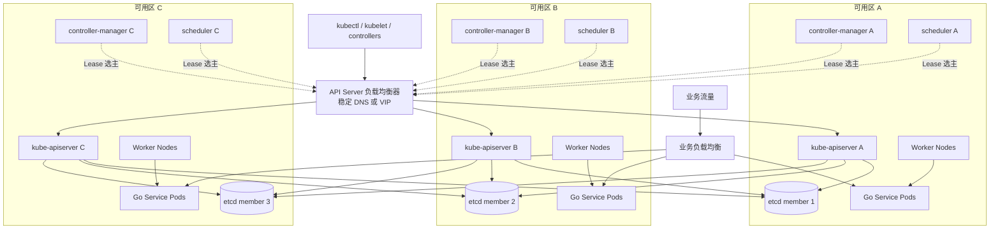
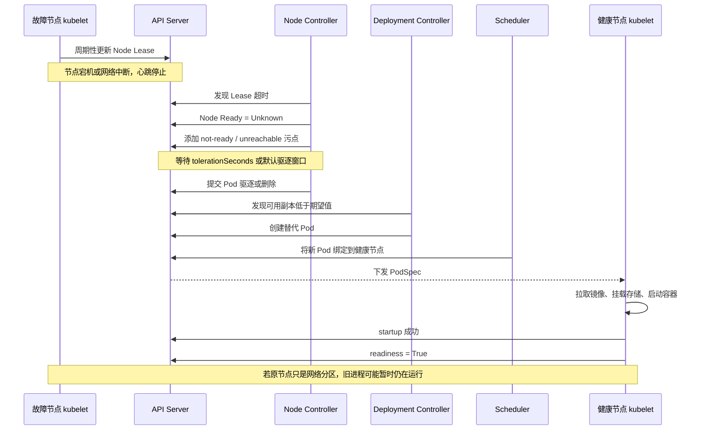
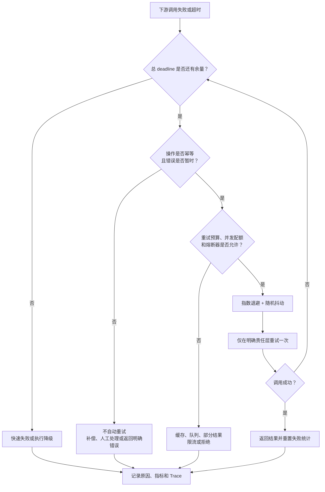

# 第 16 章：Kubernetes 高可用、服务容错与灾难恢复

> 本章按 2026 年 6 月的 Kubernetes v1.36 文档语义编写，示例优先使用稳定 API，不依赖 Alpha 功能。([Kubernetes][1])

---

## 16.1 学习目标

完成本章后，应当能够：

1. 准确区分高可用、可靠性、容错、弹性与灾难恢复。
2. 从进程、Pod、节点、可用区、地域和外部依赖识别故障域。
3. 解释 Kubernetes 控制面多副本、API Server 负载均衡和 Leader Election。
4. 计算 etcd quorum，并解释为什么通常采用 3 个或 5 个成员。
5. 描述从节点失联到 Pod 重建、重新就绪的完整过程。
6. 正确使用 Deployment、拓扑分布、反亲和性和 PDB。
7. 区分 startup、readiness、liveness probe 的职责边界。
8. 在 Go 服务中实现超时、有限重试、抖动、熔断与优雅退出。
9. 解释脑裂、fencing、CAP、强一致与最终一致。
10. 使用 RTO、RPO 设计备份、恢复和跨地域灾备方案。
11. 说明为什么 StatefulSet 本身不能保证数据高可用。
12. 设计一个跨三个可用区运行的高可用 Go 服务。

---

## 16.2 核心术语

| 术语                 | 含义                      | 关注点            |
| ------------------ | ----------------------- | -------------- |
| 高可用，HA             | 在部分组件失效时，系统仍能继续提供可接受的服务 | 冗余、故障转移、减少停机   |
| 可靠性，Reliability    | 系统在一段时间内持续正确工作的能力       | 正确性、稳定性、故障率    |
| 容错，Fault Tolerance | 系统能够承受特定故障而不丢失关键功能      | 故障隔离、冗余、降级     |
| 弹性，Resilience      | 系统在故障、过载或扰动后吸收冲击并恢复的能力  | 限流、背压、恢复速度     |
| 灾难恢复，DR            | 大规模故障后恢复系统和数据的能力        | RTO、RPO、备份、切换  |
| 故障域                | 可能被同一故障同时影响的一组资源        | 节点、机架、可用区、地域   |
| 爆炸半径               | 一次故障能够影响的最大范围           | 租户、服务、集群、地域    |
| 单点故障，SPOF          | 某组件失效即可导致系统整体不可用        | DNS、LB、数据库、证书等 |
| Quorum             | 分布式系统做出有效决策所需的多数派       | 一致性、可用性、网络分区   |
| 脑裂                 | 多个实例同时认为自己拥有唯一领导权       | 重复执行、数据冲突      |
| Fencing            | 阻止旧领导者继续修改共享资源的机制       | 单调递增令牌、存储端校验   |
| RTO                | 故障发生后允许的最长恢复时间          | 恢复速度           |
| RPO                | 恢复后允许丢失的最大数据时间窗口        | 数据损失           |
| 降级                 | 在资源或依赖不足时主动减少非核心能力      | 保住核心链路         |
| 隔离舱，Bulkhead       | 为不同依赖或请求类型分配独立资源配额      | 防止资源池被单一故障耗尽   |

---

## 16.3 高可用不是“永不故障”

高可用系统的目标不是消灭故障，而是：

> **让故障发生时，用户影响范围更小、持续时间更短、数据损失在可接受范围内。**

系统可用率可以粗略表示为：

[
Availability = \frac{MTBF}{MTBF + MTTR}
]

其中：

* MTBF：平均故障间隔。
* MTTR：平均恢复时间。

在大多数生产系统中，降低 MTTR 往往比无限提高 MTBF 更现实。自动检测、故障转移、回滚、降级和恢复演练，都是降低 MTTR 的手段。

以 30 天为统计周期：

| 可用率     |   最大不可用时间 |
| ------- | --------: |
| 99.9%   | 43 分 12 秒 |
| 99.95%  | 21 分 36 秒 |
| 99.99%  |  4 分 19 秒 |
| 99.999% |    约 26 秒 |

这些时间不能直接全部分配给 Kubernetes。网络、数据库、应用发布、外部依赖和人为操作都会消耗错误预算。

### 16.3.1 高可用、容错、灾备、可靠性和弹性的区别

| 概念   | 典型问题             | 示例                 |
| ---- | ---------------- | ------------------ |
| 高可用  | 一个实例宕机后还能不能服务    | 6 个 Pod 分布在 3 个可用区 |
| 容错   | 某类故障发生时是否仍保持关键功能 | 缓存故障时回源数据库         |
| 可靠性  | 返回结果是否长期正确、稳定    | 不重复扣款、不丢订单         |
| 弹性   | 流量突增或依赖变慢时会不会雪崩  | 限流、队列、熔断、降级        |
| 灾难恢复 | 整个集群或地域损毁后如何恢复   | 异地备份、备用集群、DNS 切换   |

一个系统可能“高可用但不可靠”。例如，接口始终返回 HTTP 200，但返回的数据错误。

也可能“可靠但不高可用”。例如，单机数据库结果始终正确，但机器故障后服务停止数小时。

---

## 16.4 单点故障、故障域与爆炸半径

### 16.4.1 常见故障域

生产系统至少应分析以下层级：

| 层级     | 常见故障                  |
| ------ | --------------------- |
| 进程     | panic、死锁、内存泄漏         |
| 容器     | OOMKilled、镜像错误、运行时异常  |
| Pod    | 探针失败、配置错误、Volume 挂载失败 |
| 节点     | 内核崩溃、磁盘损坏、网络中断        |
| 机架或交换机 | 电源、ToR 交换机故障          |
| 可用区    | 电力、网络、云平台局部故障         |
| 地域     | 大范围网络、控制系统或自然灾害       |
| 集群     | 控制面、CNI、DNS、证书、错误策略   |
| 依赖     | 数据库、缓存、消息队列、第三方 API   |
| 变更     | 错误镜像、错误配置、错误数据库迁移     |
| 组织     | 凭据误删、错误自动化、权限滥用       |

### 16.4.2 冗余只有在故障独立时才有意义

下面这些配置看似有冗余，实际上仍存在相关故障：

* 3 个 Pod 全部运行在同一节点。
* 3 个节点全部位于同一可用区。
* 3 个数据库副本使用同一个底层存储阵列。
* 主备服务使用相同错误配置。
* 两个集群依赖同一个 DNS、镜像仓库或 KMS。
* 多个副本使用同一张即将过期的证书。
* 多地域系统由同一错误流水线同时发布。

因此，高可用设计的核心不是简单“加副本”，而是：

1. 找出故障域。
2. 将副本分散到独立故障域。
3. 控制变更和流量的爆炸半径。
4. 验证故障转移确实生效。

---

## 16.5 高可用 Kubernetes 集群架构



Kubernetes 官方建议在高可用要求较高时，将控制面副本分布到至少三个故障区。Kubernetes 本身不会自动提供跨可用区的 API Server 入口高可用，因此仍需要具备健康检查能力的外部负载均衡、VIP 或等效方案。([Kubernetes][2])

### 16.5.1 kube-apiserver：多实例主动服务

`kube-apiserver` 的权威状态保存在 etcd 中。多个 API Server 实例可以同时接受请求，通常通过负载均衡器暴露统一入口。

负载均衡器应关注：

* API Server 是否存活。
* API Server 是否已经具备处理请求的条件。
* TLS 证书和 SAN 是否覆盖稳定入口。
* 后端连接超时和故障摘除时间。
* 负载均衡器自身是否为单点。
* DNS、VIP 或云负载均衡控制面是否可用。

不要只检查 TCP 6443 端口是否打开。进程能够接受 TCP 连接，不代表其已经能够访问 etcd 或完成必要初始化。

### 16.5.2 controller-manager 与 scheduler：多副本、单领导者

`kube-controller-manager` 和 `kube-scheduler` 通常运行多个实例，但同一时刻由一个实例承担主要工作，其余实例处于等待状态。

Kubernetes 使用 `coordination.k8s.io` API 组中的 Lease 对象完成控制面组件选主。Lease 也被用于节点心跳。([Kubernetes][3])

其基本过程是：

1. 候选实例尝试获得 Lease。
2. 当前领导者周期性续约。
3. 其他实例观察 Lease 是否持续更新。
4. 领导者无法续约并超过租约期限后，其他实例竞争接管。
5. 新领导者继续执行控制循环。

这意味着：

* Leader Election 解决的是“谁负责执行”。
* 它不会让单个控制循环同时并行执行，从而提高吞吐量。
* 领导者切换需要等待租约失效，因此不是瞬时完成。
* 租约时间太短会因 API 延迟或短暂抖动频繁切主。
* 租约时间太长会增加故障转移时间。

---

## 16.6 控制面拓扑：堆叠 etcd 与外置 etcd

kubeadm 支持两类常见高可用拓扑。([Kubernetes][4])

### 16.6.1 堆叠拓扑

控制面组件和 etcd 成员运行在同一组节点上。

| 优点           | 缺点                             |
| ------------ | ------------------------------ |
| 节点数量少        | 单节点故障同时损失 API Server 和 etcd 成员 |
| 部署和证书管理较简单   | 故障相关性更强                        |
| 适合中小规模自建集群   | 控制面和存储争用资源                     |
| kubeadm 默认方式 | 运维操作更容易同时影响两层                  |

至少应使用 3 个控制面节点，并分布到独立故障域。

### 16.6.2 外置 etcd 拓扑

控制面节点和 etcd 节点分别部署。

| 优点               | 缺点                         |
| ---------------- | -------------------------- |
| 控制面故障和 etcd 故障解耦 | 至少需要 3 个控制面节点和 3 个 etcd 节点 |
| 可独立分配磁盘和性能资源     | 证书、网络、监控更复杂                |
| 故障相关性较低          | 运维成本更高                     |
| 更便于严格控制 etcd 访问  | 跨节点通信链路更多                  |

外置 etcd 并不天然“更安全”或“更可用”。如果团队缺乏 etcd 运维能力，额外复杂度本身也可能成为故障来源。

---

## 16.7 etcd、Raft 与多数派

### 16.7.1 为什么需要 quorum

etcd 使用 Raft 类一致性机制复制日志。写入只有被多数派成员确认后，才能被视为已提交。

对于 (N) 个成员：

[
quorum = \left\lfloor \frac{N}{2} \right\rfloor + 1
]

| 成员数 | 多数派 | 可容忍永久故障数 |
| --: | --: | -------: |
|   1 |   1 |        0 |
|   2 |   2 |        0 |
|   3 |   2 |        1 |
|   4 |   3 |        1 |
|   5 |   3 |        2 |
|   6 |   4 |        2 |
|   7 |   4 |        3 |

偶数成员通常不会比前一个奇数成员带来更多容错能力。例如：

* 3 个成员可以容忍 1 个故障。
* 4 个成员仍然只能容忍 1 个故障。
* 5 个成员可以容忍 2 个故障。

因此，etcd 通常采用 3 个或 5 个成员。etcd 官方也建议使用奇数成员，以较少节点获得相同故障容忍度。([etcd][5])

### 16.7.2 网络分区时发生什么

假设 3 个 etcd 成员被分成：

* 分区 A：2 个成员。
* 分区 B：1 个成员。

分区 A 拥有多数派，可以继续提交写入。

分区 B 无法形成多数派，必须拒绝需要一致性的更新。它不能自行选出一个可提交写入的新领导者。

这是一种典型取舍：

> 宁可让少数派暂时不可写，也不能让两个分区分别接受冲突写入。

### 16.7.3 etcd 数量不是越多越好

增加成员会增加：

* 日志复制数量。
* 跨可用区网络通信。
* 写入确认延迟。
* 磁盘抖动和慢成员风险。
* 升级、证书轮换和成员管理成本。

大多数集群使用 3 个成员即可。只有在明确需要容忍两个成员同时故障，并且网络与磁盘条件满足时，才考虑 5 个成员。

### 16.7.4 etcd 的生产要求

重点关注：

* 使用低延迟、稳定的持久化磁盘。
* 控制磁盘 fsync 延迟。
* 避免和高 IO 工作负载争用磁盘。
* 使用成员间 TLS 和客户端 TLS。
* 限制只有 API Server 和必要运维主体能够访问 etcd。
* 监控 leader 变化、提交延迟、数据库大小和告警状态。
* 定期压缩和碎片整理，但不要在高峰期无计划执行。
* 逐个成员升级，始终保持 quorum。

访问 etcd 相当于拥有集群中大部分 API 数据的高权限，生产环境应严格限制访问。([Kubernetes][6])

---

## 16.8 为什么 etcd 多副本仍然需要备份

多副本解决的是部分机器、磁盘或进程故障，不解决以下问题：

* 用户误删 Namespace。
* 自动化程序批量删除资源。
* 错误控制器写入错误状态。
* 所有成员同时遭遇软件缺陷。
* 错误数据被正常复制到每个成员。
* 勒索软件或高权限主体破坏所有副本。
* 整个地域丢失。
* 操作人员错误重建集群。
* 需要恢复到过去某个时间点。

复制回答的是：

> 当前状态如何在多个成员间保持一致？

备份回答的是：

> 如何恢复到过去某个可信状态？

### 16.8.1 快照示例

```bash
ETCDCTL_API=3 etcdctl \
  --endpoints=https://127.0.0.1:2379 \
  --cacert=/etc/kubernetes/pki/etcd/ca.crt \
  --cert=/etc/kubernetes/pki/etcd/healthcheck-client.crt \
  --key=/etc/kubernetes/pki/etcd/healthcheck-client.key \
  snapshot save /backup/etcd-20260622.db
```

检查快照：

```bash
etcdutl snapshot status /backup/etcd-20260622.db -w table
```

恢复到新数据目录：

```bash
etcdutl snapshot restore /backup/etcd-20260622.db \
  --data-dir=/var/lib/etcd-restored
```

etcd 官方恢复流程要求从快照创建新的逻辑集群；恢复过程会生成新的成员与集群标识。复制正在运行的数据文件可能遗漏仍位于 WAL、尚未写入快照数据库的数据，因此优先使用正式快照命令。([etcd][7])

### 16.8.2 有效备份的最低标准

一个备份只有同时满足以下条件才有价值：

1. **可发现**：知道最新成功备份在哪里。
2. **可读取**：文件未损坏，密钥仍然可用。
3. **相互隔离**：备份不与生产环境共享同一故障域。
4. **不可轻易篡改**：具备对象版本、保留策略或不可变能力。
5. **有明确 RPO**：备份频率与业务目标一致。
6. **可恢复**：已经在隔离环境中完成恢复测试。
7. **可验证**：恢复后能够检查关键对象和业务状态。
8. **有运行手册**：不依赖某位工程师的个人记忆。

---

## 16.9 从节点故障到 Pod 重建

Kubernetes 节点会通过 Node 状态和 `kube-node-lease` Namespace 中的 Lease 对象发送心跳。节点控制器发现节点不可达后，会将其 `Ready` 状态更新为 `Unknown`，添加相应污点，并在满足驱逐条件后处理节点上的 Pod。当前官方默认行为中，从节点被标记为 `Unknown` 到首次提交驱逐请求之间通常存在约 5 分钟等待；发行版或集群管理员可以调整相关参数。([Kubernetes][8])



### 16.9.1 实际恢复时间由多个阶段组成

[
RTO_{Pod} \approx T_{detect} + T_{evict} + T_{schedule} +
T_{image} + T_{volume} + T_{startup} + T_{ready}
]

仅仅把 Deployment 设置为 3 个副本，并不能保证几秒内恢复。恢复可能受以下因素影响：

* 节点失联检测时间。
* Pod 的 `tolerationSeconds`。
* 健康节点是否有足够资源。
* Cluster Autoscaler 是否需要新建节点。
* 镜像是否已经缓存。
* 镜像仓库是否可用。
* PVC 是否能够跨节点或跨可用区重新挂载。
* 存储卷是否仍被旧节点占用。
* 应用启动和数据预热时间。
* readiness probe 成功所需时间。
* DNS、Service、EndpointSlice 和负载均衡传播时间。

### 16.9.2 为什么不能盲目缩短驱逐时间

较短的失联驱逐时间能够更快重建 Pod，但也增加误判风险。

例如，节点与控制面发生 30 秒网络抖动：

* 节点上的业务进程可能仍在服务。
* 控制面若过早在其他节点创建替代实例，可能出现双实例。
* 对无状态 HTTP 服务通常问题不大。
* 对单写者数据库、定时任务或外部设备控制程序，可能造成重复写入和脑裂。

因此，驱逐时间必须结合以下因素决定：

* 业务是否无状态。
* 操作是否幂等。
* 是否有存储 fencing。
* 网络抖动特征。
* 可接受的 RTO。
* 是否允许短时间双运行。

---

## 16.10 多副本不等于高可用

假设 Deployment 有 6 个副本，但调度结果如下：

```text
node-a:
  pod-1
  pod-2
  pod-3
  pod-4
  pod-5
  pod-6
```

虽然副本数是 6，`node-a` 仍然是单点。

真正的高可用配置要同时考虑：

* 副本数量。
* 节点分布。
* 可用区分布。
* 容量预留。
* 应用启动时间。
* 依赖和数据层高可用。
* 负载均衡。
* 滚动发布策略。
* 自愿中断预算。
* 故障恢复验证。

---

## 16.11 Pod Anti-Affinity 与 Topology Spread

### 16.11.1 Pod Anti-Affinity

反亲和性表示：某些 Pod 不应运行在同一拓扑域。

硬反亲和性：

```yaml
requiredDuringSchedulingIgnoredDuringExecution
```

如果无法满足，Pod 将保持 Pending。

软反亲和性：

```yaml
preferredDuringSchedulingIgnoredDuringExecution
```

调度器会尽量满足，但容量不足时仍可调度。

### 16.11.2 Topology Spread Constraints

Topology Spread Constraints 可以控制 Pod 在节点、可用区、地域或自定义拓扑域之间的偏斜程度。`maxSkew` 表示不同拓扑域中匹配 Pod 数量允许的最大差异。([Kubernetes][9])

| 能力    | Anti-Affinity | Topology Spread  |
| ----- | ------------- | ---------------- |
| 目标    | 避免共置          | 控制整体分布均衡         |
| 表达方式  | 与其他 Pod 的亲和关系 | 各拓扑域之间的数量偏斜      |
| 大规模调度 | 复杂规则可能开销较高    | 更适合表达均匀分布        |
| 硬约束   | required      | `DoNotSchedule`  |
| 软约束   | preferred     | `ScheduleAnyway` |
| 典型用途  | 同类副本不要同节点     | 每个可用区尽量数量接近      |

实践中可以：

* 用 Topology Spread 控制可用区均衡。
* 用软反亲和性尽量避免同节点。
* 不要叠加过多互相冲突的硬约束。
* 确保集群容量能够满足约束。

### 16.11.3 生产级 Deployment 示例

```yaml
apiVersion: apps/v1
kind: Deployment
metadata:
  name: checkout
spec:
  replicas: 6
  minReadySeconds: 10
  progressDeadlineSeconds: 600

  strategy:
    type: RollingUpdate
    rollingUpdate:
      maxUnavailable: 0
      maxSurge: 1

  selector:
    matchLabels:
      app: checkout

  template:
    metadata:
      labels:
        app: checkout
        version: v1

    spec:
      terminationGracePeriodSeconds: 40

      topologySpreadConstraints:
        - maxSkew: 1
          topologyKey: topology.kubernetes.io/zone
          whenUnsatisfiable: DoNotSchedule
          labelSelector:
            matchLabels:
              app: checkout

        - maxSkew: 1
          topologyKey: kubernetes.io/hostname
          whenUnsatisfiable: ScheduleAnyway
          labelSelector:
            matchLabels:
              app: checkout

      affinity:
        podAntiAffinity:
          preferredDuringSchedulingIgnoredDuringExecution:
            - weight: 100
              podAffinityTerm:
                topologyKey: kubernetes.io/hostname
                labelSelector:
                  matchLabels:
                    app: checkout

      containers:
        - name: checkout
          image: registry.example.com/checkout:v1.8.0

          ports:
            - name: http
              containerPort: 8080

          resources:
            requests:
              cpu: 250m
              memory: 256Mi
            limits:
              memory: 512Mi

          lifecycle:
            preStop:
              httpGet:
                path: /prepare-shutdown
                port: http

          startupProbe:
            httpGet:
              path: /livez
              port: http
            periodSeconds: 2
            failureThreshold: 30

          readinessProbe:
            httpGet:
              path: /readyz
              port: http
            periodSeconds: 3
            timeoutSeconds: 1
            failureThreshold: 2

          livenessProbe:
            httpGet:
              path: /livez
              port: http
            periodSeconds: 10
            timeoutSeconds: 1
            failureThreshold: 3

---
apiVersion: v1
kind: Service
metadata:
  name: checkout
spec:
  selector:
    app: checkout
  ports:
    - name: http
      port: 80
      targetPort: http

---
apiVersion: policy/v1
kind: PodDisruptionBudget
metadata:
  name: checkout
spec:
  maxUnavailable: 1
  unhealthyPodEvictionPolicy: AlwaysAllow
  selector:
    matchLabels:
      app: checkout
```

这里的关键取舍是：

* 可用区分布采用硬约束，优先避免所有副本落在少数可用区。
* 节点分布采用软约束，避免容量不足时所有 Pod 都无法调度。
* `maxUnavailable: 0` 控制 Deployment 自身滚动更新。
* PDB 控制使用 Eviction API 的自愿中断。
* `terminationGracePeriodSeconds` 必须覆盖摘流、传播和连接排空时间。

---

## 16.12 PDB 的能力边界

PodDisruptionBudget 限制的是**自愿中断**期间可以同时不可用的 Pod 数量，例如：

* `kubectl drain`。
* 节点维护。
* 某些集群升级。
* 使用 Eviction API 的操作。

PDB 不会阻止：

* 节点突然断电。
* 内核崩溃。
* Pod OOMKilled。
* 容器进程崩溃。
* 可用区故障。
* 直接删除 Pod。
* Deployment 自身按照更新策略替换 Pod。
* 错误配置导致全部 Pod readiness 失败。

官方文档明确指出，PDB 只能保护自愿驱逐，不能保证指定数量的 Pod 始终处于运行状态。([Kubernetes][10])

### 16.12.1 `minAvailable` 与 `maxUnavailable`

```yaml
spec:
  minAvailable: 5
```

表示驱逐后至少保留 5 个健康 Pod。

```yaml
spec:
  maxUnavailable: 1
```

表示最多允许 1 个 Pod 不可用。

对于由同一个 Deployment 或 StatefulSet 管理、可能动态伸缩的工作负载，`maxUnavailable` 往往更容易随期望副本数变化。

### 16.12.2 PDB 可能阻塞节点维护

以下配置表示不允许任何自愿驱逐：

```yaml
maxUnavailable: 0
```

或者：

```yaml
minAvailable: "100%"
```

如果节点上存在受该 PDB 保护的 Pod，`kubectl drain` 可能一直无法完成。

因此，PDB 是应用所有者与集群运维者之间的可用性契约，而不是“数值越严格越好”。

### 16.12.3 不健康 Pod 的驱逐策略

`unhealthyPodEvictionPolicy` 已在 Kubernetes v1.31 稳定。

* `IfHealthyBudget`：默认策略，不健康 Pod 也可能阻塞驱逐。
* `AlwaysAllow`：允许驱逐未就绪的运行中 Pod，避免 CrashLoopBackOff Pod 长期阻塞 drain。

官方当前建议考虑使用 `AlwaysAllow`，以便节点维护时能够处理异常工作负载。([Kubernetes][10])

---

## 16.13 startup、readiness 与 liveness probe

| 探针        | 回答的问题       | 失败后的动作            |
| --------- | ----------- | ----------------- |
| startup   | 应用是否完成启动    | 持续失败后重启容器         |
| readiness | 当前是否应接收新流量  | 从 Service 就绪后端中移除 |
| liveness  | 应用是否已无法自我恢复 | 重启容器              |

如果配置了 startup probe，在其成功前，Kubernetes 不会开始执行 liveness 和 readiness probe。readiness 失败会停止向 Pod 分发 Service 流量；liveness 持续失败则导致 kubelet 重启容器。([Kubernetes][11])

### 16.13.1 startup probe

适用于：

* JVM 或大型 Go 服务预热。
* 加载大型模型。
* 执行启动时迁移或缓存恢复。
* 需要较长时间建立本地索引。

不要通过给 liveness 设置很长的 `initialDelaySeconds` 来替代 startup probe。应用每次重启所需时间可能不同，固定延迟通常过长或过短。

### 16.13.2 readiness probe

readiness 应检查当前实例是否有能力处理新请求，例如：

* 初始化是否完成。
* 本地工作队列是否严重积压。
* 关键连接池是否完全失效。
* 实例是否进入摘流状态。
* 本地必要配置是否可用。

不要无条件把所有远程依赖都加入 readiness。

假设所有 Pod 的 readiness 都同步检查同一数据库：

1. 数据库发生短暂抖动。
2. 所有 Pod 同时 readiness 失败。
3. Service 中没有可用后端。
4. 数据库恢复后，流量同时涌入所有实例。
5. 系统发生二次冲击。

readiness 应表达“这个实例是否适合接收新流量”，而不是简单复制依赖监控。

### 16.13.3 liveness probe

liveness 适合检测实例内部无法自愈的状态，例如：

* 主事件循环永久死锁。
* 关键后台协程停止。
* 内部状态机无法继续推进。

不适合：

* 检查数据库是否可用。
* 检查第三方 API 是否可用。
* 因 CPU 短暂过载而失败。
* 因一次垃圾回收停顿而失败。
* 仅仅检查业务请求是否成功。

错误的 liveness 会把外部依赖故障变成整个应用的重启风暴。

---

## 16.14 优雅退出、连接排空与摘流

Pod 终止并不是简单执行 `kill -9`。正常终止大致包括：

1. Pod 被设置删除时间戳。
2. kubelet 开始终止流程。
3. EndpointSlice 和代理开始更新后端状态。
4. 执行 `preStop`。
5. 向容器主进程发送终止信号。
6. 应用停止接收新请求并处理存量请求。
7. 宽限期到期后，仍未退出的进程被强制终止。

EndpointSlice 更新、kube-proxy、Ingress、服务网格和外部负载均衡传播与容器终止是并发过程，不能假设“后端已经在所有地方完全摘除后才收到 SIGTERM”。Kubernetes 官方也专门提供了 Pod 终止与 Endpoint 状态变化的连接排空说明。([Kubernetes][12])

`preStop` 执行时间包含在整个 Pod 终止宽限期内，而不是额外赠送的时间。`preStop` 完成后才会向容器发送终止信号。([Kubernetes][13])

### 16.14.1 终止时间预算

可以按以下方式设计：

[
T_{grace} >
T_{preStop} + T_{propagation} + T_{requestDrain} + T_{cleanup} + margin
]

例如：

| 阶段                              |   预算 |
| ------------------------------- | ---: |
| readiness 变为失败                  |   立即 |
| 代理和负载均衡传播                       |  5 秒 |
| HTTP 请求排空                       | 20 秒 |
| 清理资源                            |  5 秒 |
| 安全余量                            | 10 秒 |
| `terminationGracePeriodSeconds` | 40 秒 |

这些数值必须通过实际环境测量，而不是机械复制。

### 16.14.2 Go HTTP 服务优雅退出

```go
package main

import (
	"context"
	"errors"
	"log"
	"net/http"
	"os/signal"
	"sync/atomic"
	"syscall"
	"time"
)

func main() {
	var ready atomic.Bool

	mux := http.NewServeMux()

	mux.HandleFunc("/livez", func(w http.ResponseWriter, _ *http.Request) {
		w.WriteHeader(http.StatusOK)
	})

	mux.HandleFunc("/readyz", func(w http.ResponseWriter, _ *http.Request) {
		if !ready.Load() {
			http.Error(w, "not ready", http.StatusServiceUnavailable)
			return
		}
		w.WriteHeader(http.StatusOK)
	})

	// 供 preStop 调用。重复调用也安全。
	mux.HandleFunc("/prepare-shutdown", func(w http.ResponseWriter, _ *http.Request) {
		ready.Store(false)
		w.WriteHeader(http.StatusOK)
	})

	mux.HandleFunc("/", func(w http.ResponseWriter, _ *http.Request) {
		_, _ = w.Write([]byte("ok\n"))
	})

	srv := &http.Server{
		Addr:              ":8080",
		Handler:           mux,
		ReadHeaderTimeout: 2 * time.Second,
		ReadTimeout:       5 * time.Second,
		WriteTimeout:      10 * time.Second,
		IdleTimeout:       60 * time.Second,
	}

	rootCtx, stop := signal.NotifyContext(
		context.Background(),
		syscall.SIGINT,
		syscall.SIGTERM,
	)
	defer stop()

	errCh := make(chan error, 1)
	go func() {
		ready.Store(true)
		errCh <- srv.ListenAndServe()
	}()

	select {
	case err := <-errCh:
		if err != nil && !errors.Is(err, http.ErrServerClosed) {
			log.Fatalf("serve: %v", err)
		}
		return

	case <-rootCtx.Done():
	}

	// 即使 preStop 未成功执行，信号处理仍会摘流。
	ready.Store(false)

	// 为 EndpointSlice、代理和外部 LB 的传播预留时间。
	// 应根据生产测量结果调整。
	time.Sleep(5 * time.Second)

	shutdownCtx, cancel := context.WithTimeout(
		context.Background(),
		20*time.Second,
	)
	defer cancel()

	if err := srv.Shutdown(shutdownCtx); err != nil {
		log.Printf("graceful shutdown failed: %v", err)
		_ = srv.Close()
	}
}
```

`http.Server.Shutdown` 会停止接受新连接，并等待活跃连接结束，但 WebSocket、劫持连接和某些长连接需要应用单独跟踪和关闭。([Go Packages][14])

### 16.14.3 常见错误

* 容器使用 Shell 作为 PID 1，却不转发信号。
* 退出时立即关闭进程，没有摘流。
* readiness 与 liveness 使用同一复杂检查。
* `preStop` 睡眠时间超过宽限期。
* 将宽限期设置得很长，但应用完全不处理 SIGTERM。
* 后台消费者退出前没有停止拉取新消息。
* 连接排空期间仍接受新的异步任务。
* 忽略 WebSocket、SSE、gRPC stream 等长连接。

---

## 16.15 超时：容错的第一道边界

没有超时的调用，故障不会结束，只会转化为资源占用。

一个下游请求长期卡住，会占用：

* goroutine。
* TCP 连接。
* HTTP Transport 连接槽。
* 数据库连接。
* 内存中的请求上下文。
* 上游客户端连接。
* 整条链路的并发预算。

### 16.15.1 端到端超时预算

假设入口请求总预算为 800 毫秒：

| 阶段     |     预算 |
| ------ | -----: |
| 网关与排队  |  50 ms |
| 服务自身计算 | 100 ms |
| 数据库    | 250 ms |
| 下游服务   | 250 ms |
| 序列化与返回 |  50 ms |
| 安全余量   | 100 ms |

不能让每个下游都设置 800 毫秒超时，否则串行调用可能远超入口 deadline。

Go 中应让 `context.Context` 贯穿整条调用链：

```go
ctx, cancel := context.WithTimeout(parentCtx, 250*time.Millisecond)
defer cancel()

req, err := http.NewRequestWithContext(ctx, http.MethodGet, url, nil)
```

但要注意：

> `context` 只能通知支持取消的操作。一个完全忽略 `ctx.Done()` 的阻塞函数不会被强制终止。

---

## 16.16 重试、指数退避与抖动

### 16.16.1 什么时候可以重试

同时满足以下条件时才考虑重试：

1. 错误是暂时性的。
2. 请求具有幂等性，或有可靠幂等键。
3. 总 deadline 仍有剩余。
4. 当前层拥有重试责任。
5. 重试预算尚未耗尽。
6. 下游没有明确要求停止重试。
7. 熔断器没有打开。

常见可重试错误：

* 连接建立失败。
* 短暂网络错误。
* HTTP 408、429、502、503、504。
* 明确表示未处理请求的临时错误。
* 乐观锁冲突，但必须重新读取状态后重算。

通常不应重试：

* 参数校验失败。
* 权限错误。
* 资源永久不存在。
* 非幂等写入且没有幂等键。
* 业务余额不足。
* 已知版本不兼容。
* 下游持续过载且没有退避空间。

### 16.16.2 为什么要指数退避

固定间隔重试会导致大量客户端保持同步：

```text
故障发生
  10000 个请求同时失败
1 秒后
  10000 个请求同时重试
2 秒后
  再次同时重试
```

指数退避使重试间隔逐渐增大：

[
delay_n = min(maxDelay, baseDelay \times 2^n)
]

仍然必须加入随机抖动，否则客户端的重试时间仍然高度同步。

Full Jitter 可以表示为：

[
sleep_n = random(0, delay_n)
]

### 16.16.3 Go 重试示例

下面示例使用 Go 1.22 及以上标准库中的 `math/rand/v2`：

```go
package retry

import (
	"context"
	"errors"
	"fmt"
	"io"
	"math/rand/v2"
	"net/http"
	"time"
)

type Config struct {
	MaxAttempts    int
	AttemptTimeout time.Duration
	BaseDelay      time.Duration
	MaxDelay       time.Duration
}

func Call(
	ctx context.Context,
	client *http.Client,
	newRequest func(context.Context) (*http.Request, error),
	cfg Config,
) error {
	var lastErr error

	for attempt := 1; attempt <= cfg.MaxAttempts; attempt++ {
		if err := ctx.Err(); err != nil {
			return err
		}

		attemptCtx, cancel := context.WithTimeout(
			ctx,
			cfg.AttemptTimeout,
		)

		req, err := newRequest(attemptCtx)
		if err != nil {
			cancel()
			return err
		}

		resp, err := client.Do(req)
		if err == nil {
			_, readErr := io.Copy(
				io.Discard,
				io.LimitReader(resp.Body, 1<<20),
			)
			closeErr := resp.Body.Close()
			cancel()

			switch {
			case readErr != nil:
				err = readErr

			case closeErr != nil:
				err = closeErr

			case resp.StatusCode >= 200 && resp.StatusCode < 300:
				return nil

			case !retryableStatus(resp.StatusCode):
				return fmt.Errorf(
					"non-retryable HTTP status: %d",
					resp.StatusCode,
				)

			default:
				err = fmt.Errorf(
					"retryable HTTP status: %d",
					resp.StatusCode,
				)
			}
		} else {
			cancel()
		}

		if errors.Is(err, context.Canceled) && ctx.Err() != nil {
			return ctx.Err()
		}

		lastErr = err
		if attempt == cfg.MaxAttempts {
			break
		}

		capDelay := cfg.BaseDelay << (attempt - 1)
		if capDelay > cfg.MaxDelay || capDelay <= 0 {
			capDelay = cfg.MaxDelay
		}

		delay := time.Duration(
			rand.Int64N(int64(capDelay) + 1),
		)

		timer := time.NewTimer(delay)
		select {
		case <-ctx.Done():
			if !timer.Stop() {
				<-timer.C
			}
			return ctx.Err()

		case <-timer.C:
		}
	}

	return fmt.Errorf(
		"dependency failed after %d attempts: %w",
		cfg.MaxAttempts,
		lastErr,
	)
}

func retryableStatus(code int) bool {
	switch code {
	case http.StatusRequestTimeout,
		http.StatusTooManyRequests,
		http.StatusInternalServerError,
		http.StatusBadGateway,
		http.StatusServiceUnavailable,
		http.StatusGatewayTimeout:
		return true

	default:
		return false
	}
}
```

生产实现还应加入：

* 配置参数合法性检查。
* `Retry-After` 处理。
* 幂等键。
* 每个依赖独立指标。
* 进程级重试预算。
* 对响应体大小的严格限制。
* 对可重试错误进行明确分类。

---

## 16.17 重试为什么会放大故障

假设有三层调用：

```text
前端 -> 订单服务 -> 库存服务 -> 数据库
```

如果每一层都执行“初始调用加 3 次重试”，则每层最多有 4 次尝试。

最坏情况下，一个用户请求可能产生：

[
4 \times 4 \times 4 = 64
]

次数据库尝试。

当数据库本来就因过载而失败时，重试会把压力放大 64 倍。Google SRE 的级联故障指导也强调：应使用随机指数退避、限制单请求重试次数，并避免在调用链多个层级同时重试。([Google SRE][15])

### 16.17.1 控制重试风暴

* 只允许一个明确层级负责重试。
* 共享端到端 deadline。
* 设置最大尝试次数，而不是无限重试。
* 使用指数退避和随机抖动。
* 使用进程级或服务级 retry budget。
* 下游过载时快速失败。
* 对 429 和 503 尊重 `Retry-After`。
* 监控“原始请求数”和“总尝试数”的比值。
* 对写请求使用幂等键。
* 熔断后不要继续向故障依赖发送探测洪水。

---

## 16.18 熔断、隔离舱、限流与降级

### 16.18.1 熔断器

熔断器通常有三个状态：

| 状态        | 行为             |
| --------- | -------------- |
| Closed    | 正常调用，统计失败      |
| Open      | 快速失败，不调用下游     |
| Half-Open | 允许少量探测请求判断是否恢复 |

熔断的目的不是修复下游，而是：

* 阻止持续消耗连接和 goroutine。
* 给下游恢复时间。
* 降低级联故障概率。
* 让上游更快执行降级。

### 16.18.2 简化的 Go 熔断器

```go
package breaker

import (
	"context"
	"errors"
	"sync"
	"time"
)

var ErrOpen = errors.New("circuit breaker is open")

type state uint8

const (
	closed state = iota
	open
	halfOpen
)

type Breaker struct {
	mu            sync.Mutex
	state         state
	failures      int
	threshold     int
	openedAt      time.Time
	cooldown      time.Duration
	probeInFlight bool
}

func New(threshold int, cooldown time.Duration) *Breaker {
	return &Breaker{
		threshold: threshold,
		cooldown:  cooldown,
	}
}

func (b *Breaker) Do(
	ctx context.Context,
	call func(context.Context) error,
) error {
	done, err := b.beforeCall()
	if err != nil {
		return err
	}

	callErr := call(ctx)
	done(callErr)
	return callErr
}

func (b *Breaker) beforeCall() (func(error), error) {
	b.mu.Lock()
	defer b.mu.Unlock()

	switch b.state {
	case open:
		if time.Since(b.openedAt) < b.cooldown {
			return nil, ErrOpen
		}

		b.state = halfOpen
		b.probeInFlight = true

	case halfOpen:
		if b.probeInFlight {
			return nil, ErrOpen
		}
		b.probeInFlight = true
	}

	return b.afterCall, nil
}

func (b *Breaker) afterCall(callErr error) {
	b.mu.Lock()
	defer b.mu.Unlock()

	switch b.state {
	case halfOpen:
		b.probeInFlight = false

		if callErr == nil {
			b.state = closed
			b.failures = 0
			return
		}

		b.state = open
		b.openedAt = time.Now()

	case closed:
		if callErr == nil {
			b.failures = 0
			return
		}

		b.failures++
		if b.failures >= b.threshold {
			b.state = open
			b.openedAt = time.Now()
		}
	}
}
```

该示例展示的是机制，不是完整生产实现。生产环境还需要：

* 滑动时间窗口。
* 失败率而非简单连续失败数。
* 最小样本量。
* 慢调用比例。
* 对错误类型进行分类。
* 指标和状态变化日志。
* 多个半开探测的并发限制。
* 防止状态频繁抖动。

### 16.18.3 隔离舱

即使有熔断，也应限制单个下游能占用的资源。

```go
var paymentSlots = make(chan struct{}, 64)

func withPaymentSlot(ctx context.Context, fn func() error) error {
	select {
	case paymentSlots <- struct{}{}:
		defer func() { <-paymentSlots }()
		return fn()

	case <-ctx.Done():
		return ctx.Err()
	}
}
```

数据库、支付、推荐和搜索不应无条件共享同一个无限并发池。否则推荐服务变慢，也可能耗尽支付链路需要的全部 goroutine 或连接。

### 16.18.4 降级

常见降级策略：

| 故障        | 降级方式          |
| --------- | ------------- |
| 推荐服务不可用   | 返回热门商品        |
| 个性化不可用    | 返回通用页面        |
| 缓存不可用     | 限流后回源，而不是无限回源 |
| 写入依赖暂时不可用 | 写入队列，返回已受理    |
| 报表不可用     | 延迟生成          |
| 非核心字段不可用  | 返回部分结果        |
| 搜索服务过载    | 缩小查询范围或关闭复杂排序 |
| 库存信息不确定   | 禁止最终下单，但允许浏览  |

降级必须满足业务正确性。例如，支付结果不能在不确定时直接返回“支付成功”。

---

## 16.19 多级容错与降级决策



---

## 16.20 Leader Election、租约与脑裂

### 16.20.1 Lease 选主机制

典型参数包括：

* `LeaseDuration`：领导权在没有续约时保持多久。
* `RenewDeadline`：当前领导者允许自己尝试续约的最大时间。
* `RetryPeriod`：候选者尝试获取或续约的间隔。

基本关系通常应满足：

[
LeaseDuration > RenewDeadline > RetryPeriod
]

设计时要在两个目标间平衡：

* 更快故障转移。
* 对 API 延迟、调度暂停和时钟速率差异的容忍。

### 16.20.2 Leader Election 不等于 fencing

一个危险场景：

1. 实例 A 是领导者。
2. A 与 API Server 网络中断，但仍能访问外部数据库。
3. Lease 到期，实例 B 获得领导权。
4. A 尚未意识到自己失去领导权。
5. A 和 B 同时修改外部资源。

`client-go` 的 Leader Election 实现明确说明，它本身不保证任意时刻绝对只有一个客户端在执行领导者操作，也就是不提供 fencing。([GitHub][16])

因此，对关键外部副作用应增加 fencing token。

### 16.20.3 Fencing Token

每次领导权变更时产生单调递增的 epoch：

```text
leader A: epoch = 41
leader B: epoch = 42
```

写入存储时携带 epoch：

```text
UPDATE resource
SET value = ?, epoch = 42
WHERE id = ? AND epoch < 42;
```

如果旧领导者 A 继续使用 epoch 41 写入，存储端拒绝该请求。

Fencing 必须由共享资源端验证。仅在领导者本地检查 Lease 不能阻止失联旧领导者继续产生副作用。

### 16.20.4 领导者任务的额外要求

* 每次执行都应幂等。
* 记录任务唯一标识。
* 支持从中间状态恢复。
* 明确处理重复事件。
* 不依赖进程内存作为唯一进度。
* 领导者切换后重新读取权威状态。
* 对外部写入使用事务、条件更新或 fencing。
* 监控领导者变化频率。

---

## 16.21 CAP、强一致和最终一致

### 16.21.1 CAP 的正确理解

CAP 讨论的是：当网络分区已经发生时，一个分布式系统无法同时保证：

* C：所有客户端观察到一致的最新结果。
* A：每个请求都能得到非错误响应。
* P：系统在网络分区时仍继续运行。

网络分区不是主动选择，因此实际问题是：

> 分区发生后，某项操作优先保持一致性，还是优先保持可用性？

CAP 不是“平时三选二”，也不是“整个系统只能选一种模式”。

一个业务系统可以按操作分别设计：

| 数据或操作  | 典型选择      |
| ------ | --------- |
| 支付记账   | 优先一致性     |
| 库存最终扣减 | 优先一致性和幂等  |
| 商品详情展示 | 可接受最终一致   |
| 推荐结果   | 优先可用性     |
| 点赞数展示  | 可接受短暂滞后   |
| 权限撤销   | 通常需要较强一致性 |
| 日志和分析  | 最终一致      |

### 16.21.2 etcd 的取舍

在多数派丢失时，etcd 无法继续接受需要共识的更新。这是为了避免两个网络分区分别产生冲突的权威状态。etcd 官方说明，失去 quorum 后集群无法继续达成共识并接受更新。([etcd][7])

### 16.21.3 Quorum 读写

在一些副本系统中，可用以下符号理解：

* (N)：副本总数。
* (W)：写成功所需确认数。
* (R)：读成功所需副本数。

当：

[
W + R > N
]

读集合和成功写集合至少有一个交集，从而有机会读到最新写入。

但不能把这个公式机械等同于 Raft 的全部语义。实际系统还涉及领导者、日志顺序、租约、版本、冲突处理和读一致性模式。

### 16.21.4 一致性越强，代价通常越高

强一致通常意味着：

* 更多跨节点确认。
* 更高尾延迟。
* 分区时拒绝部分请求。
* 更严格的主节点或 quorum 依赖。

最终一致通常意味着：

* 更高可用性。
* 更低同步延迟。
* 客户端可能读到旧数据。
* 需要处理冲突、重复和乱序。

一致性级别必须来自业务正确性要求，而不是架构偏好。

---

## 16.22 StatefulSet 为什么不等于有状态高可用

StatefulSet 提供：

* 稳定 Pod 名称。
* 有序编号。
* 稳定网络身份。
* 与 Pod 身份关联的 PVC。
* 有序创建、删除和滚动更新能力。

官方定义强调的是稳定身份、网络标识和稳定存储，而不是自动提供数据复制或主从切换。([Kubernetes][17])

它不自动提供：

* 数据库复制协议。
* WAL 复制。
* leader 选举。
* quorum。
* 同步或异步复制策略。
* 脑裂防护。
* 数据校验。
* 读写路由。
* 自动故障转移。
* 时间点恢复。
* 备份。
* 跨地域复制。

### 16.22.1 有状态服务高可用所需的完整能力

1. **应用层复制协议**
   例如数据库自身的日志复制或共识机制。

2. **成员发现和选主**
   清楚知道当前写领导者。

3. **Fencing**
   阻止旧主继续写入。

4. **存储拓扑**
   PVC 是否能够在目标节点或可用区挂载。

5. **故障转移策略**
   自动切换还是人工确认。

6. **一致性策略**
   同步复制、异步复制或 quorum 写。

7. **数据备份**
   副本不能代替历史备份。

8. **恢复验证**
   检查数据完整性和业务不变量。

9. **客户端路由**
   读写请求是否被发送到正确成员。

10. **版本兼容**
    滚动升级期间不同版本能否共同运行。

### 16.22.2 存储可用区限制

某个 PVC 可能绑定到可用区 A 的磁盘。

如果 Pod 被调度到可用区 B：

* 磁盘可能无法跨区挂载。
* Pod 会一直 Pending。
* 强制迁移可能产生较长恢复时间。
* 跨区复制通常需要存储系统或数据库自身提供。

因此，“Pod 可以跨区重建”不等于“数据可以跨区恢复”。

---

## 16.23 跨节点、跨可用区与跨地域

| 部署范围 | 主要防护对象 | 延迟与成本 | 典型方式                  |
| ---- | ------ | ----- | --------------------- |
| 跨节点  | 单机故障   | 低     | 多副本、反亲和性              |
| 跨可用区 | 机房级故障  | 中     | Topology Spread、跨区 LB |
| 跨地域  | 地域级灾难  | 高     | 多集群、全局流量管理、异地数据复制     |

Kubernetes 单集群通常适合跨同一地域内的多个可用区。官方资料指出，单集群跨多个可用区是常见架构，而跨地域集群并不常见，因为地域之间通常具有更高延迟、流量成本和更复杂的故障关系。([Kubernetes][18])

### 16.23.1 跨可用区

优点：

* 可承受单可用区故障。
* 可以保持单一控制面和集群 API。
* 网络延迟通常仍在可接受范围。

代价：

* 跨区流量费用。
* 数据库同步写延迟增加。
* 需要预留失去一个可用区后的容量。
* 某些存储卷只能在单区挂载。
* 调度约束更复杂。

### 16.23.2 跨地域

通常采用多个独立 Kubernetes 集群：

```text
Region A:
  Cluster A
  Database A
  Cache A

Region B:
  Cluster B
  Database B
  Cache B
```

再通过：

* 全局负载均衡。
* DNS 或 Anycast。
* 跨地域数据库复制。
* 对象存储复制。
* GitOps 或 IaC 重建。
* 独立镜像仓库或镜像复制。

完成灾备。

不要轻易把 etcd 成员直接拉伸到高延迟地域。Raft 写入需要多数派确认，跨地域延迟和网络抖动会直接影响控制面写入。

### 16.23.3 Active-Active 与 Active-Passive

| 模式                 | 优点           | 难点                     |
| ------------------ | ------------ | ---------------------- |
| Active-Active      | 切换快、资源利用率高   | 数据冲突、全局一致性、流量调度复杂      |
| Active-Passive     | 逻辑较简单、数据冲突较少 | 备用容量成本、切换较慢、容易因长期不用而失效 |
| Pilot Light        | 成本较低         | 故障时仍需扩容和恢复             |
| Backup and Restore | 成本最低         | RTO 和 RPO 通常最大         |

---

## 16.24 数据库迁移、双写与回滚

### 16.24.1 Expand-Contract 模式

安全数据库变更应分阶段完成。

#### 阶段一：Expand

先增加兼容结构：

* 新增可空字段。
* 新增表。
* 新增索引。
* 保留旧字段。
* 新旧版本都能运行。

#### 阶段二：迁移和验证

* 后台回填旧数据。
* 使用限速避免压垮数据库。
* 比较新旧数据。
* 记录迁移进度。
* 支持重复执行。
* 对失败分片重试。

#### 阶段三：切换

* 新版本开始读取新结构。
* 观察错误率和数据一致性。
* 保留回退开关。
* 必要时执行 shadow read。

#### 阶段四：Contract

确认所有旧版本退出后：

* 停止旧字段写入。
* 删除兼容逻辑。
* 最后删除旧列或旧表。

### 16.24.2 为什么不要先删字段再发布代码

滚动发布期间，旧版本和新版本会同时存在。

如果数据库先删除旧字段：

* 旧 Pod 仍会访问旧字段。
* 请求随机落到旧 Pod 时失败。
* 回滚到旧镜像也无法恢复。

因此数据库 Schema 通常要兼容至少当前版本和前一版本。

### 16.24.3 双写的风险

应用分别写数据库 A 和数据库 B：

```text
写 A 成功
进程崩溃
写 B 未执行
```

这会产生不一致。

改进方式包括：

* 单数据库事务内写业务数据和 outbox。
* 后台消费者将 outbox 事件同步到目标系统。
* 事件携带唯一 ID。
* 消费端幂等。
* 使用对账任务发现和修复差异。
* 明确谁是权威数据源。

### 16.24.4 回滚不等于恢复旧数据

代码回滚只能撤销应用版本，不能自动撤销：

* 已执行的数据迁移。
* 已删除字段。
* 已发送消息。
* 已产生的支付或库存副作用。
* 已被新版本写入的数据格式。

因此，数据库变更应优先采用前向修复和兼容迁移，而不是依赖“一键回滚”。

---

## 16.25 RTO、RPO、备份和灾难恢复

### 16.25.1 RTO

RTO 回答：

> 从故障发生开始，业务最长可以停止多久？

例如：

* RTO 5 分钟：5 分钟内必须恢复核心能力。
* RTO 4 小时：允许在 4 小时内完成重建。

### 16.25.2 RPO

RPO 回答：

> 恢复后最多允许丢失多长时间的数据？

例如：

* 每小时备份一次，最坏可能丢失近 1 小时数据。
* 每 5 分钟增量备份，理论 RPO 接近 5 分钟。
* 跨区同步复制可能把部分故障下的 RPO 降到接近 0，但不防误删。

### 16.25.3 RTO 和 RPO 的成本关系

| 目标                  | 可能需要的能力       | 成本 |
| ------------------- | ------------- | -- |
| RTO 24 小时，RPO 24 小时 | 每日备份、人工恢复     | 低  |
| RTO 4 小时，RPO 1 小时   | 自动备份、IaC、恢复脚本 | 中  |
| RTO 30 分钟，RPO 5 分钟  | 持续日志归档、热备环境   | 高  |
| RTO 数分钟，RPO 接近 0    | 多地域复制、自动切流    | 很高 |

RTO、RPO 必须由业务风险决定，而不是由技术团队随意设置。

### 16.25.4 Kubernetes 灾备资产清单

只备份 etcd 不够。完整灾备通常包括：

| 资产                | 恢复方式                        |
| ----------------- | --------------------------- |
| Kubernetes API 对象 | etcd 快照或 GitOps             |
| 工作负载清单            | Git、Helm、Kustomize          |
| 集群基础设施            | Terraform、Cluster API、自动化脚本 |
| PV 数据             | CSI 快照、数据库原生备份              |
| 外部数据库             | 全量备份、增量日志、PITR              |
| 镜像                | 多地域仓库或离线保存                  |
| 证书和 CA            | 安全备份、轮换方案                   |
| KMS 密钥            | 独立备份和恢复权限                   |
| DNS 与负载均衡         | IaC、运行手册                    |
| IAM 和云权限          | IaC、Break Glass 账户          |
| 外部 Secret         | 密钥管理系统备份                    |
| 监控与告警配置           | Git、独立监控平面                  |
| 业务对账数据            | 独立审计和校验记录                   |

### 16.25.5 恢复流程

一个可执行的恢复顺序通常是：

1. 确认故障范围，冻结危险自动化。
2. 决定原地恢复还是新环境重建。
3. 建立隔离恢复环境。
4. 恢复网络、IAM、KMS 和证书。
5. 恢复控制面或创建新集群。
6. 恢复 etcd 或重新部署声明式资源。
7. 恢复数据库和持久卷。
8. 验证数据完整性。
9. 部署应用。
10. 执行只读或影子流量验证。
11. 逐步切换生产流量。
12. 观察错误率、延迟和业务指标。
13. 宣布恢复后继续进行数据对账。
14. 保留故障现场用于复盘。

---

## 16.26 故障场景与应对方案

### 16.26.1 节点故障

| 项目   | 方案                         |
| ---- | -------------------------- |
| 检测   | Node Lease、Node Ready、节点监控 |
| 自动动作 | 污点、驱逐、控制器补副本               |
| 前置条件 | 其他节点有资源                    |
| 风险   | 原节点网络分区后旧进程仍运行             |
| 验证   | Pod 是否跨节点重建、业务错误率是否上升      |

### 16.26.2 可用区故障

| 项目   | 方案                   |
| ---- | -------------------- |
| 工作负载 | Topology Spread、跨区副本 |
| 控制面  | 三可用区控制面和 etcd        |
| 数据   | 跨区复制或多可用区数据库         |
| 容量   | 剩余可用区能够承担全部关键流量      |
| 流量   | LB 自动摘除故障区           |
| 风险   | 跨区容量不足、存储不能迁移        |
| 验证   | 整区断网演练、容量与延迟检查       |

### 16.26.3 网络分区

| 项目   | 方案                |
| ---- | ----------------- |
| 控制面  | etcd 只允许多数派继续提交   |
| 应用选主 | Lease 加 fencing   |
| 写操作  | 幂等键、条件更新、事务       |
| 客户端  | 超时、有限重试、抖动        |
| 风险   | 双领导者、重复副作用        |
| 验证   | 隔离旧主与控制面但保留其数据库连接 |

### 16.26.4 依赖服务故障

| 项目 | 方案            |
| -- | ------------- |
| 边界 | 超时和 deadline  |
| 流量 | 限流、并发隔离       |
| 重试 | 有限、指数退避、抖动    |
| 保护 | 熔断器           |
| 业务 | 缓存、队列、部分结果、降级 |
| 风险 | 重试风暴、缓存击穿     |
| 验证 | 注入高延迟、错误和连接耗尽 |

### 16.26.5 错误发布

| 项目   | 方案            |
| ---- | ------------- |
| 限制范围 | 金丝雀、分批发布      |
| 检测   | 业务指标、错误率、延迟   |
| 停止   | 自动暂停或人工中止     |
| 回退   | 镜像回滚、配置回滚     |
| 数据   | 向前兼容迁移        |
| 风险   | 全集群同时发布同一错误版本 |
| 验证   | 发布前演练、回滚演练    |

---

## 16.27 跨可用区高可用 Go 服务设计

假设设计一个订单查询和创建服务，要求：

* 单节点故障不影响整体服务。
* 单可用区故障时继续处理核心流量。
* 创建订单不能重复扣库存。
* 目标 RTO 为 5 分钟。
* 目标 RPO 接近 0，但允许极端地域故障下少量数据损失。

### 16.27.1 架构

```text
互联网客户端
      |
区域负载均衡器
      |
Kubernetes Service / Gateway
      |
+-------------------------------+
| Zone A: 2 个 Go Pod           |
| Zone B: 2 个 Go Pod           |
| Zone C: 2 个 Go Pod           |
+-------------------------------+
      |
多可用区数据库
      |
Outbox -> 消息系统 -> 下游消费者
```

### 16.27.2 应用层设计

* 6 个无状态 Pod，三个可用区各约 2 个。
* 使用 Topology Spread。
* Pod 具备 startup、readiness 和 liveness probe。
* SIGTERM 时先摘流，再排空连接。
* 入口请求携带订单幂等键。
* 数据库以唯一约束保证同一幂等键只创建一次。
* 业务数据和 outbox 在同一事务中提交。
* 消费者按事件 ID 幂等处理。
* 下游调用有独立超时和并发配额。
* 只在一个明确层级执行有限重试。
* 推荐、画像等非核心依赖可以降级。
* 数据库不可用时拒绝订单创建，不返回虚假成功。

### 16.27.3 Kubernetes 层设计

* `replicas: 6`。
* 可用区 `maxSkew: 1`。
* Deployment `maxUnavailable: 0`、`maxSurge: 1`。
* PDB `maxUnavailable: 1`。
* 至少预留失去一个可用区后的资源。
* 节点池跨可用区。
* 镜像复制到区域内高可用仓库。
* CoreDNS、CNI、入口控制器也要多副本和跨节点。
* 控制面跨三个可用区。
* 监控系统不能与被监控集群完全共故障。

### 16.27.4 数据库层设计

可选择：

* 单写主节点加同步跨区备用节点。
* 多数派共识数据库。
* 云厂商多可用区数据库。

取舍：

| 方案     | 一致性   | 写延迟     | 故障转移      |
| ------ | ----- | ------- | --------- |
| 单区主库   | 强     | 低       | 可用区故障时不可用 |
| 跨区同步复制 | 强     | 较高      | RPO 接近 0  |
| 异步跨区复制 | 最终一致  | 较低      | 可能丢失最近写入  |
| 多主写入   | 取决于协议 | 较高或冲突复杂 | 业务设计最复杂   |

### 16.27.5 可用区故障时

假设 Zone A 整体故障：

1. 区域负载均衡器停止向 Zone A 后端发送流量。
2. Zone A 的两个 Pod 失去服务能力。
3. 剩余四个 Pod 继续服务。
4. Deployment 可能在 Zone B 和 C 创建替代 Pod。
5. 数据库在健康可用区继续保持写服务。
6. 流量增加后，限流和降级保护核心操作。
7. 运维人员验证剩余容量、数据库延迟和错误率。

前提是 B、C 两个可用区有足够资源承载全部关键流量。只做跨区分布却没有预留容量，会在故障后因资源饱和再次失败。

### 16.27.6 成本和一致性取舍

该方案的成本包括：

* 额外 Pod 和节点容量。
* 跨可用区网络费用。
* 数据库同步复制延迟。
* 多副本入口、DNS、监控和消息系统。
* 故障演练和运维自动化投入。

应优先保证：

* 订单创建、支付、库存等正确性。
* 浏览、推荐、统计等非核心能力可降级。
* 不为了表面上的“100% 可用”牺牲数据正确性。

---

## 16.28 故障演练

未经验证的高可用只是架构假设。

### 16.28.1 演练前

* 定义假设：例如“失去一个节点不影响订单创建”。
* 明确停止条件。
* 设置观察指标。
* 确认回滚方法。
* 限制实验爆炸半径。
* 通知相关人员。
* 检查备份和 Break Glass 权限。

### 16.28.2 建议演练场景

1. 删除一个业务 Pod。
2. 关闭一个工作节点。
3. 驱逐受 PDB 保护的 Pod。
4. 让镜像仓库暂时不可用。
5. 向数据库调用注入 500 毫秒延迟。
6. 让缓存返回错误。
7. 隔离 Leader 与 API Server。
8. 中断一个可用区的业务流量。
9. 恢复 etcd 快照到隔离环境。
10. 从零创建备用集群。
11. 使某个错误版本只发布到 5% Pod。
12. 让第三方 API 持续返回 429。
13. 让证书进入即将过期状态。
14. 验证 DNS 故障时的表现。
15. 执行数据库时间点恢复。

### 16.28.3 演练应验证什么

* 故障是否在预期时间内被发现。
* 告警是否准确。
* 自动恢复是否真正发生。
* 用户错误率是否符合 SLO。
* 是否出现重试风暴。
* 是否发生流量集中。
* 剩余容量是否足够。
* PDB 是否阻塞维护。
* 旧领导者是否仍能执行副作用。
* 恢复后数据是否一致。
* 运行手册是否可由非作者执行。

---

## 16.29 高可用关键指标

### 控制面

* API Server 请求成功率和延迟。
* API Server 后端健康实例数。
* etcd leader 变化。
* etcd 提交和 fsync 延迟。
* etcd quorum 健康状态。
* controller-manager 和 scheduler Leader 变化。
* 证书剩余有效期。

### 节点与 Pod

* Node `Ready=False/Unknown` 数量。
* Pod Ready 副本数。
* Pod 重启率。
* Pending Pod 数量和原因。
* 不可调度时间。
* 驱逐数量。
* 镜像拉取时间。
* Volume Attach 和 Mount 延迟。

### 应用容错

* 下游调用超时率。
* 重试总尝试数。
* 每个原始请求的平均尝试次数。
* 熔断器打开次数和持续时间。
* 降级比例。
* 限流和拒绝数量。
* goroutine、连接池和队列饱和度。

### 灾备

* 最新成功备份时间。
* 备份大小异常。
* 快照校验结果。
* 恢复演练距离上次执行的时间。
* 实际恢复耗时。
* 实际恢复点与目标 RPO 的差距。
* 恢复后的业务校验结果。

---

## 16.30 常见错误认知

### 误区一：有三个 Pod 就是高可用

三个 Pod 可能在同一个节点、同一个可用区，并依赖同一个单机数据库。

### 误区二：PDB 可以防节点宕机

PDB 只约束自愿驱逐，不能阻止节点突然故障。

### 误区三：liveness 越严格越好

过于敏感的 liveness 会在负载高峰引发批量重启，加剧故障。

### 误区四：重试一定能提高成功率

在短暂网络故障中可能提高成功率；在下游过载时可能导致级联故障。

### 误区五：Leader Election 可以完全避免脑裂

Lease 选主不提供外部资源 fencing，旧领导者仍可能继续产生副作用。

### 误区六：etcd 有三个副本就不需要备份

错误删除和逻辑破坏会被复制到所有成员。

### 误区七：StatefulSet 会自动复制数据

StatefulSet 管理身份和生命周期，数据复制仍由数据库或应用协议负责。

### 误区八：跨地域就是把一个 Kubernetes 集群拉到两个地域

跨地域延迟、网络分区和 etcd quorum 会使这种方案非常复杂。多数场景更适合独立集群。

### 误区九：备份成功就代表可以恢复

只有完成恢复和业务校验的备份才可信。

### 误区十：容灾只由基础设施团队负责

应用幂等性、数据库兼容、消息重复处理和降级策略都属于容灾设计。

---

## 16.31 面试回答框架

面对高可用设计题，可以按以下顺序回答：

1. **结论**：先说明总体方案。
2. **故障模型**：明确要防哪些故障。
3. **机制**：说明副本、调度、选主和恢复链路。
4. **数据**：说明一致性、备份和 RPO。
5. **应用容错**：说明超时、重试、熔断、幂等和降级。
6. **取舍**：说明成本、延迟和复杂度。
7. **验证**：说明指标、故障演练和恢复测试。

例如：

> 我会将无状态 Go 服务部署为跨三个可用区的多副本 Deployment，使用 Topology Spread 降低相关故障，使用 PDB 约束节点维护，并实现 readiness、优雅摘流和有限重试。数据层使用跨可用区复制和幂等键，etcd 与业务数据均做独立备份。节点故障、可用区故障、网络分区和依赖过载分别通过补副本、容量预留、fencing、熔断和降级处理。最后用故障注入验证实际 RTO 和 RPO，而不是只检查 YAML。

---

## 16.32 章节总结

1. 高可用的本质是控制故障影响范围和恢复时间，而不是避免一切故障。
2. 副本必须分布在独立故障域中，否则冗余价值有限。
3. API Server 可以多实例服务，controller-manager 和 scheduler 通常通过 Lease 选主。
4. etcd 依赖多数派，3 个成员容忍 1 个故障，5 个成员容忍 2 个故障。
5. etcd 多副本不能替代历史备份。
6. 节点失联到 Pod 恢复包含检测、驱逐、调度、启动和就绪等多个阶段。
7. Topology Spread 控制整体分布，Anti-Affinity 控制共置关系。
8. PDB 只保护自愿驱逐，不是 Pod 存活保证。
9. startup、readiness、liveness 的职责不能混淆。
10. 优雅退出必须让应用、EndpointSlice、代理和负载均衡协同摘流。
11. 重试必须受 deadline、幂等性、退避、抖动和预算约束。
12. 熔断、隔离舱和降级用于阻止依赖故障扩散。
13. Lease 选主不等于 fencing，关键外部写入需要防旧领导者。
14. StatefulSet 提供稳定身份，不自动提供数据复制和故障转移。
15. RTO、RPO 必须通过真实恢复演练验证。

---

# 16.33 面试题

## 基础题

### 1. 高可用、容错、弹性和灾备有什么区别？

**考察意图**

考察候选人能否建立清晰的可靠性概念，而不是把所有机制统称为“高可用”。

**30 秒回答**

高可用强调部分组件故障时服务仍可访问；容错强调承受特定故障且保持关键功能；弹性强调吸收过载或扰动并恢复；灾备处理集群、地域或数据层的大规模故障，并以 RTO、RPO 衡量。

**展开回答**

* **结论**：四者关注范围不同，但需要协同设计。
* **机制**：高可用依赖冗余和故障转移；容错依赖隔离、幂等和降级；弹性依赖限流、背压、熔断；灾备依赖备份和备用环境。
* **场景**：一个 Pod 崩溃属于高可用问题；数据库变慢引发雪崩属于弹性问题；地域损毁属于灾备问题。
* **取舍**：更低 RTO、RPO 通常意味着更高成本。
* **验证**：分别执行 Pod 删除、依赖延迟、节点故障和恢复演练。

**可能追问**

* 可靠性与可用性有什么区别？
* 99.99% 可用率允许停机多久？

**常见误区**

只回答“多副本就是高可用”，忽略数据正确性、容量和恢复时间。

---

### 2. Kubernetes 控制面如何实现高可用？

**考察意图**

考察 API Server、控制器、调度器和 etcd 的职责差异。

**30 秒回答**

多个 API Server 可同时通过负载均衡器提供服务；controller-manager 和 scheduler 多副本运行但通过 Lease 选出活动领导者；etcd 使用多数派复制保存权威状态。控制面和 etcd 应跨独立故障域部署。

**展开回答**

* **结论**：不同控制面组件采用不同高可用模式。
* **机制**：API Server 是多实例服务；控制器和调度器使用 Leader Election；etcd 使用 Raft quorum。
* **场景**：一个 API Server 宕机时，LB 将请求发送给其他实例；领导者故障后备用控制器接管。
* **取舍**：多副本会增加基础设施、证书和运维复杂度。
* **验证**：依次停止 API Server、controller-manager 和 etcd 单成员，检查 API 与控制循环。

**可能追问**

* 为什么 API Server 不需要选主？
* 负载均衡器本身如何高可用？

**常见误区**

认为多个 controller-manager 会同时执行所有控制循环。

---

### 3. 为什么 etcd 通常使用 3 个或 5 个成员？

**考察意图**

考察 quorum 计算和分布式一致性基础。

**30 秒回答**

etcd 需要多数派提交。3 个成员需要 2 个多数派，可容忍 1 个故障；5 个成员需要 3 个多数派，可容忍 2 个故障。4 个成员仍只能容忍 1 个故障，因此通常选择奇数。

**展开回答**

* **结论**：奇数成员以较少节点获得相同容错能力。
* **机制**：quorum 为 `floor(N/2)+1`。
* **场景**：3 节点分成 2+1 时，2 节点分区继续工作，1 节点分区停止提交。
* **取舍**：成员越多，写入确认、网络和运维成本越高。
* **验证**：逐个停止成员，观察 endpoint health、leader 和 API 写入。

**可能追问**

* 两个 etcd 节点能否高可用？
* 失去多数派后如何恢复？

**常见误区**

认为 4 个成员比 3 个成员多容忍一个故障。

---

### 4. PDB 能解决什么，不能解决什么？

**考察意图**

考察候选人是否理解自愿中断与非自愿中断。

**30 秒回答**

PDB 通过 Eviction API 限制节点维护等自愿中断期间可同时不可用的 Pod 数量。它不能阻止节点宕机、OOM、可用区故障，也不直接约束 Deployment 自身的滚动更新。

**展开回答**

* **结论**：PDB 是维护预算，不是存活保证。
* **机制**：Eviction API 根据健康 Pod 数量和 PDB 决定是否允许驱逐。
* **场景**：节点 drain 时，PDB 可以阻止同时驱逐两个关键副本。
* **取舍**：过于严格的 PDB 会阻塞节点升级和维护。
* **验证**：执行 `kubectl drain`，观察 `disruptionsAllowed` 和 Pending 替代 Pod。

**可能追问**

* `minAvailable` 与 `maxUnavailable` 如何选择？
* `maxUnavailable: 0` 有什么风险？

**常见误区**

认为 PDB 能保证任意时刻始终有指定数量 Pod 运行。

---

### 5. readiness、liveness 和 startup probe 如何选择？

**考察意图**

考察健康检查是否会被正确用于流量和恢复。

**30 秒回答**

startup 判断应用是否完成启动；成功前暂停其他探针。readiness 判断是否接收新流量，失败时从 Service 后端移除。liveness 判断进程是否无法自愈，持续失败后重启容器。

**展开回答**

* **结论**：三种探针面向不同生命周期问题。
* **机制**：startup 保护慢启动；readiness 控制路由；liveness 控制重启。
* **场景**：数据库短暂故障通常不应直接导致所有 Pod liveness 失败。
* **取舍**：探针越敏感，故障发现越快，但误杀风险越高。
* **验证**：分别模拟慢启动、临时不可服务和内部死锁。

**可能追问**

* readiness 是否应该检查数据库？
* 为什么 liveness 失败可能造成重启风暴？

**常见误区**

三个探针使用完全相同的检查逻辑和阈值。

---

## 原理深挖题

### 6. 节点故障后 Pod 是如何被重建的？

**考察意图**

考察 Node Lease、污点、驱逐、控制器和调度器的协作。

**30 秒回答**

节点停止更新 Lease 后，节点控制器将其标记为 Unknown，并添加 not-ready 或 unreachable 污点。超过容忍或驱逐窗口后处理原 Pod，Deployment 或其他控制器发现副本不足并创建替代 Pod，调度器将其放到健康节点，应用通过 readiness 后重新接流量。

**展开回答**

* **结论**：恢复是多个异步控制循环共同完成的。
* **机制**：Lease 检测、Taint 驱逐、ReplicaSet 补副本、Scheduler 绑定、kubelet 启动。
* **场景**：恢复时间还受镜像、容量、PVC 和启动预热影响。
* **取舍**：缩短驱逐窗口会提高暂时网络分区下的双运行风险。
* **验证**：关闭节点，记录检测、重建、就绪和业务恢复时间。

**可能追问**

* 原节点只是网络分区时怎么办？
* 为什么新 Pod 一直 Pending？

**常见误区**

认为 kubelet 会把原容器“迁移”到新节点。

---

### 7. Leader Election 为什么仍可能脑裂？

**考察意图**

考察 Lease 与 fencing 的区别。

**30 秒回答**

旧领导者失去 API 连接后可能无法续约，但仍能访问外部数据库。新实例在 Lease 到期后成为领导者，此时旧领导者可能尚未停止。Lease 选主不提供资源端 fencing，因此关键写入要携带单调递增 epoch，并由存储拒绝旧 epoch。

**展开回答**

* **结论**：选主只能协调领导权记录，不能强制停止旧进程。
* **机制**：网络分区使控制面观察和外部资源访问路径不一致。
* **场景**：定时任务、数据库主节点、设备控制器可能重复执行。
* **取舍**：较长 Lease 降低误切换但增加接管时间；较短 Lease 相反。
* **验证**：隔离旧领导者与 API Server，同时保留其数据库连接。

**可能追问**

* fencing token 如何生成？
* 只靠 NTP 能否解决脑裂？

**常见误区**

认为获得新 Lease 后，旧进程一定已经退出。

---

### 8. 重试为什么会造成雪崩？

**考察意图**

考察级联故障和流量放大。

**30 秒回答**

多个调用层都重试时，最坏尝试数会相乘。三层各进行初始调用加 3 次重试，可产生 64 次底层调用。下游已经过载时，这些重试进一步占满连接和线程，导致恢复更困难。

**展开回答**

* **结论**：重试是额外负载，不是免费容错。
* **机制**：多层重试、同步重试和无 deadline 导致请求放大。
* **场景**：数据库慢查询时，前端、服务和 DAO 同时重试。
* **取舍**：减少重试可能降低个别请求成功率，但提高系统整体稳定性。
* **验证**：监控总尝试数与原始请求数之比，注入 503 和高延迟。

**可能追问**

* 什么是 retry budget？
* 哪一层应该负责重试？

**常见误区**

所有 5xx 都立即重试，且没有指数退避和抖动。

---

### 9. 为什么 StatefulSet 不能直接保证数据库高可用？

**考察意图**

考察 Kubernetes 对有状态工作负载的能力边界。

**30 秒回答**

StatefulSet 只提供稳定身份、网络名称和存储关联，不提供数据库复制、quorum、主从切换、fencing、备份或数据恢复。数据库高可用仍由数据库协议、Operator、存储拓扑和备份体系共同完成。

**展开回答**

* **结论**：StatefulSet 是编排基础，不是数据库 HA 协议。
* **机制**：每个 Pod 有固定 ordinal 和 PVC，但 PVC 中的数据不会自动复制。
* **场景**：主库 Pod 跨区重建时，原单区磁盘可能无法挂载。
* **取舍**：使用托管数据库降低运维复杂度，但增加成本和平台依赖。
* **验证**：停止主节点，检查选主、数据完整性、客户端切换和 RPO。

**可能追问**

* Operator 解决了哪些问题？
* RWO Volume 如何影响故障转移？

**常见误区**

把 `replicas: 3` 理解为自动形成三个数据库副本。

---

### 10. 如何在面试中解释 CAP？

**考察意图**

考察是否理解网络分区条件下的一致性和可用性取舍。

**30 秒回答**

CAP 不是平时三选二，而是网络分区发生后，一项操作不能同时保证强一致和每个请求都成功。etcd 在少数派分区拒绝更新，优先一致性；推荐、统计等业务可能允许读取旧数据，优先可用性。

**展开回答**

* **结论**：CAP 应按数据和操作讨论。
* **机制**：分区后两个区域无法同时确认对方状态。
* **场景**：支付记账优先一致性，商品推荐可接受最终一致。
* **取舍**：强一致增加协调延迟，最终一致增加冲突和旧读处理成本。
* **验证**：模拟网络分区，检查少数派是否错误接受写入。

**可能追问**

* 最终一致是否代表数据不可靠？
* quorum 读写与 Raft 有什么区别？

**常见误区**

回答“数据库选择了 CP，所以完全没有可用性”。

---

## 场景设计题

### 11. 如何设计一个跨三个可用区的 Go 服务？

**考察意图**

考察从应用、Kubernetes、数据和运维多个层次设计 HA。

**30 秒回答**

部署至少 6 个无状态 Pod，通过 Topology Spread 分散到三个可用区，配置 readiness、优雅退出、PDB 和容量预留。数据库使用跨区复制，写请求有幂等键；下游调用使用 deadline、有限重试、熔断和隔离。控制面、入口、DNS、镜像仓库与监控也必须避免单点。

**展开回答**

* **结论**：应用副本和数据副本必须同时跨故障域。
* **机制**：调度分散、LB 摘流、控制器补副本、数据库故障转移。
* **场景**：一个可用区失效后，剩余两个区继续承担全部关键流量。
* **取舍**：跨区网络费用、同步写延迟和闲置容量增加。
* **验证**：执行整区断网演练，测量错误率、容量和恢复时间。

**可能追问**

* 为什么选择 6 个副本而不是 3 个？
* 剩余两个可用区容量如何规划？

**常见误区**

只描述 Deployment，不讨论数据库、入口和容量。

---

### 12. 整个可用区故障时应该怎么处理？

**考察意图**

考察大故障域和容量规划。

**30 秒回答**

工作负载、控制面和数据都应跨区；负载均衡器摘除故障区，剩余可用区接管流量。需要提前预留 N-1 可用区容量，并确保数据库、存储、DNS、消息队列和入口同样具备跨区能力。

**展开回答**

* **结论**：跨区分布只有配合容量和数据复制才有意义。
* **机制**：Topology Spread、跨区 LB、跨区数据库复制。
* **场景**：失去 1/3 节点后，剩余节点 CPU 不应立刻达到 100%。
* **取舍**：常态资源利用率会降低，跨区流量成本增加。
* **验证**：停止整个区的节点和流量，而不是只删除几个 Pod。

**可能追问**

* Cluster Autoscaler 能否替代容量预留？
* 单区 PVC 如何处理？

**常见误区**

假设故障后再临时扩容一定来得及。

---

### 13. 如何根据 RTO、RPO 设计灾备？

**考察意图**

考察灾备指标是否能落到技术方案。

**30 秒回答**

先由业务定义允许停机和数据损失，再决定备份频率、日志归档、复制方式和备用环境。RPO 5 分钟可能需要持续增量日志；RTO 30 分钟可能需要预建集群和自动恢复。最终通过隔离环境恢复演练验证，而不是只看备份任务成功。

**展开回答**

* **结论**：RTO、RPO 是业务目标，不是备份工具参数。
* **机制**：快照决定基础恢复点，增量日志支持更小 RPO，备用环境降低 RTO。
* **场景**：etcd、数据库、PV、证书、KMS 和镜像都要纳入资产清单。
* **取舍**：越低的 RTO、RPO 需要越高成本和复杂度。
* **验证**：定期从备份创建隔离环境并执行业务对账。

**可能追问**

* 异步复制的 RPO 是多少？
* 备份和副本有什么区别？

**常见误区**

只备份 YAML，忽略数据库和持久卷。

---

### 14. 如何安全执行数据库迁移并保留回滚能力？

**考察意图**

考察滚动发布期间的版本兼容和数据正确性。

**30 秒回答**

采用 Expand-Contract：先增加兼容结构，再发布同时支持新旧 Schema 的代码，后台幂等回填，验证后切换读取，最后才删除旧结构。双写优先使用事务 Outbox，不依赖两个独立写请求。回滚前要确认数据库结构仍兼容旧版本。

**展开回答**

* **结论**：数据库变更必须与多版本并存兼容。
* **机制**：扩展、回填、切换、收缩分阶段完成。
* **场景**：滚动发布时新旧 Pod 会同时访问数据库。
* **取舍**：兼容代码存在时间更长，但显著降低发布风险。
* **验证**：在预生产环境执行升级、降级、回滚和数据对账。

**可能追问**

* 为什么双写容易不一致？
* 删除列应该放在哪个阶段？

**常见误区**

先执行破坏性 Schema，再发布依赖新结构的应用。

---

### 15. 如何设计一次高可用故障演练？

**考察意图**

考察候选人是否能够证明架构，而不仅是设计架构。

**30 秒回答**

先定义假设、影响范围、停止条件和观察指标，再在有限范围注入节点故障、依赖延迟或网络分区。观察检测、故障转移、降级和恢复是否满足 SLO，最后记录实际 RTO、数据一致性和运行手册问题。

**展开回答**

* **结论**：演练必须围绕可验证假设进行。
* **机制**：故障注入触发真实控制循环和应用容错机制。
* **场景**：隔离一个节点、一个可用区或当前领导者。
* **取舍**：实验越接近真实故障，风险越高，因此要逐步扩大范围。
* **验证**：检查业务成功率、恢复时间、重试率、数据不变量和告警链路。

**可能追问**

* 如何设置停止条件？
* 为什么只删除 Pod 不足以验证可用区容灾？

**常见误区**

只确认 Pod 最终重新运行，没有检查用户错误率和数据正确性。

[1]: https://kubernetes.io/releases/ "https://kubernetes.io/releases/"
[2]: https://kubernetes.io/docs/setup/best-practices/multiple-zones/ "https://kubernetes.io/docs/setup/best-practices/multiple-zones/"
[3]: https://kubernetes.io/docs/concepts/architecture/leases/ "https://kubernetes.io/docs/concepts/architecture/leases/"
[4]: https://kubernetes.io/docs/setup/production-environment/tools/kubeadm/ha-topology/ "https://kubernetes.io/docs/setup/production-environment/tools/kubeadm/ha-topology/"
[5]: https://etcd.io/docs/v3.2/faq/ "https://etcd.io/docs/v3.2/faq/"
[6]: https://kubernetes.io/docs/tasks/administer-cluster/configure-upgrade-etcd/ "https://kubernetes.io/docs/tasks/administer-cluster/configure-upgrade-etcd/"
[7]: https://etcd.io/docs/v3.7/op-guide/recovery/ "https://etcd.io/docs/v3.7/op-guide/recovery/"
[8]: https://kubernetes.io/docs/concepts/architecture/nodes/ "https://kubernetes.io/docs/concepts/architecture/nodes/"
[9]: https://kubernetes.io/docs/concepts/scheduling-eviction/topology-spread-constraints/ "https://kubernetes.io/docs/concepts/scheduling-eviction/topology-spread-constraints/"
[10]: https://kubernetes.io/docs/tasks/run-application/configure-pdb/ "https://kubernetes.io/docs/tasks/run-application/configure-pdb/"
[11]: https://kubernetes.io/docs/concepts/workloads/pods/probes/ "https://kubernetes.io/docs/concepts/workloads/pods/probes/"
[12]: https://kubernetes.io/docs/tutorials/services/pods-and-endpoint-termination-flow/ "https://kubernetes.io/docs/tutorials/services/pods-and-endpoint-termination-flow/"
[13]: https://kubernetes.io/docs/concepts/containers/container-lifecycle-hooks/ "https://kubernetes.io/docs/concepts/containers/container-lifecycle-hooks/"
[14]: https://pkg.go.dev/net/http "https://pkg.go.dev/net/http"
[15]: https://sre.google/sre-book/addressing-cascading-failures/ "https://sre.google/sre-book/addressing-cascading-failures/"
[16]: https://github.com/kubernetes/client-go/blob/master/tools/leaderelection/leaderelection.go "https://github.com/kubernetes/client-go/blob/master/tools/leaderelection/leaderelection.go"
[17]: https://kubernetes.io/docs/concepts/workloads/controllers/statefulset/ "https://kubernetes.io/docs/concepts/workloads/controllers/statefulset/"
[18]: https://kubernetes.io/docs/reference/labels-annotations-taints/ "https://kubernetes.io/docs/reference/labels-annotations-taints/"
