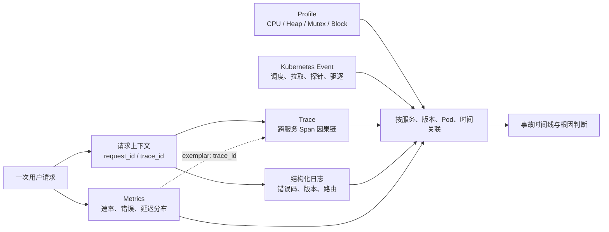
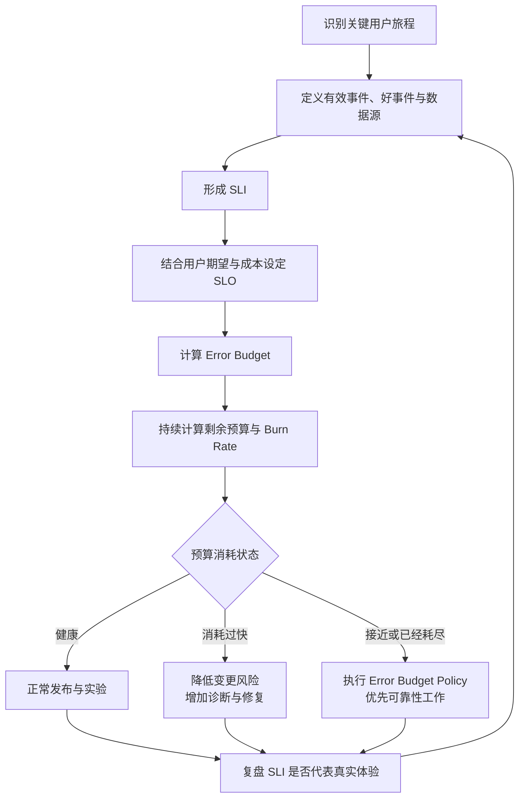
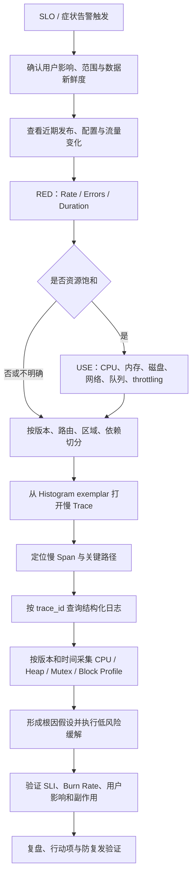

# 第 17 章：Kubernetes 可观测性与 SRE——指标、日志、链路和 SLO

可观测性不是“安装 Prometheus、Grafana 和一套日志系统”，也不是把所有数据都保存下来。它的本质是：**系统是否能通过外部输出，回答关于内部状态的新问题，并把可靠性判断转化为可验证的工程决策。**

对运行在 Kubernetes 上的 Go 服务来说，一套有效的可观测性体系至少要完成四件事：

1. 在用户明显投诉前发现服务退化。
2. 把“服务慢了”逐步缩小为具体版本、路由、依赖、Pod 或代码路径。
3. 用 SLI、SLO 和 Error Budget 判断事故严重度及发布节奏。
4. 让告警、Dashboard、日志、Trace 和 Profile 形成闭环，而不是彼此割裂。

> **版本与能力边界说明（截至 2026 年 6 月）**
>
> - Kubernetes 自身提供组件指标、系统日志、Event API、资源指标接口以及部分控制面 Trace 能力，但**不内置完整的长期指标、日志、链路存储和可视化后端**。[1][2]
> - Metrics Server 是集群附加组件，主要为 HPA、VPA 和 `kubectl top` 提供 Pod、Node 的 CPU 与内存数据，不应被当作完整监控后端。[3]
> - Kubernetes 系统组件 Trace 仍标记为 Beta，数据通过 OTLP 发送到 OpenTelemetry Collector 或兼容后端。[4]
> - Prometheus 原生直方图自 Prometheus 3.8 起成为稳定能力，但抓取仍需显式启用，实际采用前还要确认客户端库、远端存储和查询链路兼容性。[5]
> - OpenTelemetry Go 当前 Trace、Metrics 为稳定状态，Logs 为 Beta；本章因此使用 Go 标准库 `log/slog` 记录结构化日志，用 OpenTelemetry 关联 Trace。[6]

---

## 1. 学习目标

完成本章后，你应当能够：

- 区分监控与可观测性，并说明 Metrics、Logs、Traces、Events、Profiles 各自解决什么问题。
- 使用 RED、USE 和四个黄金信号建立分层观测模型。
- 为 Go HTTP 服务设计低基数、可聚合、可告警的指标集合。
- 解释 Counter、Gauge、Histogram、Summary 的语义和适用边界。
- 说明 Histogram bucket 如何影响分位数误差、时序数量和 SLO 计算。
- 使用请求上下文将结构化日志、指标 exemplar 与 Trace 关联起来。
- 区分 Kubernetes 内置观测能力和 Prometheus、OpenTelemetry、日志后端等生态组件。
- 定义可用性、延迟和正确性 SLI，计算 SLO、Error Budget 与 Burn Rate。
- 设计以用户症状为主、支持聚合、静默和抑制的告警体系。
- 从一次高延迟告警出发，逐步使用指标、日志、Trace 和 Profile 定位代码级根因。

---

## 2. 核心术语

| 术语 | 含义 | 面试中的关键点 |
|---|---|---|
| Monitoring | 对预先定义的指标、阈值和已知故障模式持续检查 | 擅长回答“我们已知要问的问题” |
| Observability | 根据系统外部输出推断内部状态，并支持临时提出新问题 | 不是工具名称，而是系统属性和工程能力 |
| Telemetry | 系统产生的指标、日志、链路、事件、Profile 等遥测数据 | 数据量大不等于可观测性好 |
| Instrumentation | 在应用、库或平台中加入产生遥测数据的逻辑 | 需要控制开销、语义和基数 |
| Cardinality | 一项指标所有标签组合所形成的唯一时序数量 | 高基数会放大内存、磁盘、查询和网络成本 |
| Exemplar | 与某个指标样本关联的少量上下文，例如 Trace ID | 能从延迟 bucket 跳转到 Trace，又不增加新时序 |
| SLI | 对服务水平某一方面的量化指标 | 必须定义统计对象、好事件和总事件 |
| SLO | 对 SLI 的目标值及时间窗口 | 是内部可靠性目标，不只是百分比 |
| SLA | 对外或跨组织的服务承诺，通常包含违约后果 | 不应与内部 SLO 混用 |
| Error Budget | 在 SLO 窗口内允许发生的不可靠程度 | `1 - SLO`，用于平衡可靠性与变更速度 |
| Burn Rate | 实际错误率相对于允许错误率的倍数 | 用于判断预算会以多快速度耗尽 |
| Symptom Alert | 基于用户可感知症状触发的告警 | 适合 Page，例如错误率、延迟、可用性恶化 |
| Cause Alert | 基于潜在根因或资源异常触发的告警 | 多用于诊断、Ticket 或预测性告警 |

---

## 3. 监控与可观测性的区别

### 3.1 监控擅长回答已知问题

监控通常从预先定义的问题开始：

- HTTP 5xx 是否超过 1%？
- Pod 是否重启？
- 节点磁盘是否超过 85%？
- p99 延迟是否超过 500 ms？

这些问题可以直接转化为指标、查询和阈值。它们适合稳定、重复、已知的故障模式，也适合自动告警。

### 3.2 可观测性要支持未知问题

生产事故经常不是“某一个已知指标超过阈值”，而是多个条件组合后才出现：

- 只有新版本、特定租户、某个可用区、某条路由同时满足时才发生高延迟。
- CPU 使用率不高，但 Goroutine 因锁竞争大量排队。
- 下游服务整体正常，只有携带某种请求参数的链路被路由到慢分片。
- Pod 没有重启，错误率也不高，但少量关键支付请求返回了语义错误。

可观测性要求系统保留足够的**维度、上下文、时间关系和因果关系**，使工程师能够在事故发生后提出原先没有预设的问题。

### 3.3 二者不是互斥关系

可观测性不是对监控的替代。合理关系是：

- **监控负责持续检测与告警。**
- **可观测性负责解释、定位和验证。**
- **SRE 使用 SLO 把二者连接到业务风险和工程决策。**

一个只有日志搜索、没有可靠告警的系统不算成熟；一个只有数百张 Dashboard、无法追踪单次请求的系统同样不算成熟。

---

## 4. 五类信号：Metrics、Logs、Traces、Events、Profiles

### 4.1 职责对比

| 信号 | 数据形态 | 最适合回答的问题 | 优势 | 局限 |
|---|---|---|---|---|
| Metrics | 按时间聚合的数值时序 | 发生了多少、变化多快、是否超出目标 | 成本相对可控，适合聚合、趋势和告警 | 上下文有限，无法还原单次请求全部细节 |
| Logs | 离散、带字段的事件记录 | 某次操作具体发生了什么 | 上下文丰富，适合错误细节和审计线索 | 数据量大，搜索成本高，容易格式混乱 |
| Traces | 一次请求跨组件的 Span 因果图 | 时间花在哪里、哪一跳失败 | 适合分布式因果关系和关键路径分析 | 采样、存储和上下文传播较复杂 |
| Kubernetes Events | 对象生命周期和控制器行为的短期事件流 | Pod 为什么没调度、镜像为何拉取失败 | 与 Kubernetes 对象直接关联，排障入口快 | 保留期有限，不是业务日志，也不是审计日志 |
| Profiles | 代码栈维度的资源消耗样本 | CPU、内存、锁、阻塞耗在哪里 | 可直接定位到函数和代码路径 | 采集有开销，暴露端点存在安全风险 |

### 4.2 信号之间如何关联



关键原则是：

- 使用同一个 `trace_id` 关联日志与 Trace。
- 使用 `service`、`version`、`cluster`、`namespace`、`pod` 和时间范围关联 Profile、Kubernetes Event 与其他信号。
- 不要把 `trace_id`、`request_id` 放入普通指标标签；它们是无界高基数值。需要从指标跳到 Trace 时，应使用 exemplar。

---

## 5. RED、USE 与四个黄金信号

### 5.1 RED：从服务调用者视角观察请求型系统

RED 适合 HTTP、gRPC、消息消费、数据库代理等“请求进入—处理—返回”的服务：[21]

- **Rate**：单位时间请求量或处理量。
- **Errors**：失败请求数量或比例。
- **Duration**：请求耗时分布，而不是只有平均值。

典型 Go HTTP 指标：

```text
http_server_requests_total
http_server_request_duration_seconds
http_server_in_flight_requests
```

RED 首先回答“用户调用服务时是否正常”。

### 5.2 USE：从资源视角寻找瓶颈

USE 适合 CPU、内存、磁盘、网络、连接池、线程池、队列等有限资源：[17]

- **Utilization**：资源忙碌或已使用的比例。
- **Saturation**：超过即时处理能力后产生的排队、等待或压力。
- **Errors**：资源级错误，例如磁盘 I/O 错误、丢包、内存分配失败。

注意：低平均利用率不代表没有饱和。CPU 可能在每个采集窗口内短时打满，平均值却只有 60%；磁盘利用率不高，也可能存在高尾延迟或队列突发。

### 5.3 四个黄金信号：服务健康的通用框架

Google SRE 将用户侧服务健康概括为四个黄金信号：[14]

- **Latency**：处理成功和失败请求的延迟分布。
- **Traffic**：系统承受的需求量。
- **Errors**：显式失败、隐式失败和错误结果比例。
- **Saturation**：系统距离容量上限还有多远。

### 5.4 三种方法如何组合

| 方法 | 主要对象 | 先回答什么 | 典型用途 |
|---|---|---|---|
| RED | 请求型服务 | 用户调用是否变慢或失败 | 服务总览、路由级 Dashboard、SLO 输入 |
| USE | 底层资源 | 哪种资源已忙、排队或出错 | CPU、内存、磁盘、网络、连接池排障 |
| 四个黄金信号 | 服务整体 | 用户体验和容量是否健康 | 统一服务健康模型、管理层视图、告警设计 |

推荐排障顺序：

1. 先用 SLO 或黄金信号确认是否存在真实用户影响。
2. 用 RED 判断是流量、错误还是延迟问题。
3. 用 USE 判断是否由资源瓶颈导致。
4. 用 Trace、日志和 Profile 定位具体依赖、请求或代码路径。

---

## 6. Kubernetes 可观测性的分层模型

Kubernetes 环境中的故障往往跨越应用、容器、节点和控制面。只观察其中一层容易形成错误结论。Kubernetes 系统组件可暴露用于 Dashboard 和告警的指标，但具体指标名称及稳定级别应以当前版本的官方指标参考为准。[13]

### 6.1 六个观测层次

| 层次 | 重点指标或信号 | 常见问题 |
|---|---|---|
| 业务层 | 下单成功率、支付成功率、库存扣减正确率、任务完成率 | HTTP 200 但业务结果错误 |
| 应用层 | RED、依赖延迟、队列深度、连接池、Go Runtime、Trace | 代码回归、依赖超时、锁竞争、Goroutine 泄漏 |
| 工作负载与容器层 | CPU、内存 working set、CPU throttling、重启、OOM、探针 | limit 不合理、内存增长、探针误杀 |
| 节点层 | CPU、内存、磁盘、网络、Pressure、文件系统与 kubelet | 节点资源竞争、磁盘满、网络丢包 |
| 集群对象层 | Deployment 副本、Pending Pod、调度失败、PVC、Event | 控制器未收敛、资源不足、镜像拉取失败 |
| 控制面层 | API Server 延迟与错误、etcd 延迟、调度器和控制器队列 | 控制面过载、etcd 抖动、控制循环延迟 |

### 6.2 Kubernetes 内置能力与生态组件边界

| 能力 | Kubernetes 内置或官方接口 | 通常需要的外部组件 |
|---|---|---|
| 组件指标 | API Server、Scheduler、Controller Manager、kubelet 等暴露 Prometheus 格式指标 | Prometheus 或兼容 TSDB 负责抓取、存储、查询和告警 |
| Pod/Node CPU、内存 | Resource Metrics API；kubelet 提供资源数据 | Metrics Server 或其他适配器实现聚合 API |
| 对象状态指标 | Kubernetes API 保存对象状态 | kube-state-metrics 将对象状态转为指标；它是附加组件，不是核心组件 |
| 容器日志 | 容器写 stdout/stderr，节点保存运行时日志 | 节点级采集器、日志后端、索引和保留策略 |
| Kubernetes Event | API 中的 Event 对象 | Event exporter 或外部存储用于长期留存和统计 |
| 控制面 Trace | 部分系统组件可通过 OTLP 导出 Trace | OpenTelemetry Collector 与 Trace 后端 |
| Dashboard | 无统一内置 Dashboard | Grafana 或其他可视化系统 |
| 告警路由 | 无统一内置告警编排 | Prometheus Alertmanager 或其他告警平台 |
| Profile | Go 组件或应用可暴露 pprof | 安全采集、连续剖析与存储平台 |

### 6.3 Metrics Server 不是完整监控系统

Resource Metrics API 主要提供：

- Pod、Container 和 Node 的 CPU 使用量。
- Pod、Container 和 Node 的内存 working set。
- HPA、VPA 和 `kubectl top` 所需的短周期资源数据。

它通常不提供：

- 长期历史趋势。
- 自定义业务指标。
- 复杂 PromQL 查询。
- SLO 告警。
- 高基数分析。
- 完整容器、节点和控制面指标集合。

因此，“`kubectl top` 能看到 CPU”不能推出“集群已经具备生产级监控”。

### 6.4 Kubernetes Event 的现实边界

Event 适合快速解释对象发生了什么，例如：

- `FailedScheduling`
- `FailedMount`
- `BackOff`
- `Unhealthy`
- `Evicted`

但 Event 有三个重要边界：

1. 它不是业务请求日志。
2. 它不是 Kubernetes Audit Log。
3. 默认保留时间有限。`kube-apiserver --event-ttl` 当前默认值为 `1h`，集群可自行调整。[7]

对于事故复盘，应把重要 Event 导出到可持久化系统，并保留对象 UID、Namespace、Reason、Source、时间和消息等字段。

---

## 7. Metrics：从指标类型到指标体系

### 7.1 Counter、Gauge、Histogram、Summary

| 类型 | 语义 | 适合场景 | 典型查询 | 常见误用 |
|---|---|---|---|---|
| Counter | 单调递增，进程重启时可归零 | 请求数、错误数、处理字节数、任务完成数 | `rate()`、`increase()` | 用来表示当前连接数或队列深度 |
| Gauge | 可增可减的当前值 | 并发数、队列深度、温度、内存当前值 | `avg_over_time()`、`max_over_time()` | 用一个 Gauge 保存“最近一次请求延迟” |
| Histogram | 对观察值按 bucket 累计计数，并提供 count、sum | 延迟、请求大小、批量大小 | `histogram_quantile()`、阈值比例 | bucket 随意设置，或为每条路由配置不同边界后再强行聚合 |
| Summary | 客户端在滑动窗口内计算分位数，并提供 count、sum | 单实例、无需跨实例聚合的特殊场景 | 直接读取 quantile | 把不同 Pod 的 p99 直接平均或求和 |

Prometheus 当前仍将这四类视为核心指标类型；经典 Histogram 和原生 Histogram 的存储形态不同。[5][8]

### 7.2 Counter 必须通过速率理解

`http_server_requests_total` 的绝对值通常没有直接意义，因为它受进程启动时间影响。常用查询是：

```text
sum by (service) (
  rate(http_server_requests_total[5m])
)
```

`rate()` 会处理 Counter reset。不要对 Gauge 使用 `rate()`，也不要用两个瞬时采样值手工相减替代时序函数。

### 7.3 Gauge 表示状态，不表示累计事件

适合 Gauge 的例子：

```text
http_server_in_flight_requests
queue_depth
worker_active
connection_pool_in_use
```

如果要统计“进入队列的总任务数”，应使用 Counter；如果要统计“当前队列中有多少任务”，才使用 Gauge。

### 7.4 Histogram 的组成

经典 Histogram `http_server_request_duration_seconds` 通常产生：

```text
http_server_request_duration_seconds_bucket{le="0.1"}
http_server_request_duration_seconds_bucket{le="0.3"}
http_server_request_duration_seconds_bucket{le="1"}
http_server_request_duration_seconds_bucket{le="+Inf"}
http_server_request_duration_seconds_sum
http_server_request_duration_seconds_count
```

bucket 是**累计**的。一个 80 ms 请求会同时进入 `le="0.1"`、`le="0.3"`、`le="1"` 和 `le="+Inf"`。

### 7.5 分位数是估算，不是精确排序

跨 Pod 计算 p99：

```text
histogram_quantile(
  0.99,
  sum by (le, route) (
    rate(http_server_request_duration_seconds_bucket[5m])
  )
)
```

`histogram_quantile()` 根据相邻 bucket 插值估算分位数。误差主要由 bucket 边界决定：

- 在 SLO 阈值附近 bucket 太宽，估算误差会很大。
- bucket 太密会增加时序数量、抓取流量和存储成本。
- 所有需要聚合的经典 Histogram 应使用一致 bucket 边界。

### 7.6 Bucket 应围绕决策阈值设计

假设延迟目标是“99% 请求低于 300 ms”，可以在目标附近增加分辨率：

```text
0.025, 0.05, 0.1, 0.2, 0.3, 0.5, 1, 2, 5
```

设计步骤：

1. 明确用户体验阈值和超时上限。
2. 用压测或历史数据了解真实分布。
3. 在 SLO 阈值、常见延迟区域和超时边界附近设置 bucket。
4. 计算新增 bucket 带来的时序数。
5. 上线后检查是否大量样本集中在同一个宽 bucket，必要时调整。

### 7.7 用 bucket 直接计算延迟 SLI

如果 SLO 是“300 ms 内完成的请求比例不低于 99%”，直接计算好事件比例通常比分位数告警更稳定：

```text
sum(rate(http_server_request_duration_seconds_bucket{le="0.3"}[5m]))
/
sum(rate(http_server_request_duration_seconds_count[5m]))
```

原因是 SLO 本质上关心“好事件占比”，而不是一个插值得到的 p99 数值。

### 7.8 Histogram 与 Summary 的核心区别

| 维度 | Histogram | Summary |
|---|---|---|
| 分位数计算位置 | 服务端查询时计算 | 客户端采集时计算 |
| 跨 Pod 聚合 | 可以，前提是 bucket 兼容 | quantile 通常不可正确聚合 |
| 误差控制 | 通过值域 bucket 控制 | 通过 quantile 误差参数控制 |
| 成本位置 | 更多时序和服务端计算 | 客户端 CPU、内存和滑动窗口维护 |
| 典型选择 | Kubernetes 多副本服务的默认选择 | 明确不需要聚合的特殊场景 |

“把 10 个 Pod 的 p99 求平均”没有统计意义。p99 不是可线性聚合的量。

### 7.9 高基数为什么危险

Prometheus 中，每一个唯一的标签组合都是一条新时序。[9]

假设一项请求指标包含：

- 40 个路由
- 5 种方法
- 6 个状态类别
- 4 个区域
- 20 个版本值

仅这一项指标就可能产生：

```text
40 × 5 × 6 × 4 × 20 = 96,000 条时序
```

如果再加入 100 个 Pod 名称，理论组合会放大到 960 万条。即使实际组合没有完全出现，成本仍可能迅速失控。

**禁止作为普通指标标签的典型字段：**

```text
user_id
order_id
request_id
trace_id
raw_url
exception_message
email
session_id
```

推荐替代方式：

- 原始 URL 改为归一化路由，例如 `/orders/{id}`。
- HTTP 状态码按 `2xx`、`4xx`、`5xx` 聚合，只有确有分析价值时才保留完整状态码。
- Request ID、Trace ID 放入日志和 Trace；指标侧使用 exemplar。
- 错误信息映射为有限集合的 `error_code`，不要直接使用异常文本。
- 版本标签应控制保留范围，避免永久积累短命版本值。

### 7.10 一套有意义的 Go 服务指标集合

| 指标 | 类型 | 建议标签 | 用途 |
|---|---|---|---|
| `http_server_requests_total` | Counter | `route`, `method`, `status_class` | Rate、Error、可用性 SLI |
| `http_server_request_duration_seconds` | Histogram | `route`, `method` | 延迟分布、延迟 SLI、Trace exemplar |
| `http_server_in_flight_requests` | Gauge | `route` | 并发与排队趋势 |
| `dependency_requests_total` | Counter | `dependency`, `operation`, `outcome` | 下游错误率与调用量 |
| `dependency_request_duration_seconds` | Histogram | `dependency`, `operation` | 下游延迟与关键路径 |
| `queue_depth` | Gauge | `queue` | 当前积压 |
| `queue_oldest_message_age_seconds` | Gauge | `queue` | 比单纯队列长度更直接反映用户等待 |
| `jobs_processed_total` | Counter | `job_type`, `outcome` | 异步处理吞吐与错误 |
| `business_operations_total` | Counter | `operation`, `outcome` | 业务正确性与成功率 SLI |
| `build_info` | Gauge/Info | `version`, `commit` | 关联发布版本，不用于高频聚合 |

设计每项指标前应回答：

1. 它支持哪个 Dashboard、SLO、告警或容量决策？
2. 指标类型和单位是否正确？
3. 标签集合是否有界？
4. 谁是指标 owner？
5. 删除它会失去什么判断能力？

不要在应用中直接暴露“成功率 Gauge”。应分别记录好事件和总事件 Counter，再在查询端计算比例，避免重启、窗口和并发更新造成错误。


---

## 8. Logs：让事件可检索、可关联、可脱敏

### 8.1 结构化日志优于拼接文本

不推荐：

```text
request failed user=10086 url=/orders/89321 took=812ms err=timeout
```

推荐使用稳定字段的 JSON 日志：

```json
{
  "time": "2026-06-22T10:11:32.314Z",
  "level": "ERROR",
  "service": "checkout",
  "version": "v2026.06.22.2",
  "cluster": "prod-apne1",
  "namespace": "commerce",
  "route": "/checkout",
  "method": "POST",
  "status": 503,
  "latency_ms": 812,
  "error_code": "PAYMENT_TIMEOUT",
  "request_id": "req_8f2d...",
  "trace_id": "4bf92f3577b34da6a3ce929d0e0e4736",
  "message": "request completed with dependency timeout"
}
```

结构化日志的价值不只是“看起来像 JSON”，而是字段语义稳定：

- 同一字段始终使用同一名称和类型。
- 时间统一为带时区的标准格式。
- 路由使用模板，不记录包含 ID 的原始路径。
- 错误使用稳定 `error_code`，详细错误放 `message` 或受控字段。
- 服务、版本、集群和 Namespace 字段使日志能与部署和其他信号关联。

### 8.2 日志级别要表达行动语义

| 级别 | 建议语义 | 典型示例 |
|---|---|---|
| DEBUG | 临时诊断细节，生产默认关闭或采样 | 缓存键计算、内部状态分支 |
| INFO | 正常生命周期或重要业务状态变化 | 服务启动、配置版本、任务完成 |
| WARN | 已降级或出现异常，但当前操作仍可完成 | 重试成功、回退到缓存、接近容量阈值 |
| ERROR | 当前请求、任务或操作最终失败 | 下游超时、持久化失败、不可恢复校验错误 |

常见错误是下游失败一层层重复记录 ERROR：客户端库记一次、业务层记一次、HTTP 层再记一次。结果是一项故障产生数倍日志和数倍告警。原则是：

- 在能够补充最多业务上下文、且确定操作最终失败的位置记录一次。
- 中间层若只是向上返回错误，不必重复记录。
- 可恢复重试应记录最终结果，必要时把重试次数作为字段。

### 8.3 Request ID 与 Trace ID 的分工

- `request_id` 主要帮助客服、网关和应用在单个服务或请求入口中定位一次请求。
- `trace_id` 用于跨服务、跨进程关联同一条分布式调用链。
- 二者可以同时存在，但不要把本地生成的 Request ID 冒充 Trace ID。
- 调用下游时应传播 Trace Context；Request ID 是否传播由组织协议决定。

### 8.4 敏感信息脱敏

日志和 Trace 往往进入更广泛的运维平台，权限边界可能弱于业务数据库。应默认禁止记录：

- 密码、访问令牌、API Key、Cookie、Session。
- 完整银行卡号、身份证号、手机号、邮箱、地址。
- 请求体和响应体中的敏感业务数据。
- 数据库连接串中的用户名和密码。
- 完整 HTTP Header 集合。

推荐做法：

1. 使用字段白名单，而不是记录后再黑名单删除。
2. 对确需关联的业务标识使用不可逆散列或受控假名化。
3. 对 Token 只记录类型、来源和末尾极少字符，且确认仍符合安全规范。
4. 对日志采集链路实施传输加密、最小权限、保留期和删除策略。
5. 在单元测试或 CI 中扫描典型敏感字段。

### 8.5 Kubernetes 日志架构

应用容器应优先把日志写到 stdout/stderr，由容器运行时和节点日志代理采集。Kubernetes 不提供原生的集群级日志存储；生产环境需要独立后端，其生命周期应独立于 Pod 和 Node。[2]

这带来几项工程要求：

- 不要只把日志写入容器文件系统，否则 Pod 删除后很难保留。
- 日志采集器应处理轮转、反压、重试和丢弃策略。
- 多行堆栈要有明确拼接规则；更推荐单行 JSON 加结构化错误字段。
- 需要监控日志管道自身的队列、丢弃量、发送错误和延迟。
- Sidecar 日志代理只在特殊格式转换或隔离需求下使用，避免每个 Pod 无谓增加资源和运维复杂度。

---

## 9. Traces：理解跨服务因果关系

### 9.1 Trace 与 Span

一次 Trace 表示一条端到端操作，例如用户提交订单。它由多个 Span 组成：[11]

```text
HTTP POST /checkout                  812 ms
├─ validate_cart                      4 ms
├─ pricing.lookup                   702 ms
│  ├─ cache.get                     680 ms
│  └─ database.query                 18 ms
├─ payment.authorize                 72 ms
└─ response.encode                    3 ms
```

每个 Span 通常包含：

- Span 名称。
- 开始时间和持续时间。
- Trace ID、Span ID、Parent Span ID。
- 服务和资源属性。
- 操作属性，例如路由、HTTP 方法、数据库系统。
- Event，例如一次重试或异常。
- Status，用于表达操作是否失败。

Trace 的核心价值不是“记录更多日志”，而是展示**父子关系、时间重叠和关键路径**。

### 9.2 Context Propagation

分布式追踪必须把上下文从上游传播到下游。OpenTelemetry 通常使用 W3C Trace Context HTTP Header，例如 `traceparent` 和 `tracestate`。上下文传播使不同进程产生的 Span 能被组装为同一条 Trace，并可进一步关联日志和指标。[10]

常见断链原因：

- 自定义 HTTP 客户端没有使用 OTel Transport。
- 启动 Goroutine 时丢弃原来的 `context.Context`。
- 消息生产者写入了消息，但没有注入 Trace Context；消费者也没有提取。
- 代理或网关删除了追踪 Header。
- 代码使用 `context.Background()` 覆盖了请求上下文。

Go 中应把 `context.Context` 作为调用链的一部分传递，而不是存入全局变量或长期结构体。

### 9.3 Baggage 要谨慎

Baggage 可以随上下文跨服务传播键值，但它不是免费字段：

- 会增加请求 Header 大小。
- 可能被大量服务复制和记录。
- 可能泄露租户、用户或业务信息。
- 不受控的值会造成后端成本上升。

只传播确有跨服务决策价值、大小受限且不敏感的字段。不要把完整用户资料或任意请求参数放入 Baggage。

### 9.4 Head Sampling 与 Tail Sampling

OpenTelemetry 将采样作为控制 Trace 数据量和成本的核心机制。[12]

| 采样方式 | 决策时机 | 优点 | 缺点 |
|---|---|---|---|
| Head Sampling | 请求开始时 | 简单、低开销、立即决定是否采集 | 还不知道请求是否最终失败或变慢，可能漏掉稀有异常 |
| Parent-Based Sampling | 继承上游采样决定 | 保持一条 Trace 的采样一致性 | 根 Span 的决定仍受 Head Sampling 局限 |
| Tail Sampling | Collector 收到较完整 Trace 后 | 可优先保留错误、慢请求、特定租户或稀有路径 | 需要缓冲完整 Trace，内存、延迟和部署复杂度更高 |

实用策略通常是：

- 对普通成功请求低比例采样。
- 对错误、超时和高延迟 Trace 提高保留率。
- 对关键业务链路和新版本短期提高采样率。
- 对健康检查、静态资源和高频低价值请求降低采样率。
- 监控 Collector 的内存、队列和丢弃情况。

### 9.5 OpenTelemetry Collector 的作用

Collector 位于应用与后端之间，常见职责包括：

- 接收 OTLP 数据。
- 批量、重试和队列缓冲。
- 添加或删除资源属性。
- 过滤敏感字段。
- Tail Sampling。
- 同时导出到一个或多个后端。

它减少了应用与特定厂商后端的耦合，但 Collector 自身也会成为遥测管道的一部分，必须具备限流、容量规划、高可用和自监控。

---

## 10. Go HTTP 中间件：关联日志、指标和 Trace

下面代码展示关键思想，而不是完整工程。它假设外层已经由 OpenTelemetry HTTP 中间件创建或提取 Span，上层已初始化 Prometheus Registry 与 OpenTelemetry Provider。

```go
package observability

import (
    "log/slog"
    "net/http"
    "strconv"
    "time"

    "github.com/prometheus/client_golang/prometheus"
    "go.opentelemetry.io/otel/trace"
)

var (
    requests = prometheus.NewCounterVec(
        prometheus.CounterOpts{
            Name: "http_server_requests_total",
            Help: "Total number of completed HTTP requests.",
        },
        []string{"route", "method", "status_class"},
    )

    duration = prometheus.NewHistogramVec(
        prometheus.HistogramOpts{
            Name:    "http_server_request_duration_seconds",
            Help:    "HTTP server request duration in seconds.",
            Buckets: []float64{0.025, 0.05, 0.1, 0.2, 0.3, 0.5, 1, 2, 5},
        },
        []string{"route", "method"},
    )
)

func init() {
    prometheus.MustRegister(requests, duration)
}

type statusWriter struct {
    http.ResponseWriter
    status int
}

func (w *statusWriter) WriteHeader(code int) {
    w.status = code
    w.ResponseWriter.WriteHeader(code)
}

// Middleware 的 route 必须是归一化模板，如 /orders/{id}，不能传原始 URL。
func Middleware(logger *slog.Logger, route string, next http.Handler) http.Handler {
    return http.HandlerFunc(func(w http.ResponseWriter, r *http.Request) {
        started := time.Now()
        sw := &statusWriter{ResponseWriter: w, status: http.StatusOK}

        next.ServeHTTP(sw, r)

        elapsed := time.Since(started).Seconds()
        statusClass := strconv.Itoa(sw.status/100) + "xx"

        requests.WithLabelValues(route, r.Method, statusClass).Inc()

        observer := duration.WithLabelValues(route, r.Method)
        spanContext := trace.SpanContextFromContext(r.Context())

        // Exemplar 允许从延迟样本跳到 Trace，但不会把 trace_id 变成时序标签。
        if spanContext.IsValid() && spanContext.IsSampled() {
            if exemplarObserver, ok := observer.(prometheus.ExemplarObserver); ok {
                exemplarObserver.ObserveWithExemplar(
                    elapsed,
                    prometheus.Labels{"trace_id": spanContext.TraceID().String()},
                )
            } else {
                observer.Observe(elapsed)
            }
        } else {
            observer.Observe(elapsed)
        }

        attrs := []any{
            "route", route,
            "method", r.Method,
            "status", sw.status,
            "latency_ms", elapsed*1000,
        }
        if spanContext.IsValid() {
            attrs = append(attrs,
                "trace_id", spanContext.TraceID().String(),
                "span_id", spanContext.SpanID().String(),
            )
        }

        logger.InfoContext(r.Context(), "request completed", attrs...)
    })
}
```

典型装配方式：

```go
mux.Handle(
    "POST /checkout",
    otelhttp.NewHandler(
        observability.Middleware(logger, "/checkout", checkoutHandler),
        "POST /checkout",
    ),
)

mux.Handle("GET /metrics", promhttp.Handler())
```

生产代码还应处理：

- `http.Flusher`、`http.Hijacker`、`io.ReaderFrom` 等可选接口，避免包装 `ResponseWriter` 后破坏流式响应或 WebSocket。
- Panic 记录和 Span 状态。
- 请求取消与超时。
- 入口 Request ID 生成和可信 Header 校验。
- OTel Provider、Exporter、Resource、Propagator 和优雅关闭。
- `/metrics` 的网络访问控制，避免公开暴露内部拓扑和版本信息。

**最重要的基数原则：**`trace_id` 只写日志、Trace 或 exemplar，绝不放入 `CounterVec`、`HistogramVec` 等普通标签集合。

---

## 11. SRE：用 SLI、SLO 和 Error Budget 管理可靠性

SRE 不是“负责值班的运维团队”的别名。它强调用软件工程、自动化和可量化目标管理生产系统。SLO 是连接产品体验、研发速度和运维风险的核心机制。[15]

### 11.1 SLI、SLO、SLA

| 概念 | 回答的问题 | 示例 |
|---|---|---|
| SLI | 服务实际表现如何 | 最近 30 天成功请求比例为 99.94% |
| SLO | 我们希望服务达到什么水平 | 30 天滚动窗口内 99.9% 合格请求成功 |
| SLA | 未达到对外承诺会产生什么后果 | 低于 99.9% 时按合同补偿 |

SLO 通常应比 SLA 更严格，为运营和修复留出缓冲。例如 SLA 是 99.9%，内部 SLO 可以设为 99.95%，但具体差值必须结合成本、用户影响和合同风险决定。

### 11.2 好事件与总事件

最可操作的 SLI 往往是比例：

```text
SLI = good events / valid events
```

其中最难的不是公式，而是定义：

- 哪些请求属于有效请求？
- 客户端参数错误是否计入？
- 被限流的请求是否算失败？
- 超时后服务最终成功但客户端已经放弃，算成功还是失败？
- 批量请求部分成功如何计数？
- 重试后的多个后端请求对应一个用户事件还是多个事件？

SLI 应尽量从用户视角定义，而不是从单个服务器视角定义。

### 11.3 可用性 SLI

一个 HTTP API 的请求型可用性 SLI：

```text
可用性 SLI = 成功完成的合格请求数 / 合格请求总数
```

示例 PromQL：

```text
1 - (
  sum(rate(http_server_requests_total{status_class="5xx"}[30d]))
  /
  sum(rate(http_server_requests_total[30d]))
)
```

这只是示意。生产定义还需决定：

- `429` 是系统保护行为还是用户失败？
- 客户端主动取消是否排除？
- 网关失败是否能被应用指标看见？
- 业务返回 HTTP 200 但结果无效是否需要业务 SLI 补充？

### 11.4 延迟 SLI

延迟 SLI 不应只看平均值。推荐定义为阈值内完成的请求比例：

```text
延迟 SLI = 在 300 ms 内完成的合格请求数 / 合格请求总数
```

还可以设置两个阈值：

```text
99% 请求 < 300 ms
99.9% 请求 < 1 s
```

这样既保护大多数用户体验，也限制极端尾延迟。

### 11.5 正确性 SLI

有些故障不会表现为 5xx：

- 订单金额计算错误。
- 返回了过期库存。
- 消息被重复消费。
- 支付成功但状态没有落库。

正确性 SLI 可以定义为：

```text
正确完成的业务操作数 / 可验证的业务操作总数
```

它可能来自业务对账、异步校验、幂等冲突记录或领域事件，而不是 HTTP 指标。

### 11.6 Error Budget

```text
Error Budget = 1 - SLO
```

99.9% SLO 的允许错误比例是 0.1%。如果 30 天内有 1000 万次合格请求：

```text
允许坏事件数 = 10,000,000 × 0.001 = 10,000
```

如果使用纯时间可用性模型，30 天的 0.1% 约为 43.2 分钟。但请求型 SLO 和时间型 SLO不能随意互换：高峰期 1 分钟可能影响数十万请求，低峰期 1 分钟只影响少量请求。

### 11.7 Error Budget Policy

Error Budget 不是“允许随便出错的额度”，也不是惩罚团队的工具。它用于建立明确决策：

- 预算充足：按正常风险控制继续发布。
- 预算消耗过快：提高发布审查、减小变更批次、优先修复可靠性问题。
- 预算接近耗尽：限制高风险变更，增加容量或回滚不稳定功能。
- 预算耗尽：根据事先约定的政策暂停非必要变更，优先恢复可靠性；安全修复和关键事故修复通常仍应继续。

政策必须由产品、研发和 SRE 共同认可，否则 SLO 只会成为 Dashboard 上的数字。[16]

### 11.8 Burn Rate

```text
Burn Rate = 实际坏事件比例 / 允许坏事件比例
```

对于 99.9% SLO：

- 允许错误率是 0.1%。
- 实际错误率 0.1% 时，Burn Rate = 1，按此速度会恰好在窗口结束时耗尽预算。
- 实际错误率 1% 时，Burn Rate = 10，预算约以十倍速度消耗。
- 实际错误率 10% 时，Burn Rate = 100。

Burn Rate 把不同 SLO 统一到同一风险尺度，比“错误率超过 1%”更能表达事故对可靠性目标的威胁。

### 11.9 从 SLI 到工程决策



---

## 12. 告警设计：从阈值告警到 SLO 告警

### 12.1 基于症状与基于原因

**症状告警**直接反映用户体验：

- 关键请求错误率上升。
- 延迟 SLI 下降。
- 业务成功率下降。
- Error Budget 高速燃烧。

**原因告警**反映潜在根因：

- CPU throttling 上升。
- Pod 重启。
- 磁盘空间不足。
- etcd fsync 延迟变高。
- 某个下游连接池接近满载。

原则不是“原因告警永远不能 Page”，而是：

- Page 应优先对齐真实或即将发生的用户影响。
- 原因指标通常用于 Dashboard、诊断和 Ticket。
- 若原因具有明确、紧迫、可预测的用户风险，例如证书即将过期、磁盘将在数小时内写满，则可以触发可行动告警。

### 12.2 好告警的标准

一个 Page 级告警应满足：

1. **有用户或 SLO 风险。**
2. **需要人在较短时间内行动。**
3. **接收者有权限和手段采取行动。**
4. **告警内容包含范围、严重度、Dashboard、Runbook 和近期变更。**
5. **恢复条件明确，不会长期悬挂。**
6. **经过测试，查询失败或无数据不会被误判为健康。**

### 12.3 告警疲劳的来源

- 对每个 Pod 都发一条相同告警。
- 同一根因触发应用、节点、依赖数十条 Page。
- 使用瞬时阈值，没有最小样本或合理窗口。
- 告警没有 owner 和 Runbook。
- 维护期间没有 Silence。
- 上游故障时没有 Inhibition，下游告警洪水淹没根因。
- 恢复阈值与触发阈值相同，导致反复抖动。
- 所有异常都 Page，没有区分 Page、Ticket 和信息事件。

### 12.4 Grouping、Silence、Inhibition

Prometheus Alertmanager 的三个概念不能混用：[18]

- **Grouping**：把同一集群、服务或事故的多个告警合并为通知。
- **Silence**：按匹配条件在指定时间内静默通知，适合维护窗口或已知变更。
- **Inhibition**：当更高层根因告警存在时，抑制相关下游告警。例如“整个集群不可达”触发后，抑制该集群每个 Pod 的探测失败告警。

### 12.5 多窗口、多燃烧率告警

Google SRE Workbook 给出的常用起点是：[19]

| 严重度 | 长窗口 | 短窗口 | Burn Rate | 预算消耗 |
|---|---:|---:|---:|---:|
| Page | 1 h | 5 min | 14.4 | 约 2% |
| Page | 6 h | 30 min | 6 | 约 5% |
| Ticket | 3 d | 6 h | 1 | 约 10% |

对 99.9% SLO，允许错误率为 `0.001`。Page 逻辑可表达为：

```text
(
  service:slo_error_ratio:rate1h > 14.4 * 0.001
and
  service:slo_error_ratio:rate5m > 14.4 * 0.001
)
or
(
  service:slo_error_ratio:rate6h > 6 * 0.001
and
  service:slo_error_ratio:rate30m > 6 * 0.001
)
```

长窗口保证事故消耗了足够预算，短窗口确认当前仍在持续燃烧，能减少已经恢复但长窗口尚未下降造成的告警滞留。

### 12.6 Prometheus Operator 规则示例

以下 `PrometheusRule` 属于 Prometheus Operator CRD，**不是 Kubernetes 内置资源**：

```yaml
apiVersion: monitoring.coreos.com/v1
kind: PrometheusRule
metadata:
  name: checkout-slo-alerts
  namespace: monitoring
spec:
  groups:
    - name: checkout.slo
      rules:
        - alert: CheckoutAvailabilityBudgetBurnFast
          expr: |
            (
              service:slo_error_ratio:rate1h{service="checkout"} > 14.4 * 0.001
              and
              service:slo_error_ratio:rate5m{service="checkout"} > 14.4 * 0.001
            )
            or
            (
              service:slo_error_ratio:rate6h{service="checkout"} > 6 * 0.001
              and
              service:slo_error_ratio:rate30m{service="checkout"} > 6 * 0.001
            )
          labels:
            severity: page
            service: checkout
            slo: availability
          annotations:
            summary: "checkout availability error budget is burning too fast"
            description: "Investigate user-facing errors, recent deploys and dependency failures."
            runbook_url: "https://runbooks.example.internal/checkout/availability"
            dashboard_url: "https://grafana.example.internal/d/checkout-slo"
```

生产规则还应：

- 使用 Recording Rule 预计算不同窗口错误比例。
- 对查询结果为空、抓取失败和低流量场景单独处理。
- 将 SLO 目标、服务 owner 和 Runbook 作为可管理配置。
- 在发布前使用历史数据回放或规则测试验证误报与漏报。

### 12.7 低流量服务的特殊问题

低流量服务中，一次失败可能产生极高瞬时错误率。可选策略包括：

- 使用合成探测补充信号。
- 将属于同一用户旅程的小流量操作合并计算。
- 采用更长窗口和最小事件数条件。
- 对单次高价值请求直接生成业务事件和人工 Ticket。
- 从任务成功率、数据新鲜度或处理延迟定义 SLI，而不是强行套 HTTP 请求率。

不要简单加一个很长的 `for:` 来掩盖噪声，因为间歇性尖峰仍可能持续消耗大量预算却永远不触发告警。


---

## 13. Dashboard：为排障服务，而不是展示漂亮图表

Dashboard 的价值是缩短“发现—确认—缩小范围—定位”的时间。每个图表都应回答一个明确问题。

### 13.1 推荐的三层结构

#### 第一层：服务总览

用于值班人员在一分钟内确认用户影响：

- SLO 当前值、剩余 Error Budget、Burn Rate。
- Rate、Errors、Duration、Saturation。
- 关键业务成功率。
- 当前版本、最近部署时间、实例数。
- 集群、区域和依赖健康状态。

#### 第二层：维度下钻

用于判断影响范围：

- route / operation
- status class / error code
- cluster / region / availability zone
- version / deployment
- namespace / workload
- dependency

维度必须有界。Dashboard 支持按 `user_id` 任意分组，往往意味着指标设计已经高基数化；用户级排查应进入日志或 Trace。

#### 第三层：资源与依赖

用于定位原因：

- Pod CPU、内存、throttling、重启、OOM。
- 节点 Pressure、磁盘、网络。
- 连接池、Goroutine、GC、队列深度。
- 下游错误率、延迟、限流和超时。
- OpenTelemetry Collector、日志采集器和 Prometheus 自身健康。

### 13.2 一个面板应具备的上下文

- 明确标题，例如“checkout p99 latency by version”，而不是“Latency”。
- 单位和时间窗口。
- SLO 或容量阈值线。
- 发布、配置变更和故障演练注释。
- 可点击跳转到日志、Trace、Runbook。
- 查询范围和聚合维度。
- 数据缺失时的可见提示。

### 13.3 常见 Dashboard 反模式

| 反模式 | 问题 | 改进 |
|---|---|---|
| 只显示平均延迟 | 尾延迟被掩盖 | 同时展示阈值 SLI、p50、p95、p99 或热力图 |
| 每项系统指标都放一张图 | 信息密度高但没有排障路径 | 按用户症状、服务、资源和依赖分层 |
| 没有部署注释 | 难以判断变化是否由发布触发 | 叠加版本和变更事件 |
| 全部按 Pod 展开 | 扩容后图表不可读 | 默认按服务或版本聚合，必要时下钻 Pod |
| 只有当前值 | 看不到基线与趋势 | 提供历史对比、同比或发布前后对比 |
| 图表无 owner | 查询失效后无人维护 | Dashboard 与服务目录、团队和 Runbook 绑定 |

---

## 14. 容量规划、趋势预测与性能基线

容量规划不是看到 CPU 70% 就扩容。它需要把需求、吞吐、延迟、故障冗余和扩容滞后联系起来。

### 14.1 建立性能基线

至少记录：

- 每个 Pod 在满足延迟 SLO 时的可持续 QPS。
- CPU、内存、网络和下游连接随 QPS 的变化曲线。
- p50、p95、p99 延迟随并发度的变化。
- GC、Goroutine、队列长度和错误率的拐点。
- 冷启动、镜像拉取、调度和就绪所需时间。
- HPA 与 Cluster Autoscaler 的观测和生效延迟。

“最大压到多少 QPS 才崩”不是可靠基线。更有价值的问题是：**在满足 SLO、保留故障冗余且不触发持续排队时，每个副本能稳定处理多少负载。**

### 14.2 副本估算

一个简化估算：

```text
所需副本数 = ceil(峰值 QPS / 单 Pod 在 SLO 内的可持续 QPS × 安全系数)
```

安全系数应考虑：

- 单节点或单可用区故障。
- HPA 采样与扩容滞后。
- 流量突发。
- 下游服务抖动。
- 发布期间新旧版本并存。
- 指标或控制面短暂不可用。

不要把 `limits` 当作可持续容量。CPU limit 可能导致 throttling，内存 limit 是硬边界，二者都不代表应用在满足 SLO 时的最佳工作点。

### 14.3 趋势预测

容量趋势至少需要区分：

- 长期增长趋势。
- 日内、周内和季节性周期。
- 营销活动、发薪日、节假日等已知事件。
- 数据量增长导致的单请求成本变化。
- 新功能引起的调用放大。
- 失败重试造成的额外流量。

预测不能替代压测。合理流程是：

```text
历史趋势 → 需求预测 → 容量模型 → 压测验证 → 故障场景验证 → 预留与扩容策略
```

### 14.4 可观测性系统也需要容量规划

监控系统自身可能成为故障源：

- Prometheus 抓取目标和时序数持续增长。
- 高基数导致内存和查询延迟上升。
- Remote Write 队列积压。
- 日志采集器因后端变慢而占满磁盘。
- OTel Collector Tail Sampling 缓冲耗尽。
- Alertmanager 通知接收端超时。
- Dashboard 查询同时扫描大量历史数据。

因此还需要观测：

```text
scrape failures
sample ingestion rate
active series
query latency
remote write failures and queue length
log dropped records
collector refused spans / dropped spans
alert notification failures
telemetry end-to-end delay
```

没有“监控系统的监控”，事故时很容易把数据缺失误判为服务恢复。

---

## 15. Profiles 与 Go pprof

### 15.1 Profile 回答代码级资源问题

Go Runtime 和 `pprof` 可提供多种 Profile：[20]

| Profile | 主要问题 |
|---|---|
| CPU | 哪些函数正在消耗 CPU 时间 |
| Heap | 哪些分配仍存活，哪些路径产生大量分配 |
| Allocations | 累计分配热点在哪里 |
| Goroutine | Goroutine 当前阻塞在哪些调用栈 |
| Mutex | 锁竞争主要发生在哪些代码路径 |
| Block | Channel、锁等同步等待发生在哪里 |
| Threadcreate | 哪些路径导致创建大量 OS Thread |

Metrics 能告诉你“CPU 上升”或“锁等待趋势异常”，Profile 才能进一步回答“具体是哪个函数”。

### 15.2 持续剖析

持续剖析会周期性采集 Profile，并按以下维度存储：

- service
- version / commit
- cluster / namespace
- pod
- profile type
- time range

它适合：

- 比较发布前后 CPU 或分配差异。
- 发现只在少量 Pod 出现的热点。
- 观察低频但长期存在的内存增长。
- 将高延迟时间段与 mutex、block Profile 对齐。

持续剖析不能替代即时 pprof。前者适合趋势和回归，后者适合在事故窗口捕获更精确数据。

### 15.3 生产暴露风险

`net/http/pprof` 默认注册在 `/debug/pprof/`，并能返回运行时 Profile。[20] 直接把它暴露到公网存在风险：

- 暴露函数名、包结构、调用栈、文件路径和内部实现。
- Goroutine 堆栈可能包含请求 URL 或其他上下文线索。
- CPU Profile 需要持续采样，可能被滥用形成额外负载。
- Heap 和 Goroutine 数据体积可能较大。
- 未授权访问会扩大信息泄露和拒绝服务风险。

安全做法：

1. 使用独立监听地址和端口，不与公网业务端口共享暴露策略。
2. 默认只监听 localhost、Pod 网络或管理网络。
3. 使用 NetworkPolicy、Service Mesh 授权、身份代理或临时端口转发控制访问。
4. 限制采集时长、并发和频率。
5. 记录谁在何时采集了 Profile。
6. 事故结束后关闭临时暴露，不把调试权限永久化。
7. 评估采样开销，并在一部分实例上采集，避免全量同时开启高成本 Profile。

---

## 16. 从高延迟告警到代码根因：一次完整事故

### 16.1 背景

`checkout` 服务有以下目标：

```text
可用性 SLO：30 天内 99.9% 合格请求成功
延迟 SLO：30 天内 99% 合格请求在 300 ms 内完成
```

10:05 发布 `v2026.06.22.2`，10:11 触发延迟 Error Budget 快速燃烧告警。

### 16.2 排障流程图



### 16.3 第一步：确认告警是真的

先检查：

- Prometheus 最近抓取是否正常。
- 告警查询是否有足够请求样本。
- 延迟 SLI 是否在多个窗口同时恶化。
- 外部探测或网关指标是否也观察到延迟。

结果：

- 1 小时和 5 分钟窗口都超过 14.4 倍 Burn Rate。
- 网关端到端 p99 同步上升。
- 请求量没有下降，因此不是“数据断流造成的假健康或假异常”。

### 16.4 第二步：使用 RED 确定症状

- Rate：与基线一致，没有突发流量。
- Errors：5xx 仅轻微上升，不是主要症状。
- Duration：p50 基本稳定，p99 从 220 ms 上升到 1.4 s。
- In-flight：显著增加。

判断：这是**尾延迟与排队问题**，不是全面不可用。

### 16.5 第三步：使用 USE 排除明显资源瓶颈

- CPU 使用率约 45%，没有持续打满。
- CPU throttling 没有明显变化。
- 内存和 GC Pause 正常。
- 节点磁盘、网络无异常。
- Pod 没有重启，Kubernetes Event 中没有调度、探针或驱逐错误。

判断：不是常见 CPU、内存或节点资源饱和，但 In-flight 上升表明请求在某处等待。

### 16.6 第四步：按维度切分

按 `version` 切分发现：

- 旧版本 p99 正常。
- 新版本 `v2026.06.22.2` p99 显著升高。
- 所有区域均受影响，但只有 `/checkout` 路由受影响。

根因范围缩小到新版本的 checkout 代码路径。

### 16.7 第五步：从指标 exemplar 进入 Trace

在 `le="2"` 的延迟 Histogram bucket 上选择一个 exemplar，打开对应 Trace：

```text
POST /checkout              1.21 s
├─ validate_cart             3 ms
├─ pricing.lookup            1.08 s
│  ├─ price_cache.get        1.04 s
│  └─ database.query          21 ms
└─ payment.authorize          82 ms
```

下游数据库和支付服务延迟正常，大部分时间消耗在本地 `price_cache.get` Span。

### 16.8 第六步：使用 Trace ID 查询日志

同一 Trace ID 的结构化日志出现：

```json
{
  "level": "WARN",
  "service": "checkout",
  "version": "v2026.06.22.2",
  "trace_id": "...",
  "component": "price_cache",
  "cache_rebuild_wait_ms": 1038,
  "message": "request waited for cache rebuild"
}
```

日志确认慢请求在等待缓存重建锁，但它仍不能说明具体是哪段代码造成竞争。

### 16.9 第七步：采集 Mutex Profile

通过受控管理通道对一个新版本 Pod 采集短时 mutex Profile，热点显示：

```text
sync.(*RWMutex).Lock
checkout/internal/pricecache.(*Cache).Refresh
checkout/internal/pricecache.(*Cache).Get
```

代码审查发现，新版本为了避免读取半更新数据，把缓存刷新和读取放在同一个全局写锁下。刷新需要序列化大量价格数据，导致所有并发请求排队。CPU 不高，正是因为 Goroutine 大量等待锁，而不是执行计算。

### 16.10 缓解与验证

立即措施：

1. 回滚 `v2026.06.22.2`。
2. 临时关闭新的同步刷新功能。
3. 观察旧版本副本就绪后再完成流量切换。

验证：

- p99 在 8 分钟内恢复到基线。
- In-flight 回落。
- 短窗口 Burn Rate 先恢复，长窗口随后下降。
- 错误率、资源使用和业务成功率没有产生新的异常。

长期修复：

- 使用不可变快照加原子指针替换，刷新完成后一次性切换。
- 把刷新移出请求关键路径。
- 增加锁等待 Histogram 和缓存刷新耗时指标，但标签保持有界。
- 加入并发压测与 mutex Profile 回归比较。
- 在发布 Dashboard 中按版本展示 p99、In-flight 和锁等待。

这个案例说明：

- 告警和 Metrics 发现并界定问题。
- Trace 定位慢在哪个 Span。
- 日志补充业务上下文和版本信息。
- Profile 把等待定位到具体锁和函数。
- SLO 与 Burn Rate 决定事故优先级并验证恢复。

---

## 17. 一套可执行的生产排障顺序

面对“服务慢了”或“错误率上升”，可以按以下顺序工作：

1. **确认数据可信。** 检查抓取、遥测延迟、查询范围和样本数。
2. **确认用户影响。** 查看 SLI、外部探测、关键业务指标和影响范围。
3. **检查近期变化。** 发布、配置、流量、依赖、证书、配额和基础设施事件。
4. **使用 RED。** 判断是 Rate、Errors 还是 Duration 主导。
5. **按维度切分。** 版本、路由、区域、集群、依赖、状态类别。
6. **使用 USE。** 检查资源利用、饱和和错误。
7. **查看 Trace。** 找到关键路径、慢 Span、重试和扇出。
8. **查看日志。** 通过 Trace ID 补充错误码、参数类别和业务状态。
9. **采集 Profile。** 在有证据指向进程内部后选择 CPU、Heap、Mutex、Block 或 Goroutine。
10. **先缓解再深挖。** 回滚、降级、限流、扩容、摘除故障依赖。
11. **验证恢复。** SLI、短长窗口 Burn Rate、用户指标和副作用都要恢复。
12. **形成行动项。** 代码修复、测试、告警、Runbook、容量和架构改进。

排障时不要一开始就在海量日志中搜索“error”。先用聚合信号确定时间、范围和相关维度，再进入高上下文数据，效率更高。

---

## 18. 常见错误认知

### 18.1 “有 Prometheus 就有可观测性”

Prometheus 解决指标抓取、存储、查询和告警的一部分问题。没有合理埋点、日志语义、Trace 传播、SLO 和排障流程，仍然无法有效解释系统。

### 18.2 “日志最详细，所以只要日志”

日志不适合低成本持续计算请求率、分位数和趋势，也不适合为每个已知症状执行高频聚合。Metrics 负责检测与聚合，日志负责细节。

### 18.3 “Trace 应该 100% 采样”

全量采样会显著增加网络、存储和查询成本。合理方案是按流量和风险选择 Head、Parent-Based 或 Tail Sampling，并监控采样管道丢弃。

### 18.4 “p99 是 99 个请求的平均值”

p99 表示约 99% 观察值不高于该值，不是平均数。不同实例的 p99 也不能直接平均。

### 18.5 “标签越多，排查维度越丰富”

标签组合会乘法增长。无界标签可能让监控系统先于业务系统失效。高基数上下文应放到日志、Trace 或 exemplar。

### 18.6 “所有 5xx 都应该 Page”

是否 Page 取决于用户影响、请求量、SLO 和预算消耗。单次 5xx 更适合日志；持续快速燃烧预算才适合 Page。

### 18.7 “Kubernetes Event 可以长期复盘”

Event 默认保留期有限，且可能聚合重复事件。需要长期复盘时必须导出持久化。

### 18.8 “SLO 越高越好”

更高 SLO 意味着更高冗余、测试、发布和运维成本。目标应匹配用户需要，并低于无法持续实现的理想化 100%。

### 18.9 “Dashboard 越多越成熟”

大量没有 owner、没有问题导向、没有跳转关系的 Dashboard 会增加认知负担。成熟度体现在排障路径和决策质量。

### 18.10 “pprof 只读，所以公开也安全”

Profile 会暴露内部结构并消耗资源。必须通过管理网络、认证和限流保护。

---

## 19. 面试回答框架

回答可观测性与 SRE 问题时，可以使用：

```text
结论 → 观测对象 → 信号与机制 → 关联方式 → 成本与取舍 → 验证方法
```

例如回答“如何排查 Kubernetes 中 Go 服务 p99 上升”：

- **结论**：先确认用户影响和数据可信，再按 RED、USE、Trace、日志、Profile 逐层缩小。
- **观测对象**：服务、版本、路由、依赖、Pod、Node、控制面。
- **机制**：Histogram 展示分布，Trace 定位关键路径，pprof 定位代码热点。
- **关联**：使用时间、版本、Pod、Trace ID 和 exemplar。
- **取舍**：控制标签基数、Trace 采样和 Profile 暴露风险。
- **验证**：修复后观察 SLI、Burn Rate、p99、资源和业务指标同时恢复。

---

## 20. 章节总结

1. 监控负责检测已知问题，可观测性负责支持未知问题的解释和定位。
2. Metrics、Logs、Traces、Events、Profiles 各自有不同数据模型，必须协作而不是互相替代。
3. RED 观察请求型服务，USE 观察资源，四个黄金信号连接用户体验和容量。
4. Kubernetes 提供组件指标、日志接口、Event 和部分 Trace 能力，但不提供完整长期后端。
5. Metrics 设计首先要保证类型正确、单位一致、可聚合和低基数。
6. Histogram 适合多副本延迟聚合，bucket 应围绕 SLO 阈值设计；Summary quantile 通常不可跨实例聚合。
7. 日志必须结构化、可关联、少重复，并默认执行敏感信息最小化。
8. Trace 依赖 Context Propagation；采样策略应在诊断价值和成本之间权衡。
9. SLI 定义好事件和总事件，SLO 给出目标，Error Budget 把可靠性转化为发布与修复决策。
10. 告警应以用户症状和预算燃烧为中心，通过 Grouping、Silence 和 Inhibition 控制疲劳。
11. Dashboard 应提供从服务总览到维度、资源和依赖的下钻路径。
12. Profile 能把资源异常定位到函数，但生产采集必须受控。

---

# 面试题


## 1. 监控和可观测性有什么区别？

**面试官考察意图**

判断候选人是否只会罗列 Prometheus、Grafana、ELK 等工具，还是理解检测、诊断和系统设计之间的关系。

**30 秒回答**

监控主要针对预先定义的指标和已知故障模式，回答“我们知道要问什么”；可观测性是通过 Metrics、Logs、Traces、Events 和 Profiles 推断系统内部状态，支持事故时提出新问题。监控是可观测性体系中的检测部分，而完整体系还要具备关联、下钻、SLO 决策和验证闭环。

**展开回答**

- **结论**：二者不是互斥关系，监控偏检测，可观测性覆盖检测、解释和验证。
- **机制**：监控使用稳定指标、查询和阈值；可观测性还依赖结构化上下文、Trace 因果关系、Profile 代码栈及一致资源属性。
- **场景**：告警发现 p99 上升，监控能告诉我们“慢了”；按版本切分、从 exemplar 打开 Trace、再用 mutex Profile 找到锁竞争，属于可观测性能力。
- **取舍**：保存所有数据并不现实，需要控制标签基数、日志量、Trace 采样和保留期。
- **验证**：用一次未知故障演练检查能否从症状快速定位到版本、依赖或代码路径，而不是只看是否有 Dashboard。

**可能追问**

- 可观测性是否一定需要分布式追踪？
- 单体服务如何建立可观测性？
- 怎样衡量可观测性体系是否有效？

**常见误区**

把“装了三件套”当作可观测性完成；或者认为可观测性可以替代告警和传统监控。

---

## 2. RED、USE 和四个黄金信号分别适合什么场景？

**面试官考察意图**

考察候选人能否按服务视角和资源视角组织排障，而不是漫无目的查看指标。

**30 秒回答**

RED 用 Rate、Errors、Duration 观察请求型服务，回答用户调用是否正常；USE 用 Utilization、Saturation、Errors 检查 CPU、内存、磁盘、网络、连接池等资源；四个黄金信号是 Latency、Traffic、Errors、Saturation，适合服务整体健康。实际排障先用 SLO 或黄金信号确认用户影响，再用 RED 定位症状，用 USE 查资源，最后进入 Trace、日志和 Profile。

**展开回答**

- **结论**：RED 面向服务请求，USE 面向有限资源，黄金信号把用户体验和容量连接起来。
- **机制**：RED 中 Duration 必须看分布；USE 中 Saturation 关注排队和等待，不等同于利用率；黄金信号额外强调服务距离容量上限还有多远。
- **场景**：p99 上升且 QPS 不变时，先看 RED；若 In-flight 和 CPU throttling 上升，再用 USE 检查 CPU 配额、队列和连接池。
- **取舍**：这些方法是检查框架，不是固定指标清单。异步任务可能更适合吞吐、积压年龄和完成正确率。
- **验证**：Dashboard 应能从 RED 下钻到对应 USE 指标，并能在故障演练中缩短定位时间。

**可能追问**

- CPU 利用率低时为什么仍可能存在 Saturation？
- 消息队列消费者如何套用 RED？
- 四个黄金信号与 SLO 是什么关系？

**常见误区**

把 Saturation 直接等同于 CPU 使用率；或者所有系统都机械套 HTTP 请求指标。

---

## 3. Counter、Gauge、Histogram 和 Summary 如何选择？

**面试官考察意图**

考察指标语义、PromQL 使用和多副本聚合能力。

**30 秒回答**

累计事件用 Counter，例如请求数和错误数；当前状态用 Gauge，例如并发和队列深度；延迟、大小等分布优先用 Histogram，它能跨 Pod 聚合并在查询端计算分位数；Summary 在客户端计算滑动窗口 quantile，通常不能正确跨实例聚合，所以 Kubernetes 多副本服务一般优先 Histogram。

**展开回答**

- **结论**：先按数据语义选类型，再考虑查询和聚合。
- **机制**：Counter 单调递增并允许重启归零，使用 `rate()`；Gauge 可增可减；Histogram 暴露 bucket、sum、count；Summary 暴露客户端 quantile、sum、count。
- **场景**：请求总数用 Counter，当前连接数用 Gauge，请求延迟用 Histogram。不要用 Gauge 记录“最后一次请求延迟”。
- **取舍**：Histogram 的 bucket 增加时序和存储；Summary 消耗客户端资源，且 quantile 不能可靠聚合。
- **验证**：检查指标单位、重启后的行为、跨 Pod 聚合结果和查询是否支持实际 Dashboard、SLO、告警。

**可能追问**

- 为什么 Counter 不能表示当前队列长度？
- Histogram 的 `_sum` 和 `_count` 能做什么？
- 原生 Histogram 与经典 Histogram 有什么差异？

**常见误区**

把多个 Pod 的 Summary p99 求平均；对 Gauge 使用 `rate()`；让应用直接计算成功率 Gauge。

---

## 4. Histogram 如何计算 p99？Bucket 设计会带来什么影响？

**面试官考察意图**

考察候选人是否理解累计 bucket、分位数估算、跨实例聚合和 SLO 阈值之间的关系。

**30 秒回答**

经典 Histogram 把观察值累计到 `le` bucket，并提供 sum、count。跨 Pod 计算 p99 时，先对 bucket 的 `rate()` 按 `le` 和业务维度求和，再用 `histogram_quantile(0.99, ...)` 插值估算。Bucket 越宽，目标区域误差越大；越密，时序和成本越高，所以应围绕 SLO 阈值和真实分布设置一致边界。

**展开回答**

- **结论**：p99 是从累计分布估算的，不是精确排序，也不能把实例 p99 再平均。
- **机制**：每个请求进入所有大于等于其值的累计 bucket；`histogram_quantile()` 根据相邻边界插值。
- **场景**：若 SLO 是 99% 请求低于 300 ms，应在 200、300、500 ms 附近提供足够分辨率，并可直接用 `le="0.3"` bucket 计算好事件比例。
- **取舍**：更多 bucket 提升值域分辨率，但每个标签组合都会多出更多时序；经典 Histogram 边界不一致时难以聚合。
- **验证**：用真实流量或压测比较估算 p99 与原始样本分布，检查样本是否集中在过宽 bucket，并评估 active series 增量。

**可能追问**

- 为什么延迟 SLO 更适合使用阈值内好事件比例？
- `+Inf` bucket 有什么作用？
- 平均延迟如何从 Histogram 计算？

**常见误区**

认为 bucket 记录的是互斥区间；认为 p99 是 99% 请求的平均值；为每个路由配置完全不同 bucket 后仍直接聚合。

---

## 5. 什么是高基数？为什么它会拖垮监控系统？

**面试官考察意图**

考察候选人是否具备指标成本意识和生产治理经验。

**30 秒回答**

每个唯一标签组合都会形成一条新时序。标签值如果无界，例如 user_id、order_id、request_id、trace_id、原始 URL，会让时序数按维度乘法增长，增加内存、磁盘、抓取、Remote Write 和查询成本。解决方法是使用归一化路由、有限枚举和状态类别，把请求级上下文放入日志、Trace 或 exemplar。

**展开回答**

- **结论**：高基数不是“标签多”这么简单，而是标签组合数量不可控。
- **机制**：Prometheus 为每个 metric name 与 label set 建立独立时序；多项看似有限的标签相乘也可能形成数十万时序。
- **场景**：`path="/orders/89321"` 会让每个订单产生新时序，应改为 `route="/orders/{id}"`。
- **取舍**：减少标签会降低聚合维度，因此应把需要逐请求查询的字段转移到日志或 Trace，并用 exemplar 建立跳转。
- **验证**：上线前估算理论组合，压测后查看 active series、每项指标时序数、内存和查询延迟，并设基数预算与评审规则。

**可能追问**

- Pod 名称是否一定属于高基数？
- 如何在线发现是哪项指标导致基数暴涨？
- Trace attribute 是否也没有成本？

**常见误区**

认为只有单个标签值超过百万才叫高基数；把 Trace ID 作为 Histogram 标签以实现关联。

---

## 6. 如何在 Go 服务中关联日志、指标和 Trace？

**面试官考察意图**

考察上下文传播、结构化日志、指标 exemplar 和中间件设计能力。

**30 秒回答**

入口使用 OpenTelemetry HTTP 中间件提取或创建 Trace Context，把 `context.Context` 传遍调用链；结构化日志从 Context 读取 Trace ID 和 Span ID；请求指标只使用 route、method、status_class 等低基数标签；延迟 Histogram 可附带 Trace ID exemplar，实现从异常 bucket 跳到 Trace。绝不能把 Trace ID 当作普通指标标签。

**展开回答**

- **结论**：关联依靠统一上下文和资源属性，不是把所有字段复制到每种信号。
- **机制**：OTel propagator 处理跨进程 Trace Context；`slog` 记录结构化字段；Prometheus exemplar 把少量 Trace ID 绑定到观察样本。
- **场景**：p99 Dashboard 上选择一个 exemplar，进入慢 Trace，再用相同 Trace ID 搜索日志，查看版本和业务错误码。
- **取舍**：全量记录请求体、Header 或所有 Trace 会带来成本和敏感数据风险；应采样、脱敏并限制字段。
- **验证**：集成测试调用跨服务链路，确认 Trace 不断链、日志包含相同 Trace ID、指标时序数不随请求数增长。

**可能追问**

- Goroutine 中如何避免丢失 Context？
- Head Sampling 与 Tail Sampling 如何选择？
- 为什么 Request ID 不能完全替代 Trace ID？

**常见误区**

使用 `context.Background()` 启动下游调用导致断链；把 Request ID、Trace ID、用户 ID 同时放进指标标签。


---

## 7. 分布式追踪中的 Span、Context Propagation 和采样是什么？

**面试官考察意图**

考察候选人是否理解 Trace 的因果模型、跨进程传播和成本控制，而不是只会打开追踪 UI。

**30 秒回答**

Trace 表示一次端到端操作，Span 表示其中一个有起止时间的步骤，父子关系组成调用链。Context Propagation 通过 HTTP Header 或消息属性把 Trace ID、父 Span 等上下文传播到下游。Head Sampling 在请求开始时决定，开销低但可能漏掉稀有错误；Tail Sampling 在收集到更多 Span 后决定，能保留慢和错误 Trace，但需要 Collector 缓冲和更高资源。

**展开回答**

- **结论**：Trace 的价值在因果关系和关键路径，传播与采样决定链路是否完整、成本是否可控。
- **机制**：入口提取 `traceparent`，创建服务端 Span；下游客户端注入上下文；消费者从消息属性提取后创建新 Span。Parent-Based 策略保持整条链的决定一致。
- **场景**：普通成功请求按 1% Head Sampling，错误和超过阈值的 Trace 在 Collector 进行 Tail Sampling，提高保留率。
- **取舍**：Tail Sampling 需要在等待完整 Trace 时占用内存，并处理延迟到达和跨 Collector 路由；Head Sampling 简单但无法预知结果。
- **验证**：构造跨 HTTP、消息队列和异步 Goroutine 的链路，检查父子关系、采样一致性、Collector 丢弃量和后端 Trace 完整率。

**可能追问**

- Span Event 和日志有什么区别？
- Baggage 适合放什么？
- 如何处理消息批量消费和 fan-out？

**常见误区**

把 Trace 当作完整请求日志；把敏感业务数据放进 Baggage；认为采样 1% 就一定能保留 1% 的错误 Trace。

---

## 8. Kubernetes 内置了哪些可观测性能力？哪些需要外部组件？

**面试官考察意图**

考察 Kubernetes 能力边界，防止把生态组件错误描述成核心功能。

**30 秒回答**

Kubernetes 组件可以暴露 Prometheus 格式指标，kubelet 提供资源指标，API 中有 Event，对容器 stdout/stderr 有节点日志机制，部分系统组件支持 OTLP Trace。但长期指标存储、日志索引、Trace 后端、Dashboard 和告警路由通常需要 Prometheus、日志采集与后端、OpenTelemetry Collector、Grafana、Alertmanager 等外部组件。Metrics Server 和 kube-state-metrics 也都是附加组件。

**展开回答**

- **结论**：Kubernetes 提供遥测来源和接口，不提供开箱即用的完整观测平台。
- **机制**：Metrics Server 实现 Resource Metrics API，主要服务 HPA/VPA 和 `kubectl top`；kube-state-metrics读取对象状态并转为指标；集群级日志需要独立生命周期后端。
- **场景**：Pod Pending 时先看 Event 和调度器指标；长期统计 Pending 比例则需要把对象状态和 Event 导出到外部系统。
- **取舍**：平台组件越多，能力越完整，但也增加容量、高可用、权限和升级成本。
- **验证**：列出每类信号从产生、采集、传输、存储、查询到告警的完整链路，并测试任一环节故障时是否可见。

**可能追问**

- 为什么 Metrics Server 不适合长期监控？
- Event 和 Audit Log 有何不同？
- kube-state-metrics 与 kubelet/cAdvisor 指标有何不同？

**常见误区**

认为 Kubernetes 默认内置 Prometheus；把 `kubectl top` 当作完整监控；认为 Event 会永久保存。

---

## 9. SLI、SLO、SLA 和 Error Budget 有什么关系？

**面试官考察意图**

考察候选人能否把可靠性指标连接到产品目标和工程决策。

**30 秒回答**

SLI 是实际服务水平的量化指标，SLO 是对 SLI 在某个窗口内的目标，SLA 是对外或跨组织承诺并可能包含违约后果。Error Budget 等于 `1 - SLO`，表示窗口内允许的不可靠程度。团队通过预算剩余和 Burn Rate 决定继续发布、降低变更风险还是优先做可靠性修复。

**展开回答**

- **结论**：SLI 负责测量，SLO 负责目标，SLA 负责承诺，Error Budget 负责决策。
- **机制**：先定义 good events 和 valid events，再计算比例型 SLI；目标和窗口组成 SLO；实际坏事件比例除以允许坏事件比例得到 Burn Rate。
- **场景**：99.9% 的 30 天请求型 SLO允许 0.1% 坏请求。若实际错误率 1%，Burn Rate 为 10，预算会以十倍速度消耗。
- **取舍**：SLO 越高，冗余、测试、发布和运维成本通常越高；SLO 应匹配用户需求而不是盲目追求 100%。
- **验证**：用历史事故回放 SLI，确认它能反映真实用户影响；让产品、研发和 SRE 共同认可 Error Budget Policy。

**可能追问**

- 为什么内部 SLO 通常要严于 SLA？
- 预算耗尽是否必须停止所有发布？
- 请求型和时间型 SLO 能否互换？

**常见误区**

只给出“99.9%”而没有窗口和统计对象；把 Error Budget 理解为允许故意制造故障；把 SLO 当作考核惩罚工具。

---

## 10. 如何设计可用性、延迟和正确性 SLI？

**面试官考察意图**

考察候选人是否能从用户旅程出发定义可测量、可行动的可靠性目标。

**30 秒回答**

先确定关键用户旅程和合格事件，再定义好事件。可用性是成功完成的合格请求占比；延迟是阈值内完成的请求占比，而不是平均值；正确性是语义结果正确的业务操作占比。还要明确 4xx、限流、客户端取消、重试和部分成功如何计数，并选择尽量靠近用户视角的数据源。

**展开回答**

- **结论**：SLI 的难点是事件边界和好坏定义，不是公式。
- **机制**：以 `good / valid` 为基础，分别从入口、网关、业务对账或客户端测量；延迟 SLI 可用 Histogram threshold bucket 计算。
- **场景**：支付接口 HTTP 200 但最终没有记账，HTTP 可用性仍可能为好，因此还需要支付正确性 SLI。
- **取舍**：客户端测量更接近真实体验，但部署和数据归因更复杂；服务端测量方便，却可能看不到 DNS、网络或网关失败。
- **验证**：抽样核对 SLI 与用户投诉、业务损失和事故记录；检查低流量、重试、批量和异步完成场景。

**可能追问**

- 429 应算可用性失败吗？
- 延迟 SLO 为什么不建议只用 p99？
- 异步任务如何定义可用性？

**常见误区**

把所有 4xx 排除或全部算失败而不考虑责任边界；只用服务器平均延迟；把内部子调用数当作用户事件总数。

---

## 11. 如何设计低噪声、可行动的告警？

**面试官考察意图**

考察值班体系、SLO 告警、Alertmanager 和告警治理经验。

**30 秒回答**

Page 应优先基于用户症状或 Error Budget 快速燃烧，原因指标用于诊断、Ticket 或预测性告警。每条告警要有 owner、严重度、影响范围、Runbook 和恢复条件。使用 Grouping 合并同类告警，Silence 处理维护窗口，Inhibition 在根因告警存在时抑制下游告警。SLO 可采用多窗口、多燃烧率，兼顾检测速度和误报。

**展开回答**

- **结论**：告警目标不是发现所有异常，而是及时通知需要人立即处理的风险。
- **机制**：长窗口确认预算消耗有意义，短窗口确认故障仍在持续；路由按服务和严重度分组；根因告警抑制派生告警。
- **场景**：1 h/5 min 均超过 14.4 倍 Burn Rate，或 6 h/30 min 均超过 6 倍时触发 Page；慢速 1 倍燃烧可创建 Ticket。
- **取舍**：阈值过敏会导致疲劳，过钝会延迟发现；低流量服务要增加最小事件数、合成探测或更合适的业务 SLI。
- **验证**：用历史事故回放、规则单元测试和故障演练统计误报、漏报、检测时间、确认时间与处置时间。

**可能追问**

- `for:` 能否解决所有告警抖动？
- Silence 与 Inhibition 有何区别？
- 证书过期属于症状告警还是原因告警？

**常见误区**

对每个 Pod 的 CPU 高都 Page；用长 `for:` 掩盖间歇性严重故障；告警只有一句“服务异常”而没有行动信息。

---

## 12. 一次 Kubernetes 中 Go 服务 p99 上升，你会如何排查？

**面试官考察意图**

综合考察系统化排障、信号关联、Kubernetes 分层和 Go 性能分析能力。

**30 秒回答**

先确认指标抓取和 SLO 告警可信，再看用户影响与近期发布。用 RED 判断 Rate、Errors、Duration，用版本、路由、区域、依赖切分；用 USE 检查 CPU、内存、throttling、队列、网络和节点；从 Histogram exemplar 打开慢 Trace，用 Trace ID 查结构化日志；若慢点在进程内部，再选择 CPU、Heap、Mutex、Block 或 Goroutine Profile。先回滚或降级缓解，最后用 SLI 和 Burn Rate 验证恢复。

**展开回答**

- **结论**：从聚合症状逐层缩小到具体代码，不应一开始就盲搜日志或直接扩容。
- **机制**：Histogram 显示尾延迟，维度切分确认故障范围，Trace 展示关键路径，Profile 定位函数和锁，Kubernetes Event 补充调度、探针和驱逐信息。
- **场景**：QPS 不变、CPU 不高、In-flight 上升，新版本 Trace 显示本地缓存 Span 很慢，mutex Profile 最终发现全局锁竞争。
- **取舍**：扩容可能缓解 CPU 饱和，却无法解决全局锁或下游串行瓶颈；Profile 采集要受控，Trace 受采样影响。
- **验证**：回滚后检查短长窗口延迟 SLI、p99、In-flight、业务成功率和资源指标共同恢复，并对修复版本做并发压测和 Profile 对比。

**可能追问**

- CPU 只有 40% 为什么还会高延迟？
- 如果 Trace 没采到异常请求怎么办？
- 如何区分下游慢和本地排队？
- HPA 扩容为什么可能来不及？

**常见误区**

只看平均延迟；看到 p99 高就立即增加 CPU limit；把所有问题归因于 Kubernetes；未验证缓解效果就宣布事故恢复。

---

## 官方资料与延伸阅读

[1]: https://kubernetes.io/docs/concepts/cluster-administration/observability/ "Kubernetes Observability"
[2]: https://kubernetes.io/docs/concepts/cluster-administration/logging/ "Kubernetes Logging Architecture"
[3]: https://kubernetes.io/docs/tasks/debug/debug-cluster/resource-metrics-pipeline/ "Kubernetes Resource Metrics Pipeline"
[4]: https://kubernetes.io/docs/concepts/cluster-administration/system-traces/ "Kubernetes System Component Traces"
[5]: https://prometheus.io/docs/concepts/metric_types/ "Prometheus Metric Types"
[6]: https://opentelemetry.io/docs/languages/go/ "OpenTelemetry Go"
[7]: https://kubernetes.io/docs/reference/command-line-tools-reference/kube-apiserver/ "kube-apiserver event-ttl"
[8]: https://prometheus.io/docs/practices/histograms/ "Prometheus Histograms and Summaries"
[9]: https://prometheus.io/docs/practices/instrumentation/ "Prometheus Instrumentation Best Practices"
[10]: https://opentelemetry.io/docs/concepts/context-propagation/ "OpenTelemetry Context Propagation"
[11]: https://opentelemetry.io/docs/concepts/signals/traces/ "OpenTelemetry Traces"
[12]: https://opentelemetry.io/docs/concepts/sampling/ "OpenTelemetry Sampling"
[13]: https://kubernetes.io/docs/concepts/cluster-administration/system-metrics/ "Kubernetes System Metrics"
[14]: https://sre.google/sre-book/monitoring-distributed-systems/ "Google SRE: Monitoring Distributed Systems"
[15]: https://sre.google/sre-book/service-level-objectives/ "Google SRE: Service Level Objectives"
[16]: https://sre.google/workbook/implementing-slos/ "Google SRE Workbook: Implementing SLOs"
[17]: https://www.brendangregg.com/usemethod.html "The USE Method"
[18]: https://prometheus.io/docs/alerting/latest/alertmanager/ "Prometheus Alertmanager"
[19]: https://sre.google/workbook/alerting-on-slos/ "Google SRE Workbook: Alerting on SLOs"
[20]: https://go.dev/doc/diagnostics "Go Diagnostics and pprof"
[21]: https://grafana.com/blog/the-red-method-how-to-instrument-your-services/ "The RED Method"
