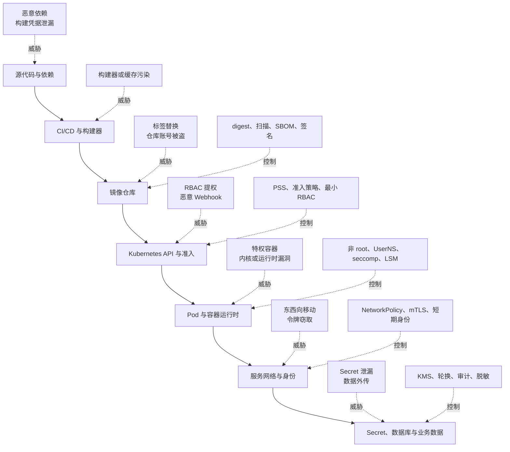
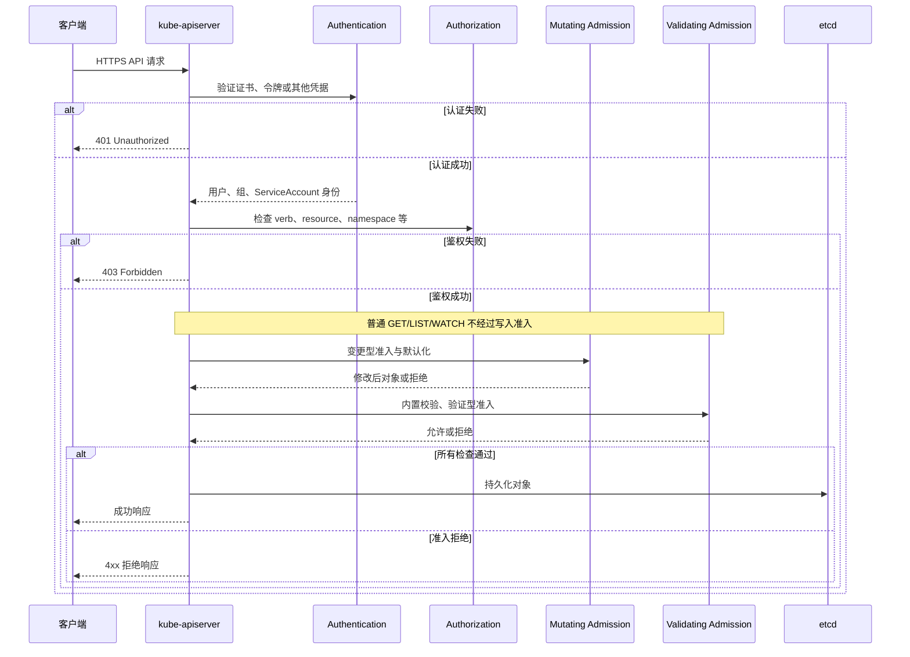
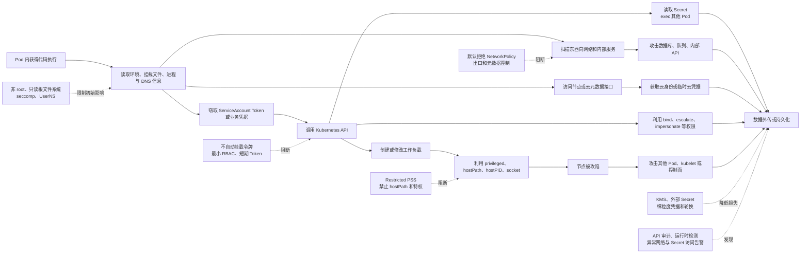

# 第18章：Docker 与 Kubernetes 安全、供应链和多租户隔离

容器安全不是在 Deployment 中补几个 `securityContext` 字段，而是保护一条完整链路：

> 源代码与依赖 → CI/CD 构建 → 镜像仓库 → Kubernetes API → 调度与容器运行时 → 服务身份与网络 → Secret 与业务数据

任何一层失守，都可能把攻击扩展到其他工作负载、节点甚至整个集群。因此，生产环境应同时遵循四项原则：

1. **默认拒绝**：没有明确需要的权限、网络访问和系统调用默认不开放。
2. **最小权限**：身份、Linux capability、文件系统、API 权限都只授予完成任务所需的最小集合。
3. **不可变与可验证**：部署确定的镜像 digest，验证来源、签名和构建证明。
4. **纵深防御**：假设单个控制可能失效，通过运行时、身份、网络和数据层继续限制影响范围。

本章按当前 Kubernetes v1.36 文档校准。`PodSecurityPolicy` 已在 Kubernetes v1.25 中移除；当前应使用内置的 Pod Security Admission、ValidatingAdmissionPolicy、准入 Webhook 或其他策略引擎，而不是继续设计新的 PSP 方案。([Kubernetes][1])

---

## 18.1 建立分层威胁模型

安全设计的第一步不是选择工具，而是回答四个问题：

* 需要保护什么资产？
* 谁可能攻击这些资产？
* 攻击者从哪里进入？
* 某一层被攻陷后，信任是否会继续向外扩散？

### 18.1.1 六层威胁模型

| 层面    | 关键资产                              | 典型威胁                                       | 核心控制                                            |
| ----- | --------------------------------- | ------------------------------------------ | ----------------------------------------------- |
| 镜像供应链 | 源代码、依赖、构建凭据、镜像、SBOM               | 恶意依赖、CI 被入侵、构建器污染、镜像替换、标签漂移                | 隔离构建、短期凭据、digest、扫描、SBOM、签名、构建证明                |
| 容器运行时 | 节点内核、容器运行时、宿主机文件和设备               | 特权容器、危险 capability、内核漏洞、Docker socket、容器逃逸 | 非 root、User Namespace、seccomp、LSM、只读根文件系统、沙箱运行时 |
| 集群控制面 | API Server、etcd、控制器、Webhook、管理员凭据 | RBAC 提权、管理员令牌泄漏、恶意准入控制器、etcd 数据泄漏          | 强认证、最小 RBAC、准入策略、etcd 加密、审计和控制面隔离               |
| 网络    | Pod、Service、DNS、节点、云元数据服务         | 东西向扫描、服务冒充、明文窃听、数据外传、访问元数据 API             | NetworkPolicy、mTLS、应用层鉴权、出口控制、网络监控              |
| 身份    | 用户、ServiceAccount、云工作负载身份、镜像仓库身份  | 令牌窃取、身份混用、长期凭据、过度授权、身份链路跳转                 | 独立 ServiceAccount、短期绑定令牌、受众限制、工作负载身份、凭据轮换       |
| 数据    | Secret、数据库凭据、用户数据、etcd 与备份        | base64 被误认为加密、Secret 横向读取、日志泄密、备份泄漏        | 静态加密、外部密钥系统、细粒度 RBAC、轮换、日志脱敏、备份保护               |



### 18.1.2 信任边界比组件名称更重要

同一组件在不同部署方式中可能处于不同信任边界。例如：

* 企业内部服务之间可能是低信任，而不是“都在内网所以可信”。
* 同一 Namespace 中的两个团队不一定应共享 Secret 和 ServiceAccount。
* CI 构建器能够向生产仓库推送镜像，它实际上属于生产信任链。
* 能创建 Pod 的主体，往往可以间接使用该 Namespace 中允许挂载的 Secret。
* 能配置准入 Webhook 的主体，可能影响整个集群的对象创建流程。

因此，安全评审应沿着**凭据、控制权和可达性**分析，而不能只沿着 Kubernetes 资源层级分析。

---

## 18.2 容器不是虚拟机：共享内核的安全边界

### 18.2.1 容器隔离依赖哪些内核机制

普通 Linux 容器不是一台独立虚拟机。多个容器通常共享宿主机内核，只是在用户空间中使用多种内核机制进行隔离：

* **Namespace**：隔离进程号、挂载点、网络、IPC、主机名和用户 ID 映射。
* **cgroup**：控制 CPU、内存、进程数和 I/O 等资源。
* **Linux capabilities**：把传统 root 权限拆成较细的能力。
* **seccomp**：过滤进程可调用的系统调用。
* **AppArmor、SELinux**：通过 Linux Security Module 实施强制访问控制。
* **只读文件系统与挂载权限**：限制容器对文件的修改范围。

这些机制叠加后形成容器边界，但它们仍依赖同一个宿主机内核。内核漏洞、容器运行时漏洞或危险配置可能让攻击者越过边界。

因此：

> 容器隔离通常比普通进程强，但不能自动等同于具有独立内核的虚拟机隔离。

对于不可信第三方代码、公共代码执行平台、在线判题或恶意租户，应考虑：

* 独立节点池；
* 基于虚拟机的沙箱运行时；
* 独立集群；
* 更严格的网络和身份边界。

### 18.2.2 容器内 root 不等于安全

在没有 User Namespace 映射时，容器内 UID 0 仍是宿主机用户命名空间中的 UID 0，只是受到 namespace、capability 和其他策略约束。

容器内 root 并不会自动拥有宿主机所有权限，但会带来以下问题：

* 一旦发生容器逃逸，攻击者更容易获得宿主机 root 权限。
* 应用漏洞可能被用于修改容器文件、安装工具或利用 setuid 文件。
* 某些挂载卷中的文件会以 root 身份创建或修改。
* 错误添加的 capability 对 root 进程尤其危险。

所以，“容器本来就隔离了”不是让应用继续以 root 运行的理由。

---

## 18.3 Docker daemon socket 为什么接近宿主机 root

Docker daemon 在传统模式下通常以 root 权限运行。能够控制 Docker daemon 的主体可以要求它：

* 启动特权容器；
* 挂载宿主机根目录；
* 访问宿主机设备；
* 加入宿主机 PID 或网络命名空间；
* 修改宿主机文件；
* 从容器进入宿主机环境。

例如，一个能够访问 Docker socket 的进程可以让 daemon 创建挂载宿主机 `/` 的容器。实际文件访问由高权限 daemon 完成，而不是由调用者自己的 Linux UID 完成。

因此，只要容器内进程能够访问：

```text
/var/run/docker.sock
```

就应把该容器视为拥有接近宿主机管理员的能力。Docker 官方文档也明确提示，只有可信用户才应控制 daemon，`docker` 用户组授予的是 root 级权限。([Docker Documentation][2])

典型危险配置包括：

```yaml
volumes:
  - name: docker-socket
    hostPath:
      path: /var/run/docker.sock
```

这类方案有时被用于“在容器中构建镜像”，但它实际上把节点控制权交给了构建任务。更安全的方向包括：

* 使用隔离的远程构建服务；
* 使用无 daemon 的镜像构建器；
* 使用短生命周期虚拟机或专用构建节点；
* 将构建节点与业务节点完全隔离；
* 不让不可信 Pull Request 获得生产仓库推送凭据。

---

## 18.4 非 root、User Namespace 与 Rootless

这三个概念经常被混淆，但解决的问题不同。

| 机制             | 含义                                         | 能防御什么                          | 不能解决什么                          |
| -------------- | ------------------------------------------ | ------------------------------ | ------------------------------- |
| 非 root 用户      | 应用进程在容器内以非 0 UID 运行                        | 降低应用漏洞后的本地权限，减少文件修改和 setuid 风险 | 容器运行时可能仍以 root 运行；不改变宿主机 UID 映射 |
| User Namespace | 将容器内 UID/GID 映射到宿主机上的非特权 UID/GID           | 即使容器内为 UID 0，在宿主机上也只是普通映射用户    | 不替代 seccomp、LSM、RBAC 或网络隔离      |
| Rootless 模式    | daemon 和容器都在非 root 用户及其 User Namespace 下运行 | 减少 daemon 被利用后直接取得宿主机 root 的风险 | 可能存在网络、存储、端口和设备功能限制             |

Docker 的 `userns-remap` 仍可以让 daemon 以 root 运行，只是容器用户被重新映射；Rootless 模式则进一步让 daemon 自身也不需要 root。([Docker Documentation][3])

Kubernetes v1.36 中，Pod User Namespace 已进入稳定状态，可通过：

```yaml
spec:
  hostUsers: false
```

请求 Pod 使用独立用户命名空间。此时容器内的 root 可以被映射为宿主机上的非特权用户。启用前仍需验证节点内核、容器运行时、卷类型和应用 UID 范围的兼容性。([Kubernetes][4])

### 18.4.1 推荐顺序

对于普通 Go 服务，优先采用：

1. 应用本身以固定非 root UID 运行；
2. Kubernetes 中设置 `runAsNonRoot`；
3. 条件允许时启用 Pod User Namespace；
4. 删除所有不必要的 capability；
5. 使用 seccomp 和 AppArmor/SELinux；
6. 对高风险租户进一步使用沙箱运行时或独立节点。

User Namespace 是额外防线，不应成为继续使用高权限容器配置的理由。

---

## 18.5 四类高风险 Pod 配置

### 18.5.1 `privileged`

```yaml
securityContext:
  privileged: true
```

特权容器通常会：

* 获得几乎全部 Linux capabilities；
* 访问宿主机设备；
* 绕过或显著放宽 seccomp、AppArmor、SELinux 限制；
* 获得接近宿主机进程的权限。

Docker 官方文档将 `--privileged` 描述为赋予容器扩展权限并开放全部主机设备，其隔离程度显著降低。([Docker Documentation][5])

`privileged: true` 应只用于确实需要控制节点的基础设施组件，并同时采用：

* 专用 Namespace；
* 专用 ServiceAccount；
* 专用节点池；
* 节点污点与容忍；
* 明确的镜像来源；
* 严格的准入例外；
* 更强的审计和变更审批。

不要为了“先跑起来”给普通应用添加特权。

### 18.5.2 `hostNetwork`

```yaml
spec:
  hostNetwork: true
```

Pod 直接使用节点网络命名空间，风险包括：

* 可以占用或监听节点端口；
* Pod IP 与节点网络边界被弱化；
* 可能访问只在节点网络可达的服务；
* 常规 Pod NetworkPolicy 行为可能因 CNI 实现而不同；
* 多个 Pod 之间可能产生端口冲突。

仅节点网络代理、部分监控代理等基础设施组件可能合理需要此配置。

### 18.5.3 `hostPID`

```yaml
spec:
  hostPID: true
```

Pod 能看到宿主机进程 ID 空间。这会增加：

* 进程信息泄漏；
* 读取 `/proc` 中敏感元数据的机会；
* 调试接口滥用；
* 结合 `CAP_SYS_PTRACE`、高权限挂载或特权模式攻击宿主机进程的风险。

### 18.5.4 `hostPath`

```yaml
volumes:
  - name: host-root
    hostPath:
      path: /
```

`hostPath` 将节点文件或目录直接暴露给 Pod。可访问的内容可能包括：

* 容器运行时 socket；
* kubelet 目录；
* 节点证书；
* 主机日志；
* `/proc`、`/sys`；
* 其他 Pod 的卷数据；
* 宿主机根文件系统。

即使设置 `readOnly: true`，仍可能发生信息泄漏。应用应优先使用：

* `emptyDir`；
* `ConfigMap`；
* `Secret`；
* `projected`；
* PVC；
* 受控 CSI 驱动。

Kubernetes RBAC 最佳实践特别指出，能创建使用 `hostPath` 或高权限配置 Pod 的主体可能进一步取得节点访问权。([Kubernetes][6])

---

## 18.6 Linux capabilities：不要在 root 和非 root 之间二选一

传统 Unix 把大量系统权限集中在 UID 0。Linux capabilities 将其拆分为多项能力，例如：

* `CAP_NET_BIND_SERVICE`：绑定低端口；
* `CAP_NET_ADMIN`：修改网络配置；
* `CAP_SYS_PTRACE`：跟踪其他进程；
* `CAP_DAC_READ_SEARCH`：绕过部分文件读取检查；
* `CAP_SYS_MODULE`：加载内核模块；
* `CAP_SYS_ADMIN`：包含大量系统管理能力，攻击面非常广。

正确策略不是“应用需要某个权限，所以使用 root”，而是：

```yaml
securityContext:
  capabilities:
    drop:
      - ALL
    add:
      - NET_BIND_SERVICE
```

只添加经过证明不可避免的 capability。很多 Go HTTP 服务监听 8080、8443 等非特权端口，根本不需要添加任何 capability。

Docker 默认仅保留一组有限 capability，也支持通过 `--cap-drop` 和 `--cap-add` 调整。生产环境应进一步执行显式 `drop: ["ALL"]`，防止镜像或运行时默认值变化带来隐式权限。([Docker Documentation][5])

### 18.6.1 `allowPrivilegeEscalation`

```yaml
allowPrivilegeEscalation: false
```

该字段阻止进程通过 setuid、setgid 等方式获得比父进程更高的权限，在 Linux 中对应 `no_new_privs` 语义。

但它不是万能开关：

* 容器为 `privileged` 时不能依靠它恢复隔离；
* 具有 `CAP_SYS_ADMIN` 等高权限时也不能把它视为完整防线；
* 它不能替代 capability 删除、seccomp 或 LSM。

Kubernetes 安全上下文文档明确指出，特权容器或拥有 `CAP_SYS_ADMIN` 的容器会使 privilege escalation 始终成立。([Kubernetes][7])

---

## 18.7 seccomp、AppArmor 与 SELinux 的职责

这三种机制解决的问题不同。

| 机制       | 主要控制对象                 | 典型用途                        |
| -------- | ---------------------- | --------------------------- |
| seccomp  | 系统调用                   | 禁止容器调用不需要且高风险的内核接口          |
| AppArmor | 基于 profile 的文件路径、能力和操作 | 限制进程可访问的路径及可执行行为            |
| SELinux  | 带安全标签的进程和对象            | 通过类型强制规则控制进程对文件、设备、端口等对象的访问 |

### 18.7.1 seccomp

推荐至少设置运行时默认配置：

```yaml
securityContext:
  seccompProfile:
    type: RuntimeDefault
```

Docker 的默认 seccomp 配置会阻止一批高风险或通常不需要的系统调用。直接设置 `Unconfined` 会移除这一层保护。([Docker Documentation][8])

自定义 seccomp profile 可以进一步收紧，但需要注意：

* 应用升级可能增加新的系统调用；
* Go 运行时、DNS、线程、性能分析和 CGO 都可能影响调用集合；
* profile 必须部署到相应节点；
* 过于激进的 profile 可能造成难以诊断的生产故障。

通常先使用 `RuntimeDefault`，再根据高风险应用的实际行为制作自定义 profile。

### 18.7.2 AppArmor

Docker 在支持的主机上通常使用默认 `docker-default` AppArmor profile。Kubernetes 也可以为容器指定 `RuntimeDefault` 或节点上的 `Localhost` profile。([Docker Documentation][9])

AppArmor 更适合表达类似规则：

* 允许读取 `/etc/ssl/certs`；
* 禁止写入 `/usr`；
* 禁止执行 shell；
* 只允许访问指定目录。

### 18.7.3 SELinux

SELinux 给进程和对象分配标签，并根据策略判断访问是否合法。与简单 Unix 文件权限相比，它能够限制“即使 UID 权限允许，也不能访问”的行为。

SELinux 特别适合：

* 多容器共享节点；
* 多租户环境；
* 受控卷访问；
* 限制被攻陷进程访问其他类型的数据。

seccomp 过滤“能调用哪些内核接口”，AppArmor/SELinux 控制“能对哪些对象做什么”。它们不是互相替代，而是叠加防御。([Kubernetes][10])

---

## 18.8 安全的 Go 容器镜像

### 18.8.1 多阶段构建

下面的 Dockerfile 展示了主要原则。实际使用时必须用组织批准并验证过的真实 digest 替换占位符。

```dockerfile
# syntax=docker/dockerfile:1

FROM golang:<approved-version>@sha256:<builder-digest> AS build

WORKDIR /src

COPY go.mod go.sum ./
RUN go mod download && go mod verify

COPY . .

RUN CGO_ENABLED=0 \
    go build \
      -trimpath \
      -o /out/order-api \
      ./cmd/order-api

FROM gcr.io/distroless/static-debian12:nonroot@sha256:<runtime-digest>

COPY --from=build --chown=65532:65532 /out/order-api /order-api

USER 65532:65532

ENTRYPOINT ["/order-api"]
```

其安全价值包括：

* 编译器、包管理器和源码不会进入最终镜像；
* 运行镜像不包含 shell、curl 等非必要工具；
* 以非 root 用户启动；
* 基础镜像通过 digest 固定；
* 镜像体积和可利用组件数量更少。

最小镜像减少攻击面，但不能自动证明镜像安全。仍需扫描 Go 依赖、基础镜像组件和最终制品，并持续重建以吸收安全修复。([Docker Documentation][11])

### 18.8.2 不要把敏感信息放进镜像层

以下方式都不安全：

```dockerfile
ARG DATABASE_PASSWORD
ENV DATABASE_PASSWORD=${DATABASE_PASSWORD}
COPY production-key.pem /app/key.pem
RUN git config --global url."https://token@...".insteadOf ...
```

即使后续执行 `RUN rm`，敏感数据也可能仍存在于先前镜像层、构建日志或缓存中。

需要在构建阶段访问私有依赖时，应使用：

* 构建系统的短期身份；
* BuildKit secret mount；
* 临时 SSH agent；
* 隔离且自动销毁的构建器；
* 不进入镜像层和日志的凭据注入机制。

---

## 18.9 一个经过加固的 Kubernetes 工作负载

```yaml
apiVersion: apps/v1
kind: Deployment
metadata:
  name: order-api
  namespace: orders
spec:
  replicas: 3
  selector:
    matchLabels:
      app: order-api
  template:
    metadata:
      labels:
        app: order-api
    spec:
      serviceAccountName: order-api
      automountServiceAccountToken: false

      # 需要节点、内核和容器运行时支持。
      hostUsers: false

      securityContext:
        runAsNonRoot: true
        runAsUser: 65532
        runAsGroup: 65532
        fsGroup: 65532
        seccompProfile:
          type: RuntimeDefault

      containers:
        - name: api
          image: registry.example.com/orders/order-api@sha256:<image-digest>
          imagePullPolicy: IfNotPresent

          ports:
            - name: http
              containerPort: 8080

          securityContext:
            privileged: false
            allowPrivilegeEscalation: false
            readOnlyRootFilesystem: true
            capabilities:
              drop:
                - ALL

          resources:
            requests:
              cpu: 100m
              memory: 128Mi
              ephemeral-storage: 32Mi
            limits:
              cpu: "1"
              memory: 512Mi
              ephemeral-storage: 128Mi

          volumeMounts:
            - name: tmp
              mountPath: /tmp

      volumes:
        - name: tmp
          emptyDir:
            sizeLimit: 64Mi
```

### 18.9.1 每项配置解决什么问题

| 配置                                    | 作用                             |
| ------------------------------------- | ------------------------------ |
| `runAsNonRoot: true`                  | 拒绝明显以 UID 0 运行的容器              |
| `runAsUser`、`runAsGroup`              | 固定运行身份，避免镜像默认用户不明确             |
| `hostUsers: false`                    | 请求使用 Pod User Namespace        |
| `allowPrivilegeEscalation: false`     | 阻止通过 setuid 等机制提升权限            |
| `readOnlyRootFilesystem: true`        | 阻止运行时修改镜像根文件系统                 |
| `capabilities.drop: [ALL]`            | 删除默认 capability                |
| `seccompProfile: RuntimeDefault`      | 使用容器运行时的默认系统调用过滤               |
| `automountServiceAccountToken: false` | 应用不需要 Kubernetes API 时，不自动提供令牌 |
| `resources`                           | 降低资源耗尽和 noisy neighbor 风险      |
| 固定 digest                             | 保证部署解析到确定的镜像内容                 |

`readOnlyRootFilesystem` 不是当前 Restricted Pod Security Standard 的强制项，但仍是值得单独实施的加固措施。应用确实需要写入的数据应放到显式卷中，而不是把整个根文件系统改回可写。

---

## 18.10 镜像供应链安全

### 18.10.1 标签不是不可变身份

以下镜像引用依赖可变标签：

```yaml
image: registry.example.com/order-api:latest
```

即使使用语义版本标签：

```yaml
image: registry.example.com/order-api:v2.3.1
```

仓库管理员仍可能重新推送同名标签。更可靠的部署引用是：

```yaml
image: registry.example.com/order-api@sha256:<digest>
```

digest 标识镜像内容。只要内容改变，digest 就会改变。

但是，固定 digest 只解决“部署的是不是同一个制品”，并不回答：

* 这个制品是否由可信构建器生成；
* 源代码是否可信；
* 是否包含已知漏洞；
* 构建时是否注入了恶意内容；
* 是否应该继续使用这个旧制品。

因此，digest 必须与签名、证明和更新流程组合使用。

### 18.10.2 漏洞扫描

供应链扫描至少应覆盖：

1. Go 模块和标准库；
2. 操作系统包；
3. 构建镜像；
4. 最终运行镜像；
5. IaC、Dockerfile 和 Kubernetes YAML；
6. 运行中的已部署 digest。

对 Go 项目可执行：

```bash
govulncheck ./...
```

`govulncheck` 不只是检查依赖版本，还会分析代码是否实际可达已知漏洞函数，从而降低只按依赖清单扫描产生的部分噪声。([Go][12])

扫描结果不能只用“有 CVE 就阻断”的单一规则，应结合：

* 漏洞严重性；
* 是否存在实际调用路径；
* 是否可从当前暴露面利用；
* 是否已有修复版本；
* 是否存在补偿控制；
* 风险例外是否有负责人和过期时间。

扫描是时间点判断。今天无漏洞，不代表下周仍然无漏洞，所以还要持续重新扫描并周期性重建镜像。

### 18.10.3 SBOM

SBOM 是软件物料清单，记录制品中包含的组件及版本，常见格式包括 SPDX 和 CycloneDX。

SBOM 可以回答：

* 这个镜像包含哪些模块和包？
* 某个新披露漏洞影响哪些线上制品？
* 某个依赖来自哪里？
* 哪些镜像需要重新构建？

SBOM 不等于漏洞扫描报告，也不证明组件没有恶意代码。它是资产清单和后续分析基础。

### 18.10.4 镜像签名与构建证明

镜像签名用于证明：

* 某个身份对特定 digest 签了名；
* 制品自签名后没有改变。

构建证明或 provenance attestation 可进一步记录：

* 源代码仓库及提交；
* 构建工作流；
* 构建器身份；
* 构建参数；
* 输出制品 digest。

签名本身不能证明镜像“安全”。攻击者如果控制了被信任的构建工作流，仍可能产出一个带有效签名的恶意镜像。因此，生产准入策略应同时验证：

* 签名身份和签发者；
* 镜像仓库范围；
* digest；
* 构建工作流身份；
* 来源仓库和提交；
* SBOM 或 provenance 是否存在；
* 是否满足漏洞与审批策略。

Cosign 等工具可以对镜像、SBOM 和证明进行签名或验证，但真正的安全边界来自完整策略，而不是“运行过签名命令”。([Sigstore][13])

### 18.10.5 推荐的制品晋级流程

```text
开发提交
  ↓
隔离构建
  ↓
单元测试、静态分析、govulncheck
  ↓
生成最终镜像和 SBOM
  ↓
扫描最终镜像
  ↓
生成构建证明并签名 digest
  ↓
推送不可变仓库
  ↓
测试环境按同一 digest 验证
  ↓
生产准入验证签名、证明和策略
  ↓
按原 digest 晋级，不在生产前重新构建
```

“重新构建相同源码再部署生产”可能生成不同制品，也会重新引入构建环境风险。更可靠的方式是让经过测试的同一个 digest 晋级。

---

## 18.11 私有镜像仓库和拉取凭据

### 18.11.1 `imagePullSecrets`

Kubernetes 可以使用 Namespace 中的 Secret 拉取私有镜像：

```yaml
apiVersion: v1
kind: ServiceAccount
metadata:
  name: order-api
  namespace: orders
imagePullSecrets:
  - name: orders-registry-pull
```

`imagePullSecrets` 必须存在于 Pod 所在 Namespace，也可以绑定到 ServiceAccount，使使用该 ServiceAccount 的 Pod 自动引用。([Kubernetes][14])

拉取凭据应满足：

* 只有 pull 权限，没有 push 或 delete 权限；
* 只允许访问所需仓库路径；
* 不与 CI 推送身份复用；
* 尽量使用短期动态凭据；
* 不在命令行、工单和日志中暴露密码；
* 定期轮换并检查旧凭据是否已撤销。

### 18.11.2 凭据轮换流程

一次安全轮换通常包括：

1. 创建新凭据；
2. 将新凭据写入新的 Secret 或外部凭据版本；
3. 更新 ServiceAccount 或工作负载引用；
4. 验证新 Pod 能够从空节点成功拉取镜像；
5. 滚动替换现有 Pod；
6. 检查仍使用旧凭据的客户端；
7. 撤销旧凭据；
8. 审计异常拉取和推送记录。

仅验证“已有节点能启动 Pod”并不充分，因为节点可能使用缓存镜像。多租户场景还可考虑启用 `AlwaysPullImages` 等控制，避免租户通过节点缓存使用自己无权从仓库拉取的镜像。([Kubernetes][14])

---

## 18.12 Kubernetes API 请求链

Kubernetes API 安全可以概括为三个核心问题：

1. **Authentication：你是谁？**
2. **Authorization：你能做什么？**
3. **Admission：即使你有权提交，这个对象是否符合集群策略？**



准入控制主要处理创建、修改、删除和部分连接型请求，不负责普通读取请求。Mutating Admission 先于 Validating Admission 执行；任何阶段拒绝，请求都不会写入存储。([Kubernetes][15])

### 18.12.1 Authentication

认证结果通常包含：

* 用户名；
* 用户组；
* ServiceAccount 身份；
* 可能的额外身份属性。

常见认证方式包括：

* 客户端证书；
* OIDC；
* ServiceAccount Token；
* 认证 Webhook；
* 云厂商身份集成。

认证成功只代表 API Server 知道请求者是谁，不代表其有权执行操作。

### 18.12.2 Authorization

鉴权会检查：

* 请求主体；
* API group；
* resource 与 subresource；
* verb；
* Namespace；
* resource name；
* 非资源 URL。

例如：

```text
主体：system:serviceaccount:orders:order-api
动作：get
资源：configmaps
命名空间：orders
对象名：order-api-runtime
```

Kubernetes 可以使用 RBAC、Node、Webhook 等鉴权模式。生产环境通常以 RBAC 为主要授权机制。

### 18.12.3 Admission

准入控制位于认证和鉴权之后。它适合执行：

* 默认值注入；
* Sidecar 注入；
* Pod Security；
* 强制镜像仓库；
* 强制 digest；
* 验证签名与构建证明；
* 禁止 `hostPath`；
* 要求资源 requests/limits；
* 强制组织标签；
* 限制 LoadBalancer、Ingress 或特定 CRD。

注意：

> Admission 不能弥补读取权限过大的 RBAC，因为普通读取不会经过写入准入检查。

---

## 18.13 RBAC 四类对象

| 对象                   | 规则范围                                | 授权范围                             |
| -------------------- | ----------------------------------- | -------------------------------- |
| `Role`               | 定义某个 Namespace 内资源权限                | 只能用于其所在 Namespace                |
| `ClusterRole`        | 定义集群级资源、非资源 URL，或可复用的 namespaced 规则 | 由绑定方式决定                          |
| `RoleBinding`        | 绑定 Role 或 ClusterRole               | 权限只在 RoleBinding 所在 Namespace 生效 |
| `ClusterRoleBinding` | 绑定 ClusterRole                      | 权限在整个集群范围生效                      |

### 18.13.1 最小权限示例

应用只需要读取一个指定 ConfigMap：

```yaml
apiVersion: v1
kind: ServiceAccount
metadata:
  name: order-api
  namespace: orders
---
apiVersion: rbac.authorization.k8s.io/v1
kind: Role
metadata:
  name: order-api-runtime-config
  namespace: orders
rules:
  - apiGroups: [""]
    resources: ["configmaps"]
    resourceNames: ["order-api-runtime"]
    verbs: ["get"]
---
apiVersion: rbac.authorization.k8s.io/v1
kind: RoleBinding
metadata:
  name: order-api-runtime-config
  namespace: orders
subjects:
  - kind: ServiceAccount
    name: order-api
    namespace: orders
roleRef:
  apiGroup: rbac.authorization.k8s.io
  kind: Role
  name: order-api-runtime-config
```

这里没有授予：

* `list` 或 `watch` 所有 ConfigMap；
* Secret 读取；
* Pod 创建；
* Deployment 修改；
* 跨 Namespace 权限。

### 18.13.2 为什么优先 RoleBinding

假设多个 Namespace 中的应用都需要读取 ConfigMap，可以定义一个可复用的 ClusterRole，再分别使用各 Namespace 的 RoleBinding：

```text
ClusterRole：允许读取 ConfigMap
        +
orders Namespace 的 RoleBinding
        =
只在 orders Namespace 中获得相应权限
```

如果改用 ClusterRoleBinding，就会把同一规则授予整个集群。

---

## 18.14 ServiceAccount 安全

ServiceAccount 是 Kubernetes 中供非人类工作负载使用的 namespaced 身份。每个 Namespace 都有一个 `default` ServiceAccount；未显式指定时，Pod 会使用它。([Kubernetes][16])

### 18.14.1 不要让所有应用共用 `default`

推荐每个安全边界使用独立 ServiceAccount：

```yaml
spec:
  serviceAccountName: order-api
```

原因包括：

* 可以为每个应用授予不同 RBAC；
* 审计日志能识别具体工作负载；
* 某个应用被攻陷后，不会自动继承 Namespace 中其他应用所需权限；
* 凭据轮换和事故响应更加明确。

### 18.14.2 不需要 API 就不要挂载令牌

```yaml
spec:
  automountServiceAccountToken: false
```

大多数普通业务 API 只需要访问数据库、消息队列和其他服务，并不需要调用 Kubernetes API。此时挂载 ServiceAccount Token 只会增加攻击者可窃取的凭据。

Kubernetes 当前使用 TokenRequest 和 projected volume 提供有受众、有效期且绑定到对象的 ServiceAccount Token，kubelet 可以负责轮换。应避免为普通工作负载创建长期静态 ServiceAccount Token Secret。([Kubernetes][17])

### 18.14.3 令牌短期化不等于权限安全

即使令牌只有一小时有效期，如果它拥有：

```text
create pods
get/list secrets
create clusterrolebindings
```

攻击者仍可能在几秒内完成提权或建立持久化。

短期令牌降低凭据长期泄漏风险，但不能替代最小 RBAC。

---

## 18.15 RBAC 权限升级风险

### 18.15.1 通配符权限

以下规则极其危险：

```yaml
rules:
  - apiGroups: ["*"]
    resources: ["*"]
    verbs: ["*"]
```

通配符不仅包含当前资源，也可能自动覆盖未来增加的 API 资源和 subresource。Kubernetes 官方 RBAC 指南建议显式列举所需资源和动作，避免无边界通配符。([Kubernetes][18])

### 18.15.2 常见高风险权限

| 权限                        | 风险                                      |
| ------------------------- | --------------------------------------- |
| `get/list/watch secrets`  | 直接读取或批量监视敏感数据                           |
| `create pods`、创建工作负载      | 可能挂载本 Namespace 的 Secret，或在准入不足时请求宿主机权限 |
| `pods/exec`、`pods/attach` | 进入其他容器并读取进程、文件或挂载凭据                     |
| `serviceaccounts/token`   | 为其他 ServiceAccount 请求令牌                 |
| `bind`                    | 把现有高权限 Role 或 ClusterRole 绑定给主体         |
| `escalate`                | 创建或修改包含自身原本不具备权限的 Role                  |
| `impersonate`             | 以其他用户、组或 ServiceAccount 发起请求            |
| `nodes/proxy`             | 访问 kubelet 等节点 API，可能绕过正常准入和审计路径        |
| 修改 Webhook 配置             | 拦截、修改或阻断大量集群请求                          |
| 修改 CRD                    | 改变集群级 API 结构和行为                         |
| `cluster-admin`           | 几乎拥有整个集群控制权                             |

### 18.15.3 `cluster-admin` 不应成为故障修复手段

常见反模式是：

```text
应用报 Forbidden
→ 绑定 cluster-admin
→ 应用恢复
→ 权限永久保留
```

正确处理方式是：

1. 从拒绝日志中确认实际缺少的 verb、resource 和 Namespace；
2. 判断应用是否真的应执行该操作；
3. 添加最小规则；
4. 使用受控测试验证；
5. 对临时权限设置明确到期时间；
6. 审计并移除遗留绑定。

部署身份和运行时身份也应分离：

* CI/CD 可以更新 Deployment，但不应读取业务 Secret；
* 运行时 ServiceAccount 可以读取必要配置，但不应修改 Deployment；
* 人类管理员使用临时提升，而不是长期共享管理员 kubeconfig。

---

## 18.16 Pod Security Standards

Pod Security Standards 定义了三个标准化安全级别：

| 级别           | 目标                       | 适用场景                |
| ------------ | ------------------------ | ------------------- |
| `privileged` | 不限制，允许已知提权配置             | 需要节点级权限的受控系统组件      |
| `baseline`   | 阻止常见和已知的权限升级方式，同时保持较高兼容性 | 一般工作负载的最低基线         |
| `restricted` | 执行当前 Pod 加固最佳实践，兼容性要求更高  | 普通业务服务、低信任和安全关键工作负载 |

注意：

> PSS 中的 `privileged` 是策略级别名称，不等于某个 Pod 一定设置了 `securityContext.privileged: true`。它表示该策略级别不对 Pod 实施限制。

Restricted 继承 Baseline 的要求，并进一步要求或限制：

* 非 root；
* `allowPrivilegeEscalation: false`；
* 显式 seccomp `RuntimeDefault` 或 `Localhost`；
* capability 必须 `drop: ["ALL"]`；
* 最多只允许重新添加 `NET_BIND_SERVICE`；
* 只允许特定安全卷类型；
* 禁止 `runAsUser: 0`。

当前标准的精确字段随 Kubernetes 小版本演进，因此应固定策略版本，而不是永久使用含义会变化的 `latest`。([Kubernetes][19])

### 18.16.1 Restricted 不是完整安全策略

Restricted PSS 并不负责：

* 强制镜像使用 digest；
* 验证镜像签名；
* 限制镜像仓库；
* 强制 `readOnlyRootFilesystem`；
* 创建 NetworkPolicy；
* 检查 RBAC；
* 限制 ServiceAccount 权限；
* 配置 Secret 加密；
* 防止应用逻辑漏洞。

它解决的是 Pod 配置中的一组通用安全基线，而不是集群全部安全需求。

---

## 18.17 Pod Security Admission

Pod Security Admission 是 Kubernetes 内置的准入控制器，用于在 Namespace 层面执行 PSS。它自 Kubernetes v1.25 起处于稳定状态。([Kubernetes][1])

### 18.17.1 三种模式

| 模式        | 违规时行为            |
| --------- | ---------------- |
| `enforce` | 拒绝 Pod           |
| `audit`   | 允许请求，但在审计事件中记录违规 |
| `warn`    | 允许请求，但向客户端返回警告   |

Namespace 示例：

```yaml
apiVersion: v1
kind: Namespace
metadata:
  name: orders
  labels:
    pod-security.kubernetes.io/enforce: restricted
    pod-security.kubernetes.io/enforce-version: v1.36

    pod-security.kubernetes.io/audit: restricted
    pod-security.kubernetes.io/audit-version: v1.36

    pod-security.kubernetes.io/warn: restricted
    pod-security.kubernetes.io/warn-version: v1.36
```

也可以执行：

```bash
kubectl label namespace orders \
  pod-security.kubernetes.io/enforce=restricted \
  pod-security.kubernetes.io/enforce-version=v1.36 \
  pod-security.kubernetes.io/audit=restricted \
  pod-security.kubernetes.io/audit-version=v1.36 \
  pod-security.kubernetes.io/warn=restricted \
  pod-security.kubernetes.io/warn-version=v1.36
```

推荐迁移顺序：

1. 先启用 `warn` 和 `audit`；
2. 收集违规工作负载；
3. 修复 manifest；
4. 对基础设施组件设计最小例外；
5. 再启用 `enforce`；
6. 集群升级时评估新版标准差异，再更新版本标签。

对于 Deployment、Job 等间接创建 Pod 的资源，`warn` 和 `audit` 会检查 Pod template，从而尽早提示；`enforce` 最终作用于实际创建的 Pod。([Kubernetes][1])

---

## 18.18 Pod Security Admission 与准入 Webhook

二者不是替代关系。

| 能力             | Pod Security Admission | 准入 Webhook            |
| -------------- | ---------------------- | --------------------- |
| 内置于 Kubernetes | 是                      | 否，需要外部服务              |
| 策略模型           | 固定的 PSS 三级标准           | 可实现自定义逻辑              |
| 修改对象           | 否                      | Mutating Webhook 可以   |
| 验证对象           | 是                      | Validating Webhook 可以 |
| 验证镜像签名         | 不支持                    | 可以                    |
| 强制指定仓库或 digest | 不支持                    | 可以                    |
| 外部依赖和网络调用      | 无                      | 有                     |
| 运维复杂度          | 低                      | 较高                    |
| 故障对 API 写入的影响  | 较小                     | Webhook 故障可能阻断请求      |

推荐组合：

```text
Pod Security Admission
    负责通用 Pod 安全基线
        +
ValidatingAdmissionPolicy 或 Webhook
    负责组织自定义规则
        +
Mutating Webhook
    只用于确实需要且副作用受控的注入
```

简单、声明式且只依赖对象内容的验证，可以优先考虑基于 CEL、在 API Server 内执行的 ValidatingAdmissionPolicy，从而避免外部网络调用。需要查询外部签名系统、镜像元数据或执行复杂组织逻辑时，再使用 Webhook。([Kubernetes][20])

### 18.18.1 Webhook 自身也是关键基础设施

Webhook 设计必须考虑：

* 高可用和多副本；
* 超时时间；
* `failurePolicy`；
* 是否可以 fail-open；
* 请求幂等性；
* `namespaceSelector` 和 `objectSelector`；
* 是否意外拦截自身 Pod；
* 证书轮换；
* 版本兼容；
* API Server 到 Webhook 的网络可达性；
* 延迟和错误监控。

安全 Webhook 如果不可靠，可能把整个集群的 Deployment、Pod 或其他资源创建全部阻断。

---

## 18.19 NetworkPolicy 与东西向隔离

### 18.19.1 Kubernetes 网络默认不是零信任

在没有适用 NetworkPolicy 时，Pod 通常可以：

* 接收其他 Pod 流量；
* 访问其他 Namespace；
* 访问外部网络；
* 访问集群 DNS；
* 访问部分节点或云网络地址。

NetworkPolicy 只有在所用 CNI 插件支持并执行策略时才生效。仅创建 YAML，而 CNI 不支持 NetworkPolicy，不会产生隔离效果。([Kubernetes][21])

### 18.19.2 默认拒绝

```yaml
apiVersion: networking.k8s.io/v1
kind: NetworkPolicy
metadata:
  name: default-deny-all
  namespace: orders
spec:
  podSelector: {}
  policyTypes:
    - Ingress
    - Egress
```

它选择 Namespace 中所有 Pod，但没有定义任何允许规则，因此默认拒绝 ingress 和 egress。

NetworkPolicy 规则是**允许列表且具有可加性**：

* 没有策略选择某 Pod 的某个方向时，该方向通常不隔离；
* 一旦某策略选择 Pod，该方向只允许所有匹配策略规则的并集；
* 对于 Pod 到 Pod 的连接，源 Pod 的 egress 和目标 Pod 的 ingress 都必须允许。

### 18.19.3 显式允许 DNS 和下游服务

```yaml
apiVersion: networking.k8s.io/v1
kind: NetworkPolicy
metadata:
  name: order-api-egress
  namespace: orders
spec:
  podSelector:
    matchLabels:
      app: order-api
  policyTypes:
    - Egress
  egress:
    # 允许访问集群 DNS。
    - to:
        - namespaceSelector:
            matchLabels:
              kubernetes.io/metadata.name: kube-system
          podSelector:
            matchLabels:
              k8s-app: kube-dns
      ports:
        - protocol: UDP
          port: 53
        - protocol: TCP
          port: 53

    # 只允许访问 payments Namespace 中的 payment-api。
    - to:
        - namespaceSelector:
            matchLabels:
              kubernetes.io/metadata.name: payments
          podSelector:
            matchLabels:
              app: payment-api
      ports:
        - protocol: TCP
          port: 8443
```

启用默认拒绝 egress 后，DNS 也会被拒绝，所以必须显式放行。([Kubernetes][21])

### 18.19.4 NetworkPolicy 的边界

NetworkPolicy 通常工作在三层和四层，不能替代：

* HTTP 路径鉴权；
* 用户和租户权限检查；
* TLS；
* 服务端证书验证；
* 数据库权限；
* 请求级审计。

它也不会自动加密流量。生产服务仍应使用 TLS 或 mTLS，并在应用层校验调用者身份和权限。

对于以下流量，必须结合所用 CNI 和云平台验证实际行为：

* `hostNetwork` Pod；
* 节点本地地址；
* 云元数据服务；
* NAT 前后的外部 IP；
* NodePort、LoadBalancer 和 Ingress；
* DNS 和控制面依赖。

---

## 18.20 Kubernetes Secret：base64 不是加密

Secret YAML 中的 `data` 使用 base64 编码：

```yaml
apiVersion: v1
kind: Secret
metadata:
  name: database
type: Opaque
data:
  username: YXBw
  password: c2VjcmV0
```

任何取得该对象的人都可以直接解码：

```bash
printf '%s' 'c2VjcmV0' | base64 --decode
```

base64 只解决二进制数据在文本格式中的表示问题，不提供机密性。

默认情况下，Kubernetes API Server 可能以未加密的资源表示把 Secret 写入 etcd，因此必须显式配置静态加密。([Kubernetes][22])

### 18.20.1 Secret 的主要风险路径

* 拥有 `get/list/watch secrets` 权限；
* 拥有创建 Pod 的权限，可让 Pod 挂载 Secret；
* Secret 被注入所有 Sidecar，而不是只提供给需要的容器；
* Secret 出现在环境变量、进程转储或诊断页面；
* 应用把配置对象、请求 Header 或完整环境打印到日志；
* Secret YAML 被提交到 Git；
* etcd 快照、节点磁盘或备份未加密；
* 长期凭据从不轮换；
* 一套凭据被多个应用或环境共享。

Kubernetes 官方 Secret 最佳实践提醒，能够在某个 Namespace 创建 Pod 的主体可能间接读取该 Namespace 中的 Secret，因此 Pod 创建权本身也是敏感权限。([Kubernetes][23])

---

## 18.21 etcd 静态加密与外部 KMS

### 18.21.1 静态加密

API Server 可以通过 `EncryptionConfiguration` 对写入 etcd 的 Secret 等资源进行加密。关键点包括：

* 所有 API Server 实例必须使用一致配置；
* provider 顺序决定新数据使用哪种方式写入；
* 把 `identity` 放在第一位意味着新对象以明文存储；
* 启用加密后，已有对象不会自动全部重写；
* 轮换密钥时需要重新写入现有对象；
* etcd 快照和备份仍需单独保护。

仅把本地加密密钥放在控制面节点文件中，可以防御单独的 etcd 数据泄漏，但不能充分防御控制面主机和密钥文件同时被攻陷。

### 18.21.2 KMS v2 与信封加密

KMS v2 自 Kubernetes v1.29 起稳定，可将根密钥保留在外部密钥管理系统中，并使用信封加密保护 Kubernetes 数据。([Kubernetes][24])

概念流程如下：

```text
业务 Secret
   ↓ 使用数据密钥 DEK 加密
密文数据
   +
被外部 KMS 主密钥 KEK 加密的 DEK
   ↓
写入 etcd
```

外部 KMS 的价值包括：

* 根密钥不直接保存在 etcd；
* 密钥使用可以集中审计；
* 可以执行独立权限控制；
* 可以进行集中轮换和吊销。

但 KMS 不能防止拥有合法 Kubernetes Secret 读取权限的人通过 API 获取解密后的值。它保护的是静态数据和密钥边界，不替代 RBAC。

### 18.21.3 密钥轮换

轮换通常需要：

1. 在 KMS 中生成或启用新密钥版本；
2. 更新 API Server 加密配置，使新 provider 位于第一位；
3. 确认所有 API Server 已加载新配置；
4. 通过 API 重写现有 Secret；
5. 验证 etcd 中的数据已使用新密钥；
6. 保留旧密钥用于过渡期解密；
7. 确认无旧密文后禁用旧密钥；
8. 验证备份和恢复流程。

provider 顺序和对象重写是 Kubernetes 静态加密轮换的关键；只替换配置文件而不重写对象，不会自动把旧数据全部迁移到新密钥。([Kubernetes][24])

---

## 18.22 外部 Secret 系统

外部 Secret 系统可以使用：

* 云 KMS；
* 专用 Secret Manager；
* Vault 类系统；
* CSI Secret Store；
* 应用启动时通过工作负载身份动态获取凭据。

其主要价值是：

* 不在 Git 中保存明文；
* 使用短期动态凭据；
* 集中轮换；
* 细粒度访问策略；
* 集中审计；
* 减少长期静态 Secret。

但需要正确理解：

> 外部 Secret 系统只是移动和缩短了机密数据的生命周期，并没有让运行中的应用不再接触明文。

应用在使用数据库密码、私钥或 API Token 时，明文最终仍会进入：

* 进程内存；
* 文件；
  -本地代理；
* TLS 连接配置；
* 下游认证请求。

因此仍需保护：

* 工作负载身份；
* 节点；
* 进程内存和调试接口；
* 日志；
* Sidecar；
* 文件权限；
* 网络路径。

---

## 18.23 Namespace 多租户的隔离边界

Namespace 可以提供：

* namespaced API 对象隔离；
* Role 和 RoleBinding 授权边界；
* ResourceQuota；
* LimitRange；
* NetworkPolicy 选择范围；
* PSS 标签；
* 成本和审计归属。

但 Namespace 不是独立安全内核，也不是独立控制面。

Kubernetes 本身没有完整的一等“租户”对象。多租户通常需要通过 Namespace、RBAC、网络、节点、策略和配额组合实现。([Kubernetes][25])

### 18.23.1 Namespace 不能隔离什么

Namespace 不能天然隔离：

* 宿主机内核；
* 节点；
* kubelet；
* API Server 和 etcd；
* CNI、CSI 和 CoreDNS；
* CRD；
* Node、PersistentVolume、StorageClass 等 cluster-scoped 资源；
* MutatingWebhookConfiguration 和 ValidatingWebhookConfiguration；
* 集群管理员；
* 控制面容量；
* 共享日志和监控平台。

如果某租户能创建特权 Pod、使用 `hostPath` 或控制 Webhook，那么 Namespace 名称并不能阻止其影响其他租户。

### 18.23.2 软多租户与硬多租户

**软多租户**通常指：

* 同一组织内团队；
* 团队之间基本可信；
* 主要防止误操作和普通应用漏洞；
* 共享集群管理员；
* 可以接受共享控制面和节点。

可采用：

* 每团队或每应用 Namespace；
* Restricted PSS；
* 最小 RBAC；
* 默认拒绝 NetworkPolicy；
* ResourceQuota；
* 独立 ServiceAccount；
* 节点池或拓扑分散。

**硬多租户**通常指：

* 互不信任的外部客户；
* 租户可能主动攻击；
* 租户管理员彼此不可信；
* 需要法规或数据驻留隔离；
* 某租户需要特权、内核模块或宿主机访问；
* 需要独立故障域和控制面。

此时应优先考虑：

* 独立集群；
* 独立云账号或项目；
* 独立网络；
* 独立密钥域；
* 独立日志访问边界；
* 必要时使用虚拟化控制面和沙箱运行时；
* 专用节点池只是补充，不等同于独立集群。

### 18.23.3 何时应直接使用独立集群

以下任一条件成立时，应认真评估独立集群：

1. 租户彼此不信任；
2. 租户需要创建特权 Pod；
3. 租户需要节点或集群级 API 权限；
4. 不同租户由不同集群管理员管理；
5. 法规要求独立密钥、日志或数据边界；
6. 控制面故障不能同时影响多个租户；
7. 一个租户可能对 API Server 发起高负载；
8. 不同租户升级和安全策略差异很大；
9. 需要明确的取证、销毁和数据生命周期边界。

---

## 18.24 ResourceQuota、LimitRange 与拒绝服务

安全不仅包括机密性，也包括可用性。恶意或失控工作负载可能通过以下方式制造拒绝服务：

* 创建大量 Pod；
* 不设置 requests，争抢节点资源；
* 消耗全部内存或 ephemeral storage；
* 创建大量 Secret、ConfigMap、Job；
* 创建大量 LoadBalancer；
* 产生高基数日志和指标；
* 大量请求 API Server；
* 重复拉取超大镜像；
* 创建大量连接，耗尽 conntrack；
* 使用高优先级抢占其他工作负载。

### 18.24.1 ResourceQuota

ResourceQuota 限制 Namespace 的聚合资源使用量和对象数量。([Kubernetes][26])

```yaml
apiVersion: v1
kind: ResourceQuota
metadata:
  name: orders-quota
  namespace: orders
spec:
  hard:
    requests.cpu: "8"
    requests.memory: 16Gi
    limits.cpu: "16"
    limits.memory: 32Gi

    requests.ephemeral-storage: 20Gi
    limits.ephemeral-storage: 40Gi

    pods: "100"
    count/secrets: "100"
    count/configmaps: "200"
    count/jobs.batch: "100"
    services.loadbalancers: "2"
```

### 18.24.2 LimitRange

LimitRange 对单个 Pod、Container 或 PVC 设置默认值、最小值、最大值及比例约束，并在准入时执行。([Kubernetes][27])

```yaml
apiVersion: v1
kind: LimitRange
metadata:
  name: orders-default-limits
  namespace: orders
spec:
  limits:
    - type: Container
      defaultRequest:
        cpu: 100m
        memory: 128Mi
        ephemeral-storage: 32Mi
      default:
        cpu: "1"
        memory: 512Mi
        ephemeral-storage: 256Mi
      max:
        cpu: "4"
        memory: 4Gi
      min:
        cpu: 20m
        memory: 32Mi
```

### 18.24.3 二者不能解决所有 DoS

ResourceQuota 和 LimitRange 主要控制 namespaced 对象和计算资源，仍需结合：

* API Priority and Fairness；
* 每用户、每 ServiceAccount API 限流；
* 对 cluster-scoped 资源的权限限制；
* 日志与监控配额；
* Ingress 和应用限流；
* 数据库连接池限制；
* 节点 PID 和磁盘保护；
* PriorityClass 使用权限；
* 异常对象创建审计；
* 每租户独立故障域。

---

## 18.25 Go 服务的 TLS 与证书校验

### 18.25.1 客户端必须验证服务端身份

不要通过下面的配置“解决证书错误”：

```go
tls.Config{
	InsecureSkipVerify: true,
}
```

这会跳过正常的证书链和主机名校验，使客户端容易受到中间人攻击。

下面是一个显式加载 CA 并校验服务名的 HTTPS 客户端：

```go
package securehttp

import (
	"crypto/tls"
	"crypto/x509"
	"errors"
	"fmt"
	"net/http"
	"os"
	"time"
)

func NewClient(caFile, serverName string) (*http.Client, error) {
	if serverName == "" {
		return nil, errors.New("server name is required")
	}

	roots, err := x509.SystemCertPool()
	if err != nil {
		return nil, fmt.Errorf("load system certificate pool: %w", err)
	}
	if roots == nil {
		roots = x509.NewCertPool()
	}

	if caFile != "" {
		pemData, err := os.ReadFile(caFile)
		if err != nil {
			return nil, fmt.Errorf("read CA file: %w", err)
		}
		if ok := roots.AppendCertsFromPEM(pemData); !ok {
			return nil, errors.New("CA file contains no valid certificates")
		}
	}

	transport := &http.Transport{
		TLSClientConfig: &tls.Config{
			MinVersion: tls.VersionTLS12,
			RootCAs:    roots,
			ServerName: serverName,
		},
		ForceAttemptHTTP2: true,
	}

	return &http.Client{
		Transport: transport,
		Timeout:   5 * time.Second,
	}, nil
}
```

`ServerName` 用于主机名验证和 SNI。Go `crypto/tls` 文档要求客户端配置服务名，除非显式关闭验证；生产代码不应以关闭验证作为常规方案。([Go Packages][28])

### 18.25.2 服务端超时

```go
srv := &http.Server{
	Addr:              ":8443",
	Handler:           handler,
	ReadHeaderTimeout: 5 * time.Second,
	ReadTimeout:       15 * time.Second,
	WriteTimeout:      15 * time.Second,
	IdleTimeout:       60 * time.Second,
	TLSConfig: &tls.Config{
		MinVersion: tls.VersionTLS12,
	},
}

if err := srv.ListenAndServeTLS(certFile, keyFile); err != nil &&
	err != http.ErrServerClosed {
	return fmt.Errorf("serve HTTPS: %w", err)
}
```

合理超时可以降低慢连接耗尽连接和 goroutine 的风险。还应对请求体大小进行限制：

```go
r.Body = http.MaxBytesReader(w, r.Body, 1<<20) // 1 MiB
```

### 18.25.3 mTLS 不等于业务授权

mTLS 可以验证调用方持有受信任客户端证书，但服务仍需判断：

* 该证书代表哪个工作负载；
* 是否允许执行当前操作；
* 是否属于正确租户；
* 是否能访问当前资源；
* 证书是否已吊销或过期。

传输身份和业务授权是两个不同层次。

---

## 18.26 敏感配置的管理

敏感配置不应：

* 写入 Git；
* 烘焙进镜像；
* 作为命令行参数；
* 输出到启动日志；
* 放入错误页面；
* 出现在指标标签；
* 被完整记录到 tracing span；
* 暴露在调试或 pprof 端点。

相较环境变量，文件挂载通常更适合高敏感配置，因为：

* 可以设置文件权限；
* 更容易与 Secret 轮换机制配合；
* 不容易被“打印全部环境变量”的诊断代码直接泄露。

但文件也不是天然安全。应用仍需：

* 只让需要的容器挂载；
* 使用只读挂载；
* 限制目录权限；
* 避免复制到临时目录；
* 处理轮换和重新加载；
* 不把文件内容写入日志。

在 Go 中，字符串可能被复制且由垃圾回收管理，不能承诺精确擦除全部内存副本。因此更重要的是减少敏感值的读取范围、持有时间和复制次数。

---

## 18.27 安全日志

安全日志应回答：

* 谁发起了操作？
* 对什么资源？
* 执行了什么动作？
* 结果是什么？
* 为什么允许或拒绝？
* 来自哪个请求、工作负载和租户？
* 何时发生？
* 能否与 Kubernetes 审计日志、Trace 和网络日志关联？

不应记录：

* 密码；
* Bearer Token；
* Cookie；
* 私钥；
* 完整证书私钥；
* 数据库连接串；
* 完整请求体；
* Secret 对象内容；
* 信用卡号等高敏感数据。

使用 `log/slog` 记录结构化决策事件：

```go
package securitylog

import (
	"crypto/hmac"
	"crypto/sha256"
	"encoding/hex"
	"log/slog"
)

func pseudonymize(key []byte, value string) string {
	mac := hmac.New(sha256.New, key)
	_, _ = mac.Write([]byte(value))
	sum := mac.Sum(nil)

	// 取 12 字节作为日志关联标识；不要将该值用作认证凭据。
	return hex.EncodeToString(sum[:12])
}

func LogAuthorizationDecision(
	logger *slog.Logger,
	logKey []byte,
	requestID string,
	userID string,
	tenantID string,
	action string,
	resource string,
	decision string,
	reason string,
) {
	logger.Info(
		"authorization_decision",
		"request_id", requestID,
		"subject_id", pseudonymize(logKey, userID),
		"tenant_id", tenantID,
		"action", action,
		"resource", resource,
		"decision", decision,
		"reason", reason,
	)
}
```

对于低熵用户 ID，直接使用无密钥 SHA-256 仍可能被枚举反推。使用独立日志 HMAC 密钥能在保留关联能力的同时降低直接识别风险。

安全日志本身也需要：

* 写入权限隔离；
* 防篡改；
* 访问审计；
* 保留周期；
* 跨系统时间同步；
* 数据最小化；
* 删除与合规策略。

---

## 18.28 Pod 被攻陷后的横向移动

假设一个公开 Go API 存在远程代码执行漏洞，攻击者已能在容器内执行命令。后续攻击通常不是立即“容器逃逸”，而是先利用已有身份和网络权限。



### 18.28.1 第一阶段：本地发现

攻击者通常会检查：

* 环境变量；
* `/var/run/secrets/kubernetes.io/serviceaccount`；
* Secret 和 ConfigMap 挂载目录；
* `/proc`；
* DNS 配置；
* 当前 UID、capability 和 seccomp 状态；
* 可写目录；
* Sidecar 和本地监听端口；
* 云 SDK 配置；
* 应用配置文件。

防御措施：

* 不需要 Kubernetes API 时关闭 token 自动挂载；
* 每个容器只挂载其必需 Secret；
* 非 root；
* 只读根文件系统；
* capability 全部删除；
* `RuntimeDefault` seccomp；
* User Namespace；
* 不在环境中存放长期高价值凭据。

### 18.28.2 第二阶段：滥用 ServiceAccount

取得令牌后，攻击者会测试它能否：

* 读取 Secret；
* 列出 Pod 和节点；
* `exec` 其他 Pod；
* 创建 Deployment、Job 或 DaemonSet；
* 修改 RoleBinding；
* 请求其他 ServiceAccount Token；
* 修改准入 Webhook；
* 获取节点代理权限。

防御措施：

* 每应用独立 ServiceAccount；
* 最小 Role 和 RoleBinding；
* 禁止通配符；
* 严格控制 `bind`、`escalate`、`impersonate`；
* 避免运行时身份拥有部署权限；
* 监控异常 SelfSubjectAccessReview、Secret 访问和 RBAC 修改；
* 使用短期、绑定且受众受限的工作负载身份。

### 18.28.3 第三阶段：东西向移动

没有 NetworkPolicy 时，攻击者可能扫描：

* 数据库端口；
* Redis、Kafka、消息队列；
* 内部管理 API；
* 监控和调试接口；
* 同 Namespace 或其他 Namespace 服务；
* DNS 中可发现的服务；
* 节点和云元数据地址。

防御措施：

* Namespace 级默认拒绝；
* 按应用明确允许 ingress 和 egress；
* 限制 DNS；
* 阻断云元数据接口；
* 使用 mTLS；
* 每个下游服务执行调用方鉴权；
* 数据库账户按应用和租户拆分；
* 监控异常端口扫描和出口目的地。

### 18.28.4 第四阶段：节点提权

攻击者会重点寻找：

* `privileged: true`；
* `hostPath`；
* Docker、containerd 或 CRI socket；
* `hostPID`；
* `hostNetwork`；
* 宿主机设备；
* 高风险 capability；
* 内核或运行时漏洞；
* 可写 kubelet 目录。

防御措施：

* Restricted PSS；
* 自定义准入策略禁止敏感 hostPath；
* 特权组件单独 Namespace 和节点池；
* 不把 runtime socket 挂载给普通工作负载；
* 节点及时修补；
* 启用 LSM、seccomp 和 User Namespace；
* 对恶意租户使用沙箱运行时或独立集群。

### 18.28.5 第五阶段：持久化和数据外传

攻击者可能：

* 创建 CronJob、DaemonSet；
* 修改镜像标签；
* 新增 ServiceAccount 或 RoleBinding；
* 安装恶意 Webhook；
* 创建长期 Token；
* 修改应用配置；
* 把数据发送到外部地址；
* 删除日志或资源掩盖行为。

防御措施：

* 监控高风险资源变更；
* 生产镜像固定 digest；
* 验证镜像签名；
* 限制出口；
* 对 RBAC、Webhook、CRD 和 Namespace 标签变更告警；
* 保护并集中存储审计日志；
* 使用 GitOps 或其他期望状态机制检测漂移；
* 定期验证备份和恢复。

### 18.28.6 事故响应

发现 Pod 可能被攻陷时，不能只执行 `kubectl delete pod`。更完整的处置顺序是：

1. 限制其网络和 API 访问；
2. 记录 Pod、节点、镜像 digest、ServiceAccount 和事件时间；
3. 保存必要的内存、文件和审计证据；
4. 撤销或等待失效相关工作负载身份；
5. 轮换其能访问的全部业务凭据；
6. 检查同 Namespace 和节点上的其他工作负载；
7. 审查 RBAC、Webhook、DaemonSet、CronJob 等持久化位置；
8. 节点有失陷迹象时隔离并重建节点；
9. 从可信制品重新部署；
10. 修复初始漏洞和缺失控制；
11. 根据攻击者已取得的最大权限重新评估影响范围。

删除 Pod 只能删除一个运行实例，不能撤销已泄漏的数据库密码、云凭据或新建的持久化资源。

---

## 18.29 生产安全基线

### 镜像与供应链

* 运行镜像最小化；
* 构建与运行阶段分离；
* 镜像以非 root 用户运行；
* 生产按 digest 部署；
* 生成并保存 SBOM；
* 扫描 Go 依赖和最终镜像；
* 对 digest、SBOM 和 provenance 签名；
* 准入验证可信身份和构建来源；
* 定期重新扫描并重建；
* CI 使用短期身份，不保存长期生产推送密钥。

### Pod 与运行时

* `runAsNonRoot: true`；
* `allowPrivilegeEscalation: false`；
* `readOnlyRootFilesystem: true`；
* `capabilities.drop: ["ALL"]`；
* `seccompProfile.type: RuntimeDefault`；
* 条件允许时启用 User Namespace；
* 禁止普通应用使用 `privileged`、`hostPID`、`hostNetwork`；
* 禁止普通应用使用 `hostPath` 和 runtime socket；
* 特权系统组件放入专用节点和 Namespace；
* 节点持续更新并启用 LSM。

### Kubernetes API 与身份

* 每应用独立 ServiceAccount；
* 不需要 API 时关闭 token 自动挂载；
* 使用短期 projected token；
* RoleBinding 优先于 ClusterRoleBinding；
* 禁止通配符 RBAC；
* 严控 `bind`、`escalate`、`impersonate`；
* 部署身份与运行时身份分离；
* 不长期分配 `cluster-admin`；
* 对 RBAC 和 Webhook 变更进行审计和告警。

### Pod Security 与准入

* Namespace 至少使用 Baseline；
* 普通业务 Namespace 使用 Restricted；
* 固定 PSS 版本；
* 先 warn/audit，再 enforce；
* 用自定义准入补充 digest、签名、仓库、资源限制等规则；
* Webhook 高可用并设置合理超时；
* 准入例外必须最小、显式、可审计。

### 网络与数据

* Namespace 默认拒绝 ingress 和 egress；
* 显式允许 DNS 和必要下游；
* 使用 TLS 或 mTLS；
* 下游继续执行应用层授权；
* 阻断不必要的云元数据访问；
* Secret 不进入 Git、镜像和日志；
* 开启 etcd 静态加密；
* 高安全环境使用外部 KMS；
* 优先使用短期动态凭据；
* 定期轮换并验证旧凭据已经撤销；
* 加密并严格控制 etcd 快照和备份。

### 多租户和可用性

* 每租户独立 Namespace；
* 配置 ResourceQuota 和 LimitRange；
* 限制 cluster-scoped 资源；
* 限制 PriorityClass 和 LoadBalancer；
* 实施 API 限流和优先级控制；
* 对互不信任租户使用独立集群或更强沙箱；
* 不把 Namespace 当作虚拟机或独立控制面。

---

## 18.30 面试题

### 1. 容器和虚拟机的安全边界有什么区别？

**考察意图**

考察候选人是否理解容器共享宿主机内核，而不是把容器等同于轻量虚拟机。

**30 秒回答**

容器主要通过 namespace、cgroup、capability、seccomp 和 LSM 隔离，但通常共享宿主机内核；虚拟机通常拥有独立客体内核和虚拟硬件边界。容器一旦利用内核、运行时漏洞或危险配置逃逸，可能直接影响节点，因此不可信代码需要 User Namespace、沙箱运行时、专用节点或独立集群等更强边界。

**展开回答**

非 root、只读文件系统和 seccomp 能降低风险，但都不改变共享内核的事实。高风险配置包括特权模式、宿主机 namespace、hostPath、设备和运行时 socket。安全设计应根据租户敌意程度选择边界，而不是假设所有 Pod 具有相同信任级别。

**可能追问**

User Namespace 与基于虚拟机的沙箱运行时有什么区别？

**常见误区**

认为“容器内 root 不是宿主机 root，所以没有风险”。

---

### 2. 为什么把 Docker socket 挂载进容器非常危险？

**考察意图**

考察是否能识别控制 daemon 与直接拥有 root 权限之间的等价关系。

**30 秒回答**

传统 Docker daemon 通常以 root 运行。能够访问 Docker socket 的进程可以要求 daemon 创建特权容器、挂载宿主机根目录或访问设备，因此通常能间接控制宿主机。应把 Docker socket 访问视为接近节点 root 的权限。([Docker Documentation][2])

**展开回答**

即使容器内进程本身不是 root，只要它有 socket 读写权限，就可以让高权限 daemon 代为完成操作。容器化构建应使用隔离构建器、专用节点或无 daemon 构建方案，而不是把业务节点 socket 暴露给不可信构建任务。

**可能追问**

把 socket 挂成只读是否安全？

**常见误区**

认为 Unix socket 是只读挂载就无法向 daemon 发送危险 API 请求；文件系统挂载属性并不能把 Docker API 转变成安全只读接口。

---

### 3. 非 root、User Namespace 和 Rootless 有什么区别？

**考察意图**

考察对容器身份和运行时权限模型的理解。

**30 秒回答**

非 root 是容器内进程以非 0 UID 运行；User Namespace 把容器 UID 映射到宿主机非特权 UID；Rootless 则让容器 daemon 和容器都在非 root 用户上下文中运行。三者可以组合，保护层次不同。

**展开回答**

非 root 主要降低应用漏洞后的权限；User Namespace 缩小容器 UID 与宿主机 UID 的等价关系；Rootless 减少 daemon 被攻陷后直接获得宿主机 root 的可能。它们仍不能替代 seccomp、LSM、网络隔离和 RBAC。

**可能追问**

Kubernetes 中如何请求 Pod User Namespace？

**常见误区**

认为设置 `runAsNonRoot` 后，容器运行时本身也自动变成 Rootless。

---

### 4. 如何设计一个最小权限的容器 `securityContext`？

**考察意图**

考察是否掌握实际可落地的工作负载加固字段。

**30 秒回答**

普通 Linux 应用至少设置 `runAsNonRoot: true`、固定非 0 UID/GID、`allowPrivilegeEscalation: false`、`capabilities.drop: ["ALL"]`、`seccompProfile: RuntimeDefault`，并尽量使用 `readOnlyRootFilesystem: true`。同时禁止 privileged、host namespace 和 hostPath。

**展开回答**

应用需要写临时文件时，应显式挂载 `emptyDir`；需要低端口时优先改用高端口，仅在确实必要时添加 `NET_BIND_SERVICE`。安全上下文必须与 PSS、准入策略和节点 LSM 配合。

**可能追问**

Restricted PSS 是否强制只读根文件系统？

**常见误区**

回答“设置 `privileged: false` 就足够”，忽略 capability、seccomp 和默认 root 用户。

---

### 5. digest、漏洞扫描、SBOM 和签名分别解决什么问题？

**考察意图**

考察是否能区分供应链各控制的安全目标。

**30 秒回答**

digest 固定制品内容；扫描识别已知漏洞；SBOM 描述制品包含什么；签名证明某身份签署了特定制品且内容未改变；provenance 描述制品如何、从何处构建。它们需要组合使用，没有任何一项单独证明镜像安全。

**展开回答**

生产应按 digest 晋级同一制品，并在准入阶段验证签名身份、来源仓库、构建工作流和证明。扫描需要持续进行，因为漏洞数据库会变化；SBOM 用于快速确定新漏洞影响范围。

**可能追问**

为什么一个签名有效的镜像仍可能是恶意镜像？

**常见误区**

认为固定 digest 后不再需要更新和重新扫描。

---

### 6. Kubernetes Authentication、Authorization、Admission 的顺序是什么？

**考察意图**

考察 API Server 安全请求链。

**30 秒回答**

客户端先通过 TLS 连接 API Server，Authentication 确认身份，Authorization 判断该身份能否执行请求，之后写请求进入 Admission。变更型准入先修改对象，验证型准入再决定是否接受，最后才持久化。普通 GET、LIST、WATCH 不依赖写入准入。([Kubernetes][15])

**展开回答**

认证失败通常返回 401，身份已知但无权限通常返回 403。Admission 不能修复过大的 Secret 读取权限，因为读取不会经过常规写入准入。审计则用于记录请求和决策，不负责授予权限。

**可能追问**

为什么 Validating Webhook 不能阻止某用户读取 Secret？

**常见误区**

把准入控制和 RBAC 混为一谈。

---

### 7. Role、ClusterRole、RoleBinding、ClusterRoleBinding 有什么区别？

**考察意图**

考察 RBAC 的作用域。

**30 秒回答**

Role 定义一个 Namespace 内的权限；ClusterRole 可定义集群级权限或可复用的 namespaced 权限；RoleBinding 在单个 Namespace 中授予 Role 或 ClusterRole；ClusterRoleBinding 将 ClusterRole 在整个集群范围授予主体。

**展开回答**

同一个 ClusterRole 可以被多个 Namespace 的 RoleBinding 重用，但每个绑定只在自己的 Namespace 生效。普通应用应优先使用 RoleBinding，避免不必要的集群范围授权。

**可能追问**

RoleBinding 能否引用 ClusterRole？

**常见误区**

认为 ClusterRole 一旦创建，其权限就自动在整个集群生效；真正的授权范围由绑定决定。

---

### 8. ServiceAccount Token 应如何保护？

**考察意图**

考察工作负载身份和凭据暴露面。

**30 秒回答**

每个应用使用独立 ServiceAccount；不需要 Kubernetes API 时设置 `automountServiceAccountToken: false`；需要时使用短期、绑定且具有受众的 projected token；只授予最小 RBAC，不创建长期静态 Token Secret。

**展开回答**

令牌短期化只能减少泄漏持续时间，不能弥补过大权限。还应防止令牌进入日志、Sidecar 和无关容器，并监控异常 API 调用。

**可能追问**

为什么使用 `default` ServiceAccount 不利于审计和隔离？

**常见误区**

认为默认 ServiceAccount 一定没有任何风险；即使没有 RBAC，自动挂载的令牌仍扩大了凭据暴露面。

---

### 9. 哪些 RBAC 权限容易导致提权？

**考察意图**

考察是否能识别间接权限。

**30 秒回答**

高风险权限包括 Secret 读取、Pod 或工作负载创建、`pods/exec`、`serviceaccounts/token`、`bind`、`escalate`、`impersonate`、`nodes/proxy`，以及修改 ClusterRoleBinding、Webhook、CRD 等集群级对象。通配符和 `cluster-admin` 风险最高。

**展开回答**

创建 Pod 可能允许挂载 Secret；`bind` 可以绑定已有高权限角色；`escalate` 可创建超出自身权限的角色；`impersonate` 可用其他身份请求。权限评审必须分析能力组合，而不只是逐条看资源名称。

**可能追问**

为什么 `create pods` 可能等价于读取 Namespace 中部分 Secret？

**常见误区**

只把 `get secrets` 视为 Secret 泄漏风险。

---

### 10. PSP、PSS 和 Pod Security Admission 是什么关系？

**考察意图**

考察候选人是否掌握当前机制，而不是继续推荐已移除功能。

**30 秒回答**

PodSecurityPolicy 已在 Kubernetes v1.25 移除。Pod Security Standards 定义 `privileged`、`baseline`、`restricted` 三个标准；Pod Security Admission 是内置准入控制器，按 Namespace 标签以 enforce、audit、warn 模式执行这些标准。([Kubernetes][29])

**展开回答**

PSS 是标准，PSA 是一种执行机制。PSA 不支持任意组织规则，也不会替代镜像签名、NetworkPolicy、RBAC 和 Secret 加密。自定义需求可使用 ValidatingAdmissionPolicy 或 Webhook。

**可能追问**

为什么建议固定 `enforce-version`？

**常见误区**

把 PSS 中的 `privileged` 级别误解成要求 Pod 设置 `privileged: true`。

---

### 11. Pod Security Admission 与 Validating Webhook 应如何组合？

**考察意图**

考察准入架构和可靠性权衡。

**30 秒回答**

PSA 用于低成本执行通用 PSS 基线；Webhook 用于组织自定义逻辑，例如镜像签名、仓库、digest、标签和外部元数据验证。简单对象校验可优先使用 ValidatingAdmissionPolicy，减少外部依赖。

**展开回答**

Webhook 属于控制面关键路径，需要高可用、短超时、明确 `failurePolicy`、作用域限制和证书轮换。不要让 Webhook 意外拦截自身恢复所需资源。

**可能追问**

安全 Webhook 应该 fail-open 还是 fail-closed？

**常见误区**

一律回答 fail-closed，而不分析安全关键程度、故障影响和紧急恢复路径。

---

### 12. NetworkPolicy 的默认拒绝是如何实现的？

**考察意图**

考察 NetworkPolicy 的选择和加性语义。

**30 秒回答**

创建一个选择所有 Pod、声明 Ingress 和 Egress、但不包含任何允许规则的 NetworkPolicy，就能让这些 Pod 在对应方向进入隔离状态。之后再通过其他策略显式允许 DNS和必要服务。策略是否生效取决于 CNI 支持。([Kubernetes][21])

**展开回答**

NetworkPolicy 是允许列表，多个策略结果取并集。Pod 到 Pod 连接通常要求源端 egress 和目标端 ingress 都允许。它主要工作在 L3/L4，不提供 TLS、用户鉴权或 HTTP 路径授权。

**可能追问**

为什么启用默认拒绝 egress 后应用突然无法解析 DNS？

**常见误区**

认为 NetworkPolicy 会自动加密流量。

---

### 13. Kubernetes Secret 默认安全吗？

**考察意图**

考察 base64、etcd 加密和访问控制。

**30 秒回答**

不应认为默认安全。Secret 的 base64 不是加密，etcd 默认可能保存未加密数据；需要启用静态加密或外部 KMS、限制 RBAC、控制 Pod 创建权限、避免日志泄露，并执行凭据轮换。([Kubernetes][22])

**展开回答**

KMS 保护静态数据，但不能阻止合法 API 权限读取解密值。启用新加密配置后，还要重写已有对象。备份、节点卷、应用内存和日志也都是独立风险面。

**可能追问**

为什么启用加密配置后，旧 Secret 可能仍使用旧密钥或明文形式存储？

**常见误区**

认为把 Secret 放入单独 Namespace 就已经完成加密和隔离。

---

### 14. Namespace 能否提供强多租户隔离？

**考察意图**

考察 Kubernetes 多租户边界判断。

**30 秒回答**

Namespace 能隔离 namespaced 对象、RBAC、配额和策略，但共享节点内核、控制面、CNI、CSI 和 cluster-scoped 资源，不是强安全边界。互不信任租户、不同管理员、特权工作负载或法规隔离场景应优先使用独立集群。

**展开回答**

同集群软多租户需要 Restricted PSS、默认拒绝网络、最小 RBAC、ResourceQuota、独立 ServiceAccount 和严格集群级权限。沙箱运行时和专用节点能加强运行时隔离，但仍共享控制面。

**可能追问**

专用节点池为什么仍不能完全替代独立集群？

**常见误区**

认为不同 Namespace 中的 Pod 天然无法互相通信。

---

### 15. 某个 Pod 被攻陷后，你会如何限制横向移动？

**考察意图**

综合考察供应链、运行时、身份、网络、数据和检测能力。

**30 秒回答**

先限制 Pod 的 API 和网络能力：不自动挂载令牌、最小 ServiceAccount RBAC、默认拒绝 NetworkPolicy、阻断元数据服务；运行时采用非 root、只读根文件系统、drop ALL、seccomp、User Namespace 和 Restricted PSS；禁止 hostPath、特权和 runtime socket；Secret 使用短期凭据和 KMS；同时监控异常 API、网络和高风险资源变更。

**展开回答**

应按攻击链分析：本地发现、令牌窃取、API 滥用、东西向扫描、云身份获取、节点提权、持久化和数据外传。事故响应不能只删除 Pod，还要保留证据、撤销身份、轮换业务凭据、检查节点和持久化对象，并从可信 digest 重新部署。

**可能追问**

发现 Pod 使用的 ServiceAccount 令牌泄漏后，为什么只重启 Pod 不够？

**常见误区**

把“容器逃逸”当作唯一横向移动方式，忽视 RBAC、Secret、内部网络和云工作负载身份。

[1]: https://kubernetes.io/docs/concepts/security/pod-security-admission/ "https://kubernetes.io/docs/concepts/security/pod-security-admission/"
[2]: https://docs.docker.com/engine/security/ "https://docs.docker.com/engine/security/"
[3]: https://docs.docker.com/engine/security/rootless/ "https://docs.docker.com/engine/security/rootless/"
[4]: https://kubernetes.io/docs/concepts/workloads/pods/user-namespaces/ "https://kubernetes.io/docs/concepts/workloads/pods/user-namespaces/"
[5]: https://docs.docker.com/engine/containers/run/ "https://docs.docker.com/engine/containers/run/"
[6]: https://kubernetes.io/docs/concepts/security/rbac-good-practices/ "https://kubernetes.io/docs/concepts/security/rbac-good-practices/"
[7]: https://kubernetes.io/docs/tasks/configure-pod-container/security-context/ "https://kubernetes.io/docs/tasks/configure-pod-container/security-context/"
[8]: https://docs.docker.com/engine/security/seccomp/ "https://docs.docker.com/engine/security/seccomp/"
[9]: https://docs.docker.com/engine/security/apparmor/ "https://docs.docker.com/engine/security/apparmor/"
[10]: https://kubernetes.io/docs/concepts/security/linux-kernel-security-constraints/ "https://kubernetes.io/docs/concepts/security/linux-kernel-security-constraints/"
[11]: https://docs.docker.com/build/building/best-practices/?utm_source=chatgpt.com "Building best practices"
[12]: https://go.dev/doc/security/vuln/ "https://go.dev/doc/security/vuln/"
[13]: https://docs.sigstore.dev/cosign/signing/other_types/?utm_source=chatgpt.com "Signing Other Types - Sigstore"
[14]: https://kubernetes.io/docs/concepts/containers/images/ "https://kubernetes.io/docs/concepts/containers/images/"
[15]: https://kubernetes.io/docs/reference/access-authn-authz/admission-controllers/ "https://kubernetes.io/docs/reference/access-authn-authz/admission-controllers/"
[16]: https://kubernetes.io/docs/tasks/configure-pod-container/configure-service-account/ "https://kubernetes.io/docs/tasks/configure-pod-container/configure-service-account/"
[17]: https://kubernetes.io/docs/reference/kubernetes-api/core/pod-v1/ "https://kubernetes.io/docs/reference/kubernetes-api/core/pod-v1/"
[18]: https://kubernetes.io/docs/reference/access-authn-authz/rbac/ "https://kubernetes.io/docs/reference/access-authn-authz/rbac/"
[19]: https://kubernetes.io/docs/concepts/security/pod-security-standards/ "https://kubernetes.io/docs/concepts/security/pod-security-standards/"
[20]: https://kubernetes.io/docs/reference/access-authn-authz/validating-admission-policy/?utm_source=chatgpt.com "Validating Admission Policy"
[21]: https://kubernetes.io/docs/concepts/services-networking/network-policies/ "https://kubernetes.io/docs/concepts/services-networking/network-policies/"
[22]: https://kubernetes.io/docs/concepts/security/secrets-good-practices/ "https://kubernetes.io/docs/concepts/security/secrets-good-practices/"
[23]: https://kubernetes.io/docs/concepts/configuration/secret/ "https://kubernetes.io/docs/concepts/configuration/secret/"
[24]: https://kubernetes.io/docs/tasks/administer-cluster/encrypt-data/ "https://kubernetes.io/docs/tasks/administer-cluster/encrypt-data/"
[25]: https://kubernetes.io/docs/concepts/security/multi-tenancy/ "https://kubernetes.io/docs/concepts/security/multi-tenancy/"
[26]: https://kubernetes.io/docs/concepts/policy/resource-quotas/ "https://kubernetes.io/docs/concepts/policy/resource-quotas/"
[27]: https://kubernetes.io/docs/concepts/policy/limit-range/ "https://kubernetes.io/docs/concepts/policy/limit-range/"
[28]: https://pkg.go.dev/crypto/tls "https://pkg.go.dev/crypto/tls"
[29]: https://kubernetes.io/docs/concepts/security/pod-security-policy/?utm_source=chatgpt.com "Pod Security Policies"
