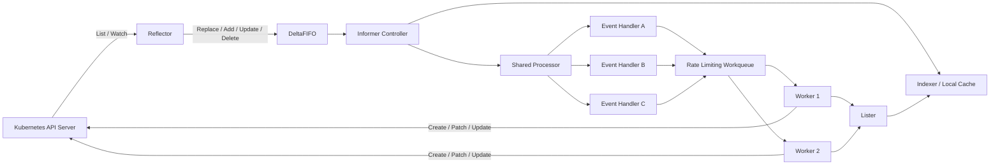
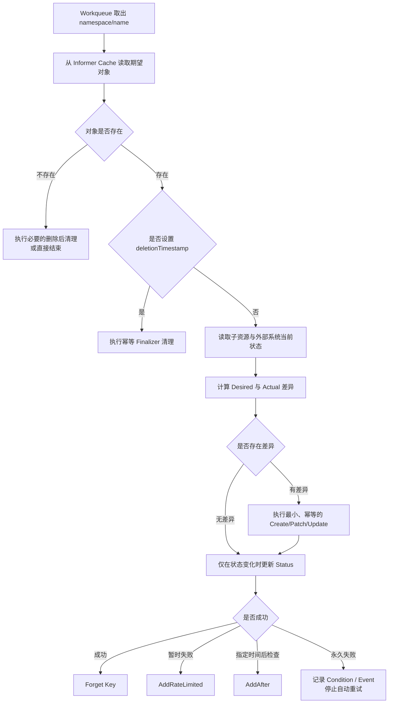
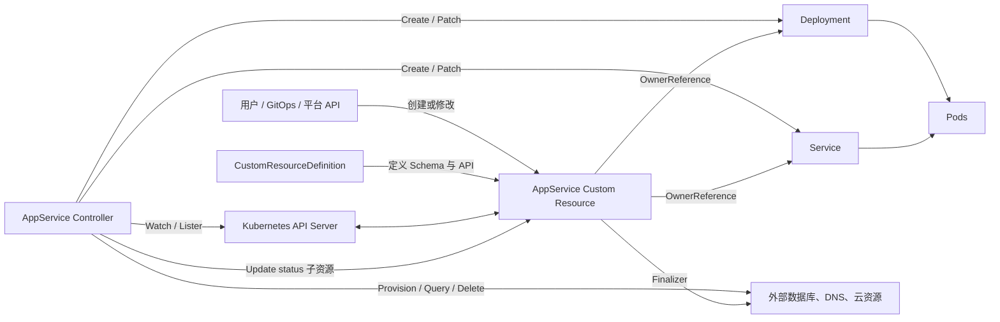

# 第 19 章：使用 Go、client-go、Controller 与 Operator 扩展 Kubernetes

> 本章示例采用当前 `client-go` 的泛型 Workqueue API。旧的非泛型 `workqueue.RateLimitingInterface` 已被标记为弃用；实际项目还应固定 `k8s.io/api`、`k8s.io/apimachinery`、`k8s.io/client-go` 的版本，并尽量保持三者版本一致。`client-go` 的 `v0.x.y` 版本之间可能发生不兼容的 Go API 变化，不应在生产项目中无约束地使用 `@latest`。 ([GitHub][1])

---

## 一、学习目标

完成本章后，应当能够：

1. 解释直接调用 Kubernetes REST API 与使用 `client-go` 的差异。
2. 正确选择 Typed Client、Dynamic Client、Discovery Client 和 RESTMapper。
3. 从 List/Watch 一直解释到 Reflector、DeltaFIFO、Informer、Indexer 和 Lister。
4. 使用 Shared Informer、Rate Limiting Workqueue 和多个 Worker 编写基本控制器。
5. 设计幂等、可重试、能够处理缓存延迟和乐观并发冲突的 Reconcile。
6. 正确使用 OwnerReference、Finalizer、Status、Conditions 和 ObservedGeneration。
7. 解释 CRD、Custom Resource、Controller 与 Operator 的职责边界。
8. 设计多副本 Controller 的 Leader Election、API 限流与队列背压。
9. 判断一个问题应该由 Operator、Webhook、Job、脚本还是现有控制器解决。

---

## 二、核心术语

| 术语               | 含义                                             |
| ---------------- | ---------------------------------------------- |
| REST API         | Kubernetes API Server 对外暴露的 HTTP API           |
| `client-go`      | Kubernetes 官方 Go 客户端及控制器基础组件                   |
| Typed Client     | 操作编译期已知类型的强类型客户端                               |
| Dynamic Client   | 操作 `unstructured.Unstructured` 的通用客户端          |
| Discovery Client | 查询 API Server 支持的 API Group、Version 和 Resource |
| RESTMapper       | 在 GVK、GVR、REST 路径及资源作用域之间建立映射                  |
| GVK              | Group、Version、Kind，描述对象的数据类型                   |
| GVR              | Group、Version、Resource，描述 REST API 资源端点        |
| List/Watch       | 先获取当前状态，再持续接收后续变化                              |
| Reflector        | 通过 List/Watch 把远端状态同步到本地队列                     |
| DeltaFIFO        | 保存对象变化并向 Informer 处理循环提供数据                     |
| Informer         | 维护本地缓存并向多个事件处理器分发通知                            |
| Indexer          | 支持按 namespace、字段或自定义索引查询本地对象                   |
| Lister           | 从 Informer 本地缓存读取对象的只读接口                       |
| Workqueue        | 将事件转换为待处理 Key，并承担去重与背压                         |
| Reconcile        | 比较期望状态与实际状态并推动系统收敛                             |
| Finalizer        | 对象真正删除前需要完成清理工作的标记                             |
| OwnerReference   | 声明 Kubernetes 对象之间的所有者关系                       |
| Condition        | 对象当前某个方面状态的结构化表达                               |
| Leader Election  | 多副本 Controller 中选择一个活动领导者                      |
| Operator         | 使用 CRD 和控制器编码领域运维知识的模式                         |

---

# 三、Controller 的核心心智模型

Kubernetes Controller 不是“事件回调程序”，而是一个持续运行的**状态收敛系统**：

```text
监听变化 → 将对象 Key 放入队列 → 读取当前状态
→ 计算期望状态与实际状态的差异 → 执行最小变更
→ 更新状态 → 等待下一次触发
```

最重要的四条原则是：

1. **事件只负责唤醒，不负责提供最终事实。**
2. **缓存负责高频读取，API Server 负责持久化和权威状态。**
3. **Workqueue 负责去重、背压和失败重试。**
4. **Reconcile 必须以当前状态为准，并且能够重复执行。**

可以将控制器抽象成一个函数：

[
Actual_{t+1}=Reconcile(Desired_t, Actual_t)
]

理想的 Reconcile 应满足：

[
Reconcile(S)=S' \Rightarrow Reconcile(S')=S'
]

即系统已经达到期望状态后，再次执行不会产生新的副作用。

---

# 四、直接调用 REST API 与使用 client-go

## 4.1 Kubernetes REST API

Kubernetes API 本质上是 HTTP API。例如获取 `default` 命名空间中的 Pod：

```http
GET /api/v1/namespaces/default/pods
Authorization: Bearer <token>
Accept: application/json
```

调用者需要处理：

* API Server 地址；
* TLS 和 CA；
* Bearer Token、客户端证书或认证插件；
* API Group、Version 和 Resource 路径；
* JSON 或 Protobuf 序列化；
* Watch 流；
* 超时、重连和重试；
* `resourceVersion`；
* API Discovery；
* 限流和指标。

直接 REST 调用适合：

* 非 Go 客户端；
* 极少量固定 API；
* API 调试工具；
* 需要完全控制 HTTP 请求；
* 无法引入完整 Kubernetes Go 依赖的程序。

## 4.2 client-go

`client-go` 在 REST API 之上提供：

* Kubernetes 认证和传输配置；
* 内置资源的强类型 Clientset；
* 动态资源客户端；
* API Discovery；
* RESTMapper；
* List/Watch；
* Informer 和本地缓存；
* Workqueue；
* Leader Election；
* 乐观并发重试工具。

官方 `client-go` 仓库中的 `kubernetes`、`dynamic`、`discovery` 和 `tools/cache` 包分别承担强类型访问、动态资源访问、API 发现和控制器缓存等职责。 ([GitHub][1])

| 维度     | 直接 REST API         | client-go                      |
| ------ | ------------------- | ------------------------------ |
| 类型安全   | 手工解析 JSON           | Typed Client 提供 Go 类型          |
| 认证     | 手工构造 Transport      | 支持 kubeconfig、ServiceAccount 等 |
| Watch  | 自行处理流和重连            | 提供 Watch、Reflector、Informer    |
| API 发现 | 自行查询 `/api`、`/apis` | Discovery Client               |
| 缓存     | 自行实现                | Shared Informer、Indexer、Lister |
| 重试     | 自行实现                | Workqueue、RetryOnConflict      |
| 依赖大小   | 较小                  | 较大                             |
| 灵活性    | 完全可控                | 遵循 Kubernetes 客户端抽象            |
| 适合场景   | 简单工具、跨语言客户端         | Go Controller、Operator、平台组件    |

`client-go` 并不会自动让业务逻辑具备幂等性，也不会替控制器决定何时应该重试。它提供的是构建正确控制循环所需的基础设施。

---

# 五、kubeconfig 与 InClusterConfig

## 5.1 kubeconfig

集群外程序通常通过 kubeconfig 获取：

* API Server 地址；
* CA；
* 当前 Context；
* 用户认证信息；
* Namespace；
* Exec Credential Plugin 等。

```go
package kubeclient

import (
	"k8s.io/client-go/rest"
	"k8s.io/client-go/tools/clientcmd"
)

func FromKubeconfig(path string) (*rest.Config, error) {
	return clientcmd.BuildConfigFromFlags("", path)
}
```

典型使用场景：

* 本地开发；
* CLI 工具；
* 集成测试；
* 集群外的管理平台；
* CI/CD 系统。

## 5.2 InClusterConfig

运行在 Kubernetes Pod 中的程序通常使用：

```go
package kubeclient

import "k8s.io/client-go/rest"

func FromCluster() (*rest.Config, error) {
	return rest.InClusterConfig()
}
```

`InClusterConfig` 使用 Pod 的 ServiceAccount 信息构造客户端配置；在非 Kubernetes Pod 环境中调用会返回 `ErrNotInCluster`。当前实现会使用 ServiceAccount Token、集群 CA 以及注入 Pod 的 API Server 环境信息。 ([Go Packages][2])

## 5.3 同时支持集群内外

```go
func BuildConfig(kubeconfig string) (*rest.Config, error) {
	if kubeconfig != "" {
		return clientcmd.BuildConfigFromFlags("", kubeconfig)
	}
	return rest.InClusterConfig()
}
```

这是 Controller 常见的启动方式：

```bash
# 本地开发
controller --kubeconfig="$HOME/.kube/config"

# 集群内
controller
```

## 5.4 配置客户端限流

```go
config, err := BuildConfig(kubeconfig)
if err != nil {
	return err
}

config.UserAgent = "appservice-controller/v1"
config.QPS = 20
config.Burst = 40
config.Timeout = 30 * time.Second
```

当 `QPS` 和 `Burst` 保持为零值时，REST Client 当前使用的默认值分别是 5 和 10。负数 `QPS` 会关闭默认客户端限流，除非显式设置了 `RateLimiter`。提高这些值必须结合控制器请求模型、API Server 容量和集群中其他客户端的负载，不能通过无限增大 `QPS` 掩盖低效的 Reconcile。 ([Go Packages][2])

---

# 六、使用 Typed Client 获取 Pod 列表

```go
package main

import (
	"context"
	"fmt"

	metav1 "k8s.io/apimachinery/pkg/apis/meta/v1"
	"k8s.io/client-go/kubernetes"
	"k8s.io/client-go/rest"
)

func listPods(ctx context.Context) error {
	config, err := rest.InClusterConfig()
	if err != nil {
		return fmt.Errorf("build in-cluster config: %w", err)
	}

	clientset, err := kubernetes.NewForConfig(config)
	if err != nil {
		return fmt.Errorf("create clientset: %w", err)
	}

	pods, err := clientset.CoreV1().
		Pods("default").
		List(ctx, metav1.ListOptions{
			LabelSelector: "app=checkout",
		})
	if err != nil {
		return fmt.Errorf("list pods: %w", err)
	}

	for _, pod := range pods.Items {
		fmt.Printf("%s phase=%s rv=%s\n",
			pod.Name,
			pod.Status.Phase,
			pod.ResourceVersion,
		)
	}
	return nil
}
```

调用链为：

```text
Clientset
└── CoreV1()
    └── Pods(namespace)
        └── List/Get/Create/Update/Patch/Delete/Watch
```

Typed Client 的优势是：

* 编译期类型检查；
* 字段访问清晰；
* IDE 补全良好；
* 更容易使用 `DeepCopy`；
* 适合稳定且已知的 API 类型。

其限制是：客户端必须事先拥有对应 Go 类型和生成代码。对于运行时才知道的 CRD，通常应使用 Dynamic Client。

---

# 七、Typed、Dynamic、Discovery 与 RESTMapper

## 7.1 客户端职责比较

| 组件               | 输入/输出                          | 主要用途               |
| ---------------- | ------------------------------ | ------------------ |
| Typed Client     | `*corev1.Pod` 等强类型对象           | 操作编译期已知资源          |
| Dynamic Client   | `*unstructured.Unstructured`   | 通用平台、未知 CRD、无需代码生成 |
| Discovery Client | API Group、Version、Resource 元数据 | 查询集群支持哪些 API       |
| RESTMapper       | GVK、GVR、Scope 映射               | 将对象类型映射到 REST 端点   |
| REST Client      | 底层 REST 请求                     | 构建自定义客户端或底层框架      |

Discovery Client 用于发现 API Server 支持的 API Group、Version 和 Resource；RESTMapper 则根据 Discovery 结果，将 Kind 映射为对应资源端点和命名空间作用域。 ([Go Packages][3])

## 7.2 Dynamic Client

```go
var appServiceGVR = schema.GroupVersionResource{
	Group:    "platform.example.com",
	Version:  "v1alpha1",
	Resource: "appservices",
}

func getAppService(
	ctx context.Context,
	dynamicClient dynamic.Interface,
	namespace string,
	name string,
) (*unstructured.Unstructured, error) {
	return dynamicClient.
		Resource(appServiceGVR).
		Namespace(namespace).
		Get(ctx, name, metav1.GetOptions{})
}
```

读取非结构化字段：

```go
image, found, err := unstructured.NestedString(
	obj.Object,
	"spec",
	"image",
)
if err != nil {
	return fmt.Errorf("read spec.image: %w", err)
}
if !found {
	return errors.New("spec.image is required")
}
```

Dynamic Client 适合：

* 通用资源浏览器；
* 多集群平台；
* GitOps 引擎；
* 扩展资源同步器；
* 不希望依赖 CRD 代码生成的轻量 Controller。

代价是：

* 缺少编译期字段检查；
* 字段路径容易写错；
* 类型转换更繁琐；
* 默认值和版本转换需要格外注意。

## 7.3 Discovery Client 与 RESTMapper

```go
discoveryClient, err := discovery.NewDiscoveryClientForConfig(config)
if err != nil {
	return err
}

cachedDiscovery := memory.NewMemCacheClient(discoveryClient)
mapper := restmapper.NewDeferredDiscoveryRESTMapper(cachedDiscovery)

mapping, err := mapper.RESTMapping(
	schema.GroupKind{
		Group: "apps",
		Kind:  "Deployment",
	},
	"v1",
)
if err != nil {
	return err
}

fmt.Println(mapping.Resource)
// apps/v1, Resource=deployments

fmt.Println(mapping.Scope.Name())
// namespace
```

`DeferredDiscoveryRESTMapper` 延迟执行 Discovery，并缓存映射结果。程序运行期间新安装 CRD 后，旧缓存可能暂时不知道该资源，此时可以：

```go
mapper.Reset()
```

然后重新执行映射。

---

# 八、GVK 与 GVR

Kubernetes 中最容易混淆的是 Kind 和 Resource。

## 8.1 GVK：对象是什么类型

```go
schema.GroupVersionKind{
	Group:   "apps",
	Version: "v1",
	Kind:    "Deployment",
}
```

GVK 通常出现在对象自身：

```yaml
apiVersion: apps/v1
kind: Deployment
```

GVK 描述的是：

> 该 JSON/YAML 对象应当按照什么 API 类型解释。

## 8.2 GVR：访问哪个 REST 资源

```go
schema.GroupVersionResource{
	Group:    "apps",
	Version:  "v1",
	Resource: "deployments",
}
```

它对应 REST 路径：

```text
/apis/apps/v1/namespaces/default/deployments
```

GVK 用单数、首字母大写的 `Kind`；GVR 使用 API 中实际注册的资源名，通常是小写复数，但不能仅靠字符串加 `s` 推导。

`GroupVersionKind` 用来唯一标识对象类型；`RESTMapping` 中的 `Resource` 则表示该类型对应的 REST 资源位置。 ([Go Packages][4])

## 8.3 Core API Group

Pod 的 GVK：

```text
Group:   ""
Version: "v1"
Kind:    "Pod"
```

Pod 的 GVR：

```text
Group:    ""
Version: "v1"
Resource: "pods"
```

Core API 使用：

```text
/api/v1/...
```

其他 API Group 使用：

```text
/apis/{group}/{version}/...
```

---

# 九、List/Watch 工作机制

控制器需要解决一个问题：

> 如何先知道所有对象的当前状态，再持续知道后续变化？

答案是 List 加 Watch。

## 9.1 初始 List

```http
GET /api/v1/namespaces/default/pods
```

API Server 返回：

```json
{
  "kind": "PodList",
  "metadata": {
    "resourceVersion": "10245"
  },
  "items": []
}
```

这个 List 结果包含一个集合级别的 `resourceVersion`。

## 9.2 从 resourceVersion 开始 Watch

```http
GET /api/v1/namespaces/default/pods?watch=1&resourceVersion=10245
```

随后连接中持续返回：

```json
{"type":"ADDED","object":{...}}
{"type":"MODIFIED","object":{...}}
{"type":"DELETED","object":{...}}
```

Kubernetes API 明确支持先 List/Get 当前状态，再从返回的 `resourceVersion` 开始 Watch 后续变化；连接断开后，客户端可以从最后收到的版本重新 Watch，也可以重新 List。 ([Kubernetes][5])

## 9.3 resourceVersion 的含义

`metadata.resourceVersion` 用于：

* 建立 Watch 起点；
* 检测并发更新；
* 表示服务器存储中的对象版本；
* 支持一致性语义。

它是一个**不透明字符串**：

* 不应转换为整数参与业务计算；
* 不应比较两个对象的业务新旧；
* 不应假设它连续增长；
* 不应将它作为业务版本号。

业务版本应使用独立字段，例如：

```yaml
spec:
  releaseVersion: "2026.06.1"
```

## 9.4 Watch 断开与过期

Watch 可能因为以下原因断开：

* 网络故障；
* API Server 重启；
* 负载均衡超时；
* 客户端超时；
* 旧历史被压缩；
* 认证信息变化。

当请求的历史版本已经不可用时，API Server 可能返回 `410 Gone`。正确处理方式不是从错误版本无限重试，而是重新 List 当前状态，再从新的 `resourceVersion` 建立 Watch。

Reflector 正是对上述 List/Watch、断线重连和重新 List 逻辑的封装。

---

# 十、为什么不能为每个事件直接请求 API Server

一个错误的 Controller 结构是：

```text
Watch Event
  └── 立即 GET 对象
      └── 再 LIST 所有子对象
          └── 再 UPDATE 状态
```

当对象数量或更新频率增加时，这会造成：

1. 每个事件都触发额外 API 请求；
2. 多个 Controller 副本同时请求；
3. 同一对象的重复事件重复查询；
4. 重连后的批量事件形成请求洪峰；
5. API Server、认证、准入和 etcd 承担不必要的压力；
6. Controller 因客户端限流而积压；
7. API 延迟又反过来增加控制器重试。

正确模式是：

```text
Watch Event
   │
   ▼
只提取 namespace/name
   │
   ▼
放入 Workqueue
   │
   ▼
Worker 从 Informer Cache 读取
   │
   ▼
仅在需要写入或必须强一致读取时访问 API Server
```

Informer 本地缓存的目的之一就是减少直接调用 API Server 的次数；`tools/cache` 包提供了编写控制器所需的缓存基础设施。 ([GitHub][1])

事件回调中不应：

* 调用外部 HTTP API；
* 查询数据库；
* 执行云资源创建；
* 长时间持锁；
* 进行复杂 Reconcile；
* 阻塞等待另一个资源。

事件回调应尽可能只做一件事：

```go
queue.Add("namespace/name")
```

---

# 十一、Shared Informer 数据流



## 11.1 Reflector

Reflector 负责：

1. 调用 List 获得当前对象集合；
2. 将集合放入 DeltaFIFO；
3. 从 List 的 `resourceVersion` 开始 Watch；
4. 将 Watch 事件放入 DeltaFIFO；
5. Watch 断开后重新连接；
6. 必要时重新 List。

Reflector 不负责业务逻辑。

## 11.2 DeltaFIFO

`Delta` 表示变化，例如：

* Added；
* Updated；
* Deleted；
* Replaced；
* Sync。

DeltaFIFO 按对象 Key 聚合变化，并把待处理对象交给 Informer 内部处理循环。

这里的 FIFO 不代表 Controller 最终能够观察到所有中间业务状态。对于同一个对象，在消费速度落后时，多个变化可能被合并；重连和重新 List 后，Controller 更应该关心对象现在是什么状态，而不是执着于每一个历史边沿。

## 11.3 Indexer 与本地缓存

Informer 将最新对象保存在本地 `Indexer` 中。

默认索引通常包括 namespace：

```go
cache.NamespaceIndex
```

还可以增加自定义索引，例如按 Owner UID 查询子资源：

```go
informer.AddIndexers(cache.Indexers{
	"ownerUID": func(obj any) ([]string, error) {
		metaObj, err := meta.Accessor(obj)
		if err != nil {
			return nil, err
		}

		keys := make([]string, 0, len(metaObj.GetOwnerReferences()))
		for _, owner := range metaObj.GetOwnerReferences() {
			keys = append(keys, string(owner.UID))
		}
		return keys, nil
	},
})
```

这样 Reconcile 不必每次 List 全集。

## 11.4 Lister

Lister 从本地 Indexer 中读取：

```go
pod, err := podLister.Pods(namespace).Get(name)
```

必须注意：

> Lister 返回的对象由 Informer Cache 共享，应当视为只读对象。

不要直接修改：

```go
// 错误：修改共享缓存对象
pod.Labels["managed"] = "true"
```

需要修改时：

```go
copy := pod.DeepCopy()
copy.Labels["managed"] = "true"
```

即便进行了 `DeepCopy`，写操作仍可能建立在稍旧的缓存数据之上。对于需要保护其他参与者字段的更新，应使用最新 GET、Patch、Server-Side Apply 或 `RetryOnConflict`。

## 11.5 Shared Informer

多个事件处理器可以共享：

* 同一条 List/Watch；
* 同一个本地缓存；
* 同一个 Reflector；
* 同一份对象存储。

这比每个 Controller 模块建立独立 Watch 更节省 API Server 和客户端资源。

## 11.6 Resync 不是定时重新 List

Informer 的 Resync 通常表示：

> 周期性地把缓存中的对象再次作为同步通知交给处理器。

它不等同于每隔一段时间向 API Server 全量 List。Reflector 在 Watch 失效、资源版本过期等情况下是否重新 List，是另一套机制。

大多数只依赖真实资源变化的控制器可将默认 Resync 设置为零；确实需要周期检查外部漂移时，可以使用：

* `AddAfter`；
* 单独的定时器；
* 合理的 Resync；
* 外部系统事件；
* 周期性扫描队列。

---

# 十二、Informer 监听的最小代码

下面的示例使用 Shared Informer 监听 Pod，并将 Key 放入泛型 Rate Limiting Workqueue。

```go
type PodController struct {
	client    kubernetes.Interface
	factory   informers.SharedInformerFactory
	podLister corelisters.PodLister
	podSynced cache.InformerSynced

	queue workqueue.TypedRateLimitingInterface[string]
}

func NewPodController(
	client kubernetes.Interface,
	namespace string,
) *PodController {
	factory := informers.NewSharedInformerFactoryWithOptions(
		client,
		0,
		informers.WithNamespace(namespace),
	)

	podInformer := factory.Core().V1().Pods()

	controller := &PodController{
		client:    client,
		factory:   factory,
		podLister: podInformer.Lister(),
		podSynced: podInformer.Informer().HasSynced,
		queue: workqueue.NewTypedRateLimitingQueueWithConfig(
			workqueue.DefaultTypedControllerRateLimiter[string](),
			workqueue.TypedRateLimitingQueueConfig[string]{
				Name: "pod-controller",
			},
		),
	}

	podInformer.Informer().AddEventHandler(
		cache.ResourceEventHandlerFuncs{
			AddFunc: controller.enqueue,

			UpdateFunc: func(oldObj, newObj any) {
				oldPod, oldOK := oldObj.(*corev1.Pod)
				newPod, newOK := newObj.(*corev1.Pod)
				if !oldOK || !newOK {
					return
				}

				// 过滤没有真实资源版本变化的重复通知。
				if oldPod.ResourceVersion == newPod.ResourceVersion {
					return
				}

				controller.enqueue(newObj)
			},

			DeleteFunc: controller.enqueueDeleted,
		},
	)

	return controller
}

func (c *PodController) enqueue(obj any) {
	key, err := cache.MetaNamespaceKeyFunc(obj)
	if err != nil {
		slog.Error("build object key", "error", err)
		return
	}
	c.queue.Add(key)
}

func (c *PodController) enqueueDeleted(obj any) {
	key, err := cache.DeletionHandlingMetaNamespaceKeyFunc(obj)
	if err != nil {
		slog.Error("build deleted object key", "error", err)
		return
	}
	c.queue.Add(key)
}
```

删除事件有时会以 `DeletedFinalStateUnknown` Tombstone 形式到达，因此 Delete 回调应使用：

```go
cache.DeletionHandlingMetaNamespaceKeyFunc
```

而不是直接假设 `obj` 一定是 `*corev1.Pod`。

## 12.1 等待缓存同步后再启动 Worker

```go
func (c *PodController) Run(
	ctx context.Context,
	workers int,
) error {
	c.factory.Start(ctx.Done())

	if !cache.WaitForCacheSync(ctx.Done(), c.podSynced) {
		return errors.New("pod informer cache did not sync")
	}

	var wg sync.WaitGroup

	for i := 0; i < workers; i++ {
		wg.Add(1)

		go func() {
			defer wg.Done()

			for c.processNextItem(ctx) {
			}
		}()
	}

	<-ctx.Done()

	c.queue.ShutDown()
	wg.Wait()

	return nil
}
```

如果不等待缓存同步，Controller 可能把“缓存尚未加载到某对象”误判为“对象不存在”，从而错误删除或重复创建资源。

---

# 十三、Workqueue 与 Rate Limiting Queue

## 13.1 为什么需要 Workqueue

如果事件处理器直接调用 Reconcile：

```text
Informer Callback → Reconcile
```

会出现：

* 回调阻塞导致后续事件无法及时分发；
* 突发流量没有缓冲；
* 失败重试难以控制；
* 多个事件重复执行；
* 无法统一观测队列积压；
* Worker 并发难以管理。

加入队列后：

```text
Informer Callback → Workqueue → Worker → Reconcile
```

事件产生速度和处理速度被解耦。

## 13.2 Workqueue 的关键语义

当前 `client-go` Workqueue 具有以下重要特性：

* 按加入顺序公平处理；
* 同一个 Key 不会被多个 Worker 同时处理；
* 同一个 Key 在尚未消费前多次加入，通常只保留一次；
* Key 在处理过程中再次被加入，`Done` 后会再次进入队列；
* 支持多个生产者和多个消费者；
* 支持关闭通知。 ([Go Packages][6])

这意味着：

```text
Add("default/demo")
Add("default/demo")
Add("default/demo")
```

不等于必须执行三次 Reconcile。

队列保证的是：

> 这个 Key 需要被处理。

它不是 Kafka 一类保存每条业务事件的消息系统。

## 13.3 Rate Limiting Workqueue

失败时不能立即进行无间隔重试：

```go
for {
	err := reconcile()
	if err != nil {
		continue
	}
}
```

这会形成热循环。

Rate Limiting Queue 提供：

```go
queue.AddRateLimited(key)
```

它会根据重试次数计算延迟。当前推荐使用泛型接口：

```go
workqueue.TypedRateLimitingInterface[string]
```

而不是已经弃用的非泛型 `RateLimitingInterface`。 ([Go Packages][6])

## 13.4 Worker 处理逻辑

```go
const maxRetries = 5

func (c *PodController) processNextItem(
	ctx context.Context,
) bool {
	key, shutdown := c.queue.Get()
	if shutdown {
		return false
	}

	defer c.queue.Done(key)

	err := c.sync(ctx, key)

	switch {
	case err == nil:
		// 清除该 Key 的失败计数。
		c.queue.Forget(key)
		return true

	case ctx.Err() != nil:
		c.queue.Forget(key)
		return false

	case c.queue.NumRequeues(key) < maxRetries:
		slog.Warn(
			"reconcile failed; retrying",
			"key", key,
			"requeues", c.queue.NumRequeues(key),
			"error", err,
		)

		c.queue.AddRateLimited(key)
		return true

	default:
		// 超出重试次数后必须 Forget，否则限速状态会一直保留。
		c.queue.Forget(key)

		slog.Error(
			"reconcile failed permanently",
			"key", key,
			"error", err,
		)

		return true
	}
}
```

每次 `Get` 都必须对应一次 `Done`。成功或决定放弃时必须调用 `Forget`；否则该 Key 的失败次数和延迟状态不会被清除。Workqueue 的 `Done` 还负责在处理期间该 Key 再次变脏时将其重新排队。 ([Go Packages][6])

## 13.5 Add、AddAfter 与 AddRateLimited

| 方法                        | 适用场景           |
| ------------------------- | -------------- |
| `Add(key)`                | 新事件、依赖资源变化     |
| `AddAfter(key, duration)` | 已知需要在未来某时再次检查  |
| `AddRateLimited(key)`     | 发生可重试错误，需要退避   |
| `Forget(key)`             | 成功、永久失败或决定不再重试 |

例如证书还有 12 小时到期：

```go
queue.AddAfter(key, 11*time.Hour)
```

外部 API 暂时返回 503：

```go
queue.AddRateLimited(key)
```

这两种情况不应混为一谈。前者是业务调度，后者是失败退避。

---

# 十四、Controller Reconcile 控制循环



## 14.1 一个典型 sync 函数

```go
func (c *PodController) sync(
	ctx context.Context,
	key string,
) error {
	namespace, name, err := cache.SplitMetaNamespaceKey(key)
	if err != nil {
		// Key 格式错误属于不可恢复错误。
		return fmt.Errorf("split key %q: %w", key, err)
	}

	pod, err := c.podLister.Pods(namespace).Get(name)

	if apierrors.IsNotFound(err) {
		// 对象已删除。若没有外部状态需要清理，可以视为成功。
		return nil
	}

	if err != nil {
		return fmt.Errorf("get pod from cache: %w", err)
	}

	// 缓存对象视为只读。
	snapshot := pod.DeepCopy()

	// 1. 根据 snapshot 计算期望状态。
	// 2. 查询实际子资源或外部系统。
	// 3. 只执行必要的差异操作。
	// 4. 必要时更新 Status。

	_ = snapshot
	_ = ctx
	return nil
}
```

---

# 十五、为什么 Reconcile 必须幂等

## 15.1 事件不是 exactly-once

Controller 不能假设：

* 每个事件只到达一次；
* 所有中间事件都能被观察到；
* 事件严格按业务发生顺序到达；
* 处理事件时对象仍处于事件中描述的状态；
* Controller 处理成功后一定来得及记录结果。

可能发生：

1. Controller 在副作用完成后、更新 Status 前崩溃；
2. Watch 重连后重复观察某个状态；
3. 同一 Key 被多个相关资源加入队列；
4. Workqueue 合并多次 Add；
5. 缓存暂时落后于刚完成的 API 写入；
6. Leader 切换后新实例重新处理已有对象；
7. 外部 API 请求超时，但服务端其实已经创建成功。

因此事件只能表达：

> 某个对象可能需要重新检查。

## 15.2 幂等设计方法

### 方法一：使用确定性资源名称

错误：

```go
name := "database-" + randomString()
createDatabase(name)
```

每次重试可能创建新数据库。

正确：

```go
externalID := "appservice-" + string(obj.GetUID())
ensureDatabase(externalID)
```

### 方法二：Ensure，而不是无条件 Create

错误：

```go
CreateDeployment()
```

正确：

```text
不存在 → Create
存在且不符合期望 → Patch
存在且已符合期望 → 不操作
```

### 方法三：对外部 API 使用幂等键

```http
Idempotency-Key: appservice-5bc72...
```

或者让外部资源名称由 Kubernetes UID 确定。

### 方法四：执行变更前比较语义差异

不要每次 Reconcile 都执行：

```go
client.Update(...)
```

应先比较控制器负责的字段：

```go
if equality.Semantic.DeepEqual(currentSpec, desiredSpec) {
	return nil
}
```

### 方法五：将操作结果重新读取并确认

对于超时不确定的外部调用：

```text
Create 请求超时
   ↓
不要立即再次创建
   ↓
先按确定性 ID 查询资源是否已存在
```

### 方法六：把进度写入可恢复状态

复杂流程可以在 Status 中记录阶段：

```yaml
status:
  phase: Provisioning
  externalID: db-67ab
```

但 Status 只是恢复依据之一，不能代替从外部系统验证事实。

---

# 十六、缓存一致性与 resourceVersion 冲突

## 16.1 Informer Cache 是最终一致的

假设 Controller：

1. 从缓存读取对象版本 `10`；
2. 向 API Server 更新为版本 `11`；
3. 立即再次从缓存读取。

此时缓存可能仍返回版本 `10`，因为 Watch 事件还没有传播回来。

所以不能假设：

```text
API 写入成功 → 本地缓存立即可见
```

## 16.2 乐观并发控制

Kubernetes Update 通常携带当前对象的 `resourceVersion`：

```yaml
metadata:
  resourceVersion: "18352"
```

如果对象已被其他客户端更新，API Server 会拒绝基于旧版本的 Update，返回 `409 Conflict`。

正确流程：

```text
GET 最新对象
  ↓
修改副本
  ↓
UPDATE
  ↓
若 Conflict：重新 GET，再计算，再 UPDATE
```

## 16.3 RetryOnConflict

```go
func setManagedAnnotation(
	ctx context.Context,
	client kubernetes.Interface,
	namespace string,
	name string,
) error {
	return retry.RetryOnConflict(
		retry.DefaultRetry,
		func() error {
			pod, err := client.CoreV1().
				Pods(namespace).
				Get(ctx, name, metav1.GetOptions{})
			if err != nil {
				return err
			}

			if pod.Annotations["platform.example.com/managed"] == "true" {
				return nil
			}

			copy := pod.DeepCopy()

			if copy.Annotations == nil {
				copy.Annotations = map[string]string{}
			}

			copy.Annotations["platform.example.com/managed"] = "true"

			_, err = client.CoreV1().
				Pods(namespace).
				Update(ctx, copy, metav1.UpdateOptions{})

			// 返回原始 Update 错误，让 RetryOnConflict 识别 Conflict。
			return err
		},
	)
}
```

`RetryOnConflict` 要求每次重试都重新获取最新对象，然后重新执行修改，不能把第一次获取的旧对象放在闭包外反复提交。 ([Go Packages][7])

## 16.4 Update、Patch 与 Server-Side Apply

| 方法                    | 特点                        | 适用情况           |
| --------------------- | ------------------------- | -------------- |
| Update                | 提交完整对象，依赖 resourceVersion | 控制完整资源或 Status |
| JSON Merge Patch      | 只提交变化字段                   | 简单局部修改         |
| JSON Patch            | 精确路径操作，可带测试条件             | 需要条件更新         |
| Strategic Merge Patch | 适用于部分内置类型                 | 对内置结构化资源修改     |
| Server-Side Apply     | 记录字段管理者                   | 多控制器协作管理不同字段   |

Patch 能降低“修改无关字段导致的冲突”，但不会消除并发语义问题。Server-Side Apply 还可能产生字段所有权冲突，Controller 必须明确自己管理哪些字段。

---

# 十七、OwnerReference、Finalizer 与 Status Conditions

| 机制             | 解决的问题                            | 典型对象                      |
| -------------- | -------------------------------- | ------------------------- |
| OwnerReference | Kubernetes 子对象随所有者被垃圾回收          | CR 创建的 Deployment、Service |
| Finalizer      | 删除对象前完成外部或定制清理                   | 云数据库、DNS、负载均衡             |
| Status         | 记录控制器观察到的当前状态                    | ReadyReplicas、Endpoint    |
| Condition      | 结构化表达 Ready、Progressing、Degraded | CR、Deployment、Node        |

---

## 17.1 OwnerReference

CR 创建 Deployment 时，可以设置：

```go
controllerRef := metav1.NewControllerRef(
	owner,
	schema.GroupVersionKind{
		Group:   "platform.example.com",
		Version: "v1alpha1",
		Kind:    "AppService",
	},
)

deployment.OwnerReferences = []metav1.OwnerReference{
	*controllerRef,
}
```

OwnerReference 包含：

```yaml
ownerReferences:
  - apiVersion: platform.example.com/v1alpha1
    kind: AppService
    name: checkout
    uid: 0fd9...
    controller: true
    blockOwnerDeletion: true
```

UID 很重要，因为对象删除后重新创建，即便 namespace/name 相同，也不是同一个所有者。

Namespaced 子对象的 namespaced Owner 必须位于同一 Namespace；集群级依赖对象不能引用 namespaced Owner。OwnerReference 用于 Kubernetes 垃圾回收，而不是外部资源清理。 ([Kubernetes][8])

---

## 17.2 Finalizer

Finalizer 是 `metadata.finalizers` 中的字符串：

```yaml
metadata:
  finalizers:
    - platform.example.com/external-cleanup
```

当用户删除带 Finalizer 的对象时：

1. API Server 设置 `deletionTimestamp`；
2. 返回 `202 Accepted`；
3. 对象继续保留在 API 中；
4. Controller 观察到删除状态；
5. Controller 执行清理；
6. Controller 移除自己的 Finalizer；
7. Finalizer 列表为空后，对象才真正删除。 ([Kubernetes][9])

### Finalizer 设计原则

1. Finalizer 名称使用域名前缀。
2. 在创建外部资源**之前**先写入 Finalizer。
3. 清理操作必须幂等。
4. 外部资源已不存在应视为清理成功。
5. 只有完成清理后才能移除 Finalizer。
6. 不要把无法自动恢复的永久错误无限重试。
7. 应通过 Condition 和指标暴露长时间 Terminating。
8. 手工移除 Finalizer 是最后手段，可能造成资源泄漏。

---

## 17.3 Finalizer 最小关键代码

以下示例使用 Dynamic Client，不依赖 CRD 代码生成。

```go
const appServiceFinalizer =
	"platform.example.com/external-cleanup"

func containsString(items []string, expected string) bool {
	for _, item := range items {
		if item == expected {
			return true
		}
	}
	return false
}

func removeString(items []string, target string) []string {
	result := make([]string, 0, len(items))

	for _, item := range items {
		if item != target {
			result = append(result, item)
		}
	}

	return result
}
```

Finalizer 处理函数：

```go
// stop=true 表示本次 Reconcile 不应继续执行普通资源收敛逻辑。
func reconcileFinalizer(
	ctx context.Context,
	resource dynamic.ResourceInterface,
	name string,
) (stop bool, err error) {
	obj, err := resource.Get(
		ctx,
		name,
		metav1.GetOptions{},
	)
	if apierrors.IsNotFound(err) {
		return true, nil
	}
	if err != nil {
		return false, err
	}

	// 正常对象：先确保 Finalizer 存在。
	if obj.GetDeletionTimestamp() == nil {
		if containsString(
			obj.GetFinalizers(),
			appServiceFinalizer,
		) {
			return false, nil
		}

		err := retry.RetryOnConflict(
			retry.DefaultRetry,
			func() error {
				current, err := resource.Get(
					ctx,
					name,
					metav1.GetOptions{},
				)
				if err != nil {
					return err
				}

				if current.GetDeletionTimestamp() != nil {
					return nil
				}

				if containsString(
					current.GetFinalizers(),
					appServiceFinalizer,
				) {
					return nil
				}

				copy := current.DeepCopy()
				copy.SetFinalizers(append(
					copy.GetFinalizers(),
					appServiceFinalizer,
				))

				_, err = resource.Update(
					ctx,
					copy,
					metav1.UpdateOptions{},
				)
				return err
			},
		)

		// Finalizer 写入后结束本轮，等待缓存观察到新版本。
		return true, err
	}

	// 删除中的对象，但已经没有本 Controller 的 Finalizer。
	if !containsString(
		obj.GetFinalizers(),
		appServiceFinalizer,
	) {
		return true, nil
	}

	// 清理必须按稳定 ID 幂等执行。
	externalID := "appservice-" + string(obj.GetUID())

	if err := cleanupExternalResource(ctx, externalID); err != nil {
		return true, err
	}

	// 外部清理不要放进 RetryOnConflict 闭包中，否则一次冲突
	// 可能导致外部副作用在同一轮内重复执行。
	err = retry.RetryOnConflict(
		retry.DefaultRetry,
		func() error {
			current, err := resource.Get(
				ctx,
				name,
				metav1.GetOptions{},
			)
			if apierrors.IsNotFound(err) {
				return nil
			}
			if err != nil {
				return err
			}

			if !containsString(
				current.GetFinalizers(),
				appServiceFinalizer,
			) {
				return nil
			}

			copy := current.DeepCopy()
			copy.SetFinalizers(removeString(
				copy.GetFinalizers(),
				appServiceFinalizer,
			))

			_, err = resource.Update(
				ctx,
				copy,
				metav1.UpdateOptions{},
			)
			return err
		},
	)

	return true, err
}
```

`cleanupExternalResource` 应满足：

```text
目标存在 → 删除 → 成功
目标不存在 → 仍然成功
请求超时 → 查询确认后再决定是否重试
重复调用 → 不创建额外副作用
```

---

# 十八、CRD、Custom Resource、Controller 与 Operator

## 18.1 四者关系

| 概念              | 作用                            |
| --------------- | ----------------------------- |
| CRD             | 向 Kubernetes 注册新的 API 类型      |
| Custom Resource | 新 API 类型的具体对象实例               |
| Controller      | 观察对象并推动实际状态收敛                 |
| Operator        | CRD、Controller、领域模型和自动运维策略的组合 |

仅创建 CRD 不会自动产生业务行为。

例如：

```yaml
apiVersion: platform.example.com/v1alpha1
kind: AppService
spec:
  image: example/checkout:v3
  replicas: 3
```

如果没有 Controller，这只是存储在 Kubernetes API 中的一段结构化数据。

Operator 模式通常将 Custom Resource 与 Controller 组合起来，以声明式 API 表达领域需求，并把安装、扩缩容、升级、备份、故障恢复等领域知识编码到控制循环中。 ([Kubernetes][10])

## 18.2 CRD、CR、Controller 与外部系统关系



---

# 十九、设计一个 AppService CRD

```yaml
apiVersion: apiextensions.k8s.io/v1
kind: CustomResourceDefinition
metadata:
  name: appservices.platform.example.com
spec:
  group: platform.example.com
  scope: Namespaced

  names:
    plural: appservices
    singular: appservice
    kind: AppService
    shortNames:
      - appsrv

  versions:
    - name: v1alpha1
      served: true
      storage: true

      subresources:
        status: {}
        scale:
          specReplicasPath: .spec.replicas
          statusReplicasPath: .status.readyReplicas
          labelSelectorPath: .status.selector

      additionalPrinterColumns:
        - name: Ready
          type: string
          jsonPath: .status.conditions[?(@.type=="Ready")].status
        - name: Replicas
          type: integer
          jsonPath: .status.readyReplicas
        - name: Age
          type: date
          jsonPath: .metadata.creationTimestamp

      schema:
        openAPIV3Schema:
          type: object
          required:
            - spec

          properties:
            spec:
              type: object
              required:
                - image

              properties:
                image:
                  type: string
                  minLength: 1

                replicas:
                  type: integer
                  format: int32
                  minimum: 0
                  default: 1

                port:
                  type: integer
                  format: int32
                  minimum: 1
                  maximum: 65535
                  default: 8080

                database:
                  type: object
                  properties:
                    enabled:
                      type: boolean
                      default: false
                    class:
                      type: string

            status:
              type: object
              properties:
                observedGeneration:
                  type: integer
                  format: int64

                readyReplicas:
                  type: integer
                  format: int32

                selector:
                  type: string

                endpoint:
                  type: string

                conditions:
                  type: array
                  x-kubernetes-list-type: map
                  x-kubernetes-list-map-keys:
                    - type

                  items:
                    type: object
                    required:
                      - type
                      - status
                      - lastTransitionTime
                      - reason
                      - message

                    properties:
                      type:
                        type: string

                      status:
                        type: string
                        enum:
                          - "True"
                          - "False"
                          - "Unknown"

                      observedGeneration:
                        type: integer
                        format: int64

                      lastTransitionTime:
                        type: string
                        format: date-time

                      reason:
                        type: string

                      message:
                        type: string
```

启用 `status: {}` 后，API Server 暴露 `/status` 子资源。对普通资源路径的写请求会忽略 Status 变化，对 `/status` 的写请求则只处理 Status。对于 CRD，`.metadata.generation` 会在 Spec 等期望配置变化时增加，而仅修改 metadata 或 status 不会增加 generation。 ([Kubernetes][11])

## 19.1 Custom Resource 实例

```yaml
apiVersion: platform.example.com/v1alpha1
kind: AppService
metadata:
  name: checkout
  namespace: production
spec:
  image: registry.example.com/checkout:v3.4.0
  replicas: 4
  port: 8080
  database:
    enabled: true
    class: production-postgresql
```

---

# 二十、Spec、Status 与 ObservedGeneration

## 20.1 Spec：用户期望

Spec 回答：

> 用户希望系统最终变成什么样？

例如：

```yaml
spec:
  image: checkout:v3
  replicas: 4
```

用户或上层系统通常拥有 Spec 的写权限。

## 20.2 Status：控制器观察结果

Status 回答：

> 控制器最后观察到系统实际上是什么状态？

```yaml
status:
  observedGeneration: 7
  readyReplicas: 4
  endpoint: https://checkout.example.com
```

Status 不应成为用户输入期望状态的地方。

## 20.3 ObservedGeneration

假设：

```yaml
metadata:
  generation: 8
status:
  observedGeneration: 7
```

含义是：

> 当前 Spec 已经是第 8 代，但 Controller 的 Status 仍然只反映第 7 代 Spec。

因此只看：

```yaml
conditions:
  - type: Ready
    status: "True"
```

可能得到错误结论。更可靠的判断是：

```text
Ready == True
并且
Ready.observedGeneration == metadata.generation
```

或：

```text
status.observedGeneration == metadata.generation
```

## 20.4 Conditions

推荐使用：

```yaml
status:
  conditions:
    - type: Ready
      status: "False"
      observedGeneration: 8
      lastTransitionTime: "2026-06-22T02:10:00Z"
      reason: DeploymentUnavailable
      message: "2 of 4 replicas are ready"
```

常用 Condition：

| Type        | 含义             |
| ----------- | -------------- |
| Ready       | 是否已经可以正常提供预期能力 |
| Progressing | 是否正在向目标状态推进    |
| Degraded    | 是否处于降级状态       |
| Available   | 所需能力是否可用       |
| Reconciling | 是否仍在执行异步收敛     |

Condition 不是事件日志。一个 Type 通常只保留当前条目，不应每次变化都追加一个新的 `Ready`。

`reason` 应适合程序判断，例如：

```text
DeploymentProgressing
ExternalAPIUnavailable
InvalidConfiguration
FinalizationFailed
```

`message` 用于人类阅读。

## 20.5 只在 Status 真的变化时更新

错误写法：

```go
func reconcile() error {
	return updateStatusEveryTime()
}
```

Status Update 自身也会产生 Watch 事件，从而形成：

```text
Reconcile
  → Update Status
  → Watch MODIFIED
  → Reconcile
  → Update Status
  → ...
```

正确方式：

```go
if equality.Semantic.DeepEqual(
	current.Status,
	desiredStatus,
) {
	return nil
}

return updateStatus(desiredStatus)
```

控制器必须考虑崩溃、重启和 Informer Cache 暂时未观察到最近写入的情况，并通过幂等处理及 `resourceVersion` 冲突检测维持正确性。 ([GitHub][12])

---

# 二十一、Admission Webhook

Admission 发生在认证、鉴权之后，对象写入存储之前。

```text
认证
  ↓
鉴权
  ↓
Mutating Admission
  ↓
Validating Admission
  ↓
写入存储
```

Admission 不处理普通的 GET、LIST 和 WATCH 读取请求。Mutating 阶段先执行，Validating 阶段后执行；任一阶段拒绝请求，整个写请求都会失败。 ([Kubernetes][13])

## 21.1 Mutating 与 Validating

| 维度           | Mutating Webhook | Validating Webhook |
| ------------ | ---------------- | ------------------ |
| 是否可修改对象      | 可以               | 不可以                |
| 执行阶段         | 先执行              | 后执行                |
| 多个匹配 Webhook | 通常串行处理修改         | 可并行验证              |
| 典型用途         | 注入默认值、Sidecar、标签 | 跨字段校验、策略限制         |
| 输出           | JSON Patch 或允许结果 | Allow/Deny         |
| 主要风险         | 修改冲突、非幂等、递归触发    | 可用性、延迟、过度阻断        |

官方 Admission 流程中，匹配的 Mutating Webhook 串行调用并可修改对象；匹配的 Validating Webhook 可并行调用，但不能修改对象。 ([Kubernetes][13])

## 21.2 Mutating Webhook 必须幂等

假设 Webhook 每次都追加一个 Sidecar：

```text
第一次：1 个 Sidecar
第二次：2 个 Sidecar
第三次：3 个 Sidecar
```

这是错误设计。

正确逻辑：

```text
目标 Sidecar 已存在 → 不修改
目标 Sidecar 不存在 → 注入一次
```

## 21.3 Webhook 不应承担 Reconcile

Webhook 位于同步写请求链路中，不适合：

* 创建云数据库；
* 等待外部系统完成；
* 执行长时间网络操作；
* 扫描大量资源；
* 承担最终一致的修复逻辑。

Webhook 应快速回答：

```text
是否允许？
是否需要做一个小而确定的修改？
```

异步收敛应交给 Controller。

## 21.4 生产设计要点

Webhook 配置应关注：

* `timeoutSeconds`；
* `failurePolicy`；
* `sideEffects`；
* `admissionReviewVersions`；
* `namespaceSelector`；
* `objectSelector`；
* `matchPolicy`；
* TLS 证书轮换；
* 多副本可用性；
* 避免 Webhook 依赖自己拦截的资源；
* 避免调用 API Server 形成递归或死锁。

简单字段校验优先使用：

1. CRD OpenAPI Schema；
2. CRD CEL Validation；
3. ValidatingAdmissionPolicy；
4. 最后才是需要独立网络服务的 Webhook。

---

# 二十二、Leader Election

## 22.1 为什么多副本 Controller 仍需要 Leader Election

Reconcile 已经幂等时，理论上多个副本可以同时运行，但仍可能出现：

* 重复外部 API 调用；
* 更高的 API Server 压力；
* 更多 Update 冲突；
* 不支持并发写入的外部系统被重复操作；
* 定时全局任务执行多次；
* 状态更新互相覆盖。

Leader Election 允许部署多个 Controller 副本，但通常只有领导者运行核心控制循环。

```text
Replica A ─┐
Replica B ─┼── 竞争 Lease ──> 当前 Leader
Replica C ─┘
```

Leader 失效后，其他副本接管。

## 22.2 LeaseLock

当前 Controller 通常使用：

```yaml
apiVersion: coordination.k8s.io/v1
kind: Lease
```

官方 `client-go` 示例也优先使用 `LeaseLock`；基于 Endpoints 的锁已属于过时选择。 ([GitHub][14])

## 22.3 最小 Leader Election 代码

```go
func runWithLeaderElection(
	ctx context.Context,
	client kubernetes.Interface,
	namespace string,
	lockName string,
	runController func(context.Context),
) {
	hostname, err := os.Hostname()
	if err != nil {
		panic(err)
	}

	identity := fmt.Sprintf(
		"%s-%d",
		hostname,
		os.Getpid(),
	)

	lock := &resourcelock.LeaseLock{
		LeaseMeta: metav1.ObjectMeta{
			Namespace: namespace,
			Name:      lockName,
		},
		Client: client.CoordinationV1(),
		LockConfig: resourcelock.ResourceLockConfig{
			Identity: identity,
		},
	}

	leaderelection.RunOrDie(
		ctx,
		leaderelection.LeaderElectionConfig{
			Lock: lock,

			LeaseDuration: 15 * time.Second,
			RenewDeadline: 10 * time.Second,
			RetryPeriod:   2 * time.Second,

			// 必须保证 runController 能在 ctx 取消后真正退出。
			ReleaseOnCancel: true,

			Name: "appservice-controller",

			Callbacks: leaderelection.LeaderCallbacks{
				OnStartedLeading: func(
					leaderCtx context.Context,
				) {
					runController(leaderCtx)
				},

				OnStoppedLeading: func() {
					slog.Error("leadership lost")
				},

				OnNewLeader: func(newLeader string) {
					if newLeader != identity {
						slog.Info(
							"new leader observed",
							"identity", newLeader,
						)
					}
				},
			},
		},
	)
}
```

`ReleaseOnCancel=true` 时，必须确保被 Lease 保护的后台循环在释放锁之前已经停止，否则旧领导者尚未退出，新领导者便可能开始工作。 ([Go Packages][15])

## 22.4 Leader Election 不是 Fencing

`client-go` 的 Leader Election 不保证任意时刻绝对只有一个客户端执行关键路径，即它不提供严格的 Fencing。网络分区、进程暂停和时钟速率差异下，短暂重叠仍需要由业务层防御。 ([Go Packages][15])

对于高风险外部写操作，应增加：

* 外部系统条件写；
* 单调递增的 Fencing Token；
* 数据库唯一约束；
* 幂等键；
* 基于 UID 的确定性资源标识；
* 外部锁或事务；
* 对旧领导者写入的版本拒绝。

因此：

> Leader Election 用于减少并发执行，但不能替代幂等性和并发安全。

---

# 二十三、Worker 并发、背压与 API 限流

## 23.1 Worker 数量

```go
for i := 0; i < workers; i++ {
	go worker()
}
```

增加 Worker 可以提升不同 Key 的并行度，但不能无限增加。

近似估算：

[
所需Worker数 \approx 目标Reconcile吞吐量 \times 平均Reconcile耗时
]

例如平均 Reconcile 耗时 200 ms，希望每秒处理 50 个 Key：

[
50 \times 0.2=10
]

理论上约需 10 个 Worker，但还必须考虑：

* API Server QPS/Burst；
* 外部 API 限额；
* 数据库连接池；
* CPU 和内存；
* 单个对象产生的请求数；
* Reconcile 耗时长尾；
* Update 冲突率；
* Leader 切换后的突发积压。

## 23.2 同一 Key 与不同 Key

Workqueue 保证同一 Key 不会并发处理：

```text
production/checkout
```

但不同 Key 可以：

```text
production/checkout
production/payment
production/inventory
```

因此 Controller 共享的内存状态仍需并发安全。

不要因为“同一个 Key 不会并发”就认为：

* 全局 Map 无需锁；
* 外部系统不会被并发访问；
* 父对象与子对象不会同时 Reconcile；
* 不同 Key 不会修改同一个共享资源。

## 23.3 两种限流不能混淆

### Workqueue 限流

控制：

> 某个失败 Key 何时再次进入队列。

```go
queue.AddRateLimited(key)
```

### REST Client 限流

控制：

> 该进程向 API Server 发送请求的整体速率。

```go
config.QPS = 20
config.Burst = 40
```

即使 Workqueue 重试很慢，一个 Reconcile 内部仍可能发出大量请求；即使 REST Client QPS 很低，队列仍可能不断积压。

## 23.4 背压

当事件产生速度大于消费速度：

```text
事件速率 > Worker 处理速率
```

队列深度会上升。

队列不是自动扩容机制。应监控：

* Workqueue depth；
* Adds 总数；
* Queue latency；
* Work duration；
* Retries；
* Unfinished work；
* Longest running processor；
* Reconcile 总数、错误数、时延；
* API 请求码、时延和客户端限流；
* Informer 是否完成同步；
* 外部依赖时延和错误率。

## 23.5 Worker 不应长期阻塞

外部调用必须带 Context 和超时：

```go
requestCtx, cancel := context.WithTimeout(
	ctx,
	5*time.Second,
)
defer cancel()

result, err := externalClient.Get(requestCtx, id)
```

外部异步任务耗时数分钟时，不应让 Worker 等待数分钟。更合理的方式是：

1. 提交异步任务；
2. 将任务 ID 写入 Status；
3. 返回成功；
4. 使用 `AddAfter` 在稍后查询；
5. 或由外部事件再次触发。

---

# 二十四、避免控制循环风暴、热循环与无限重试

## 24.1 常见控制循环风暴

### 场景一：每次都更新 Status

```text
Reconcile → Update Status → Watch Event → Reconcile
```

解决：

* 比较新旧 Status；
* 只在语义变化时写入；
* 忽略纯粹由自己不关心字段造成的事件。

### 场景二：每次都 Patch 子资源

```text
Reconcile → Patch Deployment
          → Deployment Event
          → Reconcile
```

即使 Patch 内容完全相同，也可能造成无意义写入。

解决：

* 比较控制器负责字段；
* 使用哈希或版本标记；
* 仅在实际差异存在时 Patch。

### 场景三：失败立即 Add

错误：

```go
if err != nil {
	queue.Add(key)
}
```

这会形成无延迟热循环。

正确：

```go
queue.AddRateLimited(key)
```

### 场景四：永久错误无限重试

例如：

```yaml
spec:
  port: -1
```

如果 Schema 没拦截，Controller 不应每秒重试。

应：

1. 设置 `Ready=False`；
2. Reason 设置为 `InvalidConfiguration`；
3. 记录 Event；
4. `Forget` 当前 Key；
5. 等待用户修改 Spec 后由新事件重新入队。

### 场景五：每个 Key 都 List 全集

```go
for each key:
    List all Deployments
    List all Services
    List all Secrets
```

解决：

* Lister；
* Label Selector；
* Namespace 限制；
* Owner UID 索引；
* 自定义 Indexer；
* 直接按确定性名称 Get。

## 24.2 错误分类

| 错误类型   | 示例                    | 处理                 |
| ------ | --------------------- | ------------------ |
| 瞬时错误   | 503、网络超时              | `AddRateLimited`   |
| 并发冲突   | 409 Conflict          | `RetryOnConflict`  |
| 限流错误   | 429 Too Many Requests | 尊重退避和 Retry-After  |
| 业务等待   | 外部任务尚未完成              | `AddAfter`         |
| 对象已删除  | 404 NotFound          | 通常视为成功             |
| 永久配置错误 | 非法 Spec               | Condition + Forget |
| 权限错误   | 403 Forbidden         | 告警，通常不能靠快速重试恢复     |
| 代码缺陷   | nil pointer、非法状态      | 暴露错误并修复，不应无限吞掉     |

## 24.3 重试上限不是唯一策略

简单的五次重试上限适合示例，但生产系统需要根据错误语义设计：

* 对短暂网络错误指数退避；
* 对长时间外部故障增加最大等待时间；
* 对 429 遵循服务端退避；
* 对权限错误降低重试频率并告警；
* 对配置错误等待 Spec 变化；
* 对必须最终完成的 Finalizer 清理不能简单永久丢弃，应进入低频重试和人工处置流程；
* 对全局依赖故障使用熔断，避免数万个 Key 同时轰击依赖。

## 24.4 增加抖动

大量对象同一时间失败时，如果使用相同固定延迟：

```text
10 秒后全部重试
```

会形成同步重试洪峰。

应使用带 Jitter 的退避：

```text
8.7 秒、10.4 秒、11.2 秒……
```

---

# 二十五、RBAC 最小权限设计

下面假设 Controller：

* 集群范围观察 `AppService`；
* 管理 Deployment 和 Service；
* 更新 CR Status 和 Finalizer；
* 在 `controller-system` Namespace 使用 Lease。

```yaml
apiVersion: v1
kind: ServiceAccount
metadata:
  name: appservice-controller
  namespace: controller-system
---
apiVersion: rbac.authorization.k8s.io/v1
kind: ClusterRole
metadata:
  name: appservice-controller
rules:
  - apiGroups:
      - platform.example.com
    resources:
      - appservices
    verbs:
      - get
      - list
      - watch

  - apiGroups:
      - platform.example.com
    resources:
      - appservices/status
    verbs:
      - get
      - patch
      - update

  - apiGroups:
      - platform.example.com
    resources:
      - appservices/finalizers
    verbs:
      - update

  - apiGroups:
      - apps
    resources:
      - deployments
    verbs:
      - get
      - list
      - watch
      - create
      - patch
      - update
      - delete

  - apiGroups:
      - ""
    resources:
      - services
    verbs:
      - get
      - list
      - watch
      - create
      - patch
      - update
      - delete
---
apiVersion: rbac.authorization.k8s.io/v1
kind: ClusterRoleBinding
metadata:
  name: appservice-controller
roleRef:
  apiGroup: rbac.authorization.k8s.io
  kind: ClusterRole
  name: appservice-controller
subjects:
  - kind: ServiceAccount
    name: appservice-controller
    namespace: controller-system
---
apiVersion: rbac.authorization.k8s.io/v1
kind: Role
metadata:
  name: appservice-leader-election
  namespace: controller-system
rules:
  - apiGroups:
      - coordination.k8s.io
    resources:
      - leases
    verbs:
      - get
      - list
      - watch
      - create
      - patch
      - update
---
apiVersion: rbac.authorization.k8s.io/v1
kind: RoleBinding
metadata:
  name: appservice-leader-election
  namespace: controller-system
roleRef:
  apiGroup: rbac.authorization.k8s.io
  kind: Role
  name: appservice-leader-election
subjects:
  - kind: ServiceAccount
    name: appservice-controller
    namespace: controller-system
```

不要为了开发方便永久授予：

```yaml
apiGroups: ["*"]
resources: ["*"]
verbs: ["*"]
```

Controller 被攻陷后，其 ServiceAccount 权限将直接成为攻击能力上限。

---

# 二十六、什么时候应该写 Operator

## 26.1 适合 Operator 的场景

满足越多条件，越适合 Operator：

* 资源需要长期存在；
* 用户希望通过声明式 API 管理；
* 需要持续纠正配置漂移；
* 生命周期包含多个阶段；
* 需要自动扩缩容；
* 需要升级、备份、恢复、故障转移；
* 需要协调多个 Kubernetes 资源；
* 需要管理外部系统；
* 需要通过 Status 暴露进度；
* 失败后必须自动恢复；
* 领域运维知识可以编码为确定的状态机。

典型例子：

* 数据库 Operator；
* 消息队列 Operator；
* 证书和 DNS 管理；
* 云资源供应；
* 多租户应用平台；
* 复杂有状态中间件；
* 自定义发布系统。

## 26.2 不适合 Operator 的场景

### 一次性任务

例如批量修复标签：

```bash
kubectl label pods --all migrated=true
```

脚本已经足够。

### 有明确完成边界的批处理

例如执行数据库迁移：

```yaml
kind: Job
```

Job 通常比常驻 Controller 更合适。

### 只需要资源模板

若问题只是生成一组 Deployment、Service、ConfigMap：

* Helm；
* Kustomize；
* GitOps；
* 普通 YAML。

可能已经足够。

### 已有控制器可以解决

例如：

* Deployment 已经负责无状态副本收敛；
* HPA 已经负责基于指标扩缩容；
* CronJob 已经负责周期执行；
* cert-manager 已经负责证书；
* ExternalDNS 已经负责 DNS。

不应重新实现成熟控制器。

### 只需要同步校验

若目标是阻止非法对象写入，应考虑：

* OpenAPI Schema；
* CEL；
* ValidatingAdmissionPolicy；
* Admission Webhook。

而不是写一个 Controller 在对象写入后再删除。

## 26.3 选择矩阵

| 需求                 | 首选方案                  |
| ------------------ | --------------------- |
| 一次执行即可结束           | 脚本                    |
| 需要重试和完成状态的一次性任务    | Job                   |
| 周期性执行              | CronJob               |
| 生成标准 Kubernetes 资源 | Helm、Kustomize、GitOps |
| 阻止非法配置写入           | Schema、CEL、Admission  |
| 长期保持状态收敛           | Controller            |
| 管理复杂领域生命周期         | Operator              |
| 已有成熟开源控制器          | 优先复用现有控制器             |

Operator 的成本包括：

* API 设计和兼容性；
* CRD 版本升级；
* 控制器高可用；
* RBAC；
* Webhook 证书；
* 状态迁移；
* Finalizer 运维；
* 可观测性；
* 灾难恢复；
* 对 Kubernetes 版本的兼容测试。

因此，Operator 不是“比脚本更高级”，而是一种为长期声明式控制支付更高工程成本的选择。

---

# 二十七、常见错误认知

## 27.1 “收到 Update Event，就按 Event 里的旧值和新值做业务”

错误。事件到达时，实际状态可能已经继续变化。

正确做法是：

```text
事件 → Key → 读取当前状态 → Reconcile
```

## 27.2 “Informer Cache 就是强一致数据库”

错误。Informer Cache 具有传播延迟，读取结果可能落后于刚发生的写入。

## 27.3 “有 Leader Election 就不需要幂等”

错误。领导者可能在副作用完成后崩溃，新领导者会重新执行；Leader Election 本身也不提供严格 Fencing。

## 27.4 “Workqueue 会保存每一个事件”

错误。Workqueue 保存的是需要处理的 Key，并会合并同一 Key 的重复加入。

## 27.5 “增加 Worker 一定能提升吞吐量”

错误。瓶颈可能在：

* API Server 限流；
* 外部依赖；
* Update 冲突；
* 数据库连接池；
* 单个 Key 的长耗时；
* 全局锁。

## 27.6 “Finalizer 是删除回调函数”

不准确。Finalizer 只是一个阻止对象完成删除的标记；必须有 Controller 主动观察 `deletionTimestamp`、执行清理并移除标记。

## 27.7 “Status 更新不会触发 Reconcile”

错误。Status 也是对象变化，通常会产生 Watch 事件。

## 27.8 “创建 CRD 就等于写了 Operator”

错误。CRD 只定义和存储新 API；Operator 还需要控制器和领域运维逻辑。

## 27.9 “ObservedGeneration 就是 resourceVersion”

错误：

* `generation` 表示期望配置代次；
* `observedGeneration` 表示 Controller 已处理到哪一代；
* `resourceVersion` 用于存储版本和并发控制。

## 27.10 “Dynamic Client 比 Typed Client 更高级”

二者是不同取舍：

* 类型已知且稳定：Typed Client 更安全；
* 类型运行时才知道：Dynamic Client 更灵活。

---

# 二十八、生产级 Controller 检查清单

## 启动阶段

* client-go 依赖是否固定版本；
* kubeconfig 与 InClusterConfig 是否正确；
* User-Agent 是否可识别；
* QPS/Burst 是否合理；
* Informer 是否限定 Namespace 或 Label；
* 是否等待 Cache Sync；
* Leader Election RBAC 是否正确；
* 启动探针是否区分“进程存活”和“缓存已就绪”。

## Reconcile 阶段

* 是否只使用 Key 触发；
* 是否从当前状态重新计算；
* 是否避免修改缓存对象；
* 是否使用确定性资源名称；
* 是否只管理自己负责的字段；
* 是否先比较再 Update；
* 外部调用是否幂等；
* 是否设置超时；
* 是否处理 NotFound、Conflict 和 AlreadyExists；
* Status 是否只在变化时更新；
* ObservedGeneration 是否正确；
* 删除流程是否优先处理 Finalizer。

## 重试阶段

* 是否区分暂时错误和永久错误；
* 是否使用指数退避；
* 是否设置 Jitter；
* 是否限制快速重试；
* Finalizer 失败是否有低频恢复机制；
* 外部系统整体故障时是否有熔断；
* 是否避免所有对象同时重试。

## 可观测性

* Reconcile 次数、错误率、耗时；
* Workqueue 深度和排队时延；
* 重试次数；
* API Server 请求码和时延；
* 客户端限流时间；
* Informer 同步状态；
* Leader 状态和切换次数；
* Finalizer 阻塞时长；
* 各 Condition 的对象数量；
* 外部依赖错误率。

## 停止阶段

* 是否响应 SIGTERM；
* 是否停止接收新任务；
* 进行中的 Reconcile 是否使用可取消 Context；
* Worker 是否能够退出；
* Informer 是否停止；
* Leader Lease 是否安全释放；
* `ReleaseOnCancel` 前核心循环是否已经终止。

---

# 二十九、章节总结

一个可靠的 Kubernetes Controller 可以归纳为：

```text
Shared Informer
    负责高效观察与本地缓存

Workqueue
    负责去重、背压、并发与失败退避

Reconcile
    负责以当前状态为准执行幂等收敛

resourceVersion
    负责乐观并发冲突检测

OwnerReference
    负责 Kubernetes 子对象垃圾回收

Finalizer
    负责删除前的定制或外部清理

Status + Conditions + ObservedGeneration
    负责向用户表达控制器观察结果

Leader Election
    负责多副本中的活动实例选择

CRD + Controller
    共同构成声明式扩展 API

Operator
    在此基础上编码领域运维知识
```

面试中最重要的一句话是：

> Controller 不应把 Watch Event 当成必须逐条执行的业务命令，而应把事件转换成对象 Key，通过 Informer Cache 和 Workqueue 触发幂等 Reconcile，以当前期望状态和实际状态为准推动系统收敛。

---

# 三十、15 道面试题

回答复杂 Controller 问题时，可以按以下顺序组织：

```text
结论 → 运行机制 → 生产场景 → 设计取舍 → 验证指标
```

---

## 1. 直接调用 Kubernetes REST API 与使用 client-go 有什么区别？

### 面试官考察意图

判断候选人是否理解 `client-go` 不只是一个 HTTP Client，而是一整套 Kubernetes Controller 基础设施。

### 30 秒回答

直接 REST API 需要自行处理认证、资源路径、序列化、Watch、重连、Discovery 和限流。`client-go` 在 REST API 之上提供 Typed/Dynamic Client、Discovery、Informer、Workqueue、Leader Election 和并发冲突重试。简单跨语言工具可以直接调用 REST；Go Controller 通常使用 `client-go`。

### 展开回答

Typed Client 提供类型安全；Dynamic Client 适合未知 CRD；Informer 减少 API 请求；Workqueue 提供去重、背压与重试。代价是依赖较大，而且不同 `client-go` 版本的 Go API 可能变化，因此必须固定版本。 ([GitHub][1])

### 可能追问

* client-go 会自动保证幂等吗？
* client-go 会自动解决所有 409 Conflict 吗？
* 为什么不能始终使用 Dynamic Client？

### 常见误区

认为 client-go 只是对 HTTP 请求方法的简单封装。

---

## 2. GVK 和 GVR 有什么区别？

### 面试官考察意图

考察候选人是否理解 Kubernetes 类型系统和 REST 资源寻址。

### 30 秒回答

GVK 描述对象的数据类型，例如 `apps/v1, Kind=Deployment`；GVR 描述 REST API 资源端点，例如 `apps/v1, Resource=deployments`。RESTMapper 可以在二者之间映射，并返回资源是 namespaced 还是 cluster-scoped。

### 展开回答

GVK 通常来自对象的 `apiVersion` 和 `kind`。Dynamic Client 执行 CRUD 时使用 GVR。Kind 不能通过简单小写复数可靠地转成 Resource，因为资源名称可能不规则，且不同 Group 中可能有同名 Kind。 ([Go Packages][4])

### 可能追问

* Core API Group 如何表示？
* RESTMapper 的数据从哪里来？
* 安装新 CRD 后映射缓存如何刷新？

### 常见误区

认为 `Deployment` 对应的 Resource 只需调用 `strings.ToLower(kind) + "s"`。

---

## 3. List/Watch 是如何工作的？

### 面试官考察意图

考察候选人是否理解 Controller 获取初始状态和增量变化的基础机制。

### 30 秒回答

客户端先 List 当前对象集合并获得集合的 `resourceVersion`，再从该版本开始 Watch 后续变化。Watch 断开后可以从最后版本继续；若历史版本已经过期，则重新 List，再建立 Watch。

### 展开回答

List 提供当前快照，Watch 提供后续增量。`resourceVersion` 是不透明字符串。请求版本过旧可能返回 `410 Gone`，此时不能无限重试旧 Watch，而应重新 List。Reflector 封装了这一流程。 ([Kubernetes][5])

### 可能追问

* Watch 是否保证 exactly-once？
* 为什么不能只 Watch 不 List？
* Watch Bookmark 有什么作用？

### 常见误区

把 `resourceVersion` 当成可比较的业务时间戳。

---

## 4. Reflector、DeltaFIFO、Informer、Indexer 和 Lister 是什么关系？

### 面试官考察意图

判断候选人是否真正理解 Informer 内部数据流。

### 30 秒回答

Reflector 通过 List/Watch 获取对象并写入 DeltaFIFO；Informer 内部处理循环消费 Delta，更新 Indexer 本地缓存，并向事件处理器分发通知；Lister 从 Indexer 读取只读缓存对象。

### 展开回答

Shared Informer 允许多个事件处理器共享同一 Watch 和缓存。事件处理器应快速把 Key 放入 Workqueue。Worker 通过 Lister 读取当前缓存状态，而不是在每个事件中重新请求 API Server。

### 可能追问

* Resync 是否等于重新 List？
* 为什么必须等待 Cache Sync？
* Lister 返回的对象能否直接修改？

### 常见误区

认为 DeltaFIFO 是持久消息队列，或认为 Lister 每次都会访问 API Server。

---

## 5. 为什么 Controller 不应该为每个事件直接 GET API Server？

### 面试官考察意图

考察 API Server 负载意识和缓存设计能力。

### 30 秒回答

事件可能重复、突发和合并。如果每个事件都直接 GET/LIST，会放大 API 请求并形成请求洪峰。Informer 已经维护本地缓存，回调只需入队，Worker 大部分读取通过 Lister 完成，只有写操作或强一致场景才直接访问 API Server。

### 展开回答

重新连接时可能一次产生大量通知，多副本 Controller 又会放大流量。缓存可以把高频读取从 API Server 移到本地，并通过 Workqueue 平滑处理速度。

### 可能追问

* 哪些场景必须直接 GET？
* 如何处理缓存稍旧导致的写冲突？
* 如何查询一个 Owner 的所有子资源？

### 常见误区

认为缓存存在就永远不需要直接读取 API Server。

---

## 6. Kubernetes 事件可能重复、丢失或合并，Controller 如何保证正确？

### 面试官考察意图

考察候选人是否具备 Level-Based Reconciliation 思维。

### 30 秒回答

事件只作为重新检查对象的提示，Controller 不按事件边沿执行命令，而是用 Key 读取当前期望状态和实际状态，再执行幂等 Reconcile。即使事件重复或中间状态没有被观察到，最终状态仍可收敛。

### 展开回答

Workqueue 会合并重复 Key；Watch 重连可能重新 List；Controller 也可能在副作用完成后崩溃。只有从当前状态重新计算并使用幂等外部操作，才能覆盖这些情况。

### 可能追问

* 删除事件没有完整对象怎么办？
* 如何处理外部 Create 超时但实际成功？
* Event-Driven 与 Level-Driven 的区别是什么？

### 常见误区

依赖 `oldObj` 和 `newObj` 的差异直接执行不可逆业务操作。

---

## 7. Workqueue 提供了哪些保证？

### 面试官考察意图

考察并发、去重和重试机制。

### 30 秒回答

Workqueue 支持多生产者和多消费者，同一 Key 不会被多个 Worker 同时处理；同一 Key 在等待期间重复 Add 会合并；处理过程中再次 Add，会在当前 `Done` 后重新处理。Rate Limiting Queue 还支持延迟和失败退避。 ([Go Packages][6])

### 展开回答

每次 `Get` 必须对应 `Done`。成功或放弃时调用 `Forget` 清除失败计数；暂时错误用 `AddRateLimited`；业务上已知的未来检查用 `AddAfter`。

### 可能追问

* `Done` 和 `Forget` 有什么区别？
* 同一 Key 处理中再次 Add 会发生什么？
* Workqueue 是不是可靠消息队列？

### 常见误区

错误地认为 `Done` 等价于 `Forget`，或者认为 Workqueue 保存每一条原始 Watch Event。

---

## 8. 如何设计幂等 Reconcile？

### 面试官考察意图

考察候选人处理重试、崩溃恢复和外部副作用的能力。

### 30 秒回答

每轮 Reconcile 都重新读取当前状态，使用确定性资源名称，执行 Create-or-Update 而不是无条件 Create，只修改存在差异的字段；外部调用使用 Kubernetes UID 或业务 Key 作为幂等标识，超时后先查询再重试。

### 展开回答

对象已达到目标状态时再次 Reconcile 应不产生变化。Status 只能记录观察结果，不能假设记录成功就代表副作用一定成功；外部系统仍需查询确认。

### 可能追问

* 随机名称资源如何实现幂等？
* 外部接口不支持幂等键怎么办？
* Reconcile 中能否发送邮件？

### 常见误区

把“同一个函数可以调用多次”误认为幂等，而不检查是否会重复创建外部资源。

---

## 9. resourceVersion 冲突应该如何处理？

### 面试官考察意图

考察乐观并发控制和缓存一致性。

### 30 秒回答

Update 携带读取对象时的 `resourceVersion`。如果对象已被别人更新，API Server 返回 409。应重新获取最新对象、重新应用自己的修改并再次 Update，可使用 `RetryOnConflict`。不能拿旧对象原样重复提交。

### 展开回答

Informer Cache 可能稍旧，因此关键 Update 可以直接 GET 最新对象。Patch 或 Server-Side Apply 能减少无关字段冲突，但仍要处理字段所有权和业务并发。 ([Go Packages][7])

### 可能追问

* 为什么在重试闭包中必须重新 GET？
* Update 和 Patch 如何选择？
* Server-Side Apply 是否不会冲突？

### 常见误区

收到 409 后立即原样重试旧对象。

---

## 10. OwnerReference 和 Finalizer 有什么区别？

### 面试官考察意图

考察对象生命周期管理。

### 30 秒回答

OwnerReference 用于 Kubernetes 对象之间的所有者关系和垃圾回收，例如 CR 删除后回收其 Deployment。Finalizer 用于对象真正删除前执行清理，特别是外部数据库、DNS 等 Kubernetes 垃圾回收无法管理的资源。

### 展开回答

删除带 Finalizer 的对象时，API Server 先设置 `deletionTimestamp`，Controller 完成幂等清理后移除自己的 Finalizer。Finalizer 应在创建外部资源前写入。 ([Kubernetes][9])

### 可能追问

* Finalizer 卡住怎么办？
* 能否为跨 Namespace 资源设置 OwnerReference？
* 为什么 OwnerReference 包含 UID？

### 常见误区

用 Finalizer 管理普通 Kubernetes 子对象，却忽略 OwnerReference 和垃圾回收。

---

## 11. Spec、Status、Condition 和 ObservedGeneration 如何设计？

### 面试官考察意图

考察 Kubernetes API 设计能力。

### 30 秒回答

Spec 表达用户期望，Status 表达 Controller 观察结果。Condition 使用 Type、Status、Reason、Message、LastTransitionTime 和 ObservedGeneration 表达当前状态。ObservedGeneration 表示 Status 或 Condition 对应的是哪一代 Spec。

### 展开回答

只有 `Ready=True` 不够，还应确认其 `observedGeneration` 等于对象当前 `generation`。Status 只在语义变化时更新，避免自身 Update 触发无限 Reconcile。CRD 应启用 `/status` 子资源。 ([Kubernetes][11])

### 可能追问

* Condition 是不是状态变化历史？
* `generation` 和 `resourceVersion` 有何区别？
* 何时更新 ObservedGeneration？

### 常见误区

一开始 Reconcile 就把 ObservedGeneration 更新为最新值，即使实际收敛尚未完成。

---

## 12. CRD、Custom Resource、Controller 与 Operator 的关系是什么？

### 面试官考察意图

判断候选人是否会把 API 定义和控制逻辑区分开。

### 30 秒回答

CRD 注册新的 Kubernetes API 类型；Custom Resource 是该类型的对象实例；Controller 观察这些对象并推动状态收敛；Operator 是利用 CRD 和 Controller 编码某个领域运维知识的模式。

### 展开回答

只有 CRD 没有 Controller 时，对象只是存储在 API Server 中的数据。Operator 通常还包含升级、备份、扩缩容、故障恢复、Status 和 Finalizer 等完整生命周期管理。 ([Kubernetes][10])

### 可能追问

* 所有自定义 Controller 都叫 Operator 吗？
* CRD 版本升级如何处理？
* 何时需要 Conversion Webhook？

### 常见误区

认为写一个 CRD YAML 就已经完成了 Operator。

---

## 13. Mutating Webhook 和 Validating Webhook 有什么区别？

### 面试官考察意图

考察 Kubernetes 请求写入链路和同步扩展机制。

### 30 秒回答

Mutating Webhook 在前一阶段执行，可以通过 Patch 修改对象；Validating Webhook 随后执行，只能允许或拒绝，不能修改对象。Webhook 位于同步请求链路，必须低延迟、高可用，并设置合理超时和失败策略。

### 展开回答

Mutating Webhook 必须幂等。简单默认值优先使用 CRD Schema，简单验证优先使用 Schema、CEL 或 ValidatingAdmissionPolicy。异步资源创建和长期收敛应交给 Controller。 ([Kubernetes][13])

### 可能追问

* `failurePolicy: Fail` 与 `Ignore` 如何选择？
* Webhook 故障会怎样影响 API Server？
* 为什么不能在 Webhook 中创建数据库？

### 常见误区

把 Admission Webhook 当成普通异步业务服务，执行长时间外部调用。

---

## 14. Leader Election 能否保证只有一个 Controller 执行？

### 面试官考察意图

考察候选人是否理解高可用与严格互斥之间的区别。

### 30 秒回答

Leader Election 通常使用 Lease 让一个副本承担主要控制循环，并在故障后切换。但 `client-go` Leader Election 不提供严格 Fencing，不能绝对保证任意时刻只有一个进程产生外部副作用，所以 Reconcile 仍须幂等，高风险写入还需要条件写或 Fencing Token。

### 展开回答

`LeaseDuration`、`RenewDeadline` 和 `RetryPeriod` 需要结合 API 延迟和故障切换目标调整。设置 `ReleaseOnCancel` 时必须确保旧领导者的后台工作已经退出。 ([Go Packages][15])

### 可能追问

* Leader 失去 Lease 后进程应如何处理？
* 所有 Informer 都必须只在 Leader 中运行吗？
* 如何实现严格 Fencing？

### 常见误区

认为使用 Lease 后就可以安全执行任何非幂等外部操作。

---

## 15. 如何调节 Controller Worker 数量并避免热循环？

### 面试官考察意图

综合考察吞吐、背压、API 限流和稳定性。

### 30 秒回答

Worker 数量应由 Reconcile 耗时、目标吞吐、API Server QPS、外部依赖容量和冲突率共同决定。监控队列深度和排队时延，暂时错误使用带抖动的指数退避，永久配置错误记录 Condition 后停止快速重试，外部整体故障使用熔断。

### 展开回答

增加 Worker 只提高不同 Key 的并行度，不会提高同一 Key 的并发。Workqueue 限制重试时机，`rest.Config.QPS/Burst` 限制向 API Server 的整体请求速率，两者不能混淆。还应避免每轮全量 List、无差异 Update 和过短 Resync。

### 可能追问

* 队列一直增长如何判断瓶颈？
* Finalizer 清理是否可以设置固定重试上限？
* 如何防止一万个对象同时重试外部 API？

### 常见误区

只通过不断增加 Worker 和客户端 QPS 解决积压，却不分析每次 Reconcile 的请求放大和外部依赖容量。

[1]: https://github.com/kubernetes/client-go "https://github.com/kubernetes/client-go"
[2]: https://pkg.go.dev/k8s.io/client-go/rest "https://pkg.go.dev/k8s.io/client-go/rest"
[3]: https://pkg.go.dev/k8s.io/client-go/discovery "https://pkg.go.dev/k8s.io/client-go/discovery"
[4]: https://pkg.go.dev/k8s.io/apimachinery/pkg/runtime/schema "https://pkg.go.dev/k8s.io/apimachinery/pkg/runtime/schema"
[5]: https://kubernetes.io/docs/reference/using-api/api-concepts/ "https://kubernetes.io/docs/reference/using-api/api-concepts/"
[6]: https://pkg.go.dev/k8s.io/client-go/util/workqueue "https://pkg.go.dev/k8s.io/client-go/util/workqueue"
[7]: https://pkg.go.dev/k8s.io/client-go/util/retry "https://pkg.go.dev/k8s.io/client-go/util/retry"
[8]: https://kubernetes.io/docs/concepts/overview/working-with-objects/owners-dependents/ "https://kubernetes.io/docs/concepts/overview/working-with-objects/owners-dependents/"
[9]: https://kubernetes.io/docs/concepts/overview/working-with-objects/finalizers/ "https://kubernetes.io/docs/concepts/overview/working-with-objects/finalizers/"
[10]: https://kubernetes.io/docs/concepts/extend-kubernetes/api-extension/custom-resources/?utm_source=chatgpt.com "Custom Resources"
[11]: https://kubernetes.io/docs/tasks/extend-kubernetes/custom-resources/custom-resource-definitions/ "https://kubernetes.io/docs/tasks/extend-kubernetes/custom-resources/custom-resource-definitions/"
[12]: https://github.com/kubernetes/community/blob/master/contributors/devel/sig-architecture/api-conventions.md "https://github.com/kubernetes/community/blob/master/contributors/devel/sig-architecture/api-conventions.md"
[13]: https://kubernetes.io/docs/reference/access-authn-authz/admission-controllers/ "https://kubernetes.io/docs/reference/access-authn-authz/admission-controllers/"
[14]: https://github.com/kubernetes/client-go/blob/master/examples/leader-election/main.go "https://github.com/kubernetes/client-go/blob/master/examples/leader-election/main.go"
[15]: https://pkg.go.dev/k8s.io/client-go/tools/leaderelection "https://pkg.go.dev/k8s.io/client-go/tools/leaderelection"
